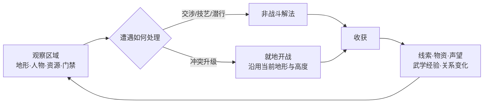
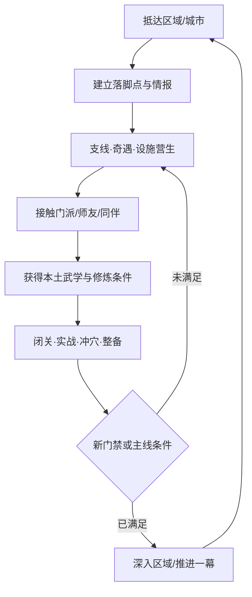
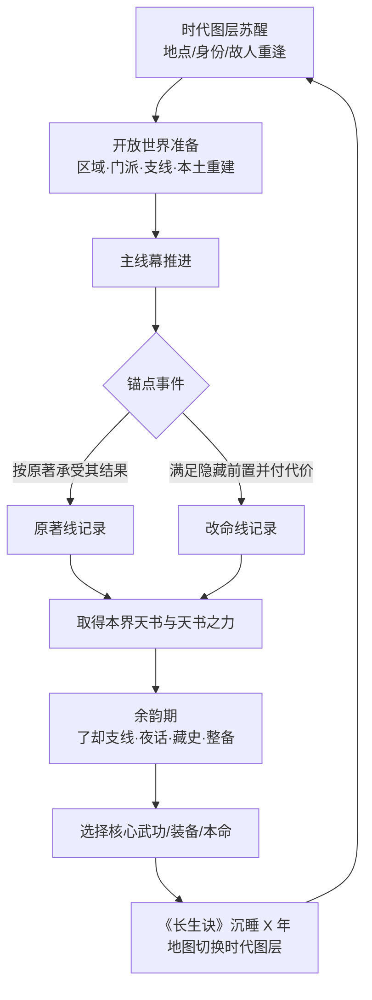
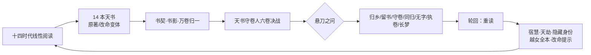
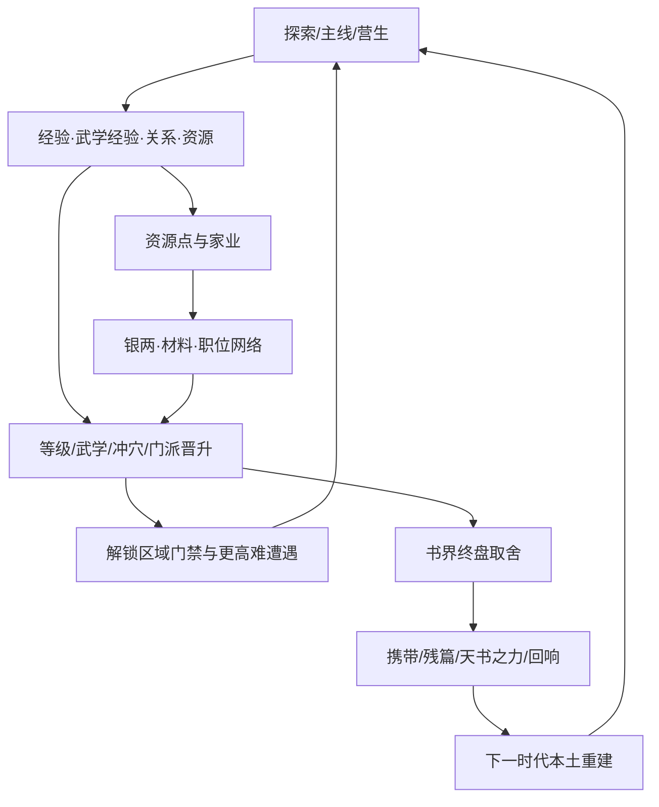

# 01 · 世界观与核心循环（Vision & Core Loop）

> **归属（基准 §18）**：世界观、主角、书灵、核心循环、体验支柱；本文另给十四书界的锚点 / 改命总览与序章《越女剑》的上游约束。
> **上游**：`00-canon.md`（唯一事实来源）；`decisions/author-requirements.md`（AR-03–AR-07、AR-09–AR-11）；`decisions/author-decisions.md`（P05、P13、P30、P35、P42、P48、P52–P55）；`decisions/rulings-v1.md`（图鉴分工、重命名）；`design/02`（年代、境界、书眠与跨书连续性）；`design/03`（创角与 `OriginBonus` 预算）；`design/13`（天书之力、多周目、终局与结局）。
> **引用而不重定义**：年代 / 境界 / 《长生诀》书眠数据 → `design/02`；属性、创角点数、身份加成预算 → `design/03`；武学与序章招式数据 → `design/05`、图鉴；地图 / 旅行 → `design/11`；任务、正邪线与门派层级 → `design/12`、`design/story/NN`；冲穴 → `design/15`；资源、家业、城市营生与经济数值 → `design/16`；NPC、同伴、生卒年与跨书重逢 → `design/18`；天书之力、轮回、终局规则与结局判定 → `design/13`；各书界锚点的最终脚本 → `design/story/NN`、`design/chapters/NN` §5。
> **标注约定**：**（原创扩展）**＝原著没有的内容；**（待考）**＝原著事实尚需按三联 / 广州修订版逐字核对；**（待核实）**＝版本、价格、API、限额等技术事实尚未联网确认；**（待实测）**＝需要真机或真账号验证；**（大意）**＝转述而非引文；**【建议值】**＝依赖下游文档，本文先给可执行默认值并在文末登记。

---

## 0. 阅读指南与范围

本文回答五个上游问题：玩家是谁、为何进入书中、为何只能循年代前行、每一层循环在做什么，以及十四部小说分别以哪些原著事件锚住。它不替下游写完整剧情，也不为天书之力重新定数值。

| 读者 | 先读 | 用途 |
|---|---|---|
| 全体策划 | §1–§3 | 统一产品承诺、世界观边界与主角定位 |
| 书界 / 剧情策划 | §4–§7 | 采用主角 / 书灵口径、锚点与改命总览 |
| 系统 / 开放世界策划 | §6 | 把战斗、探索、成长、家业放入同一闭环 |
| 关卡 / 新手引导 | §8 | 落地可跳过的《越女剑》序章 |
| 美术 / 文案 | §9 | 统一水墨工笔、文本与引用尺度 |
| 结局 / 多周目策划 | §10 | 对齐守卷人、归乡意义与“重读”框架 |

本文所有“城市”均使用事件发生时代的名称；今名、坐标、全局 `city_*` ID 与时代别名由 `design/11` / `design/19` 定稿。表中“幕位”是叙事功能位，不替代各 `design/story/NN` 的 8–14 幕编号。

---

## 1. 产品定位

### 1.1 一句话

一个现代读者被无字残卷卷入金庸十四部小说，以《长生诀》跨越七百年江湖；主角不替代任何原著人物，而以“变数”亲历锚点、背负取舍，最终决定是回到现实、留在书中，还是成为新的守卷者。**（原创扩展）**

### 1.2 电梯陈述

《金庸群侠传·天书录》是一款单人、线性串联十四书界的开放世界 RPG 与斜 45° 战棋。玩家在一张中国江湖大地图的十四个正篇时代图层中游历，另有可跳过的春秋越国教学图层：区域内探索会无缝就地开战，城市里可拜师、营生、经营家业，书界主线则围绕原著锚点推进。每取得一本天书，玩家要在余韵期告别当世、选择能带入下一时代的核心武功与装备，再借《长生诀》沉睡若干年；绝学会被后世天道压低，故人可能老去，也可能仍在人间等候重逢。十四次书界抉择最终化作书契与书影，决定天书守卷人一战，以及玩家如何理解“读完一本书”。

### 1.3 体验承诺

玩家每次打开游戏，应至少获得一种清晰满足：发现一个江湖去处、解决一场具有地形意义的遭遇、理解一个原著人物、推进一段武学 / 经脉 / 门派成长，或为下一次跨时代取舍做准备。系统很多，但所有系统都要回到同一句话：**在不能拥有全部的前提下，决定什么值得带走。**

### 1.4 类型边界

| 是什么 | 不是什么 |
|---|---|
| 十四书界按年代线性推进、每界可自由探索 | 可随意跳书或把十四部拆成互不相干的选关合集 |
| 原著人物仍是自己故事的行动者 | 玩家替换郭靖、杨过、张无忌等成为“真正主角” |
| 选择改变过程、代价、局部命运与回响 | 以现代知识碾压古人、无限改写历史的爽文模拟器 |
| 书界间有限继承并主动重建 | 一套毕业配装从天龙平推到雪山 |
| 单人本地优先体验 | MMO、抽卡、竞技排行或持续运营服务 |

---

## 2. 体验支柱

### 2.1 原著为锚，玩家为变数

**承诺**：熟悉原著者能认出人物、地点、冲突与命运；不熟悉者也能理解当下目标。玩家的价值不在“抢戏”，而在原著人物无法同时兼顾的缝隙里作选择。

**设计上如何体现**：

- 每界 3–6 个锚点必经，先让玩家亲历原著因果，再开放介入点。
- 主角可结义、同行、对抗、救援或旁观，但关键人物保有自己的动机与决定。
- 改命必须提前埋线、满足隐藏条件并支付代价；成功只写入本界结局、天书之力变体、后世回响与终局书契，下一书界仍从其原著锚点起步。
- 原著线不是“失败线”，而是同样完整、有独特能力与后日谈的选择。

**反例（我们不做什么）**：不让主角代替萧峰完成雁门关牺牲、不让主角抢走郭靖的成长与家国抉择，也不把“救下所有人”做成无条件的标准答案。

### 2.2 一张江湖，十四层时间

**承诺**：玩家不是去十四张互不相干的地图，而是在同一片山河上看门派兴亡、城名迁变、道路开合与故人老去。

**设计上如何体现**：

- 全作共用一张中国江湖大地图；书界是其时代图层。大地图负责导航与路线选择，区域场景负责可行走探索。
- 同一地理位置可在不同年代拥有不同城名、政权、入口、势力、NPC、门派、资源点与营生场所。
- 《长生诀》书眠不是换关 loading，而是明确地从当前时代图层沉入墨海，再在下一图层的具体地点苏醒。
- 古迹、器物、武学传承、史笺与健在同伴形成跨时代纵线；具体数据分别引用 `design/02`、`design/11`、`design/18`。

**反例（我们不做什么）**：不把汴梁、临安、大都、北京当作同一张贴图只换标题；不做第二套可自由行走的“世界大地图”。

### 2.3 得而复失，失而不空

**承诺**：跨书界会失去当世资源、身份与大量武功，但每次失去都留下知识、残篇、感悟、天书之力、关系回响或玩家自己的理解。

**设计上如何体现**：

- 书眠前完整展示“留下什么 / 带走什么 / 会被压到什么程度”，并允许在提交前撤回，流程见 `design/02` §4。
- 新时代先给压制，再给本土重建路径；强迫玩家重新观察门派、城市与人物，而非只比较面板数字。
- 残篇、积蕴、修为余韵、天书之力和终局万卷归一分别兑现“没有白练”；精确规则归 `design/02`、`design/13`。
- 健在同伴可在后世重逢再加入，但需要重新找到、重新邀请；能力保存与新增规则归 `design/18`。

**反例（我们不做什么）**：不暗扣装备、不在确认后才告诉玩家压制结果，也不允许靠永久叠加把中低武书界变成无意义的割草场。

### 2.4 江湖由关系与营生构成

**承诺**：武林不是战斗节点的走廊。拜师、同伴、资源点、行当、城市与家业共同构成玩家在每个时代的生活。

**设计上如何体现**：

- 区域探索把支线、门派、资源与战斗放在同一空间；解决方式可包含交涉、医毒、机关、潜行与武斗。
- 门派身份形成“入门—修炼—任职—领取月钱 / 资源—承担职责”的长循环；结构归 `design/12`。
- 资源点与家丁把探索成果变成周期产出；赌场、镖局、山庄让武艺可换成消息、职位与收入；规则归 `design/16`。
- 同伴不是战斗皮肤：生卒年、招募门槛、跨时代能力变化与重逢都由 `design/18` 管理。

**反例（我们不做什么）**：不让城市只剩商店菜单，不把门派当作一次性技能商人，不用无尽日常任务拖长时数。

### 2.5 化险为夷，但选择有重量

**承诺**：玩家可以靠准备、观察、地形与关系逆转困局；失败应产生学习，不以随机惩罚或信息隐瞒制造“难”。

**设计上如何体现**：

- 就地开战保留探索所得的高度、掩体、火势与路线信息；看懂场景就是战前准备。
- 福缘“化险为夷”、书灵护佑、失败兜底和难度设置各有边界，精确规则引用 `design/03`、`design/13`。
- 改命条件藏在人物与世界中，但重要遗憾会有书灵分层提示；多周目再逐渐揭示结构。
- 不可逆选择在发生前说明代价；真正的重量来自“知道后仍然选择”。

**反例（我们不做什么）**：不靠突然秒杀、永久损失未提示、读攻略才能避开的假选项，或强迫玩家选唯一“善良答案”。

---

## 3. 世界观

### 3.1 现代世界：书页尚在，读者已远

现代世界采用与玩家相近的当代日常，不指定城市、年份或家庭结构，以免把可选身份变成互相矛盾的传记。开场发生在一个寻常秋雨夜：主角整理旧书、电子笔记与待处理物件时，发现一本没有书名、没有版权页、正文只有水痕般墨迹的线装残卷。**（原创扩展）**

这不是“金庸原稿”，也不声称改变现实中的作品。它是书界与读者之间的空白容器，封面只在光下显出“天书录”三字。主角翻到第一张图——越女持竹、白猿回首——墨迹从纸上漫出，现实中的灯、桌、雨声依次被抽成线稿，主角坠入春秋越地。**（原创扩展）**

现代段落只承担三件事：

1. 建立“普通人带着有限现代经验进入江湖”，而非天选血统。
2. 让现代身份合理进入 `OriginBonus`，但不直接赠送古代武学。
3. 为归乡结局建立可回望的日常：回去不是放弃江湖，而是把十四次选择带回自己的生活。

### 3.2 为什么是“天书”

“天书”不是从原著世界里本就存在的十五部秘典，而是书界对“被完整读过的一段命运”所留下的结晶。每一部小说有自己的主题与因果；当玩家亲历必要锚点并作出选择，散落在人物、地点与事件中的墨痕才凝成《天书·书界简称》。**（原创扩展）**

因此：

- 天书只能在锚点成立后现世，不能偷取或提前刷出。
- 原著线与改命线都能成书；前者承认故事原本的重量，后者承担改写的代价。
- 天书之力不是“通关掉落的随机神功”，而是该书主题在玩法中的长期回声；关键词与效果引用基准 §15、`design/13` §4。
- 十四本天书是十四次阅读，不存在第十五本实体天书；真结局“无字”是共同写下的空白，不违反该计数。

### 3.3 为什么必须按年代前行

书界并非并排的门，而是同一张江湖大地图上沉积的时代图层。残卷能沿墨迹干涸的方向向后翻，却不能逆着既成字迹回卷：主角只能从更早的故事走向更晚的故事。**（原创扩展）**

年代顺序带来四个设计价值：

| 价值 | 落地 |
|---|---|
| 地理记忆 | 玩家在同一山河上识别华山、少林、襄阳、北京等地点的时代变迁 |
| 传承可见 | 武学、门派、器物与家国叙事从前代流向后代 |
| 故人有时 | 一次书眠可能只过七年，也可能过百余年；重逢与失去由时间而非关卡重置解释 |
| 武运曲线 | 武林由高武巅峰走向衰败、谷底与乾隆朝小幅复兴，天道压制成为世界事实而非纯数值惩罚 |

具体顺序、游戏定年、“一梦 N 年”台词与境界参数只引用 `design/02` §1，不在本文重算。

### 3.4 一张中国江湖大地图与时代图层

全作地理是“一张底图、十四层正篇史”；序章另加载同一底图上的春秋越国教学层，不计入十四天书。大地图导航显示当时可知的城市、驿路、水路、门派驻地和图外专线；选择目的地后沿路线旅行，途中可触发遭遇、驿站或货船事件，进入区域后才切换为可行走的 2.5D 场景。

时代图层必须同时控制：

| 层面 | 示例 |
|---|---|
| 地名与地位 | 北宋汴梁、南宋临安、元代大都、明清北京分别显示当时名称与政治地位 |
| 路线与入口 | 战乱、关隘、河道、海船与驿站改变可达性 |
| 势力与人物 | 同一地点随朝代更换官府、门派、帮会、商号与可招募 NPC |
| 资源与营生 | 资源点归属、赌场 / 镖局 / 山庄、家丁与职位随图层重置 |
| 场景痕迹 | 古迹延续、建筑兴废、玩家藏史与跨书回响提供少量可见痕迹 |

城市、真实坐标、全局区域 ID 和图层状态归 `design/11` / `design/19`；本文 §7 只给锚点发生城市。若原著事件不在城内，填写最近的当时城市或“图外节点 / 地貌”，避免伪造具体城址。

### 3.5 书界为何“自愈”

书界不是可被一次选择永久重写的真实历史，而是以原著为骨架、以玩家经历为批注的叙事世界。进入后世时，原著锚点所需的人、物、门派仍会归位；前界改变通过传闻、遗物、好感、支线、图鉴与台词回响保留。此原则即 `design/02` §6 的“史自愈”。**（原创扩展）**

它解决两类悖论：

- 玩家带走打狗棒，不会令后世丐帮失去原著中的打狗棒；携带物是“异时之器”，与本时原生器物可器鸣但不能同时装备同 ID。
- 玩家救下一人，不会使后世所有相关锚点失效；若此人仍在世，可按 AR-09 / `design/18` 重逢，若已故则以传承、后人或回响留下痕迹。

史自愈不是否定玩家选择。它明确把改命的价值从“控制整条历史”移到“让一个具体的人有过另一种后来”，并在终局将这些后来结算为书契。

### 3.6 《长生诀》与书眠的叙事解释

序章终点，书灵以残卷墨意在主角气海中写下《长生诀》的第一行。这里的《长生诀》是穿书与沉睡机制名，不是可在武学栏装配、升级或用于战斗的秘籍。**（原创扩展）**

下列叙事规则是对 AR-09 机制的解释，均属**（原创扩展）**；年份和结算数据仍以 `design/02` 为准：

1. 主角在一个书界醒来后正常生活、受伤与成长；只有进入书眠才停止衰老。
2. 取得天书后，《长生诀》打开“余韵期”；主角可立即离开，也可了却尘缘。
3. 正式入眠时，肉身与意识一同沉入残卷，不留在当世；因此不存在无人照料的沉睡躯体。
4. 沉睡年数 `X = 下一书界入场年 − 当前书界出场年`，不确定年代用约数和模糊台词；精确表见 `design/02` §1.5。
5. 苏醒即切换统一大地图的时代图层，并在下一书界指定地点落墨成形。
6. 主角不因沉睡变老；健在同伴则真实经历这些年。能否重逢、能力如何续接，归 `design/18`。

### 3.7 书眠过场：时代在一口气间翻页

书眠确认前的选择、警告与存档完整流程引用 `design/02` §4；本文只定叙事镜头。正篇相邻书界 `ch01→ch02` 至 `ch13→ch14` 共 13 段常规过场，每段目标 24 秒、范围 20–30 秒；首次前 10 秒不可跳，重播可立即跳过（作者决定 P48）。逻辑 ID 采用 `vid_sleep_NN_MM`，旧 `vid_booksleep_*` 仅视作待迁移名。序章 `ch00→ch01` 的零槽位教学转场与雪山 `ch14→ch15_guimeng` 的“归梦”使用各自序章 / 终局资源，不占这 13 个 ID，但沿用下表的镜头语法。

| 时段 | 画面与声音 | 信息 |
|---|---|---|
| 0–4 秒 | 书灵合拢本界长卷，天书化为一枚亮起的书脊；环境声突然抽远 | 告别当前时代 |
| 4–9 秒 | 主角盘坐，墨线沿经脉游走；携带武学 / 装备化为少量印记，其余散成残篇 | 《长生诀》入眠与取舍 |
| 9–16 秒 | 中国大地图如宣纸铺开；当前时代城名淡去，驿路改道，江河与城郭逐层重绘 | 同一底图切换时代图层 |
| 16–21 秒 | 代表年代流逝的物候与人事剪影掠过；字幕“一梦 N 年”或“约莫百余年” | 年代差与历史流动 |
| 21–24 秒 | 墨滴落在下一书界苏醒地点，变为主角眼睛 / 水面 / 雪地上的一点实景 | 明确苏醒地点 |

若有健在旧伴，最后一帧可先闪过其衰老后的剪影，再在世界内以重逢任务兑现；若无人健在，则不做“亡灵注视”式煽情。改命线可替换中段一幅剪影，但不得暗示后世原著起点被重写。

### 3.8 终局与回到现实的意义

本文工作稿默认天书守卷人 `npc_shoujuanren` 是前代穿书者：他曾走完十四书界，却把“守住故事”误解成“阻止任何新的读法”，于是留在现实与书海之间，逐渐被白袍与十四卷书抹去面目。**（原创扩展）** 作者若不另行否决，即按此交下游实现。

他不是作者、版权人或原著人物的化身，也不宣称有权裁定唯一正解。他是主角的未来镜像：当一个读者只剩下收集、校正和控制，便可能忘记自己为何被故事打动。战斗具体六卷、数值、书契与结局判定归 `design/13` §7；本文只定三层意义：

- **战斗意义**：十四界积累不是仓库数字，而在终局成为残篇回归、书影援阵、书契技与对守卷人的理解。
- **选择意义**：雪山“劈 / 不劈 / 两全”是主角如何处理现实与书中羁绊的预演；终局仍可回心，不以一次选择锁死人格。
- **归乡意义**：回到现实并不抹去旅程。现实原文可以一字未改，主角改变的是读法、行动与对他人命运的耐心；高改命结局留下的页边批注是“被故事改变过”的可见证据。

守卷人战后，他可在“守卷 / 同归 / 无字”等结局中被接替或释放；精确条件与演出仍以 `design/13` §7.10–§7.11 为准。

### 3.9 与原著的叙事契约

| 基准 §16 原则 | 本文落地 |
|---|---|
| 锚点不可抹除 | §7 每界列 3–6 个必经事件；取得天书前必须完成本界的必需锚点集合 |
| 过程可介入 | 每个锚点列玩家可做的事，尽量安排在原著主角视野之外或需要额外人手之处 |
| 改命为隐藏高难分支 | 只给遗憾型锚点；要求前置线索、关系 / 技艺 / 战力与明确代价 |
| 主角是变数而非替身 | §4.5 给叙事镜头语法；原著主角保留决定性动作 |
| 原创扩展须标注 | 世界观机制、守卷人、具体改命方案均明确标注 |
| 三联 / 广州修订版为基线 | 无把握之处写（待考），不编引文、回目号或招名；§13 汇总考据项 |

---

## 4. 主角

### 4.1 角色核心：有经验的普通人，不是全知读者

主角默认 22–35 岁**【建议值】**，受过现代基础教育，会使用手机与网络，但不自动拥有百科全书般的史学、医学或工程知识。现代身份决定其擅长观察什么，不决定其“天命”。姓名、性别、外观、代词与声音表现由玩家选择；主角内容 ID 采用既有技术提议 `npc_zhujue`。

进入书界后，主角能听懂并说出符合时代的通行汉语，是残卷的最低限度译写；地方口音、民族语言、文言、公文与专业术语仍需口才、书画、学识或当地同伴帮助。**（原创扩展）** 这避免把语言障碍完全删掉，也避免开场因无法交流而停摆。

### 4.2 性别与呈现

作者决定 P05：**男女可选**。这是正式约束，不再保留“固定主角”的默认方案。

| 层面 | 规则 |
|---|---|
| 文本 | 使用玩家选定称谓与代词；公共叙事尽量用姓名 / “你”，不强行套固定性格 |
| 立绘 / 精灵 | 两套身体基型与主角立绘；十五套书界时代服装（春秋序章 + 十四正篇）各需男女适配，现代开场另备现代装；轻量网格变形方案引用 P55 |
| 时代服装 | 同一身份和装备效果一致，外观按时代、场合与性别适配，不以现代服装贯穿全作 |
| 门派 | 历史 / 原著性别门槛不静默取消；提供等价叙事入口。例如灵鹫宫：女性可入宫，男性走虚竹客卿线（P30） |
| 队友羁绊 | 友情、师徒、知己、亲情式羁绊全性别开放；情缘是否成立由人物取向与剧情配置决定，不默认所有 NPC 都可恋爱 |
| 数值 | 性别不改变七项先天、资质上限、伤害、成长速度或掉落；只影响合理的文本 / 门派 / 社会情境分支 |
| 记录 | 后世对主角的称呼由其当时公开身份与装束决定；跨书故人仍能识别其容貌与气息 |

### 4.3 首周目现代身份

身份在 `design/03` §2 创角之后叠加 `OriginBonus`。下列五项身份及其特殊观察角度均为**（原创扩展）**。每项均满足 D-25：先天净合计 ≤ +12、单项 ≤ +8；资质合计 ≤ +30、单项 ≤ +20；技艺合计 ≤ +40、单项 ≤ +25；`lore ≤ +10`；品德在 −20…+20。身份不赠武功、装备、等级或现金。

| ID / 身份 | 现代叙事 | `OriginBonus` | 预算核算 | 在书界中的可见优势 |
|---|---|---|---|---|
| `origin_yixuesheng` 医学生 | 接触基础解剖、急救与药理；懂得先观察症状再下判断 | `innate {wis:+4, con:-2}`；`ap {apFinger:+5}`；`arts {med:+20, antidote:+10}`；`flags [modernFirstAid]` | 先天 +2；资质 +5；技艺 +30 | 更早识别伤势与毒物，但古代药性、内功经脉仍须拜师学习 |
| `origin_huwai` 户外领队 | 熟悉路线规划、露营、绳结与风险预判 | `innate {con:+4, agi:+4, wil:+2}`；`ap {apLight:+15, apStaff:+5}`；`arts {formation:+10}`；`flags [modernNavigation]` | 先天 +10；资质 +20；技艺 +10 | 旅行与险地对话多一条判断，不直接越过轻功门禁 |
| `origin_wenshiguan` 文史编辑 | 习惯查证版本、读文言与辨识地名制度 | `innate {wis:+6, cha:+2}`；`ap {apSword:+5}`；`arts {art:+15, speech:+10}`；`lore:+10`；`flags [readsClassical]` | 先天 +8；资质 +5；技艺 +25；常识 +10 | 更容易读懂碑刻、公文与旧称，但“读过小说”不等于知道所有真相 |
| `origin_gongchengshi` 工程师 | 善于拆解结构、估算受力、记录变量与复盘失败 | `innate {str:+3, wis:+5, luk:-1}`；`ap {apExotic:+10}`；`arts {forge:+20, formation:+15}`；`flags [structuralSense]` | 先天 +7；资质 +10；技艺 +35 | 机关、桥梁、器械与锻造检定更强，不制造超时代枪械或工业体系 |
| `origin_shejiren` 视觉设计师 | 对构图、色彩、动作轮廓与人的神态敏感 | `innate {agi:+3, wis:+3, cha:+4}`；`ap {apSword:+10, apHidden:+5}`；`arts {art:+20, music:+10}`；`flags [visualMemory]` | 先天 +10；资质 +15；技艺 +30 | 更容易识图、辨招与发现画中线索，不等于能凭观看复制高阶武学 |

现代知识只能提供“新的观察角度”，不能形成技术殖民：医学身份不能无菌制造抗生素，工程师不能在手工业条件下量产现代武器，文史编辑也不能用记忆直接定位所有秘笈。任何超时代尝试必须受材料、工艺、社会信任与任务条件约束。

### 4.4 轮回隐藏身份：说书人

见过 3 种结局后解锁 `origin_shuoshu`“说书人”**（原创扩展）**。为与 `design/13` §6.4.2 已给接口一致：`lore +15`、`speech +15`、书灵好感初值 −10；不再追加先天或资质。其 `lore +15` 是轮回解锁特例，超出首周目身份 `lore ≤ +10` 的 D-25 预算，因此数据校验必须标 `unlock: endings>=3`，不得出现在首周目身份池。书灵的负好感以吐槽“你又要抢在故事前头说结局”表现，不作道德训诫（P13）。

### 4.5 “变数而非替身”的镜头语法

| 场景 | 原著人物做什么 | 主角可做什么 | 禁止写法 |
|---|---|---|---|
| 初遇 | 原著人物先以自身目标行动 | 被误会、救援、同行、交易或挑战，从侧面进入事件 | 原著人物立刻认定主角是救世主并交出全部决策权 |
| 名场面 | 保留原著人物的关键台词与决定性动作（以大意转述） | 处理外围敌人、护送旁人、争取时间、提供证据或选择是否出手 | 把原著人物的招牌行动改成主角完成，再让其旁观称赞 |
| 分歧 | 原著人物有可理解的立场 | 用关系、证据、技艺、牺牲或战力打开另一条可能 | 一个高口才检定让人物瞬间违背一生信念 |
| 改命 | 被救者与施救者共同承担后果 | 完成跨幕前置、在关键处补上原著中缺失的一环 | 临场按一个“救人”按钮，无前置、无代价、无后续 |
| 收束 | 原著主角仍完成其主题动作 | 见证、告别、选择天书线，并留下批注式回响 | 主角被所有人一致认定为更高层级的“真正英雄” |

### 4.6 十四书界心境弧线

| 阶段 | 书界 | 主角起始误解 | 经历后的变化 | 外显行为 |
|---|---|---|---|---|
| 误入与求生 | 序章、天龙 | 把一切当成自己熟悉的故事，认为知道情节就是掌控 | 看见“角色”是会疼、会拒绝、会为自己选择的人 | 少说结局，多问当事人想要什么 |
| 学侠与承担 | 射雕、神雕 | 以为武功越高，能救的人越多 | 理解家国与情感都要求长期承担，而非一次胜负 | 主动守城、护送、兑现关系承诺 |
| 权力与自由 | 倚天、笑傲 | 以为掌握组织或绝学就能解决纷争 | 看见号令会异化，自在也可能以他人代价换来 | 在统御、退让与承担后果之间作选择 |
| 识字与识人 | 侠客、碧血 | 以为理解文本与大势就理解人心 | 学会在身份、忠义、奇诡与乱世宣传之外辨真意 | 更重证据与具体的人，少替时代下结论 |
| 低谷与照心 | 鹿鼎、连城 | 武功被压后产生“我已退步”的挫败 | 发现机变、信任与辨心能解决蛮力无能为力之事 | 接受重建，愿意求助并识破贪欲 |
| 放下与仁 | 白马、鸳鸯 | 想把每段遗憾都修成自己期待的圆满 | 接受“喜欢、得到、正确”并非一回事；克制也是行动 | 能不杀则不杀，能放下则不占有 |
| 恩仇与诺言 | 书剑、飞狐 | 以为立场正确足以抵偿手段 | 明白恩仇与承诺最终落在具体生命上 | 对承诺负责，不以大义掩盖伤害 |
| 抉择与归读 | 雪山、终局 | 仍想找到一个兼得所有的标准答案 | 接受选择会留下空白；真正自由是承担自己写下的那一笔 | 劈、不劈或化刀为笔，并承认其代价 |

这条弧线不强制主角成为善人。邪线与执卷结局仍可成立，但每一步都要让玩家理解自己牺牲了谁、保存了什么，避免“邪线 = 无缘由地作恶”。

---

## 5. 书灵

### 5.1 身份与形态

书灵内容 ID 确认采用 `npc_shuling`。它是天书录残卷在历代阅读、遗忘与重读中积成的器灵，初登场没有姓名，只是一团从页缝探出的淡墨：时而像一尾游鱼，时而像折角纸页，情绪激烈时才勾出近似人的眉眼与袖影。**（原创扩展）**

作者决定 P54：书灵为**抽象墨影 + 对话立绘框架**，非战斗单位；P55 的轻量网格变形只影响表现方式，不改变其设定。它不具备替玩家战斗、拿取物品、踩机关或占据六人队伍名额的能力。

书灵自称“无名”。本文工作稿暂定真名为 **“余墨”** **（原创扩展）**：意为每本书读完后，仍留在读者心里的那一点墨；作者若不另行否决，即按此交下游实现。该名直到 `end_tonggui`“同归”结局由主角写下时首次完整揭示；此前系统、字幕与 NPC 一律称“书灵”，避免提前泄底。

### 5.2 人格

| 维度 | 表现 | 边界 |
|---|---|---|
| 克制 | 少评判人物，先描述事实与代价 | 不做冷漠的系统播报器 |
| 好奇 | 对玩家偏离“旧墨”的选择有真实兴趣 | 不装作全知全能 |
| 护书 | 反对无代价撕毁因果，也珍惜书中人的自主 | 不把原著结局奉为不可质疑的神谕 |
| 干涩幽默 | 会吐槽贪心、剧透、背包与重复犯错 | 不玩破坏时代气氛的网络热梗 |
| 慢热 | 从“记录对象”到同行者，再到愿意被玩家写下名字 | 不在序章就无条件信任或依恋主角 |

### 5.3 功能边界

| 功能 | 书灵负责 | 书灵不负责 |
|---|---|---|
| 引导 | 序章教学、首次系统提示、挫败后的方向建议 | 自动替玩家配最优解或持续箭头牵引 |
| 旁白 | 年代、地点、已知人物关系的简短转场；原著内容用大意 | 冒充全知叙述者揭露玩家尚未发现的阴谋 |
| 书眠仪式 | 回望本界、解释携带后果、主持《长生诀》入眠与苏醒 | 越过确认直接扣除资源；替玩家作携带选择 |
| 图鉴解说 | 区分“亲历 / 听闻 / 推测 / 待考”，讲清武学与器物来源 | 编造回目、引文、招式名或把玩法扩展说成原著事实 |
| 天书讲经 | 取得天书后解释“本义 + 当前变体”，数值卡引用 `design/13` | 自己决定玩家得到哪种变体 |
| 遗珠提示 | 临近书眠时提示仍有未了支线或隐藏门禁存在 | 直接给出隐藏宝箱坐标（P52） |
| 关系互动 | 夜话、小请求、对极端行为表达态度 | 以好感奖励玩家“听话”；采纳自动配装不加好感 |

### 5.4 关系演变

| 阶段 | 书界 | 书灵称呼 / 态度 | 关键关系事件 |
|---|---|---|---|
| 记档 | 序章—天龙 | “执卷者”；谨慎、程序化 | 它承认自己也不知道残卷为何选中主角 |
| 同行 | 射雕—倚天 | 逐渐直呼姓名 | 第一次看见主角明知无法改变后世起点仍愿救一个人 |
| 争执 | 笑傲—碧血 | 会质疑玩家把收集当成目的 | 天道压制与残篇增多，双方争论“带走”是否等于“拥有” |
| 知己或疏离 | 鹿鼎—鸳鸯 | 按好感出现坦白 / 沉默分支 | 书灵承认它害怕读者只想夺卷，也害怕书永远无人改读 |
| 共写 | 书剑—雪山 | “同行者”；不再只作旁白 | 主角可反问书灵想要怎样的结局，它第一次回答“我也不知道” |
| 归宿 | 终局 | 真名“余墨”可被写下 | 关系进入归乡送别、留书相伴、同归、无字或被封等结局 |

书灵好感的数值来源、0–100 范围与结局阈值当前由 `design/13` §7.13 给出【建议值】；本文确认其叙事原则：选择原著线不扣好感，采纳推荐不加好感，改命加成来自玩家愿意承担额外代价，而非书灵偏爱“改写”。

### 5.5 台词风格样例

以下均为原创示例，不是原著引文：

1. 初见：“别急着问这是哪一页。你先把竹枝握稳。”
2. 解释锚点：“旧墨会走到这里。你能改的是人怎么走，不是把路从纸上撕掉。”
3. 玩家执意剧透：“你知道结局。很好。可他还不知道——也未必肯照你的结局活。”
4. 书眠前：“能带走的已经列在这里；不能带走的，也不会等于没有发生。”
5. 高武转中武：“不是你忽然变弱。是这一页的天地，容不下上一页那么重的笔。”
6. 提示遗憾：“此处有憾。若你愿多绕一段路，也许能让它少一笔。”
7. 故人重逢：“你睡了七十七年。他没有。开口以前，先看看他的白发。”
8. 取得天书：“书已成。它记下的不是胜负，是你在胜负之间选了什么。”
9. 对说书人身份：“又要替别人把结局先说完？这回至少等他们把话讲完。”
10. 终局前：“十四本都在。现在要回答的，不是你读过什么——是这些书把你读成了谁。”

---

## 6. 核心循环

### 6.1 四层循环总览

除基准固定的“每书界 8–15 小时”外，本节的分钟级 / 小时级节奏与书界内占比均为**【建议值】**，供 `design/11`、`design/12` 与 `design/14` 校准；统一登记见 §13.1 D01-09。

| 层级 | 单次节奏 | 核心问题 | 主要产出 |
|---|---:|---|---|
| 分钟级 | 3–12 分钟 | 前方有什么，我如何处理？ | 路线信息、战利品、人物线索、短期资源 |
| 小时级 | 45–120 分钟 | 我在这个区域建立什么关系与能力？ | 支线阶段、门派进度、本土武学、资源点 / 职位 |
| 书界级 | 8–15 小时 | 我如何亲历这部书，并为下一时代取舍？ | 天书、天书之力、锚点结局、残篇 / 携带方案 |
| 全作级 | 主线约 112–210 小时 | 十四次选择最终把我变成谁？ | 书契、终局结局、轮回与宿慧 |

全作主线时长直接由 `14 × (8–15h) = 112–210h` 推出；序章 ≤ 45 分钟另计。支线全清与重复挑战不计入该范围。

### 6.2 分钟级：探索 → 遭遇 → 就地开战 → 收获

**节奏**：

- 30–90 秒观察：读取地形、敌我、天气、门禁与可交互物。
- 1–4 分钟接触：对话、潜行、机关或战前布置。
- 2–8 分钟战斗：直接在当前场景六角格上展开；精确战斗规则归 `design/09`。
- 20–60 秒结算：战利品不是唯一收获，还应包含线索、人物态度、地图知识或资源点控制权。

目标是普通遭遇 3–8 分钟、有剧情或精英遭遇 8–12 分钟；Boss 例外引用基准与 `design/09`。区域中至少三分之一的普通冲突应存在不战或缩短战斗的准备路径**【建议值】**，由 `design/11/12` 定稿。

### 6.3 小时级：区域 → 支线 → 门派 → 修炼

**节奏**：一个区域会话约 45–90 分钟；大型城市 / 门派段约 90–120 分钟。理想结构是“进入—认识—介入—成长—回访”：第一次看见门禁或矛盾，完成一组支线 / 门派任务后获得本土能力，再返回打开新路径或改变人物关系。

**冲穴的位置（AR-03）**：战斗、内功修炼与师父指点产出冲穴条件；玩家在客栈、门派静室或安全据点分配内劲，通脉后反哺探索与战斗。穴道、经脉、小 / 大周天、十二经周流与九转的定义和数值只见 `design/15`，本文不重定义。

**资源与家业的位置（AR-05）**：探索发现资源点，任务 / 战斗 / 购买取得控制权，家丁负责周期经营，产出再进入锻造、炼丹、烹饪、门派贡献和交易。资源点、家丁与库存的跨书规则只见 `design/16`；它们服务区域回访，不应成为离线数值挂机主循环。

**城市营生的位置（AR-06）**：城市里的赌场提供消息与风险小游戏，镖局提供路线型委托，山庄提供护院、教头与客卿关系；行脚 / 教头 / 客卿把武艺转化为收入、声望、资源和人脉。客卿唯一等规则只引用 `design/16`，任务结构引用 `design/12`。

**门派层级的位置（AR-07）**：入门给稳定师承与基础武学，晋升逐步开放秘籍、职责、月钱、资源与经营权；抽象五级与门派特色称谓归 `design/12` / `design/17`，月钱与资源档位归 `design/16`。门派循环必须与主线交叉，不能成为脱离时代冲突的独立签到系统。

### 6.4 书界级：主线幕 → 锚点 → 天书 → 《长生诀》书眠

**节奏预算**：每书界 8–15 小时，采用下式核算而非凭空填时长：

`T_chapter = T_main + T_open + T_growth + T_afterglow`

| 模块 | 建议占比 | 8 小时书界 | 15 小时书界 | 说明 |
|---|---:|---:|---:|---|
| 主线幕与锚点 | 45% | 3.6h | 6.75h | 6–10 幕，短篇取下限、大部头取上限 |
| 区域 / 支线 / 门派 | 35% | 2.8h | 5.25h | 支线不要求全清；至少支撑两种成长路径 |
| 修炼 / 冲穴 / 家业整备 | 15% | 1.2h | 2.25h | 多与探索交叠，不做纯等待 |
| 余韵与书眠 | 5% | 0.4h=24min | 0.75h=45min | 含告别、夜话、携带决策；24 秒过场只是其中一环 |
| **合计** | **100%** | **8h** | **15h** | 与基准 §17 对齐 |

书界开场的“身份”是当世落点 / 社会关系，不等于 §4.3 的现代身份；它由 chapters/ §2 定义。上一界同伴若仍健在，重逢任务应放在开场 60–120 分钟内可发现**【建议值】**，避免跨书承诺迟迟不兑现，最终时机由 `design/18` 和各书界文档确定。

### 6.5 全作级：十四书界 → 天书之力 → 终局 → 多周目

**首周目节奏**：完整序章按 0.75h 上限计；十四书界主线约 112–210h；终局六卷与结局建议 1.5–3h**【建议值】**，故完整体验的规划包络为 `0.75 + 112 + 1.5 = 114.25h` 至 `0.75 + 210 + 3 = 213.75h`。跳过序章可再减最多 0.75h。该估算不是承诺全清时长；精确内容预算由 `design/11` 与各章节定稿。

**多周目节奏**：完成任一结局后解锁“重读”。书灵记得，书中人物不记得；玩家用宿慧、天劫、隐藏身份、改命提示与《越女剑·全本》重构路径，继承边界与数值引用 `design/13` §6。首轮的未知感与后续轮回的结构洞察必须并存：首轮只说“此处有憾”，轮回才逐层显示条件。

### 6.6 成长闭环：每个系统为何存在

闭环的三条护栏：

1. **每项成长至少打开一种新行为**，不只加数字。例如轻功开路线，口才免战，门派职级开传承，冲穴改变配装。
2. **每项长期积累都接受时代重解释**。武功会压制，门派会兴亡，资源点会重置；学识、选择与天书主题才是最稳定的“自己”。
3. **不重定义下游规则**。属性公式见 03，武学见 05，战斗见 09，地图见 11，门派任务见 12，冲穴见 15，家业见 16，同伴见 18。

---

## 7. 十四部锚点 / 改命总览

### 7.1 使用规则

1. 下表是十四部书界文档共同上游：每界 3–6 个锚点，名称可微调，但不可无说明删除。
2. “必需”表示天书现世的叙事前提；并非要求玩家原样促成惨剧，而是必须亲历、查清或处理该事件。
3. “遗憾型”标记 `★`，提供改命线。本文每界指定一个主改命锚点，与 `design/13` §4.4 对齐；其他悲剧可作为支线介入，不自动产生第二个天书变体。
4. 正邪主线可以从不同立场经过同一锚点。锚点是事件，不是“正派专属任务”。
5. 城市采用当时名称；跨区域或无可靠城址的事件写地貌 / 图外节点，并标待考。
6. 具体触发器、任务旗标、战斗、奖励、可招募结果与代价由 `design/story/NN`、`design/chapters/NN` §5、`design/18` 定稿。
7. 下表所有“玩家可介入点”与主改命触发 / 代价方案均为**（原创扩展）**；“原著中的位置”只作大意索引，不代替逐回考据。

### 7.2 天龙八部 `ch01_tianlong`

| 幕位 | 锚点事件 | 发生城市 / 地貌（当时名） | 原著中的位置 | 玩家可介入点 | 类型 |
|---|---|---|---|---|---|
| 前段 | 无量山奇遇与段誉入江湖 | 大理国无量山一带 | 段誉出走后的开篇线 | 探索琅嬛福地外围、救援同行者；不替段誉取得其核心奇遇 | 必需 |
| 中前 | 杏子林身世揭露 | 江南东路无锡县杏子林**（具体方位待考）** | 萧峰被揭契丹身世、丐帮生变 | 搜集外围证词、选择公开顺序、保护无辜帮众；萧峰自行面对身份 | 必需 |
| 中段 | 聚贤庄大战 | 河南聚贤庄**（待考具体州县）** | 群雄围攻萧峰 | 可助群雄、助萧峰或救治伤者；即使倒戈，黑衣人仍按作者决定 P42 救走萧峰 | 必需 |
| 后段 | 少室山群雄会 | 河南府登封·少林寺 | 多线人物与身世集中揭晓 | 处理外围高手 / 伤者、推动证据现世；不替原著人物完成身世对质 | 必需 |
| 终段 | ★ 雁门关止战 | 雁门关 | 萧峰迫辽帝立誓止战并自尽 | 原著线见证其舍身；改命线提前联合宋辽两侧证人 / 人脉，提供无需以死立信的退兵约束**（原创扩展）** | 遗憾型·天书现世 |

**主改命触发概述**：必须完成跨势力救援、保全关键证人、萧峰高羁绊并在关前放弃一项可显著增强自身的利益**【建议值】**；代价是失去该界一项独占高阶奖励或关键势力声望，不能只靠终战胜利。结果只改变萧峰后来、天书变体与后世传说，不改变射雕起点。

**天书主题**：众生；原著 / 改命变体效果只见 `design/13` §4.3 的 `tsp_01_canon` / `tsp_01_fate`。

### 7.3 射雕英雄传 `ch02_shediao`

| 幕位 | 锚点事件 | 发生城市 / 地貌（当时名） | 原著中的位置 | 玩家可介入点 | 类型 |
|---|---|---|---|---|---|
| 前史 / 前段 | 牛家村之变与十八年之约 | 临安府牛家村 | 郭杨两家离散、江南七怪与丘处机立约 | 以后来者身份查证旧案、保护相关遗物；不可提前抹除郭靖成长前提 | 必需 |
| 中前 | 赵王府群雄交错 | 金中都（燕京） | 郭靖黄蓉入赵王府，多方人物相逢 | 潜入、营救、选边与取得证据；郭靖 / 黄蓉保持主导 | 必需 |
| 中段 | 君山丐帮大会 | 岳州君山 | 黄蓉接掌丐帮、杨康阴谋推进 | 查明帮内线索、参与大会外围战与门派抉择 | 必需 |
| 中后 | ★ 桃花岛冤案 | 桃花岛 | 江南七怪遭害，现场被嫁祸黄药师 | 原著线追查真相；改命线提前识破调虎离山与毒手，分路救下五人**（原创扩展）** | 遗憾型 |
| 后段 | 华山论剑与“英雄”之问 | 华山；蒙古草原 / 西征线 | 武学会聚与郭靖对英雄、家国的最终理解 | 可参与外围比试、处理旧怨，并见证郭靖作出自己的答案 | 必需·天书现世 |

**主改命触发概述**：需在多幕前找到伪证矛盾、保留至少两名可分头救援的同伴并放弃追逐一条天级线索**【建议值】**；代价是桃花岛 / 欧阳锋相关路线出现敌对或关闭部分奖励。被救五人为朱聪、韩宝驹、南希仁、全金发、韩小莹；张阿生早年已死，不纳入本改命。

**天书主题**：侠之大者；效果见 `design/13` §4.3 `tsp_02_*`。

### 7.4 神雕侠侣 `ch03_shendiao`

| 幕位 | 锚点事件 | 发生城市 / 地貌（当时名） | 原著中的位置 | 玩家可介入点 | 类型 |
|---|---|---|---|---|---|
| 前段 | 终南山与古墓相逢 | 京兆府终南山（南宋 / 蒙古势力交界语境，待考） | 杨过入全真、转入古墓 | 可介入门派冲突、保护旁人；不取代杨过与小龙女相识 | 必需 |
| 中前 | 大胜关英雄大会 | 襄阳府附近大胜关**（待考具体地望）** | 群雄抗蒙、杨过小龙女重逢 | 参与擂台与外围军情，选择门派 / 蒙古线立场 | 必需 |
| 中段 | 绝情谷情花与断肠崖之约 | 绝情谷、断肠崖**（地望待考）** | 情花毒、十六年之约 | 寻药、辨谎、处理谷中关系；关键情感决定仍归杨过 / 小龙女 | 必需 |
| 后段 | ★ 襄阳危城与撤离 | 襄阳府 | 蒙古攻宋、百姓与郭家命运延伸至后世 | 原著线守城；改命线建成隐蔽撤离通道并保全部分军民 / 传承**（原创扩展）** | 遗憾型 |
| 终段 | 蒙哥之死与华山重逢 | 襄阳城外；华山 | 杨过击毙蒙哥、群雄华山作别 | 主角守侧翼 / 护百姓，见证杨过完成决定性一击；华山处理告别与名号 | 必需·天书现世 |

**主改命触发概述**：需跨区域建设撤离网络、取得郭家信任、保存路线与物资，并牺牲个人家业 / 资源点收益**【建议值】**；改命不是令襄阳永久不破，而是让更多人和传承在后来城破时有路可走。具体是否涉及郭靖黄蓉生死须 `chapters/03` 谨慎定稿并与倚天回响一致。

**天书主题**：情；效果见 `design/13` §4.3 `tsp_03_*`。

### 7.5 倚天屠龙记 `ch04_yitian`

| 幕位 | 锚点事件 | 发生城市 / 地貌（当时名） | 原著中的位置 | 玩家可介入点 | 类型 |
|---|---|---|---|---|---|
| 序 / 前史 | ★ 武当百岁寿宴 | 武当山 | 张翠山、殷素素自尽，张无忌失怙 | 原著线见证；改命线先处理谢逊下落信息与六派压力，促成不以自尽封口的公开对质**（原创扩展）** | 遗憾型 |
| 中前 | 蝴蝶谷与孤儿群像 | 蝴蝶谷**（地望待考）** | 张无忌学医、胡青牛夫妇及诸孤儿线 | 护送、医毒、取舍；不能替代张无忌的医术成长 | 必需 |
| 中段 | 光明顶六大派围攻 | 昆仑山光明顶 | 张无忌化解六派与明教冲突、成为教主 | 玩家可从正 / 邪不同立场处理山道、密道和群战；张无忌仍完成核心调停 | 必需 |
| 中后 | 万安寺营救 | 大都 | 赵敏囚禁六大派 | 潜入、机关、交涉或强攻，决定救援次序与损失 | 必需 |
| 后段 | 灵蛇岛与屠狮大会 | 灵蛇岛（海上）；少林寺 | 谢逊、周芷若、波斯明教与群雄因果会聚 | 保护 / 揭露证据、应对多方势力；原著人物承担自己的情感选择 | 必需 |
| 终段 | 濠州权力交替 | 濠州 | 张无忌退出权力中心，朱元璋坐大 | 选择支持、揭露或离开，形成号令主题的结算 | 必需·天书现世 |

**主改命触发概述**：改命锚点位于序幕，结果以长期旗标保存；需完成序幕限定的证据、声望与多方承诺条件，代价是后续张无忌成长线、武当 / 天鹰教关系与部分任务必须重写，且张翠山夫妇在若干主线时段不可招募。细节交 `chapters/04` / `design/18`。

**天书主题**：号令；效果见 `design/13` §4.3 `tsp_04_*`。

### 7.6 笑傲江湖 `ch05_xiaoao`

| 幕位 | 锚点事件 | 发生城市 / 地貌（当时名） | 原著中的位置 | 玩家可介入点 | 类型 |
|---|---|---|---|---|---|
| 前段 | 福威镖局灭门与辟邪线索 | 福建福州府 | 林家遭难，辟邪剑谱之争开始 | 调查、救援次要人物、选择是否传播线索；不能阻断主线因果 | 必需 |
| 中前 | ★ 刘正风金盆洗手 | 湖广衡州府境内**（会场具体地望待考）** | 五岳剑派追杀刘正风、曲洋 | 原著线见证曲终；改命线提前转移家眷、破解围堵并为二人造出退路**（原创扩展）** | 遗憾型 |
| 中段 | 思过崖与五岳剑招 | 华山思过崖 | 令狐冲见石刻、得风清扬指点 | 探索石刻、选择传承态度；独孤九剑仍由令狐冲主线承接 | 必需 |
| 中后 | 梅庄与任我行脱困 | 杭州府梅庄 | 令狐冲入地牢，任我行重出江湖 | 棋书琴画检定、站队与善后 | 必需 |
| 终段 | 五岳并派与黑木崖 | 嵩山 / 黑木崖**（地望待考）** | 左冷禅、岳不群、东方不败与任我行线收束 | 参与投票 / 斗争、揭露阴谋，决定对权力的距离 | 必需·天书现世 |

**主改命触发概述**：需在金盆洗手前完成乐谱、退路、家眷与两派耳目四条线中的至少三条**【建议值】**；代价是放弃公开扬名和一项五岳阵营奖励，并承受正派声望损失。刘正风、曲洋活下来的后世影响只作回响，不把日月神教与五岳格局彻底改写。

**天书主题**：自在；效果见 `design/13` §4.3 `tsp_05_*`。

### 7.7 侠客行 `ch06_xiake`

| 幕位 | 锚点事件 | 发生城市 / 地貌（当时名） | 原著中的位置 | 玩家可介入点 | 类型 |
|---|---|---|---|---|---|
| 前段 | 玄铁令与错认身份 | 开封府 / 侯监集一带**（具体地名待考）** | 石破天卷入江湖、谢烟客线开启 | 查身份、护送与选择是否利用误认；不替石破天解开自身来历 | 必需 |
| 中前 | 长乐帮帮主之局 | 长乐帮总舵**（城市待考）** | 石破天被当作石中玉 | 可从帮会、雪山派等立场调查与周旋 | 必需 |
| 中段 | 雪山派内乱与双生错认 | 凌霄城**（地望待考）** | 石中玉 / 石破天身份矛盾集中爆发 | 保证证人、化解或激化门派冲突 | 必需 |
| 后段 | 腊八粥与赏善罚恶令 | 沿海赴岛港口；侠客岛（海上） | 各派赴约、真相显露 | 组织门派赴约、处理误解；腊八粥细节（待考） | 必需 |
| 终段 | ★ 石壁参悟与群雄归返 | 侠客岛石室 | 石破天由图形 / 蝌蚪文悟《太玄经》，群雄滞留 | 原著线完成参悟；改命线在不毁石壁的前提下使历年掌门带着各自所得归返**（原创扩展）** | 遗憾型·天书现世 |

**主改命触发概述**：玩家须同时取得龙木二岛主信任、证明邀约非索命、为各派整理互不相容的参悟心得，并接受“无法独占石壁”的代价**【建议值】**；改命会改变碧血中的武林衰败文本回响，但不改变其主线起点。

**天书主题**：无字；效果见 `design/13` §4.3 `tsp_06_*`。

### 7.8 碧血剑 `ch07_bixue`

| 幕位 | 锚点事件 | 发生城市 / 地貌（当时名） | 原著中的位置 | 玩家可介入点 | 类型 |
|---|---|---|---|---|---|
| 前段 | 华山学艺与金蛇遗藏 | 华山 | 袁承志成长、夏雪宜往事展开 | 解谜、查证旧怨、决定遗物如何交还 | 必需 |
| 中段 | 温家旧案与金蛇因果 | 浙江衢州府一带**（待考具体地望）** | 温家与夏雪宜 / 温仪旧事 | 救援、审理证词、处理复仇边界 | 必需 |
| 中后 | 闯王军中与军饷 / 宝藏 | 京畿—河南行军线**（待考）** | 袁承志助闯军、对军纪与大势失望 | 护送、筹饷、识破内斗，从正邪立场介入 | 必需 |
| 后段 | ★ 北京城破前后的李岩线 | 北京 | 李岩、红娘子受闯军内部猜忌而死（细节待考） | 改命线搜集军中证据、安排撤离并说服相关人物脱身**（原创扩展）** | 遗憾型 |
| 终段 | 长平公主与明亡 | 北京紫禁城 | 崇祯末局、阿九命运、袁承志最终失望 | 可救援、见证与选择对新旧势力态度；不可逆转明亡 | 必需·天书现世 |

**主改命触发概述**：需在闯军声望、民间声望和关键证据间维持平衡，并付出与新政权决裂、关闭部分军方资源 / 门派路线的代价**【建议值】**。李岩结局须先逐字核对原著，红娘子是否一并纳入由章节定稿。

**天书主题**：金蛇（奇诡）；效果见 `design/13` §4.3 `tsp_07_*`。

### 7.9 鹿鼎记 `ch08_luding`

| 幕位 | 锚点事件 | 发生城市 / 地貌（当时名） | 原著中的位置 | 玩家可介入点 | 类型 |
|---|---|---|---|---|---|
| 前段 | 宫中擒鳌拜 | 北京紫禁城 | 韦小宝入宫并参与擒鳌拜 | 潜入、误导侍卫、控制战场外围；不取代康熙与韦小宝 | 必需 |
| 中前 | 天地会结盟与双重身份 | 北京 / 直隶秘密据点**（待考）** | 韦小宝拜陈近南、周旋朝廷与会党 | 可加入不同阵营、送信或查内奸，承受身份冲突 | 必需 |
| 中段 | 神龙岛与四十二章经 | 神龙岛（海上） | 神龙教、洪安通与经书秘密 | 奉承 / 口才、潜入与局部峰值战；不把经书简化为纯藏宝图掉落 | 必需 |
| 中后 | 平西王与云南局势 | 云南府昆明 | 吴三桂、阿珂、九难等线汇合 | 交涉、营救、选择阵营与情报去向 | 必需 |
| 后段 | ★ 陈近南遇害 | 郑氏辖地**（具体地点与当时地名待考）** | 陈近南死于郑克塽之手 | 改命线提前揭露动机、保护会众并阻止刺杀**（原创扩展）** | 遗憾型 |
| 终段 | 雅克萨与退隐 | 雅克萨；扬州府 / 通吃岛 | 对俄战事与韦小宝最终脱离权力 | 处理外交 / 战斗外围，见证其选择退隐 | 必需·天书现世 |

**主改命触发概述**：需在清廷、天地会、郑氏三方保有可沟通人物并舍弃“一边通吃”的最高利益**【建议值】**；代价是至少一个主要势力敌对、部分官职 / 资源点清空。陈近南存活只写入其个人后来与会党回响，不改变后续书剑的历史起点。

**天书主题**：机变；效果见 `design/13` §4.3 `tsp_08_*`。

### 7.10 连城诀 `ch09_liancheng`

| 幕位 | 锚点事件 | 发生城市 / 地貌（当时名） | 原著中的位置 | 玩家可介入点 | 类型 |
|---|---|---|---|---|---|
| 前段 | 狄云蒙冤入狱 | 荆州府 | 万家陷害、狄云与丁典相识 | 查证、狱中求生、决定何时揭露证据；不让一次检定立即翻案 | 必需 |
| 中段 | ★ 丁典与凌霜华 | 荆州府衙 / 凌府 | 二人因凌退思与金波旬花等遭遇悲剧（细节待考） | 提前识毒、传递消息、准备脱身与假死证据**（原创扩展）** | 遗憾型 |
| 中后 | 雪谷困局 | 藏边雪谷**（地望待考）** | 血刀老祖、花铁干、水笙等在绝境中显露人心 | 生存、见证、救援与是否揭露伪善 | 必需 |
| 后段 | 连城剑谱与天宁寺宝藏 | 荆州府天宁寺 | “唐诗选辑”秘密与群雄争宝 | 解码、阻止或利用贪欲，决定宝藏处置 | 必需 |
| 终段 | 狄云归雪谷 | 藏边雪谷 | 狄云带孩子离开人群，水笙等待（大意，待考） | 见证并选择是否同行 / 告别，形成照心结算 | 必需·天书现世 |

**主改命触发概述**：需在早期识别花毒、让两人分别相信主角、准备不依赖宝藏的退路，并牺牲取得神照经捷径或宝藏分成**【建议值】**。救下二人不自动洗白凌退思或改变狄云全部经历。

**天书主题**：照心；效果见 `design/13` §4.3 `tsp_09_*`。

### 7.11 白马啸西风 `ch10_baima`

| 幕位 | 锚点事件 | 发生城市 / 地貌（当时名） | 原著中的位置 | 玩家可介入点 | 类型 |
|---|---|---|---|---|---|
| 前段 | 大漠追逐与李文秀身世 | 回疆草原 / 商道 | 白马、地图与吕梁三杰等因果开启 | 护送、追踪、选择信任对象 | 必需 |
| 中段 | 哈萨克部落与情感纠葛 | 回疆草原部落**（名称待考）** | 李文秀在部落成长，与苏普等人的关系发展 | 参加生活事件、调停冲突，不替她决定喜欢谁 | 必需 |
| 后段 | ★ 高昌迷宫与瓦耳拉齐旧怨 | 高昌故地（今吐鲁番附近） | 迷宫真相、身份与旧情冲突集中爆发（细节待考） | 解谜、识别身份、在致命冲突前拆开误会**（原创扩展）** | 遗憾型 |
| 终段 | 白马回中原 | 回疆驿路 / 图外归途 | 李文秀作出放下与离开的选择 | 玩家只能陪行、告别或留下，不能用奖励替她改心 | 必需·天书现世 |

**主改命触发概述**：需完整拼出三方旧事、在迷宫中选择救人而非先取宝，并放弃一件高阶遗物**【建议值】**；改命目标是避免因旧怨再死人，不是强配一段感情。人物关系与瓦耳拉齐结局必须先逐字核对。

**天书主题**：放下；效果见 `design/13` §4.3 `tsp_10_*`。

### 7.12 鸳鸯刀 `ch11_yuanyang`

| 幕位 | 锚点事件 | 发生城市 / 地貌（当时名） | 原著中的位置 | 玩家可介入点 | 类型 |
|---|---|---|---|---|---|
| 前段 | 镖局押送鸳鸯双刀 | 川陕官道**（具体路线待考）** | 官府索刀、镖队上路 | 可作行脚 / 镖师 / 劫镖者，决定消息如何流出 | 必需 |
| 中段 | 太岳四侠等多方夺刀 | 川陕官道客栈与山道**（具体地点待考）** | 喜剧式误会与连环争夺 | 交涉、降服、以假线索调停；保留人物各自滑稽动机 | 必需 |
| 中后 | 袁冠南、萧中慧结伴与夫妻刀法 | 川陕官道 / 萧府一带**（地望待考）** | 二人相识、共学夫妻刀法，身世线索与双刀线汇合**（细节待考）** | 协助查证与并肩，不替二人完成关系选择 | 必需 |
| 终段 | ★ 萧府寿宴与“仁者无敌”揭晓 | 萧府**（所在地待考）** | 双刀秘密在群雄会聚时揭晓**（寿宴细节待考）** | 原著线处理夺刀收束；改命线要求全程无人被杀，以降服、骗局与说服化解争斗**（原创扩展）** | 遗憾型·天书现世 |

**主改命触发概述**：该书没有单一典型死亡遗憾，故改命对象是整场冲突的结果：所有关键人物存活、至少三场冲突非致命解决、最终不以独占双刀收场**【建议值】**。代价是放弃将双刀作为个人战利品或放弃一项高价值悬赏；这仍符合“隐藏高难分支”，但需章节确认是否称“改命”或“圆满”。

**天书主题**：仁者无敌；效果见 `design/13` §4.3 `tsp_11_*`。

### 7.13 书剑恩仇录 `ch12_shujian`

| 幕位 | 锚点事件 | 发生城市 / 地貌（当时名） | 原著中的位置 | 玩家可介入点 | 类型 |
|---|---|---|---|---|---|
| 前段 | 红花会推举陈家洛与救文泰来 | 西北—中原驿路**（推举与押解地点待考）** | 群像建立、总舵主更替 | 参与救援、处理会内意见与官府追捕 | 必需 |
| 中前 | 六和塔 / 西湖群雄线 | 杭州府 | 江南冲突与人物关系展开（具体事件待考） | 地形战、交涉和情报 | 必需 |
| 中段 | 回疆木卓伦部与清军战争 | 回疆诸城 / 黑水营一带 | 陈家洛、霍青桐、喀丝丽与清廷战争线 | 护民、军情、选择盟约与撤退 | 必需 |
| 后段 | 乾隆身世与反清交易 | 北京紫禁城 / 海宁州 | 红花会以身世秘密寻求政治承诺 | 查证、选择是否相信承诺、保护证据 | 必需 |
| 终段 | ★ 香香公主示警 | 北京紫禁城 | 喀丝丽以死示警，陈家洛受骗（大意） | 改命线提前识破背约、打通宫禁撤离并让警讯不必以死传出**（原创扩展）** | 遗憾型·天书现世 |

**主改命触发概述**：需同时完成回疆民众信任、宫中接应、乾隆背约证据与撤离路线；代价是红花会失去以秘密换承诺的政治捷径，并可能提前进入全面敌对**【建议值】**。

**天书主题**：恩仇；效果见 `design/13` §4.3 `tsp_12_*`。

### 7.14 飞狐外传 `ch13_feihu`

| 幕位 | 锚点事件 | 发生城市 / 地貌（当时名） | 原著中的位置 | 玩家可介入点 | 类型 |
|---|---|---|---|---|---|
| 前段 | 商家堡恩怨 | 商家堡**（所属州府待考）** | 胡斐少年经历与胡苗旧怨展开 | 查旧案、救火 / 救人、选择公开真相时机 | 必需 |
| 中前 | 佛山镇凤天南案 | 广东佛山镇 | 胡斐为钟阿四一家主持公道（细节待考） | 调查、保护证人、面对地方势力 | 必需 |
| 中段 | 袁紫衣与掌门令 | 湖广—中原路线**（待考）** | 胡斐与袁紫衣同行、争夺掌门人大会资格 | 同行、门派挑战、承诺冲突 | 必需 |
| 中后 | ★ 程灵素舍命解毒 | 药王庄 / 药王谷**（称谓与地望待考）** | 程灵素为胡斐吸毒身亡 | 改命线提前备齐解法、识破多重毒局并让胡斐承担救治代价**（原创扩展）** | 遗憾型 |
| 终段 | 天下掌门人大会 | 北京 / 福康安府邸**（待考）** | 福康安设局、群雄汇集，红花会现身 | 选择揭局、争位或救人，兑现此前诺言 | 必需·天书现世 |

**主改命触发概述**：需医、毒、解毒三线准备，程灵素高羁绊，并在毒发前完成至少一项看似无关的药材 / 人情支线**【建议值】**；代价是胡斐承受长期减益或玩家失去一项珍稀解毒资源，具体数值交 10 / 18 / 章节平衡。

**天书主题**：一诺；效果见 `design/13` §4.3 `tsp_13_*`。

### 7.15 雪山飞狐 `ch14_xueshan`

| 幕位 | 锚点事件 | 发生城市 / 地貌（当时名） | 原著中的位置 | 玩家可介入点 | 类型 |
|---|---|---|---|---|---|
| 前段 | 玉笔峰群雄聚会 | 关外玉笔峰**（所属与今址待考）** | 众人为宝藏与胡斐而聚 | 调查各人口供、处理封山与生存 | 必需 |
| 中前 | 胡苗范田百年旧怨复盘 | 玉笔山庄 | 罗生门式讲述胡一刀、苗人凤与四家恩怨 | 比对证词、用前书回响补证；不把任一人口述直接当真相 | 必需 |
| 中段 | 闯王宝藏与毒谋揭露 | 玉笔峰洞窟 / 宝藏 | 宝藏、飞天狐狸旧谋与当下阴谋交汇（细节待考） | 解谜、救援、决定是否公开 / 封存宝藏 | 必需 |
| 终段 | ★ 胡斐对苗人凤“劈与不劈” | 玉笔峰雪崖 | 小说在胡斐举刀处留白 | 选择劈、不劈；满足跨书证据与关系条件可叫破双方误认，使刀剑同停“两全”**（原创扩展）** | 遗憾型·天书现世 |

**主改命触发概述**：两全必须汇合碧血—飞狐—雪山的胡氏血书 / 证词回响、胡斐与苗人凤双方信任、对田归农阴谋的完整证据，并在最后放弃先攻机会**【建议值】**；不能只靠高口才。原著的“劈 / 不劈”都归 `tsp_14_canon`，两全才是 `tsp_14_fate`。

**天书主题**：抉择；效果见 `design/13` §4.3 `tsp_14_*`。

### 7.16 总览核算与下游硬约束

| 检查项 | 结果 |
|---|---|
| 每界锚点数 | 天龙 5、射雕 5、神雕 5、倚天 6、笑傲 5、侠客 5、碧血 5、鹿鼎 6、连城 5、白马 4、鸳鸯 4、书剑 5、飞狐 5、雪山 4；全部在 3–6 范围 |
| 遗憾型主改命 | 每界 1 个，共 14；与 `design/13` §4.4 的建议一一对齐 |
| 天书主题 | 众生、侠之大者、情、号令、自在、无字、金蛇（奇诡）、机变、照心、放下、仁者无敌、恩仇、一诺、抉择；与基准 §2 完全一致 |
| 下一界起点 | 任何改命均不得改变；只写结局、天书变体、后世彩蛋 / 重逢和终局书契 |
| 城市规范 | 用时代名；不确定地望均标（待考），不得由下游擅自填成确定史实 |

---

## 8. 序章《越女剑》 `ch00_yuenv`

### 8.1 定位与目标

序章发生于约前 482 年、春秋末越国**（原创扩展定年）**，是可跳过的教学梦境，不属于十四天书，不产生 `it_tianshu_00` 或 `tsp_00_*`，不计真实等级与正式经济。年代与特殊字段以 `design/02` §1.2 为准。

教学目标依次是：

1. 让玩家在 3 分钟内移动、观察并与环境互动。
2. 用竹枝完成第一次轻量战斗，理解六角格、朝向 / 范围、集气与就地开战。
3. 通过阿青 / 白猿展示“高阶武学不是数值特效堆砌，而是改变动作与空间”。
4. 教会治疗、调息、装备 / 武学面板、任务线索与非战斗解决。
5. 用一次零槽位书眠预演“得到—选择—留下—进入下一时代”的全作核心。

### 8.2 45 分钟流程

以下关卡编排、伏击与教学交互均为**（原创扩展）**；阿青、白猿、范蠡等原著关系仍须按 §13.4 的范围复核。分段分钟数为**【建议值】**，但关键路径总和不得超过 45 分钟。

| 时间 | 关卡 / 目标 | 玩法与叙事 | 教学 |
|---:|---|---|---|
| 0–4 分钟 | 现实·雨夜书桌 | 选择姓名、性别、外观、现代身份；翻开无字残卷 | 基础 UI、互动、身份说明；允许稍后在天龙前重改一次**【建议值】** |
| 4–9 分钟 | 越地竹林·醒来 | 跟随羊群找到阿青；捡起竹枝、跨越浅沟 | 移动、镜头、交互、高度、体力、任务追踪 |
| 9–16 分钟 | 竹林遭遇 | 山道冲突直接展开战棋；阿青只在玩家危急时示范一式 | 集气、移动、点 / 线范围、攻击、防御、调息、Buff 图标、书灵护佑 |
| 16–23 分钟 | 山中试手 | 白猿夺走物件，玩家追踪并用环境绕行；可战、可投食引开 | 轻功 `qg1` 门禁、非战斗解法、可选目标、失败重试 |
| 23–31 分钟 | 越军营外 | 范蠡请阿青教剑（大意）；玩家帮越国剑士完成短试炼 | 武学层数 / 招式解锁、武器匹配、队友与 NPC 非替身原则 |
| 31–38 分钟 | 吴越边道 | 小规模伏击，地形含竹林遮挡、坡差与窄口；战后可制服 | 编队、道具、地形、战后选择与品德提示 |
| 38–42 分钟 | 剑影一瞬 | 阿青以竹棒展示越女剑意；玩家短暂操控教学版完成一组预设动作 | 高阶体验、绝招 / 气势（演示供能）、图鉴条目 |
| 42–45 分钟 | 无字卷与第一次书眠 | 书灵说明这只是“剑源”一页；越女剑化残篇，零携带入眠，地图从越国切到北宋 | 天书录、残篇、书眠预览、长按确认、时代图层、跳过后补发说明 |

按上限核算：`4+5+7+7+8+7+4+3 = 45` 分钟。熟练玩家直线完成目标约 28–35 分钟**【建议值】**；对话可快进但首次关键教学不可整段跳过。

### 8.3 教学系统清单

| 系统 | 必教 / 选教 | 完成判定 | 跳过后的补课点 |
|---|---|---|---|
| 移动、镜头、交互 | 必教 | 到达阿青处并互动 | 天龙苏醒点 30 秒引导 |
| 大地图导航 vs 区域行走 | 必教概念 | 打开一次越地局部导航 | 天龙首次出城 |
| 就地开战 / 六角格 | 必教 | 完成竹林遭遇 | 天龙首场剧情战 |
| 集气、行动、移动、攻击 | 必教 | 各执行一次 | 同上 |
| 防御、调息、道具 | 必教 | 任两项 + 查看帮助 | 天龙首场战后 |
| 高度、阻挡、范围 | 必教 | 利用一次坡差或窄口 | 天龙首个地形遭遇 |
| 轻功门禁 `qg1` | 必教 | 跨过浅沟 / 低障碍 | 天龙首个门禁 |
| 非战斗解法 / 降服 | 必教其一 | 白猿或伏击至少一次非致命处理 | 天龙首个可交涉遭遇 |
| 武学、招式、层数 | 必教 | 查看越女剑法并解锁教学招 | 天龙首得武学 |
| 装备与武器匹配 | 必教 | 装备竹枝 / 训练剑 | 天龙首得兵器 |
| 队友与阵位 | 选教 | 越军试炼调整一次站位 | 天龙首位同伴入队 |
| 任务 / 图鉴 / 地图标记 | 必教 | 各打开一次或完成聚合引导 | 天龙菜单首次打开 |
| 锚点 / 变数原则 | 必教叙事 | 听完阿青关键演示后的书灵说明 | 天龙首个锚点前 |
| 残篇 / 书眠 / 时代图层 | 必教 | 完成零槽位书眠 | 不允许略过概念；跳序章者观看 90 秒交互摘要**【建议值】** |

冲穴、门派晋升、资源家业、城市营生、天书之力与同伴跨书重逢不在序章一次塞入，分别在天龙获得内功 / 入门 / 占领首资源点 / 到达首城 / 取得首天书 / 射雕重逢时渐进教学。

### 8.4 序章武学与奖励

| 项 | 规则 |
|---|---|
| 教学武学 | `sk_yuenvjian` 越女剑法（阿青 / 剑源版），兵器·剑，**地上 9**；遵从基准 v1.1 / 作者决定 P35 |
| 与射雕版本分工 | 韩小莹版本为 `sk_yuenvjian02`、玄下 4，归 `skills-wujue`；二者分立，以“剑源余韵”关联，不同 ID、不同传承 |
| 教学有效层数 | 首周目梦境临时开放至 3 重**【建议值】**，只够教学基础招与一次预设高阶演示；正式武学层数 / 招式表归 `design/05` 与后续 `skills-general` |
| 结束处理 | 序章 → 天龙采用 0/0/0、装备 0 的特殊书眠；`sk_yuenvjian` 强制化为残篇并发放 `design/02` §5.5 对应感悟 |
| 图鉴 | 记录“见识 / 残篇”及阿青剑源说明；不把教学演示的未学招式记为永久掌握 |
| 轮回 | 《越女剑·全本》2–3 小时版本与 `sh_yuenv` 只引用 `design/13` §6.4.3，不在本文扩写 |

序章不掉落可带入天龙的高阶装备、金钱或消耗品，避免“跳过是否亏资源”失衡。

### 8.5 跳过规则与补发边界

在新游戏确认现代身份后提供“完整序章 / 交互摘要 / 直接跳过”三项：

| 选项 | 时长 | 结果 |
|---|---:|---|
| 完整序章 | 28–45 分钟 | 正常经历；越女剑按实际最高层数化残篇并结算相应感悟，登记序章图鉴与教学完成旗标 |
| 交互摘要 | 约 90 秒**【建议值】** | 以 6 张水墨卡说明阿青、书灵、《长生诀》、残篇与时代图层；按跳过档结算 |
| 直接跳过 | < 10 秒 | 立即进入天龙；补发跳过档的越女剑残篇，并把未读系统卡放入“书灵笺” |

统一补发内容遵从 `design/02` §1.2：只发 `sk_yuenvjian` 残篇，`maxLayer = 1`，不给感悟、物品或其他数值奖励；另写入不产生收益的序章基础见闻与“教学已跳过”旗标。完整序章按实际层数结算残篇与感悟，属于实际游玩所得，不是不可替代的独占内容；标题菜单可“梦回越国”重玩剧情与教学，但不重复结算奖励。首次在天龙打开战斗、武学或地图时，跳过者收到对应情境教学；所有补课卡可在书灵图鉴重看。

### 8.6 失败与辅助

- 序章战斗失败原地重置遭遇，不回滚对话与探索；江湖 / 侠客难度按 `design/13` 启用相应书灵护佑。
- 连败 2 次后显示地形提示，连败 3 次后可选“书灵示范”完成该教学战**【建议值】**；不自动代打。
- 关键教学物不可丢弃，离开小区域前自动检查；卡死则“回到上个墨点”。
- 序章无隐藏改命线、无错过型成就、无必须查攻略的收藏品。

---

## 9. 基调与表现

### 9.1 “工笔为骨，水墨为气”

| 层 | 表现原则 |
|---|---|
| 人物 | 立绘以工笔线描刻画衣纹、兵器、神态；战斗精灵保持轮廓清楚，不用演员肖像 |
| 山河 | 大地图以水墨留白、皴法山势、飞白河流呈现；城市与门派用更精确工笔图标 |
| 时间 | 同一底图换时代时，让地名、道路、城墙与势力印记在墨晕中重绘，而非硬切菜单 |
| 战斗 | 可读性优先：地形高度、六角格、范围与 Buff 不因笔墨特效失真 |
| 书眠 | 由工笔细节逐步散成墨，再由墨重新长出下一时代细节 |
| 终局 | 十四种既有视觉母题叠成书海，守卷人保持白袍留白，与主角积累的彩色书影对照 |

### 9.2 文本风格

1. 旁白用简洁现代白话，句式可有章回余韵，但不仿写原作者长段文风。
2. 人物对白按身份、地域、时代区分礼貌与称谓，不堆满“在下”“阁下”制造伪古风。
3. 战斗与系统信息必须直白；“气血不足”不能藏进诗句。
4. 书灵比旁白更短、更冷静，偶尔干涩幽默；主角内心由选项体现，少用强制长篇独白。
5. 涉及原著事实用转述（大意）；不确定则标（待考），先进入考据清单，不用似是而非的回目号填空。

### 9.3 原著引用尺度

- 仅在确有必要且已逐字核对时引用极短标志性语句；文档阶段优先写“大意”。
- 不连续搬运段落，不把原著叙述改几个字后当原创旁白。
- 名句在玩法中出现时必须服务人物与选择，而非作为收集墙贴。
- 所有直接引文须在内容数据记录版本、书名与可核对位置；未核对前一律（待考）。
- 新修版独有差异不得混入三联 / 广州修订版基线而不注明。

### 9.4 版权与素材边界

本项目仅供作者本人自娱，非商业、不公开分发；这不是对版权许可范围的扩张判断。金庸作品版权归权利人所有。AI 生成或辅助素材不得使用任何影视剧演员的肖像、剧照脸部、声音克隆或可识别造型复刻；人物应依据文字描述与统一原创美术设定重新设计。字体、模型、音频、纹理与训练素材仍须逐项记录来源和许可；技术与资产清单引用 `tech/06`、`tech/07`。

---

## 10. 全作叙事收束与多周目语义

### 10.1 十四次“带走”构成一次回答

全作不是直到终局才提出主题。每次书眠都在重复同一个问题：武功、器物、身份、财富、同伴和一段历史中，什么能被带走？前十三次玩家用有限槽位回答；第十四次，终局让所有残篇回归，却发现“终于能带回全部力量”仍不足以直接回答该回哪里。

因此终局结局的情感含义如下，条件与数值只引用 `design/13`：

| 结局方向 | 本文赋予的叙事问题 |
|---|---|
| 归乡 | 能否承认故事结束，并把改变带回日常？ |
| 留书 | 愿否让一个选择成为余生，而不再拥有所有时代？ |
| 守卷 | 能否守护开放的阅读，而不重演前代守卷人的控制？ |
| 同归 | 书灵是否已从记录工具成为可以一起生活的主体？ |
| 无字 | 当十四次改命都被承担，读者与人物能否共同写一页而不占有彼此？ |
| 执卷 | 如果只想拥有与改写，读者是否也会变成囚禁故事的人？ |
| 长梦 | 拒绝醒来是安宁、逃避，还是一次主动止步？ |

### 10.2 “重读”而非时间倒流

轮回不是主角在同一连续历史里回到过去，也不让已被救下的人再次死亡成为世界观矛盾。它是书灵邀请主角重新翻开天书录的一次“第 k 读”：书灵与账号级图鉴记得，书中人物从各自原著起点重新活一次。宿慧表现为读者更会读，而非角色偷偷保留全部神功。规则见 `design/13` §6。

真结局后，无字天书成为新的阅读入口；书灵可自由往返，但仍不能代替人物作决定。下一轮的价值不是刷出唯一完美史，而是检验同一个人在知道更多以后，是否会作出不同选择。

---

## 11. 本文新增术语与 ID

### 11.1 术语

| 术语 | 定义 |
|---|---|
| 天书录残卷 | 连接现实、书海、十四个正篇时代图层与春秋教学层的无字容器；不是现实中的原稿或第十五部小说**（原创扩展）** |
| 时代图层 | 统一中国江湖大地图在某书界年代下的入口、城市名、势力、NPC、资源与设施状态；结构归 `design/11` |
| 墨点 | 书灵用于标记安全回退 / 苏醒位置的叙事称呼**（原创扩展）**；具体存档点规则仍归 `design/13` / 技术文档 |
| 余墨 | 书灵暂定真名**（原创扩展）**，仅“同归”结局首次完整揭示 |
| 书灵笺 | 书灵保存未读教学卡与关键说明的叙事入口**（原创扩展）**；交互与信息架构归 `design/14` |
| 主改命锚点 | 每书界决定 `tsp_NN_fate` 的唯一遗憾型锚点；其他可救援悲剧不自动生成额外天书变体 |
| 第 k 读 | 多周目在叙事中的称呼；不是同一连续历史倒流 |

### 11.2 ID

| ID | 类型 | 定义 / 复用说明 |
|---|---|---|
| `npc_zhujue` | NPC / 主角 | 确认复用 `tech/06` 已提议的主角 ID |
| `npc_shuling` | NPC / 非战斗伙伴 | 确认复用 `tech/06` 已提议的书灵 ID |
| `npc_shoujuanren` | NPC / 终局 Boss | 复用 `design/13` §7.4 已有 ID |
| `origin_yixuesheng` | 现代身份 | 医学生 |
| `origin_huwai` | 现代身份 | 户外领队 |
| `origin_wenshiguan` | 现代身份 | 文史编辑 |
| `origin_gongchengshi` | 现代身份 | 工程师 |
| `origin_shejiren` | 现代身份 | 视觉设计师 |
| `origin_shuoshu` | 轮回隐藏现代身份 | 说书人；对应 `design/13` 既有概念，本次补 ID |
| `modernFirstAid` / `modernNavigation` / `readsClassical` / `structuralSense` / `visualMemory` | `OriginBonus.flags` | 五个现代身份的能力开关；首个与其余四个为本文新增，`readsClassical` 复用 `design/03` 示例 |
| `vid_sleep_NN_MM` | 书眠视频逻辑 ID | 采用 `rulings-v1` C19；替代旧 `vid_booksleep_*` 口径 |
| `sk_yuenvjian` | 序章武学 | 复用既有 ID；阿青 / 剑源版，地上 9 |
| `sk_yuenvjian02` | 射雕武学 | 复用 `skills-wujue` 既有 ID；韩小莹版，玄下 4，与序章版分立 |

`origin_*` 为本文新前缀，须由 A3 / 后续 ID 规范任务补入基准 §12；在此之前不得与章节内“当世开局身份”共用字段。

---

## 12. 数据校验规则与测试用例

### 12.1 构建期校验

| 编号 | 校验 | 失败条件 | 级别 |
|---|---|---|---|
| V01 | 十四书界闭合 | 缺少或重复基准 §2 任一 `ch01`–`ch14` | 错误 |
| V02 | 锚点数量 | 任一书界锚点 < 3 或 > 6 | 错误 |
| V03 | 主改命唯一 | 任一书界主改命锚点不是恰好 1 个 | 错误 |
| V04 | 天书主题一致 | 关键词与基准 §2 不同 | 错误 |
| V05 | 天书 ID | 出现 `it_tianshu_00`、`it_tianshu_15` 或 `tsp_00_*` / `tsp_15_*` | 错误 |
| V06 | 原创标注 | 改命具体方案、书灵 / 守卷人世界观或时代定年未标原创 | 错误 |
| V07 | 考据字段 | 标（待考）的事件被输出为确定引文 / 回目 / 坐标 | 错误 |
| V08 | 身份预算 | 首周目身份超过 03 §2.7 任一上限；`origin_shuoshu` 未标轮回特例 | 错误 |
| V09 | 身份禁赠 | 现代身份直接给武功、等级、装备或现金 | 错误 |
| V10 | 性别平衡 | 性别直接改变战斗属性、资质或成长倍率 | 错误 |
| V11 | 序章时长 | 关键路径预算和 > 45 分钟 | 错误 |
| V12 | 跳过补发 | 跳过序章未补 `sk_yuenvjian` 一重残篇，或额外补发了 02 未允许的感悟 / 物品 / 数值奖励 | 错误 |
| V13 | 越女分工 | `sk_yuenvjian` 品阶不是 9，或与 `sk_yuenvjian02` 合并 | 错误 |
| V14 | 书眠时长 / ID | 13 个正篇相邻转场任一不在 20–30 秒，或逻辑 ID 不匹配 `vid_sleep_NN_MM`；序章 / 终局误占该序列 | 错误 |
| V15 | 地图时代名 | 锚点城市使用现代名称作主名且未注明当时名称 | 警告 |
| V16 | 下游越权 | 本文或章节重新定义 13 的天书效果、15 的冲穴公式、16 的经济数值、18 的同伴规则 | 错误 |

### 12.2 金标准测试用例

| 用例 | 输入 | 期望 |
|---|---|---|
| T01 身份预算 | `origin_huwai` | 先天 `4+4+2=10≤12`；资质 `15+5=20≤30`；技艺 `10≤40` |
| T02 负值抵扣 | `origin_yixuesheng` | 先天净额 `4−2=2`，单项最大 +4，合法 |
| T03 说书人隔离 | 首周目身份列表 | 不出现 `origin_shuoshu`；见过 3 结局后才出现 |
| T04 性别分支 | 男 / 女选择同一身份与创角点 | 数值完全一致；立绘、代词与部分门派入口文本不同 |
| T05 序章完整 | 45 分钟内完成 `ch00_yuenv` | 无第 0 本天书；获得 `sk_yuenvjian` 残篇并以 0/0/0、装备 0 进入天龙 |
| T06 序章跳过 | 直接跳过 | 只发 `sk_yuenvjian` 一重残篇与无收益基础见闻；不发感悟 / 物品；天龙情境教学可触发 |
| T07 改命不改史起点 | 天龙雁门关改命成功后进入射雕 | 射雕仍按基准年代 / 原著锚点开场，只读取改命回响 |
| T08 健在同伴 | 前界同伴在下一界苏醒年仍健在 | 世界中可发现重逢入口；不自动塞入战斗队伍，规则取 `design/18` |
| T09 已故同伴 | 下一界苏醒年晚于同伴死亡 | 不出现本人招募；可出现遗物 / 传承 / 后人回响 |
| T10 图层切换 | 从南宋神雕书眠 77 年进入元代倚天 | 同一地图坐标重载为元代地名、势力、入口和 NPC；携带结算先于苏醒 |
| T11 书灵边界 | 战斗开始 | `npc_shuling` 不占单位格、不进入六人上场名单、不被选作攻击目标 |
| T12 雪山分线 | 选择劈 / 不劈 / 两全 | 前两者均给 `tsp_14_canon`，两全给 `tsp_14_fate`；随后才进入终局 |
| T13 全作时长 | 14 界均取下限 / 上限 | `14×8=112h` / `14×15=210h`，序章和终局另计 |
| T14 锚点计数 | 解析 §7 | 各界 3–6，合计 69 个，主改命 14 个 |

---

## 13. 待决事项 / 依赖

### 13.1 替下游给出的建议值

| 编号 | 建议值 | 归属 / 后续 |
|---|---|---|
| D01-01 | 主角现代年龄 22–35；现代城市与家庭结构留白 | `design/12` 文本模板、`design/14` 创角 |
| D01-02 | 普通区域至少三分之一冲突有非战或缩短战斗路径 | `design/11/12` 内容预算 |
| D01-03 | 健在旧伴重逢入口在开场 60–120 分钟内可发现 | `design/18`、各 chapters |
| D01-04 | 终局与结局 1.5–3 小时 | `design/13` 已有六卷，`design/11` / tech 验证 |
| D01-05 | 各主改命采用“跨幕前置 + 放弃独占收益 / 势力关系 / 长期代价”模型；逐界默认代价见 §7 | `design/story/NN`、`chapters/NN` §5 |
| D01-06 | 序章熟练路径 28–35 分钟；交互摘要 90 秒 / 6 张水墨卡；教学版越女剑首周目临时 3 重 | 序章关卡实现、`design/14` / 图鉴 |
| D01-07 | **已解决**：跳序章只补 `sk_yuenvjian` 残篇 `maxLayer=1`，不补感悟或物品（见 `design/02` §1.2） | `design/14` / 存档实现引用 |
| D01-08 | 连败 2 次提示、3 次可选书灵示范 | `design/13` 难度与 `design/14` UI |
| D01-09 | 分钟级循环 3–12 分钟、区域 / 城市会话 45–120 分钟；书界内主线 / 开放内容 / 成长整备 / 余韵按 45% / 35% / 15% / 5% 分配；序章各段预算见 §8.2且总和 ≤45 分钟 | `design/11`、`design/12`、`design/14` 与各书界内容预算 |

### 13.2 本文依赖的上游事实

| 依赖 | 来源 | 本文用处 |
|---|---|---|
| 十四界顺序、年代、境界、等级上限 | 基准 §2；`design/02` §1 | §3、§6、§7 |
| 书眠、携带、残篇、史自愈 | `design/02` §4–§6 | §3、§6、§8 |
| 创角与 `OriginBonus` 预算 | `design/03` §2.4–§2.7、D-25 | §4.3、§12 |
| 男女可选、灵鹫宫分支 | 作者决定 P05、P30 | §4.2 |
| 书灵形态与演出 | 作者决定 P54、P55 | §5、§9 |
| 书灵好感范围与结局阈值 | `design/13` §7.13（当前为建议值） | §5.4 |
| 天书主题、变体、终局与轮回 | 基准 §15；`design/13` §4、§6–§7 | §3、§7、§10 |
| 统一大地图 / 时代图层 | AR-04、AR-11、P53 | §2–§3、§6–§7 |
| 《长生诀》与健在同伴重逢 | AR-09 | §2–§3、§6 |

### 13.3 对基准的修改提案

| 编号 | 提案 | 理由 |
|---|---|---|
| P-01-01 | 基准 §1 的“书眠”补充：叙事机制名为《长生诀》，沉睡年数等于相邻书界年代差；苏醒即切换统一江湖大地图的时代图层 | 合入 AR-04 / AR-09，统一 01、02、11、18 口径 |
| P-01-02 | 基准 §3 规则 6 的“队友不随书眠跨界”改为“队伍编制清空；曾加入且苏醒时仍健在者可重逢后再加入，规则见 18” | AR-09 明确覆盖旧规则，需避免下游继续按永久清空写 |
| P-01-03 | 基准 §12 增列现代身份前缀 `origin_*`，并确认 `npc_zhujue`、`npc_shuling` | 本文已建立身份目录，tech/06 已使用两个 NPC ID |
| P-01-04 | 基准 §18 补入新增归属：冲穴 15、资源与家业 / 城市营生 16、门派百科 17、NPC 与同伴 18、大地图数据与绘制 19 | 作者新增需求已经拆出唯一归属，旧 §18 尚未登记 |

### 13.4 原著考据待办

以下均须对照三联 / 广州修订版，不以影视改编或百科摘要代替：

| 书界 | 待核内容 |
|---|---|
| 天龙 | 杏子林与聚贤庄具体地望；雁门关止战全过程与人物动作 |
| 射雕 | 桃花岛五怪遇害的准确顺序、凶手与现场栽赃细节；牛家村 / 君山事件位置 |
| 神雕 | 大胜关地望；绝情谷、断肠崖事件次序；襄阳末段与蒙哥之死叙述 |
| 倚天 | 百岁寿宴张翠山夫妇自尽全过程；蝴蝶谷、万安寺、灵蛇岛、屠狮大会与濠州收束顺序 |
| 笑傲 | 金盆洗手、梅庄、并派与黑木崖的事件次序及地望 |
| 侠客 | 侯监集 / 长乐帮 / 凌霄城地名；腊八粥、石壁参悟与掌门留岛细节 |
| 碧血 | 温家地望；李岩、红娘子结局；闯军与北京城破事件次序 |
| 鹿鼎 | 陈近南遇害地点与过程；神龙岛、台湾、雅克萨线次序 |
| 连城 | 金波旬花、凌府、天宁寺、雪谷事件细节；原著结尾人物去向 |
| 白马 | 哈萨克人物关系、瓦耳拉齐身份与结局、高昌迷宫事件顺序、末句逐字 |
| 鸳鸯 | 押送路线、主要人物会合地点、袁冠南与萧中慧关系收束、“仁者无敌”揭晓语境 |
| 书剑 | 救文泰来、六和塔、回疆战争、乾隆背约与喀丝丽示警的准确顺序和地点 |
| 飞狐 | 商家堡与佛山情节、药王庄称谓 / 地望、程灵素解毒过程、掌门人大会地点 |
| 雪山 | 玉笔山庄地望、各人口述层级、宝藏与毒谋、结尾“劈与不劈”准确文本 |
| 越女 | 阿青、白猿、范蠡、西施、越国剑士的事件顺序；不得虚构招式名 |

### 13.5 开放问题（附默认值）

| 编号 | 问题 | 默认值 | 影响 |
|---|---|---|---|
| O01 | 书灵真名是否采用“余墨”？ | 采用；只在同归结局首次揭示 | `design/13` §7.11、UI、配音与素材 |
| O02 | 守卷人是否固定为前代穿书人？ | 是；无面白袍，终卷显露普通现代人的本相 | `design/13` §7.4、tech/07 资产 |
| O03 | 主角现实醒来地点 / 信物是什么？ | 回到开场书桌；雨停；手边仍是无字残卷，按改命数出现页边批注，不带可交易实物 | `design/13` 各归乡变体 |
| O04 | 首周目是否允许重新选择一次现代身份？ | 允许在序章结束、正式进入天龙前最后确认一次；天龙开始后锁定 | 创角 UX、存档字段 |
| O05 | 鸳鸯刀“全程不杀”是否足以作为改命？ | 是，命名“圆满型改命”；仍占本界唯一 `fate` 变体 | chapters/11、13 后日谈 |
| O06 | 神雕主改命是否直接救郭靖黄蓉？ | 默认不直接承诺；先以“襄阳撤离通道、保全民众与传承”落地，人物生死交章节审校 | chapters/03、倚天回响 |
| O07 | 现代身份是否需要第六个纯战斗向选项？ | 不加；创角预设与天赋已覆盖战斗，身份优先提供非战斗视角 | 03 / 12 / 14 |
| O08 | 完整序章比跳过多练的残篇层数是否算独占优势？ | 允许微小过程优势；跳过补最低 1 重，完整流程最高临时 3 重，均不带实体装备 | 02、13、平衡测试 |

---
