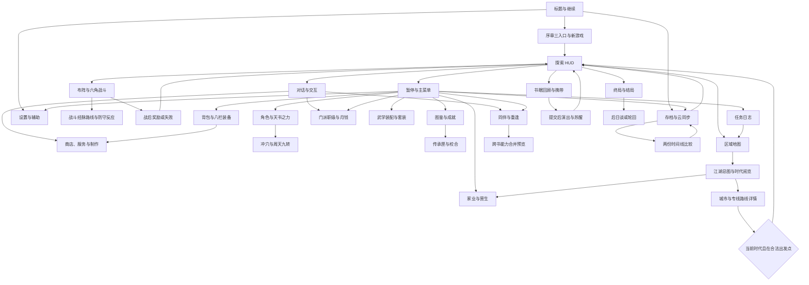
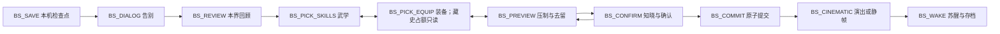

# 14 · 手机端 UI/UX（Mobile UI/UX）

> **归属（基准 §18）**：手机浏览器与 PC 浏览器的界面、导航、操作反馈、无障碍和 UI 性能承接；本文不定义战斗、成长、经济或存档规则。
> **上游**：作者决定与新增需求 AR-01–AR-14；基准 v1.4 §0、§4、§8、§19–§20；`design/01–06、09–13、15–21`（战斗经脉与绝招模式取 `design/21` v2.1）；`tech/01–04、06–08`。
> **引用而不重定义**：装配与图鉴见 `design/05`，六角战斗见 `design/09`，书眠见 `design/02`，装备见 `design/10`，存档见 `design/13` 与 `tech/08`，地图见 `design/11、19`；任务、冲穴、资源家业、门派、人物与跨年代传承分别只读 `design/12、15、16、17、18、20`；战斗经脉动态、攻防/轻功路线、独立乘区、护体内劲、点穴/擒拿、调息与逐单位实例只读 `design/21`。
> **标注约定**：原著没有的设计标 **（原创扩展）**；原著事实待逐字核对标 **（待考）**；未联网确认的技术事实标 **（待核实）**；真机/账号验证标 **（待实测）**；暂定字段和依赖数值标 **【建议值】**，统一登记于 §11。
> 版本：v1.3（绝招与经脉状态界面同步，2026-09-27）；v1.2（跨文档同步，2026-09-26）；全局审计（2026-09-26）；经脉系统落地（2026-09-27）。
> **v1.3 变更记录**：战斗招式面板改为“所选普通招式＋全部已解锁绝招”，显示角色唯一共享气势、同门共享冷却及逐项禁用原因（含“不能连用同一绝招”）；五类 AR-14 经脉 Buff 按 06 的实例 / 派生视图边界进入 HUD 与详情。

文档日期：2026-09-27。审校：B5.R（2026-09-26）。适用平台：手机浏览器横屏优先，兼容 PC 浏览器；UI 使用 Vue 3 DOM 覆盖层，场景使用单个 WebGL 画布。
本文为规划交付，线框不表示已实现的客户端；所有人物能力、按钮状态与数值示例均为界面说明，实际由合法视图模型提供。

## 0. 阅读指引与裁定承接

### 0.1 交付目标

玩家在横屏上能看清“我在哪里、现在能做什么、下一步会失去或获得什么”。
探索保持视野；战斗先预览再落地；书眠先比较再确认；存档先保住本机结果再显示同步状态。
手指、鼠标和键盘共享同一命令与确认链，不形成三套游戏规则。
全国地图、冲穴、家业、门派职级和跨书重逢属于作者新增需求承接 **（原创扩展）**。

| 正文章节 | 交付内容 | 优先阅读者 |
|---|---|---|
| §1 设计原则与布局 | 安全区、网格、触控、键鼠、面板状态 | UI / 客户端 |
| §2 视觉规范 | 颜色、字体、图标、动效 | UI / 美术 |
| §3 信息架构与导航 | 完整界面清单、进入条件、导航图 | 策划 / 客户端 |
| §4 线框图 | 18 张界面，尺寸、交互和异常态 | 全体 |
| §5 关键流程 | 序章、书眠、战斗、装配、云冲突 | 策划 / QA |
| §6 战斗交互细节 | 六角选格、范围、时间轴、自动与撤销 | core / render / UI |
| §7 性能与无障碍 | 14 条性能契约、预算、iOS、辅助操作 | 客户端 / QA |
| §8 实现建议与接口 | Vue 组件、只读投影、命令边界 | 客户端 / F2 |
| §9 本文新增术语与 ID | 局部编号、复用 ID、术语索引 | 内容管线 |
| §10 数据校验规则与测试用例 | 可执行的验收场景与边界 | QA / F2 |
| §11 待决事项 / 依赖 | 建议值、上游事实、提案与默认值 | 作者 / 调度器 |

### 0.2 高优先级决定与未完成依赖

| 输入 | 本文执行口径 | 不再沿用的旧口径 |
|---|---|---|
| AR-12、`design/09` §2.9、§5 | 尖顶六角格、六邻移动、六向朝向；特定扇形可十二向瞄准 | 旧 28 种方格模板作为生产定义、战斗四向 |
| AR-04、AR-11、`design/19` | 一张江湖底图叠加时代；城市按当代状态标注 | 每本书另建一张互不相通的全国地图 |
| AR-03、AR-05–AR-08；`design/12、15–17` | 冲穴、资源点、家丁、营生职位、门派职级均有正式只读投影与命令入口 | 只有武学与背包的角色菜单；继续使用 provisional 英文职位键 |
| AR-09、`design/18` §5–§6 | 活动队清空，关系与能力快照保留，健在且满足门槛才能重逢 | 同伴历史完全丢弃、无条件跨书召唤 |
| AR-13、`design/20` | 传承匣独立于背包 / 史匣；残本、信物、线索与校合同屏，未揭示名称不剧透 | 把 `frag_*` 当普通物品，或在书眠时清空 |
| AR-14、`design/21` v2.1 | HUD 显示攻防路线、护体内劲、经脉速度与封路摘要；详情承接迟滞 / 胀损、点穴 / 擒拿、防守路线和调息；只消费逐单位 `MeridianFlowModule` 的只读投影 | 把 180 穴铺满战斗 HUD、由 UI 重算乘区或通过反复预览偷抽 RNG |
| Canon V14-01～02、`design/05` §3.5 / §4.8、`design/09` §5.1 / §13.6 | 每门显示全部已解锁绝招；全角色只显示一条共享气势，同门显示一份共享冷却；所有不可用项保留并逐项解释，连续同招固定显示“不能连用同一绝招” | 每门只露出一个绝招、为每个绝招各画气势 / 冷却，或把不可用绝招直接隐藏 |
| C20、`tech/02` §5.6 | 12 品阶边框色与纹饰由共享色板提供 | UI 自建第二套金紫蓝绿品质体系 |

`design/07` 已定稿，套装效果只显示其正式注册表的有效结果。门派晋升、冲穴、营生与传承已分别由 `design/12、15、16、20` 收口；本文 §4、§5、§8、§10 已改为消费正式字段与规则。仍标 **【建议值】** 的只是这些归属文档自身尚未冻结的建议项以及 UI 局部参数；可操作性始终由 core 校验，未知不等于零。

## 1. 设计原则与布局

### 1.1 五项设计原则

1. **一次一个主动作**：面板只保留一个主确认入口；次要操作置于次级页或“更多”，关闭与确认不相邻。
2. **后果就地展示**：换装、书眠、旅行、职位替换和云冲突均显示变更前后；不可逆操作有具体影响清单。
3. **世界与阅读分层**：场景内目标由 WebGL 表现，文本、表单、列表、确认框由 DOM 承接。
4. **相同手势相同层级**：返回先退出当前预览，再退出面板；不会用一次返回同时取消操作并离开场景。
5. **可用性先于装饰**：颜色、纹饰和动画都有文字或形状替代；字体失败、离线和画布恢复期间仍能处理存档。

正邪路线、战斗胜败、资源等级和人物年龄均由各自上游决定，UI 不通过颜色或排序暗改判定。
旅行、生产、任职与人物年龄采用游戏时钟；设备日期只用于本机记录的显示，不决定月钱、年龄、时代或战斗行动顺序。

### 1.2 坐标单位与触控底线

布局、线框与命中区域统一使用 **CSS 逻辑像素**；DPR 只影响绘制缓冲，不乘到按钮尺寸上。
原生平台的 pt、Android dp 与浏览器 CSS 单位不混用，也不声称 CSS 单位等于真机物理毫米。
任务所称“≥44 pt”取移动平台的人体工学意图，不把原生 point 与 CSS 的印刷单位 `pt` 作物理等同；触屏交互框默认采用 **60×60 CSS px【建议值】**。
硬性可自动检查底线仍是 `tech/03` §6.5 R-UI-9 的 44×44 CSS px；60 px 是否在目标设备上达到同等可触性须按 DPR、浏览器缩放与握持姿势真机验证 **（待实测）**。视觉图标可以更小，但命中框不能重叠。
仅精确指针且无触控的 PC 紧凑模式可降为 44×44 CSS px；发现触控输入立即恢复触屏尺寸。
列表整行可点击，行高不小于命中框；同一行中的复选框、详情、删除各自保留独立区域。
按下态不能缩小实际命中框；`pointercancel`、多指介入或页面失焦立即撤销未提交的按压。

### 1.3 16:9–21:9 网格

默认以**安全区内 960×540** 为 16:9 线框基准，宽屏对照为 **1260×540**（21:9），均为 **【建议值】**。
设备全窗口先扣系统安全区与浏览器避让，再把可用矩形交给布局；不把整张 960×540 图等比缩到小手机。
全屏菜单采用 12 列、列间距 8、内边距 12；这些布局量均为 **【建议值】**。
设安全可用宽为 `Wu`，列宽 `c=(Wu−2×12−11×8)/12`，跨度 `n` 的面板宽为 `n×c+(n−1)×8`。
960 宽时 `c=70.67`，三列侧栏 `228`，六列主体 `464`；`228+8+464+8+228+24=960`。
1260 宽时 `c=95.67`；阅读侧栏限宽 300 **【建议值】**，多出的宽度分给中央图和留白。
窄屏双栏通常用 4/8；三栏用于装配、图鉴、书眠；对话、冲突确认采用聚焦阅读布局。

| 可用空间 / 输入 | 布局行为 | 保留的关键能力 |
|---|---|---|
| `Wu≥896` 且 `Hu≥440`【建议值】 | 12 列完整布局；顶栏 60，底部操作带 68 | 三栏比较、固定确认、上下文详情 |
| 更矮或更窄的横屏【建议值】 | 列表与详情分屏；侧栏改抽屉；按钮分页 | 60 命中框、返回、确认、目标摘要 |
| 21:9 | 场景扩展可见宽度；两侧信息不过度拉远 | 主按钮仍在拇指区，不贴最远边缘 |
| PC 大窗口 | 内容最大宽 1440【建议值】，居中；列表可多列 | 键盘焦点、滚动、同一预览确认链 |
| 竖屏或软键盘出现 | 单列阅读、存档、设置可用；战斗显示旋转提示和暂停入口 | 不因方向锁失败丢失草稿或卡住登录 |

540 高的参考菜单：`12+60+8+372+8+68+12=540`。
参考正文区 372 高；放大字号时让正文滚动，确认带保持固定，不以压缩字号挤出空间。
紧凑横屏的战斗招式与范围预览轮流占用底部区域，不把两个大面板同时压在战场上。
世界相机扩宽只改变视口；可交互范围、探索揭示与战斗目标合法性仍按 core。

### 1.4 刘海、手势条与浏览器工具栏

应用壳使用 `100dvh` 配合 `env(safe-area-inset-*)`；兼容行为按 `tech/03` §3 验证 **（待实测）**。
左右安全边界随旋转更新；刘海侧不能放唯一返回、唯一确认或集气轴末端的可点击目标。
iOS Safari 标签页底部在系统安全区外另避让 44 CSS px，加入主屏后的容器不叠加该避让，见 `tech/03` §3。
可用高计算示例：`窗口高−safeTop−safeBottom−browserReserve`；再减 §1.3 的内边距与栏高。
底部空白仍可显示纸纹，不承载按钮、拖拽终点或必要文字。
动态工具栏展开时只重排应用壳；绘制缓冲按上游稳定 120 ms 后更新，变化小于 2 px 忽略。
方向锁与全屏 API 只作能力探测后的便利入口，不成为继续游戏的前置条件 **（待实测）**。
键盘顶起表单时，配对码输入、错误说明与“连接设备”留在可见区；关闭键盘不自动提交。

### 1.5 单手与双手操作区

双手默认：左下负责移动模式、队伍切换与相机；右下负责交互、招式和确认。
左上放地点与任务，右上放菜单与同步；上方信息可读但不要求反复触摸。
单手模式将常用动作带收拢至惯用手一侧；另一侧保留场景，并提供“选中目标”循环按钮。
左手模式镜像动作带与抽屉开合方向；文字顺序、地图方向、战斗朝向不镜像。
拖拽装配、布阵、家丁指派都提供“选中→选择位置→确认”的等价点击操作。
拇指热区采用距底边 60–180、距侧边 12–240 CSS px **【建议值】**；实际覆盖需不同机型握持测试。
上下文危险动作进入独立确认页，不靠难以命中的红色小图标防误触。

### 1.6 PC 键鼠映射

以下默认映射为 **【建议值】**，允许重绑；输入框、浏览器组合键、读屏快捷键优先。

| 意图 | 手机 | PC 默认 | 共同结果 |
|---|---|---|---|
| 选格 / 选单位 | 单指点选，必要时局部放大 | 左键；方向键移动候选焦点 | 只建立候选，不立即消耗行动 |
| 移动 / 执行 | 预览后点确认 | Enter；明确的确认按钮 | 发出一条合法命令 |
| 撤销当前预览 | 返回按钮 | Esc / 右键 | 不撤已提交行动 |
| 选择行动 / 招式 | 动作带、分页 | 数字键 1–6；Tab 在组内切换 | 禁用项可读原因 |
| 平移 / 缩放相机 | 双指拖动 / 捏合 | 中键拖动 / 滚轮；屏幕按钮 | 不改变选择与命令参数 |
| 旋转相机 | 两个显式旋转按钮 | Q / E | 按预设旋转，期间暂停拾取 |
| 打开区域地图 / 全国地图 | 地图按钮后切页 | M；页内切换 | 返回恢复原焦点 |
| 背包 / 武学 / 任务 | 菜单分组 | I / K / J | 全屏菜单停绘与暂停世界钟 |
| 倍速 / 自动 | 显式速度与模式按钮 | F / A，需聚焦战斗 | 按战斗能力限制切换 |
| 快速存档 | 存档菜单 | F5（平台可用时） | 先验槽位资格，禁用原因可读 |

浏览器占用 F5 时不拦截刷新，界面始终保留快速存档按钮；不要求玩家改变系统设置。
双指轻点默认不绑定【建议值】，避免 `tech/01` 的“取消”与 `design/09` 的“倍速”冲突；显式按钮覆盖两项能力，见 §11.5。

### 1.7 面板层级与返回契约

| 层 | 场景状态 | 输入边界 | 返回行为 |
|---|---|---|---|
| 探索 HUD | 正常运行 | UI 命中区拦截，其余交给画布 | 打开暂停菜单 |
| 战斗决策 HUD | 依战斗阶段推进 | 玩家决策时接收命令；演出时只接收演出控制 | 撤候选或打开战斗菜单 |
| 轻量提示 / 气泡 | 不单独改世界钟 | 点击外部关闭；不吞移动手势 | 只关闭提示 |
| `menu.full` | 停止场景绘制、暂停世界钟 | 全屏焦点域，背景不可交互 | 回到来源页与原滚动位置 |
| 事务确认 | 继承来源的暂停状态 | 只处理本事务；阻止重复提交 | 提交前回草稿，提交后按结果导航 |
| 错误 / 恢复页 | 纯 DOM 可运行 | 存档、重试、设置 | 不绕过版本或存档校验 |

面板不无限叠加：普通详情至多一层、确认替换当前详情 **【建议值】**；不能在冲突框上再打开另一个冲突框。
世界钟暂停不承诺保存战斗内部进度；后台恢复遵循存档资格与 §7.3 的中断口径。

## 2. 视觉规范

### 2.1 纸、墨与语义色

界面采用宣纸底、墨色文字、少量矿物色提示；场景夜色不改变面板正文的对比关系。
色值从 `tech/07` §2.3 与 `tech/02` §5.6 引用，最终复用计划中的 `packages/spec/palette.json`，不在组件中另写常量。
下表“用途”为本文语义映射 **【建议值】**，并不新增正邪、友敌或状态判定。

| 已有色板 token | 引用色值 | UI 用途 | 冗余表达 |
|---|---|---|---|
| `paper.xuan` / `paper.silk` | `#EFE6D2` / `#E3D3B1` | 主纸面 / 次级卡片 | 明确分组标题、边线 |
| `ink.jiao` / `ink.nong` | `#1E1B18` / `#2B2622` | 标题 / 正文 | 字重与层级 |
| `ink.zhong` / `ink.dan` | `#4A433C` / `#8C857B` | 次级文字 / 非必要装饰 | 禁用项仍用可读正文说明原因 |
| `min.zhusha` | `#B5382B` | 危险、敌方、失去、邪向标记 | 叉号、敌、失去、邪；各自带标签 |
| `min.shiqing` / `min.huaqing` | `#2F6E8E` / `#2E4A62` | 当前选择 / 可跳转文字、正向标记 | 选中框、箭头、正 |
| `min.shilv` | `#3F8A6E` | 完成、恢复、友方提示 | 勾号、恢复、友；不单靠绿色 |

正邪是路线信息，不等同友敌；正派敌人仍标“敌”，邪派同伴仍标“友”。
毒、出血、封穴、眩晕等状态用 `design/06` 的名称和图标映射；状态色不另定义持续或叠加规则。
HP、MP、集气、冲穴内劲均有全称与数值，不能因都画成长条而混为同一资源。
正文与背景对比目标 ≥4.5:1，大字和关键组件边界 ≥3:1 **【建议值】**；实测涵盖普通、色弱与高对比方案。
浅金、淡墨和绿色不直接作为小号正文唯一颜色；品阶保留墨色名称，外框另着色。

### 2.2 品阶、纹饰与压制

以下为 C20 的**显示映射摘录**，原始常量与维护归属仍在 `tech/02` §5.6。

| 大阶 | 下 / 中 / 上的数字 | 下品边框 | 中品边框 | 上品边框 |
|---|---|---|---|---|
| 黄 | 1 / 2 / 3 | `#B8955A` | `#C6A263` | `#D4B06D` |
| 玄 | 4 / 5 / 6 | `#3E5C76` | `#476A87` | `#517998` |
| 地 | 7 / 8 / 9 | `#8E3B2F` | `#9F4435` | `#B04D3B` |
| 天 | 10 / 11 / 12 | `#D4AF37` | `#DDBC4B` | `#E6C95F` |

下品单线、中品双线、上品双线加四角纹饰；任何缩略卡仍保留“天·上”等阶字。
武学按当前 `displayGrade` 显示边框；装备按 `gUse`，详情并列绝对品阶、当前品阶和压制原因。
封存原因分别显示“天道压制”“力有不逮”“驾驭不住”，不合成一个无法解释的灰锁。
资源另按“天地玄黄 × 一至九品”显示，一品最高，见 AR-05；不得把资源“一品”映射成武学数字 1。
资源卡保留“资源·地阶·三品”一类完整标签；相似颜色只表示大阶，不暗示两系统可互换。

### 2.3 字体方案与层级

字体分层完全承接 `tech/03` §5.5；不在 UI 首屏下载完整中文字体包。

| 层 | 字体来源 | 使用位置 | 加载边界 |
|---|---|---|---|
| L0 | PingFang SC、HarmonyOS Sans SC、MiSans、Noto Sans CJK SC、Source Han Sans SC、Microsoft YaHei、sans-serif | 数值、正文、按钮、用户名字 | 系统回退始终可用 |
| L1 | 志莽行书暂选，马善政候选 | 章名、少量固定大标题 | 启动子集 ≤40 KB；每书子集 ≤120 KB |
| L2 | 霞鹜文楷 GB 子集 | 对话和长篇阅读的可选样式 | 公共 ≤260 KB；每书 ≤500 KB；low / memClass S 默认关闭 |

字体许可、文件版本及逐文件 OFL 状态须按 `tech/03` 核查 **（待核实）**；本文未联网确认。
第一段对话最多等待字体 300 ms；超时立即用 L0，下一页才切换已就绪字体，避免当前段跳行。
自定义姓名、稀有字与输入表单始终允许系统回退；缺字不以方框代替玩家可读内容。

| 语义 | 基准字号 / 行高（CSS px，均为【建议值】） | 应用限制 |
|---|---|---|
| 章名 / 页面主标题 | 28 / 36；24 / 32 | 艺术字只用于标题，允许自然增高 |
| 正文 / 对话 | 18 / 28；20 / 32 | 不横向压扁；窄屏增加页数 |
| 按钮 / 列表主项 | 18 / 24 | 至少 60 高命中框，长文可换行 |
| 次级说明 / 数值标签 | 16 / 24 | 关键规则不使用更小字号 |
| 读屏 / 大字模式 | 100% / 125% / 150% | 数字、行高和控件随内容扩展 |

连续数字使用等宽数字特性；正文不插空格伪造竖排，城市名用正常文本语义加竖排样式。
标题在两行仍放不下时允许滚动详情；省略号必须有点击展开和完整可访问名称。

### 2.4 图标与反馈

图标遵循“轮廓 + 短词”：探索、战斗、武学、书眠、资源、家丁、月钱分别有明确文字。
图标引用内容目录或渲染资产的已有标识；本文不新增游戏图标 ID 或绕过资源管线命名。
栅格图标显示尺寸固定，独立 WebP、懒加载，同屏 ≤60，详见 §7；小符号也可用纯 CSS 线条与文本。
已装备、已携带、已藏史分别用“穿”“携”“藏”章，不能三个状态共用同一个勾号。
任务、月钱与同步的提醒只在状态变化时出现；读屏播报并入同一事件摘要，不逐帧播数值。
失败反馈保留用户选择，指出具体原因与可行下一步，例如“此装备已被剧情锁定，可返回换选”。

### 2.5 动效预算

**只动画 `transform` / `opacity`**；不动画尺寸、位置布局属性、模糊、阴影半径、滤镜或 `clip-path`。
动效建议值：按压 80 ms、抽屉 160 ms、普通切页 180 ms、提示淡出 120 ms **【建议值】**。
数值进度采用内层 `scaleX`，文字只在事件时更新；触摸按钮的外层命中框保持不变。
对话用整段文字与独立遮罩平移露出；固定裁剪容器不做几何动画，不生成逐字 `span`。
低档关闭纸页卷曲、粒子与背景滤镜；high 也不以大面积毛玻璃填满页面。
减少动效开启后，切页直接替换或短淡入；书眠保留字幕与结果，战斗保留命中、位移和结算提示。
战斗镜头转动、倍速、书眠视频的时长归上游，不用 UI 动画拖延命令接受或资源就绪反馈。

## 3. 信息架构与导航

### 3.1 全部界面清单

界面族可共用外壳；下表列出本规划覆盖的主界面、子页与必要覆盖态。
“全屏”均进入 `menu.full`；“覆盖”仅占当前场景的上下文层，不另建持续运行世界。

| 界面族 | 页面 / 子页 | 主要入口与退出 | 数据归属 |
|---|---|---|---|
| 启动与标题 | 资源检查、继续、新游戏、序章三入口、难度、名字、设置 | 启动；继续经存档校验进探索 | 01、13、tech/06、08 |
| 探索 | HUD、交互选择、拾取、场景出口、暂停菜单 | 继续 / 苏醒 / 战后；接入全部主菜单 | 01、11 |
| 战斗 | 布阵、主界面、招式、运劲、物品、范围预测、日志、自动策略、经脉路线详情与防守反应 | 遭遇；战斗经脉抽屉不离开决策态；胜败回探索或恢复页 | 09、21 |
| 战后 | 奖励、伤势、俘获与处置、战败与重试资格 | 战斗结束；确认后退出 | 09、13 |
| 角色与成长 | 属性、修为分配、永久增益、天书之力、冲穴与周天；战外查看路线可用性 | 菜单；来源页返回 | 03、13、15、21 |
| 武学 | 固定装配栏、主辅切换、套装提示、成长详情、招式预览 | 菜单 / 物品学习后 | 05、07、09 |
| 背包与装备 | 物品分类、八栏装备、使用、比较、拆卸、仓库、待拾物 | 菜单 / 商店 / 仓库 / 战利品 | 10 |
| 图鉴 | 武学、残篇、再续印记、人物、门派、天书录、成就称号 | 菜单 / 发现通知 | 05、13、17、18 |
| 任务日志 | 主线、支线、同伴、门派职责、改命线、已完成 | HUD 摘要 / 菜单 | 12、13、18 |
| 地图 | 区域地图、出口、江湖总图、时代阅览、城市详情、路线确认 | HUD / 任务 / 驿站 / 码头 | 11、19 |
| 对话 | 剧情、选项、历史、交易、招募、告别；可选自由对话 | 交互 / 剧情触发；关闭回来源 | 12、18、tech/08 |
| 交易与制作 | 商店买卖、服务报价、锻造/维护、炼丹/配毒、烹饪、配方与结果预览 | 对话交易 / 城市场所 / 背包物品；提交或返回来源 | 10、12、16 |
| 门派 | 门派概览、职级、晋升、职责、传授、月钱、掌门资格 | 门派驻地 / 角色关系页 | 12、16、17 |
| 家业与营生 | 资源点、家丁、产出、占领/托管、职位、月钱、赌场消息与小游戏 | 地图 / 驻地 / 菜单 | 11、12、16 |
| 跨年代传承 | 传承匣、源线索、三卷、信物、宝藏挖掘、校合条件与收据 | 图鉴 / 任务 / 地图 / 书眠 | 20 |
| 同伴 | 当前队伍、留守、人物履历、招募门槛、重逢线索、合并预览 | HUD / 菜单 / 招募对话 | 18 |
| 书眠 | 前存档、书灵对话、回顾、携带、压制比较、警告、确认、演出、苏醒 | 合法剧情触发；提交前可回草稿 | 02、05、10、13、18 |
| 存档与在线 | 手动/自动/快速/书眠/苏醒/终局档、冲突、导入导出、设备 | 标题 / 暂停；读取后校验回游戏 | 13、tech/08 |
| 系统设置 | 操作、画质、字体、音量、辅助、云登录、遥测与 AI 同意 | 标题 / 暂停；返回原页 | tech/03、08 |
| 特殊进度 | 终局卷间、结局、后日谈、轮回、通关记录 | 13 的进度节点 | 13 |
| 异常与恢复 | 离线、资源重试、字体回退、存储不足、版本不兼容、画布恢复 | 服务与设备事件；明确重试路径 | tech/03、06、08 |

未发现的系统入口可按序章进度逐步开放，但设置、辅助、存档状态与退出始终可达。
未开放页显示已有世界线索或解锁条件；不得用技术字段名或“接口尚未实现”作为正式游戏文案。

### 3.2 主导航图



图中页面跳转不代表绕过条件：查看营生点不等于远程领取；看见人物不等于已招募；查历史地图不等于改变当前时代。
首次进入重页面才挂载组件；返回恢复列表锚点与筛选，跨书或内容版本变化则重新校验锚点。

### 3.3 共用页面状态与成就入口

| 状态 | 展示与可用动作 |
|---|---|
| 首次加载 | 保留标题、返回和固定大小的内容占位；取消加载回来源页 |
| 已加载但为空 | 说明当前筛选没有已知条目，提供清除筛选；不暗示隐藏条目总数 |
| 有内容但无资格操作 | 正常显示可知内容，按钮旁解释地点、任务、时点或规则限制 |
| 加载 / 提交失败 | 保留已有内容与草稿，提供重试；失败不清空本机进度 |
| 只读回看 | 固定标“回看”，所有可改领域状态的动作不可用 |

成就与称号从“图鉴→天书录与成就”进入，读取 `design/13` §8 的条件、达成记录与称号效果。
未揭示成就只给允许展示的提示；达成通知可点开详情，称号切换仍走合法命令与效果预览。
书眠、回档和多设备同步后的账号记录遵循13与tech/08的合并规则，不由通知动画再次发奖。

## 4. 线框图

### 4.0 读图约定

以下 `WF-14-01` 至 `WF-14-18` 是文档局部编号，不是游戏内容 ID。
线框以 960×540 安全可用区为例；外层安全边、浏览器避让不计入该矩形，尺寸统一见 §1.2–§1.4。
`[按钮]` 表示至少 60×60 的触屏命中区；`( )` 为未选，`(●)` 为选中，`×` 为不可用并可读原因。
表格列宽可分屏，图中的文字不要求塞进一行；可滚动区以 `↑↓` 标记，固定确认带不随滚动消失。
灰色或空值必须同时有说明；示例中的“上游值”是线框注释，正式页面会使用经过校验的具体数据。
边框、方位示意和说明文字是线框标注，不按字符数等比换算像素；真实尺寸依本节与§1，技术标注不进入游戏文案。

### 4.1 WF-14-01 · 探索 HUD

尺寸：960×540；顶部信息带 60，左右常用动作位于底部 180 内，中央场景保留连续触控区【建议值】。

```text
+--------------------------------------------------------------------------+
| 地点 / 当前书界 / 游戏时刻         本机已存 ○等待上云       [菜单] [地图]|
| 主角 HP ━━━━━  MP ━━━          追踪任务：前往已知地点         [展开]     |
| 同伴头像与伤势                                                           |
| [队伍]                                                                   |
|                   WebGL：地形、人物、世界名牌                            |
|                          · · · · 目的地                                  |
|                         /            ◇ 可交互对象                        |
|                       主角                                               |
|                                                                          |
| 左下：移动 / 相机区                         右下：交互 / 确认区          |
| [移动] [旋转]                     已选：附近对象 [交谈] [查看]           |
| [返回]                            多个对象时 [上一个] [下一个]           |
+--------------------------------------------------------------------------+
```

单击地面先显示路径或按已选移动模式发命令；危险出口、旅行和剧情触发仍走各自确认。
多个对象重叠时弹出可点击名单，显示名称、类型、距离与当前可用动作；不靠反复戳同一像素切换。
任务摘要最多追踪一条【建议值】，展开才看步骤；进入战斗时让位于时间轴。
世界头顶血条、Buff、选中标记、飘字均由 WebGL 绘制，不为每个 NPC 挂一组 DOM。
拾取失败打开“待拾物”去向，不自动销毁；同步提示点开后进入 WF-14-10。

### 4.2 WF-14-02 · 六角战斗主界面

尺寸：960×540；顶部时间轴 60，底部预览抽屉最多 30% 高；招式选择与大详情交替展示。

```text
+---------------------------------------------------------------------+
| 初阵：[主角 轻119/速129] → [敌甲] → [同伴甲]       [手动] [速度 1×] |
| 后续：当前单位集气 ━━━━━ 0..1000    收招中以灰段显示          [日志]|
|                 ╱╲        ╱╲        ╱╲                              |
|                ╱  ╲      ╱  ╲      ╱  ╲   主角：移动可用 / 行动可用 |
|               │ 主 │    │ ·· │    │ 敌 │  身法 ×1.2239 / 移动 +1    |
|                ╲  ╱      ╲  ╱      ╲  ╱   点 / 环 / 面 / 扇 图例    |
|                 ╲╱   ╱╲   ╲╱   ╱╲   ╲╱                              |
|                     │★ │      │ !│        ★落点 ·范围 !友伤         |
|                      ╲╱        ╲╱                                   |
| 气势 78/100（全角色共享）  本门绝招冷却：本行动禁用，结束后解除   |
| 普通：[招式一·攻路10段 ×1.2053] [招式二] [翻页] [旋左] [旋右] |
| 绝招：[绝招甲×共享冷却] [绝招乙×不能连用同一绝招] [绝招丙×封路]|
| 预览：攻路 / 对方承伤 / 护体内劲 / MP / 流转CT / 风险 [经脉详情] |
| 状态：迟滞2 · 胀损1 · 点穴4 · 擒拿3        防守：[自然短路⌄]       |
| [移动] [招式] [运劲·调息!] [道具] [更多]          [撤销] [确认施放]|
+---------------------------------------------------------------------+
```

图中六角只示意拓扑，实际按等距相机投影；高差由数字、台阶纹和遮挡边共同显示。
首轮轨与后续集气轨分开：前者不画虚构到达 tick，后者只显示玩家已获准知道的预测。
选择“运劲”展开调息、护体等已有模式；“调息”角标取当前最严重的迟滞 / 胀损 / 点穴，并显示回内、预计触及节点、修复量、解穴概率、占用行动与可中断性。“道具”显示剩余次数及同一物品 ID 冷却。
范围图例只解释当前招式，不让玩家任意切换招式没有的形状。
信息不足时显示“尚未看破”，不猜伤害；预览失效时保持候选但重新推演，确认暂不可用。
招式按钮只放“路线段数、对当前目标攻路倍率、`flowCt`、稳 / 衡 / 险”；`×1.0000` 是中性。预览把攻击 `meridianAttackBp` 显示为“攻路 ×”，把 `meridianDefenseBp` 显示为“承伤 ×（越低越强）”，避免把两个方向都误叫“加成”。

**绝招展示与禁用说明**：招式抽屉按武学分组；普通招只列 `moveSlots` 中所选项，绝招区则枚举该门所有已解锁且 `MoveDef.ultimate:true` 的招式，不占普通招分页配额。空间不足时组内横向滚动并显示“绝招 1–3 / 3”，不得因气势不足、冷却、重复限制或路线封锁把卡片隐藏。每个绝招卡显示招名、独立路线摘要与“耗气势 100”；角色顶部只画一条 `rage 0..100`，不得为武学或绝招复制气势槽。

每门武学标题只显示一份共享状态：`ultimateCooldown=0` 为“本门绝招可用”，`=1` 为“本门绝招共享冷却：本行动禁用，行动结束后解除”。招式自身冷却仍显示在各卡上，不与同门共享冷却合并。禁用卡保持可聚焦，短按 / 确认打开完整原因；界面原样消费 `query.moveAvailability(unit)` 的有序原因，至少区分“招式冷却中”“本门绝招共享冷却中”“不能连用同一绝招”“经脉路线被封”“气势不足（当前值 / 100）”及其他 F0 条件。重复限制的正式玩家文案必须精确为 **“不能连用同一绝招”**；读屏名称同时包含招名、禁用和全部原因。

共享冷却在施放绝招的当次行动末不假减；下一次正常自身行动（即使被硬控跳过）全程仍显示禁用，E2 结果事件到达后才切为可用。环境 / 他人行动、免费动作和额外行动均不改变倒计时显示。冷却清零但重复限制尚在时，卡片仍显示“不能连用同一绝招”，并提示可先用同门另一绝招或同门普通招；其他武学普通招不能解除。

护体栏严格分开护盾、护体内劲、`mpGuard`：护体内劲显示预计抵消 `cancelled`、耗内 `mpSpent`、剩余 `damageBeforeMpGuard`；`broken=true` 时另标“击穿”、`delayCt` 与迟滞，不把中间值写成实际气血伤害。
速度摘要直接读 `meridianSpeedBp/openingQinggong/spd/move/evadeRatingDelta`；首轮只显示冻结快照，战中变化标“影响后续集气 / 移动，不重排初阵”。擒拿影响显示在经脉速度之后，纯经脉闪避与擒拿闪避不得合成一个来源。
状态摘要分别显示迟滞、堆积 / 胀损、点穴 `1–9` 与擒拿 `1–9`；红点进入 WF-14-18。HUD 不铺 180 穴，展开最多只渲染所选路线的 `1–18` 个节点。
命中率、招架率、暴击率与每项附加状态的效果命中率分列；开发 / 调试模式可展开只读 `DamageTrace`，按 `Z1`～`Z10` 及其中的 Z4M / Z5M 显示整数输入、倍率、各自向下取整值，再列护盾、护体内劲、`mpGuard` 与气血结算。未命中只显示 Z0 判定，不伪造后续零区。
路线预览来自 21 的无副作用 `preview`：显示 `stateVersion`、条件安全轨迹、每段卡住率与累计到达率；它不是必然结果。提交仍只发领域命令，由 Core 重验版本并消费唯一 battle RNG，UI 不直接调用 `commit`，也不以反复预览挑随机数。
键盘、手柄式焦点和点选共用候选六角；完整选格与确认规则见 §6。

### 4.3 WF-14-03 · 武学装配

尺寸：960×540；左/中/右三栏 228/464/228，栏间各 8，顶底按 §1.3；中心栏可纵向滚动。

```text
+----------------------------------------------------------------------+
| [返回] 武学装配         真等级 / 当前显示等级              [筛选]    |
| 可装配列表 ↑↓  | 固定 13 栏，当前选择角色| 属性与套装变化 ↑↓         |
| 分类 / 搜索    | 内功 主运 [内一]        | 当前 → 换后               |
| [已学武学卡]   | 辅运 [内二] [内三]      | 气血 / 内力 / 属性增减    |
| 当前品阶 / 层数| 拳脚 [拳一][拳二][拳三] | 套装：已计件数 → 新数     |
| 装配资格 / 原因| 兵器 [兵一][兵二][兵三] | 辅运：计件                |
|                | 轻功 [轻一] 暗器 [暗一] | 武器不匹配：被动失效      |
| [详情]         | 杂学 [杂一] [杂二]      | 仍计套装件                |
| 残篇仅显示线索 | 已选：武学 → 目标栏     | [查看组成与阈值]          |
|                | [换主运] [移除]         | 背包内武学不计件          |
| [查看图鉴]          [取消更换]                             [确认装配]|
+----------------------------------------------------------------------+
```

低武书界只改变当前效力，不缩减 13 个装配栏；“识海容量”只在书眠携带页出现。
点武学再点栏即可替换，拖拽只是快捷方式；拖出屏幕、旋转或第二指介入均回原位。
主运/辅运标识常驻；冲穴速率受其影响时同时显示相关变化入口，速率结果取 `design/15`。
套装仅统计装配武学与穿戴装备，效果与档位只读 `design/07`；正式注册表或条件缺失时不能假报“已激活”。
切换武器后，同屏解释兵器栏失效与套装计件仍保留的区别；确认只提交本次变更。

### 4.4 WF-14-04 · 书眠携带与压制预览

尺寸：960×540；三栏与装配页同构；底部确认固定，候选、压制与去留清单各自滚动。

```text
+------------------------------------------------------------------------+
| [返回草稿] 书眠：本书 → 目标书       目标境界 / 约相隔年数   草稿已存  |
| 识海容量（目标决定）| 武学 / 装备选择 ↑↓       | 到达后的变化 ↑↓       |
| 高武 3 / 3 / 3      | 内功  已选 / 上限        | 真等级 → 显示等级     |
| 中武 2 / 2 / 2      | 拳脚  已选 / 上限        | 当前品阶 → 目标品阶   |
| 低武 1 / 1 / 1      | 兵器  已选 / 上限        | 真层数 → 生效层数     |
| 当前目标高亮一行    | [候选卡] [详情] [选择]   | 封存原因 / 恢复条件   |
|                     | 装备共同额度：已藏+拟携/6| 套装：保留 / 中断     |
| [武学] [装备]       | 已藏史：古迹 / 实例(只读)| 残篇：未带核心武学    |
| [免费重整修为]      | [携带] [取消携带] [查看藏史]|轻功/暗器/杂学全列  |
| [所有去留]          | 锁定物品：原因与换选     | 钱财 / 身份 / 家业去留|
| 尚需知晓：空名额、支线、套装中断等      [逐项查看] [预览] [最终确认]   |
+------------------------------------------------------------------------+
```

容量按目标高/中/低武自动确定，三行不是自由切换按钮；序章为 0/0/0、装备 0 的专用回顾。
装备额度按实例计件：`携带件数 + 本书界新藏史件数 ≤ 6`。藏史只能在余韵期的合法古迹先行完成并消耗史印；本页只读显示其占额，已藏实例不进入携带候选，也不能在书眠页存入或取回。携带侧同 ID 最多一件，成对的单一实例算一件。
玩家借给同伴的装备进入候选；NPC 所有、不可携带、锚定或任务绑定物品只读列明原因。
残篇区逐条列出“记忆保留，不能装配，重获路径受图鉴知识限制”；不能只用“丢弃”一词概括。
“所有去留”另列金钱、普通库存、身份任职、家业与活动队清空，以及天书、图鉴、学识、永久增益、冲穴进度保留。
目标能力表对比绝对品阶、当前品阶、生效层数与装备驾驭；明确区分“系数下降”和实际伤害。
最终确认前展示逐类警告与长按 1.5 秒操作；等价的分步确认供辅助输入使用，详见 §5.2。

### 4.5 WF-14-05 · 背包与八栏装备

尺寸：960×540；背包与装备双栏，比较抽屉在点选后替换背包右侧详情；列表虚拟化。

```text
+----------------------------------------------------------------------+
| [返回] 背包：已用 / 当前容量       [装备] [消耗] [材料] [任务] [搜索]|
| 物品列表 ↑↓                   | 装备栏                               |
| [图标] 名称 / 当前品阶 / 数量 | 主手           副手                  |
| 所属 / 绑定 / 携带限制        | 头部           身体                  |
| [选中物]                      | 手部           腰部                  |
|                               | 足部           饰品                  |
| 当前 → 穿戴后                 | 成对装备：[同一实例跨双手显示]       |
| 天道压制 / 力有不逮 / 驾驭不住| 非成对双手武器：副手仅暗器           |
| 需求不足：可穿戴，收益降低    | 负重来自装备，背包物品无重量         |
| [仓库] [待拾物] [整理]        | [卸下] [查看武器适配]                |
| [返回物品列表]                    当前选择与替换去向       [确认穿戴]|
+----------------------------------------------------------------------+
```

初始背包 80 格，可三次各扩 20，`80+3×20=140`；仓库 200、待拾物上限 20，均引 `design/10` §12。
数字显示“当前容量”，未购买扩容不直接写 140；仓库入口依地点可用性，不默认远程存取。
装备永远可以穿戴，需求不足只降效；剧情锁与槽位冲突另给原因，不能把属性不够画成禁穿。
成对实例在两手用连接标识，并明确“携带计 1 件”；两个独立实例各计 1，不能按栏位反推件数。
详情采用 `gUse=min(effGrade,gCap(Ld))` 的 core 结果；本页不重算装备词条或背包排序价格。
八栏数据映射复用 `mainHand/offHand/head/body/hands/waist/feet/accessory`；正式界面只显示中文栏名。

### 4.6 WF-14-06 · 武学图鉴与残篇

尺寸：960×540；左侧分类、中央列表、右侧详情；搜索与状态过滤必须遵守已知信息边界。

```text
+--------------------------------------------------------------------+
| [返回] 武学图鉴      [门派] [种类] [品阶] [状态]             [搜索]|
| 分类 ↑↓           | 已知条目 ↑↓            | 选中条目详情 ↑↓       |
| 内功 / 拳脚       | [已习得卡]             | 名称 / 当前品阶       |
| 兵器 / 轻功       | 生效层数 / 真层数      | 原理、招式与合法范围  |
| 暗器 / 杂学       | [残篇卡]  印：残       | [六角预览] [装配]     |
|                   | [再续条目] 历史朱印：续| 获得记录 / 书界       |
| 状态过滤          | [听闻条目] 线索        | 残篇：重获线索        |
| 未知 / 听闻 / 见识| [未知占位] 不泄露名称  | 学识不足：只给模糊提示|
| 习得 / 大成 / 残篇|                        | [查看相关任务]        |
| [人物] [门派] [天书录与成就]               [关闭详情] [返回来源页] |
+--------------------------------------------------------------------+
```

基础状态复用 `unknown/heard/seen/learned/mastered/fragment`，规则见 `design/05` §11。
`design/02` §5.6 已正式定义 `recalled`；本文把它显示为已习得卡的“再续”历史朱印。这是对 `design/05` 基础图鉴状态的跨文档显示适配，不替掉听闻、大成或残篇语义。
未来书界残篇的具体线索仅在学识 ≥60 或已经进入该书界等上游许可下显示，搜索结果也不能旁路泄露。
小无相功的隐迹规则不遮蔽玩家自身图鉴；敌人身份隐藏与玩家已知知识分开。
选招式后的小范围演示由六角模板查询生成；未知模板显示可读原因，不回落旧方格图。

### 4.7 WF-14-07 · 任务日志

尺寸：960×540；任务列表占四列，详情占八列；详情内部步骤可滚动，底部“追踪”与“定位”固定。

```text
+------------------------------------------------------------------------+
| [返回] 任务日志    [主线] [支线] [同伴] [门派职责] [已完成]            |
| 任务列表 ↑↓| 已选任务：标题 / 当前书界 / 所属人物                      |
| [当前追踪] | 已知目标与当前步骤                                        |
| [可继续]   | (✓) 已满足条件    ( ) 待完成条件                          |
| [门槛不足] | 职级 / 招募门槛 / 时间窗口：显示获知部分                  |
| [暂不可达] | 地点：已知城市 → 区域 → 交互对象                          |
|            | 后果：本书内 / 跨书记录 / 改命线标记                      |
|            | 奖励：已揭示部分；未知内容不显示真实名称                  |
|            | 书眠前未结：可回去办理 / 进入去留警告                     |
| [取消追踪]           [查看相关人物]               [地图定位] [追踪此项]|
+------------------------------------------------------------------------+
```

任务条件、时限、月钱职责和改命判定归 `design/12`；尚未定稿字段在 §8.3 登记【建议值】。
定位只打开地图并高亮已知区域，不自动移动、揭示隐世点或跨书跳转。
过期、角色未出现、职责冲突分别说明原因；不把所有失败都简写为“未解锁”。
追踪从 HUD 返回保留列表锚点；书眠审核可直达本页，返回时继续同一携带草稿。

### 4.8 WF-14-08 · 区域地图

尺寸：960×540；地图约占八列，四列用于图例与选中对象；小窗口改为底部详情。

```text
+-----------------------------------------------------------------------+
| [返回] 区域地图：当前区域             [江湖总图] [图例] [已知地点列表]|
| 地形轮廓 / 已探索区域   | 图例：出口、歇脚点、交互、任务              |
|          ··· 路径       | 选中：已知出口                              |
|      主角 → → → □出口   | 通往：相邻区域                              |
|            △ 歇脚点     | 条件 / 距离 / 危险提示                      |
|   未探索区只给已获知边界| 当前路径：可达 / 不可达原因                 |
|                         | 资源点 / 营生：按揭示状态显示               |
| [缩小] [放大] [回到主角]| [查看任务] [查看地点]                       |
| 地图为导航投影；场景移动仍由本区网格与寻路处理             [设为目标] |
+-----------------------------------------------------------------------+
```

区域地图展示当前局部世界的导航信息；全国地理经纬度不直接映射为本图六角格。
出口、驿站和码头保留不同图例；“设为目标”只设导航目标，到达合法交互点后才可请求旅行。
藏在雾中的 NPC、资源点与门派不能因筛选或列表搜索暴露；无结果文案不暗示隐藏数量。
资源归属与营生职位状态来自同一领域投影，地图不缓存第二份可领取余额。

### 4.9 WF-14-09 · 对话与选择

尺寸：960×540；画面上方保留人物与环境，下方阅读卡不挤压字号；大字模式转全屏阅读。

```text
+----------------------------------------------------------------------+
| [历史记录]                                                    [设置] |
| 人物与环境（场景示意）                                               |
|                                                                      |
| 说话者：当前可知姓名 / 身份                                          |
| 正文阅读区（原创交互文案示意）：                                     |
| 此路通往城门。若要远行，可先往驿站问明去处。                         |
| [上一页]                                           [显全文 / 下一页] |
|                                                                      |
| [询问去处]  [谈论任务]  [告辞]                                       |
| 条件项：所需学识 / 好感 / 职级；未知条件只显示已获知部分             |
+----------------------------------------------------------------------+
```

点正文先完成当前段露出，再次点击才翻页；不能同一次抬手同时显全文和选中刚出现的选项。
选项长文占整行，列表可滚动；不会用半透明禁用色隐藏拒绝原因。
不可逆的了断、改命或职位替换另给结果确认，普通问路不弹重复确认。
历史文本来自已发生剧情；读屏可逐段阅读；关音效或减少动效不影响选项出现。
可选 AI 自由对话默认关闭，登录不等于授权；离线回到已有固定选项，剧情与招募条件仍由 core 判定。

### 4.10 WF-14-10 · 存档与云同步

尺寸：960×540；槽位列表四列、头信息八列；同步状态固定可见，云历史与设备管理为子页。

```text
+----------------------------------------------------------------------+
| [返回] 存档与云同步       本机已存 ✓     ○等待上云       [设备与登录]|
| [手动] [快速] [自动] [书眠/苏醒] [终局/通关] [历史]                  |
| 槽位列表 ↑↓        | 书界 / 幕 / 周目 / 难度                         |
| 手动 01            | 真等级 / 显示等级 / 天书 / 改命数               |
| 自动：当前设备     | 游戏时长 / 回档次数 / 规则开关 / 污染标记       |
| 自动：另一设备     | 设备名 / 保存时间（展示信息）                   |
| 书眠前：只读回看   | 本机已存 / 等待上云 / 已上云 / 有冲突           |
|                    | 冲突时：[比较两份]；禁止静默选较新时间          |
| [导入 .tsav] [导出]| [重试上传] [只读回看]                           |
| 槽位限制说明       | [保存到此槽] [读取]                             |
+----------------------------------------------------------------------+
```

手动 12、快速 1、自动 3；书眠前 14、苏醒 14、终局 7；通关每周目 1，一命模式单独 1，见 `design/13` §9。
一命开启时其他槽操作禁用；通关档只提供轮回与后日谈，不伪装成普通“继续”。
手动保存禁用于战斗、剧情对话、书眠流程和终局卷内；宗师/天劫还须在歇脚点，天劫禁快速存档。
书眠回档：江湖/侠客不限但记次数并使“落子无悔”失效；宗师每书界一次；天劫/一命仅只读回看。
“读取”与“只读回看”按资格分别显示，禁用原因就在按钮旁；苏醒档不算书眠回档，但仍受一命等规则限制。
本机事务成功才显示“本机已存”；上传失败不会擦掉此状态，离线仍可继续合法的本机进度。
`save_auto_n@device` 按设备分组，其他设备自动档折叠展示；复制到手动槽先检查该档的恢复资格。
清理素材缓存、退出登录和撤销设备不提供隐含的“清空本机存档”行为。

### 4.11 WF-14-11 · W1 江湖大地图与时代图层

尺寸：960×540；顶栏 60；主图保留 W1 的 4096×3072（4:3）地理比例，可平移缩放，不拉伸至 16:9。

```text
+----------------------------------------------------------------------+
| [返回区域] 江湖总图  当前：倚天  阅览时代：[倚天 v]  [搜索] [图例]   |
| [W1 水墨底图：山川、海岸、纸纹、题跋]        | 当前时代地点详情      |
|              ◎ 大                            | 泉州路 · 商埠         |
|                都        ○ 汴                | 现代对应：泉州        |
|                路          梁                | 可达路线 / 条件       |
|           ◇门派            路                | 当前可达 / 已知       |
| 资源点▣ 家丁驻守章       □驿站               | [资源点] [营生]       |
|                  ○泉                         | 专线：泉州→波斯       |
|                   州 ⌒码头······[波斯题签框] | 基准 28 日 / 修正耗时 |
|                   路            专线引线     | 中途不停靠            |
| [城市] [门派] [资源] [营生] [专线] [缩放] [已知地点列表] [路线详情]  |
+----------------------------------------------------------------------+
```

底图来源固定为 [`map/jianghu-base.svg`](map/jianghu-base.svg)，交互规范见 `design/19` §6–§8、§10.2。
该 SVG 含 14 个时代组，默认仅 `era-ch01` 可见；运行时选择一个时代合成，不能把所有时代名称叠在一起。
以城市稳定 ID 匹配时代：倚天层 `city_beijing` 为“大都路”，`city_kaifeng` 为“汴梁路”，现代名放详情。
都城深圆加朱圈，府州/商埠/军镇中圆，次点小圆，小说点空圆；门派菱印、驿站方印、码头船弧。
城市地位读取当代 `eras.status`；地名竖排保留完整读屏文本，不能拿静态 `importance` 替代时代等级。
图外节点保留题签框与连接专线，点框、点线或点列表均到同一详情；不能在地图边缘直接步行过去。
波斯复用 `route_offmap_persia`：`port_quanzhou` 至 `offmap_mingjiao_persia`，倚天、仅货船、基准 28 日、中途不停靠；费用取上游。
路线详情并列基准日数、条件修正与最终到达时辰；最终耗时取 `design/11` §7.3 的 `chargedHours`，不把基准28日写成固定到账时间。
罗刹与撒麻尔罕的驿站专线按 `design/19` §6.5 的时代与出发点展示，不将货船规则套给所有图外节点。
时代切换只阅览地理历史，当前世界时代仍由书眠改变；非当前时代隐藏“启程”，保留“回到当前时代”。
资源点、营生与家丁图标按当前时代、已发现范围和所有权过滤；未来剧情与隐世坐标不经搜索泄露。
W1 源文件约 1.02 MB、10,468 个元素；运行时使用其派生静态底图和有限交互标记，不把整份 SVG 内联进 DOM。
静态图派生暂遵循 W1 与 `design/19` 的 4:3 内容比例；`tech/06` 尚存 4096 方形资产口径，须由后续收口后再统一导出规格。底图加载失败仍提供城市、专线与出发条件的可搜索列表。

### 4.12 WF-14-12 · 冲穴、周天与九转

尺寸：960×540；左侧经脉目录、中央经脉图、右侧穴位详情；图与列表可互选，不要求精确点中小穴位。

```text
+----------------------------------------------------------------------+
| [返回] 冲穴     关隘：进度 H / 所需 H        本小时速率 [查看]     |
| 经脉目录 ↑↓   | 经脉图：目录提供路径与穴位| 已选穴道详情 ↑↓          |
| 十二正经      |            ○ 已通         | 名称 / 前置 / 效果       |
| 奇经八脉      |            │              | 内劲 ━━━━                |
| [任脉] [督脉] |        ○───● 当前选择     | 进度 / H / 本小时 MP 成本|
| [其余经脉列表]|            │              | 主辅运 / 相性 / 成功率   |
|               |            ◇ 未通         | 稳冲/催冲与四档失败后果  |
| [穴位列表]    | 锁定穴：锁形 + 原因       | [查看走火说明]           |
| 通脉进度| 小周天| 大周天| 十二经周流| 九转：当前 / 9                 |
| 更换主运影响积累速率，已得进度保留           [选择辅助] [预览] [冲穴]|
+----------------------------------------------------------------------+
```

依据 AR-03：20 经脉由 `12+8` 构成；150–200 穴、每脉 6–12 是作者默认范围，实际渲染内容目录，不造穴名。
“通脉”“任督小周天”“奇经八脉大周天”“十二经周流”各有状态；大周天后的九转最高 9，不称“九个周天”。
进度、`barrierH`、`rateH`、`mpCost`、`successBp`、稳冲 / 催冲模式与失败四档均直接读取 `design/15` §4～§5；UI 不另算成本或走火结果。每次提交恰为 1 游戏小时 session，连续队列仍逐小时结算并在冲关、失败、事件或资源不足时停止。
来源明细至少解释主运品阶 / 层数、内力上限、相性、辅运、天书本数与三个辅助槽；显示等级变化只影响上游新 session 的快照，不清除已有冲穴进度。
无法可靠估时则显示“积累中”与来源，不凭比例线性倒推；数据不齐时仍可查已通穴，消耗按钮不可用。
战斗“运劲”消耗 MP、占行动；冲穴“内劲”是工作量速率而非可囤积资源，本页必须把进度 H、每小时速率和 MP 成本分开。

### 4.13 WF-14-13 · 家业与营生

尺寸：960×540；资源、家丁、营生为同一页面的分页，当前页四列清单与八列详情，底部事务操作固定。

```text
+------------------------------------------------------------------+
| [返回] 家业与营生   [资源点] [家丁] [镖局/山庄] [赌场]   当前书界|
| 已知资源点 ↑↓     | 选中资源点：归属 / 开放 / 占领条件           |
| 名称 / 城市       | 产物：资源大阶 · 品级 · 单位                 |
| 自有 / 可争取     | 每周期产出 / 维护 / 库存                     |
| 待领取 / 缺家丁   | 家丁槽：[已派家丁] [空位]                    |
| [地图定位]        | 家丁：管理 / 生产 / 防卫；[改派] [撤回]      |
|                   | 营生：镖局 / 山庄 → 行脚 / 教头 / 客卿       |
| 职位列表 ↑↓       | 职务条件 / 日程占用 / 报酬或月钱 / 资源权益  |
| 客卿：已有唯一职位| 赌场：[消息] [小游戏] [已知事务]             |
| [书眠去留]        | [领取月钱] [指派预览] [确认指派或任职]       |
+------------------------------------------------------------------+
```

字段读取 `design/16` 的 `ResourcePointDef/State`、`ResourceSettlement`、`ServantDef/ContractState`、`BusinessDef` 与 `JobContractState`；资源品级是 36 档，不复制武学 12 品阶。收益卡同时显示毛值、投入、维护、工资、净值、预算余量与两周期囤积，状态为“可领取 / 已领取 / 未到领取时点 / 条件未满足”。
家丁改派先选人再选槽，预览原资源点减员、新点增员与维护变化，一条事务提交，不能同时占两处。
镖局/山庄客卿全局最多一处；接新客卿职位先显示解除旧职、月钱与资源权益变化，再原子替换。
行脚、教头可以多处，但资源点上工、护运、教头、客卿与门派职责共同使用 `zi/chou/yin/mao/chen/si/wu/wei/shen/you/xu/hai` 十二时辰块；冲突页显示日期、时辰、原占用者与可改期项，不以“允许多职”放过排期校验。新教头月约提交前预览未来 30 日。
行脚按次结算，教头按月，客卿按月并可能有资源/任务权益，见 AR-06；职位卡分别标“本次报酬”或“月钱”。
资源点归属、家丁、普通库存与职位默认不跨书，携带例外只认白名单；书眠页与本页共用去留摘要。
“月钱”入口与门派页来自同一领取记录，重复点击或多设备恢复不得重复发放。
掌门页另列玩家私账与门派公账；可分配盈余及提取上限只读 `design/16` §11，不能把公账余额显示成可自由取用的玩家银两。

### 4.14 WF-14-14 · 门派职级、晋升与月钱

尺寸：960×540；左侧门派信息，右侧职级阶梯与职责详情；晋升和领取分别进入各自预览。

```text
+----------------------------------------------------------------------+
| [返回] 门派：当前门派      当代称谓 / 所在地               [门派图鉴]|
| 门派信息          | 职级：L1 → L2 → L3 → L4 → L5                     |
| 驻地 / 当代状态   | 外门   入门   亲传   长老   掌门                 |
| 关系 / 已知传承   | 实际称谓以本门派配置显示                         |
| [地图定位]        | 当前职级章 / 下一职级 / 晋升资格                 |
|                   | (✓) 已完成职责  ( ) 任务门槛  ( ) 其他条件       |
| [传授与武学]      | 月钱：档位 / 领取周期 / 本期是否已领             |
| [职责日志]        | 资源权益：已生效 / 待晋升                        |
| 掌门资格：本书额度| 晋升预览：职责、传授范围、月钱、身份变化         |
| [返回]            | [查看条件] [领取月钱] [申请晋升]                 |
+----------------------------------------------------------------------+
```

阶梯为 AR-07 的五级骨架，AR-08 指定的入门/内门、亲传/闭门等称谓取 `design/17` §1 的门派模板。
每书最多一处掌门，申请第二处先显示阻断原因；UI 不自行提供自动辞任来规避额度。
晋升条件与职责归 `design/12`，月钱金额、资源权益归 `design/16`；字段暂为 **【建议值】**。
领取失败保留本期记录，不显示成功动画；可查看金额与来源，不能把尚未确定的档位显示为零两。
远程概览允许查职级，实际晋升、领取地点与时点完全服从上游能力标记。

### 4.15 WF-14-15 · 同伴履历、重逢与能力合并

尺寸：960×540；当前队伍与留守名单四列，履历/门槛/合并详情八列，可分屏逐项阅读。

```text
+------------------------------------------------------------------+
| [返回] 同伴    主角 + 同伴 已出战 / 5    [当前队伍] [留守] [旧识]|
| 人物名单 ↑↓ | 姓名 / 当代身份 / 当前出现地点（已知时）           |
| [已招募]    | 生卒：确年 / 范围 / 约年 / 未知                    |
| [健在可重逢]| 年龄段：按该次出场年份；推算附依据                 |
| [生死未明]  | 重逢：健在 + 本界出场 + 曾招募 + 门槛              |
| [未曾结识]  | 招募难度 D1–D5；任务 / 时间窗口 / 职级条件         |
|             | 跨书合并预览：旧快照 → 本界基底 → 合并后           |
| [查看履历]  | 同项取较高、武学并集、永久增益去重                 |
|             | 再应用本界压制；唯一装备不复制                     |
| [地图线索]  | [查看任务] [编队/留守] [在会面处确认招募]          |
+------------------------------------------------------------------+
```

队伍为主角 1 人加同伴最多 5 人；满队仍可招募后留守，不在野外把远地人物直接拉到身边。
生卒原数据保留 `exact/range/circa/unknown` 与证据等级；未知卒年不能由 UI 填成无限寿命。
界面遵照18的结果：卒年恰等于苏醒年、范围跨过苏醒年均保持未定；有明确在世证据才按其标注，不能自行舍入。
只在 `design/18` 的生存、appearance 与重逢判定通过时显示“健在可重逢”；未知则显示“生死未明，寻找线索”。
郭靖条目可展示生年 1200–1205 的设计推算 **（待考）**、卒年未知，以及神雕出场证据；不追加未经核对的职衔。
仅曾招募角色使用旧能力快照；先天、真等级与同武学层数取较高，武学取并集，永久增益按稳定 ID 去重。
合并后的真值再受目标书界压制；预览既列增益也列封存，不把两个快照逐项相加。
受限窗口只展示已获知门槛；“D5”不是自动无法招募，也不暴露未发现剧情结果。

### 4.16 WF-14-16 · 云存档冲突比较

尺寸：960×540；两张比较卡各占六列，底部三种选择；大字或矮屏改为上下卡并保留共同字段顺序。

```text
+--------------------------------------------------------------+
| 同一存档有两段不同进度：请选择接下来继续哪一段               |
| 此设备                     | 云端                            |
| 书界 / 幕 / 周目           | 书界 / 幕 / 周目                |
| 真等级 / 显示等级 / 改命数 | 真等级 / 显示等级 / 改命数      |
| 游戏时长 / 设备 / 保存时间 | 游戏时长 / 设备 / 保存时间      |
| 分支标记 / 回档 / 污染标记 | 分支标记 / 回档 / 污染标记      |
| [只读查看角色与物品]       | [只读查看角色与物品]            |
| 两份都会保留；另一份至少保留 30 天，恢复仍受档位与难度限制   |
| [继续此设备]              [采用云端]              [稍后决定] |
+--------------------------------------------------------------+
```

卡片不按设备时间自动挑“较新”；时间仅展示，冲突控制采用 `rev` 与 CAS，详见 `tech/08` §4.5。
选择前只读比对不改变正在玩的本机进度；不同 `lineageId` 标“不同周目 / 分支”。
“继续此设备”仍先取最新版本再尝试；并发再次变化重新比较，不无条件覆盖。
“采用云端”先完整下载并校验再原子替换；“稍后”暂停该槽上传，允许继续当前本机线。
历史查看不能绕过书眠回档、一命或终局恢复限制；本页不承诺任何档都能复制后读取。

### 4.17 WF-14-17 · 传承匣、寻访与校合

尺寸：960×540；左侧来源 / 线索列表，中间三卷与信物，右侧门槛、行动和收据。传承匣不占普通背包或书眠装备额度。

```text
+--------------------------------------------------------------------------+
| [返回] 传承匣       [已知来源] [三卷] [信物] [校合记录]       当前书界 |
| 来源与线索 ↑↓      | 上卷：已得/未得    | 当前来源：已知名或泛称        |
| 失传剑谱            | 中卷：已得/未得    | 载体：后人/遗迹；区域级线索   |
| 已知区域 / 可信度   | 下卷：已得/未得    | 信物：已得/线索/未知           |
| [追踪] [地图线索]   | 重复卷：校勘心得   | 校合：相关武学/内功/慧悟/学识  |
|                     | 卷位 upper/middle/ | 安全/强行；时间、风险、冷却     |
|                     | lower，不可丢弃交易| 收据与完成书界                 |
| [停止追踪]          | [查看卷证据]        | [预览校合] [确认校合]           |
+--------------------------------------------------------------------------+
```

`sourceKnown=false` 时标题用“失传剑谱 / 心法”等泛称，只显示区域级传闻；`lore≥60` 或已得一卷后才显示 `design/20` 允许的源名。三卷、`it_xinwu_*`、配方硬条件、软缺项、失败代价与 7 日冷却同屏，UI 不自行放宽 `SkillDef.reqs`。
家丁代挖只显示工作量、最多三人、日程冲突与“玩家仍须到场验收”；书眠时未完成订单取消、缓存进度清零，已得 `frag_*`、`it_xinwu_*` 与源收据保留。新周目则运行态重置；确认页不得把两种边界合并成“永久保留”。

### 4.18 WF-14-18 · 战斗经脉路线与防守反应抽屉

尺寸：960×540；从 WF-14-02 的“经脉详情”、路线卡或状态角标进入。横屏默认占右侧 40%【建议值】，矮屏 / 150% 字号改全屏；打开期间保留当前候选，不提交动作、不推进战斗。

```text
+--------------------------------------------------------------------------+
| 战场仍可见 / 当前候选保持              经脉详情 [攻路] [防路] [身法] [状态]|
|                                    当前招：十八掌连环 · 10段 · 险       |
|                                    攻路 ×1.2053   流转 +800 CT          |
|                                    ●──●──◐──⊘──○ … 10/10              |
|                                    顺  顺  迟  封  未达                  |
|                                    瓶颈：第4段 太渊；到达 72%           |
|                                    卡住 18% · 胀损 6%  [逐段详情]       |
|                                    防守：[自然护体短路⌄] 承伤×0.8800    |
|                                    护体内劲：抵 320 / 耗内160 [可击穿]  |
|                                    身法×1.10；初阵轻功98→107；速106→116 |
|                                    点穴4（太渊） 擒拿7（兵器招封）      |
| [关闭，返回战斗]                    [调息预览] [选择防路] [应用到草稿]  |
+--------------------------------------------------------------------------+
```

#### 4.18.1 路线与节点层级

- 默认卡只显示用途、总段数、完成质量、攻路 / 承伤 / 身法倍率、`flowCt` 与“稳 / 衡 / 险”；详细数值来自同一份 `BattleMeridianView`，UI 不重算。
- 展开后按路线顺序显示 `1–18` 个节点；实线＝顺畅，虚线＝迟滞，结印＝点穴，断线＝胀损封路，空心＝尚未到达。色弱 / 黑白模式仍能区分。
- 首个硬封直接读 `blockedAt/blockedNode/disabledReason`；正式文案分别为“穴位未通 / 经脉胀损 / 九级点穴封路”，并提供战外经脉页、换路线、调息或求援中当前合法的入口。
- “到达 / 卡住 / 胀损”均标“预计”；`routeQualityBp` 是路线质量，不伪装成命中率或最终伤害。逐段页可显示 `jamChancesBp/arrivalBp`，默认页不展示公式墙。

#### 4.18.2 防守路线选择与来袭反应

| 时机 | 手机端交互 | 显示与限制 |
|---|---|---|
| 自身行动选择“防御” | 从可用防守路线单选，预览承伤倍率、覆盖到下次正常行动、`flowCt` 与护体内劲 | 确认后才提交；不能把攻击倍率当防守倍率 |
| 本行动未移动后选择“待机” | 可勾选一条轻防预置；不合法时说明段数 / CT 原因 | 只显示 21 允许的 `≤3` 段、满 `flowCt≤240` **【建议值】**；已移动则不显示 |
| 敌方来袭且可即时反应 | 场景暂停在来袭提示，底部列“自然短路 / 可用招架或卸力 / 放弃反应” | 显示剩余反应额度、预计承伤和恢复债；无倒计时 **【建议值】**；同一 `causeId` 多段只选一次 |
| 已有预置或覆盖中的防守 | 顶栏显示路线名与剩余覆盖，不重复询问 | 每次来袭只重算相对强度，不重复付同一路线；新攻击按 09 的反应资格处理 |

防守路线途中卡住不取消已发生的招架结果，只降低本次 `meridianDefenseBp`；新生胀损影响后续来袭。护体内劲卡严格分列“护体真气 → 护体内劲 → `mpGuard` → 气血”，并在拳脚 / 兵器 / 暗器 / 内劲外放时分别显示 21 返回的 `100% / 25% / 0% / 40%` 适用率，不从招式名称猜类别。展开说明可写“1 内力抵 2 伤害”；实际 `cancelled/mpSpent` 始终只读 Core 结果。

#### 4.18.3 状态、调息与速度

状态名与生命周期只读 `design/06` §8.14，路线数值只读 21；五类状态分别呈现，不能合并成一个“经脉异常”图标：

| 状态 | HUD 摘要 | 详情必须显示 | 交互边界 |
|---|---|---|---|
| 受擒 `bf_shouqin` | “受擒 Lx · 剩 N 次自身行动” | `grappleLevel 1–9`、来源、移动 / 臂力 / 身法 / 闪避 / 兵器影响、维持距离（若有） | 1–8 级给“挣脱”；9 级说明本次行动跳过。不得与点穴共用图标 |
| 穴位受封 `bf_xueweishoufeng` | 按穴位逐项“穴位受封 Lx” | 穴位、来源、剩余自身行动、受影响路线；7 级绝招、8 级内功 / 护体、9 级路线 / 运劲限制 | ≤8 级给自行调息 / 队友解穴 / 道具；9 级自行调息禁用 |
| 经气迟滞 `bf_jingqizhizhi` | “迟滞 N 穴” | 最严重节点、受影响路线数、`stagnationBp/delayCt` | 只读模块派生视图，不显示普通驱散或独立 Buff 剩余回合 |
| 经脉胀损 `bf_jingmaizhangsun` | “胀损 N 穴” | `ruptureDamage>0` 的节点、被封路线、调息可修量 | 只读模块派生视图；不得把封路重写成普通负面状态 |
| 护体内劲 `bf_hutineijin` | 防守卡“护体内劲 · 路线名” | `routeId`、覆盖窗口、抵消、耗内、击穿与反震（若有） | 只显示合法已提交路线投影；路线胀损 / 相关封穴失效后立即撤下 |

点穴和受擒都以 1–9 级显示，但二者是不同状态；7–9 级的兵器封锁、路线限制或跳过行动不得互相替代。迟滞 / 胀损由节点真值派生，UI 不创建、驱散或保存它们；护体内劲也不被画成普通护盾。状态来源、剩余自身行动和穴位缺失时显示“状态详情不可用”，不按名称猜值。

“调息预览”复用 `{t:yunjin, mode:tiaoxi}`，默认显示基础 `1000 CT`、回内 `15% mpMax`，本行动未移动则再 `+5%`，以及预计触及 1–4 穴、迟滞 / 堆积 / 胀损修复和逐穴解穴概率。9 级点穴时自行调息禁用并优先给队友解穴 / 道具入口；可能被打断时明确写“中断则本次回内、修复与完整收招一并回滚”。21 当前默认不另收调息内力成本。

速度页并列基础值与修正后值：`effectiveQinggong → openingQinggong`、`baseSpd → spd`、`baseMove → move`，另列纯经脉 `meridianSpeedBp/evadeRatingDelta` 与擒拿修正。初阵生成后显示锁形“已冻结”；封路、胀损、调息或擒拿变化只更新后续集气 / 移动幽灵，不移动初阵已排头像。

## 5. 关键流程

### 5.1 序章与情境教学

流程引用 `design/01` §8，不另写序章剧情：新游戏身份确认 → 三入口 → 对应教学 → 天龙开局。
三入口在同一页写清时长与继承差异，不能把“直接跳过”藏在长按、帮助或二次菜单中。

| 入口 | 显示时长与结果 | UI 执行 |
|---|---|---|
| 完整序章 | 约 28–45 分钟；三重越女剑残篇、剑法感悟 +0.6 | 按 01 的关键路径逐步教移动、对话、六角战斗、装配、地图与书眠 |
| 交互摘要 | 约 90 秒【建议值，继承 01】；按跳过档结算 | 六张水墨卡，每张可回看；不要求做一次真实消耗 |
| 直接跳过 | 小于 10 秒目标；一重残篇、不发感悟和实体物品 | 进入天龙，未读系统卡置于书灵笺；首次操作时情境补课 |

感悟差异核算引用 `design/02` §5.5：完整流程 `2.0×clamp(3/10,0.3,1)=0.6`；跳过 `maxLayer=1<3`，不触发感悟。
三入口不改变十四天书数量；序章没有第零本天书，零携带只示范书眠概念。
教学每次只要求完成一个可观察动作：选中、预览、确认，再解释结果；不以“点过高亮按钮”当作学会。
玩家取消、改用键盘或旋转设备后教学保持同一步；界面显示当前输入对应的提示词。
第一次遇到高差才教台阶与落点；第一次打开运劲才解释 MP 和行动；不在序章一次讲完全部行动。
冲穴在首次获得有效经脉 / 内劲入口时介绍，家业在首次已知资源点或营生职位时介绍，传承匣在首次取得传承线索或残本时介绍，均遵守上游进度。
教学可从设置和书灵笺重看，不重复奖励、不推进时钟、不修改残篇或成就。
经脉战斗教学按 21 §13.4 渐进：天龙前段只展示短 / 长路线与 CT，天龙中后段再开迟滞、调息和绝招路线，射雕引入点穴 / 擒拿与队友解穴，神雕才开放完整胀损、逆催和 1–9 级状态详情；UI 不提前泄露尚未开放机制。

### 5.2 书眠全流程与事务边界

状态名、携带与提交规则归 `design/02` §4；本文只规定玩家看见什么和何时允许输入。



1. **先存档**：`BS_SAVE` 成功才进入书灵对话；失败留在原世界，提供清素材缓存、导出已有档与重试入口。
2. **回顾**：列天书、任务、学艺与同伴告别；可跳回顾，不能跳过最终去留确认。
3. **选武学**：按目标境界设置 3/3/3、2/2/2 或 1/1/1；可少选，每次修改即持久化草稿。
4. **选装备**：携带与本书界已完成的新藏史共用六件额度，直接相加；已藏实例不进入候选，只读显示古迹与占额。列出借出装备及禁止原因，不按八栏穿戴数代替实例数，也不在此步补办藏史。
5. **比较**：所有预览使用目标书界的显示等级、品阶与生效层数；免费重整修为写入同一草稿。
6. **知晓**：警告按类别展示，点击可返回对应条目；改选后只重置受影响的知晓状态【建议值】。
7. **确认**：展示最后的去留清单；长按“入眠”1.5 秒，松手、失焦、多指或后台切换中止按压。
8. **提交与苏醒**：一次 `plan.id` 原子提交；成功后禁改草稿，演出中断重进到苏醒，不重复发放或扣除。

进入 `BS_CONFIRM` 前另读取 `design/20` 的传承清理预览：逐条列已发现但未结算的关键链、会取消的家丁挖掘排班 / 缓存进度，以及会保留的三卷、信物和源收据。此清单不允许把未开缓存中的唯一信物凭空发给玩家，也不替玩家自动完成链。

辅助模式使用“阅读去留清单→独立确认页→明确入眠按钮”的等价方案 **【建议值】**，提供与长按同样的反误触步骤。
常规长按仍按 02 规定；键盘、开关控制和读屏不强制持续按住，采用等价方案前须 F2 同步 02 的输入约定。
提交等待期间显示“正在记录此次选择”，只禁该事务按钮；不将动画播放完成视为持久化成功。

| 警告组（复用 02 枚举） | 玩家必须看见的后果 | 是否阻断 |
|---|---|---|
| `EMPTY_SLOT`、`EQUIP_LT6` | 尚有可用名额，允许少选 | 知晓后可继续 |
| `TIAN_LEFT`、`HIGH_EQUIP_LEFT`、`BETTER_OPTION` | 将留下的高品项及比较入口，推荐不替玩家选 | 知晓后可继续 |
| `SET_BROKEN`、`USELESS_CARRY` | 套装中断或目标环境无收益的原因 | 知晓后可继续 |
| `SIDEQUEST_OPEN`、`SHIYIN_UNUSED` | 本书未结事项与返回入口 | 知晓后可继续 |
| 超容量、携带同 ID、禁止携带、失效草稿 | 哪一项不合法及修正方式 | 必须修正，不能用知晓复选框绕过 |

六件计数例：余韵期已在古迹新藏史 `{戊,己}` 共 2 件，书眠页最多再携带 4 件；选择 `{甲,乙,丙,丁}` 后为 `4+2=6`。
已藏的戊、己只读且不在携带候选；再选不同实例“庚”会成为 `5+2=7`，立即阻止增加。若甲与乙为相同装备 ID 的两个实例，携带侧即使总额未满也不合法；若某成对兵器是一个实例，则仍只计一件。
武学压制例使用真实等级70、绝对天上12、真十重、无抵消与特殊来源；倚天显示等级70，品阶与层数函数见 `design/05` §3–§4：

| 比较场景 | UI 显示的推导 | 结果与含义 |
|---|---|---|
| 倚天高武基准 | `P=G(12)×L(10)=3.5×1.5` | `5.25`，作为对照系数 |
| 笑傲，显示等级 60 | 有效品阶 10；`effLayer=min(10,9,10)=9`；`P=2.8×1.4` | `3.92`；`(5.25−3.92)/5.25≈25.33%` 下降 |
| 鹿鼎，显示等级 44 | 有效品阶 8；`effLayer=min(10,8,9)=8`；`P=2.2×1.3` | `2.86`；`(5.25−2.86)/5.25≈45.52%` 下降 |

这里 `P` 是武学威力系数，不是最终伤害；伤害还受属性、招式、目标与随机分支影响，见 `design/04`。
UI 用“威力系数下降”而非“伤害必减”；带天书抵消、装备或特殊修炼来源时必须重新查询完整预览。
`blindTimeline` 默认关闭；开启后书名、带书名的推荐与无障碍标签一并隐藏，只留境界与约相隔年数。
正篇相邻 13 段视频复用 `vid_sleep_NN_MM`；目标 24 秒、允许 20–30 秒，首播 10 秒后可跳，重播立即可跳。
跳过许可与下一书界资源就绪分开：未就绪显示加载进度，失败用同剧情静帧字幕与重试。
序章入天龙另用零槽位转场；雪山之后进入终局，不新造第十五本天书或第十五次常规携带。

### 5.3 一次完整战斗操作

示例为“移动后出招”，只演示输入顺序；具体步数、行动与反应窗口取 `design/09`，经脉路线、状态和调息取 `design/21`，伤害与 MP 取各自上游查询结果。

1. 我方行动者到达行动时点，HUD 聚焦该单位；玩家可查看冻结的初阵排序或后续集气。状态条汇总迟滞、胀损、点穴、擒拿和护体内劲，默认不弹详情抢焦点；顶部唯一气势槽显示当前 `rage/100`。
2. 点“移动”再点候选六角，画出路径、消耗与高差；单位仍停原位，终点为幽灵。
3. 点“招式”，按武学看到 `moveSlots` 普通招与全部已解锁绝招。每记绝招各有自己的 `purpose:attack` 路线摘要，但共用角色气势与本门冷却；禁用卡不隐藏，并逐项解释自身冷却、共享冷却、气势、连续同招或路线硬封。正式重复原因写“不能连用同一绝招”。
4. 点敌人或地面，吸附合法目标；出现范围、伤害分支、友伤、MP、攻 / 防倍率、护体内劲与行动后时间轴幽灵。点“经脉详情”才展开 1–18 段。
5. 点“撤销”先撤目标，第二次回到移动候选；可改成先出招后移动，预览重新计算。
6. 若来袭方允许即时防守，受击方在 09 的反应窗口选择自然短路、可用防守路线或放弃；预览分列承伤倍率、护体抵消、内力成本与击穿后果，同一 `causeId` 的多段攻击只询问一次。
7. 点“确认施放”提交一条 `battle/act`；Core 验证行动者、落点、招式、路线及 `stateVersion` 后接受。预览本身不消费 RNG，也不直接调用经脉实例 `commit`。
8. 接受后由 Core 按固定顺序提交路线并消费唯一 battle RNG，HUD 只按结果事件更新；若版本已变则保留仍合法候选、重新预览并说明“经脉状态已变化”。
9. 演出后显示实际完成段、卡住 / 胀损 / 击穿与收招位置；下一行动者以更新后的 CT 轨显示，战斗结束才进入战后页。

确认以前不消耗 MP、不推进 RNG、不占用道具次数；点敌即打与重复上一招也先生成同样的预览。
常规是一段移动加一个行动，可先移后攻或先攻后移；只有具备游势等上游许可才显示第二段移动。
运劲、道具、援护等用同一个确认流程，不因按钮看起来像辅助功能就自动免费执行。调息复用 `{t:yunjin, mode:tiaoxi}`：预览回内、触及穴位、修复 / 解穴概率、1000 CT 与打断回滚；9 级点穴时禁自行调息，显示合法的队友 / 道具解法。

### 5.4 装配、更换武器与套装提示

候选武学/装备 → 查询可用栏位 → 选择替换对象 → 比较属性、武器适配与套装 → 单次提交。
比较只显示实际变动项，完整属性可展开；不把仍未装备的背包物品算进套装。
辅运内功计套装件；武器不匹配的兵器武学被动失效但仍计件，两种状态必须同时可见。
把成对装备拖进主手时预览它占用双手及被替换物去向；容量不足由上游返回处理方案。
收藏装配方案只存配置意图【建议值】，应用时逐项验拥有、槽位与当前规则，不凭旧方案补出武学或装备。
书眠中的换选不修改当前世界装配；苏醒后的合法性与重装建议另由上游结果说明。

### 5.5 云冲突、登录与设备迁移

正常链：本机事务落盘 → 等待上云 → 完整快照上传 → CAS 成功 → 已上云，失败留在等待并可重试。
具名槽收到冲突后打开 WF-14-16，默认不预选任何进度；关闭框等同稍后决定。

| 玩家选择 | 客户端顺序 | 中途失败 |
|---|---|---|
| 继续此设备 | 取最新云端 `rev` → 提交原候选 → CAS 成功后更新当前指针 | 再冲突则展示更新后的云端卡；不循环自动覆盖 |
| 采用云端 | 下载完整快照 → 格式、内容版本与哈希校验 → 本机事务替换 | 不改变原本机档；给重试或导出 |
| 稍后决定 | 保留双方与当前指针 → 暂停该槽上传 | 其他无冲突槽继续同步 |

解决后落选版本至少保留 30 天；恢复资格按 `design/13`，只读回看与允许读取分成两个操作。
首次开启云同步采用 `tech/08` §5 的主密钥路线；主密钥只在专用页展示，提醒保存，不进入分析日志。
新设备可用 8 位临时配对码，5 分钟有效、一次使用、最多 5 次错误；倒计时只显示服务端有效期。
Passkey 与邮箱验证码属于 Phase 3，按功能与能力探测显示，不在 MVP 假装可用 **（待实测）**。
Safari 迁入主屏 Web App：所选档先确认已上云 → 生成配对码 → 新容器登录 → 普通同步拉取 → 核对存档头。
离线迁移提供 `.tsav` 导出/导入，先校验后覆盖；主屏容器与 Safari 不假定共享本机存储。
设备撤销页说明该设备自动档的 30 天宽限；退出不删除本机进度，遥测和 AI 开关独立且默认关闭。

### 5.6 地图、冲穴、任职与重逢的短流程

| 流程 | 预览与提交边界 | 成功后 |
|---|---|---|
| 专线旅行 | 当前时代 + 已知路线 + 到达规定驿站/码头 → 显示时长、费用、门槛 → 确认 | core 结算再挂载区域；途中不生成专线未允许的停靠点 |
| 冲穴 | 选经脉 / 穴道 → 查询前置、`rateH/mpCost/successBp`、辅助与四档风险 → 选稳冲 / 催冲 → 确认一小时 | 按 `meridian.sessionSettled` 更新；不预先涂成已通 |
| 指派家丁 / 接职位 | 选人或职位 → 展示原任职、十二时辰冲突、毛值 / 成本 / 净值变化 → 确认 | 原子更新归属、占位和权益 |
| 传承寻访 / 校合 | 读区域级线索 → 取得三卷与信物 → 预览硬条件、软缺项、时间与风险 → 确认 | 只按 `legacy/*` 事件更新传承匣、冷却和校合收据 |
| 门派晋升 / 月钱 | 检查当代门派与职级 → 展示条件或本期领取记录 → 确认 | 职级或领取记录成功后才展示奖励 |
| 跨书重逢 | 已知线索 → 合法会面 → 生存/appearance/曾招募/任务门槛 → 合并预览 | 合并真值、再压制，队伍满则留守 |

## 6. 战斗交互细节

### 6.1 六角选格、吸附与镜头

规则唯一来源是 `design/09` §2.9、§4–§5、§10；投影与拾取实现见 `tech/02`，UI 不实现第二套格子数学。
逻辑坐标是 pointy-top 轴坐标 `{q,r}`；六邻行走与 `HexDir=0..5` 不受屏幕旋转改变。
一次选格链：屏幕点 → 射线命中可见高度面 → 逆投影 → cube-round → 候选六角 → core 合法性查询。
先判断明确的单位命中，再判断地形；共享边/顶点取屏幕中心距离最小者，再按 `(r,q)` 稳定裁决。
候选非法时仅在上游建议的 24 dp 半径内寻找最近合法格；浏览器原型映射为 24 CSS px **【建议值】**，真机另校准。
超出吸附范围显示不可达并取消本次落点，不能跳到远处“最近可达”；命中框 60 px 不等于吸附半径 60。
拖动跨非邻格时由 `query.previewPath` 补确定性最短路；UI 不从屏幕轨迹猜穿墙路径。
单指拖向边缘可平移视口【建议值】，但不自动提交；给出显式平移按钮与方向焦点作为替代。
预设相机偏航 45°/135°/225°/315°，每次 90°、350 ms；旋转期间不拾取，结束后再守卫 150 ms【建议值，承接 09】。
六角朝向留在世界坐标，屏幕箭头由渲染投影；不能把相机 90° 旋转当角色换向。
缩放标尺 48/64/80/96 CSS px，连续范围 40–112；战斗默认 64、探索 80，引用 `tech/02`，不是六角屏幕宽度。
探索八视图与战斗逻辑六向分开；战斗资产 `battle8` 由渲染映射并按镜头驻留六视图，不能退回 `battle4`。

### 6.2 点、环、面与扇形预览

只消费 core 返回的最终 `tiles[]` 与命中单位列表，地形高度、视线、边界裁剪均已计入。

| 基础族 | 输入 | 可视化 | 引用的生产模板 |
|---|---|---|---|
| 点 | 点单位或合法落点 | 单格轮廓、目标名、自身目标章 | `aoe_single`、`aoe_self` |
| 环 | 点原点，半径来自招式 | 内外边同时描线，中心留空；说明不含内层 | `aoe_ring`、`aoe_around` |
| 面 | 点落点，或拖方向箭头 | 格面填充加边界；首中射线标第一受击者 | `aoe_disk/line/bolt/spokes/zone/allies/field/ally_all` |
| 扇形 | 拖方向箭头或点方向按钮 | 中心线、角度、受影响六角；抬手锁方向 | `aoe_cone` |

上表斜线写法是同一前缀的简记，正式 ID 名与参数以 `design/09` §5.3 为准；旧 28 模板只用于迁移映射。
六向瞄准每档 60°；特定十二向扇形每档 30°，使用 `HexAim12Index`，不能把 0..11 写进 `HexDir`。
方向切换设置 ±4° 滞回 **【建议值】**，减少手指抖动；方向按钮可逐档调整，不要求精细拖拽。
最终轮廓不能直接旋转一张贴图代替重查询：十二向主向与半向的离散格数可能不同。
核算示例：`aoe_ring r=2` 为 `6×2=12` 格；`aoe_disk r=2` 为 `1+3×2×(2+1)=19` 格。
同为 `r=2`，六向 60°/120° 扇形是 4/8 格；十二向半向是 5/7 格，来自 09 的同一枚举算法。
上述为无限平面、未裁剪示例；实战不可把这些数直接当命中人数或伤害倍率。

### 6.3 高差、预测与信息密度

地形 `h=0..10`、每级 1 m，引用 `design/09` §4.3；显示相对高差及台阶边，而非悬空的绝对海拔。
路径上每次跃升、落差与不能跨越处用形状标记；与 LOS、掩蔽、友伤分别解释。
主预览常驻“目标 / 预计结果 / MP或道具次数 / 高差与友伤 / 收招”五类摘要；经脉只追加一行“用途路线 N 段 · 攻路或承伤 ×值 · 流转 CT · 风险”，完整分支放 WF-14-18。
伤害显示期望与区间，命中、招架、暴击、连击、援护和免疫单列；`Z10` 的 0.95–1.05 不表示所有结果只差 5%。
护体显示“吸收伤害”与“消耗护盾”两个值，分别对应 `shieldBlocked`、`shieldSpent`，不互换。
护体内劲另显示 `cancelled / mpSpent / damageBeforeMpGuard`，并与护盾、`mpGuard` 分组；击穿时显示 `broken`、`delayCt` 与 `stagnationBp`，其中 `damageBeforeMpGuard` 仍是中间值而非气血伤害。
攻路倍率 `meridianAttackBp` 在 Z5 后、Z6 前应用；承伤倍率 `meridianDefenseBp` 在 Z4 后、Z5 前应用。调试 trace 必须显示这两个独立向下取整点，不能并进一个“经脉总加成”。
未知或不可获知的分支显示原因；预测变化播报一次完整摘要，不每帧朗读数值。
路线风险同时给“稳 / 衡 / 险”和数值；条件预览明确标“预计”，不得把 `previewRollBp=9999` 的无随机卡住轨迹当成承诺。
预览底抽屉高 ≤30% 屏幕；540 高时最多 `540×0.3=162`，超长内容在内部滚动。
更矮屏幕采用摘要与详情切换，详情全屏时暂停场景；主确认始终能看见目标与消耗。

### 6.4 首轮轻功顺序与集气时间轴

`openingOrder` 非空时显示“初阵”：第一键读取 21 修正并冻结的 `openingQinggong`，第二键读取同一快照的 `spd`；其后同值裁决依 `agi`、阵营、`unitIndex`，最终排序仍归 09 §3.3。
这条轨只表示剩余首轮顺序；当前行动者高亮，不编造已经进入 CT 竞争的时间刻度。
后续集气范围显示 0–1000，负值灰示“收招中”；冻结与硬控采用不同图标并可读原因。
到达刻数使用 `tta=max(0,ceil((1000−ct)/ctGain))` 的上游结果，0–15 刻线性、更远压到末端。
例如 `ct=700、ctGain=60`，显示 `ceil(300/60)=5` 刻；这只是读取公式示例，不新定单位速度。
当前动作预览可显示自身收招后的幽灵头像；延后目标的概率和刻数单列，不把概率效果当作必然排序。
基础轨可显示每单位下一次行动位置；棋道 ≥30 才显示之后三次有序行动，含快单位重复出现。
棋道 ≥60 或上游等价能力才显示意图线；≥85 的 Boss 信息依许可开放，不能用 tooltip 泄漏。
头像太密时合并为可展开的时间组【建议值】，保留下一位与键盘列表，不把头像缩成难点的像素。
初阵头像详情并列“基础有效轻功 → `openingQinggong`”和“基础 `spd` → 修正 `spd`”；生成后加锁，不因封穴、擒拿、胀损或调息回溯换位。相同变化只刷新后续 `ctGain`、移动力与行动幽灵。
速度来源展开顺序固定为“纯经脉 `meridianSpeedBp` → 擒拿 `grappleMoveBp` → `combinedSpeedBp`”；`evadeRatingDelta` 只挂在纯经脉一行，擒拿的闪避修正另列，避免重复惩罚。

### 6.5 确认、撤销与行动菜单

`battle/act` 一次可含 `walkTo`、`action`、`order`，有权限才含 `walkAfter`；默认不拆成先花费再选招的两条命令。
幽灵态“撤销”只改 UI 草稿；已经接受的动作如需“悔招”，调用上游独立受限命令，不能直接回写坐标或返还 MP。
主动作带固定“移动 / 招式 / 运劲 / 道具 / 更多”；更多按当前能力显示防御、待机、援护、撤退、口舌等合法行动。防御 / 待机可展开防守路线；敌方来袭的即时反应使用同一选择器但不伪装成主动回合。
运劲复用 `tiaoxi/huti/xuli/bidu/liaoshang/cuiqinggong/huajie`，展示本次 MP 与占用行动；`tiaoxi` 同时展示经脉修复，`huti` 同时展示防守路线与护体内劲，均不新造动作类型。
道具总使用上限来自 `3+floor(med/40)`；如医术 80 则 `3+floor(80/40)=5` 次，UI 用“已用 / 上限”。
同一道具在第 k 次自身行动使用后，k+1、k+2 不可用，k+3 可用；不误用全场轮数倒计时，天丹每战一次另标。
道具按钮不显示客户端自算冷却；消耗、收招、受控可用性均由预览返回。

### 6.6 加速、自动与误触保护

手动、半自动、全自动沿 `design/09` §10.1；Boss 默认半自动，AI 先给建议、玩家确认。
全自动保留随时“接管”；`noAuto` 战斗说明禁用原因；AI 默认不用物品，可按策略显式开启。
自动永不执行“了断”；慈悲制服默认开，单场可更改，处置仍要求玩家做明确选择。
速度 1×/2×/3×，3×按上游 PC 与 high 档能力条件开放；敌方默认自动 2×，长按演出可 4×。
快速演出只影响渲染时长，不修改 CT、命令队列、RNG、道具冷却或掉落。
默认“点敌即打”和“重复上一招”都是先预览后执行；普通战“重复无需确认”可在设置显式开启。
双指拖动/缩放一出现就撤销单指临时点选；显式确认不放在相机平移常用路径上。
倍速按钮不会抢走招式焦点；键盘重复按下不重复提交，pending 事务按命令标识去重。

## 7. 性能与无障碍

### 7.1 逐条承接 DOM UI 性能契约

下表与 `tech/03` §6.5 的 R-UI-1–R-UI-14 一一对应，是实现验收要求；本次文档交付未执行客户端性能测试。

| 契约 | 本文实现落点 | 验收方法与降级 |
|---|---|---|
| R-UI-1 节点预算与虚拟列表 | 常驻 HUD ≤300 节点；全局 DOM 超 800 告警、超 1,200 报错；背包、图鉴、任务、人物、资源、存档仅渲染可见行加上下各 5 行，焦点项按需滚入 | 逐页统计 HUD 与全局 DOM，并用 1,000 条图鉴/压力数据滚动；节点数不得随总量线性增长，动态行高变化后重算窗口 |
| R-UI-2 世界标记 | 血条、名牌、Buff、飘字、选中圈都留 WebGL；DOM 只留当前选择摘要 | 大战场增加单位时 HUD 节点数不跟着逐人增加 |
| R-UI-3 更新频率 | 非事件帧零 DOM 写；锚定气泡在相机停后一次更新，确需跟随时 ≤10 Hz 的 transform | MutationObserver 与样式写入采样；静止时不空发响应式更新 |
| R-UI-4 响应式边界 | selector 产物由 `shallowRef` 整体替换；内容 `markRaw`；列表 `v-memo` | 检查 core/书界树无深代理，事件批没有无关面板重渲染 |
| R-UI-5 动画属性 | 仅 transform/opacity；进度用内层缩放，布局变化直接提交 | 构建扫描与浏览器 trace；禁止动画 width/height/top/left/filter/shadow |
| R-UI-6 背景模糊 | low/mid 禁 backdrop-filter，用预制纸纹；high 最多两个小面板 | 降档立即移除滤镜，主菜单与地图不得全屏模糊 |
| R-UI-7 DOM 大图 | 固定 width/height、`decoding=async`，decode 后再显示；并发 ≤3；按档位取图 | 离场清 src、移除节点并释放对象 URL；失败用文字/静帧 |
| R-UI-8 文字描边 | 单层描边或单层 text-shadow，blur ≤2 px；正文不叠多重阴影 | 检查计算样式；夜景下仍用纸面保障正文对比 |
| R-UI-9 命中域 | 根 pointer-events:none；可交互元素 auto；触屏采用 §1.2 的 60 方框 | 测四角与边缘，不让透明遮罩吞画布手势，基线不低于 44 CSS px |
| R-UI-10 面板生命周期 | menu.full 停绘；关闭面板默认卸载；支持时可用 content-visibility:hidden | 全屏菜单 GPU 提交为 0；离开重页清图片与订阅 |
| R-UI-11 滚动边界 | 纵向列表 pan-y、overscroll contain；画布 touch-action:none | 列表到边不拖动世界；地图捏合不缩整页；阅读页保持可用缩放 |
| R-UI-12 合成层 | will-change 只在动画期，结束和取消都移除 | Layers 检查 ≤24，连续切页不累积独立层 |
| R-UI-13 文字露出 | 整段文本加移动遮罩；完整文本保留一个语义阅读节点 | DOM 数不随文字数量增长；减少动效直接显全文 |
| R-UI-14 图标 | 独立 WebP、列表 lazy、固定尺寸，同屏 ≤60 | 统计已显示位图图标；不足时优先保留文字与当前选择图标 |

### 7.2 预算、地图派生图与输入响应

| 指标 | 预算来源 `tech/03` §2.6 / §6.9 | 本文承接 |
|---|---|---|
| 常驻 HUD DOM | ≤300 | HUD 模板计划 264 节点【建议值】，有明确余量 |
| 全局 DOM | 目标 ≤800；超 800 警告、超 1,200 错误 | 打开全屏重页卸载场景 HUD，不让多个重页暗中常驻 |
| 单父节点 / 深度 | 子元素 ≤60；深度 ≤24 | 列表分组和扁平组件树，不将整经脉目录挂同一父级 |
| 合成层 / 常驻 Vue | ≤24 / ≤150 | 拆数据不等于每格、每穴、每字一个组件 |
| KeepAlive | 重型面板 ≤3 | 默认只缓存纯筛选与滚动状态，不保留图像解码体 |
| Vue patch | P95 ≤1 ms、峰值 ≤3 ms | 批事件一次投影；测无关组件 patch 为零 |
| 输入 handler / 预览 | handler ≤2 ms；同步预览 ≤8 ms | 先按下反馈，超预算异步“推演中”，校验通过前不提交 |
| 可见反馈 | 最终反馈 P95 ≤100 ms | 按下态 60 fps ≤50 ms，30 fps ≤83 ms；不等网络/音效 |

预算核算 **【建议值】（待实测）**：HUD 壳 80 + 状态 64 + 动作带 96 + 提示 24 = 264，距 300 留 36。
战斗经脉抽屉按需挂载，详情默认占安全可用高度 40%、逐段列表最多 18 行 **【建议值】（待实测）**；关闭即卸载，不把 180 穴目录或敌我全员实例同时放入 DOM。
地图页壳 80 + 工具栏 70 + 静态图节点 3 + 40 个标记×4节点 + 详情 150 + 其他控件 120 = 583。
该地图计划离 800 留 `800−583=217`；标记上限 40【建议值】，超出按视口聚类并提供列表，不削减真实地点。
搜索列表与详情换页使用，不同时挂所有城市、时代、资源点和家丁；标记按可见范围替换。
W1 原始 SVG 若内联约 10,468 元素，单它已超过 1,200，必须使用派生图或受控渲染层。
完整 4096×3072 位图解码占 `4096×3072×4=50,331,648 B≈50.33 MB`，超过 S 类 DOM 图像 32 MB 预算。
派生建议：low 1024×768≈3.15 MB，mid 2048×1536≈12.58 MB，保留 4:3；更高缩放走可见瓦片 **【建议值】**。
切时代最多保留当前与正在解码的一张底图，两个 mid 图约 25.17 MB；还必须扣除同屏图标等占用，不能只看并发 ≤3。
静态底图从 W1 的构图和时代数据派生，历史文字与符号优先在高分辨率局部或受控标记显示，避免缩图后不可读。
聚类、标记、时代切换与底图对象键由 `tech/06` 收口；本文不另发明可写入存档的地图资产 ID。

### 7.3 iOS、后台与故障恢复

安全区、动态工具栏、方向变化与软键盘按 §1.4；Safari、主屏 Web App 和其他浏览器分开验收 **（待实测）**。
进入后台立即请求合法的本地持久化并暂停声音/动画，不能依赖网络在后台完成上传。
若进程中断，默认按 `design/13` §9.2 从最近可恢复自动档恢复，并明确显示来源与时间。
`design/09` §10.8 的“玩家行动开始快照”与 13 尚不一致，本文不承诺战斗中断后精确接续，交 F2 统一。
书眠原子提交成功后的中断按 02 直接恢复到苏醒；提交前恢复草稿，不触发正式回档计数。
音频上下文恢复需要下一次有效用户手势时，显示“点按恢复声音”，但不阻止移动或提交命令 **（待实测）**。
WebGL 上下文丢失显示纯 DOM 恢复页，保留已有存档、重试与低画质入口；不创建第二个长期驻留画布。
存储不足先清可重建素材，绝不连带清 IndexedDB 进度；失败后可导出已存在的 `.tsav` 档。
素材更新、字体更换、云登录和 AI 连接失败都不能冒充本机存档失败；错误文案指明出错层。

### 7.4 无障碍与舒适设置

| 能力 | 行为 | 验收重点 |
|---|---|---|
| 字号缩放 | 100% / 125% / 150%【建议值】，必要时切单列与全屏详情 | 最大字号不裁按钮、警告、目标名与关键数值 |
| 色弱 / 高对比 | 颜色配合形状、纹饰、文字；范围区分实线、虚线、斜纹 | 黑白截图仍可辨敌友、可达、友伤、品阶与状态 |
| 减少动效 | 尊重系统偏好并有游戏开关；关闭震屏、快速镜头、逐段露出 | 结果与剧情信息完整，书眠有静帧字幕方案 |
| 读屏 | 页面标题、当前任务、选项、消耗、预览和结果可读；地图/战场有列表 | 不将整张数千格地图映射成 DOM；按当前焦点读坐标与合法目标 |
| 键盘 | 焦点顺序按视觉组；打开面板记来源，关闭还焦；Esc 只退一层 | 不依赖 hover、拖拽、双指或长按才能完成核心流程 |
| 单手 / 精细动作困难 | 可镜像操作区；点选替代拖拽；候选循环与方向按钮 | 可完成布阵、选格、冲穴、家丁指派与书眠 |
| 声音与字幕 | 剧情、关键音效、危险预告都有文字；音量分类可调 | 静音仍知命中、阶段转换、同步与错误 |
| 时间压力 | 阅读、冲突选择与书眠审核不设倒计时；配对码到期可刷新 | 焦点与输入保留，验证码过期不会删除档案 |
| 经脉路线 | 流动画可关闭；改用按序编号、实 / 虚 / 断线、结印与文字状态；只将当前路线 1–18 节点暴露给读屏 | 不把 180 穴变成焦点墙；能读出用途、段数、首个瓶颈、倍率、CT 与风险 |
| 防守反应 | 来袭选择不设倒计时；自然短路、各防路与放弃反应都有按钮和结果摘要 | 精细动作困难时无需在战场上点穴位；同一 `causeId` 多段不重复打断读屏 |
| 状态与速度 | 点穴 / 擒拿用不同形状、级别与文字；初阵冻结与后续修正分别播报 | 静音、色弱或减少动效下仍能辨 1–9 级、封路、跳过行动和顺序是否会变化 |

触屏提示不要只写“右键”“长按查看”；同一信息另有可聚焦的详情按钮。
地图竖排仅视觉处理，读屏仍按完整地名与时代朗读；未知人物、招式不藏在 aria-label 内泄露。
操作失败播报一次原因并把焦点移到可修复字段；批量奖励与战斗日志汇总播报，避免语音队列堆积。
不在视口声明中强禁用户缩放；游戏画布局部截获手势，菜单的大字和阅读缩放仍可使用 **（待实测）**。

## 8. 实现建议与接口

### 8.1 Vue 组件职责

以下组件名是 **【建议值】**，属于 UI 代码约定，不进入玩法 ID 注册表；表中复用的领域名不创建第二套模型。

| 组件族 | 职责与输入 | 生命周期 |
|---|---|---|
| `UiShell` / `SafeAreaFrame` / `FocusScope` | 安全区、模式、焦点、返回层级与输入来源 | 常驻，保持轻量 |
| `ExploreHud` / `BattleHud` / `ActionBar` / `MovePicker` | 已筛选摘要、角色共享气势、`moveSlots` 普通招、全部已解锁绝招、同门冷却、逐招禁用原因、时间轴和当前候选 | 跟随场景模式，重菜单打开时卸载 |
| `BattleMeridianDrawer` / `RouteStrip` / `DefenseReactionSheet` | 当前攻 / 防 / 身法路线、状态、护体内劲、防守反应与调息预览；输入只读 `BattleMeridianView` | 跟随战斗候选按需挂载，关闭后释放逐段列表 |
| `PanelHost` / `ConfirmPanel` / `StatusNotice` | 异步面板、事务确认、批量状态播报 | 同时一个主面板与一个确认层 |
| `VirtualList` / `GradeBadge` / `CompareRows` | 窗口化、品阶纹饰、前后比较 | 数据只读，接受完整可访问文本 |
| `LoadoutPanel` / `InventoryPanel` / `CodexPanel` | 装配、装备、物品、图鉴的交互草稿 | 按需加载，不保留深响应式内容库 |
| `TradePanel` / `CraftPanel` / `RecipePanel` | 买卖、服务与制作的报价、材料、配方和结果预览；规则与价格只读自上游 | 从对话、场所或物品入口按需加载，离开即释放大列表 |
| `BookSleepPanel` / `CarryPicker` / `SuppressionPreview` | 书眠状态路由、候选、警告、目标能力摘要 | 恢复草稿后校验，提交后清理 |
| `LocalMapPanel` / `JianghuMapPanel` / `RouteDetails` | 区域导航、W1 底图、时代与合法路线 | 按需图片、受控标记、列表替代 |
| `MeridianPanel` / `EstatePanel` / `SectPanel` | 经脉、家丁、职位与月钱预览 | 依可用能力开放操作，字段见 §8.3 |
| `CompanionPanel` / `MergePreview` / `QuestPanel` | 年龄/门槛/旧识、合并摘要、任务条件 | 搜索与过滤只用已获知数据 |
| `SavePanel` / `ConflictCompare` / `DevicePanel` | 槽位、两份快照、设备登录与迁移 | 经 platform 服务处理，不修改 core 内存 |
| `DialoguePanel` / `AccessibilityPanel` | 整段文本、选项、字体与辅助设置 | 保持字体回退与焦点恢复 |

页面通过 `defineAsyncComponent` 等按需加载方案拆包，具体构建策略归 `tech/01`；组件数量仍受 §7.2 限制。
通用控件只处理交互、格式和可访问名称，不因“武学卡”“穴位卡”而内嵌计算成本或奖励公式。

### 8.2 只读视图模型与命令桥

主链固定为 `core 事件批 → selector → Pinia shallowRef 投影 → Vue → 用户意图 → 命令队列 → core`。
画布相机、输入焦点与选中草稿可在 UI/render 层，角色属性、库存、时代、RNG、月钱记录只在领域状态。
查询不消耗 RNG，不生成奖励；预览和提交用相同规则实现，但提交必须重新验证。
`schemaVersion / viewRevision / requestId / pendingCommandId` 为桥接字段 **【建议值】**，待 `tech/01、05` 收口。
异步结果仅在 requestId、当前选中项与 viewRevision 都匹配时显示；迟到响应直接丢弃，不覆盖新候选。
操作 pending 期间禁重复提交；失败保留可复用草稿，成功按领域事件刷新，不用前端先加减资源制造假成功。

| UI 意图 | 已有命令 / 服务边界 | UI 只读结果 |
|---|---|---|
| 探索走路、交互 | `world/walkTo`、`world/interact` | 路径、可达性、事件 |
| 对话选项 | `dialogue/choose` | 新段落、任务/关系事件 |
| 穿戴、装配 | `party/equip`、`party/assignSkill` | 当前效力、适配、套装、冲穴相关变化 |
| 战斗行动 | `battle/act`，结构以 `design/09` §13.2 为准；路线选择随同动作意图提交 | 接受/拒绝、伤害结果、收招、经脉路线结果与新阶段；UI 不直接调用 21 的 `commit` |
| 招式 / 绝招可用性 | `query.moveAvailability(unit)`，只读 09 的统一过滤结果 | `moveSlots` 普通招、全部已解锁绝招、角色 `rage`、逐门 `ultimateCooldown/lastUltimateMoveId` 与有序禁用原因；UI 不自行推断或过滤 |
| 战斗经脉预览 / 防守反应 / 调息 | 21 的无副作用 preview / selector；确认仍封装进 09 的战斗命令，调息沿用 `{t:yunjin, mode:tiaoxi}` | `stateVersion`、路线概率、攻防 / 速度、护体、状态与修复结果；Core 提交前重验 |
| 书眠 | `chapter/bookSleep` 接入 `BookSleepPlan` 适配【建议值】 | 幂等提交结果、目标书界与苏醒档 |
| 存档、登录、同步 | platform 存储/在线服务，遵守 `tech/08` | 四态同步、冲突头、设备与错误 |
| 冲穴 | 向 15 的 session 服务提交 `targetId/mode/hours`；运行时逐小时执行 | `MeridianSessionSnapshot` 与成功 / 失败后果；UI 不复制公式 |
| 指派、职位、月钱 | `estate/assign_servant`、`estate/start_job_contract`、`estate/close_job_contract`、相应 `settle_*` | 16 的原子结果、日程冲突与账簿；UI 不先行入账 |
| 晋升、招募 | 12 的任务 / 人物意图，招募状态只读 18 | 条件、影响、可执行原因，不由 UI 发明领域字段 |
| 传承寻访 / 校合 | 调用 20 的传承域 helper；家丁挖掘经 16 适配 | `legacy/*` 事件、三卷 / 信物 / 收据与冷却 |

书眠复用 `BookSleepPlan` 的 `id/from/to/targetTier/skills/equips/realmAlloc/acknowledged`；结构仍归 02 §4.6。
架构中的旧 `CarrySelection` 不能漏算本书界新藏史占额，也不能丢掉警告知晓和免费重配数据；藏史记录本身不塞进 `BookSleepPlan`，适配时从领域状态读取并与完整 plan 一并校验。
存档保存版本与 UI viewRevision 不是同一个概念：前者控制快照并发，后者用于拒绝过期交互。

### 8.3 新增系统的正式投影对照

目录与领域状态字段直接消费归属文档；`*PanelView` 是 UI selector 的只读投影，不是第二份存档 schema。未知值用 `null` 配合可读原因；禁止以 `0`、空数组或默认可领取代替缺少上游结果。

| 系统 / 投影 | 复用字段或新增投影字段 | 来源与 F2 收口项 |
|---|---|---|
| 经脉目录 | `MeridianDef.family/acupoints/unlock`；`AcupointDef.gameMeridian/sequence/barrierH/baseRewards` | `design/15` §11.4；名称、标准归经与游戏路线均由上游给出 |
| 周天目录 | `CirculationDef.kind/requires/turn/barrierH/minBooks/rewards` | `design/15` §7、§11.4；状态不是新游戏 ID |
| `MeridianPanelView` | `targetId/progressH/barrierH/rateH/mpCost/successBp/mode/attemptOrdinal/rateSources/failureBands/canStart/blockedReason` | 由 15 的进度与 session 快照投影；UI 只格式化单位与文字 |
| `MoveAvailabilityView` | `rage/rageMax`；逐门 `skillId/ultimateCooldown/lastUltimateMoveId`；逐招 `moveId/ultimate/unlocked/available/disabledReasons/routeSummary` | 直接映射 09 `query.moveAvailability(unit)`；普通招只取 `moveSlots`，绝招取全部已解锁且 `ultimate:true` 项。共享冷却和重复限制不由 UI 猜测 |
| `BattleMeridianView` | 路线：`unitId/stateVersion/routeId/purpose/routeLength/attempted/completed/routeQualityBp/flowCt/blockedAt/blockedNode/disabledReason/qualitiesBp/jamChancesBp/arrivalBp`；乘区：`attackerStrengthBp/defenderStrengthBp/meridianAttackBp/meridianDefenseBp`；护体：`eligibleIncoming/capacity/cancelled/damageBeforeMpGuard/mpSpent/broken/delayCt/stagnationBp/reflectDamage`；速度：`meridianSpeedBp/combinedSpeedBp/openingQinggong/spd/move/evadeRatingDelta`；状态：`sealLevel/grappleLevel` 及逐项 `meridianStatuses`；调息：`touched/stagnationRemovedBp/backlogRemoved/ruptureRepaired/sealsReduced/ct/mpCostBp` | 直接字段由 21 §11–§12 的 `FlowPreview`、`MeridianMultipliers`、`InnerGuardResult`、`MeridianSpeedResult`、`BreathResult` 与 06 状态快照筛选；`meridianStatuses` 只投影 `bf_shouqin`、`bf_xueweishoufeng`、`bf_jingqizhizhi`、`bf_jingmaizhangsun`、`bf_hutineijin` 的合法载荷 / 派生视图；仅为只读 selector，不进入存档 |
| 资源目录 | `ResourceDef.resourceTier/resourceRank/unit`；`ResourcePointDef.outputs/baseYield/servantSlots` 与 `ResourcePointState.developmentLevel/storage/matureCycles` | `design/16` §14.1–§14.2；最终产量由同一结算函数预演 |
| 家丁目录 | `ServantDef.abilities/specialties/skillBand` 与 `ServantContractState.assignment/accruedWageWen` | `design/16` §14.3；能力上限与成长由 16 决定 |
| 场所与职位 | `BusinessDef.kind/jobs/openSchedule`、`JobContractState.requiredBlocks/completedBlocks`；职位为 `job_xingjiao/job_jiaotou/job_keqing` | `design/16` §8、§14.3；赌场职位按实际上游配置，不补虚构职务 |
| `EstatePanelView` | `pointRef/ownership/developmentLevel/assignedServants/matureCycles/grossWen/costWen/netWen/budgetRemainingWen/jobContracts/scheduleConflicts/activeKeqingContractId/replacementEffects` | 16 定收益 / 占位，12 定任务门槛，13 定存档继承 |
| 门派等级目录 | `SectRank.level/title/promotion/skillScope/duties/stipendTier/resourceTier` | 17 的 1..5 显式转 L1..L5；12/16 定条件与权益 |
| `SectPanelView` | `currentRank/nextRank/requirements/stipendPeriod/claimed/canPromote/canClaim/blockedReason` | 领取记录与资源账同源，按游戏时钟 |
| `QuestPanelView` | `knownSteps/knownRequirements/knownWindow/mapTargets/carryWarning` | design/12；只传允许玩家知道的部分 |
| 同伴 UI 补充 | `knownAppearance/reunionStatus/recruitmentReasons/mergePreview` | design/18 §5–§6 的裁定与快照只读摘要，不另算生存 |
| `LegacyPanelView` | `sourceKnown/displayNameHint/knownRegion/fragmentsBySlot/keystoneState/recipeRequirements/forceTolerance/cooldownUntil/receipts/excavationProgress` | `design/20` §4、§6–§7、§10–§11；未揭示内容按其门禁隐藏 |

生卒证据、难度 D1–D5、曾招募记录和永久增益 ID 使用 18 的正式定义，不因为 UI 投影暂定就降为随意数据。
`currentEra` 与 `viewedEra` 在 UI 分离【建议值】；前者只读世界状态，后者仅控制阅览，不写回存档时代。
地图 `cityId/era/routeId` 使用 19 的稳定键；11 的 30 区已与地图 v2 数据同构，UI 仍只按稳定 ID 关联，不靠名称猜区域。
速度比较左侧的 `effectiveQinggong/baseSpd/baseMove` 继续来自 03 / 09；右侧才读取 21 的 `openingQinggong/spd/move`，不把上游输入伪装成经脉模块新增返回字段。

### 8.4 异常、保存与版本迁移边界

| 事件 | UI 行为 | 禁止行为 |
|---|---|---|
| 预览中内容或状态变化 | 提示“情况已变化”，重新查询，保留仍合法的选择 | 用旧预测提交或自行修补伤害 |
| 月钱 / 指派提交失败 | 恢复按钮与原账，显示可修复原因 | 先播到账再回滚、重复发放 |
| 书眠草稿版本变化 | 校验引用与容量，逐项提示需重选处 | 静默丢弃整份草稿或自动删高品项 |
| `.tsav` 不兼容 / 损坏 | 不覆盖当前档，显示原因与可导出原档入口 | 跳过校验载入部分状态 |
| 地图底图失败 | 保留地点、路线与已知条件列表 | 把空白地图当作无城或无路 |
| 经脉 / 经济结果缺失 | 已知资料可读，操作不可用并说明条件暂不可判定 | 以零成本、零工资或成功默认值继续 |
| 战斗经脉 `stateVersion` 变化 | 保留仍合法的目标 / 路线意图，丢弃旧数值并重新请求；完成前禁确认 | 用旧倍率、旧封路或旧调息结果提交 |
| 经脉逐段投影缺失 / 超 18 段 | 退化为用途、段数、禁用原因的文字摘要；标“详情暂不可用” | UI 自造节点、截掉硬封原因或把缺失当全通 |
| 招式可用性版本变化 | 重新请求 `MoveAvailabilityView`，保留招式卡位置并更新原因；当前候选转为待重验 | 因按钮曾可用而绕过共享冷却 / 重复限制，或先行扣气势 |

## 9. 本文新增术语与 ID

### 9.1 术语与局部标识

| 术语 / 标识 | 定义与作用 | 归属边界 |
|---|---|---|
| 安全可用区 | 扣系统与浏览器避让后参与布局的矩形 | 本文 UI 约定 |
| 交互草稿 | 尚未提交的选格、装配、携带或替换意图 | 不等同已写入领域状态；书眠草稿按 02 持久化 |
| 当前时代 / 阅览时代 | 实际世界年代 / 地图正在展示的年代 | 世界状态归 11，UI 阅览不改世界 |
| 再续朱印 | 已重新习得武学的历史标记 | 02 的正式 `recalled` 状态在 05 基础图鉴状态上的显示适配 |
| 本机已存 / 等待上云 / 已上云 / 有冲突 | 本地持久化与在线同步的四种用户可见状态 | 语义来自 tech/08，不是四份存档类型 |
| `BattleMeridianView` | 战斗经脉 UI 的只读 selector：合并 21 的路线、乘区、护体、速度、控制与调息结果 | 不是存档 schema，也不拥有玩法公式 |
| `MoveAvailabilityView` | 战斗招式 UI 的只读 selector：普通招栏、全部已解锁绝招、共享气势、逐门共享冷却与结构化禁用原因 | 不是存档 schema；唯一规则来自 09 `query.moveAvailability` |
| `WF-14-01`…`WF-14-18` | §4 的十八张线框编号；17 为传承匣，18 为战斗经脉与防守反应 | 文档局部，不进入存档 |
| `U14-V01`…`U14-V16`、`U14-T01`…`U14-T35` | §10 的校验与场景编号 | 验收文档局部，不是内容 ID |
| `U14-S01`…`U14-S16`、`U14-O01`…`U14-O15` | §11 的建议值与开放问题编号 | 文档局部，供后续同步追踪 |
| `B5-P01`…`B5-P04` | §11.3 的同步提案编号 | 本任务报告引用 |

### 9.2 ID 复用与禁止项

新增局部编号与关键投影名已先检索 `docs/`；本文不创建武学、NPC、穴位、资源、任务或场所实例 ID。
复用的游戏 ID 例：`sk_yuenvjian`、`city_beijing`、`city_kaifeng`、`route_offmap_persia`、`port_quanzhou`、`offmap_mingjiao_persia`。
复用状态与接口：`BS_*`、`BookSleepPlan`、`HexDir`、`HexAim12Index`、`aoe_*`、`save_*`、`vid_sleep_NN_MM`，以及 21 的 `mfr_*` 路线引用、`MeridianFlowModule` 输出字段。
资源引用坚持 `res_`，家丁 `sv_`、资源点 `rp_`、营生 `biz_`、经脉 `mer_`、穴位 `ap_`；具体新 ID 由归属文档创建。
传承源 `lgs_*`、残本 `frag_*`、缓存 `cache_*` 与信物 `it_xinwu_*` 全部只读 `design/20`；传承匣视图不创建同义 UI ID。
点穴 / 擒拿 / 调息档案 `dxl_* / qnl_* / txp_*` 只读 21；UI 不创建同义 `bf_*`，也不把 `BattleMeridianView` 注册成内容 ID。战斗状态只显示 06 正式的 `bf_shouqin`、`bf_xueweishoufeng`、`bf_jingqizhizhi`、`bf_jingmaizhangsun`、`bf_hutineijin`；旧兼容 ID 不进入新界面投影。
不使用旧 `vid_booksleep_*`、旧方格范围 ID 或 `battle4` 作为新内容；历史记录迁移按 rulings 与 tech/04。
组件名、CSS 语义 token 与投影字段均不作为永久资产键，正式实现须统一在对应代码包导出。

## 10. 数据校验规则与测试用例

### 10.1 构建期与接口校验

本节是客户端与内容管线的后续验收规范，**不表示已运行这些客户端用例**；本次仅完成文档结构、引用与示例核算。

| 编号 | 校验输入与断言 | 级别 / 责任方 |
|---|---|---|
| U14-V01 | 路由清单含 §3 所有界面族；每个可进入页有返回目标、空态、错误态和焦点名 | 错误；UI 路由 |
| U14-V02 | 默认触屏按钮、列表动作命中区 ≥60 CSS px【建议值】，任何触屏态均不低于上游 44×44 CSS px；缩放后不重叠，并在目标真机验证“≥44 pt”的可触性意图 | 44 px 底线：错误级；60 px 与人体工学：真机验收；UI / QA |
| U14-V03 | 品阶 token 只引用 C20 共享表；武学/装备 12 品阶与资源 36 档不混；未知条目不泄露名 | 错误；UI / data |
| U14-V04 | 装配固定 13 栏；书眠目标容量、`携带件数+本界新藏史件数≤6`、已藏实例不进入候选、携带同 ID 唯一、所有权与禁止标志与 core 一致 | 错误；core / UI |
| U14-V05 | 六角范围只消费最终 tiles；HexDir 与 HexAim12Index 区分；旧方格模板不进入新预览 | 错误；core / render / UI |
| U14-V06 | 时代层互斥；currentEra 不受地图阅览写入；城市用 era 状态、图外路线保持出发点与停靠限制 | 错误；world / data |
| U14-V07 | 12 / 15 / 16 / 20 正式领域字段与 UI 只读投影可追溯；`null` 缺值有来源标记，月钱、风险、速率未知时禁止实际消耗 | 错误；data / core |
| U14-V08 | 生命周期、动画属性、虚拟列表、DOM/层数/图像预算满足 §7 的 14 条契约 | 硬上限错误、目标线警告；UI / perf |
| U14-V09 | 战斗预览分列 Z0 判定、效果率与 `Settlement`；开发 trace 的 Z1–Z10 只读 core 结果，未命中不伪造伤害区 | 错误；core / UI |
| U14-V10 | 经脉 / 家业 / 传承投影字段分别匹配 15 / 16 / 20；十二时辰键闭集；未揭示传承名称不进入可见文本或无障碍标签 | 错误；data / UI |
| U14-V11 | `BattleMeridianView` 的路线、乘区、护体、速度、控制、调息字段逐一映射 21 §11–§12；`disabledReason` 仅可为 `unopened_node / ruptured_node / point_seal_9 / null`，不另造同义字段 | 错误；core selector / UI |
| U14-V12 | 路线为 1–18 段；`meridianAttackBp / meridianDefenseBp / meridianSpeedBp` 分别守 6500–22000 / 5000–13000 / 6500–13500 bp；标准对标准三者均显示 10000 bp 中性值 | 错误；core / UI |
| U14-V13 | 所有经脉预览带 `stateVersion`；版本变化使旧结果失效并重验；preview 不调用 commit、不消费 RNG，随机分支显示条件概率而非承诺 | 错误；core bridge / UI |
| U14-V14 | 点穴与擒拿是两个 1–9 级状态；调息动作、防守路线和初阵冻结字段均可读、可键盘操作；颜色、动画关闭后仍能辨认 | 错误；UI / accessibility |
| U14-V15 | 招式面板只以 `MoveDef.ultimate:true` 识别绝招；每门显示 `moveSlots` 普通招与全部已解锁绝招；全角色恰一条 `rage 0..100`，每门恰一份共享冷却，不得按绝招拆槽 / 拆冷却 | 错误；core selector / UI |
| U14-V16 | 每个不可用绝招保留可聚焦卡片并显示 09 返回的全部原因；自身冷却、同门共享冷却、连续同招、路线硬封与气势不足可区分，连续同招的正式文案精确为“不能连用同一绝招” | 错误；UI / accessibility |

### 10.2 用户流程与边界场景

下列示例使用内容夹具或规则查询，测试不另造原著事实；恢复、时钟和并发需要可控平台适配器。

| 编号 | 场景 / 操作 | 必须观察到的结果 |
|---|---|---|
| U14-T01 | 16:9 / 21:9、矮横屏、左右刘海、Safari 工具栏开合 | 按安全区排版；矮屏改分屏；唯一确认与返回均可点；无整图缩小按钮 |
| U14-T02 | 150% 字号、读屏、左手模式完成装配与书眠 | 文字不截断；顺序合理；点选与分步确认可替代拖拽长按 |
| U14-T03 | 完整 / 摘要 / 直接跳过序章各一次 | 完整三重残篇与 +0.6 感悟；其余一重无感悟；无实体物品与第零本天书 |
| U14-T04 | 低武页打开武学装配，换主辅运与不匹配武器 | 仍 13 栏；兵器被动失效理由可读，套装计件不误减，冲穴速率待投影更新 |
| U14-T05 | 目标依次为高 / 中 / 低武，携带武学 | 自动显示 3/3/3、2/2/2、1/1/1；每类上限独立，可少选但需知晓 |
| U14-T06 | 余韵期已新藏史2件后进入书眠，携带4件、尝试第5件、成对实例、携带同 ID 两件、借给同伴与 NPC 自有物 | 藏史只读且不进候选；4+2=6，5+2阻断；成对算一；携带同 ID 和禁止项阻断；玩家所有且借出物可候选 |
| U14-T07 | 书眠保存失败、修改草稿退出、重复提交、演出崩溃 | 失败不进入；恢复草稿；plan 幂等；成功后直达苏醒，不重复残篇或扣物 |
| U14-T08 | 系数示例、免费重配、蒙昧模式开启 | 5.25→3.92 / 2.86，标签为系数；重配只写草稿；书名不经推荐与 aria 泄露 |
| U14-T09 | 触点位于六角边、顶点、24 半径外；相机四预设旋转 | 稳定选格与取消；旋转期不拾取；世界方向不变，无方格近似 |
| U14-T10 | 环/盘 r2、六向与十二向扇形 r2、高差和边界裁剪 | 12/19、4/8、半向 5/7 的平面基线正确；实战显示 core 裁剪结果 |
| U14-T11 | 初阵同轻功裁决、后续负 CT、棋道 29/30/59/60/84/85 | 初阵不造 tick；后续按到达刻数；多步/意图/Boss 信息按门槛开放 |
| U14-T12 | 移→攻、攻→移、无游势尝试再移；提交前撤销与提交后悔招 | 一条命令守行动经济；幽灵可撤；已提交不能由 UI 返还资源 |
| U14-T13 | 运劲、医术 80 道具上限、同物品 k+1/k+2/k+3、天丹 | MP 与行动占用明确；上限 5；仅 k+3 恢复；天丹独立每战限一次 |
| U14-T14 | Boss 默认、noAuto、自动接管、倍速、重复与慈悲处置 | 默认半自动；自动不私用物品/了断；速度不改规则，重复默认先预览 |
| U14-T15 | 背包扩容、仓库、待拾物、需求不足装备、成对双手 | 容量 80→140，仓库 200、待拾≤20；可穿低效；占栏与计件一致 |
| U14-T16 | 图鉴未知/听闻/大成/残篇/再续、学识 59/60、已入目标书 | 状态与历史并存；具体线索门槛准确；搜索和辅助标签均不剧透 |
| U14-T17 | W1 倚天城市、换历史时代、点波斯题签与线、未到泉州码头 | 当代名称/等级正确；阅览不改世界；货船基准28日、修正来自旅行查询、无中停；出发资格阻断 |
| U14-T18 | 冲穴未通/前置不足/风险未知、跨书、大周天后九转 | 不虚构速率；缺结果不消耗；进度保留，周天类别分明且九转≤9 |
| U14-T19 | 改派家丁、接第二处客卿、多教头日程重叠、赌场消息 | 原子改派；客卿替换预览；冲突可读；赌场不补虚构客卿职务 |
| U14-T20 | 门派 L1–L5 称谓、第二掌门、连续点领取月钱、跨书 | 取门派称谓；掌门额度阻断；只到账一次；身份去留与书眠一致 |
| U14-T21 | NPC 卒年未知/等于苏醒年/范围跨年、无本界出场、曾招募与满队 | 不因未知自动判健在；appearance 必需；合并取 max/并集/去重，满队留守 |
| U14-T22 | 两设备同槽并发、设备时间颠倒、再次冲突、采用云端下载失败 | 不按时间挑档；CAS 再比较；保双方；下载失败不改本机；保留≥30天 |
| U14-T23 | 天劫/一命读书眠历史、Safari→主屏迁移、离线导入损坏档 | 只读不能借复制解锁；迁移先上云再配对；坏档不覆盖、本机缓存不误清 |
| U14-T24 | 1,000 项压力列表、20 次开关重页、字体超时、旋转/后台/失上下文 | 满足 §7 预算与回收；首段 300ms 回退；纯 DOM 恢复页可用；存档口径明确 |
| U14-T25 | 辰时已有资源点上工，再签同日辰时教头课；另签第二份不冲突教头月约 | 前者显示原占用者并阻断；后者可签，未来 30 日冲突预览完整 |
| U14-T26 | 未知源、已得一卷、三卷一信物齐、书眠时挖掘 80/160 | 依次显示泛称 / 合法源名 / 校合门槛；书眠后卷与信物保留、挖掘进度清零且不凭空开匣 |
| U14-T27 | 预览普通 2 段、合法 18 段、19 段与中途未开 / 断裂穴路线 | 前两者逐段与摘要一致；19 段拒绝；硬封显示首个 `blockedAt / blockedNode / disabledReason`，不截断后假装可走 |
| U14-T28 | 主动预置自然短路 / 各防路；敌方来袭时选择即时防路、放弃反应；同一 `causeId` 多段结算 | 预置随动作提交；即时反应在独立抽屉确认并由 Core 重验；放弃可用；同一原因只提示一次，不重复消费反应 |
| U14-T29 | 依次制造护盾吸收、护体内劲部分抵消、完全抵消与击穿 | UI 顺序始终为护体真气 → 护体内劲 → `mpGuard` → 气血；显示 `cancelled / mpSpent / damageBeforeMpGuard`，击穿另显 `delayCt / stagnationBp` |
| U14-T30 | 点穴与擒拿各取 1、8、9 级，并组合出现 | 两状态独立显示等级；点穴 9 级禁自行调息，擒拿 9 级跳过行动；速度、闪避和封路理由不合并为一个控制图标 |
| U14-T31 | 未移动调息、移动后调息、点穴 9 级尝试调息、调息提交中被打断 | 显示 1000 CT、回内 15% / 20% `mpMax` 的上游结果；9 级按钮禁用且理由准确；打断事务回滚，不先播回血或修复成功 |
| U14-T32 | 首轮前改变经脉 / 擒拿速度，首轮冻结后再次改变，并制造同 `openingQinggong` | 首轮按冻结的 `openingQinggong` 第一键、同快照 `spd` 第二键显示；冻结后不回排，只更新后续 CT / 移动力；同值继续按 09 的裁决链 |
| U14-T33 | 一门天上武学已解锁三绝招，其中一招自身冷却、一招路线硬封；角色气势 78 | 三招全部可见，各自显示独立路线；顶部只显示气势 78/100；三招均含“气势不足”，另分别叠加自身冷却 / 经脉路线被封，不能提交且不先扣资源 |
| U14-T34 | 绝招 A 施放后经历当次 E2、他人 / 环境 / 免费 / 额外行动，再进入下一次正常自身行动并被硬控跳过 | 全程只显示一份本门共享冷却；前述非正常行动不改变它；被跳过行动全程 A/B 禁用，该行动 E2 结果到达后才显示冷却解除 |
| U14-T35 | T34 冷却已清、气势回满；依次尝试 A、其他武学普通招后尝试 A、本门普通招后尝试 A | 前两次 A 卡精确显示“不能连用同一绝招”；其他武学普通招不清理由；本门普通招后 A 变可用。若改选同门绝招 B，则 B 可用并在结算后成为新的重复限制对象 |

### 10.3 验收证据与实现阶段门禁

文档阶段保存：文件行数、线框编号连续性、Mermaid/代码围栏闭合、章节引用检查、关键算式与上游对应表。
实现阶段保存：固定输入脚本、设备/浏览器版本、画质/字号/安全区、性能 trace、辅助模式录屏和异常日志。
先验收序章纵切片与一本书的书眠，再验证 14 时代地图、完整目录与跨设备冲突；不能拿空列表代替压力场景。
客户端尚未实现或未连接账号时，性能、读屏、Safari 生命周期与 CAS 只能列为 **（待实测）**，不得写“已通过”。

## 11. 待决事项 / 依赖

### 11.1 替下游给出的建议值

本表登记本文新增或继承后仍需验证的建议；玩法硬值引用上游，不把硬值降格成可随意调整的建议。

| 建议组 | 本文采用的值 / 默认 | 接收方与验证方式 |
|---|---|---|
| U14-S01 单位与命中 | 触屏默认 60×60 CSS px；硬底线 44×44 CSS px；纯精确指针 PC 可用 44×44；24 dp 吸附暂映射 24 CSS px | tech/01、03；不换算原生 pt，按密度、缩放与握持真机验证 |
| U14-S02 网格 | 安全区 960×540 / 1260×540；12 列、间距 8、边距 12；顶栏 60、底栏 68 | UI 组件库；16:9–21:9 与矮屏 |
| U14-S03 自适应 | 完整布局门槛 896×440；宽屏侧栏≤300、PC 内容≤1440 | UI；150% 大字和最小机型 |
| U14-S04 操作密度 | 拇指区底部 60–180、侧边 12–240；HUD 一条追踪；普通详情一层 | UI / QA；左右手与复杂战场 |
| U14-S05 键鼠与手势 | §1.6 默认键位可重绑；双指轻点默认无绑定；边缘拖动平移可选 | tech/01、design/09；解冲突后统一 |
| U14-S06 字体与颜色 | §2.1 语义映射；字号 28/24/20/18/16 对应层级；缩放 100/125/150%；对比 4.5:1 / 3:1 | 美术 / UI；字体和黑白截图核验 |
| U14-S07 UI 动效 | 按压80ms、抽屉160ms、切页180ms、淡出120ms；只动 transform/opacity | tech/03；低档、减少动效 |
| U14-S08 战斗辅助 | 瞄准滞回±4°；旋转结束后守卫150ms；密头像分组展开 | design/09、tech/02；误触与相机专项 |
| U14-S09 书眠辅助 | 警告仅重置受影响知晓项；独立页分步确认等价于1.5秒长按 | design/02、QA；无障碍与幂等验证 |
| U14-S10 图鉴与装配 | recalled 作为再续历史朱印；收藏方案只存意图，应用重新验资格 | design/02、05、07；避免第二套状态机 |
| U14-S11 图像与节点 | HUD 264 节点；地图583计划节点；地图标记≤40；low1024×768 / mid2048×1536 | tech/03、06；计数与解码内存真机检查 |
| U14-S12 新系统投影 | §8.3 的 `*PanelView` 只作 selector 输出；领域字段分别以 12、15、16、20、21 为准；缺值 null+原因，收益与消耗禁用 | tech/04、05 实现 / 校验 |
| U14-S13 桥接字段 | §8.1组件名；schemaVersion/viewRevision/requestId/pendingCommandId；currentEra/viewedEra | tech/01、05；事件批、过期预览、命令幂等 |
| U14-S14 继承的教学建议 | 交互摘要约90秒、六卡；完整关键路径三重，时长28–45分钟的上游预算 | design/01、02；序章可用性测试 |
| U14-S15 战斗经脉抽屉 | 默认占安全可用高度 40%，逐段列表最多当前路线 18 节点；更矮屏改全屏详情并暂停场景输入 | UI / tech/03；最小屏、150% 字号与 DOM 预算真机验证 |
| U14-S16 路线摘要与防守反应 | HUD 常驻一行“用途 · N段 · 倍率 · CT · 风险”；同一 `causeId` 多段来袭合并一次反应提示，默认不设倒计时 | design/09、21 / UI / QA；验证信息密度、可达性与战斗节奏 |

### 11.2 本文依赖的上游事实

| 上游 | 本文使用的事实 | 若变化需重验 |
|---|---|---|
| 作者需求 AR-01–AR-14、作者已定决定 | 六角格、统一江湖、冲穴、资源营生、门派月钱、跨书重逢、跨年代传承与经脉运行 | 导航、线框、字段与验收 |
| 基准 v1.4 §0、§4、§8、§19–§20 | 手机+PC、品阶体系、绝招数量 / 共享气势与冷却、世界与技术平台约束 | 布局、视觉与运行边界 |
| design/01 §8 | 序章三入口、差异奖励与情境教学 | §5.1 与 U14-T03 |
| design/02 §4–§5；design/03、05 | 书眠原子流程、容量、残篇、免费重配、效力公式 | §4.4、§5.2 的预览与恢复 |
| design/05 §3.5、§4.8–§4.9、§6、§11；design/10 | 绝招身份 / 解锁、13 栏、武器适配、套装计件、八装备栏与六件计数 | §4.2–§4.6、§5.3–§5.4 |
| design/06 §8.14；design/09 §3–§5、§10、§13 | 五类经脉状态；六角范围、轻功初阵、CT、绝招统一候选过滤、运劲道具、确认与自动 | §4.2、§4.18、§5.3、§6、§8 |
| design/21 v2.1 §4–§12、§16、§18.6 | 绝招各自路线、路线预览、独立攻防 / 速度乘区、护体内劲、点穴 / 擒拿、调息、逐单位实例与 UI 下游接口 | §3–§8、§10；UI 只读投影，不复制战斗公式 |
| design/11、19 与 W1 地图数据 | 全国/区域分层、时代、城名、图外路线与旅行 | §4.8、§4.11、§7.2 |
| design/13 §8–§9；tech/08 §4–§5 | 成就、槽位、回档、冲突、登录、配对与迁移 | §4.10、§4.16、§5.5 |
| design/17 §1；design/18 §5–§6 | 门派称谓、招募、年龄证据、能力合并 | §4.14–§4.15 |
| design/12、15、16、20 | 正式任务接口、冲穴 session、资源家业 / 十二时辰、传承匣与校合 | §4.7、§4.12–§4.14、§4.17、§5.2、§8.2–§8.3 |
| tech/02 §5.6；tech/03 §2.6、§3、§5.5、§6.5 | C20色值、朝向、预算、字体与 iOS | §1–§2、§6–§7 |
| tech/04 §3.8–§3.9；design/07 | 套装效果与成员已归 07；tech 的 provisional 经脉 / 经营字段须迁往 15 / 16 正式 schema | 套装比较、数据管线与命令适配 |

### 11.3 对基准的修改提案

不修改基准、不新增玩法决定；下列提案是作者需求与本文交互接口的显式收录建议。

| 编号 | 提案 | 理由与当前执行默认 |
|---|---|---|
| B5-P01 | 基准 §8 明示六角格与运劲、截取尺寸引用09；§18将范围模板归属由05更新为09，并保留十二向瞄准例外的引用 | AR-12 已执行；旧28方格只作迁移，避免下游按两套体系做图 |
| B5-P02 | 基准 §18 的手机 UI 索引补充 design/14 的地图、冲穴、家业、门派职级、同伴重逢界面入口，规则仍归11/12/15/16/18/19 | AR 新增系统已纳入导航；不转移规则归属 |
| B5-P03 | 基准 §19 的 UI 输入约定补“统一逻辑单位、触屏命中底线、关键长按提供等价辅助操作”，具体值只引用14与tech/03 | 解决44pt与44px表述、书眠无障碍的实施差异；常规1.5秒长按继续保留 |
| B5-P04 | **已采纳（Canon v1.3）**：登记 design/21 的战斗经脉路线独立攻防 / 速度乘区、护体内劲与逐单位实例，并把 design/14 定为其手机端只读入口 | 见 Canon V13-02～07；本文继续按 21 v2.1 的路线 / 状态投影消费，不把路线加成并回旧伤害乘区或共享实例 |
| NA1-P01 | **已采纳（Canon v1.4）**：登记十二品绝招数量、`MoveDef.ultimate:true` 唯一真值、角色共享气势、同门共享冷却与禁止连续同一绝招 | 本文 §4.2、§5.3、§8、U14-V15～16 与 U14-T33～35 已消费，不新增玩法规则 |

### 11.4 原著考据待办

本文不新增原著引文、回目号、招名或穴名；UI 交互与系统状态属于本作 **（原创扩展）**。

| 待考事项 | 核对范围 | 当前默认 |
|---|---|---|
| 郭靖生年范围、年龄段与跨书生存证据 | 三联/广州修订版《射雕英雄传》《神雕侠侣》，出生线索、少年年龄、神雕登场与时间跨度；逐字核对由18负责 | 显示1200–1205设计推算（待考）、卒年未知；只引用已审出场证据 |
| 经脉穴位名称与图上所属 | AR-03 所需目录由15核对原著中有关经脉、点穴、内功的情节及采用的医学名称来源 | 仅画匿名节点，任督等既有上游名可引用，不补具体穴名 |
| 门派职衔、人物身份与专线历史措辞 | 17/18 的原著证据与19的史地资料；不能把设计职级当原著真实制度 | 显示内容目录和证据标签，游戏化月钱与职位标原创扩展 |

### 11.5 开放问题（附默认值）

| 编号 | 问题 | 本文默认值 / 处理 | 接收方 |
|---|---|---|---|
| U14-O01 | 12/15/16 尚未定稿时的冲穴速率、工资、任务门槛如何落地？ | **已解决：**分别消费 `design/12` §2 / §11、`design/15` §4–§5 / §11、`design/16` §8 / §10 / §14 的正式字段；缺投影仍禁用提交（见 §4.12–§4.14、§8.2–§8.3） | tech/04、05 |
| U14-O02 | 07未定稿，套装比较如何说明？ | 计件沿05，效果取有效投影；无有效效果则不声称激活收益 | F2 / design/07 |
| U14-O03 | 09行动开始恢复与13战斗前自动档恢复冲突 | 存档归13，默认最近可恢复自动档；待统一后更新恢复文案和测试 | F2 / 09、13、tech/01 |
| U14-O04 | 双指轻点既写取消又写倍速 | 默认不绑定，显式取消/倍速始终可用；统一后再开放可配置手势 | tech/01 / design/09 |
| U14-O05 | 书眠1.5秒长按如何支持辅助输入？ | 常规保留长按，辅助采用独立两步确认；需同步02的等价操作说明 | F2 / design/02 |
| U14-O06 | W1为4096×3072，tech/06仍有4096方形和分书大图口径 | 保持4:3与统一底图，多时代按需派生；不拉伸、不内联万节点SVG | tech/06 / design/19 |
| U14-O07 | **已解决：**11 的 30 区与地图数据此前尚未同构 | `design/map/*.yaml` 已迁为 v2 三十区；UI 用稳定城市 / 区域 / 时代 / 路线键，不按名称猜（见 `design/19` §4、§15.3） | design/11、19 |
| U14-O08 | 已解决：02 的 `recalled` 与 05 基础状态如何并存？ | `recalled` 是 02 §5.6 的正式状态；UI 叠加“再续朱印”，保留 `heard/seen/learned/mastered/fragment` 原语义（见 §4.6、§9.1） | F2 / design/02、05 |
| U14-O09 | 44 pt、44 CSS px 与 24 dp 在浏览器如何统一？ | 不宣称三者可直接换算；触屏默认60 CSS px、硬底线44×44 CSS px，24 dp吸附暂映射24 CSS px，均在目标机型按实际物理尺寸、缩放与误触率校准 | tech/01、03 / UI |
| U14-O10 | 历史时代阅览是否允许看到未来门派和资源？ | 只显示已获知史地；动态内容按揭示门禁，不能借时代筛选剧透 | design/11、19、12 |
| U14-O11 | tech/03旧导出后缀与tech/08不一致 | 使用tech/08的`.tsav`；迁移历史文件由存档适配器识别，不让用户改扩展名碰运气 | tech/03、08 |
| U14-O12 | 浏览器兼容、字体许可和性能是否已验证？ | 未在本次验证；保留（待核实）/（待实测），按§10设备证据验收 | tech/03 / QA |
| U14-O13 | 防守即时反应抽屉是否会在多段来袭中造成信息过载，是否需要倒计时？ | 默认同一 `causeId` 合并一次、显示路线差异并允许自然短路 / 放弃反应；不设倒计时，Core 提交前重验 | design/09、21 / UI / QA |
| U14-O14 | 21 的路线预览、逐单位实例与动画在低端手机上是否满足输入 / patch 预算？ | 尚未真机验证；默认只挂当前单位与当前 1–18 段，静态编号替代流动画，超 8 ms 同步预览显示“推演中”且禁提交 | tech/01、03 / UI / QA |
| U14-O15 | 多绝招卡在最窄横屏 / 150% 字号下是否仍能同时看清共享状态与逐项原因？ | 尚未真机验证；默认按武学分组横向滚动，固定角色气势和本门共享冷却，卡片只显示首因，聚焦详情列全因；不得隐藏任何已解锁绝招 | tech/01、03 / UI / QA |

本文所有暂定项均有上述默认值；无需等待作者答复即可继续内容与客户端工作，规则终值仍由唯一归属文档收口。
