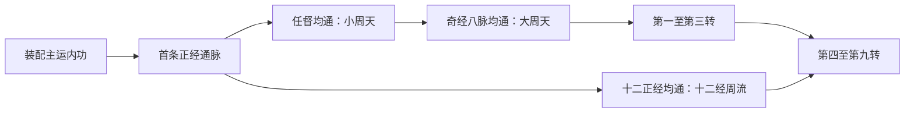

# 15 · 冲穴、经脉与周天（Meridians & Acupoints）

> 归属（基准 §18，AR-03）：穴道、经脉、通脉、小周天、大周天、十二经周流、九转、冲穴速率、奖励预算、失败与持久化契约的唯一归属。
> 上游：`decisions/author-requirements.md` AR-02 / AR-03 / AR-14 / AR-18（含 2026-09-29 作者决定）；`decisions/author-decisions.md` G1 总确认；`00-canon.md` v1.8（重点 §3 / §5 / §6 / §8–§10 / §12 / §18）；`decisions/rulings-v1.md`。
> 引用而不重定义：属性与成长曲线见 `design/03`；伤害乘区与节奏见 `design/04`；内功性质、层数、辅运与走火分级见 `design/05`；效果原语与 Buff 本体见 `design/06`；丹药见 `design/10`；打坐与世界时间见 `design/11`；师父权限见 design/12；成长、轮回与天书见 `design/13`；界面见 design/14；战斗经脉动态、攻 / 防 / 轻功路线、护体内劲、点穴 / 擒拿与调息见 `design/21`；数据管线见 tech/04；运行时实现见 tech/05。
> 标注约定：**（原创扩展）** = 本作游戏化规则；**（待考）** = 原著事实尚待三联/广州修订版逐字核对；**（待核实）** = 技术事实未联网确认；**（待实测）** = 需真机或真实玩法验证；**【建议值】** = 依赖其他归属文档接入，文末登记。

版本：v1.2（AR-19 穴 / 脉强度与通量永久进度，2026-10-01）；v1.1（AR-18 手部穴位归经复核，2026-09-29）；v1.0（M1，2026-09-26）；审校 M1.R（2026-09-26）；全局审计（2026-09-26）；经脉系统落地（2026-09-27）。规则与奖励均为**（原创扩展）**；穴名与经络名称采用真实术语，不把游戏效果解释为医学功效。

变更记录 v1.1：复核劳宫、合谷、后溪、外关的既有唯一 ID、标准代码、所属经脉与游戏阴阳；四穴均已正确登记，无需新增或改名。动作出口选择与路线体段判定只引用 `design/21` §2.4、§4.3.1，不在本文重定义。

变更记录：经脉落地终审（2026-09-30）：按当前 `damage_sim.py` 重算 §8.4 静态敏感性锚点，澄清交会 / 借穴的游戏归属与 AR-18 消费口径、战斗快照恢复和候选图谱审校边界；不更改穴位与成长数值。

变更记录 v1.2（2026-10-01，AR-19）：永久进度新增经脉 / 穴位天地玄黄十二品 × 1–9 强度、逐目标 `fluxCap` 与强化经验；完整内功周期锻炼通量，药材 / 丹药经 `MeridianTemperEffect` 强化，不再直接永久加人物等级资源。

> **同步记录（2026-10-02）**：依 Canon v1.10 §2、`design/13` §3.5.2 的白马首书检查点迁移 §7 / §10；跨界只消费 `design/25` §8–§9 的取舍 / 周游规则，不改变关隘公式与总工作量。

## 0. 阅读指南

本文冻结 20 条经脉、180 个互不重复的游戏穴道 ID、3 个周天里程碑及 9 个转数 ID。
冲穴由主运内功驱动，在安全点消耗内力和游戏时间；进度永久保留到本周目结束。
九转只把穴道原始奖励放大至 1.45 倍，通脉和周天奖励不递归放大；它可提高 21 的经脉强度输入，但不直接追加乘区或抬高硬界。
战斗创建时，本文把开穴、通脉、周天与九转派生为只读投影交给 `design/21`；战斗内的气量、容量、流畅度、迟滞、堆积、胀损与点穴均不回写永久修炼进度。

| 章节 | 内容 | 主要读者 |
|---|---|---|
| §1–§2 | 术语、经脉目录、解锁图 | 策划、考据、UI |
| §3 | 180 穴、标准归经与游戏冲穴顺序 | 内容、数据、图谱 |
| §4–§5 | 速率、关隘、成本、失败与辅助 | 数值、玩法核心 |
| §6–§8 | 加成、九转、三档核算与 TTK | 数值、战斗 |
| §9–§10 | 跨界继承、十四书预算与接口 | 成长、任务、UI |
| §11–§12 | YAML、TS、确定性与参考边界 | 数据、技术、考据 |
| §13–§15 | ID、校验、依赖与默认值 | 构建、审校、调度 |

### 0.1 已解决的输入项

| 输入 | 本文处理 |
|---|---|
| AR-03a–c | 已解决：author-decisions 的 G1 总确认采用 AR 默认；本副本没有另列 AR-03a–c 逐项追加行，不虚构作者填写内容。见 §1、§9。 |
| R05 Q-R05-1 / D19 | 已解决：接收有效品阶、有效层数、真实面板 mpMax、性质和辅运；目录及公式见 §2、§4。 |
| R03 AR-03 接口 | 已解决：只输出 sourceType 为 meridian 的合法修饰器，接入 03 的既有上限。见 §6、§10。 |
| R13 AR-03 继承 | 已解决：书眠完整保留，轮回运行态重置，账号只记最高转数。见 §9、§11。 |
| AR-14 战斗投影 | 已解决：本文只输出开穴 / 通脉 / 周天 / 九转只读快照；容量与流畅度的战斗换算、每单位实例及调息均引用 `design/21`。见 §6.7、§11.6。 |
| 图鉴预留经脉 / CN-07 | 已解决正式命名：保留长名任督冲带；短名迁移表见 §13。其他文件回写交 F2。 |
| CN-09 / R03-P02 | 已解决：基准与 03 已统一普通装备最高 g9，04 脚本也以合法装备回归；本文 §8 只保留静态奖励敏感性，不反向覆盖上游基线。 |

### 0.2 本文采用的范围

- 主角参与可操作冲穴；NPC 是否预置经脉由 design/18 手配，不能随玩家进度动态追平。
- 不新增先天属性、战斗资源、货币、武功品阶或“第十转”。内劲是速率，不能囤积、交易或带进战斗消耗。
- 进度与属性收益不要求保留当初使用的内功；再次冲穴时才重新读取当前装配。
- 冲穴不是战斗中点穴，也不是运劲行动；点穴、经脉迟滞 / 胀损与战斗调息唯一见 `design/21` §3、§9–§11，Buff 生命周期见 `design/06`，行动窗口见 `design/09`。

## 1. 术语、真实归经与游戏结构

### 1.1 术语表

| 术语 | 本作定义 | 边界 |
|---|---|---|
| 穴道 | §3 的一个具名行气节点；每个 ap ID 对应一个不同的标准穴位代码 | 左右同名穴合并解锁，不双倍计数 |
| 经脉 | 一组有序游戏穴道与一个完成奖励 | 十二正经 12 条、奇经八脉 8 条 |
| 通脉 | 一条游戏经脉的全部穴道成功开启 | 不把每条经脉叫作一个周天 |
| 小周天 | 任脉与督脉均通 | 自动达成，一次授予 |
| 大周天 | 奇经八脉均通 | 自动达成，是进入九转的前置 |
| 十二经周流 | 十二正经均通 | 与大周天是两条完成轴，第四转起要求两者都完成 |
| 九转 | 大周天之后第一至第九转的逐级温养 | 每转有独立修炼条；最高第九转 |
| 关隘值 | 当前穴道或当前转所需的内劲工作量 H | 不等于最大内力或另一种可持有资源 |
| 稳冲 / 催冲 | 常规与较高风险的冲穴方式 | 催冲增加速率和内力消耗，降低成功率 |

“小周天 = 任督”“大周天 = 八脉”“九转 = 九档养成”均按 AR-03 的游戏术语校正执行。
传统内丹的周天说法有流派差异，本作没有把这套解锁图声称为唯一传统解释，也没有归因给任何小说人物。

### 1.2 穴位不复制，游戏路线与标准归经分列

任、督以外的六条奇经没有与十二正经并列的一整套专属穴名。
本文把真实交会穴分配到一条游戏路线：例如气冲标准归胃经，游戏中分配给冲脉；胃经子集便不再重复列气冲。
每个标准代码全目录只出现一次奖励定义，因此穴道数、完成进度与数值都不会因交会重复计发。

带脉与阴跷脉的常用交会穴不足 6 个，按作者“每脉 6–12 穴”要求各补 3 个真实穴名的**借穴节点（原创扩展）**。
借穴仅改变本作行气路径，表中保留真实标准归经；不声称这些穴是传统带脉或阴跷脉的交会穴。
其他奇经全部使用真实交会穴子集；穴序是本作操作顺序，不是针灸定位、针刺方法或经典循行全文。

AR-18 的运行态路线性质由 `design/21` §2.4 读取本目录 `gameMeridian`，不读取“标准归经”反推游戏性质；气冲、章门等按游戏所属冲 / 带脉处理。内功主修经脉性质按 `design/05` §5.3；正 / 逆周天用途与末端手穴选择不改本目录的唯一归属。

| 接入方式 | 含义 | 数量 |
|---|---|---:|
| 本经 | 十二正经与任督所选穴，标准归经即本游戏经脉 | 132 |
| 交会 | 标准归另一条经，但用于所选奇经的交会路线 | 42 |
| 借穴 | 使用真实穴名、连接关系为本作扩展 | 6 |
| 合计 | 不同 ap ID = 不同标准代码 = 不同具名穴位 | 180 |

### 1.3 解锁顺序




十二正经内部可选任意一条先修，不要求按中医时辰轮流操作；穴序只能逐穴向前。
任督先修哪条由玩家选择。大周天之后可先做前三转再补正经；第四转起须 180 穴全开。
解锁条件满足不直接赠送工作量，所有穴道仍须投入冲穴时间；自动里程碑本身不额外收费或掷骰。

## 2. 经脉目录与开放条件

### 2.1 十二正经与奇经八脉总表

走向、脏腑列是中医术语摘要，正式发布前统一按 §12 做文献审校**（待考）**；游戏性质、难度阶 t、主题和分配的穴道数为**（原创扩展）**。
奇经“无独属脏腑”不能填成某一器官，游戏阴阳也不能反推脏腑疾病。

| ID | 中医名称 | 走向摘要 | 所属脏腑 / 联系 | 游戏性质 | t | 穴数 |
|---|---|---|---|---|---:|---:|
| `mer_shoutaiyin` | 手太阴肺经 | 自胸部沿上肢内侧前缘至拇指端。 | 属肺，络大肠。 | yin | 1 | 9 |
| `mer_shouyangming` | 手阳明大肠经 | 自食指端沿上肢外侧前缘上达面部鼻旁。 | 属大肠，络肺。 | yang | 1 | 9 |
| `mer_zuyangming` | 足阳明胃经 | 自面部下经胸腹与下肢前外侧至足第二趾。 | 属胃，络脾。 | yang | 2 | 9 |
| `mer_zutaiyin` | 足太阴脾经 | 自足大趾沿下肢内侧上入腹胸。 | 属脾，络胃。 | yin | 2 | 9 |
| `mer_shoushaoyin` | 手少阴心经 | 体表支自腋下沿上肢内侧后缘至小指端。 | 属心，络小肠。 | yin | 3 | 9 |
| `mer_shoutaiyang` | 手太阳小肠经 | 自小指沿上肢外侧后缘上肩，达颈面。 | 属小肠，络心。 | yang | 3 | 9 |
| `mer_zutaiyang` | 足太阳膀胱经 | 自目内眦上头项，经背腰与下肢后侧至足小趾。 | 属膀胱，络肾。 | yang | 4 | 9 |
| `mer_zushaoyin` | 足少阴肾经 | 自足底沿下肢内侧上入腹胸。 | 属肾，络膀胱。 | yin | 4 | 9 |
| `mer_shoujueyin` | 手厥阴心包经 | 自胸部沿上肢内侧中线至中指端。 | 属心包，络三焦。 | yin | 3 | 9 |
| `mer_shoushaoyang` | 手少阳三焦经 | 自无名指端沿上肢外侧中线，经肩颈耳周至眉梢。 | 属三焦，络心包；三焦为传统脏腑概念。 | yang | 3 | 9 |
| `mer_zushaoyang` | 足少阳胆经 | 自目外眦绕头侧，下经胁肋及下肢外侧至足第四趾。 | 属胆，络肝。 | yang | 4 | 9 |
| `mer_zujueyin` | 足厥阴肝经 | 自足大趾沿下肢内侧上入腹，循胁至胸。 | 属肝，络胆。 | yin | 4 | 9 |
| `mer_renmai` | 任脉 | 体表主线自会阴沿腹胸正中线上达颏部。 | 不独属某一脏腑，传统概括为联系阴经。 | yin | 4 | 12 |
| `mer_dumai` | 督脉 | 体表主线自尾骶沿脊背正中上头面。 | 不独属某一脏腑，传统概括为联系阳经。 | yang | 4 | 12 |
| `mer_chongmai` | 冲脉 | 自少腹起，主支循腹胸上行，并有下行分支。 | 不独属某一脏腑，传统联系气血与十二经。 | harmony | 5 | 12 |
| `mer_daimai` | 带脉 | 绕腰腹横行如带；本文借穴连线不等于经典循行。 | 不独属某一脏腑，横向约束纵行诸经。 | harmony | 5 | 6 |
| `mer_yinqiao` | 阴跷脉 | 由内踝附近沿下肢、躯干内侧上至目内眦。 | 不独属某一脏腑，起于足少阴相关区域。 | yin | 5 | 6 |
| `mer_yangqiao` | 阳跷脉 | 由外踝附近沿下肢外侧、肩颈面部上达目内眦。 | 不独属某一脏腑，起于足太阳相关区域。 | yang | 5 | 9 |
| `mer_yinwei` | 阴维脉 | 自小腿内侧上入腹，循胸至咽喉。 | 不独属某一脏腑，联络诸阴经。 | yin | 6 | 7 |
| `mer_yangwei` | 阳维脉 | 自足外侧上行下肢、肩颈，循头侧至项部。 | 不独属某一脏腑，联络诸阳经。 | yang | 6 | 8 |

核数：十二正经 12×9=108；任督 2×12=24；余六脉 12+6+6+9+7+8=48；总计 108+24+48=180。
t 只决定关隘与失败参数，不是新武功品阶；门槛检查不读取 t 对应的天地玄黄名称。

**AR-18 手部穴位复核（不新增 ID）**：掌心劳宫 `ap_shoujueyin_laogong` 为 PC8、手厥阴心包经、`yin`；虎口合谷 `ap_shouyangming_hegu` 为 LI4、手阳明大肠经、`yang`；掌刃侧后溪 `ap_shoutaiyang_houxi` 为 SI3、手太阳小肠经、`yang`；腕背外关 `ap_shoushaoyang_waiguan` 为 TE5、手少阳三焦经、`yang`。四项分别见 §3.10、§3.3、§3.7、§3.11；动作如何选穴及“劳宫阴门不改变阳性体段”见 `design/21` §2.4、§4.3.1。这里记录标准归经，不把动作功能解释为医学疗效。

### 2.2 开放门槛

| 路线 / 阶段 | 主运有效层数 | 经脉前置 | 其他前置 |
|---|---:|---|---|
| 任一正经首穴 | ≥3 | 无 | 有可用主运内功、安全点 |
| 同脉后续穴 | 同首穴 | 前一穴已开 | 同首穴 |
| 任脉、督脉 | ≥5 | 已通任意一条正经 | 安全点 |
| 冲、带、阴跷、阳跷 | ≥6 | 小周天 | 安全点 |
| 阴维、阳维 | ≥6 | 小周天 | 安全点 |
| 第一至第九转 | ≥6 | 大周天、上一转；第四转起另须十二经周流 | §7 的天书本数 |

AR-19 后人物没有独立等级，故旧表 `Ld≥11/21/31/41` 不再是生产门槛，也不得改名为隐藏的派生等级继续拦截；旧档只在迁移日志保留当时满足结果。主运层数仍按 05 的有效层数读取，时代压制可以让尚未开始的高阶冲穴暂不可用。
没有品阶最低门槛：同层黄阶内功也能完成，但更慢。资质、性别、门派身份不设隐含禁入。
未装配主运时，即使 03 面板显示 mpNature 为调和，速率仍为 0。
已开穴、通脉、周天或转数不会因主运变化而关闭。

## 3. 穴道子集与逐穴奖励

### 3.1 读表与奖励单位

每行定义一个穴道；所属游戏经脉由小节标题与 ID 前段共同确定。序号即必须遵循的冲穴顺序。
真实穴名、标准代码与标准归经在正式发布前统一按 §12 做文献审校**（待考）**；标准归经按代码前缀查 §2：LU/LI/ST/SP/HT/SI/BL/KI/PC/TE/GB/LR/CV/GV。
`TE` 为三焦经，`CV` 为任脉，`GV` 为督脉；它们是资料索引，不是新增游戏 ID。
`pp +0.10pp` 为 value=0.10；`flat` 进入最终属性取整前的加值池。表内 40 个旧 `hpMax/mpMax pct +0.05%` 单元格仅是 v1 迁移定位符：v2 构建不生成对应 `StatModifier`，开穴后改由该穴的 `grade×strengthLayer` 经 `design/03` §5.1 唯一资源根公式生效。
小数穴奖先合并、再按 03 取整；不能逐穴把 0.1 点抹成 0，也不能逐穴向上取成 1。
除上述 v1 资源定位符外，其余奖励都永久生效；`F(k)` 只放大仍启用的逐穴原始值，见 §7。旧档累计资源百分比由属性迁移器折为 `legacyHpCredit/legacyMpCredit` 一次，不能与穴位强度并存双算。

### 3.2 手太阴肺经 · `mer_shoutaiyin`

| 序 | 穴道 ID | 真实穴名 | 标准代码（标准归经） | 接入 | 基础固定加成 |
|---:|---|---|---|---|---|
| 1 | `ap_shoutaiyin_zhongfu` | 中府 | LU1（手太阴肺经） | 本经 | `hpMax` pct +0.05% |
| 2 | `ap_shoutaiyin_yunmen` | 云门 | LU2（手太阴肺经） | 本经 | `mpMax` pct +0.05% |
| 3 | `ap_shoutaiyin_tianfu` | 天府 | LU3（手太阴肺经） | 本经 | `defOut` pct +0.05% |
| 4 | `ap_shoutaiyin_xiabai` | 侠白 | LU4（手太阴肺经） | 本经 | `defIn` pct +0.05% |
| 5 | `ap_shoutaiyin_chize` | 尺泽 | LU5（手太阴肺经） | 本经 | `mpRegen` pp +0.01pp |
| 6 | `ap_shoutaiyin_kongzui` | 孔最 | LU6（手太阴肺经） | 本经 | `resCold` pp +0.1pp |
| 7 | `ap_shoutaiyin_taiyuan` | 太渊 | LU9（手太阴肺经） | 本经 | `med` flat +0.25点 |
| 8 | `ap_shoutaiyin_yuji` | 鱼际 | LU10（手太阴肺经） | 本经 | `apInner` flat +0.1点 |
| 9 | `ap_shoutaiyin_shaoshang` | 少商 | LU11（手太阴肺经） | 本经 | `qinggong` flat +0.1点 |

### 3.3 手阳明大肠经 · `mer_shouyangming`

| 序 | 穴道 ID | 真实穴名 | 标准代码（标准归经） | 接入 | 基础固定加成 |
|---:|---|---|---|---|---|
| 1 | `ap_shouyangming_shangyang` | 商阳 | LI1（手阳明大肠经） | 本经 | `hpMax` pct +0.05% |
| 2 | `ap_shouyangming_erjian` | 二间 | LI2（手阳明大肠经） | 本经 | `mpMax` pct +0.05% |
| 3 | `ap_shouyangming_sanjian` | 三间 | LI3（手阳明大肠经） | 本经 | `defOut` pct +0.05% |
| 4 | `ap_shouyangming_hegu` | 合谷 | LI4（手阳明大肠经） | 本经 | `defIn` pct +0.05% |
| 5 | `ap_shouyangming_yangxi` | 阳溪 | LI5（手阳明大肠经） | 本经 | `mpRegen` pp +0.01pp |
| 6 | `ap_shouyangming_pianli` | 偏历 | LI6（手阳明大肠经） | 本经 | `resPoison` pp +0.1pp |
| 7 | `ap_shouyangming_shousanli` | 手三里 | LI10（手阳明大肠经） | 本经 | `antidote` flat +0.25点 |
| 8 | `ap_shouyangming_quchi` | 曲池 | LI11（手阳明大肠经） | 本经 | `apFist` flat +0.1点 |
| 9 | `ap_shouyangming_yingxiang` | 迎香 | LI20（手阳明大肠经） | 本经 | `qinggong` flat +0.1点 |

### 3.4 足阳明胃经 · `mer_zuyangming`

| 序 | 穴道 ID | 真实穴名 | 标准代码（标准归经） | 接入 | 基础固定加成 |
|---:|---|---|---|---|---|
| 1 | `ap_zuyangming_chengqi` | 承泣 | ST1（足阳明胃经） | 本经 | `hpMax` pct +0.05% |
| 2 | `ap_zuyangming_sibai` | 四白 | ST2（足阳明胃经） | 本经 | `mpMax` pct +0.05% |
| 3 | `ap_zuyangming_jiache` | 颊车 | ST6（足阳明胃经） | 本经 | `defOut` pct +0.05% |
| 4 | `ap_zuyangming_renying` | 人迎 | ST9（足阳明胃经） | 本经 | `defIn` pct +0.05% |
| 5 | `ap_zuyangming_tianshu` | 天枢 | ST25（足阳明胃经） | 本经 | `mpRegen` pp +0.01pp |
| 6 | `ap_zuyangming_liangqiu` | 梁丘 | ST34（足阳明胃经） | 本经 | `resHeat` pp +0.1pp |
| 7 | `ap_zuyangming_zusanli` | 足三里 | ST36（足阳明胃经） | 本经 | `alchemy` flat +0.25点 |
| 8 | `ap_zuyangming_fenglong` | 丰隆 | ST40（足阳明胃经） | 本经 | `apLeg` flat +0.1点 |
| 9 | `ap_zuyangming_lidui` | 厉兑 | ST45（足阳明胃经） | 本经 | `qinggong` flat +0.1点 |

### 3.5 足太阴脾经 · `mer_zutaiyin`

| 序 | 穴道 ID | 真实穴名 | 标准代码（标准归经） | 接入 | 基础固定加成 |
|---:|---|---|---|---|---|
| 1 | `ap_zutaiyin_yinbai` | 隐白 | SP1（足太阴脾经） | 本经 | `hpMax` pct +0.05% |
| 2 | `ap_zutaiyin_dadu` | 大都 | SP2（足太阴脾经） | 本经 | `mpMax` pct +0.05% |
| 3 | `ap_zutaiyin_taibai` | 太白 | SP3（足太阴脾经） | 本经 | `defOut` pct +0.05% |
| 4 | `ap_zutaiyin_gongsun` | 公孙 | SP4（足太阴脾经） | 本经 | `defIn` pct +0.05% |
| 5 | `ap_zutaiyin_shangqiu` | 商丘 | SP5（足太阴脾经） | 本经 | `mpRegen` pp +0.01pp |
| 6 | `ap_zutaiyin_diji` | 地机 | SP8（足太阴脾经） | 本经 | `resGu` pp +0.1pp |
| 7 | `ap_zutaiyin_yinlingquan` | 阴陵泉 | SP9（足太阴脾经） | 本经 | `alchemy` flat +0.25点 |
| 8 | `ap_zutaiyin_xuehai` | 血海 | SP10（足太阴脾经） | 本经 | `apInner` flat +0.1点 |
| 9 | `ap_zutaiyin_dabao` | 大包 | SP21（足太阴脾经） | 本经 | `qinggong` flat +0.1点 |

### 3.6 手少阴心经 · `mer_shoushaoyin`

| 序 | 穴道 ID | 真实穴名 | 标准代码（标准归经） | 接入 | 基础固定加成 |
|---:|---|---|---|---|---|
| 1 | `ap_shoushaoyin_jiquan` | 极泉 | HT1（手少阴心经） | 本经 | `hpMax` pct +0.05% |
| 2 | `ap_shoushaoyin_qingling` | 青灵 | HT2（手少阴心经） | 本经 | `mpMax` pct +0.05% |
| 3 | `ap_shoushaoyin_shaohai` | 少海 | HT3（手少阴心经） | 本经 | `defOut` pct +0.05% |
| 4 | `ap_shoushaoyin_lingdao` | 灵道 | HT4（手少阴心经） | 本经 | `defIn` pct +0.05% |
| 5 | `ap_shoushaoyin_tongli` | 通里 | HT5（手少阴心经） | 本经 | `mpRegen` pp +0.01pp |
| 6 | `ap_shoushaoyin_yinxi` | 阴郄 | HT6（手少阴心经） | 本经 | `resMind` pp +0.1pp |
| 7 | `ap_shoushaoyin_shenmen` | 神门 | HT7（手少阴心经） | 本经 | `chess` flat +0.25点 |
| 8 | `ap_shoushaoyin_shaofu` | 少府 | HT8（手少阴心经） | 本经 | `apInner` flat +0.1点 |
| 9 | `ap_shoushaoyin_shaochong` | 少冲 | HT9（手少阴心经） | 本经 | `qinggong` flat +0.1点 |

### 3.7 手太阳小肠经 · `mer_shoutaiyang`

| 序 | 穴道 ID | 真实穴名 | 标准代码（标准归经） | 接入 | 基础固定加成 |
|---:|---|---|---|---|---|
| 1 | `ap_shoutaiyang_shaoze` | 少泽 | SI1（手太阳小肠经） | 本经 | `hpMax` pct +0.05% |
| 2 | `ap_shoutaiyang_qiangu` | 前谷 | SI2（手太阳小肠经） | 本经 | `mpMax` pct +0.05% |
| 3 | `ap_shoutaiyang_houxi` | 后溪 | SI3（手太阳小肠经） | 本经 | `defOut` pct +0.05% |
| 4 | `ap_shoutaiyang_wangu` | 腕骨 | SI4（手太阳小肠经） | 本经 | `defIn` pct +0.05% |
| 5 | `ap_shoutaiyang_yanggu` | 阳谷 | SI5（手太阳小肠经） | 本经 | `mpRegen` pp +0.01pp |
| 6 | `ap_shoutaiyang_yanglao` | 养老 | SI6（手太阳小肠经） | 本经 | `resSeal` pp +0.1pp |
| 7 | `ap_shoutaiyang_xiaohai` | 小海 | SI8（手太阳小肠经） | 本经 | `med` flat +0.25点 |
| 8 | `ap_shoutaiyang_tianzong` | 天宗 | SI11（手太阳小肠经） | 本经 | `apGrapple` flat +0.1点 |
| 9 | `ap_shoutaiyang_tinggong` | 听宫 | SI19（手太阳小肠经） | 本经 | `qinggong` flat +0.1点 |

### 3.8 足太阳膀胱经 · `mer_zutaiyang`

| 序 | 穴道 ID | 真实穴名 | 标准代码（标准归经） | 接入 | 基础固定加成 |
|---:|---|---|---|---|---|
| 1 | `ap_zutaiyang_cuanzhu` | 攒竹 | BL2（足太阳膀胱经） | 本经 | `hpMax` pct +0.05% |
| 2 | `ap_zutaiyang_tianzhu` | 天柱 | BL10（足太阳膀胱经） | 本经 | `mpMax` pct +0.05% |
| 3 | `ap_zutaiyang_feishu` | 肺俞 | BL13（足太阳膀胱经） | 本经 | `defOut` pct +0.05% |
| 4 | `ap_zutaiyang_xinshu` | 心俞 | BL15（足太阳膀胱经） | 本经 | `defIn` pct +0.05% |
| 5 | `ap_zutaiyang_shenshu` | 肾俞 | BL23（足太阳膀胱经） | 本经 | `mpRegen` pp +0.01pp |
| 6 | `ap_zutaiyang_weizhong` | 委中 | BL40（足太阳膀胱经） | 本经 | `resCold` pp +0.1pp |
| 7 | `ap_zutaiyang_chengshan` | 承山 | BL57（足太阳膀胱经） | 本经 | `forge` flat +0.25点 |
| 8 | `ap_zutaiyang_kunlun` | 昆仑 | BL60（足太阳膀胱经） | 本经 | `apStaff` flat +0.1点 |
| 9 | `ap_zutaiyang_zhiyin` | 至阴 | BL67（足太阳膀胱经） | 本经 | `qinggong` flat +0.1点 |

### 3.9 足少阴肾经 · `mer_zushaoyin`

| 序 | 穴道 ID | 真实穴名 | 标准代码（标准归经） | 接入 | 基础固定加成 |
|---:|---|---|---|---|---|
| 1 | `ap_zushaoyin_yongquan` | 涌泉 | KI1（足少阴肾经） | 本经 | `hpMax` pct +0.05% |
| 2 | `ap_zushaoyin_rangu` | 然谷 | KI2（足少阴肾经） | 本经 | `mpMax` pct +0.05% |
| 3 | `ap_zushaoyin_taixi` | 太溪 | KI3（足少阴肾经） | 本经 | `defOut` pct +0.05% |
| 4 | `ap_zushaoyin_dazhong` | 大钟 | KI4（足少阴肾经） | 本经 | `defIn` pct +0.05% |
| 5 | `ap_zushaoyin_shuiquan` | 水泉 | KI5（足少阴肾经） | 本经 | `mpRegen` pp +0.01pp |
| 6 | `ap_zushaoyin_fuliu` | 复溜 | KI7（足少阴肾经） | 本经 | `resInjury` pp +0.1pp |
| 7 | `ap_zushaoyin_yingu` | 阴谷 | KI10（足少阴肾经） | 本经 | `med` flat +0.25点 |
| 8 | `ap_zushaoyin_lingxu` | 灵墟 | KI24（足少阴肾经） | 本经 | `apInner` flat +0.1点 |
| 9 | `ap_zushaoyin_shufu` | 俞府 | KI27（足少阴肾经） | 本经 | `qinggong` flat +0.1点 |

### 3.10 手厥阴心包经 · `mer_shoujueyin`

| 序 | 穴道 ID | 真实穴名 | 标准代码（标准归经） | 接入 | 基础固定加成 |
|---:|---|---|---|---|---|
| 1 | `ap_shoujueyin_tianchi` | 天池 | PC1（手厥阴心包经） | 本经 | `hpMax` pct +0.05% |
| 2 | `ap_shoujueyin_tianquan` | 天泉 | PC2（手厥阴心包经） | 本经 | `mpMax` pct +0.05% |
| 3 | `ap_shoujueyin_quze` | 曲泽 | PC3（手厥阴心包经） | 本经 | `defOut` pct +0.05% |
| 4 | `ap_shoujueyin_ximen` | 郄门 | PC4（手厥阴心包经） | 本经 | `defIn` pct +0.05% |
| 5 | `ap_shoujueyin_jianshi` | 间使 | PC5（手厥阴心包经） | 本经 | `mpRegen` pp +0.01pp |
| 6 | `ap_shoujueyin_neiguan` | 内关 | PC6（手厥阴心包经） | 本经 | `resMind` pp +0.1pp |
| 7 | `ap_shoujueyin_daling` | 大陵 | PC7（手厥阴心包经） | 本经 | `music` flat +0.25点 |
| 8 | `ap_shoujueyin_laogong` | 劳宫 | PC8（手厥阴心包经） | 本经 | `apFinger` flat +0.1点 |
| 9 | `ap_shoujueyin_zhongchong` | 中冲 | PC9（手厥阴心包经） | 本经 | `qinggong` flat +0.1点 |

### 3.11 手少阳三焦经 · `mer_shoushaoyang`

| 序 | 穴道 ID | 真实穴名 | 标准代码（标准归经） | 接入 | 基础固定加成 |
|---:|---|---|---|---|---|
| 1 | `ap_shoushaoyang_guanchong` | 关冲 | TE1（手少阳三焦经） | 本经 | `hpMax` pct +0.05% |
| 2 | `ap_shoushaoyang_yemen` | 液门 | TE2（手少阳三焦经） | 本经 | `mpMax` pct +0.05% |
| 3 | `ap_shoushaoyang_zhongzhu` | 中渚 | TE3（手少阳三焦经） | 本经 | `defOut` pct +0.05% |
| 4 | `ap_shoushaoyang_yangchi` | 阳池 | TE4（手少阳三焦经） | 本经 | `defIn` pct +0.05% |
| 5 | `ap_shoushaoyang_waiguan` | 外关 | TE5（手少阳三焦经） | 本经 | `mpRegen` pp +0.01pp |
| 6 | `ap_shoushaoyang_zhigou` | 支沟 | TE6（手少阳三焦经） | 本经 | `resCC` pp +0.1pp |
| 7 | `ap_shoushaoyang_tianjing` | 天井 | TE10（手少阳三焦经） | 本经 | `formation` flat +0.25点 |
| 8 | `ap_shoushaoyang_yifeng` | 翳风 | TE17（手少阳三焦经） | 本经 | `apInner` flat +0.1点 |
| 9 | `ap_shoushaoyang_sizhukong` | 丝竹空 | TE23（手少阳三焦经） | 本经 | `qinggong` flat +0.1点 |

### 3.12 足少阳胆经 · `mer_zushaoyang`

| 序 | 穴道 ID | 真实穴名 | 标准代码（标准归经） | 接入 | 基础固定加成 |
|---:|---|---|---|---|---|
| 1 | `ap_zushaoyang_tongziliao` | 瞳子髎 | GB1（足少阳胆经） | 本经 | `hpMax` pct +0.05% |
| 2 | `ap_zushaoyang_yangbai` | 阳白 | GB14（足少阳胆经） | 本经 | `mpMax` pct +0.05% |
| 3 | `ap_zushaoyang_riyue` | 日月 | GB24（足少阳胆经） | 本经 | `defOut` pct +0.05% |
| 4 | `ap_zushaoyang_fengshi` | 风市 | GB31（足少阳胆经） | 本经 | `defIn` pct +0.05% |
| 5 | `ap_zushaoyang_yanglingquan` | 阳陵泉 | GB34（足少阳胆经） | 本经 | `mpRegen` pp +0.01pp |
| 6 | `ap_zushaoyang_waiqiu` | 外丘 | GB36（足少阳胆经） | 本经 | `resCC` pp +0.1pp |
| 7 | `ap_zushaoyang_guangming` | 光明 | GB37（足少阳胆经） | 本经 | `art` flat +0.25点 |
| 8 | `ap_zushaoyang_xuanzhong` | 悬钟 | GB39（足少阳胆经） | 本经 | `apLight` flat +0.1点 |
| 9 | `ap_zushaoyang_zuqiaoyin` | 足窍阴 | GB44（足少阳胆经） | 本经 | `qinggong` flat +0.1点 |

### 3.13 足厥阴肝经 · `mer_zujueyin`

| 序 | 穴道 ID | 真实穴名 | 标准代码（标准归经） | 接入 | 基础固定加成 |
|---:|---|---|---|---|---|
| 1 | `ap_zujueyin_dadun` | 大敦 | LR1（足厥阴肝经） | 本经 | `hpMax` pct +0.05% |
| 2 | `ap_zujueyin_xingjian` | 行间 | LR2（足厥阴肝经） | 本经 | `mpMax` pct +0.05% |
| 3 | `ap_zujueyin_taichong` | 太冲 | LR3（足厥阴肝经） | 本经 | `defOut` pct +0.05% |
| 4 | `ap_zujueyin_zhongfeng` | 中封 | LR4（足厥阴肝经） | 本经 | `defIn` pct +0.05% |
| 5 | `ap_zujueyin_ligou` | 蠡沟 | LR5（足厥阴肝经） | 本经 | `mpRegen` pp +0.01pp |
| 6 | `ap_zujueyin_zhongdu` | 中都 | LR6（足厥阴肝经） | 本经 | `resPoison` pp +0.1pp |
| 7 | `ap_zujueyin_xiguan` | 膝关 | LR7（足厥阴肝经） | 本经 | `poi` flat +0.25点 |
| 8 | `ap_zujueyin_ququan` | 曲泉 | LR8（足厥阴肝经） | 本经 | `apInner` flat +0.1点 |
| 9 | `ap_zujueyin_yinlian` | 阴廉 | LR11（足厥阴肝经） | 本经 | `qinggong` flat +0.1点 |

### 3.14 任脉 · `mer_renmai`

| 序 | 穴道 ID | 真实穴名 | 标准代码（标准归经） | 接入 | 基础固定加成 |
|---:|---|---|---|---|---|
| 1 | `ap_renmai_huiyin` | 会阴 | CV1（任脉） | 本经 | `hpMax` pct +0.05% |
| 2 | `ap_renmai_qugu` | 曲骨 | CV2（任脉） | 本经 | `mpMax` pct +0.05% |
| 3 | `ap_renmai_zhongji` | 中极 | CV3（任脉） | 本经 | `defOut` pct +0.05% |
| 4 | `ap_renmai_guanyuan` | 关元 | CV4（任脉） | 本经 | `defIn` pct +0.05% |
| 5 | `ap_renmai_shimen` | 石门 | CV5（任脉） | 本经 | `mpRegen` pp +0.01pp |
| 6 | `ap_renmai_qihai` | 气海 | CV6（任脉） | 本经 | `resHeat` pp +0.1pp |
| 7 | `ap_renmai_yinjiao` | 阴交 | CV7（任脉） | 本经 | `med` flat +0.25点 |
| 8 | `ap_renmai_shenque` | 神阙 | CV8（任脉） | 本经 | `apInner` flat +0.1点 |
| 9 | `ap_renmai_shuifen` | 水分 | CV9（任脉） | 本经 | `qinggong` flat +0.1点 |
| 10 | `ap_renmai_zhongwan` | 中脘 | CV12（任脉） | 本经 | `med` flat +0.25点 |
| 11 | `ap_renmai_danzhong` | 膻中 | CV17（任脉） | 本经 | `resHeat` pp +0.1pp |
| 12 | `ap_renmai_chengjiang` | 承浆 | CV24（任脉） | 本经 | `mpRegen` pp +0.01pp |

### 3.15 督脉 · `mer_dumai`

| 序 | 穴道 ID | 真实穴名 | 标准代码（标准归经） | 接入 | 基础固定加成 |
|---:|---|---|---|---|---|
| 1 | `ap_dumai_changqiang` | 长强 | GV1（督脉） | 本经 | `hpMax` pct +0.05% |
| 2 | `ap_dumai_yaoshu` | 腰俞 | GV2（督脉） | 本经 | `mpMax` pct +0.05% |
| 3 | `ap_dumai_yaoyangguan` | 腰阳关 | GV3（督脉） | 本经 | `defOut` pct +0.05% |
| 4 | `ap_dumai_mingmen` | 命门 | GV4（督脉） | 本经 | `defIn` pct +0.05% |
| 5 | `ap_dumai_jizhong` | 脊中 | GV6（督脉） | 本经 | `mpRegen` pp +0.01pp |
| 6 | `ap_dumai_zhiyang` | 至阳 | GV9（督脉） | 本经 | `resInjury` pp +0.1pp |
| 7 | `ap_dumai_shendao` | 神道 | GV11（督脉） | 本经 | `formation` flat +0.25点 |
| 8 | `ap_dumai_shenzhu` | 身柱 | GV12（督脉） | 本经 | `apInner` flat +0.1点 |
| 9 | `ap_dumai_baihui` | 百会 | GV20（督脉） | 本经 | `qinggong` flat +0.1点 |
| 10 | `ap_dumai_shangxing` | 上星 | GV23（督脉） | 本经 | `formation` flat +0.25点 |
| 11 | `ap_dumai_shuigou` | 水沟 | GV26（督脉） | 本经 | `resInjury` pp +0.1pp |
| 12 | `ap_dumai_yinjiao` | 龈交 | GV28（督脉） | 本经 | `mpRegen` pp +0.01pp |

### 3.16 冲脉 · `mer_chongmai`

| 序 | 穴道 ID | 真实穴名 | 标准代码（标准归经） | 接入 | 基础固定加成 |
|---:|---|---|---|---|---|
| 1 | `ap_chongmai_qichong` | 气冲 | ST30（足阳明胃经） | 交会 | `hpMax` pct +0.05% |
| 2 | `ap_chongmai_henggu` | 横骨 | KI11（足少阴肾经） | 交会 | `mpMax` pct +0.05% |
| 3 | `ap_chongmai_dahe` | 大赫 | KI12（足少阴肾经） | 交会 | `defOut` pct +0.05% |
| 4 | `ap_chongmai_qixue` | 气穴 | KI13（足少阴肾经） | 交会 | `defIn` pct +0.05% |
| 5 | `ap_chongmai_siman` | 四满 | KI14（足少阴肾经） | 交会 | `mpRegen` pp +0.01pp |
| 6 | `ap_chongmai_zhongzhu` | 中注 | KI15（足少阴肾经） | 交会 | `resSeal` pp +0.1pp |
| 7 | `ap_chongmai_huangshu` | 肓俞 | KI16（足少阴肾经） | 交会 | `alchemy` flat +0.25点 |
| 8 | `ap_chongmai_shangqu` | 商曲 | KI17（足少阴肾经） | 交会 | `apInner` flat +0.1点 |
| 9 | `ap_chongmai_shiguan` | 石关 | KI18（足少阴肾经） | 交会 | `qinggong` flat +0.1点 |
| 10 | `ap_chongmai_yindu` | 阴都 | KI19（足少阴肾经） | 交会 | `alchemy` flat +0.25点 |
| 11 | `ap_chongmai_futonggu` | 腹通谷 | KI20（足少阴肾经） | 交会 | `resSeal` pp +0.1pp |
| 12 | `ap_chongmai_youmen` | 幽门 | KI21（足少阴肾经） | 交会 | `mpRegen` pp +0.01pp |

### 3.17 带脉 · `mer_daimai`

| 序 | 穴道 ID | 真实穴名 | 标准代码（标准归经） | 接入 | 基础固定加成 |
|---:|---|---|---|---|---|
| 1 | `ap_daimai_daimai` | 带脉 | GB26（足少阳胆经） | 交会 | `hpMax` pct +0.05% |
| 2 | `ap_daimai_wushu` | 五枢 | GB27（足少阳胆经） | 交会 | `mpMax` pct +0.05% |
| 3 | `ap_daimai_weidao` | 维道 | GB28（足少阳胆经） | 交会 | `defOut` pct +0.05% |
| 4 | `ap_daimai_zulinqi` | 足临泣 | GB41（足少阳胆经） | 借穴**（原创扩展）** | `defIn` pct +0.05% |
| 5 | `ap_daimai_zhangmen` | 章门 | LR13（足厥阴肝经） | 借穴**（原创扩展）** | `mpRegen` pp +0.01pp |
| 6 | `ap_daimai_jingmen` | 京门 | GB25（足少阳胆经） | 借穴**（原创扩展）** | `resCC` pp +0.1pp |

### 3.18 阴跷脉 · `mer_yinqiao`

| 序 | 穴道 ID | 真实穴名 | 标准代码（标准归经） | 接入 | 基础固定加成 |
|---:|---|---|---|---|---|
| 1 | `ap_yinqiao_zhaohai` | 照海 | KI6（足少阴肾经） | 交会 | `hpMax` pct +0.05% |
| 2 | `ap_yinqiao_jiaoxin` | 交信 | KI8（足少阴肾经） | 交会 | `mpMax` pct +0.05% |
| 3 | `ap_yinqiao_jingming` | 睛明 | BL1（足太阳膀胱经） | 交会 | `defOut` pct +0.05% |
| 4 | `ap_yinqiao_sanyinjiao` | 三阴交 | SP6（足太阴脾经） | 借穴**（原创扩展）** | `defIn` pct +0.05% |
| 5 | `ap_yinqiao_lieque` | 列缺 | LU7（手太阴肺经） | 借穴**（原创扩展）** | `mpRegen` pp +0.01pp |
| 6 | `ap_yinqiao_lougu` | 漏谷 | SP7（足太阴脾经） | 借穴**（原创扩展）** | `resSeal` pp +0.1pp |

### 3.19 阳跷脉 · `mer_yangqiao`

| 序 | 穴道 ID | 真实穴名 | 标准代码（标准归经） | 接入 | 基础固定加成 |
|---:|---|---|---|---|---|
| 1 | `ap_yangqiao_shenmai` | 申脉 | BL62（足太阳膀胱经） | 交会 | `hpMax` pct +0.05% |
| 2 | `ap_yangqiao_pucan` | 仆参 | BL61（足太阳膀胱经） | 交会 | `mpMax` pct +0.05% |
| 3 | `ap_yangqiao_fuyang` | 跗阳 | BL59（足太阳膀胱经） | 交会 | `defOut` pct +0.05% |
| 4 | `ap_yangqiao_juliao` | 居髎 | GB29（足少阳胆经） | 交会 | `defIn` pct +0.05% |
| 5 | `ap_yangqiao_naoshu` | 臑俞 | SI10（手太阳小肠经） | 交会 | `mpRegen` pp +0.01pp |
| 6 | `ap_yangqiao_jianyu` | 肩髃 | LI15（手阳明大肠经） | 交会 | `resCold` pp +0.1pp |
| 7 | `ap_yangqiao_jugu` | 巨骨 | LI16（手阳明大肠经） | 交会 | `speech` flat +0.25点 |
| 8 | `ap_yangqiao_dicang` | 地仓 | ST4（足阳明胃经） | 交会 | `apLight` flat +0.1点 |
| 9 | `ap_yangqiao_juliao_wei` | 巨髎 | ST3（足阳明胃经） | 交会 | `qinggong` flat +0.1点 |

### 3.20 阴维脉 · `mer_yinwei`

| 序 | 穴道 ID | 真实穴名 | 标准代码（标准归经） | 接入 | 基础固定加成 |
|---:|---|---|---|---|---|
| 1 | `ap_yinwei_zhubin` | 筑宾 | KI9（足少阴肾经） | 交会 | `hpMax` pct +0.05% |
| 2 | `ap_yinwei_fushe` | 府舍 | SP13（足太阴脾经） | 交会 | `mpMax` pct +0.05% |
| 3 | `ap_yinwei_daheng` | 大横 | SP15（足太阴脾经） | 交会 | `defOut` pct +0.05% |
| 4 | `ap_yinwei_fuai` | 腹哀 | SP16（足太阴脾经） | 交会 | `defIn` pct +0.05% |
| 5 | `ap_yinwei_qimen` | 期门 | LR14（足厥阴肝经） | 交会 | `mpRegen` pp +0.01pp |
| 6 | `ap_yinwei_tiantu` | 天突 | CV22（任脉） | 交会 | `resMind` pp +0.1pp |
| 7 | `ap_yinwei_lianquan` | 廉泉 | CV23（任脉） | 交会 | `antidote` flat +0.25点 |

### 3.21 阳维脉 · `mer_yangwei`

| 序 | 穴道 ID | 真实穴名 | 标准代码（标准归经） | 接入 | 基础固定加成 |
|---:|---|---|---|---|---|
| 1 | `ap_yangwei_jinmen` | 金门 | BL63（足太阳膀胱经） | 交会 | `hpMax` pct +0.05% |
| 2 | `ap_yangwei_yangjiao` | 阳交 | GB35（足少阳胆经） | 交会 | `mpMax` pct +0.05% |
| 3 | `ap_yangwei_tianliao` | 天髎 | TE15（手少阳三焦经） | 交会 | `defOut` pct +0.05% |
| 4 | `ap_yangwei_jianjing` | 肩井 | GB21（足少阳胆经） | 交会 | `defIn` pct +0.05% |
| 5 | `ap_yangwei_benshen` | 本神 | GB13（足少阳胆经） | 交会 | `mpRegen` pp +0.01pp |
| 6 | `ap_yangwei_toulinqi` | 头临泣 | GB15（足少阳胆经） | 交会 | `resHeat` pp +0.1pp |
| 7 | `ap_yangwei_yamen` | 哑门 | GV15（督脉） | 交会 | `chess` flat +0.25点 |
| 8 | `ap_yangwei_fengfu` | 风府 | GV16（督脉） | 交会 | `apLight` flat +0.1点 |

### 3.22 交会与借穴说明

- 带脉的带脉、五枢、维道为交会子集；足临泣是八脉交会穴中通带脉者，游戏将其作为引导节点，章门与京门为腰胁借穴。三者连接统一标借穴，不冒充传统带脉六专穴。
- 阴跷选照海、交信、睛明为交会子集；三阴交、列缺、漏谷为本作借穴。列缺通任脉，并不因此改称阴跷交会穴。
- 阴阳跷同会睛明，游戏只在阴跷登记；阳跷表用其他真实交会穴满足数量，不重复开一个睛明。
- 任脉阴交与督脉龈交、三焦中渚与冲脉中注，各为不同真实穴，ID 经脉段消歧。阳跷同时选居髎、巨髎，后者用 `_wei` 指胃经，避免同脉同音重名。
- 全表没有额外创造穴名；6 个借穴的关系和 180 个奖励均为原创扩展。文化依据与待核范围见 §12、§15.4。

## 4. 内劲、关隘与冲穴速率

### 4.1 结算单位与输入快照

冲穴以 1 游戏小时为一个原子 `session`。玩家可在 UI 排定多个小时，但运行时逐小时扣费、推进、存档并检查世界事件；不能把 6 小时合成一次掷骰。
一次 session 只指定一个尚未开启的穴道或一转修炼条。穴道开启后的多余工作量不溢出到下一穴，避免队列绕过逐穴成功判定。

每个小时开始时冻结以下输入，结束前不因装备切换、治疗或属性刷新而改变：

| 符号 | 来源 | 说明 |
|---|---|---|
| `Ce` | 03 §3.0 | 无状态的当界有效修为档，只给冲穴节奏旧曲线校准；不是人物等级或开放门槛 |
| `g_i` | 05 | 第 i 门已装配内功的有效品阶，1–12 |
| `n_i` | 05 | 第 i 门内功的有效层数，1–10 |
| `r_i` | 05 | 主运为 1；辅运为该组合的 `auxRatio` |
| `mpMax` | 03 | 当前快照的真实面板内力上限；不是当前剩余 `mp` |
| `MPREF(Ce)` | 03 §3.5 | 同有效校准档的旧耗内参考；只用于冲穴成本 / 速率归一 |
| `nature_main` | 05 | 主运 `yin/yang/harmony`；没有主运则不可冲穴 |
| `meridians_i` | 05 `inner.meridians` | 第 i 门内功专精的经脉 ID 列表 |
| `wil` | 03 | 快照后的最终意志，用于过关而非基础工作量 |
| `bookCount` | 13 | 本周目已取得天书数，0–14 |
| 辅助项 | 10 / 12 / 11 | 丹药、师父指点、打坐地点；见 §5.6 |

这里只读取有效品阶、有效层数，不重新实现压制。进入新书界、天道劫第六重或无天道沙盒改变压制参数时，05 先给出新的 `g_i/n_i`，03 再从同一永久快照给出新的 `Ce/mpMax`；`Ce` 不保存、不升级，也不直接生成资源。

### 4.2 单门内功的内劲贡献

沿用基准品阶系数 `G(g)` 和 05 的层数系数 `L(n)=0.5+0.1n`：

```text
spec(i,m) = 1.20，若目标经脉 m 在 inner_i.meridians；否则 1.00
qi_i(m)   = G(g_i) × L(n_i) × r_i × spec(i,m)
Qi(m)     = Σ qi_i(m)
```

- 主运全额计入；两门辅运分别按 05 已结算的 `auxRatio` 计入，不能再以“辅运”名义打第二次折扣。
- 专精乘数作用于对应内功自己的贡献，不作用于整池。主运专精与辅运专精可以同时贡献，但每门至多乘一次 1.20。
- `inner.meridians: []` 表示无专精，不表示“全经脉专精”。未知 `mer_*` 必须构建失败。
- 被 05 判为不可用、未装配或有效层数为 0 的内功不进入求和。临时提升招式威力、Z3 或战斗内层数不改变 `Qi`。

例：地上 7 重主运贡献 `G(9)×L(7)=2.40×1.20=2.88`；玄上 7 重同源辅运贡献 `1.70×1.20×0.50=1.02`。若后者专精当前脉，则为 `1.02×1.20=1.224`，而不是把整个 `Qi` 乘 1.20。

### 4.3 经脉性质相性

目标性质取 §2 表的 `yin/yang/harmony`；相性只看主运性质，辅运的阴阳关系已经体现在 `auxRatio`，不能重复处罚。

| 主运＼目标经脉 | yin | yang | harmony | 成功率修正 |
|---|---:|---:|---:|---|
| yin | 1.10 | 0.88 | 1.00 | 同性 +300bp；相冲 −500bp；和脉 0 |
| yang | 0.88 | 1.10 | 1.00 | 同性 +300bp；相冲 −500bp；和脉 0 |
| harmony | 1.05 | 1.05 | 1.10 | 阴/阳 +150bp；和脉 +300bp |

调和对阴、阳脉没有惩罚，取得同性增益的一半，落实 AR-02；面对调和脉则视为同源。
该表只影响成长冲穴，不改 05 §5.3 的招式 Z5 相性，也不产生寒、热或免疫标签。

### 4.4 内力厚度与兼容节奏折算

```text
M(mpMax,Ce) = sqrt(clamp(mpMax / MPREF(Ce), 0.50, 2.00))
D(Ce)       = clamp(0.65 + 0.01×Ce, 0.75, 1.35)
T(b)        = 1 + 0.01×clamp(b,0,14)
```

`M` 使用平方根且把比值钳在 0.50–2.00：面板内力深厚仍有意义，但内功已经通过 `Qi` 贡献一次，不让同一套高阶内功再按 `mpMax` 线性放大第二次。
`D` 读取无状态 `Ce`：35 档为 1.00，44 档为 1.09，70 档为 1.35。它只校准旧冲穴工期，不表示人物有等级；同一武功 / 经脉 / 时代快照必得同一 `Ce`。
`T` 是“天书导引”**（原创扩展）**：每本 +1% 工作量，14 本封顶 +14%；它不是新的 `tsp_*` 战斗被动，不受温养放大。13 需在接口表登记这一读取。

### 4.5 最终速率公式

辅助速率统一加算后钳制，避免丹药、静室和师父互乘：

```text
AidRateBp = clamp(locationRateBp + teacherRateBp + medicineRateBp, 0, 5000)
ModeRate  = steady ? 1.00 : 1.35
Disorder  = 持有 bf_neixiwenluan ? 0.50 : 1.00

RateRaw = 80 × Qi(m) × Affinity(nature_main,m)
             × M(mpMax,Ce) × D(Ce) × T(bookCount)
             × (1 + AidRateBp/10000) × ModeRate × Disorder
RateH   = max(1, roundHalfUp(RateRaw))
```

`RateH` 的单位是“关隘工作量 / 游戏小时”。每小时只在结算时把 `min(RateH, H-progress)` 加入当前目标；UI 可显示未取整预估，但存档只写整数。
`bf_jingmainixing` 或 `bf_zouhuorumo` 存在时不能开始 session；`bf_neixiwenluan` 允许稳冲或催冲，但速率减半，并另受 §5.3 的成功率处罚。这里引用 05 / 06 的状态，不重定义其战斗效果。

### 4.6 穴道关隘值

对经脉难度阶 `t∈[1,6]`、脉内序号 `j∈[1,N]`：

```text
H_ap(t,j) = 200 + 60×t + 25×(j−1)
```

| t | 首穴 H | 第 6 穴 H | 第 9 穴 H | 第 12 穴 H | 使用路线 |
|---:|---:|---:|---:|---:|---|
| 1 | 260 | 385 | 460 | — | 肺、大肠 |
| 2 | 320 | 445 | 520 | — | 胃、脾 |
| 3 | 380 | 505 | 580 | — | 心、小肠、心包、三焦 |
| 4 | 440 | 565 | 640 | 715 | 膀胱、肾、胆、肝、任、督 |
| 5 | 500 | 625 | 700 | 775 | 冲、带、阴跷、阳跷 |
| 6 | 560 | 685 | — | — | 阴维、阳维 |

按 §2 的实际穴数求和：

```text
t1: 2×3,240 =  6,480
t2: 2×3,780 =  7,560
t3: 4×4,320 = 17,280
t4: 4×4,860 + 2×6,930 = 33,300
t5: 7,650 + 2×3,375 + 5,400 = 19,800
t6: 4,445 + 5,180 =  9,625
全 180 穴 = 94,045 H
```

核数中的 t5 含冲脉 12 穴、带/阴跷各 6 穴、阳跷 9 穴。关隘只约束时间，不改变奖励大小，因此不会出现“晚开一穴奖励十倍”的雪球。

### 4.7 三个速率锚点

先排除专精、地点、师父、丹药和内息紊乱，取同源辅运、`mpMax=MPREF(Ce)`、目标与主运同性；天书数分别取 3 / 14 / 8。表内“Lv”是旧夹具显示名，生产输入依次为 `Ce=35/70/44`。

| 场景 | `Qi` 算式 | `D×T×相性` | 稳冲 `RateH` | 催冲 `RateH` |
|---|---|---:|---:|---:|
| `Ce35` 高武：主 g9、辅 g6×2、均 7 重 | `2.40×1.20 + 2×(1.70×1.20×0.50)=4.92` | `1.00×1.03×1.10` | `round(80×4.92×1.133)=446` | `round(446×1.35)=602` |
| `Ce70` 终局：主 g12、辅 g11×2、均 10 重 | `3.50×1.50 + 2×(3.10×1.50×0.50)=9.90` | `1.35×1.14×1.10` | `1,341` | `1,810` |
| `Cb70→Ce44` 低武：主 g8、辅 g7×2、均有效 8 重 | `2.20×1.30 + 2×(2.00×1.30×0.50)=5.46` | `1.09×1.08×1.10` | `566` | `764` |

第一行例：`80×4.92×1.00×1.03×1.10=446.0`。第三行不是把终局 `Qi=9.90` 只乘一个折扣，而是让 05 的低武有效品阶 / 层数与本文的 `Ce=44` 同时生效；速率为终局 `566/1341≈42.2%`。
实际 `mpMax/MPREF`、专精与辅助再按公式重算；本表不是玩家保证值，也不恢复人物等级。

## 5. 冲穴动作、成本、成功与失败

### 5.1 开始条件与停止条件

每个 session 开始前按以下顺序检查，任一失败都不扣时间、不扣内力、不推进 RNG ordinal：

1. 位于 11 认可的安全点，且该点允许盘坐；战斗、追逐、强制剧情和移动途中不可开始。
2. 目标已解锁，脉内前一穴已开；转数目标满足 §7 前置。
3. 有可用主运内功，并达到 §2.2 的主运有效层数门槛。
4. 不持有 `bf_jingmainixing` 或 `bf_zouhuorumo`；世界日程中接下来 1 小时无不可延迟事件。
5. 当前 `mp` 足以支付 §5.2 的完整成本；不能以降至负数换取结算。

连续修炼队列在以下任一情况停止：目标开启/转数完成、失败、内力不足、状态升级为禁修、预定世界事件到点、玩家取消或存档失败。世界事件在本小时成功提交后才触发，不回滚已经完成的穴道。

### 5.2 内力、时间与打坐

```text
BaseCostRate(t) = 0.025 + 0.003×t            // t1=2.8%，t6=4.3%
ModeCost        = steady ? 1.00 : 1.50
AidCostBp       = clamp(medicineCostReduceBp + teacherCostReduceBp, 0, 2000)
MpCost          = ceil(mpMax_snapshot × BaseCostRate(t) × ModeCost
                       × (1 − AidCostBp/10000))
TimeCost        = 1 游戏小时
```

转数修炼固定按 `t=6` 计成本。稳冲每小时消耗面板内力上限 2.8%–4.3%；催冲为 4.2%–6.45%，再受至多 20% 辅助减耗。
成本在 session 开始时扣除。动作名为“冲穴打坐”，只借用 11 的地点、时钟和打断框架：**不同时触发**普通打坐的 MP/STA 回满与 HP 至少 50% 恢复。玩家若先普通打坐恢复，再冲穴，须另花一个游戏小时。

例：兼容夹具 `Ce35` 的 `mpMax=4,697`，冲 t4 穴，稳冲成本 `ceil(4697×3.7%)=174 MP`；催冲为 `ceil(4697×3.7%×1.5)=261 MP`。若有效减耗 15%，分别为 148 / 222 MP。

### 5.3 成功率（仅触及关隘时掷骰）

进度不足 `H` 的 session 必定安全推进，不掷成功骰。只有 `progress + RateH ≥ H` 时，才在该小时末尝试开穴或完成一转：

```text
NatureBp = 同性或 harmony→harmony ? +300
         : harmony→yin/yang       ? +150
         : yin/yang→harmony       ?    0
         : 相冲                    ? −500

AssistSuccessBp = clamp(50×bookCount
                        + locationSuccessBp
                        + teacherSuccessBp
                        + medicineSuccessBp, 0, 2000)
ModePenaltyBp    = steady ? 0 : 1200
DisorderPenalty  = 持有 bf_neixiwenluan ? 1000 : 0
WilBp            = clamp(25×(wil−50), −500, 1750)

PsuccessBp = clamp(
  6500 + 180×(g_main−t) + 100×(n_main−5) + WilBp
       + NatureBp + AssistSuccessBp − ModePenaltyBp − DisorderPenalty,
  3500, 9800)
```

所有数值均为整数 bp；抽取 `u∈[0,9999]`，`u<PsuccessBp` 即成功。UI 显示到 0.1%，但不得用显示后的百分比反算。
成功后把目标标为开启、进度置为 `H`，同一事务内派生通脉/周天/转数奖励；失败按 §5.4。每个穴道只在触及关隘时掷一次，不能通过提前保存反复刷新。

`Ce35` 示例取主运 g9 / 7 重、t4、`wil=65`、3 本天书、同性、无其他辅助：
`6500+180×5+100×2+25×15+300+150=8425bp=84.25%`；催冲减 1200bp，得 72.25%。

### 5.4 失败回落与伤势

失败不关闭任何已开穴，不回退通脉、周天或已完成转数；只处理当前目标：

```text
progressAfterFail = floor(0.75 × H_target)
failMargin        = u − PsuccessBp       // 失败时至少为 0
```

| 失败余量 | 后果 | 调用 06 |
|---:|---|---|
| 0–999bp | 当前进度回落；内伤 1 层 | `bf_neishang` +1 |
| 1,000–2,499bp | 回落；内伤 2 层；走火 1 级 | `bf_neishang` +2、`bf_neixiwenluan` |
| 2,500–3,999bp | 回落；内伤 3 层；走火 2 级 | `bf_neishang` +3、`bf_jingmainixing` |
| ≥4,000bp | 回落；内伤 4 层；走火 3 级 | `bf_neishang` +4、`bf_zouhuorumo` |

走火状态的有效品阶取本次主运 `g_main`。若已有 `exg_zouhuo` 组内实例，完全交给 06 的升级规则：新触发等级不高于当前等级时仍升一级（上限 3），更高级则直接替换；本文不并存第二份走火状态。
内伤的叠层、持续、治疗和满层效果见 06；本文只发出 `applyBuff`。催冲并不直接提高伤势档，而是通过降低成功率扩大失败概率和可能的 `failMargin`。
失败 session 的 1 游戏小时与内力成本不返还。当前进度固定回到 75%，避免清零式挫败，也防止失败后下一小时无须再投入。

### 5.5 稳冲与催冲的选择

| 项 | 稳冲 | 催冲 |
|---|---:|---:|
| 工作量速率 | ×1.00 | ×1.35 |
| 内力成本 | ×1.00 | ×1.50 |
| 成功率 | 原值 | −1,200bp |
| 最低成功率 | 35% | 35%（总式最终钳制） |
| 使用建议 | 稳定推进、关键后段穴 | 时间紧迫、辅助充分时 |

系统不提供“必成付费物品”。即使辅助将原始成功率推高，仍有 2% 最低失败率；这条尾险是走火系统存在的玩法理由。自动队列默认稳冲，玩家须逐次确认才可催冲。

### 5.6 丹药、师父、地点与天书辅助

辅助只改本文明确的三个槽：`rateBp`、`successBp`、`costReduceBp`。同来源多项取最高，不同来源加算后分别受 §4.5 / §5.2 / §5.3 上限。

| 来源 | 数据接口 | 本文默认 | 边界 |
|---|---|---|---|
| 丹药（10） | `meridianAid` | 按物品配置；药物之间每槽取最高 | 速率合计仍受 +50%，成功辅助仍受 +2,000bp，减耗仍受 20%；不直接开穴 |
| 师父指点（12） | `MeridianGuidance` | `rateBp=1500`、`successBp=800`、`costReduceBp=500` **【建议值】** | 每次指点绑定一条经脉并消耗 1 次指导额度；资格、关系与刷新归 12 |
| 安全点（11/12） | `meditationQuality=0/1/2` | 普通 0/0；清静 +500/+300bp；名门静室 +1000/+600bp **【建议值】** | 顺序为速率/成功；不授予减耗，不与普通打坐恢复叠加 |
| 天书（13） | `bookCount` | 每本速率 +1%、成功 +50bp | 最多 +14% / +700bp；只在本周目已取得时生效 |
| 内功专精（05） | `inner.meridians` | 对该内功贡献 ×1.20 | 不是成功率加成，不能填穴道 ID |

`meridianAid` 建议形状为 `{rateBp, successBp, costReduceBp, hours, meridians?}`；10 负责具体药名、品阶、价格、获得途径与能否重复服用，15 只消费快照。
师父与静室的消费接口已由 `design/12` §2.3、§6.3 对齐；数值仍是本文 **【建议值】**，直到玩法实测冻结。缺具体内容配置时三槽均按 0，不能阻塞基础冲穴。

### 5.7 UI 预估与风险提示

面板必须同时显示：本小时工作量、当前/总关隘、预计还需小时数 `ceil((H-progress)/RateH)`、内力成本、成功率、失败四档区间和现有走火状态。
若下一小时会触及关隘，按钮文案由“行气一小时”改为“冲关一小时”；催冲按钮显示相对变化，例如“工作量 +35%，内力 +50%，成功 −12.0pp”。
预估按当前快照计算；世界事件、换内功、治疗、取得天书或进入新书界后立即重算，不承诺旧预估。

## 6. 穴道、通脉与周天奖励

### 6.1 奖励派生顺序

奖励不是一次次向角色基础表写入的可变增量，而是由已开 ID 集合每次重建：

```text
1. 对每个 openedAp 读取 §3 原始奖励，并乘当前 F(turn)；
2. 对每个 completedMeridian 追加 §6.3 通脉奖励；
3. 对已达成的 milestone 追加 §6.5 静态奖励并实例化被动；
4. 对 `turnCompleted` 逐转追加 §7.2 被动；
5. 同属性同操作先以整数定点求和，再送入 03 §11.2；
6. 03 / 06 做属性、族与乘区最终钳制。
```

`F(turn)` 只作用于 §3 的逐穴原始奖励。通脉、锚穴被动、周天静态奖励和九转被动都不乘 `F`，也不能因读档再次发放。
关闭或更换内功不会撤销奖励；轮回重置后，由于运行态集合为空，奖励自然归零。

### 6.2 逐穴奖励总账与内部上限

§3 的 180 行在第零转合计如下；第九转统一乘 `F(9)=1.45`。先按同目标同操作合池，再按 §11.1 的 IR 最小单位半向上取整；因此表中第九转列是可实际存储的结果，不是逐穴取整之和。

| 属性组 | 第零转原始合计 | 第九转穴奖合计 | 03 最终上限 / 说明 |
|---|---:|---:|---|
| v1 `hpMax` / `mpMax` 定位符 | 各 pct +1.00% | v2 不派生百分比 | 一次迁移为 03 `legacy*Credit`；生产资源改读穴位强度 |
| `defOut` / `defIn` | 各 pct +1.00% | 各 +1.45% | 进入 MAG pct 池，不进入 Z4 |
| `mpRegen` | +0.23pp | +0.334pp | `roundHalfUp(230×1.45)=334` milli-pp；最终 `mpRegen≤6%` |
| `qinggong` | +1.6 | +2.32 | 最终 `qinggong≤300` |
| `apInner` / `apLight` | +0.9 / +0.3 | +1.305 / +0.435 | 各资质最终 ≤100 |
| `apFinger/Fist/Grapple/Leg/Staff` | 各 +0.1 | 各 +0.145 | 各资质最终 ≤100 |
| `alchemy/med/formation` | +1.0 / +1.25 / +0.75 | +1.450 / +1.813 / +1.088 | 各技艺最终 ≤100 |
| `antidote/chess` | 各 +0.5 | 各 +0.725 | 各技艺最终 ≤100 |
| `forge/art/music/poi/speech` | 各 +0.25 | 各 +0.363 | 各技艺最终 ≤100 |
| `resCC/resCold/resInjury/resMind` | 各 +0.3pp | 各 +0.435pp | 各抗性最终 ≤75pp |
| `resHeat/resSeal` | 各 +0.4pp | 各 +0.58pp | 同上 |
| `resPoison/resGu` | +0.2 / +0.1pp | +0.29 / +0.145pp | 同上 |

除 03 的最终上限外，经脉来源另设防误配内部上限；任何内容表超过即构建失败，而不是静默吞值：

| `sourceType:'meridian'` 目标 | 本系统合计上限 | 当前满九转预算 |
|---|---:|---:|
| 单项 `atkOut/atkIn/defOut/defIn` pct | +5% | 最高 `atkOut/atkIn +2.50%`，见 §7.3；v1 资源 pct 不计 |
| `hpRegen/mpRegen` pp | +1.00pp | `mpRegen +0.634pp`，`hpRegen 0` |
| 单项抗性 pp | +5pp | 最高 `resSeal +2.58pp` |
| `counter/combo/seal` pp | +2pp | `counter +0.25pp`、`combo +1.50pp` |
| 单项 RAT flat | +5 | `effRes +3` 为最高；`spd +1` |
| `qinggong` flat | +10 | +3.82 |
| 单项资质 / 技艺 flat | +5 | `apInner +1.555`、`med +1.813` 为最高 |

该内部上限不是玩家面板上限，也不为其他来源预留新乘区；它只防止经脉配表意外膨胀。

### 6.3 二十条通脉 combo 与主题奖励

每条经脉最后一穴成功后自动通脉，固定获得 `combo` pp +0.05pp，再发出表中的一份主题奖励。这落实 AR-03 的“通脉后有 combo 属性加成”；20 脉合计 `combo +1.00pp`。表内主题不再重复给 `combo`，同源加算后仍受 03 上限约束。

| 经脉 | 主题 | 固定奖励 | 设计意图 |
|---|---|---|---|
| `mer_shoutaiyin` | 宣肃 | `resCold` pp +0.50pp | 阴脉抗寒主题 |
| `mer_shouyangming` | 涤浊 | `resPoison` pp +0.50pp | 毒性抗力 |
| `mer_zuyangming` | 纳谷 | `mpRegen` pp +0.10pp | 长线续航 |
| `mer_zutaiyin` | 运化 | `healRecv` pp +0.50pp | 受疗效率 |
| `mer_shoushaoyin` | 守神 | `resMind` pp +0.50pp | 心神抗力 |
| `mer_shoutaiyang` | 分清 | `resHeat` pp +0.50pp | 阳脉抗热主题 |
| `mer_zutaiyang` | 通背 | `qinggong` flat +0.50 | 身法通路 |
| `mer_zushaoyin` | 藏精 | `mpRegen` pp +0.10pp | 内息续航 |
| `mer_shoujueyin` | 护心 | `resInjury` pp +0.50pp | 抗内伤 |
| `mer_shoushaoyang` | 通达 | `rageGain` pp +0.50pp | 气势周转 |
| `mer_zushaoyang` | 枢转 | `counter` pp +0.25pp | 反击机会 |
| `mer_zujueyin` | 条达 | `resCC` pp +0.50pp | 抗控制 |
| `mer_renmai` | 任承诸阴 | `effRes` flat +1.0 | 抵抗评级 |
| `mer_dumai` | 督率诸阳 | `tough` flat +1.0 | 抗暴评级 |
| `mer_chongmai` | 血海 | `apInner` flat +0.25 | 内功资质 |
| `mer_daimai` | 约束 | `resSeal` pp +0.50pp | 抗封穴 |
| `mer_yinqiao` | 阴跷安步 | `eva` flat +1.0 | 闪避评级 |
| `mer_yangqiao` | 阳跷疾行 | `spd` flat +1.0 | 行动速度评级 |
| `mer_yinwei` | 维阴 | `effRes` flat +1.0 | 抵抗评级 |
| `mer_yangwei` | 维阳 | `effHit` flat +1.0 | 效果命中评级 |

二十脉合计：通用 `combo +1.00pp`；`mpRegen +0.20pp`；`resCold/resPoison/resMind/resHeat/resInjury/resCC/resSeal` 七项抗性各 +0.50pp；`qinggong +0.50`、`counter +0.25pp`、`spd +1.0`、`effRes +2`，其余见表。
通脉奖励不随九转放大，避免“穴奖放大 × 通脉放大 × 周天放大”的递归。

### 6.4 锚穴被动（已由 06 收录）

下列三个具名穴除 §3 的固定小加成外，各生成一个永久被动实例。它们全为**（原创扩展）**，只借真实穴名做主题锚，不声称有医学效果。

| 已开穴 | 被动 ID | 精确定义摘要 | 06 原语 / 钩子 |
|---|---|---|---|
| 气海 `ap_renmai_qihai` | `bf_ap_qihai` | 每次自身行动内第一次消耗内力后，回复该次实扣内力的 3%，向下取整；回复至少需为 1 | `onMpSpent` + `restoreMp`，`limitPerTurn:1` |
| 百会 `ap_dumai_baihui` | `bf_ap_baihui` | 开战时自身集气 +15；召唤、复活或换人重挂不再触发 | `onBattleStart` + `ctShift 15` |
| 涌泉 `ap_zushaoyin_yongquan` | `bf_ap_yongquan` | 每次自身行动周期内第一次被强制位移后集气 +20；自身主动移动不触发 | `onDisplaced` + `ctShift 20`，`limitPerTurn:1` |

三项的运行时 Buff 实例来源使用 06 施加流程中的 `origin.type=system`，`origin.id` 填穴道 ID；这不是 `BuffDef.origin` 的考据来源字段（`canon/expanded/canonExpanded`）。固定系统品阶 12、不可普通驱散、无 `G/Lb` 放大。品阶只用于 schema 完整性，不使它们与免疫做品阶对抗；完整 Buff 本体见 `design/06` §8.13，实例来源契约见其 §13.4。

### 6.5 三个完成里程碑

| 里程碑 ID | 达成 | 全局静态加成 | 被动 ID 与效果 |
|---|---|---|---|
| `zt_xiaozhoutian` | 任、督均通 | `atkIn` pct +0.75%；`mpRegen` pp +0.10pp；v1 `mpMax` pct +0.50% 仅迁移 | `bf_zt_xiaozhoutian`：每次自身行动第一次消耗内力后，额外返还实扣量 7%，向下取整；与气海合计返还 10% |
| `zt_dazhoutian` | 奇经八脉均通 | `atkOut` pct +0.75%；`resInjury/resSeal` 各 +1.00pp | `bf_zt_dazhoutian`：成功抵抗 `injury` 或 `seal` 标签效果时回复 `mpMax×0.5%`，每次自身行动周期至多 1 次 |
| `zt_shierjingzhouliu` | 十二正经均通 | `atkOut/atkIn` pct 各 +0.75%；`qinggong` flat +1.0；`combo` pp +0.50pp | `bf_zt_shierjingzhouliu`：开战时自身集气 +30；召唤、复活或换人重挂不重复触发 |

里程碑在完成最后一脉的同一事务内派生，顺序固定为“开穴 → 通脉 → 小/大周天 → 十二经周流”；若同一开穴只可能触发其中一项，也仍按该全序写事件日志。
小周天与气海的返内只针对本次实际 `mp` 消耗，不对 `burnMp/drainMp`、冲穴成本或持续耗内退款；总退款向下取整且不能超过实扣量。

### 6.6 属性管线与乘区边界

- 所有静态奖励展开为 03 的 `StatModifier`，`sourceType:'meridian'`，只用 `flat/pct/pp`；禁止 `flatLv/mult/override`。
- `atkOut/atkIn/defOut/defIn` 的生产 pct 在 03 属性 DAG 内合并。表内 v1 `hpMax/mpMax` pct 只供迁移，不进入生产 DAG；资源唯一读穴位 / 经脉强度。启用项间接影响 04 的 Z1/Z2，**不直接写 Z3 或 Z4**。
- `ap*` 经 03 资质钳制后进入 04 Z5；`counter/combo` 最终还受 03 的 60pp/50pp 上限。
- 抗性按 03 最终范围 −50pp 至 75pp；经脉收益不创造免疫，`resSeal` 也不免疫点穴。
- 触发被动由 06 展开；本文没有 `modZone`，也不直接生成战斗乘区。AR-14 的 `Z4M / meridianDefense`、`Z5M / meridianAttack` 与经脉速度是 `design/21` §3.5、§4.4、§4.9 的独立战斗输出，不是 `StatModifier.mult`，不得折回本节重复累计。
- 经脉奖励本身是本周目永久成长，不按外来品阶压制；压制只改变以后冲穴所用的 `Ce/g_i/n_i` 节奏输入。

### 6.7 给战斗经脉模块的只读成长投影

本文只把永久修炼事实投影给 `design/21`，不复制其战斗放气、流畅度或乘区公式。AR-19 的强度与通量也属于 `MeridianProgress` 的永久真值：

| 本文事实 | 输出字段 | 精确派生 | 21 的消费边界 |
|---|---|---|---|
| 穴位成功开启 | `openedAcupoints` | `MeridianProgress.opened` 去重后按 `ap_*` ASCII 升序 | 决定对应 `MeridianNodeRuntime.opened`；未开穴使引用该穴的路线预检失败 |
| 穴位强度 | `acupointStats[]` | `grade 1..12 / strengthLayer 1..9 / fluxCap 1..64` | 资源根值、节点宽度与路线稳定输入 |
| 经脉强度 | `meridianStats[]` | `grade 1..12 / strengthLayer 1..9 / fluxCap 1..96` | 与穴位宽度取较小值；不是 Buff |
| 一条经脉全通 | `completeAcupoints` | 对每条 `MeridianDef.acupoints` 做全包含检查 | 节点取得通脉流畅加成；该名称不是“20 脉全通” |
| 任、督均通 | `smallCycle` | 派生 `zt_xiaozhoutian` 是否达成 | 21 消费为流畅 / 路线里程碑，不直接加宽度 |
| 奇经八脉全通 | `greatCycle` | 派生 `zt_dazhoutian` 是否达成 | 同上 |
| 十二正经全通 | `twelveCycle` | 派生 `zt_shierjingzhouliu` 是否达成 | 同上；与 `greatCycle` 是两条独立完成轴 |
| 已完成九转 | `turns` | 直接取 `turnCompleted∈[0,9]` | 改善流畅 / 强度，但不得抬攻 / 防 / 速度硬界 |

`progressH`、`attemptOrdinal` 与未完成开穴比例仍不进入战斗投影。宽度只读本表 `fluxCap`，不再从 `mpMax` 平方根派生；长度读静态 `lengthUnit`，战斗产气 / 速度 / 在途数量唯一见 21。旧 `capacity` 仅可按 21 §2.3 迁移一次。

资源派生与战斗投影是两条有意并存的路径：脉 / 穴 `grade×strengthLayer` 先经 03 唯一根公式生成 `hpMax/mpMax`，同一永久项的 `fluxCap` 再供 21 作宽度，二者使用不同字段。21 不再读取 `mpRatioBp` 反推宽度 / 气量，故不会把资源增长重复算成行气增长；里程碑只改善其明确登记的流畅 / 战斗输入。

生命周期固定如下：

1. `createBattle` 从同一份已提交 `MeridianProgress` 生成不可变快照；玩家、每名同伴各读自己的进度，绝不借用主角进度。敌人里程碑由 21 §11.9 的模板生成，不伪造玩家存档。
2. 战斗期间不允许开始 §4–§5 的一小时冲穴 session；快照在该战斗内不因卡住、点穴、调息或胀损而变化。21 可按路线并集稀疏物化节点，但逻辑结果须等同完整快照。
3. 战斗中的 `dantianQi/routeFlows/packets`、节点聚合 `inFlightQi` 及 `stagnationBp/backlog/ruptureDamage/sealLevel` 只存在于每单位 `MeridianFlowModule`；战斗存档由 21 / tech/05 保存，不能写入 `MeridianProgress`。
4. 战斗结束后按 21 §1.4 清理临时运行态；下一场战斗重新投影。剧情永久伤势走 09 / 06，不能关闭穴位、倒扣 `progressH` 或降低 `turnCompleted`。
5. 进程内悔招、诊断及录像恢复使用 21 的实例快照，不重新读取本投影覆盖伤势；只有开始一场新战斗才重新初始化。页面终止后的玩家读档仍按 13 §9.2 / 09 §10.8 恢复最近具资格的战斗前自动档，本接口不新增跨进程中途战斗读档承诺。

## 7. 大周天之后的九转

### 7.1 解锁、工作量与封顶

九转逐级完成，每转也以 §4–§5 的一小时 session 修炼；目标性质为 `harmony`、难度固定 `t=6`。

```text
H_turn(k) = 4,000 + 1,000×k，k∈[1,9]
Σ H_turn = 5,000+6,000+…+13,000 = 81,000 H
```

| 转 | ID | 天书门槛（现行书序落点） | 其他门槛 | H | 累计 H |
|---:|---|---:|---|---:|---:|
| 1 | `zt_zhuan_01` | 4（神雕） | 大周天 | 5,000 | 5,000 |
| 2 | `zt_zhuan_02` | 5（倚天） | 第一转 | 6,000 | 11,000 |
| 3 | `zt_zhuan_03` | 6（笑傲） | 第二转 | 7,000 | 18,000 |
| 4 | `zt_zhuan_04` | 7（侠客） | 第三转 + 十二经周流 | 8,000 | 26,000 |
| 5 | `zt_zhuan_05` | 8（碧血） | 第四转 | 9,000 | 35,000 |
| 6 | `zt_zhuan_06` | 9（鹿鼎） | 第五转 | 10,000 | 45,000 |
| 7 | `zt_zhuan_07` | 10（连城） | 第六转 | 11,000 | 56,000 |
| 8 | `zt_zhuan_08` | 12（书剑） | 第七转 | 12,000 | 68,000 |
| 9 | `zt_zhuan_09` | 14（雪山后终局） | 第八转，且已进入正式终局容器 `ch15_guimeng` | 13,000 | 81,000 |

门槛仍读取 `bookCount`，数列保持 `4/5/6/7/8/9/10/12/14`；括号中的书名按 Canon §2、`design/13` §3.5.2 映射，不读取稳定 `chNN` 的数字。白马取得第一本天书不会因 ID 为 `ch10_baima` 解锁第七转。

第九转不能在雪山余韵期提前完成；取得第十四本只满足书数，仍须等 13 的 `FN_ENTER` 进入正式终局容器。该门禁是剧情状态，不再借“显示等级解压到 70”解释。第九转完成后按钮改为“九转圆满”，不生成循环条或第十转。

### 7.2 放大系数与逐转被动

```text
F(k) = 1 + 0.05×k，k=已完成转数 0..9
```

每次完成一转，系统重建所有已开穴的 §3 奖励并新增该行被动；不存在“只放大以后开启的穴”。

| 转 | F(k) | 新被动 ID | 精确定义摘要 |
|---:|---:|---|---|
| 1 | 1.05 | `bf_zt_yizhuan` | 永久 `atkIn` pct +0.50% |
| 2 | 1.10 | `bf_zt_erzhuan` | 永久 `atkOut` pct +0.50% |
| 3 | 1.15 | `bf_zt_sanzhuan` | 永久 `effRes` flat +1.0 |
| 4 | 1.20 | `bf_zt_sizhuan` | 成功抵抗任意减益后集气 +20，每次自身行动周期至多 1 次 |
| 5 | 1.25 | `bf_zt_wuzhuan` | 永久 `atkOut/atkIn` pct 各 +0.50% |
| 6 | 1.30 | `bf_zt_liuzhuan` | 永久 `resInjury/resSeal` 各 +0.50pp |
| 7 | 1.35 | `bf_zt_qizhuan` | 招架成功后回复 `mpMax×0.20%`，每次自身行动周期至多 1 次 |
| 8 | 1.40 | `bf_zt_bazhuan` | 每战首次气血跌破 30% 时气势 +10；初始即低于阈值不触发，须发生向下越界 |
| 9 | 1.45 | `bf_zt_jiuzhuan` | 每战第一次将获得 `bf_neishang` 时拒绝该实例；不挡其他 `injury`、剧情伤势或已有实例加层 |

静态项用 `modStat`；四转用 `onResisted+ctShift`，七转用 `onParry+restoreMp`，八转用 `onHpBelow+modRage`，九转用 `onBuffApplied` 精确匹配 `bf_neishang` 并消费一次战斗 charge。
所有 `bf_zt_*` 都是永久、固定系统品阶 12、不可普通驱散；运行时实例来源暂用 `origin.type=system` 并以对应 `zt_*` 作 `origin.id`，而 `BuffDef.origin` 仍按 06 的考据来源枚举填写 `expanded`。这些被动不乘 `G/Lb`，不计入非永久增益数量。第九转只拒绝“新建实例”，不能被读档或移除重挂刷新 charge。

### 7.3 满九转静态奖励总账

将 §6.2 的穴奖乘 1.45，再加 §6.3、§6.5 与 §7.2 的静态项：

| 关键属性 | 满九转经脉总量 | 算式 | 内部上限余量 |
|---|---:|---|---:|
| `atkOut` pct | +2.50% | 大周天 0.75 + 周流 0.75 + 二转 0.50 + 五转 0.50 | 2.50pp |
| `atkIn` pct | +2.50% | 小周天 0.75 + 周流 0.75 + 一转 0.50 + 五转 0.50 | 2.50pp |
| v1 `hpMax` pct | 生产为 0 | 旧穴奖只迁移为 `legacyHpCredit` | 不进入生产内部上限 |
| v1 `mpMax` pct | 生产为 0 | 旧穴奖 + 小周天只迁移为 `legacyMpCredit` | 不进入生产内部上限 |
| `defOut/defIn` pct | 各 +1.45% | 穴奖 `1.00×1.45` | 各 3.55pp |
| `mpRegen` | +0.634pp | 穴奖 0.334 + 通脉 0.20 + 小周天 0.10 | 0.366pp |
| `qinggong` | +3.82 | 穴奖 2.32 + 通脉 0.50 + 周流 1.00 | 6.18 |
| `combo` | +1.50pp | 20 脉基础 1.00 + 周流 0.50 | 0.50pp |
| `spd` | +1.0 | 阳跷主题 1.0 | 4.0 |
| `effRes` | +3.0 | 任脉 1 + 阴维 1 + 三转 1 | 2.0 |
| `resInjury` | +2.435pp | 穴奖 0.435 + 心包 0.50 + 大周天 1 + 六转 0.50 | 2.565pp |
| `resSeal` | +2.58pp | 穴奖 0.58 + 带脉 0.50 + 大周天 1 + 六转 0.50 | 2.42pp |
| `apInner` | +1.555 | 穴奖 1.305 + 冲脉 0.25 | 3.445 |

其他资质、技艺与抗性沿 §6.2 / §6.3 求和，均低于内部上限的一半。`F(9)` 不把已被 03 钳到 100 的资质或技艺突破至 100 以上；溢出不兑换其他奖励。

### 7.4 九转失败与重算边界

- 九转冲关沿用 §5 成功率与失败表，`t=6`；失败只回落当前转进度，不降低已完成转数和 `F`。
- 转数进度不能使用穴道专精：目标不是某条 `mer_*`，故全部 `spec=1.00`。主运调和对目标 harmony 取 1.10；阴/阳主运取 1.00。
- 天书门槛只在开始 session 时检查；不存在通过临时天书现影或书契技伪造 `bookCount`。
- 若版本更新改变奖励，运行时由 `turnCompleted` 重新派生，不迁移累加后的面板数。若改变 H，已完成转不回退；未完成目标按 `progress/H_old` 等比例、半向上换算一次并记迁移版本。

## 8. 数值核算、成长工期与 TTK

### 8.1 三档冲穴工期

用 §4.7 的三档无辅助稳冲速率，仅作“把全部工作量放到该档完成”的上下文对照：

| 场景 | RateH | 180 穴 `94,045H/Rate` | 九转 `81,000H/Rate` | 合计纯行气小时 |
|---|---:|---:|---:|---:|
| `Ce35` 高武 | 446 | 210.9 | 181.6 | 392.5 |
| `Ce70` 终局 | 1,341 | 70.1 | 60.4 | 130.5 |
| `Cb70→Ce44` 低武 | 566 | 166.2 | 143.1 | 309.3 |

实际周目不会在单一档完成：白马入门后，天龙至倚天四本高武逐步展开经脉，中/低武继续补足，转数受 §7 的天书门槛分段。书序见 Canon §2；表中未计逐穴向上取整、失败重试、普通打坐恢复和世界事件，因此是纯工作量下界，不是通关日历承诺。
催冲把纯工作量小时约除以 1.35，但提高内力成本与失败概率，不能简单理解为总日历必定缩短 25.9%。

### 8.2 单穴成功期望例

取 §5.3 的 `Ce35` t4 后段穴：`H=715`、`RateH=446`、稳冲 `p=0.8425`。
首次触及需 `ceil(715/446)=2` 小时；失败后回到 `floor(715×0.75)=536`，每次再触及需 1 小时。几何分布的期望失败次数为：

```text
E[fails] = (1−p)/p = 0.1575/0.8425 = 0.187
E[hours] = 2 + 0.187×1 = 2.187 游戏小时
```

同场景催冲 `RateH=602`、`p=0.7225`：首次 2 小时、重试 1 小时，期望为 `2+(0.2775/0.7225)=2.384` 游戏小时。该穴催冲没有缩短首次所需整小时，反因成功率下降而更慢，UI 应提示“本目标催冲无预计收益”。

### 8.3 内力与恢复约束核算

`Ce35`、t4、无辅助：稳冲每小时 174 MP，`4697/174=26` 个完整 session 后余 173 MP；催冲每小时 261 MP，可做 17 个后余 260 MP。
正常打坐回满 MP 另耗 1 游戏小时（11），所以长队列存在恢复停顿；`mpRegen` 是战斗行动开始恢复，不在冲穴 session 中自动跳 1 次。
经脉满成后不再另乘旧 `mpMax +1.95%`；`mpMax` 随 03 唯一根公式中的脉 / 穴品阶和强度自然增长。因冲穴成本按真实 `mpMax` 比例收费、速率只按 `sqrt(mpMax/MPREF)` 增长，仍保持“内力越深厚越快、但行气也更费力”的温和反馈；同一穴位不能再叠旧百分比。

### 8.4 对 04 伤害与 TTK 的敏感性

本节只把本文的**静态属性奖励**代入 04 的 Z1/Z2 做一阶敏感性；AR-14 的动态经脉路线另由 `design/21` §14–§15 与 `meridian_flow_sim.py` 验证，不能把其 `Z4M / Z5M` 再乘入本节后声称是同一份奖励。取攻防同级时常见 `F_def≈0.65`，攻方 `atkOut/atkIn` 同时乘 `x=1.025`：

```text
D2'/D2 = x² / ((1−F_def) + x×F_def)
        = 1.025² / (0.35 + 1.025×0.65)
        ≈ 1.0338
```

资质增量按 04 Z5：纯内劲极端 `apInner +1.555` 令 `apFactor` 绝对增加 `0.004×1.555=0.00622`，约再增 0.5%–0.7%；外功类别穴奖仅 +0.145，影响约 0.06%。所以不计概率触发时，满九转单次命中增量约 +3.4% 至 +4.0%，没有直接 Z3。`combo +1.50pp` 只影响允许连击的单体招式；按追加一击倍率 0.5，其期望输出上界另为 `1.50%×0.5=0.75%`，合并后的单体期望敏感性约 +4.2% 至 +4.8%。

| 04 基线场景 | 基线主角行动 / 命中 | 满九转敏感性（单次按 ÷1.04；单体连击再按 ÷1.0075） | 目标区间 | 结论 |
|---|---:|---:|---:|---|
| `Ce35` 天龙普通兼容夹具 | 4.407721 次命中 | 4.24；单体连击上界约 4.21 | 3–5 次命中 | 保持 |
| `Ce70` 倚天普通兼容夹具 | 4.750672 行动轮 | 4.57；单体连击上界约 4.53 | 3–5 轮 | 保持 |
| 低武鹿鼎 `Ce44` 普通兼容夹具 | 3.896640 行动轮 | 3.75；单体连击上界约 3.72 | 3–5 轮 | 保持 |
| 鹿鼎 Boss | 23.423226 行动轮 | 约 22.52；单体连击上界约 22.35 | 12–25 轮 | 保持 |

基线来自 `damage_sim.report_rows(meridian_key="none")` 的现行合法 STD / 遭遇校准，与 04 §9.2 同源；表内先用未缩位基线除以 1.04，再除以 1.0075，最后显示两位小数。此表仍是一阶估计；04 §9.3 的三档、三种内劲占比共 378 个组合与被动回放才是完整静态回归，不把本表当作具名 Boss `BattleReplayV1` 实测。

防守侧旧穴奖不再给 `hpMax ×1.0145`，只保留 `defOut/defIn ×1.0145`；气血耐久须用 03 §5.1 从该测试档的脉 / 穴强度重算，不能用固定百分比代替。若暂只隔离防御项并取 `F_def=0.65`，敌人击倒所需命中倍率约为：

```text
(1.0145×(1−0.65)+0.65) ≈ 1.0051
```

倚天普通敌方现行基线为 9.006910 次命中，隔离防御项约得 `9.006910×1.005075≈9.05`，仍在 8–12；这不是完整 AR-19 耐久结论。返内、资源根值、抵抗、气势、`spd +1` 和集气被动须以武功 / 经脉夹具重建后，用 04 的完整脚本加状态回放复验**（待实测）**。

### 8.5 节奏红线与回归动作

1. 满九转不得把任一普通战主角行动轮压到 3 以下，或把敌方命中数推到 12 以上；精英仍须 6–10，Boss 仍须 12–25。
2. 经脉的资源返还与行动条收益须随 04 / 06 / 09 共同复验，不能以一个新 `bf_zt_*` 绕过。
3. TTK 回归必须分别测试外功占比 0%、50%、100%，因为 `apInner` 与类别资质的增量不同。
4. 同时测试无经脉、180 穴第零转、满九转三档；若只测满九转，无法定位穴奖与里程碑的斜率。
5. 04 当前基线本身若因上游合法装备修正而重跑，应以新基线重做本节，不能把这里的命中数 / 行动轮当永恒常数。
6. 接入 AR-14 后还须运行 `meridian_flow_sim.py --check`：标准对标准的攻、防、速度均须为 10000 bp；冲穴 / 周天 / 九转只能改变双方强度输入，不能把 22000 / 5000 / 13500 bp 三个硬边界抬高。

## 9. 境界压制、书眠、余韵期与轮回

### 9.1 四类状态的保留边界

| 状态 | 同一书界读档 | 书眠到下一书界 | 结局后轮回 | 账号里程碑 |
|---|---|---|---|---|
| 已开穴 `opened` | 保留 | **完整保留** | 重置 | 不保存穴列表 |
| 当前穴 / 转进度 `progressH` | 保留 | **完整保留** | 重置 | 不保存 |
| 通脉与三个里程碑 | 从穴集合派生并校验 | **完整保留** | 重置 | 不恢复 |
| 已完成转数 | 保留 | **完整保留** | 重置 | 只更新历史最高 `meridianMaxTurn` |
| 奖励修饰器 / 永久被动 | 从以上状态派生 | 进入新界后重建 | 因状态清空而消失 | 不从里程碑反向发奖 |
| 失败产生的伤势 / 走火 | 按 06 保存 | 依 06 的书眠净化，不属于经脉进度 | 依轮回重置 | 不保存 |

这落实 AR-03c 与基准 §3：“永久增益跨书界保留”包含同一周目的书眠与九层后周游，不等于结局后的下一轮回继承功力。周游沿用本表永久进度保留列，但伤势处理只引用 `design/13` §4.11，不因未沉睡而假做一次书眠净化。
`MetaProfile.milestones.meridianMaxTurn` 只用于成就、图鉴角标和统计。新周目即使历史最高为九转，仍从 0 穴、0 转开始；不得以账号记录重建属性或被动。

### 9.2 书眠事务

冲穴 session 与书眠互斥；已有 session 必须先完成原子提交，才能进入 `BS_*` 流程。书眠保存以下原值：

```text
opened set
targets[acupointId].progressH / targets[acupointId].attemptOrdinal
turnCompleted / turnTarget / turnState.progressH / turnState.attemptOrdinal
schemaVersion / lastAppliedMigration
```

进入下一书界后，运行时先由同一永久快照派生新 `Ce`，并与新装配一起重算速率预览，再从同一工作量继续。已积工作量不按速率比例换算：在前世投入的 500H 到后世仍是 500H。
奖励从保留状态重新派生一次，不能把旧面板修饰器复制后再叠一份。书眠若净化了 1 级走火，下一界可继续冲穴；这是 06 的净化结果，不是本文额外治疗。

跨界后可用主辅运只从 `design/25` §8 的三门保留内功及合法新学池读取；未携带 / 已散去内功不能继续贡献 `Qi`，历史冲穴进度仍原值保存。校合全本成为普通已学武学后，按 `design/20` §7 与新携带规则参与下一次取舍；九层后则按 `design/25` §9、`design/13` §4.11 保留武学并重验装配。和氏璧仅是主线信物，不提供冲穴内劲、不入传承匣或校合，见 `design/10` §11.2.3、`design/25` §5。

### 9.3 压制只影响新修炼

进入中武或低武书界时：

1. 无状态有效校准档 `Ce` 受新书界时代上限约束，§4.4 的 `D(Ce)` 同步变化；
2. 外来内功的 `g_i/n_i` 由 05 按有效品阶、有效层数重算，`Qi` 随之下降；
3. 真实 `mpMax` 由 03 以武功真实 1–9 层与经脉强弱重算，不因 `Ce` 截断；`M` 按新 `MPREF(Ce)` 重新求值；
4. 已开的穴、通脉、周天、转数与奖励**不回退、不打折**。

因此压制形成“过去的积累仍在，继续开拓更慢”，符合永久成长边界。临时《天书现影》若能提高有效品阶/层数，只持续若干战斗行动，并非战斗外装配状态，不能用于冲穴快照。
无天道沙盒令武学品阶压制关闭、层数上限 10，但 `Ce` 的兼容节奏上限仍按书界，因此速率仍不会等于终局；这不恢复人物等级。

### 9.4 余韵期

所有书界取得天书后的余韵期，只要大地图仍开放、安全点可用、没有强制倒计时事件，就可正常冲穴。它是清支线与横向成长的正式窗口，不额外提高速率或成功率。
雪山余韵期同样可补穴、通脉和完成已满足书数门槛的第一至第八转；此时仍未进入正式终局容器。第九转要求 `ch15_guimeng`，不能借旧档等级或派生 `Ce` 提前完成。
发起书眠或进入终局前，UI 预览未完成目标与继续后预计耗时；玩家可以离开，不强迫清空进度。

### 9.5 天劫与难度模式

| 规则 | 对冲穴的影响 |
|---|---|
| 江湖 / 侠客 / 宗师 | 不直接改速率、成功率或奖励；难度只通过各自已有的恢复、存档和时间压力间接影响 |
| `tj_shi`（时劫） | 任务时限 −25% 会提高冲穴的机会成本；其“闭关收益 −20%”不扩写为冲穴速率 −20%，因为冲穴不是 05 的闭关 |
| `tj_tiandao` 第 6 重 | 中/低武品阶压制变 3/5，05 给出更低 `g_i`；层数与 `Ce` 节奏规则照旧，因而自然更慢 |
| `tj_xue`（血劫） | 不改变进度；失败伤势更难靠自然恢复，仍可按 06/11 治疗后再修 |
| 天劫禁书眠回档 / 限制手存 | 照 13 执行； keyed RNG 仍保证回档不重掷 |
| `rule_wutiandao` | 有效品阶与层数不受天道压制，但 `Ce` 兼容节奏因子保留；奖励和九转门槛不变 |

没有“天劫额外掉转”“失败关闭穴道”或“用轮回点买回穴位”的隐藏规则。若以后增加宿慧，只能改变开局便利或知识提示，默认不得恢复运行态奖励。

## 10. 十四书界投放与系统接口

### 10.1 每书界成长预算

下表是标准玩家的内容投放目标，不是硬门禁。允许自由换脉、提前投入或后续追赶；章节不得自动赠送工作量，只需保证对应阶段有安全点、内功与可支配时间。具体建议路线只用于精确核算 H。

| 书界末 | 建议新增路线 / 转 | 累计穴 | 累计通脉 | 新增 H | 累计 H | 里程碑 |
|---|---|---:|---:|---:|---:|---|
| 10 白马（第 1 本） | 肺、大肠 | 18 | 2 | 6,480 | 6,480 | 入门教学 |
| 01 天龙（第 2 本） | 胃、脾、心 | 45 | 5 | 11,880 | 18,360 | 五脉可构筑 |
| 02 射雕（第 3 本） | 小肠、任、督 | 78 | 8 | 18,180 | 36,540 | 小周天 |
| 03 神雕（第 4 本） | 冲、带、阴阳跷、阴阳维；第一转 | 126 | 14 | 29,425+5,000 | 70,965 | 大周天、第一转 |
| 04 倚天（第 5 本） | 心包、三焦；第二转 | 144 | 16 | 8,640+6,000 | 85,605 | 第二转 |
| 05 笑傲（第 6 本） | 膀胱、肾；第三转 | 162 | 18 | 9,720+7,000 | 102,325 | 第三转 |
| 06 侠客（第 7 本） | 胆、肝；第四转 | 180 | 20 | 9,720+8,000 | 120,045 | 十二经周流、第四转 |
| 07 碧血（第 8 本） | 第五转 | 180 | 20 | 9,000 | 129,045 | 第五转 |
| 08 鹿鼎（第 9 本） | 第六转 | 180 | 20 | 10,000 | 139,045 | 第六转 |
| 09 连城（第 10 本） | 第七转 | 180 | 20 | 11,000 | 150,045 | 第七转 |
| 11 鸳鸯 | 追赶窗口 | 180 | 20 | 0 | 150,045 | 不强塞一转 |
| 12 书剑 | 第八转 | 180 | 20 | 12,000 | 162,045 | 第八转 |
| 13 飞狐 | 追赶窗口 | 180 | 20 | 0 | 162,045 | 为终局补课 |
| 14 雪山 / 终局 | 第九转 | 180 | 20 | 13,000 | 175,045 | 正式终局九转圆满 |

穴道 H 合计 94,045，九转 H 合计 81,000，总预算 `175,045H`，与 §4.6、§7.1 闭合。
本表逐阶段迁移 `design/13` §3.5.2 的累计检查点，不把旧白马第七转搬到首书。白马路线与指导入口接 `chapters/10` §9.6；神雕完成大周天，侠客补全十二经周流。11、13 两个零增量行保留失败、支线与自由路线的追赶余量。书界名旁数字是稳定编号，书序单独标注；章节仅引用本表，不复制关隘或速率公式。

### 10.2 上下游接口矩阵

| 文档 | 它提供 / 归属 | 本文输出 / 要求 |
|---|---|---|
| `design/03` | 属性 ID、`MPREF`、`StatModifier`、DAG 与最终上限 | 输出 `sourceType:'meridian'` 的 `flat/pct/pp`；不写 `mult`；奖励由状态派生 |
| `design/04` | Z0–Z10、TTK 与命中/防御公式 | 本文静态奖励不直接新增乘区；动态 `Z4M / Z5M` 只从 21 输出，§8 分开核算并跑完整回归 |
| `design/05` | `G/L(n)`、有效品阶/层数、主辅运、性质、`auxRatio`、`inner.meridians`、走火分级 | 消费这些值；专精每门贡献 ×1.20；不改内功或走火本体 |
| `design/06` | Buff schema、事件钩子、原语、走火与内伤目录 | **已收录** §10.3 的 15 个永久被动定义（06 §8.13、§13.4）；冲穴失败调用已有 4 个伤势/走火 ID |
| `design/10` | 丹药名称、价格、品阶、投放与叠加 | 向 `meridianAid` 提供三槽整数值；本文负责总上限与结算 |
| `design/11` | 世界时钟、安全点、普通打坐、打断 | 冲穴占 1 游戏小时，不触发普通打坐恢复；逐小时交回世界事件 |
| `design/12` | 师父、关系、指点额度、门派静室 | 消费 `MeridianGuidance` 与 `meditationQuality` **【建议值】** |
| `design/13` | 天书数量、书眠/轮回、天劫、终局状态 | 每本给速率/成功辅助；采用 §10.1 投放目标；更新 `meridianMaxTurn` |
| `design/14` | 页面导航、交互、动效、可访问性 | 实现 §10.4 的经脉图与风险确认；不在 UI 复制公式 |
| `design/21` | 战斗经脉动态、攻 / 防 / 轻功路线、护体内劲、点穴 / 擒拿与调息 | 本文按 §6.7 / §11.6 输出开穴、通脉、周天、九转只读快照；不输出临时伤势，不抬三类乘区硬界 |
| `tech/04` | Zod、ID 注册、引用图、迁移与内容构建 | 将 §11 类型转为正式 schema，执行 §14 校验和短 ID remap |
| `tech/05` | 玩法核心、世界事务、确定性 RNG、事件总线 | 按 §11.7 原子结算、持久化 ordinal、状态派生奖励 |

### 10.3 由 06 接收的 Buff 清单（已解决）

以下 ID 已由 `design/06` §8.13 正式收录，`onBuffApplied.applyMode` 与实例来源契约见其 §13.4；字段意义仍以 §6–§7 的成长侧定义为准，06 只承载运行时 Buff 本体，不改数值。

| 组 | ID | 类别 | 所需钩子 / 原语 |
|---|---|---|---|
| 锚穴 | `bf_ap_qihai` | effect | `onMpSpent`、`restoreMp` |
| 锚穴 | `bf_ap_baihui` | effect | `onBattleStart`、`ctShift` |
| 锚穴 | `bf_ap_yongquan` | effect | `onDisplaced`、`ctShift` |
| 周天 | `bf_zt_xiaozhoutian` | effect | `onMpSpent`、`restoreMp` |
| 周天 | `bf_zt_dazhoutian` | effect | `onResisted`、`restoreMp` |
| 周天 | `bf_zt_shierjingzhouliu` | effect | `onBattleStart`、`ctShift` |
| 一至三转 | `bf_zt_yizhuan`、`bf_zt_erzhuan`、`bf_zt_sanzhuan` | stat | `modStat` |
| 四转 | `bf_zt_sizhuan` | effect | `onResisted`、`ctShift` |
| 五至六转 | `bf_zt_wuzhuan`、`bf_zt_liuzhuan` | stat | `modStat` |
| 七转 | `bf_zt_qizhuan` | effect | `onParry`、`restoreMp` |
| 八转 | `bf_zt_bazhuan` | effect | `onHpBelow`、`modRage` |
| 九转 | `bf_zt_jiuzhuan` | mechanic | `onBuffApplied` 拒绝新 `bf_neishang`、战斗 charge |

**已解决：**06 的 `onBuffApplied` 已提供只读 `ctx.applyMode: create | stack | refresh`；九转只拒绝 `bf_neishang + create`，不得扩大为全部内伤免疫。
所有这些被动的运行时实例来源暂用 06 施加流程已有的 `origin.type=system`；06 `BuffDef.origin` 是另一项考据字段，本文新增定义均填 `expanded`。若未来运行时来源枚举增加 `meridian`，应做 schema 迁移，不允许同一被动以两种实例来源并存。

### 10.4 冲穴界面要点（交 design/14）

1. 主视图以十二正经围成外环、奇经八脉置于中轴/内环；这只是游戏导航图，不绘制可供针刺操作的人体定位图。
2. 线路颜色：阴青、阳赤、调和金；形状或线型同时编码，保证色觉缺陷玩家可区分。
3. 节点状态至少有锁定、可修、行气中、待冲关、已开、当前路线六态；交会/借穴用不同角标，借穴显示“游戏连接”。
4. 选中穴道显示真实穴名、标准代码、标准归经、游戏路线、序号、H 进度、奖励与前置；不显示针刺深度、手法或治疗建议。
5. 右侧快照展示主辅运贡献拆分、专精、性质、`M/D/T`、辅助三槽、稳冲/催冲对照；公式明细可折叠。
6. 周天页显示三个里程碑与九转同心环，`F(k)` 明示“仅放大逐穴奖励”；被上限钳制的属性显示有效值与溢出值。
7. 冲关前显示概率和四档后果。催冲默认未选且必须确认；自动队列遇冲关、事件、失败或资源不足即停。
8. 动画以墨线沿游戏穴序逐点亮起；通脉、周天、转数只播一次，可跳过，跳过不改变事务结果。减少动态效果设置下改为静态描边与短提示。
9. 书眠预览列“已保留穴数 / 当前进度 / 转数”及下一界预计速率，不让玩家误以为跨界清零。轮回确认则明确写“运行态重置，仅历史最高转数留档”。

### 10.5 稳定事件主题

| 事件 | 载荷最小集 | 消费者 |
|---|---|---|
| `meridian/sessionSettled` | `sessionId,targetId,mode,costMp,rateH,progressBefore,progressAfter,attemptOrdinal,result` | 日志、存档、遥测 |
| `meridian/acupointOpened` | `acupointId,meridianId,order,turn` | 属性重建、UI、成就 |
| `meridian/completed` | `meridianId,openedCount` | 里程碑派生、UI |
| `meridian/circulationAdvanced` | `milestoneId` | 被动实例化、UI、成就 |
| `meridian/turnCompleted` | `turnId,turn,scaleBp` | 奖励重建、MetaProfile 最大值 |

事件是事务提交后的事实通知，不能成为奖励唯一存储。消费者以 `(runId,eventName,targetId)` 去重；重放事件只重建派生缓存，不可再次向基础属性加值。
其中 `meridian/acupointOpened`、`meridian/completed`、`meridian/circulationAdvanced` 已与 tech/05 §11.1 的主题一致；`meridian/sessionSettled` 与 `meridian/turnCompleted` 是本文补充的正式需求，tech/05 收口时须登记载荷与顺序。

## 11. 数据结构、YAML 示例与确定性

### 11.1 数值编码约定

玩法核心不以二进制浮点累加冲穴奖励。内容源可写人类可读单位，构建后统一为整数：

| 概念 | 源值示例 | IR / 存档单位 | 示例 |
|---|---|---|---|
| 百分比 `pct` | `0.0005`（=0.05%） | `valueBp`，1bp=0.01% | 0.05%=5bp |
| 百分点 `pp` | `0.10`pp | `valueMilliPp`，1=0.001pp | 0.10pp=100 |
| flat 小数 | `0.1` 点 | `valueMilli`，1=0.001 点 | 0.1=100 |
| 工作量 | `260` | 整数 H | 260 |
| 概率 | 84.25% | 整数 bp | 8425 |
| 乘数 | 1.20 | 整数 bp | 12000 |

九转放大使用 `scaleBp=10000+500×turn`。例如一个 5bp 穴奖在九转时为 `roundHalfUp(5×14500/10000)=7bp`；但实现必须先按同目标同操作把所有已开穴的原始整数相加，再乘一次 `scaleBp`，不能逐穴各自取整。
最终把经脉合池转换为 03 的运行值时才除以相应 scale；这保证 180 项在不同 JS 引擎、存档重载和排序下相同。

### 11.2 经脉与穴道 YAML

正式内容建议置于 `content/common/meridians/`；tech/04 现有 provisional schema 应按本节转正。示例列出完整字段形状，不用省略号伪装完整对象。

```yaml
schemaVersion: meridian.v1
id: mer_renmai
name: 任脉
family: extra8
nature: yin
difficultyTier: 4
direction: 体表主线自会阴沿腹胸正中线上达颏部
organRelation: 不独属某一脏腑，传统概括为联系阴经
acupoints:
  - ap_renmai_huiyin
  - ap_renmai_qugu
  - ap_renmai_zhongji
  - ap_renmai_guanyuan
  - ap_renmai_shimen
  - ap_renmai_qihai
  - ap_renmai_yinjiao
  - ap_renmai_shenque
  - ap_renmai_shuifen
  - ap_renmai_zhongwan
  - ap_renmai_danzhong
  - ap_renmai_chengjiang
unlock:
  minMainInnerLayer: 5
  requiresAnyCompletedMeridian: true
completionRewards:
  - { modifierId: ren_combo, stat: combo, op: pp, valueMilliPp: 50 }
  - { modifierId: ren_effres, stat: effRes, op: flat, valueMilli: 1000 }
```

```yaml
schemaVersion: acupoint.v2
id: ap_renmai_qihai
name: 气海
gameMeridian: mer_renmai
standardCode: CV6
standardMeridian: mer_renmai
routeKind: native
sequence: 6
lengthUnit: 1
barrierH: 565
baseRewards:
  - { modifierId: qihai_resheat, stat: resHeat, op: pp, valueMilliPp: 100 }
passiveBuffs: [bf_ap_qihai]
sourceRef: design/15 §3.14
```

`barrierH=200+60×4+25×(6−1)=565`。交会穴的 `standardMeridian` 与 `gameMeridian` 不同；借穴另填 `routeKind: borrowed`，但仍必须给出真实 `standardCode` 与标准归经。
`lengthUnit` 是该穴前一段（首穴则为丹田 / 起势至首穴）的静态长度唯一真值，整数 1–12。所有引用同一穴的 `mfr_*` 路线只缓存该值，构建时必须逐项相等；不得按招式另配一条更短经脉。存量 180 穴在 `acupoint.v1→v2` 确定迁移时统一补 `lengthUnit=1`，后续内容校准必须显式改 v2 源，禁止运行时继续默认。
内容源禁止同时填写可推导的 `completed`、周天状态或放大后奖励；这些都是运行时派生值。

### 11.3 周天与九转 YAML

```yaml
schemaVersion: circulation.v1
id: zt_xiaozhoutian
name: 小周天
kind: milestone
requiresMeridians: [mer_renmai, mer_dumai]
rewards:
  - { modifierId: xzt_atkin, stat: atkIn, op: pct, valueBp: 75 }
  - { modifierId: xzt_mpregen, stat: mpRegen, op: pp, valueMilliPp: 100 }
passiveBuffs: [bf_zt_xiaozhoutian]
event: meridian/circulationAdvanced
```

```yaml
schemaVersion: circulation.v1
id: zt_zhuan_09
name: 第九转
kind: turn
turn: 9
targetNature: harmony
difficultyTier: 6
barrierH: 13000
minMainInnerLayer: 6
minBooks: 14
requires: [zt_zhuan_08, zt_shierjingzhouliu]
requiresFinaleEntered: true
acupointScaleBp: 14500
rewards: []
passiveBuffs: [bf_zt_jiuzhuan]
event: meridian/turnCompleted
```

每个 `zt_zhuan_NN` 都保存自己的累计目标 `acupointScaleBp`，但构建器还要断言它等于 `10000+500×turn`；运行时只读取当前最高转对应值，不能把九行相乘。

### 11.4 TypeScript 类型

```ts
type MeridianId = `mer_${string}`;
type AcupointId = `ap_${string}`;
type CirculationId = `zt_${string}`;
type MeridianNature = 'yin' | 'yang' | 'harmony';
type RouteKind = 'native' | 'intersect' | 'borrowed';
type ModOp = 'flat' | 'pct' | 'pp';

interface MeridianRewardBase {
  modifierId: string;
  stat: StatId;
}
type MeridianReward =
  | (MeridianRewardBase & { op: 'pct'; valueBp: number; valueMilliPp?: never; valueMilli?: never })
  | (MeridianRewardBase & { op: 'pp'; valueMilliPp: number; valueBp?: never; valueMilli?: never })
  | (MeridianRewardBase & { op: 'flat'; valueMilli: number; valueBp?: never; valueMilliPp?: never });

interface MeridianDef {
  schemaVersion: 'meridian.v1';
  id: MeridianId;
  name: string;
  family: 'regular12' | 'extra8';
  nature: MeridianNature;
  difficultyTier: 1 | 2 | 3 | 4 | 5 | 6;
  direction: string;
  organRelation: string;
  acupoints: AcupointId[];
  unlock: {
    minMainInnerLayer: number;
    requiresAnyCompletedMeridian?: boolean;
    requiresMilestones?: CirculationId[];
  };
  completionRewards: MeridianReward[];
}

interface AcupointDef {
  schemaVersion: 'acupoint.v2';
  id: AcupointId;
  name: string;
  gameMeridian: MeridianId;
  standardCode: string;
  standardMeridian: MeridianId;
  routeKind: RouteKind;
  sequence: number;
  lengthUnit: 1|2|3|4|5|6|7|8|9|10|11|12;
  barrierH: number;
  baseRewards: MeridianReward[];
  passiveBuffs: BuffId[];
  sourceRef: string;
}

interface CirculationDef {
  schemaVersion: 'circulation.v1';
  id: CirculationId;
  name: string;
  kind: 'milestone' | 'turn';
  requiresMeridians?: MeridianId[];
  requires?: CirculationId[];
  turn?: 1|2|3|4|5|6|7|8|9;
  targetNature?: MeridianNature;
  difficultyTier?: 1|2|3|4|5|6;
  barrierH?: number;
  minMainInnerLayer?: number;
  minBooks?: number;
  requiresFinaleEntered?: boolean;
  acupointScaleBp?: number;
  rewards: MeridianReward[];
  passiveBuffs: BuffId[];
  event: 'meridian/circulationAdvanced' | 'meridian/turnCompleted';
}
```

`MeridianReward` 三个数值字段必须且只能按 `op` 填一个；`StatId/BuffId` 直接复用 03/06 生成联合类型，不在 15 维护副本。构建器将其展开为 03 的 `StatModifier`：`stat` 原名透传，`sourceType='meridian'`，`sourceId` 取所属 `ap_*` / `mer_*` / `zt_*`，`modifierId` 原名透传；`valueBp/10000`、`valueMilliPp/1000`、`valueMilli/1000` 分别转成 03 的 `value`。同一来源内 `modifierId` 不得重复。

### 11.5 玩家进度与快照

```ts
interface MeridianPermanentStat {
  grade: 1|2|3|4|5|6|7|8|9|10|11|12; // 黄下至天上
  strengthLayer: 1|2|3|4|5|6|7|8|9;
  strengthXp: number;                 // 非负整数
  fluxCap: number;                    // 穴 1..64；脉 1..96
}

interface TargetAttemptState {
  progressH: number;
  attemptOrdinal: number;
}

interface MeridianProgress {
  schemaVersion: 2;
  opened: AcupointId[];             // 规范化后按全局 registry 顺序保存
  meridianStats: Partial<Record<MeridianId, MeridianPermanentStat>>;
  acupointStats: Partial<Record<AcupointId, MeridianPermanentStat>>;
  targets: Partial<Record<AcupointId, TargetAttemptState>>;
  turnCompleted: 0|1|2|3|4|5|6|7|8|9;
  turnTarget?: CirculationId;
  turnState?: TargetAttemptState;
  lastAppliedMigration: number;
}

interface MeridianSessionSnapshot {
  sessionId: string;
  targetId: AcupointId | CirculationId;
  mode: 'steady' | 'force';
  effectiveCultivationBand: number; // Ce 1..70；节奏校准，不是人物等级
  mainInner: { skillId: SkillId; effGrade: Grade; effLayer: number; nature: MeridianNature };
  auxiliaries: { skillId: SkillId; effGrade: Grade; effLayer: number; ratioBp: number }[];
  mpMax: number;
  mpCost: number;
  rateH: number;
  successBp: number;
  attemptOrdinal: number;
  worldTickStarted: number;
}

interface MeridianBattleProjectionV2 {
  schema: 'meridian-battle-projection.v2';
  openedAcupoints: readonly AcupointId[];
  completeAcupoints: readonly AcupointId[];
  meridianStats: readonly { meridianId: MeridianId; grade: number; strengthLayer: number; fluxCap: number }[];
  acupointStats: readonly { acupointId: AcupointId; grade: number; strengthLayer: number; fluxCap: number; lengthUnit: number }[];
  smallCycle: boolean;
  greatCycle: boolean;
  twelveCycle: boolean;
  turns: 0|1|2|3|4|5|6|7|8|9;
}
```

新开穴初始化：穴位 `grade` 取本次主运有效品阶、经脉取该脉已开穴品阶中位数；二者 `strengthLayer=1,strengthXp=0`，通量按 21 §2.3 的 `4+grade / 8+2grade`。完整修炼周期按 21 的递减公式增 `fluxCap`；强度经验按 `gainXp=max(1,floor(rateH/20))` 加入实际跑通目标，升级阈值 `100×strengthLayer²`，逐层扣除至 9 层。品阶后续只可由明确的药材 / 丹药强化升高，不能因换主运自动改写。

药材接口只定效果槽，不定义物品：

```text
MeridianTemperEffect = { targetKind:'meridian'|'acupoint', targetRef,
  gradeUp:0..3, strengthXp:0..5000, fluxFlat:0..16 }
```

结算顺序为校验目标已开通 → `grade=min(12,grade+gradeUp)` → 加强度经验并逐层升级 → `fluxCap` 加值后钳穴 64 / 脉 96 → 原子写事件。单件只能选一个目标；具体药名、品阶、叠加与投放归 `design/10` §8。旧 `meridianAid` 仍是当次冲穴临时辅助，不等于永久温养接口。

`MeridianProgress v1→v2` 迁移按 `opened` ASCII 序执行，且幂等：为每个已开穴补穴位永久项（`grade=1,strengthLayer=1,strengthXp=0,fluxCap=5`）；一条脉第一次出现时补脉项（品阶取其已开穴品阶中位数，空集不建项；`strengthLayer=1,strengthXp=0,fluxCap=8+2×grade`）。已有合法项逐字段保留，非法范围拒绝迁移而非静默钳制；完成后写 `schemaVersion=2,lastAppliedMigration=2`。内容 `AcupointDef v1→v2` 与存档迁移互相独立，前者只补静态长度，后者只补永久强度 / 通量。

玩家进度 YAML 与上列类型一一对应；示例表示已通肺经、任脉按序开到气海、正在冲任脉阴交，且尚未进入九转：

```yaml
schemaVersion: 2
opened:
  - ap_shoutaiyin_zhongfu
  - ap_shoutaiyin_yunmen
  - ap_shoutaiyin_tianfu
  - ap_shoutaiyin_xiabai
  - ap_shoutaiyin_chize
  - ap_shoutaiyin_kongzui
  - ap_shoutaiyin_taiyuan
  - ap_shoutaiyin_yuji
  - ap_shoutaiyin_shaoshang
  - ap_renmai_huiyin
  - ap_renmai_qugu
  - ap_renmai_zhongji
  - ap_renmai_guanyuan
  - ap_renmai_shimen
  - ap_renmai_qihai
meridianStats:
  mer_shoutaiyin: { grade: 6, strengthLayer: 4, strengthXp: 20, fluxCap: 24 }
  mer_renmai: { grade: 6, strengthLayer: 3, strengthXp: 10, fluxCap: 22 }
acupointStats:
  ap_shoutaiyin_zhongfu: { grade: 6, strengthLayer: 3, strengthXp: 10, fluxCap: 16 }
  ap_shoutaiyin_yunmen: { grade: 6, strengthLayer: 3, strengthXp: 10, fluxCap: 16 }
  ap_shoutaiyin_tianfu: { grade: 6, strengthLayer: 3, strengthXp: 10, fluxCap: 16 }
  ap_shoutaiyin_xiabai: { grade: 6, strengthLayer: 3, strengthXp: 10, fluxCap: 16 }
  ap_shoutaiyin_chize: { grade: 6, strengthLayer: 3, strengthXp: 10, fluxCap: 17 }
  ap_shoutaiyin_kongzui: { grade: 6, strengthLayer: 3, strengthXp: 10, fluxCap: 17 }
  ap_shoutaiyin_taiyuan: { grade: 6, strengthLayer: 4, strengthXp: 20, fluxCap: 18 }
  ap_shoutaiyin_yuji: { grade: 6, strengthLayer: 4, strengthXp: 20, fluxCap: 18 }
  ap_shoutaiyin_shaoshang: { grade: 6, strengthLayer: 4, strengthXp: 20, fluxCap: 18 }
  ap_renmai_huiyin: { grade: 6, strengthLayer: 2, strengthXp: 10, fluxCap: 14 }
  ap_renmai_qugu: { grade: 6, strengthLayer: 2, strengthXp: 10, fluxCap: 14 }
  ap_renmai_zhongji: { grade: 6, strengthLayer: 2, strengthXp: 10, fluxCap: 15 }
  ap_renmai_guanyuan: { grade: 6, strengthLayer: 2, strengthXp: 10, fluxCap: 15 }
  ap_renmai_shimen: { grade: 6, strengthLayer: 3, strengthXp: 10, fluxCap: 16 }
  ap_renmai_qihai: { grade: 6, strengthLayer: 3, strengthXp: 10, fluxCap: 16 }
targets:
  ap_renmai_yinjiao:
    progressH: 417
    attemptOrdinal: 0
turnCompleted: 0
lastAppliedMigration: 2
```

`completedMeridians` 和里程碑不落为独立权威字段：加载时由 `opened` 与内容表派生。可保存缓存以加速，但每次加载须与派生值比较，不一致则以派生值覆盖并记诊断。
`targets` 只需保存未开穴的非零进度；穴已开后可删除对应条目。`attemptOrdinal` 即使 progress 为 0 也保留，防止迁移或异常回滚让同一次冲关复用随机数。它表示“下一次冲关尝试序号”，初值为 0；普通行气不变，触及关隘时以快照序号取 RNG，并在同一事务内无论成败都写回 `attemptOrdinal+1`。

### 11.6 战斗只读投影构造

`MeridianBattleProjectionV2` 是 §6.7 的具体交换值，不是第二份存档真值。构造器只接受已完成迁移和校验的 `MeridianProgress`、当前 `MeridianDef[]` 与 `AcupointDef[]`：

```text
opened = unique(sortAscii(progress.opened))
assert set(keys(progress.acupointStats)) == set(opened)
project stats in ASCII id order; lengthUnit comes from AcupointDef
completedMeridians = { m | every(ap in m.acupoints, opened.has(ap)) }
completeAcupoints = sortAscii(union(m.acupoints for m in completedMeridians))
smallCycle = {mer_renmai,mer_dumai} subsetOf completedMeridians
greatCycle = all(extra8) subsetOf completedMeridians
twelveCycle = all(regular12) subsetOf completedMeridians
assert 0 <= progress.turnCompleted <= 9
turns = progress.turnCompleted
```

`openedAcupoints` 与 `completeAcupoints` 都是穴位集合，不输出一个全局 `meridianComplete` 布尔值；否则仅通一脉的玩家会被误当成 20 脉全通。21 初始化某节点时，以 `completeAcupoints.includes(acupointRef)` 得到其 `allMeridians` 布尔输入。三个周天布尔与 `turns` 必须从同一个不可变进度版本派生，禁止从面板 Buff 是否存在反推。

构造函数不读取战斗 `battle` RNG，也不接收 / 返回旧 `water/capacity`，或当前 `flowBp/stagnationBp/backlog/ruptureDamage/sealLevel`。这些运行字段和 `MeridianFlowSnapshotV2` 唯一归 `design/21` §11–§12；战斗内恢复时必须恢复 21 快照，不得重建本投影覆盖现场状态。

### 11.7 原子事务与确定性 RNG

一次 session 的唯一流程：

```text
S0 校验开始条件并生成 immutable snapshot
S1 预写 sessionId = hash(runId,targetId,attemptOrdinal,worldTickStarted)
S2 扣除 mpCost
S3 推进世界 1 小时，并按 11 结算途中世界状态
S4 若角色仍可提交，计算 progressAfter
S5 未触及 H：写进度；触及 H：用 keyed RNG 掷 u
S6 成功则写 opened/turnCompleted；失败则写回落并调用 06
S7 同事务派生通脉、里程碑、奖励缓存与事件 outbox
S8 原子提交；提交后按稳定顺序发布 outbox
```

RNG 键为 `hash(runSeed,'meridian',targetId,attemptOrdinal)`，不消费战斗 RNG，也不依赖数组遍历顺序。键使用 session 快照中的旧序号，结算再把持久化序号加 1；普通行气未触及 H 不增加。
崩溃发生在 S8 前则整次 session 不存在，回到开始前；发生在 S8 后则状态与 outbox 都存在，重启只重发未确认事件。禁止出现已扣 MP/时间但未写进度，或已开穴却未记 ordinal 的半事务。

### 11.8 短 ID 迁移

正式 ID 采用经名全拼；当前图鉴中存在设计期短 ID，必须单向迁移：

| 旧 ID | 正式 ID | 处理 |
|---|---|---|
| `mer_ren` | `mer_renmai` | `idRemaps`；旧 ID 不再允许新定义 |
| `mer_du` | `mer_dumai` | 同上 |
| `mer_chong` | `mer_chongmai` | 同上 |
| `mer_dai` | `mer_daimai` | 同上 |

`mer_daimai` 已是正式 ID，不迁移。**已解决：**图鉴运行定义已使用全名，中央迁移见 `rulings-v1.md` §2；旧短名只保留于历史说明 / 旧档迁移输入。未来 `tech/04` 的 `id-remaps.yaml` 仍须永久保存上述映射，不能把文档迁移完成当成生产迁移资产已落盘。
迁移必须满足单出口、无环、目标存在；同一个构建中不得同时定义旧 ID 与新 ID。

## 12. 文化参考与机制参照边界

### 12.1 中医术语使用边界

本文只把十二正经、奇经八脉、真实穴名和标准代码作为文化与索引层；不提供医疗诊断、针刺位置、深度、禁忌、主治或疗效建议。
20 条路线的走向与脏腑关系采用现代通行术语的短摘要，正式发布前应由具资质的中医文献审校者核对**（待考）**。尤其需要核对：

- 奇经八脉的交会归属是否全部适合当前子集表述；
- 带脉与阴跷的 6 个借穴是否在 UI 中始终明确为“游戏连接”；
- `CV/GV/TE` 等代码在目标简中本地化规范中的显示方式；
- 穴名的简体字形、异体字与同音消歧（如居髎 / 巨髎、阴交 / 龈交）。

这些核对可以修正说明与索引，不能把真实医疗用途写成数值理由。

ART-B-meridian 的图谱候选只完成艺术结构、标识和点位顺序自检，未完成具资质人员的精确穴位审图。正式图谱须在此审校后再由 14 使用审定 PNG + 同尺寸透明标签层；候选图不构成已验证医学定位的证据，现有 **（待考）** 项继续保留。

### 12.2 金庸原著边界

“冲穴”“走火入魔”“任督二脉”等是武侠常见母题，但本文没有把 180 穴路线、20 个主题奖励、周天里程碑、九转倍率或任何公式归给原著人物。所有玩法定义均为**（原创扩展）**。
若后续剧情要写某人物以特定内功打通特定穴位，必须按三联／广州修订版核对书名、人物和情节后再写；未核不得编造引文、回目号或招名。

### 12.3 参考作品使用边界

《金庸群侠传》系列 mod 的经脉/穴道、《武林群侠传》《侠客风云传》《太吾绘卷》《河洛群侠传》只用于比较“节点图、路线完成奖、长线修炼、风险选择”这类交互形态。
本文的 180 穴、`H`、速率、概率、加成与九转全部由本作 03–06、13 的公式和上限重新建立，没有抄取外部作品的穴表、文本或数值。正式实现若使用外部截图、图标或音效作为参考，素材许可另由 tech/06–07 审核，本文不授权复用。

## 13. 本文新增术语与 ID

### 13.1 术语与数据实体

| 名称 | 稳定含义 | 定义位置 |
|---|---|---|
| 通脉 / 小周天 / 大周天 / 十二经周流 / 九转 | 一脉全开 / 任督全通 / 奇经八脉全通 / 十二正经全通 / 大周天后的九级温养 | §1、§6–§7 |
| 关隘值 `H` / 内劲 `Qi` / 冲穴速率 `RateH` | 目标工作量 / 当前装配贡献 / 每游戏小时推进量；三者都不是战斗资源 | §4 |
| 稳冲 / 催冲 | 基准模式 / 高速高耗低成功模式 | §5.5 |
| `MeridianDef` / `AcupointDef` / `CirculationDef` | 经脉、穴道、周天或转的内容实体 | §11.2–§11.4 |
| `MeridianProgress` / `MeridianSessionSnapshot` | 本周目进度真值 / 单小时不可变结算快照 | §11.5 |
| 经脉 / 穴位永久强度 | `MeridianPermanentStat`：天地玄黄十二品 `grade` × 1–9 层 `strengthLayer`，另存经验与通量 | §11.5 |
| 穴位静态长度 | `AcupointDef.lengthUnit`：穴前段长度唯一真值，1–12；路线只缓存 | §11.2、§11.4 |
| 永久强化接口 | `MeridianTemperEffect`：单目标 `gradeUp/strengthXp/fluxFlat` 三个增量，至少一个大于 0 | §11.5 |
| `MeridianBattleProjectionV2` | 从永久进度派生、供 21 初始化读取的战斗只读投影；不是存档真值 | §6.7、§11.6 |

以上玩法术语和数据实体均为**（原创扩展）**。`mpNature`、属性 ID、Buff 原语及走火等级只引用 03、05、06，不在本文创建第二套定义。

### 13.2 ID 登记

| 类别 | 本文新增 ID | 数量 / 约束 |
|---|---|---|
| 十二正经 | `mer_shoutaiyin`、`mer_shouyangming`、`mer_zuyangming`、`mer_zutaiyin`、`mer_shoushaoyin`、`mer_shoutaiyang`、`mer_zutaiyang`、`mer_zushaoyin`、`mer_shoujueyin`、`mer_shoushaoyang`、`mer_zushaoyang`、`mer_zujueyin` | 12；定义见 §2 |
| 奇经八脉 | `mer_renmai`、`mer_dumai`、`mer_chongmai`、`mer_daimai`、`mer_yinqiao`、`mer_yangqiao`、`mer_yinwei`、`mer_yangwei` | 8；定义见 §2 |
| 穴道 | §3 的全部 `ap_*` | 恰 180 个；本表不复制长清单 |
| 周天里程碑 | `zt_xiaozhoutian`、`zt_dazhoutian`、`zt_shierjingzhouliu` | 3 |
| 转 | `zt_zhuan_01`～`zt_zhuan_09` | 9；两位十进制序号 |
| 锚穴被动 | `bf_ap_qihai`、`bf_ap_baihui`、`bf_ap_yongquan` | 3；本体见 `design/06` §8.13 |
| 周天被动 | `bf_zt_xiaozhoutian`、`bf_zt_dazhoutian`、`bf_zt_shierjingzhouliu` | 3；本体见 `design/06` §8.13 |
| 九转被动 | `bf_zt_yizhuan`、`bf_zt_erzhuan`、`bf_zt_sanzhuan`、`bf_zt_sizhuan`、`bf_zt_wuzhuan`、`bf_zt_liuzhuan`、`bf_zt_qizhuan`、`bf_zt_bazhuan`、`bf_zt_jiuzhuan` | 9；本体见 `design/06` §8.13 |

`mer_*`、`ap_*`、`zt_*` 是本文请求基准 §12 新登记的前缀；`bf_*` 沿用基准既有前缀，最终 Buff 本体唯一归 design/06。旧短 ID `mer_ren/mer_du/mer_chong/mer_dai` 只可作为 §11.8 的迁移输入，不能成为新引用或第二定义。

## 14. 数据校验规则与测试用例

### 14.1 构建期校验

下列“失败”均阻断内容构建；文化审校与完整战斗回归标为警告或待实测，不得伪装成已经通过。

| 编号 | 规则 | 级别 |
|---|---|---|
| V15-01 | 经脉恰 20 条，十二正经 12、奇经八脉 8；每脉 6–12 穴；全表恰 180 穴 | 失败 |
| V15-02 | `mer_*`、`ap_*`、`zt_*` 分别全局唯一；每个 `ap_*` 与标准代码各出现一次；旧短经脉 ID 只能出现在 remap | 失败 |
| V15-03 | 每脉 `order` 从 1 连续到 N，前置只能指同脉前一穴；每穴引用存在的经脉、属性和标准代码 | 失败 |
| V15-04 | 接入统计固定为本经 132、交会 42、借穴 6；借穴必须有原创扩展标记，不能改写标准归经 | 失败 |
| V15-05 | 每穴 `H` 等于 `200+60t+25(j−1)`；穴道总量 94,045H、九转 81,000H、全系统 175,045H | 失败 |
| V15-06 | 逐穴奖励仅用 03 已登记属性和 `flat/pct/pp`；`sourceType='meridian'`；每脉 `completionRewards` 恰含一项 `combo +0.05pp`，聚合后不得超过 §6.2 内部上限 | 失败 |
| V15-07 | `turn` 只能 0–9，`F=1+0.05×turn` 且只乘逐穴奖励；第九转后无新目标 | 失败 |
| V15-08 | 小周天、大周天、十二经周流分别由 2、8、12 条指定经脉派生；第四转起要求 180 穴，第九转另验终局状态 | 失败 |
| V15-09 | §10.3 的 15 个 `bf_*` 必须能在 06 registry 解析；未解析须显式报错，不能静默丢弃被动 | 失败 |
| V15-10 | 每门内功的 `inner.meridians` 只含本文 20 个正式 ID且不重复；空数组合法，旧短 ID 先迁移 | 失败 |
| V15-11 | bp、milli-pp、milli-flat、H 和 ordinal 均为安全整数；概率钳在 3500–9800bp，辅助三槽分别受上限 | 失败 |
| V15-12 | `opened`、未完成进度、attempt ordinal 与已完成转跨书眠原值保留；轮回后运行态为空，历史最高转数不反向发奖 | 失败 |
| V15-13 | 同一 RNG 键重复结算结果一致；一次 session 要么完整提交成本、时间、进度、事件，要么全部不提交 | 失败 |
| V15-14 | YAML 通过正式 schema；引用图无悬空边；迁移单出口、无环，且旧、新 ID 不得同时定义 | 失败 |
| V15-15 | 20 脉走向、脏腑摘要、交会和借穴说明完成专门文献审校 | 警告（待考） |
| V15-16 | `MeridianBattleProjectionV2` 的两数组去重并按 `ap_*` ASCII 升序；`completeAcupoints` 恰等于全部已通经脉的穴位并集；三个周天布尔与 `turns` 都可从同一进度版本复算 | 失败 |
| V15-17 | 战斗投影不含未完成 `progressH/attemptOrdinal`，也不含 21 的旧 `water/capacity` 或当前 `flowBp/stagnationBp/backlog/ruptureDamage/sealLevel`；战斗调息不得写 `MeridianProgress` | 失败 |
| V15-18 | 21 消费通脉 / 周天 / 九转时只提高强度输入；攻击 / 防守 / 速度仍受 22000 / 5000 / 13500 bp 硬界，静态奖励不得伪装成 `meridianCapacityBp/meridianFlowBp` 再算一次 | 集成失败 |
| V15-19 | AR-18 四个动作穴 ID 各恰有一个定义；劳宫=PC8 / 手厥阴 / yin，合谷=LI4 / 手阳明 / yang，后溪=SI3 / 手太阳 / yang，外关=TE5 / 手少阳 / yang；不得另造同名 ID | 失败 |
| V15-20 | 每个 `acupoint.v2.lengthUnit` 为整数 1–12；路线缓存值必须逐穴相等，路线总长只由其和派生 | 缺值、运行时默认、同穴异长或把 `segmentCt` 当长度均失败 |
| V15-21 | `MeridianProgress v2` 的脉 / 穴项分别满足品阶 1–12、强度层 1–9、经验非负、通量 1–96 / 1–64；已开穴恰有穴项，出现穴的脉恰有脉项 | 失败 |
| V15-22 | `MeridianTemperEffect` 仅含三个整数增量且至少一项 >0；结算后原子重算 03 资源，不能同时写永久资源百分比 | 失败 |
| V15-23 | v1→v2 迁移按稳定顺序、幂等且只补缺项；重复迁移 hash 不变，非法旧值拒绝 | 失败 |
| V15-24 | §10.1 按 Canon §2 的 `10/01/02/03/04/05/06/07/08/09/11/12/13/14` 顺序累计，逐项匹配 `design/13` §3.5.2 / V-MER-03；末值仍为 175,045H，白马不是第七转 | 失败 |
| V15-25 | `zt_zhuan_01`～`09` 的 `minBooks` 恰为 §7.1 数列；按已获天书数判定，不按 ch 编号；第四转另验十二经周流，第九转另验 `ch15_guimeng` | 失败 |
| V15-26 | 书眠 / 周游均保留永久冲穴事实；速率只消费跨界后合法主辅运；和氏璧及仅留历史的内功不能产生 `Qi` | 失败 |

### 14.2 金标准测试用例

| 编号 | 输入 | 期望 |
|---|---|---|
| T15-01 | 加载 §2–§3 全表 | 20 脉、180 穴；每脉 6–12；132 本经、42 交会、6 借穴；AP ID 与标准代码均无重复 |
| T15-02 | `t=1,j=1`；`t=4,j=12`；`t=6,j=8` | `H=260/715/735`；按全表求和为 94,045H |
| T15-03 | §4.7 三套稳冲输入；再切催冲 | 稳冲 `446/1341/566H`；催冲 `602/1810/764H` |
| T15-04 | `mpMax=4697,t=4`，无减耗；再给 15% 减耗 | 稳/催成本 `174/261MP`；减耗后 `148/222MP` |
| T15-05 | 主 g9/7 重、t4、`wil=65`、3 本、同性；再催冲 | `8425bp`；催冲 `7225bp` |
| T15-06 | `H=640`，失败余量恰为 999/1000/2499/2500/4000bp | 进度均回到 480H；内伤依次 +1/+2/+2/+3/+4 层，走火依次为无/1/1/2/3 级 |
| T15-07 | 只通任；再通督；再通其余六奇经；最后通十二正经 | 每条新通经脉各得 `combo +0.05pp` 一次；依次无小周天 / 小周天一次 / 大周天一次 / 十二经周流一次；重载不重复发奖 |
| T15-08 | 180 穴第零转；完成第九转 | `F` 从 1.00 变 1.45；满转关键总量逐项等于 §7.3，且没有通脉或周天二次放大 |
| T15-09 | 书眠前有 73 穴、当前 311H、第三转与 ordinal 8；再轮回 | 书眠后四值不变并重建奖励；轮回后归零，只保留 `meridianMaxTurn≥3` |
| T15-10 | 相同 runSeed、target、ordinal 重放；改变 ordinal 再掷 | 前者 RNG 与结果完全一致；后者使用不同键；两者均不消费战斗 RNG |
| T15-11 | 配表把 `atkOut` 经脉总量改到 +5.01%，或写 `mult` | 构建失败，不以最终属性钳制掩盖错误 |
| T15-12 | 引用 `mer_ren`、重复 ST30、令一脉只有 5 穴、令 turn=10 | 四项分别因旧 ID、标准代码重复、穴数越界、九转封顶而失败 |
| T15-13 | 只通肺经、任脉开到气海、`turnCompleted=0` | `openedAcupoints` 含实际 15 穴；`completeAcupoints` 只含肺经 9 穴；三个周天布尔全为 false，`turns=0` |
| T15-14 | 任督全通、奇经八脉全通、十二正经全通、第三转依次投影 | `smallCycle/greatCycle/twelveCycle=true`，`turns=3`；数组顺序固定；重建值逐字段相等 |
| T15-15 | 战斗中对同一穴产生迟滞、胀损和 9 级点穴，再执行一次战斗调息 | 15 的投影与 `MeridianProgress` hash 不变；21 的单位实例独立变化；新战斗才按永久事实重新初始化 |
| T15-16 | 查找劳宫 / 合谷 / 后溪 / 外关的 ID、标准代码、游戏经脉与性质 | 分别唯一得到 `PC8/手厥阴/yin`、`LI4/手阳明/yang`、`SI3/手太阳/yang`、`TE5/手少阳/yang`，总穴数仍为 180 |
| T15-17 | 载入 180 个 `acupoint.v1` 后执行内容迁移两次 | 第一次全部补 `lengthUnit=1` 并升 v2；第二次内容 hash 不变；任一路线缓存同穴长度不等即失败 |
| T15-18 | v1 进度仅开一个穴且无永久项；迁移两次 | 因旧档无品阶来源，穴项为默认 `1/1/0/5`，所属脉为 `1/1/0/10`，版本 / migration 均为 2；第二次 hash 不变 |
| T15-19 | 对 6 品 / 3 层穴施加 `{gradeUp:1,strengthXp:1000,fluxFlat:4}` | 顺序得到 7 品、按阈值逐层升级且剩余经验确定、通量 `min(64,old+4)`；同事务重算 03 资源一次 |

T15-06 的边界特意覆盖闭区间：失败余量 2,499 属第二行，2,500 才进入走火 2 级。完整实装还须跑 04 的无经脉／第零转／满九转三档 TTK 回归和 06 的被动事件回放**（待实测）**。

### 14.3 文档与发布闸门

1. 内容变更后重跑 V15-01～V15-26、T15-01～T15-19，并核对 §6.2、§7.3、§8.1、§10.1 四张总账；新增三项是内容验收规格，不表示运行时已实现。
2. 公式、属性或 Buff 变化时，联合 03/04/06 的既有测试；不能只验证 schema。
3. 合并前检查 Markdown 表列、代码围栏、标题顺序、无占位文本，并扫描 `mer_ren|mer_du|mer_chong|mer_dai` 的运行态引用。
4. 文化审校未完成时保留“待考”和借穴说明；不得为了让警告归零而删除边界标注。
5. AR-14 接线后运行 `python3 tools/balance/meridian_flow_sim.py --check`；其正式玩家 / 同伴适配器必须按本节生成 `openedAcupoints/completeAcupoints/smallCycle/greatCycle/twelveCycle/turns`，不得依赖隐藏全局完成布尔；当前 Python fixture 仅在 `Cultivation.meridian_complete` 中保留敌人模板 / 全路同值测试简写，见 21 §12.2。

## 15. 待决事项 / 依赖

### 15.1 替下游给出的建议值

| 编号 | 下游 | 本文给出的默认 / 接口 | 状态 |
|---|---|---|---|
| D15-01 | `design/05`、catalog | `inner.meridians: MeridianId[]`；每门专精贡献 ×1.20；四个旧短 ID 按 §11.8 迁移 | **部分解决：**本文迁移表已定；图鉴侧正式长 ID 回写交 F2c，旧值仅可作为迁移输入（见 §11.8） |
| D15-02 | `design/06` | 收录 §10.3 的 15 个永久 `bf_*`；九转拒绝内伤需只读 `ctx.applyMode` 区分 create / stack | **已解决：**见 `design/06` §8.13、§13.4 |
| D15-03 | `design/10` | `meridianAid={rateBp,successBp,costReduceBp,hours,meridians?}`；同来源每槽取最高 | 接口已有预留，具体药品与投放待 10 定稿 |
| D15-04 | `design/12` | 师父按速率/成功/减耗给 `+1500/+800/+500bp`；清静处按速率/成功给 `+500/+300bp`、名门静室 `+1000/+600bp` | **已解决接口：**12 §2.3、§6.3 已接入；数值仍为本文 **【建议值】**，待玩法实测 |
| D15-05 | `design/13` | 每本天书速率 +1%、成功 +50bp；按 §10.1 纳入每界成长预算 | **已解决：**13 §4.1 T12 已显式登记 `bookCount` 与 `+1%/+50bp` |
| D15-06 | `design/14` | 采用 §10.4 的经脉图、六态节点、风险确认、周天环和减少动态效果方案 | **已解决接口：**14 §4.12、§5.6、§8.3 已接入；局部布局值仍待真机实测 |
| D15-07 | `tech/04`、`tech/05` | 将 §11 schema、remap、keyed RNG、原子事务和 §14 闸门转为实现 | **已解决（规划接口）：**`tech/04` §3.8 已接正式 schema、短 ID remap 与校验门禁，`tech/05` §11.1 已接 keyed RNG、S0–S8 原子事务和事件；量产实现与完整 golden 仍待开发验收 |
| D15-08 | `design/21`、`tech/05` | `MeridianBattleProjectionV2` 输出开穴 / 通脉里程碑及逐脉 / 逐穴品阶、强度、`fluxCap/lengthUnit`；战斗动态只由 21 换算 | **已解决（规划接口）：**见 §6.7、§11.6；生产构造器、跨语言对拍仍待实现 |
| D15-09 | `design/03`、`design/10`、tech/04–05 | `MeridianTemperEffect` 三增量与 v1→v2 迁移；强化后原子重算资源 | **已解决（本文接口）**：§11.5、V15-21～23；具体物品投放与实现仍交归属文档 |

### 15.2 本文依赖的上游事实

- **已解决：**AR-26 的白马首书迁移见 §7.1、§10.1、V15-24～26；采用 `design/13` §3.5.2 的既有阶段检查点。`design/25` §8–§9 只提供携带 / 周游规则，《长生诀》九层与本系统九转分别校验。章节安全点、可练内功和实际工期仍须由章节与实装验证，不将预算写成自动奖励。

| 上游 | 本文消费的事实 | 使用处 |
|---|---|---|
| 基准 §3、§5–§6、§9–§10、§12 | 跨界永久成长、等级、属性/上限、乘区、Buff 和 ID 规则 | §1、§4–§9、§11 |
| `design/03` | `MPREF`、属性 ID、派生公式、`sourceType:'meridian'` 与最终钳制 | §4、§6、§8 |
| `design/04` | Z1/Z2 输入、Z3/Z4 上限与 TTK 基线 | §6.6、§8 |
| `design/05` | `G/L(n)`、有效品阶/层数、主辅运、`nature`、走火三级与专精字段 | §4–§5 |
| `design/06` | Buff 生命周期、已有伤势/走火 ID、事件与效果原语 | §5、§6、§7、§10.3 |
| `design/10`、`design/11` | 丹药辅助槽；安全点、1 游戏小时时钟与普通打坐边界 | §5 |
| `design/13` | 天书数、书眠、轮回、天劫、终局和历史最高转数 | §4、§7、§9–§10 |
| `design/21` | 战斗节点初始化、宽度 / 长度消费、在途气与流畅度、独立攻防乘区、护体内劲、经脉速度与每单位实例 | §0.2、§6.6–§6.7、§8、§10–§11 |
| AR-02、AR-03 与 G1 | 内力性质、术语校正、穴数范围、跨书界保留及默认确认 | 全文 |
| AR-14 作者决定 | 经脉攻防独立乘、护体内劲及轻功按经脉运行；具体曲线与硬界由 21 唯一定义 | §6.6–§6.7、§8、§11 |

### 15.3 对基准的修改提案

| 编号 | 提案 | 理由 |
|---|---|---|
| M1-P01 | 基准 §12 登记 `mer_`（经脉）、`ap_`（穴道）、`zt_`（周天/转） | AR-03 已产生持久化与跨文档引用 ID；缺前缀会让校验器无法判定所有权 |
| M1-P02 | 基准 §18 登记 `design/15` 为穴道、经脉、通脉、三个里程碑、九转、冲穴算法和进度 schema 的唯一归属 | 避免 05、06、13、14、tech/04–05 重复定义规则 |
| M1-P03 | 基准 §3 的“永久增益跨书界保留”明确包含 `opened/progressH/turnCompleted`；同时注明轮回只留历史最高转数、不恢复奖励 | 区分同周目书眠与结局后多周目，落实 AR-03c |
| M3-P04（沿用 21 提案） | 基准 §18 明确 15 唯一拥有永久拓扑 / 修炼事实，21 唯一拥有战斗动态、攻 / 防 / 轻功路线、护体内劲、控制严重度与调息 | 本文已按该边界输出只读投影；需由 v1.3 正式登记，且该提案取代旧 M2-P02 的 Z3 口径 |
| NYY-P01（沿用 21 提案） | 基准登记内功按主修经脉定阴阳、路线按体段定性质及掌法动作出口 | **已采纳（Canon v1.8 V18-01～04）**；本文只复核穴位标准归经，算法唯一见 `design/05` §5.3、`design/21` §2.4 / §4.3.1 |
| QI15-P01 | Canon / tech schema 登记逐脉 / 逐穴天地玄黄十二品 × 1–9 强度、`fluxCap` 与穴位 `lengthUnit`，并以 `MeridianProgress v2` 为永久真值 | AR-19 明定经脉 / 穴位强弱、通量与长度；避免战斗路线各存第二份真值 |

基准 §6 无需新增属性：内劲 `Qi` 和关隘 `H` 是计算中间量，不能进入角色面板；奖励全部使用 03 已有属性。若后续把二者做成可装备、可交易资源，应作为新提案审议，不能沿用本文定义。

### 15.4 原著考据待办

| 编号 | 待核范围 | 核对前口径 |
|---|---|---|
| K15-01 | 十二正经、奇经八脉的简体名称、短走向与脏腑联系 | 保留 §2 摘要并标**（待考）**；不用于医疗说明 |
| K15-02 | §3 的标准穴名、代码与交会关系，尤其带脉、阴跷和同音穴消歧 | 保留标准归经与 6 个借穴标记；正式发布前逐项审校**（待考）** |
| K15-03 | 后续剧情若把特定人物、内功与冲穴情节相连 | 先按三联／广州修订版核对书名、人物与情节；未核只写泛称，不写伪引文或回目号**（待考）** |

### 15.5 开放问题（附默认值）

作者决定 G1 已确认 AR-03a–c 默认，当前没有阻塞本文结构的作者问题。以下是待归属文档或实装验证的开放项；在其落盘前按默认值运行。

| 编号 | 开放问题 | 当前默认值 | 后续归属 |
|---|---|---|---|
| O15-01 | 师父指点额度与静室品质如何投放 | 使用 §5.6 / D15-04 数值；缺配置即三槽为 0，不阻塞冲穴 | `design/12` |
| O15-02 | 哪些丹药提供冲穴辅助 | 只接受 10 显式 `meridianAid`；没有合法条目时药物加成为 0 | `design/10` |
| O15-03 | **已解决：**九转内伤免除如何识别新建与加层 | 06 已增加只读 `ctx.applyMode`，取 `create`、`stack`、`refresh`；仅 `create` 可拒绝（见 `design/06` §13.4） | `design/06`、`tech/05` |
| O15-04 | **已解决：**15 个新被动尚未进入正式 Buff registry | 15 项均已在 `design/06` §8.13 收录；内容构建继续对悬空引用报错 | `design/06`、`tech/04` |
| O15-05 | 满九转真实 TTK 与资源循环是否越线 | 先采用 §8 的一阶估算与红线；实装后跑三档完整模拟，不合格时优先下调触发收益 | `design/04`、`design/06`、`tech/05` |
| O15-06 | 20 脉与 180 穴的文化审校尚未完成 | 保留 §12 的非医疗声明、交会/借穴区分和全部待考标记 | 内容审校 |
| O15-07 | `MeridianBattleProjectionV2` 是否在生产存档中物化 | 默认不物化，只在 `createBattle` 从 `MeridianProgress` / `AcupointDef` 派生；若为性能缓存，必须带两者版本并逐次校验 | `tech/05` |
| O15-08 | **已解决：**AR-18 使用的劳宫、合谷、后溪、外关是否缺穴或归经错误 | 四穴均复用 §3 既有唯一 ID，标准代码及阴阳见 §2.1 复核，无需新增 | `design/21` 消费 |
| O15-09 | 180 穴的最终 `lengthUnit` 是否逐穴差异化 | 默认迁移后全为 1；后续数值审校可在 1–12 内逐穴改 v2 内容，改动须重跑全部路线旅行时间 golden | `design/15`、`design/21` |
