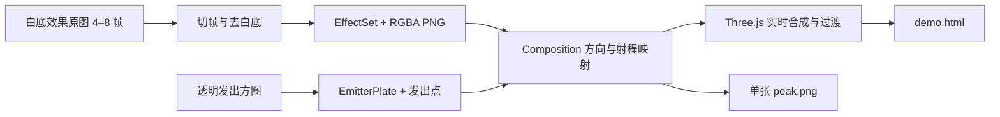

# 23 · 外放招式特效管线（Projection VFX Pipeline）

> 归属（基准 §18）：本文承接 `tech/07` 素材生产、`tech/02` 特效呈现的外放素材制作子契约；`EffectSet / EmitterPlate / Composition` 在本文定义，增列归属的提案见 §12.3，尚未修改基准。
> 上游：`00-canon.md` v1.8；`decisions/author-decisions.md`、`decisions/author-requirements.md` AR-16～18；作者 2026-09-29 两段式制作决定、2026-09-30 Three.js 合成决定与 `assets/default/STYLE.md` 原文、审批意见；`decisions/rulings-v1.md`。
> 引用而不重定义：外放判定、修为档位与端点 → `design/21` §4.4.1、§12.3；招式与 `anim` → `design/05` §4.1；六角格、范围和出招节奏 → `design/09` §5、§10.2；资产 ID、美术圣经与生产登记 → `tech/07` §1.4、§2、§5.9；相机、精灵和特效层 → `tech/02` §0.3、§2.5–2.6、§6；素材入库 → `assets/README.md`。
> 标注约定：**（原创扩展）** = 本作视觉设计而非原著事实；**（待考）** = 原著事实待逐字核对；**（待核实）** = 技术事实未联网确认；**（待实测）** = 需实际素材、浏览器或真机验证；**【建议值】** = 可先执行、在文末登记的参数。
> 版本：v1.1，2026-09-30。本文约定制作与播放分工；工具和两招候选的实测状态见 `tools/agents/reports/VFX-three.md`，不代表游戏运行时已接入。

## 目录

- §0 结论先行（TL;DR）
- §1 文件、命名与唯一归属
- §2 效果帧序列与白底转透明
- §3 发出方图
- §4 方向、射程与合成
- §5 过渡、节奏与动效输出
- §6 数据格式与最小实例
- §7 类别默认参数与玩法字段映射
- §8 提示词模板与素材质检
- §9 下游交接、同步清单与参考资料
- §10 本文新增术语与 ID
- §11 数据校验规则与测试用例
- §12 待决事项 / 依赖

## 0. 结论先行（TL;DR）

**外放效果与发出方分别生成：连续白底效果图 → Python 切帧、抠成 RGBA；独立透明发出方图 → 标注发出点；两者按方向、长度和根部宽度交给 Three.js 合成播放。合成与动效在 Three.js 里做，Python 只切帧。** Python 另可按同一 Composition 导出一张静态 `peak.png` 和打包演示，绝不烘焙动效帧。造型来自生成图，程序只采样、裁切、抠图、变换、遮罩、混合和过渡，不画手、龙或气剑造型。测试用色块与占位样例须明确标识，不能进入正式素材 manifest。



水墨类保留虚实透明；降龙使用金色、宽根部覆盖整个掌面；气剑类保持内力凝缩、线性持续，不画成墨笔晕染、实体长指甲或离指短气刃。以上是作者的美术决定；具象金龙和气剑显色属于**（原创扩展）**，不冒充小说逐字描写。

配套 `vfx/schema.yaml` 是离线制作数据格式，**不是** `tech/02` 的运行时 `packages/spec/vfx.schema.json`。前者输出素材，后者通过既有 `fx_*` 时间轴引用 `vfx_*`；`MoveDef.anim.vfx` 仍引用特效定义，不能改填 PNG 路径或本地 YAML。

## 1. 文件、命名与唯一归属

### 1.1 当前基线与新产物

原 VFX-design 核查时，`assets/default/baseline/vfx/` 有两张 1536×1024 RGB 整图、两个旧 `index.html` 和 manifest；两条 `ref_*` 均为 `candidate`。旧 HTML 仍含程序绘制造型，未发现可复用的 `layers/` 包。该记录保留为历史；当前两招候选与工具状态见 VFX-three 报告，旧坐标不能当作新图的实测锚点。

VFX-three 复用 VFX-plates 原料，保留旧整图和旧条目，套件按以下目录交付。`<主体ID>` 优先用已有招式 ID；六脉首批是武学整体风格样例，允许沿用 `sk_liumai` 目录，但接入具体出招时必须绑定已有 `mv_*`。

```text
assets/default/baseline/vfx/<主体ID>/
  effect/source_sheet.png       # 白底生成原件，逐字节保留
  effect/frame_000.png          # 切帧、抠图后的母版；从 000 起
  effect/effect-set.yaml        # EffectSet
  emitter/source_*.png          # 原生透明 RGBA 发出方
  emitter/emitter-plate.yaml   # EmitterPlate
  composition.yaml             # Composition，引用上述两个 YAML
  composition.json             # YAML 导出并附带 effect/emitter 元数据
  demo.html                    # 原料与播放器内嵌；Three.js 唯一外链见 §5.3
  peak.png                     # 峰值静帧、manifest 的主 file
```

不交付烘焙整图帧、`animation.json` 或可选动图；黑/灰/白质检可在临时目录生成，不进入最终套件。原图与切帧分别登记，禁止覆盖原件。文件序号是局部序号，不注册为玩法 ID。

### 1.2 命名与登记

资产前缀、变体与 `AssetKey` 仅沿用 `tech/07` §1.4。已全仓检索并复用 `vfx_sk_liumai_beam`、`mv_xianglong18_kanglong`、`sk_liumai`；首批候选沿用 VFX-plates 任务已指定的 `vfx_mv_xianglong18_kanglong__ch02_base01`、`vfx_sk_liumai__ch01_base01`，不另造玩法 ID。

manifest 每个合成套件一条，主 `file` 指 `peak.png`、`code` 指 `demo.html`、`pipeline: two-part`、`status: candidate`；原料、帧序列和 YAML 用该条目的文件清单列出，不逐帧新增顶层条目。来源、真实 prompt/negative、参考图、工具配置、生成时间、大小和 SHA-256 依 `assets/README.md`；派生参数及原料哈希同样追溯。审批仍由作者进行，技术检查通过不等于 `approved`。

### 1.3 与技术管线衔接

| 边界 | 本文交付 | 下游消费方式 |
|---|---|---|
| `tech/07` §5.9 | 白底 source、透明帧 master、独立 emitter、合成参数 | 替换外放造型的旧程序绘制路线；通用非外放特效仍按该文 |
| `tech/02` §2.5–2.6 | sRGB、straight alpha 母版，显式像素锚点 | 人物仍用自身精灵规格；不得把特效根部改成脚底锚点 |
| `tech/02` §0.3、§6 | 分离效果层与发出方；混合与时间采样记录 | L4 特效层；深度、遮挡、质量档与预算由渲染层管理 |
| `tech/06` | 母版 PNG 与依赖清单 | 发布编码、图集和分包仍归该文；HTML 不作为游戏贴图 |

## 2. 效果帧序列与白底转透明

### 2.1 出图规格

默认 **6 帧，允许 4–8 帧【建议值】**；每帧 1024×512 px【建议值】，长条剑气可改 1024×1024 或其他明确尺寸，整套一致。小图单元测试不受母版尺寸建议约束。主方向向右 `[1,0]`；根部初始参考 `(96,256)`，必须按真实图形重新量取，不能机械填默认。

- 背景严格纯白 `#FFFFFF`，无纸纹、灰影、棋盘格、题字、网格线、边框；效果内部不用纯白或近白实心高光。需要的亮部用可辨识的淡金、淡青或淡灰，抠完再提亮。
- 水墨的“飞白”是透过背景的空隙，不是需保留的白颜料；内含白色的原件不能靠白底算法可靠分离，v1 必须重出合规白底图。透明效果原件或人工遮罩是后续格式扩展候选，不能擅自塞入当前 Source；发出方原生透明另按 §3。
- 六帧顺序建议为初聚、成形、发出、盛势、衰减、余韵。相邻帧保持根部、视角、主体身份不变；根部漂移 ≤2 px、主轮廓纵向变化 ≤参考长度 10%【建议值，待实测】。持续气剑不逐帧断成弹丸。
- 四周保留 ≥32 px 白边【建议值】，不把光晕或龙须切断。根部允许宽阔，降龙不能用细尾连到掌心。

长图采用显式 `rects` 切格，不能靠检测白色连通域猜帧数。一行 6 格、每格 1024×512、间隔 32 px 时，总宽为 `6×1024+5×32=6304 px`，高 512；若出图端不支持此尺寸，改成六张单图，不宣称任何生成服务支持该尺寸。多行分格从左到右、从上到下，格间不画编号；多张单图用文件清单固定顺序。

### 2.2 坐标与切帧

坐标原点在左上，x 向右、y 向下，连续坐标以像素边界为整数，像素中心为 `(x+0.5,y+0.5)`。裁切矩形 `[x,y,w,h]` 的右、下边不含；点必须满足 `0≤x<W, 0≤y<H`。锚点与方向均在各自原图/帧的局部坐标系，方向长度校验为 1（容差 `10⁻⁶`）。

切帧后 `anchor' = anchorSource − [rect.x,rect.y]`；有统一缩放 k 时，尺寸、锚点、`reference_length_px`、`root_width_px` 同乘 k。默认不逐帧自动紧裁，以免跳动；若装箱裁边，必须保存偏移并更新坐标。`reference_length_px` 是峰值参考图根部到前端的纵向距离，全套共享，不用每帧包围盒重新算长度。

### 2.3 白底转 alpha 算法（本管线约定）

只用于白底效果图；发出方直接保留生成的 alpha。先读取 8-bit RGB，归一为编码 sRGB 的 `C=(R,G,B)/255`；阈值与亮度代理在此域计算，反解必须与 §4.3 的线性合成同域。这是一套可复现的白底分解约定，不宣称能恢复生成前的真实透明度。

设 `Y=0.2126R+0.7152G+0.0722B`（此处 R/G/B 已归一；仅作亮度代理），`d=1−min(C)`。默认白阈值 `w=250/255`、不透明亮度参考 `b=0.20`、色键全保留差值 `k=25/255`【建议值】。两种模式均先执行 `min(C)≥w → alpha=0`，否则：

```text
white_luma: a0 = clamp((w − Y) / (w − b), 0, 1)
white_key:  a0 = clamp((d − (1 − w)) / (k − (1 − w)), 0, 1)
C_linear = srgb_decode(C)              # 解码公式见 §4.3
a = max(a0, 1 − min(C_linear))         # 确保线性反解不产生负通道
F_linear = clamp((C_linear − (1 − a)) / max(a, ε), 0, 1)
F = srgb_encode(F_linear)              # 保存到 sRGB PNG
ε = 1 / 255
```

`white_luma` 默认用于墨色；`white_key` 默认用于金色、气剑等需保留内部颜色的图。色键的 25 指至少一个通道偏离白色 25 级后进入实心区，不是把浅金色按灰度一刀删掉。`F` 是去除白底污染后的 straight RGB；`a=0` 时 RGB 写 0。内部浮点计算，最终统一四舍五入到 8-bit RGBA。

反解来自线性域 `C_linear=aF_linear+(1−a)×白色`，因此不能只降低 alpha 而仍保留带白边的 C。对于未被阈值舍弃的像素，按 §4.3 重新合到白底、编码为 sRGB 后检查重建误差。饱和色与淡墨分别调整模式/阈值，不能依靠强腐蚀吃掉细线；默认不扩张、不腐蚀、不自动删小墨点。调参仍不合格则重出图；人工遮罩方案留待 §12.5 的格式扩展。

### 2.4 质检与交付

输出 `frame_000.png…`：同尺寸 RGBA、sRGB、straight alpha；中间重采样按预乘 RGB+alpha 处理，导出时再除 alpha。每帧记录根部锚点和归一时间 `phase`。`--preview` 至少输出黑底、50% 灰底对比，并另检查白底，观察白边、漏抠和断线。

量化建议：统计边框宽 8 px 内 `alpha>1/255` 的比例（应为 0）；统计半透明边缘中三个 RGB 都 ≥250 的残余白边比例（目标 ≤1%）；对白底回合成的未舍弃前景做每通道绝对误差（目标 ≤2/255）。这些是**【建议值，待实测】**，白边比例不能单独证明合格；全透明、全不透明、棋盘格烧进图内均不合格，末帧的全透明状态应由动画曲线生成。

## 3. 发出方图

### 3.1 图像与锚点

独立 RGBA PNG，默认 512×512 px【建议值】，透明背景，不烧入地面投影、文字、龙或剑气。镜头固定，形体与时代风格消费 `STYLE.md` 和 `tech/07` §2。允许掌、指的自然遮挡，但必须能说明手部结构；不能因裁边把六根指或断腕当作正常。发出方可以有白衣、兵器白色高光，**不得对其整图套用白底色键**。

| 类别枚举 | 图中主体 | `emit_point_px` | `direction` 与 `emission_width_px` |
|---|---|---|---|
| `palm` | 掌、必要腕袖；掌面斜朝发出方向，掌心可辨 | 劳宫所在掌面中心的视觉定位点 | 掌面朝外法向的屏幕投影；宽度取整个有效掌面 |
| `finger` | 手与指定伸指，保留足够结构辨认 | 该指指尖 | 指向；宽度取指尖发劲截面 |
| `sword_hand` | 握剑的手及完整必要剑身 | 剑尖 | 剑身至剑尖的延长方向；不得改用腕部 |
| `blade_hand` | 刀与手 | 刀尖或明确的刃部发出点 | 按该图发力方向，不一律等于刀身轴 |
| `weapon_hand` | 枪、杖、扇等兵器及手 | 该图标定的兵器端部 | 同上，逐图记录 |
| `voice` / `instrument` | 嘴与局部头颈 / 乐器及手 | 声音视觉源点 / 乐器发声部位 | 依动作投影，宽度取表现源区域 |
| `throw_hand` | 投掷手，可含尚未离手的暗器 | 离手接触点 | 投掷方向；只供已确认为外放的招式 |

`emit_point_px` 是合成定位点，`emission_width_px` 是垂直于方向的发出截面，两者缺一不可。降龙的点可以在劳宫，但宽度必须覆盖整个掌面；不能把定位点解释为单点喷嘴。每个效果的 `root_width_px` 应量取根部可见截面，合成时匹配它。

### 3.2 与人物、穴位的关系

基线只做独立发出方图，不要求人物立绘、精灵或骨骼。本文不新增角色外观、装备或穴位定义。`design/21` 的路线端点是经脉合法性条件；像素发出点是画面位置，二者不是同一字段。掌法出口经过劳宫不改变内功阴阳；剑尖发出仍可由合法手腕端点导引，见 AR-18、`design/21` §4.4.1.4。

运行时接入人物时，由 `tech/02` 的逐帧元数据/挂点替代独立发出方，兵器尖端可消费已有 `tipPx`；掌、指专用挂点尚待下游补充，不能把 `hitPx` 或脚底默认值当成掌心。六向逻辑经相机投影后生成画面方向，不等于八向精灵索引，也不能任意旋转整个人物精灵冒充新的朝向。

## 4. 方向、射程与合成

### 4.1 几何公式

所有公式只作用表现层。目标方向 `v=(cos θ,sin θ)`，θ 为 `angle_deg`，0° 向右、90° 向下，顺时针为正。素材方向 d 对应角 `φ=atan2(dy,dx)`。`R(β)=[[cosβ,−sinβ],[sinβ,cosβ]]`。

对于效果原像素 p、当前帧根部 a、目标发出点 E：

```text
L = length_px（若填写）否则 range_hex × pixels_per_hex
sx = L / reference_length_px × scale[0]
sy = emitter_scale × emission_width_px / root_width_px × scale[1]
p_out = E + δ(t) v + R(θ) diag(sx k(t), sy k(t)) R(−φ) (p − a)
```

`scale` 是纯美术修正，默认 `[1,1]`；`k(t)` 是围绕根部的阶段缩放。持续连源效果 `δ(t)=0`；只有消散尾迹可按 §5.1 小幅移出。发出方像素 q、发出点 e、素材方向角 ψ：`Qout=E+emitter_scale×R(θ−ψ)(q−e)`。因此两张图在 E 严格相接，手不会随效果的缩放或位移漂走。采样用逆变换，图像库若采用逆时针角，适配器必须反号。

固定画幅参考算例【建议值】：效果 1024×512、a=(96,256)、d=(1,0)、参考长 800、根宽 120；发出方发劲宽 120、缩放 1；E=(256,512)，示意距离 1 格、256 px/格，θ=0°。得 `sx=256/800=0.32, sy=1`，参考前端 `(896,256)` 落 `(512,512)`；θ=90° 时落 `(256,768)`，根部始终为 E。此算例是版面尺，不宣称“一格固定 256 屏幕像素”。

### 4.2 射程、范围与六角投影

`range_hex` 是本次示意/目标的距离，不是新基础射程；`pixels_per_hex` 仅是独立演示标尺。运行时先走 `HexCoord → world → screen`（见 `tech/02` §1.1、§1.5–1.6），由当前镜头、高度与挂点求 E、目标 T，再写 `length_px=|T−E|`、`angle_deg=atan2(Ty−Ey,Tx−Ex)`，并固定 `scale[0]=1`。不把逻辑六向直接乘 60° 当屏幕角。

`MoveDef.range`、`projectionSpreadSteps` 与 `ProjectionResult` 只引用 `design/05` §4.1、`design/21` §12.3；合法目标、遮挡、影响格集合只消费 `design/09` §5 的结果。最长可选射程与本次选中距离分开；不能每招都把光束拉到最大射程。范围升档只选上游预审模板，不按特效包围盒或画面扩散插值命中格。

自指反击架势 `range:0–0` 不生成“射向自身”的零长束；+2/+4 不扩主动架势或反击触发瞄准距离，只影响触发后的范围集合，反应态 `aoe_self` 仅命中触发者。触发后 `range_hex` 仍记录命令自指 0，`length_px` 可取到合法触发者的投影距离；不能用该画面长度反推反击射程。`range_hex=0` 的径向局部图也须显式给正的 `length_px`。大手印只在落点掌风事件出效果，不在跃迁起点增加伤害段。多目标、环/扇/面范围由调用方按已解算事件安排多次 Composition 或选合适的生成图；v1 不从一条光束自动绘制新造型或推导 AoE。

### 4.3 混合与 alpha

文件存 straight alpha；读入先从 sRGB 解码到线性 RGB，再以预乘颜色 P=aC 插值、采样和合成，最后编码回 sRGB；alpha 不做伽马。解码 `c≤0.04045 ? c/12.92 : ((c+0.055)/1.055)^2.4`，编码使用其逆函数。跨工具色彩一致性仍须实际图像对拍**（待实测）**。

| 模式 | 线性 RGB 运算 | 默认用途 |
|---|---|---|
| `normal` | 混合函数 `B(Cb,Cs)=Cs` | 水墨主体、发出方 |
| `multiply` | `B=Cb×Cs` | 浅底墨痕，可选；黑底可能不可见 |
| `screen` | `B=1−(1−Cb)(1−Cs)` | 线性气剑、柔和金光 |
| `lighter` | `Po=min(1,Ps+Pb), ao=min(1,as+ab)`；存 straight 时先逐通道钳制 `Po≤ao` | 降龙金光；不是取最大值的 lighten |

前三项配 source-over：`ao=as+ab(1−as)`，`Po=as(1−ab)Cs+as×ab×B+ab(1−as)Cb`；`ao>0` 时存 `Co=Po/ao`。这是对 [W3C Compositing and Blending §9–10](https://www.w3.org/TR/compositing-1/) 的工程采用（2026-09-30 核对）。亮度增益 g 只作用效果：先 `Cs=clamp(g×Cs,0,1)`，再 `Ps=as×Cs` 并混合；导出前再次钳到 0–1，不用整数溢出模拟 HDR，也不提亮手或纸底。

`multiply/screen/lighter` 依赖实际底图，不能烘成一张在任意背景上都等效的普通 PNG。**整图演示使用配置的固定不透明背景（默认纸底 `#EFE6D2`），输出 RGBA 但允许 alpha 全为 1；游戏仍消费分离的效果层与混合模式。** 金光在纸底被加色冲白时，可另选既有深墨色 `#4A433C` 作为该演示的固定背景【建议值】，同时保留纸底质检图供作者比较。若要透明整图，则另作 `normal` 合成的明确衍生版本，不能标成保持原混合的母版。`white_luma` 质检的白底重建始终用 normal，不套 screen。

### 4.4 层序、阴影与画幅

独立演示固定顺序：纸底 → 发出方（normal）→ 效果（配置 blend）。宽根部低透明覆盖掌面，形成透出感；不允许整段龙头挡住手。若确需手指遮在效果前，另交生成/人工提取的前景遮罩，作为后续格式扩展评审，v1 不靠代码重画手指。

母版整图默认 **1536×1024 px【建议值】**，与现有基线一致；发出方不画地面投影，离体能量不投实体硬阴影。留白 ≥40%、四边安全距离 ≥32 px【建议值，待实测】，按所有帧变换后的可见像素并集核对。超界必须报错并调整 E、图层比例或画幅，不能悄悄截断尾迹；旋转任意角时重新检查。

## 5. 过渡、节奏与动效输出

### 5.1 统一采样规则

每帧 `phase∈[0,1]` 严格递增，首尾分别为 0、1。样本时间 `u=t/T` 落在相邻关键帧相位之间，`w=(u−phase_i)/(phase_j−phase_i)`；在以根部对齐的公共透明画布上，线性插值 `P=(1−w)Pi+wPj, a=(1−w)ai+waj`，再作几何变换和合成。不能先把两帧各按半透明 source-over 连画，否则同形状中间帧会变暗/变薄。

默认 `crossfade`；`hold` 为取当前关键帧、至下一相位切换。大轮廓改变导致重影时应增加生成帧或减小变化，不用程序补画轮廓。输出 FPS 只改变采样密度，不增加原始画作数量。

设凝聚/发出/持续/消散时长为 c/r/s/d，总长 `T=c+r+s+d`；平滑函数 `S(x)=3x²−2x³`，输入钳到 0–1。透明度包络：凝聚 `S(t/c)`，发出和持续为 1，消散 `1−S((t−c−r−s)/d)`；为 0 的阶段跳过。亮度增益按五个边界 `[0,c,c+r,c+r+s,T]` 与 `brightness` 五值分段线性插值，重合边界取后值。

`scale_from` 默认 0.95【建议值】：凝聚阶段 `k=scale_from+(1−scale_from)S(t/c)`，其后 k=1。气剑默认 1，禁止横向鼓包。`drift_fraction` 默认 0，仅在消散阶段使 `δ=drift_fraction×L×S(...)`；墨/金余韵可取至多 0.05【建议值】，与发出点持续相连的气剑强制为 0。时间包络、亮度和变换只施加效果层。

### 5.2 节奏模板与战斗时钟

以下均为**【建议值】**，单位秒；按 `design/09` §10.2 的普通出招含受击 ≤0.9 s、范围招 ≤1.2 s 预留 0.3 s 受击，故效果分别取 `0.9−0.3=0.6 s`、`1.2−0.3=0.9 s`，不是由 CT 换算的数值。

| 模板局部名 | 凝聚 c | 发出 r | 持续 s | 消散 d | T | 亮度五边界 |
|---|---:|---:|---:|---:|---:|---|
| `pulse` | 0.10 | 0.15 | 0.25 | 0.10 | 0.60 | `[0.8,1,1,1,0.8]` |
| `linear` | 0.10 | 0.10 | 0.30 | 0.10 | 0.60 | `[0.9,1,1,1,0.9]` |
| `wave` | 0.15 | 0.20 | 0.40 | 0.15 | 0.90 | `[0.8,1,1,1,0.8]` |

这里只登记便于拷贝的制作模板，Composition 保存展开秒数，不引入游戏节奏 ID。气剑“持续”指可见的连续束体，不自动增加 DoT、伤害段或站桩时间。接入表现队列时由动作事件同步，见 `tech/02` §6.1；快进、跳过和切入按 `design/09`，不改 Core tick、`flowCt`、`recovery`、命中事件或 RNG。

### 5.3 输出与脚本分工

| 执行者 | 唯一职责 | 产物 |
|---|---|---|
| `cut_frames.py` | 依 §2 切格、白底转 straight RGBA；保留生成原件 | `effect/frame_*.png`、EffectSet |
| `web/timeline.js` | 无 Three.js 依赖的纯函数；按 §5.1–5.2 求帧索引/混合、包络、缩放、位移、亮度和阶段 | 当前时刻的采样状态；用 Node 测试 |
| `web/vfx_player.js` | 正交像素相机、分离平面、根部对齐、预乘帧插值和方向推进遮罩；按 §4 混合 | Three.js 实时画面 |
| `compose.py` | 仅按同一份 Composition 在精确 `peak_phase` 采样一张静态整图 | `peak.png`，用于缩略图和审批 |
| `build_demo.py` | YAML 转 JSON，内嵌播放器、分离原料 data URI 和控件；不生成动画帧 | `composition.json`、`demo.html` |

播放器接口为 `createVfxPlayer(THREE, { canvas, composition, emitterImage, effectFrames }) → { play, pause, seek, setSpeed, dispose, duration, onFrame }`；模块本身不导入 Three.js，游戏传入自己的实例。位移、缩放、亮度与推进遮罩只作用效果层，手部保持独立。ShaderMaterial 对相邻两张原料帧做根部对齐后的预乘 alpha 插值，不以两次 source-over 代替插值，不绘制造型。旧 `animate.py`、Canvas 帧播放器与程序造型占位路线退出交付。

浏览器按真实时间连续求值；`output.fps=20` 只保留为采样参考【建议值】，不再生成 `ceil(T×fps)+1` 张整图。`loop=false` 在 T 停止；`loop=true` 在 T 后持有 `loop_gap_s=0.4`【建议值】再从 0 开始，循环只用于观看。0.6 s 效果加 0.4 s 间隔仍为 1.0 s，不增加伤害事件。首次加载和减少动态均停在 `peak_phase×T`；默认 `peak_phase=(c+r)/T`，六脉为 1/3，Python 静态图也精确取该时刻。

演示提供播放/暂停、速度、减少动态开关。除 importmap 将 `three` 映射到 `https://cdn.jsdelivr.net/npm/three@0.186.1/build/three.module.min.js` 外，其余资源、脚本和样式全部内嵌；版本沿用 `tech/01`，地址为本任务指定，CDN 可用性**（待核实）**。单 HTML 硬门为 **≤3,000,000 bytes**（十进制 3 MB）；默认展示 768×512【建议值】，逻辑画幅和峰值图保留母版尺寸。不得为减包覆盖母版、漏原料帧或退回 Python 烘焙动效。

体积按实际内嵌的发出方和原料帧核算：图片二进制合计 B 时，Base64 约为 `4×Σceil(B_i/3)`，另加 JSON、播放器、控件与 importmap；不再乘浏览器显示帧数。预算超限应明确失败并报告。`--html` 检查字节数、唯一许可外链及内联脚本的 `node --check`；真正的 WebGL、纹理色彩、CDN 模块依赖和 `<iframe sandbox="allow-scripts" srcdoc>` 运行由协调者浏览器验收**（待实测）**，静态检查不构成通过证明。

## 6. 数据格式与最小实例

### 6.1 机器格式

唯一字段表为 [`vfx/schema.yaml`](vfx/schema.yaml)，采用 [JSON Schema Draft 2020-12](https://json-schema.org/draft/2020-12/json-schema-core) 的 YAML 表示（规范于 2026-09-30 核对）；`$defs` 定义三种对象，根 `oneOf` 只接收其中一种。每个字段的类型、约束与示例均在 schema 中直接给出或由 `$ref` 指向的定义提供；叶字段与数组注明描述及 `x-unit`，复合对象不设物理单位。`Source / Keying / Rhythm / Transition / Output` 均附对象级 `examples`，与下列完整实例对应；`default` 是建议注解，不自动填入文件。`required` 必须显式写出，未知字段报错，修改不兼容字段必须提升 version。

| 对象 | 必备数据 | 单位与边界 |
|---|---|---|
| EffectSet | 素材 ID、尺寸、颜色/alpha、风格、方向、参考长/根宽、混合、来源裁格/抠图参数、帧路径/锚点/phase | px、单位向量、0–1 相位；4–8 帧 |
| EmitterPlate | RGBA 文件、尺寸、颜色/alpha、类别、发出点、方向、发出截面宽 | px、单位向量；不另设玩法 ID |
| Composition | 套件素材 ID、主体引用、两个 YAML、画幅/底色、E/角度、示意距离/标尺/可选投影长度、两轴缩放、节奏、过渡及可选推进遮罩、输出 | hex、px、px/hex、度、秒、倍率、fps、bytes |

YAML 只允许 JSON 兼容值；拒绝重复键、非有限数、可执行标签与循环引用。路径相对**持有该字段的 YAML 文件**，先解析再检查仍位于同一个 `<主体ID>/` 套件内；拒绝网络 URL、绝对路径及经 `..` 或符号链接逃出根目录的路径。元数据里的路径必须指向实际文件，示例除外。

`mode: baseline` 是独立风格样例，不声称某次战斗合法；`resolved_preview` 必须提供 `move_ref`、`length_px` 和已解算诊断字段，由上游适配器验证其来源。`projection_step / projection_boost_active` 分别映射 `projectionStep / projectionBoostActive`；`effective_range_max_hex` 取 `design/09` 的最终 `range.max_eff`，不能直接拿 `design/21` 的中间 `effectiveRange` 替代独立修正后的结果。三项均只读，不是第二份玩法定义；后续工具不能据 `subject_ref` 自动填档位。

`build_demo.py` 先校验三份 YAML，再导出 JSON：保留 Composition 的全部字段，并附加 `effect`（完整 EffectSet）和 `emitter`（完整 EmitterPlate）。这些展开对象供 `timeline.js` 和播放器读取，图片由 `effectFrames`、`emitterImage` 参数按帧序单独传入；JSON 中的原始路径仍用于来源追溯。它不是新增的玩法契约，也不把附加对象回写 Composition YAML；schema 对 YAML 的 `additionalProperties: false` 保持不变。

新增可选 `transition.directional_mask: { enabled, softness }`。缺省不启用，兼容旧 Composition；新候选启用。以原料局部像素 p、该帧锚点 a、单位方向 d̂ 定义 `q=dot(p−a,d̂)/reference_length_px`，即从根部到参考前端的比例。凝聚期前沿为 §5.1 的 `S(t/c)`，从根部向前端显现；发出/持续期完整显示原图；消散期擦除前沿为 `S((t−c−r−s)/d)`，从根部向前端退去。阶段时长为 0 时沿用 §5.1 的跳过规则；`c=0` 时 t=0 可直接发出/持续，不强制空白，但 t=T 必须无效果，不能因软边残留末端亮点。

`softness∈(0,0.5]` 是前沿软带全宽占参考长度的比例，软带界限为 `前沿±softness/2`；凝聚遮罩取 `1−smoothstep(左界,右界,q)`，消散取其互补。遮罩乘原图 alpha，再乘 §5.1 包络，不新增颜色或轮廓。通用 `0.08`、六脉 `0.045` 为**【建议值，待实测】**：六脉窄软带强调线性推进，不能据此扩展命中长度；相同几何变换作用于原图与遮罩，旋转后仍沿发出方向。阶段端点须直接切到全显/全退，兼顾 q<0 的根部柔边与 q>1 的尾部像素。`scale_from / drift_fraction / brightness` 仍按原公式；气剑保持 `1 / 0`，只调整亮度、混合和遮罩。

`output.fps` 留作采样参考，不限制 `requestAnimationFrame` 时间精度；`preview_size_px` 为等比显示尺寸；`optional_animation` 保留旧枚举以读取历史 YAML，新打包流程只支持 `none`，其他值明确报错。`html_max_bytes=3000000` 不变，外链例外严格按 §5.3。

### 6.2 EffectSet 实例

以下三个 YAML 为同一套六脉风格**结构示例**，没有随本文生成图片；路径只展示后续落盘位置。实际锚点必须量图，4 帧用于最小实例；正式默认仍为 6 帧。

```yaml
# effect/effect-set.yaml；source_01.png 预期 4192×512
kind: EffectSet
version: 1
asset_id: vfx_sk_liumai_beam
size_px: [1024, 512]
color_space: srgb
alpha_mode: straight
style: qi_sword
direction: [1, 0]
reference_length_px: 800
root_width_px: 24
blend: screen
source:
  mode: grid
  files: [source_01.png]
  rects:
    - {file_index: 0, rect_px: [0, 0, 1024, 512]}
    - {file_index: 0, rect_px: [1056, 0, 1024, 512]}
    - {file_index: 0, rect_px: [2112, 0, 1024, 512]}
    - {file_index: 0, rect_px: [3168, 0, 1024, 512]}
  keying:
    method: white_key
    white_cutoff_8bit: 250
    opaque_luma: 0.20
    key_full_8bit: 25
    epsilon: 0.00392156862745098
    dewhite: true
frames:
  - {file: frame_000.png, anchor_px: [96, 256], phase: 0}
  - {file: frame_001.png, anchor_px: [96, 256], phase: 0.3333333333333333}
  - {file: frame_002.png, anchor_px: [96, 256], phase: 0.6666666666666666}
  - {file: frame_003.png, anchor_px: [96, 256], phase: 1}
```

### 6.3 EmitterPlate 实例

```yaml
# emitter/emitter-plate.yaml
kind: EmitterPlate
version: 1
file: plate.png
size_px: [512, 512]
color_space: srgb
alpha_mode: straight
category: finger
emit_point_px: [400, 256]
direction: [1, 0]
emission_width_px: 24
```

### 6.4 Composition 实例

```yaml
# composition.yaml
kind: Composition
version: 1
asset_id: vfx_sk_liumai__ch01_base01
subject_ref: sk_liumai
mode: baseline
effect_set: effect/effect-set.yaml
emitter_plate: emitter/emitter-plate.yaml
canvas_px: [1536, 1024]
background: '#EFE6D2'
emit_at_px: [480, 512]
angle_deg: 0
range_hex: 5
pixels_per_hex: 128
scale: [1, 1]
emitter_scale: 1
rhythm: {charge_s: 0.1, release_s: 0.1, sustain_s: 0.3, dissipate_s: 0.1}
transition:
  interpolation: crossfade
  scale_from: 1
  drift_fraction: 0
  brightness: [0.9, 1, 1, 1, 0.9]
  directional_mask: {enabled: true, softness: 0.045}
output:
  fps: 20
  loop: true
  loop_gap_s: 0.4
  peak_phase: 0.3333333333333333
  preview_size_px: [768, 512]
  html_max_bytes: 3000000
  optional_animation: none
```

该图长度 `5×128=640 px`，沿向缩放 `640/800=0.8`，横向 `24/24=1`；效果 0.6 s、加间隔循环 1.0 s，Three.js 连续采样。遮罩软带在参考图上为 `0.045×800=36 px`，变换后沿向为 `36×0.8=28.8 px`。5 格只作基线示意；接入具体 `mv_liumai_shangyang` 时由其现行图鉴卡与 Core 解算重新验证。

## 7. 类别默认参数与玩法字段映射

### 7.1 按实际发出动作选图

下表均为**【建议值】**；是素材起始配置，不根据武功名称自动改 `projection`、`delivery` 或阴阳。模板时间、FPS 与增益见 §5.2–5.3。

| 类别 | 发出方默认 | 效果 / 混合 | 节奏 | 特别约束 |
|---|---|---|---|---|
| 掌 | palm | ink / normal；浅底可试 multiply | pulse | 根宽匹配整个掌面；降龙为 gold_ink / lighter |
| 指 | finger | ink / normal | linear | 气剑例外为 qi_sword / screen；scale_from=1、drift=0 |
| 剑 | sword_hand | ink / normal | pulse | 只有已标外放的剑气；剑尖对根部，不给近身剑招自动加束 |
| 刀 | blade_hand | ink / normal；金光可试 screen | pulse | 按动作选发出方；火焰刀若从手发劲应选 palm，不能凭“刀”画实体刀 |
| 长兵 / 奇门 | weapon_hand | ink / normal | pulse | 按具体兵器端部标注方向，不复用错误握持 |
| 音功 | voice / instrument | ink / normal，强化亮脉可试 screen | wave | 仅普通声纹的0档分支不加外放气浪；见 §7.2 |
| 暗器 | throw_hand | ink / normal | pulse | 实体投掷不等于外放；只消费逐招已确认的外放段 |

六脉首批展示可只做一种指端线性束模板，不因此声称完成六式、六道并发或左右手全部绑定；后续六道束必须逐条量取发出点，禁止从旧程序手形坐标反推。暗器实体、普通近身挥砍等不属于本管线的外放资产选取条件。

### 7.2 玩法到表现的单向映射

| 上游事实 | 本文使用方式 | 不能推出的结论 |
|---|---|---|
| `projection` 与 `delivery`（05 §4.1） | 逐招筛选，近战/反击同样可能外放 | 画得远就改为 ranged/projectile |
| `projectionStep`、`ProjectionResult`（21 §4.4.1、§12.3） | 接收已选档；射程/范围/耗内仍由上游绑定 | 用亮度、帧数或龙大小计算强化档 |
| 基础 `range` → 09 最终合法目标 | 选中点投影成 E/T、angle、length | 把最大射程当作每次束长 |
| 三档 `projectionSpreadSteps` → 09 影响格 | 决定哪次事件/哪种预制图需要表现；预览格另由09显示 | 墨迹、光晕像素可以造成命中 |
| 21 路线端点与 AR-18 出口段 | 对应动作选择发出方；像素锚点另量 | 劳宫使降龙变阴，剑尖必须有同名穴位 |
| 音功 `projectionBoostActive=false` | 显示普通声纹与既有命中，禁止强化气浪/亮脉 | 声音能传播就必定获得外放强化 |
| 大手印落点、反击触发、实际多段事件 | 每个已批准事件安排表现，次数从事件读取 | 多放一帧/循环一次就多一次伤害 |

外放清单交工具按 `check_skill_catalogs.py --delivery --details` 动态读取，不在本文复制易过期的全量名录。本次只读检查覆盖 25 册，654 条动作路线、94 条非绝招外放路线，端点违规 0；另有逍遥图鉴性质冲突 13、缺主修经脉 23 的既有诊断，不能写成全库零警告。

## 8. 提示词模板与素材质检

### 8.1 效果帧模板

```text
为《天书录》默认风格包生成 {subject_name} 的外放效果序列，仅画效果。
{frame_count} 帧，{layout}，每格 {width}×{height}，{gutter} 像素纯白间隔。
纯白 #FFFFFF 背景，无纸纹、无投影；效果内不使用纯白或近白实心色。
所有帧根部固定在 {anchor_px}，方向向右；参考长 {reference_length_px}，根宽 {root_width_px}。
按 {phase_descriptions} 连续变化，保持主体身份、视角与根部一致，四边留白。
水墨：虚实、半透明、疏密呼吸；降龙：金色龙形，宽根部从整个掌面透出的气势。
气剑例外：内力凝缩的线性连续气流，细长通透，柔和色缘，不使用墨笔和晕染。
禁止：手、人、兵器发出方、字、格线、水印、背景纹理、实体长指甲、离指短气刃、霓虹激光。
```

占位符由真实参数展开，存入 manifest 的必须是**实际发送**的 prompt，不能只存模板。首次参考旧整图只取风格与主体识别，不能照搬其已被作者否定的形态。气剑“近无色”通过抠后透明度和弱色缘实现，不能要求模型在白底上画不可分离的纯白束。

### 8.2 发出方模板

```text
生成 {category} 独立发出方，{subject_action}，{handedness_or_unspecified}，{era_costume}。
RGBA 真透明背景，{width}×{height}；保留必要的手/腕/袖或兵器结构。
{emit_point_description} 置于 {emit_point_px}，发出方向 {direction}，源截面宽 {emission_width_px}。
掌：掌面可见且斜朝发出方向，整个掌面吐劲；剑：手与剑，完整尖端清晰；指：指定指尖清楚。
造型遵循默认风格包，形体与握持自然；不在图上绘制锚点标记或文字。
禁止：任何龙、气剑、能量束、棋盘格、纸底、地面硬投影、额外手指、重复剑尖、断裂握持。
```

左右手、指法与招式书证不确定时 `handedness_or_unspecified` 写“姿态示意，非原著左右手断言”，并登记**（待考）**。生成模型若不遵守位置，只能按真实图重标锚点或重出图，不能留下看似精确的假坐标。

### 8.3 人工验收

逐张看白底原件、黑/灰底抠图、整图峰值和完整循环：形态连续；手部结构成立；气剑始终连源；金龙从宽掌面透出；不出现白框、白边、断须、跨帧根部跳动、被切断尾迹。再看纸底、深墨底的可读性与手机缩图。不得在正式演示中用 Canvas 路径、SVG path 或生成网格重新画出缺失造型；播放控件与技术测试图不受此造型禁令影响。

## 9. 下游交接、同步清单与参考资料

### 9.1 交 VFX-three / VFX-plates

VFX-three 按 §2–6 接替旧动效执行段：Python 仅用标准库、Pillow、numpy、PyYAML 负责切帧/抠图、单张峰值和演示打包；JS 无额外第三方依赖，Three.js 由调用方传入。无需新增 jsonschema 运行依赖；检查器不得忽略 required、未知键与 §11 跨字段规则。`timeline.js` 用 `node --test tools/vfx/web/` 测试，`vfx_player.js` 做 `node --check` 和代码复核；浏览器不可用时必须如实登记“未在浏览器实跑”，不得冒充 GPU 已验证。原料缺失、超界、非法向量和 HTML 超预算均明确失败。

VFX-plates 的两套原料由 VFX-three 原样接续：降龙十八掌·亢龙有悔、六脉线性气剑；不因六脉偏细偏灰重新生图，先在 Composition 调亮度、混合和推进遮罩，原料是否重出及手部画法交作者审批。按 §1.1 整理套件，导出 JSON、静态 peak 和 Three.js demo，记录实测大小/哈希。manifest 保留原两条 `ref_*` 与旧文件，两条 `vfx_*` 的 `file=peak.png`、`code=demo.html`、`pipeline=two-part`、`status=candidate`；示例与技术检查不等于作者批准。

协调者浏览器验收：CDN/importmap 模块能加载；首屏精确峰值；播放/暂停、变速、seek、循环间隔和减少动态生效；两种手部与根部持续对齐；任意角度及前沿无切口、白边或残影；screen/lighter 的色彩与静态峰值对照；重复创建/销毁释放纹理与 WebGL 资源；sandbox srcdoc 可用。离线首次打开不保证库可用，错误必须可见；唯一直接外链限制不能替代真实网络请求核对。

### 9.2 需同步到其他文档（本任务不修改）

| 文档 / 位置 | 同步内容 |
|---|---|
| `tech/07` §5.9、§1.4 | 外放采用两段式；白底转 alpha / 源图保留；引用本文 schema，资产命名仍归原节 |
| `tech/02` §6.1–6.3、§2.6 | 外放造型改用生成图；金龙取代旧“墨龙”示例；对接分层混合、掌/指挂点；不把固定64帧图集当作4–8原始帧数量 |
| `design/05` §4.1 `anim` | 增加 `anim.vfx → fx_* → vfx_*` 与本文制作套件的引用说明，不把 Composition 嵌入 MoveDef |
| `assets/default/STYLE.md` 招式行 | 在已有两段式作者原文后引用本文，明确正式演示禁止代码画造型及两类例外；不改写作者原话 |
| `assets/default/prompts/vfx.md` | VFX-plates 更新双模板；旧“离指气刃 / 150 px 净空”改为历史追溯，不作新默认；保留原有待决项 |
| `tools/agents/prompts/VFX-plates.md` 合成质检 | 旧“刃体”措辞改为“近无色线性持续气剑”，与作者最新意见一致 |
| `docs/README.md` / 基准 §18 | 增加本文索引/制作子契约归属；以 §12.3 提案处理 |

### 9.3 参考资料

项目证据：`assets/default/STYLE.md` 作者原文与两轮意见；`assets/README.md`；`assets/default/prompts/vfx.md` 与基线 manifest；`tools/agents/reports/ART-B-vfx.md`、`ART-R1-vfx.md`（旧轮历史）；`design/21` §4.4.1、§12.3 与 `tools/balance/projection_sim.py`；`tech/02`、`tech/07` 前述章节。本文优先遵从最新作者决定，旧报告不是新素材完成证明。

技术依据：[W3C Compositing and Blending Level 1](https://www.w3.org/TR/compositing-1/)（合成公式，2026-09-30 查阅）、[JSON Schema 2020-12 Core](https://json-schema.org/draft/2020-12/json-schema-core)（schema 组织，同日查阅）。阈值、节奏、画幅和质检线是本文建议，非规范给出的保证；浏览器编码与真机表现仍**（待实测）**。

## 10. 本文新增术语与 ID

| 术语 / 约定 | 定义与边界 |
|---|---|
| EffectSet | 一套同向、同尺寸、可连续采样的透明效果帧及原白底来源 |
| EmitterPlate | 独立发出方图，含视觉发出点、方向和截面宽 |
| Composition | 两者在固定画幅中的合成与时间采样参数 |
| 根部 / 发出点 | 效果局部锚点 / 发出方局部锚点，分别变换到 E；均非经脉穴位定义 |
| phase | 效果样本在总表现时长中的归一时刻；不表示行动进度或路线质量 |
| `ink / gold_ink / qi_sword` | 制作风格枚举，属于**（原创扩展）**，不替代武功分类、品阶或内力性质 |
| `pulse / linear / wave` | 本文节奏表局部标签，不注册为全局 ID，不写入玩法存档 |

本文没有新增玩法 ID。所有 `sk_* / mv_* / aoe_*` 均引用上游；`vfx_*` 候选和素材子件命名仍归 `tech/07`。本 schema 的 version=1 只标识离线格式；`source / frames / transition / output` 是父对象局部字段。

## 11. 数据校验规则与测试用例

### 11.1 VFX-tool 必须落实的校验

1. **结构**：按 schema 验类型、required、枚举、范围及 additionalProperties；拒绝重复键/非有限数。相位严格递增、首0尾1；source.rects 与 frames 等长；grid 每格不重叠，singles 每文件恰一整图矩形；file_index 不越界。
2. **文件与坐标**：路径安全且 PNG/YAML 类型正确；裁格落在原图内；v1 不隐式缩放裁格，裁格 w/h 必须等于 size_px。帧尺寸一致、RGBA 含真实透明/非透明像素；方向非零且单位化；锚点与输出 E 在各自画幅内。源图白边、全部帧变换并集安全距离及白边指标按 §2、§4 检查，棋盘格和造型仍须人工验收。
3. **抠图**：`opaque_luma<white_cutoff_8bit/255`；`key_full_8bit>255−white_cutoff_8bit`；epsilon 不超过1/255；保存 RGB 为 straight，0 alpha 的 RGB 归0。每种模式做白底重建与黑/灰预览，不能仅检查 PNG 的通道数。
4. **跨对象**：`qi_sword` 必须 `scale_from=1, drift_fraction=0` 且 blend 为 screen/lighter；金龙根宽必须与真实掌面匹配；path 指向的对象 kind 正确。`resolved_preview` 的沿向 scale 必须1，引用合法既有招式，并由上游验证最终范围/音功分支；离线工具不重算玩法。
5. **时间与产物**：总时长>0；连续采样与循环按 §5.3；预览尺寸与母版同宽高比；打包器能读到分离原料；存在 RGBA 原料帧、JSON、peak、单 HTML。HTML ≤3,000,000 bytes，直接外链仅限 §5.3 的 importmap 地址；检查网络 API/外部 src、href、CSS url 及内联脚本语法，真实网络和 sandbox srcdoc 另行实跑，静态扫描不是完整证明。
6. **状态与诚实**：工具失败要非零退出并指出字段/文件；材质、浏览器/设备、编码和人工审美未验证的保留标记。文档示例不是生产候选，程序测试图必须标识测试用途；已批准状态不能由检查器自动写入。

### 11.2 必备测试矩阵

| 用例 | 预期 |
|---|---|
| 白色 `(255,255,255)` 与阈值边界 `(250,250,250)` | alpha=0、RGB归0；`249` 按公式进入软边 |
| 灰240、墨灰128、泥金 `(201,164,92)` | 无 NaN；按线性域去白/合白重建≤2级建议误差，金色不整块丢失 |
| 彩色4格长图与4张单图 | 同序切出4帧；超界、重叠、少帧或错误索引明确失败 |
| 半透明同一帧与自身交叉淡入 | 中间颜色/alpha保持不变，不出现中间一帧变薄 |
| §4.1 的0°、90°算例及任意角 | 根始终落 E；前端分别在 `(512,512)`、`(256,768)`；越界报告 |
| 改变每帧锚点以补偿原图漂移 | 合成根部不抖；不因自动紧裁换坐标 |
| screen/multiply/lighter + 固定底色 | 与公式一致；不会把透明整图声称为任意底色等效图 |
| 气剑的非零 drift 或 scale_from<1 | 拒绝；持续段不脱离指尖、不膨胀为墨团 |
| 近战但 projection=true | 可选用本管线，不自动改变 delivery |
| 反击：range_hex=0、max=0、length_px>0 | 合法触发事件可表现；不把画面触发者距离与主动0射程比较，不扩大触发瞄准 |
| 音功0档、1档；大手印一次落点事件 | 0档无强化气浪；1档消费已解算结果；插帧/循环不增加事件 |
| 0.6 s、gap0.4 s与零时长阶段 | 连续采样、循环1.0 s；凝聚>0时t=0效果alpha0，T恒0；零阶段跳过、重复亮度边界取后值；peak精确取相位 |
| 推进遮罩、任意角度与端点 | 根部至前端显现/擦除；softness按参考长度且为全宽；持续全显，终点无残影；缺省关闭保持兼容 |
| 原料缺失、虚假透明、超预算HTML | 明确失败；不生成程序替代造型、不静默截帧 |
| CDN / sandbox srcdoc / 减少动态 | 库可加载且控件正常；库不可用时明确显示错误；减少动态停在peak；真机另测 |

### 11.3 本任务门禁

```sh
python3 -c "import yaml; yaml.safe_load(open('docs/design/vfx/schema.yaml'))"
python3 tools/lint/check_ids.py --strict
```

上表是实现验收清单，不等于浏览器或真机已通过；历史格式自检见 `tools/agents/reports/VFX-design.md`，当前工具、素材检查与未实跑项目见 `tools/agents/reports/VFX-three.md`。

## 12. 待决事项 / 依赖

### 12.1 替下游给出的建议值

| 项 | 本文可执行默认 | 依赖 / 回填位置 |
|---|---|---|
| 原帧与画幅 | 6帧，允许4–8；1024×512效果、512²发出方；整图1536×1024 | VFX-plates 实图质量与 tech/07 母版条目 |
| 抠图 | w=250/255、b=0.20、k=25/255、epsilon=1/255；墨luma、彩色key | VFX-tool 量化与 VFX-plates 黑/灰/白预览 |
| 几何 | 向右；效果根(96,256)仅起稿参考；scale=[1,1]，emitter_scale=1；独立演示128 px/hex | 必须量图；游戏投影归 tech/02，算例256 px/hex仅版面演算 |
| 连续性与留白 | 根漂≤2 px、相邻轮廓变化≤10%参考长；边距32 px；整图留白≥40% | VFX-plates 逐帧目视与实际测量 |
| 抠图质量线 | 8 px边框alpha残留0、白边≤1%、重建误差≤2/255 | VFX-tool 报告；不能取代人工验收 |
| 节奏 | pulse/linear 0.6 s、wave0.9 s；20fps；gap0.4 s；peak=(c+r)/T | 09预算与 tech/02 动作事件；真机可读性 |
| 变换与底色 | 墨/金scale_from0.95、drift0（余韵至多0.05）；气剑1/0；纸底，金光可另试深墨底 | STYLE 作者审批；不得程序补形 |
| 推进遮罩 | 旧配置缺省关闭，新候选启用；softness通用0.08、六脉0.045 | §6.1；视觉软带需浏览器/真机确认，不影响命中 |
| HTML | 展示768×512，单文件≤3,000,000 bytes；分离原料data URI；唯一Three.js外链见§5.3；可选动图不出 | 已解决：执行分工改为Three.js（§5.3）；母版保留，浏览器仍待实测 |

### 12.2 本文依赖的上游事实

作者两段式与最新两类风格要求；基准 §12、§18、§19；21 的外放/路线端点，05 的招式字段，09 的影响格与出招预算，tech/02 的投影、挂点与时间轴，tech/07 的素材登记与色板。本文没有重新推导伤害、内力或品阶数值；唯一的时间预算推算见 §5.2，几何与存储核算见 §4.1、§5.3。

### 12.3 对基准的修改提案

| 编号 | 提案 | 理由 |
|---|---|---|
| VFX-P01 | §18 增列本文为外放素材两段式制作子契约的归属，并注明玩法/运行时仍归05、09、21、tech/02、tech/07 | 防止未来在多个文档重复定义三种制作对象 |

不提议新增 ID 前缀、伤害乘区、外放档位、玩法公式或时间单位。提案未合入，本文只按任务授权定义制作接口。

### 12.4 原著考据待办

- **（待考）**《天龙八部》修订版：六脉各剑的发指、左右手、是否有明确颜色描写；核对人物施展情节与具体文本后再扩六道绑定。当前淡青/淡赤色缘只沿用旧模板的原创视觉候选，不能称原著固定色谱。
- **（待考）**《射雕英雄传》《神雕侠侣》修订版：亢龙有悔相关掌势与动作叙述，供发出方姿态细化；不编造回目号或原文。金龙具象、颜色与全掌面透出已是作者美术要求，无需假托考据支持。
- 旧模板里的手部遮挡、裁边、左右手与颜色待考、浏览器/真机与审美待决仍保留，由 VFX-plates 在原模板逐项追溯，不因本文新增而删除。

### 12.5 开放问题（附默认值）

| 编号 | 事项 | 默认值 / 状态 |
|---|---|---|
| VFX-O01 | 首批帧数与连续性是否足够 | 先6帧，必要时增至8；更多帧须升级制作预算，不让程序重画 |
| VFX-O02 | 金龙在纸底加色是否过白 | lighter先行，必要时另试深墨固定背景并提交双底对照；作者择定 |
| VFX-O03 | 六脉色缘、左右手与单束/六束呈现 | 先单束、极淡青或赤缘的原创候选，不声称完成六剑映射；保留考据 |
| VFX-O04 | 人物整身与独立手图如何衔接 | 基线仅独立手图；运行时另接逐帧掌/指/剑尖挂点，待tech/02落实 |
| VFX-O05 | 持续气剑是否需要更慢的鉴赏播放 | 保留0.6 s母时间轴，用播放器减速观察；不加战斗CT或伤害段 |
| VFX-O06 | 前景遮挡、透明效果原件/人工遮罩输入 | v1暂不支持，优先重出可用图；新增字段须版本化，不隐式处理 |
| VFX-O07 | 手机显示与WebP/APNG编码质量 | 已解决：Python动图编码退出当前交付，保留none（§5.3）；PNG+Three.js HTML必需，CDN、浏览器/手机显示仍待核实或实测 |
| VFX-O08 | 旧图层演示是否可作为原料 | 已核查当前无图层包；保留旧整图/HTML对照，未来图层包须重新验证，不继承旧程序锚点 |
| VFX-O09 | 六脉原料与两招手部是否需要重出 | 当前复用现有原料，仅调Composition亮度/混合/推进；原料造型、六脉颜色与手部画法交作者审批，不自动重出 |

已解决：两段式制作、气剑不用水墨、降龙金色与全掌面透出均已有作者决定（见 STYLE 与本文 §0），不再重复列为等待批准的问题。其余建议可先执行，作者未另确认的不能写为已批准。
