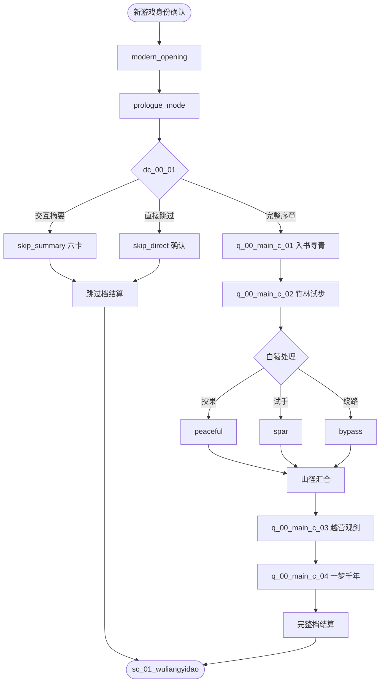

# 剧情 · 00 《越女剑》序章（主线 DAG 与 Ink 契约）

> 归属（基准 §18）：`ch00_yuenv` 的主线剧情、节点 DAG、模式选择、对话入口、失败 / 跳过分支与离章叙事状态；这是本序章“主线”的唯一归属文档。
> 上游：`00-canon.md` v1.8；作者新增需求与决定见 `decisions/author-requirements.md`、`decisions/author-decisions.md` P35；跨文档裁定见 `decisions/rulings-v1.md`；场景、遭遇、教学与结算实例见 `design/chapters/00-yuenv.md`。
> 引用而不重定义：年代 / 书眠 / 残篇 → `design/02`；武学 → `catalog/skills-general.md`；战斗 → `design/09`；任务 DSL → `design/12`；成长 / 存档 → `design/13`；UI → `design/14`；NPC → `design/18`；剧情数据契约 → `design/story/schema.yaml`。
> 标注约定：**（原创扩展）** = 原著没有的内容；**（待考）** = 原著事实尚需按三联 / 广州修订版逐字核对；**（待核实）** = 技术事实尚未联网确认；**（待实测）** = 需要真机或真账号验证；**【建议值】** = 依赖其他文档，先给出可用数值并在文末登记。
> 版本：v1.0（DES-prologue-ch00，2026-10-01）。

---

## 0. 阅读指引与剧情总览

### 0.1 结论先行

| 项 | 结论 |
|---|---|
| 书界 / 时长 | `ch00_yuenv`；完整关键路径约 29 分钟，硬上限 30 分钟 |
| 主线 | 4 个共有线任务：入书寻青 → 竹林试步 → 越营观剑 → 一梦千年 |
| 路线 | 无正邪、无改命；白猿可投果 / 试手 / 绕路，但必汇合 |
| 模式选择 | `dc_00_01`：完整序章 / 交互摘要 / 直接跳过 |
| Ink | 单一 `storyId: story_ch00_main`；knot 逐段列于 §3 |
| 原著边界 | 阿青、白猿、范蠡及越军习剑只取大意；玩家介入、冲突、书灵和书眠均**（原创扩展）** |
| 离章 | 完整为 3 重残篇 + `apSword+0.6`；摘要 / 跳过为 1 重残篇、无感悟；进入天龙冷入口 |

### 0.2 主流程图



白猿三路只记录教学方式，不改变残篇层数、感悟或后界入口。`dc_00_01` 是唯一全局选择节点；“白猿处理”是 `q_00_main_c_02` 内局部 `branchKey`，不升格为第二个 `dc_*`。

### 0.3 原著事实与原创桥接

| 原著情节大意 | 本作使用 | 明确不声称 |
|---|---|---|
| 阿青牧羊、与白猿交手而悟剑、以竹棒显剑术 **（待考准确措辞）** | 竹林相遇、白猿试手、两步剑源演示 | 玩家曾存在于原著现场；演示招名来自原著 |
| 范蠡请阿青帮助越军习剑 **（待考规模与先后）** | 越营邀请、越卒试阵与见证 | 范蠡委托玩家；边道冲突是原著事件 |
| 范蠡与西施相关情节 **（待考）** | 一句不展开的牵挂，避免西施实体化 | 本章已复现吴宫或西施生命轴 |

不写小说引文、回目号或自造古语。对白用克制现代白话表达系统信息，人物称谓在考据前避免过度具体。

### 0.4 状态与连通约束

1. `story.v1` 主线恰有一个入度为 0 的起点；所有节点可达、无环，所有非终点至少一个出口。
2. 完整、摘要、直接跳过最终进入同一冷入口，但分别保留不同 `branchPath` 与教学状态。
3. 必经战败只回到战前节点；白猿试手失败可改投果 / 绕路，不把故事线置 `failed`。
4. 结算节点依赖任务成功事件，不依赖动画播完、UI 文案或墙钟时间。
5. 任一不可逆提交必须带 receipt；强退后只允许恢复到提交前或提交后。

---

## 1. 主线任务

### 1.1 ID 口径与上游冲突

本任务依用户指定采用 `q_00_main_c_01`–`q_00_main_c_04`。`c` 表示序章共有线，不暗示还存在正 / 邪路线。现行 `design/12` §1.1 的生产正则只准 01–14 使用主线路线码，尚未登记 00 主线；本稿仍定义正式 ID，但发布构建前必须由归属文档加入显式序章例外，不能改造成 `side`、无路线码别名或静默放宽任意格式。

### 1.2 四幕总表

| 正式任务 ID / 标题 | 地点 / 目标 | 进入条件 | 完成条件 | 失败 / 恢复 |
|---|---|---|---|---|
| `q_00_main_c_01` 入书寻青 **（原创扩展）** | 现代书桌 → `sc_00_zhulin`；选模式、找到阿青、取得竹棒 | 新游戏选择 `full` | 与阿青对白结束，竹棒局部物已提交 | 无硬失败；卡死回 `bookfall` |
| `q_00_main_c_02` 竹林试步 **（原创扩展）** | 竹林初阵、山径 qg1、白猿三路 | C01 完成 | 初阵成功且白猿节点以 `peaceful/spar/bypass` 任一收束 | 必经战 `retry`；试手失败回交互前 |
| `q_00_main_c_03` 越营观剑 **（原创扩展）** | 范蠡对话、越卒试阵、边道止争、阿青演示 | C02 完成 | 边道成功，演示收据与 3 重来源原子写入 | 战败重试；演示中断从收据前恢复 |
| `q_00_main_c_04` 一梦千年 **（原创扩展）** | 存档 / 导出提示、残篇预览、零槽位书眠 | C03 完成 | 天龙冷入口苏醒档写入成功 | 失败留在越营墨点；可重试，不重复收益 |

四幕都是主线，不允许 `failed/expired` 终态；可败战只产生任务内部恢复或 `assisted` 评价。任务经验 / 梦境成长不得进入正式等级，且无随机经济奖励。

### 1.3 C01 · 入书寻青

- `modern_opening` 只负责身份确认与无字残卷入书；开场画面可立即跳过，但 `dc_00_01` 必须提交一个模式。
- 完整模式在竹林醒来，以羊群、竹涛和墨边交互物引导玩家找到阿青。玩家可问“这是哪里 / 你是谁 / 我为何在此”，只影响对白顺序。
- 阿青不解释宏大世界观；书灵只说“先学会走到下一页”。接受竹棒后触发 C02。

### 1.4 C02 · 竹林试步

- 竹林路卒冲突与阿青援护均为**（原创扩展）**；冲突用来证明 CT、道具、调息和失败恢复，不给身份判断或杀戮选项。
- 山径白猿会拿走竹棒旁的布结再跃开**（原创扩展）**；玩家可放下桃子、切磋或走明示绕路**（原创扩展玩法）**。三路均让阿青说“它不曾教我招名”这一类大意，不伪造原著对白。
- `spar` 只需命中一次或坚持两轮；`bypass` 暂记聚气教学待补，并在 C03 必经 `enc_00_biandao` 首轮补教。只有摘要 / 直接跳过才把聚气教学带入天龙补课队列。

### 1.5 C03 · 越营观剑

- 范蠡请阿青助越军习剑取原著大意**（待考）**；邀请玩家试阵、吴越边道冲突及战后制服均为**（原创扩展）**。
- 范蠡的关键叙事功能是提醒：玩家不能代替阿青作出是否相助的决定。选择“劝她 / 不置一词 / 先问她愿不愿”只改一轮回应，阿青均由自己回答并进入演示。
- 演示只短暂开放阿青投影的 3 重招式；高重绝招只显示锁定远景。完成后书灵把所见解析为主角最高 3 重的教学来源。

### 1.6 C04 · 一梦千年

- 书灵说明这不是第零本天书，而是“第一页旁的墨痕”**（原创扩展）**；先显示残篇和 0/0/0、装备 0 的去留预览。
- 普通玩家可取消导出后继续；M1 自动验收必须执行导出、预检导入和同 hash。
- 确认后结算 3 重残篇与感悟，画面由竹青褪为墨色，再在无量外驿冷入口重绘；不提前播放天龙 C01 对白。

---

## 2. 模式选择、跳过与失败分支

### 2.1 `dc_00_01` · 序章模式

| 选项键 | 显示 | 预计时长 | 后果 | 确认文案要点 |
|---|---|---:|---|---|
| `full` | 完整序章 | 约 29 分钟 | 进入 C01；最高 3 重残篇、`apSword+0.6` | “可随时快进已读对白；教学战可重试” |
| `summary` | 交互摘要 | 约 90 秒 | 进入 `skip_summary` 六卡；1 重残篇、0 感悟 | “会跳过可玩场景，系统教学稍后补上” |
| `skip` | 直接跳过 | <10 秒 | 进入 `skip_direct`；1 重残篇、0 感悟 | “立即从天龙开始；未读教学收入书灵笺” |

选择在同一提交里写 `chosenOptions[n_mode]`、`branchPath`、教学状态和目标节点；不得先发残篇再切节点。返回标题重开尚未保存的新游戏可重选；一旦写入冷入口苏醒档，模式只能通过新档改变。

### 2.2 可跳过的开场范围

`modern_opening` 中“雨夜书桌 → 翻开无字残卷 → 墨迹坠落”的视觉段可在首帧后跳过；跳过只落到 `dc_00_01`，不等于跳过序章。身份确认、可访问性设置和模式选择不可随影片一起消失。完整路线中已读对白、战斗教程镜头和阿青演示可快进，但任务事件与结算仍正常提交。

### 2.3 摘要六卡

| 卡 | 主题 | 玩家必须得到的信息 | 状态 |
|---:|---|---|---|
| 1 | 入书 | 主角从现代进入“书界”，书灵醒来 | 基础见闻 |
| 2 | 阿青 | 牧羊少女以竹棒显剑术；细节**（待考）** | `seen`，不写同行 |
| 3 | 白猿 | 阿青与白猿交手而悟剑的大意**（待考）** | 基础见闻，不授轮回“白猿剑意” |
| 4 | 范蠡与越军 | 请阿青帮助越军习剑的大意**（待考）** | 不写玩家参与战斗 |
| 5 | 残篇 | 跳过档保留 1 重见闻，但不可装配 | 预览 `it_canye_yuenvjian` |
| 6 | 《长生诀》 | 零槽位书眠、约 1,575 年后进入天龙 | 待确认 |

六卡可前后翻、读屏和立即显全文；长按不是唯一确认方式。最后一张才提交跳过档事务，前五张退出不发收益。

### 2.4 失败分支矩阵

| 触发 | 故事节点 | 分支 / 状态 | 汇合 |
|---|---|---|---|
| `enc_00_zhulin` 胜 | `n_c02` 内 | `initial_battle_manual` | 山径入口 |
| 竹林连败后示范 | `n_c02` 内 | `initial_battle_assisted` | 同上；奖励不变 |
| 白猿投果 | C02 `st_baiyuan_choice` | `baiyuan_peaceful` | C02 `st_merge` |
| 白猿试手成功 / 认输 | 同上 | `baiyuan_spar` | 同上 |
| 白猿绕路 | 同上 | `baiyuan_bypass` | 同上；C03 `enc_00_biandao` 首轮补教聚气，不带入天龙 |
| 边道战败 | `n_c03` 内 | 非终态 `retry` | 战前 |
| 演示中断 | `n_c03` 内 | 收据前恢复 | 演示开头 |
| 书眠 / 存档失败 | `n_c04` 内 | 保持 active | 越营墨点 |
| 摘要 / 跳过结算失败 | `n_summary` / `n_skip_direct` | 不进入终点、不发部分收益 | 模式对应确认页 |

主线永不因战败进入 `failed`，也不设置隐藏时限。三次连败后的示范是显式选择，不自动触发；`assisted` 只用于测试 / 教学统计，不影响残篇、感悟或图鉴。

---

## 3. Ink 对话契约

### 3.1 命名与桥接

全章只使用 `storyId: story_ch00_main`。knot 用小写英文语义名；stitch 可用 `<knot>.<topic>`，不创建第二个 story ID。Ink 只能读取白名单查询，并输出 `design/12` §2.5 的声明式 intent；不得直接写任务、背包、武学、残篇、感悟或书眠状态。

| Knot | 说话者 / 用途 | 关键选择 | 结果 intent / 后继 |
|---|---|---|---|
| `modern_opening` | 旁白、书灵；身份确认后入书 | 跳过视觉段 | 完成后进入模式节点，不写序章模式 |
| `prologue_mode` | 书灵；说明三种模式 | 无；继续后打开选择组件 | 进入 `n_mode`，由 core 原子提交 `dc_00_01` |
| `aqing_first_meeting` | 阿青、主角、书灵 | 问地点 / 问身份 / 先帮拾物 | 文本顺序不同，均推进 C01 |
| `after_initial_battle` | 阿青、书灵 | 自评“还想自己试 / 看一次示范” | 只有连败门槛满足才显示示范选项 |
| `baiyuan_choice` | 阿青、主角 | 投果 / 试手 / 绕路 | 进入 C02 三分支；影响教学状态，不改奖励 |
| `baiyuan_after` | 阿青、书灵 | 追问 / 默记 | 三路共用尾段，进入山径汇合 |
| `fanli_request` | 范蠡、阿青、主角 | 劝 / 不置词 / 先问阿青 | 阿青自己决定；均进入越卒试阵 |
| `biandao_after` | 范蠡、阿青 | 制服后的处置摘要 | 只收束冲突，无处决 / 掠夺选项 |
| `sword_source` | 阿青、书灵 | 手动两步 / 一键演示 | 都产生同一演示完成收据 |
| `booksleep_to_tianlong` | 书灵 | 返回整理 / 导出 / 确认入眠 | core 重验 C03、存档与结算预览 |
| `skip_summary` | 旁白、书灵 | 六卡前后翻 / 最终确认 | 确认才提交 1 重跳过档 |
| `skip_direct` | 书灵 | 返回模式 / 确认跳过 | 确认才提交 1 重跳过档 |

### 3.2 关键选择与后果

1. `dc_00_01` 是唯一永久选择，记录玩家采用哪种序章模式；模式差异只按已定 3 重 / 1 重与感悟执行。
2. `baiyuan_choice` 的三项都是合法玩法表达：投果消耗章内桃子、试手记录战斗教学、绕路把聚气放入待补课；不加减品德。
3. `fanli_request` 必须让阿青拥有最终决定权。主角的选项只表达态度，不获得“说服阿青”的人物功劳或数值收益。
4. `sword_source` 的“一键演示”是辅助 / 节奏选项，不等于跳过序章；与手动两步取得同一合法来源。
5. `booksleep_to_tianlong` 的导出只是普通玩家可选步骤，必须提供明确“稍后再导出”；内部 M1 自动化另行要求走全链路。

### 3.3 文本与本地化约束

- 所有对白使用 text key，Ink 不内嵌唯一业务状态；玩家姓名、代词和输入方式走变量 / 本地化层。
- 阿青、范蠡与白猿关系的细节只写经考据允许的大意；未核称谓不用引号伪装原文。
- 系统选择必须同时有文字、焦点与读屏标签；颜色、打字速度、声音或动画不能成为唯一分支信号。
- 快进只能跳表现，不吞 `#ts:` intent 的确认和回执；同一 intent 重放以 receipt 幂等。

---

## 4. `story.v1` 主线 DAG

### 4.1 规范性策划夹具

以下对象逐字段遵循 `design/story/schema.yaml`。它是内容包应生成的 `StoryLine` 规范性策划夹具；生产落盘仍须经过 strict schema、任务 / 场景注册表和文本 key 校验。模式终点的 `endingTags` 只声明结算类型，实际残篇 / 感悟 / 书眠调用由章节闭包事务消费，故事层不自造动作。

```yaml
schemaVersion: story.v1
chapterId: ch00_yuenv
lineId: main
kind: main
titleKey: story.ch00.main.title
eraLayer: ch00
startNodeId: n_opening
source:
  document: docs/design/story/00-yuenv.md
  anchors: ["§0.2", "§1", "§2", "§4"]
  note: 序章编排与玩家介入均为原创扩展；原著人物情节只取待考大意
nodes:
  - id: n_opening
    type: dialogue
    titleKey: story.ch00.main.opening
    completeOn: dialogue/completed
    payload: {ink: {storyId: story_ch00_main, knot: modern_opening}}
    sourceRef: design/story/00 §2.2
  - id: n_mode_intro
    type: dialogue
    titleKey: story.ch00.main.prologue_mode
    completeOn: dialogue/completed
    payload: {ink: {storyId: story_ch00_main, knot: prologue_mode}}
    sourceRef: design/story/00 §2.1
  - id: n_mode
    type: choice
    titleKey: story.ch00.choice.dc_00_01
    completeOn: story/choiceCommitted
    payload:
      decisionId: dc_00_01
      options:
        - {key: full, textKey: story.ch00.dc00_01.full}
        - {key: summary, textKey: story.ch00.dc00_01.summary}
        - {key: skip, textKey: story.ch00.dc00_01.skip}
    sourceRef: design/story/00 §2.1
  - id: n_c01
    type: quest
    titleKey: quest.q_00_main_c_01.title
    completeOn: quest/succeeded
    payload: {questId: q_00_main_c_01}
    sourceRef: design/story/00 §1.3
  - id: n_c02
    type: quest
    titleKey: quest.q_00_main_c_02.title
    completeOn: quest/succeeded
    payload: {questId: q_00_main_c_02}
    sourceRef: design/story/00 §1.4
  - id: n_c03
    type: quest
    titleKey: quest.q_00_main_c_03.title
    completeOn: quest/succeeded
    payload: {questId: q_00_main_c_03}
    sourceRef: design/story/00 §1.5
  - id: n_c04
    type: quest
    titleKey: quest.q_00_main_c_04.title
    completeOn: quest/succeeded
    payload: {questId: q_00_main_c_04}
    sourceRef: design/story/00 §1.6
  - id: n_summary
    type: dialogue
    titleKey: story.ch00.main.skip_summary
    completeOn: dialogue/completed
    payload: {ink: {storyId: story_ch00_main, knot: skip_summary}}
    sourceRef: design/story/00 §2.3
  - id: n_skip_direct
    type: dialogue
    titleKey: story.ch00.main.skip_direct
    completeOn: dialogue/completed
    payload: {ink: {storyId: story_ch00_main, knot: skip_direct}}
    sourceRef: design/story/00 §2.1
  - id: n_full_complete
    type: end
    titleKey: story.ch00.main.full_complete
    completeOn: immediate
    payload: {endingTags: [full, booksleep_to_tianlong]}
    sourceRef: design/story/00 §1.6
  - id: n_summary_complete
    type: end
    titleKey: story.ch00.main.summary_complete
    completeOn: immediate
    payload: {endingTags: [summary, booksleep_to_tianlong]}
    sourceRef: design/story/00 §2.3
  - id: n_skip_complete
    type: end
    titleKey: story.ch00.main.skip_complete
    completeOn: immediate
    payload: {endingTags: [skip, booksleep_to_tianlong]}
    sourceRef: design/story/00 §2.1
edges:
  - {id: e_opening_mode_intro, from: n_opening, to: n_mode_intro, trigger: auto, priority: 0}
  - {id: e_mode_intro_mode, from: n_mode_intro, to: n_mode, trigger: auto, priority: 0}
  - {id: e_mode_full, from: n_mode, to: n_c01, trigger: choice, choiceKey: full, priority: 30}
  - {id: e_mode_summary, from: n_mode, to: n_summary, trigger: choice, choiceKey: summary, priority: 20}
  - {id: e_mode_skip, from: n_mode, to: n_skip_direct, trigger: choice, choiceKey: skip, priority: 10}
  - {id: e_c01_c02, from: n_c01, to: n_c02, trigger: auto, priority: 0}
  - {id: e_c02_c03, from: n_c02, to: n_c03, trigger: auto, priority: 0}
  - {id: e_c03_c04, from: n_c03, to: n_c04, trigger: auto, priority: 0}
  - {id: e_c04_complete, from: n_c04, to: n_full_complete, trigger: auto, priority: 0}
  - {id: e_summary_complete, from: n_summary, to: n_summary_complete, trigger: auto, priority: 0}
  - {id: e_skip_complete, from: n_skip_direct, to: n_skip_complete, trigger: auto, priority: 0}
```

### 4.2 DAG 不变量

| 检查 | 期望 |
|---|---|
| 起点 / 终点 | 起点恰为 `n_opening`；终点恰为 full / summary / skip 三个模式终点 |
| 可达性 | 12 个节点全部从起点可达；不存在悬空节点 |
| 无环 | 11 条边全向前；故事 DAG 无回边，战斗重试留在任务内部 |
| 选择覆盖 | `dc_00_01` 的 `full/summary/skip` 与 `n_mode` 三条 choice edge 一一对应 |
| 非终点出口 | 9 个非终点均至少一条边；3 个 end 无出边 |
| 主线唯一性 | 本章只有 `lineId: main`；白猿分支不另建 side line |
| 事务边界 | 三个 `n_*_complete` 仅在其前一节点完成回执后进入；终点 receipt 重放不重复结算 |

### 4.3 运行状态最小断言

- `activeNodeIds` 在本序章始终恰有 1 个；本章不使用并行剧情节点。
- `chosenOptions` 只持久化 `n_mode` 的模式选择；白猿结果保存在 C02 的任务 `branchPath`。
- `completedNodeIds`、`branchPath`、`appliedEffectIds` 均去重；数组序列与 revision 更新必须确定。
- 重读旧存档缺 `story.v1` 状态时只能经显式迁移生成，不从已播动画或当前场景猜模式。

---

## 5. 任务生产映射

### 5.1 `quest.v1` 共通要求

1. 四个任务均 `kind: main`、`chapterId: ch00_yuenv`、`routeTone: neutral`、默认追踪；不写推荐正式等级，使用章节的 `dreamLevel` 上下文。
2. 任务内 `st_* / edge_* / fx_* / chk_*`、`flagId`、`branchKey` 仅在父任务 / manifest 中登记，不作为全局 ID。
3. 战斗、任务阶段、章内库存、武学来源与自动档在同一事务提交；Ink 只发 intent。
4. 四个任务没有永久失败 / 过期终态；战败用 `retry` 或合法 `assisted` 分支，且不给额外奖励。
5. 武学学习不使用不存在的通用 `skill/grant`；C03 调用 `design/05` 的阿青直授来源 / `reqsOverride` 接口，离章转换由章节闭包事务处理。

### 5.2 阶段映射总表

| 任务 | `stageId` 顺序 | 关键入口动作 | 成功 / 分支记录 |
|---|---|---|---|
| C01 | `st_wake → st_find_aqing → st_accept_staff → st_close` | `aqing_first_meeting` | `endingKey=found_aqing` |
| C02 | `st_initial_battle → st_track → st_baiyuan_choice → st_baiyuan_spar? → st_merge → st_close` | 两次 `battle/start`、`baiyuan_choice` | `initial_battle_manual/assisted`；`baiyuan_peaceful/spar/bypass` |
| C03 | `st_meet_fanli → st_drill → st_biandao → st_demo → st_close` | `fanli_request`、边道战、`sword_source` | `endingKey=source_witnessed`；演示 effect 幂等 |
| C04 | `st_prepare → st_save_export → st_preview → st_commit → st_close` | `booksleep_to_tianlong` | `endingKey=wake_tianlong`；提交后不再返回 ch00 |

### 5.3 C02 白猿选择映射

| 选项 | 条件 | 阶段出口 | `branchKey` | 效果 |
|---|---|---|---|---|
| 投果 | 有 1 个 `it_tao` | `st_merge` | `baiyuan_peaceful` | 原子消耗 1；标非战斗完成 |
| 试手 | 始终可见 | `st_baiyuan_spar` | `baiyuan_spar` | 启动 `enc_00_baiyuan`；胜 / 认输均到汇合 |
| 绕路 | 始终可见 | `st_merge` | `baiyuan_bypass` | 标聚气教学待补，C03 边道首轮补教；无数值惩罚 |

投果项在无物品时显示锁定理由，不隐藏另两条路。若试手中认输，`BattleOutcome` 只作为合法分支消费，不把任务标 `failed`。

### 5.4 C03 演示与 C04 结算回执

| 回执局部键 | 产生点 | 幂等效果 | 重放行为 |
|---|---|---|---|
| `fx_demo_seen` | 阿青两步演示完成 | 标图鉴 seen；关闭临时投影控制 | 已有则只恢复 UI |
| `fx_source_layer3` | C03 `st_close` | 解锁阿青直授 `sk_yuenvjian@base,maxLayer:3` 来源 | 已有则不重复升层 |
| `fx_booksleep_snapshot` | C04 `st_prepare` | 写书眠前恢复点与预览 hash | 相同输入复用；输入改变则重建草稿 |
| `fx_export_verified` | M1 验收导回成功 | 记录非玩法 QA 证据 | 普通玩家取消不阻断剧情 |
| `fx_ch00_commit` | C04 最终确认 | 残篇、感悟、清理、时代切换原子提交 | 已有则直达既有苏醒档 |
| `fx_skip_commit` | 摘要 / 跳过最终确认 | 1 重残篇、0 感悟、时代切换 | 与完整回执互斥；重复不发收益 |

结算事务必须以模式重验层数 / 感悟，不能相信 Ink 传来的数值。`fx_ch00_commit` 与 `fx_skip_commit` 互斥；同一 run 若两者都存在即存档损坏，不以“取较高奖励”自愈。

---

## 6. 工程交接与数据校验

### 6.1 接口清单

| 接口 | 本文输出 | 工程消费方 |
|---|---|---|
| StoryLine | §4 `story.v1` 的 12 节点 / 11 边 | 内容编译、story runner、存档 |
| Quest | 4 个 `q_00_main_c_*` 与 §5 阶段映射 | quest runner、日志、自动档 |
| Ink | `story_ch00_main` 的 12 个 knot | Ink bridge、本地化、对话 UI |
| Scene / Encounter | 三个 `sc_00_*`、三个 `enc_00_*` | 场景 / 战斗加载器；定义见 chapters/00 |
| Closure | full / summary / skip 三种 ending tag 与互斥回执 | 书眠事务、存档、天龙冷入口 |
| Tutorial | 已完成 / 已跳过 / 待补课的逐项状态 | 天龙情境教学与书灵笺 |

### 6.2 构建期校验

| ID | 检查 | 通过条件 / 失败级别 |
|---|---|---|
| YS-V01 | DAG | 唯一起点、全可达、无环、非终点有出口、终点无出口；失败 = error |
| YS-V02 | choice | `dc_00_01` 三 option 与三 choice edge 一一对应；失败 = error |
| YS-V03 | 引用 | 4 任务、3 场景、3 遭遇、3 具名人物、物品 / 武学引用均可解析；失败 = error |
| YS-V04 | Ink | 所有 knot 存在；只用登记查询 / opcode；未知标签或自由 JSON 失败 = error |
| YS-V05 | 任务连通 | 四任务阶段全可达，有终态；无永久失败、隐藏时限或孤儿效果；失败 = error |
| YS-V06 | 模式互斥 | 一个 run 恰有 full / summary / skip 之一；两个结算回执不得并存；失败 = error |
| YS-V07 | 奖励 | full=`3,+0.6`，summary / skip=`1,+0`；故事 / Ink 不可自报数值；失败 = error |
| YS-V08 | 原著标注 | 所有玩家介入、冲突、书灵与书眠均标原创；不含伪引文 / 回目；失败 = review error |

### 6.3 流程与恢复测试

| ID | 操作 | 期望 |
|---|---|---|
| YS-T01 | full 选择后依次成功四任务 | 节点轨迹 `opening→mode_intro→mode→c01→c02→c03→c04→full_complete` |
| YS-T02 | summary 完成六卡 | 轨迹 `opening→mode_intro→mode→summary→summary_complete`；只在最终确认提交 |
| YS-T03 | skip 确认 | 轨迹 `opening→mode_intro→mode→skip_direct→skip_complete`；<10 秒目标 **（待实测）** |
| YS-T04 | 模式 choice 提交瞬间断电 | 恢复为提交前仍在模式页，或提交后唯一目标节点；无双分支 |
| YS-T05 | 白猿投果 / 试手 / 绕路分别完成 | 三个 `branchKey` 唯一记录并汇合；最终结算相同 |
| YS-T06 | 试手认输 / 战败 | 认输合法汇合；战败回交互前，可改投果 / 绕路 |
| YS-T07 | 快进所有可快进表现 | intent 与 receipt 均未丢失；剧情节点顺序不变 |
| YS-T08 | 演示完成事件重放 3 次 | 只有一个来源收据，最高仍 3 重 |
| YS-T09 | C04 提交任一点强退 | 只恢复越营 active 或天龙 full completion；残篇 / 感悟只一份 |
| YS-T10 | 读旧档缺 story 状态 | 经显式迁移或拒绝加载；不从 scene / 视频进度猜节点 |

---

## 7. 本文新增术语与 ID

### 7.1 正式任务与选择

| ID | 名称 | 定义 |
|---|---|---|
| `q_00_main_c_01` | 入书寻青 | 序章共有主线 01；§1.2–1.3 |
| `q_00_main_c_02` | 竹林试步 | 序章共有主线 02；§1.2、§1.4 |
| `q_00_main_c_03` | 越营观剑 | 序章共有主线 03；§1.2、§1.5 |
| `q_00_main_c_04` | 一梦千年 | 序章共有主线 04；§1.2、§1.6 |
| `dc_00_01` | 序章模式 | 完整 / 摘要 / 跳过；§2.1 |

### 7.2 局部键与外部引用

`n_*`、`e_*`、`st_*`、`fx_*`、`branchKey`、`endingTags` 和 `story_ch00_main` / knot 均属于故事、任务或 Ink 父对象内的局部 / 逻辑键，不进入 Canon 全局内容 ID 表。场景、遭遇由 `chapters/00-yuenv.md` 定义；人物、物品、武学和区域只引用其唯一归属。

---

## 8. 待决事项 / 依赖

### 8.1 替下游给出的建议值

| 编号 | 建议值 | 下游拍板位置 |
|---|---|---|
| YS-S01 | 完整 29 分钟、摘要 90 秒、直接跳过 <10 秒 | UX 可用性实测；均不得把完整路线放宽到 30 分钟以上 |
| YS-S02 | 摘要固定 6 卡，C02 白猿固定 3 种处理 | 文本 / UI 制作；可以压字数，不删残篇 / 书眠信息 |
| YS-S03 | 普通玩家可取消导出，内部 M1 自动化强制导回 | 存档 / QA 流程；避免把工程闸门变成玩家阻断 |

### 8.2 本文依赖的上游事实

- Canon / 作者 P35：教学 `sk_yuenvjian` 地上 9，离章强制化残篇，与射雕版本分立。
- `design/02`：约前 482、跳过 1 重、完整 3 重感悟、零槽位和 1,575 年。
- `design/story/schema.yaml`：StoryLine / Node / Edge / InkRef 的字段和 DAG 不变量。
- `chapters/00-yuenv.md`：三场景、三遭遇、失败恢复、素材与结算事务。

### 8.3 对基准的修改提案

| 编号 | 提案 | 理由 |
|---|---|---|
| YS-P01 | Canon §12 与 `design/12` 主线正则显式接纳 `^q_00_main_c_[0-9]{2}$` | 本任务要求序章正式主线；避免改成支线或靠任意正则绕过 |
| YS-P02 | `design/01` 序章上限由 45 分钟收敛为 30 分钟 | 本稿按 M1 硬约束给出 29 分钟关键路径，旧口径会导致测试标准分裂 |

### 8.4 原著考据待办

1. 核阿青与白猿交手、范蠡邀请、越军习剑、西施相关情节的准确顺序和人物称谓。
2. 核白猿在基线版本中的称谓；未核前 Ink 只显示“白猿”，不用疑似原文昵称。
3. 核可安全写入摘要卡的地点层级；未确认前只写“越地 / 山中 / 越营”。

### 8.5 开放问题（附默认值）

| 编号 | 开放问题 | 本文默认值 | 拍板后动作 |
|---|---|---|---|
| YS-O01 | 序章主线是否必须使用不合现正则的 `q_00_main_c_*`？ | 是，遵从任务指定；发布前同步 `design/12` | 只改上游正则，不换已写 ID |
| YS-O02 | 白猿绕路是否削弱“必教聚气”？ | 不削弱；绕路暂记待补，并在 C03 必经边道战首轮完成聚气 | 工程只按 `tutorialState` 补一次，不重复打断已完成者 |
| YS-O03 | 摘要是否算“完成序章”？ | 进度记 `summarized`，不是 `completed_full`；按跳过档结算 | 成就 / 统计只读模式枚举，不用布尔混淆 |
| YS-O04 | 西施是否在首周目 30 分钟序章实体出场？ | 否，只作克制提及 | 留给轮回全本篇，建档后再增加节点 |
| YS-O05 | 导出取消是否允许书眠？ | 允许；明确确认“可稍后从设置导出” | 内部验收构建继续强制验证 |

### 8.6 已解决事项追溯

| 原问题 | 结论 |
|---|---|
| 序章是否属于十四天书 | **已解决：**否；三个结算终点均不产天书或天书之力（见 §0.1、§4） |
| 跳过是否零收益 | **已解决：**否；摘要 / 直接跳过均发 1 重残篇，0 感悟（见 §2） |
| 白猿选择会否改变主奖励 | **已解决：**不会；三路只改变教学状态并在山径汇合（见 §2.4、§5.3） |
| 主角能否替阿青决定 | **已解决：**不能；范蠡段的三个态度选项均由阿青自行回答（见 §1.5、§3.2） |
| 战败是否中断主线 | **已解决：**否；必经战 retry，白猿可改路，书眠失败留在墨点（见 §2.4） |
| 离章目标 | **已解决：**统一进入 `sc_01_wuliangyidao` 冷入口，不提前执行天龙 C01（见 §1.6） |
