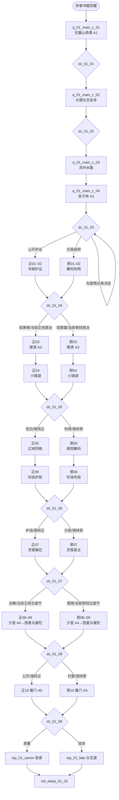

# 剧情 · 01 天龙八部（正邪双主线与选择节点）

> 归属（基准 §18）：`ch01_tianlong` 的主线剧情、正邪立场路线、选择节点、锚点落地、人物生死与结局条件；这是本书界“主线”的唯一归属文档。
> 上游：`00-canon.md` v1.1（唯一事实来源）；作者新增需求与决定见 `decisions/author-requirements.md` AR-04、AR-09、AR-10 与 `decisions/author-decisions.md` P05、P30、P42、P47、P48；跨文档裁定见 `decisions/rulings-v1.md`。
> 引用而不重定义：锚点与改命边界 → `design/01` §7.2；年代、书眠与时代图层 → `design/02`；品德与声望 → `design/03` §8；战斗及 Boss 机制 → `design/09`；区域与旅行 → `design/11`；任务 DSL → `design/12`（待成文）；天书之力与结局总规则 → `design/13`；门派 → `design/17`；NPC、招募、生卒与跨书界 → `design/18`；正式城市与区域 ID → `design/map/*`；武学 → `design/catalog/skills-*`。
> 标注约定：**（原创扩展）** = 原著没有的内容；**（待考）** = 原著事实尚需按三联 / 广州修订版逐字核对；**（待核实）** = 技术事实尚未联网确认；**（待实测）** = 需要真机或真账号验证；**【建议值】** = 依赖其他文档，先给可用数值并在文末登记。
> 版本：v1.0（P01 成稿，2026-09-26）。

## 0. 阅读指引与剧情总览

### 0.1 结论先行

| 项 | 本书界结论 |
|---|---|
| 书界 | 《天龙八部》`ch01_tianlong`；北宋哲宗约 1093–1094 **（待考）** |
| 玩法参数 | 高武；武运 85；难度 4；等级上限 35；起始无携带；外来压制 0；均引用基准 §2 |
| 前后书界 | 前接序章《越女剑》`ch00_yuenv`；后接《射雕英雄传》`ch02_shediao` |
| 天书主题 | “众生”；原著变体 `tsp_01_canon`“舍身”，改命变体 `tsp_01_fate`“众生渡”，效果只见 `design/13` §4.3 |
| 固定锚点 | 无量山奇遇 → 杏子林身世揭露 → 聚贤庄大战 → 少室山群雄会 → ★雁门关止战；顺序与 `design/01` §7.2 一致 |
| 主线规模 | 4 幕共有开局 + 正线 10 幕 + 邪线 10 幕；9 个决策节点；正邪均可完整通关 |
| 两个独立轴 | “正 / 邪”是玩家当前立场；“原著 / 改命”是雁门关结果。正线也可能得原著结局，邪线也可完成改命 |
| 特色系统 | 珍珑棋局、八部众支线、带头大哥谜案必须进入主线节奏；具体规则与奖励归书界文档 `chapters/01-tianlong.md`，本文只给剧情入口、结果和旗标 |

### 0.2 正邪线不是开局阵营

1. 玩家以无门无派的“失籍行脚人”身份醒来，不在创角时选择正或邪。立场由 `morality`、已经作出的关键选择、所欠人情与当前同伴共同决定。
2. **正线**指公开证据、先救人后逐利、让当事人拥有选择权的办事方式；它允许欺敌、潜入与妥协，不等于必须加入正派门派。
3. **邪线**指交易情报、借势制衡、与灰色或反派势力结盟的办事方式；它有独立目标“以相互挟制止住大战”，不是失败路线，也不要求滥杀或伤害弱者。
4. 在 `dc_01_03`、`dc_01_04`、`dc_01_05`、`dc_01_06`、`dc_01_07`、`dc_01_08` 均可改变路线。切线要承担声望、人情、证据或独占奖励损失，不能无成本反复横跳。
5. `morality` 仍按 `design/03` §8.3 的 −100…+100 计算。本文每次变化控制在该文建议的 ±1…±15 内；“走邪线”本身不自动扣品德，只有背信、嫁祸、胁迫无辜等具体行为扣除。
6. 路线候选采用重叠门槛：通常 `morality >= -39` 可选正向承诺，`morality <= 39` 可选邪向交易；极端立场仍可凭两项补偿旗标进入另一线。这样中立玩家可自由选，长期行为又会真实影响可见选项。门槛均为**【建议值】**，待 `design/12` 收敛。
7. 每次实际切线支付 `switchFameCost = min(fame, max(100, floor(fame × 25%)))` **【建议值】**，并关闭上一势力尚未领取的独占报酬。100 对齐 `design/03` §8.4 的首个声望门槛；25% 让高声望切线代价随进度增长，又不使 `fame` 变成负数。

### 0.3 主流程图



图中 `A1…A5` 只表示 `design/01` §7.2 的五个锚点，不是新内容 ID。正邪同号幕处理相近的原著时间段，但目标、盟友、失败后果不同；切线时从下一幕进入另一条路线，不倒退重演已经完成的历史。

### 0.4 路线阶段与连通约束

| 阶段 | 共同时序 | 正线重点 | 邪线重点 | 可切线节点 | 不可破坏的事实 |
|---|---|---|---|---|---|
| I 入江湖 | `c_01–c_04` | 救援、保存原证 | 交易、制造制衡筹码 | `dc_01_01–03` | 段誉自行取得核心奇遇；萧峰自行面对身世 |
| II 寻身世 | 回 16–30 | 陪萧峰查证、救阿朱与伤者 | 借康敏、全冠清、慕容线相互牵制 | `dc_01_04–05` | 聚贤庄后黑衣人救走萧峰；不得在战斗中真正击败萧峰 |
| III 众生局 | 回 31–38 | 护珍珑、解除奴役、完成灵鹫善后 | 夺传承、重订威慑、重组灵鹫权力 | `dc_01_06–07` | 虚竹仍是误打误撞破局者；回 38 的灵鹫宫收束不可挪到少室之后 |
| IV 群雄会与南行 | 回 39–48 | 让证据公开可复核、保全家眷 | 让各方秘密互相钳制、拆解夺位交易 | `dc_01_08` | 回 39 返少室，A4 后再依次经过西夏与曼陀山庄；人物选择归本人 |
| V 雁门止战 | 回 49–50 | 公开盟约救援 | 多方托管制衡 | `dc_01_09` | 主角不代替萧峰迫帝折箭或作最终生死抉择 |

---


## 1. 原著重要剧情与走向清单

### 1.1 采用口径

- 下表以三联 / 广州修订版为叙事基线，按 50 回目录顺序排列。联网目录只用于校对回目名与大段顺序，不能替代版本逐字考据。
- “原著结果 / 走向”只写剧情大意；无法确认细节先后的条目明确标 **（待考）**，不伪造对白、招名或回目内页码。
- “本作去向”确保每一回至少有一个主线、选择节点或系统支线承接。标“支线规则”的内容仍在主线中发生，只是棋局、八部众或谜案的可重复玩法交 `chapters/01-tianlong.md` 定义。
- `Znn/Xnn/Cnn` 是本节为节省表宽使用的幕号简写，分别对应 `q_01_main_z_nn`、`q_01_main_x_nn`、`q_01_main_c_nn`。

### 1.2 五十回事件去向（1–25）

| 回 | 回目 | 关键人物 | 地点（当时名 / 地貌） | 原著结果或走向 | 本作去向 |
|---:|---|---|---|---|---|
| 1 | 青衫磊落险峰行 | 段誉、钟灵、无量剑派诸人 | 大理国无量山一带 | 段誉因无量剑派与神农帮冲突卷入江湖 | **锚点 A1**；C01，玩家只救外围人物，不替段誉走核心机缘 |
| 2 | 玉壁月华明 | 段誉、钟灵、左子穆等 | 无量山剑湖宫一带 **（地望待考）** | 玉壁、比剑与两派冲突继续，钟灵危局加深 **（细节待考）** | 双线共有；C01，八部众“天 / 龙”意象支线入口交书界文档 |
| 3 | 马疾香幽 | 段誉、木婉清、钟灵 | 大理国山道 | 木婉清加入逃亡，段誉为救人奔走 | 双线共有；C01→C02，`dc_01_01` 决定救援顺序 |
| 4 | 崖高人远 | 段誉、木婉清、岳老三等 | 无量山崖谷 / 大理国山道 | 段誉屡陷险境，四大恶人线展开 **（细节待考）** | 双线共有；C01，探索与追逃；岳老三为八部众支线对象 |
| 5 | 微步縠纹生 | 段誉、木婉清 | 无量山琅嬛福地一带 | 段誉获得北冥神功、凌波微步机缘并脱困 | **选择节点**；`dc_01_01`，主角可守口、窥探或夺残图，但完整 `sk_beiming` / `sk_lingbo` 仍属段誉 |
| 6 | 谁家子弟谁家院 | 段誉、木婉清、段正淳 | 大理国都（羊苴咩城）及近郊 | 段誉回到大理关系网，木婉清身世疑云浮现 **（细节待考）** | 双线共有；C02，以王府接应和身份核验承接 |
| 7 | 无计悔多情 | 段誉、木婉清、钟灵及父母辈 | 大理国都 / 万劫谷一带 | 情感与血缘误认造成禁忌困局 **（具体揭露顺序待考）** | **选择节点**；C02 / `dc_01_02` 前置，保护当事人或出售消息 |
| 8 | 虎啸龙吟 | 段誉、段延庆、四大恶人 | 万劫谷 **（地望待考）** | 四大恶人介入大理段氏纷争，段誉受困 | 双线共有；C02，正线救人、邪线探段延庆诉求 |
| 9 | 换巢鸾凤 | 段誉、木婉清、钟灵、刀白凤等 | 万劫谷 / 大理王府 | 调包与营救化解眼前危局，亲缘疑团未尽 **（细节待考）** | 双线共有；C02，执行营救或换俘方案 |
| 10 | 剑气碧烟横 | 段誉、鸠摩智、枯荣大师 | 大理天龙寺 | 鸠摩智索经，段誉卷入六脉神剑与护寺冲突 | 双线共有＋`dc_01_02`；C02，护经、记谱诱饵或借势，武学仅引用 `sk_liumai` |
| 11 | 向来痴 | 段誉、鸠摩智 | 大理至江南水陆 | 鸠摩智挟段誉东行，慕容氏线开启 | 双线共有；C03，玩家追踪而不改段誉被挟事实 |
| 12 | 从此醉 | 段誉、王语嫣、阿碧等 | 苏州水域、曼陀山庄一带 | 段誉遇王语嫣并卷入姑苏人物关系 **（场景先后待考）** | 双线共有；C03，尊重王语嫣意愿，不以好感门槛决定其去留 |
| 13 | 水榭听香 指点群豪戏 | 王语嫣、段誉、慕容家臣 | 苏州水榭 / 琴韵小筑一带 | 王语嫣以武学见闻指点交手，群豪寻慕容复 | 双线共有；C03，战斗情报教学；阿碧水路接应 |
| 14 | 剧饮千杯男儿事 | 萧峰、段誉 | 无锡县 | 萧峰与段誉饮酒、比脚力并结交 | 双线共有；C03，主角可同行但不取代二人结义 |
| 15 | 杏子林中 商略平生义 | 萧峰、丐帮众、康敏等 | 江南东路无锡县杏子林 **（具体方位待考）** | 丐帮内变，萧峰契丹身世被公开并离开帮主之位 | **锚点 A2**；C04，玩家决定证词公开顺序，萧峰自行应对身份 |
| 16 | 昔时因 | 萧峰、智光等知情人 | 江南至中原查访路 | 三十年前雁门关旧事与“带头大哥”谜案展开 | 双线共有＋谜案；Z01/X01，证言链规则交书界文档 |
| 17 | 今日意 | 萧峰、丐帮 / 西夏一品堂诸人 | 江南驿路 **（具体地点待考）** | 帮中余波与外敌冲突交织，萧峰继续寻根 **（细节待考）** | **选择节点**；`dc_01_03` 后首轮阵营兑现，救证人或借混乱取名单 |
| 18 | 胡汉恩仇 须倾英雄泪 | 萧峰、知情人及少林关系人物 | 中原查访路 | 胡汉身份、养育之恩与旧仇相互冲突 | 双线共有；Z01/X01，建立“血缘不替代选择”的主题 |
| 19 | 虽万千人吾往矣 | 萧峰、阿朱、薛慕华、游氏兄弟、群雄 | 河南聚贤庄 **（具体州县待考）** | 萧峰为救阿朱赴英雄宴，与群雄大战后被黑衣人救走 | **锚点 A3**；Z03/X03 与 `dc_01_04`，调用 `enc_01_juxianzhuang` / `bsc_xiaofeng_juxianzhuang` |
| 20 | 悄立雁门 绝壁无余字 | 萧峰、阿朱 | 雁门关及旧崖 | 萧峰查雁门遗迹，追索被抹去的旧事 | 双线共有；Z04/X04，获得关外地形、旧证与终幕伏笔 |
| 21 | 千里茫茫若梦 | 萧峰、阿朱 | 中原至大理寻访路 | 二人继续追查带头大哥与身世，感情加深 | 双线共有；Z02/Z04 或 X02/X04，护送 / 追踪双视角 |
| 22 | 双眸粲粲如星 | 萧峰、阿朱、阿紫、段正淳关系人物 | 小镜湖前后 **（具体先后待考）** | 阿朱与亲缘线相认，误导仍推动悲剧 | **选择节点**；`dc_01_05` 前置，验证康敏口供与姐妹信物 |
| 23 | 塞上牛羊空许约 | 萧峰、阿朱、段正淳 | 小镜湖青石桥一带 **（地望待考）** | 阿朱代父赴约，死于萧峰掌下；塞上之约成空 | 双线共有的次级改命窗；`dc_01_05` 可保留原著结果或救下阿朱 **（原创扩展）**，不替代主改命 A5 |
| 24 | 烛畔鬓云有旧盟 | 萧峰、阿紫、段正淳及旧识 | 大理人物线 / 小镜湖余波 | 段正淳旧情与诸女关系继续揭露，阿紫进入萧峰线 **（细节待考）** | **选择节点**；Z04/X04，公开家事、保护家眷或利用名单 |
| 25 | 莽苍踏雪行 | 萧峰、阿紫 | 北上关外 | 萧峰携阿紫北行，离开中原纷争 | 双线共有；Z05/X05，路线转入辽地 |

### 1.3 五十回事件去向（26–50）

| 回 | 回目 | 关键人物 | 地点（当时名 / 地貌） | 原著结果或走向 | 本作去向 |
|---:|---|---|---|---|---|
| 26 | 赤手屠熊搏虎 | 萧峰、阿紫及辽地人物 | 辽境山野 **（地望待考）** | 萧峰在塞外显露豪勇，融入辽地生活 | 双线共有；Z05/X05，以生存与非致命狩猎 / 救援场景承接 |
| 27 | 金戈荡寇鏖兵 | 萧峰、耶律洪基 | 辽境 / 上京临潢府方向 | 萧峰参与平乱并获南院大王地位 **（战事细节待考）** | 双线共有；Z05 是止戈责任，X05 是政治筹码；耶律洪基 ID 待补 |
| 28 | 草木残生颅铸铁 | 游坦之、阿紫、萧峰线人物 | 中原 / 辽地交叉线 **（地点待考）** | 游坦之受尽折磨，以铁面身份继续追随阿紫 **（细节待考）** | 双线共有＋八部众支线；Z05/X05，允许救治与恢复主体性，不替他做情感选择 |
| 29 | 虫豸凝寒掌作冰 | 游坦之、阿紫、星宿人物 | 中原北地 **（地望待考）** | 冰蚕与毒功令游坦之武力大进，代价深重 | 双线共有；Z05/X05，`sk_bingcanduzhang` 只按图鉴既有来源引用 |
| 30 | 挥洒缚豪英 | 阿紫、游坦之、丐帮 / 星宿人物 | 中原 **（地点与先后待考）** | 阿紫与游坦之线牵动群雄，丐帮局势继续变化 | 双线共有；Z05/X05，救俘或借俘交换情报 |
| 31 | 输赢成败 又争由人算 | 虚竹、苏星河、无崖子、丁春秋等 | 擂鼓山 **（地望待考）** | 珍珑棋局聚集群豪，虚竹意外破局 | 双线共有＋特色系统；Z06/X06，虚竹必须是破局者，棋局规则交书界文档 |
| 32 | 且自逍遥没谁管 | 虚竹、无崖子、苏星河 | 擂鼓山秘处 | 虚竹承受逍遥传承与责任，无崖子命运收束 **（细节待考）** | 双线共有＋`dc_01_06`；Z06 护传承，X06 争控制权，不能夺虚竹核心机缘 |
| 33 | 奈天昏地暗 斗转星移 | 虚竹、天山童姥、三十六洞七十二岛诸人 | 西行路 / 天山一带 | 虚竹卷入童姥与属众危机，慕容线亦推进 **（具体并行剪辑待考）** | 双线共有；Z07/X07，八部众支线和慕容复镜像主题 |
| 34 | 风骤紧 缥缈峰头云乱 | 虚竹、天山童姥、灵鹫宫众 | 天山缥缈峰 | 三十六洞七十二岛反叛，灵鹫宫权力动荡 | 双线共有；Z07 解缚，X07 重订盟约；门派入口遵守作者 P30 |
| 35 | 红颜弹指老 刹那芳华 | 天山童姥、李秋水、虚竹 | 西夏兴庆府方向 / 冰窖 **（地点细节待考）** | 童姥与李秋水宿怨走向死亡，虚竹承接后果 | 双线共有；Z07/X07 与 `dc_01_07`，可劝停但改命细节标原创扩展 |
| 36 | 梦里真真语真幻 | 虚竹、西夏公主等 | 西夏皇城兴庆府 | 冰窖旧缘成为虚竹后续身份线索 **（具体情节待考）** | 双线共有；Z07/X07，保护当事人隐私或将其作为谈判筹码 |
| 37 | 同一笑 到头万事俱空 | 段誉、虚竹、相关群豪 | 西夏 / 天山会合线 **（地点待考）** | 多条人物线重新会合，执念与身份发生转折 | 双线共有；Z07/X07 合流，进入灵鹫宫善后与少室终段 |
| 38 | 糊涂醉 情长计短 | 虚竹、段誉、灵鹫宫众与洞岛群豪 | 天山缥缈峰 | 虚竹平定灵鹫宫余乱、救宫众并承担解除生死符之责；与段誉结义 **（细节待考）** | 双线共有；Z07/X07 尾声，`dc_01_07` 的控制体系处分必须在离山前结算 |
| 39 | 解不了 名缰系嗔贪 | 虚竹、灵鹫宫众、洞岛群豪、少林僧众 | 缥缈峰至河南府登封县·少室山 | 虚竹为众人解除生死符后返少林，接受戒律审问 **（细节待考）** | 双线共有；Z08/X08 前半，护送证人与解符名册进入少室山前局 |
| 40 | 却试问 几时把痴心断 | 虚竹、鸠摩智、段誉、段正淳、少林僧众 | 少室山少林寺 | 虚竹与鸠摩智较量；段誉、段正淳等抵达，群雄会条件汇齐 **（细节待考）** | 双线共有；Z08/X08 后半，以止伤 / 留证或借势 / 分证进入 A4；不把后来的段氏悲剧提前 |
| 41 | 燕云十八飞骑 奔腾如虎风烟举 | 萧峰、辽骑、少林群雄 | 河南府登封县·少室山 | 萧峰率燕云十八骑赴会，多线在少林汇聚 | 双线共有；Z08/X08 群雄会开场，玩家处理外围而不夺其出场 |
| 42 | 老魔小丑 岂堪一击 胜之不武 | 虚竹、丁春秋、游坦之、群雄 | 少室山少林寺 | 虚竹与丁春秋等冲突收束，群雄武力格局显现 | 双线共有；Z08/X08，引用既有武学，不新造招名；慈悲击倒默认制服遵守 P47 |
| 43 | 王霸雄图 血海深恨 尽归尘土 | 萧峰、萧远山、慕容博、慕容复、玄慈、扫地僧等 | 少室山 / 藏经阁 | 身世、带头大哥、萧慕容两家旧仇集中揭晓并被止息 | **锚点 A4**；Z08/X08，玩家推动证据现世，不代替当事人对质 |
| 44 | 念枉求美眷 良缘安在 | 段誉、钟灵、阿紫、游坦之、萧峰等 | 少室山后赴西夏途中 **（具体地望待考）** | 少室山余波、段誉养伤与众人赴西夏求亲线展开 **（细节待考）** | 双线共有；Z09/X09 第一阶段，处理伤者与结伴西行，不替人物决定情感去向 |
| 45 | 枯井底 污泥处 | 段誉、王语嫣、鸠摩智、慕容复等 | 西夏兴庆府近郊枯井 **（具体地望待考）** | 王语嫣遇险、段誉相救；鸠摩智走火入魔后散功醒悟 **（细节待考）** | 双线共有；Z09/X09 第二阶段，可救敌、取证或夺势；鸠摩智仅醒悟后开放结盟窗口 |
| 46 | 酒罢问君三语 | 虚竹、西夏公主、群豪 | 西夏皇城兴庆府 | 西夏招亲以三问辨认旧缘，虚竹关系线收束 | 双线共有；Z09/X09 第三阶段，也是 Z/X07 的延迟关系结算；答题与棋局同属书界特色玩法 |
| 47 | 为谁开 茶花满路 | 段誉、王语嫣、木婉清、钟灵、段正淳线人物 | 兴庆府南下至江南曼陀山庄 **（驿路细节待考）** | 段誉等南下寻父，误中醉人蜂并发现段延庆、慕容复与王夫人的夺位图谋 **（细节待考）** | **选择节点**；Z09/X09 第四阶段，营救家眷、拆分证据或布置制衡 |
| 48 | 王孙落魄 怎生消得 杨枝玉露 | 段誉、段正淳、刀白凤、段延庆、慕容复、王夫人等 | 江南曼陀山庄 | 段氏血脉真相、夺位交易与家眷悲剧集中收束；慕容复执念走向崩塌 **（伤亡及收尾细节待考）** | 双线共有；Z09 保人 / X09 破局，末尾触发 `dc_01_08`；邪线不得把伤亡或失常当成功奖励 |
| 49 | 敝屣荣华 浮云生死 此身何惧 | 萧峰、段誉、虚竹、耶律洪基 | 辽上京临潢府及南下路 | 萧峰因拒绝南侵被囚，兄弟与群豪营救 | 双线共有；Z10 是公开救援，X10 是内外策反；均通往雁门关 |
| 50 | 教单于折箭 六军辟易 奋英雄怒 | 萧峰、耶律洪基、段誉、虚竹、阿紫等 | 雁门关 | 萧峰逼辽帝折箭退兵后自尽，阿紫结局相随 **（细节待考）** | **锚点 A5 / 主改命**；Z10/X10 + `dc_01_09`，原著得 `tsp_01_canon`，改命得 `tsp_01_fate` |

### 1.4 覆盖率与采用统计

| 校验口径 | 分子 / 分母 | 覆盖率 | 说明 |
|---|---:|---:|---|
| 50 回目录都有去向 | 50 / 50 | 100% | 每回均映射到共有幕、正邪幕、节点、锚点或特色系统入口 |
| 五个固定锚点落地 | 5 / 5 | 100% | A1 回 1–5；A2 回 15；A3 回 19；A4 回 41–43；A5 回 49–50 |
| 原著重大人物群 | 8 / 8 | 100% | 段誉、萧峰、虚竹、王语嫣 / 慕容、大理段氏、逍遥诸人、四大恶人、辽宋群雄均有主线落点 |
| 特色系统进入剧情 | 3 / 3 | 100% | 珍珑棋局、八部众支线、带头大哥谜案均有主线入口；规则另归书界文档 |
| 完全不采用 | 0 / 50 | 0% | 不删除任一整回；具体重复赶路、战斗与旁枝可在关卡化时蒙太奇处理 |
| 标有待考的回目行 | 31 / 50 | 62% | 多为具体地点、场景先后与人物在场，不影响主骨架；详见 §9.2 |

这里的 100% 指“本表选取的五十个回目单位均有设计去向”，不声称每段对白、每场小战或每名过场人物都已逐项游戏化。

---

## 2. 主角定位与开局

### 2.1 穿越身份：失籍行脚人

主角承接序章《越女剑》的书眠，在约 1093 年醒于大理国无量山外围驿路。书灵以墨影短暂现身，告知“此卷以众生为题”，但不剧透萧峰结局。主角没有宋、大理、辽任何一方的正式户籍，也不冒充原著人物；一支途经茶商只为其作“路上救起”的临时保结，形成可旅行、可被盘问、又不天然属于任何阵营的 **失籍行脚人** 身份 **（原创扩展）**。

该身份同时满足：

- 男女主角两版均可使用，不预设性别、情缘或门派；遵守作者决定 P05。
- 起始无携带武学和装备，严格服从基准 §2；序章经验只通过系统教学记忆体现，不带入物品。
- 初始可在“识字抄录”“草药急救”“脚程探路”三种非战斗自述中选一项；这只是任务解法标签，不在本文新定义属性加成。
- 当地人最先把主角当可疑外乡人；声望从本书界值 0 起算，`morality` 则按 `design/03` 的跨书规则保留序章结果。
- 书界文档若以后提供正式“穿越开局”，必须引用本节并保持“无籍、无阵营、不替代段誉”三项硬约束。

### 2.2 开场时间、空间与教学目标

| 项 | 落地 |
|---|---|
| 时间 | 北宋哲宗约 1093 年；具体月日不写死，朝局线索仍 **（待考）** |
| 区域 | `rg_yungui` |
| 城市 / 地貌 | `city_dali` 时代名“大理国都（羊苴咩城）”作为首个城市枢纽；实际醒点用 `cityId: null` + `placeKey: wuliang_outer_road`，因为无量山不是正式城市 |
| 第一批关系 | 与 `npc_duanyu`、`npc_zhongling` 同为被冲突卷入者；`npc_muwanqing` 初始警惕；`sect_wuliang` 与 `sect_shennong` 都不默认友善 |
| 教学 | 区域探索、对话条件、非致命制服、伤者救治与“一件事有多种立场解法” |
| 首个节点 | `q_01_main_c_01` 中段触发 `dc_01_01`：先救中毒脚夫、追钟灵，或尾随段誉寻找秘径；没有选项直接锁线 |

### 2.3 与主角团及对立者的关系起点

| 人物 / 势力 | 初始关系 | 玩家可建立的第一层关系 | 不能越过的边界 |
|---|---|---|---|
| `npc_duanyu` | 同路陌生人 | 共同救人、替彼此作证 | 不替他取得 `sk_beiming`、`sk_lingbo` 或作出情感选择 |
| `npc_zhongling` | 首位愿主动搭话者 | 救援、辨毒、引路 | 不把她只当开启万劫谷的钥匙 |
| `npc_muwanqing` | 误以为主角是追兵 | 守诺或坦白解除敌意 | 不用主角性别强制写情缘 |
| `npc_xiaofeng` | 直到无锡县才正式相识 | 以酒席外围冲突与杏子林证言建立信任 | 不取代段誉结义，不代其回答“胡 / 汉”身份 |
| `npc_azhu` | 江南慕容线的易容与侦查者 | 相互识破后交换调查线索 | 小镜湖选择必须给她知情与拒绝空间 **（原创扩展）** |
| `npc_murongfu` | 幕后被追索的嫌疑中心 | 可合作查嫁祸，也可与其复国网络交易 | 邪线也不把无条件助其称帝设为通关目标 |
| `npc_duanyanqing` | 敌对或观望 | 以大理继承秘密建立有限停战 | 不能抹去其伤害无辜的责任 |
| `npc_dingchunqiu` | 尚未露面、只有星宿线索 | 邪线可作受限同行者 / 情报源 | 同行窗口结束不等于永久禁招；后续再次邀请仍须承担罪责与制约，不能因合作自动洗白 |

### 2.4 共有开局四幕

共有幕也使用与正邪幕相同的固定字段，以便后续十三部直接复用格式。

#### `q_01_main_c_01` · 无量山醒卷

| 固定字段 | 内容 |
|---|---|
| 标题 | 无量山醒卷 |
| 原著对应事件（回目） | 回 1–5；锚点 A1“无量山奇遇与段誉入江湖” |
| 地点 | `rg_yungui`；无量山外围、剑湖宫与琅嬛福地外围 **（具体地望待考）** |
| 参与 NPC | `npc_duanyu`、`npc_zhongling`、`npc_muwanqing`；无量剑派 / 神农帮背景人物 |
| 目标与流程 | ①书眠苏醒并取得临时保结；②听见剑湖宫骚动；③在毒伤脚夫、钟灵信号与段誉足迹间决定先后；④交涉、潜行或制服拦路者；⑤从外围见证段誉坠崖 / 失踪 **（镜头待考）**；⑥在福地外围汇合，不进入核心传承室 |
| 关键战斗 | 普通：山道拦截；精英：无量 / 神农两方追兵择一或双向脱战；机制只引用 `design/09` 的制服、撤离与毒区规则 |
| 幕内小选择 | 伤药给脚夫或自留（±2 品德）；替哪方传口信；是否窥看段誉遗落的步法草痕（只能得谜题线索） |
| 幕末状态变化 | `flags.a1_wuliang_witnessed=true`；段誉入江湖；开启 `dc_01_01`；无门派自动加入 |
| 失败与时限 | 段誉不会因玩家迟到死亡；两次长休后钟灵救援转为追踪，失去一份早期人情但主线继续 |

#### `q_01_main_c_02` · 万劫谷与护经

| 固定字段 | 内容 |
|---|---|
| 标题 | 万劫谷与护经 |
| 原著对应事件（回目） | 回 6–10 |
| 地点 | `rg_yungui`；万劫谷 **（地望待考）**、`city_dali` 大理国都（羊苴咩城）、天龙寺 |
| 参与 NPC | `npc_duanyu`、`npc_muwanqing`、`npc_zhongling`、`npc_duanzhengchun`、`npc_daobaifeng`、`npc_duanyanqing`、`npc_yuelaosan`、`npc_yunzhonghe`、`npc_yeerniang`、`npc_jiumozhi`、`npc_kurong` |
| 目标与流程 | ①由钟灵线索进入万劫谷外围；②确认人质与四恶人位置；③用换俘、潜入或牵制等到段氏救援；④回羊苴咩城核对亲缘证词；⑤赶赴天龙寺守门、转移抄本或追踪鸠摩智；⑥见证段誉处理经谱，触发 `dc_01_02` |
| 关键战斗 | 精英：万劫谷换俘；Boss 演出：鸠摩智压寺（胜负目标是护送与拖延，不要求击败）；机制引用 `design/09` |
| 幕内小选择 | 是否把段氏家事交段誉先知情；是否用伪抄本引开追兵；制服四恶人部属后是否了断（必须显式选择，见 P43） |
| 幕末状态变化 | `flags.dali_crisis_seen=true`；天龙寺关系按护经结果变化；触发 `dc_01_02`；鸠摩智仍挟段誉东行 |
| 失败与时限 | 万劫谷三次长休后由段氏完成营救，玩家失去人情；天龙寺守护失败只改变经卷线索去向，不中断东行 |

#### `q_01_main_c_03` · 水榭听香

| 固定字段 | 内容 |
|---|---|
| 标题 | 水榭听香 |
| 原著对应事件（回目） | 回 11–14 |
| 地点 | `rg_liangzhe`；`city_suzhou` 苏州、水榭与琴韵小筑；`city_wuxi` 无锡县 |
| 参与 NPC | `npc_duanyu`、`npc_wangyuyan`、`npc_abi`、`npc_jiumozhi`、`npc_xiaofeng`；慕容家臣（ID 待补） |
| 目标与流程 | ①追踪鸠摩智船路；②借阿碧水路进入苏州；③从王语嫣辨招中确认“会某家武学”不等于“就是慕容氏凶手”；④在救段誉、保护宾客、追证人间取舍；⑤抵无锡县处理酒楼外围冲突；⑥随萧峰赴杏子林 |
| 关键战斗 | 普通：水道伏击；精英：曼陀山庄脱困 / 鸠摩智追击二选一；王语嫣提供可见招式情报，不直接参战 |
| 幕内小选择 | 是否把王语嫣的见闻交给追凶者；是否帮阿碧保住水路；酒楼冲突选择劝止、制服或借机扬名 |
| 幕末状态变化 | 开启慕容嫌疑证据链；段誉与萧峰结交；玩家第一次见萧峰；获得前往杏子林的公开理由 |
| 失败与时限 | 水路失守则改走陆路并增加一次追兵战；王语嫣可自行脱险，玩家失去其后续情报加成但不锁主线 |

#### `q_01_main_c_04` · 杏子林商义

| 固定字段 | 内容 |
|---|---|
| 标题 | 杏子林商义 |
| 原著对应事件（回目） | 回 15；回 16–18 的谜案起点；锚点 A2“杏子林身世揭露” |
| 地点 | `rg_liangzhe`；`city_wuxi` 无锡县杏子林 **（具体方位待考）** |
| 参与 NPC | `npc_xiaofeng`、`npc_duanyu`、`npc_azhu`；康敏、全冠清、丐帮长老、智光等 ID 待补 |
| 目标与流程 | ①在林外检查密信封缄与传令路径；②在救被毒倒者、扣住伪装信使、交证物间选择；③按原著发生身世揭露；④在西夏 / 帮内乱局中保护、追人或取名单；⑤萧峰自行离去；⑥触发 `dc_01_03` |
| 关键战斗 | 精英：西夏一品堂 / 叛乱帮众夹击 **（参与先后待考）**；可以制服、救人或护证，不以击杀萧峰为目标 |
| 幕内小选择 | 先公开哪份证词；是否隐去无辜家属信息；是否让萧峰先读密信；是否追击操盘者 |
| 幕末状态变化 | `flags.a2_xingzilin_witnessed=true`；萧峰离开帮主位；开启“带头大哥”证言链；首次进入正 / 邪路线 |
| 失败与时限 | 玩家无法阻止身世被揭；证人若散失，后续可从副本、口供矛盾或少室山补证，但改命条件更难 |

---

## 3. 正线：以证成义

### 3.1 路线目标与状态口径

正线不是“替萧峰洗清一切”，而是让证词可复核、让受牵连者先活下来，并把最终止战建立在跨阵营承诺上。本节所有 `morality` / `fame` 变化均为**【建议值】**：单次品德绝对值不超过 `design/03` §8.3 所留 ±1～±15；幕完成基础声望采用 100，恰好对齐 `design/03` §8.4“初出茅庐”门槛。小选择造成的增减与幕结算相加后统一 `clamp` 到合法范围。

入口为 `dc_01_03` 的“护送原证与证人”或任一后续节点切入正线；每次切入从下一编号幕继续，不回滚已发生的生死。默认顺序为 Z01→Z10。

### 3.2 正线十幕

#### `q_01_main_z_01` · 清名之后

| 固定字段 | 内容 |
|---|---|
| 标题 | 清名之后 |
| 原著对应事件（回目） | 回 16–18“昔时因”“今日意”“胡汉恩仇 须倾英雄泪” |
| 地点 | `rg_liangzhe` 无锡县至 `rg_zhongyuan` 西京河南府的驿路；知情人隐居点 **（待考）** |
| 参与 NPC | `npc_xiaofeng`、`npc_azhu`、`npc_duanyu`；智光、赵钱孙、康敏、全冠清等 ID 待补 |
| 目标与流程 | ①封存杏子林原始密信；②找回被驱散的传令人；③分别问证、记录“亲见 / 转述”；④在西夏追兵到来前转移两名证人；⑤把互相矛盾处先交萧峰；⑥开启带头大哥证言图而不抢先定罪 |
| 关键战斗 | 普通：驿路截信者；精英：一品堂掳证小队；以护送 / 撤离为胜利条件，机制引用 `design/09`，不新增战斗公式 |
| 幕内小选择 | 公布密信全文（`morality +3`、丐帮关系受损）或隐去无辜家眷（`morality +2`、少一条公开佐证）；是否放走愿作证的叛帮弟子 |
| 幕末状态变化 | `witnessChain=1`；`fame +100`；萧峰羁绊可上升；`npc_azhu` 短时同行候选开放；门派身份不变 |
| 失败与时限 | 两次长休后截信者离境；失败改为从康敏副本找矛盾，`witnessChain` 不增长，但可继续 Z02 |

#### `q_01_main_z_02` · 易容寻根

| 固定字段 | 内容 |
|---|---|
| 标题 | 易容寻根 |
| 原著对应事件（回目） | 回 18、21–22；少林易容取讯与身世寻访 **（具体回内次序待考）** |
| 地点 | `rg_zhongyuan`；`city_dengfeng` 登封县、少室山外围；转往大理的驿路 |
| 参与 NPC | `npc_xiaofeng`、`npc_azhu`；`npc_xuanci` 只作远景；萧远山、智光等 ID 待补 |
| 目标与流程 | ①由阿朱拟定易容身份；②玩家取得空白度牒而非偷用真人身份；③从寺外档案与老僧证言交叉核对；④发现“带头大哥”称谓不能单凭一人口供锁定；⑤保护阿朱撤离；⑥把线索送往雁门旧崖和小镜湖两处 |
| 关键战斗 | 普通：夜巡误会可免战；精英：灭口者袭击档房；少林僧默认按 P47“制服”，不得把潜入失败变成屠寺 |
| 幕内小选择 | 归还度牒（`morality +2`）或留下作后续潜入工具（无品德变化、少林声望 −100）；是否向玄慈递匿名质询 |
| 幕末状态变化 | `flags.leader_clue_shaolin=true`；`fame +100`；阿朱羁绊检定开放；少林关系按是否伤人变化 |
| 失败与时限 | 被识破后转为公开问讯，失去一条密室线索；阿朱不会因此命定死亡，主线改走 Z03 |

#### `q_01_main_z_03` · 聚贤救人

| 固定字段 | 内容 |
|---|---|
| 标题 | 聚贤救人 |
| 原著对应事件（回目） | 回 19“虽万千人吾往矣”；锚点 A3“聚贤庄大战” |
| 地点 | `rg_zhongyuan`；河南聚贤庄，具体州县 **（待考）**，不得伪配城市 ID |
| 参与 NPC | `npc_xiaofeng`、`npc_azhu`、`npc_xuemuhua`、`npc_youji`、`npc_youju`；群雄 |
| 目标与流程 | ①取得薛慕华面诊承诺；②识别庄内伤者区与撤离口；③宴前劝走无关来客；④触发 `dc_01_04` 选择助群雄、助萧峰或救治；⑤运行既有聚贤庄遭遇；⑥黑衣人按 P42 救走萧峰；⑦清点死伤并救阿朱 |
| 关键战斗 | **Boss**：`enc_01_juxianzhuang`，脚本 `bsc_xiaofeng_juxianzhuang`；群雄方目标为触发脚本的非致死力竭阶段，同袍方目标为坚持至救援阶段；萧峰不可被真正击败，阈值与阶段机制只见 `design/09` |
| 幕内小选择 | 救游氏家眷、抬离倒地群雄、替萧峰挡追击三者按时序最多完成两项；救人每项 `morality +3`，主动了断倒地者按任务后果扣品德 |
| 幕末状态变化 | `flags.a3_juxian_witnessed=true`、`flags.juxian_medical_aid` 按结果；`fame +200`；萧峰暂离队且必被黑衣人带走；聚贤庄 / 丐帮关系分流 |
| 失败与时限 | 主角倒地触发黑衣人救走萧峰的同一收束；阿朱由薛慕华接手但伤势更重，关闭一个提前醒转对话，不中断 Z04 |

#### `q_01_main_z_04` · 雁门旧痕

| 固定字段 | 内容 |
|---|---|
| 标题 | 雁门旧痕 |
| 原著对应事件（回目） | 回 20–24；雁门崖字、寻访身世与小镜湖悲剧前置 |
| 地点 | `rg_hedong_jinzhong`；`city_xinzhou` 忻州 + `placeKey: yanmenguan`；继而大理小镜湖 **（地望待考）** |
| 参与 NPC | `npc_xiaofeng`、`npc_azhu`、`npc_azi`、`npc_duanzhengchun`；康敏、阮星竹等 ID 待补 |
| 目标与流程 | ①从忻州进入雁门驿路；②拓印被毁旧痕而不补造文字；③核对幸存者方位；④在小镜湖前验证康敏口供；⑤把姐妹信物与段正淳行程交阿朱本人；⑥触发 `dc_01_05`，由她决定是否继续替身计划 |
| 关键战斗 | 精英：旧崖灭证者；普通：小镜湖追兵；战斗目标为保住拓片和信物，悬崖机制引用 `design/08` / `design/09` |
| 幕内小选择 | 先把证据给萧峰或阿朱；救下撒谎的口供人（`morality +3`）或放其离开；是否烧毁会牵连家眷的名单 |
| 幕末状态变化 | `flags.yanmen_trace=true`；若三项证据齐备则 `flags.azhu_truth_ready=true`；`fame +100`；阿朱是否存活由 `dc_01_05` 结算 |
| 失败与时限 | 抵小镜湖后仅有一次长休窗口；错过则按原著结果，阿朱命定死亡被确认，萧峰仍继续北上 |

#### `q_01_main_z_05` · 塞上同袍

| 固定字段 | 内容 |
|---|---|
| 标题 | 塞上同袍 |
| 原著对应事件（回目） | 回 25–30；萧峰北行、辽地建功、阿紫与游坦之线 |
| 地点 | `rg_mobei`；`city_liaoshangjing` 上京临潢府及辽境山野；中原支线以全国图折返 |
| 参与 NPC | `npc_xiaofeng`、`npc_azi`、`npc_youtanzhi`；耶律洪基 ID 待补 |
| 目标与流程 | ①沿商旅或萧峰引荐进入辽境；②在骑猎事故中先救平民；③协助平乱时分辨叛军与被裹挟者；④见证萧峰受封；⑤救治 / 约束阿紫与游坦之造成的伤害；⑥留下可在终幕约束辽军的军中人情 |
| 关键战斗 | 精英：辽地乱军侧翼；Boss 演出：护旗与撤民，不以杀尽为目标；骑战、军阵与 AI 友军规则只引用 `design/09` |
| 幕内小选择 | 接受军职但立“不侵民”条件（辽关系上升）或只作客卿；释放被胁从者（`morality +3`）；是否替游坦之拆除铁面束缚 **（原创扩展）** |
| 幕末状态变化 | 实际救下辽军民后，将“辽军民”类别加入 `crossFactionRescueFactions`（集合去重）；`flags.liao_oath_contact=true`；`fame +200`；萧峰可短时同行，阿紫 / 游坦之按条件进入候选 |
| 失败与时限 | 三次长休后平乱由萧峰完成；玩家失去军中联系人但可凭丐帮 / 大理人情在 Z10 补一条改命支柱 |

#### `q_01_main_z_06` · 珍珑护局

| 固定字段 | 内容 |
|---|---|
| 标题 | 珍珑护局 |
| 原著对应事件（回目） | 回 31–32；珍珑棋局、虚竹误打误撞破局与无崖子传承 |
| 地点 | `rg_zhongyuan`；擂鼓山 **（具体地望待考）**、山中秘室 |
| 参与 NPC | `npc_xuzhu`、`npc_suxinghe`、`npc_wuyazi`、`npc_dingchunqiu`、`npc_murongfu`、`npc_jiumozhi`、`npc_duanyu` |
| 目标与流程 | ①收齐请帖真伪线索；②护送函谷门人和棋具上山；③在棋局外围识破星宿扰心手段；④让所有入局者按自身选择应局；⑤虚竹仍以原著式意外路径破局；⑥守住秘室入口；⑦触发 `dc_01_06` 决定如何处置传承争夺 |
| 关键战斗 | 精英：星宿弟子毒阵；Boss：丁春秋外围阻击，胜利目标是保护破局与撤离，不在此永久击败；棋局本体规则归书界文档 |
| 幕内小选择 | 把一枚提示给慕容复、段誉或留给虚竹；救被丁春秋遗弃的弟子（`morality +3`）或先护棋局；是否公开无崖子仍在世 |
| 幕末状态变化 | `flags.zhenlong_resolved=true`、`flags.xuzhu_inherits=true`；`witnessChain +1`（若保护苏星河）；`fame +200`；虚竹成为短时同盟，`npc_wuyazi` 按原著命运结算 |
| 失败与时限 | 棋局开场后不可长休；玩家失守则虚竹仍破局，但苏星河伤重、证言链不增长，关闭一项逍遥支援而非主线 |

#### `q_01_main_z_07` · 灵鹫解厄

| 固定字段 | 内容 |
|---|---|
| 标题 | 灵鹫解厄 |
| 原著对应事件（回目） | 回 33–38；缥缈峰反叛、童姥与李秋水宿怨、西夏冰窖、虚竹身世转折与灵鹫宫善后 |
| 地点 | `rg_xiyu` 天山缥缈峰；`rg_hexilongyou`、`city_yinchuan` 兴庆府与皇城冰窖 **（细节待考）** |
| 参与 NPC | `npc_xuzhu`、`npc_tonglao`、`npc_liqiushui`、`npc_suxinghe`；三十六洞七十二岛、九天九部具名代表 ID 待补 |
| 目标与流程 | ①护送虚竹与受伤童姥西行；②调查洞岛群豪受制缘由；③在缥缈峰开放药房与撤离道；④按 P30 让女性主角以入宫候选、男性主角以虚竹客卿进入同一内容；⑤取得生死符受害名册；⑥在冰窖安排双方停手窗口；⑦由 `dc_01_07` 决定解除还是继承控制 |
| 关键战斗 | 普通：雪道追兵；精英：洞岛首领误战；Boss：童姥 / 李秋水双威胁的撤离场，不要求击杀，机制仅引用 `design/09` |
| 幕内小选择 | 优先救宫女或洞主；公开药方（`morality +4`）或只交虚竹保管；是否劝两个宿敌留下一句可核证口供 **（原创扩展）** |
| 幕末状态变化 | `flags.lingjiu_release_list=true`；实际救援后将“灵鹫宫 / 洞岛群豪”类别加入 `crossFactionRescueFactions`（集合去重）；`fame +200`；虚竹羁绊上升；灵鹫宫开放入宫 / 客卿资格但不自动入门 |
| 失败与时限 | 暴雪后两次长休会关闭一条救援道；仍由虚竹接掌灵鹫宫，但部分洞岛首领死亡、改命救援计数少一 |

#### `q_01_main_z_08` · 少室护证

| 固定字段 | 内容 |
|---|---|
| 标题 | 少室护证 |
| 原著对应事件（回目） | 回 39–43（承接回 38 善后）；虚竹返少林、鸠摩智挑战与锚点 A4“少室山群雄会” |
| 地点 | `rg_xiyu` 天山缥缈峰；`rg_zhongyuan`、`city_dengfeng` 登封县、少室山少林寺与藏经阁 |
| 参与 NPC | `npc_xuzhu`、`npc_jiumozhi`、`npc_xiaofeng`、`npc_duanyu`、`npc_murongfu`、`npc_murongbo`、`npc_xuanci`、`npc_saodiseng`、`npc_dingchunqiu`、`npc_youtanzhi`、`npc_yeerniang`；萧远山 ID 待补 |
| 目标与流程 | ①确认生死符受害者已获处置并封存解符名册；②护送虚竹返少林受审；③在鸠摩智挑战中救治伤者并留存武学来源证言；④群雄齐聚后保护三处入口；⑤递交杏子林与雁门两组原证；⑥让玄慈、叶二娘与萧慕容两家自行对质；⑦按原著让扫地僧止息藏经阁之战 |
| 关键战斗 | 精英：鸠摩智挑战外围救伤；Boss 连战：丁春秋 / 游坦之一侧；萧远山与慕容博之战只作高人事件，不要求玩家击败；机制只引用 `design/09` |
| 幕内小选择 | 优先保住解符名册或少林戒律卷；救叶二娘、玄慈或无名伤僧的先后；公开证词时是否遮蔽受害儿童身份 |
| 幕末状态变化 | `flags.a4_shaoshi_witnessed=true`；`flags.leader_mystery_resolved=true`；`fame +300`；`witnessChain` 最高达 2；萧峰羁绊结算；玄慈等生命状态依分支写入 |
| 失败与时限 | 回 39 护送可中途休整；群雄会一经开始不可离山长休。关键对质必发生，失败只毁一部分书证，至少保留一名证人或一份独立封缄，不阻断南行 |

#### `q_01_main_z_09` · 西夏南归

| 固定字段 | 内容 |
|---|---|
| 标题 | 西夏南归 |
| 原著对应事件（回目） | 回 44–48；少室余波、西夏求亲与枯井、三问辨缘、南下寻父、曼陀山庄段氏悲剧 |
| 地点 | `rg_hexilongyou`、`city_yinchuan` 兴庆府及近郊枯井 **（具体地望待考）**；`rg_jiangnan_taihu`、`city_suzhou` 苏州与曼陀山庄 |
| 参与 NPC | `npc_duanyu`、`npc_wangyuyan`、`npc_xuzhu`、`npc_xiaofeng`、`npc_murongfu`、`npc_jiumozhi`、`npc_muwanqing`、`npc_zhongling`、`npc_duanzhengchun`、`npc_daobaifeng`、`npc_duanyanqing`；王夫人、西夏公主等 ID 待补 |
| 目标与流程 | ①护送少室伤者赴西夏并处理求亲外围冲突；②营救枯井中的段誉、王语嫣及散功后的鸠摩智；③让虚竹完成“三问”辨缘，不替任何人决定婚配；④接获段正淳遇险讯息后立即南下；⑤在曼陀山庄转移受困家眷；⑥阻止慕容复与段延庆以王位交换继续杀局；⑦分别封存亲缘口供并触发 `dc_01_08` |
| 关键战斗 | 精英：西夏求亲外围截杀 / 醉人蜂脱困；Boss：曼陀山庄慕容复阻拦，可劝退、制服或坚持回合；段延庆可因真相停手，不把王语嫣或王位当战利品 |
| 幕内小选择 | 是否救散功后的鸠摩智（`morality +4`）；先救家眷或截断夺位密使；将亲缘秘密交当事人保管（`morality +3`）或只封存可核事实 |
| 幕末状态变化 | `flags.dali_witness_secured=true`；关键家眷按救援结果分别存活；`witnessChain` 最高达 3；`fame +200`；段誉 / 王语嫣关系不由玩家数值决定；鸠摩智仅在醒悟后可结盟 |
| 失败与时限 | 枯井段允许一次救援重试；接获南下讯息后两次长休结算曼陀山庄伤亡。至少一份证词由段誉或刀白凤保住，确保终幕可继续，但主改命“证人 / 双证”可能不足 |

#### `q_01_main_z_10` · 雁门众生

| 固定字段 | 内容 |
|---|---|
| 标题 | 雁门众生 |
| 原著对应事件（回目） | 回 49–50；锚点 A5“雁门关止战” |
| 地点 | `rg_mobei`、`city_liaoshangjing` 上京临潢府；`rg_hedong_jinzhong`、`city_xinzhou` 忻州 + `placeKey: yanmenguan` |
| 参与 NPC | `npc_xiaofeng`、`npc_duanyu`、`npc_xuzhu`、`npc_azi`、可存活的 `npc_azhu`；耶律洪基与燕云十八骑代表 ID 待补 |
| 目标与流程 | ①确认萧峰因拒绝南侵被囚；②召集至少两方救援联系人；③潜入或强攻上京军府救人；④护送百姓与俘虏避开南下军道；⑤在雁门关呈交公开证词、军中承诺和撤军见证；⑥由萧峰迫辽帝折箭；⑦触发 `dc_01_09` 决定保留独占增强或焚毁它换取可执行盟约；⑧结算原著 / 改命结果 |
| 关键战斗 | Boss：上京脱狱与雁门军阵；终局胜利条件是救出萧峰、保护见证人并迫使退兵，不是击杀耶律洪基；具体军阵机制引用 `design/09` |
| 幕内小选择 | 先救牢中同伴或城门百姓；是否让辽方证人公开承担风险；把一项独占增强投入盟约即永久放弃，不能事后购回 |
| 幕末状态变化 | `flags.a5_yanmen_resolved=true`；`fame +500`；按 `dc_01_09` 写 `flags.yanmen_fate_saved` 与萧峰生死；授予且仅授予 `tsp_01_canon` 或 `tsp_01_fate`；进入余韵期 |
| 失败与时限 | 救援开始后只有两次营地整备；关键人倒地不等于永久死亡，战斗失败回到军道检查点；若改命条件不足，仍以完整原著结局通关，绝不软锁 |

### 3.3 正线连通与节奏

| 检查点 | 最早入口 | 最迟补救 | 满足后果 |
|---|---|---|---|
| 原始证言 | Z01 | Z08 少室档案 / Z09 曼陀封缄 | `witnessChain >= 2` 且来源独立、封缄完整时，可作为“关键证人”替代条件之一 |
| 阿朱知情 | Z04 | `dc_01_05` 当场摊牌 | 可救阿朱；不救也不阻断主改命，但少一名终幕证人 |
| 跨势力救援 | Z05 / Z07 | Z10 上京牢狱 | 至少两类阵营才满足雁门改命支柱 |
| 萧峰高羁绊 | Z01–Z05 累积 | Z08 少室对质后、Z09 启程前最后一次深谈 | 使用 `design/18` 统一羁绊刻度，本文不重定义数值 |
| 放弃独占利益 | `dc_01_09` | 无；确认后不可逆 | 这是改命必要代价，不可用金钱或重战绕过 |

---

## 4. 邪线：以势止争

### 4.1 路线目标与底线

邪线的完整命题是：江湖与朝廷都不肯只凭公义停手时，玩家用秘密、债务和利益组成一张彼此不敢先动的网。它覆盖同一批原著大事，却从康敏 / 全冠清的操盘、慕容复的复国网、星宿派的毒与辽国军权等“另一面”进入。

邪线不等于恶行菜单，遵守四条底线：

1. 玩家可以结盟 `npc_murongfu`、`npc_duanyanqing` 或 `npc_dingchunqiu`，但不自动认可其目的；每份合作都有可终止条款。
2. 针对儿童、俘虏或普通百姓的伤害不作为高收益解法；若玩家主动如此做，任务继续但依法触发品德、同伴和势力后果。
3. 邪线也能保全萧峰并得到 `tsp_01_fate`：最终把私密把柄交给多方托管、形成可验证的相互制约，同样要满足 `design/01` 的四项改命前置。
4. 与正线共享的是历史事件而非任务实例；A3、A4、A5 各自通过 Z / X 对应幕进入同一遭遇或同一叙事结算，避免重复跑两次锚点。

### 4.2 邪线十幕

#### `q_01_main_x_01` · 乱局为秤

| 固定字段 | 内容 |
|---|---|
| 标题 | 乱局为秤 |
| 原著对应事件（回目） | 回 16–18；杏子林余波与带头大哥谜案起点 |
| 地点 | `rg_liangzhe` 无锡县至 `rg_zhongyuan` 驿路；丐帮临时联络点 **（待考）** |
| 参与 NPC | `npc_xiaofeng`、`npc_azhu`、`npc_murongfu`（使者先行）；康敏、全冠清、智光等 ID 待补 |
| 目标与流程 | ①复制而不交出杏子林密信；②从全冠清处换到丐帮内应名册；③向康敏索取第二套口供；④将矛盾证词分别卖给慕容线与西夏线；⑤留下能证明自己未伪造的封缄；⑥在灭口发生前转移最关键证人 |
| 关键战斗 | 普通：争夺密信副本；精英：两拨买家同时翻脸；可用谈判令双方互斗，但不得让无辜证人作为诱饵死亡 |
| 幕内小选择 | 只卖消息（无品德变化）、嫁祸第三方（`morality -6`）或双份收价后退还证人赎金（`morality +2`） |
| 幕末状态变化 | `leverageChain=1`；`fame +100`；慕容 / 一品堂各欠一份人情；萧峰羁绊按是否保护证人变化 |
| 失败与时限 | 两次长休后买家转移；玩家仍从死信箱获得残缺名册，X02 可继续但少一个终局钳制对象 |

#### `q_01_main_x_02` · 假经真局

| 固定字段 | 内容 |
|---|---|
| 标题 | 假经真局 |
| 原著对应事件（回目） | 回 18、21–22；易容寻访、少林线与慕容疑案 |
| 地点 | `rg_zhongyuan` 登封县少室山外围；`rg_liangzhe` 苏州水域的慕容联络点 |
| 参与 NPC | `npc_azhu`、`npc_murongfu`、`npc_jiumozhi`；`npc_xiaofeng` 可远程收信；康敏、包不同等 ID 待补 |
| 目标与流程 | ①与阿朱交换易容资源；②把天龙寺伪抄本放入三条流言渠道；③跟踪最先识破者；④用慕容家案卷换取少林旧档位置；⑤确认康敏口供中的时间矛盾；⑥保留一真两假的来源标记，防止自己误信 |
| 关键战斗 | 精英：鸠摩智追索伪经；普通：少林外围截查；可通过 `speech` / 易容解法免战，机制归任务 DSL |
| 幕内小选择 | 把假经交鸠摩智（`morality -3`）或只放假线索；是否告知阿朱全部风险；将慕容复洗清一部分嫌疑还是继续压价 |
| 幕末状态变化 | `flags.kangmin_timeline_gap=true`；`leverageChain +1`；`fame +100`；阿朱可因坦白而提高羁绊，欺瞒则后续质问 |
| 失败与时限 | 伪经计划败露会令少林 / 天龙寺关系下降，但通过缴回副本可继续；不得发放任何完整武学 |

#### `q_01_main_x_03` · 聚贤取势

| 固定字段 | 内容 |
|---|---|
| 标题 | 聚贤取势 |
| 原著对应事件（回目） | 回 19；锚点 A3“聚贤庄大战” |
| 地点 | `rg_zhongyuan`；河南聚贤庄 **（具体州县待考）** |
| 参与 NPC | `npc_xiaofeng`、`npc_azhu`、`npc_xuemuhua`、`npc_youji`、`npc_youju`；全冠清与群雄 ID 待补 |
| 目标与流程 | ①以卖情报名义进入英雄宴；②记录各派兵力与旧怨；③控制药库、后门或旗号三处之一；④触发 `dc_01_04`；⑤在大战中让选定一方达到脚本目标；⑥趁乱取得一份盟誓名册；⑦黑衣人仍救走萧峰；⑧决定名册用于勒索还是后续止战 |
| 关键战斗 | **Boss**：与正线共享 `enc_01_juxianzhuang` / `bsc_xiaofeng_juxianzhuang`；助群雄目标为触发脚本的非致死力竭阶段，助萧峰目标为坚持至救援阶段，救治目标为保全伤者；阈值只见 `design/09`，不得真正击败萧峰 |
| 幕内小选择 | 抬高哪一方撤退价码；是否救游氏兄弟；假传旗号造成群雄误伤会 `morality -8`，只开撤离口不扣品德 |
| 幕末状态变化 | `flags.a3_juxian_witnessed=true`；`flags.juxian_oath_roll=true`；`fame +200`；黑白两道均开始认识玩家；萧峰必被带走 |
| 失败与时限 | 被揭穿后可转“救治伤者”保住通关；名册不全则 X04 用康敏私信替代，终幕仍连通但多一次高风险交易 |

#### `q_01_main_x_04` · 镜湖设局

| 固定字段 | 内容 |
|---|---|
| 标题 | 镜湖设局 |
| 原著对应事件（回目） | 回 20–24；雁门旧事、小镜湖认亲与悲剧 |
| 地点 | `rg_hedong_jinzhong` 忻州雁门驿路；大理小镜湖 **（地望待考）** |
| 参与 NPC | `npc_xiaofeng`、`npc_azhu`、`npc_azi`、`npc_duanzhengchun`；康敏、阮星竹等 ID 待补 |
| 目标与流程 | ①从雁门旧崖取得被抹痕迹的拓片；②让两名互不相识的口供人分别下注；③以段正淳行程验证康敏谎言；④扣住姐妹信物作为谈判物；⑤向阿朱明示至少一项风险或继续隐瞒；⑥触发 `dc_01_05`；⑦收束青石桥结果 |
| 关键战斗 | 精英：康敏派出的灭口者；普通：争夺姐妹信物；允许威慑与交换，禁止任务自动伤害阿朱 |
| 幕内小选择 | 用假约地点诱出幕后者（不扣品德）或让不知情仆役作饵（`morality -8`）；把段氏丑闻卖给谁；是否在最后一刻向萧峰示警 |
| 幕末状态变化 | `flags.yanmen_trace=true`；`leverageChain +1`；阿朱生死由 `dc_01_05`；`fame +100`；持有“段氏私密”筹码但使用会伤害门派关系 |
| 失败与时限 | 小镜湖只有一次长休窗口；若错过，按原著发生阿朱死亡，筹码仍可从遗物与口供重建，X05 不断线 |

#### `q_01_main_x_05` · 南院筹码

| 固定字段 | 内容 |
|---|---|
| 标题 | 南院筹码 |
| 原著对应事件（回目） | 回 25–30；萧峰在辽、阿紫与游坦之线 |
| 地点 | `rg_mobei`；上京临潢府、辽境猎场与军营；中原联络点 **（待考）** |
| 参与 NPC | `npc_xiaofeng`、`npc_azi`、`npc_youtanzhi`、`npc_dingchunqiu`（使者）；耶律洪基 ID 待补 |
| 目标与流程 | ①以慕容 / 商队渠道进入辽境；②收集平乱双方军需账；③卖出一半情报换南院通行；④把另一半交萧峰，迫使双方保护百姓；⑤截住星宿使者对阿紫与游坦之的控制；⑥让至少一名辽将欠下“未被揭发”的债；⑦保留南侵命令链样本 |
| 关键战斗 | 精英：劫取军需簿；Boss 演出：两军之间夺旗后撤；可以借一方压另一方，但无差别放火会触发同伴离队 |
| 幕内小选择 | 收受军职（辽关系上升、宋地声望下降）或保持掮客；是否替游坦之拆铁面；用星宿毒物威吓军官会 `morality -5` |
| 幕末状态变化 | `flags.liao_command_copy=true`；实际救下辽军民后将对应类别加入 `crossFactionRescueFactions`（集合去重）；`leverageChain +1`；`fame +200`；萧峰可短时同行但会质问手段 |
| 失败与时限 | 军需簿被毁则用一名辽将口供替代；三次长休后萧峰自行平乱，玩家仍能进 X06，但终局钳制少一层 |

#### `q_01_main_x_06` · 珍珑夺局

| 固定字段 | 内容 |
|---|---|
| 标题 | 珍珑夺局 |
| 原著对应事件（回目） | 回 31–32；珍珑棋局、虚竹破局与逍遥传承 |
| 地点 | `rg_zhongyuan`；擂鼓山及山中秘室 **（具体地望待考）** |
| 参与 NPC | `npc_xuzhu`、`npc_suxinghe`、`npc_wuyazi`、`npc_dingchunqiu`、`npc_murongfu`、`npc_jiumozhi`、`npc_duanyu` |
| 目标与流程 | ①倒卖真假请帖确定各方底价；②把一枚假棋谱送给丁春秋；③用慕容复的人手锁住退路；④让虚竹仍按自身偶然选择破局；⑤趁内外隔绝取得传承见证副本；⑥在丁春秋与慕容复之间选临时买家；⑦触发 `dc_01_06`，决定把控制权交人还是拆散 |
| 关键战斗 | 精英：星宿 / 慕容双方抢秘室；Boss：丁春秋追夺，目标为带见证人撤出；棋局规则归书界文档，不用战力代替落子 |
| 幕内小选择 | 毁掉误导心神的假谱（`morality +3`）或卖给第三方（`morality -3`）；向虚竹说明利用经过可保住羁绊 |
| 幕末状态变化 | `flags.zhenlong_resolved=true`、`flags.xuzhu_inherits=true`；`leverageChain +1`；`fame +200`；无崖子依原著命运结算，玩家不获得其核心传功 |
| 失败与时限 | 棋局开始后不可长休；争夺失败仍由虚竹继承，玩家只失去逍遥见证副本，X07 可从童姥线继续 |

#### `q_01_main_x_07` · 灵鹫易主

| 固定字段 | 内容 |
|---|---|
| 标题 | 灵鹫易主 |
| 原著对应事件（回目） | 回 33–38；洞岛反叛、灵鹫宫易主、童姥与李秋水旧怨及灵鹫宫善后 |
| 地点 | `rg_xiyu` 天山缥缈峰；`rg_hexilongyou`、`city_yinchuan` 兴庆府皇城冰窖 **（细节待考）** |
| 参与 NPC | `npc_xuzhu`、`npc_tonglao`、`npc_liqiushui`；洞岛与九天九部代表 ID 待补 |
| 目标与流程 | ①以生死符解法片段换洞岛引路；②让反叛者交出人质名单；③护送童姥进入兴庆府；④把李秋水追兵引向空仓；⑤建立“解一人、释一寨”的交换顺序；⑥依 P30 以入宫或客卿身份见虚竹；⑦触发 `dc_01_07` 决定废除、限用或接管控制体系 |
| 关键战斗 | 精英：缥缈峰三方混战；Boss：冰窖双强追逐，以活着撤离和保住解法为胜；不要求杀死童姥或李秋水 |
| 幕内小选择 | 对敌对首领施用 `sk_shengsifu` 的“驭人”用法时每次 `morality -10`，严格执行 P31；允许只以解符权作谈判筹码，不扣品德 |
| 幕末状态变化 | `flags.lingjiu_control_ledger=true`；实际救援后将“灵鹫宫 / 洞岛群豪”类别加入 `crossFactionRescueFactions`（集合去重）；`fame +200`；虚竹继承结果不变；灵鹫宫按选择成为盟友、债务方或敌对 |
| 失败与时限 | 暴雪封路两次长休后自动失去一批人质；主线仍以残缺名册前往 X08，但不能把该批算作跨势力救援 |

#### `q_01_main_x_08` · 少室布衡

| 固定字段 | 内容 |
|---|---|
| 标题 | 少室布衡 |
| 原著对应事件（回目） | 回 39–43（承接回 38 善后）；虚竹返少林、鸠摩智挑战与锚点 A4“少室山群雄会” |
| 地点 | `rg_xiyu` 天山缥缈峰；`rg_zhongyuan`、`city_dengfeng` 登封县、少室山少林寺与藏经阁 |
| 参与 NPC | `npc_xuzhu`、`npc_jiumozhi`、`npc_xiaofeng`、`npc_duanyu`、`npc_murongfu`、`npc_murongbo`、`npc_xuanci`、`npc_saodiseng`、`npc_dingchunqiu`、`npc_youtanzhi`、`npc_yeerniang`；萧远山 ID 待补 |
| 目标与流程 | ①以解符名册换取洞岛群豪撤出少室外围；②护送虚竹回寺并把戒律审问作为公开见证；③借鸠摩智挑战迫各派亮出立场但先疏散伤者；④把杏子林与雁门材料分交三方封存；⑤让丁春秋、慕容线暴露彼此底牌；⑥由玄慈、叶二娘及萧慕容两家自行对质；⑦让扫地僧按原著止息藏经阁之战 |
| 关键战斗 | Boss 连战：星宿、游坦之与慕容外围三方；玩家可换边或退场救人，不能战胜扫地僧来夺结局；机制引用 `design/09` |
| 幕内小选择 | 先开启哪份密封；给玄慈公开承担后果或私下止损的机会；是否没收慕容复一份军资线索而不自用 |
| 幕末状态变化 | `flags.a4_shaoshi_witnessed=true`、`flags.leader_mystery_resolved=true`；`leverageChain` 最高达 3；`fame +300`；萧峰羁绊按是否伤及无辜结算 |
| 失败与时限 | 回 39 护送可中途休整；群雄会开始后不可长休。至少一份密封由扫地僧、段誉或虚竹保住，A4 必完成，南行阶段改用两方而非三方互验 |

#### `q_01_main_x_09` · 曼陀破局

| 固定字段 | 内容 |
|---|---|
| 标题 | 曼陀破局 |
| 原著对应事件（回目） | 回 44–48；少室余波、西夏求亲与枯井、三问辨缘、南下寻父、曼陀山庄夺位交易与段氏悲剧 |
| 地点 | `rg_hexilongyou`、`city_yinchuan` 兴庆府及近郊枯井 **（具体地望待考）**；`rg_jiangnan_taihu`、`city_suzhou` 苏州与曼陀山庄 |
| 参与 NPC | `npc_duanyu`、`npc_wangyuyan`、`npc_xuzhu`、`npc_xiaofeng`、`npc_murongfu`、`npc_jiumozhi`、`npc_muwanqing`、`npc_zhongling`、`npc_duanzhengchun`、`npc_daobaifeng`、`npc_duanyanqing`；王夫人、西夏公主等 ID 待补 |
| 目标与流程 | ①以西夏求亲各方债务换取安全通道；②在枯井危局先救人，再收取可验证的敌对情报；③让虚竹完成“三问”辨缘，拒绝替人安排婚配；④接获段正淳遇险讯息后南下布置三份互验密封；⑤向段延庆提出“不伤家眷才交证”；⑥诱使慕容复的夺位交易自相冲突；⑦把亲缘事实交还段誉并触发 `dc_01_08` |
| 关键战斗 | 精英：求亲外围与醉人蜂脱困；Boss：慕容复 / 段延庆择一阻拦，可用相互揭密令一方停手；不得强制王语嫣随队或许诺大理王位 |
| 幕内小选择 | 救散功鸠摩智以换非战联系人；把密封卖给一方或转为多方托管；隐瞒家眷撤离会 `morality -8`；是否没收慕容军资而不自用 |
| 幕末状态变化 | `flags.dali_mutual_hold=true`；`leverageChain` 最高达 4；关键家眷按行动分别存活；`fame +200`；段延庆 / 慕容复最多成为有限合作方 |
| 失败与时限 | 枯井段允许一次重试；接获南下讯息后两次长休结算曼陀山庄伤亡。段誉仍取得至少一份密封，主线不断，但三方托管和改命证据可能降级 |

#### `q_01_main_x_10` · 雁门折箭

| 固定字段 | 内容 |
|---|---|
| 标题 | 雁门折箭 |
| 原著对应事件（回目） | 回 49–50；锚点 A5“雁门关止战” |
| 地点 | `rg_mobei`、`city_liaoshangjing` 上京临潢府；`rg_hedong_jinzhong`、`city_xinzhou` 忻州 + `placeKey: yanmenguan` |
| 参与 NPC | `npc_xiaofeng`、`npc_duanyu`、`npc_xuzhu`、`npc_azi`、可存活的 `npc_azhu`；耶律洪基、燕云十八骑与宋边将代表 ID 待补 |
| 目标与流程 | ①用南院军需账策反看守；②以大理 / 灵鹫 / 慕容任两方的把柄换萧峰出牢；③把辽帝南侵命令副本交宋辽两名托管人；④使边军知道“开战即公开”的代价；⑤护送萧峰抵雁门；⑥让萧峰亲自迫辽帝折箭；⑦在 `dc_01_09` 焚毁玩家可独占的总账或把它据为己有；⑧结算相互制衡能否替代萧峰之死 |
| 关键战斗 | Boss：上京宫门脱出、雁门多方军阵；可通过债务、假令和策反减少敌人批次，最终目标仍是止战而非弑君 |
| 幕内小选择 | 要求哪一方先交人质；公开自身参与黑幕以增加托管可信度（声望损失但有利改命）；是否放过已倒戈军官 |
| 幕末状态变化 | `flags.a5_yanmen_resolved=true`；`fame +500` 后再支付切线 / 自证代价；依据 `dc_01_09` 结算萧峰生死；只授 `tsp_01_canon` 或 `tsp_01_fate` 之一；进入余韵期 |
| 失败与时限 | 两次营地整备后辽军开拔；任务回到军道检查点。筹码不足时自动进入完整的原著止战结局，不把邪线写成额外惩罚 |

### 4.3 邪线为何可完整通关

| 问题 | 闭环 |
|---|---|
| 情报可能都是假的 | X02 为每份材料保存来源标记；X09 必须以两份互相独立证据才可公开 |
| 与反派合作会不会只能坏结局 | 合作对象提供的是通路 / 筹码，不拥有结局开关；玩家可在任一节点切线或在 X10 放弃独占利益完成改命 |
| 低品德能否改命 | 可以；`design/01` 的条件是行动与羁绊，不是单一品德阈值。低品德玩家须用更多救援旗标补足信任 |
| 反复倒戈是否最优 | 每次切线损失 `switchFameCost` 并关闭上一方未领独占报酬；已造成的死亡不回滚 |
| 邪线如何体现“众生” | 从“人人相信公义”改为“让任何一方都无法独占战争决定”，最后仍须救百姓、保见证人与放弃私利 |

---

## 5. 选择节点

### 5.1 通用求值与切线规则

节点先显示玩家已经满足的事实，再显示选项。系统不得隐藏“为什么不能选”：锁定项逐条列出品德、声望、门派职级、同伴、旗标或时机窗口缺口。条件语义为“本行列出的布尔式”；没有列出的维度不应被引擎暗加。

路线求值只影响**下一幕**：

```text
chooseRoute(option, state):
  assert option.require(state)
  if option.route != state.route and state.route in {z, x}:
    state.fame -= min(state.fame, max(100, floor(state.fame * 0.25)))
    closeUnclaimedExclusiveReward(state.route)
    state.flags.routeSwitchCount += 1
  state.route = option.route ?? state.route
  apply(option.effects)
```

若当前 `morality < -39` 想切正线，须额外满足“本节点先救无辜者”或“萧峰 / 段誉 / 虚竹之一在场且羁绊达到上游高档”之一；若 `morality > 39` 想切邪线，须持有一项可验证筹码且承诺不伤无辜。两个补偿口径均为**【建议值】**，最终条件运算符归 `design/12`。

### 5.2 节点 × 后果总表

| 节点 | 位置 | 选项数 | 主要判定 | 路线 / 锚点后果 | NPC / 门派 / 天书后果 | 可逆与汇合点 |
|---|---|---:|---|---|---|---|
| `dc_01_01` | C01 中段 | 3 | 时机、伤药、探索 | 不锁路线；决定 C02 入口 | 钟灵 / 段誉好感、无量 / 神农关系；无天书直效 | 结果不可回滚；C02 汇合 |
| `dc_01_02` | C02 天龙寺末 | 3 | 门派关系、物证、同伴 | 不锁路线；决定 C03 追踪手段 | 天龙寺 / 密宗 / 慕容关系；经卷线索 | 交出物不可逆；C03 汇合 |
| `dc_01_03` | C04 杏子林后 | 3 | 品德、证人、声望 | 首次进入 Z01 或 X01；可中立延迟一次 | 萧峰 / 阿朱羁绊、丐帮 / 慕容关系；开启不同天书线索形态 | 可在 `dc_01_04`–`dc_01_08` 付费切线；Z03/X03 汇合 A3 |
| `dc_01_04` | Z03/X03 聚贤庄 | 3 | 站队、同伴、伤者状态 | 助萧峰偏 Z；助群雄偏 X；救治保持当前路线 | 游氏、薛慕华、萧峰关系；A3 必完成 | 战内立场不可逆；战后 Z04/X04 汇合时序 |
| `dc_01_05` | Z04/X04 小镜湖 | 3 | 三证、阿朱在场、限时 | 坦白偏 Z；利用偏 X；沉默保原著 | 阿朱生死；段氏关系；终幕证人数量 | 生死不可逆；Z05/X05 均赴辽地 |
| `dc_01_06` | Z06/X06 珍珑后 | 3 | 棋局、虚竹 / 苏星河、势力债 | 保护传承偏 Z；分割筹码偏 X；交虚竹保持当前路线 | 逍遥 / 星宿 / 慕容关系；虚竹羁绊 | 传承去向不可逆；Z07/X07 汇合西行时序 |
| `dc_01_07` | Z07/X07 冰窖与灵鹫善后 | 3 | 解法名册、门派身份、性别入口 | 全解偏 Z；限用 / 接管偏 X | 灵鹫宫、洞岛群豪；少室山前置资源 | 控制账不可逆；Z08/X08 汇合返少室时序 |
| `dc_01_08` | Z09/X09 曼陀山庄末 | 3 | A4 已完成、真相完整度、证人、同伴 | 公开盟约偏 Z；密封托管偏 X；焚毁回到当前路线但失改命证据 | 大理 / 少林 / 慕容 / 辽方关系；天书改命支柱 | 证据处分不可逆；Z10/X10 汇合雁门时序 |
| `dc_01_09` | Z10/X10 雁门关 | 3 | 四项改命条件、利益物、时限 | 原著 / 改命最终分流；无再切线 | 萧峰生死；`tsp_01_canon` / `tsp_01_fate` 二选一 | 永久结局；共同进入书眠 |

### 5.3 `dc_01_01` · 三条山路

**位置**：`q_01_main_c_01` 第 2 步后、段誉尚未从核心奇遇归来。

| 选项 | 条件 | 即时后果 | 长期后果 |
|---|---|---|---|
| A · 先救中毒脚夫 | 持有伤药，或 `med >= 20` / `antidote >= 20` **【建议值】** | `morality +3`；延后追踪 | `flags.wuliang_civilian_saved=true`；神农帮可交涉；改命救援计数不在此累计 |
| B · 追钟灵信号 | `npc_zhongling` 已相识；两次长休前 | 钟灵好感上升；触发驭兽 / 毒抗教学 | 万劫谷有隐蔽入口；`npc_zhongling` 的 D4 任务门槛完成一项 |
| C · 尾随段誉足迹 | `qinggong` 达本场普通门槛或持绳索；不要求特定门派 | 更早见到福地外围；无品德变化 | 得“步法草痕”谜题线索，不授 `sk_lingbo`；段誉若发现窥探则好感下降 |

**是否可逆**：选择顺序不可逆，剩余目标可在时限内补一个；两次长休后未选目标自动结算。**汇合点**：C01 末段誉归队、众人向万劫谷 / 羊苴咩城移动。

### 5.4 `dc_01_02` · 经卷不只是经卷

**位置**：`q_01_main_c_02` 天龙寺护经战后，鸠摩智挟段誉东行之前。

| 选项 | 条件 | 即时后果 | 长期后果 |
|---|---|---|---|
| A · 原卷归寺、伪卷诱敌 | `sect_tianlongsi` 非敌对；枯荣在场 | `morality +3`；天龙寺关系上升 | C03 可从伪卷落点追鸠摩智；正线证据习惯旗标 +1 |
| B · 将抄本卖给慕容渠道 | 有阿碧水路线索或 `fame >= 100` **【建议值】** | 获江南通路；天龙寺关系下降 | X02 多一个真伪经布局选项；不授任何 `sk_*` |
| C · 把空匣交鸠摩智换人 | 段誉在场；`speech >= 30` **【建议值】** | 短暂换回一名伤者，鸠摩智很快识破 | 按获救者所属势力向 `crossFactionRescueFactions` 加入一个类别（集合去重）；鸠摩智追击增强，C03 仍发生 |

**是否可逆**：原物去向不可逆；经卷内容的真伪可在 C03 查明。**汇合点**：三路都以追踪段誉进入苏州水域。

### 5.5 `dc_01_03` · 杏子林后第一诺

**位置**：`q_01_main_c_04` 完成、萧峰离去之后。

| 选项 | 条件 | 即时后果 | 下一幕 |
|---|---|---|---|
| A · 护送原证与证人 | `morality >= -39`，或已救脚夫 / 伤者；证人至少一名 | 丐帮守序派与萧峰好感；`flags.route=z` | Z01“清名之后” |
| B · 把矛盾证词变成筹码 | `morality <= 39`；持密信副本、伪经渠道或慕容人情之一 | 慕容 / 一品堂渠道开启；`flags.route=x` | X01“乱局为秤” |
| C · 先救中毒帮众，不作承诺 | `med >= 25` 或薛慕华线索 **【建议值】** | `morality +2`；路线保持未定 | 完成一场短任务后再次弹出 A / B，不可永久逃避 |

**是否可逆**：A / B 不是永久锁；`dc_01_04` 起可支付切线代价。**汇合点**：Z03/X03 的聚贤庄锚点。

### 5.6 `dc_01_04` · 聚贤庄三边

**位置**：`q_01_main_z_03` / `q_01_main_x_03`，英雄宴开战前最后布阵。

| 选项 | 条件 | 战斗目标 | 后果 |
|---|---|---|---|
| A · 助萧峰突围 | 萧峰羁绊达到上游中档，或已向他交一份原证；若当前 X 线需支付切线代价 | 坚持脚本要求回合 | 路线转 Z；萧峰羁绊上升；聚贤庄敌对；黑衣人仍救走萧峰 |
| B · 助群雄止住萧峰 | 聚贤庄非敌对，或持英雄帖；若当前 Z 线需支付切线代价 | 触发脚本定义的非致死力竭阶段 | 路线转 X；群雄声望上升；不能击杀萧峰；黑衣人仍救走萧峰 |
| C · 救治双方伤者 | `med >= 30`、`npc_xuemuhua` 在场或已开药库之一 **【建议值】** | 保护伤者到战斗结束 | 保持当前路线；`morality +5`；游氏 / 薛慕华关系上升；同样完成 A3 |

**是否可逆**：开战即不可改边；战后下一幕可按当前路线继续。**汇合点**：黑衣人救走萧峰的统一镜头，然后 Z04/X04。

### 5.7 `dc_01_05` · 小镜湖知情权

**位置**：Z04/X04 末，青石桥约战前；只有一次长休窗口。

| 选项 | 条件 | 阿朱 / 段氏结果 | 路线与后续 |
|---|---|---|---|
| A · 向阿朱和萧峰摊开三证 | `azhu_truth_ready=true`，或康敏时间矛盾 + 姐妹信物 + 段正淳行程三项齐全 | 阿朱可自主取消替身，写 `lifeState=fate_rescued` **（原创扩展）**；若她曾入队，按 `design/13` §6.6 首次改命支付 2 点余韵 / 记债 | 路线偏 Z；`morality +6`；阿朱成为终幕证人候选 |
| B · 默许原计划，只在场救治 | 无条件 | 原著结果优先；救治无法推翻致命剧情伤，阿朱命定死亡确认 | 保持路线；萧峰羁绊依此前坦白程度变化；仍可完成 A5 改命 |
| C · 隐瞒真相换取段氏 / 康敏把柄 | `morality <= 39` 且持一份可验证证据 | 阿朱按原著死亡，或玩家最后示警则她重伤退场；段氏私密筹码 +1 | 路线转 / 保持 X；故意隐瞒导致死亡则 `morality -10` |

**是否可逆**：阿朱生死不可逆，不能读后续普通任务复活。**汇合点**：萧峰北上，Z05/X05；阿朱存活不改变原著后世起点，只改本界与书契回响。

### 5.8 `dc_01_06` · 珍珑之后谁执局

**位置**：Z06/X06，虚竹破局并接受无崖子传承之后。

| 选项 | 条件 | 后果 | 下一幕 |
|---|---|---|---|
| A · 护送虚竹与苏星河 | `morality >= -39` 或救过函谷门人；虚竹 / 苏星河至少一人在场 | `morality +4`；逍遥关系上升；丁春秋敌对 | Z07 |
| B · 将见证副本分卖两家 | `morality <= 39`；持逍遥见证副本 | `leverageChain +1`；慕容 / 星宿债务各一；关闭正线独占指点 | X07 |
| C · 全部交虚竹，自身退出争夺 | 虚竹在场；不限路线 | 保持当前路线；虚竹羁绊大幅上升；玩家放弃本幕独占奖励 | 当前路线的第 7 幕；计入主改命“放弃利益”的早期候选，但 `dc_01_09` 仍须最终确认 |

**是否可逆**：见证副本交付不可逆；下一节点仍可切线。**汇合点**：众人西行，进入缥缈峰 / 兴庆府段。

### 5.9 `dc_01_07` · 生死符与宫众

**位置**：Z07/X07，冰窖冲突收束、虚竹接掌责任之际。

| 选项 | 条件 | 后果 | 下一幕 |
|---|---|---|---|
| A · 公布名册并逐一解符 | 完整受害名册；虚竹在场；`morality >= -39` 或未曾对非敌对 NPC 驭人 | `morality +6`；实际救援后将“灵鹫宫 / 洞岛群豪”类别加入 `crossFactionRescueFactions`（集合去重）；双方建立调解关系 | Z08 |
| B · 保留限用，以解符换人质 | 解法片段 + 控制账；`morality <= 39` | `leverageChain +1`；灵鹫宫成为债务方；每次实际驭人仍按 P31 `morality -10` | X08 |
| C · 把名册和解法全交虚竹 | 虚竹高羁绊或玩家为灵鹫宫入宫 / 客卿候选 | 保持当前路线；放弃控制与奖励；虚竹自行解厄 | 当前路线第 8 幕；主改命利益舍弃候选 +1 |

**是否可逆**：名册公开 / 分封不可逆。**汇合点**：虚竹返少室山；主角性别只改变 P30 的进入身份，不改变三项选择。

### 5.10 `dc_01_08` · 两案真相的归处

**位置**：Z09/X09 末；A4 已在 Z08/X08 完成，曼陀山庄的段氏亲缘与夺位交易也已由当事人揭明后。

| 选项 | 条件 | 后果 | 下一幕 |
|---|---|---|---|
| A · 刊录可复核档案，结成公开救援盟约 | `witnessChain >= 2` 或两个独立活证人；`morality >= -39` 或当场救治无辜 | 路线转 / 保持 Z；少林、丐帮、大理中至少两方答应救援；这里只登记盟约，须到 Z10 实际救援后才更新救援集合 | Z10 |
| B · 三方密封托管，彼此违约即公开 | `leverageChain >= 2`；至少两势力非敌对 | 路线转 / 保持 X；获得可钳制辽宋军令的托管结构 **（原创扩展）** | X10 |
| C · 焚毁剩余私密，让旧案止于当事人 | 谜案已解决；不限品德 | `morality +3`；保持当前路线；失去一项“关键证人 / 证据”计数 | 当前路线第 10 幕，主改命需从其他救援补足 |

**是否可逆**：少室旧案与段氏亲缘档案的处分均不可逆。**汇合点**：萧峰被囚与上京营救；不同路线使用不同组织方式到雁门关。

### 5.11 `dc_01_09` · 舍利还是舍己

**位置**：Z10/X10 雁门关止战已经成立、萧峰准备以死固誓之前。

先计算主改命四项硬条件，完全沿用 `design/01` §7.2 的概述并落成可验证状态：

| 上游条件 | 本文满足式 **【建议值】** | 可用来源 |
|---|---|---|
| 跨势力救援 | `size(crossFactionRescueFactions) >= 2` | 大理 / 丐帮与宋地群雄 / 灵鹫洞岛 / 辽军民四类中的任两类；只在实际救援完成后入集合 |
| 保全关键证人 | `livingKeyWitnesses >= 1` 或 `witnessChain >= 2` 且有两份独立封缄 | 阿朱、智光等存活证人 **（人选待考）**；少室档案与大理密封 |
| 萧峰高羁绊 | `bond(npc_xiaofeng) >= highBond` | 数值刻度由 `design/18`，本文只引用 `highBond` 语义 |
| 放弃显著自利 | 本节点选择 A，并永久销毁 / 公托 `exclusiveGainRef` | 正线为独占高阶传承凭据；邪线为可支配总账 / 军令把柄；具体物品由书界文档定义 |

| 选项 | 条件 | 结果 | 天书 |
|---|---|---|---|
| A · 舍弃独占利益，启用跨方约束 | 前三项硬条件满足且持有 `exclusiveGainRef`；在辽帝折箭后、萧峰自尽前的唯一窗口 | 玩家焚毁或公托利益；萧峰确认退兵约束不依赖其死亡，选择活着承担余波 **（原创扩展）**；`flags.yanmen_fate_saved=true` | `tsp_01_fate`“众生渡” |
| B · 尊重萧峰的原著选择 | 无条件；即便 A 可选也始终显示 | 萧峰自尽止战；按原著结算相关人物；原著线不是失败线 | `tsp_01_canon`“舍身” |
| C · 把利益据为己有、仍要求萧峰止战 | `morality <= 39` 或邪线；无需四项齐备 | 萧峰仍以原著方式止战；玩家保留本界独占利益，但失去部分同伴信任 | `tsp_01_canon`“舍身” |

**是否可逆**：完全不可逆；写入结局、天书变体、萧峰生命轴与终局书契。**汇合点**：四种基础结局的余韵期，再共同进入 `vid_sleep_01_02`。

---

## 6. 锚点事件与改命

### 6.1 与 `design/01` §7.2 的逐项对齐

| 序 | 锚点（名称必须一致） | 原著结果 | 本作可介入 / 改命结果 | 触发条件 | 对后续幕与后书界影响 |
|---:|---|---|---|---|---|
| A1 | 无量山奇遇与段誉入江湖 | 段誉卷入无量剑派 / 神农帮冲突，并取得自己的核心奇遇 | 只改变外围伤者、钟灵救援与玩家是否窥探；**不改**段誉取得核心机缘 | 完成 C01；`dc_01_01` 任一选项 | 决定大理入口、人情和谜题线索；不改变段誉画像或原著主线位置 |
| A2 | 杏子林身世揭露 | 萧峰契丹身世被公开，丐帮发生剧变，他离开帮主之位 | 可改变证词公开顺序、保全证人和无辜帮众；**不改**萧峰亲自面对身份与离任 | 完成 C04；`flags.a2_xingzilin_witnessed=true` | 开启 Z / X 立场轴和带头大哥谜案；后续可用原证或筹码查案 |
| A3 | 聚贤庄大战 | 群雄围攻萧峰；大战后黑衣人救走萧峰 | 可助群雄、助萧峰或救治；不论选择，黑衣人仍救走萧峰，且玩家不能真正击败他 | 完成 Z03 或 X03；`enc_01_juxianzhuang` 达成对应非致死目标 | 改变游氏、薛慕华、群雄与萧峰关系；A3 必被记为亲历，不提前揭黑衣人身份 |
| A4 | 少室山群雄会 | 多线人物汇合，带头大哥、萧慕容旧仇与相关身世集中揭晓 | 玩家可保全证据、伤者和退路；由原著人物自行对质，扫地僧仍承担止斗位置 | 完成 Z08 或 X08；`flags.leader_mystery_resolved=true` | 少室人脉与证据在 Z/X09 南行后并入公开盟约或密封托管，为上京营救与雁门止战服务；不让主角取代三兄弟 |
| A5 | ★ 雁门关止战 | 萧峰迫耶律洪基折箭退兵，以自尽令双方止战；相关人物按原著收束 **（细节待考）** | 四项条件齐备且放弃显著自利时，建立不依赖萧峰死亡的跨方约束，他选择存活并承担宋辽两边的敌意 **（原创扩展）** | 完成 Z10 或 X10；`dc_01_09.A`；四项硬条件全部为真 | 原著：萧峰生命轴于 1094 结束，得 `tsp_01_canon`；改命：`lifeState=fate_rescued`，得 `tsp_01_fate`。两者都不改变 `ch02_shediao` 的 1217 起点，只影响后世传闻 / 书契 |

### 6.2 主改命条件的可审计链

| 条件 | 生产节点 | 允许的补救 | 构建 / 运行时断言 |
|---|---|---|---|
| 跨势力救援 | C02、Z/X03、Z/X05、Z/X07、Z/X10 | Z/X10 上京可补一次，但不能重复同势力刷计数 | 按势力类别集合去重，`size >= 2` |
| 关键证人存活 | Z/X01、`dc_01_05`、Z/X08、Z/X09 | 若具名证人死亡，至少两份来源独立且封缄完整的证据可替代一名 | NPC 生命轴与证据来源不能互相矛盾 |
| 萧峰高羁绊 | C03 起，Z/X01–05 与 Z/X08 | 少室山后、Z/X09 启程前只有一次深谈补救；不能用礼物直接跳档 | 调用 `design/18` 的统一 `highBond` 语义 |
| 放弃显著增强自身的利益 | `dc_01_09.A` | 无 | `exclusiveGainRef` 提交后必须不可装备、交易、找回；只写摘要，不在本文定义物品 |

这四项是逻辑“且”，不是四选三：

```text
fateReady = size(crossFactionRescueFactions) >= 2
          && (livingKeyWitnesses >= 1 || sealedIndependentEvidence >= 2)
          && bond(npc_xiaofeng) >= highBond
          && relinquishedExclusiveGain == true
```

终战胜利只完成“止战场景已到达”，不能代替任一前置。若 `fateReady=false`，UI 明示缺项，B / C 原著结果仍始终可选。

### 6.3 次级命定死亡与生命轴

`design/01` 只指定萧峰为本书界天书主改命。其他原著命定死亡可有救援，但只改变人物生命轴、支线、余韵债与结局幻灯，不额外生成天书变体。

| NPC | 原著线状态 | 本作救援窗口 **（原创扩展）** | 成功写入 | 对 A5 的作用 |
|---|---|---|---|---|
| `npc_azhu` | 小镜湖命定死亡；目录推算在 1093/1094 | `dc_01_05.A`：三证齐全并让本人知情选择 | `lifeState=fate_rescued`；曾入队则触发 `companionFateRescued`，本书界首次支付 2 点余韵 / 记债 | 可作为关键证人，但并非必要；她活着不自动救萧峰 |
| `npc_youji` / `npc_youju` | 聚贤庄命定死亡 **（逐字细节待考）** | A3 前开撤离口并在战斗救治 | 各自生命轴独立；不能合并成“游氏兄弟一条状态” | 可增加群雄救援类别，不代替关键证人 |
| `npc_yuelaosan` | 原著命定死亡 **（具体回目待考）** | 曼陀危机前完成守诺支线并阻止其卷入致死冲突 | `fate_rescued`；仍承担既往行为后果 | 可提供四恶人内部证词，不直接影响天书 |
| `npc_yeerniang` / `npc_xuanci` | 少室山命定死亡 **（方式与先后待考）** | A4 前保全孩子证据、给公开承担与救治窗口 | 分别记录生命轴；救一人不自动救另一人 | 可提供少林证言；不改变萧峰终局必需条件数 |
| `npc_tonglao` / `npc_liqiushui` | 宿怨中命定死亡 **（细节待考）** | Z/X07 促成停手且安置双方门人；高难并行救治 | 分别 `fate_rescued`；传功 / 继承须由 `design/18` 与书界文档处理 | 只提供跨势力救援和后日谈，不替代雁门锚点 |
| `npc_duanzhengchun` / `npc_daobaifeng` | 回 48 段氏家眷悲剧，命定结局待考 | Z/X09 提前撤离、阻止慕容复与段延庆交易失控 | 分别写生命轴，不能用一个“段氏存活”布尔值代替 | 活证可构成关键证据来源之一 |
| `npc_youtanzhi` | 结局命定死亡待考 | Z/X05、Z/X09 解除控制并使其主动退出阿紫线 | `fate_rescued`；不强配新关系 | 不直接影响 A5；增加“众生”后日谈 |

若同一锚点同时救回多名**曾成为同伴**的命定死亡 NPC，依 `design/13` §6.6 每书界第一次只支付一次 2 点修为余韵；现有 1 点时算式为 `2 - min(1, 2) = 1`，即扣 1 点并写 `fateDebt=1`。未曾入队者可被剧情救回，但不触发同伴改命事件。

### 6.4 后书界一致性

- `ch01_tianlong` 结束年按 1094，`ch02_shediao` 入场年按 1217，书眠为 `1217 - 1094 = 123` 年。
- 萧峰即便改命，123 年后也不会被自动视为健在或可招募；`design/18` 必须有后世 appearance 与生命证据才可重逢。默认只留边关契约、碑记或传闻 **（原创扩展）**。
- 阿朱、段氏人物、童姥等同理：改命只证明他们在 1094 年未按原著节点死亡，不等于获得长生。
- 射雕历史、人物与政治起点完全不变。可以出现“雁门旧约曾救一代人”的文本彩蛋，但不能令郭靖或宋金蒙格局提前改变。
- 终局书契读取 `flags.yanmen_fate_saved` 和各 NPC 生命事实；不得从玩家最终 `morality` 反推某人是否存活。

---

## 7. 结局、天书与书眠

### 7.1 四个基础结局

| 结局 ID | 组合 | 摘要 | 萧峰 | 天书 | 余韵期世界状态 |
|---|---|---|---|---|---|
| `end_tianlongzhengyuanzhu` | 正 × 原著 | 玩家将可复核真相交还众人，却仍无法替萧峰承担他的决定。折箭之后，众人以各自方式记住“舍身” **（原著结局细节待考）** | `dead`，1094 推算 | `tsp_01_canon`“舍身” | 丐帮 / 少林 / 大理较易和解；雁门悼念；仍可清理未结支线 |
| `end_tianlongzhenggaiming` | 正 × 改命 | 多方公开盟约、活证与萧峰的信任令退兵承诺无需以死作押；玩家焚毁独占利益，萧峰活着接受宋辽两侧的误解 **（原创扩展）** | `fate_rescued` | `tsp_01_fate`“众生渡” | 萧峰暂不入队，只在关外后日谈结盟；各势力公开监督停战 |
| `end_tianlongxieyuanzhu` | 邪 × 原著 | 玩家织成的把柄网足够救萧峰出牢，却没有可信承诺替代他的性命。玩家可保留总账，但必须面对“能制人，未必能服人”的余响 | `dead`，1094 推算 | `tsp_01_canon`“舍身” | 黑白两道敬畏高、信任低；玩家仍可完成合法余韵内容，不受惩罚性封锁 |
| `end_tianlongxiegaiming` | 邪 × 改命 | 玩家把最值钱的总账交给敌对各方共同托管，使任何一方违约都会暴露；萧峰选择活着做最难被收买的见证人 **（原创扩展）** | `fate_rescued` | `tsp_01_fate`“众生渡” | 私盟转成可核验制衡；旧盟友可能敌对，但所有正常城镇与书眠功能保留 |

“正 / 邪”取 `dc_01_08` 后进入终幕的路线；“原著 / 改命”只取 `dc_01_09` 结果。结局 ID 是本文新增内容 ID，供存档与后日谈引用，不重定义 `design/13` 的全局结局系统。

### 7.2 天书取得条件

两个变体都必须满足：五个锚点全部亲历、Z10 或 X10 完成、`flags.a5_yanmen_resolved=true`。在此基础上：

- `flags.yanmen_fate_saved=false` → 获 `tsp_01_canon`“舍身”。原著线完整成立，绝非失败奖励。
- `flags.yanmen_fate_saved=true` → 获 `tsp_01_fate`“众生渡”。必须通过 `dc_01_09.A`，不能靠控制台式终战胜利直接置位。
- 两者共有本义“众生”：全队 `resMind +6pp`；具体触发、温养、Buff 与数值仅引用 `design/13` §4.1–4.9，本文不复制规则。
- 同一周目只能获得一个变体；天书实物与永久携带规则见 `design/13`，本文不另设奖励实例。

### 7.3 余韵期与人物后日谈

| 人物 / 线索 | 原著结果页 | 改命结果页 |
|---|---|---|
| 萧峰 | 雁门关悼念；其决定由本人完成 | 关外短谈后离开活动编组，承担停战见证职责；不自动跨书 |
| 阿朱 | 若已死，显示小镜湖与塞上之约余响 | 若救回，按本人选择与萧峰同行或留大理；不把她固定成奖励 |
| 段誉 | 回大理承担新身份与责任 **（具体继位时序待考）** | 同左；不因萧峰存活改变大理政治起点 |
| 虚竹 | 处理少林、灵鹫宫与西夏关系 | 同左；救下童姥 / 李秋水时增加分别告别，不取消其责任 |
| 慕容复 / 阿碧 | 按原著执念崩塌与陪伴收束 **（细节待考）** | 邪线若提前拆散复国资金，只改变后日谈语气，不强行治愈 |
| 阿紫 / 游坦之 | 按各自生命轴与选择结算，不用一个结局强绑两人 | 被救回者可独立离开；不得把“改命”写成强配关系 |

### 7.4 书眠过场与下一书界钩子

1. 玩家在余韵期主动翻页，进入 `design/02` §4 的书眠流程；先看本界回望，再选择携带，最后原子提交。
2. 天龙离界 1094、射雕入场 1217，`sleepYears = 1217 - 1094 = 123`；字幕为“一梦一百二十三年”。
3. 播放逻辑视频 `vid_sleep_01_02`：目标 24 秒，允许 20–30 秒，首播前 10 秒不可跳、重播立即可跳；资源失败以同信息静帧 / 字幕兜底，均引用 `design/02` §4，本文不定义播放器。
4. 画面钩子 **（原创扩展）**：雁门箭折化为雪中旧痕；丐帮信物在百年风雨中易主；镜头沿宋辽边地南移，停在临安牛家村旧题签，再转向 1217 年江湖。
5. 彩蛋钩子：若改命，射雕时代可读到无名边关契约残拓；若原著，听到“有人以一身止万人刀兵”的说书版本。二者只改文本，不改变 `ch02_shediao` 原著锚点。

---

## 8. NPC、同伴与门派清单

### 8.1 使用边界

- 人物稳定 ID、D1–D5 招募难度、生卒、能力与跨书界资格只认 `design/18` 及 `design/catalog/npcs-ch01-tianlong.md`；下表只说明本剧情在什么窗口消费这些事实。
- “剧情同行”是关卡友军或叙事同路，不自动等于已招募；“可邀”仍须通过 `design/18` 的招募求值。活动战斗编组总数不超过 6。
- 人物在原著中的命定死亡必须由 `confirmNpcDeath` 或 `fateRescue` 类任务动作落盘；战斗倒地不等于死亡。
- 表中“离开”只描述本书主线时窗。书眠时统一保存快照并清空活动编组；123 年后能否重逢仍由 `design/18` 的 appearance 与生命证据判定。

### 8.2 已有稳定 NPC 与主线使用

| NPC | D 级 | 首次主线位置 | 招募 / 同行门槛摘要 | 离开或锁定时机 | 生命与跨书处理 |
|---|---:|---|---|---|---|
| `npc_xiaofeng` 萧峰 | D5 | C03 无锡初见，C04 正式入局 | A3 后至 A5 的限定窗口；须完成寻根任务、未伤害其保护者并达到高羁绊；多段为剧情友军而非全时入队 | 上京被囚时强制离队；A5 后无论结局都离开活动编组 | 原著于 1094 推算死亡；`dc_01_09.A` 可写 `fate_rescued`，但 123 年后默认仅有回响 |
| `npc_duanyu` 段誉 | D5 | C01 | C02 万劫谷 / 天龙寺危机后可短时邀请；尊重其对王语嫣及家国的选择，不能靠送礼跳过 | 天龙寺被挟、珍珑相关独行和回大理履责时暂离；书眠离队 | 生卒待考；可留传承，不据此自动活到射雕 |
| `npc_xuzhu` 虚竹 | D5 | Z/X06 | 珍珑与灵鹫责任链完成、未夺其传承；入宫 / 客卿身份只影响玩家门派入口 | Z/X07 处理宫务、Z/X10 前可按责任短时同行；书眠离队 | 生卒待考；只在有后世 appearance 时重逢 |
| `npc_wangyuyan` 王语嫣 | D4 | C03 | C03 初次脱困及本人同意；Z/X09 再临曼陀山庄时不得以段誉 / 慕容复好感替她决定 | 她主动处理家事或玩家把她当筹码时离开 | 生卒待考；本项目现行目录标“不跨书” |
| `npc_azhu` 阿朱 | D5 | C04，Z/X02 深入 | 易容 / 寻根专属链与信任门槛；小镜湖前可短时加入 | `dc_01_05` 必结算：原著死亡、重伤退场或改命存活；存活后可在终幕作证 | `fatedDeath=true`；救回后按 `design/13` §6.6 处理余韵债，仍不保证跨 123 年 |
| `npc_azi` 阿紫 | D4 | Z/X04 后 | 品德偏低路线，或完成戒毒 / 姐妹责任链；高背叛风险按 `design/18` 计算 | 玩家伤害萧峰、阿朱或把她纯作人质时可能离开 / 背叛；A5 按生命轴结算 | 卒年随分支待考；目录标不跨书 |
| `npc_murongfu` 慕容复 | D5 | C03 为嫌疑中心 | X02 后可在复国任务限定同行；Z 线需完成查清嫁祸且保留一次放下机会 | A4 后继续进入 Z/X09 的夺位 / 放下分歧；曼陀结算后离队 | 生卒待考；目录标不跨书；疯癫不作为玩家奖励 |
| `npc_murongbo` 慕容博 | D5 | Z/X08 | 仅 A4 真相后、悔悟 / 改命窗口可短时结盟；不能在藏经阁前普通招募 | 扫地僧止斗后进入个人结算，不参与 A5 常规编组 | 生卒待考；目录标不跨书 |
| `npc_jiumozhi` 鸠摩智 | D5 | C02 | 天龙寺阶段为对手；只有散功醒悟且玩家救他后才可短时邀入 | 枯井 / 醒悟段前不可招募；完成自省后按本人归途离开 | 生卒待考；目录标不跨书 |
| `npc_duanzhengchun` 段正淳 | D5 | C02 | 大理政务、亲缘与专属任务链；小镜湖 / 曼陀危机后才开放有限同行 | 王府职责或命定死亡节点强制离队 | 原著推算命定死亡；Z/X09 可改命，后世只按证据判断 |
| `npc_daobaifeng` 刀白凤 | D4 | C02 | 玉虚观 / 王府身世秘密链；不可用送礼越过信任 | 真相公开后按本人选择留王府、出走或同行；书眠离队 | 命定结局待考；可改命后存活，不自动长生 |
| `npc_duanyanqing` 段延庆 | D5 | C02 | 仅 X09 或高难和解链；须处理身世真相且不伤无辜，不能把王位直接许给他 | 曼陀危机结算后转有限盟友；不参加普通城镇日常 | 卒年待考；目录标不跨书 |
| `npc_yuelaosan` 岳老三 | D4 | C01/C02 | 完成守诺 / 师徒喜剧链并在死亡窗前救回 | 若未改命，在原著节点确认死亡；救回后可短时同行 | 命定死亡待考；改命后仍需承担四恶人关系 |
| `npc_yunzhonghe` 云中鹤 | D4 | C02 | 仅严格低品德与责任追索链可邀；犯罪行为不可被“入队”洗白 | 伤害受保护 NPC 即触发离队 / 敌对；无跨书资格 | 卒年待考；目录标不跨书 |
| `npc_yeerniang` 叶二娘 | D5 | C02，Z/X08 收束 | 少室山认子、赎罪与改命链；此前仅可临时交易 | A4 结算原著死亡或改命存活；少林 / 亲子责任优先 | 命定死亡待考；改命后可，跨书仍需 appearance |
| `npc_dingchunqiu` 丁春秋 | D5 | Z/X05 线索，Z/X06 登场 | 邪线可阶段性同行；合作需持可制约把柄，长期邀请须另完成罪责追索链 | A4 前后受制 / 败退即终止本次同行；伤害无辜可提前敌对，但不把角色永久写成不可招募 | 卒年待考；目录标不跨书 |
| `npc_wuyazi` 无崖子 | D5 | Z/X06 | 珍珑前可短时精神 / 叙事同行；传承必须仍由虚竹承接 | 珍珑传功后按原著命定死亡；玩家不以招募绕过 | 命定死亡待考；只留传承，不跨书 |
| `npc_tonglao` 天山童姥 | D5 | Z/X07 | 返老阶段保护与灵鹫责任；与李秋水原著窗口互斥，高难改命可重开 | 冰窖后原著死亡或改命存活；存活也先处理宫务 | 命定死亡待考；改命后可，后世默认回响 |
| `npc_liqiushui` 李秋水 | D5 | Z/X07 | 西夏身份、宿怨与和解链；不可只靠高品德邀请 | 冰窖后原著死亡或改命存活；存活后离队处理西夏责任 | 命定死亡待考；改命后可，后世默认回响 |
| `npc_suxinghe` 苏星河 | D4 | Z/X06 | 保护函谷门人与珍珑外围谜题；虚竹继承后开放邀请 | 函谷门务告急时暂离；书眠离队 | 卒年待考；目录标不跨书 |
| `npc_xuemuhua` 薛慕华 | D4 | Z/X03 | 聚贤庄救治抉择与医者责任；完成药库 / 伤者目标 | 医疗职责可使其留守而不出战；书眠离队 | 卒年待考；目录标不跨书 |
| `npc_youtanzhi` 游坦之 | D4 | Z/X05 | 解除铁面控制、冰蚕代价与个人选择链；不能用阿紫好感替代 | 若继续被控制会背叛或离队；A5 按原著 / 改命生命轴结算 | 命定死亡待考；改命后可，跨书仍需 appearance |
| `npc_youji` 游骥 | D4 | Z/X03 | 英雄宴前调停并在 A3 救回；专属庄务门槛 | 聚贤庄重建期多为留守；未救则确认命定死亡 | 命定死亡待考；改命后可 |
| `npc_youju` 游驹 | D4 | Z/X03 | 与游骥分别保存状态；同样需调停 / 救回，不可一人状态代另一人 | 同上但单独结算 | 命定死亡待考；改命后可 |
| `npc_xuanci` 玄慈 | D5 | C04 远景，Z/X08 对质 | A4 前不可普通招募；真相后需承担寺规并完成改命 / 悔悟窗口 | 原著死亡或救回后留少林履责；不随队去雁门 | 命定死亡待考；改命后可，跨书需证据 |
| `npc_saodiseng` 扫地僧 | D5 | Z/X08 | 藏经阁止斗后仅短时同行 / 结盟；不得以战胜他作为招募条件 | A4 结束即留少林 | 生卒不详；目录标不跨书 |
| `npc_abi` 阿碧 | D3 | C03 | 琴韵小筑与水路任务、慕容家许可或个人信任 | 慕容复结局时可选择陪伴或留守，玩家不能代选 | 生卒待考；目录标不跨书 |
| `npc_muwanqing` 木婉清 | D4 | C01 | 大理身世与誓言冲突专属链；不得以主角性别自动生成情缘 | 曼陀山庄家眷危机时可能因家事暂离；书眠离队 | 生卒待考；目录标不跨书 |
| `npc_zhongling` 钟灵 | D4 | C01 | 闪电貂救援、万劫谷与父母关系链 | 家人危机时暂离；伤害其家人可能触发最后通牒 | 生卒待考；目录标不跨书 |
| `npc_kurong` 枯荣大师 | D4 | C02 | 天龙寺护经、段氏身份或高声望；更多时候是传承 / 结盟角色 | 寺务优先，离寺期限届满即离队 | 生卒待考；只按后世 appearance 判断 |

合计使用现有稳定 NPC **30 / 30**。这里的“使用”包括主线登场、可选同行、生命轴结算或特色支线挂钩，不代表 30 人都在单周目可同时招募。

### 8.3 主线所需但目录缺失的人物

以下均写“待补”，不在本文预建 `npc_*`，以免越过 `design/18` 的唯一归属。书界生产数据在这些 ID 补入前只能用明确的临时角色槽，不能把中文名当稳定外键。

| 人物 / 群体 | ID 状态 | 本剧情用途与一句设定 | 需同步位置 |
|---|---|---|---|
| 耶律洪基 | 待补 | 辽帝、萧峰结义兄长与南侵决策者；Z/X05 建立政治关系，Z/X10 在雁门折箭 | `design/18` 天龙主线名录 |
| 萧远山 | 待补 | 雁门旧案幸存者与萧峰生父；A4 和慕容博对质，核心行动由本人完成 | 同上 |
| 康敏 | 待补 | 杏子林与带头大哥谜案的重要操盘者；其口供必须与独立证据交叉核对 | 同上 |
| 全冠清 | 待补 | 丐帮内变的行动者与邪线第一批交易对象；不可代表整个丐帮 | 同上 |
| 智光 | 待补 | 雁门旧事知情者之一；能提供证言但不自动等于全部真相 **（细节待考）** | 同上 |
| 赵钱孙 | 待补 | 旧案知情人之一，与 Z/X01 证言链相关 **（具体口供待考）** | 同上 |
| 包不同 | 待补 | 慕容家臣代表之一，苏州与少室山承担尖锐质疑 / 战斗功能 | 同上 |
| 风波恶 | 待补 | 慕容家臣中的好战代表，提供水路追击与可制服对手 | 同上 |
| 邓百川 | 待补 | 慕容家臣与组织调度者，邪线可接触复国资源 | 同上 |
| 公冶乾 | 待补 | 慕容家臣与江湖联络者，连接无锡、苏州的消息网 | 同上 |
| 左子穆 | 待补 | 无量剑派东宗人物，C01 冲突与停战口信承接者 **（身份细节待考）** | 同上 |
| 辛双清 | 待补 | 无量剑派西宗人物，C01 的另一方证词与受困门人来源 **（细节待考）** | 同上 |
| 钟万仇 | 待补 | 万劫谷主人，C02 人质 / 家庭冲突的当事人 | 同上 |
| 甘宝宝 | 待补 | 钟灵之母、段氏旧关系当事人；必须拥有独立选择而非只作证物 | 同上 |
| 秦红棉 | 待补 | 木婉清之师与母，段氏旧情 / 曼陀山庄危机证人 | 同上 |
| 阮星竹 | 待补 | 阿朱、阿紫之母，小镜湖认亲与证物来源 | 同上 |
| 王夫人（曼陀山庄主人） | 待补 | 王语嫣之母、段氏旧情与曼陀夺位危局当事人；姓名、称谓与伤亡先后须按修订版核对 | 同上 |
| 乌老大 | 待补 | 三十六洞七十二岛代表，承接受制名册与反叛谈判 | 同上 |
| 西夏公主 | 待补 | 虚竹冰窖旧缘与招亲线当事人；称谓 / 名字按修订版核对后再定 | 同上 |
| 燕云十八骑代表 | 待补 | 把群体行动转成可对话的军中联系人，不冒充十八人全有原著姓名 | `design/18` 或门派 / 设施 NPC 表 |
| 宋边将代表 | 待补 | 改命线的宋方停战见证人；必须明确标 **（原创扩展）** | `design/18` 原创角色槽 |

### 8.4 门派与势力引用

| 稳定 ID | 本书界身份 | 主线作用 | 正线关系 | 邪线关系 |
|---|---|---|---|---|
| `sect_wuliang` | 无量剑派 | A1 双宗冲突与无量山入口 | 调停、救门人 | 借冲突取路 |
| `sect_shennong` | 神农帮 | A1 毒与封山一方 | 救中毒者、交换解法 | 用毒路 / 情报交易，但伤害无辜仍扣品德 |
| `sect_dali` | 大理段氏 | C02 与 Z/X09 的家国、亲缘中心 | 保全证人和家眷 | 用继承秘密建立制衡 |
| `sect_tianlongsi` | 天龙寺 | 护经、段氏武学与高僧关系 | 原卷归寺 | 伪经 / 抄本布局；不授完整绝学 |
| `sect_mizong` | 吐蕃密宗 | 鸠摩智身份与吐蕃通路 | 醒悟后结盟 | 早期用假经交换通路 |
| `sect_murong` | 姑苏慕容 | 命案嫌疑、复国网络与慕容父子 | 查清嫁祸、给放下窗口 | 交易人脉与军资，但不承诺复国成功 |
| `sect_gaibang` | 丐帮 | A2、帮主离任、少室群雄 | 护证与修复分裂 | 利用内应名册、以派系相制 |
| `sect_yipintang` | 西夏一品堂 | 杏子林外围敌手、西夏通行渠道 | 护送证人免遭掳走 | 消息买家 / 进城渠道 |
| `sect_juxianzhuang` | 聚贤庄 | A3 英雄宴与医治中心 | 宴前调停、救伤 | 获取盟誓名册、控制退路 |
| `sect_qidan` | 契丹（辽） | 萧峰辽国身份、军权与终幕南侵 | 以军中人情促成公开盟约 | 以军令副本和官员债务相互制衡 |
| `sect_xingxiu` | 星宿派 | 阿紫、丁春秋、毒功与珍珑冲突 | 保护棋局、制服门人 | 临时合作、假谱与毒物威慑；不得洗白 |
| `sect_xiaoyao` | 逍遥派 | 珍珑、无崖子、苏星河与李秋水 | 守传承、救门人 | 争见证、拆分控制权 |
| `sect_lingjiu` | 灵鹫宫 | 缥缈峰、宫众、洞岛与生死符 | 解厄与调解 | 限用解法形成债务网络 |
| `sect_shaolin` | 少林 | 带头大哥谜案、A4 与藏经阁止斗 | 公开可核证档案 | 三方密封与寺规谈判 |
| `sect_sidaeren` | 四大恶人 | 万劫谷、大理继承与赎罪线 | 分化、救援、追责 | 与段延庆有限交易；不把犯罪变成阵营美化 |

以上 15 个 ID 全部引用 `design/17`，本文不新定开放年代、驻地、职级或武学。无量剑派、神农帮等在后世为 `D` 的状态也不由本剧情改写。

### 8.5 同伴加入 / 离开关键门槛

| 时段 | 可形成正式邀请的代表 | 任务门槛 | 强制离队 / 暂离 | 队伍兜底 |
|---|---|---|---|---|
| C01–C02 | 钟灵 D4、木婉清 D4、岳老三 D4（高难） | 各自专属链至少一阶段；万劫谷关系未被玩家主动毁约 | 天龙寺危机时段誉为剧情单位；家事发生时相关人物暂离 | 无人可邀时配置 1 名 D1 向导，主线战斗按单人可解 |
| C03–C04 | 阿碧 D3、王语嫣 D4、段誉 D5 | 水路、脱困、尊重个人决定 | 杏子林会场按剧情编组，不允许 7 人入场 | 超员者留 `city_wuxi` 客栈 / 接应点 |
| Z/X01–03 | 阿朱 D5、薛慕华 D4、游氏各 D4（须改命） | 易容寻根 / 聚贤救治；游氏必须先存活 | A3 后萧峰被黑衣人带走；阿朱治疗时暂离 | 活动编组仍 ≤6，医者可作为不可控友军 |
| Z/X04–05 | 萧峰 D5（限定）、阿紫 D4、游坦之 D4（改命链） | 萧峰羁绊；阿紫的品德 / 戒毒；游坦之解除控制 | 上京被囚时萧峰离队；阿朱在 `dc_01_05` 结算 | 辽境允许军中临时友军，不计为永久招募 |
| Z/X06–07 | 虚竹 D5、苏星河 D4、童姥 / 李秋水 D5（窗口） | 珍珑、灵鹫责任、互斥 / 改命条件 | 传承、冰窖与宫务会强制剧情暂离 | P30 只改玩家身份，不减少任何性别可玩的主线内容 |
| Z/X08–09 | 虚竹、少室人物、大理众人、鸠摩智 D5（醒悟后）、玄慈 / 叶二娘 D5（改命后） | 先完成少室赎罪，再赴西夏、枯井与曼陀山庄处理身世链 | 身份职责人物通常转留守；A4 与南行危机会按剧情临时编组 | 至少段誉 / 虚竹之一作为剧情支援；均不可用时给非战路线 |
| Z/X10 | 萧峰、段誉、虚竹及存活见证人 | 完成上京营救；A5 用剧情编组 | A5 结束全员按结局离队；书眠清空活动编组 | 关键人物为 AI 友军，只有明确授权者可控，遵守 P46 |

---

## 9. 原著考据备注、原创扩展与数据结构

### 9.1 考据口径与已核范围

本稿把“目录核对”“情节级核对”“定本逐字核对”分开记录，避免把能打开一个网页等同于已完成原著校勘。

| 层级 | 本轮状态 | 可据此确定 | 不可据此确定 |
|---|---|---|---|
| 项目基准 | 已核 | 五个锚点、1093–1094 游戏定年、天书主题和改编边界 | 原著逐字、人物在每一场的精确站位 |
| 五十回目录 | 已联网交叉核对 | 回数恰为 50、回目顺序与标题；§1 的 1–50 均有对应 | 每回内部事件先后、不同版正文差字 |
| 作品 / 出版背景 | 已联网核对 | 三联书店 1994 年推出内地版“金庸作品集”；存在修订版与新修版之分 | 广州修订版每一处具体文本与三联版是否完全相同 |
| 情节骨架 | 按项目上游、目录与通行版本概述核对 | 无量山、杏子林、聚贤庄、少室山、雁门关的大顺序 | §9.2 所列地望、在场者、伤亡先后和具体动作 |
| 原著引文 | 本文未引用 | 无需承担逐字引号校验 | 不得从网页摘要反推原句 |

本稿不采用影视剧增加的场面，不把新修版独有改写自动并入。得到电子书页面当前标注为“新修版”，只用于反向检查目录结构，不作为本项目修订版正文事实来源。第三方在线目录只作定位工具；正式对白、剧情道具描述和版本差异仍须以合法持有的三联 / 广州修订版逐页核对。

### 9.2 原著考据待办

以下条目都已经在正文相应位置标 **（待考）**。它们不阻断路线图，但在写 Ink 台词、关卡脚本或人物生死数据前必须关闭。

| 编号 | 范围 | 要核对的事实 | 影响位置 | 未核前的安全写法 |
|---|---|---|---|---|
| K01 | 回 1–5 | 无量剑派东西宗、神农帮、钟灵与段誉各场出入顺序；段誉坠崖与入福地镜头 | C01、`dc_01_01` | 只写“外围见证 / 追踪”，不让玩家进入核心传承室 |
| K02 | 回 6–10 | 万劫谷调包、段氏救援、亲缘误认的逐场先后 | C02 | 合并为营救阶段，不写未经核对的对白 |
| K03 | 回 10–13 | 鸠摩智挟段誉东行、水路、曼陀山庄与琴韵小筑先后 | C02–C03 | 只锁“大理后东行、苏州水域”顺序 |
| K04 | 回 14–15 | 无锡酒楼到杏子林的行程、在场长老与西夏一品堂介入时点 | C03–C04 | 不指定未经目录确认的分钟级先后 |
| K05 | 回 15–18 | 杏子林揭露材料、智光和赵钱孙所述层级、康敏与全冠清各自作用 | C04、Z/X01 | 每条口供标“亲见 / 转述”，至少双源才作结论 |
| K06 | 回 18、21–22 | 阿朱易容入少林及寻访路线的准确次序 | Z/X02、Z/X04 | 把易容与小镜湖证据链拆为可调序阶段 |
| K07 | 回 19 | 聚贤庄地望、游氏兄弟死亡过程、黑衣人救走萧峰的镜头细节 | Z/X03、A3 | 地点只写河南聚贤庄；结算只锁“黑衣人救走” |
| K08 | 回 20 | 雁门崖壁文字是否已被抹除、由谁何时发现及相关动作 | Z/X04 | 只取“旧痕 / 拓片”意象，不虚构石刻全文 |
| K09 | 回 21–24 | 康敏误导、小镜湖认亲、阿朱替身与青石桥前后顺序 | `dc_01_05` | 改命使用“三证”抽象状态，不伪造新增原著证物名 |
| K10 | 回 23 | 阿朱死亡后萧峰、阿紫、段正淳与阮星竹的逐场反应 | Z/X04–05 | 原著结果仅写生命轴，不拟原著风格遗言 |
| K11 | 回 25–27 | 萧峰入辽、与耶律洪基相识、平乱、受封南院大王的准确战事与地名 | Z/X05 | 使用“辽境山野 / 上京方向 / 军营”层级，不伪配县城 |
| K12 | 回 28–30 | 游坦之铁面、冰蚕、星宿与丐帮线的交错顺序 | Z/X05、同伴链 | 保留可救治入口，技能只引用既有图鉴 ID |
| K13 | 回 31–32 | 珍珑请帖、与会者到达、虚竹破局、无崖子传承与死亡顺序 | Z/X06 | 锁定虚竹破局，不替他作核心选择 |
| K14 | 回 33–39 | 童姥、李秋水、洞岛群豪、灵鹫宫、西夏冰窖、缥缈峰善后及虚竹返少林的先后 | Z/X07–08 | 锁定回 38–39 仍属灵鹫善后 / 返少室，不把段氏悲剧提前；所有停手救援标原创扩展 |
| K15 | 回 36、46 | 西夏公主在修订版中的称谓、招亲“三问”内容与辨认方式 | Z/X07 后日谈 | 只称“西夏公主”，不预建姓名 ID、不写问题原句 |
| K16 | 回 44–47 | 少室余波、西夏求亲、枯井、鸠摩智散功、“三问”与南下寻父各段的准确次序 | Z/X09 | 已锁定 44→45→46→47 的大顺序；逐场细节用阶段依赖，不伪造连续时间线 |
| K17 | 回 47–48 | 段正淳、刀白凤、王夫人及相关人物死亡方式和先后 | §6.3、Z/X09 | 每人独立生命状态，未核前不批量写死 |
| K18 | 回 40–43 | 鸠摩智挑战、少室山各组交手、玄慈 / 叶二娘、萧远山 / 慕容博与扫地僧止斗先后 | Z/X08、A4 | 主角只护证 / 救人；原著人物完成对质与止斗 |
| K19 | 回 42、48 及书末 | 丁春秋、游坦之、岳老三等人的命定结局准确回目和动作；其中岳老三的死亡节点在回 48 段，不能并入少室山 | §6.3、同伴表 | 继续逐人标“命定结局待考”，不写未核死因，也不把不同人物批量归入同一回 |
| K20 | 回 48 及书末 | 慕容复执念崩塌、失常与阿碧陪伴等收尾在修订版中的确切出现位置 | Z/X09 余波 | 只写“执念走向崩塌”，不把后续画面硬塞进回 48，也不替人物作新承诺 |
| K21 | 回 49–50 | 萧峰被囚、群豪营救、雁门对峙、折箭、自尽与阿紫结局的完整动作链 | Z/X10、A5、四结局 | 锁定原著结果大意，任何对白和镜头脚本继续待考 |
| K22 | 全书 | “带头大哥”各证词中亲见、转述、伪证与误导的来源关系 | 谜案特色系统 | 书界文档建立来源图后再定谜题答案反馈 |
| K23 | 全书 | “八部众”与人物映射在作者后记 / 研究资料中的依据 | 八部众支线 | 作为主题性支线，不宣称一人只有唯一官方映射 |
| K24 | 年代 | 原著内部纪年与项目 1093–1094 游戏定年的差异 | 全文地点 / 年表 | 明写“游戏定年”，不称原著明确发生于某月某日 |

### 9.3 原创扩展总表

下表每一行整体均为 **（原创扩展）**。正文已在关键首次出现处标注；量产时应把 `provenance: original_extension` 写入内容数据，不能让原创机制混入 `canonRefs`。

| 编号 | 原创扩展 | 服务的设计问题 | 边界 / 不可越过 |
|---|---|---|---|
| OX01 | 主角“失籍行脚人”、茶商临时保结与三种非战自述 | 男女主角共用开局，解释跨地域行动 | 不替代段誉，不赠武学或正式户籍 |
| OX02 | 书灵以“众生”提示本界主题 | 给玩家方向而不剧透 | 书灵不说出萧峰结局或隐藏条件 |
| OX03 | 正 / 邪立场轴、重叠门槛与付声望切线 | 让路线由行为累积而非创角锁定 | 邪线不等于滥杀；生死不因切线回滚 |
| OX04 | `witnessChain` 可复核证言链 | 把带头大哥谜案变成可玩的证据系统 | 原著真相仍由当事人揭开，规则归书界文档 |
| OX05 | `leverageChain` 筹码链与三方密封托管 | 给邪线完整、非惩罚性的止战逻辑 | 不能用伪证篡改原著身份事实 |
| OX06 | 天龙寺伪抄本、空匣诱敌和来源标记 | 提供不靠击败鸠摩智的任务解法 | 不产生完整武学，不改变段誉核心机缘 |
| OX07 | 聚贤庄伤者区、撤离口与三边选择 | 让玩家可助群雄、助萧峰或救人 | 黑衣人始终救走萧峰；萧峰不可被真正击败 |
| OX08 | 雁门旧痕拓片、独立封缄与证据托管玩法 | 将查案与终幕止战相连 | 不虚构石刻原文，不替代活证人的人格选择 |
| OX09 | 小镜湖“三证齐全后让阿朱知情”的救援路径 | 落实 AR-09c 次级同伴改命 | 阿朱自行决定；不自动满足萧峰主改命 |
| OX10 | 游氏兄弟、岳老三、玄慈 / 叶二娘、童姥 / 李秋水等救援窗 | 让“众生”主题作用于次级人物 | 原著命定事实未核者继续待考；每人生命轴独立 |
| OX11 | 对游坦之解除铁面控制、提供退出阿紫线 | 给人物恢复主体性的可能 | 不强配情缘，不抹去既往伤害与选择 |
| OX12 | 珍珑外围的棋具护送、假棋谱与传承见证副本 | 让正邪路线从同一棋局进入 | 虚竹仍破局并取得核心传承 |
| OX13 | 生死符受害名册、“解一人、释一寨”与控制账 | 把灵鹫路线变成可审计抉择 | 实际驭人严格执行 P31，每次品德 −10 |
| OX14 | 性别不同的入宫候选 / 虚竹客卿并轨 | 落实 P05、P30 的内容等量 | 只改身份文本，不改主线内容和数值优势 |
| OX15 | 大理身世材料拆为三份互验密封 | 邪线以制衡而非屠杀推进 | 当事人拥有最终解释权，王语嫣不是奖励 |
| OX16 | 少室山公开档案或三方密封的选择 | 把 A4 证据转成 A5 救援资源 | 原著人物完成对质，扫地僧保留止斗位置 |
| OX17 | 辽宋军令副本、军中联系人和共同托管约束 | 为邪线改命提供可信执行机制 | 不杀耶律洪基，不宣称重写宋辽历史 |
| OX18 | 雁门主改命“四项且”与放弃独占利益 | 让改命有跨幕准备和真实代价 | 玩家不代替萧峰牺牲，也不强迫他存活 |
| OX19 | 正 / 邪 × 原著 / 改命四个书界结局 | 将立场轴与命运轴正交 | 只选一个天书变体；全局结局仍归 `design/13` |
| OX20 | 雁门旧约残拓、丐帮信物与雪中旧痕的射雕钩子 | 留下后世回响 | `ch02_shediao` 起点和锚点完全不变 |
| OX21 | 任务失败的旁路、检查点和证据补救 | 防止长主线软锁 | 不把失败自动改写成成功或复活人物 |
| OX22 | `dc_01_01`–`dc_01_09` 的可见条件解释 | 让不可逆选择可预期、可测试 | 隐藏改命可不给答案，但必须提示缺项类别 |

### 9.4 任务数据的兼容边界

`design/12-quests-npc-factions.md` 当前尚未创建，因此本节不是正式 schema，不可直接据此生成生产包。示例只遵守 `tech/04` 已预留的 `QuestDef`、`QuestStage`、`ConditionExpr`、`RewardDef` 分工，并用普通 YAML 表达本文已经确定的剧情语义；`design/12` 成文后应通过字段映射或显式 migration 收敛，不能悄悄让解析器兼容两个真相。

建议所有剧情对象共用以下约束：

1. ID 与叙事标题分离，改文案不能改 ID；本文任务采用 `q_01_main_<c|z|x>_<nn>`，决策采用 `dc_01_<nn>`。
2. `canonRefs` 只保存回目号和锚点引用，不保存未经逐字核对的原文；原创段落用 `provenance: original_extension`。
3. 条件必须是结构化布尔树，禁止把“品德够且阿朱在场”只写进中文说明。
4. 效果必须走白名单动作；Ink 只发出选择意图，不可直接改品德、生命轴、物品或路线。
5. 每个阶段必须有成功、失败或回退出口；关键锚点失败只能降低资源 / 关系，不得使主线无后继。
6. 不可逆动作必须带 `irreversible: true` 和确认文本键；时限用离散事件 / 长休次数，不依赖现实时间。
7. NPC 生死写入统一生命轴动作；不得只写任务局部布尔值后让同一 NPC 在下一幕复活。
8. 建议值保留 `provisional: true`，待 `design/12` 定稿后逐项去除，不把示例当既成实现。

### 9.5 幕 YAML 示例（非规范性）

以下以 Z03“聚贤救人”演示完整幕、阶段图、条件、遭遇引用、失败旁路和奖励。字段名是兼容提案；正式类型以未来 `design/12` 为准。

```yaml
schemaVersion: 0
provisional: true
kind: QuestDef
id: q_01_main_z_03
chapterId: ch01_tianlong
titleKey: quest.q_01_main_z_03.title
route: z
provenance: adapted_canon
canonRefs:
  - work: tianlong
    chapters: [19]
anchorRefs: [anchor_01_juxianzhuang] # 语义引用；锚点正式 ID 待 design/12
startStageId: arrive
stages:
  - id: arrive
    kind: talk
    objectiveKey: quest.q_01_main_z_03.arrive
    enterWhen:
      all:
        - { op: questCompleted, ref: q_01_main_z_02 }
        - { op: flagEq, ref: route, value: z }
    transitions:
      - { to: prepare, when: { op: dialogueComplete, ref: ink.tl.z03.arrive } }
  - id: prepare
    kind: objectiveGroup
    objectives:
      required: 2
      items:
        - { id: medical, op: secureNpc, ref: npc_xuemuhua }
        - { id: exit, op: revealExit, ref: place.juxian_back_gate }
        - { id: guests, op: evacuateGroup, ref: group.juxian_bystanders }
    transitions:
      - { to: choose_side, when: { op: objectiveCountAtLeast, value: 2 } }
      - { to: battle, when: { op: deadlineReached, ref: juxian_banquet_start } }
  - id: choose_side
    kind: decision
    decisionRef: dc_01_04
    transitions:
      - { to: battle, when: { op: decisionResolved, ref: dc_01_04 } }
  - id: battle
    kind: encounter
    encounterRef: enc_01_juxianzhuang
    bossScriptRef: bsc_xiaofeng_juxianzhuang
    nonLethalCriticalNpcRefs: [npc_xiaofeng]
    transitions:
      - { to: aftermath, when: { op: encounterObjectiveMet } }
      - { to: rescued_fallback, when: { op: partyDefeated } }
  - id: rescued_fallback
    kind: narrative
    inkRef: ink.tl.z03.black_clad_rescue
    effects:
      - { op: setFlag, ref: a3_juxian_witnessed, value: true }
    transitions:
      - { to: aftermath, when: { op: always } }
  - id: aftermath
    kind: settle
    effects:
      - { op: setFlag, ref: a3_juxian_witnessed, value: true }
      - { op: addFame, value: 200 }
      - { op: departNpc, ref: npc_xiaofeng, reason: plot_separated }
    rewards:
      - { kind: questProgress, ref: q_01_main_z_03 }
    transitions:
      - { to: complete, when: { op: always } }
  - id: complete
    kind: terminal
    outcome: success
failurePolicy:
  retryFrom: battle
  preserveStages: [arrive, prepare, choose_side]
  anchorStillOccurs: true
```

示例中的 `anchor_01_juxianzhuang`、`place.*`、`group.*`、`ink.*` 是“引用形态”而非本文登记的新稳定 ID。书界文档和 `design/12` 应分别把锚点键、场景对象键与文本键落到各自注册表；未解析前构建必须报错，而不是默默忽略。

### 9.6 选择节点 YAML 示例（非规范性）

以下以 `dc_01_05` 演示显式条件、可见锁因、生命轴动作、改命余韵事件、路线变化和汇合点。示例故意把“显示”与“可选”分开：原著选项 B 永远可选，玩家即使未凑齐救援条件也能完整通关。

```yaml
schemaVersion: 0
provisional: true
kind: DecisionDef
id: dc_01_05
chapterId: ch01_tianlong
titleKey: decision.dc_01_05.title
afterQuestRefs: [q_01_main_z_04, q_01_main_x_04]
window:
  opensOn: event.xiaojinghu_duel_announced
  closesAfterLongRests: 1
showLockedOptions: true
options:
  - id: disclose_truth
    titleKey: decision.dc_01_05.disclose_truth
    irreversible: true
    availableWhen:
      any:
        - { op: flagEq, ref: azhu_truth_ready, value: true }
        - all:
            - { op: flagEq, ref: kangmin_timeline_gap, value: true }
            - { op: flagEq, ref: azhu_sister_token_verified, value: true }
            - { op: flagEq, ref: duanzhengchun_route_verified, value: true }
      # NPC 在场应与上式 AND；正式嵌套语法待 design/12 收敛。
    extraConditions:
      - { op: npcPresent, ref: npc_azhu }
    effects:
      - { op: setRoute, value: z }
      - { op: addMorality, value: 6 }
      - { op: setLifeState, ref: npc_azhu, value: fate_rescued }
      - { op: emitIfEverRecruited, event: companionFateRescued, ref: npc_azhu }
    nextQuestByRoute:
      z: q_01_main_z_05
      x: q_01_main_z_05
  - id: respect_canon
    titleKey: decision.dc_01_05.respect_canon
    irreversible: true
    availableWhen: { op: always }
    effects:
      - { op: confirmDeath, ref: npc_azhu, causeRef: canon.xiaojinghu }
    nextQuestByRoute:
      z: q_01_main_z_05
      x: q_01_main_x_05
  - id: conceal_for_leverage
    titleKey: decision.dc_01_05.conceal_for_leverage
    irreversible: true
    availableWhen:
      all:
        - { op: statLte, ref: morality, value: 39 }
        - { op: evidenceCountAtLeast, value: 1, verifiedOnly: true }
    effects:
      - { op: setRoute, value: x }
      - { op: addMorality, value: -10 }
      - { op: confirmDeath, ref: npc_azhu, causeRef: canon.xiaojinghu }
      - { op: addCounter, ref: leverageChain, value: 1 }
    nextQuestByRoute:
      z: q_01_main_x_05
      x: q_01_main_x_05
merge:
  questRefs: [q_01_main_z_05, q_01_main_x_05]
  invariant: xiaofeng_goes_north
```

这里的 `event.*`、`canon.*` 同样是待映射的逻辑键，不登记为基准的 `ev_*` 内容 ID。`setLifeState`、`confirmDeath`、`emitIfEverRecruited` 必须最终映射到 `design/18` §4、§7.4 的状态 / 事件接口；2 点余韵及不足记债由 `design/13` §6.6 消费，任务不得自己扣第二次。

### 9.7 终局判定 YAML 示例（非规范性）

```yaml
schemaVersion: 0
provisional: true
kind: DecisionDef
id: dc_01_09
chapterId: ch01_tianlong
window:
  opensOn: event.yanmen_arrow_broken
  closesOn: event.xiaofeng_final_choice
derivedConditions:
  crossFactionRescueReady:
    op: distinctSetSizeGte
    ref: crossFactionRescueFactions
    value: 2
  witnessReady:
    any:
      - { op: livingKeyWitnessCountGte, value: 1 }
      - all:
          - { op: sealedIndependentEvidenceGte, value: 2 }
          - { op: flagEq, ref: evidence_sources_independent, value: true }
  xiaofengBondReady:
    op: bondTierAtLeast
    ref: npc_xiaofeng
    value: highBond
options:
  - id: relinquish_and_save
    irreversible: true
    availableWhen:
      all:
        - { op: derived, ref: crossFactionRescueReady }
        - { op: derived, ref: witnessReady }
        - { op: derived, ref: xiaofengBondReady }
        - { op: hasExclusiveGain }
    effects:
      - { op: relinquishExclusiveGain }
      - { op: setFlag, ref: yanmen_fate_saved, value: true }
      - { op: setLifeState, ref: npc_xiaofeng, value: fate_rescued }
    rewards:
      - { kind: tianshuPower, ref: tsp_01_fate }
  - id: respect_canon
    irreversible: true
    availableWhen: { op: always }
    effects:
      - { op: setFlag, ref: yanmen_fate_saved, value: false }
      - { op: confirmDeath, ref: npc_xiaofeng, causeRef: canon.yanmenguan }
    rewards:
      - { kind: tianshuPower, ref: tsp_01_canon }
postconditions:
  - exactlyOne: [tsp_01_canon, tsp_01_fate]
  - { op: flagEq, ref: a5_yanmen_resolved, value: true }
```

选项 C“据为己有”与 B 共用原著生命轴及 `tsp_01_canon`，但另写 `exclusiveGainRetained=true` 和同伴信任后果；这里省去只是为突出四项“且”的校验结构，不代表正式数据可省略该选项。

### 9.8 字段映射与确定性要求

| 剧情概念 | 示例字段 | 建议类型 | 唯一归属 / 校验 |
|---|---|---|---|
| 幕 | `QuestDef` | 稳定 ID + 有向阶段图 | 任务语义归未来 `design/12`；构建见 `tech/04` |
| 幕内步骤 | `QuestStage[]` | 每幕唯一局部 ID | 至少一个入口、一个终态，全部可达 |
| 条件 | `ConditionExpr` | `all / any / not / op` 判别联合 | 不执行自由文本或任意 JavaScript |
| 奖励 | `RewardDef` | 白名单 kind + ref / value | 武学、物品、天书引用其归属目录 |
| 立场 | `route: unset / z / x` | 状态字段 | 不从品德区间反推；由节点动作明确写入 |
| 证言链 | `witnessChain` | 非负整数 + 独立来源集合 | 谜案规则归书界文档；重复来源不计数 |
| 筹码链 | `leverageChain` | 非负整数 + 持有 / 托管状态 | 同一证物副本不能伪装成独立来源 |
| 跨势力救援 | `crossFactionRescueFactions` | `Set<sectId>` 语义 | 取集合大小，不允许同势力重复刷数 |
| 选择 | `DecisionDef` | 2–4 选项；显式窗口 | 锁定理由可见；不可逆项需确认 |
| 生命轴 | `setLifeState / confirmDeath` | NPC 事件 | 由 `design/18` 消费并持久化 |
| 结局 | `end_tianlong*` | 本界后日谈 ID | 全局终局算法仍归 `design/13` |

所有加法先汇总，再对 `morality` 施行 `clamp(-100, 100)`、对 `fame` 施行 `clamp(0, 9999)`。切线扣声望在节点效果前执行，并采用整数向下取整：例如 `fame=300` 时，`max(100, floor(300×0.25))=100`，故余 200；`fame=3000` 时扣 `floor(750)=750`，故余 2250；`fame=60` 时扣 `min(60,100)=60`，不会成为负数。

---

## 10. 参考资料

以下网页均于 **2026-09-26** 实际访问。它们用于校对目录、版本标签和出版背景，不取代基准指定的三联 / 广州修订版正文；涉及正文差异的项目仍按 §9.2 标 **（待考）**。

1. 《天龙八部（小说）》概览与五十回目录：<https://zh.wikipedia.org/zh-cn/天龙八部_(小说)>。用于交叉检查作品结构、连载背景及第 50 回标题；百科可编辑，不作唯一依据。
2. 五千言《天龙八部》目录：<https://tianlong.5000yan.com/>。页面列出“一 青衫磊落险峰行”至“五〇 教单于折箭 六军辟易 奋英雄怒”共 50 回；并抽查第 38–48 回页面的标题、页面摘要与阶段起止，用于纠正“灵鹫善后→少室山→西夏→曼陀山庄”的相对次序；第三方正文不作为授权定本。
3. 豆瓣读书作品页：<https://book.douban.com/works/1005074>。用于检查不同出版版本并存；书评、简介和用户标注不作剧情逐字证据。
4. 生活·读书·新知三联书店，“金庸作品在大陆的出版”：<http://www.sdxjpc.com/main/newsdetail.cfm?iCntno=2781>。页面说明三联书店于 1994 年推出内地“金庸作品集”；用于版本背景。
5. 得到电子书《天龙八部（新修版 全五册）》：<https://www.dedao.cn/ebook/detail?id=vExPL6aYQPjadpoZxR5r6KDkbNJVO0oKp8084GeXyLElm92gnMA1zvB7qMKpBGkj>。页面目录列出 50 回，用于交叉检查回目；其明确标注“新修版”，故不能直接覆盖本项目的修订版基线。

本任务没有依赖版本号、价格、浏览器 API 或服务限额；不存在需要以 **（待核实）** 暂存的技术数值。任务 DSL 的未定状态是项目文件尚未成文，不是联网事实，已在 §9.4 明示。

---

## 11. 本文新增术语与 ID

### 11.1 术语与状态语义

| 术语 / 字段 | 类型 | 本文定义 | 后续归属 |
|---|---|---|---|
| 失籍行脚人 | 开局身份 | 无宋 / 大理 / 辽正式户籍、无门派，凭临时保结旅行的穿越者身份 **（原创扩展）** | 书界开局引用本文；正式身份字段由 `design/12` |
| 正线“以证成义” | 路线语义 | 保存原证、公开复核、优先救人并尊重当事人选择 | 本文主线唯一归属 |
| 邪线“以势止争” | 路线语义 | 用秘密、债务与利益制衡各方，同时保留不伤无辜底线 | 本文主线唯一归属 |
| 路线状态 `route` | 枚举建议 | `unset / z / x`；由节点写入，不由品德自动推断 | 待 `design/12` 收敛 |
| 切线代价 `switchFameCost` | 派生值 | `min(fame, max(100, floor(fame×0.25)))` **【建议值】** | 待 `design/12` / `design/13` 收敛 |
| 证言链 `witnessChain` | 任务计数 | 已保全且来源可追溯的证言 / 封缄进度；来源独立性另验 | 规则归 `chapters/01-tianlong.md` 特色系统 |
| 筹码链 `leverageChain` | 任务计数 | 可用于制衡但未必公开的证物、债务与托管关系 | 同上 |
| 跨势力救援集合 `crossFactionRescueFactions` | 去重集合 | 被实际救援的不同势力类别；主改命要求集合大小至少 2 | 待 `design/12` 收敛 |
| 独占利益 `exclusiveGainRef` | 抽象引用 | 足以显著增强玩家或控制局势、必须在 A5 放弃的唯一利益 | 具体物品 / 权利由书界文档定义 |
| 路线切换次数 `routeSwitchCount` | 非负整数 | 每次 Z↔X 成功切换加 1；用于日志和结局旁白，不另加隐藏惩罚 | 待 `design/12` |
| 原著去向 | 覆盖标记 | 每个关键事件至少映射到共有 / 正 / 邪 / 节点 / 锚点 / 支线 / 不采用之一 | 后续 13 部剧情范例约定 |

### 11.2 本文新登记的稳定 ID

| ID / 范围 | 类型 | 数量 | 定义 / 归属说明 |
|---|---|---:|---|
| `q_01_main_c_01`–`q_01_main_c_04` | 共有主线任务（提案 ID） | 4 | 无量山、大理 / 天龙寺、苏州水路、杏子林；`c` 为本范例提议的路线段，须待 P-TL-02 采纳 |
| `q_01_main_z_01`–`q_01_main_z_10` | 正线主线任务（提案 ID） | 10 | “以证成义”十幕；须待 P-TL-02 采纳 |
| `q_01_main_x_01`–`q_01_main_x_10` | 邪线主线任务（提案 ID） | 10 | “以势止争”十幕；须待 P-TL-02 采纳 |
| `dc_01_01`–`dc_01_09` | 决策节点 | 9 | `dc_` 前缀为本文提案，须由基准 / `design/12` 登记后才进入生产 schema |
| `end_tianlongzhengyuanzhu` | 书界后日谈结局 | 1 | 正 × 原著；遵循基准 `end_<拼音>` |
| `end_tianlongzhenggaiming` | 书界后日谈结局 | 1 | 正 × 改命 |
| `end_tianlongxieyuanzhu` | 书界后日谈结局 | 1 | 邪 × 原著 |
| `end_tianlongxiegaiming` | 书界后日谈结局 | 1 | 邪 × 改命 |

### 11.3 只引用、不新增的 ID

- 书界 / 过场：`ch01_tianlong`、`ch00_yuenv`、`ch02_shediao`、`vid_sleep_01_02`。
- 天书：`tsp_01_canon`、`tsp_01_fate`；效果唯一归属 `design/13`。
- 战斗：`enc_01_juxianzhuang`、`bsc_xiaofeng_juxianzhuang`；机制唯一归属 `design/09`。
- 武学：`sk_beiming`、`sk_lingbo`、`sk_liumai`、`sk_bingcanduzhang`、`sk_shengsifu`；定义均在图鉴，本文不新定招式或数值。
- NPC：§8.2 的 30 个 `npc_*` 全部来自 `design/catalog/npcs-ch01-tianlong.md`；§8.3 的缺失人物没有预建 ID。
- 门派：§8.4 的 15 个 `sect_*` 全部来自 `design/17`。
- 城市 / 区域：本文所有 `city_*`、`rg_*` 均引用 `design/map/*.yaml`；`placeKey` 仅是区域内地貌建议键。

### 11.4 ID 迁移说明

基准任务格式只示例 `q_01_main_03`，尚未规定双路线段。本文为了让 4 个共有幕、两个各 10 幕的序号不冲突，提案在 `main` 后增加 `c / z / x` 段。若 `design/12` 最终不采纳该段，不得凭顺序猜测合并，应发布逐项 remap 表并迁移存档引用。

`dc_` 也尚未列入基准 §12；它明确表示“有 2–4 个选项、条件与不可逆语义的决策定义”，不能和普通剧情事件 `ev_*` 混用。§9 YAML 中的 `anchor_01_*`、`event.*`、`canon.*`、`place.*`、`group.*`、`ink.*` 只是示例逻辑键，不计入本节稳定 ID 清单。

---

## 12. 数据校验规则与测试用例

### 12.1 构建期强校验

| 编号 | 校验 | 失败条件 | 级别 |
|---|---|---|---|
| TL-V01 | 书界参数一致 | `chapterId` 不是 `ch01_tianlong`，或年代、武运 85、难度 4、上限 35 与基准 §2 不同 | 错误 |
| TL-V02 | 主线幕数量 | 共有幕不为 4，正线或邪线不在 8–14 幕；本文金标准分别为 4 / 10 / 10 | 错误 |
| TL-V03 | 幕 ID 唯一 | 24 个 `q_01_main_*` 任一重复、缺号、标题空缺或不符合本文登记范围 | 错误 |
| TL-V04 | 固定字段完整 | 任一幕缺标题、原著事件、地点、参与 NPC、3–8 步流程、战斗、幕内选择、状态变化、失败与时限之一 | 错误 |
| TL-V05 | 流程步数 | 任一幕“目标与流程”少于 3 步或多于 8 步 | 错误 |
| TL-V06 | 决策数量与选项 | 决策少于 6；任一决策不在 2–4 选项，或缺位置 / 条件 / 后果 / 可逆 / 汇合信息 | 错误 |
| TL-V07 | 路线连通 | 从 C01 不能分别抵达 Z10、X10；或某次允许切线后没有下一幕；或出现无出口非终态 | 错误 |
| TL-V08 | 永远可通关 | `dc_01_03` 无可用路线、`dc_01_09` 无无条件原著选项，或失败分支令任一锚点永久不可达 | 错误 |
| TL-V09 | 锚点顺序 | A1→A2→A3→A4→A5 数量 / 顺序 / 名称与 `design/01` §7.2 不一致 | 错误 |
| TL-V10 | 聚贤庄硬约束 | 任一路径能杀死 / 真正击败萧峰，或战后没有黑衣人救走萧峰 | 错误 |
| TL-V11 | 原著覆盖 | §1 缺少 1–50 任一回、回号重复，或任一行“本作去向”为空 | 错误 |
| TL-V12 | 天书互斥 | 同周目同时授予 `tsp_01_canon` 与 `tsp_01_fate`，或锚点未全完成就授予 | 错误 |
| TL-V13 | 改命四项且 | 终局缺跨势力救援、证人 / 双独立证据、萧峰高羁绊、放弃独占利益任一项仍发 `tsp_01_fate` | 错误 |
| TL-V14 | 证据独立 | 同一原件的复制件被计为两份独立证据，或一名证人的转述同时算活证人与独立封缄 | 错误 |
| TL-V15 | 救援去重 | 同一势力重复救援令 `crossFactionRescueFactions` 的集合大小增长 | 错误 |
| TL-V16 | 生命轴一致 | NPC 同一时点既 `dead` 又可正常入队；切线 / 重试复活已确认死亡者 | 错误 |
| TL-V17 | 同伴改命扣费唯一 | 同书界一次救多人扣多次 2 余韵，或任务层与 `design/13` 各扣一次 | 错误 |
| TL-V18 | 路线与品德解耦 | 引擎仅凭最终 `morality` 自动改 `route` / NPC 生死，或邪线身份自动扣品德 | 错误 |
| TL-V19 | 品德 / 声望范围 | 状态结算后品德不在 −100…100，声望不在 0…9999，切线扣费使声望为负 | 错误 |
| TL-V20 | 武学引用 | 本文授予未在图鉴登记的 `sk_*`，或玩家从段誉 / 虚竹手中自动夺得核心传承 | 错误 |
| TL-V21 | NPC 引用 | 稳定 `npc_*` 不在 `design/18` / 天龙名录；缺失人物却以中文名伪装稳定外键 | 错误 |
| TL-V22 | 门派引用 | `sect_*` 不在 `design/17`，或本文重写其职级 / 开放年代 | 错误 |
| TL-V23 | 地理与时代名 | 稳定 `city_*` / `rg_*` 不在地图源；以现代城市名作为北宋主名 | 错误 |
| TL-V24 | 原创与待考 | 原创改命未标注，或待考事实被输出成带引号原文 / 精确坐标 / 确定死因 | 错误 |
| TL-V25 | YAML 暂定性 | 示例在 `design/12` 未定稿前标成生产 schema，或逻辑键混入稳定 ID 注册表 | 错误 |
| TL-V26 | 失败兜底 | 普通失败删除关键任务物、永久关闭主线，或战斗失败直接篡改为改命成功 | 错误 |
| TL-V27 | 性别内容等量 | 男女主角因灵鹫入口差异少一幕、少一个节点或获得不同数值奖励 | 错误 |
| TL-V28 | 队伍上限 | 活动编组超过 6；剧情 AI 友军未明确是否占名额 | 错误 |
| TL-V29 | 书眠衔接 | 离界 / 入场不是 1094 / 1217、年差不是 `1217−1094=123`，或视频 ID 不是 `vid_sleep_01_02` | 错误 |
| TL-V30 | 结局正交 | 缺少正 / 邪 × 原著 / 改命任一组合，或邪线改命被写成不可通关 | 错误 |

### 12.2 图连通金标准

把每幕、决策与结局当作有向图节点；“当前路线”边按决策结果展开。至少验证以下路径，且每条都必须恰好经过 A1–A5 一次：

| 用例 | 路径摘要 | 期望终点 | 关键断言 |
|---|---|---|---|
| TL-T01 正原著 | C01→C02→C03→C04→Z01…Z10→`dc_01_09.B` | `end_tianlongzhengyuanzhu` | 得 `tsp_01_canon`；萧峰 `dead` |
| TL-T02 正改命 | 同上，四项齐备→`dc_01_09.A` | `end_tianlongzhenggaiming` | 只得 `tsp_01_fate`；萧峰 `fate_rescued`；独占利益不可找回 |
| TL-T03 邪原著 | C01→…→X01…X10→`dc_01_09.C` | `end_tianlongxieyuanzhu` | 邪线完整通关；得 `tsp_01_canon`；保留利益并结算信任损失 |
| TL-T04 邪改命 | X01…X10，三方托管且四项齐备→`dc_01_09.A` | `end_tianlongxiegaiming` | 得 `tsp_01_fate`；不要求最终品德为正 |
| TL-T05 Z→X 切线 | `dc_01_03.A`→Z01–03→`dc_01_04.B`→X04…X10 | 邪路线结局之一 | A3 仅一次；扣一次切线费；Z 独占未领报酬关闭 |
| TL-T06 X→Z 切线 | `dc_01_03.B`→X01–03→`dc_01_04.A`→Z04…Z10 | 正路线结局之一 | 黑衣人仍救萧峰；扣一次切线费；死亡不回滚 |
| TL-T07 多次切线 | Z→X→Z，均满足补偿条件 | 仍可抵达 Z10 / X10 | 每次独立扣费，`routeSwitchCount=2`，无断边 |
| TL-T08 极低品德转正 | `morality=-80`，先救无辜并满足节点条件 | 下一正线幕 | 不因品德极端永久锁线；需补偿旗标并付切线费 |
| TL-T09 极高品德转邪 | `morality=80`，持可验证筹码并承诺不伤无辜 | 下一邪线幕 | 不自动扣品德；之后具体背信才扣 |
| TL-T10 延迟首选 | D03.C 先救中毒帮众 | D03 再次出现 A / B | 不形成第三条永久路线，不可无限拖延 |
| TL-T11 战败兜底 | 聚贤庄主角倒地 | Z04 / X04 | A3 完成、黑衣人救走萧峰、阿朱伤势加重但主线不断 |
| TL-T12 改命缺一项 | 三项满足，未放弃独占利益 | 原著结局选项可用 | `dc_01_09.A` 锁定并列出缺项；B / C 可选；不软锁 |

### 12.3 条件、数值与边界测试

| 用例 | 输入 | 算式 / 操作 | 期望 |
|---|---|---|---|
| TL-T13 低声望切线 | `fame=60` | `min(60,max(100,floor(15)))` | 扣 60，余 0 |
| TL-T14 门槛声望切线 | `fame=300` | `min(300,max(100,floor(75)))` | 扣 100，余 200 |
| TL-T15 高声望切线 | `fame=3000` | `min(3000,max(100,floor(750)))` | 扣 750，余 2250 |
| TL-T16 品德上界 | `morality=98`，事件 +6 | `clamp(104,-100,100)` | 100，不溢出 |
| TL-T17 品德下界 | `morality=-95`，驭人 −10 | `clamp(-105,-100,100)` | −100；P31 事件仍记录 |
| TL-T18 证据替代 | 活证人 0，独立封缄来源 A / B 各一 | `sealedIndependentEvidence=2` | witnessReady 真 |
| TL-T19 复制不独立 | 活证人 0，同一原件复制两份 | 来源集合大小 1 | witnessReady 假 |
| TL-T20 救援去重 | 连救 3 名丐帮人物、1 名辽军民 | 势力集合 `{gaibang,qidan}` | 计 2，满足救援项；不是 4 |
| TL-T21 同伴改命余韵 | 现有余韵 1，同节点救阿朱和游氏兄弟且三人都曾入队 | `2−min(1,2)=1` | 扣 1、`fateDebt=1`；本界只发一次事件 |
| TL-T22 未入队者获救 | 救一名从未入队的命定死亡 NPC | 只写生命轴 | 不触发 2 点同伴改命代价 |
| TL-T23 天书互斥 | `dc_01_09.A` 成功后重复结算终幕 | 幂等结算 | 仍只有 `tsp_01_fate` 一种，不重复发放 |
| TL-T24 阿朱失败窗 | 三证未齐或超过一次长休 | `dc_01_05.A` 锁定 | 原著结果仍可选，A5 主改命仍可由双封缄证据满足 |
| TL-T25 生死不可回滚 | `dc_01_05` 已确认阿朱死亡后在 `dc_01_06` 切线 | 只更新 `route` | 阿朱仍 `dead`，不能普通招募 |
| TL-T26 队伍超员 | 主角 + 5 队友，剧情友军请求直接控制 | P46 编组检查 | 默认 AI；若授权可控，必须先腾出一个名额 |
| TL-T27 书眠 | 完成任一四象结局并翻页 | `1217−1094` | 123 年，活动编组清空，播放 / 兜底 `vid_sleep_01_02` |

### 12.4 原著覆盖与引用测试

| 用例 | 输入 | 期望 |
|---|---|---|
| TL-T28 回目全集 | 解析 §1 回号 | 恰为整数集合 1…50；无重复、无缺失；每行去向非空 |
| TL-T29 锚点全集 | 解析 §6.1 | 恰为五项，名称及顺序逐字对齐 `design/01` §7.2 |
| TL-T30 现有 NPC | 扫描正文所有稳定 `npc_*` | 每个都能在天龙 NPC 目录 / 上游解析；§8.2 的 30 项恰各一行 |
| TL-T31 缺失人物 | 扫描 §8.3 | 每项为“待补”，没有擅建 `npc_*`；宋边将明确原创 |
| TL-T32 门派 | 扫描 §8.4 的 `sect_*` | 15 个均在 `design/17`；无重复定义开放期 / 职级 |
| TL-T33 武学 | 扫描 `sk_*` | 仅引用既有图鉴 ID；无新增招式名或数值 |
| TL-T34 地图 | 扫描稳定 `city_*` / `rg_*` | 全部在地图 YAML；雁门关使用 `city_xinzhou + placeKey`，不冒充城市 ID |
| TL-T35 考据标记 | 抽查 §9.2 的 K01–K24 | 未关闭项目在对应正文仍可找到“待考”或安全抽象描述 |
| TL-T36 原创标记 | 抽查 OX01–OX22 | 首次定义、改命结果或汇总表明确标“原创扩展” |
| TL-T37 YAML 语法 | 解析 §9 三段 YAML | 均为合法 YAML；`schemaVersion: 0`、`provisional: true` 齐全；逻辑键不进稳定 ID 集 |

---

## 13. 待决事项 / 依赖

### 13.1 替下游给出的建议值

下列默认值均允许后续归属文档调整；调整时须跑 §12 连通与数值用例，不能只改一处描述。

| 编号 | 本文建议值 | 核算 / 理由 | 归属 / 后续 |
|---|---|---|---|
| DTL-01 | 路线开放重叠区为 `morality -39…39`；正向通常要求 `>=-39`，邪向通常要求 `<=39` | 对齐 `design/03` §8.3 的乖张 / 良善边界，让中立和轻度倾向者看到两边 | `design/12` 条件 DSL |
| DTL-02 | 极端立场切线需一项当场补偿行动或核心同伴高羁绊背书 | 防止 −80 / +80 被永久锁线，也保留累积选择的重量 | `design/12`、`design/18` |
| DTL-03 | 切线声望代价 `min(fame,max(100,floor(fame×0.25)))` | 100 对齐首个声望门槛；高声望按 25% 增长；`min` 保证不为负 | `design/12` / `design/13` |
| DTL-04 | 每次切线同时关闭上一线未领取的独占报酬 | 防止反复换线收齐互斥奖励；已获得通用奖励不追缴 | 任务奖励 schema |
| DTL-05 | 改命跨势力救援为“不同势力类别至少 2 个” | 直接落地 `design/01`“跨势力救援”，且用集合去重防刷 | `chapters/01` / `design/12` |
| DTL-06 | 关键证据替代为“1 名活关键证人，或 2 份来源独立且封缄完整的证据” | 让原著伤亡路线仍可公平达成，又不把复制件当双证 | 带头大哥谜案规则 |
| DTL-07 | 萧峰“高羁绊”引用上游关系档，默认至少 `bond>=80`（生死档） | `design/18` §3.6 的 80–89 已解锁命定死亡提示；本文不另造刻度 | `design/18`；若上游改档位只改映射 |
| DTL-08 | 正线独占利益为一份可强化高阶传承的凭据，邪线为总账 / 军令控制权 | 两者都显著自利且可永久放弃；具体物品尚未归属 | `chapters/01-tianlong.md`、`design/10` |
| DTL-09 | 主线时限以长休 / 事件推进计：普通窗口 2 次、阿朱 1 次、终幕 2 次营地整备 | 可预测、可存档，不依赖现实钟表；对应各幕失败栏 | `design/12` 时劫模型 |
| DTL-10 | 幕完成声望多为 100 / 200 / 300 / 500 | 100 对齐“初出茅庐”；随锚点升级；仍须整界投放仿真防过早越过 800 / 1600 / 3000 | `design/12` 奖励、`design/13` 节奏 |
| DTL-11 | 每幕主流程 3–8 步；决策 2–4 选项；不可逆前确认一次 | 直接作为其余 13 部剧情范例与移动端信息密度上限 | `design/12` / `design/14` |
| DTL-12 | 结局路线取 `dc_01_08` 后进入终幕的 `route`，命运取 `dc_01_09` | 避免玩家最后一刻的善恶数值覆盖其实际组织方式 | `design/13` 读取接口 |

### 13.2 本文依赖的上游事实

| 依赖 | 来源 | 本文落地 / 状态 |
|---|---|---|
| 书界参数与“众生” | 基准 §2、§15 | 已对齐 1093–1094、高武、85、D4、Lv35、0/0/0、压制 0 |
| 原著改编边界 | 基准 §16 | 已保留锚点、主角不替身、原创标注与修订版考据口径 |
| 五个锚点与主改命四项 | `design/01` §7.2 | 已逐项落到 §6；名称和顺序不改 |
| 书眠与史自愈 | `design/02` §4–§6 | 已用 1094→1217 = 123 年及 `vid_sleep_01_02`；后世只读回响 |
| 品德与声望 | `design/03` §8 | 已用 −100…100、0…9999 和 100 / 300 / 800 / 1600 / 3000 阈值；本文数值均标建议值 |
| 聚贤庄机制 | `design/09` | 已复用 `enc_01_juxianzhuang` / `bsc_xiaofeng_juxianzhuang`；P42 保证黑衣人救走 |
| 地图与历史名 | AR-04、`design/map/*` | 稳定城市 / 区域 ID 已复用；不确定地貌不伪建 city ID |
| 任务 DSL | 未来 `design/12`、`tech/04` §3.4 / §5.3 | 尚未定稿；§9 只给 provisional 兼容示例 |
| 天书、余韵与全局结局 | `design/13` §4、§6.6、§7 | 只引用两种 `tsp`；同伴改命每书界首次 2 余韵 |
| NPC、同伴、生命轴 | `design/18`、天龙 NPC 目录 | 已引用现有 30 人与 D 级；21 个剧情所需人物仍待上游建档 |
| 门派 | `design/17` | 已引用 15 个稳定势力 ID，不重定职级 / 开放期 |
| 武学 | 四份指定技能图鉴 | 只引用五个已有 `sk_*`，不在剧情文档造招 |

### 13.3 对基准的修改提案

| 编号 | 提案 | 理由 |
|---|---|---|
| P-TL-01 | 基准 §18 增列 `design/story/NN-<slug>.md` 为各书界主线、选择节点与本界四象结局的唯一归属；`chapters/NN` 主线只索引 | 落实 AR-10，避免章节文档与故事文档各写一套 |
| P-TL-02 | 基准 §12 为双路线任务确认 `q_<NN>_main_<c-z-x>_<nn>`（尖括号内三者择一），并要求旧简式通过 remap 迁移 | 共有 / 正 / 邪三组任务都需稳定、不冲突且可读的 ID |
| P-TL-03 | 基准 §12 新增决策前缀 `dc_<NN>_<nn>` | 决策拥有选项、窗口、可逆性与汇合语义，不应混同单点 `ev_*` |
| P-TL-04 | 基准 §17 的书界模板将“主线 6–10 幕”改为“引用对应 `story/NN` 的共有幕与正 / 邪各 8–14 幕” | 原模板先于 AR-10，数量与唯一归属已经冲突 |
| P-TL-05 | 基准 §16 补充“正邪立场轴与原著 / 改命命运轴正交；原著线不是失败线，邪线也可改命” | 防止后续 13 部把邪线写成惩罚结局或把品德当唯一分线开关 |

### 13.4 原著考据待办

已有考据项未删除，完整逐项清单见 §9.2 K01–K24。最高优先级是 K05（杏子林证言来源）、K07（聚贤庄动作与伤亡）、K09（小镜湖替身链）、K18（少室山对质先后）与 K21（雁门终局动作）；它们直接影响任务条件、生命轴或不可逆镜头。回目标题已联网核对，但正文、精确地望、生卒与版本差异没有因本轮联网而宣称完成。

### 13.5 开放问题（附默认值）

| 编号 | 开放问题 | 本文默认值 | 影响 / 拍板后动作 |
|---|---|---|---|
| O-TL-01 | `design/12` 是否采纳 `dc_*` 和三段式主线 ID？ | 采纳本文格式 | 不采纳则提供一对一 remap，绝不直接改已发存档键 |
| O-TL-02 | 切线是否限制总次数？ | 不设硬上限；每次付声望并失去上一线未领独占报酬 | 若设上限，默认最多 2 次，并重跑 TL-T05–T09 |
| O-TL-03 | “高羁绊”在 A5 取哪一档？ | `bond>=80`（生死档） | 若 `design/18` 为改命统一采用更高门槛，以其为准 |
| O-TL-04 | A5 要放弃的正线独占利益具体是什么？ | 一份可强化高阶传承但尚未转化为武学 / 装备的凭据 | 由书界文档与物品归属给 ID、来源和销毁行为 |
| O-TL-05 | 邪线总账能否在原著结局保留？ | 可以，但只作本界余韵期筹码，书眠时不作为可携带物 | 需物品 / 权利状态明确 `chapterBound=true` |
| O-TL-06 | 阿朱以外的次级命定死亡是否全部做可玩救援？ | §6.3 都保留设计窗口；量产优先阿朱、游氏兄弟、玄慈 / 叶二娘，其余按工期降为支线 | 任何删减都不得删除已确认的原著生命轴与考据标记 |
| O-TL-07 | 缺失的 21 个主线人物是否都进入天龙 L-A 名录？ | 19 名原著具名人物进入 L-A；燕云十八骑代表和原创宋边将按 L-A / L-C 由 `design/18` 决定 | ID 建档后回填本文，不在此抢占拼音名 |
| O-TL-08 | 主线是否直接发放完整武学？ | 不发；只开放既有图鉴的师承 / 奇遇资格，核心机缘留给原著人物 | 书界投放表若需要奖励，必须先过图鉴来源与单周目预算 |
| O-TL-09 | 五十回覆盖是否等于逐场景还原？ | 否；保证每回有去向，重复赶路 / 小战可蒙太奇，人物决定与五锚点不得省略 | 关卡拆分时保留 §1 的回目反查字段 |
| O-TL-10 | 邪线能否主动杀害无辜仍获得改命？ | 默认不能直接用“邪线身份”否决；但具体杀害会破坏救援、羁绊或证人条件，使四项硬条件事实上难以齐备 | `design/12` 必须按行为记后果，不能只检查路线标签 |

### 13.6 已解决事项追溯

| 原问题 | 结论 |
|---|---|
| 正邪是否开局锁定 | **已解决**：不锁定；C04 后由 `dc_01_03` 首次选择，`dc_01_04`–`dc_01_08` 可付代价切换（见 §0.2、§5） |
| 邪线是否只能坏结局 | **已解决**：否；邪线有完整十幕和原著 / 改命两个结局（见 §4、§7） |
| 聚贤庄能否倒戈 | **已解决**：可助任一方或救伤；黑衣人始终救走萧峰（见 P42、§3.2 / §4.2 的第 3 幕） |
| 灵鹫宫性别入口 | **已解决**：女性入宫、男性以虚竹客卿进入等量内容（见 P30、§3.2 / §4.2 的第 7 幕） |
| 原著 / 改命如何与正邪组合 | **已解决**：`dc_01_08` 定终幕路线，`dc_01_09` 独立定命运，得到四象结局（见 §7.1） |
| 同伴命定死亡能否救 | **已解决**：AR-09c 允许；曾入队者按 `design/13` §6.6 每界首次支付 2 余韵，不足记债（见 §6.3） |
| 天书效果放在哪里定义 | **已解决**：只引用 `design/13` 的 `tsp_01_canon / tsp_01_fate`，本文只定取得路径（见 §7.2） |
| 书眠时长与视频 | **已解决**：`1217−1094=123` 年；`vid_sleep_01_02` 目标 24 秒，细则见 `design/02`（见 §7.4） |
