# 剧情 · 02 射雕英雄传：正邪双线与选择节点

> 归属（基准 §18）：`ch02_shediao` 主线剧情、正邪立场路径、选择节点、幕级状态与五个锚点的最终脚本口径。
> 上游：`docs/decisions/author-requirements.md` AR-04、AR-09、AR-10、AR-20；`docs/decisions/author-decisions.md`；`docs/00-canon.md` v1.8 §2、§12、§15–§18；`design/01` §3.5、§7.1、§7.3；`design/02`；`design/13` §6.5–§6.6、§7.5、§7.12；`design/18`。
> 引用而不重定义：地图 / 城市 / 时代图层 → `design/11`；任务 DSL、品德与门派关系变化 → `design/12`（已落盘；§9.4–9.5 仍是待迁移验证的策划夹具）；战斗与 Boss 机制 → `design/09`；门派开放与职级 → `design/17`；NPC 生卒、招募等级、跨书重逢 → `design/18`；武学数据 → `catalog/skills-wujue.md`、`skills-daojia.md`、`skills-general.md`、`skills-bulu-02-shediao.md`；华山论剑、九阴收集、黄蓉厨艺、西征大战的玩法规则 → `chapters/02-shediao.md`。
> 标注约定：**（原创扩展）** = 原著没有的内容；**（待考）** = 原著事实尚需按三联 / 广州修订版逐字核对；**（待核实）** = 技术事实尚未联网确认；**（待实测）** = 需真机或真账号验证；**【建议值】** = 依赖其他文档、先给可用数值并在文末登记。
> 版本：v1.0（P02，2026-09-26）；审校 P02.R（2026-09-26）；全局审计（2026-09-26）；经脉落地终审（2026-09-29）；AR-20 主要悲剧线改命补充（2026-10-01）。

---

## 0. 阅读指引与剧情总览

### 0.1 本文怎样读

本书界参数直接引用基准 §2：`ch02_shediao`，南宋宁宗—理宗约 1217–1227，楔子 1199 **（待考）**；高武、武运 90、难度 8、等级上限 50、入场携带内功 / 拳脚 / 兵器各 3，天书关键词“侠之大者”。前界为 `ch01_tianlong`，后界为 `ch03_shendiao`。主角仍是 `design/01` 所定“不替代原著人物的现代穿越者”。

这里的“正线 / 邪线”不是创角阵营，也不等于“永远做好事 / 永远做坏事”：

- 立场由关键选择、品德 `morality`、本界声望 `fame`、门派关系和承诺旗标共同形成。
- 选择节点允许换线；换线会留下可追责的代价，例如失去阵营声望、同伴离队、证据不足或某条招募窗口关闭。
- 两线都完整覆盖故事、都能取得天书。邪线从赵王府、白驼山、铁掌帮或蒙古军功体系观察同一乱世，不是“少内容 + 惩罚结局”。
- “正 / 邪”是立场轴；“原著 / 改命”是锚点结果轴。邪线也能救下桃花岛五怪，正线也可能来不及救。
- 原著人物保有主体性：郭靖自己拒绝南征、黄蓉自己承担丐帮责任、杨康自己面对身世与欲望；玩家负责见证、补位、揭证和承担后果。

### 0.2 路线流程图

```mermaid
flowchart TD
    S([承接天龙书眠<br/>约 1217 苏醒]) --> C01[q_02_main_c_01<br/>旧雪新痕]
    C01 --> A1{{锚点 A1<br/>牛家村之变与十八年之约}}
    A1 --> C02[q_02_main_c_02<br/>弯弓南归]
    C02 --> D1{dc_02_01<br/>中都救人与投名}
    D1 -->|护送郭黄 / morality较高| Z01[q_02_main_z_01<br/>燕京故都]
    D1 -->|受赵王府印信 / morality较低| X01[q_02_main_x_01<br/>王府客卿]

    Z01 --> D2{dc_02_02<br/>杨氏身世如何处置}
    X01 --> D2
    D2 --> Z02[q_02_main_z_02<br/>铁枪破局]
    D2 --> X02[q_02_main_x_02<br/>金印与旧姓]
    Z02 --> A2{{锚点 A2 结算<br/>赵王府群雄交错}}
    X02 --> A2

    A2 -->|当前正线| Z03[q_02_main_z_03<br/>太湖赴岛]
    A2 -->|当前邪线| X03[q_02_main_x_03<br/>白驼门径]
    Z03 --> D3{dc_02_03<br/>桃花岛三试}
    X03 --> D3
    D3 --> Z04[q_02_main_z_04<br/>真经与顽童]
    D3 --> X04[q_02_main_x_04<br/>假经为饵]

    Z04 --> Z05[q_02_main_z_05<br/>归云烟雨]
    X04 --> X05[q_02_main_x_05<br/>禁宫盗书]
    Z05 --> D4{dc_02_04<br/>君山证词}
    X05 --> D4
    D4 --> Z06[q_02_main_z_06<br/>轩辕清议]
    D4 --> X06[q_02_main_x_06<br/>掌棒易手]
    Z06 --> A3{{锚点 A3 结算<br/>君山丐帮大会}}
    X06 --> A3

    A3 --> D5{dc_02_05<br/>铁掌峰取舍}
    D5 --> Z07[q_02_main_z_07<br/>一灯慈悲]
    D5 --> X07[q_02_main_x_07<br/>铁掌密约]
    Z07 --> D6{dc_02_06<br/>桃花岛分路}
    X07 --> D6
    D6 --> A4{{锚点 A4 ★<br/>桃花岛冤案}}
    A4 -->|五人皆救下| FATE[主改命成立<br/>anchor_02_taohua=fate]
    A4 -->|未全救下| CANON[原著结果<br/>anchor_02_taohua=canon]

    FATE --> D7{dc_02_07<br/>铁枪庙公开真相}
    CANON --> D7
    D7 -->|当前正线| Z08[q_02_main_z_08<br/>铁枪庙证言]
    D7 -->|当前邪线| X08[q_02_main_x_08<br/>遗毒与退路]
    Z08 --> D8{dc_02_08<br/>西征军令}
    X08 --> D8
    D8 --> Z09[q_02_main_z_09<br/>破城不屠]
    D8 --> X09[q_02_main_x_09<br/>奇袭取城]
    Z09 --> D9{dc_02_09<br/>南征与母命}
    X09 --> D9
    D9 --> Z10[q_02_main_z_10<br/>侠之大者]
    D9 --> X10[q_02_main_x_10<br/>权柄之问]
    Z10 --> A5{{锚点 A5<br/>华山论剑与英雄之问}}
    X10 --> A5
    A5 --> E{立场 × 桃花岛结果}
    E --> E1([正线·原著])
    E --> E2([正线·改命])
    E --> E3([邪线·原著])
    E --> E4([邪线·改命])
    E1 --> T([天书现世 / 余韵期])
    E2 --> T
    E3 --> T
    E4 --> T
    T --> BS([vid_sleep_02_03<br/>一梦十年 → 神雕])
```



### 0.3 结构与硬门槛

| 项 | 本文口径 | 核算 |
|---|---|---|
| 共有幕 | `q_02_main_c_01`–`02` | 2 幕 |
| 正线专属幕 | `q_02_main_z_01`–`10` | 10 幕；完整路径合计 `2+10=12` 幕 |
| 邪线专属幕 | `q_02_main_x_01`–`10` | 10 幕；完整路径合计 `2+10=12` 幕 |
| 选择节点 | `dc_02_01`–`09` | 9 个，≥ AR-10 要求的 6 个 |
| 必需锚点 | A1–A5 | 与 `design/01` §7.3 五项逐条一致 |
| 主改命 | A4 桃花岛冤案 | 五名七怪成员全部生还；不含早亡的张阿生 |
| 可切线节点 | D1、D2、D3、D4、D5、D7、D8、D9 | 8 个；D6 专门锁定 A4 原著 / 改命结果，不单独切线 |
| 结局 | 正 / 邪 × 原著 / 改命 | 4 个基础结局；次级生死旗标叠加尾声 |

本文不给战斗伤害、敌人等级或招式倍率。强度只用普通 / 精英 / Boss；实现读取 `design/09` 的遭遇预算、剧情友军、倒地与 Boss 脚本。品德单次变化沿用 `design/03` §8.3 的 ±1～±15 建议范围；具体变化暂列本文建议值并在 §9.8 登记。除明确来自原著的时间外，幕级一夜 / 一日 / 两日 / 三日等窗口均为**（原创扩展）【建议值】**，可由 `design/12` 在不改变事件先后的前提下统一。

### 0.4 四项书界特色的剧情落点

| 特色系统 | 首次进入 | 主线高点 | 剧情职责 | 规则归属 |
|---|---|---|---|---|
| 华山论剑 | D3 以五绝角力建立预期 | `z/x_10` 华山段 | 将武学高下与随后漠北“英雄之问”对照；胜负不锁天书 | `chapters/02-shediao.md`，战斗机制见 `design/09` |
| 九阴真经收集 | `z/x_04` 辨经文与假经 | A4 前伪证辨识、华山逆练余波 | 既是各方争夺物，也是识破桃花岛布局的证据来源之一 | 图鉴与 `chapters/02-shediao.md` |
| 黄蓉厨艺 | `z_03` 寻材、控火、结识洪七公 | 海上 / 余韵期补给与人物交流 | 体现黄蓉的才智与关系经营；玩家协作但不夺其专长 | `chapters/02-shediao.md` |
| 西征大战 | D8 军议与兵书去向 | `z_09` 护民 / `x_09` 军功 | 把前半的江湖选择放大为军权与百姓代价，为 D9 提供事实依据 | `chapters/02-shediao.md`，大战运行见 `design/09` |

四项特色均进入必经主线，但具体循环、奖励、次数、地图节点和战斗数值不在本文重复定义。即使玩家在其玩法挑战中失败，锚点仍有降级通路；失败影响的是证据、关系、军功或成就，而不是删掉后续原著事件。

---

## 1. 原著重要剧情与走向清单

### 1.1 考据口径

基线按 `docs/00-canon.md` §16：三联 / 广州修订版（新修版之前）。联网于 2026-09-26 逐回交叉核对修订版目录与可访问转录，并对第 9–20、26、29–40 回复核人物 / 事件次序。版本区分后，本文采用修订版常见题名第 3 回《大漠风沙》、第 10 回《冤家聚头》、第 17 回《双手互搏》、第 19 回《洪涛群鲨》、第 20 回《窜改经文》、第 31 回《鸳鸯锦帕》；“黄沙莽莽 / 往事如烟 / 双手互博 / 洪涛鲨群 / 九阴假经 / 鸯鸳锦帕”仅作为新修版异题记录，不混入正文索引。纸本印次与个别字形仍须终校。表中的“结果”是情节概要，不是原文引句。

### 1.2 四十回关键事件映射

| # | 回目索引 | 关键事件 / 人物 | 地点（当时名 / 地貌） | 原著结果概要 | 本作去向 |
|---:|---|---|---|---|---|
| 1 | 第 1 回《风雪惊变》 | 郭啸天、杨铁心结义；丘处机夜访 | 临安府牛家村**（府属关系待考）** | 郭杨两家被卷入追杀 | 双线共有；A1；`c_01` |
| 2 | 第 1 回 | 完颜洪烈遇包惜弱、设局害郭杨 | 牛家村—临安府道路 | 郭杨两家离散 | 双线共有；A1；旧案证据支线 |
| 3 | 第 2 回《江南七怪》 | 丘处机与江南七怪相斗、立十八年之约 | 嘉兴府 | 双方分寻郭杨后人并授艺 | 双线共有；A1；`c_01` |
| 4 | 第 3 回《大漠风沙》 | 李萍携郭靖流落大漠 | 漠北草原 | 郭靖在蒙古长大 | 双线共有；`c_01` 书灵见证 |
| 5 | 第 3 回 | 郭靖救哲别、与拖雷结安答 | 漠北营地 | 哲别授射术，郭靖进入铁木真阵营 | 双线共有；`c_02` |
| 6 | 第 4 回《黑风双煞》 | 七怪追黑风双煞；张阿生战死 | 大漠荒山 | 张阿生早亡，陈玄风后死 | 双线共有；不可纳入 A4 改命；支线可见证 |
| 7 | 第 4 回 | 郭靖误杀陈玄风，梅超风失去同伴 | 大漠荒山 | 梅超风结下深仇 | 双线背景；邪线 `x_03` 从其后果切入 |
| 8 | 第 5 回《弯弓射雕》 | 郭靖建功、华筝婚约与南归约定 | 漠北草原 | 郭靖获器重，仍赴江南践约 | 双线共有；`c_02`；D1 前置 |
| 9 | 第 6 回《崖顶疑阵》 | 马钰授郭靖全真内功；比武临近 | 漠北崖顶 | 郭靖武学根基改善 | 支线（交书界文档：全真授艺） |
| 10 | 第 6 回 | 七怪与梅超风冲突、郭靖离漠 | 漠北 | 郭靖南行 | 双线共有；`c_02` |
| 11 | 第 7 回《比武招亲》 | 郭靖遇黄蓉；穆念慈摆擂 | 野狐岭 / 宣德州北境 `city_zhangjiakou` 至燕京道路**（细址待考）** | 郭黄相识，杨康夺旗 | 双线共有；D1；正 `z_01` / 邪 `x_01` |
| 12 | 第 8 回《各显神通》 | 王处一、赵王府高手与比武招亲余波 | 金中都周边 | 多方汇入赵王府 | A2；双线异侧处理 |
| 13 | 第 9 回《铁枪破犁》 | 杨铁心、包惜弱重逢；杨康身世开始揭开 | 金中都赵王府 | 郭杨两家旧案由当事人相认，但冲突尚未结算 | A2 前段；D2；可有次级改命 |
| 14 | 第 10 回《冤家聚头》 | 杨铁心、包惜弱在追兵中身亡；郭靖与梅超风因全真内功暂时交易 | 金中都赵王府 | 杨氏父母结局落定，郭靖、黄蓉从王府高手围攻中突围**（动作次序待纸本终校）** | A2 后段；正 `z_02` / 邪 `x_02`；D2 结算 |
| 15 | 第 11 回《长春服输》 | 嘉兴比武之约收束 | 嘉兴府 | 丘处机承认输在弟子品行 | 正 `z_02`；邪 `x_02` 以证据利用此会 |
| 16 | 第 12 回《亢龙有悔》 | 洪七公传郭靖降龙掌、黄蓉以厨艺结缘 | 江南行旅 | 郭靖获传，郭黄与七公情谊加深 | 正 `z_03`；厨艺玩法交书界文档 |
| 17 | 第 13 回《五湖废人》 | 归云庄、陆乘风与太湖群雄 | 太湖归云庄 | 桃花岛门人旧线展开 | 正 `z_03` / 邪 `x_03` 首见；`z/x_05` 回收旧案 |
| 18 | 第 14 回《桃花岛主》 | 江南六怪到归云庄；裘千仞劝降；黄药师现身处置门徒旧怨 | 太湖归云庄 | 郭靖为化解师门冲突约定日后赴桃花岛，尚未在本回登岛 | 正 `z_03` / 邪 `x_03`；D3 前置 |
| 19 | 第 15 回《神龙摆尾》 | 段天德供出完颜洪烈；郭靖报父仇并与杨康结义，郭黄后续再遇洪七公、欧阳克 | 归云庄—江南行旅 | 父仇指向完颜洪烈，郭杨同行旋即受到立场考验 | 正 `z_03` / 邪 `x_03` |
| 20 | 第 16 回《九阴真经》 | 杨康与欧阳克往还；郭黄救下拖雷、哲别等人，继而赴桃花岛并初遇周伯通 | 江南行旅—桃花岛 | 蒙古故友与婚约压力回流，九阴流转旧事开篇 | 正 `z_03` / 邪 `x_03`；D3 前置 |
| 21 | 第 17 回《双手互搏》 | 周伯通讲王重阳、冯蘅与九阴往事，并授左右互搏 | 桃花岛 | 郭靖武学大进，周伯通脱困线推进 | 正 `z_03` / 邪 `x_03`；支线授艺 |
| 22 | 第 18 回《三道试题》 | 黄药师考郭靖、欧阳克 | 桃花岛 | 郭靖通过波折取得婚约认可 | D3；正守约 / 邪换取通行 |
| 23 | 第 19 回《洪涛群鲨》 | 第三道背经试题余波；周伯通搅局，众人离岛后卷入鲨群与经文争夺 | 桃花岛—东海 | 黄药师允婚后又因真经生疑，海上危局升级 | D3 结算；正 `z_04` / 邪 `x_04` |
| 24 | 第 20 回《窜改经文》 | 黄蓉以假经欺欧阳锋 | 海上 | 欧阳锋练错经文伏笔形成 | 邪 `x_04` 核心；正线见证并保护真经 |
| 25 | 第 21 回《千钧巨岩》 | 荒岛求生、欧阳克受巨岩所伤 | 荒岛**（地望待考）** | 欧阳克伤残，关系恶化 | 支线（交书界文档：荒岛求生） |
| 26 | 第 22 回《骑鲨遨游》 | 海上脱险、舟船争夺 | 东海 | 众人分合，继续返陆 | 双线共有过场；航海玩法交书界文档 |
| 27 | 第 23 回《大闹禁宫》 | 众人入宋宫寻《武穆遗书》线索 | 临安府宫禁 | 完颜洪烈一行与郭黄目标交错，兵书线转回牛家村 | 正 `z_05` / 邪 `x_05`；宫禁玩法 |
| 28 | 第 24 回《密室疗伤》 | 郭靖、黄蓉在牛家村密室疗伤 | 临安府牛家村 | 群雄交错，真相暂隐 | 双线共有；情报侦察 / 偷听玩法 |
| 29 | 第 25 回《荒村野店》 | 杨康杀欧阳克；穆念慈与群雄线交缠 | 江南荒村 / 牛家村酒店旧址**（细址待考）** | 欧阳克死，秘密成为铁枪庙因果链一环 | 双线覆盖；`z/x_05`；D4 / D7 前置 |
| 30 | 第 26 回《新盟旧约》 | 黄药师与全真七子冲突；梅超风护师身亡；郭黄现身化解误会，众人与蒙古旧友重聚 | 牛家村—宝应一带**（行程细址待考）** | 黄药师父女与六怪暂解冲突，丐帮净衣 / 污衣分歧及岳州线索接入 | `z/x_05` 次级生死；A3 前置；D4 |
| 31 | 第 27 回《轩辕台前》 | 君山丐帮大会、黄蓉接掌丐帮 | 岳州君山 | 杨康阴谋败露，黄蓉任帮主 | A3；正 `z_06` / 邪 `x_06` |
| 32 | 第 28 回《铁掌峰顶》 | 黄蓉受伤；武穆遗书线汇合 | 铁掌峰**（地域待考）** | 郭靖携黄蓉求医，兵书归属改变 | D5；正 `z_07` / 邪 `x_07` |
| 33 | 第 29 回《黑沼隐女》 | 瑛姑指路与旧怨 | 黑沼**（地望待考）** | 一灯、周伯通、瑛姑旧事再现 | 支线（交书界文档）；两线均可触发 |
| 34 | 第 30 回《一灯大师》 | 一灯为黄蓉疗伤 | 荆湖北路桃源县境内山居**（确址待考）**，`rg_huxiang` | 一灯耗功救人 | 正 `z_07`；邪线可选择转交筹码但不替其决定 |
| 35 | 第 31 回《鸳鸯锦帕》 | 瑛姑、一灯、周伯通过往揭露 | 桃源县境内山居—黑沼**（地望待考）**，`rg_huxiang` | 恩怨未以简单复仇收束 | 支线（交书界文档：南帝旧事） |
| 36 | 第 32 回《湍江险滩》 | 穆念慈讲述杨康冒称丐帮继承人、关系决裂的经过；郭黄取得铁掌帮旧册并在江上再遇险局 | 荆湖北路水路**（细址待考）** | 杨康前事与兵书来历获补证，郭黄继续向江南进发 | 双线共有；`z/x_07`；D6 前置线索 |
| 37 | 第 33 回《来日大难》 | 郭黄重逢周伯通、灵智上人、柯镇恶与洪七公；烟雨楼之约推进 | 嘉兴府一带 | 群雄重聚，郭黄准备请黄药师赴烟雨楼助阵 | 双线共有；D6 时机前置；烟雨楼支线 |
| 38 | 第 34 回《岛上巨变》 | 欧阳锋、杨康害七怪并嫁祸黄药师 | 桃花岛 | 朱聪等五人死，柯镇恶生还 | A4；原著 / 主改命分流 |
| 39 | 第 35 回《铁枪庙中》 | 桃花岛冤案追查转入铁枪庙对质 | 嘉兴府铁枪庙 | 黄药师冤案逐步澄清，真凶证言链尚待结算 | D7 开始；正 `z_08` / 邪 `x_08` |
| 40 | 第 36 回《大军西征》 | 黄蓉借傻姑证言揭出杨康杀欧阳克；杨康中毒身亡；随后转入蒙古西征 | 嘉兴府铁枪庙—花剌子模诸城**（译名待考）** | 嫁祸真相结算，郭靖继而立军功并看见战争代价 | D7 结算并接 D8；`z/x_08` → `z/x_09`；西征系统交书界文档 |
| 41 | 第 37 回《从天而降》 | 西征奇谋与城破 | 西域战场 | 蒙古军取胜 | 正限制杀伤 / 邪追求军功，两线都完整参战 |
| 42 | 第 38 回《锦囊密令》 | 郭靖未辞华筝婚约，黄蓉误会离去；南征密令揭开；李萍以死明志 | 烟雨楼后—漠北行营 | 郭黄短暂失散，李萍自尽，郭靖拒绝南征并脱身 | D9；正 `z_10` / 邪 `x_10`；郭黄关系必经波折 |
| 43 | 第 39 回《是非善恶》 | 郭靖重新思考善恶、英雄与征伐 | 漠北—中原归途 | 离开蒙古权力中心 | A5 前置；两线必须回答“英雄” |
| 44 | 第 40 回《华山论剑》 | 五绝再聚、欧阳锋逆经；郭靖后赴漠北与成吉思汗论英雄 | 华山—漠北金帐 | 武学高下与“何为英雄”先后受检验，成吉思汗当晚死去 | A5；华山论剑系统；四结局汇合 |
| 45 | 全书贯穿 | 郭靖由朴拙少年走向承担家国 | 大漠—江南—西域—华山 | “英雄”从胜负转为责任 | 双线共有主题；正面 / 反面论证 |
| 46 | 全书贯穿 | 郭靖、黄蓉相知相守 | 多地 | 两人共同经历误会与分离 | 正线主同行；邪线从对手转有限合作 |
| 47 | 全书贯穿 | 杨康在血缘、养育、权位之间反复选择 | 中都—江南 | 原著走向为背叛与死亡 | 邪线核心视角；D2 / D4 / D7 |
| 48 | 全书贯穿 | 九阴真经被争夺、误传、逆练 | 桃花岛—江南—华山 | 欧阳锋因逆练而乱 | 两线共同；收集规则交书界文档 |
| 49 | 全书贯穿 | 宋、金、蒙古三方角力 | 中原、燕京、漠北、西域 | 私仇最终落到家国抉择 | 两线共同；D8 / D9 |
| 50 | 后续承接 | 郭靖、黄蓉、周伯通、黄药师、洪七公、欧阳锋等进入神雕时代 | 华山 / 江湖 | 多人在后书继续出现 | 结局与书眠钩子；见 `design/18` |

### 1.3 覆盖率

| 统计口径 | 数量 | 有去向 | 覆盖率 |
|---|---:|---:|---:|
| 原著 40 回逐回覆盖 | 40 | 40 | `40 ÷ 40 = 100%` |
| 同回补充事件 + 贯穿走向 / 后书承接 | 10 | 10 | `10 ÷ 10 = 100%` |
| 本表关键项合计 | 50 | 50 | `50 ÷ 50 = 100%` |
| 标为“不采用” | 0 | 0 | 本作不删主要情节；篇幅外玩法转书界支线并保留索引 |

“支线（交书界文档）”仍是明确去向，不等于删除。回目内部的诗词、说书、长段武学讲解和附录不逐句游戏化：它们不是本表“关键事件”的统计单位。

---

## 2. 主角定位与开局

### 2.1 当世身份

主角从天龙余韵期以《长生诀》沉睡 `1217−1094=123` 年，于临安府外、通往牛家村的驿路苏醒。标准当世身份是“持旧拓片寻访郭杨遗事的北来行脚”**（原创扩展）**：天龙余韵中的 `it_shijian_xiaofeng` 只提供“前代侠者为止战而死”的主题回响，不预知射雕人物命运；没有该史笺时，书灵给一张无名残页替代，不造成前界锁死。

已达成本界改命后，轮回可按 `design/13` §6.4.2 选隐藏身份“牛家村酒店帮工”**（原创扩展）**。它把出生点移到酒店旧址并提前傻姑 / 曲灵风线索，不改 A1 的历史结果、不跳过 `c_01`，也不凭身份直接知道桃花岛杀局；傻姑出现时点仍标 **（待考）**。标准身份与隐藏身份只改变 `c_01` 的入口和一条补证路径，共用同一 `dc_02_01`。

这个身份解决三个问题：

1. 主角可合理调查 1199 年旧案，但不能穿回楔子改变郭靖成长前提。
2. “行脚”不是门派或营生职位，不违反书眠清除门派身份；入界后仍可自由加入本时代门派。
3. 玩家男女外观均使用同一剧情身份，遵守作者决定 P05。语言能力按 `design/01` §4.2：通行汉语由残卷译写，蒙古语、女真语、公文和西域语言仍需同伴或技艺。

`chapters/02-shediao.md` 已落盘；其“穿越开局”已同步本节的标准 / 隐藏身份，只作索引与书界配置，不另造平行设定。

### 2.2 与主要人物的关系起点

| 人物 / 势力 | 初始关系 | 首次建立信任的方法 | 允许的后续立场 |
|---|---|---|---|
| 郭靖 `npc_guojing` | 仅闻其父旧名 | 交还旧案物证、不冒认故交 | 正线长期同行；邪线有限停战 / 对手 |
| 黄蓉 `npc_huangrong` | 互不相识 | 尊重其判断，或在中都交易情报 | 正线策士同伴；邪线智斗对象，后期可合作 |
| 江南七怪 `sect_jiangnanqiguai` | 对陌生后生警惕 | 查清十八年之约的物证 | 正线师长盟友；邪线监视 / 被利用对象 |
| 杨康 `npc_yangkang` | 只知“杨氏后人” | 是否公开旧姓与赵王府证据 | 正线劝返；邪线共谋；亦可中途反目 |
| 完颜洪烈 `npc_wanyanhonglie` | 认为主角是可用的江湖客 | 接受王府印信、完成限时护送 | 邪线政治庇护；正线敌对或假投 |
| 欧阳锋 `npc_ouyangfeng` | 互相试探 | 经文 / 药物 / 欧阳克安全交换 | 邪线高风险师友；正线 Boss / 暂时停手 |
| 郭靖的蒙古旧友 | 主角是郭靖带回的陌生人 | 射猎、军功、守诺 | 两线都可合作；南征节点必再判定 |

### 2.3 开局两幕与首个选择节点

共有幕 `c_01` 让玩家在牛家村查证旧案并确认“锚点不能被抹去”；`c_02` 通过大漠回忆 / 可玩短章见证郭靖成长后，在野狐岭 / 宣德州北境 `city_zhangjiakou` 至燕京道路与他会合。首个真正路线选择是 `dc_02_01`：

- 护送受伤平民与郭黄一行潜入中都，获得正线倾向。
- 接赵王府印信、以客卿身份入城，获得邪线倾向。
- 伪领印信再暗助郭黄，保持中立但增加暴露旗标；这是高 `speech` / 已有王府证据路线。

无论如何，赵王府锚点必经；差别是玩家从牢门内开锁，还是从宴席上调走守卫。

---

## 3. 正线

> 共有幕 `q_02_main_c_01`、`q_02_main_c_02` 见 §4.1；以下 10 幕与它们串成 12 幕完整正线。每幕的品德 / 声望是事件净变化建议，不重定义 `design/12` 的统一奖励表。

### 3.1 `q_02_main_z_01` · 燕京故都

| 固定字段 | 内容 |
|---|---|
| 原著对应事件 | 第 7–8 回：郭黄相识、比武招亲、王处一与赵王府高手冲突 |
| 地点 | 金中都故城 / 燕京 `city_beijing`，`rg_yanjing_zhili`；1217 层不再称金都 |
| 参与 NPC | `npc_guojing`、`npc_huangrong`、`npc_munianci`、`npc_yangkang`、`npc_wangchuyi`、`npc_wanyanhonglie` |
| 目标与流程 | 1. 在故城集市认出化装的黄蓉；2. 处理比武招亲冲突而不替穆念慈许婚；3. 为中毒的王处一寻药；4. 潜查赵王府守备；5. 让郭靖与黄蓉决定潜入方案 |
| 关键战斗 | 赵王府护卫（普通）；沙通天等府中高手以“具名临时敌人模板”出场（精英，NPC ID 待 `design/18` 补）；王府夜战（精英）；机制只引用 `design/09` §2.7、§8 |
| 幕内小选择 | 公开挑战王府（声望高、警戒高）或救人后撤（黄蓉好感高）；是否把王处一药引交全真 |
| 幕末状态变化 | `flag_02_z_entered_palace=true`；品德 +4～+8；声望 +100～+180 **【建议值】**；全真关系上升；郭靖进入临时队伍窗口 |
| 失败与时限 | 三夜内取得解药；超时不杀王处一，但由全真救走，失去本幕招募窗口和一条证据；主线继续 |

**幕内节拍与实现约束**：

- 开场让玩家先在故城集市分别看见郭靖的直拙、黄蓉的机变和穆念慈对擂台承诺的自主判断，再把三人卷入同一冲突；不能把黄蓉只写成开锁工具。
- 中段将“寻药”与“探府”并列：药铺询问、伪装送货或请全真接应均可避开一场战斗；公开闯府则换来更高城内警戒。
- 信息只推进到“王府藏着杨氏旧案当事人”，不提前替杨康宣布身世；旧案拓片只能提高下一幕取证成功率。
- 收束镜头固定在王府内外两组人同时行动：正线从暗门入府，邪线在宴席接令，使 A2 的同一时刻可由两侧观看。

### 3.2 `q_02_main_z_02` · 铁枪破局

| 固定字段 | 内容 |
|---|---|
| 原著对应事件 | 第 9–11 回：杨康身世、杨铁心与包惜弱重逢、嘉兴之约收束 |
| 地点 | 燕京赵王府；嘉兴府 `city_jiaxing`，`rg_jiangnan_taihu` |
| 参与 NPC | `npc_yangtiexin`、`npc_baoxiruo`、`npc_munianci`、`npc_yangkang`、`npc_qiuchuji`、`npc_kezhene`、`npc_guojing`、`npc_huangrong` |
| 目标与流程 | 1. 保护杨铁心进入王府；2. 取得旧铁枪 / 证言；3. 在 `dc_02_02` 决定公开时机；4. 护送包惜弱撤离；5. 赴嘉兴让丘处机与七怪对质；6. 由原著人物自行评价十八年之约 |
| 关键战斗 | 王府追兵（精英）；围墙撤离战（精英）；若强行掳走杨康则与其切磋（精英） |
| 幕内小选择 | 先救父母还是先追杨康；允许穆念慈与杨康单独说话，或以安全为由阻止 |
| 幕末状态变化 | A2 完成；`flag_02_yang_truth_public=true`；品德 +5～+10；江南七怪关系上升；若双亲次级改命成功则二人转留守点、杨康怨恨增加 |
| 失败与时限 | 王府撤离限一夜；双亲未全救不阻断，回到原著死亡结果；证据被夺则需嘉兴补证任务 |

**幕内节拍与实现约束**：

- 王府相认段把“认出旧物”“当事人确认”“杨康是否接受”拆成三拍；玩家可促成前两项，却不能用高口才直接覆盖杨康的选择。
- 撤离采用双目标：父母走地面出口，证人带旧物走侧门。队伍不足时必须明确放弃追杨康，才有双亲生还机会。
- 嘉兴段负责核对十八年之约的结果与品行，而非再打一遍师门胜负；口舌、交还证物和非致命切磋都是合法解。
- 次级改命成功时只改变家人落脚和杨康后续压力，不让杨铁心、包惜弱进入常驻战斗队伍，也不跳过 D7 的认罪条件。

### 3.3 `q_02_main_z_03` · 太湖赴岛

| 固定字段 | 内容 |
|---|---|
| 原著对应事件 | 第 12–19 回前段：洪七公授艺、归云庄旧事、段天德供述、赴桃花岛、周伯通与三道试题 |
| 地点 | 江南行旅、平江府 `city_suzhou` 太湖沿岸（`rg_jiangnan_taihu`）、桃花岛 `city_taohuadao`（`rg_donghai_islands`） |
| 参与 NPC | `npc_hongqigong`、`npc_guojing`、`npc_huangrong`、`npc_huangyaoshi`、`npc_ouyangfeng`、`npc_yangkang`、`npc_tuolei`、`npc_zhebie`、`npc_zhoubotong` |
| 目标与流程 | 1. 协助黄蓉备菜以结识洪七公；2. 完成七公的止斗观察**（原创扩展）**；3. 在归云庄追查桃花岛旧案并护住段天德证言；4. 经蒙古故友重逢与嘉兴约会后渡海赴岛；5. 旁听周伯通所述真经流转；6. 在三道试题中只承担外围危险，不代郭靖答题 |
| 关键战斗 | 湖匪（普通）；白驼蛇阵（精英）；求亲外围切磋（精英） |
| 幕内小选择 | 菜谱归黄蓉本人还是抄作玩家学识；救欧阳克脱困会获白驼人情但降低黄蓉好感 |
| 幕末状态变化 | `flag_02_hongqigong_trust=true`；品德 +2～+6；丐帮 / 桃花岛关系打开；触发 `dc_02_03` |
| 失败与时限 | 菜肴失败可用寻食材补救；错过潮汐船期延后两日，不锁主线 |

**幕内节拍与实现约束**：

- 黄蓉厨艺先作为人物表达，再作为书界特色玩法：玩家负责找食材、控火或跑腿，菜名与做法不在本文虚构，具体清单交 `chapters/02` 考据。
- 洪七公的三次观察**（原创扩展）**分别检验守诺、救弱与临危取舍；战斗胜负只是一项证据，不能以击败杂兵直接换取传艺。
- 归云庄水路允许凭桃花岛关系、阵法观察或陆庄主来信通过；强闯会延后登岛，却不把原著人物写成无故死敌。
- 幕尾由黄药师与欧阳锋共同设下求亲压力，玩家只决定站位和信息流向，郭靖、黄蓉仍保有自己的答复。

### 3.4 `q_02_main_z_04` · 真经与顽童

| 固定字段 | 内容 |
|---|---|
| 原著对应事件 | 第 19 回后段至第 22 回：第三试余波、离岛、海上与荒岛危局、假经 |
| 地点 | 桃花岛 `city_taohuadao`（`rg_donghai_islands`）洞穴、东海航路、荒岛**（地望待考）** |
| 参与 NPC | `npc_zhoubotong`、`npc_guojing`、`npc_huangrong`、`npc_huangyaoshi`、`npc_hongqigong`、`npc_ouyangfeng` |
| 目标与流程 | 1. 复核三试暴露的经文经手关系；2. 协助周伯通离岛而不强迫其作证；3. 保护真经线索不被调包；4. 海难时先救人后救经；5. 荒岛求生并找到返航线 |
| 关键战斗 | 桃花阵误入（精英，非死斗）；欧阳锋海上压迫（Boss，目标为撑过 / 断索）；蛇群（普通） |
| 幕内小选择 | 学习已有 `sk_kongming` / `sk_zuoyouhubo` 的授艺窗口，或拒绝以保留追踪欧阳锋的时间；不新建武学 |
| 幕末状态变化 | `flag_02_jiuyin_chain_known=true`；品德 +3～+7；周伯通可短时招募；若追经而不救人则转邪倾向并关闭一条救援证词 |
| 失败与时限 | 海战不是击杀欧阳锋；战败转漂流分支，损失补给但继续；经文真伪由旗标而非背包复制数决定 |

**幕内节拍与实现约束**：

- 洞中调查只记录真经经手关系、周伯通受困原因和手稿真伪，不直接向玩家发放一部可装备的完整秘籍。
- 周伯通授艺窗口消费的是已登记武学来源；拒学会换得提前察看船只或伪证纸墨的时间，不形成显然劣选。
- 海上段采用“保护绳索—救落水者—辨经文”三段目标，欧阳锋的压迫通过阶段转场表现，不能因越级击杀破坏华山出场。
- 漂流收束无论胜败都留下同一纸墨特征；正线得到的是识伪能力，邪线下一幕可把它变成诱饵，保证 D3 后仍可换线。

### 3.5 `q_02_main_z_05` · 归云烟雨

| 固定字段 | 内容 |
|---|---|
| 原著对应事件 | 第 13、23–26 回：归云庄旧案、临安宫禁、牛家村密室疗伤、荒村阴谋、梅超风护师 |
| 地点 | 太湖归云庄；临安府 `city_hangzhou`；牛家村 / 荒村场景 |
| 参与 NPC | `npc_huangrong`、`npc_guojing`、`npc_meichaofeng`、`npc_yangkang`、`npc_wanyanhonglie`、`npc_munianci` |
| 目标与流程 | 1. 从归云庄取得曲灵风旧物线索；2. 潜入宋宫追《武穆遗书》线；3. 护送郭黄入密室疗伤；4. 监听荒村会面取得丐帮信物证据；5. 在梅超风护师挡击时选择救治 / 追击欧阳锋 |
| 关键战斗 | 宫禁巡卫（精英，可潜行跳过）；梅超风遭围（Boss 级剧情单位但可援护）；荒村伏击（精英） |
| 幕内小选择 | 为梅超风挡下一击并劝其停止追杀，或只取信物；前者开启其短时同行 / 次级改命 |
| 幕末状态变化 | `flag_02_bangzhang_evidence=true`；品德 −1～+8；梅超风生死旗标；解锁 `dc_02_04` |
| 失败与时限 | 密室疗伤七日内不可强战；被发现时转守屋战，黄蓉恢复较慢但主线不断 |

**幕内节拍与实现约束**：

- 宫禁段把洪七公的饮食心愿与完颜洪烈寻兵书两条动机并置；玩家可借御厨、屋脊或王府假信入内，具体宫禁布局交场景文档。
- 梅超风的死亡对应她护师与偿还旧债的选择，不再误写为单纯护杨康；救援要求此前留出退路，并仍由她决定是否挡击。
- 密室疗伤期间禁用强制快进战斗，主要玩法是听声辨人、整理证词和控制暴露；失败只影响黄蓉恢复速度。
- 收束时同一枚帮主信物可交鲁有脚、交杨康或暂扣作谈判筹码，分别对应 D4 的公开、交易与毁证入口。

### 3.6 `q_02_main_z_06` · 轩辕清议

| 固定字段 | 内容 |
|---|---|
| 原著对应事件 | 第 26–27 回：丐帮新旧约、君山大会、杨康阴谋、黄蓉接掌丐帮 |
| 地点 | 岳州 `city_yueyang`、君山，`rg_huxiang` |
| 参与 NPC | `npc_huangrong`、`npc_guojing`、`npc_yangkang`、`npc_luyoujiao`、`npc_hongqigong`（缺席证言 / 现身条件待考） |
| 目标与流程 | 1. 联络净衣 / 污衣两派证人；2. 查验打狗棒及传位讯息；3. 护送鲁有脚进会场；4. 公开 `dc_02_04` 所选证词；5. 击破杨康外围伏兵；6. 由黄蓉自行接掌丐帮 |
| 关键战斗 | 水寨巡逻（普通）；丐帮阵法误斗（精英）；杨康亲信撤退战（精英） |
| 幕内小选择 | 是否给败方长老保留体面；影响后续丐帮动员，不改变黄蓉主导结果 |
| 幕末状态变化 | A3 完成；`flag_02_gaibang_truth=true`；品德 +5～+10；丐帮声望大增；黄蓉成为阶段性不可招募的帮主 |
| 失败与时限 | 大会当日限时；证据不足则先打后审，黄蓉仍凭原著线索翻案，玩家声望收益降低 |

**幕内节拍与实现约束**：

- 入会前先让玩家确认信物、传讯与证人的三条来源，至少保住其中一条即可推进；三条齐备只减少冲突，不改“黄蓉自己接掌”。
- 会场按水寨外围、证人席、轩辕台三层推进；玩家守外围或护证，黄蓉负责识破关键矛盾，避免抢走原著高光。
- 对普通帮众默认非致命制服，击杀无辜帮众会即时扣品德并使鲁有脚拒绝阶段同行；该后果不能靠会后送礼抹除。
- 即便选择给败方留体面，杨康个人责任也不得被组织和解冲掉；后续能谈的是认罪方式，不是“事情从未发生”。

### 3.7 `q_02_main_z_07` · 一灯慈悲

| 固定字段 | 内容 |
|---|---|
| 原著对应事件 | 第 28–32 回：铁掌峰、黄蓉受伤、黑沼指路、一灯疗伤、鸳鸯锦帕旧事、穆念慈补证与湍江险局 |
| 地点 | 铁掌峰**（地域待考）**；荆湖北路桃源县境内山居**（确址待考）**与黑沼 / 江上地貌，均暂挂 `rg_huxiang`；不绑定 `city_dali` |
| 参与 NPC | `npc_huangrong`、`npc_guojing`、`npc_qiuqianren`、`npc_yideng`、`npc_zhoubotong`、`npc_munianci` |
| 目标与流程 | 1. 在 `dc_02_05` 后突围铁掌峰；2. 先救黄蓉再处理《武穆遗书》；3. 解开渔樵耕读四关（渔、樵、读已补正式 ID，“耕”仍用角色槽）；4. 请求一灯疗伤而不胁迫；5. 化解黑沼误导；6. 听取穆念慈对杨康与丐帮事件的陈述并验看铁掌帮旧册；7. 渡过湍江险局后返回江南 |
| 关键战斗 | 铁掌帮追兵（精英）；裘千仞（Boss，可击退不可强杀）；江上截击（精英） |
| 幕内小选择 | 是否以自身永久资源补偿一灯耗功；这是好感 / 改命准备加速，不是 A4 硬条件 |
| 幕末状态变化 | `flag_02_yideng_aid=true`；任一补证来源核验后置 `flag_02_false_evidence_contradiction=true`；品德 +5～+10；一灯关系上升；至少两名救援同伴可在此确认 |
| 失败与时限 | 黄蓉伤势有三日窗口；逾期由一灯剧情救治但玩家失去一个桃花岛分队槽，不锁主线 |

**幕内节拍与实现约束**：

- 铁掌峰先结算伤者与兵书，再进入求医旅程；玩家不能一边把兵书卖给敌对势力、一边无代价要求所有同伴继续同行。
- 渔樵耕读四关各保留至少一种非战斗替代，门禁数值引用 `design/08` 的场景契约；本文只决定过关后的叙事反馈。
- 一灯是否疗伤由其慈悲与黄蓉处境推动，玩家可减少代价或承担护法，却不能把高声望当作强迫出手的命令。
- 返程时由朱聪式辨伪思路、周伯通消息或梅超风线索凑成伪证矛盾；任一路径都应在 D6 前给玩家一次明确补证机会。

### 3.8 `q_02_main_z_08` · 铁枪庙证言

| 固定字段 | 内容 |
|---|---|
| 原著对应事件 | 第 33–36 回：烟雨楼前重聚、桃花岛杀局、冤案追查、铁枪庙揭真相与杨康之死 |
| 地点 | 桃花岛 `city_taohuadao`（`rg_donghai_islands`）；嘉兴府铁枪庙 `city_jiaxing`（`rg_jiangnan_taihu`） |
| 参与 NPC | `npc_kezhene`、`npc_zhucong`、`npc_hanbaoju`、`npc_nanxiren`、`npc_quanjinfa`、`npc_hanxiaoying`、`npc_huangyaoshi`、`npc_ouyangfeng`、`npc_yangkang`、`npc_munianci`、`npc_guojing`、`npc_huangrong` |
| 目标与流程 | 1. 读取 `dc_02_06` 已结算的分路救援与 A4 生还结果；2. 汇总岛上凶手路径；3. 护送生还者 / 遗物至嘉兴；4. 读取 `dc_02_07` 已结算的公开次序；5. 按公开方案阻止欧阳锋灭口；6. 落实杨康认罪、逃亡或袭击的后果 |
| 关键战斗 | 桃花岛毒蛇与伏击者（精英）；欧阳锋阻截（Boss，生存 / 取证目标）；铁枪庙混战（Boss） |
| 幕内小选择 | 先安抚郭靖还是追真凶；是否邀请穆念慈在场听取完整证词**（原创扩展；原著铁枪庙对质的在场证人是傻姑等人，不能把穆念慈写成原著证人）** |
| 幕末状态变化 | A4 锁定 `canon` 或 `fate`；品德 −2～+10；杨康、七怪五人、穆念慈关系按节点结算；取得天书变体资格但尚未现世 |
| 失败与时限 | 登岛后一个时辰内分路；未满足全救条件即落原著结果，不 Game Over；关键证物有朱聪遗物 / 柯镇恶证言兜底 |

**幕内节拍与实现约束**：

- 登岛前必须冻结队伍快照、救援分工与放弃奖励，禁止进岛后换人或读档式反复试探隐藏条件；常规存档仍遵循全局规则。
- 三路目标分别偏向制止毒手、截断调虎离山和转移伤者；五人生还是整体结果，不把五人简化成五次相同战斗。
- 原著结果下，调查重点是保住柯镇恶证言和朱聪留下的线索；改命结果下，伤者也不能立即参加铁枪庙 Boss 战，只提供证言。
- 铁枪庙对质先由黄蓉引导傻姑说出所见，结算欧阳克被杀与嫁祸证据；黄药师、郭靖分别回应冤案与师仇。若此前主动邀请穆念慈到场，她只参与**（原创扩展）**的杨康赎罪分支，不冒充原著证人；玩家只控制证据公开顺序和是否提供退路。

### 3.9 `q_02_main_z_09` · 破城不屠

| 固定字段 | 内容 |
|---|---|
| 原著对应事件 | 第 36 回后段至第 37 回：蒙古西征与破城奇谋 |
| 地点 | 漠北和林 `city_karakorum`；花剌子模西征为大地图外战役节点**（地名 / 路线待考）** |
| 参与 NPC | `npc_guojing`、`npc_huangrong`、`npc_tiemuzhen`、`npc_tuolei`、`npc_huazheng`、`npc_zhebie` |
| 目标与流程 | 1. 以郭靖旧交身份入军；2. 在 `dc_02_08` 接受“破城但护民”的约束；3. 侦察城防；4. 执行高空 / 山崖奇袭的玩法化战役；5. 抢先打开民用撤离口；6. 战后阻止己方掠杀 |
| 关键战斗 | 斥候战（普通）；城墙战阵（Boss 级大规模战，引用 `design/09` §9）；军纪冲突（精英，可口舌解决） |
| 幕内小选择 | 分兵护民会降低军功但保留郭靖 / 华筝信任；夺财可得资源并转邪倾向 |
| 幕末状态变化 | `flag_02_west_mercy=true`；品德 +6～+12；蒙古军功较低、民间声望较高；开启南征谏止方案 |
| 失败与时限 | 战役按波次推进；撤离口未开则平民损失、品德下降，但仍随军返漠北 |

**幕内节拍与实现约束**：

- 西征先用军议说明目标、军纪风险和郭靖所处位置，再让玩家选择参战方式；不把历史战争缩写成无语境刷怪。
- 奇袭段完整呈现射雕特色系统，但高空路径、攻城资源与战阵规模只引用 `chapters/02` / `design/09`，本文不设倍率。
- 撤离口是跨三段准备：侦察标记、与华筝 / 哲别协调、破城后守住通道。少任一步仍可止杀，但救援覆盖会降低。
- 战后军功与民间声望形成清晰互斥，玩家可以接受较低军功；不得用额外付费或刷怪把两边最高奖励同时补满。

### 3.10 `q_02_main_z_10` · 侠之大者

| 固定字段 | 内容 |
|---|---|
| 原著对应事件 | 第 38–40 回：南征密令、李萍之死、是非善恶、华山论剑 |
| 地点 | 漠北行营；华阴县 `city_huayin`、华山 `rg_guanzhong`；漠北金帐 |
| 参与 NPC | `npc_guojing`、`npc_huangrong`、`npc_tiemuzhen`、`npc_huazheng`、`npc_tuolei`、`npc_ouyangfeng`、`npc_hongqigong`、`npc_huangyaoshi`、`npc_zhoubotong`；李萍（ID 待补，见 §8.4） |
| 目标与流程 | 1. 截获南征军令；2. 在 `dc_02_09` 选择公开拒命并协助郭靖出逃；3. 见证李萍以死明志，不把她的决定改成玩家按钮；4. 返回中原参加华山外围论剑与旧怨清算；5. 随郭靖再赴漠北见病重的成吉思汗；6. 由郭靖回答何为英雄，收到其死讯后天书现世 |
| 关键战斗 | 行营脱逃（Boss 级追逐）；欧阳锋逆经终战（Boss，射雕等级上限 `50` 加高武 Boss 超限 `+3`，即建议显示等级 `50+3=53`，读取 `design/02`）；华山挑战为非死斗 / Boss |
| 幕内小选择 | 是否饶恕失智的欧阳锋；是否公开西征平民证词；决定正线尾声的“守义 / 传义”措辞 |
| 幕末状态变化 | A5 完成；正线立场锁定；品德 +5～+10；获得 `it_tianshu_02` 与 `tsp_02_canon` 或 `tsp_02_fate`；进入余韵期 |
| 失败与时限 | 行营段在处决令前完成；失败由哲别 / 旧部开缺口，但蒙古关系更差；华山战败只失名次，不失天书 |

**幕内节拍与实现约束**：

- 南征密令必须在李萍作出决定前被郭靖本人知晓；玩家能提供证据、路线与掩护，不能替母子说出决定性台词。
- 脱营段读取西征救民、拖雷 / 华筝 / 哲别关系和王府证据，至少给一条不依赖战胜友人的撤退办法。
- 华山论剑把“武功高下”与“英雄答案”拆开结算：外围比试决定成就 / 声望；真正的英雄问答在随后漠北金帐外发生，五锚点与 D9 决定天书。
- 欧阳锋逆练战只要求存活、制止波及与完成阶段机制；是否饶恕改变尾声关系，不改变其进入神雕时代的既定承接。

---

## 4. 邪线

### 4.1 两个共享幕

#### `q_02_main_c_01` · 旧雪新痕

| 固定字段 | 内容 |
|---|---|
| 原著对应事件 | 第 1–2 回：牛家村之变、江南七怪与丘处机的十八年之约；玩家在 1217 查旧案 |
| 地点 | 临安府 `city_hangzhou`、牛家村场景；嘉兴府 `city_jiaxing` |
| 参与 NPC | `npc_qiuchuji`、`npc_kezhene`、`npc_zhucong`、`npc_hanbaoju`、`npc_nanxiren`、`npc_quanjinfa`、`npc_hanxiaoying`；郭杨父母只在可验证回忆 / 证物中出现 |
| 目标与流程 | 1. 从《长生诀》苏醒；2. 在牛家村寻旧居与铁枪痕迹；3. 分辨官差、王府与江湖传言；4. 把证物交丘处机、七怪或留作筹码；5. 见证十八年之约将至 |
| 关键战斗 | 盗掘旧宅者（普通）；旧案灭口者（精英，原创扩展）；可用追踪 / 口舌避战 |
| 幕内小选择 | 证物先给谁；是否留下副本。只改变 D1 条件，不直接锁线 |
| 幕末状态变化 | A1 完成；`flag_02_old_case_known=true`；品德 −3～+5；声望 +30～+80 **【建议值】** |
| 失败与时限 | 无硬时限；毁掉首份证物后可从醉仙楼旧账 / 丘处机证言补回，不能卡死 |

**幕内节拍与实现约束**：

- 标准身份从驿路残碑入场；隐藏“酒店帮工”身份从酒店旧址入场。两者在第一次见到旧铁枪痕后汇流，不产生不同锚点。
- 调查只允许确认郭杨两家受害、完颜洪烈一方涉案与十八年约存在；1199 的动作顺序仍以可验证证言表现，疑点标 **（待考）**。
- 证物可以交丘处机、交七怪或留副本，三种做法分别偏门派信任、人情与后续双面路线，不设置“唯一正确物品”。
- 末场灭口者是为玩法添加的无名执行者**（原创扩展）**，不得借其口补写原著没有交代的幕后姓名。

#### `q_02_main_c_02` · 弯弓南归

| 固定字段 | 内容 |
|---|---|
| 原著对应事件 | 第 3–6 回：郭靖大漠成长、哲别授射、黑风双煞、弯弓射雕、南归 |
| 地点 | 漠北草原 `rg_mobei`、和林 `city_karakorum`；以书墨回溯与现时会合相接 |
| 参与 NPC | `npc_guojing`、`npc_tuolei`、`npc_huazheng`、`npc_zhebie`、`npc_tiemuzhen`、`npc_kezhene`、`npc_zhucong`、`npc_hanbaoju`、`npc_nanxiren`、`npc_quanjinfa`、`npc_hanxiaoying`、`npc_zhangasheng`、`npc_chenxuanfeng`、`npc_meichaofeng`、`npc_mayu` |
| 目标与流程 | 1. 以可玩见证片段重走郭靖关键成长；2. 救哲别 / 护送部众；3. 在黑风双煞战只补位、不改郭靖童年因果；4. 完成射猎；5. 陪郭靖南归；6. 在野狐岭 / 宣德州北境取得两份入燕京通路 |
| 关键战斗 | 部族追兵（普通）；黑风双煞剧情战（Boss，结局锁定）；射雕为非战斗技能段 |
| 幕内小选择 | 帮七怪守约或帮梅超风收殓陈玄风遗物；两者影响后续救援线索 |
| 幕末状态变化 | `flag_02_met_guojing=true`；郭靖 / 拖雷 / 华筝 / 哲别开放阶段招募记录；触发 `dc_02_01` |
| 失败与时限 | 回溯段失败由原著角色完成结果，玩家失去奖励但不改变历史；野狐岭 / 宣德州北境的选择窗口为一日 |

**幕内节拍与实现约束**：

- 书墨回溯是“见证已经发生的成长”，玩家以无名帮手短时补位；不能把张阿生或陈玄风带回 1217，也不能改写童年因果。
- 射猎段展示哲别、拖雷与华筝各自关系，不把三人合并为蒙古阵营按钮；这三条关系会在 D8 / D9 分别读取。
- 帮梅超风收殓遗物不是认同其练功伤人；该选择只给白驼 / 桃花辨毒线索，同时使七怪初始戒心提高。
- 南归末尾明确给出郭靖守约、华筝婚约与蒙古军功的三重牵引，让后段南征抉择不是突然出现的价值考题。

### 4.2 `q_02_main_x_01` · 王府客卿

| 固定字段 | 内容 |
|---|---|
| 原著对应事件 | 第 7–9 回：比武招亲、王府高手聚集、杨康身世揭露 |
| 地点 | 燕京故城 `city_beijing` |
| 参与 NPC | `npc_wanyanhonglie`、`npc_yangkang`、`npc_munianci`、`npc_wangchuyi`、`npc_guojing`、`npc_huangrong` |
| 目标与流程 | 1. 接受赵王府限期客卿印信；2. 查出谁在替王处一取药；3. 在擂台后保护杨康撤回府中；4. 偷听王府高手议事；5. 选择上交或藏下杨氏旧案证物 |
| 关键战斗 | 江湖挑战者（普通）；全真追查者（精英，可制服）；郭黄潜入时可选择阻拦或放水（精英 / 免战） |
| 幕内小选择 | 领赏后救治王处一可保中立；真心下毒会显著降品德并关闭全真入门 |
| 幕末状态变化 | `flag_02_x_wangfu_badge=true`；品德 −10～−3；王府关系上升；杨康阶段同行 |
| 失败与时限 | 客卿印信七日有效；任务失败转“被利用的弃子”，可投正线补救，不 Game Over |

**幕内节拍与实现约束**：

- 客卿身份先给合法通行与资源，再逐步暴露代价：玩家替谁挡调查、谁因印信被抓、杨康怎样理解“自己人”，都写入后续。
- 查药者时可跟踪、套话或直接交手；放走王处一会降低王府评价，却保留 D2 后借全真补证的出口。
- 比武招亲只允许护送杨康、劝其兑现承诺或旁观；玩家不能替穆念慈接受“王府补偿”而关闭她的个人线。
- 幕尾交印信时显示七日到期与暴露层级，避免玩家误以为邪线身份是永久免罪凭证。

### 4.3 `q_02_main_x_02` · 金印与旧姓

| 固定字段 | 内容 |
|---|---|
| 原著对应事件 | 第 9–11 回：杨氏身世、郭杨父母结局、嘉兴之约 |
| 地点 | 燕京赵王府；嘉兴府 `city_jiaxing` |
| 参与 NPC | `npc_yangkang`、`npc_wanyanhonglie`、`npc_yangtiexin`、`npc_baoxiruo`、`npc_munianci`、`npc_qiuchuji`、`npc_kezhene`、`npc_zhucong`、`npc_hanbaoju`、`npc_nanxiren`、`npc_quanjinfa`、`npc_hanxiaoying` |
| 目标与流程 | 1. 按 `dc_02_02` 暂缓公开身世；2. 护送包惜弱与杨铁心至秘密出口或交王府控制；3. 帮杨康制造“旧案未明”的公开说法；4. 赴嘉兴观察丘处机与七怪；5. 取得双方武学 / 人品评价记录 |
| 关键战斗 | 王府内乱（精英）；七怪试探（精英，非死斗）；灭口者（精英） |
| 幕内小选择 | 要求杨康保全双亲作为合作底线，或放任王府处置；前者为日后劝返必需 |
| 幕末状态变化 | `flag_02_yangkang_pact=true`；品德 −8～+2；杨康信任上升、郭靖信任下降；双亲生死另记 |
| 失败与时限 | 必须在王府封门前处理证物；证物丢失不锁线，只使后续杨康更难劝返 |

**幕内节拍与实现约束**：

- 与杨康的契约必须写清底线：保父母、保身份或保王府利益最多优先两项；试图全保会在封门时强制选择。
- “旧案未明”是拖延性政治说法，不把郭啸天、杨铁心受害写成假案；玩家若销毁物证，品德与丘处机关系即时结算。
- 邪线也能护送双亲离开，但须放弃追杀泄密者或一笔王府赏格；生还是实质代价换来的次级改命。
- 嘉兴会面给玩家一次无战补证机会，使被王府抛弃者能切回正线；杨康是否跟随仍取决于此前私谈。

### 4.4 `q_02_main_x_03` · 白驼门径

| 固定字段 | 内容 |
|---|---|
| 原著对应事件 | 第 12–19 回前段：洪七公授艺、归云庄、段天德供述、赴桃花岛、周伯通与欧阳锋求亲 |
| 地点 | 江南行旅；太湖沿岸；桃花岛 |
| 参与 NPC | `npc_ouyangfeng`、`npc_yangkang`、`npc_huangyaoshi`、`npc_hongqigong`、`npc_guojing`、`npc_huangrong`、`npc_tuolei`、`npc_zhebie`、`npc_zhoubotong` |
| 目标与流程 | 1. 受杨康引荐接触欧阳锋；2. 替白驼山探归云庄水路；3. 选择是否截断段天德证言；4. 查洪七公授艺进度并护送求亲使者登岛；5. 旁观周伯通揭开真经旧事；6. 在 `dc_02_03` 以真消息 / 假消息换取白驼信任 |
| 关键战斗 | 归云庄守卫（精英，可潜入）；蛇阵控制战（精英）；洪七公试招（Boss，非死斗） |
| 幕内小选择 | 是否救被蛇咬的村民；救人不强制转正，但会降低白驼效率奖励 |
| 幕末状态变化 | `flag_02_x_baituoxian=true`；品德 −8～−2；白驼山关系打开；欧阳锋短时同行条件出现 |
| 失败与时限 | 求亲船开航前两日；未获信任则以俘虏 / 偷渡方式入岛，资源较少但主线继续 |

**幕内节拍与实现约束**：

- 白驼路线的吸引力是药毒知识、海船与顶尖高手视角，不额外赠送未登记武学；玩家先以水路情报证明价值。
- 探查洪七公授艺时可以只报进度、隐去地点或反向示警，每种选择都改变欧阳锋信任和郭黄警觉。
- 救蛇伤村民是邪线的立场校准：选择效率不会立刻 Game Over，选择救人也不会自动洗掉此前背信。
- 登岛身份在求亲席上必被黄药师审视；王府权势不能压过岛规，只能换取一次说明来意的机会。

### 4.5 `q_02_main_x_04` · 假经为饵

| 固定字段 | 内容 |
|---|---|
| 原著对应事件 | 第 19 回后段至第 22 回：三试余波、海难、窜改经文与荒岛求生 |
| 地点 | 桃花岛洞穴、东海、荒岛 |
| 参与 NPC | `npc_ouyangfeng`、`npc_zhoubotong`、`npc_huangyaoshi`、`npc_guojing`、`npc_huangrong`、`npc_hongqigong` |
| 目标与流程 | 1. 复制经文目录而非完整秘籍；2. 判断黄蓉假经计划；3. 可把假经交欧阳锋、把真经线索留给自己或反向示警；4. 海上护住合作对象；5. 荒岛争取撤离资源；6. 留下可识别伪证的纸墨特征 |
| 关键战斗 | 周伯通追逐（精英 / 解谜）；船上夺经（Boss）；荒岛欧阳克冲突（精英） |
| 幕内小选择 | “用假经诱敌”降诚信但避免直接杀人；“交真经线索”大降品德并关闭部分改命线索 |
| 幕末状态变化 | `flag_02_fake_manual_marked=true` 或 `flag_02_true_clue_sold=true`；品德 −12～−2；欧阳锋信任变化 |
| 失败与时限 | 经文不可生成重复完整 `sk_jiuyin`；失败只改变谁掌握线索，航海仍以漂流收束 |

**幕内节拍与实现约束**：

- 复制目标限定为目录、页序和纸墨特征，背包不生成“完整真经副本”；具体 `sk_jiuyin` 获取仍由既有图鉴和书界投放控制。
- 玩家可帮助造假、将计就计或两边留证。每条路都必须暴露一个风险：欧阳锋追责、黄蓉识破或周伯通拒绝作证。
- 海上合作采用临时共同目标，欧阳锋不会因一次护船变成无条件同伴；其 D5 窗口随登陆或背约关闭。
- 幕尾固定留下 `flag_02_fake_manual_marked` 的可替代来源，避免未走正线就永久失去 A4 改命资格。

### 4.6 `q_02_main_x_05` · 禁宫盗书

| 固定字段 | 内容 |
|---|---|
| 原著对应事件 | 第 23–26 回：大闹禁宫、密室疗伤、荒村野店、梅超风护师 |
| 地点 | 临安府 `city_hangzhou`、牛家村 |
| 参与 NPC | `npc_yangkang`、`npc_wanyanhonglie`、`npc_meichaofeng`、`npc_munianci`、`npc_guojing`、`npc_huangrong` |
| 目标与流程 | 1. 以王府密使身份潜入宋宫；2. 抢先定位《武穆遗书》线索；3. 搜牛家村密室；4. 取得丐帮信物与杨康计划；5. 决定是否向郭黄泄露一半情报；6. 群雄再会时选择援护梅超风或追取兵书捷径 |
| 关键战斗 | 宫禁巡卫（精英）；密室夺物（精英）；欧阳锋袭击（Boss 级剧情压力，目标为援护 / 撤离） |
| 幕内小选择 | 保住梅超风需要放弃一份兵书捷径；这可成为次级改命，但不替代 A4 |
| 幕末状态变化 | `flag_02_x_wumu_clue=true`；品德 −6～+3；梅超风生死；获得进入君山的伪装身份 |
| 失败与时限 | 宫禁一夜；被捕可由王府赎出但暴露身份，D4 只能公开走邪线入口 |

**幕内节拍与实现约束**：

- 王府的“盗书”目标与郭黄寻人 / 疗伤目标在同一空间交错；玩家能趁乱取线索，也能用半份情报换密室停战。
- 梅超风断后若无人支援，会回归为护黄药师挡击而死的原著走向；救下她需此前留药、退路或放弃兵书捷径。
- 牛家村密室段至少提供易容、机关和屋顶潜入三种进入法；全部失败才触发强战，不允许王府印直接开启宋宫所有门禁。
- 取得的只是《武穆遗书》去向线索，不是当场获得完整兵书；所有权在 D5 才锁定。

### 4.7 `q_02_main_x_06` · 掌棒易手

| 固定字段 | 内容 |
|---|---|
| 原著对应事件 | 第 26–27 回：丐帮大会、杨康谋夺帮权、黄蓉接掌丐帮 |
| 地点 | 岳州 `city_yueyang`、君山 |
| 参与 NPC | `npc_yangkang`、`npc_huangrong`、`npc_guojing`、`npc_luyoujiao`、`npc_wanyanhonglie`（远程指令） |
| 目标与流程 | 1. 伪装成丐帮外援入会；2. 替杨康截断一条证言；3. 在 `dc_02_04` 决定是否彻底毁证；4. 保护污衣派平民帮众免受王府牵连；5. 黄蓉翻案后选择撤退、投诚或带走杨康 |
| 关键战斗 | 帮众围阵（精英，优先降服）；鲁有脚（精英）；撤离追逐（Boss 级目标战） |
| 幕内小选择 | 可拒绝杀证人，以“情报失败”换杨康芥蒂；邪线保持可通关且为回正留门 |
| 幕末状态变化 | A3 完成；`flag_02_gaibang_truth` 按证据结算；品德 −12～−4；丐帮敌对 / 中立；杨康同行延长 |
| 失败与时限 | 大会当日；即使杨康计划失败（原著锚点），玩家仍带走对手视角所得线索进入铁掌线 |

**幕内节拍与实现约束**：

- 邪线目标是替杨康争取时机与退路，不承诺他能永久夺得帮主位；A3 仍以黄蓉接掌、阴谋败露收束。
- 截证可选扣留、劝退或杀害；前两者保留赎回通路，杀害会触发不可撤销的品德与鲁有脚敌对后果。
- 黄蓉翻案后，撤退路线读取此前是否救过普通帮众；救过则可由人群让路，未救则进入高压追逐。
- 带走杨康会提高铁掌 / 王府接触效率，却使郭黄在 D5 前不接受直接同行；玩家仍可用完整证物谈判。

### 4.8 `q_02_main_x_07` · 铁掌密约

| 固定字段 | 内容 |
|---|---|
| 原著对应事件 | 第 28–32 回：铁掌峰、《武穆遗书》、黄蓉伤势、一灯与瑛姑旧事、穆念慈补证与湍江险局 |
| 地点 | 铁掌峰；荆湖北路桃源县境内山居**（确址待考）** / 黑沼，暂挂 `rg_huxiang` |
| 参与 NPC | `npc_qiuqianren`、`npc_yangkang`、`npc_huangrong`、`npc_guojing`、`npc_yideng`、`npc_zhoubotong`、`npc_munianci` |
| 目标与流程 | 1. 与裘千仞谈判兵书线索；2. 在 `dc_02_05` 决定交金、蒙或封存；3. 追踪负伤黄蓉；4. 可把求医路线卖给追兵或暗中放行；5. 处理瑛姑旧怨的可利用信息；6. 决定采信、压下或转交穆念慈对杨康的证词；7. 取铁掌帮旧册线索并在湍江脱险后取得桃花岛船期**（原创扩展）** |
| 关键战斗 | 铁掌帮试炼（精英）；裘千仞切磋（Boss）；一灯门人拦截（精英，可口舌解决）；湍江追击（精英） |
| 幕内小选择 | 向裘千仞进谏止杀可开启他未来悔悟线；纯逐利则强化铁掌关系 |
| 幕末状态变化 | `flag_02_wumu_disposition` 取 `sealed` / `jin` / `mongol`；核验假经纸墨或替代证词后置 `flag_02_false_evidence_contradiction=true`；品德 −12～−3；铁掌帮关系上升；可保留至少两名分路同伴 |
| 失败与时限 | 黄蓉求医三日窗口；出卖路线不会让她主线死亡，但郭黄永久敌对并由一灯线自行救回 |

**幕内节拍与实现约束**：

- 裘千仞先以兵书与军略换承诺，再用黄蓉伤势压缩窗口；邪线核心是“能否守住自己提出的底线”，不是单纯加价。
- 将求医路卖给追兵只改变玩家与郭黄关系，不能删掉一灯慈悲与原著疗伤结果；玩家失去的是参与和招募资格。
- 瑛姑旧事只作为通路与人物镜面，不把她的私人恩怨变成可出售的万能情报；具体人物节点交书界支线。
- 幕尾必须清点两名可分路同伴。若人数不足，显示“仍可补人”的明确方向，而不是到桃花岛才暗判失败。

### 4.9 `q_02_main_x_08` · 遗毒与退路

| 固定字段 | 内容 |
|---|---|
| 原著对应事件 | 第 33–36 回：烟雨楼前重聚、桃花岛巨变、铁枪庙真相、杨康中毒身亡 |
| 地点 | 桃花岛 `city_taohuadao`（`rg_donghai_islands`）；嘉兴府铁枪庙 `city_jiaxing`（`rg_jiangnan_taihu`） |
| 参与 NPC | `npc_kezhene`、`npc_zhucong`、`npc_hanbaoju`、`npc_nanxiren`、`npc_quanjinfa`、`npc_hanxiaoying`、`npc_ouyangfeng`、`npc_yangkang`、`npc_munianci`、`npc_huangyaoshi`、`npc_guojing`、`npc_huangrong` |
| 目标与流程 | 1. 读取 `dc_02_06` 已结算的救人、取经或掩盖结果；2. 落实救人后与白驼山决裂的代价；3. 若取经则携已保全的柯镇恶 / 遗物抵达铁枪庙；4. 读取 `dc_02_07` 已结算的证据公开方案；5. 为杨康落实解毒、逃亡或公开受审后果；6. 按节点结果阻挡欧阳锋灭口 |
| 关键战斗 | 桃花岛杀局（Boss）；五路救援为并行精英遭遇；铁枪庙三方战（Boss） |
| 幕内小选择 | 杨康可活，但必须交出王府印、兵书线索并离开权位；否则维持原著死亡 |
| 幕末状态变化 | A4 锁定；品德 −12～+12；白驼 / 王府 / 七怪关系大幅重排；杨康生死为次级旗标 |
| 失败与时限 | 与正线同一小时窗；邪线也能满足五人全救，代价固定为白驼山敌对及放弃天级线索 |

**幕内节拍与实现约束**：

- 邪线若选择救五怪，救援资源来自此前掌握的船期、毒路和内应；这解释“用反派一侧的信息反制杀局”，不降低同一 A4 条件。
- 选择取经仍需把柯镇恶或遗物送出岛，是保证故事可继续的最低责任；它不是奖励更高的捷径，而是明确接受原著结果。
- 杨康解毒只解决即时毒发；真正生还还需公开责任、弃印、退出权位，并满足“穆念慈此前自愿受邀到场”的**（原创扩展）**前置，避免一颗药抹平完整人物弧。
- 王府、白驼、七怪三方最多保留一方友好；所有关系变化在离开铁枪庙前展示，不能延迟到结局才告知代价。

### 4.10 `q_02_main_x_09` · 奇袭取城

| 固定字段 | 内容 |
|---|---|
| 原著对应事件 | 第 36 回后段至第 37 回：蒙古西征、奇谋破城 |
| 地点 | 和林；花剌子模战役节点**（地名 / 路线待考）** |
| 参与 NPC | `npc_tiemuzhen`、`npc_tuolei`、`npc_huazheng`、`npc_zhebie`、`npc_guojing`、`npc_huangrong` |
| 目标与流程 | 1. 将王府 / 铁掌情报换蒙古军职；2. 在 `dc_02_08` 接受军功优先；3. 侦察并打开攻城路径；4. 指挥战阵取城；5. 选择约束或默许战后掠夺；6. 取得南征计划的内层情报 |
| 关键战斗 | 斥候追杀（精英）；攻城大规模 Boss；战后军纪冲突（可不战） |
| 幕内小选择 | 留俘虏作交换、释放平民或求财；三者分别提高谋略、品德或资源回报 |
| 幕末状态变化 | `flag_02_west_mercy=false` 默认；品德 −15～−4；蒙古军功大增；郭靖 / 黄蓉可能暂时离队 |
| 失败与时限 | 进攻按军令时辰；失败由蒙古主力破城，玩家失军职但仍取得南征情报 |

**幕内节拍与实现约束**：

- 军职来自可核验情报和前序信誉，不把一份兵书直接兑换成统帅权；不同来源只改变部署槽与可选路线。
- 快速破城允许较高军功，却把俘虏、平民通道和战后军纪作为可见账目；玩家可止损，不能把已发生伤亡回滚。
- 郭靖 / 黄蓉离队是价值冲突而非永久删角：若玩家战后止杀并交出军权，D9 仍有一次当面对话窗口。
- 南征情报无论胜败都由军令链获得，防止大规模战役失败把主线锁死；失败代价落在军职与盟友关系。

### 4.11 `q_02_main_x_10` · 权柄之问

| 固定字段 | 内容 |
|---|---|
| 原著对应事件 | 第 38–40 回：南征密令、李萍之死、郭靖拒命、华山论剑 |
| 地点 | 漠北行营；华山；漠北金帐 |
| 参与 NPC | `npc_tiemuzhen`、`npc_guojing`、`npc_huazheng`、`npc_tuolei`、`npc_zhebie`、`npc_ouyangfeng`、`npc_hongqigong`、`npc_huangyaoshi`、`npc_zhoubotong`；李萍（ID 待补，见 §8.4） |
| 目标与流程 | 1. 接受或假接南征军令；2. 在 `dc_02_09` 决定权柄边界；3. 可助郭靖逃走、放他走后接管撤军，或坚持出兵而与其决裂；4. 处理李萍之死后的军心；5. 带权印 / 罪证赴华山，完成论剑与旧怨清算；6. 赴漠北听郭靖与成吉思汗论英雄，收到死讯后回答自己如何使用力量 |
| 关键战斗 | 郭靖 / 哲别阻军（Boss，可降服 / 撤退）；欧阳锋逆经（Boss）；华山外围论剑（Boss，非死斗） |
| 幕内小选择 | 邪线不强迫攻宋：可选择“掌权后止兵”，以失去蒙古 / 金双方庇护换独立灰色结局 |
| 幕末状态变化 | A5 完成；邪线立场锁定；品德依选择 −15～+5；获得 `it_tianshu_02` 与对应 `tsp_02_*`；进入余韵期 |
| 失败与时限 | 南征军令窗口一夜；若真出兵，最终以军心瓦解 / 郭靖阻止收束，天书仍可现世，但进入“借势而醒”尾声而非灭宋结局 |

**幕内节拍与实现约束**：

- “假接军令再停兵”只在玩家有军功且有华筝或拖雷作证时成立，并清空主要政治收益；它是灰色止战，不是无代价完美解。
- 真执行南征的路径以郭靖阻军和内部动摇收束，玩家可失败、撤退并带着结果赴华山；不得真的改写宋亡年份。
- 华山段要求玩家提交权印、兵书去向或西征账本之一作为立场证据，再进入比武；随后漠北问答才完成 A5，邪线的完整性来自承担后果。
- 天书认可的是玩家已看清“力量与英雄并不等同”，不是认可其此前伤害；低品德仍保留到全局终局判定。

---

## 5. 选择节点

### 5.1 判定原则

选择项先检查硬条件，再显示代价预告；不满足隐藏改命条件时不伪装成“按钮失灵”。首周目只由书灵提示“此处有憾”；轮回才逐层显示具体缺口，见 `design/13` §6.4.4。`morality` 区间与 `fame` 阈值引用 `design/03` §8.3–8.4；门派职级用 `design/17` L1–L5。

线路状态不用单一数值覆盖剧情事实，至少保存以下四类量：

| 状态层 | 读取内容 | 用途 | 不允许的简化 |
|---|---|---|---|
| 立场层 | 当前 `route` 取 `zheng` / `xie`、D9 最终锁线 | 决定下一专属幕与四结局中的正 / 邪维度 | 不能仅以 `morality>0` 判正线 |
| 行为层 | 是否毁证、救证人、卖兵书、护平民、弃权位 | 结算 NPC 态度、势力关系与尾声追责 | 换线不能清空旧行为 |
| 关系层 | `affinity`、`bond`、门派职级、势力关系 | 解锁招募、作证、替代解法 | 高好感不能替代主线硬旗标 |
| 锚点层 | A1–A5 状态，A4 取 `canon` / `fate` | 决定天书变体与后书人物存活 | 正邪线不能预设锚点结果 |

切线统一执行三步：先结算原阵营损失，再验证新阵营接纳条件，最后写入新路线；若第二步失败，玩家仍保留当前路线，不会坠入无后续状态。D1–D5、D7–D8 表中的“可逆”只指未来还能转线，不撤销已死亡人物、已公开证词、已交出的兵书或已发生的战争伤亡；D6 只锁 A4 结果，本来就不负责切线。D9 一旦确认即锁定本界立场，但不篡改持续到全局结局的 `morality`。

为保证极端属性与失败降级也不锁死，D3、D5、D8、D9 都把“继续当前路线”列为一项可满足条件；额外的品德、关系、技艺只用于跨线或取得更优后果。A4 改命也不吃随机掉落：`z/x_04` 必定给出真假经辨识线索，`z/x_07` 必定给出伪证矛盾的补证机会并清点至少两名分路同伴；D6 前由 `chapters/02` 保留九阴辨伪 / 五绝试炼中至少一条尚未领取的天级线索候选。玩家若在明确警告后提前领完候选，仍可走原著结果，不构成主线断路。

### 5.2 `dc_02_01` · 中都救人与投名

**位置**：`q_02_main_c_02` 之后。

| 选项 | 条件 | 后果 | 可逆 / 汇合 |
|---|---|---|---|
| 护郭黄入燕京 | `morality >= -9`；未伤害郭靖 | 进 `z_01`；郭靖、黄蓉好感；赵王府敌意 | 可在 D2 / D4 转邪；A2 汇合 |
| 接赵王府客卿印 | 无；若 `morality >= 40` 则显示明确违心警告 | 进 `x_01`；王府关系；品德 −3 **【建议值】** | 可在 D2 / D4 转正；A2 汇合 |
| 假投王府、暗救王处一 | `speech >= 44` 或 `flag_02_old_case_copy`；未公开辱王府 | 暂进 `x_01`，保留全真关系，增加 `flag_02_double_agent` | 暴露前可逆；A2 汇合 |

### 5.3 `dc_02_02` · 杨氏身世如何处置

**位置**：赵王府锚点中段。

| 选项 | 条件 | 后果 | 可逆 / 汇合 |
|---|---|---|---|
| 当众出示旧案证据 | `flag_02_old_case_known`；丘处机或七怪一人在场 | 进 / 留正线；杨康芥蒂；双亲撤离窗口打开 | 身世公开不可逆；嘉兴汇合 |
| 私下给杨康一夜选择 | 杨康好感 ≥ 20 **【建议值】**；穆念慈在场可降门槛 | 可走任一线；打开杨康次级改命前置 `flag_02_yangkang_warned` | 一夜内可改；嘉兴汇合 |
| 销毁证物、保小王爷身份 | 王府关系 ≥ 中立；未向丘处机承诺 | 进邪线；品德 −8；双亲救援难度提高 | 需嘉兴补证才可回正；嘉兴汇合 |
| 先救双亲、暂不谈身份 | 可用同伴 ≥ 2，或已置 `flag_02_double_agent` 可调用王府侧门 | 延迟判定；双亲生还机会提高 | 可逆；嘉兴强制结算 |

### 5.4 `dc_02_03` · 桃花岛三试

**位置**：`z_03` / `x_03` 后。

| 选项 | 条件 | 后果 | 可逆 / 汇合 |
|---|---|---|---|
| 守郭靖之约、拒偷经 | 当前 `route=zheng`，或 `morality >= 10`，或郭靖羁绊 ≥ 40 | 进 `z_04`；桃花岛关系改善；白驼关系下降 | 海上可再交易但付声望；东海汇合 |
| 替欧阳锋取经文目录 | 当前 `route=xie`，或白驼关系 ≥ 中立，或有王府引荐 | 进 `x_04`；获假经识别线；品德 −5 | 可用“只交假经”止损；东海汇合 |
| 只救周伯通，不选婚局 | 周伯通在场；`formation >= 44` 或全真 L2 | 保持当前线；获得主改命所需分路同伴候选 | 可逆；东海汇合 |

### 5.5 `dc_02_04` · 君山证词

**位置**：`z_05` / `x_05` 后，A3 内。

| 选项 | 条件 | 后果 | 可逆 / 汇合 |
|---|---|---|---|
| 公开信物来源与荒村证词 | `flag_02_bangzhang_evidence` | 进 `z_06`；丐帮关系提升；杨康离队或反目 | 大会宣判后不可逆；铁掌线汇合 |
| 扣下一证，逼杨康放人 | 杨康同行；`speech >= 52` | 暂留邪线但证人存活；开启 D7 劝返 | 会后可交证回正；铁掌线汇合 |
| 毁证助杨康夺权 | 王府 / 杨康关系较高；未立丐帮誓约 | 进 `x_06`；品德 −10；丐帮敌对 | 只能以救鲁有脚 + 公开自证补救；铁掌线汇合 |
| 当场倒戈护黄蓉 | 邪线且鲁有脚存活 | 立即转 `z_06`，王府 / 杨康关系大降 | 不可无代价反复横跳；铁掌线汇合 |

### 5.6 `dc_02_05` · 铁掌峰取舍

**位置**：君山之后、黄蓉受伤时。

| 选项 | 条件 | 后果 | 可逆 / 汇合 |
|---|---|---|---|
| 先救黄蓉，再封存兵书 | 黄蓉未敌对；当前 `route=zheng` 时郭靖提供剧情护送位，否则须至少一名治疗 / 护送同伴 | 进 `z_07`；取得一灯线；蒙古 / 金均无兵书优势 | 兵书封存本界不可逆；桃花岛前汇合 |
| 把线索交丐帮共管 | 丐帮关系友好；`morality >= 20` | 留正线；声望上升；减少个人奖励 | 不可取回；桃花岛前汇合 |
| 交王府 / 蒙古换权势 | 当前 `route=xie` 且仍持兵书线索，或相应阵营关系友好 | 进 `x_07`；资源 / 军职；品德 −8 | 可在西征公开证据赎回；桃花岛前汇合 |
| 与裘千仞密约但劝止杀 | `speech >= 60` 或铁掌 L3；未杀铁掌俘虏 | 留邪线，打开裘千仞悔悟与招募窗口 | 可在 D8 破约；桃花岛前汇合 |

### 5.7 `dc_02_06` · 桃花岛分路

**位置**：`z_07` / `x_07` 后，A4 开始；这是主改命节点。

| 选项 | 条件 | 后果 | 可逆 / 汇合 |
|---|---|---|---|
| 分三路救五怪 | `flag_02_fake_manual_marked` 或等价伪证矛盾；可用同伴 ≥ 2；主动放弃本界一条未领取的天级线索 **【建议值】** | 触发桃花岛三路救援语义槽（正式 `enc_*` 待 `design/09` / 书界文档配置）；五人全部生还才置 `anchor_02_taohua=fate`；白驼 / 欧阳锋敌对；关闭所弃奖励 | 入岛后不可逆；铁枪庙汇合 |
| 集中救柯镇恶并追凶 | 无 | 保持原著结果 `canon`；证据最完整；非道德惩罚 | 不可逆；铁枪庙汇合 |
| 先取九阴线索再返救 | 已知经文藏处；邪线可选 | 必然错过至少两路，`canon`；获得的只可按图鉴既有投放结算，不额外造秘籍 | 不可逆；铁枪庙汇合 |
| 向黄药师示警、自己截欧阳锋 | 桃花岛关系友好且未嫁祸黄药师 | 可替代一名分路同伴；仍需另一名同伴与伪证线索 | 入岛后不可逆；铁枪庙汇合 |

### 5.8 `dc_02_07` · 铁枪庙公开真相

**位置**：A4 后、铁枪庙对质。

| 选项 | 条件 | 后果 | 可逆 / 汇合 |
|---|---|---|---|
| 让柯镇恶 / 生还者先作证 | 至少一名证人活着 | 进 / 留正线；黄药师洗冤；杨康被迫选择 | 宣证后不可逆；西征汇合 |
| 与杨康交易：认罪、弃权、远走 | `flag_02_yangkang_warned`；穆念慈此前自愿受邀到场**（原创扩展）**；保住解毒手段 | 可留邪线且使杨康生还；王府敌对；他转留守 / 赎罪任务 | 不可再回王府小王爷状态；西征汇合 |
| 掩盖杨康、把罪推欧阳锋 | 有王府印或白驼证物 | 进 `x_08`；黄药师仍可凭其他证据洗冤；杨康暂活、怨恨累积 | 西征前可自首补救；西征汇合 |
| 任其袭击并不施救 | 无 | 杨康依原著走向死亡；穆念慈关系重创 | 不可逆；西征汇合 |

### 5.9 `dc_02_08` · 西征军令

**位置**：铁枪庙之后、蒙古西征开始。

| 选项 | 条件 | 后果 | 可逆 / 汇合 |
|---|---|---|---|
| 助郭靖破城但预置民道 | 当前 `route=zheng`，或郭靖 / 华筝信任且具备至少一项地图 / 口才能力 | 进 `z_09`；军功降低、民间声望提高 | 战后不可撤销；南征汇合 |
| 以最快奇袭夺城 | 当前 `route=xie`，或蒙古关系友好，或已有兵书线索 | 进 `x_09`；军功高；平民风险、品德下降 | 可战后止杀，不能抹除伤亡；南征汇合 |
| 拒绝参战、只做俘虏交换 | `morality >= 40` 或丐帮关系友好 | 保持当前线；少一场大战、仍获南征情报 | 可逆；南征汇合 |
| 把兵书错页交军中 | 持 `flag_02_wumu_disposition=sealed` 且 `speech >= 60` | 邪线假投；降低攻城效率但增加暴露 | 暴露后阵营敌对；南征汇合 |

### 5.10 `dc_02_09` · 南征与母命

**位置**：西征之后、A5 前。

| 选项 | 条件 | 后果 | 可逆 / 汇合 |
|---|---|---|---|
| 随郭靖公开拒命、护其南归 | 郭靖信任 ≥ 40 或 `flag_02_west_mercy` | 进 `z_10`；蒙古关系大降；品德上升 | 立场锁定；华山汇合 |
| 假接军令、接管后停兵 | 邪线；军功足够；华筝或拖雷愿作证 | 进 `x_10` 灰色结局；失去金 / 蒙一方庇护 | 立场锁定；华山汇合 |
| 保留军令、继续借势 | 当前 `route=xie` 且已取得南征情报（`x_09` 成败均产出）；蒙古关系友好且未立守民誓时可实际领军，否则只能携令潜行 | 进 `x_10`；郭靖敌对；若试图执行南征，最终仍被其与军心阻止，不改写后世原著起点 | 不可回正；华山汇合 |
| 公开王府 / 铁掌售军证据赎罪 | 曾交兵书或毁证；证据链完整 | 从邪转正；清空王府、铁掌声望和部分资源 | 立场锁定；华山汇合 |

### 5.11 节点 × 后果总表

| 节点 | 首次位置 | 可切正 | 可切邪 | 影响锚点 | NPC 生死 | 门派 / 势力 | 天书线索 | 可逆性 | 汇合点 |
|---|---|:---:|:---:|---|---|---|---|---|---|
| `dc_02_01` | `c_02` 后 | ✓ | ✓ | A2 入口 | — | 全真 / 王府 | 旧案证据 | 短期可逆 | A2 |
| `dc_02_02` | A2 中 | ✓ | ✓ | A2 结果 | 杨铁心、包惜弱次级改命 | 王府 / 七怪 | 杨氏证据 | 身世公开不可逆 | 嘉兴 |
| `dc_02_03` | `z/x_03` 后 | ✓ | ✓ | A4 前置 | — | 桃花岛 / 白驼 | 真经真伪、伪证识别 | 海上前可逆 | 东海 |
| `dc_02_04` | A3 | ✓ | ✓ | A3 | 证人安全 | 丐帮 / 王府 | 帮信物 | 会后高代价补救 | 铁掌线 |
| `dc_02_05` | 铁掌峰 | ✓ | ✓ | A4 前置 | 黄蓉伤势不致主线死亡 | 铁掌 / 丐帮 / 金 / 蒙 | 《武穆遗书》去向 | 多数不可逆 | 桃花岛前 |
| `dc_02_06` | A4 开始 | 间接 | 间接 | **A4 原著 / 改命** | 七怪五人生死 | 桃花岛 / 白驼 | `tsp_02_*` 变体资格 | 不可逆 | 铁枪庙 |
| `dc_02_07` | 铁枪庙 | ✓ | ✓ | A4 余波 | 杨康次级生死 | 王府 / 桃花岛 | 锚点证言 | 不可逆 | 西征 |
| `dc_02_08` | 西征前 | ✓ | ✓ | A5 价值前置 | 平民抽象伤亡 | 蒙古 / 民间 | 英雄之问墨痕 | 战后不可撤销 | 南征 |
| `dc_02_09` | 南征令 | ✓ | ✓ | A5 | 李萍结果不由玩家按钮改写 | 蒙古 / 金 / 中原 | 天书现世终检 | 不可逆 | 华山 |

---

## 6. 锚点事件与改命

### 6.1 与 `design/01` §7.3 的逐条对齐

| 锚点 | 原著结果 | 本作原著结果路径 | 改命结果 | 触发条件与代价 | 对后续幕 / 后书界影响 |
|---|---|---|---|---|---|
| A1 牛家村之变与十八年之约 | 郭杨两家离散，丘处机与七怪立约 | 1217 只查旧案，不回到 1199 抹除前因 | 无主改命；可保全遗物、厘清完颜洪烈责任 | 完成 `c_01`；毁证有补证通路 | 解锁杨氏身世证据；不改变郭靖成长 |
| A2 赵王府群雄交错 | 郭黄潜入，多方相逢；杨氏身世与父母悲剧爆发 | 正线营救 / 邪线内应都必须亲历 | 杨铁心、包惜弱可作为**次级改命**生还（原创扩展），不产生天书变体 | `dc_02_02` 先救人；双出口；放弃追杨康 | 影响穆念慈、杨康关系与 NPC 名录生死；不改变 A3 |
| A3 君山丐帮大会 | 杨康阴谋败露，黄蓉接掌丐帮 | 正线公开证词；邪线助谋但锚点仍由黄蓉翻案 | 无主改命；可减少帮内伤亡、保全证人 | 完成 `dc_02_04`；不得替黄蓉完成接掌决定 | 决定丐帮关系与鲁有脚招募；两线进入铁掌峰 |
| A4 ★ 桃花岛冤案 | 朱聪、韩宝驹、南希仁、全金发、韩小莹遇害，柯镇恶生还；黄药师受嫁祸 | 原著线重建真相、带证言至铁枪庙 | 五人全部生还，黄药师仍须经公开证言洗冤（原创扩展） | 找到伪证矛盾；至少两名分路同伴；在 `dc_02_06` 放弃一条天级线索；白驼 / 欧阳锋敌对。少一人都记 `canon` | 改命线令五人 `life=alive`；按 `design/18` 可在 1237 神雕时代重邀。授 `tsp_02_fate` 资格；原著结果授 `tsp_02_canon` 资格 |
| A5 华山论剑与“英雄”之问 | 五绝再会、欧阳锋逆练；其后郭靖在漠北与成吉思汗论英雄，成吉思汗当晚死去 | 正线守义；邪线从军功 / 权柄反证，仍须处理南征、华山与草原问答 | 不另设人物复生改命；A4 结果在终幕结算 | A1–A4 均完成；`dc_02_09` 已锁立场；不能靠赢论剑替代家国抉择 | 漠北问答后天书现世；结局写入；开启余韵与神雕书眠 |

### 6.2 主改命的原子判定

```text
anchor_02_taohua = fate iff
  flag_02_false_evidence_contradiction
  AND available_rescue_companions >= 2
  AND flag_02_divine_clue_abandoned
  AND life(npc_zhucong)      == alive
  AND life(npc_hanbaoju)     == alive
  AND life(npc_nanxiren)     == alive
  AND life(npc_quanjinfa)    == alive
  AND life(npc_hanxiaoying)  == alive
otherwise canon
```

`flag_02_false_evidence_contradiction` 是两线的归一证据键：正线可由朱聪式辨伪、周伯通消息或梅超风线索核验，邪线可由 `flag_02_fake_manual_marked` 的纸墨特征与第二来源互证；`z_07` / `x_07` 幕末都提供补证，不要求玩家曾走另一条线。`npc_zhangasheng` 已在大漠早亡，不在这五项中；不能以救下他替代任何一项。代价“放弃一条天级线索”是 `design/01` 已给的 **【建议值】**，本作实现应把候选奖励列成显式选择，不可暗扣玩家已取得的武学。正邪两线使用同一判定，避免“邪线天然无缘改命”。

### 6.3 次级改命与史自愈

杨铁心 / 包惜弱、梅超风、杨康的生死都可以因多幕准备改变，属于**次级改命（原创扩展）**：它们改变本界尾声、招募窗口、人物后日谈与神雕彩蛋，不改变 `tsp_02_canon/fate`。进入 `ch03_shendiao` 时仍按 `design/01` §3.4“史自愈”从神雕锚点起步；已救人物若按 `design/18` 生卒仍健在，可出现重逢或传承回响。

### 6.4 锚点前置、锁定与降级

| 锚点 | 最小前置 | 锁定时刻 | 缺失时的降级，不得断线 |
|---|---|---|---|
| A1 | 到达牛家村并取得任一旧案证言 | `c_01` 离开嘉兴前 | 首份物证毁坏则用醉仙楼旧账 / 丘处机证言；声望较低 |
| A2 | 完成 D1，取得王府或郭黄任一入口 | 杨氏身世被公开或嘉兴补证完成 | 双亲救援失败回到原著生死；仍可经嘉兴进入下一幕 |
| A3 | 持一份帮主信物、证词或杨康计划线索 | 君山大会结果公布 | 证据不足则黄蓉依原著线索翻案；玩家丐帮收益降低 |
| A4 | 到达桃花岛，已结算 D6 | 离岛时写入 `canon` / `fate` | 改命条件任一缺失即 `canon`，保留柯镇恶 / 遗物证据 |
| A5 | A1–A4 `resolved` 且 D9 已锁线 | 华山论剑后完成漠北“英雄之问” | 论剑战败只降成就 / 声望；天书仍按锚点结算 |

A4 的“降级为原著结果”不是普通失败惩罚：界面在 D6 前显示已满足类别，在离岛后清楚列明缺失项；首周目仍遵守改命提示层级，不提前泄露具体死亡名单。次级改命分别写独立人物生命旗标，不可把 `anchor_02_taohua=fate` 当成“本书所有可救人物自动生还”。

### 6.5 主要悲剧线与改命机会（AR-20）

本节把原著中玩家入界后仍有因果窗口的五条主要悲剧列为隐藏高难分支。张阿生在玩家 1217 年苏醒前已经于大漠旧事中身亡；A1 只许见证与保全遗物，不能用回溯战重写过去。回目题名与事件摘要沿用 §1.1–§1.2，仍须按指定纸本终校。

| # | 主要悲剧线与原著走向 | 关键节点（回目） | 父任务 / 节点 / 局部 `branchKey` | 改命结果 | `design/13` 代价类型 |
|---:|---|---|---|---|---|
| T1 | 杨铁心、包惜弱重逢后在追兵中身亡，杨家再次离散 | 第 9–10 回；A2 | `q_02_main_z_02` / `q_02_main_x_02`、`dc_02_02`；`t1_parents_escape` | 双亲撤出王府并隐姓生活 **（原创扩展）** | 同伴 / 机会成本；后世回响 |
| T2 | 梅超风护师受击而死，赎罪与师门和解未竟 | 第 23–26 回相关段落；动作次序仍依 §1 **（待考）** | `q_02_main_z_05` / `q_02_main_x_05`、`q_02_bond_05`；`t2_meichaofeng_survives` | 生还、公开面对旧案并进入有限赎罪期 **（原创扩展）** | 同伴成长；声望 / 阵营 |
| T3 | 桃花岛杀局中五怪遇害，黄药师蒙冤 | 第 34–35 回；A4 | `q_02_main_z_08` / `q_02_main_x_08`、`dc_02_06`；`t3_five_survive` | 五人全活，仍赴铁枪庙公开洗冤 **（原创扩展）** | 天书之力；高阶奖励 / 阵营；同伴成长 |
| T4 | 杨康屡次背叛，杀欧阳克、嫁祸并在铁枪庙毒发身亡，身败名裂 | 第 25、27、32、35–36 回；细节见 §1 **（待考）** | `q_02_main_z_08` / `q_02_main_x_08`、`dc_02_07`；`t4_yangkang_redeems` | 认罪、弃权、受审后远走赎罪；不与穆念慈自动复合 **（原创扩展）** | 声望 / 势力；后世回响 |
| T5 | 李萍为阻郭靖受南征之命而自尽，郭靖母子永诀 | 第 38 回；A5 前 | `q_02_main_z_10` / `q_02_main_x_10`、`dc_02_09`；`t5_liping_survives` | 郭靖先公开拒命，李萍作为证人撤离行营 **（原创扩展）** | 同伴 / 势力；声望；后世回响 |

五个 `branchKey` 都是各父任务内唯一的局部分支键，不是全局内容 ID，也不占 30 条非主线预算；若制作侧以后确需独立任务，须由 `design/12` 在合法类型与预算内另行登记。

五条不是五种天书：只有 T3 是 `design/01` §7.3 指定的主改命，决定 `tsp_02_canon/fate` 与书契 `T_02=30/50`；T1、T2、T4、T5 只叠加人物生命事实、结局卡和回响。若本界首次救回曾成为同伴的命定死亡者，整界合计支付修为余韵 2 点，不按人数重复；`2 = design/13` §6.6 固定值，余额不足记同额 `yuyun.fateDebt`。

#### 6.5.1 统一埋线、提示与结算规则

1. **两处埋线才显窗**：每条至少一条前期线索、一条中期确认；单条线索只改变对白，不显示改命按钮。
2. **提示分层**：首周目临近节点仅说“此处有憾”；提示 I 给意象，提示 II 给时段与准备方向，提示 III 才逐项勾选条件，完全沿用 `design/13` §6.5。
3. **时间不回卷**：窗口均绑定当前 DAG；错过后进入失败分支，不通过读旧回忆、复活药或击败更强敌人补写生命态。
4. **代价可预见**：确认行动前列出“失去的同伴窗口 / 阵营关系 / 未领取奖励 / 当界声望”；不暗扣已学武学、已装备物或已领取奖励。
5. **系统代价只扣一次**：任一成功方案救回实际曾入队者时，立即提交 `companionFateRescued(ch02_shediao, [...])` 并由 `design/13` 结算；同界后续救援仍可上报新人物事实，但不再扣第二次 2 点余韵。非同伴生命照样可改，但不伪造该接口。
6. **史自愈边界**：成功只写本界尾声、人物生命事实、主改命天书变体、后世回响与终局书契；`ch03_shendiao` 仍从原著锚点开局，回响奖励至多地阶、初始关系修正不越 ±20（见 `design/02` §6.1）。

| 线 | 首周目临界句 | 提示 I（意象） | 提示 II（方向） |
|---|---|---|---|
| T1 | 此处有憾。 | 一扇门救得一人，两条路才容得下一家。 | 王府相认前保住旧案证人；撤离之夜备两名可用同伴，并放弃追赶杨康。 |
| T2 | 此处有憾。 | 她这一掌若仍替师父挡下，旧债便只剩一条命来还。 | 牛家村密室结束前备药与退路；先让黄药师愿意听证，再在欧阳锋出手时援护。 |
| T3 | 此处有憾。 | 桃花岛上，五件旧兵器不该同时沉默。 | 离岛前核实伪证、备两名分路同伴，并留出一条尚未领取的天级线索作代价。 |
| T4 | 此处有憾。 | 解毒只能救一时；能救他一生的，是放下那个名字。 | 君山后让他知道退路，铁枪庙前请穆念慈自愿到场，并保住解毒手段与完整证词。 |
| T5 | 此处有憾。 | 母亲不必再用死替儿子说“不”。 | 西征时留下护民账与脱营内应；南征军令下达后，先夺公开说“不”的时机，再护送证人。 |

T3 的提示 I / II 比 `design/13` §6.5 现有射雕总提示更细，属于本书正本建议措辞；协调者应在归属文档同步替换，而非运行时并列两套文本。

#### 6.5.2 T1 · 两路出府：杨铁心、包惜弱

**埋线。**前期由 `q_02_side_01` 的旧簿 / 驿记证实王府旧案仍有可公开的人证，并在 `z/x_01` 察看地面门与运货侧门；中期于 `dc_02_02` 前让包惜弱自行确认愿意离府、穆念慈取得接应位置。两条撤离路线、接应人和安全屋均为**（原创扩展）**。

| 条件维度 | 隐藏条件 **【建议值】** | 推导 / 用意 |
|---|---|---|
| 关系 / 立场 | 穆念慈好感 `affinity≥20`；正邪均可；不得强迫认亲或以婚约交易 | 20 是 `design/18` §3.6“相识”下界；信任事实不能只靠送礼代替 |
| 人手 / 战力 | 除主角外可用同伴 ≥2；至少一人能独立护送非战斗 NPC | 地面、侧门与玩家牵制三组并行；沿现有“放弃追杨康才可双救” |
| 持有事实 | 任一旧案物证 + 已确认两处出口；不要求新物品 ID | 复用 `q_02_side_01`、`z/x_01`，避免造万能钥匙 |
| 时间窗 | `dc_02_02` 锁身世后至王府撤离当夜结束 | 与 `z/x_02` 的“一夜”硬时限一致 |

**关键行动与代价。**玩家在王府围墙战主动留下牵制精英追兵，两名同伴分别护送二人；选择后立即关闭“追杨康 / 夺王府投名证”目标，当前王府关系转敌对，穆念慈在后续一幕因护送职责不可入队。若杨铁心或包惜弱曾作为阶段同伴同行，本界首次救回事实另触发统一 2 点余韵代价。

**结果与失败。**成功后二人拒绝常驻战斗编组，在嘉兴附近隐姓留守；杨康仍须亲自面对身世，君山阴谋和铁枪庙责任不会消失。只备一条路时可先救一人，但不算“双亲改命”，另一人回到原著死亡结果；两路皆败则按原著收束，物证仍由嘉兴补证保证 A2 可完成。神雕只可出现穆念慈 / 杨过听闻旧居的一段回响，不改变杨过进入神雕主线的原著位置。

#### 6.5.3 T2 · 铁尸回头：梅超风

**埋线。**前期在黑风双煞回溯与 `q_02_faction_03` 留下桃花旧徒录，确认她对师门仍有未断之情；中期在密室疗伤 / 荒村段备妥九花玉露丸并找到一条屋顶或地道退路，再通过 `q_02_bond_05` 让她同意面对黄药师与七怪证词。旧徒录用途与赎罪程序均为**（原创扩展）**。

| 条件维度 | 隐藏条件 **【建议值】** | 推导 / 用意 |
|---|---|---|
| 关系 / 责任 | 梅超风 `bond≥40`，且已完成 `q_02_bond_05` 第一段；黄药师关系非敌对 | 40 是“同行 / 个人任务第二段”下界；高好感不能抹掉命案 |
| 技艺 / 物品 | `med≥44` 或 `it_jiuhuayulu` 1 枚；已标记撤离路线 | 44=`T(6)=8×6−4`，对应处理玄上 6 品伤势；物品效果只读 `design/10` |
| 关键取舍 | 欧阳锋出手时选择援护梅超风，不追兵书捷径 / 帮信物捷径 | 沿 `z/x_05` 既有互斥，不另扣已得秘籍 |
| 时间窗 | `z/x_05` 中“梅超风护师挡击”开始后 3 个玩家行动内 | 与同一遭遇绑定；3 行动是**（原创扩展）【建议值】** |

**关键行动与代价。**玩家先替伤者撑过一轮，再在三个行动内完成止血与撤离；不能靠击杀欧阳锋提前结束其后世承接。成功会失去兵书捷径、令白驼关系转敌对；若她曾入队，则整界首次同伴改命扣 2 点余韵。她必须公开承认盗经、伤人及与七怪的旧债，之后只开放阶段同行，不因“被救”自动获得黄药师谅解。

**结果与失败。**成功写梅超风生还与赎罪状态，A4 前她可提供一组独立伪证线索，但不能单人替代两名分路同伴；神雕仅在明确健在时开放旧徒重逢。未按时救治、没有退路或选择追物时，她仍依原著护师而死，留下证词 / 遗物，主线和九阴辨伪均有替代来源。

#### 6.5.4 T3 · 五器不沉：桃花岛五怪（主改命）

**埋线。**前期由 `z/x_04` 的经文纸墨、`q_02_qiyu_05`“假经真墨”识别同一套造假习惯；中期再以梅超风、周伯通或曲三旧窖任一独立来源互证，并在 `z/x_07` 结尾察知调虎离山与船期。任一来源单独都只能示警，两个独立来源才写伪证矛盾。

| 条件维度 | 隐藏条件 **【建议值】** | 推导 / 用意 |
|---|---|---|
| 关系 / 人手 | 可用同伴 ≥2；柯镇恶关系非敌对；正邪不限 | 三路由两名同伴 + 主角承担，沿 §6.2 原子判定 |
| 证物 | `flag_02_false_evidence_contradiction=true`，且两个来源组互相独立 | 防止捡到单件万能证物即改命 |
| 战力 / 救治 | 主角显示等级 ≥45，或三路各有一名能独立撑住精英遭遇者；`antidote≥52` 或持地阶 7 品以上通用解毒药 | 45 是本界上限 50 的 90%；52=`T(7)`，对应地阶毒伤处置 |
| 时间窗 / 代价 | `dc_02_06` 确认后一个时辰；显式放弃一条尚未领取的天级线索 | 完全沿既有 A4 时限与上游代价，不暗扣已得武学 |

**关键行动。**主角在毒手路截击，第一名同伴拆调虎离山，第二名同伴转移伤者；三路按固定 seed 并行结算，不能进岛后换编组。玩家须优先救人、保住证言并撤离，不以击杀欧阳锋 / 杨康为胜利条件。

**代价、结果与失败。**成功使五人全活、白驼 / 欧阳锋敌对并关闭所弃线索；若五人中至少一人实际曾入队，且本界尚未结算同伴改命，才扣统一的 2 点余韵。A4=`fate`，授 `tsp_02_fate` 资格，书契天书项由 30 升 50，即 `50−30=20` 点。铁枪庙仍须公开洗冤，杀欧阳克与嫁祸因果仍须查清。任一人死亡即 A4=`canon`、授 `tsp_02_canon`；已救者仍按各自生命事实存在，但不能拼成主改命，也不能拿张阿生替项。

#### 6.5.5 T4 · 弃印认罪：杨康

**埋线。**前期在 A2 让杨康亲见杨氏旧案的当事证言，并在离府前交还而非挟持其身份物证；中期于君山选择“扣下一证、逼杨康放人”或倒戈护证人，写下“仍有退路”的事实，再由穆念慈在 `q_02_bond_03` 自主决定是否赴铁枪庙。赎罪去处与受审程序均为**（原创扩展）**。

| 条件维度 | 隐藏条件 **【建议值】** | 推导 / 用意 |
|---|---|---|
| 关系 / 立场 | 杨康好感 `affinity≥20`；穆念慈 `bond≥40` 且自愿到场；正邪均可 | 20 允许私谈，40 允许个人任务第二段；穆念慈不是奖励或担保物 |
| 证物 / 解毒 | 完整保留欧阳克之死与嫁祸证词；`antidote≥68`，或持有并消耗 1 枚 9 品通用 `it_jieduwan` | 68=`T(9)=8×9−4`；解毒丸按 `design/10` 以 9 品驱散普通 `poison`，只处置即时毒发，不豁免问责 |
| 关键承诺 | 已警告杨康；他须交王府印与兵书线索、公开认罪、放弃金国小王爷权位 | 四项不可由 `speech` 跳过；缺一即只有“暂活”而非改命成功 |
| 时间窗 | `dc_02_07` 对质开始至杨康再次袭击前；解毒处置 2 个玩家行动内 | 与铁枪庙毒发同一节点；2 行动是**（原创扩展）【建议值】** |

**关键行动与代价。**玩家先制止杨康袭击，再在两行动内完成毒伤处置，随后选择把完整证词交给七怪 / 黄药师而非销毁。成功永久关闭王府、金军与杨康权势奖励，王府关系转敌对；公开救下一个身败名裂者只给改命名望 `+200` 而非英雄嘉奖，`200` 取 `design/12` §8.4“改命 / 主线幕收束”下界，具体是敬是恶由对白体现。若杨康曾阶段入队，则适用整界一次的 2 点余韵代价。

**结果与失败。**成功后杨康接受看管并进入远走赎罪尾声；穆念慈可原谅、拒绝或不再相见，三者都不影响“生还”事实，杨过仍按神雕原著锚点出现。只有解毒而拒绝认罪者会在逃亡中死亡或失踪，记失败；伪造证词、强迫穆念慈或保留王府印也回到原著死亡 / 身败结果。T4 不改变 A4 与天书变体。

#### 6.5.6 T5 · 母命不绝：李萍

**埋线。**前期在 `c_02` 保存李萍关于守信与归宋的口述，由郭靖而非玩家解释其分量；中期在 `q_02_bond_02` 选择把旧日军技用于护民，使哲别 / 拖雷一系留下“守诺高于军功”的见证与非致死退营缺口；后期再于 `z/x_09` 完成至少两段护民准备（侦察标记、内应协调、撤离通道三取二），并从军令链取得可公开的南征证据。把口述保存为可核对证言、旧友见证和退营缺口均为**（原创扩展）**。

| 条件维度 | 隐藏条件 **【建议值】** | 推导 / 用意 |
|---|---|---|
| 关系 / 立场 | 郭靖 `bond≥60`；华筝、拖雷、哲别中至少一人 `affinity≥40`；必须选择拒绝南征，不限此前正邪 | 60 是知交，40 是稳定同行档下界；保证拒命有见证与不杀友人的缺口 |
| 准备 / 声望 | `flag_02_west_mercy=true`；西征护民三段至少完成 2 段；`fame≥300` 或 `speech≥60` | 300 是“小有名气”，足以让公开证言被听见；口才 60 与现有高难劝止门槛一致 |
| 关键行动 | 先公开军令与护民账，再由郭靖亲口拒命；主角护送李萍，不替母子作决定 | 防止把她简化为需抢救的被动目标 |
| 时间窗 | `dc_02_09` 接令后、处决令落下前一夜；撤离开始后 6 个战斗回合 | 一夜沿现有幕限；6 回合是护送遭遇**（原创扩展）【建议值】** |

**关键行动与代价。**玩家交出本可保身的军功凭据，使郭靖的拒命先被军中听见；随后用旧部缺口护送李萍脱营，战斗目标是开路 / 降服而非杀死蒙古旧友。成功清空蒙古军职与军功兑换，蒙古阵营关系转敌对，当界 `fame−300` **【建议值】**（`300` 恰降一档“小有名气”门槛）；拖雷或华筝中关系较低者在余韵期不可招募。李萍没有正式 NPC ID，生产前只用角色槽，不擅造 `npc_*`。

**结果与失败。**成功后李萍活着见郭靖南归，但不成为战斗同伴；华山与漠北“英雄之问”照常发生，成吉思汗结局不变。若郭靖未先拒命、证据未公开或护送超时，她仍按原著以死明志；旧部兜底只救郭靖，不自动救李萍。神雕开局不增加活体李萍，只可在郭靖家书 / 口述中留下“母亲曾亲见他拒命”的后世回响 **（原创扩展）**。

#### 6.5.7 五线并存、世界状态与失败矩阵

| 情形 | 本界结局卡 | 天书 / 书契 | 后续节点 | 神雕回响边界 |
|---|---|---|---|---|
| T3 成功，其余任意 | 基础结局取 `*_FATE`，再叠加其他人物卡 | `tsp_02_fate`；`T_02=50` | 铁枪庙、D8、D9、A5 全保留 | 标准 `echo_NN_fate=true`；五怪可按健在与招募史重逢 |
| T3 失败，其余至少一条成功 | 基础结局取 `*_CANON`，另播对应人物卡 | `tsp_02_canon`；`T_02=30` | 不因次级救援跳过任何锚点 | 标准投影仍为 `false`；只读独立生命 / 关系事实 |
| 五条全成功 | `*_FATE` + 四张次级尾声；不另造“完美结局” | 仍只一件天书、一个变体；若命中同伴接口，成长代价整界仍仅 2 点 | A1–A5 与华山 / 漠北问答照常 | 只增对白、支线、重逢与图鉴；奖励仍不高于地阶 |
| 任一失败 | 该线回到原著结果；已消耗的普通补给不回滚 | 只有 T3 失败会改变变体；不扣“失败余韵债” | 使用证人 / 遗物 / 原著人物行动兜底，不断主线 | 记录失败事实，不伪造活体或万能遗书 |

每条救援成功时先原子写生命事实，并对其中实际曾入队者立即发 `companionFateRescued`；首次事件当场扣 2 点余韵 / 记债，后续事件只补人物事实与里程碑。书眠提交顺序固定为：核验五线生命事实及改命事件均已幂等结算 → 由 T3 原子结果派生标准改命投影 → 结算 `tsp_02_*` 与书契 → 归档四张次级尾声 → 切换 `ch03_shendiao` 原著起点。这样既不会延迟成长代价，也不会把五条并行状态误压成一个布尔值。

---

## 7. 结局

### 7.1 四个基础结局

下表第二列是本文内部的**结局键**，仅用于选择尾声文案，不是基准 §12 的 `end_*` 全局结局 ID；全局结局及判定唯一归 `design/13`。

| 组合 | 局部结局键 | 摘要 | 天书变体 |
|---|---|---|---|
| 正 × 原著 | `ZHENG_CANON` | 玩家与郭黄查明桃花岛真相，却只能带着五位师长之死登华山。郭靖从失去与战火中选择守民，主角承认“未能救下”也不能成为背弃责任的借口。 | `tsp_02_canon`“为国为民” |
| 正 × 改命 | `ZHENG_FATE` | 五怪带伤走下桃花岛，在铁枪庙共同作证；华山不再只是为亡者雪冤，而是让各门绝艺与各人性情重新聚成“七怪遗风”。玩家放弃绝学捷径，换得具体的人继续活。 | `tsp_02_fate`“七怪遗风” |
| 邪 × 原著 | `XIE_CANON` | 玩家曾握王府印、兵书或蒙古军权，看见每一方都把“英雄”当成可用的名号；桃花岛悲剧未能改写。华山之后，玩家留下权力的账本，选择继续借势或烧掉它，但承认力量必须护人方有意义。 | `tsp_02_canon`“为国为民” |
| 邪 × 改命 | `XIE_FATE` | 玩家用反派阵营的船、毒路与内应反救五怪，因此同时失去白驼山和王府庇护；七怪不因手段赞许玩家，却承认这一次债已用行动偿还。天书记录的是“各有所长，仍可回头”。 | `tsp_02_fate`“七怪遗风” |

次级尾声按杨康、梅超风、杨氏夫妇与西征平民旗标叠加，不另造第五种天书变体。若 `morality <= -60`，只影响全局终局候选（作者决定 P12，见 `design/13`），不把本书邪线取消或强制判为 Game Over。

### 7.2 天书取得条件

取得 `it_tianshu_02` 必须满足：

1. A1–A5 五个锚点全部 `resolved`；A4 可以是 `canon` 或 `fate`。
2. `dc_02_09` 已完成，玩家已经对西征 / 南征与权柄作出不可逆答复。
3. 华山论剑及其后的漠北问答完成；论剑胜负不作为硬门槛，避免战力不足锁死主线。
4. 原著 A4 结果授 `tsp_02_canon`；五人全部生还授 `tsp_02_fate`。两者效果只引用 `design/13` §4.3：共有本义“侠名”，具体战斗数值不在本文复制。
5. 结算后开启余韵期；天书实物跨界、不占携带额度，引用 `design/13` §4.1。

### 7.3 书眠过场与下一书界钩子

余韵期可完成华山外围比试、黄蓉菜谱、九阴残页归档与同伴告别；隐藏门禁只由书灵提示“遗珠”，遵守作者决定 P52。提交书眠时播放 `vid_sleep_02_03`：目标 24 秒、范围 20–30 秒，首播前 10 秒不可跳、重播立即可跳，完整流程见 `design/02` §4。

A4 的剧情单写者是 `anchor_02_taohua` 与五人生命事实；书眠适配器按 `anchor_02_taohua == fate` 派生 `design/02` §6.3 的标准 `echo_NN_fate`（本界 `NN=02`），不要求剧情节点双写。

字幕只说“一梦十年”（`1237−1227=10`），画面钩子依次为：

- 华山风雪覆去论剑脚印，化作终南山古墓石门。
- 若救下五怪，五种兵刃 / 工具剪影与柯镇恶杖影并列；原著线则只留一杖与五处空位。
- 郭靖、黄蓉、周伯通、黄药师、洪七公、欧阳锋等健在跨书人物只闪剪影，不提前剧透神雕事件。
- 最后一帧是襄阳府军报与一个无名少年背影，引向 `ch03_shendiao`；不声称射雕的选择改写神雕原著起点。

---

## 8. NPC 与门派清单

### 8.1 已登记 NPC

以下 30 名全部引用 `design/18` 与 `catalog/npcs-ch02-shediao.md`，本表不重定义生卒或武学。

| NPC ID | 剧情职责 | 主要出场 | 招募级 | 本文窗口 |
|---|---|---|---|---|
| `npc_guojing` | 原著成长与家国主体 | `c_02`、两线多幕、A5 | D5 | 正线中段反复阶段同行；邪线至 D9 可修复关系 |
| `npc_huangrong` | 谋略、厨艺、丐帮继任 | D1 后至终幕 | D5（分段） | 正线 `z_01` 起；邪线 D4 / D7 后可短时合作 |
| `npc_huangyaoshi` | 桃花岛主、冤案对象 | D3、D6–D7、A5 | D5 | 三试后短时试炼；洗冤后可邀一场华山外围战 |
| `npc_ouyangfeng` | 白驼邪线核心、终战 Boss | `x_03`–终幕 | D5 | 邪线白驼契约期；华山后失智状态不作常驻 |
| `npc_hongqigong` | 丐帮、授艺、侠义镜面 | `z_03`、海上、A5 | D5 | 厨艺 / 止斗链后一次同行；帮务时不可常驻 |
| `npc_yideng` | 疗伤与慈悲选择 | `z/x_07` | D5 | 疗伤后护送一段；不得离开修行地长期随队 |
| `npc_zhoubotong` | 九阴旧事、互搏、轻喜剧 | D3–D4、A5 | D4 | 桃花岛脱困后至返陆；后可华山重邀 |
| `npc_qiuchuji` | 十八年约、全真与杨康 | `c_01`、D2 | D4 | 旧案补证 / 嘉兴对质期间 |
| `npc_wangchuyi` | 王府毒伤与全真入口 | D1 | D3 | 解毒且获门派许可后；须避开全真值守 |
| `npc_mayu` | 大漠授功见证 | `c_02` | D4 | 回溯 / 小说化短窗；不以史实卒年驱动小说轴 |
| `npc_kezhene` | 七怪首领、冤案证人 | `c_01`、A4、D7 | D4 | 十八年之约后；A4 后按生还状态重邀 |
| `npc_zhucong` | 伪证矛盾与五怪改命 | `c_01`、A4 | D4 | 仅 `fate` 后开放常驻窗口 |
| `npc_hanbaoju` | 骑术 / 分路救援 | `c_01`、A4 | D4 | 仅 `fate` 后；需七怪羁绊 |
| `npc_nanxiren` | 中毒线索 / 分路救援 | `c_01`、A4 | D4 | 仅 `fate` 后；需救治完成 |
| `npc_quanjinfa` | 市井线索 / 分路救援 | `c_01`、A4 | D4 | 仅 `fate` 后；需归还证物 |
| `npc_hanxiaoying` | 越女剑传承 / 分路救援 | `c_01`、A4 | D4 | 仅 `fate` 后；传授用 `sk_yuenvjian02`，不与序章 `sk_yuenvjian` 混同 |
| `npc_zhangasheng` | 七怪早年牺牲 | `c_02` 回溯 | D4 | 极短回溯同行；不并入 A4 五人生还 |
| `npc_yangtiexin` | 杨氏旧案与父亲身份 | D2 | D5 | 次级改命成功后护送窗；不长期离开家人 |
| `npc_baoxiruo` | 旧案受害者与杨康母亲 | D2 | D5 | 非战斗同伴；次级改命后撤离 / 留守 |
| `npc_munianci` | 比武招亲、杨康选择的独立见证 | D1–D7 | D4 | D2 私谈与 D7 对质后；不以恋情强制归队 |
| `npc_yangkang` | 双线分岔核心 | A2–D7 | D5 | 邪线多幕同行；生还须认罪、弃权位并过赎罪链 |
| `npc_wanyanhonglie` | 赵王府政治首脑 | A1–D5 | D5 | 邪线以“限时客卿队长化身”可控一场；不常驻 |
| `npc_tuolei` | 安答、蒙古与西征 | `c_02`、D8–D9 | D4 | 大漠旧谊 / 西征期间；南征选择后重判 |
| `npc_huazheng` | 蒙古亲缘、军情与人格选择 | `c_02`、D8–D9 | D4 | 西征侦察窗；不以郭靖情感决定招募资格 |
| `npc_zhebie` | 射术、军旅与旧恩 | `c_02`、D8–D9 | D4 | 射猎后或军中试事后；军令窗口截止 |
| `npc_tiemuzhen` | 蒙古统帅、权柄之问 | `c_02`、D8–D9 | D5 | 一场战役可控统帅化身；不列永久例外 |
| `npc_meichaofeng` | 桃花岛叛徒、赎罪 / 邪练 | `c_02`、D5 | D5 | 救下且处理旧案后短时同行；伤害郭黄会离队 |
| `npc_chenxuanfeng` | 黑风双煞前史 | `c_02` 回溯 | D4 | 原著轴为极短回溯窗口；本篇不新设主改命 |
| `npc_qiuqianren` | 铁掌帮主、兵书与悔悟伏笔 | D5、`z/x_07` | D5 | 铁掌密约 / 劝止杀后阶段同行；神雕按慈恩状态重评 |
| `npc_luyoujiao` | 丐帮证人及后续帮务 | A3 后 | D4 | 救援并获黄蓉许可后；可跨至神雕 |

原著情节还会出现郭啸天、李萍、欧阳克、陆乘风、陆冠英、程瑶迦、傻姑、裘千丈、瑛姑、渔樵耕读及王府诸高手。当前已补 `npc_ouyangke`、`npc_luchengfeng`、`npc_luguanying`、`npc_diancangyuyin`、`npc_qiaozi`、`npc_zhuziliu`；其余人物及“耕”仍按 §8.4 使用中文名或本地角色槽，本文不越过 `design/18` 擅造 ID。

### 8.2 同伴加入 / 离开时机摘要

| 同伴组 | 加入门槛 | 最早窗口 | 强制离开 / 重判 | 跨书 |
|---|---|---|---|---|
| 郭靖 / 黄蓉 | D5；完成 R1–R4 式跨幕价值链；正线或邪线修复；建议 `bond >= 40` | `z_01` / D4 后 | 郭靖在西征统军、黄蓉接掌丐帮时阶段离队；D9 重判 | 1237 健在则可重邀，见 `design/18` |
| 江南七怪 | D4；十八年约、共同危机、门派 / 个人许可 | `c_01` 短窗 | A4：柯镇恶按原著生还；其余五人只在 `fate` 后继续 | 改命生还者在神雕可重邀 |
| 杨康 | D5；身世私谈、共谋 / 劝返、铁枪庙最终选择 | `x_01` | D4 可反目；D7 原著死亡或改命后弃权离队 | 不跨书常规队伍；后世以杨过 / 回响承接 |
| 穆念慈 | D4；尊重其自主选择、完成旧案与铁枪庙关系链 | D2 后 | 玩家利用她胁迫杨康时离队 | 以其个人结局 / 杨过回响承接 |
| 欧阳锋 / 梅超风 / 裘千仞 | D5；各自邪线与价值取舍 | `x_03` / `x_05` / `x_07` | 伤害其核心关系、公开背叛或幕限结束 | 欧阳锋、裘千仞在神雕按新画像重评；梅超风仅改命生还时可能重逢 |
| 五绝 / 周伯通 | D4–D5；专属试事与极窄窗口 | D3–D7 | 掌门 / 隐士职责到期即离队 | 健在者可按神雕画像重邀 |
| 蒙古人物 | D4–D5；射猎、军功、守诺 | `c_02` / D8 | D9 南征选择重判；统帅只限战役 | 以生卒 / 年代判断，不默认进入神雕 |
| 王处一 / 丘处机 / 鲁有脚 | D3–D4；门派许可、救治 / 证词链 | D1 / D2 / A3 | 门派值守到期或玩家背誓 | 丘处机、鲁有脚按神雕名录重判 |

### 8.3 门派 / 势力引用表

| ID | 本剧情用途 | 本时代状态 / 边界 |
|---|---|---|
| `sect_quanzhen` | 十八年约、王处一、丘处机、全真授艺 | `design/17` SD=`O`；职级用道门模板 T02 |
| `sect_jiangnanqiguai` | 郭靖师承、A4 主改命 | SD=`O`；地域传承，不把七人扩成大门派 |
| `sect_taohuadao` | 求亲、九阴旧事、冤案 | SD=`O`；黄药师 L5，阵法 / 音律规则仍归图鉴 |
| `sect_baituoshan` | 欧阳锋、蛇阵、邪线盟友 | SD=`O`；不把毒术数据写在剧情文档 |
| `sect_gaibang` | 洪七公、君山大会、黄蓉继任 | SD=`O`；职级用袋数模板 T05A |
| `sect_tiezhangbang` | 裘千仞、铁掌峰、《武穆遗书》 | SD=`O`；与金国勾连是本时代关系，不等同全员邪恶 |
| `sect_dali` | 一灯与疗伤线 | SD 为人物 / 传承开放；具体时代状态读 `design/17` |
| `sect_menggu` | 郭靖成长、西征、南征抉择 | SD=`O`；政治 / 军事势力，不按门派善恶一概判定 |
| `sect_shaolin` | 可选有限入门与易筋完整线 | 按作者决定 P49：背景 + 入门为主；主线不强塞少林段 |
| —（待补 ID） | 金赵王府 / 金廷阵营 | `design/17` 未登记规范 `sect_*`；暂用任务 faction key，不得伪造门派 ID |

补录武学来源统一引用 `design/catalog/skills-bulu-02-shediao.md`：铁掌 L4 / 帮中遗谱开放 `sk_tiezhangyunqigong`；桃花岛试潮或潮汐图只开放 `sk_taohuaguiyuanjue` 的射雕残承（10 品、最高 9 重，不计完整天阶池）；全真 L4 且修复七处阵位开放 `sk_quanzhenzhoutiangong`；梅超风认可亲授或持九阴下卷触发危险奇遇开放 `sk_jiuyinxieliangong`；丐帮 L4、七袋以上且完成门派任务开放 `sk_gaibangjuyigong`。本文不复制卡面，也不把首领配装等同掉落。

### 8.4 原未登记具名人物交接表

本表保留历史交接并标出已补项。尚未登记者只保留中文名与职责，避免抢占 ID；`design/18` 补齐后，生产 YAML 必须逐项替换。

| 人物 / 组 | 本文用途 | 首要出现位置 | 上游至少需补 |
|---|---|---|---|
| 郭啸天 | A1 受害者、郭靖父亲与旧案证言对象 | 第 1 回 / `c_01` 回忆 | 生卒、杨家关系、非招募历史状态 |
| 李萍 | 郭靖成长与 D9 母命主体 | 第 1、3、38 回 / `c_02`、`z/x_10` | 生卒、蒙古阶段、不可替代决定 |
| 欧阳克 | 桃花岛求亲、荒岛冲突、杨康线后果 | 第 14–25 回 / `z/x_03`–`05` | **已补：**`npc_ouyangke`，见射雕名录 |
| 陆乘风、陆冠英 | 归云庄水路与桃花岛旧门人线 | 第 13 回 / `z/x_03`、`05` | **已补：**`npc_luchengfeng`、`npc_luguanying`，见射雕名录 |
| 程瑶迦 | 嘉兴 / 归云庄人物关系支线 | 中段**（具体回目待考）** | 全真关系、生卒与出现时点 |
| 傻姑 | 曲灵风酒店旧址、密室线索 | 牛家村中段**（具体回目待考）** | 与曲灵风关系、隐藏身份入口、招募级 |
| 裘千丈 | 假冒与误导支线 | 归云庄—铁掌线**（具体回目待考）** | 与裘千仞区分、非战斗定位 |
| 瑛姑 | 黑沼指路与一灯 / 周伯通旧事 | 第 29–31 回 / `z/x_07` | D4 / D5、旧事任务与跨书状态 |
| 渔樵耕读四人 | 一灯隐居四关与阶段同行 | 第 30 回 / `z/x_07` | **部分已补：**`npc_diancangyuyin`、`npc_qiaozi`、`npc_zhuziliu`；“耕”仍用角色槽，待名录核名后决定是否建 ID |
| 沙通天等王府高手 | 王府、宫禁与邪线战斗群 | 第 8 回起 / `z/x_01`、`05` | 独立人物与通用敌人模板边界 |

补齐前，战斗遭遇可引用“王府高手组”等本地角色槽，但存档、生死、招募与羁绊不得挂在无 ID 的显示名上。

---

## 9. 考据、原创扩展、数据结构与交付约束

### 9.1 原著考据备注

| 项 | 当前处理 | 终校动作 |
|---|---|---|
| 40 回题名 | 已把新修版“黄沙莽莽 / 往事如烟 / 双手互博 / 洪涛鲨群 / 九阴假经”与修订版分开；正文采用“大漠风沙 / 冤家聚头 / 双手互搏 / 洪涛群鲨 / 窜改经文”；第 31 回暂按三联版读书笔记与 `catalog/npcs-ch02-shediao.md` 写“鸳鸯锦帕”，但网络转录正文内又见“鸯鸳”字样 | 逐册核三联 / 广州修订版目录，重点确认第 31 回题名与正文用字 |
| 牛家村地望 | 写“临安府牛家村”，府属关系待考 | 核第 1 回地理叙述与修订本注释 |
| 中都称谓 | 1217 时代层用“中都故城 / 燕京”，不误称当时金都 | 以 `design/map/cities.yaml` 已核历史状态为准；核原著叙事称呼与历史显示名的并置方式 |
| 君山大会细节 | 确认黄蓉接掌丐帮、杨康阴谋的大方向 | 核第 26–27 回打狗棒、帮主遗命、净衣 / 污衣证词先后 |
| 桃花岛五怪死亡 | 五人为朱聪、韩宝驹、南希仁、全金发、韩小莹；张阿生不在内 | 核第 34–35 回各人遇害先后、毒伤与证物转移 |
| 第 33 回 | 已据转录更正为郭黄遇周伯通、灵智上人、柯镇恶与洪七公，并推进烟雨楼之约 | 纸本终校人物出场与约战次序 |
| 杨康结局 | 第 35–36 回连续处理；第 36 回由黄蓉引傻姑揭证，杨康毒发身亡后才转入西征 | 核指定纸本毒源与动作顺序；穆念慈现场参与仅保留为原创改命条件 |
| 西征路线 | 只写花剌子模诸城 / 撒马尔罕并标待考 | 核第 36–38 回地名译法、城池顺序、郭靖计策与历史附录边界 |
| 第 38 回 | 已补郭靖未辞华筝婚约所致的郭黄误会与黄蓉离去，再接锦囊密令、李萍自尽和郭靖脱身 | 核指定纸本动作顺序，不编引文 |
| 华山终局 | 写五绝再聚、欧阳锋逆练与英雄之问 | 核第 39–40 回论剑顺序、成吉思汗死讯与末段对话位置 |

### 9.2 参考资料

以下网页均于 2026-09-26 访问，只用于目录、人物定位和历史背景的交叉核对，不以网络转录替代三联 / 广州修订版纸本：

- [金庸网《射雕英雄传》修订版目录](https://jinyongx.com/she/)：检索结果可见 40 回目录；本轮直接 TLS 访问失败，故链接与目录信息保留为**（待核实）**。
- [金庸网《射雕英雄传》新修版目录](https://jinyongx.com/nshe/)：用于比较题名差异；本轮直接 TLS 访问失败，版本元数据和正文仍为**（待核实）**。
- [辽宁轻工职业学院图书馆《射雕英雄传》馆藏目录](https://opac.lncc.edu.cn/mspace/searchDetailLocal/m0998587b0d2b9be24cbbf7e342cea306)：搜索结果列出“大漠风沙 / 冤家聚头”等修订版目录题名，用于与新修版异题分流。
- [临沂市图书馆书目检索](http://60.212.3.24:8080/opac/search?q=*%3A*&searchType=standard&isFacet=true&view=standard&rows=10&sortWay=callno_sort&sortOrder=asc&curlibcode=LSQT&hasholding=1&f_curlibcode=LSQT&f_author=%E9%87%91%E5%BA%B8&f_booktype=1&f_lang=chi&f_class1=i&f_class2=i2&f_class3=i24&f_curlocal=002)：馆藏目录可访问，所列“黄沙莽莽 / 往事如烟”等归入新修版异题，不作为本文基线题名。
- [得到电子书《射雕英雄传（新修版 全四册）》](https://www.dedao.cn/ebook/detail?id=pqvNQ1KRJa7EmgG8MPKrzykNVbDpBWZDNBwQA1xO54nlvZq296YodejLXVJE5eAd)：搜索摘要列出第 30–40 回，用于交叉核后段次序；不据其改写指定版本正文。
- [五千言《射雕英雄传》第 10、14–16、19、26、29–30、32–40 回](https://shediao.5000yan.com/41935.html)：页面可访问并可按连续章节 URL 检索；用于复核杨氏父母结局、归云庄与赴岛次序、段天德供述、三试余波、梅超风护师、穆念慈补证、桃源县地理以及后段事件先后。属于二手转录，不作逐字引文。
- [五千言《射雕英雄传》第 33–40 回](https://shediao.5000yan.com/41958.html)：从本页连续访问至 `41965.html`；用于逐回核对烟雨楼之约、桃花岛巨变、傻姑揭证、杨康之死、西征、黄蓉误会离去、锦囊密令、华山与漠北问答的先后。属于二手转录，不作逐字引文。
- [新湖南《桃花源与〈射雕英雄传〉》](https://m.voc.com.cn/xhn/news/201708/16678730.html)：用于交叉核“一灯隐居桃源县境内”的地理判断；地方文化文章只作旁证。
- [南开大学图书馆《射雕英雄传》馆藏记录](https://space.nankai.edu.cn/mspace/searchDetailLocal/ma16b6416c6c1a8950a1b8f0f8e0e0c57)：广州出版社 2013 年第 2 版馆藏元数据及目录，用于比较新修本异题。
- [古诗文网转录目录](https://m.gsw6.com/book/sdyxz/)：页面可访问，用于检索人物出现和第 34、38、40 回情节位置；属于二手转录，所有逐字细节仍待纸本终校。
- [CCTV 成吉思汗晚年资料](https://www.cctv.com/folklore/special/C12689/03/02/index.shtml)：用于历史背景交叉核对；本轮返回 HTTP 403，内容状态记**（待核实）**。

本文不引用任何网络转录原句。搜索摘要支持“第 40 回华山之后再赴漠北论英雄、成吉思汗当晚死去”的事件次序；台词仍只写大意。

### 9.3 原创扩展清单

| 扩展 | 用途 | 不越界约束 |
|---|---|---|
| 主角当世身份“北来行脚” | 串联旧案与自由选线 | 不自称郭杨故交，不预知全部剧情 |
| 赵王府限期客卿完整路线 | 让邪线从权力内部覆盖 A2 | 不让完颜洪烈成为永久随从，不把王府洗白 |
| 桃花岛三路救援 | 落实 A4 五人生还 | 必须有跨幕线索、两名同伴与天级线索代价 |
| 杨氏夫妇、梅超风、杨康、李萍次级改命 | 落实 AR-20 的四条独立人物悲剧分支 | 均为 **（原创扩展）**；不产生第二个天书变体，不替代主改命，李萍默认不在神雕活体重逢 |
| 穆念慈受邀参与铁枪庙赎罪分支 | 给杨康次级改命设置当事人同意门槛 | 明标原创；原著铁枪庙揭证依傻姑，不把穆念慈冒充现场证人 |
| 邪线“假接南征、掌权停兵” | 给灰色路线自洽终点 | 失去政治庇护，不能无成本两面通吃 |
| 西征平民撤离口 | 将“侠之大者”落到长期准备 | 战争规则 / 资源不在本文定义 |
| 伪证矛盾与纸墨特征 | 让 A4 可被提前识破 | 只是任务线索，不声称原著有同一道具 |
| 四个局部结局键 | 表达立场轴 × 锚点轴 | 只选本书尾声文案，不占用 `end_*`；全局最终结局仍归 `design/13` |

### 9.4 幕 YAML 示例

`design/12` 已落盘；以下 `story_act.v0` 仍是待迁移的策划夹具，只承诺覆盖 `design/18` §3.1 的 `require / choice / effect / fail / emit` 语义。迁入生产内容时须按 `design/12` §2.6 映射为 `quest.v1`，并由 `tech/04` 校验条件 AST、效果操作码、状态路径、幕字段与结局路由，不能把本代码块直接当生产数据。流程图中的 D6 → A4 → D7 先于 `z_08`；因此示例将本幕序列化为三者已结算后的“后果落实幕”，不在幕内重复执行选择节点。

```yaml
schemaVersion: story_act.v0
id: q_02_main_z_08
chapterId: ch02_shediao
route: zheng
sequence: 8
title: 铁枪庙证言
canonRefs:
  - {book: 射雕英雄传, chapterNo: 33, chapterTitle: 来日大难}
  - {book: 射雕英雄传, chapterNo: 34, chapterTitle: 岛上巨变}
  - {book: 射雕英雄传, chapterNo: 35, chapterTitle: 铁枪庙中}
  - {book: 射雕英雄传, chapterNo: 36, chapterTitle: 大军西征}
locations:
  - {regionId: rg_donghai_islands, cityId: city_taohuadao, historicalName: 桃花岛}
  - {regionId: rg_jiangnan_taihu, cityId: city_jiaxing, historicalName: 嘉兴府, site: 铁枪庙}
participants:
  required: [npc_kezhene, npc_huangyaoshi, npc_ouyangfeng, npc_yangkang, npc_guojing, npc_huangrong]
  conditional: [npc_zhucong, npc_hanbaoju, npc_nanxiren, npc_quanjinfa, npc_hanxiaoying, npc_munianci]
require:
  all:
    - k: binary
      op: '||'
      a: {k: path, p: [quest, q_02_main_z_07, completed]}
      b: {k: path, p: [quest, q_02_main_x_07, completed]}
    - k: binary
      op: '=='
      a: {k: path, p: [choice, dc_02_06, resolved]}
      b: {k: bool, v: true}
    - k: binary
      op: '=='
      a: {k: path, p: [anchor, anchor_02_taohua, resolved]}
      b: {k: bool, v: true}
    - k: binary
      op: '=='
      a: {k: path, p: [choice, dc_02_07, resolved]}
      b: {k: bool, v: true}
steps:
  - id: assemble_witnesses
    kind: escort
    goals: [读取五人生命状态, 护送证人或遗物至铁枪庙]
    effect:
      - {emit: witnessesAssembled, anchor: anchor_02_taohua}
  - id: reconstruct_poison_chain
    kind: investigate
    goals: [核对傻姑所见, 公开欧阳克死亡与嫁祸证据]
    fail:
      recoverable: true
      fallback: npc_kezhene
  - id: enact_temple_verdict
    kind: encounter
    tier: boss
    encounterRef: null
    encounterSlot: tieqiangmiao_verdict
    goals: [落实既定公开次序, 阻止欧阳锋灭口]
    effect:
      - {emit: decisionConsequencesApplied, id: dc_02_07}
effect:
  - {emit: questCompleted, id: q_02_main_z_08}
  - {emit: decisionAvailable, id: dc_02_08}
fail:
  recoverable: true
  fallback: preserve_kezhene_testimony
next:
  - {when: zheng, quest: q_02_main_z_09}
  - {when: xie, quest: q_02_main_x_09}
```

`tieqiangmiao_verdict` 只是本幕局部语义槽，不是 `enc_*` ID；正式遭遇 ID、敌人编组、出生区与 Boss 阶段须由 `design/09` / `chapters/02` 配置后回填。上例中的 `emit` 写法只是 `design/18` 所需事件语义，不代表 `tech/05` 已登记同名生产 opcode。

### 9.5 选择节点 YAML 示例

下例同样是 `story_choice.v0` 候选载荷。A4 的五人生还判定被展开为白名单布尔树，不使用自造的 `evaluate_anchor`；三个救援分组是本节点的声明式目标，不是运行时代码。

```yaml
schemaVersion: story_choice.v0
id: dc_02_06
chapterId: ch02_shediao
afterQuestAny: [q_02_main_z_07, q_02_main_x_07]
title: 桃花岛分路
window:
  closesOn: flag_02_taohua_landed
options:
  - id: split_rescue
    require:
      all:
        - {k: path, p: [flags, ch02, false_evidence_contradiction]}
        - k: binary
          op: '>='
          a: {k: path, p: [party, availableCompanionCount]}
          b: {k: num, v: 2}
        - {k: path, p: [rewards, ch02, unclaimedDivineClueAvailable]}
    objectives:
      rescueGroups:
        - [npc_zhucong, npc_quanjinfa]
        - [npc_hanbaoju, npc_nanxiren]
        - [npc_hanxiaoying]
    consume: [{rewardPool: highestRelatedDivineClue, count: 1}]
    effect:
      - {setFlag: flag_02_divine_clue_abandoned, value: true}
      - {setFactionRelation: sect_baituoshan, value: hostile}
  - id: protect_witness
    require: {k: bool, v: true}
    effect:
      - {setFlag: flag_02_taohua_canon, value: true}
fateCondition:
  all:
    - {k: path, p: [npc, npc_zhucong, alive]}
    - {k: path, p: [npc, npc_hanbaoju, alive]}
    - {k: path, p: [npc, npc_nanxiren, alive]}
    - {k: path, p: [npc, npc_quanjinfa, alive]}
    - {k: path, p: [npc, npc_hanxiaoying, alive]}
resolveEffect:
  fate: [{setFlag: flag_02_taohua_fate, value: true}, {emit: anchorResolved, result: fate}]
  fallback: [{setFlag: flag_02_taohua_canon, value: true}, {emit: anchorResolved, result: canon}]
reversible: false
mergeAt: dc_02_07
```

### 9.6 本文新增术语与 ID

| 类别 | ID / 术语 | 说明 |
|---|---|---|
| 共有主线任务 | `q_02_main_c_01`–`q_02_main_c_02` | `c` = shared/common；Canon v1.2 §12 正式路线段 |
| 正线任务 | `q_02_main_z_01`–`q_02_main_z_10` | `z` = 正线；Canon v1.2 §12 正式任务 ID |
| 邪线任务 | `q_02_main_x_01`–`q_02_main_x_10` | `x` = 邪线；Canon v1.2 §12 正式任务 ID |
| 选择节点 | `dc_02_01`–`dc_02_09` | 本文定义的稳定选择节点；Canon v1.2 §12 已登记，生产映射见 `design/12` §2.6 |
| AR-20 新增全局 ID | 无 | 五条改命复用既有父主线任务，不新造 `q_*` / `npc_*` |
| 局部结局键（非全局 ID） | `ZHENG_CANON`、`ZHENG_FATE`、`XIE_CANON`、`XIE_FATE` | 仅在本文 / 本书尾声选择文案；不占 `end_*`，不取代 `design/13` 全局结局 |
| 遭遇局部槽 | `tieqiangmiao_verdict` | 非全局 ID；正式 `enc_*` 由 `design/09` / `chapters/02` 配置后回填，本文不抢占遭遇定义 |
| 锚点键 | `anchor_02_old_oath`、`anchor_02_palace`、`anchor_02_junshan`、`anchor_02_taohua`、`anchor_02_huashan` | **【建议值】**；仅作剧情草稿局部键，按 `design/12` §2.6 映射到正式任务阶段 / 状态，不升格为全局内容 ID |
| 入口 / 关系旗标 | `flag_02_old_case_known`、`flag_02_old_case_copy`、`flag_02_met_guojing`、`flag_02_double_agent`、`flag_02_z_entered_palace`、`flag_02_x_wangfu_badge`、`flag_02_yang_truth_public`、`flag_02_yangkang_pact`、`flag_02_yangkang_warned`、`flag_02_hongqigong_trust`、`flag_02_x_baituoxian`、`flag_02_yideng_aid` | **【建议值】**；剧情草稿局部键，按 `design/12` §2.6 在迁移 manifest 中显式映射，不升格为全局内容 ID |
| 证据 / 资源旗标 | `flag_02_jiuyin_chain_known`、`flag_02_fake_manual_marked`、`flag_02_true_clue_sold`、`flag_02_bangzhang_evidence`、`flag_02_gaibang_truth`、`flag_02_x_wumu_clue`、`flag_02_wumu_disposition`、`flag_02_false_evidence_contradiction`、`flag_02_divine_clue_abandoned`、`flag_02_taohua_landed`、`flag_02_west_mercy` | **【建议值】**；真假证、兵书去向、A4 资源与西征行为；按 `design/12` §2.6 显式迁移，不升格为全局内容 ID |
| AR-20 局部分支键（非全局 ID） | `t1_parents_escape`、`t2_meichaofeng_survives`、`t3_five_survive`、`t4_yangkang_redeems`、`t5_liping_survives` | 分别对应 T1–T5；仅在 §6.5 所列父任务内唯一，不注册为全局内容 ID |
| 次级改命 | secondary fate | 不改变 `tsp_02_*` 的人物生死 / 关系改写；**（原创扩展）** |

### 9.7 数据校验规则与测试用例

| ID | 规则 / 测试 | 输入 | 通过条件 |
|---|---|---|---|
| `ST02-V01` | 原著覆盖 | §1 的 40 回 | 每回至少一条去向；`40/40=100%` |
| `ST02-V02` | 路线幕数 | `c_*`、`z_*`、`x_*` | 共有 2；正专属 10；邪专属 10；任一路径 12，均在 8–14 |
| `ST02-V03` | 连通性 | 从 `c_01` 遍历任务图 | 正、邪各至少一条路径到 A5 与四结局；不存在无出口必需节点 |
| `ST02-V04` | 选择数量 | `dc_02_*` | 恰 9 个唯一 ID，且每个有位置、2–4 选项、条件、后果、可逆性、汇合点 |
| `ST02-V05` | 锚点对齐 | 本文 A1–A5 vs `design/01` §7.3 | 名称、顺序、主改命对象与代价不矛盾；A4 五人集合精确相等 |
| `ST02-V06` | 主改命原子性 | 五人生命数组 | 五人全 alive 才得 `fate`；任一非 alive 均为 `canon` |
| `ST02-V07` | 张阿生排除 | 令 `npc_zhangasheng=alive`、五人之一 dead | 仍不得判 `fate` |
| `ST02-V08` | 立场与锚点正交 | 邪线满足 A4 全条件 | 可获得 `tsp_02_fate`；正线漏条件获得 `tsp_02_canon` |
| `ST02-V09` | 条件可满足 | 首周目正 / 邪最小路径 | 无循环前置；A4 的两同伴、伪证、放弃奖励均能在 D3–D6 前取得 |
| `ST02-V10` | 失败不锁死 | 每幕依次注入失败 | 除主动结局确认外均有失败继续 / 补证 / 降级路径 |
| `ST02-V11` | NPC 引用 | 全部 `npc_*` | 均存在 `design/18` / 名录；未登记人物只写姓名并列待补，不造 ID |
| `ST02-V12` | 门派引用 | 全部 `sect_*` | 均存在 `design/17`；金赵王府不伪造 `sect_*` |
| `ST02-V13` | 武学引用 | 全部 `sk_*` | 均存在对应图鉴或补录册的唯一归属；不定义新武学 |
| `ST02-V14` | 地名时代化 | 全部 `city_*` / `rg_*` | 采用 `design/11` 当前稳定 ID 与 ch02 显示名；不把 1217 燕京称当时金都 |
| `ST02-V15` | 天书唯一性 | 四结局 | 只发 `it_tianshu_02`；变体恰一项 `tsp_02_canon/fate` |
| `ST02-V16` | 跨书生存 | A4=`fate` 后进入 1237 | 五名七怪写 alive，允许按 `design/18` 重邀；A4=`canon` 时只柯镇恶沿原著生还 |
| `ST02-V17` | 任务 DSL 迁移 | 两段 YAML | 按 `design/12` §2.6 逐字段映射；任何未支持字段先迁移，不静默丢弃 |
| `ST02-V18` | 无占位交付 | 全文搜索 | 不出现编辑期占位标记；“待补”只用于明确上游缺项并有同步目标 |
| `ST02-V19` | 切线保留后果 | D2、D4、D5、D7、D8 各切一次 | 旧阵营损失、人物生死与已交物证不回滚；新路线有合法入口 |
| `ST02-V20` | 隐藏身份等价 | 标准 / 酒店帮工各跑到 D1 | A1 均完成、未提前获知 A4；仅入口线索与初始关系不同 |
| `ST02-V21` | 失败矩阵 | 每幕战斗、计时、证据各失败一次 | 均能到下一必需锚点；代价至少反映在关系、资源、声望或锚点结果之一 |
| `ST02-V22` | 时代地名 | 张家口、中都、临安、平江、岳州、和林、华阴 | UI 显示 ch02 历史名；现代名只作为稳定 ID / 地图检索名 |
| `ST02-V23` | AR-20 五线可达 | 正邪各跑 T1–T5 的满足 / 缺一条件 | 五线均有成功与原著失败出口；T3 才改变 `tsp_02_*`，其余只写独立人物事实 |
| `ST02-V24` | 改命系统代价去重 | 同界依次救下 T2、T3、T4 的曾入队人物，余韵初值 1 | 首次扣 1 并记 `fateDebt=1`；后两次不再扣 / 记债；无人成功则不扣 |
| `ST02-V25` | 技艺门槛算式 | 依次测试 `med=43/44`、`antidote=51/52`、`antidote=67/68` | 只允许 44 处理 6 品伤势、52 处理 7 品毒伤、68 处理 9 品毒伤；物品替代仍消费对应物 |
| `ST02-V26` | 李萍主体性与时限 | T5 满足准备后分别先 / 未先由郭靖拒命，并测试护送第 6 / 7 回合完成 | 仅“郭靖先拒命 + 第 6 回合内撤离”生还；其余回原著结果，A5 均继续 |

最小连通路径：

```text
正原著：c01 → c02 → D1护送 → z01→z07 → D6护证 → A4原著 → D7公开 → z08→z10 → ZHENG_CANON
正改命：c01 → c02 → D1护送 → z01→z07 → D6分救全成 → A4改命 → D7公开 → z08→z10 → ZHENG_FATE
邪原著：c01 → c02 → D1投王府 → x01→x07 → D6取经 → A4原著 → D7掩盖 → x08→x10 → XIE_CANON
邪改命：c01 → c02 → D1投王府 → x01→x07 → D6分救全成 → A4改命 → D7交易 → x08→x10 → XIE_FATE
```

最小切线用例：

```text
邪转正：c01 → c02 → x01 → D2先救双亲 → z02 → … → D4公开证词 → z06 → … → z10
正转邪：c01 → c02 → z01 → z02 → z03 → D3交经目 → x04 → … → D9假接军令 → x10
赎罪回正：c01 → c02 → x01→x07 → D7保全证人 → x08 → x09 → D9公开售军证据 → z10
```

### 9.8 待决事项 / 依赖

#### 替下游给出的建议值

| 项 | 本文建议值 | 交付对象 |
|---|---|---|
| 单幕品德 | 单次 −15～+12，且不越 `design/03` 的 ±1～±15 范围 | `design/12` / `chapters/02` |
| 单幕声望 | 常规 +30～+180；不在本文定义经济 / 全局结算表 | `design/12` |
| 主改命资源代价 | 放弃一条尚未领取的本界天级线索，不扣已学武学 | `chapters/02` / 图鉴投放 |
| 分路人手 | 可用同伴至少 2，黄药师高关系可替代 1 人 | `design/12` |
| 杨康私谈门槛 | 好感 ≥ 20；生还还需穆念慈此前自愿受邀到场**（原创扩展）**、解毒手段、弃王府权位 | `design/18` / `design/12` |
| 华山天书门槛 | 完成五锚点与 D9；论剑胜负不锁天书 | `chapters/02` |
| AR-20 分支 / 阶段映射 | 默认复用 §6.5 所列父主线任务，以五个局部 `branchKey` 追踪，不新增全局任务 ID；若以后拆任务，须由 `design/12` 另行登记合法类型 | `design/12` / 逐章任务 manifest |
| T1 / T2 硬门槛 | T1 同伴 ≥2、穆念慈好感 ≥20；T2 `bond≥40`、`med≥44` 或九花玉露丸、3 行动窗 | `design/12` / `design/18` / 遭遇配置 |
| T3 战力 / 解毒 | 显示等级 ≥45 或三路各有独立战力；`antidote≥52` 或地阶 7 品以上通用解毒药 | `design/09` / `design/12` |
| T4 解毒 / T5 撤离 | T4 `antidote≥68` 或消耗 9 品通用解毒丸、2 行动窗；T5 护民 2/3、`fame≥300` 或 `speech≥60`、6 回合窗、成功 `fame−300` | `design/09` / `design/10` / `design/12` / `design/18` |

#### 本文依赖的上游事实

- 已解决：射雕年代采用基准 §2 的约 1217–1227、楔子 1199，不采用 `design/02` 尚未同步的旧年代（见基准 V11-41、`design/01` §7.1）。
- 已解决：主改命只救桃花岛五名七怪成员，张阿生排除；天书效果引用 `design/13` §4.3。
- 已解决：AR-20 五条主要悲剧的改命条件、失败降级、代价与史自愈边界见 §6.5；同伴改命 2 点余韵按 `design/13` §6.6 整界只扣一次。
- 已解决：所有书内 NPC 至少提供阶段性可控同行窗口，按 `design/18` §2.7 默认与 AR-09 执行；不把君主 / 掌门擅自列为永久不可招募。
- **已解决：**`design/12` 正式任务 DSL 已落盘，Canon v1.2 §12 已登记路线码主线与 `dc_*`；本文 `story_act.v0` YAML 仍只作兼容输入，须按 `design/12` §2.6 产出迁移 manifest 并完成品德 / 声望效果映射。
- 待下游完成：`chapters/02-shediao.md` 的特色系统、具体场景、奖励投放与本时代开放内容；主线一节只索引本文。

#### 对基准的修改提案

| 编号 | 提案 | 理由 |
|---|---|---|
| `P02-CANON-01` | **已解决：**Canon v1.2 §12 已采用 `q_<NN>_main_<c\|z\|x>_<nn>` | 共有 / 正 / 邪幕现可机器区分 |
| `P02-CANON-02` | **已解决：**Canon v1.2 §12 已登记 `dc_<NN>_<nn>`；锚点继续作为 story 局部字段 | 稳定选择节点与局部锚点已分层 |

#### 原著考据待办

- 逐字核三联 / 广州修订版 40 回目录；第 3、10、17、19、20 回已按修订版目录收紧，第 31 回“鸳鸯 / 鸯鸳”仍须以指定纸本确认。
- 核第 1–2 回牛家村行政地望、十八年约的细节；第 9 回杨氏夫妇死亡与脱身可能性的动作顺序。
- 核第 26–27 回君山证物链；第 34–36 回五怪死亡顺序、杨康中毒与铁枪庙证言的逐字动作。
- 核第 36–40 回西征城名、计策、南征密令、李萍之死、成吉思汗死讯和华山论剑顺序。
- 核梅超风护师受击、杨康中毒与李萍自尽前后的逐动作次序；改命分支只在动作窗核准后制作，不以网络摘要代替纸本。
- 网络目录、二手转录和史料入口的可达性与证据等级见 §9.2；它们不能替代指定纸本。

#### 开放问题（附默认值）

| 编号 | 问题 | 默认值 | 影响 |
|---|---|---|---|
| `P02-O01` | 正邪线结算是读最后一次选择还是整界倾向？ | 读 D9 最终不可逆选择，但要求此前路线代价真实结算；不以单一 `morality` 覆盖剧情事实 | 结局判定 / UI |
| `P02-O02` | 杨康次级改命是否允许？ | 允许，但须认罪、弃权位、保住解毒手段并离开主线权力场；不影响 `tsp_02_*` | 神雕杨过回响 / NPC |
| `P02-O03` | 杨铁心与包惜弱是否可双双生还？ | 允许作为高难次级改命；不改变杨康必须面对身世的锚点 | NPC 生死 / 尾声 |
| `P02-O04` | 邪线是否可以最终拒绝南征？ | 可以；“邪”是手段与结盟，不强制灭宋。假接军令停兵需清空主要势力收益 | 邪线完整性 |
| `P02-O05` | 主改命放弃哪条天级线索？ | 由 `chapters/02` 从尚未领取且不阻断主线的九阴 / 五绝投放中列互斥候选；不指定一个伪造秘籍 | 奖励投放 |
| `P02-O06` | 缺 ID 的原著人物何时补齐？ | **部分解决：**欧阳克、陆乘风、陆冠英及渔 / 樵 / 读已入名录；其余仍待 `design/18` 补录，未补前只用中文名 / 角色槽 | NPC schema |
| `P02-O07` | AR-20 五条是否全部作为独立生产任务？ | 默认否：复用既有主线任务，以 §6.5 的局部 `branchKey` / 独立阶段保持五条追踪、提示与测试；若以后确需拆任务，由 `design/12` 在合法类型与既有 30 条非主线预算内另行登记 | 任务 manifest / UI |
| `P02-O08` | 李萍生还是否允许进入神雕活体重逢？ | 默认否；只留郭靖家书 / 口述回响，避免凭本任务替其补十年生命轴；作者确认且 `design/18` 补 ID / 生卒后再开放 | NPC / 后世回响 |
| `P02-O09` | T4 的毒伤能否按普通 `poison` 处理？ | 通犀地龙丸不可直接解毒（`design/10` 只给佩持抗性）；默认允许 `antidote≥68` 或消费 9 品通用 `it_jieduwan`。若制作侧把毒伤登记为 `specific`，移除物品替代，只保留技艺 / 上游专属处置 | 物品 / 原著考据 |
