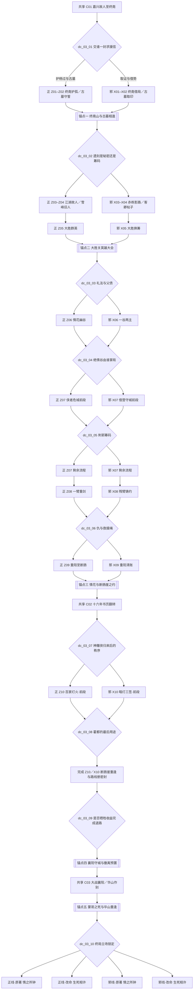

# 03 · 神雕侠侣主线剧情（正邪双线）

> 归属（基准 §18）：`ch03_shendiao` 的主线剧情、正邪路线、选择节点、锚点落实、结局与剧情任务 ID；本书界 DLC 文档 `chapters/03-shendiao.md` 的“主线”只应索引本文。
> 上游：`00-canon.md` v1.8；作者新增需求 AR-04、AR-09、AR-10、AR-20 与 `decisions/author-decisions.md`；锚点以 `design/01-vision-and-core-loop.md` §7.4 为准，年代与书眠以 `design/02-timeline-and-world-tiers.md` 为准，改命提示、代价与天书变体以 `design/13-progression-and-endings.md` §4、§6.5–§6.6 为准。
> 引用而不重定义：属性、品德与声望 → `design/03-attributes.md`；武学与授艺 → `design/05-martial-arts-system.md`、既有技能图鉴及 `design/catalog/skills-bulu-02-shediao.md`、`skills-bulu-03-shendiao.md`；Boss 与剧情战 → `design/09-combat-system.md`；区域、城市与旅行 → `design/11-open-world.md`、`design/19-world-map.md`；任务 DSL → `design/12-quests-npc-factions.md`（策划夹具落盘仍须经 `tech/04-data-pipeline.md` 校验）；天书、结局与成长 → `design/13-progression-and-endings.md`；门派 → `design/17-sects-compendium.md`；NPC、生卒与招募 → `design/18-npc-and-companions.md`。
> 标注约定：**（原创扩展）** = 原著没有的内容；**（待考）** = 原著事实尚需逐字核对；**（待核实）** = 技术事实尚未联网确认；**（待实测）** = 需要真机或真账号验证；**【建议值】** = 依赖其他文档、先给出可用数值并在文末登记。
> 版本：v1.2（P03 初稿；审校 P03.R，2026-09-26）；全局审计（2026-09-26）；经脉落地终审（2026-09-29、2026-09-30）；AR-20 主要悲剧线改命补全（2026-10-01）。原著考据以三联 / 广州修订版为基线；联网目录与可访问章节只用于交叉定位，不代替指定纸本逐字校勘。

---

## 0. 阅读指引与剧情总览

### 0.1 书界参数与本文边界

| 项 | 定稿值 | 本文用法 |
|---|---|---|
| 书界 | `ch03_shendiao` ·《神雕侠侣》 | 前接 `ch02_shediao`，后接 `ch04_yitian` |
| 年代 | 南宋理宗朝，约 1237–1259 | 蒙古灭金之后至小说改写的蒙哥之死；不把 1273 年襄阳陷落搬入本界 |
| 境界 / 武运 / 难度 | 高武 / 96 / 9 | 战斗强度只标普通、精英、Boss；具体数值引用 `design/09` |
| 等级 | 入界承接 Lv 50，书界上限 Lv 62 | 本文不另发明经验值；节奏引用 `design/13` §2 |
| 携带 / 压制 | 内功 3、拳脚 3、兵器 3；外来压制 0 | 不在剧情奖励中绕过携带、层数或品阶规则 |
| 天书关键词 | 情 | 路线立场与是否改命是两条独立轴 |
| 特色系统 | 情花毒、剑冢练剑、襄阳守城 | 规则归书界与系统文档；本文只安排剧情入口、状态与后果 |
| 内容预算 | 正线 10 幕、邪线 10 幕、共享 3 幕 | 与 `design/11` 的每路线约 10 幕预算对齐 |

本文回答“发生什么、玩家为何选择、选择把人物带到哪里”。情花毒的结算、剑冢四意的训练数值、守城战格与 Boss 阶段脚本，都只给剧情引用位，不在此重定义。

多人、援军、波次与多阶段剧情战的遭遇级 `totalHp`、分配及余额目标读取 `chapters/03-shendiao.md` §12.3.1，逐幕遭遇映射见该章 §12.3.2；统一规则见 `design/09` §8.8.11。首领主辅运、七参、经脉与节奏读取章节 §12.8；本文的“Boss 压迫”“三方战”等叙述不额外生成血池、恢复量或武学来源。

### 0.2 “正”“邪”的定义

- **正线**不是开局阵营：它代表过程优先、守诺护人、让当事人保有选择权的立场。
- **邪线**不是失败线：它代表结果优先、借蒙古使团、绝情谷或江湖灰色网络制衡强者的立场；可以救人、守城并完整取得天书，只是更愿意用欺骗、胁迫与债契。
- 路线由关键选择和全局品德 `morality` 共同形成。玩家在多个 `dc_03_NN` 可改弦更张；转换会损失本书界声望 `fame`、旧盟关系或一项筹码，不靠一次按钮洗白。
- 路线与天书变体相互独立：正 / 邪决定“用什么方法走完”，原著 / 改命决定是否完成襄阳撤离预置；因此共有四类结局。
- 原著核心人物保有决定性行动：杨过与小龙女相识、杨过放下刺郭、杨过击毙蒙哥、二人在断肠崖重逢，都不由穿越者取代。

### 0.3 总流程图



图显示全部十个选择节点；节点只改变下一段的进入方法或旁人命运，不删除已经完成的锚点，也不替原著主角作决定。

### 0.4 路线拓扑与汇合纪律

| 段 | 正线 | 邪线 | 允许换线的节点 | 强制汇合 |
|---|---|---|---|---|
| 开局 1237 前后 | `q_03_main_z_01`–`02` | `q_03_main_x_01`–`02` | `dc_03_01`、`02` | 终南—古墓锚点验收 |
| 少年江湖 | `q_03_main_z_03`–`05` | `q_03_main_x_03`–`05` | `dc_03_03` | 大胜关之后仍保留路线状态 |
| 绝情谷—襄阳 | `q_03_main_z_06`–`07` | `q_03_main_x_06`–`07` | `dc_03_04`、`05` | 杨过放下刺郭、郭襄出生 |
| 断臂—长别 | `q_03_main_z_08`–`09` | `q_03_main_x_08`–`09` | `dc_03_06` | `q_03_main_c_02` 十六年跳转 |
| 十六年后 | `q_03_main_z_10` | `q_03_main_x_10` | `dc_03_07`、`08`、`09` | `q_03_main_c_03` 襄阳终战 |
| 终局 | 同一战场，以护持方式区分 | 同一战场，以筹码方式区分 | `dc_03_10` 只锁立场，不改天书轴 | 华山天书现世 |

### 0.5 叙事硬约束

1. 五个锚点均为必需；失败只回滚到最近阶段检查点，不用“杨过没遇见小龙女”之类替代历史。
2. 终局中由杨过完成击毙蒙哥的决定性一击；玩家负责打开射界、牵制高手、救人或以情报逼出窗口。
3. “主改命”仅为后来襄阳陷落预置暗道、接应人、路线册与传承箱；本界不演 1273 年城破，也不承诺郭靖、黄蓉必然生还。
4. 原著人物命定死亡只有在明确的改命条件下改变；改变后写入 `design/18` 可读取的状态，下一书界仍以“史自愈 + 回响”开场。
5. 获得任何 `sk_*` 必须走既有图鉴来源。九阳只写入“闻经”与跨书线索，不授予 `sk_jiuyang`。
6. 选择造成的单次 `morality` 变化控制在 ±1–15；所有数值均列为建议值，并须按 `design/12` §2.6 原样迁入正式任务实例。

---

## 1. 原著重要剧情与走向清单

### 1.1 回目口径

本清单按四十回顺序整理。第 3 回在可访问的修订版目录中多见《求师终南》，另有馆藏目录著录《投师终南》；未核到各条目所据实体版次，故只作版本异题并在 §9.1 保留纸本校勘。第 24 回以《意乱情迷》、第 36 回以《献礼祝寿》为本文正文题名；《惊心动魄》《生辰大礼》只作新修版异题映射。三联 / 广州修订版中的全真人物主名采用“尹志平”；新修版改名“甄志丙”，两者是同一叙事位置的版本映射，不是两名人物。人物行为只作大意转述，不伪造引文。

### 1.2 四十九项关键事件

| # | 回目 | 人物 | 地点 | 原著结果（大意） | 本作去向 |
|---:|---|---|---|---|---|
| E01 | 第 1 回《风月无情》 | 李莫愁、武三通、陆家诸人 | 嘉兴府陆家庄一带 | 李莫愁追索陆家旧怨，程英、陆无双卷入惨祸 | 双线共有：`q_03_main_c_01`；玩家只能救援外围，不抹去旧案 |
| E02 | 第 1 回 | 武三通、程英、陆无双 | 嘉兴府 | 武三通护救两个女孩，旧病与家事显露 | 双线共有；武氏家事后移为书界支线接口 |
| E03 | 第 2 回《故人之子》 | 杨过、郭靖、黄蓉、欧阳锋 | 嘉兴府附近 | 郭靖夫妇确认杨过身份；欧阳锋与义子关系介入 | 双线共有：开局建立“故人之子不可被玩家替代” |
| E04 | 第 2 回 | 杨过、郭靖、黄蓉、郭芙、武氏兄弟 | 桃花岛（小说） | 杨过随郭家生活，又因冲突与身世疑虑离岛 | 双线共有；压缩日常，保留关系裂痕 |
| E05 | 第 3 回《求师终南》**（版本异题待考）** | 郭靖、杨过、全真门人 | 京兆府终南山 | 郭靖送杨过入全真，因误会与门人交手 | 双线共有：`q_03_main_c_01` 前往首锚点 |
| E06 | 第 3 回 | 郭靖、全真门人 | 终南山重阳宫 | 误会澄清，杨过留在全真 | 双线共有；玩家处理伤员与书信，不代郭靖破阵 |
| E07 | 第 4 回《全真门下》 | 杨过、赵志敬等**（待 `design/18` 补录）** | 重阳宫 | 杨过受苛待，师徒矛盾激化后逃离 | 选择节点 `dc_03_01`；可揭发、隐忍取证或借矛盾递信 |
| E08 | 第 5 回《活死人墓》 | 杨过、孙婆婆**（待 `design/18` 补录）**、小龙女 | 终南山、活死人墓 | 孙婆婆护杨过后身亡，小龙女接纳杨过 | 锚点一；正邪两线均保留杨过入古墓结果；孙婆婆仅在 §6.5 的严格窗口可获救**（待考细节）** |
| E09 | 第 5 回 | 杨过、小龙女 | 活死人墓 | 杨过正式进入古墓生活，与小龙女相识相依 | 锚点一完成；两线共享人物结果 |
| E10 | 第 6 回《玉女心经》 | 杨过、小龙女 | 古墓、终南山僻处 | 二人修习古墓武学，关系渐深 | 双线共有结果；正线护法，邪线取证但不得偷学 |
| E11 | 第 6–7 回 | 李莫愁、杨过、小龙女 | 活死人墓 | 李莫愁回墓争执，古墓机关与危局推动众人离散 | 双线共有；不同路线决定保人或保遗刻的先后 |
| E12 | 第 7 回《重阳遗刻》 | 杨过、小龙女、王重阳遗刻 | 古墓石室 | 二人发现克制玉女心经的遗刻及九阴要旨 | 双线共有；只按图鉴开放既有 `sk_jiuyin` 来源 |
| E13 | 第 7 回 | 小龙女、欧阳锋、杨过、尹志平（新修版名甄志丙） | 终南山僻处 | 小龙女遭受伤害，并因认错来人而形成后来离合的关键误会 | 双线共有的非交互叙事：非图像化、受害者视角优先，不设旁观玩法或奖励；玩家只能在事后保护证据与支持当事人**（敏感细节待指定纸本校勘）** |
| E14 | 第 7 回 | 杨过、小龙女 | 终南山 | 误认、创伤与离墓使二人开始江湖离合 | 选择节点 `dc_03_02`；玩家选择守密、封存证据或把遗刻残拓当筹码，不得拿受害事实交易 |
| E15 | 第 8 回《白衣少女》 | 杨过、陆无双 | 关中—中原驿路**（地望待考）** | 杨过遇见逃离师门的陆无双并相助 | 双线共有；`q_03_main_z_03` / `q_03_main_x_03` 的第一段护送 / 跟踪 |
| E16 | 第 9 回《百计避敌》 | 李莫愁、陆无双、杨过 | 中原驿路 | 李莫愁步步追索，杨过设法周旋 | 双线共有；正线救人，邪线以假线索换李莫愁放行 |
| E17 | 第 9–10 回 | 程英、黄药师、杨过、陆无双 | 中原民居与山野**（待考）** | 程英与表妹重逢，黄药师一脉介入救援 | 双线共有结果、过程分流 |
| E18 | 第 10–11 回《少年英侠》《风尘困顿》 | 洪七公、欧阳锋、杨过 | 华山雪峰 | 两位前辈比武、互释招意后相继身亡 | 支线（交书界文档）；主线读取是否见证，不强迫玩家改命 |
| E19 | 第 11 回 | 耶律齐、耶律燕、完颜萍、杨过 | 中原一带**（具体地望待考）** | 辽裔、金遗民与复仇纠葛交织，杨过结识耶律齐等 | 支线（交书界文档）；为大胜关与后续丐帮线预热 |
| E20 | 第 12 回《英雄大宴》 | 郭靖、黄蓉、群雄、蒙古使团 | 襄阳府附近大胜关**（地望待考）** | 群雄会聚商议抗蒙，杨过、小龙女重逢 | 双线共有，进入锚点二 |
| E21 | 第 12–13 回 | 金轮法王、霍都、达尔巴、群雄 | 大胜关 | 蒙古一方挑战中原群雄，争夺武林盟主名位 | 正 / 邪双版本：正面助阵或暗助使团换取军情 |
| E22 | 第 13 回《武林盟主》 | 杨过、小龙女、金轮一行 | 大胜关擂台 | 杨过、小龙女击退强敌，群雄危局得解 | 锚点二；结局固定、玩家只决定外围胜负与筹码 |
| E23 | 第 14 回《礼教大防》 | 杨过、小龙女、郭靖、黄蓉、群雄 | 大胜关 | 杨过、小龙女公开情意，遭礼法压力后离去 | 选择节点 `dc_03_03`；支持、沉默或利用舆论 |
| E24 | 第 15 回《东邪门人》 | 程英、陆无双、李莫愁、黄药师 | 中原一带**（具体地望待考）** | 李莫愁追杀延续，东邪门人和旧怨再会 | 双线共有；救援方法随路线变化 |
| E25 | 第 16 回《杀父深仇》 | 杨过、傻姑**（待 `design/18` 补录）**、郭靖、黄蓉 | 杨康旧事揭露处**（具体地望待考）** | 杨过获知杨康之死的片段，误解与杀父疑云加深 | 选择节点 `dc_03_03` 后果；真相可澄清或被加工成筹码 |
| E26 | 第 17 回《绝情幽谷》 | 杨过、公孙绿萼、公孙止 | 绝情谷 | 杨过入谷并中情花之毒，卷入谷主婚事 | 锚点三前半；特色系统“情花毒”剧情入口 |
| E27 | 第 18 回《公孙谷主》 | 杨过、小龙女、公孙止、公孙绿萼 | 绝情谷 | 公孙止欲与小龙女成婚，杨过与其对抗 | 选择节点 `dc_03_04`；救人、夺权或表面合作 |
| E28 | 第 18 回 | 杨过、公孙止 | 绝情谷厅堂与剑室 | 双方以绝情谷武学和兵刃相斗，婚局破裂 | 正 / 邪双版本；不因此创造新武学 ID |
| E29 | 第 19 回《地底老妇》 | 裘千尺、公孙绿萼、杨过 | 绝情谷地穴 | 杨过等发现裘千尺，谷中旧案与复仇线揭开 | 选择节点 `dc_03_04`；决定释放方式与证据归属 |
| E30 | 第 19 回 | 裘千尺、公孙止、公孙绿萼 | 绝情谷 | 夫妻旧怨与解药争夺升级 | 双线共有结果骨架；人物生死由后续改命节点细分 |
| E31 | 第 20 回《侠之大者》 | 杨过、郭靖、黄蓉 | 襄阳府 | 杨过一度意图报父仇，最终在郭靖言行前放弃行刺 | 选择节点 `dc_03_05`；无论路线，杨过本人作出放下的一步 |
| E32 | 第 21 回《襄阳鏖兵》 | 郭靖、杨过、金轮一方 | 襄阳府与城外 | 蒙古攻势迫近，郭靖与群雄投入守城 | 双线共有；正线正面守、邪线借营中身份反制 |
| E33 | 第 22 回《危城女婴》 | 黄蓉、小龙女、郭襄、李莫愁等 | 襄阳府 | 郭襄在危城出生并被多方争夺，终得保全 | 锚点相关选择；两线必须保全郭襄以接续原著 |
| E34 | 第 23 回《手足情仇》 | 郭芙、杨过、小龙女 | 襄阳府 | 冲突中郭芙斩断杨过右臂，关系彻底破裂 | 选择节点 `dc_03_06` 前置；不可阻止断臂，只能处理后果 |
| E35 | 第 24–26 回 | 杨过、神雕 | 剑冢、山洪与山野**（具体地望待考）** | 神雕救下杨过并引其入剑冢 | 双线共有；特色系统“剑冢练剑”入口 |
| E36 | 第 26 回《神雕重剑》 | 杨过、神雕 | 剑冢 | 杨过承玄铁重剑之道、武功大进 | 双线共有；四剑意与 `sk_xuantie` 全按既有图鉴 |
| E37 | 第 25–27 回《内忧外患》《斗智斗力》 | 小龙女、金轮一方、全真诸人 | 终南山重阳宫 | 外敌与全真内乱并发，小龙女陷入重围 | 正 / 邪双版本：正面援救或借敌清理叛徒后反转 |
| E38 | 第 27–28 回《洞房花烛》 | 杨过、小龙女 | 重阳宫 | 杨过赶到救援，二人行礼成婚，仍面对重伤与追兵 | 锚点余波；两线共享婚誓，不让玩家代替感情决定 |
| E39 | 第 29–30 回《劫难重重》《离合无常》 | 一灯、周伯通、瑛姑**（待 `design/18` 补录）**、杨过、小龙女 | 黑沼、百花谷、绝情谷沿途**（地望待考）** | 求医解毒与旧人纠葛交错，众人重返绝情谷 | 双线共有旅程；重复赶路压缩成三次任务跳转 |
| E40 | 第 30–32 回 | 公孙止、裘千尺、公孙绿萼 | 绝情谷 | 绿萼为救杨过而死；此后公孙止踏入陷阱并拖裘千尺同坠，二人同死 | 选择节点 `dc_03_06`：可改命救绿萼；父母相继同坠的原著缺省不改**（动作细节待纸本校勘）** |
| E41 | 第 31–32 回《半枚灵丹》《情是何物》 | 李莫愁、杨过、小龙女等 | 绝情谷火场 | 李莫愁身中情花毒后跌入烈火并拒绝离开，最终死去 | 选择节点 `dc_03_06`：满足证据与救援条件可改命，非主改命**（动作细节待纸本校勘）** |
| E42 | 第 32 回 | 杨过、小龙女 | 断肠崖 | 小龙女留十六年之约后跃下深谷，杨过苦候 | 锚点三完成；约定与离别不可删除 |
| E43 | 第 33 回《风陵夜话》 | 郭襄、神雕侠、江湖客 | 风陵渡**（行政隶属待考）** | 十六年后郭襄听闻神雕侠事迹并与杨过相遇 | 双线共有：`q_03_main_c_02` 后重新定位江湖 |
| E44 | 第 34–35 回《排难解纷》《三枚金针》 | 杨过、郭襄、群豪、鲁有脚 | 晋南—中原一带、襄阳府**（路线待考）** | 杨过为人排难并赠郭襄三枚金针；鲁有脚被霍都暗算身亡，打狗棒失落 | 正 / 邪双版本处理排难方式；鲁有脚之死作为 `dc_03_08` 的已知前史，不可被遗漏 |
| E45 | 第 36 回《献礼祝寿》至第 37 回开端 | 郭襄、杨过、霍都（冒名何师我）、达尔巴、耶律齐、丐帮群雄 | 襄阳府 | 杨过为郭襄祝寿；丐帮大会上霍都身份败露，达尔巴出手，耶律齐继任帮主 | 选择节点 `dc_03_08`；揭露、拘押或反用霍都网络，但不得取消鲁有脚死亡与耶律齐继任**（交界回次待纸本校勘）** |
| E46 | 第 37 回《三世恩怨》 | 周伯通、瑛姑、一灯、慈恩（`npc_qiuqianren`；瑛姑仍待 `design/18` 补录） | 百花谷一带**（待考）** | 数十年恩怨得到面对与化解，慈恩命运收束 | 支线（交书界文档）；主线读取其援军 / 情报结果 |
| E47 | 第 38 回《生死茫茫》 | 杨过、小龙女、郭襄、金轮法王 | 蒙古军营、断肠崖、谷底 | 郭襄离家寻杨过，被金轮法王带往蒙古军营并随赴绝情谷；杨过绝望跃下，郭襄为阻止他也跃下并获雕救回；杨过终于与小龙女重逢 | 锚点三回收；两线必达，不以玩家替代跃崖、救援或重逢；郭襄被挟与师徒纠葛接入终战前置 |
| E48 | 第 39 回《大战襄阳》 | 杨过、小龙女、郭靖、郭襄、金轮法王、周伯通、蒙哥**（待 `design/18` 补录）** | 襄阳府城外 | 金轮法王以郭襄为质置于高台；杨过登台交战，法王在台塌前割断绑绳并将郭襄抛给杨过，受创落地后遭周伯通拦住，终于被倒塌火柱压死；终战中杨过击毙蒙哥，蒙古军退 | 锚点四与五；共享终战，路线决定护城方式，主改命决定暗道是否留存**（局部动作次序待指定纸本校勘）** |
| E49 | 第 40 回《华山之巅》 | 杨过、小龙女、郭靖、黄蓉、五绝诸人、觉远、张君宝、潇湘子、尹克西 | 华山 | 群雄重会、重议五绝并作别；觉远与张君宝追索被盗经书，众人得知夹缝中《九阳真经》的线索 | 锚点五与天书现世；神雕末只记闻经与追索，不可完整学习 `sk_jiuyang`；何足道赴少林等后续归《倚天》楔子 |

### 1.3 覆盖率

| 去向主类 | 条数 | 说明 |
|---|---:|---|
| 双线共有 / 压缩呈现 | 21 | 两线均体验同一原著结果，玩法手段不同 |
| 正邪双版本 | 4 | 同一原著事件分别从群雄或灰色势力一侧进入 |
| 选择节点 | 11 | 玩家能改变方法、旁人命运或后续资源，不夺走原著主角决定；多个事件可共用一个节点 |
| 锚点 | 10 | 分属五组强制锚点；同一锚点可覆盖多个连续事件 |
| 支线（交书界文档） | 3 | 洪欧华山、耶律 / 完颜、三世恩怨；主线仍读取结果 |
| 不采用 | 0 | 没有主要情节被无说明删除；重复赶路仅压缩，不删结果 |
| **合计** | **49** | **已分配 49 / 49，覆盖率 = 49 ÷ 49 × 100% = 100%** |

分类按每个事件“本作去向”的首项计，后续提到“锚点余波”“节点后果”不重复计数。“覆盖”不等于逐场复刻。桃花岛日常、数轮追逐和多次往返绝情谷按幕压缩，但因果、人物关系与结局均保留；被交给支线的三项也在主线设置读旗标与缺省结果。

---

## 2. 主角定位与开局

### 2.1 穿越身份

主角以“嘉兴府药行的行脚采药人”醒来**（原创扩展）**：没有原著具名人物身份，也不冒充门派弟子。药行受陆家旧识所托，要把伤药和一封未署名的求援信送往京兆府终南山。这个身份同时提供三项叙事便利：

1. 能在嘉兴府外围目睹陆家旧案、救治未被原著点名的庄客，却无能力一开始就阻止李莫愁。
2. 有合理理由沿驿路护送少年杨过北行，并在郭靖离开后继续留在终南山附近。
3. 懂得辨认常见药材，却不因此获得系统技艺加值或凭空解开情花毒；配方与治疗仍归物品、技艺系统。

完成过本书界改命的轮回玩家，可使用 `design/13` §6.4.2 已定隐藏身份“终南山下药农”：跳过嘉兴行旅教学，从终南药棚接入同一 `q_03_main_c_01`，古墓、全真初始好感各 +10；E01–E04 以可交互书页回顾，不改事件覆盖。此身份不是首周目默认。

### 2.2 开局关系

| 对象 | 起点 | 原因与边界 |
|---|---|---|
| `npc_yangguo` | 陌生 → 临时同行 | 主角帮药行护送伤药，杨过把主角视为“又一个大人”；信任必须靠是否替他作证建立 |
| `npc_guojing` | 射雕重逢或初识 | 若前界结识则按 `design/18` 重逢；否则只把主角当可靠行脚客，不直接收为门人 |
| `npc_huangrong` | 谨慎审视 | 她会核对主角的来历、对杨康旧事的态度与携带物；不会因玩家知道原著而无条件相信 |
| `npc_xiaolongnv` | 未见、无立场 | 首次见面必须发生在终南—古墓锚点；主角不能提前刷好感 |
| `npc_limochou` | 见过面或被记住 | 嘉兴救人会使她记住主角；不救则可在邪线用药商身份递送假线索 |
| `sect_quanzhen` | 中立 | 携前界关系只触发重逢对白；当世职级仍按门派规则 |
| `sect_gumu` | 未开放 | 只有锚点一后可接触；不得因知道入口直接闯墓 |
| `sect_menggu` / `sect_mizong` | 未接触 | 大胜关前只留下驿路细作线索，不提前加入 |

### 2.3 一封北上的信 `q_03_main_c_01`

| 固定字段 | 内容 |
|---|---|
| 标题 | 一封北上的信 |
| 原著对应 | 第 1–5 回：陆家旧案、故人之子、桃花岛裂痕、求师终南、活死人墓 |
| 地点 | 嘉兴府 → 桃花岛（小说）→ 京兆府终南山 |
| 参与 NPC | `npc_yangguo`、`npc_guojing`、`npc_huangrong`、`npc_guofu`、`npc_wudunru`、`npc_wuxiuwen`、`npc_wusantong`、`npc_limochou`、`npc_luwushuang`、`npc_chengying`；孙婆婆等见 §8.2 补录清单 |
| 功能 | 教学、前界重逢、把玩家放到第一锚点；不计入正 / 邪各 10 幕 |

目标与流程：

1. 在嘉兴府陆家庄外围救出两名无名庄客，目睹程英、陆无双被卷入追杀。
2. 与郭靖会合；若有射雕重逢记录，播放不改变起点的回响对白。
3. 在桃花岛短段调查杨过与郭芙、武氏兄弟冲突，只记录证词，不替任何一方定罪；让杨过完整自陈时，一次性结算其好感 +10 **【建议值】**。若向黄蓉说明北上救伤用途且不私取药柜，她会把一枚 `it_jiuhuayulu` 封入北行伤药箱 **（原创扩展）【建议值】**；每周目只领一次。隐藏“终南山下药农”在 E01–E04 交互书页作同一选择后，于终南药棚领取同一药匣。
4. 随郭靖、杨过北上；大地图仅作路线选择，进入区域后可行走，遵从作者决定 P53。
5. 于终南山误会战后救治全真伤者；郭靖离去，把“观察杨过处境”的口信交给主角。
6. 发现杨过遭苛待的证据与孙婆婆留下的求援痕迹；先向杨过核对，并尊重他是否在证词中具名的决定时，再一次性结算其好感 +10 **【建议值】**，随后进入 `dc_03_01`。两项认可均使用稳定效果键，不可由重读书页或对话反复取得。

关键战斗：嘉兴外围“赤练追索”为精英遭遇；终南误会战为剧情战，郭靖默认由 AI 控制，引用 `design/09` §2.7 与作者决定 P46。失败时回到遭遇前，不允许郭靖或杨过死亡。

幕末状态：写入 `ch03.prologue_complete`、开出终南区域与 `dc_03_01`；品德只由救 / 不救庄客变化 ±3【建议值】，不在开局锁线。

时限：进入重阳宫后的两个游戏日内查完三份证词；超时采用孙婆婆自行发现杨过的缺省路径，玩家失去一份切线筹码但主线不断。

### 2.4 首个选择节点

`dc_03_01` 发生在孙婆婆将要带杨过离开全真、冲突尚可被第三方记录之时。玩家不是选择“正派 / 邪派”，而是选择如何处置求援信与门人虐待证据：交给郭靖旧识、交全真长辈、暗送李莫愁，或暂不交。各选项的条件和后果见 §5；它只设置暂时路线，后续仍可转换。

---

## 3. 正线：守其所守

### 3.0 数值与通关约定

正线共 10 幕，入口是 `dc_03_01` 的护人 / 申诉选项，或后续节点付出代价切入。它不要求玩家永远守法，也不要求 `morality` 始终为正；判断重点是是否尊重当事人、兑现承诺并把弱者安全放在眼前收益之前。

本节使用三档品德变化【建议值】：小承诺 / 小欺骗为 ±3，显著救助 / 利用为 ±5，承担重大风险 / 胁迫无辜为 ±8。本文实际最高绝对值为 8，满足 `design/03` §8.3 的单次 ±1–15 建议幅度。

本界公开功绩的声望步长取 `fameStep = (800 − 300) ÷ 5 = 100`【建议值】：300 与 800 分别是“小有名气”“名动一方”阈值，五个公开主线功绩正好跨过区间。半公开功绩为 `fameStep ÷ 2 = 50`，大锚点为 `2 × fameStep = 200`。潜行成功不凭空加名声。最终由 `design/12` 统一。

失败分三类：普通遭遇可原地重试；保护对象倒地则回滚至本阶段检查点；锚点关键人物绝不因玩家败北写成永久死亡。时限若到，只关闭额外证据、同伴或改命筹码，不截断主线。

### 3.1 `q_03_main_z_01` · 终南护孤

| 固定字段 | 内容 |
|---|---|
| 标题 | 终南护孤 |
| 原著对应事件 | 第 3–5 回：求师终南、全真门下、活死人墓 |
| 地点 | 京兆府终南山、重阳宫、活死人墓外 |
| 参与 NPC | `npc_yangguo`、`npc_guojing`（开幕回响）、`npc_xiaolongnv`、`npc_limochou`；孙婆婆、赵志敬等尚待 `design/18` 补录 |
| 路线功能 | 完成锚点一；证明“护人”并非替杨过选师门 |

目标与流程：

1. 将虐待证词交给全真主事者，并要求公开问询；若主角是全真门人，只能以同门申诉，不能直接动武夺人。
2. 在杨过逃下山时沿钟声与足迹追踪，先救被误伤的门人，再追上孙婆婆。
3. 抵挡追兵三轮而不追杀倒地者，为孙婆婆与杨过争取退路。
4. 孙婆婆伤重后，护送杨过抵达墓门；一般救治仍走原著命运，仅满足 §6.5 的埋线、医术与时间窗时可进入隐藏救援**（具体伤亡过程待考；救援为原创扩展）**。
5. 由小龙女亲自决定收留杨过；玩家只递上郭靖口信，并按生命状态转达孙婆婆的清醒托付或原著线遗言大意。

关键战斗：对手为误判局势的全真巡山弟子（精英剧情战）。引用 `design/09` §2.7：胜利目标是守住墓道入口，不要求击杀；小龙女作为剧情 AI，不占玩家主动指令位。

幕内小选择：是否把施虐者姓名写进公开证词。具名举报使 `sect_quanzhen` 关系下降一档、品德 +3；只陈述事实不点名则门派关系不变，但后续内乱证据少一份。

幕末状态变化：写 `ch03.anchor_zhongnan = complete`、`ch03.sunpopo_testimony = named|sealed`、`ch03.route = z`；品德 +5、声望 +50【建议值】；古墓开放为访客状态，全真不自动退派。杨过为 D5 限时同行候选，小龙女暂不可招募。

失败与时限：杨过被追兵控制或主角离墓道过远即回滚到山门检查点。暮鼓前未到墓门，则小龙女自行出手完成锚点，玩家失去古墓初始友好与 `dc_03_02` 的“代为封存”选项。

### 3.2 `q_03_main_z_02` · 墓中守誓

| 固定字段 | 内容 |
|---|---|
| 标题 | 墓中守誓 |
| 原著对应事件 | 第 5–7 回：古墓生活、玉女心经、李莫愁归墓、重阳遗刻 |
| 地点 | 活死人墓、终南山僻谷 |
| 参与 NPC | `npc_yangguo`、`npc_xiaolongnv`、`npc_limochou` |
| 路线功能 | 守护修习与秘密；完成第一锚点余波，进入 `dc_03_02` |

目标与流程：

1. 以外部送药人身份定期把补给放在约定石缝，不越过古墓门规。
2. 发现墓外有人描摹机关，追查至李莫愁留下的假足迹。
3. 在杨过、小龙女练功受扰时守住三处入口；若携古墓武学，只触发识别对白，不越级授艺。
4. 李莫愁闯墓后，优先搬开受困者，再封堵水道；遗刻由杨过、小龙女亲自发现。
5. 接受小龙女托付，销毁自己绘下的墓道草图，或交她封存。

关键战斗：李莫愁为 Boss 压迫遭遇，目标是拖延与撤离，不以击败为必要；冰魄银针、毒与场景机关调用 `design/09` Boss 脚本框架及技能图鉴，不在本文写倍率。

幕内小选择：救一名被机关困住的全真追兵，或先抢救古墓药柜。救人品德 +3、全真关系回升；救药柜保留一份情花毒研究线索**（原创扩展）**，不改变品德。

幕末状态变化：写 `ch03.gumu_secret = protected`、`ch03.jiuyin_inscription_seen = true`；声望不变（隐秘事件），古墓关系上升一档。杨过、小龙女随原著离合，均暂离队；不得把石刻见闻直接转成玩家已学 `sk_jiuyin`。

失败与时限：任一墓道连续失守会触发小龙女关闭机关的保底演出，玩家失去古墓授艺支线而非主线。练功开始后的一个游戏时辰为护法窗口，错过则用书页转述。

### 3.3 `q_03_main_z_03` · 白衣驿路

| 固定字段 | 内容 |
|---|---|
| 标题 | 白衣驿路 |
| 原著对应事件 | 第 8–10 回：杨过遇陆无双、百计避敌、程英与东邪一脉介入 |
| 地点 | 关中—中原驿路、中原山野**（具体地望待考）** |
| 参与 NPC | `npc_yangguo`、`npc_luwushuang`、`npc_chengying`、`npc_limochou`、`npc_huangyaoshi` |
| 路线功能 | 让嘉兴旧案幸存者重新相见；建立李莫愁改命证据链 |

目标与流程：

1. 从驿卒口中辨出追兵在寻找跛足少女，先拆掉路上的毒针记号。
2. 与杨过会合，护送陆无双穿过两处封锁；玩家只能建议路线，保留杨过自行应变。
3. 找到程英留下的青布与药材暗号，避免把她误认成敌人。
4. 以嘉兴旧案的幸存证词劝退一组古墓旁支追随者；失败则进入非致死战。
5. 面对李莫愁时公开质问旧案，让她第一次听见与自己记忆冲突的证词。
6. 黄药师在战后接走程英或留下指点，按射雕重逢状态播放不同对白。

关键战斗：追索弟子为普通与精英混编；李莫愁为不可终结的 Boss 追逐战，胜利条件是陆无双、程英撤到出口。引用 `design/09` 的撤退与剧情战，不写毒伤数值。

幕内小选择：把唯一坐骑让给陆无双（品德 +3，护送段缩短），或让程英先送证词（下一幕多一项说服条件）；两者都不扣品德。

幕末状态变化：写 `ch03.lujia_evidence = 1..3`、`ch03.cousins_reunited = true`；公开救援声望 +100、品德 +5【建议值】；陆无双 D4 可在本幕结束后开启完整专属任务，程英 D4 需桃花岛信任线后方可正式招募。

失败与时限：任一姐妹倒地则回滚到当前封锁点；三日内未送出证词，李莫愁提前截路，证据上限少 1，但两姐妹仍由黄药师保底救出。

### 3.4 `q_03_main_z_04` · 雪峰旧人

| 固定字段 | 内容 |
|---|---|
| 标题 | 雪峰旧人 |
| 原著对应事件 | 第 10–11 回：洪七公与欧阳锋华山相逢；完颜萍、耶律氏等江湖纠葛 |
| 地点 | 华山雪峰、河南府周边驿路**（具体会面地待考）** |
| 参与 NPC | `npc_yangguo`、`npc_hongqigong`、`npc_ouyangfeng`、`npc_yelvqi`、`npc_yelvyan`、`npc_wanyanping` |
| 路线功能 | 读取两条支线结果，展示“恩仇并非只靠胜负”；为大胜关集结人物 |

目标与流程：

1. 从华山脚下送粮上峰，发现洪七公与欧阳锋相遇；主角不得介入两人招意的核心传承。
2. 完成洪欧支线者读取“见证 / 改命”结果；未完成者播放原著缺省结果，两位前辈相继死去。
3. 下山途中阻止一队趁乱劫掠的盗匪，并取得大胜关英雄宴信物。
4. 遇见完颜萍与耶律齐兄妹的冲突，阻止无关护卫被复仇波及。
5. 将双方引到同一处客店对质，允许完颜萍本人决定是否放下。

关键战斗：雪峰狼群与盗匪为普通；客店冲突是可免战的精英遭遇。洪七公、欧阳锋之斗只作为剧情镜头，除非书界支线另行定义 Boss 战。

幕内小选择：是否把英雄宴信物交耶律齐代传。交付使耶律齐关系上升、主角声望少得 50；自行送达则得到半公开声望 +50。

幕末状态变化：写 `ch03.huashan_oldmasters = canon|fate|unseen` 与 `ch03.dasheng_token = player|yelvqi`；品德因护住无关者 +3；耶律齐 D4 招募链开放，但仍需其完整专属任务。

失败与时限：雪峰严寒计时只影响补给评价，不致死锁；若客店混战中完颜萍倒地，战后仍获救，但她的和解分支关闭至大胜关后补救。

### 3.5 `q_03_main_z_05` · 大胜群英

| 固定字段 | 内容 |
|---|---|
| 标题 | 大胜群英 |
| 原著对应事件 | 第 12–16 回：英雄大宴、武林盟主、礼教大防、东邪门人、杀父深仇 |
| 地点 | 襄阳府附近大胜关**（具体地望待考）**、杨康旧事揭露处**（具体地望待考）** |
| 参与 NPC | `npc_guojing`、`npc_huangrong`、`npc_yangguo`、`npc_xiaolongnv`、`npc_jinlunfawang`、`npc_huodu`、`npc_daerba`、`npc_guofu`、`npc_chengying`、`npc_luwushuang` |
| 路线功能 | 完成锚点二；让玩家公开选择护持群雄与杨龙情意 |

目标与流程：

1. 凭英雄宴信物入关，检查粮仓、擂台、伤营三处；找出蒙古使团随从藏下的火引。
2. 在群雄大会外围迎战霍都的挑战者，保证擂台不被偷袭者干扰。
3. 杨过、小龙女迎战金轮一方时，玩家守住伤营与宾客撤离线，不替二人取得胜果。
4. 群雄议论杨龙师徒相恋时，选择公开制止围逼、以事实转移争论，或沉默护送二人离场。
5. 追查使团撤退路线，得到杨康旧事的一页片面证词。
6. 循线找到傻姑（待 `design/18` 补录），只记录她能说明的片段，再由郭靖、黄蓉补全另一方陈述；让杨过自己决定如何面对父仇。

关键战斗：外围纵火者为精英；金轮法王只在擂台演出中作为 Boss 压迫单位，杨过、小龙女为剧情 AI，战斗目标是清场与护送。若玩家主动挑战霍都，则用 `design/09` Boss 阶段与预警接口。

幕内小选择：是否公开杨康证词。先私下交杨过，品德 +3、黄蓉信任上升；在群雄面前公开虽使声望 +100，却令杨过关系下降，且 `dc_03_03` 多一项补救成本。

幕末状态变化：写 `ch03.anchor_dasheng = complete`、`ch03.yang_kang_truth = complete|partial`、`ch03.yanglong_supported = public|quiet`；锚点公开功绩声望 +200、护持弱者品德 +5【建议值】；杨过、小龙女仍随原著离去。解锁 `dc_03_03`。

失败与时限：火引未全拆只会增加外围精英波次，英雄大会仍按原著收束。杨康旧事线索在两日后转移；错过则只能在襄阳由黄蓉补完另一方陈述，推迟一幕并降低黄蓉关系，但不预先决定后续 `ch03.guojing_trust`。

### 3.6 `q_03_main_z_06` · 情花幽谷

| 固定字段 | 内容 |
|---|---|
| 标题 | 情花幽谷 |
| 原著对应事件 | 第 17–19 回：绝情幽谷、公孙谷主、地底老妇 |
| 地点 | 绝情谷、情花坳、剑室、地穴**（地望待考）** |
| 参与 NPC | `npc_yangguo`、`npc_xiaolongnv`、`npc_gongsunzhi`、`npc_gongsunlve`、`npc_qiuqianchi`、`npc_wusantong`、`npc_fanyiweng`（谷中门人） |
| 路线功能 | 锚点三前半；引入情花毒并建立谷中三人各自的生死条件 |

目标与流程：

1. 追随杨过线索进入绝情谷，以行脚药人身份获准查看情花刺伤，不谎称已有解药。
2. 在婚宴前找到公孙绿萼，核对丹房药簿与剑室出入记录。
3. 杨过中情花毒后，护送他避开花丛；发作、解毒与“动情”规则只调用书界特色系统。
4. 婚宴对质时出示大胜关与古墓证词，让小龙女自行否决婚事。
5. 从地穴救出裘千尺，同时要求她先交出救命线索再处置私仇。
6. 把证据分别交公孙绿萼与谷中门人，防止公孙止销毁药簿。

关键战斗：公孙止为 Boss；战场在厅堂—情花坳转换，机制引用 `design/09` 与绝情谷技能图鉴。普通花刺不是可攻击敌人，玩家需走位避让，不在本文定义中毒层数。

幕内小选择：先送杨过出花坳或先救地穴中的裘千尺。前者提高杨过关系；后者多得一份解药证词。若队中有程英，可分工而不牺牲任一目标，但这是 D4 专属任务回报，不是必需解。

幕末状态变化：写 `ch03.qinghua_poison = active`、`ch03.jueqing_evidence = 1..3`、`ch03.qiuqianchi_freed = true`；救绿萼免遭父亲惩罚品德 +5，隐秘救援声望 +50【建议值】。公孙绿萼仍不可直接入队，先进入 D5 改命窗口。

失败与时限：婚宴开始后一个游戏时辰内必须取得至少一份证据；否则仍由杨过揭破婚局，但玩家失去 `dc_03_04` 的“公开审谷”选项。情花毒不是失败倒计时，后续按特色系统持续。

### 3.7 `q_03_main_z_07` · 侠者危城

| 固定字段 | 内容 |
|---|---|
| 标题 | 侠者危城 |
| 原著对应事件 | 第 20–22 回：侠之大者、襄阳鏖兵、危城女婴 |
| 地点 | 襄阳府、汉水渡口、城外军寨 |
| 参与 NPC | `npc_yangguo`、`npc_guojing`、`npc_huangrong`、`npc_guofu`、`npc_jinlunfawang`、`npc_wudunru`、`npc_wuxiuwen`、`npc_wusantong`；郭襄以婴儿状态出现 |
| 路线功能 | 让杨过亲自放下刺郭；第一次守城并埋下撤离网络线索 |

目标与流程：

1. 把杨康真相的完整证据交杨过，并承诺不替他原谅或复仇。
2. 察觉杨过仍携行刺念头后不缴械，而邀请他随郭靖巡视伤营、城墙与百姓安置处。
3. 郭靖在危局中的言行使杨过自己改变决定；玩家只保住对话发生的空间。
4. 蒙古军突袭时守住汉水渡口，协助郭靖退回城内。
5. 黄蓉临产、郭襄出生后，护送女婴穿过起火街巷；破解两组假接应。
6. 从旧排水道撤出伤民，由此发现可供后世改造的第一段暗道**（原创扩展）**。

关键战斗：渡口为精英守点；金轮法王追索女婴为 Boss 护送战，胜利条件是把郭襄送达安全点，不要求击败。郭靖、黄蓉若出场默认剧情 AI。

幕内小选择：把暗道位置立即上报郭靖，或先让工匠检查坍塌风险再报。前者直接写 `ch03.guojing_trust = true`；后者取得 `ch03.tunnel_surveyed`，并须在本幕结束前补报才能写同一信任旗标，否则视为隐瞒、品德 −3。

幕末状态变化：写 `ch03.yangguo_spared_guojing = true`、`ch03.guoxiang_safe = true`、`ch03.evac_route_segments = 1`、`ch03.evac_safehouses = 1`；最后一项是护送终点的当下安全点，尚不是十六年后的完整网络。守城声望 +200、品德 +8【建议值】，解锁襄阳撤离预置长线。郭靖只在守城窗口临时结盟，不常驻队伍。

失败与时限：渡口失守回滚到号角检查点；郭襄被夺则立即进入追踪补救战，不写死亡。敌袭当夜结束前未完成精查时，护送仍登记粗略的第一段与安全点，但 Z10 必须先支付一处经营资源完成勘测，才能密封路线册。

### 3.8 `q_03_main_z_08` · 一臂重剑

| 固定字段 | 内容 |
|---|---|
| 标题 | 一臂重剑 |
| 原著对应事件 | 第 23–26 回：手足情仇、内忧外患、神雕重剑 |
| 地点 | 襄阳府外、剑冢、山洪练剑地**（地望待考）** |
| 参与 NPC | `npc_yangguo`、`npc_guofu`、`npc_xiaolongnv`、`npc_shendiao`、`npc_jinlunfawang` |
| 路线功能 | 保留断臂因果；让玩家处理复仇与救治；完整呈现剑冢四意 |

目标与流程：

1. 冲突爆发后赶到现场，郭芙已经斩断杨过右臂；玩家不得用预知改写这一既定转折。
2. 止血并追踪杨过，劝郭芙先承担救治责任，不在当场以私刑报复。
3. 跟随神雕抵达剑冢，完成利剑、软剑、重剑、木剑四处碑意的观察试炼。
4. 搬运玄铁重剑至山洪练剑点；训练与四门杂学的解锁严格引用 `skills-daojia`，不在剧情中直接“全送”。
5. 陪杨过适应单臂战斗，但最终招法领悟属于杨过；玩家只能按既有来源获得自身资格。
6. 取得小龙女返回终南的消息，进入 `dc_03_06`：止仇救人或借仇清算。

关键战斗：追踪路上的蒙古斥候为普通；剑冢试炼为精英环境战；护剑山洪为 Boss 级生存遭遇，引用 `design/09` 和 `design/08` 地形接口。

幕内小选择：要求郭芙随行送药，或让她留城守责。随行可开启双方日后和解证词，但增加护送难度；留城使襄阳关系不降。无论选择都不淡化断臂责任。

幕末状态变化：写 `ch03.yangguo_arm = lost`、`ch03.jianzhong_seen = four_intents`、`ch03.guofu_accountability = escort|garrison`；护伤品德 +5，事件隐秘故不加声望。`npc_shendiao` D4 招募试炼开放；杨过画像切换为断臂阶段。

失败与时限：失去玄铁重剑时由神雕取回并重置本段；山洪失败回到练剑日前。小龙女求援有三日窗口，超时则她按原著独自面对重阳宫危局，玩家从下一幕中段接入。

### 3.9 `q_03_main_z_09` · 重阳至断肠

| 固定字段 | 内容 |
|---|---|
| 标题 | 重阳至断肠 |
| 原著对应事件 | 第 27–32 回：重阳宫救援与成婚、求治奔波、绝情谷终局、半枚灵丹、十六年之约 |
| 地点 | 终南山重阳宫、黑沼 / 百花谷**（地望待考）**、绝情谷、断肠崖 |
| 参与 NPC | `npc_yangguo`、`npc_xiaolongnv`、`npc_jinlunfawang`、`npc_daerba`、`npc_guofu`、`npc_gongsunzhi`、`npc_qiuqianchi`、`npc_gongsunlve`、`npc_limochou`、`npc_yideng`、`npc_zhoubotong`、`npc_zhuziliu`（求治支援） |
| 路线功能 | 完成锚点三；结算绿萼、李莫愁等可选改命；写入黯然“别离”门槛 |

目标与流程：

1. 返回重阳宫，先救被卷入战火的门人，再与杨过会合；杨过、小龙女在危局后自行成婚。
2. 按一灯与周伯通线索奔走求治；黑沼、百花谷与绝情谷往返压缩为三段旅程，不删人物会面结果。
3. 回谷公开药簿与地穴证据，阻止门人替公孙止、裘千尺殉私仇。
4. 依据 `dc_03_06` 的救援布置，争取让公孙绿萼避开牺牲；她是否生还不改变杨过、小龙女的十六年约。
5. 若收集三份陆家证据且未对李莫愁设致死陷阱，可从火场开一条退路；否则采用原著缺省死亡。
6. 小龙女留下十六年之约并跃下断肠崖；杨过无法追及。玩家可守在崖边，却不得提前揭露谷底。
7. 当界羁绊达到统一刻度 3 的同伴离队或曾倒下时，写既有旗标 `anran_bieli`；这只是 `sk_anran` 来源门槛之一，不直接授艺。

关键战斗：重阳宫群战为 Boss 级守点，金轮法王为主压迫者；绝情谷终局为公孙止 / 裘千尺场景危机，不要求玩家击杀；火场为限时撤离。均引用 `design/09`，人物招式引用既有图鉴。

幕内小选择：把最后一份救援绳用于绿萼或李莫愁。若此前完成“程英分工”或自备书界文档规定的救援物资，可救两人；否则只能选择其一。选择是旁人改命，不替代襄阳主改命轴。

幕末状态变化：写 `ch03.anchor_duanchang = complete`、`ch03.sixteen_year_vow = true`、`ch03.gongsunlve_alive`、`ch03.limochou_alive`、`anran_bieli`；完成公开审谷声望 +100，救下一人品德 +8【建议值】。杨过、小龙女离队；所有未结算的谷中毒状态按书界系统转为后续治疗任务。

失败与时限：重阳宫失守回滚；绝情谷火场只能重试一次后进入缺省结果，但不阻断主线。断肠崖无“阻止小龙女跳崖”选项，避免伪改命破坏十六年结构。

### 3.10 `q_03_main_z_10` · 百家灯火

| 固定字段 | 内容 |
|---|---|
| 标题 | 百家灯火 |
| 原著对应事件 | 第 33–38 回：风陵夜话、排难解纷、三枚金针、献礼祝寿、三世恩怨、生死茫茫 |
| 地点 | 风陵渡、襄阳府、百花谷**（待考）**、断肠崖与谷底 |
| 参与 NPC | `npc_yangguo`、`npc_guoxiang`、`npc_huodu`、`npc_daerba`、`npc_yelvqi`、`npc_zhoubotong`、`npc_yideng`、`npc_xiaolongnv` |
| 路线功能 | 十六年后让“神雕侠”公开救人；回收三枚金针、丐帮危机与断肠崖重逢 |

目标与流程：

1. 进入共享时间跳转 `q_03_main_c_02` 后，在风陵渡听江湖客讲神雕侠事迹，辨别三条冒名传闻。
2. 与郭襄结识，陪她追寻杨过，但不替她许愿；三枚金针的承诺仍由杨过给出。
3. 调集被杨过帮助过的村民与江湖人，把郭襄生辰贺礼转化为襄阳救灾物资；登记老弱、伤员两处安全屋与对应联系人**（原创扩展）**。
4. 得知 `npc_luyoujiao` 已被霍都暗算、打狗棒失落；在丐帮大会识破霍都冒名“何师我”的布局，保全耶律齐与帮众，处置方式交 `dc_03_08`。
5. 由公开接力勘定“城垣—汉水”“汉水—外部安全屋”两段，并为三段路线各封存一处粮药缓存；连同 Z07 的旧排水道正好形成 3 段、3 缓存**（原创扩展）**。
6. 读取三世恩怨支线结果；未完成则按原著缺省和解，不给额外援军。
7. 追查郭襄离家后的去向，确认她被金轮法王带入蒙古军营并随赴绝情谷；本幕只建立追踪与营地出口，不能提前消解二人的师徒纠葛。
8. 随杨过抵达断肠崖；他跃入谷底，郭襄随跃后获雕救回，杨过则与小龙女重逢。玩家留在崖上组织绳索与伤员撤离，不取代三人的决定性行动。杨龙归来后，由丐帮、郭家与两处新安全屋各持路线册的一部分，完成密封交接；若尚无 `ch03.guojing_trust`，须公开交出暗道原图与见证记录、接受郭靖核验后才能补写该旗标。若拒绝核验，`dc_03_09` 只开放原著方案 A**（原创扩展）**。

关键战斗：冒名盗匪为普通；霍都为精英 / Boss（取决于是否保留其身份筹码），达尔巴按原著误会澄清后可成为剧情盟友；追踪蒙古军营为可避战精英潜行；断肠崖仅有环境救援，不以玩家战斗替代杨龙重逢。

幕内小选择：贺礼用于城防器械或百姓粮药。两者分别使终战城墙段或撤离段更易；选粮药品德 +3，选城防不改品德，均计入守城。

幕末状态变化：从 Z07 的 `1` 段、`1` 屋与 `dc_03_07` 固定登记的 `1` 屋起结算，写 `ch03.evac_route_segments = 3`、`ch03.evac_safehouses = 4`、`ch03.evac_supply_caches = 3`、`ch03.evac_archive_sealed = true`、`ch03.yanglong_reunited = true`、`ch03.huo_du_exposed = true`。及时上报暗道或完成本幕公开核验时写 `ch03.guojing_trust = true`；杨康真相原本、路线册与物资账三者均交黄蓉复核时，另写 `ch03.huangrong_trust = true`。公开行侠与祝寿使声望 +200，救灾品德 +5【建议值】。杨过、小龙女 D5 限时同行窗口重开，郭襄 D5 只在生日—守城窗口同行。

失败与时限：郭襄生日是七日窗口；错过后杨过仍按原著送礼，玩家转入同幕的匿名登记任务，照样补齐本幕两处安全屋，但失去生日公开声望。第 7 幕若只做粗略勘测，则另牺牲一处经营资源完成加固。霍都逃走会在终战多一组敌方内应，不使鲁有脚死亡、耶律齐继任或主线中断。

### 3.11 正线出口

完成 `q_03_main_z_10` 后进入 `dc_03_09`。玩家可以保持正线、以公开动员完成撤离预置；也可在最后关头把名册交给暗网而切入邪线终局。路线切换不回滚十六年间的善行，只改变谁掌握路线、谁承担代价以及结局评价。随后统一进入 `q_03_main_c_03`。

---

## 4. 邪线：借其所惧

### 4.0 完整性与底线

邪线共 10 幕，与正线共享五个锚点和原著主角的决定性行动。其核心幻想是“我不必被任何一方认可，只要握住每一方不敢失去的东西，就能逼出结果”。玩家会与李莫愁、公孙止、蒙古使团或霍都网络暂同行，但不是效忠某个终局反派，也不会因选择邪线而被强制发配坏结局。

邪线有三条底线：不得亲手杀害锚点所需人物；不得把郭襄交给蒙古；不得阻止杨过、小龙女重逢。触碰底线时，任务提供“背盟救人”的可见出口并允许切线；拒绝出口则任务失败回滚，而不是生成断裂历史。邪线回报偏情报、通行与灰色盟友，不额外赠送图鉴外武学。

### 4.1 `q_03_main_x_01` · 终南借局

| 固定字段 | 内容 |
|---|---|
| 标题 | 终南借局 |
| 原著对应事件 | 第 3–5 回：求师终南、全真门下、活死人墓 |
| 地点 | 京兆府终南山、重阳宫后山、活死人墓外 |
| 参与 NPC | `npc_yangguo`、`npc_xiaolongnv`、`npc_limochou`；赵志敬、孙婆婆等待 `design/18` 补录 |
| 路线功能 | 借李莫愁的威慑迫全真放人，同时完成锚点一 |

目标与流程：

1. 不把虐待证词交公议，而是抄一份送出，让施虐门人以为李莫愁将来索命。
2. 用假墓道图换李莫愁在山门制造骚动；原图不在玩家手中，假图由实地观察拼成。
3. 趁骚动打开禁闭处，给杨过一条逃路；不得强迫他跟随玩家。
4. 发现李莫愁准备把孙婆婆也算入旧账后，篡改约定，诱她追向空谷。
5. 护送伤重的孙婆婆与杨过到墓门；小龙女仍亲自决定收留杨过。
6. 把李莫愁的联络印记留下作为以后谈判凭据，而非交全真邀功。

关键战斗：全真追兵为精英潜入遭遇，可避战；李莫愁识破假图后成为 Boss 追逐者。胜利条件是抵达墓门，不要求击杀任何门人。

幕内小选择：烧掉施虐证词保护线人，或留作要挟。烧毁品德 +3、失去一份筹码；留存品德 −3，但 `dc_03_06` 可用来逼全真内奸交代。

幕末状态变化：写 `ch03.anchor_zhongnan = complete`、`ch03.limochou_mark = true`、`ch03.route = x`；以恐吓驱动无辜门人品德 −5，事件隐秘不加声望【建议值】；古墓只开放外缘，蒙古 / 密宗尚未建立关系。

失败与时限：李莫愁追上杨过即回滚到后山分岔；暮鼓后才行动时，小龙女按原著收留杨过，但玩家失去李莫愁印记，只能在下一幕付声望换邪线筹码。

### 4.2 `q_03_main_x_02` · 墓中取印

| 固定字段 | 内容 |
|---|---|
| 标题 | 墓中取印 |
| 原著对应事件 | 第 5–7 回：古墓修习、李莫愁归墓、重阳遗刻 |
| 地点 | 活死人墓外围、水道、终南山僻谷 |
| 参与 NPC | `npc_yangguo`、`npc_xiaolongnv`、`npc_limochou` |
| 路线功能 | 取得“见过而未拥有”的遗刻拓印筹码；明确知识与学会武学的边界 |

目标与流程：

1. 以替李莫愁勘路为名进入废弃水道，实则寻找能在她闯墓时关闭的旁门。
2. 趁杨过、小龙女练功，在不踏入练功室的前提下记录机关启闭声。
3. 李莫愁入墓后先让她与机关相持，再从水道救出被困者。
4. 杨过、小龙女发现重阳遗刻时，玩家在远处取得一张残缺拓影；缺字使其不能作为 `LearnSource`。
5. 用拓影反向证明玩家能毁掉秘密，逼李莫愁暂缓追杀陆无双。
6. 将真正水道入口封死，保留一条错误路线作为日后假情报。

关键战斗：古墓机关为精英环境遭遇；李莫愁为 Boss 三方战，玩家可借机关拖延。战后不结算她的永久死亡。

幕内小选择：把残拓交小龙女封存，或留在自己手中。交出可立即切入正线并恢复古墓关系；留存品德 −3，得到 `ch03.gumu_rubbing`，但仍不得习得 `sk_jiuyin`。

幕末状态变化：写 `ch03.gumu_secret = leveraged`、`ch03.jiuyin_inscription_seen = true`；声望 0，古墓关系下降一档，李莫愁关系上升一档。杨过、小龙女依原著离墓并暂离队。

失败与时限：残拓被夺则在战后自动毁损，不锁主线，只失去筹码。练功事件结束后水道关闭，错过便用李莫愁印记换取下一幕入口。

### 4.3 `q_03_main_x_03` · 赤练影路

| 固定字段 | 内容 |
|---|---|
| 标题 | 赤练影路 |
| 原著对应事件 | 第 8–10 回：陆无双逃亡、百计避敌、程英重逢 |
| 地点 | 关中—中原驿路、中原山野**（具体地望待考）** |
| 参与 NPC | `npc_yangguo`、`npc_luwushuang`、`npc_chengying`、`npc_limochou`、`npc_huangyaoshi` |
| 路线功能 | 暂作李莫愁向导，从追索者一侧拆散封锁并暗保两姐妹 |

目标与流程：

1. 接下李莫愁“找回叛徒”的约定，取得她在驿路布下的三组暗号。
2. 把第一组暗号调换，使杨过、陆无双避开正面封锁；表面维持追索。
3. 故意留下半真足迹，将李莫愁引向程英准备的空屋。
4. 在空屋对质中拿古墓残拓或嘉兴证词压住李莫愁，要求她给陆无双一次自陈机会。
5. 若谈判破裂，趁黄药师介入时救走两姐妹；若成功，李莫愁仍不和解，但暂时撤手。
6. 收回驿路暗号，决定交程英销毁还是留作地下通行凭证。

关键战斗：封锁队为普通；李莫愁与黄药师交锋只作剧情压迫，玩家对李莫愁为可撤退的 Boss 战。胜利是两姐妹脱离地图。

幕内小选择：把李莫愁的追索名单全交程英（品德 +5、失去暗网通行），或只删两姐妹名字（品德 +3、保留暗号）。

幕末状态变化：写 `ch03.cousins_reunited = true`、`ch03.lujia_evidence += 1`、`ch03.shadow_pass = kept|destroyed`；因欺骗盟友且救人，净品德变化为 0 或 +2【建议值】，不加公开声望。陆无双、程英仍按 D4 专属链判断招募。

失败与时限：错误暗号导致姐妹被截时进入强制营救，不写死亡；三日后李莫愁自动识破一处假迹，谈判条件提高但路线不断。

### 4.4 `q_03_main_x_04` · 客卿帖子

| 固定字段 | 内容 |
|---|---|
| 标题 | 客卿帖子 |
| 原著对应事件 | 第 10–11 回：华山两位旧人、完颜萍复仇、耶律兄妹登场 |
| 地点 | 华山雪峰、河南府驿馆**（具体地点待考）** |
| 参与 NPC | `npc_hongqigong`、`npc_ouyangfeng`、`npc_yelvqi`、`npc_yelvyan`、`npc_wanyanping`、`npc_huodu` |
| 路线功能 | 把辽裔与金遗民矛盾化为蒙古使团通行筹码；读取洪欧支线 |

目标与流程：

1. 上华山寻找可证明主角“见过旧五绝”的信物，只取得口述，不盗取遗物。
2. 读取洪七公、欧阳锋支线的原著 / 改命缺省，不替两人比武。
3. 下山后接触完颜萍，提出用蒙古客卿名册接近其仇家，而非立即行刺。
4. 救下被误当仇家的耶律燕，以她的证词证明名单经过伪造。
5. 逼伪造者交出霍都的外层联络帖；让完颜萍自己决定继续复仇或退出。
6. 以联络帖取得大胜关蒙古使团杂役 / 客卿身份**（原创扩展）**。

关键战斗：雪峰只含普通生存遭遇；驿馆伪造者为精英，可用证词免战。霍都不在本幕正面决战。

幕内小选择：把伪造者交耶律齐，或交给完颜萍处置。前者品德 +3、邪线通行成本上升；后者保留霍都关系，但若纵其杀害俘虏则品德 −5。

幕末状态变化：写 `ch03.dasheng_token = mongol_guest`、`ch03.huodu_outer_contact = true`、`ch03.huashan_oldmasters`；蒙古与密宗初始关系上升一档，丐帮对主角保持警惕；声望不变。

失败与时限：伪造者逃走时，霍都仍派人接头，但主角须交出古墓残拓或 100 声望等值担保【建议值】。完颜萍的决定窗口只持续本幕，错过采用原著缺省走向。

### 4.5 `q_03_main_x_05` · 大胜换筹

| 固定字段 | 内容 |
|---|---|
| 标题 | 大胜换筹 |
| 原著对应事件 | 第 12–16 回：英雄大会、武林盟主、礼教冲突、杨康旧事 |
| 地点 | 襄阳府附近大胜关**（地望待考）**、蒙古使团营帐、杨康旧事揭露处**（具体地望待考）** |
| 参与 NPC | `npc_guojing`、`npc_huangrong`、`npc_yangguo`、`npc_xiaolongnv`、`npc_jinlunfawang`、`npc_huodu`、`npc_daerba`、`npc_guofu` |
| 路线功能 | 从蒙古使团一侧完成锚点二；用外围胜负换取后续军情 |

目标与流程：

1. 以外层客卿身份进入使团，记录粮草路线、擂台暗手和退路，而不宣誓效忠。
2. 答应霍都延迟群雄援军，实际只改动一面无关旗号，避免伤营遭袭。
3. 擂台开战后维持身份，暗中拆除对杨过、小龙女不利的绊索。
4. 杨过、小龙女亲自击退金轮一方；玩家趁撤退混乱取走一份攻宋路线草图。
5. 利用群雄对师徒关系的议论掩护二人离场；可以煽动争论，但不得把小龙女交给任何一方。
6. 从使团档案取得杨康片面材料，与傻姑能说明的片段并列保存，准备作为郭、杨双方互相制约的筹码。

关键战斗：使团内的身份检验为精英切磋；擂台外围是三方剧情战；被识破时金轮法王作为 Boss 追击，胜利目标是携军图撤出。

幕内小选择：把攻宋草图立刻给郭靖（切正、品德 +5、蒙古关系敌对），或只给其中一条真实路线、保留另一条作为反制（维持邪线、品德 −3）。

幕末状态变化：写 `ch03.anchor_dasheng = complete`、`ch03.mongol_route_map = full|split`、`ch03.yang_kang_truth = leveraged`；使团侧声名换为灰色关系，不获得公开声望；利用礼教压力品德 −5【建议值】。解锁 `dc_03_03`。

失败与时限：身份暴露不使锚点失败，转为护杨龙撤退战并自动切正。使团在大会结束后一夜撤走，未取军图则后续仍可从俘虏口中获取低精度路线。

### 4.6 `q_03_main_x_06` · 一谷两主

| 固定字段 | 内容 |
|---|---|
| 标题 | 一谷两主 |
| 原著对应事件 | 第 17–19 回：情花毒、婚宴、公孙谷主、地底老妇 |
| 地点 | 绝情谷、情花坳、剑室与地穴**（地望待考）** |
| 参与 NPC | `npc_yangguo`、`npc_xiaolongnv`、`npc_gongsunzhi`、`npc_qiuqianchi`、`npc_gongsunlve`、`npc_fanyiweng`（谷中门人） |
| 路线功能 | 先与公孙止合作，再以裘千尺和药簿制衡；不让任一谷主独占解药 |

目标与流程：

1. 以掌握古墓秘密为筹码取得公孙止信任，获准进丹房，但不把小龙女的意愿作为交易物。
2. 杨过中情花毒后，向公孙止承诺压住婚宴骚乱以换解药所在。
3. 暗中协助公孙绿萼复制药簿，发现解药数量与谷主说法不符。
4. 婚宴上先维持秩序，等杨过、小龙女当面相认后才翻出伪证。
5. 潜入地穴见裘千尺，以重返厅堂的机会换她先公开旧案与药物真相。
6. 把两方印信一并扣住，迫使谷众成立临时议事，进入 `dc_03_04`。

关键战斗：丹房守卫为普通；公孙止为可暂时同阵、随后反目的 Boss；情花坳按特色系统。玩家不能由合作直接获得 `sk_jueqingjian` 或 `sk_jueqingxinjue`，授艺仍看图鉴来源。

幕内小选择：把药簿原本给绿萼，或自己留存。交出品德 +3并开放她的改命链；留存增加控谷筹码、品德 −3。

幕末状态变化：写 `ch03.qinghua_poison = active`、`ch03.jueqing_seals = 2`、`ch03.jueqing_evidence = 2..3`；绝情谷关系取代公开声望，公孙止与裘千尺均将玩家视为危险盟友。

失败与时限：任一印信被夺只减少议事选项，不阻断杨龙婚局；婚宴开始后一时辰仍未翻证，杨过按原著直接破局，玩家失去控谷收益。

### 4.7 `q_03_main_x_07` · 借营守城

| 固定字段 | 内容 |
|---|---|
| 标题 | 借营守城 |
| 原著对应事件 | 第 20–22 回：杨过欲刺郭、襄阳战事、危城女婴 |
| 地点 | 襄阳府、蒙古军外营、汉水渡口 |
| 参与 NPC | `npc_yangguo`、`npc_guojing`、`npc_huangrong`、`npc_guofu`、`npc_jinlunfawang`、`npc_huodu`、`npc_daerba`；婴儿郭襄 |
| 路线功能 | 借蒙古通行从敌营破坏攻势；逼杨过亲自判断郭靖而非替他复仇 |

目标与流程：

1. 向杨过展示郭、蒙双方的片面档案，说明两份都可被操纵，把最终判断还给他。
2. 以大胜关客卿身份进入蒙古外营，给杨过保留接近郭靖的路，同时监视金轮一方。
3. 篡改三处粮草调令，使突袭部队错过渡河时辰；不在粮中投毒，以免伤及杂役。
4. 杨过目睹郭靖守城与护民后自行放弃行刺；玩家销毁“刺郭投名状”。
5. 趁郭襄被争夺，把追兵引到伪装马车，再从地道送女婴回城。
6. 以敌营工程图确认旧排水道可扩建为后世暗道**（原创扩展）**。

关键战斗：营中巡逻为普通潜入；调令败露后是精英撤退；金轮追索郭襄为 Boss 护送战。不可把郭襄交出以换通关。

幕内小选择：烧掉刺郭投名状（品德 +5、永久失去一项蒙古筹码），或伪造杨过已经执行的回执（品德 −5，下一幕蒙古关系仍中立）。

幕末状态变化：写 `ch03.yangguo_spared_guojing = true`、`ch03.guoxiang_safe = true`、`ch03.evac_route_segments = 1`、`ch03.evac_safehouses = 1`、`ch03.mongol_engineer_map = true`；安全屋是女婴护送终点的当下安全点，尚未组成十六年后的网络。暗中破袭声望 0；根据是否伪造回执结算品德。

失败与时限：被巡逻发现会提前进入撤退战，粮草调令至少生效一处。女婴遭夺则强制追踪补救；不允许以邪线身份确认不可逆交付。

### 4.8 `q_03_main_x_08` · 残臂铸约

| 固定字段 | 内容 |
|---|---|
| 标题 | 残臂铸约 |
| 原著对应事件 | 第 23–26 回：郭芙断臂、神雕引路、剑冢重剑 |
| 地点 | 襄阳府外、剑冢、山洪练剑地**（地望待考）** |
| 参与 NPC | `npc_yangguo`、`npc_guofu`、`npc_shendiao`、`npc_xiaolongnv` |
| 路线功能 | 用郭芙的过错换郭家承诺与资源；帮助杨过完成剑冢成长 |

目标与流程：

1. 杨过断臂后先止血，同时取走现场兵刃与证人名单，防止郭家内部遮掩。
2. 不公开羞辱郭芙，而让她签下三项承诺：送药、补偿无名伤民、未来听从一次撤离号令**（原创扩展）**。
3. 跟随神雕找到杨过；用承诺换取襄阳药材运到剑冢。
4. 完成四处剑意观察与玄铁重剑搬运，所有武学资格引用图鉴。
5. 向杨过坦白自己拿他的伤势换了郭家承诺；由他决定是否继续同行。
6. 保留一份承诺书给日后暗道预置，另一份当面交杨过。

关键战斗：阻挠送药的郭家护卫为可免战精英；剑冢为精英环境试炼；山洪为 Boss 级生存战。郭芙不是可击杀敌人。

幕内小选择：承诺书写“郭芙个人偿还”或“郭家共同承担”。前者不损郭家关系、郭芙压力更大；后者黄蓉信任下降但主改命物资门槛少一项。两者品德均 −3，因利用伤害换筹。

幕末状态变化：写 `ch03.yangguo_arm = lost`、`ch03.jianzhong_seen = four_intents`、`ch03.guofu_debt = personal|family`；得到一项撤离筹码，不得作为取得玄铁重剑的替代条件。杨过关系取决于是否坦白，`npc_shendiao` D4 试炼开放。

失败与时限：隐瞒交易被杨过发现时，他离队至下一锚点，但主线继续；药材延误只增加练剑恢复段，不会令杨过死亡。

### 4.9 `q_03_main_x_09` · 重阳清账

| 固定字段 | 内容 |
|---|---|
| 标题 | 重阳清账 |
| 原著对应事件 | 第 27–32 回：重阳宫危局、杨龙成婚、求治、绝情谷毁灭、十六年约 |
| 地点 | 终南山重阳宫、百花谷 / 黑沼**（待考）**、绝情谷、断肠崖 |
| 参与 NPC | `npc_yangguo`、`npc_xiaolongnv`、`npc_jinlunfawang`、`npc_daerba`、`npc_gongsunzhi`、`npc_qiuqianchi`、`npc_gongsunlve`、`npc_limochou`、`npc_yideng`、`npc_zhoubotong`、`npc_zhuziliu`（求治支援） |
| 路线功能 | 借敌手清除叛徒再反转救人；结算谷中债契与锚点三 |

目标与流程：

1. 以蒙古回执让金轮一方相信主角会开重阳宫侧门，实际只打开叛徒占据的空院。
2. 待叛徒与外敌互相暴露后关门截断增援，救出小龙女与无辜门人。
3. 杨过、小龙女在危局后自行成婚；玩家公开烧毁与金轮的旧约，或继续伪装到绝情谷。
4. 奔走求治期间用两枚谷主印信调动丹房与地穴守卫，建立人物债契清单。
5. 回谷后先封存解药，再迫公孙止、裘千尺各自放人；无法调和的原著仇杀不由玩家美化。
6. 满足 `dc_03_06` 条件时，可用债契与备用绳救绿萼或李莫愁；否则采用缺省死亡。
7. 小龙女留下十六年之约并跃崖；玩家把谷底存在的猜测封进死契，十六年内不得泄露。
8. 当羁绊 ≥ 3 的当界同伴离队或倒下，写既有 `anran_bieli`，不直接授予 `sk_anran`。

关键战斗：重阳宫为三方 Boss 级守点；绝情谷为双首领与火场危机。玩家可借势但不能让敌对 AI 自动完成全部目标，具体脚本引用 `design/09`。

幕内小选择：将谷中产业交绿萼 / 谷众议事，或由玩家暗网代管。前者可切正、品德 +5；后者保留撤离资源、品德 −5且绝情谷关系变为债务。

幕末状态变化：写 `ch03.anchor_duanchang = complete`、`ch03.sixteen_year_vow = true`、`ch03.jueqing_control = council|network`、两名可改命人物生死旗标与 `anran_bieli`；声望至多 +50（外界只知部分），品德依处置结算。杨过、小龙女离队。

失败与时限：侧门计谋失败会转为正面护宫，不改变婚誓；绝情谷火场超时进入缺省人物死亡，不阻断十六年约。玩家没有提前下谷验证的选项。

### 4.10 `q_03_main_x_10` · 暗灯三签

| 固定字段 | 内容 |
|---|---|
| 标题 | 暗灯三签 |
| 原著对应事件 | 第 33–38 回：风陵夜话、神雕侠排难、三枚金针、郭襄生日、霍都阴谋、断肠崖重逢 |
| 地点 | 风陵渡、襄阳府、丐帮会场、断肠崖与谷底 |
| 参与 NPC | `npc_yangguo`、`npc_guoxiang`、`npc_huodu`、`npc_daerba`、`npc_yelvqi`、`npc_zhoubotong`、`npc_yideng`、`npc_xiaolongnv` |
| 路线功能 | 十六年后以暗网完成同样的排难解纷；把三枚金针映成三份可兑现承诺而不篡改原物 |

目标与流程：

1. 经 `q_03_main_c_02` 到十六年后，在风陵渡从谣言交易中找出神雕侠真迹。
2. 接近郭襄并让她用自己的判断寻找杨过；玩家只提供三条互相校验的线索。
3. 与杨过约定：三枚金针仍由他赠郭襄，主角另发三枚无数值“令签”调度安全屋**（原创扩展）**。
4. 以贺礼为掩护，把城防药材、百姓名册与暗道工具分批送进襄阳；把驿路、绝情谷或旧客卿网络中的两处落脚点转为安全屋**（原创扩展）**。
5. 得知 `npc_luyoujiao` 已被霍都暗算、打狗棒失落；找出霍都冒名“何师我”的丐帮布局，可公开揭露，也可先反用其联络网清除蒙古内应。
6. 令达尔巴辨认师门招式与身份，保留其忠诚而不把他写成愚弄对象；耶律齐仍按原著继任。
7. 利用工程图与地下通行点勘定余下“城垣—汉水”“汉水—外部安全屋”两段，把谷中、驿路、城内三批物资各封为一处缓存；同时追查郭襄离家后的去向，确认她被金轮法王带入蒙古军营并随赴绝情谷，借旧客卿线在营外留接应但不把她交作筹码**（原创扩展）**。
8. 随杨过到断肠崖；他跃下，郭襄随跃后获雕救回，杨过则与小龙女重逢。玩家在崖上封锁追踪者，不取代三人的决定性行动。杨龙归来后将路线册拆分密封，完成撤离网络档案；若尚无 `ch03.guojing_trust`，可把暗道原图、工程图来源与受助者见证一并交郭靖核验后补写；拒绝核验则 `dc_03_09` 只开放原著方案 A**（原创扩展）**。

关键战斗：假神雕侠为普通；霍都为可收网的 Boss，若先反用网络则敌军内应更少但丐帮关系下降；断肠崖为精英封锁战，重逢仍属杨过、小龙女。

幕内小选择：处决霍都、公开交丐帮，或留活口换内应名册。处决品德 −8且达尔巴关系下降；公开交付品德 +3并可切正；换名册品德 −3、终战少一组内应。

幕末状态变化：从 X07 的 `1` 段、`1` 屋与 `dc_03_07` 固定登记的 `1` 屋起结算，写 `ch03.evac_route_segments = 3`、`ch03.evac_safehouses = 4`、`ch03.evac_supply_caches = 3`、`ch03.evac_archive_sealed = true`、`ch03.yanglong_reunited = true`、`ch03.huodu_fate = killed|handed_over|bargained`。完成上述郭靖核验时写 `ch03.guojing_trust = true`；再把杨康真相原本、路线册与物资账交黄蓉复核时，写 `ch03.huangrong_trust = true`。灰色网络关系上升，公开声望按选择为 0 或 +100【建议值】。杨过、小龙女与郭襄开启限定同行窗口。

失败与时限：霍都逃脱则终战增加内应遭遇，但不取消丐帮传位结果；郭襄生日七日后礼物仍由杨过完成，玩家转入同幕的匿名登记任务，照样补齐本幕两处安全屋，但失去借寿礼掩护的便利。第 7 幕若只做粗略勘测，则另牺牲一处灰色经营资源完成加固。

### 4.11 邪线出口与共享幕

完成 `q_03_main_x_10` 后进入 `dc_03_09`。玩家可把暗网、绝情谷资源与蒙古工程图全部烧进一条只为撤人的通道，继续邪线改命；也可公开名册、接受关系清算后切入正线。随后进入共享终幕 `q_03_main_c_03`。

两线共享幕清单：

| ID | 名称 | 位置 | 不变量 | 可变量 |
|---|---|---|---|---|
| `q_03_main_c_01` | 一封北上的信 | 开局 | 嘉兴旧案、故人之子、郭靖送杨过终南 | 玩家身份、前界回响、首份证词 |
| `q_03_main_c_02` | 十六年书页 | 两线第 9 幕之后 | 十六年经过、杨过成为神雕侠、郭襄成长 | 幸存人物、势力关系、撤离资源 |
| `q_03_main_c_03` | 城头与华山 | 两线第 10 幕之后 | 守襄阳、杨过击毙蒙哥、华山重逢、天书现世 | 守城手段、撤离预置、终局评价 |

---

## 5. 选择节点

### 5.1 路线判定与换线代价

每个关键选项给本书界局部倾向 `stance03` 加 1（正）或减 1（邪），中间方案不变；范围钳制为 −5..+5。`morality` 是跨书界保留的全局良知，`stance03` 是本书界做法，两者不能互相覆盖。进入下一幕时：

- 选择与当前路线相同：直接进入；
- 第 `k+1` 次换线：消耗本书界声望 `switchCost(k) = 150 + 50 × k`【建议值】，其中 `k` 从 0 起；推导为 `1.5 × fameStep + 0.5 × fameStep × k`，`fameStep = 100` 见 §3.0；
- 若声望不足，正向换线必须完成公开补偿 / 归还筹码，邪向换线必须交出一份仍有效的灰色筹码；每个节点都列有零声望补救，因而不会死锁；
- `morality ≥ 10` 时正向选项无额外良知门槛，`morality ≤ −10` 时邪向选项无额外门槛；反向选择仍可做，但必须采用该节点的补偿路径；
- 同一节点不能来回刷 `morality`、`fame` 或关系；选择落盘后只可在下一个节点再改。

最终显示路线不靠隐藏阵营标签：`routeScore03 = 10 × stance03 + morality / 20`【建议值】；此处用有理数比较，不预先整除。`routeScore03 > 0` 倾向正，`< 0` 倾向邪，等于 0 时取最近一次非中立选择。`dc_03_10` 会把推断展示给玩家，并允许付清最后一次换线代价后确认，避免系统替玩家作道德判断。`morality ∈ [−100,100]` 只贡献 `[−5,5]`；八个会改变 `stance03` 的节点即使全选同向，原始累计为 ±8，也会按 `clamp(±8,−5,5)=±5` 饱和，局部项范围为 `[−50,50]`，故总分范围是 `[−55,55]`。`morality = −9..9` 只贡献 `−0.45..0.45`，不会因整数截断产生负数偏置。

### 5.2 节点 × 后果总表

| ID | 位置 | 主要选项 | 关键条件 | 直接后果 | 可逆 | 汇合点 |
|---|---|---|---|---|---|---|
| `dc_03_01` | `q_03_main_c_01` 后 | 公开申诉 / 暗送李莫愁 / 封存观察 | 证词；全真 L2 可免一次说服检定 | 进入 Z01 / X01 / 按倾向进入且保留证词 | 是，`dc_03_02` | 锚点一墓门 |
| `dc_03_02` | Z02 / X02 后 | 守墓秘密 / 留残拓制衡 / 交小龙女封存 | 古墓关系、`gumu_rubbing`、小龙女在场 | 进入 Z03 / X03；决定遗刻是信任还是筹码 | 是，`dc_03_03` | 陆程重逢 |
| `dc_03_03` | Z05 / X05 后 | 护送杨龙 / 借礼法拖延 / 交全证澄清 | `yang_kang_truth`、黄蓉或程英在场可补证 | 切换绝情谷入口；影响杨过、郭家关系 | 是，`dc_03_04` | 绝情谷婚宴 |
| `dc_03_04` | Z06 / X06 证据齐后 | 公开审谷 / 两印控谷 / 交绿萼议事 | `jueqing_evidence`、两印或绿萼信任 | 进入 Z07 / X07；决定谷中资源与人物救援位 | 是，`dc_03_05` | 襄阳危城 |
| `dc_03_05` | Z/X07 第 1–2 步后、杨过作决定前 | 销毁刺郭筹码 / 伪造回执 / 同时呈交双方 | 杨康证词、蒙古军图、杨过在场 | 选择 Z07 / X07 的剩余流程；杨过仍亲自放下，玩家路线与郭家 / 蒙古关系变化 | 是，`dc_03_06` | 郭襄安全回城 |
| `dc_03_06` | Z08 / X08 后 | 止仇救人 / 借仇清账 / 分路双救 | 同伴在场、`lujia_evidence`、备用救援资源 | 进入 Z09 / X09；绿萼、李莫愁生死窗口 | 是，`dc_03_07` | 十六年书页 |
| `dc_03_07` | `q_03_main_c_02` 后 | 公开召集受助者 / 重启暗网 / 独行核验 | `fame`、`shadow_pass` 或相应同伴 | 进入 Z10 / X10；安全屋来源不同 | 是，`dc_03_08` | 郭襄生日 |
| `dc_03_08` | Z10 / X10 丐帮会场 | 交丐帮公议 / 留活口换名册 / 当场处决 | 达尔巴、耶律齐、门派职级或前置证据 | 霍都命运、丐帮 / 密宗关系、终战内应波次 | 是，`dc_03_09` | 断肠崖重逢 |
| `dc_03_09` | 两线第 10 幕后 | 保留家业 / 焚契开路 / 公开征用 | 撤离段、安全屋、`guojing_trust`、档案、牺牲；公开征用另查 `huangrong_trust` | 锁定原著 / 改命轴，与正邪轴无关 | 否，双确认 | 襄阳终战 |
| `dc_03_10` | `q_03_main_c_03` 华山作别后、天书现世前 | 公开交卷 / 封存暗卷 / 接受系统建议 | 终战与华山重逢完成；换线成本或补偿 | 锁定正 / 邪结局文案，不改变天书变体 | 否 | 华山天书现世 |

### 5.3 `dc_03_01` · 求援信归谁

| 选项 | 条件 | 后果 |
|---|---|---|
| A. 向全真主事公开申诉 | 有至少 2 份证词；若 `sect_quanzhen` L2+，免口才检定 | `stance03 +1`，进入 Z01；品德 +3；被点名门人关系下降 |
| B. 暗送李莫愁，以恐惧逼开山门 | 已见李莫愁或持其追索标记 | `stance03 −1`，进入 X01；品德 −5；获得联络印记 |
| C. 封存证词、只跟住杨过 | 无条件保底 | `stance03` 不变；`morality > 0` 入 Z01、`< 0` 入 X01，等于 0 时由玩家任选入口；此次不计换线，下一节点仍可免费第一次选边 |

可逆性：A / B 均可在 `dc_03_02` 换线；若跨良知方向且声望不足，A→邪须交证词副本，B→正须烧掉联络印记。汇合点为小龙女接纳杨过，任何选项都不能改变。

### 5.4 `dc_03_02` · 遗刻是秘密还是筹码

| 选项 | 条件 | 后果 |
|---|---|---|
| A. 守住墓规，残图交小龙女 | 小龙女在场；若此前留残拓须当面归还 | `stance03 +1`，进入 Z03；古墓关系上升；品德 +3 |
| B. 留残拓制衡李莫愁 | 已看到遗刻；已有残拓 / 李莫愁印记可直接选，否则须当场偷留残拓并失去古墓关系一档 | `stance03 −1`，进入 X03；品德 −3；只写见闻，不得学习 `sk_jiuyin` |
| C. 当众毁去所有拓片 | 无条件；若没有拓片则为守密宣誓 | 路线不变；古墓、全真关系各小幅回升；失去后续相关筹码 |

可逆性：可在大胜关后换线。中立选项保证零资源玩家可继续；汇合于陆无双、程英获救重逢。

### 5.5 `dc_03_03` · 礼法与父债

| 选项 | 条件 | 后果 |
|---|---|---|
| A. 护送杨过、小龙女离场，完整证词私交杨过 | 完整证词，或 `npc_huangrong` / `npc_chengying` 在场补证 | `stance03 +1`；进入 Z06；杨过信任，郭家不公开受辱；品德 +5 |
| B. 借礼法争论拖住群雄，保留两份互相冲突的父债材料 | 蒙古客卿帖、古墓残拓、暗号三者任一 | `stance03 −1`；进入 X06；取得两方制衡，品德 −5 |
| C. 把两份证词同时放在杨过面前，不再干预 | 至少片面证词；缺一份时黄蓉可补全 | 路线不变；杨过关系取决于此前是否公开羞辱；不锁任何线 |

所有选项都以“杨过自行判断”为汇合点。若换线声望不足，正向补偿是向杨过坦白全部操纵；邪向补偿是交出一份有效军图。

### 5.6 `dc_03_04` · 绝情谷由谁掌局

| 选项 | 条件 | 后果 |
|---|---|---|
| A. 公开药簿，让谷众见证旧案 | `jueqing_evidence ≥ 2`【建议值】；绿萼或杨过在场 | `stance03 +1`；进入 Z07；绿萼改命基础条件；品德 +5 |
| B. 扣住两枚印信，让公孙止、裘千尺互相制衡 | `jueqing_seals = 2` | `stance03 −1`；进入 X07；绝情谷资源可用于暗道；品德 −5 |
| C. 将药簿与一枚印信交公孙绿萼主持临时议事 | Z/X06 已接触绿萼；好感 ≥ 20 或曾把药簿原本交她时可主持【建议值】 | 路线不变；条件足够则绿萼主持，关系不足时退化为护送她离谷；玩家少一枚筹码 |

可逆性：危城后仍可换线。C 是零资源保底，关系不足时退化为“护送绿萼离谷”，不阻断剧情。婚局、情花毒与地穴真相在三路都发生。

### 5.7 `dc_03_05` · 刺郭筹码

| 选项 | 条件 | 后果 |
|---|---|---|
| A. 销毁投名状，与杨过巡视襄阳 | 杨过在场；若 `morality < 10`，须先归还一份勒索材料 | `stance03 +1`；走 Z07 剩余段；开放通过及时上报取得 `ch03.guojing_trust` 的机会；品德 +5 |
| B. 伪造“已经行刺”的回执，继续借蒙古营通行 | 客卿帖或军图；若 `morality > −10`，须交一份灰色筹码作担保 | `stance03 −1`；走 X07 剩余段；蒙古暂不敌对；品德 −5 |
| C. 两方材料全交杨过，请他当面询问郭靖 | 完整 `yang_kang_truth`；无则由黄蓉补完 | 路线不变；两侧关系均不加不减；杨过仍亲自放下刺郭 |

这是原著人物自主权的硬测试：任何选项都不提供“替杨过杀郭靖”。C 是材料完整时的中立选项；材料不全时仍可走 A / B 对应的归还筹码补偿，或保留当前路线完成同一幕，故不因缺证断线。汇合点是郭襄获救与暗道第一段被发现。

### 5.8 `dc_03_06` · 仇与救援绳

| 选项 | 条件 | 后果 |
|---|---|---|
| A. 停止清算，优先救绿萼 / 李莫愁之一 | 至少一份对应证据或关系旗标 | `stance03 +1`；进入 Z09；被选者满足改命救援之一；品德 +8 |
| B. 借全真、谷主、赤练旧仇一次清账 | 两印、施虐证词或李莫愁印记任一 | `stance03 −1`；进入 X09；可少打一组敌人，但被放弃者走原著命运；品德 −8 |
| C. 分路双救 | 一名 D4 / D5 同伴在场，且 `lujia_evidence ≥ 3`、绿萼持药簿、备有第二份救援资源【建议值】 | 路线不变；绿萼、李莫愁均可生还；同伴羁绊 +10【建议值】 |

若 A / B 的材料均缺失，节点提供“只保原著结果、不介入旁人生死”的无资源保底：`stance03` 不变并沿当前路线进入 Z/X09，两人采用原著命运。可逆性：十六年后可重新选择行事方式，但此节点造成的生死不可逆。若改命救下命定死亡人物，须按 `design/18` §4.4 写 `lifeState = fate_rescued`（而非普通 `alive`），同书余韵中可再遇；跨 77 年是否仍健在只按其分支生卒与重逢规则，不擅自保证。

### 5.9 `dc_03_07` · 神雕侠留下什么

| 选项 | 条件 | 后果 |
|---|---|---|
| A. 公开召集受助者，把善缘变成安全屋 | `fame ≥ 800`，或杨过 / 郭襄关系旗标任一 | `stance03 +1`；登记 1 个公开安全屋；进入 Z10；公开声望 +100；丐帮、襄阳协作 |
| B. 重启暗号，把旧债变成地下路线 | `shadow_pass`、绝情谷控制、蒙古工程图三者任一 | `stance03 −1`；登记 1 个隐蔽安全屋；进入 X10；不加声望 |
| C. 独行核验每处路线 | 无条件保底；耗费三日游戏时间 | 登记 1 个中立安全屋；按原路线进入第 10 幕，不触发换线 |

三项都会原子执行 `ch03.evac_safehouses += 1`，同一节点的一次性收据禁止重复累加。可逆性：霍都节点仍可换。`fame < 800` 不会卡住正线：玩家可用杨过 / 郭襄信任替代；无任何资源也能走 C。

### 5.10 `dc_03_08` · 霍都的最后用途

| 选项 | 条件 | 后果 |
|---|---|---|
| A. 留活口交丐帮公议 | 耶律齐在场、丐帮 L2+，或已取得伪装证据 | `stance03 +1`；霍都依原著线受处置**（细节待考）**；品德 +3；丐帮关系上升 |
| B. 以活口换蒙古内应名册 | 暗网通行或蒙古客卿帖 | `stance03 −1`；终战少一组内应；品德 −3；丐帮关系下降 |
| C. 当场处决 | 无条件，但先显示达尔巴与丐帮关系后果 | `stance03 −1`；品德 −8；达尔巴关系大降；不获得名册 |
| D. 放逐并毁掉联络网 | 达尔巴在场且误会已澄清，或 `speech` 检定通过 | 路线不变；双方关系小幅下降，终战内应不减少 |

节点结果不改变耶律齐 / 丐帮主线收束。可逆性仅指下一节点可换行事路线，霍都生死不可逆。

### 5.11 `dc_03_09` · 为后来的人开路

先计算改命条件【建议值】：

```text
routeReady = evac_route_segments >= 3
         and evac_safehouses >= 4
         and evac_supply_caches >= 3
         and guojing_trust
         and evac_archive_sealed
```

三段分别是“内城到城垣、城垣到汉水、汉水到外部安全屋”；三处物资缓存各服务一段；四处安全屋至少覆盖老弱、伤员、典籍与接应人四类载荷。这些是可审计的任务计数，不是战斗数值。

`routeReady` 在 Z/X10 结算后由任务运行时从五项事实派生，不由剧情脚本任意置真：Z/X07 固定写第 1 段和第 1 个当下安全点；`dc_03_07` 任一选项固定登记第 2 个安全屋；Z/X10 固定补第 2–3 段、再登记 2 个安全屋并配置 3 处缓存，因此恰为 `3 / 4 / 3`。若第 7 幕只完成粗略勘测，Z/X10 必须显示加固动作及其经营资源代价，完成后才可写密封档案。`guojing_trust` 可由第 7 幕及时上报或第 10 幕提交完整证据核验取得，故正邪路线均可满足；C 另要求 `huangrong_trust`。B / C 仍须在确认时付出各自的收益牺牲，资产达标不会免费完成改命。

| 选项 | 条件 | 后果 |
|---|---|---|
| A. 保留家业，只做当下守城 | 无条件 | `ch03.anchor_fate = canon`；暗道草图在终战焚毁；仍可完整通关 |
| B. 焚契开路 | `routeReady`（含 `ch03.guojing_trust`）；确认时把本界至少一处最高收益家业 / 资源点永久转交接应人，余韵期不再收该处收益【建议值】 | 同一事务写 `ch03.estate_sacrificed = true`、`ch03.anchor_fate = fate`、`ch03.fate_echo = true`；暗道、知情人和传承箱留给后世 |
| C. 公开征用，城防体系接管路线 | `routeReady` 且 `ch03.huangrong_trust = true`；确认时放弃全部灰色势力收益 | 同一事务写 `ch03.gray_income_surrendered = true`、`ch03.anchor_fate = fate`、`ch03.fate_echo = true`；路线由襄阳军民共管，正线评价更高，但仍不保证 1273 年人物生死 |

不可逆：进入 `q_03_main_c_03` 前书灵进行两次确认，并展示“改命不是让襄阳永不破”。A 不是惩罚：它取得原著天书变体并保留本界经营成果；B / C 以确切资源牺牲换长期回响。

### 5.12 `dc_03_10` · 华山交卷

| 选项 | 条件 | 后果 |
|---|---|---|
| A. 公开交卷：让郭靖、黄蓉、杨过核验全部行动 | `routeScore03 > 0` 可直接；否则支付最后一次换线成本或完成公开补偿 | 锁 `ch03.ending_stance = z`；灰色盟友关系清算；不改 `anchor_fate` |
| B. 封存暗卷：只交可验证结果，保留线人身份 | `routeScore03 < 0` 可直接；否则交一份有效筹码并承担相应关系下降 | 锁 `ch03.ending_stance = x`；正派声望不再追加；不改 `anchor_fate` |
| C. 接受系统建议 | 无条件；UI 明示公式与最近三次选择 | 按 `routeScore03` 锁线；平分取最近一次非中立选择；若全程均为中立，则保留第 10 幕实际路线 |

不可逆：确认后只进入对应结局文本，不再回到主线幕。四类结局由 `ending_stance × anchor_fate` 笛卡尔积得到，验证见 §7.2 与文末 `SD03-T09`。

---

## 6. 锚点事件与逆天改命机会（AR-20）

### 6.1 五锚点对齐表

| # | 与 `design/01` §7.4 一致的锚点 | 原著结果 | 本作可介入 / 改命结果 | 触发与验收 | 后续影响 |
|---:|---|---|---|---|---|
| A1 | 终南山与古墓相逢 | 杨过入全真后逃离，转入古墓并与小龙女相识 | 可保护旁人、揭露或利用门派冲突；不可取代相识；孙婆婆一般仍按原著身亡，严格救援见 §6.5 | Z01 / X01 结束；`anchor_zhongnan = complete` | 古墓与全真关系、遗刻处理方式；不改变杨过入古墓 |
| A2 | 大胜关英雄大会 | 群雄抗蒙，杨过、小龙女重逢并迎战金轮一方 | 从群雄外围或蒙古使团一侧介入；可取得军情，不改变杨龙取胜与离场 | Z05 / X05；`anchor_dasheng = complete` | 杨康真相、郭家 / 蒙古关系、绝情谷入口 |
| A3 | 绝情谷情花与断肠崖之约 | 杨过中情花毒；谷中旧怨爆发；小龙女留下十六年约，二人分离 | 可救谷中旁人、处理证据与解药；不可取消情花、提前揭露谷底或删十六年离别 | Z09 / X09；`anchor_duanchang = complete`、`sixteen_year_vow` | 幸存人物在同书余韵健在；写 `anran_bieli` 的既有门槛；进入十六年跳转 |
| A4 | ★ 襄阳守城与后世撤离预置 | 本界只演当下守城；后来襄阳终会陷落，郭家结局不在 1259 正面展开 | 原著：守住当下，未形成持久退路；改命：三段暗道、四处安全屋、三处缓存和密封档案留给后来的人**（原创扩展）** | `dc_03_09`；`routeReady` + 家业 / 收益牺牲 | 写 `ch03.fate_echo` 局部单写状态；书眠适配器据此派生 `design/02` §6.3 的标准 `echo_NN_fate` 投影，倚天只出现襄阳遗民口述变体，不改起点 |
| A5 | 蒙哥之死与华山重逢 | 杨过在襄阳城外击毙蒙哥，群雄后于华山重聚、定名号并作别 | 玩家守侧翼、救百姓或逼出射界；杨过必须完成决定性一击；华山见证而不夺名 | `q_03_main_c_03` 完成；终战成功、华山到场 | 天书现世，取得 `tsp_03_canon` 或 `tsp_03_fate`；开启书眠 |

### 6.2 主改命的闭环

改命资产在前后段均有来源，不能在最后一幕凭按钮生成：

| 资产 | 最早来源 | 正线补法 | 邪线补法 | 终局用途 |
|---|---|---|---|---|
| 内城—城垣段 | 危城女婴时发现旧排水道 | 郭家工匠勘验 | 郭芙债契调工 | 运出伤员与典籍 |
| 城垣—汉水段 | 首次襄阳守城 | 丐帮 / 百姓公开接力 | 蒙古工程图反推盲区 | 绕开正门围堵 |
| 汉水—安全屋段 | 十六年后排难解纷 | 受助者登记渡口 | 暗号网络串联舟户 | 接到城外隐蔽点 |
| 四类安全屋 | 杨过善缘与郭襄生日 | 公开粮药、伤营、典籍、接应 | 绝情谷、驿路、旧客卿、地下商路 | 分载老弱、伤员、典籍、接应人 |
| 三处缓存 | 每一段路线各一处 | 群雄捐助 | 谷中 / 灰色资源转用 | 路线中断时独立续行 |
| 密封路线册 | Z/X10 断肠崖重逢后整理 | 郭家与丐帮双封 | 暗卷分持、互不知道全图 | 避免一人被捕泄全线 |

只走主线的可满足算式为：Z/X07 `1` 段 + Z/X10 `2` 段 = `3` 段；Z/X07 护送终点 `1` 屋 + `dc_03_07` 任一选项 `1` 屋 + Z/X10 登记 `2` 屋 = `4` 屋；Z/X10 为三段各封 `1` 缓存，共 `3` 处。第 7 幕若只做粗略勘测，第 10 幕可用一处经营资源完成加固；生日窗口错过时则以匿名登记替代公开寿礼。两项补救都保留完整计数、付出可见代价，且不要求特定路线或同伴。

### 6.3 主要悲剧线总表

本书界选取五条“死亡或后来无可挽回的遗憾”作为 AR-20 主要悲剧线。回目仅沿用 §1 已定位范围；动作未逐字核准处继续标 **（待考）**。杨过断臂与杨龙十六年离散虽是重大悲剧，却是人物成长和重逢结构的硬锚点，只允许处理后果，不提供取消事件的伪改命。鲁有脚遇害、冯默风与金轮法王等死亡仍可由后续专案评估，不在本轮五条中暗示已经存在完整救法。

| # | 主要悲剧线与原著走向 | 关键节点 / 游戏任务 | 改命机会 | 类型与代价摘要 |
|---:|---|---|---|---|
| T1 | 孙婆婆护杨过后伤重身亡，小龙女继而接纳杨过；第 5 回，具体受伤、托付先后 **（待考）** | E08；`q_03_main_z_01` / `q_03_main_x_01` | 提前备妥救治与安全撤退，在墓门前稳定伤势 **（原创扩展）** | 局部；曾入队才适用首个同伴改命 2 余韵，另失去终南声望 / 筹码 |
| T2 | 洪七公与欧阳锋在华山相逢、比武，互释招意后相继身亡；第 10–11 回 **（动作待考）** | E18；`q_03_side_03`、Z/X04 | 只允许成对停斗、成对撤离，不救一人留一人为传功机 **（原创扩展）** | 局部；曾入队时适用 2 余韵规则 + 两个同行位暂锁 + 放弃本次观摩收益 |
| T3 | 公孙绿萼为救杨过而死；第 30–32 回 **（动作待考）** | E40；Z/X06、`dc_03_06`、Z/X09 | 药簿、谷中证据和第二救援位闭环后，由她自主交药并撤离 **（原创扩展）** | 局部；曾入队时适用 2 余韵规则 + 放弃一枚控谷印信 |
| T4 | 李莫愁身中情花毒后进入火场，拒绝离开而死；第 31–32 回 **（动作待考）** | E41；Z/X03、`dc_03_06`、Z/X09 | 以旧案证据、毒理解法与曾拒绝滥杀的关系事实说服并救出 **（原创扩展）** | 局部；曾入队时适用 2 余韵规则 + 公开旧案、赤练 / 陆程一侧关系受损 |
| T5 | 原著第 39–40 回守住当下襄阳，但后来城破，军民与传承缺少可审计退路；郭家后来细节 **（待考）** | A4；Z/X07、Z/X10、`dc_03_09`、C03 | 预置 `3` 段路线、`4` 处安全屋、`3` 处缓存与分持档案 **（原创扩展）** | **唯一主改命**；牺牲最高收益家业 / 资源点或全部灰色收益 |

T1–T4 只写人物生命轴、余韵定帧与局部回响；即使全部成功，也不改变 `anchor_fate`、不授 `tsp_03_fate`、不额外增加书契改命分。T5 才决定本界天书变体。正邪路线只改变取证与付费方式，五条机会均可进入；“邪”不等于必须见死不救。

### 6.4 共通提示、条件、代价与状态规则

1. **书灵分层提示**：首周目临近节点只说“此处有憾”。提示 I 只给本文各线的意象句；提示 II 指明关键时段和准备类别；提示 III 才逐项显示关系、技艺 / 战力、物品、时间窗与立场清单。解锁方式只读 `design/13` §6.5。
2. **数值口径**：关系 `bond ≥ 60` 即羁绊等级 3（知交）；`bond ≥ 80` 为生死档，可提前显示命定死亡提示。D4 / D5 仍可按 `design/18` 读取本文逐线列明的专属硬任务事实，不能靠重复送礼伪造羁绊。T1 发生在共同经历尚不足的首锚点，例外读取两项不可刷剧情选择累积的 `affinity ≥ 20`，轮回已有 `bond ≥ 60` 仍可替代；该例外不下调其他线门槛。需处理 8 品伤毒 / 机关时，技艺门槛由 `design/03` §8.1 推得 `T(8)=8×8−4=60`；这不是凭空设定“60 点”。
3. **成长代价**：T1–T4 中第一次救回曾入队的命定死亡人物时，触发 `companionFateRescued(ch03_shendiao, [...])`，按 `design/13` §6.6 支付 2 点修为余韵；现有 1 点则扣 1 并记 `fateDebt=1`，0 点则记债 2。同一事件一次救多人只收一次，本界后续救援不重复收费，但每线叙事代价仍照付。未曾入队者不触发该事件，仍支付该线叙事代价。
4. **主改命代价**：T5 不拿“失去另一名同伴”交换。B 路永久移交本界至少一处最高收益家业 / 资源点，C 路放弃全部灰色收益；原著线 A 保留经营成果。天书之力、后日谈与终局书契仍只按 T5 的 `anchor_fate` 结算。
5. **状态与失败**：救援成功写 `lifeState=fate_rescued` 和原著死亡引用；不得同时保留死亡日程。条件不全、错过时间窗或关键对象倒地时，回最近检查点；玩家明确放弃或在警告后离场才提交原著命运。局部失败不截断主线。
6. **史自愈**：所有结果只进入本界结局定帧、同书余韵、后世传闻 / 谱系和终局里程碑；进入《倚天》仍从原著锚点起步。救下的人能否跨 77 年出现，另按 `design/18` 生卒与重逢判定，默认只留回响。

提示 I / II 的本界文本如下，均为 **（原创扩展）**；T5 同时兼容 `design/13` §6.5 的既有神雕提示：

| 线 | 提示 I（意象） | 提示 II（方向） |
|---|---|---|
| T1 孙婆婆 | “墓门开时，不该只容一个孩子进去。” | 在终南冲突前找全伤情线索、备妥外伤救治与无人追索的退路 |
| T2 洪欧 | “雪峰上若有人先收手，旧日的胜负便不必由两副棺木来判。” | 上峰前分别取得二老认可，带两名知交同行，并准备止斗与下山两套手段 |
| T3 绿萼 | “谷里人人都要她交出什么；也许该先把选择还给她。” | 初访绝情谷时把药簿交还本人，集齐旧案证据，并为终局多留一个救援位 |
| T4 李莫愁 | “火能烧尽旧债，却不该替谁作最后一次选择。” | 驿路阶段保留陆家证据和赤练关系；回谷前准备 8 品毒理 / 解毒能力与撤火路线 |
| T5 襄阳 | “城或许守不住，路可以留下。” | 华山终局前完成三段路线、四类安全屋、三处缓存、郭靖核验与档案封存，并准备牺牲收益 |

### 6.5 T1 · 墓门留人：孙婆婆

**原著与窗口。**孙婆婆护杨过后伤重身亡，小龙女接纳杨过；本文只确认第 5 回和因果大意，具体交手、受伤、托付先后仍 **（待考）**。改命嵌入 Z/X01 的山门护退至墓门抵达之间，不改变杨过逃离全真、进入古墓或由小龙女作接纳决定。孙婆婆仍只用显示名，不新造 `npc_*`；在 `design/18` 补录前，成功状态由任务事实暂存、不得配置可重复招募。

**埋线与隐藏条件（原创扩展）：**

- 前期线索一：C01 终南误会战救治伤者后再查齐至少 2 份苛待证词，药行验伤会整理出“重创先稳后移”的任务记录；未查齐则只知道孙婆婆后来“伤重”，不能提前备出针对性施治次序。桃花岛短段向黄蓉说明北上救伤用途且不私取药柜，可把一枚 `it_jiuhuayulu` 封入北行药匣；隐藏身份以交互书页作同一选择后在终南药棚领取 **（原创扩展）**。
- 前期线索二：C01 桃花岛短段让杨过完整自陈、不替他定罪，结算一次 `npc_yangguo` 好感 +10；终南收集苛待证词时先向本人核对并尊重其是否具名的决定，再结算一次 +10。两项均不可重复，首轮从 0 可到 `affinity = 20`；“终南山下药农”在 E01–E04 交互书页重选第一项，第二项仍在终南现场完成 **【建议值】**。
- 临窗线索三：`dc_03_01` 前救下后山被误伤门人，可获一条不经过山门的墓门慢路；邪线也可用李莫愁假图把追兵引离，但必须烧掉联络印记，不能同时保留该筹码。
- 条件清单：重创救治记录、墓门慢路；玩家 `med ≥ T(8)=60`；持 `it_jiuhuayulu`；杨过 `affinity ≥ 20`，已有轮回关系时也可用 `bond ≥ 60` 满足；从山门护退开始的 6 个场内回合内抵达并完成 2 回合稳定伤势 **【建议值】**。立场不限，但不得在本幕杀死已倒地全真门人；古墓此时尚未开放，不能读取古墓关系代替杨过认可，程英也尚未入场，不能把后期同伴倒灌为条件。

**关键行动与代价。**玩家在追兵战中选择“背人走慢路”，由一名同伴牵制追兵，自己连续两回合施治；小龙女到场后决定把杨过与孙婆婆一同接入古墓外围静室。成功会消耗九花玉露丸；正线承担全真声望 −100，邪线销毁李莫愁联络印记并关闭 X02 的一次免费制衡选项 **【建议值】**。若孙婆婆此前曾以剧情同伴身份加入，还按 §6.4 支付本界首次 2 点余韵；未入队不收系统余韵，只收上述叙事代价。

**结果、分叉与失败。**成功写孙婆婆的待登记 `fate_rescued` 事实；她不参加战斗、不传授新武学，只在古墓外围休养，并在 Z/X02 后主动退居墓中 **（原创扩展）**。原著的临终托付改成清醒托付，杨过入墓、小龙女接纳与后续锚点照常发生。缺药、超时或施治中断则由小龙女接过杨过，孙婆婆走原著死亡定帧；不会因玩家败北生成“杨过未入古墓”。

### 6.6 T2 · 雪峰止斗：洪七公与欧阳锋

**原著与窗口。**二人在华山雪峰重逢、比武并在互释招意后相继身亡；本文沿用第 10–11 回范围，具体传艺、恢复神智和死亡动作 **（待考）**。改命只在 `q_03_side_03` 完成，Z/X04 读取结果，不把二老的核心交锋改成玩家 Boss 战。

**埋线与隐藏条件（原创扩展）：**

- 前期线索一：C01 / E03 的欧阳锋义父线保留杨过转述的旧称呼与停手反应；玩家须在上峰前分别完成欧阳锋短窗和洪七公送食，不偷取两人遗物。若前界重逢记录已是 `bond ≥ 60`，当前短窗只复核承诺；否则每条短窗各含“护住无关者、归还旧物、拒绝偷招”三次唯一价值选择和一次收束选择，每次羁绊 +10，并在四项全成时写该人物的本界“认可止斗”任务事实 **【建议值】**。既有羁绊可以增长，但不得假定入窗最低为 20；低羁绊玩家靠完整任务事实取得替代入口，不伪造 `bond=60`。
- 中期线索二：Z/X03 后从丐帮旧人口述与杨过试招中辨出“两套招意会互相逼到无路”；`lore ≥ 60` 或 `formation ≥ 60` 才可把它整理成止斗次序。雪峰执行知交可来自射雕故人重逢短窗，或 Z/X03 已完成专属链的陆无双、程英；关系值不能跳过人物任务门槛。
- 条件清单：洪、欧各自满足 `bond ≥ 60` 或本界“认可止斗”任务事实，杨过在场；两名 D4 / D5 知交分别负责护住一人；持任务局部的雪峰保暖包与双人下山绳（不登记全局物品 ID）；六人上场编组必须包含杨过与两名执行知交，故主角之外至多再带 2 名非执行同伴；`lore ≥ 60` 或 `formation ≥ 60`；从第二次招意互释开始 4 回合内同时完成两侧“卸力”，不得把任一人气血压至 0 **【建议值】**。正邪均可，偷学、下毒或只救一人会锁回原著线。

**关键行动与代价。**玩家不是劝一句便停斗，而是在同一战场把两名知交分到两侧：杨过说出二老各自听得进去的话，玩家以地形拆开最后一次对冲，并护送两人离峰。代价是放弃本次 `sk_dagou` 观摩链进度与任何“胜负遗物”，两名执行同伴锁为 `stationed` 至 Z/X05 结束 **【建议值】**；若任一二老曾入队，本事件成对触发一次 §6.4 的 2 点余韵，不按两人收 4 点。

**结果、分叉与失败。**成功时二老均写 `lifeState=fate_rescued`，只在山下静养与告别，不再提供传功、常驻招募或大胜关援军；两人共同承认胜负已无须再判 **（原创扩展）**。Z/X04 由“收殓留证”改为“送二老分路归隐”，华山后世多一则真假难辨的双人传闻。只完成一侧卸力、同伴倒地或超时，则另一侧拒绝独活，回到二人相继身亡的原著定帧；检查点允许重试，不提交半救状态。

### 6.7 T3 · 把药交还她：公孙绿萼

**原著与窗口。**绿萼在绝情谷末段为救杨过而死；第 30–32 回范围及死亡动作仍 **（待考）**。现有 Z/X06、`dc_03_06`、Z/X09 已是完整窗口，本节把“可救”补成可制作条件，不改变杨过中毒、谷中父母旧怨或十六年约。

**埋线与隐藏条件（原创扩展）：**

- 前期线索一：初访 Z/X06 必须把药簿原本交还绿萼，而非作为控谷筹码；她会在页边标出地穴至厅堂的渔网阵撤路。按该图在 Z/X06 撤离战中救出两名无名谷众，可从地穴工房取得任务局部的第二份救援绳；错过时仍有一份主线保底绳，只能救一人。
- 中期线索二：`dc_03_04` 让她主持临时议事，需好感 ≥20 或已还药簿；议事中取得她本人对解药与谷务的选择，而非替她许诺牺牲。
- 条件清单：`jueqing_evidence ≥ 2`、绿萼持药簿、绿萼 `bond ≥ 60` 或主持议事成功、已把 Z/X09 的一份保底救援绳分配给她；玩家或执行同伴 `formation ≥ T(8)=60` 解除 8 品渔网封路；在谷中坠落预警后的 3 回合内固定救援绳 **【建议值】**。正邪均可，但不得把她交给任一父母作人质；若还要救李莫愁，才另需 Z/X06 地穴工房的第二份救援绳 / 等价资源。

**关键行动与代价。**绿萼亲自决定交出解药，玩家先把绳固定给她，再由知交同伴护送杨过；这使“救杨过”不再等于“绿萼必须代死”。玩家须放弃一枚原可控制绝情谷的印信，并让绿萼决定谷务；若她曾入队，按 §6.4 收本界首次 2 余韵。

**结果、分叉与失败。**成功写 `lifeState=fate_rescued`，原著牺牲节点改为她负伤撤到地穴出口；解药流转与杨过后续仍按锚点所需推进 **（原创扩展）**。Z/X09 后才开放 `q_03_bond_07`，她可选择留谷、留守或入队，不把生还当招募价格。若证据、阵法或救援绳缺一，玩家仍可拿到主线所需信息，但绿萼按原著身亡；若只够救一人，则与 T4 在 `dc_03_06` 明示互斥。

### 6.8 T4 · 火场回身：李莫愁

**原著与窗口。**李莫愁在绝情谷身中情花毒，进入火场并拒绝离开，最终身亡；第 31–32 回范围、入火动作与在场人物仍 **（待考）**。改命从 Z/X03 的陆程追索埋线，经 `dc_03_06` 在 Z/X09 火场结算；救她不等于抹去陆家旧案、洗白旧债或自动招募。

**埋线与隐藏条件（原创扩展）：**

- 前期线索一：Z/X03 保留 `lujia_evidence ≥ 3`，同时让陆无双、程英至少一人亲自作证；证据既能追责，也能证明“活着受审”不是替她遮掩。
- 中期线索二：X03 / `q_03_faction_80` 的灰盟中必须至少一次拒绝滥杀，或正线在两次追索中都选择护人不追杀；据此取得李莫愁会听完一次劝说的关系事实。
- 条件清单：李莫愁 `bond ≥ 60`，或持其联络印记且未背约，或正线两次追索都护人不追杀而取得“一次倾听”事实；`lujia_evidence ≥ 3`；已把 Z/X09 的一份保底救援绳 / 等价资源分配给她；`poi ≥ T(8)=60` 或 `antidote ≥ 60` 以辨识 / 压制 8 品情花毒（只能压制，不能冒充根治）；已查 `q_03_side_10` 绝情丹流向，持 `it_jueqingdan` 使用权或备有通向 `it_duanchangcao` 的后续根治承诺；两名执行者分别负责压毒与开路；火场坍塌前 4 回合内抵达出口 **【建议值】**。正邪均可；若还要救绿萼，另需第二份救援资源。

**关键行动与代价。**玩家先公开陆家证据，明确“出火场不是免罪”，再由一人压制情花毒、一人切断着火梁木，最后让李莫愁自行跨出出口。若使用唯一绝情丹，杨过必须仍保有断肠草可达路线，不能令主线无解。叙事代价二选一：公开证据使赤练支关系 −20，或暂缓公开但陆无双、程英关系各 −10，余韵期必须完成对质 **【建议值】**；若李莫愁曾入队，另按 §6.4 处理本界首次 2 余韵。

**结果、分叉与失败。**成功写 `lifeState=fate_rescued`，她在余韵期接受追责、疗毒或离开，是否可邀请仍查 D5 专属链 **（原创扩展）**；陆家旧案受害事实、陆程自主权与古墓关系都不被改写。未能说服、压毒者倒地、根治路径将被切断或超时，则李莫愁走原著火场结局；玩家不能拖出一个失去意志的“奖励 NPC”。T3 / T4 双救仍用既有 `dc_03_06` C：D4 / D5 同伴、3 份证据、药簿和第二份救援资源齐备，同一事件若首次触发同伴改命只收一次 2 余韵。

### 6.9 T5 · 为后来的人开路：襄阳

**原著与窗口。**原著第 39–40 回群雄守襄阳，杨过击毙蒙哥；后来襄阳终会陷落，郭家结局不在本界 1259 年正面展开，细节 **（待考）**。因此改命不是“守城永不破”或直接保证郭靖、黄蓉生还，而是在 Z/X07、Z/X10 埋线，于 `dc_03_09` 付费提交，C03 只验收演练。完整资产来源见 §6.2。

**埋线与隐藏条件（原创扩展）：**

- 前中期线索一：危城女婴阶段发现旧排水道并护送至当下安全点，固定写第 1 段路线和第 1 屋；没有这次实走记录，末幕不能凭地图补签。
- 中后期线索二：十六年书页后，`dc_03_07` 把杨过善缘 / 暗网转为第 2 屋；Z/X10 实走余下 2 段、登记 2 屋并为三段各封 1 处缓存。郭靖核验事实，路线册分持密封；公开征用再由黄蓉复核。
- 条件清单即 `routeReady`：`evac_route_segments ≥ 3`、`evac_safehouses ≥ 4`、`evac_supply_caches ≥ 3`、`guojing_trust`、`evac_archive_sealed`；B 再牺牲一处最高收益家业 / 资源点，C 再需 `huangrong_trust` 并放弃全部灰色收益。这里 `3=1+2`、`4=1+1+2`、`3=每段1处`，不是任意填数。立场不限。

**关键行动与代价。**`dc_03_09` 先逐项展示资产，再两次确认“后来仍可能城破”和被牺牲收益。B 将最高收益资产转给接应人；C 把路线交军民共管并清空灰色收益。事务须原子完成：验证、扣收益、写 `estate_sacrificed` / `gray_income_surrendered`、`anchor_fate=fate` 与 `ch03.fate_echo` 任一步失败则全部回滚。

**结果、分叉与失败。**成功后 C03 让首批非战斗人员走完三段演练；结局变为“灯火出城”或“无名渡口”，取得 `tsp_03_fate`，后世只出现襄阳遗民口述、传承箱与终局书契。倚天仍从原著锚点开场。条件不足或拒付代价时 A 永远可选：守住当下、焚毁草图、取得 `tsp_03_canon`，且 T1–T4 的生还照常保留；这不是失败结局。演练失败从分段检查点重试，不重复扣已提交资产。

### 6.10 人物生死、年代与史自愈

- 公孙绿萼、李莫愁若在 `dc_03_06` 被救，立即写入 `design/18` §4.4 可消费的 `lifeState = fate_rescued` 及原著死亡引用；她们在本书余韵不得又被脚本当作死亡。
- 孙婆婆在正式 NPC 补录前只写任务事实，不新造 `npc_*`；洪七公与欧阳锋必须成对提交生还或死亡，禁止半救状态。
- 公孙止、裘千尺、金轮法王、霍都的非原著生存结果必须来自明确节点；本文未给“自动洗白”，也不因加入邪线就默认他们存活。
- 1259 年终局不演 1273 年襄阳陷落。郭靖、黄蓉是否利用暗道生还仍保持开放，本文只承诺部分军民与传承有退路，符合 `design/13` §7.12 的后日谈。
- 神雕至倚天间隔 77 年。任何获救者能否跨书再见，都先检查 `design/18` 的生卒、年龄段与 `companionReunion`；不能只凭 `alive` 忽略自然寿命。
- 下一书界仍按原著起点初始化。`ch03.fate_echo` 只改变对白、遗民支线与图鉴，不删除倚天锚点；书眠提交按 `design/02` §6.3 从该单写者派生 `echo_NN_fate` 标准投影，不要求剧情节点双写。

### 6.11 城头与华山 `q_03_main_c_03`

| 固定字段 | 内容 |
|---|---|
| 原著对应 | 第 39–40 回：大战襄阳、蒙哥之死、华山之巅 |
| 地点 | 襄阳府城头 / 城外、华山 |
| 参与 NPC | `npc_yangguo`、`npc_xiaolongnv`、`npc_guojing`、`npc_huangrong`、`npc_guofu`、`npc_guoxiang`、`npc_jinlunfawang`、`npc_yelvqi`、`npc_wudunru`、`npc_wuxiuwen`、`npc_huangyaoshi`、`npc_zhoubotong`、`npc_yideng`；华山段另有 `npc_jueyuan`、`npc_zhangsanfeng`、`npc_xiaoxiangzi`；蒙哥、尹克西见 §8.2 补录清单 |
| 目标 | 守城、救郭襄、执行或焚毁撤离预置、为杨过打开决定性射界、赴华山交卷 |

流程：

1. 依据 Z / X 线路分别从城墙或敌营盲区进入战场；两者都必须保护百姓撤离面。
2. 处理金轮法王挟持郭襄的高台危机；杨过负责登台交战与接住郭襄，法王在台塌前割绳抛人、受创落地后被周伯通拦截并遭火柱压死。玩家只能救外围军民与开撤退面，局部动作仍按指定纸本终校**（待考）**。
3. 若 `anchor_fate = fate`，在守城战中护送第一批非战斗人员走完三段演练，确认暗道可用；若为 canon，则把人撤到当下安全区。
4. 以牵制、误导传令或提供视线等方式，为杨过制造观察蒙哥的窗口；城外射界仅为叙事出口，不新增必清敌人或耐久目标。
5. 杨过完成击毙蒙哥的决定性动作；镜头、战果与江湖评价归杨过。
6. 蒙古军退后处理伤员、路线册和人物余波；再赴华山见群雄重聚、名号议论与杨龙作别。
7. 华山段只呈现觉远、张君宝及经文线索**（具体动作待考）**；何足道与少室山正面事件仅作下一书界楔子预告，不在本书主线演出。这里只写 `jiuyang_echo`，不授 `sk_jiuyang`。
8. 华山作别后进入 `dc_03_10`，锁定结局文案并使天书现世。

幕末状态变化：完成守城时写 `ch03.anchor_xiangyang = complete`；杨过完成决定性一击且华山作别结束后写 `ch03.anchor_mengge_huashan = complete`。两项均不得由单纯战斗胜利提前写入。

关键战斗：城头与可选巷战共用总攻预算，高台金轮法王为独立 Boss 遭遇；两份预算分别为 180,668 与 170,773，均读取 `chapters/03-shendiao.md` §12.3.1–§12.3.2。高台后的城外射界只作叙事出口，不追加必清门槛。脚本引用 `design/09` §8.8；剧情友军默认 AI，特批可控者占 6 人名额。终局没有“玩家击杀蒙哥”的胜利条件。

失败与时限：郭襄倒地触发高台阶段重试；撤离演练失败可从该段检查点重来，不把暗道秘密永久抹除；错过蒙哥射界则战场重置至传令阶段。终战没有现实时间倒计时，只有场内预警回合。

---

## 7. 结局

### 7.1 十六年书页 `q_03_main_c_02`

这个共享幕不把十六年做成一次无条件黑屏，而以五张可交互书页结算旧选择：

1. 断肠崖积雪覆盖旧字，杨过每年来访的痕迹逐年叠加；玩家不能提前向他揭露谷底。
2. 杨过与神雕行走江湖，名字逐渐被“神雕侠”取代；正线显示公开善举，邪线显示只有受助者看得懂的暗号。
3. 被改命救下的绿萼、李莫愁等读取 `lifeState=fate_rescued`，并另读 `relationState` 的 `stationed / recruited` 等关系状态；两条状态轴见 `design/18` §1.4。死亡者不复用通用路人立绘冒充。
4. 襄阳城墙、旧排水道与汉水渡口随年月改变；只显示已完成的路线段，不提前宣布改命成功。
5. 郭襄长至少年，风陵渡客店传起神雕侠故事，镜头落到 `dc_03_07`。

该幕读取但不篡改同伴状态。少年杨过与十六年后杨过共用 `npc_yangguo`，能力画像按 `design/18` §6.13 切换，补入 `sk_xuantie`、`sk_anran` 等既有武学；断臂不新建 NPC ID。

### 7.2 四类结局总表

| 结局分类 | 路线 × 锚点 | 摘要 | 得失与评价 | 天书变体 |
|---|---|---|---|---|
| 正线原著结局 | 正 × 原著 | **灯火照城**：主角把全部行动公之于众，与郭靖、黄蓉、群雄守住 1259 年的襄阳；杨过击毙蒙哥后与小龙女在华山作别。暗道草图因当下军情焚毁，百姓记得的是城头那夜。 | 保留本界家业和公开声望；没有后世撤离回响，但旁人小改命照常保留；不是失败结局 | `tsp_03_canon` |
| 正线改命结局 | 正 × 改命 | **灯火出城**：主角公开转交家业和物资，军民在守城同时完成三段撤离演练；路线册由多人分封。襄阳终有城破之日，但这一世，城里多了一条出城的暗道，和一个知道它在哪里的人。 | 永久放弃选定最高收益家业 / 资源点；获得公开信任、`ch03.fate_echo` 与后世口述 | `tsp_03_fate` |
| 邪线原著结局 | 邪 × 原著 | **暗卷无名**：主角以假令、债契与敌营盲区换来当下胜利，把线人姓名封进暗卷。因不肯烧尽经营网络，后世撤离预置未闭环；但终战少死许多人，杨龙结局完整。 | 保留灰色网络和资源收益；公开声望较少、若干正派关系待修复；仍是完整可通关结局 | `tsp_03_canon` |
| 邪线改命结局 | 邪 × 改命 | **无名渡口**：主角烧掉客卿帖、谷契与暗号总册，把地下网络改成谁也无法独占的逃生路；知情人只各持一段。后来有人沿汉水出城，却无人知道是谁先画下全图。 | 失去灰色收益、两侧都不完全信任；暗道最难被一人出卖，写 `ch03.fate_echo` | `tsp_03_fate` |

正邪评价不覆盖 `morality`：一个全局品德偏低的玩家可以在最后选择公开承担，一个高品德玩家也可能因认为结果更重要而封存暗卷。结局记录两者，后续对白可同时引用。

### 7.3 天书取得条件

取得《天书·神雕》实物 `it_tianshu_03` 的共同条件：

1. `anchor_zhongnan`、`anchor_dasheng`、`anchor_duanchang`、`anchor_xiangyang`、`anchor_mengge_huashan` 五项均为完成；
2. `q_03_main_c_03` 中郭襄安全、守城战完成，且由杨过完成蒙哥之死的决定性动作；
3. 华山重逢与作别完成，`dc_03_10` 已确认叙事路线；
4. 不能以击败隐藏 Boss、收齐武学或招募特定 NPC 代替主线条件。

随后按 `design/13` §4.1 的“一周目一种变体”规则结算：

- `anchor_fate = canon` → `tsp_03_canon`“情之所钟”；
- `anchor_fate = fate` → `tsp_03_fate`“生死相许”；
- 两者共有本义“情深”；具体 Z3、Z4、复活、羁绊阈值、次数与温养数值只引用 `design/13` §4.3，不在本文复制定义。

路线正邪不参与变体判断。救下绿萼、李莫愁等局部改命也不自动给 `tsp_03_fate`；只有完成襄阳主改命闭环才给改命变体。

### 7.4 后日谈与书眠引子

取得天书后播放与实际改命轴一致的后日谈，严格引用 `design/13` §7.12：

- 原著版大意：杨过击毙蒙哥，与小龙女在华山之巅作别群雄，从此不知所踪；郭襄一生寻他。
- 改命版**（原创扩展）**：襄阳终有城破之日，但这一世，城里多了一条出城的暗道，和一个知道它在哪里的人。

后日谈不写郭靖、黄蓉已经逃生，也不展示 1273 年具体城破过程。旁人小改命用额外定帧呈现，不能替换主改命定帧。

天书取得即按 `design/02` §4 弹出“即刻入眠 / 了却尘缘”：

- 余韵期主线关闭，仍可完成不依赖锚点前状态的同伴、门派、生活与藏史内容；书眠之所建议沿用断肠崖。
- 过场引子：华山云海合成断肠崖雾气，一根封路木楔化作七十七年后的朽木；墨线从襄阳暗道沿汉水游走，终在武当山脚变成少年留下的一笔。**（原创扩展）**
- 逻辑视频、目标 24 秒（允许 20–30 秒）、首播跳过与静帧兜底全部引用 `design/02` §4.3；本文不另定义媒体键。
- 苏醒进入 `ch04_yitian` 主体年代，间隔按上游为 77 年；人物健在判断引用 `design/18`，不由过场镜头暗示。

### 7.5 下一书界的传承与彩蛋

| 写出状态 / 条件 | 倚天中的钩子 | 边界 |
|---|---|---|
| 与少年张君宝结缘 | `npc_zhangsanfeng` 进入重逢候选 | 同一 NPC ID；77 年后能力与外观按 `design/18`，不复制少年实例 |
| 持有玄铁重剑且在倚天见到倚天剑 / 屠龙刀 | “三器共鸣”无数值过场**（原创扩展）** | 不复制装备、不改变倚天器物原著位置，引用 `design/02` §5.8 |
| `jiuyang_echo = true` | 倚天取得九阳时门槛 ×0.9，显示见闻图鉴 | 神雕绝不可完整学习 `sk_jiuyang`，遵从作者决定 P10 |
| `npc_guoxiang` 羁绊记录 | 峨眉祖师像前专属对白 | 只作回响，不把郭襄强行写成 1336 年健在同伴 |
| `ch03.fate_echo = true` | 襄阳遗民口述暗道与分持路线册 | 不改变倚天主线起点或武当、峨眉锚点；离界时派生标准 `echo_NN_fate=true` |
| 李莫愁 / 绿萼等局部改命 | 遗物、谱系或传闻文本候选 | 77 年后是否本人出现必须另过生卒校验，默认不直接现身 |
| 正 / 邪终局立场 | 张三丰、峨眉或丐帮对主角当年做法的不同评价 | 不增减核心奖励；不能把“邪线”当自动敌对 |

---

## 8. NPC 与门派清单

### 8.1 已有 NPC 全量索引

下表的身份、生卒、D1–D5 与跨书规则均引用 `design/18` 及 `design/catalog/npcs-ch03-shendiao.md`；D 表示招募难度，不是角色等级。本文只补本剧情中的出场窗口。

本索引现覆盖神雕名录 35 人，并复用射雕名录的鲁有脚，共 `35+1=36` 个既有 NPC ID；何足道仍仅作为下一书界钩子，不计本界实际出场。已登记人物必须复用本表身份，不能因僧名、少年画像或本书补录再造第二个 ID。

| ID | 显示名 | D | 本剧情职责 | 首次可同行 / 结盟窗口与任务门槛 | 强制离开或回收 |
|---|---|---:|---|---|---|
| `npc_yangguo` | 杨过 | D5 | 原著主角、五锚点核心、蒙哥决定性击杀者 | C01 临时同行；Z/X01 后少年窗口；Z/X10 后神雕侠窗口 | 入古墓、杨龙离合、十六年约期间离队；华山后归隐 |
| `npc_xiaolongnv` | 小龙女 | D5 | 古墓掌门、杨过伴侣、十六年约核心 | Z/X02 古墓限定；Z/X09 重阳宫短窗；Z/X10 重逢后再开 | 每次原著离合关闭；华山后与杨过离开 |
| `npc_guojing` | 郭靖 | D5 | 故人、守城统领、侠者示范 | C01 重逢；Z/X07 与 C03 守城限定 | 军务窗口结束即 `stationed` 襄阳 |
| `npc_huangrong` | 黄蓉 | D5 | 证词补全、丐帮与撤离预置共同核验者 | C01、Z/X05、Z/X07、C03 的限定结盟 | 生产 / 守城与家事窗口中不常驻 |
| `npc_guofu` | 郭芙 | D4 | 断臂责任、郭家承诺、守城成长 | Z/X08 问责链后可短时同行；C03 守城 | 未完成问责则只提供援军，不入队 |
| `npc_guoxiang` | 郭襄 | D5 | 十六年后视角、三枚金针、高台危机、倚天传承 | Z/X10 生日至 C03 限定窗口 | 华山后离队，写后世传承，不跨书强制入队 |
| `npc_wudunru` | 武敦儒 | D3 | 郭家少年群像、襄阳守军 | 门派 / 家事任务完成后；Z/X07、C03 | 守城职责冲突时转 `stationed` |
| `npc_wuxiuwen` | 武修文 | D3 | 同上，独立关系状态 | 同上，不能与兄长共用一条完成旗标 | 同上 |
| `npc_wusantong` | 武三通 | D4 | 陆家旧案、绝情谷与大理支援 | C01 相识；专属疯病 / 家事链后 | 未完成家事仅结盟；绝情谷后按状态离开 |
| `npc_luyoujiao` | 鲁有脚 | D4 | 射雕故人、丐帮帮主；其死与失棒是霍都冒名线前史 | 射雕已招募者可在十六年书页前读取短暂重逢；本书后段只作死亡事实与遗留线索 | 原著线于丐帮大会前已被霍都暗算身亡；本文不另开临终招募窗 |
| `npc_limochou` | 李莫愁 | D5 | 嘉兴追索、邪线灰盟、绝情谷局部改命 | X01 / X03 只暂同行；`dc_03_06` 生还后才可正式邀请 | 原著死亡则永久关闭；背约会触发离队 |
| `npc_luwushuang` | 陆无双 | D4 | 逃离师门、嘉兴旧案证人 | Z/X03 后开启专属链，伤足治疗与价值选择完成后 | 表姊 / 师门危机时临时离队 |
| `npc_chengying` | 程英 | D4 | 桃花岛证词、药理、双救分工 | Z/X03 后且桃花岛信任链完成 | 黄药师任务窗口转 `stationed` |
| `npc_gongsunzhi` | 公孙止 | D5 | 绝情谷主、X06 暂时合作、高背叛风险 | 仅 X06 有条件暂同行；正式招募须非原著生还专属链 | 反目、原著死亡或背叛预警触发离队 |
| `npc_qiuqianchi` | 裘千尺 | D5 | 地穴证人、谷中复仇与印信制衡 | Z/X06 救出后短时结盟；正式邀请须处理复仇与生死 | 原著死亡则关闭；谷务未决时 `stationed` |
| `npc_gongsunlve` | 公孙绿萼 | D5 | 药簿、解药、谷中自主权、局部改命 | Z/X06 建立信任；`dc_03_06` 生还并完成谷务后 | 原著牺牲则关闭；生还时余韵可正式入队 |
| `npc_jinlunfawang` | 金轮法王 | D5 | 大胜关、蒙古线、高台终战 Boss | X05 / X09 可暂结盟；正式招募仅在其改命专属链成立时 | 原著死亡则关闭；郭襄底线冲突触发背盟 |
| `npc_huodu` | 霍都 | D4 | 大胜关接头、丐帮伪装与内应网络 | X04–X05 可暂同行；`dc_03_08` 决定后续 | 被处决 / 交帮 / 逃走均关闭当前邀请 |
| `npc_daerba` | 达尔巴 | D4 | 大胜关、师门身份辨认、霍都揭露 | X05 初识；Z/X10 澄清误会与忠诚后可邀请 | 师门职责或对霍都处置失当时拒绝 |
| `npc_yelvqi` | 耶律齐 | D4 | 辽裔线、英雄宴、丐帮危机与襄阳 | Z/X04 相识；专属链与帮务许可完成后 | 丐帮会务与守城时转援军 / `stationed` |
| `npc_yelvyan` | 耶律燕 | D3 | 驿馆证人、武氏关系、守城 | Z/X04 后完成家事 / 门派许可 | 家事冲突未解时拒绝，守城后离队 |
| `npc_wanyanping` | 完颜萍 | D4 | 金遗民复仇与放下 | Z/X04 由她完成复仇选择后开启邀请 | 若玩家替她杀俘则关系受损、需补救 |
| `npc_hezudao` | 何足道 | D5 | 《倚天》楔子钩子，本书不让本人出场 | 神雕余韵只留传闻，不配置同行窗 | 何足道赴少林等正面事件归下一书界 |
| `npc_zhangsanfeng` | 张君宝（少年画像） | D5 | 第 40 回随觉远追经、77 年后重逢锚 | C03 华山见面后仅开启短时结缘，不延伸到少室山 | 华山作别即离场；倚天以张三丰画像重逢 |
| `npc_jueyuan` | 觉远 | D5 | 第 40 回追索经书与九阳线索 | C03 华山仅剧情结盟 / 短时同行，不演逃寺 | 后续命定死亡归《倚天》楔子；本文不另造救法 |
| `npc_shendiao` | 神雕 | D4 | 剑冢引路、杨过练剑 | Z/X08 完成剑冢试炼；不用人类送礼逻辑 | 杨过远行 / 华山后返回其自身活动状态 |
| `npc_zhoubotong` | 周伯通 | D4 | 百花谷、三世恩怨、华山重会 | 完成百花谷专属链；射雕旧识可简化相识段 | 兴起而来、兴尽而去；不以门派职级强留 |
| `npc_huangyaoshi` | 黄药师 | D5 | 程英师父、杨过忘年交、华山群像 | Z/X03 与 C03 短窗；射雕重逢可降低软门槛 | 门人 / 华山事务结束后离开 |
| `npc_hongqigong` | 洪七公 | D5 | 华山雪峰旧人、北丐传承 | Z/X04 前的专属短窗；若支线改命则按状态再邀请 | 原著线华山死亡即关闭 |
| `npc_ouyangfeng` | 欧阳锋 | D5 | 杨过义父、华山雪峰旧人 | Z/X04 前短窗；仅能由杨过关系与专属链约束 | 原著线华山死亡即关闭 |
| `npc_yideng` | 一灯 | D5 | 绝情谷求治、三世恩怨、华山重会 | Z/X09 求治与支线窗口；射雕旧识可简化相识 | 佛门与救治事务结束后离开 |
| `npc_qiuqianren` | 慈恩（裘千仞） | D5 | 三世恩怨、铁掌旧传承 | 由 `q_03_side_05` 读取旧罪、瑛姑与一灯关系链；悔悟后才可邀请 | 主线读取支线生死 / 援军结果，不因未做支线改变原著缺省 |
| `npc_zhuziliu` | 朱子柳 | D4 | 大理与襄阳支援、绝情谷求治 | Z/X09 求治支援；正式同行仍须师门许可与专属链 | 求治与守城职责优先 |
| `npc_fanyiweng` | 樊一翁 | D4 | 绝情谷门人、谷中冲突与善后 | Z/X06 接触；门人善后与立场选择完成后方可邀请 | 谷中危局、生死与门人职责按名录回收 |
| `npc_fengmofeng` | 冯默风 | D4 | 桃花岛故人、蒙古军阵救援支线 | 军阵前短窗；主线只读取支线救援 / 改命结果 | 原著死亡关闭后续窗口；救援或改命后才可持续同行 |
| `npc_xiaoxiangzi` | 潇湘子 | D5 | 蒙古高手、华山追经冲突 | C03 华山追经段；敌对路线与名录规定的极短窗口另行校验 | 不把敌对登场写成自动结盟；后续因果交《倚天》楔子 |

### 8.2 原著人物补录进度

正式 ID、画像、生卒与 D 级由 NPC 归属文档统一给出。已解决项在本表保留追溯，并改用 §8.1 的现有 ID；其余只提“需要什么记录”，不在本文擅自创建 `npc_*` ID。樊一翁、冯默风也已收录神雕名录，现已接入 §8.1。

| 人物 | 最低剧情职责 | 补录进度与注意 |
|---|---|---|
| 孙婆婆 | 护杨过、墓门托付与命定死亡 | 核对第 5 回具体过程；不可写成可重复招募路人 |
| 赵志敬 | 全真师徒冲突、后段内乱 | 版本姓名与具体行为逐字校勘；需独立于普通全真弟子 |
| 尹志平（新修版名甄志丙） | 小龙女受害事件与后续悔罪 / 冲突 | 本文基线只建一个人物；正式数据应以版本化显示名映射，不得建立两个并存实例；具体行为与结局仍须指定纸本校勘 |
| 傻姑 | 杨康旧事片段证人 | 她的认知与说话方式不可当万能真相机器 |
| 瑛姑 | 黑沼、三世恩怨 | 与周伯通、一灯、慈恩关系链，地点待考 |
| 慈恩（裘千仞） | 三世恩怨收束 | **已解决：**复用神雕名录 `npc_qiuqianren`，见 §8.1；慈恩为同一人物的僧名，不新建身份 |
| 朱子柳 | 大理 / 襄阳支援、绝情谷求治 | **已解决：**复用神雕名录 `npc_zhuziliu`，见 §8.1；与 `sect_dali` 和一灯链对应 |
| 蒙哥 | 襄阳终战历史 / 小说改写对象 | 小说写杨过击毙；正史 1259 年卒于钓鱼城下，必须标明改写层 |
| 忽必烈 | 蒙古营政治与金轮线 | 不把阵营简化成同一人；核与杨过会面情节 |
| 尼摩星、潇湘子、尹克西、马光佐 | 蒙古一方高手与立场差异 | **已解决（潇湘子）：**复用神雕名录 `npc_xiaoxiangzi`，见 §8.1；其余三人仍须分别建档，不能合成“蒙古四高手”；回目与结局待考 |
| 无色禅师等少室山人物 | 《倚天》楔子衔接 | **已解决（出场边界）：**少室山正面事件归《倚天》楔子，见 §6.11、§8.1；其正式名录与逐字考据由后界处理，本界不设同行窗口 |

涉及小龙女受害的事件采用非图像化、受害者视角优先的事后呈现：主线保留其对误会与离合的因果，但不将伤害做成奖励、重复失败演出或玩家窥视内容。正邪线只能决定证据如何保护、公开或用于追责，不能拿受害事实换武学。

### 8.3 门派与势力索引

开放状态及职级只引用 `design/17` §3 的神雕列；“参与”不等于玩家可在本幕无条件入门。

| ID | 本剧情用途 | 路线关系 | 边界 |
|---|---|---|---|
| `sect_gumu` | 古墓锚点、玉女传承、李莫愁旁支 | 正线守密；邪线以残拓制衡 | 入门、职级与 `sk_yunvxinjing` / `sk_suxin` 来源引用 17 / 图鉴 |
| `sect_quanzhen` | 杨过投师、重阳宫内乱与守宫 | 可申诉、潜入或借敌清叛 | 不因一个恶徒把全派写成敌人 |
| `sect_gaibang` | 英雄大会、霍都伪装、襄阳接应 | 公开公议或暗中反用联络网 | 帮主继任与打狗棒规则不在本文重定义 |
| `sect_taohuadao` | 程英、黄药师、郭家传承 | 证词、药理、阵法援军 | 不以射雕旧识绕过 D4 / D5 专属链 |
| `sect_jueqinggu` | 情花毒、婚宴、两印与撤离物资 | 公开议事或债契控制 | 招式、解药与谷中资源归对应图鉴 / 书界规则 |
| `sect_mizong` | 金轮、霍都、达尔巴师门 | 邪线暂同行，正线对抗 / 澄清 | P28 原四门通传及 AR-01 后补六门的本界入口见章节 §7.5.2；来源标原创扩展，逐门条件读 `skills-xiaoyao` §6，不把后补六门冒称 P28 的逐项决定 |
| `sect_menggu` | 使团、客卿、攻城军情 | 邪线渗透、两线终战敌对 | 蒙古人物不可同质化；终局仍须守襄阳 |
| `sect_dali` | 一灯、武三通、朱子柳求治与支援 | 两线均可结盟 | 一阳指等只引用既有图鉴 |
| `sect_shaolin` | 觉远 / 张君宝 / 何足道前缘 | 末段背景与有限接触 | 神雕不开放易筋完整新学，作者决定 P49 |
| `sect_baituoshan` | 欧阳锋残脉与华山旧人 | 支线读取 | 不因欧阳锋关系重建完整门派主线 |
| `sect_tiezhangbang` | 裘千尺、慈恩旧传承 | 绝情谷与三世恩怨旁线 | 神雕时代状态引用 17，不把旧传承等同活跃总舵 |
| `sect_kunlun` | 何足道前身 / 末段钩子 | 彩蛋与倚天前缘 | 神雕列为前身态；不可提前套用倚天完整门派 |

本界补录来源统一引用 `design/catalog/skills-bulu-03-shendiao.md`：李莫愁支线 / 五毒秘传校合开放 `sk_chiliandugong`、`sk_chilianfuchen`；绝情谷 L4 或旧案后谱图校合开放 `sk_jueqingbixuejue`、`sk_jindaoheijianjue`；密宗 L3 护经、达尔巴辨伪或护经批注开放 `sk_jinganghufagong`、`sk_xueshantieshan`；蒙古军伍 L4 考核或百户阵图校合开放 `sk_caoyuanjunzhenxinfa`。跨书复用的 `sk_tiezhangyunqigong`、`sk_quanzhenzhoutiangong` 与校成后的完整 `sk_taohuaguiyuanjue`，仍按 `skills-bulu-02-shediao.md` 的神雕来源执行；故事稿不重定义卡面或首领掉落。

### 8.4 同伴加入、离开与任务门槛摘要

| 类别 | 加入硬门槛 | 典型开放幕 | 离开硬门槛 | 失败替代 |
|---|---|---|---|---|
| D3 武氏兄弟、耶律燕 | 门派许可 / 家事任务至少一项，且本人可离岗 | Z/X04 后、Z/X07 守城 | 守城、家事或门派值守 | 作为援军或场景 NPC |
| D4 陆无双、程英等 | 完整专属链、价值选择、时机窗口，不能只刷好感 | Z/X03 起 | 师门 / 亲友危机或任务结束 | 结盟、站点服务、后续重邀 |
| D5 杨过、小龙女、郭家核心等 | 跨幕主线门槛、命运分支、锁定预警、替代结盟 | 各锚点限定窗口 | 原著事件占用、守城职责、离合或归隐 | 剧情 AI、援军、情报、庇护 |
| 改命后人物 | 对应生还旗标 + 完整专属链 + 合理时段 | Z/X09 后至余韵 | 自然寿命、后续职责、背约 | 书信 / 遗物 / 谱系回响 |
| 神雕 | 剑冢试炼与杨过关系，不用人类好感礼物 | Z/X08 后 | 杨过旅程 / 华山后 | 引路或战场援助，不强行常驻 |

招募数值统一引用 `design/18`：`affinity` −100..100、`bond` 0..100，D4 / D5 以 `trustFlags` 与专属任务为硬门槛。天书技能读取的羁绊 ≥60 对应 `bondLevel = 3`，不能误写成“60 级”。

---

## 9. 原著考据备注、原创扩展与数据结构

### 9.1 考据口径与联网核对

1. 事实基线仍是金庸《神雕侠侣》三联 / 广州修订版；当前工作副本没有可合法全文检索的指定纸本，本文以图书馆目录和可访问在线章节作二手交叉核对。目录、人物在场与大事件已经核到；精确措辞、版本姓名和敏感动作仍标 **（待考）**。
2. 在线目录一致显示全书四十回；第 1–40 回题名由图书馆馆藏目录、出版物商品目录和在线章节交叉复核。第 7、32、35–40 回另以可访问章节页核对关键人物与事件先后；网页只用于定位，没有把二手转录当指定纸本引文。
3. 第 3 回在可访问修订版目录中多见“求师终南”，另有馆藏目录著录“投师终南”；搜索结果无法确认每条馆藏所据实体版次，本文正文暂用《求师终南》并保留 **（待考）**。第 24 回正文用三联常见《意乱情迷》，新修异题《惊心动魄》；第 36 回正文用三联常见《献礼祝寿》，新修异题《生辰大礼》。运行时应按指定纸本建立整套版本 profile，不可混排。
4. 三联 / 广州修订版采用尹志平；新修版采用甄志丙。正式人物数据只建一个身份记录并按内容 profile 切换显示名；赵志敬等人的具体行为与结局仍须指定纸本逐字核对。
5. 蒙哥 1259 年死亡、襄阳 1273 年陷落的“史实与小说改写”边界引用 `design/02` §1.3.3；本文不再扩写史实论证。
6. 原著中的小龙女受害情节只保留推动误会、创伤与离合的因果，表现原则见 §8.2；任何任务奖励不得鼓励旁观、窥视或重演伤害。

联网参考（访问日期均为 2026-09-26）：

- [维基百科：神鵰俠侶](https://zh.wikipedia.org/wiki/%E7%A5%9E%E9%B5%B0%E4%BF%A0%E4%BE%B6)：用于核对四十回结构与版本差异线索；非指定版本正文。
- [东北林业大学图书馆书目检索结果](https://metalib.nefu.edu.cn/mspace/searchDetailLocal/m7fb42878dc8c359b7958a3a221b8d233)：用于交叉核对馆藏目录。
- [西安建筑科技大学图书馆书目检索结果](https://libopac.xauat.edu.cn/mspace/searchDetailLocal/m98c9400c569353adaac426f056456eb6)：用于交叉核对馆藏目录。
- [五千言《神雕侠侣》第十六回页面](https://shendiao.5000yan.com/41984.html)：用于核对第 1–20 回侧栏题名及第 16 回事件定位；不作为引文来源。
- [辽宁经济职业技术学院图书馆书目检索结果](https://opac.lncc.edu.cn/mspace/searchDetailLocal/md801eb1f8f2d3b2e4c8c4819f2da51ce)：用于交叉核对第 21–40 回常见修订版目录。
- [中国海洋大学图书馆书目检索结果](https://opac.ouc.edu.cn/mspace/searchDetailLocal/mf9b79c21acc51cd76fac30e70bb6391c)：用于核对《求师终南》《意乱情迷》等修订版目录题名。
- [古诗文网转录《第七回 重阳遗刻》](https://m.gsw6.com/book/sdxl/8037.html)：用于核对李莫愁入墓与第 7 回事件范围；二手转录，敏感细节仍待纸本终校。
- [古诗文网转录《第三十二回 情是何物》](https://m.gsw6.com/book/sdxl/8237.html)：用于核对绝情谷末段人物关系与事件范围；二手转录。
- [五千言《第三十五回 三枚金针》](https://shendiao.5000yan.com/42003.html)：用于核对鲁有脚遇害与打狗棒线索；二手转录。
- [古诗文网转录《第三十六回 献礼祝寿》末段](https://m.gsw6.com/book/sdxl/8280.html)：用于核对何师我与耶律齐擂台交手跨回承接；二手转录。
- [五千言《第三十七回 三世恩怨》](https://shendiao.5000yan.com/42005.html)：用于核对达尔巴识破何师我身份及丐帮大会承接；二手转录。
- [古诗文网转录《第三十八回 生死茫茫》](https://m.gsw6.com/book/sdxl/8290.html)：用于核对郭襄被挟往绝情谷、断肠崖跃下与谷底重逢前后；二手转录。
- [古诗文网转录《第三十九回 大战襄阳》](https://m.gsw6.com/book/sdxl/8302.html)：用于核对郭襄高台、杨过登台与金轮法王交战的顺序；二手转录。
- [古诗文网转录《第四十回 华山之巅》](https://m.gsw6.com/book/sdxl/8308.html)及[续页](https://m.gsw6.com/book/sdxl/8309.html)：用于核对觉远、张君宝、潇湘子、尹克西与《九阳真经》线索；二手转录。

`https://jinyongx.com/shen/` 在本次访问中发生 TLS 连接失败，未作为已抓取证据。本文没有版本号、API、浏览器支持、价格或服务限额等外部技术事实；任务 YAML 是早于现行 `design/12` 的兼容草案，不把它标作已实现 schema。

### 9.2 原创扩展清单

| 扩展 | 目的 | 不可越过的原著边界 |
|---|---|---|
| 嘉兴府行脚采药人开局 | 让穿越者合理接触陆家旧案与终南山 | 不冒充原著人物，不凭药人身份解开情花毒 |
| 李莫愁联络印记、古墓残拓与霍都客卿帖 | 为邪线建立从反派一侧进入事件的连续凭据 | 残拓不算秘籍；暂同行不等于洗白或无条件招募 |
| 正线公开救援 / 邪线债契制衡 | 让两条路线都可完整通关且覆盖同一锚点 | 杨过、小龙女保有相识、选择、重逢与蒙哥击杀 |
| 公孙绿萼、李莫愁可选生还 | 给局部改命与 D5 招募窗口 | 必须有证据、资源和节点选择；不自动触发主改命 |
| 十六年书页 | 把时间跨度转成状态结算与人物成长 | 不提前泄露谷底，不缩短十六年之约 |
| 三枚无数值令签 | 把邪线暗网与杨过排难解纷相接 | 与原著三枚金针分开，不能替代或改写金针承诺 |
| 襄阳三段撤离网络 | 落实遗憾型主改命 | 不令襄阳永久不破，不搬演 1273，不保证郭靖、黄蓉生还 |
| 四类结局 | 分离路线方法与主改命结果 | 天书变体只读主改命轴，不把邪线做成惩罚结局 |
| 华山—断肠崖—倚天书眠镜头 | 提示 77 年传承 | 媒体时长与跳过规则引用 `design/02`，不在本文重定义 |

### 9.3 任务 YAML 兼容草案

`design/12-quests-npc-factions.md` 已落盘。下例保留为早期迁移夹具，采用 `tech/05` §10.1 的 `QuestCondition`（`all / any / not / expr / fact`）与 `QuestTransition` 形状，并保留 `tech/04` §3.2 要求的根级 `schemaStatus: provisional`。其中 `effects` 尚须按 `design/12` §2.6 迁入正式 `QuestIntent[]`，所有事实显式写 `scope` 与 `key`；不能把此代码块直接当生产数据。

```yaml
schemaStatus: provisional
id: q_03_main_z_07
chapterRef: ch03_shendiao
kind: main
route: z
name: 侠者危城
origin: canonExpanded
canonRef: 神雕侠侣第20至22回，具体字词待纸本校勘
startStage: truth_to_yangguo
stages:
  - key: truth_to_yangguo
    objectives:
      - presentEvidenceTo: npc_yangguo
  - key: defend_hanshui
    encounterRef: null
    encounterSlot: hanshui_ferry_escort
    objectives:
      - holdArea: hanshui_ferry
      - protectNpc: npc_guojing
    fail:
      mode: retryStage
      checkpoint: defend_hanshui
  - key: escort_guoxiang
    encounterRef: null
    encounterSlot: infant_guoxiang_escort
    objectives:
      - protectStoryRole: infant_guoxiang
      - reachArea: xiangyang_safe_room
transitions:
  - key: accept_truth
    from: inactive
    to: truth_to_yangguo
    'on': quest/accepted
    when:
      k: fact
      ref: { t: flag, scope: chapter, key: ch03.anchor_dasheng }
      op: eq
      value: complete
    effects: []
    oneShot: true
  - key: truth_presented
    from: truth_to_yangguo
    to: defend_hanshui
    'on': story/evidencePresented
    when:
      k: fact
      ref: { t: npc, id: npc_yangguo, field: presence }
      op: eq
      value: present
    effects:
      - { t: setFlag, scope: chapter, key: ch03.yangguo_spared_guojing, value: true }
    oneShot: true
  - key: ferry_held
    from: defend_hanshui
    to: escort_guoxiang
    'on': encounter/succeeded
    when: { k: fact, ref: { t: quest, id: q_03_main_z_07, field: stage }, op: eq, value: defend_hanshui }
    effects: []
    oneShot: true
  - key: infant_safe
    from: escort_guoxiang
    to: succeeded
    'on': story/roleReachedArea
    when:
      k: all
      children:
        - { k: fact, ref: { t: quest, id: q_03_main_z_07, field: stage }, op: eq, value: escort_guoxiang }
        - { k: fact, ref: { t: world, field: location }, op: eq, value: xiangyang_safe_room }
    effects:
      - { t: setFlag, scope: chapter, key: ch03.guoxiang_safe, value: true }
      - { t: addCounter, scope: chapter, key: ch03.evac_route_segments, value: 1 }
      - { t: addCounter, scope: chapter, key: ch03.evac_safehouses, value: 1 }
      - { t: addAttribute, target: protagonist, key: fame, value: 200 }
      - { t: addAttribute, target: protagonist, key: morality, value: 8 }
      - { t: emit, event: anchorProgressed }
      - { t: emit, event: questCompleted }
    oneShot: true
rewards: []
```

上例的两个 `encounterSlot` 只是局部语义槽，`encounterRef` 在上游配置前必须保持 `null`；其耐久与逐幕映射已由 `chapters/03-shendiao.md` §12.3.1–§12.3.2 承接，正式遭遇 ID、敌人模板、出生区、Boss 脚本与奖励由 `design/09` / `design/12` 配表后才可解析。`infant_guoxiang` 是任务内 story role，不是新 NPC ID，也不复制 `npc_guoxiang`。

### 9.4 选择节点 YAML 兼容草案

```yaml
schemaStatus: provisional
id: dc_03_09
chapterRef: ch03_shendiao
afterQuestRefs:
  - q_03_main_z_10
  - q_03_main_x_10
prompt: 为后来的人开路
options:
  - id: keep_estate
    require:
      k: any
      children:
        - { k: fact, ref: { t: quest, id: q_03_main_z_10, field: status }, op: eq, value: succeeded }
        - { k: fact, ref: { t: quest, id: q_03_main_x_10, field: status }, op: eq, value: succeeded }
    effects:
      - { t: setFlag, scope: chapter, key: ch03.anchor_fate, value: canon }
    nextQuestRef: q_03_main_c_03
  - id: burn_contracts
    require:
      k: all
      children:
        - { k: fact, ref: { t: counter, scope: chapter, key: ch03.evac_route_segments }, op: gte, value: 3 }
        - { k: fact, ref: { t: counter, scope: chapter, key: ch03.evac_safehouses }, op: gte, value: 4 }
        - { k: fact, ref: { t: counter, scope: chapter, key: ch03.evac_supply_caches }, op: gte, value: 3 }
        - { k: fact, ref: { t: flag, scope: chapter, key: ch03.guojing_trust }, op: eq, value: true }
        - { k: fact, ref: { t: flag, scope: chapter, key: ch03.evac_archive_sealed }, op: eq, value: true }
    effects:
      - { t: transferResourcePoint, selector: highestYieldOwned, to: evacuationNetwork }
      - { t: setFlag, scope: chapter, key: ch03.estate_sacrificed, value: true }
      - { t: setFlag, scope: chapter, key: ch03.anchor_fate, value: fate }
      - { t: setFlag, scope: chapter, key: ch03.fate_echo, value: true }
    nextQuestRef: q_03_main_c_03
  - id: public_requisition
    require:
      k: all
      children:
        - { k: fact, ref: { t: counter, scope: chapter, key: ch03.evac_route_segments }, op: gte, value: 3 }
        - { k: fact, ref: { t: counter, scope: chapter, key: ch03.evac_safehouses }, op: gte, value: 4 }
        - { k: fact, ref: { t: counter, scope: chapter, key: ch03.evac_supply_caches }, op: gte, value: 3 }
        - { k: fact, ref: { t: flag, scope: chapter, key: ch03.guojing_trust }, op: eq, value: true }
        - { k: fact, ref: { t: flag, scope: chapter, key: ch03.huangrong_trust }, op: eq, value: true }
        - { k: fact, ref: { t: flag, scope: chapter, key: ch03.evac_archive_sealed }, op: eq, value: true }
    effects:
      - { t: surrenderFactionIncome, faction: grayNetwork, scope: chapter }
      - { t: setFlag, scope: chapter, key: ch03.gray_income_surrendered, value: true }
      - { t: setFlag, scope: chapter, key: ch03.anchor_fate, value: fate }
      - { t: setFlag, scope: chapter, key: ch03.fate_echo, value: true }
    nextQuestRef: q_03_main_c_03
lock:
  irreversible: true
  confirmations: 2
```

草案刻意不把条件写成可执行 JavaScript。`require / when` 只使用 `tech/05` §10.1 的条件节点，旗标与计数器都带 `chapter` scope；无条件的方案 A 也用“Z10 或 X10 已成功”表达可达域，避免依赖空 `all` 是否恒真的未定语义。`effects` 使用可判别 intent 名称而不直接写对象路径。`addAttribute`、`transferResourcePoint`、`surrenderFactionIncome` 与 `emit` 的精确参数仍是 **【建议值】**，须由 `design/12` 注册后才能入生产；未知 intent 或内容引用必须构建失败，不得静默当作 false / no-op。任务样例中 transition 的 `to: succeeded` 是本草案的保留终态哨兵，表示把 `status` 原子迁为 `succeeded`，不是一个可再次进入的 stage；`design/12` 若采用独立 `completeQuest` intent，应在入生产时机械迁移。

### 9.5 持久化状态摘要

| 路径 | 类型 | 写入点 | 消费点 |
|---|---|---|---|
| `ch03.route` | `z` 或 `x` | 每次路线确认 | 下一幕入口、终局对白 |
| `ch03.stance03` | int −5..5 | `dc_03_01`–`08` | `routeScore03` 与 `dc_03_10` |
| `ch03.priorSwitches` | non-negative int | 成功换线后 | `switchCost(k)` |
| `ch03.anchor_zhongnan` | bool / enum | Z/X01 | 五锚点校验 |
| `ch03.anchor_dasheng` | bool / enum | Z/X05 | 五锚点校验 |
| `ch03.anchor_duanchang` | bool / enum | Z/X09 | 十六年跳转、五锚点校验 |
| `ch03.anchor_fate` | `canon` 或 `fate` | `dc_03_09` | 结局、天书变体、后日谈 |
| `ch03.anchor_mengge_huashan` | bool / enum | C03 | 天书现世 |
| `ch03.evac_route_segments` | int 0..3 | Z/X07、Z/X10、补救任务 | `routeReady` |
| `ch03.evac_safehouses` | int 0..4 | Z/X07、`dc_03_07`、Z/X10 | `routeReady` |
| `ch03.evac_supply_caches` | int 0..3 | Z/X10 | `routeReady` |
| `ch03.guojing_trust` | bool | Z/X07 及时上报，或 Z/X10 完整核验 | `routeReady`、焚契 / 公开征用 |
| `ch03.huangrong_trust` | bool | Z/X10 交真相原本、路线册与物资账复核 | 公开征用附加条件 |
| `ch03.gongsunlve_alive` | bool | `dc_03_06` / Z/X09 | NPC 状态与余韵 |
| `ch03.limochou_alive` | bool | `dc_03_06` / Z/X09 | NPC 状态与余韵 |
| `anran_bieli` | bool | 当界羁绊 ≥3 同伴离开或倒下 | `skills-daojia` 的 `sk_anran` 来源门槛 |
| `jiuyang_echo` | bool | C03 华山尾声的觉远 / 张君宝线索 | 倚天九阳见闻；不产生 LearnSource |
| `ch03.fate_echo` | bool | `dc_03_09` 改命成功 | 倚天襄阳遗民回响的单写者；离界适配器派生标准 `echo_NN_fate` |

---

## 本文新增术语与 ID

### 新增术语

| 术语 | 含义 |
|---|---|
| `stance03` | 只在神雕书界衡量行事方法的局部倾向，−5..+5；不替代跨书品德 `morality` |
| `routeScore03` | `10 × stance03 + morality ÷ 20`【建议值】，用于向玩家解释终局路线建议 |
| `routeReady` | 襄阳主改命资产闭环布尔值，见 §5.11；不等同已经完成改命 |
| 撤离网络 | 三段路线、四类安全屋、三处缓存、郭靖核验与密封路线册构成的后世退路；公开征用另需黄蓉复核**（原创扩展）** |
| 暗卷 | 邪线对线人、债契和分段路线的封存记录**（原创扩展）** |
| 令签 | 邪线用于调度安全屋的无数值信物**（原创扩展）**；与杨过给郭襄的三枚金针不同 |
| T1–T5 悲剧线标签 | AR-20 五条主要悲剧线的文档内索引，不是全局 ID；T1–T4 为局部生命轴，T5 为唯一主改命 |

### 新增任务与节点 ID

| 类别 | ID |
|---|---|
| 共享幕（3） | `q_03_main_c_01`、`q_03_main_c_02`、`q_03_main_c_03` |
| 正线幕（10） | `q_03_main_z_01`–`q_03_main_z_10` |
| 邪线幕（10） | `q_03_main_x_01`–`q_03_main_x_10` |
| 选择节点（10） | `dc_03_01`–`dc_03_10` |

以上新 ID 已对全仓（排除本文）检索，未发现同名。`q_03_main_z/x/c_NN` 与 `dc_03_NN` 已由 Canon v1.2 §12 登记，剧情定义归本文；生产任务按 `design/12` §2.6 映射。AR-20 未新增 `q_*` 或 `npc_*`，五条方案复用既有任务 / 节点；孙婆婆在 `design/18` 补录前只用显示名。四类结局当前只用语义标签，两个遭遇只用局部槽，跨书回响只写 `ch03.fate_echo` 单写状态，并由书眠适配器派生 `design/02` §6.3 的标准投影；结局与遭遇仍分别等 `design/13`、`design/09` / `design/12` 的归属文档登记正式 ID。局部 stage / option 名不进入全局 ID 注册表。

---

## 数据校验规则与测试用例

### 校验规则

1. 原著事件表恰有 30–60 行；每行 `本作去向` 非空，且分类计数之和等于总数。
2. 正线 `q_03_main_z_01`–`10` 和邪线 `q_03_main_x_01`–`10` 各恰有 10 幕；序号连续、无重名；共享幕恰有 3。
3. 每幕都具备标题、原著事件、地点、NPC、3–8 个流程步骤、关键战斗、幕内选择、状态变化、失败与时限。
4. 选择节点至少 6；本稿 10 个，且每个至少两个选项、一个无资源保底或明确补救、可逆性与汇合点。
5. 从 C01 到四个结局均可达；任一路径都必须经过五个锚点，不能从换线边跳过锚点。
6. `anchor_fate` 只由 `dc_03_09` 写入；`ending_stance` 只由 `dc_03_10` 写入；两者笛卡尔积必须产生 4 个不同结局。
7. 所有单次 `morality` 变化绝对值 ≤15；`fame` 始终在 0..9999 钳制，换线成本不足时必须存在非声望补救。
8. 正式 `npc_*`、`sect_*`、`sk_*` 均能解析到其归属图鉴；未入图鉴人物只用显示名并列“待补”，不得临时造 `npc_*`。
9. 城市采用当时历史名称；没有正式 `city_*` 或地望不确定的小说地点不得擅造城市 ID，需标 **（待考）**。
10. 神雕末 `jiuyang_echo` 只改变图鉴 / 后续门槛，不能产生 `sk_jiuyang` 的 LearnSource、层数、秘籍或修炼倍率。
11. 杨过必须在 C03 完成蒙哥决定性击杀；玩家攻击日志不得得到该剧情击杀归属。
12. 改命结局必须满足 `routeReady` 且记录资源牺牲；原著结局无须失败或负品德即可获得。
13. 生还状态与死亡状态互斥；局部改命人物若生还，余韵期的 NPC 日程、招募链与对白均不得引用死亡版本。
14. YAML 禁止重复键、隐式脚本与未登记强引用；正式构建前必须将 `schemaStatus: provisional` 迁为 `design/12` 定稿版本。
15. Mermaid 正邪两线均从 C01 出发，至少在三处共享幕 / 锚点汇合，最后抵达四结局之一。
16. AR-20 总表恰有 T1–T5；T1–T4 不得写 `anchor_fate` 或发天书变体，T5 必须通过 `dc_03_09` 原子提交。
17. 五条线各有至少 2 条分散在前置节点的埋线、提示 I / II / III、关系 / 技艺或战力、物品、时间窗、立场、行动、代价、成功与失败；条件不足不可静默判成功。
18. 本界第一次 `companionFateRescued` 恰收 2 余韵；同事件多人只收一次，后续救援不重复收系统代价；洪欧状态只能双生还或双死亡。

### 测试用例

| ID | 前置 / 操作 | 预期 |
|---|---|---|
| `SD03-T01` | 统计 §1 的 E01–E49 | 共 49 行，49 行均有去向；`49 ÷ 49 × 100% = 100%` |
| `SD03-T02` | 收集 `q_03_main_z_\d{2}` 与 `q_03_main_x_\d{2}` | 各 10 个，分别连续 01–10；共享 `c` 为 01–03 |
| `SD03-T03` | 从 C01 每次选第一个正向选项 | 可达“正线原著：灯火照城”；若在 `dc_03_09` 完成资产并牺牲，则可达“正线改命：灯火出城” |
| `SD03-T04` | 从 C01 每次选邪向选项，但在郭襄交付处拒绝底线 | 系统提供背盟救人出口，仍可达 X10 与邪原著 / 邪改命，不出现断线坏结局 |
| `SD03-T05` | 正线到 `dc_03_04` 后切邪，再于 `dc_03_07` 切正 | 每次只扣 `150 + 50 × priorSwitches` 声望或消费替代筹码；已完成锚点不重置 |
| `SD03-T06` | 全程 `fame = 0` 且无特定门派职级 | 每个节点都存在无声望补救 / 中立保底，可从 C01 到 C03 |
| `SD03-T07` | `routeReady = false` 选择“焚契开路” | 选项禁用并逐项显示缺失资产；“保留家业”始终可选 |
| `SD03-T08` | 3 段、4 安全屋、3 缓存、`guojing_trust`、密封档案齐全，但未牺牲家业 | 改命仍不可确认；付出一处最高收益家业后方可写 `ch03.fate_echo`；公开征用还须 `huangrong_trust` |
| `SD03-T09` | 分别组合 `ending_stance ∈ {z,x}` 与 `anchor_fate ∈ {canon,fate}` | 精确映射正原著、正改命、邪原著、邪改命四类语义结局，无缺项、无第五个隐式结局 |
| `SD03-T10` | 搜索 C03 的蒙哥击杀归属 | 只有杨过执行决定性动作；玩家目标为开射界 / 牵制 / 救援 |
| `SD03-T11` | 神雕末设置 `jiuyang_echo = true` 后检查奖励 | 不生成 `sk_jiuyang` 实例、层数或秘籍；倚天门槛回响存在 |
| `SD03-T12` | `dc_03_06` 双救条件齐 / 缺第二资源各跑一次 | 齐全时两人均写 `fate_rescued`；缺项时明确二选一，不发生同一 NPC 同时 `fate_rescued` / `dead` |
| `SD03-T13` | 绿萼生还后进入余韵并尝试邀请 | 保留 `lifeState=fate_rescued`，另读 D5 专属链与谷务窗口；不因获救自动写 `relationState=recruited` |
| `SD03-T14` | 李莫愁原著死亡后加载十六年书页 | 使用死亡定帧 / 传闻，不生成可交互本体；改命生还时相反 |
| `SD03-T15` | 对所有正式 `npc_*` / `sect_*` / `sk_*` 做注册表引用检查 | 全部存在；慈恩、朱子柳、樊一翁、冯默风、潇湘子复用已登记 ID；孙婆婆、蒙哥等仍仅以待登记显示名出现 |
| `SD03-T16` | 枚举全部品德 effect | 每次变化 ∈ [−15,15]；重复加载检查点不重复结算 |
| `SD03-T17` | 选择隐藏“终南山下药农”开局 | 古墓、全真好感各 +10，E01–E04 用书页回顾，仍进入同一首节点 |
| `SD03-T18` | 改命结局书眠至倚天 | 间隔显示 77 年；有襄阳遗民回响，倚天主线起点不变 |
| `SD03-T19` | 五条悲剧线分别缺少一项隐藏条件并进入窗口 | 提示 III 准确标出缺项；局部线回原著命运但主线不断，襄阳线始终可选原著结局 |
| `SD03-T20` | 同一事件双救绿萼、李莫愁，现有余韵 1；两人都曾入队 | 若此前孙婆婆或洪欧线已收过本界首次代价，本次不重复收费；若此前未收过，本次双救只扣 1 并记 `fateDebt=1`，不按两人收 4；两人仍各付叙事代价 |
| `SD03-T21` | 洪欧救援只满足一侧，或孙婆婆成功后读取 Z/X02 | 洪欧不提交半救状态；孙婆婆不传功、不占常驻队伍，杨过入古墓锚点和后续幕均正常 |
| `SD03-T22` | 解析两段 YAML | 根标 provisional；无重复键 / JS；引用位未配表时给强引用错误而非静默创建 |
| `SD03-T23` | 渲染 Mermaid 与 Markdown 表格 | 流程图无孤点；代码围栏成对；各表列数一致 |
| `SD03-T24` | 新档 `npc_yangguo affinity=0`，完成 C01 两项认可行为与北行药匣选择后进入 Z/X01；另跑“终南山下药农”书页回顾 | 两项各只结算 +10，两种开局各取得且只取得 1 枚 `it_jiuhuayulu`，均能进入孙婆婆救援；古墓仍未开放且不参与判定，重复读档 / 对话不叠加 |
| `SD03-T25` | 洪、欧前界关系各 `bond=0` 完成两条当前短窗；另在 Z/X06 按药簿撤路救出两名谷众 | 每人四项唯一选择各 +10 且写“认可止斗”事实，虽仅 `bond=40` 仍可进入；地穴工房只发 1 份第二救援绳，未完成时保底绳仍可单救且主线可通关 |

---

## 待决事项 / 依赖

### 替下游给出的建议值

| 编号 | 建议值 | 下游应接收 / 调整 |
|---|---|---|
| `SD03-S01` | `fameStep = 100`；换线成本 `150 + 50 × priorSwitches` | `design/12` 统一任务经济与关系成本 |
| `SD03-S02` | `stance03` −5..+5；`routeScore03 = 10 × stance03 + morality ÷ 20` | `design/12` 定字段与 UI 解释 |
| `SD03-S03` | 主改命需 3 路段、4 安全屋、3 缓存、`guojing_trust` 与密封档案；焚契另牺牲一处最高收益家业，公开征用改为放弃灰色收益并另需 `huangrong_trust` | `chapters/03`、`design/12`、`design/16` 配具体任务与资源点 |
| `SD03-S04` | 绿萼 / 李莫愁双救需 D4 / D5 同伴、3 份陆家证据、药簿与第二份救援资源 | `design/12` 定可获得资源与条件提示 |
| `SD03-S05` | 公开功绩 +100、大锚点 +200、半公开 +50；品德只用 ±3 / ±5 / ±8 | `design/12` 统一奖励，保持单次绝对值 ≤15 |
| `SD03-S06` | 郭襄生日给 7 日、客店证人 2 日、求援 3 日窗口 | `design/12` 与世界日程验证不造成错过死锁 |
| `SD03-S07` | 绝情谷公开审议需证据 ≥2；绿萼主持需好感 ≥20 或持药簿；双救使执行同伴羁绊 +10 | `design/12` 对齐好感 / 羁绊任务幅度并配置替代条件 |
| `SD03-S08` | 孙婆婆限 6 回合抵达 + 2 回合施治；洪欧限 4 回合双侧卸力；绿萼限 3 回合固定绳；李莫愁限 4 回合撤火 | `design/12` / 遭遇脚本做固定 RNG 可达性回放；超时回检查点，不提交半救状态 |
| `SD03-S09` | 孙婆婆救援正线全真声望 −100；洪欧锁两名执行同伴至 Z/X05；绿萼放弃一枚控谷印信；李莫愁对价为赤练 −20 或陆程各 −10 | `design/12` 统一关系 / 声望 effect；保持提示先于不可逆提交 |
| `SD03-S10` | T1 首锚点采用杨过 `affinity ≥ 20`；C01“完整自陈”和“证词是否具名由本人决定”各一次性 +10，轮回档 `bond ≥ 60` 可替代 | `design/12` 以稳定 `effectId` 幂等结算；隐藏身份在 E01–E04 书页重选第一项、终南现场完成第二项，禁止读取尚未开放的古墓关系 |
| `SD03-S11` | C01 北行伤药箱每周目给 1 枚 `it_jiuhuayulu`；隐藏身份以书页选择后在终南药棚领同一份额 | `design/10` 补获取来源、`design/12` 配唯一收据；普通物品不跨书眠，两个入口不得重复领取 |
| `SD03-S12` | 洪、欧当前短窗各给 4 次唯一羁绊 +10，四项全成写“认可止斗”事实；Z/X06 救两名谷众给 1 份任务局部第二救援绳 | `design/12` 对齐 R3/R4 增量并配稳定 `effectId`；低羁绊靠硬任务事实、不伪造数值，救援绳不得进商店或重复领取 |

### 本文依赖的上游事实

- 五锚点、主改命边界与“杨过完成蒙哥决定性一击”来自 `design/01` §7.4。
- 年代 1237–1259、襄阳史实边界、书眠流程、77 年间隔与跨书回响来自 `design/02`。
- 品德、声望范围与关系数值来自 `design/03`、`design/18`；本文建议值不得反向覆盖。
- 情花毒、剑冢四意、玄铁 / 黯然 / 玉女 / 密宗武学与九阳闻经边界来自现有系统、图鉴和作者决定 P10 / P23 / P24 / P28。
- 天书本义、`tsp_03_canon`、`tsp_03_fate`、后日谈与余韵来自 `design/13`，本文只定义取得叙事条件。
- AR-20 要求每条主要悲剧线都有机会；同伴改命首次 2 余韵、分层提示与终局书契口径来自 `design/13` §6.5–§6.6。
- NPC 名录、生卒、D1–D5 和重逢判定来自 `design/18`；未补录人物暂不生成正式 ID。

### 对基准的修改提案

| 编号 | 提案 | 理由 |
|---|---|---|
| `SD03-B01` | **已解决：**Canon v1.2 §12 已登记路线任务格式 `q_NN_main_ROUTE_MM`（`ROUTE` 为 `z`、`x` 或 `c`）与选择节点 `dc_NN_MM` | AR-10 的稳定命名已成为基准规范 |
| `SD03-B02` | **已解决：**Canon v1.2 §18 已明示 `design/story/NN-*.md` 为主线唯一归属，`chapters/NN` 只索引并配置书界特色 | 防止十四部并行写作在 DLC 文档重复定义主线 |
| `SD03-B03` | **已解决（不升格）：**Canon v1.2 提案裁定 CP-40 不把锚点 / 回响原子提交写入基准；当前 `ch03.fate_echo` 保持 story 局部单写者，书眠适配器按 `design/02` §6.3 派生标准投影 | 不制造第二套同义剧情旗标；正式跨书接口仍归其权威文档 |

### 原著考据待办

1. 以指定三联 / 广州修订版逐回校对四十回题名，尤其第 3、24、36 回；生成版本映射而非混用。
2. 核对大胜关具体地望、风陵渡行政隶属、绝情谷 / 断肠崖作为小说地貌的地图标法。
3. 核对第 5 回孙婆婆受伤、托付与死亡的准确先后，不把二手梗概当引文。
4. 核对甄志丙 / 尹志平版本姓名、相关事件与结局；敏感内容只保留必要因果。
5. 核对第 16 回傻姑所述杨康旧事的内容边界，避免让她承担超出原著认知的完整证词。
6. 核对绝情谷末段公孙绿萼、李莫愁、公孙止、裘千尺的准确死亡先后与场景。
7. 核对霍都潜入丐帮、达尔巴识破 / 交手、耶律齐继任相关次序。
8. 核对第 39 回金轮法王、郭襄高台与蒙哥之死的精确动作顺序；不编造招名或引文。
9. 划清《神雕侠侣》结尾与《倚天屠龙记》楔子中何足道、觉远、张君宝、郭襄及九阳传承的文本归属。

### 开放问题（附默认值）

| 编号 | 问题 | 本文默认值 | 影响 |
|---|---|---|---|
| `SD03-O01` | 襄阳主改命是否明确救下郭靖、黄蓉？ | **否**；只保证部分军民 / 传承有路，人物生死不承诺 | 倚天回响、后日谈、人物生卒 |
| `SD03-O02` | 首周目开局身份是否由 `chapters/03` 另选？ | 行脚采药人；隐藏身份沿用终南山下药农 | 开场台词与教学资源 |
| `SD03-O03` | 绿萼与李莫愁能否同周目双救？ | 可，但使用 §5.8 的高门槛且不影响天书变体 | D5 招募、余韵内容量 |
| `SD03-O04` | 路线倾向用显式条还是仅在节点解释？ | 不常驻显示；`dc_03_10` 展示最近三次选择与公式结果 | UI、存档透明度 |
| `SD03-O05` | 原著目录采用哪套题名？ | 内容 profile 默认三联常见题名，版本差异保留映射 | 本地化、图鉴、测试快照 |
| `SD03-O06` | 未入神雕核心名录的原著人物何时补 ID？ | **已解决（部分）：**慈恩、朱子柳、樊一翁、冯默风、潇湘子已用名录 ID 接入 §8.1–§8.2；其余人物仍默认在任务配表前由 `design/18` 补录，此前只用显示名 | 引用完整性与招募 |
| `SD03-O07` | **已解决：**当前 YAML 是否可直接进入生产 content？ | 不可；须先按现行 `design/12` §2.6 迁移并通过 `tech/04` 校验 | 数据构建与 CI |
| `SD03-O08` | 孙婆婆是否先补正式 NPC ID 再制作救援？ | 默认是；本文不新造 ID，补录前只做剧情事实与不可招募显示名 | `design/18`、任务存档、配音 / 立绘 |
| `SD03-O09` | 洪欧成对改命是否纳入首发？ | 默认是；AR-20 已把原“只留接口”改为完整高难方案，仍须纸本终校动作 | `q_03_side_03`、观摩奖励、人物日程 |
| `SD03-O10` | 四个局部改命时间窗建议值是否定稿？ | 默认采用 6+2 / 4 / 3 / 4 回合起跑，经固定 RNG 回放只调回合数，不降关系与技艺门槛 | 遭遇脚本、UI 预警、QA |

本轮保留全部既有待决项；已接入的人物与已明确的出场边界标“已解决”，其余默认值继续执行。
