# 04 · 倚天屠龙记主线剧情（正邪双线与选择节点）

> 归属（基准 §18；AR-10）：`ch04_yitian` 的主线剧情、正邪立场分流、选择节点、人物命运结果与原著重要剧情去向；本文件是本书界主线剧情的唯一归属。
> 上游：`00-canon.md` v1.1（唯一事实来源）；作者新增需求与已采用决定见 `decisions/author-requirements.md`、`decisions/author-decisions.md`；跨文档裁定见 `decisions/rulings-v1.md`。
> 引用而不重定义：锚点与主改命 → `design/01-vision-and-core-loop.md` §7.5；年代、书眠、携带与压制 → `design/02-timeline-and-world-tiers.md`；品德与声望 → `design/03-attributes.md` §8.3–§8.4；武学与装备 → `design/05-martial-arts-system.md`、`design/10-items-and-equipment.md` 及各图鉴；战斗、Boss、群战与剧情友军 → `design/09-combat-system.md`；区域与历史地名 → `design/11-open-world.md`、`design/19-world-map.md`；任务 DSL 与门派关系 → `design/12-quests-npc-factions.md`（尚未落盘）；天书之力与结局接口 → `design/13-progression-and-endings.md`；门派 → `design/17-sects-compendium.md`；NPC、生卒与招募 → `design/18-npc-and-companions.md`。
> 标注约定：**（原创扩展）** = 原著没有的内容；**（待考）** = 原著事实尚需按三联 / 广州修订版逐字核对；**（待核实）** = 技术事实尚未联网确认；**（待实测）** = 需要真机或真账号验证；**【建议值】** = 依赖其他文档、先给可用数值并在文末登记。
> 版本：v1.0（P04 初稿，2026-09-26）。

---

## 0. 阅读指引与剧情总览

### 0.1 本文怎样使用

| 读者 | 先读 | 用途 |
|---|---|---|
| 剧情 / 关卡 | §0.3、§2–§5 | 按幕、节点和汇合点制作任务；不得在 `chapters/04-yitian.md` 重写第二套主线 |
| 战斗 | §3–§4 的“关键战斗” | 只取得敌我关系与强度档位；机制实现继续引用 `design/09` |
| NPC / 门派 | §6、§8 | 校验生死、招募窗、门派关系和改命后续出现 |
| 数据 / QA | §9.4–§9.6 | 将策划载荷迁入未来 `design/12` DSL，并执行连通性与覆盖测试 |
| 原著审校 | §1、§9.1 | 逐项核对回目、人物动作、地望与版本差异 |

### 0.2 书界参数与路线定义

| 项 | 定稿口径 |
|---|---|
| 书界 | 《倚天屠龙记》`ch04_yitian`；前接 `ch03_shendiao`，后接 `ch05_xiaoao` |
| 年代 | 主体约 1336–1363；楔子约 1262；均引用基准 §2，精确年序仍（待考） |
| 境界 | 高武；武运 95；难度 10；入场真等级 62；等级上限 70；携带 3/3/3；外来压制 0 |
| 天书关键词 | “号令”；天书 `it_tianshu_04` |
| 主改命 | 仅“武当百岁寿宴中，张翠山与殷素素不自尽”；其长期旗标决定 `tsp_04_fate`，见 §6 |
| 共有 / 分线 | 3 个共有幕后分流；正线 11 幕、邪线 11 幕；任一完整路线共 14 幕 |
| 正线 | 优先公开证据、救人止戈、让受号令者保留选择；不等同于永远支持名门正派 |
| 邪线 | 与赵敏、成昆、朱元璋等灰色或反派势力交易，以秘密、胁迫和组织控制换取秩序；不是失败线，也不强制滥杀 |
| 立场判定 | 正邪不是开局锁定阵营。`morality ≥ 10` 偏正，`morality ≤ −10` 偏邪；`−9…9` 时以最近一次不可逆路线选择决定 |
| 切线 | 在 §5 的指定节点可切换；通常消耗既有声望 / 承诺、令原同盟关系下降，并至少产生一次不可回收的情报或人情代价**【建议值】** |
| 独立双轴 | “正 / 邪立场”与“原著 / 改命结果”相互独立；邪线可救张翠山夫妇，正线也可因准备不足走原著结果 |

### 0.3 全局幕数与等级保底

按 `design/13` §2.6：

```text
actFloor(ch04, a) = floor(62 + (68 - 62) × a / 14 + 0.5)
```

| 全局幕序 `a` | 1 | 2 | 3 | 4 | 5 | 6 | 7 | 8 | 9 | 10 | 11 | 12 | 13 | 14 |
|---|---:|---:|---:|---:|---:|---:|---:|---:|---:|---:|---:|---:|---:|---:|
| 完幕保底 | 62 | 63 | 63 | 64 | 64 | 65 | 65 | 65 | 66 | 66 | 67 | 67 | 68 | 68 |
| 幕 ID | `c_01` | `c_02` | `c_03` | `z/x_01` | `z/x_02` | `z/x_03` | `z/x_04` | `z/x_05` | `z/x_06` | `z/x_07` | `z/x_08` | `z/x_09` | `z/x_10` | `z/x_11` |

这里的“保底”只调用成长系统，不额外发明经验数值。完整体验可正常升至 70；只走主线末幕保底为 68。

### 0.4 正邪、改命、锚点与结局流程

```mermaid
flowchart TB
    S[神雕后书眠 77 年<br/>元末东南海路苏醒] --> C01[q_04_main_c_01<br/>屠龙前史与冰火归舟]
    C01 --> D01{dc_04_01<br/>留证、卖讯或沉默}
    D01 --> C02[q_04_main_c_02<br/>★ 武当百岁寿宴]
    C02 --> D02{dc_04_02<br/>原著结果 / 主改命}
    D02 --> C03[q_04_main_c_03<br/>★ 汉水、蝴蝶谷与孤儿群像]
    C03 --> D03{dc_04_03<br/>以何种立场赴光明顶}

    D03 -->|公开止戈或 morality≥10| Z01[q_04_main_z_01<br/>雪岭归来]
    D03 -->|秘密交易或 morality≤-10| X01[q_04_main_x_01<br/>借局入山]
    Z01 --> Z02[q_04_main_z_02<br/>★ 光明顶止戈]
    X01 --> X02[q_04_main_x_02<br/>★ 光明顶夺势]
    Z02 --> D04{dc_04_04<br/>拥立、摄政或交证}
    X02 --> D04

    D04 --> Z03[q_04_main_z_03<br/>共议教令]
    D04 --> X03[q_04_main_x_03<br/>借教令掌局]
    Z03 --> Z04[q_04_main_z_04<br/>绿柳庄守信]
    X03 --> X04[q_04_main_x_04<br/>绿柳庄结盟]
    Z04 --> D05{dc_04_05<br/>信赵敏、押赵敏或换解药}
    X04 --> D05
    D05 --> Z05[q_04_main_z_05<br/>武当太极]
    D05 --> X05[q_04_main_x_05<br/>武当筹码]
    Z05 --> Z06[q_04_main_z_06<br/>明教东行]
    X05 --> X06[q_04_main_x_06<br/>大都布网]
    Z06 --> Z07[q_04_main_z_07<br/>★ 万安寺全援]
    X06 --> X07[q_04_main_x_07<br/>★ 万安寺择援]
    Z07 --> D06{dc_04_06<br/>救援次序与撤退契约}
    X07 --> D06

    D06 --> Z08[q_04_main_z_08<br/>★ 灵蛇岛护证]
    D06 --> X08[q_04_main_x_08<br/>★ 灵蛇岛取令]
    Z08 --> D07{dc_04_07<br/>证词、圣火令与人质}
    X08 --> D07
    D07 --> Z09[q_04_main_z_09<br/>丐帮迷局与刀剑选择]
    D07 --> X09[q_04_main_x_09<br/>婚局与刀剑筹码]
    Z09 --> D08{dc_04_08<br/>互斫 / 保全神兵}
    X09 --> D08
    D08 --> Z10[q_04_main_z_10<br/>★ 屠狮大会公审]
    D08 --> X10[q_04_main_x_10<br/>★ 屠狮大会夺名]
    Z10 --> D09{dc_04_09<br/>谢逊、成昆与最后转线}
    X10 --> D09
    D09 --> Z11[q_04_main_z_11<br/>★ 濠州卸令]
    D09 --> X11[q_04_main_x_11<br/>★ 濠州定盟]
    Z11 --> D10{dc_04_10<br/>交兵书、揭局或退场}
    X11 --> D10

    D10 --> EZC[正线 × 原著<br/>号令归众]
    D10 --> EZF[正线 × 改命<br/>群雄有约]
    D10 --> EXC[邪线 × 原著<br/>一令定局]
    D10 --> EXF[邪线 × 改命<br/>众盟制衡]
    EZC --> T[it_tianshu_04]
    EZF --> T
    EXC --> T
    EXF --> T
    T --> SL[书眠 160 年<br/>进入笑傲时代图层]
```



图中每对同序 `z/x` 幕在结尾回到同一时间点，因此切线不要求重玩已经结束的事件。`dc_04_02` 只确定改命轴；`dc_04_03`、`04`、`05`、`06`、`07`、`09`、`10` 可影响正邪立场。

### 0.5 六个锚点与特色系统落点

| 上游锚点 | 本文落点 | 必须保持的核心 | 特色系统戏份 |
|---|---|---|---|
| 武当百岁寿宴 | `q_04_main_c_02`、`dc_04_02` | 原著见证或张翠山夫妇均存活的唯一主改命 | 公开对质、门派压力、跨书张三丰重逢 |
| 蝴蝶谷与孤儿群像 | `q_04_main_c_03` | 张无忌的医术成长不能由玩家替代 | 医毒护送与有限资源取舍 |
| 光明顶六大派围攻 | `q_04_main_z_02` / `x_02` | 张无忌仍完成核心调停并成为教主 | 以一敌六派；正线护人、邪线夺证与控场 |
| 万安寺营救 | `q_04_main_z_07` / `x_07` | 六派囚禁与营救结果有完整交代 | 潜入、机关、救援次序、群战 |
| 灵蛇岛与屠狮大会 | `z/x_08`、`z/x_10` | 谢逊、周芷若、赵敏、波斯总教和成昆因果会聚 | 圣火令、刀剑秘密、三渡阵与公开证据 |
| 濠州权力交替 | `q_04_main_z_11` / `x_11` | 张无忌退出权力中心、朱元璋坐大这一原著走向可被见证 | 统御明教、交兵书、号令与自由的最终选择 |

---

## 1. 原著重要剧情与走向清单

### 1.1 口径

1. “回目”按通行四十回次序定位；目录顺序已联网交叉核对，具体句子、人物动作和三联 / 广州修订版差异仍按 §9.1 逐字复核。
2. “去向”是生产责任：`主线` 必须在对应幕可玩，`选择节点` 必须产生状态差异，`支线` 交 `chapters/04-yitian.md` 的非主线模块，不能无声丢弃。
3. 回忆、转述和可操作现场都算覆盖，但 UI 必须标明叙事层，避免把主角写成原著隐形决定者。
4. 原著人物的关键情感决定仍由人物本人作出；玩家只能提供证据、退路、护卫与后果承诺。

### 1.2 关键事件逐项去向

| # | 回目 | 原著关键事件 | 核心人物 | 地点（当时名 / 地貌） | 原著结果摘要 | 本作去向 |
|---:|---|---|---|---|---|---|
| 1 | 第 1 回 | 郭襄上少林寻人，觉远、张君宝卷入风波**（待考）** | 郭襄、觉远、张君宝 | 嵩山少林寺 | 连接《神雕》余韵与武当源流 | 双线共有：`c_01` 书灵墨痕回看；张三丰重逢前置 |
| 2 | 第 1–2 回 | 觉远圆寂后，张君宝离开少林并开创武当的起点**（待考）** | 觉远、张君宝 | 嵩山、武当山 | 三派九阳传承与武当发端 | 双线共有：`c_01`；授艺细节只引图鉴 |
| 3 | 第 2 回 | 江湖流传“武林至尊，宝刀屠龙”的传言 | 江湖群雄 | 江南水陆 | 屠龙刀成为争夺中心 | 双线共有：`c_01`；全书主题线索 |
| 4 | 第 2–3 回 | 俞岱岩取得屠龙刀后遭伏击重伤**（待考）** | `npc_yudaiyan`、殷素素 | 临安路以东水陆**（地望待考）** | 俞岱岩终身伤残，旧案埋下 | 双线共有：`c_01`、`c_02` 证据链 |
| 5 | 第 3–4 回 | 龙门镖局受托送人，惨案引发武当追查**（待考）** | 都大锦（待补）、殷素素、张翠山 | 临安路及江南驿路**（待考）** | 真相、误认与血债交织 | 双线共有：`c_01`；支线交书界文档作现场追证 |
| 6 | 第 4–5 回 | 张翠山与殷素素因追查屠龙刀相识 | `npc_zhangcuishan`、`npc_yinsusu` | 东南海路 | 两人由敌对走向同行 | 双线共有：`c_01` |
| 7 | 第 5 回 | 王盘山扬刀大会，谢逊以狮吼震慑群雄**（待考）** | `npc_xiexun`、张翠山、殷素素 | 王盘山岛（海岛地貌） | 谢逊夺刀，三人出海 | 双线共有：`c_01`；Boss / 群体控制只引 `design/09` |
| 8 | 第 6–7 回 | 海上风暴令三人漂至冰火岛**（待考）** | 张翠山、殷素素、谢逊 | 冰火岛（北海孤岛；地望待考） | 三人被迫共处 | 双线共有：`c_01` 的叙事跃迁 |
| 9 | 第 7 回 | 谢逊讲述成昆旧仇与滥杀因由**（待考）** | `npc_xiexun`、`npc_chengkun` | 冰火岛 | 复仇成为谢逊悲剧核心 | 双线共有：`c_01`；`x_01` 可利用但不洗白 |
| 10 | 第 7–8 回 | 张翠山、殷素素成婚，张无忌出生 | 张氏一家、谢逊 | 冰火岛 | 谢逊成为义父 | 双线共有：`c_01` 过场 |
| 11 | 第 8–9 回 | 张氏一家返航，谢逊留岛 | 张氏一家、谢逊 | 冰火岛至中原海路 | 屠龙刀与谢逊下落成江湖焦点 | 双线共有：`c_01`；`dc_04_01` 决定情报处理 |
| 12 | 第 9 回 | 张无忌遭玄冥神掌寒毒**（待考）** | `npc_zhangwuji`、玄冥二老（待补） | 北上武当驿路**（地望待考）** | 张无忌久受寒毒折磨 | 双线共有：`c_02`；不让玩家直接治愈 |
| 13 | 第 9–10 回 | 六派在张三丰百岁寿宴逼问谢逊下落 | 六派、张翠山夫妇、`npc_zhangsanfeng` | 武当山 | 门派压力把私人秘密变成公案 | 锚点：`c_02`、`dc_04_02` |
| 14 | 第 10 回 | 张翠山、殷素素自尽，张无忌失怙**（待考）** | 张翠山、殷素素、张无忌 | 武当山 | 原著遗憾成立 | 锚点 / 选择节点：原著结果或唯一主改命 |
| 15 | 第 10–11 回 | 张三丰为救张无忌奔走，医治无果**（待考）** | 张三丰、张无忌 | 武当山至嵩山一带**（待考）** | 寒毒推动张无忌独行成长 | 双线共有：`c_02` 尾声、`c_03` 开端 |
| 16 | 第 11 回 | 汉水舟中相遇，常遇春、周芷若与张无忌结缘**（待考）** | 张无忌、`npc_zhouzhiruo`、`npc_changyuchun` | 汉水 | 多条人物关系开始 | 双线共有：`c_03` |
| 17 | 第 11–12 回 | 常遇春带张无忌求医蝴蝶谷 | 张无忌、常遇春、胡青牛（待补） | 蝴蝶谷（地望待考） | 张无忌进入医术成长段 | 锚点：`c_03` |
| 18 | 第 12–13 回 | 胡青牛“不救非明教中人”的规矩受考验**（待考）** | 胡青牛、张无忌、求医者 | 蝴蝶谷 | 张无忌自行研医救人 | 锚点：`c_03`；玩家只做采药、护卫与分配 |
| 19 | 第 13–14 回 | 纪晓芙受灭绝逼迫，在杨逍与师门之间作选择**（待考）** | 纪晓芙（待补）、灭绝、杨不悔（待补） | 蝴蝶谷 | 纪晓芙遇害，杨不悔成为孤女 | 双线共有：`c_03`；局部救援可变化但不决定天书变体 |
| 20 | 第 14 回 | 金花婆婆与胡青牛夫妇的医毒旧怨收束**（待考）** | 胡青牛、王难姑、金花婆婆（均待补） | 蝴蝶谷 | 医毒夫妇命运落定 | 锚点 / 幕内选择：`c_03`；可救援为局部改命 |
| 21 | 第 14–15 回 | 张无忌护送杨不悔寻找杨逍 | 张无忌、杨不悔、`npc_yangxiao` | 蝴蝶谷至昆仑山路 | 孤儿得到归宿 | 双线共有：`c_03` 尾声 |
| 22 | 第 15–16 回 | 朱长龄父女设局骗取谢逊下落**（待考）** | 张无忌、朱长龄、朱九真（待补） | 昆仑山朱武连环庄**（地望待考）** | 张无忌识破后坠谷 | 正线 `z_01` 揭局；邪线 `x_01` 反向利用骗局 |
| 23 | 第 16 回 | 张无忌在白猿腹中得九阳真经**（待考）** | 张无忌、白猿 | 昆仑山幽谷 | 寒毒得解，武功大进 | 双线在 `z/x_01` 汇合；武学只引 `sk_jiuyang` |
| 24 | 第 17 回 | 成年张无忌离谷重返江湖 | 张无忌、蛛儿 | 昆仑山道 | 主体群雄线开启 | 双线在 `z/x_01` 汇合 |
| 25 | 第 18 回 | 六大派西征光明顶，明教内外受敌 | 六派、明教群雄 | 昆仑山光明顶 | 大规模门派冲突成形 | 正线 `z_02` / 邪线 `x_02`，同一锚点 |
| 26 | 第 18–19 回 | 韦一笑寒毒、五散人与杨逍内斗等教内裂痕**（待考）** | `npc_weiyixiao`、`npc_zhoudian`、杨逍 | 光明顶 | 明教缺乏统一号令 | 双线 `z/x_02`；影响后续统御成本 |
| 27 | 第 19 回 | 成昆以圆真身份潜入密道，揭示挑动明教仇杀的阴谋**（待考）** | 成昆、谢逊、明教群雄 | 光明顶密道 | 六派围攻背后另有推手 | 选择节点：正线公开证据；邪线扣留证据 |
| 28 | 第 19–20 回 | 张无忌在密道修习乾坤大挪移 | 张无忌、小昭 | 光明顶密道 | 为止战取得能力 | 双线共有结果；授艺只引 `sk_qiankun` |
| 29 | 第 20–21 回 | 张无忌以一敌六派，化解围攻 | 张无忌、六派首脑、明教群雄 | 光明顶 | 明教免于覆灭 | 锚点：`z/x_02`；战斗引用 `design/09` 光明顶模板 |
| 30 | 第 22 回 | 张无忌被推为明教教主**（待考）** | 张无忌、杨逍、五散人、四法王 | 光明顶 | 分裂组织得到名义共主 | `z/x_03`：共议统御或权术统御 |
| 31 | 第 23–24 回 | 绿柳庄中毒、赵敏以解药与倚天剑周旋**（待考）** | `npc_zhaomin`、张无忌、明教群雄 | 绿柳庄（地望待考） | 敌对与互信并存 | `z/x_04`、`dc_04_05` |
| 32 | 第 24–25 回 | 赵敏部属攻武当，张三丰传太极拳剑**（待考）** | 赵敏、张三丰、张无忌 | 武当山 | 武当危机化解，太极传承显现 | `z/x_05`；武学只引 `sk_taijiquan`、`sk_taijijian` |
| 33 | 第 25–26 回 | 明教群雄东行，追查六派失踪与元廷布局 | 张无忌、赵敏、杨逍 | 武当山至大都路 | 目标转向大都营救 | `z/x_06` |
| 34 | 第 26–27 回 | 范遥以苦头陀身份潜伏汝阳王府**（待考）** | `npc_fanyao`、赵敏、王保保 | 大都路 | 营救获得内应 | 双线共有线索；`z/x_06` 处理暴露代价 |
| 35 | 第 27 回 | 六派被囚万安寺，塔火与高塔撤离构成救援难题**（待考）** | 六派、赵敏、范遥、明教群雄 | 大都路万安寺 | 六派获救但人物命运分化 | 锚点：`z/x_07`、`dc_04_06` |
| 36 | 第 27 回 | 灭绝师太在万安寺段落身亡，周芷若承受师命**（待考）** | 灭绝、周芷若 | 大都路万安寺 | 峨眉掌门与刀剑秘密责任转移 | `z/x_07`；可救为局部改命，不改天书变体 |
| 37 | 第 28 回 | 金花婆婆真实身份、波斯明教来历逐步揭开**（待考）** | 黛绮丝（待补）、小昭 | 灵蛇岛 | 总教与中土明教旧约浮现 | `z/x_08` |
| 38 | 第 28–29 回 | 波斯总教使者携圣火令追索圣女**（待考）** | 小昭、黛绮丝、波斯使者（待补） | 灵蛇岛近海 | 小昭面临总教责任 | 锚点：`z/x_08`；机制引用 `sk_shenghuoling` |
| 39 | 第 29–30 回 | 小昭为救众人离开中土、承担总教身份**（待考）** | 小昭、张无忌 | 灵蛇岛 | 同伴离队但关系延续 | 双线共有结果；`dc_04_07` 决定是否保留通信与盟约 |
| 40 | 第 31 回 | 海岛夜变，倚天剑、屠龙刀失踪，殷离疑死**（待考）** | 赵敏、周芷若、殷离、谢逊 | 灵蛇岛 | 嫌疑被误导，信任破裂 | `z/x_08` 尾声与 `z/x_09` 调查 |
| 41 | 第 31–32 回 | 张无忌逐赵敏、与周芷若婚约推进**（待考）** | 张无忌、赵敏、周芷若 | 中原驿路**（地望待考）** | 感情与政治承诺纠缠 | 双线 `z/x_09`；人物决定不由玩家代选 |
| 42 | 第 32–33 回 | 丐帮受陈友谅操弄，谢逊等人成为筹码**（待考）** | 陈友谅（待补）、宋青书、谢逊 | 丐帮据点（地望待考） | 成昆势力继续借帮派设局 | 正线揭露 / 邪线借势：`z/x_09` |
| 43 | 第 33 回 | 黄衫女子介入丐帮之变，揭破部分阴谋**（待考）** | 黄衫女子（待补）、丐帮群雄 | 丐帮据点 | 旧传承短暂显现 | 支线（交书界文档）；主线 `z/x_09` 保留必要见证 |
| 44 | 第 34 回 | 濠州婚礼被赵敏打断，张无忌赴救谢逊**（待考）** | 张无忌、赵敏、周芷若 | 濠州 | 婚约破裂，救义父优先 | 双线共有关键结果；`z/x_09` |
| 45 | 第 35 回 | 少林召开屠狮大会，各派争夺谢逊与屠龙刀 | 谢逊、周芷若、少林与群雄 | 嵩山少林寺 | 私仇被转化为天下公议 | 锚点：`z/x_10` |
| 46 | 第 35–37 回 | 张无忌等人挑战三渡金刚伏魔圈**（待考）** | 张无忌、`npc_duee`、`npc_dujie`、`npc_dunan` | 少林寺 | 武力无法替代因果与证据 | `z/x_10`；机制引用 `design/09`、`sk_jingangfumoquan` |
| 47 | 第 37 回 | 成昆阴谋败露，谢逊面对复仇与放下**（待考）** | 成昆、谢逊、群雄 | 少林寺 | 多年仇怨收束 | `dc_04_09`；处置因路线而异，因果必须闭合 |
| 48 | 第 38 回 | 倚天剑、屠龙刀内藏武学与兵书的秘密揭开**（待考）** | 周芷若、张无忌、谢逊 | 少林寺及后续密谈 | 神兵之谜归于传承与兵法 | `dc_04_08`；可互斫或保全神兵 |
| 49 | 第 38–39 回 | 九阴传承与《武穆遗书》各归其用**（待考）** | 周芷若、`npc_xuda`、明教义军 | 濠州及军中 | 武学和兵书流向分开 | `z/x_10` 尾声、`z/x_11`；只引用 `sk_jiuyin`、`sk_wumuyishu` |
| 50 | 第 39–40 回 | 朱元璋借局排除张无忌，张无忌退隐，元末权力更替继续**（待考）** | 张无忌、赵敏、`npc_zhuyuanzhang`、徐达 | 濠州 | 教主离权，朱元璋坐大 | 终锚点：`z/x_11`、`dc_04_10`、四类结局 |

### 1.3 覆盖率核算

| 去向主类 | 条目 | 数量 | 覆盖定义 |
|---|---|---:|---|
| 双线共有 | 1–12、15–16、21、23–24、28、34、39、41、44 | 23 | 两条完整路线都经历或看见同一结果 |
| 选择节点 | 14、27、31、40、47–48 | 6 | 必须产生可持久化后果，不只是对白差异 |
| 锚点 | 13、17–20、25–26、29–30、35–38、45–46、49–50 | 20 | 与 `design/01` §7.5 的六组锚点对应；一条可同时属于共有或选择节点 |
| 正 / 邪双面 | 22、25–27、29–38、40–42、44–50 | 25 | 同一重大事件分别由正线与邪线提供不同任务方法 |
| 支线（书界文档） | 5 的现场追证、43 的黄衫女子完整缘起 | 2 | 主线保留必要结果，扩展游玩交 `chapters/04-yitian.md` |
| 不采用 | 无 | 0 | 本轮未以制作成本为由删除主要情节 |

> **覆盖率 = 50 / 50 = 100%。** 分类允许重叠，因此分类数量不相加；每一条至少有一个可解析的幕、节点或支线责任。逐条机器可验映射见 §9.6。

---

## 2. 主角定位与开局

### 2.1 穿越身份：海路行脚客

主角从《神雕侠侣》书界书眠 77 年后，在元末庆元路近海的一处废弃船仓醒来。书灵为其补上的公开身份是“海路行脚客”：无固定帮派、懂基本水路记号，靠护船、问诊、抄录与调停换取食宿**（原创扩展）**。该身份有四个作用：

1. 合理进入王盘山、冰火岛回航线和后来的灵蛇岛船线，又不假冒任何原著人物；
2. 既可接受天鹰教委托，也可向武当或地方船户交证，天然容纳正邪选择；
3. 不因主角性别改变门禁；男女主角使用同一职能文本，只调整称谓与立绘；
4. 不授予额外水性、航海技艺或装备；能力仍读取 `design/03` 与既有存档，身份仅提供剧情通行理由。

这一定义须同步到未来 `chapters/04-yitian.md` 的“穿越开局”。若该书界文档后来选择不同演出地点，也必须保留“东南海路、无原著身份替代、可接触武当与天鹰两方”三项接口。

### 2.2 与各方关系起点

| 对象 | 起点 | 第一份可验证的关系资产 | 不可越界之处 |
|---|---|---|---|
| 张翠山、殷素素 | 陌生；主角在海路查到王盘山旧迹后与返航船相遇 | 没有泄露谢逊坐标，只确认一家人确从海上归来 | 主角不能替二人决定婚姻、亲子或是否说出谢逊下落 |
| 张无忌 | 先以护送者 / 临时医护相识 | 寒毒发作时保护而不声称能根治 | 九阳、医术、乾坤大挪移与教主身份仍由其原著成长取得 |
| 张三丰 | 若神雕阶段曾结识 `npc_zhangsanfeng`，触发跨书重逢；否则为武当宾客 | 旧书界暗语或海路证词 | 重逢不等于自动招募；D5 门槛仍见 §8.3 |
| 天鹰教 | 既可能是护送客户，也可能是追查对象 | 王盘山与龙门镖局证据 | 不把天鹰教整体写成善 / 恶标签 |
| 六大派 | 只知主角携有海路证词 | 是否公开完整证据 | 名门立场不自动等于正线，围逼、灭口同样计入品德判断 |
| 明教 | 初始无职级 | 蝴蝶谷救人、光明顶是否护教众 | 加入 / 升职规则只引用 `design/17` 与未来 `design/12` |
| 赵敏与汝阳王府 | 互不信任；先从玄冥袭击和官府封港痕迹侧面接触 | 主角是否愿意守约 | 邪线合作不自动产生恋爱关系，也不替张无忌选择情感归宿 |
| 成昆、朱元璋 | 初始只见代理人与相互矛盾的消息 | 掌握证据后是否交易 | 两人都可能给出有效情报，但其伤害与背叛不会因合作而被洗白 |

### 2.3 三项持续状态

| 状态 | 取值 | 用途 |
|---|---|---|
| `route_04` | `neutral` / `zheng` / `xie` | 当前任务入口；不是永久人格标签 |
| `fate_04` | `canon` / `saved_parents` | 只由 `dc_04_02` 写入；决定天书变体候选 |
| `command_04` | `consent` / `control` / `balanced` | 记录玩家如何理解“号令”；由多个节点累积，影响台词与四类结局细分 |

`route_04` 与 `morality` 互相校验但不互相覆盖：路线允许短期潜伏，品德记录长期行为。若二者相反，选择节点先显示“你正在违背此前名声”的预警，再执行关系代价。

### 2.4 共有幕一：屠龙前史与冰火归舟 `q_04_main_c_01`

| 固定字段 | 内容 |
|---|---|
| 标题 | 潮痕藏刀 |
| 原著对应事件 | 第 1–9 回：郭襄 / 觉远 / 张君宝前史、俞岱岩重伤、龙门镖局、王盘山、冰火岛与张氏一家归航**（具体次序待考）** |
| 地点 | 庆元路—王盘山岛—东北海路；冰火岛只以谢逊口述、书卷墨痕与短暂回看呈现**（原创扩展）** |
| 参与 NPC | `npc_zhangcuishan`、`npc_yinsusu`、`npc_xiexun`（回忆 / 口述）、`npc_yudaiyan`（旧案）；张无忌幼年形态沿用 `npc_zhangwuji` |
| 目标 | 查明失事海船所载何人，并决定如何处置谢逊下落与旧案证据 |

**目标与流程：**

1. 在废船仓完成书眠苏醒，确认时代层已切至元末，主角不携带现代身份证明**（原创扩展）**。
2. 从船户处取得“十年前王盘山异声”与“北海归舟”两条互不完全一致的口供。
3. 乘 `route_wangpanshan` 到王盘山岛，调查石壁、弃物与受狮吼波及者的后遗线索；不得伪造谢逊招式名。
4. 以书灵墨痕回看第 1 回的郭襄、觉远、张君宝余韵；若前界曾以 `npc_zhangsanfeng` 的“张君宝”形态结缘，则写入本书局部状态 `flag_04_prior_zhangjunbao_bond`，仅供后续重逢。
5. 在返航海面救下张氏一家所在小舟，击退只求夺刀的水寇，不强迫一家交代冰火岛坐标。
6. 进入 `dc_04_01`：封存证词、向一方换通行，或把真假两份消息分别交出。

**关键战斗：**

- 水寇登船：普通；教学本界的摇摆甲板、落水与护送，规则见 `design/08` / `design/09`。
- 王盘山旧日狮吼仅为墨痕演出，不把 `npc_xiexun` 做成可击败的历史 Boss；若开启回看试炼，强度为精英且结算为“撑过若干轮”，不改过去**（原创扩展）**。

**幕内小选择：**先救落水船户还是追拿夺证者。救人使 `morality +3`**【建议值】**并保全一份证词；追人取得汝阳王府封港暗记，但该船户后续不能作寿宴证人。

**幕末状态变化：**

- 旗标：`flag_04_return_boat_met`；按选择写入 `flag_04_sea_evidence_sealed` / `flag_04_sea_evidence_traded` / `flag_04_sea_evidence_split`。
- 品德：小选择 `+3` 或 `−2`**【建议值】**；不因选择调查对象扣品德。
- 声望：完成后建议累计至少触及 `fame=100`“初出茅庐”门槛，具体奖励归未来 `design/12`。
- 门派：武当、天鹰教只进入“听闻”，均不授职。
- 同伴：张翠山、殷素素为剧情 AI 友军；幕末离队回武当，不能在寿宴前绕开 D5 窗口。

**失败与时限：**落水船户死亡只失去一条佐证，不锁主线；张氏小舟被夺则由张翠山救回家人并留下追踪物，任务转为追舟。`dc_04_01` 在进入武当山门前关闭，关闭时默认“封存证词”。

### 2.5 共有幕二：武当百岁寿宴 `q_04_main_c_02`

| 固定字段 | 内容 |
|---|---|
| 标题 | 百岁问心 |
| 原著对应事件 | 第 9–10 回：玄冥寒毒、六派逼问谢逊下落、张翠山与殷素素自尽**（待考）** |
| 地点 | 武当山宫观群；地图驻地引用 `sect_wudang` |
| 参与 NPC | `npc_zhangsanfeng`、`npc_zhangcuishan`、`npc_yinsusu`、`npc_zhangwuji`、`npc_songyuanqiao`、`npc_yudaiyan`、`npc_miejueshitai`、`npc_kongwen` |
| 目标 | 在不泄露冰火岛坐标的前提下回应六派压力；决定见证原著或发动唯一主改命 |

**目标与流程：**

1. 护送中寒毒的张无忌进山；玄冥二老（待补主记录）只作为追击 Boss，不把寒毒结果取消。
2. 若有 `flag_04_prior_zhangjunbao_bond`，与 `npc_zhangsanfeng` 完成跨书重逢；没有则以海路证人身份获准旁听。
3. 分别核对俞岱岩伤案、龙门镖局幸存证言和王盘山海证，标出“能证明经过”与“会暴露谢逊”两类材料。
4. 在寿宴外院化解门人冲突；玩家可制服而不击杀，少林慈悲规则见 `design/09`。
5. 六派公开逼问时进入 `dc_04_02`：沉默见证、交出假航路，或提交完整证据并召集多方承诺**（原创扩展）**。
6. 原著分支保持张翠山夫妇自尽与张无忌失怙；改命分支让二人选择活着公开承担旧债，但谢逊坐标仍被多方封存**（原创扩展）**。
7. 无论结果，张无忌寒毒未解，张三丰仍安排求医；主角不能用跨书丹药跳过其成长锚点。

**关键战斗：**

- 山门冲突：精英；胜利条件是制服领头者并保护宾客，不以歼灭六派为目标。
- 玄冥追击：Boss；表现寒毒与掳掠压力，机制只引用 `sk_xuanming` 及 `design/09`。失败也必须留下张无忌中掌这一原著结果。

**幕内小选择：**是否让殷素素当众向俞岱岩说明旧案。公开说明令武当关系上升、天鹰教关系下降，且 `morality +5`；私下说明不改品德但缺一项改命公开证据**【建议值】**。宽恕与否由俞岱岩本人决定。

**幕末状态变化：**

- 旗标：必写 `flag_04_wuji_cold`；原著写 `flag_04_parents_dead`，改命写 `flag_04_parents_saved` 与 `fate_04=saved_parents`。
- 品德：公开担责 `+5`，威胁证人 `−8`，沉默不变**【建议值】**。
- 声望：公开对质建议使本界累计声望达到 300“小有名气”；隐秘交易只增加对应势力关系，不保证公开声望。
- 门派：武当 / 天鹰关系按证词更新；不自动入门。
- 同伴：张翠山、殷素素若存活，因守约与保护谢逊航路进入 `busy_oath`，暂不可招募；张无忌以剧情护送对象进入下一幕。

**失败与时限：**山门战败改为张三丰出手制止，损失改命所需的一份承诺；公开对质倒计时耗尽默认走原著结果。主改命一经 `dc_04_02` 结算不可逆，不能事后读档外补证。

### 2.6 共有幕三：汉水、蝴蝶谷与孤儿群像 `q_04_main_c_03`

| 固定字段 | 内容 |
|---|---|
| 标题 | 医者不独活 |
| 原著对应事件 | 第 11–14 回：汉水相逢、张无忌求医与学医、求医群像、纪晓芙 / 杨不悔、胡青牛夫妇与金花婆婆**（待考）** |
| 地点 | 汉水舟路；蝴蝶谷（地望待考）；随后向昆仑山道 |
| 参与 NPC | `npc_zhangwuji`、`npc_zhouzhiruo`、`npc_changyuchun`、`npc_yinli`、`npc_miejueshitai`、`npc_yangxiao`（尾声）；胡青牛、王难姑、纪晓芙、杨不悔、金花婆婆均待补主记录 |
| 目标 | 护送病患、分配医毒资源，让张无忌完成自己的医术成长，并决定以何种立场前往光明顶 |

**目标与流程：**

1. 在汉水舟上护住常遇春与幼年周芷若，建立“先救谁”的医护次序；不把元末河段写成现代地名。
2. 抵达蝴蝶谷后，胡青牛拒救非明教中人的门规成为冲突中心；主角负责采药、辨毒和守夜，诊方仍由张无忌尝试。
3. 三轮病患进入，每轮资源只足以立即处理两类症候；延后者进入可恢复的支线，不用随机死亡惩罚玩家。
4. 纪晓芙受师门逼迫时，主角可安排证人 / 退路，但她是否承认自己的选择由本人决定；默认仍承接原著死亡结果**（待考）**。
5. 金花婆婆来袭时保护病患、胡青牛夫妇和孤儿；救下胡青牛夫妇属于局部改命**（原创扩展）**，不写 `fate_04`。
6. 护送杨不悔向昆仑山寻找杨逍，沿途听闻六大派西征与明教内斗。
7. 进入 `dc_04_03`：携公开病患名册劝止围攻、把名单交给汝阳暗线换路引，或保持中立先查成昆。

**关键战斗：**

- 山谷毒袭：精英；护送 / 守点战，医者与儿童为不可控剧情单位，剧情友军默认 AI。
- 金花婆婆压阵：Boss；胜利条件为撑到撤离完成或逼退，不要求击杀；人物身份在灵蛇岛前只显示“金花婆婆”。

**幕内小选择：**把唯一的即时解毒药给重症陌生人、关键证人或留作 Boss 战资源。救陌生人 `morality +5`；救证人增加改命 / 揭罪证据；自留不扣品德，但相关 NPC 进入长期伤病**【建议值】**。

**幕末状态变化：**

- 旗标：`flag_04_butterfly_complete`；按结果写 `flag_04_orphans_sheltered`、`flag_04_huniu_rescued`、`flag_04_jixiaofu_testimony`。
- 品德：救治与护送合计变化钳制在 `−10…+10`**【建议值】**，不得因一次资源不足直接判邪。
- 声望：明教 / 医者圈声望上升；公开救援建议推进至 `fame=300` 阈值，隐秘交易不增公开声望。
- 门派：明教进入“可接触”；峨眉关系取决于是否当众对抗灭绝。
- 同伴：常遇春短时可随行后归义军；张无忌、杨不悔为剧情同行；胡青牛等缺主记录者只结盟，不生成同伴数据。

**失败与时限：**病患全灭时由张无忌保住至少一组孤儿，主角失去医者支持但仍可护送杨不悔。金花婆婆出现后有一夜撤离窗；超时默认胡青牛夫妇走原著结果。幕末总会开放赴昆仑路线，不因品德锁死。

---

## 3. 正线：让号令成为众人的约定

### 3.0 正线节奏

| 分线幕 | 全局幕序 | 幕 ID | 核心动词 | 幕末汇合 / 节点 |
|---:|---:|---|---|---|
| 1 | 4 | `q_04_main_z_01` | 揭骗、守诺 | 成年张无忌重返江湖 |
| 2 | 5 | `q_04_main_z_02` | 止戈、护众 | `dc_04_04` |
| 3 | 6 | `q_04_main_z_03` | 共议、立约 | 绿柳庄线索 |
| 4 | 7 | `q_04_main_z_04` | 救毒、守信 | `dc_04_05` |
| 5 | 8 | `q_04_main_z_05` | 护山、传承 | 武当危机解除 |
| 6 | 9 | `q_04_main_z_06` | 追踪、核证 | 大都潜入位 |
| 7 | 10 | `q_04_main_z_07` | 全援、撤塔 | `dc_04_06` |
| 8 | 11 | `q_04_main_z_08` | 护证、守人 | `dc_04_07` |
| 9 | 12 | `q_04_main_z_09` | 查谎、保全 | `dc_04_08` |
| 10 | 13 | `q_04_main_z_10` | 破阵、公审 | `dc_04_09` |
| 11 | 14 | `q_04_main_z_11` | 揭局、卸令 | `dc_04_10` / 正线结局 |

正线不是“六大派线”。其判断标准是：证据可复核、命令须经同意、战败者仍有说话与退路。玩家可以反对灭绝、空闻或朱元璋，也可以与赵敏短时合作，只要不把无辜者当筹码。

### 3.1 雪岭守诺 `q_04_main_z_01`

| 固定字段 | 内容 |
|---|---|
| 标题 | 雪岭守诺 |
| 原著对应事件 | 第 15–17 回：朱武连环庄骗局、张无忌坠谷得九阳、成年后重返江湖**（待考）** |
| 地点 | 昆仑山北麓、朱武连环庄与幽谷（具体地望待考） |
| 参与 NPC | `npc_zhangwuji`、`npc_yinli`；朱长龄、朱九真、武烈等待补主记录 |
| 目标 | 护送杨不悔之后查清“谢逊获救”消息，保住冰火岛秘密，并为张无忌的独立成长留出空间 |

**目标与流程：**

1. 追查以谢逊名义发出的求救帖，比较笔迹、海流时间与王盘山口供。
2. 进入庄园接受试探，只向张无忌提示三处矛盾，不直接替他识破所有骗局。
3. 救出被拿作威胁的庄客与信使，取得伪造航图原件。
4. 朱长龄追逼时，主角选择守住谷口；张无忌仍因自身选择 / 意外坠入幽谷**（具体动作待考）**。
5. 时间跃迁期间，玩家以书灵墨痕处理三处难民护送**（原创扩展）**；张无忌在谷中自行取得并修习 `sk_jiuyang`。
6. 成年张无忌出谷后，与 `npc_yinli` 相遇；玩家交回骗局证据，三人前往光明顶方向。

**关键战斗：**

- 山庄护院：普通；可潜行绕过。
- 雪岭追兵：精英；目标为守住谷口与救俘，不追入绝壁；高差、坠落与撤退见 `design/08` / `design/09`。

**幕内小选择：**公开朱家骗局，或只把证据交给受害人。公开使 `morality +3`、`fame +` 且后续更易说服六派；私下可保住无辜庄客生计并使殷离好感上升。数值由未来 `design/12` 定，单次幅度不越 ±15。

**幕末状态变化：**

- 旗标：`flag_04_zhu_plot_exposed` 或 `flag_04_zhu_plot_private`；`flag_04_wuji_adult`。
- 品德：救俘 `+3`**【建议值】**；借假消息反骗财物则 `−4`，仍可继续正线。
- 声望：公开揭骗建议跨过 `fame=300`；私下处理维持当前值。
- 门派：昆仑地方关系不等于 `sect_kunlun` 正式声望。
- 同伴：成年张无忌为剧情 AI 友军；殷离在疗伤后开放 D4 关系窗，正式招募见 §8.3。

**失败与时限：**未取得原件时可凭三份旁证揭骗，但光明顶说服检定更难；所有人质倒地则朱家携航图逃走，后续多一组冰火岛追踪者。进入昆仑幽谷后本幕时间跃迁锁定，不能回收庄中证据。

### 3.2 光明顶止戈 `q_04_main_z_02`

| 固定字段 | 内容 |
|---|---|
| 标题 | 六阵之间 |
| 原著对应事件 | 第 18–22 回：六派西征、明教内斗、成昆偷袭、密道、乾坤大挪移、张无忌以一敌六派并任教主**（细节待考）** |
| 地点 | 昆仑山光明顶小说锚点；驻地引用 `sect_mingjiao` |
| 参与 NPC | `npc_zhangwuji`、`npc_xiaozhao`、`npc_yangxiao`、`npc_weiyixiao`、`npc_yintianzheng`、`npc_zhoudian`、`npc_chengkun`、`npc_miejueshitai`、`npc_kongwen`、`npc_songyuanqiao` |
| 目标 | 阻止成昆扩大伤亡，保护六派与明教非战斗人员，并让张无忌完成核心调停 |

**目标与流程：**

1. 从山下医棚核对伤者，证明明教与六派均受第三方挑拨。
2. 分配五行旗撤离非战斗人员；阵法只引用 `sk_wuxingqizhen`，不在剧情定义效果。
3. 追入密道，护送小昭避开机关；发现阳顶天遗书及成昆动机证据**（文本细节待考）**。
4. 阻止成昆对已受伤的明教高手补杀；成昆逃离不算任务失败，以保留少林 / 屠狮大会因果。
5. 返回高台时选择把证据先交六派代表还是先救明教伤员；两者均可完成，顺序影响信任。
6. 进入 `design/09` §9.6 的光明顶多战区群战；主角负责侧翼与救援，张无忌在中央完成以一敌六派。
7. 战后制止追杀，进入 `dc_04_04`，决定如何面对张无忌被推举为教主。

**关键战斗：**

- 光明顶密道：成昆，Boss；胜利条件为救下伤者、取得证据或迫使其撤离，不要求击杀。
- 六派围攻：Boss / 群战；阵营、波次、远景快演和剧情友军按 `design/09` §9.6 A，本文不覆写数值。

**幕内小选择：**是否公开明教内部互相指责的全部口供。完整公开使短期明教关系下降但 `command_04` 向 `consent`；删节后更易团结，若被发现则 `morality −4`**【建议值】**。

**幕末状态变化：**

- 旗标：`flag_04_guangming_saved`、`flag_04_chengkun_evidence`；按选择写 `flag_04_testimony_public` / `flag_04_testimony_redacted`。
- 品德：每救出一类非战斗单位只汇总一次，合计最多 `+8`**【建议值】**；不得按人数刷取。
- 声望：止戈成功建议达到或超过 `fame=800`“名动一方”。
- 门派：明教、六派分别记录“受援”与“证据可信”；不强制退出玩家原门派。
- 同伴：张无忌、小昭在光明顶段为剧情同行；杨逍、韦一笑、周颠进入 D4 任务开放状态。

**失败与时限：**任一侧非战斗区失守只增加伤亡与门派敌意，不推翻张无忌止战锚点；中央战区倒计时结束由张无忌强行接战。密道证据未取得时，后续可由范遥或谢逊补证，但不能获得“完整公审”结局修饰。

### 3.3 共议教令 `q_04_main_z_03`

| 固定字段 | 内容 |
|---|---|
| 标题 | 教主不是一人 |
| 原著对应事件 | 第 22–23 回：张无忌受推为明教教主、整合天鹰教与明教、约束群雄**（待考）** |
| 地点 | 光明顶议事厅、昆仑山东行驿路 |
| 参与 NPC | `npc_zhangwuji`、`npc_yangxiao`、`npc_yintianzheng`、`npc_weiyixiao`、`npc_zhoudian`、`npc_pengyingyu` |
| 目标 | 建立能执行救援又可被质询的临时教令，处理天鹰教归并与六派俘虏问题**（原创扩展）** |

**目标与流程：**

1. 收集五行旗、天地风雷四门、天鹰教与散人对优先事项的意见，不把组织写成单一声音。
2. 张无忌接受教主之位；玩家只能建议章程，不能自己取代教主。
3. 将“寻找谢逊”“追查六派失踪”“支援义军”排序，至少保留一项由反对者复议的渠道**（原创扩展）**。
4. 调解天鹰教旧部与明教旧部的指挥权冲突；殷天正是否同意由本人决定。
5. 处置光明顶俘虏：释放、交换或留作证人，禁止无对白自动处决。
6. 接到绿柳庄邀请与六派失联消息，启程东行。

**关键战斗：**

- 失控旗众演武：精英切磋；胜利条件为打破阵眼或撑过回合，引用 `sk_wuxingqizhen`。
- 驿路截信：普通；可口才免战，敌人身份保持“未知官差”直到证据确认。

**幕内小选择：**把最终否决权交张无忌，还是要求三方共同确认。前者执行效率高并使教主好感上升；后者使 `command_04=consent`、杨逍初期不满但减少后续误令伤亡**（原创扩展）**。

**幕末状态变化：**

- 旗标：`flag_04_council_charter`；优先序写入 `flag_04_priority_rescue` / `flag_04_priority_xiexun` / `flag_04_priority_uprising`。
- 品德：释放不涉血债俘虏 `+3`；以家属胁迫表态 `−8` 并可能转入邪线**【建议值】**。
- 声望：公开章程增加明教内部声望；外界声望待绿柳庄后才确认。
- 门派：若玩家已属明教，职级晋升仍须 `design/17` / 未来 `design/12` 门槛；本幕不直接授 L5。
- 同伴：杨逍、韦一笑、周颠可按 D4 门槛短时加入；张无忌忙于教务时以结盟援军兑现。

**失败与时限：**议事无法形成多数时采用张无忌的“先救失踪六派”兜底，不锁主线；三次以威胁强推后自动把 `command_04` 改为 `control` 并开放邪线 `x_04`。绿柳庄请帖在离开昆仑后的首个驿站触发，无永久错过。

### 3.4 绿柳庄守信 `q_04_main_z_04`

| 固定字段 | 内容 |
|---|---|
| 标题 | 杯中有毒，言中有信 |
| 原著对应事件 | 第 23–24 回：绿柳庄设宴、群雄中毒、赵敏与张无忌围绕解药和倚天剑周旋**（待考）** |
| 地点 | 绿柳庄（地望待考；不绑定未确认城市 ID） |
| 参与 NPC | `npc_zhaomin`、`npc_zhangwuji`、`npc_yangxiao`、`npc_weiyixiao`、`npc_zhoudian`、`npc_wangbaobao`（远端命令） |
| 目标 | 救出中毒群雄，辨明赵敏目的，并守住一项双方都能验证的停手约定 |

**目标与流程：**

1. 宴前检查酒食与庄内退路；发现异常只能降低中毒人数，不能彻底取消原著困局。
2. 群雄毒发后分组护送，玩家选择先守药房、船埠或证人房。
3. 与赵敏对质，确认她掌握六派失踪线索，但不把未验证口供当事实。
4. 通过潜入、交换或切磋取得解药；不使用无辜家属做人质。
5. 赵敏提出一项短时停手约定，进入 `dc_04_05` 的前置：信任、看押或等价换药。
6. 解毒后允许赵敏按约离庄，继续追查武当将遭袭的线索。

**关键战斗：**

- 药房机关守卫：精英；中毒队员作为减员而非永久死亡，机关规则引用 `design/10`。
- 与赵敏部属切磋：Boss；胜利目标是取得药匣或迫使谈判，不可在剧情中擅造其剑法 ID。

**幕内小选择：**赵敏交出真解药后，是否兑现放行。兑现使 `morality +4`、赵敏信任上升；背约擒人使 `morality −8`、获得一条大都捷径但正线关系受损**【建议值】**。

**幕末状态变化：**

- 旗标：`flag_04_lvliu_antidote`；按结果写 `flag_04_zhaomin_parole_kept` / `flag_04_zhaomin_detained`。
- 品德：守约 `+4`，用中毒者逼供 `−5`，背约 `−8`**【建议值】**；只取其中最严重一项。
- 声望：外界尚不知道庄内细节；不直接增加公开 `fame`。
- 门派：明教关系按救回人数上升；汝阳王府进入公开敌对或有限停手。
- 同伴：赵敏仅为临时对话同行，不在此幕长期招募；明教群雄解毒后恢复可用。

**失败与时限：**解药未取得时，张无忌以 `sk_jiuyang` 暂时压制毒势并触发追药支线，主线仍前往武当；庄园警报满格只关闭潜入方案。离庄前必须明确 `dc_04_05` 结果，默认“等价换药、双方停手至武当危机结束”。

### 3.5 武当太极 `q_04_main_z_05`

| 固定字段 | 内容 |
|---|---|
| 标题 | 圆转不绝 |
| 原著对应事件 | 第 24–25 回：赵敏部属攻武当、张三丰遇袭、张无忌承接太极拳剑并护山**（细节待考）** |
| 地点 | 武当山宫观群 |
| 参与 NPC | `npc_zhangsanfeng`、`npc_zhangwuji`、`npc_zhaomin`、`npc_songyuanqiao`、`npc_yudaiyan`；玄冥二老与阿大等部属待补主记录 |
| 目标 | 保住伤员、典籍和山门，让张无忌完成太极传承并迫使来敌退却 |

**目标与流程：**

1. 由绿柳庄线索抢先抵达武当，疏散香客并布置非致死阻拦。
2. 识破来敌伪装；主角负责保护张三丰和不能移动的俞岱岩。
3. 张三丰向张无忌演示太极拳理；玩家可旁观 / 记述，但不因看演出自动取得完整武学。
4. 第一轮挑战由张无忌承担核心对决，主角处理侧翼精英。
5. 兵刃挑战中保护传承现场；`sk_taijiquan`、`sk_taijijian` 的学习门槛只见道家图鉴。
6. 战后审问俘虏并释放未涉杀戮者，得到六派囚于大都路的方向。

**关键战斗：**

- 山门多波防守：精英 / 群战；剧情友军默认 AI，张三丰不占玩家六人上场名额时按 `design/09` 剧情友军规则。
- 玄冥二老撤退战：Boss；目标是护住伤员并撑到张无忌破局，不在此处终结二人。

**幕内小选择：**是否把百岁寿宴的旧证词交俞岱岩公开保管。交付可使改命幸存的张翠山夫妇结束部分隐匿状态，并 `morality +2`；封存则保护他们，却延后招募窗**（原创扩展）**。

**幕末状态变化：**

- 旗标：`flag_04_wudang_defended`、`flag_04_taiji_witnessed`；可选 `flag_04_old_case_archived`。
- 品德：保护伤员 `+4`；处决已投降部属 `−10`**【建议值】**。
- 声望：建议正线在此达到 `fame=1600`“威震江湖”，若先前多次隐秘处理则最迟万安寺后达到。
- 门派：武当关系上升；是否获张三丰许可只写任务门槛，不自动授艺。
- 同伴：张三丰仍为 D5 短窗 / 结盟人物；俞岱岩可在个人任务完成后按 D4 加入，伤残不作贬损性能力惩罚。

**失败与时限：**典籍库失守只损失支线奖励，不删除太极传承；张三丰倒地触发张无忌接手并将其移出战场，主线继续但武当关系下降。来敌进入内院后有固定群战轮数，超时转为护送撤离。

### 3.6 明教东行 `q_04_main_z_06`

| 固定字段 | 内容 |
|---|---|
| 标题 | 北去大都 |
| 原著对应事件 | 第 25–27 回：明教东行、追查六派失踪、范遥潜伏身份与大都营救准备**（待考）** |
| 地点 | 武当山—中原驿路—大都路；大都对应 `city_beijing` 的元代时代名“大都路” |
| 参与 NPC | `npc_zhangwuji`、`npc_zhaomin`、`npc_yangxiao`、`npc_fanyao`、`npc_weiyixiao`、`npc_wangbaobao` |
| 目标 | 证实六派囚禁地点，接回范遥情报网，并制订不牺牲城中平民的营救方案 |

**目标与流程：**

1. 沿元代驿路核对三批押运记录，排除诱饵车队。
2. 以商旅、教众或赵敏临时凭信进入大都路，三种外观不改变任务事实**（原创扩展）**。
3. 接触苦头陀，先用只有明教高层知道的往事验证其为范遥；细节（待考）。
4. 标记万安寺高塔、火源、守军换班与平民巷道，不把现代消防术语写进对白。
5. 玩家决定是否通知赵敏“营救必然发生”；通知可换撤离通道，不通知保留突袭优势。
6. 阻止激进教众提前纵火，把冲突压到不惊动主塔的范围。
7. 形成三套可执行入口，在 `z_07` 开始时按现有同伴与关系选择。

**关键战斗：**

- 押运诱饵：普通；识破后可不战。
- 城门暗巷追捕：精英；目标是断尾而非清空守军，城市警戒引用 `design/11`。

**幕内小选择：**是否向赵敏预告营救。预告并守约使她安排一条不波及民居的撤路，`command_04` 向 `consent`；隐瞒增加潜入优势但赵敏信任下降。二者均不直接改变正邪线。

**幕末状态变化：**

- 旗标：`flag_04_wanan_confirmed`、`flag_04_fanyao_verified`；可选 `flag_04_zhaomin_warned`。
- 品德：阻止纵火 `+3`；用平民区制造假火 `−8` 并自动转邪线 `x_07`**【建议值】**。
- 声望：隐秘阶段不变；完成后给明教内部声望。
- 门派：明教与汝阳王府关系进入“战时接触”或敌对。
- 同伴：范遥作为剧情内应不能离开岗位；杨逍 / 韦一笑按队伍位置加入，未上场者远端执行分区任务。

**失败与时限：**警戒满格时营救从潜入切换为强攻，但仍有平民撤离目标；范遥暴露则改从寺内牢区起战并永久关闭其当幕招募。计划阶段在下一次守军换班前结束，错过只增加一波精英，不锁主线。

---

### 3.7 万安寺全援 `q_04_main_z_07`

| 固定字段 | 内容 |
|---|---|
| 标题 | 一塔六门 |
| 原著对应事件 | 第 27 回：六派被囚万安寺、塔中起火、明教营救与灭绝师太命运**（具体动作待考）** |
| 地点 | 大都路万安寺 |
| 参与 NPC | `npc_zhangwuji`、`npc_zhaomin`、`npc_fanyao`、`npc_yangxiao`、`npc_weiyixiao`、`npc_miejueshitai`、`npc_zhouzhiruo`、`npc_kongwen`、`npc_songyuanqiao`、`npc_wangbaobao` |
| 目标 | 在火势和守军合围前救出六派囚徒，保全证词，并决定救援次序与赵敏责任 |

**目标与流程：**

1. 依 `z_06` 选定的入口潜入地牢，先解除软筋类药物影响；药物名称与解法以原著 / 物品图鉴核配，不预建 ID。
2. 范遥开启内侧牢门，玩家分配两支剧情小队：灭火、开锁或断援三选二，余项由延迟承担。
3. 逐层救出六派；选择次序只影响伤势与关系，不能把未先救的门派整派抹除。
4. 取得囚禁名册和王府命令副本，区分赵敏个人试探、王府军令和部属越权，不作笼统归罪。
5. 塔火失控后，张无忌与明教高手承担主要高塔接应；玩家在地面清出落点、护送伤员**（动作细节待考）**。
6. 灭绝师太坠塔段进入局部救援：原著结果继续；满足绳索、医者与峨眉信任可救下，但她长期重伤并失去即时指挥权**（原创扩展）**。
7. 撤离大都路时进入 `dc_04_06`：公布全部名册、与赵敏互换俘虏，或隐去她提供的撤路。

**关键战斗：**

- 牢区夺钥：精英；狭窄地形与俘虏保护，禁止范围招式波及中立单位。
- 高塔火场：Boss / 多目标救援；Boss 是守军统领与环境倒计时，不给无名统领新 NPC ID；群战、火场和撤离引用 `design/09`。

**幕内小选择：**在只能即时照顾一处落点时，先接灭绝、先接普通弟子或先稳住燃烧梁柱。先接普通弟子使 `morality +5`；先接灭绝取得救援局部改命机会；稳梁可降低全体伤势，三者都不能“完美全拿”**【建议值】**。

**幕末状态变化：**

- 旗标：`flag_04_wanan_rescued`、`flag_04_prison_roster`；按结果写 `flag_04_miejue_dead` / `flag_04_miejue_rescued`。
- 品德：全援基础不自动加点；选择平民 / 普通弟子优先 `+5`，纵火堵追兵且未清场 `−10`**【建议值】**。
- 声望：公开营救使 `fame` 至少达到 1600；若此前已达则按 `design/12` 正常累积，不硬抬到下一档。
- 门派：六派分别记录获救、伤亡、是否被迫签约；不能用一个“六派好感”掩盖差异。
- 同伴：灭绝若救下仍处长期伤病，关闭至屠狮大会后的招募；周芷若承接师门责任，但具体掌门继承仍（待考）。

**失败与时限：**塔火倒计时耗尽后进入分批撤退，未救层由张无忌 / 韦一笑补救但伤亡增加；主角倒地则失去名册副本。无论成败，六派核心人物得以离塔，锚点不被战斗失败截断。

### 3.8 灵蛇岛护证 `q_04_main_z_08`

| 固定字段 | 内容 |
|---|---|
| 标题 | 海上旧誓 |
| 原著对应事件 | 第 28–31 回：金花婆婆身份、谢逊现身、波斯总教与圣火令、小昭离去、岛夜变故及刀剑失踪**（细节待考）** |
| 地点 | 明州港—`route_lingshedao`—灵蛇岛 |
| 参与 NPC | `npc_zhangwuji`、`npc_zhaomin`、`npc_zhouzhiruo`、`npc_xiaozhao`、`npc_yinli`、`npc_xiexun`；黛绮丝与波斯使者待补主记录 |
| 目标 | 保护谢逊与岛上众人，厘清总教诉求，保存可检验的刀剑 / 圣火令证据 |

**目标与流程：**

1. 从明州港乘剧情船入海，检查万安寺名册指向的金花婆婆线索。
2. 与谢逊重逢时先交代冰火岛消息如何被处理；他据此决定信任程度，不能用送礼跳过。
3. 揭开金花婆婆与黛绮丝身份段落；玩家只负责保护证人，不替她认罪或和解。
4. 波斯总教使者登岛，圣火令战斗引用 `sk_shenghuoling`；主角可破阵、谈判或护送伤者。
5. 小昭提出以承担总教身份换众人退路；玩家可以准备替代人质方案，但最终去留由小昭本人决定，默认承接原著离去。
6. `dc_04_07` 决定保留圣火令拓片、以令换人，或销毁能追踪小昭的名册**（原创扩展）**。
7. 岛夜变故发生：玩家守证物库而非盯住所有人物，留下潮痕、药物和兵刃缺口三类可复核线索。
8. 次晨倚天剑、屠龙刀失踪，殷离疑死；禁止用旁白直接替玩家断定赵敏或周芷若有罪。

**关键战斗：**

- 圣火令使者：Boss / 多人阵；只引用图鉴与 `design/09`，不复制其招式数值。
- 夜袭迷雾：精英 / 调查战；胜利条件是保住两类证据或救下三名伤者，不要求识破全部真相。

**幕内小选择：**先救疑似重伤的殷离，还是追逐携刀剑离岛的小舟。救人使 `morality +5` 并保留殷离后续关系；追舟取得刀剑去向，但“殷离疑死”状态持续更久**【建议值】**。

**幕末状态变化：**

- 旗标：`flag_04_xiexun_met`、`flag_04_xiaozhao_departed`、`flag_04_blades_missing`；证据位掩码记录潮痕 / 药物 / 兵刃缺口。
- 品德：尊重小昭选择 `+3`；强留她作教派筹码 `−10` 并切邪线**【建议值】**。
- 声望：海岛事件未公开，`fame` 不变。
- 门派：中土明教与波斯总教形成停战、敌对或有限通信三种关系。
- 同伴：小昭强制离开战斗队，但可保留羁绊与通信；谢逊忙于自身因果，不在此时长期加入；殷离按救援结果进入失踪或疗伤。

**失败与时限：**总教战败时小昭仍以身份交换众人安全，玩家损失圣火令证据；夜袭调查失败仍保留一条系统兜底线索，确保 `z_09` 可解。离岛船开后 `dc_04_07` 不可逆。

### 3.9 丐帮迷局与刀剑选择 `q_04_main_z_09`

| 固定字段 | 内容 |
|---|---|
| 标题 | 谁执刀剑 |
| 原著对应事件 | 第 31–34 回：赵敏受疑、周芷若婚约、丐帮阴谋、黄衫女子介入、濠州婚变**（细节待考）** |
| 地点 | 中原驿路、丐帮据点（地望待考）、濠州 |
| 参与 NPC | `npc_zhangwuji`、`npc_zhaomin`、`npc_zhouzhiruo`、`npc_yinli`、`npc_songqingshu`、`npc_xiexun`；陈友谅、黄衫女子待补主记录 |
| 目标 | 用灵蛇岛证据排除假线索，拆解丐帮操弄，并决定如何取得刀剑内藏秘密 |

**目标与流程：**

1. 把岛上三类证据与赵敏行程交叉核验；证据不足时只能标“未证”，不得强制翻案。
2. 跟踪宋青书与陈友谅联络，先救被挟持的低阶丐帮弟子，再取得口供。
3. 黄衫女子介入揭破关键环节；她的身世与完整缘起交书界支线，主线只保留证词。
4. 找到殷离生还线索时先尊重其是否现身，不用她作婚局工具。
5. 取得刀剑结构线索，进入 `dc_04_08`：原著式互斫、工匠无损探取，或暂不启封。
6. 赴濠州婚礼；赵敏带来谢逊线索，张无忌仍须自行决定离席救义父。
7. 玩家保护婚礼宾客免受双方追随者冲突，并把私人关系与教务命令分开。

**关键战斗：**

- 丐帮据点解救：精英；可由黄衫女子提供一次剧情援助，但她不替玩家完成全部目标。
- 濠州婚变冲突：Boss / 非致死；胜利条件是护住宾客并让张无忌离场，不把赵敏或周芷若设为必须击倒对象。

**幕内小选择：**是否立即公开周芷若相关疑点。证据齐全且私下质询可保住她的申辩机会；当众指控增加声望但若证据不足则 `morality −6`、峨眉关系恶化**【建议值】**。

**幕末状态变化：**

- 旗标：`flag_04_gaibang_plot_exposed`、`flag_04_wedding_broken`；按选择写 `flag_04_blades_broken` / `flag_04_blades_preserved` / `flag_04_blades_sealed`。
- 品德：先救被胁迫者 `+4`；捏造证言 `−10`**【建议值】**。
- 声望：公开揭局可推进到 `fame=3000`“天下闻名”；走秘密调解不硬性要求该档。
- 门派：丐帮关系从“被操弄”中拆分；峨眉按是否给周芷若申辩更新。
- 同伴：宋青书若接受自首进入赎罪窗；若继续配合陈友谅则离队 / 敌对。赵敏与周芷若不会因玩家一句话自动加入。

**失败与时限：**丐帮口供被毁时由黄衫女子提供最低限度旁证，但无法开启“完整公审”；互斫为明确不可逆选择，确认框须展示 `eq_yitianjian`、`eq_tulongdao` 将变为断器。无损路线需要既有工匠协助或完整结构线索，条件不足时可选择“暂不启封”，在屠狮大会后补做。

### 3.10 屠狮大会公审 `q_04_main_z_10`

| 固定字段 | 内容 |
|---|---|
| 标题 | 三松之外 |
| 原著对应事件 | 第 35–38 回：屠狮大会、三渡金刚伏魔圈、谢逊与成昆因果、刀剑秘密及传承**（细节待考）** |
| 地点 | 嵩山少林寺；地图驻地引用 `sect_shaolin` |
| 参与 NPC | `npc_zhangwuji`、`npc_xiexun`、`npc_zhouzhiruo`、`npc_zhaomin`、`npc_chengkun`、`npc_kongwen`、`npc_duee`、`npc_dujie`、`npc_dunan`、`npc_yintianzheng`、`npc_songqingshu` |
| 目标 | 保护谢逊接受公开质证，突破金刚伏魔圈但不以杀僧破阵，令成昆证据进入公议 |

**目标与流程：**

1. 进寺前登记各派对谢逊的血债诉求，分开“要求真相”“要求处置”与“只求屠龙刀”三类。
2. 以万安寺名册、光明顶密道证据和丐帮口供申请公开质证；材料不足则先进行武斗夺发言权。
3. 参加屠狮大会外围比试，禁止趁倒地自动了断；是否终结必须按作者决定 P43 显式选择。
4. 挑战三渡金刚伏魔圈；阵法与长索机制只引用 `sk_jingangfumoquan`、`design/09`，场景细节仍（待考）。
5. 在阵中保护谢逊，使其亲自面对旧仇与受害者；主角不替他宣告无罪。
6. 揭出成昆并追入寺内暗道，确保至少一名中立证人看到证物来源。
7. 进入 `dc_04_09`：支持谢逊放下、交由多方看管，或秘密把成昆交给某方；正线默认公开因果。
8. 结算刀剑秘密：`sk_jiuyin`、`sk_wumuyishu` 等只按图鉴授受；兵书交付延至 `z_11`。

**关键战斗：**

- 屠狮大会擂台：精英；连续战但允许中间整备，避免以数值堆叠模拟群雄。
- 金刚伏魔圈：Boss；三阵眼、缺员和制服规则见 `design/09` 与少林图鉴。
- 成昆追捕：Boss；可击败 / 俘获，不以剧情战强迫击杀。

**幕内小选择：**救援力竭的殷天正，还是追击带证据逃跑的成昆。先救可使殷天正局部改命存活；追击获得完整公审证据。另一目标由盟友补做但结果降档**（原创扩展）**。

**幕末状态变化：**

- 旗标：`flag_04_tushi_complete`、`flag_04_chengkun_exposed`；可选 `flag_04_yintianzheng_rescued`、`flag_04_public_trial_complete`。
- 品德：允许受害者发言且不私刑 `+5`；处决已受制的成昆 `−8`，但不把受害者的复仇情绪简单判恶**【建议值】**。
- 声望：公开公审成功可达 `fame=3000`；秘密处置不增加公开声望。
- 门派：少林、明教、峨眉、丐帮按各自证据接受度更新；公审不能一键清零全部旧仇。
- 同伴：三渡在大会后才开放 D5 试炼窗；谢逊进入出家 / 受看管 / 短时同行前置，具体原著结果（待考）。

**失败与时限：**伏魔圈战败可改以证据换取一次正式质证，不锁结局；成昆逃脱则由谢逊线索在终幕揭其罪，但无法获得完整公审修饰。大会开始后，未完成的刀剑无损探取只能在会后营地进行。

### 3.11 濠州卸令 `q_04_main_z_11`

| 固定字段 | 内容 |
|---|---|
| 标题 | 令出何人 |
| 原著对应事件 | 第 38–40 回：刀剑传承归属、《武穆遗书》交付、朱元璋坐大与张无忌退隐**（细节待考）** |
| 地点 | 濠州（元末历史名；正式城市 ID 待地图同步）、义军营地 |
| 参与 NPC | `npc_zhangwuji`、`npc_zhaomin`、`npc_zhouzhiruo`、`npc_xuda`、`npc_changyuchun`、`npc_zhuyuanzhang`、`npc_yangxiao`、`npc_pengyingyu` |
| 目标 | 查明朱元璋如何利用教令排除异己，让张无忌自主退出权力中心，并决定兵书与明教号令的去向 |

**目标与流程：**

1. 把《武穆遗书》对应的 `sk_wumuyishu` 作为兵法传承而非普通拳脚秘籍，核验徐达与义军的接收条件。
2. 调查伪造教令、酒宴圈套与军中调动，明确哪些部分属原著、哪些调查玩法属**（原创扩展）**。
3. 向张无忌展示可复核证据；是否退位 / 退隐由他本人决定，玩家不得替他签名。
4. 保护不愿卷入内斗的教众撤出营地，防止揭局演变成两军屠杀。
5. 与朱元璋公开对质；他仍可凭义军基础坐大，改命不改变后续历史书界起点。
6. 进入 `dc_04_10`：把兵书交徐达并公开监督、暂封兵书，或以兵书换明教退出政治清洗。
7. 结算 `command_04`：将教令归还各部共议，主角拒绝成为新教主；张无忌完成退隐方向。
8. `it_tianshu_04` 在旧教令与新盟约之间现世，进入 §7 结局与书眠。

**关键战斗：**

- 营中护证：精英；守住账册、证人和退路三目标，允许失一不锁主线。
- 义军对峙：Boss / 群战；Boss 为军阵与倒计时，不把朱元璋塑造成绝顶武者；胜利条件为撤出证人并迫使停战。

**幕内小选择：**是否公开所有曾以秘密手段相助正线的盟友。全公开强化程序正义却可能伤及范遥等潜伏者；匿名化公开保住人但降低证据力度。选择影响尾声，不直接增减品德。

**幕末状态变化：**

- 旗标：`flag_04_haozhou_complete`、`flag_04_wuji_retired`；兵书写 `flag_04_wumu_to_xuda` / `flag_04_wumu_sealed` / `flag_04_wumu_bargained`。
- 品德：保护撤离 `+5`；煽动两军互杀 `−15` 并切入邪线终局**【建议值】**。
- 声望：公开揭局通常满足 `fame≥3000`；声望不足仍可凭证据完成，不以刷声望卡结局。
- 门派：明教进入共议 / 分权状态**（原创扩展）**；朱元璋的义军势力继续壮大。
- 同伴：张无忌、赵敏按个人结局离开政治中心；徐达、常遇春回军；其他同伴在书眠前进入告别 / 留守结算。

**失败与时限：**账册全毁时可凭三名独立证人口述揭局，但朱元璋更易控制舆论；对峙战败则张无忌仍选择退场，玩家护送小队撤离。书眠前必须完成 `dc_04_10`；超时默认“兵书交徐达并公开监督”，不阻断天书。

---

## 4. 邪线：用秘密与筹码结束纷争

### 4.0 邪线节奏与完整性

| 分线幕 | 全局幕序 | 幕 ID | 同行势力 / 灰色方法 | 幕末汇合 / 节点 |
|---:|---:|---|---|---|
| 1 | 4 | `q_04_main_x_01` | 反用朱家骗局 | 成年张无忌重返江湖 |
| 2 | 5 | `q_04_main_x_02` | 与成昆线人互骗、夺势 | `dc_04_04` |
| 3 | 6 | `q_04_main_x_03` | 建立明教密令网 | 绿柳庄线索 |
| 4 | 7 | `q_04_main_x_04` | 与赵敏有限结盟 | `dc_04_05` |
| 5 | 8 | `q_04_main_x_05` | 把武当攻防化为筹码 | 武当危机解除 |
| 6 | 9 | `q_04_main_x_06` | 借汝阳王府身份布网 | 大都潜入位 |
| 7 | 10 | `q_04_main_x_07` | 选择性营救与交换 | `dc_04_06` |
| 8 | 11 | `q_04_main_x_08` | 夺取圣火令 / 总教承认 | `dc_04_07` |
| 9 | 12 | `q_04_main_x_09` | 借婚局、丐帮和刀剑施压 | `dc_04_08` |
| 10 | 13 | `q_04_main_x_10` | 夺大会名分、控制公议 | `dc_04_09` |
| 11 | 14 | `q_04_main_x_11` | 与朱元璋定盟或制衡 | `dc_04_10` / 邪线结局 |

邪线的通关目标是建立一套“谁握关键秘密，谁能迫使各方停手”的秩序**（原创扩展）**。它能救人、平息战争、分配刀剑传承，也允许中途回正；代价是证据不公开、盟友被监控、承诺更像契约而非信任。成昆、赵敏和朱元璋分别提供渗透、王府与义军三种视角，但玩家不必忠于任何一人。

### 4.1 借局入山 `q_04_main_x_01`

| 固定字段 | 内容 |
|---|---|
| 标题 | 骗局里的第二张网 |
| 原著对应事件 | 第 15–17 回：朱武连环庄骗取谢逊下落、张无忌坠谷得九阳、成年归来**（待考）** |
| 地点 | 昆仑山北麓、朱武连环庄、幽谷（具体地望待考） |
| 参与 NPC | `npc_zhangwuji`、`npc_yinli`；朱长龄、朱九真、武烈等待补主记录 |
| 目标 | 假意加入骗局，取得觊觎屠龙刀者的联络册，并确保张无忌不会交出真实航路 |

**目标与流程：**

1. 接受朱家以假谢逊消息设局的邀请，向其提供一张可追踪的假航图**（原创扩展）**。
2. 暗中告诉张无忌“消息有诈”，但暂不揭露全部计划，以免其言行暴露。
3. 进入庄中账房，取得买家、信使和六派内应名单；可偷取、勒索或交换。
4. 朱长龄提前收网时，玩家封闭山道，把追兵引向无人的假路径。
5. 张无忌仍进入幽谷并自行取得 `sk_jiuyang`；玩家不得随行分取机缘。
6. 时间跃迁后把名单变成横跨六派、天鹰教和官府的情报网**（原创扩展）**，再与成年张无忌会合。

**关键战斗：**庄园灭口队为精英；胜利目标是带走账册。雪岭封路为精英护送战，可牺牲假航图换无战撤离。

**幕内小选择：**把朱家核心成员交受害者处置，或以其性命换长期线报。前者 `morality +2`；后者 `morality −5`、取得 `flag_04_zhu_informant`**【建议值】**。不得自动杀害庄客。

**幕末状态变化：**写入 `flag_04_hunter_ledger`、`flag_04_wuji_adult`；`route_04=xie`。公开声望不变，秘密势力对主角的威胁认知上升。张无忌为剧情 AI 友军；殷离开放与正线相同的 D4 关系窗。

**失败与时限：**账册被毁则保住一名线人作为替代；假航图失控会在灵蛇岛前增加追踪者，但不暴露冰火岛精确坐标。张无忌入谷后骗局段锁定。

### 4.2 光明顶夺势 `q_04_main_x_02`

| 固定字段 | 内容 |
|---|---|
| 标题 | 火并之前 |
| 原著对应事件 | 第 18–22 回：六派围攻、明教内斗、成昆密道阴谋、张无忌止战并受推为教主**（细节待考）** |
| 地点 | 昆仑山光明顶 |
| 参与 NPC | `npc_zhangwuji`、`npc_xiaozhao`、`npc_yangxiao`、`npc_weiyixiao`、`npc_yintianzheng`、`npc_zhoudian`、`npc_chengkun`、`npc_miejueshitai`、`npc_kongwen` |
| 目标 | 让六派和明教都欠下停战筹码，夺取成昆证据的唯一副本，同时保留张无忌的核心调停 |

**目标与流程：**

1. 以猎刀名单分别向六派与明教出售一半真相，换取两边山道通行**（原创扩展）**。
2. 接触成昆代理人，假称愿协助打开密道；不得直接向玩家展示其全部阴谋。
3. 趁明教高手受袭时救下至少一人，要求其签下战后支持张无忌 / 主角议案的承诺。
4. 与小昭进入密道，让张无忌取得乾坤大挪移；玩家夺取成昆往来证据并留下可控缺口。
5. 成昆发现反制后进入 Boss 战；可放其逃走以追踪少林线，也可夺走身份物证。
6. 光明顶群战中先击破双方最激进的战区，逼其把中央高台交给张无忌完成以一敌六派。
7. 止战后不公开全部证据，以“我知道谁在撒谎”迫使双方接受暂时停手，进入 `dc_04_04`。

**关键战斗：**密道成昆为 Boss；光明顶为 Boss / 群战，沿用 `design/09` §9.6 A，但邪线胜利附加“双方激进战区均失去指挥”目标。

**幕内小选择：**救杨逍还是夺阳顶天遗书原件。救人使明教关系上升；夺原件获得统御筹码、`morality −4`**【建议值】**，张无忌仍能从可靠转述得知必要内容。

**幕末状态变化：**写 `flag_04_guangming_saved`、`flag_04_chengkun_evidence_held`；声望建议达到 `fame=800`，但外界对主角评价两极。明教核心可结盟，六派保持警惕。

**失败与时限：**证据被成昆夺回时保留猎刀名单中的一名证人；任一战区失守由张无忌中央止战兜底，邪线失去一份门派承诺但仍可通关。

### 4.3 借教令掌局 `q_04_main_x_03`

| 固定字段 | 内容 |
|---|---|
| 标题 | 密令成网 |
| 原著对应事件 | 第 22–23 回：张无忌任教主、明教整合与东行前议事**（待考）** |
| 地点 | 光明顶议事厅、昆仑山东行驿路 |
| 参与 NPC | `npc_zhangwuji`、`npc_yangxiao`、`npc_yintianzheng`、`npc_weiyixiao`、`npc_zhoudian`、`npc_pengyingyu` |
| 目标 | 借张无忌的名义建立分层密令网，以情报和互相牵制整合明教**（原创扩展）** |

**目标与流程：**

1. 张无忌仍由群雄推举为教主；玩家提议建立只对少数人开放的密令簿。
2. 将五行旗、天鹰教与散人分成互相校验的三条情报线，任何一线都看不到全貌。
3. 用成昆证据迫使一名反对者合作，也可给其退出机会并接受较低执行效率。
4. 把寻找谢逊、救六派与联络义军三项任务拆成明暗两层；公开教令只写救人。
5. 测试一次假命令，找出泄密环节；若伤及无辜须留下可追责记录。
6. 收到绿柳庄请帖，决定由主角携真实密令、张无忌携空白令或反之。

**关键战斗：**密令泄露者的伏击为精英；五行旗演武为精英切磋，引用 `sk_wuxingqizhen`。

**幕内小选择：**让杨逍共同掌握密令簿，或只让张无忌知全貌。共享使执行可靠、控制力较低；独占使 `command_04=control`，杨逍关系下降**（原创扩展）**。

**幕末状态变化：**写 `flag_04_secret_command_net`；胁迫合作 `morality −5`，允许退出不变**【建议值】**。明教内部声望提高，外界 `fame` 不变。杨逍 / 韦一笑 / 周颠仍按 D4 条件短时加入。

**失败与时限：**密令网暴露则转为公开三方签押，自动切 `z_04` 但不重玩旧幕；假命令造成伤亡时必须记录，结局不可用一句道歉清除。

### 4.4 绿柳庄结盟 `q_04_main_x_04`

| 固定字段 | 内容 |
|---|---|
| 标题 | 郡主的价码 |
| 原著对应事件 | 第 23–24 回：绿柳庄中毒、解药、倚天剑与赵敏周旋**（待考）** |
| 地点 | 绿柳庄（地望待考） |
| 参与 NPC | `npc_zhaomin`、`npc_zhangwuji`、`npc_yangxiao`、`npc_weiyixiao`、`npc_zhoudian`、`npc_wangbaobao` |
| 目标 | 在群雄中毒局面下与赵敏交换情报，建立一份双方都握有违约把柄的有限盟约**（原创扩展）** |

**目标与流程：**

1. 明知酒食有异仍让一小队假装中毒，真实解毒后手交张无忌保管。
2. 用成昆证据副本换取六派囚所、武当袭击时间和一部分解药。
3. 潜入药房拿到剩余解药，但故意留下可证明“主角有能力盗走倚天剑却未取”的痕迹。
4. 与赵敏单独议约：在救出六派前互不揭露对方的内应，且不得攻击无关家属。
5. 张无忌要求先救中毒群雄；玩家必须交出足量真解药，不能把队友永久当人质。
6. 进入 `dc_04_05`，选择守盟、翻脸看押赵敏或用假证反制王府。

**关键战斗：**药房夺匣为精英；与赵敏近卫的限时切磋为 Boss，赢可多取一条撤路，输仍按议约拿到基本解药。

**幕内小选择：**是否把密令网存在告诉赵敏。告知使她成为危险但高效的 D5 合作方；隐瞒若被识破，万安寺会多一项反侦察门槛。两项均属邪线合理风险。

**幕末状态变化：**写 `flag_04_zhaomin_pact` 或 `flag_04_zhaomin_doublecrossed`、`flag_04_lvliu_antidote`；以队友毒势压价 `morality −5`，兑现解药不再追加扣分**【建议值】**。

**失败与时限：**偷药失败即按原议价交出更多成昆证据；盟约谈崩则赵敏放出武当受袭消息换取撤离，主线进 `x_05`，并开放 `dc_04_05` 回正。

### 4.5 武当筹码 `q_04_main_x_05`

| 固定字段 | 内容 |
|---|---|
| 标题 | 山门作局 |
| 原著对应事件 | 第 24–25 回：赵敏部属攻武当、张三丰与太极传承、张无忌护山**（细节待考）** |
| 地点 | 武当山宫观群 |
| 参与 NPC | `npc_zhangsanfeng`、`npc_zhangwuji`、`npc_zhaomin`、`npc_songyuanqiao`、`npc_yudaiyan`；玄冥二老等部属待补 |
| 目标 | 把王府攻山变成可控对局，保住武当核心，同时取得六派与王府都承认的交换筹码 |

**目标与流程：**

1. 依赵敏盟约提前把香客撤走，却不向武当说明完整敌情。
2. 向张三丰提出“以传承见证换山门安全”的条件；他可拒绝，主角不能强夺武学。
3. 让王府近卫进入预设演武场，切断其对内院和俞岱岩的路线。
4. 张三丰仍向张无忌传太极拳剑；玩家只取得见闻或门派任务凭证。
5. 在双方对决时偷换王府军令，制造“攻山已完成”的假回报**（原创扩展）**。
6. 迫使玄冥二老带走假证撤退，保留其后续威胁。

**关键战斗：**演武场为 Boss 连战；目标是控制落点和军令，不要求歼敌。若盟约破裂，转为山门群战。

**幕内小选择：**是否把假军令真相告诉张三丰。坦白会回正并取得武当信任；隐瞒维持邪线、`morality −3`，但俞岱岩从线索中产生怀疑**【建议值】**。

**幕末状态变化：**写 `flag_04_wudang_defended`、`flag_04_wangfu_false_report`、`flag_04_taiji_witnessed`。秘密手段不增加公开声望；武当关系为“欠援且不信任”。

**失败与时限：**假军令被识破则赵敏亲自叫停一轮攻势，玩家须交出一名王府俘虏；内院失守由张无忌接战，太极锚点保持。

### 4.6 大都布网 `q_04_main_x_06`

| 固定字段 | 内容 |
|---|---|
| 标题 | 都城无明灯 |
| 原著对应事件 | 第 25–27 回：追查六派、范遥潜伏、万安寺营救准备**（待考）** |
| 地点 | 中原驿路—大都路（`city_beijing` 的元代时代名） |
| 参与 NPC | `npc_zhangwuji`、`npc_zhaomin`、`npc_fanyao`、`npc_yangxiao`、`npc_wangbaobao` |
| 目标 | 借赵敏凭信和范遥内应进入王府情报层，决定哪些六派领袖先被救、哪些先被迫签约 |

**目标与流程：**

1. 使用绿柳盟约从正门、押运队或暗渠进入大都路，入口不改变历史城市名称。
2. 验证苦头陀为范遥后，不立即撤走他，而是给一份真假混合的撤离时刻表。
3. 窃取六派囚徒状态表，按战力、证据价值和人情债建立救援优先序**（原创扩展）**。
4. 与王保保代理人交易一名无关紧要的假内应，换取守军换班。
5. 安排明教小队制造两处假警报，但必须避开民居，否则记录极恶代价。
6. 把“最先获救者须为其他门派作证”写入秘密契约，交范遥带入塔内。

**关键战斗：**王府档案室为精英潜入；暗渠灭口队为精英，可通过赵敏凭信免战一次。

**幕内小选择：**优先救最弱伤员、最有战力者或最有政治价值者。第一项 `morality +4` 并可切正；后二项提高下一幕效率 / 议价力，不自动扣分，真正遗弃伤员才 `−10`**【建议值】**。

**幕末状态变化：**写 `flag_04_wanan_confirmed`、`flag_04_rescue_priority_*`、`flag_04_fanyao_verified`。邪线公开 `fame` 可仍低于 1600，不以声望锁营救。

**失败与时限：**档案未取全则范遥补出核心名单；假警报伤及平民会永久关闭“众盟制衡”最佳邪线尾声，但不阻断通关。守军换班是软时限，错过增加精英。

### 4.7 万安寺择援 `q_04_main_x_07`

| 固定字段 | 内容 |
|---|---|
| 标题 | 火塔之价 |
| 原著对应事件 | 第 27 回：六派被囚、塔火、营救与灭绝师太命运**（待考）** |
| 地点 | 大都路万安寺 |
| 参与 NPC | `npc_zhangwuji`、`npc_zhaomin`、`npc_fanyao`、`npc_miejueshitai`、`npc_zhouzhiruo`、`npc_kongwen`、`npc_songyuanqiao`、`npc_wangbaobao` |
| 目标 | 以分批营救换取六派承诺，同时确保所有核心囚徒最终有撤离路径 |

**目标与流程：**

1. 范遥把秘密契约送入塔内；拒签者仍会获救，但安排在第二批，承受更高伤势风险。
2. 第一批救出能协助接人的高手，使其在地面承担接应而非立刻离场。
3. 以赵敏提供的撤路换回一名王府俘虏；若已背盟，则以假军令强开撤路。
4. 火起后控制塔门而非立即全开，防止踩踏；这既是秩序手段，也给玩家施压空间。
5. 张无忌与明教高手接应各派，保证核心人物离塔；玩家抢救名册与掌门信物。
6. 灭绝段可救 / 原著死亡，条件与正线一致；不得因为邪线强制其死。
7. 在 `dc_04_06` 决定销毁契约、保留勒索，或公开自己曾排序救援。

**关键战斗：**塔门控制为精英守点；火场与王府合围为 Boss / 群战，机制同正线而目标权重不同。

**幕内小选择：**是否兑现“拒签者也救”的底线。兑现不加品德但保留完整结局资格；弃置一层可获额外王府退路、`morality −15`，且幸存门派永久敌对**【建议值】**。

**幕末状态变化：**写 `flag_04_wanan_rescued`、`flag_04_rescue_contracts`，以及灭绝生死旗标。公开声望按是否承认排序而变；门派分别记录承诺和怨恨。

**失败与时限：**第一批接应失败则张无忌直接承担高塔救援，秘密契约失去效力；火势耗尽前所有核心人物仍可由剧情兜底救出，但伤员和普通弟子数量形成真实后果。

### 4.8 灵蛇岛取令 `q_04_main_x_08`

| 固定字段 | 内容 |
|---|---|
| 标题 | 圣火令下 |
| 原著对应事件 | 第 28–31 回：黛绮丝身份、波斯总教、圣火令、小昭离去、岛夜变故与刀剑失踪**（待考）** |
| 地点 | 明州港—灵蛇岛 |
| 参与 NPC | `npc_zhangwuji`、`npc_zhaomin`、`npc_zhouzhiruo`、`npc_xiaozhao`、`npc_yinli`、`npc_xiexun`；黛绮丝与波斯使者待补 |
| 目标 | 从波斯总教取得能制衡中土明教的圣火令承认或拓本，同时保全谢逊与小昭的选择 |

**目标与流程：**

1. 以“中土教令未经总教确认”为由接触使者，提出以黛绮丝线索换正式谈判**（原创扩展）**。
2. 与谢逊重逢，暂时隐瞒一部分光明顶证据去向；若被识破，必须通过战斗护他而非口才洗白。
3. 让张无忌应对圣火令武学，玩家潜入使团船舱取得印记 / 航路名册。
4. 小昭提出承担总教身份；玩家可把名册作为替代筹码，但不得强迫另一人顶替。
5. `dc_04_07` 决定夺令、换令或毁名册；小昭默认仍离去，保留通信与否由选择决定。
6. 岛夜变故时优先守住圣火令筹码，导致刀剑与殷离线出现更大信息缺口。
7. 次晨用掌握的使团航路封锁一条离岛船线，取得刀剑去向或一名目击者。

**关键战斗：**圣火令使团为 Boss；船舱夺印为精英限时战。只引用 `sk_shenghuoling`，不另创“总教绝学”。

**幕内小选择：**把总教追索名册交小昭销毁，或留作控制其回信的筹码。销毁 `morality +5` 并可回正；保留 `morality −8`、稳定获得总教情报**【建议值】**。

**幕末状态变化：**写 `flag_04_xiaozhao_departed`、`flag_04_blades_missing`，以及 `flag_04_sacred_order_seized` / `flag_04_sacred_order_bargained`。波斯总教关系可为承认、停战或追杀。

**失败与时限：**未取得任何令证则以救下使团翻译换口头停战；谢逊失信时仍随张无忌离岛，但关闭邪线招募 / 托管选项。离岛后名册处理不可逆。

### 4.9 婚局与刀剑筹码 `q_04_main_x_09`

| 固定字段 | 内容 |
|---|---|
| 标题 | 喜堂藏锋 |
| 原著对应事件 | 第 31–34 回：岛夜疑案、丐帮与陈友谅、宋青书、黄衫女子、濠州婚变**（细节待考）** |
| 地点 | 中原驿路、丐帮据点（地望待考）、濠州 |
| 参与 NPC | `npc_zhangwuji`、`npc_zhaomin`、`npc_zhouzhiruo`、`npc_yinli`、`npc_songqingshu`、`npc_xiexun`；陈友谅、黄衫女子待补 |
| 目标 | 借丐帮阴谋找到谢逊与刀剑，让婚礼成为各方交换筹码的公开场，而非单纯情感审判**（原创扩展）** |

**目标与流程：**

1. 与陈友谅代理人接触，假意用灵蛇岛证据换谢逊所在；记录其操弄宋青书的方式。
2. 允许丐帮陷阱启动到可确认主谋的程度，再救被胁迫弟子；延迟会产生关系代价。
3. 黄衫女子揭破部分阴谋后，玩家扣下一份证词，准备在婚礼交换。
4. 找到殷离生还迹象，可请其作证，也可尊重其隐匿；强迫现身 `morality −8`。
5. 在 `dc_04_08` 决定互斫、无损探取或封存刀剑；邪线可把秘籍副本分给不同势力，但不得凭空复制神兵。
6. 赴濠州婚礼，把谢逊消息交赵敏作为打断婚礼的筹码；张无忌仍自行选择赴救。
7. 趁群雄混乱拿到婚约双方的门派承诺，再安排宾客撤离。

**关键战斗：**丐帮反局为精英；喜堂封锁为 Boss / 非致死控制战，目标是拿到谢逊路线并离场。

**幕内小选择：**是否把宋青书交给武当，或继续用作丐帮内线。交回并给赎罪窗可回正；继续利用使 `morality −6`、下一幕多一名内应**【建议值】**。

**幕末状态变化：**写 `flag_04_gaibang_leverage`、`flag_04_wedding_broken` 与刀剑处理旗标。秘密名望提高但公开 `fame` 不必达 3000；周芷若、赵敏关系分别记录被要挟 / 合谋。

**失败与时限：**陈友谅逃脱不影响赴会，黄衫女子留下最低限度线索；刀剑无损条件不足可封存到大会后。婚礼开始后，未布置的撤离口会导致无名宾客受伤并计入结局。

### 4.10 屠狮大会夺名 `q_04_main_x_10`

| 固定字段 | 内容 |
|---|---|
| 标题 | 天下听谁 |
| 原著对应事件 | 第 35–38 回：屠狮大会、金刚伏魔圈、谢逊与成昆、刀剑秘密**（待考）** |
| 地点 | 嵩山少林寺 |
| 参与 NPC | `npc_zhangwuji`、`npc_xiexun`、`npc_zhaomin`、`npc_zhouzhiruo`、`npc_chengkun`、`npc_kongwen`、`npc_duee`、`npc_dujie`、`npc_dunan`、`npc_yintianzheng`、`npc_songqingshu` |
| 目标 | 夺得大会规则解释权，以谢逊监护权、成昆证据和刀剑秘密组成能号令群雄的三重筹码 |

**目标与流程：**

1. 用万安寺契约要求六派在大会上承认主角 / 张无忌的一次优先发言。
2. 安排宋青书或另一内应散布真假各半的刀剑消息，引贪图者提前暴露。
3. 在外围擂台赢得名分；对倒地者的了断必须显式选择并承担品德后果。
4. 挑战三渡伏魔圈，目标不是杀僧，而是迫使少林承认“谢逊处置须多方签押”。
5. 放出部分成昆证据诱其现身，再封闭暗道；证据链不足时可用成昆本人作筹码，但风险更高。
6. 让谢逊在受控场合面对旧仇；他仍可选择放下，玩家不能把复仇结果卖给他人。
7. `dc_04_09` 决定公开审理、秘密羁押或交给谢逊；由此可最后一次转线。
8. 把武学传承与 `sk_wumuyishu` 分开保管，赴濠州完成政治结算。

**关键战斗：**大会擂台为精英；伏魔圈与成昆均为 Boss，机制与正线相同，邪线增加“筹码不被第三方夺走”的护物目标。

**幕内小选择：**是否救力竭的殷天正。救援失去追捕成昆的最佳位置，却可使其局部改命存活；不救不自动扣品德，若主动封死救路则 `morality −10`**【建议值】**。

**幕末状态变化：**写 `flag_04_tushi_complete`、`flag_04_tushi_mandate`、成昆处置与殷天正生死旗标。公开声望可因大会达 3000；各派同时累积“忌惮”。

**失败与时限：**失去大会名分时仍可凭秘密契约带走谢逊，但所有六派关系下降；伏魔圈战败可签署限时监护，主线不断。成昆若逃则终幕只能以其证据副本制衡。

### 4.11 濠州定盟 `q_04_main_x_11`

| 固定字段 | 内容 |
|---|---|
| 标题 | 一令定局 |
| 原著对应事件 | 第 38–40 回：《武穆遗书》流向、朱元璋坐大、张无忌退出权力中心**（细节待考）** |
| 地点 | 濠州（正式城市 ID 待地图同步）、义军营地 |
| 参与 NPC | `npc_zhangwuji`、`npc_zhaomin`、`npc_xuda`、`npc_changyuchun`、`npc_zhuyuanzhang`、`npc_yangxiao`、`npc_pengyingyu` |
| 目标 | 在张无忌退出前，把明教、义军与王府残余锁入一份可执行的权力安排；决定是支持朱元璋，还是用多方把柄制衡他**（原创扩展）** |

**目标与流程：**

1. 向徐达展示 `sk_wumuyishu` 传承价值，同时保留能证明来源的封签。
2. 识破朱元璋排除张无忌的酒宴 / 军令布局；玩家可揭破，也可要求加入分权条件。
3. 让张无忌看到组织已把私人承诺变成权力工具；其退出权力中心的决定仍由本人作出。
4. 分别向明教、义军与赵敏 / 王保保线出示一份对方违约证据，迫使三方停战**（原创扩展）**。
5. 保护撤离的张无忌与赵敏，或将其行踪作为最后一项交易；后一项会关闭二人长期同伴资格。
6. 进入 `dc_04_10`：支持朱元璋集中指挥、建立互持证据的多方盟约，或销毁把柄回到公开交接。
7. 无论选择，朱元璋仍在元末权力更替中坐大，下一书界历史起点不变。
8. `it_tianshu_04` 从最终令册现世，进入邪线原著 / 改命结局。

**关键战斗：**军帐夺令为精英；三方对峙为 Boss / 群战，胜利可通过击破军阵、成功交涉或护送核心人物撤离达成，不要求杀朱元璋。

**幕内小选择：**是否出卖张无忌退隐路线。拒绝使其安全离去并保留较好邪线结局；出卖换取稳定军权、`morality −15`，且 `npc_zhangwuji` 永久拒绝招募**【建议值】**。

**幕末状态变化：**写 `flag_04_haozhou_complete`、`flag_04_wuji_retired`，以及 `flag_04_zhu_supported` / `flag_04_mutual_hostage_pact` / `flag_04_leverage_destroyed`。明教进入集权、制衡或公开交接状态。

**失败与时限：**把柄被夺时，玩家可选择公开全部证据转正，或支持朱元璋换取安全退场；两者都完成邪线故事。书眠前未选时默认“多方互持但保护张无忌退隐”，即完整可通关的灰色结局，而非死亡惩罚。

---

## 5. 选择节点

### 5.1 通用判定、可逆性与切线代价

1. **可满足优先**：每个切线选项采用“数值门槛或事实门槛”。例如偏正可用 `morality ≥ 10`，也可用“当幕救出全部非战斗单位”；偏邪可用 `morality ≤ −10`，也可用“持有对应筹码”。因此跨书继承极端品德不会锁死玩家。
2. **中立判定**：`morality ∈ [−9,9]` 时，由最近一次明确路线选择决定；没有历史选择则展示两线。
3. **势力声望**与全局 `fame` 不混用。本文只读取全局阈值 100 / 300 / 800 / 1600 / 3000；门派关系等级等未来 `design/12` 定稿后映射。
4. **切线代价**：切到正线通常要公开一份己方秘密、放弃一项筹码或使原合作方关系下降；切到邪线通常要交出一份证据、接受监视或消耗一项人情。数值默认“相关势力关系下降一档”**【建议值】**，不虚构统一好感刻度。
5. **预警**：永久 NPC 生死、刀剑互斫、主改命结算、出卖退隐路线四类选择必须二次确认；显示将锁定的旗标和替代方案。
6. **汇合**：所有节点均汇到同一历史时间点。路线切换只改变下一幕 `z/x` 入口，不回滚已经发生的锚点。

### 5.2 节点 × 后果总表

| ID | 位置 | 关键选项 | 条件（满足其一，另有无门槛默认项） | 主要后果 | 可逆性 | 汇合点 |
|---|---|---|---|---|---|---|
| `dc_04_01` | `c_01` 后 | A 封存谢逊航路；B 向武当 / 天鹰一方交证；C 分卖真假消息 | A 无；B 目标势力“听闻”；C `speech≥40` 或追到夺证者**【建议值】** | A 偏正；B 依是否守约；C 偏邪、得猎刀线索；都进入寿宴 | 可在寿宴前改交证对象；真实坐标一旦泄露不可收回 | `c_02` |
| `dc_04_02` | `c_02` 寿宴对质 | A 原著见证；B 公开证据救张氏夫妇；C 用假航路拖延但救人 | B 须海证 ≥2、六派 / 武当承诺 ≥2、`fame≥300` 或 `npc_zhangsanfeng` 重逢；C 须假航图 | A 写 `fate_04=canon`；B/C 写 `saved_parents`，改变张氏夫妇生死；不决定正邪线 | **不可逆**；全书唯一主改命 | `c_03` |
| `dc_04_03` | `c_03` 后 | A 携名册公开劝止；B 卖名单换路引；C 中立查成昆 | A `morality≥10` 或救病患 ≥2 类；B `morality≤−10` 或有王府暗记；C 无门槛 | A → `z_01`；B → `x_01`；C 按下一次朱家选择定线 | 可逆；首次路线选择不收费 | `z/x_01` |
| `dc_04_04` | `z/x_02` 光明顶后 | A 支持张无忌 + 共议；B 支持张无忌 + 密令；C 把证据交六派换监督 | A 公开证据或 `morality≥10`；B 持完整 / 扣留证据；C 六派关系非敌对 | A/C → `z_03`；B → `x_03`；张无忌都任教主 | 可逆；离开昆仑后再切需公开 / 交出一份证据 | `z/x_03` |
| `dc_04_05` | `z/x_04` 绿柳庄后 | A 守赵敏停手约；B 看押她换六派线索；C 假证反制王府 | A 取得真解药；B 明教关系可用；C 有密令网或猎刀账册 | A 可进任一路线；B 通常正线但背约会扣德；C 邪线并获大都捷径 | 在武当真相公开前可逆；之后关系结果保留 | `z/x_05` |
| `dc_04_06` | `z/x_07` 万安寺后 | A 公布囚禁名册；B 保留秘密契约；C 与赵敏互换俘虏并隐去援助 | A 有名册 / 独立证人；B 有救援契约；C 赵敏盟约未彻底破裂 | A → 正线；B → 邪线；C 按品德 / 最近立场但保留赵敏信任；灭绝生死独立 | 可在离开大都前改一次，须牺牲名册原件或契约 | `z/x_08` |
| `dc_04_07` | `z/x_08` 灵蛇岛中 | A 毁总教追索名册；B 以圣火令换人；C 夺令并留名册 | A 无门槛；B `npc_xiaozhao` 在场；C 潜入成功或击败使团 | A 偏正、保小昭通信；B 平衡；C 偏邪、得总教筹码；小昭去留由本人决定 | 离岛前可逆一次；名册销毁 / 交出不可逆 | `z/x_09` |
| `dc_04_08` | `z/x_09` 刀剑线索齐后 | A 刀剑互斫；B 无损探取；C 暂封秘密 | A 持两神兵并二次确认；B 完整结构线索 + 合格工匠协助；C 无门槛 | A 得传承、两神兵变断器；B 得传承且保全；C 屠狮大会后再开；均不改变正邪 / 天书轴 | A/B 不可逆；C 可逆 | `z/x_10` |
| `dc_04_09` | `z/x_10` 成昆败露后 | A 公开公审；B 多方看管；C 秘密交谢逊 / 某势力 | A 证据 ≥2 类或 `fame≥3000`；B 少林 + 明教均有关系；C 持成昆本人或关键证物 | A 可回正；B 平衡；C 偏邪；谢逊是否放下由本人决定 | 大会散场后不可逆 | `z/x_11` |
| `dc_04_10` | `z/x_11` 濠州终局 | A 公开交兵书、教令归众；B 多方互持制衡；C 支持朱元璋集中；D 封存兵书并退出 | A 有来源封签或独立证人；B 至少两方把柄且未伤及平民；C 无门槛；D 持兵书 | 决定正 / 邪结局细分和 `command_04`；`fate_04` 独立决定天书变体 | **不可逆**；取得天书前最后确认 | §7 结局 |

### 5.3 各节点的状态写入

| 节点 | 必写状态 | 可选状态 | 不得写入 |
|---|---|---|---|
| `dc_04_01` | 证据去向 | 王盘山船户生还 | 谢逊精确坐标（主线不得强制泄露） |
| `dc_04_02` | `fate_04`、张氏夫妇生死 | 公开旧案、六派承诺 | 第二个 `tsp_04_fate` 触发源 |
| `dc_04_03` | 首次 `route_04` | 病患名册 / 王府暗记 | 永久阵营职业 |
| `dc_04_04` | 教主与统御模式 | 成昆证据归属 | 玩家取代张无忌任教主 |
| `dc_04_05` | 赵敏盟约状态 | 武当预警 | 强制恋爱关系 |
| `dc_04_06` | 名册 / 契约去向 | 灭绝生死 | 因救援排序删除整派 |
| `dc_04_07` | 小昭离队、总教关系 | 圣火令证据 | 强迫小昭留下的“圆满”结局 |
| `dc_04_08` | 刀剑本体状态 | 传承是否已解锁 | 没有代价的默认互斫 |
| `dc_04_09` | 成昆处置、谢逊余波 | 殷天正生死 | 把谢逊写成无罪或把复仇写成系统必然 |
| `dc_04_10` | 兵书、教令、退隐与最终路线 | 张无忌退路是否保密 | 改写下一书界历史起点 |

### 5.4 正邪切换示例与代价核算

| 情境 | 判定 | 代价 | 下一幕 |
|---|---|---|---|
| 邪线玩家在万安寺销毁勒索契约并公开排序 | `flag_04_rescue_contracts` 且选 `dc_04_06.A` | 失去王府暗线；赵敏关系下降一档**【建议值】** | `q_04_main_z_08` |
| 正线玩家在灵蛇岛扣住总教名册控制小昭回信 | 选 `dc_04_07.C` | `morality −8`；张无忌 / 小昭关系下降；得到总教情报 | `q_04_main_x_09` |
| 邪线玩家在屠狮大会公开全部成昆证据 | 选 `dc_04_09.A`，证据 ≥2 类 | 放弃成昆本人 / 独占证物；秘密盟友可能暴露 | `q_04_main_z_11` |
| 正线玩家在濠州煽动军阵互杀 | `z_11` 中触发极端行为 | `morality −15`；撤离伤亡旗标；失去“号令归众”结局 | 邪线终局 |

单次品德建议值均在 `design/03` §8.3 的 ±1～±15 范围内。多个同幕行为结算时只取“主选择 + 最严重的额外恶行”，不按获救人数或击倒人数重复刷分。

---

## 6. 锚点事件与改命

### 6.1 与 `design/01` §7.5 的逐项对照

| # | 锚点 / 本文落点 | 原著结果 | 本作原著路径 | 改命 / 局部变化 | 触发条件 | 后续幕与后书界影响 |
|---:|---|---|---|---|---|---|
| 1 | ★ 武当百岁寿宴；`c_02`、`dc_04_02` | 张翠山、殷素素自尽，张无忌失怙**（过程待考）** | 证据不足、选择见证或倒计时结束，写 `flag_04_parents_dead` | 二人不自尽，选择活着公开承担旧案与守护谢逊秘密**（原创扩展）** | 海证 ≥2；六派 / 武当承诺 ≥2；且 `fame≥300` 或张三丰重逢；假航图方案可替代一项公开承诺**【建议值】** | 唯一决定 `tsp_04_fate`；二人进入长期守约忙碌窗，后续可短时招募；下一书界仍约 160 年后，不能出现本人活体 |
| 2 | 蝴蝶谷与孤儿群像；`c_03` | 张无忌学医；纪晓芙、胡青牛夫妇与孤儿线产生伤亡 / 离散**（细节待考）** | 玩家护送、采药、分配资源，不替代张无忌医术成长 | 可救胡青牛夫妇或让更多孤儿得到安置**（原创扩展）**；纪晓芙局部救援需独立高门槛 | 医毒资源、撤离路线、相应 NPC 信任；与主改命无关 | 幸存者可在本界余韵期作为医者 / 同伴候选；不另发天书变体 |
| 3 | 光明顶六大派围攻；`z/x_02` | 张无忌化解六派与明教冲突并任教主 | 正线公开证据止戈；邪线扣证夺势；两线都由张无忌完成核心调停 | 伤亡、证据公开度与教内统御模式变化**（原创扩展）**，锚点结果不改 | 完成中央高台或由失败兜底；主角仅负责侧翼 / 证据 | 决定明教援军、六派关系与 `command_04`；不改变天书变体 |
| 4 | 万安寺营救；`z/x_07`、`dc_04_06` | 六派被囚后获救，灭绝师太命运与周芷若师命转折**（待考）** | 正线全援；邪线择序但核心人物最终撤离 | 可救灭绝师太**（原创扩展）**，但长期重伤；普通弟子伤亡依救援次序 | 绳索 / 落点、医者、峨眉信任；选择先接灭绝 | 改变峨眉掌门过渡、周芷若压力与招募窗；不改变刀剑秘密存在 |
| 5 | 灵蛇岛与屠狮大会；`z/x_08`、`z/x_10` | 小昭离去；刀剑失踪；谢逊、成昆、周芷若、赵敏和群雄因果会聚 | 两线均经历总教冲突、岛夜疑案、伏魔圈与成昆败露 | 可救殷天正、改变灭绝 / 宋青书等局部命运；可保全倚天剑、屠龙刀**（原创扩展）** | 相应救援资源 / 证据；无损探取须结构线索 + 工匠协助 | 幸存 NPC 按 `design/18` 在本界健在并可招募；神兵可携带到笑傲并触发传闻；不另发 `tsp_04_fate` |
| 6 | 濠州权力交替；`z/x_11`、`dc_04_10` | 张无忌退出权力中心，朱元璋坐大，兵书服务义军**（细节待考）** | 正线揭局卸令；邪线定盟制衡 / 集权；张无忌均自主退场 | 只改变教令、证据、兵书监督和人物关系**（原创扩展）**，不改变后世历史起点 | 完成 `dc_04_10` 任一项；保护张无忌退路决定结局质感 | 天书现世；进入余韵期与书眠；笑傲仍按既定时代起点 |

### 6.2 唯一主改命的长期状态机

```text
unknown
  ├─ dc_04_02.A / 条件不足 / 超时 ─▶ canon_parents_dead ─▶ tsp_04_canon
  └─ dc_04_02.B/C 且条件成立 ──────▶ saved_parents
                                         ├─ 守约忙碌（c_03—z/x_07）
                                         ├─ 局部短时同行（z/x_08—z/x_10）
                                         └─ 濠州后退隐 / 武当养老 ─▶ tsp_04_fate
```

- `saved_parents` 一经写入不可被后续普通战斗随机翻回死亡；若二人作为剧情单位倒地，按重伤 / 撤离处理，除非未来明确设计一个带预警的命运事件。
- 主改命的代价不是扣除某个数值，而是后续任务重写：张无忌多了父母意见、武当 / 天鹰教须共同承担旧案、张氏夫妇在守约期不能自由加入，且主角失去借悲剧凝聚六派的一部分声望**（原创扩展）**。
- 其他人物获救必须写 `companionFateRescued` 类稳定事件，供 `design/18` / `design/13` 消费，但不得把 `fate_04` 改成 `saved_parents`。

### 6.3 NPC 生死与招募一致性

| 人物 | 原著 / 默认 | 局部改命 | 后续可用性 |
|---|---|---|---|
| `npc_zhangcuishan`、`npc_yinsusu` | 寿宴死亡 | 主改命后存活 | 守约期间不可招募；灵蛇岛前后短窗；濠州后可在武当留守 |
| 胡青牛、王难姑（待补） | 蝴蝶谷命运按原著**（待考）** | 撤离成功后存活 | 医毒任务与余韵期同伴候选，待 `design/18` 建档 |
| 纪晓芙（待补） | 蝴蝶谷死亡**（待考）** | 独立高门槛救援 | 与杨不悔 / 杨逍关系重写；不得只靠战斗胜利自动获救 |
| `npc_miejueshitai` | 万安寺死亡**（待考）** | 高塔救援后长期重伤 | 屠狮大会后才可能进入 D5 邀请；周芷若线须有替代师命文本 |
| `npc_yintianzheng` | 屠狮大会前后命定死亡待考 | 先救援可存活 | 大会后 D5 短窗；不改变朱元璋坐大 |
| `npc_songqingshu` | 命定结局待考 | 自首 / 赎罪线存活 | 完成武当与受害方双重门槛后才可招募 |
| `npc_yinli` | 灵蛇岛疑死后生还线**（待考）** | 本文主要改变救治与现身时机 | 不把毁容作能力惩罚；尊重其是否出面作证 |

### 6.4 刀剑秘密与主改命分离

作者决定 P20 已确定：刀剑互斫是可选取经事件，并必须有保全神兵的替代路线。因此：

- `dc_04_08.A`：互斫 `eq_yitianjian` 与 `eq_tulongdao`，换取内藏传承；二者转为断器状态，确认框明确不可逆。
- `dc_04_08.B`：通过完整结构线索与合格工匠无损探取**（原创扩展）**；取得相同“可继续主线”的关键信息，不能因保全路线让核心剧情缺页。
- `dc_04_08.C`：暂不启封；屠狮大会后仍提供最后窗口，若书眠时仍封存，则相关秘籍 / 兵书不随天书自动赠送。
- 三种结果都不影响 `tsp_04_canon` / `tsp_04_fate`；天书变体只读百岁寿宴结果。

---

## 7. 结局、天书与书眠

### 7.1 结局判定顺序

```text
完成 q_04_main_z_11 或 q_04_main_x_11
  → 结算 dc_04_10（兵书、教令、退隐路线）
  → 以最终 route_04 选“正 / 邪”叙事骨架
  → 只以 fate_04 选“原著 / 改命”天书变体
  → 颁发 it_tianshu_04 与一种 tsp_04_*
  → 进入 afterglow，玩家自行发起书眠
```

天书现世的硬条件为：完成六个锚点的必要结果、`flag_04_wuji_retired=true`、`dc_04_10` 已结算。品德、声望、刀剑是否互斫、成昆处置、局部救活 NPC 都只能改变尾声层级，不得阻止天书或偷换变体。

### 7.2 四个主结局

| 本文局部结局键 | 组合 | 摘要 | 关键状态 | 天书之力 |
|---|---|---|---|---|
| `z_canon` | 正线 × 原著 | **号令归众**：张无忌退下教主之位，主角把救援名册、成昆证据与教令档案交给各方共同保管；朱元璋仍在义军中坐大。百岁寿宴的空位提醒众人，公开程序不能追回所有牺牲**（原创扩展）**。 | `route_04=zheng`；`fate_04=canon`；优先 `command_04=consent` | `tsp_04_canon`“号令天下”，效果只见 `design/13` §4.3 |
| `z_fate` | 正线 × 改命 | **群雄有约**：张翠山、殷素素在武当后山与成年张无忌重聚；他们不再靠死亡封口，而由武当、天鹰教与明教共同守护谢逊相关证据。濠州教令归众，群雄愿意合击却保留拒绝的权利**（原创扩展）**。 | `route_04=zheng`；`fate_04=saved_parents` | `tsp_04_fate`“群雄合击”，效果只见 `design/13` §4.3 |
| `x_canon` | 邪线 × 原著 | **一令定局**：主角把分散的秘密压进一册令簿，令明教、义军与元廷残余暂时停手；张无忌退隐，朱元璋接受或夺走组织实权。秩序有效，却永远有人不知道自己为何被牺牲**（原创扩展）**。 | `route_04=xie`；`fate_04=canon`；常见 `command_04=control` | `tsp_04_canon`“号令天下”，不因邪线另造第三变体 |
| `x_fate` | 邪线 × 改命 | **众盟制衡**：张翠山夫妇活着见证主角以互持证据逼三方签约；没有谁真正信任谁，却也没有一方能轻易毁约。张无忌携赵敏离开，父母选择留在武当承担旧债**（原创扩展）**。 | `route_04=xie`；`fate_04=saved_parents`；优先 `flag_04_mutual_hostage_pact` | `tsp_04_fate`“群雄合击”，表现为被利益迫成的协作也可能逐渐长出信任 |

四个键只在本文作为结局矩阵的局部状态值，不声明 `end_*` 内容实体；若结局归属文档未来需要正式 ID，应由 `design/13` 统一登记。

### 7.3 尾声修饰器

| 读取状态 | 在四主结局上的附加镜头 |
|---|---|
| `flag_04_blades_preserved` | 两柄神兵仍可进入书眠携带 / 藏史选择；笑傲出现“倚天屠龙重现”传闻钩子 |
| `flag_04_blades_broken` | 断器分别由峨眉 / 明教或玩家保管；书眠不把断器恢复为完整神兵 |
| `flag_04_miejue_rescued` | 灭绝在病榻听取峨眉新章程，她与周芷若的关系出现替代文本**（原创扩展）** |
| `flag_04_yintianzheng_rescued` | 殷天正把天鹰旧部交接给后辈，而非在大会耗尽性命**（原创扩展）** |
| `flag_04_public_trial_complete` | 受害者、明教与少林各保留一份证词，成昆不能被胜者单方面改写 |
| `flag_04_wumu_to_xuda` | 徐达接兵书，镜头强调军令仍须由活人承担；不把兵书写成自动胜利道具 |
| `flag_04_wumu_sealed` | 兵书未投入当下战事，余韵期仍可改变一次；发起书眠后锁定 |
| `flag_04_retreat_route_betrayed` | 张无忌拒绝后续招募；邪线仍完成，但书灵在回望中指出“你把一个人的自由也标了价” |

### 7.4 天书取得与变体

| 条件 | 获得 | 说明 |
|---|---|---|
| `fate_04=canon` 且完成终幕 | `it_tianshu_04` + `tsp_04_canon` | 变体名“号令天下”；本义与精确战斗效果见 `design/13` §4.1–§4.4 |
| `fate_04=saved_parents` 且完成终幕 | `it_tianshu_04` + `tsp_04_fate` | 变体名“群雄合击”；唯一触发源为寿宴主改命 |

两种路线都取得同一实体天书 `it_tianshu_04`，存入天书匣，不占背包、不可交易。正 / 邪不会再产生路线专属的第三、第四种天书之力 ID；同一周目也不能在余韵期更换变体。

### 7.5 书眠过场引子

天书现世后进入 `afterglow`，立即选择“即刻入眠”或“了却尘缘”，完整流程引用 `design/02` §4。建议书眠之所沿用该文给出的光明顶：

1. `BS_DIALOG`：书灵问“号令，是让众人听见你，还是让你听见众人？”；按四结局各有一句回应**（原创扩展）**。
2. `BS_REVIEW`：依次展示百岁寿宴空位 / 团聚、蝴蝶谷获救名册、光明顶阵营、高塔撤离、灵蛇岛离船、少林证词、濠州令簿。
3. 携带预览必须显示倚天末至笑傲入场的天道压制；数值与顺序完全引用 `design/02` §4.3、`design/13` §3.4，不在本文另算。
4. 逻辑视频建议 ID `vid_sleep_04_05`：旗帜上的火焰退成水墨，卷轴一合再开，字幕“一梦约一百六十年”；目标时长与跳过规则只见 `design/02` §4.3。
5. `BS_WAKE` 进入 `ch05_xiaoao`；无论本界走哪种结局，都不改变笑傲的历史起点。

### 7.6 对下一书界的传承与彩蛋

| 钩子 | 条件 | 笑傲落点 | 来源 |
|---|---|---|---|
| 易筋经印证 | 携相关完整传承 / 见闻 | 少林印证任务 | `design/02` §6.4 |
| 太极残承印证 | 携 `sk_taijiquan` / `sk_taijijian` | 冲虚相关残承事件；品阶与来源限制只见图鉴 / `design/02` | `design/02` §5.7、§6.4 |
| 倚天屠龙重现 | 携完整 `eq_yitianjian` 或 `eq_tulongdao` | 各派觊觎的传闻任务**（原创扩展）** | `design/02` §6.4 |
| 明尊残页 | 明教档案已保存 | 黑木崖藏书阁出现残页；只作彩蛋，不断言日月神教就是明教后身**（原创扩展）** | `design/02` §6.2、§6.4 |
| 群雄盟约旧卷 | `flag_04_mutual_hostage_pact` 或共议教令 | 后世只见残缺档案，提示组织最终会变形**（原创扩展）** | 本文建议，待 `chapters/05` 承接 |

书眠约 160 年，张翠山夫妇等改命幸存者不会被剧情默认延寿至笑傲。是否存在本人，只能由 `design/18` 的生卒年与苏醒年份判定；通常以遗物、门人、档案或传承出现。

---

## 8. NPC 与门派清单

### 8.1 已有主线 NPC

下表只列本剧情的出场职责与窗口；姓名、生卒、D1–D5 定义、武学画像和跨书规则均以 `design/18` 及 `catalog/npcs-ch04-yitian.md` 为准。

| NPC ID | D 级 | 本文职责 | 首次可邀请 / 暂离 / 最终离队 |
|---|---:|---|---|
| `npc_zhangwuji` | D5 | 原著核心主角、止戈者与教主 | 光明顶后开放短时邀请；教务 / 情感锚点暂离；濠州退隐后依是否保护退路决定最终邀请 |
| `npc_zhaomin` | D5 | 王府对手、灰色盟友、退隐同行者 | 绿柳庄建立信任后短时；万安寺立场冲突暂离；离开元廷且未背盟后可长期同行 |
| `npc_zhouzhiruo` | D5 | 峨眉继承、刀剑秘密与岛夜疑案核心 | 汉水仅剧情同行；师命期暂离；屠狮大会后完成真相 / 悔悟门槛再邀请 |
| `npc_xiaozhao` | D5 | 密道协力、总教圣女责任 | 光明顶至灵蛇岛可短时；灵蛇岛后强制离队，改以通信 / 总教联盟兑现 |
| `npc_yinli` | D4 | 蝴蝶谷、雪岭与岛夜证人 | `z/x_01` 疗伤和身份相认后；灵蛇岛疑死期暂离；生还后可重邀 |
| `npc_zhangsanfeng` | D5 | 神雕重逢、寿宴与太极锚点 | 寿宴后获许可才有极短同行窗；门派危机与掌教职责期间留守；主要以援军 / 指点兑现 |
| `npc_zhangcuishan` | D5 | 寿宴主改命核心、谢逊秘密守约人 | 仅 `fate_04=saved_parents`；`c_02` 后长期忙于守约，灵蛇岛前后开放短窗，书眠前留守武当 |
| `npc_yinsusu` | D5 | 旧案证人、天鹰与武当桥梁 | 与张翠山共用改命门槛但关系任务独立；旧案公开后短时同行，书眠前留守 / 退隐 |
| `npc_xiexun` | D5 | 屠龙刀、成昆复仇与屠狮大会中心 | 灵蛇岛只剧情同行；屠狮大会因果结清后开放短窗；出家 / 受看管时转联盟 |
| `npc_yangxiao` | D4 | 明教议事、光明顶与东行指挥 | 光明顶同生共死 + 教主许可后；教务时暂离；濠州交接后可重邀 |
| `npc_fanyao` | D4 | 王府潜伏、万安寺内应 | 万安寺身份揭露与善后完成后；潜伏阶段不能离岗；大会前可邀 |
| `npc_yintianzheng` | D5 | 天鹰归并、光明顶与大会强援 | 光明顶和解后短时；屠狮大会前受职责限制；仅局部救援存活后开放终段邀请 |
| `npc_weiyixiao` | D4 | 明教机动、救援与侦察 | 光明顶救援 / 寒毒关系任务 + 教主许可后；关键侦察时暂离 |
| `npc_miejueshitai` | D5 | 峨眉立场、寿宴 / 围攻与万安寺命运 | 原著结果不可邀；局部救援后长期重伤，屠狮大会后才开放高门槛邀请 |
| `npc_songqingshu` | D5 | 武当嫉妒、丐帮内应与赎罪 | 丐帮段选择自首 / 赎罪后；受审期间暂离；继续作内应则大会后判定 |
| `npc_songyuanqiao` | D4 | 武当门派许可与宋青书家事 | 寿宴守山后开放关系链；山门 / 家事处理时留守；许可后可短时同行 |
| `npc_yudaiyan` | D4 | 屠龙旧案受害者与宽恕节点 | 寿宴旧案说明、个人疗伤任务完成后；行动方式按其画像，不以伤残剥夺招募资格 |
| `npc_chengkun` | D5 | 全书阴谋线、邪线高风险情报源 | 仅在揭罪并受制 / 秘密羁押后开放极短强制合作窗；高背叛风险，屠狮结算后离队 |
| `npc_kongwen` | D4 | 少林立场、六派协调与大会主持 | 万安寺获救且少林关系达标后；方丈职责使其多以联盟 / 援军兑现 |
| `npc_duee` | D5 | 金刚伏魔圈阵主与旧怨 | 大会后化解仇怨、完成阵法试炼；离寺需方丈许可，窗口短 |
| `npc_dujie` | D5 | 伏魔圈西阵眼 | 先获渡厄许可，再守西阵眼且不伤俘；大会后短窗 |
| `npc_dunan` | D5 | 伏魔圈南阵眼 | 护僧并拒绝借阵复仇；大会后短窗 |
| `npc_zhoudian` | D4 | 五散人视角与明教内部异议 | 光明顶同生共死 + 教主许可后；议事时可随行 |
| `npc_pengyingyu` | D4 | 明教与义军连接、孤儿安置 | 蝴蝶谷救援 / 义军任务后；军务期间暂离，濠州前可邀 |
| `npc_changyuchun` | D4 | 汉水护送与义军军务 | `c_03` 救治后短时；随后回军；濠州战役可重邀 |
| `npc_xuda` | D4 | 兵书接收与军阵执行 | 刀剑秘密揭开 + 义军信任后；濠州完成交接前后短时，军务使其离队 |
| `npc_zhuyuanzhang` | D5 | 濠州权力交替与邪线政治盟友 | 仅义军政治链 / 邪线可短时同行；权力布局开始即离队并转事件角色 |
| `npc_wangbaobao` | D5 | 元廷统帅、赵敏亲族与战争制衡 | 赵敏关系 + 停战契约后仅战役短时；濠州结算前离队，通常以军方联盟兑现 |

### 8.2 跨书人物与待补主记录

| 人物 / 现状 | 本文用途 | 需要 `design/18` 同步的最小内容 |
|---|---|---|
| `npc_guoxiang`、`npc_jueyuan`（已有跨书 ID） | `c_01` 墨痕回看倚天楔子 | 为 ch04 增加 `presenceMode=reference` / 传承 appearance，不新建同人 ID |
| 胡青牛、王难姑（待补） | 蝴蝶谷医毒与局部救援 | 分别建主记录；D4 建议；救援、拒医原则与夫妻离队窗 |
| 纪晓芙、杨不悔（待补） | 蝴蝶谷孤儿群像、护送杨逍 | 分别建主记录；不得把母女合并；纪晓芙命运与杨不悔成长窗 |
| 殷梨亭（待补） | 武当受袭余波、杨不悔关系支线 | D4 / D5 待 18 定；伤病、婚姻与招募时间须按原著核对 |
| 黛绮丝 / 金花婆婆（待补，同一人） | 蝴蝶谷威胁与灵蛇岛身份揭露 | 一个全局 NPC ID、两个身份 / appearance，不得拆成两人 |
| 鹿杖客、鹤笔翁（玄冥二老，待补） | 寒毒、武当和王府 Boss | 分别建主记录；所属 `sect_ruyangwangfu`，武学引用 `sk_xuanming` |
| 阿大、阿二、阿三（待补） | 武当对决的王府供奉 | 各自记录或由 18 明确合并策略；武学不可由本文猜 ID |
| 朱长龄、朱九真、武烈（待补） | 朱武连环庄骗局 | 归 `sect_zhuwulianhuanzhuang`；分人物记录与招募失败 / 补救窗 |
| 都大锦（待补） | 龙门镖局旧案 | D4 建议；若只作历史引用也须有 reference appearance |
| 陈友谅（待补） | 丐帮操弄与成昆延伸 | D5 建议；与宋青书 / 成昆的关系及丐帮窗口 |
| 黄衫女子（待补） | 丐帮揭局与古墓传承彩蛋 | D5 建议；真实身份表述保持（待考），完整缘起交支线 |
| 波斯总教使者（待补） | 灵蛇岛圣火令群体 | 至少 1 名具名主记录 + 可复用随从模板；不得把群体当一名同伴 |

### 8.3 招募等级与任务门槛总则

| D 级 | 本文执行 |
|---|---|
| D4 | 必须有唯一 `questRef`、价值观门槛、开放 / 关闭窗口、一次非战斗关系选择，以及拒绝 / 错过 / 成功三结果；具体字段引用 `design/18` §2.5、§3 |
| D5 | 在 D4 之上补 `mainlineGateRef`、`canonicalConsequenceRef`、`fallbackAllianceRef`、`lockWarningRef`、`fateRuleRef`；主线忙碌时可以结盟兑现，不能无条件塞入队伍 |

同伴加入战斗队仍受上场 ≤6 约束；随行但不上场者留据点 / 客栈。剧情友军默认 AI，只有关卡显式授权时才由玩家控制并占六人名额，引用作者决定 P46 与 `design/09`。

### 8.4 本剧情使用的门派 / 势力

| ID | 本界状态 / 本文职责 | 引用边界 |
|---|---|---|
| `sect_mingjiao` | O；光明顶、教主、五行旗、波斯总教支系、义军关系 | 历史、职级与武学见 `design/17`；波斯总教是同 ID 的 `jurisdiction` / 图外分支，不新建门派 |
| `sect_tianyingjiao` | O；王盘山、殷氏家族、与明教归并 | 职级与时代状态见 `design/17` |
| `sect_wudang` | O；百岁寿宴、太极传承、宋青书线 | 门派人物与传承见 `design/17` / 道家图鉴 |
| `sect_emei` | O；六派、灭绝与周芷若、刀剑秘密 | 武学投放见相关图鉴；本文只写剧情后果 |
| `sect_shaolin` | O；六派、万安寺囚徒、屠狮大会与三渡 | 慈悲、伏魔圈和门派规则见 `design/09` / `design/17` / 少林图鉴 |
| `sect_gaibang` | O；陈友谅操弄、宋青书与黄衫女子事件 | 帮规 / 袋制见 `design/17` / 未来 `design/12` |
| `sect_kunlun` | O；六派西征一方 | 正两仪等只引用图鉴；不因名门身份自动标正线 |
| `sect_kongtong` | O；六派西征一方 | 七伤拳引用 `sk_qishangquan`，不重定义 |
| `sect_huashan` | O；倚天时代华山支参与六派 | 以 `chapterId` / `branch` 区分后世笑傲华山，不另建带 04 后缀的华山门派 ID |
| `sect_ruyangwangfu` | O；赵敏、王保保、玄冥二老与万安寺 | 政治身份不等同可晋升至王爷 / 郡主；见 `design/17` |
| `sect_zhuwulianhuanzhuang` | O；昆仑山骗局 | 本文只用作前段势力；门派主数据见 `design/17` / `catalog/npcs-sects.md` |

### 8.5 跨书界可用性

- 从神雕进入本界：`npc_zhangsanfeng` 是明确重逢候选；须曾结缘且在苏醒年健在，能力按倚天描写只增不减，引用 `design/18`。`npc_guoxiang`、`npc_jueyuan` 只按传承 / 参考形态出现，是否因前界改命而活体出现必须由生卒与上游改命旗标共同判定。
- 从本界进入笑傲约 160 年：不得假定任何倚天同伴本人仍健在。系统逐一比较 `died` 与苏醒年份；未知生卒不是“默认长生”，先只显示传承 / 遗物。
- 改命救下的人在本界后续幕必须保持健在；若后续另有死亡事件，必须显式给玩家预警与因果，不能因读取原著默认而悄悄重置。

---

## 9. 考据、数据契约与交付校验

### 9.1 原著考据备注与参考资料

#### 9.1.1 版本口径

1. 情节基线服从基准 §16：以生活·读书·新知三联书店修订版与广州出版社修订版为准；不同版本出现差异时，先记录差异，不用网络转录覆盖纸本。
2. 本轮联网能够确认《倚天屠龙记》通行本为四十回，并交叉核对第 1–11、18、31–40 回的目录顺序；书目页不等于正文，因此 §1 中具体人物动作、因果和地望仍保留**（待考）**。
3. 本文不使用网络转录作为原文引文来源，也没有编造逐字引文。剧情制作进入对白阶段前，必须以指定纸本逐回核页。
4. “约 1336–1363”“楔子约 1262”直接引用基准 §2，不由本文重新推断；小说内部相对年序与史实年号若冲突，以“小说叙事顺序 + 基准时代层”双轨记录。

#### 9.1.2 本轮联网来源

| 编号 | 来源 | 本轮核对用途与限度 |
|---|---|---|
| YT-S01 | 南开大学图书馆馆藏资源检索系统，《倚天屠龙记》，<https://space.nankai.edu.cn/mspace/searchDetailLocal/m63f043fdc13e62ecffc01398dd922730>（访问 2026-09-26） | 搜索索引可见“第 2 版、广州出版社、2013、ISBN 978-7-5462-0560-1、四册 1430 页”及部分目录；页面正文为脚本壳，本轮未取得可逐字检索的小说正文，故不能据此消除人物动作的**（待考）** |
| YT-S02 | 中国海洋大学图书馆书目检索系统，《倚天屠龙记》书目页，<https://opac.ouc.edu.cn/mspace/searchDetailLocal/m5ed3d336ceecc4afd3bb9ced9748bbb5>（访问 2026-09-26） | 搜索索引列出后十回目录，用于交叉核对第 31–40 回顺序；不作为正文引文证据 |
| YT-S03 | 浙江湖州学院图书馆书目检索系统，《倚天屠龙记》第四册，<https://spacelib.zjhu.edu.cn/mspace/searchDetailLocal/m690dbd8cab49c36526d2e06cfad950ac>（访问 2026-09-26） | 可见广州出版社书目元数据及第 31–40 回目录摘要；仅作目录复核 |
| YT-S04 | 山东建筑大学图书馆书目检索系统，《倚天屠龙记》书目页，<https://xhwxt.sdjzu.edu.cn/mspace/searchDetailLocal/md5c6d6b6e50e946e73e1f4afcc62cc5b>（访问 2026-09-26） | 搜索索引列出第 1 回起与第 31–40 回目录，用于首尾交叉核对；未取得指定版本逐页正文 |
| YT-S05 | 生活·读书·新知三联书店，“三联书店出版金庸武侠小说始末”，<http://www.sdxjpc.com/main/newsdetail.cfm?iCntno=2781>（访问 2026-09-26） | 出版方页面确认“金庸作品集”于 1994 年 5 月第 1 版；只证明版本出版背景，不证明本文任何具体情节 |
| YT-S06 | 金庸网，《倚天屠龙记》修订版目录，<https://jinyongx.com/yi/>（访问 2026-09-26） | 非指定版权威文本，仅作四十回目录的辅助比对；与图书馆目录不一致时一律以指定纸本为准 |

#### 9.1.3 逐字复核批次

| 批次 | 回目范围 | 必核内容 | 影响位置 |
|---|---|---|---|
| K04-01 | 第 1–10 回 | 郭襄 / 觉远 / 张君宝衔接；俞岱岩与龙门镖局先后；王盘山、冰火岛、玄冥掳人；百岁寿宴自尽过程 | §1 条目 1–15；`c_01`、`c_02`；主改命演出 |
| K04-02 | 第 11–17 回 | 汉水人物相遇次序；胡青牛医治对象；纪晓芙、杨不悔与金花婆婆；朱武连环庄与幽谷年序 | §1 条目 16–24；`c_03`、`z/x_01` |
| K04-03 | 第 18–27 回 | 六派西征、密道与乾坤大挪移；教主推举；绿柳庄；武当太极；范遥潜伏；万安寺营救与灭绝命运 | §1 条目 25–36；`z/x_02`–`z/x_07` |
| K04-04 | 第 28–34 回 | 黛绮丝身份、波斯总教称谓、小昭离去；岛夜证据链；丐帮与婚礼事件的时序和地望 | §1 条目 37–44；`z/x_08`–`z/x_09` |
| K04-05 | 第 35–40 回 | 屠狮大会、三渡与成昆收束；刀剑秘密揭示顺序；兵书流向；朱元璋布局与张无忌退隐细节 | §1 条目 45–50；`z/x_10`–`z/x_11` |

### 9.2 原创扩展清单

| 编号 | 原创内容 | 目的 | 不可越过的原著边界 |
|---|---|---|---|
| OE04-01 | 穿越者“海路行脚客”身份、废船仓苏醒与书灵墨痕回看 | 让玩家接入王盘山—武当证据链 | 不替代张翠山、殷素素、谢逊或张无忌的身份与决定 |
| OE04-02 | 海证、承诺、假航图组成的百岁寿宴主改命 | 给唯一 `fate` 变体可准备、可失败的条件 | 原著路径仍为默认；改命只在 `dc_04_02` 发生 |
| OE04-03 | 蝴蝶谷病患资源分配及胡青牛夫妇、纪晓芙的局部救援 | 把“救人”做成有限资源与关系选择 | 张无忌的医术成长仍由本人完成；局部获救不冒充主改命 |
| OE04-04 | 光明顶证据公开 / 扣留与明教共议 / 密令统御 | 让以一敌六派与“号令”主题同时可玩 | 张无忌仍完成核心止战并任教主 |
| OE04-05 | 绿柳庄有限停手约、万安寺撤退契约和救援排序 | 让赵敏合作与邪线形成完整方法论 | 不把赵敏简化为可强制招募或恋爱奖励 |
| OE04-06 | 总教名册、圣火令拓片与通信盟约 | 给灵蛇岛两线不同目标 | 小昭是否承担圣女责任由本人决定，默认仍离开中土 |
| OE04-07 | 倚天剑、屠龙刀无损探取路线 | 落实作者决定 P20 的保全选择 | 与互斫路线取得等价主线信息，但不自动复制装备或秘籍 |
| OE04-08 | 成昆公开审理 / 多方看管 / 秘密处置三分支 | 让屠狮大会同时结算证据、复仇与秩序 | 不洗白成昆，也不把谢逊是否放下改成玩家按钮 |
| OE04-09 | 濠州公开交接、互持制衡或集中号令 | 使邪线完整可通关并回应“号令” | 张无忌仍自主退出权力中心，朱元璋仍坐大，后世起点不变 |
| OE04-10 | 四主结局、尾声修饰器、书眠问答与笑傲彩蛋 | 组合正邪轴与原著 / 改命轴 | 天书仍只有 `tsp_04_canon` / `tsp_04_fate` 两种变体 |

所有由上表衍生的对白、关卡机关、证物名称与政治契约，在内容库中都应保留 `sourceKind: expanded`；不得因为“能与原著空隙相容”就去掉**（原创扩展）**标记。

### 9.3 数据结构边界

未来 `design/12-quests-npc-factions.md` 尚未落盘，所以下列 YAML 是**策划载荷示例**，不是已经定稿的运行时 Schema。落地时可改字段形态，但必须保持以下语义：

| 字段 | 本文要求的语义 |
|---|---|
| `require` | 进入节点前置；支持 `all` / `any` / `not`，且切线不得只靠单一品德阈值 |
| `choice` | 选项、确认级别、窗口、默认项与目标幕；选择 ID 必须稳定 |
| `effect` | 原子化写旗标 / 状态、品德变化、关系变化和物品状态；失败时不得半写 |
| `fail` | 失败原因、剧情兜底和失去的可选收益；主线失败不能变成死档 |
| `emit` | 向结局、NPC 生死、招募、成就或分析系统发布稳定语义事件 |
| `sourceRefs` | 原著回目范围和原创标记；不得把联网目录链接当成正文证据 |
| `locationRefs` | 只引用地图稳定 ID；显示名从 `chapterId=ch04_yitian` 的时代层取得 |
| `recruitmentRefs` | D4 / D5 只挂接 `design/18` 的招募记录；主线本身不复制人物数值画像 |

任务状态写入采用“一次选择、一次提交”：先验证全部 `require`，再在同一事务应用 `effect`，最后发 `emit`。崩溃恢复时，重复提交同一选择键必须幂等；不可逆节点的二次确认发生在写入前。

### 9.4 YAML 示例

#### 9.4.1 幕：万安寺全援

```yaml
# 策划载荷示例；正式类型与节点语法由未来 design/12 定稿。
quest:
  id: q_04_main_z_07
  chapterId: ch04_yitian
  kind: main
  route: zheng
  globalAct: 10
  title: 万安寺全援
  sourceRefs:
    - work: 倚天屠龙记
      chapters: [27]
      verification: pending_text_check
  locationRefs:
    - cityId: city_beijing
      placeKey: wanansi
      displayFromEraLayer: true
  participantRefs:
    - npc_zhangwuji
    - npc_zhaomin
    - npc_fanyao
    - npc_miejueshitai
  require:
    all:
      - flag: flag_04_wanan_confirmed
        equals: true
      - any:
          - flag: flag_04_prison_roster
            equals: true
          - flag: flag_04_fanyao_verified
            equals: true
  steps:
    - key: recon_tower
      type: investigate
      fail:
        continueAt: escort_first_group
        effect:
          - relationShift: { faction: sect_ruyangwangfu, band: -1 }
    - key: escort_first_group
      type: escort
      combat: { tier: elite, rulesRef: design/09 }
      fail:
        continueAt: zhangwuji_rescue_fallback
        loses: [optional_rescue_resource]
    - key: tower_fire
      type: boss
      combat: { tier: boss, rulesRef: design/09 }
      fail:
        continueAt: core_cast_evacuated
        loses: [ordinary_disciple_survival_bonus]
  choice:
    ref: dc_04_06
    openAfter: core_cast_evacuated
    closeBefore: leave_city_beijing
  effect:
    - setFlag: { key: flag_04_wanan_rescued, value: true }
  fail:
    mainlinePolicy: continue_with_cost
    forbiddenOutcome: dead_end
  emit:
    - type: questCompleted
      questRef: q_04_main_z_07
    - type: anchorResolved
      anchorKey: wanan_rescue
  recruitmentRefs:
    - npcId: npc_fanyao
      questRef: q_04_main_z_07
```

这里的 `placeKey: wanansi` 是 `city_beijing` 内的局部键，不是新全局城市 ID；正式键由地图 / 任务数据导出时确认。`ordinary_disciple_survival_bonus` 是失败后失去的策划标签，不是物品或 Buff ID。

#### 9.4.2 选择节点：百岁寿宴主改命

```yaml
# 唯一允许写 fate_04=saved_parents 的选择节点。
decision:
  id: dc_04_02
  chapterId: ch04_yitian
  afterQuest: q_04_main_c_02
  prompt: 百岁寿宴如何回应逼问
  window:
    opensAt: public_confrontation
    closesAt: confrontation_timer_end
  choice:
    - key: canon
      label: 沉默见证原著结果
      require: { all: [] }
      confirm: irreversible_fate
      effect:
        - setState: { key: fate_04, value: canon }
        - setFlag: { key: flag_04_parents_dead, value: true }
        - setFlag: { key: flag_04_parents_saved, value: false }
      nextQuest: q_04_main_c_03
    - key: public_evidence
      label: 公开证据并召集承诺
      require:
        all:
          - counterAtLeast: { key: sea_evidence_count, value: 2 }
          - counterAtLeast: { key: public_commitment_count, value: 2 }
          - any:
              - statAtLeast: { key: fame, value: 300 }
              - flag: flag_04_prior_zhangjunbao_bond
                equals: true
      confirm: irreversible_fate
      effect:
        - setState: { key: fate_04, value: saved_parents }
        - setFlag: { key: flag_04_parents_saved, value: true }
        - setFlag: { key: flag_04_parents_dead, value: false }
      nextQuest: q_04_main_c_03
    - key: false_route_delay
      label: 用假航路拖延并护送二人撤出
      require:
        all:
          - evidenceTag: false_sea_chart
      confirm: irreversible_fate
      effect:
        - setState: { key: fate_04, value: saved_parents }
        - setFlag: { key: flag_04_parents_saved, value: true }
        - moralityDelta: -3
      nextQuest: q_04_main_c_03
  fail:
    whenWindowExpires: canon
  emit:
    - type: companionFateResolved
      npcRefs: [npc_zhangcuishan, npc_yinsusu]
      stateFrom: fate_04
```

实现须额外断言：只有 `dc_04_02.public_evidence` 与 `dc_04_02.false_route_delay` 能写 `saved_parents`；后续普通战斗不能覆写二人存活状态。

#### 9.4.3 D5 招募挂接：张翠山

```yaml
# 只展示与 design/18 D5 契约的字段对齐；不复制人物 build。
recruitmentPatch:
  npcId: npc_zhangcuishan
  chapterId: ch04_yitian
  difficulty: D5
  questRef: q_04_main_c_02
  gateRef: q_04_main_c_02#oath_aftermath
  valueGateRefs:
    - dc_04_01#protect_exact_coordinates
    - dc_04_02#accept_living_accountability
  mainlineGateRef: dc_04_02#saved_parents
  canonicalConsequenceRef: dc_04_02#canon_parents_dead
  fallbackAllianceRef: q_04_main_c_03#busy_oath_alliance
  lockWarningRef: dc_04_02#irreversible_fate_warning
  fateRuleRef: fate_04#saved_parents
  windowKeys:
    - lingshe_predeparture_short
    - tushi_aftermath_short
```

若 `fate_04=canon`，`canonicalConsequenceRef` 必须把招募标为 `locked`，而不是生成替身；若存活但处于 `busy_oath`，以 `fallbackAllianceRef` 提供援助，不绕过 D5 主线门槛。

### 9.5 本文新增术语与 ID

#### 9.5.1 术语

| 术语 | 定义 |
|---|---|
| 正邪立场轴 | 由关键选择和 `morality` 累积决定的任务方法轴；不是开局职业，也不是人物善恶定论**（原创扩展）** |
| 原著 / 改命轴 | 仅记录百岁寿宴主改命结果的独立轴；决定本书天书之力变体，不由正邪路线覆盖 |
| 事实替代门槛 | 当品德 / 声望不达标时，以本幕完成的可验证行为开放同一选项，防止继承值造成剧情锁死**（原创扩展）** |
| 海路行脚客 | 本书穿越开局的公开身份：能接触船户、武当与天鹰教，但不替代原著人物**（原创扩展）** |
| 共议统御 | 命令须经受影响者或代表共同确认的明教治理倾向**（原创扩展）** |
| 密令统御 | 以分层情报、把柄与有限知情维持执行的明教治理倾向**（原创扩展）** |
| 局部改命 | 改变单一 NPC 生死 / 伤病或器物结果，但不触发 `tsp_04_fate` 的稳定分支 |
| 令簿 | 邪线记录证据持有人、承诺、把柄及兑现状态的叙事载体；不是新增可交易物品**（原创扩展）** |

#### 9.5.2 稳定内容 ID

| ID / 范围 | 类型 | 定义 / 复用说明 |
|---|---|---|
| `q_04_main_c_01`–`q_04_main_c_03` | 主线任务 | 双线共有三幕；`c` 是本文登记的 shared / common 分支段**（原创扩展）** |
| `q_04_main_z_01`–`q_04_main_z_11` | 主线任务 | 正线十一幕；与同序邪线幕汇到同一历史时点**（原创扩展）** |
| `q_04_main_x_01`–`q_04_main_x_11` | 主线任务 | 邪线十一幕；是完整通关路线，不是失败分支**（原创扩展）** |
| `dc_04_01`–`dc_04_10` | 剧情选择节点 | 本文新增 `dc_<书界>_<序号>` 命名族**（原创扩展）**；须由 ID 规范 / `design/12` 接纳后才进正式 schema |
| `vid_sleep_04_05` | 书眠视频逻辑 ID | 复用 `design/01` / `rulings-v1` 的 `vid_sleep_NN_MM` 模式，不代表资产文件名 |

以下为本文状态键，不视作基准 §12 的独立内容实体，但保存 / 迁移时必须稳定：

| 状态键 / 族 | 允许值或职责 | 单写者 / 约束 |
|---|---|---|
| `route_04` | `neutral` / `zheng` / `xie` | §5 路线节点；结局前必须非 `neutral` |
| `fate_04` | `canon` / `saved_parents` | 只由 `dc_04_02` 首次写入；决定 `tsp_04_*` |
| `command_04` | `consent` / `control` / `balanced` | 统御倾向；只能修饰结局，不改变天书变体 |
| `endingKey_04` | `z_canon` / `z_fate` / `x_canon` / `x_fate` | 本文局部结局矩阵键；不是正式 `end_*` 内容 ID，正式命名待 `design/13` 归属文档登记 |
| `flag_04_*` | 布尔或枚举化剧情事实 | 各幕 / 节点按 §2–§5 写入；互斥组必须构建期校验 |

既有 ID `ch04_yitian`、`it_tianshu_04`、`tsp_04_canon`、`tsp_04_fate`、本文引用的全部 `npc_*` / `sect_*` / `sk_*` / `eq_*` 均为复用，不在本文重新定义。§8.2 中标“待补”的人物保持中文占位，不预建未经人物归属文档确认的 `npc_*`。

### 9.6 数据校验规则与测试用例

#### 9.6.1 构建期校验

| 编号 | 校验 | 失败条件 | 级别 |
|---|---|---|---|
| V04-01 | 事件覆盖 | §1 不恰为 50 个编号连续条目，或任一条没有主线 / 节点 / 锚点 / 支线 / 不采用去向 | 错误 |
| V04-02 | 主路线幕数 | 共有幕不为 3，或正 / 邪分线各不为 11；完整路线不是 `3+11=14` 幕 | 错误 |
| V04-03 | 路线连通 | `c_01` 不能经选择 / 兜底到 `z_11` 或 `x_11`，或任一任务失败产生死档 | 错误 |
| V04-04 | 选择数量与出口 | `dc_04_01`–`dc_04_10` 不连续、任一少于 2 个选项、没有默认 / 兜底项，或目标任务不存在 | 错误 |
| V04-05 | 切线可满足 | 切正 / 切邪选项只接受 `morality` 数值而无事实替代条件，或极端继承品德使两边都不可达 | 错误 |
| V04-06 | 主改命单写者 | `dc_04_02` 之外任何任务 / 节点写 `fate_04=saved_parents`，或局部救援改变天书变体 | 错误 |
| V04-07 | 双轴正交 | 正邪路线直接选择 `tsp_04_*`，或刀剑、成昆、灭绝、殷天正结果改变天书变体 | 错误 |
| V04-08 | 天书唯一性 | 结局未发 `it_tianshu_04`，同时发两种 `tsp_04_*`，或生成正 / 邪第三变体 | 错误 |
| V04-09 | 原著角色自主性 | 玩家取代张无忌取得九阳 / 乾坤 / 教主身份，强迫小昭留下，或替谢逊决定复仇 | 错误 |
| V04-10 | NPC 生死稳定 | 改命救下者被后续原著默认悄然判死；D4 / D5 邀请没有 `design/18` 所需门槛 / 窗口 / 后果 | 错误 |
| V04-11 | 引用完整性 | 正文运行态 `npc_*`、`sect_*`、`sk_*`、`eq_*` 在其归属文档中无法解析；待补人物却被伪造 ID | 错误 |
| V04-12 | 地名时代层 | 以现代名作元末主显示名，或虚构地望未标**（待考）**；稳定 `cityId` 与时代显示名混为一谈 | 错误 |
| V04-13 | 失败保护 | 普通失败永久杀死核心 NPC、删除整派、锁死天书，或没有继续节点 | 错误 |
| V04-14 | 品德范围 | 单次 `moralityDelta` 超出 −15…+15，或按击倒 / 获救人数重复刷同一行为 | 错误 |
| V04-15 | 刀剑保全 | `dc_04_08` 没有互斫、无损探取、封存三项，或保全路线无法取得主线必要信息 | 错误 |
| V04-16 | 结局矩阵 | 正 / 邪 × `canon` / `saved_parents` 不是四种均可达，或邪线被写成强制死亡 / 无天书 | 错误 |
| V04-17 | 原创与考据 | 原创任务介入未标**（原创扩展）**，或待逐字核对事实被输出为确定引文 | 错误 |
| V04-18 | YAML 边界 | 策划示例被当作既成 `design/12` schema，或缺 `require` / `choice` / `effect` / `fail` / `emit` 任一语义 | 错误 |

#### 9.6.2 金标准测试用例

| 用例 | 输入 / 路径 | 期望 |
|---|---|---|
| T04-01 覆盖率 | 解析 §1 的编号与去向列 | 编号 1–50 各一次；有去向 50，`50/50=100%`；“不采用”0 |
| T04-02 正线贯通 | `c_01→dc_01→c_02→dc_02.A→c_03→dc_03.A→z_01…z_11→dc_10.A` | 共 14 幕；写入 `endingKey_04=z_canon`；发 `it_tianshu_04+tsp_04_canon` |
| T04-03 正线改命 | 上例改选 `dc_02.B`，证据 2、承诺 2、`fame=300` | 二人存活；后续 12 幕不覆写；写入 `endingKey_04=z_fate`；发 `tsp_04_fate` |
| T04-04 邪线贯通 | `c_01→c_02→dc_02.A→c_03→dc_03.B→x_01…x_11→dc_10.C` | 共 14 幕；即使公开 `fame<1600` 仍可通关；写入 `endingKey_04=x_canon` |
| T04-05 邪线改命 | `dc_02.C` 持假航图，随后走邪线与互持制衡 | `morality−3`，二人存活；写入 `endingKey_04=x_fate`；不因欺瞒降回 canon |
| T04-06 极端邪德回正 | 初始 `morality=-100`，蝴蝶谷救病患 ≥2 类，选 `dc_03.A` | 事实替代门槛成立，进入 `z_01`；显示违背既有名声的关系代价 |
| T04-07 极端正德入邪 | 初始 `morality=100`，取得王府暗记，选 `dc_03.B` | 事实替代门槛成立，进入 `x_01`；不要求先刷到 −10 |
| T04-08 中途切线 | `x_07` 后销毁勒索契约并公布囚禁名册 | 从 `dc_04_06.A` 进入 `z_08`；旧王府关系代价仍保留 |
| T04-09 失败不断线 | 万安寺侦察、首批接应与塔战均失败 | 核心角色经预设兜底撤离；普通弟子 / 可选收益受损；仍进入 `dc_04_06` |
| T04-10 主改命唯一 | 扫描所有 `effect` / 状态写入 | 只有 `dc_04_02.B/C` 写 `saved_parents`；灭绝、殷天正、纪晓芙等救援只发局部命运事件 |
| T04-11 刀剑三路 | 分别选 `dc_04_08.A/B/C` | A 断器、B 神兵完整、C 封存；三路均可进大会，且同一 `fate_04` 下天书之力相同 |
| T04-12 D5 原著死亡 | `fate_04=canon` 后查询张翠山 / 殷素素招募 | 返回 `locked` 与原著后果说明，不生成替身 / 活体 |
| T04-13 D5 改命忙碌 | `saved_parents` 且处于 `c_03–z/x_07` | 返回 `fallbackAllianceRef`；不能直接编入战斗队；灵蛇岛前后短窗再开放 |
| T04-14 结局笛卡尔积 | 枚举 `route_04∈{zheng,xie}` × `fate_04∈{canon,saved_parents}` | 四组各命中且只命中一个 `endingKey_04` 值；`command_04` 仅改变镜头 |
| T04-15 书眠边界 | 任一主结局完成，选择“了却尘缘”后再发起书眠 | 先进入余韵；预览约 160 年压制；最终进入 `ch05_xiaoao`，不改变其历史起点 |
| T04-16 ID 解析 | 扫描正文运行态引用 | 25 个任务、10 个选择、30 个已有 NPC（§8.1 的 28 名主线人物 + `npc_guoxiang`、`npc_jueyuan` 两名跨书人物）、11 个门派、11 个武学、2 件神兵均可解析；中文待补人物无伪造 ID |
| T04-17 历史地名 | `chapterId=ch04_yitian`，查询 `city_beijing` / `city_ningbo` | UI 主名分别取“大都路” / “庆元路”；现代名只作索引 |

#### 9.6.3 覆盖与连通性人工核算

```text
事件覆盖：50 个已列事件 − 0 个无去向 = 50；50 ÷ 50 = 100%
正线幕数：3 个共有幕 + 11 个正线幕 = 14
邪线幕数：3 个共有幕 + 11 个邪线幕 = 14
主改命写入口：1 个节点（dc_04_02），2 个成功选项（B/C）
结局组合：2 个立场 × 2 个命运结果 = 4
```

每个 `dc_04_03`–`dc_04_10` 之后的分线入口，都存在至少一个无品德硬锁的事实条件或默认项。`dc_04_01`、`dc_04_02` 是共有前史 / 命运节点，不承担正邪锁定；因此不能要求它们各自提供两条路线入口。

### 9.7 待决事项 / 依赖

#### 9.7.1 替下游给出的建议值

| 编号 | 本文建议值 | 归属 / 后续 |
|---|---|---|
| D04-01 | 立场辅助阈值 `morality≥10` / `≤−10`；中立区 −9…9 读最近路线选择 | 未来 `design/12`；来自 `design/03` 已有区间，不新增属性规则 |
| D04-02 | 首次分线免费；此后切线失去一项证据 / 人情，并使原合作方关系下降一档 | 未来 `design/12` 的关系刻度；在其定稿前不换算数值 |
| D04-03 | 单幕品德按“主选择 + 最严重额外行为”结算，单次钳制在 ±15 | 未来 `design/12`；服从 `design/03` §8.3 |
| D04-04 | 本界 14 幕保底序列为 `62,63,63,64,64,65,65,65,66,66,67,67,68,68` | `design/13` 公式推导；章节关卡表引用 |
| D04-05 | 寿宴公开改命需海证 ≥2、承诺 ≥2，且 `fame≥300` 或张三丰重逢；假航图为另一条带负德替代路线 | `chapters/04`、未来 `design/12`；先保证可准备也可失败 |
| D04-06 | 无损探取须完整结构线索 + 合格工匠；不预先指定工匠 NPC | `chapters/04`、`design/10`；避免抢建人物或锻造数值 |
| D04-07 | 书眠逻辑视频用 `vid_sleep_04_05`，地点沿用光明顶 | `design/02`、后续资产清单；视频时长与跳过规则仍引用上游 |
| D04-08 | 胡青牛、王难姑、都大锦建议 D4；陈友谅、黄衫女子建议 D5；其他待补人物由 18 按作用核级 | `design/18` / 倚天人物图鉴，不在本文生效 |

#### 9.7.2 本文依赖的上游事实

| 依赖 | 来源 | 本文用处 / 当前状态 |
|---|---|---|
| 六锚点与唯一主改命 | `design/01` §7.5 | 已逐项对齐 §6；寿宴之外均不得改 `fate_04` |
| 年代、77 / 约 160 年书眠、时代压制 | 基准 §2；`design/02` | 已用于开场、书眠和跨书人物；不在本文重算 |
| 品德、声望与单次变化范围 | `design/03` §8.3–§8.4 | 已用于选项门槛；关系“一档”仍待 12 定义 |
| 刀剑与武学主数据 | `design/05`、`design/10`、对应图鉴 | 已只引用现有 ID；无损探取流程待装备文档承接 |
| Boss / 群战 / 剧情友军 | `design/09`；作者决定 P46 | 本文仅给对手和档位；默认 AI、不重写战斗参数 |
| 地图、时代显示名与图外节点 | `design/11`、`design/19` | `city_beijing` / `city_ningbo` 可用；濠州缺稳定城市 ID |
| 天书、结局与书眠 | `design/13` | 已对齐两种 `tsp_04_*`；本书四个剧情结局是其下游组合 |
| 门派与 NPC | `design/17`、`design/18`、倚天 NPC 图鉴 | 正文只引用已有记录；§8.2 的重要人物仍缺主记录 |
| 任务 DSL、门派关系刻度 | 未来 `design/12` | 当前文件不存在；§9.3–§9.4 只提供待迁移的策划契约 |

#### 9.7.3 对基准的修改提案

| 编号 | 提案 | 理由 |
|---|---|---|
| P04-B01 | 基准 §12 增补选择节点命名 `dc_<书界序号>_<nn>`，或由未来 `design/12` 登记同等稳定命名 | AR-10 要求跨幕选择与汇合；选择需要独立存档键、分析键和引用目标，不能依附易变的步骤索引 |
| P04-B02 | 基准 §12 的任务格式明确允许主线分支段，如 `q_04_main_c_01` / `z_01` / `x_01` | 现有 `q_<书界>_main_<nn>` 不能同时稳定表达共有、正、邪三条同序幕；本文保持 `q_04_main_*` 前缀且登记扩展 |
| P04-B03 | 书界局部结局明确允许 `end_<NN>_<路线>_<命运>`，并与终局 `end_<拼音>` 分域 | AR-10 固定要求至少四组合结局；数字分域可避免与全作终局混淆 |

上述均为提案，不视为已修改基准；若未采纳，数据迁移须提供稳定别名表，正文语义不变。

#### 9.7.4 原著考据待办

1. 按 §9.1.3 的五批，以三联 / 广州修订版纸本逐回核对 50 条事件，补页码或稳定定位；重点核寿宴、万安寺、灵蛇岛夜变、屠狮大会、濠州收束的动作先后。
2. 核对王盘山岛、冰火岛、蝴蝶谷、绿柳庄、朱武连环庄、丐帮据点与濠州相关场景的原文方向 / 路程；无法确定现实对应者继续标**（待考）**，不伪造坐标。
3. 核对灭绝师太、殷天正、宋青书、胡青牛、王难姑、纪晓芙的原著命运时点，供局部改命后的后续幕重写与 `design/18` 生卒字段使用。
4. 核对刀剑铸造材料、藏物、互斫、断刃与传承取得细节；作者决定 P20 的无损路线始终标**（原创扩展）**。
5. 核对波斯总教使者姓名、称谓和人数在指定版本的差异，再决定是否建立具名 NPC 主记录；未核前不造名字。
6. 核对朱元璋、徐达、常遇春等史实人物的小说行为与史实生卒两条来源；小说 appearance 与 historicalProfile 必须分开，遵循 `design/18`。

#### 9.7.5 开放问题（附默认值）

| 编号 | 待作者 / 下游确认事项 | 本版默认值 / 理由 |
|---|---|---|
| O04-01 | `dc_*` 与分支任务 ID 扩展是否纳入基准 §12 | 先使用本文登记的稳定 ID；后续若改名，保留别名迁移，不改剧情引用关系 |
| O04-02 | 濠州是否建立稳定 `city_*` | 当前只写历史名“濠州”与局部地标，不擅建 ID；由地图归属文档定点后回填 |
| O04-03 | §8.2 缺失人物的 D 级与可招募窗口 | 胡青牛 / 王难姑 / 都大锦 D4，陈友谅 / 黄衫女子 D5，其余按 18 审校；缺记录前只作剧情 / 联盟角色 |
| O04-04 | 局部改命可救人物的范围 | 默认允许救胡青牛夫妇、纪晓芙、灭绝、殷天正、宋青书，但每人有独立高门槛与后续重写；都不改变天书变体 |
| O04-05 | 邪线最低底线 | 默认不强制屠杀、不以整派 / 平民灭亡作通关成本；允许胁迫、隐瞒、利用与集中权力，并如实结算关系和品德 |
| O04-06 | 邪线终局默认项 | 超时选“多方互持制衡 + 保护张无忌退路”；确保完整可通关，同时保留灰色代价 |
| O04-07 | 刀剑保全的具体工艺与成本 | 默认用“完整结构线索 + 合格工匠 + 放弃一项时限收益”，不先写银两、材料品阶或新工匠 ID |
| O04-08 | 张翠山夫妇改命后的笑傲呈现 | 默认只留档案 / 遗物 / 门人回响；约 160 年后不出现本人，除非 NPC 生卒归属文档明确支持 |

---

> 文档结束。主线入口、选择与结局以本文为唯一剧情来源；未来 `chapters/04-yitian.md` 只建立索引和书界规则，不复制本段正文。
