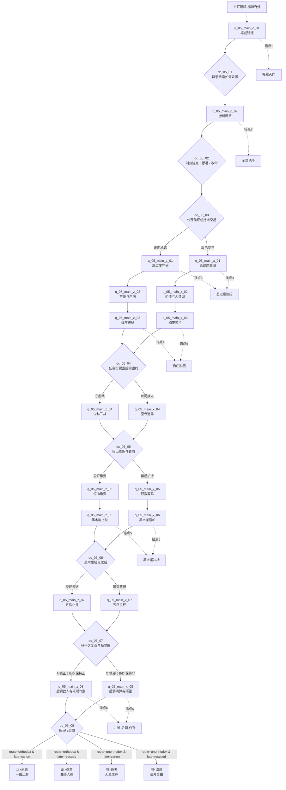

# 剧情 · 05 笑傲江湖（正邪双主线与选择节点）

> 归属（基准 §18；AR-10）：`ch05_xiaoao` 的主线剧情、原著事件去向、立场分岔、选择节点、锚点落地与本书结局；本文件是本书界主线剧情的唯一归属。
> 上游：`00-canon.md` v1.2；`decisions/author-requirements.md` AR-04、AR-09、AR-10；`decisions/author-decisions.md`；`design/01-vision-and-core-loop.md` §7.6；`design/02-timeline-and-world-tiers.md`；`design/13-progression-and-endings.md` §4、§6.6、§7.12；`design/17-sects-compendium.md`；`design/18-npc-and-companions.md`。
> 引用而不重定义：属性、品德与声望阈值 → `design/03`；武学与异种真气 → `design/05`、`design/06`、各武学图鉴；战斗、Boss、琴箫合奏与五岳夺帅 → `design/09`；地图与历史地名 → `design/11`、`design/map/`；任务 DSL → `design/12`（已落盘；本文夹具仍须迁移验证）；天书之力 → `design/13`；门派 → `design/17`；NPC、招募、生卒与跨书界 → `design/18`。`chapters/05-xiaoao.md` 的“主线”只索引本文。
> 标注约定：**（原创扩展）** = 原著没有的内容；**（待考）** = 原著事实尚需逐字核对；**（待核实）** = 技术事实尚未联网确认；**（待实测）** = 需要真机或真账号验证；**【建议值】** = 依赖其他文档、先给可用数值并在文末登记。
> 版本：v1.1（P05 完成稿；审校 P05.R，2026-09-26）；全局审计（2026-09-26）；经脉落地终审（2026-09-29）；经脉落地终审（2026-09-30）。原著考据基线为三联 / 广州修订版；40 回回目及第 1–2、5、7–18、23–30、35–40 回关键因果已联网逐章核对，网络文本与指定纸本可能存在的逐字差异仍标 **（待考）**。

## 0. 阅读指引与剧情总览

### 0.1 本文怎样使用

本书界同时结算两条互相独立的轴，不能把“邪线”等同于“原著线”，也不能把“正线”等同于“改命线”。

| 轴 | 取值 | 判定内容 | 主要输出 |
|---|---|---|---|
| 立场轴 | 正 / 邪 | 玩家在 `dc_05_*` 的选择、累计 `morality`、阵营承诺与是否越过不可逆底线 | 进入正线或邪线的下一幕、门派关系、同伴去留、结局立场文本 |
| 命运轴 | 原著 / 改命 | 刘正风金盆洗手前的四项准备与 `dc_05_02` 的行动 | 刘正风、曲洋生死，`tsp_05_canon` 或 `tsp_05_fate`，改命后日谈 |

“正线”是优先保护无辜、让证据公开并限制各派滥权的路线；“邪线”是与日月神教、嵩山派、岳不群或江湖灰色势力交易，以秘密、筹码和实力重排秩序的路线。邪线不是故意失败或惩罚性坏结局：玩家可以约束盟友、保全重要人物、拒绝任我行吞并江湖，并以不受名门承认的方式完成“自在”。正邪也不是开局选阵营；玩家可在 `dc_05_03`～`dc_05_06` 维持、偏移或付代价切换，`dc_05_07` 锁线后，`dc_05_08` 只选择终局手段。

### 0.2 书界参数与叙事预算

| 项 | 本书值 | 来源 / 用法 |
|---|---:|---|
| 书界 ID | `ch05_xiaoao` | 基准 §2 |
| 年代 | 明中叶，年代不详；玩法定年约 1523–1525 **（原创扩展）** | 基准 §2；`design/02` §1.3.5；人物年龄不得据此伪造精确生卒 |
| 境界 / 武运 / 难度 | `MID` / 75 / 7 | 基准 §2；战斗强度只写普通、精英、Boss，不在本文另配数值 |
| 等级上限 | 60 | 基准 §2 |
| 入场携带 | 内功 2 / 拳脚 2 / 兵器 2；外来品阶压制 −2 小品 | 基准 §2–§3 |
| 天书关键词 | 自在 | 基准 §2；两线共有本义“琴箫” |
| 前 / 后书界 | `ch04_yitian` / `ch06_xiake` | 约 1525→1582，书眠约 `1582−1525=57` 年 **【建议值】**，以 `design/02` 年表为准 |
| 单次通关幕数 | 10 个逻辑任务节点；9 个制作包 | 2 个共有节点 + 8 个立场节点 = 10；**已解决：**`chapters/05` §0.1–§0.2 已按福州轻量序幕与衡州共用开局资产额度落实 9 包，不删任务。`design/11` §10.1 的预算列名称仍待统一为制作包，见 P05-02 |
| 特色系统戏份 | `cmb_qinxiao`、五岳并派投票、`bf_yizhongzhenqi` | 只调用 `design/09`、`design/05`、`design/06` 的既有规则 |

### 0.3 全流程图



### 0.4 连通与切线原则

1. `dc_05_03` 首次根据行为和品德推荐路线，但不锁线；`morality ≥ 10` 默认正线，`morality ≤ −10` 默认邪线，`−9..9` 由玩家明确选择。阈值沿用 `design/03` §8.3 的称号分段。
2. `dc_05_04`、`dc_05_05`、`dc_05_06` 都可切线；`dc_05_03` 后的思过崖幕内也有一次交还 / 取回洞图的切换窗。每次切线至少支付一种可见代价：本书界声望、人情筹码或表内专属关系 / 证据代价，具体见 §5；不直接扣永久属性。
3. `dc_05_07` 后锁定立场终局；`dc_05_08` 只改变终局手段和尾声，不再换线，避免最后一刻无成本洗线。
4. 刘曲命运旗标 `flg_05_liuqu_fate` 与当前立场无关，始终保留到结局。改命失败不会堵塞任一主线。
5. 主角不得替代令狐冲完成独孤九剑传承、与任盈盈的情感抉择、黑木崖核心对决或最终婚姻；玩家改变的是外围条件、证据去向、伤亡和各派权力边界。

---

## 1. 原著重要剧情与走向清单

### 1.1 逐回覆盖表

“回目”采用全书四十回通行目录；本表是事件索引，不以现代影视改编替代小说。地点只在有把握时写入，当时城市名称采用明代图层；山岳、庄园等小说场景不强绑错误城市。

| # | 回目 | 关键人物 | 地点 | 原著关键事件与结果（大意） | 本作去向 |
|---:|---|---|---|---|---|
| 1 | 灭门 | 林平之、林震南夫妇、余人彦、余沧海及青城弟子 | 福州府、福威镖局 | 林平之为救受调戏的酒家少女误杀余人彦；青城派早有预谋地袭击福威镖局各处，林家三口被迫乔装逃离镖局，本回末仍在逃难途中 | 双线共有；锚点1；`q_05_main_c_01`、`dc_05_01` |
| 2 | 聆秘 | 林平之、林震南夫妇、岳灵珊、劳德诺、青城弟子 | 福州府至衡山途中 **（待考具体驿路）** | 林家三口遭伏而被制，林震南夫妇被掳；乔装的岳灵珊、劳德诺救走林平之。林平之脱逃后探知青城早有灭镖计划、父母将被押往衡山，遂易容追赶 | 双线共有；锚点1；`q_05_main_c_01`；遗言必须后移至第七回 |
| 3 | 救难 | 令狐冲、仪琳、田伯光 | 衡州府一带 | 令狐冲为救仪琳与田伯光周旋，重伤仍不退 | 双线共有；`q_05_main_c_02`；同伴态度分歧 |
| 4 | 坐斗 | 令狐冲、田伯光、仪琳 | 衡州府城内 **（具体场所待考）** | 令狐冲以机变立约坐斗，设法护住仪琳 | 双线共有；小型规则战；邪线可利用赌约但不能替田伯光开脱 |
| 5 | 治伤 | 令狐冲、仪琳、曲非烟、田伯光、木高峰、林平之、余沧海 | 衡州府城内 | 曲非烟引仪琳为重伤的令狐冲疗伤；田伯光、余沧海、木高峰与林平之的冲突交织，刘府风波逼近 | 双线共有；锚点2前置；药物、撤离线索 |
| 6 | 洗手 | 刘正风、曲洋、左冷禅一方、五岳群雄 | 衡州府境内 | 金盆洗手受阻，刘正风一家遭逼迫与杀害；曲洋现身救走刘正风，二人均已受重伤，本回止于脱离会场 | 双线共有；选择节点；主改命锚点 `dc_05_02`；托谱与死亡归第七回 |
| 7 | 授谱 | 刘正风、曲洋、曲非烟、令狐冲、林震南夫妇、木高峰、林平之、岳不群 | 衡州府外山野与庙宇 **（具体地望待考）** | 刘、曲合奏并托付《笑傲江湖》曲谱后身亡；林震南夫妇遭木高峰逼问，临终托令狐冲转告“福州向阳巷老宅”线索；林平之随后正式投入华山门下 | 双线共有；锚点2结算；`sk_xiaoaojianghuqu` 线索；辟邪线承接第 24 回 |
| 8 | 面壁 | 令狐冲、岳灵珊、陆大有、林平之、蒙面青袍人 | 华山（华阴县）思过崖 | 令狐冲面壁期间发现后洞所刻五岳剑招及破法；岳灵珊与林平之日渐亲近，令狐冲与师门关系转折；一名身份未明的蒙面青袍人曾以华山剑招点拨，至第十回才揭明是风清扬 | 正线 / 邪线异视角；锚点3起点；不提前揭穿人物身份 |
| 9 | 邀客 | 令狐冲、田伯光、风清扬 | 华山思过崖 | 田伯光受不戒所迫上崖邀令狐冲，令狐冲借后洞石刻剑招反复周旋；风清扬在回末正式现身 | 双线变体；`q_05_main_z_01` / `q_05_main_x_01` |
| 10 | 传剑 | 令狐冲、风清扬 | 华山思过崖 | 风清扬指点令狐冲独孤九剑，令狐冲剑术境界大进 | 锚点3；双线必见证；不得让主角夺走 `sk_dugu9` 主传承 |
| 11 | 聚气 | 令狐冲、岳不群、封不平、成不忧、桃谷六仙 | 华山 | 华山剑宗来客争夺掌门；成不忧被桃谷六仙撕裂，六仙又各注一道真气为令狐冲疗伤，反使内息冲突加深 | 双线共有；锚点3后续；特色系统 `bf_yizhongzhenqi` 的叙事预演 |
| 12 | 围攻 | 令狐冲、田伯光、不戒和尚、陆大有、岳不群、封不平、药王庙蒙面群敌 | 华山至药王庙 **（沿途地望待考）** | 不戒再注两股真气；陆大有死亡、《紫霞秘笈》失踪；药王庙中蒙面人围攻华山派，令狐冲先败封不平，再一举刺瞎十五名蒙面人 | 正线护人 / 邪线取证；锚点3收束；内伤增为八股异种真气 |
| 13 | 学琴 | 令狐冲、岳不群、林平之、岳灵珊、洛阳王家、绿竹翁、任盈盈 | 药王庙至河南府洛阳 | 药王庙余波加深岳不群猜疑；华山一行赴洛阳王家，王氏误认曲谱为剑谱；绿竹巷鉴谱后，令狐冲与隐去身份的任盈盈相识并学琴 | 双线共有；琴箫系统教学；任盈盈关系起点 |
| 14 | 论杯 | 令狐冲、平一指、祖千秋、桃谷六仙 | 开封府及黄河船路 | 华山一行到开封府见平一指；祖千秋以不同酒杯论酒，并让令狐冲误服为老不死所制的“续命八丸” | 正线查药 / 邪线做人情；支线酒器玩法 |
| 15 | 灌药 | 令狐冲、祖千秋、老头子、老不死、华山众人 | 黄河沿岸至五霸冈前路 **（具体地望待考）** | 老头子为追回“续命八丸”掳走令狐冲，欲取其血救女；得知任盈盈关系后罢手，令狐冲仍自行割腕，强让老不死饮下含药鲜血 | 双线分歧；`q_05_main_z_02` / `q_05_main_x_02`；医债与强迫伦理不可泛化为“群豪献药” |
| 16 | 注血 | 令狐冲、蓝凤凰、五仙教苗女、岳不群、华山众人 | 黄河船上至五霸冈前路 **（具体地望待考）** | 令狐冲失血昏沉；蓝凤凰与四名苗女借水蛭把自身鲜血转注给他，使其转危为安，随后群豪迎往五霸冈 | 双线分歧；医疗支线；转血只作原著事件，不定义通用医疗规则 |
| 17 | 倾心 | 令狐冲、任盈盈、平一指、五霸冈群豪、方生 | 五霸冈、赴少林途中 **（行政地望待考）** | 群豪因任盈盈号令为令狐冲求医；平一指诊断多股真气、补药、失血与药酒纠缠，无法救治后身亡；任盈盈身份显露，与令狐冲关系推进，并为救他前往少林 | 双线共有；`q_05_main_z_02` / `q_05_main_x_02`；平一指死亡与任盈盈舍身救治不得省略 |
| 18 | 联手 | 令狐冲、方证、方生、岳不群、向问天 | 少林寺、凉亭及官道 **（凉亭地望待考）** | 令狐冲在少林调养三个多月；方证提出入少林门下方授《易筋经》，并出示岳不群逐徒书信；令狐冲拒绝后下山，旋与被围攻的向问天联手 | 双线共有；`q_05_main_z_02` / `q_05_main_x_02`；先完成少林拒师与逐徒，再开启梅庄前置 |
| 19 | 打赌 | 令狐冲、向问天、梅庄四友 | 杭州府梅庄 | 向问天以琴棋书画与武学珍物设局，诱梅庄四友逐一比试 | 双线；锚点4；`q_05_main_z_03` / `q_05_main_x_03` |
| 20 | 入狱 | 令狐冲、任我行、梅庄四友 | 杭州府梅庄地牢 | 令狐冲进入地牢，与被囚任我行接触并落入换囚之局 | 双线；锚点4；选择是否预留退路；回目名以官方目录 / 正文核定 |
| 21 | 囚居 | 令狐冲、任我行 | 杭州府梅庄地牢 | 令狐冲在囚禁中接触吸星大法，异种真气危机改变其处境 | 双线；`sk_xixing`、`bf_yizhongzhenqi` 有强制戏份 |
| 22 | 脱困 | 令狐冲、任我行、向问天、梅庄四友 | 杭州府梅庄 | 任我行脱困，令狐冲亦重获自由；旧教主重返江湖 | 锚点4；`dc_05_04` 前因；守约或操盘两种善后 |
| 23 | 伏击 | 令狐冲、定静、仪琳、恒山门人、嵩山一方假冒者 | 廿八铺附近、赴福州府途中 | 令狐冲化名吴天德援救恒山门人；定静遭蒙面人围攻，临终托他护送弟子赴福州无相庵；伏击者后来证实为嵩山一方假冒日月教 | 双线共有事实；`q_05_main_z_04` / `q_05_main_x_04`；恒山护送线起点 |
| 24 | 蒙冤 | 令狐冲、岳灵珊、林平之、岳不群一方 | 福州府向阳巷林家老宅 | 岳灵珊、林平之循遗言寻找辟邪剑谱；老宅中的袈裟剑谱被抢，令狐冲再受怀疑，辟邪线由灭门证物推进到夺谱因果 | 双线调查；`q_05_main_z_04` / `q_05_main_x_04`；不得只概括成“名声蒙冤” |
| 25 | 闻讯 | 令狐冲、定闲、定逸、恒山门人 | 浙南龙泉及赴少林途中 | 令狐冲在龙泉援救定闲、定逸与恒山弟子，揭出嵩山假冒日月教、逼迫反并派者的计划；定闲、定逸随后赴少林为任盈盈求情 | 双线共有；`q_05_main_z_04` / `q_05_main_x_04`；嵩山证据与少林前置 |
| 26 | 围寺 | 令狐冲、定闲、定逸、任盈盈、群豪 | 登封县少林寺 | 群豪集结后发现少林空寺；定逸已死、定闲垂危，定闲临终托令狐冲接掌恒山；群豪在积雪与山下包围中寻找地道撤离 | 双线共有；`q_05_main_z_04` / `q_05_main_x_04`；恒山托付发生于此，不得后移成普通救援 |
| 27 | 三战 | 任我行、方证、左冷禅、冲虚、令狐冲、岳不群、任盈盈、向问天 | 登封县少林寺 | 双方约定三战两胜：任我行先对方证、再对左冷禅；第三场本拟由令狐冲对冲虚，冲虚因先前曾败于其剑而当场认输；岳不群随后坚持挑战令狐冲，并将他踢伤昏倒 | 双线必保留“前两战→冲虚认输→岳令后续挑战”的原人物顺序；玩家只负责护场、阻断暗手、取证与撤离 |
| 28 | 积雪 | 令狐冲、任盈盈、任我行、向问天 | 少室山雪野及山洞 | 三战后任盈盈与令狐冲关系确认；任我行寒冰真气发作，众人在雪中疗伤，并核对定闲、定逸被害线索 | 双线共有结果；`q_05_main_z_04` / `q_05_main_x_04`；不是泛化的风雪撤离关 |
| 29 | 掌门 | 令狐冲、恒山门人、方证、冲虚 | 定闲、定逸后事及北岳恒山 | 火化定闲、定逸后，令狐冲接受遗命并承担恒山掌门责任；方证、冲虚提供制衡并派的支持 | 正线公开承责 / 邪线幕后护持；`q_05_main_z_05` / `q_05_main_x_05` |
| 30 | 密议 | 令狐冲、方证、冲虚、任盈盈、恒山门人、日月教来袭者 | 北岳恒山悬空寺及黑木崖前路 | 方证、冲虚与令狐冲在悬空寺商议阻止五岳并派；日月教来袭后，令狐冲转入与任盈盈会合及登黑木崖准备 | 双线情报关；`q_05_main_z_05` / `q_05_main_x_05`；由并派密议连到锚点5 |
| 31 | 绣花 | 东方不败、任我行、任盈盈、令狐冲、向问天、杨莲亭 | 黑木崖 **（确址待考）** | 众人登崖，东方不败及其权力核心现身，生死决战展开 | 双线；锚点5；`q_05_main_z_06` / `q_05_main_x_06` |
| 32 | 并派 | 左冷禅、岳不群、五岳各派 | 嵩山（登封县） | 五岳并派大会召开，各派在威逼、名义与自保间表态 | 双线；锚点6前段；五岳并派投票 |
| 33 | 比剑 | 五岳群雄、岳不群、左冷禅 | 嵩山封禅台一带 | 以比剑与话术争夺并派主导权 | 双线；五岳投票与擂台结合；引用 `design/09` |
| 34 | 夺帅 | 岳不群、左冷禅 | 嵩山 | 岳不群以辟邪剑法胜左冷禅，取得五岳派权位 | 正线揭露 / 邪线操盘；结果可改权力合法性但不抹去对决 |
| 35 | 复仇 | 林平之、余沧海、木高峰、岳灵珊 | 嵩山大会后的北方驿路 / 草棚 **（行政地望待考）** | 林平之追杀余沧海与木高峰并报仇；木高峰驼峰毒水令林平之失明，随后林平之向岳灵珊说明辟邪剑谱与岳不群夺谱因果 | 双线；`dc_05_07`；可止牵连，不能抹去林平之亲自复仇的因果 |
| 36 | 伤逝 | 岳灵珊、林平之、令狐冲、任盈盈、宁中则、岳不群 | 驿路与翠谷 **（行政地望待考）** | 林平之杀岳灵珊；令狐冲安葬故人，与任盈盈在谷中合练琴箫；宁中则被日月教众擒获后获救，继而亲见岳不群欲杀令狐冲，又确认女儿死因，最终以匕首自尽 | 原著结果或 `dc_05_07` 局部救援；`q_05_main_*_08`；不改变刘曲主命运轴 |
| 37 | 迫娶 | 令狐冲、任盈盈、仪琳、仪琳之母（哑婆婆）、不戒和尚、恒山门人、岳不群 | 北岳恒山、悬空寺 | 令狐冲与任盈盈赴恒山并查知岳不群杀定闲、定逸；仪琳之母结束聋哑伪装，以做和尚或受阉割相逼，强迫令狐冲娶仪琳，令狐冲坚持不负任盈盈，任盈盈与仪琳也拒绝由旁人强定婚姻 | 双线共有；`q_05_main_*_08`；保留“查凶”与“迫娶 / 拒绝强迫”两项核心；任我行压力在第 39 回结算 |
| 38 | 聚歼 | 令狐冲、岳不群、左冷禅、林平之、五岳诸派 | 华山思过崖后洞 | 岳不群诱三派人物观看石刻并堵洞；左冷禅与林平之凭黑暗和失明优势杀戮；令狐冲最终击杀左冷禅并制伏林平之 | 正线救援 / 邪线反设局；锚点6中段；核心人物因果不可替换 |
| 39 | 拒盟 | 岳不群、仪琳、任我行、令狐冲、任盈盈、向问天、方证、冲虚 | 华山思过崖外、朝阳峰 | 岳不群以渔网伏击刚出后洞的令狐冲、任盈盈，仪琳为救令狐冲从背后刺杀岳不群；其后任我行在朝阳峰迫令狐冲任副教主并吞并恒山，令狐冲明确拒绝；任我行命其一个月内回恒山待战，随后在教众颂声中突然发作身亡 | 双线都保留仪琳救人与令狐冲拒盟；`dc_05_08`；邪线拒绝方式不自动归正；继位与撤销攻山归第四十回 |
| 40 | 曲谐 | 令狐冲、任盈盈、向问天、方证、冲虚、林平之、劳德诺 | 北岳恒山、杭州府西湖孤山梅庄、华山 | 任盈盈继任日月教教主并隐瞒任我行死讯，以旧教主仪仗上恒山归还经剑、赠礼撤兵，化解攻山危机；三年后令狐冲与任盈盈在梅庄成婚，令狐冲抚琴、任盈盈吹箫；任盈盈辞位、向问天接任；四个月后二人赴华山，揭明令狐冲所练实为方证所授《易筋经》，异种真气几乎化尽，并交代林平之、劳德诺尾声 | 双线结局；天书现世；书眠引子；结局演出必须保留撤兵、琴箫与传功揭示 |

### 1.2 覆盖率核算

| 口径 | 总数 | 已有去向 | 覆盖率 | 说明 |
|---|---:|---:|---:|---|
| 四十回回目 | 40 | 40 | `40 ÷ 40 = 100%` | 每回至少落入共有幕、正 / 邪幕、节点、锚点或支线之一 |
| `design/01` 固定锚点 | 6 | 6 | `6 ÷ 6 = 100%` | 逐项见 §6，顺序为福威→刘曲→思过崖→梅庄→黑木崖→并派 / 后洞 / 作别 |
| 重点回目的拆分核心事件 | 31 | 31 | `31 ÷ 31 = 100%` | 第 17–18、23–30、35–40 共 16 回按下表逐项复核，不以整回标签代替事件 |
| 明确“不采用”事件 | 0 | 0 | — | 没有删去整回；难以战棋化的旅途压缩为对话、调查或支线，但仍有去向 |
| 交书界支线的事件 | 6 组 | 6 | `6 ÷ 6 = 100%` | 林家次要家眷、酒器、医债、五霸冈群豪、恒山日常、三年成婚前后日谈；主线只保留触发与结果 |

为避免“整回有标签、关键因果却漏做”，对最容易压缩失真的 16 回另作事件级抽查：

| 回目 | 拆分的核心事件 | 数量 | 实际去向 |
|---:|---|---:|---|
| 17–18 | 平一指诊断后死亡；任盈盈送至少林；少林调养三个多月；方证提出入门授经；岳不群逐徒书信；令狐冲拒绝；官道与向问天联手 | 7 | `q_05_main_z_02` / `q_05_main_x_02` 的步骤 4–8 |
| 23–25 | 吴天德援恒山；定静临终托护送；向阳巷寻谱及袈裟被夺；龙泉救定闲、定逸；揭出假冒日月教与阻并计划；二尼赴少林求情 | 6 | `q_05_main_z_04` / `q_05_main_x_04` 的步骤 1–4 |
| 26–28 | 少林空寺与定闲遗命；任我行两战、冲虚认输及岳令后续挑战；岳不群踢伤令狐冲；任、令关系确认；任我行寒气发作；雪中疗伤并核凶案线索 | 6 | `q_05_main_z_04` / `q_05_main_x_04` 的步骤 5–8 |
| 29–30 | 定闲、定逸火化；令狐冲承掌门责任；悬空寺制衡并派密议；日月来袭与赴黑木崖准备 | 4 | `q_05_main_z_05` / `q_05_main_x_05` 的步骤 1–8 |
| 35–40 | 林平之复仇及失明；岳灵珊死亡与宁中则自尽；确认师太凶手；哑婆婆迫娶及令狐冲、任盈盈、仪琳拒绝强迫；后洞聚歼；岳不群伏击与仪琳救人刺杀；朝阳峰拒盟、任我行骤逝及交接；梅庄成婚合奏与《易筋经》揭示 | 8 | `dc_05_07`、`q_05_main_z_08` / `q_05_main_x_08`、`dc_05_08`、§7 结局演出 |
| **合计** | — | **31** | `31 ÷ 31 = 100%` |

全书口径以 40 条逐回事件行覆盖 40 回；高风险区再以 31 条核心因果复核，但不把两种口径相加制造虚高总数。覆盖率只证明“有去向”，不代表每回制作成独立战斗。第 14–16 回适合生活 / 医疗支线，第 23–25 回适合连续调查，第 32–34 回合并为一套并派大会系统关，以控制单周目节奏。

---

## 2. 主角定位与开局

### 2.1 穿越身份

主角从 `ch04_yitian` 书眠醒转后，出现在福州府外驿路，身份被书界自洽为“福威镖局临时雇来的验路客”**（原创扩展）**：不在林家谱牒、不知辟邪剑谱所在，只负责勘查一段被青城弟子踩点的镖路。这个身份允许玩家合法进入镖局外围、接触脚夫与驿卒，又不会夺走林平之“林家遗孤”的叙事位置。

开局时间定为福威镖局灭门风波已经启动、林家尚未完全失散的短窗口 **（原创扩展）**。玩家能救出账房、趟子手等次要人物并保存证物，却不能让余沧海从未起意、不能令林震南夫妇平安返家，也不能提前取得完整《辟邪剑谱》。这样既让第一幕可玩，也保留锚点因果。

### 2.2 初始关系

| 对象 | 起点 | 玩家第一印象与边界 |
|---|---:|---|
| `npc_linpingzhi` | 陌生 / 临时同路 | 玩家可救援、追查与劝阻，但不能替他继承林家仇恨或代他决定是否修炼 `sk_bixie` |
| `npc_yucanghai` | 敌视或试探 | 若交出假线索可暂缓敌意；无路线可洗去灭门责任 |
| `npc_mugaofeng` | 利益试探 | 邪线可短期合作；界面始终显示“高背叛风险”，符合 `design/18` |
| `npc_yuebuqun` | 观察 | 关注玩家掌握的辟邪线索；给予体面援手但索取信息 |
| `npc_ningzhongze` | 中立偏善 | 根据玩家是否救助镖局无辜者建立基础信任 |
| `npc_linghuchong` | 尚未正式相识 | 衡州救难时首次共同作战；主角不得以读者知识提前要求其交出曲谱或剑法 |
| `npc_yilin` | 尚未正式相识 | 衡州救难中成为最早可建立稳定好感的有名 NPC |
| `npc_liuzhengfeng` / `npc_quyang` | 仅闻其名 | 四项改命准备需通过探索发现，书灵只给模糊提示，不直接报答案 |

### 2.3 共有第一幕 `q_05_main_c_01` · 福威残镖

| 固定字段 | 内容 |
|---|---|
| 标题 | 福威残镖 |
| 原著对应事件 | 第一回《灭门》、第二回《聆秘》 |
| 地点 | 福州府 `city_fuzhou` / `rg_fujian`；城外驿路、福威镖局外围 |
| 参与 NPC | `npc_linpingzhi`、`npc_yucanghai`、`npc_yuelingshan`；余人彦、劳德诺、林震南夫妇尚无正式 ID，镖局人员使用群体模板，均待 `design/18` 登记后再进入生产数据 |
| 目标与流程 | ① 见证林平之在酒肆为救人误杀余人彦；② 回府警告并从青城多点袭击中救出次要人物；③ 检查残镖、尸伤与被翻动的旧物，确认来敌所求；④ 护持林家三口乔装撤离，直至三人在城外遭伏被制；⑤ 协助乔装的岳灵珊、劳德诺救走林平之，偷听青城弟子谈话，确认攻镖早在误杀前已部署且林震南夫妇将被押往衡山；⑥ 在 `dc_05_01` 决定证物去向；⑦ 护送易容的林平之追往衡州府 |
| 关键战斗 | 酒肆救人：普通 / 强制收手；镖局围堵小头目：精英。胜利条件含救援与撤离，不要求全歼；机制引用 `design/09` |
| 幕内小选择 | 救账册或救伤员：前者得青城行动证据，后者 `morality +4` 并开医者支线；两者可借轻功 / 潜行全取，不给凭空数值优势 |
| 幕末状态变化 | 必得 `flg_05_fuwei_witnessed`；按 `dc_05_01` 写入 `flg_05_bixie_evidence` 去向；救伤员则 `morality +4`；公开护林家则本书 `fame +30` **【建议值】** |
| 失败与时限 | 主角倒地按 `design/09` 战败回档；若两次场景推进前不回镖局，次要人物救援失败但主线继续。不得通过等待阻止灭门锚点 |

### 2.4 共有第二幕 `q_05_main_c_02` · 衡州琴箫

| 固定字段 | 内容 |
|---|---|
| 标题 | 衡州琴箫 |
| 原著对应事件 | 第三回《救难》至第七回《授谱》 |
| 地点 | 衡州府 `city_hengyang` / `rg_huxiang`；刘府会场与城外山野 **（会场及曲终具体地望待考）** |
| 参与 NPC | `npc_linghuchong`、`npc_yilin`、`npc_tianboguang`、`npc_liuzhengfeng`、`npc_quyang`、`npc_zuolengchan`（命令链，不在场）、`npc_moda`、`npc_linpingzhi`、`npc_yucanghai`、`npc_mugaofeng`、`npc_yuebuqun`；曲非烟、林震南夫妇尚无正式 ID |
| 目标与流程 | ① 介入仪琳救难并以坐斗 / 地形牵制田伯光；② 协助曲非烟、仪琳救治令狐冲，同时跟进林平之与余沧海、木高峰的冲突；③ 探明金盆洗手的政治压力，并在典礼前完成乐谱、退路、家眷、两派耳目四线中的若干项；④ 见证嵩山一方封锁会场；⑤ 执行 `dc_05_02` 的原著或改命方案；⑥ 接受、复制或护送《笑傲江湖》曲谱线索；⑦ 阻止木高峰继续逼问林震南夫妇，听取其向阳巷老宅遗言，见证林平之入华山；⑧ 由 `dc_05_03` 确定首次立场分流 |
| 关键战斗 | 田伯光坐斗：精英切磋；刘府围堵：Boss 场景但以护送 / 拖延为胜利条件，Boss 机制引用 `design/09`，不要求击败左冷禅本人 |
| 幕内小选择 | 是否当众为令狐冲与刘曲作证；是否放走缴械的嵩山耳目；是否让曲谱由令狐冲独自保管。选择会改变品德、声望与两派关系 |
| 幕末状态变化 | 必得 `flg_05_qinpu_seen`；写入 `flg_05_liuqu_fate: canon\|rescued`；若改命且刘 / 曲曾入队，按 `design/13` §6.6 支付本书首次同伴改命 2 点修为余韵（同次两人只计一次，不足记 `fateDebt`） |
| 失败与时限 | 典礼开始即关闭准备任务；四线不足三条仍可选救人，但只能救出部分家眷，刘曲按原著死亡。逃离战败回到会场前自动存档，不删除已完成准备 |

### 2.5 四项改命准备

| 准备旗标 | 完成方式 | 正 / 邪兼容方式 | 代价 / 冲突 |
|---|---|---|---|
| `flg_05_anchor_score` | 从乐师、曲谱副本或刘曲信物证明二人只求退隐，不图两派权位 | 正：公开证词；邪：以教内暗号取得曲洋信任 | 提前公开会使嵩山加强会场封锁 |
| `flg_05_anchor_escape` | 勘察刘府到城外的水路、地窖或换车点 **（原创扩展）** | 正：雇船护送；邪：买通关卡 | 花费银两或放弃一处本书资源点收益 **【建议值】** |
| `flg_05_anchor_family` | 分批转移刘家家眷并设置假名册 **（原创扩展）** | 正：托付衡山同门；邪：借日月教隐线藏匿 | 会被正派视作窝藏“魔教”家属，正派声望受损 |
| `flg_05_anchor_eyes` | 同时识别嵩山耳目与日月教监视者 | 正：缴械并隔离；邪：反向喂假消息 | 杀死耳目不算完成，因为会触发替补与提前动手 |

改命资格为四项中至少三项：`anchorReady = count(flags) ≥ 3`。这是 `design/01` §7.6 的既有 **【建议值】**，本文只把它落实为可玩任务；无论选择哪三项，玩家都必须放弃“金盆洗手现场公开扬名”的声望奖励与一项五岳阵营奖励，并承担正派关系损失。

---

## 3. 正线 · 以人证道

正线不是“五岳阵营线”。玩家维护的是人的选择权与可公开核验的事实，因此也会与岳不群、左冷禅乃至以大局为名的正道长辈冲突。正线共经历共有幕 `q_05_main_c_01`、`q_05_main_c_02` 与下列八幕；正常通关为 10 幕。所有 Boss 只引用 `design/09` 的脚本规范，本文不另定等级、属性或伤害。

### 3.1 `q_05_main_z_01` · 思过崖守秘

| 固定字段 | 内容 |
|---|---|
| 标题 | 思过崖守秘 |
| 原著对应事件 | 第八回《面壁》至第十二回《围攻》 |
| 地点 | 华山（华阴县 `city_huayin` / `rg_guanzhong`）；思过崖与山门 |
| 参与 NPC | `npc_linghuchong`、`npc_yuebuqun`、`npc_ningzhongze`、`npc_yuelingshan`、`npc_linpingzhi`、`npc_tianboguang`、`npc_fengqingyang`；陆大有、封不平、成不忧、桃谷六仙、不戒和尚尚无正式 ID |
| 目标与流程 | ① 护送负伤的令狐冲返山并见证林平之正式入门；② 在面壁与送饭往来中察觉岳灵珊、林平之关系转折；③ 发现后洞五岳剑招及破法并拒绝拓走石刻；④ 追踪田伯光上崖，见证令狐冲借石刻剑招周旋及风清扬传授独孤九剑；⑤ 面对剑宗来客夺位，保护华山弟子，保留成不忧被桃谷六仙撕裂的原著结果；⑥ 记录桃谷六仙六道真气与不戒和尚两道真气相冲，形成八股内息；⑦ 查明陆大有死亡与《紫霞秘笈》失踪；⑧ 在药王庙保护非战斗者，见证令狐冲败封不平并刺瞎十五名蒙面敌手 |
| 关键战斗 | 田伯光上崖交锋：精英；剑宗夺位与药王庙围攻：Boss 场景，胜利条件含护人、取证与撤离；原著核心对决由令狐冲完成，规则引用 `design/09` |
| 幕内小选择 | 是否让林平之看见石刻：允许观摩则其信任提高，但加深其“求快剑复仇”倾向；拒绝则岳灵珊信任下降。是否向岳不群隐瞒风清扬存在不改变 `sk_dugu9` 的归属 |
| 幕末状态变化 | `flg_05_siguo_seen=true`、`flg_05_siguo_use=seal`；保护伤员 `morality +5`；公开承担隐瞒责任则 `fame +40`、华山关系小降 **【建议值】**。`npc_linghuchong` 开启限时同行资格 |
| 失败与时限 | 泄露洞图不会卡关，但立即转 `q_05_main_x_01` 并失去风清扬的正线试炼；围攻失败则伤员增加、回到战前存档 |

本幕只允许玩家通过风清扬的旁观试炼取得 `sk_dugu9` 的“观摩进度”或图鉴记录；独孤九剑的主传承仍属于令狐冲。若玩家已从前书界携带同源武学，也只触发见识对话，不凭剧情复制一门完整天级武学。

### 3.2 `q_05_main_z_02` · 群豪与内伤

| 固定字段 | 内容 |
|---|---|
| 标题 | 群豪与内伤 |
| 原著对应事件 | 第十三回《学琴》至第十八回《联手》 |
| 地点 | 河南府 `city_luoyang` / `rg_zhongyuan`；绿竹巷；五霸冈 **（地望待考）**；登封县少林寺 `city_dengfeng`；凉亭与官道 **（地望待考）** |
| 参与 NPC | `npc_linghuchong`、`npc_renyingying`、`npc_laotouzi`、`npc_zuqianqiu`、`npc_pingyizhi`、`npc_lanfenghuang`、`npc_fangzheng`、`npc_fangsheng`、`npc_xiangwentian`；洛阳王家、绿竹翁、老不死尚无正式 ID |
| 目标与流程 | ① 处理药王庙余波与洛阳王家误认曲谱风波；② 在绿竹巷验谱、学琴并结识隐去身份的任盈盈；③ 到开封府见平一指，并查清祖千秋酒杯局与误服“续命八丸”的因果；④ 阻止老头子强取性命，但保留令狐冲自行割腕、令老不死饮下含药鲜血的原著选择；⑤ 为蓝凤凰与苗女以水蛭转血施救清场，阻止旁人误伤施救者；⑥ 到五霸冈制止继续叠加相冲疗法，随后见证平一指诊断多股真气、补药、失血与药酒纠缠，无法救治后身亡；⑦ 保护任盈盈把令狐冲送至少林求治并自愿留下，三个多月后见证方证以改投少林为授经条件、出示岳不群逐徒书信，而令狐冲亲自拒绝；⑧ 下山后在凉亭 / 官道援助遭围攻的向问天，要求其说明梅庄行动边界 |
| 关键战斗 | 误会冲突：普通，优先“降服”；官道围攻：精英，保护向问天与平民撤离；机制引用 `design/09` |
| 遭遇映射 | 步骤⑧只开启 `enc_05_guandao_jiewei` 正线变体；两组外围阻路者与平民撤离的总耐久、交涉转额见 `chapters/05` §12.3.2。向问天 / 令狐冲的核心联手为演出，不重复计玩家伤害；本池与之后梅庄分立 |
| 幕内小选择 | 让任盈盈独自进寺，或公开护送到山门：前者保持原著隐秘，后者 `morality +3` 但使少林提前防备；是否为蓝凤凰的水蛭转血施救遮挡闲人只影响她与华山的关系，不能改写令狐冲受救或平一指本次原著死亡 |
| 幕末状态变化 | `flg_05_yingying_identity=kept`、`flg_05_medical_truth=true`；无强迫灌药则 `morality +4`；令狐冲已被华山逐出且拒绝改投少林；`npc_renyingying` 好感与主线信任分开记录；向问天提出梅庄计划 |
| 失败与时限 | 任由疗法累计会给令狐冲附加世界态内伤，不改变任盈盈送寺、三个多月调养、拒绝改投和下山联手四个必经结果；官道战败由向问天救离并失去一次公开声望奖励，不堵塞梅庄 |

令狐冲体内多股真气与后续吸星反噬都调用既有 `bf_yizhongzhenqi` 及相关伤势语义；本文不另造“剧情版异种真气”。琴谱教学首次允许一人演奏 `sk_xiaoaojianghuqu`，但 `cmb_qinxiao` 必须等两位合资格演奏者、琴箫器物和羁绊条件齐备才可用，见 `design/09` §6.7.4。

### 3.3 `q_05_main_z_03` · 梅庄破局

| 固定字段 | 内容 |
|---|---|
| 标题 | 梅庄破局 |
| 原著对应事件 | 第十九回《打赌》至第二十二回《脱困》 |
| 地点 | 杭州府 `city_hangzhou` / `rg_jiangnan_taihu`；梅庄与地牢 |
| 参与 NPC | `npc_linghuchong`、`npc_xiangwentian`、`npc_renwoxing`；梅庄四友尚无正式 ID，生产数据须等 `design/18` 登记 |
| 目标与流程 | ① 与向问天约定“不杀无抵抗庄客”的救人底线；② 以琴、棋、书、画检定接近四位庄主；③ 在每场比试后取得地牢结构碎片，未完成项可凭向问天机关解逐项核验；④ 进入地牢并确认任我行身份；⑤ 玩家放置令狐冲逃生证据并打通外侧退路；⑥ 换囚时接管门禁，亲手解除门锁、固定狱门退路，见证任我行脱困，不替令狐冲学习 `sk_xixing`；⑦ 从外侧接应令狐冲到安全接头点，再护送被牵连仆役到中立交接处；⑧ 出示通行凭据并封闭追踪通道，清场后把梅庄账簿交给可核验的中立方。玩家救援 / 机关 / 清场交互为 **（原创扩展）** |
| 关键战斗 | 四艺各可用技艺检定或非击杀精英切磋；地牢夺门守备与庄外追兵均可交涉或战斗清场；三者是同一遭遇内的分段，不是额外整池战斗。四艺收招取得结构验证才结算未扣余额，玩家认输不算胜利；任我行无玩家切磋入口。先动杀招转入邪线善后，沿用本场进度；规则引用 `design/09` |
| 遭遇与消费 | `enc_05_meizhuang_poju` / `bsc_renwoxing_dilao` 自步骤②首次检定 / 切磋 / 机关核验起至本场全部目标验收成功或失败终局止；唯一 `totalHp=110331`，细账只读章节 §12.3.1。四艺四段各3,678、夺门 / 追兵各3,677合计22,066；步骤⑤及⑦的两次交接分别消费三个25,744救援节点，步骤⑥独立开门11,033。正常救援仍须完成步骤⑧封路，即使没有刷出追兵也不自动结算；伤害守备不兼算开门 |
| 幕内小选择 | 是否把任我行身份提前告知四友：告知可让一人撤离，但计划难度上升；是否保留吸星口诀抄本：销毁得任盈盈信任，保留只作任务物证，不直接授予 `sk_xixing` |
| 幕末状态变化 | `flg_05_ren_freed=true`；成功交接并保全账簿才记 `flg_05_meizhuang_witness=public`，证据灭失记 `lost`；救庄客 `morality +5`、梅庄完整取证 `fame +60` **【建议值】** 仅按实际完成发放；开启 `dc_05_04`，不把锚点继续当遭遇成功 |
| 失败与时限 | 四艺检定可由切磋补救；自换囚后超过三次场景推进而未完成救援即本场失败，节点交互不算场景推进。任我行仍脱困，庄内无辜者损失、证据灭失。超时 / 战败 / 主动退出冻结已消费C，失败余额为 `110331−C`；人物自行脱困或演出救离不补目标、不发成功收据；重试回开场快照。正邪切线与交涉失败转突围均保留本场伤害 / 进度 / 收据及已生效期限，不重置池 |

### 3.4 `q_05_main_z_04` · 少林三战

| 固定字段 | 内容 |
|---|---|
| 标题 | 少林三战 |
| 原著对应事件 | 第二十三回《伏击》至第二十八回《积雪》；重点第二十六《围寺》、第二十七《三战》 |
| 地点 | 廿八铺附近与赴福州府驿路 **（行政地望待考）**；福州府 `city_fuzhou` 向阳巷；浙南龙泉 **（州府归属待考）**；登封县 `city_dengfeng` / `rg_zhongyuan` 少林寺与少室山雪地 |
| 参与 NPC | `npc_linghuchong`、`npc_yilin`、`npc_dingxian`、`npc_yuelingshan`、`npc_linpingzhi`、`npc_renyingying`、`npc_renwoxing`、`npc_xiangwentian`、`npc_fangzheng`、`npc_chongxu`、`npc_zuolengchan`、`npc_yuebuqun`；定静、定逸尚无正式 ID |
| 目标与流程 | ① 协助化名吴天德的令狐冲在廿八铺附近援救恒山门人，见证定静临终托付赴福州无相庵；② 护送队伍至福州，并查向阳巷林家老宅袈裟剑谱被夺及令狐冲蒙冤的证据；③ 赶赴龙泉救出定闲、定逸与恒山弟子，揭出嵩山一方假冒日月教、阻挠反并派者；④ 保护定闲、定逸赴少林为任盈盈求情；⑤ 到少林空寺后确认定逸已死、定闲垂危，见证定闲把恒山托付给令狐冲，并协助群豪从地道脱围；⑥ 守住三战外围并保留准确次序：任我行对方证、任我行对左冷禅，第三场本拟令狐冲对冲虚而由冲虚认输；⑦ 在岳不群随后坚持的挑战中，保护被其踢伤昏倒的令狐冲，并保存任盈盈与他的关系确认；⑧ 在少室山雪地为任我行所受寒冰真气疗伤，并复核定闲、定逸被害线索 |
| 关键战斗 | 廿八铺 / 龙泉嵩山假冒者：两场独立精英救援；少林前两战：原著人物 Boss 演出；第三场以冲虚认输演出收束，随后岳令挑战为 Boss 演出。少林玩家仅承担护场、截断暗手和撤离目标；地道脱围与雪中疗伤为环境演出，不另开环境战。机制引用 `design/09` |
| 遭遇映射 | 步骤① `enc_05_nianbapu_jiuyuan`、步骤③ `enc_05_longquan_jiuyuan` 各有独立精英池、两组假冒者与三节点救援，入口 / 分配 / 当夜失败结算见 `chapters/05` §12.3.2；不借少林或恒山辨令池。步骤②④护送调查、⑤地道脱围、⑧雪中疗伤是非战斗任务交互 / 演出，无可攻击对象，不另计耐久或玩家进度。步骤⑥–⑦使用 `enc_05_shaolin_sanzhan` 的护场 / 截暗手 / 撤离三项目标，见该章 §12.3.1；核心人物演出HP / 伤害不计进度，外围失手按原规则转额外撤离 |
| 幕内小选择 | 定静遗命、向阳巷证物与假冒者口供可先救人或先取证；错过一项仍有替代证言。玩家只能决定外围伤亡与证据，不可替代任我行、方证、左冷禅、冲虚、令狐冲或岳不群的原著行动 |
| 幕末状态变化 | `flg_05_shaolin_resolved=parley`；若未杀降者 `morality +6`、少林 / 武当关系提升、`fame +80` **【建议值】**；`npc_fangzheng`、`npc_chongxu` 开启结盟任务，不因此自动可招募 |
| 失败与时限 | 廿八铺、龙泉均有当夜救援窗，错过即沿原著伤亡继续；少林外围失败会增加群豪伤亡，却不能删除定闲遗命或改换三战人物；大雪到来后强制进入疗伤撤离，主线继续 |

### 3.5 `q_05_main_z_05` · 恒山承责

| 固定字段 | 内容 |
|---|---|
| 标题 | 恒山承责 |
| 原著对应事件 | 第二十九回《掌门》、第三十回《密议》 |
| 地点 | 北岳恒山（大同府 `city_datong` 附近 / `rg_hedong_jinzhong`）；悬空寺一带地望按地图层 **（待考）** |
| 参与 NPC | `npc_linghuchong`、`npc_yilin`、`npc_dingxian`（遗命 / 后事）、`npc_renyingying`、`npc_fangzheng`、`npc_chongxu`；定逸尚无正式 ID |
| 目标与流程 | ① 火化并安葬定闲、定逸，核对遗命与凶案证物；② 由令狐冲亲自决定接受恒山掌门责任，玩家只保障决定不受胁迫；③ 协调出家、俗家弟子的安全与传承；④ 处理正派对令狐冲出身、交友及接掌资格的质疑；⑤ 接受方证、冲虚制衡五岳并派的公开支持；⑥ 在悬空寺把各派受压证言合并为反并派方案；⑦ 应对日月教来袭，区分普通教众、假令与真正敌意；⑧ 与任盈盈取得联系，准备转赴黑木崖 |
| 关键战斗 | 后事途中护送：普通；悬空寺来袭：Boss 场景，以护住门人、辨令和撤离为目标；门派试剑：精英切磋。引用 `design/09` |
| 幕内小选择 | 是否公开定闲遗命全文、是否把师太遇害证据交方证 / 冲虚；隐去敏感姓名可保护证人，却降低并派阶段的公开说服力。定闲生死已在上一幕少林空寺结算，本幕不得重复救援 |
| 幕末状态变化 | `flg_05_hengshan_trust=public`；令狐冲成为恒山掌门的核心决定不由玩家取代；`morality +5`；恒山关系显著提升；若公开证据则嵩山关系下降 |
| 失败与时限 | 后事结束前未核验遗命会由恒山长辈补证，不堵塞令狐冲接任；悬空寺遇袭后只有一次整备窗口，错过潜入路线仍可随原著队伍登崖 |

### 3.6 `q_05_main_z_06` · 黑木崖止杀

| 固定字段 | 内容 |
|---|---|
| 标题 | 黑木崖止杀 |
| 原著对应事件 | 第三十一回《绣花》；并吸收第三十回的登崖准备 |
| 地点 | 黑木崖 / `rg_hedong_jinzhong`；确址 **（待考）**，不绑定虚构 `city_*` |
| 参与 NPC | `npc_linghuchong`、`npc_renyingying`、`npc_renwoxing`、`npc_xiangwentian`、`npc_dongfangbubai`；杨莲亭尚无正式 ID，生产数据须等 `design/18` 登记 |
| 目标与流程 | ① 以密道 / 教众换班情报登崖；② 明确目标为救出被扣者并结束教主冲突；③ 避免把普通教众当作必须清除的敌人；④ 查出杨莲亭控制命令链的证据；⑤ 在核心对决外围截断增援；⑥ 由令狐冲、任我行、任盈盈等承担东方不败核心决战；⑦ 开启撤离通道；⑧ 阻止胜方立刻清洗败方家属 |
| 关键战斗 | 登崖守卫：精英潜入 / 降服；东方不败核心战：Boss，玩家负责外围和阶段目标，脚本引用 `design/09`；不在本文定义其数值 |
| 幕内小选择 | 是否向东方不败发出撤离非战斗者的短暂停战提议；是否保存杨莲亭下令证据。提议不保证东方不败存活，但会减少教众伤亡 |
| 幕末状态变化 | `flg_05_heimuya_done=true`、`flg_05_heimuya_resolved=restrained`；按原著核心结果东方不败死亡、任我行复位；若从未主动杀普通教众则 `morality +6`、`fame +100` **【建议值】**；开启 `dc_05_06` |
| 失败与时限 | 警戒满后转正面登崖，伤亡增加但可通关；核心战失败回到崖顶前存档。不得以离开地图跳过锚点5 |

本幕严格保持锚点次序：黑木崖决战发生在五岳并派之前。东方不败可招募只属于 `design/18` 所述的特定改命画像；本书主改命是刘曲，正线常规结算不把东方不败存活写成默认事实。

### 3.7 `q_05_main_z_07` · 五岳止并

| 固定字段 | 内容 |
|---|---|
| 标题 | 五岳止并 |
| 原著对应事件 | 第三十二回《并派》至第三十四回《夺帅》 |
| 地点 | 嵩山（登封县 `city_dengfeng` / `rg_zhongyuan`）；封禅台一带 |
| 参与 NPC | `npc_linghuchong`、`npc_yuebuqun`、`npc_ningzhongze`、`npc_yuelingshan`、`npc_linpingzhi`、`npc_zuolengchan`、`npc_moda`、`npc_yilin` |
| 目标与流程 | ① 分别取得五岳各派代表的真实授权；② 揭露被胁迫 / 冒名选票；③ 让各派先投“是否合并”，再投“由谁主事” **（原创扩展的系统化呈现）**；④ 保护反对者发言；⑤ 处理左冷禅以实力压场；⑥ 见证岳不群以辟邪剑法胜出；⑦ 公示林家线索与岳不群前后说法矛盾；⑧ 推动五派保留退出权，即使无法阻止名义并派 |
| 关键战斗 | 五岳夺帅为原著人物 Boss 守擂演出，赛制引用 `design/09` §2.6；玩家会场护人 / 护证为同场目标交互，阻拦只作环境压力，不另设精英可攻击HP；岳胜左败保持原著结果 |
| 遭遇映射 | 步骤④–⑧使用 `enc_05_songshan_duoshuai`，护送三组反对者 / 证人、完成四处证物与副本交接消费唯一目标池，见 `chapters/05` §12.3.1。岳、左演出伤害不记玩家进度；失手关闭原目标、将余额转两处会后护送，未完成即退出只留失败余额，不转后洞；票数结果不自动补满目标 |
| 幕内小选择 | 是否在岳不群出手前公布辟邪证据：提前公布可削弱其票盟，却使林平之复仇线提前爆发；延后则保全证人但岳不群先夺帅 |
| 幕末状态变化 | `flg_05_wuyue_vote=free`；若至少三派选票未受胁迫，得 `fame +120`、`morality +4` **【建议值】**；无论名义结果如何，岳不群的权欲与辟邪代价进入公开审判阶段 |
| 失败与时限 | 每派只有一次拉票窗口，错过按其既定压力投票；票数失败不堵主线，改为在华山后洞救人并证明并派造成的后果 |

五岳投票的门派权重、说客技能和界面属于书界 / 任务系统；本文只规定剧情顺序与结果语义。不得把“玩家声望高”直接换算成全部门派服从；各派至少要有一个可验证诉求。

### 3.8 `q_05_main_z_08` · 后洞救人与江湖作别

| 固定字段 | 内容 |
|---|---|
| 标题 | 后洞救人与江湖作别 |
| 原著对应事件 | 第三十五回《复仇》至第四十回《曲谐》；重点《复仇》《伤逝》《聚歼》《拒盟》《曲谐》 |
| 地点 | 嵩山大会后的北方驿路 / 草棚 **（行政地望待考）**；翠谷 **（待考）**；北岳恒山；华山思过崖后洞与朝阳峰；杭州府西湖孤山梅庄 `city_hangzhou` |
| 参与 NPC | `npc_linghuchong`、`npc_renyingying`、`npc_yilin`、`npc_linpingzhi`、`npc_yuelingshan`、`npc_yuebuqun`、`npc_ningzhongze`、`npc_renwoxing`、`npc_xiangwentian`、`npc_fangzheng`、`npc_chongxu`；仪琳之母尚无正式 ID |
| 目标与流程 | ① 追踪林平之向余沧海、木高峰复仇，保留木高峰毒水致其失明及夺谱真相，并在 `dc_05_07` 决定是否赶赴岳灵珊救援窗；② 原著分支见证岳灵珊被杀、宁中则获救后因女儿死因与岳不群行径自尽，改命分支按 18 的命定死亡状态另行结算；③ 赴恒山查明岳不群杀定闲、定逸的证据，并见证仪琳之母结束聋哑伪装、胁迫令狐冲与仪琳成婚；令狐冲、任盈盈与仪琳均拒绝由旁人决定婚姻；④ 进华山后洞前布置照明、地道和多路退路；⑤ 保留岳不群堵洞、左冷禅与林平之借黑暗杀戮、令狐冲击杀左冷禅并制伏林平之的核心因果；⑥ 出洞后由仪琳在救令狐冲时杀死岳不群，随后救出被囚恒山门人；⑦ 到朝阳峰见证令狐冲拒绝副教主与吞并恒山，并在 `dc_05_08` 选择保护 / 制衡手段；任我行随后骤逝；⑧ 第四十回由任盈盈继任并撤销攻山，三年后于梅庄成婚合奏，交代任盈盈辞位、向问天接任，再于四个月后的华山揭明方证所授内功即《易筋经》，结算天书与余韵期 |
| 关键战斗 | 林平之复仇现场：精英 / 可交涉；后洞聚歼：Boss 场景，核心是照明、分隔与救援；左冷禅 / 林平之核心对决仍由令狐冲完成；岳不群终局是仪琳救人演出，玩家只可保护被囚恒山门人；任我行压力以对话和限时备战呈现，不虚构必须击杀战 |
| 遭遇映射 | 步骤④–⑥为 `enc_05_houdong_jiuyuan` 正线变体；照明、分隔、洞内及出洞后救援共享本场唯一目标池，失败转额规则见 `chapters/05` §12.3.2。与早期华山围攻、已结束的夺帅均分立；原人物演出不接受玩家攻击，也不贡献目标进度 |
| 幕内小选择 | 是否救岳灵珊、宁中则等命定死亡人物由前置、同行者和时限共同判定；这是局部改命，不改变 `flg_05_liuqu_fate`。不可“公开任我行急症”规避其死：原著中其骤逝发生于朝阳峰拒盟之后，玩家只影响消息公开与交接秩序，不替令狐冲、任盈盈决定婚姻 |
| 幕末状态变化 | `flg_05_route=orthodox`、`flg_05_anchor6_done=true`、`flg_05_refused_unification=true`；根据刘曲命运授予 `tsp_05_canon` 或 `tsp_05_fate`；开启余韵期与书眠入口 |
| 失败与时限 | 后洞每推进两轮坍塌 / 黑暗区扩大，未救者按剧情伤亡；全灭则回到入洞前。任我行最后通牒有三次场景推进窗口，超时视为拒绝而非坏结局 |

正线的终局成功不是“所有正派都变好”，而是令狐冲仍能拒绝权位，任盈盈仍能选择与他相守，五岳与日月教都不能再以唯一合法性的名义占有二人。局部救下岳灵珊、宁中则时，必须按 `design/18` 记录存活画像；曾入队者的统一余韵代价按 `design/13` §6.6 只在本书首次触发一次。定闲在当前流程中依原著于少林空寺死亡，不生成不可达的生还状态。

---

## 4. 邪线 · 执秤于暗处

邪线的核心不是“滥杀得利”，而是不承认名门、教主或盟主天然拥有裁断权。玩家借日月神教的人情网、向问天的布局、梅庄的欲望和五岳各派的私心取得筹码，再用筹码制衡强者。其风险来自手段会制造新的秘密与债务：若玩家越过伤害无辜、交出同伴或协助强迫婚姻三条底线，仍能完成剧情，但得到更冷峻的尾声与同伴离队；不会突然判定“游戏失败”。

邪线共经历两个共有幕与下列八幕，单周目也是 10 幕。它覆盖同一批原著重大事件的另一面，不跳过思过崖、梅庄、少林、黑木崖、并派或后洞。

### 4.1 `q_05_main_x_01` · 思过崖取图

| 固定字段 | 内容 |
|---|---|
| 标题 | 思过崖取图 |
| 原著对应事件 | 第八回《面壁》至第十二回《围攻》 |
| 地点 | 华山（华阴县 `city_huayin` / `rg_guanzhong`）；思过崖、后山暗道与山门 |
| 参与 NPC | `npc_linghuchong`、`npc_yuebuqun`、`npc_ningzhongze`、`npc_yuelingshan`、`npc_linpingzhi`、`npc_tianboguang`、`npc_fengqingyang`；陆大有、封不平、成不忧、桃谷六仙、不戒和尚尚无正式 ID |
| 目标与流程 | ① 随华山众人护送负伤的令狐冲返山，并见证林平之正式入门；② 以送药、传话或田伯光引路接近思过崖，察觉岳灵珊、林平之关系转折；③ 找到后洞五岳剑招与破法，只拓各派互克索引；④ 见证令狐冲借石刻剑招周旋田伯光、风清扬现身授予独孤九剑，同时隐去玩家身份；⑤ 借剑宗来客夺位之机判断买家，保留成不忧被桃谷六仙撕裂的原著结果；⑥ 把桃谷六仙六道真气与不戒和尚两道真气造成的八股内息记为医债线索；⑦ 追查陆大有死亡与《紫霞秘笈》失踪，并将真假拓片分开；⑧ 在药王庙借洞图索引反制围攻，见证令狐冲败封不平并刺瞎十五名蒙面敌手，将真图留作并派谈判筹码 |
| 关键战斗 | 田伯光上崖交锋：精英；剑宗夺位与药王庙围攻：Boss 场景，可让敌我互相牵制；原著核心对决由令狐冲完成，引用 `design/09` |
| 幕内小选择 | 真图可交令狐冲封存、交任盈盈暗线或自行保留；交岳不群 / 左冷禅会强化其并派筹码并追加 `morality −6` **【建议值】**，但不直接锁线 |
| 幕末状态变化 | `flg_05_siguo_seen=true`、`flg_05_siguo_use=leverage`；取得任务物品“残缺洞图”而非秘籍；若不伤守洞弟子，仅 `morality −2` |
| 失败与时限 | 被风清扬识破时可交还拓片并切入 `q_05_main_z_01` 收束；若卖出真图则不可逆，只能在后续逐份追缴；药王庙冲突失败按伤员增加处理，不删除陆大有死亡、秘笈失踪或令狐冲退敌等原著结果 |

主角不能由石刻直接学会五岳全部剑法，更不能从旁观风清扬授剑自动取得 `sk_dugu9`。洞图只在剧情层提供“识破某派招路”的一次性选项；具体战斗加成若需配置，必须由任务 / 战斗归属文档另定。

### 4.2 `q_05_main_x_02` · 药债与人情网

| 固定字段 | 内容 |
|---|---|
| 标题 | 药债与人情网 |
| 原著对应事件 | 第十三回《学琴》至第十八回《联手》 |
| 地点 | 河南府 `city_luoyang` / `rg_zhongyuan`；绿竹巷；五霸冈 **（地望待考）**；登封县少林寺 `city_dengfeng`；凉亭与官道 **（地望待考）** |
| 参与 NPC | `npc_linghuchong`、`npc_renyingying`、`npc_laotouzi`、`npc_zuqianqiu`、`npc_pingyizhi`、`npc_lanfenghuang`、`npc_fangzheng`、`npc_fangsheng`、`npc_xiangwentian`；洛阳王家、绿竹翁、老不死尚无正式 ID |
| 目标与流程 | ① 处理药王庙余波及洛阳王家误认曲谱的风波，再到绿竹巷验谱、学琴并识破任盈盈身份；② 在开封府接触平一指，利用祖千秋酒杯局记录令狐冲误服“续命八丸”的债源；③ 面对老头子取血救女的要求，可借共同债制止强取，但须保留令狐冲自行割腕、强让老不死饮下含药鲜血的原著选择；④ 为蓝凤凰与苗女以水蛭转血施救清场，也可把施救关系转为一枚人情筹码；⑤ 到五霸冈登记群豪药物、债主与副作用，见证平一指诊断多股真气、补药、失血与药酒纠缠，无法救治后身亡；⑥ 保护任盈盈把令狐冲送至少林并自愿留下，邪线可隐去行踪但不得替她决定；⑦ 三个多月后取得岳不群逐徒书信副本，听取方证“入少林方授《易筋经》”条件，并保留令狐冲亲自拒绝改投的结果；⑧ 下山后主动援助被围攻的向问天，换取梅庄内情 |
| 关键战斗 | 洛阳误会 / 讨债冲突：普通；官道解围：精英。水蛭转血场景以保护施救者为目标；可贿赂、误导或战斗，引用 `design/09` 的降服 / 撤退规则 |
| 遭遇映射 | 步骤⑧为 `enc_05_guandao_jiewei` 邪线变体，与 §3.2 互斥，不另领正线预算；贿赂 / 误导只转该阻路组未消费HP为一次目标进度，撤离与独立总池见 `chapters/05` §12.3.2 |
| 幕内小选择 | 强迫俘虏试药会 `morality −8`，仪琳 / 令狐冲反对；也可由主角承受药性换信任，不加品德，只清一笔债。完整邪线不要求伤害俘虏 |
| 幕末状态变化 | `flg_05_yingying_identity=trade`、`flg_05_fivegang_debts=true`；获得三枚“人情筹码” **【建议值】**，只用于剧情检定；令狐冲已被逐且拒绝改投少林；开启向问天同盟 |
| 失败与时限 | 债务失控会失去蓝凤凰 / 群豪的一条互惠路径，但平一指仍按原著在诊断后死亡；任盈盈送寺、少林调养、拒绝改投与官道联手是必经结果，令狐冲不因玩家失败而消失 |

邪线对异种真气的态度是“把风险记到账上”，并不免除 `bf_yizhongzhenqi`。玩家若后来习得 `sk_xixing`，吸取、叠层和反噬完整遵守 `design/05` §9.1.3 与 `design/06`，剧情旗标不能清空它。

### 4.3 `q_05_main_x_03` · 梅庄换主

| 固定字段 | 内容 |
|---|---|
| 标题 | 梅庄换主 |
| 原著对应事件 | 第十九回《打赌》至第二十二回《脱困》 |
| 地点 | 杭州府 `city_hangzhou` / `rg_jiangnan_taihu`；梅庄、密道与地牢 |
| 参与 NPC | `npc_linghuchong`、`npc_xiangwentian`、`npc_renwoxing`；梅庄四友尚无正式 ID，生产数据须等 `design/18` 登记 |
| 目标与流程 | ① 明知向问天真正目标仍合作；② 收集四友对琴棋书画的欲望与嫌隙；③ 以真假珍物诱其分开，四艺检定 / 切磋取得地牢结构验证，未完成项可凭向问天机关解逐项核验；④ 为任我行准备替身、换衣与撤离次序，另由玩家放置令狐冲逃生证据并打通外侧退路；⑤ 让令狐冲入地牢并保留可否认性；⑥ 换囚后夺狱门控制，亲手解除门锁、固定狱门退路，再从外侧接应令狐冲到安全接头点；⑦ 选择收编、放逐或保护四友，护送被牵连仆役到中立交接处；⑧ 向追兵递送伪令并确认其撤出警戒线，失败则战斗突围，最后销毁部分教内账册、保留部分制衡任我行。玩家救援 / 机关 / 清场交互为 **（原创扩展）** |
| 关键战斗 | 四艺各可技艺检定或非击杀精英切磋；地牢夺门守备、庄外追兵与四艺同属一个Boss遭遇的六段对手，共22,066；任我行仅演出、无玩家切磋入口。四艺收招取得结构验证后才结算未扣余额，玩家认输不补进度；引用 `design/09` |
| 遭遇与消费 | `enc_05_meizhuang_poju` / `bsc_renwoxing_dilao` 自步骤③首次检定 / 切磋 / 机关核验起至本场全部目标验收成功或失败终局止；唯一 `totalHp=110331`，细账只读章节 §12.3.1。步骤④、⑥接应、⑦交接各消费25,744救援进度，步骤⑥独立开门11,033；四艺各3,678、夺门 / 追兵各3,677。伪令成功只提交追兵段 `3677−该段已记伤害`，不抵销救援或牢门余额；失败不记进度，继承已记伤害转战斗，清场后仍须完成全部救援 / 开门目标 |
| 幕内小选择 | 将四友交任我行处置可换教内关系，但 `morality −10`、令狐冲信任下降；放其离开失去一枚人情筹码；保护需有撤离网络 |
| 幕末状态变化 | `flg_05_ren_freed=true`；实际保住账册才记 `flg_05_meizhuang_witness=held`，灭失记 `lost`；任我行关系提升；“旧教主密令”只是任务权能，不是门派职级；开启 `dc_05_04`，不把锚点继续当遭遇成功 |
| 失败与时限 | 伪装失败转突围；自令狐冲被换囚后两次场景推进内须完成首个救援节点（步骤④可提前完成），节点交互不算场景推进；超时则本场失败，令狐冲自行脱困，玩家失去其信任并 `morality −6` **【建议值】**。超时 / 战败 / 主动退出冻结已消费C，`C+失败余额=110331`，自行脱困不补目标或成功收据。正邪切线、伪令失败转战斗不重开池、不延长已生效期限；失败按降档剧情继续，重试才回开场快照 |

### 4.4 `q_05_main_x_04` · 空寺迷局

| 固定字段 | 内容 |
|---|---|
| 标题 | 空寺迷局 |
| 原著对应事件 | 第二十三回《伏击》至第二十八回《积雪》；重点《围寺》《三战》 |
| 地点 | 廿八铺附近与赴福州府驿路 **（行政地望待考）**；福州府 `city_fuzhou` 向阳巷；浙南龙泉 **（州府归属待考）**；登封县 `city_dengfeng` / `rg_zhongyuan` 少林寺、地道与少室山雪地 |
| 参与 NPC | `npc_linghuchong`、`npc_yilin`、`npc_dingxian`、`npc_yuelingshan`、`npc_linpingzhi`、`npc_renyingying`、`npc_renwoxing`、`npc_xiangwentian`、`npc_fangzheng`、`npc_chongxu`、`npc_zuolengchan`、`npc_yuebuqun`；定静、定逸尚无正式 ID |
| 目标与流程 | ① 借吴天德身份与暗线调令援助廿八铺恒山门人，保住定静临终托付；② 护送至福州无相庵，暗查向阳巷袈裟剑谱被夺及嫁祸令狐冲的证据；③ 在龙泉以真假调令救定闲、定逸及门人，拿到嵩山假冒日月教、压制反并派者的口供；④ 让二尼赴少林为任盈盈求情，同时疏散沿路非战斗者；⑤ 到少林空寺确认定逸已死、定闲临终托令狐冲掌恒山，并利用原有地道随群豪脱围；⑥ 借三战外围换取情报，但严格保留任我行对方证、任我行对左冷禅，以及第三场令狐冲与冲虚未战而冲虚认输的次序；⑦ 在岳不群随后坚持的挑战中救护被其踢伤昏倒的令狐冲，并保护任盈盈；⑧ 在雪地为任我行化解寒冰真气，留下师太凶案线索与双方未屠戮的互保凭证 **（原创扩展）** |
| 关键战斗 | 廿八铺 / 龙泉假冒者：两场独立精英救援；少林前两战与岳令后续挑战为 Boss 演出，正式第三场以冲虚认输收束，玩家不替换原人物；地道脱围、雪中疗伤均为环境演出，不另开环境战。引用 `design/09` |
| 遭遇映射 | 步骤① `enc_05_nianbapu_jiuyuan`、步骤③ `enc_05_longquan_jiuyuan` 分别复用 §3.4 对应精英池，正邪入口互斥；假调令只将本组未扣HP转清障进度，暴露保留进度，失败余额不能转入少林或恒山辨令，见 `chapters/05` §12.3.2。步骤②④⑤⑧同正线为非战斗任务交互 / 演出，无可攻击对象、不另计耐久或玩家进度。步骤⑥–⑦复用 `enc_05_shaolin_sanzhan` 的三项目标，见该章 §12.3.1；潜入暴露只切公开护场，真正失手才转额外撤离，核心人物演出不记账 |
| 幕内小选择 | 盗取经卷会触发少林敌对、`morality −10`，且不直接学会任何 `sk_*`；只取假密报可维持邪线而不伤寺众 |
| 幕末状态变化 | `flg_05_shaolin_resolved=covert`；任盈盈在定闲、定逸求情后先获方证释放，随后遭嵩山一方劫持，再由任我行、向问天救出；有互保凭证则少林不成死敌；守住经卷后，方证仍可开放 `sk_yijinjing` 独立印证任务 |
| 失败与时限 | 廿八铺 / 龙泉失手按原著伤亡推进；潜入暴露转公开护场，不判邪线失败，也不能因此改换三战对阵；大雪到来后强制疗伤撤离，不能反复搜刮 |

### 4.5 `q_05_main_x_05` · 双教筹码

| 固定字段 | 内容 |
|---|---|
| 标题 | 双教筹码 |
| 原著对应事件 | 第二十九回《掌门》、第三十回《密议》 |
| 地点 | 北岳恒山（大同府 `city_datong` 附近 / `rg_hedong_jinzhong`）；日月教外围联络点 |
| 参与 NPC | `npc_linghuchong`、`npc_yilin`、`npc_dingxian`（遗命 / 后事）、`npc_renyingying`、`npc_renwoxing`、`npc_xiangwentian`、`npc_fangzheng`、`npc_chongxu`；定逸尚无正式 ID |
| 目标与流程 | ① 私下核验并安葬定闲、定逸，取得遗命而不泄露证人；② 让令狐冲承担掌门，玩家只控制外围联络，不代他受命；③ 安排恒山俗家弟子作跨阵营信使 **（原创扩展）**；④ 用旧教主密令与少林互保凭证区分真伪调令；⑤ 在悬空寺旁听方证、冲虚、令狐冲制衡五岳并派的密议；⑥ 应对日月教来袭且拒绝把仪琳或任盈盈当人质；⑦ 交换恒山安全名单与黑木崖路线；⑧ 决定向哪边隐瞒第二条退路，并转入与任盈盈会合的登崖准备 |
| 关键战斗 | 后事护送：普通；日月来袭与辨令：精英，可降服 / 误导；没有重复“救定闲”的战斗，也没有强制门派清洗战 |
| 幕内小选择 | 卖出恒山安全名单可换捷径，却越过“交出同伴”底线，令狐冲 / 仪琳离队；保留双方退路消耗两枚人情筹码 **【建议值】**。定闲已在少林空寺死亡，不可在本幕再次救援 |
| 幕末状态变化 | `flg_05_hengshan_trust=shadow`；恒山不公开承认玩家，但允许补给与秘密通行；集齐 `flg_05_heimuya_route_a/b` 可降低黑木崖警戒 |
| 失败与时限 | 后事结束前未取到遗命副本会由恒山门人补证；被双方识破则失去潜入路线，但可随原著队伍正面登崖，不形成死局 |

“双教”在本幕仅指恒山门下与日月神教两套互不信任的联络网络，不把恒山定义为“教派”；门派分类和称谓仍以 `design/17` 为准。

### 4.6 `q_05_main_x_06` · 黑木崖易帜

| 固定字段 | 内容 |
|---|---|
| 标题 | 黑木崖易帜 |
| 原著对应事件 | 第三十一回《绣花》 |
| 地点 | 黑木崖 / `rg_hedong_jinzhong`；确址 **（待考）** |
| 参与 NPC | `npc_linghuchong`、`npc_renyingying`、`npc_renwoxing`、`npc_xiangwentian`、`npc_dongfangbubai`；杨莲亭尚无正式 ID，生产数据须等 `design/18` 登记 |
| 目标与流程 | ① 用任我行旧令或东方不败现令过关；② 向两边传达真假参半的条件；③ 找出囚徒、家属与档案库；④ 核心战前夺传令机关；⑤ 阻止战斗扩大为清洗；⑥ 见证核心决战；⑦ 依据胜负切旗、开退路；⑧ 把教众名册拆成两份，防止胜方追杀 |
| 关键战斗 | 传令机关：精英；核心对决：Boss，多阶段目标为控机关、救人、截援；引用 `design/09`，不得仅凭对话跳过锚点 |
| 幕内小选择 | 交出东方不败的私密弱点换任我行信任会 `morality −8`；只交军事布防仍可完成邪线，但任我行关系较低 |
| 幕末状态变化 | `flg_05_heimuya_done=true`、`flg_05_heimuya_resolved=brokered`；原著轴下东方不败死亡、任我行复位；“教主权力账”用于并派 / 拒盟，不授予 `sk_kuihua` |
| 失败与时限 | 双重身份暴露会触发夹击，仍可会合完成核心战；档案库失火只失后续谈判加成，不阻断主线 |

邪线同样遵守“黑木崖在并派之前”。玩家可对东方不败表示同情或拒绝羞辱，却不能在本主改命轴上默认改写其生死；未来若开放其存活，须另设局部改命条件并同步 `design/18`。

### 4.7 `q_05_main_x_07` · 五岳执秤

| 固定字段 | 内容 |
|---|---|
| 标题 | 五岳执秤 |
| 原著对应事件 | 第三十二回《并派》至第三十四回《夺帅》 |
| 地点 | 嵩山（登封县 `city_dengfeng` / `rg_zhongyuan`）；封禅台一带 |
| 参与 NPC | `npc_yuebuqun`、`npc_zuolengchan`、`npc_linghuchong`、`npc_moda`、`npc_yilin`、`npc_linpingzhi`、`npc_yuelingshan`、`npc_ningzhongze` |
| 目标与流程 | ① 以洞图、权力账和各派丑闻议价；② 确认五派真实底价；③ 可造一张假票逼出胁迫者，但最终剔除假票；④ 让左、岳都无绝对多数；⑤ 见证二人夺帅；⑥ 宣布结果时公布限制胜者却不引发血战的证据；⑦ 促成三派以上互相退出条款 **（原创扩展）**；⑧ 留后洞反跟踪线索 |
| 关键战斗 | 暗线截信为战前任务取证；护票是夺帅目标池的护证交互，不另开普通 / 精英战。五岳夺帅为原著人物 Boss 守擂演出，沿用 `design/09` §2.6；玩家不能替演岳、左核心对决 |
| 遭遇映射 | 步骤⑤–⑦复用 §3.7 的 `enc_05_songshan_duoshuai` 护人 / 护证池，入口互斥、切线保留进度；假票剔除后才可封存副本，见 `chapters/05` §12.3.1。战前筹码不预支目标，岳、左伤害与胜负演出不消费玩家预算；失手转同场会后护送、提前退出保留失败余额，不与后洞重复结算 |
| 幕内小选择 | 可扶岳不群、扶左冷禅或令双方互曝；不能获得“五岳掌门”身份。以无辜家眷换票会越过底线并使同伴离队 |
| 幕末状态变化 | `flg_05_wuyue_vote=balanced`；取得 `flg_05_three_sects_exit` 后，终局可用门派互保拒绝任我行；品德可保持中立而非必降 |
| 失败与时限 | 议价每派一次，证据使用后消耗；失败时岳不群按原著取得优势，仍可在后洞纠正伤亡 |

### 4.8 `q_05_main_x_08` · 后洞清算与拒盟

| 固定字段 | 内容 |
|---|---|
| 标题 | 后洞清算与拒盟 |
| 原著对应事件 | 第三十五回《复仇》至第四十回《曲谐》 |
| 地点 | 嵩山大会后的北方驿路 / 草棚 **（行政地望待考）**；翠谷 **（待考）**；北岳恒山；华山思过崖后洞与朝阳峰；杭州府西湖孤山梅庄 `city_hangzhou` |
| 参与 NPC | `npc_linghuchong`、`npc_renyingying`、`npc_yilin`、`npc_linpingzhi`、`npc_yuelingshan`、`npc_yuebuqun`、`npc_ningzhongze`、`npc_renwoxing`、`npc_xiangwentian`、`npc_fangzheng`、`npc_chongxu`；仪琳之母尚无正式 ID |
| 目标与流程 | ① 让林平之亲自向余沧海、木高峰复仇，保留毒水致盲与夺谱供述，并经 `dc_05_07` 选择止牵连、换证或旁观；② 结算岳灵珊遇害与宁中则自尽的原著线，或按已满足条件执行局部救援；③ 在恒山确认岳不群杀害定闲、定逸的线索，并见证仪琳之母结束聋哑伪装、胁迫令狐冲与仪琳成婚；令狐冲、任盈盈与仪琳均拒绝由旁人决定婚姻，再放出残缺洞图诱布局者提前入洞；④ 用照明、机关和地道反制堵洞，保留令狐冲击杀左冷禅、制伏林平之的原人物结果；⑤ 出洞后由仪琳在救令狐冲时杀岳不群，随即救出被囚恒山门人；⑥ 以退出条款、名册和教内反对者应对朝阳峰迫盟，令狐冲仍亲口拒绝副教主与吞并恒山；⑦ 任我行骤逝后由任盈盈继位并化解攻山，玩家只协助不追杀的交接；⑧ 三年后梅庄婚礼合奏，交代任盈盈辞位给向问天；四个月后赴华山揭明《易筋经》，再取得天书 |
| 关键战斗 | 复仇追逐：精英；后洞反围：Boss；左冷禅 / 林平之核心对决由令狐冲完成；岳不群之死由仪琳救人触发；拒盟以多方检定为主，不虚构击杀任我行的分支 |
| 遭遇映射 | 步骤④–⑤为 `enc_05_houdong_jiuyuan` 邪线变体，与 §3.8 互斥；残图准备只解锁反围路径，不预支进度。照明 / 机关 / 地道交互及恒山门人救援按 `chapters/05` §12.3.2 同一目标池计账，不重复消费夺帅或华山围攻预算 |
| 幕内小选择 | 林平之被制伏后，可把他交给仇家，也可留其受审 / 远走；前者影响同伴但不剥夺通关。岳不群已按本幕步骤⑤死亡，不生成其生还处置选项。能否救岳灵珊、宁中则取决于 `dc_05_07` 与资源 |
| 幕末状态变化 | `flg_05_route=unorthodox`、`flg_05_anchor6_done=true`、`flg_05_refused_unification=true`；按刘曲命运授予 `tsp_05_canon` 或 `tsp_05_fate`；开启余韵期与书眠 |
| 失败与时限 | 放出残图后有两次场景推进准备；错过则按原著被动入局。制衡检定失败仍由令狐冲明确拒盟，随后按原著进入任我行骤逝与任盈盈继位；玩家只失去一项秘密秩序后日谈，不会被迫入教或堵塞邪线结局 |

邪线结局的“赢”是没有任何一方能独占玩家掌握的秤砣：五岳不能借名门之名吞并异己，日月教也不能以救父、婚姻或旧债要求永久臣服。玩家可能声名狼藉，却能让令狐冲和任盈盈的最终选择不由外人代写。

---

## 5. 选择节点

### 5.1 节点通则

1. 节点条件只读取 `morality`、本书界 `fame`、门派职级、同伴在场、前置旗标和时机窗口；不会凭玩家读过原著自动开放。
2. 品德采用 `design/03` §8.3 的既有分段：`≥10` 为良善及以上，`−9..9` 为中立，`≤−10` 为乖张及以下。声望建议门槛 100 / 300 / 800 对齐 `design/03` §8.4 的前三档，不另造全局尺度。
3. “推荐正 / 邪”只是默认焦点，不替玩家选项；只要满足选项自身条件，玩家可以逆当前立场选择。切线代价在确认框逐项展示。
4. `dc_05_02` 只决定命运轴；`dc_05_03`、`04`、`05`、`06` 可决定或切换立场轴；`dc_05_07` 锁立场；`dc_05_08` 结算拒盟手段。
5. 任何从当前正 / 邪路线切到另一线的选择，除表内专属代价外，还须满足并支付“本书 `fame ≥ 100` 后原子扣 100（结果下限 0）”或“原子消耗 1 枚人情筹码”之一 **【建议值】**；若二者都不足，只能维持当前路线。表内已经明确支付同类切线代价的选项不重复收费。任何节点都不能用同一份声望 / 筹码支付两个互斥选项；候选任务载荷须用 `require + consume` 或最终 DSL 的等价原子事务，避免负数与读档复制。

### 5.2 `dc_05_01` · 辟邪证物去向

**位置**：`q_05_main_c_01` 结束前。

| 选项 | 条件 | 即时后果 | 线路 / 长期后果 |
|---|---|---|---|
| A. 交林平之保管，另留封缄证词 | 已救林家证人或 `morality ≥ 10` | `morality +4`，林平之信任上升 | 不锁线；正线推荐；并派时可公开证物 |
| B. 交岳不群主持公议 | 华山关系非敌对 | 本书 `fame +30` **【建议值】** | 不锁线；岳不群更早掌握线索，后续夺谱风险上升 |
| C. 制作假线索卖给余沧海 / 木高峰 | `morality ≤ 9` 或有伪装 / 口才检定；二者至少一人在场 | `morality −5`，银钱归经济系统 | 邪线推荐；可延缓追兵，但假线索被识破后青城敌对 |
| D. 销毁全部可见证物 | 无 | 林平之好感下降，青城短期警戒降低 | 不可逆；不会销毁真正剑谱因果；并派少一项证据 |

**可逆性与汇合**：A / B / C 的证物可在衡州前追回或转交，代价为关系下降；D 不可逆。全部选项汇合 `q_05_main_c_02`。

### 5.3 `dc_05_02` · 金盆洗手：曲终还是人在

**位置**：`q_05_main_c_02` 的典礼封锁开始后；这是主改命锚点。

| 选项 | 条件 | 即时后果 | 命运轴 / 长期后果 |
|---|---|---|---|
| A. 留在会场见证并护送令狐冲 | 无 | 刘正风、曲洋按原著死亡；接到曲谱；品德按现场行为结算 | `flg_05_liuqu_fate=canon`；终局授 `tsp_05_canon` |
| B. 启动“三线退场” | 四项准备至少 3；撤离战中不得让刘 / 曲任一倒地 | 放弃公开扬名；失去一项五岳奖励；正派关系下降 **【建议值】** | `flg_05_liuqu_fate=rescued`；二人隐姓埋名；终局授 `tsp_05_fate` |
| C. 只救家眷、让二人完成托谱 | `flg_05_anchor_family` | 家眷生还；刘曲仍按原著死亡 | 仍为 canon；后日谈多一段家眷去向，不授改命变体 |
| D. 向任一方出卖退路 | 已有 `flg_05_anchor_escape` 且 `morality ≤ −10` | 获阵营筹码，`morality −15`；刘曲死亡，部分家眷受牵连 | canon；越过伤害无辜底线；相关同伴离队 |

**可逆性与汇合**：典礼结束即不可逆；命运旗标贯穿两条立场线。全部选项汇合 `dc_05_03`。B 若刘 / 曲曾加入队伍，依 `design/13` §6.6 在本书首次成功同伴改命时支付 2 点修为余韵，同次救两人只计一次。

### 5.4 `dc_05_03` · 曲谱作证还是作筹码

**位置**：`q_05_main_c_02` 幕末。

| 选项 | 条件 | 后果 | 路线 |
|---|---|---|---|
| A. 当众证明刘曲只为知音 | `morality ≥ 10`，或莫大 / 仪琳在场，或本书 `fame ≥ 100` | `fame +40`、五岳关系分化；日月暗线警戒上升 **【建议值】** | 进入 `q_05_main_z_01` |
| B1. 让令狐冲独自保管曲谱，并以公开护送为承诺 | 无 | 无额外品德；令狐冲信任上升 | 进入 `q_05_main_z_01` |
| C. 保留副本，与任盈盈暗线交换消息 | `morality ≤ 9` 或曲洋信物 / 任盈盈前置信物 | 获“暗线曲谱”任务筹码，不授武学 | 进入 `q_05_main_x_01` |
| D. 把曲谱交给五岳掌门审查 | 华山 / 嵩山任一关系友好 | `morality −6`，该掌门掌握曲谱；令狐冲不满 | 进入邪线；后续可追回，付门派关系代价切正 |

**可逆性与汇合**：本节点首次分流。`q_05_main_z_01` 与 `q_05_main_x_01` 都在华山围攻后汇合到洛阳阶段；可在幕内交还 / 取回洞图切线一次。

### 5.5 `dc_05_04` · 旧教主出牢后的盟约

**位置**：`q_05_main_z_03` 或 `q_05_main_x_03` 之后，时间上早于少林围寺。

| 选项 | 条件 | 后果 | 路线 |
|---|---|---|---|
| A. 限定盟约：只救任盈盈、不攻经阁、不杀降者 | 令狐冲或任盈盈在场；或 `morality ≥ 10` | 任我行关系不高但接受短约；少林可交涉 | 进入 `q_05_main_z_04` |
| B. 以梅庄证据换公开三战 | `flg_05_meizhuang_witness=public`；本书 `fame ≥ 300` 或方证关系非敌对 | 消耗证据副本，获得公开约战 | 正线；不再用于并派加成 |
| C. 以旧教主密令组织佯攻与潜入 | `flg_05_meizhuang_witness=held` 或向问天在场；`morality ≤ 39` | 群豪成为掩护；少林关系承压 | 进入 `q_05_main_x_04` |
| D. 把任盈盈交给任我行安排 | 任我行关系友好 | `morality −12`，任盈盈 / 令狐冲信任大降 | 邪线仍可通关，但永久失去二人招募窗口 |

**可逆性与汇合**：A / B 与 C 可在寺门开战前反悔；只能二选一支付切线代价：本书 `fame ≥ 100` 时原子扣 100（结果不低于 0），或原子消耗 1 枚人情筹码 **【建议值】**。扣费与选择日志须同事务提交，失败时两者都不改变；D 不可逆。两线在少室山撤离后进入恒山阶段。

### 5.6 `dc_05_05` · 恒山在明还是在暗

**位置**：少林阶段结束、`q_05_main_z_05` / `q_05_main_x_05` 开始前。

| 选项 | 条件 | 后果 | 路线 |
|---|---|---|---|
| A. 公开为令狐冲作证并承责 | `sect_hengshan_bei` 职级 L2+；或 `morality ≥ 10`；或方证 / 冲虚任一背书；或本书 `fame ≥ 300` | 正派声望分化，恒山正式信任 | `q_05_main_z_05` |
| B. 不露身份，以旧令调走伏兵 | 有旧教主密令或向问天在场 | 恒山只给秘密通行，不公开结盟 | `q_05_main_x_05` |
| C. 从邪线转正，交出两枚人情凭据并公开账目 | 当前邪线；至少 2 枚人情筹码 | 原子消耗 2 枚人情筹码；任我行关系下降；`morality +4`；本选项已支付切线代价，不再额外扣声望 / 筹码 | 转 `q_05_main_z_05` |
| D. 从正线转邪，隐去一份伏击证据 | 当前正线；且（`morality ≤ 39` 或日月关系友好）；且本书 `fame ≥ 100` | 原子扣本书 `fame 100`，结果不低于 0 **【建议值】**；恒山关系 / 仪琳好感下降；定闲已死亡，不再更新其好感；本选项已支付切线代价，不重复扣筹码 | 转 `q_05_main_x_05` |

**可逆性与汇合**：进入黑木崖后不可再撤销恒山的公开 / 幕后身份；两线在锚点5后汇合 `dc_05_06`。

### 5.7 `dc_05_06` · 黑木崖之后把证据给谁

**位置**：`q_05_main_z_06` 或 `q_05_main_x_06` 结束后；必在五岳并派前。

| 选项 | 条件 | 后果 | 路线 |
|---|---|---|---|
| A. 将不涉家属的权力证据分别交五岳各派 | `morality ≥ 10`；或方证 / 冲虚在场 | 教内关系下降；各派获得独立判断依据 | `q_05_main_z_07` |
| B. 交中立见证人封存，只在大会验真 | 本书 `fame ≥ 800`；或方证与冲虚共同背书 | 若靠声望满足则只检定、不扣除；不公开私密材料 | 正线；得到自由投票加成 |
| C. 拆分证据，分别卖给五岳与日月内部 | 有“教主权力账”及 2 枚筹码；`morality ≤ 39` | 获三方否决权；关系均不完全友好 | `q_05_main_x_07` |
| D. 销毁名册，只留命令链 | 曾在崖顶保护普通教众 | `morality +3`；失去一项邪线拉票工具 | 当前线路不变；是两线都可选的保护性选择 |

**可逆性与汇合**：证据拆分 / 销毁即不可逆；进入嵩山大会后锁定。两线在 `dc_05_07` 前汇合。

### 5.8 `dc_05_07` · 复仇与救人

**位置**：五岳并派后，林平之追索余沧海、木高峰与岳家因果时。

| 选项 | 条件 | 即时后果 | 终局立场与人物 |
|---|---|---|---|
| A. 公开罪证、先救岳灵珊 | 林平之信任非敌对；有辟邪证物或宁中则在场 | `morality +6`；复仇目标可能逃走一人 | 锁正线；岳灵珊生还还需及时完成救援战 |
| B. 允许林平之向直接仇人复仇，但阻止牵连 | `morality ≥ −9`；令狐冲 / 任盈盈 / 主角任一可担任制止者 | 品德按实际击杀对象结算；林平之不一定原谅玩家 | 当前线路；可进入正或邪终幕 |
| C. 用仇人换岳不群夺谱证言 | 有余沧海 / 木高峰一方可控制且未死亡；`morality ≤ 39` | 获取证言；`morality −6`；岳灵珊救援窗口缩短 | 锁邪线；可凭证言限制岳不群 |
| D. 不介入 | 无 | 原著死亡 / 伤残结果照常发生 | 当前线路锁定；岳灵珊死亡，宁中则后续按原著风险结算 |

**可逆性与汇合**：这是立场锁定点，不可逆。A / B 若救援成功只构成局部人物改命，不改变刘曲命运轴；曾入队的命定死亡者按本书首次规则结算 2 点余韵。正线进 `q_05_main_z_08`，邪线进 `q_05_main_x_08`。

### 5.9 `dc_05_08` · 任我行迫盟与最后拒绝

**位置**：后洞事件结束、任我行最后通牒到期时。

| 选项 | 条件 | 后果 | 结局效果 |
|---|---|---|---|
| A. 令狐冲公开拒盟，玩家保护退路 | 令狐冲在场（终幕必满足） | 正道盟友协助撤离；玩家不代替令狐冲发言 | 当前已锁路线不变；两线通用保底，不因选择而“洗正” |
| B. 以三派退出条款与教内名册制衡 | `flg_05_three_sects_exit`、权力账 / 名册至少一项 | 任我行无法低成本动武；邪线信誉兑现 | 邪线结局最佳方式 |
| C. 表面受命、在仪式前解散盟约 | 任盈盈与向问天在场；至少 1 枚人情筹码 | `morality −3`；日月关系在任我行死后重置为中立 | 两线均可通关；尾声强调权宜与不信任 |
| D. 接受权位但拒绝强迫婚姻 | `morality ≤ −10`；日月关系友好 | 玩家短暂代管外围、余韵期前辞位；不可占有令狐冲 / 任盈盈选择 | 邪线冷峻尾声；仍取得天书，因为最终放下权位 |

**可逆性与汇合**：选项结算后不再切线；四项都保持进入节点时已经锁定的 `route`。第三十九回以任我行在朝阳峰拒盟后骤逝收束；第四十回再演任盈盈接任并化解攻山危机、三年后辞位给向问天。四项汇入“曲谐”、天书现世与余韵期；若玩家此前协助强迫婚姻则不满足天书取得条件，必须先完成“撤令”赎回步骤、恢复二人自主选择，方可取书。

### 5.10 节点 × 后果总表

| 节点 | 幕后位置 | 立场影响 | 命运影响 | NPC 生死 | 门派 / 同伴 | 天书线索 | 可逆 / 汇合 |
|---|---|---|---|---|---|---|---|
| `dc_05_01` | `q_05_main_c_01` | 轻微偏移 | 无 | 次要镖局人物 | 林 / 华山 / 青城关系 | 辟邪证物 | D 不可逆；汇合 `q_05_main_c_02` |
| `dc_05_02` | `q_05_main_c_02` 中 | 无，正邪均可改命 | canon / rescued | 刘正风、曲洋及家眷 | 五岳奖励、正派关系；同伴改命代价 | 决定 `tsp_05_*` | 典礼后不可逆；汇合 `dc_05_03` |
| `dc_05_03` | `q_05_main_c_02` 后 | 首次分正 / 邪 | 保留 | 无 | 令狐冲、五岳、日月关系 | 曲谱 / 副本 | 可在思过崖付代价切；汇合洛阳 |
| `dc_05_04` | `q_05_main_z_03` / `q_05_main_x_03` 后 | 正 / 邪或切线 | 保留 | 少林香客 / 群豪伤亡 | 方证、任盈盈、任我行 | 梅庄证据 | 寺门开战前可逆；汇合雪道 |
| `dc_05_05` | `q_05_main_z_04` / `q_05_main_x_04` 后 | 正 / 邪或切线 | 保留 | 定闲已死亡；影响遗命公开度与后事 | 恒山公开 / 幕后信任 | 黑木崖路线 | 登崖后不可逆；汇合锚点5后 |
| `dc_05_06` | `q_05_main_z_06` / `q_05_main_x_06` 后 | 正 / 邪或保持 | 保留 | 教众清洗规模 | 五岳 / 日月证据关系 | 权力账 / 名册 | 大会前不可逆；汇合复仇线 |
| `dc_05_07` | `q_05_main_z_07` / `q_05_main_x_07` 后 | A 锁正；C 锁邪；B / D 保持当前路线并锁定 | 保留 | 岳灵珊、宁中则等局部结果 | 令狐冲、林平之最终信任 | 后洞证据 | 不可逆；各入终幕 |
| `dc_05_08` | `q_05_main_z_08` / `q_05_main_x_08` 中 | 所有选项保持已锁路线 | 保留 | 任我行依原著走向骤逝 | 任盈盈继位后化解危机，三年后辞位给向问天 | 完成“拒绝被羁勒” | 不可逆；汇合曲谐 / 结局组合 |

### 5.11 可满足性与切线代价核算

| 检查 | 核算 |
|---|---|
| 开局即可走正 | `dc_05_01.A` 无硬声望门槛；救伤员得 `morality +4`，`dc_05_03.A` 还可由仪琳 / 莫大在场替代 `morality ≥10` |
| 开局即可走邪 | `dc_05_01.C` 允许 `morality ≤9`，新角色的中立值可满足；`dc_05_03.C` 还可用曲洋信物替代品德 |
| 改命不要求立场 | 四项准备每项都有正 / 邪做法；`3 ÷ 4` 即可，且 `dc_05_02.B` 不读当前路线 |
| 正→邪至少一条路 | `dc_05_05.D`：须有 `fame ≥100` 才原子扣 100；一条可行投放为守秘 `40` + 梅庄完整取证 `60` + 少林止战 `80`，即 `40+60+80=180`，支付后 `180−100=80≥0`；若某项奖励未取得，可更早在 `dc_05_04.C` 以持证 / 向问天条件切线 |
| 邪→正至少一条路 | `dc_05_05.C`：需 2 枚筹码；`q_05_main_x_02` 默认给 3 枚，若 `q_05_main_x_03` 放走四友失去 1 枚，仍有 `3−1=2` 枚可原子支付，支付后 `3−1−2=0` |
| 不杀无辜的邪线 | 每个邪幕均有欺敌、交易、降服或撤离解；强迫试药、交同伴、胁迫家眷都是可拒绝选项，不是通关条件 |
| 四结局均可达 | `dc_05_02` 独立定 canon / fate；`dc_05_07` 独立锁正 / 邪，组合数 `2×2=4` |
| 锁线后无死路 | `dc_05_08.A` 只要求终幕必在场的令狐冲；即使证据、筹码、日月关系全失，仍可公开拒盟并保持既有路线 |


## 6. 锚点事件与改命

### 6.1 与 `design/01` §7.6 的逐项对齐

下表顺序、城市 / 地貌和核心结果不得由下游书界文档改写。除第二项刘曲生还外，其余“玩家可介入”主要改变过程、伤亡、证据和后日谈；不会偷偷增加第二个主改命轴。

| # | 锚点 | 原著结果（大意） | 本作原著结果 | 本作改命 / 介入结果 | 触发条件 | 后续幕与后书界影响 |
|---:|---|---|---|---|---|---|
| 1 | 福威镖局灭门与辟邪线索；福州府 | 林家遭难，群雄追逐辟邪剑谱，林平之走上复仇路 | 灭门因果成立；玩家可救次要人物、保存证物，不能让剑谱之争从未发生 | 仅过程介入：减少次要伤亡，延迟 / 分流线索，不是主改命 | 完成 `q_05_main_c_01`；取得 `flg_05_fuwei_witnessed` | `dc_05_01` 决定证物；林平之与岳不群线贯穿并派、复仇；无跨书界历史改写 |
| 2 | ★ 刘正风金盆洗手；衡州府境内 **（会场待考）** | 五岳压力与正邪壁垒逼刘、曲走向死亡，曲谱托付后流传 | `dc_05_02.A/C/D`：刘曲死亡，曲谱由令狐冲一线承接 | `dc_05_02.B`：提前转移家眷、破解围堵、造出退路；刘曲隐姓埋名生还 **（原创扩展）** | 典礼前四线至少三条；撤离战两人均不倒地；放弃扬名与一项五岳奖励并承受正派关系损失 | 写 `flg_05_liuqu_fate=rescued`；终局得 `tsp_05_fate`；若任一人曾入队，发一次 `companionFateRescued` 并适用 2 点余韵统一代价；下一书界是否肉身重逢严格读取 18 的健在判定，不改变侠客主线起点 |
| 3 | 思过崖与五岳剑招；华山 | 令狐冲见石刻，获风清扬指点独孤九剑；华山旧争显影 | 正线封存石洞并护住传承；令狐冲仍为 `sk_dugu9` 主承者 | 邪线拓取残缺洞图作筹码，但不把石刻自动转为武学 | 必经 `q_05_main_z_01` 或 `q_05_main_x_01`；风清扬试炼由令狐冲完成 | 洞图影响并派投票与后洞布局；写出思过崖拓片彩蛋；不改变后世华山起点 |
| 4 | 梅庄与任我行脱困；杭州府 | 向问天设局，令狐冲入地牢，任我行脱困并重返江湖 | 正线留证、救庄客；邪线主动换主、持账制衡；任我行都脱困 | 只改变四友与庄客伤亡、玩家筹码，不取消旧教主脱困 | 完成四艺 / 地牢流程；`flg_05_ren_freed=true` | 开启少林与黑木崖因果；`sk_xixing` / `bf_yizhongzhenqi` 规则进入剧情；不凭任务旗标免反噬 |
| 5 | 黑木崖决战；确址待考 | 东方不败败亡，任我行复位；必须早于五岳并派 | 正线止杀、邪线易帜；核心对决与权力交替仍发生 | 只改变普通教众伤亡、名册去向及局部人物分支；东方不败存活不作为本主改命默认 | 完成 `q_05_main_z_06` 或 `q_05_main_x_06`；不得跳过核心 Boss 阶段 | 产生五岳大会前的权力证据；先写 `flg_05_heimuya_done` 再允许 `q_05_main_*_07` |
| 6 | 五岳并派、华山后洞、江湖作别 | 岳不群与左冷禅夺帅；后洞聚歼；任我行迫盟后骤逝；令狐冲、任盈盈终成眷属、合奏作结 | 正线确保自由投票 / 救人并公开拒盟；原著人物承担各自决定 | 邪线操盘否决权、反设后洞并以筹码拒盟；不是惩罚性结局 | 锚点5完成；并派投票、后洞救援、`dc_05_08` 拒绝被强迫的权位 / 婚姻 | 天书现世；按锚点2旗标选 `tsp_05_canon/fate`；开启余韵期、书眠与侠客行钩子 |

### 6.2 主改命的状态与成本

```text
anchorReady = count(
  flg_05_anchor_score,
  flg_05_anchor_escape,
  flg_05_anchor_family,
  flg_05_anchor_eyes
) >= 3

fateSuccess = anchorReady
  && choice(dc_05_02) == RESCUE
  && npc_liuzhengfeng.notDowned
  && npc_quyang.notDowned
```

| 成本 | 结算 | 设计理由 |
|---|---|---|
| 公开扬名 | 取消刘府现场本应获得的本书 `fame` 奖励 | 生还依赖“无人能证明两人活着”，不能同时以英雄身份公开领功 |
| 五岳阵营奖励 | 从玩家当时关系最高的一个五岳门派奖励池中移除一项 **【建议值】** | 对齐 `design/01` “放弃一项五岳阵营奖励”，具体物品归书界 / 任务配置 |
| 正派关系 | 五岳公开关系各下降一小档 **【建议值】**，但不直接踢出门派 | 玩家制造假死 / 藏匿，正派无法立即公开认可 |
| 同伴成长 | 若刘 / 曲任一曾入队，首次成功改命扣 2 点修为余韵；不足写 `fateDebt`；同次两人只计一次 | 直接引用 `design/13` §6.6，不自创第二套价格 |
| 世界连续性 | 持久化 `flg_05_liuqu_fate=rescued`，不改变 `ch06_xiake` 主线起点；书眠适配器按 `design/02` §6.3 派生标准 `echo_NN_fate` 投影 | 本地状态保持单写，不在剧情节点另造同义 `echo_*` |

### 6.3 被救人物的生命状态

| 人物 | 原著线 | 本书改命线 | 后书界判定 |
|---|---|---|---|
| `npc_liuzhengfeng` | `dead`，曲谱托付后退出 | `fate_rescued` / 剧情表现为 `alive_hidden`；余韵期可短暂重逢 / 独立招募 | 若曾入队且到 1582 年仍健在，必须开放重逢线索；若生卒证据未知，则保持 `unknown` / 传闻，不得默认死亡或禁止肉身重逢 |
| `npc_quyang` | `dead`，曲谱托付后退出 | `fate_rescued` / 剧情表现为 `alive_hidden`；与刘正风共享改命但招募独立 | 同上；改命不自动赋予长生，但也不能以 57 年间隔推定死亡 |
| `npc_dingxian` | 按原著命定死亡 | 若未来补成少林遇害前的独立救援链，成功后为 `fate_rescued`；本稿当前主线路径未开放该改命 | 不改变天书变体；若后续开放且她曾入队，与本书首次同伴改命共用一次 2 点余韵结算 |
| `npc_yuelingshan` | `dead` | `dc_05_07` 及时救援后 `fate_rescued`，演出态可为 `alive_wounded` | 到下一书界按 18 的生卒 / appearance 判定；健在且曾入队就必须开放重逢，不得默认排除 |
| `npc_ningzhongze` | `dead`；第 36 回确认女儿死因与岳不群行径后以匕首自尽 | `dc_05_07` 前置达成后阻止自尽，写 `fate_rescued` **（原创扩展）** | 到下一书界按 18 的生卒 / appearance 判定；未知则保留传闻，不擅定死亡 |
| `npc_dongfangbubai` | `dead` | 本文不默认提供存活 | 若后续另设局部改命，必须同步 `design/18`，不能由“同情”对话暗改 |

“改命救下的人物在后书界健在”应理解为：只要其生命状态与生卒判定显示在苏醒年仍健在，就必须出现而不能被当作已死；它不意味着所有被救者跨越约 57 年都必然长寿。证据不足时必须按 `design/18` §6.3 保持 `unknown` 并开放考据 / 传闻分支，本文不得用年龄直觉替权威生卒判定。

---

## 7. 结局、天书与书眠

### 7.1 天书现世的共同条件

无论正邪、原著或改命，取得《天书·笑傲》须同时满足：

1. 六个锚点依次完成，尤其 `flg_05_heimuya_done` 必须早于五岳并派；
2. `flg_05_anchor6_done=true`，即并派大会、后洞聚歼与江湖作别均有结算；
3. `flg_05_refused_unification=true`：玩家与令狐冲没有被五岳盟主或日月教主强行纳入唯一秩序；
4. 曲谱 `sk_xiaoaojianghuqu` 至少完成一次合法演奏见证；结局场若满足琴、箫、羁绊与层数条件，则调用 `cmb_qinxiao`，不满足时播放剧情演奏，不伪造战斗合击状态；
5. 若玩家曾协助强迫婚姻 / 入教，先完成余韵前置的“撤令”赎回步骤，恢复令狐冲、任盈盈自主选择；这不是刷品德，而是撤销具体伤害。

满足后，天书变体只看 `flg_05_liuqu_fate`，不看正邪标签或结局好坏：

```text
powerId = (flg_05_liuqu_fate == rescued)
  ? tsp_05_fate
  : tsp_05_canon
```

### 7.2 四种书界收束组合

以下四项是 `ch05_xiaoao` 内的“立场 × 命运”收束组合与标题，不新建全局 `end_*`。全局终局 ID 及优先级仍只归 `design/13` §7.10；本书只把 `route`、`fate` 与后日谈写入史匣。

| 组合键（局部枚举） | 组合 | 标题 | 摘要 | 天书 |
|---|---|---|---|---|
| `orthodox_canon` | 正 × 原著 | 一曲江湖 | 刘曲之曲由后来人续奏；五岳的名义仍在，却再不能把令狐冲困回门墙。任我行死后，任盈盈继位并化解攻山，三年后辞位给向问天；令狐冲与任盈盈于梅庄成婚合奏。玩家以公开证据为江湖留下多种声音 | `tsp_05_canon`“自在”；本义“琴箫” `music +10` |
| `orthodox_rescued` | 正 × 改命 | 曲终人在 | 刘正风、曲洋隐去姓名，亲手完成并再奏旧曲；令狐冲与任盈盈不再只背负亡者遗谱。正派仍质疑玩家的假死安排，但被救者的生活本身成为“自在”答案 | `tsp_05_fate`“曲终在人”；本义同上 |
| `unorthodox_canon` | 邪 × 原著 | 无主之秤 | 刘曲已逝，玩家把洞图、名册和权力账拆散，谁也不能凭一纸盟约吞掉江湖。令狐冲、任盈盈从任我行的通牒中退出；任盈盈继位化解攻山后终将教主位交给向问天。玩家不获名门赞颂，却完整走完自己的路 | `tsp_05_canon`“自在”；本义同上 |
| `unorthodox_rescued` | 邪 × 改命 | 弦外自由 | 刘曲借暗线生还，五岳与日月教都不知道他们去了哪里；二人只在无人处再奏一曲。玩家留下彼此制衡的秘密，让自由不依赖某位明主的恩准 | `tsp_05_fate`“曲终在人”；本义同上 |

局部人物生死、五岳自由票数、是否盗经、是否越过邪线底线等写入每个主结局的后日谈修饰，不另膨胀为大量互斥“真结局”。四个主结局地位平行；邪线没有缩水奖励或强制坏结局。

### 7.3 两种天书之力只作引用

| ID | 本文取得条件 | 效果摘要（权威定义见 `design/13` §4.3） | 剧情演出 |
|---|---|---|---|
| `tsp_05_canon` | 刘曲原著死亡 + §7.1 共同条件 | “自在”：外来武学压制 −1 小品，仍受压制下限 | 旧曲由令狐冲、任盈盈续上；玩家明白自在不是抹去遗憾 |
| `tsp_05_fate` | 刘曲改命生还 + §7.1 共同条件 | “曲终在人”：层数封印的招式 / 绝招可按真实层数解锁；数值仍按有效层数；机制被动生效、数值被动 50%；另 `resMind +8pp` | 刘曲亲奏，曲谱不再只是遗物 |
| 两线共有本义 | 任一变体取得 | “琴箫”：`music +10` | 曲终后天书文字从两声部间显现 |

本文不重复定义压制下限、温养、被动分类或数值结算；若摘要与 `design/13` 冲突，以后者为准。

压制示例只用于复核引用是否抄对：中武原始压制 `S=2`，完整外来天上 12 品通常为 `max(1, 12−2)=10` 品；取得 `tsp_05_canon` 后抵消 1 小品，且仍满足下限 `S_floor=⌈2/2⌉=1`，故为 `max(1, 12−1)=11` 品。该算例不新增规则，正式结算仍以基准 §3 与 `design/13` §4.5 为准。

### 7.4 后日谈修饰

| 条件 | 追加镜头 |
|---|---|
| `flg_05_wuyue_vote=free` | 五岳各派分别挂回自己的门匾；有人仍主张联盟，但不能替他派投票 **（原创扩展）** |
| `flg_05_wuyue_vote=balanced` | 三份互不相同的盟约藏在三处，任何一方撕毁都将被另外两方公开 **（原创扩展）** |
| 岳灵珊生还 | 她离开华山身份安排，由 `design/18` 存活画像承接；不自动与任何角色配对 **（原创扩展）** |
| 定闲遗命公开 / 隐匿 | 当前流程均确认她已在少林空寺死亡；公开线由方证、冲虚见证遗命，隐匿线只向恒山门人出示，不生成生还镜头 |
| 从未伤害无辜 | 群豪对玩家的评价不因邪线标签自动变坏；品德按实际事件保留 |
| 越过三条底线任一 | 对应同伴告别、被害者镜头与具体债务进入书眠回望；不能用一次捐钱抹除 |

### 7.5 书眠过场与下一书界钩子

天书取得后立即依 `design/02` §4.1 开启余韵期。书灵给出“即刻入眠 / 了却尘缘”；建议书眠之所为思过崖。玩家可以先完成印证、告别、藏史和未被锚点锁死的支线，再按 `design/02` §4.3 提交。不得在本文另造无撤销的存档规则。

| 项 | 内容 |
|---|---|
| 过场首镜 | 琴弦与箫孔化作两道墨线，一道在原著线中断后由后来人续上；改命线则两道都由原作者奏至曲终 |
| 时间字幕 | 沿用 `design/02` §1.5 的书灵台词“一觉过去，约莫一甲子”；玩法年表精确核算仍按约 1525→1582，算式 `1582−1525=57`，不另造冲突台词 |
| 地景转换 | 华山石壁上的剑痕被风雪磨浅，转为侠客岛石壁的无字图形 **（原创扩展）** |
| 写出回响 | `flg_05_liuqu_fate` 对应的刘曲生死；由其派生的标准 `echo_NN_fate`（本界 `NN=05`）；五岳剑派后人名录；思过崖拓片；携 `sk_dugu9` 时的石壁剑意共鸣 |
| 侠客行入口 | 只开对白、图鉴、物件或支线；不得改变 `ch06_xiake` 的玄铁令 / 身份错认等主线起点 |
| 同伴 | 书眠时依 `design/18` 离开活动队伍并保留招募记录、能力快照；约 57 年后是否健在按其生卒与改命状态判断 |

与 `design/02` §6.4 一致，笑傲→侠客至少保留三钩子：侠客岛邀约名单里的五岳后人、携独孤九剑的石壁剑意共鸣、思过崖石刻拓片。本文另建议刘曲改命只增加一段“无名乐谱后跋”文本回响，不改变侠客岛事件。

---

## 8. NPC 与门派清单

### 8.1 名录边界

正式 ID、招募难度、生卒状态与跨书规则均引用 `design/18` 及 `catalog/npcs-ch05-xiaoao.md`。本文只定义“在本剧情何时出现、何时可接受招募任务、何时因剧情暂离”；不会重写人物能力、好感公式或 D1–D5 判定。

下表 26 名正式人物覆盖本文出现的全部 `npc_*`。**已解决：**方生已在 `catalog/npcs-ch05-xiaoao.md` 登记为 `npc_fangsheng`，§3.2 / §4.2 复用该 ID，不再列为缺失人物。其中“可同行”不等于能永久跨越锚点：D5 核心人物可在限定幕加入玩家队伍，锚点演出时仍回到剧情席位；离队会保存快照，规则见 `design/18` §4、§6。

### 8.2 正式 NPC 全表

| NPC ID | 身份 / 阵营 | D | 剧情用途 | 最早招募窗口 / 门槛 | 强制离队或限制 | 命运 / 跨书 |
|---|---|---:|---|---|---|---|
| `npc_linghuchong` | 华山大弟子→恒山掌门 | D5 | 救难、思过崖、梅庄、少林、恒山、终局核心 | `q_05_main_c_02` 救下仪琳且不夺曲谱；`q_05_main_z_01` / `q_05_main_x_01` 后开启限时同行；正式羁绊须完成被逐 / 恒山责任线 | 风清扬授剑、梅庄换囚、三战、接任掌门、拒盟时进入剧情席位；玩家不能替其作决定 | 生卒待考；不跨书 |
| `npc_renyingying` | 日月神教圣姑 | D5 | 绿竹巷、救父、少林、黑木崖、曲谐 | `q_05_main_z_02` / `q_05_main_x_02` 守住其身份与自主选择；被方证释放、遭劫再由任我行 / 向问天救出后，才开放短时同行 | 梅庄救父、少林自囚 / 释放 / 遭劫 / 获救、黑木崖、拒盟时剧情锁定；送礼不能替代任务 | 生卒待考；不跨书 |
| `npc_yuebuqun` | 华山掌门 | D5 | 辟邪线、并派、后洞对手 | 仅邪线合作窗口：`dc_05_01.B` 后完成情报委托；真正招募需在揭露前限定幕，且显示背叛预警 | 夺帅 / 后洞阶段必离队并按阵营行动；不可用好感取消其权力线 | 原著命定死亡：第 39 回开端由仪琳为救令狐冲刺杀；不跨书。**已解决：**玩法边界已与本书人物名录同步；纸本生死依据仍待考 |
| `npc_ningzhongze` | 华山女侠 | D5 | 林家救援、华山证人、局部救援 | `q_05_main_c_01` 救伤员 + `q_05_main_z_01` 把石洞事实交她；华山关系非敌对 | 华山家庭危机时暂离；支持岳不群掩盖罪证则拒绝加入 | 原著命定死亡：第 36 回获救后以匕首自尽；改命后可跨书，健在由 18 判定。**已解决：**玩法边界已与本书人物名录同步；纸本生死依据仍待考 |
| `npc_yuelingshan` | 华山弟子 | D5 | 林平之关系、复仇与伤逝 | `q_05_main_z_01` / `q_05_main_x_01` 保护华山弟子、林平之非敌对；并派前短时同行 | 复仇阶段剧情锁定；`dc_05_07` 决定救援机会 | 命定死亡；改命后可跨书，需健在判定 |
| `npc_linpingzhi` | 福威少主 / 华山弟子 | D5 | 灭门、辟邪、复仇 | `q_05_main_c_01` 救援且证物交还；复仇前可短时同行调查 | 修习辟邪与复仇阶段依其选择离队；不得替其完成复仇 | 原著结局伤残；不跨书 |
| `npc_dongfangbubai` | 日月教主 | D5 | 黑木崖核心对决 | 常规线不可招；未来若设存活改命，须在黑木崖前完成专属链并与任我行互斥 | 核心 Boss 期间绝不作为普通队友 | 命定死亡；改命后可跨书，本文未启用 |
| `npc_renwoxing` | 日月前 / 后教主 | D5 | 梅庄、复位、迫盟 | `q_05_main_z_03` / `q_05_main_x_03` 后可在救任盈盈 / 登崖阶段限时同行；需接受明确盟约 | 与东方不败互斥；迫盟时按自身目标行动 | 原著命定死亡：第 39 回朝阳峰拒盟后骤逝；本文不改其命、当前不可跨书。**已解决：**玩法边界已与本书人物名录同步；纸本生死依据仍待考 |
| `npc_xiangwentian` | 日月光明左使 | D4 | 官道、梅庄、登崖 | `q_05_main_z_02` / `q_05_main_x_02` 官道解围 + 接受梅庄计划；无品德硬门槛 | 教内交接时暂离 | 卒年待考；不跨书 |
| `npc_fangzheng` | 少林方丈 | D5 | 围寺、三战、易筋印证 | 围寺未盗经、香客伤亡受控；完成专属链后开放极短同行 / 结盟 | 方丈职责使其通常只可结盟 | 卒年待考；不跨书 |
| `npc_fangsheng` | 少林高僧 | D4 | 赴少林求治与少林援救 | `q_05_main_z_02` / `q_05_main_x_02` 建立少林援救关系后，按人物名录的正邪判断与方丈许可承接招募任务 | 援救职责与方丈许可未满足时只作剧情协助，不自动加入 | 生卒待考；不跨书 |
| `npc_chongxu` | 武当掌门 | D5 | 三战、太极试招、制衡 | 少林守约 + 武当非敌对；太极残承印证后限时同行 | 门派职责限制；并派只作见证 | 卒年待考；不跨书 |
| `npc_fengqingyang` | 华山剑宗前辈 | D5 | 思过崖、独孤传承 | `q_05_main_z_01` 守秘且不夺传承后，一次山内限定同行试炼 | 不离华山、不参加门派政治 | 卒年待考；不跨书 |
| `npc_zuolengchan` | 嵩山掌门 | D5 | 金盆压力、三战、夺帅 | 邪线 `q_05_main_x_07` 前以证据达成一次限时合作；须使其放弃胁迫家眷 | 夺帅时强制离队成为对手；合作不洗责任 | 原著命定死亡：第 38 回华山后洞由令狐冲击杀；本文不开放改命、当前不可跨书。**已解决：**玩法边界已与本书人物名录同步；纸本生死依据仍待考 |
| `npc_yilin` | 恒山弟子 | D4 | 衡州救难、恒山 | `q_05_main_c_02` 保护她且不替田伯光开脱；救难后短时加入 | 玩家伤害俘虏 / 交出同伴时离队 | 卒年待考；不跨书 |
| `npc_dingxian` | 恒山掌门 | D5 | 龙泉救援、少林遗命与传位 | 当前主线只在龙泉至赴少林阶段开放剧情限定同行；没有遇害前的独立改命链 | 少林空寺结算命定死亡并永久离队；后续只以遗命 / 后事进入剧情 | 命定死亡；上游虽预留改命后跨书能力，本稿当前路线未启用，不能写成可达生还 |
| `npc_moda` | 衡山掌门 | D4 | 刘曲暗助、并派见证 | 不泄露其暗助 + 完成衡山善后；并派前短时同行 | 不公开站到刘曲身边；投票时回剧情席位 | 卒年待考；不跨书 |
| `npc_liuzhengfeng` | 衡山长老 | D5 | 主改命、琴箫 | 典礼前至少两项准备可短时同行；真正招募仅改命后的余韵期 | 原著线死亡；改命线为维持假死，主线不能公开随队 | 命定死亡；改命后可跨书，57 年后健在与否由 18 判定 |
| `npc_quyang` | 日月长老 | D5 | 主改命、琴箫 | 取得信物 / 暗号并保护曲谱；改命后招募与刘正风独立 | 原著线死亡；改命线须隐姓埋名；可与刘触发 `cmb_qinxiao` | 命定死亡；改命后可跨书，健在由 18 判定 |
| `npc_tianboguang` | 万里独行 | D4 | 救难、思过崖 | 必须完成止恶 / 戒律专属链、赔偿与受害者安全条件 | 链未完成只可临时合作，不算招募；再犯即背叛 | 卒年待考；不跨书 |
| `npc_lanfenghuang` | 五仙教主 | D4 | 解毒、人情网 | `q_05_main_z_02` / `q_05_main_x_02` 尊重五仙礼法、完成解毒互惠且任盈盈非敌对 | 黑木崖只同行外围，不替代任盈盈席位 | 卒年待考；不跨书 |
| `npc_pingyizhi` | 杀人名医 | D4 | 医债、诊治 | 完成医债链，拒绝以无辜性命抵债 | 医馆 / 救治期间留守；强迫试药关闭招募 | 原著命定死亡：第 17 回诊断令狐冲后死亡；本文不开放改命、当前不可跨书。**已解决：**玩法边界已与本书人物名录同步；纸本生死依据仍待考 |
| `npc_mugaofeng` | 塞北明驼 | D4 | 灭门外围、邪线筹码 | 邪线 `dc_05_01.C` 后完成利益任务；短期加入且显示高背叛风险 | 复仇阶段重新判定背叛；伤林家幸存者即敌对 | 原著命定死亡：第 35 回林平之复仇链中死亡；本文不开放改命、当前不可跨书。**已解决：**玩法边界已与本书人物名录同步；纸本生死依据仍待考 |
| `npc_yucanghai` | 青城掌门 | D5 | 灭门责任、复仇 | 掌握罪证后邪线可迫使限时同行 / 受制赎罪；不是“原谅即入队” | 复仇节点进入剧情席位；毁罪证使林平之永久敌意 | 原著命定死亡：第 35 回林平之复仇链中死亡；本文不开放改命、当前不可跨书。**已解决：**玩法边界已与本书人物名录同步；纸本生死依据仍待考 |
| `npc_laotouzi` | 黄河老祖之一 | D4 | 五霸冈医药 | 完成家人救治 / 药引任务 **（细节待考）**，不强灌令狐冲 | 医疗债失控时离队 | 卒年待考；不跨书 |
| `npc_zuqianqiu` | 黄河老祖之一 | D4 | 论杯、药物、人情 | 完成酒器辨识与药物真相，归还借用器物 | 利用药局害无辜则背叛 | 卒年待考；不跨书 |

上述“已解决”只表示当前剧情生命态、可达改命与跨书边界已同 `catalog/npcs-ch05-xiaoao.md` 对齐，不表示原著生死已经完成指定纸本校勘；名录保留的 **（待考）** 仍按 §9.2 K05-05 / K05-10 核对。

### 8.3 同伴加入 / 离开关键窗

| 阶段 | 可新开招募 / 限定同行 | 暂离 / 永久离队触发 | 门槛摘要 |
|---|---|---|---|
| `q_05_main_c_01` 福州 | 林平之；宁中则链起点；余沧海 / 木高峰邪线受制合作 | 林家证人死亡关闭林平之早期窗 | 救援、证物；不得伪造完整剑谱 |
| `q_05_main_c_02` 衡州 | 仪琳、莫大、刘正风 / 曲洋限定 | 刘曲原著死亡永久离队；田伯光须止恶链 | 救难、改命准备、曲谱 |
| `q_05_main_z_01` / `q_05_main_x_01` 华山 | 令狐冲、岳灵珊；风清扬山内限定；岳不群邪线限定 | 传剑 / 围攻进入剧情席位 | 守秘或筹码；不夺 `sk_dugu9` |
| `q_05_main_z_02` / `q_05_main_x_02` 河南府 / 少林 | 任盈盈、蓝凤凰、平一指、老头子、祖千秋、向问天；方生招募任务入口 | 强迫试药、泄露身份或医债失控导致拒绝；方生仍须方丈许可 | 琴谱、医债、官道解围；少林援救 |
| `q_05_main_z_03` / `q_05_main_x_03` 梅庄 | 任我行限定；向问天继续 | 四友处置影响令狐冲 / 任盈盈 | 四艺、地牢、无辜者处置 |
| `q_05_main_z_04` / `q_05_main_x_04` 少林 | 方证、冲虚限定 / 结盟 | 盗经或伤香客关闭窗口 | 止战或互保潜入、三战 |
| `q_05_main_z_05` / `q_05_main_x_05` 恒山 | 仪琳 / 令狐冲深化；定闲只以遗命 / 后事出现 | 出卖同伴使令狐冲 / 仪琳离队；不存在定闲重复救援窗口 | 掌门责任、日月来袭、信任方式 |
| `q_05_main_z_06` / `q_05_main_x_06` 黑木崖 | 任我行 / 向问天 / 任盈盈限定 | 两教主互斥；核心战回剧情席位 | 登崖、保护非战斗者、权力账 |
| `q_05_main_z_07` / `q_05_main_x_07` 并派 | 左冷禅一次受制合作；莫大 / 仪琳见证 | 岳不群、左冷禅夺帅时为剧情单位 | 五派授权 / 筹码、比剑、退出权 |
| `q_05_main_z_08` / `q_05_main_x_08` 终局 | 救下人物余韵期开放后续；刘曲改命者隐秘重逢 | 命定死亡依节点结算；书眠时全员离队 | 后洞、拒盟；专属链仍须完成 |

### 8.4 正式门派 / 组织 ID

| ID | 本书状态与驻地 | 主线功能 | 加入 / 职级边界 |
|---|---|---|---|
| `sect_fuwei` | 福州府；福威镖局 | 开局、辟邪 | 林家身份不可冒领；镖局职位归 `design/16` |
| `sect_qingcheng` | 青城山；开放 | 灭门对手、复仇 | 邪线只可受制合作；入门另走门派任务 |
| `sect_huashan` | 华山 / 华阴县；开放 | 思过崖、岳家、后洞 | 洞图不自动晋升；玩家职级与令狐冲身份分开 |
| `sect_songshan` | 嵩山 / 登封县；开放 | 金盆压力、三战、并派 | 拉票 / 合作不等于入门；夺帅不授玩家 L5 |
| `sect_taishan` | 泰山；开放 | 五岳投票 | 代表人物尚无正式 ID；职级按 `design/17`，待 `design/18` 登记后进入生产数据 |
| `sect_hengshan_nan` | 南岳衡山；开放 | 刘正风、莫大、琴箫 | 与北岳恒山分 ID，绝不合并 |
| `sect_hengshan_bei` | 北岳恒山；开放 | 仪琳、定闲、令狐冲责任 | 令狐冲接掌不自动让玩家掌门 |
| `sect_riyue` | 黑木崖；绿竹巷、梅庄分支 | 任盈盈、两教主、邪线 | 圣姑是 L4 荣衔；旧教主密令不是玩家职级 |
| `sect_wuxian` | 云南五仙教；开放 | 蓝凤凰、解毒 | 不与碧血 `sect_wudu` 合并 |
| `sect_shaolin` | 少林寺 / 登封县 | 围寺、三战、易筋 | 结盟 / 印证不等于受戒入门 |
| `sect_wudang` | 武当山 | 冲虚、太极试招 | 笑傲太极残承来源规则引用图鉴与基准 |

首领补录武学的剧情来源统一引用 `design/catalog/skills-bulu-05-xiaoao.md`：华山气宗 L5 / 历代掌门密卷或思过崖辨义开放 `sk_huashanziqijue`，剑宗 L4 / 支线武册开放 `sk_jianzongxingqi`；嵩山 L4 或门内武册开放 `sk_songshanzhenqi`、`sk_songshankaihezhang`；青城 L4 或赎罪线秘籍开放 `sk_qingchengyunqi`；日月神教 L4 / 教务武册开放 `sk_heimuxuangong`。两门个人传承按该册 §4.2–§4.3、§11 的 BL05-O01 / O02 及 `design/12` §6.7.1 引用：`sk_renwoxingzhang` 经任我行指点或梅庄后手录，`sk_kuihuafeizhen` 经黑木崖秘库针谱或满足葵花前置的特殊授艺，获取途径均为 **【建议值】（原创扩展）**；两者均不可由击败首领掉落。

### 8.5 正式名录尚缺的具名配角

以下人物是原著事件不可省略的配角，但 `catalog/npcs-ch05-xiaoao.md` 尚无正式人物记录。本文只用中文名或群体标签，不擅自预占 `npc_*`；稳定 ID 统一由 `design/18` 命名后，生产任务数据再替换。

| 人物 / 群体 | 本文用途 | 最低设定需求 |
|---|---|---|
| 林震南、王夫人 | 福威遗言、林平之动机 | D4；命定死亡；不作战利品式救援 |
| 绿竹翁 | 绿竹巷、曲谱鉴别、第四十回教主仪仗 | D3 / D4 待定；日月关系与音律设施 |
| 桃谷六仙 | 思过崖、多股真气、第四十回传话 | 群体 AI、是否分别招募由 18 决定 |
| 不戒和尚 | 内伤、田伯光戒律 | D4；门派归属、门槛待考 |
| 梅庄四友 | 四艺、地牢、善后 | 各 D4；武学核配；生死 / 招募独立 |
| 杨莲亭 | 黑木崖命令链 | D4 / D5 待定；不得将关系简化为笑料 |
| 天门道人 | 泰山投票 | D4；`sect_taishan` L5；结局待考 |
| 嵩山十三太保 / 典礼使者 | 金盆、围寺、并派 | 逐字核参与者，不用一人冒充全体 |
| 劳德诺、陆大有 | 华山内应与伤亡 | D4；死亡 / 背叛次序待考 |
| 定逸、定静等恒山长辈 | 伏击、赴少林求情、遇害与传位 | D4 / D5；核对称谓与命运 |
| 曲非烟 | 刘曲后辈、锚点代价 | D4；命定死亡待考；是否同次救援待审 |

群豪、普通教众、香客、镖师与门派弟子可使用设施 / 门派模板生成，不要求每人都有具名 ID；但任何进入生死选择或可招募专属链的个体必须先由 `design/18` 登记。

---

## 9. 考据、原创扩展与数据契约

### 9.1 原著考据方法与已核范围

本稿以项目规定的三联 / 广州修订版为基线。2026-09-26 联网核对了四十回目录与若干正文页面，用于确认回目名及宏观顺序；网络文本只作检索辅助手段，不主张其版式、标点或每一字等同指定纸本。文中没有伪造原著引文，所有结局转述均标为大意。

| 考据项 | 当前结论 | 来源 / 状态 |
|---|---|---|
| 四十回回目 | 第一回《灭门》至第四十回《曲谐》，40 个标题已逐项核对；第二十回为《入狱》 | 完美世界《新笑傲江湖》官网“原著小说”目录，<http://xxa.wanmei.com/novel/novel.html>，访问 2026-09-26；该目录明确列“第二十回 入狱” |
| 第 1–2、5、7–18、23–30、35–40 回关键因果 | 福威镖局灭门起因与林平之追往衡山；曲非烟、仪琳救治令狐冲；林家遗言与入华山；思过崖传剑、剑宗夺位、八股内息、陆大有死亡、秘笈失踪与药王庙围攻；洛阳王家、绿竹巷、开封诊病、续命八丸、割腕与水蛭转血；平一指死亡、任盈盈送医、少林拒师与逐徒；恒山三次遇险；少林三战与岳令后续挑战；师太遗命；林岳死亡链；仪琳之母迫娶及三人拒绝；后洞聚歼、朝阳峰拒盟与骤逝、梅庄婚礼和《易筋经》揭示 | 完美世界官网对应正文：第 1 回 <http://xxa.wanmei.com/novel/20190109/216212.shtml>；第 2、5、7–12 回 <http://xxa.wanmei.com/novel/20190109/216221.shtml>、<http://xxa.wanmei.com/novel/20190109/216224.shtml>、<http://xxa.wanmei.com/novel/20190109/216226.shtml> 至 <http://xxa.wanmei.com/novel/20190109/216231.shtml>；第 13–18 回 <http://xxa.wanmei.com/novel/20190110/216264.shtml> 至 <http://xxa.wanmei.com/novel/20190110/216269.shtml>；第 23–30 回 <http://xxa.wanmei.com/novel/20190110/216283.shtml> 至 <http://xxa.wanmei.com/novel/20190110/216292.shtml>；第 35–40 回 <http://xxa.wanmei.com/novel/20190111/216317.shtml> 至 <http://xxa.wanmei.com/novel/20190111/216322.shtml>。编号有跳号，以官网目录链接为准；访问 2026-09-26 |
| 六大锚点与终段顺序 | 福威→金盆洗手→思过崖→梅庄→黑木崖→五岳并派 / 后洞 / 拒盟→曲谐 | 同上目录与章节正文页面；并与 `design/01` §7.6 逐项对齐 |
| 黑木崖与并派先后 | 黑木崖第三十一回《绣花》，并派第三十二至三十四回，故黑木崖在先 | 同上目录，已核 |
| 原著基线版本 | 三联 / 广州修订版 | `docs/00-canon.md` §16；网络站点未能证明其逐字版本等同基线，正文细节不据此强断 |
| 角色结局摘要 | 令狐冲、任盈盈数年后成婚并以合奏收束；刘曲死亡与曲谱传承为主改命对照 | `design/13` §7.12 已给权威项目摘要；原著准确字词未引用 |

### 9.2 原著事实待逐字核对

| 编号 | 书名 / 回目 / 人物 | 要核对的问题 | 未核前的处理 |
|---|---|---|---|
| K05-01 | 《笑傲江湖》第二至七回；林震南夫妇、曲非烟、刘正风家眷 | 对指定纸本逐字核对林家遗言现场，以及刘府家眷与曲非烟的准确生死次序、在场人员 | 第 2、5、7 回宏观因果已由官网正文确认；主线只写大意，具体救援名单在纸本核清前不进入硬条件 |
| K05-02 | 第三至四回；令狐冲、仪琳、田伯光 | 坐斗场所、赌约细节、战斗先后 | 只做“坐斗 / 救难”机制，不写虚构招名或引文 |
| K05-03 | 第六至七回；刘正风、曲洋 | 金盆会场、城外曲终地点、曲谱交付动作与准确参与者 | 地望标 **（待考）**；改命撤离路线全标原创扩展 |
| K05-04 | 第八至十二回；风清扬、田伯光、桃谷六仙、不戒 | 对指定纸本逐字核对上崖对话、八股真气的称谓及药王庙十五人身份细节 | 石刻、传剑、剑宗夺位、六加二股真气、陆大有死亡、秘笈失踪与药王庙退敌的宏观顺序已由官网正文确认；未核词句不写成硬门槛 |
| K05-05 | 第十三至十八回；任盈盈、祖千秋、老头子、平一指 | 对指定纸本逐字核对酒器、药物、取血 / 转血的逐项配方、称谓与动作先后 | 洛阳王家、绿竹巷、开封、续命八丸、令狐冲割腕、蓝凤凰水蛭转血、平一指诊断后死亡、任盈盈送至少林、三个多月调养、拒绝改投与逐徒书信的宏观因果已由官网正文确认；玩法只记录风险与债务，不伪造药方 |
| K05-06 | 第十九至二十二回；梅庄四友、任我行、向问天 | 四艺挑战精确次序、换囚动作、四友后续生死 | 第二十回《入狱》已核；YAML 不固定尚未逐字核完的四友次序；人物 ID 交 `design/18` 登记 |
| K05-07 | 第二十三至三十回；恒山诸尼、少林群豪 | 廿八铺、龙泉等行政归属及个别动作细节 | 定静托付、向阳巷袈裟被夺、龙泉救援、少林空寺遗命、任我行前两战、冲虚认输、岳令后续挑战、雪中疗伤和悬空寺密议已核；只保留地望与逐字动作待考 |
| K05-08 | 第三十一回；东方不败、杨莲亭、任我行等 | 黑木崖确址、登崖路径、核心战参与和动作次序 | 地图只落 `rg_hedong_jinzhong` 近似点；不绑城市 |
| K05-09 | 第三十二至三十四回；五岳各派 | 各派代表、投票 / 表态方式、比剑与岳不群胜左冷禅的动作细节 | 投票系统化为原创扩展；核心结果保留，不造招名 |
| K05-10 | 第三十五至四十回；林平之、岳灵珊、岳不群、任我行 | 林平之复仇、岳灵珊遇害和翠谷 / 草棚的精确行政地望，以及指定纸本文字差异 | 宁中则以匕首自尽、仪琳之母迫娶与三人拒绝、后洞由左冷禅与林平之借黑暗杀戮、仪琳杀岳不群、朝阳峰拒盟与任我行骤逝、梅庄三年后成婚及四个月后《易筋经》揭示等宏观因果已由官网正文确认；原创救援条件仍明确标原创扩展 |

### 9.3 原创扩展清单

| 原创扩展 | 首见位置 | 目的 | 不可越界 |
|---|---|---|---|
| 福威验路客开局 | §2.1 | 给穿越者合理介入点 | 不成为林家亲属，不提前拿完整剑谱 |
| 刘曲四项准备与三线退场 | §2.5、§5.3 | 将 `design/01` 改命概述变成可玩结构 | 不使五岳 / 日月格局彻底改写；必须付代价 |
| 正邪立场轴与多次切线 | §0.4、§5 | 满足 AR-10，并避免开局阵营锁定 | 命运轴独立；邪线不是坏结局 |
| 残缺思过崖洞图 | §4.1 | 给邪线非屠杀型筹码 | 不直接授五岳武学或 `sk_dugu9` |
| 药债账、人情筹码 | §4.2、§5 | 把群豪救治转为可追踪关系玩法 | 不清除既有伤势 / 异种真气规则 |
| 少林互保凭证与潜入解 | §4.4 | 让邪线从另一面覆盖围寺 / 三战 | 不强迫盗经，不跳过三战结果 |
| 恒山跨阵营信使 | §3.5、§4.5 | 连接掌门责任与黑木崖情报 | 不把恒山改成日月附庸 |
| 黑木崖名册拆分 / 命令链 | §3.6、§4.6 | 让止杀和权力制衡可系统化 | 不默认救活东方不败 |
| 五岳两阶段投票、自由授权与退出条款 | §3.7、§4.7 | 让特色“并派投票”有剧情结果 | 不把高声望等于全票，不让玩家当五岳掌门 |
| 后洞照明、残图诱敌和多路撤离 | §3.8、§4.8 | 将聚歼改造成救援 / 反设局关卡 | 岳不群与原著人物仍承担核心因果 |
| 四个正邪 × 原著改命结局标题 | §7.2 | 两轴组合收束 | 天书变体只看刘曲命运，不按善恶奖惩 |
| 笑傲→侠客的墨线 / 石壁过场 | §7.5 | 串联书眠主题 | 只作回响，不改侠客行开局 |

### 9.4 幕数据 YAML 候选示例

`design/12-quests-npc-factions.md` 已落盘，但以下仍只是 `story_act.v0` **候选载荷**，不宣称已经兼容生产 DSL，也不擅自定义权威 schema。字段覆盖 `design/18` §3.1 的 `require`、`choice`、`effect`、`fail`、`emit` 语义；必须按 `design/12` §2.6 迁移并通过 schema 校验，不能令两套 DSL 并存。

```yaml
schemaVersion: story_act.v0
id: q_05_main_z_06
chapterId: ch05_xiaoao
route: orthodox
sequence: 6
title: 黑木崖止杀
canonRefs:
  - {book: 笑傲江湖, chapterNo: 31, chapterTitle: 绣花}
location:
  regionId: rg_hedong_jinzhong
  site: 黑木崖
  cityId: null              # 确址待考，不伪绑城市
participants:
  required:
    - npc_linghuchong
    - npc_renyingying
    - npc_renwoxing
    - npc_xiangwentian
    - npc_dongfangbubai
  unresolved: [杨莲亭]
require:
  all:
    - {flag: flg_05_ren_freed, eq: true}
    - {questAnyComplete: [q_05_main_z_05, q_05_main_x_05]}
steps:
  - id: approach
    kind: explore
    goals: [取得登崖路径, 确认非战斗者位置]
  - id: command_chain
    kind: investigate
    goals: [截断增援, 保存或拆分名册]
  - id: core_battle
    kind: encounter
    tier: boss
    bossRef: bsc_dongfangbubai_heimuya  # 已登记：design/09 §8.11；这里只引用脚本
    goals: [控制传令机关, 开放撤离, 见证核心对决]
choices:
  - ref: dc_05_06
effect:
  - {setFlag: flg_05_heimuya_done, value: true}
  - {emit: anchorCompleted, anchorOrdinal: 5, flag: flg_05_heimuya_done}
fail:
  recoverable: true
  checkpoint: approach_black_cliff
  preserves: [investigationFlags]
timeLimit:
  kind: alertStages
  value: 3
next:
  - {when: orthodox, quest: q_05_main_z_07}
  - {when: unorthodox, quest: q_05_main_x_07}
```

`q_05_main_z_06` 属于 Canon v1.2 §12 的 `main` 路线任务类；正 / 邪 / 共有幕分别使用 `q_05_main_z_NN`、`q_05_main_x_NN`、`q_05_main_c_NN`。上述 YAML 仅验证自身能被标准 YAML 解析器读取；字段仍须按 `design/12` §2.6 迁移，兼容性是后续阻断门。

### 9.5 选择节点 YAML 候选示例

```yaml
schemaVersion: story_choice.v0
id: dc_05_02
chapterId: ch05_xiaoao
duringQuest: q_05_main_c_02
title: 金盆洗手：曲终还是人在
window:
  opensOn: ceremony_lockdown_started
  closesOn: liuqu_escape_resolved
options:
  - id: witness_canon
    require: []
    effect:
      - {setFlag: flg_05_liuqu_fate, value: canon}
      - {open: dc_05_03}
  - id: rescue_fate
    require:
      - {countFlagsAtLeast: 3, from: [flg_05_anchor_score, flg_05_anchor_escape, flg_05_anchor_family, flg_05_anchor_eyes]}
    objectives:
      - {npcAlive: npc_liuzhengfeng}
      - {npcAlive: npc_quyang}
    consume:
      - {rewardPool: highest_related_wuyue, count: 1}
    effect:
      - {setFlag: flg_05_liuqu_fate, value: rescued}
      - {persistFateResult: flg_05_liuqu_fate}
      - {emitIfAnyEverRecruited: companionFateRescued, npcIds: [npc_liuzhengfeng, npc_quyang]}
      - {open: dc_05_03}
    fail:
      fallbackOption: witness_canon
reversible: false
mergeAt: dc_05_03
```

候选动作 `emitIfAnyEverRecruited` 表示：先把实际曾入队且本次由命定死亡改为生还者筛成非空 `npcIds`，才发一次 `companionFateRescued(chapterId, npcIds)`；两人都未入队时不发事件。即使不发同伴事件，剧情仍可改命并取得 `tsp_05_fate`。生产实现必须由 `design/18` / `design/13` 的统一事件处理，而非 YAML 直接扣点；最终动作名以 `design/12` 为准。

### 9.6 运行时状态最小集

| 字段 | 类型 | 说明 |
|---|---|---|
| `route` | `orthodox \| unorthodox \| undecided` | 当前立场；`dc_05_07` 后锁定 |
| `fate` | `canon \| rescued \| undecided` | 刘曲命运；`dc_05_02` 后锁定 |
| `completedActs` | `set<questId>` | 幕完成集合；共有幕只记一次 |
| `choiceLog` | `map<dcId, optionId>` | 节点选项与不可逆审计 |
| `anchorFlags` | `set<string>` | 六锚点与改命准备；持久到书眠 |
| `evidence` | `map<string, holder>` | 辟邪证物、洞图、梅庄证据、名册等唯一持有人 |
| `favors` | `int 0..3` **【建议值】** | 邪线人情筹码；只作剧情资源 |
| `bottomLinesBroken` | `set<harm_innocent \| betray_companion \| force_marriage>` | 邪线尾声与招募离队修饰，不替代 `morality` |
| `localFates` | `map<npcId, aliveState>` | 岳灵珊、宁中则等当前可达局部改命；定闲仅在未来独立救援链启用后才可写入；不得覆盖 18 的权威状态机 |

---

### 9.7 本文新增术语与 ID

#### 9.7.1 新增术语

| 术语 | 定义 | 唯一归属说明 |
|---|---|---|
| 立场轴 | 正 / 邪的当前剧情立场，可在规定节点付代价切换 | 本文仅定义笑傲实例；跨书通用化须由 `design/12` 接管 |
| 命运轴 | 原著 / 改命的锚点结算，本书专指刘曲生死 | 改命总规则引用 `design/01`、`design/13` |
| 人情筹码 | 邪线在五霸冈 / 梅庄取得、只用于剧情检定的 0–3 临时资源 **【建议值】** | 本书任务数据；不进入经济系统 |
| 三条底线 | 伤害无辜、出卖同伴、协助强迫婚姻 | 本书结局修饰；不替代品德或犯罪系统 |
| 自由票 | 五岳代表未经胁迫且有真实授权的票 **（原创扩展）** | 本书并派剧情的局部计数；按 `design/12` §2.6 显式迁入正式任务实例 |

#### 9.7.2 正式剧情 ID

| 类别 | ID | 名称 / 用途 |
|---|---|---|
| 共有幕 | `q_05_main_c_01`、`q_05_main_c_02` | 福威残镖、衡州琴箫 |
| 正线幕 | `q_05_main_z_01`…`q_05_main_z_08` | 思过崖守秘至后洞救人与江湖作别 |
| 邪线幕 | `q_05_main_x_01`…`q_05_main_x_08` | 思过崖取图至后洞清算与拒盟 |
| 选择 | `dc_05_01`…`dc_05_08` | 辟邪证物至任我行迫盟 |
| 收束组合键（局部枚举，非全局 ID） | `orthodox_canon`、`orthodox_rescued`、`unorthodox_canon`、`unorthodox_rescued` | 四个立场 × 命运组合；只写入本书结果，不占用 `design/13` 归属的全局 `end_*` |

#### 9.7.3 本文剧情旗标

剧情旗标没有 Canon 全局内容前缀；本文以草稿字段名登记，按 `design/12` §2.6 显式迁入任务局部键；它们不是全局内容对象 ID。

| 旗标 / 状态 | 值 | 用途 |
|---|---|---|
| `flg_05_fuwei_witnessed` | bool | 锚点1见证 |
| `flg_05_bixie_evidence` | holder enum | 辟邪证物去向 |
| `flg_05_anchor_score/escape/family/eyes` | bool ×4 | 刘曲改命准备 |
| `flg_05_liuqu_fate` | `canon \| rescued` | 命运轴唯一结算值 |
| `flg_05_qinpu_seen` | bool | 曲谱线索已见 |
| `flg_05_siguo_seen/use` | bool / `seal \| leverage` | 锚点3及洞图用途 |
| `flg_05_yingying_identity` | `kept \| trade \| exposed` | 绿竹巷身份处置 |
| `flg_05_medical_truth` | bool | 群豪疗法真相 |
| `flg_05_fivegang_debts` | bool | 人情网建立 |
| `flg_05_ren_freed` | bool | 锚点4完成 |
| `flg_05_meizhuang_witness` | `public \| held \| lost` | 梅庄证据状态；避免布尔值与枚举字符串混用 |
| `flg_05_shaolin_resolved` | `parley \| covert \| battle` | 围寺解法 |
| `flg_05_hengshan_trust` | `public \| shadow \| lost` | 恒山关系方式 |
| `flg_05_heimuya_route_a/b` | bool ×2 | 双路线登崖 |
| `flg_05_heimuya_done` | bool | 锚点5门禁 |
| `flg_05_heimuya_resolved` | `restrained \| brokered \| purge` | 黑木崖伤亡 / 手段 |
| `flg_05_wuyue_vote` | `free \| balanced \| coerced` | 五岳投票结果 |
| `flg_05_three_sects_exit` | bool | 三派退出条款 |
| `flg_05_route` | `orthodox \| unorthodox` | 终局立场 |
| `flg_05_anchor6_done` | bool | 锚点6完成 |
| `flg_05_refused_unification` | bool | 天书共同条件 |

#### 9.7.4 只引用、不新增的既有 ID

| 类别 | ID |
|---|---|
| 天书 | `tsp_05_canon`、`tsp_05_fate` |
| 武学 | `sk_dugu9`、`sk_xixing`、`sk_kuihua`、`sk_bixie`、`sk_xiaoaojianghuqu`、`sk_yijinjing`、`sk_taijijian` 及 §8.4 所引补录武学等；本文不新建 `sk_*` |
| Buff / 合击 | `bf_yizhongzhenqi`、`cmb_qinxiao` |
| 战斗脚本 | `bsc_dongfangbubai_heimuya`；定义见 `design/09` §8.11 |
| 地图 | `city_fuzhou`、`city_hengyang`、`city_huayin`、`city_luoyang`、`city_hangzhou`、`city_dengfeng`、`city_datong` 及相应 `rg_*` |
| NPC / 门派 | §8.2、§8.4 所列；定义仍归 `design/18` / `design/17` |

---

### 9.8 数据校验规则与测试用例

#### 9.8.1 构建期强校验

| 规则 ID | 校验 | 失败条件 | 级别 |
|---|---|---|---|
| `XA-V01` | 回目覆盖 | 1–40 任一回没有去向，或同一回的所有去向都引用不存在的幕 / 节点 | 构建失败 |
| `XA-V02` | 锚点顺序 | 六锚点缺失、重复，或 `heimuya_done` 未完成就开启并派幕 | 构建失败 |
| `XA-V03` | 双线幕数 | 正线 / 邪线任一少于 8 或多于 14 个 `q_05_main_[zx]_*` | 构建失败 |
| `XA-V04` | 共有幕 | `q_05_main_c_01`、`q_05_main_c_02` 在单次路径重复发奖励或重复计幕 | 构建失败 |
| `XA-V05` | 节点数与字段 | 少于 6 个 `dc_05_*`；或缺位置、选项、条件、后果、可逆性、汇合点任一字段 | 构建失败 |
| `XA-V06` | 图连通 | 从 `q_05_main_c_01` 到四种 `(route, fate)` 收束组合任一无路径；或存在无出口的非结局幕 | 构建失败 |
| `XA-V07` | 两轴独立 | `fate` 被当前 `route` 强制写死；或 `route` 被刘曲生死自动覆盖 | 构建失败 |
| `XA-V08` | 改命条件 | `rescued` 在准备旗标少于 3 时成立，或刘 / 曲倒地仍判成功 | 构建失败 |
| `XA-V09` | 天书映射 | canon 授 `tsp_05_fate`、rescued 授 `tsp_05_canon`，或按正邪选变体 | 构建失败 |
| `XA-V10` | NPC 引用 | 任一 `npc_*` 不在 `design/18` / 本书正式名录；缺 ID 配角却被当正式引用 | 构建失败 |
| `XA-V11` | 武学引用 | 任一 `sk_*` 不在武学图鉴 / 基准；剧情任务直接授予未登记武学 | 构建失败 |
| `XA-V12` | 地名与地图 | 明代城市使用现代名作正式显示；黑木崖被强绑未考据城市 ID | 构建失败 |
| `XA-V13` | 战斗归属 | 幕表写入 Boss 数值、伤害公式或重复定义战斗机制 | 审校错误 |
| `XA-V14` | 同伴改命费用 | 同一书界多人同次救援扣费多于一次，或不足时未记 `fateDebt` | 构建失败 |
| `XA-V15` | 不可逆原子性 | 节点消耗筹码后未记录 choice，或读档可复制同一证物 / 筹码 | 构建失败 |
| `XA-V16` | 结局地位 | 邪线少奖励、无法取得天书，或被硬编码为失败结局 | 审校错误 |
| `XA-V17` | 原著角色能动性 | 主角替令狐冲受独孤主传承、替任盈盈 / 令狐冲决定婚姻，或跳过核心对决 | 审校错误 |
| `XA-V18` | 标注 | 原著无据的撤离、投票、账册、回响等未标原创扩展；不确定地望 / 细节未标待考 | 审校错误 |

#### 9.8.2 图连通伪代码

```python
START = "q_05_main_c_01"
OUTCOMES = {
    ("orthodox", "canon"),
    ("orthodox", "rescued"),
    ("unorthodox", "canon"),
    ("unorthodox", "rescued"),
}

def validate_story(graph, acts, choices, canon_events):
    assert {e.chapter_no for e in canon_events} == set(range(1, 41))
    assert all(e.destinations for e in canon_events)
    assert 8 <= count_ids(acts, "q_05_main_z_") <= 14
    assert 8 <= count_ids(acts, "q_05_main_x_") <= 14
    assert len([x for x in choices if x.id.startswith("dc_05_")]) >= 6
    reachable = dfs(graph, START, evaluate_symbolically=True)
    assert OUTCOMES <= {(x.route, x.fate) for x in reachable.outcomes}
    assert graph.precedes("flg_05_heimuya_done", "flg_05_anchor6_done")
    assert all(x.tianshu == ("tsp_05_fate" if x.fate == "rescued"
                             else "tsp_05_canon")
               for x in reachable.outcomes)
```

#### 9.8.3 金标准路径测试

| 测试 ID | 输入 / 路径 | 期望 |
|---|---|---|
| `XA-T01` | 开局救人→证物交林→刘曲原著→公开作证→各节点正选 | 达 `(orthodox, canon)`“一曲江湖”；授 `tsp_05_canon`；10 个逻辑节点；40 回均有完成 / 支线标记 |
| `XA-T02` | 四准备取任三项→刘曲救成→公开作证→正线 | 达 `(orthodox, rescued)`“曲终人在”；授 `tsp_05_fate`；若刘 / 曲任一曾入队则同次只扣 2 余韵 |
| `XA-T03` | 假线索→持曲谱副本→邪线→刘曲原著结果 | 达 `(unorthodox, canon)`“无主之秤”；仍取得天书；不要求伤害无辜 |
| `XA-T04` | 暗线完成三项准备→刘曲救成→筹码线到底 | 达 `(unorthodox, rescued)`“弦外自由”；授 `tsp_05_fate`；正派关系损失但不锁死书眠 |
| `XA-T05` | 正线至少林后，本书 `fame=180`，在 `dc_05_05.D` 原子支付 100 | 转 `q_05_main_x_05` 成功；`fame=80`，命运旗标不变；此前已完成幕不重发奖励 |
| `XA-T06` | 邪线 `q_05_main_x_02` 得 3 筹码，`q_05_main_x_03` 消耗 1，`dc_05_05.C` 消耗 2 | `3−1−2=0`；转 `q_05_main_z_05`；不得负数或重复消费 |
| `XA-T07` | 仅完成两项刘曲准备并选救援 | 救援方案不可选或执行失败回 canon；主线继续；`flg_05_liuqu_fate=canon` |
| `XA-T08` | 完成三项但撤离战曲洋倒地 | 改命失败，刘曲结果 canon；不扣同伴改命余韵；保留家眷局部救援结果 |
| `XA-T09` | 改命同时救刘、曲，两人都曾入队，现有余韵 1 | 扣 1，写 `fateDebt=1`；不是扣 4 或欠 3 |
| `XA-T10` | `flg_05_heimuya_done=false` 尝试开始 `q_05_main_z_07` / `q_05_main_x_07` | 门禁拒绝并指向黑木崖任务；不能错序并派 |
| `XA-T11` | 邪线全程选降服 / 交易 / 撤离，不盗经、不交同伴 | 可完整到邪结局；`bottomLinesBroken` 为空；品德按实际选择可保持中立 |
| `XA-T12` | `dc_05_07.A` 有证物、先救岳灵珊且救援成功 | 岳灵珊 `alive_wounded`；刘曲 fate 不变；若她曾入队且本书尚未付费，触发一次 2 余韵代价 |
| `XA-T13` | 黑木崖名册全毁后选择邪线拉票 | 少一项筹码但存在洞图 / 退出条款替代路径；不能形成死局 |
| `XA-T14` | 任一结局取得天书后选择“了却尘缘” | 进入余韵期，主线关闭、可告别 / 印证 / 藏史；书眠遵守 `design/02` §4 |
| `XA-T15` | 携独孤九剑进入侠客行 | 只开石壁剑意回响 / 门槛提示；不自动授太玄、不改侠客主线起点 |
| `XA-T16` | 锁定任一路线后清空名册 / 账目 / 筹码，并使日月关系非友好，再进入 `dc_05_08` | A 仍因令狐冲在场可选；保持原路线完成拒盟，不形成终局死路 |

#### 9.8.4 人工叙事验收

- 逐回点读 §1，确认每一条都能定位到真实幕、节点或支线，而不是只写“会覆盖”。
- 分别以高品德、低品德、中立角色通读八个节点，确认都有至少一条可满足选项。
- 对正 × 原著、正 × 改命、邪 × 原著、邪 × 改命各跑一次，不允许通过控制台补旗标。
- 对照 `design/01` §7.6，确认锚点名称、地点、顺序、刘曲改命条件和代价逐项一致。
- 对照 `design/13` §4.3，确认天书效果只引用，不出现第三种变体或按正邪发错奖励。
- 对照 `design/18`，确认所有正式 NPC 的 D 值、生死与跨书能力未被本文私改；缺 ID 配角没有伪装成已登记对象。
- 对照明代地图层，确认 UI 正式地名为福州府、衡州府、华阴县、河南府、杭州府、登封县、大同府；现代名只可在注释 / 今名字段出现。
- 检查“Boss”行只给普通 / 精英 / Boss 档位与目标，不给伤害、等级或掉落数值。

### 9.9 待决事项 / 依赖

#### 9.9.1 替下游给出的建议值

| 编号 | 建议值 | 使用位置 | 下游回填 |
|---|---|---|---|
| P05-S01 | 单次路线 10 幕 = 2 共有 + 8 专属 | §0.2、§3–§4 | **已解决：**`chapters/05` §0.1–§0.2 以 9 制作包承载 10 逻辑任务；`design/11` 预算列名称待按 P05-02 同步 |
| P05-S02 | 改命四项至少完成 3 项 | §2.5、§5.3 | 已沿 `design/01` 建议；审校后转硬配置 |
| P05-S03 | 改命失去一个五岳奖励池条目、各派关系下降一小档 | §6.2 | `design/12` / `chapters/05` 定义具体关系档与奖励 |
| P05-S04 | 人情筹码上限 3；正→邪切线须 `fame ≥100` 后原子扣 100，结果下限 0 | §5.1、§5.6、§5.11、§9.6 | `design/12` 校准任务资源、原子消费与声望下限 |
| P05-S05 | 各幕声望 `+30/+40/+60/+80/+100/+120` 等 | §2–§5 | 均落在 100 / 300 / 800 阈值尺度内；由 `design/12` 统一任务奖励后回填 |
| P05-S06 | **已解决：**笑傲→侠客的玩法年表间隔按约 57 年核算；演出字幕沿用“约莫一甲子”，不另造“约五十七年”台词 | §0.2、§7.5 | `design/02` §1.5 最终年表与书灵台词 |
| P05-S07 | **已解决：**不得以约 57 年间隔默认刘曲死亡；读取 `design/18` §6.3，健在且曾入队则可重逢，未知则保持传闻 | §6.3、§7.5 | `design/18` 生卒与目标时代 appearance 最终落表 |
| BL05-O01 / O02（引用） | 任我行指点 / 梅庄后手录；黑木崖秘库针谱 / 特殊授艺；两者均不可击败掉落 **【建议值】** | §8.4 | 取舍归 `catalog/skills-bulu-05-xiaoao.md` §11；任务、唯一物权与错过回收由 `design/12` §6.7.1 登记，不另立第二套获取规则 |

#### 9.9.2 本文依赖的上游事实

| 依赖 | 状态 | 本文处理 |
|---|---|---|
| `design/01` 六锚点及刘曲改命概述 | 已有 | §6 逐项一致，不另改锚点 |
| `design/02` 年表、回响、书眠 | 已有 | 引用 1523–1525 玩法定年、约 57 年、余韵期与钩子 |
| `design/03` 品德 / 声望 | 已有 | 条件沿现有阈值；单次变化在 ±1～±15，声望奖励登记建议值 |
| `design/09` Boss、夺帅、琴箫 | 已有 | 只写档位 / 目标；引用 `cmb_qinxiao` 和守擂规则 |
| `design/12` 任务 DSL 与门派关系 | **已解决：**文件已落盘 | §9.4–§9.6 的兼容载荷仍须按 §2.6 迁移校验 |
| `design/13` 天书与同伴改命代价 | 已有 | 只按 fate 映射两变体；同书首次 2 余韵 |
| `design/17` 门派开放 / 职级 | 已有 | §8.4 只列剧情用 ID，不重定义 |
| `design/18` / 本书名录 26 名 NPC | **已解决：**正式表已补方生引用 | §8.2 与本书名录集合一致；尚无正式 ID 的配角仍集中 §8.5，交上游统一登记 |
| `chapters/05-xiaoao.md` | **已解决：**文件已落盘 | 见其 §2、§4、§6：开局、主线索引、支线已承接；内容预算见其 §0.1–§0.2 |

#### 9.9.3 对基准的修改提案

| 编号 | 提案 | 理由 | 默认执行 |
|---|---|---|---|
| P05-01 | **已解决：**Canon v1.2 §12 已将 AR-10 主线变体登记为 `q_<NN>_main_<c\|z\|x>_<nn>` | 构建器已有单一命名规范 | 本文现有路线码 ID 保持不变 |
| P05-02 | 部分已解决：`chapters/05` §0.1–§0.2 已将 9 解释为制作包；`design/11` 预算列名称仍待同步 | AR-10 要求正邪各 8–14 幕；本文单次为 10 逻辑任务；福州轻量序幕与衡州共用一份开局资产额度，不删减剧情连通 | 维持章节现行 9 制作包 / 10 逻辑任务默认，交预算归属文档统一标签 |
| P05-03 | **已解决：**Canon v1.2 §12 已登记选择节点 `dc_<NN>_<nn>`；剧情旗标继续按 `design/12` 作为任务局部键 | 稳定节点与局部字段边界已明确 | 本文 `dc_*` 保持稳定，旗标不升格为全局内容对象 |

#### 9.9.4 原著考据待办

- 按 §9.2 K05-01～K05-10 逐回对照三联 / 广州修订版纸本或可靠电子版，重点核对金盆洗手参与者、梅庄四艺次序、少林三战对阵、黑木崖路径、五岳大会代表与末六回生死 / 地望。
- 核对“五霸冈”用字、行政地望与明代地图层；未核前不创建 `city_*`。
- 核对北岳恒山相关场景是否能严谨落到大同府 / 浑源州县层；本文只采用现有地图近似。
- 核对田伯光止恶 / 戒律相关人物和次序；在此之前不写其专属任务的虚构原著台词。
- 核对刘曲曲谱传承、令狐冲 / 任盈盈最终合奏的乐器、地点与时间跨度；过场只用“琴箫 / 合奏”概述。

#### 9.9.5 开放问题（附默认值）

| 编号 | 问题 | 默认值（本稿已按此继续） |
|---|---|---|
| P05-O01 | 正邪线最终如何定名？ | UI 用“以人证道 / 执秤于暗处”，内部 `orthodox / unorthodox`；不显示简单“好 / 坏” |
| P05-O02 | 局部救下岳灵珊、宁中则是否也改变天书；未来若另开定闲救援链又如何？ | 都不改变；只有刘曲主锚点决定 `tsp_05_*`。当前流程只开放岳灵珊、宁中则救援，定闲在少林空寺死亡；未来独立救援链须先获上游登记，且仍只写局部后日谈 |
| P05-O03 | 东方不败能否在本任务改命存活？ | 本稿不开放；其在 18 虽有改命后可招募字段，但需独立局部改命设计和严谨审校 |
| P05-O04 | 邪线是否必须降低到邪道品德 `≤−40`？ | 不必须；路线由选择 / 筹码决定，玩家可保持中立；恶行照常扣品德并带人物后果 |
| P05-O05 | 五岳并派能否被彻底阻止？ | 可让票不自由 / 合法性被否定、保留退出权，但仍发生大会与岳左对决，以覆盖原著锚点 |
| P05-O06 | 刘曲改命后能否主线常驻同行？ | 不能；为维持假死仅余韵期隐秘招募，且两人独立判定 |
| P05-O07 | 缺失配角是否由本文建 ID？ | 不建；统一交 `design/18` 补录；本文只列中文名与最低字段，不预占候选 `npc_*` |
| P05-O08 | **已解决：**剧情示例是否可直接作为生产 YAML？ | 不；它们只作 `story_act.v0` / `story_choice.v0` 策划输入，必须按 `design/12` §2.6 产出显式 manifest 并迁入 `quest.v1`，不得由生产发现器直接加载 |

#### 9.9.6 需同步到其他文档

| 文档 | 位置 | 需同步内容 |
|---|---|---|
| `docs/design/chapters/05-xiaoao.md` | 穿越开局、主线、支线、内容预算、书眠 | **已解决：**见其 §0.1–§0.2、§2、§4、§6、§11：开局采用福威验路客，主线只索引本文，并承接酒器 / 医债 / 门派日常等支线；9 个制作包与 `2 共有 + 8 专属 = 10` 个逻辑任务已分口径说明 |
| `docs/design/12-quests-npc-factions.md` | 任务 DSL、选择、关系与投票 | 已提供统一 DSL 与迁移规则；仍须把 §9.4–§9.6 逐字段迁入正式任务数据，不复制剧情文本 |
| `docs/design/18-npc-and-companions.md` 与本书名录 | 笑傲正式 NPC | 补 §8.5 的林震南夫妇、绿竹翁、桃谷六仙、不戒、梅庄四友、杨莲亭、天门、劳德诺、陆大有、恒山长辈、曲非烟等；核定 D 值、生死、招募窗 |
| `docs/design/02-timeline-and-world-tiers.md` | 笑傲→侠客转场 | **已解决：**按 §6.3 由 `flg_05_liuqu_fate` 派生标准 `echo_NN_fate`；“无名乐谱后跋”只作文本回响；字幕年数按 §1.5 |
| `docs/design/11-open-world.md` / 地图数据 | 五霸冈、刘府曲终、黑木崖、恒山场景 | 考据后补场景点；未核前不要强绑城市 |
| `docs/design/13-progression-and-endings.md` | §7.12 笑傲后日谈 | 四结局文本可作为章节内展开；天书效果不需改 |
| `docs/00-canon.md` | §12 ID 表、内容预算裁定 | 处理 P05-01～P05-03；本任务未修改基准 |

---
