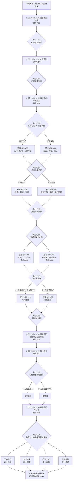

# 剧情 · 06 侠客行（正邪双线与选择节点）

> 归属（基准 §18）：`ch06_xiake` 的书界主线、正邪立场分支、选择节点、原著事件去向、锚点落地与本书结局；这是本书界主线剧情的唯一归属文档。
> 上游：`docs/00-canon.md` v1.2；`docs/decisions/author-requirements.md` AR-04、AR-09、AR-10、AR-20；`docs/decisions/author-decisions.md` G1；`design/01` §4–§7.7；`design/02`；`design/13` §4、§6.5–§6.6；`design/17`；`design/18`。
> 引用而不重定义：年代、书眠、携带与外来压制 → `design/02`；品德与声望 → `design/03`；武学与习得 → `design/05`、`design/catalog/skills-xiake-bixue.md` 及 `skills-bulu-06-xiake.md`；Boss、战斗失败与非致死结算 → `design/09`；城市、区域与路线 → `design/11` 及 `design/map/*.yaml`；任务 DSL → `design/12`（已落盘；本文兼容契约仍须迁移校验）；天书之力与结局规则 → `design/13`；门派 → `design/17`；NPC、生卒、招募与跨书界 → `design/18`。
> 标注约定：**（原创扩展）** = 原著没有的内容；**（待考）** = 原著事实尚需按三联 / 广州修订版逐字核对；**（待核实）** = 技术事实尚未联网确认；**（待实测）** = 需要实际构建或游玩验证；**【建议值】** = 依赖其他文档，先给可用值并在文末登记。
> 版本：v1.2（P06 初稿；审校 P06.R，2026-09-26）；全局审计（2026-09-26）；经脉落地终审（2026-09-29、2026-09-30）；AR-20 悲剧线改命补充（2026-10-01）。

---

## 0. 阅读指引与剧情总览

### 0.1 本文怎样使用

本文先回答“原著发生了什么、游戏把它放到哪里”，再回答“玩家如何从同一个开局走完两条都成立的主线”。

- §1 是 44 项原著关键事件的去向台账；策划删改事件前必须先改台账。
- §2 定义穿越者身份、共享开局与共享终幕。
- §3、§4 分别定义正线与邪线，各有 10 幕专属内容；共享幕不计入这 10 幕。
- §5 是所有可切线、改命和锁结局的选择节点真值表。
- §6 只落地 `design/01` §7.7 已定的五个锚点，不另造“第六锚点”。
- §7 引用 `design/13` 的天书变体，并定义 AR-20 人物悲剧改命的本界条件与结局修饰，不在剧情文档重复数值系统。
- §8 只列本剧情实际消费的 NPC 与门派 ID；人物规则仍归 `design/18`。
- §9 收束考据、原创扩展、数据契约、校验和依赖。

书界参数完全沿用基准与 `design/02`：

| 项 | 值 | 剧情用法 |
|---|---:|---|
| 书界 | `ch06_xiake` | 第六书界 |
| 游戏定年 | 约 1582–1583，明万历初**（原创扩展）** | UI 必须带“约”；不宣称为原著明示年代 |
| 境界 / 武运 / 难度 | 中武 / 70 / 6 | 不在本文换算战斗数值 |
| 敌人等级带 / 入场显示 / 上限 | 46–58 / 58 / 58 | `design/02` §3.1：主角由前界封顶 60 进入本界后显示受上限钳制为 58；江南 / 中原敌人 46–52 → 雪山 51–55 → 侠客岛 55–58**【建议值】** |
| 核心携带 / 外来压制 | 内功、拳脚、兵器各 2；外来 −2 小品 | 只在开场提示，不改系统公式 |
| 天书关键词 | 无字 | 身份之“名”与石壁之“字”互为主题 |
| 前界 | `ch05_xiaoao` | 沉睡 57 年后苏醒，见 `design/02` |
| 后界 | `ch07_bixue` | 本界结束后沉睡 47 年，见 `design/02` |

### 0.2 两条轴，不是两套开局

“正 / 邪”是玩家处理权力和他人自主性的**立场轴**，不是角色创建时锁死的阵营：

- 正线保护被错认者的姓名与选择权，愿意让事实接受公开核验，也愿意承担公开真相的成本。
- 邪线把误认、帮权、铜牌和赴岛名额当作可以经营的筹码，与贝海石、石中玉等灰色力量合作；它有完整目标、盟友、资源回报与通关结局，不是少内容的惩罚线。
- 邪线不得把石中玉对阿绣、侍剑等人的侵害包装成浪漫奖励。合作的前提始终是约束、取证、承担责任或彼此利用。
- `morality` 继承前书界并在 −100…+100 内变化；单次变化只采用 `design/03` §8.3 的 ±1…±15 范围。本文所有具体增减均为**【建议值】**。
- `fame` 是本书界 0…9999 的声望；进入本界时已按 `design/03` 清零，本文不给超出既有阈值的新等级。
- 玩家可在 `dc_06_03`、`dc_06_05`、`dc_06_07`、`dc_06_08` 改换立场；切换必须同时付出关系、资源、证据或职位代价，不能只把品德归零。

“原著 / 改命”是独立的**锚点轴**：

- 原著轴让石破天独自完成不拘文字的顿悟，石壁毁坏，龙、木二岛主逝去，群雄归返。
- 改命轴不抢石破天机缘、不修复石壁、不复活已死旧客，而是在石壁终局前使互不相同的动作、呼吸、经脉感受和口述形成可互证传承**（原创扩展）**。
- 因而正线可以走原著结局，邪线也可以付出代价完成改命；二轴组合为四个完整结局。

### 0.3 总流程图



### 0.4 幕数、汇合点与锁定规则

| 段落 | 幕 ID | 数量 | 是否计入正 / 邪专属 10 幕 | 功能 |
|---|---|---:|---|---|
| 共享开局 | `q_06_main_c_01`–`q_06_main_c_03` | 3 | 否 | 建立玄铁令、摩天崖、假帮主三个公共事实 |
| 正线 | `q_06_main_z_01`–`q_06_main_z_10` | 10 | 是 | 公开证据、限制私刑、共同赴岛 |
| 邪线 | `q_06_main_x_01`–`q_06_main_x_10` | 10 | 是 | 操作替身、经营铜牌、以密约控制赴岛 |
| 共享终幕 | `q_06_main_c_04`–`q_06_main_c_06` | 3 | 否 | 登船、腊八粥、石壁与归航 |
| 每条实玩路径 | 3 + 10 + 3 | 16 | — | 满足完整起点—发展—高潮—结局 |

三个硬汇合点：

1. `flag_06_merge_changle`：`dc_06_04` 后，双方都必须取得“石破天不是可随意替换的名字”这一事实，但可选择公开或封存。
2. `flag_06_merge_lingxiao`：`dc_06_07` 后，凌霄城不再追杀错误对象，石中玉之责已进入公开审理或密约监管。
3. `flag_06_merge_ningbo`：`dc_06_08` 后，合法持牌者、被代理者和见证名单冻结，进入共享 `q_06_main_c_04`。

不可逆锁定只有两处：

- `dc_06_08` 提交赴岛名单后，不能再改变正 / 邪结局文本的主立场，但岛上仍可选择原著 / 改命轴。
- `dc_06_09` 在石壁崩毁前提交传承方案后锁定 `tsp_06_canon` 或 `tsp_06_fate`；不得用读档外的普通任务改换。

### 0.5 叙事护栏

1. 玩家能查证“谁做过什么”，却不能替石破天回答“我是谁”；末章仍保留开放疑问。
2. 石破天的“不识字”不是愚蠢惩罚，而是跳出文字训诂、直接把图形看成运动与经脉的认知路径。
3. 侠客岛旧客自愿沉浸于参悟，岛方也明言来去自愿并备船；“群雄归返”是原著结果，不得写成玩家独有功绩。共享终幕的暂时不可返回只是一段**（原创扩展）**的副本流程锁。
4. 龙、木二岛主完成大愿后的死亡不做复活型改命；改命保存的是可验证的方法，不是永生。
5. 赏善罚恶使会读取玩家跨书界累计的 `morality` 及关键行为，只表现清算结果；算法、阈值和特色系统归 `chapters/06-xiake.md`。
6. 所有战斗默认依 `design/09` 结算为倒地、降服或剧情撤退；只有明确写有 `confirmNpcDeath` 的节点才能造成剧情死亡。
7. 任何“邪线收益”都不能以性暴力、强迫婚恋或杀害无辜作为正向奖励。
8. 侠客岛石壁只授予 `sk_taixuan` 的剧情资格；实际学习、层数和武学栏位仍由 `design/05` 与图鉴校验。
9. 各幕“关键战斗”的具名对手配装、经脉七参与遭遇级 `totalHp` 只引用 `chapters/06-xiake.md` §12.7、§12.7.1；群战、连战、增援与非战解法按该节逐幕预算分配和迁移，不按人物数量复制整条首领耐久。

---

## 1. 原著重要剧情与走向清单

### 1.1 回目版本口径

本文以三联 / 广州修订版常见 21 回旧题为索引；网络检索同时发现新修版将若干回改题。正文不混用两个版本的事件因果，也不伪造逐字引文。对应关系如下：

| 回 | 本文采用的旧题 | 检索到的新修题异名 | 处理 |
|---:|---|---|---|
| 1 | 玄铁令 | 烧饼馅子 | 事件按侯监集烧饼藏令、少年拾令与谢烟客履诺索引 |
| 2 | 少年闯大祸 | 荒唐无耻 | 只用旧题 |
| 3 | 摩天崖 | 不求人 | 只用旧题 |
| 4 | 长乐帮帮主 | 抢了他老婆 | 只用旧题，避免异名先行剧透 |
| 5 | 叮叮当当 | 丁丁当当 | 题意相同，首字存在版本字形差异 |
| 6 | 伤疤 | 腿上的剑疤 | 同一事件组 |
| 7 | 雪山剑法 | 雪山剑法 | 同题 |
| 8 | 白痴 | 白痴 | 同题 |
| 9 | 大粽子 | 大粽子 | 同题 |
| 10 | 金乌刀法 | 太阳出来了 | 同一事件组 |
| 11 | 药酒 | 毒酒和义兄 | 同一事件组 |
| 12 | 两块铜牌 | 两块铜牌 | 同题 |
| 13 | 舐犊之情 | 变得忠厚老实了 | 同一事件组；网络目录也有“舔犊”字形，正式文案待核纸书 |
| 14 | 关东四大门派 | 关东四大门派 | 同题 |
| 15 | 真相 | 真假帮主 | 同一事件组 |
| 16 | 凌霄城 | 凌霄城 | 同题 |
| 17 | 自大成狂 | 自大成狂 | 同题 |
| 18 | 有所求 | 有所求 | 同题 |
| 19 | 腊八粥 | 腊八粥 | 同题 |
| 20 | “侠客行” | “侠客行” | 同题 |
| 21 | “我是谁？” | “我是谁？” | 同题 |

回目标题仅用于定位，不作为任务标题逐字照搬。本文已于 2026-09-26 逐回核对公开可检索的三联修订版转载文本；它不是出版社权威电子本，因此人物身世等仍按 §9.1 保留考据边界，但已核实的事件顺序不再标作未知。

### 1.2 关键事件—本作去向矩阵

“主去向”是互斥统计口径；“线路落点”可补充正、邪具体幕。原著事件即便不让玩家亲历，也必须在传闻、证词、支线或“不采用”理由中有记录。

| # | 回目 | 原著关键事件 | 人物 | 地点（明代名 / 小说场景） | 原著结果 | 主去向 | 线路落点 |
|---:|---|---|---|---|---|---|---|
| E01 | 第 1 回〈玄铁令〉 | 吴道通把玄铁令藏进烧饼；少年拾饼得令，石清、闵柔及雪山派诸人追索 | `npc_shipotian`、`npc_xieyanke`、`npc_shiqing`、`npc_minrou` | 开封府外侯监集 | 谢烟客从少年手中接过玄铁令，花万紫指出持令者可令其办一件事 | 锚点 A01 | `q_06_main_c_01`、`dc_06_01`；吴道通、花万紫等未建 ID 者只作场景 NPC |
| E02 | 第 2 回〈少年闯大祸〉 | 石清、闵柔与雪山派众人说明玄铁令旧事；谢烟客夺走黑白双剑 | `npc_shiqing`、`npc_minrou`、`npc_xieyanke` | 侯监集及附近驿路 | 谢烟客确认少年是偶然得令者，仍须守诺，带少年离去 | 双线共有 | `q_06_main_c_01`；场景证词进入 A01 |
| E03 | 第 2 回〈少年闯大祸〉 | 各方试图诱使少年向谢烟客提出请求 | `npc_shipotian`、`npc_xieyanke` | 中原驿路 / 市镇**（具体地望待考）** | 少年“不求人”，谢烟客无法卸诺 | 选择节点 | `dc_06_02` 前置；玩家可教其求生但不可代他说出私欲 |
| E04 | 第 3 回〈摩天崖〉 | 少年护住被长乐帮三人围攻的大悲老人；老人临终赠十八泥人 | `npc_dabeilaoren`、`npc_shipotian`、`npc_mihengye`、`npc_xieyanke` | 侯监集去摩天崖途中山林**（具体地望待考）** | 大悲老人身亡，十八泥人随少年上摩天崖 | 双线共有 | `q_06_main_c_02`；救援仅作原创支线窗口，不取代既定主改命 |
| E05 | 第 3–4 回〈摩天崖〉〈长乐帮帮主〉 | 谢烟客利用十八泥人所示经脉，数年间故意先尽授阴脉、再授阳脉 | `npc_xieyanke`、`npc_shipotian` | 摩天崖（小说虚构地望） | 少年阴阳内息相冲，下崖后危在旦夕 | 双线共有 | `q_06_main_c_02`、`dc_06_02`；节点只决定玩家如何揭穿 / 留证，不能即时抹去数年过程 |
| E06 | 第 4 回〈长乐帮帮主〉 | 长乐帮九人上摩天崖寻失踪帮主，把少年误认作石中玉；贝海石运劲护住其心脉并带回总舵 | `npc_shipotian`、`npc_beihaishi`、`npc_mihengye`、`npc_zhanfei` | 摩天崖—镇江府长乐帮总舵 `city_zhenjiang` | 少年暂时保命，并被拥为失而复得的帮主 | 锚点 A02 | `q_06_main_c_03`、`dc_06_03`；已解决地图驻地旧映射，见 `design/17` §8.3 与 §9.9.6 追溯 |
| E07 | 第 4–5 回〈长乐帮帮主〉〈叮叮当当〉 | 丁珰数夜盗喂玄冰碧火酒压住阴阳相争；展飞击中膻中促使内息融合；少年剥去泥壳见木罗汉后练成罗汉伏魔神功 | `npc_shipotian`、`npc_beihaishi`、`npc_dingdang`、`npc_zhanfei`、`npc_dabeilaoren`（遗物） | 镇江府长乐帮总舵 | 少年经护脉、药酒与误击化险，继而从木罗汉取得完整传承 | 双线共有 | `q_06_main_c_03`；至此才授予 `sk_luohanfumo` 学习资格，层数仍由 `design/05` 决定 |
| E08 | 第 4–5 回 | 贝海石等以救治、帮主礼制和口供塑造“帮主已归”；侍剑在总舵照料少年 | `npc_beihaishi`、`npc_shipotian`、`npc_shijian` | 镇江府长乐帮总舵 | 身份错认被组织化；侍剑此段仍在总舵 | 选择节点 | 正线留证；邪线经营影主；她的第 16 回命运另见 E32 / `dc_06_04` |
| E09 | 第 5 回〈叮叮当当〉 | 丁珰将石破天误认作石中玉，与旧情和旧诺纠缠 | `npc_dingdang`、`npc_shipotian` | 镇江府—长江舟路**（细节待考）** | 私人误认加深帮主假象 | 双线共有 | `q_06_main_z_01` / `q_06_main_x_01` |
| E10 | 第 5 回 | 丁氏长辈的规矩与追逐把众人带入新的冲突 | `npc_dingbusan`、`npc_dingdang`、`npc_shipotian` | 长江沿岸**（具体州府待考）** | 少年被迫继续扮演他人 | 支线 | `q_06_bond_02`《丁氏舟行》，见 `chapters/06-xiake.md` §6.4；主线保留结果旗标 |
| E11 | 第 6 回〈伤疤〉 | 众人以腿上剑疤等身体证据辨认真假 | `npc_shipotian`、`npc_dingdang`、`npc_shiqing`、`npc_minrou` | 江南驿路 / 客舍**（待考）** | 证据互相矛盾，身份疑云未解 | 选择节点 | `dc_06_04`，证据公开或封存 |
| E12 | 第 6 回 | 石清、闵柔寻子并在亲情与证据间摇摆 | `npc_shiqing`、`npc_minrou`、`npc_shipotian` | 江南—中原路线**（待考）** | 黑白双剑把少年纳入寻子线 | 双线共有 | 正线取独立证词；邪线借亲情背书 |
| E13 | 第 7 回〈雪山剑法〉 | 雪山派追究石中玉在凌霄城所犯之事 | `npc_baiwanjian`、`npc_fengwanli`、`npc_shipotian` | 江南驿路；凌霄城旧案由证词呈现 | 错误对象面临追捕与惩罚 | 双线共有 | 两线分别处理追捕，但不得替石中玉免责 |
| E14 | 第 7 回 | 石破天从交手和演示中记下雪山剑法意理 | `npc_shipotian`、`npc_baiwanjian` | 驿路 / 舟上**（待考）** | 其过目领会能力显露 | 支线 | `q_06_faction_02`《雪剑借观》，见 `chapters/06-xiake.md` §6.3；仅开放 `sk_xueshanjianfa` 合法习得前置，不在主线白送秘籍 |
| E15 | 第 8 回〈白痴〉 | 阿绣旧事揭示石中玉曾对她造成严重伤害，真假人格形成反证 | `npc_axiu`、`npc_shizhongyu`、`npc_baiwanjian` | 凌霄城 / 雪山旧事 | 阿绣坠崖后生还相关经过展开**（细节待考）** | 双线共有 | 证词写入 `flag_06_axiu_testimony`；邪线也不能抹除 |
| E16 | 第 8 回 | 石破天的诚实、迟钝与“不知名”反衬石中玉的欺骗 | `npc_shipotian`、`npc_axiu` | 紫烟岛相关水域**（具体先后待考）** | 阿绣逐步辨出二人不同 | 双线共有 | 正线直接互信；邪线需用事实换取有限合作 |
| E17 | 第 9 回〈大粽子〉 | 丁不三等将人物裹缚、掳走，真假关系再度错位 | `npc_dingbusan`、`npc_dingdang`、`npc_shipotian` | 长江舟路 / 岛屿**（待考）** | 众人短暂受制后继续流转 | 支线 | `q_06_bond_02`《丁氏舟行》，见 `chapters/06-xiake.md` §6.4；完成后汇回 `flag_06_merge_changle` |
| E18 | 第 9 回 | 石破天仍拒绝以暴力或谎言占有他人身份 | `npc_shipotian`、`npc_dingdang` | 同上 | 丁珰的误认开始动摇 | 选择节点 | `dc_06_04` 的人格证词 |
| E19 | 第 10 回〈金乌刀法〉 | 史小翠另立金乌派，以刀法克制雪山剑法 | `npc_shixiaocui`、`npc_shipotian` | 紫烟岛（小说场景，确址待考） | 石破天成为金乌派开山弟子 | 双线共有 | `q_06_main_z_04` / `q_06_main_x_04` |
| E20 | 第 10 回 | 石破天学习金乌刀法并与阿绣建立信任 | `npc_shipotian`、`npc_shixiaocui`、`npc_axiu` | 紫烟岛 | 获得克制雪山剑法的路径 | 选择节点 | 可获 `sk_jinwudaofa` 资格；是否承诺不用来报私仇影响立场 |
| E21 | 第 11 回〈药酒〉 | 张三、李四以烈性药酒试探 / 相赠，石破天因深厚内力承受 | `npc_zhangsan06`、`npc_lisi06`、`npc_shipotian` | 江南舟路 / 岸边**（待考）** | 三人结为兄弟，赴岛线开启 | 双线共有 | `q_06_main_z_05` / `q_06_main_x_05` |
| E22 | 第 11 回 | 药酒带来的内力变化和义兄关系改变二使判断 | 同上 | 同上 | 石破天获二使特别关注 | 选择节点 | `dc_06_05`：如实受清算或交换情报 |
| E23 | 第 12 回〈两块铜牌〉 | 赏善、罚恶两块铜牌成为各派生死压力 | `npc_zhangsan06`、`npc_lisi06`、`npc_beihaishi` | 中原 / 江南各派 | 拒牌与赴约均被恐惧笼罩 | 锚点 A04 的前置 | 两线分别组织公开名单或暗盘名额 |
| E24 | 第 12 回 | 二使述说历次发牌、拒牌受罚和掌门失踪 | `npc_zhangsan06`、`npc_lisi06`、`npc_miaodi`、`npc_yucha` | 各派传闻；南海侠客岛 | 江湖形成“赴岛必死”的误解 | 旁白档案 | 只由过场与可核证档案呈现；清算算法仍归书界系统 |
| E25 | 第 13 回〈舐犊之情〉 | 石清、闵柔面对两个相貌相似的少年与亲子执念 | `npc_shiqing`、`npc_minrou`、`npc_shipotian`、`npc_shizhongyu` | 江南会面地**（待考）** | 亲情不能独自完成身份裁定 | 选择节点 | `dc_06_06`：让谁承担石中玉留下的债 |
| E26 | 第 13 回 | 石中玉逐渐被迫面对逃避赴岛与旧案的后果 | `npc_shizhongyu`、`npc_beihaishi` | 江南 / 长乐帮据点 | 真假帮主冲突趋于公开 | 邪线 | `q_06_main_x_06`，可合作但须留下责任契约 |
| E27 | 第 14 回〈关东四大门派〉 | 丁不四在镇店攻击范一飞、风良、吕正平、高三娘子等人 | `npc_dingbusi`、`npc_shipotian` | 镇店及赴镇江驿路**（具体地望待考）** | 石破天数次救人并最终出手，四派随后与他同行 | 双线共有 | `q_06_main_z_06` / `q_06_main_x_06`；四派具名者未建 ID，作场景 NPC |
| E28 | 第 14 回 | 四派认出石破天的侠义与武功，随行前往长乐帮总舵 | `npc_shipotian`、`npc_dingbusi` | 镇店—镇江府 | 原本敌对的群像成为真假帮主局的见证者 | 正线 | 正线公开见证；邪线利用但不能改写其获救事实 |
| E29 | 第 15 回〈真相〉 | 张三、李四擒来真石中玉并置于屋顶，替身计划与逃避赴岛之因曝光 | `npc_shizhongyu`、`npc_shipotian`、`npc_beihaishi`、`npc_zhangsan06`、`npc_lisi06` | 镇江府长乐帮总舵 | 两名少年同时在场，骗局无法再靠相貌维持 | 锚点 A02 收束 | `dc_06_06`；两线都必须确认“二人不同” |
| E30 | 第 15 回 | 石中玉说出司徒横退位与贝海石扶立新主的旧案 | `npc_shizhongyu`、`npc_beihaishi`；`npc_situheng` 仅在叙述中 | 镇江府长乐帮总舵 | 帮主职位显出其替罪与控制功能 | 选择节点 | 正线审议；邪线交易；司徒横本人不得作为现场战斗角色 |
| E31 | 第 16 回〈凌霄城〉 | 众人赴凌霄城，真假石中玉与阿绣证词正面碰撞 | `npc_shipotian`、`npc_shizhongyu`、`npc_axiu`、`npc_baiwanjian` | 凌霄城（小说虚构地望；地图映射后藏日喀则地区所指治所，待考） | 双生错认达到高潮 | 锚点 A03 | `q_06_main_z_07` / `q_06_main_x_07` |
| E32 | 第 16 回 | 丁珰诱石破天替换石中玉，并在离开镇江总舵前杀死前来劝阻的侍剑；其后雪山派内乱、拘押和报复威胁门派存续 | `npc_dingdang`、`npc_shijian`、`npc_shipotian`、`npc_baizizai`、`npc_baiwanjian`、`npc_fengwanli` | 镇江府—横石镇—凌霄城 | 原著轴侍剑死亡；石破天顶替上山，师门权威失控 | 选择节点 | `dc_06_04` 可提前布置保护形成 `fate_rescued`；两线随后分别止乱或夺取谈判权 |
| E33 | 第 17 回〈自大成狂〉 | 白自在夸耀武功，因见识石破天等人而受挫醒悟 | `npc_baizizai`、`npc_shipotian` | 凌霄城 | 掌门的狂态与权威被打破 | 双线共有 | `q_06_main_z_08` / `q_06_main_x_08`，Boss 只作制服战 |
| E34 | 第 17 回 | 史小翠与丁不四旧怨、雪山与金乌之争集中爆发 | `npc_shixiaocui`、`npc_dingbusi`、`npc_baizizai` | 凌霄城 | 家内旧怨与门派争端交织 | 支线 | `q_06_faction_03`《梅雪止争》，见 `chapters/06-xiake.md` §6.3；主线读取和解 / 决裂结果 |
| E35 | 第 18 回〈有所求〉 | 石中玉冒充玄铁令受令者，请谢烟客杀尽雪山派；真相揭露后，石破天以自己的唯一请求让谢烟客管教石中玉直至改过 | `npc_shizhongyu`、`npc_shipotian`、`npc_xieyanke`、`npc_shiqing`、`npc_minrou` | 镇江府长乐帮总舵—凌霄城 | 冒名号令被识破；玄铁令旧诺最终由真正受令者提出并兑现 | 选择节点 | 正邪 `z/x_09` 都必须把 `flag_06_xuantie_pledge` 从 `pending` 原子改为 `resolved`；玩家只能影响取证与监管条款 |
| E36 | 第 18 回 | 白自在以雪山派掌门身份赴岛；石破天此前已自愿替长乐帮接下铜牌，众人各以本人名义赴约 | `npc_shipotian`、`npc_baizizai`、`npc_zhangsan06`、`npc_lisi06` | 凌霄城—沿海接引处 | 被误认的替身主动承担长乐帮赴岛之约，各掌门自行承担本派之约 | 双线共有 | 正邪均可抵达 `flag_06_merge_ningbo`；不得写成妙谛、愚茶在大陆核签 |
| E37 | 第 19 回〈腊八粥〉 | 众掌门由海边登舟赴岛，以为赴宴即赴死 | 群像、`npc_longdaozhu`、`npc_mudaozhu` | 原著未明示港口；地图以宁波府 `city_ningbo`—侠客岛专船 `route_xiakedao` 承载**（原创扩展）** | 群雄抵岛；岛方说明来去自愿并备有归船 | 锚点 A04 | `q_06_main_c_04`；不可返回阶段仅为原创副本流程锁 |
| E38 | 第 19 回 | 石破天先饮腊八粥，岛上饮食并非传闻中的毒杀陷阱 | `npc_shipotian`、`npc_zhangsan06`、`npc_lisi06` | 侠客岛宴厅 | 误解开始解除；药性细节仍待考 | 双线共有 | `q_06_main_c_05` |
| E39 | 第 19 回 | 龙、木二岛主说明历年受邀者留岛参悟石壁的真相 | `npc_longdaozhu`、`npc_mudaozhu`、`npc_miaodi`、`npc_yucha` | 侠客岛 | “掌门被害”改写为“自愿沉迷参悟” | 双线共有 | 岛上调查；不得把归返误写为改命专属 |
| E40 | 第 20 回〈侠客行〉 | 各派高手按文字、注释与门派成见分别解释石壁 | 群像 | 侠客岛二十四石室 | 多年争论无统一答案 | 选择节点 | `dc_06_09` 的传承素材 |
| E41 | 第 20 回 | 不识字的石破天把字形 / 图像直接看作经脉与动作而贯通 | `npc_shipotian` | 侠客岛石室 | 石破天悟得石壁武学 | 双线共有 | `sk_taixuan` 资格只归石破天；玩家仅观摩 / 互证 |
| E42 | 第 20 回 | 石破天与龙、木二岛主试掌使壁面酥解；二岛主命弟子毁去各室图谱，随后因年高、耗竭与大愿得偿而逝，众客乘船离岛 | `npc_shipotian`、`npc_longdaozhu`、`npc_mudaozhu`、群像 | 侠客岛 | 一人顿悟、毁图与共同归航连续发生 | 锚点 A05 | `q_06_main_c_06`；原著 / 改命仅改变毁图前是否留下多元互证方法 |
| E43 | 第 21 回〈我是谁？〉 | 闰二月造成日期误会，史小翠、阿绣投海，石破天救回二人 | `npc_shixiaocui`、`npc_axiu`、`npc_shipotian`、`npc_baiwanjian` | 归航海面—大陆沿海**（具体地点待考）** | 悲剧因历法真相与救援被扭转 | 双线共有 | 共享归航救援；失败只改变伤势与关系，不令阿绣必死 |
| E44 | 第 21 回 | 众人寻至熊耳山枯草岭，梅芳姑自尽，石破天身世仍以疑问收束 | `npc_meifanggu`、`npc_shipotian`、`npc_shiqing`、`npc_minrou` | 熊耳山枯草岭（小说地名；行政归属待考） | 梅芳姑死亡；石破天不能确证自己是谁 | 选择节点 | `dc_06_10`；可救梅芳姑属普通人物改命，不改变 A05 天书轴 |

### 1.3 覆盖率表

| 统计项 | 数量 | 覆盖口径 |
|---|---:|---|
| 已登记关键事件 | 44 | `E01`–`E44` 连续、无缺号 |
| 有主线去向 | 39 | 主去向为锚点、双线共有、选择节点、正线或邪线 |
| 交书界支线 | 4 | `E10`、`E14`、`E17`、`E34`；都有回流旗标或主线结果 |
| 明确不采用 | 0 | 当前没有删除主要情节 |
| 仅旁白带过且无玩法 | 1 | `E24` 的历次拒牌惨案只用档案 / 传闻表现，不让玩家穿越回三十年前 |
| 有去向合计 | 44 / 44 | **100%**；`(39 + 4 + 1) / 44 = 100%` |
| 21 回覆盖 | 21 / 21 | 每一回至少 1 个事件落点，**100%** |

这里的“覆盖”不等于“逐段复刻”。**已解决：**四项支线事件已由 `chapters/06-xiake.md` §6.1、§6.3–§6.4 映射到三条既有任务（E10 / E17 共用《丁氏舟行》）；主线连接始终不依赖支线成功，只有额外证词、武学资格和关系变化依赖支线结果。生产任务仍按 `design/12` §2.6 迁移。

### 1.4 不采用与降格处理说明

1. 历次铜牌清算发生在玩家到来前，采用二使陈述、旧牌刻痕与门派档案，不制作可改变过去的回溯任务。
2. 原著中的长段训诂争论压缩为可交互的“动作—呼吸—经脉—字义”四类观察，不伪造原文解释。
3. 公开可检索的三联修订版第 16 回明确写侍剑被丁珰杀死；本作把提前保护、调包或藏匿侍剑设为 `dc_06_04` 的普通人物改命分支，不把她的获救并入 A05 主改命。新修版是否另改其命运仍列纸本复核，但不得据未核版本把原著轴默认成存活。
4. 大悲老人之死保留原著主流程；若支线救援，不能阻止玄铁令与泥人传承进入后续，也不能计入 `tsp_06_fate`。
5. 石破天最终身世不作“玩家查出唯一真相”的收集谜题；任何足以断言其为石中坚的玩法文案均不采用。

---

## 2. 主角定位与开局

### 2.1 穿越身份

穿越者在 `ch05_xiaoao` 结束后依 `design/02` 书眠 57 年，于约 1582 年初冬在**开封府** `city_kaifeng` 外驿路苏醒。书灵为其补上可被本时代接受的身份：“游历江湖、替故人送还旧物的无籍客”**（原创扩展）**。

这个身份有三项刻意限制：

1. 没有官府告身，不得以官差身份强行审案；剧情争议必须靠证人、物证和当事人同意解决。
2. 不自动属于任何本时代门派；上界门派声望只留历史回响，当前 `fame=0`。
3. 因携带的旧物与不老外貌容易被当作“没有来历的人”，与石破天的无名困境形成镜像，但玩家不可声称自己与他同源。

开局状态仅引用上游：`morality` 完整继承，`fame` 清零，核心武学携带各 2、外来小品压制 −2；具体结算见 `design/02`、`03`、`05`。书灵只给一句主题提示：“有字未必有名，无字未必无意。”**（原创扩展）**，不提前揭示侠客岛答案。

### 2.2 与主要人物的关系起点

| 人物 / 势力 | 起点关系 | 玩家最初所知 | 不可越界的真相 |
|---|---|---|---|
| 石破天 `npc_shipotian` | 雪地偶遇的陌生少年 | 没有正式姓名，习惯接受侮称；持令后被多人追逐 | 不替他确认生父母，不把“石中坚”当定论 |
| 谢烟客 `npc_xieyanke` | 玄铁令义务的履行者与危险保护人 | 必须响应持令者请求，却试图诱导请求 | 可揭露其教法风险，不把他改写成纯粹恶人 |
| 贝海石 `npc_beihaishi` | 尚未见面的邀约操盘者 | 长乐帮急寻“石帮主” | 他利用替身避赴岛之灾；具体动机以第 15 回证词核验 |
| 石中玉 `npc_shizhongyu` | 被误认身份的缺席者 | 留下帮主职位、情债和凌霄城旧案 | 邪线合作不等于免罪 |
| 阿绣 `npc_axiu` | 未相识的关键证人 | 无 | 她对自身遭遇和是否作证拥有决定权 |
| 张三 / 李四 | 尚未露面的清算者 | 江湖传闻中的赏善罚恶使 | 他们不是随机杀手，受侠客岛使命约束 |
| 长乐帮 `sect_changlebang` | 对玩家中立 | 地方帮会在寻失踪首领 | 其成员不是整齐划一的恶人，帮内有恐惧、求生与权争 |
| 雪山派 `sect_xueshan` | 对玩家中立 | 遥远凌霄城的剑派 | 追责有正当起因，但私刑和错认仍须制止 |

### 2.3 共享开局三幕

共享幕沿用与专属幕相同字段，以便任务工具统一解析。

#### `q_06_main_c_01` · 侯监集玄铁令

| 字段 | 内容 |
|---|---|
| 标题 | 侯监集玄铁令 |
| 原著对应事件 | 第 1–2 回〈玄铁令〉〈少年闯大祸〉：E01–E03；锚点 A01 |
| 地点 | 开封府 `city_kaifeng` 东门外侯监集，`rg_zhongyuan` |
| 参与 NPC | `npc_shipotian`、`npc_xieyanke`、`npc_shiqing`、`npc_minrou`；耿万钟、王万仞、花万紫、安奉日、吴道通等为未建稳定 ID 的场景 NPC |
| 目标与流程 | 1. 从书眠苏醒点抵达侯监集；2. 追查吴道通与金刀寨争夺的物件；3. 看见少年从烧饼中取得玄铁令；4. 非致死介入金刀寨、雪山弟子与玄素庄的争令；5. 见证谢烟客亲手从少年手中取令，花万紫当众点明“有求必应”的约束；6. 在 `dc_06_01` 决定保存何种交令证据，随后让谢烟客按原著带走少年。 |
| 关键战斗 | “侯监集争令”：普通 → 精英两段；对手以未建 ID 的金刀寨众和雪山弟子为场景单位，耿万钟等默认撤退。场景、AI、失败和非致死结算引用 `design/09`。 |
| 幕内小选择 | 先救被波及的集民：`morality +3`**【建议值】**、少一项追踪捷径；先护少年：不改品德，完整目击谢烟客取令。 |
| 幕末状态变化 | 必写 `flag_06_xuantie_seen=true`、`flag_06_xuantie_delivered=true`、`flag_06_xuantie_holder=xieyanke`、`flag_06_xuantie_beneficiary=shipotian`、`flag_06_xuantie_pledge=pending`；玄铁令承诺必定成立，进入 `dc_06_01` 后再去 `c_02`。 |
| 失败与时限 | 战败后由石清、闵柔救离乱局；原著硬事实仍保证少年得令、谢烟客取令并带他离开，只损失玩家持有的现场证词。救助窗口 6 分钟**【建议值】**，超时不阻断主线。 |

#### `q_06_main_c_02` · 大悲遗物与摩天数年

| 字段 | 内容 |
|---|---|
| 标题 | 大悲遗物与摩天数年 |
| 原著对应事件 | 第 3–4 回〈摩天崖〉〈长乐帮帮主〉：E04–E05 |
| 地点 | 中原驿路至摩天崖（小说虚构地望，待考），`rg_zhongyuan` |
| 参与 NPC | `npc_shipotian`、`npc_xieyanke`、`npc_dabeilaoren`、`npc_mihengye`（参与围攻的米香主） |
| 目标与流程 | 1. 追随谢烟客与少年离开侯监集；2. 见证少年护住被长乐帮三人围攻的大悲老人；3. 按 §7.9.2 结算老人命运：原著结果收殓，改命结果护送退场**（原创扩展）**，两路都确认十八泥人由老人自愿交给少年；4. 随少年上摩天崖，观察谢烟客诱其开口有所求；5. 以章节蒙太奇跨过数年，记录谢烟客先授阴脉、再授阳脉的异常次序；6. 在 `dc_06_02` 决定揭穿、留证或对抗，但危局仍须在下幕依次经贝海石护脉、丁珰数夜盗喂玄冰碧火酒与展飞击中膻中，才误打误撞完成调和。 |
| 关键战斗 | “摩天崖试掌”：谢烟客 Boss 教学战；胜利条件是撑过、拆解运劲或护住少年，非击杀。机制只引用 `design/09`。 |
| 幕内小选择 | 救援大悲老人按 §7.9.2 检查开局救治 / 护人埋线、医术或非致死分隔、医材与即时窗口；老人无论原著死亡或原创获救，都必须自愿把十八泥人交给少年。偷看并复制教法得捷径、`morality −3`**【建议值】**；玄铁令唯一请求不得在此提前消耗。 |
| 幕末状态变化 | 写 `flag_06_dabei_relic=true`、`flag_06_reverse_training_exposed=true`，并把 `npc_dabeilaoren.lifeState` 原子写为 `dead/fate_rescued`；石破天尚未完成阴阳调和，也尚未取得 `sk_luohanfumo` 完整学习资格；谢烟客关系按 `dc_06_02` 记信任或戒备。 |
| 失败与时限 | 观察检定全败只会缺少谢烟客主观故意的证据；石破天仍因原著因果进入下幕救治。数年蒙太奇是叙事压缩，不以现实等待表现。 |

#### `q_06_main_c_03` · 镇江救治与假帮主

| 字段 | 内容 |
|---|---|
| 标题 | 镇江救治与假帮主 |
| 原著对应事件 | 第 4–5 回〈长乐帮帮主〉〈叮叮当当〉：E06–E08；锚点 A02 开端 |
| 地点 | 镇江府 `city_zhenjiang` 长乐帮总舵；`sect_changlebang` 的现行驻地见 `design/17` §8.3 与 `design/map/sects.yaml` |
| 参与 NPC | `npc_shipotian`、`npc_beihaishi`、`npc_mihengye`、`npc_dingdang`、`npc_zhanfei`、`npc_shijian` |
| 目标与流程 | 1. 长乐帮九人上摩天崖寻找失踪帮主；2. 贝海石发现少年阴阳二气冲突，护住心脉并带回镇江总舵；3. 查明昏迷期间丁珰曾数夜盗喂玄冰碧火酒，以药力压住阴阳相争；4. 展飞夜探并击中膻中，使经药力增强的阴阳内息误打误撞融合；5. 保护被制住的侍剑并处理展飞断臂；6. 让少年剥去十八泥人的泥壳，发现木罗汉与内功图解，至此开放 `sk_luohanfumo` 学习资格；7. 查验旧帮主画像、衣物和口供矛盾；8. 在 `dc_06_03` 决定公开查证或借名掌权。 |
| 关键战斗 | “迎帮主”：展飞与堂口帮众，精英；选择止战、缴械或击败均可。 |
| 幕内小选择 | 协助少年替展飞接骨：`morality +2`、长乐帮关系 +80**【建议值】**；当众羞辱展飞：`fame +100`、长乐帮关系下降**【建议值】**。 |
| 幕末状态变化 | `flag_06_fumo_survived=true`、`flag_06_false_chief_known=true`；石破天取得 `sk_luohanfumo` 学习资格；侍剑截至本幕为 `lifeState=alive`，其第 16 回结果尚未结算；按 `dc_06_03` 进入 `q_06_main_z_01` 或 `q_06_main_x_01`。 |
| 失败与时限 | 战败后被抬入总舵，失去门外证词但不阻断；若玩家离开总舵超过 3 个游戏日**【建议值】**，贝海石先行宣布帮主归位，正线公开成本增加。 |

### 2.4 首个选择节点

形式上的首个节点是雪地中的 `dc_06_01`，它决定信任和证据；真正决定立场主线的是 `q_06_main_c_03` 后的 `dc_06_03`：

- “公开查证、先停帮主礼”进入正线；
- “保留替身、借帮权查案”进入邪线；
- 若条件不满足，始终提供“护送石破天离舵、从外查证”的正线保底，绝不因初始 `morality` 锁死主线。

### 2.5 共享终幕索引

为免在正邪章节重复，三幕共享终局统一在此登记；详细节点后果见 §5–§7。

| 幕 ID | 标题 | 原著事件 | 进入条件 | 核心输出 |
|---|---|---|---|---|
| `q_06_main_c_04` | 宁波府登船 | 第 18–19 回，E35–E37；锚点 A04 | `dc_06_08` 已冻结名单 | 启用 `route_xiakedao`，进入不可自由返航阶段 |
| `q_06_main_c_05` | 腊八粥与岛上真相 | 第 19–20 回，E38–E41 | 抵达 `city_xiakedao` | 解除“赴岛即被害”误解；收集四类参悟记录 |
| `q_06_main_c_06` | 石壁终局与归航 | 第 20–21 回，E42–E44；锚点 A05 | `dc_06_09` 已选原著 / 改命 | 石壁毁、二岛主逝、群雄归返；闰月救援、枯草岭收束、结局与天书 |

共享终幕中，正邪差异以随行 NPC、档案公开度、长乐帮后日谈和对话替换表现，不复制地图与 Boss。

---

## 3. 正线：还名于人

### 3.1 正线目标与节奏

正线不是“帮助所有正派”，而是把姓名、证词和选择权归还当事人。玩家可以与长乐帮合作，也可以反对雪山派私刑；判断标准不是门派标签，而是行为是否经得起公开核验。

| 阶段 | 幕 | 核心问题 | 主要事件 |
|---|---|---|---|
| 身份 | `q_06_main_z_01`–`q_06_main_z_03` | 相貌、情话和伤疤能否替代本人陈述？ | 丁珰误认、侍剑证言、玄素寻子 |
| 见证 | `q_06_main_z_04`–`q_06_main_z_06` | 被伤害者与敌对者的证词能否同时保存？ | 金乌刀法、药酒铜牌、真假帮主 |
| 裁断 | `q_06_main_z_07`–`q_06_main_z_08` | 如何追责而不把错人交给私刑？ | 凌霄城、白自在自大成狂 |
| 赴岛 | `q_06_main_z_09`–`q_06_main_z_10` | 谁以自己的名义承担铜牌之约？ | 有所求、共同赴约 |

正线默认门槛是 `morality >= 10`**【建议值】**，但它只影响游说捷径，不是入口硬锁；任何品德都可通过放弃帮主资源、交出伪造证据和保护证人进入。

### 3.2 第一幕 `q_06_main_z_01` · 丁珰认错

| 字段 | 内容 |
|---|---|
| 标题 | 丁珰认错 |
| 原著对应事件 | 第 5 回〈叮叮当当〉，E09–E10 |
| 地点 | 镇江府 `city_zhenjiang` 长乐帮总舵及外河埠；原著第 15 回明确称镇江总舵 |
| 参与 NPC | `npc_shipotian`、`npc_dingdang`、`npc_shijian`、`npc_beihaishi`、`npc_mihengye` |
| 目标与流程 | 见下列六步 |
| 关键战斗 | “河埠夺人”：丁氏随从与长乐帮众混战，普通；目标为分隔双方、护送石破天和侍剑撤入空仓，不设置击杀要求。 |
| 幕内小选择 | 是否让丁珰单独与石破天核对旧诺；是否把侍剑当作独立证人而非帮主财产。 |
| 幕末状态变化 | 写 `flag_06_dingdang_misread=true`、`flag_06_shijian_witness=true`；保护侍剑得 `morality +3`，拒绝冒认得长乐帮关系 −10**【建议值】**。 |
| 失败与时限 | 河埠战败则丁珰带走石破天半日，玩家从追踪场景救回；不丢主线。总舵晚钟前完成三项口供，可保留完整记录；超时只少一条语气证据。 |

目标与流程：

1. 在内宅门外拦下把侍剑当作“帮主所有物”的帮众。
2. 分别询问丁珰、侍剑和米横野，不让三人先串供。
3. 让石破天自己回答旧称呼、旧约和是否愿意见丁珰。
4. 对照石中玉旧日手书的内容类别，不展示可供背诵的全文。
5. 在河埠混战中以缴械、阻路和救人为主。
6. 将“相貌相同、记忆不符”列为待查事实，不急于宣判谁疯谁骗。

正线回报是侍剑的第一份独立证言，以及丁珰对“他也许不是天哥”的迟疑；不奖励对丁珰进行羞辱或情感操控。

### 3.3 第二幕 `q_06_main_z_02` · 伤疤不是姓名

| 字段 | 内容 |
|---|---|
| 标题 | 伤疤不是姓名 |
| 原著对应事件 | 第 6–7 回〈伤疤〉〈雪山剑法〉，E11–E14 |
| 地点 | 镇江府 `city_zhenjiang` 至河南府 `city_luoyang` 驿路；玄素庄小说锚点 |
| 参与 NPC | `npc_shipotian`、`npc_dingdang`、`npc_shiqing`、`npc_minrou`、`npc_baiwanjian`、`npc_fengwanli` |
| 目标与流程 | 见下列七步 |
| 关键战斗 | “驿亭认子”：白万剑、封万里带雪山弟子围捕，精英；胜利为护住证人直到石清、闵柔抵达。战后双方均可退场。 |
| 幕内小选择 | 同意公开检查伤疤需先取得石破天同意；强迫检查可多得一项物证但 `morality −5`、石破天信任 −15**【建议值】**。 |
| 幕末状态变化 | `flag_06_scar_inconclusive=true`；若尊重同意，`flag_06_identity_consent=true`；取得雪山追责文书副本。 |
| 失败与时限 | 护送失败不致证人死亡，封万里带走文书；玩家需在 2 个游戏日内从雪山前哨取回，否则正线第六幕少一项公开证据。 |

目标与流程：

1. 把石破天从帮主装束中换回其自选衣物，防止外观继续污染证词。
2. 前往玄素庄锚点，请石清、闵柔各自写下“为何认子”。
3. 处理丁珰提出的腿部剑疤证据，并提示伤疤只能证明经历相似。
4. 听白万剑陈述凌霄城追责，不把“雪山来人”自动判成反派。
5. 保护所有口供原件，允许各方分别封缄。
6. 在驿亭抵挡抢人，避免用石破天作诱饵。
7. 将伤疤、记忆、行为和当事人自述分栏归档。

本幕明确：身体证据也可能被误读；“查身份”不能变成剥夺身体自主权。

### 3.4 第三幕 `q_06_main_z_03` · 无名者的证词

| 字段 | 内容 |
|---|---|
| 标题 | 无名者的证词 |
| 原著对应事件 | 第 7–9 回〈雪山剑法〉〈白痴〉〈大粽子〉，E13–E18 |
| 地点 | 河南府 `city_luoyang` 周边山道与长江支线渡口**（具体原著地望待考）** |
| 参与 NPC | `npc_shipotian`、`npc_axiu`（转述 / 后段现身）、`npc_baiwanjian`、`npc_dingbusan`、`npc_dingdang`、`npc_shijian` |
| 目标与流程 | 见下列六步 |
| 关键战斗 | “缚中脱身”：丁不三一方的精英追逐；可通过割断捆缚、夺舟或谈判完成，战斗结算引用 `design/09`。 |
| 幕内小选择 | 是否向雪山派先行提交阿绣的匿名证词摘要；提交得雪山关系 +10，但可能暴露证人，保密则多一段护送**【建议值】**。 |
| 幕末状态变化 | `flag_06_axiu_testimony_stub=true`；若已为侍剑安排替身、藏身处或独立护送，写 `flag_06_shijian_protected=true`，否则她仍会在第 16 回事件窗面临原著死亡。`dc_06_04` 的“公开证人”选项解锁。 |
| 失败与时限 | 被掳后触发脱身场景，不判主线失败；侍剑保护必须在 `dc_06_04` 完成，错过后原著因果锁定，不能等第六幕再回补。 |

目标与流程：

1. 从雪山追捕文书中分离“石中玉所为”与“眼前少年相貌”两类陈述。
2. 经白万剑确认阿绣是旧案当事人，不替她写口供。
3. 从侍剑、丁珰的反应中建立两名相似者的人格差异表。
4. 遭丁氏一行掳人后，优先解除非战斗角色的捆缚。
5. 决定匿名摘要是否交给雪山派，并留下泄密追踪标记。
6. 在 `dc_06_04` 选择证据公开、封存或交换，决定下一幕的立场。

若玩家在此背弃证人并把资料卖给贝海石，可切入 `q_06_main_x_04`；代价是侍剑拒绝继续作公开证人、交出正线证据原本、`morality −8`**【建议值】**。她是否避开丁珰袭击仍由 `dc_06_04` 的保护安排独立求值。

### 3.5 第四幕 `q_06_main_z_04` · 紫烟岛金乌

| 字段 | 内容 |
|---|---|
| 标题 | 紫烟岛金乌 |
| 原著对应事件 | 第 8–10 回〈白痴〉〈大粽子〉〈金乌刀法〉，E15–E20 |
| 地点 | 紫烟岛（小说场景，杭州府外海域作导航锚点**（原创扩展）**，确址待考） |
| 参与 NPC | `npc_shipotian`、`npc_axiu`、`npc_shixiaocui`、`npc_dingbusi`、`npc_dingbusan`、`npc_baiwanjian` |
| 目标与流程 | 见下列七步 |
| 关键战斗 | “雪剑与金乌”：白万剑追队、丁不四搅局，精英连战；最后一段可由史小翠与石破天演示克制而非击倒对方。 |
| 幕内小选择 | 承诺金乌刀法只用于止争：`morality +3`、金乌关系 +15；答应替史小翠羞辱雪山派：进入邪线捷径、雪山关系 −20**【建议值】**。 |
| 幕末状态变化 | 阿绣正式确认石破天与石中玉人格不同；`flag_06_axiu_testimony=true`、`flag_06_jinwu_witness=true`；开放 `sk_jinwudaofa` 学习资格。 |
| 失败与时限 | 海边战败由阿绣引开追兵，损失一项金乌教学挑战；不影响她的证词。抵岛后 1 个游戏日内离开会错过石破天入门仪式，但可在凌霄城补记。 |

目标与流程：

1. 抵岛后先确认阿绣愿意与哪些人同场。
2. 帮史小翠搭建刀剑演示，不把其门派视作雪山附属。
3. 让石破天以已见雪山剑法回应，而非假扮石中玉。
4. 处理丁不四的挑战与白万剑的追索。
5. 阿绣自行讲述旧案；玩家只能选择公开范围，不能修改措辞。
6. 石破天拜入金乌派并取得合法传承链。
7. 将“招式可克制、门派不必互灭”写进凌霄城调停提案**（原创扩展）**。

### 3.6 第五幕 `q_06_main_z_05` · 药酒与两牌

| 字段 | 内容 |
|---|---|
| 标题 | 药酒与两牌 |
| 原著对应事件 | 第 11–12 回〈药酒〉〈两块铜牌〉，E21–E24 |
| 地点 | 镇江府外河港至中原驿路；二使行程为剧情路线，不新增城市 ID |
| 参与 NPC | `npc_shipotian`、`npc_zhangsan06`、`npc_lisi06`、`npc_beihaishi`；`npc_miaodi`、`npc_yucha` 只在三十余年前赴岛档案中出现，不在大陆出场 |
| 目标与流程 | 见下列七步 |
| 关键战斗 | “双使验心”：张三、李四 Boss 试炼；胜利条件为承受三轮清算、保护被误判的旁人或识破牌序，不能击杀二使。 |
| 幕内小选择 | 是否让二使读取前五书界的关键品德记录；如实开放得 `morality +4`，删除 / 伪造摘录得当前路线资源但 `morality −6`**【建议值】**。 |
| 幕末状态变化 | 石破天与二使建立义兄关系；`flag_06_two_envoys_met=true`、`flag_06_copper_rules_known=true`；根据 `dc_06_05` 可留正线或切邪线。 |
| 失败与时限 | 试炼失败不死亡，二使留下“待复核”牌并要求完成一项补证任务；2 个游戏日内未补证则长乐帮声望 −100、赴岛资格仍保留**【建议值】**。 |

目标与流程：

1. 阻止帮众把药酒直接判为毒物并开战。
2. 让石破天自行决定是否饮酒；玩家可先检验但不能替喝。
3. 记录药酒产生的反应，不在剧情层写永久数值。
4. 听张三、李四解释笑脸牌与怒脸牌及历次赴约。
5. 对照玩家跨书界 `morality` 和五个关键行为摘要，触发本作特色清算台词。
6. 在 Boss 试炼中保护一名与旧账无关的帮众，证明清算可指向行为而非门派标签。
7. 进入 `dc_06_05`，选择接受完整账本、交出代偿或与贝海石交换牌路。

清算只消费系统结果：例如 `morality >= 40` 可获“赏多于罚”的对白，`morality <= -40` 会先受“罚”的试炼；这两个界限沿用 `design/03` 的侠义 / 邪道分段，不定义书界算法。

### 3.7 第六幕 `q_06_main_z_06` · 两个帮主

| 字段 | 内容 |
|---|---|
| 标题 | 两个帮主 |
| 原著对应事件 | 第 13–15 回〈舐犊之情〉〈关东四大门派〉〈真相〉，E25–E30；锚点 A02 收束 |
| 地点 | 镇店及赴镇江驿路**（镇店确址待考）**；镇江府 `city_zhenjiang` 长乐帮总舵 |
| 参与 NPC | `npc_shipotian`、`npc_shizhongyu`、`npc_shiqing`、`npc_minrou`、`npc_beihaishi`、`npc_mihengye`、`npc_zhanfei`、`npc_zhangsan06`、`npc_lisi06`、`npc_dingbusi`；范一飞、风良、吕正平、高三娘子作场景 NPC；`npc_situheng` 仅在旧案叙述中 |
| 目标与流程 | 见下列八步 |
| 关键战斗 | “镇店止斗”：丁不四攻击关东四派的 Boss 级护送战；胜利是保住范一飞等人并迫使丁不四退走，随后由四派同行见证，不把司徒横写成现场敌人。 |
| 幕内小选择 | 是否让贝海石在公开账会上保留医者 / 军师身份：保留可换取帮务交接，拒绝则其关系锁敌对；均不抹除替身责任。 |
| 幕末状态变化 | `flag_06_twins_separated=true`、`flag_06_changle_truth_public=true`；石破天不再被强制称石中玉；石中玉进入 `accountable` 或 `fugitive`；经 `dc_06_06` 决定赴岛责任。 |
| 失败与时限 | 镇店战败由石破天完成原著保底救援，玩家少一份四派主动背书；入镇江总舵后半日内**【建议值】**不召开账会，贝海石先封存司徒横旧案，但张三、李四仍会带回石中玉，主线不断。 |

目标与流程：

1. 让石清、闵柔与两名少年分开会面，防止以亲情强迫口供。
2. 在镇店遭遇丁不四攻击范一飞、风良、吕正平与高三娘子，先救人再问来意。
3. 让四派说明他们只为查问前帮主司徒横下落，并随石破天、贝海石前往镇江总舵。
4. 由贝海石说明司徒横退位 / 出走的帮内版本；司徒横本人不在场，也不制造伪造“到场证词”。
5. 张三、李四带回真石中玉并置于屋顶，现场确认二人并存。
6. 账会由石中玉说出司徒横旧案与贝海石扶立傀儡的经过；贝海石、石中玉分别陈述，不能互相代责。
7. 由石破天决定是否继续临时代表长乐帮完成交接。
8. 进入 `dc_06_06`：本人赴约、石破天自愿代行、或建立双签责任。

正线不强迫石破天“恢复本名”，因为他并无可证实的本名；这里只停止别人把“石中玉”强加给他。

### 3.8 第七幕 `q_06_main_z_07` · 入雪山

| 字段 | 内容 |
|---|---|
| 标题 | 入雪山 |
| 原著对应事件 | 第 16 回〈凌霄城〉，E31–E32；锚点 A03 开端 |
| 地点 | 后藏日喀则地区所指治所 `city_shigatse`**（待考）**、凌霄城小说锚点，`rg_qingzang` |
| 参与 NPC | `npc_shipotian`、`npc_shizhongyu`、`npc_axiu`、`npc_baiwanjian`、`npc_fengwanli`、`npc_baizizai`、`npc_shixiaocui` |
| 目标与流程 | 见下列七步 |
| 关键战斗 | “雪门三关”：普通巡山、精英气寒堂、Boss 城门阵三段；目标分别为通行、护证、开庭，不杀雪山弟子。 |
| 幕内小选择 | 是否交出石中玉换取免战；未经审理直接交人会切入邪线的密押版本，`morality −6`、阿绣离队**【建议值】**。 |
| 幕末状态变化 | `flag_06_lingxiao_entered=true`；完整证据时阿绣可临时入队；雪山派关系由“敌对追捕”改为“限时听证”。 |
| 失败与时限 | 三关全败则绕山潜入，失去公开入城资格但可在内乱时补开听证；暴雪行程采用地图系统，不在本文另定伤害数值。 |

目标与流程：

1. 从 `city_shigatse` 补给点进入凌霄城山道，使用明代地图的待考称呼，不写现代国界。
2. 持白万剑文书要求以“两个相貌相同者”为前提重审。
3. 保证阿绣自行选择是否出庭，并为她安排不与石中玉直接对质的屏风方案。
4. 用金乌派见证说明刀剑互克不是杀人证据。
5. 识别城内白自在派、白万剑派和受压弟子的不同诉求。
6. 护送证物进入议事厅，避免被任一派烧毁。
7. 发现白自在的权威与心境已失衡，转入下一幕。

### 3.9 第八幕 `q_06_main_z_08` · 狂者醒时

| 字段 | 内容 |
|---|---|
| 标题 | 狂者醒时 |
| 原著对应事件 | 第 16–17 回〈凌霄城〉〈自大成狂〉，E32–E34；锚点 A03 收束 |
| 地点 | 凌霄城议事厅、冰坪与金乌派邻近锚点 |
| 参与 NPC | `npc_baizizai`、`npc_shipotian`、`npc_shizhongyu`、`npc_axiu`、`npc_shixiaocui`、`npc_baiwanjian`、`npc_fengwanli`、`npc_dingbusi` |
| 目标与流程 | 见下列八步 |
| 关键战斗 | “自大成狂”：白自在 Boss；分三阶段为逐客、夸功、见证差距，脚本与强度由 `design/09`，剧情胜利是使其停手和恢复判断。 |
| 幕内小选择 | 当众羞辱白自在可获 `fame +160` 但雪山关系 −20；给其体面复核则 `morality +4`、`fame +80`**【建议值】**。 |
| 幕末状态变化 | `flag_06_lingxiao_misread_resolved=true`；石破天、石中玉在雪山档案中分立；石中玉责任进入公开审理；`dc_06_07` 决定裁断与可否转线。 |
| 失败与时限 | Boss 战失败触发石破天挡招，玩家需完成非战斗的三证对照；不会让白自在或阿绣因战败死亡。议事厅起争后 20 分钟**【建议值】**未护住证人，改走密室听证并损失声望。 |

目标与流程：

1. 阻止失控者先对眼前“石中玉”行刑。
2. 让阿绣以隔离方式确认两人行为、语气与经历的差别。
3. 由史小翠质询白自在“以掌门威势替代事实”的做法。
4. 与白自在交手，玩家负责打断范围招式，石破天负责展现压倒性却不伤人的差距。
5. 白万剑与封万里分别说明旧案与追捕过程。
6. 确认石破天无责；石中玉的责任不得转嫁给父母、替身或门派。
7. 允许雪山派在不实施私刑的前提下提出监管与赔偿。
8. 在 `dc_06_07` 选择公开修复、密约监管或趁乱夺权。

若玩家选择趁乱拿捏白自在、封存阿绣证词并把石中玉变为筹码，则转入 `q_06_main_x_09`；代价是阿绣与白万剑离队、公开档案被销毁、`morality −10`**【建议值】**。

### 3.10 第九幕 `q_06_main_z_09` · 各有所求

| 字段 | 内容 |
|---|---|
| 标题 | 各有所求 |
| 原著对应事件 | 第 18 回〈有所求〉，E35–E36 |
| 地点 | 凌霄城；镇江府 `city_zhenjiang` 与河南府 `city_luoyang` 的书信 / 驿路节点；再往宁波府地图接引港**（原创扩展）** |
| 参与 NPC | `npc_shipotian`、`npc_shizhongyu`、`npc_xieyanke`、`npc_baizizai`、`npc_shixiaocui`、`npc_beihaishi`、`npc_zhangsan06`、`npc_lisi06`；`npc_miaodi`、`npc_yucha` 只作岛上旧客档案 |
| 目标与流程 | 见下列六步 |
| 关键战斗 | “截牌客”：惧怕赴岛的三股武林人争抢名单，精英；必须保护铜牌持有人与不愿赴岛的代理证词。 |
| 幕内小选择 | 用自身名望替一名掌门担保：要求 `fame >= 300`**【建议值】**；或交出长乐帮账本作抵押，无声望门槛但永久失去一项帮会资源。 |
| 幕末状态变化 | 形成 `roster_06_public`；若名单中每个代理都有本人同意，`flag_06_roster_consented=true`；石破天提出唯一玄铁令请求后把 `flag_06_xuantie_pledge` 从 `pending` 原子改为 `resolved`；开放岛上与妙谛、愚茶会面的预告。 |
| 失败与时限 | 截牌战败则一块铜牌短暂被夺，进入追回任务；腊月初五前**【建议值】**必须交表，逾期由二使强制补齐但失去正线结局的“共同赴约”称谓。 |

目标与流程：

1. 重演石中玉冒充受令者、要求谢烟客尽杀雪山派的危局，并以侯监集交令证词揭穿冒名。
2. 让石破天亲口使用此前一直保留的唯一请求：请谢烟客带走并管教石中玉，直到其改过；玩家只能为监管补见证和回访条款。
3. 汇总哪些门派掌门亲赴、哪些由合法代理赴约，让白自在、石中玉、石破天各自表达意愿，不准家长或帮会代签。
4. 处理贝海石提出的“让替身继续承担”方案，并把责任与职位分开。
5. 防止恐惧者抢牌或把牌塞给低阶弟子；旧赴岛者资料只作岛上会面线索，不伪造大陆核签。
6. 向宁波府地图接引港提交公开名单，并接受二使逐人确认。

### 3.11 第十幕 `q_06_main_z_10` · 同舟赴约

| 字段 | 内容 |
|---|---|
| 标题 | 同舟赴约 |
| 原著对应事件 | 第 18–19 回〈有所求〉〈腊八粥〉，E36–E37 |
| 地点 | 宁波府 `city_ningbo` 港区，`rg_zhedong`；转接 `route_xiakedao` |
| 参与 NPC | `npc_shipotian`、`npc_baizizai`、`npc_zhangsan06`、`npc_lisi06`，以及依名单同行者；`npc_miaodi`、`npc_yucha` 尚在侠客岛，不得出现在登船名单 |
| 目标与流程 | 见下列六步 |
| 关键战斗 | “焚船止约”：拒牌余党企图毁船，Boss 级场景战；胜利目标是保护船、名单与撤离平民。 |
| 幕内小选择 | 向港民公开赴岛风险可得 `morality +2`、减少补给折扣；隐去风险则补给更足但结局披露真实性下降**【建议值】**。 |
| 幕末状态变化 | `flag_06_route_locked=true`、`stance=zheng`；经 `dc_06_08` 后进入 `q_06_main_c_04`。 |
| 失败与时限 | 焚船战败后启用侠客岛备用船，玩家失去一箱见证材料但不被锁死；腊月初七夜为登船窗口，错过则二使强制过场送达并判定“迟赴”。 |

目标与流程：

1. 对照公开名单、铜牌编号与随行者本人。
2. 把临时被迫替代者从船舱中释放。
3. 向张三、李四交代所有改签理由。
4. 护住专船与港区百姓，完成焚船战。
5. 在 `dc_06_08` 最后确认以公开名单赴岛；这是正邪立场锁定点。
6. 播放离港过场，将控制权交给共享 `q_06_main_c_04`。

### 3.12 正线最短与回补路径

正线连通式：

```text
c01 → c02 → c03 → z01 → z02 → z03 → z04 → z05
    → z06 → z07 → z08 → z09 → z10 → c04 → c05 → c06
```

关键回补：

- 侍剑未作公开证人：若 `dc_06_04` 已完成秘密保护，她可在第六幕后以匿名账页恢复证词；若未保护，则原著轴已死亡，不能以普通救援补回。
- 雪山文书丢失：`q_06_main_z_07` 由封万里口述并接受交叉询问，不阻断听证。
- 名望不足 300：用长乐账本、雪山担保或个人抵押三选一，无需刷声望。
- `morality < 10`：必须交出伪造证据并放弃帮主俸禄，仍可留在正线；该代价不可通过付款买回。

---

## 4. 邪线：借名行局

### 4.1 邪线目标与伦理边界

邪线的核心乐趣是：玩家接受江湖组织确实依赖“名位、恐惧和替身”运行，于是把这些东西反过来当作工具。它不是任意杀戮线，也不是漏掉原著高潮的短线。

- 玩家与贝海石合作，让石破天在明确知情和可退出的条件下暂任“影主”**（原创扩展）**，以帮权查铜牌与保护他。
- 玩家可以与石中玉同行，但必须持有其责任契约；阿绣和侍剑的证言不可被改写成爱情竞争。
- 玩家可挑动司徒横、贝海石和雪山派彼此制衡，却必须在每个锚点留下可供未来追责的底账。
- 邪线的成功不是“所有人都怕我”，而是建立一套能在侠客岛真相揭露后仍运转的秘密盟约。其代价是公开历史残缺、部分正派同伴离队，以及玩家不得获得“共同见证”的结局称谓。

| 阶段 | 幕 | 核心问题 | 主要事件 |
|---|---|---|---|
| 影主 | `q_06_main_x_01`–`q_06_main_x_03` | 如何利用错认而不让影主失去退出权？ | 丁珰误认、侍剑账、假证网络 |
| 牌局 | `q_06_main_x_04`–`q_06_main_x_06` | 如何把门派冲突与铜牌恐惧变成谈判筹码？ | 金乌雪山交易、药酒清算、两帮主 |
| 雪押 | `q_06_main_x_07`–`q_06_main_x_08` | 如何在凌霄城夺取裁断权？ | 密押双生、白自在失势 |
| 密约 | `q_06_main_x_09`–`q_06_main_x_10` | 如何控制赴岛名单又确保路线成立？ | 人情名额、暗舟赴约 |

### 4.2 第一幕 `q_06_main_x_01` · 影主登堂

| 字段 | 内容 |
|---|---|
| 标题 | 影主登堂 |
| 原著对应事件 | 第 4–5 回〈长乐帮帮主〉〈叮叮当当〉，E07–E10 |
| 地点 | 镇江府 `city_zhenjiang` 长乐帮总舵与外河埠 |
| 参与 NPC | `npc_shipotian`、`npc_beihaishi`、`npc_dingdang`、`npc_shijian`、`npc_mihengye`、`npc_zhanfei` |
| 目标与流程 | 见下列七步 |
| 关键战斗 | “堂口问主”：不服替身的帮众挑战，精英；玩家可指定堂口次序，以擒拿、威慑或收买结束。 |
| 幕内小选择 | 告诉石破天全部风险后才请其暂代：`morality +1`、贝海石戒心 +10；隐瞒赴岛风险：即时多一项帮权，`morality −7`**【建议值】**。 |
| 幕末状态变化 | `flag_06_shadow_chief=true`；玩家获得临时查账权；石破天保留退出口令 `flag_06_shadow_exit_pledge` 时，后续可转正。 |
| 失败与时限 | 堂口战败则贝海石亲自镇场，玩家仍入局但欠其一项人情；三日**【建议值】**内未稳住两堂，帮权收益减半，不阻断。 |

目标与流程：

1. 接受贝海石“先认帮主、后谈真假”的条件。
2. 私下向石破天解释帮主、铜牌与危险，决定是否给退出口令。
3. 借帮主印调阅失踪前帮主和石中玉旧账。
4. 让展飞与米横野分别表态，识别谁忠于人、谁忠于名位。
5. 在丁珰到来时延迟揭穿身份，诱出她掌握的旧约线索。
6. 保护侍剑不被当成清理对象，并为第 16 回丁珰袭击预留替身、藏身或独立护送方案；若放任，原著死亡窗仍会触发。
7. 以影主名义接下一件低风险帮务，证明路线可运转。

### 4.3 第二幕 `q_06_main_x_02` · 内宅两本账

| 字段 | 内容 |
|---|---|
| 标题 | 内宅两本账 |
| 原著对应事件 | 第 5–6 回〈叮叮当当〉〈伤疤〉，E09–E12 |
| 地点 | 镇江府 `city_zhenjiang` 长乐帮总舵、临江仓场 |
| 参与 NPC | `npc_shipotian`、`npc_beihaishi`、`npc_shijian`、`npc_dingdang`、`npc_mihengye`、`npc_zhanfei` |
| 目标与流程 | 见下列六步 |
| 关键战斗 | “焚账人”：贝海石未控制的堂口精英试图烧掉真账；保护任一本即可过关，保全两本可开启后续互证。 |
| 幕内小选择 | 一本公开帮务，一本记录替身与赴岛债。玩家可把密账交侍剑保管（保留转正证据）或交贝海石封存（强化邪线）。 |
| 幕末状态变化 | `flag_06_changle_public_ledger=true`；密账去向写 `flag_06_secret_ledger_holder`；把侍剑是否已有独立安全安排写入 `flag_06_shijian_protected`，尚不直接判定其第 16 回生命结果。 |
| 失败与时限 | 两账皆烧毁时，由米横野记忆重建摘要，无法完成最终改命所需的“公开互证”，但仍可走邪 × 改命的密盟版本；火起后 8 分钟**【建议值】**。 |

目标与流程：

1. 以影主名义盘点堂口赋税、伤亡和赴岛准备。
2. 发现同一笔银两在“帮务”与“替主”账上用途不同。
3. 让侍剑指出石中玉旧习与眼前少年差异。
4. 借丁珰误认引出一处藏账地，但不许用她伤害侍剑。
5. 在仓场救火，选择保公开账、密账或分队保全两本。
6. 与贝海石谈判：玩家帮他暂稳帮局，他交出铜牌来路。

### 4.4 第三幕 `q_06_main_x_03` · 真假做成筹码

| 字段 | 内容 |
|---|---|
| 标题 | 真假做成筹码 |
| 原著对应事件 | 第 6–9 回〈伤疤〉〈雪山剑法〉〈白痴〉〈大粽子〉，E11–E18 |
| 地点 | 镇江府 `city_zhenjiang`—河南府 `city_luoyang` 驿路与渡口 |
| 参与 NPC | `npc_shipotian`、`npc_dingdang`、`npc_shiqing`、`npc_minrou`、`npc_baiwanjian`、`npc_dingbusan`、`npc_shijian` |
| 目标与流程 | 见下列七步 |
| 关键战斗 | “三方夺证”：雪山追队、丁氏随从与长乐暗哨三方精英战；玩家可让任两方互相牵制，但必须撤出石破天。 |
| 幕内小选择 | 制作“相貌同、伤疤异、记忆空”的不下结论卷宗；伪造成唯一石中玉可获得即时帮派声望 +160，却永久失去正线完整转线资格**【建议值】**。 |
| 幕末状态变化 | `flag_06_identity_dossier` 取 `ambiguous` 或 `forged`；石清、闵柔关系按是否欺骗下降；进入 `dc_06_04`。 |
| 失败与时限 | 三方战败后证据各失一部分；侍剑仅在 `flag_06_shijian_protected=true` 时可保留口述，未保护则由米横野账页保底。渡口开放 1 个游戏日**【建议值】**，错过则丁氏支线自动以“被掳后脱身”收束。 |

目标与流程：

1. 让石清、闵柔看见少年，却不立即交出帮中账目。
2. 从伤疤检查中提取“不可唯一识别”的结论。
3. 向雪山追队兜售“真正石中玉另有其人”的时间差。
4. 借丁氏掳人制造三方错位，趁机复制追捕文书。
5. 选择不下结论的模糊卷宗或伪造唯一身份。
6. 给石破天保留一句可随时公开否认帮主身份的话；若删去，失去后段悔改通道。
7. 在 `dc_06_04` 决定侍剑证言的归属。

若玩家公开两本账、保护侍剑并销毁伪造卷宗，可转入 `q_06_main_z_04`；代价是交还帮主印、失去影主俸禄，并被贝海石追索一幕。

### 4.5 第四幕 `q_06_main_x_04` · 借刀照雪

| 字段 | 内容 |
|---|---|
| 标题 | 借刀照雪 |
| 原著对应事件 | 第 8–10 回〈白痴〉〈大粽子〉〈金乌刀法〉，E15–E20 |
| 地点 | 紫烟岛（小说场景；杭州府外海域导航锚点**（原创扩展）**） |
| 参与 NPC | `npc_shipotian`、`npc_axiu`、`npc_shixiaocui`、`npc_baiwanjian`、`npc_dingbusi`、`npc_dingbusan` |
| 目标与流程 | 见下列七步 |
| 关键战斗 | “借刀照雪”：玩家安排金乌刀与雪山剑的公开较技，Boss 级擂台；胜负不是杀伤，而是谁先证明克制并安全收招。 |
| 幕内小选择 | 将较技结果卖给长乐帮可获帮派资源但两派关系各 −10；把完整记录交阿绣保存则保留后段改命条件**【建议值】**。 |
| 幕末状态变化 | `flag_06_jinwu_leverage=true`；可获 `sk_jinwudaofa` 学习资格，但若曾强迫阿绣作证则不开放其同伴窗口。 |
| 失败与时限 | 擂台失败不阻断，史小翠亲自完成演示；玩家少一份可交易招式记录。日落前开始演示，逾时转室内过场。 |

目标与流程：

1. 以“能破解雪山剑”为条件换史小翠暂时庇护。
2. 找到阿绣，承认玩家在利用真假身份，不以善意谎言骗她。
3. 协助石破天学习金乌刀的合法基础。
4. 挑选白万剑、封万里或雪山弟子作为演示对手。
5. 控制丁不四、丁不三不把擂台变成私怨杀局。
6. 记录双方动作，为凌霄城谈判取得技术筹码。
7. 决定记录交给谁，并让阿绣自行决定是否同行。

### 4.6 第五幕 `q_06_main_x_05` · 铜牌暗市

| 字段 | 内容 |
|---|---|
| 标题 | 铜牌暗市 |
| 原著对应事件 | 第 11–12 回〈药酒〉〈两块铜牌〉，E21–E24 |
| 地点 | 镇江府外河港、河南府 `city_luoyang` 驿道 |
| 参与 NPC | `npc_shipotian`、`npc_zhangsan06`、`npc_lisi06`、`npc_beihaishi`、`npc_mihengye`；`npc_miaodi`、`npc_yucha` 仅在旧档案中被提及 |
| 目标与流程 | 见下列七步 |
| 关键战斗 | “两牌同桌”：张三、李四 Boss 试炼与抢牌者精英战连续发生；玩家可借二使之力吓退抢牌者，但会积欠一次公开说明。 |
| 幕内小选择 | 用一条自己过去的恶行记录换取一名低阶代理免受清算：`morality +2` 但公开声望 −100；把罪责移给无辜者：`morality −10` 且关闭改命**【建议值】**。 |
| 幕末状态变化 | `flag_06_copper_market=true`、`flag_06_two_envoys_met=true`；掌握三条持牌路线；经 `dc_06_05` 可继续邪线或以交出暗市名单转正。 |
| 失败与时限 | 试炼失败仍获一条路线；抢牌者逃走会在第九幕多一队敌人。二使只停留至次日午时**【建议值】**。 |

目标与流程：

1. 让石破天自行饮或不饮药酒；不得把他当试毒工具。
2. 借其与二使结义之机询问铜牌交付规则。
3. 追踪有人买卖“代赴名额”的暗市。
4. 把旧牌、假牌、真牌分开，保留可追责编号。
5. 接受跨书界品德清算，并选择坦白、代偿或移责。
6. 与贝海石交换长乐帮持牌路线，不把算法写入剧情。
7. 在 `dc_06_05` 决定公开暗市还是继续经营。

### 4.7 第六幕 `q_06_main_x_06` · 借敌整帮

| 字段 | 内容 |
|---|---|
| 标题 | 借敌整帮 |
| 原著对应事件 | 第 13–15 回〈舐犊之情〉〈关东四大门派〉〈真相〉，E25–E30；锚点 A02 收束 |
| 地点 | 镇店及赴镇江驿路**（镇店确址待考）**；镇江府 `city_zhenjiang` 长乐帮总舵 |
| 参与 NPC | `npc_shipotian`、`npc_shizhongyu`、`npc_beihaishi`、`npc_shiqing`、`npc_minrou`、`npc_mihengye`、`npc_zhanfei`、`npc_zhangsan06`、`npc_lisi06`、`npc_dingbusi`；范一飞、风良、吕正平、高三娘子作场景 NPC；`npc_situheng` 仅在旧案叙述中 |
| 目标与流程 | 见下列八步 |
| 关键战斗 | “借势镇店”：丁不四攻击关东四派的 Boss 级护送战。邪线可延后出手换取四派欠情，却不得故意让场景 NPC 死亡；司徒横不在现场。 |
| 幕内小选择 | 让贝海石留任制衡石中玉，或扶香主议会监帮；任一方案都须记录石中玉旧案责任。司徒横去向只作后续支线线索，不能无依据扶其现场复位。 |
| 幕末状态变化 | `flag_06_twins_separated=true`；`flag_06_changle_truth_sealed=true`；石破天退出影主或在本人同意下只保留赴岛代表权；进入 `dc_06_06`。 |
| 失败与时限 | 镇店战败由石破天完成原著保底救援，玩家失去利用四派人情的筹码；入镇江总舵后半日**【建议值】**内不签密约，帮派控制权归贝海石。张三、李四仍会带回石中玉，主线不断。 |

目标与流程：

1. 提前获知丁不四将攻击范一飞等关东四派，选择何时救援以换取人情**（原创扩展）**。
2. 让四派保留“查询司徒横下落”的真实目的，诱导他们随贝海石到镇江总舵，而非伪造司徒横号令。
3. 以四派来访压力迫贝海石说明前帮主失踪与帮内拥立旧案。
4. 张三、李四带真石中玉现身，替身事实无法再隐藏。
5. 用两名少年同时在场迫贝海石与香主们重新分配帮权。
6. 让石中玉签下旧案、帮债、赴岛三项责任，不用“浪子回头”一句抹账。
7. 选择贝海石或香主议会作为帮务制衡者；司徒横仅保留待查去向**（原创扩展）**。
8. 在 `dc_06_06` 决定谁带铜牌，谁作为担保。

邪线完成 A02 的标准不是永远维持真假骗局，而是利用骗局完成权力重组后，至少在核心参与者间确认二人不同；否则后续阿绣证词和赴岛名单都无法自洽。

### 4.8 第七幕 `q_06_main_x_07` · 双生作押

| 字段 | 内容 |
|---|---|
| 标题 | 双生作押 |
| 原著对应事件 | 第 16 回〈凌霄城〉，E31–E32；锚点 A03 开端 |
| 地点 | 后藏日喀则地区所指治所 `city_shigatse`**（待考）**、凌霄城 |
| 参与 NPC | `npc_shipotian`、`npc_shizhongyu`、`npc_axiu`、`npc_baiwanjian`、`npc_fengwanli`、`npc_baizizai`、`npc_shixiaocui`、`npc_beihaishi`（远程约书） |
| 目标与流程 | 见下列七步 |
| 关键战斗 | “押上凌霄”：雪山三道关卡为精英连战；玩家同时护送两名少年，以真假难辨迫守门者放行。 |
| 幕内小选择 | 石破天可自愿作保，但不能被当人质；强迫他作押会使其离队并关闭 `tsp_06_fate`，`morality −12`**【建议值】**。 |
| 幕末状态变化 | `flag_06_lingxiao_entered=true`；`flag_06_double_pledge=true`；石中玉进入玩家监管，阿绣根据此前证据决定旁听或拒见。 |
| 失败与时限 | 关卡战败后以铜牌暗市情报换入城，二使关系下降；暴雪关闭外路后只可走密道，不影响主线。 |

目标与流程：

1. 向雪山派送出“两个石中玉都到”的模糊战书。
2. 让石中玉知晓玩家不会代其承担旧案，却可保证不被先斩后审。
3. 以石破天的自愿担保换取两人同入城。
4. 用金乌演示记录压住城门剑阵。
5. 安排阿绣隔离观察，不把她引到埋伏点。
6. 把密账副本分别交白万剑与贝海石，令两方都不能独占。
7. 进入议事厅，发现白自在已因自大与内乱失去稳定判断。

### 4.9 第八幕 `q_06_main_x_08` · 凌霄易主

| 字段 | 内容 |
|---|---|
| 标题 | 凌霄易主 |
| 原著对应事件 | 第 16–17 回〈凌霄城〉〈自大成狂〉，E32–E34；锚点 A03 收束 |
| 地点 | 凌霄城议事厅、冰坪、金乌派邻近锚点 |
| 参与 NPC | `npc_baizizai`、`npc_baiwanjian`、`npc_fengwanli`、`npc_shixiaocui`、`npc_dingbusi`、`npc_shipotian`、`npc_shizhongyu`、`npc_axiu` |
| 目标与流程 | 见下列八步 |
| 关键战斗 | “狂掌空城”：白自在 Boss；玩家诱使其依次与金乌、石破天和雪山旧部交手，积累三份失控见证后可迫其让出临时裁断权。 |
| 幕内小选择 | 公开其失控可彻底夺权但雪山关系长期敌对；只用密录迫其退居则保留合作，却让公开史料不全。 |
| 幕末状态变化 | `flag_06_lingxiao_misread_resolved=true`；石破天获无责结论；石中玉进入密约监管；`dc_06_07` 决定修复、监管或彻底夺权。 |
| 失败与时限 | Boss 失败由石破天展示差距迫停战，玩家仍可拿到密录但失去两名雪山支持者。议事厅起战后 20 分钟**【建议值】**。 |

目标与流程：

1. 让白自在先公开武功与掌门权威的主张。
2. 安排史小翠提出金乌克制，诱其接受可验证比试。
3. 留存其把错认当证据、把反对当背叛的言行。
4. Boss 战中保护雪山弟子不受掌门范围攻击。
5. 让石破天显露远胜众人的能力却拒绝伤人。
6. 以公开记录或密录换取裁断权。
7. 分开处理：石破天无责、石中玉待审、雪山内乱另议。
8. 进入 `dc_06_07`；玩家可交出密录、释放政治人质并切回正线。

若此处转正，代价是归还所有雪山把柄、把石中玉交给有证人保护的公开审理、放弃控制掌门代理；随后进入 `q_06_main_z_09`。

### 4.10 第九幕 `q_06_main_x_09` · 名额有价

| 字段 | 内容 |
|---|---|
| 标题 | 名额有价 |
| 原著对应事件 | 第 18 回〈有所求〉，E35–E36 |
| 地点 | 凌霄城—镇江府—河南府—宁波府地图接引港的路线与密会点**（接引港为原创扩展）** |
| 参与 NPC | `npc_shipotian`、`npc_shizhongyu`、`npc_xieyanke`、`npc_baizizai`、`npc_beihaishi`、`npc_zhangsan06`、`npc_lisi06`；`npc_miaodi`、`npc_yucha` 只作岛上旧客档案 |
| 目标与流程 | 见下列七步 |
| 关键战斗 | “空名争牌”：假冒代理与抢牌高手，精英；玩家可用暗市印记调离一队，剩余敌人正面解决。 |
| 幕内小选择 | 可收取银两替人改签，但每个改签必须有本人同意；无同意强行塞名额会触发二使追责并关闭改命。 |
| 幕末状态变化 | 形成 `roster_06_secret`；至少有石破天自愿赴约、两名大陆独立见证者和一名长乐帮责任人，才可提交；玄铁令旧诺依法收束，把 `flag_06_xuantie_pledge` 从 `pending` 原子改为 `resolved`。 |
| 失败与时限 | 暗市名单被抢后，由二使按铜牌原主恢复保底名单；玩家失去暗盟收益但可继续。腊月初五前**【建议值】**完成交换。 |

目标与流程：

1. 汇总铜牌原主、实际赴岛者和受益方三张表。
2. 与贝海石议定长乐帮由谁承担名义与实责。
3. 重演石中玉冒充受令者、要谢烟客尽杀雪山派的冒名利用；以侯监集证词在不可逆伤亡扩大前揭穿。
4. 让石破天亲口提出唯一请求，要求谢烟客管教石中玉至改过；邪线可把复核期限和回报写进密约，但不得换掉请求对象或继续挪用令诺。
5. 用白自在密录换雪山派一名见证者自愿同行；妙谛、愚茶只列为抵岛后可查访的旧客，不参与大陆名单交易。
6. 清理无本人同意的强迫代理，击退假冒者并回收空白名帖。
7. 让张三、李四逐项确认最低合法性。

### 4.11 第十幕 `q_06_main_x_10` · 暗舟赴约

| 字段 | 内容 |
|---|---|
| 标题 | 暗舟赴约 |
| 原著对应事件 | 第 18–19 回〈有所求〉〈腊八粥〉，E36–E37 |
| 地点 | 宁波府 `city_ningbo` 港区；转接 `route_xiakedao` |
| 参与 NPC | `npc_shipotian`、`npc_shizhongyu`（依 `dc_06_06`）、`npc_baizizai`、`npc_zhangsan06`、`npc_lisi06`；`npc_miaodi`、`npc_yucha` 尚在侠客岛，不得出现在登船名单 |
| 目标与流程 | 见下列六步 |
| 关键战斗 | “双船一牌”：竞争者劫持诱饵船，Boss 级水陆战；玩家需保住真船、铜牌与至少一名见证者。 |
| 幕内小选择 | 可让贝海石误以为玩家仍替其垄断岛上秘密，换一批补给；也可坦白密盟真正目标，失去补给但保留其后日谈转圜。 |
| 幕末状态变化 | `flag_06_route_locked=true`、`stance=xie`；经 `dc_06_08` 冻结名单，进入共享 `q_06_main_c_04`。 |
| 失败与时限 | 真船受损则改乘二使备用船；密盟物资损失一半但主线继续。腊月初七夜为登船窗口，错过即被二使押送，邪线声望收益清零。 |

目标与流程：

1. 以公开名单掩护实际名单进港。
2. 将非自愿代理从诱饵船撤下。
3. 分置铜牌原件、密账和石壁记录工具，避免一次丢尽。
4. 在双船战中保护张三、李四指认合法船。
5. 在 `dc_06_08` 最终确认密约名单；这是立场锁定点。
6. 离港后向所有同行者公开真实目的，保证后续岛上合作不是继续欺骗。

### 4.12 邪线最短与回补路径

邪线连通式：

```text
c01 → c02 → c03 → x01 → x02 → x03 → x04 → x05
    → x06 → x07 → x08 → x09 → x10 → c04 → c05 → c06
```

关键回补：

- 未设影主退出口令：`q_06_main_x_06` 两名少年同场时必须让石破天退出，否则 `q_06_main_x_07` 前触发其离队并关闭改命；路线仍可由石中玉赴岛完成原著轴。
- 密账焚毁：以米横野、展飞两份独立口述组成最低底账；只能形成密盟传承，不能改成公开学院。
- 石中玉逃走：张三、李四在 `q_06_main_x_06` 押回，玩家失去其主动同行招募窗口。
- `morality > -10` 不会挡住邪线；邪线由具体选择和已付代价判断，不要求玩家刷成负品德。
- 强迫石破天作人质或把罪责移给无辜者会关闭 `tsp_06_fate`，但仍保留邪 × 原著的完整结局，避免死档。

---

## 5. 选择节点

### 5.1 通用求值顺序

每个节点先判断硬事实，再显示数值捷径；数值不足时必须有叙事代价替代，避免从开局继承的 `morality` 或刷取不足造成死档。

```text
1. 节点是否在时机窗口内？
2. 前置事实旗标与必要 NPC 是否仍可作证？
3. 满足 morality / fame / 门派职级之一，则开放低代价选项；
4. 不满足数值时，是否可交出职位、账本、资源或关系作为替代？
5. 先写后果，再切换 nextQuest；所有切线写 routeHistory。
6. 到 dc_06_08 锁立场，到 dc_06_09 锁天书轴。
```

`morality` 的阈值只复用 `design/03` 分段：10 良善、40 侠义、−10 乖张、−40 邪道；`fame` 只复用 100 / 300 / 800 / 1600 / 3000 阈值。本文不创造 25、57 等无意义门槛。

### 5.2 节点详表

#### `dc_06_01` · 如何见证交令

- **位置**：`q_06_main_c_01` 侯监集争令后。
- **窗口**：谢烟客已从少年手中亲自接过玄铁令、尚未带他离开前；主线强制触发。
- **硬事实**：所有选项都写 `flag_06_xuantie_holder=xieyanke`、`flag_06_xuantie_delivered=true`、`flag_06_xuantie_beneficiary=shipotian`、`flag_06_xuantie_pledge=pending`；玩家无权把已经交付的令牌据为己有。
- **选项 A“请众人共同作证”**：无条件；石清、闵柔与雪山诸人留下公开证词，`morality +3`**【建议值】**，后段最容易揭穿冒名。
- **选项 B“只留双封缄证词”**：需取得任意两名现场见证者同意；不公开少年身份，`morality +1`**【建议值】**，证词分别保管。
- **选项 C“替谢烟客压下证词”**：无门槛；谢烟客关系短期改善、`morality −6`**【建议值】**，但玩家保留一份未署名烧饼 / 交令物证，确保第 18 回仍能核验。
- **后果**：三项都进入 `q_06_main_c_02`；只改变承诺的证据公开度，不改变交令、受令者或请求尚未提出。
- **可逆性**：公开证词不可收回；封缄 / 压下的证据可在第 18 回公开，但要付出保管者关系或资源。
- **汇合点**：摩天崖入口；状态必须满足 `flag_06_xuantie_holder=xieyanke`、`flag_06_xuantie_beneficiary=shipotian`、`flag_06_xuantie_pledge=pending`。

#### `dc_06_02` · 如何揭穿逆练

- **位置**：`q_06_main_c_02` 数年蒙太奇中发现先阴后阳的异常教法后。
- **条件事实**：`flag_06_xuantie_delivered=true`、十八泥人仍随石破天；谢烟客的承诺尚未由石破天提出请求。
- **选项 A“当面指出经脉冲突”**：完成医术 / 内功 / 观察中的 2 项检定，或取得大悲老人遗物说明；`morality +4`**【建议值】**，谢烟客警觉，但不改变石破天下崖时的既定危局。
- **选项 B“把两套次序分别留证”**：无条件；保留原著时序，获得 `flag_06_reverse_training_proof=true`，为第 18 回约束谢烟客提供证据。
- **选项 C“以切磋迫其停授”**：需 `fame >= 300` 或通过 Boss 教学战；`morality −3`**【建议值】**，只能迫其中断当前教学，不能让玩家抢得真法或消耗令诺。
- **选项 D“袖手，仅护住泥人”**：无条件；`morality −6`**【建议值】**，同伴信任下降；仍保住十八泥人的物品链。
- **后果**：全部进入 `q_06_main_c_03`；石破天必须依次经贝海石护脉、丁珰数夜盗喂玄冰碧火酒、展飞击中膻中而调和内息，再剥泥见木罗汉，才获得 `sk_luohanfumo` 学习资格。
- **可逆性**：已发生的数年逆练不可回滚；证据公开度可在后段改变，玄铁令唯一请求必须保留到第 18 回。
- **汇合点**：`flag_06_reverse_training_exposed=true`；`flag_06_xuantie_pledge=pending`。

#### `dc_06_03` · 帮主名位怎么用

- **位置**：`q_06_main_c_03` 查到迎主口供矛盾后；首次主线分岔。
- **选项 A“停礼、公开查证”**：无条件；进入 `q_06_main_z_01`，交回帮主印，`morality +4`、长乐帮关系 −10**【建议值】**。
- **选项 B“知情暂代、借印查账”**：需石破天同意；进入 `q_06_main_x_01`，`morality −2`、获得临时帮权**【建议值】**。
- **选项 C“瞒住少年、控制影主”**：需 `morality <= -10` 或贝海石关系达合作；进入邪线，`morality −10`，关闭 `tsp_06_fate` 直到 `dc_06_04` 主动坦白补救**【建议值】**。
- **选项 D“护送离舵，从外查”**：正线保底；放弃总舵资源，直接进入 `q_06_main_z_01` 的河埠版本。
- **后果**：设置 `flag_06_route=zheng/xie`；不锁结局。
- **可逆性**：A/B 可在 `dc_06_04` 切换；C 必须额外坦白；D 不可回收帮主印。
- **汇合点**：`flag_06_merge_changle`。

#### `dc_06_04` · 侍剑与身份账

- **位置**：`q_06_main_z_03` 或 `q_06_main_x_03` 结束；侍剑、伤疤与丁珰证词齐聚。
- **条件**：至少有 `flag_06_shijian_witness` 或米横野口述保底；窗口必须早于丁珰诱石破天去横石镇的第 16 回事件。
- **隐藏救援门槛**：A/B/C 要写 `flag_06_shijian_protected=true`，还须满足 §7.9.3：侍剑关系达到 40 或已完成两次尊重其证言 / 退路的场景**【建议值】**、至少一项独立证据、本人同意，并有总舵暗门 / 河埠渡船或轻功 qg2（50）退路；不满足时只开放 D 与不改变生命状态的证据处置。
- **选项 A“护送侍剑、公开原件”**：侍剑在场且本人同意；安排独立护送，写 `flag_06_shijian_protected=true`，进入 / 保持正线，`morality +6`，放弃影主俸禄**【建议值】**。
- **选项 B“调包藏匿、封存原件”**：需侍剑本人同意且完成风险告知；以替身房间和暗号骗过丁珰**（原创扩展）**，写 `flag_06_shijian_protected=true`，保持当前路线，公开“二人不能等同”但不暴露证人。若只有风险告知而未取得同意，只能封存 / 调包证据，不得写保护旗标。
- **选项 C“把原件交贝海石、让侍剑离舵”**：进入 / 保持邪线，换帮派资源，侍剑离队且退出本界公开证词；若她确实离舵，写 `flag_06_shijian_protected=true`，`morality −8`**【建议值】**。
- **选项 D“维持原著，不作保护”**：无条件；不额外奖励，保持 `flag_06_shijian_protected=false`；若玩家此前已布置 A/B/C 的有效保护，本项不可选。
- **后果**：决定 `identityEvidence=public/sealed/controlled` 与保护旗标；到第 16 回事件窗统一结算：保护为真则 `npc_shijian.lifeState=fate_rescued`，否则丁珰杀死侍剑并写 `dead`。A 可让旧邪线切正，C 可让旧正线切邪。侍剑死亡不关闭 A05，因为 A05 的主改命与她不是同一锚点。
- **可逆性**：死亡不可逆；`sealed` 可在 `dc_06_07` 公开，`controlled` 可盗回；已救下的侍剑可选择继续离队。
- **汇合点**：双方确认石破天不是可随意替换的空名，进入第四幕。

#### `dc_06_05` · 赏罚先算谁

- **位置**：`q_06_main_z_05` 或 `q_06_main_x_05` 的二使试炼后。
- **条件**：`flag_06_two_envoys_met=true`；二使停留至次日午时**【建议值】**。
- **选项 A“先算我跨界旧账”**：无条件；读取系统清算摘要，`morality +4`；若 `morality >= 40`，免一项战斗检定**【建议值】**。可从邪转正，但需交出暗市名单。
- **选项 B“以实际补偿代偿旧过”**：需有被保护对象或完成补证；保持路线，不改写历史记录。
- **选项 C“用铜牌情报换延后清算”**：需贝海石合作或暗市名单；进入 / 保持邪线，获得路线情报，`morality −5`**【建议值】**。
- **选项 D“把罪名移给无辜者”**：`morality −12`，维持邪线但永久关闭改命**【建议值】**；二使记 `flag_06_false_blame=true`，终幕公开追责。
- **后果**：特色系统在剧情中第一次跨书界回看玩家行为；算法仍由 `chapters/06` 定义。
- **可逆性**：A 的公开不可撤回；C 可在第九幕交回路线；D 不可逆。
- **汇合点**：长乐帮真假帮主账会。

#### `dc_06_06` · 谁承担帮主之债

- **位置**：`q_06_main_z_06` / `q_06_main_x_06` 两名少年同时出现后。
- **条件**：`flag_06_twins_separated=true`；铜牌与旧案责任已分别列出。
- **选项 A“石中玉本人承担”**：需其在场；他携牌赴约并进入监管，石破天自由。若玩家曾给其逃路，需放弃一项帮派盟约。
- **选项 B“石破天自愿代行”**：只在石破天知情、保留退出权且亲口同意时开放；`morality +3`，他持牌但不再被称石中玉**【建议值】**。
- **选项 C“双签：本人担责、代表履约”**：需公开账或两名香主签名，正邪都可；石中玉担旧案与帮债，石破天只代表长乐帮赴岛。
- **选项 D“继续偷换”**：需邪线；强令石破天替石中玉，`morality −12`、石破天离队、改命关闭**【建议值】**；由石中玉作为主线赴岛人，确保仍可通关原著轴。
- **后果**：冻结长乐帮责任分配；不改变“二人不同”。
- **可逆性**：A–C 可在 `dc_06_08` 经本人共同签署改一次；D 不可逆。
- **汇合点**：赴凌霄城。

#### `dc_06_07` · 凌霄城如何裁断

- **位置**：`q_06_main_z_08` / `q_06_main_x_08` 白自在停手后。
- **条件**：石破天无责事实已成立；阿绣本人证词若缺失，用白万剑、侍剑和时间线只能证明“不可错杀”，不能替她裁定全部旧案。
- **选项 A“公开审理、修复门规”**：需公开证据，或 `fame >= 800` + 两名门派见证**【建议值】**；进入 / 保持正线，石中玉受监管，白自在退居复核。邪线选择 A 时，须在本次结算前交出密录、释放人质并放弃临时裁断权。
- **选项 B“密约监管、换取赴岛协作”**：正邪均可；保持当前路线，证据封存，阿绣有权拒绝和解。
- **选项 C“握把柄夺裁断权”**：进入 / 保持邪线；阿绣、白万剑离队，玩家控制临时代理，但必须确认石破天无责。
- **选项 D“交出把柄、放弃权位”**：邪转正保底；归还密录、释放人质、把石中玉转公开审理，失去雪山政治资源；证据不足时只完成止乱与切线，不成立门规修复事实。
- **后果**：`flag_06_lingxiao_misread_resolved=true`，A03 必须完成。
- **可逆性**：立场仍可在 `dc_06_08` 最终调整；阿绣因 C 离队在本界不可再招。
- **汇合点**：`flag_06_merge_lingxiao`，下一步编制赴岛名单。

#### `dc_06_08` · 赴岛名单封签

- **位置**：`q_06_main_z_10` / `q_06_main_x_10` 宁波府开船前；立场轴锁定。
- **条件**：至少一名合法持牌 / 代表、石破天或石中玉之一、两名独立见证者；所有代理必须有本人同意。
- **选项 A“公开名单，同舟赴约”**：需无强迫代理；锁 `stance=zheng`，即使来自邪线也要交出暗市名单、帮主印和雪山密录。
- **选项 B“密约名单，分层知情”**：需密账或铜牌路线；锁 `stance=xie`，但登船后必须向同行者公开真实目的。
- **选项 C“由二使恢复原名单”**：保底；清除玩家名额收益，按此前主要选择锁正或邪。
- **后果**：启用 `route_xiakedao`，进入 `q_06_main_c_04`；正邪线不再切换。
- **可逆性**：不可逆；UI 二次确认并显示随行 NPC、不可返回区域和未完成支线。
- **汇合点**：`flag_06_merge_ningbo`。

#### `dc_06_09` · 无字传承留给谁

- **位置**：`q_06_main_c_05` 收齐石室观察、石壁开始崩裂前；天书轴锁定。
- **条件**：石破天在场或已由其自愿留下动作见证；不能由玩家替他完成顿悟。
- **选项 A“止笔，只见证一人顿悟”**：无条件；走原著轴，`tsp_06_canon`。玩家阻止众人趁乱拓夺残壁，保护石破天完成机缘。
- **选项 B“公开互证，不署唯一正解”**：需 `trust_long=true`、`trust_mu=true`、四类记录至少三类、至少三派见证**【建议值】**；走改命轴，`tsp_06_fate`。代价是放弃独占石壁残片、一个天级秘籍奖励位和一项门派专属回报**【建议值】**。
- **选项 C“密盟传灯”**：邪线可用；需两位岛主信任、四类记录至少三类、两名自愿保管者，且无 `flag_06_false_blame` / 强迫石破天旗标；走改命轴，传承只在互相制衡的保管者间流转。代价同 B，另公开声望不增加。
- **选项 D“抢夺石壁残片”**：无条件但失败；Boss 守卷战后残片随崩毁失去可学信息，走原著轴，`morality −10`**【建议值】**。不会夺走石破天的原著机缘。
- **后果**：A/D 写 `anchor_06_variant=canon`；B/C 写 `fate`；二岛主结局和群雄归返均不因选项改变。
- **可逆性**：不可逆；写天书变体前先做原子存档。
- **汇合点**：`q_06_main_c_06`。

#### `dc_06_10` · “我是谁”由谁回答

- **位置**：`q_06_main_c_06` 归航、闰二月救援后，熊耳山枯草岭。
- **条件**：不影响已经锁定的天书轴，只决定人物后日谈和同伴改命。
- **选项 A“让梅芳姑说完，不代石破天下结论”**：无条件；沿原著人物结果，梅芳姑自尽，石破天身世仍疑。
- **选项 B“先缴械救人，再容她自述”**：需满足 §7.9.6 的跨幕清单：石破天称谓线、独立口供 / 自愿证言、关系、医术或非致死缴械、未毁身份证据与即时窗口缺一不可；使 `npc_meifanggu` 进入 `fate_rescued`**（原创扩展）**，但仍不宣布石破天生父母。若生产数据未来允许她在此之前正式入队，才按 `design/18` §4.4 触发同伴改命代价。
- **选项 C“公开推定他就是石中坚”**：可选但叙事判为越界；石破天拒绝被定名，关系下降，结局旁白明确“证据不足”，不写成真相。
- **选项 D“离开身世争论，问他愿意叫什么”**：无条件；保留开放结尾并加强“自我选择”主题。
- **后果**：决定梅芳姑生命状态、石清 / 闵柔后日谈和石破天称谓偏好；不改变 `tsp_06_*`。
- **可逆性**：梅芳姑死亡不可逆；称谓可在余韵期调整。
- **汇合点**：四结局分发与书眠余韵。

### 5.3 节点 × 后果总表

| 节点 | 位置 | 正向选择 | 邪向选择 | 可切线 | 锚点轴 | NPC 生死 / 去留 | 是否可逆 | 汇合点 |
|---|---|---|---|---|---|---|---|---|
| `dc_06_01` | `q_06_main_c_01` 后 | 公开 / 封缄交令证词 | 替谢烟客压证 | 否 | A01 过程 | 交令与受令者不变 | 证词后段可公开 | 摩天崖 |
| `dc_06_02` | `q_06_main_c_02` 中 | 指出冲突 / 分别留证 | 逼停当前教学 / 袖手 | 否 | A01 过程 | 石破天必进镇江救治；谢烟客关系变 | 逆练不可回滚 | 长乐迎主 |
| `dc_06_03` | `q_06_main_c_03` 后 | 停礼查证 | 知情暂代 / 隐瞒控制 | **首次分线** | A02 开端 | 石破天为证人或影主 | 04 可切 | `flag_06_merge_changle` |
| `dc_06_04` | `z/x_03` 后 | 护送公开 / 调包藏匿 | 交账换资源 / 不作保护 | **双向** | A02 证据 | 侍剑 `fate_rescued` 或原著死亡 | 死亡不可逆 | 两线第 4 幕 |
| `dc_06_05` | `z/x_05` 后 | 接受旧账 / 代偿 | 延后 / 移责 | **双向** | A04 前置 | 二使信任变化 | 移责不可逆 | 真假帮主账会 |
| `dc_06_06` | `z/x_06` 后 | 本人担责 / 双签 | 强令替代 | 条件式 | A02 收束 | 石破天或石中玉赴约；离队可能 | A–C 可改一次 | 凌霄城 |
| `dc_06_07` | `z/x_08` 后 | 公开修复 | 密约 / 夺权 | **双向** | A03 收束 | 阿绣、白万剑可能离队 | 08 前可换 | `flag_06_merge_lingxiao` |
| `dc_06_08` | `z/x_10` 后 | 公开名单 | 密约名单 | **最后切线并锁定** | A04 | 随行名单冻结 | 不可逆 | `flag_06_merge_ningbo` |
| `dc_06_09` | `q_06_main_c_05` 后 | 见证原著 / 公开互证 | 密盟传灯 / 抢残片 | 不改立场 | **锁原著 / 改命** | 二岛主结局不变 | 不可逆 | 石壁终局 |
| `dc_06_10` | `q_06_main_c_06` 尾 | 不代答 / 救梅芳姑 | 强下身世结论 | 否 | 不改天书轴 | 梅芳姑生死；同伴代价 | 死亡不可逆 | 四结局 |

### 5.4 条件可满足性核算

改命所需“至少三类记录 + 至少三派公开见证”并非隐藏刷取：

| 资源 | 固定来源 | 备用来源 | 最迟取得幕 |
|---|---|---|---|
| 动作记录 | 金乌 / 雪山刀剑演示 | 石破天石室动作 | `q_06_main_c_05` |
| 呼吸记录 | 摩天崖调息 | 腊八粥后岛医观察 | `q_06_main_c_05` |
| 经脉感受 | 泥人图与 `sk_luohanfumo` 线 | 龙、木二岛主问答 | `q_06_main_c_05` |
| 字义争议 | 抵岛后妙谛、愚茶与其他旧客讨论 | 石室壁下注记 | `q_06_main_c_05` |
| 公开见证派 1 | 长乐帮 / 金乌派 / 雪山派之一 | 玄素庄 | `q_06_main_z_09` |
| 公开见证派 2 | 妙谛所代表少林 | 任一合法持牌门派 | `q_06_main_c_05` |
| 公开见证派 3 | 愚茶所代表武当 | 任一昔年旧客门派 | `q_06_main_c_05` |
| 密盟保管者 1–2 | 大陆名单中的自愿同行者（侍剑仅限已获救且本人同意） | 抵岛后两名自愿旧客 | `q_06_main_c_05` |

即使玩家漏掉全部支线，`q_06_main_c_05` 也会提供动作、呼吸、经脉三类保底观察；正线名单提供三派见证，邪线名单提供两名保管者。唯一会主动关闭改命的行为是强迫石破天、毁灭全部身份证据或把跨界罪责移给无辜者，且选择时必须明示。

---

## 6. 锚点事件与改命

### 6.1 五锚点总表

本节逐条对应 `design/01` §7.7，不把支线人物救援增列为主锚点。A01–A04 的“改命结果”是局部介入结果；只有 A05 的传承选择决定本书 `canon/fate` 天书轴。

| 锚点 | 原著结果 | 本作原著结果 | 本作改命 / 介入结果 | 触发条件 | 对后续幕与后书界的影响 |
|---|---|---|---|---|---|
| A01 玄铁令与错认身份 | 少年拾令并交给谢烟客，承诺成立；谢烟客带走少年；大悲老人死，泥人传承进入少年线 | 保持交令者为石破天、持令者为谢烟客、真正受令者为石破天，唯一请求在第 18 回前待定；届时由石破天请求谢烟客管教石中玉至改过 | 玩家可揭穿故意逆练、保存交令证据并保全石破天提出请求的自主权；大悲老人救援只作独立人物支线，不计 A05 改命 | 前段依次完成 `q_06_main_c_01–c_03`，写 `flag_06_xuantie_pledge=pending` 与 `flag_06_fumo_survived=true`；第 18 回 E35 后才把前者改为 `resolved` | 决定谢烟客关系与 `sk_luohanfumo` 学习资格；不改变后界历史起点 |
| A02 长乐帮帮主之局 | 石破天被当石中玉，成为替赴侠客岛的帮主；真石中玉后被带回 | 两人最终同场，替身目的曝光，石破天仍可自愿代表赴约 | 正线公开拆分姓名与责任；邪线先借影主整帮，再以双签 / 密约拆分责任 | `flag_06_twins_separated=true` 且完成 `dc_06_06` | 决定长乐帮公开史或密史、石中玉是否可招募；不改变 A05 的可选性，除非强迫替代 |
| A03 雪山派内乱与双生错认 | 凌霄城冲突爆发，白自在受挫醒悟，真假石中玉进一步辨明 | 石破天获无责结论；石中玉旧案不得转嫁；白自在停止失控处置 | 可建立公开审理，或用密约限制权力；两者都必须保护阿绣自主作证 | `flag_06_lingxiao_misread_resolved=true` | 决定雪山 / 金乌关系、阿绣与白万剑去留、赴岛见证类型 |
| A04 腊八粥与赏善罚恶令 | 群雄惧怕赴岛；石破天饮粥；岛上真相逐步揭露 | 所有合法赴约者登岛，饮粥与旧客真相按原著发生 | 玩家可消除强迫代理，并让二使以跨书界行为账而非简单门派标签清算**（原创扩展表现）** | `dc_06_08` 名单合法，完成 `q_06_main_c_04`、`q_06_main_c_05` | 决定谁见证石壁、公开还是秘密传承；特色规则仍归书界文档 |
| A05 石壁参悟、群雄归返与传承去向 | 石破天不拘文字悟石壁武学；石壁毁，龙、木二岛主逝；当次群雄与仍健在旧客归返；末章身世仍疑 | 见证同一结果，不保存可复核传承；得 `tsp_06_canon` | 不夺石破天机缘、不复活已故者；在石壁毁前保存至少三类互证记录，由多方口传 / 图示保管**（原创扩展）**；得 `tsp_06_fate` | `dc_06_09` B/C 的信任、记录、见证条件；并无强迫 / 移责禁旗 | 只产生后世传承回响，不改变 `ch07_bixue` 起点；A05 是本书唯一全局改命判定 |

### 6.2 A01 · 玄铁令不是所有权

玄铁令的玩法意义是“一项必须兑现的承诺”，不是玩家可转移的背包凭证。四个状态必须守恒：

```text
玄铁令已由石破天交到谢烟客手中
且 谢烟客确认石破天是真正受令者
且 唯一请求在第 18 回以前保持 pending
最终 由石破天请求谢烟客管教石中玉至改过
```

不得把已交给谢烟客的玄铁令当作玩家物品，也不得在摩天崖提前消耗承诺。`dc_06_01` 只改变交令证据公开度，`dc_06_02` 只改变逆练证据和谢烟客关系；第 18 回必须先揭穿石中玉冒名请求灭雪山派，再由石破天提出管教石中玉至改过的唯一请求。A01 收束后，石破天活过内息危局；`sk_luohanfumo` 的取得必须经贝海石护脉、丁珰数夜盗喂玄冰碧火酒、展飞击中膻中促成内息融合与泥人图解谜，不能因玩家在战斗中击败谢烟客而掉落。

大悲老人救援复用 `q_06_side_01`、`q_06_side_02` 的埋线；无论结果如何，他都先自愿把十八泥人交给石破天，随后 `q_06_main_c_02` 按 §7.9.2 清单一次性二选一写入 `npc_dabeilaoren.lifeState=dead/fate_rescued`。救援不改变 A01、A05，回归口径见 P06-T026。

### 6.3 A02 · 位置、姓名与责任拆开

A02 用三个字段避免“揭穿一切就没剧情”或“永远装下去才有邪线”：

| 字段 | 可取值 | 含义 |
|---|---|---|
| `identityFact` | `two_distinct_people` | 石破天与石中玉是不同的人；A02 完成后唯一合法值 |
| `officeHolder` | `shipotian_temp` / `shizhongyu` / `council` | 谁在当下处理帮务；邪线可暂保影主 |
| `liabilityBearer` | `shizhongyu` / `dual_signed` / `coerced_substitute` | 谁承担旧案和赴岛责任；最后一值关闭改命 |

正线把三者公开，邪线把后两者作为谈判筹码；任何路线都不能把 `identityFact` 改回“一人”。这样既覆盖第 15 回真假帮主揭露，也保留完整邪线。

### 6.4 A03 · 凌霄城先止错杀，再议内乱

A03 的硬结果有四项：

1. 石破天不是石中玉，不能因相貌承担旧案。
2. 阿绣有权决定是否、如何、在谁面前作证；缺席不等于撤销旧案。
3. 石中玉必须进入公开审理或有外部见证的密约监管；“成婚”“认亲”均不能抵销责任。
4. 白自在停止即时私刑；其是否继续任掌门由门派内容处理，本剧情只保存 `retired_review/public_review/leverage_rule` 三种结算。

局部改命的重点是制止错杀和门派互灭，而不是替雪山、金乌决定永久合并。`sect_xueshan` 与 `sect_jinwupai` 始终保持两个独立 ID。

### 6.5 A04 · 赴岛不是抽签替死

赴岛合法性核算：

```text
validDelegate(person) = invitedOrResponsible(person)
                     && informed(person)
                     && consented(person)
                     && witnessedBy >= 1

rosterReady = validDelegate(primary)
           && count(independentWitnesses) >= 2
           && copperTokenReconciled
```

以上是本文剧情条件，不直接重定义 `design/12` 的正式语法；迁移须遵守其 §2.6。`dc_06_08` 必须总有二使恢复原名单的保底，因此玩家无法靠把所有牌扔掉软锁。

赏善罚恶的跨书界戏份分三层：

- 二使展示前五书界两件“最善”和两件“最恶”的行为摘要**（原创扩展）**；具体选取算法归 `chapters/06`。
- 玩家可坦白、补偿、暂缓或移责；数值后果见 `dc_06_05`。
- 清算只影响关系、试炼顺序、见证资格与对白，不逆向篡改已经完成的前书界任务。

### 6.6 共享终幕一 `q_06_main_c_04` · 宁波府登船

| 字段 | 内容 |
|---|---|
| 标题 | 宁波府登船 |
| 原著对应事件 | 第 18–19 回〈有所求〉〈腊八粥〉，E35–E37；锚点 A04 |
| 地点 | 宁波府 `city_ningbo` 港区，经 `route_xiakedao` 航行 4 日到 `city_xiakedao`；地图区域为 `rg_zhedong` → `rg_nanhai_islands`（旧粗区别名不得用于新内容） |
| 参与 NPC | `npc_shipotian`、`npc_shizhongyu`（依名单）、`npc_baizizai`、`npc_zhangsan06`、`npc_lisi06`；正邪名单中的自愿见证者。`npc_miaodi`、`npc_yucha` 早已在岛，不参与此航次登船 |
| 目标与流程 | 1. 二使逐人核牌；2. 展示离岛前不可返回提示**（原创扩展，原著岛方允许随时离去）**；3. 正线宣读公开名单，邪线向同行者揭开分层名单；4. 处理最后一名无同意代理；5. 上船后回看跨界赏罚账；6. 经地图固定 4 日海程抵岛。 |
| 关键战斗 | 船上“惧岛哗变”：精英控制战；可说服、缴械或制服。必须保护船员，具体甲板地形和 AI 见 `design/09`。 |
| 幕内小选择 | 是否公开自己的最恶记录：公开得二使信任、失一部分当界声望；封存则不掉声望、改命需额外岛主问答。 |
| 幕末状态变化 | `flag_06_roster_frozen=true`、`flag_06_arrived_island=true`；离开开放世界进入岛上闭环。 |
| 失败与时限 | 哗变失败由二使收场，损失一名普通见证者；海程固定 4 日，属于路线数据，不以现实等待表现。 |

### 6.7 共享终幕二 `q_06_main_c_05` · 腊八粥与岛上真相

| 字段 | 内容 |
|---|---|
| 标题 | 腊八粥与岛上真相 |
| 原著对应事件 | 第 19–20 回〈腊八粥〉〈侠客行〉，E38–E41；锚点 A04 收束、A05 开端 |
| 地点 | 侠客岛 `city_xiakedao` 宴厅、旧客居所与石室群，`rg_nanhai_islands` |
| 参与 NPC | `npc_shipotian`、`npc_longdaozhu`、`npc_mudaozhu`、`npc_zhangsan06`、`npc_lisi06`、`npc_miaodi`、`npc_yucha`、`npc_baizizai`；随行见证者 |
| 目标与流程 | 1. 面对腊八粥与群雄恐惧；2. 由石破天自行先饮；3. 查访仍健在旧客；4. 分别取得龙、木二岛主信任；5. 观察各派依文字争论石壁；6. 收集动作、呼吸、经脉、字义四类记录；7. 看见石破天不识字却直接会意。 |
| 关键战斗 | “误会岛主”：群雄与岛众的 Boss 级冲突；目标是阻止双方越过致死线并完成三项事实验证，不击杀岛主或赴约掌门。与 `c_06` 共用 `chapters/06-xiake.md` §12.7.1 的龙木终局预算，群雄 / 岛众只作保护与撤离压力，不逐人追加首领耐久。 |
| 幕内小选择 | 先尝粥、让石破天自行尝、或拒饮并查厨。选择只影响信任和演出；腊八粥材料与具体功效仍标（待考），不在本文配数值。 |
| 幕末状态变化 | `flag_06_island_truth=true`；分别写 `trust_long`、`trust_mu`，不可合成单一“岛主信任”；记录集合 `records_06_shibi` 至少由主线保底三类。 |
| 失败与时限 | 冲突失败由石破天 / 二使制止，玩家少一个公开见证槽；进入石室后不得返回宁波府，直到 `q_06_main_c_06`，这是副本流程限制**（原创扩展）**，不是岛主强留。 |

龙、木二岛主的信任独立求值：

- 龙岛主看重玩家是否允许不同门派互证、是否说明记录用途。
- 木岛主看重玩家是否不抢残壁、是否保护旧客自由归返。
- 二者都达到信任不等于可以阻止其原著死亡；只解锁其在石壁崩毁前签认可传承法。

### 6.8 A05 · 石壁终局的两种结果

#### 原著轴 `anchor_06_variant=canon`

1. 石破天依自己的观看方式贯通石壁图意，玩家只负责守住空间与阻止抢夺。
2. 石壁毁坏，不能成为可采集矿点或无限拓片源。
3. 龙、木二岛主大愿得偿后逝去；不以治疗、复活或替死改写。
4. 当次赴岛群雄与仍健在旧客归返中原；这是原著结果。
5. 玩家取得《天书·侠客行》实物 `it_tianshu_06` 与 `tsp_06_canon`，效果引用 `design/13` §4.3。

#### 改命轴 `anchor_06_variant=fate`

1. 前四锚点已积累身份查证、刀剑互证、呼吸 / 经脉观察和自愿见证。
2. 石破天仍先完成自己的顿悟；玩家不能通过高 `lore` 抢答，也不能取得完整 `sk_taixuan` 秘籍。
3. 在崩毁前，由不同观察者分别复演动作、说出体感、画出路线；任何一份都自认不完整。
4. 龙、木二岛主分别核验其可重复性，留下“不署唯一正解”的约定**（原创扩展）**。
5. 石壁仍毁，二岛主仍逝，群雄仍归返；改变的是“理解方法是否随孤例而断”，而非人物复活或石壁保存。
6. 玩家放弃独占残壁、一个天级秘籍奖励位和一项门派专属回报**【建议值】**，取得 `it_tianshu_06` 与 `tsp_06_fate`。

改命条件核算：

```text
fateReady = trust_long
         && trust_mu
         && count(recordKinds) >= 3
         && (count(publicSectWitnesses) >= 3 || count(secretCustodians) >= 2)
         && !flag_06_forced_shipotian
         && !flag_06_false_blame
         && identityEvidence != destroyed
```

`3/4` 记录要求给一类容错；公开正线需三派互证，秘密邪线需两名相互制衡的自愿保管者。所有阈值均为**【建议值】**，须按 `design/12` §2.6 保留原公式迁入正式任务实例；当前迁移 manifest 与生产数据仍待落盘。

### 6.9 共享终幕三 `q_06_main_c_06` · 石壁终局与归航

| 字段 | 内容 |
|---|---|
| 标题 | 石壁终局与归航 |
| 原著对应事件 | 第 20–21 回〈侠客行〉〈我是谁？〉，E40–E44；锚点 A05 |
| 地点 | 侠客岛石室；归航海面；熊耳山枯草岭（行政归属待考） |
| 参与 NPC | `npc_shipotian`、`npc_longdaozhu`、`npc_mudaozhu`、`npc_zhangsan06`、`npc_lisi06`、`npc_baizizai`、`npc_shixiaocui`、`npc_axiu`、`npc_baiwanjian`、`npc_shiqing`、`npc_minrou`、`npc_meifanggu` |
| 目标与流程 | 1. 保护石破天完成会意；2. 在 `dc_06_09` 选择见证或互证；3. 石壁崩毁时疏散旧客；4. 见证二岛主逝去；5. 随群雄归航；6. 识破闰二月误会并救史小翠、阿绣；7. 到枯草岭触发 `dc_06_10`；8. 结算天书与四类结局。 |
| 关键战斗 | “守住无字一刻”：Boss 级守卷战，承接 `c_05` 的龙木终局预算；抢夺残壁者与崩落只作保护 / 撤离压力。`dc_06_09` D 引入的岛上护法可绕过，不占用、不消费、不迁移整场耐久槽，也不追加必须击破目标。分配与分支迁移见 `chapters/06-xiake.md` §12.7.1，战斗机制见 `design/09`。 |
| 幕内小选择 | 归航时先解释历法或先下海救人：正确顺序永远先救人；先争论会增加救援检定，但不允许阿绣因 UI 误导永久死亡。 |
| 幕末状态变化 | `flag_06_islanders_returned=true`；龙、木为 `dead`；写 `anchor_06_variant`、`stance`、局部结局组合键、`it_tianshu_06` 与一个 `tsp_06_*`；梅芳姑依 `dc_06_10` 结算。 |
| 失败与时限 | 守卷战败回到石壁开始崩毁前检查点；不可使用“书灵代笔”跳过改命关键检定，依 `design/13` 难度规则。海上救援失败触发石破天完成保底救援，玩家损失关系和评价，不制造违背主线的死亡。 |

### 6.10 与后书界的状态接口

| 本界状态 | `ch07_bixue` 只读回响 | 不得发生 |
|---|---|---|
| `anchor_06_variant=canon` | 江湖只记“一人悟尽、石壁不存”；可出现无字观法的零散传闻 | 不让后来者凭残片自动学会 `sk_taixuan` |
| `anchor_06_variant=fate` | 出现多份互相校正的动作 / 图示 / 口述，作为对“金蛇秘笈只有一种读法”的主题彩蛋**（原创扩展）** | 不改变袁崇焕、袁承志或明末历史起点 |
| `npc_shijian.lifeState=fate_rescued` | 依 `design/18` 的苏醒年健在判定开放年长侍剑重逢；能力只增不减 | 不自动入队，不无视 47 年年龄变化 |
| `npc_meifanggu.lifeState=fate_rescued` | 依名录“改命后可跨书”开放赎罪 / 见证回响**（原创扩展）** | 不把她的自述升级为石破天身世定论 |
| 大悲老人支线获救 | 优先留下泥人传承和书信回响；是否本人健在仍由 `design/18` 生卒数据判定 | 不因本剧情擅定其可活到 1630 |

若侍剑或梅芳姑在救援前曾正式加入队伍，救援成功必须发送 `companionFateRescued(ch06_xiake, [npcId])`，首次按 `design/18` §4.4 / `design/13` §6.6 支付 2 点修为余韵；同一锚点救多人仍只计一次。若未曾入队，只更新人物生命状态，不触发同伴代价。

`anchor_06_variant` 是 A05 的剧情单写者；书眠适配器按 `anchor_06_variant == fate` 派生 `design/02` §6.3 的标准 `echo_NN_fate`（本界 `NN=06`）。后界读取标准投影或本地真值必须等价，剧情节点不双写。

---

## 7. 结局

### 7.1 结局求值顺序

结局先读 `dc_06_08` 锁定的立场，再读 `dc_06_09` 锁定的锚点变体；`morality` 只替换旁白语气和 NPC 评价，不能在最后一刻覆盖玩家已经承担的路线代价。

```text
stance = zheng | xie
variant = canon | fate

(zheng, canon) -> 「无字本心」
(xie,   canon) -> 「以人决义」
(zheng, fate)  -> 「众证太玄」
(xie,   fate)  -> 「密盟传灯」
```

四种组合都满足：石破天完成石壁机缘、群雄归返、主线完成、取得一本《天书·侠客行》并可进入余韵期。它们是本文的局部组合名称，不新增正式 `end_*` ID；全局结局 ID 的定义权仍归 `design/13`。没有“邪线只能拿残书”或“原著线是假结局”。

### 7.2 正 × 原著 · 「无字本心」

| 项 | 内容 |
|---|---|
| 条件 | `stance=zheng`；`anchor_06_variant=canon` |
| 高潮 | 众人停下各自抄录，护住石破天按自己的方式贯通图意；玩家承认此刻不需要替他翻译。 |
| 石壁 / 岛主 / 群雄 | 石壁毁；龙、木二岛主逝；当次群雄与仍健在旧客归返，均按原著结果。 |
| 江湖后果 | 长乐帮公开记下“两个少年、两份责任”；雪山派以听证取代错认追杀；各派承认无人能据一份注释占有石壁。 |
| 人物余韵 | 石破天仍不能确证父母，却可拒绝别人强加的姓名；阿绣依自身选择相伴；石中玉按公开裁断承担责任。 |
| 天书 | `it_tianshu_06` + `tsp_06_canon`“无字真解”；共同本义 `lore +5`，均引用 `design/13` §4.2–§4.3。 |
| 代价与价值 | 没有留下可复核完整传承，但保住一人不可复制的顿悟与所有当事人的公开姓名。原著线的即时系统长处是本命武学层数上限 +1，见 `design/13`。 |

### 7.3 邪 × 原著 · 「以人决义」

| 项 | 内容 |
|---|---|
| 条件 | `stance=xie`；`anchor_06_variant=canon` |
| 高潮 | 密约成员本想夺取石壁解释权，却在崩毁前选择保护唯一真正会意的人；或抢夺失败后承认残片无用。 |
| 石壁 / 岛主 / 群雄 | 与原著轴相同：石壁毁、二岛主逝、群雄归返。 |
| 江湖后果 | 长乐帮与雪山派各保留一册密账，彼此制衡；公开江湖只知掌门回返，不知玩家如何经营名单。玩家在地下网络中声势上升，但无“共同见证”称谓。 |
| 人物余韵 | 石破天若保有退出权，承认玩家最后没有夺其机缘；若曾被强迫，则由石中玉完成名义赴约，石破天在结局中与玩家分道。 |
| 天书 | `it_tianshu_06` + `tsp_06_canon`；共同本义同上。 |
| 代价与价值 | 密盟仍握有帮权与人情，却没有可传后世的太玄方法；原著结果完整，不把邪线写成失败惩罚。 |

### 7.4 正 × 改命 · 「众证太玄」

| 项 | 内容 |
|---|---|
| 条件 | `stance=zheng`；`anchor_06_variant=fate`；公开见证派至少 3**【建议值】** |
| 高潮 | 石破天顿悟后，三派以上分别复演动作、呼吸与经脉感受；彼此指出错误，却不立唯一文字正解**（原创扩展）**。 |
| 石壁 / 岛主 / 群雄 | 石壁照样毁，二岛主照样逝，群雄照样归返；改命不挪用这些原著结果。 |
| 江湖后果 | 形成“众证谱”——由多派各保管一部分、定期当面互证的口传 / 图示协议**（原创扩展）**。它不等于可直接学习的 `sk_taixuan` 秘籍。 |
| 人物余韵 | 石破天是第一位会意者而非被抽取经验的工具；阿绣、侍剑等见证者可拒绝把私人经历写入公卷。 |
| 天书 | `it_tianshu_06` + `tsp_06_fate`“太玄”；共同本义 `lore +5`；成长、忆起与顿悟效果引用 `design/13` §4.3。 |
| 代价与价值 | 玩家放弃残壁所有权、一个天级秘籍奖励位和一项门派回报**【建议值】**；换来可纠错、不可独占的后世传承。 |

### 7.5 邪 × 改命 · 「密盟传灯」

| 项 | 内容 |
|---|---|
| 条件 | `stance=xie`；`anchor_06_variant=fate`；至少 2 名自愿且彼此制衡的保管者**【建议值】** |
| 高潮 | 玩家把不同记录拆开交给互不从属的保管者，并使任何一方都无法单独宣称正统；只有相聚互证时传承才成立**（原创扩展）**。 |
| 石壁 / 岛主 / 群雄 | 同上：原著的毁壁、岛主死亡与群雄归返均保留。 |
| 江湖后果 | 长乐帮的交通、雪山 / 金乌的动作记录和岛上旧客口述组成分散密盟；公开史模糊，但独占者无法垄断。 |
| 人物余韵 | 贝海石可以成为运送者但不是所有者；石中玉可以赎责后保管一份但不能以此换取阿绣原谅；石破天可随时撤回自己的口述。 |
| 天书 | `it_tianshu_06` + `tsp_06_fate`；共同本义同上。 |
| 代价与价值 | 除放弃奖励外，玩家得不到公开声望；任一保管者背约都会触发后界“缺一角”的彩蛋，但不会取消已取得天书。 |

### 7.6 结局变体，不增加第五主结局

| 变体轴 | 状态 | 四结局中的表现 |
|---|---|---|
| 侍剑 | 事件前 `lifeState=alive`；第 16 回后 `dead/fate_rescued`；招募另记 `partyState` | 获救后亲自决定是否公开内宅证词；死亡只留未署名账页，不把她降格为推动男女冲突的道具 |
| 梅芳姑 | `dead/fate_rescued` | 原著结果为自尽；救下后进入赎罪与自述，不使石破天身世变成定论 |
| 大悲老人 | `dead/fate_rescued`（支线接口） | 原著为死亡；救下只改变泥人传承的见证方式，不改 A05 |
| 石中玉 | `accountable/fugitive/contracted/recruited` | 无论哪种都保留旧案责任；入队不等于获赦 |
| 阿绣 | `witnessed/withdrew/recruited` | 她是否同行、作证、接受和解由本人选择；主线只保证海上救援结果 |
| 公开度 | `public/sealed/secret` | 改变江湖史、门派关系和后界传闻，不改变天书系统效果 |

### 7.7 天书取得与防重复写入

共享结算按以下顺序请求上游系统：

1. 校验 `flag_06_islanders_returned=true` 与 `anchor_06_variant` 已唯一赋值。
2. 发放本书唯一实物 `it_tianshu_06`；若库存 / 史匣已存在同 ID，则不重复创建。
3. 写共同本义：`lore = min(100, lore + 5)`；一次性永久写入，规则见 `design/13` §4.2。
4. 原著轴写 `tsp_06_canon`；改命轴写 `tsp_06_fate`。同一周目只能有一个。
5. 若本界救回曾入队命定死亡同伴，先按 §6.10 发送事件，再由上游结算 2 点修为余韵债；不得从天书效果中扣减。
6. 写局部结局组合键 `(stance, anchor_06_variant)`、天书录状态和余韵期入口；天书变体一经提交不可在本周目切换。若 `design/13` 后续登记正式结局 ID，再由其统一映射。

本文只陈述取得条件。精确效果完全引用 `design/13`：

| 变体 | 名称 | 本文负责的条件 | 系统效果归属 |
|---|---|---|---|
| `tsp_06_canon` | 无字真解 | `anchor_06_variant=canon` | `design/13` §4.3：本命武学在中 / 低武书界层数上限 +1，受真实层数与 10 重限制 |
| `tsp_06_fate` | 太玄 | `anchor_06_variant=fate` | `design/13` §4.3：武学经验 `bonusMult +0.15`；残篇忆起起始层数 `floor(maxLayer × 0.7)` 且受 `layerCap − 2` 钳制；顿悟基础概率 +1% |

### 7.8 余韵、书眠与下一书界钩子

取得天书后立刻触发书灵对话，玩家依 `design/02` 可选“即刻入眠”或“了却尘缘”。本界建议书眠之所沿用上游给出的**侠客岛石室**；若玩家已归航，也可通过余韵菜单回到清理后的石室入口，属于叙事传送，不恢复石壁。

余韵期至少允许完成：

- 与石破天确认他希望被怎样称呼；不提供“系统认证真名”。
- 探望侍剑、阿绣、石中玉、梅芳姑的分支结算。
- 查看长乐帮公开账或密账、雪山派裁断、金乌派独立状态。
- 选择携带武学与“本命”标记；具体 UI 和规则见 `design/02`、`design/13`。
- 查看改命传承的三份 / 两份保管摘要；不能借余韵补做 `dc_06_09`。

书眠引子：石室灯火熄灭后，毁去的石壁只剩轮廓。原著线中，书灵问“无字之处，你带走哪一层”；改命线中，远处不同人以互不相同的动作复演同一段呼吸。玩家入眠 47 年，于 `ch07_bixue` 的明末时代图层苏醒；年代差、携带结算与过场逻辑引用 `design/02` §4。

对下一书界只给三个轻量钩子：

1. 一份没有完整文字的动作札记，与《金蛇秘笈》的图文阅读形成对照**（原创扩展）**。
2. 江湖传闻中“侠客岛是杀局”改成“有人归来，却没人能说清石壁”，原著 / 改命只替换后半句。
3. 若有符合生卒判定的跨书同伴，重逢入口在苏醒后 60–120 分钟可发现**【建议值】**；是否健在及能力合并以 `design/18` 为准。

### 7.9 逆天改命机会（AR-20）

#### 7.9.1 范围、悲剧清单与共同护栏

AR-20 要求本书主要悲剧都留有“提前看见、付出代价、亲手介入”的机会。下列五条覆盖命定死亡、门派离散 / 威信崩塌与不可复得的传承；人物救援只是四个主结局上的修饰，只有石壁传承仍是决定 `tsp_06_canon/fate` 的 A05 主改命。

| 主要悲剧线 | 原著走向与关键回目 | 本作窗口 | 改命成功的本界变化 | 与天书轴关系 |
|---|---|---|---|---|
| 大悲老人遇害 | 第 3 回〈摩天崖〉：老人受围攻后身亡，临终把十八泥人留给少年；动作与措辞仍待指定版本终校**（待考）** | `q_06_side_01` / `q_06_side_02` → `q_06_main_c_02` | 少年仍护人、老人仍自愿交泥人；玩家止住伤势并送其退场疗养**（原创扩展）** | 人物改命；不改 A01、A05 |
| 侍剑被杀 | 第 16 回〈凌霄城〉：丁珰诱人替换石中玉，并杀死前来劝阻的侍剑；广州修订版措辞待考 | `q_06_main_z_01`～`q_06_main_z_03` / `q_06_main_x_01`～`q_06_main_x_03`、`q_06_faction_01` / `q_06_bond_02` → `dc_06_04` → E32 | 侍剑按自己的同意选择公开护送、藏匿或离舵，E32 时避开杀局**（原创扩展）** | 人物改命；不改 A05 |
| 凌霄城亲门相残 | 第 16–17 回〈凌霄城〉〈自大成狂〉：错认、拘押、报复与白自在失控，使师门威信和亲族关系崩裂 | `q_06_faction_02` / `q_06_faction_03`、`q_06_qiyu_09` / `q_06_qiyu_10` → `q_06_main_z_08` / `q_06_main_x_08` → `dc_06_07` | 白自在仍因受挫而醒悟；玩家把一时停手变成可申辩、可复核的门规修复**（原创扩展）** | 门派改命；不改 A05 |
| 石壁毁后理解断绝 | 第 20 回〈侠客行〉：石破天会意；石壁 / 图谱毁去，龙木二岛主大愿得偿后逝去，众客归航；具体毁壁措辞待考 | 多幕观察 → `q_06_qiyu_11` / `q_06_qiyu_12` → `dc_06_09` | 留下分散、可互证而不能单独还原的动作 / 呼吸 / 经脉记录**（原创扩展）** | **唯一 A05 主改命**，写 `tsp_06_fate` |
| 梅芳姑自尽与身世之痛 | 第 21 回〈我是谁？〉：梅芳姑自尽，石破天的身世仍以疑问收束；版本措辞待考 | `q_06_bond_01` / `q_06_bond_03`、阿绣独立证言 → `q_06_main_c_06` / `dc_06_10` | 先阻止自毁，再容她留下矛盾而非裁决性的自述**（原创扩展）**；石破天仍自选称谓 | 人物改命；不改 A05 |

共同规则如下：

1. 提示层级只引用 `design/13` §6.5：首周目仅说“此处有憾”；提示 I 给意象，提示 II 给方向，提示 III 才显示逐项清单。正文中的提示文本均为**（原创扩展）**。
2. 每条改命都必须在不可逆节点前完成至少两处埋线；临场高属性不能替代当事人同意、证物或退路。失败回落原著 / 既有分支，不锁主线。
3. 命定死亡者若在死亡事件结算前曾正式入队，成功时才发送 `companionFateRescued(ch06_xiake, [npcId])`；本界首次按 `design/13` §6.6 支付 2 点修为余韵，不足记债。未曾入队仍可救人，但不冒领同伴代价。
4. 龙、木二岛主的大愿得偿与逝去不可改；阿绣早年坠崖发生在玩家介入前，不作回溯；归航落水已有石破天原著保底，不冒充新增改命。
5. 成功只改变本界人物后来、结局镜头、A05 天书变体、后世回响与终局书契；进入 `ch07_bixue` 仍从其原著锚点起步。

#### 7.9.2 大悲老人：泥人交付之后仍有人可说话

| 项 | 设计 |
|---|---|
| 前置埋线 | ① `q_06_side_01` 先救伤者而迟到，教学“追敌与保命不可兼得”；② `q_06_side_02` 留下 `flag_06_meridian_note` 与 g1–g3 医材，教学护住心脉；③ `q_06_main_c_01` 先护少年 / 集民，使石破天记住玩家会先救人。三项至少完成两项；全有只降低操作难度，不跳过救援。 |
| 首周目 / 提示 I | 进入围攻场景且仍可回头时：“此处有憾。” / “泥人能留下经脉，一个活人还能留下为何相赠。”**（原创扩展）** |
| 提示 II | “进山林前备好护脉记录或止血医材；少年挡住第一击时，留下救人，不要追敌。”**（原创扩展）** |
| 提示 III 清单 | `[ ] 三处埋线至少完成两处`；`[ ] 石破天关系达到 20，或 q_06_main_c_01 完整保护少年 / 集民`**【建议值】**；`[ ] 医术 med≥44，或无伤完成非致死分隔目标`**【建议值】**；`[ ] 持护脉记录或 g3 医材`；`[ ] 老人交出泥人前介入`；`[ ] 未夺泥人、未代少年求令`。其中 `44=T(6)=8×6−4`，按 `design/03` §8.1 可处理 6 品伤势。 |
| 立场与时间窗 | `dc_06_03` 尚未发生，故三种开局身份都可；窗口从少年护住老人开始，到老人自愿交付泥人为止，离开山林即关闭。 |
| 关键行动 | 玩家先用非致死控制把围攻者与二人隔开，让石破天继续完成“护人”原著动作；随后按医术路径护脉，或守住老人直到药徒赶到，再护送其离开摩天崖主路**（原创扩展）**。 |
| 代价 | 消耗开局医材并放弃追敌战利品；老人因重伤退场，本界不可作为战斗同伴。其在死亡窗前不可能已入队，故不扣 2 点余韵；后世只保证泥人 / 书信回响，不保证本人活到 1630。 |
| 成功结果 | 写 `npc_dabeilaoren.lifeState=fate_rescued`；他仍把十八泥人交给石破天，`q_06_main_c_02` / `q_06_main_c_03` 的逆练、救治与 `sk_luohanfumo` 来源照常发生。中段可收到一封解释传承用意的书信**（原创扩展）**，不能据此免费学满武学。 |
| 失败 / 边界 | 追敌、夺泥人、治疗门槛不足或错过窗口，均回到 E04：老人死亡、遗物链继续，主线不断。救下也不改变谢烟客履诺、石破天经历或下一书界起点。 |

#### 7.9.3 侍剑：证人先离开将发生的杀局

| 项 | 设计 |
|---|---|
| 前置埋线 | ① `q_06_main_c_03` 保护被制住的侍剑，确认她是独立证人；② `q_06_main_z_01` 或 `q_06_main_x_01` 让她保存与旧帮主不符的内宅细节；③ `q_06_faction_01` 护住两本账，或 `q_06_bond_02` 使丁珰承认两人不同。四处至少完成两处，且必须包含侍剑本人证言。 |
| 首周目 / 提示 I | `dc_06_04` 关闭前：“此处有憾。” / “会说出两个人不同的那个人，先要有一扇能从里面打开的门。”**（原创扩展）** |
| 提示 II | “丁珰再次带石破天离舵之前，先问侍剑愿不愿走；公开护送、封存藏匿或真实离舵都能避开那一刀。”**（原创扩展）** |
| 提示 III 清单 | `[ ] flag_06_shijian_witness=true`；`[ ] 侍剑关系达到 40，或已完成两次尊重其证言 / 退路的场景`**【建议值】**；`[ ] 账页或丁珰承认错认至少一项`；`[ ] 侍剑本人同意所选保护方案`；`[ ] 已有暗门 / 渡船退路，或玩家轻功达到 qg2（50）`；`[ ] dc_06_04 选择 A/B/C 且未进入 E32`。B 另须完成风险告知；轻功只能替代固定退路，风险告知与轻功都不能替代本人同意。`40` 对应 `design/18` 的 `bondLevel=2`，只表达足以托付退路，不是招募捷径。 |
| 立场与时间窗 | 正线可公开护送，邪线可封存藏匿或交贝海石安排真实离舵；立场不决定善恶成败，当事人同意才决定。窗口止于丁珰诱石破天去横石镇前；E32 开始后不能靠战斗读条复活。 |
| 关键行动 | 在 `dc_06_04` 指定退路，并让侍剑亲自选定暗号与证言公开范围。E32 触发时玩家护送真人走总舵暗门 / 河埠渡船，或守住房间中的空床与假账页，使追杀落空**（原创扩展）**。 |
| 代价 | A 放弃影主俸禄；B 永久封存一部分公开证据；C 把原件交贝海石并让侍剑退出公开证词，另有 `morality −8`**【建议值】**。若她此前已按 `dc_06_04` 后的窗口正式入队，成功另触发本界首次 2 点修为余韵代价；未入队不扣。 |
| 成功结果 | E32 写 `npc_shijian.lifeState=fate_rescued`；她可在余韵期自行决定公开内宅证词、留在长乐帮或离开。丁珰必须面对杀意与错认造成的后果，救侍剑不自动使二人和解，也不免除石中玉旧案。 |
| 失败 / 边界 | 未取得同意、伪造“她已安全”却未送走、错过窗口，均按 E32 写 `dead`，只留下未署名账页；主线和 A05 仍可继续。后界重逢还要通过生卒 / appearance 判定，不能因获救自动跨书。 |

#### 7.9.4 凌霄城：从一时停手到门规自限

| 项 | 设计 |
|---|---|
| 前置埋线 | ① `q_06_faction_02` 归还雪山原件并完成“先审后罚”门规问答；② `q_06_faction_03` 让金乌、雪山公开演示克制而不煽动灭派；③ `q_06_qiyu_09` 先救被逐弟子，留下受压者口述；④ `q_06_qiyu_10` 以证据插入双方剑阵。至少两项，且须来自两类不同见证。 |
| 首周目 / 提示 I | 凌霄议事厅起争时：“此处有憾。” / “让一位掌门停手，只救今日；让门规先于掌门，才救得明日。”**（原创扩展）** |
| 提示 II | “入城前保存弟子与两派各一份证据；白自在停手后，选择复核而非羞辱或夺权。”**（原创扩展）** |
| 提示 III 清单 | `[ ] flag_06_lingxiao_misread_resolved=true`；`[ ] 至少两类独立门派 / 弟子见证`**【建议值】**；`[ ] fame≥800，或公开证据完整`**【建议值】**；`[ ] 阿绣证言范围获本人同意`；`[ ] 白自在非致死停手`；`[ ] dc_06_07=A`。800 是 `design/03` 既有名望阈值，不另造分段。 |
| 立场与时间窗 | 正线可直接选 A 公开修复；邪线也在同一次 `dc_06_07` 直接选 A，并须在结算 A 前交出密录、释放人质、放弃临时裁断权。D 仅为证据不足时的邪转正保底，不成立门规修复。机会只在白自在停手至赴岛名单编制前存在。 |
| 关键行动 | 非致死收束白自在后，不让石破天的武力成为新掌门权威；玩家组织阿绣隔离作证、受压弟子陈述、雪山 / 金乌复演与白万剑复核，签下“相貌不定罪、申辩先于私刑、掌门也受复核”的本界门规修订**（原创扩展）**。 |
| 代价 | 选择体面复核只得 `fame +80`，放弃羞辱路线的 `fame +160`，机会成本为 `160−80=80` 声望**【建议值】**；邪线另失去雪山密录、人质与临时裁断权。白自在退居复核，不能作为玩家的永久掌门傀儡。 |
| 成功结果 | 石破天无责、石中玉待审等硬事实不变；白自在仍经历受挫醒悟，但雪山派后日谈从“靠强者压下内乱”变为“任何人可据记录要求复核”。金乌派保持独立，阿绣可拒绝和解，亲族关系不被强行团圆。 |
| 失败 / 边界 | 正线证据不足可走 `dc_06_07=B` 密约监管；邪线可走 D 交权转正；两者都只止住当下私刑，不形成制度修复。C 则夺权并失去阿绣 / 白万剑。三者均可继续赴岛，不能把门派改命失败伪装成坏结局锁。 |

#### 7.9.5 石壁传承：留方法，不留唯一答案

| 项 | 设计 |
|---|---|
| 前置埋线 | 前期以 `q_06_side_03` 对照“有字也可能无凭”，中期以雪山 / 金乌动作互证、独立身份口供与自愿赴岛名单积累不同观察者，后期由 `q_06_qiyu_11` 补足记录、`q_06_qiyu_12` 确认归返与保管意愿；至少跨前中后期三处，不允许抵岛临时刷满。 |
| 首周目 / 提示 I | 石壁将裂时：“此处有憾。” / 沿用 `design/13` §6.5：“石壁终会毁去；该留下的不是另一部完整秘籍，而是不同人的所见。”**（原创扩展）** |
| 提示 II | 沿用 `design/13` §6.5：“毁壁之前保存至少三类可彼此核验的观察记录，并让记录分散保管；不要改变岛主之死与群雄归返。”**（原创扩展）** |
| 提示 III 清单 | `[ ] trust_long`；`[ ] trust_mu`；`[ ] records_06_shibi 四类取至少三类`**【建议值】**；`[ ] 公开三派见证，或秘密两名自愿保管者`**【建议值】**；`[ ] 未强迫石破天`；`[ ] 未移责无辜`；`[ ] identityEvidence != destroyed`。逐项即 §6.8 的 `fateReady`，不另造第二套门槛。 |
| 立场与时间窗 | 正线在 `dc_06_09=B` 公开互证；邪线在 C 分散密盟。窗口始于石破天先完成会意，止于石壁崩毁；崩毁后不能借余韵补记录或复原石壁。 |
| 关键行动 | 玩家守住顿悟现场，让观察者分别复演动作、口述呼吸、画经脉路线与说明字义，再让龙、木分别核验“可重复但不完整”；最后把记录拆给相互独立的保管者，不署唯一正解**（原创扩展）**。 |
| 代价 | **天书之力 / 奖励代价**：`tsp_06_fate` 与 `tsp_06_canon` 互斥；玩家放弃独占残壁、1 个天级秘籍奖励位与 1 项门派专属回报**【建议值】**。邪线另无公开声望；后世若一名保管者背约，只留下“缺一角”的回响。 |
| 成功结果 | 石破天仍是完整会意者；石壁仍毁、龙木仍逝、群雄仍归。结局按立场成为「众证太玄」或「密盟传灯」，取得 `it_tianshu_06 + tsp_06_fate`；记录不是 `sk_taixuan` 秘籍，也不自动授艺。 |
| 失败 / 边界 | 缺任一硬条件时 B/C 灰显，A“止笔”始终可通；D 抢残片必失败并回原著轴。成功只给 `ch07_bixue` 动作札记 / 传闻彩蛋，不改变其原著起点。 |

#### 7.9.6 梅芳姑：救下人，不替石破天认亲

| 项 | 设计 |
|---|---|
| 前置埋线 | ① `q_06_bond_01` 前两次只问石破天愿意叫什么，建立“本人有最终称谓权”；② `q_06_bond_03` 保存石清、闵柔两份独立口供，不擅自合署；③ 紫烟岛保护阿绣独立证言，明确受害者证词不能被亲族代说。三项至少完成两项，且身份材料不得被毁。 |
| 首周目 / 提示 I | 抵达枯草岭、尚可阻止自毁时：“此处有憾。” / “问‘我是谁’的人，不该再用另一个人的死换一个答案。”**（原创扩展）** |
| 提示 II | “归航前保留两份不同的家人口供，也让石破天先说出愿用的名字；到枯草岭先缴械救人，后听自述。”**（原创扩展）** |
| 提示 III 清单 | `[ ] q_06_bond_01 前两段完成`；`[ ] 两份独立口供或阿绣自愿证言齐备`；`[ ] 石破天 bond≥60`**【建议值】**；`[ ] med≥44，或完成非致死缴械检定`**【建议值】**；`[ ] identityEvidence != destroyed`；`[ ] 自毁动作前选择 dc_06_10=B`。`60` 对应 `bondLevel=3`；`44=T(6)`。 |
| 立场与时间窗 | 正邪皆可，但强迫石破天、毁尽身份证据或拿阿绣作筹码会关闭救援。窗口从玩家发现梅芳姑自毁征兆开始，到其不可逆动作发生前结束；不描写未核实的具体器物与动作。 |
| 关键行动 | 玩家先非致死缴械、隔开围观者并稳定伤势；石清、闵柔不得逼问，石破天亲口声明暂不接受任何人替他定名。待危机解除后，梅芳姑可选择自述、沉默或接受看护**（原创扩展）**。 |
| 代价 | **后世回响代价**：封存“唯一生母 / 石中坚”的英雄式定论，结局图鉴只能记“矛盾证词仍在”；玩家得不到查明身世的公开功名。若生产数据未来允许她在死亡窗前正式入队，则依通则触发本界首次 2 点余韵；按当前加入窗口在 `dc_06_10` 之后，默认不扣。 |
| 成功结果 | 写 `npc_meifanggu.lifeState=fate_rescued`，开放余韵赎罪 / 看护，不配置凭空武学；石破天仍可在 `q_06_bond_01` 第三段选择称谓。石氏夫妇可继续求证，却不能把关系愿望写成系统真相。 |
| 失败 / 边界 | 错过窗口或选择 A，按 E44 写梅芳姑死亡；选择 C 只会被叙事判“证据不足”，不能偷渡成功。救下也不洗去她造成的伤害，不保证跨书健在，不改变《碧血剑》开局。 |

#### 7.9.7 代价归类与组合结算

| 改命线 | `design/13` 代价类型的本界落点 | 可否与其他线同周目叠加 |
|---|---|---|
| 大悲老人 | 后世回响 + 资源机会成本：耗医材、失追敌战利品；只保书信 / 传承回响，不承诺活体重逢 | 可 |
| 侍剑 | 同伴 / 证据：若曾入队，本界首次救命支付 2 余韵；另在俸禄、公开证据或帮派控制中三选一让渡 | 可 |
| 凌霄城 | 声望 / 权位：`160−80=80` 声望机会成本；邪线再交密录、人质与裁断权 | 可 |
| 石壁传承 | 天书之力 / 高阶奖励：`tsp_06_fate` 与 canon 互斥，放弃 1 个天级秘籍奖励位与 1 项门派回报**【建议值】** | 可；唯一决定天书轴 |
| 梅芳姑 | 后世回响：永久放弃唯一身世定论与相应公开功名；当前 DAG 默认不触发同伴余韵 | 可 |

同一周目可救多人，但 `design/13` §6.6 的 2 点余韵按“本书界第一次成功发送同伴改命事件”只收一次；各线自己的资源、证据、声望、权位或后世回响代价仍分别结算。五线成功数量不改变四结局笛卡尔积，也不额外生成 `tsp_*`、`end_*`、`npc_*` 或 `q_*` ID。

---

## 8. NPC 与门派清单

### 8.1 主线 NPC 全量清单

本节复用 `design/18` 与 `design/catalog/npcs-ch06-xiake.md` 的 26 个稳定 ID，不重新裁定生卒年、能力层数或 D1–D5 定义。名录中的“跨书否”也不由本文改写；本文只给主线用途、首次出现和招募窗口。

| NPC ID | 人物 | D 级 | 首次 / 主要幕 | 主线职责 | 本文招募或结盟窗口 | 离队 / 锁定 |
|---|---|---:|---|---|---|---|
| `npc_shipotian` | 石破天 | D5 | `c_01` 起，全线 | 无名者、替身、赴岛代表、石壁唯一顿悟者 | `c_03` 镇江救治完成且本人同意后可短时同行；`dc_06_03` 后随路线锁主线同行 | 强迫作押 / 替代则离队；`c_05` 为终幕强制在场或留下自愿动作见证 |
| `npc_shizhongyu` | 石中玉 | D5 | `z/x_06` 起 | 真帮主、旧案责任人、邪线同行者 | 邪线 `x_06` 签责任契约后可招；正线仅审理 / 押送短时同行 | 逃责、伤害证人或拒绝契约即离队；入队不等于获赦 |
| `npc_shiqing` | 石清 | D4 | `z/x_02`、第六幕 | 寻子证人、玄素庄代表 | 完成两份独立口供、未强迫认亲，`z_06` 后短时招募 | 若玩家伪造唯一身份则拒绝；不可与闵柔共享一条招募状态 |
| `npc_minrou` | 闵柔 | D4 | `z/x_02`、第六幕 | 寻子证人、亲情视角 | 与石清条件相近但独立求值；保护石破天自主姓名后可招 | 强迫她按玩家结论认子则离队 |
| `npc_axiu` | 阿绣 | D4 | `z/x_04` 起 | 石中玉旧案当事人、辨认石破天的关键证人 | 紫烟岛完成安全证言、尊重公开范围；`z_07` 可临时入队，余韵可正式结伴 | 强迫作证、用她引诱石中玉或 `dc_06_07` 夺权则本界离队 |
| `npc_dingdang` | 丁珰 | D4 | `z/x_01` 起 | 私人误认、情感与谎言证人 | 完成丁氏舟行支线、承认两人不同并在侍剑事件后悔责；邪线可在 `x_03` 后短时同行 | 侍剑未获救且丁珰拒绝承担责任，或继续强认石破天时锁敌对 |
| `npc_xieyanke` | 谢烟客 | D5 | `c_01`–`c_02`，第 18 回 | 玄铁令承诺、摩天崖危局 | 保存交令 / 逆练证据、承认真正受令者且不提前代用唯一请求，可开启 D5 补偿链；只短时同行 | 第 18 回履行管教石中玉之请后离开；拒认受令者时只可对立结盟 |
| `npc_beihaishi` | 贝海石 | D5 | `c_03` 起 | 替身操盘、帮权、铜牌情报 | 邪线 `x_02` 后可策略结盟 / 短时同行；正线 `z_06` 后仅在受审计条件下合作 | 公开账会被逐或背约时离队；不得与石中玉共享责任状态 |
| `npc_baizizai` | 白自在 | D5 | `z/x_07` 起 | 雪山权威、自大成狂、赴岛者 | `dc_06_07` 后若停止私刑，可在 `z/x_09` 到 `c_06` 限定同行 | 玩家公开羞辱或夺权后只结盟；岛主战后离开活动队伍 |
| `npc_shixiaocui` | 史小翠 | D4 | `z/x_04` 起 | 金乌派创派、克制见证、海上救援对象 | 紫烟岛尊重金乌独立并完成刀剑演示后可招 | 玩家用招式记录煽动灭派则离队；凌霄城和归航可重新加入 |
| `npc_baiwanjian` | 白万剑 | D4 | `z/x_02` 起 | 雪山追责、阿绣保护、城门见证 | 取回追捕文书、承诺先审后处，`z_07` 可招 | `dc_06_07` 夺权或强迫阿绣则离队 |
| `npc_fengwanli` | 封万里 | D4 | `c_01`、`z/x_02` | 争令者、雪山追捕与赎罪证人 | 归还 / 说明玄铁令经过并完成断指旧事支线后，凌霄城前可招 | 销毁雪山文书或杀伤同门则拒绝 |
| `npc_dingbusan` | 丁不三 | D4 | `z/x_01`、第三幕 | 丁氏舟行、祖孙关系与追逐 | 完成“不以人作赌注”的丁氏支线后短时同行 | 违背其约定或伤害丁珰则离队；不上侠客岛固定名单 |
| `npc_dingbusi` | 丁不四 | D4 | `z/x_04`、第八幕 | 与史小翠旧怨、凌霄城搅局 | 金乌—雪山支线中接受非致死比试后可短时招 | 将旧情当作强迫理由时敌对；通常在凌霄城后离队 |
| `npc_longdaozhu` | 龙岛主 | D5 | `c_05`–`c_06` | 岛上真相、独立信任、传承核验 | 仅侠客岛副本内短时结盟 / 支援，不离岛招募 | A05 原著结局死亡；不可改命复活 |
| `npc_mudaozhu` | 木岛主 | D5 | `c_05`–`c_06` | 岛上真相、独立信任、归返许可 | 与龙岛主分开求值，可短时结盟 / 支援 | A05 原著结局死亡；不可合并成一个 NPC 状态 |
| `npc_zhangsan06` | 张三 | D4 | `z/x_05` 起 | 赏善使、药酒、铜牌、专船 | 完成个人清算且不伪造铜牌，赴岛路上可招 | 与李四分别记录；`c_06` 后随岛务离队 |
| `npc_lisi06` | 李四 | D4 | `z/x_05` 起 | 罚恶使、铜牌核验、清算 | 完成个人清算且不移责无辜，赴岛路上可招 | 与张三分别记录；移责者只敌对护送 |
| `npc_mihengye` | 米横野 | D3 | `c_03` 起 | 帮务、香主签名、账本回补 | 满足长乐帮 L4 许可 / 完成帮务任务之一；`z/x_02` 后可招 | 帮派控制人变更时回舵值守；可作密盟保管者 |
| `npc_zhanfei` | 展飞 | D3 | `c_03` 起 | 迎主误击、豹捷堂与止战证词 | 治伤并化解敌意，取得堂口许可后可招 | 玩家当众羞辱或屠戮帮众则离队 |
| `npc_situheng` | 司徒横 | D4 | `z/x_06` 旧案叙述 | 前帮主权争、四派查询对象 | 主线中本人不在场；仅在后续查明去向并完成专属权争支线后才可短时招 | 不得把石中玉 / 贝海石转述当成本人同意；通常不赴岛 |
| `npc_meifanggu` | 梅芳姑 | D5 | `c_06` 末 | 身世疑问、自毁节点 | 仅 `dc_06_10` B 救下后开放赎罪链；余韵期可短时招募 | 原著线死亡；改命后可跨书候选，仍须 `design/18` 生卒判定 |
| `npc_shijian` | 侍剑 | D4 | `c_03`、`z/x_01–03` | 内宅证人、第 16 回命定死亡人物 | `dc_06_04` 前置保护、本人同意并使其进入 `fate_rescued` 后可招 | 未保护则第 16 回被丁珰杀死，死亡不可普通复活；获救后可列跨书候选 |
| `npc_dabeilaoren` | 大悲老人 | D4 | `c_02` | 泥人传承起点 | 开篇极短支线救援成功才开放；默认只结盟 / 留传承 | 原著线死亡；救援不改变泥人归石破天；不是侯监集玄铁令持有者 |
| `npc_miaodi` | 妙谛大师 | D4 | `z/x_05` 旧档案，`c_05–c_06` 本人 | 三十余年前赴岛的少林高人、公开见证 | 抵岛后当面核验其参悟史并取得本人许可，才可在 `c_05–c_06` 限定同行 / 支援 | 不得出现在大陆名单或登船幕；归航后是否返少林由本人决定 |
| `npc_yucha` | 愚茶道长 | D4 | `z/x_05` 旧档案，`c_05–c_06` 本人 | 三十余年前赴岛的武当高人、字义争议见证 | 抵岛后与妙谛独立求值，取得本人许可才可在 `c_05–c_06` 限定同行 | 不得出现在大陆名单或登船幕；不能因已招妙谛自动解锁 |

### 8.2 同伴加入 / 离开时间表

下表列主线能实际形成队伍状态的窗口；“可招”仍须满足 `design/18` 的 D 级专属链要求。等级是剧情建议入队等级，必须落在本界 46–58 级，并由 `design/13` 的经验曲线最终覆写。

| 同伴 | D 级 | 建议等级 | 最早加入 | 主任务门槛 | 最晚 / 必离节点 | 跨书界 |
|---|---:|---:|---|---|---|---|
| 石破天 | D5 | 46**【建议值】** | `c_03` 镇江救治后短时 | 保全泥人；揭穿逆练而不替他使用令诺 | `c_06` 后按结局离队 | 否 |
| 谢烟客 | D5 | 52**【建议值】** | `dc_06_02` 后专属链，或第 18 回短时 | 保存逆练 / 交令证据；最终履行管教石中玉请求 | 第 18 回带走石中玉；专属链完成 | 否 |
| 侍剑 | D4 | 46**【建议值】** | `dc_06_04` 后 | `fate_rescued`、独立证言、本人同意 | 默认避开赴岛；若本人同意可作密盟同行者；书眠必离 | 改命后可 |
| 丁珰 | D4 | 48**【建议值】** | 丁氏舟行支线后 | 承认两人不同、未伤侍剑 | 凌霄城前 / 后按关系重新判定 | 否 |
| 石清 | D4 | 50**【建议值】** | `z/x_06` 后 | 独立口供、未被利用认错 | 凌霄城裁断后返回玄素庄 | 否 |
| 闵柔 | D4 | 50**【建议值】** | `z/x_06` 后 | 与石清独立求值 | 同上 | 否 |
| 阿绣 | D4 | 50**【建议值】** | `z/x_04` 后 / `z_07` | 安全证言、尊重公开范围 | 夺权或强迫作证即离；余韵可重邀 | 否 |
| 史小翠 | D4 | 52**【建议值】** | `z/x_04` 刀剑演示后 | 尊重金乌派独立 | `c_06` 海上救援后离队 | 否 |
| 白万剑 | D4 | 52**【建议值】** | `z_07` 入城前 | 先审后处、保护阿绣 | `dc_06_07` 夺权即离 | 否 |
| 封万里 | D4 | 49**【建议值】** | 雪山文书回补后 | 玄铁令与断指旧事支线 | 凌霄城裁断后离队 | 否 |
| 石中玉 | D5 | 51**【建议值】** | 邪线 `x_06` 后 | 三项责任契约、不得伤害证人 | 逃责 / 拒契即离；可随行赴岛 | 否 |
| 贝海石 | D5 | 54**【建议值】** | 邪线 `x_02` 后短时 | 双账制衡、影主知情 | 公开账会被逐或赴岛前留守 | 否 |
| 白自在 | D5 | 55**【建议值】** | `dc_06_07` 后 | 已停私刑并接受公开 / 密约约束 | `c_06` 归航后返回雪山 | 否 |
| 张三 | D4 | 54**【建议值】** | `dc_06_05` 后 | 完成赏善清算、真牌在册 | `c_06` 后回岛务 | 否 |
| 李四 | D4 | 54**【建议值】** | `dc_06_05` 后 | 完成罚恶清算、未移责无辜 | `c_06` 后回岛务 | 否 |
| 妙谛 | D4 | 55**【建议值】** | 抵岛后的 `c_05` | 当面查证三十余年参悟史、本人许可 | `c_06` 归航后离队；去向由后续人物数据定稿 | 否 |
| 愚茶 | D4 | 55**【建议值】** | 抵岛后的 `c_05` | 与妙谛独立求值、本人许可 | `c_06` 归航后离队；去向由后续人物数据定稿 | 否 |
| 梅芳姑 | D5 | 54**【建议值】** | `dc_06_10` B 后余韵 | 救下并完成赎罪链第一段 | 书眠必离 | 改命后可 |
| 米横野 | D3 | 47**【建议值】** | `z/x_02` 后 | L4 许可或帮务任务 | 帮权更替时回舵值守 | 否 |
| 展飞 | D3 | 47**【建议值】** | `c_03` 治伤后 | 堂口许可、化解敌意 | 账会后可继续或留守 | 否 |

其余丁不三、丁不四、司徒横、大悲老人和龙 / 木岛主只提供短时特殊队伍或结盟窗口，不纳入常规主线编队等级表；这不等于“永不可招募”，其 D4 / D5 专属链和极短窗口仍满足 AR-09。

### 8.3 门派 / 组织清单

| ID | 名称 | 本剧情用途 | 状态与引用 | 缺口 |
|---|---|---|---|---|
| `sect_changlebang` | 长乐帮 | 替身政治、双账、铜牌责任与正邪线主要据点 | `design/17` §8.3；原著第 15 回明确镇江总舵，正式挂 `city_zhenjiang` | 已解决：`design/map/sects.yaml` 与 `design/17` §8.3 已统一镇江驻地；城内精确位置仍待考 |
| `sect_xueshan` | 雪山派 | 凌霄城旧案、错认与内乱 | `design/17` §6.7；地图驻 `city_shigatse` | 凌霄城现实对应地望待考 |
| `sect_jinwupai` | 金乌派 | 史小翠另立门派、金乌克雪山的互证 | `design/17` §6.7 | 紫烟岛确址待考；不得合并进雪山派 |
| `sect_xiakedao` | 侠客岛 | 铜牌、二使、腊八粥、石壁与终局 | `design/17` §9.11；`city_xiakedao` | 岛屿确址不可考，沿用近似小说锚点 |
| `sect_xuansuzhuang` | 玄素庄 | 石清、闵柔寻子与独立口供 | `design/17` §7.7；地图驻河南府 `city_luoyang` | 小说庄址待考 |
| `sect_shaolin` | 少林 | 妙谛、历次赴岛旧史、公开见证 | 门派总则见 `design/17` | 妙谛当时职衔与赴岛批次逐字待考 |
| `sect_wudang` | 武当 | 愚茶、历次赴岛旧史、字义见证 | 门派总则见 `design/17` | 愚茶当时职衔与赴岛批次逐字待考 |
| `sect_shangqingguan` | 上清观 | 玄素庄师承 / 支线交叉，只提供身份旁证 | `design/17` §5.6；地图驻河南府 | 不纳入主线必需条件 |
| `sect_jindaozhai` | 金刀寨 | 关东四派 / 地方武林支线的战斗与调停接口 | `design/17` §7.12；地图驻河南府 | 与第 14 回具体参战人物关系待逐字核对 |

丁氏家传、摩天崖与玄素庄家庭关系不是缺失门派 ID：前两者不是已登记门派，后者已有 `sect_xuansuzhuang`。关东四大门派的其余组织若 `design/17` 已有正式 ID，由 `chapters/06` 支线引用；本文不为未核准组织抢建 ID。

### 8.4 剧情允许发放 / 展示的武学

| 场景 | 可用既有 ID | 叙事权限 |
|---|---|---|
| 泥人图 | `sk_luohanfumo` | 石破天必获学习资格；玩家是否可学由图鉴解谜门槛决定 |
| 摩天崖谢烟客 | `sk_bizhenqingzhang`、`sk_konghegong` | 只可经其专属招募 / 授艺链取得；Boss 不掉秘籍 |
| 金乌—雪山 | `sk_jinwudaofa`、`sk_xueshanjianfa`、`sk_wuwangshengong`、`sk_taxuewuhen` | 需门派 / 人物许可；主线只开放资格 |
| 长乐帮 | `sk_wuxingliuhezhang`、`sk_changlezhang`、`sk_changlexinfa`、`sk_changleqinna` | 依职位或贝海石关系；邪线不自动赠完整高阶传承 |
| 玄素庄 | `sk_heibaijianfa` | 需石清、闵柔双重许可，不因认子自动发放 |
| 金刀寨 / 上清观 | `sk_piguadao`、`sk_shangqingjianfa06` | 只在支线合法授艺，主线不强投 |
| 侠客岛基础 | `sk_xiakedaozhangfa`、`sk_xiakedaoshangshanshou`、`sk_xiakedaoquanji`、`sk_xiakedaozhoufa`、`sk_xiakedaojianji` | 岛众 / 二使许可或门派职级；均复用现有图鉴 |
| 侠客岛石壁 | `sk_taixuan` | 石破天完整会意；玩家按图鉴“石壁会意解谜”取得资格，天阶不可观摩，不能生成普通秘籍掉落 |

本文不创建任何新 `sk_*`。正文出现的“动作札记”“众证谱”是剧情记录，不是新武学，也不得被内容构建器自动转成技能。

首领补录武学的习得来源统一引用 `design/catalog/skills-bulu-06-xiake.md`：谢烟客本人指点或玄铁令守诺后手录开放 `sk_motianyunqi`、`sk_motianzhang`；丁氏认可或 `q_06_bond_02` 非伤害化解开放 `sk_dingshixinfa`、`sk_dingshiqinnashou`；侠客岛 L4 / 自愿归返与赏罚复核开放 `sk_xiakedaoqigong`；雪山派 L4 或门规修复后的门内抄本开放 `sk_lingxiaozhenyuegong`。这些来源只授资格，不把 Boss 战、石壁观摩或众证记录转换为自动掉落。

---

## 9. 考据、数据契约与交付校验

### 9.1 原著考据备注

| 编号 | 事项 | 当前采用 | 仍需核对 |
|---|---|---|---|
| K06-01 | 版本基线 | 三联 / 广州修订版常见 21 回旧题；新修题仅列异名 | 以纸本版权页和目录逐字核定“丁丁当当 / 叮叮当当”“舐犊 / 舔犊”等字形 |
| K06-02 | 石破天身世 | 保留第 21 回“我是谁”的开放疑问，不断言其必为石中坚 | 梅芳姑自述、守宫砂发现和众人推论的准确顺序与措辞 |
| K06-03 | 侍剑命运 | 公开可检索的三联修订版转载文本第 16 回明确由丁珰杀死；本作以“不保护则死亡、提前保护则 `fate_rescued`”实现普通人物改命 | 广州修订版纸本及新修版是否改写该段，仍须逐字复核；未核版本不得覆盖当前原著轴 |
| K06-04 | 大悲老人 | 原著流程中重伤死亡、泥人传给石破天 | 交付物件的准确清单、雪地地点和先后 |
| K06-05 | 腊八粥 | 石破天先饮、群雄误解解除；不写具体增益数值 | 原料、药性、每人反应和“毒酒 / 药酒”的版本措辞 |
| K06-06 | 侠客岛旧客 | 当次群雄与仍健在旧客归返；不是改命才归返 | 各批次、人数、停留年数与具体姓名 |
| K06-07 | 石室结构 | 本文暂按二十四石室 / 诗句结构描述并标（待考） | 三联 / 广州本对石室数量、图形、蝌蚪文和石壁崩毁过程的逐字叙述 |
| K06-08 | 龙、木结局 | 大愿得偿后逝世，改命不复活 | 二人死亡先后、遗言和停发铜牌的准确叙述 |
| K06-09 | 闰二月 | 归航后因闰二月误判日期，史小翠、阿绣投海，石破天救援 | 日期、船只位置和白万剑说明的准确字词 |
| K06-10 | 地望 | 凌霄城、紫烟岛、摩天崖、枯草岭均按小说场景；第 15 回已核得“镇江总舵” | 侯监集、紫烟岛、凌霄城与各舟路可对应的明代精确府州仍待纸本 / 地志复核 |
| K06-11 | 司徒横与四派 | 第 14 回已核为丁不四在镇店攻击范一飞、风良、吕正平、高三娘子，四派随后随行镇江；第 15 回由石中玉、贝海石叙述司徒横旧案，司徒横本人不在场 | 四派正式派名、人物师承和镇店精确地望仍待纸本逐字核对 |
| K06-12 | 阿绣旧案 | 只写石中玉造成严重伤害、阿绣有独立作证权，不渲染细节 | 第 7–10 回对坠崖、生还、相认和旧案的版本差异 |

不确定项均只影响台词、地点或支线表现，不允许反向推翻五锚点、两条主线连通性和“身世不定论”的硬护栏。

### 9.2 原创扩展清单

| 编号 | 原创扩展 | 用途 | 边界 |
|---|---|---|---|
| O06-01 | 约 1582–1583 的万历初定年 | 串起时代图层与 57 / 47 年书眠 | UI 必须带“约”，不冒充原著年代 |
| O06-02 | 主角“送还旧物的无籍客”身份 | 让穿越者合法接触玄铁令又无官权 | 不与石破天身世相连 |
| O06-03 | 正 / 邪两条立场线 | 实现 AR-10 | 邪线有完整通关，不奖励侵害无辜 |
| O06-04 | 长乐帮影主退出口令、双账与责任契约 | 使邪线可经营误认又保留当事人自主 | A02 最终仍确认二人不同 |
| O06-05 | 跨书界赏善罚恶行为摘要 | 让本书特色系统进入剧情 | 算法和阈值归 `chapters/06`，不在本文重定义 |
| O06-06 | 凌霄城公开听证 / 密约监管 | 把错认、内乱和旧案拆开裁断 | 不替阿绣决定证言，不替门派永久定掌门 |
| O06-07 | 公开名单 / 密约名单与自愿代理校验 | 使两条线都能合法赴岛 | 原著铜牌核心事实不变 |
| O06-08 | 动作、呼吸、经脉、字义四类石壁记录 | 让“不识字”解谜可玩且可验证 | 不是新技能，不生成完整太玄秘籍 |
| O06-09 | “众证谱”公开互证 | 正 × 改命结局 | 石壁仍毁、岛主仍死、群雄原本就归返 |
| O06-10 | “密盟传灯”分散保管 | 邪 × 改命结局 | 至少两名自愿保管者互相制衡，不许垄断 |
| O06-11 | 梅芳姑救援分支 | 落实 AR-09c 的人物改命能力 | 不改 A05 天书轴，不确认石破天身世 |
| O06-12 | `ch07_bixue` 无字札记彩蛋 | 给下一书界轻量回响 | 不改变碧血历史起点或直接授艺 |

### 9.3 数据结构：幕 YAML 示例

`design/12-quests-npc-factions.md` 已落盘；以下仍是待迁移的兼容契约，不宣称已通过 Schema。字段名优先采用通用的 `id/chapter/kind/prerequisites/objectives/choices/effects/next`，迁入生产时按 `design/12` §2.6 映射，不在本文定义任务运行时。

```yaml
id: q_06_main_z_08
chapter: ch06_xiake
kind: main
route: zheng
title: 狂者醒时
source:
  novel: 侠客行
  editionBaseline: sanlian_guangzhou_revision
  chapters: [16, 17]
  eventRefs: [E32, E33, E34]
anchorRef: anchor_06_a03
location:
  cityId: city_shigatse
  sceneKey: lingxiao_hall
  historicalLabel: 后藏日喀则地区所指治所（待考）
participants:
  required: [npc_baizizai, npc_shipotian, npc_baiwanjian, npc_shixiaocui]
  conditional: [npc_axiu, npc_shizhongyu, npc_fengwanli, npc_dingbusi]
prerequisites:
  allFlags: [flag_06_lingxiao_entered]
objectives:
  - { id: protect_witnesses, type: protect, targetRefs: [npc_axiu, npc_baiwanjian] }
  - { id: survive_baizizai, type: combat, difficulty: boss, encounterKey: baizizai_lingxiao_nonlethal }
  - { id: separate_liability, type: dialogue, requiredFacts: [two_distinct_people] }
choices:
  - decisionRef: dc_06_07
effects:
  setFlags:
    flag_06_lingxiao_misread_resolved: true
  suggestedMoralityDelta: 4
  suggestedFameDelta: 80
failure:
  mode: recoverable
  fallback: shipotian_stops_baizizai
  keepsMainlineReachable: true
timeLimit:
  kind: realtime_scene
  valueMinutes: 20
  suggested: true
next:
  byDecision:
    public_review: q_06_main_z_09
    secret_regulation: q_06_main_x_09
    surrender_leverage: q_06_main_z_09
```

示例中的 `encounterKey` 只是任务侧语义键，不是正式 `enc_*` / `bsc_*` ID。**已解决：**白自在非致死脚本 `bsc_baizizai_lingxiao` 已在 `design/09` §14.2.1 登记；迁移 manifest 应把该语义键映射到既有脚本，不另建同义 Boss ID。其整场耐久与三阶段目标见 `chapters/06-xiake.md` §12.7.1；生产遭遇实例、失败转场与保护条件仍须按 `design/12` §2.6 完成构建与回放验证。

### 9.4 数据结构：选择节点 YAML 示例

```yaml
id: dc_06_09
chapter: ch06_xiake
afterQuest: q_06_main_c_05
locksAxis: anchorVariant
prompt: 无字传承应如何留下？
options:
  - id: witness_only
    label: 止笔，只见证一人顿悟
    requires: []
    effects:
      set: { anchor_06_variant: canon }
      grantAtSettlement: [it_tianshu_06, tsp_06_canon]
    next: q_06_main_c_06
  - id: public_corroboration
    label: 公开互证，不署唯一正解
    requires:
      flagsAll: [trust_long, trust_mu]
      countersAtLeast:
        recordKinds: 3
        publicSectWitnesses: 3
      flagsNone: [flag_06_forced_shipotian, flag_06_false_blame]
      enumNot: { identityEvidence: destroyed }
    costs:
      uniqueRewardSlots: 1
      sectExclusiveRewards: 1
    effects:
      set: { anchor_06_variant: fate, transmissionMode: public }
      grantAtSettlement: [it_tianshu_06, tsp_06_fate]
    next: q_06_main_c_06
  - id: secret_lamplight
    label: 密盟传灯
    requires:
      flagsAll: [trust_long, trust_mu]
      countersAtLeast: { recordKinds: 3, secretCustodians: 2 }
      flagsNone: [flag_06_forced_shipotian, flag_06_false_blame]
      enumNot: { identityEvidence: destroyed }
    costs: { uniqueRewardSlots: 1, publicFameGain: 0 }
    effects:
      set: { anchor_06_variant: fate, transmissionMode: secret }
      grantAtSettlement: [it_tianshu_06, tsp_06_fate]
    next: q_06_main_c_06
  - id: seize_fragment
    label: 抢夺石壁残片
    requires: []
    warning: 残片不会成为完整太玄秘籍，并将锁定原著轴。
    effects:
      moralityDelta: -10 # 【建议值】
      set: { anchor_06_variant: canon, fragmentUsable: false }
    next: q_06_main_c_06
irreversible: true
saveBeforeCommit: true
```

### 9.5 状态最小集合

| 类型 | 稳定键 | 值域 / 说明 |
|---|---|---|
| 路线 | `flag_06_route` | `zheng/xie`；`dc_06_08` 后复制为锁定 `stance` |
| 天书轴 | `anchor_06_variant` | `canon/fate`；仅 `dc_06_09` 赋值一次 |
| 身份事实 | `identityFact` | A02 完成后恒为 `two_distinct_people` |
| 身份证据 | `identityEvidence` | `public/sealed/controlled/destroyed` |
| 帮主职位 | `officeHolder` | `shipotian_temp/shizhongyu/council` |
| 责任承担 | `liabilityBearer` | `shizhongyu/dual_signed/coerced_substitute` |
| 赴岛名单 | `roster_06_public` / `roster_06_secret` | 结构化人员列表；二者至多一个有效 |
| 石壁记录 | `records_06_shibi` | 集合：`motion/breath/meridian/semantics` |
| 岛主信任 | `trust_long` / `trust_mu` | 两个独立布尔 / 进度值，不得合并 |
| 汇合旗标 | `flag_06_merge_changle`、`flag_06_merge_lingxiao`、`flag_06_merge_ningbo` | 防止切线后重复执行整幕 |
| 玄铁令硬事实 | `flag_06_xuantie_holder` / `flag_06_xuantie_beneficiary` / `flag_06_xuantie_pledge` | 前两者固定 `xieyanke/shipotian`；承诺为 `pending/resolved`，第 18 回前必须 `pending`，E35 后才可写 `resolved` |
| 侍剑保护 | `flag_06_shijian_protected` | 布尔值；仅在本人同意、独立证据与有效退路等 §7.9.3 条件齐备时由 `dc_06_04` 冻结，到第 16 回事件窗消费一次；单有风险告知不得写真 |
| 侍剑生命 | `npc_shijian.lifeState` | 第 16 回前 `alive`；事件窗后仅 `dead/fate_rescued`；招募另用 `partyState` |
| 其他 AR-20 生命 | `npc_dabeilaoren.lifeState`、`npc_meifanggu.lifeState` | 各自死亡窗后仅 `dead/fate_rescued`；救援条件见 §7.9.2 / §7.9.6 |
| 门派悲剧修饰 | 凌霄城门规修复事实 | 仅 `dc_06_07=A` 且 §7.9.4 跨幕条件完成时成立；邪线须在同次 A 结算前付清切线代价，D 不成立；不得由白自在停手自动推定 |
| 禁止旗标 | `flag_06_forced_shipotian`、`flag_06_false_blame` | 任一为真即关闭 A05 改命选项 |
| 完成旗标 | `flag_06_island_truth`、`flag_06_islanders_returned` | A04 / A05 必需事实 |

状态迁移必须原子化：选择成本、NPC 状态、路线和下一任务同时提交；任何一步失败则整笔回滚，不能出现“已扣代价但未切线”或“两种天书同时获得”。

### 9.6 参考资料

项目事实仍以上游文档为准；外部链接只用于回目、版本和情节交叉核验，不能覆盖作者决定。

| 来源 | 用途 | 访问日期 | 限制 |
|---|---|---|---|
| 三联书店，《金庸作品集》历史介绍：<http://www.sdxjpc.com/main/newsdetail.cfm?iCntno=5815> | 核对三联版出版脉络 | 2026-09-26 | 出版史页面，不提供逐回正文 |
| 广州出版社，金庸作品集：<http://www.gzcbs.com.cn/Books/bookstwo_17.html> | 核对广州出版社版本体系 | 2026-09-26 | 书目页，不足以裁定所有字句 |
| 中国海洋大学图书馆书目检索，《侠客行》目录：<https://opac.ouc.edu.cn/mspace/searchDetailLocal/mc5679be185ebe5c80662624c5f0086b8> | 交叉核对旧题 21 回目录 | 2026-09-26 | 动态书目页；检索摘要可见目录，仍须纸本复核 |
| 五邑大学图书馆书目检索，《侠客行》目录：<https://wyutsg.wuyiu.edu.cn/mspace/searchDetailLocal/ma9f5212b6515345fc89285f1ec4c087c> | 交叉核对新修题异名及第 5 回“丁丁当当”字形 | 2026-09-26 | 动态书目页；仅作版本目录旁证，不替代版权纸本 |
| 中国社会科学网，《〈侠客行〉的故事结构与游戏规则》：<http://literature.cass.cn/kxyj/xscg/llypp/202410/t20241014_5790701.shtml> | 交叉核对铜牌、邀约、石壁结构的叙事作用 | 2026-09-26 | 文学研究文章，不替代小说原文 |
| 人民网，关于石破天不识字与由石刻笔意悟功的文章：<http://culture.people.com.cn/BIG5/n1/2018/0821/c1013-30240835.html> | 核对不拘文字而会意的公开概述 | 2026-09-26 | 评论性文章，不引用为逐字原文 |
| CCTV，《侠客行》故事梗概：<https://ent.cctv.com/special/C18796/20070702/102259.shtml> | 交叉核对腊八粥、石壁与岛上误会 | 2026-09-26 | 改编宣传梗概，只作旁证 |
| 金庸网《侠客行》目录：<https://jinyongx.com/xia/> | 交叉核对旧题目录 | 2026-09-26 | 非出版社官方；页面抓取多次超时，不作唯一来源 |

联网核验结论：没有涉及软件版本、API、浏览器支持、价格或限额的技术事实；路线时长、地图 ID、技能 ID 等均来自仓库上游而非互联网。原著逐字版权文本无法从权威公开页面完整核对，故相关细节仍保留（待考）。

### 9.7 本文新增术语与 ID

#### 9.7.1 任务与选择

| 类别 | ID | 含义 |
|---|---|---|
| 共享主线 | `q_06_main_c_01`–`q_06_main_c_06` | 玄铁令、摩天崖、假帮主、登船、岛上真相、石壁归航六幕 |
| 正线 | `q_06_main_z_01`–`q_06_main_z_10` | 还名于人十幕 |
| 邪线 | `q_06_main_x_01`–`q_06_main_x_10` | 借名行局十幕 |
| 选择节点 | `dc_06_01`–`dc_06_10` | 十个抉择；第八节点锁立场，第九节点锁天书轴 |

`q_06_main_c/z/x_NN` 与 `dc_06_NN` 是 Canon v1.2 §12 已登记、由本文定义的稳定剧情 ID；生产任务仍须按 `design/12` §2.6 把选择节点映射为父任务阶段。四个结局仅用 §7 的中文局部组合名及 `(stance, anchor_06_variant)` 求值；正式 `end_*` 由 `design/13` 统一登记。白自在的任务侧 `encounterKey` 映射既有 `bsc_baizizai_lingxiao`，见 `design/09` §14.2.1；本文不新建战斗 ID。

#### 9.7.2 状态与策划术语

| 术语 / ID | 定义 |
|---|---|
| 立场轴 | 正 / 邪；由关键选择和承担的代价形成，不等于角色创建阵营 |
| 锚点轴 | 原著 / 改命；只由 A05 的第九节点锁定本书天书变体 |
| 影主 | 石破天知情、可退出的临时帮主身份**（原创扩展）**；与强迫替身严格区分 |
| 众证谱 | 多派分别保存动作 / 呼吸 / 经脉记录并定期互证的协议**（原创扩展）**；不是秘籍 |
| 密盟传灯 | 至少两名独立保管者分持不完整记录的传承方式**（原创扩展）** |
| `flag_06_route` / `stance` | 当前可变路线 / 第八节点后锁定立场 |
| `anchor_06_variant` | canon/fate；本书天书变体唯一来源 |
| `flag_06_merge_changle` | 长乐帮证据阶段汇合完成 |
| `flag_06_merge_lingxiao` | 凌霄城错认阶段汇合完成 |
| `flag_06_merge_ningbo` | 赴岛名单冻结、正邪共享终幕开始 |
| `records_06_shibi` | motion/breath/meridian/semantics 四类观察集合 |
| `trust_long` / `trust_mu` | 两位岛主各自的信任状态，禁止合并 |
| `roster_06_public` / `roster_06_secret` | 公开 / 密约赴岛名单，至多一个有效 |
| `identityFact` / `identityEvidence` | 二人不同的事实 / 该事实的公开与保管方式 |
| `officeHolder` / `liabilityBearer` | 当前帮务权位 / 旧案与赴岛责任承担者，避免姓名等于责任 |
| AR-20 人物悲剧修饰 | 大悲老人、侍剑、凌霄城、石壁传承、梅芳姑五条独立求值；只有石壁传承写 `anchor_06_variant` |

本文还使用若干 `flag_06` 局部状态，均在正文首次写明语义；落盘时按 `design/12` 的任务局部键预登记。本文没有新增 NPC、门派、城市、区域、路线、物品或武学 ID；天书实物与两种天书之力均为基准既有 ID。

### 9.8 数据校验规则与测试用例

#### 9.8.1 构建期强校验

| 校验 ID | 规则 | 失败条件 |
|---|---|---|
| P06-V001 | 一级小节完整且顺序固定 | 缺少 §0–§9 任一节，或顺序不是 0→9 |
| P06-V002 | 原著事件覆盖 | E01–E44 有缺号、重复号或“主去向”为空；21 回任一回无事件 |
| P06-V003 | 主线幕连续 | 共享 c01–c06、正线 z01–z10、邪线 x01–x10 任一缺号或重复 |
| P06-V004 | 幕字段齐全 | 任一幕缺标题、回目、地点、NPC、目标流程、关键战斗、幕内选择、状态变化、失败与时限 |
| P06-V005 | 双线连通 | 从 c01 无法分别到达 zheng / xie 任一四结局，或失败分支没有回补 |
| P06-V006 | 选择节点 | dc01–dc10 任一缺失，或无条件 / 后果 / 可逆性 / 汇合点 |
| P06-V007 | 立场可切换 | dc08 前没有至少一个正→邪和一个邪→正的可达动作；切线只有数值归零而无叙事代价 |
| P06-V008 | 五锚点对齐 | A01–A05 与 `design/01` §7.7 名称 / 结果不一致；把群雄归返错误标成改命专属 |
| P06-V009 | 四结局笛卡尔积 | `(zheng/xie) × (canon/fate)` 少任一组合，或邪线不能取得天书 |
| P06-V010 | 天书唯一 | 同一周目同时发 `tsp_06_canon` 与 `tsp_06_fate`，或 `lore +5` 重复结算 |
| P06-V011 | NPC 引用 | `npc_*` 不在侠客行 NPC 名录，或把龙 / 木、张三 / 李四、石清 / 闵柔合为共享状态 |
| P06-V012 | 招募级别与范围 | D 级不等于名录；建议等级不在 46–58；D4 / D5 无专属链、时机或代价 |
| P06-V013 | 武学引用 | 出现未在图鉴登记的 `sk_*`；Boss 掉落天级秘籍；动作札记被当作新技能 |
| P06-V014 | 城市年代 | 使用现代名作叙事标签而不显示明代名 / 待考说明；新内容使用废弃区域 ID |
| P06-V015 | 原著护栏 | 宣布石破天唯一身世；让改命阻止毁壁 / 复活岛主；把阿绣证词或石破天赴约写成强迫成功条件 |
| P06-V016 | 数值来源 | `morality` 单次变化超出 ±15；`fame` 越界 0…9999；本文自定义战斗伤害、Boss 回合或技能层数 |
| P06-V017 | 建议值标注 | 任务时限、关系增减、招募等级、见证数量等尚未由上游定稿的数值未标 **【建议值】** |
| P06-V018 | YAML 基础格式 | 两个 fenced YAML 无法解析；任务 / 节点 ID 与正文不存在；代码块未闭合 |
| P06-V019 | 玄铁令状态机 | `holder` 非谢烟客、真正受令者非石破天、第 18 回前 `pledge` 非 `pending`，或最终请求不是管教石中玉至改过 |
| P06-V020 | 侍剑状态机 | 第 16 回前写死最终结果；事件窗后仍为 `alive/missing`；未保护却获救，或已保护仍死亡 |
| P06-V021 | 旧客在场约束 | 妙谛 / 愚茶在大陆幕本人出场或列入本次登船名单；司徒横在第 14–15 回被当作现场人物 |
| P06-V022 | AR-20 覆盖与前置 | 五条主要悲剧任一缺原著走向、两处跨幕埋线、分层提示、隐藏条件、时间窗、行动、代价、成功 / 失败与史自愈边界 |
| P06-V023 | 改命写权与收费 | 人物 / 门派改命生成第二个天书轴；未入队救人扣余韵；同一书界第二次同伴救援重复扣 2 点；救援让另一人代死 |

#### 9.8.2 图连通测试

| 测试 ID | 初始条件 / 路径 | 期望 |
|---|---|---|
| P06-T001 | 全程选择公开、保护、本人同意，`dc_06_09=A` | `(zheng, canon)`，抵达「无字本心」，得 `tsp_06_canon` |
| P06-T002 | `dc_06_03=B`，持续密约，`dc_06_09=A` | `(xie, canon)`，抵达「以人决义」，邪线完整且得 `tsp_06_canon` |
| P06-T003 | 正线收齐三派见证，`dc_06_09=B` | `(zheng, fate)`，抵达「众证太玄」，得 `tsp_06_fate` |
| P06-T004 | 邪线保留退出权、两保管者，`dc_06_09=C` | `(xie, fate)`，抵达「密盟传灯」，得 `tsp_06_fate` |
| P06-T005 | `dc_06_03=B` 后在 `dc_06_04=A` | 邪→正，扣除帮权 / 俸禄，进入 z04 |
| P06-T006 | 正线在 `dc_06_07=C` | 正→邪，阿绣 / 白万剑离队，进入 x09 |
| P06-T007 | 邪线在 `dc_06_07=D` | 邪→正，密录与人质交回，进入 z09；不写门规修复事实 |
| P06-T008 | 最低 `morality=-100`、`fame=0` | 仍能用放弃资源 / 交证等保底走完正线与原著轴，无数值死锁 |
| P06-T009 | `flag_06_forced_shipotian=true` | `dc_06_09` B/C 灰显且说明原因；A 始终可选，邪 × 原著可通关 |
| P06-T010 | 身份证据全毁 | 米横野口述（以及侍剑仅在 `fate_rescued` 时的口述）只保主线，A05 改命关闭；A 原著轴仍通 |
| P06-T011 | 正线名望不足 300 | z09 可交长乐账本或个人抵押提交名单，不要求刷声望 |
| P06-T012 | 登船前所有自选代理均不同意 | 二使恢复原名单保底，c04 可进入 |

#### 9.8.3 原著、人物与状态测试

| 测试 ID | 操作 | 期望 |
|---|---|---|
| P06-T013 | 扫描事件矩阵 | 44 / 44 有去向，21 / 21 回覆盖，公式 `(39+4+1)/44=100%` |
| P06-T014 | A02 完成后读取身份 | `identityFact=two_distinct_people`，无路线能改回“一人” |
| P06-T015 | 阿绣不出庭 | 石破天仍可凭其他证据免于错杀；石中玉旧案保持“待当事人证言”，不得自动无罪 |
| P06-T016 | 分别以 `flag_06_shijian_protected=false/true` 进入第 16 回事件窗 | 未保护时写 `npc_shijian.lifeState=dead` 且不可普通复活；已保护时写 `fate_rescued`，不得重复发放救援 / 招募奖励 |
| P06-T017 | `dc_06_10=B` 且梅芳姑从未入队 | 写 `fate_rescued`，不触发修为余韵债，不确认石破天身世 |
| P06-T018 | `dc_06_10=B` 且梅芳姑曾入队 | 发一次 `companionFateRescued`；本书界首次救援扣 2 点余韵 / 记债 |
| P06-T019 | A05 原著与改命各跑一次 | 两者都满足：石壁毁、二岛主死、群雄归返、石破天顿悟 |
| P06-T020 | 改命后进入碧血 | 只有传承回响 / 彩蛋，不改变 1630 起点，不自动授予 `sk_taixuan` |
| P06-T021 | 结算重复调用两次 | `it_tianshu_06`、本义 `lore +5`、天书变体均只写一次 |
| P06-T022 | 读取成对人物状态 | 张三 / 李四、龙 / 木、石清 / 闵柔均有独立关系、招募和生命字段 |
| P06-T023 | 从 `c_01` 分别只取正向 / 邪向保底选项，且在 `dc_06_09` 各跑 canon / fate | 两条路线均为 `3 + 10 + 3 = 16` 幕；四个 `(stance, variant)` 组合都可到结算 |
| P06-T024 | 第 18 回前后检查玄铁令承诺 | 事件前 `flag_06_xuantie_holder=xieyanke`、`flag_06_xuantie_beneficiary=shipotian`、`flag_06_xuantie_pledge=pending`；E35 后仅把承诺写一次 `resolved` |
| P06-T025 | 扫描大陆幕与登船名单 | 妙谛 / 愚茶只以旧档案出现，本人首次出场为 `c_05`；司徒横只在旧案叙述中 |
| P06-T026 | 大悲老人分别满足 / 不满足 §7.9.2 清单 | 满足时先交泥人再写 `fate_rescued`，不满足时写 `dead`；两路都进入摩天崖且泥人链不断 |
| P06-T027 | B 分别以“本人同意 + 风险告知 + 有效退路”/“仅风险告知”执行；另跑未同意或退路无效 | 仅第一路在 E32 一次写 `fate_rescued`；其余只可处理证据并最终写 `dead`，不得写保护旗标或靠临场胜战补救 |
| P06-T028 | 正线完整见证选 A；邪线样例 `x08 → dc_06_07=A → z09`，在结算 A 前交出密录、释放人质、放弃裁断权；正线证据不足选 B、邪线证据不足选 D；另跑 C | 两条 A 路均写门规修复并进入 z09；B 仅密约止乱，D 仅交权转正，C 为玩家夺权；各路都确认石破天无责并可赴岛 |
| P06-T029 | 梅芳姑满足清单选 B / 缺一项 / 选 C 断言身世 | 仅第一路写 `fate_rescued`；其余维持原著死亡或证据不足，任何一路都不确认石破天是石中坚 |
| P06-T030 | 本界先救一名曾入队者，再救第二名曾入队者 | 首次扣 2 余韵 / 记债，第二次不重复收费；两人的生命状态和各自叙事代价仍独立写入 |

#### 9.8.4 人工内容审校

1. 逐幕确认地点首先显示明代名；小说虚构或对应不确定处均带（待考）。
2. 逐条确认原创扩展已标注，特别是影主契约、公开听证、密盟和传承方法。
3. 逐场确认战斗只写普通 / 精英 / Boss 和叙事胜负，不写伤害倍率、回合数或技能机制。
4. 逐个 `sk_*` 全仓检索，确保已有定义；逐个 `npc_*` 与侠客行 26 人名录比对。
5. 检查没有把石中玉的侵害行为写成可攻略奖励，没有替阿绣作证或强制和解。
6. 检查 Mermaid、YAML、行内代码符号闭合，且不存在未完成占位。

### 9.9 待决事项 / 依赖

#### 9.9.1 替下游给出的建议值

下列数值只为让任务图可直接实现和测试，统一标为**【建议值】**；下游若在唯一归属文档中调整，应保持本文写明的不变量，并回归 §9.8 的连通测试。

| 类别 | 本文建议值 | 交由谁定稿 | 不变量 / 核算边界 |
|---|---|---|---|
| 品德单次变化 | 每次 `−12…+6`，不超出基准允许的单次 `±1…±15` | `design/03`、任务数据 | 任何路线都不得以品德作唯一硬锁；最低 `morality=-100` 仍可通原著轴 |
| 声望捷径 | 判定线 300 / 800；典型增量 80 / 100 / 160 | `design/03`、任务数据 | 只缩短游说或替代见证，不成为唯一通关条件；总值仍钳制在 0…9999 |
| 即时操作窗 | 6 / 8 / 20 分钟 | `design/12`、关卡脚本 | 超时只损失证据、关系或演出，不得造成主线断图 |
| 剧情日限 | 半日、1 日、2 日、3 日 | `design/12`、书界任务数据 | 逾期均有二使、口述证词或强制名单等回补 |
| A05 观察记录 | `motion/breath/meridian/semantics` 四类中至少三类 | `design/12`、`chapters/06` | 容许漏一类；记录不是 `sk_taixuan` 或完整秘籍 |
| 正线改命见证 | 至少 3 个相互独立门派 / 组织 | `design/12`、`chapters/06` | 龙、木两位岛主信任须分别通过，不以人数替代 |
| 邪线改命保管 | 至少 2 名自愿且彼此制衡的保管者 | `design/12`、`chapters/06` | 任一人都不能单独还原全套，且当事人可退出 |
| 改命资源代价 | 放弃 1 个天级秘籍奖励位 + 1 项门派专属回报 | `design/13`、奖励表 | 不扣天书实物，不改 `tsp_06_fate` 的既定效果 |
| 同伴首次招募等级 | 46–55，详见 §8.2 | `design/18`、NPC 数据 | 必须处于本界 46–58 级范围；D4 / D5 仍要专属链、时机或代价 |
| AR-20 关系 / 技艺 | 大悲老人线石破天关系 20；侍剑关系 40；梅芳姑线石破天关系 60；两处重伤处理 `med≥T(6)=44` | `design/12`、任务 / NPC 数据 | 前两项分别可由指定保护场景替代，60 对应 `bondLevel=3`；医术可由非致死行动替代，不把属性当唯一通路 |
| 凌霄城改命代价 | 选择 `fame +80` 的体面复核，放弃 `fame +160` 的羞辱收益，机会成本 `80` | `design/12`、任务数据 | 不额外扣现有 fame；邪线仍须交还密录、人质与权位 |
| 跨界重逢发现窗 | 苏醒后 60–120 分钟 | `design/18`、`design/02` | 只影响发现便利度，不推翻生卒、书眠或携带规则 |

#### 9.9.2 本文依赖的上游事实

| 上游 | 本文采用的事实 | 依赖处理 |
|---|---|---|
| `docs/00-canon.md` §2、§15–§17 | `ch06_xiake` 位于笑傲与碧血之间；约 1582–1583、等级 46–58 / 上限 58；天书关键词与改编边界 | 本文不改年代、难度、等级或原著基线 |
| `docs/decisions/author-requirements.md` AR-04 / AR-09 / AR-10 / AR-20 | 城市使用当时历史名；NPC 等级、生卒与跨界同伴；十四书各有可切换正邪主线；每书主要悲剧均有改命机会 | 已落实到地点、§8.2、双轴任务图与 §7.9 五线改命 |
| `docs/decisions/author-decisions.md` | 作者已填写决定优先于其余基准 | 发生冲突时按作者决定回归；本文未另造相反事实 |
| `docs/design/01-vision-and-core-loop.md` §7.7 | 玄铁令、长乐帮、凌霄城、赏善罚恶 / 腊八粥、太玄石壁五锚点 | §6 逐条同序实现；A05 改命只改传承，不改毁壁、岛主死亡与群雄归返 |
| `docs/design/02-timeline-and-world-tiers.md` §4 | 本界前后各自书眠跨度与苏醒过场规则 | §7.8 只写引子，不重定义书眠算法 |
| `docs/design/03-attributes.md`、`09-combat-system.md`、`05-martial-arts-system.md` | 品德、声望、战斗档位、武学发放边界 | 本文只给剧情变化与强度档位，不写战斗倍率或武学新定义 |
| `docs/design/13-progression-and-endings.md` | `it_tianshu_06`、`tsp_06_canon`、`tsp_06_fate`、`lore +5` 与幂等结算 | §7.7 原样引用效果；已解决：该文 §4.4、§6.5、§7.12 已统一为毁壁前保存互证记录，毁壁、岛主死亡与群雄归返不变 |
| `docs/design/17-sects-compendium.md` | 本时代开放门派、职级和关系归属 | §8.3 只列参演门派，不重定义门派系统 |
| `docs/design/18-npc-and-companions.md` 与 `catalog/npcs-ch06-xiake.md` | 26 名本书 NPC 的 ID、D 级、生卒与跨界口径 | §8.1 全量引用；建议等级待 NPC 数据定稿 |
| 地图 `cities.yaml` / `regions.yaml` / `sects.yaml` / `routes.yaml` | 城市、区域、门派驻地和路线 ID | 新内容采用 `rg_zhedong`、`rg_nanhai_islands`；旧粗区只作底表别名，不作为新叙事 ID |
| `catalog/skills-xiake-bixue.md`、`catalog/skills-general.md`、`catalog/skills-bulu-06-xiake.md` | 可授艺、展示或作为前置的已有 `sk_*` | §8.4 不新增招名；补录来源按图鉴执行，不把观察记录当武学 |

任务 DSL 的归属文件已经形成；本文 §9.3–§9.5 仍作为待迁移契约，按 `design/12` §2.6 落盘时必须保留 ID、原子提交与失败回补语义。

#### 9.9.3 对基准的修改提案

| 编号 | 提案 | 理由 | 默认处理 |
|---|---|---|---|
| P06-B01 | **已解决：**Canon v1.2 §12 已接纳书界主线分支键 `q_NN_main_{c,z,x}_nn` 与选择键 `dc_NN_nn`，运行时迁移见 `design/12` §2.6 | AR-10 所需的共享幕、双线同序号与独立选择节点已有统一规范 | 本文保留 `q_06_main_c/z/x_NN`、`dc_06_NN` 为正式稳定策划 ID |

除此之外不申请改变 `docs/00-canon.md` 或 `design/01` 的五锚点事实；**已解决：**原登记的 `design/13` 侠客改命叙述差异已在该文 §4.4、§6.5、§7.12 同步，不再作为未解决的规则冲突。

#### 9.9.4 原著考据待办

| 考据 ID | 需核对内容 | 基线与处理默认值 |
|---|---|---|
| K06-01 | 21 回旧题及各事件在三联版、广州修订版的准确回目归属 | 以纸本目录逐条复核；未核前保留本文回目号并标（待考），不制造引文 |
| K06-02 | 大悲老人遇害、玄铁令争夺与侯监集 / 开封附近地望 | 只用“开封府外侯监集一带”导航标签，不断言现实精确坐标 |
| K06-03 | 丁氏舟行、伤疤辨认、石清闵柔重逢各段的具体水陆次序 | 主线保留因果，地图只用江南 / 中原路线，不用不确定县名 |
| K06-04 | 紫烟岛、凌霄城、熊耳山枯草岭的行政对应 | 视为小说地名；UI 首显明代大区 / 所指治所，并持续标（待考） |
| K06-05 | 广州修订版纸本、新修版对侍剑最终命运及丁珰行为细节是否有改写 | 当前原著轴按已核三联转载文本：第 16 回未保护则 `dead`；提前保护则 `fate_rescued`。纸本核实后只校正文案，不删玩家救援支路 |
| K06-06 | 梅芳姑结局、石破天身世线索的版本差异 | 原著轴维持死亡，改命可救；任何版本都不由本文确认石破天是石中坚 |
| K06-07 | 二十四石室、图形、蝌蚪文、诗句与崩毁过程的逐字表述 | 保留抽象“动作 / 呼吸 / 经脉 / 语义记录”；未核实前不写伪引文或自创招名 |
| K06-08 | 妙谛、愚茶的当时职衔、历次赴岛批次及龙木二岛主临终细节 | 只写旧客 / 见证角色和两位岛主逝世，不补造具体称谓 |

#### 9.9.5 开放问题（附默认值）

| 编号 | 开放问题 | 本文默认值 | 改动影响 |
|---|---|---|---|
| O06-01 | 正邪改命是否共用同一个“记录至少三类”阈值？ | 是；两线都为四类取三，差别只在公开三派 / 秘密两保管者 | 若拆分，需重跑 P06-T003 / T004 / T010 |
| O06-02 | 改命是否另耗修为余韵？ | 否；A05 只付奖励机会成本，梅芳姑若曾入队才按通用救援规则扣 2 点或记债 | 避免同一选择重复收费；若改，需同步 `design/13` |
| O06-03 | 侍剑其他版本是否改写第 16 回死亡？ | 当前原著轴默认死亡，`dc_06_04` 有效提前保护才写 `fate_rescued`；不再使用“失踪”中间态 | 若纸本证实版本差异，只调整版本注记，不回溯破坏既有救援分支 |
| O06-04 | 长乐帮总舵的地图驻地何时纠正？ | **已解决：**`design/map/sects.yaml` 与 `design/17` §8.3 已统一为 `city_zhenjiang`；剧情与章节均引用镇江府 | 保留原交办追溯；城内精确位置仍待考，不影响任务图 |
| O06-05 | 凌霄城是否建立专用虚构地点 ID？ | 暂不新增；使用 `city_shigatse` 导航锚点 + 凌霄城叙事名 | 若地图文档新增专用 ID，应批量替换 §1、§3、§4、§6 |
| O06-06 | 白自在凌霄城非致死 Boss 的正式遭遇 / 脚本如何实现？ | **部分解决：**`bsc_baizizai_lingxiao` 已在 `design/09` §14.2.1 登记；叙事键 `baizizai_lingxiao_nonlethal` 映射该脚本，仍保持失败转三证对照、不杀关键 NPC | 默认使用既有脚本及 `chapters/06` §12.7.1 预算；生产遭遇实例、manifest、失败转场与保护条件的回放验证仍待完成，不另造同义 ID |
| O06-07 | 跨书同伴名单如何在 47 年书眠后开放？ | 仅侍剑、梅芳姑走“改命后可”候选，仍由生卒、余韵和 `design/18` 全局规则二次筛选 | 不允许剧情文档绕过年龄 / 生卒自动携带 |
| O06-08 | 赏善罚恶跨书界品德是否向玩家展示逐条账目？ | 默认只显示摘要和可申辩的关键条目，隐藏系统精确权重 | 完整算法与 UI 归 `chapters/06-xiake.md`，不在剧情文档重定义 |
| O06-09 | AR-20 是否把海上落水、阿绣早年坠崖或龙木之死再列改命？ | 否；海上已有原著救援，坠崖早于玩家介入，龙木之死是 A05 不变量；五条清单按 §7.9.1 | 若作者扩大范围，须先解决回溯介入与 A05 上游冲突 |
| O06-10 | 梅芳姑救援默认是否扣同伴余韵？ | 否；当前最早入队在 `dc_06_10` 救援之后，不满足“死亡窗前曾入队”；未来若生产 DAG 前移招募再按通则收费 | 避免对从未成为同伴者误扣 2 点；改变时回归 P06-T029 / T030 |
| O06-11 | 大悲老人 6 品伤势与侍剑 / 梅芳姑关系阈值是否采用本轮建议？ | 默认采用 `med=44`、关系 20 / 40 / 60，并保留非致死行动替代通路 | 数值由 `design/12` / 人物数据定稿，不得删去两处跨幕埋线与本人同意 |

在作者或归属文档拍板前，上述默认值均足以让四条结局路径连通；更改默认值不得回溯删除已取得的证词或制造永久无解存档。

#### 9.9.6 需同步到其他文档

本节保留历史交办并标明当前状态；写集外的实现与验证由归属任务承接：

1. **已解决：**`docs/design/13-progression-and-endings.md` §4.4、§6.5、§7.12 已采用“毁壁、岛主死亡、群雄归返不变；仅保存多元、可互证且不构成完整秘籍的传承”。该文 §4.4 的剧情锚点链接仍须从 `story/06` §6.2 校正为 §6.8。
2. **规则已解决，生产验证保留：**`docs/design/12-quests-npc-factions.md` 已形成统一任务 / 选择迁移契约；后续任务数据须按其 §2.6 吸收本文 §9.3–§9.5 的原子状态、超时回补和幂等结算语义。
3. **已解决：**`docs/design/chapters/06-xiake.md` §4 只索引主线，§6 承接四项事件的支线去向，§10 落盘石壁“不识字”解谜与赏善罚恶跨书界品德清算，§3 维护地图细节；原交办中的旧目录路径已改正。
4. **人物口径已解决，生产定稿保留：**`docs/design/catalog/npcs-ch06-xiake.md` 已明确侍剑第 16 回 `dead/fate_rescued`、妙谛 / 愚茶为早年赴岛旧客、大悲老人在第 3 回交付泥人；见该名录人物行。`design/18` / NPC 生产数据仍须定稿 §8.2 的 46–55 建议招募等级、后界生卒与 appearance；指定版本逐字考据继续保留。
5. **脚本登记已解决，生产验证保留：**`docs/design/09-combat-system.md` §14.2.1 已登记 `bsc_baizizai_lingxiao`；任务语义键映射既有脚本，生产实例、失败转场、关键 NPC 保护及完整固定 RNG 回放仍须落地。逐幕整场预算读取 `chapters/06-xiake.md` §12.7.1。
6. **已解决：**`docs/design/map/sects.yaml` 的 `sect_changlebang.city_id` 与 `docs/design/17-sects-compendium.md` §8.3 均为镇江府 `city_zhenjiang`；`design/11` §3 的城市锚点也已有镇江，未见旧杭州驻地断言。
7. **待协调者同步：**`docs/design/01-vision-and-core-loop.md` §7.7《侠客行》锚点行补一句“本界五条主要悲剧与人物 / 门派改命见 `story/06` §7.9；只有石壁传承决定 `tsp_06_fate`”，避免把 AR-20 五线误读成五个天书变体。
8. **生产落盘待办：**`design/12` / 任务数据吸收 §7.9 的关系、医术、证物、退路与时间窗检查，并以 §9.8 P06-T026～T030 回归；不得新造平行 `q_*` ID。
9. **提示索引待同步：**`docs/design/13-progression-and-endings.md` §6.5 的提示 III 当前只指向各 story §5–§6；协调者应让《侠客行》人物悲剧清单同时指向 `story/06` §7.9，而 A05 主改命清单仍以 §6.8 为准。


