# 07 · 碧血剑主线剧情（正邪双线与选择节点）

> 归属（基准 §18）：`ch07_bixue` 的唯一主线剧情、正邪路线、选择节点、锚点落地、结局条件与剧情任务 ID。
> 上游：`00-canon.md` v1.2；`decisions/author-requirements.md` AR-04、AR-09、AR-10；`decisions/author-decisions.md`；`decisions/rulings-v1.md`；`design/01` §7.8；`design/02` §1.3.7、§4；`design/13` §4.3、§4.4、§6.6、§7；`design/17`；`design/18`。
> 引用而不重定义：属性与 `morality` / `fame` → `design/03` §8.3–§8.4；武学与授艺 → `design/05`、`design/catalog/skills-xiake-bixue.md` 及 `skills-bulu-07-bixue.md`；战斗与 Boss 阶段机制 → `design/09`；城市、区域与时代名称 → `design/19`、`design/map/*.yaml`；任务 DSL → `design/12`（已落盘；本文夹具仍须按 `tech/04` §3.4、§5.3 迁移校验）；天书之力 → `design/13` §4.3；NPC 招募、生卒与跨书界 → `design/18`；书界特色系统（金蛇秘籍解谜、闯王宝藏） → `design/chapters/07-bixue.md`。
> 标注约定：**（原创扩展）** = 原著没有的内容；**（待考）** = 原著事实尚需按三联 / 广州修订版逐字核对；**（待核实）** = 技术事实尚未联网确认；**（待实测）** = 需要真机或真账号验证；**【建议值】** = 依赖其他文档，先给可用数值并在文末登记。
> 版本：v0.2（P07 初稿；审校 P07.R，2026-09-26）；全局审计（2026-09-26）；经脉落地终审（2026-09-29）；经脉落地终审（2026-09-30）。

---

## 0. 阅读指引与剧情总览

### 0.1 本文解决什么

本文把《碧血剑》的小说事件改编为一条可反复转向的双主线。玩家扮演的穿越者不是袁承志的替身，而是与袁党、华山、温家、江湖群雄和三方政权都能建立关系的“送信人”。袁承志仍承担原著主人公的核心行动，玩家负责取证、分配资源、选择公开问责或秘密控制，并在不可逆的明亡之中决定是否救下李岩、红娘子。

“正线”“邪线”不是建角时锁定的阵营：

- **正线**是“守义与公开问责”。它偏向保存证词、公开账目、保护无辜、让盟友在规则下协作。
- **邪线**是“蛇影与控制资源”。它偏向藏匿副本、胁迫内线、借敌制敌、用秘密网络换取秩序。它有完整目标、盟友和建设性结局，不是滥杀路线或惩罚性坏结局。
- 每个关键节点都会读取跨书界保留的 `morality`，再叠加本书界选择；玩家可多次换线，但须承担声望、门派关系、证据可信度或同伴关系代价。
- **路线立场**与**锚点结果**相互独立。因此正线可以接受李岩原著结局，邪线也可以完成李岩改命，最终形成“正 / 邪 × 原著 / 改命”四类收束。

### 0.2 书界参数

| 项 | 固定值 | 来源 / 用法 |
|---|---:|---|
| 书界 ID | `ch07_bixue` | `00-canon.md` §2 |
| 年代 | 1630–1645 | 1630 序幕；主体 1640–1645，见 `design/02` §1.3.7 |
| 境界 | 中武 | 不在本文重定义压制 |
| 武运 | 62 | 只影响图鉴投放与世界生成，不改剧情条件 |
| 难度 | 6 | 战斗强度仅写普通 / 精英 / Boss |
| 等级上限 | 56 | 角色显示等级算法见 `design/02`、`design/03` |
| 携带槽 | 内功 / 拳脚 / 兵器各 2 | 书眠接口见 `design/02` §4 |
| 外来压制 | −2 品 | 本文不另给例外 |
| 天书关键词 | 金蛇（奇诡） | 共有本义与两种变体见 `design/13` §4.2–§4.4 |
| 前一书界 | `ch06_xiake` | 开场承接侠客岛书眠 |
| 后一书界 | `ch08_luding` | 阿九 / 九难、归辛树一家、吴三桂等回响 |

### 0.3 路线判定与换线成本

本书界保存剧情局部量 `bx_stance`，初始为 0；公开、守约、护民的关键选项通常 `+1`，秘密控制、胁迫、私藏的关键选项通常 `−1`，足以改变整幕方向的选择为 `±2`**【建议值】**。每次写入后以 `clamp(-3, 3)` 截断，避免早期选择把后续路线永久锁死。每个选择导致的 `morality` 变化仍遵守 `design/03` §8.3 的单次 `±1～±15` 建议范围，本文不修改属性规则。

在 `dc_07_02` 至 `dc_07_07` 后计算：

```text
bx_stance = clamp(bx_stance + stanceDelta, -3, 3)
moralWeight = clamp(sign(morality) * floor(abs(morality) / 10), -3, 3)
routeScore = moralWeight + bx_stance
routeScore >= 1  -> 下一阶段进入正线
routeScore <= -1 -> 下一阶段进入邪线
routeScore == 0  -> 采用该节点最近一次明确的“正 / 邪”立场选项
```

该式把 `design/03` 已有的中立边界 `−9…9` 和良善 / 乖张边界 `±10` 转为三档权重，全局品德与本书立场都最多贡献 3 点。即便两者一度走到相反极端，连续三次 `+2` 或 `−2` 的重大选择也能把本书立场推到另一端，并在总分为 0 时由最近选择完成换线。它是待按 `design/12` §2.6 落盘的任务实现建议，不是属性层新规则。

节点选项里的“进入正 / 邪 N”均表示：先结算本项 `morality` 与 `bx_stance`，再按上式统一路由；文字只标明该项在标准中立存档中的预期方向，不构成绕过 `routeScore` 的强制跳转。唯一例外是玩家主动杀俘或据有库银等明示锁线行为，其锁线只持续至文中写明的下一窗口，并把代价直接显示。

换线不回滚已经发生的事件：公开过的证词不能重新变成秘密，已私分的军饷也不会凭空归还。系统只把玩家送入下一阶段的对应幕，并保留债务旗标；节点详情见 §5。

### 0.4 总流程图

```mermaid
flowchart TD
    W[侠客行书眠苏醒] --> C01[共享 q_07_main_c_01<br/>危邦余烬·1630—1633]
    C01 --> D01{dc_07_01<br/>名册、幼童与活口}
    D01 --> C02[共享 q_07_main_c_02<br/>华山十年与金蛇遗藏·1633—1643]
    C02 --> A1[[锚点一<br/>华山学艺与金蛇遗藏]]
    A1 --> D02{dc_07_02<br/>金蛇遗物归谁}

    D02 -->|公开托管 / routeScore 正| Z1[正01 石梁公案]
    D02 -->|私藏副本 / routeScore 邪| X1[邪01 石梁蛇局]
    Z1 --> A2[[锚点二<br/>温家旧案与金蛇因果]]
    X1 --> A2
    A2 --> D03{dc_07_03<br/>救人、审判或挟证}
    D03 -->|正| Z2[正02 金陵解怨]
    D03 -->|邪| X2[邪02 金陵控信]
    Z2 --> Z3[正03 同门止戈]
    X2 --> X3[邪03 同门试锋]
    Z3 --> Z4[正04 饷银见民]
    X3 --> X4[邪04 暗饷养网]
    Z4 --> A3[[锚点三<br/>闯王军中与军饷 / 宝藏]]
    X4 --> A3
    A3 --> D04{dc_07_04<br/>黄金与军饷去向}
    D04 -->|正| Z5[正05 泰山举义]
    D04 -->|邪| X5[邪05 泰山挟盟]
    Z5 --> Z6[正06 炮火崇政]
    X5 --> X6[邪06 借炮过关]
    Z6 --> D05{dc_07_05<br/>刺驾、毁炮与活口}
    X6 --> D05
    D05 -->|正| Z7[正07 京师回锋]
    D05 -->|邪| X7[邪07 京师毒契]
    Z7 --> D06{dc_07_06<br/>何铁手的去留}
    X7 --> D06
    D06 -->|正| Z8[正08 孤城救臂]
    D06 -->|邪| X8[邪08 两宫押注]
    Z8 --> A5[[锚点五<br/>长平公主与明亡·不可逆]]
    X8 --> A5
    A5 --> D07{dc_07_07<br/>城破先救谁}
    D07 -->|正| Z9[正09 入京问纪]
    D07 -->|邪| X9[邪09 黑甲分网]
    Z9 --> P4[[锚点四前置<br/>李岩证据与撤离窗口]]
    X9 --> P4
    P4 -->|正| Z10[正10 华山赴援]
    P4 -->|邪| X10[邪10 蛇网赴援]
    Z10 --> D08{dc_07_08<br/>公开撤离 / 秘密换生 / 放弃}
    X10 --> D08
    D08 --> A4[[锚点四<br/>李岩 / 红娘子命运]]
    A4 --> C03[共享 q_07_main_c_03<br/>碧血照书·去国行]
    C03 --> EC[正原著 / 邪原著<br/>tsp_07_canon]
    C03 --> EF[正改命 / 邪改命<br/>tsp_07_fate]
    EC --> S[华山书眠 → 鹿鼎记]
    EF --> S
```



> 图中锚点编号沿用 `design/01` §7.8 的五项清单。锚点四的证据链在北京城破前建立，红娘子到华山求援且玉真子终战完成后，才在赴西安府途中进入 `dc_07_08` 结算命运；锚点五先发生并不代表本文改变上游的“后段 / 终段”功能分类。

### 0.5 幕数、汇合点与可达性

| 路线 | 组成 | 总幕数 | 固定汇合点 | 可换线窗口 |
|---|---|---:|---|---|
| 正线完整历程 | `q_07_main_c_01`、`c_02` + `q_07_main_z_01`–`z_10` + `q_07_main_c_03` | `2 + 10 + 1 = 13` | 锚点二、三、五；终幕 | `dc_07_03`–`dc_07_07` |
| 邪线完整历程 | `q_07_main_c_01`、`c_02` + `q_07_main_x_01`–`x_10` + `q_07_main_c_03` | `2 + 10 + 1 = 13` | 锚点二、三、五；终幕 | `dc_07_03`–`dc_07_07` |

所有换线都在同一“阶段带”内落地：例如正 04 后改走邪线，只进入邪 05，不重播邪 01–04。`dc_07_08` 决定主改命，不再改变正邪标签；这样四种结局均可达。

本篇的“普通 / 精英 / Boss”描述剧情窗口的强度与目标，不覆盖具名人物的正式配装。各幕复用 `design/chapters/07-bixue.md` §12.8–§12.8.3 的逐单位画像、整场 `totalHp` 与分配表；多人、援军和目标进度不得各复制一份完整首领血池，人物七参也不因本篇称“精英场”而降档。§12.8.3 已按父任务及本篇局部遭遇名逐场固定默认等级，并列单挑、补救战、选择节点额外战与正式脚本复用；不可仅从区域等级区间临时取值。

### 0.6 三个共享幕

#### `q_07_main_c_01` · 危邦余烬

- **标题**：危邦余烬。
- **原著对应事件（回目）**：1630 年的玩家入场序幕为**原创扩展**；第一至第二回的原著段发生于崇祯六年（1633），包括张朝唐由浡泥入中土所见乱象、袁党在袁崇焕三周年忌辰祭奠，以及幼年袁承志脱险。
- **地点**：1630 年序幕在广东袁党外围联络点**（原创扩展，具体地点待定）**；1633 年原著路线由原著所称“厦门”上岸，经漳州府、南靖、平和、三河坝、梅州、水口，往广州府方向，至广东东莞附近圣峰嶂。地图显示用中左所 / 嘉禾屿**（待考）** `city_xiamen`、漳州府 `city_zhangzhou`、广州府 `city_guangzhou`；终点转华阴县 `city_huayin`。题名“危邦行蜀道”不能倒推为四川行程。
- **参与 NPC**：`npc_yuanchonghuan`（追忆）、`npc_zhangchaotang`、`npc_sunzhongshou`、`npc_cuiqiushan`、幼年 `npc_yuanchengzhi`。
- **目标与流程**：
  1. 穿越者于 1630 年从侠客行书眠苏醒，收到袁崇焕死讯，并替一名死去驿卒送出无法辨认真伪的袁党密信**（原创扩展）**；本段只立“冤案已发生”，不提前搬演第一回。
  2. 以三年年表过场交代玩家作为外围送信人活动；1633 年再接入第一回原著时间。
  3. 在闽粤驿路与张朝唐一行交会，目睹饥民、盗匪、官差与官兵彼此挤压；救人不要求击杀官差。
  4. 抵达圣峰嶂祭奠现场，听袁党旧人交代袁案，并确认这是袁崇焕三周年忌辰；不替原著人物作现代政治宣判。
  5. 官兵追捕中协助崔秋山、孙仲寿等保护十岁左右的袁承志，随后触发 `dc_07_01`。
- **关键战斗**：驿道追捕（普通）；山宗突围（精英）。战场与追击、撤退规则引用 `design/09`，不在本文配伤害数值。
- **幕内小选择**：先救被诬作盗匪的路人、先护密信，或追拿番子首领；只改变活口与线索，不锁路线。
- **幕末状态变化**：时间置为 1633；设“已知袁案”“见过张朝唐”；按 `dc_07_01` 写入名册完整度、民间关系和 `bx_stance`；袁承志进入华山成长阶段。
- **失败与时限**：主角倒地则从山宗安全点重试；若密信被夺，开放从番子驿站偷回的补救节点。追捕窗为 2 个游戏日**【建议值】**，错过不封主线，只使一份证据延后至正 / 邪 03。

#### `q_07_main_c_02` · 华山十年与金蛇遗藏

- **标题**：华山十年与金蛇遗藏。
- **原著对应事件（回目）**：第二至第五回；袁承志入华山、穆人清授艺、木桑棋局、金蛇洞遗藏与温青青初遇。回目内部先后需纸本复核**（待考）**。
- **地点**：华阴县 `city_huayin`、华山区域 `rg_guanzhong`；金蛇洞为区域内副本。
- **参与 NPC**：`npc_yuanchengzhi`、`npc_murenqing`、`npc_musang`、`npc_huangzhen`、`npc_guixinshu`、`npc_xiaxueyi`（遗骨 / 书卷投影）、`npc_wenqingqing`。
- **目标与流程**：
  1. 用蒙太奇从 1633 年推进至约 1643 年：穿越者留作华山外线联络，袁承志依原著成长；项目在 1640 年起进入主体年代范围，但成年江湖段约于 1643 年接续。十年推进不另改玩家年龄属性**（原创扩展）**。
  2. 完成穆人清的门规检验，确认玩家可以协助但不能替袁承志夺走师承。
  3. 与木桑弈棋或破解棋路旁证，获得金蛇洞位置的第二种读法；授艺资格仍按图鉴。
  4. 在洞中拼接遗图、器物痕迹与书信，调用书界“金蛇秘籍解谜”，规则只见 `design/chapters/07-bixue.md`。
  5. 见证袁承志取得金蛇传承；玩家若满足图鉴条件，可获得 `sk_jinsheyouzhang` 或 `sk_jinshezhui` 的观察 / 残页机会，`sk_jinshejian` 不自动赠送。
  6. 追查失金，与男装的温青青第一次正面合作 / 对抗。
  7. 触发锚点一结算与 `dc_07_02`。
- **关键战斗**：华山试艺（精英、点到为止）；洞穴机关守势（精英）；失金追逐（普通）。Boss 表现若需要多阶段，只引用 `design/09` 的阶段 / 预警接口。
- **幕内小选择**：替青青隐瞒身份、把身份告知袁承志，或只留下密封证词；改变双方初始好感。
- **幕末状态变化**：设“金蛇遗藏已开”“青青已识”；锚点一完成；金蛇遗物公开度与路线由 `dc_07_02` 决定。
- **失败与时限**：解谜失败可请木桑给一条方向提示，代价是失去本幕额外观察奖励；追金无硬时限，进入石梁庄前均可补做。

#### `q_07_main_c_03` · 碧血照书·去国行

- **标题**：碧血照书·去国行。
- **原著对应事件（回目）**：第二十回；袁承志失望离开中原、与张朝唐重逢并筹划赴浡泥附近海岛。具体同行名单和修订版增写须纸本复核**（待考）**。
- **地点**：华阴县 `city_huayin`；广东海岸 / 浡泥海外为图外演出，不在本文新建地图 ID。
- **参与 NPC**：`npc_yuanchengzhi`、`npc_wenqingqing`、`npc_hetieshou`、`npc_murenqing`、`npc_musang`、`npc_zhangchaotang`，以及依本周目存活 / 结盟的群雄。
- **目标与流程**：
  1. 汇总五个锚点、正邪立场、四份李岩证据和城破救援名单。
  2. 在华山向穆人清告别，确认玉真子威胁已解除，温家与五毒线均有收束。
  3. 若李岩改命成功，播放李岩、红娘子携旧稿离队的原创镜头；否则播放袁承志虽在场却未能阻止二人自尽后的沉默。
  4. 与张朝唐重逢，选择出海队伍、留守人员和史笺记录；不把疑似新修版海外拓土细节当作基准版事实。
  5. 书灵以“剑走金蛇，人心却不能只走一线”总结，并使《天书·碧血剑》现世。
  6. 根据锚点四结果授予 `tsp_07_canon` 或 `tsp_07_fate`；路线只改变结局文本，不更换变体。
  7. 开启余韵期和华山书眠入口，下一界为 `ch08_luding`。
- **关键战斗**：无强制战斗；若玩家此前未解除追兵，追加港口撤离（精英），胜负不改变已取得的天书。
- **幕内小选择**：随袁承志出海、留在中原整理证词，或先送阿九至木桑处再归队；这是尾声镜头选择，不改变书眠去向。
- **幕末状态变化**：书界状态置为可取得天书的终态；写入正 / 邪标签、原著 / 改命标签、阿九跨书回响、军饷与闯王宝藏种子**（原创扩展）**。
- **失败与时限**：无永久失败；港口撤离失败从登船前重试。取得天书后按 `design/02` §4 可立即书眠或进入无时限余韵。

---

## 1. 原著重要剧情与走向清单

### 1.1 改编与考据口径

1. 以三联版 / 广州出版社修订版为剧情基线，联网文本仅用于交叉核对二十回目录和事件相对顺序，不能替代指定纸本。
2. 回目栏只写“第 N 回”及已经交叉核到的题名；第十五、十六回题名存在网络版本差异风险，正文只用回数。
3. “唯一主要去向”用于覆盖率统计；同一事件可以被另一条线从不同视角提及，但只在表中计一次。
4. “不采用”不等于遗忘：必须说明版本或玩法原因，并计入去向闭合。

### 1.2 关键事件覆盖表

| # | 回目 | 人物 / 地点 / 原著结果（大意） | 本作唯一主要去向 | 落地说明 |
|---:|---|---|---|---|
| 1 | 第一回《危邦行蜀道 乱世坏长城》 | 崇祯六年（1633），浡泥来客张朝唐从原著所称“厦门”上岸，经漳州、梅州向广州行进，见闽粤沿途乱世民生与追捕 | 双线共有 | `q_07_main_c_01`；题名中的“蜀道”不作为四川地理证据，并与海外尾声首尾照应 |
| 2 | 第一回 | 张朝唐接触袁崇焕旧部，海外视角进入袁案 | 双线共有 | `q_07_main_c_01`，玩家的送信身份由此成立**（原创扩展）** |
| 3 | 第一至二回 | 1633 年袁党在袁崇焕三周年忌辰祭奠，交代冤案与山宗旧人 | 双线共有 | `q_07_main_c_01`；1630 入场段为原创前奏，袁崇焕之死不可改 |
| 4 | 第二回《恩仇同患难 死生见交情》 | 崔秋山等人护幼年袁承志，遭曹化淳爪牙追捕 | 双线共有 | `q_07_main_c_01`；具体追捕人员待纸本核对 |
| 5 | 第二回 | 崔秋山传袁承志伏虎掌并约束不得欺压无辜 | 双线共有 | `q_07_main_c_01`；武学只引用已有 `sk_fuhuzhang`，不复制图鉴规则 |
| 6 | 第二至三回 | 袁承志被送往华山，拜穆人清为师并成长 | 锚点 | A07-1，`q_07_main_c_02`；玩家不夺取袁承志师承 |
| 7 | 第三回《经年亲剑铗 长日对楸枰》 | 木桑以棋局、轻功与机锋试袁承志 | 双线共有 | `q_07_main_c_02`；`sk_shenxing` 授艺资格按图鉴 |
| 8 | 第四回《矫矫金蛇剑 翩翩美少年》 | 华山洞穴揭出金蛇郎君遗骨、遗物与武学线索 | 锚点 | A07-1，金蛇秘籍解谜；遗物处分进入 `dc_07_02` |
| 9 | 第四回 | 金蛇剑、金蛇锥与秘笈使袁承志获得奇诡传承 | 双线共有 | `q_07_main_c_02`；只引用 `sk_jinshejian`、`sk_jinshezhui` 等既有 ID |
| 10 | 第五回《山幽花寂寂 水秀草青青》 | 袁承志结识男装温青青，失金与同行关系展开 | 双线共有 | `q_07_main_c_02`；身份处理形成小选择 |
| 11 | 第五至六回 | 安小慧、崔希敏押金与青青夺金相交，众人追至石梁 | 选择节点 | `dc_07_02`；决定遗物 / 黄金公开度与初始路线 |
| 12 | 第六回《逾墙搂处子 结阵困郎君》 | 袁承志入石梁温家，被五老合围并破阵 | 锚点 | A07-2；正 `z_01` / 邪 `x_01` 各自进入 |
| 13 | 第六至七回 | 温家旧案逐层揭出：夏雪宜复仇与温仪情缘纠缠 | 锚点 | A07-2；证词顺序按纸本复核**（待考）** |
| 14 | 第七回《破阵缘秘笈 藏珍有遗图》 | 温仪与青青母女相认，旧信和遗图成为关键物证 | 选择节点 | `dc_07_03`；公开审理或控制证据 |
| 15 | 第七回 | 温仪遭温方施飞刀杀死，青青失母 | 选择节点 | `dc_07_03` 限时救援；救下为局部改命，不决定天书变体 |
| 16 | 第八回《易寒强敌胆 难解女儿心》 | 金龙帮与仙都派等矛盾升级，焦宛儿为父仇奔走 | 正线 | `q_07_main_z_02`，以双信和证人止斗 |
| 17 | 第八回 | 同一帮会冲突可被借势者利用，信件与仇怨左右群雄 | 邪线 | `q_07_main_x_02`，控制信件制造相互牵制**（原创扩展手段）** |
| 18 | 第八至九回 | 孙仲君伤人引发华山同门与金龙帮冲突，袁承志介入 | 正线 | `q_07_main_z_02`，追责并保全伤者 |
| 19 | 第九回《双姝拼巨赌 一使解深怨》及第十五至十六回 | 第九回焦公礼与闵子华旧怨暂解；焦公礼后来遇害，第十五回焦宛儿报丧，第十六回由匕首等线索追查真凶**（待考证物逐字细节）** | 双线共有 | 正 / 邪 02 只完成旧怨和解；正 / 邪 07 在北京段回收遇害真相，不让时序倒流 |
| 20 | 第九回 | 双姝赌斗、江湖人物聚会与感情误会 | 支线 | 交 `design/chapters/07-bixue.md` 的关系 / 赌斗支线；主线保留结果回响 |
| 21 | 第十回《不传传百变 无敌敌千招》 | 木桑再会袁承志，神行百变传承推进 | 双线共有 | 正 `z_03` / 邪 `x_03` 均可完成；授艺门槛仍归图鉴 |
| 22 | 第十回 | 袁承志与归辛树一系交锋并化解同门误会 | 双线共有 | 正线止戈、邪线试锋，最终都恢复最低同门合作 |
| 23 | 第十一回《慷慨同仇日 间关百战时》 | 袁承志营救孙仲寿等袁党旧人 | 正线 | `q_07_main_z_04`，公开劫囚并护送百姓 |
| 24 | 第十一回 | 官府漕银 / 军饷被群雄截取，巨额资源进入反明力量 | 邪线 | `q_07_main_x_04`，暗中换车、留后门；数量细节不写死 |
| 25 | 第七、十一至十三回相关 | 金蛇藏宝图、黄金与后续军饷汇流，服务闯王军 | 锚点 | A07-3；“闯王宝藏”后世种子是本作扩展，系统规则交书界文档 |
| 26 | 第十一回 | 如何分配金蛇黄金、漕银和粮秣，牵动军民信任 | 选择节点 | `dc_07_04`；形成双声望与账册证据 |
| 27 | 第十一至十二回 | 泰山群雄会聚，袁承志被推为盟主 | 正线 | `q_07_main_z_05`，以公开盟约约束军纪 |
| 28 | 第十一至十二回 | 群雄也可被威慑、把柄和资源绑定为地下网络 | 邪线 | `q_07_main_x_05` 的自洽替代路径**（原创扩展）** |
| 29 | 第十二至十三回 | 袁承志与李岩、红娘子及闯军接触，得知大炮威胁 | 双线共有 | 正 / 邪 05 以不同方式取得同一战役情报 |
| 30 | 第十三回《挥椎师博浪 毁炮挫哥舒》 | 群雄决定如何对付红夷大炮与火器人员 | 选择节点 | `dc_07_05`；保护无辜、毁炮或留作筹码 |
| 31 | 第十三回 | 袁承志毁炮、阻止火器被用于屠戮闯军 | 正线 | `q_07_main_z_06`，潜入与疏散并重 |
| 32 | 第十三回 | 利用火器运输和各方身份穿过关防、收集军政情报 | 邪线 | `q_07_main_x_06`，不允许把大炮直接用于屠城 |
| 33 | 第十三至十四回 | 袁承志潜入后金都城，入崇政殿刺皇太极，遭玉真子阻截，行刺未成；离盛京后获知皇太极已经死亡 | 双线共有 | 正 / 邪 06 均保持“行刺未成”，但不得把皇太极继续写为活体；死因不归玩家。地图使用明代层“沈阳中卫” `city_shenyang`，后金方面称盛京**（待考双称显示）** |
| 34 | 第十四回《剑光崇政殿 烛影昭阳宫》 | 行刺失败后如何处理护卫、俘虏和撤退情报 | 选择节点 | `dc_07_05`；决定下一阶段路线与玉真子警觉度 |
| 35 | 第十五回 | 五毒教介入，何铁手与袁承志等人为敌又受青青身份牵动 | 正线 | `q_07_main_z_07`，救治俘虏并迫使教中停手 |
| 36 | 第十五至十七回 | 五毒教内权力、毒术和何红药旧怨可被结成互利秘密同盟 | 邪线 | `q_07_main_x_07`，交换解药与情报**（原创扩展契约）** |
| 37 | 第十七至十八回 | 何铁手放走青青、离教并选择是否拜袁承志为师 | 选择节点 | `dc_07_06`；可加入、结盟或留任改革 |
| 38 | 第十八回《朱颜罹宝剑 黑甲入名都》 | 何铁手拜师后改名何惕守 | 双线共有 | 名称和师承保留；发生条件允许不同，具体字词待纸本复核 |
| 39 | 第十八至十九回 | 北京多方密令、军粮账和谗言来源开始指向李岩危局 | 锚点 | A07-4 的前置证据链；正 / 邪 08–09 各取不同证据 |
| 40 | 第十八回 | 曹化淳、诚王、安剑清等宫廷内斗与库银争夺 | 邪线 | `q_07_main_x_08`；正线从救援视角经历同一危机 |
| 41 | 第十八至十九回《嗟乎兴圣主 亦复苦生民》 | 李自成入北京、崇祯末局、阿九被斩断一臂，明亡不可逆 | 锚点 | A07-5；两线都只能救人和保存记录，不能挽回明朝 |
| 42 | 第十八至十九回 | 城破时先救阿九、百姓、证据还是库银 | 选择节点 | `dc_07_07`；阿九必须存活，优先次序改变伤亡与线索 |
| 43 | 第十九回 | 袁承志目睹闯军入京后的军纪问题，对新政权失望 | 正线 | `q_07_main_z_09`，公开谏止并护送受害百姓 |
| 44 | 第十九回 | 清军、吴三桂与山海关转折迫使各方重新下注；陈圆圆线进入后世回响 | 邪线 | `q_07_main_x_09`，建立撤离网，不替历史人物洗白 |
| 45 | 第十九至二十回 | 青青经温氏四老与何红药之手被带至金蛇洞，夏雪宜遗骨与洞内毒气使何红药旧怨终结 | 双线共有 | 正 / 邪 10；死亡机制具体措辞按纸本复核**（待考）** |
| 46 | 第二十回 | 红娘子逃上华山求援；玉真子同时上山，袁承志与之决战并解除威胁 | 双线共有 | 正 / 邪 10；先完成华山终战，再赴西安府方向；Boss 阶段只引用 `design/09` |
| 47 | 第二十回《空负安邦志 遂吟去国行》 | 袁承志随红娘子赴西安府方向，在渭水附近李岩军营与二人同席；李岩以匕首自尽，红娘子随后自刎，袁承志未阻止 | 锚点 | A07-4 原著结果；`dc_07_08` 可在举匕前触发唯一主改命**（待考具体营地地名）** |
| 48 | 第二十回 | 袁承志携青青、何惕守等人出海，张朝唐使开篇与去国收束相接 | 双线共有 | `q_07_main_c_03`；同行名单按存活与关系动态呈现 |
| 49 | 修订版差异项 | 崇字营、海外开拓等疑似新修版扩写**（待考版本边界）** | 不采用 | 基线未逐字确认前不作强制主线；可在书界文档列尾声蒙太奇候选 |

### 1.3 覆盖率核算

| 去向 | 条数 | 核算口径 |
|---|---:|---|
| 双线共有 | 17 | 两线必见或以等价视角发生 |
| 正线 | 7 | 只在正线作为主要可玩落点 |
| 邪线 | 7 | 只在邪线作为主要可玩落点 |
| 选择节点 | 8 | 玩家直接决定处理方式 |
| 锚点 | 8 | 五个锚点可含多条原著事件 |
| 支线 | 1 | 主线保留结果，玩法交书界 DLC 文档 |
| 不采用 | 1 | 已说明版本原因 |
| **合计** | **49** | `17 + 7 + 7 + 8 + 8 + 1 + 1 = 49` |

覆盖率：`有明确去向 49 ÷ 纳入清单 49 × 100% = 100%`。其中“不采用”也必须保留原因，不得在实现时静默删除。

### 1.4 回目索引

| 回 | 题名 | 主线重点 |
|---:|---|---|
| 1 | 危邦行蜀道 乱世坏长城 | 张朝唐、闽粤行程、袁党入口；题名不等于四川地点 |
| 2 | 恩仇同患难 死生见交情 | 幼年袁承志、山宗、伏虎掌 |
| 3 | 经年亲剑铗 长日对楸枰 | 华山成长、木桑棋局 |
| 4 | 矫矫金蛇剑 翩翩美少年 | 金蛇遗藏 |
| 5 | 山幽花寂寂 水秀草青青 | 青青、失金 |
| 6 | 逾墙搂处子 结阵困郎君 | 石梁温家、五行阵 |
| 7 | 破阵缘秘笈 藏珍有遗图 | 温仪旧案、藏宝图 |
| 8 | 易寒强敌胆 难解女儿心 | 金龙帮冲突 |
| 9 | 双姝拼巨赌 一使解深怨**（“拼 / 拚”纸本字形待考）** | 赌斗、解怨 |
| 10 | 不传传百变 无敌敌千招 | 木桑授艺、同门交锋 |
| 11 | 慷慨同仇日 间关百战时 | 救囚、漕银、泰山会盟 |
| 12 | 王母桃中药 头陀席上珍 | 群雄与闯军推进 |
| 13 | 挥椎师博浪 毁炮挫哥舒 | 毁炮、沈阳中卫 / 后金盛京潜入 |
| 14 | 剑光崇政殿 烛影昭阳宫 | 刺皇太极、玉真子阻截 |
| 15 | 娇娆施铁手 曼衍舞金蛇**（网络异文待纸本校字）** | 北京五毒教段、焦宛儿报丧 |
| 16 | 荒冈凝冷月 纤手拂晓风**（网络异文待纸本校字）** | 北京近郊荒冈、焦公礼案追凶 |
| 17 | 青衿心上意 彩笔画中人 | 感情与五毒线转折 |
| 18 | 朱颜罹宝剑 黑甲入名都 | 宫廷内斗、城门前夜 |
| 19 | 嗟乎兴圣主 亦复苦生民 | 北京城破、军纪与明亡 |
| 20 | 空负安邦志 遂吟去国行 | 金蛇洞、玉真子、李岩、出海 |

---

## 2. 主角定位与开局

### 2.1 穿越身份：袁党送信人

穿越者在 1630 年以“替一名死去驿卒送出最后一封信”的身份进入故事**（原创扩展）**。信封外只有一枚残损关防，既可能是袁党名册的引线，也可能是东厂布下的诱饵；玩家没有现代军火、史书全文或凭空可验证的先知能力。

这一身份有四个功能：

1. 合理接触袁党旧人，又不抢走袁承志“袁崇焕之子”的身份核心。
2. 让正线从“保存证词”起步，让邪线从“控制名单”起步。
3. 解释玩家为何能在华山、温家、帮会和军中之间传递消息。
4. 让开篇张朝唐与结尾出海自然首尾相接。

**已解决：**`design/chapters/07-bixue.md` 已落盘，其“穿越开局”引用本节且未另写冲突身份。该原创身份不把 1630 年误写为小说第一回：小说张朝唐与山宗段到 1633 年才发生。

### 2.2 十五年时间窗与十二年叙事压缩

| 时间 | 玩家状态 | 袁承志状态 | 玩法表现 |
|---|---|---|---|
| 1630 | 初入书界，送出原创密信并确认袁案已发生 | 袁承志年幼，由旧部保护 | `q_07_main_c_01` 的原创可玩前奏；不搬演小说第一回 |
| 1630–1633 | 作为袁党外围送信人活动**（原创扩展）** | 随山宗旧人生活 | 三年年表过场；不自动发经验或武学 |
| 1633 | 与张朝唐在闽粤路线交会，经历祭奠与追捕 | 十岁左右，后被送往华山 | `q_07_main_c_01` 的第一至第二回原著段 |
| 1633–1643 | 留作华山外线、游历并建立基础关系**（原创扩展）** | 随穆人清学艺成长；十四岁发现铁盒，约十年后艺成下山 | `q_07_main_c_02` 的蒙太奇；1640 起进入 `design/02` 所定主体年代范围 |
| 约 1643 | 与成年袁承志并肩追金蛇遗藏、温家旧案、军饷及盛京线 | 原著主角团成形；离盛京后得知皇太极已死 | `q_07_main_c_02` 至正 / 邪 07 |
| 1644–1645 | 进入北京城破、李岩危局与出海收束 | 由报国热望转为失望去国 | 正 / 邪 08–10、`q_07_main_c_03` |

时间推进不允许玩家在 1630 年提前搬演 1633 年的张朝唐 / 三周年祭奠段，也不允许以“知道历史”为由改变皇太极之死、明亡或清军入关。全书界仍为 `1630–1645`，跨度核算 `1645 - 1630 = 15` 年；从小说开篇接入至收束约为 `1645 - 1633 = 12` 年。

### 2.3 关系起点

| 对象 | 初始关系 | 正线增长方式 | 邪线增长方式 | 永久红线 |
|---|---|---|---|---|
| `npc_yuanchengzhi` | 袁党送信人与被护送者 | 公开守约、护民、劝止滥杀 | 交出可验证成果、承担暗线风险 | 不可冒充袁崇焕后人或夺其师承 |
| `npc_wenqingqing` | 对身份与失金均互相怀疑 | 尊重身份、救温仪、坦白证据 | 替其藏遗物、以秘密护她脱身 | 不可把她当作争夺袁承志的奖品 |
| `npc_murenqing` | 观察中的外线帮手 | 守华山门规 | 结果可靠但须接受问责 | 不得以邪线直接篡掌门位 |
| `npc_hetieshou` | 敌对势力领袖 | 救人、约法、给予改过空间 | 平等交换毒术情报与退路 | 不用情感欺骗替代政治 / 门派选择 |
| `npc_liyan` | 先闻其名，后在军中相识 | 公账、民生、劝谏 | 密报、反间、撤离网 | 不可让其“改命”变成拥立新帝 |
| `npc_caohuachun` | 袁党旧敌与宫廷线索源 | 搜证并揭露 | 短暂利用后切断 | 不可洗白其迫害与背叛 |
| `npc_yuzhenzi` | 后金宫廷的强敌 | 正面击退 | 误导、借势、最终清算 | 不可成为无代价常驻同伴 |

### 2.4 首个选择节点

`dc_07_01` 位于 `q_07_main_c_01` 末。追兵逼近时，玩家只能优先保住三项中的两项：

- 袁党活口；
- 完整名册；
- 幼年袁承志的无痕撤离路线。

该节点不会立即锁正邪线，但会塑造之后的证据结构：保活口偏正，保完整名册偏邪，烧毁名册并亲自背下联络暗语则是高风险中间解。详见 §5.2。

### 2.5 玩家与原著主人公的边界

- 袁承志完成原著中属于他的核心武学突破、重大对决和情感选择；玩家可协助、见证或解决侧翼目标。
- 玩家可单独完成证据、潜行、护送和谈判，因此不是“站在旁边看原著”。
- 原著人物若因路线缺席，其职能必须由已建立的同伴或情报网补上，不能让任务凭空跳步。
- 所有授艺只引用已收录 `sk_*`；剧情写“可获授艺资格”不等于绕过 `design/05` 的属性、前置、门派或来源上限。

---

## 3. 正线：守义与公开问责

### 3.1 路线目标与结构

正线不是“效忠明廷”，也不是把袁承志的选择简化为行侠得分。它把袁案留下的私人冤屈逐步转化为可由多人核验的证据与承诺：温家旧案要听证，帮会仇杀要查证，军饷要留账，进北京后更要用同一标准约束闯军。

正线专属幕共 10 幕；加共享开局 2 幕与共享终幕 1 幕，完整历程 13 幕。玩家可在 `dc_07_03`–`dc_07_07` 改走同阶段邪线，已形成的公开责任继续生效。

### 3.2 `q_07_main_z_01` · 石梁公案

- **标题**：石梁公案。
- **原著对应事件（回目）**：第五至第七回；温青青带金回家、袁承志入庄、五老结阵、夏雪宜与温仪旧事。
- **地点**：衢州府一带 / 石梁**（待考具体地望）**。**已解决：**`sect_shiliang` 按地图挂接 `city_jinhua` 作为邻近玩法锚，`city_quzhou` 保留访证 / 商路职能；不把金华锚点宣称为石梁确址，见 `design/19` §5.2 与 `design/chapters/07-bixue.md` §3.6。
- **参与 NPC**：`npc_yuanchengzhi`、`npc_wenqingqing`、`npc_wenyi`、`npc_wenfangda`、`npc_wenfangyi`、`npc_huangzhen`、`npc_wenfangshi`。
- **目标与流程**：
  1. 让温青青带玩家以“交还失金、核验遗书”的名义入庄。
  2. 搜集金蛇洞书信、温仪证言、温氏账册三类相互独立的证据。
  3. 在五行阵围困中保护证人，观察 `sk_wenjiawuxingzhen` 的阵眼而非杀死五老。
  4. 由袁承志破阵，玩家切断增援与焚证路线。
  5. 召开族议，让温家分别承认复仇、囚禁与强夺遗产的责任。
  6. 温方施突袭温仪时进入 `dc_07_03` 的限时救援。
- **关键战斗**：温家门客（普通）；五行阵（Boss，阶段、阵眼和增援接口见 `design/09`，本文不写数值）。
- **幕内小选择**：是否允许温方达先读密封遗书。允许则更易劝降，拒绝则证据链更完整。
- **幕末状态变化**：锚点二完成；`sect_shiliang` 关系按审理结果变化；温仪生死、遗图公开度和温青青关系由 `dc_07_03` 落旗标；`morality` 建议 +3 至 +8，单次不越上游范围**【建议值】**。
- **失败与时限**：五行阵战败可从庄外重整；温仪救援只有战斗内 3 次环境行动窗口**【建议值】**，错过后保持原著死亡，不封主线。

### 3.3 `q_07_main_z_02` · 金陵解怨

- **标题**：金陵解怨。
- **原著对应事件（回目）**：第八至九回；金龙帮、仙都派、孙仲君、焦宛儿与焦公礼 / 闵子华旧怨。焦公礼此时仍然健在；其后来遇害与追凶不得提前到本幕，留待正 07。
- **地点**：应天府南京 `city_nanjing`。
- **参与 NPC**：`npc_yuanchengzhi`、`npc_wenqingqing`、`npc_jiaowaner`、`npc_jiaogongli`、`npc_sunzhongjun`、`npc_meijianhe`、`npc_liupeisheng`、`npc_minzihua`。
- **目标与流程**：
  1. 查明闵子华为何邀集群雄向焦公礼寻仇，并听取焦公礼对旧案的说明。
  2. 救治被孙仲君所伤者，留下可验证伤势与兵器痕迹。
  3. 在帮会冲突中守住证人撤离路，避免“谁先倒下谁就有理”。
  4. 取回丘道台谢函与张寨主伏辩两封信，另揭出太白三英受多尔衮一方指使的密函。
  5. 保护仍健在的焦公礼完成当面对质，使闵子华承认受人利用并解怨。
  6. 处理孙仲君与华山同门的伤人责任；将焦、闵和解结果封存成可复核卷宗。
- **关键战斗**：夜探夺信（精英）；孙仲君拦截（精英，可谈判停战）；焦宅群雄对质（Boss 场景，胜利目标是止斗而非杀首领）。
- **幕内小选择**：公开孙仲君是华山同门，或先由黄真内部处置。公开提高民间信任但降低华山关系；内部处置反之。
- **幕末状态变化**：建立“金陵和解卷”；`sect_jinlongbang` 友好；若两封信均保全且金龙帮关系达到友好，明确写入 `bx_escape_routes += {jinlong_ship}`，控制者为金龙帮；`npc_jiaowaner` 开放 D4 个人线；不直接给武学。
- **失败与时限**：证人被击倒只进入重伤，不永久死亡；若两封信未保全，由袁承志当场揭出密函也能完成和解，但不能在本幕生产 `jinlong_ship`，须在正 07 追凶后由焦宛儿补发。

### 3.4 `q_07_main_z_03` · 同门止戈

- **标题**：同门止戈。
- **原著对应事件（回目）**：第九至十回；袁承志、黄真、归辛树一系相认与较技，木桑再次授艺。
- **地点**：济南府 `city_jinan` 至泰安州 `city_taian` 的行旅线**（待考具体会面地）**。
- **参与 NPC**：`npc_yuanchengzhi`、`npc_huangzhen`、`npc_guixinshu`、`npc_guierniang`、`npc_sunzhongjun`、`npc_meijianhe`、`npc_liupeisheng`、`npc_musang`。
- **目标与流程**：
  1. 携金陵公案卷拜会归辛树，说明孙仲君伤人而不把责任推给全派。
  2. 接受一场不可使用致命暗器的同门较技。
  3. 在误会升级前展示穆人清信物或请黄真作证。
  4. 为归家病儿寻找医者线索，只开启同伴个人任务，不在主线虚构治愈。
  5. 与木桑复盘棋局；符合图鉴条件者获得 `sk_shenxing` 授艺窗口，否则只得观察进度。
  6. 促使归辛树承担对弟子的约束，换取泰山会盟的最低支持。
- **关键战斗**：同门较技（点到为止，仅正 03 调用正式 `bsc_guixinshu_jiaoyi`，预算与分配见 `design/chapters/07-bixue.md` §12.8.1）；误闯者围攻（普通，可口舌结束）。
- **幕内小选择**：让孙仲君当众道歉、赔偿后闭门受罚，或带伤者到华山再议；不同选择影响她是否能在后段支援。
- **幕末状态变化**：写入“华山同门止戈”；`sect_huashan` 关系 +1 档**【建议值】**；木桑授艺窗口开启；归辛树一家保留至鹿鼎的跨书命运，不在本界提前改死。
- **失败与时限**：较技败北可承认技不如人后继续；若使用致命手段，则 `morality -8`**【建议值】**、转入 `q_07_main_x_04`，体现换线代价。

### 3.5 `q_07_main_z_04` · 饷银见民

- **标题**：饷银见民。
- **原著对应事件（回目）**：第十一回及金蛇藏宝线；救孙仲寿、截漕银、筹闯军军饷。
- **地点**：直隶—山东运河沿线，主要节点济南府 `city_jinan`、泰安州 `city_taian`；具体河段待地图文档落地**（待考）**。
- **参与 NPC**：`npc_yuanchengzhi`、`npc_wenqingqing`、`npc_chengqingzhu`、`npc_sunzhongshou`、`npc_liyan`、`npc_hongniangzi`。
- **目标与流程**：
  1. 查明囚车路线并营救孙仲寿等旧部，优先释放无战斗能力的囚犯。
  2. 识别漕银车与赈粮车，禁止把两者一并洗劫。
  3. 以金蛇遗图提供的黄金作为垫付，避免军饷行动先饿死沿线百姓。
  4. 联络程青竹，以青竹帮船路护送而非让其变成可加入门派。
  5. 请获救的孙仲寿组织山宗旧部勘定一条不与帮会船路重合的陆路避难线**（原创扩展）**。
  6. 建立三联账：军中、民间保人、玩家各持一份。
  7. 抵达闯军外营，与李岩、红娘子核对收讫并保留退回条款**（原创扩展账制）**。
- **关键战斗**：囚车截救（精英）；漕运追兵（精英）；护粮战（普通）。
- **幕内小选择**：是否把一成黄金先换成赈粮。选择赈粮使民间声望提升、闯军短期声望少一档；总量不在本文硬编码。
- **幕末状态变化**：锚点三进入“已送达 / 有公账”；取得证据“军饷三联账”之一；与李岩、红娘子完成军中会面后写入 `bx_met_liyan=true`、`bx_met_hongniangzi=true`；孙仲寿与至少一名山宗旧部获救时写入 `bx_escape_routes += {shanzong_land}`，控制者为山宗；`morality +5`**【建议值】**；开放 `dc_07_04`。
- **失败与时限**：囚车在 1 个游戏日后转押**【建议值】**；错过可在刑场救援，但多一场精英战。赈粮丢失不封主线，只使民间声望门槛更难满足。

### 3.6 `q_07_main_z_05` · 泰山举义

- **标题**：泰山举义。
- **原著对应事件（回目）**：第十一至十三回；泰山群雄会盟、袁承志被推举、李岩提供火器消息。
- **地点**：泰安州 `city_taian`、泰山区域 `rg_qilu`。
- **参与 NPC**：`npc_yuanchengzhi`、`npc_wenqingqing`、`npc_chengqingzhu`、`npc_jiaowaner`、`npc_liyan`、`npc_hongniangzi`、`npc_shatianguang`。
- **目标与流程**：
  1. 展示军饷公账，说明钱粮去向和民间保留份。
  2. 处理反对者挑战：比武可赢，口舌与证人同样可过关。
  3. 由袁承志接受盟主推举，玩家只担任记盟者。
  4. 在盟约加入“不劫赈粮、不杀俘虏、不得以反明之名私仇”的三项约束**（原创扩展）**。
  5. 从李岩处获知红夷大炮改运方向和朝廷部署。
  6. 为毁炮行动分配疏散、断路、潜入三队。
- **关键战斗**：盟主挑战（精英、点到为止）；会场刺客（精英，保护目标）。
- **幕内小选择**：接受所有帮会即时宣誓，或允许不愿受盟约者离场。强留会增加人数但给后段军纪风险。
- **幕末状态变化**：设“泰山公开盟约”；民间声望与闯军声望各进入独立剧情计数；取得证据“群雄见证”。
- **失败与时限**：盟主挑战败北时仍由袁承志收场，玩家失去一次额外表决权；会盟日期固定，迟到则盟约少一项见证，但主线继续。

### 3.7 `q_07_main_z_06` · 炮火崇政

- **标题**：炮火崇政。
- **原著对应事件（回目）**：第十三至十四回；毁红夷大炮、潜入后金都城、崇政殿行刺皇太极、玉真子阻截。
- **地点**：天津卫 `city_tianjin` 至山海关 `city_shanhaiguan` 的炮运线；沈阳中卫（后金方面称盛京）`city_shenyang`**（待考双称显示）**。
- **参与 NPC**：`npc_yuanchengzhi`、`npc_wenqingqing`、`npc_chengqingzhu`、`npc_huangtaiji`、`npc_yuzhenzi`、`npc_duoergun`。
- **目标与流程**：
  1. 先疏散火器营附近民夫，再切断引信与车轴。
  2. 破坏大炮而非引爆整片营地；救下会操作火器但未参与屠杀的工匠。
  3. 借俘虏口供追到沈阳中卫 / 后金盛京，不以屈打成招补足情报。
  4. 潜入崇政殿外围，为袁承志打开撤离路线。
  5. 袁承志依原著刺皇太极，玉真子现身；玩家负责挡住宫卫。
  6. 行刺未成，进入 `dc_07_05` 决定追击、救人或带走档案。
- **关键战斗**：炮营拆解守卫（精英）；崇政殿双目标战（Boss 侧翼，玉真子主战由袁承志承担，阶段与预警见 `design/09`）。
- **幕内小选择**：是否把火器工匠交给闯军。允许其自散提高民间信任；强征可提升后续军方资源但损品德。
- **幕末状态变化**：袁承志行刺未成；撤离前后确认皇太极已死，但死亡并非玩家造成，具体遇害场面仍按指定纸本逐字复核**（待考）**。玉真子标记玩家；正线获得“沈阳军报抄件”证据；`morality +3～+6`**【建议值】**。
- **失败与时限**：炮运有 3 个游戏日窗口**【建议值】**；错过则在途中增设一次强攻，仍可保证核心炮组失效。崇政殿战败从宫外潜入点重试。

### 3.8 `q_07_main_z_07` · 京师回锋

- **标题**：京师回锋。
- **原著对应事件（回目）**：第十五至十八回；五毒教从云南来到北京后介入，何铁手与青青、何红药旧怨、焦公礼遇害追凶，以及何铁手离教。
- **地点**：北京顺天府 `city_beijing`、西城胡同与城外近郊荒冈。五毒教源自云南、黄木道人线提及云南，但本段不把主角队传送到云南府。
- **参与 NPC**：`npc_yuanchengzhi`、`npc_wenqingqing`、`npc_hetieshou`、`npc_hehongyao`、`npc_jiaowaner`、`npc_jiaogongli`（死亡消息 / 追忆）、`npc_minzihua`。
- **目标与流程**：
  1. 救治北京城内被毒物误伤者，取得并核验解药，不在文档描述现实毒方。
  2. 接到焦宛儿报丧，确认焦公礼在徐州遇害，闵子华的仙都戒杀刀被留在现场。
  3. 在西城对峙中阻止金龙帮立即杀死闵子华；于近郊荒冈核对仙都派戒杀刀门规与闵子华失刀书信，先排除其直接行凶。
  4. 通过太白三英“借刀杀人”的自白锁定其为焦案真凶，使焦宛儿取得可执行追凶线；若正 02 未生产船路，此处由她补发 `jinlong_ship`。
  5. 找出何红药借教规清算何铁手的证据，并公开说明青青身份，阻止继续利用误认。
  6. 与何铁手决斗至认输阈值，保留她自行选择离教的尊严。
  7. 护送不愿卷入旧怨者离开战场，触发 `dc_07_06`，决定拜师、改革或决裂。
- **关键战斗**：傅家胡同止斗（精英）；近郊荒冈追查（精英）；毒阵突围（精英）；何铁手决斗（Boss，非致死）；何红药追击（精英，允许撤退）。
- **幕内小选择**：当众揭开青青女装身份或私下告知何铁手。前者止骗更快但伤好感，后者需要玩家承担担保。
- **幕末状态变化**：焦案写入“闵子华排除 / 太白三英真凶”；何铁手可改名何惕守并进入同伴窗口；`sect_wudu` 关系由敌对变中立 / 分裂；授艺只开放 `sk_wuduxinfa`、`sk_ruanhongzhusuo` 等图鉴既有来源，不自动发放。
- **失败与时限**：中毒失败按 `design/06` 治疗 / 倒地流程，不永久死；何铁手离教窗口在进入正 / 邪 08 的宫禁段前关闭，错过则只能结盟，终幕仍按原著到场。

### 3.9 `q_07_main_z_08` · 孤城救臂

- **标题**：孤城救臂。
- **原著对应事件（回目）**：第十八至十九回；北京宫廷内斗、崇祯末局、阿九断臂与城破。
- **地点**：北京顺天府 `city_beijing`，皇城与外城两层副本。
- **参与 NPC**：`npc_yuanchengzhi`、`npc_wenqingqing`、`npc_ajiu`、`npc_chongzhen`、`npc_caohuachun`、`npc_anjianqing`。
- **目标与流程**：
  1. 追查库银与城门密令，发现宫廷派系互相背叛。
  2. 在阿九与袁承志之间传递撤离计划，不替二人决定感情。
  3. 阻止安剑清等人利用宫变杀害无战斗力者。
  4. 城破警报响起后进入宫禁，见证崇祯绝望。
  5. 阿九被斩断一臂的原著结果发生；玩家负责止血、挡追兵与送交木桑。
  6. 明亡照常结算，触发 `dc_07_07` 选择下一支救援队。
- **关键战斗**：库银伏击（精英）；宫禁护送（Boss 场景，目标是救援而非击杀崇祯）。
- **幕内小选择**：是否把库银藏处公示给城中赈济点。公示可救更多人，但使下一幕证据更容易被夺。
- **幕末状态变化**：锚点五完成；设“明亡已发生”“阿九已断臂且存活”；阿九进入 `stationed / rescued`，跨书界沿用 `npc_ajiu`。
- **失败与时限**：宫禁以钟声分三段；阿九不得永久死亡。玩家错过近身救援时由袁承志保住其性命，但失去阿九本界入队资格。

### 3.10 `q_07_main_z_09` · 入京问纪

- **标题**：入京问纪。
- **原著对应事件（回目）**：第十九至二十回；闯王入京、军纪败坏、袁承志由希望转为失望，李岩遭谗。
- **地点**：北京顺天府 `city_beijing`，外城赈济点、闯军军营、原明宫库。
- **参与 NPC**：`npc_yuanchengzhi`、`npc_lizicheng`、`npc_liyan`、`npc_hongniangzi`、`npc_chengqingzhu`、`npc_sunzhongshou`。
- **目标与流程**：
  1. 用泰山盟约和三联账检查军饷是否被克扣。
  2. 救出遭抢掠的百姓，收集三名互不隶属的见证。
  3. 向李岩提交“军饷账”“沈阳军报”“军纪证词”三份材料。
  4. 当面劝李自成约束部众；失败不会虚构领袖立刻悔悟。
  5. 识破针对李岩的谗言与调兵异常，补得“密令笔迹”第四类证据。
  6. 把证据副本交民间保人，为改命撤离留下公开见证。
- **关键战斗**：街巷护民（普通）；夺回账册（精英）；军营退出（精英，可不战）。
- **幕内小选择**：公开指责李自成或先私谏。公开提高民间声望、立即降低闯军声望；私谏保留窗口但少一名公开见证。
- **幕末状态变化**：锚点四的证据链最多 4 / 4；写入闯军声望、民间声望、证据公开度；若公开决裂，提前关闭军需补给。
- **失败与时限**：密令在完成街巷事件后 2 个游戏日转送**【建议值】**；错过可由邪线联系人补取，但要欠一份人情并降低公开可信度。

### 3.11 `q_07_main_z_10` · 华山赴援

- **标题**：华山赴援。
- **原著对应事件（回目）**：第十九至二十回；青青被何红药带往金蛇洞、何红药旧怨终结、玉真子上华山、红娘子登山求援。
- **地点**：华阴县 `city_huayin`、华山金蛇洞；本幕止于决定赴西安府救李岩，不把两地事件并行或倒序。
- **参与 NPC**：`npc_yuanchengzhi`、`npc_wenqingqing`、`npc_hetieshou`、`npc_hehongyao`、`npc_yuzhenzi`、`npc_hongniangzi`；李岩本人只在随后 `dc_07_08` 的军营现场出场。
- **目标与流程**：
  1. 由宛平饭铺和五毒教暗号追出青青去向，赶回华山金蛇洞；此时李岩危局尚未成为本队可执行目标。
  2. 进入金蛇洞救出青青，见证何红药面对夏雪宜遗骨、旧怨反噬并死亡；具体毒物与致死动作待指定纸本核对**（待考）**。
  3. 何惕守护送阿九到华山，红娘子被追兵逼上山求援；玉真子随后出现，把人物线汇到华山。
  4. 袁承志完成玉真子主决斗，玩家保护青青、阿九、红娘子和受伤同门；Boss 阶段只引用 `design/09`。
  5. 终战后处理何惕守入华山门墙、黄真接掌门户等结果；青青跳崖后被救回、双腿受伤但存活，阿九随木桑离开**（待考具体字句）**。
  6. 红娘子说明李岩正在西安府方向被捕；玩家盘点四类证据、不同控制者退路与军方决裂代价，和袁承志次日启程，随后进入 `dc_07_08`。
- **关键战斗**：金蛇洞救援（精英）；华山来敌拦截（精英）；玉真子华山终战（Boss，阶段 / 预警见 `design/09`）。
- **幕内小选择**：玉真子战中先保护青青、阿九或受伤同门；何惕守在场且关系达标时可兼顾第二目标，否则只增加伤势 / 关系代价，不倒写三人的既定存活。
- **幕末状态变化**：温家 / 金蛇因果闭环；玉真子死亡按原著大意落地；红娘子求援、`bx_huashan_resolved=true`；保留正线标签并进入 `dc_07_08`。
- **失败与时限**：金蛇洞和终战可分别重试；红娘子求援在玉真子终战后才开启赴西安窗口。此幕不会先结算李岩生死。

### 3.12 正线状态摘要

| 阶段 | 关键旗标 | 品德建议变化 | 声望 / 门派影响 | 同伴变化 |
|---|---|---:|---|---|
| 石梁 | 公案公开、温仪生死 | +3～+8 | 温家由敌对至中立 | 青青短时加入 |
| 金陵 | 公案卷、私刑被止 | +2～+6 | 金龙帮友好，华山承担问责 | 焦宛儿开放个人线 |
| 同门 | 华山止戈 | +1～+4 | 华山 +1 档**【建议值】** | 木桑授艺窗；归家结盟 |
| 军饷 | 三联账、民粮保全 | +3～+8 | 民间升、闯军按分配变化 | 程青竹 / 山宗支援 |
| 会盟 / 毁炮 | 公开盟约、工匠证词 | +2～+6 | 群雄见证、后金宫廷敌对 | 李岩 / 红娘子阶段支援 |
| 五毒 | 何铁手自择去留 | +1～+5 | 五毒中立或分裂 | 何铁手可加入 |
| 城破 | 阿九存活、明亡 | +3～+8 | 明廷终止、民间升 | 阿九撤离；跨界标记 |
| 问纪 / 赴援 | 四证据、决裂、锚点结果 | −2～+8 | 闯军关系最低降至敌对 | 李岩 / 红娘子按锚点存亡 |

表中为每阶段合计建议范围，不是每一步都加；具体拆分应由 `design/12` 在保证单事件 `±1～±15` 后定稿。

---

## 4. 邪线：蛇影与资源控制

### 4.1 路线目标与底线

邪线认定公开制度在乱世中随时会被夺走，于是把证据拆成真假副本、让对手互相牵制，并先掌握粮、银、船、药与暗道。它的终点是一个不依附明廷、闯军或清军的民间撤离网络。玩家可以因此救下更多特定人物，也会付出信任破裂、门派排斥和秘密反噬的代价。

邪线的可玩底线：

- 不以屠杀平民、性暴力、买卖人口或无条件投靠侵略方作为推进手段。
- 曹化淳、玉真子、吴三桂等只能是阶段性情报源、交易对象或被利用的对手，不获得洗白。
- 胁迫对象必须与事件有直接责任；无辜者始终有撤离或释放选项。
- 邪线可在 `dc_07_03`–`dc_07_07` 转回正线，但需交出把柄、归还资源或接受公开问责。

邪线专属幕共 10 幕；加共享开局 2 幕与共享终幕 1 幕，完整历程同样为 13 幕。

### 4.2 `q_07_main_x_01` · 石梁蛇局

- **标题**：石梁蛇局。
- **原著对应事件（回目）**：第五至第七回；失金、五行阵、夏雪宜与温仪旧案、遗图。
- **地点**：衢州府一带 / 石梁**（待考具体地望）**。**已解决：**`sect_shiliang` 以 `city_jinhua` 作邻近玩法锚，`city_quzhou` 只承接访证 / 商路，不与门派地图争设第二驻地；见 `design/19` §5.2 与 `design/chapters/07-bixue.md` §3.6。
- **参与 NPC**：`npc_yuanchengzhi`、`npc_wenqingqing`、`npc_wenyi`、`npc_wenfangda`、`npc_wenfangyi`、`npc_huangzhen`、`npc_wenfangshi`。
- **目标与流程**：
  1. 让青青带伪装过的遗书摘要回庄，原件由玩家封存**（原创扩展）**。
  2. 夜探账房，取得温家内部分赃与囚禁证据。
  3. 故意让五老各自得到不同藏宝线索，迫使五行阵出现裂隙。
  4. 由袁承志正面破阵，玩家趁乱控制密道与证人。
  5. 向温家提出“放温仪母女、停追金蛇遗物、证据暂不外泄”的交易。
  6. 温方施仍可能袭击温仪，进入 `dc_07_03`。
- **关键战斗**：密道门客（普通）；裂阵后的五老（Boss，阶段机制见 `design/09`）；证据撤离（精英追击）。
- **幕内小选择**：给温方达真副本、假副本或口头摘要。假副本最易控制局面，但后续公开时证据可信度下降。
- **幕末状态变化**：锚点二完成；玩家握有“温家把柄”；`bx_stance -2`**【建议值】**；温仪生死由 `dc_07_03`；温家表面中立、暗中敌视。
- **失败与时限**：潜行失败转为强行破阵，不锁主线；若证据全毁，可从温仪口述和金蛇洞遗痕重建 2 / 3 可信度**【建议值】**。

### 4.3 `q_07_main_x_02` · 金陵控信

- **标题**：金陵控信。
- **原著对应事件（回目）**：第八至九回；金龙帮冲突、孙仲君伤人、焦公礼与闵子华旧怨及两封信。焦公礼此时仍健在；其遇害与追凶留待邪 07。
- **地点**：应天府南京 `city_nanjing`。
- **参与 NPC**：`npc_yuanchengzhi`、`npc_wenqingqing`、`npc_jiaowaner`、`npc_jiaogongli`、`npc_sunzhongjun`、`npc_meijianhe`、`npc_liupeisheng`、`npc_minzihua`。
- **目标与流程**：
  1. 分别向金龙帮、仙都派和华山同门展示丘道台谢函、张寨主伏辩的不同片段，确认各方反应。
  2. 留下一条可控的假交接路线，引出扣信挑拨的太白三英。
  3. 暗中救走伤者，却让孙仲君以为人已落入对手手中。
  4. 让焦宛儿主持帮会防务，换取码头、客栈和船路三处联络点。
  5. 留存两封信与多尔衮一方密函的副本，保留最终翻案能力。
  6. 迫使焦公礼与闵子华当面对质并停战；玩家可继续以副本牵制两派，或转正线公开全部证据。
- **关键战斗**：假交接伏击（精英）；码头夺信（精英）；帮会内鬼（普通单挑）；当面对质（复用正式 `bsc_jiaozhai_zhidou`，与识破分支的三方乱战互斥）。逐场预算与分配见 `design/chapters/07-bixue.md` §12.8.3。
- **幕内小选择**：是否把孙仲君的责任作为筹码。使用会降低她与华山关系；销毁筹码则 `bx_stance +1` 并可在下一幕转正。
- **幕末状态变化**：取得“金陵暗线”；`sect_jinlongbang` 提供安全屋；两封信至少保全一份且焦宛儿同意时，明确写入 `bx_escape_routes += {jinlong_ship}`，控制者为金龙帮；焦宛儿可结盟但 D4 招募仍须个人任务；`morality -2～-6`**【建议值】**。
- **失败与时限**：假路线是否识破在伏击战实例化前判定；识破则跳过假交接精英场，直接复用 `bsc_jiaozhai_zhidou` 的三方乱战并结算对质，结尾不重复开场。任何一方首领倒地均只按重伤处理，保证真相链还能推进。

### 4.4 `q_07_main_x_03` · 同门试锋

- **标题**：同门试锋。
- **原著对应事件（回目）**：第九至十回；袁承志与归辛树一系较技、华山同门相认、木桑授艺。
- **地点**：济南府 `city_jinan` 至泰安州 `city_taian` 行旅线**（待考）**。
- **参与 NPC**：`npc_yuanchengzhi`、`npc_huangzhen`、`npc_guixinshu`、`npc_guierniang`、`npc_sunzhongjun`、`npc_meijianhe`、`npc_liupeisheng`、`npc_musang`。
- **目标与流程**：
  1. 隐去金陵案卷中的华山责任，只向归辛树展示外敌名单。
  2. 接受同门较技，以拖延和拆阵观察归系武学弱点。
  3. 用归家病儿的药材线索换一次无条件撤退许可。
  4. 诱使尾随者现身，让归辛树误以为外敌策划全部冲突。
  5. 与木桑赌一局“只问去路、不问来历”的棋，取得 `sk_shenxing` 授艺窗口仍须满足图鉴条件。
  6. 把华山同门维持在“能合作、不能互查”的脆弱平衡。
- **关键战斗**：归系三人试锋（精英、点到为止，仅用 `design/chapters/07-bixue.md` §12.8.3 的三人预算，不调用正 03 的正式较艺脚本）；尾随者反伏击（精英，独立遭遇）。
- **幕内小选择**：把完整案卷交黄真保管可转正；继续扣住则获得一次后续华山通行，却累积“同门隐瞒”。
- **幕末状态变化**：华山关系不升不降；设“归系弱点已知”“同门隐瞒”；`bx_stance -1`**【建议值】**。
- **失败与时限**：较技落败仍由袁承志认亲收场；若被揭穿隐瞒，需交回一份证据或 `morality -6` 才能继续**【建议值】**。

### 4.5 `q_07_main_x_04` · 暗饷养网

- **标题**：暗饷养网。
- **原著对应事件（回目）**：第七、十一回；藏宝黄金、救孙仲寿、截漕银与闯王军饷。
- **地点**：济南府 `city_jinan`、泰安州 `city_taian`、运河沿线**（待考具体河段）**。
- **参与 NPC**：`npc_yuanchengzhi`、`npc_wenqingqing`、`npc_chengqingzhu`、`npc_sunzhongshou`、`npc_liyan`、`npc_hongniangzi`。
- **目标与流程**：
  1. 用温家把柄换取运输车辆与合法路引。
  2. 伪造漕银换车现场，把追兵引向空车。
  3. 从金蛇黄金与漕银中分别留一份密储，不让任一政权独占。
  4. 救走孙仲寿等人，请其替山宗管理避难点，而非把钱全变军械。
  5. 只向李岩交付可兑现部分，私下把余款分到金陵、泰山、华山三处。
  6. 让红娘子核验暗语，建立将来撤离李岩的第二通道**（原创扩展）**。
- **关键战斗**：换车守卫（普通）；黑吃黑队伍（精英）；码头追击（精英）。
- **幕内小选择**：密储可优先药粮、船只或兵器。药粮提升民间声望；船只强化改命撤离；兵器提升战役援军但损品德。
- **幕末状态变化**：锚点三完成；取得“暗饷分路”和“红娘子暗语”，并写入 `bx_met_liyan=true`、`bx_met_hongniangzi=true`、`bx_hongniangzi_code=true`；若孙仲寿获救并完成山宗避难点勘验，写入 `bx_escape_routes += {shanzong_land}`，控制者为山宗；闯军声望只升 1 档、民间声望按用途变化**【建议值】**。
- **失败与时限**：换车有一夜窗口；失败后仍可交足军饷，但失去一处已生产的密储 / 退路；主改命硬门槛始终为不同控制者撤离路 `>= 2`，玩家必须另从金龙、山宗、五毒或蛇网补足，不临时抬高为 3。

### 4.6 `q_07_main_x_05` · 泰山挟盟

- **标题**：泰山挟盟。
- **原著对应事件（回目）**：第十一至十三回；泰山大会、推举盟主、火器情报。
- **地点**：泰安州 `city_taian`、泰山区域 `rg_qilu`。
- **参与 NPC**：`npc_yuanchengzhi`、`npc_wenqingqing`、`npc_chengqingzhu`、`npc_jiaowaner`、`npc_liyan`、`npc_hongniangzi`、`npc_shatianguang`。
- **目标与流程**：
  1. 在大会前逐一取得三名反对者的债务、把柄或安全需求。
  2. 让他们在公开比武时保持中立，袁承志仍依原著获推盟主。
  3. 把群雄编成互不知全貌的联络环，单点被捕不能供出全网。
  4. 向愿意守护百姓者分配密储，向逐利者只给一次性酬劳。
  5. 从李岩处取得大炮路线，另从商队验证，避免被单方假情报控制。
  6. 决定向袁承志坦白网络规模，或继续只给结果。
- **关键战斗**：大会挑战（精英）；暗线灭口者（精英）；无强制群体杀伤。
- **幕内小选择**：坦白会损失一个匿名节点但可转正；隐瞒则袁承志信任下降，网络容量增加 1 格**【建议值】**。
- **幕末状态变化**：设“泰山蛇网”；群雄支援按网点而非盟约到场；取得“商路炮运证词”；`morality -1～-5`**【建议值】**。
- **失败与时限**：大会为固定日期；若未取得三个筹码，袁承志仍能赢得盟主位，但玩家无法调度其中一个侧翼队。

### 4.7 `q_07_main_x_06` · 借炮过关

- **标题**：借炮过关。
- **原著对应事件（回目）**：第十三至十四回；红夷大炮、火器队伍、后金都城潜入与刺皇太极。
- **地点**：天津卫 `city_tianjin`、山海关 `city_shanhaiguan`、沈阳中卫（后金方面称盛京）`city_shenyang`**（待考双称显示）**。
- **参与 NPC**：`npc_yuanchengzhi`、`npc_wenqingqing`、`npc_huangtaiji`、`npc_yuzhenzi`、`npc_duoergun`、`npc_wusangui`。
- **目标与流程**：
  1. 劫取炮运关防但暂不毁炮，用车队身份越过第一道关卡。
  2. 把核心火药替换为受潮料，确保大炮最终不能投入战场。
  3. 向吴三桂一侧放出“闯军已得炮”的假消息，引出军报信使。
  4. 利用军报口令进入后金宫城外层，记录关外与关内联络。
  5. 袁承志仍执行刺驾；玩家伪造第二处刺客踪迹牵走宫卫。
  6. 玉真子识破后追来，进入 `dc_07_05`。
- **关键战斗**：炮车无声夺取（精英）；沈阳假刺点（精英）；玉真子追击（Boss 逃生阶段，机制见 `design/09`）。
- **幕内小选择**：将军报原件交袁承志、留副本，或反之。留原件提高暗线证据强度，却降低袁承志信任。
- **幕末状态变化**：袁承志行刺未成；撤离前后确认皇太极已死，但死亡并非玩家造成，具体遇害场面仍按指定纸本逐字复核**（待考）**。大炮失效；取得“关内外密报”；吴三桂与清军均只把玩家当可疑中间人，不成为永久盟友。
- **失败与时限**：火药替换有 2 次巡逻周期**【建议值】**；失败则必须在正线式突袭中毁炮。被玉真子擒获可用一处蛇网节点换赎，节点永久关闭。

### 4.8 `q_07_main_x_07` · 京师毒契

- **标题**：京师毒契。
- **原著对应事件（回目）**：第十五至十八回；五毒教在北京活动，何铁手、何红药、青青身份、焦公礼遇害追凶与教内冲突。
- **地点**：北京顺天府 `city_beijing`、西城胡同与城外近郊荒冈。五毒教源自云南、黄木道人线提及云南，但本段没有前往云南府。
- **参与 NPC**：`npc_yuanchengzhi`、`npc_wenqingqing`、`npc_hetieshou`、`npc_hehongyao`、`npc_jiaowaner`、`npc_jiaogongli`（死亡消息 / 追忆）、`npc_minzihua`。
- **目标与流程**：
  1. 与何铁手交换三项：解药、北上安全路、何红药越权证据。
  2. 接到焦宛儿报丧，故意让金龙帮与仙都派在西城碰面，再在失控前截停双方。
  3. 于近郊荒冈核对仙都派戒杀刀门规与闵子华失刀书信，排除闵子华直接行凶；再从太白三英口中取得“借刀杀人”自白，锁定真凶。
  4. 不立即揭穿青青身份，以限定时限的真相告知承诺换取俘虏释放。
  5. 替何铁手清除教内准备两面下注的账房，但只夺账、不灭口，并取得曹化淳暗线使用毒物的供货记录**（原创扩展）**。
  6. 在期限到来时让青青或玩家说出真相，承担何铁手的愤怒。
  7. 触发 `dc_07_06`，可缔结改革契约、接受拜师或决裂。
- **关键战斗**：西城三方止斗（精英）；荒冈夺证（精英）；毒仓夺账（精英）；教内夺权（复用何铁手 Boss 级 `full` 画像与五毒模板，不新增独立 `bsc_*`；整场预算见 `design/chapters/07-bixue.md` §12.8.3）。
- **幕内小选择**：是否归还供货账。归还换五毒教职级 / 许可门槛的等价通行；保留可指向曹化淳，但何铁手关系降低。
- **幕末状态变化**：焦案写入“闵子华排除 / 太白三英真凶”；若邪 02 未生产船路，此处可由焦宛儿补发 `jinlong_ship`。`sect_wudu` 可成为条件性盟友；何铁手可加入或留任；开放既有五毒武学的合法学习窗口，不改 `design/05` 门槛。
- **失败与时限**：真相告知有 1 个主线幕窗口**【建议值】**；逾期由他人揭穿，何铁手拒绝入队但仍可在改命撤离中提供一次药援。

### 4.9 `q_07_main_x_08` · 两宫押注

- **标题**：两宫押注。
- **原著对应事件（回目）**：第十八至十九回；曹化淳、诚王、安剑清等宫廷内斗，库银、阿九与北京城破。
- **地点**：北京顺天府 `city_beijing`。
- **参与 NPC**：`npc_yuanchengzhi`、`npc_wenqingqing`、`npc_ajiu`、`npc_chongzhen`、`npc_caohuachun`、`npc_anjianqing`、`npc_lizicheng`。
- **目标与流程**：
  1. 向宫廷内线卖出一份过时的闯军布防，换取宫门腰牌。
  2. 向闯军交出曹化淳准备开门的证据，换取城破后的两条安全街巷。
  3. 偷换库银清册，把赈济藏银和权贵私库区分开。
  4. 将其中一条安全街巷和一处匿名接应点固化为蛇网退路；完成分网且不据有库银时写入 `bx_escape_routes += {snake_net}`**（原创扩展）**。
  5. 暗示安剑清其家人已在玩家控制下，迫使他放下一次追击；家人实际被安全转移，不作人质伤害**（原创扩展）**。
  6. 入宫见证崇祯末局；阿九断臂仍发生，玩家抢出她与清册。
  7. 明亡不可逆，触发 `dc_07_07`。
- **关键战斗**：内廷换牌（精英潜入）；库银三方战（Boss 场景）；断臂后撤离（精英）。
- **幕内小选择**：把赈济藏银坐标交民间节点或作为撤离经费。两者都不交给曹化淳；前者利民，后者强化主改命。
- **幕末状态变化**：锚点五完成；设“阿九断臂且存活”“两宫腰牌失效”“蛇网京城层”；曹化淳交易关系当幕结束即切断。
- **失败与时限**：城破按三次钟声推进；错过阿九近身窗口时由袁承志救人，玩家只保住清册并失去阿九入队资格。

### 4.10 `q_07_main_x_09` · 黑甲分网

- **标题**：黑甲分网。
- **原著对应事件（回目）**：第十九至二十回；闯军入京后的失序、李岩遭谗、吴三桂引清兵入关前后。
- **地点**：北京顺天府 `city_beijing`；山海关 `city_shanhaiguan` 只作军报镜头，不让玩家改写战局。
- **参与 NPC**：`npc_yuanchengzhi`、`npc_lizicheng`、`npc_liyan`、`npc_hongniangzi`、`npc_wusangui`、`npc_duoergun`、`npc_chenyuanyuan`。
- **目标与流程**：
  1. 让闯军、旧宫人与民间节点各以为自己掌握蛇网主线，实际只持一段。
  2. 用库银清册换取李岩暂不被解除护卫的一夜窗口。
  3. 从吴三桂方向截获关外军报，不与其缔结忠诚关系。
  4. 让陈圆圆线只提供“山海关局势将变”的消息，不把她写成战争的单一原因。
  5. 伪造一份李岩已经南下的痕迹，同时准备真实西向撤离线。
  6. 将军饷暗账、关内外密报、宫门清册和军中密令组成四类证据。
- **关键战斗**：分网灭口队（精英）；军报截取（精英）；军营脱身（军伍模板的目标撤离场，按精英预算处理；见 `design/chapters/07-bixue.md` §12.8.3）。
- **幕内小选择**：牺牲一个匿名网点保护李岩身份，或保网点而让红娘子提前暴露。前者提升改命成功率，后者保留余韵期资源。
- **幕末状态变化**：锚点四证据最多 4 / 4；闯军与民间关系按既往选择计分；玩家被三方同时列为不可信对象，但撤离网仍可运行。
- **失败与时限**：只有一个夜晚**【建议值】**；失败会失去一类证据，不直接判主改命失败，仍可由公开见证补足。

### 4.11 `q_07_main_x_10` · 蛇网赴援

- **标题**：蛇网赴援。
- **原著对应事件（回目）**：第十九至二十回；青青被何红药带往金蛇洞、何红药之死、红娘子登华山求援、玉真子华山终战。
- **地点**：华阴县 `city_huayin`、华山金蛇洞；本幕只准备西向接应，李岩命运留到随后 `dc_07_08`。
- **参与 NPC**：`npc_yuanchengzhi`、`npc_wenqingqing`、`npc_hetieshou`、`npc_hehongyao`、`npc_yuzhenzi`、`npc_hongniangzi`；李岩本人只在随后 `dc_07_08` 的军营现场出场。
- **目标与流程**：
  1. 用蛇网假消息遮住返回华山的行踪，沿宛平线索进入金蛇洞救青青。
  2. 何铁手 / 五毒盟友接应中毒者；何红药旧怨按原著大意收束，不以其死亡奖励品德或战利品。
  3. 红娘子遭追兵逼上华山求援；玩家只把真假撤离令与真实退路交她预览，不在李岩作出决定前伪造二人死讯。
  4. 利用追踪标记把玉真子引入袁承志可接战的位置，保护青青、阿九和华山伤员。
  5. 玉真子终战结束后清除华山附近的追踪节点，并让所有曹化淳 / 吴三桂临时交易失效。
  6. 盘点证据、退路、蛇网节点与关闭闯军资源的代价；维持邪线标签，次日随红娘子向西安府方向启程并进入 `dc_07_08`。
- **关键战斗**：假消息反追踪（精英）；金蛇洞救援（精英）；玉真子终战（Boss，机制见 `design/09`）。
- **幕内小选择**：烧毁华山追踪名册，或把无涉平民的加密副本带入西行段。烧毁可恢复部分同伴信任；保留副本增加终局暴露风险，但不能代替一条撤离路。
- **幕末状态变化**：玉真子威胁解除；红娘子求援、`bx_huashan_resolved=true`；邪线标签固定，进入 `dc_07_08`。
- **失败与时限**：反追踪和终战可重试；青青与阿九的既定存活不因失败倒写。主改命窗口尚未结算，不能在本幕提前授予天书变体。

### 4.12 邪线资源与反噬摘要

| 资源 | 最早来源 | 正面用途 | 反噬 / 代价 | 清算点 |
|---|---|---|---|---|
| 温家把柄 | 邪 01 | 路引、车队、石梁安全通道 | 温家持续敌视；公开时可信度受损 | 邪 03 或终幕 |
| 金陵暗线 | 邪 02 | 船路、客栈、假交接 | 焦宛儿 / 袁承志信任下降 | 邪 05 坦白或保留 |
| 泰山蛇网 | 邪 05 | 分布式联络、救援队 | 单点暴露会关闭一个节点 | 邪 09 分网 |
| 五毒共契 | 邪 07 | 解药、隐蔽路、改命接应 | 隐瞒青青身份造成关系债 | `dc_07_06` |
| 两宫腰牌 | 邪 08 | 城破前短时通行 | 城破即失效；持有者被三方追索 | 邪 09 |
| 真假撤离令 | 邪 10 | 李岩改命、平民撤离 | 用后永久烧毁；不能成为无限通行证 | 共享终幕 |

邪线的“更有效”只发生在它提前付出了关系与声誉成本的场景；不能让秘密资源无条件优于公开路线。

---

## 5. 选择节点

### 5.1 节点执行通则

每个 `dc_07_NN` 是一次可见、可预览后果的剧情选择，不靠隐藏的“善恶猜答案”。选择面板至少显示：即时 `morality` 变化、`bx_stance` 变化、会关闭的关系 / 资源，以及下一个汇合点。

条件记法：

- `morality >= N` / `morality <= N` 读取 `design/03` §8.3 的全局品德。
- `fame >= N` 读取本书界声望，范围 0–9999，书眠时清零；只能复用 `design/03` §8.4 的既有阈值（例如 300 / 800），不得在本文另造称号档。当前仅 `dc_07_07` B 把既有 `fame >= 800` 作为“已有民间节点”的替代条件，其他节点没有全局 `fame` 硬门槛。
- “闯军声望”“民间声望”是本剧情的派系关系档，不冒充全局 `fame`；本文暂用 0–4 档**【建议值】**：0 敌对、1 疏远、2 中立、3 友好、4 信赖。它们须按 `design/12` §2.6 作为章内局部计数显式迁移；正式字段仍待任务实例落盘。
- 门派条件使用 `sect_*` 和 L1–L5；无法靠职级直解的 D4 / D5 仍按 `design/18` 专属任务。
- “可逆”只表示后续能换路线，不会撤销已经发生的死亡、公开、资源消耗与同伴离队。

### 5.2 `dc_07_01` · 名册、幼童与活口

| 项 | 内容 |
|---|---|
| 位置 | `q_07_main_c_01` 山宗撤离末段 |
| 时机窗口 | 追兵合围前的 3 次环境行动**【建议值】** |
| 条件 | 四项均可见；C 需 `lore >= 30` 或完成三处现场观察，D 需取得追兵印记；不满足时对应选项置灰并显示补法 |
| 选项 A · 护人焚册 | 保袁党活口与袁承志撤离，烧掉完整名册；`morality +5`、`bx_stance +1`，后续靠口述重建 |
| 选项 B · 携册潜行 | 保名册和袁承志撤离，让未及撤出的活口转入补救任务；需潜行或 `sk_shenxing` 不作硬门槛；`morality -2`、`bx_stance -1` |
| 选项 C · 背记暗语 | 烧册、护人、由玩家记下联络暗语；需 `lore >= 30` 或完成三处现场观察**【建议值】**；`morality +2`、`bx_stance 0`，一次校验失败会产生一条假线索 |
| 选项 D · 交出诱饵 | 以假名册换全员撤离**（原创扩展）**；需从追兵身上取得印记；`morality -1`、`bx_stance -1`，曹化淳线更早注意玩家 |
| 后果 | 决定袁案证据初始完整度与东厂警觉；所有选项都能进入共享幕 `q_07_main_c_02` |
| 是否可逆 | 路线尚未锁；证据毁损不可逆，可在正 / 邪 03 补足 |
| 汇合点 | `q_07_main_c_02` |

### 5.3 `dc_07_02` · 金蛇遗物归谁

| 项 | 内容 |
|---|---|
| 位置 | `q_07_main_c_02` 完成金蛇洞解谜后 |
| 时机窗口 | 离开华山洞穴前；离开后默认按最近一次承诺 |
| 条件 | A 需 `morality >= -9` 或袁承志关系非敌对，B 需青青在场，D 需解谜完成度 3 / 3**【建议值】**；C 无硬门槛 |
| 选项 A · 与袁承志共同封存 | 原件交袁承志，玩家留目录；需 `morality >= -9` 或袁承志关系非敌对；`morality +4`、`bx_stance +2`，进入正 01 |
| 选项 B · 交温青青核验 | 原件由青青带往石梁，玩家与袁承志各留一份封记；需青青在场；`morality +2`、`bx_stance +1`，进入正 01 |
| 选项 C · 私藏真本 | 把真本留在自己手中，给双方摘要；`morality -5`、`bx_stance -2`，进入邪 01，袁承志信任下降 |
| 选项 D · 分作真假两卷 | 以机关残页做诱饵**（原创扩展）**；需解谜完成度 3 / 3**【建议值】**；`morality -3`、`bx_stance -2`，进入邪 01，后续证据可信度 −1 档 |
| 后果 | 锚点一保持完成；决定石梁入场身份、遗物公开度与第一条明确路线 |
| 是否可逆 | 可在 `dc_07_03` 换线；真本去向和信任损失不回滚 |
| 汇合点 | 锚点二结束后的 `dc_07_03` |

### 5.4 `dc_07_03` · 温仪之命与旧案之用

| 项 | 内容 |
|---|---|
| 位置 | 正 01 / 邪 01 的温方施突袭时及族议后 |
| 时机窗口 | 战斗内 3 次环境行动救温仪；族议结束前决定证据用途**【建议值】** |
| 条件 | A 需前置旗标 `bx_detected_wenfangshi` 或 `npc_huangzhen` / `npc_wenqingqing` 在场代挡，且公开审理需证据至少 2 / 3；B 需救援成功；C / D 无额外硬门槛 |
| 选项 A · 救人并公开审理 | 成功救温仪需提前发现暗器手或同伴在场；公开证词需证据至少 2 / 3；`morality +8`、`bx_stance +2`，进正 02 |
| 选项 B · 救人但以证换路 | 救下温仪，将证据作为换取母女离庄的筹码；`morality +2`、`bx_stance -1`，按 `routeScore` 判正 / 邪 02 |
| 选项 C · 保证据、错失救援 | 追拿凶手并保原件，温仪按原著死亡；`morality -4`、`bx_stance -1`，按 `routeScore` 判路 |
| 选项 D · 任旧案互噬 | 不阻止温家内部争斗，只救青青；`morality -10`、`bx_stance -2`，进邪 02，`sect_shiliang` 永久敌对 |
| 后果 | 温仪存活是局部改命；救下者可在本界后段提供口述，且按 AR-09 / `design/18` 在后书界应保持健在，除非后来发生明示死亡 |
| 是否可逆 | 路线可在之后再换；温仪生死不可逆 |
| 汇合点 | 正 / 邪 02 后共同进入各自第 03 阶段 |

### 5.5 `dc_07_04` · 黄金与军饷去向

| 项 | 内容 |
|---|---|
| 位置 | 正 04 / 邪 04 送抵闯军外营前 |
| 时机窗口 | 车队越过最后一处关卡前；错过则沿用本幕默认分配 |
| 条件 | A 需至少两名见证，B 需 `sect_chuangwangjun` 关系非敌对，D 需当前为邪线或 `morality <= -10`；C 无硬门槛 |
| 选项 A · 公账三分 | 军饷、赈粮、撤离费分别入账；需至少两名见证；`morality +6`、`bx_stance +2`，民间 / 闯军声望各 +1 档**【建议值】** |
| 选项 B · 足额交军 | 全部交李岩监管；需 `sect_chuangwangjun` 关系非敌对；`morality +1`、`bx_stance +1`，闯军 +2 档、民间不变**【建议值】** |
| 选项 C · 暗留二成 | 以金蛇黄金 / 漕银建立三处密储**（原创扩展）**；`morality -4`、`bx_stance -2`，闯军 +1、民间按用途 +0 或 +1 |
| 选项 D · 私军优先 | 大部换兵器，少量交账；需邪线或 `morality <= -10`；`morality -10`、`bx_stance -2`，获得战役援军，民间 −1 档 |
| 后果 | 完成锚点三；影响泰山盟约、北京民间救援、主改命双声望平衡与闯王宝藏后世种子 |
| 是否可逆 | 可补做赈济或归还密储修复 1 档，但资源已用部分不可回滚 |
| 汇合点 | 结算 `routeScore` 后进入正 / 邪 05 的泰山会盟 |

### 5.6 `dc_07_05` · 毁炮之后留什么

| 项 | 内容 |
|---|---|
| 位置 | 正 06 / 邪 06，崇政殿行刺失败后的撤离段 |
| 时机窗口 | 玉真子追击开始后的首个岔路 |
| 条件 | A 需救援通道开放，B 需军报原件或潜行成功，C 需袁承志在场且未重伤，D 需控制宫卫首领；至少 A 或撤退保底项始终可选 |
| 选项 A · 先救工匠与伤员 | 需救援通道仍开放；`morality +6`、`bx_stance +2`，获得民间见证，玉真子警觉 +1 |
| 选项 B · 带走军报档案 | 需军报原件在手或成功潜行；`morality -1`、`bx_stance -1`，取得改命证据“沈阳 / 关内外密报” |
| 选项 C · 追击玉真子 | 需袁承志在场且未重伤；进入额外精英战，默认单人非致死阈值与等级见 `design/chapters/07-bixue.md` §12.8.3 单挑表，保留玉真子正式画像；成功降低终战一阶段，`morality 0`、`bx_stance +1` |
| 选项 D · 以俘虏换路 | 需持有宫卫首领；必须战后释放，`morality -5`、`bx_stance -2`；若杀俘再 `morality -8` 并失去正线直转资格**【建议值】** |
| 后果 | 袁承志行刺未成；此后皇太极死亡且死因不归玩家，既定大势不变。该节点只决定五毒阶段从公开救治还是秘密交易切入 |
| 是否可逆 | 可在 `dc_07_06` 换线；被弃伤员和被杀俘虏不可逆 |
| 汇合点 | 结算 `routeScore` 后进入正 / 邪 07，再汇至 `dc_07_06` |

### 5.7 `dc_07_06` · 何铁手的去留

| 项 | 内容 |
|---|---|
| 位置 | 正 07 / 邪 07，何铁手知道青青身份并与何红药决裂后 |
| 时机窗口 | 进入正 / 邪 08 的宫禁段前；当前已在北京，错过后她只在终幕援助 |
| 条件 | A 需未长期利用身份误会或已当面道歉，B 需五毒供货账、`sect_wudu` 关系中立或玩家在该派达到 L2，C 需邪线或 `morality <= 9`；D 无硬门槛 |
| 选项 A · 接受拜师与改名 | 需未利用感情欺骗超过时限，或已当面道歉；何铁手依原著改名何惕守，开放 D5 主线招募窗；`morality +5`、`bx_stance +2` |
| 选项 B · 支持留教改革 | 需五毒供货账或 `sect_wudu` 关系中立；何铁手不常驻，提供药援和撤离节点；首次完成时写入 `bx_escape_routes += {wudu_medicine}`，控制者为五毒教；`morality +2`、`bx_stance 0` |
| 选项 C · 缔结秘密共契 | 需邪线或 `morality <= 9`；何铁手可阶段加入，五毒教为条件盟友；首次完成时写入 `bx_escape_routes += {wudu_medicine}`，与 B 同属一个控制者、不得重复计数；`morality -2`、`bx_stance -2` |
| 选项 D · 拒绝并逐走 | 无条件；何铁手离队、终幕仅按原著最低出现；`morality -3`，若先骗后逐再 −4**【建议值】** |
| 后果 | 决定何铁手加入 / 留守 / 结盟；不论哪项，何红药旧怨和金蛇洞事件仍可完成 |
| 是否可逆 | 拜师 / 改名后不可倒回教主；共契可在北京公开后转正，但失去五毒教资源 |
| 汇合点 | 结算 `routeScore` 后进入正 / 邪 08 的北京潜入 |

### 5.8 `dc_07_07` · 城破先救谁

| 项 | 内容 |
|---|---|
| 位置 | 正 08 / 邪 08，阿九获救、明亡结算后 |
| 时机窗口 | 城破后三处事件并发；单队默认只能主救一处 |
| 条件 | A 无硬门槛，B 需至少一处民间节点或全局 `fame >= 800`，C 需前置旗标 `bx_palace_pass` 或潜行成功，D 需前置旗标 `bx_treasury_ledger`；无论条件组合，A 始终可选 |
| 选项 A · 护送阿九 | 无硬条件；确保本界可招募窗与木桑交接，`morality +5`、`bx_stance +1` |
| 选项 B · 救外城百姓 | 需至少一处民间节点；民间声望 +1 档、`morality +8`、`bx_stance +2`，阿九由袁承志送走 |
| 选项 C · 抢军中密令 | 需宫门腰牌或潜行检定；取得第四类改命证据，`morality -2`、`bx_stance -1`，阿九仍存活但不可本界常驻 |
| 选项 D · 转移库银 | 需清册；可作赈济或撤离费，选择用途后分别 `bx_stance +1 / -1`；若据为己有则 `morality -12`、邪线锁至 `dc_07_08`**【建议值】** |
| 后果 | 明亡无论如何不可逆；决定阿九招募窗、民间声望、证据和撤离资源 |
| 是否可逆 | 路线可在正 / 邪 09 前最后一次切换；救援优先次序不可重演 |
| 汇合点 | 结算 `routeScore` 后进入正 / 邪 09，并在锚点四证据结算前汇合 |

### 5.9 `dc_07_08` · 李岩与红娘子的最后窗口

| 项 | 内容 |
|---|---|
| 位置 | 正 / 邪 10 后；华山终战结束、红娘子求援后，众人西行至渭南—西安府方向并接近李岩军营时决定锚点四 |
| 时机窗口 | 进入西安府城东、渭水附近对峙军营后，李岩诀别并举匕前仅一次；选择失败仍继续原著线**（待考具体营地地名）** |
| 条件 | A 无硬门槛；B / C 需满足下方主改命式，C 另需邪线蛇网节点，D 需邪线；缺项逐项显示，A 始终可选 |
| 选项 A · 依原著赴救 | 无硬条件；袁承志近在李岩与红娘子身旁，却未出手阻止李岩以匕首自尽、红娘子随后自刎；进入 `tsp_07_canon` 资格 |
| 选项 B · 公开撤离 | 条件见下方主改命式；确认关闭闯军军需 / 晋升后，以证据交三方保人、公开与新政权决裂；`morality +8`，救下两人 |
| 选项 C · 秘密换生 | 条件见下方主改命式；确认关闭闯军军需 / 晋升后，伪造去向、拆散追兵；`morality -3`、`bx_stance -2`，另使一处蛇网永久报废，救下两人 |
| 选项 D · 保全网络、放弃二人 | 需邪线；保存所有剩余节点，李岩 / 红娘子按原著死亡；`morality -10`，进入邪线原著结局，不封天书 |
| 后果 | B / C 成功写入主改命并使 `tsp_07_fate` 可取得；A / D 或条件失败写入原著结果并使 `tsp_07_canon` 可取得 |
| 是否可逆 | 完全不可逆；这是本书唯一决定天书变体的主改命节点 |
| 汇合点 | 节点完成后直接进入 `q_07_main_c_03` |

#### 主改命条件与算式

四类关键证据为：

1. 军饷账 / 暗饷交割记录；
2. 泰山群雄见证 / 蛇网联系人交叉证词；
3. 沈阳军报或关内外密报；
4. 北京军纪证词与针对李岩的密令。

建议条件如下；迁移时须按 `design/12` §2.6 原样保留公式，并在正式任务实例登记关系计数器：

```text
evidenceCount >= 3
AND civilianReputation >= 3       # 民间至少“友好”
AND rebelReputation in [2, 3]     # 闯军至少中立、但不得高到完全依附
AND escapeRoutes >= 2
AND npc_liyan 已相识
AND npc_hongniangzi 已相识或持有其暗语
AND 明亡已发生
AND 华山金蛇洞救援与玉真子终战已完成
AND 玩家确认关闭闯军军需 / 晋升路线
```

这里的“平衡”是硬可测约束：闯军声望 `< 2` 时无人肯传递调令，`> 3` 时玩家与既得军方资源绑定，无法制造可信决裂；民间声望 `< 3` 时没有安全屋和公开保人。失败界面应逐项列出缺项，不用一个隐藏概率掷骰。

### 5.10 节点 × 后果总表

| 节点 | 主要议题 | 路线影响 | 锚点影响 | NPC 生死 / 去留 | 门派 / 资源 | 天书线索 | 可逆性 | 下一汇合点 |
|---|---|---|---|---|---|---|---|---|
| `dc_07_01` | 活口、名册、幼童 | 只给倾向 | 袁案前置 | 活口可能进入补救 | 袁党证据 | 金蛇线无 | 路线可逆，证据损毁不可逆 | 共享 02 |
| `dc_07_02` | 金蛇遗物保管 | 首次明确正 / 邪 | A07-1 完成 | 青青 / 袁承志信任 | 金蛇真本与副本 | 知道“奇诡”主题 | 可于 03 换线 | A07-2 后 |
| `dc_07_03` | 温仪与旧案 | 可换正 / 邪 | A07-2 完成 | 温仪生 / 死 | 温家关系、证据可信度 | 遗图用途 | 生死不可逆 | 正 / 邪 02 后 |
| `dc_07_04` | 黄金、漕银、赈粮 | 可换正 / 邪 | A07-3 完成 | 孙仲寿等已获救 | 双声望、密储、军饷 | 闯王宝藏种子 | 可修 1 档 | 泰山会盟 |
| `dc_07_05` | 毁炮后的优先项 | 可换正 / 邪 | A07-3 余波 | 工匠 / 俘虏状态 | 军报、玉真子警觉 | 取得第三证据 | 死亡不可逆 | 五毒线末 |
| `dc_07_06` | 何铁手去留 | 可换正 / 邪 | 无新增主锚点 | 加入 / 留教 / 离开 | 五毒关系与药援 | 金蛇因果回响 | 师承不可逆 | 北京潜入 |
| `dc_07_07` | 城破救援优先 | 最后常规换线 | A07-5，明亡固定 | 阿九存活、入队资格变化 | 民间、清册、密令 | 第四证据 | 明亡不可逆 | A07-4 证据结算 |
| `dc_07_08` | 李岩 / 红娘子命运 | 不再改路线标签 | A07-4 原著 / 改命 | 两人死亡或健在 | 闯军路线关闭是改命代价 | 决定 `tsp_07_canon` / `tsp_07_fate` | 不可逆 | 共享终幕 |

### 5.11 条件可满足性示例

| 目标 | 一条合法选择序列 | 结果 |
|---|---|---|
| 正线原著 | 01A → 02A → 03A → 04A → 05A → 06A → 07B → 08A | 高品德、公开问责；主动接受原著锚点 |
| 正线改命 | 01A → 02A → 03A → 04A → 05B → 06A → 07C → 08B | 4 类证据可取 3+；双声望与撤离路满足 |
| 邪线原著 | 01B → 02C → 03C → 04C → 05B → 06C → 07C → 08D | 蛇网保全、人物遗憾保留；仍完整通关 |
| 邪线改命 | 01D → 02D → 03B → 04C → 05B → 06C → 07C → 08C | 暗饷、密报、清册与两条撤离路换生 |
| 中途正转邪 | 02A → 03C | 石梁公开起步，因选择保件弃人转邪 02 |
| 中途邪转正 | 02C → 03A | 私藏遗物后救温仪并公开证据，付出真本与信任成本 |

这些序列验证逻辑可达，不表示只有这一种答案。实现测试还须枚举每个节点所有可见选项，见文末“数据校验规则与测试用例”。

两条改命示例在进入 `dc_07_08` 前的最小账本如下；所有档位增减仍为 `design/12` 待定的**【建议值】**，这里只证明不存在互相排斥或不可生产的硬条件：

| 条件 | 正线改命示例 | 邪线改命示例 | 终值 |
|---|---|---|---:|
| 四证据 | 正 04 军饷、正 05 群雄、`dc_07_05` B 关外、正 09 北京 | 邪 04暗饷、邪 05 商路、`dc_07_05` B 关外、邪 09 北京 | `4 >= 3` |
| 民间关系 | `dc_07_04` A 护住赈粮 `+1`，正 05 守盟约 `+1`，正 09 护民 `+1` | 邪 04 密储用于药粮 `+1`，邪 05 分配避难物资 `+1`，邪 08 交出赈济坐标 `+1` | `0 + 1 + 1 + 1 = 3` |
| 闯军关系 | `dc_07_04` A 公账交饷 `+1`，正 05 提交可核火器情报 `+1` | `dc_07_04` C 兑现部分暗饷 `+1`，邪 05 提交交叉核验炮路 `+1` | `0 + 1 + 1 = 2` |
| 撤离路 | 正 02 / 07 的 `jinlong_ship`（金龙帮）+ 正 04 的 `shanzong_land`（山宗） | 邪 02 / 07 的 `jinlong_ship`（金龙帮）+ `dc_07_06` C 的 `wudu_medicine`（五毒教）；邪 08 的 `snake_net` 可作冗余 | `{jinlong_ship, shanzong_land}` 或 `{jinlong_ship, wudu_medicine}`，不同控制者数 `2 >= 2` |
| 人物与时序 | 正 04 已见李岩、红娘子；正 08 完成明亡；正 10 完成华山终战 | 邪 04 已见两人并取暗语；邪 08 完成明亡；邪 10 完成华山终战 | `bx_met_liyan`、红娘子相识 / 暗语、`bx_ming_fallen`、`bx_huashan_resolved` 全真 |
| 代价确认 | 08B 前显示并确认关闭闯军军需 / 晋升 | 08C 前确认关闭同项，另耗 1 个蛇网节点 | 已确认 |

---

## 6. 锚点事件与改命

### 6.1 与 `design/01` §7.8 的逐项对齐

| 编号 | 上游锚点（不得改名） | 原著结果 / 基线 | 本文原著路径 | 本文可介入 / 改命结果 | 触发条件 | 后续幕与后书界影响 |
|---|---|---|---|---|---|---|
| A07-1 | 华山学艺与金蛇遗藏 | 袁承志在华山成长，并取得夏雪宜留下的金蛇传承 | `q_07_main_c_02` 完成解谜，遗物由袁承志掌握 | 只改变遗物保管、玩家学习窗口与证据公开度；不把夏雪宜复活 | 完成洞穴三段线索；`dc_07_02` 选保管方式 | 打开石梁旧案；形成 `tsp_07_*` 的“金蛇奇诡”叙事依据 |
| A07-2 | 温家旧案与金蛇因果 | 袁承志破五行阵，夏雪宜 / 温仪旧事揭开；温仪遭杀**（大意）** | `dc_07_03` 不及救援或主动保件，温仪死亡 | 可在暗器时限内救温仪**（局部改命）**；但天书主改命不因此改变 | 证据 ≥2 / 3 且救援成功，或由特定同伴挡下暗器**【建议值】** | 温仪若存活，在后段可作证；后书界必须按 `design/18` 视为健在，除非另有明示死亡 |
| A07-3 | 闯王军中与军饷 / 宝藏 | 袁承志等人为闯军筹饷，黄金 / 漕银参与乱世军政 | 正线建公账，邪线建暗饷；两者都使关键资源抵达 | 可把部分资源转为赈粮、撤离网或后世“闯王宝藏”种子**（原创扩展）**，不可凭财富逆转政权大势 | 完成救囚、运输与 `dc_07_04` 分配 | 决定双声望、泰山支持与李岩撤离资源；宝藏规则归书界文档 |
| A07-4 | ★ 北京城破前后的李岩线 | 李岩受闯军内部猜忌，在袁承志近旁以匕首自尽，红娘子随后自刎；袁承志当时未出手阻止 | `dc_07_08` A / D 或改命条件失败；两人死亡 | 在诀别与举刃发生前，用证据、两条退路及决裂承诺改变两人的决定，使两人健在**（原创扩展，唯一遗憾型主改命）** | `evidenceCount >= 3`、民间 ≥3、闯军 2–3、撤离路 ≥2、已相识、明亡与华山终战均完成，并接受关闭军方资源；见 §5.9 | 决定天书变体；改命后两人在 `ch08_luding` 时间点按健在处理，但不得凭其力量阻止清军入关 |
| A07-5 | 长平公主与明亡 | 阿九被崇祯斩断一臂但存活；崇祯末局、明亡与清军入关大势发生 | 正 / 邪 08 均见证断臂并救出阿九；明亡固定 | 只可改变救援优先、阿九是否本界入队和哪些百姓 / 证据获救；不得保明、不让崇祯继续在位 | 完成城破副本；无路线能绕过“明亡已发生” | `npc_ajiu` 可在 `ch08_luding` 以九难重逢；同一 NPC ID，不因史实原型卒年裁掉小说角色 |

### 6.2 唯一主改命的语义边界

“救李岩、红娘子”改变的是两个人是否死于内部猜忌，不是把他们推成另一个更成功的政权中心。改命演出与结算按以下四项约束处理：

1. **政治代价**：玩家、李岩、红娘子公开或事实上离开闯军权力中心。
2. **玩法代价**：`sect_chuangwangjun` 的军需、晋升、战役援军和余韵期相关路线关闭；已经学得的合法武学不回收。
3. **成长代价**：B / C 成功始终救下李岩、红娘子两人；按 `design/18` §4.4 仅把其中曾入队者（`everRecruited=true`）放入 `npcIds`，非空时只发一次 `companionFateRescued(ch07_bixue, npcIds)`。两人均曾入队时传双 ID，仅一人曾入队时传单 ID，均未入队时不发同伴事件、不扣系统 2 点余韵；关闭闯军资源等剧情代价始终不变。非空事件依 `design/13` §6.6 在本书界首次触发时支付 2 点修为余韵，同次多人只计一次，不足记入 `yuyun.fateDebt`。**已解决：**两个人物 ID 已在 `catalog/npcs-ch07-bixue.md` 正式人物表登记，事件筛选与扣除只引用上述上游规则。
4. **历史边界**：北京仍失守，吴三桂与清军入关仍发生，明亡不逆转。

救下温仪、焦公礼或更多城中百姓可以是局部人物改命，但只有 A07-4 决定 `tsp_07_fate`。这样既保留玩家能动性，也不把多条支线误称为多项主改命。

### 6.3 四证据、双声望、两退路

| 维度 | 正线常见取得 | 邪线常见取得 | 缺失时补救 |
|---|---|---|---|
| 军饷证据 | 三联公账 | 暗饷交割记录 | 请李岩 / 红娘子核验收讫 |
| 群雄证据 | 泰山公开盟约 | 蛇网交叉证词 | 金龙帮或山宗提供第二见证 |
| 关外证据 | 沈阳军报抄件 | 关内外密报原件 | 用炮运商路证词替代，但可信度 −1**【建议值】** |
| 北京证据 | 军纪证词 + 密令 | 库银清册 + 截获密令 | 曹化淳供货账只可补“来源”，不能单独证明谗言 |
| 民间声望 | 赈粮、护民、公开问纪 | 把密储用于药粮与安全屋 | 终局前完成两处城外撤离事件**（原创扩展）** |
| 闯军声望 | 足额交饷、盟约合作 | 暗账可兑现、替军中拆炮 | 过高须主动放弃资源降至 3；过低须由红娘子担保升至 2 |
| 撤离路 | `jinlong_ship`（金龙帮）、`shanzong_land`（山宗） | `snake_net`（蛇网）、`wudu_medicine`（五毒教）；真假军令只是执行手段，不另算路线 | 从四个枚举值中至少取得两个不同控制者；同一枚举重复生产只计一次 |

### 6.4 NPC 生死一致性

| 人物 | 原著路径 | 改命 / 本文路径 | 跨书要求 |
|---|---|---|---|
| `npc_yuanchonghuan` | 1630 已死，作为序幕冤案核心 | 不可救活 | 只留史笺 / 回忆 |
| `npc_xiaxueyi` | 主体前已死，遗骨与遗书推动故事 | 不可活体复生 | 只留传承 |
| `npc_wenyi` | 第七回死亡 | 可在 `dc_07_03` 救下**（局部改命）** | **已解决：**死亡 / 改命读取 `design/18` §4.4、§6 的生命状态与重逢规则；若后书引用，按健在分支 |
| `npc_jiaogongli` | 遇害结局及凶手链待纸本核对 | 若在短窗救下，为局部改命 | 存活仅影响金龙帮余韵，不决定天书 |
| `npc_ajiu` | 断臂存活 | 必须存活；玩家只改变救援与入队窗口 | 24 年后在鹿鼎以九难重逢，见 `design/18` §6.11 |
| `npc_hehongyao` | 金蛇洞旧怨中死亡 | 不设救活主分支；具体动作待考 | 无跨书常驻承诺 |
| `npc_yuzhenzi` | 华山决战死亡 | 两线均清算；具体死亡动作待考 | 不跨书 |
| `npc_liyan` / `npc_hongniangzi` | 第二十回先后自尽 | 主改命同时救下；不能只救一人作为 `tsp_07_fate` 成功 | 鹿鼎时代若出现回响，按健在但已退出权力中心 |
| `npc_chongzhen` | 1644 亡国自缢 | 不可改命 | 无跨书活体 |
| `npc_huangtaiji` | 1643 死于原著行刺之外的既定节点 | 行刺不得成功；死亡仍按上游时间线 | 无跨书活体 |

### 6.5 锚点保护断言

- `A07-1`、`A07-2`、`A07-3`、`A07-5` 在任何可通关路径都必须标记完成。
- `A07-4` 必须且只能落在 `canon` 或 `fate` 之一，不能为空、不能同时为真。
- `明亡已发生 == true` 是 `q_07_main_c_03` 的硬前置；任何分支不得清除。
- `npc_ajiu` 在终幕前必须是 `alive`；断臂为人物状态，不等于死亡。
- `A07-4=fate` 时 `npc_liyan` 与 `npc_hongniangzi` 的生命状态都必须为 `alive`；任一死亡即不能授 `tsp_07_fate`。
- `A07-4=canon` 不得因玩家走邪线扣除天书；两种路线都能以原著锚点完整通关。

---

## 7. 结局、天书与书眠

### 7.1 四类主结局

| 结局 | 路线 × 锚点 | 摘要 | 核心代价 / 收获 | 天书变体 |
|---|---|---|---|---|
| 碧血留证 | 正 × 原著 | 玩家把袁案、温家、军饷与城破见证整理成多份史笺；李岩与红娘子仍死，袁承志对政权失望而出海。证据不能救回二人，却使他们不只剩一句“受谗”。 | 保留公开盟约与民间信任；承受身在近旁却未阻止的遗憾 | `tsp_07_canon` |
| 蛇影去国 | 邪 × 原著 | 玩家保住地下船路和避难网，却选择或没能把它押在李岩一处；二人依原著死去。袁承志出海，玩家把无主蛇网拆散给各地自救。 | 资源网络更完整；同伴信任较低，后世可能出现真假传闻 | `tsp_07_canon` |
| 旧稿出关 | 正 × 改命 | 四类证据被交给不同保人，玩家与新政权公开决裂。李岩、红娘子放下以死明志，带“均田免赋”的旧稿离开权力中心；明亡与入关照常发生。 | 关闭闯军资源 / 晋升；留下可被后世读见的民生理想 | `tsp_07_fate` |
| 蛇网换生 | 邪 × 改命 | 玩家用真假调令、两条撤离路和一处被牺牲的网点制造“二人已死”的假象。李岩、红娘子从此不用本名号令军队，而转去组织流民撤离。 | 一处蛇网永久毁掉；被三方追索；救下二人 | `tsp_07_fate` |

四结局都是完成态：没有“邪线自动坏结局”，也没有“改命必然比原著线资源更多”。原著变体偏即时奇诡、改命变体偏持续身法，强弱与温养见 `design/13`。

### 7.2 天书取得条件

两种变体共有以下硬条件：

```text
A07-1 == complete
AND A07-2 == complete
AND A07-3 == complete
AND A07-5 == complete
AND A07-4 in {canon, fate}
AND npc_wenqingqing == alive
AND npc_yuzhenzi 威胁已解除
AND q_07_main_c_03 已进入终幕结算
```

- `A07-4=canon`：取得《天书·碧血剑》时授予 `tsp_07_canon`“金蛇秘笈”。精确效果为开战 3 次无视招架、背 / 侧击 Z7 +0.05，本文只引用 `design/13` §4.3。
- `A07-4=fate`：取得时授予 `tsp_07_fate`“金蛇游身”。精确效果为残影与集气机制，本文只引用 `design/13` §4.3。
- 两者都包含“金蛇（奇诡）”共有本义，且同周目不可互换，见 `design/13` §4.1–§4.2。
- 正邪路线标签只决定结局叙事、部分关系与余韵，不替代 A07-4 的 `canon / fate` 判定。

### 7.3 终幕人物收束

| 人物 / 群体 | 原著锚点 | 改命锚点 | 正邪差异 |
|---|---|---|---|
| 袁承志、温青青 | 共同选择去国 | 同样去国，不因救李岩而留朝争天下 | 正线携史笺；邪线携烧毁后的网络索引 |
| 何铁手 / 何惕守 | 拜师后随行 | 同 | 正线强调守约；邪线强调共契清算 |
| 阿九 | 断臂后随木桑，未来成为九难 | 同 | 是否曾本界入队、是否知蛇网决定鹿鼎重逢对白 |
| 李岩、红娘子 | 死亡 | 健在、退出权力中心 | 正线公开出走；邪线伪装死亡 |
| 华山众人 | 玉真子威胁解除 | 同 | 正线修复同门；邪线须在离开前交出或烧毁华山把柄 |
| 金龙帮 / 山宗 / 青竹帮 | 可随袁承志出海或留守**（待考具体名单）** | 增加护送李岩夫妇者 | 由玩家在终幕选择留守和登船人员 |

### 7.4 书眠过场引子

天书现世后不直接强制切界，而是进入 `design/02` §4 的标准流程：立即询问“即刻入眠 / 了却尘缘”。余韵期主线关闭，华山是建议书眠之所。

过场 `vid_sleep_07_08` 的叙事引子：

1. 金蛇剑影在华山石壁上划过，剑痕化成一条海路。
2. 海路退潮成一条断臂剪影；阿九披上旧斗篷，跟随木桑远去。
3. 1645 的残城灯火熄灭，字幕“一梦二十四年”——`1669 − 1645 = 24`，与 `design/18` §6.11 一致。
4. 画面转为康熙朝北京街巷：旧宫门换了旗号，蛇网暗记只余一道刮痕。
5. 若李岩改命，远处有两名不具名旅人护送流民；若原著线，只出现装旧稿的空匣。

视频长度、首播跳过、资源 ID 与加载兜底完全引用 `design/02` §4.3、`tech/06`，本文不重新规定。

A07-4 是本界主改命的唯一剧情真值；书眠适配器按 A07-4=`fate` 派生 `design/02` §6.3 的标准 `echo_NN_fate`（本界 `NN=07`）。该投影只供后界统一查询，不能被鹿鼎侧反写，也不要求剧情节点维护第二份状态。

### 7.5 对 `ch08_luding` 的传承与彩蛋钩子

| 钩子 | 读取条件 | 鹿鼎记可见结果 | 约束 |
|---|---|---|---|
| 九难重逢 | 阿九在本界存活（必然） | 以同一 `npc_ajiu` 重逢；若曾入队，旧快照与新画像按 `design/18` 合并 | “九难”只作后世称号，不另建人物 ID |
| 归辛树一家 | 完成正 / 邪 03 | 鹿鼎刺驾前史对白读取同门是否和解、孙仲君责任是否公开 | 不提前改变其鹿鼎命定结局 |
| 吴三桂与陈圆圆 | 邪 06 / 09 有接触 | 玩家能识别旧暗语和谎报路线，开启额外质询 | 不把陈圆圆写成战乱单一原因 |
| 李岩旧稿 | A07-4 改命 | 鹿鼎时代出现无署名抄本与流民互助传闻**（原创扩展）** | 不让高龄角色强制常驻；生卒待 `design/18` 定稿 |
| 蛇网刮痕 | 邪线结局且总名册未销毁 | 北京旧客栈出现一次高风险联络 | 只能是支线入口，不能替代鹿鼎主线 |
| 闯王宝藏 | `dc_07_04` 留密储 | 与雪山飞狐的闯王宝藏传说形成史笺回响**（原创扩展）** | 宝藏玩法归对应书界文档，不在本篇定义规则 |
| 神行百变 | 阿九 / 木桑授艺链成立 | 图鉴可用同源完整来源或重逢印证 | 层数、来源上限按 `design/05`、`design/02` |

### 7.6 余韵期可做与不可做

- 可做：补完非锚点支线、与同伴告别、整理史笺、按图鉴完成已开放授艺、决定出海 / 留守镜头。
- 不可做：重开 `dc_07_08`、把 `tsp_07_canon` 换成 `tsp_07_fate`、逆转明亡、恢复已关闭的闯军路线。
- 温仪、焦公礼等局部改命人物若健在，可在余韵期出现；其生存不能追加更换天书变体。
- 入眠后本界 `fame` 先累计至 `fameTotal` 再清零，`morality` 完整保留，引用 `design/03` §8.3–§8.4。

---

## 8. NPC 与门派清单

### 8.1 已由 `design/18` 登记的 26 名 NPC

本节只列剧情使用与招募窗口，不重定义生卒、数值画像或武学。D 级全部引用 `design/18` 与 `catalog/npcs-ch07-bixue.md`。

| NPC ID | 人物 | D 级 | 本文使用幕 / 职能 | 加入或结盟窗口 | 离开 / 锁定 |
|---|---|---:|---|---|---|
| `npc_yuanchengzhi` | 袁承志 | D5 | 共享 01–03；两线核心主角 | 共享 02 后可在非锚点旅行阶段短时同行；主线自动同行不占永久招募结论 | 出海前可正式邀请；忙于原著决斗时转剧情友军 |
| `npc_wenqingqing` | 温青青 | D5 | 共享 02；石梁、五毒、金蛇洞 | `dc_07_02` 后至石梁可短时加入；`dc_07_03` 后按信任开放常驻窗 | 被何红药掳走时强制暂离；救回后恢复 |
| `npc_xiaxueyi` | 夏雪宜 | D5（回忆 / 改命） | 金蛇洞遗骨、书信与回忆投影 | 主体年代不可活体招募；只可在解谜中使用书卷投影 | 已故状态不可被本书改写 |
| `npc_wenyi` | 温仪 | D5 | 石梁证人、青青之母 | 仅 `dc_07_03` 救下后，在余韵期开放非战斗短时同行 / 庇护 | 原著路径死亡；救下后不自动常驻战斗队 |
| `npc_hetieshou` | 何铁手 / 何惕守 | D5 | 五毒 07、北京 08、终局 | `dc_07_06` A / C 后开放；A 为拜师同伴，C 为共契阶段同伴 | B 留教不常驻；D 拒绝后仅终幕最低援助 |
| `npc_murenqing` | 穆人清 | D5 | 华山开局与告别 | 掌门事务下仅华山副本短时同行；D5 不靠玩家职级直招 | 离山窗口结束后转 `stationed` |
| `npc_musang` | 木桑道人 | D4 | 棋局、授艺、阿九交接 | 完成棋局与个人任务后，可在沈阳 / 北京特定幕短时加入 | 接走阿九后转 `stationed`；为鹿鼎传承留口 |
| `npc_huangzhen` | 黄真 | D4 | 石梁、金陵、华山同门 | 石梁破阵和同门调解后，可在泰山前短时加入 | 会盟后按师门事务留守 |
| `npc_guixinshu` | 归辛树 | D5 | 同门试锋 / 止戈 | 完成正 / 邪 03 且解决家庭责任后，可单幕支援 | 不随主线长期离家；保留鹿鼎命定线 |
| `npc_guierniang` | 归二娘 | D4 | 同门与家庭责任 | 与归辛树共用任务窗但独立判断本人意愿；可单幕支援 | 不因丈夫加入自动加入；保留跨书命运 |
| `npc_ajiu` | 阿九 / 后来的九难 | D5 | 北京宫禁、断臂、鹿鼎钩子 | `dc_07_07` A 且完成止血 / 木桑交接，可在余韵期短时同行 | 主线断臂后先休养；书眠时离队，鹿鼎重逢 |
| `npc_chengqingzhu` | 程青竹 | D4 | 军饷、泰山、毁炮 | 完成护饷与帮会责任后，在毁炮阶段可招募 | 泰山网络留守或随出海，由终幕选择 |
| `npc_jiaowaner` | 焦宛儿 | D4 | 金陵公案、金龙帮 | 阻止私刑 / 完成父仇真相链后开放 D4 个人线 | 帮会危机未结时只能支援；余韵可随行 |
| `npc_jiaogongli` | 焦公礼 | D4 | 金龙帮冲突 | 仅在遇害前短窗可同行；若局部改命成功，余韵可结盟 | 原著路径死亡；改命后留守帮会 |
| `npc_wenfangda` | 温方达 | D4 | 石梁五行阵、族议 | 停止灭口、交出账册后才可在温家善后单幕同行 | 温家责任未清算则拒绝 |
| `npc_wenfangyi` | 温方义 | D4 | 石梁五行阵、内部证词 | 提供独立证词并由族议许可，可在金陵补证时短时同行 | 仍负温家责任，不随出海自动洗白 |
| `npc_sunzhongjun` | 孙仲君 | D4 | 金陵冲突、华山同门 | 赔偿伤者、接受师门处置后可在泰山前短时加入 | 拒绝问责则只能敌对 / 追击；伤残结局待考 |
| `npc_meijianhe` | 梅剑和 | D3 | 金陵、同门较技 | 满足 `sect_huashan` L3、掌门许可或专属调解任务之一 | 师门值守时转留守 |
| `npc_liupeisheng` | 刘培生 | D3 | 金陵、同门较技 | 同上，但本人任务独立，不随梅剑和自动加入 | 同上 |
| `npc_yuanchonghuan` | 袁崇焕 | D5（序幕） | 追忆、袁案锚点 | 1630 已故，不可活体招募；序幕仅记忆 / 史笺 | 永久已故 |
| `npc_chongzhen` | 崇祯帝 | D5 | 北京宫禁、明亡 | 宫禁副本可作为一段战斗的剧情友军 / 护送对象，不可常驻 | 1644 按既定结局死亡 |
| `npc_lizicheng` | 李自成 | D5 | 闯军军饷、入京、李岩危局 | 军饷战役中可短时同行 / 领队，不可因职级常驻 | `dc_07_08` 改命必与其政权决裂 |
| `npc_wusangui` | 吴三桂 | D5 | 邪 06、邪 09、山海关军报 | 仅可在一段假情报 / 撤离场景中受控同行，不成为忠诚队友 | 交易完成即离队；鹿鼎重逢保留敌对 / 质询 |
| `npc_duoergun` | 多尔衮 | D5 | 后金都城政治线、关外军政 | 特定谈判 / 交换俘虏场景可作为临时同场单位 | 不常驻、不因交易洗白 |
| `npc_huangtaiji` | 皇太极 | D5 | 崇政殿刺驾目标 | 宫禁副本可在政变 / 护卫段短时成为中立场景单位，非普通邀请 | 行刺不成功；1643 后不得出现为活体 |
| `npc_chenyuanyuan` | 陈圆圆 | D4 | 山海关局势消息、鹿鼎钩子 | 完成救援 / 身份保护个人线后可非战斗短时同行 | 不作为战争责任替罪者；离开军政冲突区后 `stationed` |

### 8.2 已由 `design/18` 补录的主线 NPC 与角色槽

**已解决：**原待补候选均已由 `catalog/npcs-ch07-bixue.md` 收口；14 名稳定具名人物沿用下列 `npc_*`，姓名待考的哑巴师兄改为不建静态 ID 的角色槽。本文仍不拥有 NPC 定义；名录后续若改名，必须同步本文件并留迁移表。

| 正式 ID / 角色槽 | 人物 / 一句设定 | D 级 | 主线字段 | 本文出现处 |
|---|---|---:|---|---|
| `npc_liyan` | 李岩，闯军将领 / 谋士，唯一主改命核心 | D5 | 生卒 / 小说命运、四证据门槛、加入与撤离窗、原著 / 改命状态 | 正 / 邪 04–09、`dc_07_08` |
| `npc_hongniangzi` | 红娘子，李岩伴侣与军中行动者，主改命须与李岩同时存活 | D5 | 原著自刎顺序、独立意愿、暗语与撤离窗 | 正 / 邪 04–10、`dc_07_08` |
| `npc_yuzhenzi` | 玉真子，后金宫廷护卫强敌与华山终战对手 | D5 | 门派 / 阵营、Boss 超限资格由 `design/02` / `09` 决定、死亡状态 | 正 / 邪 06、10 |
| `npc_hehongyao` | 何红药，夏雪宜旧怨与五毒内部冲突核心 | D5 | 生卒、与何铁手关系、金蛇洞死亡规则 | 正 / 邪 07、10 |
| `npc_sunzhongshou` | 孙仲寿，袁崇焕旧部 / 山宗骨干 | D4 | 序幕、囚车、护饷和出海 / 留守窗口 | 共享 01、正 / 邪 04、终幕 |
| `npc_zhangchaotang` | 张朝唐，浡泥来客，负责开篇与海外尾声首尾相接 | D4 | 年代、非战斗同行、出海信息来源 | 共享 01、共享 03 |
| `npc_cuiqiushan` | 崔秋山，保护幼年袁承志并传伏虎掌的袁党友人 | D4 | 序幕招募窗、传承来源与伤势 | 共享 01、华山余韵 |
| 哑巴师兄角色槽（不建静态 ID） | 华山生活与出海同伴；本名 / 身份需纸本核 | D3 | 显示名、师门关系、加入门槛 | 共享 01、共享 03 |
| `npc_caohuachun` | 曹化淳，东厂 / 宫廷阴谋线关键人 | D5 | 历史 / 小说身份分离、敌对与短时受控同行窗口 | 共享 01、正 / 邪 08 |
| `npc_anjianqing` | 安剑清，宫廷卫士并与安大娘一家有关 | D4 | 家庭冲突、宫变状态、招募 / 背叛条件 | 正 / 邪 08 |
| `npc_shatianguang` | 沙天广，泰山群雄与出海队伍人物 | D4 | 帮会关系、会盟 / 出海窗口 | 正 / 邪 05、终幕 |
| `npc_anxiaohui` | 安小慧，押金与袁党联络线人物 | D4 | 与安家、崔希敏关系，押金任务窗口 | 共享 02 / 书界支线 |
| `npc_cuiximin` | 崔希敏，黄真弟子，与安小慧押金线相连 | D4 | 华山师承、个人任务、婚姻状态 | 共享 02 / 书界支线 |
| `npc_wenfangshi` | 温方施，温仪死亡事件的直接行动者 | D4 | 温家身份、凶案状态、可俘获 / 审理而非洗白 | 正 / 邪 01、`dc_07_03` |
| `npc_minzihua` | 闵子华，金龙帮父仇案对质人物 | D4 | 门派、焦公礼案责任、对质窗口 | 正 / 邪 02 |

> 牛金星、刘宗敏等军中人物虽然影响李岩结局，但本稿不在未核纸本和未定名录前抢建 ID；实现早期可用具名剧情角色占位，正式构建前必须由 `design/18` 决定是否进入主线名录。

### 8.3 同伴加入 / 离开时机总表

| 同伴 | D 级 | 最早邀请 | 必要任务门槛 | 路线 / 品德门槛 | 强制离队 / 留守 | 后续 |
|---|---:|---|---|---|---|---|
| 袁承志 | D5 | 共享 02 后 | 金蛇遗藏、至少一次共同危机 | 无硬正邪门槛；不得背叛其身世与师门 | 刺驾、城破、终战时可能转剧情友军 | 出海或余韵结盟 |
| 温青青 | D5 | `dc_07_02` 后 | 石梁旧案 R1–R4 | 邪线可入，但不得隐瞒身份超过 `dc_07_06` | 被何红药掳走时暂离 | 救回后出海 |
| 何铁手 | D5 | `dc_07_06` | 五毒共同危机与真相选择 | A 要道歉 / 守约；C 允许中立至乖张 | B 留教、D 逐走 | 终幕 / 出海；不跨鹿鼎常驻 |
| 木桑 | D4 | 正 / 邪 03 | 棋局 + 师门许可 / 专属任务 | 无固定品德，但欺骗棋局则拒绝 | 交接阿九后留守 | 传承给九难 |
| 黄真 | D4 | 正 / 邪 01 后 | 石梁破阵与同门调解 | 华山非敌对 | 泰山后留守 | 华山余韵 |
| 归辛树 | D5 | 正 / 邪 03 | 同门冲突 + 家庭责任 + 明确选择 | 若隐瞒被揭穿须先修复 | 单幕支援后回家 | 鹿鼎重逢 / 命定线 |
| 归二娘 | D4 | 正 / 邪 03 | 本人同意 + 家庭安排 | 不从属丈夫判断 | 单幕支援 | 鹿鼎重逢 |
| 阿九 | D5 | `dc_07_07` A 后 | 宫禁救援、止血、木桑交接 | 无品德门槛；不得利用其皇室身份要挟 | 断臂休养；书眠离队 | `npc_ajiu` → 鹿鼎九难 |
| 程青竹 | D4 | 正 / 邪 04 后 | 护饷与帮会责任 | 不劫赈粮；邪线须守释放俘虏承诺 | 会盟 / 船路留守 | 可随出海 |
| 焦宛儿 | D4 | 正 / 邪 02 后 | 父仇真相 + 金龙帮善后 | 正线阻私刑；邪线须交还关键证物 | 帮会危机时留守 | 余韵可出海 |
| 焦公礼 | D4 | 遇害前短窗 | 金龙帮专属任务 | 无简化品德直招 | 原著死亡或改命后留帮 | 不跨书默认 |
| 孙仲君 | D4 | 正 / 邪 03 后 | 赔偿 / 师门处置 / 关系选择 | `morality >= -9` 或完成高代价修复**【建议值】** | 拒绝问责则敌对 | 结局伤残待考 |
| 梅剑和 | D3 | 正 / 邪 03 | 同派 L3、掌门许可、专属任务至少一项 | 华山非敌对 | 值守时留山 | 无跨书 |
| 刘培生 | D3 | 正 / 邪 03 | 同上，独立任务判断 | 华山非敌对 | 值守时留山 | 无跨书 |
| 李岩 | D5 | 正 / 邪 04 的战役短时同行 | 军饷、证据链、主改命幕后 | 改命须 §5.9 全条件 | 原著死亡；改命后退出军权 | 鹿鼎仅回响；改命分支按健在处理 |
| 红娘子 | D5 | 正 / 邪 04 的战役短时同行 | 暗语、共同危机、独立取舍 | 不因李岩关系自动加入 | 原著死亡；改命后与李岩撤离 | 鹿鼎仅回响；改命分支按健在处理 |

所有 D4 / D5 都必须有拒绝、错过、成功三种结果；“送礼”只能降软门槛，不能替代本表的主线与价值观门槛。

### 8.4 门派 / 组织清单

| ID | 名称 | 本剧情状态 | 正线路径 | 邪线路径 | 引用边界 |
|---|---|---|---|---|---|
| `sect_huashan` | 华山派 | 开放 O | 师门问责、同门止戈 | 保持脆弱合作，终幕清算隐瞒 | 职级、武学、组织史见 `design/17`、图鉴 |
| `sect_tiejian` | 铁剑门 | 开放 O | 木桑授艺、阿九托付 | 棋局换路、仍须本人许可 | 不因学 `sk_shenxing` 自动获门派身份 |
| `sect_shiliang` | 石梁温家 | 开放 O | 公开族议、赔偿与证词 | 以证换路、表面中立 | **已解决：**剧情为衢州府一带，`city_jinhua` 仅邻近玩法锚；见 `design/19` §5.2，确址仍（待考） |
| `sect_jinlongbang` | 金龙帮 | 开放 O | 公案与帮会重建 | 安全屋和船路暗线 | 焦宛儿招募仍按 D4 |
| `sect_wudu` | 五毒教 | 开放 O | 停战、离教或改革 | 共契与条件盟友 | 不与笑傲 `sect_wuxian` 合并 |
| `sect_chuangwangjun` | 闯王军 | 开放 O | 公账、盟约、公开决裂 | 暗饷、反间、秘密决裂 | 改命必关闭其军需 / 晋升路线 |
| `sect_xiandu` | 仙都派 | 开放 O | 金陵对质参与方 | 被信件与筹码牵制 | 人物和具体招法待考，不新造武学 |
| `sect_bohai` | 渤海派 | 开放 O | 会盟 / 出海群雄候选 | 蛇网海路候选 | 洪胜海等人物需 `design/18` 补录后才具名 |

青竹帮 / 山宗作为原著群体和传承来源参与剧情，但当前没有独立 `sect_*`；本文不为它们新造门派 ID。明廷、东厂、清军、吴三桂军政势力也不冒充江湖门派；按 `design/12` §2.6 先作为本章任务局部关系映射，是否形成跨任务实体仍由其归属文档裁定。

### 8.5 剧情引用的既有武学

| 武学 ID | 剧情用途 | 获得边界 |
|---|---|---|
| `sk_jinshejian` | 金蛇遗藏、袁承志与玉真子终战 | 只开图鉴既有传承机会，不因看过剧情自动习得 |
| `sk_jinsheyouzhang` | 金蛇洞解谜的拳掌旁证 | 名称原著性仍按图鉴标（待考） |
| `sk_jinshezhui` | 遗物、暗器机关与金蛇主题 | “锥法”总名为图鉴既有原创命名，不另扩写招名 |
| `sk_wenjiawuxingzhen` | 石梁五老 Boss 阵势 | 只引用阵法，不在本文给数值 |
| `sk_shenxing` | 木桑棋局、阿九跨书传承 | 授艺资格与层数按图鉴 |
| `sk_huashandiejinquan07` | 正 / 邪 03 同门较技后的华山授艺窗口**（原创扩展）** | 华山 L4 或穆人清 / 归辛树认可授艺；禁止击败掉落，见本节来源说明与 `skills-bulu-07-bixue.md` §4.2 |
| `sk_xieweibian` | 何铁手战斗画像 | 正式名原著性按图鉴（待考） |
| `sk_ruanhongzhusuo` | 五毒控场与非致死捕缚 | 图鉴既有原创命名 |
| `sk_wuduxinfa` | 解毒 / 运毒剧情检定 | 不描述现实毒方；图鉴既有原创命名 |
| `sk_hanshasheying` | 五毒暗器警示 | 归属原著性按图鉴（待考） |
| `sk_fuhuzhang` | 崔秋山序幕传承 | 只开放合法来源，不复制层数 / 属性门槛 |
| `sk_shuangqiangqiangfa` | 闯军 / 山宗战斗画像候选 | 图鉴既有原创命名，不断言原著招名 |

本书补录来源统一引用 `design/catalog/skills-bulu-07-bixue.md`：山宗 / 闯军第三职级或军纪整顿抄本开放 `sk_shanzongzhengqigong`；金龙帮第三职级或焦宅止斗后的合规秘籍开放 `sk_jinlongbangxinfa`；石梁第四职级或旧案和解后的公传抄本开放 `sk_shiliangwuxinggong`；仙都第三职级或错谱争端校正抄本开放 `sk_xianduyunqi`；华山碧血支第三职级、穆人清 / 归辛树认可开放 `sk_huashanqigong07`；铁剑门第四职级或木桑手录奇遇开放 `sk_tiejianxuangong`；宫禁调查武册或非击杀处理内监亲随首领开放 `sk_minggonghuyuangong`。本文不复制卡面，首领战也不自动掉落完整武学。

**已解决：**`sk_huashandiejinquan07` 的来源补入本篇：华山 L4 按门规传授，或在 `q_07_main_z_03` / `q_07_main_x_03` 同门较技后经穆人清 / 归辛树认可授艺**（原创扩展）**。认可路径只覆写门派项，两路均保留图鉴属性、拳掌资质及 `sk_hunyuanzhang` / `sk_poyuquan` 二选一 6 重前置；主角与其他合格人物均可学。较技失败不掉秘籍，可在余韵期补职级或认可；禁止击败、击杀、尸体或偷窃掉落。来源上限、观摩限制及正式授艺规则只见 `skills-bulu-07-bixue.md` §4.2，场景承接见 `design/chapters/07-bixue.md` §7.3、§9.2。

---

## 9. 考据、数据结构与交付约束

### 9.1 原著考据备注

| 编号 | 已有把握的事实 / 本稿用法 | 仍须按三联 / 广州修订版核对 | 当前保护写法 |
|---|---|---|---|
| B07-R01 | 全书为二十回；回目总顺序已由书目与多个在线目录交叉核对 | 指定纸本的标点、异体字；第十五 / 十六回题名版本差异 | 正文以回数定位，题名有疑处标（待考） |
| B07-R02 | 张朝唐的浡泥来客视角连接开篇与出海尾声；在线正文显示他从原著所称“厦门”上岸，经漳州、南靖、平和、三河坝、梅州、水口往广州，终至东莞附近圣峰嶂 | 指定纸本的古今地名用字、同行者与相遇细序 | 正文只写在线交叉核到的路线大意，不虚构驿名或引文 |
| B07-R03 | 袁承志是袁崇焕之子，受旧部保护后入华山穆人清门下 | 序幕各旧部出场先后、玩家插入时点 | 玩家只是送信人，不替代袁承志身份 |
| B07-R04 | 华山洞中金蛇遗藏、夏雪宜往事、温家五行合围是前中段核心 | 洞穴物件逐项、五行阵正式称谓 | 武学 / 阵法只引用图鉴，剧情不编造招名 |
| B07-R05 | 温仪在第七回遭温方施飞刀杀死；青青随后面对母亡 | 出手位置与在场人物逐字细节 | 只写大意；救下明确标局部改命 |
| B07-R06 | 金龙帮、孙仲君、焦宛儿父仇和后段对质彼此相关；联网文本显示闵子华失刀、戒杀刀门规及太白三英自承借刀杀人的链条 | 指定纸本中焦公礼被杀的完整责任链、证物字句与出场先后 | 正文只写责任链大意；证物和对白不作引文，仍待纸本终校 |
| B07-R07 | 第十一回含营救孙仲寿、漕银与泰山会盟推进 | 银两精确数量、日期和各帮派名单 | 不写死数额；只写资源类别 |
| B07-R08 | 第十三至十四回含红夷大炮、崇政殿刺皇太极、玉真子阻截 | 火炮数量、路线和战斗逐招 | 不编数字 / 招式；战斗机制引用 09 |
| B07-R09 | 何铁手因青青、教内冲突而离教，拜袁承志为师并改名何惕守 | “惕守 / 添守”等版本对白与先后 | 采用“何惕守”结果，不伪造引文 |
| B07-R10 | 阿九被崇祯斩断一臂而存活，后来与木桑 / 铁剑门及鹿鼎九难线相接 | 断臂现场各人动作与离京先后 | 锚点固定“断臂、存活”，同一 `npc_ajiu` |
| B07-R11 | 何红药在金蛇洞旧怨终局死亡；玉真子在华山终战死亡 | 机关、毒物和致死动作的指定版本字句 | 只写“旧怨反噬 / 威胁解除”，细节标（待考） |
| B07-R12 | 第二十回先收束金蛇洞、玉真子与华山门务；红娘子求援后，袁承志一行西行，经渭南至西安府城东方向的李岩军营。李岩在袁承志与红娘子近旁以匕首自尽，红娘子随之自刎；在线文本明确袁承志本可阻拦但当时未出手 | 指定纸本的营地地名、先后对白与涉及军中人物 | 固定“华山事毕后西行、在场但未阻止”的次序和结果，不编引文；改命介入置于举刃前并全标原创 |
| B07-R13 | 袁承志最终与青青、何惕守等筹划赴浡泥附近海岛 | 指定版本同行完整名单与海外目标措辞 | 动态名单；只保留去国方向 |
| B07-R14 | 2003 年报道明确《碧血剑》新改定本多处有修改 | 崇字营、海外开拓等内容究竟属于哪一版 | 未核基线前列“不采用 / 尾声候选” |

### 9.2 原创扩展清单

| 原创扩展 | 目的 | 不得越过的边界 |
|---|---|---|
| 穿越者“袁党送信人”身份 | 给玩家独立行动空间并连接袁案 | 不冒充袁氏后人，不替袁承志拜师 / 夺主角功绩 |
| `bx_stance` 与 `routeScore` | 允许正邪动态切换 | 不取代 `morality` 权威规则；局部值截断到 `[-3, 3]`，按 `design/12` §2.6 保留公式迁移 |
| 温家公开族议 / 把柄交易 | 同一旧案提供正邪解法 | 不改变夏雪宜已死；温仪获救只算局部改命 |
| 金陵公案卷 / 假交接 | 给焦宛儿、孙仲君线可玩取证 | 真凶细节未考据前不武断落案 |
| 军饷三联账 / 暗饷密储 | 把黄金与军饷变成可选择的资源伦理 | 不重定义经济系统，不凭钱逆转历史 |
| 泰山公开盟约 / 蛇网 | 给两线独立组织方式 | 袁承志仍由群雄推举；青竹帮不新建 `sect_*` |
| 火器工匠撤离 / 假炮运 | 给毁炮任务非杀戮解 | 大炮最终不能投入屠戮；皇太极行刺仍失败 |
| 五毒改革 / 共契 | 让何铁手有留教、入队两种完整选择 | 不用感情欺骗洗掉玩家代价 |
| 两宫腰牌、赈济清册 | 让北京潜入可由邪线完成 | 城破后失效；明亡不可逆 |
| 四证据、双声望、两退路 | 把李岩改命做成可检验链 | 只能救人退场，不能改变明亡、入关 |
| 李岩 / 红娘子公开撤离或伪死 | 落实唯一遗憾型主改命 | 两人同时健在才成功；关闭闯军路线 |
| 鹿鼎时代无署名旧稿 / 蛇网刮痕 | 跨书回响 | 只开对白 / 支线，不替代鹿鼎主线 |
| 闯王宝藏后世种子 | 连接碧血军饷与后世传说 | 具体宝藏规则归章节文档，不在本文定义 |

### 9.3 联网交叉核对资料

以下均于 **2026-09-26** 访问。它们只用于目录、事件顺序和版本变化的二手交叉定位；正式文本仍以三联 / 广州修订版纸本终校。本文不涉及浏览器支持、API、价格或限额等技术事实。

| 编号 | 来源 | 用途与限制 |
|---|---|---|
| WEB-01 | 辽宁石油化工大学图书馆书目，《碧血剑》第 3 版：<https://libopac.lnpu.edu.cn/mspace/searchDetailLocal/mf699cff3a35bb5da4a36391ec6052b1a> | 核到广州出版社、2020、第 3 版、全二册及目录入口；书目信息不等于逐字正文 |
| WEB-02 | 在线章节索引，第一回至第二十回：<https://bixuejian.5000yan.com/35091.html> 至 <https://bixuejian.5000yan.com/35110.html> | 交叉核对二十回顺序及温仪、刺皇太极、何惕守、阿九、李岩、出海等事件定位；网站版本未证明等同指定纸本 |
| WEB-03 | 中国青年报，《新版〈碧血剑〉〈书剑恩仇录〉有哪些改动》：<http://zqb.cyol.com/content/2003-01/16/content_598145.htm> | 证明新改定本对张朝唐、金蛇秘笈、五行阵、五毒教、山东劫宝、玉真子等处有修改；据此保留版本警告 |

### 9.4 数据结构总览

`design/12-quests-npc-factions.md` 已落盘，但以下仍不是可直接构建的最终 schema；它只是**迁移草案**：沿用 `tech/04` 已登记的 `QuestDef` / `QuestStage` 概念，并覆盖 `design/18` §3.1 要求的 `require / choice / effect / fail / emit` 五类语义。字段名、条件 AST 和动作名不能据此宣称已与正式 DSL 兼容；应按 `design/12` §2.6 逐字段迁移并保留本文剧情语义。本文任务 / 选择 ID 已由 Canon v1.2 §12 登记，迁移后方可进入发布数据。

每一幕至少包含：

| 字段 | 含义 | 校验 |
|---|---|---|
| `id` | `q_07_main_c/z/x_NN` | 全局唯一；符合基准任务 ID 的书界与 main 类语义 |
| `route` | `common / righteous / shadow` | `common` 不能读取尚未产生的路线专属旗标 |
| `era` | 年份或范围 | 落在 1630–1645；活体 NPC 生卒相容 |
| `canonRefs` | 回目与事件序号 | 至少 1 个；原创幕也需说明连接哪项原著事件 |
| `locations` | `city_* / rg_* / placeKey` | ID 可解析；展示名按明末时代层 |
| `participants` | `npc_*` | 正式构建前必须在 `design/18` 可解析；待补不得进发布数据 |
| `stages` | `QuestStage[]` | 从入口可达终态；含 3–8 个流程职责 |
| `combatTiers` | 普通 / 精英 / Boss | 不在剧情层写数值；Boss 引用 09 |
| `minorChoice` | 幕内非主节点选择 | 后果可预览；不得暗中决定天书变体 |
| `effects` | 旗标、品德、声望、关系、同伴状态 | 单事件品德不超建议 ±1～±15 |
| `fail` | 重试、补救或永久错过 | 主线必须至少有一个可恢复路径 |
| `deadline` | 世界时 / 行动窗 / 无 | 不允许无提示永久锁档 |
| `next` | 下一幕或 `dc_07_*` | 图必须连通 |

### 9.5 幕 YAML 示例

```yaml
# provisional 迁移草案；仅用于语法与五类语义检查，字段名须按 design/12 §2.6 迁移校验。
id: q_07_main_z_04
chapterId: ch07_bixue
kind: main
route: righteous
title: 饷银见民
era: { fromYear: 1642, toYear: 1643 } # 年份为玩法排程建议（待考）
canonRefs:
  - { chapter: 11, event: rescue_sunzhongshou }
  - { chapter: 11, event: canal_silver }
locations:
  - { cityId: city_jinan, displayName: 济南府 }
  - { cityId: city_taian, displayName: 泰安州 }
participants:
  - npc_yuanchengzhi
  - npc_wenqingqing
  - npc_chengqingzhu
  - npc_sunzhongshou # 已解决：ch07 人物名录已登记，发布时仍检查外键
require:
  all:
    - { anchor: A07-2, state: complete }
    - { quest: q_07_main_z_03, state: complete }
stages:
  - id: hear_prison_route
    type: dialogue
    objective: 查明囚车路线
  - id: rescue_prisoners
    type: encounter
    difficulty: elite
    fail: { retryFrom: hear_prison_route, preserveEvidence: true }
  - id: distinguish_convoys
    type: investigate
    choice: [take_military_silver, protect_relief_grain]
  - id: deliver_and_audit
    type: dialogue
    emit: [questStageCompleted, factionReputationChanged]
effect:
  setFlags: [bx_sunzhongshou_rescued, bx_payroll_triplicate]
  moralityDelta: 5 # 建议值；design/12 定稿后拆分到具体事件
  evidenceAdd: payroll
next: dc_07_04
```

### 9.6 选择节点 YAML 示例

```yaml
# provisional 选择草案；按 design/12 §2.6 迁移；两个人物 ID 已登记。本例假定两人 everRecruited=true；真实构建按 design/18 §4.4 筛选 npcIds，空集省略同伴事件，救下两人的剧情事实不变。
id: dc_07_08
chapterId: ch07_bixue
after:
  any:
    - q_07_main_z_10
    - q_07_main_x_10
title: 李岩与红娘子的最后窗口
deadline: { kind: storyWindow, opensAt: enter_liyan_camp, closesAt: liyan_raises_dagger }
choices:
  - id: canon_attempt
    label: 依原著赴救
    require: { always: true }
    effect:
      setAnchor: { id: A07-4, result: canon }
      setLifeState:
        npc_liyan: canonical_dead
        npc_hongniangzi: canonical_dead
    emit: [anchorResolved]
  - id: public_escape
    label: 公开证据，护送撤离
    require:
      all:
        - { evidenceCountGte: 3 }
        - { factionReputationGte: [civilian, 3] }
        - { factionReputationBetween: [chuangwangjun, 2, 3] }
        - { escapeRoutesGte: 2 }
        - { flag: bx_met_liyan }
        - { any: [{ flag: bx_met_hongniangzi }, { flag: bx_hongniangzi_code }] }
        - { flag: bx_ming_fallen }
        - { flag: bx_huashan_resolved }
        - { confirmCost: [chuangwang_supply, chuangwang_rank] }
    effect:
      setAnchor: { id: A07-4, result: fate }
      setLifeState:
        npc_liyan: fate_rescued
        npc_hongniangzi: fate_rescued
      closeRoutes: [chuangwang_supply, chuangwang_rank]
      moralityDelta: 8
    fail: { fallbackChoice: canon_attempt, showMissingConditions: true }
    emit:
      - { event: companionFateRescued, chapterId: ch07_bixue, npcIds: [npc_liyan, npc_hongniangzi] } # 正式人物 ID；同次双人改命只发一次
      - { event: factionRouteClosed }
      - { event: anchorResolved }
  - id: covert_escape
    label: 蛇网伪死，秘密换生
    require:
      all:
        - { evidenceCountGte: 3 }
        - { factionReputationGte: [civilian, 3] }
        - { factionReputationBetween: [chuangwangjun, 2, 3] }
        - { escapeRoutesGte: 2 }
        - { flag: bx_met_liyan }
        - { any: [{ flag: bx_met_hongniangzi }, { flag: bx_hongniangzi_code }] }
        - { flag: bx_ming_fallen }
        - { flag: bx_huashan_resolved }
        - { confirmCost: [chuangwang_supply, chuangwang_rank] }
        - { route: shadow }
        - { networkNodesGte: 1 }
    effect:
      consumeNetworkNodes: 1
      moralityDelta: -3
      stanceDelta: -2
      setAnchor: { id: A07-4, result: fate }
      setLifeState:
        npc_liyan: fate_rescued
        npc_hongniangzi: fate_rescued
      closeRoutes: [chuangwang_supply, chuangwang_rank]
    fail: { fallbackChoice: canon_attempt, showMissingConditions: true }
    emit:
      - { event: companionFateRescued, chapterId: ch07_bixue, npcIds: [npc_liyan, npc_hongniangzi] } # 正式人物 ID；同次双人改命只发一次
      - { event: networkNodeConsumed }
      - { event: anchorResolved }
  - id: preserve_network
    label: 保全网络，放弃二人
    require:
      all:
        - { route: shadow }
        - { flag: bx_ming_fallen }
        - { flag: bx_huashan_resolved }
    effect:
      setAnchor: { id: A07-4, result: canon }
      setLifeState:
        npc_liyan: canonical_dead
        npc_hongniangzi: canonical_dead
      moralityDelta: -10
    emit: [anchorResolved]
next: q_07_main_c_03
```

> 两个改命选项的公共条件已在 YAML 中逐项展开，不使用未定义的 `sameAs` 伪引用。该围栏只能证明 YAML 可解析及五类语义齐备；它不是最终 `ChoiceDef` 契约，不能直接投入发布构建。

### 9.7 旗标与状态最小集

| 状态 | 类型 | 生产点 | 消费点 | 不变量 |
|---|---|---|---|---|
| `bx_stance` | `[-3, 3]` 整数建议值 | `dc_07_01`–`07` | 路由判定 | 每次写入后截断；书界终结后只存摘要 |
| `bx_route` | `righteous / shadow` | 每节点重算 | 下一阶段、结局文本 | `dc_07_08` 后固定 |
| `bx_anchor_1/2/3/5` | `complete` | 对应幕 | 天书条件 | 不可清除 |
| `bx_anchor_4` | `canon / fate` | `dc_07_08` | 天书变体、后世回响 | 恰有一个值 |
| `bx_evidence` | 四位集合 | 正 / 邪 04–09 | 主改命 | 去重计数 0–4 |
| `bx_rep_civilian` | 0–4 档**【建议值】** | 护民、赈粮、撤离 | 主改命 | 与全局 `fame` 分离 |
| `bx_rep_rebel` | 0–4 档**【建议值】** | 交饷、会盟、问纪 | 主改命 | 改命需要 2–3 |
| `bx_escape_routes` | 枚举集合：`jinlong_ship / shanzong_land / wudu_medicine / snake_net` | 正 / 邪 02、04、07、08 与 `dc_07_06` | 主改命 | 至少 2 个不同控制者；重复写入同一枚举不增计数 |
| `bx_met_liyan` / `bx_met_hongniangzi` / `bx_hongniangzi_code` | 布尔 | 正 / 邪 04；邪 04 同时生产暗语 | `dc_07_08` | 李岩必须相识；红娘子满足相识或暗语之一 |
| `bx_ming_fallen` | 布尔 | 正 / 邪 08 | 所有终幕 | 必须为 true，永不回滚 |
| `bx_huashan_resolved` | 布尔 | 正 / 邪 10 完成金蛇洞救援与玉真子终战 | `dc_07_08` | 必须为 true；保证先华山、后西安府方向的原著时序 |
| `bx_ajiu_state` | 枚举 | 正 / 邪 08、`dc_07_07` | 鹿鼎重逢 | 至少 `alive_amputated` |
| `bx_wenyi_state` | `canonical_dead / fate_rescued` | `dc_07_03` | 余韵、后世 | 不决定天书变体 |
| `bx_tianshu_variant` | `canon / fate` | 共享终幕 | `design/13` | 等于 `bx_anchor_4` |

---

## 本文新增术语与 ID

### 术语

| 术语 | 定义 | 归属说明 |
|---|---|---|
| 正线 / 守义线 | 以公开证据、守约、护民和问责推进的主线路径 | 只定义本书剧情立场，不新建全局阵营 |
| 邪线 / 蛇影线 | 以控制情报、暗线和资源推进，同时保有护民底线的完整路径 | 不等于“邪派门派”或滥杀路线 |
| `bx_stance` | 本书界局部正邪倾向，结合 `morality` 计算下一阶段路线 | **【建议值】**；按 `design/12` §2.6 显式映射为任务局部状态，不升格为全局内容 ID |
| 四证据 | 军饷、群雄、关外、北京四类互相独立证据 | A07-4 主改命条件 |
| 双声望 | 闯军声望与民间声望两个 0–4 剧情关系档 | **【建议值】**；不等于全局 `fame` |
| 两退路 | 由不同控制者掌握的至少两条撤离路线 | 防止单点失败的改命条件 |
| 蛇网 | 玩家在邪线建立的分布式民间情报 / 撤离网络**（原创扩展）** | 不是门派，不建 `sect_*` |

### 正式剧情任务与选择 ID

| 类别 | 数量 | ID |
|---|---:|---|
| 共享主线幕 | 3 | `q_07_main_c_01`、`q_07_main_c_02`、`q_07_main_c_03` |
| 正线专属幕 | 10 | `q_07_main_z_01`–`q_07_main_z_10` |
| 邪线专属幕 | 10 | `q_07_main_x_01`–`q_07_main_x_10` |
| 选择节点 | 8 | `dc_07_01`–`dc_07_08` |

> `q_07_main_c/z/x_NN` 与 `dc_07_NN` 已由 Canon v1.2 §12 登记，剧情定义归本文；`dc_*` 迁入生产任务时按 `design/12` §2.6 编译为父任务内阶段，不另建 `DecisionDef`。

### 上游 NPC 引用闭合

**已解决：**原候选中的 14 个稳定具名人物已由 `catalog/npcs-ch07-bixue.md` 正式登记；原 `npc_yaba` 不再作为候选 ID，改用“哑巴师兄”角色槽。本文只引用，不构成 NPC 权威定义；正式归属仍为 `design/18`。

---

## 数据校验规则与测试用例

### 构建期校验

| ID | 校验 | 通过条件 | 失败级别 |
|---|---|---|---|
| B07-V01 | 一级小节顺序 | §0、1、2、3、4、5、6、7、8、9 后依次为术语、校验、待决 | error |
| B07-V02 | 幕 ID 唯一 | 3 共享 + 10 正 + 10 邪 = 23 个唯一 `q_07_main_*` | error |
| B07-V03 | 每线幕数 | 共享前 2 + 专属 10 + 共享终 1 = 13，落在 8–14 | error |
| B07-V04 | 固定字段 | 每个幕都有标题、原著事件、地点、NPC、3–8 步流程、战斗、选择、状态、失败 / 时限 | error |
| B07-V05 | 选择节点 | 恰有 8 个 `dc_07_01`–`08`；每个含位置、2–4 选项、条件、后果、可逆性、汇合点 | error |
| B07-V06 | 事件覆盖 | §1 的 49 行都有且只有一个主要去向；分类和为 49；覆盖率 100% | error |
| B07-V07 | 锚点闭合 | 与 `design/01` §7.8 五项逐字对应；A07-4 恰为 canon / fate 之一；明亡不可逆 | error |
| B07-V08 | 结局矩阵 | 正 / 邪 × 原著 / 改命四格均从开局可达并进入共享终幕 | error |
| B07-V09 | 天书互斥 | `A07-4=canon` 仅授 `tsp_07_canon`；`fate` 仅授 `tsp_07_fate`；同周目不可双授 | error |
| B07-V10 | 主改命代价 | fate 必救下两人并关闭闯军军需 / 晋升路线；按 `design/18` §4.4 仅筛曾入队者，非空发一次 `companionFateRescued`（双人 / 单人 ID），空集不发不扣系统 2 点；非空首次事件按 `design/13` §6.6 扣 2 点余韵；不得清除明亡或入关事实 | error |
| B07-V11 | NPC 引用 | §8.2 的 14 个正式 `npc_*` 均可在 `design/18` / ch07 名录解析；哑巴师兄只用角色槽，不生成 `NpcDef` | error |
| B07-V12 | 跨书人物 | 阿九只用 `npc_ajiu`，“九难”只作显示名；改命存活者不得被 canonical death 二次杀死 | error |
| B07-V13 | 地名时代 | `city_beijing` 显示北京顺天府，`city_nanjing` 显示应天府南京，`city_taian` 显示泰安州，`city_shenyang` 明代层显示沈阳中卫，并可注后金称盛京 | error |
| B07-V14 | 武学引用 | 所有 `sk_*` 在图鉴存在；剧情不得直接绕过 learnSources / reqs 发武学；华山叠劲拳仅按 §8.5 的 L4 / 认可授艺来源开放，不从击败中掉落 | error |
| B07-V15 | 品德幅度 | 任一原子事件 `abs(moralityDelta) <= 15`；阶段合计不得误当单次变化 | error |
| B07-V16 | 条件可见性 | 永久锁定前显示缺失条件、关闭资源与下一汇合点；不得隐藏概率判主改命 | error |
| B07-V17 | 失败可恢复 | 除明确的 NPC 生死 / 主改命窗口外，每幕至少一个重试或补救路径；两线均不坏档 | error |
| B07-V18 | Markdown 完整 | Mermaid / YAML 围栏成对，表格列数一致，不含任何未完成占位语 | error |
| B07-V19 | 第二十回时序 | 正 / 邪 10 都在华山产生 `bx_huashan_resolved`，`dc_07_08` 只能在其后开启，并直接流向共享终幕 | error |

### 路径与边界测试

| ID | 前置 / 操作 | 精确期望 |
|---|---|---|
| B07-T01 | 新周目 `morality=0, bx_stance=0`；选 `dc_07_02` A | `bx_stance=2`，`moralWeight=0`，`routeScore=2`，进入正 01 |
| B07-T02 | `morality=-35, bx_stance=0`；在节点作 `stanceDelta=+2` | `moralWeight=-3`，总分 −1，仍入邪线；需再作一次正向重大选择才转正 |
| B07-T03 | 写入前 `morality=35, bx_stance=-3`，节点再作 `stanceDelta=-2` | `bx_stance` 截断仍为 −3，`moralWeight=3`，总分 0；由最近明确邪向选择进入邪线，证明品德不单独锁线 |
| B07-T04 | `morality=5, bx_stance=-1`；节点选正向 +1 后总分 0 | 由最近明确正向选择裁定进入正线 |
| B07-T05 | 正线从开局沿 01A→02A→03A→04A→05A→06A→07B→08A | 23 幕图中可达“碧血留证”，授 `tsp_07_canon` |
| B07-T06 | 邪线沿 01D→02D→03B→04C→05B→06C→07C→08C，满足 §5.9 | 可达“蛇网换生”，两人 alive，授 `tsp_07_fate`，闯军路线关闭 |
| B07-T07 | `evidenceCount=2` 其余改命条件满足，选 08B | 显示缺“证据至少 3 类”；回退 08A，不掷隐藏概率 |
| B07-T08 | `civilian=3, rebel=4`，其余满足 | 改命失败并提示“与军方绑定过深”；玩家可先主动关闭资源把关系降至 3 再重试窗口内选择 |
| B07-T09 | `civilian=2, rebel=3`，其余满足 | 改命失败并提示缺安全屋 / 保人；不能用更高 `fame` 替代派系关系 |
| B07-T10 | 温仪在 `dc_07_03` 获救，最终 A07-4=canon | 温仪仍存活，但只授 `tsp_07_canon`；局部改命不偷换主改命 |
| B07-T11 | 玩家走邪线并在 `dc_07_08` 选择原著结果 | 正常进入邪线原著结局并取得天书，不出现惩罚性死档 |
| B07-T12 | 城破选择任何 `dc_07_07` 选项 | `bx_ming_fallen=true` 且 `npc_ajiu>=alive_amputated` 永不回滚 |
| B07-T13 | 阿九本界曾加入，进入鹿鼎 | 仍解析 `npc_ajiu`，按 `design/18` 合并快照；“九难”只切换显示名 |
| B07-T14 | 玩家在正 03 使用致命手段后转邪 04 | 已公开的金陵公案仍保留，`morality -8`，不重播邪 01–03 |
| B07-T15 | 玩家在邪 01 私藏真本，`dc_07_03` 救温仪并公开 | 可转正 02；真本隐瞒造成的袁承志信任损失保留 |
| B07-T16 | `q_07_main_c_03` 前 A07-5 未完成 | 阻止天书现世，诊断缺“长平公主与明亡”锚点 |
| B07-T17 | 两种天书授予动作同时出现 | 构建失败；`bx_anchor_4` / `bx_tianshu_variant` 互斥断言触发 |
| B07-T18 | 遍历 49 个事件行 | 去向非空；依次按“双线共有 / 正线 / 邪线 / 选择节点 / 锚点 / 支线 / 不采用”计数为 17 / 7 / 7 / 8 / 8 / 1 / 1 |
| B07-T19 | `dc_07_08` B / C 成功且两人同时获救；分别检验两人 / 一人 / 无人曾入队 | 前两种分别传双 ID / 单 ID，均只发一次 `companionFateRescued`，本书界首次事件按 `design/13` §6.6 扣 2 点余韵、不足记 `yuyun.fateDebt`；无人曾入队则不发同伴事件、不扣系统 2 点。三种均救下两人且关闭闯军路线，天书主改命结果不变 |
| B07-T20 | 正 / 邪 10 尚未完成，尝试触发 `dc_07_08` | 因缺 `bx_huashan_resolved` 而不可见；完成华山终战后，路径只能是 `q_07_main_z/x_10 → dc_07_08 → q_07_main_c_03` |

### 人工审校用例

1. 从任一换线节点分别向正、邪各走一遍，确认不存在引用未生产旗标的断路。
2. 抽查每幕“原著对应事件”与 §1 行号，任何原创步骤都有明确标注。
3. 抽查所有城市显示：明代行政名优先；后金自称仅放括注，不覆盖项目地图 `ming` 层。
4. 抽查所有 D4 / D5：有价值观选择、共同危机、窗口、拒绝 / 错过 / 成功结果；不能仅靠送礼或职级加入。
5. 用纸本逐项清除 §9.1 的（待考）；未完成之前不得把网络转录引号当原文。
6. 视觉回放四个结局，确认原著线不是失败提示、邪线不是纯黑画面，四者都进入同一可操作余韵期。

---

## 待决事项 / 依赖

### 替下游给出的建议值

| 编号 | 下游 | 本文建议值 | 回填要求 |
|---|---|---|---|
| P07-D01 | `design/12` | `bx_stance` 重大选择 ±2、普通关键选择 ±1、每次写入截断到 `[-3, 3]`；按 §0.3 `moralWeight + bx_stance` 路由 | **已接收迁移接口：**按其 §2.6 保留本章公式；正式 manifest / 任务实例仍待落盘 |
| P07-D02 | `design/12` | 闯军 / 民间关系各 0–4；主改命需民间 ≥3、闯军 2–3 | **部分解决：**作为本章局部计数迁移，不得用全局 `fame` 混替；正式字段仍待实例登记 |
| P07-D03 | `design/12` | 四类证据至少 3 类、不同控制者撤离路至少 2 条 | **已接收迁移接口：**条件须逐项进入 manifest 且缺失时逐项显示；实例仍待落盘 |
| P07-D04 | `design/12` | `dc_07_01` 与 `dc_07_03` 各 3 次环境行动；炮运 3 日、军中密令 2 日、邪 09 一夜 | **部分解决：**现行 DSL 已支持世界内时限；各任务的 `deadline` 仍待正式实例回填 |
| P07-D05 | `design/12` | 派系关系每档变化为一个离散事件，不直接折算 `fame`；门派关系“+1 档”同理 | **部分解决：**按 §2.6 保留本章状态语义，跨任务关系实体仍由归属文档裁定 |
| P07-D06 | `design/chapters/07-bixue.md` | 金蛇洞解谜三段完成度 3 / 3；闯王宝藏只把军饷分配结果存为后世种子 | **已解决：**章节 §10.1–§10.2 已承接，主线仍只索引本文 |
| P07-D07 | `design/09` | 温仪救援、北京钟声等使用环境行动者推进；Boss 数值与阶段由 09 / 遭遇表落地 | 不把本文“3 次”误作角色回合 |
| P07-D08 | `design/18` | 孙仲君修复招募暂取 `morality >= -9` 或完成高代价专属修复 | 人物数据定稿后覆盖 |

### 本文依赖的上游事实

| 上游 | 状态 / 本文采用 |
|---|---|
| AR-04 | **已采用**：城市展示使用当时历史名称；双政权称呼并列时保留地图时代层主名 |
| AR-09 | **已采用**：NPC D1–D5、任务门槛、生卒和跨书同人同 ID；阿九跨鹿鼎不重建 |
| AR-10 | **已采用**：正邪两条完整路线，多节点切换，重要剧情 100% 有去向 |
| `design/01` §7.8 | **已采用**：五锚点逐项一致；李岩线是唯一遗憾型主改命 |
| `design/02` §1.3.7、§4 | **已采用**：1630–1645、华山书眠、下一界与 24 年过场 |
| `design/03` §8.3–§8.4 | **已采用**：`morality` −100～100、单次建议 ±1～±15；`fame` 0–9999 和既有阈值 |
| `design/13` §4.3、§6.6 | **已采用**：天书变体效果不在本文改写；双人主改命按 `design/18` §4.4 筛出曾入队者，非空只发一次同伴事件，首次支付 2 点修为余韵、不足记债；空集不发不扣 |
| `design/17` / `design/18` | **已解决：**相关 `sect_*` 可引用；本篇所需稳定具名 NPC 已在 ch07 名录闭合，姓名待考的哑巴师兄按角色槽处理 |
| `design/12` | **已解决：**任务 schema 与故事迁移契约已落盘；本文 YAML 仍为 provisional 迁移草案，须按其 §2.6 逐字段校验 |
| `design/chapters/07-bixue.md` | **已解决：**章节文档已落盘，“主线”只索引本文，特色系统接收本文触发 / 输出 |

### 对基准的修改提案

> 本任务不修改 `docs/00-canon.md`，仅登记提案。

| 编号 | 提案 | 理由 |
|---|---|---|
| P07-P01 | **已解决：**Canon v1.2 §12 已登记 `q_<NN>_main_<c\|z\|x>_<nn>` | 十四书共享 / 正 / 邪幕已有统一命名 |
| P07-P02 | **已解决：**Canon v1.2 §12 已登记 `dc_<NN>_<nn>`，生产映射见 `design/12` §2.6 | 稳定策划节点与运行时任务阶段已分层 |
| P07-P03 | **已解决：**Canon v1.2 §18 已明确 `design/story/NN-*` 为主线唯一归属，`design/chapters/NN-*` 只索引主线并拥有书界特色系统 / 支线 | 防止主线双源 |

### 原著考据待办

| 编号 | 待核内容 | 基线 / 操作 | 未核前默认 |
|---|---|---|---|
| P07-R01 | 二十回题名，尤其第十五、十六回的用字 / 版本差异 | 三联版、广州修订版逐页目录 | 只以回数作硬引用 |
| P07-R02 | 张朝唐入中土、袁党祭祀、崔秋山护送的准确古今地名用字与人物细序 | 第一、二回 | 保留已由在线正文交叉核到的闽粤路线大意，不写未核驿名 / 引文 |
| P07-R03 | 金蛇洞遗物、藏宝图文字和温家五行阵细节 | 第四至七回 | 只写类别；规则交章节文档 |
| P07-R04 | 焦公礼遇害责任链、闵子华 / 洞玄等证据先后 | 第八、九、十五、十六回 | 网络本显示失刀、戒杀刀门规与太白三英借刀杀人链；指定纸本终校前只写大意，不引原句 |
| P07-R05 | 泰山会盟名单、漕银数量、红夷大炮数量 / 路线 | 第十一至十四回 | 不写死数量；名单动态 |
| P07-R06 | 沈阳中卫与后金盛京在 UI 的双称，以及原著使用称呼 | 第十三、十四回 + 地图史料 | 项目地图主显示“沈阳中卫”，括注后金称盛京 |
| P07-R07 | 何铁手改名文本、何红药与金蛇洞死亡动作 | 第十五至二十回 | 只保留结果大意 |
| P07-R08 | 阿九断臂、木桑接应和后续师承的准确先后 | 第十八至二十回 | 固定断臂存活、跨书同 ID |
| P07-R09 | 李岩、红娘子军营的精确地名与诀别对白 | 第二十回 | **已解决时序与现场关系**：华山终战后西行，李岩先举匕、红娘子后自刎，袁承志在场但未阻止；营地暂写“渭南—西安府城东方向 / 渭水附近”并标（待考），所有预先说服 / 撤离均标原创 |
| P07-R10 | 出海完整名单、目的地措辞；崇字营 / 海外开拓是否为新修扩写 | 第二十回与版本对读 | 强制主线只用“赴浡泥附近海岛”大意；扩写不采用 |

### 开放问题（附默认值）

| 编号 | 问题 | 本版默认值 / 理由 |
|---|---|---|
| P07-O01 | 正邪路线是否应只由 `morality` 判定 | 默认否：用 §0.3 的 `morality` 权重 + `bx_stance`；玩家能改变立场且不抹掉跨书人格 |
| P07-O02 | 邪线是否能完成主改命 | 默认能；代价更偏网络牺牲与多方追索，保证“邪 × 改命”完整可通关 |
| P07-O03 | 温仪局部改命是否也给 `tsp_07_fate` | 默认不给；只有李岩 / 红娘子锚点决定天书变体，与 `design/13` 一致 |
| P07-O04 | 李岩改命能否只救一人 | 默认不能作为主改命成功；两人须同时健在。若实现允许单救，只作为悲剧变体且仍给 `tsp_07_canon` |
| P07-O05 | 闯王声望过高为何阻断改命 | 默认“依附过深”：撤离不再可信；玩家可在窗口内主动放弃军需 / 职级把关系降至 3 |
| P07-O06 | 阿九能否避免断臂 | 默认不能；上游 A07-5 允许救援与选择态度，但 `design/18` 鹿鼎画像和传承以断臂存活为稳定接口 |
| P07-O07 | **已解决：**温家地图用衢州还是金华 | 剧情文字用“衢州府一带”，`sect_shiliang` 以 `city_jinhua` 作邻近玩法锚；`city_quzhou` 保留访证 / 商路职能，见 `design/19` §5.2、章节 §3.6；精确地望仍（待考） |
| P07-O08 | 沈阳场景的显示名 | 默认“沈阳中卫（后金称盛京）”；既遵守 `ch07` 的 `ming` 地图层，也不抹掉后金政权自称，待历史地名审校 |
| P07-O09 | **已解决：**原待补 NPC 如何收口 | 14 名稳定具名人物沿用拼音 ID；哑巴师兄不建静态 ID，按角色槽生成；见 §8.2 与 `catalog/npcs-ch07-bixue.md` |
| P07-O10 | 邪线是否保留蛇网总名册 | 默认终幕给销毁 / 带走选择；带走只生成鹿鼎高风险支线，不提供永久资源优势 |

至此没有删除既有待决事项：上游已有结论均标“已采用”，尚未定稿者均给默认值并允许后续归属文档覆盖。
