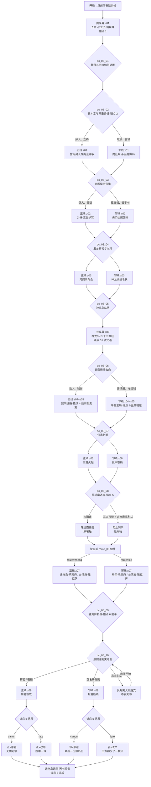

# 剧情 · 08 鹿鼎记：两头蛇与一条路

> 归属（基准 §18）：`ch08_luding` 的主线剧情、正邪立场、选择节点、锚点落地、结局文本与主线任务 ID；这是本书界主线剧情的唯一归属文档。
> 上游：`00-canon.md` v1.1；作者新增需求 AR-04、AR-09、AR-10、AR-12；作者已采用决定见 `decisions/author-decisions.md`；锚点以 `design/01` §7.9 为准。
> 引用而不重定义：年代、天道压制与书眠 → `design/02`；品德、声望与口才 → `design/03`；武学 → `design/05` 与各 catalog；战斗 / Boss → `design/09`；地图 → `design/11`、`design/19` 与 `design/map/*`；任务 DSL → `design/12`（待成文）；天书、结局与余韵 → `design/13`；门派 → `design/17`；NPC、生卒与招募 → `design/18`。
> 标注约定：**（原创扩展）** = 原著没有的内容；**（待考）** = 原著事实尚需按三联 / 广州修订版逐字核对；**（待核实）** = 技术事实尚未联网确认；**（待实测）** = 需要实现后验证；**【建议值】** = 依赖其他文档、先给可用数值并在文末登记。
> 版本：v1.0（2026-09-26）。

---

## 0. 阅读指引与剧情总览

### 0.1 一句话定位

主角从扬州丽春院的一名杂役醒来，与韦小宝同时被卷入宫廷、会党、神龙教和边疆战争；玩家真正要决定的不是“替哪面旗赢”，而是能否在每次左右逢源时仍留下不可出卖的人。

### 0.2 书界参数与设计护栏

| 项 | 本书采用值 | 叙事含义 |
|---|---:|---|
| 书界 ID | `ch08_luding` | 前承 `ch07_bixue`，后接 `ch09_liancheng` |
| 游戏年代 | 1669–1690，清康熙朝 | 城市一律用清初当时名称；具体原著年序仍以 `design/02` 为准 |
| 境界 / 武运 | 低武 / 30（全作最低） | 每幕至少提供一种非战斗解法；口才、易容、潜行、偷窃和人情是主工具 |
| 难度 / 等级上限 | 5 / 44 | 洪安通为局部难度 8、Lv50 的明确超限 Boss；只引用 `design/09` §8.9（该文件内标题为“8.9 Boss 示例一”） |
| 携带 / 外来压制 | 内功、拳脚、兵器各 1 / −4 小品 | 强者被压回凡尘，不能靠上一界数值碾过政治局 |
| 天书关键词 | 机变 | 本义奖励 `speech +10`；变体见 §7.7 与 `design/13` §4 |
| 内容预算 | 每线 10 幕、7 区、20 城、13 小时 | 本文使用 2 个共享幕 + 每线 8 个专属幕；共享幕各线都计入 10 幕 |

### 0.3 “正线 / 邪线”不是开局阵营

- **正线**是“以人作为目的”：保护无辜、保留沟通渠道、公开可问责的罪证，宁可失去高位也不把同伴当筹码。
- **邪线**是“以结果作为目的”：经营秘密、交易筹码、借灰色势力制衡强权；它允许威逼、欺骗与有限牺牲，但仍能以自立、止战和承担后果完整通关，不是惩罚性坏结局。
- 路线由 `morality`、关键承诺与选择节点共同决定，**不在开局锁定**。在带“换轨”标记的节点可从正转邪或从邪转正；换轨会失去一项既得关系、职位或筹码，不能零成本反复横跳。
- `morality` 只在 `−100..100` 内变化，单次变化遵守 `design/03` §8.3 的 ±1～±15 建议范围。本文采用轻微 ±2～4、重大 ±6～10，均为 **【建议值】**。
- “正 / 邪立场轴”与“陈近南原著 / 改命轴”正交；两线都能救陈近南，也都可能错过。天书变体只读锚点结果，不读路线标签。

### 0.4 总流程图



> 图中 `z01–z08` / `x01–x08` 各与 `c01–c02` 合计 10 幕。`c02` 在路线中位共享，终局虽在两条路线分别写作 `z08/x08`，但都汇合到同一“拒绝剿会—退隐—天书现世”状态机。

### 0.5 六个锚点与幕位索引

| `design/01` §7.9 锚点 | 本文幕位 | 性质 |
|---|---|---|
| 宫中擒鳌拜 | `q_08_main_c_01` | 必需 |
| 天地会结盟与双重身份 | `dc_08_02`，并在 `z01/x01` 固化 | 必需 |
| 神龙岛与四十二章经 | `q_08_main_c_02` | 必需 |
| 平西王与云南局势 | `q_08_main_z_04` / `q_08_main_x_04` | 必需 |
| 陈近南遇害 | `dc_08_08`，`z07/x07` 承接 | 遗憾型；唯一主改命点 |
| 雅克萨与退隐 | `z07–z08` / `x07–x08` | 必需；天书现世 |

### 0.6 低武解题公约

每幕在“目标与流程”中至少给两条可行路径，其中至少一条是口才、伪装、潜行、偷窃、证据、人情或交易；非战斗路径的主奖励与战斗路径等价，浮动不超过 ±10%，具体银两 / 经验由任务经济归属文档结算。关键战斗表只写普通 / 精英 / Boss 和机制引用，不在本文复制等级、伤害或 Buff 数值。

---

## 1. 原著重要剧情与走向清单

### 1.1 考据口径

本表按《鹿鼎记》五十回的叙事顺序归并为 50 个事件簇，回次已用联网目录逐回核对；事件内容以原著常见梗概和上游文档交叉，**尚未拿三联 / 广州修订版书影逐字校勘**。因此不抄引文，人物关系、具体现场或版本差异不稳处明确标 **（待考）**。游戏只承诺“每个主要事件有去向”，不承诺把一回压成一幕。

### 1.2 五十回事件覆盖表

| # | 回次 | 人物 / 地点 | 关键事件与原著结果（大意） | 本作去向 |
|---:|---:|---|---|---|
| 1 | 第1回 | 顾炎武、黄宗羲、吕留良；江南 | 明史案余波与“逐鹿问鼎”议论开启全书历史视角 | 明史案支线（任务 ID 由书界文档分配），并在 `z05/x05` 回响 |
| 2 | 第2回 | 韦小宝、茅十八；扬州府丽春院 | 韦小宝因天地会风波与茅十八结识 | 双线共有；开局与 `c01` 前置 |
| 3 | 第3回 | 韦小宝、茅十八、海大富；京师顺天府 | 二人入京，韦小宝被带入宫中并冒充小太监 | 双线共有；`c01` |
| 4 | 第4回 | 韦小宝、康熙；紫禁城 | 韦小宝与“小玄子”多次布库摔跤，结下少年友谊 | 双线共有；`c01`，可观摩 `sk_menggushuaijiao` |
| 5 | 第5回 | 康熙、韦小宝、鳌拜；紫禁城 | 小玄子身份揭开；康熙部署少年太监，合力擒鳌拜并处置其党羽 | 锚点；`c01`、`dc_08_01` |
| 6 | 第6回 | 韦小宝、鳌拜、海大富、假太后；康亲王府 / 紫禁城 | 韦小宝在囚所杀鳌拜、被天地会带走又脱身；返宫后海大富与假太后旧案冲突收束 | 双线共有；`c01` 收束、`dc_08_03` 证据前置 |
| 7 | 第7回 | 韦小宝；紫禁城 / 京师顺天府 | 韦小宝升任尚膳监副总管，发现宝衣保命，并开始以新身份联络江湖 | 双线共有；`z01/x01`，物件与双重身份过渡 |
| 8 | 第8回 | 陈近南、天地会；京师顺天府秘密据点 | 韦小宝获陈近南接见并被收为弟子 | 锚点前半；`dc_08_02`、`z01/x01` |
| 9 | 第9回 | 陈近南、青木堂；京师顺天府秘密据点 | 陈近南授内功、为韦小宝解毒；青木堂香主身份继续落实，使朝廷与会党双重身份成形 | 锚点；`dc_08_02` |
| 10 | 第10回 | 沐剑屏、沐王府；紫禁城 | 沐王府人物潜入宫中，韦小宝藏匿沐剑屏 | 正线 / 邪线另一面；`z01` 保护，`x01` 经营人质筹码 |
| 11 | 第11回 | 沐剑屏、方怡；紫禁城 | 宫中点穴、假死与藏人风波延续 | 双线共有；`z01/x01` |
| 12 | 第12回 | 假太后、韦小宝；紫禁城 | 太后设局与宫中脱身，幕后身份疑云推进 | 选择节点；`dc_08_03` |
| 13 | 第13回 | 沐剑声、徐天川、天地会；京师顺天府 | 天地会与沐王府因反清名分发生冲突 | 正线 / 邪线；`z01` 调停，`x01` 借冲突筛选盟友 |
| 14 | 第14回 | 陈近南、沐王府众；京师顺天府 | 被捕人物获救，两支反清势力暂时收束冲突 | 双线共有；`z01/x01` 的汇合结果 |
| 15 | 第15回 | 康熙、假太后；慈宁宫 | 宫闱激变，顺治是否尚在人世的线索浮出 | 双线共有；`z02/x02` |
| 16 | 第16回 | 方怡、刘一舟等；京畿 | 沐府人物关系与追杀延续，方怡线出现信任裂痕 | 选择节点 / 支线；`dc_08_03`，关系细节交书界文档 |
| 17 | 第17回 | 双儿、庄家；庄宅 **（地望待考）** | 韦小宝遇庄家遗属，双儿开始长期相伴 | 正线 / 邪线均可；`z02/x02`，招募窗口 |
| 18 | 第18回 | 韦小宝、双儿、行痴、番僧；五台山 | 番僧围攻护驾，行痴身份线索浮出，双儿协助脱险 | 双线共有；`z02/x02`，战斗或身份周旋 |
| 19 | 第19回 | 韦小宝、双儿、少林僧众、神龙教人物；五台山至京师 | 少林十八罗汉护送经书返京，途中遭神秘骡车劫持，神龙教追索浮现 | 双线共有；`z02/x02`，神龙线前置 |
| 20 | 第20回 | 苏荃、神龙教众；京畿 | 韦小宝以口才周旋苏荃与教众；苏荃审问黑龙使，四十二章经争夺转入神龙教内斗 | 邪线重点 / 正线共有；`x02` 或 `z02` 非战斗解 |
| 21 | 第21回 | 康熙、顺治；京师顺天府 | 韦小宝返京复命，康熙得知父亲出家真相 | 双线共有；`dc_08_04` 前置 |
| 22 | 第22回 | 曾柔、王屋派；京师顺天府出城军营 | 韦小宝奉差出京便开赌局，蓝衫刺客闯营，王屋派冲突与曾柔线开启 | 双线共有；`z02/x02`；曾柔招募支线 |
| 23 | 第23回 | 澄观、少林僧众、阿珂等；少林寺 | 韦小宝借澄观推演来敌招数，周旋两名女客的突袭 **（人物细节待考）** | 双线共有；`z02/x02`；可得少林授艺资格 |
| 24 | 第24回 | 韦小宝、行痴、清凉寺僧、番僧；五台山 | 韦小宝奉命赴清凉寺住持并暗护出家老皇帝，番僧威胁再临 | 选择节点；`dc_08_04` |
| 25 | 第25回 | 九难、韦小宝、阿珂；五台山附近 | 九难擒住韦小宝并欲刺康熙；韦小宝凭护驾经历与利害周旋，阿珂正式进入视野 | 选择节点；`dc_08_04`，碧血跨书回响 |
| 26 | 第26回 | 九难、阿珂、郑克塽；沧州一带 / 河间府方向 | 韦小宝追随九难、阿珂南行，阿珂与郑克塽关系进入主线，杀龟大会将近 | 正线 / 邪线；`z03/x03` |
| 27 | 第27回 | 九难、阿珂、韦小宝；河间府方向 | 韦小宝以毒计救九难，拜入铁剑门并与阿珂成为同门，三人赴河间府 | 双线共有；`z03/x03`；满足条件可授 `sk_shenxing` |
| 28 | 第28回 | 郑克塽、吴立身、沐王府、群雄；河间府 | 杀龟大会与反吴群雄会合；韦小宝、吴立身谋划教训郑克塽，两派矛盾再起 | 正线 / 邪线；`z03` 查内斗，`x03` 借郑氏入局 |
| 29 | 第29回 | 陈近南、郑克塽；京师顺天府 **（具体场所待考）** | 韦小宝开棺时撞见陈近南与郑克塽冲突，郑氏主从矛盾成为日后刺杀伏笔 | 改命伏笔；`dc_08_05` 前记录 `flag_08_zheng_motive_seen` |
| 30 | 第30回 | 建宁、吴应熊、吴三桂；云南府昆明 | 送婚使团抵滇，建宁与吴应熊冲突，平西王府暗流涌动 | 锚点；`z04/x04` |
| 31 | 第31回 | 吴三桂父子、建宁；云南府昆明 | 火器、火场与离间使平西王府矛盾升级 | 正线 / 邪线；`z04` 救人取证，`x04` 制造把柄 |
| 32 | 第32回 | 陈圆圆、阿珂、九难；云南府昆明近郊庵堂 | 韦小宝循道姑信使赴庵堂救阿珂，阿珂身世及李自成、陈圆圆、吴三桂旧事在本段汇合 **（具体揭示节次待考）** | 双线共有；`z04/x04`，不替阿珂选归属 |
| 33 | 第33回 | 天地会众、吴三桂军；潞城等地 **（地望待考）** | 使团归途受阻，会党与军队对峙 | 正线 / 邪线；`z04/x04` |
| 34 | 第34回 | 吴六奇、陈近南、郑克塽；江上 | 吴六奇身份与天地会关系显露；江上风暴与郑克塽冲突令会党裂痕加深 | 双线共有；`z05/x05`，吴六奇招募 / 结盟窗 |
| 35 | 第35回 | 方怡、神龙教众；海船 / 神龙岛航路 | 与神龙教海战、俘虏与营救方怡，航船失控 | 共有幕前置；`dc_08_05`、`c02` |
| 36 | 第36回 | 韦小宝、双儿、洪安通、索菲娅；罗刹城寨 / 图外罗刹国方向 | 夜探罗刹城寨发现地道，洪安通追至；随后展开索菲娅与罗刹国奇遇 **（路线细节待考）** | `c02` 余波 / `x05`；罗刹支段可交书界文档 |
| 37 | 第37回 | 康熙、群臣、三藩；京师顺天府 | 罗刹使臣返京，撤藩议题进入朝堂 | 正线 / 邪线；`z06/x06` |
| 38 | 第38回 | 清将、吴应熊等；京师顺天府 | 赛马和人事手腕牵动撤藩军政 | 双线共有；`z06/x06` 非战斗节点 |
| 39 | 第39回 | 韦小宝、盐商官员；扬州府 | 奉旨回扬州、兴建忠烈祠，官场与故乡线重合 | 正线 / 邪线；`z05/x05` |
| 40 | 第40回 | 吴之荣、庄家遗属；扬州府 | 吴之荣以反清诗集告密，明史案余波与天地会线再度相连 **（后续处置细节待考）** | 正线 / 邪线；`z05` 保护证人与文献，`x05` 控制案卷 |
| 41 | 第41回 | 吴三桂、归家三口；扬州府至京师顺天府途中 | 押解钦犯回京途中传来吴三桂反叛消息；韦小宝在香河镇外遇归家三口，刺驾线开启 | 选择节点前置；`z06/x06`、`dc_08_07` |
| 42 | 第42回 | 归辛树、归二娘、归钟、康熙；紫禁城 | 归家三口刺康熙并走向死亡的悲剧 | 选择节点；`dc_08_07`；可介入但非本书主改命锚点 |
| 43 | 第43回 | 康熙、韦小宝；京师顺天府 | 康熙论功与君臣关系加深，帝王心术压迫感增强 | 双线共有；`z06/x06` |
| 44 | 第44回 | 洪安通、苏荃、陈近南、郑克塽、施琅；通吃岛 | 韦小宝等再落洪安通手中；神龙教内乱令洪安通败亡，随后陈近南与郑氏、施琅在岛上相遇，郑克塽暗算陈近南 | 共有幕 `c02` 终局回响及遗憾锚点；`dc_08_08`、`z07/x07` |
| 45 | 第45回 | 风际中、韦小宝；通吃岛 | 陈近南死后，风际中暴露为清廷内奸并企图以天地会换功名，双儿将其击毙 | 正线 / 邪线；`z07/x07` 承接 |
| 46 | 第46回 | 施琅、郑克塽、韦小宝；通吃岛 / 台湾府（`city_tainan`） | 施琅乘台湾战船来宣旨：台湾已经归清，韦小宝因举荐之功升爵；郑氏降清后续展开 | 双线共有；`z07/x07`，台湾局势承接 |
| 47 | 第47回 | 康熙、韦小宝；京师顺天府 | 返京面圣，康熙赦其违旨并重谈忠义、台湾与罗刹国，继而授命出征雅克萨 | 双线共有；`z07/x07` |
| 48 | 第48回 | 韦小宝、双儿、罗刹旧识；雅克萨 | 罗刹兵从地道潜入，韦小宝重逢旧识并借索菲娅关系促成和谈契机 | 锚点；`dc_08_09`、`z07/x07` |
| 49 | 第49回 | 茅十八、康熙、韦小宝；京师顺天府 | 雅克萨凯旋受封后，韦小宝遇茅十八斥为“汉奸”；诰命文字把杀师之名强加于他，旧友情义转成救人压力 | 正线 / 邪线；`z08/x08` |
| 50 | 第50回 | 康熙、天地会、韦小宝；京师顺天府—扬州府—通吃岛 | 康熙揭出天地会内奸并逼其剿会；韦小宝不肯残害两边故旧，最终退隐 | 锚点 / 结局；`dc_08_10`、§7 |

### 1.3 覆盖率核算

| 去向类别 | 事件数 | 编号 | 占比 |
|---|---:|---|---:|
| 双线共有 / 共享幕 | 20 | 2–4、6–7、11、14–15、18–19、21–23、27、32、34、38、43、46–47 | 40% |
| 正线 / 邪线从不同侧覆盖 | 15 | 10、13、17、20、26、28、30–31、33、37、39–41、45、49 | 30% |
| 选择节点 / 锚点 | 12 | 5、8–9、12、24–25、29、35、42、44、48、50 | 24% |
| 支线（交书界文档） | 3 | 1、16、36 | 6% |
| 不采用 | 0 | — | 0% |
| **合计** | **50 / 50** | 每项均有去向 | **100%** |

> 计数规则：同一事件只按表中主要去向计一次；“部分交支线”仍由主线幕保留触发与结果回响，不构成遗漏。原著主要情节的去向覆盖率为 `50 ÷ 50 = 100%`。

---

## 2. 主角定位与开局

### 2.1 穿越身份

玩家于 1669 年在扬州府醒来，表面身份是丽春院后厨与跑堂间打杂的少年 / 青年，替客人传菜、记账、递口信；这与 `design/13` §6.4.2 的鹿鼎隐藏身份“扬州丽春院杂役，`speech +10`”一致。主角保有前七书界的记忆，却因低武天道压制无法靠武力越过城门、宫禁与派系网络。

该身份的三个功能：

1. 能自然听到盐枭、官差、江湖人与士人议论，不先天绑定清廷或天地会。
2. 与韦小宝同处底层但不是他的替身：韦小宝仍负责原著中的核心行动，玩家负责接应、查证、护送、制造选择窗口。
3. 把“口才”从对话加成变成开局生存工具：认路、套话、藏人和让互不信任者暂坐一桌。

### 2.2 与主要人物的关系起点

| 人物 | 初始关系 | 第一层矛盾 |
|---|---|---|
| `npc_weixiaobao` | 一同在丽春院跑腿、互相挡过麻烦的旧识 **（原创扩展）** | 他把每次许诺当临场脱身，玩家要决定哪些承诺必须兑现 |
| `npc_maoshiba` | 把玩家视作韦小宝身边的机灵跟班 | 他重名节而轻权变，会不断质问“方便”是否已成背叛 |
| `npc_kangxi` | 经韦小宝带入布库房后才相识 | 少年朋友与皇帝身份逐渐不能并存 |
| `npc_chenjinnan` | 先观察玩家是否会为无名会众冒险 | 反清大义与保护具体人的代价可能冲突 |
| `npc_hongantong` | 把玩家当可收服的口舌之士 | 玩家可以借教中权势，但必须处理受制教众与毒丸 |
| `npc_ajiu` | 若碧血曾招募则按 `design/18` §6.11 重逢；否则是陌生的九难师太 | 旧明之恨是否足以合理化刺杀与牵连 |

### 2.3 开局段与首个选择

开局教学分三场：丽春院“听四桌话”口才 / 偷听、护韦小宝脱离盐枭追问的潜行 / 说谎、随茅十八北上的官道遭遇。玩家可战退追兵，也可换路、造假路引或用赌局拖延。抵京后经海大富之手混入宫禁 **（具体伪装过程为原创扩展）**，与韦小宝、小玄子共同进入 `q_08_main_c_01`。

首个正式选择节点 `dc_08_01` 不问“杀不杀鳌拜”这种玩家无权替原著人物决定的问题，而问：**擒获后，玩家拿到的一页私档交给谁、是否救出被当成同党灭口的小吏**。它立即建立本作的核心语法——大事件照常发生，玩家改变的是证据、旁观者和下一扇门。

### 2.4 开局状态与路线判定

| 状态 | 初值 / 规则 |
|---|---|
| 路线标签 | `route_08 = fluid`，直至 `dc_08_02` 才形成首次正 / 邪倾向 |
| 品德 | 沿用跨书界 `morality`；不因新开局重置 |
| 声望 | `fame = 0`，随本书任务增长；书眠时按 `design/03` 清零并归入 `fameTotal` |
| 身份 | 丽春院杂役 → 宫中临时杂役 / 密使 **（原创扩展）**；玩家不冒充韦小宝 |
| 同伴 | 韦小宝为剧情友军，默认由 AI 控制；作者决定 P46 已采用 |
| 首个硬门 | `dc_08_01` 完成后才能离开紫禁城主线区 |

---

## 3. 正线：留人，不留旗

### 3.1 路线拓扑与进入条件

正线的 10 幕拓扑为：

`c01 → dc_08_01 → dc_08_02 → z01(dc_08_03) → z02(dc_08_04) → z03 → dc_08_05 → c02 → dc_08_06 → z04 → z05 → z06(dc_08_07) → dc_08_08 → z07(dc_08_09) → dc_08_10 → z08 → 结局`。

其中 `c01/c02` 是两线共享幕，八个 `z_*` 是正线专属幕。进入正线不要求玩家已经是“侠义”称号；满足下列任一条件即可：

- `morality >= 10`，并在 `dc_08_02` 选择“把双重身份当保护人的通道”；
- `morality < 10`，但已救下鳌拜私档案中的无名小吏，并向陈近南作出不可交易的具体承诺；
- 从邪线换轨时，交出当前最大的私藏筹码，并承受一方关系降为敌对。

正线不是“清廷 / 反清”阵营线。它可以与康熙合作，也可以帮助天地会；判据只在于玩家是否拒绝用无辜者和同伴的性命兑换权力。

### 3.2 `q_08_main_c_01` · 布库房外的门闩（共享幕 1 / 10）

| 固定字段 | 内容 |
|---|---|
| 原著对应事件 | 第2–7回：扬州结识、入京、小玄子摔跤、擒鳌拜、经书与海大富 / 假太后疑云 |
| 地点 | 扬州府 `city_yangzhou` → 京师顺天府 `city_beijing` → 紫禁城内廷 |
| 参与 NPC | `npc_weixiaobao`、`npc_maoshiba`、`npc_kangxi`、`npc_aobai`；海大富、假太后 / 毛东珠（均待补 ID） |
| 本幕目标 | 不取代康熙和韦小宝擒鳌拜，而是在宫门封锁前截断鳌拜党羽、保护见证人并查出经书线索 |

**目标与流程**：

1. 在丽春院听取盐枭、天地会和官差三桌互相矛盾的说法；可用口才拼出安全路线，也可与茅十八正面突围。
2. 抵京后通过杂役名册、赌局赢来的腰牌或翻墙潜入三种方法进宫；失败不会锁线，只增加宫禁警戒。
3. 在布库房陪韦小宝与小玄子摔跤；选择观摩可记入 `sk_menggushuaijiao` 的获取前置，不在此直接赠满层武学。
4. 发现鳌拜党羽调走近侍：战斗路径守住廊道；非战斗路径伪造调令、反锁偏门并让两队侍卫互相查验。
5. 康熙与韦小宝在内殿实施擒拿；玩家处理外围三处危机，顺序决定小吏、宫女和经书箱是否安全。
6. 从被焚的私档中抢出一页名单并暂时封存；所有权在本幕收束后的 `dc_08_01` 才结算，避免玩家尚未经历囚所后果就做决定。
7. 转至康亲王府囚所：不改写韦小宝杀死鳌拜、随后被天地会带走又脱身的结果；玩家负责阻断余党劫囚、保存供词，并决定是否追查天地会接应者。
8. 返宫后撞上海大富与假太后围绕旧案的冲突收束；玩家只能从残局保住经书线索或证人，不取代原著人物的胜负。幕末先进入 `dc_08_01`，所得宫闱证据另计入后续 `dc_08_03`。

**关键战斗**：

| 对手 | 强度 | 战斗职责 / 非战斗替代 |
|---|---|---|
| 鳌拜党羽与宫门亲兵 | 精英 | 小战场护门；可用假调令、路障和分队口令完全免战 |
| `npc_aobai` | Boss（剧情友军战） | 康熙、韦小宝承担主叙事动作，玩家控外围与缴械窗口；Boss 通用机制引用 `design/09`，不在本文配数值 |

**幕内小选择**：是否先救被灭口的小吏，还是先抢经书箱。救人使证词完整、`morality +4` **【建议值】**；抢箱使清宫信任提高但小吏失踪，后续只能靠残页拼证。

**幕末状态变化**：

| 类别 | 变化 |
|---|---|
| 必置旗标 | `flag_08_aobai_captured=true`、`anchor_08_01=complete` |
| 分支旗标 | `flag_08_clerk_saved`、`flag_08_aobai_dossier_recovered`；所有权由 `dc_08_01` 写入 |
| 品德 / 声望 | 由 `dc_08_01` 结算；擒鳌拜本身不自动加品德，避免把政治胜负等同善恶 |
| 门派 / 关系 | 解锁 `sect_qinggong` 接触资格；康熙与韦小宝关系进入“共同秘密” |
| 同伴 | `npc_maoshiba` 暂离；`npc_weixiaobao` 继续作为剧情友军，不计常驻编组 |

**失败与时限**：宫门封锁以三次场景推进为软时限。错过一个外围目标会失去对应证据或 NPC 窗口，但可继续；康熙被击倒或鳌拜逃出紫禁城属于可重试剧情失败。不能用失败分支改写“擒鳌拜”硬锚点。

### 3.3 `q_08_main_z_01` · 两张名帖（正线 2 / 10）

| 固定字段 | 内容 |
|---|---|
| 原著对应事件 | 第8–16回：拜陈近南、任青木堂香主、沐王府入宫、两派冲突、宫闱疑云 |
| 地点 | 京师顺天府 `city_beijing`；直隶秘密据点 **（具体地望待考）** |
| 参与 NPC | `npc_weixiaobao`、`npc_chenjinnan`、`npc_xutianchuan`、`npc_mujiansheng`、`npc_mujianping`、`npc_fangyi`、`npc_kangxi` |
| 本幕目标 | 让天地会与沐王府停止互相消耗，并把双重身份变成救人的双向通道 |

**目标与流程**：

1. 携鳌拜案的一条可验证线索赴青木堂，不交整本名册；以保护证人的实际行动通过陈近南初试。
2. `dc_08_02` 决定是否接受香堂誓约、仅作外援，或把堂口位置卖回内廷；本路线选择前两项。
3. 宫中发现沐剑屏：可藏入杂役队换装出宫，也可制造“闹鬼”封闭偏院；强行冲宫会提高全城警戒。
4. 追查天地会与沐王府冲突来源：比武赢得发言权，或对照两封被调包的帖子证明有人挑拨。
5. 护送方怡与沐剑屏离开时，允许玩家优先救受伤者或先保会党联络簿，形成小选择。
6. 面对陈近南，明确“双重身份三条底线”：不报会众住处、不以宫女家属作饵、不伪造师父命令 **（原创扩展）**。
7. 回宫只报告可阻止即时袭击的情报，不交平民名单；承受康熙信任小幅下降。

**关键战斗**：

| 对手 | 强度 | 战斗职责 / 非战斗替代 |
|---|---|---|
| 沐王府与青木堂误斗双方 | 精英（可选） | 只能降服，不能击杀；非战斗可凭调包帖子和双方暗号停战 |
| 假太后派出的内廷追兵 | 精英 | 屋脊撤离与护送；可用宫灯次序、值夜名册和易容绕开 |

**幕内小选择**：把唯一安全出宫名额先给沐剑屏，或先给掌握证据的方怡。前者 `morality +3`、沐王府信任上升；后者获得宫闱证据、方怡信任上升，但沐剑屏需在下一夜再救。

**幕末状态变化**：

| 类别 | 变化 |
|---|---|
| 必置旗标 | `flag_08_dual_identity=true`、`anchor_08_02=complete`、`route_08=zheng` |
| 分支旗标 | `flag_08_three_promises=true`、`flag_08_mu_tiandi_truce` |
| 品德 / 声望 | 守住三条底线 `morality +6` **【建议值】**；调停使 `fame +100` **【建议值】** |
| 门派 | `sect_tiandihui` 开放 L1 / 外援路径；不自动授予掌门或高阶职级 |
| 同伴 | `npc_mujianping`、`npc_fangyi` 开启 D4 试事窗；本幕结束后二选一可短时随行 |

**失败与时限**：宫门换值前必须送出至少一人。两次暴露后转为强制护送战，但不删档；若杀死任一方降服目标，停战失败，正线仍可继续但 `dc_08_05` 前必须完成赎错任务，否则自动换轨至邪线。

### 3.4 `q_08_main_z_02` · 山门不问龙衣（正线 3 / 10）

| 固定字段 | 内容 |
|---|---|
| 原著对应事件 | 第17–25回：庄家与双儿、少林、五台山顺治、神龙教初现、王屋派赌局、九难刺驾 |
| 地点 | 京师顺天府 `city_beijing` → 登封县 `city_dengfeng` → 五台山（无正式城市 ID，`placeKey: mt_wutai`） |
| 参与 NPC | `npc_shuanger`、`npc_chengguan`、`npc_kangxi`、`npc_ajiu`、`npc_zengrou`、`npc_weixiaobao`；庄家遗属、顺治 / 行痴、桑结（待补 ID） |
| 本幕目标 | 护住顺治的出家选择而非把他变回政治筹码，并让九难看见“刺一人会牵连谁” |

**目标与流程**：

1. 在庄宅查明明史案遗属处境；接受双儿同行，或只收一枚联络信物、保持她留守庄家。
2. 选择护送路线：借少林戒牒走山门、随官差明路，或翻检经书劫案留下的神龙教车辙走暗路。
3. 王屋派拦营时，可与曾柔比武后放还，也可在赌桌上赢回兵刃并揭开错误情报；不得靠杀俘推进。
4. 在少林与澄观喂招，达到图鉴门槛才开放 `sk_dacidabeiqianyeshou` 等已有授艺项；剧情不凭空发新武学。
5. 抵清凉寺后分守三处：假法会、后山退路、密室口。玩家可战番僧，也可改换钟声、调包法器把人引走。
6. `dc_08_04` 决定是否把顺治真相交给康熙、九难或永远封存；正线至少先取得顺治本人同意。
7. 九难现身时，以碧血旧识、阿九身份线索或无辜僧众名单劝止；交战只能拖延，不能把她写成被玩家轻易击败。
8. 回京向康熙报告“人安全”而非具体禅房位置，承受皇权与私人亲情之间的张力。

**关键战斗**：

| 对手 | 强度 | 战斗职责 / 非战斗替代 |
|---|---|---|
| 王屋派拦营者 | 普通 / 精英 | 降服教学；赌局、归还兵刃和解释假军令可免战 |
| 桑结所率番僧 | 精英 | 三处护持目标；伪法会与钟声误导可拆成零战斗潜行 |
| `npc_ajiu` | Boss 级剧情对峙（非击杀） | 只需撑过 / 完成说服条件；碧血旧羁绊是强非战斗解 |

**幕内小选择**：是否把顺治亲笔回复带给康熙。带回可修复父子信息但暴露一条路线；只传口信保护寺院、康熙短期不满。两者都不改变顺治继续出家的原著结果。

**幕末状态变化**：

| 类别 | 变化 |
|---|---|
| 必置旗标 | `flag_08_shunzhi_safe`、`flag_08_wutai_resolved` |
| 分支旗标 | `flag_08_shunzhi_secret_owner`、`flag_08_ajiu_stood_down` |
| 品德 / 声望 | 尊重本人选择 `morality +5` **【建议值】**；护驾名声 `fame +150` **【建议值】** |
| 门派 | `sect_shaolin`、`sect_wangwu` 开放友好接触；若旧识重逢则恢复 `sect_tiejian` 师承接口 |
| 同伴 | `npc_shuanger` 完成 D4 共同危机后可长期招募；`npc_zengrou` 开启个人试事窗；`npc_ajiu` 仅在重逢 / 师徒线短窗同行 |

**失败与时限**：法会开始后有一昼夜软时限。密室被识破会触发撤离战；顺治被擒或九难死亡均为可重试失败。错过少林喂招只关闭本次授艺，不阻断主线。

### 3.5 `q_08_main_z_03` · 河间席上无龟（正线 4 / 10）

| 固定字段 | 内容 |
|---|---|
| 原著对应事件 | 第26–29回：九难与阿珂、拜师、河间杀龟大会、郑克塽与陈近南冲突 |
| 地点 | 河间府 `city_hejian` 及直隶官道 |
| 参与 NPC | `npc_ajiu`、`npc_ake`、`npc_chenjinnan`、`npc_zhengkeshuang`、`npc_mujiansheng`、`npc_weixiaobao` |
| 本幕目标 | 把“杀吴三桂”的共同口号拆成可执行的救人、查军饷与止内斗方案，并记录郑克塽敌意的来源 |

**目标与流程**：

1. 护送九难、阿珂到河间；若符合图鉴门槛，可完成九难授艺事件取得 / 印证 `sk_shenxing`，不以路线免费赠送。
2. 会前走访三席：天地会、沐王府、郑氏来使；对照他们对“反清”“反吴”和百姓安危的不同优先级。
3. 发现有人用假帖挑起座次与名分争端；可偷回原帖、公开对质，或在擂台上连胜取得发言权。
4. 阻止对俘虏的私刑，换取云南军饷和送婚使团路线；放任则更快取得郑氏通行令但偏向邪线。
5. 在棺木 / 密室会谈现场 **（具体布置待考）**，旁听陈近南与郑克塽冲突，记录 `flag_08_zheng_motive_seen`。
6. 选择是否把冲突实情告诉阿珂；正线讲清事实但不替她决定与谁往来。
7. `dc_08_05` 前处理神龙教使者：释放受毒丸控制者可取得岛内回应，拘押则取得一条强行登岛路线。

**关键战斗**：

| 对手 | 强度 | 战斗职责 / 非战斗替代 |
|---|---|---|
| 杀龟会擂台群雄 | 精英（可选连战） | 只计降服；盗回原帖、以三方证词对质可免战 |
| 郑氏随从与挑拨者 | 精英 | 保护陈近南 / 阿珂；展示完整原帖可令多数随从停手 |

**幕内小选择**：公开郑克塽羞辱会众的证词，或私下交给陈近南。公开可提升群雄声望但使郑氏关系立即敌对；私交保留沟通窗口，是陈近南改命的必要伏笔之一，但会被部分会众误解为护短。

**幕末状态变化**：

| 类别 | 变化 |
|---|---|
| 必置旗标 | `flag_08_hejian_complete`、`flag_08_zheng_motive_seen` |
| 分支旗标 | `flag_08_zheng_evidence_public` 或 `flag_08_zheng_channel_open` |
| 品德 / 声望 | 阻止私刑 `morality +4`；擂台 / 对质均给等价 `fame +150` **【建议值】** |
| 门派 | `sect_tiandihui` 与 `sect_muwangfu` 关系上升；郑氏是阵营文字，暂无 `sect_*` |
| 同伴 | `npc_ake` 开启 D5 试事但暂不常驻；`npc_ajiu` 在启程后因个人目标离队 |

**失败与时限**：大会当夜前必须取得三方中至少两方证词；不足则进入擂台补救。陈近南被击倒只触发救援重试，不能在此提前死亡；杀死郑克塽会破坏硬锚点并被脚本禁止。

### 3.6 `q_08_main_c_02` · 万寿无疆，众口有声（共享幕 5 / 10）

| 固定字段 | 内容 |
|---|---|
| 原著对应事件 | 第19–20、35–36、44回的神龙教与四十二章经线；为服从 `design/01` 锚点顺序，本作把海上决战提前到云南主段之前 **（原创扩展编排）** |
| 地点 | 没沟营 / 辽河口 **（待考）** `city_yingkou` → 神龙岛 `city_shenlongdao`；专船航程 3 日（引用地图数据） |
| 参与 NPC | `npc_hongantong`、`npc_suquan`、`npc_weixiaobao`、`npc_shuanger`、`npc_fangyi`；五龙使、神龙教众（待补 ID） |
| 本幕目标 | 查明八部《四十二章经》夹层线索的政治价值，救出受毒丸控制者，并完成洪安通局部难度峰值 |

**目标与流程**：

1. 在没沟营 / 辽河口选择登岛法：持神龙教投名状明入、扮成药材船潜入、或扣住使者强登；`dc_08_05` 决定站队与第一批援手。
2. 岛上先查三类事实：经书不是普通掉落藏宝图、毒丸控制链、老教众与少年教众的裂痕；任取两项即可开非战斗削弱。
3. 解救方怡等受制者：偷解药、说服掌药者，或击败看守；三路奖励等价。
4. 收集 / 对照经书夹层只形成“鹿鼎山区域与清廷禁忌”的线索，不在本幕自动发放宝藏，也不要求玩家凑齐八部才能通关。
5. 与苏荃谈判：好感、证据和安全退路足够时，她可在终战袖手或倒戈；失败也不封主线。
6. 煽动教内内乱、离间五龙使或直接上殿；前两者对应 `design/09` §8.9（该文件内标题为“8.9 Boss 示例一”）的战前削弱。
7. 进入 `enc_08_shenlongdao` / `bsc_hongantong_shenlongdao`。必须保留“奉承”口舌动作：以抬高宝训换取洪安通延迟与破绽，成功次数越多越难；精确规则只引用上述 Boss 小节。
8. 洪安通败亡后，优先疏散教众与销毁毒丸名册，或抢救经书夹页；这会改变后续人证 / 物证构成，不改变锚点完成。

**关键战斗**：

| 对手 | 强度 | 战斗职责 / 非战斗替代 |
|---|---|---|
| 五龙使、受制教众 | 精英 | 可离间、交解药、揭露旧部屠戮使其离场；不要求全杀 |
| `npc_hongantong`、`npc_suquan` | Boss（局部难度 8） | 完整引用 `design/09` 的“8.9 Boss 示例一”；教内内乱可让宝训机制锁为失效、取消援军，苏荃可袖手 / 倒戈 |

**幕内小选择**：毒丸名册交给受害者自治、交清廷作为取缔证据，或私藏以控制残众。前两项分别偏正线的自治 / 法办，第三项偏邪线并允许换轨；任何选择都不能把受害者永久标为玩家私兵。

**幕末状态变化**：

| 类别 | 变化 |
|---|---|
| 必置旗标 | `anchor_08_03=complete`、`flag_08_hongantong_defeated`、`flag_08_scripture_clues` |
| 分支旗标 | `flag_08_shenlong_revolt`、`flag_08_suquan_stance`、`flag_08_poison_ledger_owner` |
| 品德 / 声望 | 救受制教众 `morality +6`；私藏名册 `morality -8` **【建议值】**；击败洪安通 `fame +300` **【建议值】** |
| 门派 | `sect_shenlongjiao` 由开放态转衰亡 / 残党态；玩家的正式身份依 `dc_08_05` 保留或清空 |
| 同伴 | `npc_suquan` 满足 D5 条件后开启招募；`npc_fangyi` 解除受制后可招募；`npc_shuanger` 若在场增加撤离成功率但不强制 |

**失败与时限**：登岛后三次长休内未处理毒丸，受制者会被转移，但可从地牢追加救援。Boss 战 `noRetreat`、失败重试，严格按 `design/09`；战前内乱是永久削弱而非跳过剧情。若玩家此前站神龙教，仍可在看见屠戮证据后倒戈，代价是清空教内职级和资源。

### 3.7 `q_08_main_z_04` · 昆明三封家书（正线 6 / 10）

| 固定字段 | 内容 |
|---|---|
| 原著对应事件 | 第30–33回：云南送婚、建宁与吴应熊、平西王府、阿珂身世、李自成与陈圆圆、归途伏兵 |
| 地点 | 云南府昆明 `city_kunming` 及滇中驿路 |
| 参与 NPC | `npc_wusangui`、`npc_jianning`、`npc_ake`、`npc_ajiu`、`npc_lizicheng`、`npc_chenyuanyuan`、`npc_weixiaobao`；吴应熊（待补 ID） |
| 本幕目标 | 在不把建宁、阿珂或陈圆圆当筹码的前提下，确认吴三桂备叛证据并护使团离滇 |

**目标与流程**：

1. `dc_08_06` 先决定神龙岛取得的云南情报交给谁：康熙、天地会、受威胁的家属，或只留自用。正线必须让可能被牵连者先获预警。
2. 以送婚副使、商队账房或沐王府引路人身份进昆明；三种身份开放不同对话，但均可查完核心证据。
3. 面对建宁与吴应熊的冲突，目标是阻止灭口并保全证言，而非替二人美化关系；可调包火器、封锁院门或公开闯入。
4. 查三条备叛证据：军粮去向、私铸军械、驿站暗号。潜行 / 账本对勘可无战斗；抓军需官是精英战路径。
5. 在庵堂 / 近郊见陈圆圆与李自成，拼出阿珂身世。玩家只把事实交给阿珂本人，不能用身世迫她加入或改变感情选择。
6. 九难要求以刺杀结束旧怨时，可交吴三桂叛乱证据证明公开制止更能护民；失败则进入短时拦截战。
7. 吴三桂军封路。可让三封家书分别走盐路、僧道、官驿以分散风险，或护一辆假婚车正面突围。
8. 将证据分存给清廷、天地会和沐王府三名可沟通者，完成后续改命的“非单点信息”条件。

**关键战斗**：

| 对手 | 强度 | 战斗职责 / 非战斗替代 |
|---|---|---|
| 平西王府亲兵 | 精英 | 夺取军械库账簿；账房对勘、贿赂搬运工或换印可免战 |
| 滇中伏兵 | Boss 级战役遭遇 | 护送三路信使；可用假婚车、山道向导与错误军令拆散敌军 |
| `npc_wusangui` | 政治 Boss，不直接决斗 | 以证据、使节身份与各方牵制完成压迫式对话；军阵机制引用 `design/09` |

**幕内小选择**：将一封家书先送给建宁，还是先送给阿珂。先护建宁可保送婚使团撤离；先护阿珂可让她提前远离郑克塽操弄。另一人仍可救，但须牺牲一条证据线。

**幕末状态变化**：

| 类别 | 变化 |
|---|---|
| 必置旗标 | `anchor_08_04=complete`、`flag_08_wusangui_rebellion_proof` |
| 分支旗标 | `flag_08_three_letters_sent`、`flag_08_ake_knows_origin`、`flag_08_jianning_warned` |
| 品德 / 声望 | 不利用身世 `morality +5`；使团脱困 `fame +200` **【建议值】** |
| 门派 | `sect_muwangfu`、`sect_tiandihui` 关系上升；平西王府敌对 |
| 同伴 | `npc_ake` 可在“知情且自主离开”后短时招募；`npc_jianning` 为婚使脱困窗口可控同行；`npc_chenyuanyuan` 是非战斗同行 |

**失败与时限**：送婚礼成前有两日软时限；证据不足可通过归途截获军令补救。三封家书全失会关闭本轮陈近南改命，但主线仍能走原著轴；屏幕在出滇前明确预警“再无第三方能证明此事”。

### 3.8 `q_08_main_z_05` · 扬州旧纸（正线 7 / 10）

| 固定字段 | 内容 |
|---|---|
| 原著对应事件 | 第1、34、39–40回：明史案前史、吴六奇、扬州宣旨与忠烈祠、吴之荣告密 |
| 地点 | 扬州府 `city_yangzhou`；江淮水路 |
| 参与 NPC | `npc_guyanwu`、`npc_huangzongxi`、`npc_lvliuliang`、`npc_wuliuqi`、`npc_shuanger`、`npc_xutianchuan`、`npc_weixiaobao`；吴之荣、庄家遗属（待补 ID） |
| 本幕目标 | 保护明史案幸存者和文献，同时揭露告密与勒索链，不以新的文字狱报复旧告密者 |

**目标与流程**：

1. 以宣旨队伍回扬州，先在忠烈祠工地、盐商宴和旧书坊三处听证，避免只从官府案卷理解明史案。
2. 与顾炎武、黄宗羲、吕留良会面；三人均是非战斗同行 / 线索提供者，具体行踪与同场 여부 **（待考）**。
3. 吴六奇提供清军身份下的掩护；玩家可核验其天地会关系，或因官身拒绝信任并另走水路。
4. 吴之荣递出告密材料。可掉包案卷、公开证明材料被篡改、或让庄家遗属安全转移后再交一份空案。
5. 拒绝以酷刑逼供；若选择让受害者自行决定处置，必须先明确不许牵连家眷。
6. 在盐运账里发现吴三桂暗款，与云南证据互证；可公开到足以止乱的程度，但隐去会众名单。
7. 把三份文献分别藏入祠碑夹层、书坊和庄家安全处 **（原创扩展）**，避免一次抄检尽毁。

**关键战斗**：

| 对手 | 强度 | 战斗职责 / 非战斗替代 |
|---|---|---|
| 盐枭与灭口差役 | 普通 / 精英 | 保护文献搬运；以官印封仓、盐账勒令或地下水道潜行可免战 |
| 吴之荣护卫 | 精英（可选） | 抢案卷；公开笔迹、证人和错误日期可在堂上击破告密 |

**幕内小选择**：是否把吴之荣交给庄家遗属。交出但立下“不杀家眷、不株连”的界限，或送官公开审案；前者更贴近原著报应感，后者留下制度证词。私刑灭口会换轨邪线。

**幕末状态变化**：

| 类别 | 变化 |
|---|---|
| 必置旗标 | `flag_08_mingshi_archive_saved`、`flag_08_yangzhou_returned` |
| 分支旗标 | `flag_08_wuliuqi_channel`、`flag_08_informer_disposition` |
| 品德 / 声望 | 保护文献与家眷 `morality +5`；公开审案 `fame +200` **【建议值】** |
| 门派 | 天地会关系上升；清宫关系不因依法办案下降，若私藏全部案卷则下降 |
| 同伴 | `npc_wuliuqi` 开启 D5 限定招募；`npc_guyanwu`、`npc_huangzongxi`、`npc_lvliuliang` 可作为非战斗同伴完成护卷段 |

**失败与时限**：抄检令下达后至天明为软时限；文献全毁仍可凭云南账本推进，但三名士人关系与一条改命沟通渠道关闭。任何 NPC 的史实卒年与本作 appearance 由 `design/18` 判定，任务不得使其越过可用年份。

### 3.9 `q_08_main_z_06` · 一城不可换一君（正线 8 / 10）

| 固定字段 | 内容 |
|---|---|
| 原著对应事件 | 第37–43回：撤藩朝议、赛马用人、三藩之乱、归家三口刺驾、康熙论功 |
| 地点 | 京师顺天府 `city_beijing`；京畿驿路 |
| 参与 NPC | `npc_kangxi`、`npc_guixinshu`、`npc_guierniang`、`npc_guisong`、`npc_ajiu`、`npc_wusangui`、`npc_weixiaobao` |
| 本幕目标 | 让吴三桂谋叛证据用于止战，而非借刺康熙制造更大屠戮；尽力救归家三口但不把此支改命冒充主锚点 |

**目标与流程**：

1. 把云南和扬州证据带入朝议：可由康熙公开问政，也可让多名将领分别验证，避免证据只握在一人手里。
2. 参与赛马 / 选将局，识别人事优劣；可以骑射、账目和兵棋三种方式完成，不要求竞技胜利。
3. 三藩起事消息到京，玩家从驿站救回证人；正面破围或伪造吴军调令皆可。
4. 归家三口潜入。`dc_08_07` 可劝返、替换目标为抓吴三桂使者、暗中放行，或告密围杀。
5. 正线优先以九难 / 碧血旧信物和 `npc_guisong` 健康需求瓦解死志；若谈判失败，只做缴械和护送撤离。
6. 康熙追问为何隐瞒时，可承担罪责、交出刺驾路线换赦免，或辞去宫中身份；不能把会党住址作为代价。
7. 战争段以护送百姓离开驿城、破坏无主火药库体现，不让主角代替史实统帅平定三藩。
8. 康熙论功时拒领从抄家得来的庄园，保留清廷私人渠道；离京前再对照青木堂来信中的匿名泄漏，以假会期试探并可安排会众观察者 **（原创扩展）**。此处只建立 `dc_08_08` 前置，不提前认定风际中。

**关键战斗**：

| 对手 | 强度 | 战斗职责 / 非战斗替代 |
|---|---|---|
| 三藩乱兵与趁火劫掠者 | 精英 | 护送百姓；调动城防、截断军饷可使其溃散 |
| 归家三口 | Boss 级剧情对峙（非击杀） | 只允许劝止、缴械或撑过；旧识、九难在场与证据可免战 |

**幕内小选择**：救归家三口需要放走一名吴军密使；抓密使则三人更可能按原著走向战死。救人不是本书天书改命点，不消耗余韵，但会使清宫关系下降并增加后续追捕。

**幕末状态变化**：

| 类别 | 变化 |
|---|---|
| 必置旗标 | `flag_08_three_feud_started`、`flag_08_qing_channel` |
| 分支旗标 | `flag_08_gui_family_state`、`flag_08_wu_envoy_state`、`flag_08_leak_probe`、`flag_08_observer_planted` |
| 品德 / 声望 | 救平民 `morality +6`；告密围杀 `morality -8`；止住驿城兵乱 `fame +300` **【建议值】** |
| 门派 | `sect_huashan` 旧缘、`sect_qinggong` 身份依选择变化 |
| 同伴 | 归家三口若生还，各自仍按 D5 窗口短时同行，不把一家三口合成一个 NPC 状态 |

**失败与时限**：刺驾发生于宫门关闭前，错过谈判会进入原著死亡走向；这是可承受后果而非 Game Over。若康熙在副本中死亡则重试。战争总局不设倒计时，单个驿城救援以火药引信为局部时限。

### 3.10 `q_08_main_z_07` · 通吃岛只救一个人（正线 9 / 10）

| 固定字段 | 内容 |
|---|---|
| 原著对应事件 | 第44–48回：神龙教终局与通吃岛会战、陈近南遇害、风际中暴露、台湾归清、返京与雅克萨边事 |
| 地点 | 通吃岛（`cityId: null`，`placeKey: tongchi_island`）→ 承天府 `city_tainan` → 雅克萨城 `city_yakesa` |
| 参与 NPC | `npc_chenjinnan`、`npc_zhengkeshuang`、`npc_shilang`、`npc_kangxi`、`npc_suofeiya`、`npc_weixiaobao`、`npc_shuanger`；风际中（待补 ID） |
| 本幕目标 | 从匿名泄密追到内奸、表现陈近南锚点的既定结果，再把台湾与雅克萨大势写成“玩家影响具体人和谈判条件、不取代历史主角” |

**目标与流程**：

1. 承接已结算的 `dc_08_08` 进入通吃岛会场：改命轴的观察者已就位且最高利益已舍弃；原著轴则因守住筹码、错过时窗或三方断线而迟到。
2. 播放第44回对应的郑克塽刺杀结果：改命只打断致命一剑，不替陈近南解除所有政治困局；原著轴则接住遗命、保护会众撤离。此步只表现既定的 `anchor_08_05=fate/canon`，不得二次结算。
3. 锚点结算后处理风际中：原著轴按第45回让其暴露为清廷内奸，再由双儿击毙；改命轴可凭前幕的假消息与反监视提前收网，使其未及发动后续袭击 **（原创扩展）**。
4. 陈近南若生还，先安置伤员、交代会众撤路，再与玩家结算最低合作；若遇害，则依遗命处理会众与证据，但不让玩家自动继任总舵主。
5. 台湾局势段可随施琅水师作战役限定同行、护送平民与降表，或从郑氏侧安排撤离；不允许玩家单挑决定台湾归属。
6. 返京后接雅克萨差遣；从 `post_yakesa` 乘封闭军驿前往 `offmap_luochaguo` 的支段只作原著异域奇遇索引，主线仍回到雅克萨。
7. 在雅克萨先查地道、俘虏与罗刹旧识三条线；任取两条即可开谈，不要求以强攻证明战功。
8. `dc_08_09` 选择强攻、以旧识联络索菲娅阵营促谈，或先揭地道再谈；三种均需保护边民和俘虏交换。和议完成后不虚构条约逐字内容，只记录玩家促成停火与边界交涉的叙事功能。

**关键战斗**：

| 对手 | 强度 | 战斗职责 / 非战斗替代 |
|---|---|---|
| 风际中与伏击者 | 精英 | 保护会众；假消息可让伏击扑空并直接抓证 |
| 郑克塽随从 | Boss 级护卫遭遇 | 改命时目标为打断刺杀、撤离；三方通行文书可免去大半战斗 |
| 雅克萨守军 / 乱兵 | Boss 级战役遭遇 | 攻坚是一路；旧识、地道情报、俘虏交换可转外交解法 |

**幕内小选择**：台湾归清后，是先护郑氏普通眷属撤离，还是先向施琅交付军图制止海上追击。两者都止损，但会分别保住郑氏沟通者或清廷军中信用。

**幕末状态变化**：

| 类别 | 变化 |
|---|---|
| 前置读取 | `anchor_08_05=canon\|fate`（只能由 `dc_08_08` 写入） |
| 必置旗标 | `flag_08_taiwan_resolved`、`flag_08_yakesa_truce` |
| 分支旗标 | `flag_08_chenjinnan_alive`、`flag_08_feng_exposed`、`flag_08_border_method` |
| 品德 / 声望 | 改命需先付利益代价，不另加大量品德；保护俘虏 `morality +4`；边事 `fame +400` **【建议值】** |
| 门派 | 改命后至少一主要势力敌对；具体由 §6.3 决定 |
| 同伴 | 陈近南若获救转为疗伤 / 后书界可重逢状态；施琅、索菲娅均只在战役 / 异域任务限定同行 |

**失败与时限**：通吃岛会面是一次明确时机窗，登岛前弹出永久结果预警。改命战失败可从会面前重试；选择放弃后写入原著轴。雅克萨战败可重整；滥杀俘虏会锁外交解并扣品德，但仍能以军事路线完成。

### 3.11 `q_08_main_z_08` · 不是忠臣，也不是叛徒（正线 10 / 10）

| 固定字段 | 内容 |
|---|---|
| 原著对应事件 | 第49–50回：封赏、茅十八法场、康熙逼剿天地会、韦小宝拒绝两边相残并退隐 |
| 地点 | 京师顺天府 `city_beijing` → 扬州府 `city_yangzhou` → 通吃岛 |
| 参与 NPC | `npc_kangxi`、`npc_maoshiba`、`npc_weixiaobao`、`npc_shuanger`、`npc_chenjinnan`（若生还）、`npc_xutianchuan` |
| 本幕目标 | 救下茅十八，拒绝以剿灭天地会换取高位，安排身边人退路并让天书在主动退出权力时现世 |

**目标与流程**：

1. 承接 `dc_08_10.A/C`：公开辞官或连夜出逃，交回 / 放弃兵符与抄家所得，但不交会众名单；B 进入 `x08`，D 进入救援回流，均不会误进本幕。
2. 法场救援可用替身囚车、伪造赦令与地下通道；正面战斗只需打开一条撤离线，不要求杀尽官兵。
3. 若选 A，可用雅克萨功劳换茅十八与无名会众一次赦免；若选 C，则先救近处的人、承受一条远端撤路关闭。
4. 公开处置兵符与抄家所得：归还原主、交多方见证封存或用作撤离补偿，不能私吞后再宣称无条件退隐。
5. 若陈近南生还，他拒绝把玩家塑成新总舵主并承担疏散；若已死，徐天川等依据遗命分散青木堂，避免把一人死亡写成自动胜利。
6. 回扬州接韦小宝母亲与家人；在丽春院旧灶间烧掉最后一份可令任何一方独占的藏宝索引。
7. 抵通吃岛，结算同伴去留、门派职位和未偿承诺；完成 `anchor_08_06=complete`。
8. 玩家回答书灵：“机变若只为永远占便宜，便没有出口。”天书现世，进入 §7 对应正×原著或正×改命结局。

**关键战斗**：

| 对手 | 强度 | 战斗职责 / 非战斗替代 |
|---|---|---|
| 法场官兵 | 精英 | 开路与护送；赦令、囚车调包、收买刽子手可无伤完成 |
| 宫禁追捕队 | Boss 级撤离战 | 目标是撤退而非击杀；`tsp_08_canon` 尚未获得，故需靠前置人情与路线 |

**幕内小选择**：把最后一份经书索引烧掉、交给多方共同封存，或带走。前两者进入正线结算；带走仍可通关但路线标记转为 `mixed`，结局强调未放下的后患。

**幕末状态变化**：

| 类别 | 变化 |
|---|---|
| 必置旗标 | `anchor_08_06=complete`、`flag_08_retired`、`flag_08_maoshiba_rescued` |
| 分支旗标 | `flag_08_final_index=burned\|sealed\|kept`、`ending_axis_08=zheng` |
| 品德 / 声望 | 辞官护会众 `morality +8`；不再追加声望，叙事上主动离开声名 |
| 门派 | 清空清宫官职；天地会职级转荣誉 / 退隐态，是否保留联系依陈近南结果 |
| 同伴 | 逐一进入 `stationed`、`departed` 或通吃岛团聚；不强制把七位夫人全部变成玩家同伴 |

**失败与时限**：法场有一次换签时限，错过则茅十八按原著走向死亡 **（具体结局待考）**，但仍可完成退隐；这会改变结局旁白。`dc_08_10` 已在入幕前锁定最终路线；交出完整会众名单会进入可救援的惨胜支，而不是不可逆正式结局。

---

## 4. 邪线：把秘密卖给每一边

### 4.1 路线定位、拓扑与共享幕

邪线不是“替反派杀光正派”，而是承认这个书界的权力由秘密、身份和退路组成，并主动垄断它们。玩家与清宫密探、神龙教旧部、郑氏或平西王府进行阶段性合作，让任何一方都无法吃掉其余各方；最终成果是一张能迫使强者守约的暗网，以及玩家自己选择离场的能力。

邪线的 10 幕拓扑为：

`c01 → dc_08_01 → dc_08_02 → x01(dc_08_03) → x02(dc_08_04) → x03 → dc_08_05 → c02 → dc_08_06 → x04 → x05 → x06(dc_08_07) → dc_08_08 → x07(dc_08_09) → dc_08_10 → x08 → 结局`。

| 幕位 | ID | 与正线关系 |
|---:|---|---|
| 1 | `q_08_main_c_01` | 完全共享；见 §3.2 |
| 2–4 | `q_08_main_x_01`–`03` | 从宫闱、五台、河间 / 神龙教的灰色一侧覆盖原著 |
| 5 | `q_08_main_c_02` | 完全共享；见 §3.6；战前削弱来源不同 |
| 6–10 | `q_08_main_x_04`–`08` | 昆明、扬州、三藩、通吃岛 / 雅克萨、退隐的完整邪线 |

进入邪线满足其一：`morality <= -10` 且在 `dc_08_02` 选择“把两张名帖都留下”，或不看品德但把鳌拜私档抄本留作勒索筹码。若从正线换轨，必须主动破坏一项已公开的证据保护安排；若从邪线转正，必须交出最大筹码并释放被它控制的人。

邪线有三条不可跨越的通关护栏：不能屠杀无辜来刷捷径、不能让任一势力永久垄断八部经书线索、不能在最终选择同时出卖康熙与天地会全体名单。越线不是“更邪的隐藏奖励”，而是失控失败或局部惨胜支结算。

### 4.2 `q_08_main_x_01` · 一份名册，两份抄本（邪线 2 / 10）

| 固定字段 | 内容 |
|---|---|
| 原著对应事件 | 第8–16回：陈近南收徒、青木堂香主、沐王府潜宫、两派冲突、假太后设局 |
| 地点 | 京师顺天府 `city_beijing`；直隶秘密据点 **（待考）** |
| 参与 NPC | `npc_weixiaobao`、`npc_chenjinnan`、`npc_xutianchuan`、`npc_mujiansheng`、`npc_mujianping`、`npc_fangyi`、`npc_kangxi` |
| 本幕目标 | 同时取得青木堂和内廷信任，以沐王府潜宫案交换两份互不完整的保护名单 |

**目标与流程**：

1. 向陈近南展示鳌拜档案中可验证的一半，藏下另一半，借此换取青木堂外围身份。
2. `dc_08_02` 接受双重身份，但把承诺改写成“只对眼前的人负责”，不立正线三条底线。
3. 发现沐剑屏后，不立即交人：安排她在偏院被两方分别“发现”，迫使天地会与沐王府来谈。
4. 可通过偷听双方密议、伪造一封不致命的调令完成交易；战斗路线则在两方高手间夺走信物后逼停。
5. 向内廷报告一个已废弃据点，换取可自由出宫的腰牌；提前转移其中平民能避免伤亡，但会降低清宫信任。
6. 在假太后设局时假装中计，用预先布下的空匣确认她在追哪一部经书。
7. 把沐王府与天地会冲突中的真正挑拨者留作双面线人，而非公开审判 **（原创扩展）**。

**关键战斗**：

| 对手 | 强度 | 战斗职责 / 非战斗替代 |
|---|---|---|
| 沐王府 / 青木堂截信者 | 精英 | 夺信物但不必杀人；伪信、赎金和互换俘虏可免战 |
| 假太后亲信 | 精英 | 佯败后反跟踪；以空匣、香灰记号和换岗名单完成无战斗追踪 |

**幕内小选择**：要不要提前告诉沐剑屏她被当作谈判筹码。告知使她可能自愿配合、品德不降；隐瞒使交易更稳但 `morality -4` **【建议值】**，并为她日后离队埋下芥蒂。

**幕末状态变化**：

| 类别 | 变化 |
|---|---|
| 必置旗标 | `flag_08_dual_identity=true`、`anchor_08_02=complete`、`route_08=xie` |
| 分支旗标 | `flag_08_two_copies`、`flag_08_false_safehouse_reported`、`flag_08_mu_hostage_informed` |
| 品德 / 声望 | 隐瞒人质 `morality -4`；成功两面交差 `fame +100` **【建议值】** |
| 门派 | 同时开放 `sect_qinggong` 与 `sect_tiandihui` 低阶任务，但互斥审计压力上升 |
| 同伴 | `npc_mujianping` / `npc_fangyi` 可短时同行；信任取决于是否知情，不只看好感 |

**失败与时限**：双方约在同一更次交人；若迟到，一方会截获抄本，玩家必须救出被牵连者或永久失去该方渠道。两份真名单同时流出即触发失控失败，不能靠邪线标签免责。

### 4.3 `q_08_main_x_02` · 佛门也藏国书（邪线 3 / 10）

| 固定字段 | 内容 |
|---|---|
| 原著对应事件 | 第17–25回：庄家与双儿、少林 / 五台护驾、经书劫案、苏荃初现、王屋派、九难 |
| 地点 | 京师顺天府 `city_beijing` → 登封县 `city_dengfeng` → 五台山 `placeKey: mt_wutai` |
| 参与 NPC | `npc_shuanger`、`npc_chengguan`、`npc_zengrou`、`npc_ajiu`、`npc_kangxi`、`npc_weixiaobao`；顺治 / 行痴、桑结（待补 ID） |
| 本幕目标 | 用顺治行踪、少林通行与神龙教经书情报做三角交易，同时确保交易本身不会把清凉寺变成战场 |

**目标与流程**：

1. 在庄宅取得遗属掌握的宫廷旧案；可用承诺换双儿同行，或复制线索后让她留守。
2. 把经书劫案消息卖给清宫换官差身份，再把官差路线卖给王屋派换安全山道；两份消息都故意延迟半日。
3. 与澄观喂招或辩经获取少林戒牒；武学授艺仍严格按 catalog 门槛，不因欺骗跳过。
4. 向苏荃递交一页假夹层图，引她的人与番僧互相牵制；若话术失败则需从两队夹击中撤退。
5. 抵五台后找到顺治，却先谈“沉默的价格”：要求一封不写地点的手书，作为日后压住康熙的私人筹码 **（原创扩展）**。
6. `dc_08_04` 可把真相分售康熙与九难、只售其中一方，或制造“已圆寂”假讯；邪线推荐最后一项。
7. 九难逼问时，以假讯换她暂缓刺驾；若碧血旧识在场，可让她知道玩家在操纵消息但目标是隔离战场。
8. 离寺前销毁通往具体禅房的路径，只保留手书；这是邪线也必须守的最低保护线。

**关键战斗**：

| 对手 | 强度 | 战斗职责 / 非战斗替代 |
|---|---|---|
| 王屋派与官差追队 | 普通 / 精英 | 争夺延迟送达的军令；赌局、假时辰与曾柔关系可全免 |
| 桑结所率番僧 | 精英 | 守寺 / 夺路；让神龙教假图把其引离，或以戒牒调开 |
| `npc_ajiu` | Boss 级对峙 | 撑过、逃离或以顺治“已圆寂”假讯止斗；不能击杀 |

**幕内小选择**：手书是完整保存、拆成两半交两名保管人，还是伪造第二封。完整保存最强也最危险；拆分降低勒索收益但使后续改命清廷渠道更稳；伪造被识破会令康熙关系重创。

**幕末状态变化**：

| 类别 | 变化 |
|---|---|
| 必置旗标 | `flag_08_shunzhi_safe`、`flag_08_wutai_resolved` |
| 分支旗标 | `flag_08_shunzhi_letter_state`、`flag_08_false_obituary` |
| 品德 / 声望 | 隐藏路径不扣品德；以顺治安危勒索 `morality -8`；多方交易 `fame +150` **【建议值】** |
| 门派 | 清宫 / 少林 / 王屋关系按信息流分别变化；无一方自动锁死 |
| 同伴 | 双儿若得知真相仍可招募，但需在本幕后道歉 / 补偿；曾柔可因玩家放还俘虏开启试事 |

**失败与时限**：假讯只能维持三次地图移动；逾期前必须让清凉寺撤换守备。具体位置外泄会触发护寺补救战，完成后仍通关，但永久失去手书筹码。

### 4.4 `q_08_main_x_03` · 神龙投名状（邪线 4 / 10）

| 固定字段 | 内容 |
|---|---|
| 原著对应事件 | 第26–29、35回：九难 / 阿珂、河间杀龟大会、郑克塽与陈近南矛盾、神龙教海战前奏 |
| 地点 | 河间府 `city_hejian` → 没沟营 / 辽河口 **（待考）** `city_yingkou` |
| 参与 NPC | `npc_ajiu`、`npc_ake`、`npc_chenjinnan`、`npc_zhengkeshuang`、`npc_hongantong`、`npc_suquan`、`npc_fangyi` |
| 本幕目标 | 从反吴群雄大会取走三方身份样本，以假经书夹页换取神龙岛公开入口，并保留陈 / 郑冲突证据 |

**目标与流程**：

1. 随九难 / 阿珂入河间；可按条件从九难取得 `sk_shenxing` 授艺，不因邪线改变图鉴来源。
2. 在杀龟大会分别取得天地会印样、沐王府暗语、郑氏船旗；可偷、赌、交易或擂台赢取。
3. 故意让一场无伤的座次冲突发生，以观察谁先护郑克塽、谁听陈近南号令；不得煽动致死械斗。
4. 偷听陈 / 郑冲突，取得 `flag_08_zheng_motive_seen`；可把证据私售郑克塽换船，也可留作日后改命。
5. 用宫闱经书假图向神龙教递投名状；苏荃若识破，可坦承“假图是为了见能看懂的人”进行高难口才检定。
6. 从受制教众身上确认毒丸威胁；选择暗备解药、只保自己退路，或把信息再卖清宫。
7. `dc_08_05` 决定以教内客卿、俘虏交换者或伪装药商身份登岛。

**关键战斗**：

| 对手 | 强度 | 战斗职责 / 非战斗替代 |
|---|---|---|
| 河间擂台群雄 | 精英（可选） | 赢身份样本；偷印、换酒筹或郑氏交易可免战 |
| 神龙教截船者 | 精英 | 证明投名状；苏荃口才、假夹页和毒丸知识可变为护送而非战斗 |

**幕内小选择**：把陈 / 郑冲突证据卖给郑克塽换“永不追究”的空头承诺，或只展示不交底本。前者使郑氏渠道更强却关闭一项改命条件；后者风险更高但保留三方制衡。

**幕末状态变化**：

| 类别 | 变化 |
|---|---|
| 必置旗标 | `flag_08_hejian_complete`、`flag_08_zheng_motive_seen`、`flag_08_shenlong_entry` |
| 分支旗标 | `flag_08_identity_samples`、`flag_08_zheng_evidence_sold`、`flag_08_antidote_plan` |
| 品德 / 声望 | 煽动无伤冲突 `morality -2`；导致死亡 `morality -8`；取三方样本 `fame +150` **【建议值】** |
| 门派 | 可暂入 `sect_shenlongjiao` L1 / 客卿态；不跳过毒丸与忠诚审查 |
| 同伴 | `npc_ake` 因隐瞒可能拒绝同行；`npc_suquan` 开启高风险共谋线；`npc_fangyi` 状态成为登岛目标 |

**失败与时限**：郑氏船在大会次日离港；错过可从没沟营 / 辽河口用药商身份补救。假图被公开识破会失去正门，只能潜入神龙岛；不会封主线。

### 4.5 共享幕承接（邪线 5 / 10）

本幕复用任务 `q_08_main_c_02`，完整字段见 §3.6。邪线有三项专属承接：

1. `flag_08_shenlong_entry` 允许在开战前接近宝训核心，但洪安通不会因玩家入教而免战；他发现玩家持假图后仍进入 `enc_08_shenlongdao`。
2. 玩家可用毒丸名册接管残众，形成后续暗网；这是快速收益，但 `morality -8` 且苏荃必须完成“自主去留”节点才会考虑加入。
3. “奉承”仍是可用战斗动作，不把邪线简化为口令跳 Boss；教内内乱仍是终盘的非纯战斗削弱路径。

共享幕结束后由 `dc_08_06` 决定云南情报出售顺序；保留至少两条互不从属的渠道即可继续邪线。

### 4.6 `q_08_main_x_04` · 昆明价高者未必得（邪线 6 / 10）

| 固定字段 | 内容 |
|---|---|
| 原著对应事件 | 第30–33回：云南送婚、建宁与吴应熊、平西王府备叛、阿珂身世、归途伏兵 |
| 地点 | 云南府昆明 `city_kunming` 及滇中驿路 |
| 参与 NPC | `npc_wusangui`、`npc_jianning`、`npc_ake`、`npc_ajiu`、`npc_lizicheng`、`npc_chenyuanyuan`、`npc_weixiaobao`；吴应熊（待补 ID） |
| 本幕目标 | 让清廷、平西王府与反清势力竞价购买互不完整的备叛情报，以相互猜疑换出人质和通行权 |

**目标与流程**：

1. `dc_08_06` 将一条真情报、两条可验证但不完整的情报分配给三方；不能把完整军民名单交给吴三桂。
2. 以送婚副使进府，暗中向建宁说明她也是筹码；她可选择配合假戏，但玩家不能替她接受婚姻。
3. 用神龙教残网渗入军械库，或收买账房取军粮账；战斗解则截住精英押运队。
4. 向吴三桂展示清廷已经知道的部分，换阿珂 / 建宁一人的安全通行；另一人须靠第二条线救。
5. 查到陈圆圆、李自成和阿珂身世后，可暂时隐瞒以阻止郑克塽利用，但必须在离滇前给阿珂本人一个知情选择。
6. 制造火场 / 假刺客迫吴军暴露部署；若提前疏散仆役则只扣轻微品德，否则发生伤亡并损失招募关系。
7. 把平西王府“最高报价”变成一份可追踪的假账，诱其内应露面。
8. 归途用三面旗号轮换过关；被识破时可牺牲一套身份而非一名同伴。

**关键战斗**：

| 对手 | 强度 | 战斗职责 / 非战斗替代 |
|---|---|---|
| 平西王府押运队 | 精英 | 截账本；买通账房、换封条、神龙教暗号可免战 |
| 滇中伏兵 | Boss 级战役遭遇 | 轮换旗号可拆散；正面战是带人撤出而非歼灭 |
| `npc_wusangui` | 政治 Boss | 用三份互相牵制的证据谈判，不能靠单挑杀死历史人物 |

**幕内小选择**：最高报价若是官爵、藏宝路线或一名被扣人质，只能收一项。收官爵强化清宫假身份；收路线强化财富；救人则保留改命渠道。三项价值相当，防止邪线只有一个“正确”玩法。

**幕末状态变化**：

| 类别 | 变化 |
|---|---|
| 必置旗标 | `anchor_08_04=complete`、`flag_08_wusangui_rebellion_proof` |
| 分支旗标 | `flag_08_yunnan_bid`、`flag_08_ake_knows_origin`、`flag_08_identity_burned` |
| 品德 / 声望 | 无伤布局 `morality -2`；未疏散便纵火 `morality -10`；三方竞价 `fame +200` **【建议值】** |
| 门派 | 平西王府是未定义阵营；清宫 / 天地会 / 神龙残网按所收报价变化 |
| 同伴 | 建宁、阿珂各有独立知情与招募判断；救谁不自动让另一人死亡 |

**失败与时限**：婚使离昆明前完成。全套身份烧毁会触发正面撤离，但保留一个同伴渠道即可通关；把完整反清名单交吴三桂则引发失控结算并关闭陈近南改命。

### 4.7 `q_08_main_x_05` · 盐账可杀人，也可留命（邪线 7 / 10）

| 固定字段 | 内容 |
|---|---|
| 原著对应事件 | 第1、34、39–40回：吴六奇、扬州宣旨、忠烈祠、明史案余波与告密 |
| 地点 | 扬州府 `city_yangzhou`；江淮水路 |
| 参与 NPC | `npc_guyanwu`、`npc_huangzongxi`、`npc_lvliuliang`、`npc_wuliuqi`、`npc_shuanger`、`npc_xutianchuan`、`npc_weixiaobao`；吴之荣、庄家遗属（待补 ID） |
| 本幕目标 | 控制告密案卷与盐运黑钱，把它们变成限制官府、盐商和会党三方滥权的互保契约 |

**目标与流程**：

1. 以宣旨身份进扬州，不公开旧识；让三名士人分别验证文献、官印和账册，降低假证风险。
2. 吴之荣递告密材料时，假意受理并标记所有转手者；可用书画 / 笔迹、跟踪或收买门房完成。
3. 取得盐商暗账：赌桌赢钥匙、夜潜账房或抓押运精英三选一。
4. 与吴六奇交换身份秘密；玩家可替他消掉一页官档，换一条天地会安全水路。
5. 把告密案卷拆成“原件、印章、证词”三件，分别交给庄家、士人与自己；任何一方都不能独自毁案或滥用。
6. 威逼盐商停止给叛军输送，所得黑钱可退还被害家属、养暗网，或纳入官库；邪线通常取中项，但仍记录用途。
7. 对吴之荣可让其作为污点证人活着，也可交受害者处置；灭口能短期消除风险，却失去公开证明链。

**关键战斗**：

| 对手 | 强度 | 战斗职责 / 非战斗替代 |
|---|---|---|
| 盐商私兵 / 灭口差役 | 精英 | 抢账与护证人；赌债、官印封仓、吴六奇水路可免战 |
| 三藩接头人 | 精英 | 拦截黑钱；以假账引其自投官府或会党伏点可不战 |

**幕内小选择**：暗网是否向天地会普通会众收“保护钱”。收取可稳定资源但 `morality -6`、会众信任下降；只向盐商和官吏勒索收益减少，却保留陈近南沟通渠道。

**幕末状态变化**：

| 类别 | 变化 |
|---|---|
| 必置旗标 | `flag_08_mingshi_archive_saved`、`flag_08_salt_ledger_split` |
| 分支旗标 | `flag_08_black_network_funded`、`flag_08_informer_alive`、`flag_08_wuliuqi_channel` |
| 品德 / 声望 | 保护费 `morality -6`；污点证人存活不加品德；控制盐运 `fame +200` **【建议值】** |
| 门派 | 天地会关系取决于是否压榨会众；清宫关系取决于是否上缴官库 |
| 同伴 | 吴六奇可限时同行；三名士人仅在证据安全时接受非战斗同行 |

**失败与时限**：案卷送出扬州前有一夜。若原件烧毁，印章 + 证词仍可形成较弱证明；三件全失只关闭公开路线，暗账仍推进主线。

### 4.8 `q_08_main_x_06` · 乱世分红簿（邪线 8 / 10）

| 固定字段 | 内容 |
|---|---|
| 原著对应事件 | 第37–43回：撤藩、赛马用将、三藩之乱、归家三口刺驾、康熙论功 |
| 地点 | 京师顺天府 `city_beijing`；京畿与直隶驿路 |
| 参与 NPC | `npc_kangxi`、`npc_guixinshu`、`npc_guierniang`、`npc_guisong`、`npc_ajiu`、`npc_wusangui`、`npc_weixiaobao` |
| 本幕目标 | 在三藩战争中买下粮路、撤路和证人，让清廷与反清势力都必须向玩家的暗网借路，但不靠延长战争获利 |

**目标与流程**：

1. 向朝廷交一份能证实吴三桂备叛、却隐去线人身份的账；换取驿站调度权。
2. 在赛马 / 选将中故意输一局，观察谁收买裁判；或以兵棋取胜获得军中声望。
3. 用驿站权同时运送官军军粮与反清平民撤离名册；两批车不能同日同行，形成日程取舍。
4. 把战区资源价格写入“分红簿”，追查趁乱发财者；可勒索其捐粮，也可公开审办。
5. `dc_08_07` 面对归家三口：可卖假宫图使其扑空、把真宫图卖清廷设伏，或以吴军使者作替代目标。
6. 邪线的稳健解是让刺客与守军都到空殿，玩家趁机取回两边的签押；风险是任何一方提前识破都会双面追杀。
7. 战区遇平民与秘密账箱只能先救一项；先救人使部分黑钱证据烧毁，先救账则永久失去一处安全屋。
8. 康熙论功时接受一个无实权但有通行权的虚衔，取得一次性过海印；再以郑氏旧交易换登岛印，并向匿名泄密者投放假会期 **（原创扩展）**。此处备齐 `dc_08_08` 的双印 / 反监视前置，却不提前认定风际中。

**关键战斗**：

| 对手 | 强度 | 战斗职责 / 非战斗替代 |
|---|---|---|
| 趁乱劫粮者 / 三藩斥候 | 精英 | 护粮和撤民；价格操纵证据、假军令可令两队互撤 |
| 归家三口与清宫侍卫 | Boss 级双边危机 | 可让双方到空殿而零战斗；失败后目标是救人撤退，不能击杀康熙 |

**幕内小选择**：是否把归家三口的签押长期保留。保留可制约九难 / 华山旧部，却使三人芥蒂上升；当面烧掉则损失筹码并成为邪转正的支付项。

**幕末状态变化**：

| 类别 | 变化 |
|---|---|
| 必置旗标 | `flag_08_three_feud_started`、`flag_08_qing_channel`、`flag_08_shadow_routes` |
| 分支旗标 | `flag_08_gui_family_state`、`flag_08_profit_ledger`、`flag_08_empty_palace_trick`、`flag_08_two_seals_ready`、`flag_08_leak_probe`、`flag_08_observer_planted` |
| 品德 / 声望 | 延长战争牟利被禁止；借权撤民 `morality +2`，先救账 `morality -5`；`fame +300` **【建议值】** |
| 门派 | 清宫授虚衔；华山旧部态度按签押处置；暗网不是正式 `sect_*` |
| 同伴 | 归家三口若被空殿计救下，各自开放一次限时合作；九难可因欺骗离队 |

**失败与时限**：驿站每一昼夜只能调一批车。试图复制调度令会在第三次使用时暴露；暴露后清宫身份清空，但暗路仍可推进。让战争因玩家故意延长触发惨胜结算，失去天书圆满现世条件。

### 4.9 `q_08_main_x_07` · 一剑两枚印（邪线 9 / 10）

| 固定字段 | 内容 |
|---|---|
| 原著对应事件 | 第44–48回：神龙教终局与通吃岛会战、陈近南遇害、风际中暴露、台湾归清、雅克萨 |
| 地点 | 通吃岛 `placeKey: tongchi_island` → 承天府 `city_tainan` → 雅克萨城 `city_yakesa` |
| 参与 NPC | `npc_chenjinnan`、`npc_zhengkeshuang`、`npc_shilang`、`npc_suofeiya`、`npc_kangxi`、`npc_weixiaobao`、`npc_shuanger`；风际中（待补 ID） |
| 本幕目标 | 利用匿名泄密线索和清 / 郑两枚印信表现陈近南生死的既定结果，再确认内奸，并以战功换取暗网合法撤离 |

**目标与流程**：

1. 承接已结算的 `dc_08_08` 进入会场：改命轴已烧掉鹿鼎山独占权或交出一半暗网账本，并按计划使用双印；原著轴则保全自己与暗网、迟到承接遗命。
2. 播放第44回对应的刺杀结果：改命以一枚印引走郑氏护卫、另一枚印让双儿 / 盟友先入场，打断致命一剑；原著轴见证陈近南遇害。此步只表现既定结果，不重复写 `anchor_08_05`。
3. 锚点结算后，原著轴按第45回揭明风际中为清廷内奸并由双儿击毙；改命轴可用前幕的假会期整网提前收束 **（原创扩展）**。
4. 陈近南若生还，不认可玩家全部手段，但可为会众退路维持最低合作；若遇害，玩家只承接撤离与证据责任，不自动继承其名位。
5. 台湾归清段，把一枚已用过的假印交施琅，换取普通船户免追；也可替郑氏人员安排远走，保留其沟通者。
6. 返京以台湾信息换雅克萨差遣；若拒绝清廷，可用罗刹旧识与地下线路自行北上。
7. 到雅克萨后以地道、俘虏和旧识拼出议价图；假援军只能促谈，不能改写历史战果。
8. `dc_08_09` 以假增援情报、俘虏交换或有限强攻迫成谈判；玩家目标是让双方相信继续打比停手更贵。

**关键战斗**：

| 对手 | 强度 | 战斗职责 / 非战斗替代 |
|---|---|---|
| 风际中与内奸网络 | 精英 | 假会期可整网抓获；直接战需护会众撤离 |
| 郑克塽护卫 | Boss 级限时遭遇 | 改命目标是打断 / 保护，不追杀；双印与提前埋伏可转为短遭遇 |
| 雅克萨守军 | Boss 级战役遭遇 | 假援军、俘虏交换、索菲娅旧识可削成谈判；强攻仍可通关 |

**幕内小选择**：改命后要不要保留郑克塽行刺口供。保留可制约郑氏但令陈近南不信任；交陈近南公开处置会使一处暗网暴露，却保留后世重逢关系。

**幕末状态变化**：

| 类别 | 变化 |
|---|---|
| 前置读取 | `anchor_08_05=canon\|fate`（只能由 `dc_08_08` 写入） |
| 必置旗标 | `flag_08_taiwan_resolved`、`flag_08_yakesa_truce` |
| 分支旗标 | `flag_08_two_seals_spent`、`flag_08_chenjinnan_alive`、`flag_08_feng_exposed`、`flag_08_confession_owner` |
| 品德 / 声望 | 用假军情促停战 `morality -2`，善待俘虏 `morality +4`；`fame +400` **【建议值】** |
| 门派 | 至少一主要势力按改命代价敌对；暗网可转为无门派情报资产 |
| 同伴 | 陈近南生还时仅在撤离段短时同行；施琅与索菲娅仍限战役窗口 |

**失败与时限**：双印都在会面前消耗会关闭改命；界面在第二枚确认前预警。雅克萨假增援会在三次场景推进后被识破，须在此前开谈或转强攻。

### 4.10 `q_08_main_x_08` · 假剿真散（邪线 10 / 10）

| 固定字段 | 内容 |
|---|---|
| 原著对应事件 | 第49–50回：茅十八法场、受封与骂名、康熙逼剿天地会、拒绝两边相残、退隐 |
| 地点 | 京师顺天府 `city_beijing` → 扬州府 `city_yangzhou` → 通吃岛 |
| 参与 NPC | `npc_kangxi`、`npc_maoshiba`、`npc_weixiaobao`、`npc_shuanger`、`npc_chenjinnan`（若生还）、`npc_xutianchuan` |
| 本幕目标 | 假装接受剿会命令，用清廷资源完成会众疏散和自身假死，随后切断所有人对暗网的控制权 |

**目标与流程**：

1. 承接 `dc_08_10.B`，先用预备的死囚身份完成法场换签；A/C 进入 `z08`，D 进入救援回流，均不会误进本幕。
2. 借官军车马把青木堂家属分批送离，每批须有独立终点，防止康熙或内奸一网打尽。
3. 清廷复核时，可伪造交战现场、安排会众假降，或与徐天川打一场双方留手的见证战。
4. 一名审核官发现破绽；可收买、威吓其家族或向其展示战争分红簿令其自保。杀人灭口会失去“完整可退隐”结局，只进惨胜旁支。
5. 救出茅十八后不要求他原谅骗局；他可离队并继续骂玩家，这不影响通关。
6. 回扬州取走母亲与旧识，放出三条互相矛盾的死讯；把经书索引拆给三个互不知情的保管人 **（原创扩展）**。
7. 在通吃岛解散暗网：销毁能控制毒丸受害者、会众和平民的名册，只保留能证明强者罪责的封存证据。
8. 回答书灵“你到底忠于谁”，完成 `anchor_08_06=complete`，进入邪×原著或邪×改命结局。

**关键战斗**：

| 对手 | 强度 | 战斗职责 / 非战斗替代 |
|---|---|---|
| 法场官兵 / 审核官亲随 | 精英 | 换签与护送；牢房权限、空名册和黑钱证据均可免战 |
| 徐天川及会众 | Boss 级见证战（可选） | 双方留手并制造假伤亡；提前告知陈近南 / 徐天川可用空营代替 |
| 清宫追捕队 | Boss 级撤离战 | 假死证据与三条死讯每完成一条，便削弱一波追捕；不要求歼灭 |

**幕内小选择**：暗网解散时，保留“强者罪证”还是彻底烧净。保留可在后书界形成一条反权力彩蛋，但有泄漏风险；烧净获得最彻底自由，却让部分历史真相只剩口述。两者都是完整邪线结局。

**幕末状态变化**：

| 类别 | 变化 |
|---|---|
| 必置旗标 | `anchor_08_06=complete`、`flag_08_retired`、`ending_axis_08=xie` |
| 分支旗标 | `flag_08_fake_purge`、`flag_08_maoshiba_state`、`flag_08_shadow_archive=sealed\|burned` |
| 品德 / 声望 | 假剿真散不自动洗白；销毁控制名册 `morality +4`；灭口审核官 `morality -10` **【建议值】** |
| 门派 | 清宫与天地会公开关系均转敌对 / 失联；幸存个人关系保留，形成“无旗”结局 |
| 同伴 | 同伴按知情程度选择通吃岛、扬州或独自离开；邪线完整通关不强制全员背叛 |

**失败与时限**：空名册在三次清廷复核后必暴露，须在此前疏散至少两批会众；不足则追加高难撤离战。交真实全名单可完成“受封鹰犬”惨胜支，但不能取得天书，必须回到选择前或补做救援才进入正式结局。

---

## 5. 选择节点

### 5.1 节点通则

1. `morality` 是条件之一，不是路线自动判决器。关键承诺、同伴在场、门派职级、证据与时机窗可以打开越过数值阈值的选项。
2. “可逆”只表示可在后续指定节点换轨，不表示撤销既有伤亡、失信或已交出的名单。换轨总代价至少包含：清空一项职级 / 资源、失去一方关系、交出一项独占筹码，三者之一。
3. 所有数值门槛均在 `design/03` 合法范围内：`morality −100..100`、`fame 0..9999`。门槛是 **【建议值】**，待 `design/12` 任务 DSL 定稿后由其覆写。
4. 任一强制同伴条件都提供旗标替代。例如双儿不在队，可由“提前安排会众眼线”替代，避免编组选择把主线锁死。
5. 原著 / 改命结果只在 `dc_08_08` 落定；其他节点最多准备或关闭条件，不得偷偷切换天书变体。

### 5.2 `dc_08_01` · 鳌拜私档

**位置**：`q_08_main_c_01` 擒鳌拜后。窗口持续到出宫前。

| 选项 | 条件 | 后果 | 可逆 / 汇合 |
|---|---|---|---|
| A. 救小吏，原档交康熙 | 先完成外围救援 | `morality +4`；清宫关系上升；获证人而无私档 | 事实不可逆；汇合 `dc_08_02` |
| B. 抄一份再交原档 | `speech >= 30` 或偷窃检定成功 **【建议值】** | 保持清宫信任，取得 `flag_08_aobai_dossier_copy`；偏邪但不直接扣品德 | 抄本可在 `dc_08_03/06` 交出换轨 |
| C. 经茅十八转交天地会线人 | `npc_maoshiba` 在场或已取其信物 | 天地会提前获知党羽；清宫调查压力上升；正 / 邪均可承接 | 可在 `dc_08_02` 解释；汇合该节点 |
| D. 当场焚毁 | 无 | 党争双方都得不到名单；证据线变难，受牵连者短期安全 | 不可恢复；以小吏证词补线 |

### 5.3 `dc_08_02` · 两张名帖

**位置**：`c01` 后、`z01/x01` 开始时；首次路线定向。

| 选项 | 条件 | 后果 | 可逆 / 汇合 |
|---|---|---|---|
| A. 向陈近南立三条保护承诺 | `morality >= 10`，或 `flag_08_clerk_saved` | `route_08=zheng`；开 `z01`；天地会关系上升、清宫信任略降 | 可在 `dc_08_03/05/06/10` 换轨，但须违约并承担关系代价 |
| B. 同时留下清宫与青木堂名帖 | 有私档抄本或 `fame >= 100` | `route_08=xie`；开 `x01`；取得双身份通行，双方审计累积 | 可在 `dc_08_03/05/06/10` 交出筹码换正 |
| C. 只作天地会外援，不任职 | 陈近南好感 / 证词通过 | 进入正线但无门派职级；以任务信物替代职级门槛 | 可在后续正式入会；汇合 `z01` |
| D. 拒绝会党，效力清宫 | 清宫关系友好 | 进入邪线清宫侧；天地会仍保留一次说服窗 | `dc_08_04/06` 可换轨；汇合 `x01` |

### 5.4 `dc_08_03` · 宫闱秘密归谁

**位置**：`z01/x01` 中后段，确认假太后与经书线索后。

| 选项 | 条件 | 后果 | 可逆 / 汇合 |
|---|---|---|---|
| A. 先疏散宫女，再向康熙报告可验证部分 | `morality >= 0` 或沐剑屏 / 方怡在场 | 保住证人；正线稳定；清宫获得调查方向而非全名单 | 证人状态不可逆；汇合五台任务 |
| B. 把秘密分交康熙与陈近南 | 两方渠道均开放 | 双方都能核验、都不能独占；形成改命所需的“多点证据”习惯 | 后续仍可背叛；汇合 `z02/x02` |
| C. 把完整线索售给出价最高者 | 邪线或 `morality <= 9` | 得职位 / 船路二选一，`morality -6`；另一方关系下降 | 可在 `dc_08_05` 交出收益赎错 |
| D. 伪造第二份线索让两方互斗 | 有私档抄本且口才 / 书画通过 | 邪线稳定；短期无人追玩家，但一名无辜证人受牵连 | 在五台前救证人可逆倾向，伤害事实不回滚 |

### 5.5 `dc_08_04` · 五台山的活人真相

**位置**：`z02/x02` 清凉寺会面后。

| 选项 | 条件 | 后果 | 可逆 / 汇合 |
|---|---|---|---|
| A. 征得顺治同意后向康熙传口信 | 护寺完成；不得交具体禅房位置 | 康熙私人关系上升；清廷沟通者稳定；正线倾向 | 地点仍可继续保密；汇合河间 |
| B. 制造“已经圆寂”假讯 | 取得僧众、王屋派或九难任一协助 | 邪线倾向；短期隔离各方，真相暴露后康熙关系大降 | 在 `dc_08_06` 前可递手书补救 |
| C. 将行踪交九难换她放过同行者 | 九难在场，且康熙渠道未锁死 | 九难关系上升；清凉寺进入撤离状态；`morality -5` | 必须完成护寺补救，之后才能转正 |
| D. 手书拆分给两名保管人 | 已取得手书；双儿或澄观愿保管一半 | 无人能单独勒索；两线皆可；提高陈近南改命清廷渠道韧性 | 不可还原完整实物，但可共同验证 |

### 5.6 `dc_08_05` · 登岛投名状

**位置**：`z03/x03` 后、`q_08_main_c_02` 前。

| 选项 | 条件 | 后果 | 可逆 / 汇合 |
|---|---|---|---|
| A. 带解药潜入，先放受制教众 | 有毒丸线索或方怡信任 | 正线稳定；战前可开启“神龙教内乱”，`morality +5` | 登岛后不可撤销救人；汇合 `c02` |
| B. 受白龙使 / 客卿名位入教 **（具体称谓待考）** | 假经图、神龙投名状或苏荃信任 | 邪线稳定；可接近宝训核心，同时背负毒丸审查 | Boss 前交出名册并放人可转正 |
| C. 以俘虏交换公开登岛 | 持神龙使者或经书夹页 | 两线中立解；减少海战，受制者仍需另救 | 岛上可再选站队 |
| D. 从没沟营 / 辽河口强登 | `fame >= 300` 或水战支援 | 直接进入精英海战；失去一项战前削弱，但不锁路线 | `c02` 内仍可离间 / 奉承 |

### 5.7 `dc_08_06` · 云南情报的第一位收件人

**位置**：`c02` 后、`z04/x04` 前；第二次主要换轨点。

| 选项 | 条件 | 后果 | 可逆 / 汇合 |
|---|---|---|---|
| A. 先给被牵连家属，再分送三方 | 双儿 / 方怡 / 沐王府任一渠道 | 进入 / 切回正线；三封家书方案；牺牲最高报价 | 到昆明后不可收回预警；汇合 `z04` |
| B. 让清、吴、反清三方竞价 | 至少两方渠道；有经书或毒丸账筹码 | 进入 / 保持邪线；获得官爵、路线、救人机会三选一 | 可在离滇前放弃收益转正；汇合 `x04` |
| C. 全交康熙 | 清宫关系友好 | 清宫职位上升；天地会怀疑；仍可走两线，但郑氏渠道变脆弱 | 昆明可用不报人员名单补救 |
| D. 全交天地会 | 天地会关系友好 | 会党行动加快；清廷关系下降；若陈近南命其分享，可恢复多方沟通 | 是否执行师命决定 `z04/x04` |

### 5.8 `dc_08_07` · 归家三口刺驾

**位置**：`z06/x06` 中段，三藩消息入京后。

| 选项 | 条件 | 后果 | 可逆 / 汇合 |
|---|---|---|---|
| A. 以碧血旧缘和九难劝返 | 九难在场 / 曾招募，或持碧血信物；`morality >= 0` **【建议值】** | 三人可生还；清宫关系下降；正线倾向 | 生死不可逆；汇合本幕后段 |
| B. 给假宫图，让刺客与守军都到空殿 | 口才 / 书画检定；邪线情报网 | 三人存活但发现受骗；玩家取得双方签押；邪线稳定 | 可烧签押转正，欺骗芥蒂保留 |
| C. 把吴军使者改成目标 | 已抓使者且掌握备叛证据 | 三人转攻叛军节点；清廷与旧明都有可接受结果 | 不可撤回目标；汇合本幕后段 |
| D. 告密设伏 | 清宫关系友好 | 三人走原著死亡结果；官职 / 声望上升，`morality -8` | 不可逆；不影响陈近南主改命轴 |

### 5.9 `dc_08_08` · 多一双眼睛

**位置**：`z06/x06` 结束后，通吃岛会面前；本书唯一主改命节点。

**改命条件清单**（全部满足）：

- 清廷、天地会、郑氏三方各至少一名可沟通人物仍在，分别满足 `flag_08_qing_channel`、陈近南 / 徐天川渠道、`flag_08_zheng_channel`；
- 已见陈 / 郑矛盾动机 `flag_08_zheng_motive_seen`；
- 双儿在场，或已安排一名独立会众观察者，落实 `design/13` 的提示“让持剑的人身边多一双眼睛”；
- 玩家主动舍弃本路线最高利益：正线烧 / 共封独占藏宝索引；邪线交出一半暗网账本或烧掉双印中的利益凭证；
- 在会面时机窗内抵达。`morality` **不设硬门槛**，确保正邪两线都可改命。

| 选项 | 条件 | 后果 | 可逆 / 汇合 |
|---|---|---|---|
| A. 安排观察者并阻止刺杀 | 上述五项全满足 | 陈近南存活；至少一主要势力敌对、部分官职 / 资源点清空；进入改命轴 `tsp_08_fate` | 锚点结果不可逆；汇合 `z07/x07` |
| B. 保住独占利益，按原计划赴会 | 任意 | 玩家迟一步；陈近南遇害，承接遗命；进入原著轴 `tsp_08_canon` | 不可逆；汇合 `z07/x07` |
| C. 提前警告陈近南但不舍筹码 | 有天地会渠道，未满足舍弃最高利益条件 | 他为保护会众仍赴会；仅减少外围伤亡，刺杀结果仍为原著轴 | 不可逆；汇合 `z07/x07` |
| D. 将会面卖给第三方 | 邪线且持双印 / 官职 | 可保玩家暗网，郑 / 清关系获利；陈近南遇害，会众关系敌对 | 不可逆；仍可完成邪线，但后续补救成本最高 |

若陈近南曾实际成为同伴，成功改命触发 `design/13` §6.6 的统一代价：本书第一次同伴改命支付 2 点修为余韵，不足写入 `fateDebt`；该系统代价不替代本节点的政治代价。

### 5.10 `dc_08_09` · 雅克萨：打到哪一句停

**位置**：`z07/x07` 后段，雅克萨地道与俘虏线索齐备时。

| 选项 | 条件 | 后果 | 可逆 / 汇合 |
|---|---|---|---|
| A. 先交换俘虏，再开谈 | 保护至少一批俘虏；口才达标或索菲娅渠道 | 战斗规模最小；双方声望中等；品德上升 | 和议一旦签订不可逆；汇合终幕 |
| B. 揭地道、破一处堡垒后迫谈 | 有地道情报 | 一场 Boss 级战役后谈判；军中声望最高，伤亡风险较高 | 可在攻坚中途接受投降 |
| C. 放假增援消息迫谈 | 邪线暗网 / 双印余波；口才检定 | 无需攻坚但欺骗暴露风险；`morality -2` **【建议值】** | 三次推进内可转 A / B |
| D. 全面强攻 | 无 | 可完成边事，但俘虏 / 边民伤亡会锁天书圆满条件，必须补做救援 | 战斗开始后可接受投降，不可重置已发生伤亡 |

### 5.11 `dc_08_10` · 两边都要你杀人

**位置**：`z07/x07` 完成雅克萨段后、`z08/x08` 之前。节点场景先呈现茅十八当街斥责与法场换防情报，再由康熙下令剿天地会；这是最终路线换轨点。

| 选项 | 条件 | 后果 | 可逆 / 汇合 |
|---|---|---|---|
| A. 当面辞官，拒交会众名单 | 保有康熙私人渠道，或 `morality >= 10` | 进入 / 保持 `z08`；清空官职和一项清宫资源；公开受追捕 | 最终路线不可逆；汇合通吃岛 |
| B. 接令，用空名册假剿真散 | 暗网至少两条撤路；徐天川 / 陈近南任一渠道 | 进入 / 保持 `x08`；清廷与会党公开关系最终均失去 | 最终路线不可逆；汇合通吃岛 |
| C. 不辞而夜逃 | 已救茅十八或有双儿在场 | 直接进入正线退隐的较弱变体；只能救部分会众，失一条结局后日谈 | 不可逆；汇合通吃岛 |
| D. 交真实全名单，执行清剿 | 无 | “受封鹰犬”惨胜支；不能取得天书，开放一次救援回流到 A / B | 可通过救援回流；若拒绝补救则本书未完成 |

### 5.12 节点 × 后果总表

| 节点 | 正 / 邪路线 | 原著 / 改命轴 | 关键 NPC 生死 / 状态 | 门派与资源代价 | 天书线索 | 可逆性 | 汇合点 |
|---|---|---|---|---|---|---|---|
| `dc_08_01` | 倾向，不锁线 | 无 | 小吏生还 / 失踪 | 清宫或会党先得档案 | 鳌拜家经书线 | 档案不可回收，路线可改 | `dc_08_02` |
| `dc_08_02` | 首次定向 | 无 | 陈近南 / 康熙关系起点 | 开清宫、天地会低阶接口 | 双重身份开启 | 可在四个后续节点换轨 | `z01/x01` |
| `dc_08_03` | 可换轨 | 无 | 宫女、沐府人物与证人状态 | 职位 / 证据二选一 | 宫中经书追索者 | 伤亡不可逆 | `z02/x02` |
| `dc_08_04` | 倾向可换 | 无 | 顺治安全；九难是否暂缓 | 少林 / 清宫 / 铁剑关系 | 顺治所持经书信息 | 地点泄漏需补救 | `z03/x03` |
| `dc_08_05` | 可换轨 | 无 | 受制教众、方怡、苏荃立场 | 神龙职位可得 / 清空 | 夹层与毒丸账 | 登岛方式不可改，岛内可倒戈 | `c02` |
| `dc_08_06` | 第二次主要定向 | 无 | 建宁 / 阿珂获预警顺序 | 官爵、路线、救人三选一 | 云南经书 / 鹿鼎山线 | 离滇前可舍收益换轨 | `z04/x04` |
| `dc_08_07` | 小幅倾向 | 无 | 归家三口生还 / 死亡 | 清宫与华山旧部关系 | 无新增变体线索 | 生死不可逆 | `z06/x06` 后段 |
| `dc_08_08` | 不改路线 | **唯一落轴点** | 陈近南死亡 / 获救 | 改命必失至少一势力与资源 | 决定 `tsp_08_canon/fate` | 完全不可逆 | `z07/x07` |
| `dc_08_09` | 不改路线 | 不改已定轴 | 俘虏、边民生存 | 军功与外交信用取舍 | 天书现世条件之一 | 可在谈判前换方案 | `z08/x08` |
| `dc_08_10` | 最终定线 | 不改已定轴 | 茅十八、会众疏散状态 | 官职 / 暗网 / 公开关系清空 | 完成退隐条件 | A/B/C 不可逆；D 可救援回流 | A/C→`z08`；B→`x08`；D→节点回流 |

### 5.13 可满足性与防软锁说明

- 改命所需三方渠道各至少有两种来源：清廷可由康熙私人关系或施琅军务替代；天地会可由陈近南或徐天川替代；郑氏可由未交底本的郑克塽渠道或台湾船户见证替代。
- “多一双眼睛”可由双儿在场、提前安排会众观察者、或针对匿名泄密者留下反监视点三选一，不强迫特定同伴编组，也不要求在原著揭露时点前认定风际中身份。
- 每次换轨成本只清一项资源 / 关系，不删除完成主线所需的唯一载具或唯一 NPC。
- `dc_08_10.D` 是显式失败兜底而非正式第五结局；玩家会得到清晰救援任务和永久锁定预警。
- 任一 `morality` 硬门槛都有行动旗标替代，负品德玩家仍能以牺牲筹码完成正线，正品德玩家也能主动选择邪线。

---

## 6. 锚点事件与改命

### 6.1 与 `design/01` §7.9 的逐条对齐

| # | 锚点 | 原著结果（大意） | 本作原著轴 | 本作改命 / 介入结果 | 触发条件 | 后续影响 |
|---:|---|---|---|---|---|---|
| 1 | 宫中擒鳌拜 | 康熙与韦小宝等擒住鳌拜，韦小宝由此立功 | `q_08_main_c_01` 必然完成；玩家只处理外围、证人与私档 | 不设主改命；可救小吏、保存证据，但不取代康熙 / 韦小宝 | 完成三处外围目标之一并进入擒拿演出 | 开清宫、经书与海大富线；`anchor_08_01=complete` |
| 2 | 天地会结盟与双重身份 | 韦小宝拜陈近南、任青木堂香主，同时在宫中任职 | `dc_08_02` 必经；玩家可入会、作外援或以清宫侧双面身份同行 | 不改事件，只改双重身份的用途、承诺与代价 | 完成陈近南验证；至少保一条清宫 / 会党接触 | 打开 `z01/x01`；`anchor_08_02=complete` |
| 3 | 神龙岛与四十二章经 | 神龙教追逐经书秘密，洪安通与教中内乱走向崩解 | `q_08_main_c_02` 完成经书线索与洪安通战 | 非主改命：可先解毒丸、离间教众、促苏荃倒戈，减少伤亡 | 解药 / 内乱 / 口才 / 战斗任一路；Boss 必须完成 | 神龙教转衰亡态；取得鹿鼎山线索而非即时宝藏 |
| 4 | 平西王与云南局势 | 送婚、平西王府冲突、阿珂身世与吴三桂备叛线汇合 | `z04/x04` 都必到昆明并使备叛证据进入后续 | 不改变三藩历史；可让建宁、阿珂、陈圆圆免做筹码，决定情报流向 | 至少取得军粮 / 军械 / 驿令之一并安全离滇 | `anchor_08_04=complete`；三藩与归家刺驾线开启 |
| 5 | ★ 陈近南遇害 | 陈近南死于郑克塽之手 | `dc_08_08.B/C/D`：玩家未满足或主动放弃条件，陈近南遇害 | `dc_08_08.A`：提前识别动机、安排观察者并打断致命一剑 **（原创扩展）** | 三方可谈、见过动机、多一双眼睛、舍弃最高利益、赶上时窗 | 只改陈近南个人后来、会党回响与天书变体；不改变台湾归清或下一书界起点 |
| 6 | 雅克萨与退隐 | 韦小宝参与边事后，被康熙逼剿天地会；他拒绝两边相残，携家人退隐 | `dc_08_09` 完成止战，`dc_08_10` 拒绝真实清剿，最终通吃岛退隐 | 不改变退隐大方向；正线公开辞官，邪线假剿真散，各自承担不同损失 | 和议完成；未以真实会众名单换荣华；完成疏散 / 救援最低条件 | `anchor_08_06=complete`；天书现世，开启余韵与 15 年书眠 |

### 6.2 唯一主改命：陈近南不死

本书只把陈近南遇害设为主改命点。归家三口、茅十八、吴六奇等可以被玩家救下，但属于支线 / 幕内结果，不决定 `tsp_08_*`，避免一个书界堆叠多个天书变体条件。

改命的叙事逻辑不是“战斗中多打赢一个 Boss”，而是此前八成书界都在准备：

1. **有预见**：河间府见过陈近南与郑克塽的矛盾，知道危险来自“自己人”。
2. **有眼睛**：双儿、会众观察者或反监视点在持剑者身边，呼应 `design/13` §6.5 的提示。
3. **有门可进**：清廷、天地会、郑氏各有一名可沟通者，玩家能在会面前调动人而非硬闯。
4. **肯舍利益**：正线放弃独占藏宝索引；邪线放弃暗网 / 双印的最高收益。玩家不能一边“通吃”所有筹码，一边无代价救下所有人。
5. **承担后果**：至少一主要势力转敌对；一部分官职、资源点或暗网节点清空。若陈近南曾招募，另按 `design/13` §6.6 支付 2 余韵或记 `fateDebt`。

### 6.3 改命代价的确定性分配

| 玩家当前最大依赖 | 改命时清空 | 转敌对势力 | 保留下来的最低通道 |
|---|---|---|---|
| 清宫官职 / 驿站权 | 官职、宫中安全屋、当期俸给 | 清廷公面敌对 | 康熙私人旧情或施琅战役信用二选一 |
| 天地会职级 / 香堂网 | 正式职级、两处香堂资源 | 郑氏敌对 | 徐天川 / 陈近南个人关系 |
| 郑氏船路 / 双印 | 船路、登岛印、台湾分成 | 郑氏敌对 | 普通船户见证 / 施琅降表渠道 |
| 神龙残网 / 毒丸名册 | 控制名册、毒丸资源与教内职级 | 神龙残党敌对 | 苏荃或被解救教众个人关系 |

如果两项并列最高，玩家在节点 UI 自选牺牲哪一项；不能让系统暗判。清空对象须在确认框中逐项列出。

### 6.4 NPC 生卒与后书界约束

- 陈近南原著轴写 `deadConfirmed`；改命轴写 `fateRescued`，并保存本界离队能力快照。`design/18` 名录已明确“改命后可跨书”，后续书界若年份仍符合其 appearance，可走重逢；精确寿数仍 **（待考）**。
- 归辛树、归二娘、归钟若在 `dc_08_07` 获救，分别保存三个生存状态；不能以 `gui_family_alive` 一个布尔替代个体生死。是否在后书界健在仍由 `design/18` 的生卒 / appearance 判定。
- 吴六奇、茅十八的可救结果必须同步 `design/18`；本文不替其填写未经考据的卒年。
- 陈近南生还不会阻止台湾归清，不让他率天地会改写后世《书剑恩仇录》的历史起点；只通过史笺、旧信或老年重逢形成回响。
- 任何史实人物均不得因玩家招募而脱离关键历史节点。施琅、康熙、索菲娅等只开放战役 / 宫禁 / 异域限定同行窗口。

### 6.5 锚点失败策略

| 锚点 | 可承受失败 | 不可承受失败 | 处理 |
|---|---|---|---|
| 擒鳌拜 | 丢私档、证人失踪 | 康熙死亡、鳌拜脱离宫城 | 前者继续；后者重试 |
| 双重身份 | 失一方信任 | 两方核心 NPC 同时死亡 / 全渠道断绝 | 失信换轨；全断进入补救任务 |
| 神龙岛 | 方怡被转移、战前削弱未做 | 洪安通战失败 | 转移后追加地牢救援；Boss 重试 |
| 云南 | 少一份证据、烧一套身份 | 主角导致关键家属全灭 | 证据可补；全灭按失控失败回档 |
| 陈近南 | 原著死亡结果 | 改命成功后状态回滚或重复扣余韵 | 原著结果继续；改命事件幂等 |
| 雅克萨 / 退隐 | 谈判前多打一战、茅十八未救 | 交真实名单后仍直接发天书 | 战斗结果继续；真实清剿必须先补救 |

---

## 7. 结局、天书与书眠

### 7.1 四个正式结局矩阵

| 立场轴 | 原著轴：陈近南遇害 | 改命轴：陈近南生还 |
|---|---|---|
| 正线 | 「无旗可祭」 | 「院中一课」 |
| 邪线 | 「最后一份假名册」 | 「三方都少了一枚印」 |

四个结局共享三项事实：雅克萨边事已经完成、玩家和韦小宝拒绝以真实名单清剿故旧、主角最终离开权力中心。区别在于如何离开、留下哪种关系，以及陈近南是否还活着。

### 7.2 正×原著 · 无旗可祭

陈近南的灵位前没有官旗，也没有王旗，只有被救出的会众逐人报上真名。主角辞去清宫职位，用雅克萨功劳换得一批人的缓刑，却无法换回师父。康熙隔着空殿让人送来最后一道不署名的赦令；韦小宝没有接爵印，只接走母亲和家人。

通吃岛上，玩家把藏宝索引烧成灰。书灵所问不是“你忠于谁”，而是“明知两边都有你的朋友，为何还要选”；玩家答：“我选不让他们替旗去死。”天书本义与 `tsp_08_canon` 现世。后日谈沿用 `design/13` §7.12 原著版：韦小宝辞官后携母亲与七位夫人隐去（大意）。

### 7.3 正×改命 · 院中一课

刺向陈近南的一剑被提前看见。他活下来，却失去郑氏庇护；天地会也必须承认“大义”不能继续靠沉默与尊卑掩住内部危险。玩家因改命付出一方敌对和资源清空，不成为新总舵主，只护送他离开通吃岛。

多年后的原创后日谈严格引用 `design/13` §7.12：陈近南在一座小院里教孩子读书写字。玩家与韦小宝从门外经过，没有进去邀功。天书本义与 `tsp_08_fate` 现世；若陈近南曾入队，2 点余韵代价 / `fateDebt` 已在锚点落定时结算。

### 7.4 邪×原著 · 最后一份假名册

陈近南死后，玩家没有继承他的名位，而是把内奸、盐商和官府的三份罪证做成互锁封存。接受剿会命令只是最后一次骗局：官军扑向空堂口，会众从官军粮车的夹层离开。康熙知道自己被骗，却只能在没有尸体、没有真名单的奏报上盖印。

玩家在通吃岛解散暗网，留下能证明强者罪责的证据，烧掉能控制普通人的名册。这个结局不把欺骗洗成侠义：被利用过的同伴可不原谅玩家，茅十八也可能继续骂；但玩家确实让战争停下并让多数人活着离开。天书本义与 `tsp_08_canon` 现世。

### 7.5 邪×改命 · 三方都少了一枚印

玩家用清 / 郑两枚印信和一半暗网换来会场中的“多一双眼睛”，陈近南获救。清廷失去一张可剿会的网，郑氏失去一条可灭口的船路，天地会失去把所有秘密压在总舵主一人身上的习惯。没人得到全部好处，也没人再能独自下令让所有人闭嘴。

退隐前，玩家将罪证拆成三份，分别交给互不信任的人；随后散布自己的三种死讯。陈近南不赞同这些手段，却承认这一次它们救了人。天书本义与 `tsp_08_fate` 现世；后日谈仍是小院授课，不把他写成另建王朝。

### 7.6 惨胜支与正式完成边界

`dc_08_10.D` 的“受封鹰犬”只是一条警示性惨胜支：玩家可以看到真实名单造成的清剿后果和康熙的封赏，但**不获得天书，也不置 `chapterComplete`**。系统提供一次明确救援回流：销毁后续名单、救出尚存会众、放弃官爵，然后进入 `z08` 或 `x08`。这样既承认玩家行为，也不把屠杀路线包装成与四个正式结局等价的第五结局。

### 7.7 天书取得条件

四个正式结局均须满足：

1. 六个锚点全部完成，尤其 `anchor_08_05=canon|fate` 与 `anchor_08_06=complete`。
2. `flag_08_hongantong_defeated=true`，且四十二章经线索不是由玩家独占后交给单一强权。
3. `flag_08_yakesa_truce=true`；若曾全面强攻，须完成俘虏 / 边民救援补救。
4. `flag_08_retired=true`；没有向清廷交付可直接清剿天地会的真实全名单。
5. 正 / 邪路线只选结局文本，不选天书变体：`anchor_08_05=canon` → `tsp_08_canon`；`anchor_08_05=fate` → `tsp_08_fate`。

取得天书时同时获得本义“机变”：`speech +10`。变体效果完全引用 `design/13` §4.3，不在本文重定义：

- `tsp_08_canon`「八面玲珑」：外来装备压制抵消与撤退效果见 `design/13`。
- `tsp_08_fate`「急智」：物品行动经济与非战斗检定效果见 `design/13`。

若账号已满足 `design/13` §6.4.5 的“天书录铭刻”，可在取得时自选变体；这不改写本周目陈近南生死与后日谈。

### 7.8 书眠过场与下一界钩子

天书取得后按 `design/02` §4 进入 `afterglow`：玩家可即刻入眠，或“了却尘缘”。推荐书眠之所是通吃岛；流程、保存、携带选择、视频与原子提交均引用上游，不在本文重复。

鹿鼎于 1690 年离界，约 1705 年在《连城诀》苏醒，书眠 **15 年**，字幕“十余年”，视频逻辑 ID 按 `design/02` 的 `vid_sleep_NN_MM` 规则实例化为 `vid_sleep_08_09`。过场引子分四个镜头：

1. 通吃岛灶火熄灭，三面旗在远海雾中先后消失。
2. 原著轴是一把未出鞘的剑压住陈近南遗笺；改命轴是一方学童砚台压住旧信。
3. 神龙教残党的船影沿江入湘，只作 `design/02` §6.5 的下一界支线钩子，不改《连城诀》主线起点。
4. 墨色水面变成荆州牢狱窗上的雨痕，书灵字幕：“十余年后，人心仍比宝藏难测。” **（原创扩展）**

下一界传承 / 彩蛋：

| 钩子 | 条件 | 《连城诀》表现 |
|---|---|---|
| “韦爵爷”说书 | 任一正式结局 | 荆州说书人讲三个互相矛盾的退隐版本，引用 `design/02` §6.5 |
| 神龙残党流湘西 | 毒丸名册未彻底销毁 | 开一条残党支线；不能把洪安通复活 |
| 陈近南旧信 | 改命且他仍健在 | 一封不涉会党名单的劝诫信 / 重逢线索；是否亲自出现由 `design/18` 生卒判定 |
| 明史案残页 | `flag_08_mingshi_archive_saved` | 成为“真相不是宝藏”的文献彩蛋，不替代唐诗剑谱线 |
| 暗网罪证 | 邪线且选择封存 | 可揭穿一名借神龙教名义行骗者；不带来跨界资源点 |

---

## 8. NPC 与门派清单

### 8.1 已有主线 NPC 全量表

以下 30 个 ID 全部引用 `design/18` 与 `design/catalog/npcs-ch08-luding.md`；本表只说明本文用途，不重定义生卒、能力或招募规则。

| NPC ID | 本文用途 | D 级 | 主线同行窗口 / 结果 |
|---|---|---:|---|
| `npc_weixiaobao` | 原著行动核心、玩家的镜像与共同退隐者 | D5 | 全书多幕剧情友军；默认 AI；不取代其原著主角位置 |
| `npc_kangxi` | 小玄子、擒鳌拜、撤藩、雅克萨与最终逼剿 | D5 | `c01` 布库房短时可控；其后仅宫禁 / 战役窗口 |
| `npc_chenjinnan` | 收徒、双重身份、唯一主改命对象 | D5 | `z01/x01` 试事；`z07/x07` 限定同行；改命后可跨书 |
| `npc_ajiu` | 五台刺驾、阿珂师父、碧血跨书重逢 | D5 | `z02/x02`、`z03/x03`；旧同伴走 U0–U5 重逢 |
| `npc_hongantong` | 神龙教 Boss 与权力极端样本 | D5 | `c02` Boss / 极短受制窗口；战后不常驻 |
| `npc_suquan` | 教内裂痕、倒戈、神龙线招募 | D5 | `c02` 前共谋，Boss P2/P3 袖手 / 倒戈后可邀请 |
| `npc_shuanger` | 证据保管、改命“多一双眼睛”、长期同行 | D4 | 庄家共同危机后至终局；可留守替代在场条件 |
| `npc_ake` | 九难弟子、身世与郑克塽关系的自主选择 | D5 | 河间试事；昆明知情后短时 / 常驻窗，不能以身世强招 |
| `npc_jianning` | 宫廷冲突与云南送婚的高风险同行者 | D5 | 宫中、送婚、离滇限定窗；婚使完成后重新求值 |
| `npc_fangyi` | 沐府潜宫、神龙教受制与解药线 | D4 | `z01/x01` 试事；`c02` 解毒并恢复自主后可邀请 |
| `npc_mujianping` | 沐府信任与“是否告知被利用”测试 | D4 | `z01/x01` 藏匿 / 护送后短时；沐府许可可转常驻 |
| `npc_zengrou` | 王屋派拦营与放还选择 | D4 | `z02/x02` 放还且完成王屋小任务后可邀请 |
| `npc_mujiansheng` | 沐王府首领、反清派系协调者 | D4 | `z01/x01` 调停后任务限定；L5 责任期不常驻 |
| `npc_xutianchuan` | 青木堂执行者、终局疏散与假剿见证 | D4 | 双身份确立后短时；`z08/x08` 再开放 |
| `npc_wuliuqi` | 官身 / 会党双面镜像、江淮水路 | D5 | `z05/x05` 揭明身份后限定同行；生死结果待考 |
| `npc_maoshiba` | 开局引路、法场“骂名”与初心检验 | D4 | 开局同行后离队；`z08/x08` 救援后可再邀 |
| `npc_chengguan` | 少林通行、喂招与低武授艺接口 | D4 | `z02/x02` 少林 / 五台限定同行；离寺责任期关闭 |
| `npc_aobai` | 首锚点 Boss 与私档来源 | D5 | `c01` 擒获前后极短可控 / 囚押窗；不长期招募 |
| `npc_wusangui` | 云南政治 Boss、三藩局势 | D5 | `z04/x04` 战役谈判；仅平西王府限定同行 |
| `npc_lizicheng` | 碧血旧时代回响、阿珂身世一端 | D5 | 昆明近郊 / 庵堂场景限定；小说 appearance 覆盖史实卒年 |
| `npc_chenyuanyuan` | 阿珂母亲、身世证言与非战斗同行 | D4 | `z04/x04` 脱离府邸时短窗；`combatEligible=false` |
| `npc_guixinshu` | 归家刺驾与碧血旧识冲突 | D5 | `z06/x06` 劝返 / 空殿后短时；个体生死单独记录 |
| `npc_guierniang` | 归家刺驾与家庭保护目标 | D5 | 同上，但独立关系和生死，不随丈夫自动合并 |
| `npc_guisong` | 归家刺驾的健康 / 家庭突破口 | D5 | 同上；可作为劝返条件和非前排同行 |
| `npc_zhengkeshuang` | 郑氏沟通者、阿珂线与刺杀执行者 | D5 | 河间 / 通吃岛 / 台湾任务限定；改命后是否可招须承担罪责 |
| `npc_shilang` | 台湾归清与清水师通道 | D5 | 台湾战役限定同行；1696 年前跨界出现由生卒判定 |
| `npc_suofeiya` | 罗刹政变旧识与雅克萨外交渠道 | D5 | 图外罗刹国 / 雅克萨任务限定同行；不带回中原常驻 |
| `npc_guyanwu` | 明史案、文献保护与历史视角 | D4 | `z05/x05` 非战斗同行；须按 1682 年史实卒年限制窗口 |
| `npc_huangzongxi` | 明史案文献核验 | D4 | `z05/x05` 非战斗同行；护卷后离队 |
| `npc_lvliuliang` | 明史案前史、士人证词 | D4 | `z05/x05` 非战斗同行；须按 1683 年史实卒年限制窗口 |

### 8.2 主线所需但图鉴缺失的具名角色

下列人物有原著主线功能，但 `npcs-ch08-luding.md` 尚无正式 ID。本文不擅造 `npc_*`，统一以角色槽引用，待 `design/18` 补录：

| 角色槽 | 本文位置 | 需要补的最小资料 |
|---|---|---|
| 海大富 | `c01`、宫闱经书线 | 正式 ID、生卒 / appearance、D 级、`sk_huagumianzhang` 来源 |
| 假太后 / 毛东珠 | `c01`、`z01/x01`、`dc_08_03` | 同一人别名关系、神龙教身份、D5 招募窗 |
| 陶红英 | 宫闱旧案辅助线 | 正式 ID、宫女 / 旧明关系与是否进入主线 |
| 顺治 / 行痴 | `z02/x02`、`dc_08_04` | 正式 ID、史实与小说 appearance 分离、非战斗同行窗 |
| 吴应熊 | `z04/x04` | 正式 ID、生卒、送婚 / 人质状态 |
| 刘一舟 | `z01/x01` 与方怡支线 | 正式 ID、沐王府关系和招募门槛 |
| 风际中 | `z07/x07` | 正式 ID、内奸状态、揭露与战斗画像 |
| 冯锡范 | 陈 / 郑冲突和台湾段 **（具体参与待考）** | 正式 ID、回目定位、武学映射 |
| 桑结 | 五台番僧对手 | 正式 ID、`sect_mizong` 身份、D4 / D5 判定 |
| 神龙教五龙使 | `c02` | 各自姓名 / ID / 状态；若制作预算合并，需保留具名档案 |
| 吴之荣 | `z05/x05` | 正式 ID、明史案告密角色、污点证人状态 |
| 庄家遗属 | `z02/x02`、`z05/x05` | 具名角色与群体槽边界、双儿关系 |

### 8.3 同伴加入 / 离开时机表

| NPC | D 级 | 加入 / 可控时机 | 任务硬门槛 | 离开 / 关闭窗口 | 替代结盟 |
|---|---:|---|---|---|---|
| 韦小宝 | D5 | `c01` 起多幕剧情友军 | 共同完成擒鳌拜；保护其家人安全 | 退隐结算后转后日谈 | 未入活动队也始终是剧情盟友 |
| 康熙 | D5 | 布库房、宫禁危机短窗 | 小玄子关系；不能处于公开刺驾敌对 | 亲政 / 朝议期间回归君主职责 | 圣旨、侍卫或施琅援军 |
| 陈近南 | D5 | `z01/x01` 试事；通吃岛撤离窗 | 双重身份；未出卖真实会众名单 | 原著轴死亡；改命轴疗伤后离队 | 指令、会众援军、改命后重逢 |
| 九难 | D5 | 五台 / 河间；碧血旧同伴重逢 | U0–U5 或完成劝止刺驾；不可与强清宫队伍久驻 | 河间后追个人目标；归家节点可再来 | 铁剑门授艺、旧信物 |
| 苏荃 | D5 | 神龙岛 Boss 后 | 好感 / 信任达门槛；揭破屠戮；确保她自主脱离 | 玩家继续控制毒丸受害者则拒绝 / 离队 | 教众内应、撤离船 |
| 双儿 | D4 | 庄家共同危机后 | 保护庄家且完成一个共同危机；不以礼物替代 | 主角出卖庄家或真实会众名单时离队 | 留守仍可担任改命观察者 |
| 阿珂 | D5 | 河间试事；昆明身世真相后 | 让她本人知情；不以身世 / 郑克塽作威逼 | 玩家替她选择归属、伤害九难 / 陈圆圆时关闭 | 传递郑氏 / 铁剑线索 |
| 建宁 | D5 | 宫中与云南婚使 | 处理婚使危机并承认她的知情选择 | 离滇 / 宫廷责任期重新求值 | 宫中通行、假诏协助 |
| 方怡 | D4 | 宫中短窗；神龙岛后常驻窗 | 沐府试事 + 解毒丸 + 不再控制她 | 重投神龙教或玩家扣留解药时离队 | 沐府 / 神龙线人 |
| 沐剑屏 | D4 | 宫中护送后 | 告知或补偿人质交易；沐王府许可 | 沐府重大事务期 | 沐王府安全屋 |
| 曾柔 | D4 | 王屋派赌局 / 放还后 | 放还俘虏 + 王屋小任务；关系选择不可省 | 王屋派覆灭 / 重建责任期 | 山道向导 |
| 沐剑声 | D4 | 两派调停后任务限定 | 沐府与天地会停战；府主责任 | 昆明 / 反清事务期间关闭 | 沐府援军 |
| 徐天川 | D4 | 青木堂试事后、终局疏散 | 双身份未出卖会众；完成堂口任务 | 玩家交真名单时敌对 | 青木堂撤路 |
| 吴六奇 | D5 | 扬州 / 江上身份揭露后 | 保护其双重身份或公开承担后果 | 命定事件 / 官军责任期 **（待考）** | 江淮水路 |
| 茅十八 | D4 | 开局；终局法场后 | 开局共患；终局救援 | 入京后首度离队；未救则关闭 | 扬州江湖线索 |
| 澄观 | D4 | 少林 / 五台限定 | 喂招与寺门许可；授艺另按图鉴 | 离开寺务范围 | 戒牒、少林护送 |
| 鳌拜 | D5 | 擒获前后极短囚押操控窗 | `c01`；仅用于“人人可招”短窗验证 | 锚点后囚禁 / 史实死亡状态 | 供词与私档 |
| 吴三桂 | D5 | 昆明政治战役限定 | 进入平西王府谈判；不可脱离军政 | 离滇即关闭 | 军令 / 俘虏交换 |
| 李自成 | D5 | 昆明近郊场景限定 | 碧血旧缘或阿珂身世线 | 场景后隐去 | 身世证词 |
| 陈圆圆 | D4 | 昆明脱困短窗 | 阿珂知情、提供安全去处 | 安置后留守 | 非战斗证人 |
| 归辛树 | D5 | `dc_08_07` 劝返 / 空殿后 | 个体生还 + 旧缘；不得杀康熙 | 刺驾危机结束后离队 | 华山旧部支援 |
| 归二娘 | D5 | 同上，独立判定 | 同上 + 家庭保护 | 同上 | 同上 |
| 归钟 | D5 | 同上，非前排 | 同上 + 健康保障 | 同上 | 情报 / 家庭纽带 |
| 郑克塽 | D5 | 河间、通吃岛 / 台湾极短窗 | 邪线交易或改命后承担罪责；不可用高好感跳过 | 刺杀 / 降清政治责任时关闭 | 郑氏通行印 |
| 施琅 | D5 | 台湾水师战役 | 清宫军务或郑氏降表渠道 | 战役结束 | 水师、雅克萨军务信用 |
| 索菲娅 | D5 | 图外罗刹国 / 雅克萨外交限定 | 旧识、口才与停战目标 | 外交结束，不能常驻中原 | 罗刹谈判渠道 |
| 顾炎武 | D4 | 明史护卷非战斗窗 | 文献保护；年份早于 / 等于 1682 | 史实卒年 / 任务结束 | 学者证言 |
| 黄宗羲 | D4 | 同上 | 文献核验与安全路线 | 护卷完成 | 学者证言 |
| 吕留良 | D4 | 同上 | 文献保护；年份早于 / 等于 1683 | 史实卒年 / 任务结束 | 学者证言 |

### 8.4 门派 / 阵营清单

| ID / 阵营 | 本书状态 | 剧情职责 | 加入 / 离开要点 |
|---|---|---|---|
| `sect_tiandihui` | O | 双重身份、陈近南、青木堂、终局逼剿 | `dc_08_02` 入会 / 外援；退隐后转荣誉 / 失联 |
| `sect_shenlongjiao` | O → D | 经书、毒丸、洪安通局部峰值 | `dc_08_05` 可暂入；`c02` 后衰亡，职级清算 |
| `sect_qinggong` | O | 宫禁、官职、撤藩与雅克萨 | 擒鳌拜后接触；辞官 / 假死后清空公开身份 |
| `sect_muwangfu` | O | 潜宫、反清派系冲突、云南通道 | 调停后接触；不把史实黔国公爵位误写为王爵 |
| `sect_wangwu` | O | 五台官道、曾柔与反吴支线 | 放还俘虏 / 小任务；覆灭结局由书界文档承接 |
| `sect_tiejian` | O | 九难、阿珂、`sk_shenxing` 传承 | 旧同伴重逢或授艺；按图鉴门槛 |
| `sect_shaolin` | H | 五台护驾、澄观、戒牒与喂招 | 历史存在 / 剧情客场；授艺按 catalog，不因主线送高阶 |
| `sect_mizong` | O | 五台番僧、桑结支段 | 对手 / 可接触门派；通传武学只引用已有 ID |
| `sect_huashan` | H | 归家三口与碧血旧缘 | 历史 / 残承态，不在鹿鼎重开完整华山主线 |
| `sect_chuangwangjun` | M | 李自成与明末余响 | 仅人物 / 史笺提及，不作为活动军队 |
| `sect_gaibang` | H | 吴六奇的江湖身份关联 | 只作残承 / 人物关系，不扩写帮派主线 |
| `sect_quanzhen` | H | 京师顺天府白云观低武补位支线 | 引用 `design/02` §4.1（其末段“低武本土补位”）与相关图鉴；不纳入本文主线 10 幕 |
| 平西王府（待补阵营 ID） | 活动 | 云南政治 Boss、三藩 | 不擅造 `sect_*`；由任务 faction 字段先用本地键 |
| 台湾郑氏（待补阵营 ID） | 活动 → 归清 | 陈近南 / 郑克塽冲突、通吃岛、台湾 | 不擅造 `sect_*`；须支持三方沟通状态 |
| 罗刹国（待补阵营 ID） | 图外活动 | 索菲娅支段与雅克萨外交 | 不是中原门派；仅任务阵营 |
| 庄家遗属（待补 faction 或群体槽） | 活动 | 明史案、双儿与证人保护 | 不默认建 `sect_*` |

### 8.5 剧情授艺 / 秘籍引用白名单

主线只可授予或印证已有 `sk_*`；未列人物招法不临时造 ID。

| 场景 | 可引用武学 | 取得原则 |
|---|---|---|
| 布库房 | `sk_menggushuaijiao` 或 `sk_bukushuaijiao` | 前者为现有跨组条目，后者为清宫图鉴条目；最终唯一来源由图鉴审校统一，不双发同技 |
| 天地会 | `sk_ningxue`、`sk_tiandihuiquan`、`sk_xiangtangbu`、`sk_tiandihuidao`、`sk_hongyingjian` | 按职级、师徒与任务门槛，不以一幕全给 |
| 神龙教 | `sk_shenlongxinfa`、`sk_shenlongrumenquan`、`sk_shenlongshebu`、`sk_shenlongzhang`、`sk_yingxiongsanzhao`、`sk_meirensanzhao` | 入教 / 苏荃 / 洪安通来源分别核验；Boss 会用不等于玩家自动学会 |
| 清宫 | `sk_daneichangquan`、`sk_yulinjian`、`sk_daneishenfa`、`sk_bukushuaijiao`、`sk_manchuqishe`、`sk_huagumianzhang` | 化骨绵掌仍只走海大富个人来源 |
| 铁剑门 | `sk_shenxing`、`sk_tiejianjianfa` | 九难授艺须满足 catalog；跨书旧技能只印证 / 恢复 |
| 少林 | `sk_boruozhang`、`sk_nianhuazhi`、`sk_fumozhangfa`、`sk_tongrenhenglian`、`sk_dacidabeiqianyeshou`、`sk_shaolingunfa`、`sk_yinshougun`、`sk_yachagun`、`sk_luohanzhen` | 澄观 / 少林身份与层数前置照图鉴 |
| 密宗支段 | `sk_zhuohuogong`、`sk_dashouyin`、`sk_jingangjue` | 均已有图鉴；本作扩展来源需标原创，不冒充小说招名 |

---

## 9. 考据、数据结构与文档收口

### 9.1 原著考据备注

1. 基线依项目规定采用三联 / 广州修订版；本轮联网核到了 50 回目录顺序与网页章题，但没有取得可逐页校勘的实体书书影，因此正文没有伪造逐字引文。
2. 联网目录显示全书第1–50回连续，对应页面 `42249`–`42298`；其 meta 摘要只用于定位事件，不作为版本权威。
3. 图书馆书目可核三联书店 1994 年五册本、ISBN `7-108-00669-3`（第五册页面列 `7108006693`）；可核广州出版社版本存在，但具体“修订版 / 新修版”文本差异仍需实体逐字比较。
4. 光明网文章可交叉确认《鹿鼎记》第36回包含韦小宝、索菲娅与罗刹国奇遇，并区分小说虚构与历史原型；本文没有据此把媒体转述当小说正文。
5. `design/18` 已核史实人物生卒；本文一律服从其 appearance。李自成、九难等小说人物 / 历史原型冲突不能用史实年份覆盖小说出场。

### 9.2 原著考据待办

| 编号 | 待核内容 | 目标版本 / 位置 | 当前处理 |
|---|---|---|---|
| K08-01 | 海大富、假太后、陶红英旧案的叙述先后与知情范围 | 三联 / 广州修订版第5–16回 | 全部写大意；不下超出上游的断言 |
| K08-02 | 庄家赠双儿、少林护送、五台清凉寺的具体地望与先后 | 第17–24回 | 地望不确定处用 `placeKey` / **（待考）** |
| K08-03 | 九难、阿珂、郑克塽在第25–34回的同场关系与对话因果 | 第25–34回 | 不引逐字台词；只保留上游确认的人物关系 |
| K08-04 | 神龙岛海战、罗刹奇遇、神龙教最终内乱的版本细节 | 第35–36、44回 | 已据逐回页面校正大顺序；为服从锚点次序仍作原创前置编排 |
| K08-05 | 归家三口刺驾的死亡过程、吴六奇命运与茅十八法场结局 | 第41–42、49回 | 生死支标 **（待考）**，不虚构原著细节 |
| K08-06 | 陈近南遇害现场、参与者与冯锡范作用的版本差异 | 第44回 | 已据逐回页面校正到第44回并保留地点大意；待三联 / 广州底本对校措辞 |
| K08-07 | 四十二章经八部归属、夹层拼图与鹿鼎山藏宝揭示节次 | 全书相关回次 | 主线只写“线索”，不做错误的单掉落物 |
| K08-08 | 三联本与广州修订 / 新修版的关键差异 | 五册对校 | 后续审校列逐项差分，当前不宣称已完成 |

### 9.3 原创扩展清单

| 编号 | 扩展 | 用途 | 不改变的原著边界 |
|---|---|---|---|
| OX08-01 | 玩家是丽春院杂役、韦小宝旧识 | 给穿越者合理入口与口才教学 | 韦小宝仍是原著核心行动者 |
| OX08-02 | 鳌拜私档小吏、私档四选一 | 首个可见选择与双线资源 | 擒鳌拜结果固定 |
| OX08-03 | 双重身份“三条保护承诺” | 定义正线价值 | 不改陈近南收徒 / 青木堂事实 |
| OX08-04 | 两份抄本、空据点与双面线人 | 邪线完整玩法 | 不把原著人物批量写死 |
| OX08-05 | 顺治手书拆分、假圆寂讯 | 五台山两线解法 | 顺治继续出家、康熙得知其在世大势不变 |
| OX08-06 | 河间三方身份样本与假经图 | 邪线登岛路径 | 陈 / 郑矛盾仍是原著伏笔 |
| OX08-07 | 神龙教内乱 / 苏荃倒戈任务前置 | 落地 `design/09` 战前削弱 | 洪安通仍是局部峰值 Boss |
| OX08-08 | 昆明三封家书 / 三方竞价 | 把情报去向变成玩法 | 不改变三藩之乱历史结果 |
| OX08-09 | 明史文献三处分存 / 盐账互锁 | 让序章主题回归主线 | 不改原著明史案前史 |
| OX08-10 | 归家空殿骗局 | 邪线非杀伤解 | 刺驾仍发生；其生死只作可介入支结果 |
| OX08-11 | 陈近南改命的三方渠道、观察者与舍弃最高利益 | 落地 `design/01/13` 唯一主改命 | 台湾归清、下一书界起点不变 |
| OX08-12 | 清 / 郑双印与暗网 | 邪线改命也能自洽 | 陈近南不因被救而拥立新朝 |
| OX08-13 | 假剿真散、三种死讯 | 邪线完整退隐结局 | 康熙逼剿、韦小宝拒绝相残与退隐不变 |
| OX08-14 | 四结局的路线文本 | 让正邪轴与原著 / 改命轴正交 | 天书变体只由改命轴决定 |
| OX08-15 | 书眠四镜头与连城彩蛋 | 衔接 15 年后书界 | 不改《连城诀》历史 / 主线起点 |

### 9.4 数据结构：幕 YAML 示例

`design/12-quests-npc-factions.md` 当前尚未成文。以下是**兼容草案**，只使用 `design/18` §3.1 已要求的 `require / choice / effect / fail / emit` 语义；字段名待 `design/12` 定稿后迁移，不冒充生产 Schema。

```yaml
id: q_08_main_z_04
chapterId: ch08_luding
kind: main
route: zheng
act: 6
title: 昆明三封家书
source:
  work: 鹿鼎记
  chapters: [30, 31, 32, 33]
location:
  regionId: rg_yundian_qianzhong
  cityId: city_kunming
participants:
  - npc_wusangui
  - npc_jianning
  - npc_ake
  - npc_ajiu
  - npc_lizicheng
  - npc_chenyuanyuan
require:
  all:
    - flag: anchor_08_03
      equals: complete
    - choiceResolved: dc_08_06
objectives:
  - id: warn_households
    alternatives:
      - type: deliverLetters
        count: 2
      - type: speech
        target: courier_network
      - type: escort
        encounterRole: kunming_courier_escort  # 遭遇正式 ID 待战斗/任务归属文档分配
  - id: prove_rebellion
    alternatives:
      - type: evidenceSet
        anyOf: [military_grain, private_arms, relay_cipher]
        minCount: 2
      - type: defeat
        encounterRole: wusangui_convoy        # 遭遇正式 ID 待战斗/任务归属文档分配
choice:
  nodeRef: dc_08_06
effect:
  - setFlag: { key: anchor_08_04, value: complete }
  - setFlag: { key: flag_08_wusangui_rebellion_proof, value: true }
  - addMorality: 5            # 建议值，design/12 定稿后复核
  - addFame: 200              # 建议值，design/12 定稿后复核
fail:
  soft:
    - when: all_couriers_lost
      consequence: close_fate_channel_zheng
      continueTo: q_08_main_z_05
  retry:
    - when: protected_story_npc_dead
emit:
  - anchorResolved
  - routeProgressed
```

### 9.5 数据结构：选择节点 YAML 示例

```yaml
id: dc_08_08
chapterId: ch08_luding
kind: decision
title: 多一双眼睛
afterAny: [q_08_main_z_06, q_08_main_x_06]
window:
  closesAt: tongchi_meeting_start
options:
  - id: prevent_assassination
    require:
      all:
        - flag: flag_08_qing_channel
          equals: true
        - any:
            - npcAlive: npc_chenjinnan
            - flag: flag_08_tiandihui_channel
              equals: true
        - flag: flag_08_zheng_channel
          equals: true
        - flag: flag_08_zheng_motive_seen
          equals: true
        - any:
            - companionPresent: npc_shuanger
            - flag: flag_08_observer_planted
              equals: true
        - costChoice: sacrifice_highest_interest
    effect:
      - setNpcLife: { npcId: npc_chenjinnan, state: fateRescued }
      - setFlag: { key: anchor_08_05, value: fate }
      - clearHighestBenefit: true
      - setMajorFactionHostile: one
      - emit: companionFateRescued
  - id: keep_highest_interest
    require: []
    effect:
      - setNpcLife: { npcId: npc_chenjinnan, state: deadConfirmed }
      - setFlag: { key: anchor_08_05, value: canon }
      - emit: anchorResolved
reversible: false
mergeToAny: [q_08_main_z_07, q_08_main_x_07]
```

### 9.6 参考资料

- 金庸：《鹿鼎记》，生活·读书·新知三联书店，1994 年，五册，ISBN 7-108-00669-3。中国科学院文献情报中心馆藏页（第五集）：<https://www.las.ac.cn/front/book/detail?id=883918bba86a5b6333a3d555837b6f2a>，访问日期 2026-09-26。
- 三联书店：“金庸作品集”出版回顾，说明 1994 年首次在内地结集出版：<http://www.sdxjpc.com/main/newsdetail.cfm?iCntno=2781>，访问日期 2026-09-26。
- 《鹿鼎记》1–50 回在线目录与章题定位：<https://ludingji.5000yan.com/>，访问日期 2026-09-26。该站版本权威性不足，只用于回次顺序 / 检索，不能替代三联或广州版逐字校勘。
- 馆藏书目“鹿鼎记·壹”，广州出版社 2013 年第 2 版、五册信息：<https://library.hsfz.net.cn/USERLIB/wap_bookinfo.asp?bookid=20112829>，访问日期 2026-09-26。该页可核版本存在，不能证明本文已完成文本对校。
- 光明网文摘报：“‘韦小宝’与苏菲亚艳遇的历史真相”，2006-06-22：<https://www.gmw.cn/01wzb/2006-06/22/content_438598.htm>，访问日期 2026-09-26。用于交叉确认第36回索菲娅 / 罗刹国定位及历史原型与小说虚构的区分。
- 项目内部人物史实来源沿用 `design/catalog/npcs-ch08-luding.md` [H05]；本剧情文档不重复其完整链接。

### 9.7 本文新增术语与 ID

**正式任务 / 选择 ID 与结局标签**：

- 共享幕：`q_08_main_c_01`、`q_08_main_c_02`。
- 正线幕：`q_08_main_z_01`–`q_08_main_z_08`。
- 邪线幕：`q_08_main_x_01`–`q_08_main_x_08`。
- 选择节点：`dc_08_01`–`dc_08_10`。`dc_*` 是本文的数据层选择节点前缀提案，基准 §12 尚未登记，见 §9.10 修改提案。
- 结局分支标签：正×原著「无旗可祭」、正×改命「院中一课」、邪×原著「最后一份假名册」、邪×改命「三方都少了一枚印」。运行时结局 ID 的唯一归属是 `design/13`，本文不越权新建。
- 书眠视频实例：`vid_sleep_08_09`（由 `design/02` 的既有 `vid_sleep_NN_MM` 规则实例化，不新增命名规则）。
- 地点局部键：`mt_wutai`、`tongchi_island`；它们是 `placeKey`，不是新的 `city_*`。
- 本地状态键：`anchor_08_01..06`、`route_08`、`ending_axis_08` 及本文各 `flag_08_*`。状态键是任务实例局部字段，不登记为跨文档内容 ID。

**新增术语**：

| 术语 | 定义 |
|---|---|
| 三方可谈 | 清廷、天地会、郑氏各至少保留一名可沟通人物；陈近南改命的硬条件 |
| 最高利益 | 当前路线中价值最高且可独占的官职、藏宝索引、暗网账本或双印收益；改命必须舍弃 |
| 多一双眼睛 | 在郑克塽身边安排独立观察者，能在刺杀起手前预警；不是单纯属性检定 |
| 假剿真散 | 邪线接受剿会名义、以空名册和官军运力疏散会众的终幕方案 **（原创扩展）** |
| 互锁证据 | 原件、印章、证词分由不同立场人物保管，任何一方不能独占 / 毁尽的证据结构 **（原创扩展）** |

### 9.8 数据校验规则

| 校验 ID | 规则 | 失败信息 |
|---|---|---|
| `V08-STORY-001` | 原著事件表编号 1–50 连续，且每行 `本作去向` 非空 | `source_event_unmapped` |
| `V08-STORY-002` | 正线包含 `c01,c02,z01..z08` 恰 10 个幕；邪线包含 `c01,c02,x01..x08` 恰 10 个幕 | `route_act_count_invalid` |
| `V08-STORY-003` | 每个专属幕都有原著事件、地点、NPC、目标流程、关键战斗、选择、状态、失败时限 | `act_required_field_missing` |
| `V08-STORY-004` | 每幕 `alternatives >= 2` 且至少一条 `type != combat` | `low_wuxia_noncombat_path_missing` |
| `V08-STORY-005` | 节点 `dc_08_01..10` 唯一、连续，选项 2–4 个且含条件、后果、可逆、汇合 | `decision_contract_invalid` |
| `V08-STORY-006` | `dc_08_08` 只能输出 `anchor_08_05=canon\|fate`，其他节点不能写该值 | `fate_axis_written_outside_anchor` |
| `V08-STORY-007` | 四个正式结局均从开局可达；`route × anchorResult` 笛卡尔积恰为 4 | `ending_matrix_unreachable` |
| `V08-STORY-008` | `tsp_08_canon` 只对应 `canon`，`tsp_08_fate` 只对应 `fate`；不读取 route | `tianshu_variant_route_coupled` |
| `V08-STORY-009` | 所有 `npc_* / sect_* / sk_* / city_* / rg_*` 都能在归属文档解析；“待补”角色不出现伪 ID | `foreign_id_unresolved` |
| `V08-STORY-010` | 陈近南改命后 `life=fateRescued`；下一界不得重置为命定死亡 | `fate_rescue_not_persisted` |
| `V08-STORY-011` | 洪安通遭遇只引用 `enc_08_shenlongdao` / `bsc_hongantong_shenlongdao`，不复制冲突数值 | `boss_contract_diverged` |
| `V08-STORY-012` | 城市名显示清初时代名，未登记地点用 `placeKey`，不得现场发明 `city_*` | `historical_location_invalid` |
| `V08-STORY-013` | 失败分支不杀死后续唯一必需 NPC / 唯一交通渠道；永久锁前有警告 | `mainline_softlock` |
| `V08-STORY-014` | 正式结局都完成雅克萨止战、退隐且不交真实全名单；惨胜支不发天书 | `completion_gate_bypassed` |
| `V08-STORY-015` | 文本不得含未闭合代码块、截断表格或占位词 | `document_integrity_failed` |

### 9.9 测试用例

| 用例 ID | 输入路径 | 预期 |
|---|---|---|
| `T08-01` 正×原著 | `dc02.A → dc05.A → dc06.A → dc08.B → dc09.A → dc10.A` | 到「无旗可祭」；陈近南死亡；得 `tsp_08_canon` |
| `T08-02` 正×改命 | 同上，但三方渠道、观察者、舍弃最高利益条件齐全，`dc08.A` | 到「院中一课」；陈近南 `fateRescued`；得 `tsp_08_fate` |
| `T08-03` 邪×原著 | `dc02.B → dc05.B → dc06.B → dc08.B → dc09.C → dc10.B` | 到「最后一份假名册」；假剿真散；得 `tsp_08_canon` |
| `T08-04` 邪×改命 | 同上，保三方渠道并牺牲暗网，`dc08.A` | 到「三方都少了一枚印」；至少一势力敌对；得 `tsp_08_fate` |
| `T08-05` 负品德转正 | `morality=-60`，救小吏、交最大筹码、`dc02.A` | 正线可达；不被数值单独锁死；付出筹码 |
| `T08-06` 正品德入邪 | `morality=60`，主动抄档、`dc02.B` | 邪线可达；行为后果正常结算 |
| `T08-07` 无双儿改命 | 双儿留守，预埋独立观察者，其余条件齐 | `dc08.A` 可选，不因编组软锁 |
| `T08-08` 三方缺一 | 郑氏渠道断、其他条件齐 | `dc08.A` 禁用并显示缺项；原著轴仍可通关 |
| `T08-09` 洪安通智取 | 完成内乱、苏荃好感 85、持解药 | 宝训和援军按 `design/09` 削弱、苏荃倒戈；仍进入 Boss，不跳战 |
| `T08-10` 洪安通直攻 | 无前置削弱 | 局部难度 8 完整遭遇；失败可重试 |
| `T08-11` 真实清剿 | `dc10.D` | 不发天书、不完成书界；出现救援回流 |
| `T08-12` 路线换轨 | `z03` 后于 `dc05.B` 入教，再在 `dc06.A` 舍收益 | 先转邪再转正；既有失信保留，不重复领幕奖励 |
| `T08-13` 事件覆盖 | 删除事件表任一“去向”单元格 | `V08-STORY-001` 失败并报事件编号 |
| `T08-14` NPC 生卒 | 1683 年后尝试生成吕留良静态同行 | 按 `design/18` appearance 拒绝；可显示文献 / 旧信 |
| `T08-15` 书眠 | 任一正式结局后选择入眠 | 进入 `afterglow`；`vid_sleep_08_09`；约 15 年后切 `ch09_liancheng` |
| `T08-16` 铭刻 | 账号已达成两变体，本周原著轴却自选 `tsp_08_fate` | 允许选择；历史与后日谈仍按原著轴 |

### 9.10 待决事项 / 依赖

#### 替下游给出的建议值

1. 已解决：每线按 `design/11` §10.2 采用 10 幕；结构为共享幕 2 + 路线专属幕 8，见 §0.4、§3、§4。
2. `morality` 单次变化采用 ±2～10，未超过 `design/03` 的 ±1～15 建议范围；具体值见各幕与节点，待 `design/12` 统一事件严重度。
3. 两线关键幕采用同一声望预算：`100 + 150 + 150 + 300 + 200 + 200 + 300 + 400 = 1800`；可达到 `design/03` “威震江湖”附近但不必然到 3000。共享幕、换轨和互斥路径只能结算一次，须由经济与任务系统去重。
4. 同伴关系门槛不在本文另造数值；苏荃倒戈沿用 `design/09` 的“8.9 Boss 示例一”所列好感 60 / 85。
5. 正 / 邪换轨代价取“职级 / 关系 / 独占筹码至少一项”，由节点明确，不额外扣货币。

#### 本文依赖的上游事实

1. `design/12-quests-npc-factions.md` 尚不存在；§9.4–9.5 只是兼容草案，待其定义正式任务 Schema、条件表达式、faction 状态和经济奖励。
2. `design/18` 与 `npcs-ch08-luding.md` 是 NPC ID、生卒、D 级和跨书规则唯一归属；§8.2 的缺失角色必须由其补录。
3. `design/17` 是门派 ID / 时代状态归属；平西王府、台湾郑氏、罗刹国是否建立 faction ID 待任务系统统一，不应为了本文硬建 `sect_*`。
4. `design/09` 的“8.9 Boss 示例一”是洪安通遭遇唯一机制来源；若其 ID 或战前标记变化，本文只同步引用。
5. 地图尚无通吃岛正式 `city_*`；本文使用 `cityId: null + placeKey: tongchi_island`，符合 `design/18` 的地点接口。

#### 对基准的修改提案

| 编号 | 提案 | 理由 |
|---|---|---|
| P08-CANON-01 | 基准 §12 增加选择节点 ID：`dc_<书界序号>_<nn>` | AR-10 要求跨幕引用选择节点；现有 ID 表只有任务 `q_*`，无法稳定引用节点 |
| P08-CANON-02 | 基准 / `design/12` 明确 `q_08_main_c/z/x_NN` 是否允许作为 `q_<书界>_<类型>_<nn>` 的路线扩展；若不允许，提供迁移表 | 本任务提示强制这些 ID，但基准当前正则只列 `q_08_main_03` 形态 |
| P08-CANON-03 | 在天书完成条件接口中明确“惨胜支不发天书、可救援回流”状态 | 防止接受真实清剿名单后仍被通用 `mainFinished` 误判完成 |
| P08-CANON-04 | 由 `design/13` 决定是否为四个剧情结局分支登记统一的运行时 `end_*` ID | 结局 ID 属于 `design/13`；本文只能定义分支文本，不能越权建立跨书界命名 |

#### 原著考据待办

保留并执行 §9.2 的 K08-01–K08-08；重点是第35–44回神龙岛 / 罗刹 / 通吃岛编排、陈近南遇害现场与三联—广州版本差异。考据完成前不得移除现有 **（待考）**。

#### 开放问题（附默认值）

1. **通吃岛是否建立地图正式 ID？** 默认继续使用 `placeKey: tongchi_island`，不把岛当城市；若地图归属文档新增 `city_*` / `site_*`，再迁移。
2. **邪线可否保留暗网到下一书界？** 默认只保留罪证 / 彩蛋旗标，人员、资源点、收入全部随书眠清空，服从 `design/02/16`。
3. **归家三口获救是否也扣 2 余韵？** 默认只有“曾成为同伴且触发 `companionFateRescued`”才按 `design/13` 扣；本书天书变体仍只看陈近南。
4. **洪安通能否招募后活过神龙岛？** `design/18` 写“命定死亡待考”且允许极短窗口；默认仅 Boss 前受制 / 共谋短窗，正式主线仍按教内崩解，除非后续 NPC 文档另定独立改命。
5. **四十二章经藏宝是否必须集齐八部？** 默认主线只要求足够线索理解政治与藏宝意义，不要求全收集；集齐与鹿鼎山探索归书界支线。
6. **正邪是否在 UI 直显？** 默认显示行为标签与关系后果，不显示“正 / 邪进度条”；`morality` 仍按 `design/03` 可见。
