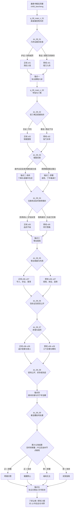

# 09 · 连城诀主线剧情（正邪双线与选择节点）

> 归属（基准 §18）：`ch09_liancheng` 的主线剧情、正邪立场轴、选择节点、原著事件去向、五个锚点、四象限结局与剧情任务接口；书界 DLC 文档 `chapters/09-liancheng.md` 的“主线”只索引本文，不复述。
> 上游：`00-canon.md` v1.1（唯一事实来源）；作者新增需求与已采用决定见 `decisions/author-requirements.md` AR-04、AR-09、AR-10 与 `decisions/author-decisions.md`；跨文档裁定见 `decisions/rulings-v1.md`。
> 引用而不重定义：锚点与改命总览 → `design/01-vision-and-core-loop.md` §7.10；年代、低武非战斗约束、书眠与跨书钩子 → `design/02-timeline-and-world-tiers.md`；品德 / 声望 → `design/03-attributes.md` §8.3–8.4；武学 → `design/05-martial-arts-system.md` 与 `design/catalog/skills-kangxi.md`；战斗 / Boss → `design/09-combat-system.md`；城市 / 区域 → `design/11-open-world.md` 与 `design/19-world-map.md`；天书与结局接口 → `design/13-progression-and-endings.md`；门派 → `design/17-sects-compendium.md`；NPC、生卒、D1–D5 与跨书同伴 → `design/18-npc-and-companions.md`。
> 标注约定：**（原创扩展）** = 原著没有的内容；**（待考）** = 原著事实尚需逐字核对；**（待核实）** = 技术事实尚未联网确认；**（待实测）** = 需要真机或真账号验证；**【建议值】** = 依赖其他文档、先给出可用数值并在文末登记。
> 版本：v0.9（剧情初稿，2026-09-26）。原著基线为三联 / 广州修订版；本文不编造逐字引文、回目号以外的小标题或原著招名。

---

## 0. 阅读指引与剧情总览

### 0.1 本书界参数与主题

| 项 | 固定值 | 本文用法 |
|---|---:|---|
| 书界 | 连城诀 `ch09_liancheng` | 第九书界；前接鹿鼎 `ch08_luding`，后接白马 `ch10_baima` |
| 年代 | 清初；约 1705–1712 **（原创扩展定年）** | 城市使用清初名“荆州府”“辰州府”；小说本身年代不详，不把游戏定年写成原著史实 |
| 境界 / 武运 / 难度 | 低武 / 38 / 4 | 每幕至少两种解法，至少一种非战斗；见 `design/02` §7.3 |
| 等级上限 | 46 | NPC 实际等级、经验和战斗数值不由剧情文档定义 |
| 携带 / 外来压制 / 层数上限 | 1 / 1 / 1；−4；8 | 只用于书界入场提示，算法见 `design/02`、`design/05` |
| 天书关键词 | 照心 | 看清他人贪欲，也照见玩家自己的利用与背信 |
| 标准内容量 | 168,000 经验、80 场战斗、战斗占比 32% | 仅作下游内容预算引用；本文不拆分数值 |
| 五个锚点 | 蒙冤入狱、丁典与凌霜华、雪谷困局、唐诗剑谱与天宁寺宝藏、狄云归雪谷 | 与 `design/01` §7.10 一字义对应，全部必经 |
| 唯一主改命锚点 | 丁典与凌霜华 | 是否成功决定 `tsp_09_canon` / `tsp_09_fate`；正邪立场不替代该判定 |

本书界不是“好人线替原著、坏人线受惩罚”。它由两个彼此独立的轴构成：

1. **立场轴**：玩家在每个选择节点所保护的人、所交付的证据与 `morality` 累积，决定当前进入正线还是邪线。正线以保人、求证、公开真相为主；邪线以交易、胁迫、伪证和借贪欲制贪欲为主，但同样有完整目标、资源与胜利。
2. **命运轴**：`dc_09_03` 是否在凌霜华被活埋、丁典触碰毒棺之前完成双人救援，决定原著 / 改命。正线可以错失改命，邪线也可以因契约、利益或真心完成改命。
3. **切线规则**：选择节点允许换线；不是在开局菜单锁阵营。换线会失去原路线的一部分关系、证据或分成，且公开背约会追加一次 `morality` 变化，不能无成本来回横跳。
4. **共同锚点**：两条线都亲历五个锚点。分支改变玩家站位、可救人物和证据用途，不把锚点删掉，也不让一次高属性检定在第一幕直接翻案。
5. **失败口径**：战斗失败优先回到幕内检查点；错过窗口通常产生“带损通关”而非断档。只有主角死亡、关键载荷永久丢失且无替代线索、或主动拒绝所有三方委托时才任务失败。

### 0.2 主线流程图



### 0.3 公共桥段与两线计数

公共桥段是两条线调用的“锚点事件包”，不替代各线 10 幕，因此正线与邪线仍各有 10 个 `q_09_main_z_NN` / `q_09_main_x_NN` 任务：

| 公共 ID | 名称 | 被哪些幕调用 | 不随立场改变的事实 |
|---|---|---|---|
| `q_09_main_c_01` | 乡人入荆 | `z01` / `x01` | 狄云与戚芳入万府，万门冲突升级，狄云最终蒙冤入狱 |
| `q_09_main_c_02` | 铁窗四年 | `z02` / `x02` | 丁典起初疑狄云为探子；狄云绝望自尽而被救；两人关系改变 |
| `q_09_main_c_03` | 雪封人心 | `z05–z07` / `x05–x07` | 水笙被劫、南四奇追入、雪崩封谷、人性在饥寒中显露 |
| `q_09_main_c_04` | 佛腹毒金 | `z10` / `x10` | 密码指向荆州府城南天宁寺；三师兄弟与群豪争宝；宝物带毒 |
| `q_09_main_c_05` | 雪谷有人 | 四种结局共同尾声 | 狄云携空心菜回雪谷，水笙在那里等待（大意）；天书现世 |

### 0.4 三个书界级谜题

| 谜题 | 出现幕 | 信息层 | 战斗替代价值 |
|---|---|---|---|
| “菊窗与毒棺” | `z02–z03` / `x02–x03` | 从花期、狱卒换班、凌府药材和棺木工单交叉识别金波旬花与假死窗口 **（原创扩展）** | 完成可绕开凌府正门 Boss，并满足主改命前置 |
| “万府夹墙” | `z08–z09` / `x08–x09` | 桃红证词、砖灰新旧、万震山离魂般砌墙动作与失踪者对照 | 解出可潜入暗室、拆穿伪证或反向胁迫万家，无须清空万门弟子 |
| “唐诗剑谱密码” | `z08–z10` / `x08–x10` | 棺盖数字、`sk_tangshijian` 次序、《唐诗选辑》对应取字；不在本文伪造诗句 | 正确解码直达天宁寺；伪码可调走一批争宝者；识毒可移除终盘一个阶段 |

谜题的技能入口引用 `design/05` §7.6：唐诗类可由 `lore` 或 `art` 解；本文只配置剧情替代条件。所有非战斗路径经验与同幕战斗路径须控制在 ±10%，由下游任务配表验收。

---

## 1. 原著重要剧情与走向清单

### 1.1 版本与回目口径

2026-09-26 已联网核对南开大学馆藏记录：广州出版社 2013 年第 2 版共十二章，依次为“乡下人进城、牢狱、人淡如菊、空心菜、老鼠汤、血刀老祖、落花流水、羽衣、‘梁山泊·祝英台’、《唐诗选辑》、砌墙、大宝藏”。不同网络目录把第九章写成“梁山伯·祝英台”、第十二章写成“连城宝藏”；本文采用馆藏目录显示名，同时将版本差异登记在 §9。下表是本作选定的 **54 个主要情节单位**，不是逐段索引。

“回目”只定位到章，不声称联网摘要能替代授权纸本逐字校勘。人物动作细序有疑问时标 **（待考）**；本文不会把电视剧改编情节倒灌为小说事实。

### 1.2 关键事件去向（按原著顺序）

| # | 回目 | 人物 | 地点 | 原著事件与结果（转述） | 本作去向 |
|---:|---|---|---|---|---|
| 01 | 一·乡下人进城 | 狄云、戚芳、戚长发 | 湘西麻溪铺 | 师徒三人由乡间生活进入万震山所设的荆州局面 | 双线共有：`c01`；开局身份在此汇合 |
| 02 | 一 | 狄云、戚芳、万门弟子 | 荆州府万府 | 乡下师兄妹受轻视，狄云与万门弟子冲突 | 双线共有：`z01/x01`；首个立场试探 |
| 03 | 一 | 言达平、狄云 | 万府附近 | 化装老丐的言达平授狄云三招，意在挑动同门猜忌 | 选择节点：`dc_09_01`；正线查身份，邪线把三招当筹码 |
| 04 | 一 | 狄云、万门弟子 | 万府 | 狄云凭新学三招扳回一局，引发“连城剑法”疑云 | 双线共有；谜题“招式不是密码本身”第一层 |
| 05 | 一 | 戚长发、万震山 | 万府内宅 | 万震山制造受伤 / 失踪假象，戚长发下落成谜；夹墙真相后揭 **（细序待考）** | 双线共有伏笔；`z08/x08` 回收 |
| 06 | 一 | 万圭、桃红、万门弟子、狄云 | 万府 | 万圭一方以桃红与失窃财物构陷狄云 | 锚点一前置；正线保留证词，邪线接触伪证网络 |
| 07 | 一至二 | 狄云、凌退思 | 荆州府衙 / 大牢 | 狄云被断指、穿琵琶骨并投入牢狱 | 锚点一“狄云蒙冤入狱”；不可由单次检定取消 |
| 08 | 二·牢狱 | 丁典、狄云 | 荆州大牢 | 丁典把狄云误认作凌退思派来的探子，长期戒备并殴打他 | 双线共有：`c02`；`dc_09_02` 决定接近方式 |
| 09 | 二 | 戚芳、万圭、狄云 | 万府 / 大牢 | 数年间戚芳不来探监，最终与万圭成婚；狄云获知消息 | 双线共有；不可用即时送信轻易抹去多年误会 |
| 10 | 二 | 沈城、狄云 | 荆州大牢 | 沈城到牢中带来婚讯，狄云绝望 | 双线共有；邪线可查出探监记录被操纵 |
| 11 | 二 | 狄云、丁典 | 荆州大牢 | 狄云自尽，丁典以神照功救活他，因而相信其并非诈伪 | 双线共有；丁典信任硬前置 |
| 12 | 二 | 丁典、狄云 | 荆州大牢 | 二人由猜忌转为结义 / 同盟，丁典为狄云分析冤案 | 正线 `z02` 直接建立；邪线 `x02` 可晚建并付背约代价 |
| 13 | 二 | 丁典、狄云 | 荆州大牢 | 狄云开始承接神照经传承与狱中求生经验 **（习练细序待考）** | 双线共有；只引用 `sk_shenzhao`、`sk_yuzhongqinna` 等已有 ID |
| 14 | 二至三 | 丁典、夺诀江湖客 | 荆州大牢 | 多名江湖人因连城诀而入狱逼夺，丁典应对来敌 **（人数与细序待考）** | 双线共有遭遇；可战、调包名册或放出假讯息 |
| 15 | 三·人淡如菊 | 梅念笙、万震山、言达平、戚长发、丁典 | 丁典追述的往事 | 三弟子为连城诀加害梅念笙，丁典救人并获传承 | 双线共有回忆；梅念笙仅为前史投影 / 传承，不改当代死亡 |
| 16 | 三 | 丁典、凌霜华 | 荆州府 | 二人相识相爱，菊花成为隔墙 / 隔狱相守的信物 | 锚点二前置；正邪均须分别取得二人信任 |
| 17 | 三 | 凌霜华、凌退思 | 凌府 | 凌霜华以毁容等方式拒绝父亲强迫，仍守丁典 **（具体次序待考）** | 双线共有；正线护送，邪线可用作揭穿凌退思的契据 |
| 18 | 三 | 凌霜华、丁典 | 凌府 / 大牢视线范围 | 窗前花讯维系约定，花讯中断预示危机 | 谜题一；`z02/x02` 收集花期与换盆记录 **（扩展调查）** |
| 19 | 三 | 丁典、狄云、凌退思 | 荆州府衙 / 凌府 | 丁典与狄云越狱赴凌府，凌退思以女儿之死设局 | 双线共有：`z03/x03`；主改命窗口 |
| 20 | 三 | 凌霜华、丁典 | 凌府灵堂 | 原著中凌霜华已死 / 被活埋，棺盖被涂金波旬花毒，丁典触棺中毒 | 锚点二原著结果；`dc_09_03` 可在此前双救 |
| 21 | 四·空心菜 | 丁典、狄云 | 荆州废园等 | 丁典毒发，托狄云完成合葬等遗愿后身亡 **（遗言细字待考）** | 原著分支；改命分支以假死车队替代追捕场面 |
| 22 | 四 | 狄云、戚芳、万圭、丁典 | 万府菜园 / 柴房 | 狄云携丁典遗体潜行，重遇戚芳并与万圭冲突 | 正线 `z04` 重在守遗愿；邪线 `x04` 借遗体与衣物设局 |
| 23 | 四 | 戚芳、狄云、丁典 | 长江小舟 | 戚芳暗中使狄云与丁典遗体脱离万府追杀 **（具体搬运过程待考）** | 双线共有出荆桥段；保留戚芳仍有情义的证据 |
| 24 | 五·老鼠汤 | 宝象、狄云 | 江岸 / 破庙 | 宝象沿江追杀狄云，狄云削发去须仍难脱身 | 双线共有；`z04/x04` 两种处置 |
| 25 | 五 | 宝象、丁典、狄云 | 破庙 | 宝象伤及丁典遗体，又因吃下受毒污染的老鼠汤而亡 | 双线共有原著结果；玩家不能把误食毒物包装成正义处决 |
| 26 | 五 | 狄云、宝象 | 破庙 | 狄云取得 / 接触血刀门衣物、血刀经及丁典所留乌蚕衣相关物件 **（取得细序待考）** | 双线共有载荷；武学只引用 `sk_xuedaojing`，装备只引用 `eq_wucanyi` |
| 27 | 五 | 水笙、汪啸风、狄云 | 赴藏边途中 | 水笙一方误把狄云当血刀恶僧，冲突中狄云受伤 | 选择节点 `dc_09_04`；汪啸风 ID 待上游补 |
| 28 | 五至六 | 血刀老祖、水笙、狄云 | 藏边驿路 | 血刀老祖劫走水笙，并把被误认的狄云卷入同行 | 双线共有；正线暗护，邪线公开交易 |
| 29 | 六·血刀老祖 | 汪啸风、南四奇、群豪 | 藏边山路 | 追兵循迹追赶血刀老祖，狄云的身份误会加深 | 双线共有追逐；正邪对追踪线索用途相反 |
| 30 | 六 | 血刀老祖、水笙、狄云、南四奇 | 藏边雪谷 | 雪崩 / 大雪封路，把双方困入绝谷 **（确切地望待考）** | 锚点三“雪谷困局”；公共 `c03` |
| 31 | 七·落花流水 | 花铁干、刘乘风、血刀老祖 | 雪谷 | 花铁干在混战中误杀刘乘风，侠名开始崩裂 | `dc_09_05` 的首个可干预死亡；不改变主改命天书判定 |
| 32 | 七 | 血刀老祖、陆天抒 | 雪谷雪地 | 血刀老祖借地形与诡计杀陆天抒 | 双线共有；识破雪下伏击可作次级救援 |
| 33 | 七 | 血刀老祖、水岱、水笙 | 雪谷 | 血刀老祖重创并断水岱双腿；水岱求狄云结束痛苦 | 正线道德困境 / 邪线筹码困境；允许救治但条件严苛 |
| 34 | 七 | 花铁干、血刀老祖 | 雪谷 | 花铁干在恐惧中向血刀老祖屈服，后来进一步堕落 | 双线共有；正线存证，邪线控制其证词 |
| 35 | 七 | 狄云、血刀老祖 | 雪谷 | 狄云在濒危搏斗中神照功贯通，血刀老祖最终身亡 **（动作细序待考）** | 双线共有 Boss；可战或利用冰壁 / 刀痕智取，结果仍为老祖死亡 |
| 36 | 八·羽衣 | 狄云、水笙、花铁干 | 雪谷 | 三人在严寒饥饿中求生；花铁干吃马肉并进而食尸、威胁二人 | 双线共有生存段；不能洗白花铁干行为 |
| 37 | 八 | 狄云、水笙 | 雪谷洞穴 | 狄云以鸟羽等为水笙制成羽衣，误会逐渐化解 | 正线 `z07` 关系核心；邪线 `x07` 仍可真诚相助 |
| 38 | 八 | 花铁干、水笙、汪啸风、群豪 | 雪谷出口 | 出谷后花铁干散布污名，水笙证言不被汪啸风等轻信 | 选择节点 `dc_09_06`；证据可澄清、勒索或封存 |
| 39 | 九·“梁山泊·祝英台” | 狄云 | 湘西麻溪铺 | 狄云先返故里寻找师父，发现宅地被人掘寻 | 双线 `z08/x08`；地点挂辰州府沅陵南郊 **（村址待考）** |
| 40 | 九 | 言达平、万震山、万圭、狄云 | 麻溪铺一带 | 三方为剑谱线索再斗；万圭中毒，狄云借救治 / 跟踪查明更多真相 **（细序待考）** | 正线救人取证；邪线使三方互相暴露 |
| 41 | 九 | 狄云、戚芳（回忆） | 旧居山洞 | 童年背诵的《唐诗选辑》与彩蝶记忆重新连接剑谱线索 | 谜题三前置；不虚构诗句内容 |
| 42 | 十·《唐诗选辑》 | 狄云、吴坎 | 荆州府万府 | 狄云改扮郎中进入万府，吴坎成为入口与危险证人 | 正线 `z08` 潜入；邪线 `x08` 交易 / 反间 |
| 43 | 十 | 桃红、狄云、戚芳 | 万府 | 桃红的处境与说法使早年构陷、假砌墙等线索浮现 | 双线共有证据；`dc_09_07` 前置 |
| 44 | 十至十一 | 吴坎、万震山、戚芳 | 万府 | 吴坎纠缠戚芳，万震山为灭口杀吴坎 | 原著分支；可在短窗口救吴坎，但须承担证人保护责任 |
| 45 | 十一·砌墙 | 万震山、戚芳、狄云 | 万府内宅 / 夹墙 | 万震山反复砌墙的动作暴露旧案；夹墙中戚长发尸体并不在原位 | 谜题二完成；双线对真相用途不同 |
| 46 | 十一 | 狄云、万震山、万圭 | 万府夹墙 | 狄云制伏万氏父子并把他们封入夹墙 | 双线共有可达状态；正线为制止，邪线为迫签供状 |
| 47 | 十一 | 戚芳、万圭、狄云 | 万府夹墙 | 戚芳不忍而放出丈夫，万圭反刺戚芳；戚芳死前托付女儿 | `dc_09_07` 原著结果；充分预警可改写为戚芳获救，但不改变 `tsp_09_*` |
| 48 | 十一 | 狄云、空心菜、万氏父子 | 万府 | 狄云承担保护孩子的责任，并处理万氏父子的后果 **（父子最终细序待考）** | 双线共有责任载荷；孩子永不作为筹码物品化 |
| 49 | 十二·大宝藏 | 狄云、丁典、凌霜华 | 荆州府 | 狄云完成丁典与凌霜华合葬，并从棺盖数字取得连城诀关键 **（原著线）** | 原著分支线索；改命线由凌霜华亲交同一组数字，不挖空棺 |
| 50 | 十二 | 狄云、荆州群豪 | 荆州府 | 数字 / 剑诀消息扩散，争宝者开始聚集 **（扩散方式待考）** | `dc_09_08`：公开、封存或伪码 |
| 51 | 十二 | 狄云 | 《唐诗选辑》与剑谱线索处 | 依数字次序从《唐诗选辑》解出藏宝指向 | 谜题三完成；正解唯一、可有多种取得信息的方法 |
| 52 | 十二 | 言达平、戚长发、万震山、狄云 | 荆州府城南天宁寺 | 言达平先至而遭戚长发所杀；万震山又伏击戚长发；狄云救师后反遭师父暗算 | 锚点四公共 `c04`；逐层揭示三人同源贪欲 |
| 53 | 十二 | 凌退思、花铁干、汪啸风、群豪 | 天宁寺 | 众人争抢涂毒宝物并相继中毒；相关人物结局细目须再核版本 | `dc_09_09`；正线疏散 / 封存，邪线设局 / 收网 |
| 54 | 十二 | 狄云、水笙、空心菜 | 藏边雪谷 | 狄云种菊、携空心菜归雪谷，水笙在那里等待（大意） | 锚点五公共 `c05`；四结局汇合与天书现世 |

### 1.3 覆盖率表

| 去向类型 | 事件编号 | 数量 |
|---|---|---:|
| 双线共有 / 公共幕 | 01、02、04、08–14、18–19、23–26、28–29、32、34–36、39–43、45–46、48、51 | 31 |
| 选择节点（主去向） | 03、06、27、31、33、38、44、47、50、53 | 10 |
| 锚点（主标签；亦可能属于共有） | 07、20、30、52、54 | 5 |
| 正邪差异化演绎（主去向） | 05、15–17、21–22、37、49 | 8 |
| 支线（交书界文档） | 无；游方武当补位不属于这 54 个主线事件 | 0 |
| 不采用 | 无 | 0 |
| 合计（按每事件一个“主去向”去重） | 01–54 | **31 + 10 + 5 + 8 = 54；54 / 54 = 100%** |

说明：锚点行在流程上也属于两线共有，但覆盖统计只记“锚点”主标签，故不会重复相加。原著主要情节的“100%”指本节明确选定的 54 个主要情节均有去向，不宣称罗列了小说每一个细节。

---

## 2. 主角定位与开局

### 2.1 穿越者身份

主角仍是十四书界同一名穿越者，不取代狄云，也不预知完整小说文本。前书界约 1690 年离界，依《长生诀》书眠约 15 年，于约 1705 年苏醒；年代算法与书眠状态归 `design/02`、同伴资格归 `design/18`。

因 `chapters/09-liancheng.md` 尚未写成，本文先给三种开局并登记待同步：

| 开局 | 苏醒点 | 初始关系 / 能力叙事 | 首幕入口 | 性质 |
|---|---|---|---|---|
| 麻溪铺药铺帮工 | 辰州府沅陵南郊、麻溪铺 **（村址待考）** | 认识乡间药材与戚氏师徒，但无既成亲属关系；能辨普通伤情，不能开局识破金波旬花 | 随送药 / 带路队伍同赴荆州府 | 默认，**（原创扩展）** |
| 荆州府行栈抄书人 | 荆州府 `city_jingzhou` | 熟悉账契、货签与抄书，先见万府请帖和异常砖料；不自动拥有官府权限 | 受雇入万府誊账，遇见乡人进城 | 默认，**（原创扩展）** |
| 荆州大牢狱卒 | 荆州府大牢 | 狱中线提前，可看换班簿；若滥用职权会迅速失去身份 | 先见丁典，再被派往万府押送差事 | 隐藏开局；已由 `design/13` §6.4.2 给定 |

三身份只改变调查顺序、第一幕入口和少量台词，不改变狄云蒙冤入狱。隐藏狱卒可以提前知道“有人每月固定受刑”，却不能在没有证据时释放丁典或狄云。

### 2.2 与主要人物的关系起点

| 人物 | 起点 | 可演变方向 |
|---|---|---|
| 狄云 `npc_diyun` | 麻溪铺开局为点头之交；另两身份为陌生人 | 共同保全证据 → 生死同伴；利用其冤案 → 警惕的临时盟友 |
| 戚芳 `npc_qifang` | 对外乡人礼貌但护着师兄与父亲 | 得到完整证据后成为证人 / 同伴；若玩家用女儿或婚姻施压则永久拒绝长期同行 |
| 丁典 `npc_dingdian` | 视所有接近牢房者为凌退思耳目 | 通过不可伪造的小事建立信任；套话路线也能结盟，但须承认一次背约 |
| 凌霜华 `npc_lingshuanghua` | 隔着凌府与官狱，无法直接会面 | 通过花讯、药单、侍役口供建立独立信任；不是丁典的附属“营救目标” |
| 万圭 `npc_wangui` | 想排除狄云并控制戚芳 | 正线敌对；邪线可签短约，但其两次可发现背叛线索不可删除 |
| 凌退思 `npc_lingtusi` | 把主角当可买通的外来工具 | 邪线雇主之一；任何合作都不改变其对女儿与丁典设毒局的责任 |
| 血刀老祖 `npc_xuedaolaozu` | 尚未见面 | 可短时受制同行 / 交易，不可洗白劫掠和伤害；雪谷仍走向死亡 |
| 水笙 `npc_shuisheng` | 初见时受衣着与传言误导 | 由共同生存与可核实证据建立信任，不由一次口才检定强制相信 |

### 2.3 第一选择节点与立场初值

首个选择 `dc_09_01` 发生在万府构陷尚未完全闭合、主角已拿到“一份不完整证据”时。证据可能是被替换的财物清单、桃红被迫改口的片段或狱差提前写好的押解票 **（均为原创扩展载体）**，但没有一份能单独推翻凌退思与万家的共同操作。

- 交给戚芳并留副本：进入 `z01`，`morality +6` **【建议值】**。
- 封存并继续查：暂不定线，`morality +1` **【建议值】**，第二节点再判。
- 交给万圭换取内宅身份：进入 `x01`，`morality -5` **【建议值】**。
- 交官府同时暗留副本：进入 `x01` 的“双面”变体，`morality -2` **【建议值】**；若后续主动交还副本可补回 +3。

这些单次变化均落在 `design/03` 规定的 ±1～±15 建议区间。书界内的正邪路由默认以“最近两个关键节点 + 当前 `morality`”判定，不覆盖跨书界永久品德；完整判定见 §5。

---
## 3. 正线：守人而后明真

正线不是“见恶即杀”，而是把不可逆伤害压到最低、让证据能被当事人掌握，并在最后拒绝用毒宝藏复制凌退思等人的逻辑。全线 10 幕；每幕均列至少两种解法，且至少一种非战斗。玩家在 §5 所列节点转向邪线时，进入同阶段的 `xNN`，不必重做公共锚点。

### 3.1 `q_09_main_z_01` · 纸上清白

- **原著对应事件（回目）**：第一章“乡下人进城”至第二章“牢狱”；事件 01–07。
- **地点**：辰州府沅陵南郊麻溪铺 **（确切村址待考）** → 荆州府 `city_jingzhou`、万府；区域 `rg_huxiang` → `rg_jingxiang`。
- **参与 NPC**：`npc_diyun`、`npc_qifang`、`npc_qichangfa`、`npc_wanzhenshan`、`npc_yandaping`、`npc_wangui`、`npc_lukun`、`npc_zhouqi09`、`npc_sunjun`、`npc_buyuan`、`npc_wukan`、`npc_fengtan`、`npc_shencheng`。
- **目标与流程**：
  1. 从所选开局接入戚氏师徒进城队伍，沿途听见“连城剑法即宝藏口令”的不同传言。
  2. 在万府比剑冲突中保护狄云，同时记录言达平所授三招与万门剑路的差异，不把三招冒充完整 `sk_tangshijian`。
  3. 查出客房财物清单被换、桃红被迫改口、押解票早于案发写成三条不完整证据中的至少一条 **（证据载体均为原创扩展）**。
  4. 经 `dc_09_01` 把证据交给戚芳、封存或暂交官府；正线要求当事人至少持有一份可核对副本。
  5. 戚长发失踪、万震山伪装受伤后，在夹墙外留下砖灰与脚印样本；此时不能进入暗墙。
  6. 万圭仍完成构陷，狄云被押入牢；玩家保护证据或争取公开验伤，使锚点发生而非被跳过。
- **可选解法**：A. 以抄书 / 账房身份比对清单、说服一名万门弟子留下真实时刻（非战斗）；B. 夜潜库房拓下印记（非战斗）；C. 在比剑后迎战万门围攻，趁混乱夺回押票（战斗）。三路奖励等价，A / B 不少于 C 的 90%。
- **关键战斗**：万门弟子混战（普通 → 精英，`npc_wangui` 只作场外指挥）；朝向、援护、投降与 AI 引用 `design/09`，本文不写属性。战斗可选，不以击倒所有弟子为真相成立条件。
- **幕内小选择**：优先救被推作伪证的桃红，或追取账簿。救人写 `lc09.witness.taohong_safe`；追账写 `lc09.evidence.ledger`。两者都能通关，前者使后续口供更稳，后者使万府潜入更易。
- **幕末状态变化**：写 `lc09.anchor.diyun_jailed=true`、`lc09.evidence.early_copy=true`；`morality +4`、`fame +40` **【建议值】**；万家门关系下降；狄云成为场景同行后强制离队入狱；转 `q_09_main_z_02`。
- **失败与时限**：案发当夜为证据窗口；失败只使早期副本丢失、`z02` 增加一项取证步骤。主动焚毁唯一副本并收取万圭报酬会在 `dc_09_01` 转 `x01`；主角死亡才读档。

### 3.2 `q_09_main_z_02` · 铁窗辨心

- **原著对应事件（回目）**：第二章“牢狱”、第三章“人淡如菊”；事件 08–18。
- **地点**：荆州府大牢、府衙外街、可望见凌府花窗的巷道；`city_jingzhou` / `rg_jingxiang`。
- **参与 NPC**：`npc_diyun`、`npc_dingdian`、`npc_lingshuanghua`、`npc_lingtusi`、`npc_shencheng`；梅念笙 `npc_meiniansheng` 仅在丁典追述 / 记忆画面中出现。
- **目标与流程**：
  1. 依开局身份以囚犯、狱卒或送饭关系进入牢狱循环，见证丁典把接近者视为知府探子。
  2. 不替狄云做决定；让婚讯、绝望与自尽—获救按原著因果发生，玩家只能留下陪伴、延后刁难或查探探监记录。
  3. 以三件无法同时伪造的小事证明立场：原证副本、未向凌退思报告的换班空档、替狄云归还的私物，任选其二 **（验证载体为原创扩展）**。
  4. 丁典信任狄云后追述梅念笙旧案、神照经与凌霜华花讯；玩家区分武学传承、数字密码与宝藏传言。
  5. 察觉窗前菊花换盆节律异常，查凌府药材与棺木订单，建立“花讯—毒物—假死”谜题。
- **可选解法**：A. 贿赂小吏、比对探监簿与换班簿（非战斗）；B. 以 `speech` 让一名被投入牢中的夺诀者误报凌退思计划（非战斗）；C. 在狱中袭击中保护二人并留活口讯问（战斗）。
- **关键战斗**：夺诀江湖客与狱役夹击（普通 / 精英）；狭窄牢格、靠墙拆械等战场规则引用 `design/09`，可由 `sk_yuzhongduanquan` / `sk_yuzhongqinna` 的既有内容表现，但不保证玩家习得。
- **幕内小选择**：把缴获短刀交丁典用于越狱，或交狄云用于自保。前者缩短 `z03` 脱牢流程；后者降低狄云受伤叙事风险。私藏后出售则不是正线选项，会触发 `dc_09_02` 的背约切线。
- **幕末状态变化**：写 `lc09.trust.dingdian=true`、`lc09.clue.flower_cycle=true`；若探得毒花则写 `lc09.poison.suspected=true`；`morality +5`、`fame +30` **【建议值】**。丁典与狄云以场景同伴加入；出牢时离开普通编组转剧情队列。
- **失败与时限**：以“花讯中断”为软截止；未取两项互证仍能随丁典越狱，但不能完成改命，只能在 `z03` 保存遗愿与证据。杀死无辜狱卒或把花讯交凌退思会切入 `x02`。

### 3.3 `q_09_main_z_03` · 菊窗未谢

- **原著对应事件（回目）**：第三章“人淡如菊”至第四章“空心菜”；事件 19–21；五锚点之二。
- **地点**：荆州府衙地牢出口、凌府后院 / 灵堂、城外废园；`city_jingzhou`。
- **参与 NPC**：`npc_dingdian`、`npc_lingshuanghua`、`npc_diyun`、`npc_lingtusi`。
- **目标与流程**：
  1. 在月度刑讯前后制造越狱窗口，并把丁典、狄云从不同牢门送出，避免一处堵死全队。
  2. 由药材单、花房残叶、工匠口供三者中取两项，正式识别金波旬花风险；只看到金色花朵不等于识毒。
  3. 分别取得丁典信任与凌霜华信任；后者须收到不含藏宝逼问的回信，不能由丁典信任自动代替。
  4. 在 `dc_09_03` 作选择：按原著闯灵堂，或执行“双路假死 / 脱身”方案 **（原创扩展）**。
  5. 改命方案必须在凌霜华被活埋、丁典触棺之前换出活人并隔离棺盖；同时放弃“神照经快速传授”或“宝藏分成”之一。
  6. 原著方案中，玩家护送中毒丁典至废园、记录遗愿并保护狄云脱身，不把失败归咎于玩家一次手慢。
- **可选解法**：A. 以工匠身份调换棺木、药包与出城车牌（非战斗）；B. 说服被凌退思牵连的书吏建立假死文书（非战斗）；C. 从地牢与后墙同步突入，击退府兵后抢人（战斗，但仍要求识毒与双信任，蛮力不能跳条件）。
- **关键战斗**：凌府伏兵（精英）与追捕队（精英）；若谜题完成，避开正门 Boss。战斗分阶段、援军与撤离引用 `design/09`；不把凌退思本人设计成高武 Boss。
- **幕内小选择**：牺牲项二选一：① 封存丁典的速成讲义，书界内不得通过本幕直接习得 `sk_shenzhao`；② 签下宝藏零分成契约，终幕不得选个人留藏。两项都满足主改命代价，选项均不可反悔。
- **幕末状态变化**：成功则写 `lc09.anchor.dingling_fate=true`、`lc09.life.dingdian=fate_rescued`、`lc09.life.lingshuanghua=fate_rescued`；若二人曾入队，按 `design/18` 发同一次双人改命事件，费用由 `design/13` 扣 2 点余韵，不足记 `fateDebt`。原著则写 `lc09.anchor.dingling_canon=true` 及二人死亡事实。正线选择救援 `morality +10`，护送遗愿 `morality +6` **【建议值】**。
- **失败与时限**：这是严格时机窗；棺钉落下 / 丁典触棺后，不能靠读条治疗逆转。救援条件不足自动落原著分支但主线继续。丁典、凌霜华若获救，先以假死身份离队隐匿，至终幕前不常驻战斗编组。

### 3.4 `q_09_main_z_04` · 一盏老鼠汤

- **原著对应事件（回目）**：第四章“空心菜”、第五章“老鼠汤”；事件 22–26。
- **地点**：万府菜园 / 柴房、长江荆州段小舟、江岸破庙；`city_jingzhou` 与 `rg_jingxiang`。
- **参与 NPC**：`npc_diyun`、`npc_qifang`、`npc_wangui`、`npc_dingdian`（原著为遗体 / 改命为暗线）、`npc_baoxiang`。
- **目标与流程**：
  1. 原著分支护送丁典遗体并寻找与凌霜华合葬线索；改命分支护送接触过毒棺的替身灵车，掩护二人出城 **（原创扩展）**。
  2. 在万府菜园与戚芳短暂重逢，让她亲自看到早期证据副本，不强迫她立即背弃现有家庭。
  3. 经柴房冲突脱离万府；保全戚芳“救过狄云”的事实，供 `z09` 回收。
  4. 沿江遭宝象追杀，先辨认其要的是衣物、经书与尸身所藏线索，而非单纯随机劫掠。
  5. 原著分支保留宝象伤及中毒遗体、吃受污染老鼠汤而死的因果；改命分支由受毒灵车布帛污染鼠肉，仍明确是其贪食与未知毒物造成，玩家不得主动端汤杀人 **（原创扩展改写）**。
  6. 安置遗体 / 毒物，取得血刀僧衣、`sk_xuedaojing` 载体与 `eq_wucanyi` 的剧情载荷；习得规则仍归图鉴与书界文档。
- **可选解法**：A. 操舟换岸、留下假足迹并锁住破庙食物（非战斗）；B. 用医毒知识识别污染源、警告宝象并逼其退走（非战斗；他若不听仍按原著自食其果）；C. 泥塘牵制宝象、夺械后撤（精英战斗）。
- **关键战斗**：宝象（精英），以追逐、浅塘与夺械为重点；移动、地形和撤离引用 `design/09`。战斗胜利只代表脱身，不可在其失去战力后以处决替代原著因果。
- **幕内小选择**：把血刀经载体封存交狄云、留作调查血刀门，或当场焚毁。正线前两项均可；焚毁会失去后续身份佐证，但不销毁图鉴定义。
- **幕末状态变化**：写 `lc09.life.baoxiang=dead`、`lc09.clue.xuedao_identity=true`、`lc09.item.wucanyi_known=true`；不因宝象误食自动加品德。若警告并尝试救治则 `morality +3` **【建议值】**。狄云继续为场景同伴；戚芳留在万府。
- **失败与时限**：毒物须在离庙前封存，超时会造成无名路人中毒并扣 `morality -6` **【建议值】**，但可在下幕补救。灵车 / 遗体若落入追兵手中，玩家可从押运队夺回，不断主线。

### 3.5 `q_09_main_z_05` · 血衣不染

- **原著对应事件（回目）**：第五章“老鼠汤”至第六章“血刀老祖”；事件 27–30。
- **地点**：由湖广赴藏边的驿路、昌都地区所指治所 `city_qamdo` **（待考）**、藏边雪谷 `rg_qingzang` **（原著确址待考）**。
- **参与 NPC**：`npc_diyun`、`npc_shuisheng`、汪啸风（待补 ID）、`npc_xuedaolaozu`、`npc_shuidao`、`npc_liurenfeng`、`npc_lutianshu`、`npc_huantiegan`。
- **目标与流程**：
  1. 处理血刀僧衣造成的误认：公开出示宝象追杀证据，或保持伪装以追查血刀老祖，但不得主动嫁祸无辜僧人。
  2. 初遇水笙与汪啸风时选择收刀、护住伤者并让狄云陈述；误会不会因一次成功口才立刻消失。
  3. 血刀老祖突入并劫持水笙；正线的即时目标是留下可追踪信号、阻止当场伤害，而非以剧情无敌强行失败。
  4. 让南四奇分别取得同一追踪符号的不同部分，避免花铁干一人控制叙事。
  5. 在山口暴雪前备粮、绳索和避寒物；可提前救出一批跟随群豪，主角团仍因救水笙进入雪谷。
  6. 雪崩封路，触发公共锚点 `q_09_main_c_03`。
- **可选解法**：A. 沿驿站、马蹄与衣角标记追踪，谈判换出旁人（非战斗）；B. 伪装血刀门低阶弟子传错口令，延缓老祖（非战斗）；C. 在山口迎战血刀门追随者并掩护南四奇推进（普通 / 精英战斗）。
- **关键战斗**：血刀门追随者（普通 / 精英）；血刀老祖只作不可击败的阶段压迫与撤退目标，正式 Boss 在 `z06`。追逐和护送引用 `design/09`。
- **幕内小选择**：把唯一一件厚裘交受伤的狄云、水笙或年长向导。对应人物在 `z06` 少一个生存障碍；没有“最优全救”，但后续营地准备可补足。
- **幕末状态变化**：写 `lc09.anchor.snow_valley=true`、`lc09.trust.shuisheng_seed=true`；水笙被迫成为剧情同伴，南四奇为盟军；`morality +4`、`fame +80` **【建议值】**；血刀门关系敌对，万家门状态保持。
- **失败与时限**：暴雪到达是硬时限；未备物资不会断线，而使 `z06` 必须先做一次觅食 / 救援。若玩家主动把水笙交给老祖换取身份，转 `x05` 并留下可补救债务。

### 3.6 `q_09_main_z_06` · 落花流水

- **原著对应事件（回目）**：第七章“落花流水”；事件 31–35。
- **地点**：藏边雪谷冰坡、雪沟与洞口；`rg_qingzang`，临近 `city_qamdo` 仅为项目玩法落点，非原著确址。
- **参与 NPC**：`npc_diyun`、`npc_shuisheng`、`npc_xuedaolaozu`、`npc_huantiegan`、`npc_shuidao`、`npc_liurenfeng`、`npc_lutianshu`。
- **目标与流程**：
  1. 以刀痕、积雪承重和风向重建血刀老祖的伏击路线，识别“武功不占绝对优势、地形却能杀人”的局面。
  2. 在花铁干误杀刘乘风前发出警示；若无前置证据，只能改变受伤位置而不能凭空停下所有人。
  3. 于陆天抒追击与水岱受创两个短窗口中配置绳索 / 援护；资源不足时必须选择优先救援者。
  4. 水岱若重伤，玩家可尊重其求死、尝试止血撤离或拒绝代杀；任何选择都需由水笙见证，不能静默结算。
  5. 逼血刀老祖进入已勘察的冰层 / 雪沟，或与狄云正面迎战；狄云的神照功突破仍是其人物时刻，不被玩家抢走。
  6. 血刀老祖死亡、花铁干投降 / 崩坏，余人转入长期封谷求生。
- **可选解法**：A. 勘察冰层、拆掉伏雪支点，让老祖失去一个 Boss 阶段（非战斗智取）；B. 用 `speech` 与多人证词阻止花铁干抢攻，再以绳索救援（非战斗 / 救援）；C. 与南四奇正面合战（Boss）。
- **关键战斗**：血刀老祖（Boss）、雪地伏击者（精英）；Boss 阶段、地形破坏、友伤和投降引用 `design/09`。完成冰层谜题时采用“移除一个阶段”的非纯战斗削弱，满足 `design/02` §7.3 N2，具体脚本数值归 `design/09` / 书界文档。
- **幕内小选择**：救援顺序由 `dc_09_05` 记录。保存全部前置物资且未浪费绳索时可救两组；否则在刘乘风 / 陆天抒与水岱之间择一优先。次级救人不改变 `tsp_09_*`，若满足同伴改命条件，费用仍由 `design/13` 统一结算。
- **幕末状态变化**：写 `lc09.life.xuedaolaozu=dead`、`lc09.truth.huantiegan_fell=true`；各被救者写独立 `lifeState`。主动救援 `morality +5`，尊重水岱明确求死不加不减，未经询问处决 `morality -8` **【建议值】**。狄云、水笙留队；花铁干转受监视场景同伴。
- **失败与时限**：每个救援窗口只在对应阶段存在；错过即按原著死亡，不使任务失败。Boss 战败回到雪崩后的检查点；若放任老祖携水笙离谷则由南四奇残部追回并转 `x06` 的受制局面。

### 3.7 `q_09_main_z_07` · 羽衣为证

- **原著对应事件（回目）**：第八章“羽衣”；事件 36–38。
- **地点**：藏边雪谷洞穴、冰壁、雪融出口；`rg_qingzang`。
- **参与 NPC**：`npc_diyun`、`npc_shuisheng`、`npc_huantiegan`、汪啸风（待补 ID）；获救的南四奇成员按状态加入。
- **目标与流程**：
  1. 建立每日燃料、食物、伤情与看守轮换；玩法规则归书界文档，本文只规定剧情用途。
  2. 见证花铁干从吃马肉到侵夺死者、威胁活人的升级，不用一个“饥饿值”替其免责。
  3. 狄云与水笙通过共同觅食、疗伤和制作羽衣逐步互信；玩家可帮忙，不替代两人的关系成长。
  4. 收集三类可公开证据：冰坡刀痕、南四奇幸存证言、花铁干自己前后矛盾的话；羽衣只是信任见证，不作为“名节物证”。
  5. 雪融时决定先送伤者、先押花铁干或先让水笙出谷；不同顺序影响谁先控制舆论。
  6. 经 `dc_09_06` 公开完整事实、仅为水笙澄清，或暂封证据避免群斗。
- **可选解法**：A. 设鸟食与绳套、修通通风口并以账册分粮（非战斗）；B. 让花铁干在多人面前复述时间线，用矛盾限制其造谣（非战斗）；C. 花铁干袭击时非致命制伏（精英战斗）。
- **关键战斗**：饥饿失控的花铁干（精英，可免战）；若南四奇有人获救，他们作为证人而非额外战力强制碾压。战斗内投降、护送和非致命目标引用 `design/09`。
- **幕内小选择**：是否把最后一份食物给花铁干。给予不会洗白他，但可换取一段真实口供；拒绝不会扣品德，若故意以食物胁迫其食尸细节供观众猎奇则转邪线倾向。
- **幕末状态变化**：写 `lc09.evidence.snow_truth=true`；公开完整事实写 `lc09.reputation.shuisheng_cleared=true`、`morality +6`、`fame +180` **【建议值】**；只保人不公开写 `morality +3`。水笙可转 D5 临时同伴；狄云决定先返麻溪铺；花铁干离队并进入敌对 / 受审状态。
- **失败与时限**：雪融前必须维持至少一条食物来源；失败进入救援队提前破壁的损失分支，证据少一类但仍能出谷。让花铁干先出谷且没有副本，会加大 `dc_09_06` 澄清门槛而非锁死正线。

### 3.8 `q_09_main_z_08` · 蝶返麻溪

- **原著对应事件（回目）**：第九章“梁山泊·祝英台”、第十章《唐诗选辑》；事件 39–43。
- **地点**：辰州府沅陵南郊麻溪铺 `city_chenzhou_yuanling` / `rg_huxiang` → 荆州府 `city_jingzhou`。
- **参与 NPC**：`npc_diyun`、`npc_yandaping`、`npc_wanzhenshan`、`npc_wangui`、`npc_qichangfa`（踪迹）、`npc_qifang`、`npc_wukan`、桃红（待补 ID，见 §8）。
- **目标与流程**：
  1. 回麻溪铺查看被掘宅地，以土层、工具痕和三路脚印区分言达平、万家与戚长发踪迹。
  2. 目睹 / 介入三方争斗和万圭中毒，不以“敌人中毒活该”跳过解药抉择。
  3. 从言达平处核对老丐身份与三招用意；保存其口供但不承诺把完整密码交给他。
  4. 在旧山洞找到《唐诗选辑》与儿时记忆线索，让狄云完成关键联想。
  5. 选择救治万圭以换取合法进入万府的窗口，或改扮郎中 / 货商潜入；两条均不要求原谅他。
  6. 在万府外找到桃红本人或其留下的去向证词，补足早期构陷链。
- **可选解法**：A. 勘查土层、跟踪三组足印、交换解药（非战斗）；B. 以 `art` / `lore` 识别诗书的取字结构（非战斗）；C. 分开万家与言达平的混战并夺得解药（精英战斗）。
- **关键战斗**：言达平与万家追兵的三方战（精英，可避开）；战斗目标是夺药 / 护人 / 撤离，非清场。多阵营仇恨与撤离引用 `design/09`。
- **幕内小选择**：是否把解药给万圭。给药写 `lc09.debt.wangui_owed=true`，不加信任；不给但交给戚芳决定写 `lc09.choice.qifang_agency=true`；毁药扣 `morality -5` **【建议值】** 并转邪线倾向。
- **幕末状态变化**：写 `lc09.clue.poetry_book=true`、`lc09.truth.yandaping=true`、`lc09.evidence.taohong=true`；`morality +3`、`fame +70` **【建议值】**。狄云留队；水笙可随行或在雪谷 / 驿站暂离。
- **失败与时限**：万圭毒发为短窗口；错过后他以其他渠道得救 **（原创扩展兜底）**，玩家失去“郎中”入口但可走屋顶潜入。诗书若被抢，可从万府账房重取副本，不使密码链断裂。

### 3.9 `q_09_main_z_09` · 夹墙灯影

- **原著对应事件（回目）**：第十章《唐诗选辑》、第十一章“砌墙”；事件 42–48。
- **地点**：荆州府万府前院、柴房、内宅与夹墙；`city_jingzhou` / `rg_jingxiang`。
- **参与 NPC**：`npc_diyun`、`npc_qifang`、`npc_wanzhenshan`、`npc_wangui`、`npc_wukan`、`npc_lukun`、`npc_zhouqi09`、`npc_sunjun`、`npc_buyuan`、`npc_fengtan`、`npc_shencheng`。
- **目标与流程**：
  1. 以郎中、送货或屋顶潜入三种入口进入万府，先把构陷证据交戚芳本人核验。
  2. 观察万震山离魂般砌墙动作，比对砖灰、旧血与“戚长发尸体不在原处”，解开夹墙谜题。
  3. 在吴坎赴约 / 被灭口前取得其供词；可救其性命，但必须安排保护，不能收进队伍后遗忘。
  4. 制伏万氏父子，取得由不同人分别保管的供词、钥匙与诗谱线索；是否封墙由 `dc_09_07` 决定。
  5. 明确警告戚芳万圭的匕首与第二次背叛线索，给她独立撤离路线，并先送走女儿空心菜。
  6. 条件足时救下戚芳；条件不足则原著悲剧发生，她临终托孤。无论结果，空心菜都由可信照料人保护。
- **可选解法**：A. 以桃红、吴坎和砖灰三证会审，分化万门弟子（非战斗）；B. 夜潜开夹墙、先撤戚芳母女再封门（非战斗）；C. 正面制伏万震山、万圭与仍效忠弟子（Boss + 精英）。
- **关键战斗**：万震山（Boss）、万圭（精英）、万门弟子（普通 / 精英）；完成三证会审会移除万震山一个阶段或让部分弟子退出，机制引用 `design/09`。
- **幕内小选择**：吴坎曾参与伤害狄云且后来纠缠戚芳；救他只代表阻止灭口，不等于免罪。可把他交官、交证人保护或令其当众作证。私刑处决会扣 `morality -7` **【建议值】**。
- **幕末状态变化**：救戚芳写 `lc09.life.qifang=fate_rescued`、`lc09.life.wangui=captured`、`morality +8`；原著结果写 `lc09.life.qifang=dead`、`lc09.care.kongxincai=true`、护住孩子 `morality +4` **【建议值】**。戚芳若生还可作 D5 场景同伴；万家门关系转敌对 / 解散待书界文档结算。
- **失败与时限**：吴坎与戚芳各有一次明确倒计时和视觉预警。错过吴坎不锁戚芳；错过戚芳仍按原著托孤通关。玩家若以空心菜迫戚芳开墙，立即失去正线资格并转 `x09`。

### 3.10 `q_09_main_z_10` · 佛腹照心

- **原著对应事件（回目）**：第十二章“大宝藏”；事件 49–54；五锚点之四、之五。
- **地点**：荆州府墓地 / 凌府旧址、城南天宁寺、尾声藏边雪谷；`city_jingzhou` → `rg_qingzang`。
- **参与 NPC**：`npc_diyun`、`npc_dingdian`、`npc_lingshuanghua`、`npc_yandaping`、`npc_qichangfa`、`npc_wanzhenshan`、`npc_lingtusi`、`npc_huantiegan`、汪啸风（待补 ID）、`npc_shuisheng`、`npc_qifang`（按生死状态）。
- **目标与流程**：
  1. 原著分支完成丁典、凌霜华合葬并读取棺盖数字；改命分支由凌霜华在安全处亲交数字并说明它不是给贪者的许诺。
  2. 以数字、`sk_tangshijian` 次序和《唐诗选辑》完成取字谜题；不显示伪造的原诗全文。
  3. 经 `dc_09_08` 决定只向可信人公开地点、封存密码，或放出疏散用假讯息；正线不得以假讯息引无辜者赴死。
  4. 进入天宁寺，见证言达平、戚长发、万震山层层相害；玩家救戚长发后仍遭背刺，`eq_wucanyi` 若合法取得可表现原著护身，不重定义装备数值。
  5. 识别金佛与珠宝上的毒，敲钟 / 封门 / 扬灰示毒，尽可能疏散群豪并保存罪证。
  6. 经 `dc_09_09` 选择封寺待清毒、把账目与非毒文物交公议、或永久封存；完成照心结算。
  7. 狄云带空心菜归雪谷，水笙等待；根据丁凌是否获救与当前立场播放四象限之一，天书现世。
- **可选解法**：A. 完成毒物与密码双谜题，提前标记污染区、让多数争宝者放下器物（非战斗）；B. 利用三师兄弟互相不信任，以真实供词逐一拆盟并封住佛腹（非战斗）；C. 在争宝混战中护送无辜者撤离并制伏拒退者（多阵营 Boss）。
- **关键战斗**：戚长发 / 万震山连续 Boss、受贪欲驱动的群豪（精英）；凌退思不作武力终极 Boss。完成识毒可移除“毒宝争抢”阶段，完成供词链可使一名 Boss 不获援军；阶段、污染地表和护送引用 `design/09`。
- **幕内小选择**：是否仍救背刺后的戚长发。救治写 `lc09.life.qichangfa=captured_alive`，使戚芳（若活）能亲自面对父亲；任其触毒按原著结局，不扣品德；主动推入毒宝扣 `morality -10` **【建议值】** 并转邪结局判定。
- **幕末状态变化**：写 `lc09.anchor.tianning=true`、`lc09.anchor.return_snow=true`、`lc09.main.complete=true`。疏散成功 `morality +8`、`fame +400` **【建议值】**；最终节点的增量计入 `stanceScore` 后按 §7.1 结算，只有处于中立区时才由 A / B 把结局定为正线。按 `lc09.anchor.dingling_fate` 取得 `tsp_09_fate`，否则取得 `tsp_09_canon`；规则见 `design/13`。
- **失败与时限**：群豪第一次触宝后毒扩散开始；未完成识毒仍能以撤离战通关，但死亡更多、失去“无毒分配”选项。密码载荷若丢失，凌霜华（改命）或棺盖拓片（原著）提供一次兜底。终幕不允许把所有宝物卖钱后再回档洗品德。

---

## 4. 邪线：借贪欲制贪欲

邪线的胜利条件是取得“谁欠谁、谁怕谁、谁掌握真码”的主动权：玩家可借万府身份进内宅、借官狱身份接近丁典、借血刀身份穿越追杀网，再用真假密码把争宝者引到可控局面。它不要求玩家效忠某一个反派到底，也不把滥杀当作唯一高效解；相反，活证人与可兑现契约往往比尸体更有价值。全线 10 幕均可完成原著 / 改命两种命运轴。

### 4.1 `q_09_main_x_01` · 一纸价码

- **原著对应事件（回目）**：第一章“乡下人进城”至第二章“牢狱”；事件 01–07。
- **地点**：辰州府沅陵南郊麻溪铺 **（村址待考）** → 荆州府万府；`rg_huxiang` → `city_jingzhou` / `rg_jingxiang`。
- **参与 NPC**：`npc_diyun`、`npc_qifang`、`npc_qichangfa`、`npc_wanzhenshan`、`npc_yandaping`、`npc_wangui` 及万门弟子。
- **目标与流程**：
  1. 随戚氏师徒进荆州，主动观察谁最急于把“剑招”“数字”和“宝藏”说成同一件事。
  2. 接受万圭的内宅差事或把言达平三招的消息卖给万震山，换取万府通行牌 **（原创扩展）**。
  3. 在万门弟子之间抬价：只交三招形意，不交授招人的完整特征，保留反制筹码。
  4. 拿到构陷狄云的清单 / 押票后，经 `dc_09_01` 交万圭、交官府或双面留副本。
  5. 利用案发混乱搜集夹墙砖灰和万震山假伤证据，不出面替狄云翻案。
  6. 让狄云蒙冤入狱的锚点发生，以“能进牢”的身份收益进入下一幕。
- **可选解法**：A. 伪造一份无关紧要的三招抄图，在万门内部拍卖消息（非战斗）；B. 以账房核算指出赃物清单漏洞，换万圭主动招揽（非战斗）；C. 在比剑混战中只击倒最强弟子，以实力换客卿牌（精英战斗）。
- **关键战斗**：万门选徒 / 内斗（普通、精英）；可完全免战。敌我切换、撤退和非致命目标引用 `design/09`。
- **幕内小选择**：是否秘密给戚芳留一句“账不对”。留讯息使 `z09` / `x09` 尚有救她窗口，`morality +1`；彻底销毁则 `morality -5` **【建议值】**，换取万圭短期信任。
- **幕末状态变化**：写 `lc09.anchor.diyun_jailed=true`、`lc09.cover.wanjia=true`；`morality -4`、`fame +30` **【建议值】**；万家门关系上升、戚氏关系下降；转 `q_09_main_x_02`。
- **失败与时限**：通行牌只在案发前可得；失败可改走官府耳目入口。若把所有证据与副本都交出，下一幕必须从探监簿重新建立筹码，但不锁死邪线。

### 4.2 `q_09_main_x_02` · 狱门买命

- **原著对应事件（回目）**：第二章“牢狱”、第三章“人淡如菊”；事件 08–18。
- **地点**：荆州府大牢、府衙刑房、凌府外围；`city_jingzhou`。
- **参与 NPC**：`npc_diyun`、`npc_dingdian`、`npc_lingtusi`、`npc_lingshuanghua`、`npc_shencheng`。
- **目标与流程**：
  1. 以万府客卿、狱卒或凌退思线人身份取得牢狱出入权，接受“找出丁典所守秘密”的委托 **（原创扩展）**。
  2. 不直接逼问密码，而是记录丁典每月受刑、花讯与拒食的规律，判断他最在意的是人而非宝藏。
  3. 让狄云婚讯、自尽与被神照功救回按原著发生；利用“知府不知道丁典已练成神功”这一信息形成反向筹码。
  4. 在 `dc_09_02` 选择只交无害情报、交半真情报换钥匙，或背弃丁典交出花讯。
  5. 若想保留改命可能，须向丁典承认自己曾受雇，并以一项实际损失换信任，而非无限套话。
  6. 从刑房药单与凌府棺木订单推断毒棺计划，决定是卖第二次价钱还是掌握在自己手中。
- **可选解法**：A. 复制刑讯簿、用假供词换真钥匙（非战斗）；B. 挑动狱役为赏银互相检举，取得无守卫时窗（非战斗）；C. 在夺诀者入狱时故意放开一侧牢门，再从胜者身上取情报（精英战斗）。
- **关键战斗**：狱中夺诀者（精英，可由反间免战）；狄云与丁典不是可刷敌人。狭格战与警戒状态引用 `design/09`。
- **幕内小选择**：凌退思要求一件“丁典仍在乎凌霜华”的证物。交伪花笺写 `lc09.deception.lingtusi=true`；交真花讯写 `lc09.betrayal.flower=true`、`morality -8` **【建议值】**，并使改命额外需要救回信物。
- **幕末状态变化**：写 `lc09.cover.prison=true`、`lc09.poison.suspected=true`；若向丁典坦白，写 `lc09.trust.dingdian=true`。常规 `morality -3`、`fame +50` **【建议值】**；凌退思关系上升，丁典关系依选择变化。
- **失败与时限**：凌退思在花讯中断后收回钥匙；玩家可从下水道 / 运尸车走备用路径。泄露全部真情报不会断主线，但丁典不再提供速成传授且 `dc_09_03` 的信任门槛提高。

### 4.3 `q_09_main_x_03` · 一棺两契

- **原著对应事件（回目）**：第三章“人淡如菊”至第四章“空心菜”；事件 19–21；五锚点之二。
- **地点**：荆州府衙、凌府灵堂、城外废园与假丧车路线；`city_jingzhou`。
- **参与 NPC**：`npc_dingdian`、`npc_lingshuanghua`、`npc_diyun`、`npc_lingtusi`。
- **目标与流程**：
  1. 借官府钥匙放丁典越狱，故意让凌退思相信他会直奔灵堂；同时预留第二条出路。
  2. 确认金波旬花与棺盖接触风险，取得隔离布、替棺或假死文书 **（原创扩展）**。
  3. 向丁典提出“救人换一份非藏宝契约”，向凌霜华提出独立选择：随丁典离开、单独隐匿或拒绝玩家安排。
  4. 经 `dc_09_03` 决定执行双救、卖出路线但暗改关键一步，或任原著毒计发生后接收遗愿。
  5. 双救仍须满足识毒、双信任、退路和牺牲项；邪线可出于利益救人，但不能跳过本人同意。
  6. 用假尸 / 空棺诱使凌退思暴露追兵名单，随后切断与其关系或继续维持表面合作。
- **可选解法**：A. 买通棺工与书吏，以两份互相矛盾的丧葬文书制造空窗（非战斗）；B. 用凌退思的私账逼其撤掉一队伏兵（非战斗）；C. 在灵堂伏击中抢下棺木并突围（Boss / 精英，但不可替代识毒）。
- **关键战斗**：府衙追兵（精英）与灵堂机关伏击（Boss 场景）；完成双契可移除一波援军。引用 `design/09`，凌退思的威胁主要来自权术和毒计。
- **幕内小选择**：改命代价仍二选一：失去 `sk_shenzhao` 快速来源，或放弃终幕宝藏分成。邪线若事后撕约，写 `lc09.betrayal.dingling=true`、`morality -12` **【建议值】**，二人仍生还但永久拒绝入队。
- **幕末状态变化**：双救写与正线相同的 `lc09.anchor.dingling_fate` 及双人 `fate_rescued`，天书命运轴不因邪线改变；原著写 `lc09.anchor.dingling_canon`。守契双救 `morality +5`，利用后守约不增不减，主动卖出致死路线 `morality -12` **【建议值】**。
- **失败与时限**：与 `z03` 相同，毒棺前是唯一主改命窗口；条件不足落原著分支继续。双救后丁、凌隐匿离队，不成为邪线无成本战力。

### 4.4 `q_09_main_x_04` · 借尸换衣

- **原著对应事件（回目）**：第四章“空心菜”、第五章“老鼠汤”；事件 22–26。
- **地点**：万府菜园、长江荆州段、江岸破庙；`city_jingzhou` / `rg_jingxiang`。
- **参与 NPC**：`npc_diyun`、`npc_qifang`、`npc_wangui`、`npc_dingdian`（按命运状态）、`npc_baoxiang`。
- **目标与流程**：
  1. 把丁典遗体 / 假灵车当作引开官府的载荷，而非出售尸身；路线中仍可完成遗愿或守护获救者。
  2. 在万府柴房让万圭误以为玩家掌握完整连城诀，以换取戚芳与狄云短暂脱身。
  3. 预判宝象会追逐血刀相关载荷，把他引到可脱身的破庙与浅塘。
  4. 得知毒物已污染鼠肉后，可警告、沉默或主动以假话催其进食；第三项构成明确邪行。
  5. 宝象死亡后，取血刀僧衣与经书作为“可验证的假身份”，但保留一件能证明狄云并非宝象弟子的物证。
  6. 清理毒源，决定是否把宝象死因做成对血刀老祖的投名状。
- **可选解法**：A. 放出“遗体藏诀”的半真消息，把官府与宝象引向不同渡口（非战斗）；B. 用水路、浅塘和换衣完成无杀伤脱身（非战斗）；C. 击败宝象后逼问血刀门口令（精英战斗）。
- **关键战斗**：宝象（精英，可免战）；玩家若主动催其吃毒汤，战斗被替换为剧情死亡并承担 `morality` 后果，不能同时领取“无伤解”奖励。
- **幕内小选择**：公开真实死因、伪造“为护同门而死”或不留说法。伪造投名状写 `lc09.cover.xuedao=true`、`morality -6`；公开则保留切正线入口。
- **幕末状态变化**：写 `lc09.life.baoxiang=dead`、`lc09.cover.xuedao` 依选择；`fame +60` **【建议值】**。狄云对主动诱毒方案降低信任；若玩家清理毒源可补 `morality +2`。
- **失败与时限**：官府与宝象追兵会在同一夜合流；没分流则需一次双阵营撤离战。未取得僧衣仍可凭宝象口令接 `x05`，但血刀老祖更早识破。

### 4.5 `q_09_main_x_05` · 同行雪路

- **原著对应事件（回目）**：第五章“老鼠汤”至第六章“血刀老祖”；事件 27–30。
- **地点**：赴藏边驿路、昌都地区所指治所 `city_qamdo` **（待考）**、藏边雪谷 `rg_qingzang`。
- **参与 NPC**：`npc_diyun`、`npc_shuisheng`、汪啸风（待补 ID）、`npc_xuedaolaozu` 与南四奇。
- **目标与流程**：
  1. 让水笙一方继续把狄云误作血刀僧，以假身份接近血刀老祖；不可让玩家冒充原著具名人物宝象本人。
  2. 向老祖交出一半口令 / 伪造死因，换取短时同行；在契约中把水笙列为“不得伤害的活筹码” **（原创扩展）**。
  3. 暗中给追兵留下真假混合的路标，使南四奇能追上却无法在玩家选定前开战。
  4. 从老祖口中取得血刀门雪地习惯、`sk_xuedaojing` 传承线索或驻地暗号；实际习得仍受图鉴条件约束。
  5. 在暴雪前私藏一处粮窖 / 绳索，决定给谁知道坐标。
  6. 以“保护筹码”为由随水笙进入雪谷，雪崩封路，触发公共锚点 `c03`。
- **可选解法**：A. 用血刀身份与半真口令通过三道追杀网（非战斗）；B. 操纵路标，让追兵与老祖保持可控距离（非战斗）；C. 替老祖击退一队不知情群豪（普通 / 精英战斗，品德代价更高）。
- **关键战斗**：追踪群豪（普通 / 精英，可避免伤亡）；战斗目标为拖延和撤离，主动处决投降者额外扣德。规则引用 `design/09`。
- **幕内小选择**：把粮窖坐标交水笙、交老祖或独占。交水笙保留正线切换；交老祖强化 `x06` 初始盟约；独占使两边都依赖玩家但在揭露时双降关系。
- **幕末状态变化**：写 `lc09.anchor.snow_valley=true`、`lc09.cover.xuedao=true`；`morality -5`、`fame +100` **【建议值】**；血刀门关系上升，南四奇 / 水笙关系下降但未锁死。血刀老祖为受制短时同行，不进入普通长期招募。
- **失败与时限**：暴雪前必须选定一处营地。身份被早揭穿会触发老祖追杀，玩家仍可救水笙转 `z05`；水笙死亡不是合法失败分支，护送失败回最近检查点。

### 4.6 `q_09_main_x_06` · 雪谷控局

- **原著对应事件（回目）**：第七章“落花流水”；事件 31–35。
- **地点**：藏边雪谷冰坡、雪沟、洞口；`rg_qingzang`。
- **参与 NPC**：`npc_xuedaolaozu`、`npc_huantiegan`、`npc_shuidao`、`npc_liurenfeng`、`npc_lutianshu`、`npc_diyun`、`npc_shuisheng`。
- **目标与流程**：
  1. 把血刀老祖的雪下伏击图、南四奇追击顺序与粮窖坐标拆成三份，确保没有一方能立即控制全局。
  2. 允许花铁干误杀、阻止误杀或把警讯卖给其中一边；不同结果都保留其恐惧崩坏的可见因果。
  3. 在陆天抒、水岱受创窗口，以救援换誓约、以绳索换证词，或冷眼保留资源；游戏明确预警人物可能死亡。
  4. 当老祖要求处置狄云 / 水笙时撕毁同行契约，用粮窖与冰坡反制；邪线不是永久效忠老祖。
  5. 可诱花铁干假降、让老祖误判人数，或由狄云正面牵制；最终血刀老祖仍在雪谷死亡。
  6. 收回三份情报，决定是以幸存者为证，还是以花铁干为可控代言人。
- **可选解法**：A. 交换错误的伏击时刻，让南四奇与老祖彼此耗尽但保留救援窗口（非战斗）；B. 以粮窖为条件迫花铁干假降，诱老祖踏入薄冰（非战斗智取）；C. 临阵倒戈与狄云合击老祖（Boss）。
- **关键战斗**：血刀老祖（Boss）与被误导的南四奇（精英，可撤离）；完成薄冰布置移除 Boss 一个阶段，规则引用 `design/09`。
- **幕内小选择**：`dc_09_05` 决定救人换债、保存双方伤亡以控局，或只救对自己有价值者。每次故意见死不救扣 `morality -3` **【建议值】**，但不会把剧情做成强制失败。
- **幕末状态变化**：写 `lc09.life.xuedaolaozu=dead`、`lc09.leverage.snow_witnesses` 为幸存名单；`fame +120` **【建议值】**。花铁干若被控制，作为高背叛风险场景同伴；狄云 / 水笙信任依是否守住“不得伤害”契约变化。
- **失败与时限**：契约只持续至老祖第一次伤害受保护者，系统强制弹出撕约选择；继续协助会导致老祖在下一阶段主动清除玩家，返回前一检查点，不提供“效忠到底并杀死狄云 / 水笙”的伪结局。

### 4.7 `q_09_main_x_07` · 谣言有价

- **原著对应事件（回目）**：第八章“羽衣”；事件 36–38。
- **地点**：藏边雪谷洞穴、雪融出口与群豪营地；`rg_qingzang`。
- **参与 NPC**：`npc_diyun`、`npc_shuisheng`、`npc_huantiegan`、汪啸风（待补 ID），南四奇幸存者依状态出现。
- **目标与流程**：
  1. 维持三人 / 多人过冬，使花铁干的食人、威胁与改口都被可核查地记录。
  2. 允许狄云、水笙完成羽衣与互信段落；玩家可以利用关系，却不能把水笙写成交换物。
  3. 向花铁干提出两份出谷说法：公开其行为，或让其替玩家证明“血刀门新内斗” **（原创扩展）**。
  4. 把冰坡刀痕 / 幸存证词分存，防止花铁干出谷后立刻反咬。
  5. 经 `dc_09_06` 选择控制谣言、卖澄清、或转而公开真相切回正线。
  6. 若控制谣言，迫花铁干为万府 / 凌府散播一条假藏宝路线，为后段三方互噬铺路。
- **可选解法**：A. 以口供互锁和密封副本约束花铁干（非战斗）；B. 先让水笙陈述、再故意让花铁干在细节上自相矛盾（非战斗）；C. 花铁干抢证时将其非致命制伏（精英战斗）。
- **关键战斗**：花铁干（精英，可免战）。证据销毁是失败目标而非全歼目标；引用 `design/09`。
- **幕内小选择**：是否免费替水笙澄清。免费公开可减少邪线权势收益但 `morality +5`；把澄清作为她服从玩家的条件写 `lc09.coercion.shuisheng=true`、`morality -10` **【建议值】**，她永久拒绝招募但主线仍可完成。
- **幕末状态变化**：写 `lc09.leverage.huantiegan=true` 或 `lc09.reputation.shuisheng_cleared=true`；控制舆论 `fame +220` **【建议值】**。狄云若见玩家胁迫水笙则离开普通编组，但在锚点仍出现。
- **失败与时限**：谁先出谷谁先发言；未保存副本则花铁干取得舆论先手，玩家需在荆州找到第二证人才可继续邪线高收益版本，基础通关不受阻。

### 4.8 `q_09_main_x_08` · 三门相噬

- **原著对应事件（回目）**：第九章“梁山泊·祝英台”至第十章《唐诗选辑》；事件 39–43。
- **地点**：辰州府沅陵南郊麻溪铺、荆州府万府；`city_chenzhou_yuanling` → `city_jingzhou`。
- **参与 NPC**：`npc_diyun`、`npc_yandaping`、`npc_wanzhenshan`、`npc_wangui`、`npc_qichangfa`（暗踪）、`npc_qifang`、桃红（待补 ID）。
- **目标与流程**：
  1. 回麻溪铺找出三组掘地者，分别给言达平、万家一条“对方已得真谱”的半真线索。
  2. 在双方冲突中控制解药，不必救万圭，却须留一个能进入万府的活口 / 身份。
  3. 逼言达平承认老丐身份与授招目的，把录下的供词作为对万震山的筹码。
  4. 取得旧山洞《唐诗选辑》，只抄顺序结构，把原件另藏；狄云仍完成童年记忆联想。
  5. 通过桃红线索确认夹墙与构陷关联，再分别向万氏父子出售不完整版本。
  6. 带着“每一方都以为自己领先”的局面回荆州。
- **可选解法**：A. 伪造不同水渍 / 页码版本的诗书抄本（非战斗）；B. 以解药、供词和通行牌做三角交换（非战斗）；C. 介入三方混战，只夺载荷不击杀首领（精英战斗）。
- **关键战斗**：言达平与万门追兵（精英，多阵营，可避免）；载荷夺取、临时中立与撤离引用 `design/09`。
- **幕内小选择**：是否让狄云知道原件藏处。告知保留其终幕合作；隐瞒写 `lc09.betrayal.diyun_poembook=true`、`morality -4` **【建议值】**，但玩家获得一次独占解码尝试。
- **幕末状态变化**：写 `lc09.clue.poetry_book=true`、`lc09.deception.three_brothers=true`、`fame +90` **【建议值】**；言达平、万家关系均为“交易中 / 必将背叛”。
- **失败与时限**：三方碰面后半真线索迅速失效；玩家若没拿到原件，可凭棺盖数字 + 童年背诵由狄云补全，不锁主线，但失去伪码分支。

### 4.9 `q_09_main_x_09` · 墙中契约

- **原著对应事件（回目）**：第十章《唐诗选辑》、第十一章“砌墙”；事件 42–48。
- **地点**：荆州府万府、柴房、夹墙；`city_jingzhou`。
- **参与 NPC**：`npc_diyun`、`npc_qifang`、`npc_wanzhenshan`、`npc_wangui`、`npc_wukan` 及万门弟子。
- **目标与流程**：
  1. 以客卿 / 郎中身份回万府，向万震山展示言达平半份供词，迫其开放内宅。
  2. 见证万震山杀吴坎的窗口；可提前藏人、借灭口逼签，或让事件发生后取供词残页。
  3. 解开夹墙谜题，确认万震山旧案与戚长发逃生 / 失踪的矛盾，不把空墙误判为无罪。
  4. 制伏万氏父子后不立即处决，以墙中关押迫使两人分别写供状；互相矛盾处即为真相入口。
  5. 经 `dc_09_07` 决定是否提醒并保护戚芳。邪线可救她作为独立证人，也可放任原著悲剧换取万圭暴露杀心。
  6. 安置空心菜，取得最后一段密码 / 跟踪路线，并决定谁被带往天宁寺作诱饵。
- **可选解法**：A. 用两份隔墙供状互证，使万门弟子自行解散（非战斗）；B. 假装接受万震山分成，让其亲手打开暗墙（非战斗）；C. 在夹墙窄道分别击破万氏父子（Boss / 精英）。
- **关键战斗**：万震山（Boss）、万圭与万门弟子（精英 / 普通）；拿到双供状可令弟子退场并移除 Boss 一个阶段，引用 `design/09`。
- **幕内小选择**：救戚芳后，是无条件给她和女儿撤离，还是要求她在天宁寺当众作证。后者只在她自愿时不扣德；以女儿相逼写 `lc09.coercion.qifang=true`、`morality -12` **【建议值】**，她生还但永久敌对。
- **幕末状态变化**：按选择写 `lc09.life.qifang=fate_rescued` 或 `dead`；写 `lc09.leverage.wanjia_confessions=true`。救人且放行 `morality +6`；放任可预见刺杀 `morality -8`；`fame +180` **【建议值】**。
- **失败与时限**：吴坎、戚芳各有窗口；两人都死仍有桃红证词与供状残页兜底。若万氏父子一同逃脱，他们在终幕多带一队援军，但不使邪线失败。

### 4.10 `q_09_main_x_10` · 毒金收网

- **原著对应事件（回目）**：第十二章“大宝藏”；事件 49–54；五锚点之四、之五。
- **地点**：荆州府墓地 / 凌府旧址、城南天宁寺、尾声藏边雪谷；`city_jingzhou` → `rg_qingzang`。
- **参与 NPC**：`npc_diyun`、`npc_dingdian`、`npc_lingshuanghua`、`npc_yandaping`、`npc_qichangfa`、`npc_wanzhenshan`、`npc_lingtusi`、`npc_huantiegan`、汪啸风（待补 ID）、`npc_shuisheng`、`npc_qifang`（依生死状态）。
- **目标与流程**：
  1. 原著分支由合葬与棺盖数字得真码；改命分支履行与丁、凌的契约，换取一次由本人监督的解码机会。
  2. 制作三份地图：真入口、无毒空室与会暴露争宝阵营的假入口 **（后二者为原创扩展）**；不伪造会杀死无辜者的毒陷阱。
  3. 经 `dc_09_08` 把不同版本投给言达平、万震山、凌退思 / 花铁干，让他们按贪欲顺序进入寺中。
  4. 留在暗处见证言达平、戚长发、万震山相害；可救任一人换终身契据，也可让原著因果完成。
  5. 在群豪触宝前揭示毒性、保持沉默让知情贪者自取，或封住佛腹只收供状；玩家若主动涂毒到原本无毒处即越过不可接受边界。
  6. 经 `dc_09_09` 收网：取走非毒账册、藏宝历史和各方罪证，放弃 / 封存毒金本身；邪线收益是情报网络、门派筹码与合法固定奖励，不是无限财富。
  7. 带空心菜回雪谷完成锚点五；即使狄云不再信任玩家，他仍完成自己的归途，玩家在谷口取得天书。
- **可选解法**：A. 用伪码与双供状令三方先互相缴械，再封寺收证（非战斗）；B. 提前识毒、只开放无毒空室作为谈判场（非战斗）；C. 进入多阵营混战，击倒拒绝交证者后撤离（连续 Boss）。
- **关键战斗**：戚长发、万震山（Boss）及争宝群豪（精英）；伪码成功可让一名 Boss 无援军，识毒可移除毒宝阶段。战斗机制与奖励引用 `design/09`，本文不写属性百分比。
- **幕内小选择**：邪线完整胜利三选一：① **掌契**——保留各方罪证换长期黑市 / 官府情报；② **掌门**——扶一名未参与核心罪行的万门弟子整顿残部，玩家只得盟约；③ **掌谜**——封存真码、留下可验证假码。三者都不得把带毒珠宝直接计为可售资产。
- **幕末状态变化**：写 `lc09.anchor.tianning=true`、`lc09.anchor.return_snow=true`、`lc09.main.complete=true`；最终节点的增量计入 `stanceScore` 后按 §7.1 结算，只有处于中立区时才由 C / D 把结局定为邪线。主动警告无辜者可 `morality +3`；让已知情的贪者自取不变；主动扩毒 `morality -15` **【建议值】** 并触发同伴离队。命运轴仍按 `lc09.anchor.dingling_fate` 取得 `tsp_09_fate`，否则 `tsp_09_canon`。
- **失败与时限**：真码被识破时伪码网失效，转为撤离 / 公开证据战；仍可通关但少一项邪线收益。若所有供状毁掉，宝藏中非金银的历史记录提供最低真相载荷 **（原创扩展）**。试图携走带毒宝物会触发明确死亡预警，强行确认则按失败回终幕检查点，不是隐藏惩罚。

---

## 5. 选择节点

### 5.1 路由判定与换线通则

为同时满足“关键选择”和永久品德 `morality`，本文定义本书界局部量 `lc09.stancePoints`；它不替代 `design/03` 的品德定义：

```text
moralityBand = round(morality / 20)             // -5..+5
stanceScore  = clamp(-30, 30,
                     moralityBand + sum(lc09.stanceDelta))
```

- 保护当事人 / 公开可核证事实通常 `stanceDelta=+2`；谨慎封存或守中 `0..+1`；利用、胁迫或毁证 `-2`；主动扩大不可逆伤害 `-3`。这些是**【建议值】**。
- 节点结算后 `stanceScore >= +3` 进入正线下一幕，`<= -3` 进入邪线下一幕；`-2..+2` 保持当前路线。第一节点仍在中间区时，以该节点明确选择的 `routeIntent` 决定。
- 每个非终局节点都有至少一个“显式转线”选项或幕内补救窗口。它对下一幕写一次性 `lc09.routeOverride=z|x`，即使累计分暂未越阈值也能切换；进入下一幕后消耗该键。再下一个节点恢复按累计值判定。终局节点不再写覆盖键，而按 §7.1 结算累计分。
- 从邪转正必须交出该阶段非法收益、承认至少一项参与事实，并承受原雇主敌对；从正转邪必须失去已承诺对象的信任或公开声望。节点表中的代价不可用银两一键洗掉。
- `morality` 单事件变化保持在 ±1～±15；`fame` 保持 0～9999 且书眠时清零，权威规则见 `design/03`。本文数值全为**【建议值】**。
- 立场轴与命运轴独立：只有 `dc_09_03` 决定丁典 / 凌霜华主改命；其他节点救人是次级命运，不改变 `tsp_09_canon/fate` 的选择。

### 5.2 `dc_09_01` · 谁拿到第一份证据

**位置**：公共开场 `q_09_main_c_01` 调查结束、狄云正式被捕之前；对应 `z01/x01` 第 4 步。

| 选项 | 条件 | 立即后果 | 路线 / 长期后果 |
|---|---|---|---|
| A. 交戚芳并留副本 | 取得任一早期证据；戚芳仍在万府 | `morality +6`，`stanceDelta +2`；写 `lc09.evidence.qifang_copy` | 进 / 保持正线；`dc_09_07` 少一项说服门槛 |
| B. 封存继续查 | 有安全藏点或 `art >= 20` 可作拓本 **【建议值】** | `morality +1`，`stanceDelta 0` | 保持当前；`dc_09_02` 再定线，证据不加害任何人 |
| C. 交万圭换通行牌 | 无；若为 `sect_wanjia` 身份可额外保留客卿权限 | `morality -5`，`stanceDelta -2`；写 `lc09.cover.wanjia` | 进 / 保持邪线；万圭首次背叛线索可见 |
| D. 交官府、暗留副本 | `speech >= 30` 或狱卒开局 **【建议值】** | `morality -2`，`stanceDelta -1`；写双面身份 | 邪线“双面”变体；后续主动归还副本可补 `morality +3` |

**可逆性与汇合**：选择本身不可撤销，证据仍可在 `dc_09_02` 重新交付。四路汇合于锚点一“狄云蒙冤入狱”；不会因 A 立即翻案。由 C / D 转正须交出通行牌与所获报酬，万家门关系降为敌对。

### 5.3 `dc_09_02` · 铁窗里信谁

**位置**：`q_09_main_c_02` 中狄云被神照功救回、丁典开始松动之后；进入 `z02/x02` 后半。

| 选项 | 条件 | 立即后果 | 路线 / 长期后果 |
|---|---|---|---|
| A. 向丁典坦白全部身份 | 两项互证小事；未交出真花讯 | `morality +5`，`stanceDelta +2`；`lc09.trust.dingdian=true` | 正线；开放双救的丁典信任条件 |
| B. 只报无害情报给凌退思 | 官府 / 万府通行身份；持一份假供词 | `morality -2`，`stanceDelta -1` | 保持 / 邪线；取得牢钥匙，丁典信任须在 `dc_09_03` 前补救 |
| C. 交真花讯换自由 | 持花讯证物；凌退思关系非敌对 | `morality -8`，`stanceDelta -3`；`lc09.betrayal.flower=true` | 邪线；凌霜华信任额外要求取回信物并当面认错 |
| D. 借钥匙放人并公开自己的雇佣 | 当前在邪线；`fame >= 100` 或有狄云作证 **【建议值】** | 退还报酬，凌退思敌对；`morality +4`，`stanceDelta +2` | 显式转正；下一幕 `routeOverride=z` |

**可逆性与汇合**：交出的真花讯不可无痕收回；可在凌府档房夺回，但背叛事实保留。所有选项汇合于越狱准备，随后进入 `dc_09_03`。

### 5.4 `dc_09_03` · 菊窗双救（主改命）

**位置**：`z03/x03` 凌府行动开始前；窗口结束于凌霜华被活埋或丁典触碰毒棺。它是全书唯一决定 `tsp_09_canon/fate` 的节点。

| 选项 | 条件 | 立即后果 | 命运 / 路线后果 |
|---|---|---|---|
| A. 双路换人、隔离毒棺 | `lc09.poison.suspected`；`lc09.trust.dingdian`；凌霜华独立信任；备妥退路 / 假死证据；牺牲神照捷径或宝藏分成 | 二人 `fate_rescued`；若曾入队则同一锚点发一次双人改命事件 | 命运轴改命；按 `design/13` 首次扣 2 余韵 / 记 `fateDebt`；路线由守契 / 背约另判 |
| B. 只抢丁典、强闯灵堂 | 无；会显示“无法在触棺后解毒”的明确预警 | 凌霜华按原著死亡，丁典触棺中毒后死亡；`stanceDelta 0` | 原著命运轴；继续主线，不是假结局 |
| C. 执行双救后履约 | A 全条件；玩家此前处于邪线 | 交出非法报酬 / 秘密通行权；`morality +5`、`stanceDelta +2` | 可显式转正；二人生还并保留入队可能 |
| D. 把路线卖给凌退思 | 持真路线；必须二次确认永久死亡预警 | `morality -12`、`stanceDelta -3`；丁、凌原著死亡 | 显式转邪；失去 `sk_shenzhao` 剧情捷径；狄云关系重创 |

**可逆性与汇合**：命运结果不可逆；过窗不能复活。四路经废园 / 假丧车在 `q_09_main_z_04` 或 `x04` 汇合。双救本身不强制转正，邪线守约也可获得改命结局。

### 5.5 `dc_09_04` · 血刀衣是谁的身份

**位置**：`z04/x04` 宝象死亡后、首次遇见水笙之前。

| 选项 | 条件 | 立即后果 | 路线 / 长期后果 |
|---|---|---|---|
| A. 封存僧衣，主动说明误认 | 保留宝象死因物证；狄云在场 | `morality +3`，`stanceDelta +2` | 正线；水笙误会仍需共同经历化解，但不会扩大 |
| B. 穿衣潜查、给水笙留真证 | `art >= 30` 或已有易容能力 **【建议值】**；保留一件反证 | `stanceDelta 0` | 灰线；可在雪谷不付背约代价转正 |
| C. 伪造宝象投名状 | 懂血刀门口令，或 `sect_xuedaomen` 职级 >= 2 **【建议值】** | `morality -6`、`stanceDelta -2`；血刀门关系上升 | 邪线；开放 `x05` 与老祖短时同行 |
| D. 把狄云交作“叛徒”换水笙 | 当前邪线；血刀老祖已现身 | 永久背约预警；`morality -10`、`stanceDelta -3` | 邪线高代价；狄云离队，后续只在锚点出现；水笙仍不信玩家 |

**可逆性与汇合**：身份可在 `dc_09_05` 公开撕毁，但伪证留下。所有选项汇合于水笙被劫与雪崩封谷。由 C / D 转正须公开投名状为伪、交回血刀载荷并承受血刀门追杀。

### 5.6 `dc_09_05` · 雪坡先救谁

**位置**：公共雪谷锚点 `q_09_main_c_03` 后、`z06/x06` 战局第二阶段前。

| 选项 | 条件 | 立即后果 | NPC / 路线后果 |
|---|---|---|---|
| A. 发警讯并分绳救援 | 勘察冰坡；至少一组绳索；花铁干尚未出手 | `morality +5`、`stanceDelta +2` | 可优先救刘乘风 / 陆天抒；正线；证人链更完整 |
| B. 先救水岱并止血 | `med >= 50` 或携医者 / 止血物资 **【建议值】**；水岱受创窗口内 | 水岱由命定死亡转重伤；`morality +5` | 不改变天书命运轴；水笙信任上升 |
| C. 以粮窖换花铁干假降 | 持粮窖坐标；花铁干恐惧状态；`speech >= 45` **【建议值】** | `stanceDelta -1`；移除老祖一个阶段 | 邪线 / 灰线智取；花铁干成为高背叛风险受制同行 |
| D. 保留资源，让双方互耗 | 当前有血刀身份或万府契约；显示三人可能死亡预警 | 每次可预见死亡 `morality -3`，`stanceDelta -2` | 邪线；换得双方武学 / 供词载荷，但幸存证人减少 |

**可逆性与汇合**：救援对象死亡后不可逆；玩家可在老祖第一次伤害受保护者时撕毁邪线契约、显式转正并失去血刀门关系。各路汇合于血刀老祖败亡与封谷求生。若下游支线另设血刀老祖非致命改写，必须标为次级改命且不得改变 `tsp_09_*`；本文主线默认其按原著死亡。

### 5.7 `dc_09_06` · 谁先说出雪谷真相

**位置**：`z07/x07` 雪融出谷前；花铁干尚未向群豪定调。

| 选项 | 条件 | 立即后果 | 路线 / 长期后果 |
|---|---|---|---|
| A. 公开三类互证材料 | 冰坡痕迹 + 幸存证言 + 矛盾口供至少二项；或 `fame >= 300` **【建议值】** | `morality +6`、`fame +180`、`stanceDelta +2` | 正线；水笙名誉澄清，花铁干关系敌对 |
| B. 只澄清水笙、封存食人细节 | 水笙同意；持任一硬证 | `morality +3`、`stanceDelta +1` | 保持；避免猎奇传播，花铁干仍可受审 |
| C. 用证据勒令花铁干散布假路线 | 持密封副本；花铁干存活 | `morality -4`、`stanceDelta -2` | 邪线；`x08` 伪码网提前，花铁干以后必有一次反咬 |
| D. 把澄清作为水笙服从条件 | 水笙在场；必须二次确认胁迫预警 | `morality -10`、`stanceDelta -3` | 邪线；水笙永久拒绝招募，狄云离开普通编组 |

**可逆性与汇合**：舆论可补救但首次传播不可抹除。C 转正需先公开自己操控过的假话并失去 `fame 120` **【建议值】**；D 不可恢复水笙招募资格。各路汇合于狄云返麻溪铺。

### 5.8 `dc_09_07` · 墙开之后

**位置**：`z09/x09` 制伏万氏父子、戚芳准备开夹墙之前。

| 选项 | 条件 | 立即后果 | NPC / 路线后果 |
|---|---|---|---|
| A. 先撤母女、再开墙 | `lc09.evidence.qifang_copy` 或桃红证词；发现万圭匕首；空心菜已有安全照料 | 戚芳 `fate_rescued`；`morality +8`、`stanceDelta +2` | 正线；戚芳可在自愿下加入，万圭被捕 |
| B. 让戚芳本人决定并安排退路 | 戚芳在场；至少一次未替她强制决断 | 若她救万圭，护卫会拦下刺击；`morality +5`、`stanceDelta +1` | 保持；强调当事人能动性，仍可救命 |
| C. 放任她开墙以坐实万圭杀心 | 玩家明确知道第二次背叛线索；永久死亡预警 | 戚芳按原著死亡；`morality -8`、`stanceDelta -2` | 邪线；获得可公开的杀人铁证，狄云关系重创 |
| D. 以空心菜迫戚芳作证 | 空心菜已被控制；二次确认 | 戚芳可生还但永久敌对；`morality -12`、`stanceDelta -3` | 显式转邪；失去戚芳 / 狄云招募资格 |

**可逆性与汇合**：戚芳生死不可逆；被胁迫关系不可用好感刷回。所有路线保住空心菜并汇合于密码与天宁寺线；任何伤害孩子的选项均不提供。

### 5.9 `dc_09_08` · 真码给谁

**位置**：`z10/x10` 完成棺盖 / 本人授予数字与《唐诗选辑》取字之后、进入天宁寺之前。

| 选项 | 条件 | 立即后果 | 路线 / 天书线索 |
|---|---|---|---|
| A. 只告知可信同伴并公开毒警 | 完成解码；`lore >= 30` 或 `art >= 30`（沿 `design/05`） | `morality +5`、`stanceDelta +2` | 正线；无辜群豪较晚到寺，毒物识别前置保留 |
| B. 封存真码、只交路线给狄云 | 狄云信任未破裂 | `morality +2`、`stanceDelta +1` | 保持；玩家放弃独占分成，终幕少一批敌人 |
| C. 向三方投放不同伪码 | 有诗书原件或可靠拓本；`art >= 40` **【建议值】**；持至少两方关系 | `morality -3`、`stanceDelta -2` | 邪线；可使一个 Boss 无援军；不得把无辜者导入毒室 |
| D. 公开真码、抬高入寺价码 | `fame >= 300` 或掌万家双供状 **【建议值】** | `morality -6`、`stanceDelta -3`，`fame +250` | 邪线；群豪更早聚集，毒扩散窗口缩短 |

**可逆性与汇合**：公开出去的真码不可收回；伪码可被识破。A / B 转自邪线时须附上玩家曾投假讯息的自白；C / D 转自正线时失去狄云或凌霜华信任。各路汇合于公共 `q_09_main_c_04`。

### 5.10 `dc_09_09` · 佛腹里的东西归谁

**位置**：`z10/x10` 天宁寺毒性显露后、天书现世之前；最终立场节点。

| 选项 | 条件 | 立即后果 | 结局 / 后书界后果 |
|---|---|---|---|
| A. 封寺清毒、公开账目 | 识毒成功；至少一名可信见证；未主动扩毒 | `morality +8`、`stanceDelta +2`、`fame +400` | 正线；宝藏不成个人无限资产；当地留下待清理封条 |
| B. 永久封存地点与真码 | 有狄云或凌霜华同意；能封住入口 | `morality +4`、`stanceDelta +1` | 正线 / 中立；取得历史证据固定奖励，放弃金银分成 |
| C. 收罪证与契约，让知情贪者自取 | 已发出毒警或目标明确知情；掌双供状 / 伪码之一 | `stanceDelta -2`，`morality 0` | 邪线完整胜利；获得掌契 / 掌门 / 掌谜之一，不获得毒金 |
| D. 隐瞒毒性并扩大接触 | 已识毒；永久死亡与同伴离队双重预警 | `morality -15`、`stanceDelta -3` | 邪线极端变体；失去狄云、水笙等同伴，仍可取得天书但不能领取无辜救援奖励 |

**可逆性与汇合**：终局选择不可逆，提交前显示四象限结局预览所需的立场轴 / 命运轴，不显示未解锁文本。A / B 给正向增量，C / D 给邪向增量；若结算后仍已越过另一侧阈值，说明此前累积选择尚未被一次行动抵消，保留原立场并追加“迟来的收手 / 临门背约”修饰。所有选项都必须完成锚点五“狄云归雪谷”；路线只改变玩家在谷中被接纳、远送或拒于洞外的方式。

### 5.11 节点 × 后果总表

| 节点 | 正向选择 | 邪向选择 | 可切线 | 主改命 | 关键 NPC 生死 / 关系 | 门派 / 资源后果 | 汇合点 |
|---|---|---|---|---|---|---|---|
| `dc_09_01` | 证据交戚芳 | 证据售万圭 / 官府 | 是 | 否 | 狄云信任种子 | 万家通行牌或敌意 | 狄云入狱 |
| `dc_09_02` | 坦白并信丁典 | 交花讯、两边下注 | 是 | 前置 | 丁典 / 凌霜华信任 | 官狱钥匙、凌退思关系 | 越狱准备 |
| `dc_09_03` | 双救并履约 | 卖路线 / 守利益契约 | 是 | **是** | 丁典、凌霜华生死 | 神照捷径或宝藏分成二弃一 | 废园 / 丧车出荆 |
| `dc_09_04` | 澄清血刀误认 | 伪造投名状 | 是 | 否 | 狄云、水笙初信 | 血刀门关系与假身份 | 水笙被劫、雪崩 |
| `dc_09_05` | 分绳救援 | 留人互耗 / 控花铁干 | 是 | 否 | 南四奇、水岱次级生死 | 粮绳消耗、老祖阶段削弱 | 老祖败亡、封谷 |
| `dc_09_06` | 公开真相 | 控谣 / 胁迫水笙 | 是 | 否 | 水笙名誉、花铁干证词 | 声望与伪码前置 | 返麻溪铺 |
| `dc_09_07` | 撤母女再开墙 | 放任刺杀 / 以女相逼 | 是 | 否 | 戚芳生死、万圭处置 | 万家解散 / 受控 | 诗谱解码 |
| `dc_09_08` | 限定公开 / 封存 | 三份伪码 / 售真码 | 是 | 否 | 狄云、丁凌信任 | 终幕援军与敌对方 | 天宁寺 |
| `dc_09_09` | 清毒公议 / 永封 | 掌契 / 扩毒 | 中立区定线 | 否 | 群豪伤亡、同伴离队 | 毒金封存；情报收益 | 雪谷与四象限结局 |

---

## 6. 锚点事件与改命

### 6.1 五锚点一致性表

| # | `design/01` §7.10 锚点 | 原著结果 | 本文改命 / 介入结果 | 触发条件 | 对后续幕与后书界影响 |
|---:|---|---|---|---|---|
| 1 | 狄云蒙冤入狱 | 万府构陷、官府重办；狄云断指、穿琵琶骨入牢 | **必需锚点，不取消入狱**。玩家可保副本、保住证人、减少额外虐待，不能靠一次检定当场翻案 | 完成 `q_09_main_c_01`；`lc09.anchor.diyun_jailed=true` | 开启丁典与神照传承；保证牢狱人物成长不被“完美玩家”跳过；证据供 `dc_09_07` 使用 |
| 2 | ★ 丁典与凌霜华 | 凌霜华被活埋；丁典触碰涂金波旬花毒的棺盖后中毒死亡 | **唯一主改命**：在活埋 / 触棺之前换出凌霜华、隔离毒棺并让丁典从第二路线脱身；二人假死离荆 **（原创扩展）** | 早期识毒；二人分别信任；备妥脱身 / 假死证据；牺牲神照经捷径或宝藏分成；见 `dc_09_03` | 原著：棺盖数字与遗愿推动后段，得 `tsp_09_canon`；改命：二人亲交数字、约束宝藏处置，得 `tsp_09_fate`。二人若获救，在 1712 后健在，能按 `design/18` 参与后续重逢 |
| 3 | 雪谷困局 | 血刀老祖借地利杀伤南四奇；花铁干误杀、屈服并堕落；水岱等死亡；狄云、水笙共生 | 必经困局；玩家可救部分南四奇、保存证据、揭露或利用花铁干。血刀老祖主线仍死亡，避免另造第二个天书主改命 | 进入 `rg_qingzang` 雪谷；`dc_09_05` 的物资 / 救援条件 | 改变水笙名誉、南四奇生死与终幕证人；所有次级改命按 `design/18` 生死状态保存，但不改变天书变体 |
| 4 | 唐诗剑谱与天宁寺宝藏 | 数字配合《唐诗选辑》解出天宁寺；三师兄弟、凌退思、花铁干等逐利相害，众人触毒宝而亡 | 玩家可公开、封存或伪造路线；识毒、封寺、疏散或利用知情贪者收网。真码仍指天宁寺，不能改成另一个宝藏 | 棺盖数字 / 凌霜华亲授 + 诗书 + `dc_09_08`；终局 `dc_09_09` | 决定正邪结局、群豪伤亡与万家 / 血刀门余波；毒金不成为无限经济资产；锚点完成后天书待现世 |
| 5 | 狄云归雪谷 | 狄云携空心菜回雪谷，水笙在那里等待（大意） | **必需且不改写成玩家取代狄云**。玩家可受邀同入、在谷口告别，或因背信被拒于谷外；丁凌 / 戚芳生还者有额外远景 | `lc09.main.complete`、空心菜安全、狄云存活；完成 `q_09_main_c_05` | 天书现世；写四象限结局；开启约 13 年书眠与白马钩子 |

### 6.2 主改命状态机

```text
OPEN
  ├─ 缺识毒 / 缺任一人信任 / 缺退路 ──> CANON_LOCKED
  ├─ 选择强闯或卖出路线 ─────────────> CANON_LOCKED
  └─ 条件齐 + 牺牲项确认 + 本人同意 ──> RESCUE_EXECUTING
RESCUE_EXECUTING
  ├─ 在棺钉 / 触棺截止前换出并隔离 ──> FATE_LOCKED
  └─ 超时 / 关键载荷丢失 ───────────> CANON_LOCKED
```

硬条件逐项解释：

1. **早期识毒**：至少取得药材单、花房残叶、棺工口供三项中的两项，写 `lc09.poison.suspected=true`。玩家只凭现代常识喊出毒名不能通过。
2. **丁典信任**：需 `dc_09_02` 坦白或补救背约；单纯刷高好感无效。
3. **凌霜华信任**：需她收到一条不逼问宝藏、允许她自行选择退路的可靠讯息；不能由丁典代为同意。
4. **退路 / 假死准备**：棺工、书吏、出城车路三项中完成两项；若走强攻，仍要有撤离路线。
5. **牺牲项**：`lc09.cost.shenzhao_shortcut=true` 或 `lc09.cost.treasure_share=true`，二选一且提交后不可撤销。前者只取消快速剧情来源，不从图鉴删除 `sk_shenzhao`；后者禁止个人宝藏分成，不阻止取得历史证据。
6. **系统代价**：若丁典 / 凌霜华曾加入过队伍，成功后发一次 `companionFateRescued(ch09_liancheng,[...])`；同一锚点救两人仍只按 `design/13` 消耗 2 点修为余韵，不足记 `yuyun.fateDebt`。未曾入队也能剧情救人，只是不发同伴事件。

### 6.3 生卒与后续一致性

- 原著线写 `npc_dingdian`、`npc_lingshuanghua` 为 `dead`；改命线写 `fate_rescued`，保留 `canonicalDied`，运行时死亡年为空，符合 `design/18` §4.4。
- 改命后两人先隐匿至荆州城外，不改变狄云入狱、雪谷和万府后段。1712 年结局远景中可种菊；约 1725 年主角醒入白马书界时，若二人曾入队且仍健在，可由 `design/18` 的重逢规则重新邀请。
- `npc_qifang`、`npc_shuidao`、`npc_liurenfeng`、`npc_lutianshu`、`npc_wukan` 的救援是次级改命：各自更新生命状态和跨书资格，不改变 `tsp_09_*`，也不强迫另一角色代死。
- `npc_xuedaolaozu` 在当前主线默认仍死于雪谷。名录中“改命后可跨书”如未来采用，必须由书界 DLC 另设次级极难支线，且不得洗白其伤害、不得替换丁凌主改命、不得让锚点三失去原著走向。
- `npc_huantiegan` 在原著终段的确切死亡状态目前与名录“命定死亡待考”仍需逐字核对；本文以“可在天宁寺中毒 / 依玩家分流存活”做分支，不在考据完成前写死唯一年份。

---

## 7. 结局

### 7.1 判定顺序

```text
finalScore = recalcStanceScoreAfter(dc_09_09)
if finalScore >= +3: finalStance = ZHENG
else if finalScore <= -3: finalStance = XIE
else if dc_09_09.option in [A, B]: finalStance = ZHENG
else if dc_09_09.option in [C, D]: finalStance = XIE
else: finalStance = currentRoute

fateAxis = lc09.anchor.dingling_fate ? FATE : CANON
endingId = endingTable[finalStance][fateAxis]
```

累计选择与永久品德先决定立场；最终节点在中立区才作破局票。这样一个终盘善举能推动赎回，却不会无成本抹掉此前连续胁迫；一次临门背约也不会自动抹掉全程保护，但会生成负面结局修饰。四结局都要求五锚点完成、空心菜安全、狄云归雪谷；不存在“邪线少一本天书”或“改命线自动更高奖励”。

### 7.2 四象限核心结局

| 立场 × 命运 | 结局 ID / 名称 | 摘要 | 主要关系与世界状态 | 天书变体 |
|---|---|---|---|---|
| 正 × 原著 | “明镜归雪” | 玩家封住毒宝、把供状交给幸存者；丁典、凌霜华的墓旁留下菊花。狄云携空心菜回雪谷，水笙相候，玩家在谷口明白“救不回的，也不能拿来为下一次伤害开脱” **（原创扩展旁白）** | 水笙若已澄清则公开归谷；戚芳依 `dc_09_07` 生死；万家门被问责 / 解散；毒宝封存 | `tsp_09_canon`“明镜”，效果只引用 `design/13` §4.3 |
| 正 × 改命 | “菊圃照心” | 丁典、凌霜华在荆州城外活着种下一片菊；玩家仍护送狄云与空心菜回雪谷，水笙把羽衣晾在洞外。救人不是抹去旧事，而是让当事人拥有后来的年月 **（原创扩展）** | 丁、凌为 `fate_rescued` 并可后世重逢；宝藏清毒 / 永封；若戚芳亦获救，她自行决定携女暂居何处 | `tsp_09_fate`“神照”，效果只引用 `design/13` §4.3 |
| 邪 × 原著 | “毒局无主” | 玩家让争宝者按各自选择走进天宁寺，只收走供状、盟契和真码；金佛仍封在黑暗里。狄云不愿同行，带空心菜独自入谷；水笙让玩家在风雪外喝完一碗热汤，便关上洞门 **（原创扩展）** | 丁、凌按原著死亡；玩家取得掌契 / 掌门 / 掌谜之一；关系受损但完整通关，不发无限财富；万 / 凌 / 花余党因证据互相制衡 | `tsp_09_canon`“明镜” |
| 邪 × 改命 | “双契留菊” | 玩家因契约、筹码或一念真心救下丁、凌，并守住最关键的一条约；终盘以伪码收网。二人在城外种菊，却不让玩家知道新居；狄云在雪谷接过空心菜，承认这次交易至少没有拿人命付款 **（原创扩展）** | 丁、凌生还但是否可招取决于是否撕约；玩家取得一种邪线收益；毒金仍不可变现；关系是审慎合作而非洗白 | `tsp_09_fate`“神照” |

### 7.3 状态修饰与次级结局镜头

四个核心结局后按状态插入 2–4 个短镜头，不另建互斥核心结局：

| 条件 | 后日谈镜头 |
|---|---|
| `lc09.life.qifang=fate_rescued` | 戚芳抱着空心菜看完万圭供状；她可选择赴雪谷、留荆州作证或独自返乡，不默认与狄云复合 **（原创扩展）** |
| `lc09.life.qifang=dead` | 狄云履行托孤；不把她的死亡只用作玩家 / 男性角色成长奖励 |
| 水岱或南四奇成员获救 | 幸存者公开雪谷实情；获救人物若曾入队，保存 `fate_rescued` 供后书界判定 |
| `lc09.reputation.shuisheng_cleared` | 汪啸风与群豪听见互证事实；水笙是否原谅由她决定，不把“澄清”写成婚配奖励 |
| `lc09.coercion.shuisheng` 或 `lc09.coercion.qifang` | 对应人物生还但拒绝招募；结局明确玩家控制事实的代价 |
| `dc_09_09=D` 主动扩毒 | 狄云、水笙、丁凌等正向人物离队；玩家仍取得对应天书变体，但雪谷洞门关闭，不领取“救援群豪”奖励 |
| 掌契 | 后书界出现一份只可换情报、不能直接换巨额银两的罪证网络 **（原创扩展）** |
| 掌门 | 由未参与核心罪行且自愿担责的万门弟子暂管残局；玩家不是远程掌门，具体人选交书界文档 **（原创扩展）** |
| 掌谜 | 真码封存；之后只能查看图鉴摘要，不能重复刷取天宁寺宝藏 **（原创扩展）** |

### 7.4 天书取得条件

取得《天书·连城》的共同条件：

1. `lc09.anchor.diyun_jailed`、`lc09.anchor.snow_valley`、`lc09.anchor.tianning`、`lc09.anchor.return_snow` 均为真；丁凌锚点必须恰为 `canon` / `fate` 之一。
2. 完成唐诗剑谱解码，不要求把完整密码交任何势力。
3. 空心菜安全，狄云已抵雪谷；玩家不能通过杀死狄云抢书。
4. `lc09.main.complete=true` 后按锚点结果取得且一周目固定一种变体：原著为 `tsp_09_canon`，改命为 `tsp_09_fate`。本义、效果、温养与一周目不可更换规则全部见 `design/13` §4.1–4.3；本文不重定义数值。
5. 正邪两线均有资格。路线只影响结局、关系和资源去向，不扣留天书。

### 7.5 书眠过场与下一书界钩子

天书现世后，书灵立即给“即刻入眠 / 了却尘缘”两项；完整状态机、存档与清理规则引用 `design/02` §4。连城建议书眠之所为天宁寺，但玩家也可在雪谷结局后由书灵菜单发起，无数值差异。

- 年代核算：连城约 1712 年离界，白马约 1725 年入界，`1725 − 1712 = 13` 年；字幕用“十余年”，不把推定游戏年冒充原著年代。
- 过场引子一：被击散的血刀门余孽携一张假码向回疆流窜，白马书界出现追查任务 **（原创扩展；引用 `design/02` §6.4）**。
- 过场引子二：若合法携带 `sk_shenzhao`，瓦耳拉齐在下一书界对这门内功产生好奇并求教 **（原创扩展；引用 `design/02` §6.4）**。
- 传承状态：`fame` 在书眠前累计入 `fameTotal` 后清零；`morality` 完整保留；活动同伴离队并存最后快照，仍健在且曾加入者按 `design/18` 重逢。
- 彩蛋：改命丁凌且选择“了却尘缘”时，可在城外菊圃收到一包无毒菊种；它只是叙事物件，不是金波旬花解药或战斗资源 **（原创扩展）**。

---

## 8. NPC 与门派清单

### 8.1 已有主线 NPC

人物身份、生卒、D1–D5 含义和跨书规则只引用 `design/18-npc-and-companions.md` 及 `design/catalog/npcs-ch09-liancheng.md`；下表只说明本文怎样消费这些数据。原著人物无法精确定年的，不以约 1705–1712 的游戏定年补成史实年份。

| NPC ID | 人物 / 层级 | 本剧情职责 | 首次可同行 / 正式招募门槛 | 离开、背叛与生死窗口 |
|---|---|---|---|---|
| `npc_diyun` | 狄云 / D5 | 贯穿五锚点的原著主人公；玩家不能取代 | `z01/x01` 可短时同行；正式资格需经历牢狱互信、雪谷不把他出卖，并完成归雪谷 | 锚点一强制入狱离队；胁迫水笙 / 戚芳或出卖真码时离开普通编组；终幕必存活并归谷 |
| `npc_shuisheng` | 水笙 / D5 | 血刀误会、雪谷求生、羽衣证言与归谷关系 | `z05/x05` 为被迫剧情同行；雪谷共同生存 + `dc_09_06` 不胁迫她后可正式加入 | 被用澄清交换服从则永久拒绝；结局仍自主决定是否接纳狄云 / 玩家 |
| `npc_qifang` | 戚芳 / D5 | 早期误会、万府内证人、夹墙救援、空心菜之母 | 早期仅场景盟友；`dc_09_07` 获救、母女安全且未受胁迫后可正式加入 | 原著线可死于万圭刺击；获救写 `fate_rescued`，是否随队由本人选择 |
| `npc_dingdian` | 丁典 / D5 | 狱中互信、梅念笙传承、丁凌主改命 | `dc_09_02` 坦白后可作狱中场景同伴；只有 `dc_09_03` 改命成功且玩家守约，终幕后才开放正式邀请 | 原著死于毒棺后；改命则假死离队隐匿，后书界仍健在时可重逢 |
| `npc_lingshuanghua` | 凌霜华 / D5 | 菊花之约、独立信任、识毒 / 假死方案、数字交付 | 非战斗场景同伴；改命成功、本人同意且玩家未逼问宝藏后才开放正式邀请 | 原著被活埋而死；改命后隐匿。撕毁丁凌契约则生还但永久拒绝 |
| `npc_huantiegan` | 花铁干 / D5 | 雪谷误杀、屈服、食人威胁、谣言与终幕争宝 | `x06/x07` 可作受制短时同行；需公开雪谷事实、接受问责且通过高背叛风险链才可正式加入 | 证据被毁 / 玩家勒索失控时反咬；天宁寺结局生死待版本核实，不预先写死 |
| `npc_xuedaolaozu` | 血刀老祖 / D5 | 血刀身份交易、雪地 Boss、人心压力源 | `x05` 可按 AR-09 作为“受制短时同行”，不是洗白后的常驻队友 | 第一次伤害受保护者即撕约；本文主线在雪谷死亡。名录跨书候选暂不采用 |
| `npc_shuidao` | 水岱 / D5 | 南四奇救援、水笙父女关系、求死伦理节点 | 雪谷前为盟军；`dc_09_05` 医治成功、本人同意且安置水笙后可短时同行 | 原著重伤死亡；及时止血可 `fate_rescued`，后续须按伤势限制而非立即满战力 |
| `npc_liurenfeng` | 刘乘风 / D4 | 花铁干误杀窗口与雪谷证人 | 雪谷追击为盟军；发出警讯并完成撤离后，以雪谷真相支线 + 品德门槛正式招募 | 原著被花铁干误杀；救回后可作 `dc_09_06` 硬证人 |
| `npc_lutianshu` | 陆天抒 / D4 | 血刀雪伏受害者、南四奇证人 | 勘破雪下伏击并完成救援；离谷后需处理同伴死伤与追责方可招募 | 原著死于血刀老祖；救回写次级 `fate_rescued` |
| `npc_qichangfa` | 戚长发 / D5 | 旧师门贪欲、麻溪铺踪迹、天宁寺背刺 | `z10/x10` 可短时结盟对付万震山；正式加入需救治、公开对女儿 / 徒弟的背叛并接受约束，属于极窄窗口 | 天宁寺可能触毒 / 被捕；玩家救他不自动洗白，也不强迫戚芳原谅 |
| `npc_wanzhenshan` | 万震山 / D5 | 万府阴谋、夹墙旧案、终幕争宝 Boss | `x01/x08/x09` 可作交易 / 场景同行；正式加入需双供状、门人安置与问责链，不可仅靠门派职级 | 高背叛；夹墙 / 天宁寺可被捕或死亡，依节点状态结算 |
| `npc_yandaping` | 言达平 / D5 | 老丐授招、三门互疑、诗谱与天宁寺先行者 | `x08` 可交易同行；需承认授招动机、交出假线索网并在天宁寺前退出争宝才有正式资格 | 原著在天宁寺遭戚长发杀害；可次级救援，但不改变丁凌天书轴 |
| `npc_meiniansheng` | 梅念笙 / D5（回忆 / 改命） | 丁典追述中的前史与传承来源 | 当代不作为活人招募；记忆投影仅随 `c02` 叙事出现 | 前史命定死亡；本篇不另开穿越回溯改命，避免越过五锚点总览 |
| `npc_wangui` | 万圭 / D5 | 构陷狄云、控制戚芳、两次可发现背叛与夹墙刺杀 | `x01/x09` 可作短约同行；正式加入需当众供认、解除对戚芳母女的控制、接受审判与受害者拒绝权 | 夹墙后可能刺杀戚芳；被捕 / 死亡依 `dc_09_07`，高背叛不能用好感洗掉 |
| `npc_lingtusi` | 凌退思 / D5 | 官狱压迫、毒棺主谋、邪线政治雇主与终幕争宝者 | `x02/x03` 只以官差随行 / 场景结盟落实“可招募”；正式加入需卸任、交毒物与私账、接受丁凌拒绝，默认极难 | `dc_09_03` 后无论成败都可能与玩家决裂；终幕可被捕 / 中毒，不是高武 Boss |
| `npc_baoxiang` | 宝象 / D4 | 沿江追杀、毒鼠汤因果、血刀身份载荷 | 破庙短窗可在警告毒物、非致命制伏并使其放弃追杀后招募；默认原著死因更常见 | 原著因受污染老鼠汤死亡；故意诱毒会锁死招募并扣德 |
| `npc_lukun` | 鲁坤 / D3 | 万门围攻、门内证词与终幕门人分化 | `sect_wanjia` 职级 / 万震山许可 / 揭露构陷任务三者至少一项，再完成个人证词节点 | 若参与毁证，须在 `z09/x09` 补救；万家解散后可重定阵营 |
| `npc_zhouqi09` | 周圻 / D3 | 同上；提供比剑时刻证词 | 同 D3 通则；需保留真实比剑时刻，不可只靠刷好感 | 证词被卖后会离队，归还 / 公开可补救 |
| `npc_sunjun` | 孙均 / D3 | 同上；对应万门佯攻与兵器线索 | 同 D3 通则；完成“真假三招”核验后可招募 | 终幕是否随万震山由其是否看见供状决定 |
| `npc_buyuan` | 卜垣 / D3 | 构陷链中的口供节点 | 同 D3 通则；交出伪证来源且愿意接受问责 | 继续作伪则转敌对；不是无条件可雇的打手 |
| `npc_wukan` | 吴坎 / D4 | 早期伤害狄云、后来纠缠戚芳、被灭口窗口 | `dc_09_07` 前救下并完成证人保护；正式加入还需戚芳不反对、本人公开供认 | 原著被万震山杀害；获救不等于免罪，仍可被交官 |
| `npc_fengtan` | 冯坦 / D3 | 万门证词、夹墙外围守卫 | D3 门派条件 + 在会审时退场 / 作证 | 拒绝作证时留在万家残部，不强制死亡 |
| `npc_shencheng` | 沈城 / D3 | 入狱第四年向狄云带婚讯；探监操纵证据 | D3 门派条件 + 交出谁让其探监的口供 | 若隐瞒口供，正线拒绝；邪线可短时雇用但高流失 |

### 8.2 待补人物 ID 与一般角色槽

以下人物在剧情中不可省略，但 `design/catalog/npcs-ch09-liancheng.md` 当前没有正式 ID。本文按“待补”列出，不越权创建 `npc_*` 定义：

| 人物 | 当前写法 | 为什么必须出现 | 建议同步位置 |
|---|---|---|---|
| 汪啸风 | “汪啸风（待补 ID）” | 水笙表哥 / 同行，参与误认、追逐、出谷后不信水笙及天宁寺群豪线 **（具体细节待考）** | `design/18` 连城名录；D4 或 D5 由该文定 |
| 桃红 | “桃红（待补 ID）” | 万府构陷狄云的重要被迫证人与后段砌墙线索来源 | `design/18` 连城名录；建议 D4，最终由该文定 |
| 空心菜 | “空心菜（待补 ID）” | 戚芳之女、托孤与归雪谷锚点的关键人物；儿童不可进入付费战斗雇佣池 | `design/18` 连城名录；应为非战斗随行 / 保护对象，D 级由该文定 |

狱卒、书吏、棺工、向导、群豪、药铺帮工等只消费 `design/18` 的设施 / 路人模板，不在本文新建静态 ID。若下游认为某人需要跨幕保存，须先回填 `design/18`，不能在任务 YAML 内临时造 `npc_*`。

### 8.3 门派与传承

| ID / 类型 | 名称 | 本剧情状态 | 可用剧情接口 | 不得越界的定义 |
|---|---|---|---|---|
| `sect_wanjia` | 万家门 | 连城时代开放 O；驻荆州万府 | 客卿 / 门人开局差异、D3 门人许可、夹墙会审、终幕残部处置 | 门派等级、晋升、武学授权见 `design/17`；“万家门”是事件期原创统称，不伪装历史组织 |
| `sect_xuedaomen` | 血刀门 | 连城时代开放 O；项目地图挂 `city_qamdo`，原著雪谷确址待考 | 假身份、短时同行、雪地追杀、余孽跨书钩子 | 组织结构与血刀系列已有武学授权见 `design/17` / 图鉴；不能以邪线合作洗白劫掠 |
| lineage | 梅念笙—丁典—狄云 | 非正式门派，不创建 `sect_*` | 狱中传承、神照与诗剑谜题 | `sk_shenzhao` 等武学定义见图鉴；剧情来源不等于无条件习得 |
| lineage | 南四奇“落花流水” | 江湖合称，不创建 `sect_*` | 雪谷盟军、救援与证人链 | 武学只引用既有 `sk_luohualiushuijian` 等；本文不造门派职级 |
| 官府 / 凌府 | 剧情阵营 | 不是可加入武林门派 | 狱门权限、私账、毒棺追兵 | 不为凌府创建正式门派 ID，也不抢先创建“龙沙帮”ID；其关系事实尚待考 |

### 8.4 同伴加入 / 离开时机总表

| 阶段 | 可加入 / 同行 | D 级与任务门槛 | 必然 / 条件离开 | 可重邀 |
|---|---|---|---|---|
| `z01/x01` 万府 | 狄云、戚芳（场景）；鲁坤等万门弟子（条件） | 狄 / 戚 D5 主线；门人 D3 需职级、许可或个人任务 | 狄云入狱；戚芳留万府；门人值守到期 | 门人可在夹墙会审后；狄 / 戚见各自锚点 |
| `z02/x02` 牢狱 | 狄云、丁典（场景） | D5；完成不可伪造的信任事件，不以好感代替 | 越狱后转剧情队列；丁典按命运轴死亡 / 隐匿 | 丁典仅改命守约后；狄云在沿江段继续 |
| `z03/x03` 丁凌 | 凌霜华（非战斗场景） | D5；独立信任 + 主改命成功 + 本人同意 | 双救后与丁典假死隐匿；原著死亡 | 改命终幕后；后书界依健在与快照重逢 |
| `z04/x04` 沿江 | 狄云；宝象极短窗口 | 狄云延续；宝象 D4 需警告、制伏、放弃追杀 | 宝象通常按原著死亡；狄云进入藏边段 | 宝象仅次级救援成功后；狄云持续 |
| `z05/x05` 追逐 | 水笙（被迫剧情同行）、血刀老祖（邪线受制短随）、南四奇（盟军） | 水 / 老祖 D5；南四奇 D4–D5；均须专属事件 | 雪崩锁场；老祖首次破约即敌对 | 水笙经雪谷互信；南四奇经救援；老祖主线不重邀 |
| `z06/x06` 雪战 | 水岱、刘乘风、陆天抒可因救援转临时同伴；花铁干可受制同行 | D5 / D4；须在各自死亡窗口前完成救援；花铁干需证据约束 | 重伤者离队疗伤；花铁干可能反咬；老祖死亡 | 幸存者出谷后完成真相 / 疗伤链可邀 |
| `z07/x07` 封谷 | 狄云、水笙；花铁干（条件） | 共同生存 + 不胁迫；花铁干须问责链 | 出谷时按 `dc_09_06` 关系结算 | 狄 / 水在返乡前可继续；花铁干仅未背叛时 |
| `z08/x08` 返乡 | 狄云、水笙（可选）；言达平短时交易 | D5；狄云信任、雪谷关系、言达平供词 | 水笙可留驿站 / 雪谷；言达平赴天宁寺 | 言达平需终幕退出争宝并获救 |
| `z09/x09` 夹墙 | 戚芳、吴坎、万氏父子均有条件场景同行 | D5 / D4；救命不等于免罪，正式招募门槛见 §8.1 | 原著死亡、被捕、证人保护或敌对 | 只有生还且完成问责链者可邀 |
| `z10/x10` 终幕 | 所有存活关系人物按状态支援 / 对敌 | 不临时降低 D 级；场景援军不等于已招募 | 天书后活动队伍按书眠规则清空 | 1712 余韵期可完成未了招募；1725 后仅仍健在且曾加入者可重逢 |

---

## 9. 原著考据备注与原创扩展清单

### 9.1 已核对的版本级事实

| 事实 | 本文采用 | 核对来源（访问日期 2026-09-26） | 可信度 / 限制 |
|---|---|---|---|
| 广州出版社第 2 版目录为十二章 | §1 使用十二章章名与顺序 | 南开大学图书馆馆藏记录：<https://space.nankai.edu.cn/mspace/searchDetailLocal/md03be4f09551eec45195f8908a335aef> | 馆藏书目可确认版本、出版项与目录；不能替代正文逐字校勘 |
| 广州出版社版本书目信息 | 原著基线采用广州修订版，不引用影视台词 | 同上；页面列“第2版、广州出版社、2013”及 ISBN 978-7-5462-0614-1 | 版本级事实已联网核对；价格、页码与本任务无关 |
| 故事以连城诀 / 宝藏线贯穿，万府构陷、夹墙、戚芳悲剧、雪谷归宿 | §1 事件链的高层次交叉核对 | 对外经济贸易大学图书馆馆藏提要：<http://opac.lib.uibe.edu.cn/opac/book/90672d5eba59ec93ec53568cfbd68b04> | 馆藏提要存在人物名转写 / 错字可能，只作梗概交叉证据，不作逐字引用 |
| 丁典因凌霜华与连城诀遭凌退思长期囚禁，毒棺构成悲剧 | §1、§6 主改命因果 | CCTV 故事梗概：<http://ent.cctv.com/special/C18796/20070702/102249.shtml> | 是电视剧专题梗概，只辅助事件顺序；任何改编差异服从小说纸本 |
| 在线章节可定位棺盖数字、金波旬花、雪谷与天宁寺动作 | 只用于给“待考”项定位章，不复制引文 | 在线全文定位示例：<https://m.gsw6.com/book/lcj/9484.html>、<https://m.gsw6.com/book/lcj/9486.html> | 非授权版本 / 版本身份未充分确认，不作为权威引文来源；须纸本复核 |

### 9.2 原著考据待办

下列项目不影响主线连通，但在对白锁稿 / 演出分镜前须据三联或广州修订版纸本逐字核对：

1. 第九章目录究竟在目标纸本排作“梁山泊·祝英台”还是“梁山伯·祝英台”，第十二章为“大宝藏”还是“连城宝藏”；正文保留馆藏目录写法，UI 可按最终版统一。
2. 万震山假伤、夹墙藏戚长发与发现尸体消失的准确先后；桃红在前后两段的证词原话及她最终去向。
3. 丁典传神照经给狄云、狄云自尽获救、越狱、触棺、毒发与废园遗言的逐段顺序；不得从影视梗概补造台词。
4. 金波旬花在书中的外观、来源、毒理与传播方式；玩法只能使用“接触毒棺”这一已知因果，不发明可验证为假的医学机理。
5. 宝象伤丁典遗体、鼠咬 / 老鼠汤、狄云取得乌蚕衣与血刀经的准确动作次序。
6. 水笙初遇狄云、汪啸风参与追逐、雪崩入谷与出谷后听信花铁干之说的准确细序。
7. 花铁干误杀刘乘风、血刀老祖杀陆天抒 / 重创水岱、狄云最终杀老祖的动作次序；不把图鉴原创招名写成原著招名。
8. 羽衣材料和制作细节、花铁干食马 / 食尸的对象与先后；演出应避免猎奇化。
9. 麻溪铺与荆州 / 江陵的原文地名用法，藏边雪谷确切地望；`city_qamdo` 只是项目地图玩法落点，不声称为小说考证结论。
10. 言达平、戚长发、万震山在天宁寺的到达、伏击和死亡顺序；凌退思、花铁干、汪啸风等触毒后的明确结局，特别是 `npc_huantiegan` 是否应由 `design/18` 标“命定死亡”。
11. 狄云最后种菊、携空心菜归谷、水笙等待的准确叙述；本文所有结局文字均写“大意”或标原创，不伪造末句。

### 9.3 原创扩展总表

| 扩展 | 用途 | 原著边界保护 |
|---|---|---|
| 约 1705–1712 游戏定年与三种穿越开局 | 接入统一书界和历史地名层 | 明标原创；不称为小说年代 |
| 证据副本、押解票、探监簿、花房药单、棺木工单 | 让玩家有可玩的调查链 | 只补“如何发现”，不改变狄云确实入狱 |
| 丁凌双路假死、替棺与出城车 | 实现 `design/01` 指定主改命 | 必须发生在活埋 / 触棺前，且要双信任、识毒、退路和牺牲 |
| 正邪局部 `stanceScore` 与九个节点 | 让立场可切换而不覆盖永久 `morality` | 每次品德仍遵守 `design/03`，命运轴独立 |
| 血刀假身份、受制短时同行 | 给邪线完整雪谷视角并落实“人人可招募” | 不冒充宝象本人，不洗白老祖，不取消雪谷死亡 |
| 雪谷绳索 / 粮窖 / 薄冰智取 | 满足低武非战斗与 Boss 削弱 | 只改变玩家介入方式，原著主要走向仍可发生 |
| 万府双供状与证人保护 | 让夹墙谜题可求证且允许次级救人 | 救吴坎 / 戚芳不等于免除加害责任 |
| 三份伪码、无毒空室与“掌契 / 掌门 / 掌谜” | 让邪线拥有完整可通关收益 | 真码仍指天宁寺；不得把无辜者导入毒室；毒金不可无限变现 |
| 丁凌菊圃、戚芳自主后日谈、谷口远送 | 承载四象限差异 | 原著版归宿仍以狄云携空心菜归雪谷、水笙等待为核心 |
| 血刀余孽赴回疆、瓦耳拉齐求教 | 连城 → 白马彩蛋 | 引用 `design/02` 已登记原创钩子，不冒充小说交叉事件 |

---

## 10. 数据结构

### 10.1 与未来任务 DSL 的边界

截至 2026-09-26，仓库内 `docs/design/12-quests-npc-factions.md` 尚不存在。因此下列 YAML 是 **候选序列化接口**，用于让本文字段稳定、便于后续映射，不声称是已经发布的 `design/12` 规范。

兼容原则：

1. 全局对象只用已登记或本文登记的 ID；幕内步骤、解法和选项用局部 `key`，不占全局 ID 空间。
2. `conditions` 与 `effects` 分离；读取状态不能顺便写状态，便于回档与分支枚举。
3. `hardFailure` 只放真正中断条件；人物死亡、错过证据和声望损失优先进入 `softOutcomes`。
4. 战斗只记录 `combatTier` 与 `combatRulesRef`，数值、阶段脚本、AI 与六角地形不在剧情 YAML 重定义。
5. 非战斗 / 战斗路径用同一个 `rewardEquivalenceKey`；实际经验必须在 ±10%，最终配额由书界文档与 `design/13` 分配。
6. 历史地名和项目地图 ID 同时保留：`historicalName` 用于台词 / UI，`cityId` / `regionId` 用于导航。确址不稳时写 `canonCertainty: pendingResearch`。
7. NPC 缺 ID 时 YAML 不写伪 `npc_*`；先用 `unresolvedCast` 明确阻断生产构建，待 `design/18` 回填。
8. 状态键集中在 `lc09` 命名空间；它们是存档路径，不冒充基准 §12 的全局对象 ID。

### 10.2 幕数据字段

| 字段 | 类型 | 必填 | 语义 / 约束 |
|---|---|---:|---|
| `schemaVersion` | string | 是 | 本文候选版本；`story-draft-v1`，待 `design/12` 映射 |
| `id` | quest ID | 是 | 本文 `q_09_main_z_NN`、`q_09_main_x_NN` 或 `q_09_main_c_NN` |
| `chapterId` | chapter ID | 是 | 固定 `ch09_liancheng` |
| `route` | enum | 是 | `common` / `zheng` / `xie` |
| `actIndex` | integer | 是 | 各路线 1–10；公共包 1–5 |
| `canonicalEvents` | list | 是 | 引用 §1 的 01–54 编号和回目，不复制原文 |
| `locations` | list | 是 | 区域、城市、历史名、场景键与考据置信度 |
| `cast` | NPC ID list | 是 | 必须解析到 `design/18`；缺口另列 `unresolvedCast` |
| `objectives` | list | 是 | 每项有局部键、类型、必需性与完成条件 |
| `solutions` | list | 是 | 每幕至少 2 条，至少 1 条 `nonCombat`；低武硬门槛 |
| `encounters` | list | 否 | 只写普通 / 精英 / Boss 与规则引用 |
| `choiceRefs` | choice ID list | 否 | 指向 `dc_09_NN`；不得内嵌另一个不同版本的选择 |
| `stateWrites` | map | 是 | 幕完成后的旗标、关系、人物状态；不可在条件中隐式写入 |
| `timeWindow` | object | 是 | 开启 / 截止事件与是否硬截止 |
| `failure` | object | 是 | 硬失败、软失败、检查点和兜底载荷 |
| `next` | object | 是 | 按路线 / 节点结果指向后继任务；不得悬空 |
| `blocksSleep` | boolean | 是 | 主线未结算时为真；天书现世后由系统清除 |

### 10.3 幕 YAML 示例：菊窗未谢

```yaml
schemaVersion: story-draft-v1
id: q_09_main_z_03
chapterId: ch09_liancheng
route: zheng
actIndex: 3
title: "菊窗未谢"
ownershipRef: "design/story/09-liancheng.md §3.3"
canonicalEvents:
  - key: lc09_event_19
    chapter: 3
    summary: "丁典与狄云越狱赴凌府"
  - key: lc09_event_20
    chapter: 3
    summary: "凌霜华与毒棺悲剧"
  - key: lc09_event_21
    chapter: 4
    summary: "丁典毒发并托付遗愿"
locations:
  - regionId: rg_jingxiang
    cityId: city_jingzhou
    historicalName: "荆州府"
    placeKey: lingfu_backyard
    canonCertainty: adapted
  - regionId: rg_jingxiang
    cityId: city_jingzhou
    historicalName: "荆州府城外"
    placeKey: abandoned_garden
    canonCertainty: pendingResearch
cast:
  - npc_diyun
  - npc_dingdian
  - npc_lingshuanghua
  - npc_lingtusi
unresolvedCast: []
prerequisites:
  all:
    - state: lc09.anchor.diyun_jailed
      equals: true
    - state: lc09.clue.flower_cycle
      equals: true
objectives:
  - key: escape_prison
    type: escape
    required: true
  - key: identify_poison
    type: investigation
    required: false
    completesState: lc09.poison.suspected
  - key: earn_two_trusts
    type: relationship
    required: false
    checks:
      - lc09.trust.dingdian
      - lc09.trust.lingshuanghua
  - key: resolve_anchor
    type: anchor
    required: true
    choiceRef: dc_09_03
solutions:
  - key: coffin_workers
    mode: nonCombat
    description: "调换棺木、药包与出城车牌"
    checks:
      any:
        - skill: art
          min: 35
        - state: lc09.witness.coffin_worker
          equals: true
    rewardEquivalenceKey: lc09_act03_core
  - key: clerk_false_death
    mode: nonCombat
    description: "以书吏和两份文书建立假死身份"
    checks:
      all:
        - skill: speech
          min: 40
        - state: lc09.evidence.prison_roster
          equals: true
    rewardEquivalenceKey: lc09_act03_core
  - key: courtyard_breakout
    mode: combat
    description: "击退伏兵并按预备路线撤出"
    encounterRef: lingfu_ambush
    rewardEquivalenceKey: lc09_act03_core
encounters:
  - key: lingfu_ambush
    combatTier: boss
    combatRulesRef: "design/09"
    numericProfile: null
choiceRefs:
  - dc_09_03
stateWrites:
  onComplete:
    lc09.anchor.dingling_resolved: true
timeWindow:
  opensAt: flower_signal_missing
  closesAt: dingdian_touches_poisoned_coffin
  hardDeadlineForFate: true
failure:
  hardFailure:
    - player_dead
  softOutcomes:
    - key: rescue_window_missed
      write:
        lc09.anchor.dingling_canon: true
  checkpoint: before_lingfu_infiltration
next:
  zheng: q_09_main_z_04
  xie: q_09_main_x_04
blocksSleep: true
```

示例中的 `skill.min` 均为**【建议值】**；下游若统一技艺检定公式，只替换数值表达，不得删掉“至少一条非战斗路径”或把主改命降为一次属性投骰。

### 10.4 选择节点字段

| 字段 | 类型 | 必填 | 语义 / 约束 |
|---|---|---:|---|
| `id` | choice ID | 是 | `dc_09_01`–`dc_09_09`；`dc_` 前缀待基准 §12 接纳 |
| `afterQuest` | quest ID | 是 | 选择挂点；若在幕中，以 `afterObjective` 再定位 |
| `window` | object | 是 | 开 / 关事件、是否错过后锁定 |
| `options` | list | 是 | 2–4 项；各有局部 `key`、条件、预警、代价、效果与后继 |
| `conditions` | expression | 是 | 可读 `morality`、`fame`、技艺、门派职级、同伴、前置旗标和窗口 |
| `effects` | object | 是 | 品德、声望、局部立场、关系、生命状态、天书线索与状态写入 |
| `routeIntent` | enum | 是 | `zheng` / `xie` / `keep`；显式切线可写 `routeOverride` |
| `reversible` | boolean | 是 | 本篇关键节点均不允许无痕撤销；可有后续补救但保留历史 |
| `mergeAt` | quest / anchor | 是 | 汇合点必须可达 |
| `fallback` | object | 是 | 条件全不满足或时间窗关闭时仍能继续的默认结果 |

### 10.5 选择 YAML 示例：菊窗双救

```yaml
schemaVersion: story-draft-v1
id: dc_09_03
chapterId: ch09_liancheng
title: "菊窗双救"
afterQuest: q_09_main_z_03
alternateAfterQuest: q_09_main_x_03
afterObjective: earn_two_trusts
window:
  opensAt: lingfu_coffin_plan_confirmed
  closesAt: dingdian_touches_poisoned_coffin
  locksWhenClosed: true
options:
  - key: rescue_both
    label: "双路换人、隔离毒棺"
    conditions:
      all:
        - state: lc09.poison.suspected
          equals: true
        - state: lc09.trust.dingdian
          equals: true
        - state: lc09.trust.lingshuanghua
          equals: true
        - state: lc09.escape.plan_ready
          equals: true
        - any:
            - state: lc09.cost.shenzhao_shortcut
              equals: true
            - state: lc09.cost.treasure_share
              equals: true
    warnings:
      - "牺牲项提交后不可撤销"
    effects:
      moralityDelta: 10
      stanceDelta: 2
      routeIntent: keep
      stateWrites:
        lc09.anchor.dingling_fate: true
        lc09.life.dingdian: fate_rescued
        lc09.life.lingshuanghua: fate_rescued
      emit:
        event: companionFateRescued
        chapterId: ch09_liancheng
        npcIds:
          - npc_dingdian
          - npc_lingshuanghua
        onlyIfEverRecruited: true
      tianshuHint: tsp_09_fate
    nextQuestByRoute:
      zheng: q_09_main_z_04
      xie: q_09_main_x_04
  - key: follow_canon
    label: "护送遗愿，承担未能救下的结果"
    conditions:
      all: []
    warnings:
      - "丁典与凌霜华将按原著结果死亡"
    effects:
      moralityDelta: 6
      stanceDelta: 0
      routeIntent: keep
      stateWrites:
        lc09.anchor.dingling_canon: true
        lc09.life.dingdian: dead
        lc09.life.lingshuanghua: dead
      tianshuHint: tsp_09_canon
    nextQuestByRoute:
      zheng: q_09_main_z_04
      xie: q_09_main_x_04
  - key: sell_route
    label: "把真路线卖给凌退思"
    conditions:
      all:
        - state: lc09.cover.prison
          equals: true
        - state: lc09.escape.true_route_known
          equals: true
    warnings:
      - "永久死亡"
      - "狄云关系重创"
      - "失去神照经剧情捷径"
    effects:
      moralityDelta: -12
      stanceDelta: -3
      routeIntent: xie
      routeOverride: xie
      stateWrites:
        lc09.anchor.dingling_canon: true
        lc09.betrayal.dingling: true
        lc09.life.dingdian: dead
        lc09.life.lingshuanghua: dead
      tianshuHint: tsp_09_canon
    nextQuestByRoute:
      xie: q_09_main_x_04
reversible: false
mergeAt: leave_jingzhou_by_river
fallback:
  when: window_closed
  selectOption: follow_canon
```

### 10.6 运行时状态分组

| 路径前缀 | 类型 | 示例 | 生命周期 |
|---|---|---|---|
| `lc09.anchor.*` | 锚点互斥 / 完成位 | `dingling_canon`、`dingling_fate`、`return_snow` | 周目永久；书眠后仍供后日谈读取 |
| `lc09.life.*` | NPC 本篇生命结果镜像 | `qifang=fate_rescued` | 结算时同步 `design/18` 权威 NPC 状态；本文路径不是第二份人物库 |
| `lc09.trust.*` | 硬信任事实 | `dingdian`、`lingshuanghua` | 本篇及后日谈；不得由普通好感覆盖 |
| `lc09.evidence.*` | 证据载荷 | `early_copy`、`snow_truth` | 本篇；掌契结局可写跨书回响摘要 |
| `lc09.cover.*` | 假身份 / 通行权 | `wanjia`、`xuedao` | 对应组织识破或结局后失效 |
| `lc09.betrayal.*` | 不可抹除的背约历史 | `flower`、`dingling` | 周目永久，用于招募拒绝与结局修饰 |
| `lc09.coercion.*` | 胁迫记录 | `shuisheng`、`qifang` | 周目永久；不能靠好感清除 |
| `lc09.cost.*` | 主改命牺牲 | `shenzhao_shortcut`、`treasure_share` | 二选一锁定至周目结束 |
| `lc09.stanceDelta` / `routeOverride` | 路由辅助 | 节点增量 / 一次性切线 | 增量保留到本界结局；覆盖键进入下一幕后消费 |

### 10.7 结算不变量

```yaml
chapterSettlement:
  chapterId: ch09_liancheng
  require:
    allAnchors:
      - lc09.anchor.diyun_jailed
      - lc09.anchor.dingling_resolved
      - lc09.anchor.snow_valley
      - lc09.anchor.tianning
      - lc09.anchor.return_snow
    exactlyOne:
      - lc09.anchor.dingling_canon
      - lc09.anchor.dingling_fate
    protectedState:
      - npc: npc_diyun
        not: dead
      - unresolvedNpc: "空心菜"
        not: dead
  derive:
    tianshuPower:
      when:
        lc09.anchor.dingling_fate: tsp_09_fate
        lc09.anchor.dingling_canon: tsp_09_canon
    ending:
      axes:
        - finalStance
        - fateAxis
  forbid:
    - both_tianshu_variants_in_one_playthrough
    - poisoned_treasure_as_repeatable_currency
    - sleep_before_main_complete
```

---

## 11. 本文新增术语与 ID

### 11.1 新增术语

| 术语 | 数据名 / 范围 | 定义 | 非定义边界 |
|---|---|---|---|
| 连城立场分 | `lc09.stancePoints` / `stanceScore` | 本书界九个节点的局部路由累计，用于在正邪幕之间切换 **（原创扩展）** | 不替代永久 `morality`，不跨书继承，不决定天书变体 |
| 立场轴 | `finalStance ∈ {ZHENG,XIE}` | 玩家最终保护证据 / 当事人，或利用证据 / 贪欲的立场 | 不是开局阵营锁，不等于所有正邪门派关系 |
| 命运轴 | `fateAxis ∈ {CANON,FATE}` | 丁典与凌霜华锚点走原著还是改命 | 只由 `dc_09_03` 决定，不由正邪路线代替 |
| 双信任 | `lc09.trust.dingdian` + `lc09.trust.lingshuanghua` | 主改命要求两名当事人分别信任玩家 | 不是二人共享好感，也不能由一个人的同意覆盖另一个人 |
| 三证雪谷 | `lc09.evidence.snow_truth` | 冰坡痕迹、幸存者证言、花铁干矛盾口供中至少两项互证 | 羽衣不是“名节物证”，只作关系见证 |
| 三门相噬 | `lc09.deception.three_brothers` | 借万震山、言达平、戚长发彼此猜忌收集真相的邪线策略 **（原创扩展）** | 不改变三人为梅念笙门下的原著关系 |
| 掌契 / 掌门 / 掌谜 | 邪线终幕三类收益 | 分别取得罪证网络、扶持问责后的残部、封存真码 **（原创扩展）** | 均不是可重复提取毒宝、远程控制 NPC 或新增门派 |
| 公共事件包 | `q_09_main_c_NN` | 被正邪对应幕调用的锚点 / 汇合内容，保证事实不重复配置 | 不计作替代正 / 邪各 10 幕的额外主线 |

### 11.2 新增任务 ID

作者 AR-10 对本任务明确要求正线 `q_09_main_z_NN`、邪线 `q_09_main_x_NN` 和共享幕 `q_09_main_c_NN`。它们比基准 §12 的一般示例更具体；本文先登记，仍在 §13 提案把分支段正式加入全局规则。

| ID | 名称 | 路线 / 幕位 |
|---|---|---|
| `q_09_main_z_01` | 纸上清白 | 正 1 |
| `q_09_main_z_02` | 铁窗辨心 | 正 2 |
| `q_09_main_z_03` | 菊窗未谢 | 正 3 |
| `q_09_main_z_04` | 一盏老鼠汤 | 正 4 |
| `q_09_main_z_05` | 血衣不染 | 正 5 |
| `q_09_main_z_06` | 落花流水 | 正 6 |
| `q_09_main_z_07` | 羽衣为证 | 正 7 |
| `q_09_main_z_08` | 蝶返麻溪 | 正 8 |
| `q_09_main_z_09` | 夹墙灯影 | 正 9 |
| `q_09_main_z_10` | 佛腹照心 | 正 10 |
| `q_09_main_x_01` | 一纸价码 | 邪 1 |
| `q_09_main_x_02` | 狱门买命 | 邪 2 |
| `q_09_main_x_03` | 一棺两契 | 邪 3 |
| `q_09_main_x_04` | 借尸换衣 | 邪 4 |
| `q_09_main_x_05` | 同行雪路 | 邪 5 |
| `q_09_main_x_06` | 雪谷控局 | 邪 6 |
| `q_09_main_x_07` | 谣言有价 | 邪 7 |
| `q_09_main_x_08` | 三门相噬 | 邪 8 |
| `q_09_main_x_09` | 墙中契约 | 邪 9 |
| `q_09_main_x_10` | 毒金收网 | 邪 10 |
| `q_09_main_c_01` | 乡人入荆 | 公共开场 / 锚点一 |
| `q_09_main_c_02` | 铁窗四年 | 公共牢狱桥段 |
| `q_09_main_c_03` | 雪封人心 | 公共雪谷 / 锚点三 |
| `q_09_main_c_04` | 佛腹毒金 | 公共天宁寺 / 锚点四 |
| `q_09_main_c_05` | 雪谷有人 | 公共尾声 / 锚点五 |

### 11.3 新增选择 ID 与结局局部键

| ID | 名称 / 含义 | 归属 |
|---|---|---|
| `dc_09_01` | 谁拿到第一份证据 | §5.2 |
| `dc_09_02` | 铁窗里信谁 | §5.3 |
| `dc_09_03` | 菊窗双救；唯一主改命节点 | §5.4 |
| `dc_09_04` | 血刀衣是谁的身份 | §5.5 |
| `dc_09_05` | 雪坡先救谁 | §5.6 |
| `dc_09_06` | 谁先说出雪谷真相 | §5.7 |
| `dc_09_07` | 墙开之后 | §5.8 |
| `dc_09_08` | 真码给谁 | §5.9 |
| `dc_09_09` | 佛腹里的东西归谁 | §5.10 |
| `ZHENG_CANON` | 正 × 原著“明镜归雪”（仅 `endingTable` 局部键） | §7.2 |
| `ZHENG_FATE` | 正 × 改命“菊圃照心”（仅 `endingTable` 局部键） | §7.2 |
| `XIE_CANON` | 邪 × 原著“毒局无主”（仅 `endingTable` 局部键） | §7.2 |
| `XIE_FATE` | 邪 × 改命“双契留菊”（仅 `endingTable` 局部键） | §7.2 |

`dc_<书界序号>_<nn>` 尚未出现在基准 §12 ID 表，是 AR-10 剧情文档需要的选择节点前缀；本文不把它伪称为已全局采纳。四个大写值只是本文二维 `endingTable` 的局部键，不是 `end_*` 全局 ID；若 `design/13` 未来需要全局成就 / 结局 ID，应由其归属文档命名。`lc09.*` 是本文状态命名空间，也不是全局对象 ID。

### 11.4 复用而不新增的 ID

- 书界 / 天书：`ch09_liancheng`、`it_tianshu_09`、`tsp_09_canon`、`tsp_09_fate`。
- 地图：`rg_jingxiang`、`rg_huxiang`、`rg_qingzang`、`city_jingzhou`、`city_chenzhou_yuanling`、`city_qamdo`。
- 门派：`sect_wanjia`、`sect_xuedaomen`。
- 武学：`sk_shenzhao`、`sk_xuedaojing`、`sk_xuedaofa`、`sk_tangshijian`、`sk_xuedaoqinfa`、`sk_xuedaojibu`、`sk_xuedaoxinfa`、`sk_wanjiajian`、`sk_wanjiaxinfa`、`sk_meinianshengxinfa`、`sk_lianchengjianli`、`sk_luohualiushuijian`、`sk_yuzhongqinna`、`sk_yuzhongduanquan`。
- 装备：`eq_wucanyi`。
- NPC：§8.1 的 24 个 `npc_*` 全部复用 `design/catalog/npcs-ch09-liancheng.md`；汪啸风、桃红、空心菜没有在本文擅建 ID。

---

## 12. 数据校验规则与测试用例

### 12.1 静态校验规则

| 编号 | 规则 | 通过条件 | 失败处理 |
|---|---|---|---|
| LC09-V01 | 一级章节顺序 | 恰按 §0–§13 排列；末三章依次为“本文新增术语与 ID”“数据校验规则与测试用例”“待决事项 / 依赖” | 文档构建失败 |
| LC09-V02 | 原著事件覆盖 | §1 有 30–60 项；本稿 54 项，编号 01–54 连续且每项有主去向；`31+10+5+8=54` | 审校阻断 |
| LC09-V03 | 双主线幕数 | `q_09_main_z_01..10` 恰 10 幕，`q_09_main_x_01..10` 恰 10 幕，均在 8–14；每幕固定字段齐全 | 内容构建失败 |
| LC09-V04 | 低武多解 | 20 个路线幕每幕至少 2 条可选解法，至少 1 条明确标“非战斗”；终幕至少一条非纯战斗削弱 / 智取 | 内容构建失败 |
| LC09-V05 | 三谜题 | 菊窗毒棺、万府夹墙、唐诗剑谱三个书界级谜题都有输入、解法、失败兜底和后续作用 | 审校阻断 |
| LC09-V06 | 选择节点数 | `dc_09_01..09` 恰 9 个，均 >=2 选项并列位置、条件、后果、可逆性、汇合点 | 内容构建失败 |
| LC09-V07 | 条件维度 | 全体节点合计覆盖 `morality`、`fame`、门派职级、同伴在场、前置旗标和时机窗口；不能所有节点只检品德 | 审校阻断 |
| LC09-V08 | 图连通 | 开局到四个结局均可达；任一合法转线后存在后继；公共事件包有调用者且不形成无出口环 | 内容构建失败 |
| LC09-V09 | 锚点闭集 | 五锚点全必经；丁凌结果恰有 `canon` / `fate` 一个为真；其他救人不改天书变体 | 存档结算失败 |
| LC09-V10 | 四象限 | 正 / 邪 × 原著 / 改命四个局部结局键均可达；正邪先按含终局增量的累计立场分判定，仅中立区由终局选项破局；天书只由命运轴定 | 内容构建失败 |
| LC09-V11 | 天书唯一 | 一周目只授予 `tsp_09_canon` 或 `tsp_09_fate` 一种，且效果不在本文复制 / 改写 | 存档结算失败 |
| LC09-V12 | NPC 引用 | 24 个正式 `npc_*` 均解析到连城名录；汪啸风、桃红、空心菜只在 `unresolvedCast` / 待补表出现，生产构建前必须补齐 | 缺口阶段为警告；生产数据构建失败 |
| LC09-V13 | 技能 / 门派 / 地图引用 | 所有武学、门派、城市、区域正式 ID 能在各自归属文档解析；不使用 `design/11` 已废弃的旧荆楚粗区别名 | 内容构建失败 |
| LC09-V14 | 地名与年代 | UI 使用清初“荆州府”“辰州府”；游戏定年始终标原创；昌都映射和雪谷确址始终标待考 | 文案审校失败 |
| LC09-V15 | 原著边界 | 不含伪造逐字引文、回目号或原创招名冒充原著；未稳事实标待考；扩展见 §9.3 | 文案审校失败 |
| LC09-V16 | 品德幅度 | 单事件 `abs(moralityDelta) <= 15`，累计后钳制在 −100..100；`fame` 钳制 0..9999 | 数据构建失败 |
| LC09-V17 | 命定死亡 | 只有明确剧情动作写 `dead`；战斗倒地不等于死亡；救回写 `fate_rescued` 并保留 `canonicalDied` | 存档构建失败 |
| LC09-V18 | 同伴改命费用 | 同一丁凌锚点救 2 人且曾入队时只发 1 次事件、需 2 余韵；不足部分精确进入 `fateDebt` | 单元测试失败 |
| LC09-V19 | 毒宝经济封口 | 带毒珠宝不能进入可重复出售库存；正线封存 / 清毒，邪线只得罪证、关系或固定非毒奖励 | 经济审校失败 |
| LC09-V20 | 书眠边界 | `lc09.main.complete` 前 `blocksSleep=true`；完成后才可走 `design/02` §4；`1725−1712=13` | 存档 / 年代测试失败 |

### 12.2 路线连通矩阵

| 用例 | 节点序列（只列决定性选项） | 预期幕序列摘要 | 预期结局 / 天书 |
|---|---|---|---|
| LC09-T01 正 × 原著 | `01A→02A→03B→04A→05A→06A→07A→08A→09A` | `z01→z02→z03→z04→z05→z06→z07→z08→z09→z10`，公共锚点按幕调用 | “明镜归雪” / `tsp_09_canon` |
| LC09-T02 正 × 改命 | `01A→02A→03A→04A→05A→06A→07A→08B→09A` | 全正线；丁凌双救条件齐 | “菊圃照心” / `tsp_09_fate` |
| LC09-T03 邪 × 原著 | `01C→02B→03D→04C→05D→06C→07C→08C→09C` | `x01→x02→x03→x04→x05→x06→x07→x08→x09→x10` | “毒局无主” / `tsp_09_canon` |
| LC09-T04 邪 × 改命 | `01C→02B→03A→04C→05C→06C→07B→08C→09C` | 邪线守丁凌契约；双救不自动转正 | “双契留菊” / `tsp_09_fate` |
| LC09-T05 正转邪 | `01A→02A→03B→04C→05D→06C→07C→08C→09C` | 前三幕正；`dc_09_04` 伪投名转 `x05`；后续连通 | 邪 × 原著 / `tsp_09_canon` |
| LC09-T06 邪转正 | `01C→02D→03A→04A→05A→06A→07A→08A→09A` | `x01` 后在铁窗公开雇佣、交非法收益，`routeOverride=z`；后续连通 | 正 × 改命 / `tsp_09_fate` |
| LC09-T07 中立兜底 | 构造前八节点与品德，使选 `09B` 并计入增量后 `finalScore` 仍在 −2..+2 | 节点 B 作为中立破局票，将 `finalStance` 定为 `ZHENG` | 正结局；命运按 `dc_09_03` |
| LC09-T08 极端邪线 | 累计立场已偏邪，且 `09D` 后 `finalScore <= -3` | 同伴离队、雪谷拒门，但锚点五仍完成 | 邪结局；不扣天书，不给救援奖励 |
| LC09-T09 临门背约不抹账 | 前八节点累计强正，选 `09D` 后 `finalScore >= +3` | 保留正结局并追加“临门背约”、同伴离队与拒门修饰；D 不无条件覆盖累计行为 | 正结局 / 命运轴照常；不发救援奖励 |

### 12.3 锚点与 NPC 测试

| 用例 | 前置 / 操作 | 预期 |
|---|---|---|
| LC09-T10 入狱不可跳 | `dc_09_01=A` 且所有早期调查成功 | 狄云仍入狱；只写证据、伤情和后续门槛改善 |
| LC09-T11 双救缺识毒 | 双信任与退路齐，但 `lc09.poison.suspected=false` | `dc_09_03=A` 灰显；默认 B，原著命运继续，不软锁 |
| LC09-T12 双救双人费用 | 丁、凌都曾入队，现有余韵 1，选 `03A` | 两人均 `fate_rescued`；消耗 1，`fateDebt=1`，不收 4 点 |
| LC09-T13 双救非同伴 | 二人均未进入招募记录，选 `03A` | 剧情仍可救；不发同伴改命事件，天书仍为 `tsp_09_fate` |
| LC09-T14 戚芳次级改命 | `dc_09_07=A`，丁凌走原著 | 戚芳生还但天书仍 `tsp_09_canon` |
| LC09-T15 水岱次级改命 | `med` / 物资达标并在窗口选 `05B` | 水岱重伤生还；不替换他人死亡，不改变天书轴 |
| LC09-T16 花铁干反咬 | 邪线控其口供但没有密封副本 | 出谷后先失去舆论；启用第二证人兜底，主线仍连通 |
| LC09-T17 缺人物 ID | 生产 YAML 的 `cast` 直接写一个未登记的人物 ID | 构建失败；只能在策划稿 `unresolvedCast: ["汪啸风"]` 等待上游补 ID |

### 12.4 谜题、战斗替代与奖励测试

| 用例 | 操作 | 预期 |
|---|---|---|
| LC09-T18 毒棺谜题 | 药材单、花房残叶、棺工口供取任意两项 | 写 `lc09.poison.suspected=true`；只凭玩家输入“金波旬花”不写状态 |
| LC09-T19 夹墙谜题 | 桃红证词、砖灰、砌墙动作取两项 | 开暗墙 / 会审路径；不要求清空万门弟子 |
| LC09-T20 唐诗谜题 | 持数字 + 诗书，`lore>=30` 或 `art>=30` | 得天宁寺指向；UI 不显示本文未核实的完整诗句 |
| LC09-T21 雪谷智取 | 完成薄冰 / 伏雪调查 | 血刀老祖 Boss 移除一个阶段；具体属性不由本文写死 |
| LC09-T22 天宁寺智取 | 识毒完成、供状链完成 | 毒宝阶段移除且一名 Boss 无援军；仍须完成锚点演出 |
| LC09-T23 非战斗等价 | 某战斗路径基础经验 `R=666`（仅用全书 80 场均值举例） | 非战斗等价区间为 `[ceil(0.9×666), floor(1.1×666)] = [600,732]`；实际幕按自身 `R` 同式校验 |
| LC09-T24 全书经验取整 | 采用上游 168,000 总经验、80 场 × 666 | 战斗预算 `80×666=53,280`；`53,280/168,000=31.714...%`，显示为 32%；与表格整数均值的舍入一致 |
| LC09-T25 固定高阶来源 | 枚举书界全部地阶及以上装备 / 秘籍 | `fixedHighGrade / allHighGrade >= 0.70`；本文已将神照、血刀、唐诗与乌蚕衣放在固定剧情，但完整分母待书界文档配表 |

### 12.5 YAML、ID 与存档测试

| 用例 | 输入 | 预期 |
|---|---|---|
| LC09-T26 YAML 语法 | 提取 §10.3、§10.5、§10.7 三段 | 标准 YAML 解析成功；无 Tab 缩进、重复键或未闭合列表 |
| LC09-T27 ID 唯一 | 全仓扫描 §11.2–11.3 新 ID | 除本文引用外无同名异义；任务 25、选择 9 各自唯一；四个结局局部键不冒充全局 ID |
| LC09-T28 丁凌互斥 | 人为同时写 `dingling_canon=true` 与 `dingling_fate=true` | 结算拒绝并回到 `dc_09_03` 后一致检查点 |
| LC09-T29 天书互斥 | 存档同时含 `tsp_09_canon` 与 `tsp_09_fate` | 迁移 / 构建报错；不得静默选较强者 |
| LC09-T30 毒金库存 | `dc_09_09=C/D` 后尝试生成可售毒珠宝 | 拒绝；只生成固定非毒奖励 / 罪证摘要 |
| LC09-T31 书眠门禁 | 未完成 `q_09_main_c_05` 发起书眠 | 拒绝；完成后 `blocksSleep=false`，转场年数为 13 |

---

## 13. 待决事项 / 依赖

### 13.1 替下游给出的建议值

| 编号 | 建议值 | 使用处 | 下游可调整边界 |
|---|---|---|---|
| LC09-S01 | `stanceScore = clamp(-30,30,round(morality/20)+ΣstanceDelta)`；路由阈值 ±3 | §5.1 | `design/12` 可统一公式；必须保留“节点 + 品德共同决定”和显式切线 |
| LC09-S02 | 一般节点 `stanceDelta` 为 −3..+2；终局增量先并入累计分，仅中立区由最终选项定立场 | §§5、7 | 可整体缩放，但不得让一次终局选择无条件覆盖全程累计行为 |
| LC09-S03 | 本篇单次 `moralityDelta` 为 −15..+10，均未超上游 ±15 | §§2–5、10 | `design/12` 可按全作严重度表覆写；背信 / 胁迫不得变成零代价 |
| LC09-S04 | `fame` 奖励 30、40、50、60、70、80、90、100、120、180、220、250、400 等幕 / 节点档 | §§3–5 | 按 `design/12` 任务奖励曲线统一；保持 0..9999，书眠清零 |
| LC09-S05 | 早期检定：`art 20/30/35/40`、`speech 30/40/45`、`med 50`、`lore/art 30` | §§5、10 | 唐诗谜题 `lore/art 30` 已引用 `design/05`；其余由任务 DSL 统一后替换 |
| LC09-S06 | 社会门槛：`fame 100/300`、`sect_xuedaomen rank 2` | §5 | 不得用职级 / 声望跳过人物同意与硬信任 |
| LC09-S07 | 正邪各 10 幕、公共事件包 5 个、选择节点 9 个 | §§0、3–5 | 已满足 AR-10；审校可拆幕但每线必须仍在 8–14 且事件覆盖不降 |
| LC09-S08 | 雪谷 / 天宁寺完成谜题各移除 Boss 一个阶段 | §§3–5、12 | 具体阶段脚本归 `design/09` / 书界文档；必须保留至少一种非纯战斗削弱 |

### 13.2 本文依赖的上游事实

| 上游 | 已使用事实 | 当前状态 |
|---|---|---|
| `docs/00-canon.md` §2、§12、§15–§18 | 连城参数、“照心”、ID 规则、天书与改编原则 | 已落实；本文不提修改数值 |
| `decisions/author-requirements.md` AR-04 / 09 / 10 | 历史地名、人人可招募与跨书、双线节点与四象限 | 已落实 |
| `design/01` §7.10 | 五锚点、唯一主改命对象与代价概述 | 已逐项一致 |
| `design/02` | 约 1705–1712、低武 N1–N5、书眠与前后钩子 | 主线落实 N1–N3 / 终盘智取；N4 / N5 待书界配表最终验证 |
| `design/03` | `morality`、`fame` 范围与书眠语义 | 已引用；本文数值标建议 |
| `design/05` / 图鉴 | 诗谜入口和既有 `sk_*` | 已复用，无新增武学 |
| `design/09` | 战斗、Boss、援护、非致命与 AI | 仅引用；具体脚本待下游 |
| `design/11` / `design/19` | 城市、区域、历史名与地图 ID | 已落实；雪谷确址仍待考 |
| `design/13` | 天书变体、余韵 / 债务、结局 / 书眠接口 | 已落实；不重定义效果 |
| `design/17` | 万家门、血刀门及连城开放状态 | 已引用，无新增门派 |
| `design/18` 与连城名录 | D1–D5、生死、跨书与 24 个 NPC ID | 已引用；三个人物缺口与一项生死事实待同步 |

### 13.3 对基准的修改提案

| 编号 | 提案 | 理由 | 默认处理 |
|---|---|---|---|
| LC09-P01 | 在基准 §12 增加选择节点 `dc_<书界序号>_<nn>` | AR-10 明确要求 `dc_09_NN`，现有 ID 表没有“选择”对象 | 本文先登记并使用；在基准采纳前不得由其他对象复用 `dc_` |
| LC09-P02 | 将剧情分支任务格式补为 `q_<NN>_main_{z,x,c}_<nn>` | AR-10 直接要求正 / 邪 / 共享 ID，而基准一般格式只有 `q_<NN>_main_<nn>` | 本文服从作者任务的具体格式；未来 `design/12` 应兼容，不回退重命名 |
| LC09-P03 | 基准 §18 登记 `design/story/NN-*.md` 为各书界主线唯一归属，`chapters/NN` 只索引 | 防止 DLC 文档再定义一套主线、锚点或结局条件 | 本文已按该边界写；待总审统一登记 |

### 13.4 原著考据待办

§9.2 的 11 项全部保留，优先级如下：

1. **高**：丁凌毒棺时序、天宁寺三师兄弟与群豪结局、戚芳夹墙死亡时序；它们影响演出和 `lifeState` 写入点。
2. **中**：雪谷四奇伤亡 / 花铁干行为细序、宝象毒鼠汤和乌蚕衣取得、汪啸风出谷后的态度；它们影响任务步骤但不改锚点闭集。
3. **低**：章名标点版本、麻溪铺 / 雪谷确址、末段种菊文字；它们影响 UI 和文案，不影响流程连通。

联网已核对馆藏目录与梗概，但没有获得可验证为指定三联 / 广州修订版的授权全文逐字检索，因此上述条目不能标“已解决”。本任务没有外部 API、浏览器兼容、价格或限额等技术事实；不存在可联网核实后应移除而未移除的“（待核实）”条目。

### 13.5 开放问题（附默认值）

| 编号 | 开放问题 | 默认值（本稿已按此完成） | 影响 |
|---|---|---|---|
| LC09-O01 | 局部立场阈值是否由全作统一？ | 先用 §5.1 的 ±3；终局先计入增量，只有中立区才以该节点破局 | 若改，只调路由公式，不改节点内容 / 品德事实 |
| LC09-O02 | 次级救援能否救全体南四奇与水岱？ | 普通资源下只能优先一组；完整前置可救两组，绝不影响 `tsp_09_*` | 影响支援 / 后日谈与余韵费用，不改主锚点 |
| LC09-O03 | 血刀老祖是否允许活过雪谷？ | **不允许于主线存活**；名录“改命后可跨书”暂视候选，若另做支线须服从 §6.3 | 防止抢占丁凌唯一主改命与洗白伤害 |
| LC09-O04 | 花铁干原著死亡事实如何落库？ | 暂保“天宁寺可能中毒死亡 / 被分流则存活”，继续标待考 | 影响 `design/18` 生卒与后书招募 |
| LC09-O05 | 藏边雪谷对应哪个地图城？ | 导航挂 `rg_qingzang`，最近玩法落点 `city_qamdo`；剧情 UI 只写“藏边雪谷” | 避免把项目地图布点误写成原著确址 |
| LC09-O06 | 邪线可否获得部分宝藏货币？ | 默认不获得带毒金银；只给掌契 / 掌门 / 掌谜和下游固定非毒奖励 | 保护经济与主题，不制造无限资产 |
| LC09-O07 | 汪啸风、桃红、空心菜的正式 ID / D 级为何？ | 本文只写待补；建议前两者具名 D4，空心菜为非战斗保护对象，最终由 `design/18` 定 | 未补前生产 YAML 阻断，但策划文档完整 |
| LC09-O08 | 三种穿越开局是否全纳入 `chapters/09`？ | 纳入两种默认 + 已有隐藏狱卒；三路在 `c01` 汇合 | 影响开场资源 / 台词，不改锚点 |
| LC09-O09 | 正邪幕是否拆出公共任务实体？ | 保留 20 个可游玩主幕 + 5 个被调用的公共事件包，不把公共包重复计作路线幕 | 影响任务运行器嵌套方式，不影响故事结构 |

### 13.6 需同步的下游文档

| 文档 | 位置 | 需要同步的内容 |
|---|---|---|
| `docs/design/chapters/09-liancheng.md` | 穿越开局 / 主线 / 特色系统 / 奖励表 | 采用 §2 三开局；主线只索引本文；狱中、雪谷生存、识谎、唐诗密码做玩法实现；落实经验 ±10% 与地阶以上固定来源 >=70% |
| `docs/design/12-quests-npc-factions.md` | 任务 / 选择 DSL（文件当前不存在） | 吸收 §10 候选字段、路由覆盖、时机窗、软失败、`unresolvedCast` 阻断与 `dc_` 前缀 |
| `docs/design/13-progression-and-endings.md` | 书界局部结局索引 | 可索引四象限标题；若需全局 `end_*`，由该文统一命名；天书效果与取得通则保持不变 |
| `docs/design/18-npc-and-companions.md` / 连城名录 | 连城人物表 | 补汪啸风、桃红、空心菜；核对花铁干死亡；评估血刀老祖跨书候选；把本文真实任务 ID 写入 D4 / D5 门槛 |
| `docs/design/09-combat-system.md` / 书界 Boss 配置 | 连城遭遇 | 为雪谷薄冰、夹墙双供状、天宁寺识毒 / 伪码配置阶段移除接口；数值由其归属定义 |
| `docs/design/11-open-world.md` / 地图数据 | 连城 POI | 增加万府夹墙、荆州大牢、天宁寺、麻溪铺与藏边雪谷场景键；雪谷不宣称 `city_qamdo` 为原著确址 |
| `docs/00-canon.md` | §12、§18（只提案，不由本任务修改） | 采纳 LC09-P01–P03 后统一选择 / 分支任务命名和剧情唯一归属 |

---

本文到此结束。所有原著结果均按本文可核范围转述；所有原创介入均已标注或集中列入 §9.3。未解决的版本细节不会阻止四条核心路径通关，但会阻止相关对白被标成“逐字核定”。
