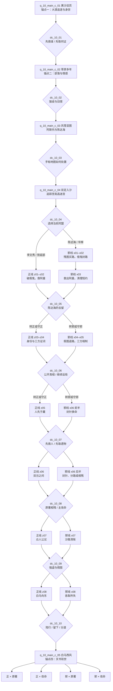

# 10 · 白马啸西风（正邪双线与选择节点）

> 归属（基准 §18）：`ch10_baima` 的正、邪两条书界主线、选择节点、原著情节去向、锚点演出与剧情结局；本书界主线以本文为唯一归属。
> 上游：`00-canon.md` v1.8；`decisions/author-requirements.md` AR-04、AR-09、AR-10、AR-20、AR-26、AR-27、AR-29；`decisions/author-decisions.md`；`decisions/rulings-v1.md`；`design/01`、`02`、`13`、`17`、`18` 及其白马人物名录。AR-26 / AR-29 对书序、年代与 M1 入口的直接决定优先于尚未同步的基准旧表。
> 引用而不重定义：属性与品德 → `design/03`；武学与取得来源 → `design/05` 及 `design/catalog/skills-kangxi.md`、`skills-general.md`；战斗与 Boss 机制 → `design/09`；物品 → `design/10`；区域与历史地名 → `design/11`、`design/map/*`；任务 DSL → `design/12`；天书之力与书眠 → `design/13`、`design/02`；NPC / 同伴与门派 → `design/18`、`design/17`。
> 标注约定：**（原创扩展）** = 原著没有的内容；**（待考）** = 原著事实尚需逐字核对；**（待核实）** = 技术事实尚未联网确认；**（待实测）** = 需要真机或真账号验证；**【建议值】** = 依赖其他文档、先给出可用数值并在文末登记。
> 版本：v0.4（P10 初稿；审校 P10.R，2026-09-26）；全局审计与经脉终审（2026-09-26 至 2026-09-30）；AR-20 改命机会（2026-10-01）；AR-26 / AR-29 唐代首书与 M1 冷入口（2026-10-02）。

---


## 0. 阅读指引与剧情总览

### 0.1 结论先行

1. 本书不是在开局菜单选择“正派 / 邪派”。前四个共有幕让玩家连续留下救人、守诺、夺图、交易等行为；系统在 `dc_10_04` 结合关键选择与跨书界继承的 `morality` 给出当前立场，但玩家仍可主动选另一条路。
2. **正线**以李文秀、苏普、阿曼和铁延部的安全为先，靠证词、救援与公开旧案化解追图和族群仇恨；**邪线**以陈达海、瓦耳拉齐及灰色商旅的利益网络为入口，靠假图、筹码和相互制衡夺取局势控制权。邪线拒绝把屠杀、胁迫或毒井写成“高效正确”，但它有完整谜题、同伴、锚点与天书结局，不是惩罚性死路。
3. “正 / 邪”是**立场轴**，“原著 / 改命”是**命运轴**。任一路线都能让瓦耳拉齐与马家骏按原著相残，或满足隐藏条件后救下二人；因此至少形成四种完整结局。
4. 四个锚点沿用原著骨架：大漠追逐与李文秀身世、原著部落纠葛（唐代由铁延部承载）、高昌迷宫与瓦耳拉齐旧怨、白马东归并取得天书。唯一主改命是第三锚点，不改变李文秀对苏普的感情结果。
5. 不切线的正、邪标准路径都由 4 个共有幕、8 个本路线幕和 1 个共有结算幕组成，共 `4 + 8 + 1 = 13` 幕；付代价切线时因不重演等价事件，单次流程为 12–14 幕，仍落在 AR-10 的目标区间内。
6. 原著共八回；目前能可靠使用的回目标识只有“第一回”至“第八回”。本文不自造回目标题，原著逐字与版本差异仍按 §9 的考据清单复核。

### 0.2 书界参数与边界

| 项 | 本书采用 | 来源 / 说明 |
|---|---|---|
| 书界 | `ch10_baima`《白马啸西风》 | 基准 §2 |
| 游戏年代 | 702–703 年，武周长安年间；广义唐代文化分期 | AR-26；**（原创扩展定年）**，不是原著明文 |
| 境界 / 武运 / 难度 | 低武 / 36 / D2 | `chapters/10-baima` §1、§12；旧基准表待同步 |
| 等级上限 | 20 | `chapters/10-baima` §12；与第二本《天龙八部》Lv35 衔接 |
| 入场携带 | 初眠无 3+3 库存；完成本书后才选 3 武功 + 3 内功 | AR-26；具体结算只引用 `design/02`、`design/25` |
| 外来压制 | −4 小品阶 | 基准 §2；具体生效公式见 `design/02` |
| 天书关键词 | 放下 | 基准 §2 |
| 前 / 后书界 | `ch00_yuenv` 序章 / `ch01_tianlong` | AR-26 新顺序；稳定书界 ID 不改 |
| 主区域 | `rg_xiyu_beijiang` 西域北疆 | `design/11`；旧粗区别名不用于新内容 |
| 主要城市锚 | `city_yining` 挂载伊丽水草原营地；`city_turpan` 显示西州 / 高昌县 | 唐代覆盖见 `chapters/10-baima` §3；旧地图与城市时代名待归属任务同步 |
| 图外归途 | 玉门关方向 | 原著第八回；当前无正式 `city_*`，仅作演出地名，不新建地图 ID |
| 特色系统 | 高昌迷宫 | 规则、房间与奖励见已落盘的 `design/chapters/10-baima.md` §10；本文只规定剧情触点 |
| 主线时间 | 主行动发生于 702–703 年；开篇追杀与童年事件仍以原著相对时距写成“多年前”的书页追忆 | **（原创扩展）**；“十二年”“十年 / 八九年”等精确字词须纸本校勘，唐代换壳不倒推人物出生年 |

### 0.3 正邪判定与切换原则

`morality` 的全局范围、称号和跨书界继承只引用 `design/03` §8.3。本文仅配置事件变化；每次变化都在其建议的 ±1～±15 内。

| 状态 | 默认判断 | 玩家权利 | 切换代价 |
|---|---|---|---|
| 正线倾向 | `morality >= 10`，或已取得至少 2 个“先救人 / 守承诺”关键标记 | `dc_10_04` 可选择正线；低于门槛也可用公开手帕、放弃分成的行动进入 | 从邪转正须交出手中地图筹码、释放被控制者，并承担原盟友敌对 |
| 邪线倾向 | `morality <= -10`，或已取得至少 2 个“先控图 / 以人作筹码”关键标记 | `dc_10_04` 可选择邪线；高于门槛也可明确签下灰色交易进入 | 从正转邪会失去部落公开背书，至少一名正线同伴暂离 |
| 中间带 | `-9 <= morality <= 9` 且双方标记未占优 | 两线均显示，不弹“推荐” | 由当前选择直接定临时路线，不额外奖惩 |
| 路线锁定点 | `dc_10_06` 结算并进入下一幕 | 锁定最终正 / 邪执行路线，不锁定原著 / 改命结果 | D07 起不再跨线；`dc_10_08` 才锁定命运轴，D09 仍可决定强盗与残图处置 |

立场不等于善恶判决：高品德玩家可以为了潜入而走邪线，低品德玩家也可以在关键时刻救人。结局卡同时显示“你如何做事”和“你改变了谁的命”，不以单一标签覆盖全过程。

### 0.4 主线流程图



### 0.5 路线可玩性与汇合点

| 段 | 共有事实 | 正线玩法重心 | 邪线玩法重心 | 汇合保证 |
|---|---|---|---|---|
| 开局 C01–C02 | 追杀旧案、李文秀成长、狼皮与苏普 / 阿曼关系 | 保全证词、降低族群敌意 | 拿到追图团口供、建立灰色情报源 | 都获得“手帕可能是地图载体”的线索 |
| 现在时 C03–C04 | 风雪夜相聚、血显地图、陈达海出逃、双重足迹 | 解救与追捕 | 交易与尾随 | 都到达迷宫外营地 |
| 中盘 z/x01–04 | 假鬼、阿曼被掳、迷宫入口 | 先救人、组织撤离 | 借恐惧控场、抢先占路 | 都确认假鬼用毒针与高跷 |
| 后盘 z/x05–06 | 华辉即瓦耳拉齐、计老人即马家骏 | 公开证词、拆招救人 | 以旧案和毒针互相钳制 | 都进入 `dc_10_08` 命运判定 |
| 收束 z/x07–08 | 宝藏真相、残图、李文秀东归 | 公议、护送、告别 | 封存、交易、分赃后的撤手 | 都在玉门关方向触发 C05 |

---

## 1. 原著重要剧情与走向清单

### 1.1 使用口径

- 下表按八回在线文本的叙事顺序整理；“第一回”等是章节编号，不另造标题。
- “本作去向”说明每件原著大事在何处被呈现。共有幕、正线与邪线都可从不同视角覆盖同一事实；支线只交给后续书界文档，不等于删除。
- 本表的“结果”均为转述，不作为逐字引文。涉及民族、宗教、历史与版本字词的部分在 §9 保留复核。

### 1.2 六十项事件映射

| # | 回目 | 人物 | 地点 | 原著事件与结果（大意） | 本作去向 |
|---:|---|---|---|---|---|
| 01 | 第一回 | 李三、上官虹、李文秀 | 原著所称甘凉道至回疆大漠；唐代运行显示河西驿道至天山北麓 | 一家三口携高昌迷宫线索，被吕梁三杰及随众长途追赶 | 双线共有；`q_10_main_c_01`；锚点一 |
| 02 | 第一回 | 李三 | 大漠 | 李三已中箭，决定留下断后，让妻女骑白马继续逃 | 双线共有；`dc_10_01` 的救援次序原型 |
| 03 | 第一回 | 李三、霍元龙等 | 大漠 | 李三装死反击，终因重伤与围攻而死 | 双线共有；锚影演出；不改主锚结局 |
| 04 | 第一回 | 霍元龙、史仲俊、陈达海 | 追逐途中 | 交代吕梁三杰与原著晋威镖局背景 **（名称 / 所在待考）** | 双线共有；唐代运行显示晋威号河东护商结社 / 追图劫伙；不建组织 ID |
| 05 | 第一回 | 史仲俊、上官虹、李三 | 甘凉道 / 大漠 | 史仲俊与上官虹同门旧情、妒恨及暗箭因果揭明 | 正线证词 / 邪线筹码 |
| 06 | 第一回 | 上官虹、史仲俊 | 大漠 | 上官虹把金、银两柄匕首一柄向己、一柄向外藏在衣内；史仲俊抱住她时二人同时中刀，上官虹当场身亡 | 双线共有；锚影演出 |
| 07 | 第一回 | 史仲俊、陈达海、霍元龙 | 大漠 | 史仲俊求速死，陈达海在霍元龙默许下补剑 | 双线共有；邪线可取得陈达海口供 |
| 08 | 第一回 | 霍元龙、陈达海、李文秀 | 大漠 | 众人遍搜不得地图，转而追赶骑白马逃走的孩子 | 双线共有；`it_gaochangditu` 载体伏笔 |
| 09 | 第一回 | 李文秀、追图团 | 大漠 | 白马力竭前遇大风沙，追逃双方被风沙隔断 | 双线共有；C01 终场探索 |
| 10 | 第二回 | 丁同 | 绿洲 / 计家草屋 | 丁同循白马找到李文秀与计老人 | 双线共有；C02 追忆 |
| 11 | 第二回 | 计老人、李文秀 | 计家草屋 | 计老人救下昏迷的女孩，暂作收留 | 双线共有；锚点一结算 |
| 12 | 第二回 | 丁同、计老人 | 计家草屋 | 丁同佯称有人到来，趁计老人望向窗外时从左背刺入匕首 | 双线共有；证词与战斗复盘 |
| 13 | 第二回 | 丁同、计老人、李文秀 | 计家草屋 | 计老人中刀后以肘击中丁同心口，将其当场击毙；李文秀仍留下关心老人伤势 | 双线共有；正线读作救命，邪线读作隐藏能力 |
| 14 | 第二回 | 计老人、李文秀 | 绿洲 | 计老人染黄白马、让李文秀换当地男孩衣服并清理踪迹 | 双线共有；伪装教学 |
| 15 | 第三回 | 霍元龙、陈达海、铁延部 | 草原绿洲 | 追图团趁壮丁外出袭击营地，杀人、掳人并劫掠 | 双线共有；罪证不可洗白 |
| 16 | 第三回 | 铁延部、李文秀 | 草原 / 大漠 | 部众寻回受害者与李三夫妇遗体，李文秀确认父母遇害 | 双线共有；旧案关键证据 |
| 17 | 第三回 | 苏鲁克、李文秀 | 部落 | 痛失亲人的苏鲁克迁怒汉人，伤害年幼李文秀 | 双线共有；`dc_10_02` 的偏见根源 |
| 18 | 第三回 | 计老人、李文秀 | 计家草屋 | 计老人收养李文秀，并解释苏鲁克的悲痛 | 双线共有；锚点二 |
| 19 | 第三回 | 李文秀、苏普 | 草原夜色 | 李文秀为救天铃鸟，以母亲留下的玉镯交换后放飞鸟 | 双线共有；选择节点主题“得失” |
| 20 | 第三回 | 李文秀、苏普 | 草原 | 两个孩子相识，约定若猎到狼便送狼皮 | 双线共有；人物关系起点 |
| 21 | 第三回 | 李文秀、苏普 | 草原 | 苏普误以为她喜欢圈养鸟，后理解她要的是鸟自由 | 双线共有；对“放下”的前置隐喻 |
| 22 | 第四回 | 李文秀、苏普 | 雪地牧场 | 恶狼突袭，两人互救并合力杀狼 | 双线共有；战斗追忆 |
| 23 | 第四回 | 李文秀、苏普 | 雪地牧场 | 苏普受伤，李文秀以羊毛手帕按住伤口，血渗入织线 | 双线共有；地图显影因果 |
| 24 | 第四回 | 苏鲁克、苏普、李文秀 | 雪地牧场 | 苏鲁克因仇恨汉人鞭打二人，童年友情被迫中断 | 双线共有；锚点二 |
| 25 | 第四回 | 苏普、李文秀 | 计家门外 | 苏普遵守承诺，把第一次猎获的狼皮送给李文秀 | 双线共有；`it_langpi` |
| 26 | 第四回 | 李文秀、阿曼 | 草原 | 李文秀把狼皮转送阿曼，苏普由此注意到阿曼 | 双线共有；`dc_10_02`；不锁定“物品最终归属” |
| 27 | 第四回 | 李文秀、苏普、阿曼 | 草原 | 岁月过去，苏普与阿曼相爱，李文秀选择远观 | 双线共有；不设强配支线 |
| 28 | 第四回 | 苏普、桑斯儿、阿曼 | 节庆火堆 | 青年角力，苏普最终胜过桑斯儿 | 支线玩法 + C02 演出；胜负不改感情选择 |
| 29 | 第四回 | 李文秀、追图团 | 草原边缘 | 老白马重现，引来潜伏多年的强盗追踪 | 双线共有；C02 末尾危机 |
| 30 | 第五回 | 晋威追图团、原著部落人物 | 原著所称回疆草原；唐代运行显示铁延草原 | 追图者多年不事生产，以暴力劫掠维生 **（精确年数待考）** | 双线共有；邪线也必须承认其罪责 |
| 31 | 第五回 | 李文秀、追兵 | 戈壁 | 李文秀为把追兵引离部落，骑白马深入荒漠 | 双线共有；C02 → C03 过场 |
| 32 | 第五回 | 李文秀、华辉 | 戈壁山洞 | 李文秀避追时遇到自称华辉的隐居高手 | 双线共有；华辉身份伏笔 |
| 33 | 第五回 | 华辉、追兵、李文秀 | 山洞外 | 华辉以毒针与地形击退 / 杀伤追兵，展示危险手段 | 正线调查 / 邪线合作入口 |
| 34 | 第五回 | 李文秀、华辉 | 山洞 | 李文秀替华辉拔出背上留存多年的三枚毒针 | 双线共有；主改命必要证据之一 |
| 35 | 第五回 | 李文秀、华辉 | 山洞 | 华辉要求李文秀保守居所秘密并收她为徒 | 双线共有；师徒信任旗标 |
| 36 | 第五回 | 李文秀、华辉 | 戈壁山洞 | 李文秀短期勤练后离开，此后两年暗中受教 | 双线共有；仅能授现有 `sk_huahuijibenjian`、`sk_huahuijian`、`sk_huahuiyexing` |
| 37 | 第六回 | 李文秀 | 计家草屋 | 两年后风雪夜，李文秀作男装并化名“阿斯托” | 双线共有；C03 |
| 38 | 第六回 | 苏普、阿曼、陈达海 | 计家草屋 | 苏普与阿曼避雪，陈达海随后进屋，众人意外相聚 | 双线共有；C03 |
| 39 | 第六回 | 陈达海、计老人 | 计家草屋 | 陈达海谎称寻找家传图画，翻查李文秀遗物 | 正线拆谎 / 邪线套话 |
| 40 | 第六回 | 陈达海、苏普、阿曼 | 计家草屋 | 陈达海与苏普交手，以苏普性命相胁，先迫阿曼答应风雪停后随他离开 | 双线共有；第一次胁迫，不能合理化 |
| 41 | 第六回 | 苏普、陈达海、计老人 | 计家草屋 | 苏普颈伤的血再染羊毛手帕，隐藏织线显出迷宫路线，陈达海夺走手帕 | 双线共有；`it_gaochangditu` 抽象为手帕载体 |
| 42 | 第六回 | 苏鲁克、车尔库、陈达海、阿曼 | 计家草屋 | 苏鲁克、车尔库进屋后受伤；陈达海再以父亲与苏普性命相胁，迫阿曼正式立下从属誓约 | 双线共有；第二次胁迫，誓约无效 |
| 43 | 第六回 | 李文秀、陈达海 | 计家草屋 | 李文秀为阻止陈达海杀苏鲁克而介入，交手后把金、银两柄小剑同时刺入陈达海左右肩窝，将其制伏 | 双线共有；C03 关键战斗 |
| 44 | 第六回 | 李文秀、阿曼、苏普、陈达海 | 计家草屋 | 李文秀借当时的俘虏规则接过约束后立即替阿曼除索、放她自由；众人分神时陈达海逃走，阿曼到第八回才说明自己当夜已看出李文秀是女子 | 双线共有；阿曼自主不作奖励；性别识破不提前公开 |
| 45 | 第六回 | 陈达海、众人 | 草原 / 雪地 | 陈达海趁乱带图逃走，部落组织多批人马追击 | 双线共有；C04 起点 |
| 46 | 第六回 | 苏鲁克、车尔库等七人 | 雪地 / 戈壁 | 七人先锋队追踪陈达海，发现另一人的脚印叠在其足迹中 | 双线共有；C04 |
| 47 | 第七回 | 七人先锋队 | 林地 | 众人由遗落饰物和足迹确认一直绕圈，决定守候观察 | 双线共有；迷宫导航教学 |
| 48 | 第七回 | 七人先锋队 | 高昌迷宫入口 | 众人发现铁门，以门环机关开启迷宫 | 双线共有；特色系统主入口 |
| 49 | 第七回 | 七人先锋队 | 高昌迷宫 | 迷宫内有佛像、汉文、孔子像与日常器具，却看不到传说金银 | 双线共有；宝藏真相伏笔 |
| 50 | 第七回 | 桑斯儿、“骆驼”、假鬼 | 高昌迷宫 | 二人在入口弯角遭细针袭击，被抬回天井查验时已双双毙命 | 原著死亡结果双线共有；可救仅属 **（原创扩展）** 次级救援 |
| 51 | 第七回 | 假鬼、部众 | 迷宫外营地 | 假鬼先以毒针杀马，翌夜又当众杀死一名未具名青年 | 原著死亡结果双线共有；可救仅属 **（原创扩展）**，不改变主改命计数 |
| 52 | 第七回 | 阿曼、假鬼 | 林地 / 迷宫 | 阿曼被掳，苏普等决意返回迷宫救她 | 双线共有；z02 / x03 的救援动机 |
| 53 | 第七回 | 李文秀、计老人 | 迷宫外 | 李文秀从细小伤口、点状足迹识破毒针与高跷伪装 | 双线共有；调查解法 |
| 54 | 第八回 | 阿曼、众人、假鬼 | 高昌迷宫 | 众人找到并解开被反绑的阿曼；她说明瓦耳拉齐因得不到雅丽仙，企图强迫她代替母亲 | 双线共有；z02 / x03 的救援收束；不淡化强迫意图 |
| 55 | 第八回 | 李文秀、瓦耳拉齐 | 高昌迷宫 | 李文秀从毒针与高跷痕迹揭穿“千年恶鬼”只是人为伪装 | 双线共有；z01 / x02 的破局依据 |
| 56 | 第八回 | 瓦耳拉齐、马家骏、李文秀、苏鲁克 | 高昌迷宫内殿 | 瓦耳拉齐叫破“马家骏”并扯下其假面，连续踢伤他；马家骏掷出匕首刺入瓦耳拉齐小腹，李文秀架住追击，苏鲁克把瓦耳拉齐击倒 | 原著先互伤后揭旧案；本作 z03 / x05 为可改命而作 **（原创扩展重排）** |
| 57 | 第八回 | 李文秀、瓦耳拉齐、马家骏 | 高昌迷宫内殿 | 致命互伤后，马家骏本人承认计老人身份；瓦耳拉齐开口后，李文秀由声音认出他就是华辉，他再摘下白布头罩 | 双线共有；锚点三；完整相认发生在致命互伤之后 |
| 58 | 第八回 | 瓦耳拉齐、马家骏、车尔库、李文秀 | 高昌迷宫内殿 | 致命互伤后，众人才说出雅丽仙之死、毒井命令、马家骏拒命与三枚毒针的旧案；马家骏先死，瓦耳拉齐后来仍企图以针留住李文秀，最终也死 | 原著命运；本作把问证前移属 **（原创扩展重排）**，`dc_10_08` 决定是否改命 |
| 59 | 第八回 | 瓦耳拉齐、陈达海等 | 高昌迷宫 / 无水沙路 | 瓦耳拉齐说明从手帕抽去“十来根”毛线、使地图少“十几根”线；他预想陈达海等会在沙漠迷路渴死，正文并未展示其实际死亡；迷宫也无传说金银 | 双线共有；`dc_10_09`；z/x07–08；结算只写迷失 / 命危，不宣称见尸 |
| 60 | 第八回 | 李文秀、苏普、阿曼 | 草原至玉门关方向 | 李文秀接受苏普与阿曼彼此相爱，骑老白马向东回中原 | 双线共有；锚点四；z/x08 与 C05 |

### 1.3 覆盖率核算

| 核算项 | 数量 | 口径 | 结果 |
|---|---:|---|---|
| 已识别的原著主要情节 | 60 | §1.2 每一行是一项，回目为第一至第八回 | 分母 60 |
| 已进入共有幕或两条主线 | 59 | 包括锚点、选择节点和同一事件的双视角呈现 | 59 项有可玩或演出去向 |
| 交后续书界文档展开的支线 | 1 | 第 28 项节庆角力；C02 保留原著胜负，完整活动规则归章节文档 | 仍有主线演出，不是遗漏 |
| 不采用 | 0 | 没有删去已列出的主要情节；敏感内容采用转述与非合理化处理 | 0 项 |
| 未分配去向 | 0 | 检查“本作去向”列，无空白 | 0 项 |
| **覆盖率** | **60 / 60 = 100%** | “有主线演出、路线呈现或明确支线归属”均计为有去向 | **达标** |

覆盖率只证明“有去向”，不表示把原著每段文字逐句游戏化。节庆角力、迷宫房间和古物掉落的重复玩法归书界章节文档；本文保留其对人物关系、锚点和选择的必要结果。

---

## 2. 主角定位与开局

### 2.1 穿越身份

主角承接 `ch00_yuenv` 序章：约前 482 年在长白山雪崩中运行《长生诀》第一层入眠，`702−(−482)=1184` 年后于原洞苏醒。沉睡配点只含臂力、根骨、内息、悟性、身法、定力；福缘与魅力默认不参与。正式公式未落盘前采用六项各 50、合计 `6×50=300` 的均衡期望 **【建议值】**，不把它写成正式预算。主角仍是“异乡行者”，不冒充既有小说人物，也不预先拥有铁延部、晋威号护商结社或高昌守藏者身份。

苏醒后播放 45–60 秒、可整段跳过的水墨西行：长白山 → 关中 → 河西 → 西州。主角随驿路、军粮车和粟特商队换程，第一帧可操作画面落在 `rg_xiyu_beijiang` 的 `sc_10_fengshi_feiyi`，不把长途旅程表现为瞬移。题签“长安二年（702）·西州以北”、旁白“高昌国亡已六十余年”、驿卒所说“庭州新置北庭都护府”分层揭示年代 **（原创扩展）**。

沈青禾先递水，远处李文秀牵白马提醒风向；完成一段对话后废驿东口亮起并写自动档。随后旧鞍上的褪色黄线触发书页追忆，玩家以旁观兼有限干预的方式经历李文秀幼年逃亡。回忆一律由成年年轻女子模型加时间字幕承载，不制作幼态角色。这是让已发生多年的前史可玩的 **（原创扩展）**，不是肉身再次穿越。

这一起点已同步到 `design/chapters/10-baima.md`“穿越开局”；章节文档只引用本文，不另写相冲突的身世。

### 2.2 与人物和势力的关系起点

| 对象 | 开局关系 | 第一阶段诉求 | 不可越过的边界 |
|---|---|---|---|
| `npc_liwenxiu` | 先在追忆中见到幼年身影，现实相逢时双方仍是陌生人 | 她要把追兵引离部落，并保护计老人 | 主角不能凭追忆强迫她承认身份或感情 |
| `npc_majiajun` | 以“计老人”身份出现，谨慎接纳伤者 | 隐藏武功和旧身份，照料李文秀 | 真名揭露必须留到迷宫锚点 |
| `npc_supu`、`npc_aman` | 经韩禾引荐后认识的部落青年 | 保卫部落、处理彼此感情与陈达海威胁 | 两人的感情不由主角好感数值改写 |
| `npc_suluke`、`npc_cheerku` | 对来历不明的中原人保持戒备 | 保护部众并追查多年前的劫掠者 | 不能把族群偏见写成全体共有属性 |
| `npc_chendahai` 及追图团 | 追忆中见过其罪行，现实尚未被其认出 | 夺回血显手帕并找到高昌迷宫 | 邪线合作也不赦免屠杀、劫掠与胁迫 |
| `npc_walazi` | 先以“华辉”身份接触李文秀，主角只见到痕迹 | 保住秘密、利用地图与旧徒复仇 | 不能在证据不足时由 UI 直接标真名 |
| `sect_hasake`（运行显示“铁延部”） | 客人 / 观察期 | 通过找马、救援与守诺取得行动许可 | 稳定键不作族名；不因一次主线选择自动获得门派职级 |
| `sect_gaochang` | 历史遗存而非正常迎新门派 | 通过迷宫机关留下守藏理念 | 入门、武学和房间规则归 `design/17` 与章节文档 |

### 2.3 开局节奏与第一个选择节点

开局由“现实求生 → 旧鞍触发追忆 → 大漠追逐 → 回到现实”的四段组成，总时长目标为 35–50 分钟【建议值】。前 10 分钟必须让玩家完成一次饮水、辨路或护送交互，避免连续观看背景故事；首次具名首领战放在追忆中的围堵，战败只回到风沙前。

首个选择节点是 `dc_10_01`，位于 `q_10_main_c_01` 的风沙倒计时内：

1. **先护李文秀与白马**：取得 `baima.child_route_seen`，`morality +4`【建议值】，较早知道身世去向。
2. **先救重伤的李三 / 上官虹一方**：取得 `baima.parents_last_sign`，`morality +3`【建议值】，多一件旧案证据；既成死亡不因此被改写。
3. **先辨认追兵与遗落物**：取得 `baima.pursuer_testimony` 或 `baima.clue_yellow_thread`，无品德变化，后续更早识破陈达海。

风沙使三项无法在一次流程全取，但遗漏信息都有替代来源：李文秀可述身世、计老人保存遗物、陈达海或段霜可补追兵证词。因此第一个选择塑造调查优势，不制造“选错即断线”。

### 2.4 从序章到第一本正式书

| 继承项 | 本界处理 | 剧情用途 |
|---|---|---|
| `morality` | 依 `design/03` 跨界保留 | `dc_10_04` 只给路线倾向与替代条件，不替玩家自动选边 |
| 序章同伴 | 不进入；春秋人物不跨 1184 年进入活动编组 | 白马从空队伍开始第一次正式招募 |
| 武学与装备 | 序章体验武学 / 装备离章失效；只保留 AR-26 所定《长生诀》第一层 | 初眠无 3+3 选择；白马结尾才第一次演示 3 武功 + 3 内功取舍 |
| 天书残篇 | 入场为 0 | 白马是第一本正式书，不提前投放后世来源或本书答案 |
| 声望 `fame` | 本界从 0 重新积累 | 与 `design/03` 的书眠清零规则一致 |

跳过序章时，系统播放不超过 90 秒的摘要卡，写入“阿青传授第一层、长白山雪崩初眠、默认均衡配点”兼容快照，再进入同一西行过场；不重复发经验、物品或残篇。M1 只需完成：过场可播 / 可跳 → `sc_10_fengshi_feiyi` 加载 → 可移动 → 一段对白完成 → 东口亮起 → 自动档可读 → “第一卷·白马啸西风”题签后恢复操作；无需进入第二场景、触发 C01 或制作可选遭遇。

### 2.5 开局承诺与禁区

- 玩家可以决定如何介入旧案，不能决定苏普“应该”爱谁，也不能以攻略成功强配李文秀。
- 玩家可以与灰色人物合作，不能通过阵营标签免除其具体责任；阿曼在胁迫下作出的誓约始终无效。
- 玩家可以在本书唯一主改命中救下瓦耳拉齐与马家骏，不能把多年前李三、上官虹与史仲俊之死再扩成第二个主改命。
- 原著人物涉及民族、宗教与历史判断时，正文只转述剧情必要信息；逐字经文和史地判断进入 §9 考据清单。
- 迷宫可提供探索、机关和古物戏份，但规则、概率、掉落与地图生成均引用后续书界章节文档，不在主线中重定义。

---

## 3. 正线

### 3.1 共有幕与正线计数

不切线的正线标准路径为 `q_10_main_c_01`–`04` + `q_10_main_z_01`–`08` + 共有结算幕 `q_10_main_c_05`，合计 13 幕。C01–C04 不预先判阵营；它们既是正线前段，也是邪线前段。C05 在 §7 定义，按立场轴与命运轴读取不同演出。

所有 `morality` 与 `fame` 变化都是任务层建议配表值：品德幅度遵守 `design/03` §8.3 的单次 ±1～±15，声望总量按 §9.6.4 核算。这些状态键是本文的剧情语义契约，生产数据仍须按 `design/12` 的白名单动作、幂等效果与 `quest.v1` 字段显式迁移。

### 3.2 `q_10_main_c_01` · 黄沙旧页

- **标题**：黄沙旧页。
- **原著对应事件（回目）**：第一回至第二回；李三夫妇携女逃亡、李三断后、上官虹与史仲俊同死、风沙隔断追兵、计老人收留李文秀。
- **地点**：甘凉道回忆段；`rg_xiyu_beijiang` 风蚀废驿与唐代天山北麓大漠。甘凉道只作原著考据地名，不新建城市；主角现实可操作起点是废驿。
- **参与 NPC**：`npc_liwenxiu`、`npc_lisan`、`npc_shangguanhong`、`npc_huoyuanlong`、`npc_shizhongjun`、`npc_chendahai`、`npc_dingtong`、`npc_majiajun`（只以计老人剪影出现）、`npc_shenqinghe10`。
- **目标与流程**：
  1. 在 M1 冷入口停止点之后，主角于废驿检查初眠结果，确认本书正式等级上限 20 与低武压制提示。
  2. 沈青禾提供水与方向，以“旧鞍换药”的方式引出白马鞍具；主角触摸后进入书页追忆。
  3. 在抽象追逐场景中沿三组痕迹调查：李三背部箭伤、上官虹留给女儿的羊毛手帕、追兵马蹄。
  4. `dc_10_01` 让玩家在风沙到来前先护孩子、先护伤者或先辨追兵；三项不能同取，但漏项均有后续补证。
  5. 见证李三断后、上官虹反击与史仲俊求陈达海了断；主角只能救护边缘伤者，不能改写多年前既成事实。
  6. 护送追忆中的白马进入风沙，现实中从鞍夹层发现一根褪色黄线，获得“织物遇血显纹”的模糊提示。
- **关键战斗**：霍元龙带队的围堵（正式 Boss 遭遇 `enc_10_huoyuanlong_zhuiyi`）；追兵骑手并入同场骑阵槽，配装与整场耐久引用 `design/chapters/10-baima.md` §8.8、§12.8，不另配置额外血池。护送、撤退与风沙地形机制引用 `design/09`；李三作剧情友军，败局由演出收束。
- **幕内小选择**：是否救治一名无名追兵；救治写 `baima.mercy_pursuer=true`、`morality +2`【建议值】，审问后弃置写 `baima.pursuer_testimony=true`、`morality -2`【建议值】。
- **幕末状态变化**：必写 `baima.anchor_01_seen=true`、`baima.clue_yellow_thread=true`；首次记录李文秀身世；`fame` 不变；无门派变更；追忆同伴全部离队。
- **失败与时限**：风沙倒计时结束前未抵达白马，追忆回到废驿入口，可立即重试；连续三次失败开启“沿旧蹄印”辅助，不改变难度成就。现实世界无硬时限。

### 3.3 `q_10_main_c_02` · 草原多年

- **标题**：草原多年。
- **原著对应事件（回目）**：第二回至第五回；染黄白马与收养、部落被劫、天铃鸟与玉镯、童年杀狼、狼皮转赠、节庆角力、李文秀长成及追兵因白马重现。
- **地点**：`city_yining` 稳定键挂载的伊丽水草原营地 **（水名写法待考）**、计家草屋与邻近戈壁；不显示后世伊宁 / 固勒扎建制，不把移动营地写成固定城镇。
- **参与 NPC**：`npc_liwenxiu`、`npc_supu`、`npc_aman`、`npc_suluke`、`npc_cheerku`、`npc_majiajun`、`npc_sangsi`、`npc_huoyuanlong`、`npc_chendahai`、`npc_hanhe10`。
- **目标与流程**：
  1. 主角随韩禾护送走失马群进入铁延部外围，以救马和归还缰铃取得暂住许可。
  2. 从计老人、苏鲁克与遗物三方拼出劫掠之夜；必须区分“具体强盗作恶”与“族群身份”。
  3. 用狼皮、玉镯印痕和旧手帕触发三段短追忆，按原著顺序呈现天铃鸟、杀狼和父亲鞭打。
  4. 追忆完成即写 `baima.wolfskin_memory_complete=true`；`dc_10_02` 据此决定是否公开狼皮转赠的真实经过，任何选项都不得改变苏普与阿曼相爱。
  5. 参加铁延部节庆角力：玩家可旁观、劝止场外冲突或以 `sect_hasake` 客人身份试摔；苏普与桑斯儿原著胜负保持。
  6. 夜间发现一匹褪色白马被追踪，李文秀以“阿斯托”身份主动引走追兵；主角选择追随、预警或反向放出消息。
- **关键战斗**：童年追忆中的恶狼（普通单敌）；节庆为非致死切磋（精英单敌）；追兵侦察队（普通群战）。侦察队引用章节 §12.8 的 `scoutGroup` 整场预算与三槽分配，三场前后独立；机制统一引用 `design/09`，狼皮奖励复用 `it_langpi`。
- **幕内小选择**：是否用“所有汉人都一样坏”的话迎合苏鲁克以换许可。拒绝概括并展示各方死者证据：`morality +3`、`npc_suluke` 好感先 −5 后 +10【建议值】；迎合：当场好感 +5、`morality -3`【建议值】，后续对证难度增加。
- **幕末状态变化**：必写 `baima.wolfskin_memory_complete=true`、`baima.anchor_02_seen=true`、`baima.white_horse_found=true`；可能写 `baima.wolfskin_truth_public`；`fame +30`【建议值】；只开放稳定键 `sect_hasake` 对应的铁延部客人状态，不自动入派；李文秀仍未正式入队。
- **失败与时限**：错过节庆只失去切磋与一条证词，可在苏普处补问；未追上白马则由韩禾带回蹄印。营地迁徙前有三游戏日软窗口，过期自动转移场景，不锁主线。

### 3.4 `q_10_main_c_03` · 风雪显图

- **标题**：风雪显图。
- **原著对应事件（回目）**：第五回至第六回；华辉授艺前情、两年后风雪夜、“阿斯托”身份、陈达海搜屋、苏普血染手帕、阿曼受胁迫、李文秀制伏陈达海。
- **地点**：伊丽水草原营地边的计家草屋 **（原创扩展；水名待考）**；暴雪封路场景。
- **参与 NPC**：`npc_liwenxiu`、`npc_supu`、`npc_aman`、`npc_suluke`、`npc_cheerku`、`npc_majiajun`、`npc_chendahai`。
- **目标与流程**：
  1. 主角追上“阿斯托”，可尊重其化名或当面点破；尊重者取得 `baima.trust_liwenxiu`。
  2. 暴雪迫使众人进屋，陈达海以“寻父亲遗画”为由要求搜查；玩家可拆谎、假意帮搜或暗记赃物。
  3. 陈达海与苏普冲突，以苏普性命迫阿曼先答应随行；苏普颈伤的血随后使手帕织线显形，系统把实物注册为 `it_gaochangditu`。
  4. 苏鲁克与车尔库在风雪中到场并受伤；陈达海再以父亲和苏普性命胁迫阿曼立下从属誓约，主角不得替她作答。
  5. 李文秀为阻止陈达海杀苏鲁克而出手，以父母的金银小剑伤其双肩并制伏；她随即替阿曼除索、明确胁迫誓约无效，写 `baima.map_revealed=true` 与 `baima.aman_coercion_broken=true`。
  6. `dc_10_03` 在阿曼获释、陈达海尚未逃走时决定公开地图、藏起原件、制作可辨伪本或与陈达海订短约；此决定影响 C04 的同行者。
  7. 陈达海趁众人分神逃走，留下追踪窗口；阿曼已经看出“阿斯托”是女子，但按原著直到第八回才向苏普说明。
- **关键战斗**：陈达海（正式 Boss 遭遇 `enc_10_chendahai_xuetu`，配装与耐久见 `design/chapters/10-baima.md` §8.8、§12.8）。战斗目标为缴械 / 制伏，不能用胜负结算阿曼归属；狭屋火堆、门板与暴雪视野引用 `design/09`。
- **幕内小选择**：是否让李文秀继续以“阿斯托”身份行动。尊重其选择：`morality +2`、李文秀好感 +8【建议值】；为争功公开：`fame +20`、李文秀好感 −15、`morality -2`【建议值】。
- **幕末状态变化**：必写 `baima.map_revealed=true`、`baima.aman_coercion_broken=true`、`baima.chendahai_fled=true`；`fame +40`【建议值】；苏普、阿曼成为临时同行候选，计老人拒绝离家但提供后援。
- **失败与时限**：苏普、阿曼等剧情人物战斗倒地只触发伤势，不等于死亡；若陈达海夺门时玩家全灭，从“火盆倾倒前”检查点重开。暴雪结束前未处理地图，陈自动带走原件，仍可追踪。

### 3.5 `q_10_main_c_04` · 双足入沙

- **标题**：双足入沙。
- **原著对应事件（回目）**：第六回至第七回；七人先锋追踪陈达海、重叠脚印、绕圈、古道与铁门、高昌迷宫初探。
- **地点**：`rg_xiyu_beijiang` 雪后戈壁、古树林；`city_turpan` 吐鲁番辖区外的高昌迷宫独立副本。
- **参与 NPC**：`npc_liwenxiu`、`npc_supu`、`npc_aman`、`npc_suluke`、`npc_cheerku`、`npc_sangsi`、`npc_chendahai`；原著绰号“骆驼”的青年按上游未登记生成槽作剧情同行。
- **目标与流程**：
  1. 玩家从三支追踪队中选择随先锋出发；即使先前助陈达海，也必须留下可追足迹，保证主线连通。
  2. 依据深浅两层脚印判断有人踩着陈达海足迹跟随；调查成功可提前关联华辉的步幅。
  3. 在雪地宿营，处理水、火与伤员；高昌迷宫主线入口不设四阶以上轻功硬门。
  4. 发现反复出现的饰物和己方脚印，确认众人在绕圈；玩家以方向、风纹或标记三选一纠正路线。
  5. 转动铁门门环进入迷宫，首次看见佛像、汉文、孔子像与中原日用器物。
  6. 记录“传说金银尚未出现”，但不直接揭晓宝藏真相。
  7. `dc_10_04` 在第一次听见“千年恶鬼”警告后选择公开站到李文秀一边，或接受陈达海 / 华辉留下的暗号。
- **关键战斗**：雪地兽群（普通，可绕行）；迷宫入口伏击者（精英，可用机关反制）。交战分别引用章节 §12.8 的 `snowPack` / `entranceAmbush`，前后独立计整场预算；机关反制只消费伏击者对应槽，绕行不代替交战分支的配置。迷路、视野与机关只调用书界特色系统及 `design/09`。
- **幕内小选择**：是否坚持七人一起走。坚持：`morality +2`、救援轮次 +1【建议值】；同意拆队：更快获得一处藏室线索，但桑斯儿和“骆驼”更早暴露。
- **幕末状态变化**：必写 `baima.maze_entered=true`、`baima.second_footprint=true`；完成 `dc_10_04` 后将 `baima.route` 写为 `zheng` / `xie`；`fame +20`【建议值】；线路同伴按当前路线调整。
- **失败与时限**：水尽、迷路或全队倒地时退回上一处雪营并消耗一天；地图永不被随机删除。第一次鬼声后有一夜调查窗口，过期仍可选路线，但桑斯儿与“骆驼”进入命危状态。

### 3.6 `q_10_main_z_01` · 不信千年鬼

- **标题**：不信千年鬼。
- **原著对应事件（回目）**：第七回；假鬼在迷宫杀死桑斯儿与“骆驼”，随后在营地以细针杀马，翌夜又杀一名未具名青年 **（称谓与先后待考）**。
- **地点**：高昌迷宫外院、佛殿回廊与迷宫外火营。
- **参与 NPC**：`npc_liwenxiu`、`npc_supu`、`npc_aman`、`npc_suluke`、`npc_cheerku`、`npc_sangsi`、`npc_walazi`；“骆驼”青年按上游未登记生成槽加载。
- **目标与流程**：
  1. 与李文秀检查第一处袭击点，比较墙角刮痕、圆孔足迹和受害者极细伤口。
  2. 在“追白影”与“抬伤者”之间先选；先救人是桑斯儿 / “骆驼”生还的必要条件之一。
  3. 把伤者抬到通风火营，由沈青禾留下的药囊作剧情稳定伤势，不描述现实配毒或解毒步骤。
  4. 伏守一匹马，引假鬼再次出针；玩家可挡针、换假靶或用镜面反光定位。
  5. 从两处痕迹推断“高跷 + 毒针”，取得 `baima.fake_ghost_proved`，但暂不向惊慌部众公布师父嫌疑。
  6. 在火营布置可见撤离路并守到第二夜；满足 §6.6.2 时以假靶换走射向未具名青年的针 **（原创扩展）**。
- **关键战斗**：白袍假鬼的投影 / 诱饵与毒针拦截（精英前哨）；诱饵无 HP，不独立配置可击杀单位或额外血池。后续真实白袍守门者归 z02 的 `enc_10_walazi_guisheng`，只用章节 §12.8 的同场守门槽预算；本幕观察、挡针与撤离不重复扣除该槽。毒针与高跷表现只引用 `design/09` 的暗器、视野和破绽接口。
- **幕内小选择**：先救桑斯儿或先救“骆驼”；满足 §6.6.2 的药路药囊或医术 / 解毒双门槛时可并救，否则另一人按原著死亡。单次救人 `morality +6`、`fame +20`【建议值】；追影取证则多得华辉暗号但无品德变化。
- **幕末状态变化**：写 `baima.fake_ghost_proved=true`；按结果写 `baima.sangsi_saved`、`baima.camel_saved`、`baima.camp_youth_saved` 或相应命定死亡事实；完整救援条件与首次同伴余韵事件见 §6.6.2；李文秀好感 +10【建议值】；苏鲁克 / 车尔库进入可听证状态。
- **失败与时限**：本幕首段有 6 个行动轮的救治窗口【建议值】；超时进入原著死亡结果而非主线失败。玩家全灭则从鬼声响起前重开。

### 3.7 `q_10_main_z_02` · 花巾在深处

- **标题**：花巾在深处。
- **原著对应事件（回目）**：第七回至第八回；阿曼失踪，苏普不顾危险回宫，李文秀识破假鬼并共同救人。
- **地点**：迷宫外林地、回廊、内殿前囚室。
- **参与 NPC**：`npc_liwenxiu`、`npc_supu`、`npc_aman`、`npc_suluke`、`npc_cheerku`、`npc_majiajun`、`npc_walazi`。
- **目标与流程**：
  1. 找到阿曼遗落的花头巾，按拖痕和断枝确认她仍活着。
  2. 阻止苏普独自冲入迷宫；若劝说失败，玩家必须在下一岔路追上他。
  3. 面对计老人劝返，选择公开假鬼证据或只请求他带路；前者提高公信，后者保护其身份。
  4. 依阿曼沿途留下的纱线、划痕与故意踢倒的器物定位囚室，强调她主动留下线索。
  5. 切断高跷支点、封住毒针射界，逼假鬼撤离；阿曼自行挣脱最后一道束缚。
  6. 在追击假鬼与护送阿曼出险之间作 `dc_10_05` 前置选择；正线默认先护送。
- **关键战斗**：迷宫白袍守门者（精英）与瓦耳拉齐第一阶段（Boss，目标为救援和脱离，不要求击败）。两者同属 `enc_10_walazi_guisheng`，只用章节 §12.8 的鬼声二槽与一份整场预算；“第一阶段”不另开血条，机制引用 `design/09`。
- **幕内小选择**：是否让阿曼亲自决定追击。尊重其选择：`morality +3`、阿曼 `trustFlag`；强令她退场：战斗援军更安全，但阿曼好感 −10【建议值】。
- **幕末状态变化**：必写 `baima.aman_rescued=true`、`baima.ghost_retreat_inner=true`；阿曼开放 D4 R4“共患”；`fame +30`【建议值】；无人加入永久队伍。
- **失败与时限**：进入囚室后有一次火把燃尽软时限；超时阿曼转移到备用房间，需额外解谜，不会被脚本杀死。若苏普先行倒地，阿曼仍可由李文秀与玩家救出。

### 3.8 `q_10_main_z_03` · 师徒两张脸

- **标题**：师徒两张脸。
- **原著对应事件（回目）**：第八回；原著在师徒致命互伤中揭开马家骏身份，李文秀继而由声音认出瓦耳拉齐即华辉；本幕为保留问证与改命窗口，将身份揭晓前移并在互伤前中断，属 **（原创扩展重排）**。
- **地点**：高昌迷宫内殿与石像长廊。
- **参与 NPC**：`npc_liwenxiu`、`npc_walazi`、`npc_majiajun`、`npc_supu`、`npc_aman`、`npc_suluke`、`npc_cheerku`。
- **目标与流程**：
  1. 玩家护送众人进入内殿，以火把、回声和遮蔽物拆除假鬼最后一层恐惧优势。
  2. 车尔库先上前，被瓦耳拉齐击伤；苏鲁克父子参战，李文秀以不熟悉的长刀保护众人。
  3. 计老人为救李文秀出手，招式与华辉同源；瓦耳拉齐叫破“马家骏”，但玩家在其连续重脚和马家骏掷匕首前完成非致死中断 **（原创扩展重排）**。
  4. 瓦耳拉齐扯下计老人的假面；演出给李文秀足够时间确认“照料自己多年的人仍是同一人”。
  5. 李文秀由声音认出瓦耳拉齐就是华辉，瓦耳拉齐随后自行揭下白布头罩；此前尊重秘密者获得两人的最低信任。
  6. 战斗暂停，转入三方旧案问证；若最终选择原著命运，z06 再恢复被前移截断的致命动作。
- **关键战斗**：瓦耳拉齐（Boss 配装）对苏鲁克、车尔库、苏普、李文秀的压制战；马家骏作为剧情援军入场。引用章节 §12.8 的 `identityStandoff` 三槽预算，与 x05 互斥；本场为任务内非致死截停，身份揭晓后终止，后续正式双人战独立开场。援军、破绽与中断机制引用 `design/09`。
- **幕内小选择**：在身份揭开后称呼他“计爷爷”还是“马家骏”。由李文秀先说，玩家跟随她的称呼得马家骏好感 +5；当众斥骗得部众好感 +5、马家骏好感 −10【建议值】，不改变事实。
- **幕末状态变化**：写 `baima.walazi_is_huahui=true`、`baima.jilao_is_majiajun=true`、`baima.master_lineage_seen=true`；`fame +20`【建议值】；战斗编组暂时强制解散以进入问证。
- **失败与时限**：任一被保护者倒地均转为伤势；李文秀倒地则回到计老人出手前。没有对话倒计时，避免身份揭晓因读速失败。

### 3.9 `q_10_main_z_04` · 三枚旧针

- **标题**：三枚旧针。
- **原著对应事件（回目）**：第五回、第八回；李文秀曾拔出三针；原著在师徒已致命互伤后才说出雅丽仙遇害、毒井命令与马家骏拒命射师的旧事。本幕把问证移到终局交手前，属 **（原创扩展重排）**。
- **地点**：高昌迷宫内殿、旧井投影与华辉山洞追忆。
- **参与 NPC**：`npc_liwenxiu`、`npc_walazi`、`npc_majiajun`、`npc_cheerku`、`npc_aman`、`npc_suluke`、`npc_supu`。
- **目标与流程**：
  1. 将李文秀保存的三枚旧针、第一处受害者针痕与华辉招式并列，建立同源证据。
  2. 由车尔库讲述雅丽仙骤死的记忆，由瓦耳拉齐承认杀人动机；不把受害者写成争夺对象。
  3. 由马家骏讲述拒绝毒井、反击师父及多年伪装；玩家必须允许各方完整说完。
  4. 通过沈青禾药囊中的辨毒札记，识别旧衣花汁与针上残痕同源 **（原创扩展）**；只写剧情检定，不提供现实毒物做法。
  5. 分别与瓦耳拉齐、马家骏单独交谈：前者需要玩家承认其被逐与孤独并不抵销罪责；后者需要承诺不会拿身份换赏。
  6. `dc_10_06` 决定把证词立刻向部众公开，还是暂缓并以其制衡双方；前者留正，后者可转邪。
- **关键战斗**：旧井追忆中的毒针幻象（普通机关遭遇）；仅一个真实机关源，幻象无 HP，不安排真人或援军群战，让“听证”成为实质玩法。
- **幕内小选择**：是否把三枚旧针交车尔库。交付：`morality +4`、瓦耳拉齐好感 −10；封存：取得 `baima.needles_sealed`、马家骏好感 +5；私藏作筹码：`morality -4`【建议值】。
- **幕末状态变化**：至少写入 `baima.clue_poison=true`、`baima.clue_old_case=true`、`baima.old_case_complete=true`；满足相应对白后写 `baima.trust_walazi`、`baima.trust_majiajun`；`fame +30`【建议值】。
- **失败与时限**：证词链不能因一次口才失败永久断裂；失败改走“旧针 + 井边遗痕 + 李文秀复述”三证闭环。若此前背叛任一人，可通过放弃地图筹码获得一次补救。

### 3.10 `q_10_main_z_05` · 人先于藏

- **标题**：人先于藏。
- **原著对应事件（回目）**：第七至第八回；迷宫曲折、日用器物与书籍、众人寻找阿曼、传说珍宝逐渐破灭。
- **地点**：高昌迷宫藏室、塌沙回廊与双碑厅。
- **参与 NPC**：`npc_liwenxiu`、`npc_supu`、`npc_aman`、`npc_suluke`、`npc_cheerku`、`npc_walazi`、`npc_majiajun`。
- **目标与流程**：
  1. 旧案对证引发争执，瓦耳拉齐触动暗门，众人与藏室被塌沙分隔 **（原创扩展）**。
  2. 玩家看到本界最高阶固定遗物候选与受困者求救同时出现，触发 `dc_10_07`。
  3. 选择先救人者必须弃开宝匣：用承梁、转门环和队伍接力依次救出阿曼、马家骏、瓦耳拉齐。
  4. 李文秀主动丢下地图回身救师父；玩家不能替她拿走遗物再声称她完成代价。
  5. 在双碑厅核对迷宫沿革，确认现存主要是书籍、器具与宗教 / 礼俗物件，不是金银宝库；同时沿通风井标出一条不依赖真图或宝藏控制权的撤离路。
  6. 把价值判断交还各角色：阿曼珍惜可用器物，苏鲁克关心活人，李文秀理解父母为传说而死。
- **关键战斗**：塌沙与机关守门是 `enc_10_shoucang_shilian` 的救援 / 撤离目标，无必须击杀者。与 x06 前半 D07 互斥使用章节 §12.8 的守藏三槽；傀儡、通风井和撤离只消费一份整场预算。8 轮时限只约束救援子目标；地形与战斗机制引用书界迷宫系统及 `design/09`。
- **幕内小选择**：放弃哪一类回报：地上（grade 9）固定遗物候选、完整高昌机关传承捷径，或本幕全部金钱分成【建议值】。主改命硬条件固定为第一项“高阶遗物”，其具体物品 ID 待 `design/10` / 章节文档补齐；其他两项只作补充。
- **幕末状态变化**：完成通风井勘路必写 `baima.escape_without_treasure=true`；先救人写 `baima.rescue_before_treasure=true`、`baima.high_relic_abandoned=true`、`morality +8`【建议值】；先取物写相反状态、`morality -8`，仍可走原著结算；`fame +30`。
- **失败与时限**：塌沙阶段有 8 个行动轮【建议值】；失败回到暗门触发前，不以随机路径吞掉改命机会。玩家明确取走遗物后不可反悔，这是 `dc_10_07` 的不可逆代价。

### 3.11 `q_10_main_z_06` · 双刃之间

- **标题**：双刃之间。
- **原著对应事件（回目）**：第八回；原著中瓦耳拉齐连续踢伤马家骏，马家骏掷匕首刺入师父小腹，李文秀架住追击、苏鲁克击倒瓦耳拉齐；马家骏先死，瓦耳拉齐后来仍试图发针并最终死亡。本作先问证再进入此战，属 **（原创扩展重排）**。
- **地点**：高昌迷宫内殿与熄火长廊。
- **参与 NPC**：`npc_liwenxiu`、`npc_walazi`、`npc_majiajun`、`npc_suluke`、`npc_supu`、`npc_aman`、`npc_cheerku`。
- **目标与流程**：
  1. 两人因旧案与称呼再度决裂；玩家在开战前检查 `old_case_complete`、双方信任、不依赖宝藏的退路、先救人、弃遗物五组条件。
  2. 原著路径中，玩家保护旁人并见证上述致命互伤；马家骏先死，瓦耳拉齐的余下演出延续至离宫前，不能以普通回复道具抹掉剧情死亡。
  3. 改命路径中，先让马家骏交出匕首，再以三枚旧针作为证物而非武器，迫使瓦耳拉齐停下第一轮杀招。
  4. 李文秀亲口说明她感激两人的照料，却不会成为任何人的所有物；这是停战的决定性动作。
  5. 玩家承担 Boss 的最后一次攻势，苏鲁克把瓦耳拉齐击离而非击死，马家骏选择不补刀 **（原创扩展）**。
  6. `dc_10_08` 结算原著 / 改命；改命后分别救治，防止同处再次冲突。
- **关键战斗**：瓦耳拉齐（Boss）；马家骏根据前置可为敌对援军、可控临时同伴或非战斗撤离者。与 x06 后半 D08 互斥使用 `enc_10_shitu_shuangren`；整场预算、马家骏阵营翻转和撤离的等额槽迁移见章节 §12.8，机制引用 `design/09`。
- **幕内小选择**：让李文秀先劝谁。先劝瓦耳拉齐需要 `trust_walazi`；先劝马家骏需要 `trust_majiajun`；两者只改变战斗首轮与对白，不替代五组改命硬条件。
- **幕末状态变化**：原著写 `baima.anchor_03=fated`、两人 `lifeState=dead`；改命写 `baima.anchor_03=changed`、两人 `lifeState=fate_rescued`。若二人至少一人曾入队，按 `design/18` §4.4 将曾入队者组成 `npcIds`，本次双人救回只发一个 `companionFateRescued(ch10_baima, npcIds)`；`design/13` §6.6 的消费端再按本界首次非空事件合计扣 2 点余韵，不因两人或此前 BT-01 已收费而重复扣除。若二人均未入队，只写生存事实，不发同伴事件。
- **失败与时限**：改命条件缺一时 UI 在挥刃前显示缺失类别，不暴露具体解法；玩家可接受原著结算或读档。进入最后交手后有 4 个行动轮【建议值】完成拆分；失败进入原著结算，不造成主线断档。

### 3.12 `q_10_main_z_07` · 众人公议

- **标题**：众人公议。
- **原著对应事件（回目）**：第八回；旧案全貌、苏鲁克重新理解善恶不可按族属概括、瓦耳拉齐讲述残图对强盗的报复 **（原文字词待考）**。
- **地点**：高昌迷宫外火营、雪后戈壁岔路。
- **参与 NPC**：`npc_liwenxiu`、`npc_supu`、`npc_aman`、`npc_suluke`、`npc_cheerku`、`npc_walazi`、`npc_majiajun`、`npc_chendahai`、`npc_huoyuanlong`、`npc_yunqiangdao`、`npc_quanqiangdao`、`npc_songqiangdao`。
- **目标与流程**：
  1. 把伤员、证物和幸存证人带出迷宫；若瓦耳拉齐、马家骏存活，二人分营看护。
  2. 苏鲁克在事实面前承认不能按族群判断善恶；玩家可接受道歉，但不能替李文秀说“已经原谅”。
  3. 汇总追图团多年劫掠、李三夫妇之死、陈达海胁迫阿曼和假图报复四类责任。
  4. 得知瓦耳拉齐自述抽去“十来根”毛线、地图因而少“十几根”线；本作只记录“残缺”，不要求玩家复现具体路线。
  5. 通过瞭望点发现陈达海等正被假图引向无水沙路，触发 `dc_10_09`。
  6. 正线可选择发烟警告后拘捕、只告知残图让其自返，或放任原著报应；部众公议决定是否接纳投降者。
- **关键战斗**：拒捕的晋威追图团（精英群战）；可用警告、断水标记和投降完成非致死解法，仍按 `design/09` 结算。与 x07 共用 `design/chapters/10-baima.md` §12.8 的 `pursuitGroup` 配置，分别在本幕任务内实例化且不重复经历；整场预算只作非击杀目标等价进度，不降低具名人物 `full` 血量上限，也不新增正式 Boss 遭遇。
- **幕内小选择**：由谁宣读罪证。让阿曼 / 李文秀自行陈述：相关人物信任 +5；玩家抢先定罪：`fame +20`，二人好感各 −5【建议值】。
- **幕末状态变化**：写 `baima.prejudice_broken=true`；按 D09 选择将 `baima.bandits` 写为 `captured` / `confessed` / `exiled` / `lost`；`fame +60`【建议值】；投降者可进入 D3 短约 / 赎罪窗口，霍元龙与陈达海是否在场依存活及路线。
- **失败与时限**：追图团在地图刷新后的两游戏日内会深入无水区；超时采用原著暗示的迷失结局。公议无法因玩家口才失败取消，失败只降低处置选项。

### 3.13 `q_10_main_z_08` · 白马向东

- **标题**：白马向东。
- **原著对应事件（回目）**：第八回；李文秀理解苏普与阿曼的感情，陪瓦耳拉齐最后一程（原著结果下），最终骑老白马往玉门关、返回中原。
- **地点**：高昌迷宫外草原、伊丽水季节营地 **（水名待考）**、玉门关方向的图外沙路。
- **参与 NPC**：`npc_liwenxiu`、`npc_supu`、`npc_aman`、`npc_suluke`、`npc_cheerku`、`npc_habulamu`；按结算可能有 `npc_walazi`、`npc_majiajun`、`npc_sangsi`。
- **目标与流程**：
  1. 为死者安葬、为生者治伤；原著结果下保留李文秀在黑暗中陪伴垂死师父的场景，但不虚构逐字对白。
  2. 阿曼主动说明早已看出“阿斯托”的身份；苏普得知后依旧把她当救命的朋友。
  3. 部落长者哈卜拉姆复用正式人物 `npc_habulamu`，主持关于远邻、善恶与婚姻的讨论；在场时禁用族中长者生成槽。经文逐字在 §9 列为待考，正文只保留“大意”。
  4. 李文秀决定东行。玩家可劝她留下作客，但不能用好感、礼物或胜利强改其决定。
  5. `dc_10_10` 选择陪行到图外边界、留在部落处理余波，或与她在岔路分道；三者只改变站位与后日谈镜头。
  6. 抵达玉门关方向的沙路界碑后，老白马停步，书灵显现并开启 `q_10_main_c_05`。
- **关键战斗**：返程沙路的最后一批追兵（普通 / 精英，可通过已完成的公议免战）；交战使用章节 §12.8 的 `returnSkirmish` 整场预算与三槽分配，和 x08 互斥，与前幕公议战独立。没有终局 Boss，情绪收束不以更大敌人打断。
- **幕内小选择**：是否把狼皮交还李文秀。若玩家持有，仅可“归还 / 留在计家 / 交部落纪念”三选一；不再把它送给苏普或阿曼以操控感情。
- **幕末状态变化**：必写 `baima.anchor_04_ready=true`、`baima.liwenxiu_departed=true`；正线写 `baima.final_stance=zheng`；`fame +50`【建议值】；李文秀在边界前可短时入队，随后按自身决定离队。
- **失败与时限**：返程无硬时限；若追兵战败则退回上一营地。玩家拒绝送别不会锁天书，三日后收到李文秀留下的白马蹄印并自动开放 C05。

---

## 4. 邪线

### 4.1 路线定义与共享幕

不切线的邪线标准路径为 `q_10_main_c_01`–`04` + `q_10_main_x_01`–`08` + `q_10_main_c_05`，同样合计 13 幕。它与正线共享开局事实和终局命运轴，但视角转向“谁掌握地图、恐惧与退路”。玩家可以与陈达海、华辉或灰色寻宝者同行，却不能把他们的杀人、劫掠与胁迫变成可接受门派规矩。

邪线的成功命题是：主角承认自己也想控制局面，利用各方欲望互相约束，最终知道何时撤手。它提供更多隐匿、交易、伪造、机关与非公开审判玩法；正线得到公共信任，邪线得到信息优势。两线经验预算等价，且都能取得天书。

### 4.2 `q_10_main_x_01` · 残图买路

- **标题**：残图买路。
- **原著对应事件（回目）**：第六回至第八回；陈达海携手帕图逃走，另一人踩着他的脚印追踪，后被瓦耳拉齐击昏、囚禁并改坏地图。
- **地点**：雪后戈壁、古树林、迷宫外围暗窟。
- **参与 NPC**：`npc_chendahai`、`npc_walazi`、`npc_liwenxiu`、`npc_supu`、`npc_aman`、`npc_yunqiangdao`、`npc_quanqiangdao`、`npc_songqiangdao`。
- **目标与流程**：
  1. 玩家在 C04 的岔路按陈达海留下的暗号脱离先锋队，先一步在暗窟找到双臂受伤的陈达海。
  2. 以止血、解绳或隐瞒位置换取他讲述地图来历；他必须承认自己参与劫掠，才能进入交易界面。
  3. 双方签下“只取图、不伤部落、不胁迫人质”的临时约束 **（原创扩展）**；拒签者只能被尾随，不能成为正式同行。
  4. 检查手帕，发现路线线数与 C01 黄线不合，证明有人已抽去一部分织线。
  5. 追查第二层足印，在石缝发现华辉留下的记号；玩家可把陈达海藏起来，或故意让华辉找到他。
  6. 取得通往迷宫侧门的残缺顺序，但必须依靠玩家实地纠错，避免邪线只靠一张钥匙跳过特色系统。
- **关键战斗**：陈达海（沿用 `enc_10_chendahai_xuetu` 的 Boss 画像，可谈判免战）；追图团内讧者仅作无独立 HP 的威吓 / 撤离目标，不增加敌方武学行动者或正式遭遇。配装与耐久见章节 §8.8、§12.8；缴械、威吓或交易解决机制引用 `design/09`。
- **幕内小选择**：是否替陈达海保管手帕。保管：`morality -2`、取得信息优势；当场毁掉：`morality +2`、写入 D05 可无附加代价转正的补救资格，但本幕不直接切线；还给他：陈好感 +10、玩家少一条防背叛证据【建议值】。
- **幕末状态变化**：写 `baima.deal_chendahai=true` 或 `baima.tail_chendahai=true`、`baima.map_tampered=true`；`fame +10`【建议值】；陈达海开放 D5 R2“试事”短时同行。
- **失败与时限**：若陈达海在战斗中倒地，他被俘而不死，玩家从其衣袋取得残图继续；黎明前未找到暗窟，华辉先行掳走陈，留下相同线索与更高的谈判门槛。

### 4.3 `q_10_main_x_02` · 借鬼封路

- **标题**：借鬼封路。
- **原著对应事件（回目）**：第七回；白袍假鬼以毒针、高跷和传说吓退进入者，杀伤桑斯儿、“骆驼”、马与未具名青年。
- **地点**：高昌迷宫侧门、回声甬道、迷宫外营地。
- **参与 NPC**：`npc_walazi`、`npc_chendahai`、`npc_sangsi`、`npc_suluke`、`npc_cheerku`、`npc_supu`、`npc_aman`；“骆驼”与未具名青年均按上游未登记生成槽加载。
- **目标与流程**：
  1. 玩家沿华辉暗号进入侧廊，先于部众见到白袍装束、高跷与藏针孔。
  2. 华辉不揭身份，只提出“让所有人离开，迷宫就不再死人”的合作条件；玩家可答应使用声光假象，但明确拒绝毒针杀人。
  3. 用回声、白布、错误路标制造一次无伤“鬼警告” **（原创扩展）**，使大队暂停进入。
  4. 原著袭击仍因华辉越界发生；玩家可及时救桑斯儿或“骆驼”，并由此看出他会违背口头限制。
  5. 玩家暗中更换第二枚毒针靶，让马匹或青年免于死亡；若失败则按原著结果记录。
  6. 取得“合作方危险、需备第二重约束”的硬线索，不能因阵营关系隐藏其恶意。
- **关键战斗**：误入侧廊的一名部落斥候（普通，可完全潜行）；华辉试探（精英目标，不分生死，保留其合法 `full` 配装）。两场前后独立、各仅一个敌方行动者，不追加援军，见章节 §12.8。毒针不提供制作教程，只作为已存在的剧情威胁。
- **幕内小选择**：是否继续借假鬼之名封路。继续：`morality -3`、预完成 x03 的守门目标槽以削减阻力（额度见章节 §12.8，不另开血池）；当场揭穿：`morality +3`、写入 D05 可无附加代价转正的补救资格，随后仍进 x03 完成阿曼救援；暗留破绽：无品德变化，解锁之后无伤揭露。
- **幕末状态变化**：写 `baima.ghost_ruse_used=true`、`baima.walazi_broke_terms=true`；可能写受害者救回旗标；`fame` 不公开增长；华辉开放 D5 R2 试事但 `resentment` 风险起算。
- **AR-20 接口**：若玩家第一针后先抬人并守到第二夜，按 §6.6.2 结算三名受害者的局部生命轴；继续借毒针封路会永久关闭“全救”，但不阻断主线或 BT-02。
- **失败与时限**：第一次针袭有 6 个行动轮【建议值】；漏救只改变生死和证词，不中断路线。玩家被华辉击倒后被逐出侧廊，可从陈达海备用入口重进。

### 4.4 `q_10_main_x_03` · 花巾不是筹码

- **标题**：花巾不是筹码。
- **原著对应事件（回目）**：第七回至第八回；阿曼失踪、苏普等返入迷宫、阿曼说明假鬼企图以她替代雅丽仙。
- **地点**：迷宫外林地、侧廊观察孔、囚室。
- **参与 NPC**：`npc_aman`、`npc_walazi`、`npc_supu`、`npc_cheerku`、`npc_suluke`、`npc_liwenxiu`、`npc_chendahai`。
- **目标与流程**：
  1. 玩家发现花头巾时，华辉声称阿曼可以换取车尔库退兵；系统明确标记此行为违反先前约束。
  2. 邪线不给“协助绑架”选项：玩家只能骗华辉交出钥匙、用陈达海换人、潜入救人或公开反目。
  3. 从观察孔看见阿曼主动抵抗并留下路标，确认她不是被动筹码。
  4. 若用陈达海换人，须先取得他的知情同意或在其拒绝后改走潜入；不能把另一个人无提示卖掉。
  5. 救出阿曼后，她可选择假装仍在囚室以诱出华辉 **（原创扩展）**，也可立即与父亲会合。
  6. `dc_10_05` 决定陈达海被释放、拘禁、送部落审问或继续受契约约束；后果延续到强盗结算。
- **关键战斗**：囚室守门机关与华辉诱导共用章节 §12.8 的 `captiveRescue` 精英目标预算；真人华辉仅一个，所谓分身是无 HP 诱饵。守门、封门与迫退分配在同一场；谈判、潜行和机关均可无战完成。
- **幕内小选择**：是否向阿曼坦白玩家曾与华辉合作。坦白：`morality +3`、短期好感 −5、取得长期 `trustFlag`；隐瞒：当场好感不变，但 z/x05 对证时若被揭穿，芥蒂 +20【建议值】。
- **幕末状态变化**：必写 `baima.aman_rescued=true`、`baima.aman_not_bargaining_chip=true`；`fame +10`【建议值】；阿曼根据坦白结果开放 D4 R4 或仅结盟。
- **失败与时限**：进入囚室后有火把燃尽软时限；超时阿曼转移但不会被杀。华辉迫退槽到额即以倒地 / 烟遁演出退场，不再扣另一份完整血池或复起回复，身份揭晓保留到后幕。

### 4.5 `q_10_main_x_04` · 假图真路

- **标题**：假图真路。
- **原著对应事件（回目）**：第七至第八回；足迹绕圈、迷宫岔路、瓦耳拉齐抽掉地图毛线令追图团误入沙漠。
- **地点**：高昌迷宫环廊、双碑厅、外部无水沙路。
- **参与 NPC**：`npc_walazi`、`npc_chendahai`、`npc_liwenxiu`、`npc_supu`、`npc_aman`、`npc_yunqiangdao`、`npc_quanqiangdao`、`npc_songqiangdao`。
- **目标与流程**：
  1. 将血显手帕、玩家抄本与被抽线残图叠合，标出“真入口、假返程、未知内宫”三层信息。
  2. 玩家可把假返程卖给追图团，条件是先在沿路留水与回返标记；这保留欺骗玩法而不默认处死所有人。
  3. 陈达海若仍同行，会试图把真图换回；玩家须用其旧罪口供、金银小剑或华辉威胁至少一项制衡。
  4. 依墙上日用器物影子和风向解开环廊，证明所谓宝库在更深处但价值未必是金银。
  5. 在双碑厅取得高昌历史叙事的大意；原著用字“鞠文泰”，史籍常见“麴文泰”，界面并列并标版本待考。
  6. 发现一条不依赖地图的安全退路，满足主改命“为相关人物准备不依赖宝藏的退路”条件。
- **关键战斗**：迷宫机关与逐利追兵（普通 / 精英）；可以封门、误导或缴械，不强制击杀。同场引用章节 §12.8 的 `mazePursuers` 整场预算与五槽分配；与后续 x07 及 z08 / x08 为不同遭遇，各自实例化，人物已降 / 敌我变化只迁移本场槽义。
- **幕内小选择**：假图是否附回返标记。附标记：`morality +2`、利润较低；不附：`morality -6`，追图团后续命危；把真图公开只取得 D06 的无附加代价转正资格，本幕仍进入 x05 完成双重身份揭晓与旧案对质【建议值】。
- **幕末状态变化**：写 `baima.escape_without_treasure=true`、`baima.map_layers_known=true`；可能写 `baima.false_map_with_exit`；`fame +20`【建议值】；高昌机关只开放观摩，不自动授予新 `sk_*`。
- **失败与时限**：环廊可无限重试，但每错三次消耗一份补给；补给归零退回侧门。假图交易只在追图团进入无水区前开放两游戏日。

### 4.6 `q_10_main_x_05` · 三方相制

- **标题**：三方相制。
- **原著对应事件（回目）**：第八回；原著先发生师徒致命互伤，再揭双重身份并披露雅丽仙与毒井旧案；本幕以三方站位先截停杀招、再完成对质，属 **（原创扩展重排）**。
- **地点**：高昌迷宫内殿、旧井壁画室 **（原创扩展）**。
- **参与 NPC**：`npc_walazi`、`npc_majiajun`、`npc_liwenxiu`、`npc_aman`、`npc_cheerku`、`npc_suluke`、`npc_supu`、`npc_chendahai`。
- **目标与流程**：
  1. 玩家主动安排瓦耳拉齐、计老人和车尔库分处三角位置，用门闩和退路防止任何一方突袭。
  2. 以陈达海“多年前的追图者仍可能回来”为外部压力，迫使三方先说旧事；这个威胁只作谈判，不把陈洗白。
  3. 瓦耳拉齐叫破马家骏并揭开计老人伪装；玩家在连续重脚与掷匕首发生前中断杀招，李文秀由声音认出师父，华辉随后承认自己就是瓦耳拉齐 **（原创扩展重排）**。
  4. 车尔库说雅丽仙之死，马家骏说拒绝毒井与射针，瓦耳拉齐说被逐与报复；每段证词可被物证交叉核验。
  5. 玩家提出“谁先动手，另一方证词便交部落 / 追图团”的相互约束 **（原创扩展）**。
  6. `dc_10_06` 决定继续秘密制衡，或公开全部事实转入正线；继续邪线会保留更多谈判选项，但失去公共背书。
- **关键战斗**：三方对峙（Boss 级危机，但可全程不战）；一方破约时进入章节 §12.8 的 `identityStandoff` 短暂缴械战，与 z03 互斥。各方敌我变化及保护证人共用三槽，问证停战即终止本场，不计作正式双人战胜利；机制引用 `design/09`。
- **幕内小选择**：把哪件证据交谁保管。旧针交车尔库、匕首交李文秀、真图交阿曼可形成三方托管，`morality +3`；全部由玩家控制则 `morality -3`、下一幕谈判检定 +10【建议值】。
- **幕末状态变化**：必写 `baima.walazi_is_huahui=true`、`baima.jilao_is_majiajun=true`、`baima.old_case_complete=true`；依完整对话写双方信任旗标；`fame` 不变；所有敌对角色暂时进入停战状态。
- **失败与时限**：任何一方提前攻击都不跳过旧案，证词改由李文秀和物证补全。三次威胁检定失败后进入缴械战，胜负只改变谁被暂时捆缚。

### 4.7 `q_10_main_x_06` · 封针换命

- **标题**：封针换命。
- **原著对应事件（回目）**：第八回；原著中师徒先以重脚和匕首致命互伤，李文秀架住追击，苏鲁克击倒瓦耳拉齐，之后才披露旧案；本作在问证后重构这场终局，属 **（原创扩展重排）**。
- **地点**：高昌迷宫内殿、针匣暗格与塌沙回廊。
- **参与 NPC**：`npc_walazi`、`npc_majiajun`、`npc_liwenxiu`、`npc_suluke`、`npc_supu`、`npc_aman`、`npc_cheerku`。
- **目标与流程**：
  1. 相互制衡因瓦耳拉齐试图取回针匣而破裂；玩家须判断他是要自保、杀徒还是控制李文秀。
  2. `dc_10_07` 再次把受困两人与高阶遗物并置；即使邪线掌握机关，也必须先救人并永久放弃遗物，才有主改命资格。
  3. 用地图真本封住针匣暗格 **（原创扩展）**：地图因此失去交易价值，瓦耳拉齐也失去毒针优势。
  4. 让马家骏携李文秀从退路离开，或让瓦耳拉齐先退；顺序影响谁成为阶段敌人，不改变两人都可救。
  5. `dc_10_08` 检查旧案、双方信任、退路、先救人和弃遗物；满足时以“封针、分路、延期审判”达成改命。
  6. 条件不足或主动选择原著时，重现师徒互伤结果；玩家仍可护住李文秀和其他人。
- **关键战斗**：前半 D07 救援与 z05 互斥使用 `enc_10_shoucang_shilian`，后半 D08 瓦耳拉齐 / 马家骏对峙与 z06 互斥使用 `enc_10_shitu_shuangren`；两场前后独立，分别引用章节 §12.8 的守藏三槽 / 双人二槽，不重复启动。改命通过缴械与分隔结算，不要求任一人气血归零，机制引用 `design/09`。
- **幕内小选择**：是否销毁可控制针匣的真图。销毁：`morality +5`、失去邪线最高交易奖励；保留：`morality -5`、只能走原著命运；交给阿曼托管：需此前坦白合作，视为销毁等价【建议值】。
- **幕末状态变化**：原著 / 改命生命轴与正线 z06 相同；改命时同一事件最多扣 2 点修为余韵；写 `baima.poison_leverage_released=true` 或 `false`；邪线立场本身不阻止 `tsp_10_fate`。
- **失败与时限**：最后对峙有 4 个行动轮【建议值】；失败进入原著结算。若玩家保留高阶遗物，系统在确认框明确提示“此举将关闭本书主改命”，之后不可逆。

### 4.8 `q_10_main_x_07` · 沙路清账

- **标题**：沙路清账。
- **原著对应事件（回目）**：第八回；瓦耳拉齐说明抽线改图、陈达海与同伙将因贪念在无水沙漠绕行，李文秀仍想告知他们。
- **地点**：迷宫外瞭望岭、无水沙路、废弃补给点。
- **参与 NPC**：`npc_chendahai`、`npc_huoyuanlong`、`npc_yunqiangdao`、`npc_quanqiangdao`、`npc_songqiangdao`、`npc_liwenxiu`；按结算可能有 `npc_walazi`、`npc_majiajun`。
- **目标与流程**：
  1. 玩家从瞭望岭确认追图团正沿假图绕行；是否有回返标记决定其剩余时间。
  2. 以真出口、水囊和罪证为三种筹码，要求霍元龙等交出武器、赃物与失踪者名单。
  3. 陈达海若守约，可作证并换取流放 / 短约赎罪；若曾破约，则与霍元龙一起拒捕。
  4. 玩家可暗中拿走追图团最后一份地图利润，但不得同时取得“救命告警”的品德收益。
  5. 触发 `dc_10_09`：发烟告警并交公议、以认罪换水、销毁残图后给返路流放，或维持残图。
  6. 不论选择，确保残图不再指向仍有人居住的部落水源，结束多年追杀循环。
- **关键战斗**：霍元龙与拒捕追图团（精英群战）；可以断其坐骑、封退路、用证词瓦解或接受投降，机制引用 `design/09`。默认不升格为第七个正式 Boss 遭遇，仍保持章节的 6 个正式遭遇；与 z07 共用 `design/chapters/10-baima.md` §12.8 的 `pursuitGroup` 配置，分别在任务内实例化且不重复经历。遭遇级 `totalHp` 只作非击杀目标等价进度，不降低具名人物 `full` 血量上限，不按出场人数复制耐久。
- **幕内小选择**：是否保留陈达海为短时同伴。需其遵守“不伤人”约束、归还金银小剑并接受阿曼拒绝；否则只能拘押 / 流放。满足时写 D5 R5 短约，不等于赦免旧罪。
- **幕末状态变化**：按 D09 选择将 `baima.bandits` 写为 `captured` / `confessed` / `exiled` / `lost`；销毁残图写 `baima.map_destroyed=true`；`fame +20`（秘密交易）或 +50（公开拘捕）【建议值】；陈达海可能临时加入或永久敌对。
- **失败与时限**：无回返标记者只有一游戏日，附标记者有两日【建议值】；超时按原著暗示记为迷失。玩家在战斗失败后，追图团抢走假图继续绕行，主线仍可由李文秀引向归途。

### 4.9 `q_10_main_x_08` · 各取所失

- **标题**：各取所失。
- **原著对应事件（回目）**：第八回；迷宫没有金银、留下中原日用与典籍器物；李文秀看清所爱不可强求并骑白马东归。
- **地点**：高昌迷宫藏室、迷宫外分路碑、玉门关方向图外沙路。
- **参与 NPC**：`npc_liwenxiu`、`npc_supu`、`npc_aman`、`npc_suluke`、`npc_cheerku`；依结算加入 `npc_walazi`、`npc_majiajun`、`npc_chendahai`。
- **目标与流程**：
  1. 清点迷宫藏物，确认没有传说中的金银；只可取得现有 `it_gaochangguwu` 等目录物，不编造原著单件。
  2. 玩家主持一份不公开或半公开的分配：器物归愿意保存者，路线资料封存，死者遗物归亲友，利润只来自合法古物鉴定。
  3. 若瓦耳拉齐、马家骏存活，两人必须分别离开：一人接受部落看管 / 赎罪，一人护送李文秀至边界，选择由李文秀决定。
  4. 苏普与阿曼明确彼此选择；主角可以承认此前利用过他们，但不能以筹码要求原谅。
  5. 李文秀仍决定东归；邪线的“放下”是主动放弃对真图、人物与叙事解释权的独占。
  6. `dc_10_10` 决定陪行、留下善后或独自先行；随后进入共有结算幕。
- **关键战斗**：贪图器物的最后一批散兵（精英，可由已建立的恐惧名声或交易免战）；交战使用章节 §12.8 的 `returnSkirmish` 整场预算与三槽分配，和 z08 互斥，与 x04 / x07 独立。没有新增终盘 Boss。
- **幕内小选择**：是否公开主角掌握过的全部假图操作。公开：`morality +4`、失去一份灰色情报奖励；封存但销毁：无变化；保留可复用骗术：`morality -4`、李文秀好感 −15【建议值】。
- **幕末状态变化**：必写 `baima.anchor_04_ready=true`、`baima.liwenxiu_departed=true`、`baima.final_stance=xie`；`fame +30`【建议值】；按结算结束所有临时同盟，避免把陈达海或瓦耳拉齐的短约误作无门槛永久招募。
- **失败与时限**：无硬时限；若分配谈判破裂，藏室封门，主角放弃全部物质奖励后仍能离开并取得天书。拒绝处理余波不会锁主线，三日后由书灵在图外沙路汇合。

---

## 5. 选择节点

### 5.1 立场轴、命运轴与可逆性

选择节点记录两套彼此独立的结果：

- `baima.route` 是做事立场，取 `zheng` / `xie`；它可以在 `dc_10_04`、`dc_10_05`、`dc_10_06` 切换。
- `baima.anchor_03` 是师徒命运，取 `fated` / `changed`；只在 `dc_10_08` 结算，不能用路线标签替代。
- `morality` 仍是 `design/03` 定义的跨书界属性。本文只增减它、读取区间，不另设一套“善恶值”。
- 系统可根据累积行为给路线建议，但不得自动选边。建议值只看已落盘事实：`rescueMark` 每项记 +1，`leverageMark` 每项记 −1；再由 `morality >= 10` 加 +1、`morality <= -10` 加 −1，中间带加 0。合计正数推荐正线、负数推荐邪线、0 不推荐；玩家仍可反选。

可逆分三类：

| 类别 | 含义 | 本书节点 |
|---|---|---|
| 信息可补 | 当时取不到的证词或线索可从第二来源取得，不必读档 | `dc_10_01`–`03` |
| 路线可切 | 付出公开、放弃筹码、失去背书或同伴暂离的代价后换线 | `dc_10_04`–`06` |
| 命运不可逆 | 明示永久结果并自动存档；后续只能承认结果，不能用普通道具翻转 | `dc_10_07`–`09`；其中 `dc_10_08` 是命运结算 |
| 演出可回看 | 不改路线、命运和奖励，仅改变陪伴镜头与后日谈站位 | `dc_10_10` |

### 5.2 节点 × 后果总表

| 节点 | 位置 | 核心问题 | 选项数 | 对路线的后果 | 对锚点 / 人物的后果 | 可逆性 | 汇合点 |
|---|---|---|---:|---|---|---|---|
| `dc_10_01` | C01 风沙前 | 先护孩子、先救伤者还是先取证 | 3 | 只累计倾向，不分线 | 决定早期身世 / 物证优势；不救活多年前命定死者 | 信息可补 | C02 |
| `dc_10_02` | C02 狼皮追忆后 | 公开、尊重私下或利用狼皮旧事 | 3 | 累计救人 / 筹码标记 | 不改苏普与阿曼相爱；影响苏鲁克信任 | 信息可补 | C03 |
| `dc_10_03` | C03 血显地图时 | 手帕原件归谁 | 4 | 决定 C04 同行与 D04 选项成本 | 阿曼获释是共有事实；改变地图控制权 | 原件归属可在 D05 前纠正 | C04 |
| `dc_10_04` | C04 首次鬼声后 | 当前与谁结盟 | 4 | 首次写 `route`；可反选系统建议 | 决定 z/x01 的入口与临时同伴 | D05、D06 可换线 | z/x01 |
| `dc_10_05` | z02 / x03 后 | 如何处置陈达海 | 4 | 可守线或第一次换线 | 决定证词、短约、拘押 / 流放状态 | D06 前可补救一次 | z/x03–04 |
| `dc_10_06` | z04 / x05 旧案齐全后 | 公开问证还是秘密制衡 | 4 | 最后一次自由换线 | 决定公共背书、证据托管和三方信任 | 进入下一幕即锁当前执行路线 | z05 / x06 |
| `dc_10_07` | z05 / x06 塌沙时 | 先救人还是先取高阶遗物 | 3 | 不强制改路线 | “先救人 + 永久弃遗物”是主改命硬条件 | 确认后不可逆 | z/x06 |
| `dc_10_08` | z/x06 师徒交手前 | 接受原著相残还是执行改命 | 2 | 锁定当前路线，不再跨线 | 结算瓦耳拉齐、马家骏生死及天书变体 | 不可逆；节点前自动存档 | z/x07 |
| `dc_10_09` | z/x07 无水沙路前 | 如何处理强盗与残图 | 4 | 不换线，只改变路线语气 | 决定告警、投降、流放或原著迷失结果 | 队伍出发后不可逆 | z/x08 |
| `dc_10_10` | z/x08 李文秀东归时 | 陪行、留下还是分道 | 3 | 不换线 | 改变告别镜头与余韵期 NPC 位置 | 演出可回看 | C05 |

### 5.3 `dc_10_01` · 风沙里先伸哪只手

**位置**：`q_10_main_c_01` 第 4 步；锚影风沙抵达前。

**条件维度**：品德不限；本书声望固定为 0；门派职级不限；无正式同伴要求；前置为 `baima.clue_yellow_thread=true` 或已检查旧鞍；时机窗口为 6 个行动轮【建议值】。

| 选项 | 额外条件 | 立即后果 | 长期后果 |
|---|---|---|---|
| 护住李文秀与白马 | 无 | `morality +4`、`rescueMark +1`【建议值】 | 提前写 `child_route_seen`；C02 少一次寻人步骤 |
| 为李三夫妇止血并收好遗物 | 队伍有医者、`antidote` 或完成简化包扎之一；条件不足仍可选但少一件物证 | `morality +3`、`rescueMark +1`【建议值】 | 得 `parents_last_sign`；二人仍按多年前事实死亡 |
| 追认追兵、兵刃与马蹄 | 无 | 得 `pursuer_testimony`、`leverageMark +1` | C03 拆穿陈达海谎言时免一次检定 |

**可逆与汇合**：选择本身不可回滚，但缺失信息可由计老人遗物、李文秀自述或段霜支线补足；全部进入 C02。此处明确不触发 `companionFateRescued`。

### 5.4 `dc_10_02` · 狼皮不替人说话

**位置**：`q_10_main_c_02` 狼皮追忆结束、节庆开始前。

**条件维度**：品德不限；声望不限；`sect_hasake` 客人身份只影响礼仪对白；李文秀或韩禾至少一人在场；前置 `baima.wolfskin_memory_complete=true`；窗口为营地迁徙前 3 游戏日【建议值】。`baima.anchor_02_seen` 在本节点与节庆演出全部完成后的 C02 幕末才写入，避免选择节点先读后写。

| 选项 | 额外条件 | 立即后果 | 长期后果 |
|---|---|---|---|
| 公开狼皮的完整流转 | 持有 `it_langpi`、李文秀在场或已取得苏普证词三者之一 | `morality +3`、`rescueMark +1`，苏鲁克好感先 −5 后 +10【建议值】 | 写 `wolfskin_truth_public`；正线公议多一份证词 |
| 尊重李文秀，只向当事人说明 | 李文秀在场且 `trust_liwenxiu`，或先征得她同意 | 无品德变化，李文秀好感 +8【建议值】 | 写 `wolfskin_truth_private`；不会降低苏普 / 阿曼关系 |
| 把旧事当作换取营地许可的筹码 | 无 | `morality -3`、`leverageMark +1`，苏鲁克即时许可 | 写 `wolfskin_used_as_leverage`；D04 走正线需先公开道歉 |

**可逆与汇合**：事实可在 C03 前补公开；伤害过信任者须归还狼皮或由李文秀主持说明。三项都进入 C03，苏普和阿曼的恋爱关系不变。

### 5.5 `dc_10_03` · 血显手帕归谁

**位置**：`q_10_main_c_03` 第 6 步；李文秀已制伏陈达海并解除阿曼约束、陈达海尚未逃离草屋。

**条件维度**：品德与声望不限；`sect_hasake` L2 以上仅增加一名见证人，不锁选项；李文秀必在场；前置 `baima.map_revealed=true` 与 `baima.aman_coercion_broken=true`；暴雪结束前有效。

| 选项 | 额外条件 | 立即后果 | 长期后果 |
|---|---|---|---|
| 向李文秀与部落公开原件 | 无 | `morality +4`、`rescueMark +1`、`map_holder=liwenxiu`【建议值】 | 正线入口无额外代价；追图团提高警觉 |
| 藏起原件，留下可辨伪本 | `clue_yellow_thread` 或机关 / 织物检定成功 | `map_holder=player`、`false_map_marked=true` | 两线均可；D09 可用回返标记救人 |
| 与陈达海订“不伤人”短约并交原件 | 陈达海未被击至重伤，阿曼已明确获释 | `morality -4`、`leverageMark +1`、`map_holder=chendahai`【建议值】 | 邪线 x01 无门槛；正线须取回或令其公开 |
| 记下路线后毁去血显载体 | 已完成全部显纹调查 | `morality +2`、`map_holder=none`、`map_copy=memory`【建议值】 | 降低逐宝冲突；迷宫仍可凭足迹进入，古物支线少一项 |

**可逆与汇合**：D05 前可通过偷换、交易或当众归还改变持有人；毁去原件不可逆，但路线信息不丢。所有选项均由陈达海制造追踪线，进入 C04。

### 5.6 `dc_10_04` · 第一次站队

**位置**：`q_10_main_c_04` 第一次听到假鬼警告后。

**条件维度**：系统读取 `morality`、本书 `fame`、门派职级、同伴与前置旗标来显示成本；任何玩家都至少可选正、邪各一个入口。时机窗口为首夜，过期仍可选，但命危 NPC 的救援轮次减少 1【建议值】。

| 选项 | 条件 | 立即后果 | 入口 |
|---|---|---|---|
| 与李文秀和救援队同行 | 无；若 `morality < -10`，须当场交出地图或声明先救人 | 写 `route=zheng`；李文秀临时入队；`rescueMark +1` | `q_10_main_z_01` |
| 接受陈达海的残图交易 | 陈达海可行动，或持其暗号；若 `morality > 10`，须放弃部落公开背书 | 写 `route=xie`；陈达海短约；`leverageMark +1` | `q_10_main_x_01` |
| 接受“华辉”的密道暗号 | `trust_liwenxiu` 或 `second_footprint`，并承诺不揭其居所 | 写 `route=xie`；瓦耳拉齐只作幕后向导 | `q_10_main_x_01` 的华辉变体 |
| 独自查鬼 | `fame >= 100`，或 `sect_hasake` L2+，或已有可用跨界同伴 | 二次确认“公开救援”或“秘密追踪”后写相应 `route`；系统倾向只预选，不获得路线同伴 | 对应 z01 / x01 |

**切线代价**：反选建议不是惩罚；只是正转邪失去部落公开背书，邪转正须交出地图筹码。D05、D06 仍给换线机会。

**可逆与汇合**：首次站队可在 D05、D06 付出表列代价后改选；进入 D06 后的下一路线幕即锁线。四个入口分别进入 z01 / x01，不因系统推荐隐藏另一条合法入口。

### 5.7 `dc_10_05` · 陈达海不是钥匙

**位置**：救出阿曼并确认假鬼退入内宫后；正线 z02 / 邪线 x03 汇合判断。

**条件维度**：品德影响推荐但不锁选项；`fame >= 100` 可令部落接受公开拘押；`sect_hasake` L2+ 可申请看守；阿曼必须已获释且其意见先于短约；前置 `aman_rescued=true`；须在进入内宫前决定。

| 选项 | 条件 | 后果 | 路线 / 汇合 |
|---|---|---|---|
| 缴械并交部落听证 | `fame >= 100`、`sect_hasake` L2+、车尔库在场三者满足一项 | `morality +4`、`chendahai=custody`；其口供可用但本人不同行【建议值】 | 正线 z03 |
| 以完整证词换给水流放 | 取得 `pursuer_testimony` 或他主动认罪 | `morality +1`、`chendahai=exiled`；D09 可能再遇 | 保持当前路线：正线进 z03，邪线进 x04 |
| 签署“不伤人、不夺人、归还遗物”的短约 | 阿曼明确拒绝与他同行；玩家持地图或水源筹码 | `morality -2`、`chendahai=contracted`；破一条即敌对【建议值】 | 邪线 x04；由正线选择则完成转邪 |
| 解除武装后给水放行，不交换证词 | 无 | 无品德变化；失去一份旧案证词，但可由物证补全 | 保持当前路线：正线进 z03，邪线进 x04 |

**可逆与汇合**：短约可在 D06 前主动解除；拘押可改为给水流放；已发生的胁迫和劫掠记录不可抹除。正线分支进入 z03–z04 的身份揭晓与公开问证，邪线分支进入 x04–x05 的假图退路与三方相制；已执行的阿曼救援幕不得重跑。

### 5.8 `dc_10_06` · 真相由谁保管

**位置**：正线 z04 或邪线 x05 完成三方旧案后，塌沙前。

**条件维度**：必须有 `old_case_complete=true`；公开方案需要李文秀、车尔库或苏鲁克至少一人在场；秘密方案需要玩家持两件证物或 `speech` / 机关替代检定；`fame >= 300` 可免去一次公开质疑；门派身份只改变谁主持，不决定真相。

| 选项 | 条件 | 立即后果 | 最终执行路线 |
|---|---|---|---|
| 让三方当众陈述并把证物分托 | 至少一名部落证人在场 | `morality +5`、`public_testimony=true`、`rescueMark +1`【建议值】 | 正线 z05 |
| 暂不公开，以证物互相约束 | 持旧针、匕首、地图三类中的两类 | `morality -3`、`secret_balance=true`、`leverageMark +1`【建议值】 | 邪线 x06 |
| 三件证物交三名不同保管者 | 阿曼、李文秀、车尔库至少两人在场 | `morality +3`、`split_custody=true`【建议值】 | 正线进 z05，邪线进 x06 |
| 销毁可伤人的筹码，保留口述与摹本 | `old_case_complete=true`；失去相应交易奖励 | `morality +4`、`dangerous_evidence_destroyed=true`【建议值】 | 正线 z05 |

**可逆与汇合**：这是最后一次自由换线。选择公开方案后进入 `q_10_main_z_05`，选择秘密方案后进入 `q_10_main_x_06`；写 `routeLockedAt=dc_10_06` 后仍可改变命运轴，却不能再通过菜单跨线。证词始终可在结局档案中查阅。

### 5.9 `dc_10_07` · 人先于藏

**位置**：z05 / x06 的塌沙回廊；受困者与一件地上（grade 9）固定遗物候选同时可见【建议值】。具体物品由 `design/10` / 章节文档指定。

**条件维度**：品德、声望不锁选项；`sect_gaochang` L4 或 `sk_gaochangjiguan` 只开放第三种解法，不降低牺牲；至少李文秀在场；前置 `old_case_complete=true`；8 个行动轮【建议值】。

| 选项 | 条件 | 后果 | 改命资格 |
|---|---|---|---|
| 先救所有受困者，任遗物永埋 | 无 | `morality +8`、`rescue_before_treasure=true`、`high_relic_abandoned=true`【建议值】 | 两项均满足 |
| 先取遗物，再回头救人 | 无；确认框显示永久后果 | `morality -8`、取得物品、`rescue_before_treasure=false`【建议值】 | 永久关闭 |
| 转动总枢使众人撤出，连藏室一起封死 | `sect_gaochang` L4 或已学 `sk_gaochangjiguan` 且完成环廊摹图 | 救下众人、遗物永久不可取、机关传承捷径一并失去 | 两项均满足 |

**不可规避规则**：让同伴代取、先把物品扔进背包再救、战后回房、读另一个副本实例，都视为“取遗物”。确认后写自动存档；两线汇入各自 z/x06。

**可逆与汇合**：选择确认后不可逆；读取节点前专用存档是唯一重选方式。正线从 z05 进入 z06；邪线已在 x06 内完成本节点后继续该幕的师徒对峙，不重复启动 x06。

### 5.10 `dc_10_08` · 双刃停在哪里

**位置**：z/x06 最后一轮交手前；第三锚点结算。

**条件维度**：品德、声望和门派职级都不能单独解锁改命；李文秀必须在场。改命必须同时满足五组事实：

1. `old_case_complete=true`：雅丽仙、毒井、三枚旧针和师徒反击均已查清；
2. `trust_walazi=true` 且 `trust_majiajun=true`：双方分别相信主角不会借旧案立刻杀人或换赏；
3. `escape_without_treasure=true`：已准备一条不依赖宝藏与原图的撤离路；
4. `rescue_before_treasure=true`：塌沙时先处理人命；
5. `high_relic_abandoned=true`：高阶遗物永久失去。

| 选项 | 条件 | 后果 | 天书命运轴 |
|---|---|---|---|
| 接受原著结果，护住其余人 | 永远可选 | 两人互致重伤而死；写 `anchor_03=fated`，保留临终与李文秀陪伴演出 | 原著线 `canon` |
| 封针、缴刃、分路，延期追责 **（原创扩展）** | 五组条件全部满足 | 两人 `lifeState=fate_rescued`；分别接受看护 / 赎罪，不洗白既往行为 | 改命线 `fate` |

节点前创建专用自动存档；选择后不可用普通回复、复活或路线切换改写。若二人至少一人曾入队，将其中曾入队者组成 `npcIds`，本次双人救回只发送一个 `companionFateRescued(ch10_baima, npcIds)`；由 `design/13` §6.6 的本界首次非空事件闩锁合计支付 2 点余韵，若 BT-01 已支付则本次不重复收费。二人均未入队则不发同伴事件。

**可逆与汇合**：不可逆；原著 / 改命均保持 D06 已锁定的立场路线，分别进入 z07 / x07。改命条件不满足时原著选项始终可用，故不形成死档。

### 5.11 `dc_10_09` · 残图与最后一囊水

**位置**：z/x07 发现追图团走向无水沙路后。

**条件维度**：品德与声望只影响劝降成功率；`sect_hasake` L2+ 或 `fame >= 300` 可发起部落公议；陈达海在场可提供口供；前置 `map_layers_known=true` 或瓦耳拉齐说明抽线事实；无返程标记时 1 游戏日、有标记时 2 日【建议值】。

| 选项 | 条件 | 后果 | 汇合 |
|---|---|---|---|
| 发烟告警，缴械后交部落公议 | 有部落见证，或玩家声望达到 300 | `morality +5`、`bandits=captured`；公开问责【建议值】 | z/x08 |
| 以水和出口换认罪、归还赃物 | 有陈达海口供或三类罪证 | `morality +1`、`bandits=confessed`；拒绝者进入战斗 | z/x08 |
| 销毁残图，给一条返路后流放 | 持回返标记或完成导航检定 | `bandits=exiled`、`map_destroyed=true`；无公开声望，李文秀认可不杀 | z/x08 |
| 保持残图不变，任其自行选择 | 无；确认框提示可能死亡 | `morality -8`、`bandits=lost`【建议值】；采用原著报应意向，不额外奖励 | z/x08 |

满足 §6.6.4 的抽线事实、返路、任务水与见证 / 罪证条件时，前三项构成 BT-03 的局部救援成功；任务水和残图利润随结算消耗。`lost` 只表示迷失 / 命危，不得在未考据前写成确认死亡。

**可逆与汇合**：队伍出发或一游戏日过去后不可逆；四项都消除再次追杀李文秀的能力，并汇入路线第八幕。邪线可救，正线可不救，结局仍保留两者此前立场。

### 5.12 `dc_10_10` · 白马向东时谁在身旁

**位置**：z/x08 完成藏物和人物善后后、共有结算幕前。

**条件维度**：品德、声望、门派职级均不锁选项；李文秀必须存活，并已在 z/x08 明确决定东行；不同同伴在场只增加告别对白；无硬时限。节点完成后由当前第八幕写 `liwenxiu_departed=true`。

| 选项 | 后果 | 余韵期位置 |
|---|---|---|
| 陪李文秀走到玉门关方向界碑 | 解锁双人行路镜头；不构成恋爱承诺 | 李文秀在图外归途，主角回高昌或直接书眠 |
| 留下处理伤员、证物与公议 | 部落 / 迷宫后日谈先播放 | 李文秀独自东行，留下可追寻的蹄印 |
| 在岔路各自前行 | 强调互不占有的“放下” | 双方不再同屏，但书灵在界碑处接引 |

若已满足 §6.6.5 的前置，D10 在三种站位之后追加由李文秀本人选择“留信但不承诺归期 / 当面好好告别 / 不再联系”，分别写 `baima.liwenxiu_farewell=letters/closure/silent`；玩家不能用羁绊或口才覆写她的选择。未满足时默认 `silent`。

**可逆与汇合**：仅演出与站位可在鉴赏中回看；不改变路线、命运、天书变体、品德或苏普 / 阿曼关系。三项全部进入 `q_10_main_c_05`。

### 5.13 路线切换与补救矩阵

| 当前状态 | 节点 | 切换动作 | 必付代价 | 新路线 | 不被重置的事实 |
|---|---|---|---|---|---|
| 正线 | D05 | 与陈达海签受制短约 | 失去部落公开背书，一名正线临时同伴暂离 | 邪 | 已救阿曼、假鬼证据 |
| 邪线 | D05 | 缴械陈达海并交听证 | 交出地图筹码与交易分成，原盟友敌对 | 正 | 阿曼自由、已取口供 |
| 正线 | D06 | 暂不公开，以证物制衡 | 声望奖励取消，证人好感下降 | 邪，进入 x06 | 完整旧案、双方信任；不得重跑 x05 |
| 邪线 | D06 | 公开三方陈述并分托证物 | 销毁 / 交出假图与针匣控制权 | 正，进入 z05 | 退路、身份揭晓；不得重跑 z04 |
| 任一路线 | D07–D08 | 不再允许跨线 | — | 保持 | 命运轴仍可选原著 / 改命 |

补救不抹除已经发生的负面行为：例如先利用狼皮再公开道歉，仍保留历史记录，只解除路线硬锁。结局摘要会同时读取最终路线、关键背约次数和命运轴，避免“最后一刻按一下按钮就洗掉全部过程”。

---

## 6. 锚点事件与改命

### 6.1 与总览的逐项对齐

本节只展开 `design/01` §7.11 已登记的四个锚点，不新增第五个“主锚点”。四个锚点都必须发生；其中前三个共同构成李文秀看清旧案与关系的过程，第四个负责天书现世。星号锚点“高昌迷宫与瓦耳拉齐旧怨”是本书唯一主改命。

| 次序 | `design/01` 锚点原名 | 本文承载幕 / 节点 | 原著结果 | 本作改命或介入结果 | 对后续的硬影响 |
|---:|---|---|---|---|---|
| 1 | 大漠追逐与李文秀身世 | C01、`dc_10_01` | 李三、上官虹等死去；李文秀骑白马逃过风沙，后由计老人收留 | 多年前事实不作主改命；玩家只改变先取得何种证词、是否救下边缘人物 | 建立追图旧案、身世与手帕线索；不产生第二套父母存活时间线 |
| 2 | 原著部落纠葛（唐代铁延部） | C02、`dc_10_02` | 李文秀在原著部落中成长，与苏普结下童年情谊；苏普后来与阿曼相爱，族群伤痛持续影响众人 | 运行态由铁延部承载；玩家可调停偏见、说明狼皮流转、救援支线人物；不能强配李文秀与苏普 | 决定共同体背书、人物信任和 D04 的入线成本；感情事实保持 |
| 3 | ★ 高昌迷宫与瓦耳拉齐旧怨 | z/x01–07、`dc_10_05`–`09` | 假鬼与旧案被揭开；瓦耳拉齐、马家骏师徒相残而死 **（细节待考）** | 满足五组硬条件时，封针、缴刃并分路救下二人 **（原创扩展）** | 写 `anchor_03` 为 `fated` / `changed`；决定 `tsp_10_canon` / `tsp_10_fate`、NPC 生死、余韵债和后书界重逢 |
| 4 | 白马回中原 | z/x08、`dc_10_10`、C05 | 李文秀接受不可强求的感情，骑白马向玉门关方向、回到中原 | 不改她的情感决定；玩家只可陪行、告别或留下 | 天书现世、开启首轮书眠；向 `ch01_tianlong` 只传主题回响与跨书状态，不强接人物因果 |

### 6.2 锚点一 · 大漠追逐与李文秀身世

**原著结果**：李三、上官虹在追杀中死去，史仲俊亦因旧怨而死；李文秀由白马带离现场，经风沙与追兵失散，后来被计老人收留。具体伤势、出手先后和丁同段落仍以三联 / 广州修订版终校为准。

**本文介入边界**：C01 是书页追忆，不允许当前时点的主角用药物、复活或战斗胜利逆改多年前的核心死亡。玩家能够：

1. 先护孩子与白马，确认李文秀的逃生方向；
2. 先照料伤者并收起遗物，得到父母最后踪迹；
3. 先辨追兵，取得霍元龙、史仲俊、陈达海一伙的行为证据；
4. 救治无名或非锚点人物，改变支线后日谈而不冒充主改命。

**触发条件**：完成废驿求生、触碰旧鞍黄线并进入 C01；`dc_10_01` 至少完成一项。即使玩家不取任何可选证据，风沙演出仍写 `anchor_01_seen=true`，以免主线断档。

**后续影响**：不同线索只缩短 C02–C03 的调查步骤；锚点结果恒为李文秀存活、父母旧案成立。`npc_lisan`、`npc_shangguanhong` 和 `npc_shizhongjun` 在本任务时间线保持原著死亡，不触发跨书界重逢；这也避免与 `design/01`“唯一主改命”冲突。

### 6.3 锚点二 · 原著部落纠葛（唐代铁延部）

**原著结果**：李文秀被计老人抚养；她与苏普经历天铃鸟、杀狼和狼皮旧事，后来苏普与阿曼彼此选择。苏鲁克因此前亲人被汉人强盗杀害而迁怒李文秀，直到迷宫事变才更直接面对“善恶不能按族群概括”的事实。

**本文介入结果**：玩家可以让狼皮真相更早公开、保全节庆或追踪中的人物、促成苏鲁克提前反思，也可以把旧事当筹码而加剧戒备。但以下结果不可被数值攻略覆盖：

- 苏普和阿曼有自己的感情决定；
- 李文秀可以伤心、离开或与他们维持友情；
- 阿曼在胁迫下作出的从属誓约无效；
- 任一族群都不因个别人物行为被整体定为善或恶。

**触发条件**：C02 按顺序完成部落劫掠追忆、天铃鸟 / 狼皮追忆与节庆演出；`dc_10_02` 选择一种处理旧事的方式。

**后续影响**：公开与尊重带来 `rescueMark`、部落背书和正线低成本入口；利用带来 `leverageMark`、邪线信息优势以及后续道歉成本。无论哪种选择，C03 风雪夜必能发生，苏普 / 阿曼关系也不会成为隐藏失败条件。

### 6.4 锚点三 · 高昌迷宫与瓦耳拉齐旧怨

#### 6.4.1 原著命运

双线都必须呈现以下事实链：假鬼使用毒针和高跷制造恐惧；阿曼被掳后获救；瓦耳拉齐在内殿叫破马家骏并扯下假面，连续重脚将他致命击伤；马家骏掷匕首刺入瓦耳拉齐小腹；李文秀架住瓦耳拉齐的追击，苏鲁克把他击倒；李文秀随后由声音认出“瓦耳拉齐”就是师父华辉；雅丽仙之死、毒井命令、马家骏拒命和三枚旧针的旧案到此才被说出。马家骏先死，瓦耳拉齐在李文秀陪伴时仍曾试图发针留人，后来也死。上述先后已按可访问的第八回在线文本核过，具体版本措辞仍待三联 / 广州纸本终校。玩家可以护住旁人，却不能以常规战斗胜利或回复物品取消剧情死亡。

为让玩家在致命伤形成前有可执行的改命窗口，z03–z04 与 x05 将“叫破身份—中断杀招—旧案问证”前移，z06 / x06 再结算是否恢复原著互伤。这是明确标注的 **（原创扩展重排）**，不冒充原著叙事顺序；选择原著命运时，动作和死亡先后仍按上一段复现。

原著命运不是“失败结局”。它完整揭开真相、保住李文秀并允许玩家选择如何处理残图和追图团；获得的天书变体 `tsp_10_canon` 也与低武 / 中武压制形成独立价值。

#### 6.4.2 唯一主改命

改命目标严格限定为“避免瓦耳拉齐与马家骏因旧怨相残”，不是洗白瓦耳拉齐、强迫师徒和解、让雅丽仙复生或改变李文秀感情。其五组条件在 `dc_10_08` 同时检查：

| 条件组 | 需要的事实 | 可取得位置 | 缺失时为何不能改命 |
|---|---|---|---|
| 完整三方旧案 | `old_case_complete` | z04 / x05；旧针、车尔库证词、马家骏和瓦耳拉齐各自陈述 | 一方可把停战误认为偏袒或骗局 |
| 双方分别信任 | `trust_walazi` + `trust_majiajun` | 华辉山洞秘密、计家照料证据、单独问证和补救动作 | 主角无法同时靠近并缴下两人的杀招 |
| 不依赖宝藏的退路 | `escape_without_treasure` | z05 的撤离勘路或 x04 的假图 / 侧门设计 | 停战后仍会因出口与地图控制再次冲突 |
| 迷宫先救人 | `rescue_before_treasure` | `dc_10_07` | 李文秀和双方没有理由相信主角真会舍利救人 |
| 放弃高阶遗物 | `high_relic_abandoned` | `dc_10_07` 永久封藏 | 这是 `design/01` 明定的牺牲，不可用金钱、声望或门派职级替代 |

满足后，玩家通过拆分站位、封住针匣、让马家骏交刃和由李文秀亲口拒绝被占有，创造一次“不继续打”的窗口 **（原创扩展）**。两人不是当场冰释前嫌：

- 瓦耳拉齐须失去毒针和地图控制，接受隔离、看管及对既往杀人的追责；
- 马家骏须停止补刀，公开其身份与拒命经过，并接受与李文秀分开一段时间；
- 李文秀决定是否探望、同行或告别，玩家不能替她承诺原谅；
- 两人走不同退路，直至余韵期都不能同时进入活动队伍。

#### 6.4.3 生死、招募与余韵接口

| 结算 | `npc_walazi` | `npc_majiajun` | 同伴接口 | 后续书界 |
|---|---|---|---|---|
| 原著命运 | `lifeState=dead` | `lifeState=dead` | 已有短时同行终止；保留人物图鉴与回忆 | 不在现实地图出现，仅可作回忆 / 天书回响 |
| 主改命 | `lifeState=fate_rescued` | `lifeState=fate_rescued` | 两人若任一曾入队，发送一次同书界救回事件 | 本界余韵仍健在；390 年后不得凭普通寿命实体重逢，须按 `design/18` 校验长生 / 书影资格 |

同一次主改命即使救回两名 NPC，也至多发送一个 `companionFateRescued(ch10_baima, npcIds)`：`npcIds` 只含二人中 `everRecruited=true` 者；为空则不发送。代价由 `design/13` §6.6 统一处理：本书界第一次非空事件需要 2 点修为余韵，现有不足则差额进入 `fateDebt`，不是每人 2 点；若 BT-01 已先触发并收费，本事件仍记录二人生存但不再收费。未曾入队者仍可剧情救回，只是不以其触发同伴事件。

### 6.5 锚点四 · 白马回中原

**原著结果**：迷宫与感情事件结束后，李文秀骑白马向玉门关方向，回到中原；末段对江南的感受只作大意转述，逐字句仍需纸本校验。

**本文介入结果**：正线可在公议后陪她上路，邪线可在清账与销图后撤手；原著命运下她带着两位师长的死亡离开，改命下她带着“二人活着但仍须各自负责”的事实离开。任何一轴都不能用恋爱选项改写苏普 / 阿曼关系或强留李文秀。

**触发条件**：`anchor_03` 已取 `fated` 或 `changed`；追图团已被处理到无法继续追杀；`liwenxiu_departed=true`；`dc_10_10` 已选陪行 / 留下 / 分道之一。具体天书变体由命运轴而非正邪轴决定。

**后续影响**：进入 C05，取得《天书·白马》，开启本界余韵期和 `design/02` §4 的书眠入口。李文秀是否短时同行到界碑只改变镜头；她不被强制带入下一书界活动编组。

### 6.6 主要悲剧线总表（AR-20）

AR-20 在本界采用“**一条主改命 + 三条局部命运修复**”。只有瓦耳拉齐—马家骏线能把 `baima.anchor_03` 写为 `changed`、授予 `tsp_10_fate` 并计入终局改命数；其余三线只写生命、责任或关系后日谈，不生成第三种天书变体。李三、上官虹、史仲俊之死发生在多年前的书页追忆，仍是固定前史：C01 可以护住边缘人物和证据，不允许把影像干预伪装成复活。

| # | 主要悲剧线与原著走向 | 关键节点（回目） | 游戏承载 | 改命机会 | 结果层级 |
|---:|---|---|---|---|---|
| BT-01 | 假鬼以毒针杀死桑斯儿、“骆驼”青年，杀马后翌夜又杀一名未具名青年 | 第七回；伤亡先后与称谓 **（待考）** | C04、z01 / x02、z02 / x03 | 先抬伤者、备医药、换靶并守第二夜 **（原创扩展）** | 局部生命轴 |
| BT-02 | 瓦耳拉齐与马家骏因雅丽仙旧案相残，先后死亡 | 第八回；动作字词仍待纸本校勘 | z/x03–06、D06–D08、`q_10_bond_05` | 查清旧案、获双边信任、先救人弃遗物，再封针缴刃 **（原创扩展重排）** | **唯一主改命** |
| BT-03 | 被抽线残图误导的陈达海等走入无水沙路；原著仅由瓦耳拉齐预想其将渴死，未展示尸体 | 第八回；实际结局 **（待考）** | z/x07、D09、`q_10_qiyu_05` | 预置返路，以告警 / 水换缴械、认罪或流放 **（原创扩展）** | 局部责任轴 |
| BT-04 | 李文秀所爱不可强求，最终骑白马东归；遗憾还包括长期沉默与关系可能永久断裂 | 第三至第八回；末段措辞 **（待考）** | C02–C05、D02、D10、`q_10_bond_01` / `06` | 让她以本人身份说清、保留非占有式联系并自主选择归处 **（原创扩展）** | 局部关系轴 |

#### 6.6.1 共通门槛、提示与代价口径

1. **提前埋线**：每条至少在前、中期各出现一项可感知线索；终局临时拥有高战力不能代替准备。首周目只按 `design/13` §6.5 给“此处有憾”；提示 I 给意象，提示 II 给时段与准备方向，提示 III 才逐项显示条件。下文书灵文案均为 **（原创扩展文案，非原著引文）**。
2. **关系与技艺**：羁绊 `bond >= 60` 对应知交档，引用 `design/18`；技艺品阶门槛引用 `design/03` 的 `T(g)=8g-4`，故地中 8 为 60、地上 9 为 68。检定只择一条满足，不要求重复支付多门技艺。
3. **系统代价**：若任一局部救援或主改命救回的命定死亡 NPC 曾入队，则本界第一次非空 `companionFateRescued(ch10_baima,npcIds)` 按 `design/13` §6.6 总计支付 2 点修为余韵；不足部分写 `yuyun.fateDebt`。同事件多人不按人数叠加，本界后续救援也不重复系统收费，但各线叙事代价照付。
4. **结果边界**：局部成功不增加改命数、不换天书；失败回到原著死亡 / 迷失 / 离散方向，但不得制造坏档。所有成功只进入本界结局卡、后世传闻、人物后来与终局书契；390 年后的 `ch01_tianlong` 仍从自己的原著锚点起步。

| 代价类型（见 `design/13`） | 本界具体化 |
|---|---|
| 天书之力 / 物质机会 | BT-02 永久封藏地上 9 高阶遗物，选择改命轴即放弃 `tsp_10_canon`、只取得 `tsp_10_fate`；BT-01 消耗任务药囊，BT-03 放弃残图利润，均不另造物品 ID |
| 同伴 / 成长 | 命定死亡且曾入队者按本界第一次事件合计 2 余韵；BT-02 两人长期互斥编组，BT-04 接受李文秀离队 |
| 声望 / 关系 | BT-03 秘密救援无公开声望；BT-04 不以高好感换挽留，若选择公开联系还须承受旧身份曝光的关系波动 |
| 后世回响 | 后界只读“生还、受审、仍通书信”等传闻 / 重逢钩子；不改下一界历史起点，不让局部线冒充终局改命数 |

#### 6.6.2 BT-01 · 针下三命

**埋线与分层提示**：前期 `q_10_side_01` 让玩家把沈青禾的封存药囊留给急救而非折现，并学会辨认“极细伤口只先稳定、不可擅配现实解毒方”的安全口径；C02 / `q_10_bond_02` 取得桑斯儿 `bond >= 60`，听见他把先锋职责看得比角力输赢更重。中期 C04 若坚持七人同行，可多得 1 个救援行动轮【建议值】，并从第二组足迹、死马针痕预见翌夜会再袭。书灵提示依次为：“白影过处，不只一盏火会灭” / “第一针后莫追影；药、同路与守夜缺一不可” / 显示下表逐项勾选。

| 隐藏条件 | 可满足方式 |
|---|---|
| 关系 / 同行 | 桑斯儿 `bond >= 60`，或完成 `q_10_bond_02` 且 C04 坚持七人同行 |
| 医救准备 | 完成 `q_10_side_01` 并保留任务药囊；或同行者同时具备医术、解毒地中 8，即 `med >= T(8)=60 && antidote >= T(8)=60`【建议值】 |
| 识破手段 | C04 取得第二足迹，且在 z01 / x02 核对细针伤口与高跷刮痕 |
| 时间窗 / 立场 | 第一针后 6 个行动轮内先抬人，不追白影；正邪皆可，邪线须拒绝华辉用毒针封路 |

**关键行动与代价**：玩家在 z01 / x02 先把桑斯儿与“骆驼”抬至通风火营，用医者或封存药囊稳定二人；普通准备只能先稳一人，完整医救条件才可双救。随后放弃追踪华辉暗号和该幕藏室捷径，守到第二夜，以空鞍 / 假靶换走射向马与未具名青年的针 **（原创扩展）**。药囊被消耗；秘密守夜不获额外 `fame`。若桑斯儿在救援前 `everRecruited=true`，他须纳入本界首次非空同伴改命事件，而不是免除 2 点余韵。

**结果、失败与世界状态**：完整成功写桑斯儿、“骆驼”及未具名青年生还的局部状态；马是否保全只改营地补给。两名无名角色仍用生成槽，不造 `npc_*`。只缺医救准备时维持既有二选一；追影或超过 6 轮则桑斯儿与“骆驼”按原著死亡，未守第二夜则青年按原著死亡 **（具体称谓待考）**。无论结果，假鬼仍会掳走阿曼，玩家仍须进入 z02 / x03；成功不改变 `anchor_03`。

#### 6.6.3 BT-02 · 双刃不落

**埋线与分层提示**：前期 C03 由三枚旧针与华辉山洞秘密提示“杀招早已埋在两个人身上”，中期 z03 / x05 让玩家分别听完马家骏与瓦耳拉齐陈述，`q_10_bond_05` 再准备两份不能同带的药及分隔安置点。书灵提示为：“两柄刃尚未相逢，旧伤却已先到” / “先问清三方旧案，再备两条退路；藏与人不可兼得” / 直接显示 §6.4.2 五组硬条件。

本线的隐藏条件、D07 / D08 行动及生死结算以 §6.4.2–6.4.3 为唯一详细定义：完整旧案、双方分别信任、不依赖宝藏的退路、先救人、永久弃高阶遗物五组全真；D07 的 8 轮撤离后，D08 须在 4 个行动轮内拆分站位、封针匣、缴匕首并分路救治【建议值】。双方关系读取独立信任旗标而非单一羁绊数；正邪皆可；针匣、匕首与高阶遗物槽承担持有物条件。此线刻意不设可替代准备的武力 / 技艺阈值：再高战力也不能跳过证词、信任、退路与牺牲。

**代价与结果**：玩家永久失去地上 9 遗物槽，邪线还须销毁地图 / 针匣筹码；两人即使生还也不当场和解，瓦耳拉齐接受看管追责，马家骏停止补刀并公开身份，二人不能同时入队。曾入队者触发的系统代价按 §6.6.1 合计一次 2 余韵。成功写 `anchor_03=changed`、本界改命结局与 `tsp_10_fate`；失败或主动接受原著时写 `fated`，二人死亡并授 `tsp_10_canon`。成功不会复活雅丽仙，也不赦免杀人、胁迫或隐瞒。

#### 6.6.4 BT-03 · 沙路留水

**埋线与分层提示**：前期 C01 / `q_10_side_03` 留下追图团旗号、劫掠与口供，避免玩家直到沙路才知道救的是谁；中期 x01 核出手帕少线，`q_10_qiyu_05` 预置烟号、返路标记和最后一囊水。书灵提示为：“残图缺的不是线，是一条回头路” / “登高辨路，备水与罪证；等沙吞蹄印便迟了” / 显示“抽线事实、返路、见证 / 罪证、D09 时限”清单。

| 隐藏条件 | 可满足方式 |
|---|---|
| 事实与关系 | 知道 `map_layers_known=true`；陈达海 `bond >= 60` 并愿作证，或取得三类独立罪证 |
| 技艺 / 路线 | 完成 `q_10_qiyu_05`；或 `formation >= T(7)=52` 且有 C04 第二足迹 / 夜牧星图之一【建议值】 |
| 持有准备 | 保留 D09 可交付的一囊任务水与回返标记；二者都是任务状态，不新造 `it_*` |
| 时间窗 / 立场 | 无标记 1 游戏日、有标记 2 日内抵达【建议值】；正邪皆可，但不得一边隐瞒危险一边领取救援声望 |

**关键行动与代价**：玩家在 z/x07 登瞭望岭发烟，以水和出口换缴械、口供与归赃；拒绝者可非致死截停，再由本人选择受审或流放 **（原创扩展）**。救援必须毁去可复用残图、交出最后一囊任务水，并放弃本可取得的地图利润；若选择秘密交易，只得人物生还与口供，不得公开 `fame` 奖励。此线不强迫无辜同伴代死，也不免除多年劫掠责任。

**结果、失败与世界状态**：成功沿 D09 写 `captured` / `confessed` / `exiled`，追图者获水后受审、认罪或离开，本界后日谈记录商路不再追杀李文秀；原著并未确认他们已死，因此不使用“复活”。超过窗口、保留残图或拒绝告警则写 `lost`，只表述迷失 / 命危 **（待考）**，不展示伪造尸体。四种结果均进入 z/x08，不改变师徒命运或天书轴。

#### 6.6.5 BT-04 · 白马仍有来信处

**埋线与分层提示**：前期 C02 / `q_10_bond_01` 以天铃鸟与狼皮表明“物件不能替人说爱”，玩家须分别听李文秀、苏普、阿曼陈述；中期 C03 尊重“阿斯托”化名并在阿曼救援中把选择还给本人，避免到 D10 才靠高好感解锁。书灵提示为：“她要放下的不是别人替她选的一生” / “先让她能用自己的名字说完；留一条可拒绝、也可回复的路” / 显示“狼皮三方陈述、尊重化名、阿曼获救、羁绊告别”清单。

| 隐藏条件 | 可满足方式 |
|---|---|
| 关系 | 李文秀 `bond >= 60`，并完成 `q_10_bond_01`；高于 60 只加对白，不替代其他项 |
| 尊重与立场 | C03 尊重化名、阿曼已获救且苏普—阿曼关系未被干预；正邪皆可，但须在 D10 前解除对人物 / 真图的控制筹码 |
| 技艺 / 行动 | 在 D09 后进入 z/x08、D10 前完成 `q_10_bond_06` 的三段回看；或 `speech >= T(6)=44` 只用于帮助三方轮流说完，不能说服任何人改爱谁【建议值】 |
| 时间窗 / 持有物 | z/x08 至 C05 告别前；归还或留存 `it_langpi` 由三方本人决定，物品不作为唯一钥匙 |

**关键行动与代价**：在 D10 前先让李文秀以本人身份向苏普、阿曼说明沉默与祝愿；玩家只能主持不被打断的谈话，不能替她告白。随后她可选择留一封无归期承诺的信、约定由驿路转交近况，或明确不再联系 **（原创扩展）**。主角必须接受她东归并从活动队伍离开；若陪到界碑，也不能索取恋爱承诺、白马或狼皮作为“攻略奖励”。

**结果、失败与世界状态**：成功修复的是“无需永远沉默或断联”的遗憾，不是单恋本身。苏普与阿曼仍彼此选择，李文秀仍可东归；结局卡按她本人选择显示“仍通书信 / 好好告别 / 自择归处”，后世最多留一则驿路传闻。条件不足、强行公开化名、占有物件或提出挽留交易时，仍进入原著东归方向，只保留沉默告别；不会把她的离开判为失败或扣除天书。该线不写 `anchor_03`，也不承诺她在 390 年后的 `ch01_tianlong` 实体出现。

#### 6.6.6 分支汇合与生产状态

| 悲剧线 | 成功后跳过 / 变形事件 | 失败分支 | 汇合点 |
|---|---|---|---|
| BT-01 | z01 / x02 的三次针杀改为救治、假靶与养伤；阿曼被掳照常发生 | 原著伤亡或只救一人 | z02 / x03 |
| BT-02 | D08 不发生致命互伤，改为封针缴刃与分隔追责 | 原著互伤、临终与死亡 | z/x07 |
| BT-03 | “任其迷失”改为缴械救援、认罪 / 受审 / 流放 | `lost`，只写迷失 / 命危 | z/x08 |
| BT-04 | 无言东归改为本人说清并自择联系形式；东归仍发生 | 沉默告别，仍可正常通关 | C05 |

为避免新造 `q_*` / `npc_*`，生产实现复用上表节点，并只补 `baima.*` 局部状态；这些状态不是全局实体 ID。BT-01 若先于 BT-02 触发同伴事件，BT-02 的曾入队者仍加入救回事实与图鉴，但不得再次扣 2 点余韵；反之亦然。局部救援不会把 `baima.ending` 从四值扩成第五类。

### 6.7 跨书界影响与不可变项

| 事实 | 写入结果 | `ch01_tianlong` 可读影响 | 明确不改变 |
|---|---|---|---|
| 最终立场 | `baima.final_stance` 为 `zheng` / `xie` | 只在书眠回顾中显示“公议旧案”或“残图清账” | 天龙历史起点与主线锚点 |
| 师徒命运 | `baima.anchor_03` 为 `fated` / `changed` | 原著线留遗物 / 回忆；改命线只留史匣、书信或书影钩子 | 390 年后不让普通人本体自动在世或入队 |
| 强盗处置 | `captured` / `confessed` / `exiled` / `lost` | 河西旧驿可留一条不指认后人的旧案记载 | 不把原著晋威镖局或唐代护商结社误并 `sect_weixinbiaoju` |
| 李文秀东归 | `liwenxiu_departed=true` | 天龙首次面对“不可强留”的选择时给一句书灵回响 | 不承诺她本人跨越 390 年可见 |
| 高昌藏室 | `sealed` / `shared` / `controlled` | 只影响史匣文本、古物鉴定和长生诀线索回顾 | 真实高昌遗址历史、地图地貌与天龙年代 |

所有后书界影响都遵守基准 §16：改命改变结局文本、天书之力变体和后续彩蛋，不改下一书界历史起点。白马 703 年至天龙 1093 年相隔 `1093−703=390` 年；没有明确长生依据的人物只能以记载、遗物、书影或后人线索出现，不得直接加载为仍健在本体。

---

## 7. 结局

### 7.1 `q_10_main_c_05` · 白马西风

- **标题**：白马西风。
- **原著对应事件（回目）**：第八回；李文秀骑白马向玉门关方向并回中原，对过往与不可强求之事作出自己的选择。
- **结局意旨**：保留“那都是很好很好的，可是我偏不喜欢”的原著意旨；苏普与阿曼的美满、旁人的善意和玩家的高好感，都不能替李文秀决定所爱、去向或是否保持联系。运行对白只作原创转述，不续写或改写该句。
- **地点**：玉门关方向的图外沙路、书页化成的高昌迷宫远景；高昌迷宫作为 `design/02` §4.1 建议的本界书眠之所。
- **参与 NPC**：`npc_liwenxiu`；镜头回顾 `npc_supu`、`npc_aman`、`npc_suluke`、`npc_cheerku`；依命运轴回顾 `npc_walazi`、`npc_majiajun`；书灵。
- **目标与流程**：
  1. 校验四个锚点均已写入，且 `anchor_03` 只有 `fated` / `changed` 两种合法值。
  2. 读取 `final_stance` 和 `anchor_03`，将 `baima.ending` 写为 `zheng_canon` / `zheng_fate` / `xie_canon` / `xie_fate` 四值之一并选择对应结局卡；追图团、狼皮与同行者决定卡内次级段落。
  3. 李文秀骑 `it_baima` 向东；玩家依 `dc_10_10` 的结果同行一段、留在原地或在岔路告别。
  4. 书页在白马蹄印中显形，登记《天书·白马》系统物品 `it_tianshu_10`；该物品 ID 与收纳规则引用 `design/13` §4.1。
  5. 按命运轴授予 `tsp_10_canon`“得失”或 `tsp_10_fate`“白马西风”，同时获得两变体共有本义“放下”；所有效果数值只引用 `design/13` §4.2–4.3。
  6. 写 `baima.main_complete=true`、`chapterState=tianshu_obtained`，立即播放书眠引子，并由玩家选“即刻入眠”或“了却尘缘”。
- **关键战斗**：无。若玩家在前幕尚未处理追兵，系统只以远处烟尘演出提示余韵期支线，不在取得天书前追加重复 Boss。
- **幕内小选择**：书灵问“带走一件东西，还是放下一件东西？”玩家只在已合法获得的 `it_langpi`、`it_gaochangguwu` 与无实物纪念之间选择展示，不额外复制奖励；答“放下”不再加品德。
- **幕末状态变化**：取得一本且仅一本白马天书变体；本书 `fame` 在正式书眠时累加至 `fameTotal` 后清零，`morality` 跨书界保留，均引用 `design/13` §7.10；开启 390 年书眠预览和 `ch01_tianlong`。
- **失败与时限**：无失败、无硬时限。天书取得后的余韵期可以继续迷宫、门派、同伴与古物支线；普通主线不可回到 D08 重选命运。

### 7.2 天书现世条件

以下条件只决定“是否完成剧情与取得哪一变体”，不在本文重定义天书之力数值：

| 条件 | 原著命运 | 改命命运 | 失败 / 缺失处理 |
|---|---|---|---|
| 锚点一 | `anchor_01_seen=true` | 同左 | C01 必写；异常存档从废驿追忆补齐 |
| 锚点二 | `anchor_02_seen=true` | 同左 | C02 必写；不要求某个感情选项 |
| 锚点三 | `anchor_03=fated` | `anchor_03=changed` | 只有 D08 能写；空值阻止 C05 启动 |
| 锚点四 | `anchor_04_ready=true`、`liwenxiu_departed=true` | 同左 | z/x08 必写；拒绝陪行不阻断 |
| 主线连通 | C01–C04 已完成，且调度器按当前路线完成 8 个等价剧情阶段；允许合法混合 z/x 幕，但所有必需事实均须覆盖 | 同左 | 允许在 D05 / D06 换线；切线后按 §5.6 映射继续，不得跳过等价阶段或伪造完成 |
| 结算物 | `it_tianshu_10` 尚未持有 | 同左 | 幂等写入，重复进入 C05 不重复发放 |
| 变体 | `tsp_10_canon`“得失” | `tsp_10_fate`“白马西风” | 一周目二选一；轮回铭刻规则引用 `design/13` §6.4.5 |

本义“放下”两线共有：书眠化为残篇的武学，感悟 ×1.2，各项上限不变。原著变体按处于天道压制中的已装配外来核心武学 / 装备件数，使主角 Z3、Z4 各 +1% / 件、各至多 +8%，无压制时无效；改命变体使探索移动 +20%、乘骑再 +10%、体力消耗 −20%，战斗 `mov +1`。这些只是为测试验收复述效果摘要，最终定义和温养规则均以 `design/13` §4.3 为准。

数值核算示例：若有 5 件合格的受压外来项，则 `tsp_10_canon` 提供 `min(5 × 1%, 8%) = 5%` 的 Z3 与 5% 的 Z4；若有 10 件，分别钳制为 8%。乘骑探索移动增益按该条目写法为基础 +20% 后另有乘骑 +10%，具体加算 / 乘算实现仍以 `design/13` 的落地接口为准，本文不另立公式。

### 7.3 四种主结局

| 书界结算值 | 立场 × 命运 | 核心状态 | 天书变体 | 结局题眼 |
|---|---|---|---|---|
| `baima.ending=zheng_canon` | 正 × 原著 | `final_stance=zheng`、`anchor_03=fated` | `tsp_10_canon` | 真相公开，却仍有来不及阻止的刀 |
| `baima.ending=zheng_fate` | 正 × 改命 | `final_stance=zheng`、`anchor_03=changed` | `tsp_10_fate` | 公议不等于赦免，活着的人各自承担 |
| `baima.ending=xie_canon` | 邪 × 原著 | `final_stance=xie`、`anchor_03=fated` | `tsp_10_canon` | 掌握了每张图，却控制不了旧恨 |
| `baima.ending=xie_fate` | 邪 × 改命 | `final_stance=xie`、`anchor_03=changed` | `tsp_10_fate` | 用筹码止战，最后连筹码也必须放下 |

#### 7.3.1 正 × 原著 · 公议之后

部落火营公开了李三夫妇旧案、雅丽仙之死与师徒旧怨。苏鲁克承认不能再用个别强盗的罪概括所有汉人，陈达海等依 D09 结果受审、流放或迷失。可是瓦耳拉齐与马家骏已在最后交手中互致重伤；李文秀陪师父走完最后一程，也为照料自己多年的计老人留下位置。

结局不把“公开真相”夸成万能解法：玩家得到的是可传递的证词、少一些继续发生的伤害，以及无法追回的两条命。李文秀仍向东，苏普与阿曼留在草原。书灵以“知道何物不可得，才看见已有之物”点出“得失”大意 **（原创扩展文案，非原著引文）**。

#### 7.3.2 正 × 改命 · 两条退路

证词公开、针匣封存，瓦耳拉齐与马家骏在众人见证下分别离开内殿。二人都活着，却没有当场和解：瓦耳拉齐接受看管与追责，马家骏承认隐瞒并停止以保护之名替李文秀决定。玩家失去那件高阶遗物，也失去借宝藏让所有人迅速满意的捷径。

李文秀可以分别告别，也可以在余韵期决定是否探望其中一人；该选择不作为改命条件。若二人曾入队，系统只记一次同伴改命事件。书灵以远处并行而不相交的两道蹄印呈现“白马西风”，强调救回生命并不等于抹平责任。

#### 7.3.3 邪 × 原著 · 残图尽头

主角利用残图、假鬼与证物让几方互相牵制，安全取回路线资料并使追图团失去再犯能力。秘密方案避免了一场更大的围攻，却也让完整真相只掌握在少数人手中。瓦耳拉齐和马家骏仍突破约束、相残而死，证明筹码能延后冲突，不能替人作出放下的选择。

玩家可保留合法鉴定所得和灰色情报，但必须在最终幕销毁控制他人的假图技术或承认其代价；若选择继续保留，结局卡记为“余债”，不剥夺通关和天书。李文秀不接受被安排的归宿，仍骑白马东行。邪线因此完整收束为“能控制局势、不能占有人心”，而不是突然惩罚玩家。

#### 7.3.4 邪 × 改命 · 最后一张图

主角用旧针、匕首、地图和出口构成相互制衡，又在 D07 主动封死藏室、放弃最值钱的遗物。最后一张真正有用的“图”不是宝藏图，而是让瓦耳拉齐、马家骏各走一条路的撤离方案 **（原创扩展）**。二人活下，但均须承担既往行为；短约不会自动转永久同伴。

公开公议可能没有发生，玩家也可能仍背负利用恐惧、隐瞒证词的关系代价。改命因此不是道德洗白：它只证明即使从灰色同盟起步，仍能在不可逆的一刻放弃最大筹码。李文秀向东时，主角可以陪行，却没有资格要求她为此留下。

### 7.4 次级结局标签

四种主结局之外只挂次级标签，不增设会混淆天书变体的第五条命运轴：

| 标签 | 读取条件 | 后日谈差异 | 不影响 |
|---|---|---|---|
| `baima.epilogue.bandits_tried` | `baima.bandits` 为 `captured` / `confessed` | 晋威追图团罪证进入商路公议，段霜可重整旧旗支线 | 天书变体 |
| `baima.epilogue.bandits_lost` | `baima.bandits=lost` | 沙路只余断辔与残图，李文秀对“报应”保持沉默 | 正 / 邪主标签 |
| `baima.epilogue.two_saved` | `baima.anchor_03=changed` | 余韵期可分别探望瓦耳拉齐、马家骏 | 苏普 / 阿曼关系 |
| `baima.epilogue.sangsi_saved` | `baima.sangsi_saved=true` | 桑斯儿在营地养伤，补完节庆和解 | 主改命计数；若其曾入队，仍适用本界首次同伴改命 2 余韵 |
| `baima.epilogue.camel_saved` | `baima.camel_saved=true` | 无名“骆驼”青年保留称谓并返回牧群；不得因此虚构姓名 | 静态 NPC 名录 |
| `baima.epilogue.map_destroyed` | `baima.map_destroyed=true` | 迷宫入口转为由口述和守藏者共同维护 | 高昌迷宫已解锁区域 |
| `baima.epilogue.debt_unpaid` | 存在背约、强留证物或利用胁迫历史 | 对应 NPC 不参加送别，关系需余韵期补救 | 通关资格 |

### 7.5 书眠过场引子

取得天书后，流程严格接 `design/02` §4：

1. 高昌迷宫石壁退成纸纹，白马蹄印从纸面越出；若玩家在界碑，镜头由东向西回望，若留在迷宫，则由暗门望见远处晨光。
2. 书灵展示本书锚点回顾、结局卡、天书本义与变体数值卡；不得在授予前提前宣称玩家获得另一变体。
3. 弹出“即刻入眠 / 了却尘缘”。选择后者进入 `afterglow`，主线关闭但支线、门派、古物鉴定、招募和整理装备仍可进行。
4. 入眠事件默认用“空龛听风”：主角确认退路后把残图封回空龛，靠通风井入定；若场景不可用，则在东归界碑看白马远去，或回废驿归还水囊后入定。三者均为 **（原创扩展）**，数值相同。
5. 第一次正式书眠完整演示“回看 → 结清 → 保留属性点 → 选 3 武功 + 3 内功 → 其余武功忘记、内功散去 → 提交”；转化率与资源定义只读 AR-26、`design/02`、`design/25`。
6. `BS_REVIEW` 展示 390 年后进入 `ch01_tianlong`；结算依据为 `1093−703=390`。
7. `BS_COMMIT` 才执行携带、压制、转化和时间推进；此前可取消，本文不另改原子写入与存档规则。

书眠引子文案只用原创转述，不摘造原著名句。建议收束句为：“白马向东，书页向后；你带不走的，也会留下痕迹。”**（原创扩展）**

### 7.6 《天龙八部》传承与彩蛋

| 钩子 | 本界条件 | `ch01_tianlong` 呈现建议 | 归属边界 |
|---|---|---|---|
| 高昌古物 | 持有或登记 `it_gaochangguwu` | 只在苏醒取舍页显示曾持有 / 留存；能否跨眠由物品携带规则判断 | 不能因 390 年自动复制同一实物 |
| 李文秀的选择 | `liwenxiu_departed=true` | 天龙首个不可强留节点出现一句书灵回响 | 不编造其婚恋、寿命或本人出场 |
| 两名故人得救 | `anchor_03=changed` | 以旧针匣、史匣或书影提示“曾有人活着离开” | 真实本体不因改命自动活至 1093 年 |
| 晋威号旧旗 | 强盗受审 / 流放，段霜支线完成 | 河西驿路可读一条唐代旧案，不映射后世组织 | 不得把组织 ID 合并 |
| 狼皮与白马 | 对应物品处置已记录 | 图鉴或书眠回顾给一行记忆，不复制物品 | 物品唯一性归 `design/10` |
| “放下”本义 | 已取得任一白马变体 | 天龙开篇第一次宝物 / 救人冲突可显示书灵提示 | 数值归 `design/13`，剧情只负责解锁事实 |

下一书界仍按约 1093 年的《天龙八部》历史起点开始；白马结局只提供状态与主题回响，不把唐代西域故事强接成其前置因果。

### 7.7 长生诀支线候选

以下只向 `DES-changsheng-core` / `DES-changsheng-sidelines` 提供三条候选，不在本文决定哪条入选、不授第二层，也不新建任务 ID：

| 候选 | 剧情触点 | 与“放下”的关系 | 史实 / 原著边界 |
|---|---|---|---|
| 空龛异文 | 高昌内殿多语抄经背面出现与第一层行气相似的残句；玩家拓录后将原件留回空龛 | 得其义而不占其物 | 多语文书环境可作时代背景；功法残句为 **（原创扩展）** |
| 井渠听息 | 露天渠、抽象井渠遗迹与通风井组成听息辨路谜题；必须先救受困者 | 先人后藏才见完整线索 | 成熟坎儿井年代有争议 **（待考）**，不复原现代竖井群 |
| 商队旧简 | 粟特商队携无名养生旧简；完成护送、拒绝分赃并与故城壁字校合后获准抄录 | 守约而非夺简 | 商旅背景有史料支撑；旧简内容为 **（原创扩展）** |

三线互斥且都只产“候选线索已见”事实；不得将《长生诀》写成高昌王室固有武学。最终选线、层数、代价与正式 ID 归并行任务。

---

## 8. NPC 与门派清单

### 8.1 使用口径

NPC 的身份、生卒、D1–D5 招募难度与跨书界资格以 `design/18-npc-and-companions.md` 及 `design/catalog/npcs-ch10-baima.md` 为准；本文只把既有名录接到具体剧情窗口。D 级衡量建立持续同行关系的叙事难度，不代表战力。D4 / D5 都必须经历专属事件、价值选择和开放窗口，不能用刷好感或付钱直接跳过。

“加入”分为三种状态：

| 状态 | 含义 | 是否满足 AR-09 的可招募呈现 |
|---|---|---|
| 锚影同行 | 在 C01 / C02 的书页追忆中由玩家编组、指挥或保护；追忆结束自动离队 | 是，但不改变当前时间线生死 |
| 限幕同行 | 在本界一个或多个任务幕进入活动队伍，窗口结束后按职责 / 立场离队 | 是 |
| 持续同行 | 完成 D 级门槛后可在余韵期保持招募态；跨书界仍须按 `design/18` 重逢 | 是 |

这一区分让开篇命定死亡者也有可玩的招募窗口，同时不为本书增加第二个主改命。任何“短约”都不等于赦免、洗白或永久忠诚。

### 8.2 已有静态 NPC 全表

| NPC ID | 人物 / 来源 | D 级 | 本剧情职责 | 可加入窗口与任务门槛 | 离开 / 锁定 |
|---|---|---:|---|---|---|
| `npc_liwenxiu` | 李文秀；原著 | D5 | 主角团核心、四锚点承载者、终局东归者 | C02 相识；`trust_liwenxiu` + C03 保护阿曼选择后可限幕同行；D08 后完成“放下”线可邀至界碑 | D10 后按自身决定东归；不能靠好感强留；跨书标记为否 |
| `npc_supu` | 苏普；原著 | D4 | 狼皮旧事、阿曼救援、部落与旧案见证 | C02 节庆共同任务 + C03 守护阿曼 + z02 / x03 共患；D05 后可限幕同行 | 阿曼仍受困时不可离队；救出后若玩家再次把她作筹码则退出 |
| `npc_aman` | 阿曼；原著 | D4 | 感情自主、母亲旧案、迷宫主动留线索 | C03 解除胁迫 + z02 / x03 救援 + 尊重其决定；获救后开启 R4 共患与限幕邀请 | 玩家替她订约、再次拘束或伤害苏普时拒绝；本书后留在部落 |
| `npc_suluke` | 苏鲁克；原著 | D4 | 部落勇士、偏见转变、师徒战中阻止追击 | C02 归还马群 / 处理狼皮，D06 完成事实对证；仅在守营或迷宫危机中限幕同行 | 部落受袭或玩家概括仇恨时返回守营；主线后履行部落职责 |
| `npc_cheerku` | 车尔库；原著 | D3 | 阿曼之父、雅丽仙证词、听证见证人 | `sect_hasake` 至少 L2、主事人许可或完成救阿曼任务之一，再完成其具名证词节点 | 阿曼未安全前拒绝远行；主线后返回营地 |
| `npc_walazi` | 瓦耳拉齐 / 华辉；原著 | D5 | 授艺者、假鬼、第三锚点一方 | C03 前史可作受限师父支援；邪线 x01 获密道短约；改命后须完成追责 / 缴针才可持续同行 | 原著命运死亡；改命后不能与马家骏同时编入活动队伍，跨书需重逢任务 |
| `npc_majiajun` | 马家骏 / 计老人；原著 | D5（揭名前以 D2 养父形态呈现） | 收养李文秀、隐藏高手、第三锚点另一方 | C01 / C02 以计老人限幕援助；揭名后须完成旧案、保护李文秀和放下匕首才可邀 | 原著命运死亡；改命后先接受疗伤，不能与瓦耳拉齐同队，跨书需重逢任务 |
| `npc_lisan` | 白马李三；原著 | D5 | 开篇追忆的父亲与护送核心 | C01 锚影中完成“先护孩子”即可短时编组；不设当前时间线永久加入 | 追忆结束按原著死亡事实离队；本书不提供第二主改命 |
| `npc_shangguanhong` | 上官虹；原著 | D5 | 开篇追忆的母亲、手帕与金银小剑来源 | C01 选择先救伤者并收好遗物，可在追忆战短时编组 | 追忆结束按原著死亡事实离队；不改其与史仲俊的旧事 |
| `npc_huoyuanlong` | 霍元龙；原著 | D4 | 追图团首领、旧案与 D09 问责对象 | C01 仅敌对锚影；D09 若缴械、交赃并接受公议，可开启一幕押解同行 **（原创扩展）** | 原著末段仅由人物推想其一伙会循残图迷失，并未演出确定死亡；本作按 D09 结算拘押 / 流放 / 迷失 |
| `npc_shizhongjun` | 史仲俊；原著 | D5 | 上官虹旧情与追杀因果 | C01 在求速死前可作为一轮强制临时单位，玩家只能处理战场边缘与证词 | 按多年前的原著死亡事实离队；精确年数待纸本核对，不纳入第三锚点改命 |
| `npc_chendahai` | 陈达海；原著 | D5 | 风雪夜反派、邪线短约、追图团证人 | D05 签“不伤人、不夺人、归还遗物”三条短约；D09 认罪 / 归赃后方可转余韵期持续邀请 | 任一硬约破坏即敌对；阿曼拒绝永远不能被好感或契约覆盖 |
| `npc_dingtong` | 丁同；原著 | D3 | 计家追袭与旧案证词 | C01 / C02 追忆中若在致命交手前缴械，可锚影押解一幕并取得口供 **（原创扩展玩法）** | 原著中左背刺伤计老人后被一记肘击毙命；追忆结束按该既成事实离队 |
| `npc_sangsi` | 桑斯儿；原著 | D3 | 节庆角力、先锋队与假鬼受害者 | C02 完成角力并取得许可；z/x01 抬离毒针现场且存活后可限幕加入 | 原著结果下死亡；救下不计本书主改命；若救援前曾入队，按 `design/13` §6.6 纳入本界首次同伴改命 2 余韵 |
| `npc_yunqiangdao` | 姓云的强人；原著称谓 | D3 | 追图团独立口供与邪线短约 | x01 / D09 若出现为书页改写：原著第五回已被毒针杀死 **（原创扩展玩法）** | 伤害俘虏、再劫掠或拒绝公议即敌对；不跨书 |
| `npc_quanqiangdao` | 姓全的强人；原著称谓 | D3 | 同上，承担另一条事实链 | 条件同上；原著第五回在华辉授艺后的交手中被杀，存活到 D09 属 **（原创扩展玩法）** | 条件同上 |
| `npc_songqiangdao` | 姓宋的强人（姓名不详） | D3 | 同上，负责假图与水源信息 | 条件同上；原著第五回在华辉授艺后的交手中被杀，存活到 D09 属 **（原创扩展玩法）** | 正式 ID；旧 ID `npc_ningqiangdao` 仅允许由 `design/18` §7.5 读档 alias 迁入 |
| `npc_habulamu` | 哈卜拉姆；原著 | D4 | z08 的长者讨论、公议见证与告别 | 公议后取得本人及部落许可，可非战斗限定同行；招募依 `design/18` 完成 D4 关系门槛 | 留在部落，不跨书；在场时禁用族中长者生成槽；称谓与经文逐字仍待纸本核对 |
| `npc_duanshuang10` | 段霜；原创静态人物 | D2 | 晋威号旧旗、商路与组织辨误支线 | 找回失落行旗并确认不再追图；关系路径或正式护路雇佣二选一 | 合同期满离队；主线不强制出现；已解决：名录已改为“晋威号河东护商结社”文本组织，禁止映射后世威信镖局（见 `catalog/npcs-ch10-baima.md` 段霜条目）；独立组织 ID 仍见 BM-O03 |
| `npc_shenqinghe10` | 沈青禾；原创静态人物 | D2 | 开局药材商、医药 / 译语和救援补位 | C01 完成辨药与护送病患，或签有代班安排的商队短约 | 商队启程或合同结束离队；可在余韵期续约 |
| `npc_hanhe10` | 韩禾；原创静态人物 | D2 | 牧马、追踪、引荐部落 | C02 找回走失马群并取得苏鲁克许可，或签季节牧工短约 | 营地迁徙或马群无人照料时离队；安排替手后可续约 |

静态表合计 `18 + 3 = 21` 人，与白马人物名录一致。本剧情实际使用了其中全部：前史死亡者以锚影同行或敌对呈现，原创三人承担开局、支线和补证功能，不替代原著人物的决定性行动。

### 8.3 静态人物登记追溯与生成槽

| 当前称谓 | 原著 / 功能 | 本文用法 | 为什么不新建 ID | 下游动作 |
|---|---|---|---|---|
| 哈卜拉姆 | 在线第八回可确认的铁延部长老；版本称谓与经文逐字仍待纸本核对 | z08 的长者讨论；正文只转述善恶与婚姻讨论的大意 | 已解决：复用名录已登记的 `npc_habulamu`，不再由生成槽承载 | 见 `catalog/npcs-ch10-baima.md` 哈卜拉姆条目及本文 §8.2；在场时禁用族中长者槽 |
| 绰号“骆驼”的青年 | 原著先锋队青年 **（称谓待考）** | C04、z/x01 的假鬼受害者与救援目标 | 原著未可靠给姓名，不能虚构 | 保留生成槽并允许写 `camel_saved`，不建立伪实名 |
| 一名无名青年 | 假鬼翌夜受害者 | 营地风险演出与次级救援 | 原著无可靠姓名 | 用生成 NPC 实例，不列静态 ID |
| 族中长者槽 | 名录既有无名职能槽 | D06 公议、D10 告别 | 按 `design/18` 已决定不建静态 ID | 运行时生成；不得与哈卜拉姆同时重复占位 |
| 青年牧人槽 | 名录既有无名职能槽 | 马群、火营、救援反馈 | 同上 | 运行时生成 |
| 晋威号护商脚力槽 | 名录既有无名职能槽 | 旧行旗、追图团外围证词 | 同上 | 运行时生成 |

### 8.4 同伴加入、离开与门槛时序

| 阶段 | 可加入者 | 招募等级 | 必要任务门槛 | 临时离开 / 永久关闭 |
|---|---|---:|---|---|
| C01 锚影 | 李三、上官虹；史仲俊 / 丁同为特殊短窗 | D5 / D5 / D5 / D3 | `dc_10_01` 选择对应人物或完成缴械 | 追忆结束全部离队；既成死亡不被改写 |
| C01 现实 | 沈青禾 | D2 | 辨药护患，或雇佣 + 商队代班 | 合同期满 / 商队启程 |
| C02 | 韩禾、桑斯儿、苏普、苏鲁克、车尔库 | D2 / D3 / D4 / D4 / D3 | 找马；角力 + 许可；狼皮链；偏见对证；救阿曼 | 部落职责、阿曼遇险或玩家背约触发暂离 |
| C03–C04 | 李文秀、阿曼 | D5 / D4 | 尊重化名并保护旁人；解除胁迫且尊重本人决定 | 地图背叛或再次控制阿曼将关闭当前邀请 |
| x01–D06 | 陈达海、姓云 / 姓全 / 姓宋的强人（末项 `npc_songqiangdao`） | D5 / D3 | 受制短约；各自证词与“不伤人”约束；三名强人存活均属书页改写 **（原创扩展）** | 任一条破约即敌对；D09 后才可能继续 |
| z03 / x05–D08 | 瓦耳拉齐、马家骏 | D5 / D5 | 各自信任节点、身份揭晓；仅能分阶段同行 | 原著命运死亡；改命后互斥编组 |
| D09 押解 | 霍元龙、陈达海及投降者 | D4 / D5 / D3 | 缴械、归赃、认罪并接受公议 | 到达营地后拘押 / 流放；不得无条件留队 |
| z08 公议后 | 哈卜拉姆 | D4 | 本人及部落许可；完成 D4 关系门槛 | 非战斗限定同行；职责结束返回部落，不跨书 |
| 余韵期 | 满足各自门槛的幸存人物 | 各自 D 级 | 完成 R5 邀请、职责替代与冲突校验 | 书眠时活动编组解散；跨书界按 `design/18` 重逢 |

招募窗校验还须满足：D4 / D5 至少走完 R1 相识、R2 试事、R3 取舍、R4 共患后才显示 R5 邀请；好感只是软条件。瓦耳拉齐与马家骏改命后即便双双达到门槛，也因安全与旧怨设互斥编组；这不是“不可招募”，而是两人不能同时在活动队中。

### 8.5 门派 / 组织清单

| ID / 组织 | 性质 | 本剧情用法 | 入门与职级边界 |
|---|---|---|---|
| `sect_hasake` | 稳定兼容键；运行显示“铁延部 / 庭州草原共同体”，不是狭义武林门派 **（原创扩展）** | C02 生活事件、追踪、迷宫救援与公议；任何分支都不能把整个共同体设为敌对 | 职级暂沿 `design/17` §7.19；显示为客人 / 牧人 / 骑手 / 长者 / 部主，不把虚构共同体映射为单一真实民族【建议值】 |
| `sect_gaochang` | 高昌遗脉；本作原创的遗址守护 / 寻路组织标签 | 迷宫机关、侧门、封藏和古物保护；原著没有正式“高昌派” | 职级沿 `design/17` §7.18；剧情完成不自动升为护藏人或守藏首领 |
| 晋威号河东护商结社（文本组织） | 李三曾参与的河东商路护行结社；“晋威镖局”仅作原著名词考据，唐代身份与称谓属 **（原创扩展）** | 霍元龙、史仲俊、陈达海从护商者沦为追图劫伙的前史，以及段霜旧行旗支线 | 本轮不新建 `sect_*`；对白只用“晋威号 / 护商结社 / 追图劫伙”，不用成熟镖局制度反投唐代 |
| `sect_weixinbiaoju` | 后世另一书界的威信镖局稳定键 | **不参与本书剧情，只作禁止误映射说明** | 已解决：白马人物名录和正文均改用晋威号文本组织（见 `catalog/npcs-ch10-baima.md`）；不得因字形相近回挂此 ID |

### 8.6 剧情授艺与物品边界

本文不新增武学 ID。若人物在剧情中授艺、给谱或以机关印证，只能从既有图鉴按门槛选择：

| 来源 | 可引用武学 | 剧情窗口 | 限制 |
|---|---|---|---|
| 华辉 / 瓦耳拉齐 | `sk_huahuijibenjian`、`sk_huahuijian`、`sk_huahuiyexing` | C03 前史、x01–x06、改命余韵 | 正式名含原创 / 待考属性，剧情不另造“星月争辉”等技能 ID |
| 华辉进阶传承 | `sk_huahuixinfa`、`sk_walalizhi`、`sk_majiajunfeizhen` | 旧案问证、传承者信任；`q_10_bond_05` 后由李文秀辨认未淬毒练习谱，双方须安全隔离 | 均按 `skills-bulu-10-baima.md` 的前置与来源判定；遗谱原子发放见下表，死亡线只用任务先行分隔封存的安全谱本；击败瓦耳拉齐 / 马家骏不自动掉落 |
| 吕梁追图团 | `sk_lvliangquan`、`sk_lvliangzhuifengdao` | C01 锚影、D09 认罪 / 缴械后 | 只能从缴获、印证或受约者学习，不把暴行当门派贡献 |
| 铁延部（`sect_hasake`） | `sk_caoyuanquan`、`sk_caoyuandao`、`sk_hasakehuxi`、`sk_hasakeshuai`、`sk_hasakexinfa`、`sk_hasakeqishe` | C02 生活任务至余韵期 | 以 `hasake` 开头的既有技能 ID 仅为稳定兼容键，运行显示按技能补录册；逐项满足 `design/17` / 图鉴前置，不称整个族群共享秘谱 |
| 铁延部进阶 | `sk_hasakeyunqi` | 部众演武、L3 职级与既有心法前置 | 以 `skills-bulu-10-baima.md` 为唯一卡面；不是部主个人独门 |
| 高昌遗脉 | `sk_gaochangjibenjian`、`sk_gaochangtuna`、`sk_migongbu`、`sk_gaochangjian`、`sk_gaochanggong`、`sk_gaochangjiguan`、`sk_gaochangshouhujian` | 迷宫探索、封藏与余韵期 | 最高阶项目不能由“完成主线”直接赠送；需对应职级、前置与高阶考验 |
| 通行池 | `sk_taizuchangquan` | 无拳脚时的基础补位 | 来源与取得规则仍归通行图鉴，不伪称白马原著武学 |

`q_10_bond_05` 的华辉遗谱为共享叙事载体 **（原创扩展）**。已解决：物品层由 `design/10` §10.1.1 登记为以下三条单武学秘籍，取得时点与安全替代路径见 `design/chapters/10-baima.md` §9.4；不创建带 `skills[]` 的复合物品。

| 动作 `op` | `itemId` | `count` | 只读物品定义：`manual.skill` / `variant` / `maxLayer` | 来源与安全条件 |
|---|---|---:|---|---|
| `reward/item` | `it_miji_huahuixinfa` | 1 | `sk_huahuixinfa` / `partial` / 8 | `q_10_bond_05` 完成旧案问证，练习谱确认未淬毒，瓦耳拉齐与马家骏双方安全隔离，并经李文秀辨认 |
| `reward/item` | `it_miji_walalizhi` | 1 | `sk_walalizhi` / `partial` / 8 | 与心法同一次安全校合及原子发放；沿用同样的无毒与隔离条件；显示名只读补录图鉴，非人物独占 |
| `reward/item` | `it_miji_majiajunfeizhen` | 1 | `sk_majiajunfeizhen` / `partial` / 8 | 与心法同一次安全校合及原子发放；双方安全隔离，练习针谱另行完成无毒确认 |

领取资格、三条动作与共享载体领取记录在同一提交快照检查并事务提交，遵循 `design/12` §1.5、§2.1–§2.3：

1. 重验 `q_10_bond_05` 的旧案问证、无毒检查、安全隔离及李文秀辨认资格；共享载体尚未领取，且三个 `itemId` 均未持有。逐条复用 `not` + `hasItem` 条件（`count:1`），任一条已持有即拒绝整组发放。
2. 三项均使用既有 `reward/item`，各 `count:1`；每项 `effects[].id` 以该行既有 `itemId` 作为稳定局部键，按任务与阶段派生 `effectId`，不得以数组下标代替。一次写入三条，再写入共享载体已领取记录；领取记录复用任务持久效果与幂等机制，不新增全局旗标或第二套 schema。
3. 任一秘籍写入、共享领取记录或同事务效果提交失败，三条秘籍、领取记录及相关幂等记录全部回滚。重复触发或读档重放不补发、不折现；读谱、转交或其他后续操作不得清掉领取记录以重新领奖。

原著死亡线保留安全替代：在 `q_10_bond_05` 已完成旧案问证、两份练习谱先行分隔封存且无毒检查通过后，结局后仍可由李文秀辨认并触发同一事务。该来源是任务保全的谱本，不是瓦耳拉齐或马家骏的尸体、战利品容器或倒地随身物；改命生存线沿用同样检查，不因存活免检。持有三条秘籍仍须逐门满足图鉴 `reqs`，主角和其他合资格人物均可阅读，不等于立即习得；商店和普通掉落不产出此组物品。

其余剧情物品复用 `it_langpi`、`it_gaochangditu`、`it_gaochangguwu`、`it_baima` 与 `it_tianshu_10`；高阶遗物牺牲槽当前只给品阶与功能，不擅自创建物品 ID。

---

## 9. 考据、数据契约与待决事项

### 9.1 原著考据口径与备注

本文以三联 / 广州修订版为目标基线，但本轮无法取得可逐页引用的两版纸本全文。为避免凭记忆补写，先用可访问的八回在线文本核对人物、地点和事件顺序，再用出版社、民族史与丝路资料核对版本和历史语境；在线转录只作检索线索，不宣称是权威底本。所有逐字、版本专属和历史定位仍保持 **（待考）**。

| 编号 | 考据点 | 当前安全结论 | 尚需纸本核对 |
|---|---|---|---|
| K10-01 | 回目结构 | 可访问目录按“第一回”至“第八回”排列 | 三联 / 广州修订版是否同为八回、断段是否一致 |
| K10-02 | 开篇追杀顺序 | 李三一家逃亡，李三断后；上官虹在衣内分藏两柄匕首，拥抱史仲俊时令二人同时中刀；上官虹当场死，史仲俊后由陈达海补剑 | 三联 / 广州修订版的字词差异与段落划分 |
| K10-03 | 丁同与计老人 | 丁同循白马找到李文秀，佯称有人到来后从左背刺伤计老人，继而被计老人一记肘击毙命 | 三联 / 广州修订版的字词差异 |
| K10-04 | 天铃鸟、玉镯、狼皮 | 李文秀重视鸟的自由；与苏普因杀狼和狼皮结缘；狼皮后来转到阿曼处 | 玉镯交换对象、狼皮赠受的逐段细节 |
| K10-05 | 节庆角力 | 苏普、桑斯儿在节庆中角力，关系因此推进 | 参与人数、胜负过程与部落称谓 |
| K10-06 | 华辉授艺 | 李文秀为华辉拔出三枚针，此后暗中受教 | 时间跨度、具体招式名称；不得把描述性招式预建为 `sk_*` |
| K10-07 | “阿斯托”与风雪夜 | 李文秀男装化名、众人因风雪同处计家；血令手帕织线显出路线 | 化名用字、血迹来源与显图过程 |
| K10-08 | 阿曼受胁迫 | 陈达海先以苏普性命迫她答应随行；显图并待两位父亲入屋受伤后，又以众人性命迫她正式立誓；李文秀制伏陈达海后解除约束 | 誓约逐字与宗教措辞；正文不复述羞辱性原话 |
| K10-09 | 七人先锋 | 李文秀、苏鲁克、车尔库、苏普、阿曼、桑斯儿和绰号“骆驼”的青年追踪，发现重叠脚印并绕圈 | “骆驼”在不同纸本中的称谓字形 |
| K10-10 | 假鬼手段 | 桑斯儿与“骆驼”在入口中针后当场死亡；假鬼随后杀马，翌夜再杀一名青年；细小针伤和高跷足迹揭示人为伪装，阿曼被掳后获救 | 三联 / 广州修订版对无名青年称谓的差异 |
| K10-11 | 双重身份与互伤顺序 | 瓦耳拉齐先叫破马家骏并扯下假面，师徒致命互伤；李文秀再由声音认出华辉，瓦耳拉齐摘下头罩 | 三联 / 广州修订版的动作字词；玩法中的前移问证明确属原创重排 |
| K10-12 | 雅丽仙与旧案 | 雅丽仙之死、毒井命令、拒命与三枚针构成师徒决裂核心 | 亲缘称谓、动机措辞、时间“二十年 / 十余年” |
| K10-13 | 师徒结局 | 瓦耳拉齐连续踢伤马家骏，马家骏掷匕首刺入其小腹；李文秀架住追击、苏鲁克击倒瓦耳拉齐；马家骏先死，瓦耳拉齐后来仍企图发针并最终死亡 | 三联 / 广州修订版的逐字与分段差异 |
| K10-14 | 残图报复 | 瓦耳拉齐自述抽去“十来根”毛线，地图因此少“十几根”线；追图者会渴死只是人物预想，正文未展示结果；迷宫宝藏不是金银 | 两版纸本的数量用词与结尾标点 |
| K10-15 | 末尾东归 | 李文秀骑白马向玉门关方向、返回中原 | 末段著名句的三联 / 广州版逐字与标点；本文不造引文 |
| K10-16 | 高昌国王用字 | 在线文本出现“鞠文泰”，史料常见“麴文泰” | 两种修订版原文；小说转述与史实说明应分栏，不擅改原文 |
| K10-17 | 唐代史地 | AR-26 将本书改置唐代；本作定为 702–703 年，利用 640 年灭高昌置西州、702 年置北庭都护府作为时代锚 **（原创扩展）** | 唐代军政沿革只解释旧城、戍军与商路同场，不据此声称小说明载年代；详见 `chapters/10` §1.1 |
| K10-18 | 地名与稳定键 | 运行显示用西州、庭州、天山北麓、玉门关方向；`city_turpan`、`city_yining` 只作全局稳定地理键 | 唐代细部水名、驿路和官号；今名不得直接进入 702–703 年人物对白 |
| K10-19 | 瓦耳拉齐称号异文 | 当前人物档案暂用“一指镇江南” **（待考）**；“一指震江南”也见于待核说法，仓内依据不足以裁定 | 对校三联 / 广州修订版瓦耳拉齐出场及身份介绍；确认后统一人物档案、剧情与展示文本 |

### 9.2 联网参考资料

原著检索来源访问于 **2026-09-26**，唐代史地来源访问于 **2026-10-02**。网页内容会变动，重要原著事实仍须纸本复核。

1. 《白马啸西风》在线目录及第一至第八回：<https://m.gulongbbs.com/jinyong/bmxxf/Index.htm>，分回页面 `3257.htm`–`3264.htm`。本轮逐页实测八回均返回 HTTP 200，并用于核对事件 01–60 的人物、动作与顺序；该转录不作为授权版本凭证。
2. 生活·读书·新知三联书店，“金庸作品集”：<http://www.sdxjpc.com/main/newsdetail.cfm?iCntno=2781>。用于确认三联出版语境；本轮 HTTP 200。
3. 生活·读书·新知三联书店，“《金庸作品集》1994年”相关页面：<http://www.sdxjpc.com/main/newsdetail.cfm?iCntno=5815>。用于确认金庸作品集在内地的授权与版本背景；本轮 HTTP 200。
4. 中国政府网，《新疆的历史与发展》：<https://www.gov.cn/zhengce/2005-05/27/content_2615724.htm>。用于交叉核对 702 年北庭都护府史锚。
5. 国家民委，《北庭都护府在哪里》：<https://www.neac.gov.cn/seac/c103391/202211/1159634.shtml>。用于 640 年西州 / 交河与 702 年北庭沿革。
6. 民政部，《汉唐都护制度的历史演变》：<https://www.mca.gov.cn/n2623/n2684/n2703/c1662004999980012233/content.html>。用于 640 年灭高昌后设西州、安西治交河的交叉核对。
7. 吉木萨尔县政府，《历史沿革》：<https://www.jmser.gov.cn/c/jmsexrmzfw/btgk/238968.jhtml>。用于庭州、北庭城与长安二年纪年。
8. 吐鲁番市政府，《吐鲁番葡萄》：<https://www.tlf.gov.cn/tlfs/c106438/202604/387ffcd15c934f22b7359b675edc71c2.shtml>。用于 689 年官营葡萄园文书；不据此反推小说情节。
9. 吐鲁番市政府，交河 / 坎儿井介绍：<https://www.tlf.gov.cn/tlfs/c106449/201811/d138b710637f428b9c26a9760e8ede80.shtml>。页面称现存坎儿井多为清代以后，故 702 年只采用露天渠与抽象井渠遗迹，成熟形制仍 **（待考）**。

### 9.3 原创扩展清单

| 扩展 | 用途 | 与原著边界 |
|---|---|---|
| 702–703 年的精确游戏定年 | 对接序章后 1184 年书眠、唐代时代层与后续 390 年书眠 | AR-26 要求唐代化；具体年份与西州 / 庭州落点属 **（原创扩展）**，不称原著年代 |
| 长白山苏醒、水墨西行、废驿冷入口与书页追忆 | 把跨时代醒转和多年前身世变成可玩开篇 | 长途西行是可跳过场；玩家不能逆改开篇核心死亡 **（原创扩展）** |
| 沈青禾、韩禾、段霜 | 提供医药、牧马、商路与补证功能 | 已在白马人物名录标 `origin=expanded`，不抢原著角色关键行动 |
| `sect_gaochang` 组织玩法 | 承载迷宫职级、机关和授艺 | 原著无正式“高昌派”，规则归 `design/17` / 章节文档 |
| 正线公议 | 让公开证词成为完整通关玩法 | 不声称原著存在正式审判 |
| 邪线残图交易与三方相制 | 给灰色路线完整谜题、盟友和收束 | 不合理化屠杀、胁迫、毒井或绑架 |
| 先截停致命互伤、再问证旧案 | 给 `dc_10_08` 留出可满足的改命窗口 | 原著实际为先互伤、后揭身份与旧案；z03–z04、x05–x06 均已标 **（原创扩展重排）** |
| 塌沙回廊与高阶遗物取舍 | 把 `design/01` 的救人 / 弃遗物条件转为可玩节点 | 遗物具体 ID 尚未创建；不能冒充原著物件 |
| 封针、缴刃、分路的主改命 | 救下瓦耳拉齐与马家骏 | 不洗白、不强迫和解、不改变苏普 / 阿曼感情 |
| 四种结局卡与次级标签 | 将立场轴、命运轴正交呈现 | 原著只对应命运轴的 `canon` 结果 |
| 玉门关方向的界碑、白马蹄印与三种休眠事件 | 天书现世、第一次 3 武功 + 3 内功取舍和 390 年书眠 | 原创表现，不伪作原著引文；规则归 `design/13` / `design/25` |

### 9.4 数据结构约定

`design/12` 已落盘；下列 YAML 仍是**剧情语义契约示例**，不是可直接装载的第二套 schema。字段命名遵守 Canon v1.2 §12 的 ID 形态，并把任务、条件、效果、失败和时限拆为可映射字段；生产实现必须逐字段迁入 `quest.v1`，不得静默丢失分支事实。

#### 9.4.1 幕定义示例

```yaml
id: q_10_main_z_06
chapterId: ch10_baima
kind: main
route: zheng
order: 6
title: 双刃之间
canonRefs:
  - chapter: 第八回
    events: [师徒互伤, 李文秀阻挡, 苏鲁克介入]
locations:
  - regionId: rg_xiyu_beijiang
    placeKey: gaochang_inner_hall
participants:
  required: [npc_liwenxiu, npc_walazi, npc_majiajun]
  optional: [npc_suluke, npc_supu, npc_aman, npc_cheerku]
prerequisites:
  all:
    - flag: baima.old_case_complete
      equals: true
    - flag: baima.routeLockedAt
      equals: dc_10_06
steps:
  - id: inspect_fate_gates
    objective: 核对旧案、信任、退路、先救人和弃遗物
  - id: separate_master_and_student
    objective: 在非致死目标下拆分二人
  - id: resolve_anchor
    decisionRef: dc_10_08
encounters:
  - tier: Boss
    opponents: [npc_walazi, npc_majiajun]
    combatRef: design/09
    objective: separate_and_disarm
effects:
  onCanon:
    - set: {baima.anchor_03: fated}
  onFate:
    - set: {baima.anchor_03: changed}
    - setLifeState: {npc_walazi: fate_rescued, npc_majiajun: fate_rescued}
failure:
  mode: fallback_to_canon
  neverBlocksMainline: true
timeLimit:
  unit: actionRound
  value: 4  # 建议值；待 design/12 / combat 实装复核
```

#### 9.4.2 选择节点示例

```yaml
id: dc_10_08
chapterId: ch10_baima
afterQuest: [q_10_main_z_06, q_10_main_x_06]
prompt: 双刃停在哪里
context:
  requiredNpcPresent: [npc_liwenxiu]
options:
  - id: accept_canon
    visibleIf: true
    effects:
      - set: {baima.anchor_03: fated}
      - setLifeState: {npc_walazi: dead, npc_majiajun: dead}
    nextByRoute: {zheng: q_10_main_z_07, xie: q_10_main_x_07}
  - id: change_fate
    visibleIf:
      all:
        - flag: baima.old_case_complete
        - flag: baima.trust_walazi
        - flag: baima.trust_majiajun
        - flag: baima.escape_without_treasure
        - flag: baima.rescue_before_treasure
        - flag: baima.high_relic_abandoned
    effects:
      - set: {baima.anchor_03: changed}
      - setLifeState: {npc_walazi: fate_rescued, npc_majiajun: fate_rescued}
      - emitOncePerChapter:
          event: companionFateRescued
          when:
            any:
              - companionState: {npcId: npc_walazi, everRecruited: true}
              - companionState: {npcId: npc_majiajun, everRecruited: true}
          args:
            chapterId: ch10_baima
            npcIdsFrom:
              candidates: [npc_walazi, npc_majiajun]
              filter: {everRecruited: true}
    nextByRoute: {zheng: q_10_main_z_07, xie: q_10_main_x_07}
reversible: false
checkpointBeforeChoice: true
missingGateUi: category_only
```

#### 9.4.3 路线切换示例

```yaml
id: dc_10_06
afterQuest: [q_10_main_z_04, q_10_main_x_05]
requires:
  flag: baima.old_case_complete
options:
  - id: public_testimony
    routeTo: zheng
    costs: [reveal_evidence, lose_gray_bargain]
    next: q_10_main_z_05
  - id: secret_balance
    routeTo: xie
    costs: [lose_public_backing]
    next: q_10_main_x_06
onResolve:
  - set: {baima.routeLockedAt: dc_10_06}
```

#### 9.4.4 关键状态最小集

| 状态键 | 类型 | 合法值 / 范围 | 写入者 | 读取者 |
|---|---|---|---|---|
| `baima.route` | enum | `zheng` / `xie` | D04–D06 | 路线调度、结局 |
| `baima.final_stance` | enum | `zheng` / `xie` | z/x08 | C05 |
| `baima.ending` | enum | `zheng_canon` / `zheng_fate` / `xie_canon` / `xie_fate` | C05 | 结局卡、回看与测试 |
| `baima.anchor_01_seen` | bool | true | C01 | C05 |
| `baima.wolfskin_memory_complete` | bool | true | C02 狼皮追忆结束 | D02 |
| `baima.anchor_02_seen` | bool | true | C02 | C05 |
| `baima.map_revealed` | bool | true | C03 血显手帕 | D03、C04 |
| `baima.aman_coercion_broken` | bool | true | C03 李文秀解除约束 | D03、同伴邀请 |
| `baima.anchor_03` | enum | `fated` / `changed` | D08 | C05、同伴、后书界 |
| `baima.anchor_04_ready` | bool | true | z/x08 | C05 |
| `baima.old_case_complete` | bool | true / false | z04 / x05 | D06–D08 |
| `baima.trust_walazi` | bool | true / false | z/x04–05 | D08 |
| `baima.trust_majiajun` | bool | true / false | z/x04–05 | D08 |
| `baima.escape_without_treasure` | bool | true / false | z05 / x04 | D08 |
| `baima.rescue_before_treasure` | bool | true / false | D07 | D08 |
| `baima.high_relic_abandoned` | bool | true / false | D07 | D08 |
| `baima.bandits` | enum | `captured` / `confessed` / `exiled` / `lost` | D09 | z/x08、后日谈 |
| `baima.sangsi_saved` / `baima.camel_saved` / `baima.camp_youth_saved` | bool | true / false | z01 / x02 | z02 / x03、后日谈、同伴改命事件 |
| `baima.liwenxiu_farewell` | enum | `letters` / `closure` / `silent` | D10 / `q_10_bond_06` | C05、后日谈；不改变东归或天书轴 |
| `baima.liwenxiu_departed` | bool | true | z/x08 | C05 |
| `baima.main_complete` | bool | true | C05 | 书眠、后书界回响 |

### 9.5 本文新增术语与 ID

#### 9.5.1 正式剧情 ID

| 类型 | ID | 名称 / 用途 |
|---|---|---|
| 共有幕 | `q_10_main_c_01` | 黄沙旧页 |
| 共有幕 | `q_10_main_c_02` | 草原多年 |
| 共有幕 | `q_10_main_c_03` | 风雪显图 |
| 共有幕 | `q_10_main_c_04` | 双足入沙 |
| 共有结算幕 | `q_10_main_c_05` | 白马西风 / 天书现世 |
| 正线幕 | `q_10_main_z_01`–`q_10_main_z_08` | 不信千年鬼至白马向东，共 8 幕 |
| 邪线幕 | `q_10_main_x_01`–`q_10_main_x_08` | 残图买路至各取所失，共 8 幕 |
| 选择节点 | `dc_10_01`–`dc_10_10` | 风沙取舍至东归告别，共 10 个 |
| 书界结算枚举 | `baima.ending=zheng_canon` | 正 × 原著；状态值，不占用归属 `design/13` 的全局 `end_*` ID |
| 书界结算枚举 | `baima.ending=zheng_fate` | 正 × 改命；状态值 |
| 书界结算枚举 | `baima.ending=xie_canon` | 邪 × 原著；状态值 |
| 书界结算枚举 | `baima.ending=xie_fate` | 邪 × 改命；状态值 |
| 后日谈状态 | `baima.epilogue.bandits_tried`、`bandits_lost`、`two_saved`、`sangsi_saved`、`camel_saved`、`map_destroyed`、`debt_unpaid` | `baima.*` 命名空间内的次级结局镜头状态，不新增全局 ID、不决定天书变体 |

#### 9.5.2 新增术语

| 术语 | 定义 |
|---|---|
| 立场轴 | 玩家解决本书冲突的公开救援 / 公议倾向或控制筹码 / 秘密制衡倾向；对应正邪路线，不等同全局善恶判决 |
| 命运轴 | 第三锚点采用原著相残或主改命救人的二值结果；对应天书变体 |
| 锚影同行 | 在书页追忆中可编组的历史人物；结束后恢复当前时间线事实 |
| 三方旧案 | 雅丽仙受害、毒井命令、马家骏拒命与三枚旧针相互印证的事实链 |
| 不依赖宝藏的退路 | 无需真图、高阶遗物或宝藏控制权也能让相关人物分离撤出的路线 |
| 分托证物 | 将旧针、匕首与地图分别交由不同见证者保管，防止单方控制叙事和武力 |
| 余债 | 通关后仍保留的背约、利用或隐瞒关系记录；不剥夺天书，但改变人物后日谈 |
| 局部命运修复 | AR-20 下不决定 `anchor_03` 与天书变体、只改变本界生命 / 责任 / 关系后日谈的隐藏高难分支 |
| 首次同伴改命闩锁 | `ch10_baima` 第一次非空同伴救回事件支付 2 余韵后，本界后续救回只写事实、不重复收费的幂等约定 |

`baima.*` 是本文的状态命名空间，不是逐项新增的全局实体 ID；生产任务按 `design/12` 映射为正式状态路径。文中没有新增 `npc_*`、`sect_*`、`sk_*`、`it_*` 或 `tsp_*`；均复用上游已有 ID。姓宋强人现使用正式 `npc_songqiangdao`；旧 `npc_ningqiangdao` 只读迁移见 `design/18` §7.5，不再写入新剧情或存档。

### 9.6 数据校验规则与测试用例

#### 9.6.1 静态校验规则

| 编号 | 规则 | 失败级别 |
|---|---|---|
| BM-V01 | §1 事件行必须连续为 01–60，且每行“本作去向”非空 | 构建失败 |
| BM-V02 | 覆盖率必须为 `assigned / total = 60 / 60 = 100%`，不采用项须有理由 | 审校失败 |
| BM-V03 | 共有幕恰为 C01–C05；正线恰为 z01–z08；邪线恰为 x01–x08；不得重号 | 构建失败 |
| BM-V04 | 不切线的两条标准路径均为 C01–C04 + 8 个路线幕 + C05 = 13 幕；切线路径因不重演等价幕为 12–14 幕；四结局均存在从开局抵达的有向路径 | 构建失败 |
| BM-V05 | `dc_10_01`–`10` 连续存在；每个节点有位置、选项、条件、后果、可逆性与汇合点 | 构建失败 |
| BM-V06 | 正邪至少在 D04 分岔，D05 / D06 可切换，D08 后不可切换；任一切换不能跳过身份揭晓、旧案或阿曼救援 | 构建失败 |
| BM-V07 | `anchor_03=changed` 只能由 D08 写入，且五组硬条件全真；路线、品德、声望或门派职级均不能单项代替 | 构建失败 |
| BM-V08 | `high_relic_abandoned=true` 与高阶遗物入包互斥；同伴代取也算入包 | 构建失败 |
| BM-V09 | `tsp_10_canon` 仅配 `anchor_03=fated`，`tsp_10_fate` 仅配 `changed`；同一周目只授予一个 | 构建失败 |
| BM-V10 | 苏普与阿曼关系不得被好感、物品或路线改成“李文秀胜出”；阿曼胁迫誓约不得生成有效契约 | 内容阻断 |
| BM-V11 | 剧情授艺 / 秘籍引用的所有 `sk_*` 必须已存在于技能图鉴；描述性招名不得自动变技能 | 构建失败 |
| BM-V12 | 所有 `npc_*`、`sect_*`、`it_*`、`tsp_*` 必须可解析；三个无名槽除外且不得伪造静态 ID | 构建失败 |
| BM-V13 | 原著名词“晋威镖局”不得解析成 `sect_weixinbiaoju`；唐代运行态必须显示“晋威号河东护商结社 / 追图劫伙”文本组织 | 内容阻断 |
| BM-V14 | 原著结果下两名命定死亡者为 `dead`；改命为 `fate_rescued`；同一事件最多发一次 `companionFateRescued` | 构建失败 |
| BM-V15 | `morality` 单次变化绝对值不超过 15；声望只在本书累积并于书眠处理 | 构建失败 |
| BM-V16 | 所有城市 / 区域用唐代运行名：西州、高昌县、庭州、天山北麓；`city_turpan` / `city_yining` 只作稳定键，玉门关只作图外方向 | 审校失败 |
| BM-V17 | YAML 中 `combatRef` 只能引用 `design/09`；主线不得自建 Boss 数值或重写迷宫规则 | 审校失败 |
| BM-V18 | 文档不得含未标注的原创史实、伪造引文、虚构回目标题或未入册的授艺技能 ID | 内容阻断 |
| BM-V19 | `q_10_bond_05` 的遗谱须引用 §8.6 三条既有 `it_miji_*`；三条均未持有、任务与安全资格及共享领取记录在同一快照检查，三条奖励与记录原子提交；禁止尸体 / 普通掉落及复合 `skills[]` 物品 | 构建失败 |
| BM-V20 | `npc_habulamu` 计入 21 名静态 NPC；在场时族中长者槽禁用；x07 追图团按精英群战引用章节 §12.8 的整场耐久，不扩增 6 个正式 Boss 遭遇 | 审校失败 |
| BM-V21 | AR-20 恰有 BT-01–04；只有 BT-02 可写 `anchor_03=changed` / 授 `tsp_10_fate`，其他线只写局部状态 | 构建失败 |
| BM-V22 | 本界第一次非空同伴命定死亡救回事件总计只扣 2 余韵；桑斯儿若救援前 `everRecruited=true` 不得漏计，后续救援不得重复收费 | 构建失败 |
| BM-V23 | BT-04 不改变苏普—阿曼、李文秀东归或跨书实体资格；`bond` / `speech` 不能解锁挽留或恋爱替换 | 内容阻断 |

#### 9.6.2 连通性测试

| 用例 | 初始 / 选择序列 | 期望结果 |
|---|---|---|
| BM-T01 正原著 | D01 护孩子 → D02 公开 → D03 公开 → D04 正 → D05 拘押 → D06 公开 → D07 取遗物 → D08 原著 → D09 公议 → D10 陪行 | 写 `baima.ending=zheng_canon`；取得 `tsp_10_canon`；即使 D07 取物也不阻断原著通关 |
| BM-T02 正改命 | D01 救人 → D02 公开 → D03 公开 → D04 正 → D05 流放 → D06 分托 → D07 先救人弃遗物 → D08 改命 → D09 流放 → D10 陪行 | 五组条件可通过 z04 / z05 补齐；写 `baima.ending=zheng_fate`；两人存活 |
| BM-T03 邪原著 | D01 取证 → D02 利用 → D03 交陈 → D04 邪 → D05 短约 → D06 秘密制衡 → D07 取遗物 → D08 原著 → D09 留残图 → D10 分道 | 写 `baima.ending=xie_canon`；邪线完整可通关，不因低品德停摆 |
| BM-T04 邪改命 | D01 取证 → D02 私下 → D03 伪本 → D04 邪 → D05 短约 → D06 分托 → D07 封死藏室 → D08 改命 → D09 认罪换水 → D10 分道 | 写 `baima.ending=xie_fate`；筹码路线仍能满足救人 / 弃物 |
| BM-T05 邪转正 | D04 邪 → x01–x03 → D05 缴械陈达海 → z03–z04 → D06 公开 | 路线转正，保留先前交易历史；最终进入 z05，不重复救阿曼 |
| BM-T06 正转邪 | D04 正 → z01–z04 → D06 秘密制衡 | 路线转邪，失去公共背书；进入 x06，不重复身份揭晓 / 旧案对质 |
| BM-T07 中性品德 | `morality=0`、救援 / 筹码标记各 1 | D04 同时显示两条无推荐入口，玩家可自由选择 |
| BM-T08 极低品德走正 | `morality=-100`，D04 选择正线并交出地图 | 允许进入 z01；不因数值范围制造死锁 |
| BM-T09 极高品德走邪 | `morality=100`，D04 明确放弃部落背书并签受限合作 | 允许进入 x01；记录关系代价 |
| BM-T10 改命缺一 | 除 `high_relic_abandoned=false` 外其余四组条件为真 | D08 只显示原著可选，提示缺失类别“尚未付出必要代价”，不泄露具体物品 |
| BM-T11 双同伴余韵 | 瓦耳拉齐、马家骏均曾入队，余韵 1，D08 改命 | 发送一次事件；立即扣 1，`fateDebt=1`，不是记债 3 |
| BM-T12 无同伴改命 | 二人从未入队，D08 改命 | 两人仍救回，不发送同伴事件、不扣该项余韵 |
| BM-T13 超时韧性 | C04 迷路、z02 火把耗尽、D09 告警超时 | 分别回营 / 增加谜题 / 强盗迷失；三种都能继续到 C05 |
| BM-T14 幂等结算 | C05 已发 `it_tianshu_10` 后重入 | 不重复物品、变体、成就、声望或事件 |
| BM-T15 遗谱同发 | `q_10_bond_05` 的旧案、无毒、隔离与辨认资格通过；三条秘籍均未持有且载体未领取 | 同一事务得到 §8.6 三条秘籍，各 1 件；各为 `partial/maxLayer:8`，并只写一次领取记录；不自动习得 |
| BM-T16 遗谱失败回滚 | 分别模拟第一 / 第二 / 第三条秘籍、共享领取记录或同事务效果提交失败 | 本次三条新增物品、领取记录与幂等记录全部回滚；资格状态可重试，不遗留半组奖励 |
| BM-T17 遗谱防重与安全 | 已领取后重放、仅持有其中一条、无毒检查失败或未安全隔离 | 均不发放、不补齐、不折现；失败说明对应资格类别，不将物品改为普通掉落 |
| BM-T18 死亡线安全来源 | 原著结局下二人已死亡，但旧案问证、练习谱先行分隔封存与无毒检查已完成，李文秀辨认通过 | 仍走 BM-T15 同一事务；没有先行保全的谱本则不给尸体掉谱出口，未满足条件不得写入领取记录 |
| BM-T19 三命全救 | 完成药路且保留药囊，桑斯儿关系达标，C04 同行，6 轮内先抬人并守第二夜 | 三名受害者均生还；不造 NPC ID；阿曼救援与主线照常；天书轴不变 |
| BM-T20 首次同伴救回计费 | 桑斯儿曾入队且 BT-01 成功，余韵 1；其后 BT-02 两名曾入队者也获救 | BT-01 扣 1 并记债 1；BT-02 不再扣本界第二笔，三人各自生存事实仍写入 |
| BM-T21 沙路救援 / 超时 | 具抽线事实、返路、水与罪证并在窗口内告警 / 相同存档超过窗口 | 前者只能写 `captured/confessed/exiled`；后者写 `lost` 且文案只称迷失 / 命危；两者都进 z/x08 |
| BM-T22 李文秀告别边界 | `bond=60`、尊重化名、完成三方陈述与告别 / `bond=100` 但曾以物件要求挽留 | 前者可由她选择 `letters/closure` 且仍东归；后者只能 `silent`，高羁绊不覆盖边界 |

#### 9.6.3 覆盖、引用与文本测试

```text
assert originalEvents.ids == range(1, 61)
assert every(originalEvents, event => event.destination != null)
assert coverage.assigned == coverage.total == 60

assert path(START, state(baima.ending=zheng_canon))
assert path(START, state(baima.ending=zheng_fate))
assert path(START, state(baima.ending=xie_canon))
assert path(START, state(baima.ending=xie_fate))
assert path(dc_10_05.xie_to_zheng, q_10_main_z_03)
assert path(dc_10_06.zheng_to_xie, q_10_main_x_06)

assert countUnique(/^q_10_main_c_0[1-5]$/) == 5
assert countUnique(/^q_10_main_z_0[1-8]$/) == 8
assert countUnique(/^q_10_main_x_0[1-8]$/) == 8
assert countUnique(/^dc_10_(0[1-9]|10)$/) == 10
assert noUnknownRefs(prefix in [npc_, sect_, sk_, it_, tsp_], allowListedTextSlots)
assert noUnlabeledOriginalExpansion()
```

人工文本测试还包括：全文搜索“回目标题”只出现第一至第八回编号；全文搜索引号内的原著名句，除明确写“大意 / 原创扩展文案”外不得出现；检查每一幕的七个固定字段完整；检查每个表格无缺列、每个代码围栏成对闭合。

#### 9.6.4 数值核算与预算

##### 幕数与节点

- 不切线正线路径：共有前段 4 + 正线专属 8 + 共有结算 1 = **13 幕**。
- 不切线邪线路径：共有前段 4 + 邪线专属 8 + 共有结算 1 = **13 幕**。
- D05 / D06 切线时不重演已覆盖的阿曼救援、身份揭晓或旧案问证：正转邪为 `4 + 7 + 1 = 12` 幕，邪转正为 `4 + 9 + 1 = 14` 幕；均保留开局至结局连通。
- 选择节点：`dc_10_01`–`10` = **10 个**，高于至少 6 个的要求。
- 原著事件：60 项中 60 项有去向，`60 ÷ 60 = 100%`。

##### 品德变化

本文单次最大正向变化为 D07 先救人 `+8`，单次最大负向变化为 D07 先取遗物或 D09 任其迷失 `−8`；均满足 `design/03` 建议的每次 ±1～±15。按测试路径粗算，正改命关键节点可得 `+3 +3 +4 +4 +3 +8 +1 = +26` 左右，邪原著关键节点可得 `0 −3 −4 −2 −3 −8 −8 = −28` 左右【建议值；未计幕内小选择】。两者都在全局 `−100…100` 范围内，实际写入须逐次钳制。

##### 声望变化

两条主线的幕末声望建议合计：

- 正线共有段 `0 + 30 + 40 + 20 = 90`；专属幕末固定值为 `0 + 30 + 20 + 30 + 30 + 0 + 60 + 50 = 220`，基础总计 `90 + 220 = 310`。z01 的单次救援另给 `fame +20`，属于可选事件，不重复算入幕末基础值；若至少救下一人则该代表路径为 330。
- 邪线共有段同为 90；专属段 `10 + 0 + 10 + 20 + 0 + 0 + (20 或 50) + 30 = 90 或 120`；基础总计 `180 或 210`。

因此正线通常越过 `fame=300` 阈值，邪线通常越过 100 但不到 300，符合公开公议与秘密交易的差异。可选事件会使区间上浮，最终不得把 `fame >= 300` 设成邪线主线硬门槛；书眠时按 `design/13` 把本书 `fame` 累加到 `fameTotal` 后清零。

##### 时限与失败回退

战斗 / 环境窗口采用 4、6、8 行动轮的易读梯度【建议值】：D08 4 轮是终局拆分，C01 / z01 6 轮是短救援，D07 8 轮是多人撤离。游戏日窗口采用 1、2、3 日：无标记告警 1 日、有标记 2 日、营地迁徙 3 日。全部时限都提供回退、状态后果或原著结算，不以超时制造永久坏档。

### 9.7 待决事项 / 依赖

#### 9.7.1 替下游给出的建议值

| 编号 | 下游 | 建议值 | 默认采用 |
|---|---|---|---|
| BM-D01 | `design/12` / 任务数据 | 共有 5 幕、正 8 幕、邪 8 幕；不切线标准路径 13 幕，合法切线路径 12–14 幕 | 是 |
| BM-D02 | 任务数据 / UI | 路线推荐阈值 `morality >= 10` / `<= -10`，中间带 −9…9；反选始终允许 | 是 |
| BM-D03 | 任务数据 | D01 / z01 为 6 行动轮、D07 为 8、D08 为 4；迁徙 3 日、残图告警 1 / 2 日 | 是，待试玩调节 |
| BM-D04 | 任务数据 / 数值 | 正线幕末基础声望 310，z01 至少救一人时为 330；邪线 180–210；不得把 300 设为邪线通关门槛 | 是 |
| BM-D05 | `design/10` / 章节文档 | D07 牺牲物为地上（grade 9）固定遗物候选，不与普通 `it_gaochangguwu` 混同 | 是，具体 ID 待下游定 |
| BM-D06 | `design/18` / 章节文档 | 改命后瓦耳拉齐与马家骏均可招，但不得同队；先分别完成追责 / 疗伤任务 | 是 |
| BM-D07 | 后书界剧情 | 白马→天龙只保留“放下”提示、史匣和传承状态；普通人物不跨 390 年自动存活或入队，不改变天龙开局因果 | 是 |
| BM-D08 | UI / 鉴赏 | 四张主结局卡 + 最多若干次级标签；次级标签不影响天书变体 | 是 |
| BM-D09 | 任务数据 / `design/03` | BT-01 双救需 `med >= 60 && antidote >= 60`；BT-03 替代导航需 `formation >= 52`；BT-04 主持对话替代需 `speech >= 44` | 是；由 `T(g)=8g-4` 得 60 / 52 / 44，待试玩校准 |
| BM-D10 | `design/13` / 任务事件 | 本界第一次非空 `companionFateRescued` 总计 2 余韵，先救桑斯儿也会占用首次；后续只补 NPC 生存事实 | 是；不按人数或悲剧线重复收费 |

#### 9.7.2 本文依赖的上游事实

| 上游 | 依赖事实 | 状态 |
|---|---|---|
| `00-canon.md` §2、§15–§18 | 天书关键词、改编原则和唯一归属；§2 旧书序 / 等级表待同步 | 非冲突部分已对齐；书序、年代与上限由 AR-26 优先覆盖 |
| `decisions/author-requirements.md` AR-04、09、10、20、26、27、29 | 历史名称、NPC 招募、双线 / 改命、唐代首书、六项配点与 M1 冷入口 | 已实现；书眠细则等待并行归属文档冻结 |
| `design/01` §7.11 | 四锚点与唯一主改命方向 | 已逐项对齐 |
| `design/02` | 年代、前后书眠、携带压制、书眠流程与跨书回响 | AR-26 覆盖旧 1725 年行；本文采用 −482→702 的 1184 年与 703→1093 的 390 年，待上游同步 |
| `design/03` | `morality`、`fame` 范围和书眠继承 | 已引用；配表值待实装复核 |
| `design/09` | 普通 / 精英 / Boss、护送、撤退、缴械等战斗接口 | 仅引用，不重定义数值 |
| `design/10` | 白马物品与天书物品 ID | 已解决：§10.1.1 的华辉遗谱三条秘籍已在本文 §8.6 原子发放；高阶牺牲物仍缺具体 ID |
| `design/13` | `tsp_10_*`、本义、三层提示、同伴改命 2 余韵、书眠 | 已对齐；局部救援不产生第三变体 |
| `design/17`、`design/18` | 门派、NPC、生卒、D 级、R0–R6 与跨书重逢 | 已引用；若上游名录修订需同步 |
| `design/catalog/npcs-ch10-baima.md` | 21 名静态 NPC 的 ID 与 D 级 | 已解决：本文 §8.2 已接入 `npc_habulamu`；姓宋强人已迁为 `npc_songqiangdao`，晋威人物已用文本组织且禁止误挂威信镖局 |
| `design/12` | 任务 DSL、正式字段与构建校验 | 已落盘；本文 YAML 按其 §2.6 作为剧情策划源，经显式 manifest 迁入 `quest.v1` |
| `design/chapters/10-baima.md` | 迷宫规则、房间、掉落、主线索引和穿越开局 | 已落盘并反向引用本文；主线不维护第二份剧情 |

#### 9.7.3 对基准的修改提案

| 编号 | 提案 | 理由 | 默认处理 |
|---|---|---|---|
| P10-C01 | 已解决：基准 §18 已登记 `docs/design/story/NN` 为书界主线剧情唯一归属、`chapters/NN` 只保留索引 | 防止主线双份定义 | Canon v1.2 已采纳并生效 |
| P10-C02 | 已解决：第三锚点主改命的最终权威为本文，`chapters/10` 反向引用 | 避免条件漂移 | 两侧现已按唯一归属执行 |
| P10-C03 | 已解决：基准 §12 已登记 `q_<NN>_main_<c/z/x>_<nn>` 与 `dc_<NN>_<nn>` | AR-10 要求稳定路线与选择 ID | Canon v1.2 已采纳；四类结算继续使用 `baima.ending` 局部状态，不新增全局 `end_*` |
| P10-C04 | 建议 `design/01` §7.11 白马锚点行补一句“本界其余主要悲剧线与局部改命见 `design/story/10-baima.md` §6.6，不增加天书变体” | 十四书界并行任务不能同时改总览；需协调者统一落引用 | 本文先保持一个主改命与两个天书变体 |

#### 9.7.4 原著考据待办

1. 以三联版与广州修订版逐回校验 §1 的 60 项顺序、人物称谓、伤亡和手帕显图细节。
2. 纸本核实哈卜拉姆的称谓与相关经文版本；在线第八回已确认其为铁延部长老，正文仅保留身份大意，不抄录经文。
3. 核实“骆驼”青年、另一名青年、先锋七人的准确称谓和结局，不为无名人物造姓名。
4. 核实雅丽仙与阿曼的亲缘称谓、瓦耳拉齐施压方式、毒井命令和三枚针的准确先后。
5. 核实瓦耳拉齐、马家骏最后交手的动作、介入者与死亡先后；主改命条件不依赖未经确认的招式名称。
6. 核实残图抽线数量、陈达海及同伙是否明确死亡；未确认前结局使用“迷失 / 命危”，不宣判尸体。
7. 核实“阿斯托”、晋威镖局、太谷县及小说中的高昌国王用字；史实“麴文泰”与小说用字分开记录。
8. 核实第八回末尾关于江南的逐字句；在此之前所有相关内容只标“大意”，不使用引号伪作原文。
9. 核实瓦耳拉齐称号究竟为“一指镇江南”还是“一指震江南”；当前沿人物档案采用前者并标 **（待考）**，不得把任一写法冒充已定原文。

#### 9.7.5 开放问题（附默认值）

| 编号 | 问题 | 默认值 | 影响 |
|---|---|---|---|
| BM-O01 | D07 放弃的高阶遗物究竟是哪一件？ | 地上（grade 9）固定遗物槽，永久封藏；不复用普通古物 | 需 `design/10` / 章节文档补 ID 与表现 |
| BM-O02 | 哈卜拉姆是否建立静态 NPC？ | 已解决：复用 `npc_habulamu`（见 `catalog/npcs-ch10-baima.md` 哈卜拉姆条目及本文 §8.2）；在场时禁用族中长者槽 | 21 人计数与 z08 演出已同步；称谓及经文逐字仍待纸本核对 |
| BM-O03 | 唐代“晋威号河东护商结社”是否建独立 `sect_*`？ | 默认不建；本轮只作文本组织，不借用后世威信镖局；原著“晋威镖局”留在考据字段 | 影响段霜、霍元龙等人的组织引用 |
| BM-O04 | 桑斯儿、“骆驼”与翌夜青年能否全活？ | 允许：双救需药囊或 `med/antidote >= 60`，再守第二夜；否则按准备程度二选一 / 原著伤亡 | 只影响局部后日谈；桑斯儿若曾入队仍适用首次 2 余韵 |
| BM-O05 | 改命后二人谁受部落看管、谁护送李文秀？ | 由李文秀在余韵期选择，默认瓦耳拉齐受看管、马家骏在边界前护送 | 不改变二人存活与互斥编组 |
| BM-O06 | 邪线是否允许保留假图技术？ | 允许通关，但记 `baima.epilogue.debt_unpaid=true` 并关闭相关 NPC 的余韵期邀请 | 保持邪线完整，不把代价伪装成奖励 |
| BM-O07 | 高昌迷宫主线是否可程序化随机布局？ | 锚点房、阿曼救援、三方旧案、D07 和 D08 固定；支路可随机 | 防止随机种子造成关键条件不可达 |
| BM-O08 | YAML 正式字段如何迁移？ | 已解决迁移口径：按 `design/12` §2.6 提交显式 manifest 并逐字段映射；剧情草稿不得直接进入生产构建 | 影响工具校验，不影响策划阅读 |
| BM-O09 | 霍元龙追图团是否升格正式遭遇？ | 否；x07 维持精英群战，章节保留 6 个正式 Boss 遭遇；实际战斗引用章节 §12.8 的遭遇级预算 **（待作者确认）** | 不因复用具名首领而新增正式遭遇或复制单体 HP |
| BM-O10 | 华辉遗谱取得方式是否冻结？ | 按 §8.6 的安全任务谱本取得，三条秘籍原子同发，死亡线保留先行封存替代；显示名与层数只读物品 / 图鉴 **（待作者确认）** | `design/12` 同步相同 `q_10_bond_05`、`reward/item`、`itemId`、`count:1` 与无毒、隔离、回滚、防重语义 |
| BM-O11 | 李文秀修复遗憾后默认维持何种联系？ | 默认由她选择“留信但不承诺归期”；玩家选择只影响是否提供安全驿路，不能改东归 | 只改结局卡 / 传闻，不保证后界实体出现 |
| BM-O12 | 铁延部应更偏突厥还是铁勒文化？ | 默认保持“突厥—铁勒背景的虚构共同体”，不一一映射真实民族；`sect_hasake` 只作稳定键 | 影响称谓、语音、纹样和后续史地审校 |
| BM-O13 | 长白山苏醒后如何抵达西域？ | 默认 45–60 秒可跳过水墨西行，经关中、河西和粟特商队换程；首个可操作点为风蚀废驿 | 影响开场时长、旁白和 M1 资产量 |
| BM-O14 | 高昌迷宫是王室原建还是后世改筑？ | 默认“高昌王室旧藏空间 + 灭国后遗民分期改筑”；只以 640 年亡国解释传说，不声称考古实证 **（原创扩展）** | 影响迷宫层理、题记年代与文物展示 |

---

本文完。
