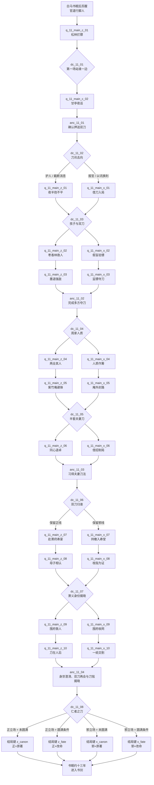

# 剧情 · 11 鸳鸯刀（正邪两条主线与选择节点）

> 归属（基准 §18、AR-10）：《鸳鸯刀》书界主线、选择节点、锚点落地、四类书界结局及剧情任务 ID 的唯一归属文档。
> 上游：`docs/decisions/author-requirements.md` AR-04、AR-09、AR-10；`docs/decisions/author-decisions.md`；`docs/00-canon.md` v1.2 §2、§15–§18；`design/01-vision-and-core-loop.md` §7.12；`design/02-timeline-and-world-tiers.md`；`design/13-progression-and-endings.md` §4.3–§4.4；`design/17-sects-compendium.md`；`design/18-npc-and-companions.md`。
> 引用而不重定义：属性与品德量表 → `design/03`；武学与招式 → `design/05` 及 `catalog/skills-kangxi`、`catalog/skills-general`；战斗、降服、Boss 阶段与合击 → `design/09`；装备 → `design/10`；区域、城市与时代图层 → `design/11`、`design/19`；任务 DSL → `design/12`；天书与结局系统 → `design/13`；NPC、生卒、招募与跨书重逢 → `design/18`。
> 标注约定：**（原创扩展）** = 原著没有的内容；**（待考）** = 原著事实尚需按三联 / 广州修订版逐字核对；**（待核实）** = 技术事实尚未联网确认；**（待实测）** = 需在实现环境验证；**【建议值】** = 依赖其他文档、先给可执行默认值并在文末登记。
> 版本：v1.0（P11 定稿，2026-09-26）；审校 P11.R（2026-09-26）；全局审计（2026-09-26）。

---

## 0. 阅读指引与剧情总览

### 0.1 一句话定位

这是一个“人人都想拿刀，却要到最后才明白不必拿刀杀人”的短篇书界：玩家从西安府至晋中官道卷入押刀、劫刀和寻亲，在喜剧性的错认与反转中选择保护人、利用人或控制局势，最终于萧府和中条山决定双刀究竟归一人、归朝廷，还是由众人共同放下。

书界参数直接引用基准 §2：`ch11_yuanyang`，约 1740 年、清乾隆初**（原创扩展定年）**，低武，武运 40，难度 3，等级上限 48，入场携带内功 / 拳脚 / 兵器各 1，外来压制 −4 小品，天书关键词“仁者无敌”。前一书界为 `ch10_baima`，后一书界为 `ch12_shujian`。

“正线 / 邪线”是玩家在本书界的**立场轴**，不是开局锁死的阵营：

- 正线优先保人、拆局、让秘密回到当事人手中；不等于必须服从萧府，也不等于每战不杀。
- 邪线优先掌控、交易、借官府或江湖势力达成目标；不等于滥杀，更不是惩罚性坏结局。
- 全局品德 `morality` 仍按 `design/03` §8.3 的 −100～100 量表累计；本文只配置剧情变化，不另造善恶公式。
- 本书局部立场 `stance_11` **（原创扩展）**只用于分幕：选择可使其趋向 `z` / `x`，在指定节点可换线并承担声望、关系或奖励代价。它不会覆盖全局品德。
- “原著 / 改命”是独立的**结果轴**。无论正线或邪线，只要完成锚点都能通关；满足全关键人物存活、全程零击杀、至少三场不同冲突非致命解决、最终不独占双刀，才进入改命结果。

### 0.2 全流程图



### 0.3 四个锚点与两轴判定

| 锚点 ID | 必经事件 | 原著骨架 | 本文幕位 | 完成事实 |
|---|---|---|---|---|
| `anc_11_01` | 镖局押送鸳鸯双刀 | 官府索刀，周威信以盐镖为掩护上路 | `q_11_main_c_01`–`c_02` | 玩家确认双刀、镖队与官府委托三者关系 |
| `anc_11_02` | 太岳四侠等多方夺刀 | 劫镖、误判、客栈与林中连环夺刀 | 正 `z_01`–`z_03` / 邪 `x_01`–`x_03` | 双刀至少一次易手，多方动机均被看见 |
| `anc_11_03` | 袁冠南、萧中慧结伴并习夫妻刀法 | 紫竹庵学招，二人互相回护退敌 | 正 `z_05`–`z_06` / 邪 `x_05`–`x_06` | 二人都存活并学得可合使的刀法 |
| `anc_11_04` | 萧府寿宴、身世澄清与刀铭揭晓 | 寿宴认亲、围府、退往中条山、真刀复得，刻字揭谜 | 正 `z_07`–`z_10` / 邪 `x_07`–`x_10` | 身世真相公开，双刀会合并读出“仁者无敌” |

上述四项逐条对应 `design/01` §7.12，不把寿宴与其后的中条山揭字压成同一现场。结局判定为笛卡尔积：

```text
incomingRoute = 最终执行的 z_10 或 x_10
finalStance  = dc_11_08.A ? z
             : dc_11_08.B ? x
             : incomingRoute          // C / D 保留来线
fateEnding   = every(keyNpcIds, lifeState in {alive, fate_rescued})
             && chapterKillCount == 0
             && distinct(nonLethalProofKeys).length >= 3
             && finalBladeCustody != protagonistExclusive

ending = finalStance × (fateEnding ? fate : canon)
```

`chapterKillCount == 0` 服从 `design/13` 的“全程不杀一人”；`nonLethalProofKeys` 只登记原本可能伤亡且以降服 / 劝退 / 欺敌 / 撤离收束的不同冲突，同一场反复击倒不重复计数。后者是本文对 `design/01`“至少三场”的可验收细化**【建议值】**；`fate_rescued` 视为健在，服从 `design/18` 的生命轴。

### 0.4 幕数、选择数与节奏

| 项目 | 配置 | 说明 |
|---|---:|---|
| 共有幕 | 2 | 开局与第一锚点，不预锁阵营 |
| 正线幕 | 10 | `q_11_main_z_01`–`q_11_main_z_10` |
| 邪线幕 | 10 | `q_11_main_x_01`–`q_11_main_x_10` |
| 选择节点 | 8 | `dc_11_01`–`dc_11_08`；`03/04/05/07` 允许幕级换线，`08` 可重定最终立场 |
| 锚点 | 4 | 与 `design/01` §7.12 一致 |
| 结局 | 4 | 正 / 邪 × 原著 / 改命 |
| 主线关键事件 | 50 | 全部有至少一个明确去向，覆盖率 100% |

---

## 1. 原著重要剧情与走向清单

### 1.1 版本、回目与用字边界

考据基线服从基准 §16：三联 / 广州修订版。当前联网可访问的是通行文本的 14 个网页分段和若干二手梗概，能交叉核对事件次序，但不能证明其分段等同指定纸本回目；早期连载资料又显示曾分九回。因此下表“回目 / 定位”统一写“修订本前段 / 中段 / 后段 + 网页分段”，并标**（待考）**，不杜撰回目标题或把网页页码冒充正式回目。

人物名采用项目名录规范：`袁冠南`、`萧中慧`、`萧半和`、`刘於义`。网络转录中出现“袁冠男”“刘于义”等字形，不据此改 ID；萧中慧身世揭晓后可在对白称杨中慧，数据主 ID 不变。

### 1.2 五十项事件覆盖表

| # | 回目 / 定位 | 人物 | 地点 | 原著事件与结果（大意） | 本作去向 |
|---:|---|---|---|---|---|
| 01 | 前段·网页 1**（待考）** | 刘於义、周威信 | 西安府 | 官府取得鸳鸯双刀，命威信镖局送往京师 | 双线共有；`anc_11_01` |
| 02 | 前段·网页 1**（待考）** | 周威信 | 西安府 | 周得知刀中藏有“天下无敌”秘密的传言 | 双线共有；线索 |
| 03 | 前段·网页 1**（待考）** | 周威信、刘於义 | 西安府 | 镖队明保盐银、暗藏双刀 | 双线共有；`q_11_main_c_01` |
| 04 | 前段·网页 1**（待考）** | 周威信 | 西安府 | 官府扣留周家十二口为质，迫其不敢失镖 | 选择节点 `dc_11_04`；救援支线入口 |
| 05 | 前段·网页 1**（待考）** | 周威信、大内卫士 | 川陕官道 | 四名官府亲信混入镖队，既护送也监视 | 双线共有；邪线入口 |
| 06 | 前段·网页 1**（待考）** | 太岳四侠、周威信 | 官道松林 | 太岳四侠拦下七十余人的镖队 | 双线共有；`dc_11_01` |
| 07 | 前段·网页 1**（待考）** | 太岳四侠 | 官道松林 | 四侠依次夸张报名，声势与本事形成反差 | 双线共有；喜剧演出 |
| 08 | 前段·网页 2**（待考）** | 太岳四侠、镖队 | 官道松林 | 四侠动手劫镖，被镖师与卫士人数压退 | 正线 / 邪线不同视角；`anc_11_02` |
| 09 | 前段·网页 2**（待考）** | 周威信、汪姓盐商 | 官道松林 | 周误以为荆棘中人是四侠，放甩手箭误伤押镖的汪姓盐商，闹剧加深 | 支线（交书界文档）；主线只保留结果旗标，不单列战斗 |
| 10 | 前段·网页 2–3**（待考）** | 林玉龙、任飞燕、太岳四侠 | 官道松林 | 林任夫妇边追边打，四侠误判二人关系 | 双线共有；`q_11_main_c_02` 官道段 |
| 11 | 前段·网页 3**（待考）** | 任飞燕、太岳四侠 | 官道松林 | 任飞燕以弹弓击退四侠，林玉龙继续逃 | 双线共有；`q_11_main_c_02` 官道段 |
| 12 | 前段·网页 3**（待考）** | 袁冠南、太岳四侠 | 官道松林 | 袁冠南反用“行侠仗义”之名让四侠掏出盘缠 | 双线共有；`q_11_main_c_02` 官道段 |
| 13 | 前段·网页 3**（待考）** | 袁冠南、书僮 | 官道松林 | 旧书中夹着金叶，显出袁并非穷书生 | 双线共有；`q_11_main_c_02` 官道段伏笔 |
| 14 | 前段·网页 4**（待考）** | 萧中慧、太岳四侠 | 官道松林 | 萧中慧斩断绊马索，以双刀轻取四侠 | 双线共有；`q_11_main_c_02` 官道段 |
| 15 | 前段·网页 4**（待考）** | 萧中慧、太岳四侠 | 官道松林 | 四侠愿同生死，萧中慧饶其性命 | 双线共有；`q_11_main_c_02` 非致命示范 |
| 16 | 前段·网页 4**（待考）** | 萧中慧、太岳四侠 | 官道松林 | 萧以金钗赠四侠作萧半和寿礼 | 双线共有；`q_11_main_c_02`，寿宴回收于 `z_07/x_07` |
| 17 | 前段·网页 4–5**（待考）** | 萧中慧、镖队 | 甘亭镇汾安客店 | 萧在客店偷听，得知镖队携刀 | 双线共有；`q_11_main_c_02`、`dc_11_02` |
| 18 | 前段·网页 5**（待考）** | 周威信、镖师 | 汾安客店 | 周睡梦泄密，秘密其实已在镖队传开 | 双线共有；喜剧线索 |
| 19 | 前段·网页 5**（待考）** | 萧中慧、萧半和 | 回忆 / 太原府（原著称晋阳） | 萧半和发帖邀英雄祝寿，并暗请友人夺刀 | 双线共有；`q_11_main_c_02` 口述，正线动机 / 邪线案证 |
| 20 | 前段·网页 5**（待考）** | 萧中慧 | 太原府（原著称晋阳）至甘亭镇 | 萧不听家中劝阻，独自离家夺刀 | 双线共有；`q_11_main_c_02` 人物动机 |
| 21 | 前段·网页 5–6**（待考）** | 林玉龙、任飞燕、袁冠南 | 汾安客店 | 林任夫妇再度争吵动刀，袁出面劝解 | 双线共有；`q_11_main_c_02` 客店段 |
| 22 | 中段·网页 6**（待考）** | 萧中慧、袁冠南、卓天雄 | 汾安客店 | 萧出钱济“盲者”，袁代受谢，假盲者自称卓天雄 | 选择节点 `dc_11_02`；识人检定 |
| 23 | 中段·网页 6**（待考）** | 萧中慧、林任夫妇 | 客店外 | 萧误认林玉龙抢孩子，出刀相助任飞燕 | 正线 `z_01` / 邪线 `x_01` 的另一面 |
| 24 | 中段·网页 6–7**（待考）** | 萧中慧、林玉龙 | 荒坟 / 官道 | 萧伤林玉龙，任飞燕反来夹击，误会升级 | 选择节点 `dc_11_03` |
| 25 | 中段·网页 7**（待考）** | 林任夫妇、萧中慧 | 官道 | 二人说明夫妻与孩子身份，萧发现自己判断错 | 双线共有；关系修复 |
| 26 | 中段·网页 7**（待考）** | 萧中慧、林任夫妇 | 官道 | 萧抱走孩子，随后准备归还，三人继续追逐 | 正线护送 / 邪线诱饵 |
| 27 | 中段·网页 7**（待考）** | 卓天雄、镖队 | 枣香林 | 卓假盲跟随，显露轻功并击退镖师 | 正线 `z_02` / 邪线 `x_02` |
| 28 | 中段·网页 7–8**（待考）** | 周威信、林任夫妇 | 枣香林 | 周逃入林中，被寻子夫妇截住盘问 | 双线共有；连环误会 |
| 29 | 中段·网页 8**（待考）** | 萧中慧、周威信 | 枣香林 | 萧趁乱割断铁索，首次夺得双刀 | 选择节点 `dc_11_03`；`anc_11_02` |
| 30 | 中段·网页 8**（待考）** | 卓天雄、众人 | 枣香林 | 卓藏身马腹，突袭夺刀并点住三人 | 双线共有；Boss 压迫 |
| 31 | 中段·网页 8**（待考）** | 卓天雄、周威信 | 枣香林 | 卓以刀鞘使鞭法，周认出他为师伯 | 邪线关系揭示 / 正线情报 |
| 32 | 中段·网页 8**（待考）** | 卓天雄、萧中慧 | 枣香林 | 卓点住萧中慧，声称要带她进京，双刀重归官府一侧 | 正线救援 / 邪线押解 |
| 33 | 中段·网页 9**（待考）** | 袁冠南、卓天雄 | 枣香林 | 袁持笔墨迎战，武功不及卓 | 双线共有；`q_*_03` |
| 34 | 中段·网页 9**（待考）** | 袁冠南、卓天雄 | 枣香林 | 袁虚称墨为剧毒，利用卓的忌惮逼退对方 | 正线智取 / 邪线识破骗局 |
| 35 | 中段·网页 9**（待考）** | 袁冠南、周威信 | 枣香林 | 袁夺回双刀，周与卓暂退 | 双线共有；第二次易手 |
| 36 | 中段·网页 10**（待考）** | 袁冠南、萧中慧 | 官道 | 袁解开众人穴道；萧装昏，夺走短刀 | 双线共有；正 / 邪共同反转 |
| 37 | 中段·网页 10**（待考）** | 众人 | 紫竹庵 | 双方躲入尼庵，卓天雄循迹追至并威胁焚庵 | 正线 `z_05` / 邪线 `x_05`；平民风险 |
| 38 | 中段·网页 10–11**（待考）** | 林任夫妇 | 紫竹庵 | 林任讲述高僧传夫妻刀法，自己却因争执无法合使 | 双线共有；授艺前提 |
| 39 | 中段·网页 11**（待考）** | 林任夫妇、袁冠南、萧中慧 | 紫竹庵 | 林、任分别传授，袁萧在急迫中先学十二招；余下六十招到萧府再补授**（具体招名不在本文列举）** | 锚点 `anc_11_03`；选择节点 `dc_11_05` |
| 40 | 中段·网页 11**（待考）** | 袁冠南、萧中慧、卓天雄 | 紫竹庵 | 袁萧因互相回护，自然合使刀法，击退卓 | 正线 `z_06` / 邪线 `x_06`；Boss |
| 41 | 后段·网页 11–12**（待考）** | 萧半和、群雄 | 萧府 | 三月初十，萧半和五十寿辰，群雄来贺 | 双线共有；`anc_11_04` 起点 |
| 42 | 后段·网页 12**（待考）** | 太岳四侠、萧中慧 | 萧府 | 四侠把金钗当寿礼送回，形成喜剧回环 | 支线（交书界文档）回收；可影响四侠援军 |
| 43 | 后段·网页 12**（待考）** | 袁冠南、林任夫妇、萧中慧 | 萧府 | 袁与林任夫妇携长盒献上双刀作寿礼，萧半和许配女儿；林任补授其余刀法 | 正线 `z_07` / 邪线 `x_07`；`dc_11_06` |
| 44 | 后段·网页 12**（待考）** | 袁冠南、袁夫人 | 萧府 | 袁夫人两手小指的枝指与袁冠南佩戴的翡翠狮子相证，母子相认；玉扳指只触发他注意其手，并非第二件身世信物 | 双线共有；身世证据 |
| 45 | 后段·网页 12**（待考）** | 萧中慧、袁冠南 | 萧府 | 萧误以为二人是兄妹，悲痛离席 | 双线共有；悬念而非永久结论 |
| 46 | 后段·网页 12–13**（待考）** | 卓天雄、周威信、萧中慧 | 萧府外 / 寿堂 | 卓擒萧，取短刀，以人质逼萧半和交长刀 | 正线 `z_08` / 邪线 `x_08`；`dc_11_07` |
| 47 | 后段·网页 13**（待考）** | 萧半和、卓天雄、官兵 | 萧府 | 官兵先在府外喊破“反贼萧义”，卓天雄由此省悟；萧半和随后拂去假须，公开恢复萧义身份 | 正 `z_09` / 邪 `x_09`；锚点 |
| 48 | 后段·网页 13–14**（待考）** | 袁冠南、萧中慧、萧半和 | 萧府 | 金叶扰敌，萧从周手中夺回短刀，与袁合刀救人；短刀随后被卓的钢鞭击断，众人才知短鸯刀已遭调包，卓携真刀逃走 | 双线共有；非致命核心与真刀追索前置 |
| 49 | 后段·网页 14**（待考）** | 萧半和、袁杨二夫人、袁萧 | 中条山 | 众人撤离；萧义讲明入宫、救人、收养与袁杨身世 | 双线共有；身世澄清 |
| 50 | 后段·网页 14**（待考）** | 太岳四侠、卓天雄、袁夫人 | 萧府近郊污泥河 / 中条山 | 四侠在污泥河网擒卓并从其身上取回真短刀，随后赶到中条山；双刀刻字合成“仁者无敌” | 锚点 `anc_11_04`；选择节点 `dc_11_08`；四结局 |

### 1.3 覆盖率核算

| 覆盖口径 | 分子 | 分母 | 覆盖率 | 校验说明 |
|---|---:|---:|---:|---|
| 原著关键事件有去向 | 50 | 50 | `50 ÷ 50 = 100%` | 每行“本作去向”均非空 |
| 四个上游锚点进入主线 | 4 | 4 | `4 ÷ 4 = 100%` | 对应 `anc_11_01`–`anc_11_04` |
| 核心人物有正 / 邪视角 | 14 | 14 | `14 ÷ 14 = 100%` | 以 `npcs-ch11-yuanyang` 的原著 / 史实原型具名人物为全集 |
| 明确不采用的关键事件 | 0 | 50 | 0% | 仅将重复口头禅、逐招长串等压缩为演出，不删其剧情作用 |

“支线”不是遗弃：第 09 项误伤盐商和第 42 项金钗回环交给书界 DLC 的喜剧事件链展开，主线仍保留结果旗标与回收点。原著主要情节因此全部可追踪。

---

## 2. 主角定位与开局

### 2.1 穿越身份与世界状态

主角从《白马啸西风》书眠约十四年后，于约 1740 年的西安府东出官道苏醒，公开身份是“向京畿行走、暂随商旅互保的外乡行脚人”**（原创扩展）**。这个身份不预设门派、官籍或反清立场，既能被镖队临时雇来护车，也能和太岳四侠说话；它与 `design/13` §6.4.2 的隐藏身份“镖局趟子手”不同，后者仍是改命周目专属，拥有镖局内部信任与更早的押刀情报。

下列入口已同步至 `design/chapters/11-yuanyang.md`“穿越开局”；章节文档只承接玩法配置，不另定义身世：

| 项 | 本文先定 |
|---|---|
| 苏醒点 | `rg_guanzhong` 西安府东出官道，最近城市 `city_xian` |
| 初始公开身份 | 外乡行脚人**（原创扩展）** |
| 首个关系 | 镖队把玩家当临时护车者；太岳四侠把玩家当可拉拢的见证人 |
| 初始所知 | 只知明镖为盐银；不知道包袱内是鸳鸯刀 |
| 首个选择 | 松林冲突结束前的 `dc_11_01` |
| 隐藏身份差异 | 镖局趟子手：初始 `sect_weixinbiaoju` 关系友好、提前知道人质；仍必须作 `dc_11_01` |

### 2.2 与主要人物的关系起点

| 人物 | 起点 | 玩家可建立的关系 | 不可越界 |
|---|---|---|---|
| 周威信 | 雇主或被观察对象，紧张且多疑 | 护住镖队、救其家眷，或利用其求生欲 | 不把被扣家眷写成他自愿卖亲求官 |
| 太岳四侠 | 拦路者，声势大而武艺有限 | 调停、结交、利用其好名心，最终可招募 | 不把喜剧人物写成嗜杀匪首 |
| 萧中慧 | 尚未相识的离家少女 | 由误会、共患到互信；不替她选择袁冠南 | 不抹去她主动夺刀和救人的行动 |
| 袁冠南 | 尚未相识的游学书生 | 识破或配合他的智取，协助寻母 | 不替他完成认亲或情感决定 |
| 林玉龙、任飞燕 | 争吵中的夫妻 | 调停、分别建立信任、获授既有武学 | 不把争吵简化成正邪标签 |
| 卓天雄 | 暗中尾随的清宫高手 | 正线为需克服的强敌；邪线为危险但可靠的阶段同盟 | 不洗白胁迫、绑人和追捕，也不强制其死亡 |
| 萧半和 | 未谋面的晋阳大侠 | 查证其过往后救援、协商或追捕 | 身世真相必须由本人在锚点公开 |
| 刘於义 | 幕后委托者 | 可短时结盟、交差或反制 | 小说称“川陕总督”；史实官衔与定年不混写 |

### 2.3 立场初值与切换规则

`stance_11` 初值为 0。`dc_11_01` 与 `dc_11_02` 各产生 `−1 / 0 / +1` 的局部倾向**【建议值】**：正向表示优先保人，负向表示优先控刀。完成 `q_11_main_c_02` 后：

```text
stance_11 >= +1  -> 进入 q_11_main_z_01
stance_11 <= -1  -> 进入 q_11_main_x_01
stance_11 == 0   -> 依据 dc_11_02 的最后选择进入相应线
```

后续 `dc_11_03`、`dc_11_04`、`dc_11_05`、`dc_11_07` 可改变下一幕入口；`dc_11_08` 不再进入新幕，但可用最终归刀选择重定向结算立场。换线不是免费洗点：会保留既有 `morality`、死伤、被背叛者的 `resentment` 和关闭的奖励。`dc_11_06` 只决定双刀暂时保管者，不直接换线。本文用 `endingKey` 的四个本地枚举值区分书界内叙事收束；正式 `end_*` 内容 ID 归 `design/13`，本文不越权新建。

### 2.4 双线共有幕

#### `q_11_main_c_01` · 松林拦镖

| 固定字段 | 内容 |
|---|---|
| 标题 | 松林拦镖 |
| 原著对应事件（回目） | 前段网页分段 1–2：周威信押刀、太岳四侠拦路并败走；正式回目**（待考）** |
| 地点 | `rg_guanzhong`，西安府东出川陕官道松林**（具体里程待考）** |
| 参与 NPC | `npc_zhouweixin`、`npc_xiaoyaozi11`、`npc_changchangfeng`、`npc_huajianying`、`npc_gaiyiming`、`npc_heqian11`、`npc_luchen11` |
| 目标 | 识别明镖与暗镖矛盾，在不预设阵营的情况下活过第一次冲突 |
| 关键战斗 | 太岳四侠 vs 镖队；精英群战。按 `design/09` 的护送目标、士气与降服流程；不在本文写属性值 |
| 幕内小选择 | 扶起受伤者（品德 +2**【建议值】**）、追问包袱（无品德变化）、趁乱摸封印（品德 −2**【建议值】**） |
| 幕末状态变化 | 完成 `anc_11_01` 的“押刀关系已知”；写 `flag_11_saw_escort`；触发 `dc_11_01` |
| 失败与时限 | 主角倒地则被镖队救至甘亭镇，失去首次立场加成但主线不断；镖车被毁则以幸存卫士口供补线索。日落前未处理则车队自行离场，玩家由驿卒追上 |

目标与流程：

1. 在官道醒来，确认 `city_xian`、`rg_guanzhong` 与当前时代图层。
2. 接受周威信的短途互保，或保持五格外观察车队**（原创扩展）**。
3. 听太岳四侠报名并辨认常长风的墓碑兵器。
4. 战斗中保护任一倒地者、协助一方，或从侧路绕到镖车。
5. 从封印、官府卫士和周的反应确认真正货物不是盐银。
6. 战后处理伤者并作第一次立场选择。

若本幕以降服、停战或双方撤开结束，且四侠与镖师无人死亡，把本地证明键 `songlin_jiebiao` 加入 `nonLethalProofKeys`；同一松林战无论重试或换阵营都只登记一次。正式战斗遭遇 `enc_*` 由 `design/09` 或书界 DLC 归属，本文不新建。

#### `q_11_main_c_02` · 甘亭夜话

| 固定字段 | 内容 |
|---|---|
| 标题 | 甘亭夜话 |
| 原著对应事件（回目） | 前中段网页分段 2–6：林任追逐、四侠再遇袁 / 萧与金钗回环、萧中慧投宿、周威信梦话泄密、袁冠南与假盲卓天雄出现；正式回目**（待考）** |
| 地点 | 川陕官道松林至甘亭镇汾安客店；客店在清代平阳府临汾县与洪洞县之间**（精确古今地望待考）**，地图归 `rg_hedong_jinzhong` |
| 参与 NPC | `npc_zhouweixin`、`npc_xiaozhonghui`、`npc_yuanguannan`、`npc_linyulong`、`npc_renfeiyan`、`npc_zhuotianxiong`、`npc_xiaoyaozi11`、`npc_changchangfeng`、`npc_huajianying`、`npc_gaiyiming`、`npc_heqian11` |
| 目标 | 沿官道见证四侠与林任、袁、萧的连环误判，再在一夜内判别梦话泄密、夫妻斗殴与假盲试探 |
| 关键战斗 | 官道上的弹弓退四侠、萧中慧断索与饶人均为原著演出；玩家只可调停 / 救伤。客店可无战斗；若闯入林任房间则为短暂精英误会战，气血阈值触发停手，不得死亡 |
| 幕内小选择 | 替四侠保住颜面、见证金钗回礼、替“盲者”付钱、警告萧 / 周或向卓报价，分别改变人物好感和 `stance_11` |
| 幕末状态变化 | 写 `flag_11_blade_confirmed`、`flag_11_met_xiaoyuan`、`flag_11_met_zhuo`；触发 `dc_11_02` 并决定首条分线 |
| 失败与时限 | 子时至天明为窗口；漏过偷听可由周的第二次梦话补获知，漏过卓则在枣香林强制相遇；不形成断链 |

目标与流程：

1. 沿官道见证林任追逐、任飞燕以弹弓逼退四侠、袁冠南智取盘缠，以及旧书中金叶伏笔。
2. 看萧中慧斩断绊马索、击败而饶过四侠，并将金钗托作寿礼；玩家只处理伤者和关系，不夺走四人的叙事动作。
3. 随镖队或独行抵达汾安客店，从周的梦话和镖师反应确认双刀去向。
4. 观察林任夫妇争斗与袁冠南劝解，决定劝架、旁观或趁乱查车。
5. 处理假盲卓天雄的投宿请求，以 `lore` / `speech` 检定识破一处破绽；失败仍可推进。
6. 在天明前决定刀讯交给谁，由 `dc_11_02` 分入正线或邪线。

---

## 3. 正线：先保住人，再问刀归谁

正线共十幕。其核心不是“替萧府夺刀”，而是不断把人从物的后面拉回前景：先救误会中的孩子和伤者，再拆掉官府用周家人命形成的强迫，最后让袁、杨两家后人自己听见真相。正线允许对官府依法交涉，也允许对萧半和提出质疑；它反对的是以无辜者为筹码。

### 3.1 `q_11_main_z_01` · 夜半抱不平

| 固定字段 | 内容 |
|---|---|
| 标题 | 夜半抱不平 |
| 原著对应事件（回目） | 中段网页分段 6–7：萧中慧误把夫妻争吵当作抢子，伤林玉龙后才知误会；正式回目**（待考）** |
| 地点 | 甘亭镇汾安客店外、荒坟与北行官道；`rg_hedong_jinzhong` |
| 参与 NPC | `npc_xiaozhonghui`、`npc_linyulong`、`npc_renfeiyan`、`npc_yuanguannan` |
| 目标 | 阻止误会战扩大，在保护孩子的同时让三名成年人停手说明身份 |
| 关键战斗 | 林玉龙、任飞燕为精英误会战；引用 `design/09` 的剧情停战阈值与口舌行动，任何一方低于阈值即进对话，不得处决 |
| 幕内小选择 | 先护孩子（品德 +3**【建议值】**）、先缴三人兵器（萧 / 林任好感各 −5**【建议值】**）、趁乱追查双刀（`stance_11 −1`） |
| 幕末状态变化 | 写 `flag_11_child_safe` 或 `flag_11_child_as_lure`；林任夫妇从敌对改为警戒；触发 `dc_11_03` |
| 失败与时限 | 天亮前；主角倒地时萧中慧仍抱走孩子，下一幕从追踪开始，失去林任初始信任但不锁线 |

目标与流程：

1. 尾随萧中慧出店，先确认石上婴儿而非直接攻击林玉龙。
2. 用口舌让任飞燕说出称谓，或承受两轮夹击后触发原著式说明。
3. 为林玉龙止血；若玩家先出手致伤，则必须道歉或赔药。
4. 在萧中慧抱走孩子时追上，决定立刻归还、带孩子引出追兵，或只指明安全方向。
5. 记录首次“误判可被澄清”的主题教学，为末幕身世误判作回环。

### 3.2 `q_11_main_z_02` · 枣香林救人

| 固定字段 | 内容 |
|---|---|
| 标题 | 枣香林救人 |
| 原著对应事件（回目） | 中段网页分段 7–8：卓天雄假盲尾随，林任截周，萧趁乱夺刀，卓自马腹突袭；正式回目**（待考）** |
| 地点 | 临汾县至洪洞县官道的枣香林；最近地图城市 `city_linfen`，具体林址**（待考）** |
| 参与 NPC | `npc_xiaozhonghui`、`npc_linyulong`、`npc_renfeiyan`、`npc_zhouweixin`、`npc_zhuotianxiong` |
| 目标 | 让孩子归还父母，防止镖队与林任互杀，并在卓突袭时救下被点穴者 |
| 关键战斗 | 镖队混战为普通 / 精英；卓天雄初战为不可击败 Boss 压迫段，只要求救出一人并撤离；阶段写法引用 `design/09` §8.8 |
| 幕内小选择 | 把卓的破绽告诉周（周好感 +8）、告诉萧（萧好感 +8）、故意让卓暴露（两边均 +3、战斗更难），均为**【建议值】** |
| 幕末状态变化 | `flag_11_child_returned=true` 时孩子已回到父母身边并提高林任关系；双刀由萧短暂取得又被卓夺回；完成 `anc_11_02` 的易手要求 |
| 失败与时限 | 正午前；若未归还孩子，林任在下一幕先救子再参战；若撤退失败则卓点穴而非杀人，袁冠南按锚点登场救场 |

目标与流程：

1. 沿镖号追至枣香林，找出假盲卓天雄没有留下探杖痕迹的破绽。
2. 把孩子交还任飞燕，避免其以弹弓误伤镖师。
3. 劝周放下铁鞭说明包袱；失败则进入三方乱战。
4. 协助萧割断铁索，却不得直接永久取得 `eq_yuanyangdao`。
5. 卓从马腹突袭时选择背人撤离、截断坐骑或掩护林任。
6. 在 Boss 阶段门触发后撤至林缘，保留下一幕袁冠南智取。

### 3.3 `q_11_main_z_03` · 墨退强敌

| 固定字段 | 内容 |
|---|---|
| 标题 | 墨退强敌 |
| 原著对应事件（回目） | 中段网页分段 8–10：袁冠南以笔墨迎敌，虚称毒膏吓退卓并夺刀，萧装昏夺短刀；正式回目**（待考）** |
| 地点 | 枣香林至西北荒山官道；`rg_hedong_jinzhong` |
| 参与 NPC | `npc_yuanguannan`、`npc_xiaozhonghui`、`npc_zhuotianxiong`、`npc_zhouweixin`、`npc_linyulong`、`npc_renfeiyan` |
| 目标 | 以骗局和站位救出受制者，确保卓、周也能活着退场 |
| 关键战斗 | 卓天雄 Boss 解谜战：正面输出不能结束阶段；识破 / 配合“毒墨”后触发退却。机制使用 `design/09` 的弱点与阶段转换，不另写战斗倍率 |
| 幕内小选择 | 主动声称毒已入骨（口才检定；合格时登记本地证明键 `dumo_zhazhuo`）、从背后缴械、或硬挡三轮给袁制造机会 |
| 幕末状态变化 | 写 `flag_11_ink_bluff`、`flag_11_yuan_rescued_party`；双刀由袁暂持，随后萧取得短刀；正线信任提升 |
| 失败与时限 | 卓识破骗局时转为撤离战；若玩家未开退路，林任被点穴但不死亡，袁仍带长刀退往紫竹庵 |

目标与流程：

1. 听袁冠南朗吟入林，选择提醒他卓的实力或保持静默。
2. 在袁腿伤后护住其退路，不替他夺走智取的叙事主动权。
3. 取得普通墨汁来源，配合“有毒”说辞；`lore` 高者可补充可信症状但不能制造真毒。
4. 卓退却时解开至少一人的穴道。
5. 见证萧中慧装昏夺走短刀，选择一笑置之或追问归属；不得抢夺。

### 3.4 `q_11_main_z_04` · 两全其人 **（原创扩展）**

| 固定字段 | 内容 |
|---|---|
| 标题 | 两全其人 |
| 原著对应事件（回目） | 据前段“周家十二口被扣为质”扩展；原著没有营救过程 |
| 地点 | `city_linfen` 驿铺与北行官道；关中方向消息由驿传送达，不让主角折返西安府 |
| 参与 NPC | `npc_zhouweixin`、`npc_heqian11`、`npc_luchen11`、`npc_luoning11` |
| 目标 | 截下押刀进度文书，伪造“镖尚安稳”的回报，为周家转移争取窗口，同时不害送信驿卒 |
| 关键战斗 | 可全程潜行 / 口舌；若暴露则对清宫驿卫普通战，完成条件为取得印记拓样并撤离，不要求击杀 |
| 幕内小选择 | 放走副领罗宁（品德 +2、清宫警戒 +1）、扣作证人（无品德、可换情报）、伤害驿卒（品德 −5），均为**【建议值】** |
| 幕末状态变化 | 成功写 `flag_11_zhou_family_window=true`，周威信后续可脱离官府；失败不杀家眷，只使营救转为结局旁白中的高代价补救 |
| 失败与时限 | 领取后两个时辰内；错过即由下一驿站递出，主线继续但改命所需“全部关键人物”不受影响，周的个人招募链门槛提高 |

目标与流程：

1. 从周威信遗落的官凭得知驿报频率。
2. 在临汾驿识别卓天雄预留的回报暗号。
3. 选择伪造平安报、延迟递送或公开扣质证据。
4. 让 `npc_heqian11` 抄录、`npc_luchen11` 勘路，角色是否在场取决于先前救援。
5. 给周留下可验证的撤亲暗号，使其日后不必以死守镖。

### 3.5 `q_11_main_z_05` · 紫竹庵避锋

| 固定字段 | 内容 |
|---|---|
| 标题 | 紫竹庵避锋 |
| 原著对应事件（回目） | 中段网页分段 10：众人躲入紫竹庵，卓循迹追来并威胁焚庵；正式回目**（待考）** |
| 地点 | 西北荒山紫竹庵，距官道二十余里（文本距离；具体地望**（待考）**），`rg_hedong_jinzhong` |
| 参与 NPC | `npc_yuanguannan`、`npc_xiaozhonghui`、`npc_linyulong`、`npc_renfeiyan`、`npc_zhuotianxiong` |
| 目标 | 藏住众人并保护庵中老尼，不以其为诱饵；建立林、任分别授艺条件 |
| 关键战斗 | 庵门追踪队为普通；可用误导脚印与口舌免战。卓第一次搜庵不进入完整 Boss 战 |
| 幕内小选择 | 是否再次点住林任避免出声；先征得同意 / 事后道歉可修复关系，粗暴点穴使两人好感各 −10**【建议值】** |
| 幕末状态变化 | 写 `flag_11_nunnery_safe`、`flag_11_linren_truce`；此幕只建立平民安全前置，不单独登记非致命遭遇；触发 `dc_11_05` |
| 失败与时限 | 卓第一次离庵至折返为短窗口；暴露时可护送老尼从后门撤离，场地受损但主线不锁死，改命条件中的关键人物仍可保全 |

目标与流程：

1. 在袁、萧、林、任互不信任时安排藏位。
2. 擦除血迹、马蹄印和断刀碎片三类线索。
3. 选择请老尼说真话但拖延，或布置众人已北逃的假象。
4. 阻止卓焚庵的威吓转成实际伤害。
5. 卓暂退后，分别听林玉龙与任飞燕说明夫妻刀法的两路配合。

### 3.6 `q_11_main_z_06` · 同心退卓

| 固定字段 | 内容 |
|---|---|
| 标题 | 同心退卓 |
| 原著对应事件（回目） | 中段网页分段 11：袁萧学得十二招，以互相回护击伤并逼退卓天雄；正式回目**（待考）** |
| 地点 | 紫竹庵正殿与院墙 |
| 参与 NPC | `npc_yuanguannan`、`npc_xiaozhonghui`、`npc_linyulong`、`npc_renfeiyan`、`npc_zhuotianxiong` |
| 目标 | 守住授艺的十二招，让袁萧完成一次有效合使并逼卓撤走 |
| 关键战斗 | 卓天雄 Boss；玩家负责控场、解穴与保护老尼，袁萧触发 `cmb_fuqidao` 结束阶段；合击规则只引用 `design/09` §6.7.4 |
| 幕内小选择 | 主角可替任一人挡招、劝林任停止争执，或追击卓；追击会错过同心见证并减少袁萧信任 |
| 幕末状态变化 | 完成 `anc_11_03`；写 `flag_11_couple_blade_learned`；非致命逼退卓时登记本地证明键 `zizhu_tuizhuo`；触发 `dc_11_06` |
| 失败与时限 | 卓闯殿即开战；袁或萧倒地时林任以示范补救并强制撤退，锚点延至萧府补课完成，不造成死亡断链 |

目标与流程：

1. 选择由林玉龙教袁、任飞燕教萧，保持原著授艺关系。
2. 完成“攻者前进一步、守者让半步”的协作教学，不要求角色性别或婚姻。
3. 卓折返后先解救再次被点穴的林任。
4. 用站位让袁萧相邻且都可行动，触发合击候选。
5. 卓受伤后选择止步，避免追杀；正线默认让其撤走。
6. 收束两柄刀的暂时保管，进入 `dc_11_06`。

### 3.7 `q_11_main_z_07` · 赴萧府寿宴

| 固定字段 | 内容 |
|---|---|
| 标题 | 赴萧府寿宴 |
| 原著对应事件（回目） | 后段网页分段 11–12：三月初十寿宴、袁献刀、萧许亲、林任补授其余刀法；正式回目**（待考）** |
| 地点 | 萧府，晋阳 / 太原府一带；地图锚 `city_taiyuan`，宅址**（待考）** |
| 参与 NPC | `npc_xiaobanhe`、`npc_yuanguannan`、`npc_xiaozhonghui`、`npc_linyulong`、`npc_renfeiyan`、`npc_xiaoyaozi11`、`npc_changchangfeng`、`npc_huajianying`、`npc_gaiyiming`、`npc_yanhe11` |
| 目标 | 护送众人和至少一柄真刀到寿宴，让每条伏笔在公开场合获得见证 |
| 关键战斗 | 无强制战斗；沿路劫刀者为普通可选遭遇。宴内使用冲突调停，不把宾客变成刷怪 |
| 幕内小选择 | 接受公开称赞（本界 `fame +100`）、把功劳还给四侠（四侠好感 +10）、隐去姓名（书灵好感分支），数值为**【建议值】** |
| 幕末状态变化 | `flag_11_birthday_arrived`；林任补授完成，袁萧关系进入自主决定窗口；双刀暂存由 `dc_11_06` 的选择决定 |
| 失败与时限 | 三月初十酉时前抵达；迟到时寿礼演出移至后堂、认亲仍发生；若路上丢刀，可由太岳四侠带金钗开启补救追踪 |

目标与流程：

1. 从紫竹庵经官道赴太原府，护送伤者而非竞速。
2. 让严和核验英雄帖，避免官府探子借宾客身份提前入内**（原创扩展）**。
3. 见太岳四侠送回金钗，回收萧中慧先前的不杀之恩。
4. 原著路径由袁冠南与林任夫妇携长盒献上双刀；分支若刀在别处暂管，则由保管人验封后交袁完成献礼，不由玩家代占叙事位置。
5. 见证萧半和许亲；玩家只能祝贺、提醒先问当事人或保持沉默。
6. 林任在后园补授刀法，玩家可观摩已有 `sk_fuqidaofa`，不能凭剧情凭空习得。

### 3.8 `q_11_main_z_08` · 母子相认

| 固定字段 | 内容 |
|---|---|
| 标题 | 母子相认 |
| 原著对应事件（回目） | 后段网页分段 12：枝指与翡翠狮子相证，袁冠南认母；萧中慧误以为兄妹而出走，遭卓擒住；正式回目**（待考）** |
| 地点 | 萧府寿堂、后堂与府外街巷；`city_taiyuan` |
| 参与 NPC | `npc_yuanguannan`、`npc_yuanfuren`、`npc_xiaozhonghui`、`npc_yangfuren`、`npc_xiaobanhe`、`npc_zhuotianxiong`、`npc_zhouweixin` |
| 目标 | 保护认亲证物，追上离席的萧中慧，并在不破坏悬念的前提下阻止卓以她作人质 |
| 关键战斗 | 府外追踪与短时擒拿；卓为 Boss 事件，不可在身世揭晓前击杀或永久拘禁 |
| 幕内小选择 | 留在寿堂保护袁母（证物稳定）、追萧（可提前警告）、追踪卓（获得围府情报）；不同选择由同伴补位，均可汇合 |
| 幕末状态变化 | 写 `flag_11_yuan_reunited`、`flag_11_xiao_mistaken_sibling`；若救下萧则卓改绑走刀鞘信使**（原创扩展）**，人质戏仍以威胁书信进入下一幕 |
| 失败与时限 | 从认亲到官兵围府仅一刻钟**【建议值】**；追踪失败沿原著由卓押萧入府，成功只改变人质形态，不删除围府锚点 |

目标与流程：

1. 袁夫人递出玉扳指时，玩家注意其手部特征但不抢答。
2. 由袁冠南出示翡翠狮子，完成母子相认。
3. 阻止宾客把“同母”误传成“同父同母”，但不能即时知道全部真相。
4. 选择保护袁夫人或追出萧府，分配同伴补另一处。
5. 卓天雄现身时优先救人而非争刀；失败沿原著进入人质局。

### 3.9 `q_11_main_z_09` · 围府救人

| 固定字段 | 内容 |
|---|---|
| 标题 | 围府救人 |
| 原著对应事件（回目） | 后段网页分段 13–14：卓持人质索刀、官兵围府、萧义身份揭晓、袁萧合刀退敌；正式回目**（待考）** |
| 地点 | 萧府寿堂、内院、东门撤离路；`city_taiyuan` |
| 参与 NPC | `npc_xiaobanhe`、`npc_yuanguannan`、`npc_xiaozhonghui`、`npc_yuanfuren`、`npc_yangfuren`、`npc_zhuotianxiong`、`npc_zhouweixin`、`npc_xiaoyaozi11`、`npc_changchangfeng`、`npc_huajianying`、`npc_gaiyiming`、`npc_yanhe11` |
| 目标 | 解开人质、护送两位夫人与宾客出东门，在公开见证下让萧半和自行恢复萧义身份 |
| 关键战斗 | 多目标护送战：卓为 Boss，清宫侍卫为精英，官兵为普通；阶段、护送与非致死制服均引用 `design/09` |
| 幕内小选择 | 金叶扰阵、从屋顶开路或当众交涉；若 `flag_11_zhou_family_window` 成立，可劝周停手并使普通镖师撤出 |
| 幕末状态变化 | 写 `flag_11_xiaoyi_revealed`、存活集合与战斗出局方式；以开放撤离、降服或停战且无人死亡收束时登记本地证明键 `xiaofu_weizhan`；进入 `z_10` |
| 失败与时限 | 官兵三波后封死东门**【建议值】**；错过则改走府中密道并牺牲声望奖励，关键人物被俘而非当场死亡，仍有中条山交换补救 |

目标与流程：

1. 听卓提出“以无价之人换有价之刀”，拒绝把萧中慧物化为筹码。
2. 听官兵先在府外喊破“萧义”，再让萧半和自行拂去假须、公开恢复身份，记录朝廷追捕缘由。
3. 以袁冠南的金叶或玩家预置的烟障分散普通官兵。
4. 解开萧中慧穴道，让袁萧以夫妻刀法救援袁、杨二夫人。
5. 通过“点到为止”或慈悲制服使至少一批敌人退场。
6. 护送宾客出东门；由萧半和率家人收拾细软并在府中举火掩护突围，玩家先清点留置者，确保无人困在火场。
7. 短刀被钢鞭打断后，由萧义判断短鸯刀已遭调包；记录卓携真鸯刀逃走，向中条山撤离并保留追索线。

### 3.10 `q_11_main_z_10` · 刀在人后

| 固定字段 | 内容 |
|---|---|
| 标题 | 刀在人后 |
| 原著对应事件（回目） | 后段网页分段 14：中条山讲明身世；太岳四侠以鱼网擒卓、复得真短刀；袁夫人展示“仁者无敌” |
| 地点 | 中条山山洞与萧府近郊污泥河（两地转场）；`rg_hedong_jinzhong` 南缘，精确洞址与河段**（待考）** |
| 参与 NPC | `npc_xiaobanhe`、`npc_yuanguannan`、`npc_xiaozhonghui`、`npc_yuanfuren`、`npc_yangfuren`、`npc_linyulong`、`npc_renfeiyan`、`npc_xiaoyaozi11`、`npc_changchangfeng`、`npc_huajianying`、`npc_gaiyiming`、`npc_zhuotianxiong`、`npc_zhouweixin` |
| 目标 | 听完萧义叙述，辨清袁杨两家身世，取回真短刀并决定双刀归属 |
| 关键战斗 | 可无战斗；若卓挣脱鱼网，为 Boss 收束战，胜利条件为缴械 / 降服而非击杀；引用 `design/09` |
| 幕内小选择 | 先听身世还是先追刀；对卓放行、交给萧府看管或换取周家安全；最终选择见 `dc_11_08` |
| 幕末状态变化 | 完成 `anc_11_04`；写 `flag_11_truth_known`、`flag_11_motto_revealed`、最终保管者与结果轴；凝成《天书·鸳鸯》 |
| 失败与时限 | 无硬时限；若未能擒卓，四侠仍带回真刀而卓负伤逃走；若关键人被俘，可用双刀交换后读铭，结局降为原著结果但仍通关 |

目标与流程：

1. 在众人安顿后完整听萧义说明入宫、救人、失子与假家庭。
2. 让袁冠南和萧中慧分别向生母确认身世，解除“兄妹”误会。
3. 迎接满身泥泞的太岳四侠，确认他们在污泥河以鱼网擒住卓天雄，并从其身上搜回真短刀。
4. 将长短两刀并置，由袁夫人读出刀刃刻字；不得让玩家提前念出。
5. 执行 `dc_11_08`：独占、归还原主后人、交公但换人，或共同托管。
6. 计算立场轴与结果轴，写入 `endingKey=z_canon` 或 `z_fate`，再由 `design/13` 的天书结算读取。

---

## 4. 邪线：先握住局，再决定放谁

邪线共十幕。玩家把刀讯、官凭、人质与身世证据视作可以调度的筹码，与卓天雄或清宫差役阶段同行，从追捕者一侧经历同一组原著事件。它提供完整的调查、缉捕、谈判和交割收益，不以强制死亡、夺走天书或讥讽玩家作为惩罚；代价是被利用者会记住这段经历，且改命条件仍必须靠玩家主动克制才能满足。

### 4.1 `q_11_main_x_01` · 借刀入局

| 固定字段 | 内容 |
|---|---|
| 标题 | 借刀入局 |
| 原著对应事件（回目） | 中段网页分段 6–7：卓天雄假盲探路，萧中慧误入林任夫妻争子之局；正式回目**（待考）** |
| 地点 | 甘亭镇汾安客店外、荒坟与北行官道；`rg_hedong_jinzhong` |
| 参与 NPC | `npc_zhuotianxiong`、`npc_luoning11`、`npc_xiaozhonghui`、`npc_linyulong`、`npc_renfeiyan` |
| 目标 | 以刀讯换取官府临时路引，替卓确认萧中慧、林任夫妇谁在追刀，同时决定孩子能否被当作跟踪标记 |
| 关键战斗 | 林任与萧的误会战为精英冲突；玩家可隔岸记录、协助缴械或提前止战，引用 `design/09` 的口舌与投降流程 |
| 幕内小选择 | 只报告去向（`stance_11 −1`）、替孩子留下追踪物（品德 −3**【建议值】**）、先把孩子送回再交情报（品德 +3、卓信任 −5**【建议值】**） |
| 幕末状态变化 | 写 `flag_11_official_pass`、`flag_11_zhuo_trial_alliance`；触发 `dc_11_03`，玩家仍可因保护孩子切回正线 |
| 失败与时限 | 天亮前；未取得路引只失去官道免检待遇，卓仍因原著线索赶往枣香林；孩子遭危险时任飞燕强制救回，不用婴儿死亡惩罚选择 |

目标与流程：

1. 将客店所见告诉卓天雄，但保留或交出周威信梦话的细节。
2. 接受罗宁出具的限时路引，明白它只证明临时协查身份，不等于任意杀捕。
3. 跟踪萧中慧至荒坟，看清林、任和孩子的真实关系。
4. 决定立即澄清、让误会继续暴露各方武功，或暗留不伤人的追踪物。
5. 在 `dc_11_03` 选择保人转线、双面留证，或继续协助卓收刀。

### 4.2 `q_11_main_x_02` · 假盲验镖

| 固定字段 | 内容 |
|---|---|
| 标题 | 假盲验镖 |
| 原著对应事件（回目） | 中段网页分段 7–8：卓以盲者身份尾随，在枣香林从马腹突袭；正式回目**（待考）** |
| 地点 | 临汾县至洪洞县官道、枣香林；最近地图城市 `city_linfen`，林址**（待考）** |
| 参与 NPC | `npc_zhuotianxiong`、`npc_luoning11`、`npc_zhouweixin`、`npc_xiaozhonghui`、`npc_linyulong`、`npc_renfeiyan` |
| 目标 | 不惊动周威信地验明暗镖位置，让卓的伏击只夺刀、不把镖队变成灭口对象 |
| 关键战斗 | 可潜行完成；暴露后为镖队精英警戒战，胜利条件是标记真包袱并脱离视野，不按击倒人数结算 |
| 幕内小选择 | 关闭一条逃路以便收网、暗留一条给镖师撤退，或向萧中慧泄露“马腹有异”；分别增加控制、非致命机会或萧好感 |
| 幕末状态变化 | 写 `flag_11_true_bundle_marked`；若预留退路，下一幕普通镖师会在降服后撤走；卓开始把玩家视作可用但需防备的同盟 |
| 失败与时限 | 镖队入林至出林；验错包袱时周的惊惶会暴露真刀，战斗警戒提高但不锁主线 |

目标与流程：

1. 检查盐包重量、车辙与四名官府亲信的站位，排除假暗镖。
2. 选择藏于林缘、商队或卓的备用坐骑旁，不取代其马腹奇袭。
3. 发现林任截问周威信后，按住官府伏兵或纵其提前出手。
4. 目击萧中慧割索得刀，把短暂易手计入 `anc_11_02`。
5. 发出约定信号，让卓出手；若此前保护孩子，则先确保孩子不在战区。

### 4.3 `q_11_main_x_03` · 监镖夺刀

| 固定字段 | 内容 |
|---|---|
| 标题 | 监镖夺刀 |
| 原著对应事件（回目） | 中段网页分段 8–10：卓制住众人、亮明与周的师门关系，袁冠南以毒墨骗局夺回双刀；正式回目**（待考）** |
| 地点 | 枣香林与西北荒山官道；`rg_hedong_jinzhong` |
| 参与 NPC | `npc_zhuotianxiong`、`npc_zhouweixin`、`npc_yuanguannan`、`npc_xiaozhonghui`、`npc_linyulong`、`npc_renfeiyan` |
| 目标 | 帮卓完成点穴和验刀，却在袁冠南出现后判断“毒墨”真假、控制追击尺度 |
| 关键战斗 | 先为多目标擒拿战，后为袁冠南精英智斗；识破墨汁不等于自动获胜，需在 `design/09` 阶段门前选择承受风险或撤退 |
| 幕内小选择 | 揭破毒墨（卓好感 +10、袁好感 −10）、故意误判让卓退却（反之）、提议以刀换解穴（双方各保留关系），均为**【建议值】** |
| 幕末状态变化 | 双刀可由卓、袁或玩家封存一息后再易手；写 `flag_11_ink_truth_known` 与伤亡方式；以骗局、交换解穴或缴械撤离收束时登记本地证明键 `dumo_zhazhuo`；完成 `anc_11_02`，触发 `dc_11_04` |
| 失败与时限 | 袁开口诈毒后的三轮**【建议值】**；检定失败沿原著由卓退却、袁得刀，玩家只失去卓的一次信任额度 |

目标与流程：

1. 在卓从马腹突袭后，阻止被点穴者遭普通兵补刀。
2. 听周叫破卓的师伯身份，确认二人既有武学渊源又有职责冲突。
3. 迎战袁冠南的判官笔，为卓争取验刀时间。
4. 从气味、涂抹位置或袁的语气判断所谓毒墨。
5. 选择揭穿、配合骗局或提出交换；无论何选，确保袁或萧仍能把至少一柄刀带往紫竹庵。
6. 从周的官凭得知家眷遭扣，进入 `dc_11_04`。

### 4.4 `q_11_main_x_04` · 人质作筹 **（原创扩展）**

| 固定字段 | 内容 |
|---|---|
| 标题 | 人质作筹 |
| 原著对应事件（回目） | 据前段“周家十二口被扣为质”扩展；原著没有玩家参与的官府交割 |
| 地点 | `city_linfen` 驿铺、官道巡检卡与临时公廨；不虚构县名 |
| 参与 NPC | `npc_zhouweixin`、`npc_zhuotianxiong`、`npc_luoning11`、`npc_heqian11`、`npc_luchen11` |
| 目标 | 用家眷名册迫使周继续交代刀讯，同时为自己选择“威胁”“担保”或“暗放”三种控制手段 |
| 关键战斗 | 可无战斗；周拒绝时为一对一精英降服，胜利只取得口供机会。若劫驿则为普通撤离战，引用 `design/09` |
| 幕内小选择 | 维持扣质（品德 −5）、签下“不伤家眷”的具结（品德 +1、本界 `fame +50`）、暗给撤离时辰（品德 +4、清宫关系 −1 档），数值为**【建议值】** |
| 幕末状态变化 | 写 `flag_11_hostage_policy`；周可转为被迫线人、有限合作或暗助玩家；是否改走正线由 `dc_11_04` 判定 |
| 失败与时限 | 下一封押镖回报发出前；谈判破裂只使卓接管审问，不在镜头外处死周家，玩家仍可在结局以刀换人 |

目标与流程：

1. 查验家眷名册与关防，确认胁迫为真，不把空口威胁当事实。
2. 让周说明双刀每次易手，校正卓对袁、萧去向的判断。
3. 决定用连坐压力、书面担保或暗号换取合作。
4. 若选择担保，由罗宁留下一份可追责的副本；若暗放，由何谦传出撤离时辰。
5. 警告卓不得越过玩家承诺；他会记下分歧，但仍因追刀需要继续结盟。

### 4.5 `q_11_main_x_05` · 庵外封路

| 固定字段 | 内容 |
|---|---|
| 标题 | 庵外封路 |
| 原著对应事件（回目） | 中段网页分段 10–11：众人藏入紫竹庵，卓循迹威胁焚庵，林任开始传授夫妻刀法；正式回目**（待考）** |
| 地点 | 西北荒山紫竹庵与三条山路；`rg_hedong_jinzhong`，精确地望**（待考）** |
| 参与 NPC | `npc_zhuotianxiong`、`npc_luoning11`、`npc_yuanguannan`、`npc_xiaozhonghui`、`npc_linyulong`、`npc_renfeiyan` |
| 目标 | 封住持刀者退路并验证庵中人数，在不伤老尼的前提下逼众人交刀或暴露合击准备 |
| 关键战斗 | 山路守点为普通；闯庵会触发袁、萧、林、任连续精英战。可用喊话、断水假象或撤一留二替代火攻**（原创扩展）** |
| 幕内小选择 | 支持焚庵威吓但熄掉火种、公开拒绝伤及老尼、或暗撤后路守卫；决定平民安全、卓信任与 `dc_11_05` 的换线成本 |
| 幕末状态变化 | 写 `flag_11_nunnery_cordoned`、`flag_11_nunnery_safe`；此幕只建立平民安全前置，不单独登记非致命遭遇；触发 `dc_11_05` |
| 失败与时限 | 卓第一次搜庵至折返；封路失败仍能从庵外看见刀光并确认授艺发生，不删除 `anc_11_03` |

目标与流程：

1. 由被折断的竹、血滴和马蹄判断众人进入紫竹庵。
2. 安排罗宁守官道，自己选择守后门或先入庵交涉。
3. 告知老尼官府来意，让她有机会离开；不得用她作可攻击诱饵。
4. 听见林任争执与授艺口令，确认两路刀法必须配合。
5. 在 `dc_11_05` 决定放出袁萧转正、继续封路，或假意收网实则观招。

### 4.6 `q_11_main_x_06` · 借招制局

| 固定字段 | 内容 |
|---|---|
| 标题 | 借招制局 |
| 原著对应事件（回目） | 中段网页分段 11：林任分授十二招，袁萧互护合使而退卓；正式回目**（待考）** |
| 地点 | 紫竹庵正殿、院墙与山门 |
| 参与 NPC | `npc_zhuotianxiong`、`npc_yuanguannan`、`npc_xiaozhonghui`、`npc_linyulong`、`npc_renfeiyan` |
| 目标 | 允许授艺完成后再逼刀，使玩家能观察夫妻刀法的保护逻辑，并决定替卓补破绽还是限制其杀招 |
| 关键战斗 | 袁萧合击为阶段核心，卓为友军 Boss 级单位；玩家不能亲自复制未授予的武学，只能控位、缴械和使用已有招式 |
| 幕内小选择 | 向卓指出合击空隙、替袁萧挡致命一掌、或在双方力竭时收刀；第二项会使清宫关系下降一档但保护改命资格 |
| 幕末状态变化 | 袁、萧均完成 `sk_fuqidaofa` 的剧情学习条件，写 `flag_11_couple_blade_learned`；无人死亡且以逼退 / 停战收束时登记本地证明键 `zizhu_tuizhuo`；完成 `anc_11_03`；触发 `dc_11_06` |
| 失败与时限 | 卓闯殿即开始；若袁或萧先倒地，林任补授并护送其撤退，玩家仍能以“放行换半刀”维持后续 |

目标与流程：

1. 等林玉龙教袁、任飞燕教萧，不强抢秘籍或改授艺人。
2. 观察二人由各自为战转为互相回护，解锁对 `cmb_fuqidao` 的情报，而非直接学会。
3. 在卓强攻时选择辅助其破阵、按住普通追兵或暗中保护伤者。
4. 袁萧合击成立后，阻止卓以败势为由杀人灭口。
5. 按 `dc_11_06` 决定真刀由官府封存、袁萧带往寿宴、玩家暂管或一人一柄。

### 4.7 `q_11_main_x_07` · 持檄入寿堂

| 固定字段 | 内容 |
|---|---|
| 标题 | 持檄入寿堂 |
| 原著对应事件（回目） | 后段网页分段 11–12：三月初十寿宴、袁献刀、萧许亲、林任补完刀法；正式回目**（待考）** |
| 地点 | 萧府，清代太原府 / 晋阳一带；地图锚 `city_taiyuan`，宅址**（待考）** |
| 参与 NPC | `npc_zhuotianxiong`、`npc_luoning11`、`npc_xiaobanhe`、`npc_yuanguannan`、`npc_xiaozhonghui`、`npc_linyulong`、`npc_renfeiyan`、`npc_yanhe11`、`npc_xiaoyaozi11`、`npc_changchangfeng`、`npc_huajianying`、`npc_gaiyiming` |
| 目标 | 以协查关文或宾客名帖进入寿堂，公开验明至少一柄真刀，同时辨认萧府是否在借寿宴聚众 |
| 关键战斗 | 宴前可无战斗；强行搜府则触发宾客精英群体阻拦，目标为取得证据并退出，不把寿宴宾客设计成必杀敌人 |
| 幕内小选择 | 让袁冠南完成献刀礼、当堂封存刀、或只拓印刀身；对应袁萧信任、官府功劳与秘密掌控三种收益 |
| 幕末状态变化 | 写 `flag_11_warrant_entered`、`flag_11_birthday_arrived`；原著金钗回环和许亲仍发生，玩家的官府身份进入公开状态 |
| 失败与时限 | 三月初十酉时前；关文被拒时可凭严和核验名帖入内，迟到则从围府阶段接入但失去室内证据 |

目标与流程：

1. 决定以官差、协查人或匿名宾客身份抵达萧府。
2. 让严和核对文书，辨认伪造宾客帖与真实英雄帖。
3. 见太岳四侠送回金钗，不因其滑稽便没收礼物或拘人。
4. 原著路径核验袁与林任夫妇所献长盒中的双刀；若刀在玩家或官封保管中，须验封后短暂交给袁完成仪式。
5. 旁听萧半和许亲及林任补授，记录而不代当事人答应婚事。
6. 布置外围官兵保持一街之外**（原创扩展）**，等待身份线索而非立刻冲宴。

### 4.8 `q_11_main_x_08` · 枝指为证

| 固定字段 | 内容 |
|---|---|
| 标题 | 枝指为证 |
| 原著对应事件（回目） | 后段网页分段 12–13：袁夫人以枝指、翡翠狮子认子，萧中慧误以为兄妹；卓擒萧并以刀逼萧半和；正式回目**（待考）** |
| 地点 | 萧府寿堂、后堂与府外街巷；`city_taiyuan` |
| 参与 NPC | `npc_zhuotianxiong`、`npc_luoning11`、`npc_yuanguannan`、`npc_yuanfuren`、`npc_xiaozhonghui`、`npc_yangfuren`、`npc_xiaobanhe`、`npc_zhouweixin` |
| 目标 | 从认亲信物中找出萧义身份链，却判断是立即拘捕、留待两家相认，还是以证据换其合作 |
| 关键战斗 | 可无战斗；若阻止卓抓萧，为短时 Boss 夺人战，条件是切断挟持而非击杀卓 |
| 幕内小选择 | 抄录证物后归还、扣下翡翠狮子、提醒萧中慧别把“同一养父”误作血亲；分别改变两家信任与证据强度 |
| 幕末状态变化 | 写 `flag_11_yuan_reunited`、`flag_11_identity_evidence`、`flag_11_xiao_mistaken_sibling`；触发 `dc_11_07` |
| 失败与时限 | 官兵合围前一刻钟**【建议值】**；证物毁损可由袁、杨二夫人相互证言补足，认亲与身份锚点不锁死 |

目标与流程：

1. 看袁夫人辨认袁冠南，不把身体特征单独当作可公开羞辱的“物证”。
2. 核对翡翠狮子的来历与两位夫人的证言，确认萧府收养关系。
3. 追上误会后离席的萧中慧，选择告知“证据尚未完备”或让卓按计划擒人。
4. 阻止卓伤害人质；即使继续邪线，也可要求其只用点穴。
5. 在 `dc_11_07` 选择延缓围捕转正、以萧义自首换安全，或照檄收网。

### 4.9 `q_11_main_x_09` · 围府收网

| 固定字段 | 内容 |
|---|---|
| 标题 | 围府收网 |
| 原著对应事件（回目） | 后段网页分段 13–14：卓以萧中慧和短刀逼换，官兵围府并喊破身份，萧义现身，袁萧合刀救援；正式回目**（待考）** |
| 地点 | 萧府寿堂、内院和四面街口；`city_taiyuan` |
| 参与 NPC | `npc_zhuotianxiong`、`npc_luoning11`、`npc_xiaobanhe`、`npc_yuanguannan`、`npc_xiaozhonghui`、`npc_yuanfuren`、`npc_yangfuren`、`npc_zhouweixin`、`npc_xiaoyaozi11`、`npc_changchangfeng`、`npc_huajianying`、`npc_gaiyiming`、`npc_yanhe11` |
| 目标 | 从官府一侧完成包围与身份确认，同时决定是否开放平民通道、接受萧义单独交涉并约束卓的私斗 |
| 关键战斗 | 多阵营 Boss 战：萧义与袁萧为对手或临时中立，卓为友军但可能越权；阶段、投降、护送和撤退引用 `design/09` |
| 幕内小选择 | 开东门放宾客（品德 +4、本界 `fame +50`、清宫关系 −1 档）、接受萧义换人、或全面强攻（品德 −6），数值为**【建议值】** |
| 幕末状态变化 | 写 `flag_11_xiaoyi_revealed`、`flag_11_civilian_corridor`、关键人物存活集合；以开放撤离、拘捕或停战且无人死亡收束时登记本地证明键 `xiaofu_weizhan`；进入 `x_10` |
| 失败与时限 | 三轮警告后卓会越权进攻**【建议值】**；玩家若败，萧义一方撤往中条山，罗宁保全公文，仍可追踪交割 |

目标与流程：

1. 先封存兵器架与账房，不抄抢宾客财物。
2. 宣读协查事项；官兵喊破旧名后，让萧半和自行以萧义身份回应，不由玩家或卓提前代揭。
3. 决定是否开东门；放行者中可能混入太岳四侠，但这不算任务失败。
4. 在卓以人质索刀时，选择支持交换、反向缴其兵器或让罗宁作中间人。
5. 迎战袁萧合刀时可要求“点到为止”；短刀被卓的钢鞭击断后，确认周手中所持为赝品、卓已携真鸯刀离开，其保护目标达成后允许停战。
6. 收束为萧义一方撤往中条山、接受软禁，或携证先行；三条都进入末幕。

### 4.10 `q_11_main_x_10` · 一纸交割

| 固定字段 | 内容 |
|---|---|
| 标题 | 一纸交割 |
| 原著对应事件（回目） | 后段网页分段 14：中条山身世澄清、太岳四侠网擒卓并取回真短刀、双刀合读“仁者无敌”；正式回目**（待考）** |
| 地点 | 中条山山洞、萧府近郊污泥河与山外官道（两地转场）；`rg_hedong_jinzhong` 南缘，洞址与河段**（待考）** |
| 参与 NPC | `npc_zhuotianxiong`、`npc_luoning11`、`npc_xiaobanhe`、`npc_yuanguannan`、`npc_xiaozhonghui`、`npc_yuanfuren`、`npc_yangfuren`、`npc_linyulong`、`npc_renfeiyan`、`npc_zhouweixin`、`npc_xiaoyaozi11`、`npc_changchangfeng`、`npc_huajianying`、`npc_gaiyiming` |
| 目标 | 听完身世、从被网住的卓手中验回真刀，再以双刀和证据完成一次对玩家有利且可执行的交割 |
| 关键战斗 | 可无战斗；若卓拒交刀则为 Boss 缴械战，太岳四侠的鱼网提供阶段弱点；若萧义拒谈则以对质替代强杀 |
| 幕内小选择 | 以双刀换周家与宾客安全、交官换取合法身份、扣刀换萧义情报、或公开刀铭后共同托管；最终判定见 `dc_11_08` |
| 幕末状态变化 | 完成 `anc_11_04`；写 `flag_11_truth_known`、`flag_11_motto_revealed`、交割对象与结果轴；凝成《天书·鸳鸯》 |
| 失败与时限 | 官府后队抵山前一夜**【建议值】**；谈崩时罗宁接受“交刀、撤案、各退一步”的保底方案，保证邪线完整通关但不自动满足改命 |

目标与流程：

1. 要求萧义当着袁、杨二夫人和两名后人说明宫中旧事，避免只把真相写进官府卷宗。
2. 让袁冠南与萧中慧分别确认母亲和彼此关系，解除兄妹误会。
3. 接应太岳四侠，以其在污泥河网住的卓和从卓身上搜回的真短刀重建完整证据链。
4. 合并双刀，由袁夫人读出“仁者无敌”；玩家可控制传播范围，但不能篡改刀铭。
5. 执行 `dc_11_08`，把刀、证据、周家安全和萧义去留放在同一张谈判桌上。
6. 计算立场轴与结果轴，写入 `endingKey=x_canon` 或 `x_fate`；官府合作收益保留，不因选择邪线被系统抹除。

---

## 5. 选择节点

### 5.1 节点总则

八个节点都在事件发生时作答，不把“正 / 邪”做成开局菜单。条件采用可解释的或关系：某个高门槛选项被锁时，至少有一个无需属性的推进选项；失败也只改变成本和后续关系，不形成死档。`morality` 与 `fame` 的量表、档位引用 `design/03` §8.3–§8.4；门派职级引用 `design/17`，同伴关系与 D1–D5、R0–R6 引用 `design/18`。

切线统一结算**【建议值】**：

```text
sameLine:       不附加切线代价
z -> x:         被利用一方 resentment +10；尚未领取的护人奖励关闭
x -> z:         清宫 / 卓天雄关系下降 1 档；已取得的路引保留但不得续期
any -> any:     morality、伤亡、旗标、物品归属全部保留，不回滚
```

这些代价不覆盖各节点另列后果。`resentment` 语义归 `design/18`；具体任务动作须按 `design/12` 的白名单动作与显式迁移 manifest 映射。

### 5.2 `dc_11_01` · 第一场站谁一边

| 字段 | 内容 |
|---|---|
| 位置 | `q_11_main_c_01` 松林拦镖战结束前 |
| 时机窗口 | 太岳四侠倒地至镖车重新起行；逾时按“先救伤者”保底 |
| 前置 | `flag_11_saw_escort=true`；无品德、声望硬门槛 |
| 是否可逆 | 可；只形成首个倾向，`dc_11_02` 才决定首条分线 |
| 汇合点 | 全部进入 `q_11_main_c_02` |

| 选项 | 条件 | 立即后果 | 长期后果 |
|---|---|---|---|
| A. 先给四侠和镖师止伤 | 无；若有医术仅改变演出 | `morality +2`、`stance_11 +1`**【建议值】** | 四侠 R1、周威信好感各 +3；非致命口径不在此重复计数 |
| B. 护镖车离开 | 镖局趟子手身份，或 `sect_weixinbiaoju` L1+，或说服周威信 | `stance_11 0` | 获镖队同行资格；不是承诺替官府杀人 |
| C. 摸清封印与暗格 | 潜行检定，失败亦获模糊线索 | `morality −2`、`stance_11 −1`**【建议值】** | 提前识别真包袱；周若目击则 `resentment +5` |
| D. 替四侠保住颜面后放人 | `fame ≥100`，或已在战中降服而非击杀 | `morality +1`、`stance_11 +1`**【建议值】** | 解锁金钗支线的友善演出 |

### 5.3 `dc_11_02` · 刀讯去向

| 字段 | 内容 |
|---|---|
| 位置 | `q_11_main_c_02` 甘亭夜话天明前 |
| 时机窗口 | 周威信第二次梦话至车队启程；逾时依据最后交谈对象保底 |
| 前置 | `flag_11_blade_confirmed=true`、`flag_11_met_xiaoyuan=true`、`flag_11_met_zhuo=true` |
| 是否可逆 | 可；`dc_11_03` 是第一处正式换线机会 |
| 汇合点 | A / C → `q_11_main_z_01`；B / D → `q_11_main_x_01` |

| 选项 | 条件 | 立即后果 | 长期后果 |
|---|---|---|---|
| A. 警告萧中慧“盲者有诈” | 无 | `stance_11 +1` | 进入正线；萧中慧 R1，卓怀疑玩家 |
| B. 向卓天雄报价刀讯 | 无 | `stance_11 −1` | 进入邪线；获得 `flag_11_official_pass_offer` |
| C. 只警告周先散镖师 | `morality ≥10`，或 `sect_weixinbiaoju` L2+，或周好感 ≥5**【建议值】** | `morality +2`、`stance_11 +1` | 镖队普通单位在枣香林更易撤退 |
| D. 同时递给两边不同时间 | `speech ≥40` 或 `lore ≥40`**【建议值】** | `stance_11 −1` | 邪线开局，多一份双面旗标；被拆穿时双方 `resentment +5` |

### 5.4 `dc_11_03` · 孩子与双刀

| 字段 | 内容 |
|---|---|
| 位置 | `q_11_main_z_01` / `q_11_main_x_01` 之后，萧中慧抱起孩子时 |
| 时机窗口 | 离开荒坟至进入枣香林；进入林中后不能再把孩子标作诱饵 |
| 前置 | 已辨明 `npc_linyulong`、`npc_renfeiyan` 为孩子父母 |
| 是否可逆 | 本节点选项不可回滚；路线可在 `dc_11_04` 再换，孩子安全事实永久保留 |
| 汇合点 | A / D → `q_11_main_z_02`；B / C → `q_11_main_x_02` |

| 选项 | 条件 | 立即后果 | 长期后果 |
|---|---|---|---|
| A. 立刻把孩子还给父母 | 无 | `morality +3`、进入正线 | `flag_11_child_returned=true`；林任 R2，改命安全条件稳定 |
| B. 留无害标记后再归还 | `lore ≥30` 或卓 / 罗宁在场**【建议值】** | `morality −1`、进入邪线 | 孩子安全；枣香林侦察先手；林任若发现则芥蒂 +5 |
| C. 让萧继续抱孩子引追兵 | `morality ≤39`；更高品德角色会拒绝该念头 | `morality −3`、进入邪线 | `flag_11_child_as_lure=true`；任飞燕优先敌对，后续可补救 |
| D. 当众认错并护送一家 | 当前来自邪线时须放弃临时路引续期 | 切正线、`morality +2` | 卓关系下降一档；林任 R2，开放正线非致命解法 |

### 5.5 `dc_11_04` · 周家人质

| 字段 | 内容 |
|---|---|
| 位置 | `q_11_main_z_03` / `q_11_main_x_03` 后，读到官凭名册 |
| 时机窗口 | 临汾驿下一封押镖回报发出前两个时辰**【建议值】** |
| 前置 | `anc_11_02` 已完成；已知周家一家老小十二口被扣**（在线通行文本已核，仍待指定纸本核字）** |
| 是否可逆 | 部分可逆；具结或暗号一旦送出不撤回，路线可在 `dc_11_05` 换 |
| 汇合点 | A / C → `q_11_main_z_04`；B / D → `q_11_main_x_04` |

| 选项 | 条件 | 立即后果 | 长期后果 |
|---|---|---|---|
| A. 截报并给周家撤离窗口 | 无；潜行失败改为公开扣报 | 切 / 留正线，`morality +4` | `flag_11_zhou_family_window=true`；清宫关系下降一档 |
| B. 以名册迫周供出全部去向 | 无 | 切 / 留邪线，`morality −5` | 周成为被迫线人；可精准封路，但其 `resentment +15` |
| C. 公开具结“交刀即放人” | `fame ≥300`，或罗宁在场，或 `sect_qinggong` 关系友好**【建议值】** | 进入正线执行担保 | 保留部分官府关系；结局可凭具结追责 |
| D. 暗放家眷、明面继续施压 | `speech ≥50` 且何谦 / 鲁忱至少一人在场**【建议值】** | 留邪线，`morality +2` | 可达邪×改命；被卓识破时阶段同盟信任 −10 |

### 5.6 `dc_11_05` · 半套夫妻刀

| 字段 | 内容 |
|---|---|
| 位置 | `q_11_main_z_05` / `q_11_main_x_05` 后，卓第一次离庵至折返 |
| 时机窗口 | 短休整一刻钟**【建议值】**；逾时选择“观招不干预” |
| 前置 | 袁、萧、林、任均存活；庵中老尼已撤离或处于安全区 |
| 是否可逆 | 可；本节点决定 `z_06` / `x_06`，`dc_11_07` 仍可换线 |
| 汇合点 | A / D → `q_11_main_z_06`；B / C → `q_11_main_x_06` |

| 选项 | 条件 | 立即后果 | 长期后果 |
|---|---|---|---|
| A. 放二人学完并共同守庵 | 无 | 切 / 留正线，`morality +2` | 林任 R3；更易完成非致命逼退 |
| B. 等学成后借卓验招 | 卓阶段同盟仍有效 | 切 / 留邪线 | 获夫妻刀情报；袁萧 `resentment +5`，但不阻断授艺 |
| C. 扣住一人逼另一人交刀 | `morality ≤9`；关键人物不得被处决 | `morality −5`、留邪线 | 立即取得一柄刀的保管权；改命仍可通过后续放人补救 |
| D. 假封后路，实放庵中人撤走 | `flag_11_nunnery_safe=true` 且 `speech ≥40`**【建议值】** | 切正线；卓关系下降一档 | 为紫竹庵遭遇建立合格前置；须在 `z_06` 逼退卓后才登记一次 |

### 5.7 `dc_11_06` · 双刀归谁

| 字段 | 内容 |
|---|---|
| 位置 | `q_11_main_z_06` / `q_11_main_x_06` 后 |
| 时机窗口 | 离开紫竹庵前；逾时按“一人一柄”保底 |
| 前置 | `flag_11_couple_blade_learned=true`；至少一柄真刀在场或去向已知 |
| 是否可逆 | 可；只是临时保管，`dc_11_08` 才写最终归属 |
| 汇合点 | 保持当前路线进入相应 `z_07` / `x_07`，不直接换线 |

| 选项 | 条件 | 立即后果 | 长期后果 |
|---|---|---|---|
| A. 袁、萧一人一柄 | 袁萧均可行动 | 两人好感各 +5**【建议值】** | 寿宴合击演出最完整；玩家无装备收益 |
| B. 交周威信封存 | `flag_11_zhou_family_window=true` 或周好感 ≥10**【建议值】** | 镖局关系提升 | 寿宴前多一次护送遭遇；周 D4 招募链推进 |
| C. 由玩家暂管 | `fame ≥300`，或正线两人共同同意；邪线有官凭即可 | 写临时任务物品，不进入永久装备栏 | `dc_11_08` 若拒绝交还才算独占 |
| D. 交卓 / 罗宁入官封 | 邪线阶段同盟，或 `sect_qinggong` 关系友好 | 本界 `fame +100`、清宫关系上升一档**【建议值】** | 进入寿宴时须持檄验封；不自动判原著结果 |

### 5.8 `dc_11_07` · 萧义身份揭晓

| 字段 | 内容 |
|---|---|
| 位置 | `q_11_main_z_08` / `q_11_main_x_08` 后，官兵围府前 |
| 时机窗口 | 一刻钟**【建议值】**；逾时按当前路线执行 |
| 前置 | `flag_11_yuan_reunited=true`；至少一项身份信物或两位夫人证言可用 |
| 是否可逆 | 最后一次幕级换线；进入围府战后不可切换，只能在 `dc_11_08` 改变最终立场结算 |
| 汇合点 | A / C → `q_11_main_z_09`；B / D → `q_11_main_x_09` |

| 选项 | 条件 | 立即后果 | 长期后果 |
|---|---|---|---|
| A. 开路让萧义自行公开真相 | 无 | 切 / 留正线 | 官府关系下降一档；东门撤离路线提前开放 |
| B. 依檄围府，当众验明身份 | 有官凭或罗宁在场 | 切 / 留邪线 | 获合法交割资格；必须自己承担平民通道选择 |
| C. 请萧义单独自首换众人安全 | `fame ≥800`，或 `morality ≥40` 且 `speech ≥50`**【建议值】** | 进入正线的谈判式救援 | 若官府反约，可公开具结；萧义对玩家建立有限信任 |
| D. 扣住证物逼萧义交刀交代 | `morality ≤39` 且证物在手 | 进入邪线，`morality −4` | 证据强、两家 `resentment +10`；仍须在中条山让本人说完真相 |

### 5.9 `dc_11_08` · 仁者之刀

| 字段 | 内容 |
|---|---|
| 位置 | `q_11_main_z_09` / `q_11_main_x_09` 后进入各自第十幕；在中条山身世澄清、双刀再会与刀铭揭晓后执行 |
| 时机窗口 | 官府后队抵山前一夜**【建议值】**；无倒计时失败，只改变交涉压力 |
| 前置 | `flag_11_truth_known=true`、`flag_11_motto_revealed=true`；两柄真刀均已验证 |
| 是否可逆 | 不可；写入书界终态、天书变体与最终保管者 |
| 汇合点 | 进入对应四结局之一，再进入余韵期 |

| 选项 | 条件 | 立即后果 | 最终轴判定 |
|---|---|---|---|
| A. 还给袁、杨两家后人共同保管 | 两人均存活；一人被俘时须先完成交换 | 放弃个人战利品 | 最终立场 `z`；其余全部圆满条件满足则 `fate`，否则 `canon` |
| B. 交官封存，换周家、宾客及萧义一方安全 | 有官凭 / 罗宁在场 / `fame ≥800` 三者之一；必须取得书面放人承诺 | 获官府通行与清宫关系奖励，不获双刀 | 最终立场 `x`；全程零击杀、全员存活、非致命 ≥3 时仍可为 `fate` |
| C. 玩家独占双刀 | 无；系统二次确认“将失去改命变体” | 取得 `eq_yuanyangdao` 的合法剧情归属，`morality −5`**【建议值】** | 保留来线路径的 `z / x`，结果强制 `canon` |
| D. 公开刀铭，交威信镖局轮值见证 | 周威信存活，且周家安全已有担保或撤离窗口 | 放弃个人战利品；镖局旗帜后日谈变化 | 保留来线路径的 `z / x`；其余全部圆满条件满足则 `fate` |

### 5.10 节点 × 后果总表

| 节点 | 正向出口 | 邪向出口 | 品德主要变化 | NPC 生死 / 关系 | 门派 / 声望 | 天书与锚点影响 | 可逆与汇合 |
|---|---|---|---|---|---|---|---|
| `dc_11_01` | 止伤、放四侠 | 查暗格 | +2 / −2 | 建立四侠或周的起始关系 | 镖局同行资格 | 完成 `anc_11_01` 的观察 | 可逆；汇合 `c_02` |
| `dc_11_02` | 警告萧 / 周 | 向卓报价 / 双面递讯 | +2 / 0 | 决定萧或卓 R1 | 可获官府路引 | 只定首条路线 | 可逆；分入 `z_01/x_01` |
| `dc_11_03` | 归还孩子 | 标记 / 诱饵 | +3 / −3 | 孩子不死亡；林任信任不同 | 无 | 影响改命安全状态 | 事实不可逆；分入 `z_02/x_02` |
| `dc_11_04` | 截报 / 担保 | 施压 / 暗放明压 | +4 / −5 | 周家不在镜头外被杀；周芥蒂不同 | 官府关系 ±1 档 | 决定周能否自由协助 | 部分可逆；分入 `z_04/x_04` |
| `dc_11_05` | 放行 / 假封路 | 验招 / 扣人 | +2 / −5 | 袁萧均须存活并学刀 | 官府关系可下降 | 必保 `anc_11_03` | 可逆；分入 `z_06/x_06` |
| `dc_11_06` | 后人 / 镖局暂管 | 官封 / 玩家暂管 | 0 | 只改好感，不决生死 | 镖局或清宫声望 | 不直接改结果轴 | 可逆；各线进第七幕 |
| `dc_11_07` | 开路 / 自首谈判 | 依檄 / 扣证 | 0～−4 | 决定围府时的友敌与通道 | `fame 800` 可开高阶谈判 | 保证身份由萧义公开 | 幕级最后换线；分入 `z_09/x_09` |
| `dc_11_08` | 后人共管 | 官府交换；独占可保持来线 | 0 / −5 | 确认全员存活与卓处置 | 官府、镖局终态 | 决定 `z/x × canon/fate` 与 `tsp_11_*` | 不可逆；汇合余韵期 |

### 5.11 条件可满足性核算

| 条件类别 | 最早来源 | 无该条件时的保底 | 结论 |
|---|---|---|---|
| 品德 | 前十个书界累计；本界共有幕也可 ± | 每个节点至少一项无品德门槛 | 不会因品德档位断链 |
| 声望 100 / 300 / 800 | `fame` 只在本书界累计并于书眠清零，档位引用 `design/03` §8.4；隐藏身份可按 `design/13` 的名望宿慧提供本界起点，本界护镖、降服、公开担保与寿宴事件继续累积**【建议值】** | 只开额外说法 / 保管 / 谈判，不是唯一出口；其中 800 为末段高阶路线，低声望始终有保底出口 | 不会因低声望断链 |
| 门派职级 | `sect_weixinbiaoju` 可在本界建立；清宫关系可由临时路引替代 | 都使用“或”条件 | 非门派玩家可通关 |
| 同伴在场 | 罗宁、何谦、鲁忱等只开放特殊方案 | 主线 NPC 或无条件方案补位 | 队伍容量不造成断链 |
| 前置旗标 | 每个强制锚点都设失败补获知 | 漏线索时由梦话、官凭、证言或四侠补充 | 所有必要旗标可达 |
| 时机窗口 | 窗口逾时均写明默认行动 | 默认行动只损失奖励，不跳过锚点 | 不会因等待形成死档 |

---

## 6. 锚点事件与改命

### 6.1 与锚点总览逐条对齐

本节不新建第五个锚点，也不把“寿宴”和“刀铭揭晓”误写成同一现场。四项的事件语义、顺序和必经性逐条服从 `design/01` §7.12；本文只补足任务落点和可验证状态。

| 锚点 ID | `design/01` 锚点 | 原著结果 | 本作原著结果 | 改命结果**（原创扩展）** | 触发条件 | 后续幕 / 后书界影响 |
|---|---|---|---|---|---|---|
| `anc_11_01` | 镖局押送鸳鸯双刀 | 官府索刀，周威信以盐银作明镖、双刀作暗镖上路，家眷受制 | 玩家无论帮谁都识破暗镖；消息开始外泄 | 玩家可在不伤镖师的情况下取得或延迟刀讯，并发现扣质证据 | 完成 `c_01`、`c_02`；`flag_11_saw_escort && flag_11_blade_confirmed` | 开启两条主线；书剑中威信镖局是否信任主角由周家结果回响 |
| `anc_11_02` | 太岳四侠等多方夺刀 | 四侠、萧、林任、卓、袁等先后卷入，双刀多次易手 | 保留喜剧误判和易手；玩家可救人或控刀，但不能跳过多方动机 | 每一次夺刀均可用降服、骗局或撤离收束，周家胁迫可提前拆除 | `anc_11_01` 完成；双刀至少一次真实易手；萧、周、卓、袁四方动机均被玩家获知 | 进入紫竹庵；影响周、卓、太岳四侠招募链与非致命计数 |
| `anc_11_03` | 袁冠南、萧中慧结伴与夫妻刀法 | 林、任分别授艺；袁萧因互相回护合使刀法，逼退卓 | 正线助其守庵，邪线从封路者角度见证；都不能阻断授艺和二人的自主关系 | 玩家限制双方杀招，使授艺、合击与撤离均无人死亡 | 袁、萧、林、任存活；`flag_11_couple_blade_learned=true`；至少一次 `cmb_fuqidao` 剧情触发或失败补课 | 开寿宴；符合门槛时袁 / 萧短时同行及 `sk_fuqidaofa` 授艺窗口可用 |
| `anc_11_04` | 萧府寿宴、身世澄清与双刀刻字揭晓 | 寿宴认亲后官兵围府；中条山澄清袁杨身世，真刀会合，读出“仁者无敌” | 玩家可护送撤离或完成官府交割；无论立场，都由萧义和两位夫人说清真相，由袁夫人读铭 | 全程零击杀、全关键人物存活、至少三场不同冲突非致命收束且不独占双刀；以共同保管或交换安全结束争夺 | `flag_11_yuan_reunited && flag_11_xiaoyi_revealed && flag_11_truth_known && flag_11_motto_revealed`；执行 `dc_11_08` | 获 `it_tianshu_11` 与 `tsp_11_canon/fate` 之一；十三年后书剑出现“仁”主题、双刀收藏支线和镖旗回响 |

### 6.2 “原著结果 / 改命结果”判定

`design/01` §7.12 给出三项改命门槛；`design/13` §4.4、§6.5、§7.12 和成就 `ach_nokill` 又把结果写为“全程不杀一人”。为同时满足两份上游，本文采用较严格口径：

```text
allKeyNpcAlive = every(keyNpcIds, npc => npc.lifeState in {alive, fate_rescued})
chapterZeroKill = chapterKillCount(ch11_yuanyang) == 0
nonLethalProof  = distinct(nonLethalProofKeys).length >= 3
relinquished    = finalBladeCustody != protagonistExclusive

fateQualified = allKeyNpcAlive
             && chapterZeroKill
             && nonLethalProof
             && relinquished
```

- `chapterZeroKill` 是改命硬条件；击杀普通敌人也会失去 `fate`，但不影响通关。
- `nonLethalProof ≥ 3` 是 `design/01` 门槛的可审计证明，不因“总击杀为零”而省略。推荐从松林降服、毒墨欺敌、紫竹庵退敌、围府开放撤离四类遭遇中取三项。
- `allKeyNpcAlive` 的关键人物集合为原著 / 史实具名十四人，即 §8.1 标为“关键”的人物；只接受 `alive` 或 `fate_rescued`，不能把 `unknown` 当作存活。原创补员与无名单位死亡仍会破坏 `chapterZeroKill`，但不改变“关键人物集合”。
- `relinquished` 包括后人共同保管、镖局见证托管、或封存于官府并以刀换取全体安全；不包括先“交出”又以奖励形式立即领回。
- 原著结果不是“有人必须死”，而是完成原著骨架但未达到上述圆满口径。符合 `design/01` §10.1 O05 的作者侧结论时，改命正式称为**圆满型改命**。

### 6.3 改命失败、补救与代价

| 缺失条件 | 锚点前补救 | 锚点后结果 |
|---|---|---|
| 关键人物被俘 | 在中条山用刀、官凭或证物交换；不要求杀守卫 | 成功即恢复存活 / 自由状态；未救出仍可通关但走 `canon` |
| 已发生击杀 | 无回滚；最近存档属于存档系统能力，不由剧情免费洗掉 | 强制 `canon`；仍可继续采用非致命方案并得人物认可 |
| 非致命记录不足三场 | 围府的开放撤离是最后一个可取得的独立遭遇；进入中条山后不再生成计数机会 | 少于 3 强制 `canon`，不能在末幕补刷，也不能靠同一敌人反复降服刷数 |
| 玩家暂管双刀 | `dc_11_08` 交给后人、镖局或官府交换 | 仍可 `fate` |
| 玩家选择独占 | 二次确认前可取消 | 确认后强制 `canon`；获得 `eq_yuanyangdao`，不再额外给高价值悬赏 |
| 邪线与官府深度合作 | 以具结约束放人、开放平民通道、最终交刀 | 不妨碍 `fate`；邪线的政治 / 通行收益保留 |

改命代价就是放弃把天下级成对兵器 `eq_yuanyangdao` 作为个人战利品，或放弃等价高价值悬赏；不另扣等级、武学和已得经验。即使走邪线，玩家若把控制力用于兑现安全交换，依然能证明“仁”不是被动善良，而是能握刀却选择不用。

### 6.4 NPC 生死与后书界一致性

`design/18` 的鸳鸯名录未给本书人物确定卒年，所有原著核心人物均为“生卒待考 / 结局待考”，且跨书列为“否”。因此本文不宣称他们在约 1753 年必然健在；只输出如下接口：

| 本界结果 | 十三年后 `ch12_shujian` 的状态 | 约束 |
|---|---|---|
| `fateQualified=true` | 仅记录十四名关键人物在本书界末为 `alive` 或既有 `fate_rescued`；可按 `design/18` 的 U0–U5 重逢链评估 | 必须先由 18 补生卒 / appearance；`unknown` 不得自动判为约 1753 年健在；能力只增不减 |
| `canon` 且人物存活 | 可作传闻、信件或短时重逢候选 | 不因“跨书：否”自动复制成新 ID |
| 本界确认死亡 | 只留遗物、传承或后人回响 | 不在后书界让本人无说明复活 |
| 未曾招募 | 按后世内容重新配置关系 | 不继承玩家队伍快照 |

本书没有原著命定死亡被救回，故不发送 `companionFateRescued`，只保留 `aliveAtChapterEnd` 事实。若作者另行指定某人在约 1753 年重现，应由 `design/18` 为同一 `npc_*` 增加 appearance；本文不越权把本界末存活推导为十三年后必然健在。

---

## 7. 结局

### 7.1 四类结局总表

| 本地 `endingKey` | 判定 | 摘要 | 双刀 / 众人 | 天书之力 | 下一书界钩子 |
|---|---|---|---|---|---|
| `z_canon` | 最终立场 `z`，但 `fateQualified=false` | **刀在人后**：玩家护袁杨两家走出围府，也让身世与刀铭见光；只是途中已有伤亡，非致命证明不足，或玩家仍留下双刀。众人明白四字，却未能在整场风波里做到 | 依 `dc_11_08`；幸存者各自收束，卓可逃 / 被拘 | `tsp_11_canon` | 书剑江湖听闻中条山旧事；若携刀，乾隆收藏支线开启 |
| `z_fate` | 最终立场 `z` 且 `fateQualified=true` | **镖旗一字**：没人死于夺刀，周家获释，袁萧和两家长辈听完真相。双刀不归玩家，威信镖局后来在镖旗上添一个“仁”字 | 后人共管或镖局见证；卓被降服 / 放行但不得再挟人 | `tsp_11_fate` | 十三年后“仁”与陈家洛的选择相照；健在人物可待 18 开重逢 |
| `x_canon` | 最终立场 `x`，但 `fateQualified=false` | **有价之刀**：玩家完成一纸交割，换来通行、官府信誉或双刀本身；萧义旧案与袁杨身世仍公开，交易各方都承认玩家守约。结局有所得，也留下被当作筹码者的芥蒂 | 可交官或独占；周、卓、萧府依选择形成可持续后日谈 | `tsp_11_canon` | 书剑开局可有清宫便利，也会更早受红花会戒备**（原创扩展）** |
| `x_fate` | 最终立场 `x` 且 `fateQualified=true` | **握刀而不用**：玩家利用官凭、包围和证物控制全局，却以双刀换回人质与宾客，逼各方把承诺写成可追责的文书。无人死亡，收益来自规则与信用而非占有 | 官府封存或镖局见证；后人保留真相，玩家保留合法通行与交涉声望 | `tsp_11_fate` | 十三年后既有清宫旧契，也有“曾放人”的江湖口碑，形成书剑双向钩子 |

以上四项是 `endingKey` 的书界内状态值，不是新建 `end_*` 内容 ID；天书变体与全局结局登记仍唯一归 `design/13`。

邪×改命不是“最后忽然做好人”：它要求玩家此前没有击杀，并在松林劫镖、毒墨制卓、紫竹庵退卓、萧府围战四个已登记遭遇中至少三次选择非致命收束；`dc_11_04`、`dc_11_05`、`dc_11_07` 塑造路线与关系，却不替代遭遇计数。最终交割只是把一贯的“可控而不滥用”落实为可追责承诺。正×原著也不是坏结局：救人与真相均成立，只是未达到圆满型改命的额外严格条件。

### 7.2 天书取得与系统结算

所有结局先完成 `anc_11_04`，再获得系统物品 `it_tianshu_11`；同一周目只获得一个变体，规则引用 `design/13` §4.1–§4.4：

| 条件 | 获得 | 本文只说明叙事，不重定义效果 |
|---|---|---|
| `fateQualified=false` | `tsp_11_canon`“仁者无敌” | 具体 Z4、`effRes` 数值与温养归 `design/13` §4.3 |
| `fateQualified=true` | `tsp_11_fate`“鸳鸯合刀” | 羁绊 ≥60、搭档、招架 / 反击与合击消耗规则归 `design/13` §4.3 |

无论变体为何，天书本义都解锁对人类敌人的“点到为止”：气血归零改为降服，经验与击杀相同；精确规则引用 `design/13` §4.2–§4.3 和 `design/09`，本文不复制数值。`tsp_11_fate` 的“鸳鸯”搭档由玩家在后续书界从羁绊 ≥60 的队友中指定，不锁定为袁冠南或萧中慧。

### 7.3 余韵、书眠与下一书界

获得天书后进入 `afterglow`，书灵按 `design/02` §4 给出“即刻入眠 / 了却尘缘”两项。本文建议书眠之所为**中条山刀铭石壁前（原创扩展）**：它只改变过场对白，不给数值；需由书界文档和 `design/02` 接收。

书眠字幕为“**一梦约十三年**”：约 1740 → 约 1753，算式 `1753 − 1740 = 13`，具体年代均是本作安排而非原著明示。转场逻辑资源沿用 `design/02` 的第十一至第十二书界规范，任务 / 资源实现不得另造第二个书眠流程。

传承与彩蛋：

1. “仁者无敌”与《书剑恩仇录》中陈家洛面对恩仇、承诺与清廷的选择形成主题对白，引用 `design/02` §6.4。
2. 若玩家合法携带 `eq_yuanyangdao`，乾隆欲收藏双刀，开启清宫追索支线**（原创扩展）**；若已放弃双刀，则以拓片或传闻替代，不凭空复制唯一神兵。
3. `sect_weixinbiaoju` 在书剑仍为 `O`，本界周家安全、镖旗“仁”字和玩家信誉可改变其初始关系；组织开放矩阵引用 `design/17`。
4. 曾招募且按 `design/18` 判定约 1753 年健在者可走重逢链；活动队伍在书眠时清空，招募史、羁绊、离队快照保留。
5. 白马书界传来的高昌古物只在开局作为商队见闻**（原创扩展）**，不改《鸳鸯刀》原著因果。

---

## 8. NPC 与门派清单

### 8.1 本剧情使用的 NPC

身份、生卒、D 级和跨书状态均引用 `design/18` 及 `catalog/npcs-ch11-yuanyang.md`；本文只登记剧情用途、窗口和任务门槛。年龄未知处保持“待考”，不从立绘外观反推生年。

| NPC ID | 人物 / 来源 | D 级 | 本文用途 | 可同行窗口与任务门槛 | 离开 / 结局 | 后书界 |
|---|---|---:|---|---|---|---|
| `npc_yuanguannan` | 袁冠南；原著核心 | D5 | 毒墨智取、夫妻刀法、认亲与刀铭 | R1 枣香林；R3 `dc_11_06` 不强夺刀；R4 紫竹庵共患；`anc_11_03` 后至寿宴可短时同行；正式邀请须 `anc_11_04`、本人存活且尊重其身世选择 | 围府时强制参与救母；书界末驻中条山 / 随母，玩家不能替他决定婚姻 | 名录当前“否”；健在重逢待 18 补 |
| `npc_xiaozhonghui` | 萧中慧（杨中慧）；原著核心 | D5 | 离家夺刀、误会、合刀、身世 | R1 客店；R3 `dc_11_03` 如何处理孩子；R4 紫竹庵；`anc_11_03` 后可短时同行；正式邀请须不扣其母亲作筹且完成身世澄清 | 认亲时暂离队属剧情分组；末幕自行决定与家人、袁的去向 | 名录当前“否”；健在重逢待 18 补 |
| `npc_xiaobanhe` | 萧半和 / 萧义；原著核心 | D5 | 寿宴、抗清身份与两家旧事 | 寿宴前不可招；`anc_11_04` 后可在余韵期以限定据点支援形式加入，须让其亲口公开真相并保全两位夫人 | 官府持续追捕，不能长期离开家人；书眠前驻隐居点 | 名录当前“否”；约 1753 生存须考证 / 18 判断 |
| `npc_linyulong` | 林玉龙；原著核心 | D4 | 夫妻争执、一路刀法与授艺 | 与任飞燕各有独立 R1 / R2；须归还孩子、调停争执、完成紫竹庵共患；`anc_11_03` 后二人可分别受邀，但同时邀请需二人都同意 | 若玩家离间夫妻则一方暂离并开和解任务；不强制绑定同队 | 名录当前“否” |
| `npc_renfeiyan` | 任飞燕；原著核心 | D4 | 寻子、弹弓 / 刀法、授艺 | 门槛同上但独立记好感；伤害孩子或把孩子当长期人质会锁邀请，须道歉与补救 | 与林玉龙争执不是死亡 / 永久敌对旗标 | 名录当前“否” |
| `npc_zhouweixin` | 周威信；原著核心 | D4 | 押刀、师门线索、家眷胁迫 | 完成 `anc_11_02`、查明扣质并在 `dc_11_04` 担保 / 暗放；若维持胁迫，只能被迫协查不能算招募 | 家眷未安全前随时因急报离队；余韵期可在镖局正式邀请 | 名录当前“否”；镖局组织延续至书剑 |
| `npc_zhuotianxiong` | 卓天雄；原著核心 | D5 | 假盲追踪、官府邪线阶段同盟、Boss | 邪线 R1 为情报交易，R3 为是否约束伤人，R4 围府共患；仅 `endingKey` 为 `x_canon/x_fate` 且未背约时，可短时“押运同行”，不可把服从写成悔悟 | `dc_11_08` 后放行、受拘或继续公差；若反目则离队并保留芥蒂 | 名录当前“否” |
| `npc_xiaoyaozi11` | 逍遥子；太岳四侠 | D4 | 拦镖、金钗、鱼网擒卓 | 四侠共用事件链但分别记关系；须降服不杀、认可其同生共死、完成寿宴会合；末幕后可逐人邀请 | 任何一人受辱 / 被杀会改变其余三人的邀请，不能把四人合成一个 NPC | 名录当前“否” |
| `npc_changchangfeng` | 常长风；太岳四侠 | D4 | 石碑笑料、承认误判、鱼网收束 | 除共用门槛外，须让他亲口承认一次误判强弱；不得凭交钱跳过 | 同上 | 名录当前“否” |
| `npc_huajianying` | 花剑影；太岳四侠 | D4 | 四侠夺刀与不滥杀见证 | 除共用门槛外，须在劫镖中保全镖客并于寿宴窗口会合 | 同上 | 名录当前“否” |
| `npc_gaiyiming` | 盖一鸣；太岳四侠 | D4 | 四侠夺刀、归还错夺财物 | 除共用门槛外，须归还一次错夺财物；名字与出场顺序按纸本仍**（待考）** | 同上 | 名录当前“否” |
| `npc_yuanfuren` | 袁夫人；原著核心 | D4 | 袁冠南生母、信物与刀铭 | 非战斗同行；须保护证物、完成母子相认并取得本人同意；可在萧府→中条山护送段加入 | 真相公开后随袁冠南离开活动编组 | 名录当前“否” |
| `npc_yangfuren` | 杨夫人；原著核心 | D4 | 萧中慧生母、两家旧事证言 | 非战斗同行；须保护证言和萧中慧，不得扣作身份筹码；可在撤离段加入 | 真相公开后随萧中慧离开活动编组 | 名录当前“否” |
| `npc_liuyuyi` | 刘於义；小说称川陕总督，史实原型 | D5 | 押刀委托的幕后权力来源 | 本人不必在主线现场；通过官凭建立 R0，余韵期可在西安府以巡视 / 结盟化身短时加入**（原创扩展）**，须完成官府审查且不可带其追杀萧义 | 巡视结束即离队；史实 1675–1748，约 1753 已不健在 | 不跨书；死亡年份按 18 [H06] |
| `npc_luoning11` | 罗宁；**（原创扩展）** | D3 | 清宫侍卫副领、邪线合法程序与克制选项 | 出示合法路引、阻止至少一次滥杀、完成阵营审查；`x_01`–`x_10` 可阶段同行 | 交割后返清宫；反约时可选择留守证人 | 否 |
| `npc_heqian11` | 何谦；**（原创扩展）** | D2 | 趟子手、递撤亲暗号 | 完成护车与同僚安置且无欠薪；`z_04` / `x_04` 可短约 | 镖事结清或欠薪即离开 | 否 |
| `npc_luchen11` | 鲁忱；**（原创扩展）** | D2 | 镖师、勘路与账册 | 找回账册并结清一趟镖契约；`c_01` 后至寿宴可雇佣 | 合同期满离开；可转据点 | 否 |
| `npc_yanhe11` | 严和；**（原创扩展）** | D2（非战斗） | 萧府管事、名帖与撤离路线 | 化解寿宴宾客冲突并安排替班；只作为非战斗随行 / 据点人员 | 萧府撤离后负责安置宾客 | 否 |

本剧情未直接使用名录中的 `npc_chengmo11`、`npc_shiwang11`；二者留给书界 DLC 支线，不为满足数量硬塞进主线。张镖师、詹镖师、大内侍卫、趟子手、萧府管事均按 `catalog/npcs-ch11-yuanyang.md` 的无名支持槽生成，不创建 `npc_*`。

### 8.2 同伴加入 / 离开时机总表

| 窗口 | 可加入 | 形态 | 硬门槛 | 强制离开 / 补救 |
|---|---|---|---|---|
| `c_01`→`c_02` | 何谦、鲁忱 | D2 短约 | 护车 / 勘路契约，结清工资 | 到甘亭镇结约；可续到临汾驿 |
| `z_01/x_01`→`z_03/x_03` | 林玉龙或任飞燕 | D4 剧情临时同行 | 澄清孩子关系；未伤害孩子 | 另一方遇险时自动去救；完成补救可重邀 |
| `x_01`→`x_10` | 罗宁 | D3 阶段同行 | 官府路引或清宫关系；阻止滥杀 | 玩家攻击投降者即离开并上报；可在具结后修复 |
| `z_03/x_03`→紫竹庵 | 袁冠南、萧中慧 | D5 分段同行 | 共同对卓、两人本人同意 | 授艺与认亲场景临时锁队；锚点后恢复 |
| `z_04/x_04` 后 | 周威信 | D4 短时同行 | 周家有担保 / 撤离窗口，不处于被迫线人状态 | 家眷告急即离；完成救援后可余韵重邀 |
| `anc_11_03`→寿宴 | 袁冠南、萧中慧、林玉龙、任飞燕 | D4 / D5 主线队友 | 各自 R0–R4；队伍上限仍按 `design/09` | 场景分组不等于离队；失败补课后可继续 |
| `z_07/x_07` | 太岳四侠各人 | D4 支援位 | 各自专属门槛 + 金钗 / 寿宴会合 | 一人受辱会令其余人拒绝；向本人道歉可修复 |
| 围府→中条山 | 袁夫人、杨夫人、严和 | 非战斗护送 | 保护证物 / 证言、安排替班 | 抵中条山后结束护送 |
| `x_01`→末幕 | 卓天雄 | D5 阶段同盟，不是常驻队友 | 两条可发现的越权线索、`dc_11_05/07` 取舍；仅邪结局后可短时押运同行 | 伤害人质、玩家背约或交割完成即反目 / 离开 |
| `anc_11_04` 后余韵 | 全部健在 NPC | 正式 R5 / 据点邀请 | 各自 D 级专属链，不得用通用好感或付费替代 D4/D5 | 进入书眠时清活动队；历史与羁绊保留 |

队伍战斗上限、留守和场景分组引用 `design/09`、`design/18`，本文不把“同一幕出现”解释成所有人同时上阵。D5 的 R2–R4 分散在多幕，且 `dc_11_03`、`dc_11_05`、`dc_11_07` 提供价值观取舍，符合 `design/18` §2.6、§3.2。

### 8.3 门派 / 组织

| ID | 名称 | 本界状态 | 剧情职责 | 本文关系入口 | 引用边界 |
|---|---|---|---|---|---|
| `sect_weixinbiaoju` | 威信镖局 | `O` | 押刀、家眷胁迫、行旅网络与“仁”字镖旗后日谈 | `c_01` 护车、`dc_11_04` 解人质、余韵正式投身 | 身份、职级 T05B 与开放矩阵见 `design/17` §8.8；武学见 `skills-kangxi` |
| `sect_qinggong` | 清宫 | `O` | 委托、追刀、邪线合法性与官府交换 | `c_02` 报讯、罗宁路引、卓阶段同盟、`dc_11_08` 交割 | 身份、职级 T08 与开放矩阵见 `design/17` §10.6；不是“青城派” |

太岳四侠、萧府、袁氏 / 杨氏传承、林任夫妻刀法均是人物关系或传承标签，不新增 `sect_*`。游方武当道人是作者决定 P25 的低武补位支线**（原创扩展）**，其 NPC 与任务尚待书界 DLC / `design/18` 落地；主线只允许余韵期入口，不在此新建门派或人物。

### 8.4 剧情授艺与已有武学引用

| 授艺 / 观摩 | 已有 ID | 门槛 | 限制 |
|---|---|---|---|
| 林玉龙一路刀法 | `sk_linyulongdao` | 林玉龙 R4、本人同意 | 不因目击自动习得 |
| 任飞燕一路刀法 | `sk_renfeiyandao` | 任飞燕 R4、本人同意 | 与林一路独立 |
| 林任和心 | `sk_linrenhexinfa` | 两人和解且玩家完成调停**（原创扩展传承）** | 数值、前置引用图鉴 |
| 夫妻刀法 | `sk_fuqidaofa` | `anc_11_03` 后、林任共同认可、满足图鉴前置 | 单人可用；`cmb_fuqidao` 另按 `design/09` |
| 太岳四侠入门 / 奇攻 / 石碑手 | `sk_taiyuequan`、`sk_taiyuehuxi`、`sk_taiyueqigong`、`sk_taiyueshibeishou` | 对应四侠专属事件 | 石碑装备兼容桥仍待 `design/10` 同步 |
| 威信镖局进阶 | `sk_weixinliandao` | 镖局职级与周威信 R5 | 其余进阶链引用图鉴 |
| 双刀持用 | `sk_yuanyangshuangdao` | 合法保管 `eq_yuanyangdao` 且满足图鉴条件 | 装备成对计一件，不拆成两个实例 |
| 清宫押刀 | `sk_daneishuangdao` | `sect_qinggong` 关系 / 任务授权 | 阶段同盟不等于永久传授 |

本文不新增武学 ID，不把卓天雄原著掌法、太岳四侠夸张名号或老尼临场招式编成秘籍。

---

## 9. 考据、数据与交付约束

### 9.1 原著考据备注

#### 9.1.1 已能稳定采用的事实

| 事实 | 交叉核对结果 | 本文用法 |
|---|---|---|
| 主情节顺序 | 押刀 / 劫镖 → 甘亭客店 → 林任误会 → 枣香林夺刀 → 毒墨诈卓 → 紫竹庵授艺 → 萧府寿宴与认亲 → 围府 → 中条山身世 → 四侠擒卓 → 刀铭 | 作为 22 幕任务骨架；不因正邪线改变先后 |
| 双刀秘密 | 两刀合看得到“仁者无敌” | 只在 `anc_11_04` 末由袁夫人揭晓，不让玩家提前代读 |
| 非致命主题 | 萧府混战己方有人受伤而无人死亡；夫妻刀法重在互护，文本表现多为伤 / 制敌而非杀敌 | 支撑“降服 / 劝退 / 欺敌 / 撤离”的玩法，但所有系统规则仍引用 `design/09`、`design/13` |
| 周家受制 | 官府把周威信一家老小十二口安置军营，实为扣质 | `dc_11_04` 的伦理与路线节点；营救过程本身标原创 |
| 萧半和身份 | 萧义净身入宫，后救袁、杨二位夫人并收养杨家女儿；袁家男婴途中失落 | 中条山由本人叙述；不把他写成袁、杨后人的生父 |
| 人物正名 | 项目采用袁冠南、萧中慧（杨中慧）、萧半和、刘於义 | 全文及 ID 服从 `design/18`；网页异体 / 错字不生成别名人物 |
| 修订差异 | 二手版本考证称连载版“萧半天”后改“萧半和”，常长风绰号、四侠排行、萧中慧年龄等亦有调整 | 以修订版人名和上游名录为准；不把连载版差异混进主线 |
| 时空 | 原著给西安府、甘亭镇汾安客店、临汾 / 洪洞之间、晋阳和中条山等线索 | 城市显示采用清代“西安府 / 平阳府 / 太原府”；精确道路与洞址保留待考 |

#### 9.1.2 仍不能据网络材料定论的事项

1. 在线转录把全文切成 14 个编号网页；这只是站点分页，不等同三联 / 广州修订版的正式回目。搜索到的初刊分回说法彼此冲突，因此全文不写虚构回目名或确定回次。
2. 在线转录前文人物内心写“萧中慧二十岁”，末段萧义自述又写“今年十八岁”，且另有“袁冠男”“刘于义”等字形，与项目修订版名录不完全一致；本文因此只用它核事件次序，年龄与姓名继续服从上游并标待考。
3. 甘亭镇汾安客店位于临汾县与洪洞县之间是文本信息；具体今址、官道路由、枣香林与紫竹庵坐标仍**（待考）**。
4. 中条山叙事地点可确定到山系，山洞与乱石冈不建真实地名坐标；需纸本逐字核对场景转移。
5. 小说称刘於义“川陕总督”，历史资料只支持刘于义 1675–1748 以及雍正十年署陕西总督等履历。小说官衔、游戏约 1740 定年和史实任职不得互相推导。
6. 太岳四侠完整报名顺序、原著招式名和个别兵刃用字需纸本核对；本文只用上游已登记人物 / 武学 ID，不造引文。

#### 9.1.3 参考资料

以下链接均于 **2026-09-26** 访问。网络文本只作定位与交叉核对，不能代替三联 / 广州修订版纸本：

- 古诗文网镜像，《鸳鸯刀》目录：<https://m.gsw6.com/book/yyd/>。页面列 14 个编号分段；用于核对事件先后、人物互动和地点用字，不把编号当正式回目。
- WuxiaSociety, “Mandarin Duck Blades”：<https://wuxiasociety.com/mandarin-duck-blades/>。用于英文资料的情节、人物与主题交叉核查；不作为中文原文引文依据。
- 金庸武侠网，《幽默文风见于细微修订处——〈鸳鸯刀〉新旧版本差异解析》：<https://www.jinyongbbs.com/jinxue/bbkz/2079.html>。用于辨认“萧半天 → 萧半和”、人物年龄与排行等版本差异；属二手考证。
- 常州市地方志办公室，《刘于义（1675—1748）》：<https://fzg.changzhou.gov.cn/html/fzg/2016/POBKOFQN_0628/32266.html>；《清史稿·列传九十四》在线转录：<https://m.gushiwen.cn/guwen/bookv_a42e74194b3c.aspx>。只支持史实原型生卒与雍正十年署陕西总督，沿用 `design/18` [H06] 的证据边界。

### 9.2 原创扩展清单

| # | 原创扩展 | 目的 | 原著骨架保护措施 |
|---:|---|---|---|
| 1 | 玩家是白马书眠后醒来的外乡行脚人；可选镖局趟子手身份 | 接入上一书界并提供护镖视角 | 不取代周威信、袁冠南、萧中慧的行动 |
| 2 | `stance_11` 与正 / 邪双路线 | 落实 AR-10，多次可切线 | 正邪只改变介入角度，四锚点和原著事件顺序不变 |
| 3 | 罗宁、何谦、鲁忱、严和参与主线 | 给官府程序、镖局协作和寿宴撤离提供承载者 | 人物均已由 `design/18` 标 `origin=expanded`，不冒充原著具名者 |
| 4 | 临汾驿截报 / 官府具结 | 让周家人质成为可玩的选择节点 | 原著只给扣质事实；本文不声称原著发生营救 |
| 5 | 邪线临时路引、协查关文与合法交割 | 给邪线完整收益与自洽动机 | 不洗白绑架，也不改变卓天雄的追刀行为 |
| 6 | 孩子上的无害追踪物 | 让控制型玩法有非致死工具 | 孩子不会因选择死亡，林任关系仍须澄清 |
| 7 | 紫竹庵撤离老尼、假封路、断水假象 | 支持不放火的围困玩法 | 袁萧仍由林任授艺并合使刀法 |
| 8 | 救下萧中慧时改用威胁书信 / 信使维持围府 | 奖励救援而不删除锚点 | 卓的索刀与官兵围府仍发生 |
| 9 | 围府东门平民通道和罗宁作中间人 | 让邪线可零击杀通关 | 萧义身份仍由本人公开，袁萧仍合刀救人 |
| 10 | 四类结局及邪×改命 | 把立场轴与结果轴解耦 | 所有结局均揭晓身世与刀铭，差异只在过程 / 归属 / 回响 |
| 11 | 威信镖局“仁”字镖旗后日谈 | 承接 `design/13` 的改命文案 | 明标原创，不作为小说后事 |
| 12 | 中条山刀铭石壁作为书眠之所 | 给本书余韵一个主题地点 | 只改过场，不改历史起点与数值 |
| 13 | 乾隆收藏追索、书剑双向声望钩子 | 接 `design/02` 的跨书回响 | 不复制 `eq_yuanyangdao`；是否携带由唯一物品状态决定 |
| 14 | 圆满型改命的可审计遭遇计数 | 把“至少三场”转成测试条件 | 同时保留 `design/13` 更严格的全程零击杀 |
| 15 | 失败时点穴、被俘、撤离与补获知 | 避免短篇主线因一个检定死档 | 不让失败跳过认亲、授艺、围府或刀铭 |

### 9.3 数据结构示例

`design/12-quests-npc-factions.md` 已落盘，并在 §2.6 规定剧情稿须显式迁入 `quest.v1`。所以下列内容是**剧情策划源兼容候选【建议值】**，不是已联调的生产 schema；字段名与动作名须由迁移 manifest 映射，剧情 ID、边、条件语义和结果不可丢失。品德、声望与组织关系后果继续用业务事件表达，不由任务动作直接写归属系统字段。

#### 9.3.1 幕 YAML

```yaml
schemaVersion: 1
id: q_11_main_z_06
chapterId: ch11_yuanyang
kind: main
route: z
sequence: 6
title: 同心退卓
origin: adapted
sourceRef:
  baseline: sanlian_guangzhou_revision
  locator: mid_web_segments_10_11_pending_print_check
anchorRefs:
  - anc_11_03
start:
  after: q_11_main_z_05
  conditions:
    all:
      - flagEquals: { key: flag_11_nunnery_safe, value: true }
      - npcAlive: npc_yuanguannan
      - npcAlive: npc_xiaozhonghui
      - npcAlive: npc_linyulong
      - npcAlive: npc_renfeiyan
location:
  regionId: rg_hedong_jinzhong
  placeKey: zizhu_an_pending
participants:
  - npc_yuanguannan
  - npc_xiaozhonghui
  - npc_linyulong
  - npc_renfeiyan
  - npc_zhuotianxiong
stages:
  - id: hear_two_halves
    type: dialogue
    objective: 听林玉龙与任飞燕分别说明两路刀法
    next: learn_twelve_moves
  - id: learn_twelve_moves
    type: objective
    observeSkillId: sk_fuqidaofa
    actors: [npc_yuanguannan, npc_xiaozhonghui]
    next: repel_zhuo
  - id: repel_zhuo
    type: battle
    localProofKey: zizhu_tuizhuo
    bossNpcId: npc_zhuotianxiong
    victoryModes: [surrender, retreat, scripted_combo]
    lethalAllowed: true
    nonLethalEligible: true
    next: settle_blades
  - id: settle_blades
    type: choice
    choiceNodeId: dc_11_06
    nextByChoice:
      yuan_xiao_each: q_11_main_z_07
      weixin_escrow: q_11_main_z_07
      player_temporary: q_11_main_z_07
      court_seal: q_11_main_z_07
onComplete:
  actions:
    - setFlag: { key: flag_11_couple_blade_learned, value: true }
    - completeAnchor: anc_11_03
failure:
  fallback: 林任示范并带袁萧撤离；萧府后园补课
  next: q_11_main_z_07
```

`lethalAllowed: true` 表示普通通关允许击杀并落入 `canon`，不是鼓励击杀；运行时必须单独累计本书界 `chapterKillCount`。若未来 DSL 用别的字段表达，迁移时保留语义。

#### 9.3.2 选择节点 YAML

```yaml
schemaVersion: 1
id: dc_11_04
chapterId: ch11_yuanyang
type: choice
title: 周家人质
afterAnyOf:
  - q_11_main_z_03
  - q_11_main_x_03
window:
  clock: two_hours_before_post_dispatch
  onExpire: rescue_family
options:
  - id: rescue_family
    label: 截报并给周家撤离窗口
    conditions: []
    actions:
      - emit: { event: hostagePolicyResolved, outcome: rescue_family }
      - setFlag: { key: flag_11_zhou_family_window, value: true }
    next: q_11_main_z_04
  - id: coerce_zhou
    label: 以名册迫周供出全部去向
    conditions: []
    actions:
      - emit: { event: hostagePolicyResolved, outcome: coerce_zhou }
      - addResentment: { npcId: npc_zhouweixin, value: 15 }
      - setFlag: { key: flag_11_hostage_policy, value: coercion }
    next: q_11_main_x_04
  - id: public_guarantee
    label: 公开具结交刀即放人
    conditions:
      any:
        - fameAtLeast: 300
        - companionPresent: npc_luoning11
        - relationAtLeast: { target: sect_qinggong, tier: friendly }
    actions:
      - emit: { event: hostagePolicyResolved, outcome: public_guarantee }
      - setFlag: { key: flag_11_hostage_policy, value: guarantee }
    next: q_11_main_z_04
  - id: covert_release
    label: 暗放家眷，明面继续施压
    conditions:
      all:
        - statAtLeast: { stat: speech, value: 50 }
        - anyCompanionPresent: [npc_heqian11, npc_luchen11]
    actions:
      - emit: { event: hostagePolicyResolved, outcome: covert_release }
      - setFlag: { key: flag_11_zhou_family_window, value: true }
      - setFlag: { key: flag_11_hostage_policy, value: covert_release }
    next: q_11_main_x_04
reversible: partial
mergeAt: dc_11_05
```

#### 9.3.3 结局判定 YAML

```yaml
schemaVersion: 1
chapterId: ch11_yuanyang
endingResolver:
  requiredAnchors: [anc_11_01, anc_11_02, anc_11_03, anc_11_04]
  fateConditions:
    all:
      - allNpcLifeStateIn:
          set: keyNpcIds
          allowed: [alive, fate_rescued]
      - chapterKillCountEquals: 0
      - distinctProofKeysAtLeast: { field: nonLethalProofKeys, value: 3 }
      - fieldNotEquals: { field: finalBladeCustody, value: protagonistExclusive }
  byFinalStance:
    z:
      canon: z_canon
      fate: z_fate
    x:
      canon: x_canon
      fate: x_fate
rewards:
  itemId: it_tianshu_11
  powerByOutcome:
    canon: tsp_11_canon
    fate: tsp_11_fate
```

#### 9.3.4 非致命证明键登记

| 本地证明键 | 幕位 | 原可伤亡 | 合格收束 | 去重键 |
|---|---|---|---|---|
| `songlin_jiebiao` | `c_01` | 四侠 / 镖师群战 | 降服、停战或双方撤开 | 本地证明键 |
| `dumo_zhazhuo` | `z_03/x_03` | 卓与袁等追杀 | 毒墨欺敌、交换解穴或缴械后撤 | 本地证明键 |
| `zizhu_tuizhuo` | `z_06/x_06` | 焚庵威胁与 Boss 战 | 袁萧合刀逼退，老尼安全 | 本地证明键 |
| `xiaofu_weizhan` | `z_09/x_09` | 官兵、宾客与关键人物混战 | 开通平民路、降服 / 投降 / 撤离 | 本地证明键 |

四项取任意三项满足 `nonLethalProof`，算式为 `distinct(keys) ≥ 3`；四项全达成也只记 4，不按敌人数或重复进入刷数。这些值只是本任务的计数键，不使用归 `design/09` 的 `enc_*` 命名空间。

---

### 9.4 本文新增术语与 ID

#### 9.4.1 术语与状态字段

| 术语 / 字段 | 类型 | 定义 | 生命周期 |
|---|---|---|---|
| 正线 / 邪线 | 叙事立场 | 优先保人与还原当事人选择 / 优先控局、交易与借势；不是永久善恶阵营 | 本书界内可在指定节点切换 |
| 原著结果 / 改命结果 | 锚点结果 | 是否满足圆满型改命；与正邪立场独立 | `dc_11_08` 后锁定 |
| `endingKey` | 本地结局枚举**【建议值】** | `z_canon` / `z_fate` / `x_canon` / `x_fate`；只选择 `tsp_11_canon/fate` 与叙事摘要，不占 `end_*` 内容命名空间 | `dc_11_08` 后锁定 |
| 圆满型改命 | 本书改命类型**（原创扩展）** | 不改写某个命定死亡，而把整场夺刀冲突收束为零击杀、全关键人物存活且不独占 | 写入书界结局历史 |
| `stance_11` | 本书局部整数**（原创扩展）** | 正值偏保人、负值偏控刀；只帮助决定早期入口，最终立场以末幕 / `dc_11_08` 为准 | 入界初始化；书眠后只留历史摘要 |
| `chapterKillCount` | 系统统计引用 | 本书界由玩家及受玩家控制单位造成的确认死亡数；归战斗 / 存档系统定义 | 全书界累计，不因换线清零 |
| `nonLethalProofKeys` | 集合候选**【建议值】** | 已用合格非致死方式解决的本地证明键；按键去重，不冒充正式 `enc_*` | 全书界累计 |
| `finalBladeCustody` | 本地结局枚举**【建议值】** | `heirsJoint` / `weixinTrust` / `courtSealedForRelease` / `protagonistExclusive` | `dc_11_08` 写入终态 |
| `keyNpcIds` | 本地校验集合**【建议值】** | 十四名原著 / 史实具名人物；只用于 `allKeyNpcAlive`，不是全局内容 ID | 构建时展开；所有成员入界时须由剧情或 `design/18` 明确初始化生命态，运行时保存成员生死 |
| 临时保管 | 任务物品状态 | 玩家携刀但尚无永久所有权；不占装备奖励归属 | `dc_11_06` 至 `dc_11_08` |
| 阶段同盟 | 关系状态 | 因共同目标短期并肩，可反目且不等于价值观认同 | 对应幕 / 押运结束即结算 |

`keyNpcIds` 的十四人是：`npc_yuanguannan`、`npc_xiaozhonghui`、`npc_xiaobanhe`、`npc_linyulong`、`npc_renfeiyan`、`npc_zhouweixin`、`npc_zhuotianxiong`、`npc_xiaoyaozi11`、`npc_changchangfeng`、`npc_huajianying`、`npc_gaiyiming`、`npc_yuanfuren`、`npc_yangfuren`、`npc_liuyuyi`。刘於义不在前线战斗，但仍是押刀关系中的具名人物；载入本书界时须依据其在约 1740 年仍在世的上游记录显式初始化为 `alive`，不得因未加载场景把 `unknown` 偷当作通过。

#### 9.4.2 ID 登记

| 类别 | 本文新增 / 确认的 ID | 数量 | 说明 |
|---|---|---:|---|
| 共有主线幕 | `q_11_main_c_01`、`q_11_main_c_02` | 2 | `c` = common |
| 正线幕 | `q_11_main_z_01`–`q_11_main_z_10` | 10 | `z` = 正线 |
| 邪线幕 | `q_11_main_x_01`–`q_11_main_x_10` | 10 | `x` = 邪线 |
| 选择节点 | `dc_11_01`–`dc_11_08` | 8 | `dc` = decision choice；按任务要求采用 |
| 锚点 | `anc_11_01`–`anc_11_04` | 4 | `anc` = anchor；语义逐项对应 `design/01` §7.12 |
| 本地结局键 | `z_canon`、`z_fate`、`x_canon`、`x_fate` | 4 | `endingKey` 的枚举值；正邪 × 原著 / 改命，不登记为 `end_*` |
| 非致命证明键 | `songlin_jiebiao`、`dumo_zhazhuo`、`zizhu_tuizhuo`、`xiaofu_weizhan` | 4 | `nonLethalProofKeys` 的本地计数键；正式遭遇 / Boss 脚本归 `design/09` |
| 局部旗标 A | `flag_11_saw_escort`、`flag_11_blade_confirmed`、`flag_11_met_xiaoyuan`、`flag_11_met_zhuo`、`flag_11_official_pass_offer`、`flag_11_official_pass`、`flag_11_zhuo_trial_alliance` | 7 | 开局、情报与阶段同盟 |
| 局部旗标 B | `flag_11_child_safe`、`flag_11_child_returned`、`flag_11_child_as_lure`、`flag_11_true_bundle_marked`、`flag_11_ink_bluff`、`flag_11_ink_truth_known`、`flag_11_yuan_rescued_party` | 7 | 误会、枣香林与毒墨 |
| 局部旗标 C | `flag_11_zhou_family_window`、`flag_11_hostage_policy`、`flag_11_nunnery_safe`、`flag_11_nunnery_cordoned`、`flag_11_linren_truce`、`flag_11_couple_blade_learned` | 6 | 人质与紫竹庵 |
| 局部旗标 D | `flag_11_birthday_arrived`、`flag_11_warrant_entered`、`flag_11_yuan_reunited`、`flag_11_xiao_mistaken_sibling`、`flag_11_identity_evidence`、`flag_11_xiaoyi_revealed`、`flag_11_civilian_corridor`、`flag_11_truth_known`、`flag_11_motto_revealed` | 9 | 寿宴、围府与真相 |

`ch11_yuanyang`、`it_tianshu_11`、`tsp_11_canon`、`tsp_11_fate`、`eq_yuanyangdao`、全部 `npc_*`、`sect_*`、`sk_*`、`city_*`、`rg_*` 与 `cmb_fuqidao` 均来自上游，本文只引用，不计新增。`placeKey: zizhu_an_pending` 是 YAML 示例中的局部待映射值，不登记为正式世界 ID。

Canon v1.2 §12 已正式登记路线段 `c/z/x` 与 `dc_*`；本文使用的 `q_11_main_<c|z|x>_<nn>`、`dc_11_*` 均为正式策划 ID。`anc_11_*` 仍只作为本文锚点局部键，不升格为全局内容 ID，生产迁移不得擅自压回会碰撞的两位序号。

### 9.5 数据校验规则与测试用例

#### 9.5.1 构建期校验

| 校验 ID | 规则 | 失败处理 |
|---|---|---|
| `P11-V01` | 一级小节严格为 0–9 且依次出现；文首含归属 / 上游 / 引用边界 / 标注 | 构建失败 |
| `P11-V02` | 共有幕恰 2、正线幕 10、邪线幕 10；每幕 ID 唯一且都有固定字段、3–8 个编号流程步骤 | 构建失败 |
| `P11-V03` | `dc_11_01`–`08` 恰 8 个；每个有位置、窗口、前置、2–4 选项、后果、可逆性、汇合点 | 构建失败 |
| `P11-V04` | `anc_11_01`–`04` 恰 4 个，名称与 `design/01` §7.12 逐项一致；`anc_11_04` 中寿宴早于中条山刀铭 | 构建失败 |
| `P11-V05` | 事件清单恰 50 行，每行“本作去向”非空；覆盖率必须重算为 `50 ÷ 50 = 100%` | 构建失败 |
| `P11-V06` | 从 `c_01` 出发，正线和邪线都至少各有一条路径经过四锚点并到达相应 `canon`、`fate` 两结局 | 构建失败 |
| `P11-V07` | 每个节点的所有出口指向已登记的幕 / 结局；每个条件组至少有一个无属性、无门派的保底选项 | 构建失败 |
| `P11-V08` | `fateQualified` 同时检查十四名关键 NPC 存活、`chapterKillCount=0`、不同非致命遭遇 ≥3、最终不独占 | 构建失败 |
| `P11-V09` | 非致命记录按 `nonLethalProofKeys` 的本地证明键去重；同一战斗反复降服同一敌人不增加计数，也不得临时新造 `enc_*` | 构建失败 |
| `P11-V10` | 所有 `npc_*` 可在 `catalog/npcs-ch11-yuanyang.md` 解析；所有 `sect_*` 可在 `design/17` 解析 | 构建失败 |
| `P11-V11` | 所有授艺 / 秘籍 `sk_*` 可在现有图鉴解析；不存在本文新造招式或未登记秘籍 | 构建失败 |
| `P11-V12` | `city_xian`、`city_linfen`、`city_taiyuan` 与两个 `rg_*` 可在地图源解析；清代显示名分别采用西安府、平阳府、太原府 | 构建失败 |
| `P11-V13` | `it_tianshu_11` 只授予一次，且 `tsp_11_canon` / `tsp_11_fate` 必须二选一 | 构建失败 |
| `P11-V14` | YAML 可解析；所有 `next` 可达；品德 / 声望 / 组织关系只发业务事件、不直接写归属字段；须按 `design/12` §2.6 以显式 manifest 迁入 `quest.v1`，不能静默丢条件 | 构建失败 |
| `P11-V15` | Markdown 围栏成对、表格每行列数一致、无截断句，且不含任何未完成占位词 | 审校失败 |
| `P11-V16` | 原著回目未经纸本核准时必须带**（待考）**，网页分段不得显示为正式回次 | 审校失败 |

#### 9.5.2 连通性金标准

| 测试 ID | 输入路径 / 状态 | 期望 |
|---|---|---|
| `P11-T01` | `c_01 → dc_01.A → c_02 → dc_02.A → z_01 → dc_03.A → z_02 → z_03 → dc_04.A → z_04 → z_05 → dc_05.A → z_06 → dc_06.A → z_07 → z_08 → dc_07.A → z_09 → z_10 → dc_08.A` | 四锚点完成；`endingKey` 为 `z_canon/z_fate`；无缺边 |
| `P11-T02` | `c_01 → dc_01.C → c_02 → dc_02.B → x_01 → dc_03.B → x_02 → x_03 → dc_04.B → x_04 → x_05 → dc_05.B → x_06 → dc_06.D → x_07 → x_08 → dc_07.B → x_09 → x_10 → dc_08.B` | 四锚点完成；`endingKey` 为 `x_canon/x_fate`；邪线可独立通关 |
| `P11-T03` | 先走 `x_01`，在 `dc_11_03.D` 认错护送 | 下一幕为 `z_02`；清宫关系降档，既往 `morality` 与旗标不回滚 |
| `P11-T04` | 先走 `z_03`，在 `dc_11_04.B` 以名册施压 | 下一幕为 `x_04`；周 `resentment +15`；正线已获奖励不重复发 |
| `P11-T05` | 走 `x_05`，在 `dc_11_05.D` 假封路放人 | 下一幕为 `z_06`；庵中平民安全；卓关系降一档 |
| `P11-T06` | 不满足任一高阶声望 / 属性 / 门派条件 | 每个节点仍至少有一个无门槛选项；可抵达 `dc_11_08` |
| `P11-T07` | 所有时机窗口均逾时 | 各自执行保底；四锚点仍完成；只损失关系 / 奖励 |

#### 9.5.3 改命边界测试

| 测试 ID | 关键人物存活 | 本界击杀 | 不同非致命遭遇 | 最终独占 | 期望结果 |
|---|---:|---:|---:|---:|---|
| `P11-T08` | 14 / 14 | 0 | 3 | 否 | `fate` |
| `P11-T09` | 14 / 14 | 0 | 2 | 否 | `canon`；差一场 |
| `P11-T10` | 14 / 14 | 1 | 4 | 否 | `canon`；普通敌人也计击杀 |
| `P11-T11` | 13 / 14 | 0 | 4 | 否 | `canon`；关键人物未全活 |
| `P11-T12` | 14 / 14 | 0 | 4 | 是 | `canon`；独占覆盖圆满 |
| `P11-T13` | 14 / 14 | 0 | 同一遭遇重复 6 次 | 否 | `canon`；`distinct=1` |
| `P11-T14` | 14 / 14 | 0 | 3 | 否；最终立场 `x` | `endingKey=x_fate`，证明邪线不是惩罚结局 |
| `P11-T15` | 14 / 14 | 0 | 3 | 否；最终立场 `z` | `endingKey=z_fate` |

#### 9.5.4 内容与回归测试

| 测试 ID | 场景 | 期望 |
|---|---|---|
| `P11-T16` | 正、邪各完成紫竹庵 | 袁、萧都存活，`flag_11_couple_blade_learned=true`，林任为授艺者 |
| `P11-T17` | 提前救下萧中慧 | 围府锚点仍由威胁书信 / 信使进入，不跳过身份揭晓 |
| `P11-T18` | 卓逃离枣香林或中条山 | 后续用追踪 / 四侠补位，真刀与刀铭仍可验证 |
| `P11-T19` | 两刀分持 | 运行时仍只有一个唯一装备实例 `eq_yuanyangdao`；分持为剧情保管位，不复制装备 |
| `P11-T20` | 获 `tsp_11_fate` | 可指定任意羁绊 ≥60 队友为“鸳鸯”，不强锁袁 / 萧 |
| `P11-T21` | 书眠提交 | 字幕“约十三年”；活动编组清空，招募史 / 羁绊 / 离队快照保留 |
| `P11-T22` | 进入书剑且玩家未携刀 | 收藏支线用拓片 / 传闻，不生成第二件 `eq_yuanyangdao` |
| `P11-T23` | 抽查事件表 01、17、29、39、47、50 | 分别可追踪到押镖、客店、首次夺刀、授艺、围府、刀铭六个落点 |
| `P11-T24` | 检查四侠 | 四人独立 `npc_*`、独立招募状态；任何地方都没有合并成单一“四侠 NPC” |
| `P11-T25` | 刘於义未在前线登场且没有额外场外事件 | 依上游 1675–1748 与本界约 1740 的记录，入界时显式初始化 `npc_liuyuyi.lifeState=alive`；若初始化缺失而为 `unknown`，校验失败而非偷判通过 |
| `P11-T26` | `dc_11_08.B` 交官后读取最终保管状态 | `finalBladeCustody=courtSealedForRelease`；不生成玩家装备、不立即返还，故满足“不独占” |

### 9.6 待决事项 / 依赖

#### 9.6.1 替下游给出的建议值

| 编号 | 下游 | 建议值 / 接口 | 默认处理 |
|---|---|---|---|
| `P11-D01` | `design/12` | 接收 `q_11_main_<c\|z\|x>_<NN>`、`dc_11_NN`、路线边、窗口逾时和 `nextByChoice` | 已有 §2.6 迁移契约；按 §9.3 提交显式 manifest，不静默压平路线 |
| `P11-D02` | `design/12` / `tech/05` | `stance_11` 为章节局部整数，早期取 −1 / 0 / +1；换线关系代价为 10 点芥蒂或阵营降一档 | 数值均保留**【建议值】**，集中配置 |
| `P11-D03` | `design/09` / `tech/05` | 四个可计数冲突以本文 `nonLethalProofKeys` 去重；降服、劝退、欺敌、撤离均可提交非致命结果 | 同一证明键至多计 1；正式 `enc_*` 待归属文档映射 |
| `P11-D04` | `chapters/11-yuanyang.md` | 主线节只列索引并引用本文；DLC 承接误伤盐商、金钗回环、游方武当与余韵内容 | 不在 DLC 复制本文幕表 |
| `P11-D05` | `design/02` / `chapters/11` | 书眠之所采用中条山刀铭石壁前；字幕约十三年 | 只做过场变体，无数值差异 |
| `P11-D06` | `design/18` | 若人物在约 1753 年健在且曾招募，按 U0–U5 重逢；改命存活用同一 `npc_*` | 没有生卒证据前不自动生成 appearance |
| `P11-D07` | `design/13` | `fate` 使用严格交集：零击杀 + 14 关键人物存活 + 不同非致命遭遇 ≥3 + 不独占 | 同时满足 01 和 13，不降低全程零击杀 |
| `P11-D08` | `design/10` | “一人一柄”只是剧情分持；`eq_yuanyangdao` 始终为一个成对装备实例 | 书眠仍计一件 |

#### 9.6.2 本文依赖的上游事实

| 上游 | 采用事实 | 若变化的影响 |
|---|---|---|
| `docs/00-canon.md` §2、§12、§15–§18 | 书界参数、ID 总则、天书、版本与归属 | 参数、ID 校验和结局入口需重算 |
| AR-04 / AR-09 / AR-10 | 历史城市名、NPC 可招募 / 跨书、双主线与多节点 | 地点、同伴表或整张任务图需同步 |
| `design/01` §7.12 | 四锚点与三项改命基础条件 | 锚点数、顺序和结局资格需同步 |
| `design/02` §1.5、§4、§6.4 | 约 1740、十三年书眠、余韵流程和书剑回响 | 年代字幕、后界钩子变化 |
| `design/03` §8.3–§8.4 | `morality` / `fame` 范围与档位 | 节点建议门槛须调整，但不重定义量表 |
| `design/09` | 非致死、护送、Boss 阶段、撤退和组合技运行 | 遭遇胜负条件和计数事件需映射 |
| `design/10` | `eq_yuanyangdao` 是唯一成对天下级装备 | 归属和分持逻辑随其调整 |
| `design/13` §4.1–§4.4 | `it_tianshu_11`、`tsp_11_canon/fate`、零击杀主题与具体效果 | 结局奖励不可在本文自行改数值 |
| `design/17` §8.8、§10.6 | 威信镖局 / 清宫开放和职级 | 身份选项、组织关系入口变化 |
| `design/18` 与 ch11 名录 | NPC ID、D 级、生卒和跨书接口 | 招募窗口和关键人物集合变化 |

#### 9.6.3 对基准的修改提案

| 编号 | 提案 | 理由 |
|---|---|---|
| `P11-P01` | 已解决：基准 §12 已登记 `q_<NN>_main_<c\|z\|x>_<nn>`；`c/z/x` 分别为共有 / 正 / 邪 | Canon v1.2 已采纳 CP-11，本文沿用正式格式 |
| `P11-P02` | 部分解决：基准 §12 已登记 `dc_<NN>_<nn>`；`anc_<NN>_<nn>` 按 CP-39 不升格，仅作 story 局部键 | 选择节点需跨文档稳定引用；锚点状态尚无全局内容身份 |
| `P11-P03` | 已解决：圆满型改命采用“14 名关键人物全活 + 全程零击杀 + 至少三场不同冲突非致命收束 + 最终不独占双刀” | `design/13` §4.3 已固定严格交集并引用本文 |

#### 9.6.4 原著考据待办

1. 逐页核三联版 / 广州修订版，建立正式回目或无回目结构；随后替换本文所有“网页分段 N（待考）”。
2. 核对修订版萧中慧年龄、袁冠南用字、刘於义用字、常长风绰号、盖一鸣排行和太岳四侠报名次序。
3. 核对长短刀分别称“鸳刀 / 鸯刀”的每次流转，和断刃、换刀、真刀复得的精确顺序。
4. 核对西安府至甘亭镇、枣香林、紫竹庵、晋阳萧府、中条山的方向、里程与先后；不确定前不落伪精确地图坐标。
5. 纸本复核萧府寿宴的版本用字：在线转录可确认玉扳指只是引出袁夫人的枝指，翡翠狮子才是袁冠南所持信物；另核官兵喊破旧名、萧义自行卸去假须的对白主体。
6. 纸本复核林任授艺的版本用字；在线转录可确认紫竹庵先授十二招、萧府再补余下六十招，正文不把任何招名新建为武学 ID。
7. 核对周家被扣人数与措辞、四名官府亲信身份，以及刘於义小说官衔；史实另按 18 [H06] 保存。
8. 查阅合规的指定纸本版本；网络镜像与二手考证均不能关闭上述待考项。

#### 9.6.5 开放问题（附默认值）

| 编号 | 开放问题 | 默认值 |
|---|---|---|
| `P11-O01` | 本书“全程不杀”是否正式称改命 | **是**，称“圆满型改命”，占唯一 `fate` 变体；若作者改名只改显示文案 |
| `P11-O02` | 关键人物集合是否含不在前线的刘於义 | **含**十四名原著 / 史实具名人物；依据上游 1675–1748 与本界约 1740，在入界时显式初始化为 `alive`，缺省 `unknown` 不通过改命校验 |
| `P11-O03` | 邪线把刀交官是否可获改命 | **可以**，前提是用交刀换全体安全、全程零击杀且不由玩家独占；“仁”判断行为而非阵营标签 |
| `P11-O04` | 原著结果是否必须让某人死亡 | **不必须**；本书原著本就以伤而未亡为主，未满足任一严格圆满门槛即可为 `canon` |
| `P11-O05` | 玩家何时能永久取得 `eq_yuanyangdao` | 默认仅 `dc_11_08.C` 独占后取得，并强制 `canon`；其余分持 / 暂管不转所有权 |
| `P11-O06` | `stance_11` 是否跨书界影响玩家阵营 | 默认不跨；只把具体关系、声望、芥蒂和结局历史持久化 |
| `P11-O07` | 中条山是否采用书眠之所 | 默认采用刀铭石壁前**（原创扩展）**；若 `chapters/11` 给出更合适地点，需同时同步 `design/02` |
| `P11-O08` | D5 人物能否在余韵长期随队 | 默认采用 `design/18` 的短时同行 / 限定支援，不因“人人可招募”破坏其家庭与职务 |
| `P11-O09` | 正邪线是否需要各自专属装备奖励 | 默认不再新增；正线给关系 / 声望，邪线给路引 / 官府关系，避免绕过装备唯一性与经济归属 |
| `P11-O10` | 剧情稿 YAML 能否直接投产 | 已解决：不能；须按 `design/12` §2.6 通过显式 manifest 迁入 `quest.v1`，`unmapped` 非空即阻断发布 |

---
