# 12 · 《书剑恩仇录》主线剧情（正邪双线与选择节点）

> 归属（基准 §18）：`ch12_shujian` 的主线剧情、幕结构、选择节点、锚点落地与正邪 × 原著 / 改命结局；本文是本书界主线剧情的唯一归属。
> 上游：`docs/00-canon.md` v1.10；作者需求 `decisions/author-requirements.md` AR-04、AR-09、AR-10、AR-20、AR-26；作者决定 `decisions/author-decisions.md`；锚点见 `design/01` §7.13；年代与书眠见 `design/02`；任务接口见 `design/12`；天书与结局见 `design/13`；门派与人物事实见 `design/17`、`design/18`。
> 引用而不重定义：战斗机制与 Boss 脚本 → `design/09`；区域、历史城市与时代状态 → `design/11` / `design/map/*.yaml`；任务 DSL、品德与势力关系 → `design/12` / `design/03`；天书之力 → `design/13`；《长生诀》层数与周游 → `design/25`；休眠事件 / 得层支线 → `story/sleep-events.md` / `story/changsheng-sidelines.md`；NPC 生卒、招募等级、跨书重逢 → `design/18`；门派开放与职级 → `design/17`；武学数据 → `design/catalog/skills-*.md`。
> 标注约定：**（原创扩展）** = 原著没有的内容；**（待考）** = 原著事实尚需按三联 / 广州修订版逐字核对；**（待核实）** = 技术事实尚未联网确认；**（待实测）** = 需要真机或真账号验证；**【建议值】** = 依赖其他文档、先给出可用数值并在文末登记。
> 版本：v1.2（AR-26 休眠事件与九层周游接口，2026-10-02）；v1.1（AR-20 六条主要悲剧线改命补充，2026-10-01）；v1.0（P12 初稿；审校 P12.R，2026-09-26）；全局审计（2026-09-26）；经脉落地终审（2026-09-29）；经脉落地终审（2026-09-30）。

---

## 0. 阅读指引与剧情总览

### 0.1 本文回答什么

本文把《书剑恩仇录》的重要情节整理成一条可反复改换立场、但始终可以完整通关的主线。它同时处理两条彼此独立的轴：

- **立场轴**：正线站在红花会与回部民众一侧，以救人、守诺、公开真相为优先；邪线与清廷、张召重或现实主义中间人合作，以秩序、筹码和可控损失为优先。这里的“邪”是灰色政治路径，不等于滥杀，也不把玩家锁进惩罚性坏结局。
- **命运轴**：原著线让喀丝丽以死示警、乾隆背约；改命线使警讯在她牺牲前送出，让她活着离开宫墙。该轴只由锚点条件决定，不由正邪标签代替。
- **路线不是开局职业**：主角不在开局选择“正派 / 邪派”。`morality`、关键选择的立场倾向、承诺是否履行共同决定当前路线；在 `dc_12_02`～`dc_12_05` 可进入或切换路线，但必须偿付人情、情报或公开信用；`dc_12_07` 只锁定原著 / 改命轴，不再改变正邪立场。
- **共有不等于无选择**：共有幕负责确保两线都亲历原著重大事件；同一事件会因此前立场呈现不同任务目标、可用入口和对话。
- **版本口径**：以三联 / 广州修订版为最终校勘基线。本文联网核对只用于建立事件顺序；精确回目题名、细微先后与地望若未见实体校本，一律保留 **（待考）**。

### 0.2 固定书界参数

| 项 | 本书界取值 | 归属 / 说明 |
|---|---:|---|
| 书界 ID | `ch12_shujian` | 基准 §2 |
| 年代 | 1753–1759 | 开篇 1753，回疆战事延至 1759；见 `design/02` §1.3.12 |
| 境界 / 武运 | 中武 / 55 | 基准 §2 |
| 难度 / 等级上限 | 5 / 52 | 基准 §2 |
| 跨界携带 | 未成九层：3 武功 + 3 内功；已成九层：全部保留 | 基准 v1.10 §3、`design/25` §8–§9；《长生诀》不占槽 |
| 外来武学压制 | −2 品 | 基准 §2；有效下限与层数规则见 `design/02` |
| 天书关键词 | 恩仇 | `design/13` §4.3 |
| 前一书界 | `ch11_yuanyang` 鸳鸯刀 | 未成九层书眠 / 已成九层周游约 13 年；准确过场取 `design/02` 年代表 |
| 后一书界 | `ch13_feihu` 飞狐外传 | 未成九层书眠 / 已成九层周游 7 年 |
| 本书特色 | 红花会群像、乾隆身世 | 系统规则归书界文档；本文负责让两者进入剧情 |

### 0.3 路线判定与切换口径

`stance12` 是本文新增的剧情态势值 **【建议值】**，只用于把“关键选择 + `morality`”变成可测试的路线判定，不替代 `morality`：

```text
stance12 = sum(choiceStanceDelta) + clamp(floor(morality / 20), -3, +3)

关键选择：护民 / 守诺 / 公示证据通常 +1 或 +2；
          交易人质 / 隐匿证据 / 以无辜者作筹码通常 -1 或 -2。
路由时：stance12 >= +1 → 正线；stance12 <= -1 → 邪线；stance12 = 0 → 玩家明选并收到代价预览。
```

核算例：玩家在前两节点选择 `+2` 与 `−1`，当时 `morality=25`，则 `stance12=2−1+floor(25/20)=2`，进入正线；若玩家随后在盟誓节点选择 `−2`，值降为 0，可明选转入邪线。所有 `morality` 单次变化均在 `design/03` §8.3 的建议范围 ±1～±15 内。取得本书天书后才应用“恩怨分明”的品德变化倍率，不能反向放大本书既往选择。

下文选项表中的“`stance12 +N/−N`”是 `choiceStanceDelta` 的简写：结算器把该增量追加到本书选择序列，并在每个路由点用上式结合**当时**的 `morality` 重新计算 `stance12`；不得在已经含有品德修正的旧 `stance12` 上继续累加，否则会重复计算品德。

切线的一般代价 **【建议值】**：

| 切换 | 必做补偿 | 不可洗去的记录 |
|---|---|---|
| 邪 → 正 | 交出一份清廷密件、救出此前被自己利用的人，并承受 `sect_qinggong` 敌对 | `flag_12_broke_court_pact` |
| 正 → 邪 | 交出一处红花会非致命联络点、公开退出一次行动，`morality -8` | `flag_12_broke_brother_oath` |
| 任一路线内部回摆 | 完成该节点的赎偿目标；不能只用银两或重复对话换边 | 对应 `trustFlags` / `resentment` |
| `dc_12_05` 结算后 | 不再切立场，只能改变原著 / 改命轴 | `finalRoute12` 落盘、`flag_12_route_locked` |

### 0.4 全流程图

```mermaid
flowchart TD
    A0[普通身份：江南商号临时账房兼驿路脚夫] --> A[接下西北急信]
    AH[隐藏身份：红花会外围舵口伙计] --> A
    A --> C1[q_12_main_c_01 古道与经卷]
    C1 --> D1{dc_12_01 经卷线索归谁}
    D1 --> C2[q_12_main_c_02 铁胆庄风雷]
    C2 --> D2{dc_12_02 文泰来与庄民}
    D2 -->|stance12 >= 1| Z1[q_12_main_z_01 赤套断后]
    D2 -->|stance12 <= -1| X1[q_12_main_x_01 押解密档]
    D2 -->|等于 0 明选| Z1
    D2 -->|等于 0 明选| X1

    Z1 --> Z2[q_12_main_z_02 兰阳义粮]
    X1 --> X2[q_12_main_x_02 兰阳秩序]
    Z2 --> D3{dc_12_03 一仓粮与一城法}
    X2 --> D3
    D3 -->|stance12 >= 1 或明选正线| Z3[q_12_main_z_03 西湖暗潮]
    D3 -->|stance12 <= -1 或明选邪线| X3[q_12_main_x_03 西湖罗网]
    Z3 --> Z4[q_12_main_z_04 海宁寻根]
    X3 --> X4[q_12_main_x_04 海宁封卷]
    Z4 --> D4{dc_12_04 乾隆身世如何用}
    X4 --> D4
    D4 -->|保持或切至 righteous| Z5[q_12_main_z_05 六和塔盟誓]
    D4 -->|保持或切至 pragmatic| X5[q_12_main_x_05 六和塔反约]
    Z5 --> A2[[锚点二＋锚点四：盟誓与裂痕]]
    X5 --> A2

    A2 -->|当前路线 righteous| Z6[q_12_main_z_06 西行同心]
    A2 -->|当前路线 pragmatic| X6[q_12_main_x_06 西行和议]
    Z6 --> Z7[q_12_main_z_07 回疆会师]
    X6 --> X7[q_12_main_x_07 叶尔羌密市]
    Z7 --> D5{dc_12_05 旧诺、军粮与民心}
    X7 --> D5
    D5 -->|finalRoute12 正| Z8[q_12_main_z_08 黑水破围]
    D5 -->|finalRoute12 邪| X8[q_12_main_x_08 黑水止战]
    Z8 --> A3[[锚点三：木卓伦部与清军战争]]
    X8 --> A3
    A3 -->|finalRoute12 正| Z9A[q_12_main_z_09 前段：玉峰与沙城]
    A3 -->|finalRoute12 邪| X9A[q_12_main_x_09 前段：玉峰与沙城]
    Z9A --> D6{dc_12_06 张召重的归宿}
    X9A --> D6
    D6 -->|finalRoute12 正| Z9B[q_12_main_z_09 后段：莆田南少林]
    D6 -->|finalRoute12 邪| X9B[q_12_main_x_09 后段：莆田南少林]
    Z9B --> D7{dc_12_07 宫墙警讯与撤离图}
    X9B --> D7
    D7 -->|选择改命且条件齐备| F[改命锁定：活人送信]
    D7 -->|选择原著或任一条件缺失| K[原著锁定：以死示警]
    F -->|finalRoute12 正| Z10[q_12_main_z_10 京师破局]
    F -->|finalRoute12 邪| X10[q_12_main_x_10 京师换局]
    K -->|finalRoute12 正| Z10
    K -->|finalRoute12 邪| X10
    Z10 --> D8{dc_12_08 恩仇如何了断}
    X10 --> D8
    D8 -->|righteous + canon| E1[SJ-E01 正 × 原著：香冢西去]
    D8 -->|righteous + fate| E2[SJ-E02 正 × 改命：书剑同归]
    D8 -->|pragmatic + canon| E3[SJ-E03 邪 × 原著：铁券成灰]
    D8 -->|pragmatic + fate| E4[SJ-E04 邪 × 改命：活证出关]
    E1 --> B[天书现世／余韵期]
    E2 --> B
    E3 --> B
    E4 --> B
    B --> G9{长生诀是否已成第九层}
    G9 -->|未成：changshengLayer 小于 9| S{书眠事件选择（原创扩展）}
    S -->|候选可见| SC[slp_12_huijiangwangsha 回疆望沙]
    S -->|保底或候选失效| SF[slp_12_xihuxieshu 西湖歇书]
    G9 -->|已成：changshengLayer 大于等于 9| T[周游世界：不眠、不执行 3+3（原创扩展）]
    SC --> W[ch13_feihu 商家堡外围驿路]
    SF --> W
    T --> W
```



### 0.5 锚点、汇合点与可玩规模

| 类别 | 数量 | 说明 |
|---|---:|---|
| 共有幕 | 2 | 两线开局都经历，不计入各线 10 个专属幕 |
| 正线专属幕 | 10 | `q_12_main_z_01`～`q_12_main_z_10` |
| 邪线专属幕 | 10 | `q_12_main_x_01`～`q_12_main_x_10` |
| 单次完整路线 | 12 幕 | 2 共有 + 10 专属，满足 AR-10 的 8–14 幕范围 |
| 选择节点 | 8 | `dc_12_01`～`dc_12_08` |
| 必需锚点 | 5 | 与 `design/01` §7.13 逐条对应 |
| 主改命硬条件 | 4 | 回疆民众信任、宫中接应、背约证据、撤离路线 |
| 结局 | 4 主结局 + 变体尾声 | 正 / 邪 × 原著 / 改命 |

### 0.6 数值边界与预算复算

本文只使用上游已经定稿的成长尺度，不为剧情另建等级或经验曲线：

| 核算项 | 算式 | 结果 / 约束 |
|---|---|---|
| 单路线幕数 | `2 共有 + 10 专属` | `12` 幕，位于 8–14 幕范围 |
| 事件覆盖 | `14 + 5 + 7 + 12 + 7` | `45` 项；`45 ÷ 45 = 100%` |
| 主角显示等级 | `min(Lr, chapterCap=52)`；入场 `Lr ≥ 52` | 全书界为 52；不能把敌人 40–52 等级带写成主角逐幕等级 |
| 标准修为余韵 | `22,950 × 9` | `206,550` 标准经验，全部转余韵 |
| 标准战斗经验 | `110 场 × 760` | `83,600` |
| 战斗占比复算 | `83,600 ÷ 206,550` | `40.47%`，与 `design/13` 表中 40% 四舍五入口径一致 |
| 单次品德变化 | 本文最小 `−8`、最大 `+6` | 均落在 `design/03` 建议 `−15…+15` 内 |
| 书眠跨度 | `1766 − 1759` | `7` 年 |

书剑为中武书界，进入时真实等级已经达到或超过 52，故剧情经验不再推动等级；`yuyunUnit = need(52−1) = need(51) = 22,950`。第 17 点起单位翻倍的防刷规则、余韵用途和难度倍率只引用 `design/13` §2.6–2.7，不在本文重定义。

---

## 1. 原著重要剧情与走向清单

### 1.1 使用方法与覆盖口径

“回目”只写稳定的第几回，不转录版本间可能有字形差异的题名。“去向”表示该事件在游戏中的责任落点；“支线（交书界文档）”的体量、奖励与开放世界挂点已由 `chapters/12-shujian.md` §6 承接。事件可以在两线以不同视角重演，但不得重复发放唯一奖励。

### 1.2 四十五项事件映射

| # | 回目 | 原著关键事件（大意） | 人物 | 地点（清代名 / 地貌） | 本作去向 | 落点 |
|---:|---|---|---|---|---|---|
| 01 | 第一回 | 陆菲青避祸并与李沅芷建立师徒线 | 陆菲青、李沅芷 | 西北驿路 / 李府驻地 **（待考）** | 双线共有 | `q_12_main_c_01`，武当旁线入口 |
| 02 | 第一回 | 李沅芷易装行走，卷入回部经卷之争 | 李沅芷、霍青桐 | 西北驿路 | 选择节点 | `dc_12_01` |
| 03 | 第一回 | 清廷夺走本族圣典《可兰经》后，霍青桐、木卓伦等率众东来追索 | 霍青桐、木卓伦部众 | 乌金峡口及甘凉道 **（具体地望待考）** | 双线共有 | `q_12_main_c_01` |
| 04 | 第一至二回 | 清廷人马争夺经卷，红花会与回部线初次相接 | 霍青桐、文泰来、张召重 | 甘凉驿路 **（待考）** | 双线共有 | `q_12_main_c_01` |
| 05 | 第二至三回 | 文泰来负伤避入铁胆庄，第三回在地窖突围失败后被张召重等捕走 | 文泰来、骆冰、张召重 | 铁胆庄及其后押解路 | 锚点 | 锚点一；`q_12_main_c_01`～`c_02` |
| 06 | 第二回 | 陈家洛自安西一带赶来，承接于万亭遗命与总舵责任 | 陈家洛、于万亭、无尘 | 安西一带 **（待考）** | 锚点 | 锚点一；共有开局会师 |
| 07 | 第三回 | 文泰来一行向铁胆庄求援，庄内外互不信任 | 周仲英、文泰来、骆冰 | 铁胆庄 **（地望待考）** | 双线共有 | `q_12_main_c_02` |
| 08 | 第三回 | 清廷追兵与庄客冲突，藏人与交人形成两难 | 周仲英、张召重、红花会众 | 铁胆庄 | 选择节点 | `dc_12_02` |
| 09 | 第三至四回 | 张召重诱使周英杰泄露藏处；周仲英盛怒掷出铁胆，周英杰奔来求饶时误中身亡，第四回承接惨剧后果 **（措辞待指定版本终校）** | 周仲英、周英杰、张召重 | 铁胆庄 | 双线共有 | `q_12_main_c_02`；不可消费化呈现 |
| 10 | 第四回 | 红花会与铁胆庄冰释误会、重新组织追援 | 陈家洛、周仲英、徐天宏、周绮 | 铁胆庄 | 正线 / 邪线异读 | 正线修复信任；邪线以证词交易 |
| 11 | 第四回 | 霍青桐击败阎世章夺得包袱却发现是假经；徐天宏、周绮追出真经，陈家洛随后交还木卓伦 | 霍青桐、陈家洛、徐天宏、周绮、木卓伦 | 木卓伦营地 **（地望待考）** | 双线共有 | 共有幕结尾；`flag_12_quran_returned` |
| 12 | 第五回 | 红花会在赤套渡一带拦截押送队伍，营救未竟 | 红花会群雄、张召重、文泰来 | 赤套渡 **（地望待考）** | 正 / 邪分线 | `z_01` 正面救援；`x_01` 押解渗透 |
| 13 | 第五回 | 徐天宏与周绮在危难中由争执转为互信 | 徐天宏、周绮 | 赤套渡至中原途中 | 支线（交书界文档） | 两线均可触发羁绊支线 |
| 14 | 第六回 | 红花会在原著所称“兰封”城东石佛寺夺取西征军粮军饷，并令知县、总兵向黄河灾民发放 | 陈家洛、红花会众 | 兰阳县城（原著称“兰封”）、东城石佛寺 `placeKey=lanyang` **（地图键待定）** | 选择节点 | `dc_12_03`，正救济 / 邪控局 |
| 15 | 第六回 | 群雄从常氏双侠留下的消息确认文泰来已被送往杭州，遂由兰阳转赴江南 | 红花会众、常氏双侠 | 兰阳县城至杭州府 | 双线共有走向 | `z_02/x_02` 末汇合情报 |
| 16 | 第七回 | 陈家洛在西湖结识化名“东方耳”的乾隆 | 陈家洛、乾隆 | 杭州府西湖 `city_hangzhou` | 双线共有 | `z_03/x_03` 不同身份接近 |
| 17 | 第七回 | 双方试探文武、谈论身份与天下，留下互不相害的表面余地 | 陈家洛、乾隆 | 杭州府 | 正 / 邪异读 | 正线看人；邪线建交易渠道 |
| 18 | 第八至九回 | 回部使者携玉瓶进入江南，镇远镖局护送，红花会以玉瓶牵制清廷并营救文泰来 **（具体行动先后待指定版本终校）** | 王维扬、清廷、红花会 | 杭州府 | 支线（交书界文档） | 镇远镖局与玉瓶支线 |
| 19 | 第八回 | 陈家洛赴海宁祭扫父母之墓，撞见乾隆并触及身世疑云 | 陈家洛、乾隆、陈世倌夫妇（墓中） | 海宁州（挂 `city_jiaxing`） | 锚点 | 锚点四前半；`z_04/x_04` |
| 20 | 第八至十回 | 红花会围绕杭州提督衙署、囚所与接应路线多次营救文泰来，第十回攻入提督府并进入最终脱险段 **（细节待考）** | 红花会众、张召重 | 杭州府 | 正 / 邪分线 | `z_03/z_04/z_05` 或 `x_03/x_04/x_05` |
| 21 | 第十回 | 第九回探监、取钥匙与换装营救均未竟后，群雄在提督府火药险局中使文泰来真正脱险；出城后由河港乘绍兴脚划船，佯称赴嘉兴，再转于潜、天目山 **（动作细节待指定版本终校）** | 文泰来、骆冰、赵半山、余鱼同、群雄 | 杭州府—城外河港—于潜—天目山 | 锚点 | 锚点一完成 |
| 22 | 第十回 | 红花会控制乾隆，把皇帝变为谈判对象 | 陈家洛、乾隆、红花会众 | 杭州府 | 选择节点 | `dc_12_04` |
| 23 | 第九至十一回 | 文泰来口述、陈家洛转述使乾隆身世秘密成为六和塔上的政治筹码；第十九回实体材料尚未出现 **（谈判措辞待指定版本终校）** | 文泰来、陈家洛、乾隆 | 杭州府六和塔 | 锚点 | 锚点四；两线均处理 |
| 24 | 第十一回 | 六和塔盟誓，以身世秘密换取反清承诺 | 陈家洛、乾隆、红花会群雄 | 杭州府六和塔 | 锚点 | 锚点二；`z_05/x_05` |
| 25 | 第十二回 | 徐天宏与周绮在天目山当日成婚；周仲英主女家、赵半山主男家、陆菲青作媒 **（礼仪细节待指定版本终校）** | 徐天宏、周绮、周仲英 | 天目山 / 于潜一带 | 支线（交书界文档） | 群像与营地休整支线 |
| 26 | 第十、十二回 | 第十回余鱼同以身体压断火药引线，救文泰来等人而烧伤毁容；第十二回明确其因痴恋骆冰而愧悔，并呈现伤后自卑；游戏另把道歉和尊重拒绝写成责任修复 **（原创扩展）** | 余鱼同、骆冰、文泰来 | 杭州府—天目山—孟津 **（具体衔接待考）** | 双线共有 | 两线 05 火场因果、`z_06/x_06` 责任事件 |
| 27 | 第十二回 | 李沅芷参与孟津劫狱救援并照料余鱼同，两人的关系出现转折 **（细部待指定版本终校）** | 李沅芷、余鱼同、陆菲青 | 孟津一带 **（地望待考）** | 支线（交书界文档） | D4/D5 招募与责任修复链 |
| 28 | 第十三回 | 红花会群雄向回疆推进，沙漠行军成为新阶段 | 陈家洛、心砚、红花会众 | 乌鞘岭—回疆驿路 **（待考）** | 双线共有 | `z_06/x_06` |
| 29 | 第十四回 | 陈家洛在回疆遇见喀丝丽，个人情感进入政治冲突 | 陈家洛、喀丝丽 | 回疆绿洲 / 沙漠水域 **（地望待考）** | 双线共有 | `z_07/x_07` |
| 30 | 第十三至十四回 | 群雄西行后与木卓伦部会合；第十四回喀丝丽入线，清军压境使救人与交战成为抉择 **（衔接细节待考）** | 木卓伦、霍青桐、喀丝丽、陈家洛 | 叶尔羌 `city_yarkand` / 部族营地 **（待考）** | 选择节点 | `dc_12_05`，决定是否把旧恩变成政治筹码 |
| 31 | 第十四回 | 清军压境，木卓伦部投入战争 | 木卓伦、霍阿伊、兆惠 | 回疆诸城与戈壁 | 锚点 | 锚点三开启 |
| 32 | 第十四至十五回 | 霍青桐制定并执行对清军的军略 | 霍青桐、木卓伦、红花会众 | 黑水营一带 **（地望待考）** | 正 / 邪异读 | `z_08` 助攻；`x_08` 阻止扩大屠戮 |
| 33 | 第十五回 | 兆惠军在黑水营面临围困与突围 | 兆惠、霍青桐、陈家洛 | 黑水营 | 锚点 | 锚点三完成 |
| 34 | 第十六回 | 陈家洛、霍青桐、喀丝丽之间的误解与情感裂缝扩大 | 三人 | 回疆 / 玉峰途中 | 双线共有 | `z_08/x_08` 幕后余波 |
| 35 | 第十六回 | 天山前辈与双姝线交会，旧辈恩怨映照新辈选择 **（细节待考）** | 袁士霄、天山双鹰、陈家洛 | 天山 / 白玉峰 **（待考）** | 支线（交书界文档） | 玉峰师承支线 |
| 36 | 第十六至十七回 | 狼群、雪岭与荒漠求生推动众人分合 | 陈家洛、霍青桐、喀丝丽 | 白玉峰 / 戈壁 **（待考）** | 双线共有 | `z_09/x_09` 前置 |
| 37 | 第十七至十九回 | 张召重与关东三魔相互利用；狼群死局在第十七回起势、第十八回延续，至第十九回张召重被投入沙城中的狼群而死 **（动作细节待指定版本终校）** | 张召重、关东三魔 | 回疆荒漠、沙城 | 选择节点 | `dc_12_06`；可原著死亡或改命收押 |
| 38 | 第十八回 | 阿凡提出场，以机智戏弄贪者、周旋张召重，继而为红花会群雄指点追踪与救人办法 **（细部待指定版本终校）** | 阿凡提、张召重、红花会众 | 回疆市集 / 驿路 **（待考）** | 支线（交书界文档） | 不新造武学奖励 |
| 39 | 第十八回 | 余鱼同与李沅芷关系完成责任与选择上的转折 **（结局细节待考）** | 余鱼同、李沅芷 | 回疆至中原途中 | 支线（交书界文档） | 羁绊链收束 |
| 40 | 第十九回 | 沙城事后，袁士霄交给陈家洛于万亭托存的两封信：雍邸索子短札与陈夫人亲笔信；莆田少林另取得于万亭供词、血衣及雍正遗旨，入京后将这些材料交给乾隆，坐实小说中的身世说 **（证物交接措辞待指定版本终校）** | 袁士霄、于万亭、陈家洛、乾隆 | 沙城—福建莆田少林寺—京师 | 锚点 | 锚点四完成；`z_09/x_09` |
| 41 | 第十九回 | 陈家洛等经德化、仙游、郊尾、望海镇一线到福建莆田少林寺，查明于万亭前史及其保存在寺中的供词与证物 **（指定版本措辞待终校）** | 陈家洛、于万亭、南少林僧众 | 福建兴化府莆田 `city_putian` | 双线共有 | `z_09/x_09` 后段调查入口 |
| 42 | 第十九回 | 清军攻破回部；消息明确木卓伦与霍阿伊战死、霍青桐下落不明，喀丝丽被俘送往京师 **（指定版本措辞待终校）** | 木卓伦、霍阿伊、霍青桐、兆惠、喀丝丽 | 回疆至京师 | 锚点前置 | 两线都不能抹去历史起点；终幕再确认霍青桐存活 |
| 43 | 第二十回 | 喀丝丽在宫中确认乾隆将背弃承诺；信件先被侍卫夺走，继而以死和血字警告陈家洛不可相信皇帝 **（具体措辞不作引文，待指定版本终校）** | 喀丝丽、乾隆、陈家洛 | 京师顺天府 `city_beijing` | 锚点 / 选择节点 | `dc_12_07`；主改命判定 |
| 44 | 第二十回 | 乾隆设伏，红花会在雍和宫及宫城终局遭围攻；章进、陈正德、关明梅死亡 **（具体动作待指定版本终校）** | 乾隆、章进、陈正德、关明梅、红花会群雄 | 京师雍和宫、宫城 **（路线细节待考）** | 锚点 | `z_10/x_10`；`dc_12_08` |
| 45 | 第二十回 | 喀丝丽死后立香冢，红花会脱险、制住乾隆并西去 | 喀丝丽、陈家洛、霍青桐、乾隆 | 京师—回疆 | 原著结局 / 改命对照 | 四结局与天书现世 |

### 1.3 覆盖率表

| 去向类别 | 条目数 | 编号 | 是否已有落点 |
|---|---:|---|---|
| 双线共有 / 共有走向 | 14 | 01、03、04、07、09、11、15、16、26、28、29、34、36、41 | 是 |
| 正线 / 邪线异读或分线 | 5 | 10、12、17、20、32 | 是 |
| 选择节点 | 7 | 02、08、14、22、30、37、43 | 是 |
| 锚点（含锚点前置与结局） | 12 | 05、06、19、21、23、24、31、33、40、42、44、45 | 是 |
| 支线（交书界文档） | 7 | 13、18、25、27、35、38、39 | 是，均有触发幕 |
| 不采用 | 0 | — | 无重大情节被丢弃 |
| **合计** | **45** | **01–45** | **45 / 45 = 100%** |

计数说明：上表按每行的主要责任归类，五类互斥，`14 + 5 + 7 + 12 + 7 = 45`；按事件行核算为 `45 ÷ 45 = 100%`。条目 27 与 39 虽同属“余鱼同—李沅芷责任修复”支线，仍分别保留其起点与收束。章节内的长篇武打细节、诗词与沿途闲谈不逐段改成独立任务，不属于“重要剧情缺失”；它们进入对白、环境叙事或战斗演出。

### 1.4 原著主走向在双线中的保全原则

1. 文泰来必须遭捕并被营救；邪线可以利用押解链，但不能让该锚点消失。
2. 乾隆身世只作为小说内部的传说与政治筹码，不写成历史事实。
3. 回部不是功能化的“异域阵营”；霍青桐的军略、民众生存与喀丝丽的主体选择必须有独立场景。
4. 邪线可以协助清廷止战、封存证据或经营密约，但不能把屠民当作无代价的效率解。
5. 原著结局允许喀丝丽死亡；改命结局必须在她作出牺牲前建立替代警讯，不用“死后复活”冲淡事件。
6. 红花会群像至少让十四当家中的名录人物分别承担接应、筹谋、侦察、护送或断后职责，不能只把陈家洛作为唯一行动者。

---

## 2. 主角定位与开局

### 2.1 身份与落点

主角跨越约十三年后在江南抵达本界：未成九层者由书眠苏醒，已成九层者由周游抵达。普通首周目身份是“江南商号临时账房兼驿路脚夫” **（原创扩展）**；完成本书改命线后，才可按 `design/13` §6.4.2 选择隐藏身份“红花会外围舵口伙计”。两种入口在接下西北急信时汇合，不改变共有幕的事件、选择与奖励：

| 项 | 默认 | 理由 |
|---|---|---|
| 普通身份 | 江南商号临时账房兼驿路脚夫 **（原创扩展）** | 能承接跨省递信，又不预设阵营归属 |
| 隐藏身份 | 红花会外围舵口伙计 | 仅在已完成本书改命线后解锁；严格引用 `design/13` §6.4.2 |
| 接入区域 | 江南、杭州府外围 `city_hangzhou` | 普通身份在商号，隐藏身份在外围舵口；两者都由驿传引向西北 |
| 初始关系 | 普通身份 `sect_honghuahui` 好感 0；隐藏身份 +10 | +10 是隐藏身份差异，不等于正式入会 |
| 初始立场 | `stance12=0` | 不预锁正邪；继承的 `morality` 仍参与首次判定 |
| 第一份工作 | 护送一封不知内容的西北急信 **（原创扩展）** | 普通身份由商号承揽，隐藏身份由舵口交付；让玩家赶上经卷争夺与文泰来遇险 |
| 主角性别 | 玩家可选 | 采用作者决定 P05；不改变任务条件 |

书灵在接入时只说：“这一卷问的不是你帮谁，而是你拿谁去偿谁的债。”主角会先看到民众、信使与追兵，再认识各方旗号；阵营说明直到 `dc_12_01` 才展开。

### 2.2 与主要人物的关系起点

| 人物 | 初始关系 | 第一层误解 / 利益 | 可发展方向 |
|---|---|---|---|
| `npc_chenjialuo` | 尚未相识；普通身份只是受雇信使，隐藏身份才有舵口履历 | 他不知道主角的跨时代身份 | 同伴 D5、总舵合作或政治对手 |
| `npc_huoqingtong` | 对陌生汉地来客警惕 | 她先判断主角会不会把经卷当货物 | 同伴 D5、军略伙伴或受监督的谈判方 |
| `npc_kasili` | 未相识 | 后期才从主角过往行动判断其是否可信 | 改命核心同伴 D5；原著线命定死亡 |
| `npc_qianlong` | 不知主角存在 | 既可能把主角当会党，也可能当可用密探 | 阶段合作、互相要挟、终局对手 |
| `npc_zhangzhaozhong` | 追捕目标名单外的无名者 | 他会主动测试主角是否愿意用情报换路引 | 邪线引路人、正线 Boss、可收押的改命对象 |
| `npc_zhaobanshan` | 舵口传闻中的三当家 | 观察主角是否先救人后争功 | D4 同伴、飞狐重逢前置 |
| `npc_liyuanzhi` | 驿路偶遇 | 双方都隐瞒真实来历 | D4 同伴、武当旁线 |
| `npc_lufeiqing` | 把主角视作可能引来追兵的人 | 要求先护住李沅芷再谈师门 | D4 同伴 / 武当引荐 |

### 2.3 开局共有幕 `q_12_main_c_01`：古道与经卷

| 字段 | 内容 |
|---|---|
| 标题 | 古道与经卷 |
| 原著对应事件（回目） | 第一至二回：李沅芷、陆菲青卷入霍青桐追索被夺经书之事；文泰来负伤；陈家洛接任（具体交错次序待考） |
| 地点 | 杭州府外围商号 / 外围舵口 → 西北驿路 → 安西一带 **（地望待考）** |
| 参与 NPC | `npc_lufeiqing`、`npc_liyuanzhi`、`npc_huoqingtong`、`npc_wentailai`、`npc_luobing`、`npc_zhangzhaozhong`、`npc_chenjialuo`、`npc_wuchen` |
| 目标与流程 | 送达急信；辨明被争夺之物；确保至少一名伤员脱离追兵；见证新总舵主接任；详见下列 7 步 |
| 关键战斗 | 驿路追兵：普通；押经车阵：精英；张召重只作不可击败的阶段对手，按 `design/09` 的目标式胜负 |
| 幕内小选择 | 护伤员（`morality +2`、红花会好感 +10 **【建议值】**）或先追经卷（`stance12 -1`）；是否向陆菲青说明雇主，隐藏身份玩家还可选择是否披露舵口履历 |
| 幕末状态变化 | 开启 `dc_12_01`；写入文泰来伤势、经卷去向与陈家洛接任见证；主角显示等级固定为 52，敌人按本书界区域从 40–52 等级带取值（见 `design/02`） |
| 失败与时限 | 送信失败不 Game Over，改由备用信使抵达且红花会好感 −5；伤员全失守则重试战斗。离开驿路两日后窗口关闭 |

流程：

1. 主角在商号后院完成移动、检视旧携带物与时代图层提示；隐藏身份则在外围舵口开始，两者都不重复系统教学。
2. 急信要求主角在两日内西行；途中碰见易装的李沅芷与追踪她的陆菲青。
3. 商队遇到追索《可兰经》的木卓伦部众与押运一方；玩家先辨认平民、追经者与官军，不直接显示善恶标签。
4. 文泰来一行负伤突围；主角在救人和追物之间做幕内选择。
5. 张召重以通行文书试探主角，邪向玩家可交一条不致命的假线索以换同行入口。
6. 急信送达后见证陈家洛承接于万亭遗命；玩家没有决定谁当总舵主的权力。
7. 经卷追索与文泰来遇捕两线先后指向铁胆庄及其后的甘凉道，进入共有幕二 **（具体交错次序待考）**。

### 2.4 首个选择节点的位置

`dc_12_01` 位于 `q_12_main_c_01` 的押经车阵后、陈家洛正式会师前。原著此时经书仍在押运者手中；玩家分配的是辨认真伪与押运箱号的线索 **（原创扩展）**，不是提前取得经书本体：

- 立即把真匣箱号交给霍青桐：`stance12 +2`、`morality +4`、回部信任起点；经书本体仍须在第四回对应段夺回。
- 暂交红花会验明线索：`stance12 +1`；必须承诺三日内把真匣特征告知霍青桐。
- 把追经者动向报给张召重：`stance12 -2`、`morality -5`、取得清廷通行牌；不改变原著押运结果。
- 造一份假箱号分散追兵（需 `lore >= 40` 或李沅芷在场）：`stance12 0`、开启后续揭穿风险。

### 2.5 开局共有幕 `q_12_main_c_02`：铁胆庄风雷

| 字段 | 内容 |
|---|---|
| 标题 | 铁胆庄风雷 |
| 原著对应事件（回目） | 第三至四回：文泰来在铁胆庄被捕、周家惨剧、误会冰释；第四回霍青桐夺得假包袱，徐天宏与周绮截回真经，陈家洛交还木卓伦 |
| 地点 | 铁胆庄 `placeKey=tiedanzhuang` **（所属州县待考）** → 甘凉道 / 木卓伦营地 **（地望待考）** |
| 参与 NPC | `npc_zhouzhongying`、`npc_zhouqi12`、`npc_wentailai`、`npc_luobing`、`npc_xutianhong`、`npc_changhezhi`、`npc_changbozhi`、`npc_zhangzhaozhong`、`npc_chenjialuo`、`npc_huoqingtong`、`npc_muzhuolun`、`npc_yanshizhang`、`npc_qianzhenglun` |
| 目标与流程 | 在追兵到达前安排伤员；查明泄密来源；处理文泰来被捕后的误会；协助追查真经并归还；详见下列 7 步 |
| 关键战斗 | 庄门误战：Boss 目标战，复用 `bsc_zhouzhongying_tiedanzhuang` 及 `chapters/12-shujian.md` §12.4 的既有预算，可对话中止；地窖追捕：精英；甘凉道夺经：Boss 阶段战，阎世章、钱正伦均为独立 `full` 精英；整场耐久及两阶段分配见 `chapters/12-shujian.md` §12.4，增援与撤离目标规则见 `design/09` §8.8.11 |
| 幕内小选择 | 制止复仇可 `morality +3`；趁乱复制押解图可得邪线入口；周家惨剧不设置“刷奖励”互动 |
| 幕末状态变化 | 先写 `flag_12_quran_recovered=true`，幕末归还后再写 `flag_12_quran_returned=true`；庄门第二次警报窗关闭时按 T1 逐人结算周英杰：成功写 `fate_rescued`，未满足写 `dead`；周家关系、文泰来押解情报与 `dc_12_02` 结果落盘；主角显示等级仍为 52，敌人按区域从 40–52 等级带取值 |
| 失败与时限 | 庄门战败转为被拘后逃脱；错过一夜则文泰来被转押，后续赤套渡幕增加一次精英拦截但主线不断：进入正线 `z_01` 为押解方精英，进入邪线 `x_01` 为红花会截车精英，均使用既有赤套遭遇的目标槽，不追加整场耐久；条件编组与耐久见 `chapters/12-shujian.md` §12.4 |

流程：

1. 玩家以急信、清廷路引或李沅芷引荐三种身份进入铁胆庄。
2. 搜索马厩、药房与地窖，确认文泰来是否仍在庄中以及追兵何时抵达。
3. 张召重诱使周英杰泄露藏处；若 §6.4 的 T1 条件与行动成立，玩家须在铁胆出手前隔开父子并原子写入周英杰 `fate_rescued`；条件未满足、错过窗口或行动失败时，周英杰奔来求饶并按原著误中身亡，写入 `dead` **（原著动作措辞待指定版本终校；成功分支为原创扩展）**。两种结果均只改变周英杰生命轴，文泰来仍被捕。
4. 徐天宏与周绮分头追查泄密；玩家可调停，也可把双方证词卖给张召重。
5. 庄门误战达到目标条件后进入交涉；三名庄客各守一门，均可绕过、无需击破 **（原创扩展）【建议值】**。庄客受伤只影响自身状态与“家门怒”，不充当停手进度；编组及伤害记账见 `chapters/12-shujian.md` §12.4。
6. 文泰来被转押后，众人追上押经队伍：霍青桐击败阎世章（`npc_yanshizhang`）取得的包袱是假经，徐天宏与周绮再截下钱正伦（`npc_qianzhenglun`）携带的真经，陈家洛随后把圣典交还木卓伦。
7. `dc_12_02` 决定玩家以救援队成员还是押解链内应身份继续。

---

## 3. 正线：先救其人，再问天下

### 3.1 路线承诺

正线并不要求玩家赞同红花会的每项判断。它要求玩家把可验证的民命、伙伴承诺和当事人意愿置于抽象大义之前；可以质疑陈家洛、拒绝用身世交易，也可以在 `dc_12_04` 转向邪线。正线的核心压力是：救眼前一人往往会丢失更大的政治筹码，而玩家必须为取舍负责。

进入正线的典型状态为 `stance12 >= +1`；若 `stance12=0`，玩家可在 `dc_12_02` 明选“随骆冰追救文泰来”进入，并接受清廷通行牌失效。正线全程仍可能取得原著结局，不把“善意”自动等同“改命成功”。

### 3.2 `q_12_main_z_01`：赤套断后

| 字段 | 内容 |
|---|---|
| 标题 | 赤套断后 |
| 原著对应事件（回目） | 第五回：赤套渡一带截击押送队伍，营救文泰来未竟；具体水陆调度待考 |
| 地点 | 赤套渡 `placeKey=chitao_ferry`，挂西北驿路 **（地望待考）** |
| 参与 NPC | `npc_chenjialuo`、`npc_wuchen`、`npc_zhaobanshan`、`npc_luobing`、`npc_wentailai`、`npc_zhangzhaozhong`、`npc_yangchengxie`、`npc_jiangsigen` |
| 目标与流程 | 见下列 6 步 |
| 关键战斗 | 渡头巡卒：普通；押解车阵：精英；张召重断桥：Boss。采用 `design/09` 的护送 / 撤离目标与阶段撤退，不写属性数值 |
| 幕内小选择 | 追载有假囚的官船，或救落水船工；后者 `morality +3`、开启蒋四根信任，前者获得半份押解班次 |
| 幕末状态变化 | `flag_12_chitao_attempted=true`；文泰来仍被押走；救船工则红花会声望 +40 **【建议值】**；可开启杨成协 / 蒋四根 D4 短窗 |
| 失败与时限 | 日落前发动；三次警报后官船提前离港。失败转为追踪残留车辙，不锁主线，但后续救援增加一组精英守卫；条件编组与耐久见 `chapters/12-shujian.md` §12.4 |

流程：

1. 赵半山把渡口分为“查囚车、截援军、护船工”三项，玩家只能亲自承担两项。
2. 玩家核对镣铐、车辙与河面吃水，发现押解队准备了假囚车。
3. 杨成协守断桥，蒋四根划船接近囚船；前幕是否优先救人决定二人是否信任玩家。
4. 官军点燃浮油阻断河面 **（原创扩展）**，玩家可拆火具或直接追船。
5. 张召重现身拖住陈家洛；Boss 战目标是撑到接应信号，不允许在此击杀或收押他。
6. 众人救出数名囚犯，却确认文泰来已被换车送往杭州方向；西征军粮将在兰阳（原著称“兰封”）形成下一次冲突，失败本身成为群像共同承担的结果。

### 3.3 `q_12_main_z_02`：兰阳义粮

| 字段 | 内容 |
|---|---|
| 标题 | 兰阳义粮 |
| 原著对应事件（回目） | 第六回：原著所称“兰封”城东石佛寺夺取西征军粮军饷、赈济黄河灾民，并得知文泰来已送杭州 |
| 地点 | 兰阳县城（原著称“兰封”）、东城石佛寺 `city_kaifeng` + `placeKey=lanyang` / `rg_zhongyuan` **（1753–1759 年历史名依 AR-04；以开封府城市节点作区域挂点）** |
| 参与 NPC | `npc_chenjialuo`、`npc_xutianhong`、`npc_zhouqi12`、`npc_weichunhua`、`npc_shishuangying`、`npc_zhangzhaozhong` |
| 目标与流程 | 见下列 7 步 |
| 关键战斗 | 石佛寺外军士：普通；寺墙弓手：精英；军粮发放守护：精英。采用 `design/09` 的警戒、非致命降服与运送目标 |
| 幕内小选择 | 公开放粮并留下红花印记（声望高、追捕加剧），或匿名分仓（民众信任较慢、保留潜行入口） |
| 幕末状态变化 | 三处发放点守住至少两处即 `flag_12_relief_done=true`、`morality +5`；卫春华 D4 信任开启；获得杭州押解文书 **【建议值】** |
| 失败与时限 | 发放须在天亮前完成；仅守住一处时可由商会在余韵段补赈，但会消耗后续宫中接应的人情位 **【建议值】** |

流程：

1. 群雄沿黄河灾区到招讨营，截得公文，确认兆惠的军粮军饷滞留兰阳（原著称“兰封”）；徐天宏提出劫粮赈灾。
2. 周绮主张当夜开仓；玩家可支持她，也可让二人先共同验证饥户名册。
3. 玩家从兰阳军粮公文、常氏双侠记号或衙役口供三条线确认文泰来已送杭州；职业场所规则仍归 `design/16`。
4. 玩家潜入东城石佛寺解除军粮封条，允许选择不伤看守；若上一幕救船工，会得到黄河渡夫接应。
5. 官军放箭后切换为开寺放粮与护民目标；三处发放点守住任意两处即主目标成功 **【建议值】**。
6. 玩家决定公开红花会名号还是匿名发粮，触发 `dc_12_03`。
7. 文书显示文泰来已被送往杭州府，张召重则在沿途布置了两套互相矛盾的口供。

### 3.4 `q_12_main_z_03`：西湖暗潮

| 字段 | 内容 |
|---|---|
| 标题 | 西湖暗潮 |
| 原著对应事件（回目） | 第七至八回：陈家洛在西湖遇化名“东方耳”的乾隆；杭州各方围绕文泰来与回部信物角力 |
| 地点 | 杭州府 `city_hangzhou`，西湖古迹 `rs_xihu` |
| 参与 NPC | `npc_chenjialuo`、`npc_qianlong`、`npc_xutianhong`、`npc_luobing`、`npc_zhaobanshan`、`npc_zhangzhaozhong` |
| 目标与流程 | 见下列 6 步 |
| 关键战斗 | 湖船试探：精英但可中止；提督衙署外探：普通；机关撤离：精英。机制引用 `design/09` 的环境互动与撤离目标 |
| 幕内小选择 | 当场点破“东方耳”身份，或陪陈家洛继续试探；点破可早得宫禁线索，但失去一次私下问话 |
| 幕末状态变化 | `flag_12_met_dongfanger=true`；获得提督衙署地形、蒙面引路人线索与海宁扫墓日期；赵半山可短期入队 |
| 失败与时限 | 西湖会面当日有效；试探战败转为被救起，乾隆态度 −10 但不锁线；衙署侦察失败改走地道支线 |

流程：

1. 玩家凭兰阳所得的押解文书在杭州查出三个关押地点，只有一个夜间仍运送药材。
2. 陈家洛赴西湖会见陌生贵人；主角从护卫、仪仗与言谈判断其身份。
3. 湖船上的文武试探不以击杀为目标，满足回合 / 交涉条件即可停手。
4. 主角问“承诺是对人，还是对身份”，为后续盟誓埋下价值问题 **（原创扩展）**。
5. 夜探提督衙署时发现蒙面人留下的引路标记，却也发现机关是张召重故意开放的。
6. 众人暂退；一张扫墓日期把文泰来营救、乾隆身份和海宁陈家三线连起。

### 3.5 `q_12_main_z_04`：海宁寻根

| 字段 | 内容 |
|---|---|
| 标题 | 海宁寻根 |
| 原著对应事件（回目） | 第八回陈家洛在海宁父母墓前遇见乾隆，继而观潮、护驾并拒绝招揽；第九回文泰来口述身世秘密 **（细节待指定版本终校）** |
| 地点 | 海宁州 `placeKey=haining`，地图挂嘉兴府节点 `city_jiaxing` **（行政层级映射待考）** |
| 参与 NPC | `npc_chenjialuo`、`npc_qianlong`、`npc_chenshiguan`、`npc_wentailai`（证词线）、`npc_zhaobanshan`、`npc_xutianhong` |
| 目标与流程 | 见下列 7 步 |
| 关键战斗 | 海塘护驾：精英目标战；御前护卫仅为撤离压力，不设可杀皇帝目标；调查追兵战 **（原创扩展）** |
| 幕内小选择 | 把墓碑所见与海塘对话如实交红花会、暂时封存，或向乾隆换取私下问答；此时没有可夺取的海宁实体证物 |
| 幕末状态变化 | `flag_12_lineage_clue=true`；保护无辜陈家人则 `morality +3`；海宁线索完整度记 0–3 **【建议值】**，开启 `dc_12_04` |
| 失败与时限 | 乾隆离开海宁州前完成；错过墓前对话时由文泰来第九回口述补最低进度 1，仍可进入盟誓，但海宁线索不可补采 |

流程：

1. 玩家以祭客、盐商随员或官差身份进入海宁州，路线由当前门派关系决定。
2. 陈世倌夫妇只由墓碑信息进入叙事；任何人都不替玩家断言乾隆的史实血统。
3. 陈家洛在墓前遇见乾隆，玩家记录墓碑信息、两人的反应与海塘对话；这些只构成“海宁线索”，不是原著中的实体证物。
4. 海塘观潮遇险时协助护驾；调查追兵趁乱搜取陈家私档的桥段为玩法新增 **（原创扩展）**，玩家可先护无辜者或追踪来路。
5. 护驾后，乾隆招揽陈家洛而被拒；主角可追问双方所谓“兄弟”究竟意味着什么。
6. 第九回文泰来口述身世线，才把海宁所见指向政治秘密；袁士霄两封信及莆田少林材料须到第十九回取得。
7. `dc_12_04` 决定如何使用这组线索进入盟誓、封存或秘密交易，并允许正邪换线。

### 3.6 `q_12_main_z_05`：六和塔盟誓

| 字段 | 内容 |
|---|---|
| 标题 | 六和塔盟誓 |
| 原著对应事件（回目） | 第九至十一回：第九回探监、调包与营救尝试，第十回火场脱险并真正救出文泰来，继而控制乾隆、揭示身世线索并在六和塔立誓 |
| 地点 | 杭州府提督衙署、城外河港、于潜—天目山、六和塔 `city_hangzhou` |
| 参与 NPC | `npc_chenjialuo`、`npc_qianlong`、`npc_wentailai`、`npc_luobing`、`npc_wuchen`、`npc_zhaobanshan`、`npc_xutianhong`、`npc_zhangzhaozhong`、红花会其余当家 |
| 目标与流程 | 见下列 8 步 |
| 关键战斗 | 衙署机关救援：精英；河港撤离：精英；六和塔围战：Boss。引用 `design/09` 的多队并行、地形危害与首领阶段机制 |
| 幕内小选择 | 先救文泰来或先封张召重退路；前者守住锚点且张逃脱，后者可得背约证据线索 **（原创扩展）**，但文泰来留下伤势后遗 **【建议值】** |
| 幕末状态变化 | `flag_12_wentailai_rescued=true`，锚点一完成；`flag_12_liuhetower_oath=true`，锚点二完成；身世线锚点四进入“盟约裂痕待验证” |
| 失败与时限 | 夜潮退尽前救人；主目标失败则进入狱车追逐补救，共用六和塔遭遇的 `totalHp` 并仅迁移对应撤离槽余额，见 `chapters/12-shujian.md` §12.4。盟誓交涉不会因一次检定失败锁死，但证据越弱，乾隆承诺越含糊 |

流程：

1. 徐天宏将衙署分为地牢、机关室、外援三路，玩家指派已招募同伴但不能同时覆盖全部。
2. 第九回对应段先经历陈家洛探监、取得钥匙与换装营救，但文泰来仍未脱险；第十回火药险局中，骆冰负责确认真身，玩家解除机关并护送伤员出城。
3. 众人在城外河港登绍兴脚划船，先佯称去嘉兴，再转于潜、送文泰来上天目山养伤；玩家在救人与堵截之间取舍，结果写入后续伏击难度。
4. 红花会另一队控制乾隆；正线明确禁止以随从或杭州百姓作为人质。
5. 众人转至六和塔，以证词和物证逼乾隆正视小说中的身世秘密。
6. 陈家洛提出政治承诺；主角可以支持盟誓，也可要求先释放囚犯、撤一支追兵作为可验证履约。
7. 乾隆立誓，但措辞留下解释空间；若玩家坚持即时履约，该条款计入 `flag_12_betrayal_proof` 的第一类来源。
8. 文泰来归队、红花群像齐聚；众人决定西行回疆，而玩家已经知道这一纸盟约并不牢靠。

---

### 3.7 `q_12_main_z_06`：西行同心

| 字段 | 内容 |
|---|---|
| 标题 | 西行同心 |
| 原著对应事件（回目） | 第十、十二至十三回：回看余鱼同第十回救人烧伤；第十二回徐天宏、周绮在天目山成婚，余鱼同因痴恋骆冰而愧悔，李沅芷参与孟津救援；继而群雄西行 |
| 地点 | 天目山 / 于潜 → 孟津 / 河南府 `city_luoyang` → 西北驿路 / 乌鞘岭 **（后段次序待考）** |
| 参与 NPC | `npc_xutianhong`、`npc_zhouqi12`、`npc_yuyutong`、`npc_liyuanzhi`、`npc_lufeiqing`、`npc_chenjialuo`、`npc_xinyan`、`npc_weichunhua` |
| 目标与流程 | 见下列 7 步 |
| 关键战斗 | 追踪骑兵：普通；峡口救援：精英；本幕无强制 Boss，以同伴状态和补给为压力 |
| 幕内小选择 | 要求余鱼同公开承担责任，或替他遮掩以保会内颜面；前者初始关系下降但开放修复链，后者延迟爆发并增加 `resentment` |
| 幕末状态变化 | `flag_12_westward=true`；徐周支线可收束；余李责任链开启；护送全部补给则写入第一项“撤离路线”勘查点 |
| 失败与时限 | 西行阶段没有总倒计时；每处营地只停一夜。丢失补给会增加下一幕求援任务，不阻断推进 |

流程：

1. 红花会分批西行，玩家负责把名单、药材和盟誓副本分置不同队伍，避免一次伏击全失；圣典早已在第四回对应段归还，不再随队携行。
2. 第十二回对应段先在天目山举行徐天宏与周绮的婚礼；周仲英、赵半山与陆菲青分别承担主婚 / 媒人角色，玩法只让玩家分配筹备事项，不代替二人作婚姻决定。
3. 营地回看第十回火场：余鱼同以身体压断火药引线，救下文泰来等人而烧伤毁容；伤势不是其过往越界行为的“报应”或交换价。
4. 第十二回明确余鱼同因痴恋骆冰而自知“不该”、痛苦愧悔，并呈现伤后自卑；李沅芷随后参与孟津救援。游戏把“道歉—补偿—尊重拒绝”设计成责任修复链 **（原创扩展）**，不冒充原著现成结论。
5. 陆菲青追上队伍，确认张召重仍在利用武当关系网搜捕众人。
6. 在乌鞘岭避开追骑时，玩家绘制第一段民用撤离路；该路线不是只为红花会准备。
7. 心砚在沙漠患难中承担侦察，满足条件后以 D3 身份正式加入。

### 3.8 `q_12_main_z_07`：回疆会师

| 字段 | 内容 |
|---|---|
| 标题 | 回疆会师 |
| 原著对应事件（回目） | 第十三至十四回：群雄西行并与木卓伦部会合；第十四回陈家洛遇喀丝丽，清军战局展开 |
| 地点 | 叶尔羌 `city_yarkand`、喀什噶尔 `city_kashgar` 及绿洲营地 **（具体先后待考）** |
| 参与 NPC | `npc_chenjialuo`、`npc_huoqingtong`、`npc_kasili`、`npc_muzhuolun`、`npc_huoayi`、`npc_xinyan`、红花会群雄 |
| 目标与流程 | 见下列 7 步 |
| 关键战斗 | 绿洲劫掠者：普通；护民骑战：精英。骑射与地形只引用 `design/08`、`design/09`，不另定数值 |
| 幕内小选择 | 承认归还圣典是旧诺而非债券，或以当年的护经功劳要求军务席位；后者不会改变圣典归属 |
| 幕末状态变化 | `flag_12_quran_returned` 已由共有幕确认；不索取政治回报可使回部信任 +2 格 **【建议值】**；护住三处水源则满足“回疆民众信任”的第一半 |
| 失败与时限 | 旧诺不可被撤销；冒领护经功劳会失去木卓伦信任，但可用实际护民补偿。清军推进三日后关闭部分营地支线 |

流程：

1. 玩家在绿洲第一次看到战争对普通家庭的影响，登记水源、驼队和伤病者。
2. 第十四回对应段，喀丝丽先以照护伤员的行动进入本幕，不以“被争夺的人”作为第一印象 **（具体初见动作待指定版本终校）**。
3. 陈家洛与喀丝丽在第十四回相识；玩家可以旁听，但不能替任何一人作情感承诺。
4. 霍青桐核验玩家是否兑现早先护经承诺；圣典已在第四回对应段归还，不会重新成为可夺物。
5. `dc_12_05` 决定玩家如何使用这份旧恩，以及军粮与民众撤离的优先次序，也开放最后一次跨线机会。
6. 木卓伦召集部众；主角把清军行军情报拆为军略和民用预警两份。
7. 会师结束时，兆惠军逼近，玩家可先守水源、护驼队或协助霍青桐布阵。

### 3.9 `q_12_main_z_08`：黑水破围

| 字段 | 内容 |
|---|---|
| 标题 | 黑水破围 |
| 原著对应事件（回目） | 第十四至十五回：霍青桐统筹回部军略，兆惠军在黑水营遭围困与突围 |
| 地点 | 黑水营 `placeKey=heishui_camp` / 回疆荒漠 **（地望待考）** |
| 参与 NPC | `npc_huoqingtong`、`npc_muzhuolun`、`npc_huoayi`、`npc_zhaohui`、`npc_chenjialuo`、`npc_kasili`、`npc_zhangjin`、`npc_jiangsigen` |
| 目标与流程 | 见下列 8 步 |
| 关键战斗 | 水源争夺：精英；骑阵侧击：精英；黑水营主将战：Boss。Boss 采用 `design/09` 的指挥单位、增援波次与目标战 |
| 幕内小选择 | 追击败军，或先开民众撤离廊道；追击获得更多军械，护民完成改命条件并 `morality +6` |
| 幕末状态变化 | `flag_12_heishui_resolved=true`，锚点三完成；同时完成护水、预警与撤离即 `flag_12_xinjiang_trust=true`；章进命运线开启 |
| 失败与时限 | 军情按三段时限推进；错过侧击不重开，改为夜间撤营。木卓伦部损失上升但主线继续；平民撤离失败将永久关闭主改命 |

流程：

1. 霍青桐用地势、补给和敌军行军速度解释方案，主角可提问但不能抢走她的军略贡献。
2. 玩家任选一名红花会当家守水源，另一名护送民众；未被派遣者进入侧击队。
3. 第一阶段争夺水源，不以歼灭为胜利条件；保持两处水源可用即可。
4. 第二阶段按信号侧击，过早出手会让清军转向民营。
5. 兆惠作为指挥型 Boss，击破旗阵和传令链即可迫其收缩；正线禁止处决投降士卒。
6. 玩家在追击与开廊道之间选择，后者是回疆民众信任的硬条件。
7. 章进在断后时受困；已完成其招募前置者可把他暂时救回，但最终命运仍由京师伏击决定。
8. 战后胜利没有结束战争：清廷补给仍源源而来，盟誓是否可信成为公开争论。

### 3.10 `q_12_main_z_09`：玉峰证词

| 字段 | 内容 |
|---|---|
| 标题 | 玉峰证词 |
| 原著对应事件（回目） | 第十六至十九回：双姝误会；第十七至十九回狼群追逐及张召重沙城结局；第十九回赴福建莆田少林寺查于万亭与身世线 |
| 地点 | 白玉峰 / 天山雪岭、沙城；福建兴化府莆田少林寺 `city_putian` **（指定版本地名措辞待终校）** |
| 参与 NPC | `npc_chenjialuo`、`npc_huoqingtong`、`npc_kasili`、`npc_zhangzhaozhong`、`npc_lufeiqing`、`npc_yuwanting`（遗物）、`npc_qianlong`（文书） |
| 目标与流程 | 见下列 8 步 |
| 关键战斗 | 雪岭狼群：精英环境战；张召重：Boss；南少林追索者：精英。张召重战使用 `design/09` 的地形退路与降服分支 |
| 幕内小选择 | 把张召重逐入狼群、救出收押，或让陆菲青劝返；对应 `dc_12_06`，不把救反派等同免罪 |
| 幕末状态变化 | 先从袁士霄处取得雍邸索子短札与陈夫人亲笔信，再于莆田少林取得于万亭供词、血衣与雍正遗旨；另取得改命所需的违约军令 / 灭口调令与宫中联络暗号 **（三者均为原创扩展）**；若不处死张召重，须持续占用一名押送同伴 **【建议值】** |
| 失败与时限 | 沙城狼群仍受围困时完成张召重处置；原著身世材料由主线保底取得。原创违约材料可由另一份独立军令补足，但不得用身世供词冒充背约证据 |

流程：

1. 陈家洛、霍青桐与喀丝丽之间的误会在雪岭营地爆发；主角只可澄清已知事实，不替三人配对。
2. 狼群逼近时先保护伤员和驮队，形成通往峰下的撤离路线第二段。
3. 张召重与关东三魔相互利用；第十七回起势、第十八回延续的追逐在第十九回抵达沙城狼群死局 **（具体动作待指定版本终校）**。
4. 在同一任务的前段中触发 `dc_12_06`，决定张召重被投入沙城狼群死亡、被救出收押或接受劝返尝试；处置不影响主改命资格。
5. 沙城事后，袁士霄交出于万亭托存的两封信：雍邸索子短札与陈夫人亲笔信；节点结算后再进入本幕福建后段，陈家洛等沿德化、仙游、郊尾、望海镇一线前往莆田少林寺 **（路线措辞待指定版本终校）**。
6. 于万亭呈交师门的供词、血衣及雍正遗旨补齐小说身世证据；两封信与寺中三类材料分开记录，入京后才一并交给乾隆 **（证物交接措辞待指定版本终校）**。
7. 玩家再从追索者携带的违约军令 / 灭口调令发现清廷正准备与盟誓相反的布置，并取得宫中联络暗号 **（军令、调令与联络暗号为原创扩展）**。
8. 默认败讯明确木卓伦、霍阿伊战死；若 T3 双救已在两线 08 末完成，则改报“回部战败，但两人已随撤民队脱离”，单救则按人改报。霍青桐一度下落不明，喀丝丽被俘送京；霍青桐在终幕确认存活 **（指定版本措辞待终校）**。

### 3.11 `q_12_main_z_10`：京师破局

| 字段 | 内容 |
|---|---|
| 标题 | 京师破局 |
| 原著对应事件（回目） | 第十九至二十回：承接回部覆亡；第二十回喀丝丽入宫示警、乾隆设伏，章进、陈正德、关明梅死亡，红花会突围与西去 **（动作细节待指定版本终校）** |
| 地点 | 京师顺天府 `city_beijing` / `rg_yanjing_zhili`，宫禁与雍和宫等处 **（准确会场待考）** |
| 参与 NPC | `npc_chenjialuo`、`npc_huoqingtong`、`npc_kasili`、`npc_qianlong`、`npc_wuchen`、`npc_zhaobanshan`、`npc_wentailai`、`npc_zhangjin`、红花会群雄 |
| 目标与流程 | 见下列 8 步 |
| 关键战斗 | 宫墙传讯：精英潜入；会集处伏击：Boss 群战；撤离城门：精英护送。引用 `design/09` 的多阶段 Boss、护送与退场判定 |
| 幕内小选择 | 若改命条件齐备，选择“活人送信”或仍让喀丝丽自行决定；若条件不足，只能争取缩短示警与突围损失 |
| 幕末状态变化 | `flag_12_qianlong_betrayed=true`，锚点五完成；原著线写喀丝丽死亡，改命线写其撤离；章进依据准备存亡；开启 `dc_12_08` |
| 失败与时限 | 宫中三更至五更；警讯段失败不立即 Game Over，转入原著牺牲；伏击中陈家洛或关键护送目标倒地则从该阶段重试 |

流程：

1. 玩家用 `dc_12_07` 检查四项主改命条件；界面逐项显示已完成与缺失，不隐藏硬门槛。
2. 原著锁定时，喀丝丽在宫中确认背约；她先试图把信交给教长，信被侍卫夺走，继而以死和血字发出警讯。正文只写大意、不伪造逐字引文，并保留她的主动判断 **（措辞待指定版本终校）**。
3. 改命锁定时，宫中接应把她的书信交给玩家，喀丝丽本人从另一条路线离宫 **（原创扩展）**。
4. 红花会赴会前，玩家可公开证据让部分中立守卫退场；证据不足则只能强闯。
5. 乾隆伏兵启动；须在 `q_12_main_z_10` 封锁槽达到 75 前按 §6.9 完成三次接应并逐人落盘；未救者按原著死亡，任一人获救都不带出其余两人 **（具体动作待指定版本终校）**。
6. Boss 阶段目标是破坏封锁与护送群雄，不把击杀乾隆设为完成条件。
7. 众人制住乾隆后，`dc_12_08` 决定公开背约、换俘撤退或只取安全通道。
8. 天书在“承诺落到具体生命上”的选择后现世；根据喀丝丽存亡授予对应变体，进入结局。

### 3.12 正线连通性与奖励边界

| 检查点 | 最低条件 | 成功去向 | 失败恢复 |
|---|---|---|---|
| 进入正线 | `stance12 >= 1`，或 `dc_12_02` 明选 | `z_01` | 无；中立可明选 |
| 救文泰来 | 完成衙署或狱车补救 | `z_05` 锚点一 | 狱车追逐 |
| 进入回疆 | 完成盟誓或拒绝盟誓但保有西行情报 | `z_06` | 赵半山提供备用路线 |
| 完成战争锚点 | 黑水营完成撤离或夜间撤营 | `z_09` | 部族损失变体 |
| 主改命 | 四项条件全真 | `z_10` 活人送信 | 否则原著牺牲，不锁通关 |
| 天书 | 完成锚点五及 `dc_12_08` | 正 × 原著 / 正 × 改命 | 战斗阶段可重试 |

正线的武学取得只引用图鉴：陈家洛的个人高难链可指向 `sk_baihuacuo` 或 `sk_paoding`；红花会正式职级可指向 `sk_honghuachangquan`、`sk_honghuaxinfa`、`sk_honghuahuiheji`；回部信任链可指向 `sk_huibujianshu`、`sk_huibuqijian` 或 `sk_tianshanqishe`。本文不改变图鉴前置、品阶、层数或掉落。

---

## 4. 邪线：以筹码换秩序

### 4.1 路线承诺

邪线让玩家从张召重、清廷密探与地方官军一侧进入同一场政治危机。其可通关目标不是“帮助乾隆屠灭所有反抗者”，而是用控制情报、身世证据、战俘和交通线换取停战与自身话语权。路线会不断证明这种可控秩序的代价：承诺可以被上位者解释，统计中的少数仍是具体的人。玩家可以坚持灰色联盟到结局，也可在明确节点倒向红花会；若成功完成改命，则以清廷内部渠道救出喀丝丽，获得与正线不同但同样成立的圆满。

进入邪线的典型状态为 `stance12 <= -1`；若为 0，可在 `dc_12_02` 选择“进入押解链做内应”。邪线不要求 `morality` 为负，善良角色也可能因“减少战争总伤亡”的判断入线；但利用无辜者、背约和灭口仍会按行为扣减品德，不能用路线标签免责。

### 4.2 `q_12_main_x_01`：押解密档

| 字段 | 内容 |
|---|---|
| 标题 | 押解密档 |
| 原著对应事件（回目） | 第五回：赤套渡截救与文泰来继续被押；从官军一侧呈现假囚车与调度 |
| 地点 | 赤套渡 `placeKey=chitao_ferry`、西北驿路 **（地望待考）** |
| 参与 NPC | `npc_zhangzhaozhong`、`npc_wentailai`、`npc_chenjialuo`、`npc_zhaobanshan`、`npc_luobing`、`npc_jiangsigen` |
| 目标与流程 | 见下列 6 步 |
| 关键战斗 | 红花会探子：普通且可放走；渡头争车：精英；乱军撤运：Boss 目标战，沿用 `bsc_zhangzhaozhong_chitaodu` 的邪线编组；共有幕迟到则增加一名截车精英并替换接应号目标槽，整场仍为 48,481，分配见 `chapters/12-shujian.md` §12.4，结算引用 `design/09` |
| 幕内小选择 | 依张召重之令沉船，或暗留救生绳；后者 `morality +2` 且留下蒋四根转线接头，前者获清廷信任 |
| 幕末状态变化 | `flag_12_inside_escort=true`；取得完整押解班次；文泰来继续押往杭州；清廷声望 +40 **【建议值】** |
| 失败与时限 | 必须在日落前维持至少一辆假囚车；全部失守时张召重仍带真囚离开，但玩家清廷信任 −1 格 |

流程：

1. 张召重让玩家辨认三名可能的红花会探子；可用假口供保下一人。
2. 玩家检查真囚车，却只能隔帘确认文泰来伤势，无法提前释放。
3. 官军把沿岸船工作为封渡劳力；玩家决定是强征还是付钱并暗留退路。
4. 红花会突袭后，邪线胜利条件是把真囚车送出地图，不要求击倒所有当家。
5. 玩家可故意泄露下一站假路线，为未来转正留下接头；此举会被张召重记作疑点。
6. 密档显示兰阳（原著称“兰封”）的西征军粮既是补给点也是引红花会现身的诱饵 **（“诱饵”用途为原创扩展）**，转入对“秩序代价”的第一次检验。

### 4.3 `q_12_main_x_02`：兰阳秩序

| 字段 | 内容 |
|---|---|
| 标题 | 兰阳秩序 |
| 原著对应事件（回目） | 第六回：红花会在原著所称“兰封”城东石佛寺夺西征军粮军饷赈民；本线负责官军、灾民与追捕三方视角 |
| 地点 | 兰阳县城（原著称“兰封”）、东城石佛寺 `city_kaifeng` + `placeKey=lanyang` / `rg_zhongyuan` **（1753–1759 年历史名依 AR-04；以开封府城市节点作区域挂点）** |
| 参与 NPC | `npc_zhangzhaozhong`、`npc_xutianhong`、`npc_zhouqi12`、`npc_weichunhua`、`npc_shishuangying` |
| 目标与流程 | 见下列 7 步 |
| 关键战斗 | 粮仓骚乱：普通；红花会运粮队：精英；失火救援：精英目标战 **（失火为原创扩展）** |
| 幕内小选择 | 封仓抓人、开官仓登记赈粮、或放走运粮队换情报；三者分别偏向控制、改革与转线 |
| 幕末状态变化 | 保住粮册并赈济至少一处街坊可得 `flag_12_court_relief=true`；单纯封仓则 `morality -6`；取得杭州调令 |
| 失败与时限 | 宵禁前处理；若粮仓被烧，玩家必须救出百姓并从灰烬找调令，清廷声望归零但主线不断 |

流程：

1. 兰阳知县要求先保石佛寺内军粮，张召重要求借饥民钓出红花会 **（后者为原创扩展）**，两者目标并不相同。
2. 玩家核验粮册，发现账面库存与实际存粮不符；可把贪墨证据留作筹码。
3. 徐天宏和周绮的运粮队出现，玩家可正面阻截或安排一条“被忽视”的巷道。
4. 混乱中仓库失火；救民会失去追踪窗口，但保留改命所需的民众信任可能性。
5. `dc_12_03` 决定官粮最终归属与是否公开贪墨。
6. 张召重根据结果授予或收回杭州通行牌，不因玩家行善自动踢出邪线。
7. 调令揭示文泰来被秘密转往杭州，玩家以押解监察身份先行。

### 4.4 `q_12_main_x_03`：西湖罗网

| 字段 | 内容 |
|---|---|
| 标题 | 西湖罗网 |
| 原著对应事件（回目） | 第七至八回：西湖“东方耳”会面、提督衙署机关与各方围捕 |
| 地点 | 杭州府 `city_hangzhou`、西湖 `rs_xihu` |
| 参与 NPC | `npc_qianlong`、`npc_chenjialuo`、`npc_zhangzhaozhong`、`npc_wentailai`、`npc_zhaobanshan`、`npc_xutianhong` |
| 目标与流程 | 见下列 6 步 |
| 关键战斗 | 湖岸截探：普通；身份泄露撤离：精英；衙署假机关：精英。采用警戒和追逐规则 |
| 幕内小选择 | 向乾隆如实报告陈家洛，或删去二人相似之处；如实可获宫中接应人脉，删改可保红花会转线入口 |
| 幕末状态变化 | `flag_12_court_audience=true`；获知乾隆海宁行期和张召重私设机关的证据；可与赵半山建立暗线 |
| 失败与时限 | 乾隆离湖前完成；身份暴露后由御前护卫救走，代价是无法在下一幕自由进入陈家宅 |

流程：

1. 玩家奉命观察“东方耳”会见陈家洛，但乾隆反过来询问玩家对红花会的看法。
2. 湖船试探中可暗改护卫的致命指令，使冲突在受伤前结束。
3. 乾隆要求玩家记录陈家洛的弱点；玩家可写“重情”、写“轻信承诺”或拒绝作答。
4. 张召重让玩家把一条假地道泄给红花会，准备在提督衙署围捕。
5. 玩家进入机关区检查时发现张召重也把己方士卒当作弃子，可保存相关证据。
6. 乾隆海宁行程提供更高层的交易机会，玩家可绕开张召重直接面君。

### 4.5 `q_12_main_x_04`：海宁封卷

| 字段 | 内容 |
|---|---|
| 标题 | 海宁封卷 |
| 原著对应事件（回目） | 第八回海宁墓前相遇、观潮护驾与乾隆招揽；第九回文泰来口述身世秘密；本线试图封存或垄断线索 **（细节待指定版本终校）** |
| 地点 | 海宁州 `placeKey=haining`，挂 `city_jiaxing` **（待考）** |
| 参与 NPC | `npc_qianlong`、`npc_chenjialuo`、`npc_chenshiguan`、`npc_zhangzhaozhong`、`npc_wentailai`（证词线） |
| 目标与流程 | 见下列 7 步 |
| 关键战斗 | 海塘护驾：精英目标战；跟踪者拦截：普通 **（原创扩展）**；御前护卫撤离压力：精英 |
| 幕内小选择 | 隐瞒墓碑信息、记录海塘对话，或把乾隆招揽内容转交红花会；销毁记录 `morality -8`，但此时没有可焚毁的原著实体证物 |
| 幕末状态变化 | `flag_12_lineage_clue=true`；线索公开方式与完整度写入；保护无辜陈家人则保留转正入口 |
| 失败与时限 | 御驾离海宁前；错过墓前对话时以乾隆口谕和第九回文泰来口述进入下一幕，但玩家没有同等交叉线索 |

流程：

1. 乾隆要求玩家确认红花会掌握多少身世材料，并明确禁止把小说传说写入公开史档。
2. 玩家抵达陈家墓地，见证陈家洛与乾隆墓前相遇；陈世倌夫妇只以墓碑信息进入叙事。
3. 玩家从墓碑、双方反应和海塘对话整理“海宁线索”；第九回文泰来口述才提供下一环，此时尚无第十九回才出现的两封信与莆田少林材料。
4. 张召重一方试图追查知情者、销毁玩家笔记 **（原创扩展）**；玩家可阻止伤害无辜者而继续为清廷效力。
5. 玩家可阻止灭口而继续为清廷效力，以此确立邪线不是无条件服从。
6. 将墓碑所见、海塘对话和文泰来口述分开处置，为六和塔谈判准备不同筹码；不得伪造“海宁原件”。
7. `dc_12_04` 决定继续以密约控制局面，或携证倒向红花会。

### 4.6 `q_12_main_x_05`：六和塔反约

| 字段 | 内容 |
|---|---|
| 标题 | 六和塔反约 |
| 原著对应事件（回目） | 第九至十一回：第九回探监与调包尝试，第十回火场脱险并真正救出文泰来，继而乾隆受制、身世揭示与六和塔盟誓 |
| 地点 | 杭州府提督衙署、城外河港、于潜—天目山、六和塔 `city_hangzhou` |
| 参与 NPC | `npc_qianlong`、`npc_chenjialuo`、`npc_wentailai`、`npc_zhangzhaozhong`、`npc_wuchen`、`npc_zhaobanshan`、`npc_luobing` |
| 目标与流程 | 见下列 8 步 |
| 关键战斗 | 衙署内应：精英；护驾脱围：Boss 目标战；塔内对峙：可战可谈。引用 `design/09` 的友敌动态切换 |
| 幕内小选择 | 让文泰来“被救”以促成谈判，或坚持转押；前者保住锚点与民命，后者最终仍会在追车补段被救但清廷信任更高；补段共用六和塔遭遇的 `totalHp` 并仅迁移对应撤离槽余额，见 `chapters/12-shujian.md` §12.4 |
| 幕末状态变化 | 锚点一、二完成；玩家若促成有即时履约条款的盟誓，获得背约证据；否则获得乾隆私人密约 `flag_12_private_pact=true` |
| 失败与时限 | 六和塔对峙不能杀死陈家洛或乾隆；任一倒地均进入护送退场并重开对峙。潮汐时窗与正线一致 |

流程：

1. 玩家以监察身份进入衙署，决定哪些机关保持有效、哪些暗门留给骆冰。
2. 第九回对应段的探监、调包与接应先告未竟；第十回火场中余鱼同压断火药引线，文泰来才真正脱险。邪线玩家可以把最终结果包装为“放饵促谈”，但不能提前结算锚点。
3. 群雄出城后在河港登绍兴脚划船，佯称赴嘉兴，再转于潜、送伤员上天目山；红花会另线控制乾隆后，玩家在护驾和维持谈判之间选择。
4. 身世线索公开到何种程度取决于海宁处置；乾隆会对墓碑所见、海塘对话与文泰来口述采用否认、收买或承诺。
5. 玩家提出“反约”：清廷暂缓追剿，红花会封存秘密，自己作为双方联络人 **（原创扩展）**。
6. 陈家洛坚持文泰来与被捕会众先获释；这一条件确保盟誓不是纯粹替皇帝解围。
7. 乾隆立誓或另签私人密约；两者都留下日后可验证的条款。
8. 玩家奉命西行评估回疆战局，表面是朝廷使者，实为密约执行人。

### 4.7 `q_12_main_x_06`：西行和议

| 字段 | 内容 |
|---|---|
| 标题 | 西行和议 |
| 原著对应事件（回目） | 第十、十二至十三回：回看余鱼同第十回救人烧伤；第十二回徐天宏、周绮在天目山成婚，余鱼同因痴恋骆冰而愧悔，李沅芷参与孟津救援；继而群雄西行 |
| 地点 | 天目山 / 于潜 → 孟津 / 河南府 `city_luoyang` → 西北驿路 / 乌鞘岭 **（后段次序待考）** |
| 参与 NPC | `npc_zhangzhaozhong`、`npc_yuyutong`、`npc_liyuanzhi`、`npc_lufeiqing`、`npc_xutianhong`、`npc_zhouqi12`、`npc_xinyan` |
| 目标与流程 | 见下列 7 步 |
| 关键战斗 | 驿站灭口队：普通；峡口追击：精英；本幕不设强制 Boss |
| 幕内小选择 | 把余鱼同的行踪交给张召重换路引，或让李沅芷先救人；前者延误个人线并 `morality -4`，后者触发张召重猜疑 |
| 幕末状态变化 | `flag_12_westward=true`；取得清廷和议文书与真实军粮图之一；若护住驿民，开始积累回疆民众信任 |
| 失败与时限 | 每个驿站一夜；丢失和议文书可从张召重处补领，但内容更苛刻，之后需额外筹码才能谈判 |

流程：

1. 玩家带着清廷文书西行，同时发现另一支灭口队在清理看过盟约的人。
2. 玩家先回看余鱼同第十回以身体压断火药引线、救人而烧伤的因果；第十二回天目山婚礼后，明确其因痴恋骆冰而愧悔、兼有伤后自卑，再承接李沅芷参与孟津救援。游戏中的责任修复为 **（原创扩展）**，玩家可尊重当事人决定，也可把人情当交换物。
3. 陆菲青要求玩家证明自己没有把武当同门关系变成追捕名单。
4. 玩家决定保存真实军粮图还是和议文书；两者都可推进，但分别支持战争止损与宫中取证。
5. 峡口追击中，张召重命令放弃一队驿民；救人不会自动转正，却会留下民众口碑。
6. 心砚偷听到清廷对和议设有不可接受的底线，玩家可把消息留给自己或匿名送给霍青桐。
7. 抵达回疆后，玩家必须亲自说明来意，不能靠阵营标签取得木卓伦信任。

### 4.8 `q_12_main_x_07`：叶尔羌密市

| 字段 | 内容 |
|---|---|
| 标题 | 叶尔羌密市 |
| 原著对应事件（回目） | 第十三至十四回：群雄西行并会合木卓伦部；第十四回陈家洛与喀丝丽相识、清军战局展开 |
| 地点 | 叶尔羌 `city_yarkand`、喀什噶尔 `city_kashgar` 与部族营地 **（先后待考）** |
| 参与 NPC | `npc_huoqingtong`、`npc_kasili`、`npc_muzhuolun`、`npc_huoayi`、`npc_zhaohui`（军令）、`npc_chenjialuo` |
| 目标与流程 | 见下列 7 步 |
| 关键战斗 | 市集夺取伪令：普通；假旗劫营：Boss 目标战；和议会场护卫：精英。假旗队领及其增援的整场耐久见 `chapters/12-shujian.md` §12.4，胜利仍以揭露伪令、保护营地为目标 |
| 幕内小选择 | 承认第四回归经的旧诺、挟功换谈判席，或揭露两边伪造命令；挟功不会让玩家重新持有圣典 |
| 幕末状态变化 | 读取既有 `flag_12_quran_returned=true`；达成短暂停火则清廷声望增加；开启 `dc_12_05` 与黑水营路线 |
| 失败与时限 | 市集日落前；伪令落入假旗队会使谈判提前破裂，但仍可凭真实军粮图入局 |

流程：

1. 玩家在密市中发现有人冒用双方旗号袭击商队，目的在于让和议开局即失败 **（原创扩展）**。
2. 第十四回对应段，喀丝丽帮助惊马旁的孩子，主动询问玩家为何把一本经书当成停战价码 **（具体登场动作与对话为原创扩展）**。
3. 霍青桐要求玩家先确认当年归还圣典是履约而非可索取回报的功劳；玩家可承认、挟功或回避。
4. 木卓伦听取和议，但清廷文书要求解除武装，显示所谓和平的不对等。
5. 玩家可揭露假旗队，从而证明自己愿意约束清廷一方；这不会消除结构性冲突。
6. `dc_12_05` 让玩家选定如何使用护经旧恩，以及军粮和民众的优先次序，并开放邪转正。
7. 兆惠军令抵达：谈判尚未结束，前线已经开战。

### 4.9 `q_12_main_x_08`：黑水止战

| 字段 | 内容 |
|---|---|
| 标题 | 黑水止战 |
| 原著对应事件（回目） | 第十四至十五回：霍青桐军略与兆惠黑水营战事；从清军营内处理围困 |
| 地点 | 黑水营 `placeKey=heishui_camp` / 回疆荒漠 **（地望待考）** |
| 参与 NPC | `npc_zhaohui`、`npc_huoqingtong`、`npc_muzhuolun`、`npc_huoayi`、`npc_chenjialuo`、`npc_kasili`、`npc_zhangjin` |
| 目标与流程 | 见下列 8 步 |
| 关键战斗 | 营内哗变：普通；水源突围：精英；霍青桐军阵：Boss 目标战。只要求送信 / 撤兵，不要求击败或杀死她 |
| 幕内小选择 | 破坏水源强迫回部退兵，或说服兆惠放弃外营换取平民廊道；前者获得速胜但永久关闭改命，后者降低清廷声望 |
| 幕末状态变化 | `flag_12_heishui_resolved=true`，锚点三完成；保留水源并开放廊道可完成“回疆民众信任”；取得一份越权军令作为背约证据 **（原创扩展）** |
| 失败与时限 | 三个军令周期；营破后玩家随残军撤出，不锁线。未送出停战信则两边损失上升、后续同伴窗口缩短 |

流程：

1. 玩家进入兆惠营中，看到粮尽、水缺与军纪松动；兆惠要求打通一条补给路。
2. 清廷密令却要求把民众迁离水源，玩家第一次获得明确的背约前兆。
3. 霍青桐的军阵封住正面；玩家可分析阵势送出谈判旗，也可强攻侧翼。
4. Boss 阶段以护送使者或破阵抵达指挥旗为目标，不把霍青桐设为掉落来源。
5. 玩家选择水源策略；保护水源将使部分清军反对，却留下民众信任。
6. 兆惠同意撤弃外营以保主力或强行突围，战局均按原著大势走向继续。
7. 玩家保存越权军令 **（原创扩展）**；它证明六和塔承诺尚未兑现，但不能单独证明京师伏击。
8. 回部仍将面对后续覆亡，邪线的“止战”只降低可见伤亡，不能凭一次胜利改写历史起点。

### 4.10 `q_12_main_x_09`：南少林证物

| 字段 | 内容 |
|---|---|
| 标题 | 南少林证物 |
| 原著对应事件（回目） | 第十六至十九回：第十七至十九回狼群追逐与张召重沙城结局；第十九回袁士霄交出两封信，继而赴福建莆田少林寺核对身世证据与于万亭前史 |
| 地点 | 白玉峰 / 回疆荒漠、沙城；福建兴化府莆田少林寺 `city_putian` **（指定版本地名措辞待终校）** |
| 参与 NPC | `npc_zhangzhaozhong`、`npc_lufeiqing`、`npc_yuwanting`（遗物）、`npc_qianlong`（密旨）、`npc_chenjialuo`、`npc_huoqingtong`、`npc_kasili` |
| 目标与流程 | 见下列 8 步 |
| 关键战斗 | 狼群救援：精英；张召重：Boss 或同伴防卫；寺外截卷：精英 |
| 幕内小选择 | 把张召重留给狼群、救他作证或协助其脱身；协助脱身仍需他交出密旨，否则记为包庇并 `morality -8` |
| 幕末状态变化 | `dc_12_06` 落盘；先取得雍邸索子短札与陈夫人亲笔信，再取得于万亭供词、血衣与雍正遗旨；张召重调令 / 证词另形成背约材料 **（原创扩展）**；若此前护民，可取得宫中联络暗号 **（原创扩展）** |
| 失败与时限 | 沙城狼群仍受围困时完成张召重处置；原创背约材料丢失可凭张召重证词替代一项，但若同时放走他则证词不可用；原著身世材料由主线保底取得 |

流程：

1. 张召重察觉朝廷准备把西北执行者一并灭口，请玩家帮他脱身；他与关东三魔相互利用的追逐从第十七回延续到第十九回。
2. 玩家追到沙城狼群死局，在同一任务的前段触发 `dc_12_06`；原著死亡、收押、悔返和包庇四种处理均保留后果。
3. 张召重若被救，不立即变成善人；他必须交密旨、接受陆菲青监督，或成为可追捕逃犯。
4. 沙城事后，袁士霄交出于万亭托存的雍邸索子短札与陈夫人亲笔信；节点结算后进入福建后段，莆田少林的于万亭供词、血衣与雍正遗旨补齐小说身世线。玩家另从追索者调令判断清廷掌握部分红花会名册 **（调令与名册线为原创扩展）**。
5. 玩家沿德化、仙游、郊尾、望海镇一线到莆田少林寺核对旧证词；寺中不因玩家清廷身份必然敌对，而要求不牵连收留者 **（路线措辞待指定版本终校）**。
6. 追索者到来时可交出假卷、公开御令矛盾或护寺突围。
7. 宫中联络人以原创渠道送来短讯 **（原创扩展）**；默认败讯为回部已败、木卓伦与霍阿伊战死；若 T3 双救已在两线 08 末完成，则改报“回部战败，但两人已随撤民队脱离”，单救则按人改报。霍青桐仍一度下落不明，喀丝丽被俘入京；所谓“议盟”是乾隆诱集红花会的任务化说法 **（原创扩展）**。
8. 玩家带着可救人的渠道和足以毁掉自己官面身份的证据返京。

### 4.11 `q_12_main_x_10`：京师换局

| 字段 | 内容 |
|---|---|
| 标题 | 京师换局 |
| 原著对应事件（回目） | 第十九至二十回：承接回部败讯；第二十回喀丝丽宫中示警、乾隆背约伏击，章进、陈正德、关明梅死亡与红花会撤离 **（动作细节待指定版本终校）** |
| 地点 | 京师顺天府 `city_beijing`、紫禁城古迹 `rs_zijincheng`、会集处 **（待考）** |
| 参与 NPC | `npc_qianlong`、`npc_kasili`、`npc_chenjialuo`、`npc_huoqingtong`、`npc_zhangzhaozhong`（若活）、`npc_zhaobanshan`、`npc_zhangjin`、红花会群雄 |
| 目标与流程 | 见下列 8 步 |
| 关键战斗 | 宫禁换班：精英或潜入；清廷灭口队：Boss；会集处反包围：Boss 群战。引用 `design/09` |
| 幕内小选择 | 用喀丝丽交换红花会撤离、用证据迫退伏兵，或撕毁官面身份亲自带她离宫；前两项也必须尊重她是否同意 |
| 幕末状态变化 | 锚点五完成；原著 / 改命由 `dc_12_07` 锁定；`dc_12_08` 决定玩家以何种筹码终止追杀；邪线可以完整取得天书 |
| 失败与时限 | 三更到五更；失去宫中接应会转入原著牺牲；红花会撤离失败则从包围阶段重试，不用永久死档惩罚路线选择 |

流程：

1. 玩家先参加宫禁换班，发现乾隆同时下令围住喀丝丽与红花会，连密约执行者也在清理名单中。
2. 四项改命条件齐备时，玩家利用官面身份调走一班守卫，接应者送出喀丝丽和警讯。
3. 条件不足时，喀丝丽试图交出的信被侍卫夺走，玩家最终只能收到她以死亡和血字发出的警讯；这里只写大意、不伪造逐字引文，进入原著锁定。
4. 玩家可把背约证据交给御前护卫、红花会或京城公共线人；公开范围影响结局，不改变天书变体。
5. 清廷灭口队把玩家也列为目标，邪线至此揭示“以筹码换秩序”的最终边界。
6. 会集处伏击开始；T6 可用封锁图反向开门，并须在 `q_12_main_x_10` 封锁槽达到 75 前按 §6.9 对三人逐个执行换防、开门、抬伤员并落盘；未救者按原著死亡 **（具体动作待指定版本终校）**。
7. 制住乾隆后，不设置弑君结局；玩家在 `dc_12_08` 选择证据公开、换俘或永久密封。
8. 玩家仍可保留“灰色中间人”身份离开京师；这是完整的邪线收束，不强迫忏悔式转正。

### 4.12 邪线连通性与非惩罚性保证

| 检查点 | 最低条件 | 成功去向 | 失败恢复 |
|---|---|---|---|
| 进入邪线 | `stance12 <= -1`，或 `dc_12_02` 明选 | `x_01` | 中立可明选 |
| 文泰来锚点 | 允许被救、放饵或追车失败后被救 | `x_05` | 追车补段 |
| 六和塔锚点 | 私人密约或公开盟誓任一成立 | `x_06` | 乾隆口谕 + 赵半山暗线 |
| 回疆战争 | 送和议、突围或撤营任一完成 | `x_09` | 残军撤离 |
| 主改命 | 同样需要四项条件，无路线折扣 | `x_10` 清廷内线救援 | 不足则原著牺牲 |
| 天书 | 完成锚点五与最终取舍 | 邪 × 原著 / 邪 × 改命 | Boss 阶段重试 |

邪线提供的正向资产是清廷通行、宫中接应、军令证据和避免局部战斗的机会；代价是红花会信任更难、证据可能被玩家亲手封存、切线需承担背约记录。它不会提供独占高阶武学来诱导作恶；所有武学仍按图鉴与门派前置取得。

### 4.13 两线共享幕与分岔点一览

| 顺位 | 正线 | 邪线 | 共享事实 / 汇合点 |
|---:|---|---|---|
| 0 | `q_12_main_c_01` | `q_12_main_c_01` | 经卷争夺、文泰来受伤、陈家洛接任 |
| 1 | `q_12_main_c_02` | `q_12_main_c_02` | 铁胆庄、经卷夺回并归还；`dc_12_02` 首次正式分线 |
| 2 | `q_12_main_z_01` | `q_12_main_x_01` | 赤套渡后文泰来继续被押 |
| 3 | `q_12_main_z_02` | `q_12_main_x_02` | 兰阳军粮案（原著称“兰封”）；`dc_12_03` |
| 4 | `q_12_main_z_03` | `q_12_main_x_03` | 西湖会面与衙署机关 |
| 5 | `q_12_main_z_04` | `q_12_main_x_04` | 海宁身世线索；`dc_12_04` 可换线 |
| 6 | `q_12_main_z_05` | `q_12_main_x_05` | 文泰来获救、六和塔盟誓 |
| 7 | `q_12_main_z_06` | `q_12_main_x_06` | 西行群像、余鱼同与李沅芷线 |
| 8 | `q_12_main_z_07` | `q_12_main_x_07` | 归经旧谊与回疆会师；`dc_12_05` 可换线 |
| 9 | `q_12_main_z_08` | `q_12_main_x_08` | 黑水营锚点 |
| 10 | `q_12_main_z_09` | `q_12_main_x_09` | 前段沙城触发 `dc_12_06`，后段赴莆田南少林，完成身世材料闭环 |
| 11 | `q_12_main_z_10` | `q_12_main_x_10` | 京师背约；`dc_12_07` 命运锁、`dc_12_08` 终局选择 |

---

## 5. 选择节点

### 5.1 判定原则

1. 每个节点先显示事实、再显示条件与即时后果；隐藏的只有远期剧情，不隐藏数值门槛。
2. `morality` 是人物长期品德，`stance12` 是本书策略倾向；二者不互相覆盖。高品德仍可走邪线，低品德也可因兑现承诺转正。
3. 选项条件采用“满足其一”或“全部满足”的明确语义。没有满足特殊条件时始终保留一个基础选项，避免死锁。
4. 切线必须在节点当场确认，显示将失去的任务、同伴窗口与关系；已完成锚点不倒带。
5. `dc_12_07` 锁定原著 / 改命，`dc_12_08` 只决定如何收束恩仇，不能临场补齐改命硬条件。
6. 本节未逐格重复标注的 `stance12`、品德、声望与关系变化均为 **【建议值】**；品德单次幅度遵守 `design/03` §8.3 的 ±1～±15，正式数值待 `design/12` 校准。

### 5.2 `dc_12_01`：经卷线索归谁

| 项 | 内容 |
|---|---|
| 位置 | `q_12_main_c_01` 押经车阵后，陈家洛会师前 |
| 时机窗口 | 辨明真匣箱号后立即、离开驿路前；离开后按线索实际知情者结算 |
| 选项 A | “把真匣箱号告知霍青桐”：无条件；`stance12 +2`、`morality +4`、回部信任 +1 |
| 选项 B | “交红花会验明，三日内转告”：需红花会好感 ≥10（隐藏身份开局即满足；普通身份可由此前救援取得）；`stance12 +1`，写入守诺时限 |
| 选项 C | “把追经者动向报给张召重”：需已听取其交易；`stance12 -2`、`morality -5`、清廷通行牌 |
| 选项 D | “造假箱号分散追兵”：需 `lore >= 40` 或 `npc_liyuanzhi` 在场；`stance12 0`，追兵减少但后续有识破检定 |
| 后果 | 决定铁胆庄入口、霍青桐初始信任与张召重是否主动接触；不改变经书仍由押运一方控制、第四回才回到木卓伦部的原著事实 |
| 可逆性 | 倾向可在后续节点修正；若 B 逾期未转告，守诺记录不可逆 |
| 汇合点 | `q_12_main_c_02` 铁胆庄 |

### 5.3 `dc_12_02`：文泰来与庄民

| 项 | 内容 |
|---|---|
| 位置 | `q_12_main_c_02` 庄门误战结束后 |
| 时机窗口 | 文泰来转押后的当夜；天明后按当前 `stance12` 推荐默认路线并提前预警，`stance12=0` 时必须明选 |
| 选项 A | “随骆冰追救文泰来”：无条件；`stance12 +2`，进入正线 |
| 选项 B | “保庄民撤离，再追押车”：需 `morality >= 10` 或周仲英信任；`stance12 +1`、`morality +4`，进入正线且押解增援 +1 波；条件编组与耐久见 `chapters/12-shujian.md` §12.4 |
| 选项 C | “持通行牌进入押解链”：需清廷通行牌或 `stance12 <= 0`；`stance12 -2`，进入邪线 |
| 选项 D | “用庄民名单换文泰来位置”：需张召重接头；`stance12 -2`、`morality -8`，邪线，铁胆庄敌对 |
| 后果 | 正式分为 `z_01` / `x_01`；影响周仲英、周绮、骆冰与张召重关系 |
| 可逆性 | 可在 `dc_12_04` 或 `dc_12_05` 换线；D 的庄民名单后果不可撤销，只能救援补偿 |
| 汇合点 | 兰阳军粮案（原著称“兰封”）事实汇合，任务实例仍分线 |

### 5.4 `dc_12_03`：一仓粮与一城法

| 项 | 内容 |
|---|---|
| 位置 | `z_02` / `x_02` 粮仓冲突后 |
| 时机窗口 | 兰阳宵禁解除前；错过后按粮食实际去向结算，不允许重置饥民状态 |
| 选项 A | “公开放粮，红花留名”：无条件；`morality +6`、`stance12 +2`、红花会声望 +80 **【建议值】**，追捕热度上升 |
| 选项 B | “匿名分仓，先保领取者”：需查清粮册；`morality +4`、`stance12 +1`，民众信任前置 |
| 选项 C | “官仓登记赈济，交出贪墨者”：需贪墨证据；`morality +3`、`stance12 0`、清廷声望 +50 **【建议值】** |
| 选项 D | “封仓钓出红花会”：无条件；`morality -6`、`stance12 -2`，取得杭州密道图 |
| 后果 | 改变杭州的公开 / 潜入入口；A/B/C 均可保留主改命的民众信任机会，D 需要回疆额外补偿 |
| 可逆性 | 立场可逆；已经挨饿或获救的街坊状态不可逆 |
| 汇合点 | 西湖会面 |

### 5.5 `dc_12_04`：乾隆身世如何用

| 项 | 内容 |
|---|---|
| 位置 | `z_04` / `x_04` 海宁线索链完成后 |
| 时机窗口 | 乾隆御驾离开海宁州后、六和塔行动开始前；进入塔内即按已托付的线索记录锁定 |
| 选项 A | “交红花会谈判，但保留抄录”：需海宁线索完整度 ≥2；`stance12 +2`，进入 / 保持正线 |
| 选项 B | “封存血统，只以释放囚犯谈判”：需陈家旧仆信任或文泰来信任；`stance12 +1`，保持当前线但盟誓更窄 |
| 选项 C | “把完整记录交乾隆换私人密约”：无条件；`stance12 -2`，进入 / 保持邪线，宫中接应前置 |
| 选项 D | “两边各给一份不同版本”：需 `speech >= 60`；`stance12 -1`，短期两边通行，后期若揭穿则双方 `resentment +20` **【建议值】** |
| 后果 | 决定六和塔谈判文本、海宁线索公开性与路线；不改变“身世是小说传说而非史实”的呈现 |
| 可逆性 | A↔C 是正式切线，需支付 §0.3 代价；记录被焚毁不可逆，但第十九回实体材料仍按原著时序取得 |
| 汇合点 | 六和塔盟誓 / 反约 |

### 5.6 `dc_12_05`：旧诺、军粮与民心

| 项 | 内容 |
|---|---|
| 位置 | `z_07` / `x_07` 回疆会师期间 |
| 时机窗口 | 兆惠军令送达后、黑水营交战前；这是最后一次常规换线机会 |
| 选项 A | “旧诺已偿，先护水源”：无条件；`stance12 +2`、`morality +6`，满足民众信任前半 |
| 选项 B | “以归经旧谊争取停战谈判席”：需清廷文书或陈家洛同行；`stance12 0`，两线均可延续 |
| 选项 C | “挟护经之功要求解除武装”：需清廷声望 ≥100 **【建议值】**；`stance12 -2`、`morality -8`，改命民众信任锁死；圣典不转手 |
| 选项 D | “公开双方伪令，带平民脱离战区”：需军粮图 + 假旗证据；`stance12 +1`，可邪转正并保留清廷一名接应 |
| 后果 | 决定黑水营目标、回部信任、护经旧恩的使用方式和最后一次常规换线；落盘 `finalRoute12` 与 `flag_12_route_locked=true` |
| 可逆性 | 本节点后不再允许正邪互换；只能处理命运轴 |
| 汇合点 | 黑水营锚点 |

### 5.7 `dc_12_06`：张召重的归宿

| 项 | 内容 |
|---|---|
| 位置 | `z_09` / `x_09` 前段沙城狼群死局中；节点结算后返回同一幕的福建莆田后段 |
| 时机窗口 | 狼群合围后的三个战术轮次内 **【建议值】**；逾时自动执行 A |
| 选项 A | “不施援手，由原著结果收束”：无条件；第十九回张召重被投入沙城中的狼群而死，红花会关系上升，武当关系小幅下降 **（具体动作待指定版本终校）** |
| 选项 B | “救出后收押”：需撤离路线至少 1 段 + 一名 D4 同伴在场；`morality +3`，取得证词，占用押送位 |
| 选项 C | “由陆菲青劝返、交武当看管”：需 `npc_lufeiqing` 在场，或玩家属于 `sect_wudang` 且门派职级 ≥L3 **【建议值】**；张召重存活，清廷敌对 |
| 选项 D | “助其脱身换密旨”：需 `finalRoute12=pragmatic` 且清廷关系 ≥友好；`morality -8`，若未交密旨则记包庇 |
| 后果 | 决定张召重生死、武当 / 清廷关系及原创背约证据来源；不直接决定喀丝丽命运 |
| 可逆性 | NPC 生死不可逆；收押后可在京师选择交给武当或让其作证 |
| 汇合点 | 南少林 / 于万亭证据段 |

### 5.8 `dc_12_07`：宫墙警讯与撤离图

| 项 | 内容 |
|---|---|
| 位置 | `z_09` / `x_09` 的莆田南少林后段完成后、进入京师终幕前 |
| 时机窗口 | 宫中三更换班前；节点前请求一次检查点存档，过窗后只能执行原著轴选项 |
| 选项 A | “向喀丝丽提出替代传讯：由接应人送信，她走撤离线”：必须四项主改命条件全真；锁定改命 |
| 选项 B | “让喀丝丽按自己的判断传讯”：无条件；不提出替代传讯，锁定原著；即使四项全真也不自动改命 |
| 选项 C | “先保红花会，延后接人”：无条件；锁定原著，`stance12` 不变 |
| 选项 D | “向乾隆示警以换她安全”：需邪线 + 私人密约；乾隆会拘禁她并提前伏击，锁定原著 |
| 后果 | 锁定 `fateRoute12=canon/fate`；写 `flag_12_fate_locked=true`；检查喀丝丽、章进与接应人状态 |
| 可逆性 | 不可逆；节点前强制自动存档，是否允许加载遵循 `design/13` 存档规则 |
| 汇合点 | 京师终幕 |

### 5.9 `dc_12_08`：恩仇如何了断

| 项 | 内容 |
|---|---|
| 位置 | `z_10` / `x_10` 乾隆伏击被破、群雄取得撤离窗口后 |
| 时机窗口 | 乾隆受制至援军抵达；逾时默认 B，以换俘与通道保证主线可撤离 |
| 选项 A | “公开背约证据，护众西去”：需证据 ≥2 份；正线倾向，清廷永久敌对 |
| 选项 B | “以证据换俘与通道”：需乾隆受制或宫中接应存活；两线可选，证据不公开 |
| 选项 C | “封存身世，只公布背约”：需曾保护陈家；兼顾无辜家族与政治责任，`morality +4` |
| 选项 D | “永久密封全部证据，保留中间人身份”：无额外条件；邪线倾向；不减天书资格，清廷关系保留但红花会关系下降 |
| 后果 | 决定四主结局文本、哪些势力在余韵期仍开放，并消费此前已经结算的张召重 / T6 逐人存亡结果以选择安置与后书界彩蛋；不得在此补做 T6 救援 |
| 可逆性 | 不可逆；完成后天书现世 |
| 汇合点 | 书界结局与共通余韵；离界接口见 §7.8 |

### 5.10 节点 × 后果总表

| 节点 | 路线可变 | `morality` 典型幅度 | 锚点轴 | NPC 生死 | 门派 / 势力 | 天书线索 | 汇合点 |
|---|---|---:|---|---|---|---|---|
| `dc_12_01` 经卷线索 | 倾向变化，不正式分线 | −5～+4 | 无 | 无 | 回部 / 清廷初始关系 | 真匣线索 | 铁胆庄 |
| `dc_12_02` 庄民 | 是，首次分线 | −8～+4 | 锚点一入口 | 周家既成结果不回滚 | 红花会 / 铁胆庄 / 清廷 | 文泰来押解线 | 赤套渡 |
| `dc_12_03` 官粮 | 可使倾向跨零 | −6～+6 | 无 | 饥民状态 | 城市声望、两势力追捕 | 杭州入口 | 西湖 |
| `dc_12_04` 身世 | 是，正式切线 | −8～+3 | 锚点二、四 | 陈家无辜者可受保护 | 红花会 / 清廷 | 盟誓文本、海宁线索 | 六和塔 |
| `dc_12_05` 旧诺与民 | 是，最后常规切线 | −8～+6 | 锚点三入口 | 民众伤亡状态 | 回部 / 清廷 | 改命条件一 | 黑水营 |
| `dc_12_06` 张召重 | 否 | −8～+3 | 锚点四材料链 | 张召重死 / 活 | 武当 / 清廷 | 原创背约材料替代 | 南少林证据段 |
| `dc_12_07` 警讯 | 否，锁命运轴 | 0 | 锚点五 | 喀丝丽；章进前置 | 宫中接应 | `tsp_12_canon/fate` 资格 | 京师终幕 |
| `dc_12_08` 了断 | 否 | 0～+4 | 锚点五收束 | 幸存者安置 | 余韵期关系 | 天书现世 | 四主结局 |

### 5.11 条件可满足性证明

| 条件 | 最早可得 | 正线来源 | 邪线来源 | 无该条件的保底 |
|---|---|---|---|---|
| 红花会好感 ≥10 | `c_01` 中段 | 普通身份先救伤员取得 +10；隐藏身份初始 +10 | 邪向普通身份可先救伤员再进入押解链；隐藏身份在关系下降前已满足 | A / C 基础选项 |
| `lore >= 40` | 跨书继承 | 玩家长期成长 | 同左 | 李沅芷在场可替代 |
| 海宁线索完整度 ≥2 | `z_04/x_04` | 墓碑信息 + 海塘对话 / 文泰来口述 | 隐匿记录 + 乾隆私下问答 | B/C 不要求 2 |
| `speech >= 60` | 跨书成长 | 可选专精 | 可选专精 | A/B/C 均可选 |
| 清廷声望 ≥100 | 回疆前 | 由有限合作取得 | `x_01+x_02` 建议各 +40/+50，可再做小任务 | A/B/D 不要求 |
| 武当关系 ≥中立 | 开局共有幕 | 护李沅芷 / 陆菲青 | 不出卖师徒行踪 | A/B/D 不要求 |
| 四项改命条件 | `dc_12_07` 前 | `z_07`、`z_08`、`z_09`、西行 / 京师准备 | `x_06`、`x_08`、`x_09`、宫中调班 | 缺任一进入可通关原著线 |

---

## 6. 锚点事件与逆天改命机会（AR-20）

### 6.1 与 `design/01` §7.13 的逐条对照

| # | 上游锚点（原名照录） | 原著结果 | 本文原著落点 | 改命结果 | 触发条件 | 后续幕 / 后书界影响 |
|---:|---|---|---|---|---|---|
| A12-01 | 红花会推举陈家洛与救文泰来 | 陈家洛承接于万亭遗命成为总舵主；群雄经过多次截救，最终救出文泰来 | `c_01` 接任，`c_02`、`z_01/x_01` 追踪，`z_05/x_05` 完成营救 | 不改写接任和营救结论；玩家只改变救援损失、文泰来伤势及群像信任 | 完成六和塔前的救援或狱车补救 | 文泰来可参与后续证词；赵半山等获得飞狐重逢记录 |
| A12-02 | 西湖群雄线与六和塔盟誓 | 红花会控制乾隆，以身世秘密换取反清承诺 | `z_03/x_03` 西湖，`z_05/x_05` 六和塔 | 可要求即时释放 / 撤兵作为可验证条款，但盟誓仍存在；主改命不靠“完美政治承诺” | `dc_12_04` 选证据用途；完成救援与塔内对峙 | 生成盟誓文本及背约证据来源；六和塔只作剧情 / 余韵参观点 |
| A12-03 | 回疆木卓伦部与清军战争 | 霍青桐组织作战，兆惠军陷黑水营困境；战争随后仍导致回部覆亡 | `z_07/x_07` 会师，`z_08/x_08` 黑水营 | 只可减少平民和双方士卒伤亡、建立撤离路；不使一次战斗永久改变下一书界历史 | 已完成第四回归经事实，并完成黑水营目标 | 回疆民众信任是主改命硬条件；飞狐开局仍按原定历史自愈 |
| A12-04 | 乾隆身世线与盟约裂痕 | 小说中的身世秘密被用作政治筹码，承诺逐渐显露不可靠 | `z_04/x_04` 海宁线索，`z_05/x_05` 盟誓，`z_09/x_09` 两封信与南少林材料 | 不改写乾隆身世；身世材料只核对小说设定，另由盟约条款与独立矛盾文书组成背约证据，避免只相信血缘承诺 | 至少取得盟约条款 + 一份原创违约军令 / 灭口调令 | 决定京师可劝退的守卫、证据公开范围与清廷余韵期态度 |
| A12-05 | ★ 喀丝丽示警与乾隆背约 | 喀丝丽以死发出警讯；乾隆设伏，红花会死伤后脱险，群雄西去 | `dc_12_07`、`z_10/x_10` | 喀丝丽在警讯送达前撤出宫禁，活着返乡；红花会依证据与撤离图避开致命合围 **（原创扩展）** | 四项主改命条件全部满足；见 §6.2 | 取得 `tsp_12_fate`；喀丝丽成为后书界可选重逢候选，仍须目标书合法 `appearance`；不改变飞狐历史起点 |

一致性声明：本文不新增第六锚点。A12-05 是唯一主改命锚点与天书现世点；前四项是必经锚点或其准备链。§6.3 的其余五条主要悲剧线均为局部生命 / 关系轴，不得升级为第三种天书变体，也不得用累计完成数替代 A12-05 四项硬条件。

### 6.2 主改命四项硬条件

| 条件键 **【建议值】** | 必须证明什么 | 正线取得 | 邪线取得 | 失败原因反馈 |
|---|---|---|---|---|
| `flag_12_xinjiang_trust` | 回疆民众相信撤离通知，不会把主角当另一支劫掠者 | `z_07` 不挟归经旧恩 / 护水 + `z_08` 民用廊道 | `x_06` 护驿民 + `x_08` 保水源 / 廊道 | “有人认得你，却没人肯把家人交给你。” |
| `flag_12_palace_contact` | 宫中有一名可执行换班、递信和开侧门的接应者 | `z_09` 取得联络暗号并在京师接应链验证 **（原创扩展）** | `x_03` 如实入朝渠道 + `x_09` 保住联络人 **（原创扩展）** | “信能进宫，却没有人能把回信带出来。” |
| `flag_12_betrayal_proof` | 至少两类相互独立材料证明乾隆将违背盟誓 | 六和塔即时条款 + 违约军令 / 灭口调令 **（后两者为原创扩展）** | 私人密约 + 灭口调令 / 兆惠越权军令 **（后两者为原创扩展）** | “你知道他会背约，却说服不了守门的人。” |
| `flag_12_escape_route` | 西北营地、京师城内各有可用撤离段，且有人实际走通过 | `z_06` 勘路 + `z_08` 廊道 + 京师接应 | `x_06` 驿路 + `x_10` 换班图；或倒向红花会补足 | “门开得了，人却走不出去。” |

最终判定为逻辑合取：

```text
fateEligible12 = xinjiangTrust
              && palaceContact
              && betrayalProof
              && escapeRoute
```

四项均为布尔事实，不用高 `morality`、高声望或付费物品直接替代。每项至少有一条正线和一条邪线路径，故正 / 邪均能合法改命。`dc_12_07` 前显示四格清单；缺项时明确进入原著结果，而非隐性失败。

### 6.3 AR-20 范围、悲剧线总表与共通规则

本书界选取六条原著命定的死亡、覆亡、离散或身败遗憾。回目只沿用 §1 已校到的范围；指定版本动作仍未逐字核准者继续标 **（待考）**。只有喀丝丽线是 A12-05 主改命，决定 `fateRoute12`、天书之力变体与改命版书契；其余五条只写独立生命 / 关系状态、尾声和后世回响。
§§1–5、§§7–9 的既有叙述均为默认原著 / 既有分支演出；满足下述隐藏条件时，由本节对应 T1～T6 覆盖具体生死或关系演出，未提及的锚点结论与事件次序不变。

| 线 | 主要悲剧线与原著走向 | 关键节点 / 游戏任务 | 隐藏改命机会 **（原创扩展）** | 类型与成功边界 |
|---|---|---|---|---|
| T1 | 周英杰误泄藏处，奔来求饶时被父亲周仲英误掷铁胆击中身亡；第三至四回承接后果 **（动作措辞待考）** | `q_12_main_c_01`、`q_12_main_c_02`，庄门冲突前 | 提前识破诱供、调换地窖口令并在铁胆出手时隔开父子 | 局部生命轴；文泰来仍被捕，不能用救子取消 A12-01 |
| T2 | 陈家洛在霍青桐、喀丝丽之间的情感与误解令姐妹离心，个人选择又被战争与政治吞没；第十四至十六回 **（细部待考）** | 两线 07–09、`q_12_faction_03`、`q_12_bond_01` | 让三人分别取得同一事实、各自作选择并完成撤民职责，不替任何人配对 | 局部关系轴；姐妹不因玩家成功自动成为伴侣奖励 |
| T3 | 回部最终覆亡；第十九回败讯确认木卓伦、霍阿伊战死，霍青桐一度下落不明 **（具体战死经过待考）** | 两线 07–09、`q_12_side_04`、A12-03 | 黑水营后即分散民众、保住名册与替代水路，败讯到达前护送父子撤离残部 | 局部双生命轴 + 民众状态；不能逆转清军胜负或改写后界历史 |
| T4 | 张召重与群盗、狼群纠缠，至第十九回被投入沙城狼群而死 **（具体动作待考）** | 两线 09 前段、`dc_12_06`、`q_12_faction_04` | 三个战术轮次内切断诱饵，以救出收押或同门看管代替弃入狼群 | 局部生命 / 问责轴；不洗白、不免罪，救援不自动入队；问责完成后按 D5 开限定同行 / 续约窗口 |
| T5 | 喀丝丽的信被夺后以死亡和血字示警；第二十回乾隆背约设伏 **（具体措辞待考）** | 两线 06–10、`dc_12_07`、A12-05 | 四项硬条件齐备后，由接应送出警讯、本人沿已走通路线离宫 | **唯一主改命**；只此线授 `tsp_12_fate` |
| T6 | 京师伏击中章进、陈正德、关明梅死亡；第二十回具体动作与场地待考 | 两线 09–10、`q_12_faction_02`；`q_12_main_z_10/x_10` 封锁槽达 75 前生产结果，`dc_12_08` 只消费 | 预排三组轮换、双撤离口和伤员位，在会集处分别接应三人 | 局部三生命轴；逐人求值，救一人不自动救其余两人 |

#### 6.3.1 提示、隐藏条件、代价与失败的共通口径

1. 分层提示的解锁只见 `design/13` §6.5。首周目临窗只说“此处有憾”；提示 I 给意象，提示 II 给时间与准备方向，提示 III 才显示逐项清单。下文所有书灵措辞均为 **（原创扩展）**。
2. 一般关系门槛取 `bond >= 60` **【建议值】**，即 `design/18` §3.6 的知交档。T1 因发生过早，例外读取两次不可刷的保护行为累积 `affinity >= 20` **【建议值】**，轮回已有 `bond >= 60` 可替代。T5 的四旗标仍是 `design/01` 唯一硬门槛；`bond >= 80` 只控制喀丝丽是否接受玩家亲自护送的演出，不得成为第五项主改命硬条件。
3. 高难技艺门槛取 8 品对象：`T(8)=8×8−4=60`，故下文 `lore / formation / speech / med >= 60` 均为 **【建议值】**，直接引用 `design/03` §8.1；条件采用确定性硬门槛，不靠随机重读刷取。T4 以“三轮内切断三处诱饵”作为战斗门槛；T5 因上游已冻结四项硬条件，不另加关系、技艺或战力门槛。
4. 命定死亡人物若曾入队，救回时发 `companionFateRescued(ch12_shujian, npcIds)`；本书第一次成功支付 2 点余韵，不足记 `fateDebt`。同一事件救多人只收一次，跨窗口再次救人才是另一事件，但本书仍只收首次一次，见 `design/13` §6.6。
5. 代价分四个结果面：天书之力仅 T5 二选一；人物可能暂离 / 拒绝同行；声望与可用资源明确关闭；后世只改回响、后日谈与终局书契。不得强迫另一人替死，也不得用局部成功补齐 T5。
6. 窗口内失败可回到明示补救；不可逆时刻过去后按原著生命 / 关系事实收束。普通战斗倒地不是剧情死亡，确认死亡后不得用住店、复活物品或读普通战斗检查点绕过。

| 悲剧线 | 天书之力代价 | 同伴 / 关系代价 | 声望 / 资源代价 **【建议值】** | 后世回响 |
|---|---|---|---|---|
| T1 周英杰 | 不改变天书轴 | 周家父子离队处理伤员与家门责任一幕；周英杰不能立即入队 | 放弃铁胆庄即时装备借用；清廷声望 `−100` | 庄门名册多一名活人，不改变文泰来被捕 |
| T2 双姝离心 | 不改变天书轴 | 陈家洛、霍青桐、喀丝丽分别结算关系；至少一人暂离活动编组 | 放弃 `q_12_qiyu_14` 的一次额外优先指点 / 学习捷径；不关闭正式来源 | 天山南路留下三封彼此可读的信 |
| T3 回部覆亡 | 不改变天书轴 | 木卓伦、霍阿伊救出后留守撤民，关闭终幕战斗位 | 永久放弃一处本界最高收益回疆资源点；清廷声望 `−300` | 只留下迁徙与重建回响，清军胜负不变 |
| T4 张召重 | 不改变天书轴 | 必须有一名 D4 同伴押送并暂离；张召重在收押 / 审理期间不可入队，问责完成后按 D5 提供限定同行 / 续约窗口 | 凝碧剑先交武当 / 证物托管，余韵期前不可装备；清廷声望 `−100` | 武当审讯 / 追捕记录，不替换飞狐反派 |
| T5 喀丝丽 | 永久放弃 `tsp_12_canon`，只得 `tsp_12_fate` | 喀丝丽先返乡，不强制留队；曾入队时计统一余韵费 | 红花会失去身世密约捷径，清廷关系转敌对 | 写 `echo_12_fate=true`、改命后日谈与书契 |
| T6 京师三死 | 不改变天书轴 | 三人分别退出终幕编组；幸存者先护送伤员，不立即重邀 | 终幕个人战利品与清廷秘密悬赏二选一永久放弃；清廷声望 `−300` | 每名幸存者独立留影；不得合并成“群雄无损” |

### 6.4 T1 · 周英杰：让诱供止于地窖门前

**原著与节点**：第三至四回，张召重利用周英杰取得藏处，周仲英盛怒掷出铁胆，周英杰奔来求饶时误中身亡 **（动作措辞待指定版本终校）**。本作不再把 `c_02` 第 3 步写成绝对既成结果；救援只能在前一幕分散埋线，并在庄门误战前结算。

| 埋线 / 提示层 | 内容 **（原创扩展）** |
|---|---|
| 前期埋线 1 | `c_01` 护住周家送信庄客并核对两种地窖口令；只记“旧令已泄”，不点名周英杰 |
| 前期埋线 2 | `c_02` 搜索马厩时归还周英杰遗落的家门铁牌，不恐吓、不把他当内应，可得第二次不可刷保护记录 |
| 提示 I · 意象 | “一枚铁胆认得敌人，却未必认得奔来的孩子。” |
| 提示 II · 方向 | “庄门乱起以前，查清谁在套问口令；让父亲看见证词，也给孩子留一条不必撒谎的退路。” |
| 提示 III · 清单 | “保护行为 2 / 新旧口令互证 / 周英杰铁牌已归还 / `lore>=60` 或徐天宏在场 / 庄门警报未满 2”逐项打勾 |

**隐藏条件与行动**：关系取两次保护行为使 `affinity(npc_zhouyingjie)>=20`，或轮回 `bond>=60`；需新旧口令证词与铁牌，`lore>=60` 或 `npc_xutianhong` 在场；必须在庄门第二次警报前，从地窖侧门识破诱供并完成两回合非致死隔离 **【建议值】**。正邪都可，但向张召重交真藏处会永久锁线。玩家先把周英杰带离射线，再向周仲英出示口令矛盾；不能攻击父子，也不能让文泰来趁此提前脱逃。

**代价、结果与失败**：成功后父子都离开当幕战斗位，铁胆庄拒绝即时借出 `eq_tiedan`；玩家还失去清廷声望 100。周英杰写 `fate_rescued`，但文泰来仍按原著被捕，红花会与周家仍须处理互不信任。若证物、关系或时间缺一，玩家只能阻止后续冲突扩大，周英杰按原著死亡；救援失败不锁主线。

### 6.5 T2 · 霍青桐—喀丝丽—陈家洛：让选择先于误会抵达

**原著与节点**：第十四至十六回，陈家洛与霍青桐、喀丝丽的情感误解扩大，姐妹关系与个人选择被战争裹挟；精确对白、互相误解的先后仍须指定版本终校 **（待考）**。本线不是替陈家洛选择谁，而是使三人不再因消息被截断而离心。

| 埋线 / 提示层 | 内容 **（原创扩展）** |
|---|---|
| 前期埋线 1 | `q_12_bond_01` 核对陈家洛对会众、乾隆、回疆的三次承诺；玩家若替他粉饰矛盾，则不能取得坦白记录 |
| 中期埋线 2 | `q_12_faction_03` 把归经、护民与军令分开记账；霍青桐可把撤民地图夹入双层剑鞘，喀丝丽保管伤民名册 |
| 中期埋线 3 | 两线 07 让三人分别听见同一封军情，而不是由玩家转述情意；三份回执须由本人确认 |
| 提示 I · 意象 | “三个人看着同一场风沙，却各自只收到半封信。” |
| 提示 II · 方向 | “玉峰以前，把承诺、军令与去留分开说清；先让姐妹互见彼此写下的那一页。” |
| 提示 III · 清单 | “三次承诺已核对 / 归经不索偿 / 三份回执 / 霍青桐与喀丝丽各 `bond>=60` / `speech>=60` / 玉峰营火未散”逐项打勾 |

**隐藏条件与行动**：霍青桐、喀丝丽各 `bond>=60`，完成 `q_12_bond_01` 与 `q_12_faction_03`，归经时未索取军权；持撤民地图与伤民名册两份任务材料，`speech>=60`；窗口为两线 08 战后至两线 09 玉峰营火结束。立场不限，但不得扣押任一人的信件或把喀丝丽作谈判筹码。玩家只负责让原信、原回执抵达并主持一次三方事实核对，最后去留与感情由三人各自选择。

**代价、结果与失败**：玩家放弃 `q_12_qiyu_14` 的一次额外优先指点 / 学习捷径，袁士霄改为先让三人共享一次指导；正式试招与图鉴前置仍可完成，绝不永久封闭 `sk_baihuacuo` / `sk_tianchishengong` 的合法来源。陈家洛随后因总舵职责、霍青桐因撤民部署、喀丝丽因照护伤员分别离开活动编组一段。成功使双姝关系转为“知情而各行其路”，后续被俘与战争仍可能发生；失败则保留原著误会与离散，不能在京师用一场劝说倒改。该线不补 A12-05 条件，也不授第三种天书。

### 6.6 T3 · 木卓伦与霍阿伊：在覆亡前留住带路的人

**原著与节点**：第十九回败讯确认回部覆亡、木卓伦与霍阿伊战死，霍青桐一度下落不明 **（具体战死地点与动作待考）**。改命对象是父子与一支撤离队，不是清军最终胜负。

| 埋线 / 提示层 | 内容 **（原创扩展）** |
|---|---|
| 前期埋线 1 | 两线 07 把三处水源、伤民名单与清军行程分账；至少两处水源保持民用，父子才认可撤民方案 |
| 中期埋线 2 | 两线 08 或 `q_12_side_04` 交换俘虏名册并修复替代水渠；不得以战俘作人质换路 |
| 提示 I · 意象 | “一面旗会倒下；若认路的人还在，族人未必都要随它埋进沙里。” |
| 提示 II · 方向 | “黑水之后不要追胜。保住两处民用水源、三份分散名册和一条不经军营的水路，并在败讯抵达前回头。” |
| 提示 III · 清单 | “父子各 `bond>=60` / 民用水源 2 / 名册分存 3 / 替代水路 / `formation>=60` 或霍青桐在场 / 两线 08 战后预警尚未关闭”逐项打勾 |

**隐藏条件与行动**：木卓伦、霍阿伊各 `bond>=60`；两线 07–08 护住至少两处民用水源并将三份撤民名册交不同保管人，完成 `q_12_side_04` 的替代水渠；`formation>=60` 或 `npc_huoqingtong` 可行动。触发点前移到两线 08 结算后、两人死亡发生前：前哨只发出“清军即将合围撤民队”的预警 **（原创扩展）**，玩家必须在进入两线 09 前立即折返；这不是已经确认战死的败讯。正线以盟约护送，邪线须撕毁清军通行牌并公开越权军令。关键行动是一场不以歼敌为目标的三段护送：开路、换水、断追兵；父子必须各自抵达，不能用一人的血条替另一个结算。

**代价、结果与失败**：玩家永久放弃本界一处最高收益回疆资源点的占领 / 分成权，清廷声望 `−300`；父子存活后留守迁徙队，关闭京师终幕战斗位。成功仅把抵达者改为 `fate_rescued` 并提高撤民规模，回部仍败、清廷仍控制战局；双救成功时，两线 09 的败讯改为“回部战败，但两人已随撤民队脱离”，单救则按人改写。未在两线 08 末响应预警，或某人未抵达，才在两线 09 确认该人物按原著战死。曾入队者按 §6.3.1 发一次统一余韵事件；二人同救不重复收费。

### 6.7 T4 · 张召重：救出不是赦免

**原著与节点**：第十七至十九回的群盗、狼群与沙城追逐最终使张召重被投入狼群而死 **（具体动作待考）**。本线扩写现有 `dc_12_06` B / C，不改变其罪责。

| 埋线 / 提示层 | 内容 **（原创扩展）** |
|---|---|
| 前期埋线 1 | `c_01` 与两线 01 留下张召重伪造押解口供的笔迹差异；卖掉原件仍可过主线，但关闭问责改命 |
| 中期埋线 2 | `q_12_faction_04` 由陆菲青收集同门证词并预留武当看管人；包庇或私刑都会使证词失效 |
| 提示 I · 意象 | “狼口可以了结一个仇人，却问不了他欠下的账。” |
| 提示 II · 方向 | “沙城合围以前，带上同门证词和一条安全绳；若要活着问罪，先切断三处引狼的血腥诱饵。” |
| 提示 III · 清单 | “张召重口供笔迹 / 同门证词 / 撤离段 1 / D4 押送同伴 / 三处诱饵已断 / 三个战术轮次内”逐项打勾 |

**隐藏条件与行动**：持两类独立证词，完成 `q_12_faction_04`；`bond(npc_lufeiqing)>=60`，或玩家属于 `sect_wudang` 且职级 ≥L3 **【建议值】**；至少一段撤离路线与一名 D4 同伴在场；三个战术轮次内切断三处诱饵 **【建议值】**，此“三目标 / 三轮”即本线战斗门槛，不再叠加输出数值。正线可收押或交武当，邪线若选“换密旨后放走”只算脱险，不算逆天改命成功。玩家以非致死目标使其离开狼群，再原子提交武当看管 / 红花会作证去向。

**代价、结果与失败**：一名 D4 同伴占用押送位并离队至余韵期；`eq_ningbijian` 必须交武当或作证物托管，余韵期前不可装备；清廷声望 `−100`。成功写张召重 `fate_rescued` 与“待审”；救援不洗白、不免罪，也不自动开放招募，收押 / 审理期间不可入队，完成交密旨与问责链后才按 D5 提供限定同行或续约窗口。三回合窗超时或任一诱饵未断则回原著死亡；普通击倒不会复活他。

### 6.8 T5 · 喀丝丽：让活人送出警讯

**原著与节点**：第二十回，喀丝丽发现乾隆背约，信件被夺后以死亡和血字示警，红花会仍遭伏击 **（具体措辞与场地待考）**。本线严格沿 A12-05 与 §6.2 四项逻辑“且”；高羁绊只改变亲自护送演出，高声望、终战胜利或救下其他五线均不可替代。

| 埋线 / 提示层 | 内容 **（原创扩展）** |
|---|---|
| 前期埋线 1 | 两线 06 勘出西北驿路第一段；路线必须先供伤员或驿民走通，不能只在地图上点亮 |
| 中期埋线 2 | 两线 07–08 以护水、民用预警和廊道取得民众信任；喀丝丽至少亲历一次平民救援 |
| 中后期埋线 3 | 两线 09 分开保全宫中接应、背约证据和京师侧门；同一伪造文书不能同时充三项 |
| 提示 I · 意象 | “京师有一句话，要一个人用性命送出来；也许该先替这句话找路。” |
| 提示 II · 方向 | “六和塔之后，取得回疆民众信任、宫中接应与两类背约证据；让西北和京师的撤离段都有人实际走过。” |
| 提示 III · 清单 | §6.2 四旗标逐项打勾；另显示行动选择“向本人提出替代传讯 / 三更换班未过”，高羁绊只解锁玩家亲自护送演出；行动选择不计入隐藏资格 |

**隐藏条件与行动**：主改命隐藏资格严格只有 §6.2 四旗标全真；其中背约证据及经人实走的撤离图就是本线持有物 / 事实载体。资格成立后，玩家仍须在 `dc_12_07` 明示提出替代传讯，由喀丝丽本人决定发送内容与去留；这是关键行动与主体性演出，不新增隐藏旗标。关系与技艺均无硬门槛：`bond(npc_kasili)>=80` **【建议值】** 只让玩家亲自护送，不足时由宫中接应护送，结果相同；准备链替代临场战力检定。窗口均为 `dc_12_07` 至宫中三更换班前。正邪皆可：正线以公开背约接应，邪线以官面换班反用清廷流程。曾把她当人质者也可在此无额外前置地明确放弃交易并执行救援，代价仍按下段统一结算。

**代价、结果与失败**：成功永久放弃 `tsp_12_canon`，只得 `tsp_12_fate`；红花会放弃以身世秘密换承诺的捷径，玩家与清廷转敌对。喀丝丽返乡并暂离活动编组；曾入队时按 §6.3.1 支付本界首次 2 点余韵。成功写 `fateRoute12=fate` 与 `echo_12_fate=true`，警讯送达且她存活；乾隆仍背约、伏击仍发生。四旗标缺一、玩家不提出 / 不执行本人认可的替代方案，或错过三更时，均主动落回原著牺牲线并授 `tsp_12_canon`；主线仍可完整通关。

### 6.9 T6 · 章进与天山双鹰：会集处不留死口

**原著与节点**：第二十回京师伏击中，章进、陈正德、关明梅死亡；具体交战动作、先后与会场仍待指定版本终校 **（待考）**。三人是三条生命状态，不因同场就绑定全生全死。

| 埋线 / 提示层 | 内容 **（原创扩展）** |
|---|---|
| 前期埋线 1 | `q_12_faction_02` 把接应、医护、断后分成三组并演练轮换；不得固定让章进独守死口 |
| 中期埋线 2 | `q_12_qiyu_13/14` 后由天山双鹰各自确认一条下山路；两人必须分别同意，不用一人代答 |
| 中后期埋线 3 | 两线 09 把伤员位与两处会集出口写入撤离图；终幕前交不同保管人 |
| 提示 I · 意象 | “三处死口，不该只站着三个最肯留下的人。” |
| 提示 II · 方向 | “赴会前排好接应、医护、断后三次轮换；给两位老人各留一条能走的路，也别让章进再守最后一门。” |
| 提示 III · 清单 | “三组职责均有人 / 章进 `bond>=60` / 双鹰各 `bond>=60` 或本人许可 / 伤员位 3 / 双出口 / `formation>=60` / 封锁 75 前”逐项打勾 |

**隐藏条件与行动**：完成 `q_12_faction_02` 三组职责；章进 `bond>=60`；陈正德、关明梅各 `bond>=60`，或分别取得玉峰阶段同行许可；撤离图含两个独立出口与三个伤员位；`formation>=60` 或赵半山可行动。生产窗口位于 `q_12_main_z_10/x_10` 内、终幕封锁槽达到 75 前 **【建议值】**；正邪皆可，但用喀丝丽换撤离会锁死。玩家连续执行“换防—开门—抬伤员”，每次只救对应人物，剩余两人的条件继续独立判定；窗口关闭即逐人落盘，之后的 `dc_12_08` 只消费结果。

**代价、结果与失败**：玩家永久放弃终幕个人战利品或清廷秘密悬赏之一，并失去清廷声望 300；获救者都先退出终幕编组护送伤员，不能反身充当额外战力。成功者逐人写 `fate_rescued`，分别进入章进车队、陈正德 / 关明梅天山退隐尾声 **（原创扩展）**；失败者按原著死亡。若任一人曾入队，本次同场救援只发一次同伴改命事件；本线不改变 T5、天书变体或 `ch13_feihu` 起点。

### 6.10 六线组合、DAG 与史自愈边界

| 组合 / 失败 | 本界分叉 | 天书 / 书契 | 后世与下一书界 |
|---|---|---|---|
| T1 成功 | `c_02` 改为父子退场处理后果；文泰来照常被捕，后续主线不改序 | 不变 | 铁胆庄尾声多一名生者；飞狐起点不变 |
| T2 成功 | 两线 09 的误会对白改为知情分歧，三人职责不变 | 不变 | 天山南路三封信；不强制任何配对 |
| T3 单救 / 双救 | 两线 09 败讯按人改写，京师仍接喀丝丽被俘事实 | 不变 | 迁徙队规模变化；清军胜负与飞狐起点不变 |
| T4 成功 | `dc_12_06` 后增加押送占位，莆田材料链照常 | 不变 | 只留问责记录，不替换后书人物 |
| T5 成功 | 两线 10 改为活人送信，喀丝丽撤离；乾隆伏击照常 | `tsp_12_fate`；`T_12=50` | `echo_12_fate=true`；只开平安信 / 撤民近况 |
| T5 失败 | 喀丝丽按原著示警死亡，终幕继续 | `tsp_12_canon`；`T_12=30` | `echo_12_fate=false`；纪念文本 |
| T6 部分 / 全成 | 终幕按人撤出并缩减对应死亡镜头；不得写“群雄无损” | 不变 | 三条独立留影；不生成后界主线 NPC |

六线使用既有主线、支线与选择节点，不新造 `q_*` 或 `npc_*`。所有成功只改变本界结局、人物生命 / 关系状态、A12-05 对应天书变体、后世回响与终局书契；书眠或周游后，`ch13_feihu` 仍从其原著锚点开始。

### 6.11 主改命演出与因果链

1. 喀丝丽先在宫中确认伏兵与假盟会安排，并写下警讯；她仍是作出判断的人。
2. 宫中接应把信分为明件和暗号，避免单一信使失败便必须牺牲。
3. 玩家凭背约证据让一班守卫相信自己也会被灭口，取得短暂换班窗口。
4. 喀丝丽沿宫内侧门离开；撤离路线先由普通人走通，而非临时出现的秘密地道。
5. 回疆民众信任使城外驿队愿意接纳她；否则即使出宫也会在封锁中被截回。
6. 红花会收到警讯，依图改变会集顺序；这只为 T6 提供撤离准备，不自动保证章进或天山双鹰获救。
7. 乾隆仍发动伏击并公开背约，故锚点的伦理冲突和天下大势未被抹去。
8. 玩家与陈家洛必须承认代价：从此不再以身世秘密换取乾隆的政治承诺，红花会提前与清廷全面敌对。

### 6.12 改命代价与 NPC 一致性

| 对象 | 原著线 | 改命线 | 与 `design/18` 的一致性 |
|---|---|---|---|
| `npc_zhouyingjie` | 第三回铁胆庄误死 **（动作措辞待终校）** | 在庄门第二次警报前隔开父子后存活 | 目录已有正式 ID；本文只把极短保护窗口落实为局部生命轴 |
| `npc_muzhuolun`、`npc_huoayi` | 第十九回败讯确认战死 **（具体经过待考）** | 可逐人随撤民队生还，不回终幕参战 | 目录当前只登记原著死亡；持久化需人物归属文档补“改命后可”分态，本文不越权定义 |
| `npc_kasili` | 命定死亡，香冢尾声 | 存活、返乡；可作为后书界重逢候选 | 目录明确“改命后可跨书” |
| `npc_zhangjin` | 第二十回雍和宫 / 宫城终局中死亡 **（具体动作待指定版本终校）** | 撤离图完整且先前救援成立时存活 | 已解决：书剑 NPC 目录已同步第二十回命定死亡 / 改命后可；具体动作仍待指定版本终校 |
| `npc_zhangzhaozhong` | 第十九回被投入沙城中的狼群而死 **（具体动作待指定版本终校）** | 可收押、武当看管或作证后存活 | 目录允许“沙漠改命” |
| `npc_chenzhengde`、`npc_guanmingmei`（天山双鹰） | 第二十回终局死亡 **（具体动作待指定版本终校）** | §6.9 分别满足条件时可逐人撤离并存活 | 目录当前只登记原著死亡；持久化需人物归属文档补“改命后可”分态，本文不越权定义 |
| `npc_zhaobanshan` | 存活 | 存活 | 必须可在飞狐重逢；两路线均不得杀死或写失踪 |
| `npc_qianlong` | 在位并背约 | 在位并背约，政治信誉受损 | 史实生卒 1711–1799；飞狐 / 雪山时代仍在 |

任一命定死亡人物曾正式成为同伴且在本书首次被改命救回时，发出 `companionFateRescued(ch12_shujian, npcIds)`；成长代价按 `design/13` §6.6：本书界首次成功消耗 2 点修为余韵，不足部分记入 `fateDebt`。同一剧情窗口救多人只发一次；后续另一窗口再救人仍发事件供审计，但本书不重复收费。本文不重新定义经济。

### 6.13 对后续书界的影响边界

- 只有 T5 改变 `tsp_12_canon/fate`；其余成功只改变本界生命 / 关系状态、结局文本、后世回响与终局书契。`ch13_feihu` 的时代开局由历史自愈保持不变，见基准 §16-3 与 `design/13`。
- `npc_zhaobanshan` 无论路线都在七年后作为飞狐重逢候选；是否曾入队、羁绊与能力快照依 `design/18`。
- 喀丝丽存活时，飞狐 / 雪山可在天山南麓收到她主持撤民和重建的书信 **（原创扩展）**；不把她强制拉入另一部小说主线。
- 张召重若存活，只以武当审讯记录、清廷追捕令或传闻回响出现，不替代飞狐原著反派。
- 章进若存活，可参与余韵期护送，不默认跨七年重逢；是否健在仍以 `design/18` 最终生卒校勘为准。
- 周英杰、木卓伦、霍阿伊及天山双鹰若获救，只在本界尾声或经合法 `appearance` 的可选回响出现；不进入飞狐开局队伍，也不替换飞狐人物与事件。

---

## 7. 结局

### 7.1 结局判定矩阵

路线轴读取 `finalRoute12`，命运轴读取 `fateRoute12`。`finalRoute12` 在 `dc_12_05` 后锁定；`fateRoute12` 在 `dc_12_07` 锁定。天书变体只跟命运轴，不跟正邪轴：

| 文档内结局标签 | 立场 | 命运 | 喀丝丽 | 天书变体 | 结局可用性 |
|---|---|---|---|---|---|
| SJ-E01 | 正 | 原著 | 死亡 | `tsp_12_canon` | 始终可通关 |
| SJ-E02 | 正 | 改命 | 存活 | `tsp_12_fate` | 四条件全真 |
| SJ-E03 | 邪 | 原著 | 死亡 | `tsp_12_canon` | 始终可通关 |
| SJ-E04 | 邪 | 改命 | 存活 | `tsp_12_fate` | 四条件全真 |

SJ-E01～SJ-E04 只用于本文策划追踪，不是基准 §12 的全局内容 ID；若实现需要可序列化结局键，由 `design/13` / `design/12` 统一命名。

通用取得条件：完成五个必需锚点、在京师伏击中为红花会打开至少一条撤离通道、完成 `dc_12_08`。不要求击杀乾隆，也不允许以击杀无辜者跳过锚点。天书本义“恩怨分明”和两变体的具体效果只引用 `design/13` §4.2–4.3，本文不复写数值。

### 7.2 正 × 原著：香冢西去

喀丝丽的警讯送到时，众人已经走入伏兵。主角与红花会轮番打开退路，仍没能让送信的人回来。陈家洛在她的香冢前不再说“天下”替任何人解释，只逐一念出未归者的名字。群雄西去，主角得到天书原著变体 `tsp_12_canon`“恩仇”。

余韵状态：

- 红花会与回部幸存者友好，清廷敌对。
- 喀丝丽标记为命定死亡；她不再作为可招募同伴出现。
- 章进及天山双鹰按第二十回终局命定死亡；T6 独立于 `fateRoute12`，只按 §6.9 的逐人接应开放对应生还分支，不能笼统写“群雄无损”。
- 六和塔开放为余韵参观点；香冢对白进入原著结局留影，离界地点按 §7.8 的休眠事件选择。

### 7.3 正 × 改命：书剑同归

警讯由接应人送到，喀丝丽本人沿那条被百姓、驿夫和红花会逐段走通的路离开宫墙。伏击仍然发生，乾隆也仍然背约，但无人再需要用一条命证明这件事。陈家洛在城外把身世证据封进书匣，承认血缘不能替代承诺；霍青桐与喀丝丽一同带幸存者西归。主角得到 `tsp_12_fate`“书剑合璧”。

余韵状态：

- `npc_kasili` 存活并可在后书界重逢；若曾入队，保存能力快照。
- 红花会提前与清廷全面敌对，京师公开活动大幅收紧；这是改命的政治代价。
- 完整撤离时章进也可存活；曾入队者按 `design/13` §6.6 发改命事件。
- 回疆民众保留信任，余韵期开放一段非战斗返乡护送。

### 7.4 邪 × 原著：铁券成灰

玩家曾相信密约、官印和可计算的伤亡能把天下压进一张表里。喀丝丽的警讯以生命抵达后，乾隆的灭口名单上也出现了玩家。主角反用押解与封锁知识为红花会开门，以剩余证据换出俘虏，却选择把身世秘密继续封存。那张代表官面信用的文书在六和塔灯前化成灰，玩家得到 `tsp_12_canon`“恩仇”。

余韵状态：

- 玩家没有被强制“洗白”：仍可保留中间人声望和部分清廷联系人，但失去核心宫禁权限。
- 红花会对玩家是审慎合作，不自动视为兄弟；具体取决于救援和背约记录。
- 张召重可能死亡、受押或逃亡，分别给出武当 / 清廷回响。
- 喀丝丽死亡，原著遗憾成立。

### 7.5 邪 × 改命：活证出关

玩家利用清廷最熟悉的东西——印信、换班、假调令和彼此猜疑——在宫墙里换出一条活路 **（原创扩展）**。喀丝丽带着自己的证词出关，红花会则沿玩家曾参与绘制的封锁图反向撤退。玩家可以继续做无人完全信任的中间人，但从此所有契约都必须让当事人拥有副本。天书以 `tsp_12_fate`“书剑合璧”现世。

余韵状态：

- 喀丝丽存活；她不会因玩家救援而丧失拒绝同行的权利。
- 玩家可在 `dc_12_08` D 后保留一条低权限清廷联系，但不得再进入紫禁城核心区域。
- 红花会关系按实际救出人数结算；不会因结局标签自动升满。
- 改命的政治代价同样成立：秘密换承诺的捷径永久关闭。

### 7.6 次级尾声变体

| 条件 | 尾声镜头 | 不改变什么 |
|---|---|---|
| 张召重死于狼群 | 陆菲青在风雪中收起一枚师门旧物 **（具体物件待考）** | 不改变天书变体 |
| 张召重被武当收押 | 他在供词上拒绝认错，却写下伏击调令来源 **（原创扩展）** | 不自动洗白或招募 |
| 章进存活 | 他在西行车队末尾笑称这次总算没把路守死 **（原创扩展）** | 不强制跨书 |
| 徐天宏 / 周绮支线完成 | 两人共同核对下一程粮册 | 不将婚恋支线变成主锚点 |
| 余鱼同责任修复完成 | 他接受李沅芷是否同行的自主决定 | 不以毁容抵消伤害 |
| 身世证据公开 | 京师与江南出现互相矛盾的传闻 | 不把小说传说写成史实 |
| 身世证据封存 | 陈家后人保留一只无名书匣 | 不抹去乾隆背约事实 |

### 7.7 天书现世与授予

```text
assert allFiveAnchorsComplete
assert escapeLaneOpened
assert dc_12_08_resolved

if fateRoute12 == fate:
    grant tsp_12_fate
else:
    grant tsp_12_canon
```

- 两变体都包含本义“恩怨分明”；效果、温养与上限见 `design/13` §4.2–4.7。
- 玩家正邪立场只改变结局文本、关系和余韵内容，不额外制造第三种天书。
- `it_tianshu_12` 的物品写入与存档时点按基准 §15、`design/13`；本文只发出完成事实。
- 若结局同时救回曾入队的命定死亡人物，先结算 `companionFateRescued` 与余韵 / 债务，再发天书，避免重载次序产生重复扣费。

### 7.8 书眠 / 周游接口（原创扩展）

SJ-E01～SJ-E04 均保留为结局节点；四者在授予天书后汇入余韵，再作一次九层守卫判定。休眠事件的内容定义、`ConditionExpr` 求值和公共提交只见 `story/sleep-events.md` §2、§6.4；本文只登记主线出口，不复制事件定义。

| 出口 | `requires` 摘要 | `entryKnot` / 优先级 | `fallbackId` | 入眠地点 | 后继 |
|---|---|---|---|---|---|
| `slp_12_huijiangwangsha` 回疆望沙 | 通用三项：已取得本书天书、`phase == afterglow`、尚未提交；九层守卫 `changshengLayer < 9`；另须完成回疆民众与喀丝丽结局后日谈且回疆路线可达 | `sleep.12.huijiangwangsha.entry` / 20 **【建议值】** | `slp_12_xihuxieshu` | `placeKey: huijiang_empty_felt_tent`（空毡帐） | `ch13_feihu` 最前期 |
| `slp_12_xihuxieshu` 西湖歇书 | 仅通用三项与 `changshengLayer < 9`；不得读取可错过支线 | `sleep.12.xihuxieshu.entry` / 10 **【建议值】** | `null` | `placeKey: xihu_outer_merchant_quiet_room`（西湖外围商号静室） | `ch13_feihu` 最前期 |
| 周游世界 | 通用余韵出口成立且 `changshengLayer >= 9` | 见 `design/25` §9；无休眠 Ink | 不适用 | 不入眠 | `ch13_feihu` 最前期 |

- 未成九层时，候选失效必须回同书保底；两条事件都在 `BS_COMMIT` 前可撤销，正式取舍固定选择 3 武功 + 3 内功，《长生诀》不占槽，见 `design/25` §8。
- 已成九层时不显示 `slp_12_*`，改走周游世界：不眠、不遗忘、不散功、不执行 3+3；外来压制与时代资产清理仍照 Canon §3、`design/02` 与 `design/25` §9。
- `sideHook`：不适用。本书不在 `story/changsheng-sidelines.md` §1.1 的得层支线表内，故不登记任何得层支线、任务或选择节点；不得跨书重开补证的规则在本书无实例可挂。

### 7.9 向 `ch13_feihu` 的传承与彩蛋

| 钩子 | 触发条件 | 飞狐中的建议回响 | 上游依据 |
|---|---|---|---|
| 赵半山重逢 | 本书曾招募或高羁绊 | 七年后重新邀请；能力不低于离队快照 | `design/02` §6、`design/18` |
| 百花错拳 / 庖丁解牛掌残承 | 满足陈家洛个人链及图鉴前置 | 飞狐以 `partial, lineageGrade 9` 取得线索 | `design/02` §5.7、skills-qianlong |
| 红花会旧识 | 本书红花会关系 ≥友好 | 初见红花会群雄时增加对白 / 好感，不直接送职级 | `design/02` §6 |
| 胡氏血书 | 余韵期完成紫禁城寻回支线 **（原创扩展）** | 交予苗人凤的任务钩子 | `design/02` §6.2 |
| 喀丝丽平安信 | 改命且她存活 | 天山南路环境叙事 / 可选重逢，不改变飞狐主线 | `design/18` 跨书规则 |
| 张召重供词 | 张召重存活并作证 | 武当或官府传闻，不能替代新书人物冲突 | 本文 §6.5 |

书剑 1759 结束、飞狐约 1766 开始，未成九层的书眠跨度为 `1766 − 1759 = 7` 年，故过场显示“一梦七年”；苏醒点为商家堡外围驿路大雨，章节场景引用 `sc_13_shangjiabao`。已成九层者不显示“一梦七年”，只以周游演出跨越同一年代并落到相同开局。若 `design/02` 后续调整飞狐起始年，以其年代表自动重算，本文不硬编码引擎参数。

---

## 8. NPC 与门派清单

### 8.1 主线 NPC 全量索引

人物身份、生卒、能力画像与招募难度唯一见 `design/18` 及其书剑目录 `design/catalog/npcs-ch12-shujian.md`。下表只登记本文使用位置和剧情状态，不重定义人物。

| NPC ID | 人物 | 主线职责 | 主要出现幕 | D 级 | 本文招募 / 同行窗口 | 结局状态要点 |
|---|---|---|---|---:|---|---|
| `npc_chenjialuo` | 陈家洛 | 总舵主、盟誓主体、身世与情感冲突中心 | `c_01`、两线 03–10 | D5 | 接任后可短时同行；六和塔至回疆主线繁忙，按幕临时编组 | 存活；飞狐按主线窗口作为 D5 限定盟友出场，曾入队时按 AR-09 读取主书界快照，不默认常驻 |
| `npc_huoqingtong` | 霍青桐 | 追索圣典、回部军略、民众信任 | `c_01`、两线 07–10 | D5 | 第四回对应段完成归经且尊重其军令后，开放黑水营限定同行 | 第十九回败讯一度下落不明，第二十回终局确认存活；后书界重逢依 AR-09 与 `design/18` |
| `npc_kasili` | 喀丝丽 | 和平诉求、宫中警讯、主改命对象 | 两线 07、09、10 | D5 | 回疆救民后短时同行；入宫后锁定，改命出宫再开放 | 原著死亡 / 改命存活并可跨书 |
| `npc_qianlong` | 乾隆 | “东方耳”、身世筹码、盟誓与背约者 | 两线 03–05、10 | D5 | 西湖试探或宫禁脱围可短时可控同行；不常驻 | 1711–1799，后两书界仍在；是否再邀依 `design/18` 任务门槛 |
| `npc_wuchen` | 无尘 | 推举、会务、前线领队 | `c_01`、两线 05、10 | D4 | 接任见证 + 红花会关系达中立；任务空档邀请 | 存活 |
| `npc_zhaobanshan` | 赵半山 | 救援策划、暗器接应、跨书钩子 | 两线 01、03、05、10 | D4 | 赤套救船工或杭州暗线完成后；关键幕可入队 | 存活；七年后飞狐重逢候选 |
| `npc_wentailai` | 文泰来 | 被捕 / 营救锚点、身世证词 | `c_01/c_02`、两线 01、05、10 | D5 | 六和塔获救并疗伤后开放；伤重期只结盟 | 存活 |
| `npc_changhezhi` | 常赫志 | 铁胆庄接应与双人配合 | `c_02`、两线 05、10 | D4 | 铁胆庄不出卖藏身点；与弟弟分别判定 | 存活 |
| `npc_changbozhi` | 常伯志 | 铁胆庄接应与双人配合 | `c_02`、两线 05、10 | D4 | 铁胆庄护住伤员；与兄长分别占同伴位 | 存活 |
| `npc_xutianhong` | 徐天宏 | 筹谋、粮案、路线与撤离图 | `c_02`、两线 02、05、06、10 | D4 | 完成粮案且不伪造伤亡账；周绮冲突需可解释 | 存活 |
| `npc_yangchengxie` | 杨成协 | 断桥、护卫和前线断后 | 正 01、六和塔 / 京师群像 | D4 | 赤套选择断后且不弃同伴，见 `design/18` | 存活 |
| `npc_weichunhua` | 卫春华 | 密信、轻装侦察 | 两线 02、06、京师群像 | D4 | 铁胆庄后至回疆前；拒绝牺牲百姓 | 存活 |
| `npc_zhangjin` | 章进 | 黑水营及京师断后、次级改命 | 两线 08、10 | D5 | 回疆战前完成救援；终幕前有锁定警告 | 第二十回原著死亡（动作待指定版本终校）/ 改命可存活 |
| `npc_luobing` | 骆冰 | 救夫主线、真囚确认、突围 | `c_01/c_02`、两线 01、05、10 | D4 | 救文泰来期间可控；营救完成后正式邀请 | 存活 |
| `npc_shishuangying` | 石双英 | 会务、守寨、粮案 | 两线 02、05、10 | D4 | 守寨任务完成且红花会关系中立 | 存活 |
| `npc_jiangsigen` | 蒋四根 | 渡河、落水救援、回疆接应 | 正 01、两线 08、10 | D4 | 赤套优先救落水同伴，见 `design/18` | 存活 |
| `npc_yuyutong` | 余鱼同 | 西行关系 / 责任修复 | 两线 06、京师群像 | D5 | 必须完成公开责任与补偿链；遮掩路线只可结盟 | 存活 |
| `npc_xinyan` | 心砚 | 沙漠侦察、信使与撤离图 | 两线 06–08 | D3 | 西行患难后正式入会；按 D3 门派门槛 | 存活 |
| `npc_zhouqi12` | 周绮 | 铁胆庄、粮案、徐周群像 | `c_02`、两线 02、06 | D4 | 调停不是门槛；需尊重其独立选择并完成共患 | 存活 |
| `npc_zhouzhongying` | 周仲英 | 铁胆庄主、家门惨剧与和解 | `c_02` | D4 | 庄民获救、误会查清后短窗；通常留守庄中 | 存活 |
| `npc_liyuanzhi` | 李沅芷 | 经书争夺、易装、余鱼同救援 | `c_01`、两线 06 | D4 | 不出卖其易装身份、完成师门与救援任务 | 存活 |
| `npc_lufeiqing` | 陆菲青 | 武当师承、张召重处置、南少林引线 | `c_01`、两线 06、09 | D4 | 保护李沅芷且不滥用武当名册；张召重节点可同行 | 存活 |
| `npc_zhangzhaozhong` | 张召重 | 押解者、邪线引路、沙城命运 | `c_01/c_02`、两线 01–06、09 | D5 | 邪线阶段同行；救出后须交密旨 / 接受看管方能续约 | 第十九回原著被投入沙城狼群死亡（动作待指定版本终校）/ 改命可存活 |
| `npc_muzhuolun` | 木卓伦 | 回部首领、归经旧谊与战争决策 | 两线 07–08 | D5 | 已完成第四回归经事实、再护民后战役限定同行；军务期不常驻 | 第十九回原著败讯确认战死；T3 可在两线 08 末逐人救出 **（原著措辞待终校）** |
| `npc_huoayi` | 霍阿伊 | 回部军务、护营与家人保护 | 两线 07–08 | D4 | 护营 / 水源任务后开放战役窗口 | 第十九回原著败讯确认战死；T3 可在两线 08 末逐人救出 **（原著措辞待终校）** |
| `npc_zhaohui` | 兆惠 | 清军统帅、黑水营另一方视角 | 邪 07–08，正 08 对手 | D5 | 邪线黑水营中短时可控；战后军务锁定 | 1708–1764，不跨为常驻 |
| `npc_yuwanting` | 于万亭 | 前任总舵主遗命与证据 | 共有开局叙述、两线 09 遗物 | D5（前史） | 主体已故，仅前史投影 / 传承，不违反死亡优先 | 已故，不能招募现实本体 |
| `npc_chenshiguan` | 陈世倌 | 海宁陈家身世线的墓碑与遗留材料来源 | 两线 04（历史对象） | D4（目录级） | 本人已葬于海宁墓地，不作现时可招募角色；旧仆仅用通用 NPC 模板 | 已故；准确卒年待考 |
| `npc_afanti` | 阿凡提 | 回疆追踪、救人和机智周旋 | 两线 09 前段 / 支线 | D4 | 第十八回相遇并尊重其独立行动后限幕同行 | 生卒待考；不预设跨书重逢 |
| `npc_yuanshixiao` | 袁士霄 | 天池师承、两封信交接 | 两线 09 | D5 | 完成玉峰师承并获本人许可后限幕同行 | 生卒待考；后书界须重验健在 |
| `npc_chenzhengde` | 陈正德 | 天山双鹰支线与终局人物 | 两线 09–10 | D4 | 玉峰支线获许可后阶段同行 | 第二十回原著死亡；T6 可逐人救出，不读 `fateRoute12` |
| `npc_guanmingmei` | 关明梅 | 天山双鹰支线与终局人物 | 两线 09–10 | D4 | 与陈正德分别求值，获许可后阶段同行 | 第二十回原著死亡；T6 可逐人救出，不读 `fateRoute12` |
| `npc_wangweiyang` | 王维扬 | 镇远镖局玉瓶支线、八卦门引见 | 两线 03–04 / 支线 | D4 | 查清受托边界并获本人许可后阶段同行 | 生卒待考；不预设跨书重逢 |
| `npc_zhouyingjie` | 周英杰 | 铁胆庄家门惨剧 | `c_02` | D4 | 仅事发前极短同行 / 保护窗口 | 第三回原著死亡；T1 可在铁胆出手前救下，窗口关闭后不可逆 |
| `npc_yanshizhang` | 阎世章 | 甘凉道假经阶段的具名押经对手 | `c_02` | D4 | 仅非致死 `full` 精英对手；不由战斗胜利自动开放招募 | 生卒、具体师承与动作待指定版本终校；本幕退场不写死亡 |
| `npc_qianzhenglun` | 钱正伦 | 甘凉道真经撤离阶段的具名携经对手 | `c_02` | D4 | 仅非致死 `full` 精英对手；不由战斗胜利自动开放招募 | 生卒、具体师承与动作待指定版本终校；本幕退场不写死亡 |

说明：本表共 36 名静态 NPC，与 `design/catalog/npcs-ch12-shujian.md` 一致。已解决：阿凡提、王维扬、袁士霄、天山双鹰（陈正德、关明梅）、周英杰及 NXfixE-c 新增的阎世章、钱正伦均引用该目录正式 ID；本文只登记剧情窗口。关东三魔仍按群体 actor / 组织语境呈现，不擅自拆成静态 `npc_*`。

### 8.2 同伴加入、离开与重逢时机

| 人物 / 组 | 最早加入点 | 任务硬门槛 | 强制离开 / 忙碌窗口 | 再加入 / 跨书 |
|---|---|---|---|---|
| 陈家洛 D5 | `c_01` 接任后短时 | 完成接任见证；不得破坏急信 | 总舵议事、六和塔谈判由剧情占位 | 回疆 / 京师按幕再入；飞狐按限定盟友窗口重逢，依 AR-09 合并主书界能力快照，不提前自动归队 |
| 霍青桐 D5 | `z_07/x_07` | 第四回归经事实已完成；承认其所有权并选择护民 | 黑水营指挥阶段作为友军领队；第十九回败讯至终幕确认前暂不可用 | 第二十回确认存活后余韵可邀；后书界按 `design/18` 重逢，不在本文预锁为仅彩蛋 |
| 喀丝丽 D5 | 回疆会师后 | 保护平民且尊重本人选择 | 入宫后锁定；原著线死亡 | 改命后返乡可重邀；后书界按健在规则 |
| 乾隆 D5 | 西湖试探 | 识破身份且没有袭击随从 | 皇帝职责使其只在西湖 / 宫禁副本短时同行 | 飞狐 / 雪山时代按生卒与新任务重新判定；不自动常驻 |
| 赵半山 D4 | 赤套渡后 | 救船工或完成杭州暗线 | 会务节点暂离 | 飞狐七年后重逢，能力只增不减 |
| 文泰来 D5 | 六和塔救出后 | 完成营救；疗伤完成 | 伤重期间 `stationed` | 京师终幕再入 |
| 骆冰 D4 | 赤套渡 | 参与救夫且不拿文泰来作筹码 | 文泰来未救出时拒绝无关远行 | 救出后常规邀请 |
| 徐天宏 / 周绮 D4 | 铁胆庄后 | 完成粮案和共患；各自独立同意 | 天目山婚礼 / 家务支线短暂离队 | 西行后再邀 |
| 余鱼同 D5 | 西行责任链 | 公开承担责任、完成补偿；送礼不可替代 | 若玩家遮掩则只结盟 | 修复后可邀；无跨书默认 |
| 李沅芷 D4 | `c_01` 后 | 不出卖身份、完成陆菲青师门要求 | 救余鱼同期间剧情占位 | 西行后再邀 |
| 陆菲青 D4 | 西行 / 张召重节点 | 护徒且武当关系非敌对 | 不离开师门事务太久 | 张召重处置后可驻点 |
| 张召重 D5 | 邪线 `x_01` | 清廷通行牌 / 密约；仅任务同行 | 正线敌对；狼群节点后重算 | 存活并交密旨 / 受看管后可极短同行 |
| 兆惠 D5 | 邪线 `x_08` | 清廷关系、军令任务 | 黑水营结束即回军务 | 1764 年前若有后续书界重逢窗口，按 `design/18` 重判；不自动常驻 |
| 心砚 D3 | `z_06/x_06` | 沙漠共患 + 红花会 L3 对应许可 | 无强制永久离队 | 依生卒与后续名录 |
| 其余红花当家 D4 | 各自专属短窗 | 均采用 `design/18` 名录的专属行为门槛 | 总舵 / 战役职责时作为援军 | 本书余韵可邀；赵半山明确跨飞狐 |

活动上场仍 ≤6，见基准 §8 与 `design/18`；主线群像采用“剧情编队 + 玩家 6 人活动编组”，不把十四当家同时塞入可控战斗队。

### 8.3 门派 / 势力清单

| ID | 当代状态 | 本剧情职责 | 加入 / 职级说明 | 引用 |
|---|---|---|---|---|
| `sect_honghuahui` | `ch12` 开放 O | 正线核心、邪线谈判对手、群像组织 | 外围伙计不等于 L1；正式晋升按帮会五级映射 | `design/17` §8.4 |
| `sect_huibu` | `ch12` 开放 O | 经卷主体、回疆军民与抗清阵营 | 文本使用清代小说语境，不当作现代民族同义词；职级与关系依 17 | `design/17` §7.20 |
| `sect_qinggong` | `ch12` 开放 O | 邪线主要合作方与终局背约方 | 清廷官身 / 宫禁权限不等于传统门派弟子职级 | `design/17` §10.6 |
| `sect_wudang` | `ch12` 开放 O | 陆菲青、李沅芷、张召重的师门冲突 | 道门 L1–L5 称谓与武学门槛引用 17 / 图鉴 | `design/17` §5.5 |
| `sect_nanshaolin` | `ch12` 开放 O | 于万亭前史与证据链、可选访学 | 寺址、当代人物与原著细节待考；禅宗职级按 17 | `design/17` §5.2 |
| `sect_taijimen` | `ch12` 开放 O | 赵半山传承与飞狐重逢桥梁 | 与武当是不同 ID；不因赵半山兼属而合并 | `design/17` §6 表项 |

### 8.4 武学引用白名单

剧情授艺、秘籍或传承只可指向已存在 ID：

| 来源 | 可引用 ID | 剧情入口 |
|---|---|---|
| 陈家洛 / 红花会高阶 | `sk_baihuacuo`、`sk_paoding`、`sk_honghuahuiheji` | 总舵主个人链、红花会 L4 / 图鉴前置 |
| 陈家洛 / 天池传承 | `sk_tianchishengong` | `q_12_qiyu_14` 袁士霄亲授，或陈家洛羁绊 + 天池引见后的余韵遗谱许可；仍须满足补录卡前置 |
| 红花会基础 | `sk_honghuaxinfa`、`sk_honghuajian`、`sk_honghuachangquan`、`sk_honghuabu` | 入会、贡献与群像任务 |
| 铁胆庄 | `sk_tiedanzhuangxinfa`、`sk_tiedanzhuangquan` | 周仲英误会收束、关系达标与庄民保护；心法 5 重后才开放拳法 |
| 回部 | `sk_huibuqijian`、`sk_huibujianshu`、`sk_huibushuaijiao`、`sk_tianshanqishe` | 归经、护民、黑水营与门派前置 |
| 武当 | `sk_rouyunjian`、`sk_tiyunzong`、`sk_furongjinzhen` | 陆菲青 / 李沅芷师门线；仍受图鉴职级前置 |
| 南少林 | `sk_huheshuangxingquan`、`sk_wulangbaguagun`、`sk_hongquan` | 南少林访学；其中原创纳入项沿图鉴标注 |
| 清军军伍 | `sk_baizhanxinfa` | 兆惠 / 假旗队领的军伍岗位、缴获或合规传授；书剑来源已由唯一归属卡登记，仍逐项检查该卡前置，不造人物专属武学 |

已解决：`sk_baizhanxinfa` 的唯一归属卡已登记 `ch12_shujian` 来源，玩家可按该卡条件习得，见 `skills-general.md` §4.1；不再保留回写前的失败提示。兆惠 / 假旗队领引用的外来武学中，`sk_pojunqiangfa`（只作首领配装）、`sk_shouchengzhen`（只作首领配装）、`sk_zhenqijian`（只作首领配装）、`sk_duanzhenqiang`（只作首领配装）均未登记本书来源，不得由清军岗位、战利品或本书事件开放给玩家。任何主线选择都不直接把天级武学塞入背包；任务只开启传授 / 考验入口，最终取得仍由图鉴的属性、职级、前置和层数规则判定。三门新增卡以 `design/catalog/skills-bulu-12-shujian.md` 为唯一准据；军伍复用项继续以原图鉴为准。

### 8.5 地点与历史名称边界

| 剧情地点 | 数据挂点 | 本时代显示 | 状态 |
|---|---|---|---|
| 京师 | `city_beijing` / `rg_yanjing_zhili` | 京师顺天府 | 正式城市 |
| 杭州 | `city_hangzhou` / `rg_jiangnan_taihu` | 杭州府 | 正式城市 |
| 海宁 | `city_jiaxing` + `placeKey=haining` | 海宁州 | 层级 / 挂点 **（待考）** |
| 兰阳（原著称“兰封”） | `city_kaifeng` + `placeKey=lanyang` / `rg_zhongyuan` | 兰阳县城、东城石佛寺 | 乾隆年间历史名依 AR-04；原著用名保留在括注，暂借开封府区域节点，正式 `placeKey` 待地图补录 |
| 洛阳 | `city_luoyang` / `rg_zhongyuan` | 河南府 | 正式城市 |
| 徐州 | `city_xuzhou` / `rg_jianghuai` | 徐州府 | 可作西行支路，不强制经过 |
| 莆田南少林 | `city_putian` / `rg_fujian` | 福建兴化府莆田 | 第十九回公开文本已定位；具体路线与指定版本措辞待终校 |
| 喀什噶尔 | `city_kashgar` / `rg_xiyu_nanjiang` | 喀什噶尔 | 正式城市，具体主线到访待考 |
| 叶尔羌 | `city_yarkand` / `rg_xiyu_nanjiang` | 叶尔羌 | 正式城市，部族营地挂点待考 |
| 伊犁营城 | `city_yining` / `rg_xiyu_beijiang` | 伊犁营城 | 战区区域节点；是否入原著路线待考 |
| 安西、赤套渡、铁胆庄、乌鞘岭、黑水营、白玉峰 | `placeKey`，不新造 `city_*` | 使用原著地貌 / 聚落名 | 均需终校地望 |

---

## 9. 考据、原创扩展与数据落地

### 9.1 原著考据口径

| 项 | 当前处理 | 终校要求 |
|---|---|---|
| 版本 | 以三联 / 广州修订版为目标基线；公开目录和在线文本只作顺序辅助 | 使用实体或合法电子校本逐回核对 |
| 回目 | 正文仅写“第 N 回”及事件大意 | 核对跨回事件的起止，不要求在 UI 展示回目题名 |
| 人名 | 权威名录已有 36 名静态 NPC，本文 §8.1 全部使用其 `npc_*` | 红花会席次、异体字与别号逐字复核 |
| 历史人物 | 乾隆、兆惠生卒引用 `design/18` 史实来源 | 小说行为与史实明确分栏，不互证虚构身世 |
| 历史地名 | 优先使用 `cities.yaml` 的 `eras.ch12` 显示名 | 海宁挂点、赤套渡、安西、黑水营、南少林寺址逐项考订 |
| 民族 / 地域称谓 | “回部 / 回疆”限定为清代小说语境 | 本地化与敏感性审校，不用现代族群标签倒灌 |
| 原著引文 | 本文不声称逐字引文，只写大意 | 如后续加入引文，必须对照指定版本逐字核验 |

### 9.2 联网参考资料

以下页面于 **2026-09-26** 访问，用于核对目录、事件顺序与史实人物基本资料；公开网页不能替代三联 / 广州修订版终校：

1. 辽宁石油化工大学图书馆书目检索，“书剑恩仇录”目录：<https://libopac.lnpu.edu.cn/mspace/searchDetailLocal/m3237d7d4ecb8283ccfdad42499bb18f3>。用于交叉核对全书二十回及第十六至二十回顺序。
2. 掌阅小说，《书剑恩仇录（全）》章节目录：<https://m.zhangyue.com/chapter/11696758?p2=104235>。用于交叉核对后五回目录；商业页面内容与底本版本仍需终校。
3. CCTV，《书剑恩仇录》故事梗概：<https://ent.cctv.com/special/C18796/20070702/102244.shtml>。用于核对海宁扫墓、西湖 / 杭州营救与政治承诺的整体顺序；影视专题梗概不作为原著逐字依据。
4. 故宫博物院，“乾隆皇帝”：<https://www.dpm.org.cn/court/lineage/226263.html>。用于核对乾隆 1711–1799；小说中的海宁身世说明确不作史实。
5. 北京市西城区人民政府，“兆惠府第遗存”：<https://www.bjxch.gov.cn/xcfw/whfw/xxxq/pnidpv959527.html>。用于核对兆惠 1708–1764；其小说战事仍以作品为准。
6. 五千言《书剑恩仇录》目录及第一至二十回分页：<https://sjecl.5000yan.com/>（正文页 `35069.html`～`35088.html`）。用于逐回定位事件；网站未声明指定校本，故不作为逐字引文来源。
7. 五千言第三回：<https://sjecl.5000yan.com/35071.html>。用于核对张召重诱使周英杰泄密、周仲英误以铁胆击中周英杰的因果。
8. 五千言第一、第三、第四回：<https://sjecl.5000yan.com/35069.html>、<https://sjecl.5000yan.com/35071.html>、<https://sjecl.5000yan.com/35072.html>。用于核对木卓伦部东来追索被夺《可兰经》、文泰来第三回在铁胆庄被捕，以及第四回霍青桐夺假包袱、徐天宏与周绮截回真经后由陈家洛交还木卓伦。
9. 五千言第十回：<https://sjecl.5000yan.com/35078.html>。用于核对文泰来在火场脱险，以及余鱼同以身体压断火药引线而烧伤的因果。
10. 五千言第十二回：<https://sjecl.5000yan.com/35080.html>。用于核对余鱼同伤后人物线与李沅芷参与孟津救援。
11. 五千言第六、十四、十八回：<https://sjecl.5000yan.com/35074.html>、<https://sjecl.5000yan.com/35082.html>、<https://sjecl.5000yan.com/35086.html>。用于核对兰封城东石佛寺劫军粮赈灾、喀丝丽第十四回入线，以及阿凡提第十八回明确出场。
12. 五千言第十七、十九回：<https://sjecl.5000yan.com/35085.html>、<https://sjecl.5000yan.com/35087.html>。用于核对张召重与关东三魔、狼群段及第十九回沙城死亡；并核对袁士霄交出的雍邸索子短札与陈夫人亲笔信、福建莆田少林寺取得的于万亭供词 / 血衣 / 雍正遗旨，以及木卓伦、霍阿伊战死、霍青桐一度下落不明和喀丝丽被俘的败讯。
13. 五千言第二十回：<https://sjecl.5000yan.com/35088.html>。用于核对喀丝丽信件被夺后的死亡警讯，以及章进、陈正德、关明梅在终局死亡；具体动作仍待指定版本终校。
14. 公开古籍文本索引，第十四回、第十九回、第二十回相关分页：<https://m.gsw6.com/book/sjecl/9152.html>、<https://m.gsw6.com/book/sjecl/9198.html>、<https://m.gsw6.com/book/sjecl/9209.html>。用于交叉核对沙漠战事、莆田少林与喀丝丽示警的先后；不作为逐字引文来源。
15. 复旦大学历史地理研究中心，兰阳 / 兰封地名条目：<http://tgaz.fudan.edu.cn/tgaz/placename/hvd_44371>；兰考县人民政府“城关镇”：<http://www.lankao.gov.cn/kfslkxwz/c00349/pc/content/content_1976558847667900416.html>。用于核对乾隆年间应显示“兰阳县”，道光年间改兰仪、宣统元年才改兰封；正文以“兰阳（原著称兰封）”兼顾 AR-04 与小说原词。
16. 五千言第八至十二回：<https://sjecl.5000yan.com/35076.html>、<https://sjecl.5000yan.com/35077.html>、<https://sjecl.5000yan.com/35078.html>、<https://sjecl.5000yan.com/35079.html>、<https://sjecl.5000yan.com/35080.html>。用于核对玉瓶线在第八至九回、海宁墓前相遇与观潮、第九回探监未竟、第十回河港脚划船转于潜天目山、第十一回六和塔盟誓，以及第十二回天目山婚礼和孟津救援。

联网结果局限：本轮未取得可证明为三联 / 广州修订版的完整授权电子文本，也未完成实体版逐字比勘；因此人物动作、地望和题名字形继续标 **（待考）**。公开全文足以纠正章节定位与人物名单，但不能替代指定校本终校。本文没有版本号、价格、浏览器 API 或在线服务限额等技术事实，故无额外 **（待核实）** 技术项。

### 9.3 原创扩展清单

| 编号 | 原创扩展 | 用途 | 不得越过的边界 |
|---|---|---|---|
| OE12-01 | 普通主角为江南商号临时账房兼驿路脚夫 | 给穿越者一个不预锁阵营、又能合理送信西行的入口 | 红花会外围舵口伙计仍只作 `design/13` §6.4.2 的改命解锁隐藏身份 |
| OE12-02 | `stance12` 立场态势与可付代价的换线 | 把 AR-10 的动态正邪路线落成可测试判定 | 不替代跨书继承的 `morality` |
| OE12-03 | 清廷押解监察 / 密约执行人邪线 | 从反派 / 灰色势力一侧完整经历原著事件 | 不合理化屠民，不提供惩罚性坏结局 |
| OE12-04 | 兰阳仓火、假旗队、灭口令与追索者调令 / 名册等任务桥 | 为潜入、证据和换线提供玩法节点 | 不冒充原著事件，正文均标原创 |
| OE12-05 | 四项改命条件的具体任务化 | 把 `design/01` 的概述变成可执行链 | 四项名称与政治代价必须保持上游一致 |
| OE12-06 | 宫中换班、分段送信与撤离图 | 让喀丝丽在牺牲前被救，而非死后复活 | 保留她主动发现和发出警讯的主体性 |
| OE12-07 | 章进随撤离图存活的次级改命 | 对齐 `design/18` 的“改命后可” | 原著死亡细节未校前保留待考 |
| OE12-08 | 张召重收押 / 武当看管 / 作证 | 给救反派一个承担责任的结果 | 不自动洗白，生死与罪责分开 |
| OE12-09 | 西湖外围商号静室 / 回疆空毡帐作为休眠事件地点 | 承接结局余韵与七年后飞狐 **（原创扩展）** | 六和塔只保留既有剧情 / 参观点；事件定义归 `story/sleep-events.md` §6.4 |
| OE12-10 | 喀丝丽平安信、赵半山暗器、胡氏血书回响 | 建立书剑→飞狐连续性 | 不改变飞狐主线历史起点 |
| OE12-11 | 四个文档内结局标签 SJ-E01～SJ-E04 | 追踪正 / 邪 × 原著 / 改命的四种收束 | 不是全局 ID；天书仍只有 `tsp_12_canon/fate` 两变体 |
| OE12-12 | 海宁调查追兵、笔记争夺与违约军令 / 灭口调令 | 把海宁线索、盟誓与改命证据做成可操作任务链 | 海宁不虚构墓道 / 旧账实体证物；身世材料与背约材料严格分开 |
| OE12-13 | 余鱼同“道歉—补偿—尊重拒绝”责任修复链 | 将原著中的痴恋愧悔与伤后自卑转化为不以毁容抵偿伤害的现代改编 | 不声称原著已完整表达该修复框架 |

### 9.4 幕数据 YAML 示例

`design/12-quests-npc-factions.md` 已落盘，并在 §2.6 要求十四篇剧情稿经显式 manifest 迁入 `quest.v1`。以下代码块是**剧情策划源兼容候选【建议值】**，不是可直接装载的第二套任务 schema；迁移必须保留任务、阶段、条件、分支和结果语义，且 `unmapped` 非空时阻断发布。

```yaml
schemaStatus: provisional
id: q_12_main_z_08
chapterRef: ch12_shujian
kind: main
route: z
name: 黑水破围
origin: canonExpanded
canonRef: 书剑恩仇录第十四至十五回，具体字词待指定版本终校
startStage: protect_water
requirements:
  k: binary
  op: '&&'
  a:
    k: binary
    op: '=='
    a: { k: path, p: [flags, ch12, westward] }
    b: { k: bool, v: true }
  b:
    k: binary
    op: '=='
    a: { k: path, p: [flags, ch12, quran_returned] }
    b: { k: bool, v: true }
stages:
  - id: protect_water
    encounterRef: null
    encounterSlot: heishui_water_elite
    objectives:
      - keepUsableCount: { target: water_source, min: 2 }
    onComplete:
      - { op: setFlag, path: [flags, ch12, water_saved], value: true }
    fail:
      mode: branch
      effects:
        - { op: setFlag, path: [flags, ch12, heavy_losses], value: true }
    next: flank_signal
  - id: flank_signal
    encounterRef: null
    encounterSlot: heishui_flank_elite
    objectives:
      - deliverSignal: civilian_warning
    onComplete:
      - { op: setFlag, path: [flags, ch12, civilian_warning], value: true }
    next: command_break
  - id: command_break
    encounterRef: null
    encounterSlot: heishui_command_boss
    objectives:
      - openRoute: civilian_evacuation_lane
    onComplete:
      - { op: setFlag, path: [flags, ch12, evacuation_lane], value: true }
      - { op: setFlag, path: [flags, ch12, heishui_resolved], value: true }
    emit:
      - anchorProgressed
      - questCompleted
nextQuestRef: q_12_main_z_09
```

`flag_12_xinjiang_trust` 由任务结算器在 `water_saved && civilian_warning && evacuation_lane` 时派生；草案不把条件结果伪装成尚未定稿的 effect opcode。三个 `encounterSlot` 只是局部语义槽，正式遭遇 ID 与 Boss 脚本由 `design/09` / `design/12` 配表。

### 9.5 选择节点 YAML 示例

以下仅序列化 `dc_12_07` 的“改命成功”与“明确采用原著轴”两个代表分支，用于展示条件树、NPC 生死效果和正邪路由；正文 §5.8 的 B / C 条件不足与退出分支仍属完整节点定义，不能据此代码块删减生产选项。

```yaml
schemaStatus: provisional
id: dc_12_07
chapterRef: ch12_shujian
afterQuestRefs:
  - q_12_main_z_09
  - q_12_main_x_09
afterStage: putian_nanshaolin_complete
prompt: 宫墙警讯与撤离图
options:
  - id: living_messenger
    label: 向喀丝丽提出替代传讯：由接应人送信，她走撤离线
    require:
      k: binary
      op: '&&'
      a:
        k: binary
        op: '&&'
        a:
          k: binary
          op: '=='
          a: { k: path, p: [flags, ch12, xinjiang_trust] }
          b: { k: bool, v: true }
        b:
          k: binary
          op: '=='
          a: { k: path, p: [flags, ch12, palace_contact] }
          b: { k: bool, v: true }
      b:
        k: binary
        op: '&&'
        a:
          k: binary
          op: '=='
          a: { k: path, p: [flags, ch12, betrayal_proof] }
          b: { k: bool, v: true }
        b:
          k: binary
          op: '=='
          a: { k: path, p: [flags, ch12, escape_route] }
          b: { k: bool, v: true }
    effects:
      - { op: setValue, path: [flags, ch12, fate_route], value: fate }
      - { op: setNpcLife, path: [npcs, npc_kasili, life], value: fate_rescued }
      - { op: setFlag, path: [flags, ch12, fate_locked], value: true }
    emit:
      - type: companionFateRescued
        chapterId: ch12_shujian
        npcIds: [npc_kasili]
    nextQuestByRoute:
      righteous: q_12_main_z_10
      pragmatic: q_12_main_x_10
  - id: canon_warning
    label: 让警讯按原著路径送出
    require: { k: bool, v: true }
    effects:
      - { op: setValue, path: [flags, ch12, fate_route], value: canon }
      - { op: setNpcLife, path: [npcs, npc_kasili, life], value: dead }
      - { op: setFlag, path: [flags, ch12, fate_locked], value: true }
    nextQuestByRoute:
      righteous: q_12_main_z_10
      pragmatic: q_12_main_x_10
lock:
  irreversible: true
  checkpoint: beforeChoice
  confirmations: 1
```

`afterStage` 明确指向两条第 09 幕的莆田后段完成态，避免把 `dc_12_06`（同幕前段）误当第 09 幕已经结束。条件采用 `tech/04` 所述 `ConditionExpr` 的 `binary/path/bool` 方向；`setNpcLife` 与 `nextQuestByRoute` 仍是可解析的 provisional 语义，不声称已被最终 schema 接受。

### 9.6 旗标与状态最小集合

| 键 | 类型 | 生产者 | 消费者 |
|---|---|---|---|
| `stance12` | derived integer **【建议值】** | `dc_12_01`～`05` 追加选择增量，路由点结合当时 `morality` 重算 | 路由判定 |
| `finalRoute12` | enum `righteous/pragmatic` **【建议值】** | `dc_12_05` | 终幕、结局 |
| `fateRoute12` | enum `canon/fate` **【建议值】** | `dc_12_07` | 终幕、天书授予 |
| `flag_12_quran_recovered` | bool | `c_02` 庄外战 | `c_02` 幕末归还步骤 |
| `flag_12_quran_returned` | bool | `c_02` 末（第四回对应段） | 回疆会师、民众信任判定 |
| `flag_12_wentailai_rescued` | bool | 两线 05 | 锚点一、身世证词 |
| `flag_12_liuhetower_oath` | bool | 两线 05 | 背约验证、锚点二 |
| `flag_12_lineage_clue` | bool | 两线 04 | 锚点四、盟誓 |
| `flag_12_heishui_resolved` | bool | 两线 08 | 锚点三 |
| `flag_12_qianlong_betrayed` | bool | 两线 10 | 锚点五、天书 |
| `flag_12_chitao_attempted` | bool | 两线 01 赤套渡行动 | 杭州救援的追捕 / 增援变体 |
| `flag_12_inside_escort` | bool | `x_01` 押解渗透 | 邪线杭州入口、转线赎偿 |
| `flag_12_relief_done` | bool | `z_02` 兰阳三处发放点守住至少两处 | 黄河灾民反馈、回疆信任前置 |
| `flag_12_court_relief` | bool | `x_02` 官仓赈济 | 邪线护民记录、民众信任补偿 |
| `flag_12_met_dongfanger` | bool | `z_03` 西湖会面 | 海宁身世线、乾隆关系对白 |
| `flag_12_court_audience` | bool | `x_03` 御前渠道 | 宫中接应前置 |
| `flag_12_private_pact` | bool | `x_05` 私人密约 | `dc_12_07` D、邪线结局 |
| `flag_12_westward` | bool | 两线 06 西行完成 | 两线 07–08、YAML 任务前置 |
| `flag_12_water_saved` | bool | 两线 08 护水目标 | 派生 `flag_12_xinjiang_trust` |
| `flag_12_civilian_warning` | bool | 两线 07–08 民用预警 | 派生 `flag_12_xinjiang_trust` |
| `flag_12_evacuation_lane` | bool | 两线 08 民用廊道 | 民众信任、撤离路线 |
| `flag_12_heavy_losses` | bool | 两线 08 失败分支 | 第 09 幕伤亡对白、同伴窗口 |
| `flag_12_xinjiang_trust` | bool | 两线 07–08 | `dc_12_07` |
| `flag_12_palace_contact` | bool | `z_09` 原创联络暗号 / `x_03+x_09` 清廷入口与联络人 | `dc_12_07` |
| `flag_12_betrayal_proof` | bool | 六和塔条款 + 原创违约军令 / 灭口调令 | `dc_12_07`、`08` |
| `flag_12_escape_route` | bool | 西行 / 黑水 / 京师三段 | `dc_12_07`、章进救援 |
| `flag_12_route_locked` | bool | `dc_12_05` | 禁止后续切换正邪路线 |
| `flag_12_fate_locked` | bool | `dc_12_07` | 禁止后续改写原著 / 改命轴 |
| `flag_12_broke_brother_oath` | bool | 正→邪正式切线 | 红花会信任与结局回响 |
| `flag_12_broke_court_pact` | bool | 邪→正正式切线 | 清廷敌对与结局回响 |

`flag_*` 依 Canon v1.2 §12 与 `design/12` §2.6 是任务实例内的状态键，不进入全局内容注册表。跨幕状态须由迁移 manifest 显式映射到 `quest.v1` 的稳定局部字段，不得冒充实体 ID。

### 9.7 任务状态实现备注

本节的 `flag_*`、`stance12` 与示例 YAML 都是剧情策划源；正式字段名、条件表达式和事件原语按 `design/12` §2.6 经显式 manifest 迁入 `quest.v1`。关系值、线索完整度、撤离路线段数和关卡内警报等非布尔量由任务实例的局部状态承载，不另造未登记实体 ID；只有跨幕消费的布尔事实进入 §9.6。下列文末三节按项目策划文档约定依次排列。

### 9.8 本文新增术语与 ID

| ID / 术语 | 类别 | 含义 |
|---|---|---|
| `q_12_main_c_01`～`q_12_main_c_02` | 共有主线幕 | 开局两幕，正邪共同经历 |
| `q_12_main_z_01`～`q_12_main_z_10` | 正线主线幕 | 救人、守诺、护民优先的十幕 |
| `q_12_main_x_01`～`q_12_main_x_10` | 邪线主线幕 | 清廷 / 灰色势力视角的十幕 |
| `dc_12_01`～`dc_12_08` | 决策节点 | Canon v1.2 §12 登记的 story 正式选择节点 ID；生产迁移为所属任务的稳定选择阶段 |
| A12-01～A12-05 | 文档锚点标签 | 只作策划对照键，不是全局内容 ID |
| `stance12` | 任务状态 **【建议值】** | 本书立场态势，不替代 `morality` |
| `finalRoute12` | 任务状态 **【建议值】** | 最终正线 / 邪线 |
| `fateRoute12` | 任务状态 **【建议值】** | 原著 / 改命轴 |
| SJ-E01～SJ-E04 | 文档内结局标签 | 依次为正 × 原著“香冢西去”、正 × 改命“书剑同归”、邪 × 原著“铁券成灰”、邪 × 改命“活证出关”；不是全局内容 ID |
| `slp_12_xihuxieshu` / `slp_12_huijiangwangsha` | 复用的休眠事件 ID | **（原创扩展）**定义见 `story/sleep-events.md` §6.4；本文只把四结局后的余韵出口接入事件 |
| `flag_12_*` | 任务存档键 **【建议值】** | §9.6 所列最小状态；非注册表实体 ID |
| 活人送信 | 改命策略术语 | 警讯由接应网络送出，喀丝丽本人同步撤离 |
| 政治捷径 | 剧情术语 | 以乾隆身世秘密交换反清承诺的方案；改命时必须放弃 |

### 9.9 数据校验规则与测试用例

#### 9.9.1 静态校验规则

| 规则 ID | 校验 | 通过标准 |
|---|---|---|
| `SJ-V01` | 原著事件覆盖 | 事件编号连续 01–45；每行去向非空；覆盖率 `45/45=100%` |
| `SJ-V02` | 幕数 | 共有幕 2；正线专属 10；邪线专属 10；任一路径总幕数 `2+10=12`，落在 8–14 |
| `SJ-V03` | 路线连通 | 从 `c_01` 至四结局各至少一条有向路径；无无出口任务 |
| `SJ-V04` | 选择节点 | `dc_12_01`～`08` 恰 8 个；每个有位置、2–4 选项、条件、后果、可逆性、汇合点 |
| `SJ-V05` | 基础选项 | 每节点至少一项不依赖技艺 / 高声望；缺特殊配置不死锁 |
| `SJ-V06` | 锚点一致 | A12-01～05 与 `design/01` §7.13 名称、顺序、原著结果一致；A12-05 唯一天书现世点 |
| `SJ-V07` | 改命条件 | 四个布尔条件均有正、邪线生产者；用 AND 判定；缺一项只落原著线，不锁通关 |
| `SJ-V08` | 天书唯一 | 原著仅 `tsp_12_canon`，改命仅 `tsp_12_fate`；正邪不增造变体 |
| `SJ-V09` | NPC 引用 | §8.1 的 36 名静态 NPC 与书剑目录一致；甘凉道参与列表须含阎世章、钱正伦正式 ID；群体 actor 不计为静态人物 |
| `SJ-V10` | 门派 / 武学引用 | 所有 `sect_*`、`sk_*` 全仓可解析；本文不重定义数值 |
| `SJ-V11` | 年代 / 城市 | 1753–1759；正式 `city_*` 来自地图；不确定地点使用 `placeKey` + 待考 |
| `SJ-V12` | 生死一致 | 喀丝丽、章进、张召重按原著 / 改命分态；赵半山两线必存活 |
| `SJ-V13` | 失败恢复 | 每一幕均有失败与时限字段；非终局失败至少一个恢复去向 |
| `SJ-V14` | YAML 基本结构 | 两段代码块可由 YAML 解析器读取；引用 ID 格式通过前缀校验 |
| `SJ-V15` | 原创标注 | 非原著任务桥、改命方法和跨书彩蛋显式标原创扩展 |
| `SJ-V16` | 九层双出口 | SJ-E01～04 均先到余韵；`changshengLayer < 9` 只显示两条 `slp_12_*`，候选失效回保底；`>= 9` 只走周游且不执行 3+3 |
| `SJ-V17` | 支线边界 | 本书 `sideHook` 不适用，不生成任何得层支线、任务或选择节点；实例只以 `story/changsheng-sidelines.md` 总表为准 |

#### 9.9.2 路径测试

| 测试 ID | 输入 / 关键选择 | 期望 |
|---|---|---|
| `SJ-T01` | `dc01=A, dc02=A, dc03=A, dc04=A, dc05=A`；四改命条件缺宫中接应 | 正线贯通；`dc07` 锁原著；到达 SJ-E01；`tsp_12_canon` |
| `SJ-T02` | 全部正线护民选项；四条件齐备；`dc07=A` | 到达 SJ-E02；喀丝丽 `fate_rescued`；`tsp_12_fate` |
| `SJ-T03` | `dc01=C, dc02=C, dc03=D, dc04=C, dc05=B`；四条件缺民众信任 | 邪线贯通；原著结局；不会因低品德死锁 |
| `SJ-T04` | 邪线开局，但救驿民、保水源、留证、建撤离线；`dc07=A` | 到达 SJ-E04；清廷内线救出喀丝丽 |
| `SJ-T05` | 正线至 `dc04` 选 C，支付正→邪代价 | 从 `z_04` 转 `x_05`；既有锚点保留，不重复奖励 |
| `SJ-T06` | 邪线至 `dc05` 选 D，交密件并救此前被利用者 | 从 `x_07` 转 `z_08`；写 `flag_12_broke_court_pact` |
| `SJ-T07` | `morality=-80`，但节点连续选择护民 / 守诺使 `stance12>=1` | 允许正线；品德仍为负并影响 NPC，不被路线覆盖 |
| `SJ-T08` | `morality=80`，选择 C/D 等控制方案使 `stance12<=-1` | 允许邪线；行为各自结算品德，不靠初始称号阻断 |
| `SJ-T09` | 所有高门槛条件均不满足 | 每个节点仍有基础选项；可到任一原著结局 |
| `SJ-T09A` | 分别以 T1 全条件成立 / 缺少铁牌进入 `c_02` 庄门第二警报 | 成功路径在铁胆出手前隔开父子并写周英杰 `fate_rescued`；失败路径写 `dead`；两路文泰来均被捕且主线继续 |
| `SJ-T10` | 张召重、喀丝丽、章进均曾入队并依次在 T4、T5、T6 不同窗口获救，初始余韵不足 | T4 / T5 / T6 各自产生不同跨窗事件与审计收据，生命状态逐窗正确；仅 T4 首次事件扣 2 点 / 记 `fateDebt`，T5 / T6 不再收费 |
| `SJ-T10A` | T6 同窗救回曾入队的章进、陈正德、关明梅，并对同一提交重试 | 三人聚合为一次 T6 事件与一张幂等收据；不因人数或重试重复收费；`dc_12_08` 只读既定存亡结果 |
| `SJ-T11` | 终幕战败后重试 | 不重复发天书、不重复扣余韵；选择节点前检查点行为遵循 13 |
| `SJ-T12` | 完成任意结局；`changshengLayer=8`；候选条件不满足 | 写 `it_tianshu_12` 后进入余韵；只可选保底 `slp_12_xihuxieshu`；书眠 `1766−1759=7` 年；赵半山进入重逢候选 |
| `SJ-T12A` | 完成任意结局；`changshengLayer=8`；回疆候选条件满足后在提交前令路线失效 | `slp_12_huijiangwangsha` 回退 `slp_12_xihuxieshu`，不跨书补条件、不死锁 |
| `SJ-T12B` | 完成任意结局；`changshengLayer=9` | 两条 `slp_12_*` 均不可见；周游后进入飞狐共同开局，全部武学保留但外来压制与时代资产清理仍执行 |
| `SJ-T13` | 扫描 45 个事件映射 | 无“无去向”、无越界重定义；支线均能追溯至触发幕 |
| `SJ-T14` | 扫描正邪各幕固定字段 | 每幕均有标题、回目、地点、NPC、3–8 步、战斗、选择、状态、失败 / 时限 |

#### 9.9.3 可达性伪代码

```text
for route in [righteous, pragmatic]:
  assert reachable(q_12_main_c_01, route.firstQuest)
  assert countPlayableActs(route) == 12
  assert reachable(route.firstQuest, route.canonEnding)
  assert reachable(route.firstQuest, route.fateEnding, withAllFateFlags=true)

for node in dc_12_01..dc_12_08:
  assert node.options.length >= 2
  assert node.options.length <= 4
  assert exists(option where requirements are empty or guaranteedByPredecessor)
```

### 9.10 待决事项 / 依赖

#### 9.10.1 替下游给出的建议值

| 编号 | 建议值 | 下游归属 | 默认如何继续 |
|---|---|---|---|
| SJ-D01 | `stance12` 公式与 ±1/±2 选择权重 | `design/12` | 按 §0.3 使用；若 DSL 改名只迁字段，不改剧情 |
| SJ-D02 | 声望奖励 +40 / +50 / +80 | `design/12` / `design/13` | 均低于 100 / 300 首两档之间的跨度；待任务经济统一校准 |
| SJ-D03 | 海宁线索完整度 0–3、背约证据至少 2 类 | `design/12` | 海宁只计墓碑 / 对话 / 口述；保持背约材料“至少两份独立来源”的语义 |
| SJ-D04 | 兰阳三处发放点守住至少两处、三段撤离图 | `design/12` / 关卡实现 | 作为目标式战斗默认，实测节奏后可调数量 |
| SJ-D05 | 正邪切线的 `morality -8` 与关系代价 | `design/12` | 单次幅度在 03 建议 ±1～±15 内 |
| SJ-D06 | 四个文档内结局标签 SJ-E01～SJ-E04 | `design/13` / `design/12` | 本文只作策划追踪；实现若需持久化键，由归属文档统一登记 |
| SJ-D07 | `flag_*`、`stance12` 等任务状态映射 | `design/12` | `dc_*` 已由 Canon v1.2 正式登记；状态键按 `design/12` §2.6 的 manifest 迁入 `quest.v1`，不登记为内容 ID |
| SJ-D08 | 书眠地点接口 | `chapters/12` | 已解决：以西湖外围商号静室为保底、回疆空毡帐为候选；六和塔仅保留为既有剧情地点，不再充当统一书眠点 |
| SJ-D09 | 张召重节点三个战术轮次、武当职级 L3 门槛 | `design/12` / `chapters/12` | 先作为可读窗口和师门资历门槛；关卡节奏实测后可调 |
| SJ-D10 | 休眠事件优先级：候选 20、保底 10 | `story/sleep-events.md` §2.1 | 沿上游 **【建议值】** 执行；归属文档定稿后保留数值并改写为已解决 |

#### 9.10.2 本文依赖的上游事实

- 书界参数、武运、难度、等级上限与跨界携带依基准 v1.10 §2–§3，不在本文修改。
- 锚点名称、主改命四项条件与政治代价依 `design/01` §7.13。
- 年代、七年书眠、残承与回响依 `design/02`；九层前 3+3 与九层后周游依 `design/25` §8–§9。
- 休眠事件 ID、条件和 Ink 唯一见 `story/sleep-events.md` §2、§6.4；本书无 `story/changsheng-sidelines.md` 所列得层支线。
- 品德范围、声望阈值、技艺字段依 `design/03`。
- 战斗目标、AI、Boss 阶段和失败语义依 `design/09`。
- 城市键与时代名依 `design/11` / `design/map/*.yaml`。
- 天书授予、两变体与同伴改命代价依 `design/13` §4、§6.6。
- 门派开放与职级依 `design/17`；NPC 生卒、D1–D5、招募 / 跨书依 `design/18`。

#### 9.10.3 对基准的修改提案

| 编号 | 提案 | 理由 |
|---|---|---|
| P12-C01 | 已解决：基准 §12 已登记 `dc_<NN>_<nn>` 为 story 正式选择节点 ID | Canon v1.2 已采纳 CP-11；生产数据仍按 `design/12` §2.6 映射为任务内稳定阶段 |
| P12-C02 | 已解决：Canon v1.2 §12 已明确 `flag_*` 为任务内部键，不注册为全局内容 ID | CP-39 不升格；迁移 manifest 负责稳定字段映射 |
| P12-C03 | 已解决：SJ-E01～SJ-E04 保持 story 局部结局标签，不升格为全局 `end_*` | CP-40 不把单章局部结局写入 Canon；结算接口继续归 `design/13` |

#### 9.10.4 原著考据待办

1. 按三联 / 广州修订版逐回核对 45 项事件的跨回边界与全部回目题名字形。
2. 核对安西推举、铁胆庄、赤套渡、乌鞘岭、白玉峰、黑水营在修订版中的具体称谓和相对路线。
3. 已解决章节与因果定位：公开第三回文本可见张召重诱使周英杰泄密、周仲英误以铁胆击中周英杰；仍须按指定版本终校动作措辞。
4. 已把杭州营救范围修正为第八至十回，并确认第八至九回玉瓶线、第九回探监未竟、第十回由城外河港乘绍兴脚划船、佯赴嘉兴再转于潜天目山；仍须核对提督衙署 / 提督府称谓及具体动作。
5. 已按公开第十九回区分袁士霄先交出的雍邸索子短札、陈夫人亲笔信，以及莆田少林后取得的于万亭供词、血衣、雍正遗旨；仍须按指定版本终校措辞。
6. 已解决主地点定位：公开第十九回文本明确福建莆田少林寺，并出现德化、仙游、郊尾、望海镇路线；仍须按指定版本终校人物与动作。
7. 已解决回目与人物组定位：张召重、关东三魔与狼群段跨第十七至十九回，张召重第十九回被投入沙城狼群；阿凡提第十八回明确出场。仍须终校具体动作。
8. 已解决主要时序与死亡名单：第二十回喀丝丽信件被夺后以死示警，章进、陈正德、关明梅在终局死亡；仍须按指定版本终校动作与场地。
9. 已解决：第十九回败讯中木卓伦、霍阿伊战死及霍青桐终局存活的状态已同步至书剑 NPC 目录（见本文 §8.1）；霍青桐一度下落不明、喀丝丽被俘的败讯措辞仍须指定版本终校。
10. **已解决：**阿凡提、袁士霄、天山双鹰、王维扬、周英杰已进入书剑 NPC 目录并在本文 §8.1 引用；关东三魔继续作为群体 actor，不拆分静态 NPC。
11. 核对陈世倌在目标校本中的准确卒年；本文已按第八回墓碑信息把他处理为已故历史对象，不作现场证人。
12. 已解决主地点与年代名：第六回军粮赈灾发生在原著所称“兰封”城东石佛寺，不是开封城；乾隆年间行政名采用“兰阳县”，地图挂点仍待历史地图文档终校。
13. 已解决喀丝丽回目定位：公开文本在第十四回明确展开陈家洛与喀丝丽相识段；具体初见动作仍待指定版本终校。
14. 已解决第十二回徐天宏、周绮在天目山当日成婚及李沅芷参与孟津救援的地点 / 时序；余鱼同的道歉与责任修复机制明确为原创扩展。

#### 9.10.5 开放问题（附默认值）

| 编号 | 问题 | 默认值 |
|---|---|---|
| SJ-O01 | 普通开局的商号与隐藏开局的外围舵口应共用哪一个具体杭州府挂点？ | 默认两者相邻、在接下同一封西北急信时汇合；隐藏身份仍只在改命后解锁 |
| SJ-O02 | 邪线名称是否过于价值判断？ | 保留“邪线”满足 AR-10，UI 副标题显示“权衡 / 秩序线” |
| SJ-O03 | 张召重改命是否计入主改命成本？ | **已解决：**不改变 A12-05 天书轴；若曾入队且获救，仍参与 `design/13` §6.6 的本书首次 2 点余韵结算 |
| SJ-O04 | 章进是否与喀丝丽同一事件一并计费？ | **已解决：**T5 与 T6 分属 `dc_12_07`、终幕封锁槽 75 前两个窗口，各留事件 / 收据；本书只对首个非空事件收费一次，见 `design/13` §6.6 |
| SJ-O05 | 莆田少林在地图中采用哪个具体寺院 `placeKey`？ | 公开第十九回文本已定位福建莆田；暂挂 `city_putian` / 兴化府，具体寺院键由地图文档终校 |
| SJ-O06 | “回疆民众信任 +2 格”等关系单位如何序列化？ | 先作剧情等级 0–3；正式数值由 `design/12` 映射，不写进通用 `affinity` |

#### 9.10.6 需下游同步

- **已解决：**`chapters/12-shujian.md` §2、§4、§6、§11.4 已同步普通身份“江南商号临时账房兼驿路脚夫”、改命解锁隐藏身份“红花会外围舵口伙计”、主线索引、开放世界支线挂点与书眠 / 周游双出口。
- **已解决：**`design/12` 已在 §2.6 冻结剧情稿迁移契约；本文幕 / 节点与 `flag_*`、路线态势须经显式 manifest 映射到 `quest.v1`。
- `design/12` / `chapters/12-shujian.md`：已落实 `dc_12_06` 的武当 L3 替代条件与三个战术轮次时机窗；关卡原型仍须实测校准。
- **已解决：**SJ-E01～SJ-E04 保持 story 局部标签，依 CP-40 不升格；天书仍只由原著 / 改命轴决定。
- **已解决：**书剑 NPC 目录已补阿凡提、袁士霄、天山双鹰（陈正德、关明梅）、王维扬、周英杰；关东三魔明确为群体槽；木卓伦、霍阿伊与霍青桐状态已同步。
- **已解决：**书剑 NPC 目录已将 `npc_chenshiguan` 登记为本书现时已故、不可活体招募的历史对象，本文 §8.1 已对齐；准确卒年仍待指定版本与史料终校。
- `design/11` / 地图数据：确认海宁州挂点、安西 / 赤套渡 / 铁胆庄 / 黑水营 / 白玉峰 `placeKey`；莆田少林已定位到 `city_putian`，仍需补具体寺院键。
- `design/11` / 地图数据：补乾隆年间兰阳县及东城石佛寺挂点，同时保留原著异时地名“兰封”作检索别名；本文暂以 `city_kaifeng` + `placeKey=lanyang` 表达开封府区域归属，不把开封城误作剧情现场。
- **已解决：**`chapters/13-feihu.md` §11.1 已接入赵半山重逢、红花会旧识、百花 / 庖丁残承、胡氏血书和改命喀丝丽可选回响；陈家洛飞狐出场与主书界能力快照见该章 §8.3 及本文 §8.1。
- **已解决：**NXfixE-c 新增阎世章、钱正伦已接入本文 §2.5 参与列表与 §8.1 的 36 人索引；两人能力与甘凉道整场耐久只引用书剑 NPC 目录、`chapters/12-shujian.md` §12.4 / §12.9。
