# 剧情 · 13 飞狐外传（正邪双线与选择节点）

> 归属（基准 §18）：`ch13_feihu` 书界主线剧情、选择节点、锚点落地、剧情结局与本书主线任务 ID；书界规则、地图、NPC、门派、武学、战斗和成长只引用各自归属文档。
> 上游：`00-canon.md` v1.1（唯一事实来源）；作者新增需求 AR-04、AR-09、AR-10 见 `decisions/author-requirements.md`；作者决定见 `decisions/author-decisions.md`；跨文档裁定见 `decisions/rulings-v1.md`。
> 引用而不重定义：锚点总览 → `design/01` §7.14；年代与书眠 → `design/02`；品德、声望与技艺 → `design/03`；武学 → `design/05` 与 `catalog/skills-qianlong`；Boss 机制 → `design/09`；任务 DSL → `design/12`；天书与结局 → `design/13`；门派 → `design/17`；NPC、生卒、招募与跨书界同伴 → `design/18`；城市 → `design/19` 与 `design/map/cities.yaml`。
> 标注约定：**（原创扩展）** = 原著没有的内容；**（待考）** = 原著事实尚需逐字核对；**（待核实）** = 技术事实尚未联网确认；**（待实测）** = 需要真机或真账号验证；**【建议值】** = 依赖其他文档、先给出可用数值并在文末登记。
> 版本：v1.1（P13 初稿；审校 P13.R，2026-09-26）。

---

## 0. 阅读指引与剧情总览

### 0.1 本文边界

本文是《飞狐外传》书界主线的唯一归属文档。`design/chapters/13-feihu.md` 的“主线”只应列入口、幕 ID 与本文链接，不得复制这里的分支条件。

本书采用两条彼此独立的轴：

1. **立场轴：正线 / 邪线。** 正线选择“先护人、再问罪，以承诺约束自己”；邪线选择“先借势、再制衡，以盟约约束他人”。二者都能完成全部必经锚点并取得天书。邪线不是失败线，也不要求滥杀无辜。
2. **命运轴：原著 / 改命。** 只由“程灵素舍命解毒”锚点的结果决定。正线与邪线都可达成或错过改命，故至少形成四个主结局。
3. **路线不在开局锁定。** 每次关键选择根据选项、当前 `morality`、承诺履约、同伴与前置事实重新定向；玩家可在节点切换，代价表现为失约、失去盟友、门派关系受损或必须先完成补救。
4. **品德不是路线按钮。** `morality` 的区间与效果引用 `design/03` §8.3。路线由玩家实际选择决定；品德只影响某些选项的说服成本、同伴是否愿意担保及结局措辞。
5. **承诺系统与掌门人大会规则不在本文重定义。** 本文只写何时立诺、毁诺、追讨与兑现，以及大会如何承接这些状态；具体规则归 `design/chapters/13-feihu.md`。

### 0.2 书界参数

| 项 | 值 | 来源 / 核算 |
|---|---:|---|
| 书界 | 《飞狐外传》`ch13_feihu` | 基准 §2 |
| 年代 | 清乾隆约 1766–1771 **（待考）** | 基准 §2；不据此虚构具体月份 |
| 境界 / 武运 / 难度 | 中武 / 58 / 6 | 基准 §2 |
| 等级上限 | 55 | 基准 §2 |
| 入场核心武功 | 内功 2 / 拳脚 2 / 兵器 2 | 基准 §2–§3 |
| 外来压制 | −2 小品 | 中武规则，见基准 §3 |
| 天书关键词 | 一诺 | 基准 §2 |
| 前后书界 | `ch12_shujian` → 本书 → `ch14_xueshan` | 基准 §2 |
| 两次书眠间隔 | 前段 `1766−1759=7` 年；后段 `1780−1771=9` 年 | `design/02` 年表；均为游戏推定 **（待考）** |
| 本书主改命 | 程灵素存活 | `design/01` §7.14、`design/13` §4.4 |
| 天书变体 | `tsp_13_canon` / `tsp_13_fate` | 效果只见 `design/13` §4.3 |

### 0.3 全线流程图

```mermaid
flowchart TD
    S[书剑后苏醒<br/>商家堡少年·原创扩展] --> C01[q_13_main_c_01<br/>大雨入堡]
    C01 --> D01{dc_13_01<br/>火起时先救谁}
    D01 --> C02[q_13_main_c_02<br/>铁厅烈火<br/>锚点：商家堡恩怨]
    C02 --> C03[q_13_main_c_03<br/>血印南行]
    C03 --> D02{dc_13_02<br/>如何问罪凤天南}

    D02 -->|护证人与公开问罪| Z01[q_13_main_z_01<br/>佛山存证<br/>锚点：佛山镇凤天南案]
    D02 -->|签短约与借凤家势| X01[q_13_main_x_01<br/>佛山借契<br/>锚点：佛山镇凤天南案]
    Z01 --> Z02[q_13_main_z_02<br/>紫衣同行]
    X01 --> X02[q_13_main_x_02<br/>掌门令筹]
    Z02 --> D03{dc_13_03<br/>古庙追案还是护掌门线}
    X02 --> D03
    D03 -->|护人追案| Z03[q_13_main_z_03<br/>误护毒信]
    D03 -->|夺令设局| X03[q_13_main_x_03<br/>借信钓线]
    Z03 --> C04[q_13_main_c_04<br/>夜抵苗宅]
    X03 --> C04

    C04 --> D04{dc_13_04<br/>向药王门求药或交易}
    D04 --> Z04[q_13_main_z_04<br/>药王问心]
    D04 --> X04[q_13_main_x_04<br/>药门毒局]
    Z04 --> Z05[q_13_main_z_05<br/>恩仇复明]
    X04 --> X05[q_13_main_x_05<br/>借眼裁局]
    Z05 --> D05{dc_13_05<br/>复明后如何处置情报}
    X05 --> D05
    D05 --> Z06[q_13_main_z_06<br/>盗党辨真]
    D05 --> X06[q_13_main_x_06<br/>盗党分筹]
    Z06 --> C05[q_13_main_c_05<br/>北行入京]
    X06 --> C05

    C05 --> D06{dc_13_06<br/>持何身份进入福府}
    D06 --> Z07[q_13_main_z_07<br/>京师旧人<br/>锚点：袁紫衣与掌门令]
    D06 --> X07[q_13_main_x_07<br/>京师投帖<br/>锚点：袁紫衣与掌门令]
    Z07 --> D07{dc_13_07<br/>马春花与孩子}
    X07 --> D07
    D07 --> Z08[q_13_main_z_08<br/>华拳救命]
    D07 --> X08[q_13_main_x_08<br/>龙潭换命]
    Z08 --> D08{dc_13_08<br/>大会前兑现哪一诺}
    X08 --> D08
    D08 --> Z09[q_13_main_z_09<br/>群雄揭局<br/>锚点：天下掌门人大会]
    D08 --> X09[q_13_main_x_09<br/>玉杯盟约<br/>锚点：天下掌门人大会]

    Z09 --> D09{dc_13_09<br/>大会后收网方式}
    X09 --> D09
    D09 --> Z10[q_13_main_z_10<br/>三毒守诺]
    D09 --> X10[q_13_main_x_10<br/>毒账收网]
    Z10 --> D10{dc_13_10<br/>三毒相遇前的第四解法<br/>锚点：程灵素舍命解毒}
    X10 --> D10
    D10 -->|准备不足或选择见证原著| CANON[程灵素舍命<br/>tsp_13_canon]
    D10 -->|三线准备+高羁绊+支线事实| FATE[程灵素存活·原创扩展<br/>fateVariant=fate / tsp_13_fate]
    CANON --> C06[q_13_main_c_06<br/>墓前归诺]
    FATE --> C06
    C06 --> EZC[正线×原著]
    C06 --> EZF[正线×改命]
    C06 --> EXC[邪线×原著]
    C06 --> EXF[邪线×改命]
    EZC --> BS[余韵期→vid_sleep_13_14]
    EZF --> BS
    EXC --> BS
    EXF --> BS
```



### 0.4 幕线索引与连通约束

| 段落 | 共享幕 | 正线幕 | 邪线幕 | 关键节点 | 必经锚点 |
|---|---|---|---|---|---|
| 商家堡 | `q_13_main_c_01`–`02` | — | — | `dc_13_01` | 商家堡恩怨 |
| 佛山与湖广掌门线 | `q_13_main_c_03` | `q_13_main_z_01`–`03` | `q_13_main_x_01`–`03` | `dc_13_02`–`03` | 佛山镇凤天南案；袁紫衣与掌门令的前段 |
| 苗宅与药王门 | `q_13_main_c_04` | `q_13_main_z_04`–`06` | `q_13_main_x_04`–`06` | `dc_13_04`–`05` | 程灵素锚点的准备 |
| 京师与大会 | `q_13_main_c_05` | `q_13_main_z_07`–`09` | `q_13_main_x_07`–`09` | `dc_13_06`–`08` | 天下掌门人大会 |
| 三毒与墓前 | `q_13_main_c_06` | `q_13_main_z_10` | `q_13_main_x_10` | `dc_13_09`–`10` | 程灵素舍命解毒 |

硬连通规则：

- `q_13_main_c_01`、`02`、`03`、`04`、`05`、`06` 是所有通关路径共有的骨架。
- `dc_13_02` 至 `dc_13_09` 的路线选项均可改变下一幕的 `route`；不能因开局身份或第一次选择永久锁线。
- 正、邪线路各有 10 幕；任一线路都必须亲历五个锚点，且都能进入原著或改命结局。
- 路线切换不倒带：已发生的死伤、失约、门派关系与同伴离队继续保留。
- `dc_13_10` 只决定命运轴，不改立场轴；改命失败也不强制把玩家判为邪线。

### 0.5 本书局部数值口径

`morality` 与 `fame` 的定义、上下限、称号阈值见 `design/03` §8.3–§8.4。本文仅为剧情事件给出配表建议，不建立第二套规则。

| 剧情严重度 | 本文采用的单次品德幅度 | 推导 | 示例 |
|---|---:|---|---|
| 态度 / 是否公开信息 | ±2 **【建议值】** | 落在上游“单次 ±1～±15”低段 | 留名作证、暂缓追问 |
| 承担风险救一人 / 有意识毁一诺 | ±5 **【建议值】** | 低段 2 的约 2.5 倍 | 护送证人、把同伴当诱饵 |
| 救一家 / 主动参与致命陷阱 | ±10 **【建议值】** | 未超过上游单次上限 15 | 保护佛山邻里证人、封死火场出口 |
| 多项后果同幕 | 逐项相加后钳制到 ±15 **【建议值】** | `clamp(sum,−15,+15)` | 大会连续毁诺不无限叠加 |

路线门槛只使用上游已有区间：正向担保通常要求 `morality ≥ 10`；高信任免押要求 `morality ≥ 40`；灰色交易通常在 `morality ≤ 9` 直接开放；`morality ≥ 40` 仍可转邪，但必须支付失约或担保代价；`morality ≤ −40` 仍可转正，但必须由高羁绊同伴担保并完成补救。声望只采用 100 / 300 / 800 / 1600 / 3000 的既有阈值。

---

## 1. 原著重要剧情与走向清单

### 1.1 考据口径

本表按《飞狐外传》二十章顺序编排。章节标题已联网对照在线目录；该站未说明其底本就是项目要求的三联 / 广州修订版，因此只用于定位，不能替代逐字考据。凡涉及动作归因、次数、具体地望或版本差异而未能确认者均标 **（待考）**。

“去向”含义：

- **双线共有**：无论当前立场都亲历；处理方式可能不同。
- **正线 / 邪线**：对应线路从不同立场承接同一原著事实。
- **选择节点**：事件被改造成玩家决定后续立场或人物状态的位置。
- **锚点**：必须发生且写入锚点完成事实。
- **支线（交书界文档）**：保留为可游玩内容，但体量、奖励与开放世界投放归 `design/chapters/13-feihu.md`。

### 1.2 原著顺序覆盖表

| # | 回目 | 原著关键事件与结果（大意） | 人物 | 地点 | 本作去向 |
|---:|---|---|---|---|---|
| 1 | 第一章《大雨商家堡》 | 大雨使飞马镖局一行进入商家堡，旧怨因缘聚合 | 马行空、马春花、徐铮、商家人物 | 商家堡；所属州府 **（待考）** | 双线共有：`q_13_main_c_01` |
| 2 | 第一章 | 有人练镖时把胡一刀、苗人凤等姓名当作靶记，显出积怨 **（待考靶记文字）** | 商家人物、胡苗旧名 | 商家堡 | 双线共有；调查线索 |
| 3 | 第一章 | 胡、苗、商、飞马镖局间的旧仇被逐层挑明 | 胡斐、马行空、商老太 | 商家堡 | 双线共有；选择节点 `dc_13_01` 前置 |
| 4 | 第二章《宝刀和柔情》 | 苗人凤追查行迹，宝刀与旧情线索交织 **（待考具体叙事次序）** | 苗人凤、南兰、田归农 | 关外 / 商家堡相关旧事 **（待考）** | 双线共有；回忆与证词 |
| 5 | 第二章 | 胡一刀与苗人凤之战及兵刃中毒疑云进入叙事 | 胡一刀、胡夫人、苗人凤、田归农 | 胡苗前史地点 **（待考）** | 双线共有；前史投影，不改写命定死亡 |
| 6 | 第二章 | 苗人凤与南兰、田归农之间的关系裂痕显露 **（待考细节）** | 苗人凤、南兰、田归农、苗若兰 | 苗家相关地点 | 双线共有；为后书界留因 |
| 7 | 第三章《英雄年少》 | 苗人凤携女离开眼前纷争，余威震慑群豪 **（待考）** | 苗人凤、苗若兰 | 商家堡一带 | 双线共有；不可令儿童进入战斗位 |
| 8 | 第三章 | 少年胡斐显露身份、武艺与不平之气 | 胡斐、平阿四 | 商家堡 | 双线共有；胡斐关系起点 |
| 9 | 第三章 | 商老太为报旧仇布置铁厅杀局 | 商老太、商宝震 | 商家堡铁厅 | 双线共有；选择节点 `dc_13_01` |
| 10 | 第四章《铁厅烈火》 | 赵半山介入并揭开太极门旧案的部分真相 **（待考旧案人物与次序）** | 赵半山、商堡群豪 | 商家堡铁厅 | 双线共有；书剑重逢回响 / 支线（交书界文档） |
| 11 | 第四章 | 铁厅机关与烈火失控，复仇反噬设局者与宾客 | 商老太、马行空、商宝震、胡斐 | 商家堡铁厅 | 锚点“商家堡恩怨”：`q_13_main_c_02` |
| 12 | 第四章 | 胡斐由狭处脱险，赵半山相助；马行空被商老太打入火窟，商老太随后走入铁厅火中，商宝震后续仍出现 **（目标版动作措辞待考）** | 胡斐、赵半山、商老太、马行空、商宝震 | 商家堡 | 双线共有；死生状态严格随锚点结果 |
| 13 | 第五章《血印石》 | 时序转至青年胡斐，他以行侠与追查旧仇为行事主轴 | 胡斐 | 岭南路上 | 双线共有：`q_13_main_c_03` |
| 14 | 第五章 | 钟阿四一家遭凤天南势力侵夺与迫害，惨案缘由被揭开 | 钟阿四、凤天南 | 广东佛山镇 | 双线共有；锚点调查 |
| 15 | 第五章 | 胡斐决定为钟家追究凤天南 | 胡斐、钟阿四、凤天南 | 佛山镇 | 选择节点 `dc_13_02`；正线公开问罪 / 邪线先行交易 |
| 16 | 第六章《紫衣女郎》 | 胡斐追踪紫衣女郎，彼此试探并发生误会与较量 | 胡斐、袁紫衣 | 湖广—中原路线 **（待考）** | 双线共有；`q_13_main_z_02` / `x_02` |
| 17 | 第六章 | 一行卷入丧礼、失物与各派争执 **（待考人物及地点）** | 胡斐、袁紫衣、江湖人物 | 衡州府一带 **（待考）** | 支线（交书界文档）；为掌门令线提供见闻 |
| 18 | 第六章 | 袁紫衣开始从各门派人物手中取得掌门凭证或名位相关线索 **（待考具体制度）** | 袁紫衣、各派人物 | 湖广路线 | 锚点“袁紫衣与掌门令”前段 |
| 19 | 第七章《风雨深宵古庙》 | 风雨古庙中，袁紫衣与九龙鞭一系人物交锋 | 袁紫衣、九龙鞭人物 | 古庙；州府 **（待考）** | 双线共有；小派挑战 / 支线（交书界文档） |
| 20 | 第七章 | 掌门大会的召集与争位风险进一步显现；此时尚未揭示袁紫衣的父女身世与三救之诺 | 袁紫衣、胡斐、各派人物 | 湖广—中原路线 **（待考）** | 双线共有；选择节点 `dc_13_03` 只处理追案 / 掌门凭证取舍 |
| 21 | 第八章《江湖风波恶》 | 刘鹤真与青萍假装负伤、声称要送救义士的书信给苗人凤；胡斐误信其说辞 | 胡斐、刘鹤真、青萍 | 湘妃庙至苗宅路线 **（具体地望待考）** | 正线护人 / 邪线设饵都必须保留“误判”事实 |
| 22 | 第八章 | 胡斐为放刘氏夫妇离开而与钟兆文、钟兆英、钟兆能交手；钟氏三雄其实在阻止毒信送达 | 胡斐、刘鹤真、青萍、钟氏三雄 | 湘妃庙外与驿路 **（待考）** | `q_13_main_z_03` / `x_03`；不可把钟氏三雄写成田归农追兵 |
| 23 | 第八章 | 刘鹤真受张云飞蒙骗，把夹有毒物的信交给苗人凤；苗人凤撕信中毒，张云飞一行趁机来袭，钟氏三雄随后协助守宅 | 胡斐、苗人凤、苗若兰、刘鹤真、张云飞、钟氏三雄 | 苗宅 **（地望待考）** | 双线共有；`q_13_main_c_04` 承接既成目伤并复盘误判 |
| 24 | 第九章《毒手药王》 | 苗人凤因撕开藏有断肠草毒物的书信而双目受伤，胡斐与钟兆文动身求医；田归农本人及围攻在第十一章才入场 | 苗人凤、胡斐、钟兆文 | 苗宅、往药王庄途中 **（地望待考）** | 双线共有：`q_13_main_c_04`；围宅延至 `z_05` / `x_05` |
| 25 | 第九章 | 胡斐为医治苗人凤寻访毒手药王门下 | 胡斐、程灵素 | 药王庄 / 药王谷 **（称谓与地望待考）** | 选择节点 `dc_13_04`；正线求医 / 邪线交易 |
| 26 | 第十章《七心海棠》 | 胡斐与程灵素互相试探，七心海棠与毒烛造成险局 | 胡斐、程灵素 | 药王庄 / 药王谷 **（待考）** | 双线共有；医、毒、解毒准备之一 |
| 27 | 第十章 | 药王门同门围绕传承与毒术彼此算计 | 程灵素、慕容景岳、薛鹊 | 药王庄 / 药王谷 **（待考）** | 正线护程 / 邪线潜入毒局 |
| 28 | 第十章 | 程灵素识破并反制同门毒局，胡斐取得医眼之物 **（待考物件名与过程）** | 程灵素、胡斐、慕容景岳、薛鹊 | 药王庄 / 药王谷 | 双线共有；为复明与主改命积累事实 |
| 29 | 第十一章《恩仇之际》 | 苗人凤失明之际遭围攻，胡斐、程灵素驰援 | 苗人凤、胡斐、程灵素、田归农 | 苗宅 | 正线救援 / 邪线借局裁定 |
| 30 | 第十一章 | 程灵素医治苗人凤双眼，围攻者败退 | 程灵素、苗人凤、胡斐 | 苗宅 | 双线共有；`q_13_main_z_05` / `x_05` |
| 31 | 第十一章 | 苗人凤供奉胡一刀夫妇灵位并说明旧事，胡斐确认杀父疑案却没有趁其眼伤报仇 | 胡斐、苗人凤、程灵素 | 苗宅 | 选择节点 `dc_13_05`；胡氏血书原创回响可介入；平阿四不在场 |
| 32 | 第十二章《古怪的盗党》 | 胡斐、程灵素北行时重遇飞马镖局；一批受福康安差遣而假扮盗党的武人围堵镖队，并掳走马春花双生子 | 胡斐、程灵素、徐铮、马春花、福府武人 | 武胜关附近驿路与石屋 **（具体地望待考）** | 双线共有；`q_13_main_z_06` / `x_06` |
| 33 | 第十二章 | 胡斐、程灵素护马春花入石屋，逐步识破“盗党”并非真正绿林；假盗受命迎接马春花母子，却刻意羞辱徐铮 | 胡斐、程灵素、马春花、秦耐之等 | 石屋及附近树林 | 正线辨明真相 / 邪线借福府差使取筹；原创账目只作附加玩法 |
| 34 | 第十二章 | 商宝震以八卦掌重创徐铮，徐铮伤重身亡；马春花随即以商家八卦刀刺死商宝震，为夫报仇，双生子回到她身边 | 徐铮、商宝震、马春花、胡斐、程灵素 | 石屋外树林 | 双线共有硬结果；两人的死亡不得延后到京师，也不得由路线自动改写 |
| 35 | 第十三章《北京众武官》 | 胡斐在林间与八极拳人物论武并得知更多京师局势 **（待考人物、招数）** | 胡斐、江湖人物 | 京师顺天府城外 **（待考）** | 双线共有：`q_13_main_c_05`；武学只引已有图鉴 |
| 36 | 第十三章 | 众武官、福康安与掌门大会的政治目的逐渐清晰 | 福康安、清廷武官、胡斐 | 京师顺天府 `city_beijing` | 双线共有；入府身份节点 `dc_13_06` |
| 37 | 第十四章《紫罗衫动红烛移》 | 胡斐再度追到凤天南，袁紫衣出手完成第三次阻拦 | 胡斐、袁紫衣、凤天南 | 京师顺天府及近郊 **（待考）** | 正线问诺 / 邪线用诺；此处才兑现第三救 |
| 38 | 第十四章 | 袁紫衣说明自己与凤天南的父女关系，以及奉师命相救三次、此后不再相救的边界 **（待考目标版逐字）** | 袁紫衣、凤天南、胡斐 | 京师顺天府及近郊 | 锚点“袁紫衣与掌门令”；路线均不得提前揭示或抹去 |
| 39 | 第十四章 | 胡斐与袁紫衣在情义、问罪和承诺间冲突 | 胡斐、袁紫衣 | 京师顺天府及近郊 | 双线共有；承诺系统高潮之一 |
| 40 | 第十五章《华拳四十八》 | 胡斐因邀约进入福康安府并与马春花重逢 | 胡斐、马春花、福康安 | 京师顺天府福府 **（待考府邸称谓）** | `q_13_main_z_07` / `x_07` |
| 41 | 第十五章 | 胡斐与马春花在福府重逢，得知双生子生父为福康安；徐铮、商宝震之死作为第十二章已发生事实被追述 | 胡斐、马春花、福康安 | 京师顺天府福府 | 双线共有；`q_13_main_z_07` / `x_07` |
| 42 | 第十五章 | 福康安之母命人在参汤中下鹤顶红与番木鳖，马春花中毒；胡斐把她带出福府，程灵素要求在十二个时辰内静卧施治 | 马春花、胡斐、程灵素、福康安之母 | 京师顺天府福府 → 医治处 | 选择节点 `dc_13_07`；只写剧情状态，不给现实毒物操作 |
| 43 | 第十六章《龙潭虎穴》 | 为免马春花挂念孩子影响救治，胡斐、程灵素再入福府，把双生子救到医治处；马春花经治疗暂时好转 | 胡斐、程灵素、马春花、福康安 | 京师顺天府福府与医治处 | 正线强救 / 邪线换命；均必须保留母子暂聚事实 |
| 44 | 第十五至十六章 | 为取得安静医治处并应付追查，胡斐卷入西岳华拳门推掌门之局，冒名接掌后承诺归还 **（待考目标版细节）** | 胡斐、程灵素、马春花、华拳人物 | 京师顺天府 | 双线共有的重要承诺段；不得新造华拳武学 ID |
| 45 | 第十七至十九章 | 双生子后来被蔡威暗送回福府；大会散乱后再由常氏双侠、倪氏兄弟救出。胡斐请陈家洛假扮福康安安慰弥留的马春花；马春花先见双生子、让二子拜胡斐为义父，再见到假扮福康安的陈家洛后死亡 | 马春花、胡斐、双生子、蔡威、常氏双侠、倪氏兄弟、陈家洛 | 京师顺天府及城外药王庙 | 双线共有硬结果；次级救援为原创可选，不替代主改命 |
| 46 | 第十七章《天下掌门人大会》 | 福康安以玉龙杯等手段召集各派争夺掌门名位 | 福康安、各派掌门 | 京师顺天府福府 | 锚点“天下掌门人大会” |
| 47 | 第十七章 | 胡斐乔装入会，与凤天南等旧敌同场 | 胡斐、凤天南、袁紫衣 | 京师顺天府福府 | 正线揭局 / 邪线夺局 |
| 48 | 第十七章 | 倪氏兄弟第一次抢抱马春花双生子未成：海兰弼、汤沛迫其放手，王剑英、周铁鹪把孩子夺回；常氏双侠只在此救走倪氏兄弟 | 倪不大、倪不小、海兰弼、汤沛、王剑英、周铁鹪、常赫志、常伯志 | 京师顺天府福府 | 双线共有；大会玩法归书界文档；与第十九章二次救孩分开 |
| 49 | 第十八章《宝刀银针》 | 红花会群雄以计夺取玉杯、扰乱福康安布局 **（待考计策细节）** | 赵半山、红花会群雄、福康安 | 京师顺天府福府 | 双线共有；书剑跨书回响 |
| 50 | 第十八章 | 胡斐与赵半山重逢，旧交成为识破大会之局的关键 | 胡斐、赵半山 | 京师顺天府福府 | 双线共有；若曾入队则走重逢任务 |
| 51 | 第十八章《宝刀银针》 | 汤沛以无影银针伤人并在会场败局中暴露；凤天南此时尚未死亡 **（待考目标版逐步次序）** | 汤沛、胡斐、袁紫衣、凤天南 | 京师顺天府福府 | 双线共有；银针施放者不得误写为凤天南 |
| 52 | 第十九章《相见欢》 | 胡斐从田归农手中夺天龙宝刀，以刀斩断凤天南金棍；凤逃走时，胡斐掷出宝刀将其击毙，田归农随后拾回宝刀 | 胡斐、凤天南、田归农 | 京师顺天府福府 | 双线共有硬结果；`z_09` / `x_09` 不得改写致死者 |
| 53 | 第十九至二十章 | 大会散乱后，常氏双侠与倪氏兄弟潜入福府，第二次救出双生子；会合时倪不大、倪不小各抱一子。圆性身份在大会段公开，最终在墓前骑马离去 | 常赫志、常伯志、倪不大、倪不小、袁紫衣（圆性）、胡斐 | 京师顺天府 → 胡一刀墓 | 双线共有；不得把第一次失败和第二次成功合并，也不得把抱孩动作写给常氏双侠 |
| 54 | 第二十章《恨无常》 | 胡斐为救程灵素而沾染碧蚕毒蛊、鹤顶红、孔雀胆三毒，三毒相互牵制后仍陷绝境 | 石万嗔、胡斐、程灵素 | 离京后 **（地望待考）** | `q_13_main_z_10` / `x_10`；只写剧情结果，不写现实毒物操作 |
| 55 | 第二十章 | 程灵素刺破胡斐手背血管，以口吮吸毒血救他而死 **（待考目标版逐字动作）** | 程灵素、胡斐 | 离京后 **（待考）** | 锚点“程灵素舍命解毒”；`dc_13_10` 可改命 |
| 56 | 第二十章 | 圆性赶到胡一刀墓前预警并参战；南兰告知墓碑后三尺所藏冷月宝刀，胡斐取刀击退田归农一方，随后把刀放回墓中，将程灵素骨灰葬于墓旁，圆性骑马离去 **（待考目标版逐步次序）** | 胡斐、圆性、田归农、南兰、程灵素 | 胡一刀墓 **（地望待考）** | 双线共有：`q_13_main_c_06`；苗人凤、平阿四不在该场 |

### 1.3 覆盖率核算

| 口径 | 数量 | 有明确去向 | 覆盖率 | 说明 |
|---|---:|---:|---:|---|
| 本表拆分的原著主要事件 | 56 | 56 | `56÷56=100%` | 每项至少落到共享幕、分线幕、节点、锚点或书界支线之一 |
| 原著二十章 | 20 | 20 | `20÷20=100%` | 每章至少 2 个事件；未删整章 |
| `design/01` §7.14 必经锚点 | 5 | 5 | `5÷5=100%` | 名称、顺序与上游一致 |
| 无去向事件 | 0 | 0 | — | 当前没有“不采用”项 |

覆盖率只证明“有去向”，不等于逐字考据完成。表中 **（待考）** 项仍须在内容锁定前用三联 / 广州修订版纸本或合法电子本核对。

---

## 2. 主角定位与开局

### 2.1 身份与苏醒

主角在 `ch12_shujian` 取得天书并书眠约 7 年后，于商家堡外大雨中苏醒。书灵替他补上一份“随飞马镖局临时投宿、会识字记账也会照料牲口的外乡少年”身份 **（原创扩展）**。此身份不冒充原著具名人物，不夺走胡斐、赵半山或马行空的行动。

本身份承接 `design/13` §6.4.2 的隐藏身份“商家堡少年”；首轮也使用同一叙事位置，但没有隐藏身份的额外开局差异。隐藏身份具体解锁规则仍见 `design/13`，本文件不另设数值。

开局约束：

- 苏醒点位于商家堡外围驿路；所属州府仍依 `design/01` 标 **（待考）**，不擅自绑定 `city_*`。
- 主角以过客身份随马行空一行入堡，不占飞马镖局正式职位。
- `npc_hufei` 是原著主角与 D5 核心人物；玩家只作为同场的“变数”，不能替代他作出所有决定。
- `npc_zhaobanshan` 若曾在 `ch12_shujian` 加入，则先以“似曾相识”的书眠后重逢状态出现，能力合并按 `design/18` §6.12；未曾加入也能按原著相识。
- 儿童状态的 `npc_miaoruolan` 只受保护、跟随监护人或出现在叙事镜头中，不占战斗位，服从 `design/18` 的儿童保护规则。

### 2.2 关系起点

| 人物 / 势力 | 初始关系 | 开局事实 | 可变化方向 |
|---|---|---|---|
| `npc_hufei` | 陌生但互相留意 | 同在商家堡危局；主角没有冒认胡家旧识 | 同救火则建立信任；藏证或封路则警惕 |
| `npc_pingasi` | 谨慎 | 担心外人追问胡家往事 | 保护胡斐后才愿提供证词 |
| `npc_maxingkong` / `npc_machunhua` / `npc_xuzheng` | 临时同行 | 主角以账房帮手身份随行 **（原创扩展）** | 救人优先提高信任；只取货物降低信任 |
| `npc_shanglaotai` / `npc_shangbaozhen` | 主客礼数下的敌意 | 商家把主角视作飞马镖局一边 | 可查明其复仇理由，但不能据此合理化纵火 |
| `npc_zhaobanshan` | 跨书重逢或初见 | 是否旧识读取上一书界状态 | 可成为调停者、短时同伴或拒绝玩家 |
| `npc_fengtianan` | 未见；名声先到 | 佛山的地方势力与钟家案相关 | 正线公开敌对；邪线可签有终止条款的短约 |
| `npc_yuanziyi` | 未见 | 她有自己的三救之诺与掌门令目标 | 同行、竞争、相互利用或决裂 |
| `npc_chenglinsu` | 未见 | 改命线必须先建立医毒共同实践与高羁绊 | D5 同伴、救命者；不可被降格为解毒工具 |
| `npc_fukangan` / `sect_qinggong` | 未见 | 掌门大会之局尚在暗处筹备 | 可对抗，也可暂借其权力完成“止乱”路线 |

### 2.3 开场目标与首个选择节点

开局三项目标依次为：

1. 在雨中帮助马行空一行安置伤员与货物，认识商家堡空间和可撤离路径。
2. 从平阿四、商家练武痕迹与来客口供拼出胡苗商旧怨，但不要求玩家先懂原著。
3. 铁厅起火后进入 `dc_13_01`：玩家必须在有限窗口内决定先救被困者、先取能澄清旧案的账册，还是替商家封住退路。

`dc_13_01` 不直接锁定正邪线；它写入后续 NPC 对主角的第一印象，并为佛山的第一次真正分流提供担保或勒索筹码。即使选择最恶劣选项，胡斐与赵半山仍会完成原著必要救援，保证主线可继续，但伤亡、品德与信任不会被回滚。

### 2.4 历史地名与场景命名

本文遵守 AR-04：大地图城市使用故事时代的历史名称。已存在的城市键直接引用：

| 剧情写法 | 数据键 | 用法 |
|---|---|---|
| 京师顺天府 | `city_beijing` | 福府、掌门大会与京师武官段落；“北京”只在原著回目《北京众武官》及检索标签中保留 |
| 广东佛山镇 | `city_foshan` | 凤天南与钟家案；“镇”保留为叙事称谓 |
| 衡州府一带 | `city_hengyang` | 袁紫衣与湖广路线的邻近城市锚；具体场景 **（待考）** |
| 武昌府一带 | `city_wuhan` | 湖广驿路候选；只有逐字核实后才绑定具体事件 |
| 商家堡、药王庄 / 药王谷、苗宅、胡一刀墓 | 暂不绑定城市 | 原著地望或称谓未定，不以现代城市名替代 |

内部场景的地形与轻功门禁只引用 `design/08`；全局坐标与时代图层只引用 `design/19`。

---

## 3. 正线

### 3.1 六个共享幕

共享幕不是“中立线”，而是所有立场必须经过的原著骨架；其选择与后果会被后续正、邪幕读取。

#### `q_13_main_c_01` · 大雨投堡

- **标题**：大雨投堡。
- **原著对应事件（回目）**：第一章《大雨商家堡》；飞马镖局一行避雨、商堡旧怨露头。
- **地点**：商家堡外驿路 → 商家堡；所属州府 **（待考）**。
- **参与 NPC**：`npc_maxingkong`、`npc_machunhua`、`npc_xuzheng`、`npc_shanglaotai`、`npc_shangbaozhen`、`npc_hufei`、`npc_pingasi`。
- **目标与流程**：
  1. 在雨势封路前替伤员、马匹和账箱找到避雨处。
  2. 以临时账房身份随镖队入堡，不冒认原著身份。
  3. 察看练武场的靶记、铁厅通道与封闭门窗，记录三条相互矛盾的证词。
  4. 与平阿四、黄瘦少年分别交谈，辨出少年就是胡斐；强行揭破会损害信任。
  5. 在宴前选择把撤离路线告诉镖队、告诉胡斐，或卖给商家。
- **关键战斗**：无必战；可选普通冲突为商家护院阻止勘察，采用 `design/09` §7 的降服 / 撤退目标，不允许剧情击杀。
- **幕内小选择**：先救淋雨受寒的脚夫或先保货箱；前者品德 +2 **【建议值】**，后者取得后续交易筹码但不加品德。
- **幕末状态变化**：记录 `story13.escapeKnown`、`story13.ledgerSeen` 与胡斐 / 飞马镖局初始信任；不改变路线。
- **失败与时限**：雨势推进为软时限；错过勘察只减少 `dc_13_01` 可选项。普通冲突战败被逐回客房，仍可从火警继续。

#### `q_13_main_c_02` · 铁厅烈火

- **标题**：铁厅烈火。
- **原著对应事件（回目）**：第三至第四章《英雄年少》《铁厅烈火》。
- **地点**：商家堡铁厅、狗洞与后院水井；所属州府 **（待考）**。
- **参与 NPC**：`npc_hufei`、`npc_zhaobanshan`、`npc_maxingkong`、`npc_machunhua`、`npc_xuzheng`、`npc_shanglaotai`、`npc_shangbaozhen`、`npc_pingasi`。
- **目标与流程**：
  1. 听完赵半山揭示的旧案要点，分清旧仇事实与当下纵火责任。
  2. 火起即进入 `dc_13_01`，只能优先完成一项行动，其余由 NPC 与环境演算承接。
  3. 拆除一处机关、打开一条退路或护住一名伤员。
  4. 与胡斐在狗洞出口会合；曾告诉他路线时可多救一组无名宾客。
  5. 在堡外核对生还者与账册，完成锚点“商家堡恩怨”。
- **关键战斗**：商家堡追兵为精英；铁厅烈火为环境剧情战，机制引用 `design/09` 的环境行动者、护送与撤离，不在本文设伤害数值。
- **幕内小选择**：是否回身取商家旧案账册；取册会压缩救援窗口，只有 `story13.escapeKnown=true` 时可两者兼得。
- **幕末状态变化**：写入 `story13.anchors.shangjiabao=true`；按 `dc_13_01` 写品德、死伤见证、账册归属和第一份承诺。马行空、商老太均在第四章铁厅火局死亡，普通救援不自动改写 **（目标版动作措辞待考）**。
- **失败与时限**：火场为硬时限。主角倒地由赵半山拖出，任务继续但账册烧毁、可救的无名宾客减少，且胡斐信任下降；不重复刷取结果。

#### `q_13_main_c_03` · 血印南行

- **标题**：血印南行。
- **原著对应事件（回目）**：第五章《血印石》；青年胡斐在佛山为钟家问罪。
- **地点**：商家堡旧址 → 岭南驿路 → 广东佛山镇 `city_foshan`。
- **参与 NPC**：`npc_hufei`、`npc_zhongasi`（案前与遗体镜头）、`npc_fengtianan`、`npc_fengyiming`；平阿四不强行置入青年胡斐的佛山场景。
- **目标与流程**：
  1. 以书页转场表现胡斐成长与主角在此界数年的江湖行迹，不另触发书眠。
  2. 从菜园地契、邻里口述与巡检差役的前后矛盾中，核出凤家夺地、诬陷及钟小三死亡的事实；具体证言用词仍须目标版逐字核对。
  3. 在北帝庙见证钟阿四获释、凤天南承认夺地逼迫；胡斐短暂离开后，按原著固定结果发现钟阿四、钟四嫂与钟小二遭凤家灭口，钟家已无活证人。
  4. 保护邻里见证者与案发遗证，阻止凤家把灭口责任栽给胡斐；同时追查凤天南焚弃佛山基业后的去向。
  5. 进入 `dc_13_02`，选择公开问罪、先签短约或双面取证。
- **关键战斗**：凤家护院为普通至精英；目标是保护邻里见证者与取得遗证，机制引用 `design/09` 的保护 / 降服目标。
- **幕内小选择**：是否以商家堡账册换取地方中人开口；交正本会失去一项后期公开证据，交抄本要求开局曾识字记账。
- **幕末状态变化**：写入佛山案证据强度、邻里见证者安全与凤家警戒；`npc_zhongasi.lifeState=dead` 只记录原著既成死亡，不由普通路线逆转；`dc_13_02` 首次将路线指向正或邪。
- **失败与时限**：邻里证人转移有一夜窗口；战败后胡斐救走主角，但凤家毁去一项遗证。证据归零时仍可靠胡斐亲历推进，无法得到“公开定罪”最佳结果。

#### `q_13_main_c_04` · 夜抵苗宅

- **标题**：夜抵苗宅。
- **原著对应事件（回目）**：第八至第九章《江湖风波恶》《毒手药王》；书信、旧仇与苗人凤目伤相接。
- **地点**：湖广—中原驿路 **（待考）** → 苗宅；地望 **（待考）**。
- **参与 NPC**：`npc_hufei`、`npc_miaorenfeng`、`npc_miaoruolan`；钟兆文为未登记的具名叙事人物。
- **目标与流程**：
  1. 依据正线误护或邪线借信钓线所得事实，复盘刘鹤真受张云飞欺骗而送出毒信的传递链；本作调查不能提前改写苗人凤拆信受伤的原著结果。
  2. 承接第八章既成结果：苗人凤撕信后双目受伤，毒物线索指向断肠草；张云飞等人的袭击已被击退，不把田归农本人提前放进第九章场景。
  3. 回顾袭击时苗人凤仍把幼年苗若兰护在怀中；求药启程时，她仍由父亲与留守者照护，不能提前写成已送往邻舍，也不能成为筹码。
  4. 与胡斐、钟兆文核对伤势和来路；由胡斐、钟兆文动身求医，其余留守苗宅。
  5. 苗人凤伤势暂稳但无法复明，胡斐与钟兆文必须尽快寻毒手药王门下。
  6. 进入 `dc_13_04`，决定以什么身份求药；田归农围宅延至第十一章的 `z_05` / `x_05`。
- **关键战斗**：无必战；第八章守宅已在 `z_03` / `x_03` 结算，本幕只处理伤情、误判复盘与求医启程，不取代第十一章围宅 Boss。
- **幕内小选择**：公开胡家身份线索，或暂向苗人凤隐瞒；前者提高坦诚，后者只保留胡苗对质悬念，不能凭此回避求药。
- **幕末状态变化**：写入苗人凤失明、苗若兰由监护者照护、藏毒证据与求药方式；胡苗旧怨仍未完结。
- **失败与时限**：求药准备有软时限；若调查失利，只会少一份辨毒线索，胡斐与钟兆文仍按原著动身，主线不断。苗若兰不进入本幕战斗，也不会因失败永久死亡。

#### `q_13_main_c_05` · 北行入京

- **标题**：北行入京。
- **原著对应事件（回目）**：第十二至第十三章《古怪的盗党》《北京众武官》。
- **地点**：北上驿路 → 京师顺天府城外 → 京师顺天府 `city_beijing`。
- **参与 NPC**：`npc_hufei`、`npc_chenglinsu`、`npc_fukangan`、`npc_zhaobanshan`。
- **目标与流程**：
  1. 汇总盗党事件、苗宅来信和凤家动向，确认各路都指向京师顺天府。
  2. 在城外观摩一场以八极拳见长的论武 **（待考具体人物）**；只引用 `sk_bajiquan` / `sk_tieshankao`，不新造招式。
  3. 查清福康安借掌门名位、玉龙杯与官身挑动群雄的基本布局。
  4. 与赵半山交换书剑时代的暗号；旧同伴按 `design/18` §6.12 恢复重逢关系。
  5. 进入 `dc_13_06`，选择以揭局见证人、福府投帖客或红花会暗线身份入京。
- **关键战斗**：城外试武为可选精英战；胜败都给情报，战斗机制引用 `design/09` 的擂台与点到为止。
- **幕内小选择**：是否在城门登记真实江湖名号；`fame ≥ 800` 可免引荐，但会使福府提前针对。
- **幕末状态变化**：锁定福府入口、记录赵半山重逢状态与程灵素是否公开同行；路线可在 `dc_13_06` 改变。
- **失败与时限**：城门搜查为软时限；被识破不会终止主线，改走赵半山的撤离通道，但失去公开入场资格。

#### `q_13_main_c_06` · 墓前归诺

- **标题**：墓前归诺。
- **原著对应事件（回目）**：第二十章《恨无常》；胡一刀墓前围攻、冷月宝刀线索与诸人离散。
- **地点**：离京驿路 → 胡一刀墓；地望 **（待考）**。
- **参与 NPC**：`npc_hufei`、`npc_chenglinsu`（原著线为骨灰 / 追忆）、`npc_tianguinong`、`npc_nanlan`、`npc_yuanziyi`（圆性）；`npc_huyidao`、`npc_hufuren` 仅由墓碑与回忆指代。
- **目标与流程**：
  1. 结算 `dc_13_10`：程灵素以存活同伴或骨灰 / 追忆两种镜头之一出现，不设置与已提交生命态冲突的“弥留”第三状态。
  2. 随胡斐抵达胡一刀墓；圆性赶来预警并加入防守，不把苗人凤或平阿四误写为墓前在场。
  3. 抵挡田归农一方围攻；南兰说明墓碑后三尺藏有冷月宝刀，胡斐取刀击退敌方 **（待考目标版逐步次序）**。
  4. 胡斐把冷月宝刀放回墓中；原著线把程灵素骨灰葬在墓旁，改命线则由程灵素本人决定是否同行。
  5. 读取已在苗宅交付的 `echo_13_hushixueshu`，只生成雪山缓和钩子；终幕不再次交书或重复写旗标。
  6. 让胡斐在墓前说明本书所守之诺；圆性随后骑马离去，路线决定“诺”是自我承担还是以盟约止乱。
  7. 天书现世，按命运轴授予 `tsp_13_canon` 或 `tsp_13_fate`，进入余韵期。
- **关键战斗**：田归农一方为 Boss 战；胡斐与圆性为友军。阶段、预警、援军与败退机制只引用 `design/09`；本幕结算为田归农败退，不擅定其死亡。
- **幕内小选择**：冷月宝刀归墓后，选择立即安葬 / 休整或先追问南兰；只改变对白、同伴关系与余韵期入口，不改原著硬结果。
- **幕末状态变化**：写入路线结局、天书变体、同伴离队快照与书眠入口；`echo_13_hushixueshu` 只读不写。田归农的后续生死由 `design/18` 与《雪山飞狐》文档在目标版考据后决定。
- **失败与时限**：无硬时限。战败从墓前战开始重试；剧情不以田归农杀死胡斐收束。取得天书后为余韵期，可继续处理支线再入眠。

### 3.2 正线立场

正线不是“凡事听胡斐”，而是把三个原则置于便利之前：先保护不能自保者、让证据能够公开检验、承诺失败由立诺者承担。玩家可利用诈术和潜入，但不能把无辜者当耗材。

#### `q_13_main_z_01` · 佛山存证

- **标题**：佛山存证。
- **原著对应事件（回目）**：第五章《血印石》；胡斐为钟阿四一家追究凤天南。
- **地点**：广东佛山镇 `city_foshan`。
- **参与 NPC**：`npc_hufei`、`npc_fengtianan`、`npc_fengyiming`；`npc_zhongasi` 仅以死者与案情核心被追述。
- **目标与流程**：
  1. 把邻里证言、菜园地契线索与庙中遗证分别交给胡斐和一名中立地方见证者，避免单点灭证。
  2. 保护敢于作证的邻里撤离，不让凤家以灭口或栽赃抹去钟家冤案。
  3. 公开向凤天南列出田契、口供与暴力事实，给其答辩机会而非私刑。
  4. 凤家借调虎离山威胁邻里时，选择追凤天南或回援见证者。
  5. 完成锚点“佛山镇凤天南案”的公开事实记录；凤天南逃往掌门令路线。
- **关键战斗**：凤家护院精英战；凤一鸣可为精英对手，凤天南只作阶段性 Boss 并以撤离结束。机制引用 `design/09` 的保护与逃脱胜利。
- **幕内小选择**：是否接受凤一鸣交出的局部证据以换其不受围攻；接受不等于免除凤家责任。
- **幕末状态变化**：写入 `story13.anchors.foshan=true` 与 `story13.route=zheng`；护住证人品德 +10 **【建议值】**，公开证据提高佛山声望；胡斐关系上升，凤家敌对。
- **失败与时限**：见证者转移有硬窗口；钟家死亡这一原著结果不随胜败变化，失败只会损失一组旁证与对应羁绊，不会阻断胡斐追凶。

#### `q_13_main_z_02` · 紫衣同行

- **标题**：紫衣同行。
- **原著对应事件（回目）**：第六至第七章《紫衣女郎》《风雨深宵古庙》；袁紫衣与各派人物交锋、推进掌门资格线。第三救与父女关系到第十四章才揭示。
- **地点**：衡州府一带 `city_hengyang` → 风雨古庙；具体路线 **（待考）**。
- **参与 NPC**：`npc_hufei`、`npc_yuanziyi`；凤家只通过追踪线索承接，不在此强置入第三救。
- **目标与流程**：
  1. 追踪紫衣女郎，记录她与各派争夺掌门资格的行动；此时不推断她与凤家的亲缘。
  2. 在丧礼 / 失物争执中以找回证物而非争夺财物收束 **（待考场景细节）**。
  3. 见证袁紫衣与小派人物争掌门资格，要求比试保持点到为止。
  4. 在古庙与她互换可公开事实：玩家说出钟家案，她只说明自己另有不能提前明说的师门任务 **（待考措辞）**。
  5. 进入 `dc_13_03`：决定优先护送掌门线人物、继续追凤家踪迹，或扣下凭证设局；不提前知道“三救”或其身世。
- **关键战斗**：掌门凭证挑战为精英擂台；引用 `design/09` 的擂台、降服与伤害上限，不定义门派招式数值。
- **幕内小选择**：归还掌门凭证，或让袁紫衣留下到大会验真；前者提高羁绊，后者提高大会证据。
- **幕末状态变化**：记录 `story13.yuanMissionSuspected=true` 与掌门凭证链，为锚点准备；身世、三救次数和承诺边界尚未揭示，故此幕不得提前写入锚点状态。正线可暂时失去凤天南踪迹，但不算弃案。
- **失败与时限**：古庙比试失败后袁紫衣仍可救场，玩家失去一次追问机会；凤家追踪失败则到京师由佛山证据重新接线，不提前演出第三救。

#### `q_13_main_z_03` · 误护毒信

- **标题**：误护毒信。
- **原著对应事件（回目）**：第八章《江湖风波恶》；刘鹤真、青萍假伤送信，胡斐误阻钟氏三雄，苗人凤中毒。
- **地点**：湘妃庙附近 → 苗宅；具体地望 **（待考）**。
- **参与 NPC**：`npc_hufei`、`npc_miaorenfeng`、`npc_miaoruolan`；刘鹤真、青萍、钟兆文、钟兆英、钟兆能、张云飞为上游未登记的具名叙事人物。
- **目标与流程**：
  1. 遇见假装负伤的刘鹤真、青萍；二人自称为救义士而向苗人凤送信，胡斐相信其说辞，玩家只能记录伤势与说辞矛盾。
  2. 钟兆文、钟兆英、钟兆能赶到阻止二人；本幕明确他们是在阻止毒信，不能误标为田归农追兵。
  3. 玩家选择先护人、再查信源，与胡斐一同误阻钟氏三雄，使刘鹤真得以把信送到苗宅；无论战斗胜负，毒信都会按原著送达。
  4. 赶到苗宅后见证苗人凤撕信中毒；张云飞等人乘机来袭，苗人凤当时仍把苗若兰护在怀中。
  5. 与回援的钟氏三雄共同退敌、保护父女，再承认误判并听取刘鹤真所述受骗经过。
  6. 把张云飞、刘鹤真和信件来路整理为可核验事实，进入共享幕 `q_13_main_c_04`。
- **关键战斗**：前段与钟氏三雄为误会精英战，后段为守宅精英战；引用 `design/09` 的降服、保护与增援波次。第一战不得把钟氏三雄击杀，第二战不得把苗若兰设为可牺牲目标。
- **幕内小选择**：发现假伤破绽时可当场质询、暗记线索或完全采信。质询只增加预警与守宅准备，不能凭玩家先知阻止目伤。
- **幕末状态变化**：主动承担误判并护住父女，品德 +5 **【建议值】**；取得可信毒信链与钟氏三雄谅解。若明知是假伤仍借信钓人，则转入邪线 `q_13_main_x_03` 的后半段。
- **失败与时限**：刘鹤真离庙后至毒信送达为硬叙事窗口。前战失败由胡斐继续缠住钟氏三雄；守宅失败由苗人凤与钟氏三雄击退来敌，但玩家失去一份口供和“完美守宅”结果，主线不断。

#### `q_13_main_z_04` · 药王问心

- **标题**：药王问心。
- **原著对应事件（回目）**：第九至第十章《毒手药王》《七心海棠》。
- **地点**：药王庄 / 药王谷；称谓和地望 **（待考）**。
- **参与 NPC**：`npc_hufei`、`npc_chenglinsu`、`npc_murongjingyue`、`npc_xueque`。
- **目标与流程**：
  1. 坦白苗人凤的目伤、藏毒书信与胡苗旧怨，不以假身份骗药。
  2. 接受程灵素的辨心试探：只按游戏内提示处理毒烛，不提供现实毒物操作。
  3. 帮她查清同门来意，并保全药王门账册而非先抢秘籍。
  4. 在慕容景岳、薛鹊设局时保护无关药农，协助程灵素反制。
  5. 取得医眼所需物与程灵素短时同行资格；开启医、毒、解毒三线准备。
- **关键战斗**：药王门同门为精英，毒局为特殊剧情战；所有毒、解毒与状态机制只引用 `design/03`、`06`、`09`。
- **幕内小选择**：是否把七心海棠相关见闻封存；擅自传播会降低程灵素信任并关闭高羁绊捷径。
- **幕末状态变化**：程灵素进入 D5 主线同行窗口；写 `story13.fatePrep.med` 的首项事实，另两项由支线 / 后幕补齐。
- **失败与时限**：无硬时限。毒局战败由程灵素救治，代价是失去药王门一份账册；仍能医治苗人凤，但改命准备更难。

#### `q_13_main_z_05` · 恩仇复明

- **标题**：恩仇复明。
- **原著对应事件（回目）**：第十一章《恩仇之际》。
- **地点**：苗宅；地望 **（待考）**。
- **参与 NPC**：`npc_hufei`、`npc_chenglinsu`、`npc_miaorenfeng`、`npc_miaoruolan`、`npc_tianguinong`。
- **目标与流程**：
  1. 让程灵素在不受打扰的条件下为苗人凤诊治。
  2. 玩家与胡斐守住诊治处外三条入口；苗若兰在程灵素抵达前已由苗人凤送往邻舍，始终不在战场。
  3. 识破田归农“援手”中的一条矛盾，保留证人而非就地报复。
  4. 苗人凤复明后出示供奉胡一刀夫妇的灵位并亲述旧事；胡斐据此确认血仇疑案，平阿四不在本场。
  5. 进入 `dc_13_05`，决定公开全部证据、暂缓胡苗对质或交付胡氏血书。
- **关键战斗**：围宅 Boss 战；阶段随苗人凤治疗进度改变，机制只引用 `design/09` 的守点与剧情友军。
- **幕内小选择**：是否让胡斐在苗人凤尚未复明时透露身份；坦白有助化怨，但可能让胡斐临时离开守位。
- **幕末状态变化**：苗人凤复明；程灵素与胡斐信任上升；若交血书则写 `echo_13_hushixueshu=true`，雪山只增加缓和对白。
- **失败与时限**：治疗期间为硬窗口。战败则诊治延后并消耗一份支线资源，但苗人凤不会在此被剧情杀死；连续准备不足会关闭本幕“完美守宅”结果。

#### `q_13_main_z_06` · 盗党辨真

- **标题**：盗党辨真。
- **原著对应事件（回目）**：第十二章《古怪的盗党》。
- **地点**：武胜关附近驿路、石屋与树林；具体地望 **（待考）**。
- **参与 NPC**：`npc_hufei`、`npc_chenglinsu`、`npc_xuzheng`、`npc_machunhua`、`npc_shangbaozhen`；秦耐之、汪铁鹗及双生子为上游未登记的叙事人物。
- **目标与流程**：
  1. 见飞马镖局遭大批“盗党”围堵，先护住镖队和双生子；对方掳走孩子、分路诱追，胡斐与程灵素协助马春花退入石屋。
  2. 从对方只羞辱徐铮、却恭敬对待马春花的矛盾中，辨出其并非真正劫财盗党；不得把福府武人改写成普通盗贼。
  3. 胡斐以不伤人、保全秦耐之颜面的比武换取实情；账目、印信与收买名单只是本作可选调查物 **（原创扩展）**。
  4. 商宝震现身，以八卦掌重创徐铮；玩家可缩短战斗和取得遗言，但原著线中徐铮仍伤重身亡。
  5. 马春花取商家八卦刀刺死商宝震，为夫报仇；玩家保护她与双生子脱离福府武人包围，不夺走她的原著行动。
  6. 以秦耐之所述差使、福府印信或原创账目接入京师线，转入共享幕 `q_13_main_c_05`。
- **关键战斗**：“假盗”围困与石屋防守为精英战；秦耐之比武为非致死精英；徐铮—商宝震、马春花—商宝震按剧情状态结算。所有机制引用 `design/09`。
- **幕内小选择**：是否在真相揭开前贸然伤害假盗；坚持降服、查证可提高程灵素羁绊，滥杀则降品德并失去秦耐之口供。
- **幕末状态变化**：写入徐铮、商宝震原著死亡与双生子暂归马春花；取得福府差使线。账目若查获，必须明确是原创扩展；侵吞且拒绝补偿会转向 `q_13_main_x_06`。
- **失败与时限**：孩子被掳至商宝震到场为硬叙事窗口。石屋防守失败由秦耐之停止围攻、转入交涉；不改变徐铮与商宝震的原著死生，但失去公开查证与最佳羁绊。

#### `q_13_main_z_07` · 京师旧人

- **标题**：京师旧人。
- **原著对应事件（回目）**：第十三至第十五章《北京众武官》《紫罗衫动红烛移》《华拳四十八》。
- **地点**：京师顺天府 `city_beijing`、福府外围。
- **参与 NPC**：`npc_hufei`、`npc_chenglinsu`、`npc_yuanziyi`、`npc_fengtianan`、`npc_fukangan`、`npc_machunhua`；`npc_shangbaozhen` 已于第十二章死亡，只在回忆中被提及。
- **目标与流程**：
  1. 以见证人 / 江湖宾客身份入城，递交佛山案证据的抄本。
  2. 追到凤天南时再次被袁紫衣阻止，结算其第三次救父之诺。
  3. 听袁紫衣说明身世与承诺边界 **（待考逐字）**，不把她的承诺写成盲从父亲。
  4. 接受福府邀约进入内院，发现马春花处境与商宝震留下的旧伤链。
  5. 将求救信息带回程灵素，准备营救而非独自逞强。
- **关键战斗**：胡斐与袁紫衣的点到为止精英战；凤天南阶段战不以击杀结束。机制引用 `design/09` 的擂台 / 撤离。
- **幕内小选择**：第三救已满后是否立即追凤天南；若先救马春花，凤暂时逃入大会，但不等于赦免。
- **幕末状态变化**：第三诺、掌门凭证链与身世揭示均已结算，写入 `story13.yuanPromiseKnown=true`、`story13.yuanRescuesUsed=3` 与 `story13.anchors.zhangmenling=true`；袁紫衣关系转为理解或决裂；开启马春花救援窗口。
- **失败与时限**：福府邀约在当夜有效；错过时由赵半山提供潜入入口，但无法先见马春花，`dc_13_07` 可用情报减少。

#### `q_13_main_z_08` · 华拳救命

- **标题**：华拳救命。
- **原著对应事件（回目）**：第十五至第十六章《华拳四十八》《龙潭虎穴》。
- **地点**：京师顺天府福府、临时医治场所；具体场所 **（待考）**。
- **参与 NPC**：`npc_hufei`、`npc_chenglinsu`、`npc_machunhua`、`npc_fukangan`；徐铮、商宝震均已于第十二章死亡，只作为既成前史。
- **目标与流程**：
  1. 在 `dc_13_07` 选择先把中毒的马春花带离、先定位孩子或分队同时行动；救治优先级会影响线索，但两条完整主线都能进入母子重聚。
  2. 胡斐从福府救出马春花，程灵素辨明参汤中有鹤顶红与番木鳖，并要求在十二个时辰内静卧施治；只呈现剧情状态。
  3. 为争取安静医治时间，承接胡斐冒名赢得西岳华拳掌门、事后必须归还名位的承诺 **（待考版次差异）**，不把它升级为另一条主线。
  4. 找到福府毒害证据，并让马春花亲自决定是否公开旧情；徐铮、商宝震已在第十二章死亡，不在此重复制造“旧伤链”。
  5. 因马春花挂念双生子，胡斐、程灵素再入福府救出二子，使母子在医治处暂时重聚；第十六章末马春花病势好转。
  6. 记录孩子后来可能被蔡威暗送回福府的风险，为第十七至十九章的两次夺孩留接口；本幕不能提前结算马春花死亡。
- **关键战斗**：福府脱出为 Boss；华拳争位为精英擂台。机制引用 `design/09`，武学不得新造，具体可学内容交图鉴 / 章节。
- **幕内小选择**：用公开证据换医治时间，或由玩家承担追兵；前者使福府警戒提前，后者检验同伴编组。
- **幕末状态变化**：记录马春花暂时好转、母子重聚、福府毒害证据和程灵素医线准备；孩子是否又被送回福府留到大会段结算。
- **失败与时限**：离府后一个时辰内须开始施治，随后十二个时辰不得移动马春花；这是原著叙事时限，不换算现实医疗建议。战败由胡斐 / 程灵素兜底取得医治处，代价是福府警戒与救孩难度上升，主线不断。

#### `q_13_main_z_09` · 群雄揭局

- **标题**：群雄揭局。
- **原著对应事件（回目）**：第十七至第十九章《天下掌门人大会》《宝刀银针》《相见欢》。
- **地点**：京师顺天府福府 `city_beijing`。
- **参与 NPC**：`npc_hufei`、`npc_chenglinsu`、`npc_yuanziyi`、`npc_fengtianan`、`npc_fukangan`、`npc_tianguinong`、`npc_machunhua`、`npc_zhaobanshan`、`npc_chenjialuo`、`npc_changhezhi`、`npc_changbozhi`、`npc_dazhichanshi`、`npc_huangxijie`、`npc_ouyanggongzheng`。
- **目标与流程**：
  1. 进入 `dc_13_08`，选定先兑现佛山公断、马春花救援或护送红花会三诺中的哪一项。
  2. 在大会擂台辨认小派武学与被收买名单；大会规则引用书界文档。
  3. 将福府账目、佛山证词与藏毒书信分交三位独立见证者。
  4. 与赵半山配合揭露玉龙杯诱局，阻止群雄互杀。
  5. 结算双生子链：蔡威把孩子暗送回福府；第十七章倪氏第一次抢孩被海兰弼、汤沛阻止，常氏只救走倪氏；大会散乱后常氏与倪氏再入内院并救出孩子，会合时倪不大、倪不小各抱一子。
  6. 在第十八章会场揭开汤沛无影银针伤人之局；不得把银针归给凤天南。
  7. 第十九章中，胡斐从田归农处夺天龙宝刀，斩断凤天南金棍；凤逃走时，胡斐掷刀将其击毙，田归农随后拾回宝刀。
  8. 在胡斐的关键比武中确保胜负不被官兵暗器改写；见证袁紫衣以圆性身份现身并协助离府。会后胡斐与陈家洛等会合，请陈家洛假扮福康安；马春花先见双生子、让二子拜胡斐为义父，再见到假扮福康安的陈家洛后死亡；圆性最终骑马诀别留到墓前。
- **关键战斗**：多轮精英擂台 + 福府 Boss；车轮战、阶段切换、援军与点到为止全部引用 `design/09`，不在本文写战斗数值。
- **幕内小选择**：玉龙杯到手后交群雄公议、交红花会封存或当众毁去象征；三项都可完成正线，影响声望与福府追捕。
- **幕末状态变化**：写入 `story13.anchors.zhangmendahui=true`；记录二次救孩成功、双生子拜胡斐为义父、陈家洛假扮福康安完成临终安慰及马春花原著死亡；根据已履行 / 未履行承诺结算品德（单幕钳制 ±15），再开放程灵素命运窗口。
- **失败与时限**：大会有轮次时限。擂台落败可由赵半山计策继续揭局，但玩家失去公开话语权；福府战败则红花会救出，仍保留已公开证据。

#### `q_13_main_z_10` · 三毒守诺

- **标题**：三毒守诺。
- **原著对应事件（回目）**：第二十章《恨无常》；石万嗔毒局与程灵素救胡斐。
- **地点**：离京驿路、药王门临时落脚处；具体地望 **（待考）**。
- **参与 NPC**：`npc_hufei`、`npc_chenglinsu`、`npc_shiwuchen`、`npc_murongjingyue`、`npc_xueque`。
- **目标与流程**：
  1. 根据大会后线索追踪石万嗔，不让胡斐单独赴约。
  2. 回收先前医、毒、解毒三线记录，确认碧蚕毒蛊、鹤顶红、孔雀胆三毒相互牵制；只呈现剧情状态，不给出现实毒物操作。
  3. 由程灵素主导识毒；玩家负责隔离战场、截断同门增援与保护药箱。
  4. 胡斐为救程灵素而沾染三毒，启动不可暂停的命运窗口；不把中毒因果简化为石万嗔直接命中。
  5. 进入 `dc_13_10`：准备齐全者可执行“第四解法” **（原创扩展）**；否则见证程灵素舍命。
  6. 原著线只以非操作性镜头表现程灵素刺破胡斐手背血管、以口吮吸毒血相救并死亡 **（待考目标版逐字动作）**，随后收殓骨灰；改命线由胡斐与玩家共同承担后续照护和资源代价。
- **关键战斗**：石万嗔为 Boss；毒层、识破与救护机制引用 `design/06`、`09`，不写现实配毒步骤。
- **幕内小选择**：是否先追石万嗔还是先稳住胡斐；追敌会关闭改命，稳伤保留改命但使石万嗔逃入后日谈。
- **幕末状态变化**：写入 `story13.anchors.chenglinsu=true`；原著结果写 `story13.fateVariant=canon`，改命写 `story13.fateVariant=fate` 与 `npc_chenglinsu.lifeState=fate_rescued`；只生成相应 `tsp_13_*` 候选，最终授予仍在共享墓前幕。
- **失败与时限**：三毒相遇后是硬时限且禁用快速旅行。Boss 战败可从毒发前存档重试；进入救治结算后不得靠反复对话冻结计时。

---

## 4. 邪线

### 4.1 邪线立场与通关承诺

邪线以“江湖无公断，只能先取得能让各方守约的权力”为出发点 **（原创扩展）**。玩家允许隐瞒、设饵、交易和借朝廷名义调度门派，但仍有三条通关底线：

- 不强制杀害平民、儿童或失去战斗能力者；玩家若另行作恶，后果由通用系统处理，不是邪线必需步骤。
- 所有必经锚点仍发生，原著重大事件从交易者、设局者与被利用者的另一面呈现。
- 最终可建立不依附福康安的“玉杯盟约”，亦可在大会中叛离福府；因此邪线拥有建设性结局，不是正线失败后的惩罚收容。

邪线同样可以赢得程灵素信任并完成主改命。她接受的是“把危险说清楚、把选择还给本人”，不会因为玩家路线标签自动加入或离队。

### 4.2 邪线十幕

#### `q_13_main_x_01` · 佛山借契

- **标题**：佛山借契。
- **原著对应事件（回目）**：第五章《血印石》；钟家惨案、胡斐追究凤天南。
- **地点**：广东佛山镇 `city_foshan`。
- **参与 NPC**：`npc_hufei`、`npc_fengtianan`、`npc_fengyiming`；`npc_zhongasi` 仅以死者与案情核心被追述。
- **目标与流程**：
  1. 掌握邻里证言与案发遗证后不立即公开，而是让凤家知道证据有多份副本。
  2. 与凤天南或其代理谈一份有期限、可追责的短约 **（原创扩展）**：凤家停止威胁邻里见证者、交出一条掌门大会线索，玩家暂缓公开正本。
  3. 暗中把一份封存证词交胡斐，避免凤家误以为杀主角即可灭证。
  4. 识破凤家准备借调虎离山再害见证者；玩家可利用袭击抓现行，或只以此加码勒索。
  5. 凤天南携入会筹码离开佛山，案件事实写入但暂不公断。
- **关键战斗**：凤家内院精英战；目标为夺取契据印信或安全撤出，机制引用 `design/09` 的夺取 / 撤退。凤天南为阶段性 Boss，不在此击杀。
- **幕内小选择**：是否请一名邻里见证者作知情诱饵。告知风险并取得本人同意仅品德 −2 **【建议值】**；隐瞒风险导致实际伤亡则品德 −10 **【建议值】**并失去胡斐担保。
- **幕末状态变化**：写入 `story13.anchors.foshan=true` 与 `story13.route=xie`；写入凤家短约、证据封存和见证者状态；取得福府外围引荐。
- **失败与时限**：短约只在凤天南离镇前有效。谈判失败可强夺引荐物并继续，但凤家立刻敌对、邻里证人保护窗口缩短。

#### `q_13_main_x_02` · 掌门令筹

- **标题**：掌门令筹。
- **原著对应事件（回目）**：第六至第七章《紫衣女郎》《风雨深宵古庙》；袁紫衣与各派争掌门资格。第三救与父女关系到第十四章才揭示。
- **地点**：衡州府一带 `city_hengyang` → 风雨古庙；具体路线 **（待考）**。
- **参与 NPC**：`npc_hufei`、`npc_yuanziyi`；凤家只通过短约与追踪线索出现。
- **目标与流程**：
  1. 以凤家短约追踪袁紫衣，向她提出互不揭底的临时合作。
  2. 通过点到为止的门派挑战收集大会凭证、对阵表与欠据，不掠夺普通门人。
  3. 以佛山证据遥压凤家遵守“停止追杀证人”条款，不把凤天南强行移入古庙事件。
  4. 在古庙观察袁紫衣对掌门凭证与各派关系的取舍，只能推知她另有师门任务，不能提前获知“三救”或父女身世。
  5. 进入 `dc_13_03`：可护住掌门线人物、扣下凭证换取凤家渠道，或强行夺令；第三救留待京师第十四章。
- **关键战斗**：多场精英擂台；用大会规则解决门派名位，不允许战后处决。机制引用 `design/09`。
- **幕内小选择**：把一枚掌门凭证交袁紫衣、借给凤家或自行保管；分别影响袁、凤与小派关系。
- **幕末状态变化**：取得“掌门令筹”与入会名单，写 `story13.yuanMissionSuspected=true`，为锚点准备；身世与三救尚未揭示，故此幕不得提前写入锚点状态。袁紫衣若知玩家没有伤害证人，可保持有限合作。
- **失败与时限**：凭证挑战可失败；失败后仍可用凤家引荐进京，但大会发言权减少。若无理由毁约，胡斐转为监视状态。

#### `q_13_main_x_03` · 借信钓线

- **标题**：借信钓线。
- **原著对应事件（回目）**：第八章《江湖风波恶》；刘鹤真、青萍假伤送信，胡斐误阻钟氏三雄，苗人凤中毒。
- **地点**：湘妃庙附近 → 苗宅；具体地望 **（待考）**。
- **参与 NPC**：`npc_hufei`、`npc_miaorenfeng`、`npc_miaoruolan`；刘鹤真、青萍、钟氏三雄、张云飞为上游未登记的具名叙事人物。
- **目标与流程**：
  1. 看出刘鹤真、青萍是假伤，却暂不揭破，暗记其接头方向；胡斐仍因相信二人而出手阻拦钟氏三雄。
  2. 在不改动、不调包信件的前提下尾随刘氏夫妇，借其行动找出张云飞一线 **（原创扩展）**；不可把刘鹤真写成知情投毒者。
  3. 钟氏三雄说明来意时，选择立即向胡斐坦白判断，或继续借既成误会追线；两项都不能阻止毒信送达和苗人凤目伤。
  4. 赶到苗宅，见证苗人凤撕信中毒；张云飞等趁机来袭时，必须先护住苗人凤怀中的苗若兰，再尝试留活口。
  5. 与钟氏三雄共同退敌，从张云飞一线和刘鹤真的受骗陈述拼出关系图；田归农本人不在此场。
  6. 是否向胡斐、苗人凤完整坦白“看出假伤仍借线追踪”，决定保持邪线或转回正线，随后进入共享幕 `q_13_main_c_04`。
- **关键战斗**：误会战 + 守宅双目标精英战；引用 `design/09` 的降服、保护与俘获。钟氏三雄、刘氏夫妇与苗若兰均不是可牺牲诱饵。
- **幕内小选择**：继续追张云飞线时，可由知情同伴假扮跟踪者，或诱导无知情路人暴露位置；后者品德 −5 **【建议值】**且程灵素日后会追问。
- **幕末状态变化**：取得较完整的张云飞关系图与藏毒证据；及时坦白可转回正线后半，隐瞒则维持邪线并积累一次程灵素失信。
- **失败与时限**：毒信送达前为硬叙事窗口。跟踪失败只损失势力图，不改变苗人凤目伤；守宅失败由原著人物兜底退敌，但失去活口与最佳关系结果。

#### `q_13_main_x_04` · 药门毒局

- **标题**：药门毒局。
- **原著对应事件（回目）**：第九至第十章《毒手药王》《七心海棠》。
- **地点**：药王庄 / 药王谷；称谓和地望 **（待考）**。
- **参与 NPC**：`npc_hufei`、`npc_chenglinsu`、`npc_murongjingyue`、`npc_xueque`、`npc_shiwuchen`（只见线索 / 传令）。
- **目标与流程**：
  1. 不以求药者入门，而以藏毒书信和同门名单向慕容景岳、薛鹊提出交换。
  2. 让两方各自说明“毒手药王传承”归属，在矛盾处留下可验证证据。
  3. 程灵素识破玩家来意后，允许她选择终止交易或反过来借玩家设局。
  4. 以假药箱诱出夺经者，保护真正药材与无关药农。
  5. 将同门的致命陷阱导向空室并当面揭穿；不得给出现实毒物制作细节。
  6. 以完整情报换取医眼之物与程灵素短时同行。
- **关键战斗**：药王门混战为精英；场地状态、识毒与反制引用 `design/06`、`08`、`09`。
- **幕内小选择**：是否把一页毒经线索交交易方；只可涉及已有 `sk_yaowangdujing`，且交出会降低程灵素信任、不能凭剧情直接学会。
- **幕末状态变化**：开启医、毒、解毒三线准备；程灵素根据玩家是否事先说明风险决定加入、短时协作或只提供药物。
- **失败与时限**：交易会面有一夜窗口；战败后程灵素可反制救场，但会没收假药箱，玩家必须完成一项补救支线才能恢复高羁绊资格。

#### `q_13_main_x_05` · 借眼裁局

- **标题**：借眼裁局。
- **原著对应事件（回目）**：第十一章《恩仇之际》；苗人凤失明遭围攻、程灵素复明。
- **地点**：苗宅；地望 **（待考）**。
- **参与 NPC**：`npc_hufei`、`npc_chenglinsu`、`npc_miaorenfeng`、`npc_miaoruolan`、`npc_tianguinong`。
- **目标与流程**：
  1. 暂不让敌人知道程灵素已到，以苗人凤失明的假象诱出全部围攻者。
  2. 确认苗若兰已由苗人凤送往邻舍，且邻舍路线不与诱敌布置重叠；她不进入战场，也不承担任务风险。
  3. 记录田归农与各路人的命令关系，在首领齐集后封锁退路。
  4. 程灵素在后室完成诊治；玩家可选择提前放苗人凤复明参战，或继续隐瞒到证据齐全。
  5. 留至少一名能作证的敌手，向胡斐展示“借局”不是灭口。
  6. 进入 `dc_13_05`，决定情报归属与胡氏血书处理。
- **关键战斗**：围宅 Boss 战；敌方首领按证据收集进度入场，机制引用 `design/09` 的增援与俘获。
- **幕内小选择**：是否让苗人凤知情。事先取得本人同意则不扣品德；隐瞒并利用其失明延长诱敌会降低胡斐与程灵素信任，但不能牵连邻舍中的苗若兰。
- **幕末状态变化**：苗人凤复明；玩家取得完整围攻名单；胡斐是否继续同行取决于是否保护儿童与保留证人。
- **失败与时限**：诊治处受袭即提前结束诱敌，不导致苗人凤死亡，但证据只保留部分；若敌人接近邻舍路线，诱敌计划立即中止并转为阻截，苗若兰不进入战斗位。

#### `q_13_main_x_06` · 盗党分筹

- **标题**：盗党分筹。
- **原著对应事件（回目）**：第十二章《古怪的盗党》。
- **地点**：武胜关附近驿路、石屋与树林；具体地望 **（待考）**。
- **参与 NPC**：`npc_hufei`、`npc_chenglinsu`、`npc_xuzheng`、`npc_machunhua`、`npc_shangbaozhen`；秦耐之、汪铁鹗及双生子为上游未登记的叙事人物。
- **目标与流程**：
  1. 看出围堵者是假扮盗党、实际受福府差遣后，不立即揭穿，而以马春花母子安全为交换条件接触秦耐之。
  2. 要求对方停止羞辱徐铮并归还双生子；玩家可截取福府印信或附带账目 **（原创扩展）**，但不能把假盗的原著目的篡改成劫财。
  3. 商宝震挑战徐铮时，玩家争取公平场地并保留证人；原著线仍由商宝震重创徐铮，徐铮伤重身亡。
  4. 马春花以商家八卦刀刺死商宝震；玩家借现场震动迫使福府武人承认差使、护送母子离开。
  5. 将福府印信、原创账目和小派名单分开；向程灵素说明取得方式，隐瞒会累积一次不可由礼物消除的失信。
  6. 以印信换取福府投帖，或把账目交地方公议后转正；两路均取得入京身份并进入 `q_13_main_c_05`。
- **关键战斗**：假盗围困、徐铮—商宝震剧情战及撤离精英战；机制引用 `design/09`。邪线也不能阻止马春花完成原著复仇或把双生子当可牺牲筹码。
- **幕内小选择**：如何处理原创账目：公开可转正；仅留抄件作大会筹码不直接降品德；据为己有品德 −5 **【建议值】**并关闭赵半山引荐。
- **幕末状态变化**：写入徐铮、商宝震原著死亡与双生子暂归马春花；取得福府投帖、可选收买名单与第一笔盟约筹码，程灵素记录是否知情。
- **失败与时限**：商宝震到场后为硬叙事窗口。谈判失败转为石屋防守并由秦耐之说明差使；仍可走凤家渠道入京，但失去福府账目与初始谈判优势。

#### `q_13_main_x_07` · 京师投帖

- **标题**：京师投帖。
- **原著对应事件（回目）**：第十三至第十五章《北京众武官》《紫罗衫动红烛移》《华拳四十八》。
- **地点**：京师顺天府 `city_beijing`、福府。
- **参与 NPC**：`npc_hufei`、`npc_chenglinsu`、`npc_yuanziyi`、`npc_fengtianan`、`npc_fukangan`、`npc_machunhua`；`npc_shangbaozhen` 已于第十二章死亡，只在回忆中被提及。
- **目标与流程**：
  1. 以“能让小派按约入会”的江湖掮客身份向福府投帖 **（原创扩展）**。
  2. 接受公开席位但拒绝把原始证据交给福府，只给可撤回的抄件。
  3. 在福府内查清玉龙杯、官身和掌门名位如何构成控制链。
  4. 结算袁紫衣第三次救父之诺；玩家可把凤天南带入大会名单作为未来证人或靶标。
  5. 发现马春花与孩子受控，判断福康安是在谈判还是拖延毒发时间。
  6. 把内院图与条件带给胡斐、程灵素，进入 `dc_13_07`。
- **关键战斗**：福府校场精英试武；胜利提高谈判席位，失败不终止入府。机制引用 `design/09` 的擂台。
- **幕内小选择**：是否当众接受福府客卿牌。接受会降低红花会关系但提供内院通行；拒绝可直接转正线潜入。
- **幕末状态变化**：第三诺、掌门凭证链与身世揭示均已结算，写入 `story13.yuanPromiseKnown=true`、`story13.yuanRescuesUsed=3` 与 `story13.anchors.zhangmenling=true`；另写入福府临时盟约、内院图与马春花线索；绝不把福康安写成永久可招募的普通队友。
- **失败与时限**：客卿谈判当日有效。被识破为双面人则转入脱逃战，仍能由凤天南或赵半山的任一渠道进入大会。

#### `q_13_main_x_08` · 龙潭换命

- **标题**：龙潭换命。
- **原著对应事件（回目）**：第十五至第十六章《华拳四十八》《龙潭虎穴》。
- **地点**：京师顺天府福府与临时医治场所；具体场所 **（待考）**。
- **参与 NPC**：`npc_hufei`、`npc_chenglinsu`、`npc_machunhua`、`npc_fukangan`；徐铮、商宝震均已于第十二章死亡，只作为既成前史。
- **目标与流程**：
  1. 以福府最在意的收买名单为筹码，要求放马春花离府并交代双生子所在；交易只是入口，不能跳过程灵素救治。
  2. 福康安只肯交换一项，进入 `dc_13_07` 的优先选择；玩家暗中让胡斐执行另一项，使完整路线最终仍能母子重聚。
  3. 利用西岳华拳门推掌门的场地空档建立医治区，并处理胡斐冒名夺位后归还名位之诺 **（待考版次差异）**。
  4. 查明福府违约预案，在交出抄件时保留能公开的原本。
  5. 若福府毁约，启动内院脱出；若玩家先毁约，则必须承担一名盟友离开大会阵营的代价。
  6. 胡斐、程灵素再入福府救出双生子，使他们与正在施治的马春花暂时重聚；第十六章末马春花病势好转。
  7. 记录蔡威可能把孩子暗送回福府的风险；马春花死亡只在第十九章会后结算，次级改命仍与主改命旗标分离。
- **关键战斗**：福府内院 Boss；可用谈判降低一波护卫，但不能跳过最终脱出。机制引用 `design/09`。
- **幕内小选择**：先交名单抄件、先交假印或拒交；假印要求此前取得凤家印信，败露后声望与所有短约信用受损。
- **幕末状态变化**：取得福府违约证据，写马春花暂时好转与母子重聚、程灵素医线事实；形成大会上争夺“解释盟约权”的理由。
- **失败与时限**：离府后一个时辰内须开始施治，随后十二个时辰不得移动马春花。谈判 / 脱出失败会失去福府公开席位并增加救孩战难度，但由胡斐、程灵素兜底母子重聚，避免完整邪线因单次战败断路。

#### `q_13_main_x_09` · 玉杯盟约

- **标题**：玉杯盟约。
- **原著对应事件（回目）**：第十七至第十九章《天下掌门人大会》《宝刀银针》《相见欢》。
- **地点**：京师顺天府福府 `city_beijing`。
- **参与 NPC**：`npc_hufei`、`npc_chenglinsu`、`npc_yuanziyi`、`npc_fengtianan`、`npc_fukangan`、`npc_tianguinong`、`npc_machunhua`、`npc_zhaobanshan`、`npc_chenjialuo`、`npc_changhezhi`、`npc_changbozhi`、`npc_dazhichanshi`、`npc_huangxijie`、`npc_ouyanggongzheng`。
- **目标与流程**：
  1. 进入 `dc_13_08`，选定首先兑现或撕毁的一项旧约，确定谁愿为玩家的盟约背书。
  2. 依福府席位参与擂台，用对阵与收买名单让互有仇怨的小派停止私斗。
  3. 夺得或控制玉龙杯后，不替福康安宣告归属，而是提出公开、可退出、不得株连门人的“玉杯盟约” **（原创扩展）**。
  4. 红花会群雄入场夺杯；与赵半山谈判，决定盟约是暂由红花会见证、由群雄共管或当场解散。
  5. 把马春花与孩子撤离从盟约筹码中剥离：蔡威曾暗送孩子回福府；倪氏第十七章第一次抢孩失败后由常氏救走，大会散乱后四人再入内院成功救孩，会合画面由倪不大、倪不小各抱一子承接。
  6. 福康安发动官兵收网，证明朝廷从未打算遵守对等条件；玩家可反转会场机关救出群雄。
  7. 按第十八至十九章时序揭开汤沛无影银针之局；随后由胡斐从田归农处夺天龙宝刀、斩断凤天南金棍，并在凤逃走时掷刀将其击毙，田归农随后拾回宝刀。玩家不能用盟约替凤天南抹去佛山责任。
  8. 胡斐完成关键比武，袁紫衣以圆性身份现身并协助离府；会后胡斐请陈家洛假扮福康安，马春花先见双生子、让二子拜胡斐为义父，再见到假扮福康安的陈家洛后死亡。最终骑马诀别留到墓前，大会锚点完成。
- **关键战斗**：擂台精英轮战 + 福府 Boss。邪线可把先前盟友转为临时友军，但总单位与阶段仍遵守 `design/09`。
- **幕内小选择**：盟约由一人执杯、三方共印或毁杯存约；分别强调权威、制衡或去物化，均为完整邪线结局前置。
- **幕末状态变化**：写入 `story13.anchors.zhangmendahui=true` 与 `story13.pactOutcome`；记录二次救孩成功、双生子拜胡斐为义父、陈家洛假扮福康安完成临终安慰及马春花原著死亡；福府盟约终止，江湖盟约结果进入结局，再开放命运窗口。
- **失败与时限**：失去玉杯不等于失败；只要三名掌门见证福府违约即可口头成约。若见证不足，邪线仍通关，但结局为小范围互保而非群雄盟约。

#### `q_13_main_x_10` · 毒账收网

- **标题**：毒账收网。
- **原著对应事件（回目）**：第二十章《恨无常》；石万嗔毒局与程灵素救胡斐。
- **地点**：离京驿路、药王门临时落脚处；具体地望 **（待考）**。
- **参与 NPC**：`npc_hufei`、`npc_chenglinsu`、`npc_shiwuchen`、`npc_murongjingyue`、`npc_xueque`。
- **目标与流程**：
  1. 以药王门账册、假传承位置或大会遗留名单引石万嗔现身 **（原创扩展）**。
  2. 事前向程灵素公开诱饵内容；若隐瞒，她只协助救胡斐，不参与玩家收网。
  3. 让慕容景岳、薛鹊的线索互相印证，找出石万嗔真正下毒时机。
  4. 在战斗中优先封锁毒物扩散，而非为了抓首领延误救人。
  5. 胡斐为救程灵素而沾染碧蚕毒蛊、鹤顶红、孔雀胆三毒，仍陷绝境，证明“掌握账目”不等于掌握命运；不写现实可操作细节。
  6. 进入 `dc_13_10`；达成三线准备、高羁绊和支线事实者可执行第四解法，否则回到原著牺牲。
  7. 收网结果交药王门内部处理或公开于江湖，不能通过灭口跳过代价。
- **关键战斗**：石万嗔 Boss；诱饵、毒区、撤离和救护机制引用 `design/06`、`09`，不写现实可操作配毒知识。
- **幕内小选择**：石万嗔逃走与胡斐救治只能先选其一；追敌会锁死改命，救人保留命运选择。
- **幕末状态变化**：两种结果都写 `story13.anchors.chenglinsu=true`；原著结果写 `story13.fateVariant=canon`，改命写 `story13.fateVariant=fate` 与 `npc_chenglinsu.lifeState=fate_rescued`。盟约是否存续与程灵素死生分别记录，随后汇入 `q_13_main_c_06`。
- **失败与时限**：诱饵暴露后仍可转正线“三毒守诺”的救治流程；三毒相遇后是硬时限，禁止快速旅行与对话冻结。

---

## 5. 选择节点

### 5.1 立场判定与切线通则

每个选择节点先判选项的叙事条件，再读取累计 `morality`。`morality` 不是隐藏的路线积分，而是玩家此前行为累积出的信誉：

- 选择正线选项时，`morality ≥ 10` 可直接切入正线；`−39 ≤ morality ≤ 9` 需一名在场 D4 / D5 同伴担保或先兑现一项未履承诺；`morality ≤ −40` 需同时有担保和补救，且放弃本节点的一项额外收益。
- 选择邪线选项时，`morality ≤ 9` 可直接切入邪线；`10 ≤ morality ≤ 39` 需抵押证据、名位或盟友关系之一；`morality ≥ 40` 必须公开说明策略转向，并承担一次关系 / 门派损失，不能暗中无成本“两头吃”。
- 条件不满足时，基础“维持当前路线”选项始终存在，避免死档。首次分流 `dc_13_02` 若所有特殊条件都不满足，则由是否优先保护证人决定正线、是否优先保留交易筹码决定邪线。
- 切线只改变下一段幕 ID，不回滚既有伤亡、证据归属、承诺债或 NPC 好感。失约的好感 / 羁绊变化采用 `design/18` §3.5；本文不另定人物关系公式。
- `dc_13_10` 只改变命运轴，不能洗白或染黑立场。最终结局读取最近一次有效 `story13.route` 与程灵素命运事实。

### 5.2 节点 × 后果总表

| 节点 | 位置 | 主要抉择 | 正线去向 | 邪线去向 | 是否可逆 | 汇合点 |
|---|---|---|---|---|---|---|
| `dc_13_01` | `q_13_main_c_01` 后、铁厅起火时 | 先救人 / 先取证 / 帮商家封路 | 不分流；积正向担保 | 不分流；积负向筹码 | 行为不可逆，路线未锁 | `q_13_main_c_02` |
| `dc_13_02` | `q_13_main_c_03` 佛山取证后 | 公开问罪 / 签短约 / 双面取证 | `q_13_main_z_01` | `q_13_main_x_01` | 可在 `dc_13_03` 切换 | `dc_13_03` |
| `dc_13_03` | `q_13_main_z_02` / `x_02` 古庙幕末 | 护送掌门线人物 / 扣证设局 / 强行夺令 | `q_13_main_z_03` | `q_13_main_x_03` | 可在 `dc_13_04` 切换；凭证归属不可逆 | `q_13_main_c_04` |
| `dc_13_04` | `q_13_main_c_04` 后、求药前 | 坦白求医 / 与同门交易 / 双层设局 | `q_13_main_z_04` | `q_13_main_x_04` | 可在 `dc_13_05` 切换 | 苗宅复明段 |
| `dc_13_05` | 苗人凤复明后 | 公开证据 / 扣作筹码 / 交胡氏血书 | `q_13_main_z_06` | `q_13_main_x_06` | 可在 `dc_13_06` 切换；血书交付不可逆 | `q_13_main_c_05` |
| `dc_13_06` | 京师顺天府城外、入福府前 | 见证人 / 福府投帖客 / 红花会暗线 | `q_13_main_z_07` | `q_13_main_x_07` | 可在 `dc_13_07` 切换 | 马春花危局 |
| `dc_13_07` | 见马春花后、毒发窗口内 | 先救人 / 先换人 / 高条件分队 | `q_13_main_z_08` | `q_13_main_x_08` | 可在 `dc_13_08` 切换；救援结果不可逆 | 大会前夜 |
| `dc_13_08` | 掌门大会开场前 | 先兑现旧诺 / 以旧诺换秩序 / 认错补救 | `q_13_main_z_09` | `q_13_main_x_09` | 可在 `dc_13_09` 最后切换 | 大会锚点结束 |
| `dc_13_09` | 大会后、追石万嗔前 | 公示证据 / 以毒账收网 / 救治优先 | `q_13_main_z_10` | `q_13_main_x_10` | 立场最终节点；进入毒发后不可逆 | `dc_13_10` |
| `dc_13_10` | 三毒相遇、程灵素行动前 | 原著牺牲 / 第四解法 / 追敌弃救 | 保持当前立场 | 保持当前立场 | 命运不可逆 | `q_13_main_c_06` |

### 5.3 `dc_13_01` · 火中先后

- **位置**：`q_13_main_c_01` 结束；`q_13_main_c_02` 铁厅环境战开始。
- **时机窗口**：火势第一阶段，只能优先一项；已知逃生路可在第二阶段补做一项。
- **选项与条件**：

| 选项 | 条件 | 即时后果 | 长期后果 |
|---|---|---|---|
| A. 先开门救被困者 | 无；若 `story13.escapeKnown=true` 可额外保账册抄页 | 品德 +10 **【建议值】**；胡斐 / 赵半山愿担保 | 佛山正线选项降低证据门槛 |
| B. 先取旧案账册 | `story13.ledgerSeen=true`；否则需 `lore ≥ 20` 找到 | 品德 +2 **【建议值】**；少救一组无名宾客 | 得到公开证据或勒索筹码；由玩家以后决定用途 |
| C. 帮商家封住侧门，以抓出旧敌 | 曾将路线卖给商家，或 `morality ≤ 9` | 品德 −10 **【建议值】**；胡斐警惕；赵半山强行开主门 | 得到商家印信；正向切线需先补救 |

- **进入 / 切换**：本节点不设 `story13.route`，只积累担保、证据与承诺债。
- **NPC 生死与门派**：马行空、商老太均按第四章铁厅火局死亡 **（目标版动作措辞待考）**；普通宾客生存数随选项变。`sect_shangjiabao` 关系可正可负。
- **天书线索**：书灵首次以“一诺先问许给谁”点题，不显示天书变体。
- **可逆性 / 汇合**：救援结果不可逆；所有选项汇入 `q_13_main_c_02` 后半。

### 5.4 `dc_13_02` · 佛山问罪

- **位置**：`q_13_main_c_03` 完成钟家案取证后。
- **时机窗口**：凤天南离开佛山前；过夜后短约条件恶化。
- **选项与条件**：

| 选项 | 条件 | 即时后果 | 路线与后果 |
|---|---|---|---|
| A. 护送证人，当众问罪 | 至少一份邻里证言或案发遗证；若均失去则由必在场的胡斐以亲历担保，只有胡斐暂离时才需 `fame ≥ 300` | 凤家敌对；品德 +5 **【建议值】** | 进入 `q_13_main_z_01`；开启公开审证链；也是取证失败时的显式保底出口 |
| B. 以证据签有期限的凤家短约 | 至少一份证据或商家印信；高品德按 §5.1 支付转向代价 | 品德 −2 **【建议值】**；取得福府外围引荐 | 进入 `q_13_main_x_01`；短约不免除凤家责任 |
| C. 明护邻里见证、暗留凤家渠道 | 胡斐或赵半山担保，且证据至少两份 | 两边关系都不满；不立即改变品德 | 保持当前倾向；首次分流时依“证人优先”进入正线，否则邪线 |

- **门派 / 同伴**：胡斐支持 A；选 B 若已提前把封存证词交他，不离队；把不知情的邻里见证者当诱饵则他拒绝同行至下一汇合。钟阿四一家在本节点前已按第五章原著结果遇害，不能作为仍可调度的证人。
- **天书线索**：立下第一份可追踪的短约或公断承诺，供大会结算。
- **可逆性 / 汇合**：可在 `dc_13_03` 切线；凤家是否追杀证人与证据是否公开不可逆。

### 5.5 `dc_13_03` · 古庙取舍

- **位置**：`q_13_main_z_02` / `x_02` 的第七章风雨古庙掌门凭证冲突末段。
- **时机窗口**：古庙两方冲突升级至凭证被带离之前；第十四章第三救、父女关系和三诺边界此时均未知。
- **选项与条件**：

| 选项 | 条件 | 即时后果 | 路线与后果 |
|---|---|---|---|
| A. 先护送卷入冲突者，再与袁紫衣核对掌门线 | 袁紫衣或胡斐在场；`morality ≤ −40` 时需同伴担保 | 品德 +5 **【建议值】**；放弃一枚可抢的凭证 | 转 / 保持正线，进入 `q_13_main_z_03`；袁紫衣高信任入口 |
| B. 扣下凭证，换取凤家去向与大会名单 | 有凤家短约、佛山证据或大会凭证之一；高品德按 §5.1 支付转向代价 | 品德 −2 **【建议值】**；袁紫衣知情时只记策略分歧 | 转 / 保持邪线，进入 `q_13_main_x_03`；取得入京筹码 |
| C. 强行夺令并追凤家线索 | 无；但会触发袁紫衣阻拦 | 品德 −5 **【建议值】**；袁紫衣降为竞争者，胡斐要求后续补救 | 进入 `q_13_main_x_03`；失去袁紫衣担保，仍可经其他小派推进掌门线 |

- **NPC 生死**：本节点不决定凤天南、袁紫衣或古庙人物生死；凤天南必须留待京师第三救和第十九章硬结果。
- **门派 / 天书线索**：掌门凭证归属影响大会席位，不改变 `sect_*` 身份；玩家只知道袁紫衣另有师门任务，不能据元叙事提前使用“三诺”。
- **可逆性 / 汇合**：路线可在 `dc_13_04` 切换；凭证归属与对袁紫衣的强制行为不可逆。正邪各走误护毒信 / 借信钓线段，均汇入 `q_13_main_c_04`。

### 5.6 `dc_13_04` · 药王门槛

- **位置**：`q_13_main_c_04` 苗人凤目伤稳定后、进入药王地界前。
- **时机窗口**：苗宅备药可支撑的期限内；具体天数由章节节奏表定稿。
- **选项与条件**：

| 选项 | 条件 | 即时后果 | 路线与后果 |
|---|---|---|---|
| A. 坦白伤情与来意，接受程灵素试心 | 胡斐在场，或藏毒证据强度达标 | 品德 +2 **【建议值】**；失去对同门的先手 | 转 / 保持正线，进入 `q_13_main_z_04` |
| B. 以藏毒信和同门名单交换药物 | 至少一条田归农关系线；高品德须抵押证据原本 | 品德 −2 **【建议值】**；可接触慕容景岳 / 薛鹊 | 转 / 保持邪线，进入 `q_13_main_x_04` |
| C. 先交易、再把全计划告诉程灵素 | `speech ≥ 40` 或程灵素相识好感达到 `design/18` D5 链当前门槛 **【建议值】** | 不变品德；若说服失败则她只给药不同行 | 保持当前路线；成功时可任选 `z_04` / `x_04` 执行方式 |

- **同伴 / 门派**：程灵素的加入是 D5 主线窗口，不能用金钱跳过；药王门职级只能替代一项引荐，不替代她的价值观选择。
- **天书线索**：三个选项都可开启医、毒、解毒准备，但撒谎被揭穿会关闭高羁绊捷径。
- **可逆性 / 汇合**：下一节点可切线；药王门账册是否毁失与程灵素是否知情不可逆，均汇入苗宅复明段。

### 5.7 `dc_13_05` · 复明后的真相

- **位置**：`q_13_main_z_05` / `x_05` 苗人凤复明后。
- **时机窗口**：围攻者败退至苗人凤离宅前。
- **选项与条件**：

| 选项 | 条件 | 即时后果 | 路线与后果 |
|---|---|---|---|
| A. 向胡、苗双方公开全部证据 | 证据至少一份；无证据时需苗人凤灵位与亲述事实，或胡斐亲历 | 品德 +5 **【建议值】**；田归农警觉 | 转 / 保持正线，进入 `q_13_main_z_06` |
| B. 扣下围攻名单，留作京师筹码 | 已俘获证人或取得关系图；高品德按 §5.1 支付代价 | 品德 −2 **【建议值】**；取得福府谈判优势 | 转 / 保持邪线，进入 `q_13_main_x_06` |
| C. 交付胡氏血书 | 持 `it_shijian_hushi`；苗人凤在场且未敌对 | 写 `echo_13_hushixueshu=true`；不直接改品德 | 保持当前路线；雪山增加缓和对白，不改变“劈与不劈” |
| D. 让胡斐决定 | 胡斐在队且未拒绝同行 | 按胡斐当前信任选择 A；低信任则只封存证据 | 默认转正或保持，避免无选项死锁 |

- **NPC 生死 / 门派**：没有选项在此杀死田归农；他必须继续承接后续与雪山前史。苗若兰继续随监护人，不可招为战斗同伴。
- **可逆性 / 汇合**：路线可在 `dc_13_06` 切换；血书交付与证据公开不可逆。正邪各经盗党段汇入 `q_13_main_c_05`。

### 5.8 `dc_13_06` · 入府名帖

- **位置**：`q_13_main_c_05` 京师顺天府城外调查完成后。
- **时机窗口**：掌门大会收帖截止前；真实日期 **（待考）**。
- **选项与条件**：

| 选项 | 条件 | 即时后果 | 路线与后果 |
|---|---|---|---|
| A. 以案件见证人公开入府 | `fame ≥ 800`，或大智禅师 / 赵半山 / 胡斐任一担保 | 福府提前戒备；江湖见证人增加 | 转 / 保持正线，进入 `q_13_main_z_07` |
| B. 以掌门凭证或凤家印信投帖 | 有大会凭证、福府投帖或凤家短约之一；高品德须说明风险给同伴 | 得内院通行；红花会关系下降 | 转 / 保持邪线，进入 `q_13_main_x_07` |
| C. 走红花会暗线 | 赵半山在场；或 `sect_honghuahui` 当前职级 ≥ L2 **【建议值】** | 无公开席位，但可获得撤离路线 | 保持当前路线，选择对应 `z_07` / `x_07` 的潜入版本 |
| D. 借任一大会小派名帖 | 对应 `sect_*` 当前职级 ≥ L2 或完成该派掌门事件 **【建议值】** | 欠该派一项大会承诺 | 由是否公开欠约决定路线；必有回收节点 |

- **同伴 / 门派**：赵半山若书剑曾加入则以重逢同伴担保；否则需本书建立关系。职级仅提供入口，不跳过剧情。
- **天书线索**：入府名义决定天书现世时“诺”被谁见证，不影响变体。
- **可逆性 / 汇合**：可在 `dc_13_07` 改变合作对象；名帖留下的政治记录不可抹除。

### 5.9 `dc_13_07` · 一刻救谁

- **位置**：`q_13_main_z_07` / `x_07` 见到马春花与孩子之后。
- **时机窗口**：毒势推进中的硬窗口；不得通过离开地图冻结。
- **选项与条件**：

| 选项 | 条件 | 即时后果 | 路线与后果 |
|---|---|---|---|
| A. 先把马春花交给程灵素医治 | 程灵素在场或已取得其远程药方事实 | 品德 +5 **【建议值】**；孩子由胡斐追踪 | 转 / 保持正线，进入 `q_13_main_z_08` |
| B. 先以收买名单交换孩子 | 有福府筹码；高品德需马春花知情同意 | 品德 −2 **【建议值】**；争取医治时间但福府得一份抄件 | 转 / 保持邪线，进入 `q_13_main_x_08` |
| C. 分队同时救援 | 程灵素羁绊 ≥ 60、胡斐在场，且已取得内院图 | 两个目标都开启，但敌方增援不减少 | 保持当前路线；这是高投入而非免费两全 |
| D. 放弃马春花，只保大会席位 | 无 | 品德 −10 **【建议值】**；胡斐拒绝合作，程灵素可能离队 | 邪线仍可通关，但主改命必须先修复程灵素关系 |

- **NPC 生死**：原著默认马春花死亡；C 仅创造次级救援候选，不自动救活。若章节采用存活结果，必须写独立跨书状态并同步 `design/18`。
- **天书线索**：一诺不是“每个人都能救”，而是选择后承担未选一方的后果。
- **可逆性 / 汇合**：救援优先级与死生不可逆；路线可在 `dc_13_08` 通过兑现 / 补救改变。

### 5.10 `dc_13_08` · 大会前夜

- **位置**：`q_13_main_z_08` / `x_08` 结束，掌门大会开场前。
- **时机窗口**：会场封门前；选择后立即进入大会。
- **选项与条件**：

| 选项 | 条件 | 即时后果 | 路线与后果 |
|---|---|---|---|
| A. 核对承诺账，再公开揭局 | 无；有可履承诺时须先兑现一项，若因前序失败确无可履项则公开承认空账并保持当前路线 | 有履约时恢复对应关系并放弃一项大会先手；空账时不恢复关系 | 有承诺且满足 §5.1 时可转正；空账时按当前路线进入对应大会幕，是资源耗尽时的显式保底出口 |
| B. 把所有旧诺写进可执行的玉杯盟约 | 至少两份筹码、两派见证；高品德须公开策略 | 部分个人承诺转为集体条款；若盟约败则共同追责 | 转 / 保持邪线，进入 `q_13_main_x_09` |
| C. 承认一次失约并补救 | 有未履承诺；交还对应凭证 / 证据 / 银两 | 品德 +2 **【建议值】**；失去该筹码，修复一名同伴 | 可转正；进入 `z_09` |
| D. 只保最有利的一诺，其余毁约 | 至少三项承诺；`morality ≤ 9` 或福府席位有效 | 品德 −10 **【建议值】**；多方关系下降 | 邪线；进入 `x_09`，盟约见证门槛提高 |

- **门派 / 同伴**：大会小派、红花会、凤家、胡斐与程灵素分别检查对自己的承诺，不接受“总体上做了好事”替代具体履约。
- **可逆性 / 汇合**：路线尚可在 `dc_13_09` 最后改变；已归还或毁掉的筹码不可恢复。正邪大会幕都完成同一锚点。

### 5.11 `dc_13_09` · 会后收网

- **位置**：`q_13_main_z_09` / `x_09` 大会锚点完成后。
- **时机窗口**：石万嗔离京前；进入毒发地图后立场冻结。
- **选项与条件**：

| 选项 | 条件 | 即时后果 | 路线与后果 |
|---|---|---|---|
| A. 将毒害与收买证据交三方见证，先护送程灵素 | 三份证据中的任意两份；不足时由赵半山或大智禅师担保 | 放弃抓捕先手；程灵素信任上升 | 最终转 / 保持正线，进入 `q_13_main_z_10` |
| B. 以毒账和假传承位置引石万嗔现身 | 药王门账册或同门名单；需把计划告诉程灵素才保改命资格 | 获得收网先手；风险集中到诱饵 | 最终转 / 保持邪线，进入 `q_13_main_x_10` |
| C. 不设局，直接护送胡斐与程灵素离京 | 无 | 无追敌先手；两人关系上升 | 保持当前路线，按当前 `story13.route` 进入对应第十幕 |
| D. 追敌优先，不安排救治后手 | 无 | 品德 −5 **【建议值】**；写 `story13.fateLockedCanon=true` | 最终邪线；仍完成主线，但 `dc_13_10` 改命项禁用 |

- **NPC 生死 / 天书线索**：本节点不直接决定程灵素死亡；它决定玩家是否为三毒相遇留下救治后手。
- **可逆性 / 汇合**：这是立场最终节点；进入第十幕后不能再切正邪。两幕均汇入 `dc_13_10`。

### 5.12 `dc_13_10` · 第四种解法

- **位置**：`q_13_main_z_10` / `x_10` 中胡斐三毒相遇之后、程灵素舍命行动之前。
- **时机窗口**：硬时限；只允许一次决定，不可退出地图、睡眠或快速旅行冻结。
- **改命核验**：

```text
fateReady =
  story13.fatePrep.med == true
  && story13.fatePrep.poison == true
  && story13.fatePrep.antidote == true
  && bond(npc_chenglinsu) >= 80                 # 生死档【建议值】
  && story13.fatePrep.materialOrFavor == true  # 至少一项药材或人情支线
  && story13.fateLockedCanon != true
  && npc_chenglinsu is present
```

这正面承接 `design/13` 的提示“掌门人大会之后、三种毒相遇之前，找到第四种解法”：所谓第四解法是玩家此前的医、毒、解毒知识、资源、人情与程灵素判断共同形成的救治方案 **（原创扩展）**，不是第四种现实毒物，也不提供任何现实配方。

- **选项与条件**：

| 选项 | 条件 | 即时后果 | 命运与后续 |
|---|---|---|---|
| A. 尊重程灵素决定，见证原著结果 | 无；准备不足时的保底选项 | 程灵素舍命救胡斐；按原著收殓 | `tsp_13_canon`；程灵素命定死亡；路线保持 |
| B. 执行第四解法，由三人共同承担 | `fateReady=true`；玩家必须选择救治而非追敌 | 程灵素存活；胡斐承受长期恢复代价或消耗珍稀解毒资源，数值交 10 / 18 / 章节平衡 | 写 `story13.fateVariant=fate`、`lifeState=fate_rescued`，发 `companionFateRescued(ch13_feihu,[npc_chenglinsu])`；取得 `tsp_13_fate`；依 `design/13` §6.6 支付 2 点修为余韵 / 命债 |
| C. 追石万嗔，把救治全交给程灵素 | 无 | 石万嗔更可能被擒，但关闭玩家介入窗口；品德 −5 **【建议值】** | 回到原著结果；路线保持，程灵素关系后日谈更冷 |

- **门派 / 同伴**：B 不要求玩家加入 `sect_yaowangmen`；门派 L3 或以上只能替代一项药材 / 人情支线的引荐，不能替代三线准备或羁绊。改命后程灵素可继续为 D5 同伴，进入雪山重逢判定。
- **NPC 生死**：A / C 为原著死亡；B 为本书唯一主改命。不得以马春花、商家堡人物等次级救援替代本节点。
- **可逆性 / 汇合**：结算后不可逆；三项均汇入 `q_13_main_c_06`，由墓前幕授予天书并生成四象限结局。

---

## 6. 锚点事件与改命

### 6.1 五锚点对照

下表逐项对齐 `design/01` §7.14。除程灵素之外，其余锚点允许玩家改变过程、救下无名者或改变证据归属，但不另立天书改命变体。

| 顺序 | 锚点 | 原著结果 | 本作可变过程 / 改命结果 | 触发条件 | 对后续幕与后书界影响 |
|---:|---|---|---|---|---|
| 1 | 商家堡恩怨 | 商家复仇以铁厅火局反噬；胡斐脱险、赵半山介入，马行空与商老太均死于第四章火局 **（目标版动作措辞待考）** | 无主改命；可多救无名宾客、保存旧案账册、让商家遗脉承担或拒绝真相 | 完成 `q_13_main_c_01`–`02` 与 `dc_13_01` | 提供佛山担保 / 凤家勒索筹码；影响胡斐、赵半山、商宝震关系，不改下一书界起点 |
| 2 | 佛山镇凤天南案 | 钟阿四一家遭凤家迫害，胡斐追究，凤天南逃脱并延续至大会 | 无主改命；正线保全证词、公开问罪，邪线以证据签短约并将凤引入大会；已发生的钟家惨案不能被倒带 | 完成 `q_13_main_c_03` 和任一 `z_01` / `x_01`；凤天南须离开佛山 | 提供第十四章对质与大会证据；第十九章仍由胡斐掷天龙宝刀击毙凤天南 |
| 3 | 袁紫衣与掌门令 | 袁紫衣以多门武艺争取掌门资格；第十四章说明父女关系与三救边界，圆性身份在大会末段公开，墓前战后离去 **（待考目标版逐步次序）** | 无主改命；玩家可护持或利用掌门凭证，第十四章得知三诺后可尊重承诺边界或与她决裂，但不能提前获知身世、抹去自主选择或强留 | 完成 `dc_13_03` 的古庙取舍、一条掌门凭证链与 `q_13_main_z_07` / `x_07` 的第三救及身世揭示 | 决定大会席位、凤天南如何入局、袁紫衣是否担保；不把她强留为跨书同伴 |
| 4 | ★ 程灵素舍命解毒 | 胡斐为救程灵素而沾染碧蚕毒蛊、鹤顶红、孔雀胆，程灵素刺破其手背血管并以口吮吸毒血相救而死 **（待考目标版逐字动作）** | **唯一主改命**：在三毒相遇前完成“第四解法” **（原创扩展）**，程灵素与胡斐都存活；代价由珍稀资源 / 长期恢复叙事及 `design/13` §6.6 的 2 点修为余韵统一承担 | `dc_13_10` 的 `fateReady=true`：医、毒、解毒三线 + 程灵素羁绊 ≥80 **【建议值】** + 至少一项药材 / 人情支线 + 未锁原著 + 本人在场 | 原著线授 `tsp_13_canon`；改命写 `story13.fateVariant=fate`、`lifeState=fate_rescued`，发 `companionFateRescued` 并授 `tsp_13_fate`；程灵素在 `ch14_xueshan` 健在可重逢 |
| 5 | 天下掌门人大会 | 福康安以玉龙杯与官身挑动群雄；红花会入局，胡斐、赵半山等破坏其控制，圆性身份公开并协助离府 | 无主改命；正线公开揭局，邪线先夺解释权再建立可退出的玉杯盟约；两线均使福府无法独占群雄 | 完成 `q_13_main_z_09` 或 `q_13_main_x_09`，至少一项旧诺结算，写 `story13.anchors.zhangmendahui=true` | 天书开始显形；决定正 / 邪结局文本、江湖门派余韵和书契评价，但不改变 1780 年雪山主锚点；圆性最终离去在墓前收束 |

### 6.2 改命准备的三条线

| 准备线 | 最低事实 | 正线取得 | 邪线取得 | 失败补救 |
|---|---|---|---|---|
| 医线 `story13.fatePrep.med` | 稳定苗人凤目伤并参与一次完整救护 | 坦白求医、守住药室、协助程灵素诊治 | 与同门交易后把完整风险告知程灵素，再守住诊治窗口 | 大会前完成药材 / 人情支线，由程灵素重新考核 |
| 毒线 `story13.fatePrep.poison` | 识别藏毒书信与药王门毒局的共同手法 **（待考具体毒理）** | 保存毒信证据、协助反制同门 | 取得同门账册并让两份口供互证 | 放弃一项大会筹码，换赵半山 / 药王门知情者引荐 |
| 解毒线 `story13.fatePrep.antidote` | 在无现实配方的抽象玩法中完成一次解毒检定 | 保护药箱并完成救护支线 | 设空室诱局且先撤无关者，取得完整反制记录 | 大会后、毒发前完成唯一紧急补救支线 |
| 资源 / 人情 `story13.fatePrep.materialOrFavor` | 药材或可信人情至少一项 | 佛山邻里、苗家、药王门或红花会的可信回报之一 | 履行一份短约后获得的合法回报之一 | 毒发前最后窗口；不可用银两直接购买全部条件 |

三线是剧情事实，不直接等同 `med` / `poi` / `antidote` 数值。技艺高可降低操作难度，但不能替代程灵素高羁绊、支线事实或本人在场。这样既使用属性系统，又避免把悲剧化为单一数值门槛。

### 6.3 人物生命轴与后书一致性

| NPC | 原著 / 默认状态 | 本文允许变化 | 后书约束 |
|---|---|---|---|
| `npc_chenglinsu` | 本书命定死亡 | `dc_13_10` 唯一主改命可救 | `story13.fateVariant=fate` 且 `lifeState=fate_rescued` 时在雪山健在、可重逢；否则只可回忆 |
| `npc_machunhua` | 命定死亡 | 可保留次级救援提案，但默认不成功 | 若将来采用存活，必须同步 `design/18` 与雪山名录；不改变天书变体 |
| `npc_maxingkong`、`npc_shanglaotai` | 第四章铁厅火局死亡；在线文本已定位马行空被打入火窟、商老太坐入火中，目标版逐字措辞仍 **（待考）** | 普通救援不自动改写；另救必须单独登记 | 任何存活版本都需生成后书“健在 / 不出现但可查询”状态 |
| `npc_xuzheng`、`npc_shangbaozhen` | 第十二章死亡：商宝震重创徐铮致死，马春花随后刺死商宝震；目标版逐字措辞仍 **（待考）** | 普通救援不自动改写；另救必须单独登记 | 任何存活版本都需生成后书“健在 / 不出现但可查询”状态 |
| `npc_miaorenfeng`、`npc_hufei`、`npc_miaoruolan` | 本书后继续健在 | 可改变关系，不可在普通路线中永久杀死 | 进入 `ch14_xueshan` 的人物状态与能力合并按 `design/18` |
| `npc_tianguinong` | 本书墓前败退；其后生死与《雪山飞狐》前史边界 **（待考）** | 本文只允许败退，不在上游未定时擅写死亡或延寿 | `ch14_xueshan` 如何读取由 `design/18` 与雪山剧情定稿 |
| `npc_nanlan` | 雪山前史命定死亡 **（待考）** | 本书不设南兰主改命 | 后书仅按上游既定的回忆、信件或前史状态出现 |

### 6.4 改命成功的落地次序

1. 大会锚点完成后开启隐藏提示；首轮只显示“此处有憾”，轮回提示引用 `design/13` §6.5。
2. `dc_13_09` 必须选择预留救治后手；若追敌优先，写 `story13.fateLockedCanon=true`。
3. 三毒相遇时冻结快速旅行，只读取此前事实，不临时售卖“万能解药”。
4. `dc_13_10` 校验 `fateReady`；失败项逐条展示但不允许在毒发后回头补。
5. 成功时原子写入 `story13.fateVariant=fate`、`npc_chenglinsu.lifeState=fate_rescued`，并触发 `companionFateRescued(ch13_feihu,[npc_chenglinsu])`；不另造未登记的 `echo_*`。
6. 依 `design/13` §6.6 支付一次 2 点修为余韵；不足写入 `yuyun.fateDebt`，不让另一角色代死。
7. 胡斐承受长期恢复或消耗珍稀解毒资源的叙事代价，具体 Buff / 物品数值由 `design/10`、`18` 和书界平衡定稿。
8. 墓前幕让存活的程灵素亲自决定同行、留在药王门或暂别，不把“被救”当作强制入队许可。

---

## 7. 结局

### 7.1 天书取得共通条件

四种主结局共享下列门槛：

1. 五个内部锚点状态全部完成：`story13.anchors.shangjiabao`、`foshan`、`zhangmenling`、`chenglinsu`、`zhangmendahui` 均为 `true`。这些是本文私有状态路径，不冒充基准未登记的全局 `ev_*` 内容 ID。
2. 完成最终有效路线的第十幕和共享墓前幕 `q_13_main_c_06`。
3. 在墓前击退田归农一方，并由胡斐或玩家说出本书所守 / 所制之诺。
4. 领取天书实物 `it_tianshu_13`；物品与永久获得规则见 `design/13` §4.1。
5. 命运轴为原著时取得 `tsp_13_canon`“一诺千金”；命运轴为改命时取得 `tsp_13_fate`“药王传人”。效果只引用 `design/13` §4.3，不在本文复制数值。

路线不决定天书强弱，改命也不被定义为“真结局”。两种天书变体都可在后续完成全局终局。

### 7.2 四象限结局

| 立场 × 命运 | 判定 | 结局摘要 | 人物落点 | 天书 |
|---|---|---|---|---|
| 正线 × 原著 | `story13.route=zheng` 且 `story13.fateVariant=canon` | **一诺之重**：玩家在大会公开福府之局，也尽力兑现沿途所许，却最终明白承诺不能替另一个人决定牺牲。程灵素救下胡斐，骨灰随胡斐至墓前；圆性在墓前战后骑马远去。主角把未能守住的一诺刻入书页。 | 胡斐带伤继续；程灵素死亡；苗人凤与胡斐仍留待雪山化解百年旧怨 | `tsp_13_canon` |
| 正线 × 改命 | `story13.route=zheng` 且 `story13.fateVariant=fate` | **三人同担**：医、毒、解毒与人情准备在最后一刻合拢。玩家没有替程灵素作牺牲决定，而是让三人共同承担救治。她存活并延续药王门传承，胡斐接受漫长恢复；公开证据让大会余党难以再借名位害人。 | 程灵素可继续同行或回药王门；胡斐、苗人凤进入后书；圆性仍按原著离去 | `tsp_13_fate` |
| 邪线 × 原著 | `story13.route=xie` 且 `story13.fateVariant=canon` | **盟约有价**：玩家夺走福府对玉杯的解释权，使若干小派以互保盟约离场，证明权术也能止乱；但一路把人和证据当筹码，终究无法把程灵素的命写成可延期的债。她仍舍命，盟约第一条改为“立约者先付其价”。 | 程灵素死亡；福府失去独占控制；盟约依见证数成为群雄公约或小范围互保 | `tsp_13_canon` |
| 邪线 × 改命 | `story13.route=xie` 且 `story13.fateVariant=fate` | **毒账留生**：玩家用毒账诱出石万嗔，却事先把完整风险交给程灵素选择。收网与救治并行，第四解法成功；玉杯盟约不再由一人执掌，药王门账册则作为制衡而非勒索。邪线完成“用规则约束强者”的自洽答案。 | 程灵素存活且保有自主去留；胡斐恢复；盟约结果与药王门处置分别结算 | `tsp_13_fate` |

### 7.3 结局修饰

| 条件 | 追加镜头 | 不改变的事实 |
|---|---|---|
| `story13.pactOutcome=shared` | 三方共同封存玉杯或其凭证 **（原创扩展）** | 不增加第二本天书，不替代掌门大会锚点 |
| 凤家证据全部公开 | 佛山百姓重建田契档案 **（原创扩展）** | 凤天南在大会死亡的原著走向不变 |
| 商家堡账册保存 | 平阿四把副本交给胡斐，旧案多一份可核证记录 | 不复活胡一刀、胡夫人或火局死者 |
| `echo_13_hushixueshu=true` | 苗人凤收下史笺，镜头停在未拆的封套 | 只在雪山增加缓和对白，不改变“劈与不劈”锚点 |
| 程灵素羁绊 ≥90 | 原著线增加一段由她本人预留的后日谈；改命线增加药王门去留对话 | 不追加战斗奖励；羁绊规则仍归 `design/18` |
| 马春花次级救援若未来采纳 | 她与孩子远离福府的静帧 **（原创扩展）** | 不改变 `tsp_13_*`，且必须同步后书生命状态 |

### 7.4 余韵期、书眠与雪山钩子

- 天书取得后进入余韵期，玩家可继续清理开放世界事务；流程状态见 `design/02` §4.1。
- 默认书眠地点为胡一刀墓前 **【建议值】**。改命且程灵素选择回药王门时，可从药王庄 / 药王谷入口发起同一书眠；这只是演出入口差异。
- 书眠逻辑视频为 `vid_sleep_13_14`，时长 20–30 秒、目标 24 秒，具体镜头、跳过与加载规则引用 `design/02` §4 及技术归属文档。
- 时间推进约 `1780−1771=9` 年 **（待考年代）**；`fame` 清零并计入 `fameTotal`，`morality`、同伴快照和健在判定遵守 `design/03`、`13`、`18`。
- 飞狐取得的胡家刀谱为缺首二页残本，`sk_hujiadao` 来源上限 8；胡斐羁绊实战可补至 9，雪山寻回缺页再至 10。完整规则见 `catalog/skills-qianlong` §3.1–§3.2。
- `eq_lengyuedao` 的取得、器合和装备效果只引用 `design/10`；本文墓前只提供线索，不宣称“刀中秘密”。
- 雪山读取四项钩子：胡斐重逢、苗人凤重逢、冷月宝刀 / 胡家刀法印证、`echo_13_hushixueshu` 缓和对白。改命时再读取 `story13.fateVariant=fate` 与 `npc_chenglinsu.lifeState=fate_rescued`，让程灵素健在可重逢。
- 无论飞狐路线如何，《雪山飞狐》的终章“劈与不劈”仍是独立锚点，不由血书或盟约提前替玩家作答。

---

## 8. NPC 与门派清单

### 8.1 主线 NPC 全量台账

本表完整覆盖 `catalog/npcs-ch13-feihu.md` 的 26 名上游人物，另列 3 名来自 `catalog/npcs-ch12-shujian.md` 的跨书红花会人物，共 29 个独立 NPC ID。D1–D5 表示招募叙事难度，不表示战斗强度；门槛与短时同行规则引用 `design/18` §2–§3。

| NPC ID | 身份 / 归属 | D 级 | 本文用途 | 招募 / 结盟窗口与最低任务门槛 | 离开与生命状态 |
|---|---|---:|---|---|---|
| `npc_hufei` | 胡家青年；`sect_hujia` | D5 | 原著主角、五锚点行动核心 | `q_13_main_c_02` 同救火建立关系；完成佛山一次价值选择后开放正式同行 | 因追案阶段性离队并在汇合幕归队；进入雪山 |
| `npc_chenglinsu` | 药王门关门弟子；`sect_yaowangmen` | D5 | 医毒主角、唯一主改命对象 | `z_04` 坦白求医，或 `x_04` 交易后完整告知风险；必须经过个人价值选择，不能付钱直招 | 原著线死亡；改命线自主选择同行 / 回药王门，并可在雪山重逢 |
| `npc_yuanziyi` | 圆性；多门武艺 | D5 | 掌门令、三救之诺、胡斐情感线 | `z_02` / `x_02` 尊重其未公开的师门任务；第十四章得知三诺后才可处理承诺边界 | 关系破裂时离队；圆性身份在大会段公开，墓前战后骑马离去，不跨书强留 |
| `npc_miaorenfeng` | 苗家掌门；`sect_miaojia` L5 | D5 | 胡苗旧怨、目伤、后书核心 | 复明且护住苗若兰后开放一幕战斗结盟；长期同行须完成胡苗对质链 | 留守女儿 / 追查田归农；进入雪山 |
| `npc_tianguinong` | 天龙门北宗掌门；`sect_tianlongmen` L5 | D5 | 围宅与墓前对手、邪线高背叛者 | 邪线凭围攻名单可达成一幕“假联手追敌”；必须显示背叛预警，不能刷好感直招 | 证据揭开后反目；墓前败退，后续生死由雪山前史考据定稿 |
| `npc_nanlan` | 苗 / 田关系核心 | D4 | 墓前线索与悔悟 | `q_13_main_c_06` 前取得她的求援信，可作非战斗护送对象 / 营地同伴 | 本书后依原著前史离场；不改其雪山命定状态 **（待考）** |
| `npc_miaoruolan` | 苗家幼女；`sect_miaojia` | D3 | 围宅保护对象、后书衔接 | 仅作为受监护剧情对象出现；第八章由苗人凤抱持，第十一章诊治前安置邻舍，不进入自由跟随或战斗编组 | 危机解除后继续由监护人照护；进入雪山，不进战斗位 |
| `npc_pingasi` | 胡家友方、胡斐养育者 | D4 | 胡一刀旧事与身份见证 | 商家堡救胡斐或保住旧案记录后可作向导同行；无需门派职级替代专属事件 | 商家堡段后按个人线离队；苗宅和墓前原著场景均不强行加入，雪山依上游状态重逢 |
| `npc_huyidao` | 辽东胡家前史人物；`sect_hujia` L5 | D5（前史） | 胡苗决斗回忆与传承 | 仅在史笺 / 墓前回忆投影中短时可控 **（原创扩展呈现）**；不能把投影写成复活 | 胡斐出生前后命定死亡，雪山仅回忆 |
| `npc_hufuren` | 胡家前史人物 | D5（前史） | 胡一刀死亡后的选择与胡斐身世 | 同上，仅回忆投影；需保存商家堡账册或平阿四完整证词 | 命定死亡，不以本书普通节点改命 |
| `npc_machunhua` | 飞马镖局人物 | D5 | 商家堡旧人、福府悲剧 | 开局短时同行；京师顺天府需完成重逢、孩子与医治三段后才可作非战斗同伴 | 默认命定死亡；若另采次级救援，须同步后书且不改天书变体 |
| `npc_xuzheng` | 飞马镖局弟子 | D4 | 开局同行、商宝震冲突 | `c_01` 保护镖队并化解一次冲突后短时入队 | 第十二章遭商宝震重创后伤重死亡；死亡前离队锁定，救援需另立改命事实 **（目标版措辞待考）** |
| `npc_maxingkong` | 飞马镖局总镖头 | D4 | 商家堡旧仇、开局委托人 | 开局即以护镖任务形式临时结盟；正式同行需听完其旧案并保镖队 | 第四章被商老太打入铁厅火窟而死；不得无条件带出火场改写后史 **（目标版措辞待考）** |
| `npc_shanglaotai` | 商家堡复仇者；`sect_shangjiabao` | D5 | 铁厅火局设局人 | 愿听其完整申诉、且不隐瞒阻止纵火意图时，可在火前一小段同行 / 可控 | 第四章自行进入火中的铁厅而死；救援须单列次级改命 **（目标版措辞待考）** |
| `npc_shangbaozhen` | 商家堡后人；`sect_shangjiabao` | D4 | 商堡遗脉、徐铮 / 马春花后续 | 保存商家证词或持印信可在第十二章前触发专属链；邪线可短时同行查旧仇 | 第十二章重创徐铮后，被马春花以商家八卦刀刺死；不得延后到京师 **（目标版措辞待考）** |
| `npc_fengtianan` | 佛山豪强 | D5 | 佛山案主犯、袁紫衣生父、大会仇家 | 仅邪线短约可临时结盟；必须有证据抵押、终止条款与邻里见证保护事实 | 第十九章逃走时由胡斐掷天龙宝刀击毙；不能永久留队或改写责任 |
| `npc_fengyiming` | 凤家之子 | D4 | 凤家执行者与可转证人 | 佛山取得其独立口供、并在短约中免其替父担责后可短时同行 | 交证或返回凤家后离队；结局待考 |
| `npc_zhongasi` | 佛山乡民 | D4 | 案前受害者、案件伦理核心 | 获释至凤家灭口前仅有短时非战斗结盟窗口；可协助其当面问罪，但普通路线不得把他带离既定惨案 | 第五章中胡斐暂离后遭凤家灭口；写 `lifeState=dead`。若未来开放救援，须另立次级改命并同步上游 **（目标版措辞待考）** |
| `npc_shiwuchen` | 药王门叛徒 | D5 | 终段三毒 Boss | 邪线可在其身份未揭前达成一段假结盟；须有两条可发现背叛线索，遵守 `design/18` | 毒局揭开即反目 / 被擒 / 逃走；结局待考 |
| `npc_murongjingyue` | 药王门人物 | D4 | 同门毒局与账册 | `x_04` 选其一方交易并保留反制证据，可短时同行；正线需其认错 / 受制后再邀请 | 毒局结束离队或留门内受审；结局待考 |
| `npc_xueque` | 药王门人物 | D4 | 同门毒局与反证 | 与上一项互斥或先后转向；必须完成其个人动机事件，不能靠门派职级直招 | 毒局结束离队或留门内受审；结局待考 |
| `npc_fukangan` | 清宫权臣；`sect_qinggong` | D5 | 马春花悲剧、掌门大会设局者 | 邪线以投帖取得一次福府指挥 / 护送形态的短时结盟 **（原创扩展）**；非永久队友 | 大会违约后敌对；后世只留传闻，不带离本书界 |
| `npc_zhaobanshan` | 红花会 / 太极门 | D4 | 商家堡救援、书剑重逢、大会破局 | 书剑曾加入则按 `design/18` §6.12 重逢；否则完成铁厅救援，并在毒信误判后承担守宅 / 补证责任以建立关系 | 大会后回红花会；可留余韵期同行，不跨书自动保留队伍 |
| `npc_chenjialuo` | 红花会总舵主；`sect_honghuahui` L5 | D5 | 大会后红花会会合；应胡斐请求假扮福康安，安慰弥留的马春花 **（目标版对白待考）** | 书剑旧关系或赵半山引荐；只作本段限定盟友 / 化身同行，不跳过其会务责任 | 完成临终安慰后率红花会离京；不作为飞狐常驻新招募 |
| `npc_changhezhi` / `npc_changbozhi` | 红花会常氏双侠 | D4 | 与倪氏兄弟趁乱入福府、撤离会合 **（待考目标版次与逐步次序）** | 大会中与赵半山会合且保住撤离路线；兄弟分别保存同伴状态 | 完成撤离后归队；不合并为一个 NPC，也不把倪氏二人的抱孩动作移给二人 |
| `npc_dazhichanshi` | 少林方丈；`sect_shaolin` L5 | D4 | 大会见证、公断担保 | 先保护小派门人并揭出福府一份证据，可作为限定大会盟友；L5 不由玩家职级直招 | 大会后返寺；不作常驻队友 |
| `npc_huangxijie` | 二郎拳掌门；组织 ID 上游未登记 | D3 | 大会竞技与揭局见证 | 完成其点到为止的个人挑战，或有对应掌门许可；可在大会阶段同行 | 大会后返本门；若盟约成立则留通讯关系 |
| `npc_ouyanggongzheng` | 燕青拳掌门；组织 ID 上游未登记 | D3 | 大会竞技与不同立场见证 | 同上；不能只凭通用职级跳过具名挑战 | 大会后返本门；与黄希节可分别支持不同盟约方案 |

### 8.2 门派与组织

| ID / 状态 | 名称 | 本剧情用途 | 可引用武学 | 数据处理 |
|---|---|---|---|---|
| `sect_hujia` | 辽东胡家 | 胡斐传承、墓前旧事、雪山印证 | `sk_hujiadao`、`sk_hujiaquan`、`sk_hujiadaoxinfa` | 引用 `design/17` §7.9 与图鉴；刀谱飞狐上限见 §7.4 |
| `sect_miaojia` | 苗家 | 苗人凤、胡苗旧怨、复明 | `sk_miaojiajian`、`sk_miaojiaquan`、`sk_miaojiaxinfa` | 引用 `design/17` §7.10 |
| `sect_shangjiabao` | 商家堡 | 火局、复仇与遗脉 | `sk_shangjiadao`、`sk_shangjiaquan` | 引用 `design/17` §7.11 |
| `sect_yaowangmen` | 药王门 | 程灵素、同门毒局、主改命准备 | `sk_yaowangdujing`、`sk_qixinhaitang`、`sk_yaowangzhenfa` | 引用 `design/17` §7.17；不写现实毒方 |
| `sect_tianlongmen` | 天龙门 | 田归农、墓前围攻、大会刀剑 | `sk_tianlongjian`、`sk_tianlongbeidao`、`sk_guanwaixinfa` | 与 `sect_tianlongsi` 严格分立 |
| `sect_qinggong` | 清宫 | 福康安与大会政治势力 | — | 只作势力与身份；不虚构宫廷绝学 |
| `sect_honghuahui` | 红花会 | 赵半山、书剑重逢、夺杯破局 | `sk_baihuacuo`、`sk_paoding` 仅按飞狐 9 品残承；赵半山另用太极门链 | 引用 `design/17` §8.4；不把两门天级写成会内制式 |
| `sect_taijimen` | 太极门 | 赵半山与商家堡旧案、大会见证 | `sk_taijimenquan`、`sk_taijimenjian`、`sk_guangpingxinfa` | 与武当太极分立 |
| `sect_baguamen` | 八卦门 | 商剑鸣相关传承与大会辨派 **（待考）** | `sk_baguazhang`、`sk_baguadao`、`sk_youshenbu` | 具体人物关系逐字核对后投放 |
| `sect_weituomen` | 韦陀门 | 大会小派 | `sk_weituomenquan`、`sk_weituomenchu` | 与少林只作武术交流，不共享身份 |
| `sect_baxianjian` | 八仙剑 | 大会小派 | `sk_baxianjian`、`sk_zuibaxianbu` | 梧州与人物细节 **（待考）** |
| `sect_bajiquan` | 八极拳 | 京师顺天府城外论武与大会 | `sk_bajiquan`、`sk_tieshankao` | 小说世系不冒充现实拳史 |
| `sect_jiulongbian` | 九龙鞭 | 风雨古庙与大会 | `sk_jiulongbian`、`sk_chanlongshou` | 湖南易家湾细节 **（待考）** |
| `sect_shaolin` | 少林 | 大智禅师的大会见证 | — | 本剧情不投放新少林武学 |
| `sect_qingcheng` | 青城派 | 袁紫衣多门挑战 / 大会候选关系 **（待考）** | — | 只引用时代开放状态，不据此虚构具体比武 |
| —（上游未登记：飞马镖局） | 飞马镖局 | 商家堡开局与马家、徐铮 | — | `design/17` 若决定组织化，应先登记稳定 `sect_*`；本文不私建 ID |
| —（上游未登记：西岳华拳门） | 西岳华拳门；艺、成、行、天、涯五支 **（待考版次差异）** | 为马春花争取医治场地、胡斐冒名掌门与归位之诺 | — | 原著在线定位已见该称谓；仍须三联 / 广州版核对，再由 17 / 图鉴决定 ID 与武学 |
| —（上游未登记：二郎拳） | 黄希节所属 | 大会竞技与见证 | — | 上游 NPC 已有，组织 ID 尚缺 |
| —（上游未登记：燕青拳） | 欧阳公政所属 | 大会竞技与见证 | — | 上游 NPC 已有，组织 ID 尚缺 |

倪不大、倪不小是第十九回会合画面中的具名人物：当前在线文本显示二人与常氏兄弟协同行动，且会合时分别抱着马春花的两个孩子；目标版次与逐步次序仍 **（待考）**。二人不在 `catalog/npcs-ch13-feihu.md`，本文不私建 `npc_*`；在上游补 ID 前只作为不可招募的叙事人物出现，故不计入 §8.1 的 29 个已登记 NPC ID。

### 8.3 核心同伴加入 / 离开时机

| 同伴 | D 级 | 首次可加入 | 关键任务门槛 | 强制 / 条件离开 | 后续恢复 |
|---|---:|---|---|---|---|
| 胡斐 `npc_hufei` | D5 | `q_13_main_c_02` 火场后短时；`dc_13_02` 后正式 | 商家堡共同选择 + 佛山价值选择；低信任必须完成一次护证补救 | 玩家故意伤害证人或弃救儿童时拒绝同行；汇合幕仍出现 | 完成公开补救或承担短约后果；雪山可重逢 |
| 程灵素 `npc_chenglinsu` | D5 | `q_13_main_z_04` / `x_04` | 药王门专属链、明确风险、不能偷经或用钱跳过；高羁绊需跨幕选择 | 欺瞒毒局、把无知情者作诱饵或追敌弃救时离开 / 降为救治盟友 | 完成药王门补救；原著死后不可恢复，改命后雪山可重逢 |
| 袁紫衣 `npc_yuanziyi` | D5 | `q_13_main_z_02` / `x_02` | 先处理掌门凭证并接受她有未公开的独立目标；第十四章得知三诺后再处理承诺边界 | 强夺凭证、公开羞辱其身世或圆性身份公开后离队 | 第十四章前可补救；墓前最终离去后只保留叙事重逢，不强制返队 |
| 苗人凤 `npc_miaorenfeng` | D5 | 复明后的限定战斗结盟 | 护住苗若兰 + 完成胡苗对质的一段，不靠声望直接招 | 因保护女儿与追旧案离队 | 雪山按生卒与关系重逢 |
| 赵半山 `npc_zhaobanshan` | D4 | 商家堡救火后，或京师 `q_13_main_c_05` | 书剑旧同伴可走重逢；新关系需铁厅救援 + 毒信误判后的守宅 / 补证 | 大会结束返红花会 | 余韵期可邀；下一书不自动随队 |
| 陈家洛 `npc_chenjialuo` | D5 | 大会后红花会会合段 | 赵半山引荐 + 不把红花会当福府筹码；书剑旧关系可缩短重建 | 应胡斐请求假扮福康安、完成马春花临终安慰后随会众离开 | 本书只作限定盟友，不建立新的跨书常驻状态 |
| 常赫志 / 常伯志 `npc_changhezhi` / `npc_changbozhi` | D4 | 大会救援窗口 | 保住红花会撤离路线并与倪氏兄弟协同行动；不承接倪氏二人的抱孩动作 | 完成撤离或归会时离开 | 各自按 `design/18` 保存，不能以“双侠”一条状态覆盖两人 |
| 平阿四 `npc_pingasi` | D4 | 商家堡后 | 护胡斐、听完旧事、尊重其见证者身份 | 商家堡个人段结束后离队，不强行加入苗宅或墓前场景 | 雪山依状态重逢 |
| 马春花 `npc_machunhua` | D5 | 开局短时；京师顺天府为非战斗救援同伴 | 商家堡旧识 + 福府重逢 + 孩子 / 医治选择 | 原著死亡；次级改命未定稿 | 若未来救活，需同步 18 与后书 |
| 苗若兰 `npc_miaoruolan` | D3 | 苗宅危局中的受监护非战斗镜头 | 苗人凤授权；第八章由父亲保护，第十一章已安置邻舍，不作为可自由跟随队员 | 危机解除后继续由监护人照护 | 雪山以成年 / 对应年龄画像重逢，能力只增不减 |

任何 D4 / D5 的正式生产数据仍需补齐 `design/18` §3.1 指定的 `questRef`、`gateRef`、价值门槛、窗口和 D5 命运字段；本节提供真实主线引用，不重定义 NPC schema。

---

## 9. 原著考据备注与原创扩展清单

### 9.1 已采用且有把握的原著骨架

本文只把下列大方向当作剧情硬骨架，不写未经核对的逐字对白：

1. 商家堡旧怨最终化为铁厅火局，少年胡斐与赵半山均卷入。
2. 青年胡斐在广东佛山镇因钟家遭遇追究凤天南。
3. 袁紫衣与凤天南为父女；她奉师命救父三次，后来以圆性身份披缁衣离开胡斐。
4. 苗人凤因藏毒书信双目受伤，胡斐寻毒手药王门下，程灵素参与医治。
5. 程灵素与药王门同门的毒术争斗，是她与胡斐建立信任的重要段落。
6. 马春花与福康安的旧事、孩子与毒害危机把胡斐带入京师顺天府的福府。
7. 福康安以玉龙杯、掌门名位等手段召开天下掌门人大会并利用武林争斗；红花会人物介入。
8. 第十九章胡斐先从田归农处夺得天龙宝刀、以刀断凤天南金棍，继而在凤逃走时掷刀将其击毙；汤沛才是无影银针的施放者。
9. 第十九章双生子二次获救后，胡斐请陈家洛假扮福康安；马春花先让二子拜胡斐为义父，再见到假扮者后死亡。
10. 第二十章胡斐为救程灵素而沾染碧蚕毒蛊、鹤顶红、孔雀胆，程灵素以口吮吸毒血救人而死；墓前段由圆性预警并参战，南兰提供冷月宝刀线索，田归农败退，苗人凤和平阿四不在场。

### 9.2 逐字考据待办

以下项目在任务落盘前未获得可确认版次的三联 / 广州修订版逐字文本，必须保持 **（待考）**，不得由对白编剧自行补成“原著原话”：

| 编号 | 需核内容 | 影响位置 | 核对目标 |
|---|---|---|---|
| R13-01 | 商家堡所属州府、铁厅机关、狗洞脱险与死亡动作的目标版措辞；在线第四章已定位马行空被打入火窟、商老太走入火中 | §1、`c_01`–`02`、`dc_13_01` | 第一至四章 |
| R13-02 | 胡一刀、苗人凤决斗、兵刃中毒与田归农关系的叙事边界 | `c_01`、`c_06`、雪山钩子 | 第一至四章及《雪山飞狐》互证 |
| R13-03 | 钟家惨案的家庭成员、田契细节、胡斐追凤的准确过程 | `c_03`、`z_01`、`x_01` | 第五章 |
| R13-04 | 袁紫衣沿途各门派、丧礼 / 失物、掌门凭证取得次序 | `z_02`、`x_02`、章节支线 | 第六至八章 |
| R13-05 | 风雨古庙与送信事件的具名人物、信件收发双方 | `z_03`、`x_03` | 第七至八章 |
| R13-06 | 药王庄 / 药王谷的正式称谓、地望、慕容景岳与薛鹊毒局动作 | `c_04`、`z_04`、`x_04` | 第九至十一章 |
| R13-07 | 苗人凤目伤、复明、围攻与胡苗对质的逐步次序 | `c_04`、`z_05`、`x_05` | 第九至十一章 |
| R13-08 | “古怪的盗党”事件人物、财物与目标版措辞；在线第十二章已定位徐铮、商宝震的死亡顺序 | `z_06`、`x_06` | 第十二章 |
| R13-09 | 原著“北京城外”八极拳人物、论武内容与福康安身世谈话 | `c_05` | 第十三章 |
| R13-10 | 袁紫衣第三救、父女揭示与两人交手的目标版逐步次序；在线文本已确认均在第十四章，且此前已接连三救 | `z_07`、`x_07` | 第十四章 |
| R13-11 | 马春花医治、两次救孩、拜义父及陈家洛假扮福康安的目标版措辞；华拳段具体组织；在线第十五至十九章已定位事件顺序 | `z_08`、`x_08`、`z_09`、`x_09` | 第十五至十九章 |
| R13-12 | 大会参会门派、对阵、兵器、玉龙杯计策与红花会成员名单 | `z_09`、`x_09`、§8 | 第十七至十九章 |
| R13-13 | 凤天南死亡动作的目标版逐字用词；在线文本已确认第十九章由胡斐掷天龙宝刀击毙，汤沛施放无影银针 | 大会锚点 | 第十八至十九章 |
| R13-14 | 三毒与施救动作的目标版逐字用词；在线文本已确认三毒为碧蚕毒蛊、鹤顶红、孔雀胆及程灵素吮吸毒血的大意 | `z_10`、`x_10`、`dc_13_10` | 第二十章 |
| R13-15 | 墓前事件的目标版逐步次序；在线文本已确认圆性预警 / 参战、墓碑后三尺藏刀、田归农败退、宝刀归墓、骨灰安葬、圆性离去，且苗人凤 / 平阿四不在场 | `c_06`、结局 | 第二十章与《雪山飞狐》互证 |
| R13-16 | 福康安官职、年龄与小说年代不合史实的原著写法 | 京师段 | 原著与项目 `design/02` §1.3.13；玩法沿小说家言 |

### 9.3 原创扩展清单

| 编号 | 原创扩展 | 目的 | 边界 |
|---|---|---|---|
| O13-01 | 穿越者作为飞马镖局临时账房 / 牲口帮手进入商家堡 | 让玩家同场而不替代具名角色 | 不改胡斐、赵半山的原著行动 |
| O13-02 | 正邪立场轴与十个可切线选择节点 | 落实 AR-10，提供两条完整主线 | 不改变五个必经锚点 |
| O13-03 | 凤家有期限短约、福府临时盟约与玉杯盟约 | 使邪线成为“以契制乱”的自洽路线 | 不洗白凤天南 / 福康安，不要求伤害平民 |
| O13-04 | 商家堡账册、佛山证据副本、收买名单等筹码 | 让承诺与证据可跨幕追踪 | 只作剧情事实，具体物品规则交 `design/10` / 章节 |
| O13-05 | “第四种解法”作为医、毒、解毒、羁绊与人情的合成方案 | 落实程灵素唯一主改命 | 不提供现实毒物配方；不让其他角色代死 |
| O13-06 | 胡一刀、胡夫人的可控回忆投影 | 满足前史 D5 的短时同行表达 | 不是复活，不改变生命轴 |
| O13-07 | 三方共印 / 毁杯存约等大会结算 | 给邪线建设性终点 | 不增加天书或新神器 |
| O13-08 | 马春花次级救援候选 | 给高投入玩家额外希望 | 当前默认仍按原著死亡；若采纳须跨文档同步 |
| O13-09 | 胡氏血书 `it_shijian_hushi` 的飞狐交付 | 承接碧血藏史与雪山缓和对白 | 已由 `design/02` 登记；不改变雪山“劈与不劈” |
| O13-10 | 书眠默认从胡一刀墓前发起 | 让本书尾声和下书主题连续 | 仅为建议，待书界文档确认 |

### 9.4 联网定位资料

| 来源 | 用途 | 访问日期 | 可信度边界 |
|---|---|---|---|
| [《飞狐外传》在线目录](https://feihu.5000yan.com/) | 核对二十章数量、标题与页面顺序 | 2026-09-26 | 页面未声明符合三联 / 广州修订版，只作回目定位 |
| [第四章《铁厅烈火》](https://feihu.5000yan.com/42055.html) | 定位马行空被打入火窟、商老太走入火中以及商宝震仍存活的先后 | 2026-09-26 | 可校正生命轴；目标版叙述措辞仍待复核 |
| [第五章《血印石》](https://feihu.5000yan.com/42056.html) | 定位钟阿四一家在胡斐短暂离开后遭凤家灭口、凤天南离开佛山 | 2026-09-26 | 可校正钟家不可继续作活证人的事实；家庭成员与田契细节仍待目标版复核 |
| [第七章《风雨深宵古庙》](https://feihu.5000yan.com/42058.html) | 核对古庙阶段人物与事件，确认不能在此提前写第三救或父女揭示 | 2026-09-26 | 可校正章节时序；目标版措辞仍待复核 |
| [第八章《江湖风波恶》](https://feihu.5000yan.com/42059.html) | 定位假伤送信、钟氏三雄阻信、苗人凤拆信目伤及苗若兰仍由父亲保护 | 2026-09-26 | 可校正人物职责与时序；书信毒物逐字描述仍待目标版复核 |
| [第十一章《恩仇之际》](https://feihu.5000yan.com/42062.html) | 定位程灵素抵达前苗若兰才被安置邻舍、苗宅复明与围攻段 | 2026-09-26 | 可校正儿童在场状态；逐步动作仍待目标版复核 |
| [第十二章《古怪的盗党》](https://feihu.5000yan.com/42063.html) | 定位假盗目的、徐铮遭商宝震重创死亡及马春花随后刺死商宝震 | 2026-09-26 | 可校正两人死亡时点；目标版措辞仍待复核 |
| [第十四章《紫罗衫动红烛移》](https://feihu.5000yan.com/42065.html) | 核对袁紫衣已接连三救、父女关系及“无第四次”的承诺边界 | 2026-09-26 | 可校正章节时序；目标版逐字对白仍待复核 |
| [第十五章《华拳四十八》](https://feihu.5000yan.com/42066.html) 与 [第十六章《龙潭虎穴》](https://feihu.5000yan.com/42067.html) | 定位马春花中毒、十二时辰静卧、胡程再次入府救孩与母子暂聚 | 2026-09-26 | 可校正医治与首次救孩时序；目标版逐字措辞仍待复核 |
| [第十七章《天下掌门人大会》](https://feihu.5000yan.com/42068.html) 与 [第十八章《宝刀银针》](https://feihu.5000yan.com/42069.html) | 定位蔡威暗送孩子回府、第一次抢孩失败、汤沛无影银针与大会进程 | 2026-09-26 | 可校正人物动作归属；大会完整对阵仍待目标版复核 |
| [第十九章《相见欢》](https://feihu.5000yan.com/42070.html) | 核对常氏与倪氏协同二次救孩、倪氏分别抱孩、胡斐收二子为义子、陈家洛假扮福康安及马春花随后死亡 | 2026-09-26 | 可纠正人物与时序，但未证明目标版次；对白仍须纸本 / 合法电子本复核 |
| [第二十章《恨无常》](https://feihu.5000yan.com/42071.html) | 核对三毒名目、程灵素施救大意、墓前在场人物、藏刀位置与离散次序 | 2026-09-26 | 可纠正人物与事件顺序；不作为现实毒物知识或目标版逐字引文 |
| [第一章《大雨商家堡》](https://feihu.5000yan.com/42052.html) 至 [第二十章《恨无常》](https://feihu.5000yan.com/42071.html) | 抽查事件出现章节和关键词 | 2026-09-26 | 不作为逐字引文或版次差异的权威来源 |

本任务没有引入需联网确认的软件版本、API、价格或限额。联网材料仅用于原著结构定位；所有不能确认底本和逐字内容的事实已经保留 **（待考）**。

---

## 10. 数据结构

### 10.1 与任务 DSL 的边界

`design/12-quests-npc-factions.md` 当前尚未落盘，因此以下 YAML 是面向其预期接口的兼容草案，而非抢先定义任务系统。字段采用本项目已有命名：`id`、`chapter`、`route`、`after`、`location`、`participants`、`objectives`、`choices`、`conditions`、`effects`、`encounter`、`winCond`、`loseCond`、`onDefeat`、`timeLimit`、`next`。12 定稿时应做字段映射，不得静默丢失本文的分支、承诺和生命轴事实。

### 10.2 共享幕 YAML 示例

```yaml
id: q_13_main_c_02
chapter: ch13_feihu
route: common
after:
  - q_13_main_c_01
location:
  region: rg_yanjing_zhili
  placeKey: shangjiabao_tieting
  cityRef: null
  researchStatus: pending_canonical_location
participants:
  - npc_hufei
  - npc_zhaobanshan
  - npc_maxingkong
  - npc_machunhua
  - npc_xuzheng
  - npc_shanglaotai
  - npc_shangbaozhen
objectives:
  - id: hear_old_case
    type: dialogue
  - id: resolve_dc_13_01
    type: choice
    ref: dc_13_01
  - id: open_escape_route
    type: interact
  - id: leave_burning_hall
    type: escort
conditions:
  all:
    - flag: story13.completed.c01
encounter:
  tier: story
  strength: elite
  mechanicsRef: design/09
  environmentActor: fire
winCond:
  any:
    - reach: shangjiabao_courtyard_exit
    - surviveUntil: rescue_complete
loseCond:
  - playerDown
onDefeat:
  continue: true
  effects:
    - set: story13.ledgerSaved
      value: false
    - add: relation.npc_hufei
      value: -10
timeLimit:
  kind: environmentPhases
  phases: 3
effects:
  - set: story13.anchors.shangjiabao
    value: true
  - emit: anchorCompleted
    ref: story13.anchors.shangjiabao
next: q_13_main_c_03
```

`rg_yanjing_zhili` 是 `design/11` 的正式清代区域键；这里只把商家堡暂归直隶区域层，具体州府仍 **（待考）**。`cityRef:null` 明示精确城市未考，不得用空字符串或现代城市硬填。

### 10.3 分线幕 YAML 示例

```yaml
id: q_13_main_x_09
chapter: ch13_feihu
route: xie
after:
  - dc_13_08
location:
  cityRef: city_beijing
  placeKey: fukangan_fu_dahui
participants:
  required:
    - npc_hufei
    - npc_fukangan
    - npc_zhaobanshan
  conditional:
    - npc_chenglinsu
    - npc_yuanziyi
    - npc_fengtianan
    - npc_chenjialuo
    - npc_changhezhi
    - npc_changbozhi
    - npc_dazhichanshi
    - npc_huangxijie
    - npc_ouyanggongzheng
objectives:
  - id: settle_one_promise
    type: choice
    minCount: 1
  - id: stop_sect_infighting
    type: nonlethalCombat
  - id: expose_court_breach
    type: evidence
    requiredWitnesses: 3
choices:
  - id: one_holder
    effects: [{ set: story13.pactOutcome, value: single_holder }]
  - id: shared_seals
    effects: [{ set: story13.pactOutcome, value: shared }]
  - id: destroy_cup_keep_oath
    effects: [{ set: story13.pactOutcome, value: words_only }]
conditions:
  all:
    - eq: [story13.route, xie]
    - flag: story13.completed.x08
encounter:
  tier: story
  strength: boss
  mechanicsRef: design/09
winCond:
  any:
    - flag: story13.courtBreachWitnessed
    - flag: story13.cupSecured
loseCond:
  - playerDown
onDefeat:
  continue: true
  fallback: red_flower_rescue
effects:
  - set: story13.anchors.zhangmendahui
    value: true
  - emit: anchorCompleted
    ref: story13.anchors.zhangmendahui
timeLimit:
  kind: encounterRounds
  valueRef: chapters/13.dahuiRoundBudget
next: dc_13_09
```

### 10.4 选择节点 YAML 示例

```yaml
id: dc_13_10
chapter: ch13_feihu
after:
  any:
    - q_13_main_z_10
    - q_13_main_x_10
location:
  placeKey: poison_crisis
participants:
  - npc_hufei
  - npc_chenglinsu
choices:
  - id: canon_sacrifice
    label: 尊重程灵素的决定
    conditions: []
    effects:
      - set: story13.fateVariant
        value: canon
      - set: story13.anchors.chenglinsu
        value: true
      - setNpcState: [npc_chenglinsu, dead]
      - grantCandidate: tsp_13_canon
    next: q_13_main_c_06
  - id: fourth_solution
    label: 执行第四种解法
    conditions:
      all:
        - flag: story13.fatePrep.med
        - flag: story13.fatePrep.poison
        - flag: story13.fatePrep.antidote
        - gte: [bond.npc_chenglinsu, 80]
        - flag: story13.fatePrep.materialOrFavor
        - not_flag: story13.fateLockedCanon
        - npcPresent: npc_chenglinsu
    effects:
      - set: story13.fateVariant
        value: fate
      - set: story13.anchors.chenglinsu
        value: true
      - setNpcState: [npc_chenglinsu, fate_rescued]
      - emit: companionFateRescued
        chapter: ch13_feihu
        npcIds: [npc_chenglinsu]
      - grantCandidate: tsp_13_fate
      - call: design/13#fateYuyunCost
    next: q_13_main_c_06
  - id: pursue_shiwuchen
    label: 追敌，把救治交给程灵素
    conditions: []
    effects:
      - add: morality
        value: -5
      - set: story13.fateVariant
        value: canon
      - set: story13.anchors.chenglinsu
        value: true
      - setNpcState: [npc_chenglinsu, dead]
      - grantCandidate: tsp_13_canon
    next: q_13_main_c_06
timeLimit:
  kind: hardStoryClock
  pauseOnDialogue: false
  fastTravel: disabled
```

字段 `grantCandidate` 与 `call` 是叙事意图动作 **【建议值】**；若 `design/12` 使用其他动词，应机械映射到 `design/13` 的授予 / 余韵接口，不得在任务 DSL 内复制数值。

### 10.5 运行态最小状态

```yaml
story13:
  route: neutral        # neutral | zheng | xie
  fateVariant: unset    # unset | canon | fate
  escapeKnown: false
  completed:
    c01: false
    x08: false
  ledgerSeen: false
  ledgerSaved: false
  yuanMissionSuspected: false
  yuanPromiseKnown: false
  yuanRescuesUsed: 0
  evidence:
    shangjia: 0
    foshan: 0
    poisonLetter: 0
    courtBribery: 0
  promises: {}
  fatePrep:
    med: false
    poison: false
    antidote: false
    materialOrFavor: false
  fateLockedCanon: false
  pactOutcome: none
  courtBreachWitnessed: false
  cupSecured: false
  anchors:
    shangjiabao: false
    foshan: false
    zhangmenling: false
    chenglinsu: false
    zhangmendahui: false
```

承诺对象、违约、履约与补救的内部 schema 归 `design/chapters/13-feihu.md` 的特色系统；本状态只保留主线需要查询的摘要，不重定义承诺系统。

---

## 11. 本文新增术语与 ID

### 11.1 术语

| 术语 | 定义 | 唯一归属 / 边界 |
|---|---|---|
| 立场轴 | 本书正线 / 邪线的当前选择结果，由关键行动与既有品德共同约束 | 本文；不是永久阵营，也不替代 `morality` |
| 命运轴 | 程灵素锚点落在原著结果或改命结果 | 本文引用 `design/01` §7.14 与 `design/13` §4.4；不扩成其他人物的天书变体 |
| 正线 | 先护不能自保者、公开核证、由立诺者承担失约后果的完整主线 | 本文；不等同“永远高品德”或“凡事听胡斐” |
| 邪线 | 通过交易、设饵、权力与可执行盟约制衡强者的完整主线 **（原创扩展）** | 本文；不是失败线，也不要求滥杀无辜 |
| 第四种解法 | 医、毒、解毒三线事实、程灵素生死档羁绊及药材 / 人情资源共同构成的改命方案 **（原创扩展）** | 本文；不是第四种现实毒物，不给出现实配方 |
| 玉杯盟约 | 玩家夺走福府对玉龙杯的单方解释权后，建立的可退出、可见证、不得株连门人的江湖互保约 **（原创扩展）** | 本文只定义剧情目的；盟约 / 承诺运行规则归 `design/chapters/13-feihu.md` |
| 三线准备 | `med`、`poison`、`antidote` 三项剧情事实的合称 | 本文；不等同 `design/03` 的三个技艺数值 |
| 支线事实 | 至少完成一项药材取得或可信人情回报，供改命核验 | 本文规定主线查询；任务内容与奖励归章节文档 |
| 次级救援 | 商家堡人物、钟家人物或马春花等非主改命人物未来可能另立的救援分支；本版钟家与其他具名死者仍按原著死亡 | 本文；不得替代程灵素主改命或改变天书变体 |

### 11.2 主线任务 ID

下列 26 个 ID 在本文正式登记。`c` 表示共享骨架，`z` / `x` 表示正 / 邪线路；这是基准任务格式 `q_13_main_<nn>` 的本书分支扩展，须按 §13.3 的提案补入全局命名规范。

| ID | 标题 | 类型 | 终点 / 下一关键节点 |
|---|---|---|---|
| `q_13_main_c_01` | 大雨投堡 | 共享幕 | `dc_13_01` |
| `q_13_main_c_02` | 铁厅烈火 | 共享幕 | `q_13_main_c_03` |
| `q_13_main_c_03` | 血印南行 | 共享幕 | `dc_13_02` |
| `q_13_main_c_04` | 夜抵苗宅 | 共享幕 | `dc_13_04` |
| `q_13_main_c_05` | 北行入京 | 共享幕 | `dc_13_06` |
| `q_13_main_c_06` | 墓前归诺 | 共享终幕 | 四象限结局 / 余韵期 |
| `q_13_main_z_01` | 佛山存证 | 正线幕 | `q_13_main_z_02` |
| `q_13_main_z_02` | 紫衣同行 | 正线幕 | `dc_13_03` |
| `q_13_main_z_03` | 误护毒信 | 正线幕 | `q_13_main_c_04` |
| `q_13_main_z_04` | 药王问心 | 正线幕 | `q_13_main_z_05` |
| `q_13_main_z_05` | 恩仇复明 | 正线幕 | `dc_13_05` |
| `q_13_main_z_06` | 盗党辨真 | 正线幕 | `q_13_main_c_05` |
| `q_13_main_z_07` | 京师旧人 | 正线幕 | `dc_13_07` |
| `q_13_main_z_08` | 华拳救命 | 正线幕 | `dc_13_08` |
| `q_13_main_z_09` | 群雄揭局 | 正线幕 | `dc_13_09` |
| `q_13_main_z_10` | 三毒守诺 | 正线幕 | `dc_13_10` |
| `q_13_main_x_01` | 佛山借契 | 邪线幕 | `q_13_main_x_02` |
| `q_13_main_x_02` | 掌门令筹 | 邪线幕 | `dc_13_03` |
| `q_13_main_x_03` | 借信钓线 | 邪线幕 | `q_13_main_c_04` |
| `q_13_main_x_04` | 药门毒局 | 邪线幕 | `q_13_main_x_05` |
| `q_13_main_x_05` | 借眼裁局 | 邪线幕 | `dc_13_05` |
| `q_13_main_x_06` | 盗党分筹 | 邪线幕 | `q_13_main_c_05` |
| `q_13_main_x_07` | 京师投帖 | 邪线幕 | `dc_13_07` |
| `q_13_main_x_08` | 龙潭换命 | 邪线幕 | `dc_13_08` |
| `q_13_main_x_09` | 玉杯盟约 | 邪线幕 | `dc_13_09` |
| `q_13_main_x_10` | 毒账收网 | 邪线幕 | `dc_13_10` |

### 11.3 选择节点 ID

| ID | 名称 | 作用 |
|---|---|---|
| `dc_13_01` | 火中先后 | 建立第一笔救援、证据或失信事实；不锁路线 |
| `dc_13_02` | 佛山问罪 | 首次正邪分流 |
| `dc_13_03` | 古庙取舍 | 处理追案、护人和掌门凭证，并允许第一次切线；不提前揭示三救 |
| `dc_13_04` | 药王门槛 | 决定坦白求医或借同门毒局入门 |
| `dc_13_05` | 复明后的真相 | 决定证据归属与胡氏血书去向 |
| `dc_13_06` | 入府名帖 | 决定进入福府的公开 / 交易身份 |
| `dc_13_07` | 一刻救谁 | 结算马春花与孩子的救援优先级 |
| `dc_13_08` | 大会前夜 | 兑现、制度化或毁弃既有承诺 |
| `dc_13_09` | 会后收网 | 正邪立场的最后切线点，并决定是否预留救治后手 |
| `dc_13_10` | 第四种解法 | 只决定原著 / 改命，不改变立场 |

`dc_` 是本文提出的“剧情选择节点”内容 ID 前缀；当前不在基准 §12。它可被 YAML 的 `choice` 步引用，但在基准接纳前不得与通用任务 ID 混计。

### 11.4 剧情事件与状态键

| ID / 键 | 类型 | 写入时机 | 消费者 / 不变量 |
|---|---|---|---|
| `story13.anchors.shangjiabao` | 内部锚点状态 | `q_13_main_c_02` 火局结算 | 天书五锚点校验；仅写一次 |
| `story13.anchors.foshan` | 内部锚点状态 | 任一佛山 `z_01` / `x_01` 结算 | 天书五锚点校验；凤天南必须已离开佛山 |
| `story13.anchors.zhangmenling` | 内部锚点状态 | 任一 `z_07` / `x_07` 完成第三诺、凭证链与身世揭示 | 天书五锚点校验；不得在 `z_02` / `x_02` 提前写 |
| `story13.anchors.chenglinsu` | 内部锚点状态 | `dc_13_10` 原著 / 改命结果提交 | 天书五锚点校验；两种结果互斥 |
| `story13.anchors.zhangmendahui` | 内部锚点状态 | 任一 `z_09` / `x_09` 完成大会 | 天书五锚点校验；正邪只改变处理方式 |
| `story13.route` | 枚举状态 | `neutral` 开局；节点写 `zheng` / `xie` | 结局立场轴；进入第十幕后不得再变 |
| `story13.fateVariant` | 枚举状态 | `dc_13_10` 写 `canon` / `fate` | 与程灵素生命状态和天书变体必须一致 |
| `story13.completed.*` | 布尔状态组 | 对应幕完成时写入 | YAML 示例使用 `c01`、`x08`；不是任务 ID，不得采用 `q_*_done` 伪 ID |
| `story13.fatePrep.*` | 布尔状态组 | 药王门至毒发前写入 | `med`、`poison`、`antidote`、`materialOrFavor` 四项；不可在毒发后补写 |
| `story13.fateLockedCanon` | 布尔状态 | `dc_13_09` 追敌优先时写入 | 为真时禁止第四解法 |
| `story13.pactOutcome` | 枚举状态 | 邪线大会或其正线对应结算写入 | `none / single_holder / shared / words_only`；只修饰结局 |
| `story13.promises` | 摘要映射 | 每次立诺、履约、违约或补救时更新 | 正式 schema 归书界文档；本文只查询结算摘要 |
| `story13.evidence` | 计数 / 摘要组 | 商家堡、佛山、毒信、福府取证时更新 | 只影响选项与见证，不替代人物证言 |
| `story13.courtBreachWitnessed` | 布尔状态 | 大会三方见证福府违约时写入 | 邪线大会的替代胜利条件之一 |
| `story13.cupSecured` | 布尔状态 | 玉龙杯或等价凭证被控制时写入 | 邪线大会的替代胜利条件之一；不代表新增装备 |

`echo_13_hushixueshu`、`tsp_13_canon`、`tsp_13_fate`、`it_tianshu_13`、`it_shijian_hushi`、`eq_lengyuedao` 与 `vid_sleep_13_14` 均为上游已有引用，不作为本文新 ID 重复定义。审校移除了初稿中未获上游登记的旧命运回响键与旧全局锚点 ID；命运与锚点分别使用 `story13.fateVariant`、`npc_chenglinsu.lifeState` 和 `story13.anchors.*` 私有状态。

---

## 12. 数据校验规则与测试用例

以下规则同时面向文档审校、YAML 构建和运行态图遍历。当前 `design/12` 尚未落稿，字段动词可映射，语义断言不得删减。

### 12.1 构建期静态规则

| 编号 | 检查 | 通过条件 | 失败信息 / 处置 |
|---|---|---|---|
| F13-V01 | 原著事件去向 | §1 恰有 30–60 项；本版 56 项且每项去向非空 | 报事件序号与回目；禁止以“见主线”空泛代替具体幕 / 节点 |
| F13-V02 | 回目覆盖 | 第一至第二十章各至少出现一次；本版 20 / 20 | 报缺失章节；补去向前不得宣称 100% |
| F13-V03 | 锚点集合 | 五个 `story13.anchors.*` 各有且仅有一个语义定义，并在通关前都可写入 | 报缺失、重复定义或不可达锚点 |
| F13-V04 | 主线幕集合 | 共享 6、正线 10、邪线 10；序号连续且无重名 | 缺号、多号、重复 ID 均阻断构建 |
| F13-V05 | 幕字段完整 | 26 幕各含标题、原著事件、地点、NPC、3–8 个流程步骤、战斗、幕内选择、状态变化、失败与时限 | 报幕 ID 和缺失字段；无战斗也必须显式写“无必战” |
| F13-V06 | 选择节点集合 | `dc_13_01`–`10` 连续；每项含位置、2–4 选项、条件、后果、可逆性与汇合点 | 报缺失字段或只有一个选项的伪选择 |
| F13-V07 | 两轴正交 | `dc_13_02`–`09` 只改变路线 / 关系 / 事实；`dc_13_10` 只改变命运 | 若改命选项同时强制改路线，或路线选项直接授错误天书，则失败 |
| F13-V08 | 保底可达 | 每个节点至少一项在前置不足时可继续；任何普通战败都有继续、撤退或重试落点 | 检出无出口节点 / 战败死档即失败 |
| F13-V09 | 锚点顺序 | 商家堡 → 佛山 → 掌门令 → 大会 → 程灵素结果；表格编号仍与 `design/01` §7.14 原清单一致 | 运行顺序越界时拒绝存档提交；注意上游清单展示次序不等于终段实际发生次序 |
| F13-V10 | 原著硬结果 | 胡一刀 / 胡夫人前史死亡不被普通节点复活；袁紫衣最终离去；雪山“劈与不劈”不被本书预判 | 检出普通招募、永久留队或提前改写后书锚点即失败 |
| F13-V11 | 唯一主改命 | 只有程灵素存活写 `story13.fateVariant=fate`、`lifeState=fate_rescued` 并选择 `tsp_13_fate` | 马春花等次级救援不得更换该命运值或天书变体 |
| F13-V12 | 改命条件 | 三线全真、羁绊 ≥80、药材 / 人情为真、未锁原著、本人在场，且选择救治 | 任一项缺失只能给原著选项；UI 逐项显示未满足原因 |
| F13-V13 | 改命事务 | 成功同时写 `lifeState=fate_rescued`、`story13.fateVariant=fate`、`companionFateRescued(ch13_feihu,[npc_chenglinsu])`，并触发 2 点余韵 / 命债接口 | 任一步失败则整笔事务回滚，避免“人活但天书错误” |
| F13-V14 | 原著事务 | A / C 写 `story13.fateVariant=canon`、程灵素死亡事实；墓前只授 `tsp_13_canon` | 两种生命态、两种天书候选或两种命运值并存即失败 |
| F13-V15 | 天书授予 | 五锚点完成 + 当前路线第十幕完成 + 墓前 Boss 完成；只授一个 `it_tianshu_13` 和一个匹配 `tsp_13_*` | 重试、切线或读档不得重复发放 |
| F13-V16 | NPC 解析 | §8 的 29 个独立 NPC ID 均能在 ch13 / ch12 图鉴解析；常氏双侠分别持久化 | 合并兄弟状态、未知 NPC 或死者普通招募均失败 |
| F13-V17 | 门派与武学引用 | 所有 `sect_*`、`sk_*`、物品 / 装备 ID 均在上游定义；上游未登记组织不得临时造 ID | 未知 ID 阻断；仅“上游未登记”的文字项允许无 ID |
| F13-V18 | 历史地名 | 城市用 `cities.yaml` 的清代有效键；不明地望写 `cityRef:null` + **（待考）** | 现代名硬填、空字符串或时代无效城市键均失败 |
| F13-V19 | 数值范围 | 单次品德变化绝对值 2 / 5 / 10，单幕累计 `clamp` 至 ±15；`morality` 保持 −100…100；羁绊保持 0…100 | 越界钳制并报配置错误；不接受未标建议值的新阈值 |
| F13-V20 | 内容安全与标注 | 无现实可操作的毒物配方；原创桥段标 **（原创扩展）**，未核版次事实标 **（待考）** | 检出配方步骤、伪引文、虚构回目或无标注原创事实时阻断发布 |

### 12.2 连通性金标准

| 编号 | 初始 / 关键选择 | 预期路径摘要 | 预期结局 |
|---|---|---|---|
| F13-T01 | 证人优先；每节点选正向；改命准备不足 | `c_01→c_02→c_03→z_01…z_10→c_06`，五锚点齐 | 正线 × 原著；`tsp_13_canon` |
| F13-T02 | 短约优先；每节点选邪向；改命准备不足 | `c_01→c_02→c_03→x_01…x_10→c_06`，五锚点齐 | 邪线 × 原著；`tsp_13_canon` |
| F13-T03 | 全正线；三线、人情、羁绊 80、本人在场、未锁原著 | 与 T01 相同，`dc_13_10` 选四解 | 正线 × 改命；`tsp_13_fate`；2 点余韵 / 命债 |
| F13-T04 | 全邪线；诱饵均知情；三线、人情、羁绊 80、未锁原著 | 与 T02 相同，`dc_13_10` 选四解 | 邪线 × 改命；`tsp_13_fate`；盟约结算独立 |
| F13-T05 | `dc_13_02` 入正，`dc_13_04` 转邪，`dc_13_08` 补救转正 | 所有已发生后果保留；经对应汇合点继续，最后走 `z_10` | 正线结局；无事件倒带、无重复锚点 |
| F13-T06 | `morality=-80`，有 D5 担保且完成补救，选择正向 | 允许依 §5.1 转正；放弃该节点额外收益 | 路线变正，品德仍按事件变化而非瞬间洗白 |
| F13-T07 | `morality=80`，公开转向并支付关系代价，选择邪向 | 允许依 §5.1 转邪；既有公开证据不回滚 | 路线变邪，品德仍按事件变化而非瞬间染黑 |
| F13-T08 | `dc_13_09=D`，此前其余改命条件全真 | `story13.fateLockedCanon=true`；四解选项禁用 | 当前立场 × 原著；不得因高羁绊绕过 |
| F13-T09 | 四解只缺 `materialOrFavor`，毒发后尝试补支线 | 不允许离场 / 快速旅行 / 冻结时间 | 原著结局；提示缺少资源 / 人情事实 |
| F13-T10 | `dc_13_01` 火场战败、`z_09` 大会战败 | 账册 / 话语权损失，但由赵半山 / 红花会兜底继续 | 可达任一命运结局；不得死档 |
| F13-T11 | 马春花次级救援未来被采用，但程灵素改命条件不满足 | 马春花状态独立，`story13.fateVariant` 仍结算为 `canon` | 任一立场 × 原著；只授原著变体 |
| F13-T12 | 已获天书后重放墓前结算或恢复中断事务 | 幂等检查发现已授予，补齐缺失的同一事务步骤 | 天书实物、变体与余韵代价均不重复 |

### 12.3 文档与 YAML 测试

| 编号 | 测试 | 预期 |
|---|---|---|
| F13-D01 | Markdown 标题序列 | 一级小节严格为 §0–§13；文末依次为新增术语与 ID、数据校验、待决事项 |
| F13-D02 | 表格列数 | 每行与其表头列数一致；NPC 大智禅师行须有 D4 单元格 |
| F13-D03 | 围栏扫描 | Mermaid、YAML、text 围栏成对闭合；文件结尾不在代码块中 |
| F13-D04 | YAML 示例解析 | 将 `grantCandidate`、`call`、`setNpcState` 暂按扩展动作接受时，两个任务示例与一个节点示例均可解析 |
| F13-D05 | ID 去重 | 26 个幕 ID、10 个 `dc_*` 与 5 个 `story13.anchors.*` 内部锚点键各自唯一；新内容 ID 全仓检索无异义碰撞，内部状态键不冒充全局 `ev_*` |
| F13-D06 | NPC 覆盖 | 飞狐图鉴 26 / 26，外加书剑跨书 3 / 3；正文每个额外人物至少出现在一幕 |
| F13-D07 | 完整性扫描 | 不含任务占位标记、省略标记或待续标记；未决项使用 **（待考）**、**（待核实）**、**（待实测）**或“上游未登记” |
| F13-D08 | 参考来源 | 在线来源有 URL 与访问日期；未确认三联 / 广州修订版时不得称已完成逐字核对 |

---

## 13. 待决事项 / 依赖

### 13.1 替下游给出的建议值

| 编号 | 建议值 | 推导 / 使用边界 | 接收方 |
|---|---|---|---|
| F13-S01 | 单次剧情品德变化采用 ±2 / ±5 / ±10；同幕总和 `clamp(sum,−15,+15)` | 全部落在 `design/03` §8.3 的单次 ±1～±15 范围；轻态度 / 单人风险 / 一家生死分三级 | `design/12`、章节、tech/04 |
| F13-S02 | 转正直接门槛 `morality≥10`；极低品德 `≤−40` 需 D4 / D5 担保 + 补救；转邪直接门槛 `morality≤9`，高品德 `≥40` 需公开转向 + 关系代价 | 10、−40 来自 `design/03` 既有品德区间边界；不新增隐藏阵营分 | `design/12`、章节 |
| F13-S03 | 程灵素改命羁绊 `bond≥80` | `design/18` §3.6 的“生死”档起点正是 80；低于此值仍可完成原著线 | `design/18`、章节、tech/04 |
| F13-S04 | `dc_13_07` 分队救援羁绊 `bond≥60` | `design/18` §3.6 的“知交”档，足以可靠分工但低于主改命门槛 | 章节、tech/04 |
| F13-S05 | 福府公开入场采用 `fame≥800`；低门派入场暂用 L2 | 800 是 `design/03` “名动一方”既有阈值；L2 只提供名帖，不替代具名任务 | `design/12`、`design/17`、章节 |
| F13-S06 | 飞狐全书约 100 场战斗，章节允许 ±15% | 引用 `design/13` §2.5：`100×807=80,700` 战斗经验，约占 `80,700÷212,160≈38%`；本文只给剧情节点，不拆配额 | 章节、tech/05 |
| F13-S07 | 默认书眠地点为胡一刀墓前；视频目标 24 秒（允许 20–30 秒） | 墓前是共享终幕；视频值引用 `design/02` §4 与裁定 C19 | 章节、tech/06、tech/07 |
| F13-S08 | `grantCandidate`、`call`、`setNpcState` 为 DSL 意图动作 | `design/12` 尚未落稿；最终必须映射到天书授予、余韵接口与 NPC 生命事务，不能把示例拼写直接当既定 API | `design/12`、tech/04 |

### 13.2 本文依赖的上游事实

| 上游 | 状态与本文采用 |
|---|---|
| AR-04 | **已解决：**叙事地点采用京师顺天府、佛山镇、衡州府等清代名称；“北京”只保留在原著回目 / 检索语境，可解析城市使用 `cities.yaml` 键，不明地望保留 **（待考）** |
| AR-09 / AR-09c | **已解决：**D1–D5、跨书重逢、能力只增不减及命定死亡同伴可改命，统一引用 `design/18` |
| AR-10 | **已解决：**本文给出 6 共享幕、正邪各 10 幕、10 节点与四象限结局；章节文档只建索引 |
| `design/01` §7.14 | **已对齐：**五个锚点名称、原著结果与唯一主改命均逐项落地 |
| `design/02` | **已对齐：**1766–1771、前后书眠 7 / 9 年、跨书旗标与 `vid_sleep_13_14`；具体历史年代仍依上游 **（待考）** |
| `design/03` | **已对齐：**品德 −100…100、声望 100 / 300 / 800 / 1600 / 3000、技艺 0…100；本文数值只作事件建议 |
| `design/09` | **已对齐：**所有战斗只给普通 / 精英 / Boss 与胜败语义，不复制数值机制 |
| `design/13` | **已对齐：**两种天书效果只引用；改命第一次成功支付 2 点修为余韵，不足记债。其 §2.5 另写飞狐任务当量总数 `147（59 / 52 / 37）`，但分项复算为 `59+52+37=148`；本文不擅改上游，总量冲突须由 `design/13` 修正 |
| `design/17`、`design/18` | 已引用门派、26 名飞狐 NPC、3 名书剑跨书 NPC、D 级、生卒与重逢规则；飞马镖局等缺失组织 ID 见 §8.2，倪不大 / 倪不小缺失 NPC ID 见 §8.2 与 F13-O09 |
| `design/12` | 尚未落稿；任务 DSL、条件 / 动作枚举、承诺状态与正邪任务通用接口待其定稿后机械映射 |
| `design/chapters/13-feihu.md` | 尚未落稿；承诺系统、掌门人大会玩法、支线、遭遇配额和主线索引待接入本文 |

### 13.3 对基准的修改提案

> 本任务不修改 `docs/00-canon.md`；下列只登记供 A3 / 总审校处理。

| 编号 | 提案 | 理由 / 当前执行 |
|---|---|---|
| F13-P01 | 基准 §12 登记选择节点格式 `dc_<书界序号>_<nn>`，例 `dc_13_01` | AR-10 要求可稳定引用的多选择节点，而现有命名表没有对应前缀；本文已按该格式编排 10 节点 |
| F13-P02 | 基准 §12 将分支主线格式扩为 `q_<书界序号>_main_<路线>_<nn>`（路线取 `c` / `z` / `x`），或明确这三种路线码是 `q_NN_main_nn` 的合法中段 | 并行十四篇需区分共享、正、邪幕；本文沿任务指定格式执行，避免三条线争用同一序号 |
| F13-P03 | 基准 §18 增列 `design/story/*.md`：各书界主线剧情与锚点落地的唯一归属；`chapters/*` 只索引并拥有书界规则 / 支线 | AR-10 已创建新文档层级；现行 §18 尚只列 `chapters/*`。本文锚点仅用私有 `story13.anchors.*` 状态键，不新增全局 `ev_*` 内容 ID |
| F13-P04 | 基准 §2 / §16 的飞狐说明补“正邪为立场轴、原著 / 改命为命运轴，二轴正交”并引用本文 | 防止下游把邪线等同原著悲剧、把正线等同改命真结局 |

### 13.4 原著考据待办

逐字核对编号与范围见 §9.2 的 R13-01–R13-16；以下是发布前优先级：

1. **P0：**以三联 / 广州修订版核对第二十章三毒、程灵素施救、墓前围攻、南兰与冷月宝刀线索的逐步顺序；直接影响唯一主改命和终幕。
2. **P0：**以三联 / 广州修订版复核第十五至十九章的目标版逐字措辞、玉龙杯计策及袁紫衣离去次序；在线文本已定位参汤中毒、两次救孩、双生子拜胡斐为义父、陈家洛假扮福康安、马春花随后死亡及凤天南死因，仍不能替代目标版逐字核对。
3. **P1：**以目标版复核商家堡铁厅机关、所属州府与死亡动作措辞；在线第四、十二章已定位马行空、商老太、徐铮、商宝震的死亡时点，是否另开次级救援仍需上游显式立项。
4. **P1：**核对佛山钟家成员与田契细节、袁紫衣各门派挑战和三次救父时点、风雨古庙送信双方。
5. **P1：**核对药王庄 / 药王谷正式称谓、地望、同门关系及苗人凤目伤复明次序。
6. **P2：**核对古怪盗党、原著“北京城外”论武、大会小派名录与西岳华拳门五支在目标版次的用字。

当前联网来源只确认二十章目录并辅助定位若干关键词，未证明页面底本符合三联 / 广州修订版；因此所有细节疑点继续标 **（待考）**。本任务不涉及软件版本、API、价格或限额，没有相应技术事实待联网核实。

### 13.5 开放问题（附默认值）

| 编号 | 需作者 / 下游拍板 | 本版默认值 / 理由 |
|---|---|---|
| F13-O01 | 邪线“玉杯盟约”最终由一人执杯、三方共印还是毁杯存约为推荐收束 | 默认三方共印；最能兑现“用规则制衡强者”，但三种均可通关、天书不变 |
| F13-O02 | 马春花是否开放次级改命 | 默认不开放，按原著死亡；若采用，必须独立写生命状态、同步 `design/18` / 后书，且不改变 `story13.fateVariant` |
| F13-O03 | 商老太、马行空、徐铮、商宝震是否开放次级救援 | 默认不开放，只允许多救无名宾客和保存证据；四人原著死亡时点已在线定位，任何救援都须另立改命事实并同步 `design/18` |
| F13-O04 | 飞马镖局、西岳华拳门、二郎拳、燕青拳是否登记为独立 `sect_*` | 默认不由本文建 ID；`design/17` 先判断其是否为门派 / 组织，图鉴再决定武学归属 |
| F13-O05 | 任务 DSL 是否接受 `dc_*` 独立实体及本文三个意图动作 | 默认接受 `dc_*` 为可引用选择资源；动作名允许机械改名，但须保持原子授书、NPC 生死与余韵事务 |
| F13-O06 | 飞狐书眠之所 | 默认胡一刀墓前；改命且程灵素回药王门时允许药王门入口作为无数值差异的演出变体 |
| F13-O07 | 邪线允许的伤亡边界 | 默认不把平民、儿童、失能者伤亡作为通关必要条件；若玩家主动越界，由通用品德 / 仇恨系统追责，但不另造“惩罚性邪线” |
| F13-O08 | 正邪切线阈值与关系代价是否统一给十四部 | 默认采用本文 §5.1 / F13-S02 作为飞狐本地值；`design/12` 若给全局矩阵，则机械迁移并重新跑四条金标准 |
| F13-O09 | 倪不大、倪不小是否补入飞狐 NPC 图鉴与 `design/18` | 默认由上游分别建立独立 `npc_*` 后再接入任务数据；在此之前只作为不可招募的具名叙事人物，不私建 ID，也不把二人的抱孩事实转写给常氏双侠 |

已有上游待决未被删除：已解决项保留“已解决”追溯，未解决项均给出默认值继续完成。
