# 14 · 雪山飞狐：正邪两条主线与选择节点

> 归属（基准 §18）：`ch14_xueshan` 的书界主线、正邪分线、选择节点、原著事件去向、锚点落地与剧情数据接口；这是本书主线剧情的唯一归属文档。
> 上游：`00-canon.md` v1.10；作者新增需求 AR-04、AR-09、AR-10、AR-20、AR-26 见 `decisions/author-requirements.md`；作者决定见 `decisions/author-decisions.md`；跨文档裁定见 `decisions/rulings-v1.md`。
> 引用而不重定义：核心锚点与改命总览 → `design/01-vision-and-core-loop.md` §7.15；年代、书眠与跨书回响 → `design/02-timeline-and-world-tiers.md`；《长生诀》层数与周游 → `design/25-changshengjue.md`；休眠事件 / 得层支线 → `story/sleep-events.md` / `story/changsheng-sidelines.md`；品德与声望 → `design/03-attributes.md` §8；武学 → `design/05-martial-arts-system.md` 及图鉴；战斗与 Boss → `design/09-combat-system.md`；物件 → `design/10-items-and-equipment.md`；区域与时代地名 → `design/11-open-world.md`；任务结构、DSL、旗标与效果动作 → `design/12-quests-npc-factions.md` §1–§4、§8、§11–§13；天书、结局与雪山抉择 → `design/13-progression-and-endings.md` §4.3、§7；门派 → `design/17-sects-compendium.md`；NPC、招募等级与跨书同伴 → `design/18-npc-and-companions.md` 及 `design/catalog/npcs-ch14-xueshan.md`。
> 标注约定：**（原创扩展）** = 原著没有的内容；**（待考）** = 三联 / 广州修订版原文尚需逐字核对；**（待核实）** = 技术事实尚未联网确认；**（待实测）** = 需在游戏构建中验证；**【建议值】** = 依赖归属文档后续落盘或作者决定、先给可执行值并在文末登记。
> 版本：v1.3（AR-26 休眠事件与九层周游接口，2026-10-02）；v1.2（AR-20 四条主要悲剧线改命补充，2026-10-01）；v1.1（P14.R 审校，2026-09-26；修正原著事件归属并接入正式 `quest.v1` DSL）；全局审计（2026-09-26）；经脉落地终审（2026-09-29）；经脉落地终审（2026-09-30）。

---

## 0. 阅读指引与剧情总览

### 0.1 一句话定位

玩家以玉笔山庄门客身份，在乾隆四十五年（1780）的一场暴雪里记录彼此矛盾的供词：先决定要守住真相还是利用真相，再经历宝藏、毒谋与清廷围捕，最终来到胡斐举刀、苗人凤露出破绽的雪崖，把“劈、不劈，还是令刀剑同停”写成第十四卷的最后一笔。

“正线 / 邪线”是玩家在本书界里的**当前立场**，不是开局锁定的善恶职业：

- 正线重在保护证人、保存原始证据、阻止宝藏继续杀人；它允许欺敌、设局和暂时合作，不要求玩家始终扮演完人。
- 邪线重在控制口供、以宝藏换权势或秩序、借各方矛盾达成自己的方案；它有完整调查、反制清廷与收束旧怨的路径，不是“少内容的惩罚结局”。
- `morality` 会改变选项代价、NPC 信任和切线门槛；关键节点的实际选择又会反向改变 `morality`。玩家可在 `dc_14_04`、`dc_14_06`、`dc_14_07` 切线，但必须承担失去证据、同伴暂离、声望受损或放弃战利品等可见代价。
- 正邪两线都可走到“劈”“不劈”两种原著留白演绎；两线也都能以不同动机达成唯一主改命“两全”。高 `morality` 或高 `speech` 单独都不能解锁“两全”。

### 0.2 书界硬参数

| 项 | 本书取值 | 来源 / 用法 |
|---|---|---|
| 书界 ID | `ch14_xueshan` | `00-canon.md` §2 |
| 年代 | 清乾隆四十五年（1780） | 所有现时城市名按该年；AR-04 |
| 境界 / 武运 | 中武 / 60（`WY3`） | 只作遭遇生成上游，不在本文重算 |
| 难度 / 显示等级 | D7 / 46–58 | 书界等级上限 58；`00-canon.md` §2 |
| 原生预算 | 装备 / 外功 / 内功各 2 | 具体掉落归 `design/05`、`design/10` |
| 主题关键词 | 抉择 | 每个节点都要求“所得与所失”同时可读 |
| 终章 Boss 超限候选 | 苗人凤 62 = 58 + 4 | 仅引用等级预算；战斗机制归 `design/09` |
| 时间压缩 | 现时主线一日内 | 回忆约数十年，只以证词、史笺和可视化回忆出现 |
| 前 / 后接口 | 前书界 `ch13_feihu`；后接终局 `ch15_guimeng` | 终局是伪书界，不是第十五部小说 |
| 天书 | `tsp_14_canon` / `tsp_14_fate` | 定义与 Buff 数值见 `design/13` §4.3、§7.2 |

### 0.3 品德与立场结算口径

本文只配置剧情效果，不改写 `morality` 的全局定义。所有变化直接引用 `design/12` §8.2 的行为档，并在正式数据中用 `reward/morality`、稳定 `reasonCode` 与幂等 `effects[].id` 结算；同一行为不能由任务、战斗和对白重复计分。本文采用的离散值及推导如下：

| 本文值 | 对应 `design/12` §8.2 行为档 | 采用情形 |
|---:|---|---|
| +3 | 冒险救人 / 兑现困难承诺 `+3～+5` 的下界 | 保护单一证人、公开事实、归还小筹码 |
| +5 | 冒险救人 / 兑现困难承诺 `+3～+5` 的上界 | 从即时危险中救下一名证人或伤者 |
| +9 | 重大救援 `+8～+15` 的低位 | 放弃重大私利并救出多人、拆除致命围网 |
| −3 | 小骗 / 失信 `−1～−3` 的下界 | 隐瞒、偷取记号、私藏少量财货 |
| −6 | 出卖 / 嫁祸 / 残害 `−5～−10` 的低位 | 篡录、出卖证人、协助拘捕 |
| −9 | 同档高位 | 胁迫苗若兰、利用饥局、劫走核心财货 |
| −12 | 大规模伤亡 `−12～−15` 的下界 | 蓄意堵死有无辜者的支洞、私刑致死 |

因此现稿不再使用自拟的 `±3 × severity` 公式；单次净变化仍由上游钳制在 `−15～+15`。

`morality` 只影响玩家怎样支付代价：

- `morality ≥ 40` 时仍可选逐利或投清，但要先确认“背弃旧行”，额外承受一次关系损失。
- `morality ≤ −40` 时仍可救人与护证，但要交出一项可获利筹码，证明这不是无成本试探。
- `−39 ≤ morality ≤ 39` 时两类选项均直接显示；这让长期中立玩家不会在终章被无预警锁死。
- 任何区间都不会直接显示“两全”；该项只读取 §6.3 的完整事实条件。

### 0.4 主线拓扑

```mermaid
flowchart TD
  S[开局：玉笔峰下的山庄门客] --> C01[q_14_main_c_01<br/>雪路铁盒]
  C01 --> D01{dc_14_01<br/>救人、夺盒或两面周旋}
  D01 --> C02[q_14_main_c_02<br/>吊篮断索]
  C02 --> A1[[锚点一：玉笔峰群雄聚会]]
  A1 --> C03[q_14_main_c_03<br/>雪夜众口]
  C03 --> D02{dc_14_02<br/>粮尽后护证、交人或控局}
  D02 --> D03{dc_14_03<br/>守真、控词或篡录}

  D03 -->|护证 / 正线| Z01[q_14_main_z_01<br/>守住原卷]
  D03 -->|利用 / 邪线| X01[q_14_main_x_01<br/>握住口供]
  Z01 --> D04{dc_14_04<br/>胡斐初登峰}
  X01 --> D04
  D04 -->|通报或私下接触| Z02[q_14_main_z_02<br/>雪崖救援]
  D04 -->|伏击或诱引| X02[q_14_main_x_02<br/>以狐作饵]

  Z02 --> Z03[q_14_main_z_03<br/>故人三托]
  X02 --> X03[q_14_main_x_03<br/>旧案定价]
  Z03 --> A2[[锚点二：胡苗范田百年旧怨复盘]]
  X03 --> A2
  A2 --> D05{dc_14_05<br/>珠钗与军刀合图}
  D05 --> Z04[q_14_main_z_04<br/>护图入洞]
  D05 --> X04[q_14_main_x_04<br/>奇货可居]
  Z04 --> Z05[q_14_main_z_05<br/>冻尸为证]
  X04 --> X05[q_14_main_x_05<br/>金山分契]
  Z05 --> D06{dc_14_06<br/>宝藏洞生死选择}
  X05 --> D06
  D06 -->|救人 / 留证| Z06[q_14_main_z_06<br/>留证返庄]
  D06 -->|劫宝 / 控人| X06[q_14_main_x_06<br/>持契返庄]
  Z06 --> A3[[锚点三：闯王宝藏与毒谋揭露]]
  X06 --> A3

  A3 --> D07{dc_14_07<br/>清廷伏击苗人凤}
  D07 -->|救援或佯从反制| Z07[q_14_main_z_07<br/>解围还信]
  D07 -->|助捕或借捕夺权| X07[q_14_main_x_07<br/>借网收局]
  Z07 --> Z08[q_14_main_z_08<br/>圆岩赴崖]
  X07 --> X08[q_14_main_x_08<br/>封洞落筹]
  Z08 --> Z09[q_14_main_z_09<br/>雪崖执笔]
  X08 --> X09[q_14_main_x_09<br/>雪崖落契]
  Z09 --> A4[[锚点四：胡斐举刀]]
  X09 --> A4
  A4 --> D08{dc_14_08<br/>劈 / 不劈 / 两全}
  D08 -->|劈| E1[tsp_14_canon<br/>echo = pi]
  D08 -->|不劈| E2[tsp_14_canon<br/>echo = bupi]
  D08 -->|条件全满足| E3[tsp_14_fate<br/>echo = liangquan]
  E1 --> G[天书现世／玉笔峰余韵]
  E2 --> G
  E3 --> G
  G --> G14{长生诀是否已成第九层}
  G14 -->|未成：changshengLayer 小于 9| S14{休眠事件选择（原创扩展）}
  S14 -->|两全候选可见| SC14[slp_14_baiyeshumian 白页书眠]
  S14 -->|保底或候选失效| SF14[slp_14_yubifengjing 玉笔峰静]
  G14 -->|已成：changshengLayer 大于等于 9| T14[周游世界：不眠、不执行 3+3（原创扩展）]
  SC14 --> W15[ch15_guimeng 书海入口]
  SF14 --> W15
  T14 --> W15
```



### 0.5 幕数、汇合点与可通关承诺

| 路径 | 共有幕 | 专属幕 | 路径总幕数 | 必经汇合点 | 可达结局 |
|---|---:|---:|---:|---|---|
| 正线 | 3 | 9 | 12 | 锚点二、三、四 | 正·劈、正·不劈、正·两全 |
| 邪线 | 3 | 9 | 12 | 锚点二、三、四 | 邪·劈、邪·不劈、邪·两全 |

主线不会因道德路线而断档：若玩家失去某份原始证词，邪线提供“逼供 / 交易 / 复核物证”的替代求真法；若玩家拒收宝藏，正线通过珠钗图与冻尸位置继续推进。失败条件优先回退到最近的节点变体，只有坠崖、全队覆灭等战斗性失败读档。

### 0.6 罗生门叙事的使用边界

罗生门是本书特色系统，其规则归已落盘的书界 DLC 文档 `docs/design/chapters/14-xueshan.md` §10.1；本文只规定剧情输入与输出：

1. 宝树、平阿四、陶百岁、苗若兰等人的口述分别存为证词片段，不把“先说出口”视为事实。
2. 每份证词区分“目击”“转述”“利害关系”和“可被物证校验”四类元数据。
3. 田归农、胡一刀、胡夫人、南兰均已不在 1780 年现时场景；其形象只能由回忆演出、旧信、遗物或证词触发。
4. 玩家可删改自己的山庄记录，但不可把删改后的文本冒充系统真相；真相完成度由独立事实旗标计算。
5. 最终“两全”读取的是事实链与双方信任，不读取玩家选择了哪一套讲述风格。

---

## 1. 原著重要剧情与走向清单

### 1.1 核对口径

- 下表依原著十回的叙事出现顺序编排，共 50 个事件单元；“回忆中的先后”不等同于“叙事出现顺序”。
- 回目标到“第一回”至“第十回”，不杜撰回目标题；人物和细节以三联 / 广州修订版为最终校勘基线。本文写作时以在线连续章节作辅助核对，版本身份不能替代纸本，差异项统一标 **（待考）**。
- “去向”表示制作责任，不代表删去其他路线所需信息。标为“正线”的事件，在邪线仍可从侧面听到；标为“邪线”的事件，在正线仍会留下可核物证。
- “支线（交书界文档）”只把非主线玩法交给 `docs/design/chapters/14-xueshan.md`，不把该原著事件从总覆盖中删除。

### 1.2 五十项事件映射

| # | 回目 | 原著关键事件 | 主要人物 | 地点 | 原著结果 / 信息增量 | 本作去向 |
|---:|---|---|---|---|---|---|
| 01 | 第一回 | 天龙门南北两宗为一只铁盒追逐、冲突 | `npc_ruanshizhong`、`npc_caoyunqi`、`npc_yinji` | 玉笔峰下雪路 **（地望待考）** | 铁盒成为各方争夺的第一件疑物 | 双线共有：`q_14_main_c_01` |
| 02 | 第一回 | 陶氏父子掘出并带走铁盒 | `npc_taobaisui`、`npc_taozian` | 峰下冻土 / 雪坡 **（待考）** | 陶氏被卷入天龙门争斗 | 选择节点：`dc_14_01` |
| 03 | 第一回 | 田青文、曹云奇、陶子安之间的旧情与猜忌露出端倪 | `npc_tianqingwen`、`npc_caoyunqi`、`npc_taozian` | 峰下 | 私情开始干扰师门和夺宝判断 | 双线共有；后在 `q_14_main_z_03` / `q_14_main_x_03` 复核 |
| 04 | 第一回 | 平通镖局一方介入铁盒争夺 | `npc_xiongyuanxian`、`npc_zhengsanniang` | 峰下雪路 | 争夺从师门冲突扩大为多方混战 | 双线共有；战斗教学 |
| 05 | 第一回 | 宝树和尚以压倒性手段控制局面 | `npc_baoshu`、群豪 | 峰下 | 宝树取得临时话语权，其真实身份仍被遮蔽 | 邪线重点；双线伏笔 |
| 06 | 第一回 | 众人得知玉笔峰上另有邀约 / 聚会 | `npc_baoshu`、群豪 | 峰下至登峰处 | 所有争夺者被引向同一封闭场所 | 锚点一前置；双线共有 |
| 07 | 第二回 | 群豪乘吊篮登上玉笔峰 | 群豪、于姓管家（不建静态 ID 的设施职能槽，见 §8.3） | 玉笔峰绝壁 | 峰顶成为暴雪中的封闭舞台 | 双线共有：`q_14_main_c_02` |
| 08 | 第二回 | 杜希孟已经离庄赴宁古塔 | `npc_duximeng`（离场）、于姓管家 | 玉笔山庄 | 主人缺席，山庄秩序出现真空 | 主线开局依据；双线共有 |
| 09 | 第二回 | 胡斐派左右双童先行投刺，告知午时践约 | 左右双童（不建静态 ID 的剧情职能槽，见 §8.3）、群豪 | 玉笔山庄 | 胡斐尚未现身，双童在众目下留下约帖 | 双线共有；`q_14_main_c_02` |
| 10 | 第二回 | 曹云奇抢夺双童佩剑，双童与天龙门等多人交手 | 左右双童、`npc_caoyunqi`、群豪 | 山庄厅堂 | 双童夺回兵刃，成人争斗因夺剑扩成围斗 | 双线共有：`q_14_main_c_02` |
| 11 | 第三回 | 苗若兰到杜家作客，以苗人凤之女身份劝止争斗 | `npc_miaoruolan`、左右双童、群豪 | 玉笔山庄 | 群豪敬畏苗人凤名望，双童随后离峰 | 双线共有：锚点一前置 |
| 12 | 第三回 | 左右双童下峰后以炸药毁去登峰长索与绞盘 | 左右双童、山庄众人 | 玉笔峰吊篮台 | 退路断绝，峰上无人死伤，众人误以为胡斐要困死群豪 | 锚点一；粮尽节点的困局前置 |
| 13 | 第三回 | 峰上只余约十日粮食，断粮风险使众人转而追问胡斐与铁盒因由 | `npc_miaoruolan`、`npc_baoshu`、群豪 | 玉笔山庄 | 生存压力迫使各方暂时共处并听取旧事 | 双线共有：锚点一收束；生存资源规则交书界文档 |
| 14 | 第三回 | 闯王军刀成为众人共同关心的核心物件 | `npc_miaoruolan`、`npc_baoshu`、群豪 | 山庄厅堂 | “宝刀”之争被重新解释为藏宝线索之争 | 双线共有；物件用 `it_chuangwangjundao` |
| 15 | 第三回 | 胡、苗、范、田四卫士的历史被提出 | 讲述者与群豪 | 山庄厅堂 / 回忆 | 百年仇怨的源头进入叙事 | 锚点二前置 |
| 16 | 第三回 | “飞天狐狸”的身份与动机曾被后人误读 | `npc_huyidao`（回忆）及四家后人 | 回忆 | “胡家是贼”的单线说法开始动摇 | 双线共有；罗生门事实片段 |
| 17 | 第四回 | 宝树讲述沧州胡一刀夫妇出现及胡斐出生 | `npc_baoshu`、`npc_huyidao`、`npc_hufuren`、幼年胡斐（回忆） | 沧州及客店 / 院落 **（具体场所待考）** | 当代胡苗冲突与上一代决斗相连 | 双线共有；回忆演出 |
| 18 | 第四回 | 胡一刀与苗人凤因世仇相遇并约战 | `npc_huyidao`、`npc_miaorenfeng`（回忆） | 沧州 **（具体比武场待考）** | 两家“必有一死”的局面形成 | 锚点二；双线共有 |
| 19 | 第四回 | 胡夫人带着初生胡斐见证决斗 | `npc_hufuren`、幼年胡斐（回忆） | 沧州 | 家庭与决斗后果被绑在一起 | 正线情感证据；邪线谈判筹码 |
| 20 | 第四回 | 宝树以自己的立场组织旧案，若干因果被隐去 | `npc_baoshu` | 山庄厅堂 | 玩家第一次明确看见“讲述者并不可靠” | 选择节点：`dc_14_03` |
| 21 | 第四回 | 胡一刀、苗人凤连日比武，逐渐惺惺相惜 | `npc_huyidao`、`npc_miaorenfeng`（回忆） | 沧州 | 决斗从复仇转为互相印证武学与人品 | 双线共有；两全条件的情感依据 |
| 22 | 第四回 | 胡一刀听闻商剑鸣杀害苗人凤四名家人，连夜赴山东武定，以刚学会的苗家剑法杀商剑鸣；随后胡苗互换刀剑继续决斗 | `npc_huyidao`、`npc_miaorenfeng`（回忆）；商剑鸣仅被提及 | 沧州 / 山东武定（回忆） | 胡一刀确为苗家报仇，并刻意用苗家剑法维护其声名；此事又证明他悟性极高、胡苗已互相敬重 | 双线共有；锚点二的相惜证据 |
| 23 | 第四回 | 胡夫人看出苗家剑路破绽并告知丈夫 | `npc_hufuren`、`npc_huyidao`（回忆） | 沧州 | “看见破绽是否出手”预演终章问题 | 双线共有；终战镜像 |
| 24 | 第五回 | 苗若兰据父亲所述纠正宝树版本，补出苗人凤亲历而宝树隐去的决斗经过 | `npc_miaoruolan`、`npc_miaorenfeng`、`npc_baoshu`（苗人凤涉回忆） | 玉笔山庄 / 沧州回忆 | 同一旧事出现可互相质证的第二套叙述，宝树不再是唯一讲述者 | 选择节点：`dc_14_03`；双线共有核心事实 |
| 25 | 第五回 | 胡一刀受涂毒兵刃所伤而死，胡夫人随即自尽殉夫 | `npc_huyidao`、`npc_hufuren`、`npc_miaorenfeng`（回忆） | 沧州回忆 | 上代胡苗决斗以毒谋造成的悲剧收束，而非苗人凤蓄意下毒 | 双线共有；锚点二结果与锚点三疑案前置 |
| 26 | 第五回 | 平阿四以独臂仆人身份明确现身，自称旧日烧火小厮并表明自己掌握胡家旧事 | `npc_pingasi` | 玉笔山庄 | 出现能反驳宝树的关键讲述者 | 正线重点；邪线可控制其口供 |
| 27 | 第五回 | 平阿四揭穿宝树就是阎基 | `npc_pingasi`、`npc_baoshu` | 玉笔山庄 | 医者 / 和尚伪装与毒案嫌疑合流 | 双线共有；`fl_14_baoshu_unmasked` |
| 28 | 第五回 | 平阿四说明自己从胡一刀夫妇死后救出幼年胡斐并将其抚养长大，又转述胡一刀托阎基转告苗人凤的三件大事 | `npc_pingasi`、`npc_hufei`、`npc_huyidao`（后两名涉幼年 / 回忆） | 山庄 / 旧事回忆 | 胡斐得以存活的因果与胡家留给苗人凤的责任一并落地 **（三事准确措辞待考）** | 正线保全文本；邪线可拆分控制，但不得抹去平阿四救孤事实 |
| 29 | 第五回 | 平阿四解释四卫士先祖之死及百年误会 | `npc_pingasi`、四家前人（回忆） | 回忆 | 世仇起点由“背叛”翻转为误认链 | 锚点二；双线共有 |
| 30 | 第五回 | 平阿四讲明闯王军刀与宝藏的关系 | `npc_pingasi`、群豪 | 山庄 | 军刀成为进入宝藏谜题的必要物证之一 | 双线共有；`it_chuangwangjundao` |
| 31 | 第五回 | 平阿四把峰上原有粮食倒下山峰，并坦言要众人慢慢饿死 | `npc_pingasi`、群豪 | 玉笔山庄 | 峰顶时限显性化，众人转而逼问其动机 | 选择节点：`dc_14_02`；支线承接资源消耗 |
| 32 | 第六回 | 山庄白鸽脚缚丝线飞上峰，众人循丝线引上新索 | 苗若兰、田青文、于姓管家、山庄众人 | 玉笔峰绝壁 | 困局暂有出口，也为胡斐现身铺路 | 双线共有：`q_14_main_z_02` / `x_02` |
| 33 | 第六回 | 胡斐登上玉笔峰 | `npc_hufei` | 玉笔峰 | 原著当代主角进入封闭舞台 | 选择节点：`dc_14_04` |
| 34 | 第六回 | 胡斐救下坠崖的曹云奇 | `npc_hufei`、`npc_caoyunqi` | 玉笔峰绝壁 | 胡斐以行动表明并非滥杀仇敌 | 正线正面呈现；邪线可借此设饵但事件仍发生 |
| 35 | 第六回 | 胡斐与苗若兰隔雪相闻、短暂相会后离峰 | `npc_hufei`、`npc_miaoruolan` | 玉笔峰 / 山庄 | 两人互生信任与情意 | 双线共有；不逐字复现唱词 **（原文措辞待考）** |
| 36 | 第七回 | 陶百岁供出田归农把毒膏交给他、他再交给阎基，阎基将毒涂在胡苗互换使用的刀剑上 | `npc_taobaisui`、`npc_tianguinong`、`npc_baoshu`（后两者涉回忆） | 玉笔山庄 / 沧州旧案回忆 | 涂毒责任链由田归农授意、陶百岁转交、阎基执行构成 | 锚点三的“毒谋”；双线共有 |
| 37 | 第七回 | 陶百岁说明阎基曾把胡一刀的三项托付告知田归农；田归农收买阎基、隐瞒不报，苗人凤当时并未听见 | `npc_taobaisui`、`npc_tianguinong`、`npc_baoshu`（后两者涉回忆） | 玉笔山庄 / 沧州旧案回忆 | “下毒”之外补齐“截断遗言”的责任链，也证明苗人凤当时不知情 | 双线共有；证据完整度来源 |
| 38 | 第七回 | 田归农临死前把包有空铁盒的包裹交给女婿陶子安，命他连夜赴关外秘密埋藏；陶氏父子识破这可能是嫁祸 | `npc_tianguinong`（回忆）、`npc_taozian`、`npc_taobaisui` | 田宅旧事 / 玉笔山庄转述 | 交代铁盒为何落到陶氏父子手中，也把田家旧案与当日争盒接回一线；田归农后来以箭自尽 **（逐字措辞待纸本核）** | 正邪分线各自处理 |
| 39 | 第七回 | 田青文、曹云奇、陶子安的关系秘密逐层暴露 | `npc_tianqingwen`、`npc_caoyunqi`、`npc_taozian` | 玉笔山庄 | 私情、婚姻 / 承诺与夺宝立场互相反噬 **（准确关系措辞待考）** | 双线共有；幕内选择决定公开程度 |
| 40 | 第七回 | 群豪不再能维持共同听故事的表面联盟 | 群豪 | 玉笔山庄 | 宝藏线索成熟，合作转为抢先行动 | 双线共有；转入锚点三 |
| 41 | 第八回 | 刘元鹤夺得苗若兰珠钗 | `npc_liuyuanhe`、`npc_miaoruolan` | 玉笔山庄 | 清廷一方取得藏宝图的一半线索 | 选择节点：`dc_14_05` |
| 42 | 第八回 | 珠钗暗图与闯王军刀刀鞘信息合并 | `npc_liuyuanhe`、群豪 | 山庄 | 宝藏方位能够被辨认 | 双线共有；不得以 `eq_lengyuedao` 代替钥匙 |
| 43 | 第八回 | 众人循图下峰、抵达圆丘 / 洞口 | 群豪 | 玉笔峰下圆丘及洞穴 **（地貌细节待考）** | 口述争夺变成实地寻宝 | 正线 `z_04` / 邪线 `x_04` |
| 44 | 第八回 | 洞内发现金银财物 | 群豪 | 闯王宝藏洞 | 各方真实欲望暴露 | 选择节点：`dc_14_06` |
| 45 | 第八回 | 苗田上代人物互杀后的冻尸成为旧怨物证 | 四家前人（遗骸）、群豪 | 宝藏洞 | 百年仇杀留下不可被口供抹去的现场 | 锚点三；双线共有 |
| 46 | 第八回 | 群豪因争宝互相算计、冲突升级 | 群豪 | 宝藏洞 | 宝藏重演四家因误认与贪欲相残 | 正邪两线各有完整处理 |
| 47 | 第八至九回 | 宝树点住苗若兰穴道，田青文将她安置在东厢房床中；胡斐再次登峰时意外藏入同一床帐 | `npc_baoshu`、`npc_tianqingwen`、`npc_hufei`、`npc_miaoruolan` | 玉笔山庄 | 胡斐与苗若兰在无法出声的处境中一同听见围捕密议，而非她被刻意安排作诱饵 | 双线共有：清廷伏击前置 |
| 48 | 第九回 | 赛总管先以被捕的范帮主诱苗人凤入京；擒苗未成后又笼络范帮主，借杜希孟邀来的高手设伏 | `npc_saizongguan`、`npc_duximeng`、`npc_fanbangzhu`、`npc_miaorenfeng` | 北京（前史）/ 玉笔山庄 | 范帮主以世交身份突袭制住苗人凤，继而阻止赛总管伤其筋脉；其立场不是单纯主动投清 | 选择节点：`dc_14_07` |
| 49 | 第九至十回 | 胡斐现身解围；苗人凤因床帐所见误会胡斐，胡斐裹被带走苗若兰并为她解穴；二人互诉后赴宝藏洞，胡斐给群豪离洞机会再以圆岩封门 | `npc_hufei`、`npc_miaorenfeng`、`npc_miaoruolan`、`npc_fanbangzhu`、群豪 | 山庄 / 附近山洞 / 宝藏洞 | 胡斐救苗却被误会；贪宝不退者被封，苗若兰曾劝他勿尽杀恶人 | 正邪两线汇合；Z07 / X07 → Z08 / X08 |
| 50 | 第十回 | 苗人凤放走围捕余众，杜希孟归还胡母遗物；苗人凤邀胡斐上雪崖决斗，先拉回坠崖的胡斐并放弃地利，冰壁映出苗剑破绽，胡斐举刀而原著停笔 | `npc_hufei`、`npc_miaoruolan`、`npc_miaorenfeng`、`npc_duximeng` | 玉笔峰下 / 雪崖 | 胡斐先解苗之围、苗又救胡一命；“劈与不劈”成为没有原著答案的终局悬念 | 锚点四；`dc_14_08` → 六种路线结局 |

### 1.3 覆盖率与制作去向

| 覆盖指标 | 分子 | 分母 | 结果 | 说明 |
|---|---:|---:|---:|---|
| 原著事件有明确去向 | 50 | 50 | 100% | 每一行至少映射到幕、节点、锚点、支线或说明“不采用原表现形式”的改编法 |
| 原著十回被覆盖 | 10 | 10 | 100% | 第一至第十回均至少有一个事件单元直接覆盖；跨回事件同时计入所涉各回 |
| 四个权威锚点落地 | 4 | 4 | 100% | 与 `design/01` §7.15 顺序、名称与性质一致 |
| 现时活体人物有剧情职能 | 19 | 19 | 100% | 口径见 §8.2；另有 4 名回忆 / 史笺人物，均有前史职能但不伪造 1780 活体 |
| 原著留白被保留为原著线 | 2 | 2 | 100% | “劈”和“不劈”并列，不虚构哪一个是原著正解 |
| 唯一主改命不扩张 | 1 | 1 | 100% | 只有“两全”，不把救个别争宝者升级为书界主改命 |

制作验收直接逐行读取上表“本作去向”，不再把复合去向强行压成一项“首要分类”。这样既能追溯每项事件实际落到哪一幕 / 节点 / 锚点，也不会因同一事件同时承担共有事实与选择节点而重复或漏计。

### 1.4 不可被路线选择抹去的六项事实

无论玩家如何操控口供，下列事实都必须在进入雪崖前由至少一种可靠来源成立；否则主线以替代调查补齐，而不是把未知当真相：

1. 胡、苗、范、田四家仇怨源自被误读、被利用的历史链。
2. 胡一刀与苗人凤在连日较技中已从仇敌变为互相敬重。
3. 胡一刀之死与兵刃中毒有关；田归农授意、陶百岁转交、阎基 / 宝树执行的责任链不可被“公平决斗”说法覆盖，苗人凤当时并不知情。
4. 闯王军刀 `it_chuangwangjundao` 与苗若兰珠钗暗图共同指向宝藏；冷月宝刀 `eq_lengyuedao` 不是藏宝钥匙。
5. 当代围捕由赛总管一方利用胡苗误会而成，不等同于苗人凤主动投向清廷。
6. 雪崖上胡斐确实看见苗家剑路破绽；“是否利用破绽”必须留给最终选择。

---

## 2. 主角定位与开局

### 2.1 穿越身份：玉笔山庄门客

采用 `design/13` §6.4.2 已给出的隐藏身份“玉笔山庄门客”，并在本文先锁定可制作版本 **（原创扩展）**：

| 字段 | 定案 | 设计目的 |
|---|---|---|
| 身份 | 玉笔山庄外聘门客，兼管峰下接引、雪路簿册与临时库房 | 不冒充任何原著具名人物，又能合理接触来客、物证和存粮 |
| 接入时点 | 杜希孟离庄赴宁古塔之后、第一批争盒群豪抵达之前 | 保留原著“庄主缺席”的封闭局面；杜希孟只在后段返场 |
| 接入地点 | `regionId: rg_liaodong`、`cityId: null`、`placeKey: yubifeng_lower_station` | 未成九层由书眠苏醒，已成九层由周游抵达；玉笔峰确切所属与今址待考，不伪造城市 ID |
| 最近时代城市 | `city_shenyang`，1780 年显示“盛京奉天府” | 只供地图远行与补给锚定，不宣称玉笔峰就在城内 |
| 初始职责 | 清点吊篮、验来客名帖、记录铁盒暂存、把峰下消息送往山庄 | 让调查、隐瞒、夺物三种玩法都成立 |
| 初始权限 | 可开峰下栈房、客簿柜与一只空库箱；不能擅开庄主密室 | 小人物起点，不预支杜希孟或清廷信任 |
| 初始已知 | 杜希孟留话“照帖接客”；山上缺粮；会有携铁盒者来访 | 不让玩家开局就知道闯王宝藏或宝树身份 |
| 初始未知 | 胡斐何时到、宝树即阎基、珠钗图、毒谋真相、清廷围捕 | 为罗生门调查留下空间 |

玩家醒来时，书灵只指出“这是最后一卷，纸边已结霜”，不解释结尾。远处先传来兵刃声，再看见有人抱着铁盒穿过雪林。第一项可控行为不是选阵营，而是决定先救倒在索桥旁的人、先拿铁盒，还是利用山庄门客身份让双方暂时停手；这就是 `dc_14_01`。

### 2.2 主角的叙事功能

主角既不是第五家后人，也不是胡斐或苗人凤的替身。其四项功能如下：

1. **见证者**：把各人口述存成可比较的记录，区分亲见、转述和逐利动机。
2. **搬运者**：在断索、缺粮、洞窟和雪崖之间传递人、物、信件；玩家的路线选择会改变谁先拿到证据。
3. **破局者**：对原著既有动作作有限介入，例如在胡斐封洞前引人离开、拆穿伏击或把双方旧信送达；不替原著人物作人格决定。
4. **执笔者**：终局不代替胡斐挥刀，而是在战斗窗口中决定是否抢攻、收刀或同时叫破双方破绽，使胡斐自己的动作产生不同后果。

### 2.3 与各方的关系起点

| 对象 | 初始关系 | 对玩家的第一印象 | 正线起点 | 邪线起点 |
|---|---|---|---|---|
| `npc_duximeng` | 雇主 / 主人缺席 | 仅由留书和于管家转述 | 守住山庄客簿与来客安全 | 把主人留下的设施当谈判资本 |
| `npc_miaoruolan` | 未见；她稍后以苗人凤之女、杜家客人的身份出现 | 会先看玩家如何对待双童、平阿四和受伤者 | 愿意让玩家保管一份原始记录 | 只把玩家当能办事的中间人 |
| `npc_hufei` | 未见；从传言得知“雪山飞狐” | 以玩家是否如实记录其救曹云奇、保护平阿四判断可信度 | 可私下交换证词 | 可接受一次互相利用，但不接受伤害苗若兰 |
| `npc_miaorenfeng` | 未见；名字先出现在旧怨中 | 后段只相信实际救援与完整证据 | 因护女、破伏击积累信任 | 因守约、交还筹码积累有限信任 |
| `npc_pingasi` | 陌生的迟到来客 | 看玩家会否让弱势讲述者把话说完 | 主动交付胡家证词副本 | 需庇护或交易才开口 |
| `npc_baoshu` | 自称能主持局面的高人 | 试探玩家能否控制库房与客簿 | 视为妨碍其叙事的人 | 可成为前半程临时盟友，身份揭破后互相制衡 |
| `npc_taobaisui`、`npc_taozian` | 来客 / 铁盒持有人 | 先看玩家执行山庄规矩还是趁乱夺物 | 可被说服暂存铁盒 | 可谈护送、分成或假登记 |
| `npc_tianqingwen`、天龙门众 | 争盒方 | 把门客当低阶看守 | 因止杀与查真相而敌对或中立 | 可用身份掩护其行动，但会索取回报 |
| `npc_liuyuanhe`、`npc_saizongguan` | 身份尚未完全公开的清廷力量 | 重视秩序、名册与藏宝情报 | 视玩家为不服管束的证人 | 可给临时通行与同行资格，不保证履约 |

### 2.4 首个选择节点与初始立场

`dc_14_01` 位于共有幕 `q_14_main_c_01` 中段，三种选项都能继续：

- “先把坠入雪沟者拉上来，再封存铁盒”：`morality +5`，获得 `fl_14_saved_roadside`，正线倾向 +1。
- “借验货之名先拿铁盒”：`morality −3`，获得 `fl_14_box_held`，邪线倾向 +1。
- “以吊篮名额换双方停手”：品德不变，获得双方欠据 `fl_14_pass_debt`，但下一幕必须兑现至少一人的名额。

此处只记录倾向，不立即锁线。真正的首次路线结算在 `dc_14_03`：系统综合三个共有幕的关键行为与当时 `morality`，默认推荐一条路线，但玩家仍可明示选择另一条并接受代价。

### 2.5 时间轴与不可错过提示

| 时段 | 原著压力 | 玩家窗口 | 关闭时发生什么 |
|---|---|---|---|
| 午后前 | 铁盒争夺者抵达峰下 | 搜身、救援、登记或截留铁盒 | 所有人被宝树强带上峰；遗留物由管家收走 |
| 午后 | 群豪登峰、双童投刺并与群豪交手 | 安排吊篮次序、制止多人围攻、检查粮库 | 双童离峰后炸断长索与绞盘；未做的检查转为更困难的雪夜检定 |
| 入夜 | 苗若兰、宝树、平阿四等接续讲述旧案 | 逐条质证、保存副本、识破宝树 | 未听完的证词可由实物补回，但失去相应人物信任 |
| 夜深 | 胡斐初次登峰又离开 | 通报、接触、伏击或放行 | 胡斐按原著行动；玩家只能在第二次登峰弥补 |
| 子夜前后 | 珠钗和军刀鞘合图，群豪入洞 | 决定地图归属、安排退路 | NPC 自行下洞；玩家失去先布置机会 |
| 后半夜 | 清廷围捕与胡苗误会 | 救援、佯从、助捕或夺权 | 苗人凤仍会脱离第一层包围，但对玩家不再信任 |
| 黎明前 | 胡斐、苗若兰赴宝洞，胡斐以圆岩封门 | 通告离洞、保留外部救援记号、决定筹码去向 | 胡斐仍亲手封门；未退出者转为被困 / 待救 |
| 黎明前 | 胡苗雪崖决斗 | 准备证据、决定是否放弃先攻 | 进入 `dc_14_08`，不得再回山庄补证 |

所有时限以剧情阶段或世界内 `gameMinute / worldDay` 计，不用墙钟，避免玩家因阅读证词受惩罚；这与 `design/12` §1.4 一致。界面在进入下一阶段前明确显示“未完成调查将关闭”，允许保存；主线错过窗口只进入替代阶段，不能永久锁档。

### 2.6 地点与历史名称约束

| 剧情地点 | 数据表示 | 文本显示 | 说明 |
|---|---|---|---|
| 玉笔峰下接引站 | `cityId: null` + `placeKey: yubifeng_lower_station` | 玉笔峰下 | **（原创扩展）**，为开局服务 |
| 玉笔山庄 | `cityId: null` + `placeKey: yubifeng_manor` | 玉笔山庄 | 小说地点；确切所属与今址 **（待考）** |
| 吊篮台 / 雪崖 | `cityId: null` + `placeKey: yubifeng_lift` / `yubifeng_cliff` | 玉笔峰吊篮台 / 雪崖 | 同一局部地图的两个实例 |
| 圆丘与宝藏洞 | `cityId: null` + `placeKey: chuangwang_vault` | 玉笔峰下圆丘 / 闯王宝藏洞 | 具体相对方位 **（待考）** |
| 辽东大地图锚点 | `regionId: rg_liaodong` | 辽东 | 不把现代省界写进 1780 台词 |
| 最近补给城 | `city_shenyang` | 盛京奉天府 | 来往传闻可引用，主线不强制往返 |
| 沧州旧案 | 已有时代城市键由地图层解析 | 沧州 | 只在回忆出现，本文不另造城市 ID |
| 宁古塔去向 | 路线 / 城市键待地图归属文档确认 | 宁古塔 | 杜希孟离庄去向；不阻断主线 |

### 2.7 开局完成状态

完成 `q_14_main_c_01` 前半后应具备：

- 任务状态：`fl_14_arrival_registered = true`。
- 至少认识陶氏父子、天龙门南北宗代表和平通镖局一方。
- 至少见过铁盒，但不保证持有。
- 知道吊篮是唯一常规登峰方式，却不知道它即将损坏。
- 未判定正线或邪线；路线分数只是界面隐藏的建议因子。
- 若从 `ch13_feihu` 携带 `echo_13_hushixueshu`，开局只显示“旧笺在雪气中发潮”，不提前揭示其终局用途。

---

## 3. 正线：守证、止杀与胡苗解怨

### 3.0 共有序幕与状态记法

前三幕为正邪共用，ID 使用原任务明确要求的 `q_14_main_c_NN`；在 `dc_14_03` 后进入当前路线。该三段式分线 ID 是 story 稳定策划键，生产注册时按 §9.6.2 映射到 `design/12` §1.1 的规范 `q_14_main_NN`，并以稳定 `branchKey` 保存路线。下文“声望事件”只登记来源和方向：具体 `fame` 增量服从 `design/12` §8.4。门派关系同理只写语义，不重定义 `design/17` 的组织资料或 `design/12` 的门派流程。

#### 共有幕 C01 · 雪路铁盒 `q_14_main_c_01`

| 固定字段 | 内容 |
|---|---|
| 标题 | 雪路铁盒 |
| 原著对应事件（回目） | 第一回：天龙门南北宗、陶氏父子、平通镖局等围绕铁盒冲突，宝树压住群豪 |
| 地点 | 玉笔峰下，`rg_liaodong`；`cityId: null`、`placeKey: yubifeng_lower_station` |
| 参与 NPC | `npc_taobaisui`、`npc_taozian`、`npc_tianqingwen`、`npc_ruanshizhong`、`npc_caoyunqi`、`npc_yinji`、`npc_zhouyunyang`、`npc_xiongyuanxian`、`npc_zhengsanniang`、`npc_jingzhidashi`、`npc_baoshu` |
| 关键战斗 | 对手为争盒者中的普通与精英单位；宝树只作压场具名 NPC，不可在此被击败。使用 `design/09` §2.7 剧情战、§2.8 群战和 §7.8 战后处置 |

**目标与流程**：

1. 从接引站取客簿和吊篮钥牌，登记 `fl_14_arrival_registered`。
2. 沿雪路调查三组足迹，先辨认陶氏父子、天龙门两宗和平通镖局，而非先认定“谁是贼”。
3. 发现铁盒时触发 `dc_14_01`，决定救人、夺盒或以吊篮名额调停。
4. 若爆发群战，以“撑到宝树入场 / 让至少一名携盒者抵达接引站”为胜利条件，不要求杀光。
5. 宝树夺得场面控制权，要求玩家按杜希孟的名帖把所有人送上峰。
6. 清点铁盒最终持有人，在 `fl_14_box_holder_tao`、`fl_14_box_holder_player`、`fl_14_box_holder_baoshu_party` 中恰写一项。

**幕内小选择**：是否把田青文与陶子安私下交谈写入客簿。记录则获得早期矛盾线索、两人关系轻降；不记则换得两人各一次私下问话机会，`morality −3`。

**幕末状态变化**：必得 `fl_14_route_open = true`；品德按 `dc_14_01` 与客簿选择结算；声望登记“玉笔峰止争 / 趁乱夺盒”来源；`sect_tianlongmen` 关系随是否伤其门人变化；无强制同伴加入，陶子安可成为下一幕临时护送者。

**失败与时限**：主角倒地按剧情战败保护回到接引站，铁盒改由宝树持有，主线继续；若放任携盒者坠崖，则由陶百岁救回但玩家失去其一项证词。午后雪势加剧前必须启动吊篮，逾期自动由宝树押众人登峰。

#### 共有幕 C02 · 吊篮断索 `q_14_main_c_02`

| 固定字段 | 内容 |
|---|---|
| 标题 | 吊篮断索 |
| 原著对应事件（回目） | 第二至第三回：群豪乘吊篮登峰、杜希孟赴宁古塔；胡斐左右双童投刺，曹云奇夺剑引发围斗；苗若兰以苗人凤之女身份劝止，双童离峰后炸毁长索与绞盘 |
| 地点 | `yubifeng_lift` → `yubifeng_manor` |
| 参与 NPC | 上幕群豪、`npc_miaoruolan`；于姓管家与胡斐左右双童为无静态 ID 职能槽；`npc_duximeng` 仅以留书出现 |
| 关键战斗 | 双童对天龙门等人的精英剧情战；三次制止围攻并护送双童各自安全离场可胜，双童与全部围攻者均不可成为玩家伤害目标，格挡、缴械、分隔或劝止等行动消费目标进度 **（原创扩展机制）**。B02 编成、完整配装、目标分配及失败阈值只引用 `chapters/14` §12.4、§12.6；通用剧情战与援护见 `design/09` §2.7、§4.8.10 |

**目标与流程**：

1. 根据上幕承诺安排吊篮次序，先送伤者、携盒者或自己的临时盟友。
2. 查验杜希孟留书，确认他已赴宁古塔；玩家暂代最末级山庄接引职责，不能代表庄主处分来客。
3. 胡斐派左右双童投刺；曹云奇抢走二童佩剑，二童夺回兵刃并被天龙门等多人围攻，玩家可援护、旁观取证或帮助群豪控场。
4. 苗若兰到杜家作客并现身劝止，以苗人凤之女身份化解围斗；双童拒受她赔偿的玉马，随即由山庄人缒下峰。
5. 双童下峰后引燃预置药线，炸毁绞盘与长索；现场无人死伤，常规退路断绝。
6. 于管家核算峰上仅余约十日粮食，并向群豪说明；锚点一“玉笔峰群雄聚会”成立，众人转入听证。

**幕内小选择**：是否把双童炸索前在绞盘留下的药线痕迹记入客簿。记录可更早判断此事是有意断路；隐去则暂缓群豪迁怒胡斐一方，却使后续事实复核多一道检定。

**幕末状态变化**：写入 `fl_14_anchor_gathering = true`、`fl_14_lift_broken = true`；品德依围斗处置结算；声望登记“山庄代掌事”来源；与 `npc_miaoruolan` 的初始信任由制止围攻、如实报粮两项各记一格；陶子安临时同行到厅堂后自动离队。

**失败与时限**：围斗失败不会杀死双童；二童仍会脱身下峰并按原著炸毁绞盘、长索。玩家失败只使一名群豪受伤、错失药线证据与二童对其处事态度的后续反馈。爆炸发生后峰下探索关闭，至白鸽引上新索才恢复。

#### 共有幕 C03 · 雪夜众口 `q_14_main_c_03`

| 固定字段 | 内容 |
|---|---|
| 标题 | 雪夜众口 |
| 原著对应事件（回目） | 第三至第五回：闯王军刀与四卫士旧史、宝树讲胡一刀夫妇及胡苗决斗、苗若兰纠正、平阿四揭宝树身份与涂毒经过 |
| 地点 | `yubifeng_manor` 厅堂、客房、库房；回忆片段位于沧州等旧地 **（具体场所待考）** |
| 参与 NPC | `npc_miaoruolan`、`npc_baoshu`、`npc_pingasi`、`npc_taobaisui`、`npc_taozian`、`npc_tianqingwen`、天龙门与镖局众；`npc_huyidao`、`npc_hufuren`、`npc_miaorenfeng`、`npc_tianguinong` 为回忆 appearance |
| 关键战斗 | 可全程无战；若玩家强抢证词，触发与记录持有者的精英非死斗，引用 `design/09` §2.5 切磋 / §2.7 剧情战 |

**目标与流程**：

1. 苗若兰请玩家按到场顺序立“口供墙”，将每段话标为目击、转述、利害关系和待核物证。
2. 听宝树叙胡苗决斗，不自动把其叙述写成事实；可在胡夫人识破苗剑破绽处暂停追问动机。
3. 找到平阿四并保证其能开口；他揭出宝树就是阎基，写入 `fl_14_baoshu_unmasked`。
4. 对照铁盒内容、军刀痕迹和胡一刀三项托付 **（准确措辞待考）**，取得至少两类非口述证据。
5. 平阿四宣布已把峰上粮食倒下山峰，于管家查验后确认尽毁；触发 `dc_14_02`，玩家可保护平阿四并追问动机、把他交给宝树，或利用粮尽压力控制听证秩序。
6. 按节点结果处理平阿四被围攻的骚动：先救伤者、把他转移至厢房，或借短缺逼证人交易。
7. 触发 `dc_14_03`：保存原卷、建立受控副本、或篡改一段记录；玩家确认当前路线，逆着系统推荐选择须立即支付 §5 所列代价，但不永久锁定。

**幕内小选择**：是否当众宣布宝树身份。公开可保护平阿四、却让宝树销毁一处藏物；秘而不宣可追踪宝树、却使苗若兰暂时不信任玩家。

**幕末状态变化**：必得 `fl_14_testimony_started = true`；原卷模式在 `fl_14_record_preserve`、`fl_14_record_controlled`、`fl_14_record_altered` 中恰写一项；品德依删改与救援结算；声望只登记“主持质证 / 操弄供词”事件；`npc_pingasi` 在保护成功时开放 D4 临时加入窗口，`npc_baoshu` 在交易成功时开放 D5 临时合作窗口。

**失败与时限**：未取得两类物证时，苗若兰会保留自己的副本，主线不锁；代价是 `truthScore` 少一格，须在宝藏洞以冻尸 / 毒物补证。玩家若在厅堂战败，被收走当前记录但可从苗若兰的附卷或宝树交易中继续。

### 3.1 正线成立条件与主旨

在 `dc_14_03` 选择“封存原卷并让证人逐条签认”即可进正线；若选择中立的受控副本，则满足下列任一项也可进正线：

- 当前 `morality ≥ 10`；
- 已有 `fl_14_saved_roadside` 且制止过围攻双童或保护过平阿四；
- `npc_miaoruolan` 或 `npc_pingasi` 当前在场并明确担保。

不满足时仍可强选正线，但要销毁玩家手中可获利的铁盒筹码或解除宝树临时同伴关系。正线主旨是“真相必须有人活着说完”，故每幕的最优解并非击败最多敌人，而是让证人、原卷和退路至少保住两项。

### 3.2 正线第一幕 · 守住原卷 `q_14_main_z_01`

| 固定字段 | 内容 |
|---|---|
| 标题 | 守住原卷 |
| 原著对应事件（回目） | 第四至第五回：宝树讲胡苗旧事，苗若兰纠错，平阿四揭阎基身份 |
| 地点 | 玉笔山庄厅堂、客簿房、灶间 |
| 参与 NPC | `npc_miaoruolan`、`npc_pingasi`、`npc_baoshu`、`npc_taobaisui`、`npc_tianqingwen`、`npc_ruanshizhong`、`npc_caoyunqi`、`npc_yinji` |
| 关键战斗 | 精英剧情战：宝树煽动的夺卷者冲击客簿房；引用 `design/09` §2.7 的“保护目标 + 撑过若干行动”，原卷不可作为有气血的普通单位 |

**目标与流程**：

1. 请每名讲述者在原卷对应段落留下记号；拒签不代表证词作废，只降低可采信等级。
2. 把宝树叙述拆成“胡苗决斗”“胡斐出生”“毒刃来源”三组，不让一句话覆盖三件事实。
3. 护送平阿四从灶间到厅堂；他可为 `npc_hufei` 的成长经历和胡一刀托付作证。
4. 在客簿房遭袭时，选择护住原卷或先救被困的平阿四；未护住的那一项由苗若兰附卷补救，但失去一格真相完整度。
5. 以铁盒实物或铁盒持有人的陈述核验“来峰目的”，写入第一份物证索引。
6. 让苗若兰保管原卷，玩家只带可公开的抄本继续调查，避免自己成为唯一失败点。

**幕内小选择**：是否让宝树继续留在厅堂听证。留下他可当面质证、获得毒谋细节，但平阿四拒绝暂时入队；逐出他可立即招募平阿四，却让宝树带走胡家刀谱首二页线索。

**幕末状态变化**：`fl_14_record_original_safe` 或 `fl_14_record_original_damaged` 二选一；`fl_14_truth_humiao_duel = true`；救平阿四时 `morality +5`，为护卷而弃其不顾时不扣品德但关系下降；`npc_miaoruolan` 信任 +1；若当众保证不以证词牟利，`npc_pingasi` 可临时加入。

**失败与时限**：保护战失败后原卷被撕成三份，不读档；玩家改为在三名持有人之间追索。雪夜第二轮钟声前须完成签认，逾期宝树离席，后续只能凭毒具和旁证补齐其段落。

### 3.3 正线第二幕 · 雪崖救援 `q_14_main_z_02`

| 固定字段 | 内容 |
|---|---|
| 标题 | 雪崖救援 |
| 原著对应事件（回目） | 第六回：白鸽脚上丝线引上新索，胡斐登峰，救坠崖的曹云奇，与苗若兰相会后下峰 |
| 地点 | 玉笔峰吊篮台、外崖与山庄檐廊 |
| 参与 NPC | `npc_hufei`、`npc_miaoruolan`、`npc_caoyunqi`、`npc_pingasi`、`npc_baoshu`；胡斐左右双童（此时已在峰下，只作联络回忆） |
| 关键战斗 | 精英环境战：暴雪、断索与误攻并行；保护曹云奇并保持一条安全格链，引用 `design/09` §2.9、§3.2 环境时钟、§7.1 坠崖判定 |

**目标与流程**：

1. 苗若兰捧住飞入厅中的山庄白鸽，与田青文沿鸽足丝线收上新索；玩家察看受力点，确认有人从峰外接近。
2. `dc_14_04` 触发：向厅堂通报、先私下接触胡斐，或反向布置伏击。正线默认前两项。
3. 曹云奇在混乱中坠向绝壁；玩家先固定绳结，胡斐完成原著中的救人动作，不能由玩家夺走这一人格证明。
4. 若先私下接触，交给胡斐一份未删改证词；若公开通报，则在群豪围上前替他争取三次问话。
5. 护送苗若兰至檐廊，让胡、苗短暂相谈；主角退到可见但不可闻的位置，不替两人说出情意。
6. 胡斐主动下峰追查或部署后手；玩家获得他再次登峰前的联络暗号 **（原创扩展）**。

**幕内小选择**：是否把曹云奇获救写成“胡斐救敌”。公开记录可提高胡斐对玩家的信任和江湖声望来源，却使天龙门立刻知道胡斐在峰上；暂缓公开可保护行踪，需在 §3.7 前补记才能计入完整证据。

**幕末状态变化**：必得 `fl_14_hufei_first_ascent = true`、`fl_14_caoyunqi_saved = true`；正确保留曹云奇事实使 `trust_hufei +1`；保护苗若兰相会使 `trust_miaoruolan +1`；若 `npc_pingasi` 在队，触发重逢对话并按 `design/18` 的跨书状态合并，不复制角色。

**失败与时限**：玩家未守住绳路时，胡斐仍救曹云奇但立即离峰，私下问话窗口关闭；任何具名者坠崖均使用 `design/09` 的离场而非擅自判死。环境战可重试，失败不删除锚点。

### 3.4 正线第三幕 · 故人三托 `q_14_main_z_03`

| 固定字段 | 内容 |
|---|---|
| 标题 | 故人三托 |
| 原著对应事件（回目） | 第五至第七回：平阿四转述胡一刀托付；陶百岁补述田归农、阎基毒谋；田青文、曹云奇、陶子安秘密暴露 |
| 地点 | 玉笔山庄厅堂、偏房与雪封库房 |
| 参与 NPC | `npc_pingasi`、`npc_baoshu`、`npc_taobaisui`、`npc_taozian`、`npc_tianqingwen`、`npc_caoyunqi`、`npc_miaoruolan` |
| 关键战斗 | 可选精英非死斗：阻止天龙门一方抢走毒具；引用 `design/09` §2.5、§4.8.9 俘获和 §7.8 战后处置 |

**目标与流程**：

1. 让平阿四把胡一刀托付拆成三张记录；原文措辞在纸本核校前均以转述写法呈现。
2. 将陶百岁第七回的供述与宝树版本逐项对照：田归农把毒膏交给陶百岁，陶再交给阎基，阎基把毒涂在胡苗互换使用的刀剑上；由此确认田归农授意、陶百岁转交、阎基执行和苗人凤不知情四层责任。
3. 检查宝树携带的医毒工具或残留痕迹，只确认“有能力 / 有接触”，并以陶百岁供述和独立物证交叉核验，不以职业直接定罪。
4. 处理田青文、曹云奇、陶子安的私事：可密封成附卷、请三人各自陈述，或当众公开。
5. 若从飞狐携入 `echo_13_hushixueshu`，此时辨认纸墨和称谓，只把它列为跨书证据，不立刻交给苗人凤。
6. 完成“人物—动机—物证—不在场项”四栏，触发锚点二“胡苗范田百年旧怨复盘”。

**幕内小选择**：对田青文的私事采用“与毒案分卷”或“并卷公开”。分卷使 `morality +3`、保留她的谈话窗口；并卷不直接扣品德，但她会投向愿意替她压事的一方。故意捏造则 `morality −6` 并永久失去她对原卷的签认。

**幕末状态变化**：`fl_14_anchor_feud = true`；陶百岁供述经另一来源复核后，分别写入 `fl_14_truth_poison_order`（田归农授意）、`fl_14_truth_poison_access`（陶百岁转交、阎基执行）与 `fl_14_truth_miao_unaware`（遗言被田归农截断）；缺失项可在洞前追查补齐。与 `sect_hujia`、`sect_miaojia` 的关系获得“尊重旧证”标记；胡苗两家武学只开放见闻，不因听故事自动学会。

**失败与时限**：若毒具被夺，追击失败则改由冻尸衣物、宝树自保供词补证；若三名年轻人的关系冲突演变为战斗，任一人倒地都只记受伤，主线不擅定原著未明的生死。珠钗被夺前必须封卷，否则刘元鹤会同时拿走一份原卷。

### 3.5 正线第四幕 · 护图入洞 `q_14_main_z_04`

| 固定字段 | 内容 |
|---|---|
| 标题 | 护图入洞 |
| 原著对应事件（回目） | 第八回：刘元鹤夺苗若兰珠钗，珠钗图与闯王军刀鞘合成方位，群豪下峰至圆丘 |
| 地点 | 玉笔山庄 → 吊篮台 → `chuangwang_vault` 外的圆丘 |
| 参与 NPC | `npc_miaoruolan`、`npc_liuyuanhe`、`npc_taobaisui`、`npc_taozian`、`npc_tianqingwen`、`npc_ruanshizhong`、`npc_caoyunqi`、`npc_yinji`、`npc_xiongyuanxian`、`npc_zhengsanniang` |
| 关键战斗 | 精英追逐战：从刘元鹤护卫手中夺回或拓印珠钗图；引用 `design/09` §2.7 多胜利条件和 §9.2 援军，不要求击倒 `npc_liuyuanhe` |

**目标与流程**：

1. 见证刘元鹤夺钗，触发 `dc_14_05`：封存两件线索、有限共享，或交给清廷。
2. 正线选择先把苗若兰带离冲突中心，再追回珠钗；不让“护图”高于人身安全。
3. 用 `it_chuangwangjundao` 的刀鞘线索与珠钗暗图对齐，得到圆丘方向；明确 `eq_lengyuedao` 不参与开门。
4. 拓制一份不含最后入口标记的假图，拖延逐利群豪 **（原创扩展）**。
5. 修复或替换下峰绳路，编成两组：证人组留庄，勘察组先下峰。
6. 抵达圆丘后查出圆岩石门、甬道火源与回程风险，不立即让所有人涌入。

**幕内小选择**：可让刘元鹤同行监看，换取清廷护卫不在绳路伏击；也可当众揭其夺钗行为，令其成为敌对精英。前者不降品德，但 `sect_qinggong` 获得入口方位；后者 `morality +3`，后段伏击增援更早到场。

**幕末状态变化**：`fl_14_map_joined = true`；珠钗归属记录为 `miao | shared | court`；保护苗若兰则 `trust_miaoruolan +1`；发现入口登记声望事件；同行中的平阿四在入洞前可选择留守证人组，离开活动编组但非离队。

**失败与时限**：追逐失败时刘元鹤完成合图，玩家跟踪其足迹入洞；路线继续但 `sect_qinggong` 掌握先机。若雪崩时限到，勘察组被迫舍弃一条捷径，不删除宝藏锚点。

### 3.6 正线第五幕 · 冻尸为证 `q_14_main_z_05`

| 固定字段 | 内容 |
|---|---|
| 标题 | 冻尸为证 |
| 原著对应事件（回目） | 第八回：群豪进入洞穴，发现金银与苗田上代互杀冻尸，贪欲引发争宝 |
| 地点 | `chuangwang_vault` 外洞、冰廊与金银窟 |
| 参与 NPC | 除留守者外的群豪；重点为 `npc_taobaisui`、`npc_taozian`、`npc_tianqingwen`、`npc_caoyunqi`、`npc_liuyuanhe`、`npc_baoshu` |
| 关键战斗 | 普通转精英群战：争宝者会因夺取财物改变阵营；引用 `design/09` §2.8 群战、§8.7 士气与 §7.8 战后处置 |

**目标与流程**：

1. 在外洞留下绳标和回程记号；这是下一幕能否带人撤出、终章能否在圆岩冻结前留救援记号的前置。
2. 辨认旧兵刃、衣饰和遗骸位置，只记录可见事实，不替遗骸虚构姓名。
3. 把冻尸现场与四家口述相对照，补齐百年误会中至少一处无法靠口供证明的环节。
4. 进入金银窟后，要求勘察组先退至安全线，再清点财物；群豪中有人拒绝并触发冲突。
5. 玩家可用援护把贪宝者拖离塌方格，也可先控制火源与甬道；救下敌对者仍计为救人。
6. 在继续争宝还是先退回山庄前触发 `dc_14_06`，决定救人留证、持契控人或趁乱劫宝。

**幕内小选择**：是否移动冻尸取其身下线索。原位勘验保持证据可信；移动可更早取得物证，却使他人质疑现场被玩家布置。若移动，必须邀请一名不同阵营见证，才能保住完整度。

**幕末状态变化**：`fl_14_vault_found = true`，并在 `fl_14_frozen_witness_intact`、`fl_14_frozen_witness_witnessed_move`、`fl_14_frozen_witness_contaminated` 中恰写一项；若至少救两名争宝者且未私藏金银，`morality +9`；正常拾取不产生奖励，宝藏分配归结局而非可刷资源点。

**失败与时限**：队伍战败时，仍清醒的同行者把玩家拖至外洞；玩家可从回程绳标返场一次。三次环境行动后火堆熄灭、能见度骤降，未取财物不得回收。冻尸证据污染不阻断真相，只需用两份独立口供补强。

### 3.7 正线第六幕 · 留证返庄 `q_14_main_z_06`

| 固定字段 | 内容 |
|---|---|
| 标题 | 留证返庄 |
| 原著对应事件（回目） | 第八回：洞中群豪争宝互害；第九回围捕将起，胡斐尚未与苗若兰赴洞封门 |
| 地点 | 闯王宝藏洞金银窟、甬道、圆丘出口 → 玉笔山庄 |
| 参与 NPC | 洞中群豪、`npc_liuyuanhe`、`npc_baoshu`；留庄的 `npc_miaoruolan` 只通过预留信物关联，不在洞内 |
| 关键战斗 | 精英撤离战：目标是把伤者与可复核物证带出混战，而非提前关闭洞门；引用 `design/09` §2.7 自定义胜利条件、§3.2 环境行动、§4.8.10 援护 |

**目标与流程**：

1. 按上一幕绳标找到两组争宝者，先把伤者拖离火堆、落石与混战中心。
2. 在不挪乱冻尸现场的前提下，取得一件可带出的物证和一份不同阵营见证。
3. 标出甬道、圆岩与外侧着力点；只形成后来“给人离洞机会”的撤离预案，不在此推动圆岩。
4. 触发一轮精英撤离战，让愿意暂退者随玩家出洞；执意争宝者仍留在洞中，保留原著后续冲突。
5. 收集阎基接触毒物、田归农谋划获益、苗人凤当时不知情三项中的缺口，使毒谋达到可复核门槛。
6. 带伤者与物证返庄；锚点三“闯王宝藏与毒谋揭露”在“已发现、已揭露”层成立，洞门处置延至 Z08。

**幕内小选择**：允许谁携一件可辨认的宝藏物证返庄。可预定交苗若兰、公示给三方各一名见证，或由玩家封袋持有；任何方案都不能取出整批金银。公示最稳，个人持有方便后段谈判却使一名证人猜忌。

**幕末状态变化**：`fl_14_anchor_vault = true`、`fl_14_vault_exit_planned = true`、`fl_14_poison_plot_complete` 依证据计算；救出两人及以上 `morality +9`，故意遗弃已求援者 `morality −9`；取得胡斐后续认可的候选事实，但直到 Z08 由胡斐实际留出退场窗口后才成立硬信任；宝树若同行，在毒谋完整时暂离并准备自保供词。

**失败与时限**：撤离失败时，玩家只带出物证或伤者之一；另一项留待 Z08 随胡斐、苗若兰重返宝洞时补救。听见山庄召集讯号后只有三次环境行动返庄；逾时由留庄证人保住围捕线索，不让主线软锁。

### 3.8 正线第七幕 · 解围还信 `q_14_main_z_07`

| 固定字段 | 内容 |
|---|---|
| 标题 | 解围还信 |
| 原著对应事件（回目） | 第九回：苗若兰被点穴藏起；赛总管、杜希孟、范帮主等设局擒苗人凤；胡斐暗救，苗人凤因现场误会胡斐 |
| 地点 | 玉笔山庄客房、厅堂、屋脊与吊篮台 |
| 参与 NPC | `npc_hufei`、`npc_miaorenfeng`、`npc_miaoruolan`、`npc_saizongguan`、`npc_duximeng`、`npc_fanbangzhu`、`npc_liuyuanhe`；可有 `npc_pingasi` |
| 关键战斗 | Boss 级剧情战但不以击倒苗人凤为目标：清廷围网含精英援军，苗人凤为中立具名强者；引用 `design/09` §2.7、§9.2。**已解决：**B06 阶段、援军编成与整场耐久由 `chapters/14` §8.8、§12.4、§12.6 承接，不逐波重置预算 |

**目标与流程**：

1. 查明宝树点住苗若兰穴道、田青文把她安置在东厢房床中的事实；不让玩家抢先解穴，以保留胡斐意外藏入床帐并听见围捕密议的原著动作。
2. 杜希孟返场；玩家核对其口供和留书，不把“雇主”自动视为可信。
3. 触发 `dc_14_07`：公开救援、佯从后反制、协助拘捕，或借围捕夺取指挥权。
4. 正线公开救援时先拆两处绳网；佯从时先标出赛总管号令链，再在苗人凤受制前切断。
5. 胡斐按原著从暗处出手救援；玩家必须保住他带苗若兰离峰的一条撤退路径，解穴留到下一幕峰下山洞。
6. 苗人凤只看见床帐与裹被离开的部分现场而误会胡斐，玩家的解释因战场混乱不能立刻消除误会。
7. 将 `echo_13_hushixueshu` 或本书完整证据交给苗若兰 / 苗人凤之一，建立雪崖前的复核机会。

**幕内小选择**：处置被俘的刘元鹤或清廷护卫。交给受害者、放走传假令、或留作交换均可；私刑处死 `morality −12` 且锁死苗人凤临时同行，但不会阻断结局。

**幕末状态变化**：在 `fl_14_ambush_broken / fl_14_ambush_partial` 中恰写一项；`trust_hufei`、`trust_miaorenfeng` 各依救援事实增减；公开抗清使 `sect_qinggong` 关系恶化，佯从反制保留表面中立；苗若兰由胡斐带离，待下一幕解穴后开放非战斗临时同行。

**失败与时限**：主角倒地时苗人凤靠自身武艺突围，但胡斐被认作伏击同谋，`trust_miaorenfeng −1`；玩家须在下一幕用物证而非口才补救。未护住撤退路径也不改胡斐带苗若兰离峰、解穴的原著结果，只使她不进入玩家跟随位。

### 3.9 正线第八幕 · 圆岩赴崖 `q_14_main_z_08`

| 固定字段 | 内容 |
|---|---|
| 标题 | 圆岩赴崖 |
| 原著对应事件（回目） | 第十回：胡斐带苗若兰离峰、解穴互诉；二人循声赴宝洞，胡斐给贪宝者离洞机会后以圆岩封门；苗人凤放走围捕余众，杜希孟归还胡母遗物并邀胡斐赴崖 |
| 地点 | 峰下山洞 → 闯王宝藏洞圆岩口 → 玉笔峰下雪地 → 雪崖入口 |
| 参与 NPC | `npc_hufei`、`npc_miaoruolan`、`npc_miaorenfeng`、`npc_duximeng`；洞中群豪，可有 `npc_pingasi` 或一名见证者 |
| 关键战斗 | 精英撤离 / 封门场景：玩家护送证据与见证者，不替胡斐封门；引用 `design/09` §2.7、§3.2、§4.8.10 |

**目标与流程**：

1. 胡斐带苗若兰离峰并为她解穴；玩家只护住外围，使二人完成不受打断的互诉。
2. 二人听见地下争斗后赴宝洞；玩家按 Z06 预案劝愿退者先出，胡斐依原著给出等待窗口，再亲手推动圆岩封门。
3. 若玩家此前承诺救人，可在圆岩冻结前保留一条由外开启的救援记号 **（原创扩展）**；不得把“胡斐封洞”改写成玩家机关操作。
4. 苗人凤放走围捕余众；杜希孟把胡母遗物归还胡斐。
5. 玩家把完整证据交给苗若兰保管，或封作胡、苗双方各自可验的一对副本。
6. 苗人凤仍因床帐所见误会胡斐，邀他上雪崖；胡斐把母亲遗物暂交苗若兰，随苗人凤赴崖。

**幕内小选择**：在胡斐等待洞中人离开时，玩家可公开喊出退路、只通知签过名册者，或放弃一件私藏财货换全体听见。只通知名册者不改变胡斐原著封门动作，却会留下路线后日谈的道德债。

**幕末状态变化**：`fl_14_vault_sealed = true`，`fl_14_vault_exit_kept` 依实际撤离与救援记号结算；`fl_14_evidence_delivered_hu` / `fl_14_evidence_delivered_miao` 记录证据可达对象；进入雪崖前最后一次编组锁定，所有临时同伴转为剧情支援位。

**失败与时限**：洞口撤离失败不改胡斐亲手封门；具名人物按 §5.7 的生死口径转为被困 / 待救。证据护送失败时，玩家可放弃一项本书所得装备换回关键页，或在下一幕用此前见证者口供替代；进入雪崖后不可回山庄。

### 3.10 正线第九幕 · 雪崖执笔 `q_14_main_z_09`

| 固定字段 | 内容 |
|---|---|
| 标题 | 雪崖执笔 |
| 原著对应事件（回目） | 第十回末：胡苗上雪崖交手；苗人凤先救回坠崖的胡斐并放弃有利地势，冰壁映出苗剑破绽；胡斐举刀，小说止于是否劈下的悬念 |
| 地点 | `yubifeng_cliff` |
| 参与 NPC | `npc_hufei`、`npc_miaorenfeng`、`npc_miaoruolan`；满足条件时 `npc_pingasi` 作远处见证 |
| 关键战斗 | 苗人凤为 Boss 超限候选 Lv62 = 58 + 4；战斗用于制造选择窗口，不要求把他击倒。战斗强度为 Boss，具体数值、阶段与招式只引用 `design/09` §8.8 与 `chapters/14` §8.8、§12.2 |

**目标与流程**：

1. 开战前展示双方已知事实与仍有争议的口供，不替玩家自动补全。
2. 胡苗交手；玩家可清除落石或护住证据见证者，但不能直接操控二人，也不能以援护偷改胜负。
3. 胡斐在不利地势失足，苗人凤先把他拉回并放弃地利；这一原著动作必须发生。
4. 玩家从胡夫人旧述、胡斐守势和冰壁倒影各确认破绽，写入 `fl_14_seen_hu_gap`、`fl_14_seen_miao_gap` 与派生的 `fl_14_both_flaws_seen`。
5. 当苗人凤出现原著破绽时，时间水墨定格，书灵说明“书到这里停笔”。
6. 触发 `dc_14_08`：无条件显示“劈”“不劈”；只有 §6.3 六组条件全满足才显示“两全”。
7. 选择“劈”时接受可能的伤亡，不把它写成原著唯一答案；选择“不劈”时接受胡斐暴露于反击的代价。
8. 选择“两全”时，玩家先主动放弃先攻格，叫破双方各自破绽并递出证据；胡斐与苗人凤自己决定刀剑同停。任一结果确认后，均按 §7 写 `echo_14_xueshan` 并取得对应天书之力。

**幕内小选择**：让苗若兰留在安全坡还是亲见决斗。留在安全坡降低护送难度；亲见则她可在“两全”演出中作第二见证。天书现世前，原卷最终交苗若兰、封入山庄，或制成三份互证副本；两项选择都不决定天书变体。

**幕末状态变化**：写入 `fl_14_anchor_cliff = true` 与 `echo_14_xueshan`；“劈 / 不劈”取得 `tsp_14_canon`，“两全”取得 `tsp_14_fate`，具体效果见 `design/13`；本书界显示等级仍压在 58，取得第十四天书后的真实等级补至 70，但须进入终局才解除显示压制。

**失败与时限**：战斗失败可无惩罚重试；选择窗口不设倒计时。玩家不能靠退出选单跳过：再次进入仍停在同一帧。三项结局选定并保存后不可在同一存档回到选择前刷取另一变体，回档规则归 `design/13`。

### 3.11 正线路径小结

```text
C01 → C02 → C03 → Z01 → Z02 → Z03 → Z04 → Z05 → Z06 → Z07 → Z08 → Z09
```

正线至少经历三场非杀戮目标战：保护原卷、雪崖救援、带证返庄 / 洞口疏散。即使玩家每场都以战斗解决，结算也读取“证人是否活着、退路是否保留、原卷是否可复核”，不会把击倒数当成侠义值。

---

## 4. 邪线：控词、夺势与以利止乱

### 4.1 邪线成立条件与完整目标

在 `dc_14_03` 选择“由我决定哪一版流传”或篡改记录，即进入邪线；选择受控副本时，满足下列任一项也会获得邪线推荐：

- 当前 `morality ≤ −10`；
- 持有 `fl_14_box_held` 并与宝树完成交易；
- 已把一名弱势证人交给强势方，或两次以情报换个人利益。

高品德玩家可强选邪线，但必须公开解除苗若兰的保管权或把原卷交给一个逐利方；低品德玩家无需额外付费。邪线的完整目标不是“杀掉好人”，而是建立一套玩家能控制的结算秩序：谁能看证词、谁能进宝藏、谁承担毒谋、清廷能拿走什么。它提供三种自洽动机：

1. **逐利**：把相互矛盾的消息变成筹码，在清廷、天龙门、四家后人之间竞价。
2. **强制秩序**：认定群豪不会自制，以封口、扣押和有限分赃结束争斗。
3. **借恶制恶**：暂投宝树或清廷，等其所有证据与人手暴露后反夺指挥权。

三种动机都能调查完整真相，也都能在最后放弃先攻达成“两全”；区别在于玩家不是因为传统侠义，而是因为“活着的胡苗比一具尸体更能终止百年债”或“让双方互相制衡最符合自身利益”。

### 4.2 邪线第一幕 · 握住口供 `q_14_main_x_01`

| 固定字段 | 内容 |
|---|---|
| 标题 | 握住口供 |
| 原著对应事件（回目） | 第四至第五回：宝树主讲旧案、苗若兰纠正、平阿四揭身份；不同讲述者互相争夺解释权 |
| 地点 | 玉笔山庄厅堂、客簿房、地窖 |
| 参与 NPC | `npc_baoshu`、`npc_pingasi`、`npc_miaoruolan`、`npc_taobaisui`、`npc_tianqingwen`、天龙门与镖局众 |
| 关键战斗 | 精英剧情战：夺取三份分散记录，或护送宝树穿过敌对人群；引用 `design/09` §2.7、§4.8.9 俘获，胜利可由占点而非击倒达成 |

**目标与流程**：

1. 先决定让谁拥有第一轮发言权；宝树、陶百岁和平阿四的开场顺序会改变听众先入之见。
2. 把原卷拆成“可公开”“可交易”“只供自己复核”三册 **（原创扩展）**。
3. 与宝树议价：玩家替他压住身份，他交出阎基旧名、毒具来源或胡家刀谱首二页线索中的一项。
4. 逼平阿四当众说完关键部分，或以庇护换取私供；伤害他会令胡斐信任下降，但不会令真相线中断。
5. 把苗若兰的纠正收进只读附卷，防止她当场拆穿全部叙述；玩家仍可私下核验。
6. 选择一名不同阵营者持封签，建立最低限度的互证，避免自己的口供体系毫无可信度。

**幕内小选择**：是否真替宝树保密。履约使其开放临时同行和一处藏物，却 `morality −3`；当场出卖他可夺得更多证据，但所有逐利同盟对玩家的承诺信用下降。

**幕末状态变化**：若由中立受控副本进入本幕，则保持 `fl_14_record_controlled = true`；若由篡录进入，则保持 `fl_14_record_altered = true`，两者不得并存。至少获得 `fl_14_leverage_poison`、`fl_14_leverage_lineage` 之一；公开压制证人 `morality −6`，以安全换私供不改品德；宝树可成为 D5 限时同伴，平阿四转为被保护 / 被监视状态。

**失败与时限**：三册全部被抢时，苗若兰公开一份备份，玩家失去信息垄断但邪线继续；宝树若受重伤会暂退地窖，改以纸条交易。第二轮证词开始前未选封签人，则后续任何“公布真相”都需额外物证。

### 4.3 邪线第二幕 · 以狐作饵 `q_14_main_x_02`

| 固定字段 | 内容 |
|---|---|
| 标题 | 以狐作饵 |
| 原著对应事件（回目） | 第六回：白鸽丝线引上新索，胡斐登峰、救曹云奇、与苗若兰相会后离开 |
| 地点 | 玉笔峰吊篮台、外崖、山庄檐廊 |
| 参与 NPC | `npc_hufei`、`npc_miaoruolan`、`npc_caoyunqi`、`npc_baoshu`、天龙门众；胡斐左右双童（此时已在峰下，只作联络回忆） |
| 关键战斗 | 精英伏击转环境战：玩家可帮助伏兵占位，但曹云奇坠崖后胜利条件改为保持绳路；引用 `design/09` §2.3、§2.7、§3.2 |

**目标与流程**：

1. 苗若兰与田青文循山庄白鸽脚上丝线引上新索；玩家借察看受力点布置后，在 `dc_14_04` 选择伏击、虚报安全或以私供约胡斐见面。
2. 把一份真证词和一份删节抄本分别交给两方，观察谁先行动。
3. 胡斐出现后，伏兵围上；玩家可继续协助，也可只封住其退路迫其谈判。
4. 曹云奇坠崖，胡斐中止冲突救人；该原著行动必须发生，玩家由此取得“他不会见死不救”的谈判判断。
5. 允许或阻挠胡斐与苗若兰短暂相会；彻底伤害苗若兰会锁掉“两全”，系统在确认前明示。
6. 胡斐离峰后，玩家向宝树 / 天龙门提交一份行动报告，也可保留关键一行作为反制筹码。

**幕内小选择**：是否趁胡斐救人偷取随身物。可拿到联络记号而非虚构秘籍；`morality −6`、`trust_hufei −1`。不偷且守住绳索，可得到胡斐对“守约”的一格有限信任，即使仍在邪线。

**幕末状态变化**：`fl_14_hufei_first_ascent = true`、`fl_14_caoyunqi_saved = true`；依选择获得 `fl_14_hufei_baited` 或 `fl_14_hufei_bargain`；宝树 / 天龙门关系改善，胡斐信任可为负；若主动让胡苗二人交谈，保留改命关系槽。

**失败与时限**：伏击战全败时胡斐自行离去并带走一份证词，玩家只能靠宝藏现场恢复优势；曹云奇不会因玩家失败被改写为死亡。胡斐抵达檐廊后三个剧情阶段内必须决定是否阻拦相会。

### 4.4 邪线第三幕 · 旧案定价 `q_14_main_x_03`

| 固定字段 | 内容 |
|---|---|
| 标题 | 旧案定价 |
| 原著对应事件（回目） | 第五至第七回：三件托付、毒谋、田归农旧案与年轻一代私情逐层暴露 |
| 地点 | 玉笔山庄偏厅、地窖、封雪回廊 |
| 参与 NPC | `npc_baoshu`、`npc_pingasi`、`npc_taobaisui`、`npc_taozian`、`npc_tianqingwen`、`npc_caoyunqi`、`npc_miaoruolan` |
| 关键战斗 | 可选精英切磋：以单挑战胜一名争夺者换其签认；引用 `design/09` §2.5，不允许杀死签认人 |

**目标与流程**：

1. 列出每名讲述者“最怕公开什么、最想换回什么”，形成交易图。
2. 用田青文、曹云奇、陶子安的互相矛盾陈述交换毒谋的另一段线索；不把私人关系本身当犯罪证据。
3. 迫使宝树在“承认阎基身份”和“交出毒物接触事实”之间至少让出一项。
4. 允许平阿四保留胡一刀三项托付的一张原件，以证明玩家没有完全垄断历史。
5. 若持 `echo_13_hushixueshu`，可向宝树展示封蜡而不展示正文，测试其反应并记录为旁证。
6. 将完整旧案分成可向胡家、苗家、清廷出售的三个情报包；内部真相表仍保留全量。
7. 当任意两方试图抢夺时，选择履行一份契约；锚点二成立。

**幕内小选择**：可以把田家私事从情报包中删去，换田青文提供父辈线索；这是邪线的守约选择，不加品德但提升她的关系。也可一稿两卖，立即获得两方资源承诺，之后所有契约代价提高。

**幕末状态变化**：`fl_14_anchor_feud = true`、`fl_14_truth_market = true`；履约建立 `fl_14_kept_dark_bargain`，是邪线获得胡 / 苗有限信任的替代条件；一稿两卖 `morality −6`；宝树或田青文依契约成为临时同伴，二者同队时每幕末触发冲突检定。

**失败与时限**：切磋失败只失去一项签认，事实可用冻尸现场补齐；交易图被公开时，玩家失去竞价优势但可转“强制秩序”路线。刘元鹤夺钗前必须决定第一份情报的买家。

### 4.5 邪线第四幕 · 奇货可居 `q_14_main_x_04`

| 固定字段 | 内容 |
|---|---|
| 标题 | 奇货可居 |
| 原著对应事件（回目） | 第八回：刘元鹤夺珠钗；珠钗图与闯王军刀鞘合成藏宝方向；群豪下峰 |
| 地点 | 玉笔山庄、吊篮台、圆丘 |
| 参与 NPC | `npc_liuyuanhe`、`npc_miaoruolan`、`npc_baoshu`、`npc_taobaisui`、`npc_taozian`、`npc_tianqingwen`、天龙门与镖局众 |
| 关键战斗 | 精英争夺战：抢图、护送持图者或制造假追兵；引用 `design/09` §2.7 的多目标条件和 §2.3 伏击 |

**目标与流程**：

1. 见证刘元鹤夺钗，在 `dc_14_05` 选择与清廷共享、独占两件线索或向三方分别出售残图。
2. 取得 `it_chuangwangjundao` 的刀鞘方位信息；明确冷月宝刀与藏宝机关无关。
3. 令持珠钗者和持军刀者分队下峰，防止任一盟友独占入口。
4. 为每队制作不同缺口的路线抄本；玩家本人记住两图交叠点 **（原创扩展）**。
5. 在吊篮台选择救下一队还是放任两队争斗；被放弃者会成为后段洞中敌对组。
6. 抵达圆丘后，以“我知道最后入口”为条件重订分成或拘押规则。

**幕内小选择**：可把苗若兰作为“安全担保人”请到圆丘，也可把她留在山庄。胁迫她同行 `morality −9` 且“两全”锁死；取得她明确同意则不降品德并保留后续信任。

**幕末状态变化**：`fl_14_map_joined = true`；路线在 `fl_14_vault_contract_court`、`fl_14_vault_contract_factions`、`fl_14_vault_contract_self` 中恰写一项；兑现至少一份承诺则 `fl_14_kept_dark_bargain = true`；`sect_qinggong`、`sect_tianlongmen` 关系根据受益者变化。

**失败与时限**：完全失去两件线索时，玩家尾随刘元鹤进入圆丘；不锁主线，但没有预先布置洞门的机会。雪势封路后，留在山庄的同伴暂时离队，至 §4.7 才重逢。

### 4.6 邪线第五幕 · 金山分契 `q_14_main_x_05`

| 固定字段 | 内容 |
|---|---|
| 标题 | 金山分契 |
| 原著对应事件（回目） | 第八回：洞内金银、旧尸与群豪贪欲；争宝者互相算计 |
| 地点 | 闯王宝藏洞外洞、冰廊、金银窟 |
| 参与 NPC | 洞中群豪；重点为 `npc_liuyuanhe`、`npc_baoshu`、`npc_taobaisui`、`npc_taozian`、`npc_tianqingwen`、`npc_caoyunqi` |
| 关键战斗 | 精英多方群战：阵营随契约履行动态改变；引用 `design/09` §2.8 群战、§8.7 士气和 §2.11 胜负判定 |

**目标与流程**：

1. 进入洞前登记各方人数和退路，表面上为了分赃，实际形成可追责名册。
2. 发现冻尸后，选择先封现场或先找其身下线索；至少保留一名不同阵营见证者。
3. 见到金银，按上一幕契约划出区域；有人越界时可威慑、擒获或故意纵容冲突削弱两方。
4. 从宝树随身旧药具、铁盒夹层封签与各人口供补齐“田归农授意—陶百岁转交—阎基执行—苗人凤不知情”事实链；这些可检物是游戏化调查载体 **（原创扩展）**，洞中上代冻尸只证明四家旧怨，不冒充胡一刀中毒案现场。
5. 识别入口圆岩从外侧推动后会把人财一并封住；决定把这项风险告诉谁。
6. 触发 `dc_14_06`，选择控道分财、劫走核心财货、救人留证或反向公开出口。

**幕内小选择**：私藏一袋无主金银 `morality −3`，只影响后日谈；趁乱拿走冻尸证物 `morality −6` 且需在 §4.8 主动交出，才能满足“两全”的完整证据条件。

**幕末状态变化**：`fl_14_vault_found = true`、`fl_14_vault_ledger = true`；守契者关系提升，背契者关系下降；完整登记让邪线即使不救所有人，也能在后日谈说明宝藏去向；宝树同行时会在看到毒证后尝试销毁一项物证。

**失败与时限**：群战失败后玩家被胜方扣作搬运人，可趁下一轮取柴时从甬道撤出；若所有见证者均倒地，冻尸证据仅记为“被污染”，必须靠宝树供词与胡氏血书双重补足。

### 4.7 邪线第六幕 · 持契返庄 `q_14_main_x_06`

| 固定字段 | 内容 |
|---|---|
| 标题 | 持契返庄 |
| 原著对应事件（回目） | 第八回：群豪在宝藏洞争夺财物；第九回围捕将起，胡斐尚未与苗若兰赴洞封门 |
| 地点 | 闯王宝藏洞金银窟、甬道、圆丘出口 → 玉笔山庄 |
| 参与 NPC | 洞中群豪、`npc_liuyuanhe`、`npc_baoshu`、玩家契约方 |
| 关键战斗 | 精英控场撤离战：占住火源与甬道，迫使部分争宝者签约 / 让路；引用 `design/09` §2.7、§4.8.8 口舌、§4.8.9 俘获；Boss 免劝降规则仍适用 |

**目标与流程**：

1. 抢在群豪互害升级前占住火源和甬道，宣布“按名册领份、弃械者先退”的规则 **（原创扩展）**。
2. 对拒绝者可扣住财货或封住一段金银窟岔道，但不能推动入口圆岩；故意堵死无辜者会触发严重品德代价。
3. 利用胡斐先前救曹云奇的事实判断：他若后来到洞口，会先给人离开的机会；据此把退路写进契约。
4. 选择带走核心财货、宝藏名册或一名关键证人；最多保住两项，第三项留在洞中形成后段代价。
5. 处置宝树销毁毒证的企图：保他换完整供词、逼他签认，或让不同阵营见证其毁证。
6. 带契约方和至少一名不同阵营见证者返庄；锚点三在“宝藏与毒谋已经揭露”层成立，实际封洞延至 X08。

**幕内小选择**：可把少量财货作为伤者抚恤 / 路费，也可作为自己的管理费。前者不改变宝藏主体且 `morality +3`；后者 `morality −3`，但不自动使邪线失败。愿退者是否都被记入后续通告名册，会在 X08 决定谁能及时听见离洞警告。

**幕末状态变化**：`fl_14_anchor_vault = true`、`fl_14_vault_exit_planned` 依名册与甬道标记成立；`fl_14_poison_plot_complete` 依供词和物证计算；守约放出弃械者取得胡斐有限信任候选，X08 释放通告并放弃独占后才可转成硬信任；故意制造不可逆堵塞 `morality −12` 并锁死“两全”。

**失败与时限**：控场失败时，玩家由契约方拖出外洞，只保住名册；留洞盟友暂时被困在争宝冲突中，待 X08 再判。山庄召集讯号出现后三次环境行动必须返程，否则 D07 的清廷席位由赛总管直接收回，但邪线仍可从外围推进。

### 4.8 邪线第七幕 · 借网收局 `q_14_main_x_07`

| 固定字段 | 内容 |
|---|---|
| 标题 | 借网收局 |
| 原著对应事件（回目） | 第九回：苗若兰被点穴藏起；赛总管、杜希孟、范帮主等围捕苗人凤；胡斐暗救而被误会 |
| 地点 | 玉笔山庄客房、厅堂、屋脊、吊篮台 |
| 参与 NPC | `npc_saizongguan`、`npc_liuyuanhe`、`npc_duximeng`、`npc_fanbangzhu`、`npc_miaorenfeng`、`npc_hufei`、`npc_miaoruolan`；可有 `npc_baoshu` |
| 关键战斗 | Boss 级剧情战：苗人凤是需要拘束 / 逼退而非击杀的中立 Boss，清廷精英为暂时友军；玩家反制时阵营翻转，引用 `design/09` §2.7、§8.8、§9.2 |

**目标与流程**：

1. 向赛总管提交宝藏名册或假入口，换取进入围捕指挥层。
2. 查明苗若兰被点穴后安置在东厢房床中；可向伏兵泄露床帐位置或压下情报，但不能让玩家抢先解穴，胡斐仍会意外藏入其中并听见密议。
3. 在 `dc_14_07` 选择助捕、佯从反制、公开倒戈，或借两边混战夺走证据与指挥令。
4. 若助捕，目标是迫使苗人凤缴剑 / 退到封锁区，不开放处决选项；若反制，则切断赛总管号令和援军路线。
5. 胡斐暗中救援并带苗若兰离峰；玩家决定揭露其位置、替他遮掩，或让他背下“清廷内应”的假象。主动泄露致二人重伤会写入不可逆伤害。
6. 无论哪方暂胜，苗人凤从局部视角误会胡斐；玩家取得最后一份可纠正误会的现场记录。
7. 若此前守过契约，可让一名清廷护卫作证“胡斐不是设伏者”，建立邪线的信任补救。

**幕内小选择**：把宝藏真方位交赛总管、交假方位或拒绝交付。真交付会让后日谈进入官藏版本且 `morality −6`；假方位为背约，清廷关系锁敌；拒交则需在战斗中面对额外精英。

**幕末状态变化**：在 `fl_14_ambush_broken / fl_14_ambush_partial / fl_14_ambush_court_control` 中恰写一项；助捕使 `trust_miaorenfeng −1`，但若主动阻止处决并归还佩剑可补回；遮掩胡斐使 `trust_hufei +1`；苗若兰获救时开放临时同行，否则只作后段见证。

**失败与时限**：清廷侧失败，玩家被视为弃子，自动转“借恶制恶”反制段；反制侧失败，苗人凤仍自行突围，玩家失去指挥令。任何失败都不会把苗人凤改为被清廷长期囚禁，以免断掉原著雪崖锚点。

### 4.9 邪线第八幕 · 封洞落筹 `q_14_main_x_08`

| 固定字段 | 内容 |
|---|---|
| 标题 | 封洞落筹 |
| 原著对应事件（回目） | 第十回：胡斐带苗若兰离峰、解穴互诉；二人循声赴宝洞，胡斐给贪宝者离洞机会后以圆岩封门；苗人凤放走余众，杜希孟归还胡母遗物并邀胡斐赴崖 |
| 地点 | 峰下山洞 → 闯王宝藏洞圆岩口 → 玉笔峰下雪地 → 雪崖入口 |
| 参与 NPC | `npc_hufei`、`npc_miaorenfeng`、`npc_miaoruolan`、`npc_duximeng`；洞中群豪，可带 `npc_baoshu`、`npc_tianqingwen` 或清廷见证人之一 |
| 关键战斗 | 精英撤离 / 筹码争夺：玩家决定通告与证据去向，胡斐封洞不可由玩家取代；引用 `design/09` §2.7、§4.8.9 |

**目标与流程**：

1. 允许胡斐带苗若兰离峰、解穴并完成短暂互诉；若此前胁迫她，本幕必须先解除控制并交还珠钗，才恢复最低信任。
2. 二人听见地下争斗后赴宝洞；玩家抢先传出 X06 名册通告，决定把警告给全体、只给契约方，还是以假出口逼人交出筹码。
3. 胡斐依原著给贪宝者离洞机会，再亲手推动圆岩封门；玩家只能影响谁及时退、是否留外部救援记号，不能夺走他的动作。
4. 若曾私藏冻尸物证或宝藏独占筹码，此刻交出 / 销毁可恢复事实完整度与 `fl_14_leverage_released`，但不返还先前品德。
5. 苗人凤放走围捕余众，杜希孟归还胡母遗物；玩家选择把完整真相卖给胡斐、苗人凤，或封好等到雪崖当面开示。
6. 把宝藏、毒谋、伏击三份筹码摊开或保留一份；保留将锁掉“两全”。
7. 苗人凤仍因床帐所见邀胡斐上雪崖；胡斐把母亲遗物暂交苗若兰，玩家和最后见证者随行至雪崖入口。

**幕内小选择**：洞口可优先放契约方、证人或携财者退出；偏袒者会进入后日谈账册，但不改变胡斐最后亲手封门。最后一名见证者可选择随玩家赴崖或留守救援记号；前者利于当面核证，后者利于宝藏后日谈。

**幕末状态变化**：`fl_14_vault_sealed = true`，`fl_14_vault_exit_kept` 依实际通告与救援记号结算；公开全部筹码则 `fl_14_leverage_released = true`，这是邪线“两全”的“放弃垄断”条件；保留筹码不阻断劈 / 不劈；临时同行者全部转剧情支援位。

**失败与时限**：洞口控场失败不改胡斐封门，具名人物按 §5.7 转为被困 / 待救；玩家若丢失一份筹码，可选择放弃一件本书所得装备追回。若仍不补齐事实，两全不显示；抵达雪崖后不可回洞中翻找。

### 4.10 邪线第九幕 · 雪崖落契 `q_14_main_x_09`

| 固定字段 | 内容 |
|---|---|
| 标题 | 雪崖落契 |
| 原著对应事件（回目） | 第十回末：胡苗上雪崖交手；苗人凤先救回坠崖的胡斐并放弃有利地势，冰壁映出苗剑破绽；胡斐举刀，结局留白 |
| 地点 | `yubifeng_cliff` |
| 参与 NPC | `npc_hufei`、`npc_miaorenfeng`、`npc_miaoruolan`；一名契约见证者 |
| 关键战斗 | 苗人凤为 Boss 超限候选 Lv62 = 58 + 4；不以击杀为唯一胜利。机制仅引用 `design/09` §8.8，数值与招式见 `chapters/14` §8.8、§12.2 |

**目标与流程**：

1. 在决斗前展示玩家掌握的筹码、已履行和已背弃的契约。
2. 玩家可阻截清廷追兵、护住见证者或保持旁观；不能直接操控胡苗或以援护偷改胜负。
3. 胡斐在不利地势失足，苗人凤先把他拉回并放弃地利；这一原著动作必须发生。
4. 玩家从旧述、胡斐守势和冰壁倒影取得两项破绽事实，写入 `fl_14_both_flaws_seen`。
5. 当苗人凤露出决定性破绽时，时间水墨定格，书灵不评价玩家“善恶”，只问愿意承担哪一种结果。
6. `dc_14_08` 无条件提供“劈”“不劈”；事实、双方信任和放弃先攻均齐全时提供“两全”。
7. “劈”可被解释为一刀清债、以死亡结束权属；“不劈”可被解释为让对方欠下不可偿之债，两者都是完整邪线选择。
8. “两全”要求玩家当众销毁最后的独占筹码 / 交出指挥令，再放弃先攻；这是邪线支付的真实代价，不要求突然获得高品德。任一结果确认后，均写入 `echo_14_xueshan` 与宝藏秩序后日谈，取得对应天书。

**幕内小选择**：最后一名见证者站在胡斐、苗人凤或玩家一侧；站玩家一侧要求双方信任各至少一项。邪线最终可把宝藏“封而留名册”“有限分给幸存者”“移交清廷”三选一；这些选择不改变天书变体。

**幕末状态变化**：与正线相同，写锚点和天书回响；若两全，则 `fl_14_leverage_released = true` 且所有独占契约失效；若劈 / 不劈，玩家保留一份筹码进入后日谈。第十四天书后真实等级补至 70，正式进入终局才解除雪山显示上限 58。

**失败与时限**：Boss 战失败无惩罚重试；选择窗口不限时。若玩家在两全确认框选择不交筹码，则返回选择层并隐藏“两全”，不是暗中降级为“不劈”。

### 4.11 邪线路径小结与非惩罚性证明

```text
C01 → C02 → C03 → X01 → X02 → X03 → X04 → X05 → X06 → X07 → X08 → X09
```

| 完整性维度 | 邪线提供的独立内容 | 与正线的价值差异 |
|---|---|---|
| 调查 | 交易图、情报包、契约见证、以反应验真 | 正线保存原卷；邪线通过利益冲突交叉验证 |
| 同伴 | 宝树、田青文、刘元鹤等限时合作窗口 | 正线更易得到平阿四、苗若兰支援 |
| 战斗 | 动态阵营群战、先助捕再倒戈、甬道控场 | 正线偏保护和撤离 |
| 宝藏 | 分契、名册、官藏 / 强制封记三种秩序 | 正线优先留证救人 |
| 改命 | 以守暗约、释放筹码和放弃先攻建立双方信任 | 正线以护证、救人与公开真相建立信任 |
| 结局 | 劈 / 不劈 / 两全均有路线专属解释与后日谈 | 奖励天书等价，不削减章节或强制坏结局 |

---

## 5. 选择节点

### 5.1 节点通则与状态口径

本章配置 8 个主选择节点。每个节点在进入前保存自动检查点，选项界面同时显示“眼前收益”“路线影响”“不可逆后果”；隐藏条件只允许隐藏惊喜，不允许隐藏永久损失。

| 状态 | 类型 | 口径 |
|---|---|---|
| `routeState` | `uncommitted \| zheng \| xie` | 当前剧情立场；可切换，不等于 `morality` 称号 |
| `routeLean.zheng / xie` | 非负整数 | 前三幕用于推荐首次路线；进入分线后只作复盘统计 |
| `truthFacts` | 事实旗标集合 | 系统真相，不随玩家删改客簿而改变 |
| `recordMode` | `preserve \| controlled \| altered` | 玩家对外版本；影响信任、契约与结局文案 |
| `trustFlags[npcId]` | 集合 | 引用 `design/18` 的硬信任语义；不是单靠好感可替代的数值 |
| `trustScore.<role>` | 0–3 派生显示值 | 只统计指定信任旗标，便于 UI 显示；最终门槛仍核具体旗标 |
| `truthScore` | 0–6 派生显示值 | 六项不可抹去事实的完成数，见 §1.4；不作为唯一改命条件 |
| `morality` | −100…100 | 定义见 `design/03` §8.3；事件档位与结算接口见 `design/12` §8.2、本文 §0.3 |
| `fame` | 0…9999 | 定义见 `design/03` §8.4；本文不另定任务增加量 |

本地 `trustScore` 仅作 UI 派生反馈：例如制止围攻双童、救援、守约分别写独立 `fl_14_*`，UI 汇总为一至三枚“信任印”。它不进入 `QuestDef` 存档，也不重定义 `design/18` 的好感 / 羁绊。“两全”要求胡斐、苗人凤各自的终局信任旗标成立，不能用刷礼物或高 `affinity` 替代。

### 5.2 `dc_14_01` · 铁盒之前先见什么

**位置**：`q_14_main_c_01` 第 2 步之后；午后第一批人登峰前。

| 选项 | 条件 | 直接后果 | 路线 / 锚点 / 天书线索 | 人物、门派与生死 | 可逆与汇合 |
|---|---|---|---|---|---|
| 先救跌入雪沟者，再封存铁盒 | 恒可选 | `morality +5`；`fl_14_saved_roadside` | 正线倾向 +1；不改变四锚点 | 陶氏 / 镖局关系改善；无人死亡 | 倾向可在 `dc_14_03` 改；C02 汇合 |
| 借验物先拿铁盒 | `morality < 80`，或已持山庄库牌；大侠区间仍可选但有确认 | `morality −3`；`fl_14_box_held` | 邪线倾向 +1；提前获得军刀误导线索 | 天龙门关系恶化，宝树关系改善；无人死亡 | 可在 C03 归还；C02 汇合 |
| 用吊篮名额换停手 | `speech` 检定，或 `fame ≥ 100`，或山庄身份旗标 | 品德不变；`fl_14_pass_debt` | 两边倾向各 +0；欠下需兑现的名额 | 各方暂中立；逾期不兑现则关系损失 | 名额承诺不可抹除；C02 汇合 |

**设计说明**：第一个节点刻意不问“你是正是邪”，而问玩家在不知道宝物价值时先看人还是先看物。所有结果都能见到铁盒并登峰。

### 5.3 `dc_14_02` · 粮尽之后交谁

**位置**：`q_14_main_c_03` 中段，平阿四宣布已把峰上粮食倒下山峰、于管家查验确认之后；双童断索与锚点一已在 C02 成立。

| 选项 | 条件 | 直接后果 | 路线 / 锚点 / 天书线索 | 人物、门派与生死 | 可逆与汇合 |
|---|---|---|---|---|---|
| 公开粮册与查验结果，保护平阿四先说明动机 | 山庄身份或苗若兰在场；二者必有其一 | `morality +3`；正线倾向 +1 | 锚点一已成立；开启公开追问版本 | 苗若兰 / 平阿四信任；众人知道原有约十日粮食已尽毁 | 公开记录不可逆；C03 末 `dc_14_03` 汇合 |
| 趁乱把平阿四送入厢房，再密记其供词 | 此前制止过围攻双童，或苗若兰愿协助 | `morality +5`；获得秘密证词窗口 | 正线倾向 +1；平阿四证词较完整 | 宝树敌意；平阿四脱离围攻并可作证 | 可在 C03 末主动公开；`dc_14_03` 汇合 |
| 把平阿四交给宝树换秩序 | 宝树在场；恒满足 | `morality −6`；邪线倾向 +1 | 锚点一仍成立；宝树先取得叙事权 | 平阿四受伤而非死亡；宝树临时好感 | C03 末可救出，代价是失去一项藏物；`dc_14_03` 汇合 |
| 借平阿四毁粮后的饥局迫众人听命 | 粮仓已查实为空；`morality ≤ 39` 或 `fl_14_box_held` | `morality −9`；邪线倾向 +2 | 开启“饥局控词”变体，不增天书条件 | 所有人受生存压力；玩家利用而不替换平阿四的原著行为 | 粮食已毁不可逆；`dc_14_03` 汇合 |

### 5.4 `dc_14_03` · 众口由谁成卷

**位置**：`q_14_main_c_03` 完成至少两类物证核验之后；本节点首次确定 `routeState`。

| 选项 | 条件 | 直接后果 | 路线 / 锚点 / 天书线索 | 人物、门派与生死 | 可逆与汇合 |
|---|---|---|---|---|---|
| 封存原卷，请证人逐条签认 | `morality ≥ −39`，或交出 `fl_14_box_held` | `recordMode=preserve`；若低品德强选，失去铁盒筹码 | 进入正线 Z01；锚点二证据起点 +1 | 苗若兰 / 平阿四信任提高，宝树敌意 | 可在 `dc_14_04` 切邪；代价为交出原卷副本 |
| 建立受控副本，原卷暂封 | 恒可选 | `recordMode=controlled` | 按倾向与玩家确认进入 Z01 或 X01 | 各方保持可谈；无人死亡 | 下一节点可自由切一次，仍须付通常代价 |
| 删改一段，让自己决定流传版本 | `morality ≤ 79`；若持证 NPC 在场需通过战斗 / 交易 | `morality −6`；`recordMode=altered` | 进入邪线 X01；不删除系统事实 | 苗若兰信任下降；宝树或田青文可临时合作 | 可在 `dc_14_04` 转正，但须交出未改副本或承认删改 |

**不可逆项**：删改行为会永久出现在本书后日谈，即使后来转正也不会被“洗白”；可逆的是当前路线，不是已经做过的事。

### 5.5 `dc_14_04` · 胡斐初登峰

**位置**：Z01 / X01 之后，新绳索出现、胡斐尚未踏上吊篮台时；第一次显式切线。

| 选项 | 条件 | 直接后果 | 路线 / 锚点 / 天书线索 | 人物、门派与生死 | 可逆与汇合 |
|---|---|---|---|---|---|
| 向全厅通报，请胡斐公开对质 | `fame ≥ 100`，或苗若兰信任旗标，或正线当前 | 进入 Z02；公开曹云奇获救事实 | 正线；保留所有锚点 | 胡斐有限信任；天龙门警觉 | 可在 `dc_14_06` 再切邪 |
| 先私下接触，交换一份真证词 | 有未改证词或 `echo_13_hushixueshu` | 进入 Z02；`fl_14_hufei_heard_truth` | 正线；建立两全所需胡斐信任候选 | 宝树关系下降；胡斐 / 苗若兰均不受伤 | 公开时机错过，不可逆；路线仍可切 |
| 设伏逼胡斐交代宝藏线索 | 邪线当前，或 `sect_tianlongmen` 职级 L3+ 且关系非敌对，或宝树在队 | 进入 X02；`morality −6` | 邪线；仍会发生救曹云奇 | 胡斐信任下降；曹云奇存活 | 可在救人后放胡斐转正，须放弃战利品 |
| 虚报安全，以对谈代替伏击 | 邪线当前且 `fl_14_kept_dark_bargain`，或 `speech` 检定 | 进入 X02 但获得 `fl_14_hufei_bargain` | 邪线的两全替代路径 | 双方暂不敌对；无人死亡 | `dc_14_06` 可转正，契约继续有效 |

### 5.6 `dc_14_05` · 珠钗与军刀合图

**位置**：Z03 / X03 后，刘元鹤夺钗且两件线索第一次重合时。

| 选项 | 条件 | 直接后果 | 路线 / 锚点 / 天书线索 | 人物、门派与生死 | 可逆与汇合 |
|---|---|---|---|---|---|
| 夺回珠钗，封存军刀与暗图 | 正线当前；或击败 / 说服持图者 | 进入 Z04；`morality +3` | 正线；宝藏锚点从保护入口推进 | 苗若兰信任提高；清宫关系恶化 | 洞口前可改为有限共享；A3 汇合 |
| 三方各看一角，互相监看入洞 | 至少两方关系非敌对，或 `fame ≥ 300` | 进入当前路线对应第四幕；品德不变 | 两线皆可；证据可信度提高 | 无人独占；争宝阵营增多 | 分工已公开不可逆；A3 汇合 |
| 把合图交给刘元鹤 / 清廷 | 刘元鹤在场，且未公开敌对 | 进入 X04；`morality −6` | 邪线；官藏结局候选 | `sect_qinggong` 改善，苗若兰信任下降；无即时死亡 | `dc_14_07` 可反制清廷 |
| 自留真图，向各方出售残图 | 持有军刀或珠钗之一；`morality ≤ 39` 或邪线当前 | 进入 X04；`morality −3` | 邪线；取得三份契约筹码 | 各方关系取决于是否履约 | 真图持有可在 X08 交出；A3 汇合 |

### 5.7 `dc_14_06` · 金银之前谁先出洞

**位置**：Z05 / X05 后，洞中冲突升级、山庄召集讯号出现时；第二次显式切线，三次环境行动返庄窗口。

| 选项 | 条件 | 直接后果 | 路线 / 锚点 / 天书线索 | 人物、门派与生死 | 可逆与汇合 |
|---|---|---|---|---|---|
| 停止取财，先救伤者返庄 | 已留回程绳标，或同伴 `npc_pingasi` 提醒；低品德须丢弃私藏财物 | 进入 Z06；`morality +9` | 正线；锚点三真相最完整 | 至少两名受困者先离洞；胡斐信任候选成立 | 切正不可逆至 `dc_14_07`；A3 汇合 |
| 控住甬道，弃械签约者先出 | 邪线当前，或持 `fl_14_vault_ledger` | 进入 X06；守约不改品德，故意堵死岔道 `morality −12` | 邪线；契约秩序结局候选 | 具名 NPC 只受伤 / 滞留，不在此判死 | `dc_14_07` 可转正；A3 汇合 |
| 趁乱劫走核心财货 | 邪线当前；背包有剧情承载位；非 `morality ≥ 80`，否则需二次确认 | 进入 X06；`morality −9` | 邪线；宝藏私占结局；不增加天书变体 | 逐利者追击，临时正线同伴离队 | 财货可在 X08 全数交出补救；A3 汇合 |
| 把圆岩外侧记号留给胡斐一方，自己救人 | 已取得胡斐任一信任旗标，或平阿四能转交 | 进入 Z06；放弃洞中首选战利品 | 正线；记录 `fl_14_vault_exit_planned` | 胡斐硬信任候选；敌对者也能收到后续退场警告 | 放弃的战利品不可取回；A3 汇合 |

**生死口径**：本节点不擅定任何具名 `npc_*` 死亡。故意堵塞支洞只写入 `fl_14_irreversible_harm`；具名者在 Z08 / X08 以已退、受伤或待外部救援出现。

### 5.8 `dc_14_07` · 借清廷之网还是撕网

**位置**：Z06 / X06 返庄后，苗若兰已被藏起、苗人凤进入伏击圈时；第三次显式切线。

| 选项 | 条件 | 直接后果 | 路线 / 锚点 / 天书线索 | 人物、门派与生死 | 可逆与汇合 |
|---|---|---|---|---|---|
| 公开拆网，保护苗氏父女 | 正线当前，或 `morality ≥ 40`，或苗若兰在队 | 进入 Z07；`morality +9` | 正线；建立苗人凤信任候选 | 清宫锁敌；苗氏父女存活；胡斐位置易暴露 | 路线锁至 A4；各自经 Z08 / X08、Z09 / X09 后汇入锚点四 |
| 佯从清廷，等号令链齐全后反制 | 有清廷契约 / 指挥令，或刘元鹤 / 宝树在队 | 进入 Z07；若此前邪线，须销毁一份筹码 | 正线；邪转正的高代价通道 | 清宫锁敌；若成功可得独立伏击证词 | 路线锁至 A4 |
| 协助拘捕，但阻止处决 | `sect_qinggong` 非敌对，或邪线当前 | 进入 X07；`morality −6` | 邪线；苗人凤信任先降 | 苗人凤只受制 / 负伤，不死亡；胡斐更易被误会 | 可在 X08 交还剑与全证据修复信任，路线不再切 |
| 借两边混战夺令，再放双方离开 | 邪线当前；有 `fl_14_vault_ledger` 或 `fame ≥ 300` | 进入 X07；品德不变，失去一项势力奖励 | 邪线“强制秩序”；可建立双方有限信任 | 清廷关系锁敌；胡苗均存活 | 路线锁至 A4 |

### 5.9 `dc_14_08` · 雪崖悬刀

**位置**：Z09 / X09 末，锚点四的胡斐举刀帧；最终节点，不设时间限制。

| 选项 | 条件 | 直接后果 | 路线 / 锚点 / 天书线索 | 人物生死与势力 | 可逆与汇合 |
|---|---|---|---|---|---|
| 劈 | 恒可选 | `echo_14_xueshan='pi'`；取得 `tsp_14_canon` | 原著留白的一种游戏演绎，不是改命 | 默认演绎：苗人凤受致命刀伤，胡斐存活；苗若兰存活；具体演出属原创补写 | 确认后不可逆；汇入玉笔峰余韵 |
| 不劈 | 恒可选 | `echo_14_xueshan='bupi'`；取得 `tsp_14_canon` | 原著留白的另一种游戏演绎，不是改命 | 默认演绎：胡斐收刀承受来剑，伤重不治，苗人凤与苗若兰存活；具体演出属原创补写 | 确认后不可逆；汇入玉笔峰余韵 |
| 两全 | §6.3 的全部硬条件成立；不接受仅凭 `speech` / 高品德 | `echo_14_xueshan='liangquan'`；取得 `tsp_14_fate` | 唯一主改命；天书线索由“悬刀”转“刀化为笔”意象 | 胡斐、苗人凤、苗若兰均存活；胡苗两家关系转为可修复 | 确认后不可逆；汇入玉笔峰余韵 |

“劈”“不劈”的死亡结果是为完成游戏剧情而采用的两种**原创补写**，不声称原著给出答案；二者奖励同级、篇幅等量，不用“最优 / 错误”标签。“两全”出现时仍显示前两项，玩家可以主动拒绝改命。

### 5.10 节点 × 后果总表

| 节点 | 核心抉择 | 路线影响 | 品德范围 | 锚点影响 | NPC 生死 | 门派 / 同伴 | 天书 / 证据 | 可逆性 | 汇合点 |
|---|---|---|---|---|---|---|---|---|---|
| `dc_14_01` | 先人、先物、先交易 | 只加倾向 | −3 / 0 / +5 | 不改 | 无 | 陶氏、天龙门初始关系 | 铁盒归属 | 倾向可逆 | C02 |
| `dc_14_02` | 公开、护证、交人、控局 | 只加倾向 | −9…+5 | 锚点一后的证人状态 | 无；平阿四可受伤 | 苗若兰 / 宝树 / 平阿四窗口 | 证人可用性 | 物资不可逆 | C03 末 `dc_14_03` |
| `dc_14_03` | 原卷、受控副本、篡录 | 首次定正邪 | −6 / 0 | 锚点二证据质量 | 无 | 开平阿四或宝树窗口 | `recordMode` | 路线可切，行为留痕 | D04 |
| `dc_14_04` | 通报、私会、伏击、谈判 | 第一次切线 | −6 / 0 | 锚点二前置 | 曹云奇必存活 | 胡斐信任；天龙门关系 | 胡斐是否闻真相 | 后续再切 | A2 |
| `dc_14_05` | 封图、共图、交清、卖图 | 推入对应四幕 | −6 / −3 / 0 / +3 | 锚点三入口 | 无 | 苗家 / 清宫 / 各方 | 图与军刀合证 | 归属部分可改 | 洞口 / A3 |
| `dc_14_06` | 救人、控道、劫宝、留记号 | 第二次切线 | −12 / −9 / 0 / +9 | 锚点三揭露 | 具名者不在此判死 | 胡斐信任候选、同伴离队 | 毒谋完整度、宝藏名册 | 切线后等 D07 | A3 |
| `dc_14_07` | 救援、佯从、助捕、夺令 | 第三次切线并锁线 | −6 / 0 / +9 | 锚点四关系前置 | 胡苗与苗若兰均不在此判死 | 清宫锁敌 / 苗家信任 | 伏击现场证据 | 路线不可再切 | Z08 / X08 → Z09 / X09 → A4 |
| `dc_14_08` | 劈、不劈、两全 | 不再切线 | 0 | 锚点四终结 | 苗人凤死 / 胡斐死 / 二人皆活 | 进入后日谈 | `tsp_14_canon/fate`、`echo_14_xueshan` | 确认后不可逆 | 玉笔峰余韵 |

### 5.11 六类条件的覆盖检查

| 条件类型 | 至少一个实际节点 | 可满足性说明 |
|---|---|---|
| 品德 `morality` | `dc_14_01`、`03`、`06`、`07` | 阈值均有旗标 / 付代价替代，不形成软锁 |
| 声望 `fame` | `dc_14_01` / `04`（100）、`05` / `07`（300） | 只开额外调停法，不是主线唯一通道 |
| 门派职级 | `dc_14_04` 可由天龙门 L3+ 且关系非敌对进入伏击 | 非本派玩家可用邪线状态或宝树在队替代，避免必须入门 |
| 同伴在场 | `dc_14_02` 平阿四、`06` 平阿四 / 苗若兰、`07` 刘元鹤 / 宝树 | 每个同伴条件均有调查或战斗替代 |
| 前置旗标 | 八节点均有；重点为血书、原卷、回程标记、契约 | 构建期检查引用闭合，见 §9.7 |
| 时机窗口 | 断索、胡斐初登峰、返庄三次环境行动、雪崖锁点 | 均在 UI 预告，读证词不消耗真实时间 |

---

## 6. 锚点事件与逆天改命机会（AR-20）

### 6.1 与总览逐条对齐

本节只展开 `design/01` §7.15 已定的四个锚点；顺序、必要性和唯一主改命均不另立版本。

| # | 权威锚点 | 原著结果 / 留白 | 本作必经实现 | 可介入但不可抹除 | 影响后续 |
|---:|---|---|---|---|---|
| A1 | 玉笔峰群雄聚会 | 多方因铁盒、闯王军刀、胡斐与宝藏线索聚于玉笔山庄；双童炸断绞盘 / 长索，暴雪造成封闭局面 | C01–C02；玩家把所有主要阵营带入同一场景，苗若兰止争、双童断路后写 `fl_14_anchor_gathering` | 调整吊篮次序、制止围攻双童、公开或隐瞒粮册；不能阻止群豪登峰与原著断索 | 决定各证人是否完整、谁先掌握叙事权；不决定正邪永久锁定 |
| A2 | 胡苗范田百年旧怨复盘 | 宝树、平阿四、陶百岁等从不同立场讲胡一刀、苗人凤、田归农、阎基与四家旧怨 | C03 + Z03 / X03；至少两类口述和一类物证交叉成立，写 `fl_14_anchor_feud` | 可保存、交易或篡改对外记录；系统事实不可篡改 | 决定毒谋证据完整度、胡苗信任和宝树合作；为两全提供必要事实链 |
| A3 | 闯王宝藏与毒谋揭露 | 珠钗暗图与军刀鞘指向洞穴；金银、冻尸、贪欲与胡一刀中毒真相汇合 | Z04–Z06 / X04–X06；发现宝洞、合证毒谋并把伤者 / 物证带回，写 `fl_14_anchor_vault`；胡斐封洞仍按原著留到 Z08 / X08 | 可公开 / 封存 / 交清 / 私占宝藏，可提前劝人离洞；不能把冷月宝刀改作钥匙，也不能提前夺走胡斐封门动作 | 决定宝藏后日谈、清廷敌友、完整真相；所有路线仍回到苗人凤围捕，随后完成封洞 |
| A4 | ★ 胡斐对苗人凤“劈与不劈” | 小说止于胡斐举刀，没有给出“劈 / 不劈”的答案 | Z09 / X09；胡苗决斗、苗人凤救胡斐、放弃地利、冰镜破绽与举刀必发生，写 `fl_14_anchor_cliff` | 玩家可选“劈”“不劈”；满足全部硬条件才可“两全” | 写 `echo_14_xueshan`，授予天书变体，进入玉笔峰余韵并承接终局 |

### 6.2 三种终局性质不可混淆

| 终局项 | 原著地位 | 本作性质 | 天书 | 是否计入本周目改命数 `F` |
|---|---|---|---|---:|
| 劈 | 原著未回答的可能结果 | 原著线演绎 A | `tsp_14_canon`“悬刀” | 否 |
| 不劈 | 原著未回答的可能结果 | 原著线演绎 B | `tsp_14_canon`“悬刀” | 否 |
| 两全 | 原著没有的第三条路 | 唯一主改命 **（原创扩展）** | `tsp_14_fate`“两全” | 是，+1 |

因此，文案、成就、遥测和存档一律不得把“不劈”记成 `fate`；“更慈悲”不等于“改变原著已写结局”，因为原著没有写下答案。

### 6.3 “胡苗两全”的六组硬条件

隐藏选项的最终判定为：

```text
canLiangquan = crossBookEvidence
             && hufeiTrust
             && miaorenfengTrust
             && poisonPlotComplete
             && bothFlawsSeen
             && renounceFirstStrike
             && noIrreversibleHarm
```

其中 `crossBookEvidence`、两项 `*Trust`、`poisonPlotComplete` 与 `renounceFirstStrike` 分别落实 `design/01` §7.15 的“跨书证据、双方信任、田归农阴谋完整证据、终战放弃先攻”；`bothFlawsSeen` 是 `design/13` §6.5 的提示方向；`noIrreversibleHarm` 防止玩家先永久伤害苗若兰 / 故意堵死支洞中的无辜者，再靠数值洗回隐藏结局。

| 条件组 | 必须满足 | 正线可行路径 | 邪线可行路径 | 不能替代它的东西 |
|---|---|---|---|---|
| 跨书证据 `crossBookEvidence` | 持 `echo_13_hushixueshu`，或完成等价的“胡氏血书 / 两名独立证人 + 原物”回响链；若有 `echo_07_feitianhuli` 只作增强旁证 | Z03 公开辨认，Z07 送达苗家 | X03 以封蜡试探，X08 释放全文 | 高 `lore`、高 `speech`、单份宝树口供 |
| 胡斐信任 `hufeiTrust` | 至少一个硬信任事实：私下交真证；或 Z06 留圆岩外侧记号并在 Z08 先救人；或邪线守约且在 X08 交出筹码 | Z02，或 Z06 → Z08 | X02 守约 + X08 放弃垄断 | 礼物、临时同队、只救曹云奇 |
| 苗人凤信任 `miaorenfengTrust` | 至少一个硬信任事实：破清廷伏击并归还证物；或曾助捕但阻止处决、交还佩剑且完整真相当面可核 | Z07 | X07 → X08 补救链 | 苗若兰好感、高 `fame`、口头辩解 |
| 毒谋完整 `poisonPlotComplete` | 田归农授意、陶百岁转交且阎基 / 宝树执行、苗人凤当时不知情三项均有来源，并取得独立可检物；其中口述责任链据第七回，可检物为本作调查载体 **（原创扩展）** | C03 + Z03 + Z06 | X03 + X05 / X06 | 单一讲述者、被篡改客簿、只看洞中上代冻尸 |
| 破绽与先攻 | `fl_14_seen_hu_gap`、`fl_14_seen_miao_gap` 均真；在终战主动选择“弃先手、先出示证据” | Z09 | X09，且已在 X08 释放独占筹码 | 战胜苗人凤、武学等级、`morality ≥ 80` |
| 不可逆伤害闸门 | 未胁迫 / 伤害苗若兰至永久敌对，未故意堵死无辜者所在的支洞，未销毁唯一跨书证据 | 全程默认可满足 | X04 / X06 有清晰锁定警告 | 后续加好感、交钱、读档外的补偿 |

“等价回响链”不是允许玩家在雪山凭空制造血书：它要求前书界已留下可持久化的胡氏史笺或事实回响，再在本书由两名独立证人和原物复核。生产实现应优先读取正式 `echo_13_hushixueshu`；替代路径已由 `chapters/13` §11.3 与 `chapters/14` §5.3、§10.2 接口承接，聚合 guard 尚标 **【建议值】**。

### 6.4 放弃先攻的可操作表现

1. 决斗进入举刀阶段后，玩家获得一个高亮先攻格和“抢在剑势回转前出手”的提示。
2. 选择“两全”第一步不是劝说，而是主动离开先攻格 / 选择防御，写 `fl_14_renounced_first_strike = true`。
3. 该动作让苗人凤的下一招先完成预警；系统随即允许展示证据和叫破双方破绽。
4. 若玩家随后改为攻击，则清除该旗标，回到“劈 / 不劈”选择，不偷偷给予两全。
5. 该段不要求 `speech` 检定；口才只改变台词是否流畅，不改变事实能否成立。

### 6.5 原著结果、改命结果与后书界影响

| 选择 | 本书即时结果 | NPC 存活状态 | 宝藏 / 门派影响 | 对终局的影响 |
|---|---|---|---|---|
| 劈 | 胡斐利用已见破绽劈下；天书在刀势落定后现世 **（原创补写）** | `npc_hufei`、`npc_miaoruolan` 存活；`npc_miaorenfeng` 记 1780 命终 **（游戏分支）** | 依正邪路线保留封存 / 官藏 / 私占后日谈；苗家关系转哀恸 | `X=pi`；终局“悬刀之问”只作共鸣，不锁选项 |
| 不劈 | 胡斐收刀，承受未及时收住的来剑而死；天书在空悬刀影中现世 **（原创补写）** | `npc_miaorenfeng`、`npc_miaoruolan` 存活；`npc_hufei` 记 1780 命终 **（游戏分支）** | 胡家传承由平阿四 / 遗谱承担；宝藏结算照路线 | `X=bupi`；终局仍可选“劈”“不劈”或其他已解锁项 |
| 两全 | 玩家弃先手并出示证据，叫破双方破绽；胡斐、苗人凤自行停刀剑 **（原创扩展）** | 三人皆在 1780 后健在；后续终局出现为书影 / 余韵 NPC，不违反生卒接口 | 胡苗关系进入修复；两家可共同见证宝藏处置 | `X=liangquan`、本周目 `F +1`；是 `end_wuzi` 的必要条件之一，但不单独保证真结局 |

雪山之后没有新的历史书界，故“后书界健在”主要体现在玉笔峰余韵、`ch15_guimeng` 书影支援及轮回后日谈。任何未来 DLC 若设置 1780 年后的时间点，必须读取本表分支生命状态；不能在“劈”档生成活体苗人凤，也不能在“不劈”档生成活体胡斐。

### 6.6 锚点失败保护与遥测

| 锚点 | 可能失败 | 保护方案 | 必发事件 **【建议值】** |
|---|---|---|---|
| A1 群雄聚会 | 玩家未按时启吊篮 / 战败 | 宝树押众登峰；玩家晚一步抵达 | `fl_14_anchor_gathering` |
| A2 百年复盘 | 原卷丢失 / 证人受伤 | 苗若兰副本、平阿四私供、铁盒 / 毒具替代 | `fl_14_anchor_feud` |
| A3 宝藏毒谋 | 合图失败 / 洞战战败 | 跟踪刘元鹤；由回程绳标或留庄证人带出物证，封洞仍等 Z08 / X08 | `fl_14_anchor_vault` |
| A4 悬刀 | 终战失败 | 无惩罚重试；选择帧不计时 | `fl_14_anchor_cliff` |

表末列出的是任务完成旗标而非独立事件 ID；旗标命名与写入遵循 `design/12` §2、§12.2，并已在本文 §9.6 登记。若实现另发遥测事件，其名称与负载由 `tech/04` 的内容 schema 定稿，本文不抢占 `ev_*`。

### 6.7 AR-20 范围、主要悲剧线与结果层级

《雪山飞狐》现时主线只有一日，胡一刀、胡夫人、田归农与南兰均已属于旧事；玩家不能穿回第五回所述往事复活胡一刀夫妇，也不能把史笺回忆生成 1780 活体。AR-20 因而选择四条在现时仍有行动窗口的主要悲剧线：一条唯一主改命，三条局部改憾。旧死构成 F1、F4 的因，不另虚造时空救援。

| 线 | 原著走向与关键回目 | 游戏节点 / 任务 | 改命窗口与关键行动 **（原创扩展）** | 成功边界 |
|---|---|---|---|---|
| F1 胡苗悬刀 | 第十回末胡苗决斗，苗人凤救回失足的胡斐并放弃地利，冰壁映出破绽，小说止于胡斐举刀；原著未写谁死 | C03、Z/X02–03、Z/X07–09、`dc_14_08`；主改命 | 汇齐跨书证据、双方硬信任、完整毒谋与双破绽，先弃先攻再出示证据，使二人自行停手 | 唯一写 `liangquan`、`F+1` 与 `tsp_14_fate` 的主改命；劈 / 不劈仍是等价原著轴演绎 |
| F2 洞中群豪 | 第八至十回群豪因金银互害；胡斐给离洞机会后以圆岩封门，不退者被困，最终生死不作无据断言 **（待考）** | C01、Z/X05–06、Z/X08、`dc_14_06`；局部改憾 | 先留名册、绳标和外侧着力记号；封门动作发生后，在圆岩冻结前从外侧分批救出仍愿弃财者 | 胡斐封洞不被夺走；获救者须受伤、失财或受审，不把贪欲后果洗白 |
| F3 青年三人私事 | 第一、第七回中田青文、曹云奇、陶子安的秘密逐层暴露，私情、婚姻 / 承诺与夺宝立场互相反噬；准确关系和结局 **（待考）** | C01、Z/X03、Z/X05–06；局部改憾 | 将私事与毒案分卷，让三人分别自愿陈述；洞战时分路撤离，阻止以私情胁迫、强配或报复 | 秘密仍会带来问责和关系破裂；只避免冲突继续吞没三人的自主选择 |
| F4 平阿四复仇余生 | 第五回平阿四以独臂身份揭阎基、讲胡家旧事，并毁去峰上粮食，明言要众人慢慢饿死；旧伤和失去年月不可逆 | C03、Z/X01、Z/X03、Z/X06–08、`dc_14_02`；局部改憾 | 保护其讲完并保留本人证卷；在洞口前让他放弃以饿死 / 封死众人替胡家复仇，活着自择归处 | 不治愈断臂、不复活胡氏夫妇，也不免除毁粮责任；改变的是他是否继续以余生偿旧恨 |

四条结果彼此独立。F2–F4 成功只修饰本界人物状态、宝藏 / 证词后日谈与终局书契素材，不授第三种天书、不增加 `F`，也不能补齐 F1 的七项硬条件。F1 成功不自动视作 F2–F4 成功。

### 6.8 共通提示、隐藏条件与代价口径

1. 提示解锁只见 `design/13` §6.5。首周目临窗统一仅显示“此处有憾”；提示 I 给意象，提示 II 给时段与准备方向，提示 III 才对已发现条件逐项打勾。以下均为原创 UI 文案，不是原著引文。
2. 局部线关系门槛默认 `bond>=60` **【建议值】**，对应 `design/18` §3.6 的“知交”。8 品技艺门槛取 60 **【建议值】**：`design/03` §8.1 给出 `T(8)=8×8−4=60`。战力替代只认既有非致死撤离目标，不以伤害量硬压人物选择。
3. 四线都同时检查关系、技艺或战力、物 / 证、DAG 时间窗与立场；同维度允许文中替代项，不能拿高 `morality`、高 `speech` 或终战胜利一项包办。
4. 原著未确认胡斐或苗人凤在悬刀后命定死亡，F2–F4 也不确认原著命定死亡；本界默认不发送 `companionFateRescued`，不预扣 2 余韵。若纸本考据确认具体人物命定死亡且获救者曾入队，再按 `design/13` §6.6 由人物生命轴发送事件：本界首次扣 2 点，不足写 `fateDebt`，同一事件多人仍只扣一次。
5. 代价按 `design/13` 的四个结果面展示：天书之力只由 F1 二选一；同伴可离开活动编组；声望 / 势力关系与证物、宝藏收益必须实付；后世只写本界回响与终局书契，不改下一书界起点。

| 线 | 提示 I · 意象 | 提示 II · 方向 | 提示 III · 清单标题 |
|---|---|---|---|
| F1 胡苗悬刀 | “冰壁照见两处破绽，也照见两个人都还来得及收手。” | “雪崖之前，让旧证能彼此相合、让胡苗各自信你一次；刀起时先放弃赢下第一招。” | “跨书证据 / 胡斐信任 / 苗人凤信任 / 完整毒谋 / 双破绽 / 弃先攻 / 无不可逆伤害” |
| F2 洞中群豪 | “圆石能封住贪念，也会把回头太晚的人一并封住。” | “入洞先记人、记路、记外侧着力处；封门后雪冻之前，救肯放下财物的人。” | “知交见证 / 机关或撤离目标 / 名册 / 绳标 / 外侧记号 / 全体通告 / 冻结前” |
| F3 青年三人私事 | “三个人说的是三段私事，不该被装订成一张判词。” | “第七回旧事揭开时分卷问话；入洞前让他们各选退路，别让秘密变成绳索。” | “一人知交 / 口才或非致死分隔 / 三份自述 / 私事分卷 / D06 前 / 不作筹码” |
| F4 平阿四复仇余生 | “他救过一个孩子，却仍把自己留在那场旧死里。” | “先保他把三托说完，把证词还给他；圆岩落下前，让复仇不再替他决定余生。” | “平阿四知交 / 口才或护证 / 本人证卷 / 独立毒证 / 洞口前 / 放弃代行复仇” |

| 悲剧线 | 天书之力代价 | 同伴 / 关系代价 | 声望 / 资源代价 | 后世回响 |
|---|---|---|---|---|
| F1 胡苗悬刀 | 只得 `tsp_14_fate`，永久放弃同周目的 `tsp_14_canon`；书契 T=`50` 而非 30，即差 `50−30=20` | 胡斐、苗人凤终战后均离开活动编组处理旧怨；邪线全部独占契约失效 | 交出 / 销毁独占筹码，宝藏不得按 `private_claim` 结算 | 胡苗三人余韵与终局同场书影；`echo_14_xueshan=liangquan` |
| F2 洞中群豪 | 不改 `tsp_14_*` | 一名知交见证者留守救援记号，不能随玩家赴崖；获救者关系按是否弃财重算 | 放弃洞中首选战利品及携财者优先权；公开被困 / 获救名册 | 宝藏页记“封而可救”，不发固定书契分 |
| F3 青年三人私事 | 不改 `tsp_14_*` | 三人分别决定离队、作证或断绝关系；不保证任何配对 | 私卷不得卖清廷或换门派功劳；公开操弄所得资源作废 | 三份独立余韵，不合写成情缘奖励 |
| F4 平阿四复仇余生 | 不改 `tsp_14_*` | 平阿四离开战斗编组保管证卷、安置伤者，余韵再决定是否重邀 | 承担毁粮公开问责；放弃以其口供换独占胡家收益 | 胡家证卷由本人署名；写“活着见证”而非殉旧仇 |

### 6.9 F1 · 胡苗悬刀：让刀剑同停（原创扩展）

**原著与不可改边界。** 第十回末，苗人凤先救回失足的胡斐并放弃有利地势，冰壁又映出苗家剑路破绽；小说在胡斐举刀时停笔，没有回答劈或不劈。`pi`、`bupi` 的死亡均是本作等价原创补写；只有“两全”是唯一主改命。胡一刀与胡夫人在第五回旧事中已死，不能借两全复活。

**分散埋线。** ① C03 / Z/X03 将三项托付、田归农授意、陶百岁转交、阎基执行和苗人凤不知情拆源核验；② Z/X02 保留胡斐救曹云奇并私交真证的事实，Z/X07 再以破围捕、止处决和归还证物建立苗人凤硬信任；③ Z/X05–06 取得独立可检物并留圆岩退路；④ Z/X09 在战斗中分别看见胡刀、苗剑破绽。三层提示见 §6.8。

**隐藏条件与行动。** 条件严格复用 §6.3 的 `canLiangquan`，不再叠加一个能用数值跳过事实的门槛。

| 条件维度 | 必须满足 |
|---|---|
| 关系 | `hufeiTrust && miaorenfengTrust`；均由 §6.3 的硬信任事实取得，不能用礼物或单一 `bond` 数值替代 |
| 技艺 / 战力 | 完成 Z/X09 的终战目标并实际看见双方破绽；不设伤害阈值，`speech` 只润色台词、不替代事实 |
| 持有物 / 事实 | `crossBookEvidence && poisonPlotComplete && bothFlawsSeen && noIrreversibleHarm`，来源仍见 §6.3 |
| 时间窗 | 仅 `dc_14_08` 水墨定格至玩家确认结果之间；离开先攻格后若再次攻击，立即退回原著轴 |
| 立场 | 正 / 邪均可；邪线须先写 `fl_14_leverage_released`，两线都须 `renounceFirstStrike` |

关键行动仍按 §6.4：离开高亮先攻格或防御，让苗人凤一招先完成预警，再展示证据、叫破双方破绽；玩家不能替胡苗说出宽恕。

**代价、结果与失败。** 成功代价沿 §6.5：永久放弃 `tsp_14_canon` 两姿态，授 `tsp_14_fate`，书契 T 项 `30→50`；胡苗二人离开常规编组，正线交出独占证卷，邪线销毁 / 公托全部筹码。成功写 `liangquan`，三人存活并开始修复关系。任缺一项则两全不可提交，`pi / bupi` 恒可选；终战失败只重试战斗，不免费补条件。只影响本界余韵、天书、回响与 `ch15_guimeng`，不改变任何未来历史书界起点。

### 6.10 F2 · 洞中群豪：封洞以后仍留一条人路（原创扩展）

**原著与不可改边界。** 第八回群豪见金银后互害；第十回胡斐给人离洞机会，再亲手推动圆岩封门。不肯离开的具体人员与最后生死须按三联 / 广州修订版核准 **（待考）**。改命不能取消争宝、不能让玩家代推圆岩，也不能把携财优先包装成救援。

**分散埋线。** ① C01 客簿保全各方姓名、伤势与同行关系；② Z05 在外洞留绳标和回程记号，X05 以分契名册登记人数并识别圆岩风险；③ Z/X06 标出外侧着力点、安排撤离顺序；④ Z/X08 在胡斐的公开退场窗口再次全体通告。首见圆岩只给提示 I；同时持名册、绳标和外侧记号时给提示 II；提示 III 见 §6.8。

| 条件维度 | 必须满足 **【建议值】** |
|---|---|
| 关系 | 平阿四、田青文、陶子安、曹云奇或一名不同阵营见证者 `bond>=60`；其须自愿留在外侧记号处 |
| 技艺 / 战力 | `formation>=60` 识别外侧受力与冻结次序，或在 Z/X05–06 完成“救两名伤者 + 全员撤离路线”既有非致死目标；`60=T(8)` |
| 持有物 / 事实 | C01 客簿 / X05 名册之一、洞内绳标、Z/X06 外侧着力记号三类齐全；重复抄名册不替代路线 |
| 时间窗 | Z/X08 胡斐给出退场窗口后仍由他封门；圆岩冻结前的三次环境行动内，从外侧完成开启、接应、复位 |
| 立场 | 正线公开通告；邪线须向全体释放名册警告并放弃契约方 / 携财者优先，不得保留假出口 |

**关键行动、代价与结果。** 玩家先让已弃财者退出，胡斐照原著封门；随后由知交见证者守外侧记号，玩家在三次环境行动内以机关检定或非致死护送撬出只容一人通行的救援缝，逐个接走愿意放下财物者并复位圆岩。代价是放弃首选战利品、携财者优先权和一名赴崖见证者；获救者仍须交还争夺所得，按伤情离队或接受问责。成功使 `sealed_witnessed` 后日谈明确“被困者有外援撤离”，但不保证拒绝弃财者获救；失败 / 超时则维持“被困 / 待救”，不擅判死亡、不阻断雪崖与天书。

### 6.11 F3 · 青年三人私事：分卷、分路、各自作答（原创扩展）

**原著与不可改边界。** 第一回已露出田青文、曹云奇、陶子安之间的猜忌，第七回秘密逐层暴露，私情、婚姻 / 承诺与夺宝立场彼此反噬；准确关系、旧案及洞中结局均 **（待考）**。本文不写杀婴等未由指定纸本核定的细节，不把田青文无罪化，也不强行指定她与谁结合。

**分散埋线。** ① C01 可把田青文、陶子安私谈另列观察记录，或换两次私下问话；② Z03 可把私事与毒案分卷，X03 可从情报包删去私事换取父辈线索；③ Z/X05 让三人各自确认“同行、独退、留洞”之一，且由不同见证人封签；④ Z/X06 撤离 / 控场时把三人分到不同退路，避免私怨与夺宝同时结算。首轮私谈只给提示 I；三份自述与退路均在时给提示 II；清单见 §6.8。

| 条件维度 | 必须满足 **【建议值】** |
|---|---|
| 关系 | 三人中至少一人 `bond>=60`，其余二人关系均非永久敌对；高好感不能替代任一人的自愿陈述 |
| 技艺 / 战力 | `speech>=60` 分别问话且不诱导，或在 Z/X05 的多人冲突中完成两次缴械 / 分隔并保持三人可行动；`60=T(8)` |
| 持有物 / 事实 | C01 客簿观察、三份独立封签自述、私事附卷齐全；同一人转述另一人的话不算第二来源 |
| 时间窗 | Z/X03 结束前完成分卷；`dc_14_06` 提交前各自选定退路，洞战倒地后不能补签 |
| 立场 | 正线密封给当事人共同决定；邪线须放弃把私卷卖清廷、胁迫签约或一稿两卖，不得以配对换毒谋证据 |

**关键行动。** 玩家依次单独问三人“哪些事实愿意公开、哪些只供核验、冲突时要走哪条路”，不替任何人承诺婚姻或免责；洞战升级时，先隔开三人的战斗位置，再按各自封签路线护送。若有人选择留洞，必须在知情且有外侧救援记号时作出，不能把胁迫伪装成自愿。

**代价、结果与失败。** 成功须封存私卷、退还个人信物并放弃它能换来的清宫 / 门派功劳；三人分别决定离队、受审、断交或继续作证，任何组合都不额外奖励情缘。由此“当众并卷羞辱、以秘密逼迫站队、洞中因私怨互害”不发生，但已造成的欺骗与父辈责任不消失。缺任一自述、公开羞辱、以私事换契或错过 D06 时，本线失败：沿既有洞中冲突结算为受伤 / 被困 / 关系破裂，不凭待考材料擅定死亡；主线仍继续。

### 6.12 F4 · 平阿四复仇余生：活着把证词交出去（原创扩展）

**原著与不可改边界。** 第五回，平阿四以独臂仆人身份揭穿宝树、讲明胡一刀夫妇旧事并说明自己救出幼年胡斐；他又毁去峰上粮食，明言欲使众人慢慢饿死。独臂、胡氏夫妇之死与抚养胡斐的年月不能改；其后去向及是否被困洞中 **（待考）**。改命不是赦免毁粮，而是让他不再拿自己和更多人的余生替旧仇偿命。

**分散埋线。** ① `dc_14_02` 保护他先说动机或送入厢房，不把他交宝树；② Z01 护送其到厅堂并允许本人保留一张三托记录，X01 / X03 也可用安全换私供且守约；③ Z/X03 以独立物证证明毒谋，不让“只有平阿四知道”成为他自毁的理由；④ Z/X06 请他把圆岩救援记号转交胡斐一方，Z/X08 在封门前让其本人选择留外接应。首见毁粮只给提示 I，独立毒证与本人证卷齐备后给提示 II。

| 条件维度 | 必须满足 **【建议值】** |
|---|---|
| 关系 | 平阿四 `bond>=60`，或飞狐旧同伴重逢且本界完成“保护开口 + 归还证卷”两项；礼物不能替代 |
| 技艺 / 战力 | `speech>=60` 让其接受“作证不是背叛胡家”，或 Z/X01 护证战与 Z/X06 撤离战均完成非致死目标；`60=T(8)` |
| 持有物 / 事实 | 平阿四本人保留的一张三托记录、独立毒谋物证、胡斐可收到的圆岩外侧记号齐全 |
| 时间窗 | 从 `dc_14_02` 保护窗口开始，至 Z/X08 胡斐封门前由本人表态；封门后只能救人，不能反写其复仇选择 |
| 立场 | 正线公开承担毁粮问责；邪线须解除监视 / 控词、归还本人证卷，且不得拿他的复仇宣言煽动封洞 |

**关键行动。** 玩家把独立毒证和三托原页交回平阿四，明确胡家真相即使他离开也不会消失；随后请他亲手把外侧记号交给胡斐一方，并在“留守接应 / 陪伤者返庄 / 随胡斐赴崖作证”中本人选一项。成功选项都要求他公开承认毁粮责任，并拒绝把洞中人的饿死当作替胡家复仇。

**代价、结果与失败。** 成功后平阿四离开活动战斗编组，先保管证卷或安置伤者；玩家放弃独占胡家口供带来的传承 / 名望筹码，毁粮问责仍进入后日谈。他不再主张封死众人，也不在终局以赴死证明忠义；余韵能否重邀仍服从既有 D4 与本人选择。若玩家伤害、囚禁、篡改其证卷，或到封门前仍以其复仇控局，则他拒绝交托、继续原有复仇立场，本线失败但不会被擅写死亡。

### 6.13 四线组合、失败出口与史自愈

| 结果 | 本界结局修饰 | 不发生 / 变形的事件 | 天书、同伴与书契 |
|---|---|---|---|
| F1 成功 | 六结局中的 `zheng/xie + liangquan` | 雪崖不再由胡斐或苗人凤一人死亡收束 | 只授 `tsp_14_fate`，`F+1`；T=`50` |
| F2 成功 | 宝藏后日谈采用“封而可救” | 胡斐封门仍发生；肯弃财者不再因无外援长期被困 | 不改天书；见证者离队、玩家弃首选财货；无固定书契分 |
| F3 成功 | 三人各自余韵并列显示 | 并卷羞辱、强配和私情驱动的洞内互害不发生 | 不改天书；私卷与信物不归玩家；无固定书契分 |
| F4 成功 | 平阿四以活证人身份署卷 | 其继续以饿死 / 封死他人代行复仇的结算不发生 | 不改天书；本人离队善后；无固定书契分 |

每线窗口关闭后只写“成功 / 原著或既有后果 / 降级补救”之一，重放不得重复移除证物或战利品。F2–F4 全成但 F1 缺项仍只授 `tsp_14_canon`；F1 成功但局部线失败也照常授 `tsp_14_fate`，不得用收集数量偷换 §6.3。三条局部线未确认命定死亡，故不发 `companionFateRescued`。

成功只写入 `ch14_xueshan` 结局页、人物 / 宝藏余韵、既有 `echo_14_xueshan` 主轴、天书二选一与终局书契。依据 `design/01` §3.5、§4–§7 的史自愈，轮回或任何未来书界仍从自己的原著锚点起步；雪山是最后一部历史书界，`ch15_guimeng` 只读取书影与回响，不把本界获救者变成新朝局或跨界捷径。

---

## 7. 结局、天书与终局衔接

### 7.1 结局轴

本书有两个彼此独立的轴：

```text
立场轴：正线 / 邪线
锚点轴：原著留白演绎（劈 或 不劈）/ 改命（两全）
```

因此最低要求的四格为“正·原著、正·改命、邪·原著、邪·改命”；考虑原著留白的两个等价选项，实际提供六个摘要。宝藏去向是每格内部的后日谈修饰，不另冒充第七种天书结局。

### 7.2 六个可完成结局

| 剧情组合键（非全局 ID） | 路线 × 锚点 | 结局题名 | 摘要 | 宝藏后日谈 | 天书结果 |
|---|---|---|---|---|---|
| `zheng + pi` | 正 × 劈 | 刀落雪明 | 玩家守住原卷并让毒谋见光，胡斐仍在那一瞬利用剑路破绽。苗人凤临终确认旧仇并非胡一刀之罪，却来不及与胡斐共解百年心结。苗若兰收起两家证词，不把父亲之死再变成下一代复仇状。**（结局具体动作原创补写）** | 默认圆岩封门、外留救援记号与见证名册；若此前共享 / 官藏，则按实际旗标替换 | `echo='pi'`；`tsp_14_canon` |
| `zheng + bupi` | 正 × 不劈 | 收刀成雪 | 胡斐在破绽前收刀，承受苗人凤未及收回的一剑；他以自身终止误杀链。苗人凤读完原卷后承认这不是胜负，苗若兰和平阿四共同保管胡家遗证。**（结局具体动作原创补写）** | 默认先劝人离洞再由胡斐封门，宝藏不作私人奖赏 | `echo='bupi'`；`tsp_14_canon` |
| `zheng + liangquan` | 正 × 两全 | 刀剑同停 | 玩家先弃先攻，以跨书血书、完整毒谋和双方破绽证据让误会失去最后的立足点。胡斐与苗人凤各自停手，苗若兰将原卷分存三处；三人活着承担修复关系的漫长代价。**（原创扩展）** | 胡苗共同见证封存；伤者抚恤不动摇宝藏主体 | `echo='liangquan'`；`tsp_14_fate` |
| `xie + pi` | 邪 × 劈 | 一刀清账 | 玩家把真相、契约与宝藏都变成可兑现的筹码，并让胡斐一刀结束苗家权威。旧怨虽止，江湖记住的是玩家掌握了谁能发言；苗若兰拒绝让新主人改写父亲最后的选择。**（原创扩展）** | 依 `vaultContract` 为私藏、有限分契或官藏；均有代价，不额外加天书奖励 | `echo='pi'`；`tsp_14_canon` |
| `xie + bupi` | 邪 × 不劈 | 留债不留刀 | 玩家判断活着的苗人凤比一具尸体更有制衡价值，促成胡斐收刀，却让胡斐以命留下无法偿清的债。苗人凤带着证据离开，玩家仍控制宝藏名册，却再不能取得胡家认可。**（原创扩展）** | 玩家可封而留册、分契或交清；胡家关系锁闭 | `echo='bupi'`；`tsp_14_canon` |
| `xie + liangquan` | 邪 × 两全 | 两不相欠 | 玩家当众释放最后一份独占筹码并放弃抢攻，因为双方活着才能互相制衡、终止清廷借隙。胡斐和苗人凤看透这不是施恩，却接受可核验的事实而同时停手；旧契失效，新秩序由三方互证。**（原创扩展）** | 默认“封洞留名册”；不可保留独占分成 | `echo='liangquan'`；`tsp_14_fate` |

### 7.3 天书现世条件

| 条件 | 原著线：劈 / 不劈 | 改命线：两全 |
|---|---|---|
| 四个锚点 | A1–A4 全部 `true` | 同左 |
| 最终选择 | `dc_14_08` 选择 `pi` 或 `bupi` | `canLiangquan=true` 且选择 `liangquan` |
| 真相最低线 | 至少知道胡苗旧怨、宝藏与毒谋三者有关；不要求全证 | §6.3 的完整毒谋与跨书证据均满足 |
| 路线限制 | 正邪皆可 | 正邪皆可 |
| 品德限制 | 无 | 无直接阈值；不可逆伤害闸门间接约束行为 |
| 输出 | `tsp_14_canon`“悬刀”；姿态 `bf_tsp_pi` / `bf_tsp_bupi` 的效果只引用 `design/13` | `tsp_14_fate`“两全”；效果只引用 `design/13` |
| 史印 | 不发 `it_shiyin` | 不发 `it_shiyin` |

天书现世后按 `design/13` 把主角真实等级补至 70；雪山余韵仍用显示等级上限 58、书界层数上限与压制。只有发起“归梦”、正式进入 `ch15_guimeng` 后才显示 70 并解除天道压制。

### 7.4 宝藏后日谈修饰

| 宝藏状态 | 形成条件 | 后日谈 | 不影响项 |
|---|---|---|---|
| `sealed_witnessed` | 胡斐封门前公开退场窗口，且两方见证外部救援记号 | 圆岩仍封住洞口；F2 成功时按 §6.10 在冻结前外援撤离，未完成时后续救援仍须从外侧开启且不保证即时脱困 | 天书变体、胡苗生死选择 |
| `ledger_shared` | 邪线分契，最终释放独占权 | 名册分存三方，任何一方动宝都留下痕迹 **（原创扩展）** | 可达邪·两全 |
| `court_custody` | 真图与宝藏交清，且未在 D07 反夺 | 赛总管一方押运可携部分，洞中主体是否尽取 **（待考 / 原著未定）** | 仍可达劈 / 不劈；两全需玩家已无独占筹码 |
| `private_claim` | 玩家劫财且结局前未交还 | 玩家带走有限核心财货并被多方追索 | 不额外奖励天书，不等于终局“夺卷” |
| `sealed_lost` | 洞门坍塌且名册丢失 | 宝藏重新成为雪下传闻，幸存者各执一词 | 主线完成、天书现世 |

具体金钱、装备和经济奖励归 `design/10`、`design/12`、`design/16`，本文禁止用无限宝藏直接写玩家货币。

### 7.5 玉笔峰余韵

天书入手后立即进入 `afterglow`，主线关闭，但玩家可在玉笔峰完成以下收束：

1. 探望存活的胡斐、苗人凤、苗若兰及洞中伤者；死亡分支只出现遗物 / 悼词，不生成活体。
2. 归还珠钗、军刀、原卷副本或契约；`it_chuangwangjundao` 的任务归属由书界文档最终配置。
3. 与胡斐完成 `sk_hujiadao` 的完整印证；若携 `eq_lengyuedao`，触发器合与“胡家传刀”只引用 `design/10`、`design/02`，不在剧情里重定义数值。
4. 处理临时同伴离队 / 驻留，把本书招募状态交 `design/18`；苗若兰等非战斗同行不强行进入战斗编组。
5. 在玉笔峰主动结束余韵并发起九层双出口；若仍有开放支线，书灵按 `design/02` 的余韵规则提示而不强制离开 **（原创扩展）**。

### 7.6 休眠 / 周游与“归梦”接口（原创扩展）

三种 `dc_14_08` 终态均保留；授予天书后汇入余韵，再以九层守卫分流。休眠事件的定义、`ConditionExpr` 求值和公共提交只见 `story/sleep-events.md` §2、§6.6；本文只登记终局出口，不重定义状态机。

| 出口 | `requires` 摘要 | `entryKnot` / 优先级 | `fallbackId` | 入眠地点 | 后继 |
|---|---|---|---|---|---|
| `slp_14_baiyeshumian` 白页书眠 | 通用三项：已取得本书天书、`phase == afterglow`、尚未提交；九层守卫 `changshengLayer < 9`；另须 `echo_14_xueshan=liangquan`，且胡斐、苗人凤、苗若兰按既有生命轴均存活 | `sleep.14.baiyeshumian.entry` / 20 **【建议值】** | `slp_14_yubifengjing` | `placeKey: yubifeng_cliff` 的空白石壁前 | `ch15_guimeng` 书海入口 |
| `slp_14_yubifengjing` 玉笔峰静 | 仅通用三项、`changshengLayer < 9` 与主动结束余韵；不得读取可错过支线 | `sleep.14.yubifengjing.entry` / 10 **【建议值】** | `null` | `sc_14_yubifeng_lower_station` | `ch15_guimeng` 书海入口 |
| 周游世界 | 主动结束余韵且 `changshengLayer >= 9` | 见 `design/25` §9；无休眠 Ink | 不适用 | 不入眠 | `ch15_guimeng` 书海入口 |

- 未成九层时，候选失效必须回同书保底；两条事件在 `BS_COMMIT` 前可撤销，并固定选择 3 武功 + 3 内功，《长生诀》不占槽，见 `design/25` §8。
- 已成九层时不显示 `slp_14_*`，改走周游世界：不眠、不遗忘、不散功、不执行 3+3；外来压制与时代资产清理仍照 Canon §3、`design/02` 与 `design/25` §9。两路都只进入既有 `ch15_guimeng`，不新建第十五书界或第十五本天书。
- `sideHook`：不适用。本书不在 `story/changsheng-sidelines.md` §1.1 的得层支线表内，故不登记任何得层支线、任务或选择节点；不得跨书重开补证的规则在本书无实例可挂。

以下只提供进入 `design/02` §4.7 和 `design/13` §7.1 的剧情钩子：

> 雪停时，山下没有新的年月可去。十四卷的题名从玩家身后依次浮上冰壁，最后一卷却仍在刀锋下留着半行空白。书灵问：“这一回不是睡到后来。你要回到所有故事合拢的地方吗？”

- 选择“了却尘缘”：留在雪山余韵，显示等级仍为 58。
- 选择“归梦”：进入上述九层判定；未成九层者由所选 `slp_14_*` 在公共 review 后请求 `BS_COMMIT`，已成者经周游出口进入独立终局过场。
- 进入 `ch15_guimeng`：显示等级切至 70、关闭压制，开始 `design/13` §7 的六卷“天书守卷人”决战。
- 雪山抉择与终局“悬刀之问”只产生“心口如一 / 回心”演出共鸣，不锁死玩家在终局的选择。

### 7.7 对前书界的回收与终局彩蛋

| 来源 | 本书回收 | 终局 / 后日谈钩子 |
|---|---|---|
| `ch07_bixue` 的飞天狐狸史链 | `echo_07_feitianhuli` 可提高血书旁证强度 | 守卷人翻到闯王旧页时，证词不再被抹成同一版本 |
| `ch13_feihu` 的胡氏血书 | `echo_13_hushixueshu` 是“两全”的首选跨书硬条件 | 两全后胡苗书影可在终卷同场；劈 / 不劈则只出现存活者 |
| 飞狐旧同伴 | 胡斐、苗人凤、苗若兰、平阿四按健在和 `everRecruited` 触发重逢 | 能力按 `design/18` 合并，只增不减；不是复制新 NPC |
| `eq_lengyuedao` / `sk_hujiadao` | 余韵期可器合 / 印证；冷月不充当藏宝钥匙 | 终局按既有装备与武学规则生效 |
| 雪山 `echo_14_xueshan` | 记录 `pi / bupi / liangquan` | 决定终局共鸣演出；不直接决定归去 / 留书 / 第三条路 |

### 7.8 四格验收摘要

| 组合 | 必有独立结局文本 | 可通关 | 天书奖励 | 是否强制高品德 |
|---|---:|---:|---|---:|
| 正 × 原著（劈 / 不劈） | 是，两篇 | 是 | `tsp_14_canon` | 否 |
| 正 × 改命 | 是 | 是 | `tsp_14_fate` | 否，改看事实与信任 |
| 邪 × 原著（劈 / 不劈） | 是，两篇 | 是 | `tsp_14_canon` | 否 |
| 邪 × 改命 | 是 | 是 | `tsp_14_fate` | 否，须释放独占筹码 |

---

## 8. NPC 与门派清单

### 8.1 使用口径

- 人物身份、生卒、D1–D5 招募难度和跨书状态以 `design/18` 及 `design/catalog/npcs-ch14-xueshan.md` 为准；本文只把其“招募要点”落到实际主线窗口。
- D 级是建立可持续同行关系的叙事难度，不是战斗等级。D5 也可短时受控同行，但主线演出段会切回剧情友军；战斗控制默认遵循作者决定 P46 与 `design/09`。
- 生卒未定的人物只写年龄段 / “待考”，不伪造年份。胡一刀、胡夫人、田归农、南兰在 1780 只以 `presenceMode: reference` 出现，不能触发 `companionRecruited`。
- 本书发生在 `ch13_feihu` 九年后。曾入队且 1780 仍健在者走 `companionRejoined`，能力以旧快照为下限、只增不减；未曾加入者使用雪山 appearance。
- “离开活动编组”不是死亡；凡原著未明确、本作也未在 `dc_14_08` 选择导致的生死，一律不擅自判死。

### 8.2 全部具名 NPC

| NPC ID | 1780 出现形态 / 剧情职能 | 招募等级 | 加入任务门槛与窗口 | 离开 / 锁定 |
|---|---|---:|---|---|
| `npc_hufei` | 活体；雪山飞狐、救曹云奇、解围后亲手封洞、雪崖执刀者 | D5 | 飞狐旧同伴先走重逢；新招募须在 `dc_14_04` 私下交真证，或在 `dc_14_06` 留圆岩外侧记号并于 Z08 / X08 先救人。Z07 / X07 外围清追兵时可受控同行，进入胡苗决斗即切剧情位 | 伤害苗若兰或故意堵死无辜者则锁；`bupi` 分支死亡，`pi / liangquan` 存活 |
| `npc_miaorenfeng` | 活体；旧案当事人、围捕目标、终章 Boss | D5 | 飞狐旧同伴按重逢；新招募须破伏击，或助捕后阻止处决、归还佩剑并交完整证据。伏击后至雪崖前可在一段清追兵战受控同行 | 雪崖决斗前必离活动编组；`pi` 分支死亡，`bupi / liangquan` 存活 |
| `npc_miaoruolan` | 活体；山庄主持、证词校正者、胡苗关系核心；非战斗同行 | D5 | 制止群豪围攻双童、未胁迫本人，并在 D07 护住胡斐带她离峰的路径；由胡斐在 Z08 / X08 解穴后可加入跟随位，若飞狐期曾加入则走重逢 | 到雪崖改为剧情见证；三结局均存活；胁迫致永久敌对 |
| `npc_pingasi` | 活体；胡家旧仆、揭破阎基、三项托付讲述者 | D4 | C03 保证其发言并保护至少一份原证；C03–Z06 可受控同行，邪线以庇护契约也能招募 | 交给宝树后可在 C03 救回；若玩家销毁胡家唯一证据则离队 |
| `npc_baoshu` | 活体；阎基伪装、毒谋关键人、邪线前半盟友 | D5 | X01 替其保密并完成一次真实履约；X01–X06 可受控同行。正线若留其当面质证，可在 Z03 的追毒具段短时受控 | 身份揭破不会自动离队；交给胡斐、毁约或毒谋定案后离开 / 被拘；结局生死不擅定 |
| `npc_huyidao` | 回忆；胡苗决斗、三项托付与胡家传承核心 | D5（回忆） | 1780 无活体招募窗口；回忆关只作剧情友军影像，不写同伴事件 | 前史命定死亡；不能被本书“两全”复活 |
| `npc_hufuren` | 回忆；见证决斗并指出苗剑破绽 | D5（回忆） | 1780 无活体招募；回忆互动只提供事实旗标 | 前史命定死亡；不能被本书改命复活 |
| `npc_tianguinong` | 回忆 / 史笺；毒谋与百年旧怨关键人 | D5（回忆） | 1780 无活体招募；只可质证其留下的信件和他人口供 | 主线前已故；不得在山庄生成活体 |
| `npc_nanlan` | 回忆 / 旧信；苗若兰母亲与田归农旧案相关 | D5（回忆） | 1780 无活体招募；旧信仅作证据来源 **（具体存亡与信件内容待考）** | 原著前史状态待纸本核定；本版不作雪山复活 |
| `npc_taobaisui` | 活体；陶氏父亲、饮马川利益方、毒谋补述者 | D4 | C01 救陶子安或归还铁盒；C02–C03 可同行。X03 守契后可在 X04–X06 再招 | 儿子被玩家故意伤害或契约遭背弃则离队；结局不判死 |
| `npc_taozian` | 活体；铁盒携带者、田曹陶私事当事人 | D4 | C01 救援；或 Z03 将私事与毒案分卷。C01–C03 / Z04 勘察段可受控同行 | 当众捏造其私事会锁；入洞后依父子关系转支援位 |
| `npc_tianqingwen` | 活体；田归农之女、私事与父辈证据交点 | D5 | X03 为其保密并履行一份交易；X03–X07 可同行。正线可在 Z05 用“不同阵营见证”换一次短时同行 | 公开羞辱、伪造供词则锁；交出父辈证据后可自行离队；生死不擅定 |
| `npc_ruanshizhong` | 活体；天龙门北宗争盒者 | D4 | C01 不伤同门并在 C02 给登峰名额；C02–C03 可同行。洞前调停南北宗可重邀 | 玩家把真图独交南宗或清廷则离队；结局不判死 |
| `npc_caoyunqi` | 活体；天龙门北宗人物、被胡斐救下者 | D4 | 胡斐救崖后，玩家如实记录且不拿救命作勒索；Z03–Z05 可同行 | 与田 / 陶私事被玩家捏造时离队；坠崖事件必存活 |
| `npc_yinji` | 活体；天龙门南宗争盒者 | D4 | C01 未抢其个人物、X03 / Z03 完成南北宗对质；X04–X06 可同行 | 把完整合图只交北宗则离队；结局不判死 |
| `npc_zhouyunyang` | 活体；田归农一系关系人、低层情报接口 **（身份待考）** | D3 | 满足天龙门 L3 / 主事许可，或完成一次护送 / 对质；C02–X04 可同行 | 门派命令到期、田家证据公开后转留守；结局不判死 |
| `npc_liuyuanhe` | 活体；清廷一等侍卫、夺钗与宝藏线执行者 | D5 | X04 与清廷签约并交一份有效路线；X04–X07 可受控同行。Z04 可在“共同监看”下短时同行 | 背约或 D07 反制清廷时背叛 / 离队；结局不判死 |
| `npc_duximeng` | 活体；山庄主人，前段赴宁古塔、后段卷入围捕 **（返场先后待考）** | D4 | D07 对照留书查明其责任后，选择暂不追究并要求交出庄内密道 / 设施信息；该段至离庄可同行 | 围捕结束即留守山庄；若玩家伪造其留书则锁 |
| `npc_xiongyuanxian` | 活体；平通镖局总镖头、争盒与见证方 | D4 | C01 保护镖局伤者，C03 允许其名誉申辩；C02–Z05 可同行 | 玩家栽赃镖局或违背护送约定则离队 |
| `npc_zhengsanniang` | 活体；双刀人物、平通镖局 / 山寨冲突方 | D4 | C01 不以身份轻判，完成雪路共患；C02–Z05 / X05 可同行 | 玩家对伤者见死不救或强夺私物则锁；结局不判死 |
| `npc_jingzhidashi` | 活体；厅堂止争、不同阵营封签候选 | D4 | C02 制止群豪围攻双童且 C03 不伪造佛门签认；C03–Z06 可同行 | 主动害死投降者则离队；结局不判死 |
| `npc_saizongguan` | 活体；清廷围捕指挥者、邪线后段盟友 / 对手 | D5 | X07 交名册或指挥令、完成助捕第一阶段；可在围捕内一段受控同行 | 一旦反制清廷立即背叛；围捕结束离开；本书不擅定其死 |
| `npc_fanbangzhu` | 活体；范氏证词与围捕参与者 **（具体身份待考）** | D4 | C03 保留范氏独立陈述，或 X07 与其共同夺令；D07–X08 短时同行 | 四家证词被玩家销毁则锁；雪崖前转见证位 |

合计 23 个具名 `npc_*`：19 个活体出现、4 个回忆 / 史笺出现。活体 19 人均有至少一个本书可加入或短时受控同行窗口；4 个 reference 人物不伪造 1780 活体招募。

### 8.3 无静态 ID 的原著职能槽

| 职能槽 | 用途 | 同伴规则 | 是否新建 ID |
|---|---|---|---:|
| 玉笔山庄于姓管家 | 提供留书、设施权限、吊篮与库房信息 | 设施 NPC 模板 D2；安排替班后可短时随行，正式实例按 `chapters/14` §8.1 的人物数据边界生成 | 否 |
| 胡斐左右双童 | 投刺传讯、与群豪交手、离峰后炸断长索与绞盘 | C02 以 B02 双精英保护方分别实例化，共享非击杀目标进度；本幕不开放招募，配装、相冲默认及离场条件见 `chapters/14` §12.4、§12.6 与 `catalog/npcs-ch14-xueshan.md` | 否 |

这两类不计入 `design/18` 的 20–40 名具名人物下限，也不临时造 `npc_*`。

### 8.4 同伴加入 / 离开时机总表

| 时段 | 可新加入 / 重逢 | 可控形态 | 主要门槛 | 强制离开点 |
|---|---|---|---|---|
| C01 峰下 | 陶百岁、陶子安、阮士中、曹云奇、殷吉、周云阳、熊元献、郑三娘中的条件人物 | 1–2 人临时护送，占活动编组 | 救援、吊篮承诺、门派许可三者之一 | C03 路线结算；可在各自路线再招 |
| C02–C03 山庄 | 平阿四、静智大师；受控路线可有宝树 | 战斗同伴或证词支援 | 保护证人 / 封签 / 保密契约 | 入洞前按证人组与勘察组分流 |
| Z03 / X03 旧案 | 田青文、曹云奇、范帮主等 | 调查同行，可参与可选切磋 | 处理私人信息、独立证词或交易 | 合图后未入勘察组者留庄 |
| Z04–Z06 / X04–X06 宝藏初探 | 刘元鹤、宝树、田青文、陶氏父子、天龙门与镖局条件成员 | 最多按上场 ≤6 选 5 名；未选者作剧情队 | 地图归属、契约与阵营关系 | 返庄时伤者 / 背约者离开；留洞者待第八幕结算 |
| Z07 / X07 围捕 | 胡斐、苗人凤、苗若兰、杜希孟、赛总管、范帮主中的条件人物 | 胡 / 苗 / 赛只在各自短段可控；苗若兰为非战斗跟随 | §8.2 各 D4 / D5 硬门槛 | 雪崖前全部转剧情位 |
| Z08 / X08 洞口与雪崖路 | 苗若兰、平阿四或一名契约见证者 | 洞口疏散、护送 / 见证；不替胡斐封洞或胡苗决斗 | 双方信任或守约 | `dc_14_08` 前锁编组 |
| 余韵期 | 所有存活且未永久敌对者可依专属链重邀 | 正常活动编组；仍受 ≤6 | 读取本书结局、生死、门派与契约 | 发起归梦时按 `design/18` 保存离队快照 |

### 8.5 门派与势力

| ID / 组织项 | 本书状态 | 剧情职责 | 关系变化入口 |
|---|---|---|---|
| `sect_hujia` 辽东胡家 | `O` | 胡斐、平阿四、胡一刀回忆与胡家证词；`sk_hujiadao`、`sk_hujiaxuangong` 印证 | 护证、救人、是否让胡斐背锅、雪崖结果 |
| `sect_miaojia` 苗家 | `O` | 苗人凤、苗若兰、苗家证词与 `sk_miaojiajian`、`sk_miaojiaxuangong`、`sk_miaojiazhang` 破绽 | 护女、破围捕、归还证物、雪崖结果 |
| `sect_tianlongmen` 天龙门 | `O` | 南北宗争盒、田归农余波、当代群豪冲突；补录 `sk_tianlongmenxinfa`、`sk_tianlonghezongjian`、`sk_tianlongzhengdao` | 峰下战、南北宗调停、地图归属；不与大理天龙寺混同 |
| `sect_qinggong` 清宫 | `O` | 刘元鹤、赛总管的夺图、围捕与官藏方案；军伍复用 `sk_baizhanxinfa`、`sk_pojunqiangfa` | 交图 / 假图、助捕 / 反制、宝藏去向 |
| `sect_chuangwangjun` 闯王军 | `H` | 四卫士与宝藏的历史来源，只作遗民 / 旧史标签 | 无 1780 入门线；不得表现为仍在活动的军队 |
| 玉笔山庄（不预建 `sect_*`） | 活动据点 | 门客身份、吊篮、库房和机关权限 | 守庄 / 借庄牟利 |
| 饮马川山寨（不预建 `sect_*`） | 活动势力 | 陶氏父子的来路与利益 | 铁盒、父子安全、分契 |
| 平通镖局（不预建 `sect_*`） | 活动势力 | 熊元献、郑三娘的名誉与护送利益 | 峰下救援、是否栽赃 |
| 山东百会寺（只记人物背景，不预建 `sect_*`） | 个人背景 | 静智大师的封签与止争立场 | 在线文本可定位寺名；是否纳入规范门派仍由 `design/17` 决定 |
| 范帮主所属帮会（不预建 `sect_*`，身份待考） | 活动势力 **（身份待考）** | 范氏证词与围捕立场 | 是否保留其独立证词 |

这些组织均不在本文预建 `sect_*`；只有 `design/17` / NPC 图鉴完成身份考据并决定纳入规范组织表后才能增设。正文任务以 NPC 或场景绑定承接，不因缺少组织 ID 阻断主线。

### 8.6 武学与关键物件引用

剧情中的授艺、印证和争夺只使用现有 ID：

| 类别 | 可引用 ID | 剧情限制 |
|---|---|---|
| 胡家 | `sk_hujiadao`、`sk_hujiaquan`、`sk_hujiadaoxinfa`、`sk_hujiaxuangong` | 主线只开放见闻 / 印证窗口；完整学习仍过图鉴前置，不因听证词自动获得；左右书僮与胡斐的配装不构成掉落 |
| 苗家 | `sk_miaojiajian`、`sk_miaojiaquan`、`sk_miaojiaxinfa`、`sk_miaojiaxuangong`、`sk_miaojiazhang` | 冰镜只揭示叙事破绽，不直接赠送苗家武学 |
| 天龙门 | `sk_tianlongjian`、`sk_tianlongbeidao`、`sk_guanwaixinfa`、`sk_tianlongmenxinfa`、`sk_tianlonghezongjian`、`sk_tianlongzhengdao` | 南北宗清理 / 和解后按职级、师授或谱本习得；未校勘处不另造招名 |
| 宝树个人散承 | `sk_cangfengxingqi`、`sk_cuomaifanzhang` | 须完成当面对质 / 交易或取得旧稿，并满足医毒、属性与前置；不是药王门身份奖励。当面传授至 10 重、旧稿至 8 重的默认与作者确认项见 `chapters/14` 文末“开放问题”XS-O08，来源卡见 `skills-bulu-14-xueshan.md` §2 |
| 清廷军伍 | `sk_baizhanxinfa`、`sk_pojunqiangfa` | **已解决：**`skills-general.md` §4.1–§4.2 已登记 `ch14_xueshan` 来源；赛总管与军伍精英按岗位装配，主角与其他人物按原卡军伍传授 / 缴获等途径及前置学习，不由敌方配装直接赠送 |
| 旁支 | `sk_baguadao` | 只在对应人物 / 授艺支线满足图鉴前置时引用，不作为胡苗主线奖励 |
| 神兵 | `eq_lengyuedao` | 胡家传承 / 器合接口；绝不作为藏宝钥匙 |
| 钥匙物 | `it_chuangwangjundao` | 与苗若兰珠钗暗图共同定位宝藏 |
| 宝树旧稿 | `it_miji_cangfengxingqi`、`it_miji_cuomaifanzhang` | **已解决：**两条单武学秘籍已由 `design/10` §10.1.1 登记；取得时点、成组原子发放和禁止尸体掉落见 `chapters/14` §9.4，不再作为未登记载体 |
| 跨书证据 | `echo_13_hushixueshu` | 两全首选硬条件；是回响旗标，不当普通背包物复制 |

胡、苗与天龙门进阶卡沿用 `design/catalog/skills-bulu-13-feihu.md`，宝树散承及雪山来源扩展见 `design/catalog/skills-bulu-14-xueshan.md`；本剧情只登记窗口，不重定义卡面。

### 8.7 生卒与跨书状态断言

| 断言 | 通过条件 |
|---|---|
| 1780 活体 | 只对目录标为活体的 19 人生成 `presenceMode: living` appearance |
| 前史人物 | 胡一刀、胡夫人、田归农、南兰均为 `reference`；回忆战不写招募、死亡或库存 |
| 飞狐旧同伴 | `everRecruited=true` 且健在才触发 `companionRejoined`；只见过不算加入 |
| 能力合并 | 新画像与离队快照逐项取不减结果；唯一器物不随人物复制 |
| 雪崖死亡 | 只由 `dc_14_08` 的分支结果写入；战斗倒地、坠崖离场不自动成为永久死亡 |
| 两全存活 | 胡斐、苗人凤、苗若兰在雪山余韵与终局入口均可作为活体 / 书影来源 |

---

## 9. 考据、数据接口与交付检查

### 9.1 原著考据备注

#### 9.1.1 本稿可以稳妥采用的层级

本稿采用三联 / 广州修订版为规范基线，并用可访问的在线连续十回页面辅助确认“第一回至第十回”的整体顺序、人物出场与主要事件。在线页面未证明其底本版本，故只能作定位辅助，不能声称已经完成两套纸本逐字校勘。正文因此遵循三层表达：

1. **结构事实**：玉笔峰聚会、多人倒叙胡苗范田旧怨、闯王宝藏 / 毒谋、胡苗雪崖决斗和举刀留白，可直接作为主线骨架。
2. **关系与动作大意**：胡斐救曹云奇、平阿四揭宝树身份、珠钗图与军刀鞘合证等，以大意描述，不伪造原句。
3. **逐字 / 细节待考**：三项托付的准确措辞、人物私情称谓、具体出场段落、地点相对方位等，均在本文标 **（待考）**，制作台词前再核纸本。

#### 9.1.2 不能混写的对象

| 对象 | 本文口径 | 常见误写防线 |
|---|---|---|
| 《雪山飞狐》与《飞狐外传》 | 本书现时是 1780、十回封闭叙事；前书回响只作玩家已有经历 | 不把《飞狐外传》的长线事件当作雪山当日亲历 |
| 天龙门与天龙寺 | 本书是 `sect_tianlongmen` | 绝不因同名词根引用大理 `sect_tianlongsi` |
| 冷月宝刀与闯王军刀 | `eq_lengyuedao` 是胡家神兵 / 器合；`it_chuangwangjundao` 是藏宝关键物 | 不让冷月宝刀开宝藏，不复制唯一物件 |
| 雪山飞狐与《侠客行》雪山派 | 前者是书名 / 胡斐称号语境，后者为 `sect_xueshan` | 本书门派表不把胡斐归入凌霄城雪山派 |
| 原著留白与改命 | “劈 / 不劈”皆是本作对留白的演绎；“两全”才是原创改命 | 不把“不劈”写成原著事实或改命 |
| 历史李自成与小说四卫士 | 李自成及明清易代属史实背景；四卫士、军刀藏宝为小说设定 | 不把小说家传写成真实军制史 |

#### 9.1.3 待纸本逐字核对清单

| 编号 | 书 / 回目范围 | 待核事项 | 影响 |
|---|---|---|---|
| XSC-01 | 《雪山飞狐》第一至二回 | 陶氏父子掘盒、各派抵达和宝树带众登峰的准确先后 | C01–C02 过场剪辑，不影响拓扑 |
| XSC-02 | 第二回 | 杜希孟赴宁古塔的离庄时点、留话对象，以及山庄门客可知范围 | 开局身份与山庄权限文本 |
| XSC-03 | 第三回、第五回 | 第三回苗若兰调停双童围斗的逐字动作；第五回平阿四以独臂仆人身份明确现身、被认出并自报旧事的逐字段落 | C02–C03 演出细节；回目归属已按在线十回文本分开，措辞仍待纸本核校 |
| XSC-04 | 第三至五回 | 四卫士、飞天狐狸、军刀与宝藏的叙述边界 | 六项事实的台词拆分 |
| XSC-05 | 第五回（第七回补述涂毒责任链） | 胡一刀三件托付的逐字内容，以及阎基未向苗人凤转达的经过 | Z03 / X03 证词卡；三件大意已核为四家结仇缘由、苗 / 田上一代死因、闯王军刀与宝藏 |
| XSC-06 | 第四至五回 | 胡一刀听闻商剑鸣杀害苗家四人后赴山东武定、以苗家剑法报仇，以及胡苗换刀剑、胡夫人指出苗剑破绽的完整上下文 | 回忆关和双破绽演出；不得再写成双方当场互授招式 |
| XSC-07 | 第五至六回 | 平阿四毁粮在前；白鸽丝线引上麻绳、粗索，胡斐登峰、救曹云奇及下峰在后 | C03 / Z02 / X02 时序 |
| XSC-08 | 第七回 | 田归农命陶子安把空铁盒埋往关外的逐字措辞，以及田青文、曹云奇、陶子安关系的准确措辞 | 隐私分卷文本，不能误写婚配 / 亲属；涂毒责任链已核为田归农授膏、陶百岁转交、阎基执行 |
| XSC-09 | 第八回 | 珠钗暗图、军刀鞘、圆丘与洞穴的具体组合方式及相对方位 | 解谜演出，不影响两件物证的职责 |
| XSC-10 | 第八至十回 | 胡斐与苗若兰离庄后赴宝洞、等待贪宝者退出再推圆岩封门的逐句时长与地貌动作 | Z08 / X08 的救援窗口和圆岩演出；主顺序已按原文恢复 |
| XSC-11 | 第九回 | 杜希孟被胡斐挟作制敌、范帮主先偷袭苗人凤后阻止赛总管废其武功等细节 | 三人的同伴窗口与阵营标签 |
| XSC-12 | 第十回 | 胡斐与苗若兰对话、胡苗互救、冰镜破绽及小说末句准确文本 | 终幕台词与镜头；本文不引用原句 |
| XSC-13 | 全书 | 玉笔峰地望、寺属 / 帮会归属，以及具名人物生卒边界 | 地图、门派和 `presenceMode` |

### 9.2 原创扩展清单

| 编号 | 原创扩展 | 必要性 / 边界 |
|---|---|---|
| XS-O01 | 玩家是兼管接引、客簿、库房的玉笔山庄门客 | 承接 `design/13` 身份，避免顶替原著人物 |
| XS-O02 | 峰下接引站、三册口供、封签人与口供墙 | 把罗生门叙事变成可操作系统；不改变原著事实 |
| XS-O03 | 正邪路线状态、三次切线与相应代价 | 落实 AR-10；不把阵营等同永久品德 |
| XS-O04 | 宝树、田青文、刘元鹤等人的限时受控同行窗口 | 落实 AR-09“人人可招募”；不改其原著立场 |
| XS-O05 | 胡斐联络暗号、假地图、圆岩外侧救援记号和宝藏名册 / 契约 | 提供游戏任务载体；不冒充原著器物，也不夺走胡斐封门动作 |
| XS-O06 | 玩家在围捕中佯从、夺令或建立清廷见证 | 让邪线能完整调查并切线 |
| XS-O07 | “劈”后苗人凤死、“不劈”后胡斐死的具体演绎 | 原著止笔后必须为游戏完结作出的两种补写；二者同属原著线 |
| XS-O08 | “胡苗两全”：弃先攻、出示跨书证据、叫破双方破绽 | 唯一主改命；条件严格继承 `design/01`、`design/13` |
| XS-O09 | 正邪各三种结局题名与宝藏后日谈 | 提供立场差异，不增加天书变体 |
| XS-O10 | 玉笔峰“归梦”引子和胡苗终局书影 | 连接 `design/13` 的天书守卷人；不另造第十五书界 |
| XS-O11 | 本文 `fl_14_*` 与局部 `placeKey` | 为任务数据化；旗标遵循 `design/12` §12.2，地点局部键由章节数据承接 |
| XS-O12 | F2 洞外救援、F3 私事分卷与自主退路、F4 平阿四放弃代行复仇 | 落实 AR-20 的三条局部改憾；只改本界余韵，不改变天书轴、下一书界起点或原著旧死 |

### 9.3 任务幕 YAML 示例

以下按 `design/12` §2、§11.1 的正式 `quest.v1` 写法，示范正线第六幕 `q_14_main_z_06`。该路线码 ID 同时是 story 稳定键与规范 QuestDef 主键，不再导出第二套流水号。推荐等级 55 的核算为 `46 + floor((58−46)×3/4) = 55`，处于本界后四分之一且不超过上限 58。旗标须在所属任务注册表预登记，效果 ID 在阶段内稳定且不可换义。

```yaml
schemaVersion: quest.v1
id: q_14_main_z_06
kind: main
chapterId: ch14_xueshan
titleKey: quest.ch14.z06.title
recommendedLevel: 55
routeTone: righteous
offerWhen:
  all:
    - flag: { id: fl_14_anchor_feud, is: true }
    - flag: { id: fl_14_vault_found, is: true }
showWhen:
  flag: { id: fl_14_vault_found, is: true }
stages:
  - id: st_evacuate
    objectiveKeys:
      - quest.ch14.z06.objective.rescue_two
      - quest.ch14.z06.objective.keep_evidence
    objectives:
      - { type: confirmFlag, flagId: fl_14_z06_rescued_two, is: true }
      - { type: confirmFlag, flagId: fl_14_z06_evidence_secured, is: true }
    transitions:
      - id: tr_anchor
        priority: 10
        when:
          all:
            - flag: { id: fl_14_z06_rescued_two, is: true }
            - flag: { id: fl_14_z06_evidence_secured, is: true }
        to: st_anchor
        branchKey: rescue_and_preserve
  - id: st_anchor
    objectiveKeys:
      - quest.ch14.z06.objective.return_manor
    objectives:
      - { type: confirmFlag, flagId: fl_14_z06_returned_manor, is: true }
    transitions:
      - id: tr_complete
        priority: 10
        when:
          flag: { id: fl_14_z06_returned_manor, is: true }
        to: st_complete
        branchKey: evidence_returned
  - id: st_complete
    terminal: completed
    endingKey: anchor_vault_revealed
    effects:
      - { id: fx_exit_plan, op: flag/set, flagId: fl_14_vault_exit_planned }
      - { id: fx_anchor, op: flag/set, flagId: fl_14_anchor_vault }
      - { id: fx_morality, op: reward/morality, delta: 9, reasonCode: xueshan_rescue_group }
      - { id: fx_exp, op: reward/exp, expKind: anchor, levelRef: recommended }
tracking:
  defaultTracked: true
  revealPolicy: known_only
source:
  origin: expanded
  note: story key q_14_main_z_06; evacuation is expanded; sealing remains in act 08
```

战败软出口在完整定义中另接 `st_partial`，只保住伤者或物证之一，不重复发 `fx_morality`；这里展示成功路径而不另造 `fail / effect / setFlag` 等旧字段。救援计数与地点进入事件先由任务处理器折叠为已登记的 `confirmFlag`，使示例只使用 `design/12` 明示过的 objective 类型；`yubifeng_manor` 是已登记的章节局部地点键，不冒充全局 `city_*`。

### 9.4 选择节点 YAML 示例

`design/12` 未定义独立 `decision.*` 对象；选择必须建模为任务阶段、互斥 `branchKey` 与终态 `endingKey`。下例是正线第九幕 `q_14_main_z_09` 的 `dc_14_08` 片段；邪线第九幕 `q_14_main_x_09` 使用同构阶段。Ink / UI 只能在 action guard 复核后写一个互斥选择旗标。

```yaml
schemaVersion: quest.v1
id: q_14_main_z_09
kind: main
chapterId: ch14_xueshan
titleKey: quest.ch14.z09.title
recommendedLevel: 58
routeTone: righteous
offerWhen:
  all:
    - flag: { id: fl_14_anchor_gathering, is: true }
    - flag: { id: fl_14_anchor_feud, is: true }
    - flag: { id: fl_14_anchor_vault, is: true }
showWhen:
  flag: { id: fl_14_anchor_vault, is: true }
stages:
  - id: st_dc_08
    entry:
      - { op: dialogue/start, storyId: ink_ch14_cliff, knot: choose_final }
    transitions:
      - id: tr_liangquan
        priority: 30
        when:
          all:
            - flag: { id: fl_14_choice_liangquan, is: true }
            - flag: { id: fl_14_crossbook_evidence, is: true }
            - flag: { id: fl_14_hufei_trust, is: true }
            - flag: { id: fl_14_miaorenfeng_trust, is: true }
            - flag: { id: fl_14_poison_plot_complete, is: true }
            - flag: { id: fl_14_both_flaws_seen, is: true }
            - flag: { id: fl_14_renounced_first_strike, is: true }
            - not: { flag: { id: fl_14_irreversible_harm, is: true } }
        to: st_liangquan
        branchKey: liangquan
      - id: tr_pi
        priority: 20
        when: { flag: { id: fl_14_choice_pi, is: true } }
        to: st_pi
        branchKey: pi
      - id: tr_bupi
        priority: 10
        when: { flag: { id: fl_14_choice_bupi, is: true } }
        to: st_bupi
        branchKey: bupi
  - id: st_pi
    terminal: completed
    endingKey: pi
    effects:
      - { id: fx_anchor_pi, op: flag/set, flagId: fl_14_anchor_cliff }
      - { id: fx_miao_death, op: companion/confirmDeath, npcId: npc_miaorenfeng, causeRef: dc_14_08, year: 1780, precision: exact, branch: pi, witnessed: true }
      - { id: fx_exp_pi, op: reward/exp, expKind: anchor, levelRef: recommended }
  - id: st_bupi
    terminal: completed
    endingKey: bupi
    effects:
      - { id: fx_anchor_bupi, op: flag/set, flagId: fl_14_anchor_cliff }
      - { id: fx_hufei_death, op: companion/confirmDeath, npcId: npc_hufei, causeRef: dc_14_08, year: 1780, precision: exact, branch: bupi, witnessed: true }
      - { id: fx_exp_bupi, op: reward/exp, expKind: anchor, levelRef: recommended }
  - id: st_liangquan
    terminal: completed
    endingKey: liangquan
    effects:
      - { id: fx_anchor_liangquan, op: flag/set, flagId: fl_14_anchor_cliff }
      - { id: fx_reconciled, op: flag/set, flagId: fl_14_humiao_reconciled }
      - { id: fx_exp_liangquan, op: reward/exp, expKind: fate, levelRef: recommended }
tracking:
  defaultTracked: true
  revealPolicy: known_only
source:
  origin: expanded
  note: story keys q_14_main_z_09 and dc_14_08; original novel stops before the outcome
```

选择阶段不另造 `confirmOneFlag` objective：三条 `transition.when` 直接消费 UI intent 旗标，且 intent 写入事务须保证三者恰一为真。`endingKey=pi / bupi / liangquan` 由 `design/13` 的结局解析器在同一事务写 `echo_14_xueshan`，并分别授予 `tsp_14_canon / tsp_14_canon / tsp_14_fate`；任务 DSL 不另造 `setEcho` 或 `grantTianshuPower`。`companion/confirmDeath` 按 `design/18` §4.3 同时写年份、精度、原因、分支和见证状态并原子提交；战斗倒地不能触发它。若玩家点选不可用的“两全”，action guard 拒绝写 `fl_14_choice_liangquan`，界面仍保留“劈 / 不劈”，故不会锁档。

### 9.5 参考资料

访问日期均为 2026-09-26。在线来源用于书目与章节定位，未用其替代三联 / 广州修订版纸本逐字校勘。

| 编号 | 来源 | 本文用途与可信边界 |
|---|---|---|
| R1 | 金庸：《雪山飞狐》，生活·读书·新知三联书店，1994；ISBN 7-108-00664-2。中国科学院文献情报中心书目：<https://www.las.ac.cn/front/book/detail?id=6cd18c14a708b10c0614f11da9eb2249> | 核实三联版书目、出版年和 ISBN；正文版本仍需纸本核校 |
| R2 | 河北农业大学图书馆书目：<https://opac.hebau.edu.cn/bookInfo_0100092421.html> | 交叉核实三联版 1994.5、394 页、ISBN；未据页码编回目 |
| R3 | 金庸：《雪山飞狐》（新修版），广州出版社，2013-04；ISBN 978-7-5462-1336-1。书目信息页：<https://mbook.kongfz.com/281199/10495857462/> | 核实广州版书目信息；销售页不是正文权威，故只作版本定位 |
| R4 | 《雪山飞狐》在线目录：<https://xueshan.5000yan.com/>；第一至十回连续页面 `<https://xueshan.5000yan.com/42073.html>` 至 `<https://xueshan.5000yan.com/42082.html>` | 辅助确认十回顺序与主要人物 / 事件；网页未证明底本版本，不作逐字引用 |
| R5 | 项目 `docs/00-canon.md` §2、§12、§15–§18 | 书界参数、ID、天书、改编原则与归属 |
| R6 | 项目 `docs/design/01-vision-and-core-loop.md` §7.15 | 四锚点与唯一主改命 |
| R7 | 项目 `docs/design/02-timeline-and-world-tiers.md` §1.3.14、§4、§6.3 | 1780、书眠、回响、余韵与归梦 |
| R8 | 项目 `docs/design/13-progression-and-endings.md` §4.3、§6.5、§7 | 天书变体、改命提示、终局与结局接口 |
| R9 | 项目 `docs/design/18-npc-and-companions.md` 及 `catalog/npcs-ch14-xueshan.md` | 人物 ID、生卒口径、D1–D5 与跨书同伴 |

### 9.6 本文新增术语与 ID

#### 9.6.1 术语

| 术语 | 定义 |
|---|---|
| 路线立场 `routeState` | story 层对当前正 / 邪行动方法的称呼；生产任务分别写 `routeTone` 与 `branchKey`，不把它另存为永久善恶职业 |
| 事实旗标 `truthFacts` | 经口供与物证交叉验证的系统事实，不随玩家删改对外记录而改变 |
| 对外记录 `recordMode` | 玩家让江湖看见的原卷、受控副本或删改版 |
| 信任印 `trustScore` | 若干具体 `trustFlags` 的 UI 汇总，不能替代 D4 / D5 任务硬门槛 |
| 释放筹码 | 邪线在终章交出 / 销毁对真相或宝藏的独占控制，是邪线两全的路线代价 |
| 劈刀终局 | 胡斐举刀处的剧情终章总称；含劈、不劈、两全，不等同于必须“劈” |
| 局部改憾 | F2–F4 对人物、证词或宝藏后日谈的本界修饰；不改天书、不增加 `F`、不直接增加固定书契分，也不补 F1 条件 |
| F1–F4 | §6.7–§6.13 使用的文档内悲剧线标签，不是全局内容 ID，也不进入任务 / 存档命名空间 |

#### 9.6.2 任务与节点 ID

| 类别 | 新增 ID | 用途 |
|---|---|---|
| 共有幕（正式主键） | `q_14_main_c_01`、`q_14_main_c_02`、`q_14_main_c_03` | 雪路铁盒、吊篮断索、雪夜众口 |
| 正线幕（正式主键） | `q_14_main_z_01`–`q_14_main_z_09` | 守证止杀路线九幕 |
| 邪线幕（正式主键） | `q_14_main_x_01`–`q_14_main_x_09` | 控词夺势路线九幕 |
| 选择节点 | `dc_14_01`–`dc_14_08` | 八个关键选择；`dc_` 是 story 局部节点前缀 **【建议值】** |
| 锚点完成态 | `fl_14_anchor_gathering`、`fl_14_anchor_feud`、`fl_14_anchor_vault`、`fl_14_anchor_cliff` | 四个权威锚点的本地完成旗标；不在 story 文档定义全局 `ev_*` |
| 结局组合键 | `zheng/xie + pi/bupi/liangquan` | 六种本书结局摘要的策划检索键；不是全局 `end_*` ID，是否注册由 `design/13` 决定 |

按基准 v1.2 §12（V12-09），`q_14_main_c/z/x_*` 同时用于剧情引用和生产注册；路线码是主键的一部分，`branchKey` 只保存幕内分支，不再维护无路线码的第二套 ID。

#### 9.6.3 地点局部键

| `placeKey` | 显示名 | `cityId` |
|---|---|---|
| `yubifeng_lower_station` | 玉笔峰下接引站 | `null` |
| `yubifeng_manor` | 玉笔山庄 | `null` |
| `yubifeng_lift` | 玉笔峰吊篮台 | `null` |
| `yubifeng_cliff` | 玉笔峰雪崖 | `null` |
| `chuangwang_vault` | 闯王宝藏洞 | `null` |

以上均挂 `rg_liaodong`，为本书内容局部键；不另造“玉笔峰城市 ID”。

#### 9.6.4 本地状态旗标

| 旗标 | 值 / 含义 |
|---|---|
| `fl_14_arrival_registered` | 已取得门客职责并完成来客登记 |
| `fl_14_route_open` | 共有开局已完成、主线可继续 |
| `fl_14_saved_roadside` | 峰下优先救人 |
| `fl_14_box_held` | 玩家曾先取铁盒 |
| `fl_14_box_holder_tao`、`fl_14_box_holder_player`、`fl_14_box_holder_baoshu_party` | 三项互斥；铁盒当前持有方 |
| `fl_14_pass_debt` | 以吊篮名额换停手，尚有承诺待履行 |
| `fl_14_lift_broken` | 左右双童炸毁长索 / 绞盘，困局成立 |
| `fl_14_testimony_started` | 罗生门证词流程已启 |
| `fl_14_baoshu_unmasked` | 宝树即阎基的身份已揭 |
| `fl_14_record_preserve`、`fl_14_record_controlled`、`fl_14_record_altered` | 三项互斥；玩家对外记录模式 |
| `fl_14_record_original_safe`、`fl_14_record_original_damaged` | 二项互斥；原卷状态 |
| `fl_14_truth_humiao_duel` | 胡苗连日比武与相惜事实成立 |
| `fl_14_truth_poison_order` | 田归农授意下毒的事实，经陶百岁供述与独立来源复核成立 |
| `fl_14_truth_poison_access` | 阎基接触毒 / 兵刃环节成立 |
| `fl_14_truth_miao_unaware` | 苗人凤当时不知毒谋的事实成立 |
| `fl_14_truth_market` | 邪线已建立完整内部真相表 |
| `fl_14_leverage_poison` | 掌握毒谋类谈判筹码 |
| `fl_14_leverage_lineage` | 掌握四家传承类谈判筹码 |
| `fl_14_kept_dark_bargain` | 至少履行一份灰色契约 |
| `fl_14_hufei_first_ascent` | 胡斐首次登峰事件已发生 |
| `fl_14_caoyunqi_saved` | 曹云奇获胡斐救援 |
| `fl_14_hufei_baited` | 玩家曾以证词 / 伏击诱胡斐 |
| `fl_14_hufei_bargain` | 玩家与胡斐建立有限交易 |
| `fl_14_hufei_heard_truth` | 胡斐已听见未篡改的关键证词 |
| `fl_14_hufei_trust` | 胡斐的终局硬信任成立 |
| `fl_14_map_joined` | 珠钗暗图与军刀鞘线索已合证 |
| `fl_14_vault_contract_court`、`fl_14_vault_contract_factions`、`fl_14_vault_contract_self` | 三项互斥；宝藏契约归属 |
| `fl_14_vault_found` | 已进入闯王宝藏洞 |
| `fl_14_vault_ledger` | 宝藏参与者与分契名册已成 |
| `fl_14_vault_exit_planned` | 已在圆岩外侧留撤离 / 救援记号，须到 Z08 / X08 才结算 |
| `fl_14_vault_sealed` | 胡斐已在给出离洞窗口后亲手推动圆岩封门 |
| `fl_14_vault_exit_kept` | 胡斐封门前的退场通告与外部救援记号均完成 |
| `fl_14_frozen_witness_intact`、`fl_14_frozen_witness_witnessed_move`、`fl_14_frozen_witness_contaminated` | 三项互斥；冻尸物证状态 |
| `fl_14_poison_plot_complete` | `poison_order + poison_access + miao_unaware` 均成立，且另有至少一项独立可检物 |
| `fl_14_ambush_broken`、`fl_14_ambush_partial`、`fl_14_ambush_court_control` | 三项互斥；围捕结算 |
| `fl_14_miaorenfeng_trust` | 苗人凤的终局硬信任成立 |
| `fl_14_evidence_delivered_hu` | 关键证据已送胡斐 |
| `fl_14_evidence_delivered_miao` | 关键证据已送苗人凤；Z08 / X08 当面交付后用于苗人凤信任复核（正文 §3.9、§4.9 的交付动作写此旗标） |
| `fl_14_seen_hu_gap` | 已看见胡家刀路一处空门 |
| `fl_14_seen_miao_gap` | 已看见苗家剑路破绽 |
| `fl_14_both_flaws_seen` | 上两项均真 |
| `fl_14_leverage_released` | 邪线已释放全部独占筹码 |
| `fl_14_renounced_first_strike` | 雪崖主动放弃先攻 |
| `fl_14_irreversible_harm` | 已伤害苗若兰至永久敌对、故意堵死无辜者所在支洞或毁唯一跨书证据 |
| `fl_14_humiao_reconciled` | “两全”后胡苗开始修复关系 |
| `fl_14_crossbook_evidence` | 已由 `echo_13_hushixueshu` 或获准的严格等价前书链派生出跨书证据 |
| `fl_14_choice_pi`、`fl_14_choice_bupi`、`fl_14_choice_liangquan` | `dc_14_08` 三项互斥的 UI intent 旗标；guard 成功后写入 |
| `fl_14_z06_evidence_secured`、`fl_14_z06_rescued_two`、`fl_14_z06_returned_manor` | §9.3 任务内部进度旗标；只属于生产 `q_14_main_z_06` |
| `fl_14_anchor_gathering`、`fl_14_anchor_feud`、`fl_14_anchor_vault`、`fl_14_anchor_cliff` | 四个权威锚点完成旗标 |

已有 ID `ch14_xueshan`、`npc_*`、`sect_*`、`sk_*`、`eq_lengyuedao`、`it_chuangwangjundao`、`echo_13_hushixueshu`、`echo_14_xueshan`、`tsp_14_canon`、`tsp_14_fate` 只引用，不算本文新增。

`slp_14_yubifengjing`、`slp_14_baiyeshumian` 亦为 `story/sleep-events.md` §6.6 已登记的休眠事件 ID **（原创扩展）**；本文只复用其终局出口。雪山不在 `story/changsheng-sidelines.md` §1.1 的得层支线表内，因此不新增 `side_*`、`q_*_changsheng_*` 或 `dc_*`。

### 9.7 数据校验规则与测试用例

#### 9.7.1 构建期规则

| 校验 ID | 规则 | 失败级别 |
|---|---|---|
| `XS-V01` | 正式主键 `q_14_main_c_01..03`、`q_14_main_z_01..09`、`q_14_main_x_01..09` 各自连续、不重名且匹配基准 v1.2 §12 | error |
| `XS-V02` | 正线和邪线均从 C01 可达各自第九幕；每次切线有后继；不存在无出口强连通分量 | error |
| `XS-V03` | `dc_14_01..08` 恰有定义；每项 2–4 个选项，至少一项恒可用或有可满足替代 | error |
| `XS-V04` | 50 个原著事件各有非空“本作去向”；编号恰为 1–50 且不重不漏；第一至第十回均出现 | error |
| `XS-V05` | 四个锚点按 A1→A2→A3→A4 可达，任何失败分支不得跳过锚点事件 | error |
| `XS-V06` | `pi`、`bupi` 只能授予 `tsp_14_canon`；`liangquan` 只能授予 `tsp_14_fate` | error |
| `XS-V07` | `liangquan` 必须同时检查跨书证据、胡斐信任、苗人凤信任、完整毒谋、双破绽、放弃先攻、无不可逆伤害 | error |
| `XS-V08` | `speech`、`morality`、`fame` 任一单项均不能推出 `liangquan` | error |
| `XS-V09` | `eq_lengyuedao` 不得出现在宝藏开锁条件；开锁物证含 `it_chuangwangjundao` 与珠钗暗图 | error |
| `XS-V10` | 1780 的胡一刀、胡夫人、田归农、南兰 appearance 只能是 `reference`，不得招募或进入现时战斗 | error |
| `XS-V11` | `pi / bupi / liangquan` 分支生命状态与 §6.5 一致，苗若兰三线均存活 | error |
| `XS-V12` | 每名活体 D4 / D5 NPC 至少有专属任务门槛、时机窗口、拒绝 / 补救结果；不可用好感单解 | error |
| `XS-V13` | 非空 `cityId` 可在地图注册表解析；玉笔峰地点一律 `cityId:null + placeKey` | error |
| `XS-V14` | `morality` 单次变化绝对值在 1–15；本文只出现 3、5、6、9、12，且各自落入 `design/12` §8.2 对应行为档 | error |
| `XS-V15` | 所有外部 `npc_*`、`sect_*`、`sk_*`、`eq_*`、`it_*`、`tsp_*`、`echo_*` 均可解析；本地 ID 在 §9.6 登记 | error |
| `XS-V16` | 所有战斗只标普通 / 精英 / Boss 和机制引用，不在剧情文档另设伤害、气血或 AI 数值；C02 的 B02 双童与全部围攻者均不可成为玩家伤害目标，胜利须满足章节 §12.4 的三次制止及两人离场 | error |
| `XS-V17` | 第十四天书后真实等级 70；雪山余韵显示 58；只有 `ch15_guimeng` 入口解除压制 | error |
| `XS-V18` | 天书现世不发 `it_shiyin`，终局容器不生成第十五本天书 | error |
| `XS-V19` | Mermaid 和 YAML 代码围栏成对，Markdown 表格无断行，禁止未完成的任务占位缩写或省略语；规范的“待考 / 待核实 / 待实测”不视为占位 | error |
| `XS-V20` | 原著事件只使用第一至第十回，不虚构回目标题或引文；未逐字核定项带 **（待考）** | review error |
| `XS-V21` | YAML 使用 `quest.v1`；条件、转移、效果、旗标和死亡动作符合 `design/12`，不得出现 provisional schema 或 `setNpcLife` 等未登记动作 | error |
| `XS-V22` | AR-20 恰有 F1–F4 四条主要悲剧线；每条均含至少 2 个跨期埋线、三层提示、关系、技艺或战力、物 / 证、DAG 时间窗、立场、行动、代价、成功 / 失败与史自愈边界 | error |
| `XS-V23` | 只有 F1 `liangquan` 可授 `tsp_14_fate`、令 `F+1` 和书契 T=`50`；F2–F4 不得补主改命条件、生成第三天书、增加 `F` 或直接加固定书契分 | error |
| `XS-V24` | F2 不得取消或夺走胡斐封洞；F3 不得强配 / 洗白或把待考私事写成定论；F4 不得治愈独臂、复活胡氏夫妇或免除毁粮问责 | error |
| `XS-V25` | 当前四线均不发送 `companionFateRescued`；只有纸本确认命定死亡、人物生命轴更新且获救者 `everRecruited=true` 后，才按 `design/13` §6.6 由上游事件收费 | error |
| `XS-V26` | 三终态均先到玉笔峰余韵；`changshengLayer < 9` 只显示两条 `slp_14_*` 且候选回保底，`>= 9` 只走周游并跳过 3+3；两路只进 `ch15_guimeng` | error |
| `XS-V27` | 本书 `sideHook` 不适用，不生成任何得层支线、任务或选择节点；不得伪造第十五历史书界、天书、休眠视频或场景 | error |

#### 9.7.2 路径测试

| 测试 ID | 输入路径 / 前置 | 预期 |
|---|---|---|
| `XS-T01` | C01 救人 → C02 制止围攻双童 → C03 存原卷 → 全程正线 → D08 劈 | 12 幕连通；`echo=pi`；仅 `tsp_14_canon` |
| `XS-T02` | 同上但 D08 不劈 | 12 幕连通；`echo=bupi`；仅 `tsp_14_canon` |
| `XS-T03` | 持血书，正线取得双方信任、完整毒谋与双破绽，终战弃先手 | 两全可见；三人存活；仅 `tsp_14_fate` |
| `XS-T04` | C03 篡录 → 伏击胡斐 → 交图清廷 → 控洞 → 助捕 → D08 劈 | 邪线 12 幕连通；`echo=pi`；有独立结局，不被强转正 |
| `XS-T05` | 邪线守暗约、留洞口、助捕后阻止处决、X08 释放全部筹码，具备跨书证据 | 两全可见；无需 `morality ≥ 0`；取得 `tsp_14_fate` |
| `XS-T06` | `morality=100` 但缺血书 / 等价回响 | 两全不可见；劈 / 不劈均可选 |
| `XS-T07` | `speech=100`、真相完整但苗人凤无信任旗标 | 两全不可见；口才不能替代信任 |
| `XS-T08` | 持 `eq_lengyuedao` 但无 `it_chuangwangjundao`、无珠钗图 | 不能以冷月开洞；可跟踪刘元鹤走失败保护 |
| `XS-T09` | C03 原卷尽失 | 苗若兰副本 / 私供 / 物证补路可达 A2，不软锁 |
| `XS-T10` | D06 洞战失败 | 玩家由同行者带出，只保住伤者 / 物证之一；A3 仍成立，胡斐到 Z08 / X08 才封洞 |
| `XS-T11` | D07 选择助捕后在 X08 归剑、交完整证据 | 苗人凤信任可补救；路线仍是邪线；若其余条件齐可两全 |
| `XS-T12` | 胁迫苗若兰同行或故意堵死无辜者所在支洞 | 写 `fl_14_irreversible_harm`；两全明确锁定，劈 / 不劈仍可通关 |
| `XS-T13` | 正线在 D04 转邪、D06 转正、D07 再转邪 | 三次切线均付不同代价，最终 X08→X09 连通 |
| `XS-T14` | 选择 `pi` 后进入余韵 | 苗人凤无活体；显示等级 58；可发起归梦 |
| `XS-T15` | 选择 `bupi` 后进入余韵 | 胡斐无活体；显示等级 58；苗人凤 / 苗若兰可见 |
| `XS-T16` | 选择 `liangquan` 后进入余韵 | 三人均活；`F+1`；显示等级 58；归梦后才显示 70 |
| `XS-T17` | 飞狐曾招募胡斐并保存能力快照 | 雪山重逢复用 `npc_hufei`，能力只增不减，不生成副本 |
| `XS-T18` | 逐一统计 §1 表 | 50 / 50 有去向、十回全覆盖、四锚点全覆盖 |
| `XS-T19` | F2 名册、绳标、外侧记号和知交见证齐备；Z/X08 全体通告后让胡斐封门并在 3 次环境行动内外援 | 胡斐仍亲手封门；弃财者撤离，携财拒退者不获保证；天书轴不变 |
| `XS-T20` | F3 三份自述、私事分卷、非致死分隔与各自退路齐备，但 F1 缺跨书证据 | 三人分别结算去向；仍不可选两全，只授 `tsp_14_canon` |
| `XS-T21` | F4 保护开口、归还证卷、独立毒证和外侧记号齐备，平阿四在封门前放弃代行复仇 | 平阿四离队善后并接受毁粮问责；独臂和旧死不变；不发同伴改命收费 |
| `XS-T22` | F2–F4 全成功、`dc_14_08=pi`；再以 F1 成功但 F2–F4 全失败各跑一次 | 前者只授 canon 且 `F` 不增；后者只授 fate 且 `F+1`，证明主 / 局部结果正交 |
| `XS-T23` | 任一终态；`changshengLayer=8`；白页候选不满足 | 余韵只显示 `slp_14_yubifengjing`；执行 3+3 后进入 `ch15_guimeng` 书海入口 |
| `XS-T24` | `liangquan` 且三人存活、`changshengLayer=8`；提交前令任一生命态失效 | `slp_14_baiyeshumian` 回退玉笔峰保底，不跨书补证、不死锁 |
| `XS-T25` | 任一终态；`changshengLayer=9` | 两条 `slp_14_*` 均不可见；周游进入同一书海入口，武学全保留；时代资产清理仍执行 |

### 9.8 待决事项 / 依赖

#### 9.8.1 替下游给出的建议值

| 编号 | 建议值 | 下游需定稿 |
|---|---|---|
| P14-S01 | **已解决：**品德不再使用自拟 `±3 × severity`；按 `design/12` §8.2 采用 +3 / +5 / +9 与 −3 / −6 / −9 / −12 | 正式任务用 `reward/morality`、`reasonCode` 与幂等 effect ID；见 §0.3、§9.3 |
| P14-S02 | **已解决：**基准 v1.2 §12 已登记 `dc_`；本书使用 `dc_14_01..08` | 生产任务仍以 `branchKey` 引用选择，稳定追踪键不得直接改存档引用 |
| P14-S03 | 四锚点先写 §9.6.4 明列的四项锚点旗标；如需遥测事件，再由归属文档建立正式 `ev_*` | `design/12`、`design/10`、`tech/04` 确认 EventDef 与 payload |
| P14-S04 | **已解决：**玉笔峰五个 `placeKey` 均为 `cityId:null`、挂 `rg_liaodong` | 已由 `chapters/14` §2.1、§3.2 落为场景与区域接口 |
| P14-S05 | 等价跨书证据链：前书史笺 / 回响 + 本书两名独立证人 + 原物 | `chapters/13` §11.3、`chapters/14` §5.3 已承接；正式聚合 guard 仍待数据层落盘 |
| P14-S06 | 六个结局暂以 `routeState + echo_14_xueshan` 组合检索 | `design/13` 若需纳入全局结局索引，再由其定义正式 `end_*`，story 不抢占前缀 |
| P14-S07 | **已解决：**任务 / 节点示例已迁到 `quest.v1`，选择以阶段、条件与 `branchKey` 表达 | `tech/04` 仍需把正式 schema 落为构建器，但不得更改 `design/12` 语义 |
| P14-S08 | AR-20 局部线统一采用 `bond>=60`；8 品技艺采用 `T(8)=8×8−4=60`；F2 圆岩外援窗为 3 次环境行动 | `design/12` 落正式 guard / 时间窗；固定回放只可微调行动数，不得删除关系、证物、立场或代价维度 |
| P14-S09 | `slp_14_yubifengjing` 为峰下保底、优先级 10，`slp_14_baiyeshumian` 为两全候选、优先级 20；两路后继均为既有 `ch15_guimeng` 书海入口 | 优先级沿 `story/sleep-events.md` §2.1 的 **【建议值】**；`chapters/14` 只登记场景接口，条件与回退仍以该文 §6.6 为准 |

#### 9.8.2 本文依赖的上游事实

- 已落实作者要求 AR-04、AR-09、AR-10、AR-20；作者决策单 G1 对未填写项采用默认值。
- 四锚点、两全条件上位约束来自 `design/01` §7.15；天书映射来自 `design/13` §7.2，本文没有另设第二套。
- 地点使用 `rg_liaodong`，最近城市 `city_shenyang` 在清中期显示“盛京奉天府”；玉笔峰精确地望待考，故不用城市 ID。
- **已解决：**任务系统归属文档 `design/12-quests-npc-factions.md` 已存在；本文示例已使用 `quest.v1`、`fl_*`、ConditionExpr、`branchKey` 与白名单动作。
- 23 名人物的生卒多为“待考”；剧情仅按目录给定的活体 / 回忆边界制作，不自行补精确年份。
- 九层前 3+3、九层后不眠周游依 `design/25` §8–§9；休眠事件 ID 与条件依 `story/sleep-events.md` §2、§6.6，本书无得层支线。

#### 9.8.3 对基准的修改提案

| 编号 | 提案 | 理由 |
|---|---|---|
| P14-P01 | **已解决：**基准 v1.2 §12 已登记 `dc_<NN>_<nn>`；生产数据仍嵌入规范 `q_*` 阶段 | 已按 AR-10 与 V12-09 采用；见 §5 与 §9.3 |
| P14-P02 | **已解决：**`design/13` §7.2 已改引 `design/story/14` §5–§7，`chapters/14` §4–§5 只作索引 | 已按 AR-10 与 V12-11 落实主线唯一归属，避免两份条件真相 |

这些只是提案，本文不修改基准或上游文档。

#### 9.8.4 原著考据待办

已集中列于 §9.1.3（XSC-01–13）。优先级最高的是 XSC-02（开局时点 / 杜希孟离庄）、XSC-05（三项托付）、XSC-09（合图机制）和 XSC-12（终章逐字动作）；未核前不录配音定稿。

#### 9.8.5 开放问题（附默认值）

| 编号 | 待作者确认 | 本版默认值 / 理由 |
|---|---|---|
| P14-O01 | “劈 / 不劈”需要哪一方死亡，还是只留开放镜头 | 默认采用 §6.5 的苗人凤死 / 胡斐死，使游戏主线有完成态；明确标原创补写，不冒充原著答案 |
| P14-O02 | 邪线能否把宝藏交清廷并仍达成两全 | 默认可以；两全判断人与真相，不替玩家洗白宝藏选择，但必须释放个人独占筹码 |
| P14-O03 | 玉笔峰是否建立正式区域 / 城市 ID | 默认不建城市，以 `rg_liaodong + cityId:null + placeKey` 表示，避免在地望未考时伪精确 |
| P14-O04 | 宝树是否允许余韵期长期招募 | 默认只在主线短时同行；余韵期须完成独立审判 / 赎罪任务后才可重邀，任务交 `chapters/14` |
| P14-O05 | 等价跨书证据链是否允许替代 `echo_13_hushixueshu` | 默认允许严格替代，防止一项九年前错过内容永久锁死终章改命；仍要求前书持久证据，不能在雪山现造 |
| P14-O06 | 杜希孟、范帮主、静智大师的精确身份与阵营 | 默认只采用 NPC 目录已给的大意，不补寺属 / 帮会 ID；纸本核定后再回填 |
| P14-O07 | 正邪子结局是否进入全局 `end_*` 注册表 | 默认登记六个本书子结局作后日谈，再由 `design/13` 终局覆盖到全局最终结局；二者不互斥 |
| P14-O08 | F2–F4 是否应升格为可独立改天书的改命 | 默认否；仅 F1“两全”决定 `tsp_14_fate` 与 `F+1`，局部线只改人物 / 宝藏余韵 |
| P14-O09 | AR-20 建议门槛与 F2 三行动窗口是否定稿 | 默认采用 §6.8、§6.10–§6.12：`bond>=60`、技艺 60、圆岩冻结前 3 次环境行动；实测只调行动数 |
| P14-O10 | 洞中具体人员结局及青年三人关系细节如何写入生产对白 | 默认保持“被困 / 待救、关系破裂或各自离开”的中性结果；在指定纸本核准前不写杀婴、确定配偶或死亡名单 |
