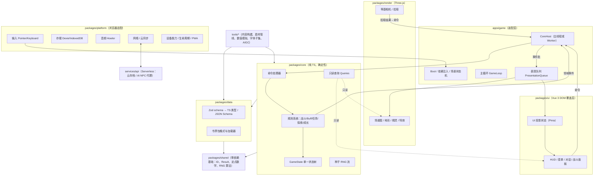
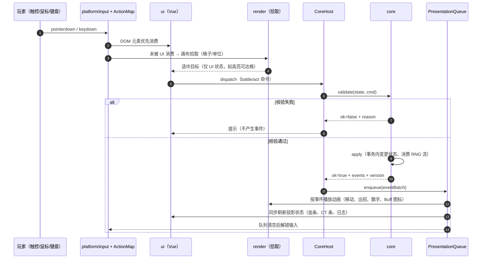
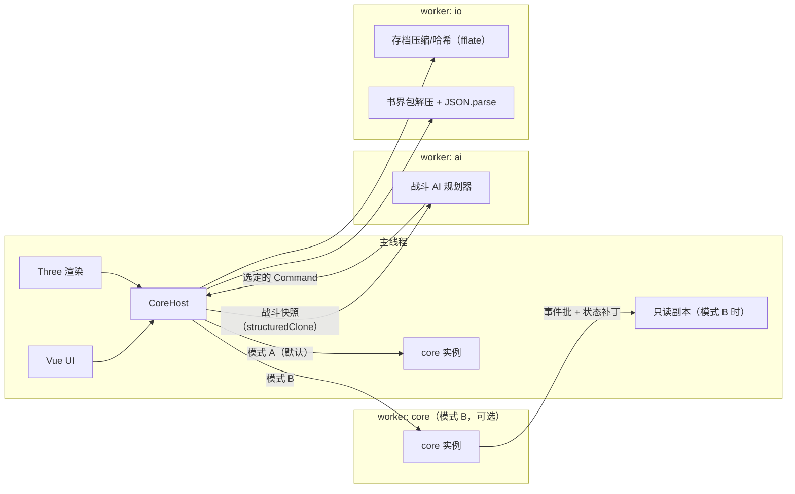
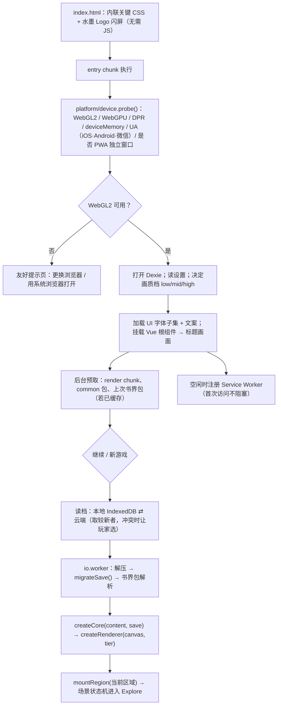
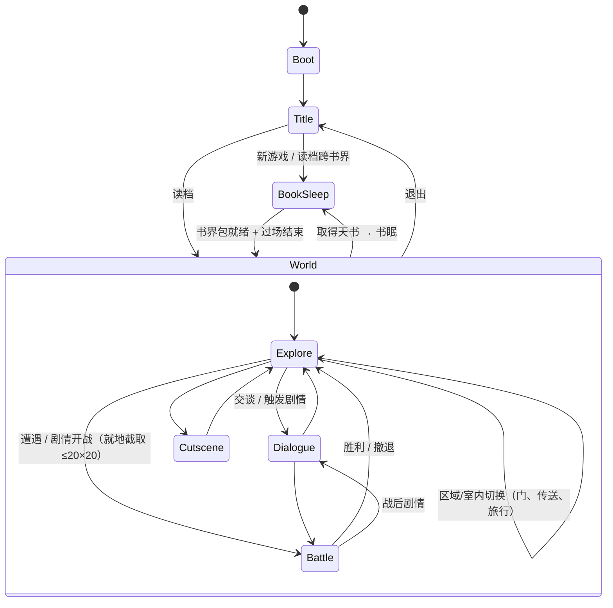

# tech/01 · 总体架构与技术选型

| 项 | 内容 |
|---|---|
| 文档 | `docs/tech/01-architecture.md` |
| 版本 | v1.0（2026-09-25） |
| 上游基准 | `docs/00-canon.md`（§0 项目定位、§8 战斗模型、§18 文档归属、§19 技术基线） |
| 下游文档 | `tech/02` 渲染、`tech/03` 性能、`tech/04` 数据管线、`tech/05` 玩法引擎、`tech/06` 素材存储、`tech/07` 素材生成、`tech/08` 后端、`tech/09` 路线图 |
| 读者 | 作者本人（单人开发）＋ AI 编码助手（Claude Code 等） |
| 本文职责 | 选型论证、分层与模块边界、monorepo 结构、第三方库清单、核心运行时骨架、开发工作流、代码规范、AI 协作约定、架构级风险 |

> **结论先行（TL;DR）**
>
> 1. **维持 Canon §19 基线**：Three.js（r186）＋ Vue 3.5 DOM 覆盖层 ＋ 纯 TypeScript 确定性玩法核心 ＋ Vite 8 ＋ pnpm workspace。经实测与调研，**无致命问题**。
> 2. **渲染器闸门（非致命、须在 Phase 0 验证）**：Three.js 的 `WebGPURenderer` 在 WebGL2 回退后端上有社区报告的明显性能退化；且 TSL 着色器只能用于 `WebGPURenderer`，无法与 `WebGLRenderer` 共用。因此"WebGL2 基线 + WebGPU 渐进增强"**不做双渲染器长期并行**，而是：默认 `WebGLRenderer`（GLSL），Phase 0 用基准场景在作者真机上测三组数据，达标则**整体迁移**到 `WebGPURenderer + TSL` 单一路径（见 §2.6）。
> 3. **TypeScript 锁定 6.0.x**：TS 7.0（Go 原生编译器，2026-07 发布）尚无稳定编程 API，`typescript-eslint@8.70` 的 peer 仍为 `<6.1.0`，`vue-tsc` 依赖 TS API。待 TS 7.1 生态就绪再整体升级。
> 4. **状态管理**：core 采用**单一可序列化状态树 + 命令（Command）事务 + 领域事件（DomainEvent）**，不采用 ECS、不采用 Immer；UI/渲染只消费事件与只读查询。
> 5. **运行模式**：MVP 中 core 跑在主线程（调试最简单）；战斗 AI、存档压缩、书界包解析进 Web Worker；core 的 API 全部可序列化，随时可整体迁入 Worker。
> 6. **地图编辑**：采用 **Tiled 1.12（正交视图编辑逻辑网格）+ 自定义属性 + 构建期转换**，由游戏负责 45° 投影与 3D 高度呈现；浏览器内编辑器（`apps/editor`）推迟到 Phase 2，只做"预览与微调回写"。
> 7. **Zod / YAML 只在构建期与开发期使用**，运行时不打包完整 Zod（实测 `import { z }` 约 89 KB gzip），存档校验用 `zod/mini`（约 4 KB gzip）或手写校验。
> 8. **确定性**：core 禁用 `Math.random`/`Date.now`/`performance.now`，并禁用 ECMAScript 规范中"实现近似（implementation-approximated）"的运算（`Math.pow` 与 `**`、`Math.exp/log/sin/cos…`）参与结算，统一用种子 RNG 与整数/万分点结算。
> 9. **包体预算（初值）**：到标题画面的 entry chunk ≤ 170 KB gzip，entry + render ≤ 350 KB gzip（three 最小场景实测 132 KB、Vue 运行时 24 KB）；Basis 转码器 wasm 约 240 KB gzip 延迟加载。
> 10. **AI 协作**：根目录与每个包各有 `CLAUDE.md`；"数据驱动优先、schema 即文档、一条命令自检（`pnpm check`）、小步提交"。

---

## 目录

- [1. 设计目标与约束](#1-设计目标与约束)
- [2. 引擎 / 框架选型](#2-引擎--框架选型)
- [3. 总体架构](#3-总体架构)
- [4. Monorepo 结构与包设计](#4-monorepo-结构与包设计)
- [5. 关键第三方库清单](#5-关键第三方库清单)
- [6. 核心运行时](#6-核心运行时)
- [7. 开发工作流](#7-开发工作流)
- [8. 代码规范](#8-代码规范)
- [9. 与 AI 辅助开发协作的工程约定](#9-与-ai-辅助开发协作的工程约定)
- [10. 风险清单与缓解](#10-风险清单与缓解)
- [11. MVP 与演进路径](#11-mvp-与演进路径)
- [12. 备选方案汇总](#12-备选方案汇总)
- [参考资料](#参考资料)
- [本文新增术语/约定](#本文新增术语约定)
- [待决事项 / 依赖](#待决事项--依赖)

---

## 1. 设计目标与约束

### 1.1 硬约束

| 约束 | 来源 | 对架构的含义 |
|---|---|---|
| 手机浏览器横屏优先 ＋ PC 浏览器 | Canon §0 | 移动端 GPU/内存/发热是第一约束；输入以触控为主，鼠标键盘为辅 |
| PWA 可离线 | Canon §0、§19 | 代码与已下载书界包必须可被 Service Worker 缓存；存档本地优先 |
| "Online" = 云存档随处继续 | Canon §0 | 需要轻量后端与冲突解决；**不是**实时联网玩法，无权威服务器 |
| 单人开发 + AI 辅助编码 | 任务约束 | 代码优先（code-first）、文本可 diff、少魔法、少运维；一切可在命令行验证 |
| 非商业、不公开分发 | Canon §0 | 许可证风险低，但仍优先 MIT/Apache；不引入需付费或需账号的运行时 |
| 斜 45° 等距战棋、每格高度 0–10、就地开战 ≤ 20×20 | Canon §8 | 需要真实 3D 高度地形 + 深度缓冲遮挡；战斗网格从场景截取，渲染不切场景 |
| 玩法核心确定性、可在 Worker 运行 | Canon §19 | core 零 DOM / 零渲染依赖；种子随机；命令可序列化 |
| 素材与代码分离、KTX2、按书界分包 | Canon §19 | 构建与运行时都要有"清单（manifest）+ 内容哈希"的资源寻址层 |

### 1.2 非功能目标（初值，最终以 `tech/03` 为准）

| 指标 | 目标 | 说明 |
|---|---|---|
| 首包 JS（gzip） | entry ≤ 170 KB；entry + render ≤ 350 KB | 不含 Basis 转码 wasm、字体、书界数据包 |
| 冷启动到标题画面（4G、中端机） | ≤ 4 s | 标题画面只需 UI 字体子集 + 一张背景 |
| 书界切换（书眠）加载 | ≤ 10 s（Wi-Fi） | 书眠过场动画本身用于遮盖加载 |
| 探索帧率 | 60 fps 目标 / 低端档 30 fps | 自适应分辨率 + 按需渲染 |
| 战斗帧率 | ≥ 30 fps 稳定 | 等待玩家输入时切换为按需渲染以省电 |
| Draw call（移动端） | ≤ 150 / 帧 | 地形分块合批、精灵实例化 |
| 纹理显存 | ≤ 256 MB（移动端档） | KTX2 压缩纹理；区域包 LRU |
| 单命令结算耗时 | ≤ 2 ms（主线程） | 战斗 AI 例外，放 Worker |

### 1.3 架构原则

1. **逻辑与表现分离**：core 结算"瞬间完成"，渲染/UI 按事件"慢慢播放"；二者之间只有命令、事件、只读查询三种通道。
2. **core 是纯函数世界**：输入 = 状态 + 命令 + 内容数据 + RNG 状态；输出 = 新状态 + 事件。无时间、无 I/O、无 DOM。
3. **数据驱动**：武功、Buff、套装、任务、地形等一切可枚举内容都是数据（YAML → 校验 → JSON 包），代码只实现"规则解释器"。
4. **schema 即文档**：内容格式以 Zod schema 为唯一定义，自动导出 JSON Schema 供编辑器补全、导出 Tiled 属性类型。
5. **可观测性内建**：每个伤害事件在开发模式下携带 Canon §9 的 Z0–Z10 乘区明细；每场战斗可导出"种子 + 命令日志"录像复现。
6. **按书界分包、按区域懒加载**：任何时刻内存中只有"常驻 + 当前书界 + 当前/相邻区域"。
7. **一条命令自检**：`pnpm check` = lint + typecheck + test + content-validate，AI 与人都以它为"完成"的定义。
8. **可替换的边界**：渲染器、音频、存储、云同步均藏在接口之后，替换实现不影响 core 与内容。
9. **最少依赖**：能用 200 行自己写清楚的（RNG、A*、事件总线、状态机）不引库；引库必须有明确的体积/维护收益。
10. **移动端优先的保守默认**：WebGL2、单线程可跑、不依赖 SharedArrayBuffer / 跨源隔离（COOP/COEP）。

---

## 2. 引擎 / 框架选型

### 2.1 候选与实测包体

为避免凭印象比较包体，本文在 2026-09-25 用 `esbuild@0.28.2 --bundle --minify --format=esm` 对各引擎的"最小可用场景"打包并 `gzip -9` 测量（最小场景内容见表最后一列；均为 tree-shaking 后结果，**不含**游戏代码与资源）：

| 候选 | 版本（npm latest，2026-09-25） | 许可证 | 最小场景 min | 最小场景 gzip | 最小场景内容 |
|---|---|---|---|---|---|
| Three.js（`WebGLRenderer`） | `three@0.186.1`（r186） | MIT | 533 KB | **132 KB** | 正交相机 + `MeshStandardMaterial` 平面 + `Sprite` + 方向光 + `InstancedMesh` + `TextureLoader` |
| Three.js（`WebGPURenderer`，含 WebGL2 回退后端） | `three@0.186.1` `three/webgpu` | MIT | 771 KB | 210 KB | 同上，NodeMaterial 版本 |
| PixiJS v8 | `pixi.js@8.21.0` | MIT | 563 KB | 164 KB | `Application` + `Container` + `Sprite` + `Assets` |
| Phaser 4 | `phaser@4.2.1` | MIT | 1,361 KB | 360 KB | `Phaser.Game` + 一个 image（整包入口，难以摇树） |
| Babylon.js 9 | `@babylonjs/core@9.28.0`（ES 模块按需导入） | Apache-2.0 | 1,434 KB | 332 KB | `Engine` + `Scene` + 相机 + 半球光 + 地面 + `StandardMaterial` |
| PlayCanvas 2 | `playcanvas@2.22.4` | MIT（引擎） | 1,915 KB | 489 KB | `Application` + 相机实体 |
| Vue 3（参照） | `vue@3.5.43` | MIT | 63 KB | 24 KB | `createApp` + 一个组件 |
| Cocos Creator 3.8 | 3.8.x（编辑器发布，非 npm） | 引擎 MIT，编辑器免费闭源 | — | —（待核实，按模块裁剪） | Web 发布包含引擎 + 适配层 |
| Godot 4.7 Web 导出 | 4.7（2026-06） | MIT | wasm 约 40 MB 未压缩 | 约 5 MB（Brotli）；自定义裁剪构建约 2.4 MB | 引擎 wasm + pck |
| Unity 6 Web | 6.x（6.6 起 WebGPU 正式） | 专有（Unity Personal） | — | 空 2D 约 7.7 MB / 空 3D 约 10.7 MB；激进裁剪约 2 MB | 引擎 wasm + data |

> 注：Godot / Unity / Cocos 的数据来自公开资料（见参考资料），未在本环境复测；Three/Pixi/Phaser/Babylon/PlayCanvas/Vue 为本地实测。
> 附：`three/examples/jsm/libs/basis/basis_transcoder.wasm` 实测 527 KB，gzip 后约 240 KB——任何使用 KTX2 的方案都要为它预留预算（延迟加载即可）。

### 2.2 评估维度与权重

| 维度 | 权重 | 为什么这样定权 |
|---|---|---|
| A 手机浏览器性能 | 20 | 主平台；发热与掉帧直接毁体验 |
| B 包体 / 首包 | 10 | PWA 首次安装、微信内打开、4G 场景 |
| C 2.5D / 3D 能力 | 15 | Canon §19 要求 3D 高度地形 + 公告板精灵 + 法线光照 + 深度遮挡 |
| D 等距地图支持 | 5 | 权重低：我们用 3D 网格 + 正交相机"做出"等距，不依赖引擎的 2D 等距瓦片 |
| E WebGPU 状态 | 5 | 渐进增强项，非必需 |
| F 学习 / 调试成本 | 10 | 单人开发，调试链路必须短（浏览器 DevTools 直接断点） |
| G AI 辅助编码友好度 | 15 | 代码优先、文本可 diff、训练语料多 → AI 写得对、改得准 |
| H 生态 | 10 | 加载器、后处理、示例、社区答案 |
| I 许可证 / 成本 | 5 | 个人非商业，但避免账号/订阅绑定 |
| J 与 DOM UI、纯 TS core 的集成 | 5 | 基线要求 Vue DOM 覆盖层 + 独立 core；"库"优于"框架" |

### 2.3 评分表（1–5 分，加权总分满分 100）

| 候选 | A 性能 | B 包体 | C 2.5D/3D | D 等距 | E WebGPU | F 学习调试 | G AI 友好 | H 生态 | I 许可 | J 集成 | **加权总分** |
|---|---|---|---|---|---|---|---|---|---|---|---|
| **Three.js** | 4 | 5 | 5 | 2 | 4 | 4 | 5 | 5 | 5 | 5 | **90** |
| PixiJS v8 | 5 | 4 | 2 | 2 | 4 | 4 | 4 | 4 | 5 | 5 | 78 |
| Babylon.js 9 | 3 | 2 | 5 | 2 | 5 | 3 | 4 | 4 | 5 | 4 | 73 |
| Phaser 4 | 4 | 2 | 1 | 4 | 1 | 5 | 5 | 4 | 5 | 3 | 69 |
| PlayCanvas 2 | 4 | 1 | 5 | 1 | 5 | 3 | 3 | 3 | 4 | 4 | 68 |
| Cocos Creator 3.8 | 4 | 3 | 4 | 4 | 2 | 3 | 2 | 4 | 4 | 2 | 66 |
| Unity 6 Web | 3 | 1 | 5 | 3 | 4 | 3 | 3 | 5 | 2 | 1 | 64 |
| Godot 4.7 Web | 2 | 1 | 4 | 4 | 1 | 4 | 3 | 4 | 5 | 1 | 58 |

加权总分 = Σ(分数 × 权重) / 5。

### 2.4 逐项点评

**Three.js（r186）**
- ✅ 是"渲染库"而非"框架"：不接管主循环、输入、UI、场景管理——正好让我们把这些放进自己的纯 TS 架构里（core/render/ui 分层）。
- ✅ 最小场景 132 KB gzip，是 3D 候选中最小的；`OrthographicCamera` + 3D 高度网格 + `Sprite`/实例化公告板 + `MeshStandardMaterial.normalMap` 可直接满足 Canon §19 的画面构成，**不需要**自定义引擎级功能。
- ✅ `KTX2Loader`、`GLTFLoader`、basis 转码器随包提供；`three-mesh-bvh`、`stats-gl`、`postprocessing` 等生态成熟。
- ✅ AI 友好：纯代码 API、海量示例与问答；场景由代码构建，diff 清晰。
- ⚠️ 没有内建等距瓦片地图、没有编辑器——但我们本来就用 Tiled + 构建转换（§7.4）。
- ⚠️ API 每月一个 r 版本，偶有破坏性变更 → **锁定精确版本**（catalog 写 `0.186.1`，不用 `^`/`~`），每季度有计划地升级一次。
- ⚠️ WebGPU 路线（`WebGPURenderer` + TSL）与经典路线（`WebGLRenderer` + GLSL）在材质/着色器层面**不互通**，见 §2.6。

**PixiJS v8**
- ✅ 2D 性能标杆，v8 同时支持 WebGL 与 WebGPU；包体小。
- ❌ 本质是 2D：要实现"每格 0–10 级高度 + 地形侧面 + 深度缓冲遮挡 + 法线光照"，需要自己在 2D 引擎里造 3D 排序与光照，复杂度反而高于直接用 3D 库。
- 适合场景：若放弃"一定的 3D 渲染"、改为纯手绘 2D 等距（预渲染地块 + 画家算法排序），Pixi 是最佳替代（见 §2.7）。

**Phaser 4**
- ✅ 2026-04 发布正式版，重写了 WebGL 渲染器，内建等距/六边形瓦片地图、输入、场景、音频，上手最快。
- ❌ 纯 2D 且 WebGL-only（WebGPU 仅为"未来铺垫"）；整包约 360 KB gzip；它是"框架"，接管主循环与场景，与"core 独立 + Vue DOM UI"的分层会互相掣肘。

**Babylon.js 9**
- ✅ 3D 功能最全（WebGPU 一流、物理、GUI、Inspector 调试器强大），Apache-2.0。
- ⚠️ 最小场景 332 KB gzip，是 Three 的 2.5 倍；大量功能对 2.5D 战棋是冗余；社区规模与示例量小于 Three，AI 生成代码的"命中率"略低。
- 适合场景：若后期需要大量 3D 模型、物理、复杂后处理，且对包体不敏感。

**PlayCanvas 2**
- ✅ WebGPU 最成熟之一，性能好；引擎 MIT。
- ❌ 生态以云端编辑器为中心（编辑器为 SaaS），纯代码用法的资料相对少；最小包 489 KB gzip 最大。

**Cocos Creator 3.8**
- ✅ 移动端/小游戏优化出色，内建 TiledMap（含等距）组件，中文社区大；引擎源码 MIT。
- ❌ **编辑器优先**：场景/预制体是带 UUID 的 JSON，`.meta` 文件众多，diff 噪声大，AI 很难"只改代码"完成功能；UI 走自有节点系统，与 Vue DOM 覆盖层重复。
- 适合场景：若目标转为微信小游戏发行（本项目非商业、不发行，故不适用）。

**Godot 4.7 Web 导出**
- ✅ 编辑器与 GDScript 体验好，MIT；4.3 起支持单线程导出（无需 COOP/COEP 头）。
- ❌ Web 端只支持 Compatibility（WebGL2）渲染器；wasm 体积数 MB 级；移动浏览器内存与启动时间压力大；C# 项目不能导出 Web；画布内 UI 需要自带中文字体（体积再加数 MB）。
- 适合场景：若将来转为原生 App（Android/iOS/桌面），Godot 是最佳"重写目标"。

**Unity 6 Web**
- ✅ 6.x 起官方支持移动浏览器，6.6 起 WebGPU 正式（默认仍 WebGL2）；工具链最完整。
- ❌ 空 3D 工程约 10 MB 级；编辑器优先、场景 YAML + GUID，AI 协作困难；专有许可证与账号体系；DOM UI 集成差。

### 2.5 结论：为什么是 Three.js + Vue 3 + 纯 TS 核心

| 论点 | 证据 / 理由 |
|---|---|
| 画面需求 = "3D 高度地形 + 2D 公告板 + 正交相机"，恰好是 Three.js 的舒适区 | 不需要物理、骨骼动画、复杂 PBR；Three 的基础材质 + 实例化 + 深度缓冲足够（细节见 `tech/02`） |
| 包体最小的 3D 方案 | 132 KB gzip（实测），比 Babylon 小 60%、比 PlayCanvas 小 73% |
| "库"而非"框架"，契合分层架构 | 主循环、输入、场景管理由我们掌控，core 可在 Node / Worker 中独立运行与测试 |
| 中文文本交给 DOM | Vue 3 在 DOM 中渲染中文，直接用系统字体与浏览器排版（竖排、描边、换行、输入法、无障碍），免去画布内 SDF 中文字库的数 MB 体积与排版难题 |
| AI 辅助编码命中率最高 | Three.js、Vue 3、TypeScript 都是训练语料最充分的一档；全部为纯文本源码，diff 可审 |
| 可逆性好 | core 与内容数据不依赖渲染库；将来换 Pixi/Babylon/Godot 只需重写 `packages/render`（约占总代码 15–25%） |

### 2.6 渲染器闸门：`WebGLRenderer` 还是 `WebGPURenderer`

Canon §19 规定"WebGL2 为基线，WebGPU 为渐进增强"。调研发现两点需要细化：

1. **两条路线的材质体系不互通**：`WebGPURenderer` 使用 NodeMaterial/TSL（同一份 TSL 在 WebGPU 后端编译为 WGSL、在 WebGL2 后端编译为 GLSL）；`WebGLRenderer` 使用 GLSL `ShaderMaterial`/`onBeforeCompile`。同时维护两套自定义着色器（地形混合、水面、描边、水墨后处理、战斗格高亮）对单人项目成本过高。
2. **回退后端性能存疑**：three.js 论坛有报告称 `WebGPURenderer` 的 WebGL2 回退后端在移动端帧率显著低于 `WebGLRenderer`（非实例化网格场景约 2 倍差距，个例更大）；但 2026 年 iOS 26+ Safari 与 Android Chrome 已默认开启 WebGPU，作者自用设备很可能直接走 WebGPU 后端。

**决策：单一路径 + Phase 0 实测闸门**

```text
Phase 0（第 1–2 周）基准场景 bench-iso：
  64×64 高度地形（分块合批）+ 300 个法线贴图公告板精灵 + 2 盏动态光
  + 1 个全屏后处理（水墨描边）+ 战斗格高亮叠加
在 3 台设备上测 3 种配置（每种 60 s，记录 P50/P95 帧时间、发热 5 分钟后帧率）：
  R1 = WebGLRenderer（GLSL）
  R2 = WebGPURenderer（WebGPU 后端）
  R3 = WebGPURenderer（forceWebGL: true，即 WebGL2 回退后端）
设备：作者主力手机、一台中端 Android、一台 iPad（或旧 iPhone）

判定（"性能"以 P95 帧时间衡量，越低越好）：
  若 R2 性能不低于 R1，且 R3 的 P95 帧时间 ≤ 1.25 × R1（即不低于 R1 的 80%），全部设备成立
      → 选 WebGPURenderer + TSL 为唯一路径（render chunk 预算相应上调约 80 KB，见 §5.4）
  否则
      → 选 WebGLRenderer + GLSL 为唯一路径（默认假设）
  两者都把自定义着色器限制在 packages/render/src/materials/ 下（≤ 8 个），
  以便未来整体迁移时改动范围可控。
```

- 本文其余部分**按默认假设（`WebGLRenderer`）**展开；渲染细节由 `tech/02` 定义。
- 无论选哪条，`render` 包对外暴露的接口（§4.3）不变，core/ui 不受影响。
- 设备能力检测与降级档位（DPR 上限、阴影、后处理开关）由 `platform/device` 提供，见 §6.1。

### 2.7 何时应该改选 X

| 触发条件（任一满足即重新评估） | 改选 | 迁移成本 |
|---|---|---|
| 美术方向改为"纯手绘 2D 等距"（放弃 3D 高度地形与动态光照），或目标机型大量为 WebGL2 性能很差的低端机 | **PixiJS v8** | 重写 `render`；core/ui/data 不变 |
| 需要大量 3D 角色模型、骨骼动画、物理与复杂后处理，且首包预算可放宽到 ≥ 600 KB | **Babylon.js** | 重写 `render` |
| 决定做原生 App（上架应用商店）或桌面版，且愿意放弃 Vue DOM UI | **Godot 4**（GDScript 重写表现层，core 可经 JS 桥或重写） | 高 |
| 决定发行微信小游戏 / 抖音小游戏 | **Cocos Creator**（或 Three + 小游戏适配层，待核实） | 高 |
| Phase 0 闸门结果为 R2/R3 达标 | 仍是 Three.js，但切到 `WebGPURenderer` + TSL | 中（仅 `render/materials`） |
| Three.js 出现长期无法绕过的移动端 bug（如 iOS 上下文丢失无法恢复）且 3 个月无修复 | Babylon.js 或 PlayCanvas | 重写 `render` |

---

## 3. 总体架构

### 3.1 分层架构图



### 3.2 各层职责

| 层 | 包 | 职责 | 明确不做 |
|---|---|---|---|
| 基础 | `packages/shared` | 品牌化 ID 类型、`Result<T,E>`、断言、确定性数学（定点/整数工具）、PRNG 算法、事件总线原语、小型数据结构 | 任何业务规则 |
| 内容 | `packages/data` | Zod schema（武功/Buff/套装/物品/地形/NPC/任务/区域地图/存档）、推导出的 TS 类型、书界包格式、运行时轻量加载器、JSON Schema/Tiled 属性类型导出 | 规则结算 |
| 玩法核心 | `packages/core` | `GameState`、命令处理、战斗（CT 时间轴、Z0–Z10 伤害乘区）、Buff、套装、成长、任务/对话条件求值、探索与遭遇、寻路、AI 评估函数、存档序列化 | DOM、Three、Vue、时间、网络、`localStorage` |
| 渲染 | `packages/render` | Three 场景图、地形网格、精灵公告板、特效、等距相机、拾取、事件→动画的"表现脚本"、资源纹理管理 | 规则判断（不能自己算伤害/可达格） |
| 界面 | `packages/ui` | Vue 组件：HUD、菜单、背包、武学装配、对话、战斗指令面板、图鉴、设置；UI 投影状态 | 规则判断；直接修改 core 状态 |
| 平台 | `packages/platform` | 输入原语、IndexedDB 存储、音频、网络/云同步、设备能力、页面生命周期、PWA 更新、文件导入导出 | 业务逻辑 |
| 装配 | `apps/game` | 启动、依赖注入、场景状态机、主循环、CoreHost、表现队列、输入映射（ActionMap）、资源清单解析 | 规则、组件细节 |
| 编辑器（可选） | `apps/editor` | Phase 2：内容预览、战斗沙盒、地图高度微调回写 | 线上发布 |
| 后端 | `services/api` | 云存档 CRUD 与冲突检测、可选 AI NPC 代理、素材签名 URL（如需） | 游戏规则（无权威服务器） |
| 工具 | `tools/*` | 内容构建与校验、Tiled 转换、ink 编译、素材管线（KTX2/图集/音频）、字体子集、繁体转换、数值模拟、AIGC 批处理 | 进入运行时包 |

### 3.3 依赖方向规则（由 lint 强制）

```text
shared  ←  data  ←  core  ←┬─ render   （render 只 import type 或调用 core 的只读查询）
                           ├─ ui       （同上）
                           └─ apps/game（唯一可以 new CoreHost 并 dispatch 命令的地方）
platform ← apps/game
render  ✗→ ui       ui ✗→ render      （二者互不依赖，由 apps/game 协调）
core    ✗→ render / ui / platform / DOM / three / vue
data    ✗→ core
services/api → shared, data（仅存档 schema）
tools/*  → shared, data, core（数值模拟需要 core）
```

强制手段（§8.2 给出配置）：
- `eslint-plugin-boundaries` 定义元素类型与允许的依赖矩阵；
- `packages/core` 的 `tsconfig.json` 设 `"lib": ["ES2023"]`、`"types": []`——**不含 DOM 类型**，任何 `window`/`document` 引用直接编译失败；
- CI 中 core 的单元测试在 Node 环境（非 jsdom）运行，进一步证明无 DOM 依赖。

### 3.4 命令与事件流



要点：
- **只有命令能改变状态**；UI 与渲染持有的一切都是"投影"。
- **查询（Query）是同步纯函数**：可达格、攻击范围、伤害预估、任务是否可接等，UI/渲染可随时调用，不产生事件、不消耗 RNG。
- **事件是"已发生的事实"**：`battle/damageDealt`、`buff/applied`、`unit/died`、`quest/updated`……表现层据此播放；事件携带足够字段，表现层不必回头查状态也能播放（便于录像回放与 Worker 模式）。
- **输入锁**：表现队列未清空时，除"跳过动画 / 加速"外的输入被 ActionMap 屏蔽；"跳过"只影响表现，不影响 core。

### 3.5 状态管理决策

| 方案 | 优点 | 缺点 | 适配度 |
|---|---|---|---|
| **A. 单一可序列化状态树 + 命令事务（原地变更）+ 领域事件**（选定） | 存档 = 序列化整棵树；AI/人都容易理解；无依赖；战斗 AI 模拟可直接在克隆上原地跑，速度快 | 需要纪律：只能在命令处理器内变更；回滚靠"先校验后应用" | ★★★★★ |
| B. 不可变树（Immer/Mutative 结构共享） | 天然快照/撤销/回滚；引用相等便于 UI 精确刷新 | Proxy 草稿在热路径（AI 前瞻、Buff 结算循环）上慢数倍；冻结对象在移动端有额外开销；引入依赖 | ★★★ |
| C. ECS（bitECS / Koota / Miniplex） | 大量同构实体时缓存友好 | 本项目实体少（战斗单位通常 ≤ 30，区域 NPC 数十到数百），规则重、实体少，ECS 的收益用不上；存档与调试更绕；AI 生成 ECS 代码易出错 | ★★ |

**决策**：采用 A。
- core 内状态是普通对象/数组（可 `JSON.stringify`，无 class 实例、无 `Map`/`Set` 以便序列化——需要集合时用排序数组或 `Record`）。
- 变更只发生在 `CommandHandler.apply()` 内；`apply` **不得抛出业务错误**（业务错误必须在 `validate()` 阶段返回）。
- 开发模式下：每条命令执行前保存结构化快照，`apply` 后运行不变量检查（HP ≤ HPMax、CT ∈ [0,1000]、ID 引用存在……），失败则回滚并在 dev 控制台报错，同时导出复现录像。
- 对外暴露 `snapshot()`：开发模式下深冻结的只读视图，生产模式下只读类型（`DeepReadonly<GameState>`）不冻结以省开销。
- UI 不直接绑定 core 状态：`apps/game` 在每个事件批之后运行"选择器（selector）"生成 UI 投影，写入 Pinia store 的 `shallowRef`，Vue 只对投影做响应式。
- 渲染侧有自己的"视图注册表"（`entityId → Object3D`），是一个很薄的映射，不是 ECS。

### 3.6 状态树与核心 API 草案

> 字段级设计归 `tech/05`（玩法引擎）；此处只固定**形状与边界**。

```ts
// packages/core/src/state/game-state.ts
export interface GameState {
  meta: {
    saveSchema: number;            // 存档格式版本（迁移用）
    contentHash: string;           // 生成此存档时的书界包哈希（内容热更新/迁移校验）
    version: number;               // 状态版本号：每条成功命令 +1
    worldTick: number;             // 逻辑时钟（整数 tick），不是墙钟
    rng: Record<RngStreamId, RngState>; // 分流随机数状态，见 §8.3
    debugTainted: boolean;         // 是否使用过作弊指令
  };
  profile: ProfileState;           // 跨书界：真实等级、天书、残篇、图鉴、书灵
  chapter: ChapterState;           // 当前书界：chapterId、worldTier、flags、任务、NPC、势力、时间天气
  party: PartyState;               // 队伍成员、装配、背包、金钱
  world: WorldState;               // 当前区域/场景、坐标、已探索、门禁开启情况
  battle: BattleState | null;      // 就地开战时非空：网格截取、单位、CT 时间轴、Buff、日志
  dialogue: DialogueState | null;  // 当前 ink 故事状态（inkjs 的 JSON 状态字符串）
}

export type RngStreamId = 'battle' | 'loot' | 'world' | 'ai' | 'qiyu';
```

```ts
// packages/core/src/api.ts —— core 对外唯一入口
export interface Core {
  dispatch(cmd: Command): DispatchResult;          // 同步；Worker 模式由 CoreHost 包装为 Promise
  tick(ticks: number): DomainEvent[];              // 推进世界逻辑时钟（探索态）；战斗态为空操作
  readonly query: CoreQueries;                     // 纯函数只读查询
  snapshot(): DeepReadonly<GameState>;
  serialize(): SaveBlob;                           // 纯 JSON（压缩在 platform 层、Worker 中完成）
  load(blob: SaveBlob, content: ContentRegistry): void;
}

export type DispatchResult =
  | { ok: true; version: number; events: DomainEvent[] }
  | { ok: false; reason: RejectReason };           // 例：'NOT_YOUR_TURN' | 'OUT_OF_RANGE' | 'MP_NOT_ENOUGH'

// 命令：可 JSON 序列化的判别联合（t = type，命名空间/动词）
export type Command =
  | { t: 'world/walkTo'; to: TilePos }
  | { t: 'world/interact'; target: EntityId }
  | { t: 'dialogue/choose'; choice: number }
  | { t: 'battle/act'; actor: UnitId; walkTo?: TilePos; action: BattleAction }  // 先位移（可选）再行动
  | { t: 'party/equip'; member: CharId; slot: EquipSlot; item: ItemUid | null }
  | { t: 'party/assignSkill'; member: CharId; slot: SkillSlotRef; skill: SkillId | null }
  | { t: 'chapter/bookSleep'; carry: CarrySelection }      // 书眠：携带核心武功与 6 件装备
  | { t: 'debug/exec'; op: DebugOp };                      // 作弊指令，置 debugTainted

// 命令处理器注册（每个命令一个文件，便于 AI 小步修改）
export interface CommandHandler<C extends Command> {
  validate(s: DeepReadonly<GameState>, c: C, ctx: CoreCtx): RejectReason | null;
  apply(s: GameState, c: C, ctx: CoreCtx): void;           // 只在此处变更状态；通过 ctx.emit 发事件
}
export interface CoreCtx {
  content: ContentRegistry;                 // 只读内容数据（书界包）
  rng(stream: RngStreamId): Rng;            // 分流 RNG，状态回写 meta.rng
  emit(e: DomainEvent): void;
  trace?: DamageTrace;                      // 开发模式：记录 Z0–Z10 乘区明细
}
```

### 3.7 CoreHost 运行模式与 Web Worker



| 模式 | 说明 | 何时使用 |
|---|---|---|
| A：core 在主线程（默认） | 调试最简单（断点、状态面板直接看）；命令结算 ≤ 2 ms，不影响帧率 | MVP 起一直使用，除非实测掉帧 |
| B：core 在专用 Worker | 主线程只做渲染与 UI；查询在主线程"只读副本"上执行（同一份纯函数代码） | 开放世界大规模 NPC 日程模拟导致主线程 > 4 ms/帧时 |

Worker 清单（MVP 即启用）：

| Worker | 输入 | 输出 | 理由 |
|---|---|---|---|
| `ai.worker` | 战斗状态快照 + AI 档位 + `aiSeed`（轮到 AI 单位时由 core 从 `ai` 流抽取，随 `battle/aiTurn` 事件下发） | 一条 `battle/act` 命令 | 前瞻搜索（1–2 层）可能耗时 10–100 ms；RNG 状态始终留在 core；结果以普通命令回到 core，录像只记命令，因此 AI 自身不要求跨引擎一致 |
| `io.worker` | 存档 JSON / 书界包二进制 | 压缩结果 + SHA-256 / 解析后的对象 | `JSON.parse` 数 MB 书界包与压缩会阻塞主线程数十毫秒 |
| （可选）`path.worker` | 区域通行网格 + 起终点 | 路径 | 仅当区域 ≥ 256×256 且需要长距离自动寻路时启用；战斗 ≤ 20×20 在主线程即可 |

实现约定：
- 使用 Vite 原生写法 `new Worker(new URL('./ai.worker.ts', import.meta.url), { type: 'module' })`，RPC 用 **Comlink**（约 1 KB gzip）。
- 只传结构化可克隆数据；大块二进制用 `Transferable`（`ArrayBuffer`）零拷贝。
- **不依赖 SharedArrayBuffer**（需 COOP/COEP 跨源隔离，静态托管与微信内置浏览器下易出问题）。
- Worker 创建失败（极少数 WebView）时自动降级为主线程同步执行——所有 Worker 模块都导出同名的纯函数实现。
- `fflate` 的异步 API 本身会使用 Worker；我们仍统一放在 `io.worker`，以便同时计算哈希、少一次数据往返。

---

## 4. Monorepo 结构与包设计

### 4.1 目录树

```text
jinyongqunxia/                      # 代码仓库（Git）；二进制素材不入库，见 tech/06
├── CLAUDE.md                       # AI 协作总约定（§9）
├── package.json                    # 根脚本：dev / check / build / content:* / assets:*
├── pnpm-workspace.yaml             # 工作区 + catalog 统一版本
├── tsconfig.base.json              # strict 基线
├── eslint.config.ts                # flat config + boundaries + core 确定性规则
├── vitest.config.ts                # projects：core(node) / data(node) / ui(happy-dom) / render(browser)
├── playwright.config.ts            # E2E：移动端视口（iPhone / Pixel 模拟）
├── lefthook.yml                    # 提交前钩子：lint-staged 式增量检查
├── .github/workflows/              # ci.yml / e2e.yml / deploy.yml（§7.6）
├── docs/                           # 规划文档（本目录）+ adr/（架构决策记录）
│
├── packages/
│   ├── shared/     @tianshu/shared     # 零依赖基础
│   ├── data/       @tianshu/data       # schema、类型、书界包格式、加载器
│   ├── core/       @tianshu/core       # 玩法核心（纯 TS、确定性）
│   ├── render/     @tianshu/render     # Three.js 表现层
│   ├── ui/         @tianshu/ui         # Vue 3 组件与界面
│   ├── platform/   @tianshu/platform   # 浏览器能力适配
│   └── devtools/   @tianshu/devtools   # 开发控制台、作弊、状态查看（懒加载 chunk）
│
├── apps/
│   ├── game/       @tianshu/game       # 可发布的游戏（Vite + PWA）
│   └── editor/     @tianshu/editor     # （Phase 2，可选）内容预览 / 战斗沙盒 / 地图微调
│
├── content/                        # 文本内容源（入库、可 diff、CI 校验）
│   ├── common/                     # 跨书界：skills/ buffs/ sets/ items/ terrain/ sects/ realms.yaml
│   ├── chapters/
│   │   ├── ch00_yuenv/
│   │   └── ch01_tianlong/
│   │       ├── chapter.yaml        # 书界概览（Canon §2 行 + 本书界参数）
│   │       ├── regions/            # rg_01_dali.yaml + rg_01_dali.tmj（Tiled 地图）
│   │       ├── npcs/  quests/  encounters/  shops/  events/
│   │       └── dialogue/           # *.ink（inkjs 编译）
│   ├── locales/zh-Hans/ui.yaml     # UI 文案（源语言）
│   └── locales/zh-Hant/overrides.yaml  # 繁体人工校订（其余由 OpenCC 生成）
│
├── services/
│   └── api/        @tianshu/api        # Hono：云存档 /v1/saves、可选 /v1/npc-chat（tech/08）
│
└── tools/
    ├── content-build/              # YAML+Zod → 书界包 JSON；ink 编译；Tiled 转换；交叉引用校验
    ├── asset-pipeline/             # 原图 → KTX2/图集/音频转码 → manifest → 上传对象存储（tech/06）
    ├── balance/                    # 数值模拟：调用 @tianshu/core 批量跑战斗（已存在目录）
    ├── font-subset/                # 按全部文本用字生成字体子集（cn-font-split）
    ├── i18n/                       # zh-Hans → zh-Hant（opencc-js）+ 覆盖表
    └── aigc/                       # 素材生成批处理脚本（tech/07）
```

### 4.2 工作区与版本统一

```yaml
# pnpm-workspace.yaml
packages:
  - packages/*
  - apps/*
  - services/*
  - tools/*

# 统一版本：各包 package.json 中写 "three": "catalog:" 引用
catalog:
  three: 0.186.1
  '@types/three': 0.186.0
  vue: ^3.5.43
  pinia: ^4.0.3
  vue-i18n: ^11.4.12
  dexie: ^4.4.6
  inkjs: 2.4.0
  zod: ^4.6.5
  yaml: ^2.9.1
  fflate: ^0.8.3
  howler: ^2.2.4
  comlink: ^4.4.2
  typescript: ~6.0.3        # 见 §8.1：TS 7 暂缓
  vite: ^8.3.1
  vitest: ^5.0.2
```

```jsonc
// package.json（根，节选）
{
  "private": true,
  "packageManager": "pnpm@12.6.0",
  "engines": { "node": ">=24.0.0" },
  "scripts": {
    "dev": "pnpm --filter @tianshu/game dev",
    "dev:phone": "pnpm --filter @tianshu/game dev --host",          // 局域网真机调试（HTTPS，见 §7.1）
    "build": "pnpm content:build && pnpm --filter @tianshu/game build",
    "content:build": "tsx tools/content-build/src/cli.ts build",
    "content:validate": "tsx tools/content-build/src/cli.ts validate",
    "lint": "eslint . --cache",
    "typecheck": "vue-tsc -b",                                        // 根 tsconfig.json 以 references 串起全部包
    "test": "vitest run",
    "e2e": "playwright test",
    "check": "pnpm lint && pnpm typecheck && pnpm test && pnpm content:validate",
    "size": "size-limit"
  }
}
```

**内部包约定（"源码直连"模式）**：
- 内部包 `package.json` 的 `exports` 直接指向 `./src/index.ts`，不单独构建；Vite 与 Vitest 直接消费 TS 源码，热更新跨包生效。
- 类型检查用 TypeScript project references（`tsc -b`，`composite: true`），UI/应用包用 `vue-tsc -b`。
- 只有 `apps/game`（Vite 构建）、`services/api`（Wrangler/esbuild 打包）与 `tools/*`（`tsx` 直接运行）产生可执行产物。
- Node 24 已原生支持运行 `.ts`（类型剥离，不支持 `enum` 等需转换语法）；为兼容 tsconfig 路径等，工具脚本统一用 `tsx`。

### 4.3 各包职责、对外接口与依赖

> 版本号为 2026-09-25 npm `latest` 实查结果；`catalog:` 表示引用 §4.2 的统一版本。

| 包 | 职责（一句话） | 对外接口（入口导出） | 运行时依赖 | 开发依赖（包内特有） |
|---|---|---|---|---|
| `@tianshu/shared` | 所有包共用的零依赖基础设施 | `Brand<T>`、`Result`、`assert`、`Rng`（sfc32，splitmix32 播种，§8.3）、`fx`（整数/定点数学、`powInt`）、`Emitter`、`TilePos`、`DeepReadonly` | 无 | — |
| `@tianshu/data` | 内容 schema 与书界包格式的唯一定义 | `schemas.*`（Zod）、`type SkillDef/BuffDef/...`（`z.infer`）、`ChapterPack`、`loadChapterPack()`（运行时轻量，不含 Zod）、`toJsonSchema()`、`toTiledPropertyTypes()` | 运行时：无（`zod` 仅在 `./schemas` 子路径被 tools/dev 引用） | `zod@catalog`（^4.6.5） |
| `@tianshu/core` | 确定性玩法规则 | `createCore()`、`Core`、`Command`、`DomainEvent`、`CoreQueries`、`ContentRegistry`、`migrateSave()` | `@tianshu/shared`、`@tianshu/data`（仅 `import type`）、`inkjs@2.4.0`（对话运行时，纯 JS 无 DOM） | — |
| `@tianshu/render` | 把状态与事件变成画面 | `createRenderer(canvas, opts)`、`RenderWorld`（`mountRegion/unmountRegion/enterBattle/...`）、`playEvents(batch): Promise<void>`、`pick(screenXY): PickResult`、`setQuality(tier)` | `three@0.186.1`、`@tianshu/shared`；类型：`@tianshu/core` | `@types/three@0.186.0`、`stats-gl@^4.2.3`（dev） |
| `@tianshu/ui` | Vue 界面与 UI 投影状态 | `GameUi`（根组件）、`useUiStore()`、`uiBus`（发命令意图）、组件库 `Tx*`（水墨风基础组件） | `vue@^3.5.43`、`pinia@^4.0.3`、`vue-i18n@^11.4.12`；类型：`@tianshu/core` | `@vitejs/plugin-vue@^6.0.9`、`vue-tsc@^3.3.11`、`@vue/test-utils@^2.5.1`、`happy-dom@^20.14.5` |
| `@tianshu/platform` | 浏览器 API 适配，隐藏兼容性差异 | `input`（Pointer/Keyboard/Gesture）、`storage`（Dexie 表：`saves`/`settings`/`packs`）、`audio`（Howler 封装）、`net`（带重试的 fetch、云同步）、`device`（能力检测与画质档）、`lifecycle`（可见性、`pagehide`、上下文丢失）、`pwa`（更新提示） | `dexie@^4.4.6`、`howler@^2.2.4`、`fflate@^0.8.3`、`comlink@^4.4.2`、`workbox-window@^7.4.1` | `fake-indexeddb@^6.2.5` |
| `@tianshu/devtools` | 开发控制台与作弊（懒加载） | `mountDevtools(ctx)`、`registerDevCommand()` | `lil-gui@^0.21.0`（参数面板）、`zod@catalog`（指令参数）、`eruda@^3.4.3`（按需）、`@tianshu/core`（类型）、`vue` | — |
| `@tianshu/game` | 装配、发布 | —（应用） | 以上全部包 | `vite@^8.3.1`、`vite-plugin-pwa@^1.3.0`、`@vite-pwa/assets-generator@^1.0.0`（受 vite-plugin-pwa peer 约束，不用 2.x）、`@vitejs/plugin-basic-ssl@^2.3.0`、`rollup-plugin-visualizer@^7.1.1`、`size-limit@^14.0.1` |
| `@tianshu/editor` | Phase 2 可选 | — | 复用 render/ui/data | 同上 |
| `@tianshu/api` | 云存档、AI NPC 代理 | HTTP：`GET/PUT /v1/saves/:slot`、`POST /v1/npc-chat` | `hono@^4.13.9`、`@tianshu/data`（存档 schema，服务端可用完整 Zod） | `wrangler@^4.140.0`（若部署 Cloudflare；国内方案见 tech/08） |
| `tools/content-build` | 内容构建与校验 | CLI：`build` / `validate` / `watch` | `zod`、`yaml@^2.9.1`、`inkjs`（含编译器 `inkjs/full`）、`@tianshu/data`、`@tianshu/core` | `tsx@^4.23.15` |
| `tools/asset-pipeline` | 素材处理与上传 | CLI | `sharp@^0.35.4`、`@gltf-transform/cli@^4.5.0`、KTX-Software `ktx`（系统二进制，版本待 tech/06 锁定） | — |
| `tools/font-subset` | 中文字体子集化 | CLI | `cn-font-split@^7.4.3` 或 `subset-font@^2.9.0` | — |
| `tools/i18n` | 繁体生成 | CLI | `opencc-js@^1.4.2` | — |
| `tools/balance` | 数值模拟 | CLI | `@tianshu/core`、`@tianshu/data` | — |

**关键接口片段**

```ts
// packages/render/src/index.ts
export interface RenderWorld {
  mountRegion(region: RegionView, assets: AssetScope): Promise<void>;  // 进入区域（异步加载纹理）
  unmountRegion(regionId: RegionId): void;                              // 释放 GPU 资源
  enterBattle(grid: BattleGridView): void;                              // 就地开战：相机拉近、叠加网格
  exitBattle(): void;
  playEvents(batch: readonly DomainEvent[], speed: 1 | 2 | 4): Promise<void>; // 表现队列调用
  highlight(tiles: readonly TilePos[], style: HighlightStyle): void;    // 可达格/范围预览（来自 core 查询）
  pick(screen: { x: number; y: number }): PickResult;                   // 等距拾取（§6.6）
  setQuality(tier: QualityTier): void;                                  // 'low' | 'mid' | 'high'
  requestFrame(): void;                                                 // 按需渲染模式下请求一帧
  dispose(): void;
}
```

```ts
// packages/ui/src/bridge.ts —— UI 与装配层的唯一契约
export interface UiBridge {
  dispatch(cmd: Command): DispatchResult | Promise<DispatchResult>;
  query: CoreQueries;                       // 只读
  onEvents(fn: (batch: readonly DomainEvent[]) => void): () => void;
  requestPick(mode: 'tile' | 'unit'): Promise<PickResult | null>; // 例：技能选目标时委托 render 拾取
}
```

---

## 5. 关键第三方库清单

### 5.1 运行时依赖（进入玩家浏览器）

> gzip 体积为本文实测（esbuild minify + gzip -9，最小用法），用于包体预算；"—"表示未单测。

| 类别 | 库 | 版本（2026-09-25） | 许可 | gzip | 用途 | 选择理由 / 备选 |
|---|---|---|---|---|---|---|
| 渲染 | `three` | 0.186.1（r186，锁精确版本） | MIT | 132 KB（WebGL 最小场景） | 地形、精灵、特效、相机 | §2；备选 Babylon/Pixi（§2.7） |
| 纹理解码 | three 自带 `KTX2Loader` + `basis_transcoder.wasm` | 随 three | Apache-2.0（Basis） | wasm ≈ 240 KB | KTX2（Basis Universal）→ ASTC/ETC2/BC 实时转码 | Canon §19 指定；首张 KTX2 纹理前懒加载 |
| UI | `vue` | ^3.5.43 | MIT | 24 KB | DOM 覆盖层 | Canon §19；中文排版交给浏览器 |
| UI 状态 | `pinia` | ^4.0.3 | MIT | ≈ 3 KB | UI 投影 store、设置 | 官方推荐、Devtools 支持；只存投影，不存规则状态 |
| 国际化 | `vue-i18n` | ^11.4.12 | MIT | —（待测） | UI 文案键值、复数/插值 | 预留繁体；备选：自写 30 行 `t()`（若包体紧张） |
| 剧情 | `inkjs` | 2.4.0 | MIT | 34 KB（运行时） | ink 对话/分支运行时 | Canon §19；运行时只用 `inkjs/engine/Story`，编译器仅在构建期 |
| 存储 | `dexie` | ^4.4.6 | Apache-2.0 | 31 KB | IndexedDB：存档槽、设置、已下载书界包索引 | 成熟、事务/版本迁移好用；备选 `idb@8`（约 1/10 体积，但迁移与查询要自己写） |
| 压缩 | `fflate` | ^0.8.3 | MIT | 4 KB | 存档 deflate、书界包解压（若非 HTTP 压缩）、导出文件 | 最小最快的纯 JS 压缩库之一，异步 API 自带 Worker |
| 音频 | `howler` | ^2.2.4 | MIT | 9 KB | BGM（HTML5 流式）、SFX（WebAudio 精灵）、iOS 解锁 | 稳定但维护放缓（最后发布 2023-09）；封装在 `platform/audio` 之后，必要时换成直用 WebAudio（§6.7） |
| Worker RPC | `comlink` | ^4.4.2 | Apache-2.0 | 1 KB | ai/io Worker 调用 | 极小、类型友好 |
| PWA | `workbox-window`（经 `vite-plugin-pwa`） | ^7.4.1 | MIT | —（小） | SW 注册、更新提示 | 与 vite-plugin-pwa 配套 |
| 存档校验 | `zod/mini` | 随 zod ^4.6.5 | MIT | 4 KB | 读档时校验结构、云端存档防损坏 | 完整 `zod` 经典 API 实测 89 KB gzip，**不进运行时** |

运行时**不**打包：`yaml`（29 KB）、完整 `zod`、`inkjs` 编译器、`opencc-js`、`sharp` 等——它们全部在构建期工作，产出 JSON。

### 5.2 构建 / 开发 / 测试依赖

| 类别 | 库 / 工具 | 版本 | 用途 | 备注 |
|---|---|---|---|---|
| 运行时环境 | Node.js | 24.x（Active LTS） | 开发与 CI | Node 26 于 2026-10-28 转 LTS 后再评估升级 |
| 包管理 | pnpm | 12.6.0（`packageManager` 锁定） | workspace、catalog | Node 25+ 不再内置 Corepack：本地 `npm i -g pnpm@12.6.0` 或官方安装脚本；CI 用 `pnpm/action-setup` |
| 语言 | TypeScript | ~6.0.3 | 类型检查 | TS 7.0 暂缓（§8.1） |
| 构建 | Vite | ^8.3.1（Rolldown 内核） | dev server、HMR、生产构建 | 要求 Node ^20.19 或 ≥22.12 |
| Vue 插件 | `@vitejs/plugin-vue` | ^6.0.9 | SFC 编译 | |
| Vue 类型检查 | `vue-tsc` | ^3.3.11 | `.vue` 类型检查 | |
| PWA | `vite-plugin-pwa` | ^1.3.0 | 生成 SW、manifest、预缓存清单 | 书界包走运行时缓存策略（§6.4、tech/06） |
| 本地 HTTPS | `@vitejs/plugin-basic-ssl` | ^2.3.0 | 局域网真机调试 SW/传感器需要安全上下文 | 或 `vite-plugin-mkcert@^2.1.0`（受信证书） |
| 单元测试 | Vitest | ^5.0.2 | core/data 在 Node 跑；ui 在 happy-dom 跑；render 在浏览器模式跑 | 需要 Node ^22.12 / ^24；配 `@vitest/coverage-v8`、`@vitest/browser-playwright` |
| E2E | `@playwright/test` | ^1.63.0 | 移动视口冒烟、截图回归、性能冒烟 | WebKit 引擎可近似 iOS Safari（非真机） |
| Lint | ESLint | ^10.11.0 | flat config | |
| TS Lint | `typescript-eslint` | ^8.70.1 | 类型感知规则 | peer：`typescript <6.1.0`（决定了 TS 版本上限） |
| Vue Lint | `eslint-plugin-vue` | ^10.11.1 | | |
| 边界 | `eslint-plugin-boundaries` | ^7.2.0 | 分层依赖矩阵 | 备选 `dependency-cruiser@^18.4.0`（出依赖图） |
| 格式化 | Prettier | ^3.9.9 | | 备选 Biome 2.5（更快，但 Vue SFC 与自定义规则生态弱于 ESLint） |
| Git 钩子 | lefthook | ^2.1.14 | 提交前增量 lint/typecheck | |
| 包体检查 | `size-limit` + `@size-limit/file` | ^14.0.1 | CI 包体预算门禁 | |
| 包体分析 | `rollup-plugin-visualizer` | ^7.1.1 | 可视化 chunk 组成 | |
| 死代码 | `knip` | ^6.38.0 | 未使用的文件/导出/依赖 | CI 报告，不阻断 |
| 属性测试 | `fast-check` | ^4.10.2 | core 规则的属性测试 | |
| 脚本运行 | `tsx` | ^4.23.15 | 运行 tools/*.ts | |
| 内容 | `yaml` ^2.9.1、`zod` ^4.6.5、`inkjs/full` 2.4.0 | | YAML 解析（保留行号便于报错）、校验、ink 编译 | Zod 4 原生 `z.toJSONSchema()`（本文已验证） |
| 繁体 | `opencc-js` | ^1.4.2 | 简→繁（台湾/香港词汇可选） | |
| 字体 | `cn-font-split` | ^7.4.3 | 中文字体按 unicode-range 切片 + 子集 | 备选 `subset-font@^2.9.0`（单文件子集） |
| 图像 | `sharp` | ^0.35.4 | 缩放、切图、生成图集源图 | |
| glTF | `@gltf-transform/cli` | ^4.5.0 | 建筑模型压缩、KTX2 纹理嵌入 | |
| 性能面板 | `stats-gl` | ^4.2.3 | FPS/GPU 时间 | 仅 dev |
| 参数面板 | `lil-gui` | ^0.21.0 | 渲染参数实时调节 | 仅 dev |
| 地图编辑 | Tiled（桌面应用） | 1.12.2（2026-05） | 区域地图编辑 | §7.4 |

### 5.3 明确不引入的库

| 库 | 不引入的理由 |
|---|---|
| `vue-router` | 游戏是单画布状态机，没有 URL 页面；用自有 `SceneMachine`（§6.4） |
| Immer / Mutative | 见 §3.5：热路径代价、非必要 |
| bitECS / Koota / Miniplex | 见 §3.5 |
| `seedrandom` / `pure-rand` | RNG 自写 30 行（sfc32 + splitmix32 播种），状态可直接序列化进存档 |
| `pathfinding`（2016 年后未更新） | 寻路需要考虑高度差、跳跃、轻功阶、地形代价（Canon §8、§11），自写 A* 更直接 |
| GSAP | 自定义免费许可证（非 OSI）；表现动画用自写 tween + three 的时钟即可 |
| `troika-three-text` 等画布内文字 | 中文文字一律走 DOM；飘字数字用位图字集（`tech/02`） |
| lodash 等工具大全 | 按需自写或用原生 API |

### 5.4 包体预算（初值）

| Chunk | 内容 | 预算（gzip） | 实测依据 |
|---|---|---|---|
| `entry` | Vue、Pinia、core、platform、ui 骨架、标题画面（到标题画面只需此 chunk） | ≤ 170 KB | Vue 24 + Pinia 3 + Dexie 31 + inkjs 34 + fflate 4 + howler 9 ≈ 105 KB 库 + 自有代码 |
| `render` | three + render 包（标题画面期间预取） | ≤ 180 KB（若闸门选 `WebGPURenderer` 则 ≤ 260 KB） | three `WebGLRenderer` 132 KB / `WebGPURenderer` 210 KB |
| `basis` | 转码 wasm + js | ≈ 255 KB（不计入首包） | 实测 240 + 15 KB |
| `devtools` | 控制台（仅开启时加载，含完整 zod 用于指令参数解析） | ≤ 130 KB | zod 经典 API 89 KB |
| 书界包 `chNN.rules.json` + `chNN.text.<locale>.json`（§6.8） | 某书界的全部规则数据与文本 | 合计 ≤ 1.5 MB（HTTP 压缩后） | 待 `tech/04` 估算 |

CI 以 `size-limit` 对前三项设门禁，超出即失败（§7.6）。

---

## 6. 核心运行时

### 6.1 启动流程



画质档（初值，`tech/03` 细化）：

| 档位 | 判定（任一） | DPR 上限 | 阴影 | 后处理 | 目标帧率 |
|---|---|---|---|---|---|
| `low` | `deviceMemory ≤ 3`、旧 GPU 黑名单、连续 5 s 帧时间 > 40 ms | 1.0 | 关 | 关 | 30 |
| `mid` | 默认（移动端） | 1.5 | 烘焙/假阴影 | 轻量描边 | 60（战斗 30 保底） |
| `high` | 桌面或高端移动 GPU | 2.0 | 实时方向光阴影（区域内） | 水墨后处理全开 | 60 |

运行中自适应：连续掉帧自动降一档（可在设置中锁定档位）。

### 6.2 主循环：渲染帧与逻辑 tick 分离

| 时钟 | 频率 | 驱动者 | 作用 |
|---|---|---|---|
| 渲染帧 | `requestAnimationFrame`（60/30/按需） | `apps/game` 的 `GameLoop` | 动画插值、相机、粒子、表现队列推进 |
| 探索逻辑 tick | 固定 10 Hz（`TICK_MS = 100`，终值由 `tech/05` 定） | `GameLoop` 累加器调用 `core.tick()` | 世界时间、NPC 日程与移动、遭遇检测、Buff 场地效果 |
| 战斗时间轴 | **无固定频率**，事件驱动 | 命令 `battle/act` 之后 core 内部推进 CT 至下一位行动者 | 集气时间轴（Canon §8）离散推进，瞬时完成 |

```ts
// apps/game/src/loop.ts（示意）
const TICK_MS = 100;
const MAX_CATCHUP = 5;                       // 每帧最多补 5 个 tick，防"死亡螺旋"
let acc = 0, last = performance.now();       // 墙钟只存在于 app 层，core 永远不知道

function frame(now: number): void {
  const dt = Math.min(now - last, 250);      // 切后台回来不补跑
  last = now;
  if (scenes.current.runsWorldTicks && !paused) {
    acc += dt * timeScale;                   // timeScale：dev 控制台可设 0/1/2/4
    let n = 0;
    while (acc >= TICK_MS && n < MAX_CATCHUP) {
      presentation.enqueue(core.tick(1));
      acc -= TICK_MS;
      n++;
    }
    if (acc >= TICK_MS) acc = 0;             // 仍有积压：丢弃，防"死亡螺旋"
  }
  presentation.update(dt);                   // 推进正在播放的事件动画
  if (scheduler.shouldRender(dt)) render.render(acc / TICK_MS); // 插值系数 alpha
  requestAnimationFrame(frame);
}
```

**按需渲染（省电关键）**：`RenderScheduler` 三种模式——
- `continuous`：探索中角色移动、战斗动画播放时；
- `throttled`：场景静止但有环境动画（水面、云、待机呼吸）时，降到 20–30 fps；
- `onDemand`：战斗等待玩家输入且无环境动画、菜单全屏遮挡画布时，只有 `requestFrame()` 才渲染。

`visibilitychange` 为 hidden 时停止 rAF 与 tick，并触发一次自动存档（§6.9）。

### 6.3 表现队列（PresentationQueue）

core 的结算是瞬时的，一次 `battle/act` 可能产生几十个事件（移动、出招、命中判定、伤害、Buff、反击、死亡、CT 更新）。表现队列把它们变成"可观看的节奏"：

```ts
// 每种事件映射到一个 Cue（表现脚本）；同组事件可并行
type Cue = (e: DomainEvent, ctx: CueCtx) => Promise<void>;
const cues: Partial<Record<DomainEvent['t'], Cue>> = {
  'battle/unitWalked':  (e, c) => c.render.walkUnit(e.unit, e.path, c.speed),   // 位移
  'battle/moveUsed':    (e, c) => c.render.playAnim(e.actor, e.anim, c.speed),  // 出招（move = 招式）
  'battle/damageDealt': async (e, c) => {
    await c.render.hitFx(e.target, e.fx);
    c.ui.setHp(e.target, e.hpAfter);          // UI 在"命中瞬间"更新，而不是结算瞬间
    c.render.floatNumber(e.target, e.amount, e.crit ? 'crit' : 'normal');
    c.audio.sfx(e.crit ? 'hit_crit' : 'hit');
  },
  'buff/applied':       (e, c) => c.render.buffIcon(e.target, e.buff),
};
```

- 倍速 1×/2×/4× 与"跳过"只影响表现；跳过时直接把事件批中最后的 UI 投影写入。
- 事件同时写入**战斗日志**（UI 可展开查看），开发模式下点击日志行可展开 Z0–Z10 乘区明细。
- 录像回放 = 用相同初始快照与命令日志重新驱动 core，并把事件送进同一表现队列。

### 6.4 场景管理与资源生命周期

**场景状态机（SceneMachine）**



- **Region（区域）**：一个开放世界区域（`rg_NN_*`），地图数据来自 Tiled 转换；**Interior（室内/秘境）**是体量更小的独立地图，与 Region 共用同一套渲染路径。
- **就地开战**不切换渲染场景：`render.enterBattle()` 在当前区域上截取网格、拉近相机、叠加格线与 CT 条；敌方额外精灵与特效按需加载。
- **菜单（背包/武学/图鉴）**是 Vue 覆盖层，不是场景；全屏菜单打开时渲染切到 `onDemand`。

**资源分级与生命周期**

| 级别 | 内容 | 加载时机 | 释放时机 |
|---|---|---|---|
| L0 常驻 | 引擎代码、UI 图集、通用特效、主角与书灵精灵、UI 字体子集、通用音效 | 启动 | 永不 |
| L1 书界 | 书界数据包（`chNN.rules.json` + `chNN.text.<locale>.json` + ink 故事 JSON）、本书界通用地块纹理、头像索引、书界 BGM 列表 | 书眠过场期间 | 下一次书眠 |
| L2 区域 | 区域地形纹理/建筑模型/NPC 精灵/区域 BGM | 进入区域；靠近出口 N 格时预取相邻区域（仅下载+解码，不上传 GPU） | 离开区域后进入 LRU（保留最近 2 个区域），超出显存预算即释放 |
| L3 临时 | Boss 精灵、战斗专属特效、过场插图/视频 | 战斗/过场开始前 | 结束后立即 |

```ts
// apps/game/src/assets/asset-scope.ts —— 引用计数的资源作用域
const scope = assets.scope(`region:${regionId}`);
await scope.load(manifest.region(regionId));   // 从 manifest 取内容哈希 URL → 缓存 → KTX2 转码
render.mountRegion(regionView, scope);
// ... 离开区域
render.unmountRegion(regionId);
scope.release();                               // 引用计数归零 → 进入 LRU → 超预算时 texture.dispose()
```

- 所有 URL 来自**素材清单（manifest）**，文件名含内容哈希，可永久缓存（`Cache-Control: immutable`）；清单结构与 CDN 布局归 `tech/06`。
- "离线下载本书界"：把该书界 L1 + 全部 L2 资源写入 Cache Storage，并在 Dexie `packs` 表登记，设置页可查看/删除。

### 6.5 输入系统

**分层**：DOM 原生事件 → `platform/input`（统一 Pointer Events、手势识别、键盘状态）→ `apps/game` 的 **ActionMap**（按上下文栈映射为语义动作）→ 处理器（UI 或"拾取 → 命令"）。

- **一套指针模型**：只监听 Pointer Events（统一触控/鼠标/触控笔），不再分别处理 touch/mouse。
- **DOM 优先**：Vue 覆盖层上的元素先消费事件；画布只接收未被 UI 消费的事件（画布 CSS `touch-action: none`）。
- **上下文栈**：`menu` > `dialogue` > `battle` > `explore`，栈顶上下文先处理；表现队列播放期间压入 `locked` 上下文，只放行"跳过/倍速/菜单"。
- **触控无悬停** → 采用"两段式确认"：第一次点按=预览（路径、范围、伤害预估来自 `core.query`），再次点按同一目标=确认下达命令；鼠标模式下悬停即预览、单击即确认（可在设置中统一为两段式）。

| 语义动作 | 触控 | 鼠标 | 键盘 |
|---|---|---|---|
| `select` 选择 / 确认 | 点按（≤ 250 ms 且位移 ≤ 10 px） | 左键 | Space / Enter |
| `cancel` 取消 / 返回 | UI 返回键；双指轻点 | 右键 | Esc |
| `inspect` 查看详情 | 长按 ≥ 450 ms | 悬停 + Alt，或右键菜单 | I |
| `pan` 平移相机 | 单指拖动空白处 | 中键/右键拖动；屏幕边缘滚动（可关） | WASD / 方向键 |
| `zoom` 缩放 | 双指捏合 | 滚轮 | `+` / `-` |
| `rotateCam` 旋转 90°（是否开放由 `tech/02` 定） | UI 按钮 | Q / E | Q / E |
| `skill1..9` | 战斗面板 | 战斗面板 | 1–9 |
| `speed` 倍速 / `skip` 跳过 | UI 按钮 | UI 按钮 | F / Tab |
| `devConsole` | 三指长按 1 s（仅开发开关打开时） | — | `` ` `` 或 F1 |

移动端细节：视口 `meta` 禁止缩放，iOS Safari 另需对 `gesturestart` 调用 `preventDefault()` 防止页面被捏合缩放；最小可点区域 44×44 CSS px；横屏提示遮罩（iPhone 不支持非视频元素全屏，`screen.orientation.lock()` 在 iOS 上不可依赖——以 PWA 独立窗口 + 旋转提示为准）。

### 6.6 等距拾取

画面是 3D 高度网格 + 正交相机，所以拾取在**世界空间**里做，而不是用 2D 菱形公式反算（后者在有高度时会错选"被高台挡住的后排格子"）。

```ts
// packages/render/src/picking/pick-tile.ts（示意）
// 正交相机：所有像素的射线方向相同，起点随屏幕坐标平移
export function pickTile(ray: Ray, grid: HeightGrid): TileHit | null {
  // 1) 射线与网格包围盒 [0,W] × [0,H_MAX] × [0,D] 求交，得到进入点 p0 与离开点 p1
  // 2) 在 XZ 平面上用 Amanatides–Woo DDA，沿射线前进方向逐格遍历（由近及远）
  // 3) 对每个格 (i,j)：射线在该格 XZ 投影区间内的高度范围为 [yOut, yIn]（相机俯视，y 递减）
  //      若 yOut <= top(i,j)：命中
  //        yIn  <= top(i,j) → 命中"侧面"（返回 face: 'side'，可视为该格）
  //        否则           → 命中"顶面"
  // 4) 遍历出界仍未命中 → null
  // 复杂度 O(W + D)，20×20 战场 < 0.05 ms；无需三角面射线求交
}
```

- **单位拾取**优先于格子：按屏幕空间包围矩形（触控时外扩到 ≥ 44 px）命中，多个重叠时取离相机最近者；被建筑遮挡的单位仍可拾取（渲染层会画剪影，`tech/02`）。
- **可交互物件**（门、宝箱、NPC、轻功门禁点）在地图数据里有逻辑格坐标，拾取格子后查表即可；只有少数不规则大物件才用 `three-mesh-bvh` 做网格射线（按需引入）。
- 拾取结果只是"意图"，是否合法由 `core` 的 `validate` 决定。

### 6.7 音频

| 通道 | 实现 | 说明 |
|---|---|---|
| BGM | Howler `html5: true`（`<audio>` 流式播放） | 3 分钟立体声解码成 PCM 需数十 MB 内存，BGM 必须流式；区域切换 1.5 s 交叉淡入淡出 |
| 环境声（风/水/市集） | WebAudio 循环 | 按区域与昼夜切换 |
| 音效 SFX | Howler 音频精灵（WebAudio 解码） | 每书界一张 SFX 精灵 + 通用精灵；同时发声上限 8–12 |
| 语音（可选） | 按需加载 | 取决于 `tech/07` 是否生成配音 |

- 格式：通用 **AAC（`.m4a`）**；Opus（`.webm`）作为 Chromium 可选更小版本（iOS 支持度待核实，MVP 只出 m4a）。
- iOS 解锁：首个用户手势中 `resume()` AudioContext 并预热一个静音缓冲。
- 静音键：Safari 17+ 支持 `navigator.audioSession.type`。默认 `'ambient'`（尊重静音键，游戏惯例）；设置项"静音模式下仍播放"改为 `'playback'`，须在创建 AudioContext 之前设置，切换后提示重启游戏。
- 页面隐藏时全部暂停；恢复时若 AudioContext 被系统挂起，等待下一次手势再恢复。
- 替换路径：`platform/audio` 只暴露 `playBgm/stopBgm/sfx/setVolume/duck`，若 Howler 出现无法绕过的问题，改为直用 WebAudio + `<audio>`（约 300 行）。

### 6.8 本地化（预留繁体）

- 语言：`zh-Hans`（源语言，默认）、`zh-Hant`（预留，自动生成 + 人工覆盖）。
- **规则与文本分离**：书界包拆为 `chNN.rules.json`（数值、ID、条件，语言无关，core 只加载它）与 `chNN.text.<locale>.json`（名称、描述、任务文本，UI 加载）。好处：core 的确定性与存档与语言无关；切换语言无需重载 core。
- UI 文案：`content/locales/zh-Hans/ui.yaml` → vue-i18n 消息（按语言懒加载）。
- 繁体生成：构建期 `opencc-js`（简→繁，词汇级转换）+ `overrides.yaml` 人工校订（人名、武功名、专有词，如"乾坤大挪移"不应被误转）。
- ink 对话：构建期先对 `.ink` 源文本做 OpenCC 转换再编译，得到每种语言一份故事 JSON；标识符为 ASCII 不受影响，结构一致 → 故事状态（变量、访问计数）跨语言通用。
- 字体：每种语言单独子集（§10 风险 R6）。
- 运行时不打包 OpenCC。

### 6.9 页面生命周期与存档时机

| 事件 | 处理 |
|---|---|
| 自动存档触发 | 进出区域、战斗结束、任务状态变化、书眠前后、`visibilitychange → hidden`、`pagehide`；同类触发 30 s 内去抖 |
| 写入安全 | "先写新记录、再切换指针"两阶段：`saves` 表保留每槽最近 3 份，读档时取最新且校验通过者 |
| 云同步 | 本地写入成功后，在线时后台上传（`tech/08` 定义冲突策略：版本号 + 时间 + 设备 ID，冲突让玩家选） |
| WebGL 上下文丢失 | `webglcontextlost` 时 `preventDefault()` 并暂停；`webglcontextrestored` 时由各 `AssetScope` 重新上传纹理（CPU 侧保留 KTX2 原始数据或从 Cache Storage 重读） |
| iOS 后台被杀 | 下次打开从最近自动存档恢复，UI 显示"已从 xx:xx 的自动存档恢复" |

---

## 7. 开发工作流

### 7.1 本地开发与真机调试

```bash
# 首次
npm i -g pnpm@12.6.0            # Node 24 LTS；Node 25+ 不再内置 Corepack
pnpm install
pnpm content:build              # 生成 apps/game/public/packs/*（开发时也可由 Vite 插件按需生成）

# 日常
pnpm dev                        # http://localhost:5173 ，桌面浏览器开发
pnpm dev:phone                  # --host + HTTPS（basic-ssl 或 mkcert），手机连同一 Wi-Fi 访问
pnpm check                      # 提交前"完成定义"：lint + typecheck + test + content:validate
pnpm vitest run --project core  # 只跑 core 单测（Node 环境，秒级）
pnpm e2e                        # Playwright：移动视口冒烟
```

| 场景 | 调试手段 |
|---|---|
| 桌面 | Chrome/Edge DevTools（断点、Performance、Memory）；Vue Devtools；`stats-gl` 面板 |
| Android 真机 | USB + `chrome://inspect` 远程调试 |
| iOS 真机 | Safari Web 检查器（需要 Mac）；无 Mac 时用 URL 参数 `?eruda=1` 注入 `eruda@3.4.3` 页内控制台（仅 dev 开关） |
| 微信内置浏览器 | 页内 `eruda`；XWeb 远程调试方式待核实 |
| WebGL 帧分析 | Spector.js 浏览器扩展（桌面）；GPU 时间见 `stats-gl` |

### 7.2 热更新（代码与内容）

| 修改对象 | 机制 | 状态是否保留 |
|---|---|---|
| Vue 组件 / 样式 | Vite 原生 HMR | 是 |
| `render` 代码 | Vite HMR 边界设在 `apps/game/src/render-host.ts`：销毁并重建 RenderWorld，从 core 快照重新挂载 | 是（core 未变） |
| `core` 代码 | 整页刷新；刷新前 dev 钩子把 `core.serialize()` 写入 IndexedDB 的 `devResume` 键，刷新后自动读回 | 是（"热重启"） |
| `content/**/*.yaml`、`*.ink`、`*.tmj` | 自定义 Vite 插件 `tianshuContent()`：增量构建受影响书界 → 校验 → 通过则经 `server.ws` 发 `tianshu:content` 事件；客户端 `import.meta.hot.on('tianshu:content')` 重新拉取包并调用 `core.reloadContent()`；若当前区域地图变化则 `render` 重挂载该区域 | 是（被删除 ID 的引用在 dev 控制台告警） |
| 校验失败 | 插件把错误（含文件:行号）推给 Vite 错误遮罩，游戏继续运行旧内容 | — |

```ts
// apps/game/vite.config.ts（节选）
import { defineConfig } from 'vite';
import vue from '@vitejs/plugin-vue';
import { VitePWA } from 'vite-plugin-pwa';
import { tianshuContent } from '@tianshu/content-build/vite';

export default defineConfig({
  plugins: [
    vue(),
    tianshuContent({ contentDir: '../../content', outDir: 'public/packs' }),
    VitePWA({ registerType: 'prompt', injectRegister: false /* 空闲时手动注册，见 §6.1 */ }),
  ],
  worker: { format: 'es' },
  build: { target: 'es2022', sourcemap: true },
});
```

### 7.3 游戏内调试面板与作弊指令

**开启方式**：开发构建默认开启；生产构建中 `@tianshu/devtools` 是独立懒加载 chunk，需 URL 参数 `?dev=1` 且在设置页输入口令后才加载（个人项目，作者在手机上也要能用作弊排查问题）。使用过作弊的存档置 `meta.debugTainted = true` 并在读档界面标记。

| 面板 | 功能 |
|---|---|
| 控制台 | 命令行 + 自动补全（ID 从内容注册表补全）；历史记录；输出可点击展开 |
| 状态树 | `GameState` JSON 树浏览、搜索、按路径复制；显示 `version`、`worldTick`、RNG 各流状态 |
| 事件日志 | 最近 N 个事件批；伤害事件可展开 Z0–Z10 乘区明细（Canon §9） |
| 命令日志 / 录像 | 导出"初始快照 + 种子 + 命令列表"为 `.replay.json`；导入后逐步重放、断点到第 k 条命令 |
| 性能 | FPS、帧时间分布、draw call、三角面、纹理数与显存估算、JS 堆（Chrome）、当前画质档 |
| 渲染开关 | 格线、高度数字、地形类型着色、通行/轻功门禁可视化、遮挡剪影、线框、关闭后处理 |
| 时间 | 暂停/单步 tick、`timeScale` 0–4×、跳到某时辰、切天气 |
| 战斗沙盒 | 在当前地形上生成任意敌我编队，指定种子开战；显示 AI 评分热力图 |

```ts
// packages/devtools/src/commands/give.ts —— 指令即数据：参数用 schema 描述，自动生成补全与帮助
registerDevCommand({
  name: 'give',
  help: '给予物品或装备：give <itemId> [count]',
  args: z.tuple([ids.item, z.coerce.number().int().min(1).default(1)]),
  run: ([itemId, count], { dispatch }) =>
    dispatch({ t: 'debug/exec', op: { k: 'giveItem', itemId, count } }),
});
```

常用指令（全部经 core 的 `debug/exec` 命令执行，保证录像可复现）：

| 指令 | 作用 |
|---|---|
| `tp <regionId> [x y]` | 传送 |
| `give <itemId> [n]` / `learn <skillId> [layer]` | 给物品 / 学武功到指定层数 |
| `lv <n>` / `attr <id> <value>` | 设真实等级 / 设属性（ID 同 Canon §6） |
| `flag <key> <value>` / `quest <questId> <stage>` | 设剧情旗标 / 任务阶段 |
| `battle <encounterId> [seed]` / `win` / `lose` | 开战 / 直接胜负 |
| `god` / `ct <unitId> <0-1000>` | 无敌 / 设集气值 |
| `chapter <chapterId>` | 直接进入某书界（带默认携带配置），用于测试书眠 |
| `seed [value]` | 查看 / 重设 RNG 主种子 |
| `save export` / `save import` | 存档导出/导入为文件（跨设备排查） |

### 7.4 地图编辑方案（决策）

| 方案 | 优点 | 缺点 | 结论 |
|---|---|---|---|
| **A. Tiled 1.12（正交视图）+ 自定义属性 + 构建期转换** | 成熟免费（GPL 编辑器，产出数据不受限）；多图层、对象层、类/枚举/列表型自定义属性（1.12 新增列表属性）；JSON（`.tmj`）文本可 diff；JS 扩展脚本；自动映射（automapping）可批量刷地形 | 看不到最终 3D 效果（靠热更新预览弥补）；高度用"数字瓦片"表达不够直观 | ✅ **MVP 采用** |
| B. Tiled 等距视图 | 编辑时就是菱形观感 | 有高度时菱形视图会误导；对象坐标存于投影空间，转换复杂；相机旋转后无意义 | ❌ |
| C. 自研浏览器内编辑器 | 所见即所得（直接在 3D 中刷高度、刷地形） | 工作量大（撤销/重做、图层、选择、序列化……），容易吞掉数周开发时间 | ⏳ Phase 2 只做"预览 + 微调回写" |
| D. LDtk | IntGrid 层很适合编码高度与地形；实体字段强类型 | 无等距视图（对本方案不是问题）；脚本扩展与自动化弱于 Tiled（维护状态待核实） | 备选 |

**Tiled 约定**

```text
content/tiled/
├── tianshu.tiled-project          # Tiled 工程：propertyTypes 由 schema 自动生成（勿手改）
├── tilesets/
│   ├── terrain.tsx                # 每个瓦片 = 一种地形 tr_*（色块 + 汉字标签），属性 terrainId
│   ├── height.tsx                 # 11 个数字瓦片 0–10
│   └── deco-<theme>.tsx           # 装饰物占位（映射到精灵/模型 ID）
└── extensions/
    └── tianshu-check.js           # 保存时快速检查：高度越界、空地形、对象缺字段
content/chapters/ch01_tianlong/regions/rg_01_dali.tmj
```

| 图层（固定名） | 类型 | 内容 |
|---|---|---|
| `terrain` | 瓦片层 | 地形类型（Canon §11 / `design/08` 的 `tr_*`） |
| `height` | 瓦片层 | 高度 0–10 |
| `deco` | 瓦片层 | 装饰物（树、石、栏杆），可带遮挡/阻挡标记 |
| `objects` | 对象层 | 类：`NpcSpawn`、`EnemyZone`、`Door`、`Trigger`、`QinggongGate`、`Chest`、`CameraHint`、`BattleArena`；属性类型由 Zod 生成，NPC/任务/地形 ID 是**枚举下拉**（从内容注册表生成） |
| `nav`（可选） | 瓦片层 | 通行覆盖：单向、禁止、仅轻功 |

**管线**：`rg_*.tmj` →（`tools/content-build/tiled`）→ `RegionMap` JSON：

```ts
interface RegionMapJson {
  id: RegionId; w: number; d: number;            // 宽（x）与深（z）
  heights: string;                               // base64(Uint8Array[w*d])，0–10
  terrain: string;                               // base64(Uint16Array[w*d])，指向 terrainTable 下标
  terrainTable: TerrainId[];
  decos: DecoPlacement[];
  objects: RegionObject[];                       // 已按 schema 校验、坐标转为逻辑格
}
```

- 编辑体验闭环：Tiled 保存 → Vite 插件增量转换 → 桌面与手机上的游戏 ≤ 1 s 内重挂载该区域（§7.2）。
- 为什么用正交视图：逻辑网格 = 编辑网格，一格对一格；45° 投影、高度侧面、相机旋转全部是 `render` 的职责。
- Phase 2 的 `apps/editor`：复用 render，在 3D 视图中用笔刷微调高度/地形、拖放对象，通过 dev server 中间件 `POST /__tianshu/map` 回写 `.tmj`（仅开发模式存在该端点）。

### 7.5 内容校验（`pnpm content:validate`）

| 层级 | 检查项 | 失败级别 |
|---|---|---|
| L1 语法 | YAML 解析（保留行列号）、ink 编译、`.tmj` JSON 解析 | error |
| L2 结构 | 每个文件按 Zod schema 解析；错误定位到"文件:行:列 + 字段路径" | error |
| L3 命名 | ID 符合 Canon §12 正则（如 `^sk_[a-z0-9_]+$`、`^q_\d{2}_(main\|side\|faction\|bond\|qiyu)_\d{2}$`）；全局唯一；文件名 = ID | error |
| L4 引用 | 全局符号表：招式→Buff、NPC→武功、套装→成员、门→目标区域与出生点、ink 标签→任务/旗标 ID 均存在；无孤儿 | error（孤儿为 warning） |
| L5 基准一致 | 品阶 1–12、层数 1–10；Canon §13 天级表与数据品阶一致；§14 神兵一致；书界境界 → 层数上限与原生天级数量区间（高武 6–15 / 中武 1–5 / 低武 0–2）；§20 装配栏数量 | error |
| L6 地图 | 高度 0–10；地形 ID 合法；`BattleArena` ≤ 20×20；**可达性**：从区域入口出发，按轻功阶 qg0→qg5 逐级计算可达集合，输出"某 NPC/宝箱需要 qgN"报告，与 `design/08` 的门禁意图比对 | error / warning |
| L7 文本 | 缺失文本、UI 字段长度（如武功名 ≤ 8 字）、繁体覆盖表冲突、生僻字不在字体子集中 | warning（字体缺字为 error） |
| L8 数值冒烟 | `tools/balance` 对关键遭遇跑 200 场种子战斗，统计回合数是否落在 Canon §5 节奏区间（普通 3–5 轮、精英 6–10、Boss 12–25） | warning（极端偏离为 error） |
| L9 预算 | 各书界包体积、区域对象数量上限 | warning |

输出：终端可读报告 + GitHub Actions 注解（`::error file=...,line=...::...`），错误直接标在 PR diff 行上。

### 7.6 CI/CD（GitHub Actions）

| Workflow | 触发 | Jobs | 预计时长 |
|---|---|---|---|
| `ci.yml` | PR、推送到任意分支（`docs/**` 仅改文档时跳过） | `lint` → `typecheck` → `test`（含覆盖率）→ `content` → `build`（含 `size-limit`） | 5–7 min |
| `e2e.yml` | 推送到 `main`；每晚定时 | Playwright：Chromium（Pixel 7 视口）+ WebKit（iPhone 视口）冒烟 + 截图回归 | 6–10 min |
| `deploy.yml` | `main` 上 `ci.yml` 成功后 | 构建 → 部署静态站点（海外：Cloudflare Pages / GitHub Pages；国内镜像见 `tech/08`） | 3 min |

私有仓库在 GitHub Free 计划下每月 2,000 分钟免费额度（Linux 2 核超出部分 $0.006/分钟，2026-01 起价格）；按每次推送约 7 分钟估算，每月约 280 次推送以内免费。用 `concurrency` 取消过时运行、用路径过滤节省额度。

```yaml
# .github/workflows/ci.yml
name: ci
on:
  pull_request:
  push:
    paths-ignore: ['docs/**', '**/*.md']
concurrency: { group: ci-${{ github.ref }}, cancel-in-progress: true }

jobs:
  check:
    runs-on: ubuntu-latest
    steps:
      - uses: actions/checkout@v6
      - uses: pnpm/action-setup@v6          # 若不支持 pnpm 12（待核实），改为：run: npm i -g pnpm@12.6.0
        with: { version: 12.6.0 }
      - uses: actions/setup-node@v6
        with: { node-version: 24, cache: pnpm }
      - run: pnpm install --frozen-lockfile
      - run: pnpm lint
      - run: pnpm typecheck
      - run: pnpm test --coverage                      # pnpm 会把多余参数透传给 vitest
      - run: pnpm content:validate --reporter=github   # 输出 ::error 注解
      - run: pnpm build
      - run: pnpm size                                 # size-limit 门禁（§5.4）
      - uses: actions/upload-artifact@v4
        with: { name: dist, path: apps/game/dist, retention-days: 7 }
```

```yaml
# .github/workflows/deploy.yml（节选）
on:
  workflow_run: { workflows: [ci], types: [completed], branches: [main] }
jobs:
  deploy:
    if: ${{ github.event.workflow_run.conclusion == 'success' }}
    runs-on: ubuntu-latest
    steps:
      # 下载 ci 产物 → 注入素材清单版本（ASSET_MANIFEST_URL，来自 tech/06 的发布记录）→ 部署
      - run: echo "deploy apps/game/dist to static hosting (see tech/08)"
```

> Action 主版本：`actions/checkout@v6`、`actions/setup-node@v6`（v7 已发布，v6 仍维护）、`pnpm/action-setup@v6` 经搜索核实存在；`actions/upload-artifact` 主版本落地时以最新为准（待核实）。

素材（图片/音频/视频）不在代码仓库，其处理与上传由 `tools/asset-pipeline` 在本地或独立工作流执行（`tech/06`）；代码仓库只保存 `assets.lock.json`（引用的素材清单版本与哈希），CI 构建时据此写入清单 URL。

---

## 8. 代码规范

### 8.1 TypeScript 配置

**版本决策**：锁定 `typescript ~6.0.3`。原因：
- TS 7.0（Go 原生编译器，2026-07 发布）构建快约 10 倍，但 7.0 **不提供稳定的编程 API**（预计 7.1 提供）；
- `typescript-eslint@8.70.1` 的 peer 依赖为 `typescript >=4.8.4 <6.1.0`；`vue-tsc` 依赖 TS 语言服务 API；
- 升级条件：TS 7.1 发布 + `typescript-eslint` 与 `vue-tsc` 宣布支持 → 整体升级（届时 `tsc -b` 时间可显著下降）。
- 过渡期可在单独的 CI 任务中用 `pnpm dlx typescript@7 tsc -p packages/core --noEmit` 试跑纯 TS 包，仅作信息参考。

```jsonc
// tsconfig.base.json
{
  "compilerOptions": {
    "target": "ES2022",
    "module": "ESNext",
    "moduleResolution": "Bundler",
    "strict": true,
    "noUncheckedIndexedAccess": true,       // 数组/Record 取值带 undefined，逼出越界处理
    "exactOptionalPropertyTypes": true,      // 可选字段与 undefined 区分（存档结构更严谨）
    "noImplicitOverride": true,
    "noFallthroughCasesInSwitch": true,
    "noPropertyAccessFromIndexSignature": true,
    "useUnknownInCatchVariables": true,
    "verbatimModuleSyntax": true,            // 强制 import type，保证 core 对 data 只有类型依赖
    "isolatedModules": true,
    "composite": true,
    "skipLibCheck": true
  }
}
```

```jsonc
// packages/core/tsconfig.json —— 无 DOM 类型，引用 window/document 即编译失败
{
  "extends": "../../tsconfig.base.json",
  "compilerOptions": { "lib": ["ES2023"], "types": [], "rootDir": "src", "outDir": "../../.tsbuild/core" },
  "references": [{ "path": "../shared" }, { "path": "../data" }]
}
```

### 8.2 ESLint（flat config）与分层强制

```ts
// eslint.config.ts（ESLint 10；TS 配置文件需安装可选 peer jiti@^2.7.0）
// 插件规则名以各插件当前版本文档为准（eslint-plugin-boundaries 7.x 的规则/设置键落地时核对）
import { defineConfig } from 'eslint/config';
import tseslint from 'typescript-eslint';
import vue from 'eslint-plugin-vue';
import boundaries from 'eslint-plugin-boundaries';

const NON_DETERMINISTIC_MATH = ['random', 'pow', 'exp', 'expm1', 'log', 'log1p', 'log2', 'log10',
  'sin', 'cos', 'tan', 'asin', 'acos', 'atan', 'atan2', 'sinh', 'cosh', 'tanh', 'hypot', 'cbrt'];

export default defineConfig(
  ...tseslint.configs.strictTypeChecked,
  ...vue.configs['flat/recommended'],
  {
    plugins: { boundaries },
    settings: {
      'boundaries/elements': [
        { type: 'shared',   pattern: 'packages/shared/*' },
        { type: 'data',     pattern: 'packages/data/*' },
        { type: 'core',     pattern: 'packages/core/*' },
        { type: 'render',   pattern: 'packages/render/*' },
        { type: 'ui',       pattern: 'packages/ui/*' },
        { type: 'platform', pattern: 'packages/platform/*' },
        { type: 'devtools', pattern: 'packages/devtools/*' },
        { type: 'app',      pattern: 'apps/*' },
      ],
    },
    rules: {
      'boundaries/element-types': ['error', { default: 'disallow', rules: [
        { from: 'data',     allow: ['shared'] },
        { from: 'core',     allow: ['shared', 'data'] },
        { from: 'render',   allow: ['shared', 'core'] },       // core 仅类型与只读查询
        { from: 'ui',       allow: ['shared', 'core'] },
        { from: 'platform', allow: ['shared'] },
        { from: 'devtools', allow: ['shared', 'data', 'core'] },
        { from: 'app',      allow: ['shared', 'data', 'core', 'render', 'ui', 'platform', 'devtools'] },
      ]}],
      '@typescript-eslint/consistent-type-imports': 'error',
      '@typescript-eslint/switch-exhaustiveness-check': 'error', // 命令/事件判别联合必须穷举
    },
  },
  {
    // —— core / shared 的确定性与纯净性 ——
    files: ['packages/core/src/**/*.ts', 'packages/shared/src/**/*.ts'],
    rules: {
      'no-restricted-properties': ['error',
        ...NON_DETERMINISTIC_MATH.map((property) => ({ object: 'Math', property,
          message: '确定性：用 ctx.rng() 或 @tianshu/shared/fx 中的整数/查表实现' })),
        { object: 'Date', property: 'now', message: '确定性：用 state.meta.worldTick' },
      ],
      'no-restricted-globals': ['error', 'Date', 'performance', 'window', 'document', 'navigator',
        'localStorage', 'indexedDB', 'fetch', 'setTimeout', 'setInterval', 'requestAnimationFrame', 'crypto'],
      'no-restricted-imports': ['error', { patterns: [
        'three', 'three/*', 'vue', 'pinia', 'dexie', 'howler', '@tianshu/render', '@tianshu/ui', '@tianshu/platform'] }],
      'no-restricted-syntax': ['error',
        { selector: 'ForInStatement', message: '用 Object.keys(...).sort() 或数组遍历，避免隐式顺序' },
        { selector: "BinaryExpression[operator='**'], AssignmentExpression[operator='**=']",
          message: '确定性：** 与 Math.pow 同为 Number::exponentiate（实现近似），用 fx.powInt()' },
        { selector: "CallExpression[callee.property.name='sort'][arguments.length=0]",
          message: 'sort 必须提供全序比较器（相等时按 ID 决胜）' }],
    },
  },
);
```

### 8.3 core 确定性规范

| 规则 | 说明 | 强制方式 |
|---|---|---|
| D1 禁止 `Math.random` | 一律 `ctx.rng(stream)` | ESLint |
| D2 禁止墙钟 | `Date`、`performance.now()` 不得进入 core；时间 = `worldTick` 整数 | ESLint + 无 DOM lib |
| D3 禁止"实现近似"数学函数参与结算 | ECMAScript 规范把 `Math.exp/log/sin/cos/atan2/hypot/cbrt…` 以及 `Math.pow` 与 `**` 运算符共用的 `Number::exponentiate` 定为 implementation-approximated（本文已在 tc39/ecma262 规范源码核实），不同引擎（V8 / JavaScriptCore）结果可能差 1 ulp，累积后导致录像与云端校验不一致；`+ − × ÷`、`Math.sqrt`、`Math.floor/round/trunc`、`Math.min/max/abs` 为精确运算，可用 | ESLint（含禁用 `**` 运算符）；需要幂/衰减时用整数幂 `fx.powInt()`（连乘）或预计算查表 |
| D4 数值取整点固定 | 结算在约定的乘区边界取整（由 `design/04` 定义取整点，`tech/05` 实现）；百分比加成在 core 内部统一换算为整数万分点（bp） | 单元测试 + golden 录像 |
| D5 迭代顺序确定 | 影响结果的遍历一律基于排序后的 ID 数组；排序比较器必须是全序（相等时比 ID）；禁止 `for…in` | ESLint + 代码评审 |
| D6 RNG 分流 | `battle`、`loot`、`world`、`ai`、`qiyu` 各自独立流；新增一次 UI 预览不得消耗任何流 | 查询函数签名不接收 `rng` |
| D7 第三方库的隐性随机 | inkjs 的 `StoryState` 构造时用 `new Date().getTime()` 生成 `storySeed`（本文已在 inkjs 2.4.0 源码核实）→ core 创建 Story 后立即以 `world` 流覆盖 `story.state.storySeed` | 封装 `createStory()` + 单测 |
| D8 状态可序列化 | `GameState` 只含 JSON 值；无 `Map/Set/class/undefined 字段` | `serialize→parse→deepEqual` 属性测试 |
| D9 录像回归 | `(初始快照, 主种子, 命令[])` → 最终状态哈希必须稳定；Node（V8）与 Playwright WebKit（JSC）双引擎跑同一录像比对 | CI golden 测试 |

```ts
// packages/shared/src/rng.ts —— sfc32 + splitmix32 播种；状态 4×uint32 可直接存档
export type RngState = readonly [number, number, number, number];

export function seedStream(master: number, stream: string): RngState {
  let h = master >>> 0;
  for (let i = 0; i < stream.length; i++) h = Math.imul(h ^ stream.charCodeAt(i), 0x9e3779b1) >>> 0;
  const sm = () => { h = (h + 0x9e3779b9) >>> 0; let z = h;
    z = Math.imul(z ^ (z >>> 16), 0x85ebca6b) >>> 0; z = Math.imul(z ^ (z >>> 13), 0xc2b2ae35) >>> 0;
    return (z ^ (z >>> 16)) >>> 0; };
  return [sm(), sm(), sm(), sm()];
}

export function next(s: [number, number, number, number]): number {   // 返回 uint32，原地推进状态
  const t = (((s[0] + s[1]) >>> 0) + s[3]) >>> 0;
  s[3] = (s[3] + 1) >>> 0;
  s[0] = (s[1] ^ (s[1] >>> 9)) >>> 0;
  s[1] = (s[2] + (s[2] << 3)) >>> 0;
  s[2] = ((s[2] << 21) | (s[2] >>> 11)) >>> 0;
  s[2] = (s[2] + t) >>> 0;
  return t;
}
export const int = (s: [number, number, number, number], lo: number, hi: number) =>
  lo + Math.floor((next(s) / 0x1_0000_0000) * (hi - lo + 1));        // [lo, hi]
export const chanceBp = (s: [number, number, number, number], bp: number) =>
  next(s) % 10000 < bp;                                              // 万分点概率判定
```

### 8.4 命名与文件约定

| 对象 | 约定 | 例 |
|---|---|---|
| 目录、文件 | kebab-case；一个命令处理器/一个 Cue/一个 Vue 页面一个文件 | `battle-act.ts`、`damage-dealt.cue.ts`、`SkillLoadout.vue` |
| 类型、接口、Vue 组件 | PascalCase | `BattleState`、`TxButton` |
| 函数、变量 | camelCase；布尔以 `is/has/can` 开头 | `canReach()` |
| 常量 | UPPER_SNAKE | `TICK_MS` |
| 命令 / 事件类型 | `'<域>/<动词或过去分词>'`：命令用祈使（`battle/act`），事件用过去式（`battle/damageDealt`） | |
| move 一词 | 代码中 `move` **专指招式**（Canon §1 `move`、ID 前缀 `mv_`）；位移一律用 `walk` / `path` / `relocate` | `battle/moveUsed`（出招）vs `battle/unitWalked`（走位） |
| 内容 ID | 严格遵循 Canon §12（`sk_`、`bf_`、`rg_NN_`…），TS 中为品牌类型 `SkillId` 等 | `sk_xianglong18` |
| 属性 ID | 严格遵循 Canon §6（`atkOut`、`resPoison`…），**禁止**同义别名 | |
| 测试文件 | 与源文件同目录 `*.test.ts`；golden 录像放 `packages/core/test/replays/*.replay.json` | |
| 注释语言 | 规则/公式相关注释用中文并注明 Canon 或 design 章节号 | `// Z7 方位与地形（Canon §9）` |

### 8.5 测试策略与覆盖目标

| 层 | 工具 / 环境 | 覆盖目标 | 重点 |
|---|---|---|---|
| `shared` | Vitest（Node） | 行 ≥ 95% | RNG 分布与可复现、定点数学 |
| `core` 规则 | Vitest（Node）+ `fast-check@^4.10.2` 属性测试 | 行 ≥ 90%，分支 ≥ 85% | Z0–Z10 各乘区、Buff 叠加/品阶对抗、CT 时间轴、套装件数、天道压制、书眠携带 |
| `core` golden | Vitest（Node）+ Playwright WebKit 复跑 | 每个 Boss ≥ 1 份录像 | 状态哈希跨引擎一致 |
| `data` | Vitest | 每个 schema 有正例与反例 | |
| 内容 | `content:validate` | 全量 | §7.5 |
| `render` | Vitest 浏览器模式（`@vitest/browser-playwright`） | 拾取与坐标变换 ≥ 80%；其余冒烟 | 拾取正确性（含高台遮挡用例） |
| `ui` | Vitest + `@vue/test-utils` + happy-dom | 关键交互组件 ≥ 60% | 武学装配、战斗指令面板 |
| E2E | Playwright（移动视口） | 5 条冒烟路径 | 启动→新游戏→移动→对话→战斗胜利→存档→读档 |

CI 门禁只对 `shared`/`core` 设硬性覆盖率阈值；其余为报告。

### 8.6 提交与分支

- Conventional Commits：`feat(core): …`、`fix(render): …`、`content(ch01): …`、`docs: …`、`chore: …`。
- 单人开发：`main` 受保护（必须 CI 通过），功能用短分支 + PR（便于 AI 审阅与回滚）；内容修改可直接小 PR 合并。
- 每个 PR 目标 ≤ 400 行代码变更（内容数据不计），超出拆分。
- 架构级决定写 ADR：`docs/adr/NNNN-<slug>.md`（背景 / 决策 / 后果），例如 `0001-renderer-gate.md`。

---

## 9. 与 AI 辅助开发协作的工程约定

### 9.1 `CLAUDE.md` 分层

| 文件 | 内容 |
|---|---|
| 根 `CLAUDE.md` | 事实来源、分层铁律、完成定义、常用命令、禁止事项（见下方模板） |
| `packages/core/CLAUDE.md` | 确定性规则 D1–D9；公式必须注明 Canon/design 章节；每个命令一个文件；新增规则先写测试 |
| `packages/render/CLAUDE.md` | 每帧零分配（复用 `Vector3` 等临时对象）；资源必须经 `AssetScope`；新增着色器须登记到 `materials/` 并说明降级 |
| `packages/data/CLAUDE.md` | 改 schema 必须：同步 JSON Schema 与 Tiled 类型（`pnpm schema:gen`）、写迁移（若影响存档）、补正反例测试 |
| `packages/ui/CLAUDE.md` | 所有文案走 i18n 键；只通过 `UiBridge` 发命令；最小点击区 44 px；横屏布局优先 |
| `content/CLAUDE.md` | 内容写作规范：ID 规则、原创扩展标注（Canon §16.5）、改完跑 `pnpm content:validate` |

```markdown
<!-- 根 CLAUDE.md 模板（节选） -->
# 天书录 tianshu —— AI 协作约定

## 事实来源（冲突时按此优先级）
1. docs/00-canon.md（设计基准，未经作者明确要求不得修改）
2. docs/design/*（玩法规则）  3. docs/tech/*（技术方案）  4. 代码注释

## 完成的定义
- `pnpm check` 全绿（lint + typecheck + test + content:validate）
- 改 core 规则：附单测；若改变战斗结果，更新 golden 录像并在提交信息说明原因

## 分层铁律
- packages/core：不得 import three / vue / dexie / 任何 DOM；禁止 Math.random、Date、Math.pow/exp/sin 等（ESLint 会拦）
- 状态只在 CommandHandler.apply 内修改；UI/render 只能发命令、调只读查询
- 数值与内容写在 content/*.yaml，不在代码里硬编码武功、Buff、套装参数

## 常用命令
pnpm dev | pnpm check | pnpm vitest run --project core | pnpm content:validate | pnpm vitest related <file>

## 工作方式
- 一次只做一件事；单次 diff ≤ 400 行；先 schema/测试，后实现
- 新增依赖需在 PR 描述中写明用途、gzip 体积、替代方案
- 不执行 git push、不修改 CI 密钥、不删除 content/ 下的文件（改为标记 deprecated）
```

### 9.2 数据驱动优先

- **判断标准**：如果一个需求可以表述为"再加一条同类记录"（新武功、新 Buff、新套装、新任务、新地形），就只改 `content/`，不改代码；只有"新的规则类型"才改 core。
- core 中的 Buff/招式效果以**效果原语（effect primitives）**实现（如 `modStat`、`dot`、`hot`、`immune(tag)`、`shieldPct`、`breakWeapon(category)`），内容用原语组合；原语清单归 `tech/05` 与 `design/06`。
- AI 生成内容的闭环：AI 按 schema 写 YAML → `pnpm content:validate` → 按报错修正 → 直到通过；校验器就是 AI 的"编译器"。

### 9.3 schema 即文档

```ts
// packages/data/src/schemas/skill.ts（示意；字段以 design/05 与 tech/04 为准）
export const Grade = z.number().int().min(1).max(12)
  .describe('品阶 1–12：黄下…天上（Canon §4）');

export const SkillDef = z.strictObject({                  // 未知字段即报错（防拼写错误）
  id: z.string().regex(/^sk_[a-z0-9_]+$/).describe('武功 ID（Canon §12）'),
  category: z.enum(['inner', 'unarmed', 'weapon', 'movement', 'hidden', 'misc'])
    .describe('大类（Canon §7）；仅 inner/unarmed/weapon 可经书眠携带'),
  grade: Grade,
  maxLayer: z.number().int().min(1).max(10).describe('层数上限（受书界境界截断，Canon §3）'),
  original: z.boolean().default(false).describe('是否原创扩展（Canon §16.5）'),
  // moves、passives、setTags …
});
export type SkillDef = z.infer<typeof SkillDef>;
```

`pnpm schema:gen` 从同一份 Zod 定义生成：
1. `content/.schema/*.json`（`z.toJSONSchema(schema, { io: 'input' })`——输入模式下带默认值的字段不列为必填；本文已在 Zod 4.6.5 上验证）→ YAML 文件首行 `# yaml-language-server: $schema=../../.schema/skill.json`，编辑器内即得补全与中文悬停说明；
2. `content/tiled/tianshu.tiled-project` 的 `propertyTypes`（Tiled 中的类与枚举下拉）；
3. `docs/generated/schema/*.md` 字段参考表（供 AI 读取上下文，避免猜字段）。

### 9.4 小步提交与任务切片

| 切片粒度 | 例 |
|---|---|
| 一个命令处理器 + 测试 | `battle/act` 中"移动后出招"的校验 |
| 一个乘区 | `Z7 position`：背击/侧击/高低差 + 20 个用例 |
| 一类效果原语 | `dot`（中毒/流血）+ 叠加规则测试 |
| 一个 Cue | `battle/damageDealt` 的表现 |
| 一个 UI 面板 | 武学装配栏（Canon §20） |
| 一个区域的内容 | `rg_01_dali` 的 NPC 与支线 YAML |

任务描述模板（给 AI）：**目标 → 涉及文件 → 引用的设计章节 → 验收（哪些测试/校验要通过）→ 不许改的东西**。

### 9.5 自动化护栏

- Git 钩子（lefthook）：提交前对暂存文件跑 `eslint --cache`、`prettier --check`，对受影响包跑 `vitest related`。
- Claude Code 钩子（`.claude/settings.json`，可选）：编辑 `*.ts` 后自动 `eslint --cache <file>`；会话结束前提示运行 `pnpm check`。
- 依赖变更由 CI 中的 `size-limit` 与 `knip`（未使用导出/依赖检测）兜底。

---

## 10. 风险清单与缓解

| # | 风险 | 可能性 / 影响 | 证据 / 现状 | 缓解措施 | 负责文档 |
|---|---|---|---|---|---|
| R1 | **iOS Safari 7 天清除脚本存储**：非主屏幕 Web App 若 7 天内无交互，IndexedDB、Cache Storage、SW 全部被清 | 高 / 高（丢档） | WebKit 存储策略；iPhone Safari 上 `navigator.storage.persist()` 实际常被拒 | ① 引导"添加到主屏幕"（主屏 Web App 豁免且配额与浏览器相同，约磁盘 60%）；② 云存档为权威备份；③ 存档导出文件；④ 启动时检测存档丢失并提示从云端恢复 | 本文 §6.9、`tech/08` |
| R2 | iOS 内存上限、后台杀页、WebGL 上下文丢失 | 中 / 高 | 移动 Safari 标签页内存上限未公开（待核实） | 显存预算 ≤ 256 MB、区域 LRU、KTX2；上下文恢复路径（§6.9）；高频自动存档 | `tech/02`、`tech/03` |
| R3 | iPhone 无元素全屏、方向锁定不可依赖、刘海安全区、`100vh` 跳动 | 高 / 中 | caniuse：iOS 全屏 API 仅 iPad 部分支持 | PWA 独立窗口（`display: fullscreen/standalone`）；旋转提示遮罩；`env(safe-area-inset-*)`；用 `dvh/svh` 单位 | `design/14`、本文 §6.5 |
| R4 | 音频：iOS 需手势解锁、静音键静音 WebAudio | 高 / 低 | Safari 17+ 提供 `navigator.audioSession` | §6.7：首手势解锁、`audioSession.type` 设置项、BGM 走 `<audio>` 流式 | 本文 §6.7 |
| R5 | **WebGPU 碎片化** | 中 / 中 | caniuse：iOS Safari 26+、Android Chrome、Samsung Internet 支持；QQ/UC 浏览器不支持；Firefox 仅 Windows/macOS 26 默认开启；微信 XWeb 待核实；three 的 WebGL2 回退后端性能存疑 | 基线 WebGL2；§2.6 闸门；若迁移 WebGPU，按设备能力检测 + 黑名单回退 | 本文 §2.6、`tech/02` |
| R6 | **中文字体体积** | 高 / 中 | 完整简体中文字库单字重通常数 MB（待按所选字体实测） | 正文用系统字体栈（PingFang SC / Noto Sans CJK / 微软雅黑）；标题/书法字体按"全部内容用字"构建期子集化（`cn-font-split` 按 `unicode-range` 切片，按需加载）；校验器检查缺字；繁体单独子集 | `tech/06` |
| R7 | 包体膨胀 | 中 / 中 | 完整 zod 89 KB、Phaser 360 KB 等实测数据说明"随手引库"代价大 | `size-limit` 门禁；`rollup-plugin-visualizer`；构建期库不进运行时（§5.1）；新增依赖须写体积理由（§9.1） | 本文 §5.4 |
| R8 | Three.js 月度发布的破坏性变更 | 中 / 中 | r 版本每月发布 | 锁定精确版本；每季度一次有计划升级：跑 bench-iso + 截图回归 + golden 录像 | `tech/02` |
| R9 | 渲染器路线选错（WebGL vs WebGPU） | 中 / 中 | §2.6 | Phase 0 实测闸门；自定义着色器集中在 `render/materials`（≤ 8 个） | 本文 §2.6 |
| R10 | 工具链换代（TS 7、Vite 8/Rolldown、ESLint 10、pnpm 12） | 中 / 低 | TS 7 无稳定 API；pnpm 12 发布仅 1 个月 | 锁版本 + catalog；升级走 ADR；pnpm 若遇问题退回 11.x | 本文 §8.1 |
| R11 | 微信内置浏览器：不能安装 PWA、存储可能被清、UA 怪异 | 中 / 中 | — | 检测微信 UA → 引导"在浏览器中打开"；仍可玩（依赖云存档）；不针对微信做特殊适配 | `tech/08` |
| R12 | 确定性漂移（跨引擎浮点、库内隐性随机） | 中 / 高（录像/云校验失效） | ECMAScript 规范：超越函数为实现近似；inkjs 用时间播种 | §8.3 D1–D9；Node + WebKit 双引擎 golden 录像 | 本文 §8.3、`tech/05` |
| R13 | 着色器首次编译卡顿（移动端尤甚） | 高 / 中 | — | 加载画面中预热：`renderer.compileAsync(scene, camera)`；材质变体数量受控 | `tech/02`、`tech/03` |
| R14 | Service Worker 缓存陷阱（旧版本卡住、`index.html` 被永久缓存） | 中 / 高 | — | `registerType: 'prompt'`；HTML 走网络优先；资源哈希命名；设置页"强制更新"按钮 | `tech/06` |
| R15 | 发热降频导致后期掉帧 | 高 / 中 | — | 按需渲染、战斗等待时 `onDemand`、DPR 上限、自适应降档（§6.1–6.2） | `tech/03` |
| R16 | 十四书界内容规模失控（单人） | 高 / 高 | 每书界是中型 DLC 体量 | 数据驱动 + 校验器 + AI 内容生成闭环（§9.2）；先做纵切片再横向铺开（§11） | `tech/09` |
| R17 | AI 生成代码破坏分层或引入不确定性 | 中 / 高 | — | ESLint 边界与确定性规则、core 无 DOM lib、golden 录像、`pnpm check` 为完成定义 | 本文 §8、§9 |

---

## 11. MVP 与演进路径

> 权威排期见 `tech/09`；此处只给架构视角的阶段目标与"每阶段新增的架构件"。

| 阶段 | 目标 | 新增 / 启用的架构件 | 退出标准 |
|---|---|---|---|
| **Phase 0 地基**（约 2 周） | 仓库可跑、可测、可部署 | monorepo 骨架、CI、`shared`（RNG/fx）、`core` 命令/事件骨架、`bench-iso` 基准场景、Tiled→RegionMap 转换打通 1 张图 | 渲染器闸门结论写入 ADR-0001；`pnpm check` 全绿；手机上能看到可拾取的高度地形 |
| **Phase 1 MVP**（约 8–10 周） | 序章《越女剑》完整可玩 | 探索（10 Hz tick）、ink 对话、就地开战（CT 时间轴、Z0–Z10 完整、Buff 子集）、表现队列、本地存档、PWA 离线、dev 控制台、内容热更新 | 手机上从新游戏到序章通关无阻断 bug；战斗 ≥ 30 fps；首包达标 |
| **Phase 2 纵切片** | 《天龙八部》2–3 个区域 | 轻功门禁、套装、区域懒加载 + LRU、书眠流程（携带/压制）、云存档（`services/api`）、`ai.worker`、`apps/editor` 预览 | 跨设备继续同一存档；书眠进入下一书界（用占位内容） |
| **Phase 3 量产化** | 完整《天龙》 | AIGC 素材管线（`tech/07`）、内容规模化校验（L6 可达性、L8 数值冒烟）、可能的 WebGPU 整体迁移、可能的 core Worker 模式 B | 单书界 8–15 小时内容，全部通过校验 |
| **Phase 4+** | 书界 2–14 逐部推进 | 繁体（可选）、AI NPC 代理（可选） | 每部完成即可发布到个人站点 |

---

## 12. 备选方案汇总

| 决策点 | 选定（基线） | 备选 | 切换条件 |
|---|---|---|---|
| 渲染库 | Three.js r186 `WebGLRenderer` | Three.js `WebGPURenderer` + TSL / PixiJS v8 / Babylon.js 9 | 见 §2.6 闸门、§2.7 条件表 |
| UI | Vue 3 DOM 覆盖层 | 画布内 UI（Pixi/three 文本） | 仅当 DOM 覆盖层在目标机上成为主要性能瓶颈（实测 > 3 ms/帧）且无法优化 |
| 状态管理 | 单一可序列化状态树 + 命令/事件 | Immer 不可变树 / ECS | 实体数量级增长到数千且规则同构（本项目不预期） |
| core 运行位置 | 主线程（模式 A） | 专用 Worker（模式 B） | 主线程 core 耗时 > 4 ms/帧 |
| 音频 | Howler 封装 | 直用 WebAudio + `<audio>` | Howler 出现无法绕过的 iOS 问题 |
| 存储 | Dexie 4 | `idb` 8（更小） | 包体紧张且表结构稳定 |
| 地图编辑 | Tiled 1.12 正交视图 + 转换 | 自研浏览器编辑器 / LDtk | Tiled 无法满足高度编辑效率（Phase 2 起补 `apps/editor`） |
| 语言版本 | TypeScript 6.0.x | TypeScript 7.x | TS 7.1 + typescript-eslint + vue-tsc 支持 |
| Lint/格式化 | ESLint 10 + Prettier | Biome 2.5 / oxlint | 需要更快的 lint 且不再依赖自定义边界/确定性规则插件 |
| 包管理 | pnpm 12.6 | pnpm 11.x | pnpm 12 出现阻断性问题 |
| 部署 | 静态托管 + Serverless | 自建 VPS | 需要长连接或常驻进程（本项目不预期） |

---

## 参考资料

> 访问日期均为 **2026-09-25**。"本地实测/核实"指在本文撰写环境中直接运行或读取源码得到的结论。

**版本与包体（一手数据）**
1. npm registry（各包 `dist-tags.latest`、发布时间、`peerDependencies`、`engines`）：https://registry.npmjs.org/ （逐包查询：`three`、`pixi.js`、`phaser`、`@babylonjs/core`、`playcanvas`、`vue`、`pinia`、`vite`、`vitest`、`typescript`、`typescript-eslint`、`vue-tsc`、`eslint`、`pnpm`、`dexie`、`inkjs`、`zod`、`yaml`、`fflate`、`howler`、`comlink`、`vite-plugin-pwa`、`@playwright/test` 等）
2. 本地实测：`esbuild@0.28.2 --bundle --minify` + `gzip -9` 对各引擎最小场景与各库最小用法的打包体积（§2.1、§5.1 表中数据）。
3. 本地核实：`three@0.186.1` 的 `package.json` `exports`（含 `./webgpu`、`./tsl`）、`WebGPURenderer` 的 `forceWebGL` 参数、`basis_transcoder.wasm` 体积。
4. 本地核实：`inkjs@2.4.0` `engine/StoryState.js` 第 371–372 行以 `new Date().getTime()` 生成 `storySeed`。
5. 本地核实：`zod@4.6.5` 的 `z.toJSONSchema()`（含 `{ io: 'input' }`）与 `z.strictObject()`。
6. ECMAScript 规范源码（`Number::exponentiate` 与 `Math.exp/sin/cos/atan2/hypot/log/cbrt` 为 implementation-approximated）：https://github.com/tc39/ecma262/blob/main/spec.html
7. Cocos 引擎许可证（v3.8.6 `LICENSE.md` 为 MIT）：https://github.com/cocos/cocos-engine/blob/v3.8.6/LICENSE.md

**浏览器支持**
8. caniuse 数据仓库（`webgpu`、`webgl2`、`offscreencanvas`、`sharedarraybuffer`、`fullscreen`、`screen-orientation`、`viewport-unit-variants` 等 features-json）：https://github.com/Fyrd/caniuse/tree/main/features-json
9. MDN《Storage quotas and eviction criteria》（Safari 浏览器应用约 60% 磁盘、嵌入式 WebView 约 15%、主屏 Web App 同浏览器配额；7 天无交互清除）：https://developer.mozilla.org/en-US/docs/Web/API/Storage_API/Storage_quotas_and_eviction_criteria （源文件：https://github.com/mdn/content/blob/main/files/en-us/web/api/storage_api/storage_quotas_and_eviction_criteria/index.md ）
10. WebKit《Updates to Storage Policy》：https://webkit.org/blog/14403/updates-to-storage-policy/ （经搜索摘要）
11. iOS PWA 限制汇总：https://www.magicbell.com/blog/pwa-ios-limitations-safari-support-complete-guide （经搜索摘要）
12. iOS Safari Audio Session（`navigator.audioSession.type`，Safari 17+）：https://samueleddy.com/writing/ios-safari-audio-sessions/ ；https://adactio.com/links/19938 （经搜索摘要）
13. 微信小游戏/内置浏览器 WebGL/WebGPU 概况：https://app.cinevva.com/guides/wechat-mini-game-engines （经搜索摘要；XWeb 细节待核实）

**引擎与框架**
14. three.js WebGPURenderer 手册：https://threejs.org/manual/en/webgpurenderer.html （经搜索摘要）
15. three.js 论坛：WebGPURenderer 性能低于 WebGLRenderer 的讨论：https://discourse.threejs.org/t/why-webgpurenderer-performance-significantly-lower-than-webglrenderer/77629 ；https://discourse.threejs.org/t/webgpu-performance-issue/87939 （经搜索摘要）
16. Three.js 2026 变化综述：https://www.utsubo.com/blog/threejs-2026-what-changed （经搜索摘要）
17. Phaser 4 渲染器与发布：https://phaser.io/news/2026/04/phaser-4-renderer-faster-cleaner-and-built-for-modern-games ；https://gamefromscratch.com/phaser-4-released/
18. Babylon.js 9.0 发布：https://blogs.windows.com/windowsdeveloper/2026/03/26/announcing-babylon-js-9-0/
19. PlayCanvas / Three / Babylon / Unity Web 对比（2026）：https://app.cinevva.com/blog/2026-06-09-web-game-engines-2026-comparison ；https://github.com/playcanvas/engine
20. Godot 4.7 发布（Web 仍仅 WebGL2 兼容渲染器、新增 wasm64）：https://app.cinevva.com/news/2026-06-19-godot-4-7-released
21. Godot Web 导出体积：https://godotengine.org/article/progress-report-web-export-in-4-3/ ；https://amann.dev/blog/2025/godot_web_size/
22. Unity 6.6 WebGPU 正式：https://alternativeto.net/news/2026/9/unity-6-6-adds-webgpu-build-analysis-and-coreclr-prep/ ；Unity Web 浏览器兼容性：https://docs.unity3d.com/6000.4/Documentation/Manual/webgl-browsercompatibility.html ；Unity/Godot Web 体积对比：https://app.cinevva.com/guides/godot-vs-unity-web-games
23. Cocos Creator 3.8 手册：https://docs.cocos.com/creator/3.8/manual/en/

**工具链**
24. TypeScript 7.0 发布（原生编译器、7.0 无稳定编程 API、7.1 预期提供）：https://www.infoq.com/news/2026/08/typescript-7-released/ ；https://www.infoworld.com/article/4196378/go-based-typescript-7-0-arrives.html
25. Node.js 发布计划（Node 26 于 2026-10-28 转 Active LTS；自 Node 27 起每年一个大版本）：https://nodejs.org/en/blog/announcements/evolving-the-nodejs-release-schedule ；https://endoflife.date/nodejs
26. Node 25+ 不再内置 Corepack：https://socket.dev/blog/node-js-tsc-votes-to-stop-distributing-corepack
27. Tiled 1.12 / 1.12.2 发布：https://www.mapeditor.org/2026/03/13/tiled-1-12-released.html ；https://www.mapeditor.org/2026/05/27/tiled-1-12-2-released.html
28. GitHub Actions 2026 计费：https://github.com/resources/insights/2026-pricing-changes-for-github-actions ；https://github.blog/changelog/2025-12-16-coming-soon-simpler-pricing-and-a-better-experience-for-github-actions/
29. Actions 主版本：https://github.com/actions/setup-node/releases ；https://github.com/pnpm/action-setup/releases ；https://github.com/pnpm/action-setup/issues/227

---

## 本文新增术语/约定

| 术语 / 约定 | 定义 |
|---|---|
| `CoreHost` | `apps/game` 中持有 core 实例的宿主；模式 A 为主线程直调，模式 B 为 Worker 代理 |
| 命令 `Command` | 唯一能改变 `GameState` 的输入；可 JSON 序列化的判别联合，`t` 字段形如 `'battle/act'` |
| 领域事件 `DomainEvent` | core 结算后发出的"已发生事实"，`t` 字段为过去式（`'battle/damageDealt'`）；表现与 UI 只据此更新 |
| 查询 `CoreQueries` | 同步、只读、不消耗 RNG 的纯函数（可达格、伤害预估等） |
| 表现队列 `PresentationQueue` / `Cue` | 把事件批按节奏播放为动画、音效与 UI 变化的调度器；每类事件对应一个 Cue 脚本 |
| UI 投影 | 由选择器从 core 状态派生、写入 Pinia 的只读数据；Vue 只对投影做响应式 |
| `ActionMap` / 上下文栈 | 把原始输入映射为语义动作（`select/cancel/pan/...`）的机制；上下文 `menu > dialogue > battle > explore`，播放期间压入 `locked` |
| 两段式确认 | 触控下"首次点按=预览、再次点按=确认"的交互约定 |
| `SceneMachine` | 场景状态机：Boot/Title/BookSleep/World{Explore,Dialogue,Battle,Cutscene} |
| `AssetScope` | 引用计数的资源作用域，释放后进入 LRU，超显存预算时销毁 |
| 资源级别 L0–L3 | 常驻 / 书界 / 区域 / 临时 |
| `RenderScheduler` | 渲染频率调度：`continuous` / `throttled` / `onDemand` |
| 画质档 `QualityTier` | `low` / `mid` / `high`，决定 DPR 上限、阴影、后处理、目标帧率 |
| 渲染器闸门 | Phase 0 以 `bench-iso` 基准场景在真机上比较 R1/R2/R3，决定 WebGL 或 WebGPU 单一路径 |
| `bench-iso` | 渲染基准场景（64×64 高度地形 + 300 精灵 + 2 动态光 + 1 后处理） |
| RNG 流 | `battle`/`loot`/`world`/`ai`/`qiyu` 五条独立的 sfc32 流，状态存于 `meta.rng` |
| 万分点 bp | core 内部表示百分比的整数单位（1% = 100 bp） |
| golden 录像 | `(初始快照, 主种子, 命令[])` + 期望最终状态哈希，用于跨引擎确定性回归 |
| `debugTainted` | 存档是否使用过作弊指令的标记 |
| 规则包 / 文本包 | 书界包拆分：`chNN.rules.json`（语言无关，core 加载）与 `chNN.text.<locale>.json`（UI 加载） |
| 源码直连内部包 | 内部 workspace 包的 `exports` 直接指向 `src/*.ts`，不单独构建 |
| `@tianshu/*` | 代码包命名空间（与 Canon 代号 `tianshu` 一致） |
| 确定性规则 D1–D9 | §8.3 定义的 core 编码规则 |
| 效果原语 | Buff/招式效果的最小可组合单元（如 `modStat`、`dot`、`immune`），清单归 `tech/05`、`design/06` |

---

## 待决事项 / 依赖

| # | 事项 | 依赖 / 负责 | 截止 |
|---|---|---|---|
| P1 | 渲染器闸门实测（R1/R2/R3），结论写入 `docs/adr/0001-renderer-gate.md` | 本文 §2.6、`tech/02`；**需要作者提供自用设备清单**（机型、系统版本、常用浏览器） | Phase 0 |
| P2 | 伤害结算的取整点与百分比的整数化表达（万分点） | `design/04` 定义公式取整点；`tech/05` 实现 | Phase 1 前 |
| P3 | 探索逻辑 tick 频率终值（暂定 10 Hz）与世界时间换算 | `tech/05`、`design/11` | Phase 1 |
| P4 | 书界包"规则/文本"拆分格式、包体积估算、增量更新方案 | `tech/04` | Phase 1 |
| P5 | 素材清单（manifest）格式、`assets.lock.json`、CDN 与缓存策略 | `tech/06` | Phase 1 |
| P6 | 云存档冲突策略、国内部署（ICP 备案）与海外部署的选择 | `tech/08` | Phase 2 |
| P7 | 相机是否开放 90° 旋转、遮挡剪影、精灵 8 方向管线 | `tech/02`、`design/14` | Phase 0–1 |
| P8 | 性能预算终值（帧时间、显存、draw call、加载时间） | `tech/03` | Phase 0 |
| P9 | 是否需要"世界地图"作为区域间旅行场景 | `design/11` | Phase 2 |
| P10 | 效果原语清单（Buff/招式） | `design/06`、`tech/05` | Phase 1 |
| P11 | 待核实：微信 XWeb 的 WebGPU 支持与远程调试方式；iOS Safari 对 Opus 的支持；Cocos 3.8 的 Web 包体与 WebGPU 状态；`pnpm/action-setup@v6` 对 pnpm 12 的支持；`actions/upload-artifact` 当前主版本；移动 Safari 标签页内存上限 | 本文 | Phase 0 |
| P12 | TypeScript 7.1 发布后的升级评估（typescript-eslint / vue-tsc 支持情况） | 本文 §8.1 | 2027 年初复查 |
| P13 | 标题/书法字体的选型与授权（个人自用也需确认字体许可） | `tech/06`、`tech/07` | Phase 1 |
