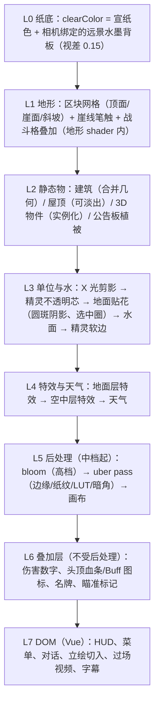
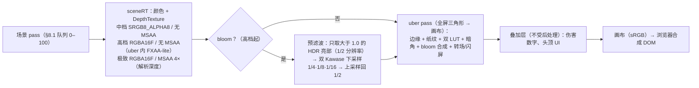
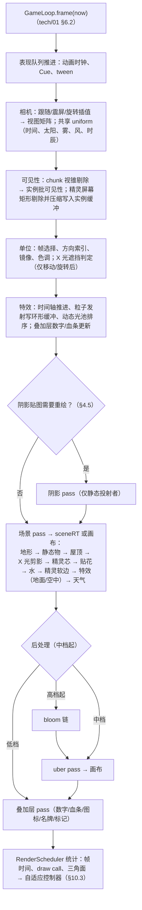
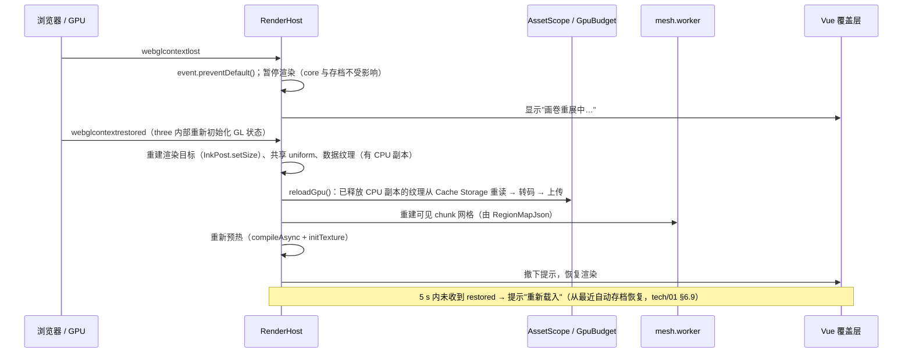
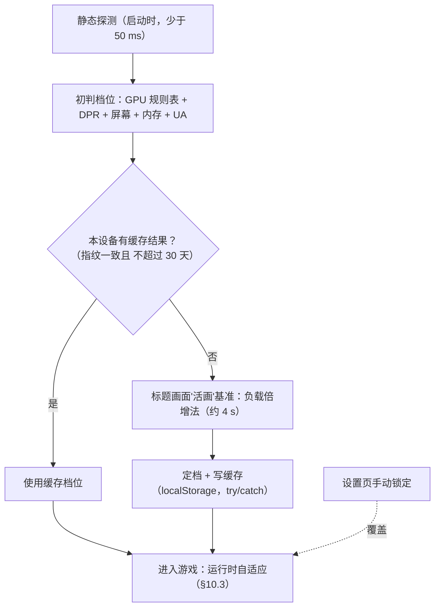
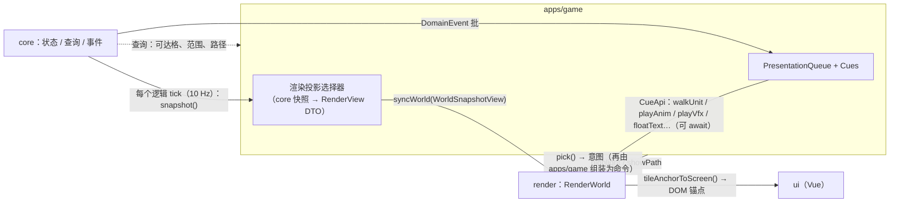

# tech/02 · 斜 45° 2.5D 渲染方案

| 项 | 内容 |
|---|---|
| 文档 | `docs/tech/02-rendering.md` |
| 版本 | v1.0（2026-09-25） |
| 上游基准 | `docs/00-canon.md` §0（手机浏览器横屏优先、国风水墨＋工笔）、§8（斜 45° 等距战棋、高度 0–10、就地开战 ≤ 20×20、上场 ≤ 6）、§11（轻功门禁高差）、§19（技术基线：Three.js、WebGL2 基线、正交相机 2:1 观感、3D 地形＋8 方向法线精灵、深度缓冲遮挡、KTX2） |
| 平行文档 | `tech/01`（架构：`RenderWorld` 接口、表现队列、渲染器闸门、画质档初值）、`tech/07`（素材生成：精灵"3D 中转"管线、`iso-camera.json`/`sprite-spec.json` 初值）、`tech/06`（素材存储：KTX2 编码档、质量变体；并行稿）、`design/09`（战斗：4 向朝向已确认；并行稿） |
| 下游文档 | `tech/03`（性能预算终值）、`tech/04`（区域地图数据格式）、`tech/05`（玩法引擎事件）、`tech/06`（KTX2 编码、纹理变体、manifest）、`design/08`（地形目录）、`design/09`（战斗朝向/表现节奏）、`design/11`（昼夜天气规则）、`design/14`（UI） |
| 本文职责 | 相机与投影数学、场景构成、遮挡排序、光照阴影、水墨风格化与后处理、特效、天气昼夜、渲染管线与帧预算、WebGPU 策略、质量档位、`packages/render` 代码结构、原型验证计划 |
| 本文拥有的契约文件 | `packages/spec/iso-camera.json`、`packages/spec/sprite-spec.json`（v1 定稿见 §1.3、§2.6）、`packages/spec/vfx.schema.json`（§6.1）、`packages/spec/time-of-day.json`（§7.1）；`packages/spec/palette.json` 只负责文件格式与着色器绑定（色值取自 tech/07 §2.3，UI 终值归 design/14） |

> **结论先行（TL;DR）**
>
> 1. **相机**：正交投影，**俯仰 30°**（2:1 像素等距：地面单位格投影为严格 2:1 菱形）、偏航 45°；**允许 4 个 90° 旋转预设**（350 ms 动画）。1 格 = 1 m，**1 级高度 = 1 m**。注意：常被误称为"2:1 等距角"的 26.565°（= atan ½）是菱形**边线在屏幕上的倾角**，不是相机俯仰角（§1.2 推导）。
> 2. **缩放**以"菱形格宽 CSS px"计：预设 48 / 64 / 80 / 96，战斗默认 64（844 px 宽手机横跨约 13 格）、探索默认 80；精灵 128 px/m 母版可覆盖 DPR 2 下的最大缩放。
> 3. **拾取**在世界空间做"射线 × 高度网格 DDA"；原型以 18,000 条随机射线（4 个偏航预设）对比暴力解，**0 误差**，单次 < 1 µs。单位优先于格子，触屏 44 px 容差 + 合法目标吸附。
> 4. **地形**：按格生成 3D 网格（顶面 / 崖面 / 斜坡），**32×32 格一个 chunk**，在 Worker 中构网（未优化原型桌面实测 1.1–1.6 ms/chunk）；**纹理数组 + 地形索引图 splat + 噪声"晕染"过渡**；AO 烘焙进顶点属性；崖顶墨线用笔触条带几何（所有档位，兼顾玩法可读性）。
> 5. **角色 = 2D 精灵**（不是低模 3D）：**直立公告板**（纵向 ×1/cos30° = ×1.1547 拉伸）＋**沿视线方向的深度偏移 0.35 m**（攻击片段 1.0 m）＋**两段式渲染**（α ≥ 0.5 的"不透明芯"写深度、α < 0.5 的"软边"混合）——无需逐帧排序即可与建筑、特效、其他单位正确遮挡；视空间法线贴图参与光照。
> 6. **遮挡**：深度缓冲取代画家算法；我方与当前目标单位被遮挡时画 **X 光剪影**（GREATER 深度测试）；当前焦点单位周围做**抖动镂空透视圈**；进入院落/店铺时**屋顶按建筑抖动淡出**（一个 draw call 内按建筑 ID 查表）。
> 7. **光照**：自写 `IsoLit` 着色（不用 three 内置灯光，避免灯数变化触发着色器重编译）＝ 半球光 ＋ **镜头相对方位的太阳**（昼夜只改仰角/颜色与 ±30° 方位摆动）＋ **静态点光"照明网格"纹理**（灯笼火把数量不限、每像素 1 次采样）＋ 动态点光池（低 0 / 中 2 / 高 4 / 极致 8）。
> 8. **阴影**：单位一律**圆斑阴影**；阴影贴图只投射静态物（地形、建筑），**惰性更新**（太阳变化 > 1°、镜头出框、区域变化时才重绘），中档 1024²；高档加"投影剪影"角色阴影。
> 9. **水墨风格**：描边三层——资产内墨线（精灵、建筑贴图）/ 地形崖线几何 / **屏幕空间法线＋深度边缘检测**（中档起，只作用于建筑与 3D 物件，靠场景 RT 的 alpha 通道做材质掩码）；后处理合并为 **1 个 uber pass**（边缘＋纸纹＋双 LUT 混合＋暗角）；bloom 只在高档及以上（半精度 HDR 下只让 > 1.0 的特效发光，避免"整张白纸泛光"）。
> 10. **特效**：数据驱动的 `fx_*` 特效时间轴（引用 tech/07 的 `vfx_*` 贴图）+ 5 类核心原语（面片、条带、序列帧、**无状态 GPU 粒子**、贴花，外加光束/动态光/屏幕特效/精灵着色）；按武学品阶分 F0–F4 预算；**伤害数字与头顶 UI 走 WebGL 叠加层**（位图数字 + 运行时 Canvas2D 烘焙的汉字词条图集，1 个 draw call），HUD/菜单/对话仍是 DOM。
> 11. **管线**：`WebGLRenderer` + **自写极简后处理**（不引入 `postprocessing`：实测 +18 KB gzip，且其 peer 锁定 three < 0.187）；draw call 目标 低 60 / 中 100 / 高 150 / 极致 250；自定义着色器模块 ≤ 8 个；加载期 `compileAsync` + `initTexture` 预热；完整的上下文丢失恢复路径。
> 12. **WebGPU**：维持 tech/01 的"单一路径 + Phase 0 闸门"。**新证据**：同等功能的 WebGPU 路线实测 **297 KB gzip vs WebGL 路线 156 KB（+141 KB）**，超出 tech/01 为 WebGPU 路线预留的 260 KB；闸门增加"包体"条件，最早 Phase 3 复评。
> 13. **质量档位**扩展为 **低 / 中 / 高 / 极致** 四档；自动检测 = 静态探测 + **标题画面"活画基准"（负载倍增法——移动端没有 GPU 计时查询）** + 运行时动态分辨率与降档。
> 14. **代码**：`packages/render` 按 13 个子模块组织；与 core 只经"只读快照/查询 + DomainEvent（经表现队列）"交互；§11 给出核心 TypeScript 签名。
> 15. **原型**：6 个 demo（相机拾取 / 地形 / `bench-iso`（64×64 + 200 精灵 + 后处理）/ 遮挡 / 特效压力 / 韧性），通过标准：中端安卓"中档"探索 P95 帧时间 ≤ 16.7 ms。

> **基线核查结论**：Canon §19 渲染基线**无致命问题**，正文按基线展开。下列为非致命的新发现，已在相应章节处理，并需同步上下游：
>
> | # | 发现（证据） | 影响 | 处理 |
> |---|---|---|---|
> | F1 | WebGPU 路线包体：本文 esbuild 实测同等功能 297 KB vs 156 KB gzip | tech/01 §5.4 为 WebGPU 路线预留 ≤ 260 KB 偏乐观 | §9.3 闸门增加包体条件；请 tech/01 更新预算 |
> | F2 | three r186 的 `BatchedMesh` 在无 `WEBGL_multi_draw` 时退化为"每个实例一次 draw"（源码核实）；Firefox 不支持该扩展（MDN BCD） | `BatchedMesh` 不能作为跨浏览器的合批基线 | §8.3：基线用"区块合并几何 + InstancedMesh" |
> | F3 | 移动端无 GPU 计时查询：`EXT_disjoint_timer_query_webgl2` 在 Android Chrome、iOS Safari 均不支持（MDN BCD） | 自动画质只能靠帧时间推断 | §10.2 负载倍增法基准 |
> | F4 | `navigator.deviceMemory` Safari 不支持（MDN BCD） | tech/01 §6.1 的 `deviceMemory ≤ 3` 判定只对安卓有效 | §10.2 iOS 改用机型/系统版本 + 基准 |
> | F5 | iPhone 不支持 `OES_texture_float_linear`（仅 iPadOS）（MDN BCD） | 可过滤的浮点 RT 只能用半精度 | §5.3 高档 HDR RT 用 `HalfFloatType` |
> | F6 | tech/07 的 `iso-camera.json` 初值 `allowRotation: false` | 本文决定允许旋转 | §1.5：自然物（树、草、石）仍可用公告板，方向性物件改 3D；请 tech/07 同步 |
> | F7 | tech/01 `QualityTier` 为三档 | 本文四档 | 类型改为 `'low' \| 'mid' \| 'high' \| 'ultra'`；请 tech/01 同步（素材变体仍为三档，`ultra` 复用 `high` 变体） |
> | F8 | tech/06（并行稿）精灵变体为 low = 96 px/m 无法线、mid = high = 128 px/m，且精灵不带 mip | 与各档 DPR 上限不匹配（中档 128 px/m 过采样约 1.9×、显存多 ~75%）；远缩放时无 mip 会闪烁 | §2.6 定稿为 64（无法线）/ 96 / 128 三个 ppm 包 + 2 级 mip；采纳其 UASTC normal mode；`sprite-spec.json` 归本文，请 tech/06 同步 |

---

## 目录

- [0. 目标、约束与画面分层](#0-目标约束与画面分层)
- [1. 视角与相机](#1-视角与相机)
- [2. 场景构成](#2-场景构成)
- [3. 遮挡与排序](#3-遮挡与排序)
- [4. 光照与"一定的 3D 感"](#4-光照与一定的-3d-感)
- [5. 国风水墨风格化](#5-国风水墨风格化)
- [6. 特效](#6-特效)
- [7. 天气与昼夜](#7-天气与昼夜)
- [8. 渲染管线与帧预算](#8-渲染管线与帧预算)
- [9. WebGPU 渐进增强](#9-webgpu-渐进增强)
- [10. 质量档位](#10-质量档位)
- [11. 代码结构](#11-代码结构)
- [12. 原型验证计划](#12-原型验证计划)
- [13. 备选方案与风险](#13-备选方案与风险)
- [参考资料](#参考资料)
- [本文新增术语/约定](#本文新增术语约定)
- [待决事项 / 依赖](#待决事项--依赖)

---

## 0. 目标、约束与画面分层

### 0.1 目标与非目标

| 目标 | 说明 |
|---|---|
| G1 读得清 | 战棋的一切判断依据（格子、高差、朝向、单位归属、范围预览、伤害）在 6.1 英寸横屏上一眼可辨；风格化不得牺牲可读性 |
| G2 像一幅会动的水墨画 | 纸为底、墨为骨、淡彩为肉；"留白"与"晕染"是渲染手段而非贴图内容 |
| G3 一定的 3D 感 | 真实高度地形、昼夜变化的方向光与阴影、法线精灵受光、镜头可旋转；但不追求写实 PBR |
| G4 手机不卡不烫 | 中端安卓"中档" 60 fps 探索 / 战斗 ≥ 30 fps 保底；按需渲染省电；10 分钟后仍稳定 |
| G5 单人可维护 | 自定义着色器 ≤ 8 个模块；所有渲染参数数据化（JSON/YAML）；每个效果都有降级开关 |

| 非目标 | 理由 |
|---|---|
| 写实 PBR、IBL、屏幕空间反射、实时 GI | 与水墨风格冲突，且移动端代价高 |
| 3D 蒙皮角色（MVP） | 见 §2.5 决策；保留为备选（tech/07 的 3D 中转资产留有退路） |
| 自由角度旋转、透视相机 | 会破坏精灵方向一致性与 2:1 构图；只允许 90° 预设 |
| 画布内中文排版 | 长文本一律 DOM（tech/01）；画布内只出现数字与"短词条图集"（§6.6） |

### 0.2 约束（来自 Canon 与 tech/01）

| 约束 | 来源 | 渲染含义 |
|---|---|---|
| 每格高度 `h` 0–10 级、地形 `terrain` | Canon §8 | 真实 3D 台阶地形；高差必须一眼可读（崖线、侧面明暗） |
| 就地开战 ≤ 20×20，不切场景 | Canon §8、tech/01 §6.4 | 战斗格叠加直接画在区域地形上（§2.7）；相机拉近取景 |
| 上场 ≤ 6 + 敌方（通常 ≤ 12） | Canon §8 | 战斗中精灵实例 ≤ 约 20；探索时城镇 NPC 可达 50–100 |
| 轻功门禁：高差 1/2/3/5 级、跨 1–5 格 | Canon §11 | 1 级高度的屏幕高度要足够大（§1.2：1 m = 1.22 个菱形高） |
| 第三方渲染库 Three.js，WebGL2 基线 | Canon §19、tech/01 §2 | `three@0.186.1` 锁精确版本；`WebGLRenderer` 默认 |
| Draw call ≤ 150（移动端）、纹理显存 ≤ 256 MB | tech/01 §1.2 | §8.2、§8.7 细化到分档 |
| `RenderWorld` 接口、表现队列、按需渲染三模式 | tech/01 §4.3、§6.2–6.3 | 本文扩展但不破坏（§11.2） |
| 自定义着色器集中在 `render/materials/`（≤ 8） | tech/01 §2.6 | §8.5 列出 8 个模块与全部变体 |
| 精灵"3D 中转"：8 方向、颜色 + 视空间法线 pass、128 px/m | tech/07 §5.4 | §2.5–2.6 在其基础上定稿运行时规格 |

### 0.3 画面分层总览（从后到前）



### 0.4 本文产出的契约文件

| 文件 | 消费者 | 内容 | 章节 |
|---|---|---|---|
| `packages/spec/iso-camera.json` | 运行时相机、tech/07 Blender 渲染脚本、tech/04 地图工具 | 俯仰/偏航/旋转预设、世界单位、方向索引约定、缩放档 | §1.3 |
| `packages/spec/sprite-spec.json` | tech/07 打包脚本、运行时精灵加载器 | ppm 分档、帧格与锚点、法线编码、公告板与深度偏移、每帧元数据 | §2.6 |
| `packages/spec/vfx.schema.json` | 特效数据、编辑预览 | 特效时间轴与原语参数 | §6.1 |
| `packages/spec/palette.json` | 着色器 uniform、Vue CSS 变量 | tech/07 §2.3 色板令牌的机器可读版 + 渲染语义映射（阵营色、高亮色）；本文只定格式 | §5.6 |
| `packages/spec/time-of-day.json` | 光照/雾/LUT 控制器 | 十二时辰关键帧 | §7.1 |

---

## 1. 视角与相机

### 1.1 世界坐标与单位

| 约定 | 值 | 说明 |
|---|---|---|
| 坐标系 | 右手系，`+Y` 向上 | 与 three.js 一致 |
| 网格轴 | `+X` = 网格列 `i`（东），`+Z` = 网格行 `j`（南） | 与 Tiled 正交视图的 x/y 对应（tech/01 §7.4） |
| 格子 | 格 `(i, j)` 占据 `[i, i+1] × [j, j+1]`，中心 `(i+0.5, top, j+0.5)` | 1 格 = **1 m**（`tileSizeM = 1`） |
| 高度 | 顶面 `top = h × heightStepM`，`h ∈ 0..10` | **`heightStepM = 1.0` m**（理由见下表） |
| 角色尺度 | 身高 1.6–1.8 m，脚底锚点在格中心 | tech/07 §1.3 |
| 区域尺寸 | 建议 ≤ 256×256 格（终值归 `tech/04` / `design/11`） | 超过时按 chunk 流式构建（§2.2） |
| 着色器精度 | 世界坐标相关计算一律 `highp` | fp16 在 256 处的间距为 0.25 m，不足以做格线与贴图坐标 |

**为什么 1 级高度 = 1 m**（Canon §11：`qg2` 可"上屋顶/矮墙 = 2 级高差"，坠落伤害从 ≥ 3 级起算，design/05 §4.5）：

| 候选 | 屋檐（2 级） | 3 级崖（坠落伤害起点） | 1 级在屏幕上的高度（相对菱形格高 0.707 m） | 评价 |
|---|---|---|---|---|
| 0.5 m | 1.0 m | 1.5 m | 0.61 × | 屋檐比人矮，不成立 |
| 0.75 m | 1.5 m | 2.25 m | 0.92 × | 屋檐仍偏低 |
| **1.0 m** | **2.0 m** | **3.0 m** | **1.22 ×** | 游戏化压缩的屋檐（门高约 1.9 m）；整数运算；1 级高差清晰可读；与 tech/07"对齐 1 m 网格"的建筑套件一致 ✅ |
| 1.25 m | 2.5 m | 3.75 m | 1.53 × | 更写实，但 3 级崖遮挡后方 6.5 m，战棋视野损失大 |

### 1.2 俯仰角：真等距 35.264° vs 2:1 的 30°

设相机俯仰角 θ（视线与水平面夹角）、偏航角 ψ（从目标点指向相机的水平方向，在 XZ 平面内由 `+X` 转向 `+Z` 计量）。正交相机的三个基向量为：

```text
b（从目标指向相机，= -forward）= ( cosθ·cosψ,  sinθ,  cosθ·sinψ )
r（屏幕右）                    = ( sinψ,        0,     -cosψ     )
u（屏幕上）                    = ( -sinθ·cosψ,  cosθ,  -sinθ·sinψ )
屏幕坐标（米）：sx = P·r，sy_up = P·u        （与 three 的 lookAt(up=+Y) 结果一致，已数值核对）
```

ψ = 45° 时，单位格（边长 1 m）投影为菱形：

```text
菱形宽 W = 2·|X̂·r| = 2·sin45°            = √2          （与 θ 无关）
菱形高 H = 2·|X̂·u| = 2·sinθ·cos45°       = √2·sinθ
宽高比 W/H = 1 / sinθ
菱形边在屏幕上的倾角 α = atan(H/W) = atan(sinθ)
1 m 竖直线段的屏幕长度 = |Ŷ·u| = cosθ
```

- **2:1 菱形**：W/H = 2 ⇒ sinθ = ½ ⇒ **θ = 30°**；此时菱形边倾角 α = atan(½) = **26.565°**，即像素画里"横 2 竖 1"的台阶线。所以 "atan(1/2)" 描述的是**屏幕上的线**，不是相机角——把相机俯仰设成 26.565° 会得到 2.236:1 的扁菱形（常见误用）。
- **真等距**：三根坐标轴投影等长 ⇒ ½ + ½·sin²θ = cos²θ ⇒ sin²θ = ⅓ ⇒ **θ = arcsin(1/√3) = arcsin(tan 30°) ≈ 35.264°**；菱形 √3 : 1 ≈ 1.732 : 1，边倾角 30°。

| 指标（ψ = 45°，单位格） | **2:1（θ = 30°）** | 真等距（θ = 35.264°） | 误用（θ = 26.565°） |
|---|---|---|---|
| 菱形宽 : 高 | **2.000 : 1**（1.414 × 0.707 m） | 1.732 : 1（1.414 × 0.816 m） | 2.236 : 1 |
| 菱形边屏幕倾角 | 26.565° | 30.000° | 24.095° |
| 1 m 竖直高度的屏幕长度 | 0.866 m（= 1.22 个菱形高） | 0.816 m（= 1.00 个菱形高） | 0.894 m（= 1.41 个菱形高） |
| 高 H 的墙遮挡其后地面的水平距离 | 1.73 H | 1.41 H | 2.00 H |
| 横屏每屏可见格行数（相对） | **+15%**（菱形更扁） | 基准 | +29% |

（数值由本文 `iso_math.mjs` 用 three@0.186.1 的 `lookAt` 结果核对。）

**决策：θ = 30°（2:1）**。

1. Canon §19 明确"2:1 等距观感"；tech/07 的 Blender 精灵渲染已按 30° 搭好（零返工）。
2. 菱形边是严格的 2:1 像素台阶：格线、选区边框、UI 中的等距小图标都能做到像素干净。
3. 1 级高差 = 1.22 个菱形高，比真等距更醒目——高差是本作核心玩法（轻功门禁、高低差乘区 Z7），可读性优先。
4. 地面更扁，横屏手机能多看约 15% 的行数。
5. 代价：墙体遮挡后方更远（1.73 H vs 1.41 H）——由旋转（§1.5）、X 光剪影与透视圈（§3）弥补。

### 1.3 相机参数与 `iso-camera.json` v1

```ts
// packages/render/src/camera/iso-camera-rig.ts（节选）
import { OrthographicCamera, Vector3 } from 'three';
import spec from '@tianshu/spec/iso-camera.json';

const DEG = Math.PI / 180;
export function placeIsoCamera(cam: OrthographicCamera, target: Vector3, yawDeg: number,
                               viewportCss: { w: number; h: number }, pxPerM: number): void {
  const th = spec.pitchDeg * DEG, psi = yawDeg * DEG;
  const back = new Vector3(Math.cos(th) * Math.cos(psi), Math.sin(th), Math.cos(th) * Math.sin(psi));
  cam.position.copy(target).addScaledVector(back, spec.eyeDistanceM);   // 250 m：正交投影与距离无关，只需包住场景
  cam.up.set(0, 1, 0);
  cam.lookAt(target);
  const halfW = viewportCss.w / (2 * pxPerM), halfH = viewportCss.h / (2 * pxPerM);
  cam.left = -halfW; cam.right = halfW; cam.top = halfH; cam.bottom = -halfH;
  cam.near = spec.nearM; cam.far = spec.farM;                           // 1 / 500 m
  cam.updateProjectionMatrix();
}
```

- 视口按 **CSS 像素**定义视野、按"绘制缓冲像素"渲染：缩放、DPR、动态分辨率三者解耦（§10）。
- 正交深度是线性的：24 位深度在 500 m 范围内精度约 0.03 mm，无需对数/反向深度。
- 视锥高度 = 视口高 / k；1 m 在屏幕上始终是 k 个 CSS px，与屏幕位置无关（后处理中的"米"阈值因此全屏一致）。

`packages/spec/iso-camera.json`（v1，本文定稿；相对 tech/07 初值的变化：`allowRotation` 改为 `true`，新增偏航预设、高度单位、缩放档、太阳方位约定）：

```json
{
  "version": 1,
  "projection": "orthographic",
  "pitchDeg": 30,
  "yawDeg": 45,
  "yawPresetsDeg": [45, 135, 225, 315],
  "allowRotation": true,
  "rotationMs": 350,
  "eyeDistanceM": 250,
  "nearM": 1,
  "farM": 500,
  "tileSizeM": 1.0,
  "heightStepM": 1.0,
  "axes": { "x": "grid i (east)", "y": "up", "z": "grid j (south)" },
  "zoom": { "unit": "cssPxPerTileWidth", "presets": [48, 64, 80, 96], "min": 40, "max": 112,
            "exploreDefault": 80, "battleDefault": 64, "cinematicMax": 128 },
  "dirIndex": ["S", "SW", "W", "NW", "N", "NE", "E", "SE"],
  "dirFormula": "d = round((facingYawDeg - cameraYawDeg) / 45) mod 8; yaw in XZ from +X toward +Z; d=0 faces the camera",
  "mirrorPairs": [[1, 7], [2, 6], [3, 5]],
  "battleFacings": [1, 3, 5, 7],
  "sunAzimuthRelDeg": 80,
  "sunAzimuthSwingDeg": 30
}
```

### 1.4 缩放级别

缩放以"**菱形格宽（CSS px）**"为单位定义，换算 `k = 格宽 / √2`（CSS px/m）。下表以 iPhone 横屏 844×390 CSS px、桌面 1920×1080 为例：

| 档 | 格宽×格高（CSS px） | k（px/m） | 1 级高度 | 1.75 m 角色 | 844 宽横跨格数 | 1920 宽横跨格数 | 用途 |
|---|---|---|---|---|---|---|---|
| 远 | 48×24 | 33.9 | 29 px | 51 px | 17.6 | 40 | 大地图式俯瞰、找路 |
| **战斗默认** | **64×32** | 45.3 | 39 px | 69 px | 13.2 | 30 | 20×20 战场约可见 2/3，配合自动取景 |
| **探索默认** | **80×40** | 56.6 | 49 px | 86 px | 10.6 | 24 | 人物与场景细节 |
| 近 | 96×48 | 67.9 | 59 px | 103 px | 8.8 | 20 | 对话、观察 |
| 演出上限 | 128×64 | 90.5 | 78 px | 137 px | 6.6 | 15 | 绝招特写、剧情镜头（仅脚本可用） |

- **交互**：双指捏合 / 滚轮在 `[40, 112]` 内连续缩放；松手后不强制吸附（避免"跳"），但键盘 `+/-` 与 UI 按钮在预设间切换。
- **精灵清晰度核对**：设备像素密度 = k × DPR × 渲染比例。精灵母版 128 px/m（tech/07）在 DPR 2、96 px 格宽时放大 1.06×，112 px 时 1.24×（略软，可接受）；远档时缩小到 0.53×，由 mipmap 处理。低/中档使用 64/96 px/m 变体（§2.6），与其 DPR 上限匹配。
- **像素对齐**：相机静止或平移（非缩放、非旋转）时，把相机目标点在屏幕平面上的投影量化到"渲染像素"网格，消除精灵与墨线的亚像素闪烁（sub-pixel shimmering）。

### 1.5 旋转：4 个 90° 预设（决策）与 8 方向精灵配合

| 方案 | 优点 | 缺点 | 结论 |
|---|---|---|---|
| A 固定视角（tech/07 初值） | 构图可控；单视角公告板物件任意用；关卡只需检查一个视角 | 高台/建筑后方的格子与单位常被挡住（30° 下 3 m 墙挡住其后 5.2 m）；战棋信息缺失 | ❌ |
| **B 4 个 90° 预设** | 战棋类通行做法（FFT、皇家骑士团、三角战略）；被挡信息可转过来看；8 方向精灵天然支持 | 方向性装饰物必须做 3D；关卡需在 4 个视角下检查 | ✅ **采用** |
| C 自由旋转 | 最灵活 | 精灵方向在 45° 间隔之间"跳帧"明显；构图失控；无必要 | ❌ |

**规则**

1. 偏航预设 `{45°, 135°, 225°, 315°}`，默认 45°；Q/E 键、UI 按钮触发（不用双指旋转手势，避免与捏合缩放冲突），350 ms `easeInOutCubic`，围绕当前相机目标点公转。
2. 探索与战斗都可旋转；过场演出中仅脚本可控；地图 `CameraHint` 对象可为局部区域指定默认偏航或禁止旋转（如狭窄巷道）。
3. 旋转动画期间：公告板每帧重新朝向相机；精灵方向索引每帧重算（每转 90° 经历 2 次方向切换，可接受）；阴影贴图不重绘、阴影强度先淡出后淡入（§4.5）；拾取暂停。
4. 太阳方位**相对镜头**（§4.2），因此 4 个预设下明暗构图一致；精灵颜色 pass 里烘焙的 15% 形体明暗（tech/07 §5.4.5）也因此始终与运行时光向一致。
5. 输入：键盘 WASD / 虚拟摇杆方向是**屏幕相对**的，由 ActionMap 按当前偏航换算成世界方向（tech/01 §6.5）。
6. 对资产的约束（需 tech/07 同步，修订其"若允许旋转则一律 3D"的规则）：

| 物件类型 | 可否用公告板 | 理由 |
|---|---|---|
| 树、竹丛、灌木、草丛、芦苇、花、小石块、灯笼 | ✅ 直立公告板（始终绕 Y 轴朝向相机） | 近似轴对称，任何偏航下都成立 |
| 栏杆、围墙、牌坊、摊位、桌椅、兵器架、碑、船、车 | ❌ 必须 3D 低模 | 有正反面/长轴，旋转后公告板会穿帮 |
| 建筑、桥、城墙、塔 | ❌ 3D（tech/07 已定） | 四个立面都要有贴图 |
| 远景山水 | 相机绑定背板（§4.8） | 随相机转，不属于世界物件 |

**8 方向精灵的方向索引**：朝向在 core 中以**世界方向**保存（探索 8 向 / 战斗 4 向），渲染时换算为屏幕方向索引（约定同 tech/07：0 = 正对观者，按屏幕顺时针）：

```ts
// packages/render/src/units/facing.ts
export type Dir8 = 0 | 1 | 2 | 3 | 4 | 5 | 6 | 7;          // S SW W NW N NE E SE（屏幕）
/** facingYawDeg：单位朝向在 XZ 平面内由 +X 转向 +Z 的角度；cameraYawDeg：当前相机偏航 */
export function spriteDir(facingYawDeg: number, cameraYawDeg: number): Dir8 {
  const d = Math.round((facingYawDeg - cameraYawDeg) / 45);
  return (((d % 8) + 8) % 8) as Dir8;
}
/** 镜像动作集（loco5m/battle2m）：只渲染了部分方向，其余由镜像得到（mirrorPairs） */
export function resolveDir(d: Dir8, rendered: readonly Dir8[]): { src: Dir8; mirror: boolean } {
  if (rendered.includes(d)) return { src: d, mirror: false };
  const m = ((8 - d) % 8) as Dir8;                            // 1↔7、2↔6、3↔5
  return { src: m, mirror: true };                            // 着色器：UV.x 翻转 + 法线 R 通道取反
}
```

| 世界朝向（XZ） | ψ = 45° 时屏幕方向 | ψ = 135° | ψ = 225° | ψ = 315° |
|---|---|---|---|---|
| `+X`（东） | 7 SE | 5 NE | 3 NW | 1 SW |
| `+Z`（南） | 1 SW | 7 SE | 5 NE | 3 NW |
| `−X`（西） | 3 NW | 1 SW | 7 SE | 5 NE |
| `−Z`（北） | 5 NE | 3 NW | 1 SW | 7 SE |
| `+X+Z`（东南，探索斜走） | 0 S | 6 E | 4 N | 2 W |

- 战斗朝向只有网格四邻（`±X`、`±Z`），**在任何 90° 预设下都落在 {1, 3, 5, 7}**——tech/07 的 `battle4` 动作集（4 个斜向）无需扩充；这也回答了 tech/07 待决项"战斗 4 朝向"在旋转下是否成立。
- 探索中的斜向移动映射到 {0, 2, 4, 6}，由 `loco8`/`loco5m` 覆盖。

### 1.6 屏幕 ↔ 世界 ↔ 网格换算

以相机目标点为原点、`(x, y, z)` 为相对坐标、`k` 为 CSS px/m、`(cx, cy)` 为视口中心：

```text
正变换（通用偏航 ψ，θ = 30°）：
  sx      = x·sinψ − z·cosψ                         （米，向右为正）
  sy_down = sinθ·(x·cosψ + z·sinψ) − y·cosθ         （米，向下为正）
  px = cx + k·sx，  py = cy + k·sy_down

ψ = 45° 的简化式：
  sx      = (x − z)·√2/2
  sy_down = (x + z)·√2/4 − y·√3/2

逆变换（已知高度 y，求地面点）：
  a = sx，  c = (sy_down + y·cosθ) / sinθ           （c = x·cosψ + z·sinψ）
  x = a·sinψ + c·cosψ，  z = −a·cosψ + c·sinψ
  格子：i = floor(x + target.x)，j = floor(z + target.z)
```

- 一个屏幕点对应世界中一整条视线，**不同高度对应不同格子**——所以"逆变换 + 取整"只适用于已知高度的场合（如把 DOM 气泡锚到某格顶面：用正变换）；真正的点选必须走 §1.7 的射线拾取。
- `tileAnchorToScreen(i, j, h)` 供 UI 把 DOM 元素（对话气泡、提示框）锚定到世界位置；每帧由渲染层批量计算后写入 UI 投影（只对可见且需要的锚点）。

### 1.7 拾取：射线 × 高度网格 DDA

tech/01 §6.6 给出了思路，本文定稿算法并以原型验证：

1. **屏幕 → 射线**：正交相机下所有像素的射线方向相同（= 相机前向 `−b`），起点为屏幕点在近平面上的反投影。
2. **单位优先**：用上一帧渲染的精灵屏幕矩形（裁边后的紧包围盒）命中测试；触控时矩形外扩到 ≥ 44 CSS px；多个命中取视深最小者；战斗选目标模式下优先"当前行动的合法目标"。被遮挡的单位同样可拾取（屏幕上有剪影，§3.4）。
3. **格子**：射线与区域包围盒求交，再在 XZ 平面上做 Amanatides–Woo DDA，由近及远逐格检查"射线在该格 XZ 区间内的高度范围是否低于格顶"。
4. **吸附**：在"选择合法格"模式下，若命中格不合法而 12 CSS px 内有合法格（按菱形顶面到触点的屏幕距离），吸附过去——触屏误触率显著降低。
5. 结果只是意图，合法性由 core 的 `validate` 决定（tech/01）。

```ts
// packages/render/src/camera/picking.ts —— 原型已用 18,000 条随机射线（4 个偏航预设）与逐格 AABB 暴力解对比：0 误差
export interface TileHit { i: number; j: number; face: 'top' | 'side'; t: number }
export function pickTile(o: Vec3, d: Vec3, W: number, D: number,
                         topAt: (i: number, j: number) => number,          // 格顶高度（米）
                         yMax = 10, yMin = -1): TileHit | null {
  // 1) 与包围盒 [0,W]×[yMin,yMax]×[0,D] 求交（slab 法），得到 [t0, t1]
  let t0 = 0, t1 = Infinity;
  const lo = [0, yMin, 0], hi = [W, yMax, D], oo = [o.x, o.y, o.z], dd = [d.x, d.y, d.z];
  for (let a = 0; a < 3; a++) {
    if (Math.abs(dd[a]) < 1e-12) { if (oo[a] < lo[a] || oo[a] > hi[a]) return null; continue; }
    let ta = (lo[a] - oo[a]) / dd[a], tb = (hi[a] - oo[a]) / dd[a];
    if (ta > tb) [ta, tb] = [tb, ta];
    t0 = Math.max(t0, ta); t1 = Math.min(t1, tb);
    if (t0 > t1) return null;
  }
  // 2) XZ 平面 DDA，由近及远
  const px = o.x + d.x * (t0 + 1e-9), pz = o.z + d.z * (t0 + 1e-9);
  let i = Math.min(W - 1, Math.max(0, Math.floor(px))), j = Math.min(D - 1, Math.max(0, Math.floor(pz)));
  const si = d.x > 0 ? 1 : -1, sj = d.z > 0 ? 1 : -1;
  const dX = Math.abs(1 / d.x), dZ = Math.abs(1 / d.z);
  let tMaxX = t0 + (d.x > 0 ? i + 1 - px : px - i) * dX;
  let tMaxZ = t0 + (d.z > 0 ? j + 1 - pz : pz - j) * dZ;
  let tIn = t0;
  while (i >= 0 && i < W && j >= 0 && j < D && tIn <= t1) {
    const tOut = Math.min(tMaxX, tMaxZ, t1);
    const top = topAt(i, j);
    const yIn = o.y + d.y * tIn, yOut = o.y + d.y * tOut;      // 俯视：d.y < 0，yIn ≥ yOut
    if (yOut <= top) {                                          // 斜坡格：此处改为与坡面平面求交（见下）
      return yIn <= top ? { i, j, face: 'side', t: tIn }        // 从侧面进入：命中崖面，归属该格
                        : { i, j, face: 'top', t: (top - o.y) / d.y };
    }
    tIn = tOut;
    if (tMaxX < tMaxZ) { i += si; tMaxX += dX; } else { j += sj; tMaxZ += dZ; }
  }
  return null;
}
```

- **斜坡格**：格顶是平面 `y = h + s·dot(p − p0, rampDir)`（`s` = 1 m/格）；在该格的 `[tIn, tOut]` 内解射线与坡面的交点，落在区间内即命中 `top`。
- **性能**：256×256 区域单次拾取约 0.34 µs（Node 22 桌面，原型实测），复杂度 O(W + D)，可在指针移动时每帧调用（桌面悬停预览）。
- 四个偏航预设下射线的 `d.x`、`d.z` 均不为 0；旋转动画期间拾取暂停，因此无需处理轴向平行射线的除零分支（若将来允许任意偏航，需对 `d.x = 0` / `d.z = 0` 单独设 `tMax = Infinity`）。
- **不规则大物件**（如可点击的巨钟、碑文）才用 `three-mesh-bvh`（`0.9.15`，按需引入）做网格射线；其余交互物都挂在逻辑格上（tech/01 §6.6）。

### 1.8 相机行为

| 行为 | 规格 | 备注 |
|---|---|---|
| 跟随 | 临界阻尼弹簧（ω = 10）；屏幕中央 20% × 20% 死区；沿移动方向前瞻 0.8 m | 探索态 |
| 边界 | 相机目标限制在"区域包围盒内缩 3 m"内；越界时橡皮筋回弹 200 ms | 四个偏航预设通用（在世界 XZ 中夹取） |
| 战斗取景 | 轮到某单位：镜头移到该单位；出招时把"施招者 + 全部受影响格"的包围盒框进视口（留 15% 边距），缩放限制在 56–80 px 格宽之间；结束后回到行动者 | 由表现队列 Cue 驱动（tech/01 §6.3） |
| 震屏 | 沿屏幕 `r`/`u` 方向偏移；轻 3 / 中 6 / 重 10 CSS px，150–300 ms 衰减噪声 | 设置项"减少晃动"可关（无障碍） |
| 顿帧（hit-stop） | 命中瞬间冻结相关单位的动画时钟 60–100 ms | 纯表现，不影响 core |
| 演出镜头 | 脚本可 `pan / zoom / rotate / focus`（带缓动），**不改俯仰** | 俯仰固定是精灵正确性的前提 |
| 像素对齐 | 静止/平移时把目标点的屏幕投影量化到渲染像素 | §1.4 |
| `CameraHint` | 地图对象：局部默认偏航、缩放、边界、禁止旋转 | tech/01 §7.4 已列出该对象类 |

---

## 2. 场景构成

### 2.1 地形网格：按格生成

区域地图数据来自 Tiled 转换（tech/01 §7.4 的 `RegionMapJson`：`heights`、`terrain`、`terrainTable`、`decos`、`objects`）。渲染层据此在 Worker 中生成 3D 网格：

| 面 | 生成规则 | 着色要点 |
|---|---|---|
| 顶面 | 每格一个四边形（2 三角），`y = h × 1 m`；不做贪心合并（保留逐顶点 AO 与逐格效果） | UV = 世界 XZ；地形 splat（§2.3）；战斗格叠加（§2.7） |
| 崖面 | 对 4 条边：若邻格顶高 < 本格顶高，生成竖直四边形 `[邻格顶, 本格顶]`；区域边缘向下延伸到 `min(h) − 1` 并由边界雾吞没（§4.7） | UV = (沿边距离, y)；崖面材质层由"上方格"的地形决定（`design/08` 提供地形 → 崖面材质映射） |
| 斜坡 / 台阶 | 地形类型为坡/阶（`design/08` 定义）时，顶面为倾斜平面，1 格内升 1 级；两侧为三角形侧面 | 坡向 `rampDir`：若恰有一个四邻高 1 级且对侧不高于本格，则自动推导；否则读 Tiled 属性（需 `tech/04` 字段） |
| 水体 | 水格的 `h` = 水面所在级；水面网格画在 `y = h − 0.15`（岸边留出 0.15 m 岸沿）；河床画在 `y = h − 深度`（浅水 0.5 m / 深水 2.0 m，仅视觉） | 水面单独网格与材质（§7.3）；河床复用地形材质 |
| 视觉下沉 | 单位站在浅水/泥沼/雪上时，精灵锚点下沉 0.35 / 0.10 / 0.05 m（纯表现，core 的高度不变）；`qg3` 踏水、`qg4` 踏雪时不下沉 | 让"涉水""踏雪无痕"在画面上成立（Canon §11） |

**顶点格式**（16 B/顶点，`Uint16` 索引；单 chunk 最坏约 1.2 万顶点 < 65,536）：

```ts
// packages/render/src/world/terrain/chunk-mesher.ts（运行在 mesh.worker 中）
// position: Float32×3（世界坐标，12 B）
// info:     Uint8×4 normalized=false（4 B）
//   x: faceDir   0=top 1=+X 2=−X 3=+Z 4=−Z 5..8=坡面（四个坡向）
//   y: ao        0..255（§4.6 烘焙）
//   z: matLayer  崖面材质层 / 河床标记
//   w: flags     bit0 崖顶边、bit1 水岸、bit2 可淡出（室内地面）…
// UV 与法线不存：由 faceDir + 世界坐标在着色器中重建（省 12–20 B/顶点）
export interface ChunkMeshData {
  chunk: { ci: number; cj: number };
  position: Float32Array; info: Uint8Array; index: Uint16Array;
  cliffLines: Float32Array;          // 崖线笔触条带（§5.2），另一个 draw call
  bounds: { min: [number, number, number]; max: [number, number, number] };
}
```

### 2.2 分块（chunk）与流式构建

**决策：32×32 格一个 chunk。**

| 候选 | 256×256 区域的 chunk 数 | 手机横屏可见 chunk 数（默认缩放） | 单 chunk 三角面 | 评价 |
|---|---|---|---|---|
| 16×16 | 256 | 6–12 | 0.6k–1.5k | 剔除更细，但 draw call 翻倍，构网调度开销大 |
| **32×32** | **64** | **2–6** | **2.5k–5.8k** | draw call 与剔除粒度平衡；与 20×20 战场尺度相当 ✅ |
| 64×64 | 16 | 1–4 | 10k–23k | 视锥剔除几乎无效；单次重建耗时长 |

- **原型实测**（本文 `mesher_bench.mjs`，未优化 JS，Node 22 桌面）：平滑地形 32×32 chunk 约 2.5k 三角、1.1 ms；全随机高度（最坏情况）约 5.8k 三角、1.4 ms；256×256 区域顶点数据 6–13 MB。手机 CPU 按 3–5 倍估算 → 必须放进 Worker 并流式处理。
- **流式**：进入区域时先构建相机周围 3×3 chunk（阻塞加载画面），其余按"距相机由近及远"在 `mesh.worker` 中构建，每帧最多上传 2 个 chunk 的缓冲区；离开视野 + 2 chunk 外的网格进入 LRU，超过显存预算时释放（CPU 侧只保留 `RegionMapJson`，重建很便宜）。
- `mesh.worker` 是 tech/01 §3.7 Worker 清单的新增项（或并入 `io.worker`）；输入 `heights/terrain` 的 `ArrayBuffer`（Transferable），输出 `ChunkMeshData`。
- 每个 chunk 一个包围盒（含高度范围与崖线），用于视锥剔除（§8.4）。

### 2.3 地形材质：纹理数组 + 索引图 splat + "晕染"过渡

tech/07 §5.5.1 负责生成无缝材质（每种地形 3–4 个变体，母版 512²，崖面 512×1024），并明确"地块交界的水墨边缘由 tech/02 shader 统一实现"。运行时方案：

| 资源 | 格式 | 说明 |
|---|---|---|
| `terrainAlbedo` | `CompressedArrayTexture`（KTX2 array，`ktx create --layers N`），sRGB，带 mip | 每区域 ≤ 16 层地表；层尺寸 低/中 256²、高/极致 512²（每 2 m 平铺一次 → 128/256 px/m） |
| `cliffAlbedo` | 同上 | ≤ 8 层崖面（岩、土、夯土墙、砖、木…） |
| `terrainIndex` | `DataTexture` RGBA8，W×D，`NearestFilter`，`texelFetch` 读取 | R = 地表层号；G = 变体（旋转/偏移 0–3，防平铺感）；B = 崖面层号；A = 湿润/积雪遮罩 |
| `inkNoise` | 256² 单通道可平铺噪声（常驻） | 晕染边界、雾、墨线抖动共用 |

片元着色（顶面）要点：

```glsl
// materials/terrain.frag.glsl（节选；highp 世界坐标）
vec2 g = vWorld.xz - 0.5;                    // 以格中心为采样网格
ivec2 c0 = ivec2(floor(g));
vec2  f  = fract(g);
// 4 个相邻格的层号与权重（双线性）
int   L[4]; float w[4];
L[0] = layerAt(c0);              w[0] = (1.-f.x)*(1.-f.y);
L[1] = layerAt(c0+ivec2(1,0));   w[1] = f.x*(1.-f.y);
L[2] = layerAt(c0+ivec2(0,1));   w[2] = (1.-f.x)*f.y;
L[3] = layerAt(c0+ivec2(1,1));   w[3] = f.x*f.y;
// "晕染"：噪声扰动 + 锐化，使交界呈墨色洇开而非直线渐变
float n = texture(uInkNoise, vWorld.xz * 0.35).r - 0.5;
for (int k = 0; k < 4; k++) w[k] = clamp((w[k] - 0.25) * uBleedSharp + 0.25 + n * uBleedAmp, 0., 1.);
vec3 col = splat(L, w, vWorld.xz);           // 同层合并后按档位采样 1/2/4 次（见下）
```

| 档位 | 交界处理 | 每像素地表采样数 |
|---|---|---|
| 低 | **抖动混合**：按噪声阈值在 4 个候选层中选 1 层（点彩式边界，恰好像毛笔皴点） | 1 |
| 中 | 取权重最大的 2 层混合 | ≤ 2 |
| 高 / 极致 | 4 层完整混合（同层号先合并权重，内部区域实际只采 1 次） | ≤ 4 |

- 四邻层号全相同（绝大多数像素）时走单采样分支；移动 GPU 上大块同质区域的分支一致性好。
- 崖面：`uv = (沿边坐标, y) / 平铺尺寸`，按 `matLayer` 采 `cliffAlbedo`；顶部 0.1 m 与顶面颜色做一条窄过渡，底部叠 AO 渐暗。
- **不做地形法线贴图**：画风是"平涂分阶"，地表起伏靠几何台阶、AO、云影与阴影表达；省下的采样预算留给 splat。
- 书界调色：同一基础材质在不同书界用 LUT 调色（tech/07 §5.5.1），运行时由后处理 LUT（§5.3）或低档的材质色彩矩阵完成，不重复下载贴图。

（`splat()` 内部对扰动后的权重重新归一化；`uBleedSharp ≈ 2.5`、`uBleedAmp ≈ 0.35` 为初值，由原型调参。）

### 2.4 静态物件：低模 + 贴图 vs 精灵卡片

**取舍规则**（按顺序判断，先命中者生效）：

| # | 条件 | 表现形式 | 例 |
|---|---|---|---|
| 1 | 玩家可站上去 / 影响通行与高差（屋顶、城墙、台基、桥） | **地形格**（高度 + 地形类型）＋ 外观 3D 网格贴合 | 屋顶 = 2 级格；桥面 = 桥面高度格 |
| 2 | 有正反面或明显长轴、会遮挡单位、需要从 4 个方向看都成立 | **3D 低模** | 建筑、牌坊、围墙、栏杆、船、车、摊位、兵器架、碑 |
| 3 | 近似轴对称的自然物，体量中等 | **直立公告板卡片**（静态版精灵着色器，alpha 抠图） | 树、竹丛、灌木、芦苇、灯笼 |
| 4 | 贴地、无高度的细节 | **贴花**（地面四边形）或直接画进地形材质 | 落叶、裂缝、血迹、脚印、地砖花纹 |
| 5 | 大量细小且可随机分布 | **实例化小网格/卡片 + 缩放档剔除**（远档隐藏） | 草簇、碎石、花丛 |
| 6 | 只为氛围、不可交互、不在可玩区域内 | **远景背板**（§4.8） | 远山、城郭剪影、云海 |

**预算（中档初值，终值归 tech/03）**

| 项 | 预算 |
|---|---|
| 普通民居（整栋） | ≤ 5k 三角；地标（寺塔、宫殿） ≤ 15k |
| 每 chunk 静态几何 | ≤ 40k 三角（超出则该区域启用 LOD1） |
| 每区域建筑贴图 | 按时代套件共用 1–3 张 2048² 图集（tech/07 的 `bld_kit_*`），不为单栋建筑单独出贴图 |
| 公告板植被 | 每区域 1–2 张 2048² 图集；单卡片可见尺寸 ≤ 4×6 m |

**合批方式**

- **建筑主体**：同一 chunk、同一图集的全部建筑部件，在 `mesh.worker` 中按摆放矩阵**合并为一个几何体**（`mergeGeometries` 思路，烘焙世界变换）→ 每 chunk 1 个 draw call。
- **屋顶**：单独合并为"屋顶批次"（每 chunk 1 个 draw call），顶点属性携带 `buildingId`，着色器查 `roofFade` 数据纹理决定每栋的淡出程度（§3.5）。
- **重复物件**（树、石、灯笼、草）：按"物件类型 × chunk"建 `InstancedMesh`，使 chunk 视锥剔除对其同样有效。
- **LOD**：正交相机没有"距离"，LOD 只按**档位与缩放**切换——低档与远缩放档使用 LOD1（`gltf-transform simplify` 减面 50%，tech/06 产出）；远缩放档隐藏草簇等微小物件。
- **地图属性**：Tiled `deco` 层的物件带布尔属性 `occluder`（参与透视圈/剪影判定）、`castShadow`、`roof`（屋顶组）、`fadeGroup`；由 schema 生成（tech/01 §7.4）。

### 2.5 角色：2D 精灵公告板（决策）

| 维度 | **2D 精灵（直立公告板 + 法线贴图）** | 低模 3D 蒙皮角色 |
|---|---|---|
| 画风 | 工笔线条、平涂分阶、墨线描边直接烘焙在图里，最接近"画" ✅ | 需实时描边与卡通着色，易有"3D 塑料感" |
| 手机性能 | 每单位 1 个实例四边形（芯/软边两个 pass 共用）；同图集可实例化 ✅ | 每单位 5–15k 三角 + 蒙皮 + 多 draw call；20 个单位压力明显 |
| 动画 | 10–15 fps 抽帧的"一拍二/一拍三"顿挫感，符合传统动画审美 ✅ | 流畅，但与画风不一致 |
| 显存 | ❌ 重：主要角色约 15 MB（128 px/m，tech/07 §5.4.6） | ✅ 轻：每角色 2–5 MB |
| 换兵器外观 | ❌ 兵器随图烘焙：只能区分"兵器类别"；神兵以特效光色、拖尾、立绘切入体现 | ✅ 挂点换网格 |
| 旋转 | 8 方向，4 个 90° 预设完全覆盖（§1.5） | 任意角度 |
| 遮挡精度 | 需深度偏移等技巧（§3.2） | 精确 |
| 生产 | tech/07 已定"3D 中转 → 8 向正交渲染"，一致性有保障 | 同一批 3D 中间资产可直接用（退路） |

**决策：MVP 起采用 2D 精灵**；显存劣势用"分档 ppm + 按动作集分页按需加载"化解（§2.6、§8.7）。低模 3D 角色列为备选 B（§13），tech/07 的 3D 中间资产为其保留退路。

**直立公告板**（Y 轴锁定、水平朝向相机）：

```glsl
// materials/sprite.vert.glsl（节选）
// 实例属性：aAnchor(vec3 脚底世界坐标) aRect(vec4 图集 UV) aSizeOff(vec4 裁边后宽高与偏移, 米)
//           aParams(vec4: x=深度偏移m, y=镜像, z=色调索引, w=闪白/溶解)
uniform vec3  uCamRight;      // (sinψ, 0, -cosψ)
uniform vec3  uCamBack;       // 指向相机
uniform float uUpright;       // 1/cos(30°) = 1.1547：直立面被俯视压缩，需纵向补偿
void main() {
  vec2 q = position.xy;                                  // 单位四边形 [0,1]²
  float sx = 1.0 - 2.0 * aParams.y;                      // 镜像：绕脚底锚点水平翻转（材质 side = DoubleSide）
  vec3 p = aAnchor
         + uCamRight * (sx * (aSizeOff.z + q.x * aSizeOff.x))
         + vec3(0.0, 1.0, 0.0) * ((aSizeOff.w + q.y * aSizeOff.y) * uUpright)
         + uCamBack * aParams.x;                          // 沿视线前移：屏幕位置不变，只改深度
  vUv = aRect.xy + q * aRect.zw;  vMirror = aParams.y;   // 片元中镜像帧取 N.x = -N.x
  gl_Position = projectionMatrix * viewMatrix * vec4(p, 1.0);
}
```

- 为什么"直立"而不是"正对相机"：正对相机的卡片相对竖直方向**后仰 30°**，1.75 m 高的角色（屏幕高 1.52 m）头顶会伸到身后约 0.76 m（≈ 3/4 格），靠墙站立时头被墙切掉；直立卡片的深度变化与真实竖直物体一致，与墙、崖、建筑的遮挡关系正确。
- 纵向 ×1.1547：精灵图本身已是 30° 俯视下的投影；把它贴到竖直面上会再被压缩 cos30°，所以四边形高度要除以 cos30°。
- 帧选择在 CPU 上做（≤ 100 个单位，每帧写入实例缓冲的 `addUpdateRange` 区间）；城镇人群超过 100 时改为 GPU 驱动（实例只存"动作起始时刻 + 片段号"，顶点着色器查帧表数据纹理）。

### 2.6 精灵运行时规格 `sprite-spec.json` v1 与加载器

在 tech/07 §5.4.7 初值基础上定稿（新增：分档 ppm 包、公告板参数、每帧/每片段元数据扩展）：

```json
{
  "version": 1,
  "masterPpm": 128,
  "tierPacks": {
    "low":   { "variant": "low",  "ppm": 64,  "normalPages": false },
    "mid":   { "variant": "mid",  "ppm": 96,  "normalPages": true },
    "high":  { "variant": "high", "ppm": 128, "normalPages": true },
    "ultra": { "variant": "high", "ppm": 128, "normalPages": true }
  },
  "mips": { "levels": 2, "pagePaddingPx": 4 },
  "renderScale": 2,
  "cell": [256, 256], "anchor": [128, 224],
  "largeCell": [384, 384], "largeAnchor": [192, 344],
  "fpsSource": 30, "fpsStep": 2,
  "color":  { "colorSpace": "srgb", "alpha": "straight", "outlineBaked": true },
  "normal": { "space": "view", "convention": "opengl", "resolution": 0.5, "colorSpace": "linear",
              "storage": "ktx2-uastc-normal-mode", "channels": { "x": "rgb", "y": "a" }, "zReconstruct": true,
              "mirrorNegateX": true, "outlineShell": [0.5, 0.5, 1.0] },
  "depth":  { "enabled": false, "encoding": "r8_linear", "rangeM": [-1, 1] },
  "billboard": { "mode": "upright", "uprightScale": 1.1547, "coreAlpha": 0.5,
                 "depthBiasM": 0.35, "attackDepthBiasM": 1.0 },
  "frameMeta": ["anchorPx", "events", "tipPx?", "hitPx?"],
  "clipMeta":  ["fps", "loop", "mirror", "dirs", "depthBiasM?"],
  "characterMeta": ["headPx", "footRadiusM", "largeCell?"],
  "atlas": { "pageSize": 2048, "padding": 2, "pageGroups": ["loco", "battle_common", "weapon_<cls>", "act_<id>"] }
}
```

| 字段 | 定稿理由 |
|---|---|
| `tierPacks` | 低/中/高档分别下载 64/96/128 px/m 的**独立图集包**（tech/06 用同一母版按 0.5×/0.75×/1× 重新装箱），而不是运行时丢弃 mip——避免低端机下载和转码用不上的大图。选择依据是各档 DPR 上限：DPR 1.0 / 1.5 / 2.0 在默认战斗缩放下的设备像素密度约 45 / 68 / 90 px/m，对应包在默认缩放下缩小到约 0.71×，最大缩放时放大不超过 1.24×。低档**不下载法线页**（着色器改用平面法线，只保留半球/太阳明暗与轮廓光），再省 20%。显存（含 2 级 mip）：典型战斗 高 ≈ 156 MB、中 ≈ 88 MB、低 ≈ 31 MB（由 tech/07 §5.4.6 的 125 MB 无 mip 估算换算） |
| `mips` | **需要 mip**（回答 tech/06 关于精灵 `mips: false` 的前提）：远缩放档（48 px 格宽）时精灵缩小到约 0.53×、最小缩放 40 px 时约 0.44×，无 mip 会闪烁；只需 mip0 + mip1 两级（+25% 显存），帧间距 4 px 防渗色 |
| `normal.resolution = 0.5`、线性色彩空间 | 与 tech/07 一致；法线页与颜色页同布局（UV 共享） |
| `normal.storage` / `channels` | **采纳 tech/06 的 UASTC normal mode**（RGB = X、A = Y），着色器 `z = sqrt(1 − dot(xy, xy))` 重建（回答 tech/06 待决 #1）；母版仍按 tech/07 的三通道 `n×0.5+0.5` 存，转换在管线中完成 |
| `billboard.*` | §2.5、§3.2、§3.3 |
| `tipPx`（每帧，可选） | **新增需求（请 tech/07 输出）**：兵器尖端在帧内的像素坐标（Blender 中投影兵器尖端骨骼），用于运行时生成刀光剑痕条带（§6.3） |
| `hitPx`（每帧，可选） | 命中火花/墨溅的发生点；缺省取 `tipPx` 或包围盒中心 |
| `depthBiasM`（每片段，可选） | 攻击片段兵器前伸时加大深度偏移（§3.2） |
| `headPx`（每角色） | 头顶锚点：血条、Buff 图标、名牌、表情气泡的挂点 |

**加载器**（运行时数据结构）：

```ts
// packages/render/src/units/sprite-sheet.ts
export interface FrameRT {
  page: number;                                   // 图集页序号（颜色/法线同序）
  uv: [u0: number, v0: number, du: number, dv: number];
  sizeM: [w: number, h: number];                  // 裁边后尺寸（米，已按包的 ppm 换算）
  offM: [x: number, y: number];                   // 相对脚底锚点的偏移（米，y 向上）
  events?: readonly string[];                     // 'hit' | 'trail_on' | 'trail_off' | 'foot_l' | 'sfx:*'
  tipM?: [number, number]; hitM?: [number, number];
}
export interface ClipRT { fps: number; loop: boolean; depthBiasM: number;
                          dirs: Partial<Record<Dir8, readonly FrameRT[]>>; renderedDirs: readonly Dir8[] }
export interface SpriteSheet { id: string; ppm: number; headM: number; pages: SpritePage[];
                               clips: ReadonlyMap<string, ClipRT>; bytesGpu: number }
export async function loadSpriteSheet(id: string, group: PageGroup, scope: AssetScope,
                                      tier: QualityTier): Promise<SpriteSheet>;
```

- **按页组按需加载**：探索只加载 `loco`；开战时为参战单位异步加载 `battle_common` + 当前兵器类 `weapon_<cls>`（战斗开场的"拔刀/亮相"演出约 0.8 s，正好遮盖加载）；高档把队伍成员的战斗页常驻（L1），低/中档用完即放（L3，tech/01 §6.4）。
- **兵器外观**：精灵只烘焙"兵器类别"的通用造型；神兵（Canon §14）在画面上以专属光色、拖尾颜色、命中特效和立绘切入区分——避免每把神兵重渲一套精灵。

### 2.7 战斗格叠加：在地形着色器内完成

就地开战（Canon §8）不切场景，战斗格、移动/攻击范围、AoE 预览全部画在区域地形上：

| 元素 | 实现 | draw call |
|---|---|---|
| 格线 | 地形着色器用 `fract(worldXZ)` 到格边距离 + `fwidth` 抗锯齿画线；只在战斗区域（≤ 20×20）内显示，边缘 1 格渐隐 | 0（地形内） |
| 范围高亮 | `battleOverlay` 数据纹理（32×32 RGBA8，原点偏移 uniform）：R = 类别（移动/攻击/AoE/敌方威胁/友方技能/选中），G = 强度与脉动相位，B = 标志（路径、不可达），A = 格线透明度；由 core 查询结果写入，`texSubImage2D` 局部更新 | 0 |
| 路径预览 | 动态笔触条带网格：平地为墨线箭头，需要跳跃/轻功的高差段画成**抛物弧线**（直观显示"这里要跃上 2 级"） | 1 |
| 被遮挡的合法格 | 合法格被建筑/高台挡住时，用实例化小菱形以 `depthFunc = GREATER` 画"幽灵格"（同 X 光剪影思路） | 1 |
| 选中/目标标记 | 贴花：毛笔圈、朱砂准星 | 1（与圆斑阴影同批） |
| 高度数字（设置项） | 叠加层字形图集（§6.6） | 0（并入叠加层） |

风格：移动范围 = 石青 `min.shiqing` 薄染；攻击范围 = 朱砂 `min.zhusha`；AoE = 泥金 `min.nijin` 斜线；敌方威胁 = 赭石 `min.zheshi` 斜线（令牌见 tech/07 §2.3，不借用品阶色，避免与 Canon §4 的品阶语义混淆）；色值统一经 `palette.json`（§5.6）注入。崖面不接收叠加色，但被高亮格的崖顶会画一条 0.15 m 的同色边，保证高台上的格子在侧视时也看得见。

---

## 3. 遮挡与排序

### 3.1 深度缓冲取代画家算法：渲染队列

传统 2D 等距用"按 (i + j) 排序的画家算法"，一旦有多格大物件、高度台阶、楼梯上的单位、跨格特效就会出现排序环与穿插错误。本作的地形、建筑、单位都在真实 3D 空间中，**不透明部分交给深度缓冲**，只有少量半透明层需要约定顺序。

| `renderOrder` | 队列 | 深度测试 / 写入 | 混合 | 内容 |
|---|---|---|---|---|
| 0 | 背景 | — | — | 清屏为宣纸色；相机绑定的远景背板（§4.8） |
| 10 | 地形 | LEQUAL / 写 | 无 | chunk 网格（按 chunk 由近及远提交，利于早期深度剔除） |
| 20 | 静态不透明 | LEQUAL / 写 | 无（植被卡片 alpha test） | 建筑合并批、实例化物件、公告板植被 |
| 25 | 屋顶 | LEQUAL / 写 | 无（抖动镂空淡出） | 屋顶批次（§3.5） |
| 30 | X 光剪影 | **GREATER** / 不写 | 预乘 alpha | 被遮挡的重要单位、被遮挡的合法格（§3.4） |
| 40 | 精灵"芯" | LEQUAL / 写 | 无（α ≥ 0.5 alpha test） | 全部单位精灵（§3.3） |
| 50 | 地面贴花 | LEQUAL / 不写，`polygonOffset` | 预乘 alpha | 圆斑阴影、选中圈、准星、法阵、裂痕 |
| 60 | 水面 | LEQUAL / 不写 | 预乘 alpha | 水体（§7.3） |
| 70 | 精灵"软边" | LESS / 不写 | 预乘 alpha | 全部单位精灵的 α < 0.5 部分 |
| 80 | 地面层特效 | LEQUAL / 不写 | 加色或预乘 | 冲击波环、毒雾底、冰霜蔓延 |
| 90 | 空中层特效 | LEQUAL / 不写 | 加色为主 | 剑气、掌风、粒子、刀光 |
| 100 | 天气 | LEQUAL / 不写 | 预乘 | 雨丝、雪片、雾卡 |
| — | 后处理 → 叠加层 | 叠加层不做深度测试 | | §5.3、§6.6 |

顺序中的两处取舍：贴花在"软边"之前（否则圆斑阴影会压在脚部软边上形成黑晕）；水面在"软边"之前（否则水面会盖住水面之上的身体软边）——代价是水下的 1–2 px 软边不被水色着染，肉眼几乎不可见。

### 3.2 直立公告板的深度问题与深度偏移

直立卡片在脚底锚点处与地面相交；精灵图中**低于锚点**的像素（向观者方向伸出的脚、衣摆、下垂的兵器）落在地面以下，会被前方地面"吃掉"。

```text
设某精灵像素在屏幕上位于锚点下方 s 米（s = 前伸距离 t × sin30°）。
  该像素在直立卡片上的深度 = D脚 + s·tan30°        （比脚底更远）
  同一屏幕位置上前方地面的深度 = D脚 − 2s·cos30°
  二者之差 = s·(tan30° + 2cos30°) = 2.309·s = 1.1547·t
⇒ 沿视线把卡片向相机平移 δ（正交投影下屏幕位置不变，只改变深度），只要 δ > 1.1547·t，前伸 t 米的部分就不会被地面吃掉。
```

| 参数 | 值 | 依据 |
|---|---|---|
| 默认 `depthBiasM` δ | **0.35 m** | 覆盖前伸 t ≤ 0.30 m（脚、衣摆）；且小于"相邻格边界"的深度差 0.5·cos30° = 0.433 m，所以前一格的墙、崖面、栏杆仍能正确挡住单位 |
| 攻击片段 `depthBiasM` | **1.0 m** | 覆盖兵器前伸 t ≤ 0.87 m（枪、棍斜下刺向观者方向）；攻击期间短暂压过前一格物件，可接受（目标本就在前一格） |
| 浅水/泥沼中的单位 | δ 不变，锚点下沉（§2.1） | 水面在单位前方时由水面层着色，腿部自然"没入" |
| 楼梯/斜坡上的单位 | 锚点取坡面在单位位置的插值高度 | 与 core 的逻辑高度无关，纯表现 |

若原型（§12，P3）显示这些近似仍有明显穿帮，升级方案是 tech/07 已预留的**深度精灵**：法线页旁多一张 8 位视空间深度页，片元着色器写 `gl_FragDepth = 锚点深度 + 解码深度`，得到逐像素正确的遮挡（代价：+25–50% 精灵显存、精灵片元失去早期深度剔除）。只在高/极致档启用。

### 3.3 两段式精灵：不透明"芯" + 半透明"软边"

精灵边缘是 2× 超采样后缩小得到的柔和 alpha（tech/07 §5.4.5）。纯 alpha test 会让描边出锯齿；纯 alpha blend 则需要每帧按深度排序，且无法与粒子、其他单位正确互相遮挡。采用游戏植被常用的**两段式**：

| Pass | 条件 | 状态 | 作用 |
|---|---|---|---|
| A 芯（队列 40） | `α ≥ 0.5`，否则 `discard` | 不透明、写深度、写场景 RT 的 alpha = 0（材质掩码，§5.2） | 单位像物体一样参与深度：与建筑、特效、其他单位的遮挡全部正确，**无需逐帧排序** |
| B 软边（队列 70） | 只处理 `α < 0.5` 的像素（`depthFunc = LESS`，芯的像素因深度相等被拒） | 预乘 alpha 混合、不写深度 | 恢复抗锯齿的柔和轮廓；少量排序误差只出现在 1–2 px 宽的边缘 |

```ts
// packages/render/src/units/sprite-materials.ts（示意）
const core = new ShaderMaterial({ ...spriteShader, defines: { SPRITE_PASS_CORE: '' },
  transparent: false, depthWrite: true, alphaTest: 0.5 });
const fringe = new ShaderMaterial({ ...spriteShader, defines: { SPRITE_PASS_FRINGE: '' },
  transparent: true, depthWrite: false, depthFunc: LessDepth, premultipliedAlpha: true,
  blending: CustomBlending,
  blendSrc: OneFactor, blendDst: OneMinusSrcAlphaFactor,              // 颜色：预乘 alpha
  blendSrcAlpha: ZeroFactor, blendDstAlpha: OneMinusSrcAlphaFactor }); // 掩码：按覆盖度衰减（§5.2）
```

- 两个 pass 的顶点着色器都声明 `invariant gl_Position`，保证同一实例在两个程序中得到逐位相同的深度；软边 pass 再对 `α ≥ 0.5` 做一次 `discard` 作为双保险（该 pass 不写深度，`discard` 不影响早期深度测试）。
- 成本：每个图集页组 2 个 draw call（实例化）；软边 pass 的绝大部分片元在早期深度测试中被拒。
- 选中高亮、受击闪白、中毒/冰冻色调、死亡"墨散"溶解全部由实例属性驱动，同一 draw call 内完成。

### 3.4 X 光剪影（x-ray silhouette）

| 项 | 规格 |
|---|---|
| 对象 | 战斗：我方全体 + 当前行动者 + 当前选中目标；探索：主角 + 任务 NPC（≤ 8 个） |
| 何时开启 | CPU 每次单位移动/镜头旋转后做**遮挡判定**：从头、胸、膝 3 点沿视线反方向在高度网格上走 DDA（复用 §1.7）并检测建筑体积（地图 `Building` 对象的包围盒）；≥ 2 点被挡才开启，避免站在 1 级台阶后就满屏剪影 |
| 绘制 | 精灵着色器 `XRAY` 变体，队列 30：`depthFunc = GREATER`（只画"被挡住"的部分）、不写深度；卡片局部高度 < 0.15 m 的像素丢弃（排除脚底被前方地面"挡住"的假阳性）；内部 25% 填充 + 80% 墨线轮廓（对 alpha 做 4 邻采样求边） |
| 颜色 | 我方 = 石青 `min.shiqing`、敌方 = 朱砂 `min.zhusha`、中立 = 赭石 `min.zheshi`（`palette.json`） |
| 顺序 | 必须在"精灵芯"之前画——此时深度缓冲只含世界几何，前方其他单位后画会自然盖住剪影 |
| 成本 | ≤ 8 个单位、每图集页组 1 个 draw call |

为什么用"二次渲染 + GREATER 深度测试"而不用模板缓冲（stencil）：模板位只能标记"某像素属于哪类表面"，但剪影需要的是"单位被**比它更近**的世界几何挡住"——这正是深度比较本身；而"挡住它的是地面还是建筑"的区分交给 CPU 判定更可靠（3 条射线）。因此上下文创建时关闭 `stencil`，省一份模板带宽。

### 3.5 焦点透视圈与屋顶淡出

- **焦点透视圈**：当前焦点单位（探索中的主角、战斗中的行动者）被静态物遮挡时（§3.4 的 CPU 判定），在建筑、屋顶、植被、3D 物件的着色器中对"视深比焦点近 0.5 m 以上、且屏幕距离焦点 < R"的片元做 **Bayer 4×4 抖动镂空**（R = 1.8 m × k，边缘 0.3 m 渐变，200 ms 淡入淡出）。只是 3 个 uniform，所有档位开启；地形不参与（镂空地形很怪，由剪影负责）。
- **屋顶淡出**：焦点单位进入 `Building.interiorRect`（地图对象）时，该栋屋顶在 250 ms 内抖动淡出到 0；屋顶批次按顶点属性 `buildingId` 查 `roofFade`（256×1 数据纹理），因此"一个 chunk 一个 draw call"不被打破；极致档开 MSAA 时用 `alphaToCoverage` 让抖动更平滑。面向相机的前墙可选同样淡出（"剖面"模式，地图属性 `cutawayWalls`）。
- 大型室内（宫殿、洞窟、秘境）仍是独立的 Interior 地图（tech/01 §6.4），走门切换，不走淡出。

### 3.6 半透明排序策略

1. **能不混合就不混合**：优先 alpha test / 抖动 / alpha-to-coverage（极致档）；混合只留给软边、贴花、水、特效、天气。
2. **分层固定顺序**（§3.1 表）；层内由 three 按物体中心深度排序即可——这些层大多是加色混合（与顺序无关）或互不重叠的地面贴花。
3. **全链路预乘 alpha**：纹理存直 alpha（tech/07），着色器输出预乘；避免黑边，且与 bloom 叠加正确。
4. **实例化内部排序**：只有"alpha 混合型"粒子发射器（烟、毒雾、墨团）每帧对其实例按视深做 CPU 排序（≤ 200 个，< 0.1 ms）；加色型发射器不排序。
5. 同一位置不允许两个水体重叠（内容校验规则，交 tech/01 §7.5 的 L6）。
6. 不引入 OIT（three r186 的 `OITPassNode` 仅限 `WebGPURenderer`，且本作不需要）。

---

## 4. 光照与"一定的 3D 感"

### 4.1 光照模型总览：自写 `IsoLit`，不用 three 内置灯光

three 的内置灯光会把灯的数量编译进着色器（`NUM_POINT_LIGHTS` 等 define）：探索中灯笼进出视野、战斗中法术光亮起熄灭都会触发**重新编译**，在手机上表现为数十到数百毫秒的卡顿。本作的材质本来就是自定义的（地形、精灵、建筑、水），因此统一写一个小光照模块：

```text
C = albedo × ( Hemi(N) + Sun(N)·S·Kcloud + Grid(xz, y) + Σ Dyn_i(N, p) ) × AO
C = inkFog(C, p)                                       （§4.7）
  Hemi(N)   = mix(groundColor, skyColor, N·Up × 0.5 + 0.5) × hemiIntensity
  Sun(N)    = sunColor × sunIntensity × toonRamp(N·L)   （2–3 阶软分阶，对应"平涂分阶"画风）
  S         = 阴影贴图可见度（§4.5）；Kcloud = 云影（§4.8）
  Grid      = 静态点光照明网格（§4.3）；Dyn_i = 动态点光池（§4.3）
```

- 所有材质共享同一组 uniform 对象（JS 层"共享 uniform 引用"：多个材质的 `uniforms.uSunDir` 指向同一个 `{ value }`），每帧只更新一次。
- `toonRamp` 由 `palette.json` 的风格参数控制（分阶阈值 0.25 / 0.6，过渡宽 0.08）；地形、建筑、精灵共用，保证明暗语言一致。
- 不做高光（specular）与环境反射；唯一的"光泽"是水面的风格化高光（§7.3）与特效。

### 4.2 半球光 + 方向光（太阳）

| 参数 | 规格 |
|---|---|
| 太阳方位 | **相对镜头**：`φ_sun = ψ + Δ`（XZ 平面、`+X` 转向 `+Z` 计角；Δ = 0 表示太阳在相机正后方）。`Δ = +90°` 为屏幕左侧。取 **Δ = 80° + 30°·cos(π·日相)**：日出 110°（左后）→ 正午 80° → 日落 50°（左前） |
| 为什么相对镜头 | 4 个旋转预设下明暗构图一致（顶面最亮、左侧面次之、右侧面最暗——经典等距三面光）；阴影总落在物体右侧、可见；与精灵颜色 pass 中烘焙的形体明暗一致（§1.5） |
| 太阳仰角 | 由十二时辰曲线给出（§7.1）：正午 60°、辰/申时 30°、卯/酉时 6–8°；夜间换为月光（15–40°、冷色、强度 0.20–0.30） |
| 半球光 | 天色/地色随时辰变化；强度 0.35–0.6；保证竖直面与水平面有稳定的明度差（"一定的 3D 感"的主要来源之一） |
| 旋转过渡 | 镜头旋转时太阳随镜头转，阴影贴图先淡出、旋转结束重绘后淡入（§4.5） |

### 4.3 点光源：静态"照明网格" + 动态光池

**静态点光（灯笼、火把、火盆、窗光）→ 照明网格**：

- 区域地图 `objects` 层的 `Light` 对象（颜色、半径（格）、强度、挂高、时间表如"酉时至卯时点亮"、是否摇曳）。
- 挂载区域或时辰切换时，在 CPU 上把所有静态光按 3D 距离衰减累加到一张 **W×D 的 `RGBA16F` 数据纹理**（每格一个像素，`LinearFilter` 平滑）：RGB = 在该格顶面高度处的入射光，A = 其中"摇曳光源"所占比例。100 盏灯 × 半径 8 格，重算 < 1 ms。
- 着色器每像素只采样 1 次：`Grid × verticalFalloff(|y − 格顶|)`（避免地面灯笼把 3 m 高的屋顶照亮）× `1 − A·0.15·noise(t, xz)`（空间变化的摇曳）。
- **灯的数量不限、开销恒定**——这是对"城镇夜景满街灯笼"最友好的方案；低档同样开启。

**动态点光（法术、火焰掌、火把投掷、爆炸闪光）→ 固定大小的光池**：

| 档位 | 动态光上限 | 超限处理 |
|---|---|---|
| 低 | 0 | 全部退化为加色光晕公告板（只"看起来亮"，不照亮周围） |
| 中 | 2 | 按"强度 × 重要度 ÷ 到镜头目标的距离"每帧排序取前 N；其余退化为光晕 |
| 高 | 4 | 同上 |
| 极致 | 8 | 同上 |

- 光池大小编译为档位级 define（`MAX_DYN_LIGHTS`），循环内用 `uDynCount` 提前退出——**光的增减不触发重编译**；只有切换档位才重编译（在加载遮罩下进行）。
- 动态光带寿命曲线（亮起 60 ms、衰减 200–400 ms），由特效数据驱动（§6.1）。

### 4.4 精灵法线贴图光照

| 步骤 | 做法 |
|---|---|
| 解码 | `x = tex.r × 2 − 1`、`y = tex.a × 2 − 1`、`z = sqrt(1 − x² − y²)`（UASTC normal mode，§2.6）；镜像帧取 `x = −x`（tech/07 约定：视空间，OpenGL，+X 右、+Y 上、+Z 朝向观者）；低档无法线页时用平面法线 (0, 0, 1) |
| 光向 | 每帧在 CPU 上把太阳方向、半球"上"方向、动态光位置变换到**视空间**写入 uniform；精灵片元直接在视空间计算——镜头旋转后法线仍然自洽 |
| 位置 | 点光计算用直立卡片上的片元视空间位置（近似，法线提供形体感） |
| 照明网格与阴影 | **按实例**在顶点着色器采样（脚底格 + 头顶两点平均），整个角色均匀受光/入影，避免扁平卡片被阴影切出一条横线 |
| 轮廓光 | `rim = (1 − N.z)^3`：夜间给一圈淡纸色边缘光保证剪影可读；选中单位改为鎏金轮廓光 |
| 强度 | `uSpriteLightAmount = 0.6`：只混合 60% 的运行时光照，保留精灵本身烘焙的平涂与 15% 形体明暗，防止"双重打光" |

### 4.5 阴影：圆斑 / 投影剪影 / 阴影贴图

| 方案 | 做法 | 成本 | 用在哪 |
|---|---|---|---|
| 圆斑阴影 | 实例化地面贴花（队列 50），半径 = `footRadiusM`；斜坡上按坡面法线倾斜；**离地越高越小越淡**（轻功跃起时直观显示空中高度与落点） | 1 draw call | 所有单位、所有档位 |
| 投影剪影 | 用当前帧精灵 alpha 画一个按太阳方位剪切、贴地的暗色四边形；长度 = 身高 / tan(仰角)，上限 2.5 m | 每图集页组 +1 draw call | 高、极致档的单位 |
| 阴影贴图 | 太阳方向的正交阴影相机，只渲染**静态投射者**（地形、建筑、屋顶、3D 物件；高档加树木代理体）；采样用硬件比较（`DepthTexture.compareFunction`）+ PCF | 渲染时 2–4 ms（偶发）；采样约 4–16 次/像素 | 中档起 |

**阴影贴图的惰性更新**（关键省电手段）：单位不投射到阴影贴图，所以阴影贴图内容只随"太阳方向、相机覆盖范围、静态物集合"变化。

```ts
// packages/render/src/lighting/sun-shadow.ts（示意）
export class SunShadow {
  needsRender = true;
  update(ctx: { sunDir: Vector3; viewAabb: Box3; staticEpoch: number }): void {
    if (angleDeg(ctx.sunDir, this.lastSunDir) > 1.0) this.needsRender = true;          // 太阳变化 > 1°
    if (!this.coverAabb.containsBox(ctx.viewAabb)) this.needsRender = true;            // 镜头移出覆盖范围
    if (ctx.staticEpoch !== this.lastEpoch) this.needsRender = true;                  // 区域挂载/门开关/物件变化
  }
  render(renderer: WebGLRenderer): void {
    if (!this.needsRender) return;
    this.fitFrustum(/* 视口包围盒外扩 25%，并按阴影贴图纹素对齐以防抖 */);
    // 只绘制 layer = CASTER 的对象，使用极简深度材质
    this.needsRender = false;
  }
}
```

| 档位 | 阴影贴图 | 采样 | 其他 |
|---|---|---|---|
| 低 | 无 | — | 圆斑 |
| 中 | 1024² | 硬件 2×2 比较 + 4 taps | 圆斑 |
| 高 | 2048² | 9 taps | 圆斑 + 投影剪影；树木代理体投影 |
| 极致 | 2048²（桌面 4096²） | 16 taps 泊松盘 | 同上 |

- 游戏时间流逝时太阳每 1° 才重绘一次；以 24 分钟一昼夜估算约每 4 s 一次、每次 2–4 ms（中端机估算，待 P2 实测），平摊后可忽略。
- 注意 three r186 已移除 `PCFSoftShadowMap`（源码核实：设置后自动降级为 `PCFShadowMap` 并告警）——本方案本来就不依赖 three 的阴影系统。

### 4.6 环境光遮蔽：烘焙到顶点属性

| 部位 | 算法 | 何时计算 |
|---|---|---|
| 地形顶面 | 体素式角点遮蔽：每个顶点看共享它的相邻格，按"更高的邻格数量 × 高差（上限 2 级）"加权，凹角最暗 | `mesh.worker` 构网时 |
| 崖面 | 底部 0.55、顶部 1.0 的竖向渐变；高崖（≥ 3 级）底部额外加深 | 构网时 |
| 峡谷/天井 | 每格 8 方向地平线角（半径 6 格）估算天空可见度 | 构网时（可选；亦可由 `tools/content-build` 预计算写入地图数据，交 tech/04） |
| 建筑接地 | 用建筑占地矩形在地形 AO 上"盖"一圈接地暗边 | 构网时 |
| 建筑本体 | 由 tech/07 在 Blender 中烘焙进贴图或顶点色（请求项） | 离线 |

AO 存在顶点属性 `info.y`（§2.1），着色器里与光照相乘；不做 SSAO（移动端代价高、与平涂画风不符）。

### 4.7 雾：深度雾 + 高度雾 + 水墨雾化 + 留白边界

所有材质共用一个 `inkFog()` 片段（透明物体也能正确入雾，这是不把雾放进后处理的原因）：

| 成分 | 公式/做法 | 档位 |
|---|---|---|
| 深度雾（大气透视） | 正交相机下"远" = 屏幕上方；`f1 = smoothstep(d0, d1, viewDepth − targetDepth)`，默认很弱，雾天加强 | 全部 |
| 高度雾（谷中云气） | `f2 = exp(−max(y − yBase, 0)·ρ)`，并乘以世界空间缓慢流动的墨雾噪声 | 中档起 |
| 留白边界 | 地形在距区域边缘 6 格内按噪声溶入纸色——世界的尽头是"画纸留白"而不是黑色虚空 | 全部 |
| 雾色 | 纸色 × 时辰色调（黄昏暖、夜间靛墨）；照明网格的灯光会给附近雾色加一点暖晕（夜市灯火） | 全部 / 高档起 |
| 漂移云雾卡片 | 大尺寸柔边墨雾公告板缓慢飘移（天气层） | 高档起 |

### 4.8 云影与远景背板

- **云影**：世界空间滚动的两层噪声乘到太阳项上（地形、建筑、精灵按实例），大块淡影缓缓掠过山野，是低成本的"3D 感"与"水墨气韵"来源。中档起开启。
- **远景背板**：相机绑定的大四边形（队列 0，不做深度测试），贴 S2 水墨远山（tech/07 的 `art_`/`map_` 素材），随相机平移做 0.15 倍视差；按偏航预设取 4 段全景中的对应一段。每区域在地图属性中配置背板 ID 与色调。

---

## 5. 国风水墨风格化

### 5.1 风格目标 → 技术手段

tech/07 §2 定义了"工笔为骨、水墨为气"的美术圣经；渲染层负责把"画纸、晕染、留白、墨色层次"这些**不能烘焙进单张贴图**的部分做出来：

| 画论概念 | 画面表现 | 技术实现 | 章节 |
|---|---|---|---|
| 纸 | 宣纸底色与纤维 | 清屏色 = `paper.xuan`；uber pass 屏幕空间纸纹；DOM 面板使用同一张纸纹 | §5.4、§5.6 |
| 骨法用笔 | 墨线勾勒 | 描边三层体系 | §5.2 |
| 墨分五色 | 明度层次丰富而克制 | `toonRamp` 分阶；墨线"近浓远淡"；LUT 压低饱和度 | §4.1、§5.4 |
| 随类赋彩（淡彩） | 低饱和、局部重彩 | 书界 LUT（对应 tech/07 §2.8 书界色调表）；只有特效与朱砂印章允许高饱和 | §5.4 |
| 晕染 | 交界洇开 | 地形 splat 噪声过渡、雾噪声、特效墨团序列帧 | §2.3、§4.7、§6 |
| 留白 | 空白即云水 | 区域边界溶入纸色、水面高光用纸白、远景背板大面积空白 | §4.7、§7.3 |
| 皴擦 | 山石肌理 | 崖面材质（AI 生成的皴法纹理）+ 崖线笔触条带 | §2.3、§5.2 |
| 气韵生动 | 画面在"呼吸" | 云影流动、雾卡飘移、草木摇曳（顶点动画）、灯火摇曳 | §4.3、§4.8、§7 |
| 印 | 朱文印章 | 会心、击杀、破招等飘字用朱砂印章样式 | §6.6 |

### 5.2 描边的三层体系

| 层 | 对象 | 实现 | 档位 |
|---|---|---|---|
| ① 资产内墨线 | 精灵（离线反向外壳 + Line Art）、建筑/物件贴图中的结构线、植被卡片 | tech/07 离线完成 | 全部 |
| ② 几何墨线 | 地形崖顶边、水岸线 | 构网时沿"有落差的格边"生成宽 0.05–0.08 m 的笔触条带：UV 随机起点采样毛笔笔触纹理、端点收笔、宽度随落差级数略增；单独 1 个 draw call。**承担高差可读性**（玩法信息），所以低档也开 | 全部 |
| ③ 屏幕空间边缘 | 建筑、屋顶、3D 物件的外轮廓与折线（屋脊、墙角、檐口、台基） | uber pass 中做"线性深度 + 由深度重建的法线"边缘检测；靠**场景 RT 的 alpha 通道作材质掩码**只作用于建筑/物件 | 中档起 |

这也回答了 tech/07 §5.5.2 的"建筑描边：反向外壳或屏幕空间描边（二选一）"：**选屏幕空间**——不需要为每个建筑部件在 Blender 中做外壳，线宽恒定为屏幕像素，折线（屋脊、墙角）免费获得；低档退化为贴图内墨线。

**材质掩码**（场景 RT 的 alpha 通道；画布本身 `alpha: false`，该通道不会被合成到页面）：

| 材质 | 写入的 A | 理由 |
|---|---|---|
| 建筑、屋顶、3D 物件 | 1.0 | 需要屏幕空间描边 |
| 地形 | 0.0 | 由几何崖线负责，避免双线 |
| 精灵芯 / 软边 | 0.0 / `dstA × (1 − α)` | 已烘焙描边；软边按覆盖度衰减 |
| 植被卡片 | 0.0 | 已画墨线 |
| 水面 | `dstA × (1 − α)` | 水下轮廓被水"冲淡" |
| 特效、天气、贴花 | 不变（alpha 混合因子 src = 0、dst = 1） | 不影响掩码 |

边缘核中，**掩码为 0 的邻域样本视为与中心同深度**（被忽略），所以写深度的精灵芯旁边不会冒出第二圈轮廓。

### 5.3 后处理链



- **为什么 bloom 从高档起才开**：水墨画面大面积接近纸白，LDR 亮度阈值会让整张纸"泛光"；必须用半精度 HDR 场景 RT，让特效与灯火输出 > 1.0 的值，只对这部分发光。中档用 RGBA8，特效改用"自带光晕的加色卡片"（数据里配置，§6.3）获得近似效果。iPhone 不支持 32 位浮点纹理的线性过滤（F5），所以 HDR 链一律 `HalfFloatType`（`EXT_color_buffer_half_float`：iOS 14+ / Chrome 63+）。
- **中档 RT 选 `SRGB8_ALPHA8`**：three r186 在 8 位 RT 纹理的 `colorSpace` 为 sRGB 时使用该内部格式（源码核实）；线性空间混合、暗部不起带，且 alpha 通道仍是线性的掩码。
- **自写而不引入 `postprocessing` 库**：本文实测在基础渲染包（156 KB gzip）上加 `postprocessing@6.39.5` 的 Bloom + LUT3D 为 +18 KB（加 SMAA 等为 +74 KB）；且其 `peerDependencies` 为 `three >= 0.168.0 < 0.187.0`，会卡住 three 的季度升级。我们只需要 1 个 uber pass + 可选 bloom 链，约 300 行 TS + 2 个着色器模块。
- **WebGL 上下文属性**（创建后不可改）：`alpha: false`（不透明画布，省合成）、`stencil: false`、`depth: true`、`antialias` 取**首次**判定档位（低档 `true`：直接画到画布、靠默认帧缓冲 MSAA；其他档 `false`）——之后切档不重建上下文（多一个上下文在 iOS 上风险高，§8.8）。桌面额外 `powerPreference: 'high-performance'`。

```ts
// packages/render/src/post/ink-post.ts（接口示意）
export interface InkPostConfig {
  enabled: boolean;                       // 低档 false：场景直接画到画布
  sceneFormat: 'srgb8' | 'rgba16f'; msaa: 0 | 4; renderScale: number;
  edges: { enabled: boolean; depthM: [number, number]; normal: [number, number]; wobble: number; widthPx: number };
  paper: { strength: number };            // 0 关闭
  lut:   { a: LutId; b: LutId; mix: number };
  bloom: { enabled: boolean; levels: 3 | 4; intensity: number };
  vignette: number; transition?: { kind: 'inkWipe' | 'flash'; t: number; color?: string };
}
export class InkPost {
  constructor(renderer: WebGLRenderer, cfg: InkPostConfig);
  setSize(cssW: number, cssH: number, pixelRatio: number): void;
  begin(): WebGLRenderTarget | null;      // 返回场景应渲染到的 RT（低档返回 null = 画布）
  end(camera: OrthographicCamera): void;  // bloom 链 + uber pass → 画布
  dispose(): void;
}
```

### 5.4 uber pass 要点

```glsl
// materials/post-uber.frag.glsl（节选；正交相机：线性深度 = near + d·(far − near)）
vec4  s   = sceneColor(vUv);                 // rgb = 线性颜色，a = 材质掩码（高档在此做 FXAA-lite 边缘混合）
float dC  = linDepth(vUv);
vec2  px  = uTexel * (1.0 + uWobble * (texture(uInkNoise, vUv * uNoiseScale).r - 0.5)); // 手绘抖动
float e = 0.0;
if (s.a > 0.01) {
  float dL = sampleD(vUv - vec2(px.x, 0.), dC), dR = sampleD(vUv + vec2(px.x, 0.), dC);
  float dD = sampleD(vUv - vec2(0., px.y), dC), dU = sampleD(vUv + vec2(0., px.y), dC); // 掩码为 0 的邻点返回 dC
  float gD = max(abs(dL - dR), abs(dU - dD));                         // 深度不连续：外轮廓
  vec3  nC = viewNormalFromDepth(vUv, dL, dR, dD, dU);                // 由深度重建法线
  float gN = 1.0 - dot(nC, viewNormalAt(vUv + vec2(px.x, px.y)));    // 法线不连续：屋脊、墙角
  e = max(smoothstep(uEdgeD.x, uEdgeD.y, gD), smoothstep(uEdgeN.x, uEdgeN.y, gN)) * s.a;
  e *= mix(1.0, 0.45, smoothstep(uFar0, uFar1, dC - uTargetDepth));  // 近浓远淡
}
vec3 col = mix(s.rgb, uInk, e);                                       // 线性空间
col += uBloomIntensity * texture(tBloom, vUv).rgb;                    // 高档起（HDR）
col  = linearToSRGB(clamp(col, 0.0, 1.0));                            // 进入显示空间：LUT 以 sRGB 输入制作
col  = mix(lut3d(uLutA, col), lut3d(uLutB, col), uLutMix);           // 32³ Data3DTexture × 2（昼夜/情绪混合）
col  = applyPaper(col, gl_FragCoord.xy);                              // 纤维纹乘法 + 局部提亮，屏幕锚定
col  = mix(col, uPaperColorSRGB, vignette(vUv) * uVignette);          // 暗角走向"纸白"而非黑
col  = transition(col, vUv);                                          // 墨染转场 / 闪白
fragColor = vec4(col, 1.0);
```

| 功能 | 做法与参数（初值） |
|---|---|
| 深度边缘 | 阈值以**米**为单位（正交深度线性，全屏一致）：`uEdgeD = (0.15, 0.6)` m |
| 法线边缘 | 由 4 邻深度重建视空间位置（正交：`x,y` 由 UV 线性插值），叉积得法线；`uEdgeN = (0.25, 0.6)` |
| 线宽与抖动 | 1.0–1.5 渲染像素；噪声扰动采样偏移，形成不均匀的"手绘"线 |
| 纸纹 | 512² 可平铺纤维纹理，**屏幕锚定**（纸是"画面"的一部分，不随世界移动）；强度 0.06–0.12 |
| LUT | 32³ RGBA8 `Data3DTexture`（128 KB/张，三线性过滤）；两张之间按时辰/剧情情绪混合；书界基调、闪回（褪色）、书眠（去色）各一张 |
| 暗角 | 趋向纸色而非黑色，强度 0.15 |
| 转场 | "墨染"：噪声阈值蒙版从中心/边缘晕开；与 DOM 的 CSS `mask-image` 使用**同一张噪声图**，二者同步（书眠、区域切换） |

### 5.5 各档位开启策略

| 效果 | 低 | 中 | 高 | 极致 |
|---|---|---|---|---|
| 场景 RT / 后处理 | ✗（直绘画布，默认帧缓冲 MSAA） | ✓ SRGB8，无抗锯齿（DPR 1.5 + 墨线遮盖锯齿） | ✓ RGBA16F，uber 内 FXAA-lite | ✓ RGBA16F，MSAA 4× |
| ② 几何墨线（崖线/水岸） | ✓ | ✓ | ✓ | ✓ |
| ③ 屏幕空间边缘 | ✗ | ✓ 深度 + 法线 | ✓ + 抖动 | ✓ + 抖动 + 1.5 px |
| 纸纹 | ✗（可选 CSS 叠加实验，§13） | ✓ 0.08 | ✓ 0.10 | ✓ 0.12 |
| LUT | 材质内色彩矩阵（饱和度/色调/对比度） | ✓ 单张 | ✓ 双张混合 | ✓ 双张混合 |
| Bloom | ✗（特效自带光晕卡片） | ✗（同左） | ✓ 3 级 | ✓ 4 级 |
| 暗角 / 转场 | 转场用 DOM 遮罩 | ✓ | ✓ | ✓ |
| 扭曲（热浪、冲击波折射） | ✗ | ✗ | ✗ | ✓（§6.4） |

### 5.6 UI 与场景风格统一

1. **同一套令牌**：`packages/spec/palette.json` 是 tech/07 §2.3 色板令牌（`paper.*`、`ink.*`、`min.*`、品阶色）的机器可读版，加上渲染语义映射（阵营色、高亮色、叠加层字色）；构建期同时生成 CSS 变量（Vue）与着色器 uniform（render），**一处改色两边同步**。
2. **同一张纸**：UI 面板背景与 uber pass 使用同一张纸纹贴图；UI 面板半透明，让场景"透"出来，避免 UI 像贴上去的另一层皮。
3. **LUT 不作用于 DOM**：UI 色值在"调色后空间"中挑选；夜间等强情绪时，由渲染层的时辰控制器输出少量 CSS 变量（如 `--tx-paper-tint`）让 UI 轻微同步变暗变冷。
4. **同一种转场**：墨染转场在 WebGL（uber pass）与 DOM（CSS 遮罩）中用同一噪声图、同一时间曲线。
5. **文字只在 DOM**：书法标题、招式名、对话——保证中文字形与排版质量（tech/01）；画布内只有数字与短词条图集（§6.6）。
6. **立绘与切入是 DOM**：对话立绘的呼吸/眨眼用分层图片 + CSS 变换实现（tech/07 §5.2 的"网格变形"降级为 CSS 变换，不开第二个 WebGL 上下文）；绝招立绘切入（design/05 §4.8，≤ 1.2 s）由 DOM 播放，渲染层配合"场景压暗 + 时间冻结 + 墨溅"钩子。

---

## 6. 特效

### 6.1 特效原语与数据驱动

招式与 Buff 已在数据里引用特效键：招式 `anim: { clip, vfx, sfx, cutin? }`（design/05 §4.1），Buff `vfx: { onApply, loop, onTrigger, onTick, onExpire }`（design/06 §2.1），键名形如 `fx_*`。本文约定：**特效定义**是 `content/vfx/fx_*.yaml`（构建为 JSON，schema 为 `packages/spec/vfx.schema.json`），其中引用的**贴图**是 tech/07 产出的 `vfx_*` 素材。

| 原语 `prim` | 用途 | 实现 |
|---|---|---|
| `card` | 剑气弧、刀芒、掌印、冲击环、光晕 | 四边形（直立 / 贴地 / 沿路径），着色器做 UV 滚动、噪声溶解边缘、头亮尾暗渐变 |
| `ribbon` | 刀光剑痕、轻功残影轨迹、投射物尾迹 | 由精灵帧元数据 `tipPx` 的轨迹或路径曲线生成的条带网格 |
| `flipbook` | 墨龙（降龙十八掌）、金光篆字（易筋经）、火焰、墨滴入水 | 8×8 序列帧图集（tech/07 §5.9：64 帧 × 256²） |
| `particles` | 墨点、火星、冰屑、毒雾、落叶、尘土 | 无状态 GPU 粒子（§6.2） |
| `decal` | 裂痕、霜冻蔓延、毒潭、焦痕、法阵 | 贴地四边形（队列 50/80），溶解阈值动画 |
| `beam` | 指劲（六脉神剑、一阳指）、音波线 | 拉伸四边形 + 滚动纹理 + 端点闪光 |
| `light` | 法术照明 | 进入动态光池（§4.3），低档退化为光晕卡片 |
| `screen` | 震屏、顿帧、闪屏、变焦冲击、慢动作、扭曲 | §6.4 |
| `sprite` | 单位着色：闪白、染色（冰蓝/毒绿）、残影、溶解、冻结动画 | 精灵实例属性（§3.3） |

```yaml
# content/vfx/fx_xianglong_kanglong.yaml —— 降龙十八掌·亢龙有悔（示例）
id: fx_xianglong_kanglong
budget: F3                       # §6.5
sync: hit                        # 以施招者精灵帧事件 'hit' 为时间零点（负值 = 提前）
layers:
  - { t: -0.30, prim: card,      tex: vfx_palm_gather,  at: caster.hand,  blend: add,  dur: 0.30, scale: [0.4, 1.2] }
  - { t: -0.15, prim: flipbook,  tex: vfx_sk_xianglong_dragon, fps: 24, path: { from: caster.hand, to: target.chest, arc: 0.6 }, dur: 0.55 }
  - { t:  0.00, prim: particles, emitter: ink_burst,    at: target.chest, count: 140 }
  - { t:  0.00, prim: decal,     tex: vfx_crack_palm,   at: target.ground, dur: 1.2, dissolve: [0.0, 1.0] }
  - { t:  0.00, prim: screen,    shake: heavy, hitstop: 90, flash: { color: min.nijin, a: 0.25 } }
  - { t:  0.00, prim: light,     color: '#FFD27A', intensity: 3.0, radiusM: 4, dur: 0.4 }
lod:
  low: { drop: [flipbook, light], particlesScale: 0.25, replace: { flipbook: { prim: card, tex: vfx_dragon_card } } }
  mid: { particlesScale: 0.5 }
```

- 时间轴以**动作帧事件**对齐（tech/07 的 `hit`/`trail_on`/`trail_off` 帧元数据），而不是绝对秒数——倍速播放（tech/01 表现队列 1×/2×/4×）时自动同步。
- `VfxPlayer.play(id, ctx) → Promise<void>` 由表现队列 Cue 调用；结算用的"命中时刻"回调同样来自 `hit` 事件（UI 在命中瞬间更新血条，tech/01 §6.3）。

### 6.2 无状态 GPU 粒子（实例化）

WebGL2 没有计算着色器；transform feedback 在 three 中无现成封装且调试困难。采用**无状态粒子**：粒子的全部运动由"发射时写入的参数 + 当前时间"在顶点着色器中解析计算，CPU 只负责发射。

```glsl
// materials/vfx-particles.vert.glsl（节选）
// 实例属性：aSpawn(vec4: t0, life, seed, sizeStart)  aP0(vec3)  aV0(vec3)  aMisc(vec4: sizeEnd, spin, colorIdx, shapeIdx)
float age = uTime - aSpawn.x;  float k = age / aSpawn.y;          // 0..1
if (k < 0.0 || k > 1.0) { gl_Position = vec4(2.0, 2.0, 2.0, 1.0); return; }   // 死亡/未出生：裁掉
vec3 p = aP0 + aV0 * age + 0.5 * uGravity * age * age;             // 解析运动
p += curl(aP0 + aSpawn.z, uTime) * uTurbulence * age;             // 可选：噪声扰动（毒雾/墨烟）
float size = mix(aSpawn.w, aMisc.x, k);                            // 大小、透明度、颜色随寿命曲线变化
```

- **两个全局粒子池**：加色池、预乘 alpha 池，各 1 个 `InstancedMesh` → **所有粒子特效合计 2 个 draw call**；粒子形状（墨点、火星、冰屑、雪花、花瓣、烟团……）打在一张 1024² 形状图集里。
- **环形缓冲**：发射时把新粒子写入 `[head, head + n)`，每帧对每个池只做一次 `addUpdateRange` 上传；过期粒子无需回收（被着色器裁掉），环形覆盖即可。
- 预乘池中的烟雾类粒子每帧按视深做 CPU 排序（§3.6）；加色池不排序。
- 池容量即全局上限（§6.5）；超额发射时按优先级丢弃（环境 < 普通招式 < 天级 < 绝招）。

### 6.3 武学特效库

每类给出"基础配方"，具体招式在配方上换贴图、颜色、节奏。标签对应 design/05 §4.1 的 `tags` 与 `delivery`：

| 类别 | 触发标签 | 主要原语与贴图 | 着色要点 | 低档降级 |
|---|---|---|---|---|
| 剑气 | `sword` + `qigong` / `delivery: ranged` | `ribbon`（兵器尖端轨迹）+ 飞行 `card`（月牙剑气）+ 墨线残影 | 条带头亮尾淡、边缘噪声溶解；刃口"留白寒光"（tech/07 §2.2），不用泛光 | 只留飞行卡片 |
| 掌风 | `palm` | 贴地冲击环 `decal` + 竖直气浪 `card` + 墨点尘土 `particles`；刚猛掌力加"掌印"贴花；降龙十八掌加墨龙 `flipbook` | 气浪用径向噪声扰动的环形渐变；极致档加空气扭曲 | 冲击环 + 20 个粒子 |
| 刀芒 | `blade` | 大弧斩击 `card`（半月形，锐利边缘）+ 火星 `particles` + 刀光 `ribbon` | 斩击卡片 80 ms 内由细变宽再溶解，节奏"快、狠" | 斩击卡片 |
| 指劲 | `finger` | `beam`（指尖→目标）+ 命中点闪光 + 小冲击环 | 光束纹理高速滚动；六脉神剑按六脉切换 6 种光束纹理 | 光束（无闪光） |
| 寒冰 | `cold` | 冰晶碎片卡片爆散 + 霜冻 `decal` 蔓延 + 寒雾 `particles`；目标精灵染冰蓝并冻结动画 | 霜冻贴花用溶解阈值由中心向外"长"出 | 霜冻贴花 + 染色 |
| 火焰 | `fire` | 火焰 `flipbook` + 余烬 `particles`（加色）+ 焦痕 `decal` + 橙色动态光 | 火焰按"墨中带朱"调色，不做写实火；极致档加热浪扭曲 | 火焰序列帧（半帧率） |
| 音波 | `sonic`、杂学·音律 | 同心扩散环（贴地 + 竖直）+ 水纹线（碧海潮生曲）| 环带宽度随距离变细、墨色渐淡；极致档加屏幕涟漪扭曲 | 单层贴地环 |
| 毒雾 | `poison` | 柔和烟团 `particles`（预乘、排序）+ 毒潭 `decal` + 目标染绿脉动 | 青黑墨色，边缘用噪声侵蚀；持续区域用少量大雾卡代替海量粒子 | 雾卡 ×2 + 贴花 |
| 护体真气 | Buff `loop`（`guard` 标签） | 围绕单位的环形气罩 `card`（中空，只有边缘发光）+ 精灵轮廓光；受击时气罩涟漪闪一下 | 气罩卡片放在单位前方 0.2 m，靠加色与中空纹理"包住"角色 | 只保留轮廓光 |

通用补充：暗器（沿抛物线飞行的小卡片 + 尾迹）、轻功（起跳尘土、空中残影、落地墨圈；`qg4` 踏雪不留脚印）、治疗（青玉色上升光点）、Buff 施加（对应篆字字形从头顶浮起，字形来自叠加层词条图集 §6.6）。

### 6.4 屏幕级特效与打击感

| 效果 | 规格 | 档位 |
|---|---|---|
| 震屏 | 轻 3 / 中 6 / 重 10 CSS px，150–300 ms | 全部（可在设置中关闭） |
| 顿帧 | 命中时冻结相关单位动画 60–100 ms（天级/绝招 120 ms） | 全部 |
| 闪屏 | uber pass 颜色混合（泥金/纸白/朱砂），≤ 120 ms，强度 ≤ 0.3 | 中档起；低档用 DOM 遮罩 |
| 变焦冲击 | 正交缩放 ×1.08，120 ms 回弹 | 全部 |
| 慢动作 | 绝招命中前 250 ms 时间缩放 0.3×（仅表现层时钟） | 全部 |
| 扭曲 | 特效把偏移量画进 1/4 分辨率"扭曲缓冲"（RG），uber pass 按其偏移采样场景 | 极致 |
| 光敏保护 | 设置"减少闪烁/晃动"：闪屏强度 ×0.3、震屏关闭、禁止 > 3 Hz 的明暗闪烁 | 全部 |

### 6.5 特效预算

**单个特效**（表中粒子数以高档为基准；极致 ×1.5、中档 ×0.5、低档 ×0.25，并按 `lod` 删层）：

| 预算档 | 适用 | 时长上限 | 粒子上限（高档基准） | 额外 draw call 上限 | 动态光 | 序列帧层 |
|---|---|---|---|---|---|---|
| F0 常驻 | Buff `loop`、环境（灯火、瀑布、飘叶） | 循环 | 30 / 单位；全场 ≤ 200 | 共享池，0 | 0 | 0 |
| F1 普通 | 黄/玄阶招式、受击 | 0.8 s | 120 | 2 | 0 | 0 |
| F2 进阶 | 地阶招式、暗器、状态施加 | 1.0 s | 250 | 4 | 1 | 1 |
| F3 天级 | 天阶招式（Canon §13） | 1.5 s（tech/07 §5.9 上限） | 500 | 6 | 1 | 2 |
| F4 绝招 | 绝招（含 DOM 立绘切入 ≤ 1.2 s，design/05 §4.8） | 切入 + 1.0 s | 800 | 8 | 2 | 2 |

**全局上限（同屏）**：

| 档位 | 活跃粒子 | 特效 draw call / 帧 | 同时播放的 F3+ 特效 | 特效覆盖面积（屏幕面积倍数，CPU 估算） |
|---|---|---|---|---|
| 低 | 400 | 8 | 1 | ≤ 1.0× |
| 中 | 1,200 | 16 | 1 | ≤ 2.0× |
| 高 | 3,000 | 24 | 2 | ≤ 3.0× |
| 极致 | 6,000 | 32 | 3 | ≤ 4.0× |

- 覆盖面积（overdraw 代理指标）= Σ 各特效卡片屏幕面积 ÷ 屏幕面积，在 CPU 上按卡片尺寸估算；超标时按优先级降低低优先级特效的层。
- **静态校验**：`pnpm content:validate` 对每个 `fx_*.yaml` 估算峰值粒子数、draw call、时长，超出其 `budget` 档即报警（接入 tech/01 §7.5 的 L9 预算检查）。

### 6.6 伤害数字与世界锚定 UI：WebGL 叠加层（决策）

| 维度 | DOM（绝对定位元素） | **WebGL 叠加层（实例化字形）** |
|---|---|---|
| 与世界位置同步 | 每帧为每个元素写 `transform`；AoE 一次 20–40 个元素 → 样式计算 + 合成层开销，低端机明显 | 位置在顶点着色器中由世界锚点算出，**CPU 每帧零工作** ✅ |
| 动画 | CSS 动画易做，但与表现队列倍速/跳过同步麻烦 | 无状态：出生时刻 + 曲线类型，倍速只改 uniform 时钟 ✅ |
| 数量与 GC | 频繁创建/销毁 DOM 节点 → GC 抖动 | 固定容量环形缓冲，无分配 ✅ |
| 字形 | 任意中文，系统字体 | 数字与固定词条：预烘焙毛笔字形图集；其他短词条：运行时用 Canvas2D 按需烘焙 |
| 与后处理关系 | 天然在最上层 | 在 uber pass **之后**画，不受描边/纸纹/LUT 影响，保持锐利 |
| draw call | — | 1 个（数字 + 词条 + 图标同一图集页组） |

**决策**：世界锚定的小型信息——**伤害/治疗数字、会心/闪避/招架等印章字、头顶血条与气势条、Buff 小图标、名牌、任务标记、瞄准标记**——走 WebGL 叠加层；屏幕锚定的 HUD、菜单、对话、提示框、战斗日志仍是 DOM（tech/01 的"中文一律 DOM"原则只对长文本与排版生效，本方案在画布中不引入 SDF 中文字库）。

| 实现项 | 规格 |
|---|---|
| 预烘焙字形图集 | `tools/font-subset` 用授权书法字体渲染 `0–9 + − × % ∞` 与约 30 个固定印章词（会心、闪避、招架、反击、连击、破招、免疫、抵抗、击杀、未中、吸血、反震…）→ 1024² 图集 + 度量 JSON（字体授权见 tech/01 P13） |
| 运行时词条图集 | 开战时收集本场可能出现的 Buff 名、招式名、敌人名（≤ 64 个短词），用 `FontFace` 载入字体子集后在 Canvas2D 上 `fillText` 绘制到 2048×512 画布 → 上传为纹理；探索时同法烘焙 NPC 名牌 |
| 头顶图标 | 本场涉及的 Buff 图标（`ico_bf_*`，tech/07）拼成运行时图集页；品阶边框在着色器中合成（tech/07 D11 要求运行时合成） |
| 样式 | 伤害 = 浓墨数字；会心 = 放大 1.4× + 朱砂印章"会心"；治疗 = 石绿；护体吸收 = 淡墨；内力伤害 = 花青；Buff 名 = 小号印章 |
| 动画 | 120 ms 弹出（1.4→1.0）、0.8 s 上浮 0.4 m、最后 0.25 s 淡出；同一目标连续数字自动错位堆叠 |
| 容量 | 同屏 ≤ 48 个数字/词条、≤ 24 条血条、≤ 96 个图标；超出时合并同目标同帧的伤害 |

---

## 7. 天气与昼夜

> 规则层（时间流速、天气概率与玩法影响）归 `design/11`；渲染层只读取 core 快照中的 `timeOfDay`（0–24 h）与 `weather`（类型 + 强度 0–1），按下述曲线呈现。战斗中时间冻结在开战时刻（天气保持）。

### 7.1 昼夜：十二时辰色调曲线

`packages/spec/time-of-day.json` 以时辰为关键帧，颜色在 OKLab 空间插值（避免 RGB 插值发灰），标量线性插值：

| 关键帧 | 时刻 | 太阳/月 仰角 | 光色 / 强度 | 半球 天色 / 地色 / 强度 | 雾色 | LUT | 灯火 |
|---|---|---|---|---|---|---|---|
| 子 | 0:00 | 月 40° | `#8FA3C8` / 0.25 | `#2E3A55` / `#1C2230` / 0.35 | `#2A3140`（靛墨） | `night` | 亮 |
| 寅末 | 4:30 | 月 15° | `#A7B4CF` / 0.20 | `#3A4560` / `#22283A` / 0.35 | `#39415A` | `night`→`dawn` | 亮 |
| 卯 | 6:00 | 日 6° | `#F2B38A` / 0.55 | `#C9C2D8` / `#6F6A66` / 0.45 | `#E8D9CC` | `dawn` | 渐灭 |
| 辰 | 8:00 | 日 30° | `#FFE9C8` / 0.90 | `#DDE6EC` / `#8C857B` / 0.55 | `#EFE6D2`（纸色） | `day` | 灭 |
| 午 | 12:00 | 日 60° | `#FFF6E6` / 1.00 | `#E6EEF2` / `#958D80` / 0.60 | `#EFE6D2` | `day` | 灭 |
| 申 | 16:00 | 日 30° | `#FFE2B8` / 0.90 | `#E3E3E0` / `#8F8676` / 0.55 | `#EFE3CC` | `day` | 灭 |
| 酉 | 18:00 | 日 8° | `#F09A62` / 0.60 | `#D8B9A8` / `#6A5A50` / 0.45 | `#E6C9A8`（暮色） | `dusk` | 渐亮 |
| 戌 | 20:00 | 月 25° | `#9FB0D0` / 0.30 | `#384460` / `#20263A` / 0.38 | `#323A50` | `night` | 亮 |

- 数值为初值（原型调参），书界可整体覆写（如《雪山飞狐》全局偏冷、《白马啸西风》回疆偏暖），与 tech/07 §2.8 书界色调表一一对应。
- 昼夜交界（卯、酉）太阳仰角很低时，阴影贴图的投影长度被限制（仰角 < 10° 时按 10° 计算），避免细长阴影铺满画面。
- 照明网格按灯的时间表在"渐亮/渐灭"区间内淡入淡出（§4.3）；UI 同步少量 CSS 变量（§5.6）。

### 7.2 雨 / 雪 / 雾 / 风沙

| 天气 | 组件 | draw call | 低 / 中 / 高 / 极致 |
|---|---|---|---|
| 雨 | 斜向墨线雨丝（无状态粒子，绑定在相机周围的包围盒中循环）；溅落小序列帧（CPU 每帧在可见格顶面随机选点）；地面湿润（`uWetness`：反照率 ×0.8、平地噪声水洼泛天色）；雾加浓、LUT 转"雨"情绪 | 2 | 雨丝 200 / 600 / 1,500 / 3,000；溅落 0 / 30 / 60 / 120；水洼涟漪仅高档起 |
| 雪 | 墨点雪片（带正弦摆动）；积雪覆盖 `uSnowCover`：朝上的面（法线 y > 0.7）按噪声遮罩混合雪层，屋顶同样处理；雪地脚印贴花（环形缓冲 ≤ 64 个，`qg4` 踏雪无痕则不生成） | 2 | 雪片 150 / 400 / 1,000 / 2,000；脚印 0 / 32 / 64 / 64 |
| 雾 | 高度雾与深度雾加浓；大尺寸柔边墨雾卡片缓慢漂移；能见度下降、LUT 转"雾"情绪（淡、灰、留白多）——最"水墨"的天气 | 1 | 雾卡 0 / 4 / 8 / 12 |
| 风沙 | 赭石色雾 + 横向沙线粒子 + 对比度降低（回疆书界） | 2 | 与雨丝相同档位数量 |
| 雷雨 | 雨 + 闪电：uber pass 闪白 + 太阳强度尖峰（2–3 次、≤ 3 Hz，受光敏保护设置约束）+ 远景背板上的闪电卡片 | +1 | 低档只做 DOM 闪白 |
| 风 | 全局风向量：植被顶点摇曳幅度、粒子漂移、雨丝倾角 | 0 | 全部 |

- 天气切换在 5–10 s 内渐变（粒子发射率、雾密度、LUT 混合比同时插值）。
- 室内（Interior 地图）屏蔽降水粒子，只保留雾色与光色变化。
- 冰面属于地形材质（非水面）：薄冰 = 带裂纹纹理、半透出下层暗色；厚冰 = 不透明青白——"一眼可辨"是 design/08 的玩法要求（tech/07 §5.5.1 质检项）。

### 7.3 水面 shader 分档

水体网格按"水体（连通区域）× chunk"合并，顶点属性：`depth`（河床深度，m）、`shore`（到最近陆地格的距离，BFS 计算，截断到 3 格）、`flow`（流向，河流由地图数据或地形梯度推导，湖泊为 0）。

| 功能 | 低 | 中 | 高 | 极致 |
|---|---|---|---|---|
| 深浅着色（浅 = 石青透底、深 = 花青不透底） | ✓ | ✓ | ✓ | ✓ |
| 按深度的透明度（浅水看得见河床） | ✓ | ✓ | ✓ | ✓ |
| 工笔"水纹线"纹理（两层滚动，沿流向） | ✓ | ✓ | ✓ | ✓ |
| 岸边白沫（纸白笔触带，由 `shore` 驱动） | ✓ | ✓ | ✓ | ✓ |
| 法线扰动 + 风格化高光（阈值化的纸白高光笔触，非写实镜面） | ✗ | ✓ | ✓ | ✓ |
| 菲涅耳式天色混合（法线扰动后与雾色/天色混合） | ✗ | ✓ | ✓ | ✓ |
| 云影 | ✗ | ✓ | ✓ | ✓ |
| 折射（水下河床扭曲） | ✗ | ✗ | ✓（半分辨率不透明场景拷贝 `copyFramebufferToTexture`） | ✓ |
| 交互涟漪（单位涉水/踏水的环形贴花） | ✗ | ✓（≤ 8） | ✓（≤ 16） | ✓（≤ 32） |
| 河床焦散（地形着色器水下区域滚动焦散纹理） | ✗ | ✗ | ✗ | ✓ |
| 伪反射（按反射后的屏幕坐标采样远景背板） | ✗ | ✗ | ✗ | ✓ |
| 瀑布（落差处竖直滚动卡片 + 底部水雾粒子） | 卡片 | ✓ | ✓ | ✓ |

- 深水与浅水的区分是玩法信息（轻功 `qg3` 踏水、深水 ≤ 3 格，Canon §11），**所有档位都必须清楚区分**：深水不显示河床、水纹更大更密、颜色更深。
- 大江大湖（`qg5` 一苇渡江）用大平面 + 远处溶入雾色，不画对岸细节。

---

## 8. 渲染管线与帧预算

### 8.1 每帧渲染顺序



- 按需渲染（tech/01 §6.2 的 `continuous / throttled / onDemand`）：战斗等待输入且无环境动画时进入 `onDemand`，只有相机移动、悬停预览、UI 请求时才出帧；水面/云影/摇曳等环境动画存在时进入 `throttled`（30 fps）。
- 两帧之间没有任何变化时（菜单全屏遮挡画布），渲染层完全不提交 GPU 命令。

### 8.2 帧时间与 draw call 预算（初值，终值归 tech/03）

**帧时间（中档，60 fps 探索，16.7 ms）**：

| 线程 / 阶段 | 预算 | 说明 |
|---|---|---|
| 主线程：输入 + ActionMap + core tick（10 Hz 平摊） | ≤ 1.0 ms | tech/01 §6.2 |
| 主线程：表现队列 + 渲染 CPU（剔除、排序、实例写入、uniform、提交 ~100 次 draw） | ≤ 3.5 ms | 本文 |
| 主线程：Vue UI 投影更新 | ≤ 1.5 ms | design/14 |
| 主线程余量（GC、浏览器合成） | ≥ 3 ms | — |
| GPU：地形 2.5 + 静态物/屋顶 2.0 + 精灵 1.5 + 贴花/水 1.0 + 特效/天气 1.5 + uber 1.5 + 叠加层 0.3 | ≤ 11 ms | 留 ~5 ms 给发热降频 |

**draw call 分解（中档）**：

| 项 | 探索（城镇夜景） | 战斗（6 v 6） |
|---|---|---|
| 地形 chunk / 崖线 | 4–6 / 1 | 2–4 / 1 |
| 水面 | 1–3 | 0–2 |
| 建筑合并批 / 屋顶批 | 4–6 / 4–6 | 2–4 / 2–4 |
| 实例化物件与植被 | 8–16 | 4–8 |
| 精灵（芯 + 软边，按图集页组） | 2 × (8–20) = 16–40 | 2 × (6–12) = 12–24 |
| X 光剪影 | 0–4 | 0–8 |
| 贴花（圆斑、标记）/ 路径 / 幽灵格 | 1–2 / 0 / 0 | 2–3 / 1 / 1 |
| 粒子池 / 特效卡片与条带 / 天气 | 2 / 0–4 / 0–2 | 2 / 4–16 / 0–2 |
| 远景背板 / uber / 叠加层 | 1 / 1 / 1–2 | 1 / 1 / 1–3 |
| **合计** | **≈ 45–95** | **≈ 35–85** |

| 档位 | draw call 目标（上限） | 三角面 / 帧 | 渲染分辨率上限 | 目标帧率 |
|---|---|---|---|---|
| 低 | ≤ 60（80） | ≤ 100k | DPR 1.0 × 动态 0.7–1.0 | 30 |
| 中 | ≤ 100（150） | ≤ 200k | DPR 1.5 × 动态 0.7–1.0 | 60 探索 / ≥ 30 战斗保底 |
| 高 | ≤ 150（180） | ≤ 300k | DPR 2.0 × 动态 0.75–1.0 | 60 |
| 极致 | ≤ 250（300） | ≤ 600k | DPR 2.0，开 MSAA 时内部 ≤ 2.1 MP（约 1080p，超出部分由 uber pass 放大） | 60（桌面可解锁 120） |

- 城镇精灵 draw call 的主要来源是"每个 NPC 自己的图集页"：**C 级路人按区域打包成"区域人群图集"**（tech/06/07 装箱时按 `rg_*_crowd` 分组），使全部路人只占 2–4 个页组。
- 超过上限时的应对顺序：隐藏远档小物件 → 降低特效层 → 降低动态分辨率 → 降档（§10.3）。

### 8.3 合批：合并几何 / InstancedMesh / BatchedMesh / 图集与数组

| 手段 | 适用 | 优点 | 缺点 | 本作用法 |
|---|---|---|---|---|
| 区块合并几何 | 地形、建筑主体、屋顶 | 每 chunk 1 次 draw；任何 WebGL2 设备都快 | 顶点数据按实例复制；无法单体剔除/移动 | **基线**（在 `mesh.worker` 中合并） |
| `InstancedMesh` | 重复物件、植被卡片、精灵、粒子、贴花、叠加层字形 | 1 次 draw/批；实例属性灵活 | 同几何同材质；批内排序需手动 | **基线** |
| `BatchedMesh` | 不同几何、同材质、需要单体矩阵/可见性 | 有 `WEBGL_multi_draw` 时 1 次 draw | 无该扩展时**退化为每实例一次 draw**（F2，Firefox 全平台不支持）；矩阵存浮点纹理 | 仅用于少量可动/可破坏物件（门、机关、可推的石块），且只在支持该扩展的浏览器上启用；否则回落为独立 Mesh |
| 纹理图集 | 精灵、植被、建筑套件、特效、图标、字形 | 共享材质 → 可合批 | 需 2 px 边距防渗色；mip 边界 | **基线** |
| 纹理数组 | 地形层；（未来）精灵页 | 同一采样器多层、无渗色 | 各层尺寸一致；分配后不可扩容 | 地形**基线**；精灵页数组化列为"draw call 超标时"的优化项 |

### 8.4 剔除与 LOD

| 手段 | 做法 |
|---|---|
| 视锥剔除 | chunk 级（地形、建筑批、屋顶批、按 chunk 分的实例批）用紧包围盒；`InstancedMesh` 更新后调用 `computeBoundingSphere()` |
| 精灵屏幕剔除 | CPU 按上一帧投影矩阵计算屏幕矩形，只把可见实例压缩写入实例缓冲 |
| 室内物件 | 建筑内部陈设只在该栋屋顶淡出时绘制（按建筑的可见标志） |
| 遮挡剔除 | **不做**：俯视正交视角下大面积遮挡罕见，查询开销大于收益；过度绘制靠"由近及远提交 + 早期深度测试"控制 |
| 流式 | 视野外 2 个 chunk 以上的网格进入 LRU；按需重建（§2.2） |
| LOD | 无距离 LOD（正交）；按**档位**（低档用 LOD1 网格、64 px/m 精灵包）与**缩放档**（远档隐藏草簇/碎石、降低植被密度）切换 |
| 特效 LOD | 按档位删层与缩放粒子数（§6.5） |

### 8.5 材质与着色器变体控制

自定义着色器集中在 `packages/render/src/materials/`，**8 个模块**（满足 tech/01 §2.6 的 ≤ 8 约束）：

| # | 模块 | 用于 | 结构性 define（变体来源） | 每档程序数 |
|---|---|---|---|---|
| 1 | `terrain` | 地形顶面、崖面、河床 | `SPLAT_SAMPLES`(1/2/4)、`SHADOWS`、`MAX_DYN_LIGHTS` —— 均为**档位级**常量 | 1 |
| 2 | `static-lit` | 建筑、屋顶、3D 物件、植被卡片、阴影深度 | `BILLBOARD`、`ROOF_FADE`、`ALPHA_TEST`、`DEPTH_ONLY` | ≤ 5 |
| 3 | `sprite` | 单位 | `PASS`（CORE / FRINGE / XRAY / SHADOW_PROJ） | 4 |
| 4 | `water` | 水面、瀑布 | `WATER_TIER`（档位级） | 1–2 |
| 5 | `vfx` | 卡片、条带（含崖线）、序列帧、贴花、粒子、天气、远景背板 | `PRIM`（CARD / RIBBON / FLIPBOOK / DECAL / PARTICLE / BACKDROP） | ≤ 6 |
| 6 | `overlay` | 数字、词条、图标、血条、名牌、幽灵格 | — | 1 |
| 7 | `post-uber` | uber pass | `EDGES`、`PAPER`、`LUT2`、`BLOOM`、`FXAA`、`DISTORT`（档位级） | 1 |
| 8 | `post-bloom` | 预滤波 / 下采样 / 上采样 | `STAGE` | 3 |

规则：

1. **define 只表达"档位级"或"结构性"差异**；逐对象差异一律用 uniform / 实例属性（色调、闪白、淡出、掩码值……），因此每档程序总数约 **20–24 个**，全部可预编译。
2. 不用 `onBeforeCompile` 去修补 three 内置材质：全部是自己的 `ShaderMaterial`/`RawShaderMaterial` + 自己的 `#include` 解析器（共享 `lighting`、`fog`、`dither`、`noise`、`packing` 片段）。好处：着色器可审查、可单测（快照编译检查），将来迁移 TSL 时逐函数对应（§9.5）。
3. 全局共享 uniform 对象（太阳、雾、时间、风、时辰、档位参数）只更新一次；每区域材质实例 ≤ 32 个。
4. 运行时从不设置 `material.needsUpdate = true`（会重编译），唯一例外是切换档位（在转场遮罩下统一处理）。

### 8.6 着色器预编译与纹理预上传

| 时机 | 动作 |
|---|---|
| 书眠过场 / 区域加载 / 读档 | ① 构造"预热场景"：当前档位下每个（模块 × 变体）各放一个最小网格；② `await renderer.compileAsync(warmScene, camera)`（利用 `KHR_parallel_shader_compile`：Chrome 76+、Android Chrome 76+、Safari 14.1+、iOS Safari 14.5+；Firefox 不支持，退化为加载期同步编译）；③ 对区域纹理逐个 `renderer.initTexture(t)`（KTX2 数据上传 GPU）；④ 在 64×64 离屏 RT 上把所有 pass 渲染一帧（触发混合状态、RT 分配等首次开销）；⑤ 撤下加载遮罩 |
| 开战 | 在"拔刀亮相"演出（约 0.8 s）中加载参战单位的 `battle` 页组、其装配招式引用的全部 `fx_*` 贴图，并 `initTexture` |
| 切换档位 | 墨染转场遮罩下重建 RT、重编译、重新预热（300–800 ms） |
| 验收 | 撤下遮罩后 10 s 内**无 > 100 ms 的长帧**；开发面板记录 > 50 ms 的长帧及其原因（编译、上传、GC） |

`requestIdleCallback` 在 iOS Safari 不可用（MDN BCD），空闲时预取改用 `setTimeout` 切片 + `scheduler.yield()`（仅 Chromium，特性检测）。

### 8.7 纹理显存预算与 GPU 资源生命周期

| 类别（GPU 显存估算） | 低 | 中 | 高 | 极致 |
|---|---|---|---|---|
| 角色精灵（典型战斗：6 我方 + 3 种杂兵 + 1 Boss；含 2 级 mip；按 §2.6 分档包换算） | ≈ 31 MB | ≈ 88 MB | ≈ 156 MB | ≈ 156 MB |
| 探索 NPC 精灵（`loco` 页 + 区域人群图集；战斗中可被 LRU 释放） | 8 | 18 | 30 | 40 |
| 地形数组（16 + 8 层，ETC1S 不透明 4 bpp，含 mip） | 2 | 2 | 6 | 6 |
| 建筑 / 物件 / 植被图集 | 12 | 24 | 24 | 64 |
| 特效图集与序列帧 | 6 | 12 | 12 | 32 |
| 渲染目标（场景 RT、深度、bloom、阴影、折射拷贝） | ≈ 2（画布） | ≈ 12 | ≈ 37 | ≈ 150（内部 1080p、MSAA 4×） |
| 叠加层 / LUT / 噪声 / 纸纹 | 2 | 3 | 4 | 4 |
| **上限** | **≤ 96 MB** | **≤ 160 MB** | **≤ 256 MB** | **≤ 512 MB** |

（战斗峰值——不含已释放的探索 NPC 页——约为：低 ≈ 55、中 ≈ 141、高 ≈ 239、极致 ≈ 412 MB，均在上限内；探索峰值更低（只有队伍的 `loco` 页）。UASTC 转码为 ASTC 4×4 / BC7 按 8 bpp 计，ETC1S 不透明按 4 bpp 计（tech/06 §5.2）；3D 纹理 mip 链 ×1.33，精灵 2 级 mip ×1.25。高档 RT 按 1688×780 × RGBA16F 计：颜色 10.5 MB、深度 5.3 MB、bloom 链约 4 MB、阴影 2048² 16 MB、折射拷贝 1.3 MB。极致档按内部 1920×1080 计：MSAA 4× 的 RGBA16F 颜色 66 MB + 深度 33 MB + 解析后 25 MB + bloom 6 MB + 阴影 17 MB；若桌面启用 4096² 阴影再加约 50 MB。）

生命周期：

- 所有 GPU 资源都登记在 `GpuBudget`（按格式与 mip 计算字节数），隶属于某个 `AssetScope`（tech/01 §6.4 的 L0–L3）；超预算时按 L3 → L2（LRU）→ L1 的顺序释放。
- **大纹理上传后释放 CPU 副本**（`texture.onUpdate` 中清空 `mipmaps`/`image`；静态几何用 `attribute.onUpload()` 释放数组）：显存之外还省下等量的 JS 堆。代价是上下文丢失后需要重新获取（§8.8）——KTX2 原始文件仍在 Cache Storage / HTTP 缓存中，地形可从 `RegionMapJson` 重建。
- 小于 256 KB 的数据纹理（索引图、照明网格、战斗叠加、LUT）保留 CPU 副本。

### 8.8 WebGL 上下文丢失与恢复

移动 Safari 在切后台、内存紧张时丢失 WebGL 上下文是有记录的问题（WebKit Bug 261331；three.js 论坛多帖；three.js issue #30047 另指出 Safari 上 WebGL2 上下文不易被回收）。本方案：



规则：

1. **整个应用只有一个 WebGL 上下文、一个画布**：缩略图、截图、立绘特效都用离屏 RT，不新建上下文；开发期 HMR 重建 `RenderWorld` 时复用同一个 `WebGLRenderer`，确需销毁时先 `renderer.forceContextLoss()` 再 `dispose()`。
2. 恢复路径可测试：开发指令 `gpu lose` / `gpu restore`（`WEBGL_lose_context` 各主流浏览器均支持）；Playwright E2E 在 Chromium 与 WebKit 中各跑一次"丢失 → 恢复 → 截图对比"（接入 tech/01 §7.6 的 `e2e.yml`）。
3. `visibilitychange → hidden` 时停止 rAF（tech/01 §6.2），回到前台后先检查 `gl.isContextLost()` 再恢复渲染。

---

## 9. WebGPU 渐进增强

### 9.1 现状（2026-09 核实）

| 方面 | 事实 | 来源 |
|---|---|---|
| three 版本 | `three@0.186.1`（r186）为 npm latest，发布于 2026-09-24（0.186.0 为 09-08）；近期节奏约 2–3 个月一个 r 版本 | npm registry |
| 渲染器形态 | `three/webgpu` 导出 `WebGPURenderer`：优先 WebGPU 后端，不可用时自动回退 WebGL2 后端；`forceWebGL: true` 可强制回退 | r186 源码 |
| 着色语言 | TSL（`three/tsl`）→ WebGPU 后端生成 WGSL、WebGL2 后端生成 GLSL；**NodeMaterial/TSL 只能用于 `WebGPURenderer`**，经典 `WebGLRenderer` 不再获得节点相关功能；`WebGLRenderer` 仍在维护，官方建议纯 WebGL2 应用继续使用 | r186 源码；three.js 文档（经搜索摘要） |
| API 变动 | r183 把 `PostProcessing` 更名为 `RenderPipeline`（旧名保留为弃用包装）；r186 移除 `PCFSoftShadowMap`、新增 `DirectRenderPipeline`、`OITPassNode` 等 | r186 源码、r186 发布说明 |
| 浏览器 | Chrome Android 121+（Android 12+，高通/ARM/Intel GPU）；Imagination GPU 需 Android 16 + Chrome 139；**三星 Xclipse 仍在开发**；iOS/iPadOS Safari 26+ 默认开启；Samsung Internet 25+；Firefox Android 未开启（Mozilla 计划 2026 年做 Android） | MDN BCD 8.1.3、gpuweb Implementation Status |
| 内嵌 WebView | MDN BCD 标注 Android WebView 121+ 支持；另有二手资料称 Android WebView / iOS WKWebView 默认不开启；**微信 XWeb**（安卓现网 Chromium 138、开发版 142）与 iOS 微信（WKWebView）是否可用 WebGPU——（待核实） | MDN BCD；testmuai（二手）；微信开放社区公告（经搜索摘要） |
| 性能 | three 论坛与 issue 有"`WebGPURenderer` 显著慢于 `WebGLRenderer`"的报告（非实例化网格约 2×；issue #31055 在 r175 上 3,000 个立方体约 10×，已并入 #30560）；维护者的解释是逐 draw 开销，合批/实例化仍然关键 | three.js 论坛、GitHub issue |
| 包体 | **本文实测**（esbuild 0.28.2 + gzip -9，同等功能：正交相机、实例化、自定义材质、RT、KTX2Loader、bloom 后处理）：`WebGLRenderer` 路线 **156 KB**，`WebGPURenderer` + TSL + `RenderPipeline` 路线 **297 KB**（+141 KB）。tech/01 的最小场景差距为 132 vs 210 KB——功能越多差距越大 | 本地实测 |

### 9.2 风险

| # | 风险 | 说明 |
|---|---|---|
| W1 | API 变动快 | 节点系统与 TSL 仍在快速演进（改名、移除、默认值变化），季度升级的回归成本高于经典路线 |
| W2 | WebGL2 回退后端的性能与兼容 | 回退后端是"另一个渲染器"，不是经典 `WebGLRenderer`；社区报告性能落后 |
| W3 | 移动端驱动/浏览器首发期问题 | iOS 26 是 Safari 的首个 WebGPU 正式版；安卓 GPU 碎片化（Xclipse 未支持） |
| W4 | 包体 +141 KB | 首次加载在 4G 下多数百毫秒（与 tech/01 首包目标冲突） |
| W5 | 调试工具链 | WebGL 有 Spector.js 等成熟工具；WebGPU 侧工具（待核实）且 TSL 生成代码不直观 |
| W6 | 双路径维护 | 见 §9.5 |
| W7 | 内嵌浏览器 | 微信等 WebView 可能长期没有 WebGPU → 无论如何都需要 WebGL2 路径 |

### 9.3 何时启用：闸门与触发条件

沿用 tech/01 §2.6 的 Phase 0 闸门（R1 = `WebGLRenderer`、R2 = `WebGPURenderer` WebGPU 后端、R3 = `WebGPURenderer` 强制 WebGL2 后端，在作者设备上跑 `bench-iso`），本文补充为**五项全部满足**才整体迁移：

1. **性能**：所有测试设备上 R2 的 P95 帧时间 ≤ R1，且 R3 的 P95 ≤ 1.25 × R1（tech/01 原条件）。
2. **包体**：render chunk（three/webgpu + 自有代码）≤ 300 KB gzip，或 tech/01 明确上调预算（本文实测推算约 330 KB，**当前不满足**）。
3. **画面一致**：10 个参考场景的金样截图，R1 与 R2/R3 的 SSIM ≥ 0.98。
4. **稳定**：iOS 26 Safari、Android Chrome、微信 XWeb 上各 30 分钟浸泡测试无崩溃、上下文丢失可恢复。
5. **需求**：路线图中出现 WebGL2 做不好的刚需（例如 > 300 个动画单位的大规模人群/计算着色器粒子、存储缓冲实例化），或实测 CPU 每 draw 开销显著降低。

复评时机：Phase 0 闸门、Phase 3（天龙纵切片完成后）、以及每次季度升级 three 时。**在此之前生产代码中不出现 WebGPU 路径。**

### 9.4 回退策略（仅在迁移后适用）

```ts
// packages/render/src/core/renderer-factory.ts（迁移后示意）
export async function createBackend(pref: 'auto' | 'webgl2' | 'webgpu'): Promise<BackendChoice> {
  if (pref === 'webgl2' || !('gpu' in navigator)) return { forceWebGL: true, reason: 'no-webgpu' };
  const adapter = await navigator.gpu.requestAdapter().catch(() => null);
  if (!adapter) return { forceWebGL: true, reason: 'no-adapter' };
  if (isBlacklisted(adapter.info)) return { forceWebGL: true, reason: 'blacklist' };   // GPUAdapterInfo：Chrome 144+/Safari 26+
  return { forceWebGL: false, reason: 'ok' };
}
// 初始化超时（3 s）或运行中 device lost 两次 → 本设备记住 forceWebGL，设置页可手动切换"自动 / WebGL2 / WebGPU"
```

迁移后所有设备都运行 `WebGPURenderer`（WebGPU 或其 WebGL2 后端），TSL 一套着色器——**不与经典 `WebGLRenderer` 并存**。

### 9.5 两套 shader 的维护成本与"可迁移写法"

| 项 | 单路径（选定） | 双路径（GLSL + TSL 并存） |
|---|---|---|
| 着色器代码 | 8 个模块 ≈ 1,500 行 GLSL | ×2（再加 ≈ 1,500 行 TSL） |
| 每次改效果 | 改 1 次 | 改 2 次 + 两边对齐 |
| 视觉回归 | 1 套金样截图 | 2 套 + 两路径之间的对比 |
| 预热清单、档位开关 | 1 份 | 2 份 |
| 缺陷面 | 1 × | 约 2 ×（后端差异、精度差异、混合状态差异） |
| 估算 | 基准 | 渲染层维护成本 +40–60%（单人项目不可接受） |

结论：**永不在生产中并存两套**；若闸门通过，一次性迁移（估计 8 个模块 + 后处理 2–3 周，AI 辅助），迁移分支内用金样截图比对，切换后删除 GLSL。

为让将来的迁移"机械化"，现在就遵守：

1. GLSL 写成小而纯的函数（`inkLambert()`、`inkFog()`、`ditherFade()`、`splat()`），与 TSL 的 `Fn` 一一对应；
2. uniform 按用途分组为 TS 对象（`UniformBlock`），迁移时直接映射为 TSL `uniform()` 节点；
3. 不依赖 three 的 GLSL 内部片段与 `onBeforeCompile`；
4. 渲染 pass 显式编排（`InkPost`），对应 TSL 的 `pass()` 节点链；
5. 实例属性与数据纹理布局在两种后端中保持一致。

---

## 10. 质量档位

### 10.1 四档开关表

`QualityTier = 'low' | 'mid' | 'high' | 'ultra'`（扩展 tech/01 §6.1 的三档）。默认：移动端从"中"起判定，桌面从"高"起判定。

| 类别 | 开关 | 低 | 中 | 高 | 极致 |
|---|---|---|---|---|---|
| **分辨率** | DPR 上限 | 1.0 | 1.5 | 2.0 | 2.0 |
| | 动态分辨率范围 | 0.70–1.0 | 0.70–1.0 | 0.75–1.0 | 0.85–1.0（开 MSAA 时内部 ≤ 2.1 MP） |
| | 抗锯齿 | 默认帧缓冲 MSAA | 无 | FXAA-lite（uber 内） | MSAA 4× |
| **后处理** | 场景 RT | 无（直绘画布） | SRGB8_ALPHA8 | RGBA16F | RGBA16F |
| | 屏幕空间描边 | ✗ | ✓ | ✓ + 抖动 | ✓ + 抖动 |
| | 纸纹 / LUT | ✗ / 材质色彩矩阵 | ✓ / 单张 | ✓ / 双张混合 | ✓ / 双张混合 |
| | Bloom / 扭曲 | ✗ / ✗ | ✗ / ✗ | ✓ 3 级 / ✗ | ✓ 4 级 / ✓ |
| **阴影** | 阴影贴图 | ✗ | 1024²，4 taps | 2048²，9 taps | 2048²（桌面 4096²），16 taps |
| | 单位阴影 | 圆斑 | 圆斑 | 圆斑 + 投影剪影 | 圆斑 + 投影剪影 |
| | 云影 | ✗ | ✓ | ✓ | ✓ |
| **光照** | 照明网格（静态点光） | ✓ | ✓ | ✓ | ✓ |
| | 动态点光上限 | 0 | 2 | 4 | 8 |
| **地形** | splat 采样数 | 1（抖动混合） | ≤ 2 | ≤ 4 | ≤ 4 |
| | 地表层纹理 / 各向异性 | 256² / 1× | 256² / 2× | 512² / 4× | 512² / 8× |
| **物件** | 网格 LOD / 植被密度 / 摇曳 | LOD1 / 50% / ✗ | LOD0 / 75% / ✓ | LOD0 / 100% / ✓ | LOD0 / 100% / ✓ |
| **精灵** | 图集包 ppm / 法线页 | 64 / 无 | 96 / 有 | 128 / 有 | 128 / 有 |
| | 深度精灵（若启用，§3.2） | ✗ | ✗ | 可选 | 可选 |
| **特效** | 活跃粒子上限 / 单特效缩放 | 400 / ×0.25 | 1,200 / ×0.5 | 3,000 / ×1.0 | 6,000 / ×1.5 |
| | 特效 draw call / 帧 | 8 | 16 | 24 | 32 |
| **天气** | 雨丝 / 雪片 / 雾卡 | 200 / 150 / 0 | 600 / 400 / 4 | 1,500 / 1,000 / 8 | 3,000 / 2,000 / 12 |
| **水** | 水面档（§7.3） | 低 | 中 | 高 | 极致 |
| **可读性** | X 光剪影 / 透视圈 / 屋顶淡出 / 崖线 | ✓ 全开 | ✓ 全开 | ✓ 全开 | ✓ 全开 |
| **预算** | 目标帧率 | 30 | 60（战斗 ≥ 30） | 60 | 60（桌面可 120） |
| | draw call 目标 / 显存上限 | 60 / 96 MB | 100 / 160 MB | 150 / 256 MB | 250 / 512 MB |

原则：**可读性相关的功能（剪影、透视圈、崖线、深浅水区分、战斗格叠加）在所有档位都开**；降档只牺牲氛围与精度。

### 10.2 自动检测



**① 静态探测**（`platform/device.probe()`，tech/01 §6.1）：

| 信号 | 获取方式 | 备注 |
|---|---|---|
| WebGL2 能力 | `MAX_TEXTURE_SIZE`、`MAX_SAMPLES`、扩展：ASTC/ETC/BPTC、`EXT_color_buffer_half_float`、`WEBGL_multi_draw`、`KHR_parallel_shader_compile`、`EXT_texture_filter_anisotropic` | 缺少半精度颜色缓冲 → 不可高档 |
| GPU 名称 | `WEBGL_debug_renderer_info` 的 `UNMASKED_RENDERER_WEBGL` | 安卓/桌面可得具体型号（如 "Adreno (TM) 730"）；**iOS 只返回 "Apple GPU"**；Firefox 标注弃用 |
| 内存 | `navigator.deviceMemory` | **仅 Chromium**（F4）；iOS 以机型代际（屏幕尺寸 + 系统版本）粗估 |
| CPU | `navigator.hardwareConcurrency` | iOS 15.4+ 可用 |
| 屏幕 | `devicePixelRatio`、`screen.width/height` | |
| 环境 | UA：iOS 版本、iPad、微信（`MicroMessenger`）、PWA 独立窗口 | 微信内默认降一档起步（内核与内存更受限） |

**GPU 规则表**（初判用，**阈值为初始假设，由 P2 实测校准**）：

| 规则（正则匹配 `UNMASKED_RENDERER`） | 初判 |
|---|---|
| `Adreno \(TM\) (5\d\d\|6[01]\d)`、`Mali-G(5\d\|7[12])\b`、`Mali-T`、`PowerVR` | 低 |
| `Adreno \(TM\) (6[2-9]\d\|7[0-2]\d)`、`Mali-G(68\|7[6-8])\b`、`Mali-G6[1-9]\d`、`Xclipse` | 中 |
| `Adreno \(TM\) (7[3-9]\d\|[89]\d\d)`、`Mali-G7[1-9]\d`、`Immortalis` | 高 |
| `Apple GPU` | 中（交给基准决定是否升高） |
| 桌面 `NVIDIA`、`AMD`、`Radeon`、`Intel.*(Arc\|Iris Xe)` | 高（基准决定是否极致） |
| 桌面 `Intel.*UHD`；软件渲染 `SwiftShader`、`llvmpipe` | 中；低 |

（注意 `Mali-G71/G72` 是 2016–2017 年的旧核，而 `Mali-G710/G715/G720` 是 2021 年后的高端核，规则需区分位数。）

**② 标题画面"活画"基准（负载倍增法）**：移动端 rAF 被垂直同步锁在 60/120 Hz，且**没有 GPU 计时查询**（F3），直接测帧时间只能得到"够/不够"。做法：

1. 标题画面本身就是用游戏渲染器实时渲染的一幅水墨小景（地形 + 水 + 若干精灵 + 雾 + 候选档位的后处理）——玩家看的是封面，渲染器在做基准。
2. 依次以负载倍数 m = 1, 2, 3, 4 运行，每档 30 帧：每帧把基准场景额外绘制 (m − 1) 次到离屏 RT。
3. 记录每档 rAF 间隔的 P90；取 P90 ≤ 17.5 ms 的最大 m 作为"余量分"。
4. 定档：m ≥ 4 且为桌面 GPU → 极致；m ≥ 3 → 高；m ≥ 2 → 中；m = 1 且 P90 ≤ 17.5 ms → 中（保守）；否则低。
5. 玩家若在 4 s 内就点击"继续"，先用初判档位，余下的校准交给运行时自适应。
6. 结果以设备指纹（`UNMASKED_RENDERER` + UA 主版本 + 屏幕 + DPR 的哈希）缓存 30 天；浏览器/系统升级导致指纹变化时重测。

### 10.3 运行时自适应

| 控制器 | 规则 |
|---|---|
| 动态分辨率 | 每 0.5 s 取最近 60 帧间隔的 P90：> 预算 × 1.05 → 渲染比例 −0.05（不低于档位下限）；< 预算 × 0.8 持续 3 s → +0.05。只改 RT/绘制缓冲尺寸，不重编译 |
| 降档 | 渲染比例已到下限且仍超预算持续 5 s → 降一档（墨染转场下切换）；**同一会话内不自动升档**（避免来回抖动），下次启动再按缓存/基准决定 |
| 发热 | 记录同类场景（按区域 + 战斗/探索）的 5 分钟滑动平均；相比前 2 分钟升高 > 25% 时，预先把动态分辨率上限下调 0.1 |
| 省电 | 战斗等待输入走 `onDemand`（tech/01）；Chromium 上 `getBattery()` 显示电量 < 20% 且未充电时，提示并可锁 30 fps（iOS 不支持该 API） |
| 无障碍 | `prefers-reduced-motion` → 关闭震屏与闪屏（§6.4） |
| 手动 | 设置页可锁定档位与各项开关（锁定后不自动降档，但仍保留动态分辨率，可单独关闭） |

---

## 11. 代码结构

### 11.1 `packages/render` 模块划分

```text
packages/render/
├── CLAUDE.md                        # 渲染层 AI 协作约定：着色器只放 materials/、数值只读 spec/、改档位表先改 quality/tiers.ts
├── package.json                     # 运行时依赖：three@0.186.1、@tianshu/shared、@tianshu/spec；类型：@tianshu/core
└── src/
    ├── index.ts                     # createRenderer()、RenderWorld、CueApi、类型导出
    ├── core/                        # ① 宿主：WebGLRenderer 创建与上下文属性、尺寸/DPR、上下文丢失恢复、
    │                                #   frame-graph（§8.1）、scheduler（按需渲染）、shared-uniforms、gpu-budget
    ├── camera/                      # ② projection.ts（纯数学，无 three 依赖，可在 Node 单测）、iso-camera-rig.ts、picking.ts
    ├── world/                       # ③ region-view（挂载/流式）、terrain/、water/、statics/（建筑合并、屋顶淡出、实例物件、植被）、
    │                                #   battle-overlay（§2.7）、backdrop
    ├── units/                       # ④ sprite-sheet、sprite-batch（芯/软边/X光/投影阴影）、unit-view（表现状态机）、facing、
    │                                #   occlusion（X 光/透视圈的 CPU 判定）、blob-shadows
    ├── lighting/                    # ⑤ time-of-day、sun-shadow（惰性）、light-grid（静态点光）、dynamic-lights（光池）
    ├── materials/                   # ⑥ 8 个着色器模块（§8.5）：glsl/chunks/*.glsl + glsl/*.{vert,frag}.glsl + 材质工厂与 UniformBlock
    ├── vfx/                         # ⑦ vfx-registry、vfx-player（时间轴/帧事件同步/预算裁剪）、particles（无状态池）、
    │                                #   primitives/（card、ribbon、flipbook、beam、decal）、screen-fx
    ├── weather/                     # ⑧ rain、snow、mist、weather-controller
    ├── post/                        # ⑨ ink-post、bloom、lut、paper
    ├── overlay/                     # ⑩ damage-numbers、word-atlas（Canvas2D 烘焙）、world-hud（血条/图标/名牌）、markers
    ├── presentation/                # ⑪ cue-api：表现队列可调用的渲染动作（walkUnit、playAnim、playVfx、floatText…）
    ├── assets/                      # ⑫ texture-loader（KTX2、释放 CPU 副本、上下文恢复重载）、warmup（compileAsync/initTexture）
    ├── quality/                     # ⑬ device-probe、gpu-rules、live-benchmark、auto-tuner、tiers.ts（§10.1 表的代码形态）
    ├── workers/mesh.worker.ts       # 地形构网、建筑合并、AO、水体 BFS（Transferable 输出）
    └── debug/                       # 渲染调试面板（懒加载，只在 devtools 开启时引入）
```

依赖规则（在 tech/01 §3.3 的基础上细化，由 `eslint-plugin-boundaries` 强制）：`camera/projection.ts`、`units/facing.ts` 不依赖 three（纯函数，Node 可测）；`materials/` 只被各系统的工厂引用；`presentation/` 只调用各系统的公开方法；除 `index.ts` 外不从包外可见。

### 11.2 与 core 的接口：只读投影 + 事件



- 渲染层**不认识 `GameState` 的结构**：`apps/game` 用选择器把 core 快照投影成渲染 DTO（与 UI 投影同一模式，tech/01 §3.5），core 改字段不会波及渲染。
- 探索中单位位置按 10 Hz 快照到达，渲染用 `alpha`（tech/01 §6.2 传入的 tick 插值系数）在两次快照之间插值，画面仍是 60 fps。
- 战斗中一切运动都来自事件 → Cue（瞬时结算、慢慢播放，tech/01 §6.3）；渲染层从不自行推断规则结果（例如不自己算可达格、不自己判定命中）。

```ts
// packages/render/src/index.ts（接口定稿；在 tech/01 §4.3 基础上扩展：新增 syncWorld/render/cues/showPath/tileAnchorToScreen/camera/stats；
// enterBattle、setQuality 改为异步（需加载与重编译），pick 增加模式参数并可返回 null——需 tech/01 同步）
export type QualityTier = 'low' | 'mid' | 'high' | 'ultra';

export interface UnitRenderView {
  id: UnitId; sheet: SpriteSheetId; faction: 'ally' | 'enemy' | 'neutral';
  pos: { x: number; y: number; z: number };      // 世界坐标（米）：格中心 + 高度，由选择器换算
  facingYawDeg: number;                           // 世界朝向（§1.5）
  motion: 'idle' | 'walk' | 'run' | 'glide';
  weaponClass: WeaponClass | 'unarmed';
  flags: { important: boolean; selected: boolean; hidden: boolean; inWater: boolean };
}
export interface WorldSnapshotView {
  tick: number; timeOfDay: number;                // 0–24
  weather: { kind: WeatherKind; intensity: number };
  units: readonly UnitRenderView[];
  focus: UnitId | null;                           // 相机与透视圈的焦点
  dynamicFlags: Readonly<Record<string, boolean>>; // 门开关、机关、灯火等影响画面的旗标
}

export interface RenderWorld {
  mountRegion(region: RegionView, assets: AssetScope): Promise<void>;
  unmountRegion(regionId: RegionId): void;
  syncWorld(view: WorldSnapshotView): void;
  render(alpha: number): void;
  enterBattle(grid: BattleGridView): Promise<void>;           // 取景 + 加载参战单位 battle 页组与特效
  exitBattle(): void;
  playEvents(batch: readonly DomainEvent[], speed: 1 | 2 | 4): Promise<void>;
  readonly cues: CueApi;
  highlight(tiles: readonly TilePos[], style: HighlightStyle): void;
  showPath(path: readonly PathStep[] | null): void;
  pick(screen: ScreenPos, mode: 'tile' | 'unit' | 'any'): PickResult | null;
  tileAnchorToScreen(t: TilePos, heightAboveTopM?: number): ScreenPos | null;
  readonly camera: CameraControl;
  setQuality(tier: QualityTier, overrides?: Partial<TierSettings>): Promise<void>;
  requestFrame(): void;
  readonly stats: RenderStats;                                // fps、帧时间分位、draw call、三角面、显存估算
  dispose(): void;
}

export interface CueApi {
  walkUnit(id: UnitId, path: readonly PathStep[], speed: number): Promise<void>;
  leapUnit(id: UnitId, to: TilePos, style: 'jump' | 'qinggong'): Promise<void>;   // 抛物线 + 残影 + 落地墨圈
  playAnim(id: UnitId, clip: string, facingYawDeg?: number): AnimHandle;          // AnimHandle.on('hit' | 'end', cb)
  playVfx(fx: FxId, ctx: VfxContext): Promise<void>;
  floatText(target: UnitId, spec: FloatTextSpec): void;
  setUnitStatus(id: UnitId, s: { tint?: TintKind | null; buffIcons?: readonly BuffIconView[]; hp?: number; hpMax?: number }): void;
  killUnit(id: UnitId, style: 'inkDissolve' | 'fall'): Promise<void>;
  screenFx(spec: ScreenFxSpec): void;
  focus(target: UnitId | TilePos | 'battleOverview', move?: CameraMove): Promise<void>;
}

export interface CameraControl {
  rotate(step: 1 | -1): Promise<void>;      // 90° 预设
  zoomTo(tileWidthCssPx: number, ms?: number): Promise<void>;
  shake(level: 'light' | 'medium' | 'heavy'): void;
  readonly yawDeg: number;
}
export function createRenderer(canvas: HTMLCanvasElement, opts: {
  tier: QualityTier; spec: { camera: IsoCameraSpec; sprite: SpriteSpec };
  onContextLost?: () => void; onContextRestored?: () => void;
}): Promise<RenderWorld>;
```

### 11.3 关键内部类签名

```ts
// camera/iso-camera-rig.ts
export class IsoCameraRig {
  constructor(spec: IsoCameraSpec);
  readonly camera: OrthographicCamera;
  setViewport(cssW: number, cssH: number): void;
  setTarget(p: Vector3, snap?: boolean): void;
  update(dtMs: number): void;                           // 跟随、旋转插值、震屏、像素对齐
  worldToScreen(p: Vector3, out?: ScreenPos): ScreenPos;
  screenRay(s: ScreenPos): { origin: Vector3; dir: Vector3 };
}

// world/terrain/terrain-system.ts
export class TerrainSystem {
  mount(map: RegionMapJson, mats: TerrainMaterialSet, worker: MeshWorkerClient): Promise<void>;
  updateStreaming(viewAabb: Box3): void;                // 由近及远构建/释放 chunk，每帧 ≤ 2 个上传
  topAt(i: number, j: number): number;                  // 拾取与遮挡判定共用
  setBattleOverlay(origin: TilePos, data: Uint8Array): void;
  dispose(): void;
}

// units/sprite-batch.ts
export class SpriteBatch {                              // 一个图集页组 = 一个批（芯/软边/X光/投影阴影 共用实例缓冲）
  constructor(sheet: SpriteSheet, capacity: number, materials: SpriteMaterials);
  begin(): void;
  push(u: UnitViewState, frame: FrameRT, mirror: boolean, depthBiasM: number): void;
  end(): void;                                          // 写 addUpdateRange、设置 count、更新包围球
}

// vfx/vfx-player.ts
export class VfxPlayer {
  play(id: FxId, ctx: VfxContext): Promise<void>;       // 按帧事件对齐；按档位与全局预算裁剪层
  update(dtMs: number, timeScale: number): void;
  readonly activeParticles: number;
}

// quality/auto-tuner.ts
export class AutoTuner {
  constructor(tier: QualityTier, budgetMs: number);
  sample(frameIntervalMs: number): void;
  readonly renderScale: number;
  onTierDropRequested(cb: (to: QualityTier) => void): void;
}
```

### 11.4 调试与可视化（接入 tech/01 §7.3 的 devtools）

| 开关 / 面板 | 用途 |
|---|---|
| 线框、chunk 边界、包围盒 | 检查构网与剔除 |
| 高度数字、地形类型着色、轻功门禁可视化 | 关卡设计核对（与 tech/01 §7.3"渲染开关"一致） |
| 材质掩码视图（场景 RT 的 alpha）、线性深度视图、边缘单独输出 | 调描边 |
| 照明网格视图、动态光位置、阴影贴图覆盖范围 | 调光 |
| 过度绘制热力图（所有材质改为加色白） | 查特效与植被的 overdraw |
| X 光候选与遮挡判定射线 | 调剪影 |
| 帧统计：帧时间分位、draw call、三角面、程序数、纹理显存、长帧列表 | 性能 |
| `gpu lose` / `gpu restore`、`tier <low\|mid\|high\|ultra>`、`scale <0.5–1>`、`tod <0–24>`、`weather <kind> <0–1>` | 复现与测试 |

---

## 12. 原型验证计划

### 12.1 Demo 列表（Phase 0，约 2 周，与 tech/01 §11 的 Phase 0 并行）

| # | Demo | 内容 | 要回答的问题 / 测量项 | 通过标准 |
|---|---|---|---|---|
| P0 | `proto-projection` | Vitest（Node）：投影正逆变换往返、`spriteDir` 全表、`pickTile` 对暴力解的属性测试（fast-check，随机高度图 × 4 偏航）；另有一个手机网页：20×20 随机高度 + 单位，点选并显示命中格 | 数学正确性；触屏点选准确率 | 单测全绿（本文原型已 18,000 例 0 误差）；手机实点 50 次准确率 ≥ 98%（含吸附） |
| P1 | `proto-terrain` | 256×256 区域：Worker 构网 + 流式、splat 三档、AO、崖线、浅/深水（低/中档）、战斗格叠加 | 手机上每 chunk 构网耗时、区域加载时间、地形 GPU 帧时间、顶点内存 | 中端安卓首屏 3×3 chunk ≤ 300 ms；地形 + 水 GPU ≤ 5 ms（中档） |
| P2 | `bench-iso`（= tech/01 闸门场景） | 64×64 高度地形 + **200 个**动画法线精灵（两段式）+ 2 动态光 + 照明网格 + 阴影贴图（中档）+ uber pass（描边/纸纹/LUT）+ 战斗格叠加 + 30 个飘字；另跑 300 精灵的压力版 | ① 渲染器闸门 R1/R2/R3（tech/01 §2.6 + 本文 §9.3）；② 各档位帧时间；③ 10 分钟发热曲线；④ 自动检测的"负载倍增"分数与实际档位是否吻合 | **中端安卓 · 中档：探索 P95 ≤ 16.7 ms，战斗 P99 ≤ 33 ms，10 分钟后 ≥ 45 fps**；低端安卓 · 低档 P95 ≤ 33 ms；iPhone（A15 起）· 高档 P95 ≤ 16.7 ms |
| P3 | `proto-occlusion` | 12 个固定遮挡场景 × 4 偏航的金样截图：屋后、3 级崖后、浅水中、楼梯上、持枪向观者方向攻击、紧贴栅栏、树冠下、进入院落、多单位重叠、夜间灯下、跳跃中、Boss 大体型 | 深度偏移 δ 取值；X 光误报/漏报；透视圈与屋顶淡出手感；是否需要"深度精灵" | 无"脚被吃掉/头被墙切"类穿帮；剪影误报率 < 5%；否则启用 §3.2 的深度精灵并复测 |
| P4 | `proto-vfx` | 6 名单位同时放 F3 特效 + 1 个 F4 绝招（含 DOM 立绘切入）+ 48 个飘字 + 雨 | 特效期帧时间尖峰、粒子数、draw call、预算裁剪是否生效 | 中档：特效峰值帧 ≤ 33 ms，无 > 50 ms 长帧 |
| P5 | `proto-resilience` | 上下文丢失/恢复 20 次；区域加载/卸载 10 轮；iOS 前后台切换 20 次；切档 10 次；冷启动预热 | 恢复成功率、显存/堆内存是否回落（泄漏）、预热后长帧 | 100% 恢复；10 轮后内存回到初值 ±10%；撤遮罩后 10 s 内无 > 100 ms 长帧 |
| P6 | `proto-look` | 一小块区域 + tech/07 Phase 0 风格锁定素材，四档并排对比 | 水墨观感是否成立；低档是否仍"像这个游戏" | 作者主观评审通过；四档截图存档作为后续回归金样 |

### 12.2 测试设备与方法

| 类别 | 参考机型档（具体机型以作者设备清单为准，tech/01 P1） |
|---|---|
| 低端安卓 | 联发科 Helio G99 / Mali-G57 MC2 级，4 GB 内存 |
| 中端安卓 | 骁龙 7 系（Adreno 7xx）或天玑 7xxx（Mali-G610/G615）级，2023–2025 年机型，8 GB |
| 高端安卓 | 骁龙 8 Gen 2 及以上 |
| iOS | iPhone（A15/A16）一台、iPad 一台（iOS/iPadOS 26） |
| 桌面 | 集显笔记本 + 独显台式机（Chrome、Safari、Firefox） |
| 浏览器 | Android Chrome、iOS Safari、**微信内置浏览器（安卓 XWeb / iOS WKWebView）**、Samsung Internet（可选） |

方法：

- 游戏内性能 HUD 以 JSON 导出逐帧间隔、draw call、分辨率比例、档位（便于在手机上无线采集）；每项 60 s × 3 次取中位；发热测试 10 分钟连续跑。
- 远程调试：`chrome://inspect`（安卓）、Safari Web 检查器（iOS，需 Mac），无 Mac 时用 eruda（tech/01 §7.1）。
- 截图回归：Playwright（Chromium + WebKit）对 P3/P6 的金样场景做像素对比，接入 tech/01 §7.6 的 `e2e.yml`；每次季度升级 three 必跑（tech/01 R8）。
- 输出：`docs/adr/0001-renderer-gate.md`（闸门结论）、`docs/adr/0002-camera-and-sprite-depth.md`（δ 取值与是否启用深度精灵）、校准后的 `quality/tiers.ts` 与 GPU 规则表。

### 12.3 MVP 与演进路径（渲染视角）

| 阶段 | 渲染范围 | 退出标准 |
|---|---|---|
| **Phase 0 地基** | P0–P3、P5；相机/拾取/旋转；地形（splat、AO、崖线）；两段式精灵；X 光剪影；uber pass；低/中/高三档 | ADR-0001、ADR-0002 落地；P2 通过 |
| **Phase 1 MVP（序章越女剑）** | 战斗格叠加与路径；圆斑阴影；照明网格；昼夜曲线；基础特效原语 + 粒子池 + 伤害数字叠加层；屋顶淡出与透视圈；上下文恢复；自动检测与动态分辨率 | 手机上序章全程无渲染阻断问题；战斗 ≥ 30 fps |
| **Phase 2 纵切片（天龙 2–3 区域）** | 阴影贴图（惰性）；动态光池；水面中/高档；雨雪雾；区域流式与 LRU；人群图集；特效库 9 类配方；预算静态校验 | 区域切换 ≤ 10 s（Wi-Fi）；显存不超档位上限 |
| **Phase 3 量产** | 极致档（MSAA、扭曲、焦散、伪反射）；投影剪影阴影；深度精灵（若 P3 判定需要）；WebGPU 闸门复评 | 天龙全书界画面稳定；金样回归齐全 |
| **Phase 4+** | 各书界的 LUT、背板、地形材质、特有特效；按需精灵页纹理数组化 | 每书界上线前跑 P2/P3/P5 回归 |

---

## 13. 备选方案与风险

### 13.1 备选方案

| 编号 | 备选 | 何时切换 | 代价 |
|---|---|---|---|
| A | `WebGPURenderer` + TSL（单一路径） | §9.3 五项闸门全部满足 | 着色器一次性移植 2–3 周；包体 +141 KB（实测） |
| B | 低模 3D 蒙皮角色（glTF + 卡通着色 + 屏幕空间描边） | 精灵显存在低端机上无法压到预算内；或需要逐神兵外观、自由朝向 | 角色表现层重写；tech/07 的 3D 中间资产可直接复用（其 §10.2 已预留） |
| C | 纯 2D 预渲染等距（PixiJS） | 放弃"一定的 3D 感"（高度地形、动态光影、旋转）以换取极低端机性能 | 重写 render（tech/01 §2.7） |
| D | 深度精灵（逐像素深度） | P3 发现深度偏移的穿帮不可接受 | +25–50% 精灵显存；精灵片元失去早期深度剔除；需 tech/07 输出深度页 |
| E | 精灵页纹理数组化 | 城镇 draw call 持续超标 | 需按统一页尺寸与层容量规划；图集重打包 |
| F | `postprocessing`（pmndrs）库 | 自写后处理维护成本过高 | +18–74 KB gzip；peer 限制 three < 0.187 |
| G | three 内置灯光与阴影 | 自写 `IsoLit` 出现难以维护的问题 | 灯数变化触发重编译；需固定灯数规避 |
| H | 低档用 CSS 叠加纸纹（`mix-blend-mode: multiply` 的 DOM 层） | 低档也想要纸感 | 可能破坏画布的合成优化、在部分安卓机上掉帧——**仅作实验**，需实测 |
| I | 正对相机（非直立）的公告板 | —（已否决） | 头部穿墙（§2.5） |
| J | DOM 伤害数字 | WebGL 叠加层字形质量不达标 | 每帧写样式、低端机开销（§6.6） |

### 13.2 风险登记

| # | 风险 | 可能性 / 影响 | 证据 / 现状 | 缓解 |
|---|---|---|---|---|
| R02-1 | 精灵显存压垮低端机 / iOS 标签页被杀 | 中 / 高 | tech/07 估算典型战斗 125 MB（128 px/m、无 mip；含 2 级 mip 约 156 MB） | 分档 ppm 包（64/96/128）；按页组按需加载；GpuBudget + LRU；P5 验证 |
| R02-2 | 直立公告板深度偏移穿帮 | 中 / 中 | §3.2 推导 | P3 金样场景；每片段 `depthBiasM`；备选 D |
| R02-3 | 着色器编译/纹理上传卡顿 | 高 / 中 | tech/01 R13 | 档位级 define、变体 ≤ 24、加载期 `compileAsync` + `initTexture` + 预热帧 |
| R02-4 | iOS 上下文丢失与内存回收 | 中 / 高 | WebKit Bug 261331、three.js #30047、论坛多帖 | 单上下文；完整恢复路径；E2E 测试；自动存档 |
| R02-5 | three 季度升级带来破坏性变更 | 中 / 中 | r183 改名、r186 移除 PCFSoft 等 | 锁精确版本；只用少量稳定 API（自写材质/后处理）；升级跑 P2/P3/P5 |
| R02-6 | 发热降频导致后期掉帧 | 高 / 中 | 移动端普遍现象 | 惰性阴影、按需渲染、动态分辨率、发热检测（§10.3） |
| R02-7 | 特效 overdraw 造成尖峰 | 中 / 中 | 大面积半透明卡片 | F0–F4 预算、覆盖面积估算、静态校验、`lod` 删层 |
| R02-8 | 触屏点选误差（小格子 + 高差） | 中 / 中 | 默认 64 px 格宽 | 单位优先、44 px 外扩、合法格吸附、两段式确认（tech/01 §6.5） |
| R02-9 | AI 生成材质不无缝/风格不一致，与光照"双重打光" | 中 / 中 | tech/07 §5.5.1 | `uSpriteLightAmount`、地形不做法线贴图、tech/07 质检项；P6 评审 |
| R02-10 | Mali GPU `mediump` 精度导致格线/UV 抖动 | 中 / 低 | fp16 在 256 处间距 0.25 m | 世界坐标一律 `highp`（§1.1） |
| R02-11 | 书法字体授权 | 低 / 中 | tech/01 P13 | 字形图集只用已确认授权的字体；备用系统字体烘焙 |
| R02-12 | 微信内置浏览器差异（内核版本、内存、WebGPU 不明） | 中 / 中 | XWeb 现网 Chromium 138（经搜索摘要） | 微信内默认降一档起步；只依赖 WebGL2 |
| R02-13 | WebGPU 路线判断失误 | 低 / 中 | §9 | 闸门 + 可迁移写法（§9.5） |

---

## 参考资料

> 访问/核实日期均为 **2026-09-25**。"本地实测/核实"指在本文撰写环境中直接运行代码或阅读源码得到的结论；"经搜索摘要"指仅经搜索引擎摘要获得、未能直接打开原文（部分站点被本环境网络策略拦截）。

**一手数据（本地实测 / 源码核实）**

1. npm registry（`dist-tags.latest`、发布时间、`peerDependencies`）：https://registry.npmjs.org/ ——`three@0.186.1`（2026-09-24；0.186.0 为 09-08、0.185.0 为 06-25、0.184.0 为 04-16）、`postprocessing@6.39.5`（peer `three >= 0.168.0 < 0.187.0`，Zlib）、`three-mesh-bvh@0.9.15`、`stats-gl@4.2.3`、`detect-gpu@5.0.70`（最后发布 2025-02-23）、`@types/three@0.186.0`、`@mdn/browser-compat-data@8.1.3`（2026-09-24）。
2. three.js r186 源码（`three-0.186.1.tgz`）：`BatchedMesh` 在无 `WEBGL_multi_draw` 时逐实例绘制（`src/renderers/WebGLRenderer.js`）；`KTX2Loader` 对多层 KTX2 返回 `CompressedArrayTexture`；`compileAsync` 使用 `KHR_parallel_shader_compile`；`RenderTarget` 的 `samples`、`count`、`resolveDepthBuffer`；`PostProcessing` 自 r183 弃用并更名 `RenderPipeline`（`src/renderers/common/PostProcessing.js`）；`WebGLShadowMap` 移除 `PCFSoftShadowMap`；`onContextRestore → initGLContext()`；8 位 sRGB RT 使用 `SRGB8_ALPHA8`（`WebGLTextures.js`）；`WebGPURenderer` 的 `forceWebGL`；`examples/jsm/lights/SunLight.js`。
3. MDN browser-compat-data 8.1.3（本地查询条目：`api.WEBGL_multi_draw`、`EXT_color_buffer_half_float`、`EXT_color_buffer_float`、`KHR_parallel_shader_compile`、`WEBGL_debug_renderer_info`、`EXT_disjoint_timer_query_webgl2`、`OES_texture_float_linear`、`WEBGL_compressed_texture_astc/etc/s3tc`、`EXT_texture_compression_bptc`、`WEBGL_lose_context`、`GPU`、`GPUAdapter.info`、`OffscreenCanvas`、`Navigator.deviceMemory`、`Navigator.hardwareConcurrency`、`Navigator.getBattery`、`Window.requestIdleCallback`、`Scheduler.yield`）：https://github.com/mdn/browser-compat-data
4. 本地包体实测（`esbuild@0.28.2 --bundle --minify --format=esm` + `gzip -9`）：three 最小场景 128 KB；本作 WebGL 基础渲染栈 156 KB；+ `postprocessing`（Bloom + LUT3D）174 KB；+ `postprocessing`（含 SMAA 等）230 KB；+ three 自带 `EffectComposer` 系列 161 KB；`WebGPURenderer` + TSL + `RenderPipeline` + bloom 同等功能 297 KB。
5. 本地原型：`iso_math.mjs`（投影与 `lookAt` 基向量数值核对）、`pick_test.mjs`（18,000 条随机射线 × 4 偏航预设，DDA 与暴力解 0 误差；256×256 单次拾取 0.34 µs）、`mesher_bench.mjs`（32×32 chunk 2.5k–5.8k 三角、1.1–1.6 ms/chunk，Node 22 桌面）。

**浏览器与 WebGPU 现状**

6. gpuweb Implementation Status：https://github.com/gpuweb/gpuweb/wiki/Implementation-Status
7. WebKit Features in Safari 26.0：https://webkit.org/blog/17333/webkit-features-in-safari-26-0/ （经搜索摘要）
8. WebGPU 浏览器支持与 WebView 说明（二手）：https://www.testmuai.com/learning-hub/webgpu-browser-support/ （经搜索摘要）
9. 微信团队邀请体验安卓微信 XWeb 142 内核开发版（现网 138）：https://developers.weixin.qq.com/community/develop/doc/000a8edc1502708b1624a3c6a6b001 （经搜索摘要）
10. three.js r186 发布说明：https://github.com/mrdoob/three.js/releases/tag/r186
11. three.js issue #31055（WebGPU Renderer 较 WebGL 慢）：https://github.com/mrdoob/three.js/issues/31055
12. three.js 论坛：https://discourse.threejs.org/t/why-webgpurenderer-performance-significantly-lower-than-webglrenderer/77629 ；https://discourse.threejs.org/t/webgpu-performance-issue/87939 ；https://discourse.threejs.org/t/understanding-about-webgpurenderer/86635/5 （经搜索摘要）
13. three.js WebGPURenderer 手册：https://threejs.org/manual/en/webgpurenderer.html ；issue #28957（State of WebGPURenderer and Nodes）：https://github.com/mrdoob/three.js/issues/28957 （经搜索摘要）

**移动端稳定性**

14. WebKit Bug 261331（iPadOS 17 后台切换导致 WebGL context lost）：https://bugs.webkit.org/show_bug.cgi?id=261331 （经搜索摘要）
15. three.js issue #30047（Safari 上 WebGL2 上下文驻留内存）：https://github.com/mrdoob/three.js/issues/30047 （经搜索摘要）
16. three.js 论坛 iOS 17 context lost：https://discourse.threejs.org/t/context-lost-when-backgrounding-safari-on-ios-17-developer-beta-8/55772 ；https://discourse.threejs.org/t/three-js-broken-on-ios-17-with-context-lost/58025 （经搜索摘要）

**工具与经验**

17. KTX-Software `ktx create`（`--layers`、basis-lz/uastc 编码）：https://github.khronos.org/KTX-Software/ktxtools/ktx_create.html （经搜索摘要）
18. Three.js 性能经验（移动端约 100 draw call 量级，二手）：https://www.utsubo.com/blog/threejs-best-practices-100-tips （经搜索摘要）

**上游/平行文档**：`docs/00-canon.md`、`docs/tech/01-architecture.md`、`docs/tech/07-asset-generation.md`、`docs/tech/06-asset-storage.md`（并行稿：KTX2 转码优先级、`texture-profiles.json`、质量变体）、`docs/design/09-combat-system.md`（并行稿：§4.5 战斗 4 向朝向）、`docs/design/05-martial-arts-system.md`、`docs/design/06-buff-system.md`、`docs/design/03-attributes.md`。

---

## 本文新增术语/约定

| 术语 / 约定 | 定义 |
|---|---|
| `heightStepM` | 1 级高度 = 1 m（与 1 格 = 1 m 同尺度） |
| 菱形格宽（`cssPxPerTileWidth`） | 缩放单位：地面单位格投影菱形的屏幕宽度（CSS px）；k = 格宽 / √2 |
| 偏航预设 | 相机偏航只取 45°/135°/225°/315°，旋转为 90° 步进动画 |
| 屏幕方向索引 `Dir8` / `spriteDir()` | `d = round((朝向 − 相机偏航)/45°) mod 8`，0 = 正对观者，屏幕顺时针（沿用 tech/07 约定） |
| 镜头相对太阳（`sunAzimuthRelDeg`） | 太阳水平方位按相机偏航加偏移计算（Δ = 80° ± 30°），保证四个视角明暗一致 |
| 直立公告板（upright billboard） | Y 轴锁定、水平朝向相机的精灵卡片，纵向 × 1/cos30° 补偿 |
| 深度偏移 `depthBiasM`（δ） | 沿视线向相机平移卡片以修正深度（默认 0.35 m，攻击片段 1.0 m） |
| 两段式精灵（芯 / 软边） | α ≥ 0.5 不透明写深度的"芯" + α < 0.5 预乘混合的"软边" |
| X 光剪影 | 被静态物遮挡的重要单位以 GREATER 深度测试画出的轮廓 |
| 焦点透视圈 | 焦点单位被挡时，对其前方静态物做抖动镂空的圆形区域 |
| 屋顶淡出 / `roofFade` | 按建筑 ID 查表的屋顶抖动淡出 |
| 材质掩码 | 场景 RT 的 alpha 通道：1 = 参与屏幕空间描边，0 = 不参与 |
| 描边三层体系 | 资产内墨线 / 几何崖线 / 屏幕空间边缘 |
| 崖线 | 沿地形落差边生成的毛笔笔触条带（玩法可读性元素） |
| uber pass / `InkPost` | 合并描边、纸纹、LUT、暗角、bloom 合成、转场的单个全屏 pass 及其管理类 |
| `IsoLit` | 本作自写的统一光照模型（半球 + 太阳 + 照明网格 + 动态光池） |
| 照明网格 | 每格一像素的静态点光累积纹理，灯数不限、采样 O(1) |
| 动态光池 | 固定上限（0/2/4/8）的动态点光 uniform 数组 |
| 惰性阴影贴图 | 只投射静态物、仅在太阳/覆盖范围/静态集合变化时重绘的阴影贴图 |
| 地形索引图 / 晕染过渡 / 抖动混合 | splat 用的每格层号纹理；噪声扰动的层间过渡；低档单采样的点彩式过渡 |
| chunk | 32×32 格的地形/静态物合批与剔除单元 |
| `mesh.worker` | 地形构网、建筑合并、AO、水体距离计算的 Worker（tech/01 Worker 清单新增项） |
| 战斗格叠加 / 幽灵格 | 地形着色器内的格线与范围高亮 / 被遮挡合法格的 GREATER 深度标记 |
| 无状态 GPU 粒子 | 发射时写参数、顶点着色器按时间解析运动的实例化粒子 |
| `fx_*` / `vfx_*` | 特效定义（数据）/ 特效贴图（素材，tech/07） |
| 特效预算档 F0–F4 | 常驻 / 普通 / 进阶 / 天级 / 绝招 的时长、粒子、draw call 上限 |
| 叠加层（overlay） | 后处理之后绘制的世界锚定小型 UI（数字、血条、图标、名牌、标记） |
| 运行时词条图集 | 开战/进区域时用 Canvas2D 烘焙的短中文词条纹理 |
| 区域人群图集 | 同区域 C 级路人合并装箱的精灵图集 |
| `tierPacks` | 按档位下载的 64/96/128 px/m 精灵图集包 |
| 深度精灵 | 附带逐像素深度页、写 `gl_FragDepth` 的精灵（备选 D） |
| 活画基准 / 负载倍增法 | 标题画面实时渲染兼做基准；通过多倍绘制测余量的档位判定法 |
| `QualityTier` 四档 | `'low' \| 'mid' \| 'high' \| 'ultra'` |
| 渲染投影（`RenderView` DTO） | `apps/game` 从 core 快照选出、供渲染消费的只读数据 |
| `CueApi` | 表现队列调用的渲染动作接口 |
| `GpuBudget` | GPU 资源记账与超预算释放 |
| FXAA-lite | 高档 uber pass 内的简化边缘抗锯齿 |

---

## 待决事项 / 依赖

| # | 事项 | 依赖 / 负责 | 截止 |
|---|---|---|---|
| Q1 | 同步 `QualityTier` 为四档；§6.1 画质档表改为引用本文 §10.1；`deviceMemory` 判定注明"仅 Chromium"；tech/06 的三档素材变体保持不变，`ultra` 复用 `high` | tech/01、tech/06 | Phase 0 |
| Q2 | render chunk 包体预算：WebGPU 路线实测 +141 KB（297 vs 156 KB gzip），请更新 §5.4 与闸门条件 | tech/01、tech/03 | Phase 0 |
| Q3 | Worker 清单新增 `mesh.worker`；`RenderWorld` 接口扩展（`syncWorld`、`render`、`cues`、`camera`、`showPath`、`tileAnchorToScreen`、`stats`），`enterBattle`/`setQuality` 改为异步、`pick` 增加模式参数 | tech/01 | Phase 0 |
| Q4 | `iso-camera.json` v1（允许旋转）与"自然物可公告板、方向性物件须 3D"的规则；`sprite-spec.json` v1 新增 `tierPacks`、`tipPx`、`hitPx`、`headPx`、`depthBiasM` | tech/07 | Phase 0 |
| Q5 | 区域人群图集分组装箱；建筑 AO 烘焙；建筑不再需要反向外壳；按 §6.3 九类配方整理 `vfx_*` 贴图清单 | tech/07 | Phase 1 |
| Q6 | 精灵变体改为 64 px/m（无法线页）/ 96 / 128 三个包，精灵 2 级 mip + 4 px 帧间距（替代其 `sprite-color.mips: false` 与 low = 96 的方案）；确认采纳 UASTC normal mode（其待决 #1）；KTX2 纹理数组（地形 16 + 崖面 8 层，ETC1S）；LOD1 网格；LUT/纸纹/噪声 | tech/06 | Phase 1 |
| Q7 | `RegionMapJson` 字段：坡向 `rampDir`、`Light`、`Building`（`interiorRect`、屋顶组、`cutawayWalls`）、`CameraHint`、背板 ID、水面语义、可选预计算 AO | tech/04 | Phase 1 |
| Q8 | 地形 → 崖面材质映射；坡/阶地形 ID；浅水/深水/薄冰/厚冰的视觉语义；涉水下沉量 | design/08 | Phase 1 |
| Q9 | 战斗朝向 4 向（design/09 §4.5 已确认；本文确认旋转下成立）；动作帧事件 `hit` 与表现节奏；战斗取景规则（含其"备用锚点"镜头切换） | design/09 | Phase 1 |
| Q10 | 时间流速与十二时辰关键帧对齐；天气类型、概率与玩法影响 | design/11 | Phase 2 |
| Q11 | 世界锚定 UI（血条、头顶 Buff 图标、名牌）由 WebGL 叠加层绘制；色板终值；旋转下小地图朝向；"减少晃动/闪烁"设置 | design/14 | Phase 1 |
| Q12 | 帧时间、draw call、显存的档位终值；参考设备清单与发热策略 | tech/03 | Phase 0 |
| Q13 | 表现所需的事件字段（命中时刻、击退路径、跃迁轨迹、所用轻功阶）；渲染投影选择器 | tech/05 | Phase 1 |
| Q14 | 作者自用设备清单（闸门与档位校准）；书法字体授权（字形图集） | 作者（tech/01 P1、P13） | Phase 0 |
| Q15 | **待核实**：微信 XWeb / iOS WKWebView 的 WebGPU 可用性；Safari 着色器程序磁盘缓存是否跨会话；移动端 WebGL2 多重采样 RT 的解析成本；§8.2 各 pass 的 GPU 毫秒估算；WebGPU 调试工具现状 | 本文（P2、P5 实测） | Phase 0 |
| Q16 | 深度精灵是否启用；δ 最终取值 | 本文 P3 → ADR-0002 | Phase 0 |
