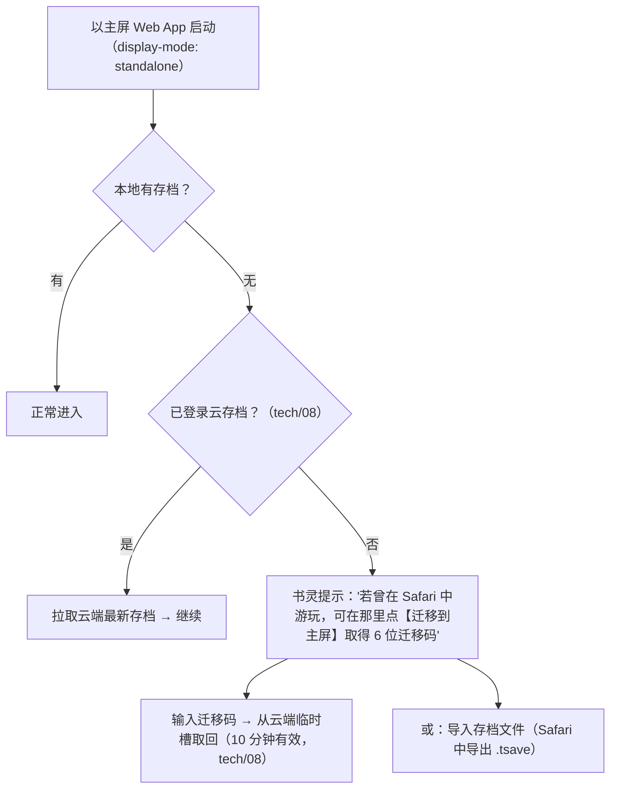

# tech/03 · 手机浏览器性能与适配

| 项 | 内容 |
|---|---|
| 文档 | `docs/tech/03-mobile-performance.md` |
| 版本 | v1.0（2026-09-25） |
| 上游基准 | `docs/00-canon.md` §0（手机浏览器横屏优先 + PC、PWA 可离线、云存档）、§8（斜 45° 等距战棋、就地开战 ≤ 20×20、上场 ≤ 6）、§18（文档归属：性能归 `tech/03`）、§19（技术基线：Three.js WebGL2、Vue 3 DOM 覆盖层、确定性 core 可入 Worker、IndexedDB、PWA、KTX2、按书界分包） |
| 平行文档 | `tech/01`（主循环、`RenderScheduler`、画质档与非功能目标**初值**）、`tech/02`（渲染管线、四档开关、帧/显存/draw call **初值**、活画基准）、`tech/06`（分包、格式、Service Worker、离线下载）、`tech/07`（精灵显存估算）、`design/09`（同屏上限【建议值】、AI 时间预算） |
| 下游文档 | `tech/04`（书界包切分与解析）、`tech/05`（core 性能、Worker 模式）、`tech/08`（云存档、离线同步）、`tech/09`（路线图与性能门禁）、`design/14`（UI 性能契约；撰写本文时尚未成稿） |
| 读者 | 作者本人（单人开发）＋ AI 编码助手 |
| 本文职责 | 目标设备 / 浏览器矩阵；**全部性能预算的终值**（帧率、帧时间、draw call、三角形、显存、JS 堆、DOM、首包、首屏、书界包、存储）；iOS / Android 平台专项；加载、运行时、自适应质量策略；性能测试与 CI 门禁；弱网与离线；性能风险 |
| 本文拥有的契约 | `packages/spec/perf-budgets.json`（§2.9）；`tools/perf/`（基准场景与 CI 门禁，§8.3）；`packages/platform/src/perf/`（帧统计与 HUD，§8.2）；`packages/platform/src/device/`（能力门槛、内存级 `memClass`、帧率模式 `fpsMode`、温控调速器，§1.6、§7） |

> **结论先行（TL;DR）**
>
> 1. **维持 Canon §19 基线，无致命问题。** 2026 年的主流手机浏览器足以运行"3D 高度地形 + 公告板精灵 + DOM UI"的 2.5D 战棋；真正的约束是 **内存上限（尤其 iOS）、持续发热、首次编译/上传卡顿与中文字体体积**，而不是峰值算力。
> 2. **设备矩阵（2026-09 核实）**：iOS 26 占活跃 iPhone 的 86.6%（2026-08 末），iOS 27 于 09-14 发布且仍支持 iPhone 11 起全部机型；Android 16 只占安卓流量 23.6%，碎片化严重；国内华为 Q2 份额 23%、鸿蒙 6 设备 7,000 万台以上（ArkWeb 内核 Chromium M132）→ **鸿蒙 ArkWeb 列为一级目标**。地板机 = Mali-G57 MC2 + 4 GB（`low`，30 fps）；基准机 = Adreno 7xx / Mali-G610·G615 + 8 GB 与 iPhone 13/14（`mid`，60 fps）。
> 3. **预算三维解耦**：画质档 `tier`（GPU 能力，沿用 tech/02 四档）× 内存级 `memClass`（S ≤ 4 GB / M 6–8 GB / L ≥ 12 GB 与桌面）× 帧率模式 `fpsMode`。**有效显存上限 = min(档位上限, 内存级上限)**。
> 4. **帧率终值**：`mid` 起 探索 60 / 战斗演出 60（群战 L/XL 在 `mid` 为 30）/ 等待输入按需渲染 / 画布可见的菜单与对话 ≤ 30 / 全屏菜单停绘；`low` 全程 30。60 fps 判定 = P95 ≤ 16.7 ms 且 P99 ≤ 25 ms；中档主线程自有 JS ≤ 6 ms/帧、GPU ≤ 11 ms/帧。
> 5. **内存终值**：GPU 显存 `low` 96 / `mid` 160 / `high` 256 / `ultra` 512 MB（采纳 tech/02），`memClass S` 封顶 128 MB；JS 堆 S 96 / M 160 / L 256 MB；进程总占用 S ≤ 450 MB、M ≤ 800 MB、L ≤ 1.5 GB。依据：WebKit 源码中 iOS 进程在 min(3 GB, jetsam 上限) 的 **50% / 65%** 处分别进入"节约 / 严格"内存策略；jetsam 上限本身未公开（社区观测约 1.5–3 GB）。
> 6. **首包与首屏**：`index.html` ≤ 14 KB、entry JS ≤ 170 KB gzip、启动字体 ≤ 40 KB、Basis 转码器（**实测 257 KB gzip / 212 KB br**）延迟加载；冷启动到标题画面可交互 ≤ 4 s（Slow 4G、中端安卓），二次启动 ≤ 1.5 s；书界 `enter` 集 ≤ 60 MB。
> 7. **中文字体（本地实测）**：霞鹜文楷 GB 全量 WOFF2 7.8 MB；本仓库文档用字 2,823 个的子集 677 KB（≈ 246 B/字），其中 **229 字（8%）不在 GB2312 一级字表**（丐、逍、鹫、崆峒、袈裟…）。通用 `unicode-range` 切片对对话屏很不划算（模拟：每屏触发 5–15 片、270–450 KB）→ 改为**构建期按书界用字的两文件子集**：`dlg-common` ≤ 260 KB + `dlg-chNN` ≤ 500 KB；题名书法字体只做 ≤ 40 KB 启动子集 + 每书界 ≤ 120 KB；正文与 UI 用系统字体（0 KB）。
> 8. **iOS 专项**：WebGL 跑在共享的 GPU 进程，GPU 进程被杀 = 所有上下文丢失（且存在"反复创建失败后永久失效直到重启浏览器"的缺陷）；iPhone 无元素全屏、不支持 manifest `fullscreen`/`orientation` → 主屏 Web App（iOS 26 起"添加到主屏幕"默认以 Web App 打开）+ 旋转提示；**`<audio>.volume` 在 iOS 恒为 1** → BGM 淡入淡出必须走 WebAudio 增益节点；低电量模式 rAF 封顶 30 fps → 自适应器必须识别"垂直同步封顶"而非误降档；主屏 App 与 Safari **存储隔离** → 首次以主屏打开时经云存档/导出迁移。
> 9. **Android 专项**：GPU 规则表更新（Pixel 10 起 PowerVR 进入中高端、华为 Maleoon、Mali-G1、Adreno 8xx）；由 Chromium 驱动缺陷表推导"安卓安全 GLSL 守则"（每程序 ≤ 12 采样器、禁 MRT + blit、禁循环初始化数组等）；旗舰 GPU 满载 20 轮稳定度仅 **25%–46%** → 以"持续预算"设计：常态 GPU 负载 ≤ 峰值的 50%–65%。
> 10. **加载**：按场景与书界动态 `import()`（Vite 8 / Rolldown `output.codeSplitting`）；iOS 不支持 `<link rel=prefetch>` → 预取一律程序化写入 SW 缓存；全局唯一 `KTX2Loader`，`workerLimit` low 1 / mid 2 / high 3（源码核实：每个 worker 各持一份 wasm 与堆）；**实测 structuredClone 比 JSON.parse 慢 2–5 倍** → 不在 Worker 里解析后回传对象，改为"按区域切小包 + 加载遮罩下解析"。
> 11. **运行时**：10 Hz 固定逻辑步 + 与刷新率解耦的帧节拍器（60/30 封顶，高刷屏跳帧）；热路径零分配；Worker 卸载 AI/构网/压缩/转码；OffscreenCanvas（iOS 17 起支持 WebGL2）**MVP 不用于主渲染**；DOM UI 性能契约 14 条；GPU 资源 dispose 规范 + 泄漏门禁。
> 12. **自适应质量**：静态探测 → GPU/内存规则 → 标题画面活画基准 → 运行时（动态分辨率 0.05 步进、CPU/GPU 瓶颈判别、会话内只降不升、垂直同步封顶识别）→ 温控调速器 T0–T3（移动端没有 Web 温度 API，按"同场景代价漂移"推断）。
> 13. **测试**：自研 HUD（`?perf=1`）+ `window.__tsPerf` 报告接口；CI 用 Playwright 1.63 + CDP（`Performance.getMetrics`、`browser.startTracing`、CPU 4× 降速）跑 6 个确定性基准场景：**计数型指标精确门禁、时间型指标 +10% 报警**；GPU 时间只在真机验证（可选：自托管安卓机 + `connectOverCDP` 夜间跑）。
> 14. **弱网与离线**：PWA 离线范围 = 应用外壳 + 已下载书界 + 存档；断点续传按"内容寻址文件"粒度（单文件 ≤ 8 MB）；Cache API 不接受 206 → 长视频分段；微信内（无 SW、存储易被清）只提供在线模式并引导"在浏览器打开"。

> **基线核查结论**：Canon §19 **无致命问题**，正文按基线展开。以下为调研中发现的非致命问题，已在本文处理，并需同步到相应文档：
>
> | # | 发现（证据） | 影响 | 处理 / 需同步 |
> |---|---|---|---|
> | F1 | `navigator.deviceMemory` 自 Chrome 147 起在安卓只报告 1 / 2 / 4 / 8（MDN BCD 8.1.3） | tech/01 §6.1 的 `deviceMemory ≤ 3` 实际等于 `≤ 2` | §1.6 / §7.2：4 → `memClass S`，8 → M（再按 GPU 区分 L）；请 tech/01 同步 |
> | F2 | iOS Safari 不支持 manifest `display: fullscreen` 与 `orientation`，`screen.orientation.lock()` 也不可用；元素全屏仅 iPad（BCD） | tech/01 R3 的 `display: fullscreen` 对 iPhone 无效 | §3.5：iOS 只用 `standalone` + 旋转遮罩；安卓才用全屏 + 横屏锁 |
> | F3 | iOS `HTMLMediaElement.volume` 可写但恒为 1、设置无效（BCD） | tech/01 §6.7 的 BGM 走 Howler `html5: true`，在 iOS 上无法调音量与交叉淡化 | §3.4：`<audio>` 经 `MediaElementAudioSourceNode` 接 `GainNode`；请 tech/01 同步 |
> | F4 | Chrome 安卓 2026-09 起两周一版（BCD：153 于 09-08、154 于 09-22、155 于 10-06） | 按版本号做兼容判断会迅速过时 | §1.5：只做**能力门槛**，不做版本白名单 |
> | F5 | WebKit 源码：iOS 进程可用内存 = min(物理内存, jetsam `memlimit_active`)，在 min(3 GB, 该值) 的 50% / 65% 进入 Conservative / Strict 策略（`MemoryPressureHandler.cpp`、`AvailableMemory.cpp`） | "只要不超上限就安全"不成立：过 50% 后 WebKit 会主动清缓存（含解码图像），造成二次解码卡顿 | §2.5 按"≤ 上限估计的 50%"定总占用；§3.1 |
> | F6 | Safari 16 起 WebGL 在共享 GPU 进程中运行；WebKit PR #73204：GPU 进程在 GL 上下文反复创建失败时不会重置，WebGL 永久失效直到退出浏览器 | tech/02 §8.8 的恢复流程之外还需要"彻底重启"指引 | §3.3：失败计数 + 引导完全退出浏览器 / 主屏 App |
> | F7 | Chromium `gpu_driver_bug_list.json`：PowerVR 纹理单元限 13、禁用程序二进制缓存；Mali-G 在多附件 FBO 上 `blitFramebuffer` 前强制 `glFinish`；Adreno 空闲后首帧慢、循环初始化变量可崩溃 | tech/02 的着色器与 MSAA 解析需遵守 | §4.2 "安卓安全 GLSL 守则"，请 tech/02 纳入 `materials/CLAUDE.md` |
> | F8 | Pixel 10（Tensor G5）改用 PowerVR DXT-48-1536；华为 Kirin 9020/9030 用 Maleoon 920/935；联发科 9500 为 Mali-G1-Ultra | tech/02 §10.2 GPU 规则表把 `PowerVR` 一律判"低"、且无 Maleoon / Mali-G1 / Adreno 8xx | §4.1 给出更新后的规则；请 tech/02 同步 |
> | F9 | 实测：金庸文本大量使用一级字表外用字；`unicode-range` 切片在对话屏上平均触发 5.5–15 个切片 | tech/06 §5.9 的 cn-font-split 切片方案下载量偏大、首句对话易闪字 | §5.5 改为按书界用字的两文件子集；请 tech/06 同步 |
> | F10 | 鸿蒙 NEXT（HarmonyOS 5/6）只能用 ArkWeb（4.1–5.1 为 M114，6.x 为 M132），未开放 WebGPU | 浏览器矩阵需新增一级目标；Maleoon GPU 需要校准 | §1.4、§4.3 |
> | F11 | 实测 structuredClone 2 MB / 8 MB / 15 MB 对象分别 18 / 82 / 250 ms，而 JSON.parse 同数据 7 / 39 / 46 ms（Node 22，桌面） | tech/01 §3.7 "io.worker 解析书界包后回传"会把成本搬回主线程 | §5.6：Worker 只做解压，主线程在遮罩下解析分片小包；请 tech/01、tech/04 同步 |
> | F12 | design/09 §9.1 群战角色精灵显存估约 160 MB | 等于 `mid` 的**总**显存上限 | §2.4：`mid` 战斗角色精灵峰值 ≤ 105 MB，群像 LOD 强制；请 design/09 同步 |
> | F13 | iOS `requestIdleCallback`、`scheduler.yield`、Long Tasks、LoAF、`performance.memory` 均不可用（BCD） | 空闲调度与内存监测在 iOS 上只能自研近似 | §5.3、§8.2 |
> | F14 | iOS 主屏 Web App 与 Safari 的 IndexedDB / localStorage / SW 互相隔离 | "先在 Safari 玩，再添加到主屏"会"丢档" | §3.8：首次主屏启动走云端或导出码迁移；请 tech/08 同步 |

---

## 目录

- [0. 关键决策一览](#0-关键决策一览)
- [1. 目标设备与浏览器矩阵](#1-目标设备与浏览器矩阵)
- [2. 性能预算（终值）](#2-性能预算终值)
- [3. iOS Safari 专项](#3-ios-safari-专项)
- [4. Android 专项](#4-android-专项)
- [5. 加载策略](#5-加载策略)
- [6. 运行时优化](#6-运行时优化)
- [7. 自适应质量](#7-自适应质量)
- [8. 性能测试](#8-性能测试)
- [9. 网络与离线](#9-网络与离线)
- [10. 性能风险 Top 10 与预案](#10-性能风险-top-10-与预案)
- [11. MVP 与演进路径（性能视角）](#11-mvp-与演进路径性能视角)
- [12. 备选方案](#12-备选方案)
- [参考资料](#参考资料)
- [本文新增术语/约定](#本文新增术语约定)
- [待决事项 / 依赖](#待决事项--依赖)

---

## 0. 关键决策一览

| # | 决策点 | 结论 | 章节 |
|---|---|---|---|
| D1 | 设备支持方式 | **能力门槛**（WebGL2 + 任一压缩纹理 + ES2022 + 模块 Worker + IndexedDB）而非机型/版本白名单；支持分 A（一级，逐版本验证）/ B（二级，冒烟）/ C（尽力而为）三级 | §1.5、§1.6 |
| D2 | 校准基准 | 地板机（`low`）= Mali-G57 MC2 + 4 GB；基准机（`mid`）= Adreno 7xx / Mali-G610·G615 + 8 GB 与 iPhone 13/14；**作者自用设备优先**，终值以其实测校准 | §1.3 |
| D3 | 预算维度 | `tier`（GPU 能力，tech/02 四档）× `memClass`（S/M/L）× `fpsMode`（`auto`/`60`/`30`/`battery`）；有效显存上限 = min(两者) | §2.1、§7.1 |
| D4 | 帧率 | `mid` 起：探索 60、战斗演出 60（`mid` 群战 30）、等待输入 `onDemand`、画布可见的菜单/对话 ≤ 30、全屏菜单停绘；`low` 全程 30 | §2.2 |
| D5 | 帧时间 | 60 fps：P95 ≤ 16.7 ms、P99 ≤ 25 ms；中档主线程自有 JS ≤ 6 ms、主线程总计 ≤ 8.5 ms、GPU ≤ 11 ms | §2.3 |
| D6 | 渲染量 | draw call / 三角形 / 程序数 / 粒子沿用 tech/02；新增每帧上传、过度绘制、同屏单位等上限（定稿 design/09 §9.1 建议值） | §2.4 |
| D7 | 内存 | 显存 96/160/256/512 MB；S 级封顶 128 MB；JS 堆 96/160/256 MB；总占用按"上限估计的 50%"设计 | §2.5 |
| D8 | UI | 常驻 HUD ≤ 300 个 DOM 节点、全局 ≤ 800（警告）/ 1,200（错误）；非事件帧零 DOM 写；只动画 `transform`/`opacity` | §2.6、§6.5 |
| D9 | 包体与首屏 | HTML ≤ 14 KB；entry ≤ 170 KB gzip；启动字体 ≤ 40 KB；冷启动到标题 ≤ 4 s（Slow 4G 中端安卓）；二次启动 ≤ 1.5 s | §2.7 |
| D10 | 字体 | 正文/UI 系统字体；对话字体构建期"两文件"书界子集；题名书法字体启动子集 ≤ 40 KB；不用通用 `unicode-range` 切片 | §5.5 |
| D11 | 数据包 | Worker 只解压/校验，不回传大对象；规则/文本包按区域切片（单片解析 ≤ 16 ms 目标）；游戏进行中主线程单次 `JSON.parse` ≤ 256 KB | §5.6 |
| D12 | Worker | ai / io / mesh（+ 可选 path）+ Basis 转码池；移动端并发 Worker 合计 ≤ 4；不依赖 SharedArrayBuffer | §6.3 |
| D13 | OffscreenCanvas | MVP 不做"渲染线程"；仅在 Phase 3 若主线程成为瓶颈再评估（iOS 17+ 已可行） | §6.4 |
| D14 | 自适应 | 静态探测 + 活画基准 + 动态分辨率 + 会话内只降不升 + 垂直同步封顶识别 + 温控 T0–T3 | §7 |
| D15 | 测试 | 真机手工清单 + 自研 HUD + CI（Playwright/CDP 确定性基准，计数精确门禁、时间 +10% 报警）+ 可选自托管安卓真机夜跑 | §8 |
| D16 | 离线 | 文件级断点续传（内容寻址 ≤ 8 MB）；视频分段；无 SW 环境只做在线模式 | §9 |

---

## 1. 目标设备与浏览器矩阵

### 1.1 设计原则

1. **能力分级，不列白名单**：浏览器版本两周一变（F4），国产内核版本又参差，按版本号判断必然失效。运行时只看能力（§1.6），档位由"静态探测 + 实测"决定（§7.2）。
2. **地板定底线，基准定目标**：`low` 档在地板机上必须"能完整通关、30 fps、不崩溃"；`mid` 档在基准机上达到"探索与战斗 60 fps、10 分钟后仍 ≥ 45 fps"。
3. **作者设备优先**：这是自娱项目，最终用户就是作者本人。表中"代表机型"用于覆盖面与校准，终值以作者自用设备（tech/01 P1）的实测为准。
4. **一次只追一个最坏情况**：iOS 的最坏是**内存**，安卓的最坏是**GPU 碎片化 + 发热**，内置浏览器的最坏是**存储与缓存能力缺失**。三者分别有专项（§3、§4、§9）。

### 1.2 2026 年市场现状（与本项目相关的事实）

| 维度 | 事实（2026-09 核实） | 对本项目的含义 |
|---|---|---|
| iOS 版本 | iOS 26 于 2026-08 末占 86.57%；2026-06 时 iOS 18 占 14%、更早版本 7%；iOS 27（Safari 27，WebKit 625.1.29）于 **2026-09-14** 发布，支持机型与 iOS 26 相同（iPhone 11 / SE 2 起） | 以 iOS 26 为主力验证版本，iOS 27 为当前版本；最低支持 iOS 17（见 §1.5） |
| 新 iPhone | iPhone 17e（2026-03，A19 4 核 GPU，8 GB）；iPhone 18 Pro（2026-09 发布，A20 Pro，12 GB）；Q2 2026 中国单机型销量第一为 iPhone 17 Pro Max | 新机内存充裕，但 4 GB 老机（11 / 12 / 13 / SE 3）仍在服役 |
| Android 版本 | Android 16 仅占安卓页面浏览 23.64%（StatCounter 2026-06），另有 6 个版本各占 ≥ 4% | 不能假设新系统特性；以浏览器能力为准 |
| Chrome 安卓 | 当前 154（2026-09-22），**两周一版** | 功能随时变化，靠 CI 冒烟而不是记版本 |
| 国内份额 | Q2 2026：华为 23%、苹果 18%；华为畅享 90 Pro Max（Kirin 8000 / Mali-G610，8 GB，HarmonyOS 6）为热销中端 | 华为机大量运行**纯血鸿蒙**，浏览器内核为 ArkWeb |
| 鸿蒙 | HarmonyOS 6 设备 2026-07 已超 7,000 万台，目标年底 1 亿；ArkWeb：HarmonyOS 4.1–5.1 为 Chromium M114，6.x 为 M132；WebGPU 未开放 | 鸿蒙浏览器 = "Chromium 132 级 WebGL2 浏览器"，列一级目标 |
| 国内浏览器份额（移动，StatCounter 2026-04） | Chrome 48.97%、Safari 24.56%、Android（系统 WebView/浏览器）8.36%、UC 8.2%、Edge 5.06%、QQ 3.93% | 统计口径偏海外站点，仅作参考；微信内打开的流量不在其中 |
| 旗舰 GPU 持续性能 | 骁龙 8 Elite Gen 5（Adreno 840）3DMark Wild Life Extreme 压力测试稳定度 25%；天玑 9500（Mali-G1-Ultra MC12）45.7% | 旗舰也会在满载 10–20 分钟后降到峰值的 1/4–1/2 → 必须按"持续预算"设计（§4.4） |

### 1.3 设备矩阵

> 显示尺寸为横屏 CSS 像素（宽 × 高）与 DPR；"默认档"是静态探测的初判，最终由活画基准与运行时自适应决定（§7）。

| 档 | 平台 | 代表机型（2023–2026） | SoC / GPU | 内存 | 横屏 CSS × DPR | 系统 / 浏览器 | 默认档 / `memClass` | 用途 |
|---|---|---|---|---|---|---|---|---|
| **地板** | Android | Redmi 15C 5G、Redmi 14C 等千元机 | 天玑 6300 / Helio G99–G100，Mali-G57 MC2；紫光展锐 T606/T615 为 Mali-G57 MP1 | 4 GB（`deviceMemory` 报 4） | 800×360 × 2（720p 面板） | Android 14–16 / Chrome、系统 WebView | `low` / S | 底线验收：低档 30 fps、不崩溃 |
| 低 | iPhone | iPhone 11、iPhone SE 3 | A13 / A15 | 4 GB | 896×414 × 2；667×375 × 2 | iOS 26–27 / Safari、主屏 App | `low`–`mid` / S | iOS 内存底线（最易被 jetsam 杀） |
| 低 | iPhone | iPhone 12、13（含 mini） | A14 / A15 | 4 GB | 844×390 × 3；812×375 × 3 | iOS 26–27 | `mid` / S | GPU 够但内存紧：`mid` 画质 + S 级显存封顶 |
| **基准** | Android | Redmi Note 15 Pro 级、OPPO Reno / vivo S / 荣耀数字系列 | 骁龙 7 Gen 3 / 7s Gen 3 / 7 Gen 4（Adreno 7xx）；天玑 7300 / 7400（Mali-G615 MC2）；天玑 8350 / 8400（Mali-G615 / G720） | 8–12 GB | 约 915×412 × 2.6–3 | Android 15–16 / Chrome、系统 WebView、微信 XWeb | `mid` / M | **性能目标机**：探索与战斗 60 fps |
| 基准 | 鸿蒙 | 华为畅享 90 Pro Max、nova 系列 | Kirin 8000（Mali-G610 MP4） | 8 GB | 约 1,013×468 × 2.72（2756×1272 面板，DPR 以实测为准） | HarmonyOS 6 / 华为浏览器（ArkWeb M132）、鸿蒙版微信 | `mid` / M | 鸿蒙一级目标 |
| 基准 | iPhone | iPhone 14、15、16e、17e | A15 / A16 / A18 / A19（4 核 GPU） | 6–8 GB | 844×390 × 3；852×393 × 3 | iOS 26–27 | `mid`–`high` / M | iOS 性能目标机 |
| 高 | Android | 小米 17、vivo X300 等旗舰 | 骁龙 8 Elite Gen 5（Adreno 840）/ 8 Elite（Adreno 830）；天玑 9500（Mali-G1-Ultra MC12）/ 9400（Immortalis-G925） | 12–16 GB（`deviceMemory` 封顶报 8） | 约 915×412 × 3.5 | Android 16 / Chrome | `high` / L | 高档与发热测试 |
| 高 | 鸿蒙 | Mate 80 系列、Pura 系列 | Kirin 9030（Maleoon 935）/ 9020（Maleoon 920） | 12–16 GB | 以实测为准 | HarmonyOS 6 | `mid`（待校准）/ L | Maleoon 规则校准 |
| 高 | Android | Pixel 10 系列 | Tensor G5（PowerVR DXT-48-1536） | 12–16 GB | 以实测为准 | Android 16 / Chrome | `mid`（驱动风险）/ L | PowerVR 新家族的回归机（可选） |
| 高 | iPhone | iPhone 16 Pro / 17 / 17 Pro / 18 Pro | A18 Pro / A19 / A19 Pro / A20 Pro | 8–12 GB | 874×402 × 3；956×440 × 3 | iOS 26–27 | `high` / M–L | iOS 高档 |
| 平板 | iPadOS | iPad Air（M 系列）、iPad（A16） | M2–M4 / A16 | 8 GB 起 | 1180×820 × 2 等 | iPadOS 26–27 | `high`–`ultra` / L | 大屏布局、元素全屏可用 |
| 桌面 | Win / macOS | 集显笔记本、独显台式、Apple Silicon | Iris Xe / Radeon 780M / RTX / M 系列 | 16 GB 起 | 1280×720 起 × 1–2 | Chrome、Edge、Safari、Firefox | `high`–`ultra` / L | 开发机、极致档 |

- **地板之下**：`deviceMemory ≤ 2` 或无任何压缩纹理格式或 GPU 规则命中黑名单 → 仍允许进入，但固定 `low` + S 级 + 30 fps + 关闭天气粒子，并在设置页提示"设备低于建议配置"。
- **作者自用设备登记**（Phase 0 填写，写入 `tools/perf/devices.yaml`）：机型、SoC、内存、系统与浏览器版本、屏幕、常用网络、是否常用微信打开。所有档位阈值（§7.2 GPU 规则、§2 预算）先以此校准。

### 1.4 浏览器矩阵

| 环境 | 内核（2026-09） | WebGL2 | WebGPU | Service Worker / 安装 | 存储持久性 | 全屏 / 横屏锁 | 主要注意事项 | 级别 |
|---|---|---|---|---|---|---|---|---|
| iOS Safari 26–27 | WebKit（Safari 27 = 625.1.29） | ✓（15+） | ✓（26+，本项目默认不用，tech/02 §9） | ✓；安装 = 分享 → 添加到主屏幕（iOS 26 起默认"作为 Web App 打开"） | 非主屏站点 7 天无交互会被清；`persist()` 15.2+ 可调用，是否批准由浏览器决定 | iPhone 无元素全屏、无方向锁 | GPU 进程内存、`volume` 恒 1、低电量 rAF 30 fps、iOS 26 视口变化 | **A** |
| iOS 主屏 Web App | 同上（独立实例） | ✓ | ✓ | ✓（独立 SW） | 豁免 7 天规则；配额与浏览器相同（单源约磁盘 60%）；**与 Safari 存储隔离** | `standalone`（无地址栏）；仍无方向锁 | **推荐的 iPhone 游玩形态**；首次启动迁移存档（§3.8） | **A** |
| iOS 第三方浏览器（Chrome、Edge 等） | WebKit（WKWebView） | ✓ | 同 WebKit（待核实） | 可添加到主屏（16.4+）；SW 行为（待核实） | 同 WebKit 策略（嵌入式应用配额约 15%，MDN） | 同上 | 视为 Safari 子集 | B |
| iOS 微信 / QQ 内置 | WebKit（WKWebView） | ✓ | （待核实） | **无 SW**（BCD：`webview_ios` 不支持）；Cache API 可用 | 易被清（社区报告数天到两周）；配额约磁盘 15% | 无 | 只提供在线模式；引导"在 Safari 中打开" | C |
| Android Chrome | Blink 154（两周一版） | ✓ | ✓（121+，Android 12+，Adreno / Mali；PowerVR、Xclipse 有限） | ✓；可安装（WebAPK） | 单源约磁盘 60%；安装 / 常用站点的 `persist()` 通常静默批准 | Fullscreen API ✓；`screen.orientation.lock()` ✓（需先全屏）；manifest `fullscreen` + `landscape` ✓ | GPU 碎片化、发热、rAF 多为 60 Hz | **A** |
| 鸿蒙 NEXT 华为浏览器 / 鸿蒙版微信 | ArkWeb（HarmonyOS 4.1–5.1：M114；6.x：M132） | ✓ | ✗（未开放） | （待核实） | （待核实） | （待核实） | Maleoon GPU 需校准；调试链路（待核实） | **A** |
| Samsung Internet 30 | Blink 143 | ✓ | ✓（25+） | ✓ | 同 Chromium | ✓ | 与 Chrome 同类 | B |
| 华为（安卓 / 鸿蒙 4.x）、小米、vivo、OPPO、荣耀自带浏览器 | 各自 Chromium 分支，版本参差（待逐机核实） | ✓ | 多数 ✗ | 多数 ✓ | "清理加速"类功能可能清除 | 视厂商 | UA 改写、注入脚本、广告拦截误伤 | B |
| 安卓微信内置 | XWeb（Chromium 系；现网约 138、开发版 142，经搜索摘要） | ✓ | （待核实） | 可能可用（待核实），运行时检测 | 易被清（社区报告 2–14 天） | 受微信界面限制 | 调试需 `debugxweb.qq.com/?inspector=true` | C |
| UC / 夸克 / QQ 浏览器 | U4 等 Chromium 分支 | ✓（多数） | ✗ | 视版本 | 视版本 | 视版本 | 内核改动多，问题难复现 | C |
| Firefox Android 156 | Gecko | ✓ | ✗ | ✓ | 尽力模式 min(10% 磁盘, 10 GiB) | ✓ | 无 `KHR_parallel_shader_compile`、无 `WEBGL_multi_draw`（BCD） | C |
| 桌面 Chrome / Edge / Safari / Firefox | — | ✓ | Chrome/Edge ✓、Safari 26+ ✓、Firefox 部分 | ✓ | 充裕 | ✓ | 开发主力 | A（Chrome、Safari）/ B（Firefox） |

**级别含义**：A = 每次发布前按 §8.4 全量真机清单回归；B = 每个书界发布前冒烟（启动 → 探索 → 战斗 → 存读档）；C = 不承诺，出问题只记录并引导到 A 级环境。

### 1.5 最低能力与版本基线

| 类别 | 要求 | 不满足时 |
|---|---|---|
| **硬门槛** | WebGL2 上下文；至少一种压缩纹理（WebGL2 核心 ETC2，或 `WEBGL_compressed_texture_astc`）；ES2022 语法（构建目标 `es2022`，tech/01）；模块 Worker（iOS 15 起）；IndexedDB | 友好提示页：更换浏览器 / 在系统浏览器打开（tech/01 §6.1） |
| **推荐基线** | iOS / iPadOS 17 起（OffscreenCanvas WebGL2、`storage.estimate()`、`size-adjust`、Safari 17 存储策略）；Chromium 114 起（覆盖鸿蒙 ArkWeb M114） | 可玩；对应特性走降级分支 |
| **主力验证** | iOS 26、iOS 27；Chrome 当前稳定版；ArkWeb M132 | — |

**软能力与降级**（全部运行时特性检测，不看 UA 版本）：

| 能力 | 支持情况（BCD 8.1.3，iOS / Chrome 安卓） | 缺失时的降级 |
|---|---|---|
| Service Worker | iOS 11.3 / 40；iOS WKWebView ✗ | 在线模式（tech/06 §8.5） |
| `KHR_parallel_shader_compile` | 14.5 / 76；Firefox ✗ | 加载遮罩内同步编译，预热时间上浮 |
| `EXT_color_buffer_half_float` | 14 / 63 | 禁止 `high` 及以上（tech/02 §10.2） |
| `WEBGL_multi_draw` | 15 / 86；Firefox ✗ | 不用 `BatchedMesh`（tech/02 F2） |
| OffscreenCanvas（2D / WebGL2） | 16.4 / 17；69 | 词条图集在主线程烘焙（§6.4） |
| `navigator.storage.estimate()` | 17 / 61 | 按保守值（每书界 400 MB）判断空间 |
| `navigator.storage.persist()` | 15.2 / 55 | 仅依赖云存档 |
| Web Locks（防多开） | 15.4 / 69 | `BroadcastChannel` 心跳互斥 |
| `CompressionStream` | 16.4 / 80 | `fflate`（已在 entry） |
| `requestIdleCallback` / `scheduler.yield` | ✗ / 47；✗ / 129 | `setTimeout` 切片 + `MessageChannel` 让步（§5.3） |
| Screen Wake Lock | 18.4（含主屏 App）/ 84 | 不防熄屏（仅过场视频需要） |
| `navigator.audioSession` | 16.4 / ✗ | 仅 iOS 使用 |
| Event Timing / LoAF / Long Tasks | 26.2 / 76；✗ / 123；✗ / 58 | HUD 以自测帧时间代替（§8.2） |
| `performance.memory` / `measureUserAgentSpecificMemory` | ✗ / 18（弃用）；✗ / 89（需跨源隔离） | 自有内存账本估算（§2.5） |

### 1.6 能力探测与门槛（`packages/platform/src/device/capabilities.ts`）

```ts
// 启动时运行一次（< 50 ms），结果写入 DeviceProfile 并参与缓存指纹（tech/02 §10.2）
export interface CapabilityReport {
  webgl2: boolean;
  compressed: ReadonlyArray<'astc' | 'etc2' | 'bptc' | 's3tc'>;
  maxTextureSize: number;
  maxSamples: number;
  halfFloatRT: boolean;          // EXT_color_buffer_half_float
  parallelCompile: boolean;      // KHR_parallel_shader_compile
  multiDraw: boolean;            // WEBGL_multi_draw
  gpuRenderer: string | null;    // WEBGL_debug_renderer_info；iOS 恒为 "Apple GPU"
  serviceWorker: boolean;
  offscreenWebgl2: boolean;
  deviceMemoryGB: 1 | 2 | 4 | 8 | null;   // Chromium 147+ 安卓只报 1/2/4/8（F1）；Safari 为 null
  cores: number;                 // iOS 被钳制为 4 或 8（BCD），仅作参考
  env: { ios: boolean; ipad: boolean; android: boolean; harmony: boolean;
         wechat: boolean; standalone: boolean; inAppWebView: boolean };
  screen: { cssW: number; cssH: number; dpr: number };
}

export type GateResult =
  | { kind: 'ok' }
  | { kind: 'degraded'; reasons: string[] }          // 可玩，强制 low / 在线模式等
  | { kind: 'unsupported'; reason: 'no-webgl2' | 'no-compressed-texture' | 'no-indexeddb' };

export function gate(c: CapabilityReport, hasIndexedDb: boolean): GateResult {
  if (!c.webgl2) return { kind: 'unsupported', reason: 'no-webgl2' };
  if (!hasIndexedDb) return { kind: 'unsupported', reason: 'no-indexeddb' };
  if (c.compressed.length === 0) return { kind: 'unsupported', reason: 'no-compressed-texture' };
  const reasons: string[] = [];
  if (!c.serviceWorker) reasons.push('online-only');              // iOS 内置浏览器等
  if (c.deviceMemoryGB !== null && c.deviceMemoryGB <= 2) reasons.push('below-floor-memory');
  if (!c.halfFloatRT) reasons.push('cap-tier-mid');
  if (c.env.wechat) reasons.push('in-app-browser');
  return reasons.length ? { kind: 'degraded', reasons } : { kind: 'ok' };
}
```

- `harmony` 判定：UA 含 `OpenHarmony` / `ArkWeb`（以真机 UA 为准，待核实），同时视为 Chromium 系。
- `inAppWebView`：UA 含 `MicroMessenger`、`QQ/`、`AlipayClient` 等，或 iOS 上 `navigator.serviceWorker` 不存在而 Cache API 存在。
- 探测结果不上报任何服务器（个人项目，无遥测）；仅在 HUD 与"设置 → 关于本机"中展示，便于作者排查。

---

## 2. 性能预算（终值）

> 本节数值是**终值**，覆盖 tech/01 §1.2、§6.1 与 tech/02 §8.2、§8.7、§10.1 中标注"初值、终值归 tech/03"的项；与之相同者直接采纳并注明来源。机器可读版本见 §2.9 的 `perf-budgets.json`，HUD、CI、素材管线与内容校验器都读取它，**文档与 JSON 不一致时以 JSON 为准并回改文档**。

### 2.1 度量口径与三个维度

| 术语 | 定义 |
|---|---|
| 帧间隔 `intervalMs` | 相邻两次**实际渲染**的 rAF 时间戳之差（跳过的 rAF 不计） |
| 帧工作量 `workMs` | 本帧主循环内自有代码耗时（`performance.now()` 包住 `GameLoop.frame` 主体）；不含浏览器样式/合成与 GPU |
| P95 / P99 | 以 60 s 窗口统计的分位数；验收取 3 次运行的中位数 |
| 长帧 | `intervalMs > 50 ms`；**卡顿** = `intervalMs > 2 × 目标帧时` |
| 场景键 `sceneKey` | `title`、`explore.move`、`explore.idle`、`battle.anim`、`battle.mass`、`battle.input`、`dialogue`、`menu.overlay`（画布可见）、`menu.full`（画布被全屏遮挡）、`bookSleep`、`cutscene` |

| 维度 | 取值 | 决定什么 | 谁来定 |
|---|---|---|---|
| 画质档 `tier` | `low` / `mid` / `high` / `ultra` | 着色器变体、后处理、阴影、粒子、分辨率上限（tech/02 §10.1） | GPU 规则 + 活画基准 + 运行时降档（§7.2） |
| 内存级 `memClass` | `S`（≤ 4 GB）/ `M`（6–8 GB）/ `L`（≥ 12 GB 或桌面） | 显存 / JS 堆 / 解码图像上限、LRU 容量、Basis worker 数、精灵 ppm 包上限 | 安卓 `deviceMemory` + GPU 等级；iOS 屏幕机型族（§7.2） |
| 帧率模式 `fpsMode` | `auto` / `60` / `30` / `battery` | 目标帧率与按需渲染激进程度 | 设置页 + 自动识别（低电量、温控，§7.5–7.6） |

`memClass` 对 `tier` 的封顶：S → 最高 `mid`；M → 最高 `high`；L → 不封顶。

### 2.2 帧率目标（按场景 × 档位）

| 场景键 | `low` | `mid` | `high` | `ultra` | 渲染模式（tech/01 `RenderScheduler`） |
|---|---|---|---|---|---|
| `title`（活画） | 30 | 30（基准测试的 4 s 内不封顶） | 30 | 60 | `throttled` |
| `explore.move`（角色/相机移动） | 30 | **60** | 60 | 60（桌面可 120） | `continuous` |
| `explore.idle`（只有环境动画） | 20 | 30 | 30 | 30 | `throttled` |
| `battle.anim`（S/M 规模，≤ 20 单位） | 30 | **60** | 60 | 60 | `continuous` |
| `battle.mass`（L/XL 群战） | 30 | **30** | 60 | 60 | `continuous` |
| `battle.input`（等待玩家指令） | 按需 | 按需 | 按需 | 按需 | `onDemand`：拖动、预览、镜头时临时 60（`low` 30），静止 0 |
| `dialogue` | 20 | 30 | 30 | 30 | `throttled`（背景仅环境动画） |
| `menu.overlay`（半屏菜单、背包，画布可见） | 按需 | ≤ 30 | ≤ 30 | ≤ 30 | `throttled` 或 `onDemand` |
| `menu.full`（全屏菜单、图鉴） | 0 | 0 | 0 | 0 | 不提交 GPU 命令（tech/02 §8.1） |
| `bookSleep` / `cutscene` | 视频自身帧率 | 同左 | 同左 | 同左 | 画布停绘或降到 10 fps 背景 |

**验收判定**：

| 目标帧率 | P95 `intervalMs` | P99 `intervalMs` | 长帧（> 50 ms） | 10 分钟持续 |
|---|---|---|---|---|
| 60 | ≤ 16.7 ms | ≤ 25 ms | 游戏进行中 ≤ 1 次 / 分钟；遮罩转场内不计 | 平均 ≥ 45 fps（tech/02 P2 标准） |
| 30 | ≤ 33.4 ms | ≤ 50 ms | 同上 | 平均 ≥ 27 fps |

| 交互 | 预算 |
|---|---|
| 点按 → 可见反馈（高亮、按钮态） | P95 ≤ 100 ms（同 INP"良好"线） |
| 预览查询（可达格、伤害预测浮窗） | 主线程单次 ≤ 8 ms（design/09 §10.4），超出转 Worker 异步刷新 |
| 输入锁解除（表现队列播完）→ 可操作 | ≤ 1 帧 |

> 与上游的差异：tech/01 §1.2 写"战斗 ≥ 30 fps 稳定"、design/09 §9.1 建议 `mid` 战斗 30 fps。本文改为 **`mid` 普通/精英/Boss 战目标 60、保底 30；只有 L/XL 群战在 `mid` 以 30 为目标**——理由：战斗演出是观感核心，且"等待输入按需渲染"使战斗的平均功耗低于探索；群战单位数翻倍，`mid` 维持 30 更稳。

### 2.3 帧时间分解

**`mid` · 60 fps（16.7 ms）**

| 线程 / 阶段 | 预算（P95） | 峰值允许 | 说明 |
|---|---|---|---|
| 输入 + ActionMap | 0.3 ms | 1 ms | tech/01 §6.5 |
| `core.tick()`（10 Hz，平摊） | 0.5 ms | 2 ms（tick 帧） | tech/01 §6.2；超出即考虑 core Worker 模式 B |
| 表现队列 + tween + 动画采样 | 0.8 ms | 2 ms | tech/01 §6.3 |
| 渲染 CPU（剔除、实例写入、uniform、约 100 次提交） | 3.5 ms | 5 ms | tech/02 §8.2 |
| UI 投影 + Vue patch | 1.0 ms | 3 ms（仅事件帧） | §6.5；非事件帧为 0 |
| **自有 JS 小计（`workMs`）** | **≤ 6.0 ms** | 10 ms | HUD 与 CI 的主指标 |
| 浏览器（样式、布局、合成、GC 平摊） | ≤ 2.5 ms | — | GC 单次暂停 ≤ 4 ms、≤ 1 次/秒（§6.2） |
| **主线程合计** | **≤ 8.5 ms** | — | 余 ≥ 8 ms 给调度抖动、Worker 消息、降频 |
| GPU | ≤ 11 ms | — | tech/02 §8.2 分项；余 ~5 ms 给发热降频 |

**`low` · 30 fps（33.3 ms）**：自有 JS ≤ 10 ms、主线程合计 ≤ 14 ms、GPU ≤ 22 ms（低端 CPU 单核约为基准机的 1/2–1/3，故自有 JS 预算只放宽到 1.7 倍）。

**`high` · 60 fps**：自有 JS ≤ 6 ms（CPU 更快，但阴影、光池、粒子更多）、GPU ≤ 12 ms（按"持续预算"，峰值不超过 GPU 能力的 65%，§4.4）。

**Worker 预算（不占帧，但决定"等多久"）**

| Worker | 任务 | 预算（基准机） | `low` 倍率 |
|---|---|---|---|
| `ai.worker` | 每次决策 `ai_basic` 5 / `ai_adept` 15 / `ai_expert` 40 / `ai_master` 80 ms（design/09 §8.1） | 超 2 倍取当前最优 | × 2（仍被演出遮盖） |
| `mesh.worker` | 32×32 chunk 构网 | ≤ 8 ms/chunk（桌面实测 1.1–1.6 ms × 手机 3–5 倍，tech/02 §2.2） | × 2 |
| `io.worker` | 存档压缩 + SHA-256（≤ 1 MB） | ≤ 60 ms | × 2 |
| Basis 转码池 | 2048² 页 UASTC → ASTC / ETC1S → ETC2 | ≤ 40 ms/页（待实测，Phase 0 P5） | × 2 |

### 2.4 渲染量与同屏上限

**渲染量**（draw call、三角形沿用 tech/02 §8.2；其余为本文新增）：

| 项 | `low` | `mid` | `high` | `ultra` |
|---|---|---|---|---|
| draw call 目标（上限） | 60（80） | 100（150） | 150（180） | 250（300） |
| 三角形 / 帧 | ≤ 100k | ≤ 200k | ≤ 300k | ≤ 600k |
| 着色器程序（本档全部变体） | ≤ 24（tech/02 §8.5） | ≤ 24 | ≤ 24 | ≤ 24 |
| 单程序采样器数 | ≤ 12（PowerVR 纹理单元限 13，F7） | ≤ 12 | ≤ 12 | ≤ 16 |
| 平均过度绘制（像素着色次数 / 屏幕像素） | ≤ 2.0 | ≤ 2.5 | ≤ 3.0 | ≤ 3.5 |
| 特效峰值过度绘制（F4 绝招期间） | ≤ 3.0 | ≤ 4.0 | ≤ 5.0 | ≤ 6.0 |
| 每帧 GPU 上传（游戏进行中） | ≤ 1 个 chunk 网格 + ≤ 1 张 2048² 页（≤ 4 MB） | ≤ 2 chunk + ≤ 1 页 | ≤ 2 chunk + ≤ 2 页 | 不限 |
| 全屏渲染目标（按屏幕像素计的张数） | 0（直绘画布） | ≤ 3 | ≤ 5 | ≤ 8 |

**同屏上限**（定稿 design/09 §9.1 建议值；内容校验以 `mid` 为准，`low` 由运行时合并战阵或转入预备队）：

| 项 | `low` | `mid` | `high` | `ultra` |
|---|---|---|---|---|
| 战场活动单位（战阵计 1） | 16 | 24 | 30 | 30 |
| 同屏人形身形 | 32 | 48 | 64 | 96 |
| 不同角色精灵图集（种类） | 8 | 10 | 12 | 16 |
| 同时播放的招式特效 | 3 | 6 | 8 | 12 |
| 同屏飘字 | 8 | 12 | 16 | 24 |
| 活跃粒子（tech/02 §10.1） | 400 | 1,200 | 3,000 | 6,000 |
| 动态点光（tech/02 §10.1） | 0 | 2 | 4 | 8 |
| 探索可见 NPC | 24 | 48 | 80 | 120 |
| **战斗角色精灵显存峰值** | ≤ 40 MB | **≤ 105 MB** | ≤ 170 MB | ≤ 300 MB |

- `mid` 的 105 MB = 160 MB 总上限 − 非精灵项（地形 2 + 建筑/物件 24 + 特效 12 + RT 12 + 叠加层 3 ≈ 53 MB，tech/02 §8.7）。群战超出时由 `GpuBudget` 强制远处与次要单位使用"群像 LOD"精灵（design/09 §9.1），**design/09 估算的群战约 160 MB 需下调**（F12）。
- `memClass S` 设备在 `mid` 画质下，战斗角色精灵峰值再压到 ≤ 80 MB（优先让队友之外的单位降到 64 ppm 包）。

### 2.5 内存预算

**为什么按"上限估计的一半"设计**：iOS 上 WebKit 把进程可用内存取为 min(物理内存, jetsam `memlimit_active`)，并在 min(3 GB, 该值) 的 **50%** 处进入 Conservative（异步释放缓存）、**65%** 处进入 Strict（同步释放，含解码图像与字形缓存）策略（WebKit 源码，F5）；超过 jetsam 上限则进程被杀、页面重载。jetsam 上限 Apple 不公开，社区观测 iPhone 12 Pro 约 1.5 GB、iPhone 15 Pro 约 3 GB，老机更低（经搜索摘要）。Safari 16 起 WebGL 在**所有标签页共享的 GPU 进程**中执行（§3.1），显存同样受 jetsam 约束。安卓 Chrome 在 8 GB 以下设备为 32 位进程，V8 堆上限远低于物理内存（8 GB 设备观测约 500–600 MB，经搜索摘要）。

| 项（稳态 / 峰值口径） | `memClass S`（≤ 4 GB） | `M`（6–8 GB） | `L`（≥ 12 GB / 桌面） | 度量方式 |
|---|---|---|---|---|
| GPU 显存上限 | min(档位上限, **128 MB**) | min(档位上限, 256 MB) | 档位上限（≤ 512 MB） | `GpuBudget` 账本（tech/02 §8.7） |
| JS 堆（GC 后稳态） | ≤ 96 MB | ≤ 160 MB | ≤ 256 MB | Chromium `performance.memory`；iOS 用 Web 检查器 Memory 时间线 |
| 　其中：书界规则 + 文本解析后 | ≤ 24 MB | ≤ 40 MB | ≤ 40 MB | 加载后快照差值 |
| 　其中：core `GameState` | ≤ 8 MB | ≤ 8 MB | ≤ 8 MB | `serialize()` 字节数 × 2 估算 |
| 解码图像（DOM 立绘、CG、图标、大地图瓦片） | ≤ 32 MB | ≤ 64 MB | ≤ 128 MB | 自有账本：宽 × 高 × 4 B（1024×1536 立绘 = 6.3 MB） |
| WebAudio 解码 PCM | ≤ 16 MB | ≤ 24 MB | ≤ 48 MB | 自有账本（60 s 单声道音效 bank ≈ 11.5 MB，tech/06 §5.7） |
| Wasm 堆（Basis 转码池，瞬时） | 1 worker，≤ 32 MB | 2 workers，≤ 64 MB | 3 workers，≤ 96 MB | 每 worker 持独立 wasm 实例（three r186 源码） |
| CPU 侧纹理 / 网格副本（上传后应释放） | ≤ 16 MB | ≤ 32 MB | ≤ 64 MB | tech/02 §8.7 规则 |
| **进程总占用目标（估算）** | **≤ 450 MB** | **≤ 800 MB** | **≤ 1.5 GB** | Safari 检查器 / Xcode Instruments；安卓 `chrome://memory-internals`（待核实）或 `adb shell dumpsys meminfo` |

- **解码图像**是 iOS 上最容易被忽视的大户：一张 1920×1080 CG 解码后 8.3 MB，对话同时挂两张立绘 + 一张 CG 就是 21 MB。规则见 §6.5 R-UI-7。
- **"内存级别 × 画质档"组合示例**：iPhone 13（A15，4 GB）→ `mid` 画质但显存封顶 128 MB，精灵走 96 ppm 包、Boss 战中远处杂兵降到 64 ppm；iPhone 17 Pro（12 GB）→ `high` 画质、显存 256 MB。

### 2.6 DOM 与 UI 预算（与 design/14 对接）

| 指标 | 预算 | 说明 |
|---|---|---|
| 常驻 HUD（探索 / 战斗）DOM 节点 | ≤ 300 | 世界锚定 UI（血条、飘字、名牌）走 WebGL 叠加层（tech/02 §6.6），不进 DOM |
| 任一时刻 DOM 节点总数 | ≤ 800 警告 / ≤ 1,200 错误 | Lighthouse 以 800 / 1,400 为警告 / 失败线；我们更严，因为画布与 DOM 共享主线程 |
| 单个父节点的子元素 | ≤ 60 | 超出必须虚拟列表（背包、图鉴、日志） |
| DOM 深度 | ≤ 24 | Lighthouse 以 32 为失败线 |
| 合成层（`will-change`、`transform: translateZ`、视频、画布） | ≤ 24 | Safari 检查器 Layers 面板核对 |
| Vue 组件实例（常驻） | ≤ 150 | 菜单关闭即卸载，除非在 `KeepAlive` 白名单（≤ 3 个重型面板） |
| 非事件帧的 DOM 写入 | **0** | UI 只在事件批与 10 Hz 投影更新时变化（tech/01 §3.5） |
| 事件帧 Vue patch | ≤ 1 ms P95、≤ 3 ms 峰值 | §2.3 |
| 同时处于解码状态的大图（立绘、CG） | ≤ 3 张 | 其余 `src` 置空释放 |
| 首个对话框出现前的字体就绪等待 | ≤ 300 ms | 超时先用系统字体，下一页再切换（§5.5） |

### 2.7 首包、首屏与加载时间

**首包体积**

| 资源 | 预算 | 依据 / 实测 |
|---|---|---|
| `index.html`（内联关键 CSS + 水墨闪屏 SVG） | ≤ 14 KB（br） | 约等于首个拥塞窗口（10 × 1,460 B），一次往返即可画出闪屏 |
| entry JS（Vue、Pinia、core、platform、UI 骨架、标题画面） | ≤ 170 KB gzip（约 150 KB br） | tech/01 §5.4 |
| render chunk（three + render，WebGL 路线） | ≤ 180 KB gzip | tech/02 实测同等功能 156 KB |
| 场景 chunk（`world-ui`、`battle-ui`、`codex`、`book-sleep`、`settings` 等） | 各 ≤ 60 KB gzip | §5.2 |
| 书界专属代码 chunk（`ch/NN`） | ≤ 30 KB gzip | 只放"本书界特色系统"（Canon §17.10），其余皆数据 |
| 启动 CSS | ≤ 25 KB gzip | 其余样式随场景 chunk |
| 启动字体（题名书法子集，不含 ASCII） | ≤ 40 KB | 实测 77 字：马善政楷书 44.7 KB（含 ASCII）、志莽行书 34.6 KB；去掉 ASCII 约省 11 KB（§5.5） |
| Basis 转码器（wasm + js） | 257 KB gzip / 212 KB br（**实测**） | 延迟加载、SW 预缓存（§5.4） |
| `core` 素材包 | ≤ 1.5 MB（其中标题关键路径 ≤ 200 KB） | tech/06 §4.1 |

**时间预算**（网络基准：Lighthouse / DevTools "Slow 4G" = 150 ms RTT、1.6 Mbps 下行；CPU 基准：中端安卓）

| 里程碑 | 冷启动（无缓存） | 二次启动（SW 已缓存） | 说明 |
|---|---|---|---|
| 闪屏可见（FCP） | ≤ 1.0 s | ≤ 0.3 s | 纯 HTML/CSS，无 JS |
| 标题画面可交互 | ≤ 4.0 s | ≤ 1.5 s | 关键路径 ≈ 14 KB + 150 KB + 25 KB + 40 KB + 标题背景 ≤ 150 KB ≈ 380 KB，Slow 4G 约 2.3 s 传输 + 0.6 s 解析执行 |
| "继续"→ 可操作（书界已缓存） | — | 中端 ≤ 5 s / 低端 ≤ 8 s | 数据包解析（分片）+ 纹理读取转码 + 预热（tech/02 §8.6）+ 首屏 3×3 chunk |
| "继续"→ 可操作（需下载 `enter` 集） | 视网速（进度条） | — | 60 MB @ 50 Mbps ≈ 10 s |
| 区域切换 | 已预取 ≤ 2 s；未预取（Wi-Fi）≤ 5 s | 同左 | tech/01 L2 预取 |
| 就地开战（加载战斗页组与特效） | ≤ 0.8 s | ≤ 0.8 s | 被"拔刀亮相"演出遮盖（tech/02 §2.6） |
| 书眠（切换书界） | ≤ 10 s（Wi-Fi，含过场遮盖） | — | tech/01 §1.2、tech/06 §4.5 |
| 画质档切换 | ≤ 1 s | ≤ 1 s | 墨染遮罩下重编译（tech/02 §8.6） |

### 2.8 书界包下载与本地存储

| 项 | `low` | `mid` | `high` | 来源 / 说明 |
|---|---|---|---|---|
| 书界 `enter` 集（`base` + 开局区域块） | ≤ 36 MB | **≤ 60 MB（error）** | ≤ 80 MB | tech/06 §4.6 |
| 区域块 | 典型 12 / 上限 15 MB | 典型 20 / 上限 25 MB | 典型 25 / 上限 32 MB | 同上 |
| 书界总量（不含 `media`） | ≈ 150 MB | ≤ 350 MB（warning）/ 400 MB（error） | ≈ 330 MB | tech/06 §2.5、§4.4 |
| 规则 + 文本数据包（压缩后） | ≤ 1.5 MB | ≤ 1.5 MB | ≤ 1.5 MB | tech/01 §5.4；单片 ≤ 300 KB 原始 JSON（§5.6） |
| 单个素材文件 | ≤ 8 MB | ≤ 8 MB | ≤ 8 MB | 断点续传粒度（§9.3）；视频以 ≤ 4 MB 分段 |
| 常驻（`core` + `common`，当前档） | ≤ 100 MB | ≤ 150 MB | ≤ 200 MB | tech/06 §4.1 |
| 平时本地占用（常驻 + 当前书界） | ≤ 260 MB | ≤ 500 MB | ≤ 550 MB | 设置页"存储"显示 |
| 书眠期间峰值（+ 下一书界） | ≤ 420 MB | ≤ 900 MB | ≤ 1 GB | 新书界首次自动存档后回收旧包（tech/06 §8.3） |
| 存档 | 每份 ≤ 1 MB（压缩后），每槽保留 3 份 | 同 | 同 | tech/01 §6.9 |
| 预取前可用空间 | ≥ 2 × `enter` 集 | 同 | 同 | tech/06 §4.5 |

### 2.9 机器可读预算：`packages/spec/perf-budgets.json`

```jsonc
// packages/spec/perf-budgets.json —— 本文拥有；HUD 着色、CI 门禁、tech/06 budgets.yaml、content:validate（同屏上限）共同读取
{
  "version": 1,
  "fps": {                       // 场景键 → 各档目标帧率；0 = 停绘；"demand" = onDemand
    "explore.move": { "low": 30, "mid": 60, "high": 60, "ultra": 60 },
    "explore.idle": { "low": 20, "mid": 30, "high": 30, "ultra": 30 },
    "battle.anim":  { "low": 30, "mid": 60, "high": 60, "ultra": 60 },
    "battle.mass":  { "low": 30, "mid": 30, "high": 60, "ultra": 60 },
    "battle.input": { "low": "demand", "mid": "demand", "high": "demand", "ultra": "demand" },
    "dialogue":     { "low": 20, "mid": 30, "high": 30, "ultra": 30 },
    "menu.overlay": { "low": "demand", "mid": 30, "high": 30, "ultra": 30 },
    "menu.full":    { "low": 0, "mid": 0, "high": 0, "ultra": 0 }
  },
  "frame": {                     // ms；p95/p99 针对 intervalMs，workP95 针对自有 JS
    "60": { "p95": 16.7, "p99": 25, "workP95": 6.0, "mainP95": 8.5, "gpu": 11 },
    "30": { "p95": 33.4, "p99": 50, "workP95": 10.0, "mainP95": 14, "gpu": 22 },
    "longFrameMs": 50, "longFramesPerMin": 1
  },
  "render": {
    "drawCalls":  { "low": [60, 80], "mid": [100, 150], "high": [150, 180], "ultra": [250, 300] },
    "triangles":  { "low": 100000, "mid": 200000, "high": 300000, "ultra": 600000 },
    "programs": 24, "samplersPerProgram": { "low": 12, "mid": 12, "high": 12, "ultra": 16 },
    "overdrawAvg": { "low": 2.0, "mid": 2.5, "high": 3.0, "ultra": 3.5 }
  },
  "onScreen": {
    "units":   { "low": 16, "mid": 24, "high": 30, "ultra": 30 },
    "figures": { "low": 32, "mid": 48, "high": 64, "ultra": 96 },
    "sheets":  { "low": 8,  "mid": 10, "high": 12, "ultra": 16 },
    "vfx":     { "low": 3,  "mid": 6,  "high": 8,  "ultra": 12 },
    "floatText": { "low": 8, "mid": 12, "high": 16, "ultra": 24 },
    "exploreNpc": { "low": 24, "mid": 48, "high": 80, "ultra": 120 }
  },
  "memoryMB": {
    "gpuByTier":     { "low": 96, "mid": 160, "high": 256, "ultra": 512 },
    "gpuByMemClass": { "S": 128, "M": 256, "L": 512 },
    "battleSprites": { "low": 40, "mid": 105, "high": 170, "ultra": 300 },
    "jsHeap":        { "S": 96, "M": 160, "L": 256 },
    "decodedImages": { "S": 32, "M": 64, "L": 128 },
    "audioPcm":      { "S": 16, "M": 24, "L": 48 },
    "processTotal":  { "S": 450, "M": 800, "L": 1536 }
  },
  "dom": { "hudNodes": 300, "totalWarn": 800, "totalError": 1200, "childrenPerParent": 60, "depth": 24, "layers": 24 },
  "bundleKB": { "html": 14, "entryGz": 170, "renderGz": 180, "sceneChunkGz": 60, "chapterChunkGz": 30, "bootCssGz": 25, "bootFont": 40 },
  "loadMs": { "titleColdSlow4g": 4000, "titleWarm": 1500, "continueCachedMid": 5000, "continueCachedLow": 8000,
              "regionPrefetched": 2000, "regionWifi": 5000, "battleEnter": 800, "bookSleepWifi": 10000 },
  "storageMB": { "enter": { "low": 36, "mid": 60, "high": 80 }, "chapterTotal": 350, "fileMax": 8, "steadyTotal": 500, "bookSleepPeak": 900 }
}
```

---

## 3. iOS Safari 专项

> 适用于 iOS / iPadOS 上的一切浏览器（第三方浏览器与 App 内置浏览器都使用 WebKit）。欧盟以外的地区不存在其他引擎。

### 3.1 进程模型与内存上限

```text
┌──────────── Safari / 主屏 Web App（UI 进程）────────────┐
│  标签页 A ─┐                                              │
│  标签页 B ─┼─► WebContent 进程（每页一个）：JS 堆、DOM、样式、解码图像缓存、Wasm 堆、Worker
│            │        │  jetsam 上限 memlimit_active（Apple 未公开）→ 超限：该页被杀并自动重载
│            │        ▼
│            └─► GPU 进程（全部标签页共享，Safari 16 起承担 WebGL 与页面绘制）
│                     │  WebGL 纹理/缓冲/RT、Canvas 2D 位图
│                     │  超限或崩溃 → 所有标签页的 WebGL 上下文同时丢失
│                Networking 进程：HTTP 缓存、Cache Storage、IndexedDB（落盘）
└──────────────────────────────────────────────────────────┘
```

| 机制 | 事实 | 设计含义 |
|---|---|---|
| WebKit 内存策略（源码） | 可用内存 = min(物理内存, jetsam `memlimit_active`)；基线 = min(3 GB, 可用内存)；占用 ≥ 基线 × 50% → Conservative（异步释放缓存），≥ 65% → Strict（同步释放，含解码图像、字形缓存、JIT 代码）；轮询周期 30 s | 超过 50% 后画面会因"重新解码"出现卡顿——**总占用按 50% 线设计**（§2.5） |
| jetsam 上限 | Apple 未公开；社区观测 iPhone 12 Pro 约 1.5 GB、iPhone 15 Pro 约 3 GB，旧设备 300–450 MB 级（经搜索摘要） | S 级设备按 ≤ 450 MB 总占用设计 |
| GPU 进程 | WebGL 与页面绘制在共享 GPU 进程（Safari 16 起默认）；多标签同时跑 WebGL 会互相挤占 | 检测到多开（Web Locks，§6.3）即提示关闭其他标签；游戏只用一个上下文（tech/02 §8.8） |
| Canvas 内存上限 | 控制台警告 "Total canvas memory use exceeds the maximum limit"（iOS 15 报告为 384 MB）；Safari 会延迟回收未引用的 canvas | 不临时创建大 canvas；词条烘焙复用同一块并在用完后把宽高设为 0 |
| 页面被杀的表现 | 页面自动重载，顶部提示"此网页已重新载入，因为出现了问题"；反复发生则显示错误页 | 高频自动存档（tech/01 §6.9）；重载后显示"已从 xx:xx 的自动存档恢复" |

### 3.2 iOS 崩溃规避清单

| # | 规则 | 理由 | 落点 |
|---|---|---|---|
| I1 | 全应用**一个** WebGL 上下文、一个画布；截图/缩略图用离屏 RT | GPU 进程共享、上下文数量与内存都受限 | tech/02 §8.8 |
| I2 | 纹理一律 KTX2（ASTC/ETC2），**禁止**把 PNG/WebP 当 WebGL 纹理上传（UI 小图除外） | RGBA8 的显存是 ASTC 4×4 的 4 倍 | tech/06 §5.2 |
| I3 | 纹理上传后释放 CPU 副本；上下文恢复时从 Cache Storage 重读 | 省下与显存等量的 WebContent 内存 | tech/02 §8.7 |
| I4 | `KTX2Loader.setWorkerLimit(memClass === 'S' ? 1 : 2)`；全局只建一个 loader | 每个 worker 持独立 wasm 堆（源码核实） | §5.4 |
| I5 | DOM 大图：显示前 `await img.decode()`，离场即 `img.src = ''` 并移出 DOM；同时解码 ≤ 3 张；`URL.revokeObjectURL()` 用完即调 | 解码位图计入 WebContent；Strict 策略下会被清再重解码 | §6.5 R-UI-7 |
| I6 | BGM 用 `<audio>` 流式；只有音效 bank 与环境声解码为 PCM | 3 分钟立体声解码 ≈ 66 MB | tech/01 §6.7 |
| I7 | 大 JSON 分片（单片 ≤ 300 KB 原始），不在主线程一次解析数 MB | 解析时字符串 + 对象图双倍驻留 | §5.6 |
| I8 | 不使用 `canvas.toDataURL()` / `toBlob()` 生成大图（存档缩略图 ≤ 256×144） | 编码缓冲瞬时占用 | tech/01 §6.9 |
| I9 | 设置页"清理缓存"与自动 GC 只清素材，不清存档 | Cache Storage 与 IndexedDB 分离管理 | tech/06 §8.3 |
| I10 | 每次书眠切书界后执行一次"深度释放"：卸载旧书界所有 `AssetScope`、`renderer.renderLists.dispose()`、终止空闲 Worker | 书界之间不应有任何残留 | §6.6 |
| I11 | 页面隐藏超过 30 s 回来时，检查上下文与音频，必要时走恢复流程而不是假设一切仍在 | 后台期间可能已被系统回收 GPU 资源 | §3.3、§3.7 |

### 3.3 WebGL 上下文丢失（在 tech/02 §8.8 恢复流程之上的 iOS 补充）

已知诱因：切到后台再回来（WebKit Bug 261331，iPadOS 17 回归）、GPU 进程内存超限、系统级图形压力；另有"GPU 进程存活但 GL 后端无法再创建上下文，WebGL 在重新加载后仍然坏掉，直到退出浏览器"的缺陷（WebKit PR #73204 修复中）。

```ts
// packages/render/src/core/context-watchdog.ts —— 与 tech/02 的 RenderHost 恢复流程配合
export class ContextWatchdog {
  private lost = 0;
  private restoreTimer: number | undefined;
  constructor(private canvas: HTMLCanvasElement, private h: {
    onLost(): void; onRestored(): void;
    onRecreate(): boolean;          // 新建 canvas + 新 WebGLRenderer；成功返回 true
    onFatal(kind: 'restart-browser' | 'reload'): void;
  }) {
    canvas.addEventListener('webglcontextlost', (e) => {
      e.preventDefault();                                    // 允许浏览器稍后恢复
      this.lost++;
      this.h.onLost();                                       // 暂停渲染、立即自动存档
      this.restoreTimer = self.setTimeout(() => this.escalate(), 5_000);
    }, false);
    canvas.addEventListener('webglcontextrestored', () => {
      clearTimeout(this.restoreTimer);
      this.h.onRestored();                                   // 重建 RT、重传纹理、重建 chunk、预热
    }, false);
  }
  private escalate(): void {
    // 5 s 内未恢复：尝试整体重建一次（新 canvas 规避旧上下文的状态残留）
    if (this.h.onRecreate()) return;
    // getContext('webgl2') 返回 null：多半是 GPU 进程无法再建上下文（PR #73204 类问题）
    this.h.onFatal(this.lost >= 3 ? 'restart-browser' : 'reload');
  }
}
```

| 结局 | 用户看到的提示（书灵口吻） | 动作 |
|---|---|---|
| 自动恢复（多数情况） | "画卷重展中……" | 1–3 s 后继续 |
| `reload` | "墨迹未干，请重新展卷。" + 按钮 | 从最近自动存档重载页面 |
| `restart-browser` | "画卷受损：请从多任务界面**完全关闭** Safari（或主屏上的本游戏）后重新打开。" | 存档已写入；给出图示说明 |

- 统计：本机本周上下文丢失次数写入 HUD 与本地日志（不上报）；同一设备一周内 ≥ 3 次 → 下次启动默认降一档并缩小显存上限 25%。
- 测试：开发指令 `gpu lose` / `gpu restore`（`WEBGL_lose_context`，iOS 8 起支持），以及真机"切后台 10 次"手工项（§8.4）。

### 3.4 音频：解锁、会话与音量

| 事实（BCD / 社区） | 对策 |
|---|---|
| `AudioContext` 必须在用户手势中 `resume()` 才能出声 | 首个 `pointerup` **与** `touchend`（二者都监听，先到先用）中创建/恢复上下文，并播放 1 帧静音缓冲 |
| `navigator.audioSession`（iOS 16.4 起）决定是否受静音键影响 | 默认 `type = 'ambient'`（尊重静音键）；设置"静音模式下仍播放"改为 `'playback'`，须在创建 `AudioContext` **之前**设置（tech/01 §6.7） |
| **`HTMLMediaElement.volume` 在 iOS 上恒为 1、设置无效** | BGM `<audio>` 经 `createMediaElementSource()` 接入 `GainNode`，淡入淡出与音量滑块都作用在增益节点上（F3） |
| 来电、切后台后 `AudioContext.state` 变为 iOS 特有的 `'interrupted'`，有时在手势中 `resume()` 也不立即生效 | 监听 `statechange`；非 `running` 时重新挂上"下一次手势解锁"；**不要** `await ctx.resume()` 之后才开始播放，而是先发起播放再并行恢复 |
| 页面隐藏时音频会被系统打断 | `visibilitychange → hidden`：暂停 BGM、`ctx.suspend()`；回到前台等待下一次手势 |

```ts
// packages/platform/src/audio/unlock.ts（示意）
export function armAudioUnlock(getCtx: () => AudioContext): void {
  const once = () => {
    const ctx = getCtx();
    if (ctx.state !== 'running') void ctx.resume().catch(() => {});   // 不等待
    const b = ctx.createBuffer(1, 1, ctx.sampleRate);                  // 1 帧静音，完成 iOS 解锁
    const s = ctx.createBufferSource(); s.buffer = b; s.connect(ctx.destination); s.start(0);
    if (ctx.state === 'running') {
      removeEventListener('pointerup', once, true); removeEventListener('touchend', once, true);
    }
  };
  addEventListener('pointerup', once, true);
  addEventListener('touchend', once, true);
}

export function attachBgm(ctx: AudioContext, el: HTMLAudioElement): GainNode {
  el.crossOrigin = 'anonymous'; el.setAttribute('playsinline', '');   // 同源也保留，避免 CORS 污染导致静音
  const g = ctx.createGain();
  ctx.createMediaElementSource(el).connect(g).connect(ctx.destination);
  return g;                                                          // 淡入：g.gain.setTargetAtTime(1, t, 0.4)
}
```

> 待实测：iOS 上 `MediaElementAudioSourceNode` + 增益的交叉淡化在后台恢复后的稳定性（§8.4 A 类清单）；若不稳，退化为"iOS 上 BGM 硬切换 + 0.3 s 静音间隔"。

### 3.5 全屏、横屏与主屏 Web App

| 平台 | 能力（BCD / 厂商） | 方案 |
|---|---|---|
| iPhone Safari | 无元素全屏（仅 iPad 支持且有不可隐藏的退出按钮）；不支持 manifest `display: fullscreen` 与 `orientation`；不支持 `screen.orientation.lock()` | **推荐"添加到主屏幕"**：iOS 26 起默认以 Web App（无地址栏）打开；竖屏时显示旋转提示遮罩；Safari 标签页内也可玩，但可视高度更小（§3.6） |
| iPad | `requestFullscreen()` 16.4 起可用（下滑即退出） | 可选进入全屏；横竖屏都做布局 |
| Android Chrome / 鸿蒙 / 国产浏览器 | Fullscreen API ✓；全屏后 `screen.orientation.lock('landscape')` ✓；安装后 manifest `fullscreen` + `landscape` ✓ | 点"开始游戏"的手势内：`requestFullscreen({ navigationUI: 'hide' })` → `orientation.lock('landscape')`；失败静默 |
| 微信 / App 内置 | 受宿主界面控制 | 旋转提示 + "在浏览器打开"引导 |

```jsonc
// apps/game/public/manifest.webmanifest（节选；vite-plugin-pwa 生成）
{
  "name": "金庸群侠传·天书录", "short_name": "天书录",
  "display": "standalone",                 // iOS 只认 standalone（BCD：iOS 不支持 fullscreen 取值）
  "display_override": ["fullscreen", "standalone"],   // Chromium 系按此优先使用 fullscreen；iOS 忽略
  "orientation": "landscape",              // 安卓生效；iOS 忽略（仍需旋转遮罩）
  "background_color": "#F3EEE2", "theme_color": "#F3EEE2",
  "start_url": "/?src=pwa", "scope": "/"
}
```

- iOS 26 起，任意站点"添加到主屏幕"默认以 Web App 打开，manifest 的 `display` 在 iOS 上只有 `standalone` 生效；`apple-touch-icon` 仍需提供（tech/01 §4.3 的 `@vite-pwa/assets-generator` 生成）。
- 旋转遮罩纯 CSS：`@media (orientation: portrait) and (max-width: 600px) { #rotate-hint { display: flex } }`，并暂停游戏循环（`RenderScheduler` 停绘，节省电量）。

### 3.6 视口：`100vh`、`dvh`、安全区与 iOS 26 "液态玻璃"

| 现象 | 说明 | 对策 |
|---|---|---|
| `100vh` ≠ 可见高度 | Safari 标签页中工具栏展开/收起会改变可见高度；iOS 26 起工具栏悬浮、`vh` 与 `window.outerHeight` 的关系也变了（经搜索摘要） | 根容器 `position: fixed; inset: 0; height: 100dvh`（`dvh` iOS 15.4 起）；不在任何地方用 `vh` 计算布局 |
| 底部浮动工具栏遮挡 | iOS 26 普通标签页里 `env(safe-area-inset-bottom)` 不覆盖悬浮工具栏；Safari 26.1 修复了一个"视口尺寸固定容器底部留缝"的问题 | Safari 标签页模式下可点控件避开底部 44 px；**主屏 Web App 模式无此问题**（推荐） |
| 刘海 / 灵动岛（横屏在左右） | 横屏时左右安全区约数十 CSS px | 画布铺满（`viewport-fit=cover`）；HUD 容器用 `env(safe-area-inset-*)` 内缩 |
| 双击 / 捏合缩放 | iOS 10 起忽略 `user-scalable=no` | 画布 `touch-action: none`；`gesturestart` 调 `preventDefault()`（tech/01 §6.5）；可滚动面板 `touch-action: pan-y` |
| 工具栏收放动画期间连续 resize | 每次 `setSize` 都会重分配绘制缓冲与 RT | 画布 CSS 尺寸跟随容器；**绘制缓冲在尺寸稳定 120 ms 后才更新**，且变化 < 2 px 忽略 |

```html
<meta name="viewport" content="width=device-width, initial-scale=1, viewport-fit=cover">
<style>
  html, body { margin: 0; height: 100%; overflow: hidden; overscroll-behavior: none; background: #F3EEE2; }
  #app   { position: fixed; inset: 0; height: 100dvh; }
  #stage { position: absolute; inset: 0; width: 100%; height: 100%; touch-action: none; }   /* WebGL 画布，铺满 */
  #hud   { position: absolute; inset: 0; pointer-events: none;
           padding: env(safe-area-inset-top) env(safe-area-inset-right) env(safe-area-inset-bottom) env(safe-area-inset-left); }
  #hud .hit { pointer-events: auto; min-width: 44px; min-height: 44px; }                    /* 只有可点元素接收事件 */
</style>
```

```ts
// packages/platform/src/device/viewport.ts —— 防抖更新绘制缓冲
export function watchViewport(el: HTMLElement, apply: (w: number, h: number) => void): () => void {
  let t = 0, lastW = 0, lastH = 0;
  const ro = new ResizeObserver(([e]) => {
    const { width: w, height: h } = e!.contentRect;
    clearTimeout(t);
    t = self.setTimeout(() => {
      if (Math.abs(w - lastW) < 2 && Math.abs(h - lastH) < 2) return;
      lastW = w; lastH = h; apply(w, h);           // → renderer.setSize(w, h, false) + RT 重建（tech/02 InkPost.setSize）
    }, 120);
  });
  ro.observe(el);
  return () => { ro.disconnect(); clearTimeout(t); };
}
```

### 3.7 后台、节流与生命周期

| 事实 | 设计 |
|---|---|
| 页面隐藏后 rAF 停止、计时器很快被挂起、音频被打断，长时间后台可能被回收（再次打开即重载） | `visibilitychange → hidden`：停循环、停音频、**立即自动存档**（tech/01 §6.9）；`pagehide` 再存一次（iOS 上 `visibilitychange` 在导航离开时的触发历史上不可靠，BCD 注释） |
| `freeze` / `resume` 事件仅 Chromium 支持 | 只作为补充，不作为唯一存档触发 |
| 低电量模式下 rAF 被限制为 30 fps | 自适应器识别"垂直同步封顶"后切 `fpsMode = 30`，**不降画质档**（§7.5） |
| Safari 默认把页面渲染限制在约 60 fps（高刷机需用户在"实验功能"里关闭"Prefer Page Rendering Updates near 60fps"） | 帧节拍器与刷新率解耦，最高只追 60（`ultra` 桌面除外，§6.1） |
| 往返缓存（bfcache） | 不注册 `unload` 监听；`pageshow` 且 `event.persisted` 时走"回到前台"流程（检查上下文、恢复音频解锁） |
| 回到前台 | 先检查 `gl.isContextLost()`（tech/02 §8.8），再恢复循环；音频等下一次手势；距离上次在前台 > 30 分钟则提示"是否与云端同步" |

```ts
// packages/platform/src/lifecycle/lifecycle.ts（示意）
export function installLifecycle(h: { pause(): void; resume(): void; save(reason: string): Promise<void> }): void {
  let hiddenAt = 0;
  document.addEventListener('visibilitychange', () => {
    if (document.visibilityState === 'hidden') { hiddenAt = performance.now(); h.pause(); void h.save('hidden'); }
    else { h.resume(); if (performance.now() - hiddenAt > 30_000) dispatchEvent(new CustomEvent('ts:long-background')); }
  });
  addEventListener('pagehide', () => { void h.save('pagehide'); });
  addEventListener('pageshow', (e) => { if (e.persisted) h.resume(); });
  document.addEventListener('freeze', () => { void h.save('freeze'); });     // 仅 Chromium
}
```

### 3.8 存储：配额、清理与持久化

| 环境 | 配额（单源） | 清理规则 | 持久化 | 策略 |
|---|---|---|---|---|
| Safari 标签页 | 约磁盘 60%（浏览器总计 80%，Safari 17 起） | **7 天内未在该站交互**则清除脚本写入的全部存储（IndexedDB、Cache Storage、SW） | `persist()` 15.2 起可调用；被授予后不参与配额驱逐 | 首次离线下载前请求 `persist()`；引导添加到主屏 |
| 主屏 Web App | 同浏览器 | **豁免 7 天规则**；系统空间不足时仍可能清理 | 同上 | **推荐形态**；启动时做完整性检查 |
| 嵌入 WebKit 的 App（微信、QQ、第三方浏览器） | 约磁盘 15%（MDN） | 宿主可自行清理；微信社区报告数天至两周丢失 localStorage | 通常无效 | 只在线；存档以云端为权威；醒目的"导出存档"入口 |
| 安卓 Chrome / 鸿蒙 / 国产浏览器 | 约磁盘 60%（Chromium） | 存储压力下按 LRU 驱逐非持久站点 | 已安装 / 高互动站点通常静默批准；WebView 不支持（无站点互动度） | 安装 PWA 后请求 `persist()` |

**主屏与 Safari 存储隔离（F14）的迁移流程**：



**启动完整性检查**（与 tech/06 §8.3、§8.5 配合）：对比 Dexie `packs` 登记与 Cache Storage 实际内容 → 不一致的块标记 `partial`；存档表为空而 `localStorage` 中的"曾有存档"标记存在 → 判定为被系统清除，直接进入云端恢复流程并提示原因。

### 3.9 纹理格式：KTX2 / ASTC / ETC2 在 iOS 上

| 事实（BCD / 源码 / tech/06） | 结论 |
|---|---|
| `WEBGL_compressed_texture_astc` iOS 12 起；ETC2 属 WebGL2 核心（`WEBGL_compressed_texture_etc` iOS 13.4 起）；BPTC iOS 16 起、S3TC 标注 iOS 8 起 | 所有 WebGL2 iPhone 都至少有 ASTC 与 ETC2 |
| three r186 `KTX2Loader`：UASTC → ASTC 优先；ETC1S → ETC2 优先（tech/06 §5.2 源码核实） | iPhone 上精灵/法线/UI（UASTC）落到 ASTC 4×4（8 bpp）；地表/建筑（ETC1S）落到 ETC2（不透明 4 bpp） |
| iPhone 不支持 `OES_texture_float_linear`（仅 iPadOS） | 可过滤的 HDR RT 只用半精度（tech/02 F5） |
| Apple GPU 最大纹理边长远大于 2048 | 仍按 2048² 页上限（tech/06 §5.5：转码峰值、上传卡顿、LRU 粒度） |
| 转码在 Worker 的 wasm 中进行，输出块数据由主线程 `compressedTexImage2D` 上传 | 上传计入主线程：游戏进行中每帧 ≤ 1 页（§2.4） |

---

## 4. Android 专项

### 4.1 GPU 碎片化：家族、已知问题与初判规则

证据来源：Chromium `gpu/config/gpu_driver_bug_list.json`（2026-09 主干，86 条安卓条目）与 `software_rendering_list.json`（仅 Adreno 3xx + Android < 9 禁用 WebGL2）。Chrome 已在 GPU 进程内对这些问题打了补丁（workaround），但补丁往往意味着**额外开销或功能关闭**，我们的着色器与渲染路径应主动绕开。

| 家族 | 典型 SoC / 机型 | 已知问题（`gpu_driver_bug_list` 条目号） | 对本项目的影响 | 初判档 |
|---|---|---|---|---|
| **Adreno**（高通） | 骁龙 4/6/7/8 系；Adreno 6xx–8xx | #49 从空闲状态的首次绘制慢（Chrome 先"唤醒 GPU"）；#246 用循环初始化变量可致崩溃；#290 UBO `bindBufferRange` 尺寸需 4 对齐；#365 上下文丢失后恢复常失败（Chrome 直接重启 GPU 进程）；#476 使不完整 FBO 失效会崩溃；#280 多重采样渲染到纹理后 `readPixels` 异常 | `onDemand` 后的第一帧可能长；着色器避免循环初始化数组；不读回像素 | 5xx/60x–61x 低；62x–72x 中；73x 起、8xx 高 |
| **Mali**（Arm） | 天玑 / Helio / 展锐 / Kirin 8000 / Exynos 旧款：G57、G610、G615、G710、G720、G1 | #2 持续上传大量缓冲数据慢（改用客户端数组）；#493 多颜色附件的 FBO 在 `blitFramebuffer` 前强制 `glFinish`；#499 blit 区域越界需修正；`mediump` 为 FP16（10 位尾数），大世界坐标/UV 抖动 | 每帧大块实例缓冲更新要"部分更新 + 双缓冲"；**不用 MRT**；世界坐标、UV 一律 `highp`（tech/02 R02-10） | G5x、G71/72、T 系低；G68、G76–78、G61x 中；G71x–G72x、G1、Immortalis 高 |
| **PowerVR**（Imagination） | 旧低端 Rogue GE8xxx（Helio G35/G37）；BXM；**Pixel 10 的 DXT-48-1536** | #299 GE8 上下文丢失恢复常失败；#491 纹理单元限 13；#496 程序二进制缓存冲突 → **禁用程序缓存**（每次启动都冷编译）；#483 ASTC 需重置 base level；#485 限制输出 varying 数；#487 纹理数组层数增加后需重新挂到 FBO；Pixel 10 驱动首年问题多（WebGPU 仍有设备专属补丁，2026-06） | 每程序 ≤ 12 采样器；varying ≤ 12 个 vec4；纹理数组一次分配不扩容；PowerVR 上预热时间按冷编译估 | Rogue/BXM 低；DXT 中（驱动风险，交给基准） |
| **Xclipse**（三星，AMD RDNA） | Exynos 1480（Xclipse 530）、2400/2500（940/950） | WebGPU 尚未开放（tech/02 §9.1）；WebGL 走 ANGLE（待核实具体问题） | 只走 WebGL2 | 5xx 中；9xx 高 |
| **Maleoon**（华为） | Kirin 9000S/9010（910）、9020（920）、9030（935） | 公开资料缺失；运行在鸿蒙 ArkWeb 下（待核实驱动行为） | 纳入 A 级设备回归；先保守 | 中（待校准） |

**更新后的 GPU 初判规则**（交 tech/02 §10.2 替换原表；正则匹配 `UNMASKED_RENDERER_WEBGL`，自上而下先命中者生效；阈值为初始假设，由作者设备与 §7.2 活画基准校准）：

```ts
// packages/render/src/quality/gpu-rules.ts（建议替换稿）
export const GPU_RULES: ReadonlyArray<readonly [RegExp, QualityTier | 'benchmark']> = [
  [/SwiftShader|llvmpipe|Software/i,                    'low'],
  [/Adreno \(TM\) (3\d\d|4\d\d|5\d\d|60\d|61\d)\b/,      'low'],
  [/Adreno \(TM\) (6[2-9]\d|7[0-2]\d)\b/,                'mid'],
  [/Adreno \(TM\) (7[3-9]\d|8\d\d)\b/,                   'high'],
  [/Mali-T|Mali-G(5\d|7[12])\b/,                         'low'],   // G51/G52/G57/G71/G72
  [/Mali-G(68|7[6-8])\b|Mali-G6[1-9]\d/,                 'mid'],   // G68/G76–G78、G610/G615
  [/Mali-G7[1-9]\d|Mali-G1\b|Mali-G1-|Immortalis/,       'high'],  // G710/G715/G720、G1 系、Immortalis
  [/PowerVR Rogue|PowerVR B-Series|BXM/i,                'low'],
  [/PowerVR (D-Series|DXT)|Imagination.*DXT/i,           'mid'],   // Pixel 10 起
  [/Maleoon/i,                                           'mid'],   // 华为自研，待校准
  [/Xclipse 5\d\d/,                                      'mid'],
  [/Xclipse 9\d\d/,                                      'high'],
  [/Apple GPU/,                                          'benchmark'], // iOS：见 §7.2 机型族规则
  [/NVIDIA|GeForce|RTX|Radeon|AMD|Intel.*(Arc|Iris Xe)|Apple M\d/i, 'high'],   // 桌面：由基准决定是否 ultra
  [/Intel.*UHD|Intel.*HD Graphics/i,                     'mid'],
];
```

（`Mali-G71/G72` 是 2016–2017 年旧核，`Mali-G710/G715/G720` 是 2022 年后的旗舰核，正则必须区分位数——沿用 tech/02 的提醒。）

### 4.2 "安卓安全 GLSL"守则（适用于 tech/02 的 8 个着色器模块）

| # | 规则 | 依据 | 如何检查 |
|---|---|---|---|
| G1 | 世界坐标、UV、深度重建用 `highp`；只有颜色运算可用 `mediump` | Mali FP16 精度（tech/02 R02-10） | 着色器快照测试中 grep `precision` 声明 |
| G2 | 每个程序采样器 ≤ 12（`ultra` ≤ 16） | PowerVR 纹理单元被限制为 13（#491） | CI 编译后查询 `getActiveUniform` 统计采样器 |
| G3 | 输出 varying ≤ 12 个 vec4 | PowerVR 限制输出 varying（#485） | 着色器快照测试解析顶点着色器的 `out` 声明并计数 |
| G4 | 不用循环初始化数组/结构，不对 swizzle 后的向量做动态下标 | Adreno #246、安卓 #320 | 自定义 ESLint 式 GLSL 规则（正则） |
| G5 | 不使用多渲染目标（MRT）后接 `blitFramebuffer`；MSAA 解析用单附件 RT | Mali #493 强制 `glFinish` | 代码审查 + tech/02 `InkPost` 约束 |
| G6 | 不对不完整 FBO 调用 `invalidateFramebuffer` | 高通 #476 | 渲染层封装统一调用点 |
| G7 | 纹理数组一次性分配层数，不扩容 | PowerVR #487 | `TerrainSystem` 分配时断言 |
| G8 | 每帧大缓冲更新用 `bufferSubData` 局部范围 + 双缓冲轮换，不整块重建 | Arm #2、Imagination #1（流式上传慢） | `SpriteBatch.end()` 的 `addUpdateRange`（tech/02 §11.3） |
| G9 | 不读回像素（`readPixels`）做游戏逻辑；拾取走 CPU 射线（tech/01 §6.6） | Adreno #280 | 代码审查 |
| G10 | 变体总数 ≤ 24，全部在加载遮罩中预热；不依赖驱动程序缓存 | PowerVR/Vivante 禁用程序缓存（#496、#251） | tech/02 §8.6 预热清单 |
| G11 | 着色器成本预算：主要片元着色器在 Mali Offline Compiler 中估算周期，`terrain`/`sprite` 片元 ≤ 基准值 | Arm Performance Studio（免费）提供离线编译器 | Phase 1 引入手动检查，Phase 3 视需要进 CI |

### 4.3 WebView 与 App 内置浏览器差异

| 维度 | Chrome（Play 更新） | 系统 WebView（国产 ROM 由厂商更新） | 微信 XWeb | 鸿蒙 ArkWeb（华为浏览器 / 鸿蒙微信） | UC / QQ / 夸克 |
|---|---|---|---|---|---|
| 内核版本 | 154，两周一版 | 厂商节奏，可能落后数十个版本（待逐机核实） | 现网约 138、开发版 142（经搜索摘要） | M114（4.1–5.1）/ M132（6.x） | 各自分支 |
| Service Worker / 离线 | ✓ | ✓（宿主 App 决定） | 可能可用（待核实）→ 运行时检测 | （待核实） | 视版本 |
| 安装到桌面 / 全屏 | ✓ | ✗（宿主决定） | ✗ | （待核实） | 部分 |
| `persist()` 持久化 | 安装或高互动时批准 | ✗（WebView 无站点互动度） | ✗ | （待核实） | ✗ |
| Background Fetch | ✓（Chrome 74+） | ✗（BCD） | ✗ | ✗ | ✗ |
| 存储被清风险 | 低 | 中（"清理加速"） | 高（社区报告 2–14 天） | 中（待核实） | 中–高 |
| 视频内联 | 标准 | 标准 | 需 `playsinline`，旧 X5 需 `x5-playsinline` 等私有属性（tech/06 §5.8 已加） | 标准 | 部分需私有属性 |
| 远程调试 | `chrome://inspect` | `chrome://inspect`（需宿主开启 WebView 调试） | 微信内打开 `http://debugxweb.qq.com/?inspector=true` 后 `chrome://inspect` | DevEco / hdc 端口转发（待核实） | 各自工具或 vConsole |

**策略**：不对任何内核做 UA 特判，只做能力检测（§1.6）；检测到 App 内置环境时显示一次性提示条："在浏览器中打开可离线游玩、存档更安全"，并确保云存档开启。

### 4.4 发热降频与持续性能

| 事实 | 数据 / 来源 |
|---|---|
| 旗舰 GPU 满载会在 10–20 分钟内掉到峰值的 1/4–1/2 | 骁龙 8 Elite Gen 5（Adreno 840）3DMark Wild Life Extreme 20 轮稳定度 25%；天玑 9500 为 45.7%（经搜索摘要） |
| 没有移动端 Web 温度 API | Compute Pressure（`PressureObserver`）仅桌面 Chrome 125+（BCD）；Battery Status 不含温度 |
| 刷新率 | Android 15 默认让游戏跑 60 Hz；Chrome 在 120 Hz 屏上 rAF 多为 60（部分 Chromium 变体可到 120，经搜索摘要）；Chrome 省电模式会降低刷新率 |

设计原则（"持续预算"）：

1. **常态负载只用峰值的 50%–65%**：GPU 帧预算 11 ms / 16.7 ms ≈ 66%（`mid`），并以 10 分钟后 ≥ 45 fps 为验收线（§2.2）。
2. **战斗中大部分时间在等玩家**：design/09 §10.6 的普通战时间模型中，我方每次行动"思考 4 s + 演出 1.5 s"，整场约一半时间处于 `battle.input`——`onDemand` 让 GPU 在这段时间几乎空闲，这是战棋品类在手机上最大的功耗红利，必须保证**等待输入时画面真的不在刷新**（仅水面、云影等环境动画走 `throttled`，且 `low` 档关闭）。
3. **封顶 60**：即使 rAF 以 90/120 Hz 回调，也只在 60 Hz 节拍上渲染（§6.1）；`ultra` 桌面才允许解锁。
4. **温控调速器**：按"同场景代价漂移"推断升温并逐级降载（§7.6）。
5. **CPU 同样发热**：不写轮询计时器；空闲 Worker 终止；网络下载在战斗中暂停（tech/06 §8.3）。

### 4.5 内存与进程被杀

| 事实 | 对策 |
|---|---|
| Chrome 安卓 64 位版只在 ≥ 8 GB 内存且 Android 10+ 的设备上启用，其余为 32 位进程；8 GB 设备的 V8 堆上限观测约 500–600 MB（经搜索摘要） | JS 堆预算远低于此（S 96 / M 160 MB），不做大 Wasm 堆 |
| `deviceMemory` 只报 1/2/4/8（Chrome 147 起，F1） | 4 → `memClass S`；8 → M，高端 GPU 规则再升 L |
| 后台标签被低内存杀手回收，回来即重载 | 同 iOS：隐藏即存档，重载后提示已恢复 |
| 渲染进程 OOM → "喔唷，崩溃啦"页面 | 同一会话 OOM 后下次启动自动降一档、显存上限 −25%（与 §3.3 共用计数） |

---

## 5. 加载策略

### 5.1 启动关键路径与首屏骨架

```mermaid
gantt
  title 冷启动关键路径（Slow 4G：150 ms RTT、1.6 Mbps；中端安卓）
  dateFormat x
  axisFormat %S.%L s
  section 网络
  TLS 握手 + index.html 14 KB         :a1, 0, 600
  entry.js 150 KB br（modulepreload）  :a2, 600, 1350
  启动 CSS + 题名字体 40 KB（preload）  :a3, 600, 1000
  标题背景 WebP ≤ 150 KB              :a4, 1000, 1750
  render chunk（标题出现后预取）        :a5, 2700, 3500
  section 主线程
  闪屏（纯 HTML/CSS）可见              :b1, 600, 700
  解析执行 entry                       :b2, 1950, 2300
  设备探测 + 打开 IndexedDB + 挂载 Vue   :b3, 2300, 2600
  标题画面可交互（≈ 2.7 s，预算 4 s）     :milestone, m1, 2700, 2700
```



**`index.html` 骨架**（≤ 14 KB，零 JS 即可显示）：

```html
<!doctype html><html lang="zh-Hans"><head>
<meta charset="utf-8"><meta name="viewport" content="width=device-width, initial-scale=1, viewport-fit=cover">
<meta name="theme-color" content="#F3EEE2"><title>天书录</title>
<link rel="modulepreload" href="/assets/entry.[hash].js">                       <!-- iOS 17 起支持 -->
<link rel="preload" as="font" type="font/woff2" crossorigin href="/a/fnt_title_boot.[hash12].woff2">
<style>/* 关键 CSS：根布局（§3.6）+ 闪屏动画（只动 opacity/transform）+ 旋转提示，约 3 KB */</style>
</head><body>
<div id="boot" aria-live="polite">
  <svg><!-- 水墨"天书"题签，内联 ≤ 4 KB --></svg>
  <p id="boot-stage">展卷</p>                                                     <!-- 展卷 → 研墨 → 润笔 → 题名 -->
</div>
<div id="app"></div>
<noscript>请启用 JavaScript。</noscript>
<script type="module" src="/assets/entry.[hash].js"></script>
</body></html>
```

| 阶段文字 | 对应事件 | 超时处理 |
|---|---|---|
| 展卷 | HTML 解析完成 | — |
| 研墨 | entry 执行、`capabilities` 探测完成（§1.6） | 门槛不满足 → 友好提示页 |
| 润笔 | IndexedDB 打开、设置读取、题名字体就绪（`document.fonts.load`，≤ 300 ms 等待） | 字体超时用系统字体，不阻塞 |
| 题名 | Vue 挂载标题画面（静态 WebP 背景）；随后在空闲时加载 render chunk 与 Basis，**淡入实时水墨场景**并进行活画基准（tech/02 §10.2） | 4 s 内玩家点"继续"则跳过基准 |

### 5.2 代码分割：按场景与按书界

| Chunk | 内容 | 加载时机 | 预算（gzip） |
|---|---|---|---|
| `entry` | Vue、Pinia、Dexie、fflate、core、platform、UI 骨架、标题画面 | 启动 | ≤ 170 KB |
| `render` | three + `packages/render` | 标题出现后空闲预取；"继续/新游戏"时必需 | ≤ 180 KB |
| `world-ui` | 探索 HUD、对话框、小地图、交互提示；**inkjs 运行时**（建议从 entry 移出，见下） | 同上 | ≤ 60 KB |
| `battle-ui` | 战斗面板、CT 条、伤害预测浮窗、战斗日志 | 进入世界后空闲预取；首次遭遇前必需 | ≤ 60 KB |
| `menus` | 背包、武学装配、队伍、存读档 | 首次打开菜单（空闲预取） | ≤ 60 KB |
| `codex` | 武学图鉴、人物志、地图册 | 首次打开 | ≤ 60 KB |
| `book-sleep` | 书眠长卷、携带选择、过场播放器 | 主线进入终幕时预取（tech/06 §4.5） | ≤ 40 KB |
| `ch/NN` | 书界特色系统代码（若有） | 书眠期间 | ≤ 30 KB |
| `devtools` | 调试台（tech/01 §7.3） | `?dev=1` + 口令 | ≤ 130 KB |

- **inkjs 移出 entry**（约 34 KB，tech/01 §5.1）：标题画面不需要对话。做法是 `apps/game` 在"继续/新游戏"时动态加载 inkjs，并通过依赖注入把 `InkRuntime` 工厂交给 core（`CoreCtx`），core 本身仍同步、确定、无 I/O——请 tech/01、tech/05 采纳。
- 书界代码按目录约定懒加载：

```ts
// apps/game/src/chapters/load.ts —— Vite/Rolldown 会为每个匹配文件生成独立 chunk
const loaders = import.meta.glob<{ install(ctx: ChapterCtx): void }>('./ch*/index.ts');
export async function loadChapterCode(id: ChapterId): Promise<void> {
  const key = `./${id.slice(0, 4)}/index.ts`;          // 'ch05_xiaoao' → './ch05/index.ts'
  const mod = await loaders[key]?.();
  mod?.install(chapterCtx);                              // 无特色代码的书界没有该文件，直接跳过
}
```

```ts
// apps/game/vite.config.ts（节选；Vite 8.3 使用 Rolldown：build.rolldownOptions，output.codeSplitting 取代已弃用的 manualChunks）
export default defineConfig({
  build: {
    target: 'es2022',
    modulePreload: { polyfill: false },                    // 目标浏览器均原生支持
    rolldownOptions: {
      output: {
        codeSplitting: {
          groups: [
            { name: 'vendor-three', test: /node_modules[\\/]three[\\/]/ },   // 跨版本缓存稳定：three 升级才变
            { name: 'vendor-vue',   test: /node_modules[\\/](vue|@vue|pinia)[\\/]/ },
          ],
        },
      },
    },
  },
});
```

CI 用 `size-limit` 对 `entry`、`render`、各场景 chunk 设门禁（tech/01 §7.6），阈值取自 `perf-budgets.json` 的 `bundleKB`。

### 5.3 预加载与空闲预取

**触发表**

| 对象 | 触发 | 优先级 | 网络条件 | 行为 |
|---|---|---|---|---|
| `render` chunk + Basis 转码器 | 标题画面出现后空闲 | P1 | 任意 | `import()` 预热模块；转码器 `fetch` 入 SW 缓存 |
| `world-ui` / `battle-ui` | 进入世界后空闲 | P2 | 任意 | `import()` |
| 相邻区域块（tech/01 L2） | 距出口 ≤ 8 格或进入"区域边缘"触发区 | P1 | 弱网时只取 `meta` 与低档变体 | S 级只下载；M/L 级下载并转码（CPU 暂存 ≤ 32 MB），不上传 GPU |
| Boss 战 `battle` 块 | Boss 前剧情对话开始 | P0 | 任意 | 下载 + 转码 |
| 下一书界 `enter` 集 | 取得天书后的余韵期（tech/06 §4.5） | P2 → 书眠提交后 P0 | 自动预下载仅 Wi-Fi / 非计量（Chromium 可判定），iOS 征询 | 下载入缓存，不解码 |
| 下一句对话的立绘 | 对话推进到当前句时 | P0 | 任意 | `new Image()` + `decode()`，同时解码 ≤ 3 张（R-UI-7） |

- **iOS 不支持 `<link rel=prefetch>`**（BCD：仅实验开关）→ 所有预取都是程序化 `fetch()`，由 SW 写入 `ts-assets-v1`（tech/06 §8.2）。
- 预取只在 `RenderScheduler` 处于 `throttled` / `onDemand` 时推进（`explore.idle`、`battle.input`、`dialogue`、菜单），`battle.anim` 与 `explore.move` 期间暂停，避免与渲染争抢主线程与带宽。

**空闲调度器**（iOS 没有 `requestIdleCallback` 与 `scheduler.yield`，F13）：

```ts
// packages/platform/src/sched/idle-queue.ts
type Task = () => void | Promise<void>;
const hasRIC = typeof (globalThis as any).requestIdleCallback === 'function';
const mc = new MessageChannel();
const yieldToEventLoop = (): Promise<void> =>
  (globalThis as any).scheduler?.yield ? (globalThis as any).scheduler.yield()
  : new Promise<void>((r) => { mc.port1.onmessage = () => r(); mc.port2.postMessage(0); });

export class IdleQueue {
  private q: Task[] = []; private running = false;
  constructor(private canRun: () => boolean, private sliceMs = 4) {}  // canRun：RenderScheduler 非 continuous
  push(t: Task): void { this.q.push(t); this.kick(); }
  private kick(): void {
    if (this.running) return;
    this.running = true;
    const start = (fn: () => void) => hasRIC ? (globalThis as any).requestIdleCallback(fn, { timeout: 500 }) : setTimeout(fn, 16);
    start(() => void this.drain());
  }
  private async drain(): Promise<void> {
    let t0 = performance.now();
    while (this.q.length && this.canRun()) {
      await this.q.shift()!();
      if (performance.now() - t0 > this.sliceMs) { await yieldToEventLoop(); t0 = performance.now(); }
    }
    this.running = false;
    if (this.q.length) setTimeout(() => this.kick(), 250);   // 条件不满足：稍后再试
  }
}
```

### 5.4 Basis 转码器（WASM）加载

| 事实 | 数据 / 来源 |
|---|---|
| 体积 | `basis_transcoder.wasm` 515 KB → **242 KB gzip / 199 KB br**；`basis_transcoder.js` 56 KB → 15 / 13 KB（本地实测，three 0.186.1） |
| Worker 模型 | `KTX2Loader` 默认 `WorkerPool(4)`；**每个 worker 收到转码器二进制副本并各自实例化**（源码：`transcoderBinary.slice(0)` 逐个 `postMessage`）→ N 个 worker = N 份编译产物 + N 个 wasm 堆 |
| 多实例警告 | 创建多个 `KTX2Loader` 会重复加载转码器并分配 worker（源码中的告警） |

**方案**

1. 转码器随应用外壳由 SW 预缓存（tech/06 §8.2），但**不在标题关键路径上**：标题画面的少量画布纹理用 `core` 包中的 WebP/PNG 版本（tech/06 §5.2 回退 4）。
2. 全应用一个 `KTX2Loader`；`setWorkerLimit`：`memClass S` = 1、M = 2、L = 3。
3. 预热：`detectSupport(renderer)` 后转码一张 4×4 的内置 KTX2，确保 wasm 已编译；此后首张真实纹理不再有编译延迟。
4. `memClass S`：区域加载完成且 60 s 内无转码请求 → `ktx2.dispose()` 释放 worker 与 wasm 堆；下次需要时重建（约 100–300 ms，发生在加载遮罩或预取中，可接受）。
5. 失败：重试一次 → 仍失败则只显示 DOM 层并提示（tech/06 §5.2 回退 3）。
6. 可选优化（Phase 3，待核实）：主线程 `WebAssembly.compileStreaming` 一次，把 `WebAssembly.Module` 通过 `postMessage` 发给各 worker 以省去重复编译——需要 fork `KTX2Loader` 的 worker 初始化逻辑，收益以真机实测为准。

### 5.5 中文字体：子集化与按需加载（本地实测 + 方案 + 目标 KB）

#### 5.5.1 实测数据

测试方法：fontTools 4.66.0 `subset`（WOFF2 + Brotli，保留全部 OpenType 特性、去 hinting、去子程序化），每个子集另含 ASCII 与常用中文标点；字集取自 ① GB2312 一级字表（3,755 字）② **本仓库 `docs/` 全部规划文档**（35.1 万个汉字、2,823 个不同字，作为"金庸题材游戏文本"的代理语料）按频次排序。

| 字体（许可） | 原始 TTF | 码位数 | 全量 WOFF2 | 题名 77 字 | 前 516 字（覆盖 80% 字次） | 前 1,094 字（95%） | 全部 2,823 字（100%） | GB2312 一级 3,755 字 | 每字均摊 |
|---|---|---|---|---|---|---|---|---|---|
| 霞鹜文楷 GB（OFL，对话候选） | 25.2 MB | 46,490 | 7,798 KB | 43.4 KB | 137.0 KB | 272.5 KB | **677.3 KB** | 880.6 KB | ≈ 240–270 B |
| 马善政楷书（OFL，题名候选） | 5.7 MB | 7,015 | 3,174 KB | 44.7 KB | 216.7 KB | 466.2 KB | 1,242 KB（缺 9 字） | 1,679 KB | ≈ 430–460 B |
| 志莽行书（OFL，题名候选） | 4.0 MB | 7,015 | 2,246 KB | 34.6 KB | 159.4 KB | 339.1 KB | 895 KB（缺 9 字） | 1,205 KB | ≈ 315–330 B |

- 子集中 ASCII 约占 11 KB（马善政 ASCII-only 子集 12.0 KB）；**题名子集不含 ASCII 可再省约 11 KB**。
- 语料中 **229 个字（8%）不在 GB2312 一级字表**（丐、逍、鹫、黯、嵩、崆峒、袈裟、庖、戾……）——"按常用字表子集化"必然缺字，只能按实际内容用字构建（tech/06 §5.9 已如此，本文强化）。
- 两款书法题名字体都只有 7,015 个码位，本语料就缺 9 字 → 题名字表必须在构建期做**缺字校验（error）**，缺字的词条改用对话字体或换字体。

#### 5.5.2 为什么不用通用 `unicode-range` 切片

把 2,823 字按频次（或按码位）切片，模拟从设计文档中随机截取一屏对话，统计需要下载的切片（3,000 次抽样）：

| 切片大小 | 每屏 60 字 | 每屏 150 字 | 每屏 400 字 |
|---|---|---|---|
| 100 字/片（≈ 24 KB），按频次 | 平均 11.2 片 ≈ 273 KB（P90 15 片） | 14.6 片 ≈ 358 KB | 18.3 片 ≈ 447 KB |
| 280 字/片（≈ 68 KB，cn-font-split 默认量级），按频次 | 5.5 片 ≈ 373 KB（P90 7） | 6.6 片 ≈ 450 KB | 7.7 片 ≈ 529 KB |
| 280 字/片，按码位 | 10.1 片 ≈ 689 KB | 10.5 片 ≈ 720 KB | 10.8 片 ≈ 738 KB |

结论：生僻字长尾使每屏都会命中多个切片——**首句对话就要拉 300–700 KB，且期间文字会闪（FOUT）**。游戏文本在构建期全部已知，直接按书界用字做"整包"子集更省、更稳。

#### 5.5.3 方案：三层字体

| 层 | 用途 | 字体 | 子集 / 文件 | 目标体积 | 加载时机 |
|---|---|---|---|---|---|
| L0 系统字体 | UI、正文、数字、玩家自定义名字 | `"PingFang SC", "HarmonyOS Sans SC", "MiSans", "Noto Sans CJK SC", "Source Han Sans SC", "Microsoft YaHei", sans-serif` | — | **0 KB** | — |
| L1 题名书法 | 标题、书界名、区域名、章回名、Boss 名 | 马善政楷书 或 志莽行书（Phase 0 由作者选定，tech/07 美术圣经） | `fnt_title_boot`：书名 + 游戏名 + 标题菜单（约 80 字，无 ASCII）；`fnt_title_chNN`：该书界的区域/章回/Boss 名（约 150–250 字） | boot **≤ 40 KB**；每书界 **≤ 120 KB** | boot：`index.html` 预加载；chNN：随书界 `base` 块 |
| L2 对话字体（"风格化字体"，可关） | 对话、旁白、书灵台词 | 霞鹜文楷 GB | `fnt_dlg_common`：全部书界文本中出现频次最高的约 1,000 字；`fnt_dlg_chNN`：该书界用到但不在 common 中的字 | common **≤ 260 KB**；每书界 **≤ 500 KB** | common：首次进入世界时；chNN：书眠预取（tech/06 §4.5） |

- **默认值**：`low` 档与 `memClass S` 默认关闭 L2（每书界省约 0.7 MB 下载与字形光栅化开销），设置页可开启；其余默认开启。
- **总量**：一个书界的字体 ≈ 120 + 260（全局共用一次）+ 500 KB ≤ 0.9 MB，均为内容寻址文件、永久缓存。
- **繁体**：同一流程按 `zh-Hant` 文本另出一套（tech/01 §6.8）。

**构建**（`tools/font-subset`，由 tech/06 素材管线调用，替代其 §5.9 的 cn-font-split 切片方案——F9）：

```ts
// tools/font-subset/src/plan.ts（伪代码）
const perChapter = new Map<ChapterId, Set<string>>();          // 来自 tech/04 的 chNN.text.<locale>.json + ink JSON + UI 文案
const freq = countAcrossChapters(perChapter);                    // 字 → 出现字次
const common = topN(freq, 1000).filter((c) => chaptersUsing(c) >= 3);
for (const [ch, chars] of perChapter) {
  const rest = [...chars].filter((c) => !common.has(c));
  emitSubset('LXGWWenKaiGB-Regular.ttf', rest, `fnt_dlg_${ch}`);  // pyftsubset --flavor=woff2 --no-hinting --desubroutinize
}
emitSubset('LXGWWenKaiGB-Regular.ttf', common, 'fnt_dlg_common');
assertNoMissingGlyphs(titleFont, titleCharsOf(ch));              // 题名缺字 = error；对话缺字 = warning（tech/01 §7.5 L7）
```

```css
/* 由管线生成：同一 font-family，按精确 unicode-range 分配到两个文件；浏览器只下载用得到的那个 */
@font-face { font-family: "TS WenKai"; src: url(/a/fnt_dlg_common.3f9a2c1d7e04.woff2) format("woff2");
             unicode-range: U+4E00, U+4E07-4E09, U+4E0A /* … */; font-display: optional; }
@font-face { font-family: "TS WenKai"; src: url(/a/fnt_dlg_ch01.8b12e0aa9c51.woff2) format("woff2");
             unicode-range: U+4E10, U+4E1B /* … */; font-display: optional; }
.dialogue.font-ready { font-family: "TS WenKai", "PingFang SC", "HarmonyOS Sans SC", "Noto Sans CJK SC", sans-serif; }
```

**加载与切换规则**：

1. 进入世界时 `document.fonts.load('1em "TS WenKai"', 当前书界首幕台词)` 预热两个文件；首个对话框最多等 300 ms（§2.6）。
2. 超时则先用系统字体显示，**只在翻页边界**给对话框加上 `.font-ready`（避免一句话中途换字形）；`font-display: optional` 防止浏览器自行中途替换。
3. 玩家自定义名字、未收录的字自动落到系统字体（字体栈兜底），不会出现"豆腐块"。
4. 打字机效果不要"一字一个 `<span>`"（节点爆炸，§2.6）；用整段文本 + `clip-path`/遮罩按行揭示。

### 5.6 书界数据包：切分、解析与 Worker 边界

**本地实测**（Node 22.22，Xeon 2.8 GHz 桌面；手机按 3–5 倍估算）：

| 解析后对象规模（JSON 原始体积） | `JSON.parse` | `structuredClone`（≈ Worker 回传的序列化 + 反序列化） | 比值 |
|---|---|---|---|
| 2.1 MB | 7.4 ms | 17.8 ms | 2.4× |
| 8.0 MB | 38.6 ms | 82.1 ms | 2.1× |
| 15.4 MB | 46.1 ms | 249.5 ms | 5.4× |

结论：**"在 Worker 里 `JSON.parse`，再把对象 `postMessage` 回主线程"比直接在主线程解析更慢**（反序列化成本落在主线程）。据此（F11）：

| # | 规则 | 说明 |
|---|---|---|
| P1 | 规则包、文本包按区域切片：`chNN.rules.base.json` + `chNN.rules.rg_*.json`；文本同理；ink 故事按区域/任务链拆成多个 Story JSON | 单片原始 JSON ≤ 300 KB（手机解析约 5–8 ms 估算）；请 tech/04、tech/05 采纳 |
| P2 | `io.worker` 只做解压（若非 HTTP 压缩）、哈希校验，把 UTF-8 字节以 `Transferable` 交给主线程；主线程 `JSON.parse(new TextDecoder().decode(buf))` | 零拷贝传输；解析只发生一次 |
| P3 | 加载遮罩（读档、书眠、区域切换）内一次解析多个分片；游戏进行中主线程单次 `JSON.parse` ≤ 256 KB，且只在 `IdleQueue` 中执行 | 游戏中不出现 > 16 ms 的解析长任务 |
| P4 | 若启用 core Worker 模式 B（tech/01 §3.7），规则数据只在 core Worker 内解析与驻留；主线程只拿文本包 | 主线程彻底不背规则数据 |
| P5 | 解析完成后立即丢弃 JSON 字符串与 `ArrayBuffer` 引用 | 避免字符串与对象图双倍驻留（iOS I7） |
| P6 | 内容数据对象在 UI 侧一律 `markRaw()` / `shallowRef`，不让 Vue 深度代理 | Vue 深度响应式会把大数据的内存与访问开销放大数倍（§6.5 R-UI-4） |

---

## 6. 运行时优化

### 6.1 主循环：固定逻辑步、与刷新率解耦的帧节拍、后台暂停

在 tech/01 §6.2 主循环（10 Hz 逻辑 tick + 累加器 + 插值 `alpha` + `RenderScheduler` 三模式）之上补三件事：

1. **帧节拍器 `FramePacer`**：rAF 的回调频率 = 显示器刷新率（60 / 90 / 120 / 144 Hz 都可能出现），而目标帧率由 `perf-budgets.json` × `fpsMode` 决定（60 / 30 / 20）。节拍器决定"本次 rAF 是否渲染"，高刷屏上跳过多余回调、30 fps 模式在 60 Hz 屏上隔帧渲染。
2. **逻辑与渲染都用时间戳，不数帧**：tween、粒子、动画采样一律用 `dtMs`，保证 30/60/120 Hz 下动作时长一致（设计的 1× 演出时长上限见 design/09 §10.2）。
3. **后台暂停**：`hidden` 时 rAF 本就停止；恢复时 `dt` 钳制为 ≤ 250 ms（tech/01），并丢弃积压 tick。

```ts
// packages/platform/src/loop/frame-pacer.ts
export class FramePacer {
  private targetMs = 1000 / 60;
  private last = -Infinity;
  private readonly slackMs = 2;                       // 容差：60 Hz 屏 + 30 fps 模式时，33.0 ms 也算"到点"
  setTargetFps(fps: 20 | 30 | 60 | 120): void { this.targetMs = 1000 / fps; }
  /** 在每次 rAF 回调开头调用；返回 false 表示跳过本次（不渲染、不推进表现） */
  shouldRender(now: number): boolean {
    const elapsed = now - this.last;
    if (elapsed < this.targetMs - this.slackMs) return false;
    const over = elapsed - this.targetMs;
    // 保持相位：略超时则把超出部分记回去，严重超时（掉帧）则重新对齐
    this.last = over > 0 && over < this.targetMs ? now - over : now;
    return true;
  }
}

// apps/game/src/loop.ts（在 tech/01 §6.2 基础上的改动示意）
function frame(now: number): void {
  requestAnimationFrame(frame);
  if (!pacer.shouldRender(now)) return;               // 高刷屏/30 fps 模式跳帧
  const t0 = performance.now();
  const dt = Math.min(now - last, 250); last = now;
  stepWorldTicks(dt);                                 // 10 Hz 累加器（tech/01），每帧最多补 5 tick
  presentation.update(dt);
  if (scheduler.shouldRender(dt)) render.render(acc / TICK_MS);
  frameStats.push(now, performance.now() - t0);       // intervalMs 与 workMs 进入环形缓冲（§8.2）
}
```

**`RenderScheduler` 切换规则（定稿）**

| 状态 | 进入条件 | 帧率 | 退出 |
|---|---|---|---|
| `continuous` | 场景键为 `explore.move`、`battle.anim`，或相机移动/旋转、表现队列非空 | 场景目标帧率（§2.2） | 以上条件全部消失 300 ms 后 |
| `throttled` | 仅环境动画（水、云影、摇曳、待机呼吸）在播 | 20 / 30 | 有输入或事件 → `continuous` |
| `onDemand` | `battle.input` 且无环境动画；或画布被半屏菜单覆盖 | 仅 `requestFrame()` 时出 1 帧；拖动/预览期间临时 `continuous` | 同上 |
| 停绘 | `menu.full`、`hidden`、旋转提示显示中 | 0 | 遮挡消失 |

- **空闲唤醒帧不计入统计**：从 `onDemand`/停绘恢复后的第 1 帧常偏慢（Adreno #49 "空闲后首次绘制慢"），`AutoTuner` 与 HUD 的分位数都忽略它。

### 6.2 零 GC 热路径与对象池

"热路径" = 每帧都会执行的代码：主循环、表现队列推进、渲染 CPU（剔除、实例写入、uniform）、粒子、飘字、HUD 采样。

| # | 规则 | 例 |
|---|---|---|
| Z1 | 热路径**零分配**：不 `new`、不创建闭包/箭头函数、不使用 `map/filter/reduce/forEach`、不展开 `...`、不拼接字符串 | 数学临时量用模块级暂存对象 |
| Z2 | 三维数学用模块级暂存 `Vector3/Matrix4/Quaternion`（每个模块私有，避免重入冲突） | `const _v = new Vector3()` 置于模块顶层 |
| Z3 | 实例属性写入 `Float32Array` 预分配缓冲，`addUpdateRange` 局部上传（tech/02 §11.3） | `SpriteBatch` |
| Z4 | 频繁生灭对象走对象池：飘字、tween、特效实例、路径数组、拾取结果 | 见下方 `Pool` |
| Z5 | 事件批（core → 表现）允许分配（每条命令一次，不是每帧）；但 Cue 执行中不再二次分配 | tech/01 §6.3 |
| Z6 | 禁止在热路径读写 Vue 响应式对象；UI 投影每个事件批写一次 `shallowRef` | tech/01 §3.5 |
| Z7 | 统计与 HUD 用环形缓冲（`Float32Array`），不 `push` 数组 | §8.2 |
| Z8 | `for` 循环遍历，避免迭代器协议与解构在热路径中产生临时对象 | — |
| Z9 | 不在热路径用 `Map`/`Set` 的迭代（改为并行数组 + 索引） | — |
| Z10 | 战斗演出期间主线程 GC 暂停单次 ≤ 4 ms、≤ 1 次/秒（Chrome trace 统计 `MinorGC`/`MajorGC`） | CI 与真机 HUD 均检查 |

```ts
// packages/shared/src/pool.ts —— 最小对象池（零依赖）
export class Pool<T> {
  private free: T[] = [];
  constructor(private create: () => T, private reset: (o: T) => void, prealloc = 0) {
    for (let i = 0; i < prealloc; i++) this.free.push(create());
  }
  acquire(): T { return this.free.length ? this.free.pop()! : this.create(); }
  release(o: T): void { this.reset(o); this.free.push(o); }
  get size(): number { return this.free.length; }
}

// packages/render/src/overlay/damage-numbers.ts（用法示意）
const floatPool = new Pool<FloatText>(() => new FloatText(), (f) => f.clear(), 24);   // 预分配 = ultra 同屏上限
export function spawnFloat(target: UnitId, value: number, kind: FloatKind): void {
  const f = floatPool.acquire(); f.init(target, value, kind); active.push(f);          // active 为预分配定长数组
}
```

验证：开发期用 Chrome DevTools "Allocation sampling"；CI 中稳定场景 600 帧的 JS 堆增长 ≤ 1 MB 且 `MajorGC` 次数为 0（§8.3，Chromium）。

### 6.3 Worker 卸载

| Worker | 任务 | 创建 / 生命周期 | 数据传输 | 缺失时降级 |
|---|---|---|---|---|
| `ai.worker` | 战斗 AI 决策（design/09 §8.1 各档预算） | 首次遭遇时创建；`memClass S` 战斗结束即终止 | 战斗快照 structured clone（≤ 64 KB，≤ 2 ms）→ 返回一条 `battle/act` 命令 | 主线程 `ai_basic`（design/09） |
| `io.worker` | 存档压缩 + SHA-256（fflate）、书界包解压与校验（只回传字节，§5.6 P2） | 启动后空闲时创建，常驻 | `Transferable` ArrayBuffer | 主线程分片执行 |
| `mesh.worker` | 地形构网、建筑合并、AO（tech/02 §2.2） | 进入世界时创建；**移动端并入 `io.worker`** 以减少线程数 | 输入/输出均为 Transferable | 主线程构网（仅加载遮罩内） |
| `path.worker`（可选） | 大区域长距离寻路 | 仅区域 ≥ 256×256 且需要自动寻路时 | Transferable 网格 | 主线程分帧 A* |
| Basis 转码池 | KTX2 转码（three `KTX2Loader`） | 首张 KTX2 时；数量按 `memClass`（§5.4） | Transferable | — |
| 词条烘焙（可选） | OffscreenCanvas 2D 烘焙运行时汉字词条图集（tech/02 §6.6） | 开战 / 进区域时 | `transferToImageBitmap()` | 主线程烘焙（§6.4） |

**并发上限**（移动端线程多了反而发热、抢大核）：`memClass S` ≤ 3（ai、io+mesh、Basis×1）；M ≤ 4（ai、io+mesh、Basis×2）；L / 桌面 ≤ 6（mesh 独立、Basis×3）。所有 Worker 使用模块 Worker（iOS 15 起）与 Comlink；不依赖 SharedArrayBuffer（tech/01 §3.7）。

**多开互斥**（两个标签页同时跑游戏会让内存翻倍并产生存档冲突）：

```ts
// packages/platform/src/lifecycle/single-instance.ts
export async function acquireSingleInstance(onBlocked: () => void): Promise<void> {
  if ('locks' in navigator) {                                   // iOS 15.4+ / Chromium 69+
    await new Promise<void>((resolve) => {
      void navigator.locks.request('tianshu-main', { ifAvailable: true }, (lock) => {
        if (!lock) { onBlocked(); resolve(); return; }          // 已有实例：提示"游戏已在其他标签页运行"
        resolve();
        return new Promise(() => {});                           // 持有到页面关闭
      });
    });
  } else {
    const bc = new BroadcastChannel('tianshu-main');            // 退化：心跳探测
    bc.postMessage('ping'); bc.onmessage = (e) => { if (e.data === 'ping') bc.postMessage('pong'); else onBlocked(); };
  }
}
```

### 6.4 OffscreenCanvas：可用性与取舍

| 能力（BCD 8.1.3） | iOS Safari | Chrome 安卓 |
|---|---|---|
| `OffscreenCanvas` + 2D 上下文 | 16.4 | 69 |
| OffscreenCanvas 的 **WebGL2** 上下文 | **17** | 69 |
| `transferControlToOffscreen()` | 16.4 | 69 |
| Worker 内 `requestAnimationFrame` | 16.4 | 69 |
| Worker 内 `self.fonts`（FontFace） | 15 | 69 |
| 嵌套 Worker（渲染 Worker 再起 Basis 池） | 15.5 起（脚本加载 16.4） | 支持 |

**"渲染线程"方案评估**（把 three 整体搬进 Worker，画布 `transferControlToOffscreen`）：

| 收益 | 代价 |
|---|---|
| Vue 更新、GC、输入处理不再挤占渲染帧 | `RenderWorld` 全部 API 变异步：拾取（tech/01 §6.6）、`tileAnchorToScreen`、表现队列 `await` 都要跨线程 |
| 主线程更"轻"，交互响应更稳 | three 需要补 `style.width/height` 等 DOM 假设；上下文丢失、尺寸变化、DPR 变化都要转发 |
| — | iOS 上内存照样计入同一页面；调试（断点、Spector）更难；单人维护成本上升 |

**决策**：MVP **不做渲染线程**（与 tech/01"core 在主线程、随时可迁 Worker"的思路一致）。只在两处用 OffscreenCanvas：① 可选的词条图集烘焙（Worker 内 2D + `self.fonts`）；② 截图/缩略图编码（`convertToBlob`，iOS 16.4 起）。
**重评触发**：基准机 `battle.anim` 在完成 §6.2、§6.5 优化后主线程合计 P95 仍 > 10 ms，且其中 DOM/Vue > 3 ms（tech/01 §12 "画布内 UI"备选的同一触发线）。

### 6.5 DOM UI 性能契约（交 design/14 采纳）

| # | 规则 | 理由 / 数据 |
|---|---|---|
| R-UI-1 | 常驻 HUD ≤ 300 个 DOM 节点，全局 ≤ 800；背包、图鉴、日志等列表**必须虚拟化**（可视行 + 上下各 5 行缓冲） | §2.6；Lighthouse 800/1,400 线 |
| R-UI-2 | 世界锚定元素（血条、飘字、名牌、Buff 图标、选中标记）一律走 WebGL 叠加层，不用 DOM 跟随 | tech/02 §6.6；DOM 跟随需每帧写样式 |
| R-UI-3 | 非事件帧零 DOM 写入；确需跟随画面的 DOM（对话气泡锚点）只在相机停止后更新一次，或以 ≤ 10 Hz 更新 `transform: translate3d()` | §2.3 Vue ≤ 1 ms |
| R-UI-4 | UI 状态只用投影（tech/01 §3.5）：`shallowRef` 整体替换；内容数据 `markRaw()`；列表项 `v-memo`；禁止把 core 状态或书界数据放进深度响应式 | Vue 深度代理对大数据有数倍内存与访问开销 |
| R-UI-5 | 只对 `transform`、`opacity` 做动画；不动画 `width/height/top/left/box-shadow/filter` | 前者走合成器，不触发布局与重绘 |
| R-UI-6 | `backdrop-filter`（毛玻璃）在 `low`/`mid` 禁用，改为预模糊的半透明纸纹贴图；`high` 起仅用于 ≤ 2 个小面板 | 模糊需读回画布内容，移动 GPU 代价高 |
| R-UI-7 | 立绘 / CG：``；显示前 `await img.decode()`；同时解码 ≤ 3 张；离场 `img.src=''` 并移除；按档位取 `low/mid/high` 变体（tech/06 §5.4） | 解码位图计入进程内存（§2.5） |
| R-UI-8 | 文字描边用 `paint-order: stroke` + `-webkit-text-stroke` 或单层 `text-shadow`（blur ≤ 2 px）；大段文字不叠多层阴影 | 多层模糊阴影逐字形重绘 |
| R-UI-9 | 覆盖层根节点 `pointer-events: none`，只有可交互元素 `auto`；最小点击区 44 × 44 CSS px | 减少命中测试；tech/01 §6.5 |
| R-UI-10 | 全屏菜单打开时画布停绘（`menu.full`）；被隐藏的面板用 `content-visibility: hidden`（iOS 18 起）或直接卸载 | §2.2 |
| R-UI-11 | 滚动容器 `overscroll-behavior: contain`、`touch-action: pan-y`；画布 `touch-action: none` | 防止整页回弹与缩放（§3.6） |
| R-UI-12 | `will-change` 只在动画进行中设置，结束即移除；合成层 ≤ 24 | 常驻 `will-change` 会长期占用显存 |
| R-UI-13 | 打字机效果不逐字建 `<span>`，用整段文本 + 遮罩揭示（§5.5.3） | 节点数与字形光栅化 |
| R-UI-14 | 图标用独立 WebP 小文件（tech/06 §5.4），列表中 `loading="lazy"`；同屏图标 ≤ 60 个 | 解码与内存 |

### 6.6 GPU 与浏览器资源释放（dispose 规范）

**所有权模型**：每个 GPU 资源创建时向 `GpuBudget`（tech/02 §8.7）登记，并隶属于一个 `AssetScope`（tech/01 §6.4 的 L0–L3）。`scope.release()` 触发引用计数归零 → 进入 LRU → 超预算或书界切换时 **按下表逐类释放**。

| 资源 | 释放动作 | 易错点 |
|---|---|---|
| `BufferGeometry` | `geometry.dispose()` | 合并几何在 Worker 生成、主线程只持有一次 |
| `Material` | `material.dispose()` | **不会**释放它引用的纹理；共享材质按引用计数释放 |
| `Texture` / `CompressedTexture` / 纹理数组 | `texture.dispose()` | 同一纹理被多个材质共享：计数归零才释放 |
| `WebGLRenderTarget` | `rt.dispose()` | 档位切换、尺寸变化时旧 RT 必须释放（tech/02 `InkPost.setSize`） |
| `InstancedMesh` | `mesh.dispose()` + `mesh.geometry.dispose()` | 实例缓冲与几何分开释放 |
| 渲染列表缓存 | 书眠后 `renderer.renderLists.dispose()` | 持有已移除对象的引用 |
| `KTX2Loader` / Worker | `ktx2.dispose()`、`worker.terminate()` | S 级空闲时释放（§5.4、§6.3） |
| `ImageBitmap` | `bitmap.close()` | 词条烘焙、截图 |
| Blob URL | `URL.revokeObjectURL(u)` | 导出存档、截图 |
| `` | `img.src = ''` + 移除节点 | 立绘、CG |
| `<video>` | `pause()`；`removeAttribute('src')`；`load()` | 否则 iOS 解码器与缓冲不释放 |
| `AudioBuffer` | 释放引用（`AudioBufferSourceNode` 播完即断开） | 环境声切换 |

```ts
// packages/render/src/assets/dispose.ts
export function disposeTree(root: Object3D, refs: ResourceRefCounter): void {
  root.traverse((o) => {
    const m = o as Mesh;
    if (m.geometry && refs.release(m.geometry)) m.geometry.dispose();
    const mats = Array.isArray(m.material) ? m.material : m.material ? [m.material] : [];
    for (const mat of mats) {
      if (!refs.release(mat)) continue;
      for (const v of Object.values(mat as unknown as Record<string, unknown>)) {
        if ((v as Texture | null)?.isTexture && refs.release(v as Texture)) (v as Texture).dispose();   // 材质不会替你释放纹理
      }
      mat.dispose();
    }
    if ((o as InstancedMesh).isInstancedMesh) (o as InstancedMesh).dispose();
  });
  root.removeFromParent();
}
```

**泄漏门禁**（`bench-region-cycle`，§8.3；同时是 tech/02 P5 的自动化版本）：同一区域"加载 → 卸载"10 轮后——`renderer.info.memory.geometries/textures` 与 `GpuBudget.bytes` **回到基线（精确相等）**；`renderer.info.programs.length` 不增加；JS 堆回到基线 ±10%。任一不满足即 CI 失败。

### 6.7 着色器编译与 GPU 上传的时间切片

| 规则 | 说明 |
|---|---|
| 游戏进行中**不允许**编译新程序 | 全部变体在加载遮罩内 `compileAsync` 预热（tech/02 §8.6）；开发构建在遮罩外检测到 `renderer.info.programs.length` 增加时打印"运行时编译：<材质名>"并计入 HUD 长帧原因 |
| 上传队列 `GpuUploadQueue` | 每帧按 §2.4 的上传预算出队：纹理 `renderer.initTexture(t)`、chunk 网格首次绘制前 `renderer.compile`/上传；超额留到下一帧 |
| 首次使用的状态 | 新的混合模式、RT 尺寸组合在预热帧中各画一次（tech/02 §8.6 ④） |
| 开战 | 参战单位战斗页组与招式特效贴图在"亮相"演出（约 0.8 s）中转码 + 上传，每帧 ≤ 1 页，演出结束前完成 |
