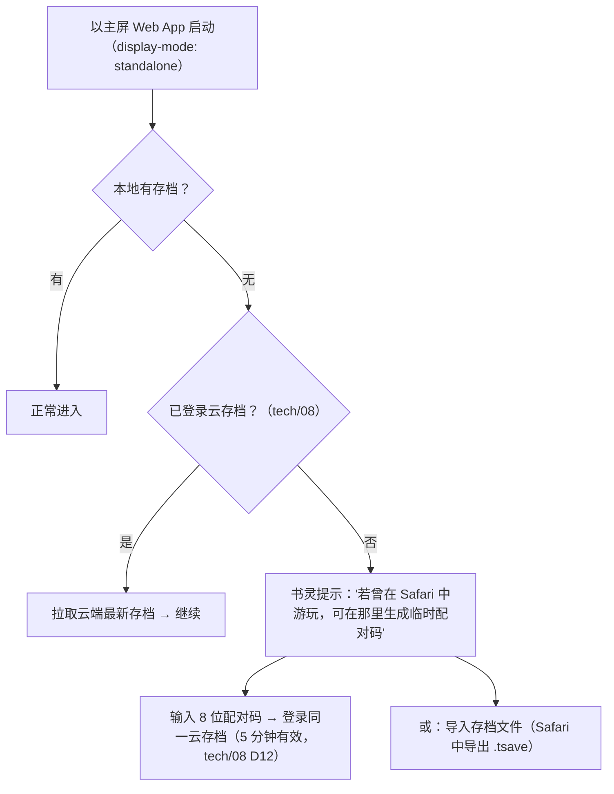

# tech/03 · 手机浏览器性能与适配

| 项 | 内容 |
|---|---|
| 文档 | `docs/tech/03-mobile-performance.md` |
| 版本 | v1.0（2026-09-25） |
| 上游基准 | `docs/00-canon.md` §0（手机浏览器横屏优先 + PC、PWA 可离线、云存档）、§8（斜 45° 等距战棋、就地开战 ≤ 20×20、上场 ≤ 6）、§18（文档归属：性能归 `tech/03`）、§19（技术基线：Three.js WebGL2、Vue 3 DOM 覆盖层、确定性 core 可入 Worker、IndexedDB、PWA、KTX2、按书界分包） |
| 平行文档 | `tech/01`（主循环、`RenderScheduler`、画质档与非功能目标**初值**）、`tech/02`（渲染管线、四档开关、帧/显存/draw call **初值**、活画基准）、`tech/06`（分包、格式、Service Worker、离线下载）、`tech/07`（精灵显存估算）、`design/09`（同屏上限【建议值】、AI 时间预算） |
| 下游文档 | `tech/04`（书界包切分与解析）、`tech/05`（core 性能、Worker 模式）、`tech/08`（云存档、离线同步）、`tech/09`（路线图与性能门禁）、`design/14`（UI 性能契约；撰写本文时尚未成稿） |
| 读者 | 作者本人（单人开发）＋ AI 编码助手 |
| 本文职责 | 目标设备 / 浏览器矩阵；**全部性能预算的终值**（帧率、帧时间、draw call、三角形、显存、JS 堆、DOM、首包、首屏、书界包、存储）；iOS / Android 平台专项；加载、运行时、自适应质量策略；性能测试与 CI 门禁；弱网与离线；性能风险 |
| 本文拥有的契约 | `packages/spec/perf-budgets.json`（§2.9）；`tools/perf/`（基准场景与 CI 门禁，§8.3）；`packages/platform/src/perf/`（帧统计与 HUD，§8.2）；`packages/platform/src/device/`（能力门槛、内存级 `memClass`、帧率模式 `fpsMode`、温控调速器，§1.6、§7） |

> **结论先行（TL;DR）**
>
> 1. **维持 Canon §19 基线，无致命问题。** 2026 年的主流手机浏览器足以运行"3D 高度地形 + 公告板精灵 + DOM UI"的 2.5D 战棋；真正的约束是 **内存上限（尤其 iOS）、持续发热、首次编译/上传卡顿与中文字体体积**，而不是峰值算力。
> 2. **设备矩阵（2026-09 核实）**：iOS 26 占活跃 iPhone 的 86.6%（2026-08 末），iOS 27 于 09-14 发布且仍支持 iPhone 11 起全部机型；Android 16 只占安卓流量 23.6%，碎片化严重；国内华为 Q2 份额 23%、鸿蒙 6 设备 7,000 万台以上（ArkWeb 内核 Chromium M132）→ **鸿蒙 ArkWeb 列为一级目标**。地板机 = Mali-G57 MC2 + 4 GB（`low`，30 fps）；基准机 = Adreno 7xx / Mali-G610·G615 + 8 GB 与 iPhone 13/14（`mid`，60 fps）。
> 3. **预算三维解耦**：画质档 `tier`（GPU 能力，沿用 tech/02 四档）× 内存级 `memClass`（S ≤ 4 GB / M 6–8 GB / L ≥ 12 GB 与桌面）× 帧率模式 `fpsMode`。**有效显存上限 = min(档位上限, 内存级上限)**。
> 4. **帧率终值**：`mid` 起 探索 60 / 战斗演出 60（群战 L/XL 在 `mid` 为 30）/ 等待输入按需渲染 / 画布可见的菜单与对话 ≤ 30 / 全屏菜单停绘；`low` 全程 30。60 fps 判定 = P95 ≤ 16.7 ms 且 P99 ≤ 25 ms；中档主线程自有 JS ≤ 6 ms/帧、GPU ≤ 11 ms/帧。
> 5. **内存终值**：GPU 显存 `low` 96 / `mid` 160 / `high` 256 / `ultra` 512 MB（采纳 tech/02），`memClass S` 封顶 128 MB；JS 堆 S 96 / M 160 / L 256 MB；进程总占用 S ≤ 450 MB、M ≤ 800 MB、L ≤ 1.5 GB。依据：WebKit 源码中 iOS 进程在 min(3 GB, jetsam 上限) 的 **50% / 65%** 处分别进入"节约 / 严格"内存策略；jetsam 上限本身未公开（社区观测约 1.5–3 GB）。
> 6. **首包与首屏**：`index.html` ≤ 14 KB、entry JS ≤ 170 KB gzip、启动字体 ≤ 40 KB、Basis 转码器（**实测 257 KB gzip / 212 KB br**）延迟加载；冷启动到标题画面可交互 ≤ 4 s（Slow 4G、中端安卓），二次启动 ≤ 1.5 s；书界 `enter` 集 ≤ 60 MB。
> 7. **中文字体（本地实测快照）**：霞鹜文楷 GB 全量 WOFF2 7.8 MB；实测语料快照的 2,823 个不同汉字子集为 677 KB（≈ 246 B/字），其中 **229 字（8%）不在 GB2312 一级字表**（丐、逍、鹫、崆峒、袈裟…）。通用 `unicode-range` 切片对对话屏很不划算（模拟：每屏触发 5–15 片、270–450 KB）→ 改为**构建期按书界用字的两文件子集**：`dlg-common` ≤ 260 KB + `dlg-chNN` ≤ 500 KB；题名书法字体只做 ≤ 40 KB 启动子集 + 每书界 ≤ 120 KB；正文与 UI 用系统字体（0 KB）。生产文本变化后必须重跑。
> 8. **iOS 专项**：WebGL 跑在共享的 GPU 进程，GPU 进程被杀 = 所有上下文丢失（且存在"反复创建失败后永久失效直到重启浏览器"的缺陷）；iPhone 无元素全屏、不支持 manifest `fullscreen`/`orientation` → 主屏 Web App（iOS 26 起"添加到主屏幕"默认以 Web App 打开）+ 旋转提示；**`<audio>.volume` 在 iOS 恒为 1** → BGM 淡入淡出必须走 WebAudio 增益节点；低电量模式 rAF 封顶 30 fps → 自适应器必须识别"垂直同步封顶"而非误降档；主屏 App 与 Safari **存储隔离** → 首次以主屏打开时经云存档/导出迁移。
> 9. **Android 专项**：GPU 规则表更新（Pixel 10 起 PowerVR 进入中高端、华为 Maleoon、Mali-G1、Adreno 8xx）；由 Chromium 驱动缺陷表推导"安卓安全 GLSL 守则"（每程序 ≤ 12 采样器、禁 MRT + blit、禁循环初始化数组等）；同为骁龙 8 Elite Gen 5 的公开整机压力测试仍只有约 **52%–62%** 持续表现，且随机型散热 / 性能模式显著变化 → 以"持续预算"设计：常态 GPU 负载 ≤ 峰值的 50%–65%。
> 10. **加载**：按场景与书界动态 `import()`（Vite 8 / Rolldown `output.codeSplitting`）；iOS 不支持 `<link rel=prefetch>` → 预取一律程序化写入 SW 缓存；全局唯一 `KTX2Loader`，`workerLimit` low 1 / mid 2 / high 3（源码核实：每个 worker 各持一份 wasm 与堆）；**实测 structuredClone 比 JSON.parse 慢 2–5 倍** → 不在 Worker 里解析后回传对象，改为"按区域切小包 + 加载遮罩下解析"。
> 11. **运行时**：10 Hz 固定逻辑步 + 与刷新率解耦的帧节拍器（60/30 封顶，高刷屏跳帧）；热路径零分配；Worker 卸载 AI/构网/压缩/转码；OffscreenCanvas（iOS 17 起支持 WebGL2）**MVP 不用于主渲染**；DOM UI 性能契约 14 条；GPU 资源 dispose 规范 + 泄漏门禁。
> 12. **自适应质量**：静态探测 → GPU/内存规则 → 标题画面活画基准 → 运行时（动态分辨率 0.05 步进、CPU/GPU 瓶颈判别、会话内只降不升、垂直同步封顶识别）→ 温控调速器 T0–T3（移动端没有 Web 温度 API，按"同场景代价漂移"推断）。
> 13. **测试**：自研 HUD（`?perf=1`）+ `window.__tsPerf` 报告接口；CI 用 Playwright 1.63 + CDP（`Performance.getMetrics`、`browser.startTracing`、CPU 4× 降速）跑 6 个确定性基准场景：**计数型指标精确门禁、时间型指标 +10% 报警**；GPU 时间只在真机验证（可选：自托管安卓机 + `connectOverCDP` 夜间跑）。
> 14. **弱网与离线**：PWA 离线范围 = 应用外壳 + 已下载书界 + 存档；断点续传按"内容寻址文件"粒度（单文件 ≤ 8 MB）；Cache API 不接受 206 → 长视频分段；微信内（无 SW、存储易被清）只提供在线模式并引导"在浏览器打开"。

> **基线核查结论**：Canon §19 **无致命问题**，正文按基线展开。以下为调研中发现的非致命问题，已在本文处理，并需同步到相应文档：
>
> | # | 发现（证据） | 影响 | 处理 / 需同步 |
> |---|---|---|---|
> | F1 | `navigator.deviceMemory` 自 Chrome 147 起在安卓只报告 1 / 2 / 4 / 8（MDN BCD 8.1.3） | tech/01 §6.1 的 `deviceMemory ≤ 3` 实际等于 `≤ 2` | §1.6 / §7.2：4 → `memClass S`，8 → M（再按 GPU 区分 L）；请 tech/01 同步 |
> | F2 | iOS Safari 不支持 manifest `display: fullscreen` 与 `orientation`，`screen.orientation.lock()` 也不可用；元素全屏仅 iPad（BCD） | tech/01 R3 的 `display: fullscreen` 对 iPhone 无效 | §3.5：iOS 只用 `standalone` + 旋转遮罩；安卓才用全屏 + 横屏锁 |
> | F3 | iOS `HTMLMediaElement.volume` 可写但恒为 1、设置无效（BCD） | tech/01 §6.7 的 BGM 走 Howler `html5: true`，在 iOS 上无法调音量与交叉淡化 | §3.4：`<audio>` 经 `MediaElementAudioSourceNode` 接 `GainNode`；请 tech/01 同步 |
> | F4 | Chrome 安卓 2026-09 起两周一版（BCD：153 于 09-08、154 于 09-22、155 于 10-06） | 按版本号做兼容判断会迅速过时 | §1.5：只做**能力门槛**，不做版本白名单 |
> | F5 | WebKit 源码：iOS 进程可用内存 = min(物理内存, jetsam `memlimit_active`)，在 min(3 GB, 该值) 的 50% / 65% 进入 Conservative / Strict 策略（`MemoryPressureHandler.cpp`、`AvailableMemory.cpp`） | "只要不超上限就安全"不成立：过 50% 后 WebKit 会主动清缓存（含解码图像），造成二次解码卡顿 | §2.5 按"≤ 上限估计的 50%"定总占用；§3.1 |
> | F6 | Safari 16 起 WebGL 在共享 GPU 进程中运行；WebKit PR #73204：GPU 进程在 GL 上下文反复创建失败时不会重置，WebGL 永久失效直到退出浏览器 | tech/02 §8.8 的恢复流程之外还需要"彻底重启"指引 | §3.3：失败计数 + 引导完全退出浏览器 / 主屏 App |
> | F7 | Chromium `gpu_driver_bug_list.json`：PowerVR 纹理单元限 13、禁用程序二进制缓存；Mali-G 在多附件 FBO 上 `blitFramebuffer` 前强制 `glFinish`；Adreno 空闲后首帧慢、循环初始化变量可崩溃 | tech/02 的着色器与 MSAA 解析需遵守 | §4.2 "安卓安全 GLSL 守则"，请 tech/02 纳入 `materials/CLAUDE.md` |
> | F8 | Pixel 10（Tensor G5）改用 PowerVR DXT-48-1536；华为 Kirin 9020/9030 用 Maleoon 920/935；联发科 9500 为 Mali-G1-Ultra | tech/02 §10.2 GPU 规则表把 `PowerVR` 一律判"低"、且无 Maleoon / Mali-G1 / Adreno 8xx | §4.1 给出更新后的规则；请 tech/02 同步 |
> | F9 | 实测：金庸文本大量使用一级字表外用字；`unicode-range` 切片在对话屏上平均触发 5.5–15 个切片 | tech/06 §5.9 的 cn-font-split 切片方案下载量偏大、首句对话易闪字 | §5.5 改为按书界用字的两文件子集；请 tech/06 同步 |
> | F10 | 鸿蒙 NEXT（HarmonyOS 5/6）只能用 ArkWeb（4.1–5.1 为 M114，6.x 为 M132），未开放 WebGPU | 浏览器矩阵需新增一级目标；Maleoon GPU 需要校准 | §1.4、§4.3 |
> | F11 | 实测 structuredClone 2 MB / 8 MB / 15 MB 对象分别 18 / 82 / 250 ms，而 JSON.parse 同数据 7 / 39 / 46 ms（Node 22，桌面） | tech/01 §3.7 "io.worker 解析书界包后回传"会把成本搬回主线程 | §5.6：Worker 只做解压，主线程在遮罩下解析分片小包；请 tech/01、tech/04 同步 |
> | F12 | design/09 §9.1 群战角色精灵显存估约 160 MB | 等于 `mid` 的**总**显存上限 | §2.4：`mid` 战斗角色精灵峰值 ≤ 105 MB，群像 LOD 强制；请 design/09 同步 |
> | F13 | iOS `requestIdleCallback`、`scheduler.yield`、Long Tasks、LoAF、`performance.memory` 均不可用（BCD） | 空闲调度与内存监测在 iOS 上只能自研近似 | §5.3、§8.2 |
> | F14 | iOS 主屏 Web App 与 Safari 的 IndexedDB / localStorage / SW 互相隔离 | "先在 Safari 玩，再添加到主屏"会"丢档" | §3.8：首次主屏启动走云端或导出码迁移；请 tech/08 同步 |

---

## 目录

- [0. 关键决策一览](#0-关键决策一览)
- [1. 目标设备与浏览器矩阵](#1-目标设备与浏览器矩阵)
- [2. 性能预算（终值）](#2-性能预算终值)
- [3. iOS Safari 专项](#3-ios-safari-专项)
- [4. Android 专项](#4-android-专项)
- [5. 加载策略](#5-加载策略)
- [6. 运行时优化](#6-运行时优化)
- [7. 自适应质量](#7-自适应质量)
- [8. 性能测试](#8-性能测试)
- [9. 网络与离线](#9-网络与离线)
- [10. 性能风险 Top 10 与预案](#10-性能风险-top-10-与预案)
- [11. MVP 与演进路径（性能视角）](#11-mvp-与演进路径性能视角)
- [12. 备选方案](#12-备选方案)
- [参考资料](#参考资料)
- [本文新增术语/约定](#本文新增术语约定)
- [待决事项 / 依赖](#待决事项--依赖)

---

## 0. 关键决策一览

| # | 决策点 | 结论 | 章节 |
|---|---|---|---|
| D1 | 设备支持方式 | **能力门槛**（WebGL2 + 任一压缩纹理 + ES2022 + 模块 Worker + IndexedDB）而非机型/版本白名单；支持分 A（一级，逐版本验证）/ B（二级，冒烟）/ C（尽力而为）三级 | §1.5、§1.6 |
| D2 | 校准基准 | 地板机（`low`）= Mali-G57 MC2 + 4 GB；基准机（`mid`）= Adreno 7xx / Mali-G610·G615 + 8 GB 与 iPhone 13/14；**作者自用设备优先**，终值以其实测校准 | §1.3 |
| D3 | 预算维度 | `tier`（GPU 能力，tech/02 四档）× `memClass`（S/M/L）× `fpsMode`（`auto`/`60`/`30`/`battery`）；有效显存上限 = min(两者) | §2.1、§7.1 |
| D4 | 帧率 | `mid` 起：探索 60、战斗演出 60（`mid` 群战 30）、等待输入 `onDemand`、画布可见的菜单/对话 ≤ 30、全屏菜单停绘；`low` 全程 30 | §2.2 |
| D5 | 帧时间 | 60 fps：P95 ≤ 16.7 ms、P99 ≤ 25 ms；中档主线程自有 JS ≤ 6 ms、主线程总计 ≤ 8.5 ms、GPU ≤ 11 ms | §2.3 |
| D6 | 渲染量 | draw call / 三角形 / 程序数 / 粒子沿用 tech/02；新增每帧上传、过度绘制、同屏单位等上限（定稿 design/09 §9.1 建议值） | §2.4 |
| D7 | 内存 | 显存 96/160/256/512 MB；S 级封顶 128 MB；JS 堆 96/160/256 MB；总占用按"上限估计的 50%"设计 | §2.5 |
| D8 | UI | 常驻 HUD ≤ 300 个 DOM 节点、全局 ≤ 800（警告）/ 1,200（错误）；非事件帧零 DOM 写；只动画 `transform`/`opacity` | §2.6、§6.5 |
| D9 | 包体与首屏 | HTML ≤ 14 KB；entry ≤ 170 KB gzip；启动字体 ≤ 40 KB；冷启动到标题 ≤ 4 s（Slow 4G 中端安卓）；二次启动 ≤ 1.5 s | §2.7 |
| D10 | 字体 | 正文/UI 系统字体；对话字体构建期"两文件"书界子集；题名书法字体启动子集 ≤ 40 KB；不用通用 `unicode-range` 切片 | §5.5 |
| D11 | 数据包 | Worker 只解压/校验，不回传大对象；规则/文本包按区域切片（单片解析 ≤ 16 ms 目标）；游戏进行中主线程单次 `JSON.parse` ≤ 256 KB | §5.6 |
| D12 | Worker | ai / io / mesh（+ 可选 path）+ Basis 转码池；移动端并发 Worker 合计 ≤ 4；不依赖 SharedArrayBuffer | §6.3 |
| D13 | OffscreenCanvas | MVP 不做"渲染线程"；仅在 Phase 3 若主线程成为瓶颈再评估（iOS 17+ 已可行） | §6.4 |
| D14 | 自适应 | 静态探测 + 活画基准 + 动态分辨率 + 会话内只降不升 + 垂直同步封顶识别 + 温控 T0–T3 | §7 |
| D15 | 测试 | 真机手工清单 + 自研 HUD + CI（Playwright/CDP 确定性基准，计数精确门禁、时间 +10% 报警）+ 可选自托管安卓真机夜跑 | §8 |
| D16 | 离线 | 文件级断点续传（内容寻址 ≤ 8 MB）；视频分段；无 SW 环境只做在线模式 | §9 |

---

## 1. 目标设备与浏览器矩阵

### 1.1 设计原则

1. **能力分级，不列白名单**：浏览器版本两周一变（F4），国产内核版本又参差，按版本号判断必然失效。运行时只看能力（§1.6），档位由"静态探测 + 实测"决定（§7.2）。
2. **地板定底线，基准定目标**：`low` 档在地板机上必须"能完整通关、30 fps、不崩溃"；`mid` 档在基准机上达到"探索与战斗 60 fps、10 分钟后仍 ≥ 45 fps"。
3. **作者设备优先**：这是自娱项目，最终用户就是作者本人。表中"代表机型"用于覆盖面与校准，终值以作者自用设备（tech/01 P1）的实测为准。
4. **一次只追一个最坏情况**：iOS 的最坏是**内存**，安卓的最坏是**GPU 碎片化 + 发热**，内置浏览器的最坏是**存储与缓存能力缺失**。三者分别有专项（§3、§4、§9）。

### 1.2 2026 年市场现状（与本项目相关的事实）

| 维度 | 事实（2026-09 核实） | 对本项目的含义 |
|---|---|---|
| iOS 版本 | iOS 26 于 2026-08 末占 86.57%；2026-06 时 iOS 18 占 14%、更早版本 7%；iOS 27（Safari 27，WebKit 625.1.29）于 **2026-09-14** 发布，支持机型与 iOS 26 相同（iPhone 11 / SE 2 起） | 以 iOS 26 为主力验证版本，iOS 27 为当前版本；最低支持 iOS 17（见 §1.5） |
| 新 iPhone | iPhone 17e（2026-03，A19 4 核 GPU，8 GB）；iPhone 18 Pro（2026-09 发布，A20 Pro，12 GB）；Q2 2026 中国单机型销量第一为 iPhone 17 Pro Max | 新机内存充裕，但 4 GB 老机（11 / 12 / 13 / SE 3）仍在服役 |
| Android 版本 | Android 16 仅占安卓页面浏览 23.64%（StatCounter 2026-06），另有 6 个版本各占 ≥ 4% | 不能假设新系统特性；以浏览器能力为准 |
| Chrome 安卓 | 当前 154（2026-09-22），**两周一版** | 功能随时变化，靠 CI 冒烟而不是记版本 |
| 国内份额 | Q2 2026：华为 23%、苹果 18%；华为畅享 90 Pro Max（Kirin 8000 / Mali-G610，8 GB，HarmonyOS 6）为热销中端 | 华为机大量运行**纯血鸿蒙**，浏览器内核为 ArkWeb |
| 鸿蒙 | HarmonyOS 6 设备 2026-07 已超 7,000 万台，目标年底 1 亿；ArkWeb：HarmonyOS 4.1–5.1 为 Chromium M114，6.x 为 M132；WebGPU 未开放 | 鸿蒙浏览器 = "Chromium 132 级 WebGL2 浏览器"，列一级目标 |
| 国内浏览器份额（移动，StatCounter 2026-04） | Chrome 48.97%、Safari 24.56%、Android（系统 WebView/浏览器）8.36%、UC 8.2%、Edge 5.06%、QQ 3.93% | 统计口径偏海外站点，仅作参考；微信内打开的流量不在其中 |
| 旗舰 GPU 持续性能 | OnePlus 15（骁龙 8 Elite Gen 5 / Adreno 840）的公开整机测试在持续重载后约保留 52%–62%，另一次 GPU 压力测试为 60%；部分压力测试甚至无法完成。该数字是**整机 + 模式**结果，不是 SoC 常数 | 旗舰也会在满载后显著降频，且散热差异很大 → 必须按"持续预算"设计（§4.4），不能按峰值跑满 |

### 1.3 设备矩阵

> 显示尺寸为横屏 CSS 像素（宽 × 高）与 DPR；"默认档"是静态探测的初判，最终由活画基准与运行时自适应决定（§7）。

| 档 | 平台 | 代表机型（2023–2026） | SoC / GPU | 内存 | 横屏 CSS × DPR | 系统 / 浏览器 | 默认档 / `memClass` | 用途 |
|---|---|---|---|---|---|---|---|---|
| **地板** | Android | Redmi 15C 5G、Redmi 14C 等千元机 | 天玑 6300 / Helio G99–G100，Mali-G57 MC2；紫光展锐 T606/T615 为 Mali-G57 MP1 | 4 GB（`deviceMemory` 报 4） | 800×360 × 2（720p 面板） | Android 14–16 / Chrome、系统 WebView | `low` / S | 底线验收：低档 30 fps、不崩溃 |
| 低 | iPhone | iPhone 11、iPhone SE 3 | A13 / A15 | 4 GB | 896×414 × 2；667×375 × 2 | iOS 26–27 / Safari、主屏 App | `low`–`mid` / S | iOS 内存底线（最易被 jetsam 杀） |
| 低 | iPhone | iPhone 12、13（含 mini） | A14 / A15 | 4 GB | 844×390 × 3；812×375 × 3 | iOS 26–27 | `mid` / S | GPU 够但内存紧：`mid` 画质 + S 级显存封顶 |
| **基准** | Android | Redmi Note 15 Pro 级、OPPO Reno / vivo S / 荣耀数字系列 | 骁龙 7 Gen 3 / 7s Gen 3 / 7 Gen 4（Adreno 7xx）；天玑 7300 / 7400（Mali-G615 MC2）；天玑 8350 / 8400（Mali-G615 / G720） | 8–12 GB | 约 915×412 × 2.6–3 | Android 15–16 / Chrome、系统 WebView、微信 XWeb | `mid` / M | **性能目标机**：探索与战斗 60 fps |
| 基准 | 鸿蒙 | 华为畅享 90 Pro Max、nova 系列 | Kirin 8000（Mali-G610 MP4） | 8 GB | 约 1,013×468 × 2.72（2756×1272 面板，DPR 以实测为准） | HarmonyOS 6 / 华为浏览器（ArkWeb M132）、鸿蒙版微信 | `mid` / M | 鸿蒙一级目标 |
| 基准 | iPhone | iPhone 14、15、16e、17e | A15 / A16 / A18 / A19（4 核 GPU） | 6–8 GB | 844×390 × 3；852×393 × 3 | iOS 26–27 | `mid`–`high` / M | iOS 性能目标机 |
| 高 | Android | 小米 17、vivo X300 等旗舰 | 骁龙 8 Elite Gen 5（Adreno 840）/ 8 Elite（Adreno 830）；天玑 9500（Mali-G1-Ultra MC12）/ 9400（Immortalis-G925） | 12–16 GB（`deviceMemory` 封顶报 8） | 约 915×412 × 3.5 | Android 16 / Chrome | `high` / L | 高档与发热测试 |
| 高 | 鸿蒙 | Mate 80 系列、Pura 系列 | Kirin 9030（Maleoon 935）/ 9020（Maleoon 920） | 12–16 GB | 以实测为准 | HarmonyOS 6 | `mid`（待校准）/ L | Maleoon 规则校准 |
| 高 | Android | Pixel 10 系列 | Tensor G5（PowerVR DXT-48-1536） | 12–16 GB | 以实测为准 | Android 16 / Chrome | `mid`（驱动风险）/ L | PowerVR 新家族的回归机（可选） |
| 高 | iPhone | iPhone 16 Pro / 17 / 17 Pro / 18 Pro | A18 Pro / A19 / A19 Pro / A20 Pro | 8–12 GB | 874×402 × 3；956×440 × 3 | iOS 26–27 | `high` / M–L | iOS 高档 |
| 平板 | iPadOS | iPad Air（M 系列）、iPad（A16） | M2–M4 / A16 | 8 GB 起 | 1180×820 × 2 等 | iPadOS 26–27 | `high`–`ultra` / L | 大屏布局、元素全屏可用 |
| 桌面 | Win / macOS | 集显笔记本、独显台式、Apple Silicon | Iris Xe / Radeon 780M / RTX / M 系列 | 16 GB 起 | 1280×720 起 × 1–2 | Chrome、Edge、Safari、Firefox | `high`–`ultra` / L | 开发机、极致档 |

- **地板之下**：`deviceMemory ≤ 2` 或无任何压缩纹理格式或 GPU 规则命中黑名单 → 仍允许进入，但固定 `low` + S 级 + 30 fps + 关闭天气粒子，并在设置页提示"设备低于建议配置"。
- **作者自用设备登记**（Phase 0 填写，写入 `tools/perf/devices.yaml`）：机型、SoC、内存、系统与浏览器版本、屏幕、常用网络、是否常用微信打开。所有档位阈值（§7.2 GPU 规则、§2 预算）先以此校准。

### 1.4 浏览器矩阵

| 环境 | 内核（2026-09） | WebGL2 | WebGPU | Service Worker / 安装 | 存储持久性 | 全屏 / 横屏锁 | 主要注意事项 | 级别 |
|---|---|---|---|---|---|---|---|---|
| iOS Safari 26–27 | WebKit（Safari 27 = 625.1.29） | ✓（15+） | ✓（26+，本项目默认不用，tech/02 §9） | ✓；安装 = 分享 → 添加到主屏幕（iOS 26 起默认"作为 Web App 打开"） | 非主屏站点 7 天无交互会被清；`persist()` 15.2+ 可调用，是否批准由浏览器决定 | iPhone 无元素全屏、无方向锁 | GPU 进程内存、`volume` 恒 1、低电量 rAF 30 fps、iOS 26 视口变化 | **A** |
| iOS 主屏 Web App | 同上（独立实例） | ✓ | ✓ | ✓（独立 SW） | 豁免 7 天规则；配额与浏览器相同（单源约磁盘 60%）；**与 Safari 存储隔离** | `standalone`（无地址栏）；仍无方向锁 | **推荐的 iPhone 游玩形态**；首次启动迁移存档（§3.8） | **A** |
| iOS 第三方浏览器（Chrome、Edge 等） | WebKit（WKWebView） | ✓ | 同 WebKit（待核实） | 可添加到主屏（16.4+）；SW 行为（待核实） | 同 WebKit 策略（嵌入式应用配额约 15%，MDN） | 同上 | 视为 Safari 子集 | B |
| iOS 微信 / QQ 内置 | WebKit（WKWebView） | ✓ | （待核实） | **无 SW**（BCD：`webview_ios` 不支持）；Cache API 可用 | 易被清（社区报告数天到两周）；配额约磁盘 15% | 无 | 只提供在线模式；引导"在 Safari 中打开" | C |
| Android Chrome | Blink 154（两周一版） | ✓ | ✓（121+，Android 12+，Adreno / Mali；PowerVR、Xclipse 有限） | ✓；可安装（WebAPK） | 单源约磁盘 60%；安装 / 常用站点的 `persist()` 通常静默批准 | Fullscreen API ✓；`screen.orientation.lock()` ✓（需先全屏）；manifest `fullscreen` + `landscape` ✓ | GPU 碎片化、发热、rAF 多为 60 Hz | **A** |
| 鸿蒙 NEXT 华为浏览器 / 鸿蒙版微信 | ArkWeb（HarmonyOS 4.1–5.1：M114；6.x：M132） | ✓ | ✗（未开放） | （待核实） | （待核实） | （待核实） | Maleoon GPU 需校准；调试链路（待核实） | **A** |
| Samsung Internet 30 | Blink 143 | ✓ | ✓（25+） | ✓ | 同 Chromium | ✓ | 与 Chrome 同类 | B |
| 华为（安卓 / 鸿蒙 4.x）、小米、vivo、OPPO、荣耀自带浏览器 | 各自 Chromium 分支，版本参差（待逐机核实） | ✓ | 多数 ✗ | 多数 ✓ | "清理加速"类功能可能清除 | 视厂商 | UA 改写、注入脚本、广告拦截误伤 | B |
| 安卓微信内置 | XWeb（Chromium 系；现网约 138、开发版 142，经搜索摘要） | ✓ | （待核实） | 可能可用（待核实），运行时检测 | 易被清（社区报告 2–14 天） | 受微信界面限制 | 调试需 `debugxweb.qq.com/?inspector=true` | C |
| UC / 夸克 / QQ 浏览器 | U4 等 Chromium 分支 | ✓（多数） | ✗ | 视版本 | 视版本 | 视版本 | 内核改动多，问题难复现 | C |
| Firefox Android 156 | Gecko | ✓ | ✗ | ✓ | 尽力模式 min(10% 磁盘, 10 GiB) | ✓ | 无 `KHR_parallel_shader_compile`、无 `WEBGL_multi_draw`（BCD） | C |
| 桌面 Chrome / Edge / Safari / Firefox | — | ✓ | Chrome/Edge ✓、Safari 26+ ✓、Firefox 部分 | ✓ | 充裕 | ✓ | 开发主力 | A（Chrome、Safari）/ B（Firefox） |

**级别含义**：A = 每次发布前按 §8.4 全量真机清单回归；B = 每个书界发布前冒烟（启动 → 探索 → 战斗 → 存读档）；C = 不承诺，出问题只记录并引导到 A 级环境。

### 1.5 最低能力与版本基线

| 类别 | 要求 | 不满足时 |
|---|---|---|
| **硬门槛** | WebGL2 上下文；至少一种压缩纹理（WebGL2 核心 ETC2，或 `WEBGL_compressed_texture_astc`）；ES2022 语法（构建目标 `es2022`，tech/01）；模块 Worker（iOS 15 起）；IndexedDB | 友好提示页：更换浏览器 / 在系统浏览器打开（tech/01 §6.1） |
| **推荐基线** | iOS / iPadOS 17 起（OffscreenCanvas WebGL2、`storage.estimate()`、`size-adjust`、Safari 17 存储策略）；Chromium 114 起（覆盖鸿蒙 ArkWeb M114） | 可玩；对应特性走降级分支 |
| **主力验证** | iOS 26、iOS 27；Chrome 当前稳定版；ArkWeb M132 | — |

**软能力与降级**（全部运行时特性检测，不看 UA 版本）：

| 能力 | 支持情况（BCD 8.1.3，iOS / Chrome 安卓） | 缺失时的降级 |
|---|---|---|
| Service Worker | iOS 11.3 / 40；iOS WKWebView ✗ | 在线模式（tech/06 §8.5） |
| `KHR_parallel_shader_compile` | 14.5 / 76；Firefox ✗ | 加载遮罩内同步编译，预热时间上浮 |
| `EXT_color_buffer_half_float` | 14 / 63 | 禁止 `high` 及以上（tech/02 §10.2） |
| `WEBGL_multi_draw` | 15 / 86；Firefox ✗ | 不用 `BatchedMesh`（tech/02 F2） |
| OffscreenCanvas（2D / WebGL2） | 16.4 / 17；69 | 词条图集在主线程烘焙（§6.4） |
| `navigator.storage.estimate()` | 17 / 61 | 按保守值（每书界 400 MB）判断空间 |
| `navigator.storage.persist()` | 15.2 / 55 | 仅依赖云存档 |
| Web Locks（防多开） | 15.4 / 69 | `BroadcastChannel` 心跳互斥 |
| `CompressionStream` | 16.4 / 80 | `fflate`（已在 entry） |
| `requestIdleCallback` / `scheduler.yield` | ✗ / 47；✗ / 129 | `setTimeout` 切片 + `MessageChannel` 让步（§5.3） |
| Screen Wake Lock | 18.4（含主屏 App）/ 84 | 不防熄屏（仅过场视频需要） |
| `navigator.audioSession` | 16.4 / ✗ | 仅 iOS 使用 |
| Event Timing / LoAF / Long Tasks | 26.2 / 76；✗ / 123；✗ / 58 | HUD 以自测帧时间代替（§8.2） |
| `performance.memory` / `measureUserAgentSpecificMemory` | ✗ / 18（弃用）；✗ / 89（需跨源隔离） | 自有内存账本估算（§2.5） |

### 1.6 能力探测与门槛（`packages/platform/src/device/capabilities.ts`）

```ts
// 启动时运行一次（< 50 ms），结果写入 DeviceProfile 并参与缓存指纹（tech/02 §10.2）
export interface CapabilityReport {
  webgl2: boolean;
  compressed: ReadonlyArray<'astc' | 'etc2' | 'bptc' | 's3tc'>;
  maxTextureSize: number;
  maxSamples: number;
  halfFloatRT: boolean;          // EXT_color_buffer_half_float
  parallelCompile: boolean;      // KHR_parallel_shader_compile
  multiDraw: boolean;            // WEBGL_multi_draw
  gpuRenderer: string | null;    // WEBGL_debug_renderer_info；iOS 恒为 "Apple GPU"
  serviceWorker: boolean;
  offscreenWebgl2: boolean;
  deviceMemoryGB: 1 | 2 | 4 | 8 | null;   // Chromium 147+ 安卓只报 1/2/4/8（F1）；Safari 为 null
  cores: number;                 // iOS 被钳制为 4 或 8（BCD），仅作参考
  env: { ios: boolean; ipad: boolean; android: boolean; harmony: boolean;
         wechat: boolean; standalone: boolean; inAppWebView: boolean };
  screen: { cssW: number; cssH: number; dpr: number };
}

export type GateResult =
  | { kind: 'ok' }
  | { kind: 'degraded'; reasons: string[] }          // 可玩，强制 low / 在线模式等
  | { kind: 'unsupported'; reason: 'no-webgl2' | 'no-compressed-texture' | 'no-indexeddb' };

export function gate(c: CapabilityReport, hasIndexedDb: boolean): GateResult {
  if (!c.webgl2) return { kind: 'unsupported', reason: 'no-webgl2' };
  if (!hasIndexedDb) return { kind: 'unsupported', reason: 'no-indexeddb' };
  if (c.compressed.length === 0) return { kind: 'unsupported', reason: 'no-compressed-texture' };
  const reasons: string[] = [];
  if (!c.serviceWorker) reasons.push('online-only');              // iOS 内置浏览器等
  if (c.deviceMemoryGB !== null && c.deviceMemoryGB <= 2) reasons.push('below-floor-memory');
  if (!c.halfFloatRT) reasons.push('cap-tier-mid');
  if (c.env.wechat) reasons.push('in-app-browser');
  return reasons.length ? { kind: 'degraded', reasons } : { kind: 'ok' };
}
```

- `harmony` 判定：UA 含 `OpenHarmony` / `ArkWeb`（以真机 UA 为准，待核实），同时视为 Chromium 系。
- `inAppWebView`：UA 含 `MicroMessenger`、`QQ/`、`AlipayClient` 等，或 iOS 上 `navigator.serviceWorker` 不存在而 Cache API 存在。
- 探测结果不上报任何服务器（个人项目，无遥测）；仅在 HUD 与"设置 → 关于本机"中展示，便于作者排查。

---

## 2. 性能预算（终值）

> 本节数值是**终值**，覆盖 tech/01 §1.2、§6.1 与 tech/02 §8.2、§8.7、§10.1 中标注"初值、终值归 tech/03"的项；与之相同者直接采纳并注明来源。机器可读版本见 §2.9 的 `perf-budgets.json`，HUD、CI、素材管线与内容校验器都读取它，**文档与 JSON 不一致时以 JSON 为准并回改文档**。

### 2.1 度量口径与三个维度

| 术语 | 定义 |
|---|---|
| 帧间隔 `intervalMs` | 相邻两次**实际渲染**的 rAF 时间戳之差（跳过的 rAF 不计） |
| 帧工作量 `workMs` | 本帧主循环内自有代码耗时（`performance.now()` 包住 `GameLoop.frame` 主体）；不含浏览器样式/合成与 GPU |
| P95 / P99 | 以 60 s 窗口统计的分位数；验收取 3 次运行的中位数 |
| 长帧 | `intervalMs > 50 ms`；**卡顿** = `intervalMs > 2 × 目标帧时` |
| 场景键 `sceneKey` | `title`、`explore.move`、`explore.idle`、`battle.anim`、`battle.mass`、`battle.input`、`dialogue`、`menu.overlay`（画布可见）、`menu.full`（画布被全屏遮挡）、`bookSleep`、`cutscene` |

| 维度 | 取值 | 决定什么 | 谁来定 |
|---|---|---|---|
| 画质档 `tier` | `low` / `mid` / `high` / `ultra` | 着色器变体、后处理、阴影、粒子、分辨率上限（tech/02 §10.1） | GPU 规则 + 活画基准 + 运行时降档（§7.2） |
| 内存级 `memClass` | `S`（≤ 4 GB）/ `M`（6–8 GB）/ `L`（≥ 12 GB 或桌面） | 显存 / JS 堆 / 解码图像上限、LRU 容量、Basis worker 数、精灵 ppm 包上限 | 安卓 `deviceMemory` + GPU 等级；iOS 屏幕机型族（§7.2） |
| 帧率模式 `fpsMode` | `auto` / `60` / `30` / `battery` | 目标帧率与按需渲染激进程度 | 设置页 + 自动识别（低电量、温控，§7.5–7.6） |

`memClass` 对 `tier` 的封顶：S → 最高 `mid`；M → 最高 `high`；L → 不封顶。

### 2.2 帧率目标（按场景 × 档位）

| 场景键 | `low` | `mid` | `high` | `ultra` | 渲染模式（tech/01 `RenderScheduler`） |
|---|---|---|---|---|---|
| `title`（活画） | 30 | 30（基准测试的 4 s 内不封顶） | 30 | 60 | `throttled` |
| `explore.move`（角色/相机移动） | 30 | **60** | 60 | 60（桌面可 120） | `continuous` |
| `explore.idle`（只有环境动画） | 20 | 30 | 30 | 30 | `throttled` |
| `battle.anim`（S/M 规模，≤ 20 单位） | 30 | **60** | 60 | 60 | `continuous` |
| `battle.mass`（L/XL 群战） | 30 | **30** | 60 | 60 | `continuous` |
| `battle.input`（等待玩家指令） | 按需 | 按需 | 按需 | 按需 | `onDemand`：拖动、预览、镜头时临时 60（`low` 30），静止 0 |
| `dialogue` | 20 | 30 | 30 | 30 | `throttled`（背景仅环境动画） |
| `menu.overlay`（半屏菜单、背包，画布可见） | 按需 | ≤ 30 | ≤ 30 | ≤ 30 | `throttled` 或 `onDemand` |
| `menu.full`（全屏菜单、图鉴） | 0 | 0 | 0 | 0 | 不提交 GPU 命令（tech/02 §8.1） |
| `bookSleep` / `cutscene` | 视频自身帧率 | 同左 | 同左 | 同左 | 画布停绘或降到 10 fps 背景 |

**验收判定**：

| 目标帧率 | P95 `intervalMs` | P99 `intervalMs` | 长帧（> 50 ms） | 10 分钟持续 |
|---|---|---|---|---|
| 60 | ≤ 16.7 ms | ≤ 25 ms | 游戏进行中 ≤ 1 次 / 分钟；遮罩转场内不计 | 平均 ≥ 45 fps（tech/02 P2 标准） |
| 30 | ≤ 33.4 ms | ≤ 50 ms | 同上 | 平均 ≥ 27 fps |

| 交互 | 预算 |
|---|---|
| 点按 → 可见反馈（高亮、按钮态） | P95 ≤ 100 ms（同 INP"良好"线） |
| 预览查询（可达格、伤害预测浮窗） | 主线程单次 ≤ 8 ms（design/09 §10.4），超出转 Worker 异步刷新 |
| 输入锁解除（表现队列播完）→ 可操作 | ≤ 1 帧 |

> 与上游的差异：tech/01 §1.2 写"战斗 ≥ 30 fps 稳定"、design/09 §9.1 建议 `mid` 战斗 30 fps。本文改为 **`mid` 普通/精英/Boss 战目标 60、保底 30；只有 L/XL 群战在 `mid` 以 30 为目标**——理由：战斗演出是观感核心，且"等待输入按需渲染"使战斗的平均功耗低于探索；群战单位数翻倍，`mid` 维持 30 更稳。

### 2.3 帧时间分解

**`mid` · 60 fps（16.7 ms）**

| 线程 / 阶段 | 预算（P95） | 峰值允许 | 说明 |
|---|---|---|---|
| 输入 + ActionMap | 0.3 ms | 1 ms | tech/01 §6.5 |
| `core.tick()`（10 Hz，平摊） | 0.5 ms | 2 ms（tick 帧） | tech/01 §6.2；超出即考虑 core Worker 模式 B |
| 表现队列 + tween + 动画采样 | 0.8 ms | 2 ms | tech/01 §6.3 |
| 渲染 CPU（剔除、实例写入、uniform、约 100 次提交） | 3.5 ms | 5 ms | tech/02 §8.2 |
| UI 投影 + Vue patch | 1.0 ms | 3 ms（仅事件帧） | §6.5；非事件帧为 0 |
| **自有 JS 小计（`workMs`）** | **≤ 6.0 ms** | 10 ms | HUD 与 CI 的主指标 |
| 浏览器（样式、布局、合成、GC 平摊） | ≤ 2.5 ms | — | GC 单次暂停 ≤ 4 ms、≤ 1 次/秒（§6.2） |
| **主线程合计** | **≤ 8.5 ms** | — | 余 ≥ 8 ms 给调度抖动、Worker 消息、降频 |
| GPU | ≤ 11 ms | — | tech/02 §8.2 分项；余 ~5 ms 给发热降频 |

**`low` · 30 fps（33.3 ms）**：自有 JS ≤ 10 ms、主线程合计 ≤ 14 ms、GPU ≤ 22 ms（低端 CPU 单核约为基准机的 1/2–1/3，故自有 JS 预算只放宽到 1.7 倍）。

**`high` · 60 fps**：自有 JS ≤ 6 ms（CPU 更快，但阴影、光池、粒子更多）、GPU ≤ 12 ms（按"持续预算"，峰值不超过 GPU 能力的 65%，§4.4）。

**Worker 预算（不占帧，但决定"等多久"）**

| Worker | 任务 | 预算（基准机） | `low` 倍率 |
|---|---|---|---|
| `ai.worker` | 每次决策 `ai_basic` 5 / `ai_adept` 15 / `ai_expert` 40 / `ai_master` 80 ms（design/09 §8.1） | 超 2 倍取当前最优 | × 2（仍被演出遮盖） |
| `mesh.worker` | 32×32 chunk 构网 | ≤ 8 ms/chunk（桌面实测 1.1–1.6 ms × 手机 3–5 倍，tech/02 §2.2） | × 2 |
| `io.worker` | 存档压缩 + SHA-256（≤ 1 MB） | ≤ 60 ms | × 2 |
| Basis 转码池 | 2048² 页 UASTC → ASTC / ETC1S → ETC2 | ≤ 40 ms/页（待实测，Phase 0 P5） | × 2 |

### 2.4 渲染量与同屏上限

**渲染量**（draw call、三角形沿用 tech/02 §8.2；其余为本文新增）：

| 项 | `low` | `mid` | `high` | `ultra` |
|---|---|---|---|---|
| draw call 目标（上限） | 60（80） | 100（150） | 150（180） | 250（300） |
| 三角形 / 帧 | ≤ 100k | ≤ 200k | ≤ 300k | ≤ 600k |
| 着色器程序（本档全部变体） | ≤ 24（tech/02 §8.5） | ≤ 24 | ≤ 24 | ≤ 24 |
| 单程序采样器数 | ≤ 12（PowerVR 纹理单元限 13，F7） | ≤ 12 | ≤ 12 | ≤ 16 |
| 平均过度绘制（像素着色次数 / 屏幕像素） | ≤ 2.0 | ≤ 2.5 | ≤ 3.0 | ≤ 3.5 |
| 特效峰值过度绘制（F4 绝招期间） | ≤ 3.0 | ≤ 4.0 | ≤ 5.0 | ≤ 6.0 |
| 每帧 GPU 上传（游戏进行中） | ≤ 1 个 chunk 网格 + ≤ 1 张 2048² 页（≤ 4 MB） | ≤ 2 chunk + ≤ 1 页 | ≤ 2 chunk + ≤ 2 页 | 不限 |
| 全屏渲染目标（按屏幕像素计的张数） | 0（直绘画布） | ≤ 3 | ≤ 5 | ≤ 8 |

**同屏上限**（定稿 design/09 §9.1 建议值；内容校验以 `mid` 为准，`low` 由运行时合并战阵或转入预备队）：

| 项 | `low` | `mid` | `high` | `ultra` |
|---|---|---|---|---|
| 战场活动单位（战阵计 1） | 16 | 24 | 30 | 30 |
| 同屏人形身形 | 32 | 48 | 64 | 96 |
| 不同角色精灵图集（种类） | 8 | 10 | 12 | 16 |
| 同时播放的招式特效 | 3 | 6 | 8 | 12 |
| 同屏飘字 | 8 | 12 | 16 | 24 |
| 活跃粒子（tech/02 §10.1） | 400 | 1,200 | 3,000 | 6,000 |
| 动态点光（tech/02 §10.1） | 0 | 2 | 4 | 8 |
| 探索可见 NPC | 24 | 48 | 80 | 120 |
| **战斗角色精灵显存峰值** | ≤ 40 MB | **≤ 105 MB** | ≤ 170 MB | ≤ 300 MB |

- `mid` 的 105 MB = 160 MB 总上限 − 非精灵项（地形 2 + 建筑/物件 24 + 特效 12 + RT 12 + 叠加层 3 ≈ 53 MB，tech/02 §8.7）。群战超出时由 `GpuBudget` 强制远处与次要单位使用"群像 LOD"精灵（design/09 §9.1），**design/09 估算的群战约 160 MB 需下调**（F12）。
- `memClass S` 设备在 `mid` 画质下，战斗角色精灵峰值再压到 ≤ 80 MB（优先让队友之外的单位降到 64 ppm 包）。

### 2.5 内存预算

**为什么按"上限估计的一半"设计**：iOS 上 WebKit 把进程可用内存取为 min(物理内存, jetsam `memlimit_active`)，并在 min(3 GB, 该值) 的 **50%** 处进入 Conservative（异步释放缓存）、**65%** 处进入 Strict（同步释放，含解码图像与字形缓存）策略（WebKit 源码，F5）；超过 jetsam 上限则进程被杀、页面重载。jetsam 上限 Apple 不公开，社区观测 iPhone 12 Pro 约 1.5 GB、iPhone 15 Pro 约 3 GB，老机更低（经搜索摘要）。Safari 16 起 WebGL 在**所有标签页共享的 GPU 进程**中执行（§3.1），显存同样受 jetsam 约束。安卓 Chrome 在 8 GB 以下设备为 32 位进程，V8 堆上限远低于物理内存（8 GB 设备观测约 500–600 MB，经搜索摘要）。

| 项（稳态 / 峰值口径） | `memClass S`（≤ 4 GB） | `M`（6–8 GB） | `L`（≥ 12 GB / 桌面） | 度量方式 |
|---|---|---|---|---|
| GPU 显存上限 | min(档位上限, **128 MB**) | min(档位上限, 256 MB) | 档位上限（≤ 512 MB） | `GpuBudget` 账本（tech/02 §8.7） |
| JS 堆（GC 后稳态） | ≤ 96 MB | ≤ 160 MB | ≤ 256 MB | Chromium `performance.memory`；iOS 用 Web 检查器 Memory 时间线 |
| 　其中：书界规则 + 文本解析后 | ≤ 24 MB | ≤ 40 MB | ≤ 40 MB | 加载后快照差值 |
| 　其中：core `GameState` | ≤ 8 MB | ≤ 8 MB | ≤ 8 MB | `serialize()` 字节数 × 2 估算 |
| 解码图像（DOM 立绘、CG、图标、大地图瓦片） | ≤ 32 MB | ≤ 64 MB | ≤ 128 MB | 自有账本：宽 × 高 × 4 B（1024×1536 立绘 = 6.3 MB） |
| WebAudio 解码 PCM | ≤ 16 MB | ≤ 24 MB | ≤ 48 MB | 自有账本（60 s 单声道音效 bank ≈ 11.5 MB，tech/06 §5.7） |
| Wasm 堆（Basis 转码池，瞬时） | 1 worker，≤ 32 MB | 2 workers，≤ 64 MB | 3 workers，≤ 96 MB | 每 worker 持独立 wasm 实例（three r186 源码） |
| CPU 侧纹理 / 网格副本（上传后应释放） | ≤ 16 MB | ≤ 32 MB | ≤ 64 MB | tech/02 §8.7 规则 |
| **进程总占用目标（估算）** | **≤ 450 MB** | **≤ 800 MB** | **≤ 1.5 GB** | Safari 检查器 / Xcode Instruments；安卓 `chrome://memory-internals`（待核实）或 `adb shell dumpsys meminfo` |

- **解码图像**是 iOS 上最容易被忽视的大户：一张 1920×1080 CG 解码后 8.3 MB，对话同时挂两张立绘 + 一张 CG 就是 21 MB。规则见 §6.5 R-UI-7。
- **"内存级别 × 画质档"组合示例**：iPhone 13（A15，4 GB）→ `mid` 画质但显存封顶 128 MB，精灵走 96 ppm 包、Boss 战中远处杂兵降到 64 ppm；iPhone 17 Pro（12 GB）→ `high` 画质、显存 256 MB。

### 2.6 DOM 与 UI 预算（与 design/14 对接）

| 指标 | 预算 | 说明 |
|---|---|---|
| 常驻 HUD（探索 / 战斗）DOM 节点 | ≤ 300 | 世界锚定 UI（血条、飘字、名牌）走 WebGL 叠加层（tech/02 §6.6），不进 DOM |
| 任一时刻 DOM 节点总数 | ≤ 800 警告 / ≤ 1,200 错误 | Lighthouse 以 800 / 1,400 为警告 / 失败线；我们更严，因为画布与 DOM 共享主线程 |
| 单个父节点的子元素 | ≤ 60 | 超出必须虚拟列表（背包、图鉴、日志） |
| DOM 深度 | ≤ 24 | Lighthouse 以 32 为失败线 |
| 合成层（`will-change`、`transform: translateZ`、视频、画布） | ≤ 24 | Safari 检查器 Layers 面板核对 |
| Vue 组件实例（常驻） | ≤ 150 | 菜单关闭即卸载，除非在 `KeepAlive` 白名单（≤ 3 个重型面板） |
| 非事件帧的 DOM 写入 | **0** | UI 只在事件批与 10 Hz 投影更新时变化（tech/01 §3.5） |
| 事件帧 Vue patch | ≤ 1 ms P95、≤ 3 ms 峰值 | §2.3 |
| 同时处于解码状态的大图（立绘、CG） | ≤ 3 张 | 其余 `src` 置空释放 |
| 首个对话框出现前的字体就绪等待 | ≤ 300 ms | 超时先用系统字体，下一页再切换（§5.5） |

### 2.7 首包、首屏与加载时间

**首包体积**

| 资源 | 预算 | 依据 / 实测 |
|---|---|---|
| `index.html`（内联关键 CSS + 水墨闪屏 SVG） | ≤ 14 KB（br） | 约等于首个拥塞窗口（10 × 1,460 B），一次往返即可画出闪屏 |
| entry JS（Vue、Pinia、core、platform、UI 骨架、标题画面） | ≤ 170 KB gzip（约 150 KB br） | tech/01 §5.4 |
| render chunk（three + render，WebGL 路线） | ≤ 180 KB gzip | tech/02 实测同等功能 156 KB |
| 场景 chunk（`world-ui`、`battle-ui`、`codex`、`book-sleep`、`settings` 等） | 各 ≤ 60 KB gzip | §5.2 |
| 书界专属代码 chunk（`ch/NN`） | ≤ 30 KB gzip | 只放"本书界特色系统"（Canon §17.10），其余皆数据 |
| 启动 CSS | ≤ 25 KB gzip | 其余样式随场景 chunk |
| 启动字体（题名书法子集，不含 ASCII） | ≤ 40 KB | 实测 77 字：马善政楷书 44.7 KB（含 ASCII）、志莽行书 34.6 KB；去掉 ASCII 约省 11 KB（§5.5） |
| Basis 转码器（wasm + js） | 257 KB gzip / 212 KB br（**实测**） | 延迟加载、SW 预缓存（§5.4） |
| `core` 素材包 | ≤ 1.5 MB（其中标题关键路径 ≤ 200 KB） | tech/06 §4.1 |

**时间预算**（网络基准：Lighthouse / DevTools "Slow 4G" = 150 ms RTT、1.6 Mbps 下行；CPU 基准：中端安卓）

| 里程碑 | 冷启动（无缓存） | 二次启动（SW 已缓存） | 说明 |
|---|---|---|---|
| 闪屏可见（FCP） | ≤ 1.0 s | ≤ 0.3 s | 纯 HTML/CSS，无 JS |
| 标题画面可交互 | ≤ 4.0 s | ≤ 1.5 s | 关键路径 ≈ 14 KB + 150 KB + 25 KB + 40 KB + 标题背景 ≤ 150 KB ≈ 380 KB，Slow 4G 约 2.3 s 传输 + 0.6 s 解析执行 |
| "继续"→ 可操作（书界已缓存） | — | 中端 ≤ 5 s / 低端 ≤ 8 s | 数据包解析（分片）+ 纹理读取转码 + 预热（tech/02 §8.6）+ 首屏 3×3 chunk |
| "继续"→ 可操作（需下载 `enter` 集） | 视网速（进度条） | — | 60 MB @ 50 Mbps ≈ 10 s |
| 区域切换 | 已预取 ≤ 2 s；未预取（Wi-Fi）≤ 5 s | 同左 | tech/01 L2 预取 |
| 就地开战（加载战斗页组与特效） | ≤ 0.8 s | ≤ 0.8 s | 被"拔刀亮相"演出遮盖（tech/02 §2.6） |
| 书眠（切换书界） | ≤ 10 s（Wi-Fi，含过场遮盖） | — | tech/01 §1.2、tech/06 §4.5 |
| 画质档切换 | ≤ 1 s | ≤ 1 s | 墨染遮罩下重编译（tech/02 §8.6） |

### 2.8 书界包下载与本地存储

| 项 | `low` | `mid` | `high` | 来源 / 说明 |
|---|---|---|---|---|
| 书界 `enter` 集（`base` + 开局区域块） | ≤ 36 MB | **≤ 60 MB（error）** | ≤ 80 MB | tech/06 §4.6 |
| 区域块 | 典型 12 / 上限 15 MB | 典型 20 / 上限 25 MB | 典型 25 / 上限 32 MB | 同上 |
| 书界总量（不含 `media`） | ≈ 150 MB | ≤ 350 MB（warning）/ 400 MB（error） | ≈ 330 MB | tech/06 §2.5、§4.4 |
| 规则 + 文本数据包（压缩后） | ≤ 1.5 MB | ≤ 1.5 MB | ≤ 1.5 MB | tech/01 §5.4；单片 ≤ 300 KB 原始 JSON（§5.6） |
| 单个素材文件 | ≤ 8 MB | ≤ 8 MB | ≤ 8 MB | 断点续传粒度（§9.3）；视频以 ≤ 4 MB 分段 |
| 常驻（`core` + `common`，当前档） | ≤ 100 MB | ≤ 150 MB | ≤ 200 MB | tech/06 §4.1 |
| 平时本地占用（常驻 + 当前书界） | ≤ 260 MB | ≤ 500 MB | ≤ 550 MB | 设置页"存储"显示 |
| 书眠期间峰值（+ 下一书界） | ≤ 420 MB | ≤ 900 MB | ≤ 1 GB | 新书界首次自动存档后回收旧包（tech/06 §8.3） |
| 存档 | 每份 ≤ 1 MB（压缩后），每槽保留 3 份 | 同 | 同 | tech/01 §6.9 |
| 预取前可用空间 | ≥ 2 × `enter` 集 | 同 | 同 | tech/06 §4.5 |

### 2.9 机器可读预算：`packages/spec/perf-budgets.json`

```jsonc
// packages/spec/perf-budgets.json —— 本文拥有；HUD 着色、CI 门禁、tech/06 budgets.yaml、content:validate（同屏上限）共同读取
{
  "version": 1,
  "fps": {                       // 场景键 → 各档目标帧率；0 = 停绘；"demand" = onDemand
    "explore.move": { "low": 30, "mid": 60, "high": 60, "ultra": 60 },
    "explore.idle": { "low": 20, "mid": 30, "high": 30, "ultra": 30 },
    "battle.anim":  { "low": 30, "mid": 60, "high": 60, "ultra": 60 },
    "battle.mass":  { "low": 30, "mid": 30, "high": 60, "ultra": 60 },
    "battle.input": { "low": "demand", "mid": "demand", "high": "demand", "ultra": "demand" },
    "dialogue":     { "low": 20, "mid": 30, "high": 30, "ultra": 30 },
    "menu.overlay": { "low": "demand", "mid": 30, "high": 30, "ultra": 30 },
    "menu.full":    { "low": 0, "mid": 0, "high": 0, "ultra": 0 }
  },
  "frame": {                     // ms；p95/p99 针对 intervalMs，workP95 针对自有 JS
    "60": { "p95": 16.7, "p99": 25, "workP95": 6.0, "mainP95": 8.5, "gpu": 11 },
    "30": { "p95": 33.4, "p99": 50, "workP95": 10.0, "mainP95": 14, "gpu": 22 },
    "longFrameMs": 50, "longFramesPerMin": 1
  },
  "render": {
    "drawCalls":  { "low": [60, 80], "mid": [100, 150], "high": [150, 180], "ultra": [250, 300] },
    "triangles":  { "low": 100000, "mid": 200000, "high": 300000, "ultra": 600000 },
    "programs": 24, "samplersPerProgram": { "low": 12, "mid": 12, "high": 12, "ultra": 16 },
    "overdrawAvg": { "low": 2.0, "mid": 2.5, "high": 3.0, "ultra": 3.5 }
  },
  "onScreen": {
    "units":   { "low": 16, "mid": 24, "high": 30, "ultra": 30 },
    "figures": { "low": 32, "mid": 48, "high": 64, "ultra": 96 },
    "sheets":  { "low": 8,  "mid": 10, "high": 12, "ultra": 16 },
    "vfx":     { "low": 3,  "mid": 6,  "high": 8,  "ultra": 12 },
    "floatText": { "low": 8, "mid": 12, "high": 16, "ultra": 24 },
    "exploreNpc": { "low": 24, "mid": 48, "high": 80, "ultra": 120 }
  },
  "memoryMB": {
    "gpuByTier":     { "low": 96, "mid": 160, "high": 256, "ultra": 512 },
    "gpuByMemClass": { "S": 128, "M": 256, "L": 512 },
    "battleSprites": { "low": 40, "mid": 105, "high": 170, "ultra": 300 },
    "jsHeap":        { "S": 96, "M": 160, "L": 256 },
    "decodedImages": { "S": 32, "M": 64, "L": 128 },
    "audioPcm":      { "S": 16, "M": 24, "L": 48 },
    "processTotal":  { "S": 450, "M": 800, "L": 1536 }
  },
  "dom": { "hudNodes": 300, "totalWarn": 800, "totalError": 1200, "childrenPerParent": 60, "depth": 24, "layers": 24 },
  "bundleKB": { "html": 14, "entryGz": 170, "renderGz": 180, "sceneChunkGz": 60, "chapterChunkGz": 30, "bootCssGz": 25, "bootFont": 40 },
  "loadMs": { "titleColdSlow4g": 4000, "titleWarm": 1500, "continueCachedMid": 5000, "continueCachedLow": 8000,
              "regionPrefetched": 2000, "regionWifi": 5000, "battleEnter": 800, "bookSleepWifi": 10000 },
  "adaptive": {
    "renderScale": {
      "low":   { "min": 0.70, "initial": 0.85, "max": 1.00 },
      "mid":   { "min": 0.70, "initial": 0.90, "max": 1.00 },
      "high":  { "min": 0.75, "initial": 1.00, "max": 1.00 },
      "ultra": { "min": 0.85, "initial": 1.00, "max": 1.00 }
    },
    "renderScaleStep": 0.05,
    "thermalDrift": { "T1": 0.15, "T2": 0.25, "T3": 0.40 }
  },
  "storageMB": { "enter": { "low": 36, "mid": 60, "high": 80 }, "chapterTotal": 350, "fileMax": 8,
                 "videoSegmentMax": 4, "steadyTotal": 500, "bookSleepPeak": 900 }
}
```

---

## 3. iOS Safari 专项

> 适用于 iOS / iPadOS 上的一切浏览器（第三方浏览器与 App 内置浏览器都使用 WebKit）。欧盟以外的地区不存在其他引擎。

### 3.1 进程模型与内存上限

```text
┌──────────── Safari / 主屏 Web App（UI 进程）────────────┐
│  标签页 A ─┐                                              │
│  标签页 B ─┼─► WebContent 进程（每页一个）：JS 堆、DOM、样式、解码图像缓存、Wasm 堆、Worker
│            │        │  jetsam 上限 memlimit_active（Apple 未公开）→ 超限：该页被杀并自动重载
│            │        ▼
│            └─► GPU 进程（全部标签页共享，Safari 16 起承担 WebGL 与页面绘制）
│                     │  WebGL 纹理/缓冲/RT、Canvas 2D 位图
│                     │  超限或崩溃 → 所有标签页的 WebGL 上下文同时丢失
│                Networking 进程：HTTP 缓存、Cache Storage、IndexedDB（落盘）
└──────────────────────────────────────────────────────────┘
```

| 机制 | 事实 | 设计含义 |
|---|---|---|
| WebKit 内存策略（源码） | 可用内存 = min(物理内存, jetsam `memlimit_active`)；基线 = min(3 GB, 可用内存)；占用 ≥ 基线 × 50% → Conservative（异步释放缓存），≥ 65% → Strict（同步释放，含解码图像、字形缓存、JIT 代码）；轮询周期 30 s | 超过 50% 后画面会因"重新解码"出现卡顿——**总占用按 50% 线设计**（§2.5） |
| jetsam 上限 | Apple 未公开；社区观测 iPhone 12 Pro 约 1.5 GB、iPhone 15 Pro 约 3 GB，旧设备 300–450 MB 级（经搜索摘要） | S 级设备按 ≤ 450 MB 总占用设计 |
| GPU 进程 | WebGL 与页面绘制在共享 GPU 进程（Safari 16 起默认）；多标签同时跑 WebGL 会互相挤占 | 检测到多开（Web Locks，§6.3）即提示关闭其他标签；游戏只用一个上下文（tech/02 §8.8） |
| Canvas 内存上限 | 控制台警告 "Total canvas memory use exceeds the maximum limit"（iOS 15 报告为 384 MB）；Safari 会延迟回收未引用的 canvas | 不临时创建大 canvas；词条烘焙复用同一块并在用完后把宽高设为 0 |
| 页面被杀的表现 | 页面自动重载，顶部提示"此网页已重新载入，因为出现了问题"；反复发生则显示错误页 | 高频自动存档（tech/01 §6.9）；重载后显示"已从 xx:xx 的自动存档恢复" |

### 3.2 iOS 崩溃规避清单

| # | 规则 | 理由 | 落点 |
|---|---|---|---|
| I1 | 全应用**一个** WebGL 上下文、一个画布；截图/缩略图用离屏 RT | GPU 进程共享、上下文数量与内存都受限 | tech/02 §8.8 |
| I2 | 纹理一律 KTX2（ASTC/ETC2），**禁止**把 PNG/WebP 当 WebGL 纹理上传（UI 小图除外） | RGBA8 的显存是 ASTC 4×4 的 4 倍 | tech/06 §5.2 |
| I3 | 纹理上传后释放 CPU 副本；上下文恢复时从 Cache Storage 重读 | 省下与显存等量的 WebContent 内存 | tech/02 §8.7 |
| I4 | `KTX2Loader.setWorkerLimit(memClass === 'S' ? 1 : 2)`；全局只建一个 loader | 每个 worker 持独立 wasm 堆（源码核实） | §5.4 |
| I5 | DOM 大图：显示前 `await img.decode()`，离场即 `img.src = ''` 并移出 DOM；同时解码 ≤ 3 张；`URL.revokeObjectURL()` 用完即调 | 解码位图计入 WebContent；Strict 策略下会被清再重解码 | §6.5 R-UI-7 |
| I6 | BGM 用 `<audio>` 流式；只有音效 bank 与环境声解码为 PCM | 3 分钟立体声解码 ≈ 66 MB | tech/01 §6.7 |
| I7 | 大 JSON 分片（单片 ≤ 300 KB 原始），不在主线程一次解析数 MB | 解析时字符串 + 对象图双倍驻留 | §5.6 |
| I8 | 不使用 `canvas.toDataURL()` / `toBlob()` 生成大图（存档缩略图 ≤ 256×144） | 编码缓冲瞬时占用 | tech/01 §6.9 |
| I9 | 设置页"清理缓存"与自动 GC 只清素材，不清存档 | Cache Storage 与 IndexedDB 分离管理 | tech/06 §8.3 |
| I10 | 每次书眠切书界后执行一次"深度释放"：卸载旧书界所有 `AssetScope`、`renderer.renderLists.dispose()`、终止空闲 Worker | 书界之间不应有任何残留 | §6.6 |
| I11 | 页面隐藏超过 30 s 回来时，检查上下文与音频，必要时走恢复流程而不是假设一切仍在 | 后台期间可能已被系统回收 GPU 资源 | §3.3、§3.7 |

### 3.3 WebGL 上下文丢失（在 tech/02 §8.8 恢复流程之上的 iOS 补充）

已知诱因：切到后台再回来（WebKit Bug 261331，iPadOS 17 回归）、GPU 进程内存超限、系统级图形压力；另有"GPU 进程存活但 GL 后端无法再创建上下文，WebGL 在重新加载后仍然坏掉，直到退出浏览器"的缺陷（WebKit PR #73204 修复中）。

```ts
// packages/render/src/core/context-watchdog.ts —— 与 tech/02 的 RenderHost 恢复流程配合
export class ContextWatchdog {
  private lost = 0;
  private restoreTimer: number | undefined;
  constructor(private canvas: HTMLCanvasElement, private h: {
    onLost(): void; onRestored(): void;
    onRecreate(): boolean;          // 新建 canvas + 新 WebGLRenderer；成功返回 true
    onFatal(kind: 'restart-browser' | 'reload'): void;
  }) {
    canvas.addEventListener('webglcontextlost', (e) => {
      e.preventDefault();                                    // 允许浏览器稍后恢复
      this.lost++;
      this.h.onLost();                                       // 暂停渲染、立即自动存档
      this.restoreTimer = self.setTimeout(() => this.escalate(), 5_000);
    }, false);
    canvas.addEventListener('webglcontextrestored', () => {
      clearTimeout(this.restoreTimer);
      this.h.onRestored();                                   // 重建 RT、重传纹理、重建 chunk、预热
    }, false);
  }
  private escalate(): void {
    // 5 s 内未恢复：尝试整体重建一次（新 canvas 规避旧上下文的状态残留）
    if (this.h.onRecreate()) return;
    // getContext('webgl2') 返回 null：多半是 GPU 进程无法再建上下文（PR #73204 类问题）
    this.h.onFatal(this.lost >= 3 ? 'restart-browser' : 'reload');
  }
}
```

| 结局 | 用户看到的提示（书灵口吻） | 动作 |
|---|---|---|
| 自动恢复（多数情况） | "画卷重展中……" | 1–3 s 后继续 |
| `reload` | "墨迹未干，请重新展卷。" + 按钮 | 从最近自动存档重载页面 |
| `restart-browser` | "画卷受损：请从多任务界面**完全关闭** Safari（或主屏上的本游戏）后重新打开。" | 存档已写入；给出图示说明 |

- 统计：本机本周上下文丢失次数写入 HUD 与本地日志（不上报）；同一设备一周内 ≥ 3 次 → 下次启动默认降一档并缩小显存上限 25%。
- 测试：开发指令 `gpu lose` / `gpu restore`（`WEBGL_lose_context`，iOS 8 起支持），以及真机"切后台 10 次"手工项（§8.4）。

### 3.4 音频：解锁、会话与音量

| 事实（BCD / 社区） | 对策 |
|---|---|
| `AudioContext` 必须在用户手势中 `resume()` 才能出声 | 首个 `pointerup` **与** `touchend`（二者都监听，先到先用）中创建/恢复上下文，并播放 1 帧静音缓冲 |
| `navigator.audioSession`（iOS 16.4 起）决定是否受静音键影响 | 默认 `type = 'ambient'`（尊重静音键）；设置"静音模式下仍播放"改为 `'playback'`，须在创建 `AudioContext` **之前**设置（tech/01 §6.7） |
| **`HTMLMediaElement.volume` 在 iOS 上恒为 1、设置无效** | BGM `<audio>` 经 `createMediaElementSource()` 接入 `GainNode`，淡入淡出与音量滑块都作用在增益节点上（F3） |
| 来电、切后台后 `AudioContext.state` 变为 iOS 特有的 `'interrupted'`，有时在手势中 `resume()` 也不立即生效 | 监听 `statechange`；非 `running` 时重新挂上"下一次手势解锁"；**不要** `await ctx.resume()` 之后才开始播放，而是先发起播放再并行恢复 |
| 页面隐藏时音频会被系统打断 | `visibilitychange → hidden`：暂停 BGM、`ctx.suspend()`；回到前台等待下一次手势 |

```ts
// packages/platform/src/audio/unlock.ts（示意）
export function armAudioUnlock(getCtx: () => AudioContext): void {
  const once = () => {
    const ctx = getCtx();
    if (ctx.state !== 'running') void ctx.resume().catch(() => {});   // 不等待
    const b = ctx.createBuffer(1, 1, ctx.sampleRate);                  // 1 帧静音，完成 iOS 解锁
    const s = ctx.createBufferSource(); s.buffer = b; s.connect(ctx.destination); s.start(0);
    if (ctx.state === 'running') {
      removeEventListener('pointerup', once, true); removeEventListener('touchend', once, true);
    }
  };
  addEventListener('pointerup', once, true);
  addEventListener('touchend', once, true);
}

export function attachBgm(ctx: AudioContext, el: HTMLAudioElement): GainNode {
  el.crossOrigin = 'anonymous'; el.setAttribute('playsinline', '');   // 同源也保留，避免 CORS 污染导致静音
  const g = ctx.createGain();
  ctx.createMediaElementSource(el).connect(g).connect(ctx.destination);
  return g;                                                          // 淡入：g.gain.setTargetAtTime(1, t, 0.4)
}
```

> 待实测：iOS 上 `MediaElementAudioSourceNode` + 增益的交叉淡化在后台恢复后的稳定性（§8.4 A 类清单）；若不稳，退化为"iOS 上 BGM 硬切换 + 0.3 s 静音间隔"。

### 3.5 全屏、横屏与主屏 Web App

| 平台 | 能力（BCD / 厂商） | 方案 |
|---|---|---|
| iPhone Safari | 无元素全屏（仅 iPad 支持且有不可隐藏的退出按钮）；不支持 manifest `display: fullscreen` 与 `orientation`；不支持 `screen.orientation.lock()` | **推荐"添加到主屏幕"**：iOS 26 起默认以 Web App（无地址栏）打开；竖屏时显示旋转提示遮罩；Safari 标签页内也可玩，但可视高度更小（§3.6） |
| iPad | `requestFullscreen()` 16.4 起可用（下滑即退出） | 可选进入全屏；横竖屏都做布局 |
| Android Chrome / 鸿蒙 / 国产浏览器 | Fullscreen API ✓；全屏后 `screen.orientation.lock('landscape')` ✓；安装后 manifest `fullscreen` + `landscape` ✓ | 点"开始游戏"的手势内：`requestFullscreen({ navigationUI: 'hide' })` → `orientation.lock('landscape')`；失败静默 |
| 微信 / App 内置 | 受宿主界面控制 | 旋转提示 + "在浏览器打开"引导 |

```jsonc
// apps/game/public/manifest.webmanifest（节选；vite-plugin-pwa 生成）
{
  "name": "金庸群侠传·天书录", "short_name": "天书录",
  "display": "standalone",                 // iOS 只认 standalone（BCD：iOS 不支持 fullscreen 取值）
  "display_override": ["fullscreen", "standalone"],   // Chromium 系按此优先使用 fullscreen；iOS 忽略
  "orientation": "landscape",              // 安卓生效；iOS 忽略（仍需旋转遮罩）
  "background_color": "#F3EEE2", "theme_color": "#F3EEE2",
  "start_url": "/?src=pwa", "scope": "/"
}
```

- iOS 26 起，任意站点"添加到主屏幕"默认以 Web App 打开，manifest 的 `display` 在 iOS 上只有 `standalone` 生效；`apple-touch-icon` 仍需提供（tech/01 §4.3 的 `@vite-pwa/assets-generator` 生成）。
- 旋转遮罩纯 CSS：`@media (orientation: portrait) and (max-width: 600px) { #rotate-hint { display: flex } }`，并暂停游戏循环（`RenderScheduler` 停绘，节省电量）。

### 3.6 视口：`100vh`、`dvh`、安全区与 iOS 26 "液态玻璃"

| 现象 | 说明 | 对策 |
|---|---|---|
| `100vh` ≠ 可见高度 | Safari 标签页中工具栏展开/收起会改变可见高度；iOS 26 起工具栏悬浮、`vh` 与 `window.outerHeight` 的关系也变了（经搜索摘要） | 根容器 `position: fixed; inset: 0; height: 100dvh`（`dvh` iOS 15.4 起）；不在任何地方用 `vh` 计算布局 |
| 底部浮动工具栏遮挡 | iOS 26 普通标签页里 `env(safe-area-inset-bottom)` 不覆盖悬浮工具栏；Safari 26.1 修复了一个"视口尺寸固定容器底部留缝"的问题 | Safari 标签页模式下可点控件避开底部 44 px；**主屏 Web App 模式无此问题**（推荐） |
| 刘海 / 灵动岛（横屏在左右） | 横屏时左右安全区约数十 CSS px | 画布铺满（`viewport-fit=cover`）；HUD 容器用 `env(safe-area-inset-*)` 内缩 |
| 双击 / 捏合缩放 | iOS 10 起忽略 `user-scalable=no` | 画布 `touch-action: none`；`gesturestart` 调 `preventDefault()`（tech/01 §6.5）；可滚动面板 `touch-action: pan-y` |
| 工具栏收放动画期间连续 resize | 每次 `setSize` 都会重分配绘制缓冲与 RT | 画布 CSS 尺寸跟随容器；**绘制缓冲在尺寸稳定 120 ms 后才更新**，且变化 < 2 px 忽略 |

```html
<meta name="viewport" content="width=device-width, initial-scale=1, viewport-fit=cover">
<style>
  html, body { margin: 0; height: 100%; overflow: hidden; overscroll-behavior: none; background: #F3EEE2; }
  #app   { position: fixed; inset: 0; height: 100dvh; }
  #stage { position: absolute; inset: 0; width: 100%; height: 100%; touch-action: none; }   /* WebGL 画布，铺满 */
  #hud   { position: absolute; inset: 0; pointer-events: none;
           padding: env(safe-area-inset-top) env(safe-area-inset-right) env(safe-area-inset-bottom) env(safe-area-inset-left); }
  #hud .hit { pointer-events: auto; min-width: 44px; min-height: 44px; }                    /* 只有可点元素接收事件 */
</style>
```

```ts
// packages/platform/src/device/viewport.ts —— 防抖更新绘制缓冲
export function watchViewport(el: HTMLElement, apply: (w: number, h: number) => void): () => void {
  let t = 0, lastW = 0, lastH = 0;
  const ro = new ResizeObserver(([e]) => {
    const { width: w, height: h } = e!.contentRect;
    clearTimeout(t);
    t = self.setTimeout(() => {
      if (Math.abs(w - lastW) < 2 && Math.abs(h - lastH) < 2) return;
      lastW = w; lastH = h; apply(w, h);           // → renderer.setSize(w, h, false) + RT 重建（tech/02 InkPost.setSize）
    }, 120);
  });
  ro.observe(el);
  return () => { ro.disconnect(); clearTimeout(t); };
}
```

### 3.7 后台、节流与生命周期

| 事实 | 设计 |
|---|---|
| 页面隐藏后 rAF 停止、计时器很快被挂起、音频被打断，长时间后台可能被回收（再次打开即重载） | `visibilitychange → hidden`：停循环、停音频、**立即自动存档**（tech/01 §6.9）；`pagehide` 再存一次（iOS 上 `visibilitychange` 在导航离开时的触发历史上不可靠，BCD 注释） |
| `freeze` / `resume` 事件仅 Chromium 支持 | 只作为补充，不作为唯一存档触发 |
| 低电量模式下 rAF 被限制为 30 fps | 自适应器识别"垂直同步封顶"后切 `fpsMode = 30`，**不降画质档**（§7.5） |
| Safari 默认把页面渲染限制在约 60 fps（高刷机需用户在"实验功能"里关闭"Prefer Page Rendering Updates near 60fps"） | 帧节拍器与刷新率解耦，最高只追 60（`ultra` 桌面除外，§6.1） |
| 往返缓存（bfcache） | 不注册 `unload` 监听；`pageshow` 且 `event.persisted` 时走"回到前台"流程（检查上下文、恢复音频解锁） |
| 回到前台 | 先检查 `gl.isContextLost()`（tech/02 §8.8），再恢复循环；音频等下一次手势；距离上次在前台 > 30 分钟则提示"是否与云端同步" |

```ts
// packages/platform/src/lifecycle/lifecycle.ts（示意）
export function installLifecycle(h: { pause(): void; resume(): void; save(reason: string): Promise<void> }): void {
  let hiddenAt = 0;
  document.addEventListener('visibilitychange', () => {
    if (document.visibilityState === 'hidden') { hiddenAt = performance.now(); h.pause(); void h.save('hidden'); }
    else { h.resume(); if (performance.now() - hiddenAt > 30_000) dispatchEvent(new CustomEvent('ts:long-background')); }
  });
  addEventListener('pagehide', () => { void h.save('pagehide'); });
  addEventListener('pageshow', (e) => { if (e.persisted) h.resume(); });
  document.addEventListener('freeze', () => { void h.save('freeze'); });     // 仅 Chromium
}
```

### 3.8 存储：配额、清理与持久化

| 环境 | 配额（单源） | 清理规则 | 持久化 | 策略 |
|---|---|---|---|---|
| Safari 标签页 | 约磁盘 60%（浏览器总计 80%，Safari 17 起） | **7 天内未在该站交互**则清除脚本写入的全部存储（IndexedDB、Cache Storage、SW） | `persist()` 15.2 起可调用；被授予后不参与配额驱逐 | 首次离线下载前请求 `persist()`；引导添加到主屏 |
| 主屏 Web App | 同浏览器 | **豁免 7 天规则**；系统空间不足时仍可能清理 | 同上 | **推荐形态**；启动时做完整性检查 |
| 嵌入 WebKit 的 App（微信、QQ、第三方浏览器） | 约磁盘 15%（MDN） | 宿主可自行清理；微信社区报告数天至两周丢失 localStorage | 通常无效 | 只在线；存档以云端为权威；醒目的"导出存档"入口 |
| 安卓 Chrome / 鸿蒙 / 国产浏览器 | 约磁盘 60%（Chromium） | 存储压力下按 LRU 驱逐非持久站点 | 已安装 / 高互动站点通常静默批准；WebView 不支持（无站点互动度） | 安装 PWA 后请求 `persist()` |

**主屏与 Safari 存储隔离（F14）的迁移流程**：


```mermaid
flowchart TD
  A["以主屏 Web App 启动（display-mode: standalone）"] --> B{"本地有存档？"}
  B -- 有 --> OK["正常进入"]
  B -- 无 --> C{"已登录云存档？（tech/08）"}
  C -- 是 --> D["拉取云端最新存档 → 继续"]
  C -- 否 --> E["书灵提示：'若曾在 Safari 中游玩，可在那里生成临时配对码'"]
  E --> F["输入 8 位配对码 → 登录同一云存档（5 分钟有效，tech/08 D12）"]
  E --> G["或：导入存档文件（Safari 中导出 .tsave）"]
```

**启动完整性检查**（与 tech/06 §8.3、§8.5 配合）：对比 Dexie `packs` 登记与 Cache Storage 实际内容 → 不一致的块标记 `partial`；存档表为空而 `localStorage` 中的"曾有存档"标记存在 → 判定为被系统清除，直接进入云端恢复流程并提示原因。

### 3.9 纹理格式：KTX2 / ASTC / ETC2 在 iOS 上

| 事实（BCD / 源码 / tech/06） | 结论 |
|---|---|
| `WEBGL_compressed_texture_astc` iOS 12 起；ETC2 属 WebGL2 核心（`WEBGL_compressed_texture_etc` iOS 13.4 起）；BPTC iOS 16 起、S3TC 标注 iOS 8 起 | 所有 WebGL2 iPhone 都至少有 ASTC 与 ETC2 |
| three r186 `KTX2Loader`：UASTC → ASTC 优先；ETC1S → ETC2 优先（tech/06 §5.2 源码核实） | iPhone 上精灵/法线/UI（UASTC）落到 ASTC 4×4（8 bpp）；地表/建筑（ETC1S）落到 ETC2（不透明 4 bpp） |
| iPhone 不支持 `OES_texture_float_linear`（仅 iPadOS） | 可过滤的 HDR RT 只用半精度（tech/02 F5） |
| Apple GPU 最大纹理边长远大于 2048 | 仍按 2048² 页上限（tech/06 §5.5：转码峰值、上传卡顿、LRU 粒度） |
| 转码在 Worker 的 wasm 中进行，输出块数据由主线程 `compressedTexImage2D` 上传 | 上传计入主线程：游戏进行中每帧 ≤ 1 页（§2.4） |

---

## 4. Android 专项

### 4.1 GPU 碎片化：家族、已知问题与初判规则

证据来源：Chromium `gpu/config/gpu_driver_bug_list.json`（2026-09 主干，86 条安卓条目）与 `software_rendering_list.json`（仅 Adreno 3xx + Android < 9 禁用 WebGL2）。Chrome 已在 GPU 进程内对这些问题打了补丁（workaround），但补丁往往意味着**额外开销或功能关闭**，我们的着色器与渲染路径应主动绕开。

| 家族 | 典型 SoC / 机型 | 已知问题（`gpu_driver_bug_list` 条目号） | 对本项目的影响 | 初判档 |
|---|---|---|---|---|
| **Adreno**（高通） | 骁龙 4/6/7/8 系；Adreno 6xx–8xx | #49 从空闲状态的首次绘制慢（Chrome 先"唤醒 GPU"）；#246 用循环初始化变量可致崩溃；#290 UBO `bindBufferRange` 尺寸需 4 对齐；#365 上下文丢失后恢复常失败（Chrome 直接重启 GPU 进程）；#476 使不完整 FBO 失效会崩溃；#280 多重采样渲染到纹理后 `readPixels` 异常 | `onDemand` 后的第一帧可能长；着色器避免循环初始化数组；不读回像素 | 5xx/60x–61x 低；62x–72x 中；73x 起、8xx 高 |
| **Mali**（Arm） | 天玑 / Helio / 展锐 / Kirin 8000 / Exynos 旧款：G57、G610、G615、G710、G720、G1 | #2 持续上传大量缓冲数据慢（改用客户端数组）；#493 多颜色附件的 FBO 在 `blitFramebuffer` 前强制 `glFinish`；#499 blit 区域越界需修正；`mediump` 为 FP16（10 位尾数），大世界坐标/UV 抖动 | 每帧大块实例缓冲更新要"部分更新 + 双缓冲"；**不用 MRT**；世界坐标、UV 一律 `highp`（tech/02 R02-10） | G5x、G71/72、T 系低；G68、G76–78、G61x 中；G71x–G72x、G1、Immortalis 高 |
| **PowerVR**（Imagination） | 旧低端 Rogue GE8xxx（Helio G35/G37）；BXM；**Pixel 10 的 DXT-48-1536** | #299 GE8 上下文丢失恢复常失败；#491 纹理单元限 13；#496 程序二进制缓存冲突 → **禁用程序缓存**（每次启动都冷编译）；#483 ASTC 需重置 base level；#485 限制输出 varying 数；#487 纹理数组层数增加后需重新挂到 FBO；Pixel 10 驱动首年问题多（WebGPU 仍有设备专属补丁，2026-06） | 每程序 ≤ 12 采样器；varying ≤ 12 个 vec4；纹理数组一次分配不扩容；PowerVR 上预热时间按冷编译估 | Rogue/BXM 低；DXT 中（驱动风险，交给基准） |
| **Xclipse**（三星，AMD RDNA） | Exynos 1480（Xclipse 530）、2400/2500（940/950） | WebGPU 尚未开放（tech/02 §9.1）；WebGL 走 ANGLE（待核实具体问题） | 只走 WebGL2 | 5xx 中；9xx 高 |
| **Maleoon**（华为） | Kirin 9000S/9010（910）、9020（920）、9030（935） | 公开资料缺失；运行在鸿蒙 ArkWeb 下（待核实驱动行为） | 纳入 A 级设备回归；先保守 | 中（待校准） |

**更新后的 GPU 初判规则**（交 tech/02 §10.2 替换原表；正则匹配 `UNMASKED_RENDERER_WEBGL`，自上而下先命中者生效；阈值为初始假设，由作者设备与 §7.2 活画基准校准）：

```ts
// packages/render/src/quality/gpu-rules.ts（建议替换稿）
export const GPU_RULES: ReadonlyArray<readonly [RegExp, QualityTier | 'benchmark']> = [
  [/SwiftShader|llvmpipe|Software/i,                    'low'],
  [/Adreno \(TM\) (3\d\d|4\d\d|5\d\d|60\d|61\d)\b/,      'low'],
  [/Adreno \(TM\) (6[2-9]\d|7[0-2]\d)\b/,                'mid'],
  [/Adreno \(TM\) (7[3-9]\d|8\d\d)\b/,                   'high'],
  [/Mali-T|Mali-G(5\d|7[12])\b/,                         'low'],   // G51/G52/G57/G71/G72
  [/Mali-G(68|7[6-8])\b|Mali-G6[1-9]\d/,                 'mid'],   // G68/G76–G78、G610/G615
  [/Mali-G7[1-9]\d|Mali-G1\b|Mali-G1-|Immortalis/,       'high'],  // G710/G715/G720、G1 系、Immortalis
  [/PowerVR Rogue|PowerVR B-Series|BXM/i,                'low'],
  [/PowerVR (D-Series|DXT)|Imagination.*DXT/i,           'mid'],   // Pixel 10 起
  [/Maleoon/i,                                           'mid'],   // 华为自研，待校准
  [/Xclipse 5\d\d/,                                      'mid'],
  [/Xclipse 9\d\d/,                                      'high'],
  [/Apple GPU/,                                          'benchmark'], // iOS：见 §7.2 机型族规则
  [/NVIDIA|GeForce|RTX|Radeon|AMD|Intel.*(Arc|Iris Xe)|Apple M\d/i, 'high'],   // 桌面：由基准决定是否 ultra
  [/Intel.*UHD|Intel.*HD Graphics/i,                     'mid'],
];
```

（`Mali-G71/G72` 是 2016–2017 年旧核，`Mali-G710/G715/G720` 是 2022 年后的旗舰核，正则必须区分位数——沿用 tech/02 的提醒。）

### 4.2 "安卓安全 GLSL"守则（适用于 tech/02 的 8 个着色器模块）

| # | 规则 | 依据 | 如何检查 |
|---|---|---|---|
| G1 | 世界坐标、UV、深度重建用 `highp`；只有颜色运算可用 `mediump` | Mali FP16 精度（tech/02 R02-10） | 着色器快照测试中 grep `precision` 声明 |
| G2 | 每个程序采样器 ≤ 12（`ultra` ≤ 16） | PowerVR 纹理单元被限制为 13（#491） | CI 编译后查询 `getActiveUniform` 统计采样器 |
| G3 | 输出 varying ≤ 12 个 vec4 | PowerVR 限制输出 varying（#485） | 着色器快照测试解析顶点着色器的 `out` 声明并计数 |
| G4 | 不用循环初始化数组/结构，不对 swizzle 后的向量做动态下标 | Adreno #246、安卓 #320 | 自定义 ESLint 式 GLSL 规则（正则） |
| G5 | 不使用多渲染目标（MRT）后接 `blitFramebuffer`；MSAA 解析用单附件 RT | Mali #493 强制 `glFinish` | 代码审查 + tech/02 `InkPost` 约束 |
| G6 | 不对不完整 FBO 调用 `invalidateFramebuffer` | 高通 #476 | 渲染层封装统一调用点 |
| G7 | 纹理数组一次性分配层数，不扩容 | PowerVR #487 | `TerrainSystem` 分配时断言 |
| G8 | 每帧大缓冲更新用 `bufferSubData` 局部范围 + 双缓冲轮换，不整块重建 | Arm #2、Imagination #1（流式上传慢） | `SpriteBatch.end()` 的 `addUpdateRange`（tech/02 §11.3） |
| G9 | 不读回像素（`readPixels`）做游戏逻辑；拾取走 CPU 射线（tech/01 §6.6） | Adreno #280 | 代码审查 |
| G10 | 变体总数 ≤ 24，全部在加载遮罩中预热；不依赖驱动程序缓存 | PowerVR/Vivante 禁用程序缓存（#496、#251） | tech/02 §8.6 预热清单 |
| G11 | 着色器成本预算：主要片元着色器在 Mali Offline Compiler 中估算周期，`terrain`/`sprite` 片元 ≤ 基准值 | Arm Performance Studio（免费）提供离线编译器 | Phase 1 引入手动检查，Phase 3 视需要进 CI |

### 4.3 WebView 与 App 内置浏览器差异

| 维度 | Chrome（Play 更新） | 系统 WebView（国产 ROM 由厂商更新） | 微信 XWeb | 鸿蒙 ArkWeb（华为浏览器 / 鸿蒙微信） | UC / QQ / 夸克 |
|---|---|---|---|---|---|
| 内核版本 | 154，两周一版 | 厂商节奏，可能落后数十个版本（待逐机核实） | 现网约 138、开发版 142（经搜索摘要） | M114（4.1–5.1）/ M132（6.x） | 各自分支 |
| Service Worker / 离线 | ✓ | ✓（宿主 App 决定） | 可能可用（待核实）→ 运行时检测 | （待核实） | 视版本 |
| 安装到桌面 / 全屏 | ✓ | ✗（宿主决定） | ✗ | （待核实） | 部分 |
| `persist()` 持久化 | 安装或高互动时批准 | ✗（WebView 无站点互动度） | ✗ | （待核实） | ✗ |
| Background Fetch | ✓（Chrome 74+） | ✗（BCD） | ✗ | ✗ | ✗ |
| 存储被清风险 | 低 | 中（"清理加速"） | 高（社区报告 2–14 天） | 中（待核实） | 中–高 |
| 视频内联 | 标准 | 标准 | 需 `playsinline`，旧 X5 需 `x5-playsinline` 等私有属性（tech/06 §5.8 已加） | 标准 | 部分需私有属性 |
| 远程调试 | `chrome://inspect` | `chrome://inspect`（需宿主开启 WebView 调试） | 微信内打开 `http://debugxweb.qq.com/?inspector=true` 后 `chrome://inspect` | DevEco / hdc 端口转发（待核实） | 各自工具或 vConsole |

**策略**：不对任何内核做 UA 特判，只做能力检测（§1.6）；检测到 App 内置环境时显示一次性提示条："在浏览器中打开可离线游玩、存档更安全"，并确保云存档开启。

### 4.4 发热降频与持续性能

| 事实 | 数据 / 来源 |
|---|---|
| 旗舰 GPU 满载后仍会显著降频，且结果取决于整机散热与性能模式 | OnePlus 15（骁龙 8 Elite Gen 5 / Adreno 840）：Notebookcheck 的持续重载结果约保留 52%–62%，且部分 3DMark 压力测试未能完成；GSMArena 的另一台样机 GPU 压力测试为 60%。原稿的 25% 来自无法交叉验证的聚合页，已撤回，不把整机数字写成 SoC 常数 |
| 没有移动端 Web 温度 API | Compute Pressure（`PressureObserver`）仅桌面 Chrome 125+（BCD）；Battery Status 不含温度 |
| 刷新率 | Android 15 默认让游戏跑 60 Hz；Chrome 在 120 Hz 屏上 rAF 多为 60（部分 Chromium 变体可到 120，经搜索摘要）；Chrome 省电模式会降低刷新率 |

设计原则（"持续预算"）：

1. **常态负载只用峰值的 50%–65%**：GPU 帧预算 11 ms / 16.7 ms ≈ 66%（`mid`），并以 10 分钟后 ≥ 45 fps 为验收线（§2.2）。
2. **战斗中大部分时间在等玩家**：design/09 §10.6 的普通战时间模型中，我方每次行动"思考 4 s + 演出 1.5 s"，整场约一半时间处于 `battle.input`——`onDemand` 让 GPU 在这段时间几乎空闲，这是战棋品类在手机上最大的功耗红利，必须保证**等待输入时画面真的不在刷新**（仅水面、云影等环境动画走 `throttled`，且 `low` 档关闭）。
3. **封顶 60**：即使 rAF 以 90/120 Hz 回调，也只在 60 Hz 节拍上渲染（§6.1）；`ultra` 桌面才允许解锁。
4. **温控调速器**：按"同场景代价漂移"推断升温并逐级降载（§7.6）。
5. **CPU 同样发热**：不写轮询计时器；空闲 Worker 终止；网络下载在战斗中暂停（tech/06 §8.3）。

### 4.5 内存与进程被杀

| 事实 | 对策 |
|---|---|
| Chrome 安卓 64 位版只在 ≥ 8 GB 内存且 Android 10+ 的设备上启用，其余为 32 位进程；8 GB 设备的 V8 堆上限观测约 500–600 MB（经搜索摘要） | JS 堆预算远低于此（S 96 / M 160 MB），不做大 Wasm 堆 |
| `deviceMemory` 只报 1/2/4/8（Chrome 147 起，F1） | 4 → `memClass S`；8 → M，高端 GPU 规则再升 L |
| 后台标签被低内存杀手回收，回来即重载 | 同 iOS：隐藏即存档，重载后提示已恢复 |
| 渲染进程 OOM → "喔唷，崩溃啦"页面 | 同一会话 OOM 后下次启动自动降一档、显存上限 −25%（与 §3.3 共用计数） |

---

## 5. 加载策略

### 5.1 启动关键路径与首屏骨架


```mermaid
gantt
  title 冷启动关键路径（Slow 4G：150 ms RTT、1.6 Mbps；中端安卓）
  dateFormat x
  axisFormat %S.%L s
  section 网络
  TLS 握手 + index.html 14 KB         :a1, 0, 600
  entry.js 150 KB br（modulepreload）  :a2, 600, 1350
  启动 CSS + 题名字体 40 KB（preload）  :a3, 600, 1000
  标题背景 WebP ≤ 150 KB              :a4, 1000, 1750
  render chunk（标题出现后预取）        :a5, 2700, 3500
  section 主线程
  闪屏（纯 HTML/CSS）可见              :b1, 600, 700
  解析执行 entry                       :b2, 1950, 2300
  设备探测 + 打开 IndexedDB + 挂载 Vue   :b3, 2300, 2600
  标题画面可交互（≈ 2.7 s，预算 4 s）     :milestone, m1, 2700, 2700
```

**`index.html` 骨架**（≤ 14 KB，零 JS 即可显示）：

```html
<!doctype html><html lang="zh-Hans"><head>
<meta charset="utf-8"><meta name="viewport" content="width=device-width, initial-scale=1, viewport-fit=cover">
<meta name="theme-color" content="#F3EEE2"><title>天书录</title>
<link rel="modulepreload" href="/assets/entry.[hash].js">                       <!-- iOS 17 起支持 -->
<link rel="preload" as="font" type="font/woff2" crossorigin href="/a/fnt_title_boot.[hash12].woff2">
<style>/* 关键 CSS：根布局（§3.6）+ 闪屏动画（只动 opacity/transform）+ 旋转提示，约 3 KB */</style>
</head><body>
<div id="boot" aria-live="polite">
  <svg><!-- 水墨"天书"题签，内联 ≤ 4 KB --></svg>
  <p id="boot-stage">展卷</p>                                                     <!-- 展卷 → 研墨 → 润笔 → 题名 -->
</div>
<div id="app"></div>
<noscript>请启用 JavaScript。</noscript>
<script type="module" src="/assets/entry.[hash].js"></script>
</body></html>
```

| 阶段文字 | 对应事件 | 超时处理 |
|---|---|---|
| 展卷 | HTML 解析完成 | — |
| 研墨 | entry 执行、`capabilities` 探测完成（§1.6） | 门槛不满足 → 友好提示页 |
| 润笔 | IndexedDB 打开、设置读取、题名字体就绪（`document.fonts.load`，≤ 300 ms 等待） | 字体超时用系统字体，不阻塞 |
| 题名 | Vue 挂载标题画面（静态 WebP 背景）；随后在空闲时加载 render chunk 与 Basis，**淡入实时水墨场景**并进行活画基准（tech/02 §10.2） | 4 s 内玩家点"继续"则跳过基准 |

### 5.2 代码分割：按场景与按书界

| Chunk | 内容 | 加载时机 | 预算（gzip） |
|---|---|---|---|
| `entry` | Vue、Pinia、Dexie、fflate、core、platform、UI 骨架、标题画面 | 启动 | ≤ 170 KB |
| `render` | three + `packages/render` | 标题出现后空闲预取；"继续/新游戏"时必需 | ≤ 180 KB |
| `world-ui` | 探索 HUD、对话框、小地图、交互提示；**inkjs 运行时**（建议从 entry 移出，见下） | 同上 | ≤ 60 KB |
| `battle-ui` | 战斗面板、CT 条、伤害预测浮窗、战斗日志 | 进入世界后空闲预取；首次遭遇前必需 | ≤ 60 KB |
| `menus` | 背包、武学装配、队伍、存读档 | 首次打开菜单（空闲预取） | ≤ 60 KB |
| `codex` | 武学图鉴、人物志、地图册 | 首次打开 | ≤ 60 KB |
| `book-sleep` | 书眠长卷、携带选择、过场播放器 | 主线进入终幕时预取（tech/06 §4.5） | ≤ 40 KB |
| `ch/NN` | 书界特色系统代码（若有） | 书眠期间 | ≤ 30 KB |
| `devtools` | 调试台（tech/01 §7.3） | `?dev=1` + 口令 | ≤ 130 KB |

- **inkjs 移出 entry**（约 34 KB，tech/01 §5.1）：标题画面不需要对话。做法是 `apps/game` 在"继续/新游戏"时动态加载 inkjs，并通过依赖注入把 `InkRuntime` 工厂交给 core（`CoreCtx`），core 本身仍同步、确定、无 I/O——请 tech/01、tech/05 采纳。
- 书界代码按目录约定懒加载：

```ts
// apps/game/src/chapters/load.ts —— Vite/Rolldown 会为每个匹配文件生成独立 chunk
const loaders = import.meta.glob<{ install(ctx: ChapterCtx): void }>('./ch*/index.ts');
export async function loadChapterCode(id: ChapterId): Promise<void> {
  const key = `./${id.slice(0, 4)}/index.ts`;          // 'ch05_xiaoao' → './ch05/index.ts'
  const mod = await loaders[key]?.();
  mod?.install(chapterCtx);                              // 无特色代码的书界没有该文件，直接跳过
}
```

```ts
// apps/game/vite.config.ts（节选；Vite 8.3 使用 Rolldown：build.rolldownOptions，output.codeSplitting 取代已弃用的 manualChunks）
export default defineConfig({
  build: {
    target: 'es2022',
    modulePreload: { polyfill: false },                    // 目标浏览器均原生支持
    rolldownOptions: {
      output: {
        codeSplitting: {
          groups: [
            { name: 'vendor-three', test: /node_modules[\\/]three[\\/]/ },   // 跨版本缓存稳定：three 升级才变
            { name: 'vendor-vue',   test: /node_modules[\\/](vue|@vue|pinia)[\\/]/ },
          ],
        },
      },
    },
  },
});
```

CI 用 `size-limit` 对 `entry`、`render`、各场景 chunk 设门禁（tech/01 §7.6），阈值取自 `perf-budgets.json` 的 `bundleKB`。

### 5.3 预加载与空闲预取

**触发表**

| 对象 | 触发 | 优先级 | 网络条件 | 行为 |
|---|---|---|---|---|
| `render` chunk + Basis 转码器 | 标题画面出现后空闲 | P1 | 任意 | `import()` 预热模块；转码器 `fetch` 入 SW 缓存 |
| `world-ui` / `battle-ui` | 进入世界后空闲 | P2 | 任意 | `import()` |
| 相邻区域块（tech/01 L2） | 距出口 ≤ 8 格或进入"区域边缘"触发区 | P1 | 弱网时只取 `meta` 与低档变体 | S 级只下载；M/L 级下载并转码（CPU 暂存 ≤ 32 MB），不上传 GPU |
| Boss 战 `battle` 块 | Boss 前剧情对话开始 | P0 | 任意 | 下载 + 转码 |
| 下一书界 `enter` 集 | 取得天书后的余韵期（tech/06 §4.5） | P2 → 书眠提交后 P0 | 自动预下载仅 Wi-Fi / 非计量（Chromium 可判定），iOS 征询 | 下载入缓存，不解码 |
| 下一句对话的立绘 | 对话推进到当前句时 | P0 | 任意 | `new Image()` + `decode()`，同时解码 ≤ 3 张（R-UI-7） |

- **iOS 不支持 `<link rel=prefetch>`**（BCD：仅实验开关）→ 所有预取都是程序化 `fetch()`，由 SW 写入 `ts-assets-v1`（tech/06 §8.2）。
- 预取只在 `RenderScheduler` 处于 `throttled` / `onDemand` 时推进（`explore.idle`、`battle.input`、`dialogue`、菜单），`battle.anim` 与 `explore.move` 期间暂停，避免与渲染争抢主线程与带宽。

**空闲调度器**（iOS 没有 `requestIdleCallback` 与 `scheduler.yield`，F13）：

```ts
// packages/platform/src/sched/idle-queue.ts
type Task = () => void | Promise<void>;
const hasRIC = typeof (globalThis as any).requestIdleCallback === 'function';
const mc = new MessageChannel();
const yieldToEventLoop = (): Promise<void> =>
  (globalThis as any).scheduler?.yield ? (globalThis as any).scheduler.yield()
  : new Promise<void>((r) => { mc.port1.onmessage = () => r(); mc.port2.postMessage(0); });

export class IdleQueue {
  private q: Task[] = []; private running = false;
  constructor(private canRun: () => boolean, private sliceMs = 4) {}  // canRun：RenderScheduler 非 continuous
  push(t: Task): void { this.q.push(t); this.kick(); }
  private kick(): void {
    if (this.running) return;
    this.running = true;
    const start = (fn: () => void) => hasRIC ? (globalThis as any).requestIdleCallback(fn, { timeout: 500 }) : setTimeout(fn, 16);
    start(() => void this.drain());
  }
  private async drain(): Promise<void> {
    let t0 = performance.now();
    while (this.q.length && this.canRun()) {
      await this.q.shift()!();
      if (performance.now() - t0 > this.sliceMs) { await yieldToEventLoop(); t0 = performance.now(); }
    }
    this.running = false;
    if (this.q.length) setTimeout(() => this.kick(), 250);   // 条件不满足：稍后再试
  }
}
```

### 5.4 Basis 转码器（WASM）加载

| 事实 | 数据 / 来源 |
|---|---|
| 体积 | `basis_transcoder.wasm` 515 KB → **242 KB gzip / 199 KB br**；`basis_transcoder.js` 56 KB → 15 / 13 KB（本地实测，three 0.186.1） |
| Worker 模型 | `KTX2Loader` 默认 `WorkerPool(4)`；**每个 worker 收到转码器二进制副本并各自实例化**（源码：`transcoderBinary.slice(0)` 逐个 `postMessage`）→ N 个 worker = N 份编译产物 + N 个 wasm 堆 |
| 多实例警告 | 创建多个 `KTX2Loader` 会重复加载转码器并分配 worker（源码中的告警） |

**方案**

1. 转码器随应用外壳由 SW 预缓存（tech/06 §8.2），但**不在标题关键路径上**：标题画面的少量画布纹理用 `core` 包中的 WebP/PNG 版本（tech/06 §5.2 回退 4）。
2. 全应用一个 `KTX2Loader`；`setWorkerLimit`：`memClass S` = 1、M = 2、L = 3。
3. 预热：`detectSupport(renderer)` 后转码一张 4×4 的内置 KTX2，确保 wasm 已编译；此后首张真实纹理不再有编译延迟。
4. `memClass S`：区域加载完成且 60 s 内无转码请求 → `ktx2.dispose()` 释放 worker 与 wasm 堆；下次需要时重建（约 100–300 ms，发生在加载遮罩或预取中，可接受）。
5. 失败：重试一次 → 仍失败则只显示 DOM 层并提示（tech/06 §5.2 回退 3）。
6. 可选优化（Phase 3，待核实）：主线程 `WebAssembly.compileStreaming` 一次，把 `WebAssembly.Module` 通过 `postMessage` 发给各 worker 以省去重复编译——需要 fork `KTX2Loader` 的 worker 初始化逻辑，收益以真机实测为准。

### 5.5 中文字体：子集化与按需加载（本地实测 + 方案 + 目标 KB）

#### 5.5.1 实测数据

测试方法：fontTools 4.66.0 `subset`（WOFF2 + Brotli，保留全部 OpenType 特性、去 hinting、去子程序化），每个子集另含 ASCII 与常用中文标点；字集取自 ① GB2312 一级字表（3,755 字）② **当次测试时的 `docs/` 规划文档语料快照**（35.1 万个汉字、2,823 个不同字，作为"金庸题材游戏文本"的代理语料）按频次排序。仓库文档会继续增长，因此这些数值不是当前全仓字数；生产构建必须对最终文本重跑。

| 字体（许可） | 原始 TTF | 码位数 | 全量 WOFF2 | 题名 77 字 | 前 516 字（覆盖 80% 字次） | 前 1,094 字（95%） | 全部 2,823 字（100%） | GB2312 一级 3,755 字 | 每字均摊 |
|---|---|---|---|---|---|---|---|---|---|
| 霞鹜文楷 GB（OFL，对话候选） | 25.2 MB | 46,490 | 7,798 KB | 43.4 KB | 137.0 KB | 272.5 KB | **677.3 KB** | 880.6 KB | ≈ 240–270 B |
| 马善政楷书（OFL，题名候选） | 5.7 MB | 7,015 | 3,174 KB | 44.7 KB | 216.7 KB | 466.2 KB | 1,242 KB（缺 9 字） | 1,679 KB | ≈ 430–460 B |
| 志莽行书（OFL，题名候选） | 4.0 MB | 7,015 | 2,246 KB | 34.6 KB | 159.4 KB | 339.1 KB | 895 KB（缺 9 字） | 1,205 KB | ≈ 315–330 B |

- 子集中 ASCII 约占 11 KB（马善政 ASCII-only 子集 12.0 KB）；**题名子集不含 ASCII 可再省约 11 KB**。
- 语料中 **229 个字（8%）不在 GB2312 一级字表**（丐、逍、鹫、黯、嵩、崆峒、袈裟、庖、戾……）——"按常用字表子集化"必然缺字，只能按实际内容用字构建（tech/06 §5.9 已如此，本文强化）。
- 两款书法题名字体都只有 7,015 个码位，本语料就缺 9 字 → 题名字表必须在构建期做**缺字校验（error）**，缺字的词条改用对话字体或换字体。

#### 5.5.2 为什么不用通用 `unicode-range` 切片

把 2,823 字按频次（或按码位）切片，模拟从设计文档中随机截取一屏对话，统计需要下载的切片（3,000 次抽样）：

| 切片大小 | 每屏 60 字 | 每屏 150 字 | 每屏 400 字 |
|---|---|---|---|
| 100 字/片（≈ 24 KB），按频次 | 平均 11.2 片 ≈ 273 KB（P90 15 片） | 14.6 片 ≈ 358 KB | 18.3 片 ≈ 447 KB |
| 280 字/片（≈ 68 KB，cn-font-split 默认量级），按频次 | 5.5 片 ≈ 373 KB（P90 7） | 6.6 片 ≈ 450 KB | 7.7 片 ≈ 529 KB |
| 280 字/片，按码位 | 10.1 片 ≈ 689 KB | 10.5 片 ≈ 720 KB | 10.8 片 ≈ 738 KB |

结论：生僻字长尾使每屏都会命中多个切片——**首句对话就要拉 300–700 KB，且期间文字会闪（FOUT）**。游戏文本在构建期全部已知，直接按书界用字做"整包"子集更省、更稳。

#### 5.5.3 方案：三层字体

| 层 | 用途 | 字体 | 子集 / 文件 | 目标体积 | 加载时机 |
|---|---|---|---|---|---|
| L0 系统字体 | UI、正文、数字、玩家自定义名字 | `"PingFang SC", "HarmonyOS Sans SC", "MiSans", "Noto Sans CJK SC", "Source Han Sans SC", "Microsoft YaHei", sans-serif` | — | **0 KB** | — |
| L1 题名书法 | 标题、书界名、区域名、章回名、Boss 名 | 马善政楷书 或 志莽行书（Phase 0 由作者选定，tech/07 美术圣经） | `fnt_title_boot`：书名 + 游戏名 + 标题菜单（约 80 字，无 ASCII）；`fnt_title_chNN`：该书界的区域/章回/Boss 名（约 150–250 字） | boot **≤ 40 KB**；每书界 **≤ 120 KB** | boot：`index.html` 预加载；chNN：随书界 `base` 块 |
| L2 对话字体（"风格化字体"，可关） | 对话、旁白、书灵台词 | 霞鹜文楷 GB | `fnt_dlg_common`：全部书界文本中出现频次最高的约 1,000 字；`fnt_dlg_chNN`：该书界用到但不在 common 中的字 | common **≤ 260 KB**；每书界 **≤ 500 KB** | common：首次进入世界时；chNN：书眠预取（tech/06 §4.5） |

- **默认值**：`low` 档与 `memClass S` 默认关闭 L2（每书界省约 0.7 MB 下载与字形光栅化开销），设置页可开启；其余默认开启。
- **总量**：一个书界的字体 ≈ 120 + 260（全局共用一次）+ 500 KB ≤ 0.9 MB，均为内容寻址文件、永久缓存。
- **繁体**：同一流程按 `zh-Hant` 文本另出一套（tech/01 §6.8）。

**构建**（`tools/font-subset`，由 tech/06 素材管线调用，替代其 §5.9 的 cn-font-split 切片方案——F9）：

```ts
// tools/font-subset/src/plan.ts（伪代码）
const perChapter = new Map<ChapterId, Set<string>>();          // 来自 tech/04 的 chNN.text.<locale>.json + ink JSON + UI 文案
const freq = countAcrossChapters(perChapter);                    // 字 → 出现字次
const common = topN(freq, 1000).filter((c) => chaptersUsing(c) >= 3);
for (const [ch, chars] of perChapter) {
  const rest = [...chars].filter((c) => !common.has(c));
  emitSubset('LXGWWenKaiGB-Regular.ttf', rest, `fnt_dlg_${ch}`);  // pyftsubset --flavor=woff2 --no-hinting --desubroutinize
}
emitSubset('LXGWWenKaiGB-Regular.ttf', common, 'fnt_dlg_common');
assertNoMissingGlyphs(titleFont, titleCharsOf(ch));              // 题名缺字 = error；对话缺字 = warning（tech/01 §7.5 L7）
```

```css
/* 由管线生成：同一 font-family，按精确 unicode-range 分配到两个文件；浏览器只下载用得到的那个 */
@font-face { font-family: "TS WenKai"; src: url(/a/fnt_dlg_common.3f9a2c1d7e04.woff2) format("woff2");
             unicode-range: U+4E00, U+4E07-4E09, U+4E0A /* … */; font-display: optional; }
@font-face { font-family: "TS WenKai"; src: url(/a/fnt_dlg_ch01.8b12e0aa9c51.woff2) format("woff2");
             unicode-range: U+4E10, U+4E1B /* … */; font-display: optional; }
.dialogue.font-ready { font-family: "TS WenKai", "PingFang SC", "HarmonyOS Sans SC", "Noto Sans CJK SC", sans-serif; }
```

**加载与切换规则**：

1. 进入世界时 `document.fonts.load('1em "TS WenKai"', 当前书界首幕台词)` 预热两个文件；首个对话框最多等 300 ms（§2.6）。
2. 超时则先用系统字体显示，**只在翻页边界**给对话框加上 `.font-ready`（避免一句话中途换字形）；`font-display: optional` 防止浏览器自行中途替换。
3. 玩家自定义名字、未收录的字自动落到系统字体（字体栈兜底），不会出现"豆腐块"。
4. 打字机效果不要"一字一个 `<span>`"（节点爆炸，§2.6）；用整段文本 + `clip-path`/遮罩按行揭示。

### 5.6 书界数据包：切分、解析与 Worker 边界

**本地实测**（Node 22.22，Xeon 2.8 GHz 桌面；手机按 3–5 倍估算）：

| 解析后对象规模（JSON 原始体积） | `JSON.parse` | `structuredClone`（≈ Worker 回传的序列化 + 反序列化） | 比值 |
|---|---|---|---|
| 2.1 MB | 7.4 ms | 17.8 ms | 2.4× |
| 8.0 MB | 38.6 ms | 82.1 ms | 2.1× |
| 15.4 MB | 46.1 ms | 249.5 ms | 5.4× |

结论：**"在 Worker 里 `JSON.parse`，再把对象 `postMessage` 回主线程"比直接在主线程解析更慢**（反序列化成本落在主线程）。据此（F11）：

| # | 规则 | 说明 |
|---|---|---|
| P1 | 规则包、文本包按区域切片：`chNN.rules.base.json` + `chNN.rules.rg_*.json`；文本同理；ink 故事按区域/任务链拆成多个 Story JSON | 单片原始 JSON ≤ 300 KB（手机解析约 5–8 ms 估算）；请 tech/04、tech/05 采纳 |
| P2 | `io.worker` 只做解压（若非 HTTP 压缩）、哈希校验，把 UTF-8 字节以 `Transferable` 交给主线程；主线程 `JSON.parse(new TextDecoder().decode(buf))` | 零拷贝传输；解析只发生一次 |
| P3 | 加载遮罩（读档、书眠、区域切换）内一次解析多个分片；游戏进行中主线程单次 `JSON.parse` ≤ 256 KB，且只在 `IdleQueue` 中执行 | 游戏中不出现 > 16 ms 的解析长任务 |
| P4 | 若启用 core Worker 模式 B（tech/01 §3.7），规则数据只在 core Worker 内解析与驻留；主线程只拿文本包 | 主线程彻底不背规则数据 |
| P5 | 解析完成后立即丢弃 JSON 字符串与 `ArrayBuffer` 引用 | 避免字符串与对象图双倍驻留（iOS I7） |
| P6 | 内容数据对象在 UI 侧一律 `markRaw()` / `shallowRef`，不让 Vue 深度代理 | Vue 深度响应式会把大数据的内存与访问开销放大数倍（§6.5 R-UI-4） |

---

## 6. 运行时优化

### 6.1 主循环：固定逻辑步、与刷新率解耦的帧节拍、后台暂停

在 tech/01 §6.2 主循环（10 Hz 逻辑 tick + 累加器 + 插值 `alpha` + `RenderScheduler` 三模式）之上补三件事：

1. **帧节拍器 `FramePacer`**：rAF 的回调频率 = 显示器刷新率（60 / 90 / 120 / 144 Hz 都可能出现），而目标帧率由 `perf-budgets.json` × `fpsMode` 决定（60 / 30 / 20）。节拍器决定"本次 rAF 是否渲染"，高刷屏上跳过多余回调、30 fps 模式在 60 Hz 屏上隔帧渲染。
2. **逻辑与渲染都用时间戳，不数帧**：tween、粒子、动画采样一律用 `dtMs`，保证 30/60/120 Hz 下动作时长一致（设计的 1× 演出时长上限见 design/09 §10.2）。
3. **后台暂停**：`hidden` 时 rAF 本就停止；恢复时 `dt` 钳制为 ≤ 250 ms（tech/01），并丢弃积压 tick。

```ts
// packages/platform/src/loop/frame-pacer.ts
export class FramePacer {
  private targetMs = 1000 / 60;
  private last = -Infinity;
  private readonly slackMs = 2;                       // 容差：60 Hz 屏 + 30 fps 模式时，33.0 ms 也算"到点"
  setTargetFps(fps: 20 | 30 | 60 | 120): void { this.targetMs = 1000 / fps; }
  /** 在每次 rAF 回调开头调用；返回 false 表示跳过本次（不渲染、不推进表现） */
  shouldRender(now: number): boolean {
    const elapsed = now - this.last;
    if (elapsed < this.targetMs - this.slackMs) return false;
    const over = elapsed - this.targetMs;
    // 保持相位：略超时则把超出部分记回去，严重超时（掉帧）则重新对齐
    this.last = over > 0 && over < this.targetMs ? now - over : now;
    return true;
  }
}

// apps/game/src/loop.ts（在 tech/01 §6.2 基础上的改动示意）
function frame(now: number): void {
  requestAnimationFrame(frame);
  if (!pacer.shouldRender(now)) return;               // 高刷屏/30 fps 模式跳帧
  const t0 = performance.now();
  const dt = Math.min(now - last, 250); last = now;
  stepWorldTicks(dt);                                 // 10 Hz 累加器（tech/01），每帧最多补 5 tick
  presentation.update(dt);
  if (scheduler.shouldRender(dt)) render.render(acc / TICK_MS);
  frameStats.push(now, performance.now() - t0);       // intervalMs 与 workMs 进入环形缓冲（§8.2）
}
```

**`RenderScheduler` 切换规则（定稿）**

| 状态 | 进入条件 | 帧率 | 退出 |
|---|---|---|---|
| `continuous` | 场景键为 `explore.move`、`battle.anim`，或相机移动/旋转、表现队列非空 | 场景目标帧率（§2.2） | 以上条件全部消失 300 ms 后 |
| `throttled` | 仅环境动画（水、云影、摇曳、待机呼吸）在播 | 20 / 30 | 有输入或事件 → `continuous` |
| `onDemand` | `battle.input` 且无环境动画；或画布被半屏菜单覆盖 | 仅 `requestFrame()` 时出 1 帧；拖动/预览期间临时 `continuous` | 同上 |
| 停绘 | `menu.full`、`hidden`、旋转提示显示中 | 0 | 遮挡消失 |

- **空闲唤醒帧不计入统计**：从 `onDemand`/停绘恢复后的第 1 帧常偏慢（Adreno #49 "空闲后首次绘制慢"），`AutoTuner` 与 HUD 的分位数都忽略它。

### 6.2 零 GC 热路径与对象池

"热路径" = 每帧都会执行的代码：主循环、表现队列推进、渲染 CPU（剔除、实例写入、uniform）、粒子、飘字、HUD 采样。

| # | 规则 | 例 |
|---|---|---|
| Z1 | 热路径**零分配**：不 `new`、不创建闭包/箭头函数、不使用 `map/filter/reduce/forEach`、不展开 `...`、不拼接字符串 | 数学临时量用模块级暂存对象 |
| Z2 | 三维数学用模块级暂存 `Vector3/Matrix4/Quaternion`（每个模块私有，避免重入冲突） | `const _v = new Vector3()` 置于模块顶层 |
| Z3 | 实例属性写入 `Float32Array` 预分配缓冲，`addUpdateRange` 局部上传（tech/02 §11.3） | `SpriteBatch` |
| Z4 | 频繁生灭对象走对象池：飘字、tween、特效实例、路径数组、拾取结果 | 见下方 `Pool` |
| Z5 | 事件批（core → 表现）允许分配（每条命令一次，不是每帧）；但 Cue 执行中不再二次分配 | tech/01 §6.3 |
| Z6 | 禁止在热路径读写 Vue 响应式对象；UI 投影每个事件批写一次 `shallowRef` | tech/01 §3.5 |
| Z7 | 统计与 HUD 用环形缓冲（`Float32Array`），不 `push` 数组 | §8.2 |
| Z8 | `for` 循环遍历，避免迭代器协议与解构在热路径中产生临时对象 | — |
| Z9 | 不在热路径用 `Map`/`Set` 的迭代（改为并行数组 + 索引） | — |
| Z10 | 战斗演出期间主线程 GC 暂停单次 ≤ 4 ms、≤ 1 次/秒（Chrome trace 统计 `MinorGC`/`MajorGC`） | CI 与真机 HUD 均检查 |

```ts
// packages/shared/src/pool.ts —— 最小对象池（零依赖）
export class Pool<T> {
  private free: T[] = [];
  constructor(private create: () => T, private reset: (o: T) => void, prealloc = 0) {
    for (let i = 0; i < prealloc; i++) this.free.push(create());
  }
  acquire(): T { return this.free.length ? this.free.pop()! : this.create(); }
  release(o: T): void { this.reset(o); this.free.push(o); }
  get size(): number { return this.free.length; }
}

// packages/render/src/overlay/damage-numbers.ts（用法示意）
const floatPool = new Pool<FloatText>(() => new FloatText(), (f) => f.clear(), 24);   // 预分配 = ultra 同屏上限
export function spawnFloat(target: UnitId, value: number, kind: FloatKind): void {
  const f = floatPool.acquire(); f.init(target, value, kind); active.push(f);          // active 为预分配定长数组
}
```

验证：开发期用 Chrome DevTools "Allocation sampling"；CI 中稳定场景 600 帧的 JS 堆增长 ≤ 1 MB 且 `MajorGC` 次数为 0（§8.3，Chromium）。

### 6.3 Worker 卸载

| Worker | 任务 | 创建 / 生命周期 | 数据传输 | 缺失时降级 |
|---|---|---|---|---|
| `ai.worker` | 战斗 AI 决策（design/09 §8.1 各档预算） | 首次遭遇时创建；`memClass S` 战斗结束即终止 | 战斗快照 structured clone（≤ 64 KB，≤ 2 ms）→ 返回一条 `battle/act` 命令 | 主线程 `ai_basic`（design/09） |
| `io.worker` | 存档压缩 + SHA-256（fflate）、书界包解压与校验（只回传字节，§5.6 P2） | 启动后空闲时创建，常驻 | `Transferable` ArrayBuffer | 主线程分片执行 |
| `mesh.worker` | 地形构网、建筑合并、AO（tech/02 §2.2） | 进入世界时创建；**移动端并入 `io.worker`** 以减少线程数 | 输入/输出均为 Transferable | 主线程构网（仅加载遮罩内） |
| `path.worker`（可选） | 大区域长距离寻路 | 仅区域 ≥ 256×256 且需要自动寻路时 | Transferable 网格 | 主线程分帧 A* |
| Basis 转码池 | KTX2 转码（three `KTX2Loader`） | 首张 KTX2 时；数量按 `memClass`（§5.4） | Transferable | — |
| 词条烘焙（可选） | OffscreenCanvas 2D 烘焙运行时汉字词条图集（tech/02 §6.6） | 开战 / 进区域时 | `transferToImageBitmap()` | 主线程烘焙（§6.4） |

**并发上限**（移动端线程多了反而发热、抢大核）：`memClass S` ≤ 3（ai、io+mesh、Basis×1）；M ≤ 4（ai、io+mesh、Basis×2）；L / 桌面 ≤ 6（mesh 独立、Basis×3）。所有 Worker 使用模块 Worker（iOS 15 起）与 Comlink；不依赖 SharedArrayBuffer（tech/01 §3.7）。

**多开互斥**（两个标签页同时跑游戏会让内存翻倍并产生存档冲突）：

```ts
// packages/platform/src/lifecycle/single-instance.ts
export async function acquireSingleInstance(onBlocked: () => void): Promise<void> {
  if ('locks' in navigator) {                                   // iOS 15.4+ / Chromium 69+
    await new Promise<void>((resolve) => {
      void navigator.locks.request('tianshu-main', { ifAvailable: true }, (lock) => {
        if (!lock) { onBlocked(); resolve(); return; }          // 已有实例：提示"游戏已在其他标签页运行"
        resolve();
        return new Promise(() => {});                           // 持有到页面关闭
      });
    });
  } else {
    const bc = new BroadcastChannel('tianshu-main');            // 退化：心跳探测
    bc.postMessage('ping'); bc.onmessage = (e) => { if (e.data === 'ping') bc.postMessage('pong'); else onBlocked(); };
  }
}
```

### 6.4 OffscreenCanvas：可用性与取舍

| 能力（BCD 8.1.3） | iOS Safari | Chrome 安卓 |
|---|---|---|
| `OffscreenCanvas` + 2D 上下文 | 16.4 | 69 |
| OffscreenCanvas 的 **WebGL2** 上下文 | **17** | 69 |
| `transferControlToOffscreen()` | 16.4 | 69 |
| Worker 内 `requestAnimationFrame` | 16.4 | 69 |
| Worker 内 `self.fonts`（FontFace） | 15 | 69 |
| 嵌套 Worker（渲染 Worker 再起 Basis 池） | 15.5 起（脚本加载 16.4） | 支持 |

**"渲染线程"方案评估**（把 three 整体搬进 Worker，画布 `transferControlToOffscreen`）：

| 收益 | 代价 |
|---|---|
| Vue 更新、GC、输入处理不再挤占渲染帧 | `RenderWorld` 全部 API 变异步：拾取（tech/01 §6.6）、`tileAnchorToScreen`、表现队列 `await` 都要跨线程 |
| 主线程更"轻"，交互响应更稳 | three 需要补 `style.width/height` 等 DOM 假设；上下文丢失、尺寸变化、DPR 变化都要转发 |
| — | iOS 上内存照样计入同一页面；调试（断点、Spector）更难；单人维护成本上升 |

**决策**：MVP **不做渲染线程**（与 tech/01"core 在主线程、随时可迁 Worker"的思路一致）。只在两处用 OffscreenCanvas：① 可选的词条图集烘焙（Worker 内 2D + `self.fonts`）；② 截图/缩略图编码（`convertToBlob`，iOS 16.4 起）。
**重评触发**：基准机 `battle.anim` 在完成 §6.2、§6.5 优化后主线程合计 P95 仍 > 10 ms，且其中 DOM/Vue > 3 ms（tech/01 §12 "画布内 UI"备选的同一触发线）。

### 6.5 DOM UI 性能契约（交 design/14 采纳）

| # | 规则 | 理由 / 数据 |
|---|---|---|
| R-UI-1 | 常驻 HUD ≤ 300 个 DOM 节点，全局 ≤ 800；背包、图鉴、日志等列表**必须虚拟化**（可视行 + 上下各 5 行缓冲） | §2.6；Lighthouse 800/1,400 线 |
| R-UI-2 | 世界锚定元素（血条、飘字、名牌、Buff 图标、选中标记）一律走 WebGL 叠加层，不用 DOM 跟随 | tech/02 §6.6；DOM 跟随需每帧写样式 |
| R-UI-3 | 非事件帧零 DOM 写入；确需跟随画面的 DOM（对话气泡锚点）只在相机停止后更新一次，或以 ≤ 10 Hz 更新 `transform: translate3d()` | §2.3 Vue ≤ 1 ms |
| R-UI-4 | UI 状态只用投影（tech/01 §3.5）：`shallowRef` 整体替换；内容数据 `markRaw()`；列表项 `v-memo`；禁止把 core 状态或书界数据放进深度响应式 | Vue 深度代理对大数据有数倍内存与访问开销 |
| R-UI-5 | 只对 `transform`、`opacity` 做动画；不动画 `width/height/top/left/box-shadow/filter` | 前者走合成器，不触发布局与重绘 |
| R-UI-6 | `backdrop-filter`（毛玻璃）在 `low`/`mid` 禁用，改为预模糊的半透明纸纹贴图；`high` 起仅用于 ≤ 2 个小面板 | 模糊需读回画布内容，移动 GPU 代价高 |
| R-UI-7 | 立绘 / CG：``；显示前 `await img.decode()`；同时解码 ≤ 3 张；离场 `img.src=''` 并移除；按档位取 `low/mid/high` 变体（tech/06 §5.4） | 解码位图计入进程内存（§2.5） |
| R-UI-8 | 文字描边用 `paint-order: stroke` + `-webkit-text-stroke` 或单层 `text-shadow`（blur ≤ 2 px）；大段文字不叠多层阴影 | 多层模糊阴影逐字形重绘 |
| R-UI-9 | 覆盖层根节点 `pointer-events: none`，只有可交互元素 `auto`；最小点击区 44 × 44 CSS px | 减少命中测试；tech/01 §6.5 |
| R-UI-10 | 全屏菜单打开时画布停绘（`menu.full`）；被隐藏的面板用 `content-visibility: hidden`（iOS 18 起）或直接卸载 | §2.2 |
| R-UI-11 | 滚动容器 `overscroll-behavior: contain`、`touch-action: pan-y`；画布 `touch-action: none` | 防止整页回弹与缩放（§3.6） |
| R-UI-12 | `will-change` 只在动画进行中设置，结束即移除；合成层 ≤ 24 | 常驻 `will-change` 会长期占用显存 |
| R-UI-13 | 打字机效果不逐字建 `<span>`，用整段文本 + 遮罩揭示（§5.5.3） | 节点数与字形光栅化 |
| R-UI-14 | 图标用独立 WebP 小文件（tech/06 §5.4），列表中 `loading="lazy"`；同屏图标 ≤ 60 个 | 解码与内存 |

### 6.6 GPU 与浏览器资源释放（dispose 规范）

**所有权模型**：每个 GPU 资源创建时向 `GpuBudget`（tech/02 §8.7）登记，并隶属于一个 `AssetScope`（tech/01 §6.4 的 L0–L3）。`scope.release()` 触发引用计数归零 → 进入 LRU → 超预算或书界切换时 **按下表逐类释放**。

| 资源 | 释放动作 | 易错点 |
|---|---|---|
| `BufferGeometry` | `geometry.dispose()` | 合并几何在 Worker 生成、主线程只持有一次 |
| `Material` | `material.dispose()` | **不会**释放它引用的纹理；共享材质按引用计数释放 |
| `Texture` / `CompressedTexture` / 纹理数组 | `texture.dispose()` | 同一纹理被多个材质共享：计数归零才释放 |
| `WebGLRenderTarget` | `rt.dispose()` | 档位切换、尺寸变化时旧 RT 必须释放（tech/02 `InkPost.setSize`） |
| `InstancedMesh` | `mesh.dispose()` + `mesh.geometry.dispose()` | 实例缓冲与几何分开释放 |
| 渲染列表缓存 | 书眠后 `renderer.renderLists.dispose()` | 持有已移除对象的引用 |
| `KTX2Loader` / Worker | `ktx2.dispose()`、`worker.terminate()` | S 级空闲时释放（§5.4、§6.3） |
| `ImageBitmap` | `bitmap.close()` | 词条烘焙、截图 |
| Blob URL | `URL.revokeObjectURL(u)` | 导出存档、截图 |
| `` | `img.src = ''` + 移除节点 | 立绘、CG |
| `<video>` | `pause()`；`removeAttribute('src')`；`load()` | 否则 iOS 解码器与缓冲不释放 |
| `AudioBuffer` | 释放引用（`AudioBufferSourceNode` 播完即断开） | 环境声切换 |

```ts
// packages/render/src/assets/dispose.ts
export function disposeTree(root: Object3D, refs: ResourceRefCounter): void {
  root.traverse((o) => {
    const m = o as Mesh;
    if (m.geometry && refs.release(m.geometry)) m.geometry.dispose();
    const mats = Array.isArray(m.material) ? m.material : m.material ? [m.material] : [];
    for (const mat of mats) {
      if (!refs.release(mat)) continue;
      for (const v of Object.values(mat as unknown as Record<string, unknown>)) {
        if ((v as Texture | null)?.isTexture && refs.release(v as Texture)) (v as Texture).dispose();   // 材质不会替你释放纹理
      }
      mat.dispose();
    }
    if ((o as InstancedMesh).isInstancedMesh) (o as InstancedMesh).dispose();
  });
  root.removeFromParent();
}
```

**泄漏门禁**（`bench-region-cycle`，§8.3；同时是 tech/02 P5 的自动化版本）：同一区域"加载 → 卸载"10 轮后——`renderer.info.memory.geometries/textures` 与 `GpuBudget.bytes` **回到基线（精确相等）**；`renderer.info.programs.length` 不增加；JS 堆回到基线 ±10%。任一不满足即 CI 失败。

### 6.7 着色器编译与 GPU 上传的时间切片

| 规则 | 说明 |
|---|---|
| 游戏进行中**不允许**编译新程序 | 全部变体在加载遮罩内 `compileAsync` 预热（tech/02 §8.6）；开发构建在遮罩外检测到 `renderer.info.programs.length` 增加时打印"运行时编译：<材质名>"并计入 HUD 长帧原因 |
| 上传队列 `GpuUploadQueue` | 每帧按 §2.4 的上传预算出队：纹理 `renderer.initTexture(t)`、chunk 网格首次绘制前 `renderer.compile`/上传；超额留到下一帧 |
| 首次使用的状态 | 新的混合模式、RT 尺寸组合在预热帧中各画一次（tech/02 §8.6 ④） |
| 开战 | 参战单位战斗页组与招式特效贴图在"亮相"演出（约 0.8 s）中转码 + 上传，每帧 ≤ 1 页，演出结束前完成 |

### 6.8 音频 / 视频解码与媒体生命周期

媒体文件很小不等于解码内存小。压缩码率只决定网络与磁盘；运行时必须按 PCM、解码帧和合成表面计账。媒体编码与母版规格归 `tech/06` §5.7–§5.8，本文只规定驻留量、播放时机和释放。

**音频内存核算**（WebAudio 解码为 32 位浮点 PCM）：

```text
PCM bytes = 秒数 × 48,000 sample/s × 声道数 × 4 B
20 s 立体声环境声 = 20 × 48,000 × 2 × 4 = 7,680,000 B ≈ 7.68 MB
60 s 单声道音效 bank = 60 × 48,000 × 1 × 4 = 11,520,000 B ≈ 11.52 MB
```

| 内容 | 播放 / 驻留规则 | `memClass S` 可同时驻留的核算 | 释放点 |
|---|---|---|---|
| BGM、长配音 | `<audio>` 流式，经 §3.4 的 `GainNode` 调音量；`preload="metadata"`，不 `decodeAudioData()` 整曲 | 正常 1 条；交叉淡化最多 2 条、≤ 0.8 s。浏览器解码缓冲虽不可精确读取，仍计入进程总占用 | 淡出结束立刻 `pause()` → `removeAttribute('src')` → `load()`，断开旧节点引用 |
| UI 音效 | 单声道 bank，PCM ≤ 2 MB（约 10 s） | 常驻；2 MB | 页面关闭才释放 |
| 战斗音效 | 按遭遇加载，S 级 PCM ≤ 5.76 MB（30 s），而不是把 60 s 大 bank 整包常驻 | UI 1.92 + 战斗 5.76 MB | 战斗结算后进入 LRU；S 级离战即释放 |
| 环境声 | 同时只解码当前群落 / 时段 1 条；S 级以 20 s 立体声为上限 | UI 1.92 + 战斗 5.76 + 环境 7.68 = **15.36 MB ≤ 16 MB** | 离开区域或切昼夜后交叉淡化 ≤ 0.5 s，再释放旧缓冲 |
| 招式语音 / 可选配音 | 短句按当前事件加载，优先走流式；不得把整章配音解码为 `AudioBuffer` | 与战斗 bank 共用 5.76 MB 配额 | 表现队列完成即释放 |

M / L 级仍受 §2.5 的 24 / 48 MB PCM 总上限约束；M 级可驻留完整 60 s 单声道战斗 bank（11.52 MB），但不能因此同时保留相邻两个区域的环境声。`AudioBufferSourceNode` 一次性使用，结束后 `disconnect()` 并清掉引用；全局只建一个 `AudioContext`，禁止每个场景 / 音效库各建一个。

**视频内存核算与策略**：H.264 解码面常见为 YUV 4:2:0（约 1.5 B/px），但合成阶段可能还有 RGBA 表面；浏览器还会预留多帧。本文按保守的 **4 张 RGBA 等价帧**估算峰值：

| 视频档 | 单张 RGBA | 4 帧等价峰值 | 使用规则 |
|---|---:|---:|---|
| 854×480 `low` | `854×480×4 = 1.64 MB` | **6.56 MB** | S 级默认；海报 ≤ 0.8 MB 解码后与视频不长期并存 |
| 1280×720 `mid` | `1280×720×4 = 3.69 MB` | **14.75 MB** | M 级默认；书眠视频只开一个解码器 |
| 1920×1080 `high` | `1920×1080×4 = 8.29 MB` | **33.18 MB** | 仅 L 级或 `mediaCapabilities.decodingInfo()` 判定高效且压力测试通过的设备 |

- 书眠视频沿用裁定 C19：`vid_sleep_01_02` 至 `vid_sleep_13_14` 共 13 条，20–30 s、目标 24 s、24 fps；**播放时画布停绘**，字幕由一个 DOM 覆盖层渲染。首播前 10 s 不可跳、重播可立即跳属于 `design/02` / `design/14`，本文不重定义。
- 页面只允许一个活动 `<video>`；`preload="metadata"`，海报先显示，用户手势后再 `play()`。切后台立即暂停；恢复后不自动有声播放，等待手势。
- 有 `requestVideoFrameCallback` 时用它驱动字幕时钟与掉帧统计（Chrome Android 83+、iOS 15.4+）；无此 API 时以 `timeupdate` + `currentTime` 降级，**不用 60 Hz rAF 轮询**。
- 结束、跳过、出错或切书界时统一执行 `pause()` → 移除 `src` / `<source>` → `load()` → 移除节点；同时释放海报 `` 与字幕对象。内存账本须在下一次稳定采样回到播放前 ±10 MB（真机检查，待实测）。
- 不把视频帧绘进 2D canvas 再上传 WebGL；这会多出 RGBA 副本和每帧上传。若要水墨边框，使用 CSS 遮罩 / 覆盖纹理。

### 6.9 字体生命周期与输入响应

**字体加载时机**：正文 / UI 永远先用系统字体；题名字体只有 ≤ 40 KB 启动子集进入首屏；`dlg-common` 和当前 `dlg-chNN` 在"继续游戏"后、首段对话之前并行加载（构建与许可见 §5.5，作者已决定只用逐项核实许可的 OFL 字体）。

```ts
// packages/platform/src/fonts/chapter-font.ts（示意）
export async function readyDialogueFont(ch: string, signal: AbortSignal): Promise<'custom' | 'system'> {
  const loaded = Promise.all([
    document.fonts.load('16px "TS WenKai Common"'),
    document.fonts.load(`16px "TS WenKai ${ch}"`),
  ]);
  return new Promise<'custom' | 'system'>((resolve) => {
    let settled = false;
    const finish = (value: 'custom' | 'system') => {
      if (settled) return;
      settled = true; clearTimeout(timer); signal.removeEventListener('abort', onAbort); resolve(value);
    };
    const onAbort = () => finish('system');
    const timer = window.setTimeout(() => finish('system'), 300);
    signal.addEventListener('abort', onAbort, { once: true });
    if (signal.aborted) onAbort();
    loaded.then(() => finish('custom'), () => finish('system'));
  }); // FontFaceSet.load 本身不可取消；这里只取消等待，不让过期页面被切字体
}
```

| 时机 | 规则 | 防卡顿 / 防闪字 |
|---|---|---|
| 标题 | 只载题名启动子集；`font-display: swap` | 标题容器预留固定尺寸，fallback 配 `size-adjust`；首屏不等整套字体 |
| 进入书界 | 下载 `dlg-common` + `dlg-chNN`，不主动触发所有字形排版 | 首个对话最多等待 300 ms；超时整页用系统字体，**同一页不半途换字体** |
| 对话翻页 | 若两文件均就绪，从下一页起切风格字体 | 打字机效果按 §5.5.3 用遮罩，不逐字建节点 / 触发字体匹配 |
| 书眠 | 从 `document.fonts` 删除旧 `FontFace` 并清引用；浏览器是否立即回收字形缓存不可保证 | 新书界首个自动存档成功后再删；字形缓存计入进程总占用而非 JS 堆 |
| 内存压力 / T2–T3 | 禁用风格字体，当前页结束后回系统字体；本会话不自动恢复 | 不在一句话中改变行宽；下一次启动再尝试 |

**输入响应链**分成"立即反馈"和"确定性提交"两条：`pointerdown` 只记录输入、更新轻量按下态并请求下一帧；规则动作写入 `ActionMap` 队列，在下一个 10 Hz `core.tick()` 提交。这样视觉反馈不必等待最长 100 ms 的逻辑步，同时回放仍只记录确定性命令（tech/01 §3.2、§6.5）。

| 阶段 | 预算（P95） | 实现约束 |
|---|---:|---|
| 原始事件 → handler 开始 | ≤ 16 ms | 统一 Pointer Events；画布 `touch-action:none`；不用 300 ms `click` 延迟；触摸开始后 `setPointerCapture()` |
| handler 自有工作 | ≤ 2 ms | 不同步跑寻路 / AI / 大列表过滤；只做坐标归一化、轻量拾取与入队 |
| 点按 → 按下态 / 地面墨点可见 | 60 fps ≤ 50 ms；30 fps ≤ 83 ms | 下一实际渲染帧画临时反馈；若 `RenderScheduler` 在 `onDemand`，输入必须 `invalidate('input')` |
| 点按 → 最终可见反馈 | **≤ 100 ms** | 与 §2.2 总预算一致；预览计算单次 ≤ 8 ms，超时先显示"推演中"并在 Worker 完成后替换 |
| 表现队列解锁 → 可输入 | ≤ 1 帧 | 先切 ActionMap 状态并画可用态，再做非关键音效 / 预取 |

- 拖拽 / 镜头手势只保留每个 rAF 前最后一个位置；支持 `getCoalescedEvents()` 时可用合并点改善笔迹，但**不逐个触发拾取**。轮盘与列表滚动分离：画布 `touch-action:none`，滚动面板 `pan-y`。
- 输入事件回调不得 `await` 音频解锁、存档、震动或网络；这些副作用并行启动，失败不阻断反馈。`pointercancel`、来电 / 系统手势和第二指加入必须回滚临时态。
- HUD 用 `event.timeStamp → handler start → next rendered frame` 自测近似输入延迟。Event Timing 在 iOS 26.2+ / Chromium 可作为补充，但兼容性不够，不能成为跨浏览器门禁；真机 §8.4 仍以录屏逐帧核对 100 ms 目标（待实测）。

---

## 7. 自适应质量

### 7.1 状态、优先级与单调约束

自适应不是"猜机型后一次定档"，而是一条有硬边界的流水线：

```text
能力硬门槛 → 静态初判（GPU + memClass）→ 标题活画基准
         → 运行时 AutoTuner → ThermalGovernor T0–T3
         ↑ 用户可手动锁定偏好；内存 / 崩溃 / T3 安全线始终可覆盖
```

| 状态 | 取值 / 来源 | 作用 | 是否允许自动回升 |
|---|---|---|---|
| `requestedTier` | 用户选择；默认 `auto` | 用户期望的最高档，不直接越过硬上限 | 用户可显式改；自动逻辑不可抬高 |
| `effectiveTier` | `low/mid/high/ultra` | tech/02 §10.1 的实际开关表 | **本次页面会话只降不升** |
| `memClass` | `S/M/L`，§7.2 | 内存、worker 与素材驻留硬上限 | 不在会话内自动提升 |
| `renderScale` | 每档范围内、步长 0.05 | 只改变绘制缓冲 / RT，不改 CSS 尺寸 | 自动只减；重启或用户显式操作才可升 |
| `fpsMode` | `auto/60/30/battery` | 用户偏好 | 不因短时变快而自动从 30 回 60 |
| `detectedFpsCeiling` | 30 / 60（桌面调试可 120） | 识别系统 / 浏览器的垂直同步封顶 | 本会话只降低；重新可见后可复测但不自动抬高 |
| `thermalState` | T0–T3，§7.6 | 同场景成本漂移推断的保护级别 | 本会话只递增 |

三个最终量都取最保守约束：

```text
effectiveTier  = min(requestedTier, capabilityTier, benchmarkTier, thermalTierCap)
gpuBudgetMB    = min(gpuByTier[effectiveTier], gpuByMemClass[memClass])
targetFps      = min(sceneFps[effectiveTier], fpsModeCap, detectedFpsCeiling, thermalFpsCap)
renderScale    ∈ tierRange[effectiveTier]，且自动调整时 renderScale(t+1) ≤ renderScale(t)
```

这里的 `min` 按 `low < mid < high < ultra` 与帧率数值排序。"只降不升"只约束**自动**逻辑：作者可在设置页显式提高档位 / 比例并立即重跑 `bench-title`；但 `GpuBudget`、`memClass` 与 T3 仍是防崩溃硬线。缓存的好成绩只用于**下次启动**初值，绝不在战斗中突然增开阴影或重建 RT。该终值覆盖 tech/02 §10.3 中"3 s 后自动 +0.05"的旧规则，需由 tech/02 同步。

### 7.2 静态探测：GPU 档与内存级分开判

启动探测使用 §1.6 的 `CapabilityReport`，总耗时目标 < 50 ms。先执行能力硬门槛，再分别求 `capabilityTier` 与 `memClass`；**GPU 快不代表内存多**，二者不得合并成一个分数。

**`memClass` 规则**：

| 信号（自上而下） | `memClass` | 理由 / 备注 |
|---|---|---|
| 作者在真机登记表中为当前设备写了精确档位 | 登记值 | Phase 0 实测优先，设备指纹变化后失效 |
| Chromium `deviceMemory` = 1 / 2 / 4 | S | Chrome 147+ 只暴露 1/2/4/8；4 不能解释成"至少 4" |
| Chromium `deviceMemory` = 8 | M | 8 也可能代表 12/16 GB，被隐私钳制；不能据此直接判 L |
| Android 高熵 Client Hint 提供精确 `model`，且本地**已验证**设备表登记 RAM ≥ 12 GB | L | `userAgentData` / model 并非处处可用；表仅作本地校准，不上传 |
| iPhone（无法可靠读物理内存） | S | 屏幕签名无法区分同尺寸不同 RAM（如部分代际），保守保证 4 GB 机 |
| iPad（型号未知） | M | 最终以作者实际 iPad 真机登记覆盖；老 iPad 若压力测试失败降 S（待实测） |
| 桌面浏览器 | L | 仍受 `GpuBudget` 的档位上限约束 |
| 其余未知移动设备 | S | 不做"试探性大分配"，避免探测本身触发 OOM |

**`capabilityTier` 规则**：GPU 家族初判复用 tech/02 §10.2 的有序 `GPU_RULES`，并以本文 §4.1 的 PowerVR / Maleoon / Mali-G1 / Adreno 8xx 修订为准。随后应用硬封顶：

| 条件 | 处理 | 理由 / 备注 |
|---|---|---|
| 软件渲染器、`MAX_TEXTURE_SIZE < 4096`、仅地板级 GPU | `low` | 能过 §1.5 门槛但不追高画质 |
| 无 `EXT_color_buffer_half_float` | 最高 `mid` | 高档 RGBA16F 后处理不可用 |
| `memClass S` | 最高 `mid`，显存再封顶 128 MB | 允许 iPhone 13 这类"GPU 足、内存紧"组合 |
| `memClass M` | 最高 `high` | 对应 §2.1 |
| App 内置浏览器 / 微信 | 从规则结果降一档，最低 `low` | 宿主进程、SW 与存储能力更不确定；用户仍可手动测试 |
| GPU 未识别、`WEBGL_debug_renderer_info` 被隐藏、Apple GPU | `benchmark` | 不凭 UA 猜档，进入 §7.3 |
| `ultra` | 只允许桌面自动命中 | 移动端可由作者手动试开，但仍受内存、像素数与 T3 限制 |

静态探测**不得**分配百 MB 数组测试内存，也不得根据 `hardwareConcurrency` 推断内存。最终配置与原因写入 `DeviceProfile`，例如 `tierReason=['gpu:Adreno-730→high','mem:M→cap-high','inApp→mid']`，在 HUD 和设置页可见。

### 7.3 标题画面"活画基准"

移动 Safari / Chrome 上 `EXT_disjoint_timer_query_webgl2` 不可作为共同能力，因此不把 GPU 查询时间写成自动门槛。`bench-title` 复用玩家可见的标题水墨小景，在后台以**负载倍增**测余量；场景的随机种子、镜头、天气、动画时刻固定，避免每次定档不同。

1. 标题首屏已可交互后才开始；先预热 15 帧，预热不计分。RT、材质和纹理必须已创建，基准中不得编译 shader 或分配资源。
2. 先跑最小负载 rAF 探针：45 个回调的中位间隔约 28–38 ms 且零工作帧也没有 16.7 ms 样本，则记 `detectedFpsCeiling=30`；否则本项目移动端封顶按 60。
3. 依次令负载倍数 `m=1,2,3,4`，各跑 30 个**实际渲染帧**；每帧把同一场景额外绘制 `m−1` 次到复用的离屏 RT。目标总时长约 4 s；若页面隐藏、旋转、来电或玩家 4 s 内点了"继续"，本次结果作废而不是拿半截样本定档。
4. 对每个 `m` 记录 `intervalMs P90`、`workMs P90`、卡顿数。60 Hz 判定线为 17.5 ms（`16.67×1.05≈17.5`）；已确认 30 Hz 封顶时为 35.0 ms（`33.33×1.05≈35.0`）。取不越线且无 >50 ms 长帧的最大 `m`。
5. 评分沿用 tech/02：桌面 `m≥4 → ultra`；`m≥3 → high`；`m≥2 → mid`；`m=1` 且达标 → `mid`；否则 `low`。再与 §7.2 硬封顶取 `min`。30 Hz 封顶只改变时间判定线，**不自动降画质**。
6. 缓存键 = GPU renderer（若有）+ 浏览器主版本 + OS 主版本 + CSS 尺寸 + DPR + 能力位图的哈希；结果 30 天过期。系统 / 浏览器升级、上下文丢失一周 ≥ 3 次、T3、用户点"重新校准"都立即失效。

基准期间显示普通标题画面，不显示跑分；设置页只展示结果与"重新校准"。结果字段必须保留 `aborted`、样本数和每档分位数，禁止把中断当成低档成绩。`bench-title` 也是 §8.3 六个确定性 CI 场景之一，但桌面 CI 的结果只防回归，**不能写回真机定档表**。

### 7.4 运行时采样与 CPU / GPU 瓶颈判别

`AutoTuner` 只在可比的稳定窗口里判断：页面可见、尺寸稳定 ≥ 2 s、`continuous` 模式、没有加载遮罩 / shader 编译 / GPU 上传、没有视频、没有 DevTools、不是唤醒首帧。每 0.5 s 汇总最近最多 60 个实际渲染帧；不足 30 帧时不动作。

移动端缺少通用 GPU timer，故判别采用**主动缩放实验 + 自有 CPU 时间**，而不是把 `intervalMs-workMs` 当成 GPU 时间：

| 观察 | 判定 | 下一步 |
|---|---|---|
| `workMs P90 > workBudget×1.05`，同时主线程任务与 Vue / core 分项超标 | CPU / 主线程瓶颈 | 不先降分辨率；按 §7.5 降 CPU 开销项（粒子模拟、可见单位 / LOD、UI 更新频率），记录超标分项 |
| `workMs` 达标但 `intervalMs P90 > frameBudget×1.05` | GPU、浏览器合成、系统调度或垂直同步之一 | 做一次 −0.05 的探测降幅；观察后续 2 个窗口 |
| 降比例后超额量改善 ≥ 20%，且没有长任务 | GPU / 像素瓶颈 | 保留降幅；必要时继续以 0.05 降 |
| 降比例后改善 < 20% | 非像素瓶颈 | 保留已降比例（会话内不升），转查 CPU、DOM、GC、上传或系统封顶；不得每 0.5 s 继续盲降 |
| `GpuBudget` 超上限、上下文丢失、进程恢复标记出现 | 内存 / GPU 资源瓶颈 | 立即回收 L3→L2；仍超则降档，不等待时间窗口 |

```ts
// packages/platform/src/perf/auto-tuner.ts（状态机骨架）
const SCALE_STEP = 0.05;
const SAMPLE_MS = 500;
const OVER = 1.05;

type Bottleneck = 'cpu' | 'gpu-likely' | 'vblank-cap' | 'memory' | 'unknown';
interface TuneDecision {
  kind: 'hold' | 'scale-down' | 'cpu-shed' | 'tier-down' | 'fps-cap';
  bottleneck: Bottleneck; reason: string;
}
```

GPU 时间若在特定真机调试环境可测，只作为 HUD 辅助；遇到 disjoint、扩展缺失或后台恢复便丢弃样本。CI 也不以该扩展门禁。Chromium 的 Long Tasks / LoAF 与 Event Timing 只作富诊断；iOS 缺失时仍能靠 `workMs`、分项计时与 rAF 环形缓冲工作。

### 7.5 动态分辨率、降档与垂直同步封顶

**动态分辨率终值**：

| 档位 | 范围 | 初值 | 每次动作 | 像素成本示例 |
|---|---:|---:|---:|---|
| `low` | 0.70–1.00 | 0.85 | −0.05 | 0.85→0.80：像素从 72.25% 降到 64%，相对少 **11.4%** |
| `mid` | 0.70–1.00 | 0.90 | −0.05 | 0.90→0.85：81%→72.25%，相对少 **10.8%** |
| `high` | 0.75–1.00 | 1.00 | −0.05 | 1.00→0.95：100%→90.25%，相对少 **9.75%** |
| `ultra` | 0.85–1.00 | 1.00 | −0.05 | MSAA 开启时仍受 tech/02 的内部 ≤ 2.1 MP 硬限 |

比例先按 `round(scale×20)/20` 归一，避免浮点累计成 0.749999。只改内部绘制尺寸，CSS 视口、相机可视范围、拾取和 UI 像素不变；RT 重建合并到下一次墨染转场或稳定 resize，旧 RT 释放后才建新 RT，防止瞬时双份显存。

**降质顺序**（每一步后观察至少 2 个窗口；紧急内存事件除外）：

1. GPU / 像素瓶颈：`renderScale -= 0.05`，直到本档下限。
2. CPU 瓶颈：特效模拟频率 60→30 Hz、远景更新 30→15 Hz、次要单位动画 30→20 Hz、天气 / 植被密度降一级；**不降低规则 tick、可读性叠加或输入频率**。
3. 本档下限仍连续 5 s 超预算：墨染遮罩下 `effectiveTier` 降一档；先释放高档资源，再按新档建 RT / shader 变体，≤ 1 s（§2.7）。
4. 已是 `low` 仍超预算：`targetFps=30`；30 fps 仍连续 10 s 不达标则进入 T3，停非必要动画并提示散热。

**垂直同步 / 低电量封顶识别**：如果 rAF 间隔在 60 个回调中 ≥ 80% 落在 `33.3±2.5 ms`，且零负载探针也是 30 Hz，就记 `detectedFpsCeiling=30`，目标预算切换为 33.4 ms。典型来源是 iOS 低电量模式或宿主 30 Hz 限制。此时：

- 不因拿不到 60 fps 而降低 `tier` / `renderScale`；按 30 fps 预算重新判断。
- HUD 显示 `cap:30 (system/vblank)`，不假称知道用户是否开启低电量模式（Web 没有 iOS 电量 API）。
- 只有当 30 fps 下 `workMs > 10 ms`、P95 > 33.4 ms 或探测降比例有效时，才视为真实性能不足。
- 在 15/20/40/60 Hz 等非目标节奏、VRR 抖动或后台恢复时判为 `unknown`，暂停自动调节 2 s 后重采样，不强行归类。

`fpsMode='battery'` 直接封顶 30 并采用更积极的 `onDemand`；`fpsMode='30'` 同样封顶但不额外减动画；`fpsMode='60'` 表达用户偏好，仍不可越过系统封顶与 T2/T3。手动"锁画质"可禁止普通降档，但不能禁止内存回收 / 上下文恢复 / T3 安全降级；UI 必须明确写"安全保护仍会生效"。

### 7.6 温控调速器 T0–T3

Web 平台没有手机温度 API；Compute Pressure 在本文目标移动端也不可作为共同能力。因此 `ThermalGovernor` 只报告**推断状态**，不显示摄氏度，不说"设备过热"。它比较同一 `costKey = sceneKey + regionId + cameraBucket + visibleUnitsBucket + tier + renderScale` 的成本，排除内容变重造成的假阳性。

基线取进入稳定场景后前 2 分钟的 `workMs P50` 与（若为 GPU-likely）负载探针响应；之后用 5 分钟指数移动平均。内存压力、下载、GC、shader 编译、充电状态（iOS 不可读）不参与直接温度判断，但作为 HUD 注记。

| 状态 | 进入条件（任一；需同 `costKey`） | 自动动作 | 对玩家 |
|---|---|---|---|
| **T0 正常** | 成本漂移 < 15%，目标帧达标 | 按正常档位 / 帧率 | 不提示 |
| **T1 变暖（推断）** | 5 分钟 EMA 比前 2 分钟基线高 ≥ 15% 持续 60 s；或 10 分钟平均掉到目标的 90% 以下 | `renderScale` 上限 −0.05；远景 / 天气更新率降一级；停止后台预取与非必要 Worker | HUD 黄点；设置页写"持续性能下降" |
| **T2 降频（推断）** | 漂移 ≥ 25% 持续 60 s；或最低比例下连续 5 s 超帧预算 | 目标封顶 30；阴影 / bloom / 动态光 / 粒子各降一级；`effectiveTier` 至多 `mid`；字体回系统字体从下一页生效 | 一次非阻断提示："为保持流畅，已切换省电画质" |
| **T3 保护** | 漂移 ≥ 40% 持续 30 s；或 `low@30` 连续 10 s P95 > 40 ms；或上下文丢失 / OOM 恢复 | 全屏菜单画布停绘、探索空闲 15 fps、战斗等待输入按需、禁止后台下载；强制 `low`、0.70、30 fps，立即自动存档 | 提示休息 / 移除保护壳 / 停止充电仅作一般建议；绝不声称已测温 |

**抗误判**：状态晋级至少需要 30–60 s，页面隐藏、切区域、改变镜头 / 单位桶、加载 / 上传时重启比较窗口；系统 30 Hz 封顶先走 §7.5，不能单独触发 T1。T0→T1→T2→T3 只晋级，当前页面会话不自动回退；冷却后由玩家在设置页点"重新校准"或下次启动恢复。状态与理由写进 `window.__tsPerf.snapshot()`，但不联网。

**长期验收算式**：`mid` 的 GPU 预算 11 ms / 16.7 ms = 65.9%，已经把约 34.1% 帧周期留给持续降频；10 分钟验收平均 ≥45 fps 等价平均间隔 ≤22.2 ms。若 T1 前同场景为 16.7 ms、后为 22.2 ms，漂移 `(22.2/16.7−1)=32.9%`，会进入 T2，而不是等到玩家明显卡顿才处理。

---

## 8. 性能测试

### 8.1 测试分层与通过口径

| 层 | 环境 | 能证明什么 | 不能证明什么 | 发布要求 |
|---|---|---|---|---|
| L0 静态校验 | 任意 CI | `perf-budgets.json` schema、包体、素材尺寸、场景夹具计数 | 浏览器运行成本 | 每次提交 |
| L1 确定性浏览器基准 | 固定 Playwright 1.63 / bundled Chromium runner | draw call、三角形、程序、DOM、资源泄漏等**计数回归**；同 runner 的 CPU / 主线程时间趋势 | 手机 GPU、iOS 内存、温控、触摸、PWA 生命周期 | 每次提交；§8.3 |
| L2 安卓夜跑（可选） | 自托管中端 Android + Chrome，USB / ADB | 同一台安卓机的持续趋势、真 GPU / 驱动、发热后的帧率 | Safari / iPad；跨机绝对比较 | 每夜或发布候选；§8.5 |
| L3 真机验收 | 作者主力手机 + 中端 Android + 实际 iPad | 发布体验、GPU、触控、音视频、离线、温控、内存回收 | 大规模市场覆盖 | 每个发布候选；§8.4，全部**待实测** |

作者决定 P01 的必测矩阵只有三种角色，型号不预设：

| 角色 | 型号 / RAM | OS | 浏览器版本 | 入口 | 本文期望 | 登记状态 |
|---|---|---|---|---|---|---|
| 作者主力手机 | （待实测时填写） | （待实测） | 系统浏览器当前稳定版 | 标签页 + 安装后的 PWA（支持时） | 按实际探测档；完整通关目标 | **待实测** |
| 中端 Android | （待实测时填写） | （待实测） | Chrome 当前稳定版；厂商浏览器冒烟 | 标签页 + PWA | `mid` 目标 60，10 分钟平均 ≥45 fps | **待实测** |
| iPad | （待实测时填写） | iPadOS（待实测） | Safari 当前版 | 标签页 + 主屏 Web App；可选元素全屏 | `memClass` 由实测校准；横竖屏 / 生命周期 | **待实测** |

固定 iPhone **不是**作者要求的必测项；有可借设备时作为 iOS 小屏与 4 GB 内存的可选扩展。每份真机报告必须先写完整的型号、系统 build、浏览器 build、物理 RAM（已知时）、空闲存储、入口、是否充电 / 低电量、室温（能测时）、保护壳和测试构建 hash，缺一项就不能与历史结果做趋势比较。

### 8.2 HUD（`?perf=1`）与 `window.__tsPerf`

测试构建 URL 加 `?perf=1` 显示 HUD；设置页连续点版本号 7 次也可切换。HUD 根节点 `pointer-events:none`，每 **500 ms** 批量替换一段文本，禁止每帧改 DOM。公开构建可保留只读入口（个人项目、数据不上报）；若以后移除可视层，`window.__tsPerf` 在 `mode=benchmark` 构建仍必须存在。

| HUD 组 | 字段 | 采样 / 颜色 |
|---|---|---|
| 帧 | `sceneKey`、目标 / 实际 fps、`interval` P50/P95/P99、`work` P50/P95、>50 ms 次数 | 实际渲染帧环形缓冲 600 项；按 §2.2–§2.3 绿 / 黄 / 红 |
| 调节 | `effectiveTier`、`memClass`、`fpsMode`、`renderScale`、`detectedFpsCeiling`、T0–T3、最近一次动作 / 理由 | 状态变化立即记事件，DOM 仍 500 ms 刷新 |
| CPU | input / core / cue / render CPU / Vue 分项 P95，Worker 往返 | 每段 `performance.mark/measure`；不支持的留 `null`，不填 0 |
| GPU / 渲染 | draw call、三角形、点 / 线、program、texture / geometry 数、`GpuBudget` bytes、上传队列 | `renderer.info` + 自有账本；GPU ms 仅扩展可用且非 disjoint 时显示 |
| 内存 | JS heap（Chromium，可空）、规则 / 图像 / PCM / wasm / GPU 自有账本、总占用（真机工具手填） | iOS 没 API就显示 `n/a`；禁止把账本总和冒充进程 RSS |
| UI / 输入 | DOM 节点、最大子节点、深度、合成层手工项、最近 20 次输入近似延迟 P95 | DOM 每 1 s 采样；输入按 §6.9 |
| 加载 / 网络 | 当前包、请求数、传输 / 缓存字节、解析 / 转码 / 上传时长、失败 / 重试 | 由 `AssetFetcher` / SW 发 User Timing 标记 |
| 异常 | 长帧原因、GC（Chromium trace）、上下文丢失、OOM 恢复、媒体掉帧、未预热程序 | 最近 20 项，导出时保留全部计数 |

报告接口是测试工具与游戏之间的稳定边界；静态 schema 归 `packages/spec/perf-report.schema.json`（C18），实现归 `packages/platform/src/perf/`：

```ts
// packages/platform/src/perf/public-api.ts（目标契约）
export type PerfScenarioId =
  | 'bench-title' | 'bench-explore' | 'bench-battle'
  | 'bench-mass' | 'bench-region-cycle' | 'bench-ui';

export interface TsPerfApi {
  readonly version: 1;
  snapshot(): PerfSnapshot;                    // 同步、只复制小型聚合值
  reset(reason?: string): void;                // 清环形窗口，不重置资源账本
  beginCapture(id: PerfScenarioId, meta?: Record<string, string | number>): void;
  endCapture(): Promise<PerfReport>;            // 等一帧收尾并返回不可变 JSON 数据
  waitForStable(options?: { frames?: number; timeoutMs?: number }): Promise<void>;
  mark(name: string, detail?: Record<string, string | number | boolean>): void;
  setHudVisible(visible: boolean): void;
  downloadLastReport(): void;                   // 用户手势调用，文件名含 build + 场景 + 时间
}

declare global { interface Window { __tsPerf?: TsPerfApi } }
```

`PerfReport` 至少含：schema / build hash、场景与 seed、真实运行时长 / 样本数、能力报告、实际档位与每次降质事件、帧分位、各 CPU 分项、渲染计数的 min/max、资源起止快照、DOM / 输入、加载时序、异常、是否后台 / resize / DevTools 污染。所有不支持项为 `null` 并附 `unsupported[]`；禁止以 0 伪装成功。报告默认只下载本地 JSON，不采集设备标识、不上传服务器。

### 8.3 `tools/perf/`：六个确定性 CI 场景

目标目录（实现阶段创建；本任务只定义契约）：

```text
tools/perf/
├── README.md
├── playwright.config.ts
├── fixtures/
│   ├── deterministic.ts       # 固定内容 seed / 游戏时钟 / 输入序列；不伪造 performance.now
│   └── cdp.ts                 # CPU 降速、Performance metrics、Chrome trace
├── scenarios/
│   ├── title.spec.ts
│   ├── explore.spec.ts
│   ├── battle.spec.ts
│   ├── mass.spec.ts
│   ├── region-cycle.spec.ts
│   └── ui.spec.ts
├── baselines/
│   └── chromium-linux.json    # 与 OS / CPU / Playwright / Chromium / GPU backend 指纹绑定
└── report/
    ├── compare.ts
    └── html.ts
```

所有场景使用生产构建、同一 `packages/spec/perf-budgets.json`、`TZ=UTC`、`locale=zh-CN`、固定 1280×720 / DPR 1、seed `0x5449414e`（ASCII `TIAN`）、固定内容夹具与离线本地服务器。游戏模拟时钟 / 天气 / AI 输入固定；**`performance.now()`、rAF 与浏览器调度保持真实**。测试前预热同一场景一次，正式跑 3 次取中位数；每次新 context，场景捕获期间禁用 `AutoTuner`，直接锁定受测档位和比例，避免回归被自动降质掩盖。

| 场景 | 固定工作负载 | 捕获窗口 | 精确检查（节选） | 时间观察 |
|---|---|---:|---|---|
| `bench-title` | 固定标题小景；`m=1→4`，每级 30 帧；另跑冷 / 热启动 | ≥120 渲染帧 | program、draw call、三角形、请求数、传输字节、entry / render chunk 大小 | 标题可交互、各 m 的 P90、4× CPU 下解析 / 执行 |
| `bench-explore` | 固定区域、48 NPC、固定 30 s 路线与 90° 镜头旋转、昼间晴天 | 30 s | draw / triangle / NPC / program 的逐帧最大值；运行时编译 = 0；每帧上传不越 §2.4 | 60 fps 的 interval / work 分位 |
| `bench-battle` | pointy-top 六角战场；20 活动单位；固定 12 条 Cue，含移动、范围技、镜头旋转与 `battle8` 新增 2 视图预取 | 30 s | 活动单位、6 驻留视图、VFX / 飘字峰值、program；演出外编译 = 0 | `battle.anim` 60 fps、亮相 ≤0.8 s |
| `bench-mass` | `mid` 上限 24 活动单位 / 48 人形，6 个特效同时、1,200 粒子；固定 AoE 序列 | 30 s | 所有同屏数、draw call / triangle / 精灵预算不得越硬线 | `mid` 按 30 fps；CPU / GPU-likely 分型 |
| `bench-region-cycle` | 同一最大普通区域加载→稳定→卸载，连续 10 轮 | 每轮稳定 60 帧 | 末态 texture / geometry / program / `GpuBudget.bytes` **与起点精确相等**；加载作用域数 = 0 | 每轮加载时长趋势；JS heap GC 后 ±10% 只告警 |
| `bench-ui` | 对话翻 20 页；背包 1,000 项滚顶→底；图鉴搜索 / 筛选；全屏菜单开关 20 次 | 固定输入脚本 | HUD ≤300、全局 ≤800、子节点 ≤60、深度 ≤24；全屏菜单 GPU 提交 = 0；运行时字体请求固定 | Vue patch、输入近似延迟、长任务 |

CI 通过 Playwright 的 Chromium CDP session 读 `Performance.getMetrics`，并用 `browser.startTracing()` / `browser.stopTracing()` 产出可在 Chrome DevTools Performance 面板打开的 trace。`Emulation.setCPUThrottlingRate({rate:4})` 的 `4` 是**相对当前 CI 主机的 4× slowdown factor**，不是"等价某款手机"；只用于同 runner 回归。CDP session 与 `connectOverCDP()` 都仅支持 Chromium。

```ts
// tools/perf/fixtures/cdp.ts（示意；Playwright 1.63）
const cdp = await context.newCDPSession(page);
await cdp.send('Performance.enable');
await cdp.send('Emulation.setCPUThrottlingRate', { rate: 4 });
await browser.startTracing(page, {
  path: testInfo.outputPath('chrome-trace.json'),
  categories: ['devtools.timeline', 'blink.user_timing', 'v8', 'disabled-by-default-v8.gc'],
});

await page.evaluate(() => window.__tsPerf!.beginCapture('bench-battle', { seed: 0x5449414e }));
// 驱动固定输入；等待场景自己报告完成
const report = await page.evaluate(() => window.__tsPerf!.endCapture());
const { metrics } = await cdp.send('Performance.getMetrics');
await browser.stopTracing();
```

**门禁规则**：

1. **计数型指标精确门禁（阻断）**：与已审阅基线逐字段相等，且不得超过 §2 / `perf-budgets.json` 硬上限。`drawCalls.max` 从 92 变 93、program 24 变 25、DOM 799 变 800、请求数 +1 都视为变化；有意变化必须在同一变更中更新基线并写理由，不能加容差。`bench-region-cycle` 的资源回零更是精确相等。
2. **时间型指标 +10% 报警（不以噪声直接阻断）**：同指纹 runner、3 次中位数相对已审阅基线 `current > baseline×1.10` 就在 CI 生成警告与 trace 链接；算法例：基线 `workP95=5.4 ms`，报警线 `5.4×1.10=5.94 ms`。若同时越过 §2 的绝对预算，则标红并阻断发布候选，但普通共享 CI 不冒充真机发布闸门。
3. 任何崩溃、控制台未处理异常、上下文丢失、运行时 shader 编译、报告 `contaminated=true`、样本不足均直接失败；不得把失败轮丢掉只取剩余中位数。
4. 基线与 runner 指纹绑定；Playwright / Chromium、OS 镜像、CPU 型号或 GPU backend 改变时先生成新基线并人工审阅，禁止把两台机器的毫秒数直接比较。
5. GPU 时间、进程 RSS、温控和 iOS 行为**不进桌面 CI 自动结论**。这些字段只由 §8.4 / §8.5 真机报告补齐。

### 8.4 真机手工清单

每台必测设备先跑一次冷启动，再清除后台任务后跑长稳态；使用相同发布构建。`?perf=1` JSON、屏幕录制和一张测试条件照片 / 文字登记组成一次证据包。以下项目中的自动化动作可由测试菜单触发，但结论仍由真机观察填写。

| 组 | 步骤 | 通过条件 | 证据 / 备注 |
|---|---|---|---|
| 安装 / 首屏 | 清站点数据；Slow 4G（可控时）冷开；再热开；安装 PWA / 主屏 App 后开 | 冷标题 ≤4 s、热开 ≤1.5 s；能力探测理由正确；无白屏 | WebPageTest / DevTools 仅辅助；真机网络不可控则登记实测速率，时间标待实测 |
| 方向 / 视口 | 横竖切 10 次、呼出 / 收起浏览器工具栏、刘海 / 安全区、键盘开关 | 竖屏遮罩停绘；横屏恢复；120 ms resize 防抖无 RT 泄漏；按钮不被遮 | iPhone 非必测；iPad 标签页 / 主屏各测 |
| 探索 | `bench-explore` 10 分钟，固定路线循环；再静止 5 分钟 | 中端 Android `mid` 目标 60，10 分钟平均 ≥45；idle 降 30 / onDemand 正确；T 状态理由合理 | HUD JSON + 录屏；设备温度只记外部观感，不编造摄氏度 |
| 战斗 | `bench-battle`、`bench-mass`；六角格点 / 环 / 60°/120°扇形；镜头四个偏航轮换 | 普通战 `mid` 60、群战 30；`battle8` 固定镜头驻留 6 视图、旋转无黑帧；点击反馈 P95 ≤100 ms | 回填 RT2 要求的 `battle8` 工作集显存 / 包量（待实测） |
| 内存 | `bench-region-cycle` 10 轮；连续书眠 3 次；大图对话→战斗→视频→回探索 | 账本回零；无重载 / OOM / 上下文丢失；S/M/L 总占用与 PCM / 图像 / GPU 硬线达标 | iPad Safari Web Inspector / Instruments；Android `adb dumpsys meminfo`（命令与字段需现场核实） |
| 上下文 | `WEBGL_lose_context`；切后台 10 次；锁屏 / 解锁；压力后恢复 | 1–3 s 自动恢复；失败有 reload / 完全退出浏览器指引；存档不丢 | iOS 重建失败缺陷仍未确认修复 |
| 音频 | 首次手势解锁；静音键；音量 / 淡入淡出；耳机插拔；来电 / 后台模拟 | iOS 音量由 GainNode 生效；无双重 BGM；恢复失败可再次手势解锁 | `MediaElementAudioSourceNode` 后台恢复稳定性待实测 |
| 视频 | 书眠短片首播 / 重播、跳过、后台、网络中断、字幕、播放 13 条的压力循环 | 24 fps 播放无明显掉帧；同一时刻一个 decoder；结束后内存回到前值 ±10 MB；画布停绘 | `requestVideoFrameCallback` 掉帧报告（可用时） |
| 字体 / UI | 首段对话断网 / 慢网；翻页后切字体；背包 1,000 项；系统字号 / 减少动态效果 | 300 ms 超时走整页系统字体、下一页再切；无 reflow 抖动；DOM 与输入预算达标 | OFL 文件、版权与 RFN / 子集命名逐项复核 |
| 低电量 / 封顶 | iOS / iPadOS 低电量模式（适用时）或宿主 30 Hz；Android 省电模式 | 识别 `cap:30`，不误降画质；30 fps 预算下才判断性能 | Web 不宣称读取到电量模式 |
| 离线 / 弱网 | 下载当前书界；飞行模式启动 / 读档 / 探索 / 战斗；断网中断后恢复；存储不足 | 应用壳 + 已下载书界 + 存档可玩；文件级续传；空间不足不破坏已缓存包 | §9 清单 |
| 微信 / 内置浏览器 | 作者实际会使用时冒烟；无 SW 环境断网 | 在线模式、醒目"在系统浏览器打开"；不承诺离线 | Android XWeb / iOS WKWebView 行为均按真机登记（待实测） |
| 存档隔离 | Safari 有档后首次从主屏 App 打开 | 明示独立存储并可用云端 / 迁移码 / 文件导入，不显示成"丢档" | tech/08 需实现迁移 |

**发布闸门**：三类必测设备的 A 级路径必须全部完成；某环境无相关能力（例如不支持 PWA）应记 `N/A + 原因`，不能记通过。真机型号未登记之前，本文所有设备结论均保持**（待实测）**。

### 8.5 可选：自托管 Android 真机夜跑

作者若有长期接电的中端 Android，可在本机 runner 用 ADB 端口转发到 Chrome remote debugging，再由 Playwright `chromium.connectOverCDP('http://127.0.0.1:<port>')` 驱动 §8.3 场景。官方文档明确：CDP 连接**只支持 Chromium**，且相较 Playwright protocol 连接"significantly lower fidelity"；故它是趋势探针，不是完整 E2E 替代。

| 运行约束 | 规则 |
|---|---|
| 设备 | 固定同一台、同一 Chrome channel；关闭自动系统 / 浏览器更新或更新后新建基线；型号与电池健康登记 |
| 环境 | 屏幕常亮、亮度固定 50%、飞行模式 + Wi-Fi、移除壳、静置 20 分钟冷却；充电会改热特性，固定为"插电"或"电池 60%–80%"其一 |
| 运行 | 冷启动一轮 + 10 分钟探索 + 普通战 / 群战 + 区域循环；先跑校准但正式捕获锁档 |
| 采集 | `window.__tsPerf` JSON、Chrome trace（设备支持时）、`adb shell dumpsys meminfo <package>` 与电池 / thermal dumpsys 原始文本；具体字段解析**待实测 / 待核实** |
| 判定 | 计数仍精确；该机同基线时间 +10% 报警；崩溃 / 上下文丢失失败。不同 Android 机之间不比毫秒绝对值 |
| 维护 | USB 断连、系统弹窗、Chrome 更新、设备过热导致的基础设施失败单列 `infra-failed`，不可算通过或性能失败 |

iPad / Safari 不接入这一链路；仍按 §8.4 手工跑并导出 JSON。没有自托管设备时不阻塞 MVP，三机发布候选手测仍是底线。

---

## 9. 网络与离线

### 9.1 离线承诺与边界

离线的产品承诺只有三项：**应用外壳 + 用户明确下载的书界 + 本地存档**。素材清单、内容寻址、分包、Cloudflare R2 / Worker 与缓存实现归 `tech/06` §3–§8；云存档冲突归 `tech/08`。本文只定义移动性能与失败体验。

| 状态 | 可用内容 | 不承诺 | UI |
|---|---|---|---|
| 首次访问、无缓存、离线 | 纯 HTML 离线提示（若入口也未缓存则由浏览器提示） | 新游戏、登录、下载 | 显示网络恢复 / 导入存档说明 |
| 应用外壳已缓存，当前书界未完整 | 标题、设置、本地存档列表、已缓存的占位资源 | 进入未完成书界 | 对包做完整性扫描，列缺失文件与体积，不反复黑屏重试 |
| 当前书界 `enter` 集完整 | 启动、读档、开局区域；只访问已缓存块 | 未缓存区域、CG / 视频 | 世界边界提前提示"尚未收进行囊"；允许稍后联网下载 |
| 用户点"下载本书界"且全部必需块完整 | 该书界主线 / 支线、战斗、对话与本地存读档 | 云同步、AI 在线能力；可选画廊媒体若用户未勾选 | 设置页显示校验时间、占用与"含 / 不含媒体" |
| 已下载多个书界 | 各完整书界可离线；书眠只能进入已完整的下一界 | 未下载的下一书界 | 书眠提交前检查，不在过场播完才报错 |

**完整性的真源**是构建 root → pack manifest → 内容寻址文件的闭包，不是 IndexedDB 中一个 `complete=true`。每次启动、SW 更新、浏览器恢复后抽查登记与 Cache Storage；离线进入前逐文件 `cache.match()`，缺一个就把块降为 `partial`。存档与素材分开：清素材缓存不能删除存档；空间不足也先清可回收媒体 / 旧书界，再由用户决定。

### 9.2 弱网调度与可恢复失败

| 信号 / 情况 | 判定 | 下载策略 | 游戏策略 |
|---|---|---|---|
| `navigator.connection.saveData=true` | 明确省流 | 不自动预取；CG / 视频取 `low`；提示体积后由用户确认 | 已缓存内容正常玩 |
| `effectiveType=slow-2g/2g` | 极弱网（仅 Chromium） | 并发 1；只拉清单 / 当前阻塞文件；不拉视频 | 保持静态加载页，允许取消 |
| `effectiveType=3g` | 弱网 | 并发 2；下一书界只在用户确认后预取 | 进入已缓存区域；区域切换提前触发 |
| `4g` 且非省流 | 普通 | 后台 2、交互 4、书眠提交后最多 6（tech/06 §4.5） | 进入战斗即暂停后台大下载 |
| Safari / iOS 无 Network Information API | **未知**，不是 Wi-Fi | 自动预下载必须征询；设置可改"总是" | 根据实际吞吐自适应并发 |
| 5 s 内吞吐 < 256 Kbps 或连续 2 次超时 | 实测弱网 | 并发减半；停止低优先级；指数退避 | 保留已完成文件，不清进度 |
| 离线 / DNS / TLS 失败 | 无连接 | 暂停；监听 `online` 只作重试提示，真正恢复还需探测 `ping.json` | 已下载书界继续；未下载内容给明确缺口 |

每个文件 `fetch` 超时 20 s；仅网络错误、408、429、5xx 重试，间隔 `1, 2, 4, 8, 16 s + 0–250 ms jitter`，最多 5 次；404 / 哈希不符不盲重试同一构建，立即刷新 `no-cache` root 一次，仍不符就停止并提示构建损坏。尊重 `Retry-After`（若大于 60 s 则暂停等待用户）。切后台、进入战斗、T1–T3、用户取消都通过 `AbortController` 停止未完成请求；已完整落缓存的文件保留。

进度只按**已校验并写入缓存的完整文件字节**累计，正在下载的文件显示为活动项但不提前计入完成量，保证中断恢复后进度不会倒退。速度与 ETA 用最近 10 s EMA；不足 3 s 样本显示"估算中"，不展示跳动的虚假秒数。

### 9.3 内容寻址文件级断点续传

本文的"断点续传"不是保存单个文件的半截字节，而是保存**下载意图 + 已完成文件集合**：

```text
manifest 给出 [path, bytes, sha256]
恢复时 missingFiles = manifest.files − CacheStorage 中已完整校验的文件
并发下载 missingFiles；每个文件只有 HTTP 200 + 长度 / hash 正确后才原子写入 Cache
```

| 约束 | 终值 | 原因 |
|---|---:|---|
| 普通内容寻址文件 | **≤ 8 MB** | 网络断开时最多重下 8 MB；与 §2.8 一致 |
| 短视频分段 | **≤ 4 MB / 段** | 移动弱网重试成本更低；每段独立 hash / URL |
| 大文件写缓存 | 完整 `Response` 后一次 `cache.put()` | Cache API 没有跨浏览器的追加写 / 原子 rename |
| 临时半片 | 不写 Cache Storage，不写 IndexedDB Blob | 避免双份内存、碎片和清理复杂度 |
| 完成校验 | 长度必验；≤32 MB 再验 SHA-256 截断 hash，超出由清单与构建管线保证（tech/06） | 与现有 `MirrorCacheFirst` 一致；本项目通过切分避免普通文件 >8 MB |

**关键 Web 约束**：Service Worker 规范规定 `Cache.put()` 收到状态 **206** 的响应必须以 `TypeError` 拒绝。因此：

- 网络返回的 206 只可透传给当前 `<video>/<audio>` 请求，**绝不作为可持久的半文件写 Cache Storage**。
- Workbox `RangeRequestsPlugin` 的作用方向相反：缓存中已有一个完整 200 响应时，它根据后续 Range 请求从该完整响应切出 206。它不负责把多次网络 206 拼成完整对象。
- 离线下载器对普通素材始终发不带 Range 的 GET，拿完整 200、校验后写缓存；恢复时重算文件差集。
- 服务端的 `Accept-Ranges: bytes` 仍有价值：在线媒体拖动和当前播放可取范围；这与离线持久化是两件事。

8 MB 文件在 1 Mbps 实际吞吐下重下约 `8×8/1=64 s`，仍偏长；故 `enter` 集里的关键文件优先控制在 2–4 MB，8 MB 只是硬上限。若未来出现单个不可切的 >32 MB 媒体，必须改成 §9.4 的内容寻址分段，而不是实现浏览器私有的半文件仓库。

### 9.4 视频分段与离线播放

书眠短片 20–30 s、目标 24 s，按 §6.8 / tech/06 的 480p / 720p / 1080p H.264 变体生成。为了真正获得文件级恢复能力，运行时清单额外登记 **≤4 MB 的独立媒体段**；每段是可单独缓存、校验的完整 200 对象。

| 内容 | 在线 | 离线包 | 失败处理 |
|---|---|---|---|
| 书眠短片（13 条） | 可用渐进 MP4；Range 只透传 | 优先用 fMP4 init + media 段 / HLS 变体（每段 ≤4 MB）；若某条完整 MP4 本身 ≤8 MB，也可单文件 | 缺段则不开始首播；显示海报 + 静态水墨转场，加载等待页独立存在 |
| 开场 / 结局长片（60–120 s，可选） | 原生 HLS 或 hls.js（按 tech/06 能力） | 只缓存选定档位的 init + 全部分段 | 不把长片作为通关硬依赖；字幕 / 摘要可离线 |
| BGM | 渐进 M4A / WebM 流式 | 下载整首内容寻址文件；单文件超过 8 MB 时按曲目 / 乐章切分 | 下一首未就绪则延续当前或静音，不阻塞规则 |

MSE / HLS 的跨浏览器具体播放链路以 tech/06 为唯一实现归属；本文不另定义打包格式。性能要求是：只保留当前段与下一段的应用层字节引用；交给媒体元素后立即释放 ArrayBuffer；页面始终只有一个 `<video>`；书眠结束执行 §6.8 的彻底卸载。`vid_sleep_01_02`–`vid_sleep_13_14` 的 13 条命名沿用裁定，不另建 ID。

### 9.5 微信内置浏览器与无 Service Worker 降级

| 能力 | iOS 微信 / WKWebView | Android 微信 / XWeb | 本项目处理 |
|---|---|---|---|
| Service Worker | BCD 的通用 iOS WebView 条目为不支持；宿主特殊配置不可由网页假设 | 随 XWeb 版本 / 配置，**待实测** | 只做运行时 `navigator.serviceWorker` + 控制器探测，不按 UA 宣称支持 |
| PWA 安装 | 宿主内不可依赖 | 宿主内不可依赖 | 首屏非阻断横幅："建议在 Safari / 系统浏览器打开"；提供复制链接 |
| 持久存储 | 宿主可清，期限不承诺 | 同左 | 在线模式；本地自动存档同时提示云同步 / 导出 |
| 离线下载 | 禁用 | 仅 SW 控制成功且完成离线自检才开放；默认禁用 | 不能只因 Cache API 存在就显示"可离线" |
| 调试 | Safari Web Inspector 能否附加取决于宿主 | `debugxweb.qq.com` 链路**待实测** | C 级冒烟，不列发布承诺 |

无 SW 在线模式仍用 HTTP immutable 缓存和页面侧 `AssetFetcher`，但不展示"已下载"、不后台预取下一书界、不承诺重启后缓存仍在。发现页面在内置浏览器时默认 `low` / `mid−1`，并把视频 / CG 封顶 low；用户打开系统浏览器后重新探测，不搬用宿主内的质量缓存。

### 9.6 Cloudflare 单线路与发布前弱网闸门

作者 P03 已决定：**暂不备案，不做国内 / 香港镜像，只规划 Cloudflare**。因此 tech/06 早期的多源 / 国内镜像路线只能作为未启用备选，本文不能把它写成现有容灾。运行时主路径为自定义域名下的 Cloudflare Pages / Worker + 私有 R2（具体托管与鉴权归 tech/06、tech/08）。

| 风险 | 当前对策 | 触发后动作 |
|---|---|---|
| 中国大陆到 Cloudflare 抖动 / DNS 异常 | 书界一次性离线下载；余韵期预取；自定义域名；文件 ≤8 MB | 仅记录测速与失败率；**不得自动启用**未获授权的国内 / 香港镜像 |
| 免费 / 付费限额变化 | 部署前查 Cloudflare 官方 R2 pricing、Pages / Workers limits；设置账单通知（能用时） | 超限则减请求（合包但仍 ≤8 MB）或由作者另行决定付费；价格不写死进运行时 |
| Worker 会话闸门不可用 | 已缓存书界继续离线；新下载停止 | 不绕过访问控制直接暴露 R2 public bucket |
| 构建更新中断 | 旧 root / 清单 / 文件仍保持可用，新闭包完整后原子切 root | 不先删旧包；最多保留当前 + 上一构建引用，GC 归 tech/06 |

发布前必须在作者常用网络跑：冷启动、60 MB `enter` 集、一个 4 MB 文件中途断网、断网恢复、晚高峰连续 3 次。记录 DNS / TLS / TTFB / 吞吐 / 失败率；在没有实测前，"Cloudflare 在大陆足够稳定"保持**（待实测）**。Cloudflare R2 当前定价与 Pages / Workers 免费限额虽已在 2026-09-26 查到官方页面，但会变动，部署日仍需重查；本文参考资料列链接，不复制可能迅速过期的价格表。

---

## 10. 性能风险 Top 10 与预案

风险编号用于性能报告、缺陷和发布清单；可能性 / 影响是进入 Phase 0 前的判断，完成三机基线后重评。每项都必须有可观测信号，不能等用户说"卡"才开始定位。

| 排名 / ID | 风险与可能性 / 影响 | 早期信号 | 预防 | 触发后的降级 / 恢复 | 验证 |
|---|---|---|---|---|---|
| 1 / `R03-01` | **iOS WebContent 或共享 GPU 进程内存压力**；中 / 致命 | `GpuBudget` ≥ 硬线 80%；同一区域 GC 后账本持续上涨；区域往返资源不回零；页面重载或 `webglcontextlost` | S 级总占用 ≤450 MB、显存取 `min(tier, 128 MB)`；图像 / PCM / Worker / 字体按 §2.5、§6.8 管账；书眠深度释放 | 先停预取与视频、回收媒体和旧作用域，降一档并把显存线再降 25%；上下文 5 s 不恢复则重建一次，再失败提示 reload / 完全退出浏览器；从自动存档恢复 | `bench-region-cycle` 精确回零；三机清单的区域 10 轮、书眠 3 次、上下文丢失与后台 10 次（§3.1–§3.3、§8.4） |
| 2 / `R03-02` | **持续发热降频使开局流畅、十分钟后掉帧**；高 / 高 | 同 `costKey` 的 `workMs` P90 漂移进入 T1/T2/T3（≥15%/25%/40%）；降分辨率后改善；帧率逐分钟下降 | 常态 GPU 只用峰值约 50%–65%；等待输入按需绘制、静止降 30；分辨率与粒子留余量；不把冷机跑分当终值 | T1 把比例上限降 0.05 并停预取，T2 封顶 30 并减阴影 / 粒子 / 后处理，T3 固定最低比例且暂停后台任务；本页面会话不自动升回，重启后重新校准 | 中端 Android 探索 10 min 平均 ≥45 fps；30 min soak；可选固定设备夜跑（§4.4、§7.6、§8.4–§8.5） |
| 3 / `R03-03` | **着色器冷编译、KTX2 转码或 GPU 上传形成长帧**；高 / 高 | 演出期间出现新 program；`shaderCompileMs` / `textureUploadBytes` 突增；首次招式或首次旋转卡顿；PowerVR 每次启动都冷编译 | 变体 ≤24；加载遮罩中 `compileAsync` / 哑绘制预热；全局一个 KTX2Loader；上传时间切片且每帧 ≤预算；`battle8` 六视图预取 | 推迟非关键页；当帧只上传一页并显示占位；预热失败则禁用对应特效 / 法线页，退到较低素材变体；不在战斗中同步重试 | `bench-title` 冷 / 热、`bench-battle` 运行时编译必须为 0；真机首次招式与四次镜头旋转录屏（§5.4、§6.7、§8.3） |
| 4 / `R03-04` | **Android GPU / WebView 碎片化导致错误渲染、驱动慢路径或崩溃**；高 / 高 | shader link 失败、黑纹理 / 花屏、上下文丢失；未识别 GPU；MRT resolve / 大缓冲更新出现尖峰 | §4.2 安全 GLSL；WebGL2 单路径；能力探测而非版本白名单；未知 / Maleoon / 新 PowerVR 先跑活画基准；微信默认降一档 | 禁用问题 pass、MSAA、法线或多绘制，重建上下文一次；该设备写本地兼容标记并固定 `low` / `mid`；仍失败则友好提示换系统浏览器 | 主力手机 + 中端 Android + iPad 必测；新增 GPU 家族先跑六场景与 shader 快照，再改规则表（§1.3、§4.1–§4.3、§8） |
| 5 / `R03-05` | **`battle8` 精灵与群战工作集突破显存 / 上传线**；高 / 高 | manifest 静态估算 >40/105/170/300 MB 角色精灵线；固定镜头六视图驻留后超硬线；旋转时短时出现第七 / 八视图或黑帧 | 64/96/128 px/m 三档，动作页与视图按需；固定镜头只驻留六视图，旋转增量预取；群像 LOD；构建期按字节拒绝超预算 | 锁定当前镜头到资源就绪；群像改通用低清页、取消法线与远距动作；仍超线则降档 / 降活动单位表现密度，但不改变 core 战斗人数 | `bench-battle` / `bench-mass`；Phase 0 回填 `battle8` 完整、六视图驻留与八视图瞬时工作集（§2.4、tech/02 §1.5–§2.6） |
| 6 / `R03-06` | **中文字体包过大、首段 FOUT 或字形缓存挤占内存**；中 / 中 | 子集超过 40/120/260/500 KB；缺字；`fonts.load` >300 ms；首句中途重排；切书界后字体引用不释放 | UI 用系统字体；按实际内容做 common + 书界两文件子集；构建期缺字与许可检查；只在页边界切字体；S 级默认关闭对话字体 | 300 ms 超时整页系统字体；下一页再试；缺字单字回落系统字体；内存压力下本会话关闭 L2 风格字体 | 字体构建门禁；慢网 / 断网首段对话；翻 20 页并查 DOM、输入与账本（§5.5、§6.9、§8.4） |
| 7 / `R03-07` | **大 JSON、Vue 深代理或热路径分配引发长任务 / GC**；中 / 高 | `workMs` CPU-likely；解析 >16 ms；600 帧堆增长 >1 MB 或 MajorGC；UI patch >3 ms；输入 P95 >100 ms | 区域 JSON ≤300 KB、游戏中单次 parse ≤256 KB；Worker 只解压 / 校验；`markRaw` / `shallowRef`；对象池与零分配热路；DOM 上限 | 暂停低优先级解析；把列表切虚拟滚动；拆包；关闭非必要 HUD 动画；若 core 持续 >4 ms 再评估 Worker 模式 B | `bench-explore` 600 帧、`bench-ui`、4× CPU；真机背包 1,000 项和点按录屏（§5.6、§6.2–§6.5、§8） |
| 8 / `R03-08` | **Service Worker 版本混用、缓存被驱逐或错误处理 206，造成离线包"看似完整"**；中 / 高 | root / manifest hash 不一致；登记 complete 但 `cache.match` 缺项；网络 206 写缓存抛错；更新后白屏或反复拉同一文件 | root 闭包逐文件核对；内容寻址；普通文件 ≤8 MB、视频段 ≤4 MB；206 只透传；新闭包完整后才切 root；保留上一构建 | 标 `partial` 并只补差集；损坏构建刷新 root 一次；仍失败保留旧构建并提示；清素材绝不清存档 | 飞行模式启动、4 MB 中断恢复、更新中断、空间不足与旧构建回滚（§3.8、§9.1–§9.4） |
| 9 / `R03-09` | **中国大陆到 Cloudflare 的时延 / 丢包使首玩与书眠失败**；高 / 中 | 作者网络冷首屏 >4 s；60 MB `enter` 集失败率上升；TTFB / 吞吐晚高峰恶化；重试耗尽 | 唯一 Cloudflare 路线下按书界离线下载、余韵期预取、文件小粒度、静态占位；发布前真实网络测试；限额 / 账单提醒 | 已缓存内容继续；降低并发和视频档位、文件级续传；新内容暂停并给出可恢复状态；**不自动切未授权镜像** | 作者常用网络晚高峰 3 轮；Slow 4G；中断与恢复；部署日复核官方价格 / 限额（§9.2、§9.6） |
| 10 / `R03-10` | **桌面 CI 绿但真机失败，或噪声造成错误性能结论**；高 / 高 | runner 指纹变化；时间波动而计数不变；桌面缺 GPU / RSS / 温控字段；报告 `contaminated` / 样本不足；只有单次跑分 | 计数精确、时间只作同机 +10% 趋势；基线绑定指纹；3 次取中位；六个固定场景；不支持字段为 null；发布候选强制三机手测 | CI 时间报警先看 trace、不盲目改预算；设备缺席则发布闸门未通过；基础设施失败记 `infra-failed`，不算性能通过或失败 | §8 全套；每次发布留 JSON + 条件记录 + 录屏；预算变更须同变更附基线理由 |

**止损原则**：首先保证存档与规则正确，其次保证能完成操作，再保帧率，最后才保画质。任何降级只可改变表现、加载节奏和本地缓存，不得改变 `packages/core` 的单位数量、AI、命中或结算结果；表现单位可以 LOD / 隐藏远景，但逻辑实体不能被删除。一次 OOM / 上下文丢失 / 离线闭包损坏就足以阻断该发布候选，不以平均帧率掩盖。

---

## 11. MVP 与演进路径（性能视角）

排期与产品范围以 `tech/09` 为准，阶段名沿用 `tech/01` §11；本节只规定每个阶段必须留下什么性能能力和证据。原则是**预算从 Phase 0 就作为契约存在，内容量随阶段增加，但不能等量产后才补资源生命周期与测量点**。

| 阶段 | 本阶段必须落地 | 可延后 | 性能退出标准 |
|---|---|---|---|
| **Phase 0 地基** | `perf-budgets.json` v1；`CapabilityReport`、`DeviceProfile`、`memClass` / `fpsMode`；`FramePacer`、`GpuBudget` / `AssetScope` 最小实现；`?perf=1` 与 `__tsPerf` v1；`bench-title` / `bench-explore` / `bench-battle` 原型；四档 schema 与 low/mid/high 初始开关；`tools/perf/devices.yaml` | T 状态完整动作、离线整书、视频、真机夜跑 | 主力手机 + 一台中端 Android + iPad 的型号 / 条件已登记；三场景各有一份可复跑 JSON；low 地板原型 30 fps、mid 基准原型 60 fps 的 §2.3 帧分位达标（待实测）；区域加载 / 卸载后 GPU 账本精确回零；预算不再散落成第二真源 |
| **Phase 1 MVP：序章《越女剑》** | 六个 CI 场景；静态探测 + 活画基准 + 0.05 动态分辨率 + 封顶识别；T0–T3；shader / KTX2 预热与上传切片；资源深度释放；三层字体；应用外壳 + 序章离线；音频 / 输入 / 生命周期专项；low/mid/high 可选，ultra 保留桌面实验入口 | 自托管夜跑、长视频 HLS、复杂跨书界 LRU、WebGPU / 主渲染 Worker | 地板机 low：探索 / 普通战 30 fps，P95 ≤33.4 ms、P99 ≤50 ms；基准机 mid：探索 / 普通战 60 fps，P95 ≤16.7 ms、P99 ≤25 ms，群战按 30；三机均不越显存 / JS 堆 / 总占用硬线；冷标题 ≤4 s、热开 ≤1.5 s；离线完成新游戏到序章通关；六场景计数门禁全绿且 A 级真机清单无阻断项（均待实测） |
| **Phase 2 纵切片：天龙 2–3 区域** | 区域流式 + LRU；`bench-region-cycle` 用真实最大区域；下一书界预取、书眠视频生命周期、文件级续传与分段；云存档迁移；完整弱网 / 存储不足测试；AI / 构网 Worker 的并发账本 | 自动化 iOS 真机、跨 CDN 镜像、OPFS 半文件、core Worker 模式 B | 最大区域 10 轮资源精确回零；书眠 3 次不越峰值；`enter` ≤60 MB，单文件 ≤8 MB / 视频段 ≤4 MB；作者常用网络的中断恢复完成；iPad / 中端 Android 30 min 无 OOM、上下文丢失或 T3 循环；`battle8` 六视图驻留与八视图瞬时工作集已回填（待实测） |
| **Phase 3 量产化：完整《天龙》** | 所有素材清单做静态预算；每个新区域 / Boss 复用六场景夹具；长期趋势报告；可选 Android 真机夜跑；按真实数据复评 core Worker / OffscreenCanvas / WebGPU；字体按完整文本重新分包 | 不满足闸门的渲染器迁移、繁体、AI NPC | 连续 60 min soak；区域 / 战斗 / UI 基准无未解释 +10% 时间退化；所有计数变更经审阅；生产内容在 low 可完整游玩；中端 Android 10 min 探索平均 ≥45 fps；一个书界安装 / 更新 / 离线闭包演练通过（待实测） |
| **Phase 4+：书界 2–14** | 每书界发布前重跑静态预算、六场景、弱网与三机 A 级路径；浏览器 / Three.js / Playwright 升级另建 runner 基线；按设备失效率更新 GPU 规则，不按营销型号猜档 | 只有数据证明收益后才启用的新技术 | 新书界不得让应用壳或共享包突破 §2；进入集、字体、工作集逐书界达标；发布证据包含 build hash、三机 JSON、录屏 / 条件与差异说明 |

### 11.1 MVP 的最小性能工作包

为防止 Phase 1 被"先做完玩法、以后再优化"拖垮，以下工作不能从 MVP 删除：

1. **先有账本再加载素材**：纹理、几何、RT、PCM、解码图片、Worker 与字体都必须由所有者登记；没有 `AssetScope.dispose()` 的加载器不准合入。
2. **先有固定场景再调画质**：至少标题、探索、战斗三个夹具在第一张地图前完成；UI、群战、区域循环随对应系统进入时补齐。
3. **先实现 low 再做 high**：每个视觉功能须同时定义关闭 / 低成本形态；low 不是把 mid 缩小分辨率，而是完整可读、完整可通关的独立组合。
4. **所有等待都能失败**：字体 300 ms、上下文 5 s、文件 20 s、`waitForStable` 的 timeout 都走明确降级，不允许永久 loading。
5. **发布证据是产物**：基线 JSON、runner / 设备指纹、手测条件、差异理由与 trace 与构建同版本归档；没有证据即没有通过。

### 11.2 预算变更流程

预算是性能需求，不是当前实现的测量结果。若某项无法达标，处理顺序固定为：

```text
复现并排除测量污染
  → 定位 CPU / GPU-likely / 内存 / 网络
  → 减少工作量或改变生命周期
  → 仅在画质收益经作者目视确认、三机仍安全且总预算有余量时，提出预算变更
```

任何终值变更须同时更新 `packages/spec/perf-budgets.json`、本文 §2 / §0 / TL;DR（若涉及结论）、受影响 CI 基线和变更理由；只放宽测试阈值不算修复。时间基线因 runner 更换而变化时新建指纹分支，不修改绝对手机预算。

---

## 12. 备选方案

以下是触发条件明确的退路，不是并行维护清单。除"设置页固定画质"外，切换架构路线均需 ADR；Cloudflare 路线的改变还需作者重新决策。

| 决策点 | 当前方案 | 备选 | 仅在何时启用 | 代价与回退 |
|---|---|---|---|---|
| 渲染 API | Three.js `WebGLRenderer` / WebGL2 单路径 | 整体迁移到 `WebGPURenderer + TSL`（不是双渲染器） | tech/02 §9.3 五项闸门全部通过：目标设备覆盖、包体、画面、性能与稳定性均达标 | 一次性迁移 ≤8 个材质模块并重跑全部金样 / 基准；任一 A 级环境退化即继续 WebGL2 |
| 主渲染线程 | 主线程渲染；Worker 做 AI / IO / mesh / 可选寻路 | OffscreenCanvas + 专用渲染 Worker | 优化 DOM 与 JS 后，主线程总计仍持续越过 8.5 / 14 ms，且 A 级三机都支持、输入到画面收益 ≥20%（待实测） | DOM / 媒体 / 字体仍在主线程，消息与上下文恢复复杂；做原型闸门，不长期维护两条路径 |
| core 位置 | 主线程模式 A | core 专用 Worker 模式 B（tech/01、tech/05） | core 自有计算在 `bench-mass` P95 >4 ms，拆算法 / 缓存后仍超，且命令往返后点按 P95 仍 ≤100 ms | 状态只驻留 Worker、UI 用只读投影；启用后不保留双写状态树 |
| DOM UI | Vue 3 DOM 覆盖层 | 仅把热点面板 / 世界锚定 UI 移入 WebGL；极端情况下画布 UI | `bench-ui` 优化和虚拟列表后 Vue patch 仍 >3 ms/帧或 DOM 错误线 >1,200，且迁移能在三机显著改善 | 无障碍、中文排版与输入成本上升；优先局部迁移，不重写全部 UI |
| 自适应方式 | 自动探测 + 会话内只降不升；设置可固定 | 完全固定 `low` / `mid` + 30 fps 的安全模式 | 未识别 GPU、反复上下文丢失 / OOM，或用户主动选择 | 牺牲画质但保持规则；设置页提供"重新检测"清掉设备级故障标记 |
| 角色表现 | 2D 公告板精灵、`battle8` 按需视图 | 群像通用低清页；更远期低模 3D（由 tech/02 / tech/07 决定） | 先启用群像 LOD；只有 `battle8` 在三档素材与 LOD 后仍不可稳定落入 §2.4，才评估 3D | 3D 会增加骨骼 / draw / 美术管线，不能当临时修补；不得改变逻辑人数 |
| 大媒体离线 | 完整内容寻址文件；视频独立 ≤4 MB 分段 | 未来以 OPFS / 原生壳保存可恢复半文件 | 出现无法合理切分的 >32 MB 必需文件，且目标浏览器的持久化、原子提交和清理语义已逐机验证 | 新存储层与迁移 / GC 成本高；MVP 不做，仍须保留完整 hash 校验 |
| 应用形态 | 浏览器 + PWA / iOS 主屏 Web App | Capacitor 等薄原生壳 | WebKit 存储、后台恢复或输入问题在作者设备上连续阻断，且网页手段无法规避 | 增加签名、商店 / 侧载与原生桥维护；游戏与内容协议仍保持 Web 版本可运行 |
| 内容线路 | Cloudflare Pages / Worker + 私有 R2，书界可离线 | 作者批准后的其他 CDN / 对象存储 | 只有作者改变 P03 决定并另行解决备案、域名、鉴权、成本与同步一致性 | 不能运行时私自切镜像；启用前以同一内容 hash 做全量弱网 / 更新测试 |
| 过场视频 | 一个原生 `<video>`，按档位选变体 | 海报 + 字幕 + 水墨静态转场 | 解码、网络或内存失败，或用户开启省流 / 减少动态效果 | 不阻断书眠和剧情；始终随包提供静态替代，不要求重试视频 |
| 性能自动化 | 桌面 Playwright/CDP + 三机手测；可选 Android 夜跑 | 商业真机云 / 自建多机架 | 发布频率或设备问题增长到手工矩阵不可持续，且服务许可 / 成本经作者批准 | 云端设备仍不能替代作者主力网络和主屏 App 存储测试；价格与能力届时核实 |

**明确不采用的伪备选**：关闭 core 逻辑单位以换帧率、在两套渲染器之间逐帧切换、把半截 206 响应写入 Cache Storage、为微信复制一套长期分叉、用放宽预算掩盖回归。这些都会破坏确定性、可维护性或 Web 平台语义。

---

## 参考资料

> 访问 / 核实日期均为 **2026-09-26**。浏览器支持表以本地安装的 `@mdn/browser-compat-data@8.1.3` 为快照；版本、价格与限额会变化，部署或升级当天仍须复核。标为“经搜索摘要”的条目未在当前环境完整读取原文，正文相应结论保留（待核实）或不作为硬门禁。

### 浏览器、系统与设备现状

1. Apple Support, “About the security content of iOS 27 and iPadOS 27”：https://support.apple.com/zh-cn/149034 ——发布日期 2026-09-14；适用 iPhone 11 及更新机型。Apple iPhone 用户指南兼容机型页：https://support.apple.com/guide/iphone/iph3e504502/ios 。
2. WebKit, “WebKit Features for Safari 27.0”：https://webkit.org/blog/18325/webkit-features-for-safari-27-0/ ——文章发布 2026-09-17；Safari 27 发布说明入口。Safari 26“任意网站可作为 Web App 加入主屏”：https://webkit.org/blog/16993/news-from-wwdc25-web-technology-coming-this-fall-in-safari-26-beta/ 。
3. Chrome for Developers, “Chrome 154 release notes”：https://developer.chrome.com/release-notes/154 ——官方页面列 Stable 日期 2026-09-22。Chrome, “Get features faster with Chrome's two-week release cycle”：https://developer.chrome.com/blog/chrome-two-week-release ——2026-09 起每两周一个里程碑。
4. StatCounter GlobalStats：https://gs.statcounter.com/ios-version-market-share/mobile-tablet/worldwide/ （iOS 版本）、https://gs.statcounter.com/android-version-market-share/mobile-tablet/worldwide/ （Android 版本）、https://gs.statcounter.com/browser-market-share/mobile/china/ （中国移动浏览器）。本文保留查询月份快照；其采样是页面浏览量而非设备安装量。
5. Apple, “Apple introduces iPhone 17e”：https://www.apple.com/newsroom/2026/03/apple-introduces-iphone-17e/ ；“Apple debuts iPhone 18 Pro and iPhone 18 Pro Max”：https://www.apple.com/newsroom/2026/09/apple-debuts-iphone-18-pro-and-iphone-18-pro-max/ 。Apple 未公布 RAM；表中的内存容量来自拆解 / 行业资料，属（待核实），不得作为运行时 UA 判断。
6. IDC, “Why Huawei and Apple Grew While China’s Smartphone Market Fell Again in Q2 2026”：https://www.idc.com/resource-center/blog/china-smartphone-market-decline-q2-2026/ ——中国市场约 6,600 万台、同比下降 4.3%；品牌份额表经搜索摘要核对。华为畅享 90 Pro Max 官方规格：https://consumer.huawei.com/cn/phones/changxiang-90-pro-max/specs/ 。
7. 华为 HarmonyOS 开发者，“ArkWeb 简介”：https://developer.huawei.com/consumer/cn/doc/harmonyos-guides/web-component-overview ；HarmonyOS 6 版本说明：https://developer.huawei.com/consumer/en/doc/harmonyos-releases/overview-600 。ArkWeb 的 M114 / M132 对应关系、WebGPU 暴露情况、鸿蒙微信的 SW / 调试链路仍为（待核实 / 待实测）。
8. Notebookcheck, “OnePlus 15 smartphone review – Gaming at 165fps, despite being slower than the predecessor”：https://www.notebookcheck.net/OnePlus-15-smartphone-review-Gaming-at-165fps-despite-being-slower-than-the-predecessor.1171622.0.html ；GSMArena, “OnePlus 15 review — Software and performance”：https://www.gsmarena.com/oneplus_15-review-2898p4.php 。整机压力测试约 52%–62% / 60%，仅用于说明持续负载不可按峰值设计，不推广成 SoC 常数。

### Web 平台兼容性、生命周期与内存

9. MDN browser-compat-data 8.1.3：https://github.com/mdn/browser-compat-data ——本地逐条查询：`Navigator.deviceMemory`、Service Worker、StorageManager、Web Locks、CompressionStream、OffscreenCanvas、Fullscreen、Screen Orientation、Screen Wake Lock、HTMLMediaElement `volume`、AudioSession、requestIdleCallback、Scheduler、Event Timing、Long Tasks、LoAF、`performance.memory`、requestVideoFrameCallback、WebGL2 与本文列出的 WebGL 扩展。
10. MDN, “Storage quotas and eviction criteria”：https://developer.mozilla.org/en-US/docs/Web/API/Storage_API/Storage_quotas_and_eviction_criteria ；WebKit, “Updates to Storage Policy”：https://webkit.org/blog/14403/updates-to-storage-policy/ ——Safari 浏览器 App / 嵌入式 WebView 配额、持久化与驱逐边界。WebKit Bug 181849：https://bugs.webkit.org/show_bug.cgi?id=181849 ——主屏 Web App 与 Safari 不共享存储，状态仍为 NEW。
11. WebKit 源码：`MemoryPressureHandler.cpp`、`AvailableMemory.cpp`：https://github.com/WebKit/WebKit/blob/main/Source/WTF/wtf/MemoryPressureHandler.cpp 、https://github.com/WebKit/WebKit/blob/main/Source/WTF/wtf/cocoa/AvailableMemory.mm ——可用内存、Conservative / Strict 阈值与周期；Apple 未公开每机型 jetsam 上限，本文的总占用仍须 Instruments 真机校准。
12. WebKit Bug 168837：https://bugs.webkit.org/show_bug.cgi?id=168837 ——iOS 低电量模式把 `requestAnimationFrame` 限到 30 fps。WebKit Bug 261331：https://bugs.webkit.org/show_bug.cgi?id=261331 ——iPadOS 17 后台切换的 WebGL context lost 回归。
13. WebKit PR #73204：https://github.com/WebKit/WebKit/pull/73204 ——GPU 进程 / GL 后端反复初始化失败的恢复修复；2026-09-26 仍为 open，故正文不能写成已修复。
14. MDN, `HTMLMediaElement.volume`：https://developer.mozilla.org/en-US/docs/Web/API/HTMLMediaElement/volume ；Web Audio `MediaElementAudioSourceNode`：https://developer.mozilla.org/en-US/docs/Web/API/MediaElementAudioSourceNode 。iOS 的 volume 兼容数据来自 BCD，实际后台恢复仍列真机项。
15. MDN, “Web performance APIs”：https://developer.mozilla.org/en-US/docs/Web/API/Performance_API ；Event Timing：https://developer.mozilla.org/en-US/docs/Web/API/PerformanceEventTiming ；Long Animation Frames：https://developer.mozilla.org/en-US/docs/Web/API/Performance_API/Long_animation_frame_timing 。跨浏览器 HUD 以自有 rAF / 分项计时为准。

### 渲染、加载、字体与本地实测

16. Chromium `gpu_driver_bug_list.json` 与 `software_rendering_list.json`（2026-09 主干快照）：https://chromium.googlesource.com/chromium/src/+/main/gpu/config/gpu_driver_bug_list.json 、https://chromium.googlesource.com/chromium/src/+/main/gpu/config/software_rendering_list.json ——§4.1–§4.2 的驱动规避条目；规则仍须真机 shader / 画面验证。
17. three.js r186 `KTX2Loader` / `WorkerPool` 源码：https://github.com/mrdoob/three.js/blob/r186/examples/jsm/loaders/KTX2Loader.js 、https://github.com/mrdoob/three.js/blob/r186/examples/jsm/utils/WorkerPool.js ——worker 上限、转码器副本、`dispose()`；`compileAsync`：https://threejs.org/docs/#api/en/renderers/WebGLRenderer.compileAsync 。
18. Vite 8 配置与迁移文档：https://vite.dev/config/build-options 、https://vite.dev/guide/migration ——Rolldown 构建配置与代码分割；实现时以仓库锁定版本再核实 API。
19. fontTools / pyftsubset：https://fonttools.readthedocs.io/en/latest/subset/ 、https://pypi.org/project/fonttools/ ；SIL Open Font License FAQ：https://openfontlicense.org/ofl-faq/ 。作者 P04 已决定逐项核实 OFL 字体，子集重命名及 Reserved Font Name 仍须按每份 OFL 文件复核。
20. 本地字体实测（本文 §5.5）：fontTools 4.66.0，输入为霞鹜文楷 GB、马善政楷书、志莽行书及仓库 `docs/` 语料；同一环境运行 3 次并记录 WOFF2 文件字节数。结果仅用于当前语料预算，生产文本变化后必须重跑。
21. 本地结构化数据实测（本文 §5.6）：Node 22.22，对 2.1 / 8.0 / 15.4 MB JSON 比较 `JSON.parse` 与 `structuredClone`；桌面结果只决定传输架构，不冒充手机毫秒数。
22. three.js 0.186.1 本地包源码与 Basis 文件：`basis_transcoder.wasm` 515 KB、`basis_transcoder.js` 56 KB；本文以 `gzip -9` / Brotli 实测合计 257 / 212 KB。实现仓库升级 three 时须重新测量。
23. Google web.dev, “Optimize INP”：https://web.dev/articles/optimize-inp ——200 ms 是通用“良好”INP 边界；本项目点按反馈自定更严 P95 ≤100 ms，属于产品预算而非浏览器保证。

### 测试、离线与托管

24. Playwright 1.63 release notes：https://playwright.dev/docs/release-notes ；Browser API tracing：https://playwright.dev/docs/api/class-browser#browser-start-tracing ；BrowserType `connectOverCDP`：https://playwright.dev/docs/api/class-browsertype#browser-type-connect-over-cdp ——CDP 仅 Chromium 且官方标注较 Playwright protocol “significantly lower fidelity”。
25. Chrome DevTools Protocol：Performance domain `getMetrics`：https://chromedevtools.github.io/devtools-protocol/tot/Performance/ ；Emulation `setCPUThrottlingRate`：https://chromedevtools.github.io/devtools-protocol/tot/Emulation/#method-setCPUThrottlingRate 。倍率只表示相对当前主机的降速。
26. Service Workers / Cache Standard：https://w3c.github.io/ServiceWorker/#cache-put ；MDN `Cache.put()`：https://developer.mozilla.org/en-US/docs/Web/API/Cache/put ——206 Partial Content 会使 `put()` 拒绝。
27. Workbox `workbox-range-requests`：https://developer.chrome.com/docs/workbox/modules/workbox-range-requests ；缓存音视频指南：https://developer.chrome.com/docs/workbox/serving-cached-audio-and-video ——插件从已经完整缓存的响应生成 Range 响应，不拼接网络半片。
28. MDN, Network Information API：https://developer.mozilla.org/en-US/docs/Web/API/Network_Information_API ；`AbortController`：https://developer.mozilla.org/en-US/docs/Web/API/AbortController 。Safari 缺失网络信息时按未知处理。
29. Cloudflare R2 pricing：https://developers.cloudflare.com/r2/pricing/ （页面更新 2026-08-07）；R2 limits：https://developers.cloudflare.com/r2/platform/limits/ ；Workers limits：https://developers.cloudflare.com/workers/platform/limits/ ；Pages limits：https://developers.cloudflare.com/pages/platform/limits/ （页面更新 2026-09-05）。价格与免费额只作部署日输入，本文不固化。
30. 项目内权威与平行文档：`docs/00-canon.md`、`docs/decisions/author-decisions.md`、`docs/decisions/author-requirements.md`、`docs/decisions/rulings-v1.md`、`docs/tech/01-architecture.md`、`docs/tech/02-rendering.md`、`docs/tech/06-asset-storage.md`、`docs/tech/07-asset-generation.md`、`docs/design/09-combat-system.md`；`docs/design/14-ui-ux.md` 尚未在当前仓库成稿，仅作为下游占位。内部引用只用于归属与一致性，不替代上述外部事实来源。

---

## 本文新增术语/约定

| 术语 / 约定 | 定义 | 归属 / 使用处 |
|---|---|---|
| `tier` / `QualityTier` | GPU / 表现画质四档：`low`、`mid`、`high`、`ultra`；开关表归 tech/02，性能硬线归本文 | §2.1、tech/02 §10.1 |
| `memClass` | 与画质解耦的内存级：S / M / L；决定显存二次封顶、JS 堆、解码媒体、Worker 与驻留规模 | §2.1、§7.2 |
| `fpsMode` | `auto`、`60`、`30`、`battery`；表达用户帧率偏好，仍受系统封顶与安全保护约束 | §2.1、§7.5 |
| `requestedTier` / `effectiveTier` | 用户期望的最高画质 / 当前实际画质；后者在同一页面会话中只允许自动降低 | §7.1 |
| `renderScale` | 内部绘制缓冲相对 CSS 视口的线性比例；按 0.05 步进，像素成本约按平方变化 | §7.1、§7.5 |
| `detectedFpsCeiling` | 由零负载 rAF 节奏识别的系统 / 浏览器垂直同步上限；不是对低电量模式的直接读取 | §7.3、§7.5 |
| `memClass S/M/L` 的显存规则 | 有效上限 `min(gpuByTier[tier], gpuByMemClass[memClass])`；S 级无论 mid 多快都不超过 128 MB | §2.5、§7.1 |
| `intervalMs` / `workMs` | 相邻实际渲染帧间隔 / 本作主循环自有代码耗时；`intervalMs-workMs` 不能直接称为 GPU 时间 | §2.1、§7.4 |
| `sceneKey` | 可比较场景分类，如 `explore.move`、`battle.anim`、`menu.full`；决定目标帧率与采样有效性 | §2.1 |
| `costKey` | `sceneKey + regionId + cameraBucket + visibleUnitsBucket + tier + renderScale`；温控推断只比较同键窗口 | §7.6 |
| `FramePacer` | 在每次 rAF 上按目标节拍决定是否真正渲染的轻量调度器；逻辑与动画仍按时间推进 | §6.1 |
| `AutoTuner` | 用有效稳定窗口、CPU 分项和主动 −0.05 缩放实验做运行时降质的状态机 | §7.4–§7.5 |
| `ThermalGovernor` / T0–T3 | 依据同成本场景漂移推断的持续性能保护状态；不读取温度、不显示摄氏度 | §7.6 |
| `GpuBudget` | 对纹理、几何、RT 与 GPU 侧资源做拥有者 / 字节记账和硬线拦截；不是浏览器驱动报告的精确显存 | §2.5、§6.6 |
| `AssetScope` | 与场景 / 区域 / 战斗 / 过场生命周期绑定的资源所有权域；释放后引用归零再进入 LRU 或销毁 | §6.6 |
| `PerfScenarioId` | 六个确定性场景 ID：`bench-title` / `bench-explore` / `bench-battle` / `bench-mass` / `bench-region-cycle` / `bench-ui` | §8.2–§8.3 |
| `window.__tsPerf` v1 | 本地只读性能快照、场景捕获、稳定等待、标记、HUD 与报告下载接口；默认不上传 | §8.2 |
| 计数型精确门禁 | draw call、program、DOM、请求 / 字节、资源回零等与审阅基线逐值对比；变化必须解释 | §8.3 |
| 时间型 +10% 报警 | 同 runner 指纹、3 次中位数超过基线 10% 时警告；越绝对预算才阻断候选 | §8.3 |
| `contaminated` | 捕获受后台、resize、DevTools、加载 / 编译等污染；该轮无效，不能参与中位数 | §8.2–§8.3 |
| `infra-failed` | 夜跑因 USB、系统弹窗、浏览器更新等基础设施原因未得到有效结果；既非通过也非性能失败 | §8.5 |
| 文件级断点续传 | 保存下载意图与已完整校验的内容寻址文件集合；恢复时补差集，不持久化半文件 | §9.3 |
| 离线闭包 | 某 root 通过 pack manifest 可达的全部必需内容寻址文件；全部存在才可标完整 | §9.1、§9.3 |

---

## 待决事项 / 依赖

### 已解决 / 已采纳追溯

- **已解决（C18）**：共享静态契约统一放在 `packages/spec/`；性能唯一机器真源为 `packages/spec/perf-budgets.json`（见 §2.9）。
- **已解决（C19）**：书眠视频沿用 `vid_sleep_01_02`–`vid_sleep_13_14` 共 13 条，20–30 s、目标 24 s；媒体内存与释放见 §6.8，分段见 §9.4。
- **已解决（C21）**：`QualityTier` 为 low / mid / high / ultra 四档；显存与帧率终值见 §2，动态规则见 §7。
- **已解决（AR-12 + tech/02）**：战斗规则为 pointy-top 六角六邻，动作资产为 `battle8`，固定镜头驻留 6 视图、旋转瞬时至 8 视图；性能回填方法见 §2.4、§8.4。
- **已解决（作者决定 P01）**：发布候选必测矩阵为“作者主力手机 + 一台中端 Android + 一台 iPad”；固定 iPhone 只作可选扩展，型号在实测时登记（见 §1.3、§8.1）。
- **已解决（作者决定 P03）**：只规划 Cloudflare，不备案、不启用国内或香港镜像；弱网方案见 §9.6，替代线路必须重新由作者决策。
- **已解决（作者决定 P04）**：正文 / UI 用系统字体，题名与对话只选逐项核实许可的 OFL 字体；具体字体与 RFN 仍是下表开放项（见 §5.5、§6.9）。
- **已解决（tech/08 D12）**：Safari ↔ 主屏迁移复用登录用 8 位、5 分钟临时配对码，不另造性能文档私有的迁移码；文件导入仍保留（见 §3.8）。

### 替下游给出的建议值

| # | 下游 / 消费方 | 本文终值或【建议值】 | 交付时点 |
|---|---|---|---|
| S1 | `design/09` 同屏表现 | low/mid/high/ultra 活动单位 16/24/30/30，人形 32/48/64/96；角色精灵 40/105/170/300 MB；`memClass S + mid` 再限 80 MB。逻辑单位不得因画质删除 | Phase 1 内容校验接线前 |
| S2 | `design/14` UI | HUD ≤300、全局 ≤800 警告 / 1,200 错误、子节点 ≤60、深度 ≤24、合成层 ≤24；点按最终反馈 P95 ≤100 ms；字体首段等待 ≤300 ms；全屏菜单停绘 | UI 组件库与设置页定稿前 |
| S3 | `tech/04` 数据切片 | 规则 / 文本单片原始 JSON ≤300 KB；游戏进行中一次 parse ≤256 KB；压缩后规则 + 文本总计 ≤1.5 MB | pack schema 定稿前 |
| S4 | `tech/06` 下载 / 媒体 | 普通内容寻址文件 ≤8 MB；关键 `enter` 文件优先 2–4 MB；视频独立段 ≤4 MB；网络 206 不写 Cache Storage；`enter` 终值 36/60/80 MB | manifest / SW v1 前 |
| S5 | `tech/07` 精灵资产 | `battle8` 完整 8 视图，固定镜头驻留 6；三档 64/96/128 px/m；实测工作集必须落入 S1 上限 | Phase 0 精灵样板打包时 |
| S6 | `tech/09` 发布门禁 | 计数精确门禁、时间同机 +10% 报警；发布候选三机 A 路径必须全部完成 | 路线图 / CI 里程碑定稿前 |

### 本文依赖的上游事实

| # | 依赖 | 当前状态 / 默认 | 若变化的影响 |
|---|---|---|---|
| U1 | tech/02 的四档开关、draw / triangle、`battle8`、资源所有权接口 | 已按其 v1.0 接入；本文拥有性能终值 | 开关或图集布局变更需重跑六场景与显存核算 |
| U2 | tech/06 的 root / pack 清单、内容寻址、编码变体、SW 与媒体打包 | 接口存在，但其旧字体切片、多源镜像、Range 表述待同步 | 直接决定离线闭包、请求数、下载与解码峰值 |
| U3 | tech/08 的云存档、会话与 Safari ↔ 主屏迁移 | 存储隔离事实已识别；复用 tech/08 D12 的 8 位、5 分钟临时配对码 | 未实现前只能靠文件导入；不能把主屏首次空档显示为丢档 |
| U4 | design/09 最终群战规模与表现 LOD | 本文先给 S1 硬线；规则规模归 design/09 | 若逻辑规模增大，只能提高 LOD / 合批，不自动放宽内存 |
| U5 | design/14 的性能 HUD、存储页、旋转 / 安全区、质量与恢复提示 UI | 文档尚未在当前仓库成稿 | MVP UI 必须采纳 §3、§8.2、§9 的交互契约 |
| U6 | 作者自用设备与常用网络 | 未提供，按 P01 三类占位 | 所有型号结论与大陆 Cloudflare 质量保持（待实测） |

### 对基准的修改提案

| 编号 | 提案 | 理由 |
|---|---|---|
| `B6a-P1` | 在 Canon §19 的性能条目补充：唯一性能预算契约为 `packages/spec/perf-budgets.json`，三维采用 `QualityTier × memClass × fpsMode` | 防止 tech/01 / tech/02 / tech/06 分别维护相互漂移的数字；不改变现有 WebGL2 / PWA 基线 |
| `B6a-P2` | 在 Canon §19 的 PWA 离线说明增加最低承诺：“应用外壳 + 用户明确下载的书界 + 本地存档”；主屏 Web App 与 Safari 存储隔离，迁移依赖 tech/08 | “PWA 可离线”目前范围过宽，且存储隔离会造成假丢档；补边界而非改产品方向 |
| `B6a-P3` | 将性能发布设备原则写为作者 P01 的三类矩阵，并声明具体型号必须随实测记录而非固定到 Canon | 让后续路线图有稳定门禁，又避免型号快速过时 |

### 技术事实核实 / 真机实测待办

| # | 事项 | 默认值 / 临时处理 | 完成标准 |
|---|---|---|---|
| V1 | 作者主力手机、中端 Android、iPad 的具体型号 / OS / 浏览器 / 入口 / 电池与常用网络 | 先保守按 low/S、mid/M、iPad M；不得据此宣称达标 | 填 `tools/perf/devices.yaml`，各跑 §8.4 并留 JSON / 录屏（待实测） |
| V2 | 所有 §2 帧时、内存、首屏、区域 / 战斗加载和输入数字 | 作为设计预算执行，不标成当前实测成绩 | 三机生产构建按统一场景 3 次；报告 build / 条件 / 分位 / 工作集（待实测） |
| V3 | `battle8` 完整下载量、六视图驻留、旋转八视图瞬时显存 | 以 40/105/170/300 MB 角色精灵硬线约束；S+mid 80 MB | tech/07 实际打包 + 真机账本与系统工具交叉核对（待实测） |
| V4 | ArkWeb / 鸿蒙微信：UA、M114/M132 对应、SW、持久化、全屏、调试与 Maleoon 行为 | A 级但先 `mid` / M，未知能力走降级；正文相应处（待核实） | 一台 HarmonyOS 6 设备逐项能力探测并保存原始报告 |
| V5 | iOS / Android 微信的 SW、缓存保留、音频恢复、调试链路 | 默认在线、降一档、引导系统浏览器 | 作者确有使用场景时跑 C 级冒烟；未测不承诺离线 |
| V6 | `MediaElementAudioSourceNode` 在 iOS 后台 / 来电恢复后的稳定性与 13 条视频连续释放 | 音频失败退为硬切 +0.3 s 静音；视频失败用静态转场 | §8.4 音频 / 视频循环，内存回到前值 ±10 MB（待实测） |
| V7 | 题名与对话字体终选、每个字体文件的 OFL / RFN / 嵌入与修改许可 | 系统字体可完整兜底；不把“个人自用”视为免许可 | 保存许可证，子集后名称合规，生产全量文本 0 缺字 |
| V8 | Cloudflare 在作者常用大陆网络的冷首屏、60 MB enter、4 MB 中断恢复与晚高峰稳定性；部署日价格 / 限额 | 只用 Cloudflare；慢则允许手动完整下载，不启镜像 | §9.6 五项实测；部署日重开官方价格 / limits 页面 |
| V9 | Android `adb dumpsys meminfo` / thermal 字段、iPad Web Inspector / Instruments 的实际采集流程 | HUD 自有账本为共同口径，系统指标可空 | 在登记设备上固定命令、权限、字段与证据格式（待核实 / 待实测） |
| V10 | WebKit PR #73204 是否合入作者所用 Safari，以及 `webglcontextlost` 后可否稳定重建 | 仍按未修复处理：5 s 后一次重建，再失败提示完全退出 | 每次 Safari 主版本升级查 PR / release notes 并跑后台 10 次 |

### 开放问题（附默认值）

| # | 开放问题 | 默认值（无人答复也可继续） | 何时拍板 |
|---|---|---|---|
| Q1 | 作者是否愿意常驻一台中端 Android 做夜跑？ | **否**；仅桌面 CI + 每个发布候选三机手测，夜跑不阻塞 MVP | Phase 1 CI 稳定后 |
| Q2 | 自动画质的好成绩是否允许在同一页面会话回升？ | **否**；自动只降不升，玩家可显式提高并重校准 | 已按本文执行；若要改变需 UX 评审 |
| Q3 | 题名字体选马善政楷书还是志莽行书，对话是否最终用霞鹜文楷 GB？ | 题名暂用**志莽行书**（启动子集本地实测更小），对话暂用霞鹜文楷 GB；正式纳入前逐项核实 OFL / RFN | Phase 1 美术圣经锁定前 |
| Q4 | 是否需要把 >60 s 长片纳入离线包并上 HLS / MSE？ | **否**；MVP 只有书眠短片，长片可选且永远有静态替代 | 首个长片进入内容清单时 |
| Q5 | 是否为反复 OOM 的设备自动永久记住 `low`？ | **是，但可撤销**：一周 ≥3 次则下次 low + 显存 −25%，设置页“重新检测”清除 | Phase 1 恢复 UI 定稿时 |
