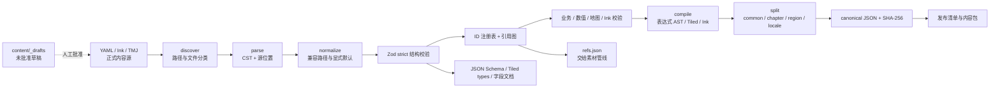

# tech/04 · 数据驱动与内容管线

| 项 | 内容 |
|---|---|
| 文档 | `docs/tech/04-data-pipeline.md` |
| 版本 | v1.2（跨文档同步，2026-09-26）；全局审计（2026-09-26） |
| 上游基准 | `docs/00-canon.md` §3–§5、§9、§12、§18、§19；`docs/decisions/author-requirements.md` AR-03–AR-07、AR-09；`docs/decisions/rulings-v1.md` C12、C18、C22、C23 |
| 强依赖 | `tech/01` §3.7、§4、§6.8、§8.3、§9；`tech/02` §1–§2、§7；`tech/03` §5.6；`tech/06`；`tech/08` §3.6；`design/02`–`design/20` 已落盘的数据契约与校验规则；相关代理报告中的下游交接项 |
| 下游文档 | `tech/05` 玩法引擎、`tech/09` 路线图；各书界内容文档 |
| 读者 | 作者本人、内容编辑者、AI 编码/内容助手 |
| 本文职责 | `content/` 源数据布局；YAML 与 Zod 契约；ID 注册、重命名与引用图；Tiled/Ink 转换；内容校验器；规则/文本书界包、`contentHash` 与增量更新；AI 草稿审核入库 |
| 不在本文定义 | 武功/Buff/地形/战斗/经济等玩法语义；素材编码与 CDN；存档结构迁移；云同步。本文只实现其数据入口并引用唯一归属文档 |

> **结论先行（TL;DR）**
>
> 1. **源数据只有一份**：策划可读源放在 `content/`，主要使用 UTF-8 YAML；Zod 权威定义放在 `packages/data/src/schemas/`。JSON Schema、Tiled 类型、Markdown 字段表和发布 JSON 都是生成物，不得反向手改。
> 2. **目录采用 `common + world + chapters/chNN_*`**：跨书界规则在 `common/`，全局地理与时代索引在 `world/`，书界私有内容在 `chapters/chNN_*/`。已有 `content/chNN_*/...` 引用由路径重写表迁到 `content/chapters/chNN_*/...`，不维护两份实体文件。
> 3. **严格 schema，显式升级**：对象用 `z.strictObject()`，未知字段报错；默认值只在构建期展开。内容 schema 变更要提高 `schemaVersion`、生成契约并补迁移夹具，不能靠静默丢字段兼容。
> 4. **ID 是永久外键**：先扫描全局注册表，再允许定义；删除或改名必须写 `idRemaps`。映射须同命名空间、无环、单出口、目标存在、旧 ID 不再定义；读档先执行结构迁移，再按映射修复引用（见 `tech/08` §3.6）。
> 5. **校验不止“能解析”**：`pnpm content:validate` 依次检查语法、结构、ID、引用、设计业务规则、六角地图可达性、Ink 结构与桥接、本地化、数值预算、包体预算和确定性；error 阻断构建，warning 必须出报告。
> 6. **世界导航与区域六角严格分层**：`design/map/*.yaml` 是 `design/19` 的 WGS84 全国导航源，保留既有 snake_case 与短书界键；Tiled 1.12.2 只编辑区域内逻辑格，编辑坐标 `(x,y)` 直接成为 pointy-top 轴坐标 `(q,r)`。转换器输出 32×32、每块 1,024 个六角槽的 `RegionMapChunk`，与 `tech/02` 合批契约一致。
> 7. **Ink 不直接改 core**：脚本只能调用只读查询白名单，写操作以声明式命令标签产出，经 core 再校验后提交。每个 locale 独立编译，但节点、选择和变量结构必须同构；结构摘要进入 rules/`contentHash`，字面文本进入 locale/`textHash`；Ink 随机种子由 `world` RNG 覆盖。
> 8. **书界包规则/文本分离并按区域切片**：稳定逻辑名为 `chNN.rules.base.json`、`chNN.rules.<regionId>.json`、`chNN.text.<locale>.base.json`、`chNN.text.<locale>.<regionId>.json`，例如 `ch01.rules.rg_dali_cangshan.json`；超过 256 KiB 原始 JSON 时由索引再分 `pNNN` 叶片，主线程在加载遮罩或空闲队列中逐片解析。
> 9. **哈希分三个域**：`contentHash` 覆盖当前书界的完整传递规则依赖闭包，供存档迁移，绝不随玩家当前驻留区域变化；`textHash` 覆盖单语言文本；`releaseHash` 覆盖整份发布清单。三者都基于规范化未压缩字节，排除时间戳、绝对路径和压缩器差异。
> 10. **P4 预算已落地**：典型书界按本章模型估为约 1,039 KiB gzip；加 25% 余量为 1,298.75 KiB，显示为约 1,299 KiB（约 1.268 MiB）。它低于 1.5 MiB 硬门槛，但已越过 1.25 MiB（1,280 KiB）预警线，故模型结果是 warning；这仍是 **（待实测）** 的容量模型，须以首个完整书界语料校准。
> 11. **素材与内容分版本**：内容只保存逻辑素材键；`content:build --emit-refs` 生成引用图交给 `tech/06`，二进制和 `assets.lock.json` 不进入 `contentHash`。
> 12. **AI 只能进入草稿区**：结构化输出先落 `content/_drafts/`，经草稿校验、事实/原创标注审阅、人工批准后才由 `content:promote` 入正式目录；任何模型输出都不能自动覆盖已入库内容。
> 13. **传承已转正式 schema**：`design/20` 的 `legacy.v1` 以 `sources / caches / fragments / keystones / recipes` 五表进入 registry；39 源、117 卷、39 缓存与 39 信物必须闭合，`lgs_ / frag_ / cache_` 不再是占位前缀。

---

## 目录

1. [目标、边界与总流程](#1-目标边界与总流程)
2. [content 目录、文件与 ID 规范](#2-content-目录文件与-id-规范)
3. [packages/data 与 Zod schema](#3-packagesdata-与-zod-schema)
4. [读取、归一化与编译管线](#4-读取归一化与编译管线)
5. [内容校验器](#5-内容校验器)
6. [Tiled 地图管线](#6-tiled-地图管线)
7. [Ink 对话与本地化管线](#7-ink-对话与本地化管线)
8. [书界包、哈希与增量更新](#8-书界包哈希与增量更新)
9. [AI 辅助内容生产的入库闭环](#9-ai-辅助内容生产的入库闭环)
10. [开发工作流与热更新](#10-开发工作流与热更新)
11. [测试与 CI](#11-测试与-ci)
12. [MVP 与演进](#12-mvp-与演进)
13. [风险与对策](#13-风险与对策)
14. [参考资料](#14-参考资料)
15. [本文新增术语/约定](#15-本文新增术语约定)
16. [待决事项 / 依赖](#16-待决事项--依赖)

---

## 1. 目标、边界与总流程

### 1.1 目标

本管线把“人和 AI 容易编辑的内容源”稳定地变为“玩法核心可确定性消费的、可增量下载的内容包”。它必须同时满足：

- **可读**：YAML、Ink、Tiled 源文件可审阅、可 diff，错误能回到源文件行列；
- **唯一**：每个概念只有一个 schema 与一个正式 ID，不因目录别名、语言或包切片重复定义；
- **可证**：所有运行时引用都能沿引用图追到定义、策划章节与素材键；
- **可迁移**：已发布 ID 不被“顺手改名”破坏，旧存档有确定的修复路径；
- **可控**：生成内容必须通过机器校验与人工审核，且可从发布产物复现；
- **可加载**：移动端每次解析的原始 JSON 叶片不超过 256 KiB，区域按需加载；
- **可重现**：相同 Git 内容、工具锁文件与参数必须生成逐字节相同的规范 JSON 与哈希。

### 1.2 归属边界

| 事项 | 唯一归属 | 本文如何消费 |
|---|---|---|
| 品阶、书界、ID 总规则 | `docs/00-canon.md` | 编译为枚举、正则与封闭名录测试，不在本文重排数值 |
| 时间线与武运 | `design/02` | 校验 `chapter`、`worldTier`、原生投放和压制所需字段 |
| 属性与伤害公式 | `design/03`、`design/04` | 生成合法字段枚举；数值检查调用同一纯函数实现 |
| 武功、招式与内功预算 | `design/05` | `SkillDef`/`MoveDef` 镜像其字段；执行 §15 规则 |
| Buff 与效果 DSL | `design/06` | `BuffDef` 镜像其字段；表达式只编译白名单 AST |
| 套装 | `design/07` | 预留 `SetDef`；执行成员与 `setTags` 双向闭合（C22） |
| 地形、轻功与门禁 | `design/08` | `TerrainDef`、`QinggongGate` 与可达性检查 |
| 遭遇与战斗脚本 | `design/09` | `EncounterDef`、`BossScriptDef` 等 schema；Boss 前缀服从 C12 |
| 物品、装备与经济锚点 | `design/10` | `ItemDef`/`EquipDef`/`RecipeDef` 与投放预算检查 |
| 大地图几何、城市、路线与时代投影 | `design/19`；区域玩法与入口状态归 `design/11` | 直接校验 `design/map/*.yaml` 的既有源契约；不把全国 WGS84 坐标转换为区域六角格 |
| NPC 与跨书界同伴 | `design/18`；任务与门派流程归 `design/12` | `NpcDef`/`NpcAppearance` 镜像 `design/18` §7，执行其 §14 NPC-V01–V14 |
| 天书之力、成长、结局 | `design/13` | `TianshuPowerDef` 与其 §11 校验 |
| 经脉、资源经营 | `design/15`、`design/16` | 消费其正式 schema、事务与校验规则；不在本文重定义玩法数值 |
| 跨年代传承 | `design/20`（AR-13） | 严格消费 `legacy.v1` 五表、39 源目录、运行态与 LEG-V01–V10；任务 / 经营 / NPC 跨域适配分别引用 `design/12`、`16`、`18` |
| 运行时解释器 | `tech/05` | 本文编译数据，不定义效果原语的结算语义 |
| 素材键、编码、清单与锁 | `tech/06`、`tech/07` | 只抽取逻辑引用，生成 `refs.json`；不复制二进制或清单规则 |
| 存档结构迁移与云同步 | `tech/08` | 输出 `contentHash` 与 `idRemaps`，供其迁移后修复 |

`design/11`、`design/12`、`design/15`–`design/20` 已有正式逻辑 / 源数据契约，相关 schema 不再标 provisional；归属文档后续变更时先更新 Zod 与迁移。`design/11` 已定稿 30 区闭集及 `RegionDef` / `EraLayer` / `EraRegionState`，但 `design/map/*.yaml` 的 19→30 区物理数据迁移尚未完成，生产构建必须在迁移完成后才接受。AR-13 已由 `design/20` 落地为 `legacy.v1`；本文只镜像结构、注册引用并执行其校验族，不复制传承概率、投放或合成规则。

**已解决（E1.R）**：`tech/03` §2.8、§5.6 已将早期“单片 ≤300 KB”建议统一为 **原始 UTF-8 JSON 叶片与游戏中单次 `JSON.parse` 输入均 ≤256 KiB**；本文采用同一可直接校验的发布门禁，不再混用十进制 KB、二进制 KiB 与“分片/单次解析”口径。

### 1.3 总流程



每个阶段只接受上一阶段的不可变结果，并把诊断附到源位置。构建器不在原文件上自动修复；可机械修复的建议以补丁形式输出，由人确认后再写入。

### 1.4 输入、输出与非目标

| 类别 | 输入 / 输出 | 是否提交 Git | 说明 |
|---|---|---:|---|
| 正式源 | `content/**/*.yaml`、`*.ink`、`*.tmj` | 是 | 唯一内容事实源 |
| 草稿源 | `content/_drafts/**` | 可选 | 永不参与生产构建；合并前必须 promote |
| schema 源 | `packages/data/src/schemas/**/*.ts` | 是 | Zod 4；唯一结构事实源 |
| 跨语言静态契约 | `packages/spec/**` | 是 | C18 唯一路径；相机、精灵等非业务 JSON 契约 |
| 编辑器镜像 | `content/.schema/*.json`、Tiled property types | 是 | 由 `schema:gen` 重建并做漂移检查 |
| 构建缓存 | `.cache/content-build/**` | 否 | 以文件哈希和工具版本寻址 |
| 发布产物 | `dist/content/**` | 否 | 规范 JSON、预压缩文件、清单、报告 |
| 素材引用图 | `.cache/content-build/refs.json` | 否 | `tech/06` 的自动归包输入 |

非目标包括：在 YAML 中嵌入二进制、把 Tiled 当最终渲染格式、让 Ink 承担战斗结算、在构建器中复制设计公式、由 AI 自动发布内容。

---

## 2. content 目录、文件与 ID 规范

### 2.1 规范目录树

```text
content/
├── CLAUDE.md
├── .schema/                         # schema:gen 生成；只供编辑器
│   ├── skill.schema.json
│   ├── buff.schema.json
│   ├── region.schema.json
│   └── index.json
├── _drafts/                         # AI / 人工草稿；生产发现器硬排除
│   └── <job-id>/
│       ├── draft.yaml
│       └── provenance.json
├── common/                          # 跨书界、语言无关的正式定义
│   ├── skills/                      # sk_*，内部包含 mv_* / ps_*
│   ├── buffs/                       # bf_*
│   ├── sets/                        # set_*
│   ├── items/                       # it_* / eq_*；保留 items/divine.yaml
│   ├── terrain/                     # tr_* / tst_*
│   ├── combos/                      # cmb_*；保留 combos/cmb_longbang.yaml
│   ├── ai/                          # pers_* / ai_*；保留 ai/pers_duzhe.yaml
│   ├── tianshu/                     # tsp_*；保留 tianshu/tsp_*.yaml
│   ├── sects/                       # sect_*、职级模板
│   ├── meridians/                   # mer_* / ap_*【建议值，AR-03】
│   └── economy/                     # res_* 与跨书界品级表【建议值，AR-05】
├── world/                           # 构建期导入的全局导航索引 + 区域内地图
│   ├── tiers.yaml                   # 保留既有 content/world/tiers.yaml
│   ├── navigation/                  # 从 design/19 的 design/map/*.yaml 编译，禁止手改
│   │   ├── cities.json              # WGS84 城市与 14 个时代状态
│   │   ├── regions.json             # 迁移后的 30 个正式区域及导航几何
│   │   ├── routes.json              # 驿站、码头、常规线与图外专线
│   │   └── sects.json               # 门派落点；开放语义仍归 design/17
│   └── regions/                     # 区域内可行走 rg_* 数据；与导航几何严格分层
│       ├── rg_dali_cangshan.yaml
│       └── rg_dali_cangshan.tmj
├── chapters/
│   ├── ch00_yuenv/
│   ├── ch01_tianlong/
│   │   ├── chapter.yaml
│   │   ├── era.yaml                 # 对全局区域/城市的时代覆写【建议值】
│   │   ├── npcs/                    # npc_*
│   │   ├── quests/                  # q_*
│   │   ├── dialogue/                # *.ink + *.inkmeta.yaml
│   │   ├── encounters/              # enc_*
│   │   ├── bosses/                  # bsc_*；旧 boss/ 只迁移不兼容共存
│   │   ├── enemies/                 # tmpl_* / arch_* / ea_*
│   │   ├── events/                  # ev_*
│   │   ├── resource-points/         # rp_*【建议值，AR-05】
│   │   ├── servants/                # sv_*【建议值，AR-05】
│   │   ├── businesses/              # biz_*【建议值，AR-06】
│   │   └── shops/
│   └── ch14_xueshan/
├── locales/
│   ├── zh-Hans/ui.yaml
│   └── zh-Hant/overrides.yaml
├── assets/registry/                 # AssetEntry 登记库；字段归 tech/07
│   └── ch01/portrait.yaml           # 保留既有兼容路径
├── tiled/                           # Tiled 工程、tileset 与扩展；tech/01 既有路径
│   ├── tianshu.tiled-project
│   ├── tilesets/
│   │   ├── terrain.tsx
│   │   ├── height.tsx
│   │   └── deco-<theme>.tsx
│   └── extensions/
│       └── tianshu-check.js
├── vfx/                             # fx_* 定义；引用素材键，不放贴图
└── migrations/
    ├── id-remaps.yaml               # 累积、可审计的 ID 重映射
    └── path-remaps.yaml             # 仅构建源路径迁移，不进入存档
```

`ch00`–`ch14` 与终局容器 `ch15_guimeng` 的命名服从基准 §12；`ch15` 只是终局命名空间，不是第十五本天书。目录可以不存在空壳，但一旦出现必须匹配已登记书界 ID。

### 2.2 兼容路径与迁移

现有文档同时出现 `content/chapters/chNN_*/...` 与 `content/chNN_*/...`。本方案只保留前者为物理规范路径，发现器在迁移期读取 `path-remaps.yaml`，将旧路径解析到新路径并发 `CONTENT_PATH_DEPRECATED`；不得复制文件，也不得以符号链接制造两个可编辑入口。

| 既有引用 | 规范路径 / 处理 | 兼容策略 |
|---|---|---|
| `content/ch08_luding/encounters/enc_08_shenlongdao.yaml` | `content/chapters/ch08_luding/encounters/enc_08_shenlongdao.yaml` | 路径重写；一个版本周期 warning，之后旧物理路径为 error |
| `content/ch08_luding/boss/bsc_hongantong_shenlongdao.yaml` | `content/chapters/ch08_luding/bosses/bsc_hongantong_shenlongdao.yaml` | 保持 `design/09` 已引用路径可迁移读取；只改物理目录，不改 ID |
| 历史 `content/ch08_luding/boss/bs_hongantong_shenlongdao.yaml` | `content/chapters/ch08_luding/bosses/bsc_hongantong_shenlongdao.yaml` | 路径迁移且 ID 按 C12 重映射；同表也覆盖 `bs_xiaofeng_juxianzhuang`、`bs_dongfangbubai_heimuya`；`bs_` 只留书眠 Ink 节点 |
| `content/chapters/ch01_tianlong/regions/rg_01_dali.tmj` | `content/world/regions/rg_dali_cangshan.tmj` | 区域内可行走底图迁移；按 `design/11` §2.3 的 19→30 区表与导航源迁移同批提交。它不是 `design/19` 的全国导航几何；多个旧图汇入同一区域时只报冲突、不自动覆盖 |
| `docs/design/map/cities.yaml`、`regions.yaml`、`routes.yaml`、`sects.yaml` | 原路径为 `design/19` 权威源；编译镜像进入 `content/world/navigation/*.json` | 保持 snake_case、短键 `ch01`…`ch14` 与 JSON-compatible YAML；发现器只读导入，禁止复制为第二份可编辑 YAML |
| `content/common/items/divine.yaml` | 原路径 | 允许“一文件多对象”；对象仍逐一注册 |
| `content/common/tianshu/tsp_*.yaml` | 原路径 | 原路径即规范 |
| `content/common/combos/cmb_longbang.yaml` | 原路径 | 原路径即规范 |
| `content/common/ai/pers_duzhe.yaml` | 原路径 | 原路径即规范 |
| `content/world/tiers.yaml` | 原路径 | 原路径即规范；不移入 `common` |
| `content/assets/registry/ch01/portrait.yaml`、`ch01/cg.yaml` | 原路径 | 原路径即规范；资产登记库归 `tech/07` |
| `content/assets/registry/asset.schema.json` | 原路径 | `schema:gen` 生成的兼容镜像；权威源为 `packages/data/src/schemas/asset-entry.ts`，跨语言快照在 `packages/spec/content/`，禁止手改 |
| `content/tiled/tianshu.tiled-project` | 原路径 | 原路径即规范；只存项目属性类型、tileset 与编辑器扩展 |
| `content/vfx/fx_*.yaml` | 原路径 | 原路径即规范；`fx_*` 不是二进制素材键 |

迁移命令先输出计划，再由人确认应用：

```bash
pnpm content:migrate --paths --dry-run
pnpm content:migrate --paths --apply
pnpm content:validate --no-deprecated-paths
```

发布构建始终启用 `--no-deprecated-paths`。文档中的历史示例可以保留旧路径作追溯，但真正文件、活跃引用和产物清单只能使用规范路径。

### 2.3 YAML 写作约定

| 规则 | 约定 | 原因 |
|---|---|---|
| 编码 | UTF-8、无 BOM、LF、文件末尾一个换行 | 跨平台哈希稳定 |
| 文档数 | 每文件一个 YAML document；禁用 `---` 多文档流 | 文件级诊断与缓存简单 |
| 根形状 | 单对象，或明确允许的同类型对象数组 | 禁止把不相关类型混在一个文件 |
| 键 | `content/**` 作者源默认 ASCII `camelCase`；但 `design/19` 已定稿的 `design/map/*.yaml` 保留其 snake_case 与短键 `ch01`…`ch14`，按专用 source schema 校验后在 IR 归一化 | 防拼写错误，同时避免自动改写权威地图源 |
| 数值 | 小数用十进制有限字面量；百分比写小数，百分点字段以 `Pp` 结尾 | 与 `design/03`、`design/06` 一致 |
| 特殊数 | 禁止 `NaN`、`Infinity`、`-inf`；需要不可通行时写枚举 `inf` | JSON 可表达且跨解析器一致 |
| 日期 | 玩法年代用整数/结构体；不得依赖 YAML 隐式时间类型 | 防时区和自动类型转换 |
| 锚点 | 禁止 YAML anchor、alias 与 merge key | 防隐式共享、循环和难审 diff |
| 标签 | 禁止自定义 `!!` 标签；解析器只接受 core schema | 防对象构造与工具差异 |
| 重复键 | 一律 error | 禁止“后值覆盖前值” |
| 注释 | 可解释来源与算式，不承载运行规则 | 规则必须结构化 |
| 标注 | 原创/待考写进 `origin`、`canonRef` 等结构字段；展示文本仍保留规范标注 | 可机器检查 |

解析使用 `yaml@2.9.1` 的 `parseDocument`、`LineCounter` 和源 token 信息，以便把 Zod 路径映射回行列。锁定版本已于 2026-09-26 从 npm registry 核实；升级必须跑解析夹具，不使用“latest”漂移构建。

### 2.4 文件粒度与覆盖规则

- 默认一份定义一个文件，文件主名等于顶层 `id`；大表只有在归属文档已明确为封闭集合时才允许数组文件，如 `divine.yaml`。
- 同一 ID 不允许按目录优先级覆盖。开发、书界与本地化都不能重新定义规则对象。
- 时代差异放入 `EraLayer.regions[]: EraRegionState[]`；只允许 `design/11` §12.5 明列的时代字段，不能任意 JSON Merge Patch。
- 本地化只覆盖 `TextKey` 的值；不得改变 ID、条件、选择数量或数值。
- 测试夹具在 `tools/content-build/test/fixtures/`，必须由发现器显式传入，生产扫描永不递归该目录。
- 生成物带 `generatedBy` 与格式版本，但这些构建元数据不混入玩法对象，也不参与 `contentHash`。

### 2.5 ID 注册表

发现阶段不立刻解析引用，而先建立全局符号表：

```ts
export type ContentKind =
  | 'chapter' | 'skill' | 'move' | 'passive' | 'buff' | 'set'
  | 'item' | 'equip' | 'terrain' | 'terrainState' | 'region' | 'city'
  | 'npc' | 'quest' | 'encounter' | 'bossScript' | 'enemyTemplate'
  | 'sect' | 'tianshuPower' | 'meridian' | 'acupoint'
  | 'resource' | 'resourcePoint' | 'servant' | 'business'
  | 'legacySource' | 'legacyFragment' | 'legacyCache' | 'legacyKeystone' | 'legacyRecipe';

export interface SymbolEntry {
  readonly id: string;
  readonly kind: ContentKind;
  readonly file: string;          // 仓库根相对路径；不写绝对路径
  readonly pointer: string;       // JSON Pointer，如 /moves/2
  readonly chapter: string | null;
  readonly provisional: boolean;
}

export interface RefEdge {
  readonly from: string;
  readonly to: string;
  readonly field: string;
  readonly strength: 'hard' | 'optional' | 'asset';
  readonly source: { file: string; line: number; column: number };
}
```

注册顺序固定为规范相对路径的 Unicode code point 升序，再按文件内数组序。重复定义同时报告首处和冲突处；不能“最后一个赢”。嵌套 `MoveDef`、`PassiveDef` 也进入同一全局表，因此跨武功重名会失败。

ID 正则从基准 §12 与已批准作者需求生成，而不是散落在各 schema 中手抄。AR-04 将区域扩为全局 `rg_*`，词法正则为 `^rg_[a-z0-9_]+$`，生产定义还必须属于 `design/11` §13.2 的 30 区闭集。旧 `rg_NN_*` 与 W1 的五个废弃粗区只允许迁移器按 `design/11` §2.3 单向读取，不能进入新内容或发布注册表；未曾发布的旧 ID 直接改正，已发布者才登记 `idRemaps`。

### 2.6 ID 重映射

`content/migrations/id-remaps.yaml` 是正式内容迁移的一部分：

```yaml
schemaVersion: id-remaps.v1
remaps: [] # 发布时由 rulings-v1 §2 的已批准重命名表生成，不在示例重复登记旧 ID
```

每项仍须含 `from / to / since / reason`；其具体映射只从 `rulings-v1` §2 生成，避免技术文档成为第二份可编辑清单。为避免 `contentHash` 覆盖 `idRemaps` 时形成自引用，正式 `since` 记录**重命名前最后一个可读版本的 `contentHash`**，由发布流程从前一份已验证 manifest 写入；未曾发布的 ID 直接改正，不创建 remap。规则如下：

1. `from` 全局唯一，每个旧 ID 只有一个直接去向；
2. 图必须无环；构建时把历史链压平到当前叶目标，但保留原记录供审计；
3. `to` 必须存在于当前注册表，`from` 不得仍有正式定义；
4. 默认要求同命名空间；跨类型迁移必须提高存档 schema，由 `tech/08` 的结构迁移处理，不能只写 remap；
5. 一对多拆分不能用本表表达，必须写结构迁移并给确定的缺省选择；
6. 映射覆盖存档、任务旗标、Ink 状态外围索引和内容引用；不对自由文本做搜索替换；
7. 当前包携带支持窗口内的累积映射；只要存档中实际出现 `from` 就应用，`since` 用于审计而非依赖设备墙钟；
8. 加载顺序固定为 `migrateSave()` → `fixupContentRefs()` → 引用完整性检查 → 写迁移报告，符合 `tech/08` §3.6。

删除而无替代的 ID 不能伪装成 `to: null`。它进入带类型的退化策略表：物品按 `design/10` 估值折银，武功转残篇记录，任务标 `obsolete`；具体执行仍归 `tech/08`。

### 2.7 路径与 ID 的稳定性分级

| 变更 | 允许方式 | 是否改变 `contentHash` | 存档动作 |
|---|---|---:|---|
| 注释、排版 | 直接改源 | 否 | 无 |
| 纯显示文本 | 改 locale / Ink 字面文本，不改分支、标签或变量 | 否；改变 `textHash` | 无 |
| 文件搬迁、ID 不变 | `path-remaps` + 一次迁移 | 否 | 无 |
| 数值或规则字段 | 改 YAML，附来源/算式 | 是 | 通常只重新绑定定义 |
| ID 改名 | 新 ID + `idRemaps` | 是 | 修复引用 |
| 对象拆分/合并 | 新 schema 版本 + 结构迁移 | 是 | 结构迁移后再修复引用 |
| schema 删除字段 | 先弃用至少一个发布窗口，再迁移 | 是 | 夹具覆盖 |

---

## 3. packages/data 与 Zod schema

### 3.1 源码组织

```text
packages/data/
├── src/
│   ├── schemas/
│   │   ├── primitives/             # ID、Grade、ChapterId、Expr、AssetKey
│   │   ├── combat/                 # skill、buff、set、encounter、enemy、ai
│   │   ├── world/                  # terrain、region、city、era、tiled-output
│   │   ├── narrative/              # npc、quest、dialogue-manifest、event
│   │   ├── inventory/              # item、equip、recipe
│   │   ├── progression/            # tianshu、achievement、ending
│   │   ├── society/                # sect、rank、business
│   │   ├── meridian/               # design/15 正式 schema
│   │   ├── economy/                # design/16 正式 schema
│   │   ├── legacy/                 # design/20 legacy.v1 五表与运行态契约
│   │   ├── asset-entry.ts          # 结构与 tech/07 对齐
│   │   └── index.ts
│   ├── pack/                       # ChapterPackManifest、轻量加载类型
│   ├── generated/                  # schema:gen 生成的 ID 联合/枚举；勿手改
│   └── index.ts                    # 运行时安全导出；不得导出完整 Zod
├── test/
│   ├── fixtures/valid/
│   ├── fixtures/invalid/
│   └── golden/
└── package.json

packages/spec/                      # C18：跨语言静态 JSON 契约唯一目录
├── content/                        # Zod 导出的跨工具 JSON Schema 快照
│   ├── skill.schema.json
│   └── region-map.schema.json
├── iso-camera.json
└── sprite-spec.json
```

`packages/data/src/schemas/**` 是权威 TypeScript 源。`packages/spec/content/**` 供 Python、Tiled 扩展和外部工具消费；`content/.schema/**` 是面向编辑器的镜像。C18 禁止恢复旧的 `packages/data/spec/`。

### 3.2 schema 设计原则

1. **严格对象**：所有实体与关键子结构用 `z.strictObject`，未知键失败；仅明确的扩展袋如 `TspRule.params` 允许有限 JSON 值。
2. **类型从 schema 推导**：`type SkillDef = z.output<typeof SkillDefSchema>`；不得另写一份手工 interface 后声称同构。
3. **输入与输出分开**：输入允许省略有默认值的字段；构建后输出展开默认、去除注释并冻结。JSON Schema 用 `io: 'input'` 供写作者补全。
4. **不用隐式 transform 隐藏迁移**：拼写纠正、旧字段改名在 `normalize` 阶段产生诊断；Zod 只做结构解析与局部 refine。
5. **交叉对象规则不塞进单文件 schema**：存在性、双向关系、预算和可达性由注册表后的 lint pass 完成，避免读取顺序影响结果。
6. **有限数值**：所有 number 先要求 `Number.isFinite`；整数、范围、步长分别检查。
7. **判别联合**：物品、效果、对象、命令标签等以稳定的 `kind`/`type` 区分，不靠字段猜类型。
8. **描述可生成**：公共字段必须带 `.describe()`，来源章节写入 metadata，供 JSON Schema 与 AI 字段参考表。
9. **暂定字段显式化**：仅未定稿模块导出 `Provisional*` schema，根对象带 `schemaStatus: 'provisional'`；正式构建可接纳，但报告必须列出数量。已落盘的 11/12/15–20 不得继续沿用 provisional 名称。
10. **运行时无完整 Zod**：工具入口从 `@tianshu/data/schemas` 导入 Zod；游戏只从 `@tianshu/data` 导入生成类型和轻量边界检查，沿用 `tech/01` §3.2、§5.2。

### 3.3 公共原语示例

```ts
import { z } from 'zod';

export const GradeSchema = z.number().int().min(1).max(12)
  .describe('绝对品阶 1..12；见 Canon §4');

const id = (prefix: string, label: string) =>
  z.string().regex(new RegExp(`^` + prefix + `[a-z0-9_]+$`)).describe(label);

export const SkillIdSchema = id('sk_', '武功 ID；Canon §12').brand<'SkillId'>();
export const BuffIdSchema = id('bf_', 'Buff ID；Canon §12').brand<'BuffId'>();
export const NpcIdSchema = id('npc_', 'NPC ID；Canon §12').brand<'NpcId'>();
export const RegionIdSchema = id('rg_', '全局区域 ID；AR-04').brand<'RegionId'>();
export const AssetKeySchema = z.string()
  .regex(/^(?:portrait|avatar|cg|concept|illus|cutin|icon|ui|map|sprite|terrain|building|prop|vfx|video|bgm|vo|sfx|font|lut|sfxbank|atlas)\/[a-z0-9]+(?:_[a-z0-9]+)*\/[a-z0-9]+(?:_[a-z0-9]+)*$/)
  .describe('逻辑素材键；定义与寻址见 tech/06');

export const OriginSchema = z.enum(['canon', 'expanded', 'canonExpanded']);
export const SourceMarkSchema = z.strictObject({
  origin: OriginSchema,
  canonRef: z.string().min(1).optional(),
}).superRefine((v, ctx) => {
  if (v.origin !== 'expanded' && !v.canonRef) {
    ctx.addIssue({ code: 'custom', path: ['canonRef'], message: '原著相关内容必须给出处或（待考）' });
  }
});

export type SkillId = z.output<typeof SkillIdSchema>;
export type RegionId = z.output<typeof RegionIdSchema>;
```

上例的 `id()` 只展示共同形状；实际实现从一张经测试的前缀表生成，避免正则和说明分叉。`AssetKeySchema` 则逐项复用 `tech/06` §3.2 的 kind 枚举与三段式 `<kind>/<subject>/<variant>`，不能接受缺 variant 或任意 kind。业务 ID 不在解析时自动转小写，因为自动转换会掩盖两个原始 ID 的碰撞。

### 3.4 schema 清单

| 域 | 根 schema / 关键子结构 | ID / 路径 | 字段权威来源 |
|---|---|---|---|
| 书界 | `ChapterDef`、`WorldTierDef` | `chNN_*`、`world/tiers.yaml` | 基准 §2–§5、`design/02` |
| 武功 | `SkillDef`、`MoveDef`、`PassiveDef`、`InnerDef`、`LearnSource` | `sk_*`、`mv_*`、`ps_*` | `design/05` §2、§4、§5、§15 |
| Buff | `BuffDef`、`StackRule`、`TriggerDef`、`EffectOp`、`Expr` | `bf_*`、`fam_*`、`exg_*`、`rx_*` | `design/06` §2、§6、§13 |
| 套装 | `SetDef`、`SetThreshold` | `set_*` | `design/07`；C22 |
| 物品装备 | `ItemDef`、`EquipDef`、`UseSpec`、`RecipeDef`、`AffixDef`、`UniqueDef` | `it_*`、`eq_*`、`rc_*`、`af_*`、`ue_*` | `design/10` §2、§14 |
| 地形 | `TerrainDef`、`TerrainStateDef`、`QinggongGate` | `tr_*`、`tst_*`、`gate_*` | `design/08` §2、§6、§12 |
| 全国导航源 | `WorldMapCitiesSource`、`WorldMapRegionsSource`、`WorldMapRoutesSource`、`WorldMapSectsSource` | `city_*`、`rg_*`、`route_*`、`post_*`、`port_*`、`offmap_*`；`design/map/*.yaml` | `design/19` §3、§10、§15；保留源字段与 WGS84 |
| 区域内地图 | `RegionDef`、`RegionMap`、`RegionMapChunk`、`RegionObject` | 30 个正式 `rg_*`、`content/world/regions/*.tmj` | `design/11` §2、§12.1、§14；本章 §6；渲染消费见 `tech/02` |
| 时代玩法层 | `EraLayer`、`EraRegionState` | `chNN_*`、`city_*`、`rg_*` 引用 | `design/11` §1.6、§12.5、§14；城市坐标/历史名称与路线几何归 `design/19` |
| NPC | `NpcDef`、`YearValue`、`NpcAppearance`、`RecruitmentSpec`、`FullBuild`、`TemplateBuild` | `npc_*` | AR-09；`design/18` §7、§14 |
| 任务剧情 | `QuestDef`、`QuestInstance`、`NpcInteractionBinding`、`SectProgressionPolicy`、`ConditionExpr`、效果联合 | `q_*`、稳定 stage/effect 局部键 | `design/12` §11；经验字段见 `design/13` |
| 对话 | `DialogueManifest`、`InkBridgeUse`、`TextIndex` | 逻辑键 `ink.<story>.*` | 本章 §7；剧情语义归各书界与 `design/12` |
| 遭遇 | `EncounterDef`、`BossScriptDef`、`TelegraphDef`、`ComboDef` | `enc_*`、`bsc_*`、`tg_*`、`cmb_*` | `design/09` §13–§14；C12 |
| 敌人 AI | `EnemyTemplateDef`、`ArchetypeDef`、`EliteAffixDef`、`AiPersonalityDef` | `tmpl_*`、`arch_*`、`ea_*`、`pers_*`、`ai_*` | `design/09` |
| 天书成长 | `TianshuPowerDef`、`TspRule`、成就/结局/称号定义 | `tsp_*`、`ach_*`、`end_*`、`ttl_*` | `design/13` §4、§8、§10–§11 |
| 门派职级 | `SectCompendium`、`SectDef`、`RankTemplateDef`、`SectEraProfile`、`SectProgressionPolicy` | `sect_*`；L1–L5；T01–T12（T05A/T05B 分型） | `design/17` §12、§15；流程字段见 `design/12` §11.3 |
| 经脉穴道 | `MeridianDef`、`AcupointDef`、`CirculationDef`、`MeridianProgress`、`MeridianSessionSnapshot` | `mer_*`、`ap_*`、`zt_*` | AR-03；`design/15` §11、§14 |
| 资源经营 | `ResourceDef`、`ResourcePointDef/State`、`ServantDef/ContractState`、`BusinessDef`、`JobContractState`、`EconomyLot`、`SectLedger` | `res_*`、`rp_*`、`sv_*`、`biz_*`、`job_*` | AR-05–AR-07；`design/16` §14 |
| 跨年代传承 | `LegacyRegistry`、`LegacySourceDef`、`LegacyFragmentDef`、`LegacyCacheDef`、`LegacyKeystoneDef`、`LegacyRecipeDef` | `lgs_*`、`frag_*`、`cache_*`、`it_xinwu_*` | AR-13；`design/20` §12、§14 |
| 素材登记 | `AssetEntry`、`Provenance` | 素材逻辑键 / `art://` | 字段归 `tech/07`，存储与清单归 `tech/06` |
| 特效 | `VfxDef`、表现阶段引用 | `fx_*` | 表现契约见 `tech/02`；只引用素材键 |

### 3.5 策划字段到 schema 的对应

| 策划字段组 | Zod 路径 | 额外构建处理 |
|---|---|---|
| `design/05` `SkillDef` 顶层 | `combat/skill.ts: SkillDefSchema` | `aptitude`、`moveSlots` 可按设计规则展开默认；保留输入/输出差异 |
| 招式 `moves[]` | `MoveDefSchema` | `aoe` 解析为模板引用；预算报告保存期望值、实值、差值 |
| 内功 `inner.contribution` | `InnerContributionSchema` | 计算 IP，不把计算结果写回源 YAML |
| `design/06` 表达式字段 | `ExprSourceSchema` | 白名单解析为 AST；产物只含 AST，不在运行时 `eval` |
| Buff `mods/triggers/reactions` | 对应判别联合 | 建立 hook → Buff 倒排索引供运行时加载 |
| `design/08` `TerrainDef` | `world/terrain.ts` | `combat` 记法编译为 `Mod[]`；资产简写归一为素材键 |
| 地图 `QinggongGate` | `world/region-object.ts` | 与 TMJ 对象类合并后执行 V-G1–V-G9 |
| `design/09` 遭遇与 Boss | `combat/encounter.ts` | 区域出生区解析为六角集合；阶段条件编译为 AST |
| `design/10` `ItemDef/EquipDef` | `inventory/*.ts` | 按 `kind` 选择判别分支；`price:auto` 保持标记，由 core 公式求值 |
| `design/13` `TianshuPowerDef` | `progression/tianshu.ts` | `TspRule.kind` 必须在 `tech/05` 原语注册表 |
| `design/12` 任务 / NPC 绑定 / 门派流程 | `narrative/quest.ts`、`narrative/npc-binding.ts`、`society/sect-progression.ts` | 严格消费 `quest.v1`、`quest-instance.v1`、`quest-npc-binding.v1`、`sect-progression.v1`；stage/effect 稳定键与状态迁移入校验 |
| `design/15` 经脉 / 穴道 / 周天 | `meridian/*.ts` | 严格消费 `meridian.v1`、`acupoint.v1`、`circulation.v1` 与 `MeridianProgress`；旧短 ID 只进 remap |
| `design/16` 资源 / 营生 | `economy/*.ts`、`society/business.ts` | 严格消费四阶九品、lot、合同、排班与 DSL；旧英文类别 / 职位键只进迁移器 |
| `design/20` 跨年代传承 | `legacy/*.ts` | 严格消费 `legacy.v1` 五表；生成 `lgs_ / frag_ / cache_ / it_xinwu_` 引用边，校验三卷、信物、配方、地点、概率与稳定顺序 |
| `design/17` 门派矩阵 | `society/sect.ts` | 严格消费 `sect-compendium.v1`；校验 99×14、L1–L5 与 T01–T12（含 T05A/T05B） |
| `design/19` 四份地图源 + `design/11` 迁移表 | `world/navigation-source.ts` | 保留 snake_case/WGS84/短 `chNN` 键；生产校验 189 城、99 门派、30 区、24 驿站、28 码头、48 常规线、3 专线，再映射为 camelCase IR；当前 19 区源只允许迁移模式读取 |
| `design/18` `NpcDef`/`NpcAppearance` | `narrative/npc.ts` | 年代区间与 `design/02` 交叉检查；推算/待考不可伪装成精确史实；跨书同人只建一个 `NpcDef` |
| 对话显示文本 | `TextEntrySchema` | 从 Ink 抽取，进入 locale 包，不进入规则对象 |
| 素材字段 | `AssetKeySchema` + 各字段专用 schema | `assets.*`、`anim.cutin/sfx` 归一后生成素材引用边；`anim.vfx` 是 `fx_*` 内容引用，`anim.clip` 是动作片段名，不能误套 `AssetKeySchema`；简写只在迁移期 warning（见 `tech/06` §3.3） |

#### 正式任务与门派导入门禁

`design/12` §11 的四个版本根 `quest.v1`、`quest-instance.v1`、`quest-npc-binding.v1`、`sect-progression.v1` 均作为 strict schema 入口；任务定义与任务实例分开，`stageId`、transition、check 与 effect 使用稳定局部键，`appliedEffectIds` 保证重试幂等。`NpcInteractionBinding` 只保存任务侧绑定并强引用 `design/18` 的人物 / appearance；`SectProgressionPolicy` 只保存加入、晋升、纪律和 L5 流程，不复制门派名称、史实或时代矩阵。构建器还须加载 `sect-membership-state.v1` 作为存档兼容夹具，但不得把运行态状态误装进内容包。

`design/17` §12 的 `sect-compendium.v1` 是门派名录导入根：四张规范矩阵必须恰有 `99 × 14 = 1,386` 个时代状态格，14 列顺序固定；12 个模板族展开为 T01–T04、T05A、T05B、T06–T12 共 13 个具体模板，每个恰有 L1–L5，合计 `13 × 5 = 65` 行。生产记录禁止裸 `T05`；`RankLevel.level: 1..5` 在 IR 边界显式映射为 `L1..L5`。门派历史、真实性、驻地建议和武学索引仍归 `design/17`，流程阈值引用 `design/12`，月钱 / 资源引用 `design/16`。

### 3.6 武功 schema 示例

```ts
import { z } from 'zod';
import { GradeSchema, SkillIdSchema, BuffIdSchema, AssetKeySchema } from '../primitives/index.js';
import {
  AiHintSchema, AnimRefSchema, AoeRefSchema, CleanseSpecSchema, ConflictSchema, EffectHookSchema,
  HealSpecSchema, InnerDefSchema, LayerDefSchema, LearnSourceSchema, MoveConditionSchema,
  PassiveDefSchema, ReqsSchema, SkillSpecialSchema, SubTypeSchema, TerrainFxSchema, TriggerSpecSchema,
  WeaponReqSchema,
} from './skill-parts.js';

const Step005 = z.number().min(0).max(1).refine(
  (n) => Math.abs(n * 20 - Math.round(n * 20)) < Number.EPSILON * 32,
  '必须是 0.05 的倍数',
);

export const BuffApplySchema = z.strictObject({
  id: BuffIdSchema,
  chance: z.number().min(0).max(1).default(1),
  dur: z.number().int().positive(),
  durFixed: z.boolean().optional(),
  stacks: z.number().int().positive().optional(),
  max: z.number().int().positive().optional(),
  grade: z.union([z.literal('inherit'), GradeSchema]),
  to: z.enum(['self', 'target', 'area', 'allies', 'enemies']),
  cond: z.string().min(1).optional(),
  value: z.record(z.string(), z.number().finite()).optional(),
});

export const MoveDefSchema = z.strictObject({
  id: z.string().regex(/^mv_[a-z0-9_]+$/),
  name: z.string().min(1),
  unlock: z.number().int().min(1).max(10).default(1),
  kind: z.enum(['attack', 'support', 'stance', 'utility']).default('attack'),
  ultimate: z.boolean().default(false),
  rageCost: z.literal(100).optional(),
  target: z.enum(['enemy', 'ally', 'self', 'tile', 'any']).default('enemy'),
  range: z.strictObject({ min: z.number().int().min(0), max: z.number().int().min(0) })
    .default({ min: 1, max: 1 }),
  aoe: AoeRefSchema.default({ tpl: 'aoe_single' }),
  delivery: z.enum(['melee', 'ranged', 'projectile', 'self']).default('melee'),
  hTol: z.number().int().min(0).max(99).optional(),
  mpCost: z.number().min(0).max(1),
  hpCost: z.number().min(0).max(1).default(0),
  cd: z.number().int().nonnegative().default(0),
  recovery: z.number().int().min(700).max(1500).default(1000),
  charge: z.union([z.literal(0), z.literal(1)]).default(0),
  power: z.number().nonnegative(),
  hits: z.number().int().positive().default(1),
  wOut: Step005.optional(),
  wIn: Step005.optional(),
  nature: z.enum(['yang', 'yin', 'harmony', 'neutral']).optional(),
  parryable: z.boolean().default(true),
  counterable: z.boolean().default(true),
  friendlyFire: z.enum(['none', 'allies', 'all']).default('none'),
  displacement: z.strictObject({
    type: z.enum(['knock', 'pull', 'dash', 'leap', 'swap', 'behind', 'retreat']),
    n: z.number().int().nonnegative(),
  }).optional(),
  buffs: z.array(BuffApplySchema).default([]),
  heal: HealSpecSchema.optional(),
  cleanse: CleanseSpecSchema.optional(),
  trigger: TriggerSpecSchema.optional(),
  condition: MoveConditionSchema.optional(),
  autoGroup: z.string().min(1).optional(),
  tags: z.array(z.string().min(1)).default([]),
  anim: AnimRefSchema.optional(),
  ai: AiHintSchema.optional(),
  terrainFx: TerrainFxSchema.optional(),
  effects: z.array(EffectHookSchema).default([]),
  balanceOverride: z.strictObject({ reason: z.string().min(1), issue: z.string().min(1) }).optional(),
  note: z.string().optional(),
}).superRefine((m, ctx) => {
  if (m.range.min > m.range.max) ctx.addIssue({ code: 'custom', path: ['range'], message: 'min 不得大于 max' });
  if (m.ultimate !== (m.rageCost === 100)) ctx.addIssue({ code: 'custom', path: ['rageCost'], message: '绝招必须且仅能消耗气势 100' });
  if ((m.wOut === undefined) !== (m.wIn === undefined) ||
      (m.wOut !== undefined && Math.abs(m.wOut + (m.wIn ?? 0) - 1) > 1e-9)) {
    ctx.addIssue({ code: 'custom', path: ['wOut'], message: '招式覆写 wOut/wIn 必须成对且和为 1' });
  }
});

export const SkillDefSchema = z.strictObject({
  id: SkillIdSchema,
  name: z.string().min(1),
  alias: z.array(z.string().min(1)).default([]),
  category: z.enum(['inner', 'unarmed', 'weapon', 'movement', 'hidden', 'misc']),
  subType: SubTypeSchema,
  grade: GradeSchema,
  origin: z.enum(['canon', 'expanded', 'canonExpanded']),
  sect: z.string().regex(/^sect_[a-z0-9_]+$/).nullable(),
  lineage: z.string().min(1).optional(),
  sourceChapters: z.array(z.string().regex(/^ch(?:0[0-9]|1[0-5])_[a-z0-9_]+$/)).min(1),
  canonRef: z.string().min(1).optional(),
  nature: z.enum(['yang', 'yin', 'harmony', 'neutral']),
  wOut: Step005,
  wIn: Step005,
  aptitude: z.string().min(1).optional(),
  reqs: ReqsSchema,
  maxLayer: z.number().int().min(1).max(10).default(10),
  layerStats: z.record(z.string(), z.tuple([z.number().finite(), z.number().finite()])).default({}),
  inner: InnerDefSchema.optional(),
  layers: z.array(LayerDefSchema),
  moves: z.array(MoveDefSchema),
  moveSlots: z.number().int().min(3).max(5).optional(),
  passives: z.array(PassiveDefSchema).default([]),
  learnSources: z.array(LearnSourceSchema).min(1),
  setTags: z.array(z.string().regex(/^set_[a-z0-9_]+$/)).default([]),
  conflicts: z.array(ConflictSchema).default([]),
  weaponReq: WeaponReqSchema.nullable().optional(),
  special: SkillSpecialSchema.optional(),
  observable: z.boolean().optional(), // 品阶相关默认由 normalize 依据 grade 展开
  hiddenMoves: z.array(z.string().regex(/^mv_[a-z0-9_]+$/)).default([]),
  description: z.string().min(1),
  assets: z.record(z.string(), AssetKeySchema).default({}),
}).superRefine((s, ctx) => {
  if (Math.abs(s.wOut + s.wIn - 1) > 1e-9) {
    ctx.addIssue({ code: 'custom', path: ['wOut'], message: 'wOut + wIn 必须等于 1' });
  }
  if (s.category === 'inner' && s.nature === 'neutral') {
    ctx.addIssue({ code: 'custom', path: ['nature'], message: '内功不得为 neutral' });
  }
  if ((s.category === 'inner') !== (s.inner !== undefined)) {
    ctx.addIssue({ code: 'custom', path: ['inner'], message: 'inner 仅内功必填，非内功不得填写' });
  }
});

export type SkillDefInput = z.input<typeof SkillDefSchema>;
export type SkillDef = z.output<typeof SkillDefSchema>;
```

示例列齐 `design/05` §2.1、§4.1 的顶层字段；各 `*Schema` 是从归属文档映射的严格判别联合，不以 `z.unknown()` 或开放对象逃逸。`unlock/kind/target/range/aoe/delivery/hpCost/cd/recovery/charge/hits/parryable/counterable/friendlyFire` 以及 `BuffApply.chance` 按该文档字段表展开默认值；`observable` 的默认值依赖品阶，留给 normalize 按“天阶 false、其余 true”展开，不能用常量 `.default()`。`AoeRefSchema` 的生产模板唯一来源是 `design/09` §5.3；旧 `sq/diamond/cross/x` 等仅作为迁移输入，不是“28 种模板”的现行生产定义。`BuffApply.to='area'` 表示沿招式最终格集选取，`allies/enemies` 则映射 `design/06` §6.3 选择器；两种归属文档用法均被保留。`balanceOverride` 是仅供构建审阅的 authoring 元数据，打包前剥离，不改变玩法语义。

### 3.7 世界导航源、区域地图与时代玩法层

AR-04 与作者决定 P53 需要两个不能混写的坐标域：`design/19` 的全国导航层用 WGS84，经 Albers 投影生成 SVG；进入目的地后，`design/11` / Tiled 区域层才使用 pointy-top 六角轴坐标。禁止从经纬度、SVG 像素、路线折线或山笔推导六角地形。

#### 3.7.1 `design/19` 权威源 schema

四份 `docs/design/map/*.yaml` 已由 `design/19` 定稿为 JSON-compatible YAML。source schema 保留原始 snake_case；只有编译后的 IR 改为 camelCase。下面列出消费边界，完整封闭字段以 `design/19` §3 及四份源文件为准：

```ts
const NavChapterKeySchema = z.enum([
  'ch01', 'ch02', 'ch03', 'ch04', 'ch05', 'ch06', 'ch07',
  'ch08', 'ch09', 'ch10', 'ch11', 'ch12', 'ch13', 'ch14',
]);
const NavEraBandSchema = z.enum([
  'northern_song', 'southern_song_jin_mongol', 'yuan',
  'ming', 'qing_early', 'qing_middle',
]);
const CityIdSchema = z.string().regex(/^city_[a-z0-9_]+$/).brand<'CityId'>();
const LonSchema = z.number().min(-180).max(180);
const LatSchema = z.number().min(-90).max(90);
const LonLatSchema = z.tuple([LonSchema, LatSchema]);

export const NavRegionSourceSchema = z.strictObject({
  id: RegionIdSchema,
  name: z.string().min(1),
  center: LonLatSchema,
  bounds: z.tuple([LonSchema, LatSchema, LonSchema, LatSchema]),
  neighbors: z.array(RegionIdSchema),
});

export const CityEraSourceSchema = z.strictObject({
  name: z.string().min(1),
  status: z.string().min(1),
  note: z.string(),
  open: z.boolean(),
});

export const CitySourceSchema = z.strictObject({
  id: CityIdSchema, modern_name: z.string().min(1),
  longitude: LonSchema, latitude: LatSchema, region: RegionIdSchema,
  importance: z.enum(['capital', 'major', 'secondary', 'site']),
  history: z.record(NavEraBandSchema, z.strictObject({
    name: z.string(), status: z.string(), note: z.string(),
  })),
  eras: z.record(NavChapterKeySchema, CityEraSourceSchema),
  chapters: z.array(NavChapterKeySchema), sects: z.array(z.string().regex(/^sect_[a-z0-9_]+$/)),
  businesses: z.array(z.string()),
  seat_moves: z.array(z.strictObject({
    eras: z.array(NavEraBandSchema), name: z.string().min(1),
    longitude: LonSchema, latitude: LatSchema,
  })),
  sources: z.array(z.string()).min(1), note: z.string(), coordinate_precision: z.string().min(1),
});

export const TravelRouteSourceSchema = z.strictObject({
  id: z.string().regex(/^route_[a-z0-9_]+$/), name: z.string().min(1), kind: z.string().min(1),
  from: z.string().min(1), via: z.array(z.string()), to: z.string().min(1),
  duration_days: z.number().int().positive(), fee_tier: z.string().min(1),
  open_chapters: z.array(NavChapterKeySchema), service: z.string().min(1),
  geometry: z.array(LonLatSchema).optional(), no_intermediate_stops: z.literal(true).optional(),
  rule: z.string().min(1).optional(),
});
```

根 schema 还须覆盖 `schema_version`、`coordinate_system`、`generated_on`、来源表、陆地环、河流、山脉、岸线掩膜、驿站、码头、门派落点与图外节点，不能用 `.passthrough()` 省略。`history` 与 `seat_moves[].eras` 使用六个历史时期带，`eras`/`open_chapters`/`availability` 才使用十四个 `chNN` 短键；两套枚举不得混用。`generated_on` 是 authoring 来源元数据，进入可追溯报告但排除 `contentHash`。生产构建的金标准为 189 城、99 门派、**30 个 `design/11` §13.2 闭集区域**、24 驿站、28 码头、48 常规路线与 3 图外专线；各城恰有 `ch01`…`ch14`，故城市时代格为 `189 × 14 = 2,646`。当前 `design/map/*.yaml` 仍是 W1 的 19 粗区快照，只允许显式迁移模式按 `design/11` §2.3 读取；普通构建必须报 `TS-CONTENT-MAP-030` 并阻断，直至城市归区、区域几何/邻接、路线索引、门派派生区域与章节引用原子迁移完成。

#### 3.7.2 `RegionDef`、`EraLayer` 与 `EraRegionState`（正式消费 `design/11`）

```ts
const FullChapterIdSchema = z.string().regex(/^ch(?:0[0-9]|1[0-5])_[a-z0-9_]+$/);
const SceneIdSchema = z.string().regex(/^scn_[a-z0-9_]+$/);
const RouteIdSchema = z.string().regex(/^route_[a-z0-9_]+$/);
// 由 design/11 §13.2 生成 30 项闭集；RegionIdSchema 仍只负责词法与旧档迁移。
const OpenWorldRegionIdSchema = z.enum(GENERATED_OPEN_WORLD_REGION_IDS);

export const RegionDefSchema = z.strictObject({
  schemaVersion: z.literal('open_world_region.v1'),
  id: OpenWorldRegionIdSchema,
  name: z.string().min(1),
  kind: z.enum(['land', 'island', 'coastal', 'offmap']),
  climateProfile: WeatherProfileIdSchema,
  baseScenes: z.array(SceneIdSchema),
  neighbors: z.array(OpenWorldRegionIdSchema),
  packageKey: z.string().regex(/^region_[a-z0-9_]+$/),
  sourceRefs: z.array(RepoRelativePathSchema).min(1),
});

export const EraRegionStateSchema = z.strictObject({
  id: OpenWorldRegionIdSchema,
  entryState: z.enum(['open', 'guarded', 'blocked', 'hidden', 'closed']),
  entryGates: z.array(GateExprSchema),
  openCities: z.array(CityIdSchema),
  factions: z.array(z.strictObject({ id: SectIdSchema, influence: FactionInfluenceSchema })),
  sects: z.array(z.strictObject({ id: SectIdSchema, state: SectEraStateSchema })),
  resourcePoints: z.array(z.strictObject({
    id: ResourcePointIdSchema, sceneId: SceneIdSchema, state: ResourcePointStateSchema,
  })),
  businesses: z.array(z.strictObject({
    id: BusinessIdSchema, cityId: CityIdSchema, state: BusinessStateSchema,
  })),
  routes: z.array(z.strictObject({ id: RouteIdSchema, state: EraRouteStateSchema })),
  weatherProfile: WeatherProfileIdSchema,
});

export const EraLayerSchema = z.strictObject({
  schemaVersion: z.literal('open_world_era.v1'),
  id: FullChapterIdSchema,
  chapterId: FullChapterIdSchema,
  baseMapSvg: z.string().regex(/^docs\/design\/map\/jianghu-ch(?:0[1-9]|1[0-4])\.svg$/),
  packageKey: z.string().regex(/^era_ch(?:0[1-9]|1[0-4])_[a-z0-9_]+$/),
  regions: z.array(EraRegionStateSchema),
}).superRefine((v, ctx) => {
  if (v.id !== v.chapterId) ctx.addIssue({
    code: 'custom', path: ['chapterId'], message: 'chapterId 必须与 id 相同',
  });
});
```

`GateExprSchema` 只实例化 `design/08` §6；`ResourcePointStateSchema` / `BusinessStateSchema` 来自 `design/16`，`SectEraStateSchema` 来自 `design/17`，不得在本管线另造枚举。`RegionDef.packageKey` 与 `EraLayer.packageKey` 是设计侧逻辑键；归包时分别确定性映射到 `tech/06` 的 `region-<rg_id>` 与 `era-chNN`，不把任一种写回另一份权威源。`openCities`、门派状态、资源点、营生与路线须执行 `design/11` §14 V-OW01–V-OW26；关闭区域可省略，不能用空对象补满 30 项。城市 WGS84、历史名、地位、治所迁移，门派落点与路线几何仍归 `design/19`；不得另建 `mapAnchor {q,r}` 复制或伪造全国坐标。导航大地图 SVG 是 UI/世界层素材，不进入 `RegionMap` 地形网格。

### 3.8 经脉、穴道、周天与进度（正式消费 `design/15`）

```ts
import { BuffIdSchema, GradeSchema, SkillIdSchema, StatIdSchema } from '../primitives/index.js';

const MeridianIdSchema = z.string().regex(/^mer_[a-z0-9_]+$/).brand<'MeridianId'>();
const AcupointIdSchema = z.string().regex(/^ap_[a-z0-9_]+$/).brand<'AcupointId'>();
const CirculationIdSchema = z.string().regex(/^zt_[a-z0-9_]+$/).brand<'CirculationId'>();
const MeridianNatureSchema = z.enum(['yin', 'yang', 'harmony']);
const DifficultyTierSchema = z.union([z.literal(1), z.literal(2), z.literal(3),
  z.literal(4), z.literal(5), z.literal(6)]);
const MeridianRewardSchema = z.strictObject({
  modifierId: z.string().min(1), target: StatIdSchema, op: z.enum(['flat', 'pct', 'pp']),
  valueBp: z.number().int().optional(), valueMilliPp: z.number().int().optional(),
  valueMilli: z.number().int().optional(),
}).superRefine(requireExactlyOneValueForOp);

export const MeridianDefSchema = z.strictObject({
  schemaVersion: z.literal('meridian.v1'),
  id: MeridianIdSchema,
  name: z.string().min(1),
  family: z.enum(['regular12', 'extra8']),
  nature: MeridianNatureSchema, difficultyTier: DifficultyTierSchema,
  direction: z.string().min(1), organRelation: z.string().min(1),
  acupoints: z.array(AcupointIdSchema).min(6).max(12),
  unlock: z.strictObject({
    minDisplayLevel: z.number().int().nonnegative(),
    minMainInnerLayer: z.number().int().min(1).max(10),
    requiresAnyCompletedMeridian: z.boolean().optional(),
    requiresMilestones: z.array(CirculationIdSchema).optional(),
  }),
  completionRewards: z.array(MeridianRewardSchema),
});

export const AcupointDefSchema = z.strictObject({
  schemaVersion: z.literal('acupoint.v1'), id: AcupointIdSchema,
  name: z.string().min(1),
  gameMeridian: MeridianIdSchema, standardCode: z.string().min(1),
  standardMeridian: MeridianIdSchema, routeKind: z.enum(['native', 'intersect', 'borrowed']),
  sequence: z.number().int().positive(),
  barrierH: z.number().int().nonnegative(),
  baseRewards: z.array(MeridianRewardSchema), passiveBuffs: z.array(BuffIdSchema),
  sourceRef: z.string().min(1),
});

export const CirculationDefSchema = z.strictObject({
  schemaVersion: z.literal('circulation.v1'), id: CirculationIdSchema, name: z.string().min(1),
  kind: z.enum(['milestone', 'turn']),
  requiresMeridians: z.array(MeridianIdSchema).optional(),
  requires: z.array(CirculationIdSchema).optional(),
  turn: z.union([z.literal(1), z.literal(2), z.literal(3), z.literal(4), z.literal(5),
    z.literal(6), z.literal(7), z.literal(8), z.literal(9)]).optional(),
  targetNature: MeridianNatureSchema.optional(), difficultyTier: DifficultyTierSchema.optional(),
  barrierH: z.number().int().nonnegative().optional(), minDisplayLevel: z.number().int().nonnegative().optional(),
  minMainInnerLayer: z.number().int().min(1).max(10).optional(), minBooks: z.number().int().nonnegative().optional(),
  requiresFinaleEntered: z.boolean().optional(), acupointScaleBp: z.number().int().optional(),
  rewards: z.array(MeridianRewardSchema), passiveBuffs: z.array(BuffIdSchema),
  event: z.enum(['meridian/circulationAdvanced', 'meridian/turnCompleted']),
});

// 物品字段归 design/10，冲穴聚合与上限归 design/15；这里只建立严格输入契约。
export const MeridianAidSchema = z.strictObject({
  rateBp: z.number().int().nonnegative(),
  successBp: z.number().int().nonnegative(),
  costReduceBp: z.number().int().nonnegative(),
  hours: z.number().int().positive(),
  meridians: z.array(MeridianIdSchema).min(1).optional(),
});

export const MeridianProgressSchema = z.strictObject({
  schemaVersion: z.literal(1), opened: z.array(AcupointIdSchema),
  targets: z.partialRecord(AcupointIdSchema, z.strictObject({
    progressH: z.number().int().nonnegative(), attemptOrdinal: z.number().int().nonnegative(),
  })),
  turnCompleted: z.number().int().min(0).max(9), turnTarget: CirculationIdSchema.optional(),
  turnState: z.strictObject({ progressH: z.number().int().nonnegative(),
    attemptOrdinal: z.number().int().nonnegative() }).optional(),
  lastAppliedMigration: z.number().int().nonnegative(),
});
```

`requireExactlyOneValueForOp` 按 `op` 强制恰好一个量值字段：`flat → valueMilli`、`pct → valueBp`、`pp → valueMilliPp`，其余两个必须缺省；它是 schema helper，不是第四种数值语义。`MeridianAidSchema` 挂在 `ConsumableDef.meridianAid`，三槽只接受非负整数 bp，持续时间至少 1 游戏小时，白名单只能引用本文已加载的正式 `mer_*`；同来源逐槽取高、不同来源加算及总上限仍唯一见 `design/15` §5.6。完整字段、不变量、冲穴原子事务和 `MeridianSessionSnapshot` 直接见 `design/15` §11–§12；上例只展示 schema registry 的严格入口，不重复玩法公式。事件主题固定为 `meridian/sessionSettled`、`meridian/acupointOpened`、`meridian/completed`、`meridian/circulationAdvanced`、`meridian/turnCompleted`，不得恢复点号旧名。构建门禁校验 20 经、每经 6–12 穴、总数 150–200、标准穴位代码唯一、周天依赖闭合，以及九转 `acupointScaleBp = 10000 + 500 × turn`。旧短 ID `mer_ren / mer_du / mer_chong / mer_dai` 只允许出现在 `idRemaps`，分别迁往 `mer_renmai / mer_dumai / mer_chongmai / mer_daimai`，新内容引用一律拒绝。

### 3.9 资源、家丁、营生与门派月钱（正式消费 `design/16`）

```ts
import { RequirementExprSchema } from '../rules/index.js';

const ResourceIdSchema = z.string()
  .regex(/^res_[a-z0-9]+_(?:huang|xuan|di|tian)[1-9]$/)
  .brand<'ResourceId'>();
const ResourcePointIdSchema = z.string().regex(/^rp_[a-z0-9_]+$/).brand<'ResourcePointId'>();
const ServantIdSchema = z.string().regex(/^sv_[a-z0-9_]+$/).brand<'ServantId'>();
const BusinessIdSchema = z.string().regex(/^biz_[a-z0-9_]+$/).brand<'BusinessId'>();
const JobIdSchema = z.enum(['job_xingjiao', 'job_jiaotou', 'job_keqing']);
const ScheduleBlockSchema = z.enum(['zi', 'chou', 'yin', 'mao', 'chen', 'si',
  'wu', 'wei', 'shen', 'you', 'xu', 'hai']);
const ResourceCategorySchema = z.enum([
  'kuangshi', 'yaocai', 'ducai', 'mucai', 'mapi', 'liangshi',
  'sicha', 'tieqi', 'zhenbao', 'picao', 'shoucai', 'shicai', 'mocai',
]);

export const ResourceDefSchema = z.strictObject({
  id: ResourceIdSchema,
  name: z.string().min(1),
  category: ResourceCategorySchema,
  resourceTier: z.enum(['huang', 'xuan', 'di', 'tian']),
  resourceRank: z.number().int().min(1).max(9), // 一品最高、九品最低
  resourceLevel: z.number().int().min(1).max(36),
  materialGrade: z.number().int().min(1).max(12),
  unit: z.string().min(1),
  categoryValueMul: z.number().positive(), baseValueWen: z.number().int().nonnegative(),
  tradePolicy: z.enum(['normal', 'restricted', 'forbidden']),
  uses: z.array(z.enum(['forge', 'alchemy', 'cooking', 'contribution', 'trade', 'estate_build'])),
  itemVariantRefs: z.array(z.string()), tags: z.array(z.string()).optional(),
});

export const ServantDefSchema = z.strictObject({
  id: ServantIdSchema, chapterId: FullChapterIdSchema, displayName: z.string().min(1),
  npcRef: NpcIdSchema.optional(), generatedNpcRuntimeId: z.string().optional(),
  abilities: z.strictObject({ management: z.number().int(), production: z.number().int(),
    martial: z.number().int(), defense: z.number().int(), loyalty: z.number().int() }),
  specialties: z.record(z.string(), z.number()),
  skillBand: z.enum(['apprentice', 'skilled', 'master']), combatEligible: z.boolean(),
});

export const BusinessDefSchema = z.strictObject({
  id: BusinessIdSchema, cityRef: CityIdSchema,
  kind: z.enum(['casino', 'escort', 'manor', 'tavern', 'school']),
  openChapters: z.array(FullChapterIdSchema), entrancePoiRef: z.string().nullable(),
  operatorFactionRef: z.string().regex(/^sect_[a-z0-9_]+$/).nullable(),
  scale: z.enum(['small', 'normal', 'head']), legality: z.enum(['legal', 'gray', 'underground']),
  openSchedule: z.array(ScheduleBlockSchema),
  jobs: z.array(z.strictObject({ jobRef: JobIdSchema, localMartialGrade: GradeSchema,
    minFame: z.number().int(), minRelation: z.number().int(),
    requiredBlocksPerMonth: z.number().int().nonnegative().optional() })),
  positionNpcSlots: z.array(z.string()),
});

export const SectRankSchema = z.strictObject({
  level: z.enum(['L1', 'L2', 'L3', 'L4', 'L5']),
  title: z.string().min(1),
  promotion: z.array(RequirementExprSchema),
  skillScope: z.array(z.string().regex(/^sk_[a-z0-9_]+$/)),
  duties: z.array(z.string()),
  stipendTier: z.number().int().min(1).max(5),
  resourceTier: z.number().int().min(1).max(5),
});
```

其余正式结构——`ResourceStack` / `EconomyLot`、`ResourcePointDef/State` / `ResourceSettlement`、`EstateSacrificeQuote`、`ServantContractState`、`JobDef/JobContractState`、`EstateCareerState`、`SectLedger`——逐字段消费 `design/16` §14.1–§14.3；`EstateSacrificeQuote` 必须完整保存 `quoteId/chapterId/pointRef/quotedNetValueWen/generatedAtTick/expiresAtTick`，不得在任务侧退化成“最高收益点”动态 selector。任务条件和动作消费 §14.4–§14.6 的判别联合，不能用开放 `Record<string, unknown>` 兜底。所有内容 ID 前缀统一登记为 `res_ / rp_ / sv_ / biz_ / job_`；跨域 `LegacyExcavationOrder` 只保存家丁、排班与工作索引，`frag_ / lgs_ / cache_` 的实体和值域由下一节与 `design/20` 唯一定义。

构建器必须精确重算 `resourceLevel = 9 × T + (10 − resourceRank)` 与 `materialGrade = 3 × T + 1 + floor((9 − resourceRank) / 3)`（`huang/xuan/di/tian` 的 `T=0/1/2/3`），并核对 `baseValueWen`；资源点 lot、家丁合同、职位合同和日程块均保留原子事务所需字段。职位只接受 `job_xingjiao / job_jiaotou / job_keqing`，旧 `walker / instructor / retainer` 只允许在一次性迁移器中出现；客卿活动合同全局至多一个。`settle_job_contract` 的 `partial` 结果必须编译为 6000 bp 报酬并落 `completed`，不得映为 `breached` 或 `ended`。`SectRankSchema.level` 保存运行时统一职级 ID（`L1`–`L5`）；导入 `design/17` 的 `RankLevel.level: 1..5` 时显式映射为 `L${level}`，不得把两个表示混用。

### 3.10 跨年代传承（正式消费 `design/20`）

`packages/data/src/schemas/legacy/registry.ts` 公开唯一内容根 `LegacyRegistrySchema`，版本固定为 `legacy.v1`。顶层必须恰为五张并列表，不得把缓存、残本或配方重新内嵌到源对象：

```ts
const LegacyRegistrySchema = z.strictObject({
  schemaVersion: z.literal('legacy.v1'),
  sources: z.array(LegacySourceDefSchema),
  caches: z.array(LegacyCacheDefSchema),
  fragments: z.array(LegacyFragmentDefSchema),
  keystones: z.array(LegacyKeystoneDefSchema),
  recipes: z.array(LegacyRecipeDefSchema),
});

const LegacySourceIdSchema = z.string().regex(/^lgs_[a-z0-9_]+$/);
const LegacyFragmentIdSchema = z.string().regex(/^frag_[a-z0-9_]+$/);
const LegacyCacheIdSchema = z.string().regex(/^cache_[a-z0-9_]+$/);
const LegacyRecipeKeySchema = z.string().regex(/^lgs_[a-z0-9_]+#synthesis$/);
```

字段逐项镜像 `design/20` §12.2：源含目标、消隐条件、合法书界、载体权重、地点提示以及三类外键；缓存含地点、工作量与家业协助标记；残本含 `upper/middle/lower` 卷位、显示名、品阶与武学；信物引用唯一 `it_xinwu_*`；配方含三卷、信物、根基、内功、容差和产物。可选 `siteRef/cityId/placeKey` 缺失时省略，不写 `null`；概率只接受 0..10000 整数 bp。

registry 构建期同时执行：

1. `sources/caches/fragments` 分别按 `lgs_* / cache_* / frag_*` ASCII 升序，`keystones/recipes` 按 `sourceId/recipeKey` 升序；输入乱序可规范化，但重复键直接失败。
2. 39 个源、117 个残本、39 个缓存、39 个信物必须与 `design/20` §9 闭合；每源恰有三卷、一个派生配方键和一个唯一信物，所有目标 `sk_*` 与地点引用存在。
3. 运行 LEG-V01–V10：三卷同源同武学、卷位完备，权重和为 10000，品阶公式、消隐证据、每界配额、天级例外、地图状态、收据键与稳定顺序均服从归属文档。
4. `LegacySourceState` 是存档状态，不得混入内容根；其 `receipts`、卷位和状态迁移交 `tech/05` 执行，迁移 / 云同步交 `tech/08`。
5. `LegacyExcavationOrder` 与 `LegacyHeirSpawnRequest` 分别引用 `design/16` §14.3、`design/18` §9.5；本文只生成跨 schema 引用和适配类型，不复制家丁或 NPC 字段。

### 3.11 NPC 名录与跨书界字段

`design/18` §7 已定稿 NPC 逻辑契约；本文只把该契约落实为 strict Zod，不再使用原先的扁平 provisional 形状。设施与路人未持久实例不预建静态 `npc_*`，其 `facilityKey` / `roleKey` 只在父记录内唯一；固化后由运行时 UUID 标识。

```ts
const AgeBandSchema = z.enum([
  'child', 'youth', 'young_adult', 'prime', 'mature', 'elder', 'venerable',
]);
const RecruitmentDifficultySchema = z.enum(['D1', 'D2', 'D3', 'D4', 'D5']);
const SourceRefSchema = z.strictObject({
  kind: z.enum(['novel', 'history', 'repository', 'expanded']),
  work: z.string().min(1).optional(),
  locator: z.string().min(1),
  url: z.url().optional(),
  accessed: z.iso.date().optional(),
});

const YearValueSchema = z.discriminatedUnion('kind', [
  z.strictObject({ kind: z.literal('exact'), year: z.number().int(),
    basis: z.enum(['historical', 'textual']), ref: z.string().min(1) }),
  z.strictObject({ kind: z.literal('range'), from: z.number().int(), to: z.number().int(),
    basis: z.literal('inferred'), note: z.string().min(1) }),
  z.strictObject({ kind: z.literal('circa'), year: z.number().int(), tolerance: z.number().int().positive(),
    basis: z.literal('inferred'), note: z.string().min(1) }),
  z.strictObject({ kind: z.literal('unknown'), ageBand: AgeBandSchema.optional(), note: z.string().min(1) }),
]);

const QuestIdSchema = z.string().regex(/^q_[a-z0-9_]+$/).brand<'QuestId'>();
const TaskNodeRefSchema = z.string().regex(/^q_[a-z0-9_]+#[a-z0-9_]+$/).brand<'TaskNodeRef'>();
const RecruitmentSpecSchema = z.discriminatedUnion('difficulty', [
  z.strictObject({
    difficulty: z.enum(['D1', 'D2', 'D3']), questRef: QuestIdSchema.nullable(),
    contractRef: z.string().min(1).optional(), gateRef: TaskNodeRefSchema.nullable(),
    windowKeys: z.array(z.string().min(1)),
  }),
  z.strictObject({
    difficulty: z.literal('D4'), questRef: QuestIdSchema, gateRef: TaskNodeRefSchema,
    valueGateRefs: z.array(TaskNodeRefSchema).min(1), windowKeys: z.array(z.string().min(1)).min(1),
  }),
  z.strictObject({
    difficulty: z.literal('D5'), questRef: QuestIdSchema, gateRef: TaskNodeRefSchema,
    valueGateRefs: z.array(TaskNodeRefSchema).min(1), mainlineGateRef: TaskNodeRefSchema,
    windowKeys: z.array(z.string().min(1)).min(1), canonicalConsequenceRef: TaskNodeRefSchema,
    fallbackAllianceRef: TaskNodeRefSchema.nullable(), lockWarningRef: TaskNodeRefSchema,
    fateRuleRef: TaskNodeRefSchema.nullable(),
  }),
]);

const NpcAppearanceSchema = z.strictObject({
  key: z.string().regex(/^[a-z0-9_]+$/),
  chapterId: FullChapterIdSchema,
  years: z.strictObject({ from: z.number().int(), to: z.number().int(), approx: z.boolean() }),
  displayName: z.string().min(1), ageBand: AgeBandSchema,
  presenceMode: z.enum(['living', 'reference']).default('living'),
  sects: z.array(z.strictObject({
    sectId: z.string().regex(/^sect_[a-z0-9_]+$/),
    rank: z.enum(['L1', 'L2', 'L3', 'L4', 'L5']).nullable(), relation: z.string().min(1),
  })),
  location: z.strictObject({
    cityId: CityIdSchema.nullable(), suggestedCityId: CityIdSchema.optional(),
    placeKey: z.string().min(1).nullable(),
  }),
  contentLayer: z.enum(['mainline', 'sect', 'facility', 'commoner']),
  recruitment: RecruitmentSpecSchema,
  build: z.discriminatedUnion('pipeline', [
    z.strictObject({ pipeline: z.literal('full'),
      templateRole: z.enum(['tmpl_normal', 'tmpl_elite', 'tmpl_head', 'tmpl_boss']),
      levelTarget: z.number().int().positive(), portrayal: z.string().min(1),
      skills: z.array(z.strictObject({
        skillId: z.string().regex(/^sk_[a-z0-9_]+$/), trueLayer: z.number().int().min(1).max(10),
      })),
      unregisteredSkills: z.array(z.strictObject({
        name: z.string().min(1), note: z.literal('待对应图鉴收录（不预建 ID）'),
      })),
    }),
    z.strictObject({ pipeline: z.literal('template'),
      templateId: z.enum(['tmpl_normal', 'tmpl_elite', 'tmpl_head', 'tmpl_boss']),
      ageBand: AgeBandSchema, archetype: z.string().optional(), seedPolicy: z.literal('stable_per_save'),
    }),
  ]),
  ai: z.strictObject({
    tier: z.enum(['ai_basic', 'ai_adept', 'ai_expert', 'ai_master']),
    personality: z.string().regex(/^pers_[a-z0-9_]+$/),
  }),
});

export const NpcDefSchema = z.strictObject({
  id: NpcIdSchema,
  identity: z.strictObject({
    name: z.string().min(1), aliases: z.array(z.string()),
    origin: z.enum(['fictional', 'historical_fictionalized', 'expanded', 'generated']),
    sourceWorks: z.array(z.string()).min(1),
  }),
  lifespan: z.strictObject({
    born: YearValueSchema, died: YearValueSchema.nullable(),
    explicitAliveAt: z.array(z.strictObject({
      chapterId: FullChapterIdSchema, from: z.number().int(), to: z.number().int(), source: z.string().min(1),
    })).optional(),
    canonicalDied: YearValueSchema.optional(),
  }),
  appearances: z.array(NpcAppearanceSchema).min(1),
  recruitment: z.strictObject({
    everRecruitable: z.boolean(), allianceOnly: z.boolean(),
    hardConflictWith: z.array(NpcIdSchema), softConflictWith: z.array(NpcIdSchema),
  }),
  bonds: z.strictObject({ tags: z.array(z.string()), comboCandidateRefs: z.array(z.string()) }),
  crossBook: z.strictObject({
    enabled: z.boolean(),
    reunionQuestByChapter: z.partialRecord(
      FullChapterIdSchema,
      z.string().regex(/^q_[a-z0-9_]+$/),
    ),
    legacy: z.strictObject({
      skillRefs: z.array(z.string().regex(/^sk_[a-z0-9_]+$/)),
      itemRefs: z.array(z.string().regex(/^(?:it|eq)_[a-z0-9_]+$/)),
      heirNpcRefs: z.array(NpcIdSchema),
    }),
  }),
  sources: z.array(SourceRefSchema).min(1),
});
```

跨对象 pass 执行 `design/18` §14 的 NPC-V01–V14：年份区间有序并与 `design/02` 书界相交；无生命交集的出现只能是 `presenceMode='reference'`；D4 必须有可解析的任务、gate、非空 `valueGateRefs/windowKeys`，D5 还必须有 `mainlineGateRef`、`canonicalConsequenceRef`、`lockWarningRef` 以及显式可空的 `fallbackAllianceRef/fateRuleRef`；儿童不进入付费战斗雇佣池；跨书同人复用 ID 且 appearance 有序不重叠；未收录武学只能写“待对应图鉴收录（不预建 ID）”。`presenceMode` 的输入默认值为 `living`，用于兼容 `design/18` §7.1/§7.2 当前省略该字段的正式示例；凡仅作跨时代资料引用的 appearance 必须显式写 `reference`，不能依赖默认值绕过 NPC-V03，构建输出会展开该默认值。`crossBook.enabled=true` 不是简单等价于出现次数大于一，而是说明允许使用重逢/能力合并流程；实际健在与否仍按 lifespan、`explicitAliveAt` 和改命分支求值。`reunionQuestByChapter` 使用 `z.partialRecord`，对应其 `Partial<Record<ChapterId, QuestId>>`；不能用 Zod 4 对枚举键穷尽检查的 `z.record`。

`SkillInstance` 与残篇记录虽属存档/运行状态，而非内容定义，也必须在 `packages/data` 暴露共享 schema：`sourceGrade: Grade` 与 `sourceCap: 1..10` 分列，且 `sourceGrade ≤ SkillDef.grade`；完整来源初始化为绝对品阶，残承来源取其 `lineageGrade`。这条接口来自 `design/02` §2.2–§2.3；`tech/04` 只校验内容与迁移夹具，存取和成长解释归 `tech/08`、`tech/05`。

### 3.12 JSON Schema 与生成物

`pnpm schema:gen` 从 registry 中枚举每个公开根 schema，并生成：

1. `packages/spec/content/*.schema.json`：跨语言工具契约；
2. `content/.schema/*.schema.json`：带仓库相对 `$ref` 的编辑器镜像；
3. `content/tiled/tianshu.tiled-project` 的 class、enum 与允许属性；
4. `docs/generated/schema/*.md`：字段、必填性、默认值、来源章节；
5. `packages/data/src/generated/content-ids.ts`：从正式内容生成的只读 ID 联合与索引摘要。

Zod 4.6.5 官方支持 `z.toJSONSchema()`；`z.strictObject()` 导出的对象含 `additionalProperties: false`。生成时使用输入视角，使有默认值的字段不被错误标成作者必须填写；构建后 JSON 仍写出默认值，确保运行时不猜测。

CI 连续运行两次生成：第一次写临时目录，第二次比较 hash；再与已提交镜像 diff。任一不同即 `SCHEMA_GENERATED_DRIFT`，说明 schema 或生成器改了但镜像未同步。

---

## 4. 读取、归一化与编译管线

### 4.1 构建阶段与中间表示

| 阶段 | 输入 | 输出 | 失败条件 |
|---|---|---|---|
| 0 `discover` | 内容根与 ignore 规则 | 稳定排序的 `SourceFile[]` | 非法目录、大小写碰撞、弃用物理路径 |
| 1 `parse` | 原始 UTF-8 字节 | AST/CST、值、源位置索引 | 编码、YAML/TMJ/Ink 语法错误 |
| 2 `normalize` | 已解析值 | `NormalizedNode` | 旧字段无法无损迁移、隐式类型、重复键 |
| 3 `shape` | 归一化节点 | Zod output | 缺字段、未知字段、局部约束失败 |
| 4 `register` | 所有合法实体 | `SymbolTable` | ID 格式或唯一性失败 |
| 5 `link` | 实体与符号表 | `RefGraph` | 硬引用缺失、类型不匹配、非法跨界引用 |
| 6 `lint` | 完整图 | 诊断、预算、考据/临时项清单 | 业务规则 error；warning 留报告 |
| 7 `compile` | 已链接内容 | 表达式 AST、`RegionMap`、Ink JSON | 不支持的原语、地图或故事编译失败 |
| 8 `partition` | 编译 IR 与引用图 | common/chapter/region/locale 逻辑分片 | 循环拥有关系、分片越界 |
| 9 `emit` | 逻辑分片 | 规范 JSON、hash、manifest、refs | 输出不确定、预算失败 |

内部表示不携带 YAML 节点对象进入后续阶段，只保留纯 JSON 值和单独的 `SourceSpanMap`。这样打包器不能意外序列化 anchor、注释或解析器私有字段。

```ts
export interface SourceSpan {
  readonly file: string;
  readonly line: number;       // 1-based
  readonly column: number;     // 1-based，Unicode code point 列
  readonly endLine: number;
  readonly endColumn: number;
}

export interface NormalizedNode<T = unknown> {
  readonly kind: string;
  readonly value: T;
  readonly source: SourceSpan;
  readonly pointers: ReadonlyMap<string, SourceSpan>;
  readonly migrations: readonly string[];
}

export interface Diagnostic {
  readonly code: string;
  readonly severity: 'error' | 'warning' | 'info';
  readonly message: string;
  readonly primary: SourceSpan;
  readonly related?: readonly { message: string; span: SourceSpan }[];
  readonly hint?: string;
}
```

### 4.2 文件发现与类型判定

类型由“规范目录 + 文件后缀 + 根 `schemaVersion`”共同决定，不能只猜文件名。例如 `common/items/divine.yaml` 是 `ItemDef[]`，`world/regions/*.yaml` 是 `RegionDef`，而同名 `.tmj` 是 Tiled 输入。迁移窗口内仍可识别 `chapters/*/regions/*`，但发布模式按 §2.2 报弃用错误。

发现器执行以下硬规则：

- 跟随的根目录固定，不扫描工作区之外的路径，不接受 `..` 逃逸；
- 路径统一转仓库相对 POSIX 形式，但不改变真实文件名大小写；
- 对 Unicode NFC 归一后相同、仅大小写不同、或 macOS 上会碰撞的路径报错；
- 单个 YAML/Ink/TMJ 源默认上限 2 MiB【建议值】；大地图须拆区域，不以超大文件绕过分片；
- 忽略 `_drafts`、`.schema`、构建缓存、编辑器备份和以 `~` 结尾的文件；
- 只接受 `.yaml`，不同时接纳 `.yml`，减少同义格式；
- 文件首个 schema 注释若存在，必须指向生成镜像的仓库相对路径。

### 4.3 解析与源位置

`yaml` 解析器必须关闭隐式合并与别名，设置别名上限为 0；对每个节点保存 range，经 `LineCounter` 转成行列。Zod issue 的 `path` 转 JSON Pointer 后，在 `SourceSpanMap` 中找最长匹配；因此错误能落到 `moves[2].mpCost` 的值，而不是只指向文件首行。

TMJ 使用标准 `JSON.parse`，并用 Tiled 的 `id`、`name` 与对象 `id` 建立源定位。JSON 标准没有行号 API，工具先建立换行偏移索引；若解析失败，按引擎错误 offset 定位，无法取得 offset 时至少报告文件。

Ink 先由 `inkjs-compiler` 做语法编译，再由本管线扫描声明、标签和外部函数使用。编译器的纯文本错误需规范化成同一 `Diagnostic`，不把不同操作系统绝对路径写进 golden。

### 4.4 归一化边界

归一化只做可逆、已登记的机械操作：

| 输入兼容形态 | 规范输出 | 诊断 |
|---|---|---|
| 旧物理路径 `content/chNN_*/...` | 规范相对路径 | warning / 发布 error |
| `assets.icon: skill/xianglong18`、`assets.art: illus/skill/tieshazhang` | `icon/sk_xianglong18/default`、`illus/sk_tieshazhang/default` | warning；字段专用映射见 `tech/06` §3.3 |
| `anim.vfx: fx_sand_burst` | 保持 `fx_sand_burst`，解析为 `content/vfx/fx_*.yaml` 内容 ID；由 VFX 定义再引用 `vfx/sand_burst/default` 等贴图 | 不得把 `fx_*` 直接改写为素材键；见 `tech/02` §6.1、`tech/06` §3.3 |
| `anim.clip: palm_heavy` | 保持精灵元数据片段名 | 不是素材键；按动作片段 schema 校验 |
| 旧 Boss ID `bs_hongantong_...` | 不在源内自动改；要求正式 `bsc_*` + remap | error + fix hint |
| 缺省 `maxLayer`、空数组 | 按 schema 默认展开到输出 | info 可选 |
| CRLF / BOM | 读入时接受，规范输出为 UTF-8 LF | warning |

归一化禁止：把字符串数字变 number、把未知枚举猜成最近值、自动创建缺失 ID、把“待考”删去、按后出现条目覆盖重复 ID。自动修复补丁必须能以 `--fix-dry-run` 查看；CI 永不启用写回。

### 4.5 文本与规则字段拆分

每个 schema 字段在 metadata 中标为四类之一：

| 类别 | 例 | 去向 | 是否进入 `contentHash` |
|---|---|---|---:|
| `rule` | ID、品阶、条件、数值、引用、区域拓扑 | rules 分片 | 是 |
| `text` | `name`、`description`、提示与台词 | locale text 分片 | 否 |
| `contentRef` | `anim.vfx: fx_*` | rules 中保留内容 ID，并建立指向 `VfxDef` 的强引用边 | 是；`VfxDef` 再引用素材键 |
| `assetRef` | `assets.icon`、`anim.cutin`、`anim.sfx` | rules 中保留逻辑素材键，同时写素材引用图 | 是（键变更会影响规则加载），不含二进制 hash |
| `authoring` | `canonRef`、审阅备注、来源 URL | 构建报告 / 可选图鉴元数据 | 默认否 |

拆分后的规则对象用 `textKey` 指向文本。例如 `sk_xianglong18.name` 变为 `skill.sk_xianglong18.name`。构建器必须验证每个要求显示的 key 在 `zh-Hans` 存在；其他 locale 缺失可回退并 warning。

字段分类由 schema registry 明示，禁止用“字段名看起来像 text”推断。若某字段既影响机制又显示给玩家，应拆成两个字段，而不是让本地化改变规则。

Ink 是特殊的双产物：每个 locale 的可执行 Story JSON 随文本叶片发布；同时从源语言产物抽取 knot/stitch、divert、变量声明、选择拓扑、命令标签与外部函数为 `DialogueStructureDef`，写入 rules 叶片。只改台词字面量仅改变 `textHash`；任何分支、变量、标签或引用变化都会改变结构摘要与 `contentHash`。构建器必须拒绝“译文结构不同但只更新 textHash”的产物。

### 4.6 表达式和效果原语编译

`design/06` 的 `when`、`amount`、`chance` 等表达式，以及任务/遭遇条件，只接受语法树白名单：字面量、批准的路径读取、算术/比较/布尔运算和白名单纯函数。禁止属性动态索引、赋值、循环、函数声明、正则和任意 JS。

```ts
export type ExprNode =
  | { readonly k: 'num'; readonly v: number }
  | { readonly k: 'bool'; readonly v: boolean }
  | { readonly k: 'path'; readonly p: readonly string[] }
  | { readonly k: 'unary'; readonly op: '!' | '-'; readonly a: ExprNode }
  | { readonly k: 'binary'; readonly op: '+' | '-' | '*' | '/' | '<' | '<=' | '==' | '>=' | '>' | '&&' | '||';
      readonly a: ExprNode; readonly b: ExprNode }
  | { readonly k: 'call'; readonly fn: 'min' | 'max' | 'clamp' | 'floor' | 'ceil' | 'abs';
      readonly args: readonly ExprNode[] };

export interface CompiledExpression {
  readonly source: string;          // 仅 dev 报错用；生产可去除
  readonly ast: ExprNode;
  readonly reads: readonly string[];
}
```

AST 输出键顺序稳定，路径集合排序。除法由运行时在归属乘区规定的取整点处理；表达式编译器不能擅自决定战斗舍入。效果 `op` 必须存在于 `tech/05` 的原语注册表，并按判别联合校验参数；自由文本中的机制关键词只产生提醒，绝不能被自动翻译成规则。

所有 DSL 标识只允许从 `packages/data/src/rules/dsl-registry.ts` 的一份声明生成，禁止在 schema、编译器和 core 各手抄一份枚举。该 registry 逐项镜像 `design/06` §6.1 / §6.4 的语义清单，并由生成器同时产出：

1. 恰好 59 项的 `HookIdSchema`、`HookId` 联合与稳定 hook index；
2. 恰好 50 项的 `OpIdSchema`、各 op 参数判别联合与 `tech/05` 穷尽 dispatcher 骨架；
3. 表达式 AST 的 opcode enum、编码 / 解码表与 VM 穷尽 `switch`；
4. `docs/generated/dsl-registry.md`、协议计数快照和逐项最小正反夹具。

生成物携带同一 `rulesProtocol`；新增、删除或改义必须升级协议并更新录像兼容夹具。CI 比较 registry、Zod、TypeScript 联合、编译器编码表、VM switch 与文档快照的集合和顺序；任一漂移均报 `DSL_REGISTRY_DRIFT`，未知 hook / `OpId` / opcode 一律在构建期失败。

### 4.7 引用图与素材引用图

完整 `RefGraph` 同时服务四件事：引用完整性、增量重建、孤儿报告、素材归包。业务边保留目标类型；素材边输出 `tech/06` 约定的精简格式：

```ts
export interface AssetRefUse {
  readonly chapter: string | null;
  readonly region: string | null;
  readonly by: `${string}:${string}`;
  readonly boss: boolean;
  readonly source: { readonly file: string; readonly pointer: string };
}

export type AssetRefIndex = Readonly<Record<string, readonly AssetRefUse[]>>;
```

输出前，键和使用项分别按 code point、`chapter/region/by/file/pointer` 全序排序。未登记素材键是 error；已登记但无引用由素材管线 warning。内容构建不读取二进制，也不把 `assets.lock.json` 的对象 hash 写进规则对象。

### 4.8 增量缓存

缓存键为：

```text
SHA-256(
  toolVersion + schemaRegistryHash + normalizedSourceBytes
  + sorted(directDependencyContentHashes) + buildFlags
)
```

修改文本只失效对应 locale 与字体用字表；修改区域 TMJ 只失效该区域 map、引用它的遭遇可达性和该区域分片；修改共享 Buff 会沿反向引用重验相关招式、物品、地形和遭遇，并使相关规则分片失效。全量 `validate` 与增量 `validate --changed` 对同一仓库状态必须产生相同 error/warning 集合；CI 每晚用全量结果比对，防缓存漏边。

---

## 5. 内容校验器

### 5.1 CLI 契约

```bash
pnpm content:validate
pnpm content:validate --changed --since origin/main
pnpm content:validate --reporter github
pnpm content:validate --json .cache/content-build/validation.json
pnpm content:validate --draft content/_drafts/job-20260926
pnpm content:build
pnpm content:build --chapter ch01_tianlong --locale zh-Hans
pnpm content:build --emit-refs
pnpm schema:gen
```

退出码：0 = 无 error，1 = 内容错误，2 = 工具/环境错误。warning 默认不改变退出码；生产发布使用 `--warnings-as-errors=release`，只提升已列入发布门禁的警告族。命令输出按文件、行、列、错误码稳定排序，便于 AI 修复与 CI 去重。

### 5.2 校验层级

| 层 | 名称 | 主要检查 | 结果 |
|---:|---|---|---|
| L0 | 环境 | Node/pnpm/依赖锁、Tiled/Ink 编译器版本、生成物版本 | 环境不一致 error |
| L1 | 语法 | UTF-8、YAML/TMJ、Ink 编译、重复键 | error |
| L2 | 结构 | Zod strict、判别联合、范围、默认展开 | error |
| L3 | 身份 | ID 正则、全局唯一、文件名、旧 ID/旧路径 | error / 迁移 warning |
| L4 | 引用 | ID 存在、类型正确、章节拥有关系、无非法循环 | error；非入口孤儿 warning |
| L5 | 设计规则 | 各归属文档的构建规则与封闭名录 | 按来源规则级别 |
| L6 | 地图 | 层、坐标、高度、六邻、门禁、出生区与可达性 | error / 节奏 warning |
| L7 | Ink 与文本 | bridge 白名单、结构同构、key 完整、长度与字体字库 | error / 文案 warning |
| L8 | 数值预算 | 招式、内功、投放、成长锚点、遭遇结构 | error / 偏离 warning |
| L9 | 包预算 | 叶片 256 KiB、书界 1.25/1.5 MiB、对象数量 | warning / hard error |
| L10 | 确定性 | 双构建字节相同、排序、hash、跨平台 golden | error |
| L11 | 发布完整性 | manifest、remap、素材引用、所有 locale 与迁移夹具 | error |

这扩展了 `tech/01` §7.5 的 L1–L9；编号保持前九层语义相容，并把确定性与发布闭合单列。

### 5.3 引用完整性

| 来源字段 | 目标类型 | 关键约束 |
|---|---|---|
| `SkillDef.moves[].buffs[].id`、被动 `buff.id` | `BuffDef` | 目标存在；`inherit` 与定值品阶合法 |
| `SkillDef.learnSources[]`、残承字段 | 书界 / NPC / 物品 / 任务 | `sourceGrade ≤ absGrade`，与 `sourceCap` 分离；现影、书眠、终局不得自动补全残承 |
| `ChapterDef.capExemptMax`、Boss `capExempt` | 书界境界 / Boss 遭遇 | 只按 `design/02` §3.1、§7.5 校验标记资格、每界数量、幅度与显示等级计算入口；该标记不得成为品阶、层数、修为或来源门槛的通用豁免 |
| `TspRule` 的压制抵消类别 | 武学 / 装备 effective resolver | `off_skill` 与 `off_equip` 必须保留为互斥目标类别，并由 `design/13` §4.5 的同一 resolver 解释；禁止折叠为无类型的 `off_kind` 总和 |
| `SkillDef.setTags[]` | `SetDef` | C22 双向成员闭合 |
| `Reqs.prereq[].skill`、`LearnSource.ref` | 武功 / NPC / 物品 / 任务 | 类型与来源 kind 相符；前置图无自环 |
| `EquipDef.signature` | `NpcDef` | `design/18` 已入库；缺失、类型错误或指向运行时 UUID 一律 error |
| `ItemDef.use.effects` | Buff / 武功 / 原语 | 引用存在，原语参数通过判别联合 |
| `TerrainDef.onEnter/onStay` | Buff / 地表状态 | C23 的 19 个补录已进入 `design/06` 正式目录；目标不存在或被撤回时一律 error，不以通配符或“同步中”告警放行 |
| `RegionObject` | NPC / 遭遇 / 门禁 / 区域 / 任务 | 对象类决定目标类型；传送目标含合法出生点 |
| `EncounterDef` | 区域 / NPC / 模板 / Boss / Buff / 招式 | 全部存在；区域窗口与出生区存在；可重复刷新点另须稳定 `spawnPointId`，同一遭遇在不同地点不得共用计数键 |
| `QuestStage` | Ink knot / flag / encounter / reward | 图可达，入口与终态存在，奖励类型合法 |
| 书眠计划 / 迁移夹具 | 装备实例 / 史匣 / 天书匣 | 共同额度、可藏类型、`nativeTo` 保持与天书实物例外只调用 `design/02` §6.6、`design/10` §12.3–§12.4、`design/13` §4.1 的断言；不得把天书计入装备额度或把普通物品写入史匣 |
| Ink 标签 | 命令、任务、旗标、NPC、物品 | bridge opcode 白名单；强引用存在 |
| `design/19` 地图源 / `RegionDef` / `EraLayer` | 区域 / 城市 / 门派 / 驿站 / 码头 / 图外节点 / 资源点 / NPC | 导航源按 `design/19` 的 WGS84 契约并完成 `design/11` 19→30 迁移；时代层只能覆写 `design/11` 明列字段，不得创建隐形对象 |
| `NpcDef.appearances` | 书界 / 城市 / 门派 / 武功 / 任务 / AI | 年代、生卒、D 级门槛与跨书界规则一致；`suggestedCityId` 在城市定稿前可 warning |
| `ResourcePointDef.outputs` | `ResourceDef` | 资源存在且时代开放；阶品字段与 ID 一致 |
| 所有素材字段 | `AssetEntry` 逻辑键 | 登记存在且状态允许构建；见 `tech/06`、`tech/07` |

软引用只能用于可选 DLC、尚未生产的素材占位和开发注释，且必须显式 `strength: optional`；不能把关键任务或规则依赖降为 optional 以通过 CI。

### 5.4 设计业务规则汇总

本文不复制规则正文；下表规定“从哪里读取断言、在哪个 pass 实现、诊断如何归类”。归属文档规则变更时，应修改同名测试而不是在本文另发明阈值。

| 来源 | 应实现的规则族 | 实现 pass / 输出 |
|---|---|---|
| `design/02` | 书界 ID/境界、原生投放、压制不变式、天级池与阶段锚点；`capExempt` 数量/幅度/显示等级入口；来源品阶与书眠/藏史计划 | `chapter-lint`；封闭名录 error、分布报告；跨 schema 书眠 fixture |
| `design/03` | 属性 ID、修饰形态、等级表锚点、标准角色派生输入 | `stat-lint`；未知属性与非法单位 error |
| `design/04` | Z0–Z10 合法挂点、命中/伤害/治疗公式输入与取整契约 | `formula-lint`；公式由共享纯函数调用，不复制 |
| `design/05` §15 V1–V18 | 武功/招式/被动命名、天级闭集、类别、内功、权重、解锁、绝招、套装、来源、原创标注 | `skill-lint`；沿用各规则 error/warning 级别 |
| `design/06` §13 V1–V16 | Buff 标签、修饰位置、反制、表达式上下文、族/DOT 上限、持久化解除、叠加键；`onBuffApplied` 的只读 `ctx.buff` 与 `ctx.applyMode=create/stack/refresh` | `buff-lint`；AST、上下文类型与上限报告 |
| `design/07` + C22 | 套装阈值、成员、双向 `setTags`、跨书界压制接口 | `set-lint`；任一方向缺失 error |
| `design/08` §12 V1–V13 | 地形字段、区别度、Buff、品阶、章节、六角坐标/范围、标准 ID | `terrain-lint` |
| `design/08` §6.7 V-G1–V-G9 | qg0–qg5 可达集、主线可达、回安全点、门禁预算/替代解/体力/可读性/六邻 | `reachability-lint`；每区域输出热图与最短证据路径 |
| `design/09` §14 V1–V15 | 遭遇/Boss/合击/阵法/台词 ID、人数、阶段、公平预警、计数单位、出生区 | `encounter-lint`；旧 `bs_*` 直接 error |
| `design/10` §12.3–§12.4、§14 V1–V23 | 物品类型、12 神兵闭集、词条/特效、引用、永久投放、商店、装备约束、`MeridianAid`；天书匣/史匣类型边界、共同额度与 `nativeTo` 保持 | `item-lint`；预算与投放报表；冲穴辅助与书眠正反例 fixture |
| `design/12` §13 QST-V01–V22 | `quest.v1` 图可达、稳定局部键、effect 幂等、NPC 绑定、门派加入 / 晋升 / 书眠状态 | `quest-lint` / `sect-progression-lint`；未知 opcode、悬空引用与不可达终态 error |
| `design/13` §2、§4.1、§4.5–§4.6、§11 | 经验锚点与跨追赶线/封顶线分段、任务经验、天书 28 变体、天书实物例外、`off_skill/off_equip` 分类压制、其余门槛顺序、终局、结局完备性、成就/称号 | `progression-lint`；边界穷举、跨域书眠 fixture 与锚点 golden |
| `design/17` §15 S17-V001–V020 | 99 门派、1,386 时代格、L1–L5、来源、关系、候选武学与地图建议状态 | `sect-lint`；pending 与 provisional 分列 |
| `design/15` §14 V15-01–V15-15 | 20 经脉、每脉 6–12 穴、总数 150–200、引用闭合、周天顺序、冲穴事务 | `meridian-lint`；结构、remap 与事务 golden 必须 |
| `design/19` §15 MAP-V001–V008 | 全国导航 ID、WGS84 范围、14 时代、99 门派落点、路线端点、图外专线与输出边界 | `world-source-lint`；源数据错误阻断；运行 `tools/map/render_map.py --check` |
| `design/11` §14 V-OW01–V-OW27 | 30 区闭集、邻接、场景 / 战场上限、入口、势力、资源 / 营生、路线、天气、旅行可达；重复遭遇必须有稳定 `spawnPointId` | `world-play-lint`；错误级别直接服从归属文档 |
| `design/16` §16 RES/RP/SV/BIZ/SECT/ECO/SLEEP/STORY/LEGACY 校验族 | 四阶九品、资源点产出、家丁槽、营生职位、客卿唯一、L1–L5 月钱档、lot / 合同事务、`EstateSacrificeQuote` 与传承挖掘适配 | `economy-lint`；公式、引用与原子结算必须 |
| `design/18` §14 NPC-V01–V14 | 生卒证据、D1–D5、书界存在、跨书 ID 复用、武学/任务/门派引用、设施与路人实例身份 | `npc-lint`；V01–V11/V13/V14 为 error，V12 按其发布级别执行 |
| `design/20` §14 LEG-V01–V10 | 五表闭合、三卷 / 信物唯一、品阶、消隐证据、权重 / 配额、目标武学、地点与稳定顺序 | `legacy-lint`；任一结构、引用、整数 bp 或收据键不合法均 error |

### 5.5 招式预算检查

计算直接实现 `design/05` §4.2：

```text
expectedPower = AF(tpl) × (1 + Σadj) × K_delivery × K_parry
                − Σcost_buff − Σcost_disp
delta = abs(authoredPower − expectedPower)
```

- `delta ≤ 0.05`：通过；边界用万分点整数比较，避免二进制浮点误判；
- `delta > 0.05` 且有 `balanceOverride { reason, issue }`：warning 并进入审阅表；
- 超差且无理由：error；
- 支援招、脚本招和归属文档明列的例外走各自预算器，不能借 `kind` 绕过；
- `AF`、冷却/耗内/收招、自损/蓄招/条件、Buff 与位移成本全部从版本化表读取，报告列出每项算式。

```ts
export interface MoveBudgetResult {
  readonly expectedBp: number;  // power × 10_000
  readonly authoredBp: number;
  readonly deltaBp: number;
  readonly terms: readonly { readonly name: string; readonly valueBp: number; readonly source: string }[];
}

export function validateMoveBudget(move: MoveDef, tables: BudgetTables): MoveBudgetResult {
  const result = calculateMoveBudgetBp(move, tables); // 万分点定点数；实现表来自 design/05 §4.2
  if (result.deltaBp > 500 && !move.balanceOverride) {
    throw new ContentRuleError('SKILL_MOVE_BUDGET', move.id, result);
  }
  return result;
}
```

以 `design/05` 的“震惊百里”核算为 golden：`AF 0.65 × (1 + 0.36 + 0.10) − 0.25 × 0.30 = 0.874`，作者值 0.85，差 0.024 ≤ 0.05，通过。这里复述算式只用于验证器验收，公式解释仍归 `design/05`。

### 5.6 内功贡献预算检查

`design/05` §5.5 的接口为：

```text
IP = mpMaxPct + hpMaxPct + 2 × Σattrs + 5 × mpRegen
```

对每门内功的第 10 重主运贡献：

1. 从绝对品阶读取标准 IP；
2. 计算实际 IP，要求 `abs(actual-standard)/standard ≤ 5%`；
3. `mpMaxPct`、`hpMaxPct`、`Σattrs`、`mpRegen` 各自相对标准分项默认不超过 ±30%；
4. 总预算越界为 warning；若大于 10% 且无 `balanceOverride`，则提升为 error【建议值】；
5. `stats` 不计 IP，另按层属性/被动预算检查，防止双算；
6. 外来压制后的运行值是玩法派生，不回写绝对定义，也不参与作者值校验。

例：玄中标准为 `48.5 = 17 + 10 + 2×7 + 5×1.5`。若作者填 `mpMaxPct=18`、`hpMaxPct=9`、属性合计 7、`mpRegen=1.5`，则实际 `48.5`，恰好通过；报告仍显示各分项偏差供审阅。

### 5.7 地图、剧情与投放的图算法

| 图 | 节点 / 边 | 算法 | 发现的问题 |
|---|---|---|---|
| 区域六角图 | 可站立 `HexPos` / 六邻与门禁状态 | 分 qg0–qg5 BFS/Dijkstra | 门禁泄漏、主线不可达、单向软锁 |
| 区域旅行图 | `rg_*` / 驿路水路与时代开关 | 每时代强连通/可达分析 | 无入口区域、图外专线多端、时代断路 |
| 任务图 | stage / 转移条件 | DFS + 可满足性抽查 | 无入口、无终态、死环、互斥旗标冲突 |
| ID 引用图 | 内容对象 / 强弱引用 | SCC + 反向索引 | 非法循环、孤儿、跨书界泄漏 |
| 门派时代矩阵 | 门派 × 书界 | 完备计数与状态转换检查 | 缺格、非法状态、时代自相矛盾 |
| NPC 时间图 | 人物 × 年代区间 × 出现 | 区间交集 | 生前/死后冲突、跨界漏标 |

可达性状态不仅是位置，还包括 `(moveMode, qgTier, waterRunLeft, relevantGateFlags)`；但旗标只取门禁声明的有限集合，避免状态爆炸。主线替代解分别模拟，隐藏门禁按 `reveal=never` 检查。

### 5.8 诊断码与豁免

诊断码格式为 `TS-CONTENT-<域>-<三位号>`，例如：

| 代码 | 含义 | 默认级别 |
|---|---|---|
| `TS-CONTENT-YAML-001` | YAML 重复键 | error |
| `TS-CONTENT-ID-002` | ID 重复定义 | error |
| `TS-CONTENT-REF-001` | 硬引用不存在 | error |
| `TS-CONTENT-SKL-008` | 招式预算偏差 > 0.05 | error / 有批准理由为 warning |
| `TS-CONTENT-MAP-003` | 主线目标不可达或无安全返回路 | error |
| `TS-CONTENT-MAP-030` | 全国导航源尚未完成 `design/11` 的 19→30 区原子迁移，或发布数据仍定义旧粗区 | error；只允许显式迁移模式读取旧源 |
| `TS-CONTENT-INK-004` | locale 结构签名不同 | error |
| `TS-CONTENT-PACK-001` | 单叶片原始 JSON > 256 KiB | error |
| `TS-CONTENT-PROV-001` | provisional schema 仍在使用 | warning；发布报告必须列出 |

error 不允许以行内注释屏蔽。确有设计例外时只能使用该 schema 明列的 `balanceOverride` / `exceptionRef`，并要求非空理由和稳定问题编号；它把“规则偏差”降为 warning，却不能屏蔽语法、重复 ID、缺引用、未知字段、安全或确定性错误。所有豁免集中出现在报告中，防止久而不见。

### 5.9 报告产物

`validation.json` 至少包含工具版本、schema hash、输入摘要、诊断、规则统计、ID/引用统计、包体预算、provisional 数量与耗时；人类报告 `validation.md` 由同一 JSON 渲染。GitHub reporter 用工作流命令标注源行，但 JSON 是唯一机器输出，禁止三个 reporter 各跑一套规则。

每次全量构建还输出：

- `ids.json`：按类型排序的定义位置，不作为运行时注册表；
- `refs.json`：素材引用图；
- `orphans.json`：未被入口引用的内容；
- `research.json`：所有“待考”及其书名/人物/情节核对目标；
- `provisional.json`：所有【建议值】schema 实例；
- `budgets.json`：数值和包体明细；
- `migrations.json`：路径与 ID 迁移链闭合结果。

---

## 6. Tiled 地图管线

### 6.1 编辑契约

锁定 Tiled 1.12.2、正交视图、有限地图；这与 `tech/01` §7.4 的已定方案一致。正交格仅是编辑槽：`x→q`、`y→r`；运行时始终为 pointy-top 轴坐标，六邻与 `HexDir 0..5` 见 `design/08` §1.4。Tiled 的 `orientation` 必须为 `orthogonal`，不得把编辑器 hex/isometric 投影混入运行时六角几何。固定层如下：

| 层 | 类型 | 内容 |
|---|---|---|
| `terrain` | tile | 每槽一个 `tr_*` |
| `height` | tile | 整数 0–10 |
| `deco` | tile | 装饰与遮挡，不改变规则地形 |
| `objects` | object | `NpcSpawn`、`PlayerSpawn`、`EnemyZone`、`Door`、`Trigger`、`QinggongGate`、`Chest`、`CameraHint`、`BattleArena`、`Building`、`Light` |
| `nav` | tile，可选 | 单向、禁行与轻功覆盖 |

地图属性必须含 `regionId`、`chapterScope`、`eraLayer`【建议值】、`schemaVersion`；对象以 Tiled class 判别，不能靠名称前缀猜类型。旋转只允许转换器明确定义的值；坡面必须给 `rampDir: HexDir`，不从邻格高度猜。

### 6.2 转换与输出

```text
.tmj + tileset + RegionDef → resolve GID → (q,r,h) → objects → validate → chunk → RegionMap
```

`RegionMap` 含 `id`、边界、`terrainTable`、32×32 chunk 索引、对象、`PlayerSpawn` 入口、邻接区域、时代玩法 patch 引用、背板素材键及水面语义。每块固定 `32 × 32 = 1,024` 槽；边缘空槽用有效位图表示，不制造可行走地形。高度为 `Uint8Array`，地形索引按字典规模选 `Uint8Array/Uint16Array`，均编码为 base64；坡/阶槽显式保存 `rampDir: HexDir`，不能由高度猜测。对象按 `(r,q,id)` 排序。全国导航数据不进入此结构。

`Building` 必须含占地包围盒、`interiorRect`、屋顶组与 `cutawayWalls`；`Light` 必须含颜色、半径、强度、挂高、时间表和摇曳标记；`CameraHint` 必须含默认偏航/缩放、边界与旋转许可。`water` 分类记录浅/深、流向及可选岸距；可选 `precomputedAo` 必须能由同一地图输入确定性重建。以上字段是 `tech/02` §2、§3、§4 的消费契约，具体视觉算法仍归 `tech/02`。

转换器检查：层名/类型唯一、每个有效槽有地形与高度、GID 可解析、对象锚点在有效六角、出生区至少有足够可站立格、门与传送双端闭合、遭遇区不越界、战场截取最多 400 槽且 `qSpan/rSpan≤20`。可达性执行 `design/08` V-G1–V-G9。

### 6.3 与渲染衔接

`tech/02` 按 32×32 轴坐标槽构网与合批；管线不输出屏幕坐标、投影顶点或 Three 对象。`design/19` 的时代导航投影与 `design/11` 的时代玩法 patch 只改变开放、NPC、势力、资源点与营生状态，不复制基础网格。地图 JSON 仍受 256 KiB 叶片限制；对象过多时按 chunk 归属，跨块对象进入区域 base。

---

## 7. Ink 对话与本地化管线

### 7.1 写作约定

- knot/stitch、变量、外部函数名只用 ASCII；显示文本用简体中文。
- 每个 story 有同名 `.inkmeta.yaml`，声明书界、区域、入口 knot、所读 flags、所发命令与参与 NPC。
- `VAR` 只保存故事局部态；core 事实通过只读查询取得，不镜像成第二份长期状态。
- 标签采用 `#ts:<opcode> key=value`；未知 opcode、重复参数或自由 JSON 均失败。
- 跳转目标静态存在；无出口循环须显式标 `allowLoop` 并设玩家可见退出选项。

### 7.2 core 桥接

允许的查询如 `get_flag`、`quest_stage`、`has_item`、`affinity`；返回 JSON 标量且不消耗 RNG。写操作只产出 `DialogueIntent`（如 `quest/advance`、`party/giveItem`、`battle/start`），由 core `validate` 后提交；Ink 无权直接改 `GameState`。故事创建后立刻用 `world` RNG 覆盖 inkjs 的故事种子，遵守 `tech/01` §8.3 D7。

```ts
export type InkScalar = string | number | boolean | null;
export type DialogueIntent =
  | { readonly op: 'quest/advance'; readonly quest: string; readonly stage: string }
  | { readonly op: 'party/giveItem'; readonly item: string; readonly count: number }
  | { readonly op: 'battle/start'; readonly encounter: string };

export interface InkBridge {
  query(name: 'get_flag' | 'quest_stage' | 'has_item' | 'affinity',
        args: readonly InkScalar[]): InkScalar;
  decodeTag(tag: string, source: SourceSpan): DialogueIntent;
  commit(intent: DialogueIntent): { readonly ok: true } | { readonly ok: false; readonly reason: string };
}
```

`decodeTag` 只解码 schema 已登记的参数，不执行内容；每次 `commit` 都在当下 core 快照重验任务阶段、库存、遭遇与权限，避免“选项出现后状态已变”导致越权。存档保存 inkjs 的 JSON 状态字符串及 `storyId/storyHash`；恢复时先完成内容 remap，再载入同结构 story，结构不兼容则走该故事登记的恢复 knot，并记录迁移告警。

### 7.3 文本抽取与结构校验

源语言编译时为每段与选择生成稳定 key；译文只替换文本。每个 locale 的结构签名为排序后的 `(knot, stitch, choice-key, divert-target, variable, opcode, referenced-id)` 哈希，必须与 zh-Hans 相同。该签名即存档中的 `storyHash`：它进入对应 rules 叶片和 `contentHash`，而不是只随 locale Story JSON 进入 `textHash`。校验还覆盖：文本 key 唯一/完整、占位符集合一致、空选择、不可达 knot、外部函数白名单、任务/NPC 引用、禁用 HTML、字体缺字。繁体按 `tech/01` §6.8 经 OpenCC 后叠加人工 override，再编译；运行时不携带 OpenCC。

---

## 8. 书界包、哈希与增量更新

### 8.1 分片命名与清单

稳定逻辑名如下；若单片超过 256 KiB 原始 UTF-8 JSON，再产生 `.<pNNN>.json` 叶片，由同名索引按顺序列出：

- `chNN.rules.base.json`、`chNN.rules.<regionId>.json`，例如 `ch01.rules.rg_dali_cangshan.json`；
- `chNN.text.<locale>.base.json`、`chNN.text.<locale>.<regionId>.json`，例如 `ch01.text.zh-Hans.rg_dali_cangshan.json`；
- `DialogueStructureDef` 随其区域 rules 分片；各 locale 的可执行 Ink Story JSON 随文本分片，跨区域主线归 base；
- `common.rules.base.json` 与 `common.text.<locale>.json` 独立常驻；
- `world.rules.navigation.json` 保存全国导航 IR，`world.rules.era.<chapter>.json` 保存该书界使用的时代投影；区域内六角规则仍归对应 `chNN.rules.<regionId>.json`。

manifest 记录格式版本、书界、依赖、每片逻辑名、原始/压缩字节、SHA-256、区域和加载策略。物理 URL 可带短 hash，但存档永远不保存 URL。

```ts
export interface ChapterPackManifest {
  readonly format: 1;
  readonly chapter: string;
  readonly schemaHash: string;
  readonly contentHash: string;
  readonly textHashes: Readonly<Record<string, string>>;
  readonly releaseHash: string;
  readonly idRemaps: readonly { from: string; to: string; since: string }[];
  readonly leaves: readonly {
    logicalName: string;
    kind: 'rules' | 'text';
    locale?: string;
    region?: string;
    rawBytes: number;
    gzipBytes: number;
    sha256: string;
    load: 'resident' | 'chapter' | 'region';
  }[];
}
```

manifest 自身也是 strict schema；`leaves` 以 `logicalName` 全序排序，逻辑名与 hash 均不得重复，`kind: 'text'` 必须有 locale，`kind: 'rules'` 禁止 locale。

### 8.2 规范序列化与 contentHash

规范 JSON 使用 UTF-8、无 BOM、LF、对象键按 code point 递归排序、数组保持 schema 语义顺序、有限 JSON number、无多余空白。禁止时间戳、绝对路径、机器名与构建耗时进入哈希输入。

```text
leafHash     = SHA-256(canonical uncompressed leaf bytes)
contentHash  = SHA-256(canonical(["tianshu-content-v1", ...orderedRulePairs]))
textHash     = SHA-256(canonical(["tianshu-text-v1", locale, ...orderedTextPairs]))
releaseHash  = SHA-256(canonical manifest excluding releaseHash/signature)
```

其中每个 pair 是二元数组 `[logicalName, leafHash]`，按 `logicalName` 全序排序。结构化数组消除裸字符串拼接的边界歧义；`logicalName` 中即使未来允许特殊字符，也不会出现不同输入拼成相同 preimage。

`orderedRulePairs` 必须取 manifest 的**传递规则依赖闭包**：`common`、`world`（全国导航及该书界时代投影）、当前书界 base 与该书界全部区域 rules，再加 Ink `DialogueStructureDef` 和 `idRemaps`；不能只取玩家当前位置已驻留的叶片。这样同一发布版本在区域切换前后保持同一个 `contentHash`，而全局地图/时代规则变更也不会漏过存档修复。哈希不含字面文本、压缩字节和 `assets.lock.json`。因此改错别字不触发存档修复；改变 Ink 分支/变量/标签、普通规则或素材逻辑键则触发。

### 8.3 解析边界

HTTP `Content-Encoding` 通常由浏览器透明解压；离线预压缩容器由 `io.worker` 解压并校验 hash，再以 Transferable `ArrayBuffer` 交主线程。Worker 内优先使用支持 `gzip` 的 `DecompressionStream` 与支持 `SHA-256` 的 `crypto.subtle.digest()`；二者可在 Web Worker 使用，前者自 2023-05 起进入 MDN Baseline，后者要求安全上下文（HTTPS；localhost 开发例外按浏览器规则），能力缺失时回退构建时已锁定的 JS 解压/哈希实现。`SubtleCrypto.digest()` 不是流式 API，Worker 须先持有完整叶片字节；256 KiB 叶片边界也限制其峰值。Worker 不 parse 后回传对象。主线程在书眠/区域加载遮罩内顺序解析；游戏进行中只在 IdleQueue 解析，单次原始 JSON **≤256 KiB**，解析后立即释放字符串与 buffer。启用 core Worker 模式时规则在 core Worker 内解析，主线程仅解析文本。

### 8.4 P4 体积估算与门禁

以单个成熟书界的规划上界作模型（不是现有实测）：

| 类别 | 原始 JSON【建议值】 | gzip 假设 | gzip 估算 |
|---|---:|---:|---:|
| 规则 base | 1,600 KiB | 25% | 400 KiB |
| 12 个区域规则 | 12×160 = 1,920 KiB | 25% | 480 KiB |
| 文本 base | 180 KiB | 32% | 58 KiB |
| 12 个区域文本/Ink | 12×24 = 288 KiB | 35% | 101 KiB |
| 合计 | 3,988 KiB | — | **1,039 KiB** |
| 加 25% 余量 | — | — | **1,298.75 KiB，显示约 1,299 KiB ≈ 1.268 MiB** |

复算为 `1,039 × 1.25 = 1,298.75 KiB`；`1.25 MiB = 1,280 KiB`，所以这个含余量模型**已经触发 warning**，只是仍低于 `1.5 MiB = 1,536 KiB` 的 hard error。故维持 `tech/01` 的门禁：≥1.25 MiB warning，>1.5 MiB error；任一原始叶片 >256 KiB error。压缩率与“12 区域”都是【建议值】且**（待实测）**，首个完整天龙纵切片必须记录实值；素材、字体、语音、CG 不计此预算，归 `tech/03`/`tech/06`。

### 8.5 增量更新与回滚

客户端比较逻辑名与 leaf hash，只下载变化叶片；先写临时 Cache，再验证全部 hash，最后原子切 manifest 指针。失败保留旧完整版本。新规则加载成功后才更新 `GameState.meta.contentHash`；哈希不同按 §2.6 执行迁移。Service Worker 缓存键包含 `releaseHash`，保留当前与上一完整版本，删除策略归 `tech/06`。

素材独立通过 `assets.lock.json` 锁定；`content:build --emit-refs` 只把逻辑键引用图交给素材归包。内容更新与素材更新可各自增量，但发布 manifest 必须指向彼此兼容的版本。

---

## 9. AI 辅助内容生产的入库闭环

```text
任务规格 → 结构化生成 → _drafts → draft validate → 人工事实/玩法审阅
       → promote dry-run → 正式目录 → full validate/build → PR/发布
```

这与 `tech/01` §9.2、`tech/08` 的离线内容生产一致。每个草稿附 `provenance.json`：任务、模型/版本（可得时）、生成时间、输入文档锚点、目标 schema、人工审核者与决定；不得存密钥或整段版权原文。

`content:validate --draft` 允许临时引用同一 job 内对象，但仍禁止重复正式 ID。人工审核至少确认：原著事实/待考/原创标注、无杜撰引文回目、数值算式、叙事连贯、敏感内容、素材许可引用。批准后 `content:promote --job <id> --dry-run` 展示目标和冲突；`--apply` 只移动批准文件并生成审计记录，绝不覆盖既有正式文件。通过校验不等于事实正确或可发布。

---

## 10. 开发工作流与热更新

1. 先查 ID 注册表与归属章节；新增或修改 schema 时先写正反夹具。
2. 编辑 YAML/Ink/TMJ，保存即跑受影响图；失败时 Vite 遮罩显示源行，游戏继续使用上一份成功内容。
3. `pnpm content:validate --changed` 做快速反馈，完成前跑全量 `pnpm check`。
4. `pnpm content:build --emit-refs` 生成包、预算与素材引用图；双构建检查确定性。
5. 内容 HMR 只在开发模式存在；删 ID 或结构变化要求重载存档夹具，不能热替换掩盖迁移问题。

同一 ID 的热更新以事务交换整个不可变 registry；当前战斗使用开战快照，不在行动中途换规则。地图改变时仅在非战斗态重挂当前区域；战斗中保存更新提示，退出战斗再应用。

---

## 11. 测试与 CI

| 测试层 | 样例 | 门禁 |
|---|---|---|
| schema 单测 | 每根 schema 至少 1 正例、未知键/边界/错前缀反例 | 必须 |
| parser golden | YAML 行列、TMJ、Ink 错误在不同 OS 稳定 | 必须 |
| 属性测试 | ID/remap DAG、规范 JSON、随机对象 round-trip | 必须 |
| 业务 golden | `design/05/06/08/09/10/13` 列出的精确用例 | 必须 |
| 地图夹具 | 六邻、门禁泄漏、单向软锁、32×32 边界 | 必须 |
| Ink 夹具 | 结构签名、非法 opcode、占位符差异、死链 | 必须 |
| 包体/确定性 | 双构建逐字节相同；叶片与总包预算 | 必须 |
| 兼容 | 每个发布 hash 的存档经结构迁移 + remap 后加载 | 必须 |
| ID 全仓门禁 | `python3 tools/lint/check_ids.py --strict`；默认扫描配置覆盖全仓文档，检查前缀、重复、弃用 ID、近似名与引用 | PR 必须；CN-08 |
| 真机 | 256 KiB 解析、区域切换峰值与无长任务 | **（待实测）** |

PR CI 先运行 `python3 tools/lint/check_ids.py --strict`，再跑全量 validate、schema drift、DSL registry drift、单元测试和指定书界构建；任一失败都不得合并。`--strict` 读取已提交的 `tools/lint/check_ids_baseline.json`：仅当前未定义 / 废弃 ID 中**不在基线**的新增债务失败；已消失债务自然退出，改名后的债务视为新 ID 而失败，近似名、重复定义、集合不对称等非基线错误照常失败。过渡期不得为单组审计刷新基线；待 F2 各组把债务清零后，从仓库根运行默认全量扫描确认 0，再执行 `python3 tools/lint/check_ids.py --update-baseline` 写入空基线并复跑 strict。禁止以限定路径更新基线掩盖未扫描文档。夜间任务构建全部书界、跑数值模拟与跨引擎录像。仅 Markdown 改动可跳内容构建，但不能跳 ID 门禁；本文件本身不证明实现已存在。

---

## 12. MVP 与演进

| 阶段 | 范围 | 验收 |
|---|---|---|
| Phase 0 | schema registry、YAML 位置、ID/ref、Tiled 单图、规范 JSON | 一张 32×32+ 高度地图可构建；双构建相同 |
| Phase 1 | 序章内容、Ink bridge、规则/文本分片、基础 remap | 序章完整通过；叶片 ≤256 KiB；旧档夹具可读 |
| Phase 2 | P1/M2 的 `rg_dali_cangshan` 一域四个局部切片、区域懒加载、时代层接口、素材 refs | 手机局部切片切换无阻断；包预算有实测 |
| Phase 3 | AI 草稿/promote、全业务 lint、经营/经脉/NPC/开放世界正式 schema 的量产验证 | 人工审核链可审计；`design/11` V-OW01–V-OW26 与 NPC-V01–V14 持续通过 |
| Phase 4+ | 十四书界量产、多 locale、兼容窗口治理 | 每书界可独立增量、回滚、迁移 |

本表是子系统内部切片，不另建全项目阶段：Phase 0 → `tech/09` P0，Phase 1 → P1，Phase 2 → P1/M2（天龙纵切片），Phase 3 → P2–P3，Phase 4+ → P4–P16。排期、退出条件与可发布称谓一律以 `tech/09` 为准；同名 Phase 不得据此覆盖 P0–P16。

---

## 13. 风险与对策

| 风险 | 概率/影响 | 对策 |
|---|---|---|
| schema 与设计稿漂移 | 高/高 | 字段 metadata 回链章节；generated drift + 归属审阅 |
| `design/map/*.yaml` 仍为 19 粗区，尚未按 `design/11` 原子迁移到 30 区 | 高/高 | 迁移模式可读旧源并输出差异；生产构建以 `TS-CONTENT-MAP-030` 阻断，迁移须同时更新城市归区、区域几何/邻接、路线、门派派生区、包名与章节引用 |
| 规则/文本误分导致哈希漏变 | 中/高 | schema 显式分类；变异测试验证每个 rule 字段改变 hash |
| ID remap 链腐化 | 中/高 | DAG、目标存在、存档夹具、发布后记录不可改 |
| Tiled 编辑坐标被误作方格 | 中/高 | 转换 golden 强制六邻与轴坐标；禁止方格距离字段 |
| Ink 越权改状态 | 中/高 | 查询/意图白名单，core 二次校验，禁任意 JS |
| 首个完整书界超 1.5 MiB | 中/中 | 1.25 MiB 预警、区域细分、去 authoring 字段；实测校准 |
| AI 生成“格式正确的幻觉” | 高/高 | 草稿隔离、来源/原创结构字段、人工批准，无自动覆盖 |
| 增量缓存漏依赖 | 中/高 | 反向引用图；夜间全量与增量结果比对 |
| 运行时重复驻留 | 中/高 | Worker 只解压，Transferable，解析后释 buffer，UI `markRaw` |

---

## 14. 参考资料

以下均于 **2026-09-26** 访问：

1. Zod 4 API（`z.strictObject`）：<https://zod.dev/api>
2. Zod JSON Schema（`z.toJSONSchema`、input/output 与 `additionalProperties`）：<https://zod.dev/json-schema>
3. npm registry：Zod 4.6.5（MIT）：<https://registry.npmjs.org/zod/latest>
4. YAML 官方文档（`parseDocument`、`LineCounter`、源 token）：<https://eemeli.org/yaml/>
5. npm registry：yaml 2.9.1（ISC）：<https://registry.npmjs.org/yaml/latest>
6. Tiled JSON Map Format：<https://doc.mapeditor.org/en/stable/reference/json-map-format/>
7. Tiled Custom Properties：<https://doc.mapeditor.org/en/stable/manual/custom-properties/>
8. Tiled 1.12.2 发布说明：<https://www.mapeditor.org/2026/05/27/tiled-1-12-2-released.html>
9. Ink 官方 Web Tutorial：<https://www.inklestudios.com/ink/web-tutorial/>
10. inkjs v2.4.0 与 npm 元数据（MIT）：<https://github.com/y-lohse/inkjs/releases/tag/v2.4.0>；<https://registry.npmjs.org/inkjs/latest>
11. MDN `DecompressionStream`：<https://developer.mozilla.org/en-US/docs/Web/API/DecompressionStream>
12. MDN `SubtleCrypto.digest()`：<https://developer.mozilla.org/en-US/docs/Web/API/SubtleCrypto/digest>
13. RFC 8785, JSON Canonicalization Scheme：<https://www.rfc-editor.org/rfc/rfc8785>

版本/API 已联网核实；包体压缩率、手机解析时延、Tiled 编辑体验与真机内存仍需按 §11 **（待实测）**。

---

## 15. 本文新增术语/约定

| 术语 | 约定 |
|---|---|
| 正式内容源 | `content/` 中除 `_drafts`、生成镜像和缓存外、参与生产构建的 YAML/Ink/TMJ |
| schema registry | `packages/data/src/schemas` 中公开根 schema、内容类型、字段分类与版本的唯一登记 |
| 规范 JSON | 按 §8.2 规则确定性序列化的未压缩 UTF-8 JSON |
| 规则叶片 | 单次解析、原始 JSON ≤256 KiB 的最小规则下载/缓存单元 |
| `contentHash` | common + world + 当前书界全部规则叶片与 remap 的传递闭包摘要；不含文本或资产二进制 |
| `textHash` | 某 locale 文本叶片的确定性摘要 |
| `releaseHash` | 发布 manifest 的确定性摘要，绑定规则、文本与兼容元数据 |
| provisional schema | 上游归属文档未定稿时的显式接口占位；所有值为【建议值】并进入报告 |
| promote | 经人工批准，把隔离草稿移动到正式目录并跑全量门禁的动作 |

本文没有新增确定的游戏内容 ID；示例 `since` hash 仅示格式。诊断码、manifest 名和 schema 状态是技术约定，不是游戏世界 ID。

---

## 16. 待决事项 / 依赖

### 16.1 已解决与替下游给出的建议值

- **已解决：tech/01 P4**。规则/文本按 base + region 切片，原始叶片 ≤256 KiB；典型模型约 1.268 MiB（含余量），已触发 1.25 MiB warning、仍低于 1.5 MiB 硬门槛（见 §8）。
- **已解决：C18**。跨语言静态契约唯一根为 `packages/spec/`；内容 Zod 仍在 `packages/data/src/schemas/`（见 §3.1）。
- **已解决：`design/11` / `12` / `15`–`20` 的 provisional 接口**。已切换为各归属文档的正式版本根、字段与校验族（见 §3.4–§3.12、§5.4）；`design/map/*.yaml` 的 19→30 数据迁移另列 §16.2，不以 provisional schema 掩盖。
- **已解决：AR-13 传承 schema 与新前缀接入**。`legacy.v1` 五表、`lgs_ / frag_ / cache_` 注册、LEG-V01–V10 及跨域请求边界见 §3.10、§5.4。
- 【建议值】源文件 2 MiB 上限、IP 偏差 >10% 提升 error，以及 P4 的压缩率，待实测替换。

### 16.2 本文依赖的上游事实

- `design/11` 已定稿 30 个全局 `rg_*`、邻接及 `RegionDef` / `EraLayer` / `EraRegionState`；`design/19` 已给出 189 个 `city_*`、99 门派落点与路线几何。当前 `design/map/*.yaml` 仍为 W1 的 19 粗区，须按 `design/11` §2.3 一次迁移城市归区、区域几何/邻接、路线索引、门派派生区域、区域包名与章节引用；完成前生产构建阻断。
- `design/12`、`design/15`–`design/20` 已作为正式上游消费；其 schema 版本或约束变化须同步迁移与 golden，不在本文重定义玩法。
- `tech/05` 须提供效果原语、表达式上下文和内容 registry 的运行时消费者。
- `tech/06`/`tech/07` 继续拥有素材清单、登记字段与二进制；本文只输出引用图。

### 16.3 对基准的修改提案

| 编号 | 提案 | 理由 |
|---|---|---|
| E1-P01 | 基准 §12 的区域格式由仅 `rg_<书界序号>_<拼音>` 扩为全局 `rg_<拼音>`，旧 ID 经 remap 迁移 | AR-04 与 `design/11` 已定稿共享大地图的 30 个全局区域及 19→30 迁移表；旧式只允许迁移读取 |
| E1-P02 | 基准 §19 登记三哈希域与原始 JSON 叶片 ≤256 KiB | 避免文本改动触发存档修复，并把 `tech/03` 解析终值变成发布门禁 |

### 16.4 开放问题（附默认值）

| 编号 | 问题 | 默认值 |
|---|---|---|
| O1 | 首个完整书界的真实压缩率和区域数是否符合 P4 模型？ | 先按 §8.4 门禁；天龙纵切片后以实测更新，但不放宽 1.5 MiB |
| O2 | **已解决**：`design/11` 区域玩法 schema 何时升正式？ | 已按 `design/11` §12 的 `open_world_region.v1` / `open_world_era.v1` 与 §14 校验族转正（见 §3.7.2）；19→30 是数据迁移，不再保留 provisional 接口 |
| O3 | ID remap 支持窗口多长？ | 单人项目默认永久保留所有已发布映射；仅在明确废弃旧存档版本时压缩 |
| O4 | 是否采用 RFC 8785 实现规范 JSON？ | 默认采用其对象键/数字规范；若现成实现体积不合适，工具端自实现并以 RFC 向量测试，运行时不携带 |
| O5 | **已解决**：`design/20` 何时提供跨年代传承 schema？ | 已按 `design/20` §12 的 `legacy.v1` 五表转正，并接入 §14 LEG-V01–V10（见 §3.10、§5.4） |

真机解析耗时、内存峰值及 Tiled 热更 ≤1 秒仍为**（待实测）**；技术版本与上述 API 已于参考资料所列日期联网核实。
