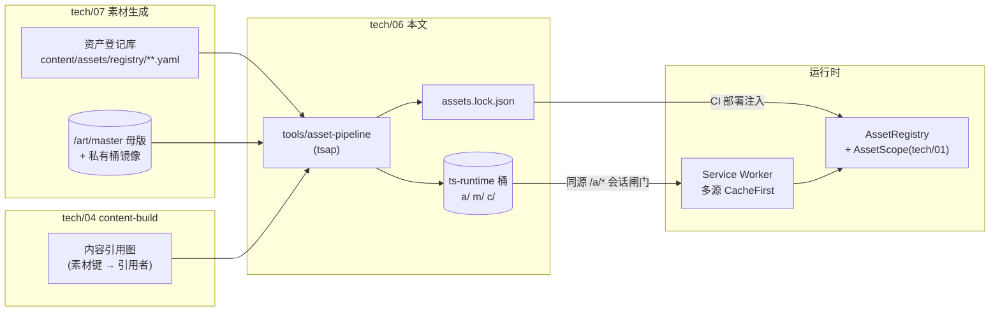
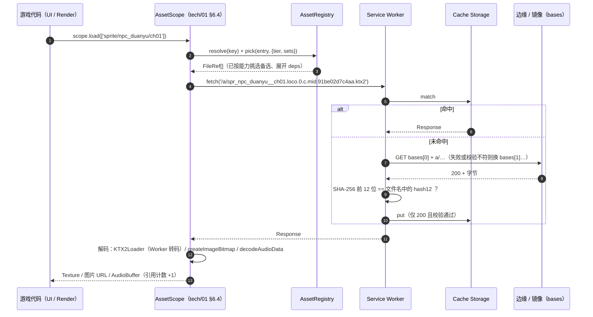
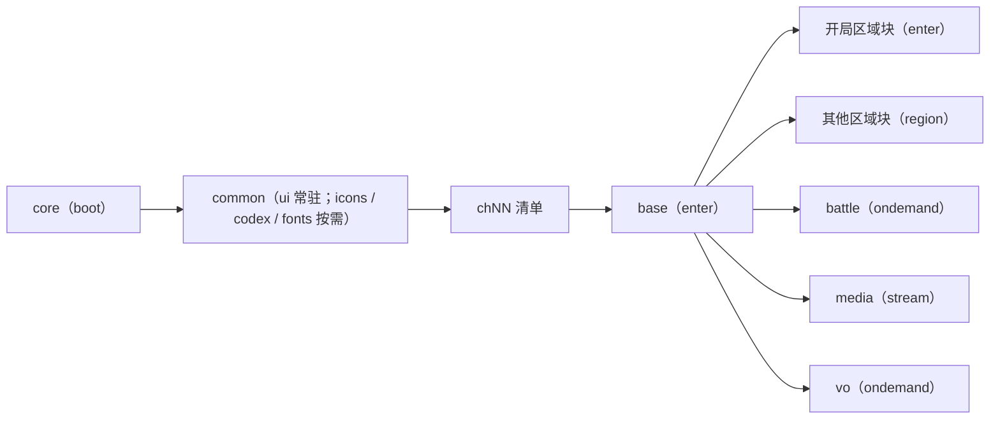
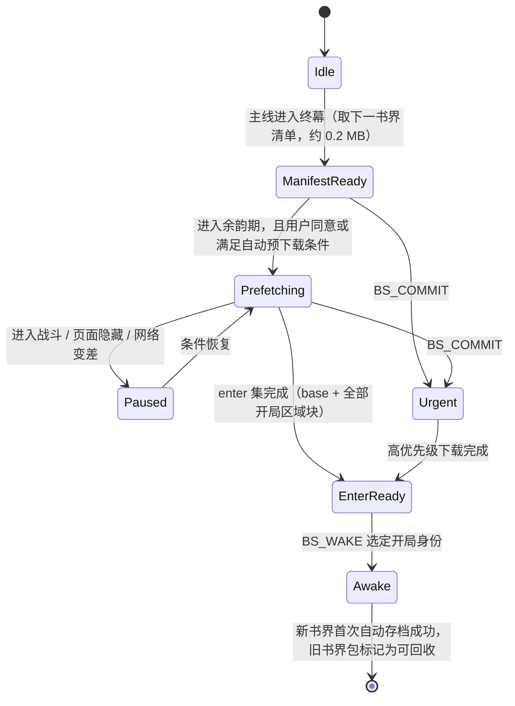
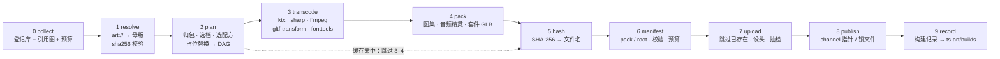
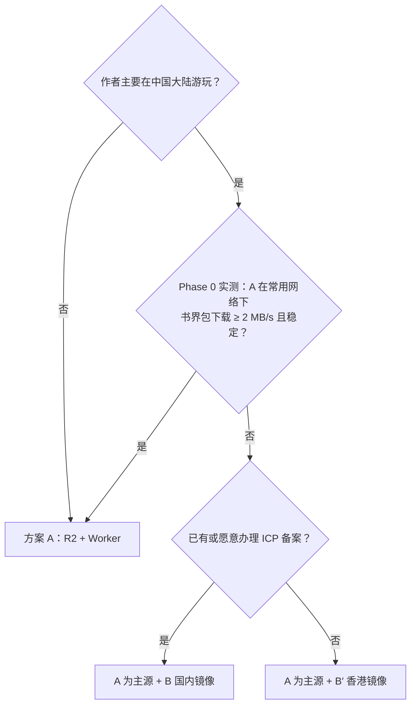
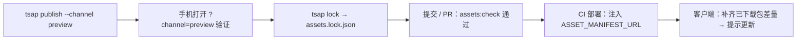
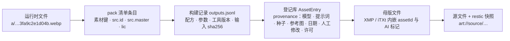

# tech/06 · 素材分离存储与分发

| 项 | 内容 |
|---|---|
| 文档归属 | `docs/tech/06-asset-storage.md`：素材**存储分层**、**素材键与清单（manifest）**、**分包与预取**、**运行时格式/编码规范**、**资源构建管线 `tools/asset-pipeline`**、**存储与 CDN 选型**、**缓存/版本/回滚**、**完整性与访问控制**、**运行时侧溯源链**、**占位与回退**的唯一归属文档 |
| 版本 | v0.2 规划稿（2026-09-25）：已与 tech/02 v1.0 定稿的 `sprite-spec.json`（64/96/128 px/m 三档包、2 级 mip、UASTC normal mode）、地形纹理数组、建筑 LOD1、区域人群图集对齐。库版本、浏览器支持、云价格均于 2026-09-25 联网核实，来源见文末"参考资料"；无法核实处标"（待核实）" |
| 上游基准 | `docs/00-canon.md` §0（非商业、**不公开分发**、PWA 离线、云存档）、§2（书界）、§8、§12（ID 规范）、§18（文档归属）、§19（素材基线：与代码分离；对象存储 + CDN；内容哈希命名 + 清单；KTX2（Basis Universal）；按书界分包、懒加载） |
| 强依赖 | `tech/01`（monorepo、资源分级 L0–L3、`AssetScope`、PWA/Workbox、CI、`assets.lock.json`）；`tech/07`（资产登记库 `AssetEntry`、母版规格、资产 ID 前缀、`art://` URI、状态机）；`tech/02`（精灵加载器、法线编码、相机）；`tech/03`（显存/包体/加载预算终值）；`tech/04`（书界数据包）；`tech/08`（会话鉴权、应用托管、域名部署）；`design/02` §4（书眠流程）；`design/05`、`design/06`（内容数据中的素材键） |
| 读者 | 作者本人（单人开发 + AI 辅助编码）与编写管线/加载器的 AI 编码代理 |
| 命名说明 | 任务书中的 `tools/asset-build` 即 `tech/01` §4.1 已定名的 **`tools/asset-pipeline`**，本文沿用后者；其 CLI 命名为 `tsap`（tianshu asset pipeline） |

> **结论先行（TL;DR）**
>
> 1. **三层分离**：代码仓库（Git：代码、schema、登记库 YAML、≤ 2 MB 引导资源）｜素材库 `/art`（本地 NVMe + 私有桶镜像 + restic 版本化快照；**不用 Git LFS / DVC**）｜运行时产物（对象存储 + 边缘分发，内容寻址、永久缓存）。
> 2. **一个键贯穿全链**：`AssetKey = <kind>/<subject>/<variant>`（例 `portrait/npc_xiaofeng/default`），与 tech/07 资产 ID（例 `por_npc_xiaofeng`）**双射**；内容数据只写素材键或按约定推导，**永不写 URL**。
> 3. **两级清单 + 锁文件**：`m/root.<hash>.json` → `m/<pack>.<hash>.json`；应用构建由 `assets.lock.json` 钉住 root（代码与素材原子一致），开发/预览走 `c/<channel>.json` 指针。
> 4. **分包**：`core`（到标题画面 ≤ 1.5 MB）→ `common`（常驻）→ `chNN`（书界包，内分 `base / rg_* / battle / media / vo` 块）；块归属由**内容引用图自动计算**。
> 5. **格式**：WebGL 用 KTX2（精灵/法线/硬边特效 = UASTC + RDO + Zstd，精灵按 tech/02 定稿为 64/96/128 px/m 三档包 + 2 级 mip；地形纹理数组/建筑图集/背景 = ETC1S；不透明贴图去 alpha 以落到 4 bpp）；DOM 用 WebP（AVIF 可选）；音频 AAC-LC 基线（Opus 可选）；视频 H.264 渐进 MP4 基线（HEVC/AV1/HLS 可选）；字体 OFL 字库子集化 WOFF2。
> 6. **构建本地优先**：母版在作者机器上，`tsap build/publish` 本地运行；CI 只做校验、预算门禁与部署；增量缓存键 = 输入 sha256 + 配方版本 + 参数 + 工具版本。
> 7. **CDN 默认海外**：Cloudflare R2 + Worker（同源 `/a/*`，零出口费，个人用量近乎 $0/月）；作者常驻大陆且实测不佳时，加**国内镜像**（OSS/COS + CDN，需 ICP 备案）或**香港折中**；清单 `bases[]` 多源回退，缓存键按路径归一。
> 8. **默认私有**：运行时素材含金庸 IP 衍生内容，按基准 §0"不公开分发"，**全部素材路径走会话闸门**（同源 Cookie，tech/08 签发）；付费 CDN 必开用量封顶。防盗链只是账单保护，不是安全边界。
> 9. **缓存**：哈希文件 `max-age=31536000, immutable`；指针与 HTML `no-cache`；Service Worker（Workbox `injectManifest`）对 `/a/*` 采用"多源 CacheFirst + 入缓存前哈希校验 + Range 支持"；离线下载按"包/块"登记于 Dexie `packs` 表，标记-清除式 GC。
> 10. **溯源**：运行时文件 → 清单 `src` → 登记库 `provenance` → 母版 XMP → 源文件；`tsap trace <url|hash|key>` 一条命令还原模型、提示词、种子、参考图、人工修改与许可证。
> 11. **占位优先**：未审定/缺失资源在构建期即替换为分类型占位（木人桩精灵、水墨剪影立绘、字形图标、灰模建筑），游戏始终可玩；书界"完成"门禁 = S/A 级零占位。

> **调研要点（非致命，但改变了若干细节决策；来源见文末）**
>
> 1. **KTX-Software**：最新正式版 **4.4.2**；5.0.0 仍为 RC，且**已移除 `toktx` 等旧工具**。本文一律使用 `ktx create`；glTF-Transform 4.x 也已改为调用 `ktx create`（最低要求 KTX-Software 4.4.0）。
> 2. **three.js `KTX2Loader` 的转码目标优先级**：ETC1S → ETC2 > ETC1 > BPTC > DXT > PVRTC > RGBA32（**不会转 ASTC**）；UASTC → ASTC > BPTC > ETC2 > ETC1 > DXT > PVRTC > RGBA32。Metal 在所有 iOS 设备上支持 ETC 格式，因此 ETC1S 在 iPhone 上落到 ETC2——不透明贴图 4 bpp、带 alpha 8 bpp。
> 3. **Opus**：iOS Safari 直到 **18.4** 才完整支持（WebM 容器），此前仅支持 CAF 容器 → 音频基线保持 AAC（与 tech/01 §6.7 一致），Opus 作为可选变体。
> 4. **HLS**：Chrome 桌面 142 起原生支持；Android Chrome、Samsung、iOS Safari 原生支持；Firefox 仍不支持 → 本项目以短片为主，**渐进式 MP4 为基线**，HLS 仅作长片可选层。
> 5. **中国大陆访问**：`*.workers.dev`、`*.pages.dev`、`*.r2.dev` 在大陆常被 DNS 污染，必须用自定义域名；Cloudflare 大陆节点（China Network）需 Enterprise 计划 + ICP → 作者若常驻大陆，需准备国内镜像或香港方案（§7）。
> 6. **iOS 上的 App 内置浏览器（含微信 iOS）基于 WKWebView，默认不支持 Service Worker**（仅配置 App-Bound Domains 的应用可开）→ 必须提供"无 SW"降级路径（§8.5）。
> 7. **AWS SDK JS v3（≥ 3.729）默认给上传加 CRC32 校验头**，R2 等 S3 兼容存储曾因此返回 501 → 上传客户端必须设 `requestChecksumCalculation: 'WHEN_REQUIRED'`（§6.6）。
>
> 结论：以上均不构成对基准 §19 的致命冲击，正文按基线展开。

---

## 目录

- [0. 摘要与关键决策](#0-摘要与关键决策)
- [1. 范围、上下游与设计原则](#1-范围上下游与设计原则)
- [2. 分离原则与三层存储](#2-分离原则与三层存储)
- [3. 资源 ID、素材键与清单](#3-资源-id素材键与清单)
- [4. 分包策略](#4-分包策略)
- [5. 格式规范](#5-格式规范)
- [6. 资源构建管线 tools/asset-pipeline](#6-资源构建管线-toolsasset-pipeline)
- [7. 存储与 CDN 选型](#7-存储与-cdn-选型)
- [8. 缓存与版本](#8-缓存与版本)
- [9. 完整性与安全](#9-完整性与安全)
- [10. 元数据与溯源](#10-元数据与溯源)
- [11. 占位与回退资源](#11-占位与回退资源)
- [12. MVP 与演进路径](#12-mvp-与演进路径)
- [13. 风险与备选方案](#13-风险与备选方案)
- [参考资料](#参考资料)
- [本文新增术语/约定](#本文新增术语约定)
- [待决事项 / 依赖](#待决事项--依赖)

---

## 0. 摘要与关键决策

| # | 决策点 | 结论 | 理由 / 章节 |
|---|---|---|---|
| D1 | 存储分层 | 代码仓库 / 素材库（source·master·work）/ 运行时产物三层，二进制永不进 Git | 基准 §19；§2 |
| D2 | 源文件与母版版本化 | 本地 NVMe `/art` 为主；`master` 用 rclone 镜像到私有桶；全库用 restic 做加密、去重、版本化快照（本地盘 + 云）；**不用 Git LFS / DVC** | LFS 在 0.5 TB 量级约 $34/月且拖慢克隆；登记库已承担"指针 + sha256"职能；§2.3 |
| D3 | 运行时寻址 | 素材键 `AssetKey = <kind>/<subject>/<variant>`，与资产 ID 双射；清单以素材键为主键 | 与基准 §12 内容 ID 直连；§3.2 |
| D4 | 文件命名 | `a/<stem>.<hash12>.<ext>`，hash = SHA-256 前 12 位十六进制；逐文件不存完整 SRI（只有 root / pack 清单带 SRI） | 不可变、可永久缓存、可读性好、清单不膨胀；§3.4 |
| D5 | 清单结构 | 两级：root（每次构建一个）→ pack（每包一个）；应用构建用 `assets.lock.json` 钉住 root；开发/预览用 channel 指针 | 代码与素材原子一致、回滚 = 回退锁文件；§3.5、§8.4 |
| D6 | 分包 | `core` / `common` / `ch00`–`ch14` / `fin`；书界包内按块 `base`、`rg_*`、`battle`、`media`、`vo` | 对应 tech/01 L0–L3；§4 |
| D7 | 块归属 | 由内容引用图自动计算（单区域引用 → 区域块；多区域或全书界 → base），登记库可覆盖 | 单人维护不手工分包；§4.2 |
| D8 | 质量档位 | 素材变体三档 `low`/`mid`/`high`（渲染档 `ultra` 复用 `high`，tech/02 F7）；只在有意义处出变体（纹理、精灵、立绘、CG、视频、模型 LOD），`mid` 必有 | §4.4、§5 |
| D9 | 纹理 | KTX2：UASTC（+RDO+Zstd）用于精灵、法线、硬边特效、画布内 UI；ETC1S 用于地形纹理数组、建筑图集、背景；精灵按 tech/02 定稿为 64 / 96 / 128 px/m 三个包、2 级 mip；无压缩格式可用时自动降到 `low` | §5.2、§5.5 |
| D10 | DOM 图像 | WebP 基线；AVIF 仅对 CG/立绘可选（iOS 16.4+ 完整支持）；图标用独立小文件（不做 DOM 图集） | §5.3–§5.4 |
| D11 | 音频 | AAC-LC（`.m4a`）基线：BGM 128 kbps、音效 96 kbps 单声道音频精灵、配音 64 kbps；Opus/WebM 可选 | iOS Opus 18.4+ 才完整；§5.7 |
| D12 | 视频 | H.264 High 渐进 MP4（480p/720p/1080p，+faststart）；HEVC/AV1 按 MediaCapabilities 可选；HLS 仅用于 > 60 s 长片（可选） | 短片为主、离线缓存简单；§5.8 |
| D13 | 字体 | 正文系统字体；对话/题名用 OFL 字库（霞鹜文楷、马善政楷书、志莽行书等）按内容用字子集化为 WOFF2 | tech/01 R6；§5.9 |
| D14 | 构建位置 | 本地优先；CI 只做 `assets:check`（无需母版）与部署；可选自托管 runner | 母版 60–120 GB，托管 runner 装不下也跑不动；§6 |
| D15 | 存储/CDN | 默认方案 A：Cloudflare R2 + Worker 同源 `/a/*`；可选 B（阿里云 OSS/腾讯云 COS + CDN，需 ICP）或 B′（香港地域，免备案）作镜像 | §7 |
| D16 | 访问控制 | 默认 L1 会话闸门（同源 HttpOnly Cookie）；R2 不开 `r2.dev`；付费 CDN 必开用量封顶；签名 URL 仅作 L2 备选 | 基准 §0 不公开分发；§9 |
| D17 | 缓存 | 哈希资源 immutable；SW 多源 CacheFirst + 哈希校验 + Range；离线下载按块；标记-清除 GC；申请 `persist()` | §8 |
| D18 | 溯源与占位 | 清单 `src` 指向登记库；构建记录存私有桶；分类型占位 + 回退链；S/A 级零占位才算书界完成 | §10、§11 |

---

## 1. 范围、上下游与设计原则

### 1.1 范围

| 本文负责 | 不在本文（归属） |
|---|---|
| 运行时素材的寻址（素材键、清单）、分包、预取、编码格式与参数、构建管线、上传与分发、缓存与离线、完整性校验、访问控制、运行时侧溯源链、占位与回退 | 素材如何生成、审核、母版规格与登记库字段（`tech/07`）；着色器、精灵加载器内部结构、法线使用方式（`tech/02`）；预算终值（`tech/03`）；书界规则/文本数据包 JSON（`tech/04`，随应用发布，本文只校验其中引用的素材键）；登录、会话签发、应用托管与云存档（`tech/08`）；下载/存储管理界面（`design/14`） |

### 1.2 上下游接口



**接口契约**

| 契约文件 / 接口 | 所有者 | 消费者 | 内容 |
|---|---|---|---|
| `packages/data/src/assets/asset-key.ts` | 本文 | 全部 | 素材键语法、kind ↔ 前缀表、双射函数、简写归一化 |
| `packages/data/src/assets/manifest.ts`（Zod + 类型，导出 JSON Schema） | 本文 | `tools/asset-pipeline`、`apps/game`、`packages/platform` | root / pack 清单、锁文件、通道指针结构 |
| `packages/data/src/schemas/asset-entry.ts` → `asset.schema.json` | tech/07（字段）/ tech/01（机制） | 本文管线 | 登记库条目 `AssetEntry` |
| `packages/spec/texture-profiles.json` | 本文 | 管线、tech/02 | 各类纹理的编码档（编码器、格式、mip、法线布局）；与 tech/02 的契约文件同目录 |
| `packages/spec/sprite-spec.json`（v1 已定稿） | tech/02 | 本文图集配方 | ppm 分档包（64/96/128）、2 级 mip、帧格、锚点、法线编码、页组 |
| `tools/asset-pipeline/budgets.yaml` | 本文（初值）/ tech/03（终值） | 管线、CI | 包/块体积预算 |
| `tools/asset-pipeline/tools.lock.json` | 本文 | 管线、`tsap doctor` | 外部工具版本（进入各配方的构建缓存键） |
| `assets.lock.json`（仓库根） | 本文（生成） | tech/01 CI/部署 | 钉住的 root 清单 |
| 内容引用图 `refs.json`（`content-build --emit-refs`） | tech/04 | 本文归包 | 每个素材键被哪些书界/区域/对象引用 |
| 会话 Cookie `ts_s` 校验函数 | tech/08 | 本文边缘代码 | 素材路径鉴权 |

### 1.3 设计原则

1. **不可变 + 内容寻址**：URL 一经发布，内容永不改变；改内容 = 新 URL。
2. **间接寻址**：代码与内容数据只认素材键；URL 只存在于清单。
3. **本地优先、云为镜像**：母版与构建在作者机器上；云存储负责分发与异地备份。
4. **占位优先**：任何时刻游戏都能完整运行，美术进度不阻塞玩法开发。
5. **默认私有、成本封顶**：没有"公开可读"的桶与路径；任何按量计费的出口都有上限。
6. **单一事实来源**：登记库（tech/07）回答"是什么、从哪来"；清单回答"在哪、多大、什么格式"；二者不重复定义字段。
7. **一条命令自检**：`pnpm assets:check`（登记库 schema、键覆盖、预算、清单一致性）并入 `pnpm check`。
8. **可替换**：存储与 CDN 提供商藏在 `upload/` 适配器与清单 `bases[]` 之后，切换不影响代码与内容。

---

## 2. 分离原则与三层存储

### 2.1 三层总览

```text
┌────────────────────── ① 代码仓库（GitHub 私有库）──────────────────────┐
│ packages/ apps/ services/ tools/ content/（YAML·ink·tmj）                 │  文本、可 diff、CI 校验
│ content/assets/registry/**.yaml（登记库：art:// URI + sha256，不含二进制） │
│ assets.lock.json（钉住的素材版本）                                         │
└────────────────────────────────────────────────────────────────────────────┘
               │ 登记库引用 art://master/... + sha256
┌────────────────────── ② 素材库 /art（作者工作站 NVMe）──────────────────┐
│ source/（PSD·KRA·.blend·分层·候选·训练集）  master/（审定母版）  work/（可删）│
│   ├─ restic 快照 → 本地第二块盘/NAS  +  云端私有仓库（加密、去重、版本化）   │
│   └─ rclone 镜像 master → 私有桶 ts-art（供其他机器/自托管 runner 读取）     │
└────────────────────────────────────────────────────────────────────────────┘
               │ tsap build / publish（本地）
┌────────────────────── ③ 运行时产物（私有桶 ts-runtime + 边缘）──────────┐
│ a/<stem>.<hash12>.<ext>      内容寻址文件（immutable）                     │
│ m/root.<hash12>.json  m/<pack>.<hash12>.json   清单（immutable）            │
│ c/<channel>.json             通道指针（no-cache）                          │
└────────────────────────────────────────────────────────────────────────────┘
               │ 同源 /a/* /m/* /c/*（会话闸门）→ 浏览器 HTTP 缓存 + SW Cache Storage
```

| 层 | 内容 | 位置 | 版本化 | 备份 | 访问 | 规模（全量估算） |
|---|---|---|---|---|---|---|
| ① 代码仓库 | 代码、schema、内容文本、登记库、锁文件、≤ 2 MB 引导资源 | GitHub 私有库 | Git | GitHub + 本地克隆 | 作者、CI | < 200 MB |
| ② 素材库 `source` | 可编辑源文件、生成候选、训练集 | `/art/source` | restic 快照 | restic → 本地盘 + 云（加密） | 仅作者 | 300–500 GB（tech/07 §6.2） |
| ② 素材库 `master` | 审定母版（无损）+ 元数据 | `/art/master` | 登记库 sha256（Git 历史）+ restic 快照 | 同上 + rclone 镜像到 `ts-art` | 作者、自托管 runner | 60–120 GB |
| ② 素材库 `work` | 渲染中间帧、EXR、下载缓存 | `/art/work` | 无 | 不备份 | 仅本机 | 视任务 |
| ③ 运行时产物 | KTX2、WebP、GLB、AAC、MP4、WOFF2、清单 | 私有桶 `ts-runtime`（+ 可选镜像） | 内容寻址天然多版本 | 可由 master 重建；不单独备份 | 仅经会话闸门 | ≈ 7–8.5 GB（§2.5） |

### 2.2 代码仓库里放什么

| 允许 | 禁止 |
|---|---|
| 源码、配置、Zod schema 与导出的 JSON Schema | 任何母版、生成候选、运行时产物 |
| `content/**` 文本（YAML、ink、Tiled `.tmj`）、登记库 YAML | `.psd .kra .blend .exr .wav .mov .mp4 .ktx2 .glb` 等二进制 |
| `apps/game/public/boot/`：favicon、PWA 图标、闪屏 SVG（合计 ≤ 500 KB） | 超过 256 KB 的任何二进制 |
| 占位资源的**生成源**（SVG、JSON 参数；位图占位在构建期生成） | 字体原文件（放素材库 `master/font/`，登记 `fnt_*`） |
| 管线测试夹具（`tools/asset-pipeline/test/fixtures/`，单个 ≤ 50 KB） | 任何带 IP 衍生内容的图片（立绘、CG 截图）——即使很小 |

守卫：`.gitattributes` 标记二进制扩展名；lefthook 提交前钩子运行 `scripts/check-binaries.ts`，CI 同样运行一次。

```yaml
# lefthook.yml（节选，与 tech/01 §4.1 同一文件）
pre-commit:
  commands:
    no-binaries:
      glob: "*"
      run: pnpm tsx scripts/check-binaries.ts {staged_files}
```

```ts
// scripts/check-binaries.ts（规则摘要）
const ALLOW_DIRS = ['apps/game/public/boot/', 'tools/asset-pipeline/test/fixtures/'];
const BINARY_EXT = /\.(png|jpe?g|webp|avif|gif|psd|kra|blend|exr|tiff?|wav|flac|mp3|m4a|ogg|webm|mov|mp4|mkv|ktx2|basis|glb|gltf|fbx|obj|ttf|otf|woff2?|zip|7z)$/i;
const MAX_BYTES = 256 * 1024;
// 失败条件：BINARY_EXT 命中且（不在 ALLOW_DIRS 内 或 体积 > MAX_BYTES）；ALLOW_DIRS 内合计 > 2 MB 也失败
```

`.gitignore` 追加：`.assets/`（本地构建输出）、`.cache/asset-pipeline/`（构建缓存）、`.env.local`（本机存放的存储令牌，§9.5）。

### 2.3 素材源文件库：Git LFS vs 对象存储 vs NAS

按 source + master ≈ **0.5 TB** 估算（tech/07 §6.2），月度费用：

| 方案 | 计价依据（2026-09 核实） | 0.5 TB 月费 | 优点 | 缺点 | 结论 |
|---|---|---|---|---|---|
| **Git LFS（GitHub）** | 免费 10 GiB 存储 + 10 GiB 流量；超出 $0.07/GiB·月存储、$0.0875/GiB 下载 | ≈ $34/月 + 每次全量拉取 ≈ $44 | 与 Git 一体、按提交版本化 | 贵；克隆与 CI 变慢；大文件二进制差分无意义 | ❌ |
| **DVC（远端指向对象存储）** | 存储费同所选桶 | 同桶 | 数据版本与 Git 提交绑定 | 与 tech/07 登记库（已存 URI + sha256）职能重复；多一套工具 | ❌（仅作备选） |
| **Cloudflare R2 Standard** | $0.015/GB·月（前 10 GB 免费），出口免费 | ≈ $7.4/月 | 零出口费、S3 兼容 | 对冷数据偏贵 | master 镜像用 |
| **Cloudflare R2 Infrequent Access** | $0.01/GB·月；取回 $0.01/GB；最短存储 30 天 | ≈ $5/月 | 适合快照仓库 | 取回收费、有最短存储期（restic prune 会产生提前删除计费） | 可选 |
| **Backblaze B2** | $6.95/TB·月；月出口 ≤ 存储量 3 倍免费 | ≈ $3.5/月 | 最便宜的异地快照目标 | 大陆访问一般 | restic 云端仓库首选 |
| **NAS / 第二块硬盘** | 一次性硬件（价格待核实） | 0 | 本地高速恢复、不受网络影响 | 同址风险（火灾/失窃） | 作为 restic 本地仓库 |

**决策**：
1. `/art` 在工作站 NVMe（≥ 1 TB）上作为唯一工作副本；**3-2-1 备份**：restic → 本地第二块盘/NAS（快速恢复）+ restic → B2 或 R2 IA（异地、加密）。
2. `master` 另用 rclone **镜像**到私有桶 `ts-art/master`（明文、可直接被管线读取），供笔记本或自托管 runner 构建；`source` 不镜像（需要时从 restic 还原）。
3. 母版文件路径稳定（文件名 = 资产 ID），**历史版本由 restic 保存**；`tsgen approve`（tech/07）结束时触发一次针对 `master` 的增量快照（`--tag approve:<assetId>`），保证每个审定过的版本都可找回。
4. 不在代码仓库放任何二进制；登记库里的 `files.master.sha256` 就是"指针"。

```toml
# ~/.config/tianshu/art.toml —— 每台机器一份，不入库；tsgen 与 tsap 共用
[roots]
source = "/art/source"
master = "/art/master"
work   = "/art/work"

[remote]                       # 可选：本机没有 /art/master 时从镜像读取
master = "r2art:ts-art/master" # rclone remote 名:桶/前缀
```

```bash
# master 镜像（R2 需 --s3-no-check-bucket：对象级令牌无 ListBuckets 权限）
rclone sync /art/master r2art:ts-art/master --checksum --transfers 8 --s3-no-check-bucket

# restic 快照（R2 用 S3 兼容端点；需设置 AWS_DEFAULT_REGION=auto）
export RESTIC_REPOSITORY="s3:https://<account_id>.r2.cloudflarestorage.com/ts-art-restic"
restic backup /art/source /art/master --tag daily --exclude-caches
restic forget --keep-daily 14 --keep-weekly 8 --keep-monthly 24 --prune
restic check --read-data-subset=2%          # 每周抽检 2% 数据块
```

### 2.4 运行时产物桶布局

| 前缀 | 内容 | 命名 | 可变性 | 缓存 |
|---|---|---|---|---|
| `a/` | 全部运行时文件（扁平命名空间，便于 CSS 中相对引用字体切片） | `<stem>.<hash12>.<ext>` | 不可变 | immutable（§8.1） |
| `m/` | root 与 pack 清单 | `root.<hash12>.json`、`<pack>.<hash12>.json` | 不可变 | immutable |
| `c/` | 通道指针（`preview.json`、`dev.json`、`ping.json`） | 固定名 | 可变 | `no-cache` |

- **构建记录不放在运行时桶**：`builds/<buildId>/` 写入私有素材桶 `ts-art`（§10.3），避免暴露母版路径与提示词。
- **保留策略**：保留最近 10 次构建 + 近 90 天 `assets.lock.json` 历史中出现过的全部 root 所引用的对象；其余由 `tsap gc-remote` 清理（先 `--dry-run`）。

### 2.5 规模估算（全量，运行时产物）

按 tech/07 §3.2 标准档数量与本文 §5 编码参数估算（Phase 0 用天龙切片实测后回填）：

| 类别 | 依据 | mid 档 | low 档增量 | high 档增量 | 可选变体 |
|---|---|---|---|---|---|
| 精灵图集 `sprite` | ≈ 450 套；128 px/m 包均值 ≈ 3.8 MB/套（UASTC+Zstd，颜色 + 半分辨率法线，含 2 级 mip）；96 px/m 包 ≈ 0.56×；64 px/m 包（无法线）≈ 0.2× | ≈ 0.95 GB（96 px/m） | ≈ 0.35 GB（64 px/m） | ≈ 1.7 GB（128 px/m） | — |
| 视频 `video` | ≈ 27 分钟；480p ≈ 0.8、720p ≈ 2、1080p ≈ 3.5 Mbps | 0.41 GB（720p） | 0.16 GB | 0.71 GB | AV1/HEVC 1080p +0.4–0.9 GB |
| 音乐/音效/配音 | 140 首 × ≈ 2.9 MB；音效 ≈ 30 MB；配音 ≈ 70 MB | ≈ 0.5 GB | 0 | 0 | Opus 变体 +0.3 GB |
| DOM 图像 | 立绘 + 表情补丁 + CG + 头像 + 图标 + 插画 + 地图 | ≈ 0.5 GB | ≈ 0.25 GB | ≈ 0.45 GB | AVIF +0.3 GB |
| 3D 与纹理 | 区域地形纹理数组（层 256²/512²）、建筑套件图集（每套 1–3 × 2048²）与地标、LOD1、特效 | ≈ 0.5 GB | ≈ 0.2 GB（LOD1 与半尺寸图集） | ≈ 0.1 GB（512² 地形层） | — |
| 字体 | 对话字体切片 + 题名子集 | ≈ 15 MB | 0 | 0 | 繁体 +15 MB |
| **合计** | | **≈ 2.9 GB** | **≈ 1.0 GB** | **≈ 3.0 GB** | **+1.0–1.5 GB** |

全量 ≈ **6.9 GB**，含全部可选变体 ≈ **8–8.5 GB**（估算误差按 ±30% 看待，上限约 11 GB），落在任务书"5–20 GB"区间的中下段。一名玩家实际下载的是某一档的完整集合：低档全作 ≈ 1.5 GB、中档 ≈ 2.9 GB、高档 ≈ 4 GB；**单个书界（mid）典型约 200 MB**（按 tech/07 体量系数 0.3–1.3 浮动），其中进入书界必需的 enter 集目标 ≤ 60 MB（§4.5）。

---

## 3. 资源 ID、素材键与清单

### 3.1 四种标识及其关系

| 层 | 名称 | 例 | 定义方 | 用途 |
|---|---|---|---|---|
| 内容 ID | 游戏对象 ID | `npc_xiaofeng`、`sk_xianglong18`、`rg_01_dali` | 基准 §12 | 规则、存档、剧情 |
| 资产 ID | 登记库条目 ID | `por_npc_xiaofeng__ch01_base` | tech/07 §1.4 | 生产、审核、溯源 |
| **素材键 `AssetKey`** | 运行时逻辑键 | `portrait/npc_xiaofeng/ch01_base` | **本文** | 内容数据引用、运行时寻址、清单主键 |
| 文件名 | 内容寻址对象名 | `a/por_npc_xiaofeng__ch01_base.mid.3fa9c2e1d04b.webp` | 本文（自动生成） | CDN 与缓存 |

关系：**内容 ID →（约定推导或显式声明）→ 素材键 ⇄（双射）资产 ID →（构建）→ 文件名**。任何一层都不跨层引用：内容数据不写文件名，登记库不写素材键以外的运行时信息。

### 3.2 素材键语法

```text
AssetKey = kind "/" subject "/" variant
kind     = 下表枚举（小写字母）
subject  = seg                        ; 通常就是基准 §12 的内容 ID（npc_xiaofeng、sk_xianglong18…）
variant  = "default" | seg            ; 书界/年龄/状态/表情/时代/语言等组合
seg      = [a-z0-9]+ ( "_" [a-z0-9]+ )*   ; 单下划线分词；禁止双下划线、大写、中文、"@"
```

保留主体：`ph`（占位，§11），任何内容 ID 不得取名 `ph`。

| kind | 资产 ID 前缀（tech/07） | 技术类型 `type` | 消费端 | 常见所属块 | 变体惯例 |
|---|---|---|---|---|---|
| `portrait` | `por_` | `image` / `image-patch` | DOM | `chNN/base` | `chNN_base`、`chNN_e_<情绪>`、`chNN_<年龄>_<状态>_base` |
| `avatar` | `ava_` | `image` | DOM | `chNN/base` | `chNN`、`chNN_e_<情绪>` |
| `cg` | `cg_` | `image` | DOM | `chNN/media` | `default` |
| `concept` | `art_` | `image` | DOM（图鉴画廊，可选） | `chNN/media` | `default` |
| `illus` | `ill_` | `image` | DOM（武学图鉴） | `common` 按需 | `default` |
| `cutin` | `cin_` | `image` | DOM 覆盖层 | `common` 按需 | `default` |
| `icon` | `ico_` | `image`（+ 画布图集定位） | DOM / WebGL | `common` 按需 | `default` |
| `ui` | `ui_` | `image` / `svg` | DOM（纸纹 `ui/paper_fiber`、墨噪声 `ui/ink_noise` 同时供 WebGL 与 CSS 使用） | `core` / `common` | 状态：`normal`、`pressed`、`disabled` |
| `map` | `map_` | `image-tiles` | DOM | `chNN/base` | `default` |
| `sprite` | `spr_` | `sprite` | WebGL | `chNN/base`、`rg_*`、`battle` | `chNN`（时代装）、`chNN_<年龄>` |
| `terrain` | `tex_` | 区域纹理数组中的一层（`packedIn` 指向数组容器） | WebGL | `chNN/base` | 时代：`song`、`yuan`、`ming`、`qing`… |
| `building` / `prop` | `bld_` / `prp_` | `model` | WebGL | `chNN/base`（套件）、`rg_*`（地标） | `default` |
| `vfx` | `vfx_` | `texture` / `flipbook` | WebGL | `common`、`chNN/battle` | `default` |
| `video` | `vid_` | `video` | `<video>` | `chNN/media` | `default` |
| `bgm` / `vo` | `bgm_` / `vo_` | `audio-stream` | `<audio>` | `base`、`rg_*` / `vo` | `default` |
| `sfx` | `sfx_` | 音频精灵成员（packed） | WebAudio | `common`、`chNN/base` | `default` |
| `font` | `fnt_`（本文新增） | `font` | CSS `@font-face` | `core`、`common` | 语言：`zh_hans`、`zh_hant` |
| `lut` | `lut_`（本文新增） | `lut`（32³，存为 1024×32 无损 PNG 条带） | WebGL 后处理（tech/02 §5.4） | `common/ui`（闪回、书眠等通用）、`chNN/base`（书界基调） | `default` |
| `sfxbank` / `atlas` | `sfb_` / `atl_`（本文新增，管线生成的容器） | `audio-bank`；`texture-array`（区域地形、崖面）、`sprite`（区域人群图集）、`canvas-atlas`（植被、画布内 Buff 图标） | WebAudio / WebGL | 同成员所在块 | 主体如 `terrain_rg_01_dali`、`cliff_rg_01_dali`、`crowd_rg_01_dali`、`foliage_rg_01_dali`、`buff_icons` |

`ref_`、`mdl_`、`anm_` 是生产中间资产，**永不进入运行时清单**。

**双射规则**：资产 ID `<prefix>_<subject>[__<variant>]` ⇄ 素材键 `<kind>/<subject>/<variant 或 default>`。

| 资产 ID | 素材键 |
|---|---|
| `por_npc_xiaofeng` | `portrait/npc_xiaofeng/default` |
| `por_npc_duanyu__ch01_base` | `portrait/npc_duanyu/ch01_base` |
| `por_npc_guojing__ch03_prime_e_angry` | `portrait/npc_guojing/ch03_prime_e_angry` |
| `spr_npc_duanyu__ch01` | `sprite/npc_duanyu/ch01` |
| `ico_sk_xianglong18` | `icon/sk_xianglong18/default` |
| `tex_tr_shenshui__song` | `terrain/tr_shenshui/song` |
| `bld_kit_song_gate_01` | `building/kit_song_gate_01/default` |
| `vid_sleep_01_02` | `video/sleep_01_02/default` |
| `fnt_lxgw_wenkai__zh_hans` | `font/lxgw_wenkai/zh_hans` |

```ts
// packages/data/src/assets/asset-key.ts
export const KIND_PREFIX = {
  portrait: 'por', avatar: 'ava', cg: 'cg', concept: 'art', illus: 'ill', cutin: 'cin',
  icon: 'ico', ui: 'ui', map: 'map', sprite: 'spr', terrain: 'tex', building: 'bld',
  prop: 'prp', vfx: 'vfx', video: 'vid', bgm: 'bgm', sfx: 'sfx', vo: 'vo',
  font: 'fnt', lut: 'lut', sfxbank: 'sfb', atlas: 'atl',
} as const;
export type AssetKind = keyof typeof KIND_PREFIX;
export type AssetKey = string & { readonly __brand: 'AssetKey' };

const SEG = '[a-z0-9]+(?:_[a-z0-9]+)*';
const KINDS = Object.keys(KIND_PREFIX).join('|');
export const ASSET_KEY_RE = new RegExp(`^(${KINDS})/(${SEG})/(${SEG})$`);
const PREFIX_KIND = Object.fromEntries(
  Object.entries(KIND_PREFIX).map(([k, p]) => [p, k]),
) as Record<string, AssetKind>;

export function keyFromAssetId(id: string): AssetKey {
  const cut = id.indexOf('_');
  const kind = PREFIX_KIND[id.slice(0, cut)];
  if (!kind) throw new Error(`unknown asset prefix: ${id}`);
  const [subject, variant = 'default', extra] = id.slice(cut + 1).split('__');
  if (extra !== undefined) throw new Error(`more than one "__" in ${id}`);
  return assertKey(`${kind}/${subject}/${variant}`);
}

export function assetIdFromKey(key: AssetKey): string {
  const [kind, subject, variant] = key.split('/') as [AssetKind, string, string];
  const base = `${KIND_PREFIX[kind]}_${subject}`;
  return variant === 'default' ? base : `${base}__${variant}`;
}

export function assertKey(s: string): AssetKey {
  if (!ASSET_KEY_RE.test(s)) throw new Error(`invalid AssetKey: ${s}`);
  return s as AssetKey;
}
```

### 3.3 内容数据如何引用素材

**约定优先**：大多数素材键由内容 ID 与上下文推导，内容数据里**什么都不写**；只有复用、共享、特例时显式声明。

| 场景 | 推导规则 | 例 |
|---|---|---|
| NPC 立绘（对话） | `portrait/<npcId>/<chNN>_base`；表情 `…/<chNN>_e_<情绪>` | `portrait/npc_duanyu/ch01_e_joy` |
| NPC 头像 | `avatar/<npcId>/<chNN>` | `avatar/npc_duanyu/ch01` |
| 单位精灵 | `sprite/<npcId>/<chNN>`；主角按书界时代装 `sprite/npc_zhujue/<chNN>`（主角 ID `npc_zhujue`、书灵 `npc_shuling` 为本文提议，待 design/01 确认） | `sprite/npc_zhujue/ch03` |
| 武学 / Buff / 物品图标 | `icon/<对象 ID>/default` | `icon/bf_zhongdu/default` |
| 武学图鉴插画 / 绝招切入 | `illus/<skillId>/default` / `cutin/<skillId>/default` | `cutin/sk_xianglong18/default` |
| 地形材质 | `terrain/<terrainId>/<书界时代>`（时代取自 `chapter.yaml`） | `terrain/tr_shenshui/song` |
| 剧情插图 | ink 标签 `#cg:<cg 主体>` → `cg/<主体>/default` | `cg/q_01_main_03_01/default` |
| BGM、视频、音效 | 在区域/书界/招式数据中**显式**写素材键或简写 | `bgm: bgm/ch01_dali_explore_1/default` |

**显式覆盖**：任何内容对象可带 `assets:` 映射，值必须是完整素材键，例如神雕的蒙古兵直接复用射雕的精灵：`assets: { sprite: sprite/npc_menggubing/ch02 }`。

**简写归一化**（`design/05`、`design/06` 现有写法 → 规范键；由 `tools/content-build` 调用 `normalizeAssetRef(field, value)` 转换，产物中只含规范键；校验器对简写给 warning，便于逐步收敛）：

| 字段（出处） | 现有写法 | 规范素材键 |
|---|---|---|
| `assets.icon`（design/05） | `skill/xianglong18` | `icon/sk_xianglong18/default` |
| `assets.art`（design/05） | `illus/skill/tieshazhang` | `illus/sk_tieshazhang/default` |
| `anim.cutin`（design/05） | `cutin/xianglong18` | `cutin/sk_xianglong18/default` |
| `anim.vfx`（design/05）、`vfx.*`（design/06） | `fx_sand_burst` | **不是素材键**：特效定义 ID（`content/vfx/fx_*.yaml`，tech/02 §6.1）；定义中引用的贴图 `tex: vfx_<名>` 归一化为 `vfx/<名>/default` |
| `anim.sfx`（design/05）、`sfx.*`（design/06） | `sfx_palm_hard` | `sfx/palm_hard/default` |
| `ui.icon`（design/06） | `buff/zhongdu` | `icon/bf_zhongdu/default` |
| `anim.clip`（design/05） | `palm_heavy` | **不是素材键**：精灵元数据内的片段名（tech/02、tech/07 §5.4.4） |

### 3.4 文件命名与哈希

```text
a/<stem>.<hash12>.<ext>
stem   = 资产 ID [ "." 角色/动作集/页码 ] [ "." 档位 ]      ; 仅为可读性，不参与寻址
hash12 = hex(SHA-256(文件字节))[0:12]                        ; 48 位，同 stem 下碰撞概率可忽略
```

| 例 | 说明 |
|---|---|
| `a/por_npc_duanyu__ch01_base.mid.3fa9c2e1d04b.webp` | 立绘 mid 档 |
| `a/spr_npc_duanyu__ch01.loco.0.c.mid.91be02d7c4aa.ktx2` | 精灵 `loco` 动作集第 0 页颜色图 |
| `a/spr_npc_duanyu__ch01.loco.0.n.mid.5d0f83e12b9c.ktx2` | 同页法线图（半分辨率） |
| `a/spr_npc_duanyu__ch01.meta.mid.0c7e1a2b3d4f.json` | 精灵元数据（帧表、片段、事件） |
| `a/bgm_ch01_theme.9d2b61c0aa13.m4a` | 无档位差异的文件不带档位段 |
| `a/fnt_lxgw_wenkai__zh_hans.042.e1f0a9b8c7d6.woff2` | 字体第 42 号切片 |

- **逐文件不存完整 SRI**：SHA-256 的 base64 串是不可压缩的随机数据，4,000 条目 × 3 档会让书界清单多出约 0.7 MB（压缩后几乎不减）。完整性以文件名中的 `hash12` 校验（SW 或页面层用 SubtleCrypto 计算 SHA-256 比对前 12 位，针对意外损坏足够，见 §9.1）；**只有 root 与 pack 清单**在锁文件/root 中保存完整 SRI（`sha256-<base64>`），可直接用 `fetch(url, { integrity })` 校验。
- `a/` 为扁平命名空间：字体 CSS 中 `url(<文件名>)` 的相对引用在任何镜像下都成立。
- 同一文件可被多个包清单引用（跨书界复用），存储与缓存天然去重。

### 3.5 清单（manifest）结构

**文件关系**

```text
代码仓库 assets.lock.json ──钉住──▶ m/root.<hash12>.json（每次构建一个）
                                      ├─▶ m/core.<hash12>.json
                                      ├─▶ m/common.<hash12>.json
                                      ├─▶ m/ch01.<hash12>.json … m/ch14.<hash12>.json、m/fin.<hash12>.json
c/preview.json（可变指针，开发/预览用）──▶ m/root.<hash12>.json
```

**`assets.lock.json`**（仓库根，由 `tsap lock` 写入；tech/01 §7.6 部署时据此注入 `ASSET_MANIFEST_URL = bases[0] + root`）

```json
{
  "format": 1,
  "build": "20261012-2104-a1b2c3d",
  "root": "m/root.3f9a2c1e7b4d.json",
  "rootSri": "sha256-Qm9vdEV4YW1wbGVIYXNoVmFsdWVGb3JEb2NzT25seQ==",
  "bases": ["/", "https://ts-cn.example.cn/"],
  "publishedAt": "2026-10-12T21:10:00+08:00"
}
```

**root 清单**（每次构建一个，体积 < 10 KB）

```json
{
  "format": 1,
  "build": {
    "id": "20261012-2104-a1b2c3d",
    "createdAt": "2026-10-12T13:04:00Z",
    "pipeline": "asset-pipeline@0.4.0",
    "tools": { "ktx": "4.4.2", "ffmpeg": "8.1", "sharp": "0.35.4", "gltf-transform": "4.5.0", "fonttools": "4.66.0" }
  },
  "minApp": "0.6.0",
  "tiers": ["low", "mid", "high"],
  "packs": {
    "core":   { "manifest": "m/core.9c1d0e2f3a4b.json",   "sri": "sha256-…", "deps": [],         "policy": "boot",
                "bytes": { "low": 1100000, "mid": 1300000, "high": 1450000 } },
    "common": { "manifest": "m/common.51aa7c90d2e1.json", "sri": "sha256-…", "deps": ["core"],   "policy": "resident",
                "bytes": { "low": 52000000, "mid": 71000000, "high": 88000000 } },
    "ch01":   { "manifest": "m/ch01.e7d9b0c3f1a2.json",   "sri": "sha256-…", "deps": ["common"], "policy": "chapter",
                "chapter": "ch01_tianlong", "bytes": { "low": 130000000, "mid": 260000000, "high": 350000000 } }
  }
}
```

**pack 清单**（节选：`ch01`）

```json
{
  "format": 1,
  "pack": "ch01",
  "build": "20261012-2104-a1b2c3d",
  "deps": ["common"],
  "chunks": {
    "base":          { "policy": "enter",    "bytes": { "mid": 38900000 }, "files": { "mid": 212 } },
    "rg_01_dali":    { "policy": "region",   "region": "rg_01_dali", "start": true,
                       "neighbors": ["rg_01_wuliang"], "bytes": { "mid": 18000000 }, "files": { "mid": 96 } },
    "rg_01_wuliang": { "policy": "region",   "region": "rg_01_wuliang", "neighbors": ["rg_01_dali"], "bytes": { "mid": 15000000 } },
    "battle":        { "policy": "ondemand", "bytes": { "mid": 22000000 } },
    "media":         { "policy": "stream",   "bytes": { "mid": 64000000 } },
    "vo":            { "policy": "ondemand", "bytes": { "mid": 5000000 } }
  },
  "assets": {
    "portrait/npc_duanyu/ch01_base": {
      "type": "image", "chunk": "base",
      "files": {
        "low":  [{ "f": "por_npc_duanyu__ch01_base.low.8a1c2f0e3b4d.webp",  "b": 118230, "w": 768,  "h": 1152, "fmt": "webp" }],
        "mid":  [{ "f": "por_npc_duanyu__ch01_base.mid.3fa9c2e1d04b.webp",  "b": 243112, "w": 1024, "h": 1536, "fmt": "webp" }],
        "high": [{ "f": "por_npc_duanyu__ch01_base.high.77d0e41a9c2b.avif", "b": 251004, "w": 1360, "h": 2040, "fmt": "avif" },
                 { "f": "por_npc_duanyu__ch01_base.high.c3b19d7e0a55.webp", "b": 398760, "w": 1360, "h": 2040, "fmt": "webp" }]
      },
      "src": { "id": "por_npc_duanyu__ch01_base", "master": "9f2c41aa07be" }, "lic": "ai"
    },
    "portrait/npc_duanyu/ch01_e_joy": {
      "type": "image-patch", "chunk": "base", "deps": ["portrait/npc_duanyu/ch01_base"],
      "meta": { "rect": [0.3477, 0.1309, 0.3125, 0.2083] },
      "files": { "mid": [{ "f": "por_npc_duanyu__ch01_e_joy.mid.1e2d3c4b5a69.webp", "b": 21870, "w": 320, "h": 320, "fmt": "webp" }] },
      "src": { "id": "por_npc_duanyu__ch01_e_joy", "master": "0b7d5e3f19c2" }, "lic": "ai"
    },
    "sprite/npc_duanyu/ch01": {
      "type": "sprite", "chunk": "base",
      "meta": { "ppmByTier": { "low": 64, "mid": 96, "high": 128 }, "sets": ["loco", "battle_common", "weapon_finger"] },
      "files": { "mid": [
        { "f": "spr_npc_duanyu__ch01.meta.mid.0c7e1a2b3d4f.json",     "role": "meta",   "b": 48211,   "fmt": "json" },
        { "f": "spr_npc_duanyu__ch01.loco.0.c.mid.91be02d7c4aa.ktx2", "role": "color",  "set": "loco", "page": 0, "b": 1203341, "w": 2048, "h": 2048, "fmt": "ktx2-uastc" },
        { "f": "spr_npc_duanyu__ch01.loco.0.n.mid.5d0f83e12b9c.ktx2", "role": "normal", "set": "loco", "page": 0, "b": 402113,  "w": 1024, "h": 1024, "fmt": "ktx2-uastc" }
      ] },
      "src": { "id": "spr_npc_duanyu__ch01", "master": "6e0f11d2a4c8" }, "lic": "ai"
    },
    "bgm/ch01_dali_explore_1/default": {
      "type": "audio-stream", "chunk": "rg_01_dali",
      "meta": { "dur": 182.4, "loop": { "start": 8.0, "end": 176.0 }, "lufs": -18.1 },
      "files": { "mid": [
        { "f": "bgm_ch01_dali_explore_1.4f2a9d1c8e7b.webm", "b": 2210034, "fmt": "webm", "codec": "opus" },
        { "f": "bgm_ch01_dali_explore_1.9d2b61c0aa13.m4a",  "b": 2944120, "fmt": "m4a",  "codec": "mp4a.40.2" }
      ] },
      "src": { "id": "bgm_ch01_dali_explore_1", "master": "c0ffee12ab34" }, "lic": "ai"
    },
    "sfx/palm_hard/default": {
      "type": "audio-clip", "chunk": "base",
      "packedIn": [{ "key": "sfxbank/ch01_combat/default", "loc": { "range": [12.345, 0.412] } }],
      "src": { "id": "sfx_palm_hard", "master": "aa01c3e59b72" }, "lic": "rf"
    }
  },
  "alias": {
    "portrait/npc_wuliang_dizi_b/ch01_base": "portrait/npc_wuliang_dizi_a/ch01_base"
  }
}
```

**规则**

1. `files[tier]` 中 `(role, set, page)` 相同的多个文件互为**备选**，按偏好排序（AVIF 先于 WebP、Opus 先于 AAC、AV1 先于 H.264）；不同组合是同一素材的**组成部分**（精灵的元数据、颜色页、法线页）。
2. `mid` 档必有；`low`/`high` 缺省时回落 `mid`；与 `mid` 字节完全相同的变体不重复列出。
3. `packedIn` 指向容器资产（图集、音频精灵、建筑套件 GLB）中的位置；一个素材可同时有自有文件（DOM 用）与容器位置（画布用），例如 Buff 图标。
4. `deps` 构建期做闭包与无环校验；运行时递归加载。
5. 素材键在各包之间唯一；**跨书界复用**时，复用方包清单复制条目（文件相同），合并时要求条目文件列表一致，否则构建失败。
6. 体积：典型书界清单 3–5 千条目，原始 1–2 MB，br 压缩后约 150–300 KB；单包超过 400 KB（br）时按块拆分为 `m/<pack>.<chunk>.<hash12>.json`（root 的 `manifest` 字段改为数组，读取端两者都支持）。
7. 登记库条目的 `keys` 字段（tech/07 §6.4）：条目的主键永远是双射得到的素材键；`keys` 中其余的键（如 `portrait/npc_duanyu/ch01` 指向 `…/ch01_base`）写入 `alias`，同一别名被两个条目声明时构建失败。

**类型定义**（`packages/data/src/assets/manifest.ts`；同文件导出 Zod 版本，经 `z.toJSONSchema()` 生成 `manifest.schema.json` 供编辑器补全；运行时只用类型 + 手写轻量校验，不打包完整 Zod，与 tech/01 §5.1 一致）

```ts
export type Tier = 'low' | 'mid' | 'high';
export type PackId = 'core' | 'common' | 'fin' | `ch${number}${number}`;
export type ChunkPolicy = 'boot' | 'resident' | 'enter' | 'region' | 'ondemand' | 'stream';
export type AssetType =
  | 'texture' | 'texture-array' | 'flipbook' | 'sprite' | 'model' | 'canvas-atlas' | 'lut'
  | 'image' | 'image-patch' | 'image-tiles' | 'svg'
  | 'audio-stream' | 'audio-clip' | 'audio-bank' | 'video' | 'font' | 'json';
export type FileFormat =
  | 'ktx2-etc1s' | 'ktx2-uastc' | 'webp' | 'avif' | 'png' | 'svg' | 'glb' | 'json'
  | 'm4a' | 'webm' | 'mp4' | 'm3u8' | 'vtt' | 'woff2' | 'css';
export type LicenseCode = 'ai' | 'self' | 'cc0' | 'ccby' | 'rf' | 'ofl' | 'mixed';

export interface FileRef {
  f: string;                 // a/ 下文件名（含 hash12）
  b: number;                 // 字节数（进度、预算、配额预估）
  fmt: FileFormat;
  role?: 'main' | 'meta' | 'color' | 'normal' | 'poster' | 'subtitle' | 'css' | 'slice';
  set?: string; page?: number;
  w?: number; h?: number;
  codec?: string;            // RFC 6381 codecs 串，如 avc1.640028、mp4a.40.2、opus
  kbps?: number; lang?: string;
}
export interface Locator {
  rect?: [number, number, number, number];   // 图集矩形（像素）
  layer?: number;                            // 纹理数组层号
  node?: string;                             // GLB 节点名
  range?: [number, number];                  // 音频精灵起点与时长（秒）
  sheet?: string;                            // 人群图集中的成员名（成员自带 meta，页来自容器）
}
export interface ManifestEntry {
  type: AssetType; chunk: string;
  files?: Partial<Record<Tier, FileRef[]>>;
  packedIn?: { key: string; loc: Locator }[];
  deps?: string[];
  meta?: Record<string, unknown>;
  src?: { id: string; master?: string };
  lic?: LicenseCode;
  ph?: true;                 // 构建期已替换为占位（§11）
}
export interface ChunkInfo {
  policy: ChunkPolicy; bytes: Partial<Record<Tier, number>>; files?: Partial<Record<Tier, number>>;
  region?: string; neighbors?: string[]; start?: boolean;
}
export interface PackManifest {
  format: 1; pack: PackId; build: string; deps: PackId[];
  chunks: Record<string, ChunkInfo>; assets: Record<string, ManifestEntry>; alias?: Record<string, string>;
}
export interface PackRef {
  manifest: string | string[]; sri: string | string[]; deps: PackId[];
  policy: 'boot' | 'resident' | 'chapter'; chapter?: string; bytes: Partial<Record<Tier, number>>;
}
export interface RootManifest { format: 1; build: BuildInfo; minApp: string; tiers: Tier[]; packs: Record<string, PackRef>; }
export interface BuildInfo { id: string; createdAt: string; pipeline: string; tools: Record<string, string>; }
export interface AssetLock { format: 1; build: string; root: string; rootSri: string; bases: string[]; publishedAt: string; }
```

### 3.6 运行时解析流程



**启动**：读取构建期注入的锁文件 → 取 root（`fetch(url, { integrity: rootSri })`）→ 取 `core`、`common` 清单 → 书界确定后取该书界清单。清单只在 root 变化时重新获取；已下载的包清单同样进入 Cache Storage，离线可用。

**API**（`packages/platform/src/assets/registry.ts`）

```ts
export interface AssetRegistry {
  init(lock: AssetLock, o: { tier: Tier; channel?: string }): Promise<void>;
  ensurePack(id: PackId): Promise<PackManifest>;            // 只取清单，不下载文件
  has(key: string): boolean;
  resolve(key: string, hint?: ResolveHint): Resolved;         // 同步：查表 + 回退链（§11.2）
  pick(e: ManifestEntry, want?: { role?: string; set?: string }): FileRef[];
  url(f: FileRef): string;                                    // 恒为同源 "/a/" + f.f；多源由 SW 处理
  prefetch(t: PrefetchTarget, o: PrefetchOptions): Promise<PrefetchReport>;
  setTier(t: Tier): void;
  onMissing(cb: (key: string, why: 'absent' | 'placeholder') => void): () => void;
}
export interface Resolved { key: string; entry: ManifestEntry; pack: PackId; via: 'exact' | 'alias' | 'fallback' | 'placeholder'; }
```

**`pick()` 挑选规则**

1. 档位：`files[tier] ?? files.mid ?? 任一可用档`；
2. 按 `(role, set, page)` 分组，每组取第一个"能力支持"的备选：AVIF 以启动时解码 1×1 AVIF 探测；Opus 以 `canPlayType('audio/webm; codecs="opus"') === 'probably'`；视频编码以 `navigator.mediaCapabilities.decodingInfo()` 的 `supported && powerEfficient`（启动时对 1080p24 预探测并缓存）；KTX2 恒可用（由转码器兜底）；
3. `want` 过滤（如只取 `set: 'loco'` 的页，战斗开始再取 `battle_common` 与当前兵器类）。

### 3.7 版本兼容与演进

- `format` 为整数；应用声明 `SUPPORTED_MANIFEST_FORMAT = 1`。读到更高 `format` 时拒绝该清单并回落到锁文件钉住的版本（开发期弹警告）。
- 新增可选字段不升 `format`，读取端忽略未知字段；删除/改义字段必须升 `format`，过渡期管线同时产出新旧两版 root。
- `minApp`（semver）：应用版本低于它时忽略该通道，防止"新素材 + 旧代码"。
- 素材键重命名：旧键写入 `alias`，保留至少一个大版本；存档中若保存了素材键（如自定义头像），读档时经 `alias` 迁移。

---

## 4. 分包策略

### 4.1 包与块

| 包 | 块 | 策略 | 内容 | tech/01 级别 | 预算（mid 初值） |
|---|---|---|---|---|---|
| `core` | （单块） | `boot` | 标题背景、Logo、加载水墨、墨噪声 `ui/ink_noise`（转场，WebGL 与 CSS 共用）、核心占位集（§11）、题名字体（书界名子集）、最小 UI | L0 | ≤ 1.5 MB |
| `common` | `ui` | `resident` | UI 框体、12 级品阶边框、系统图标 SVG、纸纹、通用 LUT、UI 音效 bank、书灵立绘与精灵、木人桩占位精灵 | L0 | ≤ 40 MB |
| `common` | `fx` | `ondemand` | 被全局内容（武学、Buff 的 `fx_*` 定义）引用的特效贴图与序列帧、战斗通用音效 bank | L0/L3 | ≤ 150 MB（全量；显存另按 tech/02 §8.7） |
| `common` | `icons` | `ondemand` | 全部武学/物品/Buff 图标（DOM 独立文件）+ 画布内 Buff 图集 | L0/L3 | ≤ 40 MB（全量） |
| `common` | `codex` | `ondemand` | 武学插画 `illus`、绝招切入 `cutin` | L3 | ≤ 80 MB |
| `common` | `fonts` | `ondemand` | 对话字体切片（按 `unicode-range` 由浏览器按需取） | L0 | ≤ 15 MB |
| `chNN` | `base` | `enter` | 本书界主角时代装精灵、队友与主要 NPC 立绘/头像/精灵、建筑套件（GLB + 图集）、书界基调 LUT、书界主题 BGM、书界音效 bank、大地图 | L1 | ≤ 40 MB |
| `chNN` | `rg_<区域>` | `region` | 该区域的地形与崖面纹理数组、植被图集、C 级路人的人群图集；只被该区域引用的地标、NPC、敌人精灵、区域 BGM、环境声 | L2 | 典型 ≤ 20 MB，上限 25 MB |
| `chNN` | `battle` | `ondemand` | Boss 精灵、书界专属战斗特效 | L3 | ≤ 30 MB |
| `chNN` | `media` | `stream` | CG、视频、概念图（画廊） | L3 | 不设硬上限（流式/按需） |
| `chNN` | `vo` | `ondemand` | 配音（若制作） | L3 | ≤ 10 MB |
| `fin` | 同书界包 | `chapter` | 终局"守卷人"战与结局视频（design/13） | L1–L3 | 同书界 |

- **包**（pack）是清单与下载登记的单位；**块**（chunk）是预取、离线下载与回收的单位；**策略**决定何时下载。
- `enter` 集 = `base` + 该书界全部**开局区域块**（`chunks.*.start = true`，来自 chapters 文档 §2 的 2–3 个开局身份）；苏醒时**必需**的是 `base` + 所选开局区域块（≤ 60 MB）。

### 4.2 块归属：由内容引用图自动计算

`tools/content-build`（tech/04）以 `--emit-refs` 输出引用索引：每个素材键被谁引用（书界、区域、对象类别、是否 Boss 遭遇）。

```json
{ "sprite/npc_nanhaieshen/ch01": [ { "chapter": "ch01", "region": "rg_01_wuliang", "by": "encounter:enc_01_nanhai", "boss": true } ],
  "portrait/npc_duanyu/ch01_base": [ { "chapter": "ch01", "region": null, "by": "npc:npc_duanyu" } ],
  "vfx/palm_gather/default": [ { "chapter": null, "region": null, "by": "fx:fx_xianglong_kanglong" } ] }
```

```ts
// tools/asset-pipeline/src/plan/assign.ts（伪代码）
const GLOBAL_KINDS = new Set(['icon', 'illus', 'cutin', 'ui', 'font']);
const MEDIA_KINDS  = new Set(['cg', 'video', 'concept']);

function placements(e: RegistryEntry, refs: RefIndex): Placement[] {
  if (e.pack) return [parsePlacement(e.pack)];                          // 1. 登记库显式覆盖，如 "common/codex"
  if (BOOT_KEYS.has(e.key)) return [{ pack: 'core', chunk: 'boot' }];   // 2. 启动必需清单 boot.yaml
  const r = refs.get(e.key) ?? [];
  if (e.chapter === 'global' || GLOBAL_KINDS.has(e.kind) || r.some(x => x.chapter === null))
    return [{ pack: 'common', chunk: commonChunkOf(e.kind) }];          // 3. 全局对象，或被全局内容（武学、Buff）引用：
                                                                       //    icon→icons、illus/cutin→codex、font→fonts、vfx/sfx→fx、其余→ui
  const chapters = uniq([e.chapter, ...r.map(x => x.chapter)]);         // 4. 所属书界 + 复用它的书界（各放一份副本条目）
  return chapters.map(ch => ({ pack: ch, chunk: chunkWithin(e, r.filter(x => x.chapter === ch)) }));
}

function chunkWithin(e: RegistryEntry, r: Ref[]): string {
  if (e.kind === 'vo') return 'vo';
  if (MEDIA_KINDS.has(e.kind)) return 'media';
  if (r.length > 0 && r.every(x => x.by.startsWith('encounter:') && x.boss)) return 'battle';
  const regions = uniq(r.map(x => x.region));
  if (regions.length === 1 && regions[0] !== null) return regions[0];   // 只被一个区域引用 → 区域块
  if (r.length === 0) warn(`unreferenced asset ${e.key}`);              // 5. 未被引用：放 base 并告警（keepUnreferenced 可静默）
  return 'base';                                                        // 多区域或书界级 → base
}
```

- 复用：射雕的蒙古兵精灵 `sprite/npc_menggubing/ch02` 被神雕引用时，`ch03` 包复制该条目（同一文件），无需把它提升到 `common`。
- **容器不单独归包**：先确定成员所在块，再按"块 × 容器类型"生成容器——例如 `rg_01_dali` 块内用到的全部地形层 → `atlas/terrain_rg_01_dali/default`（KTX2 纹理数组，tech/02 §2.3）；该区域的 C 级路人 → `atlas/crowd_rg_01_dali/default`（tech/02 §8.2 的区域人群图集）；同理植被图集与音效 bank。同一地形层被多个区域使用时各自入数组（每层 256² ETC1S 连 mip 仅十几 KB）。
- 结果写入构建报告（`tsap report`），任何块超预算都能追溯到"是哪个引用把它拉进来的"。

### 4.3 依赖图与加载顺序



| 时机 | 必须就绪 | 后台进行 | 说明 |
|---|---|---|---|
| 冷启动 → 标题画面 | 应用外壳（SW 预缓存，tech/01）+ `core` | `common` 清单与 `ui` 块、render chunk | 标题画面只依赖 ≤ 1.5 MB 素材 |
| 继续游戏 | `common/ui` + 当前书界清单 + `base` + 当前区域块 | 相邻区域块 | 未离线下载时进入前显示水墨进度条 |
| 区域切换 | 目标区域块 | 目标区域的相邻块 | 靠近出口 N 格即预取（只下载与解码，不上传 GPU，tech/01 L2） |
| 遭遇战 | 敌方精灵（在区域块内） | `battle` 块（Boss 战前在剧情对话期间预取） | 战斗动作集页在开战时加载（`want: {set}`） |
| 过场 / CG | 对应 `media` 条目（流式） | — | 离线下载时整文件缓存 |
| 书眠 | 下一书界 `enter` 集 | 其余块 | §4.5 |

### 4.4 质量档位变体

| 档位 | 判定（渲染画质档见 tech/02 §10；本文只补充素材侧条件） | 精灵（tech/02 §2.6，均含 2 级 mip） | 3D 纹理与模型 | DOM 图像 | 视频 | 典型书界体积 |
|---|---|---|---|---|---|---|
| `low` | 渲染档 `low`；**设备无任何压缩纹理格式**（KTX2 只能转 RGBA32）；用户选择 | 64 px/m 包、无法线页 | 地形层 256²、建筑图集 1024²、只含 LOD1 网格 | 0.75× | 480p | ≈ 100 MB |
| `mid` | 渲染档 `mid`（移动端默认） | 96 px/m 包 + 半分辨率法线 | 地形层 256²、建筑图集 2048²、LOD0 + LOD1 | 1× | 720p | ≈ 200 MB |
| `high` | 渲染档 `high` 与 `ultra` | 128 px/m 包 + 半分辨率法线 | 地形层 512²，其余同 mid | 1.33× + AVIF 备选 | 1080p（AV1/HEVC 备选） | ≈ 270 MB |

- 素材档位默认跟随渲染画质档（tech/02 为低/中/高/极致四档，极致 `ultra` 使用 `high` 素材变体）；设置页提供"素材清晰度：自动 / 低 / 中 / 高"（design/14）。
- `navigator.connection.saveData`（仅 Chromium 提供）为真时，视频与 CG 封顶 `low`。
- 离线下载按一个档位登记；切换档位后，已下载的包在下次使用时按需补下差量。
- 音频、字体、模型几何不分档。

### 4.5 书眠时预取下一书界

与 design/02 §4 的书眠状态机对齐：取得天书后进入**余韵期** `AFTERGLOW`（无时限），这是预取的天然窗口；`BS_COMMIT` 之后的过场用于兜底。



| 时机 | 条件 | 动作 | 并发 |
|---|---|---|---|
| 主线终幕（`chapter.finaleAct` 旗标） | 空闲、非战斗 | 取下一书界清单，计算 enter 集体积 | 1 |
| 取得天书 → 余韵期 | 书灵对话征询"是否为下一段旅程整理行囊（约 N MB）"；或已开启"自动预下载"且判定为非计量网络 | 后台下载 enter 集 | 2 |
| `BS_SAVE … BS_CONFIRM` | 用户在长卷、选武学、选装备界面停留（通常数分钟） | 继续下载；角落显示"行囊整理 xx%" | 4 |
| `BS_COMMIT` → `BS_CINEMATIC` | 过场播放（视频本身流式或已预取） | 升为最高优先级，暂停其他下载 | 6 |
| `BS_WAKE` | 选定开局身份 | 确保 `base` + 所选开局区域块完整；未完成则显示"书眠未醒"等待页（书灵台词 + 进度） | 6 |
| 新书界首次自动存档成功 | — | 旧书界包 `state = evictable`，随后 GC（除非开启"保留已通关书界"） | — |

**网络与环境判定**

| 环境 | 自动预下载 | 说明 |
|---|---|---|
| Chromium，`saveData = true` 或 `effectiveType` 为 `slow-2g`/`2g`/`3g` | 否 | 推迟到 `BS_COMMIT` |
| Chromium，`connection.type` 为 `wifi`/`ethernet` | 是（设置开启时） | Android Chrome 提供 `type` |
| Safari / iOS（无 NetworkInformation API） | 征询 | 书灵对话一键同意；设置可改为"总是" |
| 无 Service Worker 的环境（§8.5） | 否 | 只做在线流式 |

- **蒙昧模式**（design/02 `blindTimeline`）：下载提示只显示"下一段旅程"与体积，不显示书界名。
- **配额**：预取前 `navigator.storage.estimate()`（Safari 17+ 支持）要求剩余 ≥ 2 × enter 集；不足则先回收可回收包，再不足则提示。
- **新游戏**：标题 → `vid_opening`（流式）期间下载 `ch00` enter 集；玩家选择"跳过序章"时立即改为下载 `ch01` enter 集。
- **回到书眠前存档**（design/02 §4.5 `save_booksleep_chNN`）：若该书界包已回收，读档前提示体积并在线重新下载。
- enter 集 ≤ 60 MB（mid）时，即便完全没有预取，50 Mbps Wi-Fi 下约 10 s 可完成，满足 tech/01 §1.2"书眠加载 ≤ 10 s"。

### 4.6 预算初值

```yaml
# tools/asset-pipeline/budgets.yaml（初值，按 mid 档；tech/03 定稿后覆盖）
core:    { total: 1.5MB }
common:  { ui: 40MB, icons: 40MB, codex: 80MB, fonts: 15MB }
chapter:
  enter:  60MB          # base + 一个开局区域块（error）
  base:   40MB
  region: { typical: 20MB, max: 25MB }
  battle: 30MB
  vo:     10MB
  total:  350MB         # 不含 media（warning）
manifest: { packBr: 400KB, root: 10KB }
files:
  atlasPageMobile: 2048 # 移动端图集页边长上限（§5.5）
  domImageMaxBytes: 1.5MB
severity: { core: error, enter: error, default: warning }
```

---

## 5. 格式规范

### 5.1 总表

| 素材 | 消费端 | 运行时格式（基线） | 备选 / 回退 | 工具 |
|---|---|---|---|---|
| 地形纹理数组（每区域地表 ≤ 16 层 + 崖面 ≤ 8 层，tech/02 §2.3）、建筑图集、背景 | WebGL | KTX2 **ETC1S**（带 mip；地形为 `--layers N` 纹理数组；**不出地形法线**） | 转码器 RGBA32 兜底 → 自动降 `low` | `ktx create` |
| LUT、纸纹、墨噪声 | WebGL 后处理 + CSS | LUT：1024×32 无损 PNG 条带（运行时转 32³ `Data3DTexture`）；纸纹 512² WebP；墨噪声 256² 灰度 PNG | — | sharp |
| 精灵颜色页、法线、硬边特效、画布内 UI | WebGL | KTX2 **UASTC** + RDO + Zstd | 同上 | `ktx create` |
| 3D 模型（建筑套件、地标、道具） | WebGL | GLB + `EXT_meshopt_compression` + `KHR_texture_basisu` | — | glTF-Transform |
| 立绘、头像、CG、插画、切入题名、UI 框体、地图 | DOM | **WebP** | AVIF（CG、立绘，high 档） | sharp |
| 图标 | DOM + 画布 | WebP 独立文件；画布用子集另出 KTX2 图集 | 运行时字形占位 | sharp + 图集配方 |
| UI 矢量图标 | DOM | SVG（svgo 优化） | — | svgo |
| BGM、配音 | `<audio>` 流式 | **AAC-LC** `.m4a` | Opus `.webm` | ffmpeg |
| 音效、环境声 | WebAudio | AAC-LC 音频精灵 `.m4a` + 偏移表 | Opus `.webm` | 管线拼接 + ffmpeg |
| 视频 | `<video>` | **H.264 High + AAC** 渐进 `.mp4`（faststart） | HEVC / AV1 `.mp4`；HLS（> 60 s 长片） | ffmpeg |
| 字幕 | DOM 覆盖层 | WebVTT | — | 透传 |
| 字体 | CSS | **WOFF2** 子集 / `unicode-range` 切片 | 系统字体 | pyftsubset、cn-font-split |
| 精灵元数据、补丁坐标、地图元数据 | JS | JSON（边缘 brotli） | — | 管线 |

### 5.2 纹理：KTX2（Basis Universal）

**ETC1S 与 UASTC 的选择规则**

| 判据 | 选 **ETC1S**（BasisLZ） | 选 **UASTC**（LDR 4×4） |
|---|---|---|
| 画面特征 | 低频、绘画噪点、大面积渐变：水墨地表、屋瓦、远景、视差背景 | 硬边、细墨线、平涂色块：精灵描边、画布内 UI、特效笔触；以及**数据贴图**（法线、遮罩） |
| 传输体积 | 最小（约 1–2 bpp） | 较大（RDO + Zstd 后约 2–4 bpp；精灵页透明区多时更低） |
| three.js 转码目标优先级 | ETC2 > ETC1 > BPTC > DXT > PVRTC > RGBA32 | ASTC > BPTC > ETC2 > ETC1 > DXT > PVRTC > RGBA32 |
| iPhone 上的显存 | ETC2：不透明 4 bpp，带 alpha 8 bpp | ASTC 4×4：8 bpp |
| 禁用场景 | 法线（块压缩破坏方向信息） | 无（仅体积较大） |

一句话规则：**看得见的线用 UASTC，看得见的笔触用 ETC1S；数据贴图一律 UASTC；不透明贴图一律去掉 alpha**（ETC1S 不透明可落到 4 bpp，显存减半）。

| 纹理（2048²） | 转码目标 | 每像素 | 显存（含完整 mip ≈ ×1.33） |
|---|---|---|---|
| ETC1S 不透明 | ETC2 RGB / BC1 | 4 bpp | 2 MB（2.7 MB） |
| ETC1S 带 alpha | ETC2 RGBA / BC3 | 8 bpp | 4 MB（5.3 MB） |
| UASTC | ASTC 4×4 / BC7 | 8 bpp | 4 MB（5.3 MB） |
| 任一（设备无压缩格式） | RGBA32 | 32 bpp | 16 MB（21.3 MB）→ 触发降档 |

**纹理编码档**（契约文件，tech/02 读取以决定采样与解码；数值为初值，Phase 0 用金样本校准）

```jsonc
// packages/spec/texture-profiles.json
{
  "version": 1,
  "profiles": {
    "albedo-opaque": { "codec": "etc1s", "format": "R8G8B8_SRGB",    "clevel": 2, "qlevel": 160, "mips": true,  "wrap": "repeat", "minSsim": 0.93 },
    "albedo-alpha":  { "codec": "etc1s", "format": "R8G8B8A8_SRGB",  "clevel": 2, "qlevel": 192, "mips": true,  "wrap": "clamp",  "dilate": 4, "minSsim": 0.93 },
    "backdrop":      { "codec": "etc1s", "format": "R8G8B8_SRGB",    "clevel": 2, "qlevel": 128, "mips": false, "wrap": "clamp",  "minSsim": 0.92 },
    "sprite-color":  { "codec": "uastc", "format": "R8G8B8A8_SRGB",  "uastcQuality": 2, "rdoLambda": 1.0, "zstd": 18, "mipLevels": 2, "dilate": 4, "minSsim": 0.98 },
    "normal":        { "codec": "uastc", "format": "R8G8B8A8_UNORM", "uastcQuality": 2, "rdoLambda": null, "zstd": 18, "normalMode": true, "mipLevels": 2, "minSsim": 0.97 },
    "vfx":           { "codec": "uastc", "format": "R8G8B8A8_UNORM", "uastcQuality": 1, "rdoLambda": 2.0, "zstd": 18, "mips": true, "dilate": 2, "minSsim": 0.96 },
    "ui-canvas":     { "codec": "uastc", "format": "R8G8B8A8_SRGB",  "uastcQuality": 3, "rdoLambda": null, "zstd": 18, "mips": false, "minSsim": 0.985 }
  }
}
```

- `normalMode`：`ktx create --normal-mode` 把法线存为 **RGB = X、A = Y**，着色器以 `z = sqrt(1 - dot(xy, xy))` 重建；**已由 tech/02 §2.6 采纳**（`sprite-spec.json` 的 `normal.storage = ktx2-uastc-normal-mode`）。母版仍按 tech/07 §1.3 的三通道 `n*0.5+0.5` 存，转换在管线中完成。
- `mipLevels: 2`（精灵颜色与法线页）：tech/02 §2.6 定稿——远缩放档精灵缩小到约 0.44–0.53×，无 mip 会闪烁；只需 mip0 + mip1（显存 ×1.25），帧间距 4 px 防渗色。其余 3D 纹理 `mips: true` 为完整 mip 链（×1.33）。
- 地形：每区域把用到的地表层与崖面层分别编码为一个 KTX2 **纹理数组**（`--layers N`，输入按层号顺序给出），层号表写入容器条目 `meta.layers`；tech/02 §2.3 明确**不做地形法线贴图**，tech/07 产出的地形法线母版不进入运行时。
- `dilate`：带 alpha 的纹理在编码前做**颜色出血**（把边缘颜色向透明区外扩 N 像素、alpha 保持 0），避免线性过滤与 mip 采样出黑边（母版为非预乘 alpha，见 tech/07 §5.4.5）。
- 所有 KTX2 输入边长须为 4 的倍数（块尺寸），图集页用 2 的幂；不透明档在编码前断言 alpha 全为 255，否则报错（防止误删有效透明度）。

**命令**（KTX-Software 4.4.2；选项名经源码核实：`--assign-tf` 取代已弃用的 `--assign-oetf`，`--zstd` 不能与 ETC1S 同用）

```bash
# 1) 不透明单张纹理（如远景背板，tech/02 §4.8）：ETC1S，4 bpp 目标
ktx create --format R8G8B8_SRGB --assign-tf srgb \
  --encode basis-lz --clevel 2 --qlevel 128 \
  --compare-ssim \
  backdrop_rg_01_dali.mid.png backdrop_rg_01_dali.mid.ktx2

# 2) 精灵颜色页：UASTC + RDO（确定性单线程 RDO）+ Zstd，2 级 mip（--levels 与 --generate-mipmap 组合以 ktx info 核对）
ktx create --format R8G8B8A8_SRGB --assign-tf srgb \
  --encode uastc --uastc-quality 2 --uastc-rdo --uastc-rdo-l 1.0 --uastc-rdo-m \
  --generate-mipmap --levels 2 --mipmap-wrap clamp \
  --zstd 18 --compare-ssim \
  spr_npc_duanyu__ch01.loco.0.c.mid.png spr_npc_duanyu__ch01.loco.0.c.mid.ktx2

# 3) 精灵法线页：线性、法线模式（RGB=X，A=Y），不做 RDO
ktx create --format R8G8B8A8_UNORM --assign-tf linear \
  --encode uastc --uastc-quality 2 --normal-mode --normalize \
  --generate-mipmap --levels 2 --mipmap-wrap clamp \
  --zstd 18 \
  spr_npc_duanyu__ch01.loco.0.n.mid.png spr_npc_duanyu__ch01.loco.0.n.mid.ktx2

# 4) 区域地形纹理数组：N 层不透明 ETC1S（输入文件按层号顺序，最后一个参数为输出）
ktx create --format R8G8B8_SRGB --assign-tf srgb --layers 12 \
  --encode basis-lz --clevel 2 --qlevel 160 --generate-mipmap --mipmap-wrap wrap \
  layer00.png layer01.png layer02.png … layer11.png atl_terrain_rg_01_dali.mid.ktx2

# 产物校验与检查
ktx validate spr_npc_duanyu__ch01.loco.0.c.mid.ktx2
ktx info     spr_npc_duanyu__ch01.loco.0.c.mid.ktx2
```

**自动质检**：`--compare-ssim` 输出低于档案 `minSsim` 时构建失败并附对比图（`.cache/asset-pipeline/qa/<key>.png`）；`ktx validate` 必须通过；UASTC 使用 `--uastc-rdo-m`（官方说明：关闭 RDO 多线程，压缩略好且输出确定），减少换机重建造成的哈希漂移。

**回退策略**

1. 设备支持任一压缩格式（实际上所有 WebGL2 移动设备都有 ETC2 或 ASTC）→ 正常转码。
2. 无任何压缩格式 → 转码器输出 RGBA32，`AssetRegistry` 记录 `noCompressedTextures` 并把纹理档位强制设为 `low`（显存降到 1/4 面积）。
3. 转码器 wasm（≈ 240 KB gzip，tech/01 §5.1）随应用外壳预缓存，离线可用；加载失败时重试一次，再失败则只显示 DOM 层并提示。
4. 启动与加载画面中的少量画布纹理在 `core` 包中另备 PNG/WebP 版本，保证标题画面不依赖 wasm。
5. 单个 KTX2 解码失败 → 删除该缓存条目、重新下载一次 → 仍失败则用占位（§11）并写入本地日志。

**演进观察**：KTX-Software 5.0（RC）增加 UASTC HDR 与 `--premultiply-alpha`，并内置 basis_universal 2.1；basis_universal 2.x 另有 XUASTC LDR（可变块尺寸的超压缩 ASTC，约 0.3–5.7 bpp）。three.js 转码器对 XUASTC 的支持（待核实）确认前不采用。

### 5.3 DOM 图像：WebP 基线，AVIF 可选

| 规则 | 说明 |
|---|---|
| WebP 为唯一必备格式 | iOS 14+、全部 Chromium 内核（含 Android 微信 XWeb、QQ/UC）均支持 |
| AVIF 只给 CG 与立绘的 `high` 档 | iOS Safari 16.4 起完整支持；QQ 浏览器（Android）不支持；AVIF 解码在低端 Android 上较慢，故不进 `low`/`mid` |
| 有 alpha 的人物图 | 有损 WebP：`quality 82`、`alphaQuality 90`、`smartSubsample` |
| 硬边 UI 框体 | 无损 WebP 或 SVG；九宫格切片元数据写入 `meta.slice` |
| 去元数据、统一 sRGB 8 bit | sharp 默认剥离 EXIF/XMP；溯源信息只保留在清单与构建记录（§10.4 例外） |
| 前端使用 | `` 使用清单中的 `w/h` 防止布局抖动；对话立绘在显示前 `await img.decode()` |

```ts
// tools/asset-pipeline/src/recipes/image-web.ts（节选）
import sharp from 'sharp';

type Profile = 'portrait' | 'cg' | 'icon' | 'ui' | 'map';
export async function encodeDomImage(src: string, o: { w: number; h?: number; profile: Profile; avif: boolean }) {
  const base = sharp(src, { limitInputPixels: 64e6 })
    .resize(o.w, o.h, { kernel: 'lanczos3', fit: 'inside', withoutEnlargement: true })
    .toColorspace('srgb');
  const webp = await base.clone().webp(
    o.profile === 'ui'
      ? { lossless: true, effort: 6 }
      : { quality: o.profile === 'icon' ? 85 : o.profile === 'portrait' ? 82 : 80,
          alphaQuality: 90, smartSubsample: true, effort: 6 },
  ).toBuffer();
  const avif = o.avif
    ? await base.clone().avif({ quality: 50, effort: 6, chromaSubsampling: '4:4:4' }).toBuffer() // 保留细墨线色彩
    : undefined;
  return { webp, avif };
}
```

### 5.4 立绘、CG 等的分辨率规格

母版规格来自 tech/07 §1.3；运行时尺寸按"横屏手机 DPR 3 下的实际显示像素"反推：对话立绘显示高度约 350 CSS px × 3 ≈ 1,050 物理像素，故 `mid` 取 1,536 高已有余量。

| 素材 | 母版 | `low` | `mid` | `high` | 格式 |
|---|---|---|---|---|---|
| 立绘基础 `portrait …_base` | 2048×3072 | 768×1152 | 1024×1536 | 1360×2040 | WebP（high 另附 AVIF） |
| 表情补丁 `portrait …_e_*` | 640×640（2048 画布坐标） | 240×240 | 320×320 | 425×425 | WebP；`meta.rect` 用 0–1 归一化坐标，与档位无关 |
| 头像 `avatar` | 512×512 | 128×128 | 256×256 | 256×256 | WebP |
| 剧情 CG `cg` | 3840×2160 | 1280×720 | 1920×1080 | 2560×1440 | WebP（high 另附 AVIF） |
| 概念图 `concept`（画廊） | 2560×1440 | 1280×720 | 1920×1080 | 2560×1440 | WebP |
| 武学插画 `illus` | 长边 2048（待 tech/07 定） | 长边 768 | 1024 | 1536 | WebP |
| 绝招切入 `cutin` | 竖幅题名层（待 tech/07 定） | 0.375× | 0.5× | 0.75× | WebP |
| 图标 `icon`（DOM） | 512×512 | 96×96 | 128×128 | 192×192 | WebP |
| 画布内 Buff 图标图集 | 由 512 母版缩到 64×64 | 同 mid | 1024² 页 | 同 mid | KTX2 `ui-canvas` |
| 地形层（区域纹理数组） | 512²（tech/07 §5.5.1） | 256² | 256² | 512² | KTX2 ETC1S 数组（tech/02 §2.3） |
| 建筑套件图集 | 每套 1–3 张 2048²（tech/02 §2.4） | 1024² | 2048² | 2048² | GLB 内嵌 KTX2 |
| UI 框体 `ui` | @3x PNG + 九宫格 JSON | @2x | @2x | @3x | WebP 无损 / SVG |
| 大地图 `map …_world` | 4096×4096 | 2048 单图 | 4096，切 512² 瓦片 | 同 mid | WebP |
| 视频海报 `poster` | 视频首帧 | 854×480 | 1280×720 | 1920×1080 | WebP |

图标采用**独立小文件**而非 DOM 图集：HTTP/2 多路复用下小文件无额外代价，且只加载可见图标、缓存与回收粒度更细；图集只在 WebGL 里有意义（减少纹理切换），因此只为画布内需要的 Buff/状态图标另出 KTX2 图集。

### 5.5 精灵图集：页尺寸与手机的关系

| 页边长 | 每页显存（ASTC/ETC2 8 bpp；括号内含 2 级 mip ×1.25） | 适用 | 说明 |
|---|---|---|---|
| 1024² | 1 MB（1.25 MB） | 小型单位、半分辨率法线页 | 粒度最细 |
| **2048²** | **4 MB（5 MB）** | **全部档位的默认上限** | tech/02 `sprite-spec.json` 的 `atlas.pageSize` |
| 4096² | 16 MB（20 MB） | 不用 | 见下 |

为什么移动端上限取 2048 而不是 4096（尽管 Web3D Survey 统计 `MAX_TEXTURE_SIZE ≥ 4096` 的设备约 99.95%、≥ 8192 约 95.8%，支持不是瓶颈）：

1. **显存粒度**：按动作集分页（`loco`、`battle_common`、`weapon_<类>`，tech/07 §5.4.8），战斗开始才加载战斗页；4096 页会把不需要的动作一起装进显存。
2. **转码峰值内存**：Basis 转码在 Worker 的 wasm 堆中进行，4096² 页单张输出 16 MB，多个 Worker 并发时峰值叠加，容易触发 iOS 标签页内存上限（tech/01 R2）。
3. **上传卡顿**：`compressedTexImage2D` 在主线程提交，16 MB 一次提交可能造成掉帧；2048 页可分帧上传。
4. **回收**：LRU 以页为单位释放，页越小越灵活。

**其他规则**（与 tech/02 `sprite-spec.json` v1 一致）：颜色页与法线页同布局、法线半分辨率；装箱 padding 2 px，启用 2 级 mip 后帧间距 4 px；64 / 96 / 128 px/m 三个包都从 128 px/m 母版按 0.5× / 0.75× / 1× 缩放**单帧后重新装箱**（不是整页缩放，避免帧坐标出现小数导致抖动），64 px/m 包不含法线页；每个包各有一份 `meta` JSON；页组为 `loco`、`battle_common`、`weapon_<类>`、`act_<id>`。显存以 tech/02 §8.7 为准：典型战斗 高 ≈ 156 MB、中 ≈ 88 MB、低 ≈ 31 MB（含 2 级 mip）。

**共享图集（容器，§4.2）**

- 区域人群图集 `atlas/crowd_<区域>`：C 级路人（tech/07 §3.1）按区域合装，使全部路人只占 2–4 个页组（tech/02 §8.2）；成员条目只带自己的 `meta`（帧表），页来自容器（`packedIn.loc.sheet`）。
- 植被图集 `atlas/foliage_<区域>`：公告板植被每区域 1–2 张 2048²（tech/02 §2.4），成员以 `rect` 定位。
- 画布内 Buff 图标图集 `atlas/buff_icons`（§5.4）。
- 特效序列帧：每个 flipbook 自成一张 2048²（8×8 × 256²，tech/07 §5.9），不再合并。

### 5.6 3D 模型：glTF/GLB + meshopt

- 范围：建筑套件、地标、道具（角色走 2D 精灵，基准 §19）。
- **套件打包**：每个时代套件导出**一个** GLB（`building/kit_song/default`，含全部部件为命名节点）；登记库中的单个部件（`bld_kit_song_gate_01`）在清单中表现为 `packedIn: [{ key: 'building/kit_song/default', loc: { node: 'gate_01' } }]`，运行时按节点名克隆。地标每个一个 GLB。
- **压缩**：几何用 `EXT_meshopt_compression`（解码器小、解码快，适合低模；不选 Draco）；纹理内嵌为 `KHR_texture_basisu`（基础色 ETC1S、法线/遮蔽 UASTC）；每个档位一个 GLB（贴图尺寸与 LOD 组成不同，几何重复的代价很小）。
- **贴图与 LOD**（tech/02 §2.4）：套件母版由 tech/07 按每套 1–3 张 2048² 图集产出，本管线只做缩放（`low` 1024²）与编码；配方用 meshoptimizer 简化生成 **LOD1**（目标 50% 三角面），以 `<节点名>__lod1` 并入同一 GLB（`mid`/`high`，供远缩放档切换）；`low` 档 GLB 只保留 LOD1 几何并沿用原节点名，运行时代码与档位无关。

```bash
# glTF-Transform 4.5（内部调用 ktx create，需 KTX-Software ≥ 4.4.0）；参数名以各子命令 --help 为准
gltf-transform dedup   bld_kit_song_v1.src.glb t1.glb
gltf-transform prune   t1.glb t2.glb
gltf-transform resize  t2.glb t3.glb --width 2048 --height 2048            # low 档用 1024
gltf-transform etc1s   t3.glb t4.glb --slots "{baseColorTexture,emissiveTexture}" --quality 160
gltf-transform uastc   t4.glb t5.glb --slots "{normalTexture,occlusionTexture}" --level 2 --zstd 18
gltf-transform simplify t5.glb t5.lod1.glb --ratio 0.5 --error 0.01       # LOD1；由配方经 Node API 以 <节点名>__lod1 并入主文件
gltf-transform meshopt t5.glb bld_kit_song_v1.mid.glb --level high
gltf-transform inspect bld_kit_song_v1.mid.glb                             # 体积、三角面、纹理清单
```

不直接用 `optimize` 一条命令：它默认 `--join`、`--flatten`、`--instance`、`--palette`、`--simplify` 均为开启，会合并套件部件、改写材质，破坏"按节点名取部件"的约定。

```ts
// packages/render/src/assets/gltf.ts
import type { WebGLRenderer } from 'three';
import { GLTFLoader } from 'three/addons/loaders/GLTFLoader.js';
import { KTX2Loader } from 'three/addons/loaders/KTX2Loader.js';
import { MeshoptDecoder } from 'three/addons/libs/meshopt_decoder.module.js';

export function createLoaders(renderer: WebGLRenderer) {
  const ktx2 = new KTX2Loader().setTranscoderPath('/basis/').detectSupport(renderer); // 转码器随应用外壳预缓存
  const gltf = new GLTFLoader().setKTX2Loader(ktx2).setMeshoptDecoder(MeshoptDecoder);
  return { ktx2, gltf };
}
// 字节由 AssetFetcher 取得（走 SW 与多源回退），再交给解析器：
// const model = await gltf.parseAsync(await res.arrayBuffer(), '');   // 资源全部内嵌，无需 URL 解析
```

### 5.7 音频：AAC-LC 基线，Opus 可选

| 类别 | 声道 / 采样 | 基线编码 | 可选变体 | 播放方式 | 分组 |
|---|---|---|---|---|---|
| BGM | 立体声 48 kHz | AAC-LC 128 kbps `.m4a` | Opus 96 kbps `.webm` | `<audio>` 流式（tech/01 §6.7，避免整曲解码占用数十 MB） | 每曲一文件 |
| 环境声 | 立体声 48 kHz，10–30 s 循环 | AAC-LC 112 kbps | Opus 80 kbps | WebAudio 解码后无缝循环 | 群落 × 昼夜 |
| 音效 | 单声道 48 kHz | AAC-LC 96 kbps **音频精灵** | Opus 64 kbps | WebAudio（Howler sprite） | 每包 1–3 个 bank（`ui`、`combat`、`env`） |
| 配音（可选） | 单声道 48 kHz | AAC-LC 64 kbps | Opus 32 kbps | `<audio>` 或 WebAudio | `vo` 块 |

- **为什么 AAC 是基线**：iOS Safari 到 18.4 才完整支持 WebM/Opus，更早版本只支持 CAF 容器中的 Opus；AAC 在所有目标环境原生可用。Opus 变体在 Chromium、Firefox、iOS 18.4+ 上约省 25% 体积，按 `canPlayType('audio/webm; codecs="opus"') === 'probably'` 选用；是否生成由实测收益决定（Phase 3）。
- **不用 HE-AAC**：ffmpeg 自带 `aac` 编码器只做 LC；HE-AAC 需要非自由构建的 libfdk_aac 或 macOS AudioToolbox，不进基线。
- **响度复核**：母版响度由 tech/07 保证（BGM −18 LUFS、配音 −16 LUFS）；管线在编码后复测，偏差 > 1 LU 即失败。
- **循环点与编码器延迟**：AAC 编码会引入起始"预滚"样本与尾部填充，MP4 编辑列表可让解码器裁掉它们，但各浏览器 `<audio>` 的处理是否一致（待核实）。管线因此**在编码后测量**：把编码结果解码回 PCM，与母版开头做互相关求偏移，再把 `loopStart/loopEnd`（tech/07 以样本点写在母版元数据中）换算为"解码时间轴上的秒数"写入 `meta.loop`；音频精灵的片段偏移同样按解码结果测量。循环的具体实现（例如双播放器交叉淡化）归 tech/01 §6.7。
- **解码内存**：WebAudio 解码后为 32 位浮点 PCM（每秒每声道 192 KB）：20 s 立体声环境声 ≈ 7.7 MB；每书界音效 bank 约 60 s 单声道 ≈ 11.5 MB。

```bash
# BGM：AAC-LC 128k（基线）与 Opus 96k（可选）
ffmpeg -i bgm_ch01_theme.master.wav -c:a aac -b:a 128k -ar 48000 -movflags +faststart \
  -metadata comment="tianshu:assetId=bgm_ch01_theme" bgm_ch01_theme.m4a
ffmpeg -i bgm_ch01_theme.master.wav -c:a libopus -b:a 96k -vbr on -application audio bgm_ch01_theme.webm

# 响度复核（管线解析输出 JSON 中的 input_i）
ffmpeg -hide_banner -i bgm_ch01_theme.m4a -af loudnorm=print_format=json -f null -

# 音效 bank：管线先把各片段 PCM 以 100 ms 静音间隔拼接为 bank.wav，再单次编码
ffmpeg -i sfb_ch01_combat.bank.wav -c:a aac -b:a 96k -ac 1 -ar 48000 sfb_ch01_combat.m4a

# 编码后解码回 PCM（用于互相关测量偏移）
ffmpeg -i sfb_ch01_combat.m4a -f f32le -ac 1 -ar 48000 sfb_ch01_combat.decoded.f32
```

### 5.8 视频：H.264 渐进 MP4 基线

| 档位 | 分辨率 | 编码 | CRF | maxrate / bufsize | 预估均码率 | codecs 串 |
|---|---|---|---|---|---|---|
| `low` | 854×480 | H.264 High L3.1 | 24 | 1.2M / 2.4M | ≈ 0.8 Mbps | `avc1.64001f` |
| `mid` | 1280×720 | H.264 High L3.1 | 22 | 2.5M / 5M | ≈ 1.5–2 Mbps | `avc1.64001f` |
| `high` | 1920×1080 | H.264 High L4.0 | 21 | 5M / 10M | ≈ 3–4 Mbps | `avc1.640028` |
| `high` 备选 | 1920×1080 | HEVC Main（`hvc1` 标签，Safari 需要） | 24 | 3.5M / 7M | ≈ 2–2.5 Mbps | `hvc1.1.6.L120.90` |
| `high` 备选 | 1920×1080 | AV1 Main 8-bit（SVT-AV1） | 32 | — | ≈ 1.5–2 Mbps | `av01.0.08M.08` |

- 全部 24 fps，GOP 固定 2 s（`-g 48 -keyint_min 48 -sc_threshold 0`），便于拖动与将来切 HLS；音频 AAC-LC 128 kbps 立体声（`low` 96 kbps）。
- **备选的选用**：AV1 在 Apple 设备上只有带硬件解码器的机型可用（iPhone 15 Pro、M3 起）；HEVC 在 iOS 11+ 普遍可用，Chromium 视硬件而定。统一用 `mediaCapabilities.decodingInfo()` 判断 `supported && powerEfficient`，不满足即回落 H.264。是否生成备选由体积收益决定（27 分钟全片 1080p 约省 0.3–0.4 GB）。
- **HLS 仅作长片可选层**：开场与结局（60–120 s）可额外切 fMP4 HLS（4 s 分段）；Chrome 桌面 142 起、Android Chrome、Samsung、iOS Safari 原生支持，Firefox 需 hls.js（1.7.3）。短片（绝大多数）只用渐进 MP4——离线缓存为单文件，SW 用 RangeRequestsPlugin 即可服务拖动。
- **App 内置浏览器**：`<video playsinline webkit-playsinline x5-playsinline crossorigin="anonymous">`；有声播放必须由用户手势触发——书眠过场在"长按入眠"之后、开场视频在"新游戏"点击之后，天然满足。
- **字幕与海报**：字幕 WebVTT（tech/07：不压进画面），作为视频条目的 `role: 'subtitle'` 文件，由 UI 覆盖层渲染；海报为 WebP（§5.4）。

```bash
# mid：720p H.264 渐进 MP4
ffmpeg -i vid_ch01_intro.master.mov -vf "scale=1280:-2:flags=lanczos,format=yuv420p" -r 24 \
  -c:v libx264 -profile:v high -level:v 3.1 -preset slow -crf 22 -maxrate 2.5M -bufsize 5M \
  -g 48 -keyint_min 48 -sc_threshold 0 \
  -c:a aac -b:a 128k -ar 48000 -ac 2 -movflags +faststart \
  -metadata comment="tianshu:assetId=vid_ch01_intro;ai=true" vid_ch01_intro.mid.mp4

# high 备选：HEVC（hvc1 标签）与 AV1（SVT-AV1）
ffmpeg -i vid_ch01_intro.master.mov -vf "scale=1920:-2,format=yuv420p" -r 24 -c:v libx265 -preset slow -crf 24 \
  -tag:v hvc1 -g 48 -c:a aac -b:a 128k -movflags +faststart vid_ch01_intro.high.hevc.mp4
ffmpeg -i vid_ch01_intro.master.mov -vf "scale=1920:-2,format=yuv420p" -r 24 -c:v libsvtav1 -preset 5 -crf 32 \
  -g 48 -c:a aac -b:a 128k -movflags +faststart vid_ch01_intro.high.av1.mp4

# 可选：长片 HLS（fMP4 单文件 + 字节范围；参数组合以实测为准）
ffmpeg -i vid_opening.mid.mp4 -c copy -f hls -hls_time 4 -hls_playlist_type vod \
  -hls_segment_type fmp4 -hls_flags single_file+independent_segments vid_opening.mid.m3u8

# 海报：取 0.5 s 处一帧
ffmpeg -ss 0.5 -i vid_ch01_intro.master.mov -frames:v 1 -vf scale=1280:-2 vid_ch01_intro.poster.png
```

```ts
// packages/platform/src/device/media-caps.ts（启动时探测一次并缓存）
export async function videoCaps(): Promise<Record<'av1' | 'hevc', boolean>> {
  const mc = navigator.mediaCapabilities;
  const probe = async (codecs: string) => {
    if (!mc) return false;
    const r = await mc.decodingInfo({ type: 'file', video: {
      contentType: `video/mp4; codecs="${codecs}"`, width: 1920, height: 1080, bitrate: 2_500_000, framerate: 24 } });
    return r.supported && r.powerEfficient;
  };
  return { av1: await probe('av01.0.08M.08'), hevc: await probe('hvc1.1.6.L120.90') };
}
```

### 5.9 字体：OFL 字库子集化 WOFF2

| 用途 | 字体 | 字集 | 工具 | 产物 | 所在包 |
|---|---|---|---|---|---|
| 正文、UI、数字 | 系统字体栈（PingFang SC / Noto Sans CJK SC / Microsoft YaHei，tech/01 R6） | — | — | — | — |
| 对话与叙事（风格化，可关） | 霞鹜文楷 GB（LXGW WenKai GB，OFL 1.1） | 全部内容文本用字（预计 4–6 千字，待统计） | cn-font-split 7.4.3（默认每片约 70 KB） | CSS + N 个 WOFF2 切片（`unicode-range`） | `common/fonts` |
| 书界名、区域名、武学名、UI 标题 | 马善政楷书（Ma Shan Zheng）、志莽行书（Zhi Mang Xing）等 Google Fonts 收录的 OFL 书法字体 | 题名用字（约 1–2 千字） | pyftsubset（fonttools 4.66.0） | 单个 WOFF2 | `core`（书界名子集）+ `common` |
| 伤害飘字 | 位图字（tech/02） | 数字与符号 | — | 画布图集 | `common/ui` |

```bash
# 题名字体：固定小字集 → 单个 WOFF2（需要 Python brotli 模块）
pyftsubset MaShanZheng-Regular.ttf --text-file=.cache/fonts/titles.zh_hans.txt \
  --output-file=fnt_mashanzheng__zh_hans.woff2 --flavor=woff2 \
  --layout-features='*' --no-hinting --desubroutinize
```

```ts
// tools/font-subset（tech/01 预留目录）由 asset-pipeline 的 font 配方调用：大字集切片
import { fontSplit } from 'cn-font-split';
import fs from 'node:fs';
await fontSplit({
  input: new Uint8Array(fs.readFileSync('/art/master/font/LXGWWenKaiGB-Regular.ttf')),
  outDir: '.cache/asset-pipeline/font/lxgw_wenkai__zh_hans',
  css: { fontFamily: 'TS WenKai', fontDisplay: 'swap' },
  // subsets 可显式给出高频字优先的分片；chunkSize 缺省约 70 KB
});
// 之后由配方：给每个切片算 hash12 改名 → 改写 CSS 中的 url() → 注册为 font/lxgw_wenkai/zh_hans 的 css + slice 文件
```

- **用字统计**：`tools/font-subset` 扫描书界文本包（tech/04 `chNN.text.<locale>.json`）、ink 故事 JSON、UI 文案 YAML，输出各用途字表；字表哈希进入构建缓存键——新增一个字会让少数切片重建。
- **缺字校验**：子集化后用 fontTools 读取 cmap，逐字检查题名与对话字表；题名字体缺字为 error（回落系统字体会破坏书法效果），对话字体缺字为 warning（tech/01 §7.5 L7）。
- **许可**：OFL 允许嵌入与子集化；`OFL.txt` 与版权声明随 `credits.json` 展示（§10.5）。保留字体名（RFN）对"修改版"改名的要求是否适用于子集（待核实）；本项目不公开分发，风险极低。

### 5.10 外部工具版本锁

```jsonc
// tools/asset-pipeline/tools.lock.json —— tsap doctor 校验；各配方的缓存键只纳入自己用到的工具版本
{
  "ktx":            { "version": "4.4.2",  "probe": "ktx --version" },
  "ffmpeg":         { "version": "8.1",    "probe": "ffmpeg -version", "requires": ["libx264", "libx265", "libsvtav1", "libopus"] },
  "sharp":          { "version": "0.35.4", "source": "npm" },
  "gltf-transform": { "version": "4.5.0",  "source": "npm:@gltf-transform/cli" },
  "cn-font-split":  { "version": "7.4.3",  "source": "npm" },
  "fonttools":      { "version": "4.66.0", "source": "pip", "requires": ["brotli"] },
  "rclone":         { "version": "（待核实）" },
  "restic":         { "version": "（待核实）" }
}
```

可选：`tools/asset-pipeline/Dockerfile` 固化上述工具（便于换机与自托管 runner）；日常在工作站原生安装 + `tsap doctor` 校验即可。KTX-Software 升级到 5.0 时只影响 `ktx create` 参数表（旧工具 `toktx` 已在 5.0 移除，本文从未依赖它）。

---

## 6. 资源构建管线 `tools/asset-pipeline`

### 6.1 流程总览



tech/07 的 `tsgen publish --chapter ch01` 即调用 `tsap publish --chapter ch01`；两者只通过登记库 YAML 与母版文件交互（tech/07 §6.1）。

### 6.2 目录与配置

```text
tools/asset-pipeline/
├── package.json              # @tianshu/asset-pipeline；"bin": { "tsap": "src/cli.ts" }（tsx 运行，tech/01 §4.2）
├── asset-pipeline.config.ts  # 目标桶、档位、bases、配方映射
├── budgets.yaml              # §4.6
├── boot.yaml                 # core 包的启动必需素材键
├── tools.lock.json           # §5.10
├── Dockerfile                # 可选：固化外部工具
├── src/
│   ├── cli.ts                # 命令入口（§6.5）
│   ├── registry/             # 读登记库 YAML（AssetEntry 类型来自 @tianshu/data）
│   ├── refs/                 # 读 content-build 的 refs.json
│   ├── plan/                 # assign.ts（§4.2）、tiers.ts、dag.ts、placeholder.ts
│   ├── recipes/              # 纯函数配方：输入文件 + 参数 → 输出文件 + 元数据
│   │   ├── texture-ktx2.ts  sprite-atlas.ts  image-web.ts  icon.ts  canvas-atlas.ts
│   │   └── model-glb.ts  audio.ts  audio-bank.ts  video.ts  font.ts  json.ts  placeholder.ts
│   ├── exec/                 # ktx / ffmpeg / pyftsubset 调用、版本探测、并发池
│   ├── cache/                # 内容寻址构建缓存（§6.4）
│   ├── manifest/             # 生成、校验、diff、预算检查
│   ├── upload/               # S3 兼容上传（R2 / OSS / COS）与镜像同步
│   ├── publish/              # channel、lock、构建记录
│   ├── trace/                # §10.6
│   └── dev/                  # Vite 插件与开发资源服务（§6.8）
└── test/                     # 配方单测（小夹具）、清单快照测试
```

```ts
// tools/asset-pipeline/asset-pipeline.config.ts
import { defineConfig } from './src/config';

export default defineConfig({
  registry: 'content/assets/registry',
  refs: '.cache/content-build/refs.json',           // pnpm content:build --emit-refs 产出（tech/04）
  out: '.assets/out',
  cacheDir: '.cache/asset-pipeline',
  tiers: ['low', 'mid', 'high'],
  bases: ['/', 'https://ts-cn.example.cn/'],        // 写入锁文件；第二项为可选国内镜像
  targets: {
    r2: { kind: 's3', endpoint: 'https://<account_id>.r2.cloudflarestorage.com', bucket: 'ts-runtime',
          cacheControl: 'private, max-age=31536000, immutable' },
    cn: { kind: 's3', endpoint: '<OSS/COS 的 S3 兼容端点（待核实）>', bucket: 'ts-runtime-cn', optional: true,
          cacheControl: 'public, max-age=31536000, immutable' },
  },
  recipes: {
    terrain: 'texture-ktx2:albedo-opaque', vfx: 'texture-ktx2:vfx', sprite: 'sprite-atlas',
    building: 'model-glb', prop: 'model-glb',
    portrait: 'image-web:portrait', avatar: 'image-web:portrait', illus: 'image-web:portrait', cutin: 'image-web:portrait',
    cg: 'image-web:cg', concept: 'image-web:cg', ui: 'image-web:ui', map: 'image-web:map', icon: 'icon',
    bgm: 'audio:bgm', vo: 'audio:vo', sfx: 'audio-bank', video: 'video', font: 'font',
  },
  concurrency: { cpu: 'auto', ffmpeg: 2, uastc: 4 },
});
```

```ts
// tools/asset-pipeline/src/recipes/types.ts —— 配方契约
export interface Recipe<P> {
  name: string;
  version: number;                                  // 改配方逻辑即 +1（进入缓存键）
  tools: ToolName[];                                // 用到的外部工具（其版本进入缓存键）
  params(e: RegistryEntry, tier: Tier): P;          // 解析后的最终参数（含纹理档案）
  run(ctx: RecipeCtx, inputs: InputFile[], p: P): Promise<RecipeOutput[]>;  // 只允许读 inputs，写 ctx.tmp
}
export interface RecipeOutput { role: string; set?: string; page?: number; path: string; fmt: FileFormat; meta?: object; w?: number; h?: number; }
```

### 6.3 阶段详解

| 阶段 | 输入 | 输出 | 关键检查 | 失败策略 |
|---|---|---|---|---|
| 0 collect | 登记库 YAML、`refs.json`、`budgets.yaml`、`boot.yaml` | 条目集合 | Zod schema；素材键合法；内容引用的键都有登记条目（任意状态） | error（`--dev` 构建中"缺登记"降为警告并用占位，§11.3） |
| 1 resolve | `art://` URI | 母版文件句柄 | 母版 sha256 与登记值一致（快路径：mtime + size 未变则信任上次结果）；尺寸、通道、色彩空间符合 tech/07 规格 | 不一致 → error（"母版被改但未登记"） |
| 2 plan | 条目 + 引用图 | DAG：节点 = 配方 × 档位 × 输入 | 归包（§4.2）；非 `approved` 条目替换为占位（§11.3）；预估体积 vs 预算 | 超预算按 severity |
| 3 transcode | 母版 | 成品文件 | 工具退出码；`--compare-ssim` ≥ 档案阈值；`ktx validate`；ffprobe 时长/码率；响度 | 重试 1 次 → error |
| 4 pack | 精灵帧、图标、音效片段、套件部件 | 图集、音频精灵、套件 GLB + 元数据 | 页尺寸 ≤ 2048；装箱率 ≥ 0.75；偏移经解码测量 | error |
| 5 hash | 成品 | `<stem>.<hash12>.<ext>` | 同名不同内容（理论上不可能）即 error | error |
| 6 manifest | 节点输出 | pack / root 清单 | 结构校验；`deps` 闭包且无环；跨包重复键一致；清单体积；块预算 | error / warning |
| 7 upload | 新对象 | 桶对象 | HEAD 存在即跳过；Content-Type 与 Cache-Control；上传后抽样回读比对 | 指数退避重试 |
| 8 publish | root | channel 指针或锁文件 | `format` / `minApp` 兼容 | — |
| 9 record | 全过程 | `build.json`、`outputs.jsonl` | — | 失败只告警 |

### 6.4 增量构建与缓存

```ts
// tools/asset-pipeline/src/cache/key.ts
export function cacheKey(r: Recipe<unknown>, p: unknown, inputs: InputFile[], tools: ToolsLock): string {
  return sha256Hex(canonicalJson({
    recipe: `${r.name}@${r.version}`,
    params: p,                                        // 已解析参数：档位尺寸、纹理档案、编码参数
    inputs: inputs.map(i => i.sha256),                // 母版及依赖（如 sprite-spec.json、字表）的内容哈希
    tools: Object.fromEntries(r.tools.map(t => [t, tools[t].version])),
  }));
}
```

- **内容寻址缓存（CAS）**：`.cache/asset-pipeline/cas/<k[0:2]>/<cacheKey>/` 存放输出文件与 `result.json`；命中即跳过 3–4 阶段。不需要数据库，目录存在即命中。
- **增量粒度**：一个母版变化只重建以它为输入的节点；`sprite-spec.json`、纹理档案、字表等"共享输入"变化会使相关配方整体失效（这是期望行为）。
- **失效来源**：母版 sha256（登记库）、配方 `version`、参数、工具版本。登记库 `stale` 状态（tech/07 §6.5）不影响缓存键——它表示"应重做母版"，构建仍用旧母版并告警。
- **确定性**：已发布文件只上传一次，之后永不重建（除非输入变化）；即使编码器非确定，缓存也保证同一输入产出同一文件。UASTC 使用 `--uastc-rdo-m`、固定线程参数，减少换机时的哈希漂移（漂移的后果只是一次多余上传与下载，无正确性问题）。
- **清理**：`tsap cache prune --max 50GB`（按最近使用时间）。
- **远端缓存（可选，Phase 3）**：把 CAS 条目打包上传到 `ts-art/cache/<cacheKey>.tar.zst`，第二台机器或自托管 runner 可直接复用。
- **并发**：CPU 型任务按核数并发；ffmpeg 同时 ≤ 2 个；UASTC 大页同时 ≤ 4 个（每个约占 1–2 GB 内存，待实测）。

### 6.5 命令一览

| 命令 | 作用 | 需要母版 |
|---|---|---|
| `tsap build [--chapter ch01] [--tier all] [--dev]` | 构建到本地 `.assets/out`（不上传）；`--dev` 用快速编码参数 | 是 |
| `tsap publish [--chapter …] --channel preview` | build + upload + 写 `c/preview.json` | 是 |
| `tsap lock --from-channel preview` | 把通道指向的 root 写入 `assets.lock.json`（随后提交代码） | 否 |
| `tsap watch` | 监听母版与登记库，增量重建并推送热替换（§6.8） | 是 |
| `tsap check [--reporter github]` | 登记库 schema、键覆盖、占位统计、预算、锁文件一致性 | **否**（CI 用） |
| `tsap report [--chapter ch01] [--html]` | 覆盖率、占位、按块体积、归包原因 | 否 |
| `tsap verify --lock assets.lock.json [--sample 200]` | 远端完整性抽检（HEAD + 回读 + 哈希） | 否 |
| `tsap trace <url \| hash12 \| 素材键>` | 溯源链还原（§10.6） | 否（读构建记录） |
| `tsap mirror --to cn` | 同步新对象到镜像目标 | 否 |
| `tsap gc-remote [--dry-run]` | 清理未被保留策略引用的远端对象 | 否 |
| `tsap cache prune --max 50GB` | 清理本地构建缓存 | 否 |
| `tsap doctor` | 外部工具版本与 `tools.lock.json` 一致性 | 否 |

根 `package.json` 追加脚本：`"assets:build": "tsap build"`、`"assets:publish": "tsap publish --channel preview"`、`"assets:watch": "tsap watch"`、`"assets:check": "tsap check"`、`"assets:report": "tsap report"`；并把 `pnpm assets:check` 加入 tech/01 §4.2 的 `check` 脚本。

### 6.6 上传

```ts
// tools/asset-pipeline/src/upload/s3.ts（节选）
import { S3Client, HeadObjectCommand, PutObjectCommand } from '@aws-sdk/client-s3'; // 3.1141.x

export function client(t: S3Target) {
  return new S3Client({
    region: 'auto', endpoint: t.endpoint, credentials: t.credentials, forcePathStyle: t.pathStyle ?? false,
    // SDK ≥ 3.729 默认给上传加 CRC32 校验头，R2 等 S3 兼容存储曾因此返回 501：只在必需时计算
    requestChecksumCalculation: 'WHEN_REQUIRED',
    responseChecksumValidation: 'WHEN_REQUIRED',
  });
}

export async function putImmutable(s3: S3Client, t: S3Target, key: string, body: Uint8Array, contentType: string) {
  try { await s3.send(new HeadObjectCommand({ Bucket: t.bucket, Key: key })); return 'skipped' as const; }
  catch (e) { if (!isNotFound(e)) throw e; }                  // 内容寻址：同名即同内容，存在就跳过
  await s3.send(new PutObjectCommand({
    Bucket: t.bucket, Key: key, Body: body, ContentType: contentType, CacheControl: t.cacheControl,
  }));
  return 'uploaded' as const;
}
```

| 扩展名 | Content-Type | 边缘压缩 |
|---|---|---|
| `.ktx2` | `image/ktx2` | 否（UASTC 已 Zstd；ETC1S 自带超压缩） |
| `.glb` | `model/gltf-binary` | 否 |
| `.webp` / `.avif` / `.png` | `image/webp` / `image/avif` / `image/png` | 否 |
| `.svg` | `image/svg+xml` | 是 |
| `.m4a` / `.webm` | `audio/mp4` / `audio/webm` | 否 |
| `.mp4` | `video/mp4` | 否 |
| `.m3u8` / `.m4s` | `application/vnd.apple.mpegurl` / `video/iso.segment` | 是 / 否 |
| `.vtt` | `text/vtt; charset=utf-8` | 是 |
| `.woff2` | `font/woff2` | 否 |
| `.css` / `.json` | `text/css; charset=utf-8` / `application/json` | 是 |

**发布顺序**（保证任何时刻指针都指向完整数据）：① 全部 `a/` 新对象 → ② 全部 pack 清单 → ③ root 清单 → ④ 抽样回读校验 → ⑤ 写 `c/<channel>.json` 或锁文件。镜像目标按同一顺序；镜像落后时，客户端对缺失对象得到 404 并自动换源（§7.7）。

### 6.7 CI 集成（GitHub Actions）

母版 60–120 GB，托管 runner 既放不下也编不动（UASTC、视频编码是重 CPU 任务），因此 **CI 只做不需要母版的检查**，构建在作者工作站本地完成（与 tech/01 §7.6 一致）。

```yaml
# .github/workflows/assets.yml
name: assets
on:
  pull_request:
    paths: ['content/**', 'tools/asset-pipeline/**', 'packages/data/src/assets/**', 'assets.lock.json']
  push:
    branches: [main]
    paths: ['content/**', 'tools/asset-pipeline/**', 'packages/data/src/assets/**', 'assets.lock.json']
concurrency: { group: assets-${{ github.ref }}, cancel-in-progress: true }

jobs:
  check:
    runs-on: ubuntu-latest
    steps:
      - uses: actions/checkout@v6
      - uses: pnpm/action-setup@v6
        with: { version: 12.6.0 }
      - uses: actions/setup-node@v6
        with: { node-version: 24, cache: pnpm }
      - run: pnpm install --frozen-lockfile
      - run: pnpm content:build --emit-refs            # 生成引用图（tech/04）
      - run: pnpm assets:check --reporter=github         # schema、键覆盖、占位、预算（读锁文件指向的线上清单）
        env:
          R2_RO_ACCESS_KEY_ID:     ${{ secrets.R2_RO_ACCESS_KEY_ID }}      # 只读令牌，仅限 ts-runtime
          R2_RO_SECRET_ACCESS_KEY: ${{ secrets.R2_RO_SECRET_ACCESS_KEY }}
      - run: pnpm tsap verify --lock assets.lock.json --sample 100
        env:
          R2_RO_ACCESS_KEY_ID:     ${{ secrets.R2_RO_ACCESS_KEY_ID }}
          R2_RO_SECRET_ACCESS_KEY: ${{ secrets.R2_RO_SECRET_ACCESS_KEY }}
```

```yaml
# .github/workflows/assets-build.yml（可选：把作者工作站注册为自托管 runner，母版在本机 /art）
name: assets-build
on:
  workflow_dispatch:
    inputs: { chapter: { description: 'ch01…', required: false } }
jobs:
  build:
    runs-on: [self-hosted, linux, art]     # 仅用于私有仓库
    steps:
      - uses: actions/checkout@v6
      - run: pnpm install --frozen-lockfile && pnpm tsap doctor
      - run: pnpm tsap publish --chapter "${{ inputs.chapter }}" --channel preview
        env:
          R2_RW_ACCESS_KEY_ID:     ${{ secrets.R2_RW_ACCESS_KEY_ID }}
          R2_RW_SECRET_ACCESS_KEY: ${{ secrets.R2_RW_SECRET_ACCESS_KEY }}
```

- 部署（tech/01 `deploy.yml`）读取 `assets.lock.json`，注入 `ASSET_MANIFEST_URL` 与 `rootSri`；**素材更新 = 提交新的锁文件**，走普通 PR 流程。
- `assets:check` 在 PR 上以 `::error file=…,line=…::` 注解指出缺登记的素材键、超预算的块。
- 用量：该工作流约 2–3 分钟，在 tech/01 估算的免费额度内。

### 6.8 本地开发：资源服务器与热替换

| 模式（`TIANSHU_ASSETS`） | 素材来源 | 格式 | 适用 | 局限 |
|---|---|---|---|---|
| `raw`（默认） | 登记库（任意状态）+ `/art/master` 母版；缺失则占位 | 按需用 sharp 转 WebP/PNG（磁盘缓存）；纹理以 PNG 走 `TextureLoader`；音频原样或快速 AAC | 日常开发、美术迭代，改完即见 | 不验证 KTX2 画质与显存 |
| `built` | `tsap build` 输出 `.assets/out` | 与线上一致 | 画质、性能、真机验证 | 需先构建（增量很快） |
| `remote` | 线上 `preview`/`prod` 通道 | 线上 | 验证 CDN、缓存、离线行为 | 需网络与会话 |

```ts
// tools/asset-pipeline/src/dev/vite-plugin.ts（节选）
import type { Plugin } from 'vite';
export function tianshuAssets(o: { mode: 'raw' | 'built' | 'remote' }): Plugin {
  return {
    name: 'tianshu-assets',
    configureServer(server) {
      if (o.mode === 'remote') return;
      const svc = createDevAssetService(o);          // raw：内存清单 + 按需转码；built：静态目录
      server.middlewares.use('/a/', svc.serveFile);
      server.middlewares.use('/m/', svc.serveManifest);
      server.middlewares.use('/c/local.json', svc.serveChannel);
      svc.on('changed', (keys: string[]) =>          // 来自 tsap watch 或 raw 模式的文件监听
        server.ws.send({ type: 'custom', event: 'tianshu:assets', data: { keys, root: svc.rootUrl() } }));
    },
  };
}
```

```ts
// apps/game/src/assets/hmr.ts
if (import.meta.hot) {
  import.meta.hot.on('tianshu:assets', async ({ keys, root }: { keys: string[]; root: string }) => {
    await assets.reloadRoot(root);    // 开发清单不缓存
    await assets.reloadKeys(keys);    // 原位替换，游戏状态不变
  });
}
```

**原位替换规则**（`AssetScope` 持有素材键 → 运行时对象的映射，tech/01 §6.4）：

| 类型 | 替换方式 |
|---|---|
| KTX2 纹理 | 格式与尺寸不变：替换 `CompressedTexture.mipmaps` 并 `needsUpdate = true`；否则新建纹理、重绑引用它的材质、释放旧纹理 |
| 精灵 | 重建帧表与页纹理；播放中的动画按片段名与帧序号续播（越界则夹取） |
| DOM 图像 | Pinia 中 `assetUrl[key]` 更新，Vue 自动重渲染 |
| 模型 | 重新克隆节点，替换场景中的实例 |
| 音频 | 下次播放使用新缓冲；正在播放的 BGM 保持到下次切换 |

`raw` 模式同样执行占位替换与缺失统计，开发界面角落显示"缺失素材 N"，点击列出素材键与引用者（来自 `refs.json`）。

---

## 7. 存储与 CDN 选型

### 7.1 方案总览与选择

| 方案 | 组成 | 中国大陆访问 | ICP 备案 | 月费（个人量级，§7.5） | 运维 | 定位 |
|---|---|---|---|---|---|---|
| **A 海外（默认）** | Cloudflare R2 + Worker（同源 `/a/*`）+ 自定义域名 | 可用但不稳（运营商线路、晚高峰丢包；`*.workers.dev` 等默认域名被污染） | 否 | ≈ $0–0.2 | 极低 | 主源 |
| B 国内 | 阿里云 OSS / 腾讯云 COS（大陆地域）+ 大陆 CDN | 好 | **是**（域名须在工信部批准的注册商实名 + 备案服务码） | ≈ ¥3–30 | 中（证书、用量封顶、鉴权） | 作者常驻大陆时的镜像 |
| B′ 香港折中 | OSS / COS 香港地域 + 自定义域名（可加"全球不含中国内地"加速） | 一般到较好（取决于线路） | 否 | 单价待核实 | 中 | 无备案时的镜像 |



无论选哪条，PWA 离线包都能把"慢"限制在一次性下载上（每书界一次，且可在余韵期后台完成，§4.5）。

### 7.2 方案 A：Cloudflare R2 + Worker（同源）

```text
浏览器 ──HTTPS──▶ ts.<你的域名>（Cloudflare 边缘）
                   └─ Worker（即 tech/08 的 services/api，Hono）
                        ├─ /api/*          → 云存档等（tech/08）
                        ├─ /a/* /m/* /c/*  → 会话校验 → R2 绑定 RUNTIME（桶 ts-runtime，私有）
                        └─ 其余路径         → 会话校验 → Workers Static Assets（apps/game/dist）
                                              （登录页及其资源免校验，由 tech/08 定义）
```

**为什么走同源 Worker，而不是给桶挂公开自定义域名**

1. **同源**：无 CORS、会话 Cookie 自动携带；SW 缓存的是非不透明响应（跨源 no-cors 的不透明响应在 Chrome 中每条按约 7 MB 计入配额，且无法校验内容）。
2. **默认私有**：桶不开 `r2.dev`、不挂公开域名；所有读取都经过同一个会话校验函数。
3. **额度够用**：Workers 免费版每天 10 万次请求、单次 10 ms CPU；流式转发 R2 对象几乎不耗 CPU，HMAC 校验 < 1 ms。一次离线下载整个书界约 1–3 千次请求。Static Assets 限制每版本 2 万个文件、单文件 25 MiB——只放应用外壳，素材在 R2，不受影响。
4. **零出口费**：R2 出口免费（§7.5）。

```jsonc
// services/api/wrangler.jsonc（节选；应用托管与路由细节归 tech/08）
{
  "name": "tianshu",
  "main": "src/index.ts",
  "compatibility_date": "2026-09-01",
  "routes": [{ "pattern": "ts.example.com", "custom_domain": true }],
  "assets": { "directory": "../../apps/game/dist", "binding": "ASSETS",
              "run_worker_first": true, "not_found_handling": "single-page-application" },
  "r2_buckets": [{ "binding": "RUNTIME", "bucket_name": "ts-runtime" }]
}
```

```ts
// services/api/src/assets.ts —— 示意代码：onlyIf / Range 的边界情况（If-Range、412 等）以官方文档为准并用集成测试覆盖
export interface Env { RUNTIME: R2Bucket; ASSETS: Fetcher; SESSION_SECRET: string; }

export async function serveRuntime(req: Request, env: Env): Promise<Response> {
  if (req.method !== 'GET' && req.method !== 'HEAD') return new Response(null, { status: 405 });
  if (!(await verifySession(req, env))) return new Response('unauthorized', { status: 401 });
  const key = new URL(req.url).pathname.slice(1);                    // "a/…" "m/…" "c/…"
  const obj = await env.RUNTIME.get(key, { range: req.headers, onlyIf: req.headers });
  if (obj === null) return new Response('not found', { status: 404 });
  const h = new Headers();
  obj.writeHttpMetadata(h);                                          // 上传时写入的 Content-Type / Cache-Control
  h.set('etag', obj.httpEtag);
  h.set('accept-ranges', 'bytes');
  if (!('body' in obj)) return new Response(null, { status: 304, headers: h });  // 条件请求未满足
  let status = 200;
  if (req.headers.has('range') && obj.range) {
    const r = obj.range as { offset?: number; length?: number; suffix?: number };
    const start = r.suffix !== undefined ? obj.size - r.suffix : (r.offset ?? 0);
    const len = r.suffix ?? r.length ?? obj.size - start;
    h.set('content-range', `bytes ${start}-${start + len - 1}/${obj.size}`);
    h.set('content-length', String(len));
    status = 206;
  }
  return new Response(req.method === 'HEAD' ? null : obj.body, { status, headers: h });
}

let hmacKey: CryptoKey | undefined;
export async function verifySession(req: Request, env: Env): Promise<boolean> {   // 会话格式由 tech/08 定义
  const raw = /(?:^|;\s*)ts_s=([^;]+)/.exec(req.headers.get('cookie') ?? '')?.[1];
  if (!raw) return false;
  const [payload, sig] = raw.split('.');
  hmacKey ??= await crypto.subtle.importKey('raw', new TextEncoder().encode(env.SESSION_SECRET),
    { name: 'HMAC', hash: 'SHA-256' }, false, ['verify']);
  if (!(await crypto.subtle.verify('HMAC', hmacKey, b64urlToBytes(sig), new TextEncoder().encode(payload)))) return false;
  const { exp } = JSON.parse(new TextDecoder().decode(b64urlToBytes(payload))) as { exp: number };
  return Date.now() / 1000 < exp;
}
```

**会话 Cookie**（签发归 tech/08）：`ts_s=<payload>.<sig>; Path=/; Secure; HttpOnly; SameSite=Lax; Max-Age=2592000`（30 天滚动续期）。若启用国内镜像（跨子域），加 `Domain=<主域名>` 使其对同站子域可用（§7.7）。

**R2 配置清单**

- 桶 `ts-runtime`：公开访问关、`r2.dev` 关、不挂自定义域名（只经 Worker 绑定读取）。
- 令牌最小权限：作者机器持 `ts-runtime` 读写令牌；CI 只持 `ts-runtime` 只读令牌；`ts-art`、`ts-art-restic` 的令牌只在作者机器与自托管 runner 上。
- 生命周期规则：`ts-runtime` 不设（由 `tsap gc-remote` 按保留策略清理）；restic 仓库由 restic 管理。
- 边缘缓存：单人使用时收益可忽略，不启用 Worker Cache API（需要时再加）。

**备选**：桶挂自定义域名 + Cloudflare Access（Zero Trust 免费版 ≤ 50 用户）。优点是素材路径无需 Worker 代码、可吃边缘缓存；缺点是与应用跨源（需 CORS + 凭据），且 Access 登录要跳转到 `<team>.cloudflareaccess.com`，在 iOS 主屏 PWA 中跨源跳转可能脱离应用上下文导致登录循环（待核实）。故不作默认。

### 7.3 方案 B：国内 OSS / COS + CDN（镜像）

以阿里云为例（腾讯云 COS + CDN 对应功能齐全，名称略有差异）：

| # | 配置项 | 做法 |
|---|---|---|
| 1 | 存储桶 | `ts-runtime-cn`，中国内地任一地域，**私有读写** |
| 2 | CDN 加速域名 | `ts-cn.<主域名>`，加速区域"仅中国内地"；源站为该 OSS 桶，开启"OSS 私有 Bucket 回源" |
| 3 | ICP 备案 | 主域名在工信部批准的注册商处实名并完成备案（需先购买可产生"备案服务码"的产品，如包年包月 ≥ 3 个月的 ECS / 轻量应用服务器）；个人备案对网站名称有限制，按实际用途如实填写（仅作者私用、需登录访问） |
| 4 | HTTPS | 强制 HTTPS；证书用云厂商免费 DV 证书或 ACME（Let's Encrypt，DNS-01）自动续期后经 API 上传；开启 HTTP/2 |
| 5 | 缓存规则 | `/a/*`、`/m/*`：遵循源站（`max-age=31536000, immutable`）；`/c/*`：不缓存 |
| 6 | 访问控制（二选一） | **远程鉴权**：CDN 把请求（含 Cookie）转发到鉴权函数，按会话返回 200/403，并缓存鉴权结果数分钟；或 **URL 鉴权 A 型**（按包批量签名，§9.4） |
| 7 | 防盗链 | Referer 白名单 `ts.<主域名>`、`ts-cn.<主域名>`；允许空 Referer（部分 SW/媒体请求可能不带），真正的边界是第 6 项 |
| 8 | 用量封顶 | **必开**：按流量/带宽/HTTPS 请求数设阈值，超出即自动下线域名；同时开费用告警；OSS 源站本身保持私有，防止绕过 CDN 直连 |
| 9 | CORS（镜像跨源） | `Access-Control-Allow-Origin: https://ts.<主域名>`、`Access-Control-Allow-Credentials: true`、`Access-Control-Allow-Headers: Range`、`Access-Control-Expose-Headers: Content-Length, Content-Range, ETag` |
| 10 | 同步 | `tsap publish` 同时写入该目标（与主源同一发布顺序，§6.6） |

- OSS 默认域名访问时会强制加 `Content-Disposition: attachment`（浏览器下载而非展示），所以必须用自定义域名；位于中国内地的桶绑定自定义域名同样需要备案。
- 单人使用时 CDN 命中率很低（几乎每个文件只取一次），CDN 的价值主要是就近接入与用量封顶，而不是缓存。

### 7.4 方案 B′：香港地域折中（免备案）

- OSS / COS **香港地域**桶 + 自定义域名，不需要 ICP 备案；可直接由对象存储出流量，或叠加"全球（不包含中国内地）"加速。
- 大陆访问质量取决于运营商到香港的线路（晚高峰可能波动），通常优于直连海外。
- 访问控制：对象存储本身不认会话 Cookie，只能用**预签名 URL**（按包批量签名，§9.4）或"Referer + 私有前缀"的弱控制；推荐前者。
- 单价（存储、外网流出）以官网"中国香港"地域价格为准（待核实），费用按 `存储 GB × 存储单价 + 下载 GB × 流出单价` 计算。

### 7.5 成本估算

**场景**：S1 日常（运行时已发布 6 GB，月下载 5 GB，3 万次请求）；S2 高峰（换机、重装、密集真机测试：12 GB，30 GB，20 万次）；S3 上限（20 GB，60 GB，50 万次）。

| 方案 | 计价依据（2026-09 核实） | S1 / 月 | S2 / 月 | S3 / 月 |
|---|---|---|---|---|
| **A** R2 + Worker | 存储 $0.015/GB·月（前 10 GB 免费）；读 $0.36/百万次（前 1,000 万次免费）；写 $4.50/百万次（前 100 万次免费）；**出口免费**；Workers 免费版 | **$0** | **≈ $0.03** | **≈ $0.15** |
| B 阿里云大陆 | OSS 标准存储 ¥0.12/GB·月；CDN 中国内地 0–10 TB ¥0.24/GB；CDN 回源 ¥0.15/GB（单人按 100% 回源计）；HTTPS 请求每月前 500 万次免费（第三方汇总） | ≈ ¥2.7 | ≈ ¥13 | ≈ ¥26 |
| B 腾讯云大陆 | COS 标准存储 ¥0.118/GB·月（北京）；CDN 中国境内 0–2 TB ¥0.21/GB；回源单价（待核实） | ≈ ¥1.8 + 回源 | ≈ ¥8 + 回源 | ≈ ¥15 + 回源 |
| B′ 香港 | 待核实 | — | — | — |

- 方案 B 另有**前置成本**：备案服务码所需的云产品（≥ 3 个月包年包月，价格待核实）与域名年费。
- 素材库（§2.3）另计：restic 云端仓库 0.5 TB 放 B2 ≈ $3.5/月（或 R2 IA ≈ $5/月）；`master` 镜像约 100 GB 放 R2 ≈ $1.5/月（R2 免费额度按账户共享）。
- **合计**：默认方案（A + 素材库备份）约 **$5–7/月**，其中运行时分发接近 0；启用国内镜像再加约 ¥3–30/月。

### 7.6 域名与 HTTPS

| 项 | 方案 A | 方案 B / B′ |
|---|---|---|
| 域名 | 任一注册商；Worker 自定义域名要求该域的 DNS 托管在 Cloudflare | B：域名须在**工信部批准的注册商**实名并备案——Cloudflare Registrar 注册的域名需转移或另注册（DNS 仍可托管在 Cloudflare，`ts-cn` 以 CNAME 指向 CDN，灰云直连；该做法是否影响备案核验待核实）；B′：无要求 |
| 证书 | Cloudflare Universal SSL 自动签发与续期 | CDN 托管证书；免费 DV 或 ACME 自动续期 + API 上传（可选脚本 `tools/asset-pipeline/scripts/renew-cn-cert.sh`） |
| 子域规划 | `ts.<主域名>`：应用 + API + 素材（同源） | `ts-cn.<主域名>`：国内素材镜像（只放 `a/`、`m/`、`c/`） |
| 其他 | HSTS、`X-Robots-Tag: noindex`、`robots.txt` 全部禁止（tech/08） | 同左 |

### 7.7 多源回退

- 锁文件 `bases`（例 `["/", "https://ts-cn.example.cn/"]`）列出所有源；**页面永远请求同源 `/a/<文件名>`**，由 SW 决定实际从哪个源取。
- **线路探测**：启动时与下载期间每 10 分钟对各源请求 `c/ping.json`（几十字节、`no-cache`，3 s 超时），按"可用 → RTT"排序并存入 IndexedDB（SW 可读）；设置页提供"资源线路：自动 / 海外 / 国内"手动覆盖。
- **SW 多源 CacheFirst**（代码见 §8.2）：缓存未命中时按顺序尝试各源；网络错误、5xx、401/403、404（镜像落后）或哈希不符都换下一个源，并对失败源做 10 分钟熔断；成功后以**同源 URL 为键**写入缓存——换源永远不会使缓存失效。
- **无 SW 环境**：页面层 `AssetFetcher` 执行同样的循环（不缓存或只做内存缓存）。
- **跨源镜像的前提**：镜像按 §7.3 第 9 项配置 CORS；会话 Cookie 设 `Domain=<主域名>`（`ts` 与 `ts-cn` 同站，`SameSite=Lax` 可携带）；SW 对跨源镜像请求使用 `mode: 'cors'`、`credentials: 'include'`。
- **一致性**：文件内容寻址，任何源上同名即同内容；发布顺序保证指针最后更新（§6.6）。

---

## 8. 缓存与版本

### 8.1 HTTP 缓存头

| 路径 | 内容 | Cache-Control | 其他 |
|---|---|---|---|
| `/a/*` | 内容寻址文件 | 主源（会话闸门）：`private, max-age=31536000, immutable`；国内镜像 CDN：`public, max-age=31536000, immutable`（CDN 需要缓存） | `ETag`、`Accept-Ranges: bytes`、正确的 `Content-Type`（§6.6） |
| `/m/*` | 哈希命名清单 | 同 `/a/*` | JSON 由边缘压缩 |
| `/c/*.json` | 通道指针、`ping.json` | `no-cache`（每次协商，命中返回 304） | `ETag` |
| `/`、`/index.html` | 应用入口 | `no-cache` | 由 tech/08 设置 |
| `/sw.js` | Service Worker 脚本 | `no-cache` | 浏览器默认绕过 HTTP 缓存检查 SW 更新 |
| `/assets/*`、`/basis/*` | Vite 哈希产物、Basis 转码器 | `public, max-age=31536000, immutable` | 由 tech/01 / tech/08 设置 |

- 经会话闸门的内容用 `private`：禁止中间代理共享缓存，浏览器自身仍可长期缓存。
- `immutable` 让支持该指令的浏览器在用户刷新时也不重新验证；即使不支持，`max-age` 一年 + 内容寻址也保证正确性。

### 8.2 Service Worker 策略（Workbox）

tech/01 当前配置为 `VitePWA({ registerType: 'prompt', injectRegister: false })`（默认 `generateSW`）。素材路由需要自定义策略，因此本文要求改为 **`injectManifest`**（待决 #6）：

```ts
// apps/game/vite.config.ts（节选）
VitePWA({
  strategies: 'injectManifest', srcDir: 'src', filename: 'sw.ts',
  registerType: 'prompt', injectRegister: false,              // 空闲时手动注册（tech/01 §6.1）
  injectManifest: {
    globPatterns: ['**/*.{js,css,wasm,woff2,svg,webmanifest}'],   // 不含 html：HTML 走网络优先
    maximumFileSizeToCacheInBytes: 4 * 1024 * 1024,
  },
});
```

```ts
// apps/game/src/sw.ts
/// <reference lib="webworker" />
import { precacheAndRoute, cleanupOutdatedCaches } from 'workbox-precaching';   // workbox 7.4.x
import { registerRoute, NavigationRoute } from 'workbox-routing';
import { NetworkFirst } from 'workbox-strategies';
import { RangeRequestsPlugin } from 'workbox-range-requests';
import { MirrorCacheFirst } from './sw/mirror-cache-first';
declare const self: ServiceWorkerGlobalScope;

export const ASSET_CACHE = 'ts-assets-v1';        // 全部包共用一个缓存：内容寻址，天然去重
export const MANIFEST_CACHE = 'ts-manifests-v1';

precacheAndRoute(self.__WB_MANIFEST);             // 应用外壳：JS、CSS、wasm、启动字体
cleanupOutdatedCaches();
self.addEventListener('install', (e) => e.waitUntil(caches.open('ts-shell').then((c) => c.add('/'))));

registerRoute(({ url, sameOrigin }) => sameOrigin && url.pathname.startsWith('/a/'),
  new MirrorCacheFirst({ cacheName: ASSET_CACHE, plugins: [new RangeRequestsPlugin()], matchOptions: { ignoreSearch: true } }));
registerRoute(({ url, sameOrigin }) => sameOrigin && url.pathname.startsWith('/m/'),
  new MirrorCacheFirst({ cacheName: MANIFEST_CACHE }));
registerRoute(({ url, sameOrigin }) => sameOrigin && url.pathname.startsWith('/c/'),
  new NetworkFirst({ cacheName: MANIFEST_CACHE, networkTimeoutSeconds: 3 }));
registerRoute(new NavigationRoute(new NetworkFirst({ cacheName: 'ts-shell', networkTimeoutSeconds: 3 })));  // tech/01 R14

self.addEventListener('message', (e) => { if (e.data?.type === 'SKIP_WAITING') void self.skipWaiting(); });
```

```ts
// apps/game/src/sw/mirror-cache-first.ts
import { Strategy, type StrategyHandler } from 'workbox-strategies';
import { mirrors } from './mirrors';                    // 从 IndexedDB 读取线路排序与熔断状态（§7.7）

const MAX_VERIFY = 32 * 1024 * 1024;                   // 超过 32 MB 的文件（长视频）只校验长度

export class MirrorCacheFirst extends Strategy {
  protected async _handle(request: Request, handler: StrategyHandler): Promise<Response> {
    const hit = await handler.cacheMatch(request);
    if (hit) return hit;                                // RangeRequestsPlugin 负责从完整缓存中切出 206
    const path = new URL(request.url).pathname;         // /a/<stem>.<hash12>.<ext>
    const expect = /\.([0-9a-f]{12})\.[a-z0-9]+$/.exec(path)?.[1];
    let lastErr: unknown = new Error('no mirror available');
    const range = request.headers.get('range');
    for (const m of await mirrors.ordered()) {
      try {
        const base = new URL(m.base, self.location.href);           // "/" → 同源根；绝对地址保持不变
        const res = await handler.fetch(new Request(new URL(path.slice(1), base), {   // 相对拼接，保留镜像路径前缀
          headers: range ? { range } : undefined,       // 只透传 Range，避免跨源预检多余头
          mode: m.sameOrigin ? 'same-origin' : 'cors',
          credentials: m.sameOrigin ? 'same-origin' : 'include',
        }));
        if (res.status === 206) return res;             // 未缓存文件的 Range 请求：透传，不入缓存
        if (res.status !== 200) { lastErr = new Error(`${m.id}: HTTP ${res.status}`); mirrors.penalize(m); continue; }
        if (expect && !(await matchesHash(res.clone(), expect))) {
          lastErr = new Error(`${m.id}: hash mismatch`); mirrors.penalize(m); continue;
        }
        await handler.cachePut(request, res.clone());   // 以同源 URL 为键 → 换源不失效
        return res;
      } catch (e) { lastErr = e; mirrors.penalize(m); }
    }
    throw lastErr;
  }
}

async function matchesHash(res: Response, expect: string): Promise<boolean> {
  const len = Number(res.headers.get('content-length') ?? 0);
  if (len > MAX_VERIFY) return true;                    // 大文件由下载管理器按清单字节数校验
  const d = new Uint8Array(await crypto.subtle.digest('SHA-256', await res.arrayBuffer()));
  return Array.from(d.subarray(0, 6), (b) => b.toString(16).padStart(2, '0')).join('') === expect;
}
```

- **媒体**：`<video>`/`<audio>` 总是发 Range 请求；只有整文件已被缓存（离线下载或普通 GET 取过）时，RangeRequestsPlugin 才能从缓存切片回应。媒体元素加 `crossorigin="anonymous"`（同源下仍携带 Cookie）。
- **更新**：`registerType: 'prompt'` → 新 SW 等待中时 UI 提示"新版本可用"；若存在已离线下载的包，先在后台补齐新清单的差量文件（§8.3），再允许"重启更新"（发送 `SKIP_WAITING` 后刷新）。素材缓存按内容寻址，应用更新从不清空它。
- **强制更新**（tech/01 R14）：设置页按钮 → 注销 SW、删除 `ts-shell` 与预缓存（**不删** `ts-assets-v1`）→ 刷新。

### 8.3 离线下载与存储管理

**登记表**（在 tech/01 的 Dexie 库上追加版本；表名 `packs` 沿用 tech/01 §6.4 的预留）

```ts
// packages/platform/src/storage/db.ts（节选）
db.version(3).stores({
  packs:     '&id, state, lastUsed',   // 素材包下载登记
  downloads: '&id, packId, state',     // 下载意图（断点续传只需意图：已完成的文件本身就在缓存里）
  mirrors:   '&id',                    // 线路探测结果（页面与 SW 共享）
});
export interface PackRecord {
  id: PackId; build: string; tier: Tier;
  chunks: Record<string, 'none' | 'partial' | 'complete'>;
  bytes: number; files: number;
  pinned: boolean;                     // 用户选择"保留离线"
  state: 'active' | 'prefetched' | 'evictable';
  lastUsed: number;                    // 墙钟只在 platform 层使用（tech/01 §8.3 的确定性约束只针对 core）
}
```

**下载管理器**（页面侧，`packages/platform/src/assets/downloader.ts`）

```ts
export async function downloadChunks(pack: PackManifest, chunks: string[], tier: Tier, o: DownloadOptions) {
  const files = uniqBy(chunks.flatMap((c) => filesOfChunk(pack, c, tier)), (f) => f.f);
  const cache = await caches.open(ASSET_CACHE);
  const todo: FileRef[] = [];
  for (const f of files) if (!(await cache.match(`/a/${f.f}`))) todo.push(f);   // 续传 = 重算差集
  const need = todo.reduce((s, f) => s + f.b, 0);
  const est = await navigator.storage?.estimate?.();                              // Safari 17+
  if (est?.quota !== undefined && est.quota - (est.usage ?? 0) < need * 1.2) throw new QuotaShortage(need);
  await navigator.storage?.persist?.();                                           // Safari 15.2+，由浏览器自动批准或拒绝
  const viaSW = Boolean(navigator.serviceWorker?.controller);
  await pool(todo, o.concurrency, async (f) => {
    const res = await fetch(`/a/${f.f}`, { signal: o.signal });                   // 有 SW：SW 校验并入缓存
    if (!res.ok) throw new HttpError(res.status, f.f);
    const buf = await res.arrayBuffer();
    if (buf.byteLength !== f.b) throw new SizeMismatch(f.f);
    if (!viaSW) await cache.put(`/a/${f.f}`, new Response(buf, { headers: res.headers }));  // 无 SW 时自行入缓存
    o.onProgress?.(f.b);
  });
}
```

- **优先级与并发**：后台 2、交互中 4、书眠提交后 6（§4.5）；进入战斗或页面隐藏时暂停，恢复后重算差集继续。
- **后台下载**：Background Fetch API 仅 Chromium 支持（Safari、Firefox 不支持），作为可选增强；iOS 上下载期间应保持应用在前台（显示进度页）。
- **配额**：Chromium 单源最多约磁盘 60%；Firefox 尽力模式取磁盘 10% 与 10 GiB 的较小值；Safari 浏览器应用约 60%、嵌入 WebKit 的其他应用约 15%。空间不足时的顺序：回收 `evictable` 包 → 回收非当前书界的 `media` 块 → 提示用户。
- **iOS 七天规则**：未添加到主屏的站点若 7 天无交互，脚本写入的存储（含 Cache Storage、IndexedDB）会被清除；主屏 Web App 豁免且配额同浏览器。因此**首次离线下载前引导"添加到主屏幕"**，启动时发现包记录与缓存不一致即降为 `partial` 并提示补齐。
- **新构建的差量升级**：部署新锁文件后，对每个已下载包比较新清单文件集合与缓存，后台补齐差量；补齐前继续使用旧 root（其清单已缓存），补齐后更新 `PackRecord.build` 并触发 GC。

**回收（标记-清除）**

```ts
// packages/platform/src/assets/gc.ts
export async function gcAssets(reason: 'build-switch' | 'book-sleep' | 'quota' | 'manual') {
  const keep = new Set<string>(residentFiles());                    // core + common 常驻块（当前档位）
  for (const p of await db.packs.toArray()) {
    if (p.state === 'evictable' && !p.pinned) { await db.packs.delete(p.id); continue; }
    const man = await registry.ensurePack(p.id);                    // 当前构建的清单
    for (const [chunk, st] of Object.entries(p.chunks))
      if (st !== 'none') for (const f of filesOfChunk(man, chunk, p.tier)) keep.add(f.f);
  }
  const cache = await caches.open(ASSET_CACHE);
  for (const req of await cache.keys()) {
    if (!keep.has(new URL(req.url).pathname.slice(3))) await cache.delete(req);   // 去掉 "/a/"
  }
  log.info('asset gc', { reason, kept: keep.size });
}
```

触发时机：差量升级完成、书眠后新书界首次自动存档成功、配额不足、设置页"清理缓存"。旧构建的清单缓存同样按"当前与上一个 root 引用"保留，其余删除。

### 8.4 版本、回滚与灰度



| 事项 | 做法 |
|---|---|
| 版本号 | 构建 ID `YYYYMMDD-HHMM-<内容仓库短提交号>`，写入 root 与锁文件 |
| 生产版本 | 由锁文件钉住，**代码与素材一起发布**；应用绝不自动追随通道 |
| 回滚 | `git revert` 锁文件提交 → CI 重新部署（约 3 分钟）；旧对象仍在保留期内，回滚即时生效。预览通道回滚：`tsap channel set preview <root>` |
| 灰度（单人简化版） | 开发开关 `?channel=preview`（按设备记在 localStorage）让这台设备读取 `c/preview.json`，其余设备仍用锁文件；只在 `format`、`minApp` 兼容时生效。不做按比例放量 |
| 保留策略 | 最近 10 次构建 + 近 90 天锁文件历史引用过的 root + 所有通道指向的 root；其余对象由 `tsap gc-remote` 删除（先 `--dry-run`） |

### 8.5 降级环境

| 环境 | Service Worker | 策略 |
|---|---|---|
| 桌面与 Android Chrome、iOS Safari、主屏 PWA、Firefox | 可用 | 完整模式：多源 CacheFirst、离线下载、GC（Firefox 播放 HLS 长片需 hls.js） |
| iOS 上的 App 内置浏览器（微信、QQ 等，基于 WKWebView） | 默认不可用（仅配置 App-Bound Domains 的应用可开） | **在线模式**：依赖 HTTP 缓存（immutable）+ 页面层 `AssetFetcher`（多源回退、哈希校验）；禁用离线下载与预取；引导"在 Safari 中打开"（tech/01 R11） |
| Android 微信（XWeb，Chromium 内核） | 可能可用（待核实） | 运行时检测：有 SW 走完整模式，否则同上 |
| 隐私 / 无痕模式 | 可用但会话结束即清 | 在线模式，不预取 |
| 存储被系统清除 | — | 启动时比对 `packs` 登记与缓存，不一致即标记 `partial`；存档由云端恢复（tech/08） |

---

## 9. 完整性与安全

### 9.1 内容哈希的四道校验关

| 关口 | 校验内容 | 失败处理 |
|---|---|---|
| ① 构建 | 母版 sha256 == 登记值；产物格式自检（`ktx validate`、ffprobe、glTF 解析）；文件名 hash12 由产物字节计算 | 构建失败 |
| ② 上传 | 内容寻址：同名对象已存在即跳过；发布后 `tsap verify` 抽样回读并重算哈希 | 重传；抽检失败则不写指针 |
| ③ 下载入缓存 | SW（或无 SW 时的页面层）计算 SHA-256 与文件名 hash12 比对；> 32 MB 的文件核对清单字节数；root / pack 清单用完整 SRI | 换源重试；全部失败则抛错 → 占位 |
| ④ 解码 | KTX2 转码、GLB 解析、图片 `decode()`、音视频解码失败 | 删除该缓存条目并重下一次；仍失败则占位并写本地日志（开发期弹出） |

48 位截断哈希针对的是**意外损坏**（传输截断、镜像同步错误、磁盘位翻转），不是对抗性篡改；传输安全由 HTTPS 保证，源站只有作者可写。

### 9.2 访问控制分级

| 级别 | 做法 | 评价 | 采用 |
|---|---|---|---|
| L0 公开 + 难猜路径 | 公开桶或公开域名，`noindex` | 路径一旦泄露即公开；与基准 §0"不公开分发"冲突 | ❌ |
| **L1 会话闸门** | 方案 A：Worker 校验同源 HttpOnly 会话 Cookie；方案 B：CDN 远程鉴权转发 Cookie 给鉴权函数（结果缓存数分钟） | URL 不变、与 SW/离线完全兼容、实现简单 | ✅ 默认 |
| L2 签名 URL | 每文件签名（R2 预签名、阿里云 URL 鉴权 A 型、OSS 预签名），由 API 按包批量签发 | URL 带参数且会过期：SW 缓存键须忽略查询串，过期需重签；签名响应体积随文件数增长 | 仅 B′ 或 CDN 不支持远程鉴权时 |

**为什么"素材私有"在本项目里是默认而非可选**：运行时素材包含大量金庸人物、情节与武学名称的衍生内容；tech/07 §9.1 引述的判例与《著作权法》第二十四条"个人欣赏"例外意味着——只要可被公开访问，就超出了个人使用范围。因此所有素材路径（连同应用本身，tech/08）都必须登录后才能访问。

### 9.3 防盗链：个人项目需要吗

- **方案 A（R2）**：出口免费、且已有会话闸门 → **不需要**单独的防盗链。
- **方案 B / B′（按流量计费）**：**需要，但目的是防账单失控，而不是安全**：Referer 白名单 + **用量封顶**（阿里云 CDN 支持按带宽/流量/HTTPS 请求数阈值自动下线域名；腾讯云对应功能待核实）+ 费用告警；源站桶保持私有，防止绕过 CDN 直连。
- Referer 可伪造、也可能为空（部分 SW 与媒体请求），**不能**作为访问控制手段。

### 9.4 私有桶 + 签名 URL（可选）

仅在 L1 不可用时启用：

1. 客户端进入书界时向 API（tech/08）请求 `GET /api/asset-sign?pack=ch01&tier=mid`，响应为该包全部文件的签名参数（R2/OSS 预签名的 SigV4 参数或阿里云 A 型 `auth_key`），有效期 ≤ 7 天。
2. SW 访问镜像时把签名参数拼到 URL 上；**缓存键仍是不带参数的同源路径**（`matchOptions.ignoreSearch: true`，§8.2）。
3. 签名过期（403）→ SW 通知页面刷新签名 → 重试。
4. 阿里云 A 型鉴权通过后，CDN 会去掉鉴权参数再用原始 URL 查缓存，命中率不受影响。
5. 代价：每包一次签名请求（3–5 千个文件约 150–300 KB 响应），以及签名密钥必须只存在于服务端。

### 9.5 密钥与令牌

| 凭据 | 权限 | 存放 | 轮换 |
|---|---|---|---|
| R2 读写令牌（`ts-runtime`） | 对象读写，仅该桶 | 作者机器（系统钥匙串或不入库的 `.env.local`）、自托管 runner | 泄露即换；每年一次 |
| R2 只读令牌（`ts-runtime`） | 对象只读 | GitHub Secrets（CI） | 每年 |
| R2 读写令牌（`ts-art`、`ts-art-restic`） | 对象读写 | 仅作者机器 | 每年 |
| restic 仓库密码 | 解密全部快照 | 密码管理器 + 离线纸质备份 | 不轮换（丢失即无法恢复） |
| `SESSION_SECRET` | 会话签名 | Worker Secret（tech/08） | 轮换 = 所有设备重新登录 |
| 国内 CDN 鉴权密钥、OSS/COS 访问密钥 | 签名、上传 | 作者机器 + 鉴权函数环境变量 | 每年 |

### 9.6 威胁模型（简表）

| 威胁 | 后果 | 缓解 |
|---|---|---|
| 素材 URL 或域名外泄、被爬虫收录 | IP 衍生内容公开 → 超出个人使用范围 | L1 会话闸门；桶私有；`noindex`；不依赖"难猜路径" |
| 盗链 / 流量攻击 | 国内 CDN 账单失控 | 用量封顶 + 告警 + Referer；R2 出口免费 |
| 写令牌泄露 | 对象被删改 | 最小权限；写令牌不进托管 CI；运行时产物可由母版重建；母版有 restic 快照 |
| 镜像同步错误 / 传输损坏 | 纹理花屏、崩溃 | 哈希校验 + 换源 + 解码失败回退 |
| SW 旧版本卡住、版本错配 | 白屏或素材缺失 | 锁文件钉住；`format`/`minApp`；HTML 网络优先；"强制更新" |
| 外部编码工具被篡改 | 产物异常 | `tools.lock.json` 锁版本；`tsap doctor` 校验；只从官方发布页获取二进制 |

---

## 10. 元数据与溯源

### 10.1 溯源链



**分工**：登记库（tech/07 §6.4）是溯源信息的唯一事实来源；本文负责把运行时文件**可靠地连回**登记库，并保证链上每一环都可查询。

### 10.2 字段落点对照

| 溯源字段（tech/07 `provenance`） | 登记库 YAML | 母版文件内 | 运行时清单 | 构建记录 | 运行时文件内 |
|---|---|---|---|---|---|
| 资产 ID | ✓ `id` | ✓ XMP `tianshu:assetId` | `src.id` | ✓ | 仅 MP4/M4A `comment` |
| 是否 AI 生成 | ✓ `ai` | ✓ | `lic = ai` | ✓ | 仅 MP4 `comment` 中 `ai=true` |
| 模型 / 版本 / LoRA | ✓ `steps[].model`、`loras` | ✓ `tianshu:model` | — | 经 `src` 引用 | — |
| 提示词（模板 + 渲染文本） | ✓ `prompt` | — | — | — | — |
| 种子 | ✓ `seed` | — | — | — | — |
| 参考图 | ✓ `refs` | — | — | — | — |
| 生成日期 | ✓ `at` | — | — | — | — |
| 人工修改记录 | ✓ `kind: manual_edit` | — | — | — | — |
| 许可证 | ✓ `license` | — | `lic`（代码） | ✓ | — |
| 母版哈希 | ✓ `files.master.sha256` | — | `src.master`（前 12 位） | ✓（全长） | — |
| 产物哈希、配方、工具版本 | — | — | 文件名 hash12 | ✓ | — |

提示词、种子、参考图等**只存在于私有的登记库与构建记录中**，不进入运行时清单（清单随素材分发，没有必要携带生产细节）。

### 10.3 构建记录

写入私有素材桶 `ts-art/builds/<buildId>/`（不进运行时桶）：

```jsonc
// build.json（摘要）
{ "id": "20261012-2104-a1b2c3d", "gitContent": "a1b2c3d", "pipeline": "asset-pipeline@0.4.0",
  "tools": { "ktx": "4.4.2", "ffmpeg": "8.1", "sharp": "0.35.4" },
  "root": "m/root.3f9a2c1e7b4d.json", "counts": { "outputs": 18234, "uploaded": 412, "cacheHits": 17822, "placeholders": 57 },
  "budgets": { "ch01.enter": { "mid": 57400000, "limit": 60000000 } } }
```

```jsonc
// outputs.jsonl（每行一个产物）
{"file":"por_npc_duanyu__ch01_base.mid.3fa9c2e1d04b.webp","key":"portrait/npc_duanyu/ch01_base","tier":"mid",
 "recipe":"image-web@3","cacheKey":"7c1e…","inputs":[{"id":"por_npc_duanyu__ch01_base","sha256":"9f2c41aa07be…"}],
 "bytes":243112,"ms":412}
```

### 10.4 运行时文件内嵌标识

| 类型 | 是否内嵌 | 方式 | 理由 |
|---|---|---|---|
| 视频 MP4、BGM/配音 M4A | 是 | ffmpeg `-metadata comment="tianshu:assetId=…;ai=true"`（tech/07 §5.7.2 已采用） | 成本为零；视频是最"像作品"的内容，保留隐式标识符合 tech/07 §9.5 的良好实践 |
| WebP / AVIF | 否（默认） | sharp 默认剥离元数据；需要时可开启写入（写 XMP 的具体 API 待核实） | 省体积；清单与构建记录已可追溯 |
| KTX2 | 否 | KTX2 支持键值元数据，写入方式（`ktx` 工具是否提供）待核实 | 同上 |
| GLB | 可选 | `asset.extras.tianshuAssetId` | 零成本，便于调试 |

### 10.5 许可证代码与 credits

| `lic` 代码 | 含义 | credits 要求 |
|---|---|---|
| `ai` | AI 生成（含人工修改），仅私用（tech/07 §9） | 汇总列出所用工具与模型（显式标识"本作品含 AI 生成内容"，tech/07 §9.5） |
| `self` | 作者手绘、自录、自制 | — |
| `cc0` | CC0 素材 | 可选致谢 |
| `ccby` | CC BY 等需署名素材 | **必须**逐条列出作者、来源、许可 |
| `rf` | 免版税素材库（按库条款） | 按条款 |
| `ofl` | SIL OFL 字体 | 列出字体名与版权声明，附 OFL 全文 |
| `mixed` | 多来源合成（取最严格者） | 按成分 |

`tsap build` 汇总登记库许可字段生成 `common` 包中的 `credits.json`，"关于 / 制作名单"页据此渲染；任何 `ccby` 素材缺少署名信息时构建失败。

### 10.6 溯源查询 `tsap trace`

```text
$ pnpm tsap trace a/por_npc_duanyu__ch01_base.mid.3fa9c2e1d04b.webp
文件      a/por_npc_duanyu__ch01_base.mid.3fa9c2e1d04b.webp   243,112 B  webp 1024×1536
构建      20261012-2104-a1b2c3d   配方 image-web@3   档位 mid   工具 sharp 0.35.4
素材键    portrait/npc_duanyu/ch01_base   包 ch01 / 块 base
登记      por_npc_duanyu__ch01_base   approved   等级 S   content/assets/registry/ch01/portrait.yaml
母版      art://master/portrait/ch01/por_npc_duanyu__ch01_base.png   sha256 9f2c41aa07be…   2048×3072
生成      comfy · qwen-image-edit-2511（fp8）· LoRA style_gongbi_fine@1.0.2:0.8、char_npc_duanyu@0.3.1:0.9
          模板 portrait.base@2.1.0   种子 184467   参考 ref_npc_duanyu__ch01_sheet@3   2026-10-12T21:04+08:00
人工修改  krita：修正右手手指与玉佩纹样
审核      2026-10-13 · portrait.v1 · pass
许可      ai（工具 Apache-2.0 + 自训 LoRA；仅私用）
源文件    art://source/portrait/ch01/por_npc_duanyu__ch01_base.kra（restic 快照 tag approve:por_npc_duanyu__ch01_base）
```

输入也可以是 `hash12` 或素材键；也可反查："某个母版被哪些运行时文件、哪些构建用过"（`tsap trace --master 9f2c41aa07be`）。

---

## 11. 占位与回退资源

### 11.1 占位目录

占位素材键统一为 `<kind>/ph/<提示>`（`ph` 为保留主体，§3.2）。

| kind | 占位形态 | 生成方式 | 所在 | 体积 |
|---|---|---|---|---|
| `portrait` | 水墨剪影（`male` / `female` / `elder` / `monk` 四种）+ 朱印"待绘"；姓名由 DOM 叠加 | 构建期由仓库内 SVG 源渲染为 WebP | `core` | ≈ 4 × 30 KB |
| `avatar` | 圆形剪影 + 姓名首字（DOM） | 同上 | `core` | ≈ 5 KB |
| `cg`、`concept`、`illus`、`cutin` | 纸纹底 + 任务名或武学名、分镜说明（DOM 文本） | 同上 | `core` | ≈ 60 KB |
| `sprite` | **木人桩**：灰模人偶经 tech/07 的 3D 中转管线一次性渲染全套 `loco8` + `battle4`（各兵器类）；运行时按阵营色染色 | tech/07 管线 | `common/ui` | ≈ 4 MB |
| `terrain` | 地形色块 + 汉字标记（深、浅、雪、沙、冰、沼…），色值取自 design/08 地形表 | **运行时**用 Canvas 绘制后写入区域纹理数组的对应层 | — | 0 |
| `building`、`prop` | 灰模：按地图数据中的占格与高度生成方盒，斜线材质 | 运行时 | — | 0 |
| `icon` | 名称首字 + 品阶底色（与 tech/07 §5.6.3 字形图标同风格） | 运行时 DOM；画布内用 Canvas 生成 | — | 0 |
| `vfx` | 通用墨滴飞溅序列帧 | 构建期一次 | `core` | ≈ 100 KB |
| `sfx` | 通用"嗒""啪"两声 | `common` 音效 bank | `common` | — |
| `bgm` | 静音；同书界主题曲存在时回落主题曲 | — | — | 0 |
| `vo` | 不播放，只显示文本 | — | — | 0 |
| `video` | 跳过播放，显示"（过场待制作）"卡片与字幕文本 | DOM | — | 0 |
| `map` | 由区域高度图自动渲染的灰度晕渲图 | 构建期（可选） | `chNN/base` | 小 |
| `font`、`ui` | 系统字体；纯 CSS 边框 | — | — | 0 |
| 通用兜底 | `ui/ph/missing`：朱色"缺"字 | 构建期 | `core` | ≈ 2 KB |

### 11.2 解析回退链

```text
resolve(key, hint):
  1. 精确命中
  2. alias 表
  3. 变体回退（按 kind）：
       portrait  …_e_<情绪> → …_base；<chNN>_<年龄>_<状态>_base → <chNN>_<年龄>_base → <chNN>_base
       avatar    <chNN>_e_<情绪> → <chNN>
       sprite    <chNN>_<年龄> → <chNN>
       terrain   <时代>_<nn> → <时代> → default
       其他      <变体> → default
  4. 类型占位 <kind>/ph/<hint>（hint 来自内容：NPC 性别、年龄、僧俗）→ <kind>/ph/default
  5. ui/ph/missing
```

- 大部分回退在**构建期**就已解决：跨书界复用写成 alias（§4.2），未审定条目写成 `ph: true` 的占位条目；运行时回退（第 3–5 步）主要服务于开发期热更新引入的新键与异常情况。
- 开发期：界面角落显示"缺失素材 N"，点击列出素材键与引用者；生产期：静默回退并写入本地日志（开发面板可查看）。

### 11.3 "先占位后替换"流程

| 登记状态（tech/07 §6.5） | 开发构建（`raw` / `built`） | 预览 / 正式构建 |
|---|---|---|
| 无登记条目 | 占位 + 缺失告警 | `assets:check` 报错（先用 `tsgen plan` 补登记） |
| `todo` / `generating` / `draft` / `review` | 占位（`ph: true`） | 占位；S/A 级计入书界门禁 |
| `approved` | 真实文件 | 真实文件 |
| `stale` | 真实文件（旧母版）+ 告警 | 同左（可配置为门禁） |
| `deprecated` | 仍被引用则报错 | 仍被引用则报错 |

1. 策划编写内容（YAML、ink、Tiled），素材键按约定推导（§3.3），**无需等待美术**。
2. `pnpm content:build --emit-refs` 生成引用图；`tsap check` 列出没有登记条目的键 → `tsgen plan --from-refs` 批量生成 `todo` 条目（tech/07 §6.6）。
3. `tsap build` 为未审定条目输出占位条目，游戏完整可玩。
4. tech/07 按资产等级生产；条目变为 `approved` 后，下一次 `tsap publish` 自动替换——**素材键不变，代码与内容零改动**。
5. `tsap report` 跟踪覆盖率，直到满足门禁（§11.4）。

### 11.4 覆盖率报告与门禁

```text
$ pnpm tsap report --chapter ch01
ch01 天龙八部  素材覆盖（mid）
        总数   已审定   占位   stale   体积 MB
S         38       31      7       1     96.2
A        212      170     42       3    131.5
B        610      402    208       0     58.9
C        180      180      0       0     12.0
enter 57.4 / 60 MB   base 38.9 / 40 MB   rg_01_dali 18.1 / 25 MB   rg_01_wuliang 14.7 / 25 MB
```

| 门禁 | 条件 |
|---|---|
| 书界"完成"（可在个人站点游玩） | S、A 级零占位；B 级占位 ≤ 10%；无 `deprecated` 引用；`core` 与 enter 集不超预算 |
| 垂直切片（tech/07 Phase 1："切片可连续游玩 30–60 分钟无占位图"） | 切片涉及的区域块与 `base` 内零占位 |
| 每次发布 | `assets:check` 通过；占位数只减不增（新增内容引入的除外，报告中单列） |

---

## 12. MVP 与演进路径

阶段划分对齐 tech/01 §11 与 tech/07 §3.3；权威排期见 tech/09。

| 阶段 | 本文交付 | 退出标准 |
|---|---|---|
| **Phase 0 地基** | `packages/data`：素材键、清单类型与 Zod；`tsap build` 支持 `image-web`、`texture-ktx2`、`json` 三个配方；`built` 模式；R2 桶 + Worker 同源 `/a/*`（会话闸门先用单口令 Cookie）；`assets.lock.json` + 部署注入；SW 多源 CacheFirst（先单源）；`core` 占位集 | 手机上加载一张 KTX2 地表与一张 WebP 立绘，飞行模式下仍可显示；`tsap trace` 能从文件回到登记库 |
| **Phase 1 MVP（序章）** | 精灵图集配方（64/96/128 px/m 三档包、2 级 mip）、地形纹理数组与建筑 LOD1 配方、音频（AAC BGM + 音效 bank + 偏移测量）、视频（H.264 三档）、字体子集化、下载管理器 + `packs` 登记 + GC、`assets:check` 进 CI、`tsap report` | 序章全部素材经清单加载；首包与 `core` 达标；离线可通关序章 |
| **Phase 2 天龙纵切片** | 自动归包（引用图）、区域块预取、书眠预取、`raw` 模式 + 热替换、构建缓存、`credits.json` | 序章 → 天龙书眠 enter 集 ≤ 60 MB，过场内完成 |
| **Phase 3 量产** | 按需启用国内或香港镜像 + 线路探测；按实测收益决定 AVIF / Opus / AV1 变体；预算门禁全开；可选自托管 runner 与远端构建缓存 | 天龙全量素材在预算内；切片门禁通过 |
| **Phase 4+** | 长片 HLS、KTX-Software 5.0 与 XUASTC 评估、Chromium 专属增强（Background Fetch 等） | 按需 |

MVP 刻意不做：国内镜像、签名 URL、AVIF/Opus/AV1/HLS 变体、远端构建缓存、自托管 runner——它们都是在"默认方案已跑通"之后按实测收益再加的层。

---

## 13. 风险与备选方案

### 13.1 风险登记

| # | 风险 | 可能性 / 影响 | 缓解 | 章节 |
|---|---|---|---|---|
| R1 | 中国大陆访问 Cloudflare 不稳定 | 中 / 中 | 余韵期预取 + 离线包；Phase 0 实测；国内或香港镜像 + 多源回退 | §4.5、§7 |
| R2 | iOS 七天清除 / 系统清理存储 | 高 / 中 | 引导添加主屏；启动一致性检查；存档在云端（tech/08）；重新下载成本低（R2 出口免费） | §8.3 |
| R3 | 书眠加载超过 10 s | 中 / 中 | enter 集 ≤ 60 MB；余韵期预取；"书眠未醒"等待页 | §4.5 |
| R4 | 国内 CDN 账单失控 | 低 / 高 | 用量封顶 + 告警 + 私有源站 + 远程鉴权 | §7.3、§9.3 |
| R5 | 素材被公开访问（超出个人使用） | 低 / 高 | L1 会话闸门；无公开桶；`noindex` | §9.2 |
| R6 | 精灵显存超预算（iOS） | 中 / 高 | 三档 ppm 包（64/96/128）、2048 页按页组加载、`low` 去法线、GpuBudget + LRU（tech/02 §8.7）；与 tech/03 联测 | §5.5 |
| R7 | KTX-Software 5.0 / three 转码器变更 | 中 / 中 | 只用 `ktx create`；锁 4.4.2；升级前金样本 SSIM 回归 | §5.2、§5.10 |
| R8 | 编码器或参数变化导致大面积哈希漂移、玩家重下 | 中 / 低 | 缓存键纳入工具版本；集中升级；UASTC 确定性 RDO | §6.4 |
| R9 | SW 版本错配、缓存卡死 | 中 / 高 | 锁文件钉住；`format`/`minApp`；HTML 网络优先；强制更新 | §8 |
| R10 | 无 SW 环境（iOS 微信等） | 高 / 低 | 在线模式；引导在 Safari 打开 | §8.5 |
| R11 | AAC 预滚导致循环点与音效偏移不准 | 中 / 低 | 编码后解码测量 | §5.7 |
| R12 | 清单过大拖慢启动 | 低 / 中 | 两级清单；超 400 KB（br）按块拆分 | §3.5 |
| R13 | 母版丢失 | 低 / 高 | restic 3-2-1 + 每周抽检 | §2.3 |
| R14 | Workers 免费额度（每日 10 万次）在密集测试时触顶 | 低 / 低 | 离线包减少请求；必要时升级付费计划（价格待核实） | §7.2 |
| R15 | S3 SDK 默认校验头与兼容存储不兼容 | 中 / 低 | `requestChecksumCalculation: 'WHEN_REQUIRED'` | §6.6 |

### 13.2 备选方案

| 决策点 | 选定（基线） | 备选 | 切换条件 |
|---|---|---|---|
| 源文件版本化 | restic 快照 + `master` rclone 镜像 | Git LFS / DVC / 仅 NAS | 多人协作、需按提交检出大文件（LFS）；需要数据流水线编排（DVC） |
| 运行时托管 | R2 + Worker 同源 | R2 自定义域名 + Access；OSS/COS 为主源 | 作者长期在大陆且不备案 → 香港为主源；需要边缘缓存 → 自定义域名 |
| 访问控制 | 同源会话 Cookie | Cloudflare Access；签名 URL | Access 在 iOS 主屏 PWA 中验证可用；镜像 CDN 不支持远程鉴权 |
| GPU 纹理 | KTX2（UASTC / ETC1S） | WebP/AVIF 解码后以 RGBA 上传；XUASTC | 转码器不可用（显存 × 4，不推荐）；XUASTC 获 three 支持且实测明显更小 |
| 视频 | 渐进 MP4 | 全量 HLS / DASH | 长片增多或需要自适应码率 |
| 清单格式 | JSON 两级 | 单文件 JSON；CBOR / MessagePack | 单包清单 br 后 > 1 MB |
| 上传 | 自写 S3 客户端 | 仅用 rclone | 跨云批量迁移 |
| 管线语言 | TypeScript（tsx）+ 外部 CLI | Python（与 tech/07 的 tsgen 同栈） | TS 生态缺少关键库 |
| DOM 图标 | 独立小文件 | CSS 精灵图集 | 请求数成为瓶颈（例如只有 HTTP/1.1 的镜像） |

---

## 参考资料

> 访问日期均为 **2026-09-25**。部分官方站点（developers.cloudflare.com、help.aliyun.com、cloud.tencent.com、developer.chrome.com 等）在撰写环境中无法直接打开：Cloudflare 文档改读其 GitHub 源文件；其余标"经搜索摘要"的结论来自检索结果页摘要，正文中不确定处已标"（待核实）"。

**价格、平台限制与合规**

1. Cloudflare R2 定价（官方文档源文件）：https://github.com/cloudflare/cloudflare-docs/blob/production/src/content/docs/r2/pricing.mdx （对应页面 https://developers.cloudflare.com/r2/pricing/ ）
2. Cloudflare Workers 限额（免费版每日 10 万次、单次 10 ms CPU；Static Assets 每版本 2 万 / 10 万文件、单文件 25 MiB）：https://github.com/cloudflare/cloudflare-docs/blob/production/src/content/docs/workers/platform/limits.mdx
3. R2 Workers API（`get` 的 `range` / `onlyIf`、`writeHttpMetadata`、`httpEtag`）：https://github.com/cloudflare/cloudflare-docs/blob/production/src/content/docs/r2/api/workers/workers-api-reference.mdx
4. R2 公共桶、自定义域名、Access / WAF 保护、`r2.dev` 限速：https://github.com/cloudflare/cloudflare-docs/blob/production/src/content/docs/r2/buckets/public-buckets.mdx
5. R2 桶文档目录（未见对象版本控制文档）：https://github.com/cloudflare/cloudflare-docs/tree/production/src/content/docs/r2/buckets
6. Workers Static Assets 的 `run_worker_first`：https://github.com/cloudflare/cloudflare-docs/blob/production/src/content/docs/workers/static-assets/binding.mdx
7. Cloudflare Zero Trust 免费版 50 用户（经搜索摘要）：https://costbench.com/software/business-vpn/cloudflare-zero-trust/free-plan/ ；https://zerotrustcost.com/cloudflare-zero-trust-pricing
8. Cloudflare China Network 需 Enterprise 与 ICP（经搜索摘要）：https://developers.cloudflare.com/china-network/ ；https://developers.cloudflare.com/china-network/concepts/icp/
9. `workers.dev` / `pages.dev` / `r2.dev` 在大陆的 DNS 污染（经搜索摘要）：https://cloud.tencent.com/developer/article/2133923 ；https://chendahuang.com/playbook/cloudflare/chapters/06-china-access
10. 阿里云 OSS 价格：标准存储 ¥0.12/GB·月，外网流出忙时 ¥0.50、闲时 ¥0.25，CDN 回源 ¥0.15/GB（经搜索摘要）：https://developer.aliyun.com/article/1704273 ；https://www.aliyun.com/price/detail/oss ；https://developer.aliyun.com/article/1659583
11. 阿里云 CDN 中国内地流量阶梯与 HTTPS 请求费（第三方汇总，已抓取）：https://github.com/tyunbr75/aliyun-cdn-pricing-guide
12. 阿里云 CDN 用量封顶与高额账单预防（经搜索摘要）：https://help.aliyun.com/zh/cdn/user-guide/configure-usage-cap ；https://help.aliyun.com/zh/cdn/product-overview/configure-high-bill-alerts
13. 阿里云 CDN 远程鉴权与 URL 鉴权 A 型（经搜索摘要）：https://help.aliyun.com/zh/cdn/user-guide/configure-remote-authentication ；https://help.aliyun.com/zh/cdn/user-guide/type-a-signing
14. 阿里云 CDN 与 OSS 自定义域名的 ICP 要求（经搜索摘要）：https://help.aliyun.com/zh/icp-filing/basic-icp-service/product-overview/use-alibaba-cloud-cdn ；https://help.aliyun.com/zh/icp-filing/basic-icp-service/product-overview/use-oss
15. 个人网站备案、备案服务码、网站名称限制（经搜索摘要）：https://help.aliyun.com/zh/icp-filing/basic-icp-service/getting-started/quick-start-for-icp-filing-for-personal-websites ；https://help.aliyun.com/zh/icp-filing/basic-icp-service/product-overview/limits
16. 备案域名须在工信部批准的注册商实名（经搜索摘要）：https://help.aliyun.com/zh/icp-filing/basic-icp-service/user-guide/prepare-and-check-the-domain-name ；https://www.leavescn.com/Articles/Content/3616
17. OSS 默认域名强制下载、需绑定自定义域名（经搜索摘要）：https://help.aliyun.com/zh/oss/user-guide/map-custom-domain-names-5
18. 腾讯云 COS 价格（北京标准存储 ¥0.118/GB·月、外网下行 ¥0.5/GB，经搜索摘要）：https://cloud.tencent.com/document/product/436/53863 ；https://buy.cloud.tencent.com/cos
19. 腾讯云 CDN 价格（中国境内 0–2 TB ¥0.21/GB，经搜索摘要）：https://cloud.tencent.com/document/product/228/75562
20. 腾讯云 CDN 防盗链（经搜索摘要）：https://cloud.tencent.com/document/product/228/41454
21. GitHub Git LFS 计费（免费 10 GiB；$0.07/GiB·月存储、$0.0875/GiB 下载，经搜索摘要）：https://docs.github.com/en/billing/concepts/product-billing/git-lfs ；https://github.com/orgs/community/discussions/61362
22. Backblaze B2 价格（$6.95/TB·月、出口 ≤ 3 倍存储免费，经搜索摘要）：https://www.backblaze.com/cloud-storage/pricing

**纹理、模型与编码工具**

23. KTX-Software 发布列表与 5.0.0-rc 发布说明（旧工具移除、内置 basis_universal 2.1）：https://github.com/KhronosGroup/KTX-Software/releases ；https://github.com/KhronosGroup/KTX-Software/blob/main/RELEASE_NOTES.md
24. `ktx create` 选项（v4.4.2 源码：`command_create.cpp`、`encode_utils_basis.h`、`encode_utils_common.h`、`deflate_utils.h`、`metrics_utils.h`）：https://github.com/KhronosGroup/KTX-Software/tree/v4.4.2/tools/ktx
25. three.js `KTX2Loader`（转码目标优先级、`detectSupport`、Zstd 非 Basis 格式）：https://github.com/mrdoob/three.js/blob/dev/examples/jsm/loaders/KTX2Loader.js
26. Metal 在 iOS 设备上支持 ETC 格式（gpuweb 讨论，经搜索摘要）：https://github.com/gpuweb/gpuweb/issues/144
27. WebGL `MAX_TEXTURE_SIZE` 分布（Web3D Survey，经搜索摘要）：https://web3dsurvey.com/webgl2/parameters/MAX_TEXTURE_SIZE
28. glTF-Transform CLI 源码（`optimize` 默认值、`meshopt`、`etc1s`/`uastc` 调用 `ktx create`、KTX-Software ≥ 4.4.0）：https://github.com/donmccurdy/glTF-Transform/blob/main/packages/cli/src/cli.ts ；https://github.com/donmccurdy/glTF-Transform/blob/main/packages/cli/src/transforms/toktx.ts
29. Basis Universal 发布与 XUASTC LDR：https://github.com/BinomialLLC/basis_universal/releases ；https://github.com/BinomialLLC/basis_universal/wiki/XUASTC-LDR
30. sharp 的 AVIF / WebP 选项默认值（经搜索摘要）：https://sharp.pixelplumbing.com/api-output/ ；https://github.com/lovell/sharp/issues/3589
31. FFmpeg 8.1 发布（经搜索摘要）：https://9to5linux.com/ffmpeg-8-1-hoare-multimedia-framework-brings-d3d12-h-264-av1-encoding ；HLS / MP4 复用器选项：https://github.com/FFmpeg/FFmpeg/blob/master/doc/muxers.texi
32. fonttools 4.66.0（Python ≥ 3.11）与 pyftsubset 选项：https://pypi.org/project/fonttools/ ；https://github.com/fonttools/fonttools/blob/main/Lib/fontTools/subset/__init__.py
33. cn-font-split Node API（`fontSplit`、`chunkSize` 默认约 70 KB）：https://github.com/KonghaYao/cn-font-split/blob/release/packages/ffi-js/README.md
34. OFL 字体：https://github.com/google/fonts/tree/main/ofl/mashanzheng ；https://github.com/google/fonts/tree/main/ofl/zhimangxing ；https://github.com/lxgw/LxgwWenKai
35. npm 版本（查询 https://registry.npmjs.org/ ）：`workbox-precaching` 7.4.1、`@gltf-transform/cli` 4.5.0、`sharp` 0.35.4（`engines.node ≥ 20.9.0`）、`hls.js` 1.7.3、`@aws-sdk/client-s3` 3.1141.0、`cn-font-split` 7.4.3、`meshoptimizer` 1.3.0

**浏览器支持与运行时**

36. caniuse 数据（`opus`、`webm`、`http-live-streaming`、`av1`、`hevc`、`avif`）：https://github.com/Fyrd/caniuse/tree/main/features-json
37. MDN 浏览器兼容数据（`StorageManager`、`NetworkInformation`、`Request`、`BackgroundFetchManager`）：https://github.com/mdn/browser-compat-data/tree/main/api
38. MDN《Storage quotas and eviction criteria》（源文件）：https://github.com/mdn/content/blob/main/files/en-us/web/api/storage_api/storage_quotas_and_eviction_criteria/index.md
39. Workbox `RangeRequestsPlugin` 源码：https://github.com/GoogleChrome/workbox/blob/v7/packages/workbox-range-requests/src/RangeRequestsPlugin.ts ；缓存音视频指南（经搜索摘要）：https://developer.chrome.com/docs/workbox/serving-cached-audio-and-video
40. 不透明响应的配额填充（约 7 MB，经搜索摘要）：https://cloudfour.com/thinks/when-7-kb-equals-7-mb/ ；https://developer.chrome.com/docs/workbox/understanding-storage-quota
41. WKWebView 与 App-Bound Domains（SW 默认不可用，经搜索摘要）：https://webkit.org/blog/10882/app-bound-domains/ ；https://github.com/ionic-team/capacitor/issues/4122
42. 微信内置浏览器由 X5 改为 XWeb（经搜索摘要）：https://developers.weixin.qq.com/community/develop/doc/0002cc182483c0ac49b09eef666800

**上传、备份与运维**

43. AWS SDK JS v3 默认完整性校验变更与 S3 兼容存储（经搜索摘要）：https://github.com/aws/aws-sdk-js-v3/issues/6810 ；https://community.cloudflare.com/t/aws-sdk-client-s3-v3-729-0-breaks-uploadpart-and-putobject-r2-s3-api-compatibility/758637
44. rclone 与 R2（`--s3-no-check-bucket`、`--header-upload`，经搜索摘要）：https://developers.cloudflare.com/r2/examples/rclone/
45. restic 与 R2（`AWS_DEFAULT_REGION=auto`，经搜索摘要）：https://www.nwos.com/daily/restic-cloudflare-r2-offsite-backups-i-actually-trust

---

## 本文新增术语/约定

| 术语 / 约定 | 定义 |
|---|---|
| 素材键 `AssetKey` | `<kind>/<subject>/<variant>`，运行时寻址、内容引用与清单主键（§3.2） |
| kind / subject / variant | 素材键三段：类别枚举 / 主体（通常为基准 §12 内容 ID）/ 变体（缺省 `default`） |
| 双射规则 | 资产 ID `<前缀>_<subject>[__<variant>]` ⇄ 素材键（§3.2） |
| 新增资产前缀 | `fnt_`（字体）、`sfb_`（音效 bank，管线生成）、`atl_`（画布图集，管线生成） |
| `ph` 保留主体 | 占位素材键 `<kind>/ph/<提示>`；通用兜底 `ui/ph/missing`（§11） |
| 主角 / 书灵 ID（提议） | `npc_zhujue` / `npc_shuling`（待 design/01 确认） |
| 内容寻址文件名 | `a/<stem>.<hash12>.<ext>`，hash12 = SHA-256 前 12 位十六进制（§3.4） |
| root 清单 / pack 清单 | 两级清单：每次构建一个 root，每个素材包一个 pack（§3.5） |
| 锁文件 `assets.lock.json` | 代码仓库中钉住 root 的文件；生产版本只认它（§3.5、§8.4） |
| 通道指针 `c/<channel>.json` | 可变指针，用于开发与预览（`preview`、`dev`、`local`） |
| 素材包 pack | `core` / `common` / `ch00`–`ch14` / `fin`（§4.1） |
| 块 chunk | 预取、离线与回收的单位：`base`、`rg_*`、`battle`、`media`、`vo`；`common` 内为 `ui`、`icons`、`codex`、`fonts` |
| 块策略 | `boot`、`resident`、`enter`、`region`、`ondemand`、`stream`（§4.1） |
| enter 集 | `base` + 全部开局区域块；苏醒必需部分（`base` + 所选开局区域块）≤ 60 MB（§4.5） |
| 质量档位 | `low` / `mid` / `high`，与 tech/01 `QualityTier` 同名同义（§4.4） |
| 纹理编码档 | `texture-profiles.json`：`albedo-opaque`、`albedo-alpha`、`backdrop`、`sprite-color`、`normal`、`vfx`、`ui-canvas`（§5.2） |
| 容器资产 / 定位符 | 图集、音频精灵、套件 GLB；条目以 `packedIn: { key, loc }` 指向其中的矩形、时间段或节点（§3.5） |
| 备选文件组 | `files[tier]` 中 `(role, set, page)` 相同的多个文件，按偏好排序（§3.5） |
| `tsap` | `tools/asset-pipeline` 的命令行（§6.5） |
| 配方 Recipe | 纯函数转换单元，`name@version` 进入构建缓存键（§6.2） |
| 构建缓存键 | 配方版本 + 解析参数 + 输入 sha256 + 所用工具版本（§6.4） |
| `raw` / `built` / `remote` | 本地开发的三种素材来源模式（§6.8） |
| 多源 CacheFirst（`MirrorCacheFirst`） | SW 按线路顺序取文件、校验哈希、以同源 URL 为键缓存（§7.7、§8.2） |
| 会话闸门 L0 / L1 / L2 | 访问控制分级：公开 / 会话 Cookie / 签名 URL（§9.2） |
| `lic` 许可证代码 | `ai`、`self`、`cc0`、`ccby`、`rf`、`ofl`、`mixed`（§10.5） |
| 构建记录 | `ts-art/builds/<buildId>/build.json` 与 `outputs.jsonl`（§10.3） |
| 书界门禁 | S/A 级零占位、B 级占位 ≤ 10% 等发布条件（§11.4） |
| 桶命名 | `ts-runtime`（运行时，私有）、`ts-runtime-cn`（国内镜像）、`ts-art`（母版镜像与构建记录）、`ts-art-restic`（快照仓库） |
| `art.toml` | 每台机器的 `art://` 解析配置，tsgen 与 tsap 共用（§2.3） |
| 容器键 | 管线生成的共享资源：`atlas/terrain_<区域>`、`atlas/cliff_<区域>`（KTX2 纹理数组）、`atlas/crowd_<区域>`（人群图集）、`atlas/foliage_<区域>`（植被图集）、`atlas/buff_icons`、`sfxbank/<名>`（音频精灵） |
| `lut` kind | 32³ 调色表，以 1024×32 无损 PNG 条带存储，运行时转 `Data3DTexture`（tech/02 §5.4） |
| `mipLevels` | 纹理编码档中的 mip 级数；精灵为 2（tech/02 §2.6），其余 3D 纹理为完整链 |

---

## 待决事项 / 依赖

| # | 事项 | 依赖 / 负责 | 本文当前假设 | 影响 |
|---|---|---|---|---|
| 1 | 精灵法线编码、mip、分档包：**已由 tech/02 §2.6 定稿**（UASTC normal mode；2 级 mip + 4 px 帧间距；64 无法线 / 96 / 128 px/m 三包），本文已同步；剩余：`ktx create --levels 2 --generate-mipmap` 组合的实测核对 | tech/02 + 本文 | 已同步 | 图集配方 |
| 2 | 契约文件目录不一致：tech/02 用 `packages/spec/`，tech/07 用 `packages/data/spec/`；本文跟随 tech/02（`packages/spec/texture-profiles.json`） | tech/01（目录归属）、tech/07 | `packages/spec/` | 文件路径 |
| 3 | 建筑套件母版按每套 1–3 张 2048² 图集产出；C 级路人在登记库标注以便按区域合装人群图集；LUT 条带（书界基调、闪回、书眠）、纸纹、墨噪声的生产与登记 | tech/07（对应 tech/02 Q5） | 按本文 §5.5–§5.6 | 容器配方、`common/ui` 内容 |
| 4 | 预算终值（`core`、enter 集、区域块、书界总量、显存） | tech/03 | §4.6 初值 | 分包与编码参数 |
| 5 | 引用图 `refs.json` 与 `--emit-refs`；`chapter.yaml` 的 `startRegions`、区域 `neighbors`、`finaleAct` 旗标 | tech/04、design/chapters | §4.2、§4.5 示例 | 自动归包、预取 |
| 6 | vite-plugin-pwa 改用 `injectManifest`，HTML 不进预缓存 | tech/01 | 改 | SW 自定义路由 |
| 7 | 会话 Cookie 的签发与格式、CI 只读凭据、应用 + API + 素材同一 Worker、`noindex` | tech/08 | §7.2 | 访问控制 |
| 8 | 是否启用国内镜像（涉及 ICP 备案）或香港镜像；国内镜像的远程鉴权函数 | tech/08 + 作者 | 默认只用方案 A | §7.1、§7.3 |
| 9 | 登记库：`runtime.manifestKey` 改为派生值（不回写 YAML）；`type` 枚举补 `illus`、`cutin`、`font`；`ill_`、`cin_` 母版规格 | tech/07 | 按本文 | 登记库 schema |
| 10 | 书眠视频命名与时长：tech/07 为 `vid_sleep_NN_MM`（20–30 s），design/02 为 `vid_booksleep_<from>_<to>`（45–90 s） | tech/07、design/02 | 采用 `vid_sleep_NN_MM`，时长待定 | 素材键、预取兜底时间 |
| 11 | `tsgen approve` 结束时触发 `master` 快照（`restic --tag approve:<id>`） | tech/07 | 触发 | 母版历史可找回 |
| 12 | design/05、design/06 的素材字段改写为规范素材键，或保留简写 + 归一化 | design/05、design/06 | 归一化并告警 | 内容可读性 |
| 13 | 主角与书灵的内容 ID（提议 `npc_zhujue`、`npc_shuling`） | design/01、基准 §12 | 提议 | 素材键推导 |
| 14 | 下载与存储管理界面、蒙昧模式文案、"资源线路""素材清晰度"设置项 | design/14 | §4.4、§4.5、§7.7 | UI |
| 15 | 作者常用设备与所在网络（决定是否需要镜像） | 作者 | 未知 | §7.1 决策树 |
| 16 | 待核实：香港地域 OSS/COS 单价；腾讯云 CDN 用量封顶与 COS→CDN 回源单价；备案服务码所需产品与域名价格；Cloudflare Access 在 iOS 主屏 PWA 的登录行为；Android 微信 XWeb 的 SW 支持；`<audio>` 对 MP4 编辑列表的处理；`ktx` 写 KV 元数据与 sharp 写 XMP 的方式；`ktx create --levels` 与 `--generate-mipmap` 的组合行为；HLS `single_file` + fMP4 的产物形态；OSS/COS 的 S3 兼容端点及 rclone `--metadata` 的元数据保留；OFL 保留字体名对子集的适用性；three.js 对 XUASTC 的支持；rclone / restic 版本；Workers 付费计划价格 | 本文 | 正文标"（待核实）" | Phase 0 前逐项核实 |
