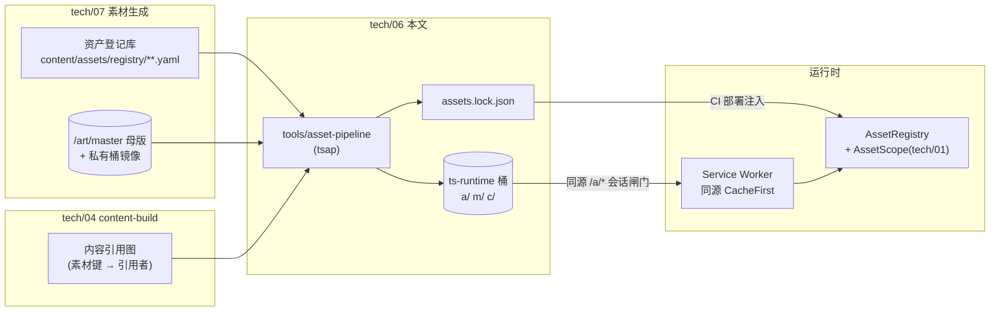
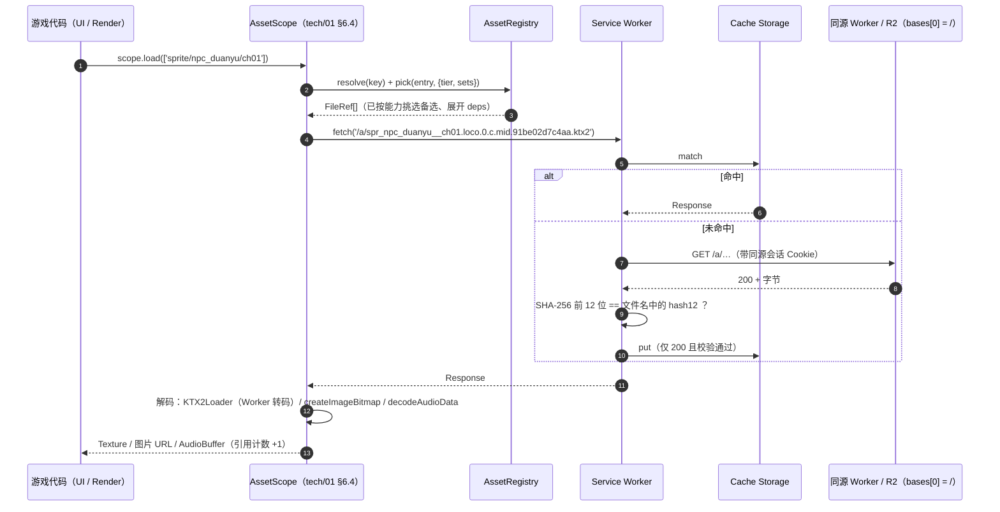
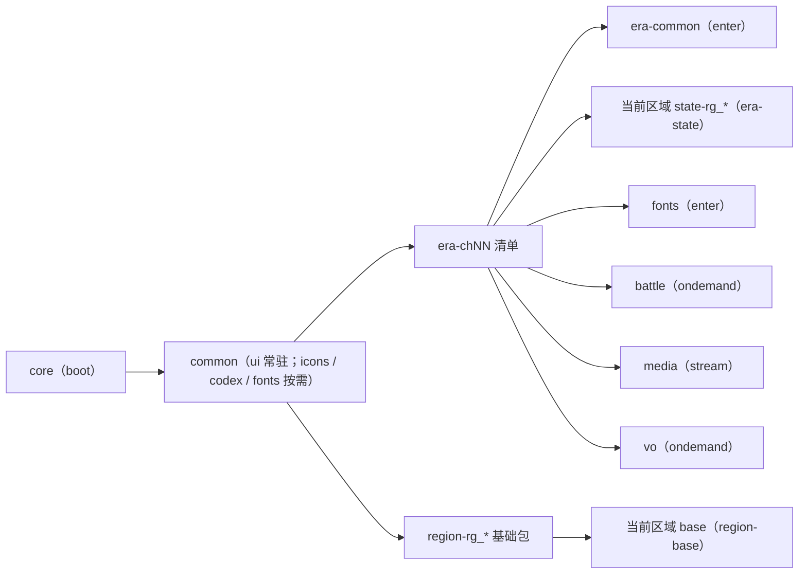
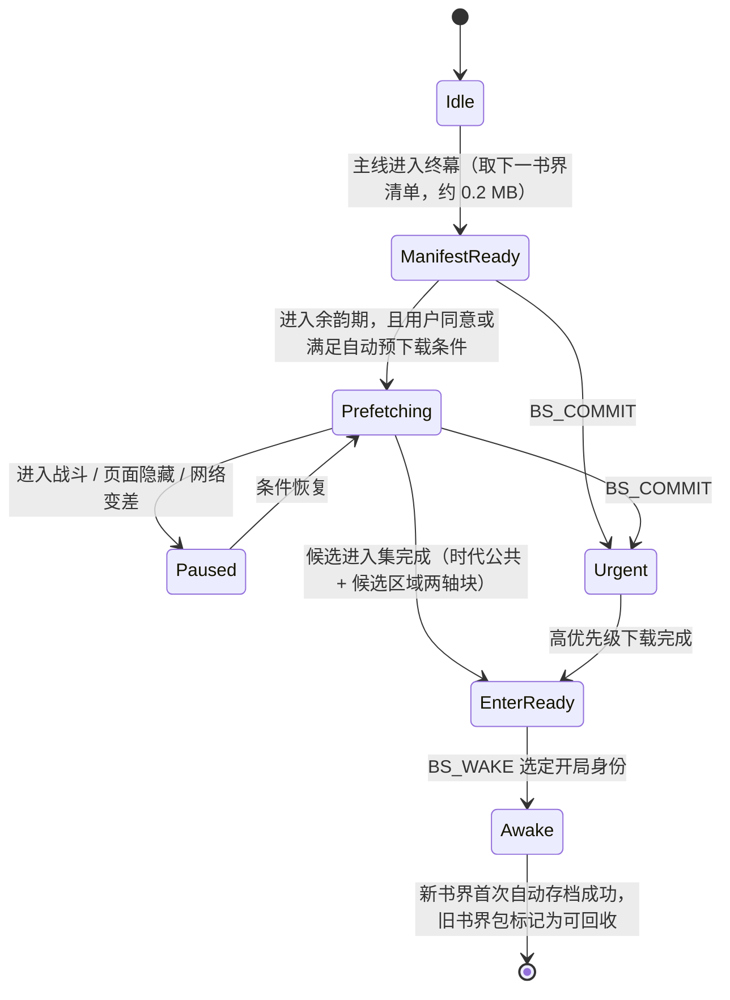
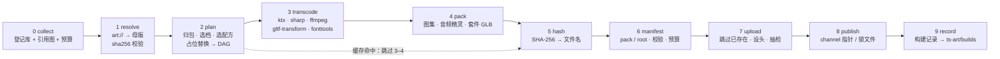
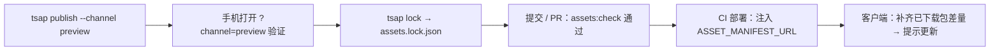
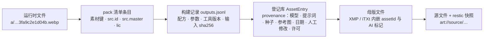

# tech/06 · 素材分离存储与分发

| 项 | 内容 |
|---|---|
| 文档归属 | `docs/tech/06-asset-storage.md`：素材**存储分层**、**素材键与清单（manifest）**、**分包与预取**、**运行时格式/编码规范**、**资源构建管线 `tools/asset-pipeline`**、**存储与 CDN 选型**、**缓存/版本/回滚**、**完整性与访问控制**、**运行时侧溯源链**、**占位与回退**的唯一归属文档 |
| 版本 | v1.2（跨文档同步，2026-09-26）；全局审计（2026-09-26） |
| 上游基准 | `docs/00-canon.md` §0（非商业、**不公开分发**、PWA 离线、云存档）、§2（书界）、§8、§12（ID 规范）、§18（文档归属）、§19（素材基线：与代码分离；对象存储 + CDN；内容哈希命名 + 清单；KTX2（Basis Universal）；按书界分包、懒加载） |
| 强依赖 | `tech/01`（monorepo、资源分级 L0–L3、`AssetScope`、PWA/Workbox、CI、`assets.lock.json`）；`tech/07`（资产登记库 `AssetEntry`、母版规格、资产 ID 前缀、`art://` URI、状态机）；`tech/02`（`battle8`、精灵加载器、法线编码、相机）；`tech/03`（显存/包体/字体与加载预算终值）；`tech/04`（书界数据包与引用图）；`tech/08`（会话鉴权、应用托管、域名部署）；`design/02` §4（书眠流程）；`design/11`（30 个全局区域、统一大地图与时代图层）；`design/12`（任务与门派流程）、`design/15`（冲穴）、`design/16`（资源与营生）、`design/17`（99 门派）、`design/18`（NPC 与同伴）、`design/19` 与 `design/map/*.yaml`（4096×3072 地图源、189 城及门派落点）；`design/05`、`design/06`、`design/10`（内容数据中的素材键及物品/装备资产需求） |
| 读者 | 作者本人（单人开发 + AI 辅助编码）与编写管线/加载器的 AI 编码代理 |
| 命名说明 | 任务书中的 `tools/asset-build` 即 `tech/01` §4.1 已定名的 **`tools/asset-pipeline`**，本文沿用后者；其 CLI 命名为 `tsap`（tianshu asset pipeline） |

> **结论先行（TL;DR）**
>
> 1. **三层分离**：代码仓库（Git：代码、schema、登记库 YAML、≤ 2 MB 引导资源）｜素材库 `/art`（本地 NVMe + 私有桶镜像 + restic 版本化快照；**不用 Git LFS / DVC**）｜运行时产物（对象存储 + 边缘分发，内容寻址、永久缓存）。
> 2. **一个键贯穿全链**：`AssetKey = <kind>/<subject>/<variant>`（例 `portrait/npc_xiaofeng/default`），与 tech/07 资产 ID（例 `por_npc_xiaofeng`）**双射**；内容数据只写素材键或按约定推导，**永不写 URL**。
> 3. **两级清单 + 锁文件**：`m/root.<hash>.json` → `m/<pack>.<hash>.json`；应用构建由 `assets.lock.json` 钉住 root（代码与素材原子一致），开发/预览走 `c/<channel>.json` 指针。
> 4. **双轴分包**：`core`（到标题画面 ≤ 1.5 MB）→ `common`（常驻）→ **30 个区域基础包** `region-<rg_id>`（地形、建筑、跨时代通用 NPC）+ **时代状态包** `era-chNN`（本时代势力/NPC/资源点/营生场所/城市名称及状态素材）；章节剧情只声明对这两轴块的依赖，不复制基础地形。进入集按“时代公共 + 当前区域基础 + 当前区域时代状态 + 当界字体”组合，mid 档硬上限 60 MB。区域与时代语义只引用 `design/11`。
> 5. **地图生产键已固化**：`design/19` 的 4096×3072 SVG 同源生成 `map/jianghu_world/base` 与 `map/jianghu_world/ch01`～`ch14`；base 只进 `common/map`，14 个时代增量分别进 `era-chNN/era-common`，禁止复制十四份完整底图。
> 6. **格式**：WebGL 用 KTX2（精灵/法线/硬边特效 = UASTC + RDO + Zstd，精灵按 tech/02 定稿为 64/96/128 px/m 三档包 + 2 级 mip；地形纹理数组/建筑图集/背景 = ETC1S；不透明贴图去 alpha 以落到 4 bpp）；DOM 用 WebP（AVIF 可选）；音频 AAC-LC 基线（Opus 可选）；视频 H.264 渐进 MP4 基线（HEVC/AV1/HLS 可选）；字体 OFL 字库子集化 WOFF2。
> 7. **构建本地优先**：母版在作者机器上，`tsap build/publish` 本地运行；CI 只做校验、预算门禁与部署；增量缓存键 = 输入 sha256 + 配方版本 + 参数 + 工具版本。
> 8. **唯一分发方案**：按作者决定 P03，只规划 Cloudflare R2 + 同源 Worker（`/a/*`、`/m/*`、`/c/*`）；暂不备案，也不建设国内或香港镜像。`bases` 在本版固定为 `["/"]`，接口保留数组形状但不启用多源。
> 9. **默认私有**：运行时素材含金庸 IP 衍生内容，按基准 §0“不要公开发布”，**全部素材路径走会话闸门**（同源 Cookie，tech/08 签发）；R2 桶不开公开访问。若未来另立项采用按流量计费 CDN，须先完成费用封顶设计；防盗链不是安全边界。
> 10. **缓存**：所有经过会话闸门的哈希文件均用 `private, max-age=31536000, immutable`；指针与 HTML `no-cache`；Service Worker（Workbox `injectManifest`）对 `/a/*` 采用“单源 CacheFirst + 入缓存前哈希校验 + Range 支持”；离线下载按“包/块”登记于 Dexie `packs` 表，标记-清除式 GC。
> 11. **溯源**：运行时文件 → 清单 `src` → 登记库 `provenance` → 母版 XMP → 源文件；`tsap trace <url|hash|key>` 一条命令还原模型、提示词、种子、参考图、人工修改与许可证。
> 12. **占位优先**：未审定/缺失资源在构建期即替换为分类型占位（木人桩精灵、水墨剪影立绘、字形图标、灰模建筑），游戏始终可玩；书界"完成"门禁 = S/A 级零占位。

> **调研要点（非致命，但改变了若干细节决策；来源见文末）**
>
> 1. **KTX-Software**：最新正式版 **4.4.2**；5.0.0 仍为 RC，且**已移除 `toktx` 等旧工具**。本文一律使用 `ktx create`；glTF-Transform 4.x 也已改为调用 `ktx create`（最低要求 KTX-Software 4.4.0）。
> 2. **three.js `KTX2Loader` 的转码目标优先级**：ETC1S → ETC2 > ETC1 > BPTC > DXT > PVRTC > RGBA32（**不会转 ASTC**）；UASTC → ASTC > BPTC > ETC2 > ETC1 > DXT > PVRTC > RGBA32。Metal 在所有 iOS 设备上支持 ETC 格式，因此 ETC1S 在 iPhone 上落到 ETC2——不透明贴图 4 bpp、带 alpha 8 bpp。
> 3. **Opus**：Safari 18.4 新增的是 Ogg Opus/Vorbis；这不能推出此前 WebM/Opus 不可用。音频仍以覆盖最稳的 AAC 为基线，Opus 是否采用只看运行时 `canPlayType()` 与目标机实测。
> 4. **HLS**：浏览器和平台组合差异大，且支持会随媒体栈变化；不锁定“某版本起原生支持”，统一以 `canPlayType('application/vnd.apple.mpegurl')` 加一次真实播放探测决定，必要时用 hls.js。短片仍以**渐进式 MP4 为基线**。
> 5. **Cloudflare 单源**：R2 Standard 互联网出口免费，Workers Free 为 100,000 请求/日、每次 10 ms CPU；Static Assets Free 每版本 20,000 文件、单文件 25 MiB。默认域名在大陆网络可达性不作保证，故必须用自定义域名并在 P01 设备矩阵实测；P03 已决定不做国内/香港镜像。
> 6. **iOS App 内置浏览器**：普通 `WKWebView` 默认不具备 Safari/主屏 Web App 同等的 Service Worker 能力；App-Bound Domains 是宿主 App 主动配置项，网页无法要求微信开启 → 必须以运行时能力探测提供“无 SW”降级（§8.5）。
> 7. **AWS SDK JS v3（≥ 3.729）默认给上传加 CRC32 校验头**，R2 等 S3 兼容存储曾因此返回 501 → 上传客户端必须设 `requestChecksumCalculation: 'WHEN_REQUIRED'`（§6.6）。
>
> 结论：以上均不构成对基准 §19 的致命冲击，正文按基线展开。

---

## 目录

- [0. 摘要与关键决策](#0-摘要与关键决策)
- [1. 范围、上下游与设计原则](#1-范围上下游与设计原则)
- [2. 分离原则与三层存储](#2-分离原则与三层存储)
- [3. 资源 ID、素材键与清单](#3-资源-id素材键与清单)
- [4. 分包策略](#4-分包策略)
- [5. 格式规范](#5-格式规范)
- [6. 资源构建管线 tools/asset-pipeline](#6-资源构建管线-toolsasset-pipeline)
- [7. 存储与 CDN 选型](#7-存储与-cdn-选型)
- [8. 缓存与版本](#8-缓存与版本)
- [9. 完整性与安全](#9-完整性与安全)
- [10. 元数据与溯源](#10-元数据与溯源)
- [11. 占位与回退资源](#11-占位与回退资源)
- [12. MVP 与演进路径](#12-mvp-与演进路径)
- [13. 风险与备选方案](#13-风险与备选方案)
- [参考资料](#参考资料)
- [本文新增术语/约定](#本文新增术语约定)
- [待决事项 / 依赖](#待决事项--依赖)

---

## 0. 摘要与关键决策

| # | 决策点 | 结论 | 理由 / 章节 |
|---|---|---|---|
| D1 | 存储分层 | 代码仓库 / 素材库（source·master·work）/ 运行时产物三层，二进制永不进 Git | 基准 §19；§2 |
| D2 | 源文件与母版版本化 | 本地 NVMe `/art` 为主；`master` 用 rclone 镜像到私有桶；全库用 restic 做加密、去重、版本化快照（本地盘 + 云）；**不用 Git LFS / DVC** | LFS 在 0.5 TB 量级仅存储超额约 $32/月，另计下载流量，且拖慢克隆；登记库已承担"指针 + sha256"职能；§2.3 |
| D3 | 运行时寻址 | 素材键 `AssetKey = <kind>/<subject>/<variant>`，与资产 ID 双射；清单以素材键为主键 | 与基准 §12 内容 ID 直连；§3.2 |
| D4 | 文件命名 | `a/<stem>.<hash12>.<ext>`，hash = SHA-256 前 12 位十六进制；逐文件不存完整 SRI（只有 root / pack 清单带 SRI） | 不可变、可永久缓存、可读性好、清单不膨胀；§3.4 |
| D5 | 清单结构 | 两级：root（每次构建一个）→ pack（每包一个）；应用构建用 `assets.lock.json` 钉住 root；开发/预览用 channel 指针 | 代码与素材原子一致、回滚 = 回退锁文件；§3.5、§8.4 |
| D6 | 分包 | `core` / `common` / `region-<rg_id>` / `era-chNN` / `fin`；区域基础资产与书界时代状态资产分离 | AR-04；语义见 `design/11`，物理分发见 §4 |
| D7 | 块归属 | 由内容引用图及 `design/11` 的全局区域/时代映射自动计算：跨时代稳定资产进区域基础包，随书界变化的对象进时代状态包；登记库可覆盖 | 单人维护不手工分包；§4.2 |
| D8 | 质量档位 | 素材变体三档 `low`/`mid`/`high`（渲染档 `ultra` 复用 `high`，tech/02 F7）；只在有意义处出变体（纹理、精灵、立绘、CG、视频、模型 LOD），`mid` 必有 | §4.4、§5 |
| D9 | 纹理 | KTX2：UASTC（+RDO+Zstd）用于精灵、法线、硬边特效、画布内 UI；ETC1S 用于地形纹理数组、建筑图集、背景；精灵按 tech/02 定稿为 64 / 96 / 128 px/m 三个包、2 级 mip；无压缩格式可用时自动降到 `low` | §5.2、§5.5 |
| D10 | DOM 图像 | WebP 基线；AVIF 仅对 CG/立绘可选（iOS 16.4+ 完整支持）；图标用独立小文件（不做 DOM 图集） | §5.3–§5.4 |
| D11 | 音频 | AAC-LC（`.m4a`）基线：BGM 128 kbps、音效 96 kbps 单声道音频精灵、配音 64 kbps；Opus/WebM 仅在能力探测与目标机实测通过后选用 | 覆盖稳定、避免按版本猜测；§5.7 |
| D12 | 视频 | H.264 High 渐进 MP4（480p/720p/1080p，+faststart）；HEVC/AV1 按 MediaCapabilities 可选；HLS 仅用于 > 60 s 长片（可选） | 短片为主、离线缓存简单；§5.8 |
| D13 | 字体 | 正文用系统字体；对话为 `fnt_dlg_common` + 当前 `fnt_dlg_chNN` 两文件 WOFF2 子集，题名为 boot + 当前书界子集；逐字体核对同版本 OFL | tech/03 F9、作者决定 P04；§5.9 |
| D14 | 构建位置 | 本地优先；CI 只做 `assets:check`（无需母版）与部署；可选自托管 runner | 母版 60–120 GB，托管 runner 装不下也跑不动；§6 |
| D15 | 存储/CDN | 唯一活动方案：Cloudflare R2 + Worker 同源 `/a/*`；不备案、不做国内或香港镜像 | 作者决定 P03；§7 |
| D16 | 访问控制 | 默认 L1 会话闸门（同源 HttpOnly Cookie）；R2 不开 `r2.dev`；P03 下不实现签名 URL 或第二套鉴权 | 基准 §0 不公开发布；§9 |
| D17 | 缓存 | 哈希资源 private + immutable；SW 同源 CacheFirst + 哈希校验 + Range；离线下载按块；标记-清除 GC；申请 `persist()` | §8 |
| D18 | 溯源与占位 | 清单 `src` 指向登记库；构建记录存私有桶；分类型占位 + 回退链；S/A 级零占位才算书界完成 | §10、§11 |
| D19 | 全国地图资产 | 接受 `design/19` 的 4096×3072 SVG 源；正式键为 `map/jianghu_world/base` 与 `map/jianghu_world/ch01`～`ch14`，共享底图只存一份 | AR-04/AR-11；§3.2、§4.1、§5.4 |

---

## 1. 范围、上下游与设计原则

### 1.1 范围

| 本文负责 | 不在本文（归属） |
|---|---|
| 运行时素材的寻址（素材键、清单）、区域基础包/时代状态包的物理结构、预取、编码格式与参数、构建管线、上传与分发、缓存与离线、完整性校验、素材路由对鉴权接口的调用、运行时侧溯源链、占位与回退 | 素材如何生成、审核、母版规格与登记库字段（`tech/07`）；着色器、精灵加载器内部结构、法线使用方式（`tech/02`）；预算终值（`tech/03`）；书界规则/文本书界包与引用图（`tech/04`，随应用发布，本文只校验其素材依赖）；30 区、城市/时代入口与状态（`design/11`）；任务与门派流程（`design/12`）、冲穴（`design/15`）、资源/家丁/营生（`design/16`）、门派历史/开放矩阵（`design/17`）、NPC/同伴（`design/18`）、全国地图数据与 SVG（`design/19`）；登录、会话格式/签发/校验、应用托管与云存档（`tech/08`）；下载/存储管理界面（`design/14`） |

### 1.2 上下游接口


```mermaid
flowchart LR
  subgraph T07["tech/07 素材生成"]
    REG["资产登记库<br/>content/assets/registry/**.yaml"]
    MAS[("/art/master 母版<br/>+ 私有桶镜像")]
  end
  subgraph CB["tech/04 content-build"]
    REF["内容引用图<br/>(素材键 → 引用者)"]
  end
  subgraph T06["tech/06 本文"]
    AP["tools/asset-pipeline<br/>(tsap)"]
    RT[("ts-runtime 桶<br/>a/ m/ c/")]
    LOCK["assets.lock.json"]
  end
  subgraph APP["运行时"]
    SW["Service Worker<br/>同源 CacheFirst"]
    REGI["AssetRegistry<br/>+ AssetScope(tech/01)"]
  end
  REG --> AP
  MAS --> AP
  REF --> AP
  AP --> RT
  AP --> LOCK
  LOCK -->|"CI 部署注入"| REGI
  RT -->|"同源 /a/* 会话闸门"| SW
  SW --> REGI
```

**接口契约**

| 契约文件 / 接口 | 所有者 | 消费者 | 内容 |
|---|---|---|---|
| `packages/data/src/assets/asset-key.ts` | 本文 | 全部 | 素材键语法、kind ↔ 前缀表、双射函数、简写归一化 |
| `packages/data/src/assets/manifest.ts`（Zod + 类型，导出 JSON Schema） | 本文 | `tools/asset-pipeline`、`apps/game`、`packages/platform` | root / pack 清单、锁文件、通道指针结构 |
| `packages/data/src/schemas/asset-entry.ts` → `asset.schema.json` | tech/07（字段）/ tech/01（机制） | 本文管线 | 登记库条目 `AssetEntry`；这是内容 schema，不复制 `packages/spec/` 静态契约 |
| `packages/spec/texture-profiles.json` | 本文 | 管线、tech/02 | 各类纹理的编码档（编码器、格式、mip、法线布局）；与 tech/02 的契约文件同目录 |
| `packages/spec/sprite-spec.json`（v1 已定稿） | tech/02 | 本文图集配方 | ppm 分档包（64/96/128）、2 级 mip、帧格、锚点、法线编码、页组 |
| `tools/asset-pipeline/budgets.yaml` | 本文（初值）/ tech/03（终值） | 管线、CI | 包/块体积预算 |
| `tools/asset-pipeline/tools.lock.json` | 本文 | 管线、`tsap doctor` | 外部工具版本（进入各配方的构建缓存键） |
| `assets.lock.json`（仓库根） | 本文（生成） | tech/01 CI/部署 | 钉住的 root 清单 |
| 内容引用图 `refs.json`（`content-build --emit-refs`） | tech/04 | 本文归包 | 每个素材键被哪些书界/全局区域/时代状态对象引用 |
| 全局区域与时代图层索引 | `design/11` → tech/04 | 本文归包 | 30 个全局 `rg_*`、189 个 `city_*` 的归区、区域基础资产边界、各 `chNN` 的时代状态与章节剧情依赖；本文不重定义其玩法含义 |
| 全国地图生成源 | `design/19`、`design/map/*.yaml`、`tools/map/render_map.py` | 本文地图配方 | 4096×3072 共享底图与 14 个时代增量；城市、门派、路线和图外节点仍以源 YAML 为准 |
| 资源点/营生/门派/NPC/冲穴素材引用 | `design/16` / `design/12` / `design/17` / `design/18` / `design/15` → tech/04 | 本文归包 | 只作为区域基础或时代状态素材依赖输入；数值、人物与玩法仍由各归属文档定义 |
| 物品/装备图标与挂点需求 | `design/10` → tech/07 → tech/04 | 本文归包 | 接收目录导出的约 93 个独立图标、约 40 个基底模板族及成对兵器双手挂点资产；实际数量以引用图去重结果为准，本文不定义装备规则 |
| 会话校验接口与 Cookie `ts_s` | tech/08 | 本文边缘路由 | 本文调用共享鉴权函数；不复制会话解析、签名或免检路径规则 |

### 1.3 设计原则

1. **不可变 + 内容寻址**：URL 一经发布，内容永不改变；改内容 = 新 URL。
2. **间接寻址**：代码与内容数据只认素材键；URL 只存在于清单。
3. **本地优先、云为镜像**：母版与构建在作者机器上；云存储负责分发与异地备份。
4. **占位优先**：任何时刻游戏都能完整运行，美术进度不阻塞玩法开发。
5. **默认私有、成本封顶**：没有"公开可读"的桶与路径；任何按量计费的出口都有上限。
6. **单一事实来源**：登记库（tech/07）回答"是什么、从哪来"；清单回答"在哪、多大、什么格式"；二者不重复定义字段。
7. **一条命令自检**：`pnpm assets:check`（登记库 schema、键覆盖、预算、清单一致性）并入 `pnpm check`。
8. **可替换**：存储与 CDN 提供商藏在 `upload/` 适配器与清单 `bases[]` 之后，切换不影响代码与内容。

---

## 2. 分离原则与三层存储

### 2.1 三层总览

```text
┌────────────────────── ① 代码仓库（GitHub 私有库）──────────────────────┐
│ packages/ apps/ services/ tools/ content/（YAML·ink·tmj）                 │  文本、可 diff、CI 校验
│ content/assets/registry/**.yaml（登记库：art:// URI + sha256，不含二进制） │
│ assets.lock.json（钉住的素材版本）                                         │
└────────────────────────────────────────────────────────────────────────────┘
               │ 登记库引用 art://master/... + sha256
┌────────────────────── ② 素材库 /art（作者工作站 NVMe）──────────────────┐
│ source/（PSD·KRA·.blend·分层·候选·训练集）  master/（审定母版）  work/（可删）│
│   ├─ restic 快照 → 本地第二块盘/NAS  +  云端私有仓库（加密、去重、版本化）   │
│   └─ rclone 镜像 master → 私有桶 ts-art（供其他机器/自托管 runner 读取）     │
└────────────────────────────────────────────────────────────────────────────┘
               │ tsap build / publish（本地）
┌────────────────────── ③ 运行时产物（私有桶 ts-runtime + 边缘）──────────┐
│ a/<stem>.<hash12>.<ext>      内容寻址文件（immutable）                     │
│ m/root.<hash12>.json  m/<pack>.<hash12>.json   清单（immutable）            │
│ c/<channel>.json             通道指针（no-cache）                          │
└────────────────────────────────────────────────────────────────────────────┘
               │ 同源 /a/* /m/* /c/*（会话闸门）→ 浏览器 HTTP 缓存 + SW Cache Storage
```

| 层 | 内容 | 位置 | 版本化 | 备份 | 访问 | 规模（全量估算） |
|---|---|---|---|---|---|---|
| ① 代码仓库 | 代码、schema、内容文本、登记库、锁文件、≤ 2 MB 引导资源 | GitHub 私有库 | Git | GitHub + 本地克隆 | 作者、CI | < 200 MB |
| ② 素材库 `source` | 可编辑源文件、生成候选、训练集 | `/art/source` | restic 快照 | restic → 本地盘 + 云（加密） | 仅作者 | 300–500 GB（tech/07 §6.2） |
| ② 素材库 `master` | 审定母版（无损）+ 元数据 | `/art/master` | 登记库 sha256（Git 历史）+ restic 快照 | 同上 + rclone 镜像到 `ts-art` | 作者、自托管 runner | 60–120 GB |
| ② 素材库 `work` | 渲染中间帧、EXR、下载缓存 | `/art/work` | 无 | 不备份 | 仅本机 | 视任务 |
| ③ 运行时产物 | KTX2、WebP、GLB、AAC、MP4、WOFF2、清单 | 私有桶 `ts-runtime`（Cloudflare R2） | 内容寻址天然多版本 | 可由 master 重建；不单独备份 | 仅经同源会话闸门 | ≈ 7–8.5 GB（§2.5） |

### 2.2 代码仓库里放什么

| 允许 | 禁止 |
|---|---|
| 源码、配置、Zod schema 与导出的 JSON Schema | 任何母版、生成候选、运行时产物 |
| `content/**` 文本（YAML、ink、Tiled `.tmj`）、登记库 YAML | `.psd .kra .blend .exr .wav .mov .mp4 .ktx2 .glb` 等二进制 |
| `apps/game/public/boot/`：favicon、PWA 图标、闪屏 SVG（合计 ≤ 500 KB） | 超过 256 KB 的任何二进制 |
| 占位资源的**生成源**（SVG、JSON 参数；位图占位在构建期生成） | 字体原文件（放素材库 `master/font/`，登记 `fnt_*`） |
| 管线测试夹具（`tools/asset-pipeline/test/fixtures/`，单个 ≤ 50 KB） | 任何带 IP 衍生内容的图片（立绘、CG 截图）——即使很小 |

守卫：`.gitattributes` 标记二进制扩展名；lefthook 提交前钩子运行 `scripts/check-binaries.ts`，CI 同样运行一次。

```yaml
# lefthook.yml（节选，与 tech/01 §4.1 同一文件）
pre-commit:
  commands:
    no-binaries:
      glob: "*"
      run: pnpm tsx scripts/check-binaries.ts {staged_files}
```

```ts
// scripts/check-binaries.ts（规则摘要）
const ALLOW_DIRS = ['apps/game/public/boot/', 'tools/asset-pipeline/test/fixtures/'];
const BINARY_EXT = /\.(png|jpe?g|webp|avif|gif|psd|kra|blend|exr|tiff?|wav|flac|mp3|m4a|ogg|webm|mov|mp4|mkv|ktx2|basis|glb|gltf|fbx|obj|ttf|otf|woff2?|zip|7z)$/i;
const MAX_BYTES = 256 * 1024;
// 失败条件：BINARY_EXT 命中且（不在 ALLOW_DIRS 内 或 体积 > MAX_BYTES）；ALLOW_DIRS 内合计 > 2 MB 也失败
```

`.gitignore` 追加：`.assets/`（本地构建输出）、`.cache/asset-pipeline/`（构建缓存）、`.env.local`（本机存放的存储令牌，§9.5）。

### 2.3 素材源文件库：Git LFS vs 对象存储 vs NAS

按 source + master ≈ **0.5 TB** 估算（tech/07 §6.2），月度费用：

| 方案 | 计价依据（2026-09 核实） | 0.5 TB 月费 | 优点 | 缺点 | 结论 |
|---|---|---|---|---|---|
| **Git LFS（GitHub）** | 免费 10 GiB 存储 + 10 GiB 流量；超出 $0.07/GiB·月存储、$0.0875/GiB 下载 | 0.5 TB≈466 GiB：`(466−10)×0.07≈$31.9/月`；一次全量拉取超额约 `(466−10)×0.0875≈$39.9` | 与 Git 一体、按提交版本化 | 贵；克隆与 CI 变慢；大文件二进制差分无意义 | ❌ |
| **DVC（远端指向对象存储）** | 存储费同所选桶 | 同桶 | 数据版本与 Git 提交绑定 | 与 tech/07 登记库（已存 URI + sha256）职能重复；多一套工具 | ❌（仅作备选） |
| **Cloudflare R2 Standard** | $0.015/GB·月（前 10 GB 免费），出口免费 | ≈ $7.4/月 | 零出口费、S3 兼容 | 对冷数据偏贵 | master 镜像用 |
| **Cloudflare R2 Infrequent Access** | $0.01/GB·月；取回 $0.01/GB；最短存储 30 天 | ≈ $5/月 | 适合快照仓库 | 取回收费、有最短存储期（restic prune 会产生提前删除计费） | 可选 |
| **Backblaze B2** | $6.95/TB·月；月出口 ≤ 存储量 3 倍免费 | ≈ $3.5/月 | 最便宜的异地快照目标 | 大陆访问一般 | restic 云端仓库首选 |
| **NAS / 第二块硬盘** | 一次性硬件购置，按采购时实际报价 | 不计月度云成本 | 本地高速恢复、不受网络影响 | 同址风险（火灾/失窃） | 作为 restic 本地仓库 |

**决策**：
1. `/art` 在工作站 NVMe（≥ 1 TB）上作为唯一工作副本；**3-2-1 备份**：restic → 本地第二块盘/NAS（快速恢复）+ restic → B2 或 R2 IA（异地、加密）。
2. `master` 另用 rclone **镜像**到私有桶 `ts-art/master`（明文、可直接被管线读取），供笔记本或自托管 runner 构建；`source` 不镜像（需要时从 restic 还原）。
3. 母版文件路径稳定（文件名 = 资产 ID），**历史版本由 restic 保存**；`tsgen approve`（tech/07）结束时触发一次针对 `master` 的增量快照（`--tag approve:<assetId>`），保证每个审定过的版本都可找回。
4. 不在代码仓库放任何二进制；登记库里的 `files.master.sha256` 就是"指针"。

```toml
# ~/.config/tianshu/art.toml —— 每台机器一份，不入库；tsgen 与 tsap 共用
[roots]
source = "/art/source"
master = "/art/master"
work   = "/art/work"

[remote]                       # 可选：本机没有 /art/master 时从镜像读取
master = "r2art:ts-art/master" # rclone remote 名:桶/前缀
```

```bash
# master 镜像（R2 需 --s3-no-check-bucket：对象级令牌无 ListBuckets 权限）
rclone sync /art/master r2art:ts-art/master --checksum --transfers 8 --s3-no-check-bucket

# restic 快照（R2 用 S3 兼容端点；需设置 AWS_DEFAULT_REGION=auto）
export RESTIC_REPOSITORY="s3:https://<account_id>.r2.cloudflarestorage.com/ts-art-restic"
restic backup /art/source /art/master --tag daily --exclude-caches
restic forget --keep-daily 14 --keep-weekly 8 --keep-monthly 24 --prune
restic check --read-data-subset=2%          # 每周抽检 2% 数据块
```

### 2.4 运行时产物桶布局

| 前缀 | 内容 | 命名 | 可变性 | 缓存 |
|---|---|---|---|---|
| `a/` | 全部运行时文件（扁平命名空间，便于 CSS 中相对引用字体切片） | `<stem>.<hash12>.<ext>` | 不可变 | immutable（§8.1） |
| `m/` | root 与 pack 清单 | `root.<hash12>.json`、`<pack>.<hash12>.json` | 不可变 | immutable |
| `c/` | 通道指针（`preview.json`、`dev.json`、`ping.json`） | 固定名 | 可变 | `no-cache` |

- **构建记录不放在运行时桶**：`builds/<buildId>/` 写入私有素材桶 `ts-art`（§10.3），避免暴露母版路径与提示词。
- **保留策略**：保留最近 10 次构建 + 近 90 天 `assets.lock.json` 历史中出现过的全部 root 所引用的对象；其余由 `tsap gc-remote` 清理（先 `--dry-run`）。

### 2.5 规模估算（全量，运行时产物）

按 tech/07 §3.2 标准档数量与本文 §5 编码参数估算（Phase 0 用天龙切片实测后回填）：

| 类别 | 依据 | mid 档 | low 档增量 | high 档增量 | 可选变体 |
|---|---|---|---|---|---|
| 精灵图集 `sprite` | ≈ 450 套；128 px/m 包均值 ≈ 3.8 MB/套（UASTC+Zstd，颜色 + 半分辨率法线，含 2 级 mip）；96 px/m 包 ≈ 0.56×；64 px/m 包（无法线）≈ 0.2× | ≈ 0.95 GB（96 px/m） | ≈ 0.35 GB（64 px/m） | ≈ 1.7 GB（128 px/m） | — |
| 视频 `video` | 46 条目标约 24.7 分钟：`1 + 1 + 14 + 14 + 13 + 3 = 46` 条，中心时长 `105 + 25 + 14×37.5 + 14×17.5 + 13×24 + 3×90 = 1,482 s`；其中 13 条书眠严格为 `13×24=312 s=5.2 min`；480p ≈0.8、720p ≈2、1080p ≈3.5 Mbps | `1482×(2+0.128)/8≈394 MB≈0.39 GB` | `1482×(0.8+0.096)/8≈166 MB≈0.17 GB` | `1482×(3.5+0.128)/8≈672 MB≈0.67 GB` | AV1/HEVC 1080p +0.4–0.9 GB |
| 音乐/音效/配音 | 140 首 × ≈ 2.9 MB；音效 ≈ 30 MB；配音 ≈ 70 MB | ≈ 0.5 GB | 0 | 0 | Opus 变体 +0.3 GB |
| DOM 图像 | 立绘 + 表情补丁 + CG + 头像 + 图标 + 插画 + 地图 | ≈ 0.5 GB | ≈ 0.25 GB | ≈ 0.45 GB | AVIF +0.3 GB |
| 3D 与纹理 | 区域地形纹理数组（层 256²/512²）、建筑套件图集（每套 1–3 × 2048²）与地标、LOD1、特效 | ≈ 0.5 GB | ≈ 0.2 GB（LOD1 与半尺寸图集） | ≈ 0.1 GB（512² 地形层） | — |
| 字体 | `fnt_dlg_common` + 14 个书界的对话/题名补集 + boot 题名：`0.26 + 14×(0.50+0.12) + 0.04 = 8.98 MB` 上界 | ≈ 9 MB | 0 | 0 | 若将来做繁体，按同样字表重新核算 |
| **合计** | | **≈ 2.9 GB** | **≈ 1.0 GB** | **≈ 3.0 GB** | **+1.0–1.5 GB** |

全量 ≈ **6.9 GB**，含全部可选变体 ≈ **8–8.5 GB**（估算误差按 ±30% 看待，上限约 11 GB），落在任务书“5–20 GB”区间的中下段。一名玩家实际下载的是某一档的完整集合：低档全作 ≈ 1.5 GB、中档 ≈ 2.9 GB、高档 ≈ 3.5 GB；**单个时代状态包（mid，含按需媒体）典型约 200 MB**（按 tech/07 体量系数 0.3–1.3 浮动），而区域基础资产跨时代去重；进入新书界必需的冷进入集目标 ≤ 60 MB（§4.5）。

---

## 3. 资源 ID、素材键与清单

### 3.1 四种标识及其关系

| 层 | 名称 | 例 | 定义方 | 用途 |
|---|---|---|---|---|
| 内容 ID | 游戏对象 ID | `npc_xiaofeng`、`sk_xianglong18`、`rg_dali_cangshan` | 基准 §12 与 `design/11` §13.2 | 规则、存档、剧情 |
| 资产 ID | 登记库条目 ID | `por_npc_xiaofeng__ch01_base` | tech/07 §1.4 | 生产、审核、溯源 |
| **素材键 `AssetKey`** | 运行时逻辑键 | `portrait/npc_xiaofeng/ch01_base` | **本文** | 内容数据引用、运行时寻址、清单主键 |
| 文件名 | 内容寻址对象名 | `a/por_npc_xiaofeng__ch01_base.mid.3fa9c2e1d04b.webp` | 本文（自动生成） | CDN 与缓存 |

关系：**内容 ID →（约定推导或显式声明）→ 素材键 ⇄（双射）资产 ID →（构建）→ 文件名**。任何一层都不跨层引用：内容数据不写文件名，登记库不写素材键以外的运行时信息。

### 3.2 素材键语法

```text
AssetKey = kind "/" subject "/" variant
kind     = 下表枚举（小写字母）
subject  = seg                        ; 通常就是基准 §12 的内容 ID（npc_xiaofeng、sk_xianglong18…）
variant  = "default" | seg            ; 书界/年龄/状态/表情/时代/语言等组合
seg      = [a-z0-9]+ ( "_" [a-z0-9]+ )*   ; 单下划线分词；禁止双下划线、大写、中文、"@"
```

保留主体：`ph`（占位，§11），任何内容 ID 不得取名 `ph`。

| kind | 资产 ID 前缀（tech/07） | 技术类型 `type` | 消费端 | 常见所属块 | 变体惯例 |
|---|---|---|---|---|---|
| `portrait` | `por_` | `image` / `image-patch` | DOM | `era-chNN/era-common` 或 `state-<rg_id>` | `chNN_base`、`chNN_e_<情绪>`、`chNN_<年龄>_<状态>_base` |
| `avatar` | `ava_` | `image` | DOM | `era-chNN/era-common` 或 `state-<rg_id>` | `chNN`、`chNN_e_<情绪>` |
| `cg` | `cg_` | `image` | DOM | `era-chNN/media` | `default` |
| `concept` | `art_` | `image` | DOM（图鉴画廊，可选） | `era-chNN/media` | `default` |
| `illus` | `ill_` | `image` | DOM（武学图鉴） | `common` 按需 | `default` |
| `cutin` | `cin_` | `image` | DOM 覆盖层 | `common` 按需 | `default` |
| `icon` | `ico_` | `image`（+ 画布图集定位） | DOM / WebGL | `common` 按需 | `default` |
| `ui` | `ui_` | `image` / `svg` | DOM（纸纹 `ui/paper_fiber`、墨噪声 `ui/ink_noise` 同时供 WebGL 与 CSS 使用） | `core` / `common` | 状态：`normal`、`pressed`、`disabled` |
| `map` | `map_` | `image-tiles` / `svg` | DOM | `common/map`（共享底图）或 `era-chNN/era-common`（全国图时代增量）；区域小图可随 `region-<rg_id>` | `base`、`chNN` |
| `sprite` | `spr_` | `sprite` | WebGL | `region-<rg_id>/base`（通用 NPC）或 `era-chNN/state-<rg_id>` / `battle`（时代 NPC） | `chNN`（时代装）、`chNN_<年龄>` |
| `terrain` | `tex_` | 区域纹理数组中的一层（`packedIn` 指向数组容器） | WebGL | `region-<rg_id>/base` | `default`；时代差异另进状态覆盖层 |
| `building` / `prop` | `bld_` / `prp_` | `model` | WebGL | `region-<rg_id>/base`（稳定套件/地标）或 `era-chNN/state-<rg_id>`（时代差异） | `default` / `chNN` |
| `vfx` | `vfx_` | `texture` / `flipbook` | WebGL | `common/fx`、`era-chNN/battle` | `default` |
| `video` | `vid_` | `video` | `<video>` | `era-chNN/media` | `default` |
| `bgm` / `vo` | `bgm_` / `vo_` | `audio-stream` | `<audio>` | `era-chNN/era-common`、`state-<rg_id>` / `vo` | `default` |
| `sfx` | `sfx_` | 音频精灵成员（packed） | WebAudio | `common`、`era-chNN/era-common` | `default` |
| `font` | `fnt_`（本文新增） | `font` | CSS `@font-face` | `core`、`common/fonts`、`era-chNN/fonts` | subject 为 `dlg_common`、`dlg_chNN`、`title_boot`、`title_chNN`；variant 为 `default` |
| `lut` | `lut_`（本文新增） | `lut`（32³，存为 1024×32 无损 PNG 条带） | WebGL 后处理（tech/02 §5.4） | `common/ui`（闪回、书眠等通用）、`era-chNN/era-common`（书界基调） | `default` |
| `sfxbank` / `atlas` | `sfb_` / `atl_`（本文新增，管线生成的容器） | `audio-bank`；`texture-array`（区域地形、崖面）、`sprite`（区域人群图集）、`canvas-atlas`（植被、画布内 Buff 图标） | WebAudio / WebGL | 同成员所在块 | 主体如 `terrain_rg_dali_cangshan`、`cliff_rg_dali_cangshan`、`crowd_rg_dali_cangshan`、`foliage_rg_dali_cangshan`、`buff_icons` |

`ref_`、`mdl_`、`anm_` 是生产中间资产，**永不进入运行时清单**。

**双射规则**：资产 ID `<prefix>_<subject>[__<variant>]` ⇄ 素材键 `<kind>/<subject>/<variant 或 default>`。

| 资产 ID | 素材键 |
|---|---|
| `por_npc_xiaofeng` | `portrait/npc_xiaofeng/default` |
| `por_npc_duanyu__ch01_base` | `portrait/npc_duanyu/ch01_base` |
| `por_npc_guojing__ch03_prime_e_angry` | `portrait/npc_guojing/ch03_prime_e_angry` |
| `spr_npc_duanyu__ch01` | `sprite/npc_duanyu/ch01` |
| `ico_sk_xianglong18` | `icon/sk_xianglong18/default` |
| `tex_tr_shenshui__song` | `terrain/tr_shenshui/song` |
| `bld_kit_song_gate_01` | `building/kit_song_gate_01/default` |
| `vid_sleep_01_02` | `video/sleep_01_02/default` |
| `fnt_dlg_common` | `font/dlg_common/default` |
| `fnt_dlg_ch01` | `font/dlg_ch01/default` |
| `fnt_title_boot` | `font/title_boot/default` |
| `map_jianghu_world__base` | `map/jianghu_world/base` |
| `map_jianghu_world__ch01` | `map/jianghu_world/ch01`（`ch02`～`ch14` 同理） |

```ts
// packages/data/src/assets/asset-key.ts
export const KIND_PREFIX = {
  portrait: 'por', avatar: 'ava', cg: 'cg', concept: 'art', illus: 'ill', cutin: 'cin',
  icon: 'ico', ui: 'ui', map: 'map', sprite: 'spr', terrain: 'tex', building: 'bld',
  prop: 'prp', vfx: 'vfx', video: 'vid', bgm: 'bgm', sfx: 'sfx', vo: 'vo',
  font: 'fnt', lut: 'lut', sfxbank: 'sfb', atlas: 'atl',
} as const;
export type AssetKind = keyof typeof KIND_PREFIX;
export type AssetKey = string & { readonly __brand: 'AssetKey' };

const SEG = '[a-z0-9]+(?:_[a-z0-9]+)*';
const KINDS = Object.keys(KIND_PREFIX).join('|');
export const ASSET_KEY_RE = new RegExp(`^(${KINDS})/(${SEG})/(${SEG})$`);
const PREFIX_KIND = Object.fromEntries(
  Object.entries(KIND_PREFIX).map(([k, p]) => [p, k]),
) as Record<string, AssetKind>;

export function keyFromAssetId(id: string): AssetKey {
  const cut = id.indexOf('_');
  const kind = PREFIX_KIND[id.slice(0, cut)];
  if (!kind) throw new Error(`unknown asset prefix: ${id}`);
  const [subject, variant = 'default', extra] = id.slice(cut + 1).split('__');
  if (extra !== undefined) throw new Error(`more than one "__" in ${id}`);
  return assertKey(`${kind}/${subject}/${variant}`);
}

export function assetIdFromKey(key: AssetKey): string {
  const [kind, subject, variant] = key.split('/') as [AssetKind, string, string];
  const base = `${KIND_PREFIX[kind]}_${subject}`;
  return variant === 'default' ? base : `${base}__${variant}`;
}

export function assertKey(s: string): AssetKey {
  if (!ASSET_KEY_RE.test(s)) throw new Error(`invalid AssetKey: ${s}`);
  return s as AssetKey;
}
```

### 3.3 内容数据如何引用素材

**约定优先**：大多数素材键由内容 ID 与上下文推导，内容数据里**什么都不写**；只有复用、共享、特例时显式声明。

| 场景 | 推导规则 | 例 |
|---|---|---|
| NPC 立绘（对话） | `portrait/<npcId>/<chNN>_base`；表情 `…/<chNN>_e_<情绪>` | `portrait/npc_duanyu/ch01_e_joy` |
| NPC 头像 | `avatar/<npcId>/<chNN>` | `avatar/npc_duanyu/ch01` |
| 单位精灵 | `sprite/<npcId>/<chNN>`；主角按书界时代装 `sprite/npc_zhujue/<chNN>`（主角 / 书灵身份见 `design/01` §2.1、§2.3；`npc_zhujue`、`npc_shuling` 的正式 NPC 目录登记归 `design/18`，当前待补） | `sprite/npc_zhujue/ch03` |
| 武学 / Buff / 物品图标 | `icon/<对象 ID>/default` | `icon/bf_zhongdu/default` |
| 武学图鉴插画 / 绝招切入 | `illus/<skillId>/default` / `cutin/<skillId>/default` | `cutin/sk_xianglong18/default` |
| 地形材质 | `terrain/<terrainId>/<书界时代>`（时代取自 `chapter.yaml`） | `terrain/tr_shenshui/song` |
| 剧情插图 | ink 标签 `#cg:<cg 主体>` → `cg/<主体>/default` | `cg/q_01_main_03_01/default` |
| BGM、视频、音效 | 在区域/书界/招式数据中**显式**写素材键或简写 | `bgm: bgm/ch01_dali_explore_1/default` |
| 全国导航地图 | 固定读取共享底图 + 当前时代增量 | `map/jianghu_world/base` + `map/jianghu_world/ch01` |

**显式覆盖**：任何内容对象可带 `assets:` 映射，值必须是完整素材键，例如神雕的蒙古兵直接复用射雕的精灵：`assets: { sprite: sprite/npc_menggubing/ch02 }`。

**简写归一化**（`design/05`、`design/06` 现有写法 → 规范键；由 `tools/content-build` 调用 `normalizeAssetRef(field, value)` 转换，产物中只含规范键；校验器对简写给 warning，便于逐步收敛）：

| 字段（出处） | 现有写法 | 规范素材键 |
|---|---|---|
| `assets.icon`（design/05） | `skill/xianglong18` | `icon/sk_xianglong18/default` |
| `assets.art`（design/05） | `illus/skill/tieshazhang` | `illus/sk_tieshazhang/default` |
| `anim.cutin`（design/05） | `cutin/xianglong18` | `cutin/sk_xianglong18/default` |
| `anim.vfx`（design/05）、`vfx.*`（design/06） | `fx_sand_burst` | **不是素材键**：特效定义 ID（`content/vfx/fx_*.yaml`，tech/02 §6.1）；定义中引用的贴图 `tex: vfx_<名>` 归一化为 `vfx/<名>/default` |
| `anim.sfx`（design/05）、`sfx.*`（design/06） | `sfx_palm_hard` | `sfx/palm_hard/default` |
| `ui.icon`（design/06） | `buff/zhongdu` | `icon/bf_zhongdu/default` |
| `assets.icon`（design/10 装备） | `equip/yitianjian` | `icon/eq_yitianjian/default` |
| `assets.icon`（design/10 物品） | `item/dahuandan` | `icon/it_dahuandan/default` |
| `anim.clip`（design/05） | `palm_heavy` | **不是素材键**：精灵元数据内的片段名（tech/02、tech/07 §5.4.4） |

**Buff 图标校验（裁定 §5）**：本文不重定义 Buff 效果，只消费 `design/06` 的目录。构建器须把裁定新增的 19 个具体 ID 视为合法图标主体：`bf_sanxiao`、`bf_luoshui`、`bf_shishen`、`bf_xianluo`、`bf_shangshi`、`bf_tsp_sheshen_aura`、`bf_tsp_aibing`、`bf_tsp_qiyi`、`bf_tsp_qingshang`、`bf_tsp_xiangxu`、`bf_tsp_chou`、`bf_tsp_shixin`、`bf_tsp_pi`、`bf_tsp_bupi`、`bf_tsp_xianying`、`bf_tsp_xianying_fin`、`bf_tsp_weiguang`、`bf_juanshi_ruo`、`bf_fin_zhinian`。`bf_tsp_` 只是模式，不可实例化；`bf_zhenshi`、`bf_cuidu` 已撤回，不得生成对应图标，分别投影阵法状态和复用 `poisonCoat` / 既有毒 Buff。直到 `design/06` 合入前，校验器以 `rulings-v1.md` §5 为临时权威输入；合入后只读取 `design/06` 目录。

### 3.4 文件命名与哈希

```text
a/<stem>.<hash12>.<ext>
stem   = 资产 ID [ "." 角色/动作集/页码 ] [ "." 档位 ]      ; 仅为可读性，不参与寻址
hash12 = hex(SHA-256(文件字节))[0:12]                        ; 48 位，同 stem 下碰撞概率可忽略
```

| 例 | 说明 |
|---|---|
| `a/por_npc_duanyu__ch01_base.mid.3fa9c2e1d04b.webp` | 立绘 mid 档 |
| `a/spr_npc_duanyu__ch01.loco.0.c.mid.91be02d7c4aa.ktx2` | 精灵 `loco` 动作集第 0 页颜色图 |
| `a/spr_npc_duanyu__ch01.loco.0.n.mid.5d0f83e12b9c.ktx2` | 同页法线图（半分辨率） |
| `a/spr_npc_duanyu__ch01.meta.mid.0c7e1a2b3d4f.json` | 精灵元数据（帧表、片段、事件） |
| `a/bgm_ch01_theme.9d2b61c0aa13.m4a` | 无档位差异的文件不带档位段 |
| `a/fnt_dlg_ch01.e1f0a9b8c7d6.woff2` | 天龙书界对话补集（两文件方案的书界文件） |

- **逐文件不存完整 SRI**：SHA-256 的 base64 串是不可压缩的随机数据，4,000 条目 × 3 档会让书界清单多出约 0.7 MB（压缩后几乎不减）。完整性以文件名中的 `hash12` 校验（SW 或页面层用 SubtleCrypto 计算 SHA-256 比对前 12 位，针对意外损坏足够，见 §9.1）；**只有 root 与 pack 清单**在锁文件/root 中保存完整 SRI（`sha256-<base64>`），可直接用 `fetch(url, { integrity })` 校验。
- `a/` 为扁平命名空间：生成的字体 CSS 与清单均可直接引用同一层文件；P03 下 URL 恒为同源 `/a/<文件名>`。
- 同一文件可被多个包清单引用（跨书界复用），存储与缓存天然去重。

### 3.5 清单（manifest）结构

**文件关系**

```text
代码仓库 assets.lock.json ──钉住──▶ m/root.<hash12>.json（每次构建一个）
                                      ├─▶ m/core.<hash12>.json
                                      ├─▶ m/common.<hash12>.json
                                      ├─▶ m/region-rg_dali_cangshan.<hash12>.json …（30 个区域基础包）
                                      └─▶ m/era-ch01.<hash12>.json … m/era-ch14.<hash12>.json、m/fin.<hash12>.json
c/preview.json（可变指针，开发/预览用）──▶ m/root.<hash12>.json
```

`region-<rg_id>` 对 `design/11` §13.2 的 30 个全局区域逐一生成；例如 `rg_dali_cangshan` 对应 `region-rg_dali_cangshan`。章节内容只声明对所需区域基础包和时代状态块的依赖，不另造第三份基础地形。

**`assets.lock.json`**（仓库根，由 `tsap lock` 写入；tech/01 §7.6 部署时据此注入 `ASSET_MANIFEST_URL = bases[0] + root`）

```json
{
  "format": 1,
  "build": "20261012-2104-a1b2c3d",
  "root": "m/root.3f9a2c1e7b4d.json",
  "rootSri": "sha256-P5osHntNAAAAAAAAAAAAAAAAAAAAAAAAAAAAAAAAAAA=",
  "bases": ["/"],
  "publishedAt": "2026-10-12T21:10:00+08:00"
}
```

**root 清单**（每次构建一个，体积 < 10 KB）

```json
{
  "format": 1,
  "build": {
    "id": "20261012-2104-a1b2c3d",
    "createdAt": "2026-10-12T13:04:00Z",
    "pipeline": "asset-pipeline@0.4.0",
    "tools": { "ktx": "4.4.2", "ffmpeg": "8.1.2", "sharp": "0.35.4", "gltf-transform": "4.5.0", "fonttools": "4.66.0" }
  },
  "minApp": "0.6.0",
  "tiers": ["low", "mid", "high"],
  "packs": {
    "core":   { "manifest": "m/core.9c1d0e2f3a4b.json",   "sri": "sha256-…", "deps": [],         "policy": "boot",
                "bytes": { "low": 1100000, "mid": 1300000, "high": 1450000 } },
    "common": { "manifest": "m/common.51aa7c90d2e1.json", "sri": "sha256-…", "deps": ["core"],   "policy": "resident",
                "bytes": { "low": 52000000, "mid": 71000000, "high": 88000000 } },
    "region-rg_dali_cangshan": { "manifest": "m/region-rg_dali_cangshan.61ab….json", "sri": "sha256-…", "deps": ["common"],
                "policy": "region-base", "region": "rg_dali_cangshan", "bytes": { "low": 16000000, "mid": 24000000, "high": 33000000 } },
    "era-ch01": { "manifest": "m/era-ch01.e7d9….json", "sri": "sha256-…", "deps": ["common", "region-rg_dali_cangshan"],
                "policy": "era", "chapter": "ch01_tianlong", "bytes": { "low": 110000000, "mid": 210000000, "high": 290000000 } }
  }
}
```

**pack 清单**（节选：`era-ch01`；区域基础包 `region-rg_dali_cangshan` 另有独立清单）

```json
{
  "format": 1,
  "pack": "era-ch01",
  "build": "20261012-2104-a1b2c3d",
  "deps": ["common", "region-rg_dali_cangshan"],
  "chunks": {
    "era-common":     { "policy": "enter",    "bytes": { "mid": 18000000 }, "files": { "mid": 145 } },
    "state-rg_dali_cangshan": { "policy": "era-state", "region": "rg_dali_cangshan", "start": true,
                       "neighbors": ["rg_bashu", "rg_guangxi", "rg_yundian_qianzhong", "rg_qingzang"],
                       "bytes": { "mid": 8000000 }, "files": { "mid": 72 } },
    "fonts":         { "policy": "enter",    "bytes": { "mid": 620000 } },
    "battle":        { "policy": "ondemand", "bytes": { "mid": 22000000 } },
    "media":         { "policy": "stream",   "bytes": { "mid": 64000000 } },
    "vo":            { "policy": "ondemand", "bytes": { "mid": 5000000 } }
  },
  "assets": {
    "portrait/npc_duanyu/ch01_base": {
      "type": "image", "chunk": "era-common",
      "files": {
        "low":  [{ "f": "por_npc_duanyu__ch01_base.low.8a1c2f0e3b4d.webp",  "b": 118230, "w": 768,  "h": 1152, "fmt": "webp" }],
        "mid":  [{ "f": "por_npc_duanyu__ch01_base.mid.3fa9c2e1d04b.webp",  "b": 243112, "w": 1024, "h": 1536, "fmt": "webp" }],
        "high": [{ "f": "por_npc_duanyu__ch01_base.high.77d0e41a9c2b.avif", "b": 251004, "w": 1360, "h": 2040, "fmt": "avif" },
                 { "f": "por_npc_duanyu__ch01_base.high.c3b19d7e0a55.webp", "b": 398760, "w": 1360, "h": 2040, "fmt": "webp" }]
      },
      "src": { "id": "por_npc_duanyu__ch01_base", "master": "9f2c41aa07be" }, "lic": "ai"
    },
    "portrait/npc_duanyu/ch01_e_joy": {
      "type": "image-patch", "chunk": "era-common", "deps": ["portrait/npc_duanyu/ch01_base"],
      "meta": { "rect": [0.3477, 0.1309, 0.3125, 0.2083] },
      "files": { "mid": [{ "f": "por_npc_duanyu__ch01_e_joy.mid.1e2d3c4b5a69.webp", "b": 21870, "w": 320, "h": 320, "fmt": "webp" }] },
      "src": { "id": "por_npc_duanyu__ch01_e_joy", "master": "0b7d5e3f19c2" }, "lic": "ai"
    },
    "sprite/npc_duanyu/ch01": {
      "type": "sprite", "chunk": "era-common",
      "meta": { "ppmByTier": { "low": 64, "mid": 96, "high": 128 }, "sets": ["loco", "battle8_common", "battle8_weapon_finger"], "residentViewCount": 6 },
      "files": { "mid": [
        { "f": "spr_npc_duanyu__ch01.meta.mid.0c7e1a2b3d4f.json",     "role": "meta",   "b": 48211,   "fmt": "json" },
        { "f": "spr_npc_duanyu__ch01.loco.0.c.mid.91be02d7c4aa.ktx2", "role": "color",  "set": "loco", "page": 0, "b": 1203341, "w": 2048, "h": 2048, "fmt": "ktx2-uastc" },
        { "f": "spr_npc_duanyu__ch01.loco.0.n.mid.5d0f83e12b9c.ktx2", "role": "normal", "set": "loco", "page": 0, "b": 402113,  "w": 1024, "h": 1024, "fmt": "ktx2-uastc" }
      ] },
      "src": { "id": "spr_npc_duanyu__ch01", "master": "6e0f11d2a4c8" }, "lic": "ai"
    },
    "bgm/ch01_dali_explore_1/default": {
      "type": "audio-stream", "chunk": "state-rg_dali_cangshan",
      "meta": { "dur": 182.4, "loop": { "start": 8.0, "end": 176.0 }, "lufs": -18.1 },
      "files": { "mid": [
        { "f": "bgm_ch01_dali_explore_1.4f2a9d1c8e7b.webm", "b": 2210034, "fmt": "webm", "codec": "opus" },
        { "f": "bgm_ch01_dali_explore_1.9d2b61c0aa13.m4a",  "b": 2944120, "fmt": "m4a",  "codec": "mp4a.40.2" }
      ] },
      "src": { "id": "bgm_ch01_dali_explore_1", "master": "c0ffee12ab34" }, "lic": "ai"
    },
    "sfx/palm_hard/default": {
      "type": "audio-clip", "chunk": "era-common",
      "packedIn": [{ "key": "sfxbank/ch01_combat/default", "loc": { "range": [12.345, 0.412] } }],
      "src": { "id": "sfx_palm_hard", "master": "aa01c3e59b72" }, "lic": "rf"
    }
  },
  "alias": {
    "portrait/npc_wuliang_dizi_b/ch01_base": "portrait/npc_wuliang_dizi_a/ch01_base"
  }
}
```

**规则**

1. `files[tier]` 中 `(role, set, page)` 相同的多个文件互为**备选**，按偏好排序（AVIF 先于 WebP、Opus 先于 AAC、AV1 先于 H.264）；不同组合是同一素材的**组成部分**（精灵的元数据、颜色页、法线页）。
2. `mid` 档必有；`low`/`high` 缺省时回落 `mid`；与 `mid` 字节完全相同的变体不重复列出。
3. `packedIn` 指向容器资产（图集、音频精灵、建筑套件 GLB）中的位置；一个素材可同时有自有文件（DOM 用）与容器位置（画布用），例如 Buff 图标。
4. `deps` 构建期做闭包与无环校验；运行时递归加载。
5. 素材键在各包之间唯一；**跨书界复用**时，复用方包清单复制条目（文件相同），合并时要求条目文件列表一致，否则构建失败。
6. 体积：典型书界清单 3–5 千条目，原始 1–2 MB，br 压缩后约 150–300 KB；单包超过 400 KB（br）时按块拆分为 `m/<pack>.<chunk>.<hash12>.json`（root 的 `manifest` 字段改为数组，读取端两者都支持）。
7. 登记库条目的 `keys` 字段（tech/07 §6.4）：条目的主键永远是双射得到的素材键；`keys` 中其余的键（如 `portrait/npc_duanyu/ch01` 指向 `…/ch01_base`）写入 `alias`，同一别名被两个条目声明时构建失败。

**类型定义**（`packages/data/src/assets/manifest.ts`；同文件导出 Zod 版本，经 `z.toJSONSchema()` 生成 `manifest.schema.json` 供编辑器补全；运行时只用类型 + 手写轻量校验，不打包完整 Zod，与 tech/01 §5.1 一致）

```ts
export type Tier = 'low' | 'mid' | 'high';
export type Digit = '0' | '1' | '2' | '3' | '4' | '5' | '6' | '7' | '8' | '9';
export type ChapterToken = `ch${Digit}${Digit}`;
export type PackId = 'core' | 'common' | 'fin' | `region-${string}` | `era-${ChapterToken}`;
export type ChunkPolicy = 'boot' | 'resident' | 'enter' | 'region-base' | 'era-state' | 'ondemand' | 'stream';
export type AssetType =
  | 'texture' | 'texture-array' | 'flipbook' | 'sprite' | 'model' | 'canvas-atlas' | 'lut'
  | 'image' | 'image-patch' | 'image-tiles' | 'svg'
  | 'audio-stream' | 'audio-clip' | 'audio-bank' | 'video' | 'font' | 'json';
export type FileFormat =
  | 'ktx2-etc1s' | 'ktx2-uastc' | 'webp' | 'avif' | 'png' | 'svg' | 'glb' | 'json'
  | 'm4a' | 'webm' | 'mp4' | 'm3u8' | 'vtt' | 'woff2' | 'css';
export type LicenseCode = 'ai' | 'self' | 'cc0' | 'ccby' | 'rf' | 'ofl' | 'mixed';

export interface FileRef {
  f: string;                 // a/ 下文件名（含 hash12）
  b: number;                 // 字节数（进度、预算、配额预估）
  fmt: FileFormat;
  role?: 'main' | 'meta' | 'color' | 'normal' | 'poster' | 'subtitle' | 'css' | 'slice';
  set?: string; page?: number;
  w?: number; h?: number;
  codec?: string;            // RFC 6381 codecs 串，如 avc1.640028、mp4a.40.2、opus
  kbps?: number; lang?: string;
}
export interface Locator {
  rect?: [number, number, number, number];   // 图集矩形（像素）
  layer?: number;                            // 纹理数组层号
  node?: string;                             // GLB 节点名
  range?: [number, number];                  // 音频精灵起点与时长（秒）
  sheet?: string;                            // 人群图集中的成员名（成员自带 meta，页来自容器）
}
export interface ManifestEntry {
  type: AssetType; chunk: string;
  files?: Partial<Record<Tier, FileRef[]>>;
  packedIn?: { key: string; loc: Locator }[];
  deps?: string[];
  meta?: Record<string, unknown>;
  src?: { id: string; master?: string };
  lic?: LicenseCode;
  ph?: true;                 // 构建期已替换为占位（§11）
}
export interface ChunkInfo {
  policy: ChunkPolicy; bytes: Partial<Record<Tier, number>>; files?: Partial<Record<Tier, number>>;
  region?: string; neighbors?: string[]; start?: boolean;
}
export interface PackManifest {
  format: 1; pack: PackId; build: string; deps: PackId[];
  chunks: Record<string, ChunkInfo>; assets: Record<string, ManifestEntry>; alias?: Record<string, string>;
}
export interface PackRef {
  manifest: string | string[]; sri: string | string[]; deps: PackId[];
  policy: 'boot' | 'resident' | 'region-base' | 'era' | 'chapter'; chapter?: string; region?: string; bytes: Partial<Record<Tier, number>>;
}
export interface RootManifest { format: 1; build: BuildInfo; minApp: string; tiers: Tier[]; packs: Record<string, PackRef>; }
export interface BuildInfo { id: string; createdAt: string; pipeline: string; tools: Record<string, string>; }
export interface AssetLock { format: 1; build: string; root: string; rootSri: string; bases: string[]; publishedAt: string; }
```

`PackRef.policy` 是 **pack 级**策略：`era` 表示书界/时代包，`chapter` 仅供特殊终局包 `fin`；它不等同于块级 `ChunkPolicy`，时代区域块仍写 `era-state`。`rootSri` 与 `sri` 必须是对应清单**完整 32 字节 SHA-256** 的 base64（示例值的前 6 字节与示例 hash12 `3f9a2c1e7b4d` 一致，其余为文档占位）；实现不得把文件名里的 48 位 hash12 直接 base64 后冒充 SRI。

### 3.6 运行时解析流程


```mermaid
sequenceDiagram
  autonumber
  participant G as 游戏代码（UI / Render）
  participant S as AssetScope（tech/01 §6.4）
  participant R as AssetRegistry
  participant W as Service Worker
  participant C as Cache Storage
  participant N as 同源 Worker / R2（bases[0] = /）
  G->>S: scope.load(['sprite/npc_duanyu/ch01'])
  S->>R: resolve(key) + pick(entry, {tier, sets})
  R-->>S: FileRef[]（已按能力挑选备选、展开 deps）
  S->>W: fetch('/a/spr_npc_duanyu__ch01.loco.0.c.mid.91be02d7c4aa.ktx2')
  W->>C: match
  alt 命中
    C-->>W: Response
  else 未命中
    W->>N: GET /a/…（带同源会话 Cookie）
    N-->>W: 200 + 字节
    W->>W: SHA-256 前 12 位 == 文件名中的 hash12 ？
    W->>C: put（仅 200 且校验通过）
  end
  W-->>S: Response
  S->>S: 解码：KTX2Loader（Worker 转码）/ createImageBitmap / decodeAudioData
  S-->>G: Texture / 图片 URL / AudioBuffer（引用计数 +1）
```

**启动**：读取构建期注入的锁文件 → 取 root（`fetch(url, { integrity: rootSri })`）→ 取 `core`、`common` 清单 → 书界/时代和区域确定后取 `era-chNN` 与对应 `region-<rg_id>` 清单。清单只在 root 变化时重新获取；已下载的包清单同样进入 Cache Storage，离线可用。区域或时代切换先在候选 `AssetScope` 中完成清单、依赖闭包、hash、解码与预算校验，全部成功后再由 host 一次交换当前 scope 并释放旧时代状态；任一步失败即销毁候选、保留旧 scope 与旧玩法状态。该提交边界与 `design/11` §1.6、`tech/01` 的 `mountRegion()` 生命周期一致，避免混合两时代或半载入区域。

**API**（`packages/platform/src/assets/registry.ts`）

```ts
export interface AssetRegistry {
  init(lock: AssetLock, o: { tier: Tier; channel?: string }): Promise<void>;
  ensurePack(id: PackId): Promise<PackManifest>;            // 只取清单，不下载文件
  has(key: string): boolean;
  resolve(key: string, hint?: ResolveHint): Resolved;         // 同步：查表 + 回退链（§11.2）
  pick(e: ManifestEntry, want?: { role?: string; set?: string }): FileRef[];
  url(f: FileRef): string;                                    // 恒为同源 "/a/" + f.f
  prefetch(t: PrefetchTarget, o: PrefetchOptions): Promise<PrefetchReport>;
  setTier(t: Tier): void;
  onMissing(cb: (key: string, why: 'absent' | 'placeholder') => void): () => void;
}
export interface Resolved { key: string; entry: ManifestEntry; pack: PackId; via: 'exact' | 'alias' | 'fallback' | 'placeholder'; }
```

**`pick()` 挑选规则**

1. 档位：`files[tier] ?? files.mid ?? 任一可用档`；
2. 按 `(role, set, page)` 分组，每组取第一个"能力支持"的备选：AVIF 以启动时解码 1×1 AVIF 探测；Opus 以 `canPlayType('audio/webm; codecs="opus"') === 'probably'`；视频编码以 `navigator.mediaCapabilities.decodingInfo()` 的 `supported && powerEfficient`（启动时对 1080p24 预探测并缓存）；KTX2 恒可用（由转码器兜底）；
3. `want` 过滤（如只取 `set: 'loco'` 的页；战斗开始再按当前镜头取 `battle8_common` 与 `battle8_weapon_<cls>` 的 6 个视图，旋转前补 2 个）。

### 3.7 版本兼容与演进

- `format` 为整数；应用声明 `SUPPORTED_MANIFEST_FORMAT = 1`。读到更高 `format` 时拒绝该清单并回落到锁文件钉住的版本（开发期弹警告）。
- 新增可选字段不升 `format`，读取端忽略未知字段；删除/改义字段必须升 `format`，过渡期管线同时产出新旧两版 root。
- `minApp`（semver）：应用版本低于它时忽略该通道，防止"新素材 + 旧代码"。
- 素材键重命名：旧键写入 `alias`，保留至少一个大版本；存档中若保存了素材键（如自定义头像），读档时经 `alias` 迁移。

---

## 4. 分包策略

### 4.1 包与块

| 包 | 块 | 策略 | 内容 | tech/01 级别 | 预算（mid 初值） |
|---|---|---|---|---|---|
| `core` | （单块） | `boot` | 标题背景、Logo、加载水墨、墨噪声 `ui/ink_noise`、核心占位集（§11）、`fnt_title_boot`、最小 UI | L0 | ≤ 1.5 MB |
| `common` | `ui` | `resident` | UI 框体、12 级品阶边框、系统图标 SVG、纸纹、通用 LUT、UI 音效 bank、书灵素材、木人桩占位精灵 | L0 | ≤ 40 MB |
| `common` | `map` | `resident` | `map/jianghu_world/base`：由 4096×3072 `jianghu-base.svg` 剥离 14 个时代组后派生的共享地理底图、通用图例及路线骨架；不含时代名称、门派开放与剧情状态 | L0/L1 | ≤ 4 MB【建议值】 |
| `common` | `fx` | `ondemand` | 被全局武学与 `design/06` 已定义具体 `bf_*` 引用的特效贴图、序列帧及通用战斗音效 bank | L0/L3 | ≤ 150 MB（全量；显存另按 tech/02 §8.7） |
| `common` | `icons` | `ondemand` | 全部武学/物品/Buff 图标（DOM 独立文件）+ 画布内 Buff 图集；实例键必须解析到已定义 `bf_*`，不得把 `bf_tsp_*` 等通配写成实例 | L0/L3 | ≤ 40 MB（全量） |
| `common` | `codex` | `ondemand` | 武学插画 `illus`、绝招切入 `cutin` | L3 | ≤ 80 MB |
| `common` | `fonts` | `resident` | 跨书界高频对话字体 `fnt_dlg_common` 一个文件 | L0 | ≤ 260 KB |
| `region-<rg_id>` | `base` | `region-base` | 跨时代稳定的地形/崖面纹理数组、山川水系、建筑与植被套件、稳定地标、通用 NPC/路人模板、区域小地图底层 | L2 | 开局区域 ≤ 24 MB；普通区域典型 ≤ 20 MB、上限 25 MB【建议值】 |
| `era-chNN` | `era-common` | `enter` | 本时代公共的主角时代装、书界基调 LUT、主题 BGM、通用势力外观与导航增量 `map/jianghu_world/chNN` | L1 | ≤ 18 MB【建议值】 |
| `era-chNN` | `state-<rg_id>` | `era-state` | 该时代在该区域的势力/NPC/门派、资源点、营生场所、城市名称与地位、入口开闭及差异建筑/道具素材 | L1/L2 | 开局区域 ≤ 8 MB；普通区域 ≤ 12 MB【建议值】 |
| `era-chNN` | `fonts` | `enter` | `fnt_title_chNN` 与 `fnt_dlg_chNN` 两个当前书界子集 | L1 | ≤ 620 KB（120 + 500） |
| `era-chNN` | `battle` | `ondemand` | Boss 的 `battle8` 精灵页、书界专属战斗特效；固定镜头只驻留 6 视图，旋转前补 2 视图 | L3 | ≤ 30 MB【建议值】，真实包量待 Phase 0 重测 |
| `era-chNN` | `media` | `stream` | CG、视频、概念图（画廊），含 `vid_sleep_NN_MM` | L3 | 不计入 enter；流式/按需 |
| `era-chNN` | `vo` | `ondemand` | 配音（若制作） | L3 | ≤ 10 MB |
| `fin` | 同时代状态包 | `chapter` | 终局“守卷人”战与结局视频（见 `design/13`） | L1–L3 | 同 `era-chNN` |

- **包**（pack）是清单和发布依赖单位；**块**（chunk）是预取、离线与回收单位；**策略**决定何时下载。`region-<rg_id>` 对应 `design/11` §13.2 的 30 个稳定区域，可被 14 个时代共同引用；文件内容寻址后只存、只缓存一份。章节剧情依赖随 `era-chNN` 清单声明，不复制区域基础资产。
- 区域、城市、时代入口与状态的**语义唯一归 `design/11`**；任务/门派流程见 `design/12`，冲穴见 `design/15`，资源点/家丁/营生见 `design/16`，门派名录与开放矩阵见 `design/17`，NPC/同伴见 `design/18`，地图坐标、路线与 SVG 见 `design/19`。本文仅消费 tech/04 输出的引用图并定义物理包边界，不复制玩法或人物表。
- 统一大地图是导航/UI 资产；选择目的地后才加载可行走区域（作者决定 P53）。源文件固定为 4096×3072；共享底图 `map/jianghu_world/base` 进 `common/map`，`map/jianghu_world/chNN` 只承载当前时代的城市名、门派标记、开放/路线等增量并进 `era-chNN/era-common`。不得把完整底图放进每个 `era-chNN`，区域剧情状态仍按需要进入 `state-<rg_id>`。
- **冷进入集** = `era-chNN/era-common` + 所选开局 `region-<rg_id>/base` + `era-chNN/state-<rg_id>` + `era-chNN/fonts`，硬上限 60 MB；`common` 与 `fnt_dlg_common` 在进入世界前已常驻，不重复计入。候选身份尚未选择时可预取多个状态块，但只有所选区域属于苏醒硬门禁。

### 4.2 块归属：由内容引用图自动计算

`tools/content-build`（tech/04）以 `--emit-refs` 输出引用索引：每个素材键被谁引用（书界/时代、全局区域、对象类别、是否 Boss 遭遇），并把 `design/11` 的稳定性判定投影为 `scope: global | region-base | era-state`。输入闭集同时消费 `design/11` 的 30 区映射、`design/19` / `design/map/*.yaml` 的 189 城与 99 门派落点，以及 `design/12/15/16/17/18` 的正式对象引用；素材清单由引用图派生，禁止手抄第二份城市、门派或 NPC 业务目录。区域与时代含义仍归各设计文档；这些字段只是构建接口。

```json
{ "building/kit_city_wall/default": [ { "chapter": null, "region": "rg_zhongyuan", "scope": "region-base", "by": "map:base" } ],
  "sprite/npc_yuelaosan/ch01": [ { "chapter": "ch01", "region": "rg_dali_cangshan", "scope": "era-state", "by": "npc:npc_yuelaosan", "boss": false } ],
  "portrait/npc_duanyu/ch01_base": [ { "chapter": "ch01", "region": null, "scope": "era-state", "by": "npc:npc_duanyu" } ],
  "vfx/palm_gather/default": [ { "chapter": null, "region": null, "scope": "global", "by": "fx:fx_xianglong_kanglong" } ] }
```

```ts
// tools/asset-pipeline/src/plan/assign.ts（伪代码）
const GLOBAL_KINDS = new Set(['icon', 'illus', 'cutin', 'ui']);
const MEDIA_KINDS  = new Set(['cg', 'video', 'concept']);

function placements(e: RegistryEntry, refs: RefIndex): Placement[] {
  if (e.pack) return [parsePlacement(e.pack)];                          // 1. 登记库显式覆盖，如 "common/codex"
  if (BOOT_KEYS.has(e.key)) return [{ pack: 'core', chunk: 'boot' }];   // 2. 启动必需清单 boot.yaml
  if (e.kind === 'font') return [fontPlacement(e)];                     // 3. dlg_common→common/fonts；dlg/title_chNN→era-chNN/fonts
  const r = refs.get(e.key) ?? [];
  const regions = uniq(r.filter(x => x.scope === 'region-base').map(x => x.region));
  if (r.length > 0 && r.every(x => x.scope === 'region-base') && regions.length === 1 && regions[0])
    return [{ pack: `region-${regions[0]}`, chunk: 'base' }];            // 4. 跨时代稳定的单区域资产
  if (e.chapter === 'global' || GLOBAL_KINDS.has(e.kind) || r.some(x => x.scope === 'global'))
    return [{ pack: 'common', chunk: commonChunkOf(e.kind) }];          // 5. 真正全局对象，或被全局内容（武学、Buff）引用：
                                                                       //    icon→icons、illus/cutin→codex、vfx/sfx→fx、其余→ui
  // 登记库可写完整 chapterId（ch01_tianlong），引用图写短 token（ch01）；归包前必须归一。
  const chapters = uniq([e.chapter, ...r.map(x => x.chapter)]
    .filter((x): x is string => Boolean(x)).map(chapterToken));
  return chapters.map(ch => ({ pack: `era-${ch}` as PackId,
    chunk: chunkWithinEra(e, r.filter(x => x.chapter !== null && chapterToken(x.chapter) === ch)) }));
}
function chapterToken(id: string): ChapterToken {
  const token = /^ch\d{2}(?=_|$)/.exec(id)?.[0];
  if (!token) throw new Error(`invalid chapter id: ${id}`);
  return token as ChapterToken;
}

function chunkWithinEra(e: RegistryEntry, r: Ref[]): string {
  if (e.kind === 'vo') return 'vo';
  if (MEDIA_KINDS.has(e.kind)) return 'media';
  if (e.kind === 'font') return 'fonts';
  if (r.length > 0 && r.every(x => x.by.startsWith('encounter:') && x.boss)) return 'battle';
  const regions = uniq(r.map(x => x.region));
  if (regions.length === 1 && regions[0] !== null) return `state-${regions[0]}`;
  if (r.length === 0) warn(`unreferenced asset ${e.key}`);              // 6. 未被引用：进时代公共块并告警
  return 'era-common';
}
```

`fontPlacement()` 对四类允许主体作穷举校验：`title_boot` 只能进 `core/boot`，`dlg_common` 只能进 `common/fonts`，`title_chNN` / `dlg_chNN` 只能进相同 `era-chNN/fonts`；未知字体主体直接报错。这样不会因 `font` 被误当成全局 kind 而把书界补集塞进 `common`。

- 复用：跨时代不变的城墙、山川、地表进入 `region-<rg_id>`，不会在 `era-chNN` 重复；同一 NPC 的年龄、服饰、势力状态不同则各自保留 `chNN` 变体并进对应时代状态包。
- **容器不单独归包**：先确定成员所在块，再按“块 × 容器类型”生成容器——例如 `region-rg_dali_cangshan/base` 的全部稳定地形层 → `atlas/terrain_rg_dali_cangshan/default`；`era-ch01/state-rg_dali_cangshan` 的时代路人 → `atlas/crowd_rg_dali_cangshan/ch01`。不得沿用 `rg_01_*` 或已废弃粗区；合法闭集与迁移表以 `design/11` §13.2 为准。
- 若一个素材既含稳定底层又含时代文字/标记（如江湖地图），构建前拆成 `map/.../base` 与 `map/.../chNN` 两个资产；不能因合图方便把整个底图复制到 14 个时代包。
- 结果写入构建报告（`tsap report`），任何块超预算都能追溯到"是哪个引用把它拉进来的"。

### 4.3 依赖图与加载顺序


```mermaid
flowchart LR
  core["core（boot）"] --> common["common（ui 常驻；icons / codex / fonts 按需）"]
  common --> era["era-chNN 清单"]
  common --> region["region-rg_* 基础包"]
  era --> ec["era-common（enter）"]
  region --> rb["当前区域 base（region-base）"]
  era --> rs["当前区域 state-rg_*（era-state）"]
  era --> font["fonts（enter）"]
  era --> bt["battle（ondemand）"]
  era --> md["media（stream）"]
  era --> vo["vo（ondemand）"]
```

| 时机 | 必须就绪 | 后台进行 | 说明 |
|---|---|---|---|
| 冷启动 → 标题画面 | 应用外壳（SW 预缓存，tech/01）+ `core` | `common` 清单与 `ui` 块、render chunk | 标题画面只依赖 ≤ 1.5 MB 素材 |
| 继续游戏 | `common/ui` + 当前 `era-chNN` 清单 + 当前 `region-<rg_id>/base` + `state-<rg_id>` | 相邻区域的基础包与时代状态块 | 未离线下载时进入前显示水墨进度条 |
| 区域切换 | 目标区域基础包 + 当前时代的目标区域状态块 | 相邻区域同样的两块 | 靠近出口 N 格即预取（只下载与解码，不上传 GPU，tech/01 L2） |
| 遭遇战 | 敌方精灵（在区域块内） | `battle` 块（Boss 战前在剧情对话期间预取） | 战斗动作集页在开战时加载（`want: {set}`） |
| 过场 / CG | 对应 `media` 条目（流式） | — | 离线下载时整文件缓存 |
| 书眠 | 下一时代冷进入集 | 候选开局区域及其状态块 | §4.5 |

### 4.4 质量档位变体

| 档位 | 判定（渲染画质档见 tech/02 §10；本文只补充素材侧条件） | 精灵（tech/02 §2.6，均含 2 级 mip） | 3D 纹理与模型 | DOM 图像 | 视频 | 典型书界体积 |
|---|---|---|---|---|---|---|
| `low` | 渲染档 `low`；**设备无任何压缩纹理格式**（KTX2 只能转 RGBA32）；用户选择 | 64 px/m 包、无法线页 | 地形层 256²、建筑图集 1024²、只含 LOD1 网格 | 0.75× | 480p | ≈ 100 MB |
| `mid` | 渲染档 `mid`（移动端默认） | 96 px/m 包 + 半分辨率法线 | 地形层 256²、建筑图集 2048²、LOD0 + LOD1 | 1× | 720p | ≈ 200 MB |
| `high` | 渲染档 `high` 与 `ultra` | 128 px/m 包 + 半分辨率法线 | 地形层 512²，其余同 mid | 1.33× + AVIF 备选 | 1080p（AV1/HEVC 备选） | ≈ 270 MB |

- 素材档位默认跟随渲染画质档（tech/02 为低/中/高/极致四档，极致 `ultra` 使用 `high` 素材变体）；设置页提供"素材清晰度：自动 / 低 / 中 / 高"（design/14）。
- `navigator.connection.saveData`（仅 Chromium 提供）为真时，视频与 CG 封顶 `low`。
- 离线下载按一个档位登记；切换档位后，已下载的包在下次使用时按需补下差量。
- 音频、字体、模型几何不分档。

### 4.5 书眠时预取下一书界

与 design/02 §4 的书眠状态机对齐：取得天书后进入**余韵期** `AFTERGLOW`（无时限），这是预取的天然窗口；`BS_COMMIT` 之后的过场用于兜底。


```mermaid
stateDiagram-v2
  [*] --> Idle
  Idle --> ManifestReady: 主线进入终幕（取下一书界清单，约 0.2 MB）
  ManifestReady --> Prefetching: 进入余韵期，且用户同意或满足自动预下载条件
  Prefetching --> Paused: 进入战斗 / 页面隐藏 / 网络变差
  Paused --> Prefetching: 条件恢复
  Prefetching --> EnterReady: 候选进入集完成（时代公共 + 候选区域两轴块）
  ManifestReady --> Urgent: BS_COMMIT
  Prefetching --> Urgent: BS_COMMIT
  Urgent --> EnterReady: 高优先级下载完成
  EnterReady --> Awake: BS_WAKE 选定开局身份
  Awake --> [*]: 新书界首次自动存档成功，旧书界包标记为可回收
```

| 时机 | 条件 | 动作 | 并发 |
|---|---|---|---|
| 主线终幕（`chapter.finaleAct` 旗标） | 空闲、非战斗 | 取下一时代清单，按候选开局区域计算基础包 + 状态包差集 | 1 |
| 取得天书 → 余韵期 | 书灵对话征询“是否为下一段旅程整理行囊（约 N MB）”；或已开启“自动预下载”且判定为非计量网络 | 后台下载时代公共部分及候选区域差集 | 2 |
| `BS_SAVE … BS_CONFIRM` | 用户在长卷、选武学、选装备界面停留（通常数分钟） | 继续下载；角落显示"行囊整理 xx%" | 4 |
| `BS_COMMIT` → `BS_CINEMATIC` | 过场播放（视频本身流式或已预取） | 升为最高优先级，暂停其他下载 | 6 |
| `BS_WAKE` | 选定开局身份 | 确保 `era-common` + 所选区域基础包 + 该区域时代状态 + 当界字体完整；未完成则显示“书眠未醒”等待页（书灵台词 + 进度） | 6 |
| 新书界首次自动存档成功 | — | 旧书界包 `state = evictable`，随后 GC（除非开启"保留已通关书界"） | — |

**网络与环境判定**

| 环境 | 自动预下载 | 说明 |
|---|---|---|
| Chromium，`saveData = true` 或 `effectiveType` 为 `slow-2g`/`2g`/`3g` | 否 | 推迟到 `BS_COMMIT` |
| Chromium，`connection.type` 为 `wifi`/`ethernet` | 是（设置开启时） | Android Chrome 提供 `type` |
| Safari / iOS（无 NetworkInformation API） | 征询 | 书灵对话一键同意；设置可改为"总是" |
| 无 Service Worker 的环境（§8.5） | 否 | 只做在线流式 |

- **蒙昧模式**（design/02 `blindTimeline`）：下载提示只显示"下一段旅程"与体积，不显示书界名。
- **配额**：预取前以 `navigator.storage.estimate()` 估算可用量；该 API 已在 Safari 17/iOS 17 获支持，但配额仍由浏览器动态决定。要求剩余 ≥ 2 × 待下载差集；不足则先回收可回收包，再不足则提示。
- **新游戏**：标题 → `vid_opening`（流式）期间下载 `era-ch00` 的冷进入集；玩家选择“跳过序章”时立即改为下载 `era-ch01` 的冷进入集。
- **回到书眠前存档**（design/02 §4.5 `save_booksleep_chNN`）：若该书界包已回收，读档前提示体积并在线重新下载。
- **60 MB 冷进入核算（mid）**：时代公共 18 MB + 开局区域基础 24 MB + 该区域时代状态 8 MB + 当前书界题名/对话补集 0.62 MB + 余量 9.38 MB = **60.00 MB**。`fnt_dlg_common` ≤260 KB 已在 `common`，不重复计；若区域基础包已从前一时代缓存，实际新增最多 `18 + 8 + 0.62 = 26.62 MB`。书眠视频属于 `media` 流式条目，不计入进入集。
- **时间只是理想链路核算**：60 MB = 480 Mb；50 Mbps 纯传输下限 `480/50 = 9.6 s`，加 TLS、调度、校验和解码后不能承诺 10 s。因此 10 s 目标依赖余韵期预取；完全冷进入应显示独立加载进度，不延长书眠视频。
- **C19 映射与播放**：相邻正式书界只允许 `vid_sleep_01_02`–`vid_sleep_13_14`，映射为 `video/sleep_01_02/default` 等逻辑键，再由 manifest 指向 `a/<stem>.<hash12>.<ext>`。每条 20–30 秒、目标 24 秒，总计 `13×24=312 s=5.2 min`；首播前 10 秒不可跳，重播立即可跳。跳过许可与加载完成独立；视频未就绪或失败时显示同等剧情信息的静帧、字幕与进度。第十四界之后没有相邻书界，**不得创建** `vid_sleep_14_15`；雪山赴归梦直接加载 `vid_end_guixiang` / `vid_end_wuzi` / `vid_end_juanzhong` 所属独立终局资源。序章/终局用 intro/end 资源，不占这 13 个 ID。

### 4.6 预算初值

```yaml
# tools/asset-pipeline/budgets.yaml（初值，按 mid 档；tech/03 定稿后覆盖）
core:    { total: 1.5MB }
common:  { ui: 40MB, map: 4MB, icons: 40MB, codex: 80MB, fonts: 260KB }
era:
  enter:  60MB          # eraCommon + start regionBase + start eraState + fonts（error）
  eraCommon: 18MB
  eraState: { start: 8MB, max: 12MB }
  battle: 30MB
  vo:     10MB
  total:  350MB         # 不含 media（warning）
regionBase: { start: 24MB, typical: 20MB, max: 25MB }
fonts: { titleBoot: 40KB, titleChapter: 120KB, dialogueCommon: 260KB, dialogueChapter: 500KB }
manifest: { packBr: 400KB, root: 10KB }
files:
  atlasPageMobile: 2048 # 移动端图集页边长上限（§5.5）
  domImageMaxBytes: 1.5MB
severity: { core: error, enter: error, default: warning }
```

预算门禁还需断言 `18MB + 24MB + 8MB + 620KB ≤ 60MB`；实现统一按十进制 MB/KB 计费与报告，避免 YAML 中 MB 与 MiB 混算。区域基础包若已缓存只减少网络差量，不提高任何上限。上述区域/状态拆分值为本文替 `design/11` 与 tech/03 给出的【建议值】，待其用真实地图与资产统计复核。

---

## 5. 格式规范

### 5.1 总表

| 素材 | 消费端 | 运行时格式（基线） | 备选 / 回退 | 工具 |
|---|---|---|---|---|
| 地形纹理数组（每区域地表 ≤ 16 层 + 崖面 ≤ 8 层，tech/02 §2.3）、建筑图集、背景 | WebGL | KTX2 **ETC1S**（带 mip；地形为 `--layers N` 纹理数组；**不出地形法线**） | 转码器 RGBA32 兜底 → 自动降 `low` | `ktx create` |
| LUT、纸纹、墨噪声 | WebGL 后处理 + CSS | LUT：1024×32 无损 PNG 条带（运行时转 32³ `Data3DTexture`）；纸纹 512² WebP；墨噪声 256² 灰度 PNG | — | sharp |
| 精灵颜色页、法线、硬边特效、画布内 UI | WebGL | KTX2 **UASTC** + RDO + Zstd | 同上 | `ktx create` |
| 3D 模型（建筑套件、地标、道具） | WebGL | GLB + `EXT_meshopt_compression` + `KHR_texture_basisu` | — | glTF-Transform |
| 立绘、头像、CG、插画、切入题名、UI 框体、地图 | DOM | **WebP** | AVIF（CG、立绘，high 档） | sharp |
| 图标 | DOM + 画布 | WebP 独立文件；画布用子集另出 KTX2 图集 | 运行时字形占位 | sharp + 图集配方 |
| UI 矢量图标 | DOM | SVG（svgo 优化） | — | svgo |
| BGM、配音 | `<audio>` 流式 | **AAC-LC** `.m4a` | Opus `.webm` | ffmpeg |
| 音效、环境声 | WebAudio | AAC-LC 音频精灵 `.m4a` + 偏移表 | Opus `.webm` | 管线拼接 + ffmpeg |
| 视频 | `<video>` | **H.264 High + AAC** 渐进 `.mp4`（faststart） | HEVC / AV1 `.mp4`；HLS（> 60 s 长片） | ffmpeg |
| 字幕 | DOM 覆盖层 | WebVTT | — | 透传 |
| 字体 | CSS | **WOFF2**；对话为跨书界公共 + 当前书界补集两个文件，题名为 boot + 当前书界子集 | 系统字体 | pyftsubset（fonttools） |
| 精灵元数据、补丁坐标、地图元数据 | JS | JSON（边缘 brotli） | — | 管线 |

### 5.2 纹理：KTX2（Basis Universal）

**ETC1S 与 UASTC 的选择规则**

| 判据 | 选 **ETC1S**（BasisLZ） | 选 **UASTC**（LDR 4×4） |
|---|---|---|
| 画面特征 | 低频、绘画噪点、大面积渐变：水墨地表、屋瓦、远景、视差背景 | 硬边、细墨线、平涂色块：精灵描边、画布内 UI、特效笔触；以及**数据贴图**（法线、遮罩） |
| 传输体积 | 最小（约 1–2 bpp） | 较大（RDO + Zstd 后约 2–4 bpp；精灵页透明区多时更低） |
| three.js 转码目标优先级 | ETC2 > ETC1 > BPTC > DXT > PVRTC > RGBA32 | ASTC > BPTC > ETC2 > ETC1 > DXT > PVRTC > RGBA32 |
| iPhone 上的显存 | ETC2：不透明 4 bpp，带 alpha 8 bpp | ASTC 4×4：8 bpp |
| 禁用场景 | 法线（块压缩破坏方向信息） | 无（仅体积较大） |

一句话规则：**看得见的线用 UASTC，看得见的笔触用 ETC1S；数据贴图一律 UASTC；不透明贴图一律去掉 alpha**（ETC1S 不透明可落到 4 bpp，显存减半）。

| 纹理（2048²） | 转码目标 | 每像素 | 显存（含完整 mip ≈ ×1.33） |
|---|---|---|---|
| ETC1S 不透明 | ETC2 RGB / BC1 | 4 bpp | 2 MB（2.7 MB） |
| ETC1S 带 alpha | ETC2 RGBA / BC3 | 8 bpp | 4 MB（5.3 MB） |
| UASTC | ASTC 4×4 / BC7 | 8 bpp | 4 MB（5.3 MB） |
| 任一（设备无压缩格式） | RGBA32 | 32 bpp | 16 MB（21.3 MB）→ 触发降档 |

**纹理编码档**（契约文件，tech/02 读取以决定采样与解码；数值为初值，Phase 0 用金样本校准）

```jsonc
// packages/spec/texture-profiles.json
{
  "version": 1,
  "profiles": {
    "albedo-opaque": { "codec": "etc1s", "format": "R8G8B8_SRGB",    "clevel": 2, "qlevel": 160, "mips": true,  "wrap": "repeat", "minSsim": 0.93 },
    "albedo-alpha":  { "codec": "etc1s", "format": "R8G8B8A8_SRGB",  "clevel": 2, "qlevel": 192, "mips": true,  "wrap": "clamp",  "dilate": 4, "minSsim": 0.93 },
    "backdrop":      { "codec": "etc1s", "format": "R8G8B8_SRGB",    "clevel": 2, "qlevel": 128, "mips": false, "wrap": "clamp",  "minSsim": 0.92 },
    "sprite-color":  { "codec": "uastc", "format": "R8G8B8A8_SRGB",  "uastcQuality": 2, "rdoLambda": 1.0, "zstd": 18, "mipLevels": 2, "dilate": 4, "minSsim": 0.98 },
    "normal":        { "codec": "uastc", "format": "R8G8B8A8_UNORM", "uastcQuality": 2, "rdoLambda": null, "zstd": 18, "normalMode": true, "mipLevels": 2, "minSsim": 0.97 },
    "vfx":           { "codec": "uastc", "format": "R8G8B8A8_UNORM", "uastcQuality": 1, "rdoLambda": 2.0, "zstd": 18, "mips": true, "dilate": 2, "minSsim": 0.96 },
    "ui-canvas":     { "codec": "uastc", "format": "R8G8B8A8_SRGB",  "uastcQuality": 3, "rdoLambda": null, "zstd": 18, "mips": false, "minSsim": 0.985 }
  }
}
```

- `normalMode`：`ktx create --normal-mode` 把法线存为 **RGB = X、A = Y**，着色器以 `z = sqrt(1 - dot(xy, xy))` 重建；**已由 tech/02 §2.6 采纳**（`sprite-spec.json` 的 `normal.storage = ktx2-uastc-normal-mode`）。母版仍按 tech/07 §1.3 的三通道 `n*0.5+0.5` 存，转换在管线中完成。
- `mipLevels: 2`（精灵颜色与法线页）：tech/02 §2.6 定稿——远缩放档精灵缩小到约 0.44–0.53×，无 mip 会闪烁；只需 mip0 + mip1（显存 ×1.25），帧间距 4 px 防渗色。其余 3D 纹理 `mips: true` 为完整 mip 链（×1.33）。
- 地形：每区域把用到的地表层与崖面层分别编码为一个 KTX2 **纹理数组**（`--layers N`，输入按层号顺序给出），层号表写入容器条目 `meta.layers`；tech/02 §2.3 明确**不做地形法线贴图**，tech/07 产出的地形法线母版不进入运行时。
- `dilate`：带 alpha 的纹理在编码前做**颜色出血**（把边缘颜色向透明区外扩 N 像素、alpha 保持 0），避免线性过滤与 mip 采样出黑边（母版为非预乘 alpha，见 tech/07 §5.4.5）。
- 所有 KTX2 输入边长须为 4 的倍数（块尺寸），图集页用 2 的幂；不透明档在编码前断言 alpha 全为 255，否则报错（防止误删有效透明度）。

**命令**（KTX-Software 4.4.2；选项名经官方手册核实：`--assign-tf` 取代已弃用的 `--assign-oetf`，`--zstd` 不能与 ETC1S 同用；`--levels N` 与 `--generate-mipmap` 组合会生成指定 N 层）

```bash
# 1) 不透明单张纹理（如远景背板，tech/02 §4.8）：ETC1S，4 bpp 目标
ktx create --format R8G8B8_SRGB --assign-tf srgb \
  --encode basis-lz --clevel 2 --qlevel 128 \
  --compare-ssim \
  backdrop_rg_dali_cangshan.mid.png backdrop_rg_dali_cangshan.mid.ktx2

# 2) 精灵颜色页：UASTC + RDO（确定性单线程 RDO）+ Zstd，生成 mip0 + mip1 两层
ktx create --format R8G8B8A8_SRGB --assign-tf srgb \
  --encode uastc --uastc-quality 2 --uastc-rdo --uastc-rdo-l 1.0 --uastc-rdo-m \
  --generate-mipmap --levels 2 --mipmap-wrap clamp \
  --zstd 18 --compare-ssim \
  spr_npc_duanyu__ch01.loco.0.c.mid.png spr_npc_duanyu__ch01.loco.0.c.mid.ktx2

# 3) 精灵法线页：线性、法线模式（RGB=X，A=Y），不做 RDO
ktx create --format R8G8B8A8_UNORM --assign-tf linear \
  --encode uastc --uastc-quality 2 --normal-mode --normalize \
  --generate-mipmap --levels 2 --mipmap-wrap clamp \
  --zstd 18 \
  spr_npc_duanyu__ch01.loco.0.n.mid.png spr_npc_duanyu__ch01.loco.0.n.mid.ktx2

# 4) 区域地形纹理数组：N 层不透明 ETC1S（输入文件按层号顺序，最后一个参数为输出）
ktx create --format R8G8B8_SRGB --assign-tf srgb --layers 12 \
  --encode basis-lz --clevel 2 --qlevel 160 --generate-mipmap --mipmap-wrap wrap \
  layer00.png layer01.png layer02.png … layer11.png atl_terrain_rg_dali_cangshan.mid.ktx2

# 产物校验与检查
ktx validate spr_npc_duanyu__ch01.loco.0.c.mid.ktx2
ktx info     spr_npc_duanyu__ch01.loco.0.c.mid.ktx2
```

**自动质检**：`--compare-ssim` 输出低于档案 `minSsim` 时构建失败并附对比图（`.cache/asset-pipeline/qa/<key>.png`）；`ktx validate` 必须通过；UASTC 使用 `--uastc-rdo-m`（官方说明：关闭 RDO 多线程，压缩略好且输出确定），减少换机重建造成的哈希漂移。

**回退策略**

1. 设备支持任一压缩格式（实际上所有 WebGL2 移动设备都有 ETC2 或 ASTC）→ 正常转码。
2. 无任何压缩格式 → 转码器输出 RGBA32，`AssetRegistry` 记录 `noCompressedTextures` 并把纹理档位强制设为 `low`（显存降到 1/4 面积）。
3. 转码器 wasm（≈ 240 KB gzip，tech/01 §5.1）随应用外壳预缓存，离线可用；加载失败时重试一次，再失败则只显示 DOM 层并提示。
4. 启动与加载画面中的少量画布纹理在 `core` 包中另备 PNG/WebP 版本，保证标题画面不依赖 wasm。
5. 单个 KTX2 解码失败 → 删除该缓存条目、重新下载一次 → 仍失败则用占位（§11）并写入本地日志。

**演进观察**：KTX-Software 5.0（截至 2026-09-26 最新为 5.0.0-rc2）增加 UASTC HDR 等能力；basis_universal 2.x 另有 XUASTC LDR。three.js r186 `KTX2Loader` 只识别 ETC1S、UASTC 与 UASTC_HDR，**不识别 XUASTC**，因此本版明确不采用；未来只有加载器正式支持且金样本通过后才重新评估。

### 5.3 DOM 图像：WebP 基线，AVIF 可选

| 规则 | 说明 |
|---|---|
| WebP 为唯一必备格式 | 现代 Safari、Chromium 与 Firefox 均支持；App 内置浏览器仍在启动时做 1×1 WebP 解码冒烟，不按宿主名称猜内核能力 |
| AVIF 只给 CG 与立绘的 `high` 档 | iOS Safari 16.4 起完整支持；QQ 浏览器（Android）不支持；AVIF 解码在低端 Android 上较慢，故不进 `low`/`mid` |
| 有 alpha 的人物图 | 有损 WebP：`quality 82`、`alphaQuality 90`、`smartSubsample` |
| 硬边 UI 框体 | 无损 WebP 或 SVG；九宫格切片元数据写入 `meta.slice` |
| 去元数据、统一 sRGB 8 bit | sharp 默认剥离 EXIF/XMP；溯源信息只保留在清单与构建记录（§10.4 例外） |
| 前端使用 | `` 使用清单中的 `w/h` 防止布局抖动；对话立绘在显示前 `await img.decode()` |

```ts
// tools/asset-pipeline/src/recipes/image-web.ts（节选）
import sharp from 'sharp';

type Profile = 'portrait' | 'cg' | 'icon' | 'ui' | 'map';
export async function encodeDomImage(src: string, o: { w: number; h?: number; profile: Profile; avif: boolean }) {
  const base = sharp(src, { limitInputPixels: 64e6 })
    .resize(o.w, o.h, { kernel: 'lanczos3', fit: 'inside', withoutEnlargement: true })
    .toColorspace('srgb');
  const webp = await base.clone().webp(
    o.profile === 'ui'
      ? { lossless: true, effort: 6 }
      : { quality: o.profile === 'icon' ? 85 : o.profile === 'portrait' ? 82 : 80,
          alphaQuality: 90, smartSubsample: true, effort: 6 },
  ).toBuffer();
  const avif = o.avif
    ? await base.clone().avif({ quality: 50, effort: 6, chromaSubsampling: '4:4:4' }).toBuffer() // 保留细墨线色彩
    : undefined;
  return { webp, avif };
}
```

### 5.4 立绘、CG 等的分辨率规格

母版规格来自 tech/07 §1.3；运行时尺寸按"横屏手机 DPR 3 下的实际显示像素"反推：对话立绘显示高度约 350 CSS px × 3 ≈ 1,050 物理像素，故 `mid` 取 1,536 高已有余量。

| 素材 | 母版 | `low` | `mid` | `high` | 格式 |
|---|---|---|---|---|---|
| 立绘基础 `portrait …_base` | 2048×3072 | 768×1152 | 1024×1536 | 1360×2040 | WebP（high 另附 AVIF） |
| 表情补丁 `portrait …_e_*` | 640×640（2048 画布坐标） | 240×240 | 320×320 | 425×425 | WebP；`meta.rect` 用 0–1 归一化坐标，与档位无关 |
| 头像 `avatar` | 512×512 | 128×128 | 256×256 | 256×256 | WebP |
| 剧情 CG `cg` | 3840×2160 | 1280×720 | 1920×1080 | 2560×1440 | WebP（high 另附 AVIF） |
| 概念图 `concept`（画廊） | 2560×1440 | 1280×720 | 1920×1080 | 2560×1440 | WebP |
| 武学插画 `illus` | 长边 2048（待 tech/07 定） | 长边 768 | 1024 | 1536 | WebP |
| 绝招切入 `cutin` | 竖幅题名层（待 tech/07 定） | 0.375× | 0.5× | 0.75× | WebP |
| 图标 `icon`（DOM） | 512×512 | 96×96 | 128×128 | 192×192 | WebP |
| 画布内 Buff 图标图集 | 由 512 母版缩到 64×64 | 同 mid | 1024² 页 | 同 mid | KTX2 `ui-canvas` |
| 地形层（区域纹理数组） | 512²（tech/07 §5.5.1） | 256² | 256² | 512² | KTX2 ETC1S 数组（tech/02 §2.3） |
| 建筑套件图集 | 每套 1–3 张 2048²（tech/02 §2.4） | 1024² | 2048² | 2048² | GLB 内嵌 KTX2 |
| UI 框体 `ui` | @3x PNG + 九宫格 JSON | @2x | @2x | @3x | WebP 无损 / SVG |
| 全国地图 `map/jianghu_world/*` | 4096×3072 SVG（4:3；`design/19`） | 2048×1536 单图 | 4096×3072，切 512² 瓦片（8×6=48 片） | 同 mid | SVG 为审查源；运行时 WebP |
| 视频海报 `poster` | 视频首帧 | 854×480 | 1280×720 | 1920×1080 | WebP |

图标采用**独立小文件**而非 DOM 图集：HTTP/2 多路复用下小文件无额外代价，且只加载可见图标、缓存与回收粒度更细；图集只在 WebGL 里有意义（减少纹理切换），因此只为画布内需要的 Buff/状态图标另出 KTX2 图集。

全国图不补成 4096²，也不拉伸 4:3 内容。`low` 使用一张 2048×1536 WebP；`mid/high` 从同一 4096×3072 SVG 逐层导出，按 512×512 得 `ceil(4096/512)×ceil(3072/512)=8×6=48` 片。`map/jianghu_world/base` 只含共享底图；`map/jianghu_world/chNN` 只含对应时代增量，透明瓦片可由清单省略，但逻辑网格仍固定 8×6。

### 5.5 精灵图集：页尺寸与手机的关系

| 页边长 | 每页显存（ASTC/ETC2 8 bpp；括号内含 2 级 mip ×1.25） | 适用 | 说明 |
|---|---|---|---|
| 1024² | 1 MB（1.25 MB） | 小型单位、半分辨率法线页 | 粒度最细 |
| **2048²** | **4 MB（5 MB）** | **全部档位的默认上限** | tech/02 `sprite-spec.json` 的 `atlas.pageSize` |
| 4096² | 16 MB（20 MB） | 不用 | 见下 |

为什么移动端上限取 2048 而不是 4096（Web3D Survey 于 2026-09-26 的 WebGL2 样本统计 `MAX_TEXTURE_SIZE ≥ 4096` 约 99.94%、`≥ 8192` 约 97.4%，支持不是主要瓶颈）：

1. **显存粒度**：按动作集与视图分页（`loco`、`battle8_common`、`battle8_weapon_<cls>`，tech/02 §2.6），战斗开始才加载战斗页；4096 页会把不需要的动作一起装进显存。
2. **转码峰值内存**：Basis 转码在 Worker 的 wasm 堆中进行，4096² 页单张输出 16 MB，多个 Worker 并发时峰值叠加，容易触发 iOS 标签页内存上限（tech/01 R2）。
3. **上传卡顿**：`compressedTexImage2D` 在主线程提交，16 MB 一次提交可能造成掉帧；2048 页可分帧上传。
4. **回收**：LRU 以页为单位释放，页越小越灵活。

**其他规则**（与 tech/02 `sprite-spec.json` v1 一致）：颜色页与法线页同布局、法线半分辨率；装箱 padding 2 px，启用 2 级 mip 后帧间距 4 px；64 / 96 / 128 px/m 三个包都从 128 px/m 母版按 0.5× / 0.75× / 1× 缩放**单帧后重新装箱**（不是整页缩放，避免帧坐标出现小数导致抖动），64 px/m 包不含法线页；每个包各有一份 `meta` JSON；页组为 `loco`、`battle8_common`、`battle8_weapon_<cls>`、`battle8_act_<id>`，战斗页再按视图拆分。显存以 tech/02 §8.7 为准：典型战斗 高 ≈ 156 MB、中 ≈ 88 MB、低 ≈ 31 MB（含 2 级 mip）。

**共享图集（容器，§4.2）**

- 区域人群图集 `atlas/crowd_<区域>`：C 级路人（tech/07 §3.1）按区域合装，使全部路人只占 2–4 个页组（tech/02 §8.2）；成员条目只带自己的 `meta`（帧表），页来自容器（`packedIn.loc.sheet`）。
- 植被图集 `atlas/foliage_<区域>`：公告板植被每区域 1–2 张 2048²（tech/02 §2.4），成员以 `rect` 定位。
- 画布内 Buff 图标图集 `atlas/buff_icons`（§5.4）。
- 特效序列帧：每个 flipbook 自成一张 2048²（8×8 × 256²，tech/07 §5.9），不再合并。

### 5.6 3D 模型：glTF/GLB + meshopt

- 范围：建筑套件、地标、道具（角色走 2D 精灵，基准 §19）。
- **套件打包**：每个时代套件导出**一个** GLB（`building/kit_song/default`，含全部部件为命名节点）；登记库中的单个部件（`bld_kit_song_gate_01`）在清单中表现为 `packedIn: [{ key: 'building/kit_song/default', loc: { node: 'gate_01' } }]`，运行时按节点名克隆。地标每个一个 GLB。
- **压缩**：几何用 `EXT_meshopt_compression`（解码器小、解码快，适合低模；不选 Draco）；纹理内嵌为 `KHR_texture_basisu`（基础色 ETC1S、法线/遮蔽 UASTC）；每个档位一个 GLB（贴图尺寸与 LOD 组成不同，几何重复的代价很小）。
- **贴图与 LOD**（tech/02 §2.4）：套件母版由 tech/07 按每套 1–3 张 2048² 图集产出，本管线只做缩放（`low` 1024²）与编码；配方用 meshoptimizer 简化生成 **LOD1**（目标 50% 三角面），以 `<节点名>__lod1` 并入同一 GLB（`mid`/`high`，供远缩放档切换）；`low` 档 GLB 只保留 LOD1 几何并沿用原节点名，运行时代码与档位无关。

```bash
# glTF-Transform 4.5（内部调用 ktx create，需 KTX-Software ≥ 4.4.0）；参数名以各子命令 --help 为准
gltf-transform dedup   bld_kit_song_v1.src.glb t1.glb
gltf-transform prune   t1.glb t2.glb
gltf-transform resize  t2.glb t3.glb --width 2048 --height 2048            # low 档用 1024
gltf-transform etc1s   t3.glb t4.glb --slots "{baseColorTexture,emissiveTexture}" --quality 160
gltf-transform uastc   t4.glb t5.glb --slots "{normalTexture,occlusionTexture}" --level 2 --zstd 18
gltf-transform simplify t5.glb t5.lod1.glb --ratio 0.5 --error 0.01       # LOD1；由配方经 Node API 以 <节点名>__lod1 并入主文件
gltf-transform meshopt t5.glb bld_kit_song_v1.mid.glb --level high
gltf-transform inspect bld_kit_song_v1.mid.glb                             # 体积、三角面、纹理清单
```

不直接用 `optimize` 一条命令：它默认 `--join`、`--flatten`、`--instance`、`--palette`、`--simplify` 均为开启，会合并套件部件、改写材质，破坏"按节点名取部件"的约定。

```ts
// packages/render/src/assets/gltf.ts
import type { WebGLRenderer } from 'three';
import { GLTFLoader } from 'three/addons/loaders/GLTFLoader.js';
import { KTX2Loader } from 'three/addons/loaders/KTX2Loader.js';
import { MeshoptDecoder } from 'three/addons/libs/meshopt_decoder.module.js';

export function createLoaders(renderer: WebGLRenderer) {
  const ktx2 = new KTX2Loader().setTranscoderPath('/basis/').detectSupport(renderer); // 转码器随应用外壳预缓存
  const gltf = new GLTFLoader().setKTX2Loader(ktx2).setMeshoptDecoder(MeshoptDecoder);
  return { ktx2, gltf };
}
// 字节由 AssetFetcher 取得（走 SW 同源缓存与重试），再交给解析器：
// const model = await gltf.parseAsync(await res.arrayBuffer(), '');   // 资源全部内嵌，无需 URL 解析
```

### 5.7 音频：AAC-LC 基线，Opus 可选

| 类别 | 声道 / 采样 | 基线编码 | 可选变体 | 播放方式 | 分组 |
|---|---|---|---|---|---|
| BGM | 立体声 48 kHz | AAC-LC 128 kbps `.m4a` | Opus 96 kbps `.webm` | `<audio>` 流式（tech/01 §6.7，避免整曲解码占用数十 MB） | 每曲一文件 |
| 环境声 | 立体声 48 kHz，10–30 s 循环 | AAC-LC 112 kbps | Opus 80 kbps | WebAudio 解码后无缝循环 | 群落 × 昼夜 |
| 音效 | 单声道 48 kHz | AAC-LC 96 kbps **音频精灵** | Opus 64 kbps | WebAudio（Howler sprite） | 每包 1–3 个 bank（`ui`、`combat`、`env`） |
| 配音（可选） | 单声道 48 kHz | AAC-LC 64 kbps | Opus 32 kbps | `<audio>` 或 WebAudio | `vo` 块 |

- **为什么 AAC 是基线**：AAC 在目标环境覆盖稳定。Safari 18.4 官方发布说明新增的是 **Ogg** Opus/Vorbis，不应误写为“此前 WebM/Opus 不支持”；容器、编解码器和宿主 WebView 必须分别探测。Opus 变体按 `canPlayType('audio/webm; codecs="opus"')` 结果并以实际解码冒烟测试选用；是否生成由 Phase 3 体积与功耗实测决定。
- **不用 HE-AAC**：ffmpeg 自带 `aac` 编码器只做 LC；HE-AAC 需要非自由构建的 libfdk_aac 或 macOS AudioToolbox，不进基线。
- **响度复核**：母版响度由 tech/07 保证（BGM −18 LUFS、配音 −16 LUFS）；管线在编码后复测，偏差 > 1 LU 即失败。
- **循环点与编码器延迟**：AAC 编码会引入起始预滚样本与尾部填充；公开资料没有覆盖全部目标浏览器、宿主 WebView 与 MP4 编辑列表组合的一致性矩阵**（待实测）**。管线因此**在编码后测量**：把结果解码回 PCM，与母版开头做互相关求偏移，再把 `loopStart/loopEnd`（tech/07 以样本点写在母版元数据中）换算为解码时间轴秒数写入 `meta.loop`；音频精灵片段偏移同样按解码结果测量。循环实现归 tech/01 §6.7。
- **解码内存**：WebAudio 解码后为 32 位浮点 PCM（每秒每声道 192 KB）：20 s 立体声环境声 ≈ 7.7 MB；每书界音效 bank 约 60 s 单声道 ≈ 11.5 MB。

```bash
# BGM：AAC-LC 128k（基线）与 Opus 96k（可选）
ffmpeg -i bgm_ch01_theme.master.wav -c:a aac -b:a 128k -ar 48000 -movflags +faststart \
  -metadata comment="tianshu:assetId=bgm_ch01_theme" bgm_ch01_theme.m4a
ffmpeg -i bgm_ch01_theme.master.wav -c:a libopus -b:a 96k -vbr on -application audio bgm_ch01_theme.webm

# 响度复核（管线解析输出 JSON 中的 input_i）
ffmpeg -hide_banner -i bgm_ch01_theme.m4a -af loudnorm=print_format=json -f null -

# 音效 bank：管线先把各片段 PCM 以 100 ms 静音间隔拼接为 bank.wav，再单次编码
ffmpeg -i sfb_ch01_combat.bank.wav -c:a aac -b:a 96k -ac 1 -ar 48000 sfb_ch01_combat.m4a

# 编码后解码回 PCM（用于互相关测量偏移）
ffmpeg -i sfb_ch01_combat.m4a -f f32le -ac 1 -ar 48000 sfb_ch01_combat.decoded.f32
```

### 5.8 视频：H.264 渐进 MP4 基线

| 档位 | 分辨率 | 编码 | CRF | maxrate / bufsize | 预估均码率 | codecs 串 |
|---|---|---|---|---|---|---|
| `low` | 854×480 | H.264 High L3.1 | 24 | 1.2M / 2.4M | ≈ 0.8 Mbps | `avc1.64001f` |
| `mid` | 1280×720 | H.264 High L3.1 | 22 | 2.5M / 5M | ≈ 1.5–2 Mbps | `avc1.64001f` |
| `high` | 1920×1080 | H.264 High L4.0 | 21 | 5M / 10M | ≈ 3–4 Mbps | `avc1.640028` |
| `high` 备选 | 1920×1080 | HEVC Main（`hvc1` 标签，Safari 需要） | 24 | 3.5M / 7M | ≈ 2–2.5 Mbps | `hvc1.1.6.L120.90` |
| `high` 备选 | 1920×1080 | AV1 Main 8-bit（SVT-AV1） | 32 | — | ≈ 1.5–2 Mbps | `av01.0.08M.08` |

- 全部 24 fps，GOP 固定 2 s（`-g 48 -keyint_min 48 -sc_threshold 0`），便于拖动与将来切 HLS；音频 AAC-LC 128 kbps 立体声（`low` 96 kbps）。
- **备选的选用**：AV1 在 Apple 设备上只有带硬件解码器的机型可用（iPhone 15 Pro、M3 起）；HEVC 在 iOS 11+ 普遍可用，Chromium 视硬件而定。统一用 `mediaCapabilities.decodingInfo()` 判断 `supported && powerEfficient`，不满足即回落 H.264。是否生成备选由体积收益决定（按当前约 26.2 分钟全片，1080p 约省 0.3–0.4 GB）。
- **HLS 仅作长片可选层**：开场与结局（60–120 s）可额外切 4 s fMP4 HLS。不能以 Chrome 固定版本号或操作系统名称断言可播；先用 `video.canPlayType('application/vnd.apple.mpegurl')` 与一段真实媒体冒烟探测，原生不可用且 MSE 可用时才加载 hls.js 1.7.3，否则回落渐进 MP4。短片只用渐进 MP4；离线缓存为单文件，SW 可用 RangeRequestsPlugin 从完整缓存响应 Range。
- **App 内置浏览器**：`<video playsinline webkit-playsinline x5-playsinline crossorigin="use-credentials">`；素材路径同源且受会话闸门保护，媒体请求必须携带 Cookie。有声播放仍须由用户手势触发——书眠过场在“长按入眠”之后、开场视频在“新游戏”点击之后，天然满足。
- **字幕与海报**：字幕 WebVTT（tech/07：不压进画面），作为视频条目的 `role: 'subtitle'` 文件，由 UI 覆盖层渲染；海报为 WebP（§5.4）。

```bash
# mid：720p H.264 渐进 MP4
ffmpeg -i vid_ch01_intro.master.mov -vf "scale=1280:-2:flags=lanczos,format=yuv420p" -r 24 \
  -c:v libx264 -profile:v high -level:v 3.1 -preset slow -crf 22 -maxrate 2.5M -bufsize 5M \
  -g 48 -keyint_min 48 -sc_threshold 0 \
  -c:a aac -b:a 128k -ar 48000 -ac 2 -movflags +faststart \
  -metadata comment="tianshu:assetId=vid_ch01_intro;ai=true" vid_ch01_intro.mid.mp4

# high 备选：HEVC（hvc1 标签）与 AV1（SVT-AV1）
ffmpeg -i vid_ch01_intro.master.mov -vf "scale=1920:-2,format=yuv420p" -r 24 -c:v libx265 -preset slow -crf 24 \
  -tag:v hvc1 -g 48 -c:a aac -b:a 128k -movflags +faststart vid_ch01_intro.high.hevc.mp4
ffmpeg -i vid_ch01_intro.master.mov -vf "scale=1920:-2,format=yuv420p" -r 24 -c:v libsvtav1 -preset 5 -crf 32 \
  -g 48 -c:a aac -b:a 128k -movflags +faststart vid_ch01_intro.high.av1.mp4

# 可选：长片 HLS（fMP4 单文件 + 字节范围；参数组合以实测为准）
ffmpeg -i vid_opening.mid.mp4 -c copy -f hls -hls_time 4 -hls_playlist_type vod \
  -hls_segment_type fmp4 -hls_flags single_file+independent_segments vid_opening.mid.m3u8

# 海报：取 0.5 s 处一帧
ffmpeg -ss 0.5 -i vid_ch01_intro.master.mov -frames:v 1 -vf scale=1280:-2 vid_ch01_intro.poster.png
```

```ts
// packages/platform/src/device/media-caps.ts（启动时探测一次并缓存）
export async function videoCaps(): Promise<Record<'av1' | 'hevc', boolean>> {
  const mc = navigator.mediaCapabilities;
  const probe = async (codecs: string) => {
    if (!mc) return false;
    const r = await mc.decodingInfo({ type: 'file', video: {
      contentType: `video/mp4; codecs="${codecs}"`, width: 1920, height: 1080, bitrate: 2_500_000, framerate: 24 } });
    return r.supported && r.powerEfficient;
  };
  return { av1: await probe('av01.0.08M.08'), hevc: await probe('hvc1.1.6.L120.90') };
}
```

### 5.9 字体：OFL 字库子集化 WOFF2

按 tech/03 F9 与作者决定 P04，正文/UI 不下载字体；题名与对话只使用**逐项核对同版本许可证**的 OFL 字体，并按实际内容用字构建。禁止回到通用 `cn-font-split` 多片方案。

| 层 | 用途 | 字体与许可 | 产物 | 目标体积 | 加载时机 |
|---|---|---|---|---|---|
| L0 系统字体 | 正文、UI、数字、玩家自定义名字 | 系统字体栈，0 KB | — | 0 KB | — |
| L1 题名书法 | 游戏标题、书界/区域/章回/Boss 名 | Ma Shan Zheng 或 Zhi Mang Xing；构建时读取所锁版本 `OFL.txt` | `fnt_title_boot` + `fnt_title_chNN` | boot ≤ 40 KB；每书界 ≤ 120 KB | boot 预加载；书界子集进 `era-chNN/fonts` |
| L2 对话字体（可关） | 对话、旁白、书灵台词 | LXGW WenKai GB；构建时读取所锁版本 `OFL.txt` | `fnt_dlg_common` + 当前 `fnt_dlg_chNN` | common ≤ 260 KB；每书界 ≤ 500 KB | common 首次进入世界；补集随书眠预取 |

**两文件而非通用切片**：`fnt_dlg_common` 收全书高频约 1,000 字；`fnt_dlg_chNN` 只收当前书界使用、且不在 common 的字。一个书界新增下载最大 `120 + 500 = 620 KB`；公共对话文件 260 KB 只下载一次。连同已缓存公共文件时字体总驻留上界 `120 + 500 + 260 = 880 KB < 0.9 MB`。CSS 可以用**精确字表**的 `unicode-range` 将字符分派给这两个文件，但不能再按码位或固定大小切成 N 个通用片。

`tools/font-subset` 扫描 tech/04 的 `chNN.text.<locale>.json`、Ink JSON 与 UI 文案，输出每书界字表及全局频次。字表内容哈希、字体原文件哈希、`OFL.txt` 哈希、fonttools 版本和配方版本全部进入构建缓存键。

```ts
// tools/font-subset/src/plan.ts（伪代码；由 asset-pipeline 的 font 配方调用）
const perChapter = collectChapterChars(contentBundles);
const frequency = countAcrossChapters(perChapter);
const common = topN(frequency, 1000).filter((c) => chaptersUsing(c) >= 3);
emitSubset('LXGWWenKaiGB-Regular.ttf', common, 'fnt_dlg_common');
for (const [chapter, chars] of perChapter) {
  emitSubset('LXGWWenKaiGB-Regular.ttf', difference(chars, common), `fnt_dlg_${chapter}`);
  emitSubset(licensedTitleFont, titleCharsOf(chapter), `fnt_title_${chapter}`);
}
assertBytes('fnt_dlg_common', 260_000);
assertBytes('fnt_dlg_chNN', 500_000);
assertBytes('fnt_title_chNN', 120_000);
```

```bash
pyftsubset LXGWWenKaiGB-Regular.ttf --text-file=.cache/fonts/dlg-common.txt \
  --output-file=fnt_dlg_common.woff2 --flavor=woff2 \
  --layout-features='*' --no-hinting --desubroutinize
pyftsubset LXGWWenKaiGB-Regular.ttf --text-file=.cache/fonts/dlg-ch01.txt \
  --output-file=fnt_dlg_ch01.woff2 --flavor=woff2 \
  --layout-features='*' --no-hinting --desubroutinize
```

```css
/* 精确覆盖两个已知字表；不是通用分片。实际 U+ 列表由管线生成。 */
@font-face {
  font-family: "TS WenKai";
  src: url("/a/fnt_dlg_common.<hash12>.woff2") format("woff2");
  unicode-range: U+4E00, U+4E07-4E09, U+4E0A; /* 示例 */
  font-display: optional;
}
@font-face {
  font-family: "TS WenKai";
  src: url("/a/fnt_dlg_ch01.<hash12>.woff2") format("woff2");
  unicode-range: U+4E10, U+4E1B; /* 示例 */
  font-display: optional;
}
```

**加载与校验**：

1. 进入世界时调用 `document.fonts.load('1em "TS WenKai"', 当前书界首幕台词)`；首个对话最多等待 300 ms，超时先用系统字体，只在翻页边界切为风格化字体，避免一句中途换字形。
2. fontTools 读取子集 cmap，对题名逐字校验，缺字为 error；对话缺字为 warning 并回落系统字体。玩家自定义文本永远允许回落。
3. P04 不允许以“个人自用”代替许可核查。OFL FAQ 将预先子集化视为 Modified Version；若字体声明 Reserved Font Name，构建必须按许可证改名。当前核到的 Ma Shan Zheng、Zhi Mang Xing OFL 文件未列额外 RFN；LXGW WenKai 的 OFL 附加许可明确允许仅为 Web 字体交付而子集化/转 WOFF2、且不作为可安装桌面字体发布时继续使用保留名称。每次升级字体仍须重读并归档同版本许可证。

### 5.10 外部工具版本锁

```jsonc
// tools/asset-pipeline/tools.lock.json —— tsap doctor 校验；各配方的缓存键只纳入自己用到的工具版本
{
  "ktx":            { "version": "4.4.2",  "probe": "ktx --version" },
  "ffmpeg":         { "version": "8.1.2",  "probe": "ffmpeg -version", "requires": ["libx264", "libx265", "libsvtav1", "libopus"] },
  "sharp":          { "version": "0.35.4", "source": "npm" },
  "gltf-transform": { "version": "4.5.0",  "source": "npm:@gltf-transform/cli" },
  "fonttools":      { "version": "4.66.0", "source": "pip", "requires": ["brotli"] },
  "rclone":         { "version": "1.75.1", "probe": "rclone version" },
  "restic":         { "version": "0.19.1", "probe": "restic version" }
}
```

运行基线另锁 Node ≥20（sharp 要求 ≥20.9.0、glTF-Transform 与 AWS SDK 当前包要求 ≥20）、Python ≥3.11（fonttools 4.66.0），以及 basis_universal 2.50、three 0.186.1、workbox 7.4.1、hls.js 1.7.3、`@aws-sdk/client-s3` 3.1141.0、meshoptimizer 1.3.0、brotli 1.2.0。可选用 `tools/asset-pipeline/Dockerfile` 固化；日常以工作站原生安装 + `tsap doctor` 校验。KTX-Software 5.0 正式版发布前继续锁 4.4.2。

---

## 6. 资源构建管线 `tools/asset-pipeline`

### 6.1 流程总览


```mermaid
flowchart LR
  A["0 collect<br/>登记库 + 引用图 + 预算"] --> B["1 resolve<br/>art:// → 母版<br/>sha256 校验"]
  B --> C["2 plan<br/>归包 · 选档 · 选配方<br/>占位替换 → DAG"]
  C --> D["3 transcode<br/>ktx · sharp · ffmpeg<br/>gltf-transform · fonttools"]
  D --> E["4 pack<br/>图集 · 音频精灵 · 套件 GLB"]
  E --> F["5 hash<br/>SHA-256 → 文件名"]
  F --> G["6 manifest<br/>pack / root · 校验 · 预算"]
  G --> H["7 upload<br/>跳过已存在 · 设头 · 抽检"]
  H --> I["8 publish<br/>channel 指针 / 锁文件"]
  I --> J["9 record<br/>构建记录 → ts-art/builds"]
  C -.->|"缓存命中：跳过 3–4"| F
```

tech/07 的 `tsgen publish --chapter ch01` 即调用 `tsap publish --chapter ch01`；两者只通过登记库 YAML 与母版文件交互（tech/07 §6.1）。

### 6.2 目录与配置

```text
tools/asset-pipeline/
├── package.json              # @tianshu/asset-pipeline；"bin": { "tsap": "src/cli.ts" }（tsx 运行，tech/01 §4.2）
├── asset-pipeline.config.ts  # 目标桶、档位、bases、配方映射
├── budgets.yaml              # §4.6
├── boot.yaml                 # core 包的启动必需素材键
├── tools.lock.json           # §5.10
├── Dockerfile                # 可选：固化外部工具
├── src/
│   ├── cli.ts                # 命令入口（§6.5）
│   ├── registry/             # 读登记库 YAML（AssetEntry 类型来自 @tianshu/data）
│   ├── refs/                 # 读 content-build 的 refs.json
│   ├── plan/                 # assign.ts（§4.2）、tiers.ts、dag.ts、placeholder.ts
│   ├── recipes/              # 纯函数配方：输入文件 + 参数 → 输出文件 + 元数据
│   │   ├── texture-ktx2.ts  sprite-atlas.ts  image-web.ts  icon.ts  canvas-atlas.ts
│   │   └── model-glb.ts  audio.ts  audio-bank.ts  video.ts  font.ts  json.ts  placeholder.ts
│   ├── exec/                 # ktx / ffmpeg / pyftsubset 调用、版本探测、并发池
│   ├── cache/                # 内容寻址构建缓存（§6.4）
│   ├── manifest/             # 生成、校验、diff、预算检查
│   ├── upload/               # S3 兼容上传（本版只启用 R2）
│   ├── publish/              # channel、lock、构建记录
│   ├── trace/                # §10.6
│   └── dev/                  # Vite 插件与开发资源服务（§6.8）
└── test/                     # 配方单测（小夹具）、清单快照测试
```

```ts
// tools/asset-pipeline/asset-pipeline.config.ts
import { defineConfig } from './src/config';

export default defineConfig({
  registry: 'content/assets/registry',
  refs: '.cache/content-build/refs.json',           // pnpm content:build --emit-refs 产出（tech/04）
  out: '.assets/out',
  cacheDir: '.cache/asset-pipeline',
  tiers: ['low', 'mid', 'high'],
  bases: ['/'],                                     // P03：只规划 Cloudflare 同源单线路
  targets: {
    r2: { kind: 's3', endpoint: 'https://<account_id>.r2.cloudflarestorage.com', bucket: 'ts-runtime',
          cacheControl: 'private, max-age=31536000, immutable' },
  },
  recipes: {
    terrain: 'texture-ktx2:albedo-opaque', vfx: 'texture-ktx2:vfx', sprite: 'sprite-atlas',
    building: 'model-glb', prop: 'model-glb',
    portrait: 'image-web:portrait', avatar: 'image-web:portrait', illus: 'image-web:portrait', cutin: 'image-web:portrait',
    cg: 'image-web:cg', concept: 'image-web:cg', ui: 'image-web:ui', map: 'image-web:map', icon: 'icon',
    bgm: 'audio:bgm', vo: 'audio:vo', sfx: 'audio-bank', video: 'video', font: 'font',
  },
  concurrency: { cpu: 'auto', ffmpeg: 2, uastc: 4 },
});
```

```ts
// tools/asset-pipeline/src/recipes/types.ts —— 配方契约
export interface Recipe<P> {
  name: string;
  version: number;                                  // 改配方逻辑即 +1（进入缓存键）
  tools: ToolName[];                                // 用到的外部工具（其版本进入缓存键）
  params(e: RegistryEntry, tier: Tier): P;          // 解析后的最终参数（含纹理档案）
  run(ctx: RecipeCtx, inputs: InputFile[], p: P): Promise<RecipeOutput[]>;  // 只允许读 inputs，写 ctx.tmp
}
export interface RecipeOutput { role: string; set?: string; page?: number; path: string; fmt: FileFormat; meta?: object; w?: number; h?: number; }
```

### 6.3 阶段详解

| 阶段 | 输入 | 输出 | 关键检查 | 失败策略 |
|---|---|---|---|---|
| 0 collect | 登记库 YAML、`refs.json`、`budgets.yaml`、`boot.yaml` | 条目集合 | Zod schema；素材键合法；内容引用的键都有登记条目（任意状态） | error（`--dev` 构建中"缺登记"降为警告并用占位，§11.3） |
| 1 resolve | `art://` URI | 母版文件句柄 | 母版 sha256 与登记值一致（快路径：mtime + size 未变则信任上次结果）；尺寸、通道、色彩空间符合 tech/07 规格 | 不一致 → error（"母版被改但未登记"） |
| 2 plan | 条目 + 引用图 | DAG：节点 = 配方 × 档位 × 输入 | 归包（§4.2）；非 `approved` 条目替换为占位（§11.3）；预估体积 vs 预算 | 超预算按 severity |
| 3 transcode | 母版 | 成品文件 | 工具退出码；`--compare-ssim` ≥ 档案阈值；`ktx validate`；ffprobe 时长/码率；响度 | 重试 1 次 → error |
| 4 pack | 精灵帧、图标、音效片段、套件部件 | 图集、音频精灵、套件 GLB + 元数据 | 页尺寸 ≤ 2048；装箱率 ≥ 0.75；偏移经解码测量 | error |
| 5 hash | 成品 | `<stem>.<hash12>.<ext>` | 同名不同内容（理论上不可能）即 error | error |
| 6 manifest | 节点输出 | pack / root 清单 | 结构校验；`deps` 闭包且无环；跨包重复键一致；清单体积；块预算 | error / warning |
| 7 upload | 新对象 | 桶对象 | HEAD 存在即跳过；Content-Type 与 Cache-Control；上传后抽样回读比对 | 指数退避重试 |
| 8 publish | root | channel 指针或锁文件 | `format` / `minApp` 兼容 | — |
| 9 record | 全过程 | `build.json`、`outputs.jsonl` | — | 失败只告警 |

### 6.4 增量构建与缓存

```ts
// tools/asset-pipeline/src/cache/key.ts
export function cacheKey(r: Recipe<unknown>, p: unknown, inputs: InputFile[], tools: ToolsLock): string {
  return sha256Hex(canonicalJson({
    recipe: `${r.name}@${r.version}`,
    params: p,                                        // 已解析参数：档位尺寸、纹理档案、编码参数
    inputs: inputs.map(i => i.sha256),                // 母版及依赖（如 sprite-spec.json、字表）的内容哈希
    tools: Object.fromEntries(r.tools.map(t => [t, tools[t].version])),
  }));
}
```

- **内容寻址缓存（CAS）**：`.cache/asset-pipeline/cas/<k[0:2]>/<cacheKey>/` 存放输出文件与 `result.json`；命中即跳过 3–4 阶段。不需要数据库，目录存在即命中。
- **增量粒度**：一个母版变化只重建以它为输入的节点；`sprite-spec.json`、纹理档案、字表等"共享输入"变化会使相关配方整体失效（这是期望行为）。
- **失效来源**：母版 sha256（登记库）、配方 `version`、参数、工具版本。登记库 `stale` 状态（tech/07 §6.5）不影响缓存键——它表示"应重做母版"，构建仍用旧母版并告警。
- **确定性**：已发布文件只上传一次，之后永不重建（除非输入变化）；即使编码器非确定，缓存也保证同一输入产出同一文件。UASTC 使用 `--uastc-rdo-m`、固定线程参数，减少换机时的哈希漂移（漂移的后果只是一次多余上传与下载，无正确性问题）。
- **清理**：`tsap cache prune --max 50GB`（按最近使用时间）。
- **远端缓存（可选，Phase 3）**：把 CAS 条目打包上传到 `ts-art/cache/<cacheKey>.tar.zst`，第二台机器或自托管 runner 可直接复用。
- **并发**：CPU 型任务按核数并发；ffmpeg 同时 ≤ 2 个；UASTC 大页同时 ≤ 4 个（每个约占 1–2 GB 内存，**（待实测）**）。

### 6.5 命令一览

| 命令 | 作用 | 需要母版 |
|---|---|---|
| `tsap build [--chapter ch01] [--tier all] [--dev]` | 构建到本地 `.assets/out`（不上传）；`--dev` 用快速编码参数 | 是 |
| `tsap publish [--chapter …] --channel preview` | build + upload + 写 `c/preview.json` | 是 |
| `tsap lock --from-channel preview` | 把通道指向的 root 写入 `assets.lock.json`（随后提交代码） | 否 |
| `tsap watch` | 监听母版与登记库，增量重建并推送热替换（§6.8） | 是 |
| `tsap check [--reporter github]` | 登记库 schema、键覆盖、占位统计、预算、锁文件一致性 | **否**（CI 用） |
| `tsap report [--chapter ch01] [--html]` | 覆盖率、占位、按块体积、归包原因 | 否 |
| `tsap verify --lock assets.lock.json [--sample 200]` | 远端完整性抽检（HEAD + 回读 + 哈希） | 否 |
| `tsap trace <url \| hash12 \| 素材键>` | 溯源链还原（§10.6） | 否（读构建记录） |
| `tsap gc-remote [--dry-run]` | 清理未被保留策略引用的远端对象 | 否 |
| `tsap cache prune --max 50GB` | 清理本地构建缓存 | 否 |
| `tsap doctor` | 外部工具版本与 `tools.lock.json` 一致性 | 否 |

根 `package.json` 追加脚本：`"assets:build": "tsap build"`、`"assets:publish": "tsap publish --channel preview"`、`"assets:watch": "tsap watch"`、`"assets:check": "tsap check"`、`"assets:report": "tsap report"`；并把 `pnpm assets:check` 加入 tech/01 §4.2 的 `check` 脚本。

### 6.6 上传

```ts
// tools/asset-pipeline/src/upload/s3.ts（节选）
import { S3Client, HeadObjectCommand, PutObjectCommand } from '@aws-sdk/client-s3'; // 3.1141.x

export function client(t: S3Target) {
  return new S3Client({
    region: 'auto', endpoint: t.endpoint, credentials: t.credentials, forcePathStyle: t.pathStyle ?? false,
    // SDK ≥ 3.729 默认给上传加 CRC32 校验头，R2 等 S3 兼容存储曾因此返回 501：只在必需时计算
    requestChecksumCalculation: 'WHEN_REQUIRED',
    responseChecksumValidation: 'WHEN_REQUIRED',
  });
}

export async function putImmutable(s3: S3Client, t: S3Target, key: string, body: Uint8Array, contentType: string) {
  try { await s3.send(new HeadObjectCommand({ Bucket: t.bucket, Key: key })); return 'skipped' as const; }
  catch (e) { if (!isNotFound(e)) throw e; }                  // 内容寻址：同名即同内容，存在就跳过
  await s3.send(new PutObjectCommand({
    Bucket: t.bucket, Key: key, Body: body, ContentType: contentType, CacheControl: t.cacheControl,
  }));
  return 'uploaded' as const;
}
```

| 扩展名 | Content-Type | 边缘压缩 |
|---|---|---|
| `.ktx2` | `image/ktx2` | 否（UASTC 已 Zstd；ETC1S 自带超压缩） |
| `.glb` | `model/gltf-binary` | 否 |
| `.webp` / `.avif` / `.png` | `image/webp` / `image/avif` / `image/png` | 否 |
| `.svg` | `image/svg+xml` | 是 |
| `.m4a` / `.webm` | `audio/mp4` / `audio/webm` | 否 |
| `.mp4` | `video/mp4` | 否 |
| `.m3u8` / `.m4s` | `application/vnd.apple.mpegurl` / `video/iso.segment` | 是 / 否 |
| `.vtt` | `text/vtt; charset=utf-8` | 是 |
| `.woff2` | `font/woff2` | 否 |
| `.css` / `.json` | `text/css; charset=utf-8` / `application/json` | 是 |

**发布顺序**（保证任何时刻指针都指向完整数据）：① 全部 `a/` 新对象 → ② 全部 pack 清单 → ③ root 清单 → ④ 抽样回读校验 → ⑤ 写 `c/<channel>.json` 或锁文件。P03 下只有同源 R2 目标，不存在镜像同步窗口。

### 6.7 CI 集成（GitHub Actions）

母版 60–120 GB，托管 runner 既放不下也编不动（UASTC、视频编码是重 CPU 任务），因此 **CI 只做不需要母版的检查**，构建在作者工作站本地完成（与 tech/01 §7.6 一致）。

```yaml
# .github/workflows/assets.yml
name: assets
on:
  pull_request:
    paths: ['content/**', 'tools/asset-pipeline/**', 'packages/data/src/assets/**', 'assets.lock.json']
  push:
    branches: [main]
    paths: ['content/**', 'tools/asset-pipeline/**', 'packages/data/src/assets/**', 'assets.lock.json']
concurrency: { group: "assets-${{ github.ref }}", cancel-in-progress: true }

jobs:
  check:
    runs-on: ubuntu-latest
    steps:
      - uses: actions/checkout@v6
      - uses: pnpm/action-setup@v6
        with: { version: 12.6.0 }
      - uses: actions/setup-node@v6
        with: { node-version: 24, cache: pnpm }
      - run: pnpm install --frozen-lockfile
      - run: pnpm content:build --emit-refs            # 生成引用图（tech/04）
      - run: pnpm assets:check --reporter=github         # schema、键覆盖、占位、预算（读锁文件指向的线上清单）
        env:
          R2_RO_ACCESS_KEY_ID:     ${{ secrets.R2_RO_ACCESS_KEY_ID }}      # 只读令牌，仅限 ts-runtime
          R2_RO_SECRET_ACCESS_KEY: ${{ secrets.R2_RO_SECRET_ACCESS_KEY }}
      - run: pnpm tsap verify --lock assets.lock.json --sample 100
        env:
          R2_RO_ACCESS_KEY_ID:     ${{ secrets.R2_RO_ACCESS_KEY_ID }}
          R2_RO_SECRET_ACCESS_KEY: ${{ secrets.R2_RO_SECRET_ACCESS_KEY }}
```

```yaml
# .github/workflows/assets-build.yml（可选：把作者工作站注册为自托管 runner，母版在本机 /art）
name: assets-build
on:
  workflow_dispatch:
    inputs: { chapter: { description: 'ch01…', required: false } }
jobs:
  build:
    runs-on: [self-hosted, linux, art]     # 仅用于私有仓库
    steps:
      - uses: actions/checkout@v6
      - run: pnpm install --frozen-lockfile && pnpm tsap doctor
      - run: pnpm tsap publish --chapter "${{ inputs.chapter }}" --channel preview
        env:
          R2_RW_ACCESS_KEY_ID:     ${{ secrets.R2_RW_ACCESS_KEY_ID }}
          R2_RW_SECRET_ACCESS_KEY: ${{ secrets.R2_RW_SECRET_ACCESS_KEY }}
```

- 部署（tech/01 `deploy.yml`）读取 `assets.lock.json`，注入 `ASSET_MANIFEST_URL` 与 `rootSri`；**素材更新 = 提交新的锁文件**，走普通 PR 流程。
- `assets:check` 在 PR 上以 `::error file=…,line=…::` 注解指出缺登记的素材键、超预算的块。
- 用量：该工作流约 2–3 分钟，在 tech/01 估算的免费额度内。

### 6.8 本地开发：资源服务器与热替换

| 模式（`TIANSHU_ASSETS`） | 素材来源 | 格式 | 适用 | 局限 |
|---|---|---|---|---|
| `raw`（默认） | 登记库（任意状态）+ `/art/master` 母版；缺失则占位 | 按需用 sharp 转 WebP/PNG（磁盘缓存）；纹理以 PNG 走 `TextureLoader`；音频原样或快速 AAC | 日常开发、美术迭代，改完即见 | 不验证 KTX2 画质与显存 |
| `built` | `tsap build` 输出 `.assets/out` | 与线上一致 | 画质、性能、真机验证 | 需先构建（增量很快） |
| `remote` | 线上 `preview`/`prod` 通道 | 线上 | 验证 CDN、缓存、离线行为 | 需网络与会话 |

```ts
// tools/asset-pipeline/src/dev/vite-plugin.ts（节选）
import type { Plugin } from 'vite';
export function tianshuAssets(o: { mode: 'raw' | 'built' | 'remote' }): Plugin {
  return {
    name: 'tianshu-assets',
    configureServer(server) {
      if (o.mode === 'remote') return;
      const svc = createDevAssetService(o);          // raw：内存清单 + 按需转码；built：静态目录
      server.middlewares.use('/a/', svc.serveFile);
      server.middlewares.use('/m/', svc.serveManifest);
      server.middlewares.use('/c/local.json', svc.serveChannel);
      svc.on('changed', (keys: string[]) =>          // 来自 tsap watch 或 raw 模式的文件监听
        server.ws.send({ type: 'custom', event: 'tianshu:assets', data: { keys, root: svc.rootUrl() } }));
    },
  };
}
```

```ts
// apps/game/src/assets/hmr.ts
if (import.meta.hot) {
  import.meta.hot.on('tianshu:assets', async ({ keys, root }: { keys: string[]; root: string }) => {
    await assets.reloadRoot(root);    // 开发清单不缓存
    await assets.reloadKeys(keys);    // 原位替换，游戏状态不变
  });
}
```

**原位替换规则**（`AssetScope` 持有素材键 → 运行时对象的映射，tech/01 §6.4）：

| 类型 | 替换方式 |
|---|---|
| KTX2 纹理 | 格式与尺寸不变：替换 `CompressedTexture.mipmaps` 并 `needsUpdate = true`；否则新建纹理、重绑引用它的材质、释放旧纹理 |
| 精灵 | 重建帧表与页纹理；播放中的动画按片段名与帧序号续播（越界则夹取） |
| DOM 图像 | Pinia 中 `assetUrl[key]` 更新，Vue 自动重渲染 |
| 模型 | 重新克隆节点，替换场景中的实例 |
| 音频 | 下次播放使用新缓冲；正在播放的 BGM 保持到下次切换 |

`raw` 模式同样执行占位替换与缺失统计，开发界面角落显示"缺失素材 N"，点击列出素材键与引用者（来自 `refs.json`）。

---

## 7. 存储与 CDN 选型

### 7.1 已选方案与边界

作者决定 P03 已关闭原稿决策树：**暂不备案，不做国内或香港镜像，只规划 Cloudflare 方案**。活动拓扑只有 Cloudflare R2 + 同源 Worker + 自定义域名；`assets.lock.json.bases` 保留数组是协议兼容，不代表存在第二源，本版必须为 `["/"]`。中国大陆线路质量纳入 P01 设备/网络实测；不通过时记录为风险与后续变更条件，不能自行部署镜像。PWA 离线包和书眠余韵预取用于减少重复受线路波动影响（§4.5）。

### 7.2 方案 A：Cloudflare R2 + Worker（同源）

```text
浏览器 ──HTTPS──▶ ts.<你的域名>（Cloudflare 边缘）
                   └─ Worker（即 tech/08 的 services/api，Hono）
                        ├─ /api/*          → 云存档等（tech/08）
                        ├─ /a/* /m/* /c/*  → 会话校验 → R2 绑定 RUNTIME（桶 ts-runtime，私有）
                        └─ 其余路径         → 会话校验 → Workers Static Assets（apps/game/dist）
                                              （登录页及其资源免校验，由 tech/08 定义）
```

**为什么走同源 Worker，而不是给桶挂公开自定义域名**

1. **同源**：无 CORS、会话 Cookie 自动携带；SW 缓存的是非不透明响应（跨源 no-cors 的不透明响应在 Chrome 中每条按约 7 MB 计入配额，且无法校验内容）。
2. **默认私有**：桶不开 `r2.dev`、不挂公开域名；所有读取都经过同一个会话校验函数。
3. **额度够用**：Workers 免费版每天 10 万次请求、单次 10 ms CPU；流式转发 R2 对象几乎不耗 CPU，HMAC 校验 < 1 ms。一次离线下载整个书界约 1–3 千次请求。Static Assets 限制每版本 2 万个文件、单文件 25 MiB——只放应用外壳，素材在 R2，不受影响。
4. **零出口费**：R2 出口免费（§7.5）。

```jsonc
// services/api/wrangler.jsonc（节选；应用托管与路由细节归 tech/08）
{
  "name": "tianshu",
  "main": "src/index.ts",
  "compatibility_date": "2026-09-01",
  "routes": [{ "pattern": "ts.example.com", "custom_domain": true }],
  "assets": { "directory": "../../apps/game/dist", "binding": "ASSETS",
              "run_worker_first": true, "not_found_handling": "single-page-application" },
  "r2_buckets": [{ "binding": "RUNTIME", "bucket_name": "ts-runtime" }]
}
```

```ts
// services/api/src/assets.ts —— 示意代码：R2 Workers API 不支持 If-Range；GET/HEAD 只透传缓存协商头
export interface Env { RUNTIME: R2Bucket; ASSETS: Fetcher; }

export async function serveRuntime(req: Request, env: Env): Promise<Response> {
  if (req.method !== 'GET' && req.method !== 'HEAD') return new Response(null, { status: 405 });
  if (!(await requireSession(req, env))) return new Response('unauthorized', { status: 401 }); // 共享接口归 tech/08
  const key = new URL(req.url).pathname.slice(1);                    // "a/…" "m/…" "c/…"
  const onlyIf = new Headers();
  for (const name of ['if-none-match', 'if-modified-since']) {
    const value = req.headers.get(name);
    if (value !== null) onlyIf.set(name, value);
  }                                                                    // 只透传 GET/HEAD 缓存协商头；复杂组合另做 RFC 9110 集成测试
  const wantsRange = req.headers.has('range') && !req.headers.has('if-range');
  const obj = await env.RUNTIME.get(key, {
    range: wantsRange ? req.headers : undefined, onlyIf,              // 有 If-Range 时保守回完整 200
  });
  if (obj === null) return new Response('not found', { status: 404 });
  const h = new Headers();
  obj.writeHttpMetadata(h);                                          // 上传时写入的 Content-Type / Cache-Control
  h.set('etag', obj.httpEtag);
  h.set('accept-ranges', 'bytes');
  if (!('body' in obj)) return new Response(null, { status: 304, headers: h }); // If-None-Match / If-Modified-Since
  let status = 200;
  if (req.headers.has('range') && obj.range) {
    const r = obj.range as { offset?: number; length?: number; suffix?: number };
    const start = r.suffix !== undefined ? obj.size - r.suffix : (r.offset ?? 0);
    const len = r.suffix ?? r.length ?? obj.size - start;
    h.set('content-range', `bytes ${start}-${start + len - 1}/${obj.size}`);
    h.set('content-length', String(len));
    status = 206;
  } else {
    h.set('content-length', String(obj.size));
  }
  return new Response(req.method === 'HEAD' ? null : obj.body, { status, headers: h });
}

```

**会话契约只引用 tech/08 §5.4**：Cookie 为 `ts_s=<payload>.<sig>`，HMAC-SHA256，`Path=/; Secure; HttpOnly; SameSite=Lax; Max-Age=2592000`，30 天滚动续期。格式、签发、校验、撤销与免检路径都由 tech/08 维护；本文只调用共享 `requireSession()`，不保留第二份验签实现。`/a/*`、`/m/*`、`/c/*` 的 GET/HEAD 必须过会话闸门。

**R2 配置清单**

- 桶 `ts-runtime`：公开访问关、`r2.dev` 关、不挂自定义域名（只经 Worker 绑定读取）。
- 令牌最小权限：作者机器持 `ts-runtime` 读写令牌；CI 只持 `ts-runtime` 只读令牌；`ts-art`、`ts-art-restic` 的令牌只在作者机器与自托管 runner 上。
- 生命周期规则：`ts-runtime` 不设（由 `tsap gc-remote` 按保留策略清理）；restic 仓库由 restic 管理。
- 边缘缓存：单人使用时收益可忽略，不启用 Worker Cache API（需要时再加）。

桶挂公开自定义域名或 Cloudflare Access 均不在 P03 活动范围；如未来作者改决定，应先在 tech/08 重做登录与主屏 PWA 验证，再修改本文，不把未经采用的路线写进部署配置。

### 7.3 未采用方案：国内对象存储 + CDN

作者决定 P03 已排除此路线，本版**不保留可执行桶名、域名、CORS、签名或同步配置**，以免旧评估被误当成部署说明。若作者未来改决定，应作为新方案重新完成四项前置：ICP / 域名合规、与 tech/08 会话等价的远程鉴权、费用与用量封顶、目标网络和 PWA 离线实测；届时再按官方现价重算，不复用本版历史报价。

### 7.4 未采用方案：香港地域折中

P03 同样排除香港镜像。其对象存储不能直接复用本站 HttpOnly 会话 Cookie，跨源访问还会引入鉴权、Range、缓存键和 CORS 的新契约；因此不能作为“只追加一个 `bases[]`”的无成本备源。未来若重新立项，先由 tech/08 定义跨源会话或包级签发协议，再由本文设计发布一致性与离线缓存迁移。

### 7.5 成本估算

**活动方案场景**：S1 日常（运行时已发布 6 GB，月下载 5 GB，3 万次请求）；S2 高峰（12 GB，30 GB，20 万次）；S3 上限（20 GB，60 GB，50 万次）。价格按 2026-09-26 官方文档；Workers Free 100,000 请求/日与 10 ms CPU/次是配额，不是月度请求包。

| 方案 | 计价依据（2026-09 核实） | S1 / 月 | S2 / 月 | S3 / 月 |
|---|---|---|---|---|
| **A（已选）** R2 + Worker | Standard 存储 $0.015/GB·月（前 10 GB 免费）；Class B $0.36/百万（前 1,000 万/月免费）；Class A $4.50/百万（前 100 万/月免费）；互联网出口免费；Workers Free 每日 100,000 请求 | **$0** | **≈ $0.03**（12 GB 仅 2 GB 计费：`2×0.015=$0.03`；若存储免费额度已被别桶占用则约 $0.18） | **≈ $0.15**（`(20−10)×0.015`；请求仍在免费月额度内） |
| Workers Paid（可选升级） | 起价 $5/月，含每月 1,000 万请求与 3,000 万 CPU-ms，超额另计 | $5 | $5 | $5 起 |

- 素材库（§2.3）另计：restic 云端仓库 0.5 TB 放 B2 ≈ $3.5/月（或 R2 IA ≈ $5/月）；`master` 镜像约 100 GB 放 R2 ≈ $1.5/月（R2 免费额度按账户共享）。
- **合计**：Cloudflare 运行时分发约 **$0–0.15/月**（账单最小显示单位可能把 $0.03 显示为 $0，但成本核算保留未舍入值）；素材库备份另约 **$5–7/月**。若测试时某日请求数接近 100,000，先减少碎文件并用离线包；仍不足再由作者决定是否启用 Workers Paid。

### 7.6 域名与 HTTPS

| 项 | Cloudflare 单源（P03） |
|---|---|
| 域名 | `ts.<主域名>`；Worker 自定义域名的 DNS 托管在 Cloudflare |
| 证书 | Cloudflare Universal SSL 自动签发与续期 |
| 路径 | 应用 + API + `/a/*`、`/m/*`、`/c/*` 全部同源 |
| 其他 | HSTS、`X-Robots-Tag: noindex`、`robots.txt` 禁止抓取；免检路径见 tech/08 §5.9 |

### 7.7 单源请求与未来兼容

- 锁文件仍用 `bases: string[]` 以保留协议演进空间，但 P03 下构建器断言它严格等于 `["/"]`；页面只请求同源 `/a/<文件名>`。
- SW 与无 SW 的页面层 `AssetFetcher` 都只请求同源，并保留重试、哈希校验和超时；不做线路探测、熔断或跨源 Cookie。设置页不展示“资源线路”。
- 若未来作者明确启用第二源，必须先在 tech/08 定义跨源鉴权/CORS，再提升 manifest 格式或客户端能力；不能只往数组追加 URL。

---

## 8. 缓存与版本

### 8.1 HTTP 缓存头

| 路径 | 内容 | Cache-Control | 其他 |
|---|---|---|---|
| `/a/*` | 内容寻址文件 | `private, max-age=31536000, immutable` | 同源会话闸门；`ETag`、`Accept-Ranges: bytes`、正确的 `Content-Type`（§6.6） |
| `/m/*` | 哈希命名清单 | 同 `/a/*` | JSON 由边缘压缩 |
| `/c/*.json` | 通道指针、`ping.json` | `no-cache`（每次协商，命中返回 304） | `ETag` |
| `/`、`/index.html` | 应用入口 | `no-cache` | 由 tech/08 设置 |
| `/sw.js` | Service Worker 脚本 | `no-cache` | 浏览器默认绕过 HTTP 缓存检查 SW 更新 |
| `/assets/*`、`/basis/*` | Vite 哈希产物、Basis 转码器 | `private, max-age=31536000, immutable` | 同样经过会话闸门；由 tech/01 / tech/08 设置 |

- 经会话闸门的内容用 `private`：禁止中间代理共享缓存，浏览器自身仍可长期缓存。
- `immutable` 让支持该指令的浏览器在用户刷新时也不重新验证；即使不支持，`max-age` 一年 + 内容寻址也保证正确性。

### 8.2 Service Worker 策略（Workbox）

**已解决（见 tech/01 §6.8）**：应用统一使用 `injectManifest`，由自定义 Service Worker 实现受保护素材策略；不再采用默认 `generateSW`。HTML 不进 precache，也不能在 `install` 时另行 `cache.add('/')`：无会话时 `/` 会跳转登录页，把该响应缓存为离线 shell 会造成鉴权错乱。

```ts
// apps/game/vite.config.ts（节选）
VitePWA({
  strategies: 'injectManifest', srcDir: 'src', filename: 'sw.ts',
  registerType: 'prompt', injectRegister: false,              // 空闲时手动注册（tech/01 §6.1）
  injectManifest: {
    globPatterns: ['**/*.{js,css,wasm,woff2,svg,webmanifest}'],   // 不含 html：HTML 走网络优先
    maximumFileSizeToCacheInBytes: 4 * 1024 * 1024,
  },
});
```

```ts
// apps/game/src/sw.ts
/// <reference lib="webworker" />
import { precacheAndRoute, cleanupOutdatedCaches } from 'workbox-precaching';   // workbox 7.4.x
import { registerRoute, NavigationRoute } from 'workbox-routing';
import { NetworkFirst } from 'workbox-strategies';
import { RangeRequestsPlugin } from 'workbox-range-requests';
import { AuthenticatedAssetCacheFirst } from './sw/authenticated-asset-cache-first';
declare const self: ServiceWorkerGlobalScope;

export const ASSET_CACHE = 'ts-assets-v1';        // 全部包共用一个缓存：内容寻址，天然去重
export const MANIFEST_CACHE = 'ts-manifests-v1';

precacheAndRoute(self.__WB_MANIFEST);             // 应用外壳：JS、CSS、wasm、启动字体
cleanupOutdatedCaches();
registerRoute(({ url, sameOrigin }) => sameOrigin && url.pathname.startsWith('/a/'),
  new AuthenticatedAssetCacheFirst({ cacheName: ASSET_CACHE, plugins: [new RangeRequestsPlugin()], matchOptions: { ignoreSearch: true } }));
registerRoute(({ url, sameOrigin }) => sameOrigin && url.pathname.startsWith('/m/'),
  new AuthenticatedAssetCacheFirst({ cacheName: MANIFEST_CACHE }));
registerRoute(({ url, sameOrigin }) => sameOrigin && url.pathname.startsWith('/c/'),
  new NetworkFirst({ cacheName: MANIFEST_CACHE, networkTimeoutSeconds: 3 }));
const authenticatedNavigationOnly = {
  async cacheWillUpdate({ response }: { response: Response }) {
    const finalPath = new URL(response.url).pathname;
    return response.status === 200 && !response.redirected && !finalPath.startsWith('/login') ? response : null;
  },
};
registerRoute(new NavigationRoute(new NetworkFirst({
  cacheName: 'ts-shell', networkTimeoutSeconds: 3, plugins: [authenticatedNavigationOnly],
}), { denylist: [/^\/login(?:\/|$)/] }));                // 302→登录后的 200 也因 redirected 被拒绝

self.addEventListener('message', (e) => { if (e.data?.type === 'SKIP_WAITING') void self.skipWaiting(); });
```

```ts
// apps/game/src/sw/authenticated-asset-cache-first.ts
import { Strategy, type StrategyHandler } from 'workbox-strategies';

const MAX_VERIFY = 32 * 1024 * 1024;                   // 超过 32 MB 的文件（长视频）由下载管理器完整校验

export class AuthenticatedAssetCacheFirst extends Strategy {
  protected async _handle(request: Request, handler: StrategyHandler): Promise<Response> {
    const hit = await handler.cacheMatch(request);
    if (hit) return hit;                                // RangeRequestsPlugin 负责从完整缓存中切出 206
    const path = new URL(request.url).pathname;         // /a/<stem>.<hash12>.<ext>
    const expect = /\.([0-9a-f]{12})\.[a-z0-9]+$/.exec(path)?.[1];
    const range = request.headers.get('range');
    const res = await handler.fetch(new Request(request.url, {
      headers: range ? { range } : undefined, credentials: 'same-origin',
    }));
    if (res.status === 206) return res;                 // 未缓存文件的 Range 请求：透传，不入缓存
    if (res.status !== 200) throw new Error(`asset HTTP ${res.status}`);
    const lenHeader = res.headers.get('content-length');
    const len = lenHeader === null ? null : Number(lenHeader);
    if (len === null || !Number.isFinite(len) || len > MAX_VERIFY) return res;
                                                          // 长度未知或过大：不在 SW 双份缓冲；离线下载器验 hash 后入缓存
    if (expect && !(await matchesHash(res.clone(), expect))) throw new Error('asset hash mismatch');
    await handler.cachePut(request, res.clone());
    return res;
  }
}

async function matchesHash(res: Response, expect: string): Promise<boolean> {
  const d = new Uint8Array(await crypto.subtle.digest('SHA-256', await res.arrayBuffer()));
  return Array.from(d.subarray(0, 6), (b) => b.toString(16).padStart(2, '0')).join('') === expect;
}
```

- **大文件完整性**：自定义策略只直接缓存已知 `Content-Length ≤ 32 MB` 的完整响应；长度未知或更大的整文件不在 SW 内复制缓冲，由下载管理器读取后做 SHA-256 与清单字节数双检，校验通过才 `cache.put()`，不能只验长度。
- **媒体**：`<video>`/`<audio>` 总是发 Range 请求；只有整文件已被缓存（离线下载或普通 GET 取过）时，RangeRequestsPlugin 才能从缓存切片回应。媒体元素加 `crossorigin="use-credentials"`（同源 Cookie 明确随请求发送）。
- **更新**：`registerType: 'prompt'` → 新 SW 等待中时 UI 提示"新版本可用"；若存在已离线下载的包，先在后台补齐新清单的差量文件（§8.3），再允许"重启更新"（发送 `SKIP_WAITING` 后刷新）。素材缓存按内容寻址，应用更新从不清空它。
- **强制更新**（tech/01 R14）：设置页按钮 → 注销 SW、删除 `ts-shell` 与预缓存（**不删** `ts-assets-v1`）→ 刷新。

### 8.3 离线下载与存储管理

**登记表**（在 tech/01 的 Dexie 库上追加版本；表名 `packs` 沿用 tech/01 §6.4 的预留）

```ts
// packages/platform/src/storage/db.ts（节选）
db.version(3).stores({
  packs:     '&id, state, lastUsed',   // 素材包下载登记
  downloads: '&id, packId, state',     // 下载意图（断点续传只需意图：已完成的文件本身就在缓存里）
});
export interface PackRecord {
  id: PackId; build: string; tier: Tier;
  chunks: Record<string, 'none' | 'partial' | 'complete'>;
  bytes: number; files: number;
  pinned: boolean;                     // 用户选择"保留离线"
  state: 'active' | 'prefetched' | 'evictable';
  lastUsed: number;                    // 墙钟只在 platform 层使用（tech/01 §8.3 的确定性约束只针对 core）
}
```

**下载管理器**（页面侧，`packages/platform/src/assets/downloader.ts`）

```ts
export async function downloadChunks(pack: PackManifest, chunks: string[], tier: Tier, o: DownloadOptions) {
  const files = uniqBy(chunks.flatMap((c) => filesOfChunk(pack, c, tier)), (f) => f.f);
  const cache = await caches.open(ASSET_CACHE);
  const todo: FileRef[] = [];
  for (const f of files) if (!(await cache.match(`/a/${f.f}`))) todo.push(f);   // 续传 = 重算差集
  const need = todo.reduce((s, f) => s + f.b, 0);
  const est = await navigator.storage?.estimate?.();                              // Safari 17+
  if (est?.quota !== undefined && est.quota - (est.usage ?? 0) < need * 1.2) throw new QuotaShortage(need);
  await navigator.storage?.persist?.();                                           // Safari 15.2+，由浏览器自动批准或拒绝
  await pool(todo, o.concurrency, async (f) => {
    const res = await fetch(`/a/${f.f}`, { signal: o.signal });                   // 有 SW：SW 校验并入缓存
    if (!res.ok) throw new HttpError(res.status, f.f);
    const buf = await res.arrayBuffer();
    if (buf.byteLength !== f.b) throw new SizeMismatch(f.f);
    if (await sha256Prefix12(buf) !== hash12FromName(f.f)) throw new HashMismatch(f.f);
    await cache.put(`/a/${f.f}`, new Response(buf, { headers: res.headers }));     // 大文件由此验后入缓存；小文件幂等覆盖
    o.onProgress?.(f.b);
  });
}
```

- **优先级与并发**：后台 2、交互中 4、书眠提交后 6（§4.5）；进入战斗或页面隐藏时暂停，恢复后重算差集继续。
- **后台下载**：Background Fetch API 仅 Chromium 支持（Safari、Firefox 不支持），作为可选增强；iOS 上下载期间应保持应用在前台（显示进度页）。
- **配额**：Chromium 单源最多约磁盘 60%；Firefox 尽力模式取磁盘 10% 与 10 GiB 的较小值；Safari 浏览器应用约 60%、嵌入 WebKit 的其他应用约 15%。空间不足时的顺序：回收 `evictable` 包 → 回收非当前书界的 `media` 块 → 提示用户。
- **iOS 七天规则**：未添加到主屏的站点若 7 天无交互，脚本写入的存储（含 Cache Storage、IndexedDB）会被清除；主屏 Web App 豁免且配额同浏览器。因此**首次离线下载前引导"添加到主屏幕"**，启动时发现包记录与缓存不一致即降为 `partial` 并提示补齐。
- **新构建的差量升级**：部署新锁文件后，对每个已下载包比较新清单文件集合与缓存，后台补齐差量；补齐前继续使用旧 root（其清单已缓存），补齐后更新 `PackRecord.build` 并触发 GC。

**回收（标记-清除）**

```ts
// packages/platform/src/assets/gc.ts
export async function gcAssets(reason: 'build-switch' | 'book-sleep' | 'quota' | 'manual') {
  const keep = new Set<string>(residentFiles());                    // core + common 常驻块（当前档位）
  for (const p of await db.packs.toArray()) {
    if (p.state === 'evictable' && !p.pinned) { await db.packs.delete(p.id); continue; }
    const man = await registry.ensurePack(p.id);                    // 当前构建的清单
    for (const [chunk, st] of Object.entries(p.chunks))
      if (st !== 'none') for (const f of filesOfChunk(man, chunk, p.tier)) keep.add(f.f);
  }
  const cache = await caches.open(ASSET_CACHE);
  for (const req of await cache.keys()) {
    if (!keep.has(new URL(req.url).pathname.slice(3))) await cache.delete(req);   // 去掉 "/a/"
  }
  log.info('asset gc', { reason, kept: keep.size });
}
```

触发时机：差量升级完成、书眠后新书界首次自动存档成功、配额不足、设置页"清理缓存"。旧构建的清单缓存同样按"当前与上一个 root 引用"保留，其余删除。

### 8.4 版本、回滚与灰度


```mermaid
flowchart LR
  P["tsap publish --channel preview"] --> V["手机打开 ?channel=preview 验证"]
  V --> L["tsap lock → assets.lock.json"]
  L --> PR["提交 / PR：assets:check 通过"]
  PR --> D["CI 部署：注入 ASSET_MANIFEST_URL"]
  D --> U["客户端：补齐已下载包差量 → 提示更新"]
```

| 事项 | 做法 |
|---|---|
| 版本号 | 构建 ID `YYYYMMDD-HHMM-<内容仓库短提交号>`，写入 root 与锁文件 |
| 生产版本 | 由锁文件钉住，**代码与素材一起发布**；应用绝不自动追随通道 |
| 回滚 | `git revert` 锁文件提交 → CI 重新部署（约 3 分钟）；旧对象仍在保留期内，回滚即时生效。预览通道回滚：`tsap channel set preview <root>` |
| 灰度（单人简化版） | 开发开关 `?channel=preview`（按设备记在 localStorage）让这台设备读取 `c/preview.json`，其余设备仍用锁文件；只在 `format`、`minApp` 兼容时生效。不做按比例放量 |
| 保留策略 | 最近 10 次构建 + 近 90 天锁文件历史引用过的 root + 所有通道指向的 root；其余对象由 `tsap gc-remote` 删除（先 `--dry-run`） |

### 8.5 降级环境

| 环境 | Service Worker | 策略 |
|---|---|---|
| 桌面与 Android Chrome、iOS Safari、主屏 PWA、Firefox | 可用 | 完整模式：同源 `AuthenticatedAssetCacheFirst`、离线下载、GC；HLS 只按 §5.8 能力探测，不按浏览器名硬编码 |
| iOS 上的 App 内置浏览器（微信、QQ 等，基于 WKWebView） | 不作静态假设 | **能力探测**：有 SW + Cache Storage 才进完整模式；否则依赖浏览器 HTTP 缓存 + 页面层 `AssetFetcher`（同源重试、哈希校验），禁用离线下载与预取并引导“在 Safari 中打开”（tech/01 R11） |
| Android 微信（XWeb，Chromium 内核） | 不作静态假设 | 与 iOS 内置浏览器相同，启动时探测 `serviceWorker`、Cache Storage 与一次受控页冒烟；失败即在线模式，不保留版本号断言 |
| 隐私 / 无痕模式 | 可用但会话结束即清 | 在线模式，不预取 |
| 存储被系统清除 | — | 启动时比对 `packs` 登记与缓存，不一致即标记 `partial`；存档由云端恢复（tech/08） |

---

## 9. 完整性与安全

### 9.1 内容哈希的四道校验关

| 关口 | 校验内容 | 失败处理 |
|---|---|---|
| ① 构建 | 母版 sha256 == 登记值；产物格式自检（`ktx validate`、ffprobe、glTF 解析）；文件名 hash12 由产物字节计算 | 构建失败 |
| ② 上传 | 内容寻址：同名对象已存在即跳过；发布后 `tsap verify` 抽样回读并重算哈希 | 重传；抽检失败则不写指针 |
| ③ 下载入缓存 | SW（或无 SW 时的页面层）计算 SHA-256 与文件名 hash12 比对；> 32 MB 或长度未知的完整文件由下载管理器做完整 SHA-256 + 清单字节数双检；root / pack 清单用完整 SRI | 同源重试一次；仍失败则抛错 → 占位 |
| ④ 解码 | KTX2 转码、GLB 解析、图片 `decode()`、音视频解码失败 | 删除该缓存条目并重下一次；仍失败则占位并写本地日志（开发期弹出） |

48 位截断哈希针对的是**意外损坏**（传输截断、上传错误、磁盘位翻转），不是对抗性篡改；传输安全由 HTTPS 保证，源站只有作者可写。

### 9.2 访问控制分级

| 级别 | 做法 | 评价 | 采用 |
|---|---|---|---|
| L0 公开 + 难猜路径 | 公开桶或公开域名，`noindex` | 路径一旦泄露即公开；与基准 §0"不公开分发"冲突 | ❌ |
| **L1 会话闸门** | 同源 Worker 调用 tech/08 的 `requireSession()` 校验 HttpOnly Cookie | URL 不变、与 SW/离线兼容、实现简单；唯一活动方案 | ✅ 默认 |
| L2 签名 URL | 私有对象存储预签名，由 API 按包签发 | URL 带参数且会过期，离线缓存与批量签发更复杂 | ❌ P03 下不实现；仅未来重新立项 |

**为什么"素材私有"在本项目里是默认而非可选**：运行时素材包含大量金庸人物、情节与武学名称的衍生内容；tech/07 §9.1 引述的判例与《著作权法》第二十四条"个人欣赏"例外意味着——只要可被公开访问，就超出了个人使用范围。因此所有素材路径（连同应用本身，tech/08）都必须登录后才能访问。

### 9.3 防盗链：个人项目需要吗

- **方案 A（R2）**：出口免费、且已有会话闸门 → **不需要**单独的防盗链。
- **未来若改用按流量计费 CDN**：须重新设计用量封顶、费用告警与私有回源；该条件不构成本版的备用部署配置。
- Referer 可伪造、也可能为空（部分 SW 与媒体请求），**不能**作为访问控制手段。

### 9.4 私有桶 + 签名 URL（可选）

P03 下**不实现**。以下只保留协议演进边界；作者若重新立项，须先由 tech/08 定义签发与撤销，再修改 manifest 格式：

1. 客户端以 `pack=era-ch01&tier=mid` 请求包级签名描述；端点名、有效期和响应结构均不得由本文先行固化。
2. SW 请求对象存储时拼接签名参数；缓存键仍须归一到不带参数的逻辑 `/a/<文件名>`。
3. 签名过期（403）→ SW 通知页面刷新签名 → 重试。
4. 代价：响应随包内文件数增长，且签名密钥只能在服务端；须另做离线、过期与重放测试。

### 9.5 密钥与令牌

| 凭据 | 权限 | 存放 | 轮换 |
|---|---|---|---|
| R2 读写令牌（`ts-runtime`） | 对象读写，仅该桶 | 作者机器（系统钥匙串或不入库的 `.env.local`）、自托管 runner | 泄露即换；每年一次 |
| R2 只读令牌（`ts-runtime`） | 对象只读 | GitHub Secrets（CI） | 每年 |
| R2 读写令牌（`ts-art`、`ts-art-restic`） | 对象读写 | 仅作者机器 | 每年 |
| restic 仓库密码 | 解密全部快照 | 密码管理器 + 离线纸质备份 | 不轮换（丢失即无法恢复） |
| `SESSION_SECRET` | 会话签名 | Worker Secret（tech/08） | 轮换 = 所有设备重新登录 |

### 9.6 威胁模型（简表）

| 威胁 | 后果 | 缓解 |
|---|---|---|
| 素材 URL 或域名外泄、被爬虫收录 | IP 衍生内容公开 → 超出个人使用范围 | L1 会话闸门；桶私有；`noindex`；不依赖"难猜路径" |
| 滥用请求 / 流量攻击 | Workers 请求额度耗尽或服务不可用 | 会话闸门、按用户/IP 限流、请求告警；R2 互联网出口免费 |
| 写令牌泄露 | 对象被删改 | 最小权限；写令牌不进托管 CI；运行时产物可由母版重建；母版有 restic 快照 |
| 上传或传输损坏 | 纹理花屏、崩溃 | 上传回读、下载哈希校验、同源重试 + 解码失败回退 |
| SW 旧版本卡住、版本错配 | 白屏或素材缺失 | 锁文件钉住；`format`/`minApp`；HTML 网络优先；"强制更新" |
| 外部编码工具被篡改 | 产物异常 | `tools.lock.json` 锁版本；`tsap doctor` 校验；只从官方发布页获取二进制 |

---

## 10. 元数据与溯源

### 10.1 溯源链


```mermaid
flowchart LR
  F["运行时文件<br/>a/…3fa9c2e1d04b.webp"] --> M["pack 清单条目<br/>素材键 · src.id · src.master · lic"]
  M --> B["构建记录 outputs.jsonl<br/>配方 · 参数 · 工具版本 · 输入 sha256"]
  B --> R["登记库 AssetEntry<br/>provenance：模型 · 提示词 · 种子 · 参考图 · 日期 · 人工修改 · 许可"]
  R --> MS["母版文件<br/>XMP / iTXt 内嵌 assetId 与 AI 标记"]
  MS --> S["源文件 + restic 快照<br/>art://source/…"]
```

**分工**：登记库（tech/07 §6.4）是溯源信息的唯一事实来源；本文负责把运行时文件**可靠地连回**登记库，并保证链上每一环都可查询。

### 10.2 字段落点对照

| 溯源字段（tech/07 `provenance`） | 登记库 YAML | 母版文件内 | 运行时清单 | 构建记录 | 运行时文件内 |
|---|---|---|---|---|---|
| 资产 ID | ✓ `id` | ✓ XMP `tianshu:assetId` | `src.id` | ✓ | 仅 MP4/M4A `comment` |
| 是否 AI 生成 | ✓ `ai` | ✓ | `lic = ai` | ✓ | 仅 MP4 `comment` 中 `ai=true` |
| 模型 / 版本 / LoRA | ✓ `steps[].model`、`loras` | ✓ `tianshu:model` | — | 经 `src` 引用 | — |
| 提示词（模板 + 渲染文本） | ✓ `prompt` | — | — | — | — |
| 种子 | ✓ `seed` | — | — | — | — |
| 参考图 | ✓ `refs` | — | — | — | — |
| 生成日期 | ✓ `at` | — | — | — | — |
| 人工修改记录 | ✓ `kind: manual_edit` | — | — | — | — |
| 许可证 | ✓ `license` | — | `lic`（代码） | ✓ | — |
| 母版哈希 | ✓ `files.master.sha256` | — | `src.master`（前 12 位） | ✓（全长） | — |
| 产物哈希、配方、工具版本 | — | — | 文件名 hash12 | ✓ | — |

提示词、种子、参考图等**只存在于私有的登记库与构建记录中**，不进入运行时清单（清单随素材分发，没有必要携带生产细节）。

### 10.3 构建记录

写入私有素材桶 `ts-art/builds/<buildId>/`（不进运行时桶）：

```jsonc
// build.json（摘要）
{ "id": "20261012-2104-a1b2c3d", "gitContent": "a1b2c3d", "pipeline": "asset-pipeline@0.4.0",
  "tools": { "ktx": "4.4.2", "ffmpeg": "8.1.2", "sharp": "0.35.4" },
  "root": "m/root.3f9a2c1e7b4d.json", "counts": { "outputs": 18234, "uploaded": 412, "cacheHits": 17822, "placeholders": 57 },
  "budgets": { "era-ch01.cold-enter": { "mid": 50620000, "headroom": 9380000, "limit": 60000000 } } }
```

```jsonc
// outputs.jsonl（每行一个产物）
{"file":"por_npc_duanyu__ch01_base.mid.3fa9c2e1d04b.webp","key":"portrait/npc_duanyu/ch01_base","tier":"mid",
 "recipe":"image-web@3","cacheKey":"7c1e…","inputs":[{"id":"por_npc_duanyu__ch01_base","sha256":"9f2c41aa07be…"}],
 "bytes":243112,"ms":412}
```

### 10.4 运行时文件内嵌标识

| 类型 | 是否内嵌 | 方式 | 理由 |
|---|---|---|---|
| 视频 MP4、BGM/配音 M4A | 是 | ffmpeg `-metadata comment="tianshu:assetId=…;ai=true"`（tech/07 §5.7.2 已采用） | 成本为零；视频是最"像作品"的内容，保留隐式标识符合 tech/07 §9.5 的良好实践 |
| WebP / AVIF | 否 | sharp 产物不保留母版 XMP；本版不向运行时图像回写溯源字段 | 省体积；清单与构建记录已可追溯 |
| KTX2 | 否 | 本版不向运行时纹理写 KTX 键值数据 | 同上；不依赖未采用的写入路径 |
| GLB | 可选 | `asset.extras.tianshuAssetId` | 零成本，便于调试 |

运行时图像/纹理是否重新内嵌标识不是本版门槛；若将来确有脱离清单分发文件的需求，再单独评估 sharp 与 KTX-Software 当时版本的写入 API，不在当前管线预留未验证分支。

### 10.5 许可证代码与 credits

| `lic` 代码 | 含义 | credits 要求 |
|---|---|---|
| `ai` | AI 生成（含人工修改），仅私用（tech/07 §9） | 汇总列出所用工具与模型（显式标识"本作品含 AI 生成内容"，tech/07 §9.5） |
| `self` | 作者手绘、自录、自制 | — |
| `cc0` | CC0 素材 | 可选致谢 |
| `ccby` | CC BY 等需署名素材 | **必须**逐条列出作者、来源、许可 |
| `rf` | 免版税素材库（按库条款） | 按条款 |
| `ofl` | SIL OFL 字体 | 列出字体名与版权声明，附 OFL 全文 |
| `mixed` | 多来源合成（取最严格者） | 按成分 |

`tsap build` 汇总登记库许可字段生成 `common` 包中的 `credits.json`，"关于 / 制作名单"页据此渲染；任何 `ccby` 素材缺少署名信息时构建失败。

### 10.6 溯源查询 `tsap trace`

```text
$ pnpm tsap trace a/por_npc_duanyu__ch01_base.mid.3fa9c2e1d04b.webp
文件      a/por_npc_duanyu__ch01_base.mid.3fa9c2e1d04b.webp   243,112 B  webp 1024×1536
构建      20261012-2104-a1b2c3d   配方 image-web@3   档位 mid   工具 sharp 0.35.4
素材键    portrait/npc_duanyu/ch01_base   包 era-ch01 / 块 era-common
登记      por_npc_duanyu__ch01_base   approved   等级 S   content/assets/registry/ch01/portrait.yaml
母版      art://master/portrait/ch01/por_npc_duanyu__ch01_base.png   sha256 9f2c41aa07be…   2048×3072
生成      comfy · qwen-image-edit-2511（fp8）· LoRA style_gongbi_fine@1.0.2:0.8、char_npc_duanyu@0.3.1:0.9
          模板 portrait.base@2.1.0   种子 184467   参考 ref_npc_duanyu__ch01_sheet@3   2026-10-12T21:04+08:00
人工修改  krita：修正右手手指与玉佩纹样
审核      2026-10-13 · portrait.v1 · pass
许可      ai（工具 Apache-2.0 + 自训 LoRA；仅私用）
源文件    art://source/portrait/ch01/por_npc_duanyu__ch01_base.kra（restic 快照 tag approve:por_npc_duanyu__ch01_base）
```

输入也可以是 `hash12` 或素材键；也可反查："某个母版被哪些运行时文件、哪些构建用过"（`tsap trace --master 9f2c41aa07be`）。

---

## 11. 占位与回退资源

### 11.1 占位目录

占位素材键统一为 `<kind>/ph/<提示>`（`ph` 为保留主体，§3.2）。

| kind | 占位形态 | 生成方式 | 所在 | 体积 |
|---|---|---|---|---|
| `portrait` | 水墨剪影（`male` / `female` / `elder` / `monk` 四种）+ 朱印"待绘"；姓名由 DOM 叠加 | 构建期由仓库内 SVG 源渲染为 WebP | `core` | ≈ 4 × 30 KB |
| `avatar` | 圆形剪影 + 姓名首字（DOM） | 同上 | `core` | ≈ 5 KB |
| `cg`、`concept`、`illus`、`cutin` | 纸纹底 + 任务名或武学名、分镜说明（DOM 文本） | 同上 | `core` | ≈ 60 KB |
| `sprite` | **木人桩**：灰模人偶经 tech/07 的 3D 中转管线一次性渲染全套 `loco8` + `battle8`（各兵器类）；固定镜头先驻留 6 视图、旋转前补 2 视图；运行时按阵营色染色 | tech/07 管线 | `common/ui` | ≈ 4 MB **【建议值】（待实测）** |
| `terrain` | 地形色块 + 汉字标记（深、浅、雪、沙、冰、沼…），色值取自 design/08 地形表 | **运行时**用 Canvas 绘制后写入区域纹理数组的对应层 | — | 0 |
| `building`、`prop` | 灰模：按地图数据中的占格与高度生成方盒，斜线材质 | 运行时 | — | 0 |
| `icon` | 名称首字 + 品阶底色（与 tech/07 §5.6.3 字形图标同风格） | 运行时 DOM；画布内用 Canvas 生成 | — | 0 |
| `vfx` | 通用墨滴飞溅序列帧 | 构建期一次 | `core` | ≈ 100 KB |
| `sfx` | 通用"嗒""啪"两声 | `common` 音效 bank | `common` | — |
| `bgm` | 静音；同书界主题曲存在时回落主题曲 | — | — | 0 |
| `vo` | 不播放，只显示文本 | — | — | 0 |
| `video` | 跳过播放，显示"（过场待制作）"卡片与字幕文本 | DOM | — | 0 |
| `map` | 由区域高度图自动渲染的灰度晕渲底层；时代名称与状态另层输出 | 构建期（可选） | `region-<rg_id>/base` + `era-chNN/state-<rg_id>` | 小 |
| `font`、`ui` | 系统字体；纯 CSS 边框 | — | — | 0 |
| 通用兜底 | `ui/ph/missing`：朱色"缺"字 | 构建期 | `core` | ≈ 2 KB |

### 11.2 解析回退链

```text
resolve(key, hint):
  1. 精确命中
  2. alias 表
  3. 变体回退（按 kind）：
       portrait  …_e_<情绪> → …_base；<chNN>_<年龄>_<状态>_base → <chNN>_<年龄>_base → <chNN>_base
       avatar    <chNN>_e_<情绪> → <chNN>
       sprite    <chNN>_<年龄> → <chNN>
       terrain   <时代>_<nn> → <时代> → default
       其他      <变体> → default
  4. 类型占位 <kind>/ph/<hint>（hint 来自内容：NPC 性别、年龄、僧俗）→ <kind>/ph/default
  5. ui/ph/missing
```

- 大部分回退在**构建期**就已解决：跨书界复用写成 alias（§4.2），未审定条目写成 `ph: true` 的占位条目；运行时回退（第 3–5 步）主要服务于开发期热更新引入的新键与异常情况。
- 开发期：界面角落显示"缺失素材 N"，点击列出素材键与引用者；生产期：静默回退并写入本地日志（开发面板可查看）。

### 11.3 "先占位后替换"流程

| 登记状态（tech/07 §6.5） | 开发构建（`raw` / `built`） | 预览 / 正式构建 |
|---|---|---|
| 无登记条目 | 占位 + 缺失告警 | `assets:check` 报错（先用 `tsgen plan` 补登记） |
| `todo` / `generating` / `draft` / `review` | 占位（`ph: true`） | 占位；S/A 级计入书界门禁 |
| `approved` | 真实文件 | 真实文件 |
| `stale` | 真实文件（旧母版）+ 告警 | 同左（可配置为门禁） |
| `deprecated` | 仍被引用则报错 | 仍被引用则报错 |

1. 策划编写内容（YAML、ink、Tiled），素材键按约定推导（§3.3），**无需等待美术**。
2. `pnpm content:build --emit-refs` 生成引用图；`tsap check` 列出没有登记条目的键 → `tsgen plan --from-refs` 批量生成 `todo` 条目（tech/07 §6.6）。
3. `tsap build` 为未审定条目输出占位条目，游戏完整可玩。
4. tech/07 按资产等级生产；条目变为 `approved` 后，下一次 `tsap publish` 自动替换——**素材键不变，代码与内容零改动**。
5. `tsap report` 跟踪覆盖率，直到满足门禁（§11.4）。

### 11.4 覆盖率报告与门禁

```text
$ pnpm tsap report --chapter ch01
ch01 天龙八部  素材覆盖（mid）
        总数   已审定   占位   stale   体积 MB
S         38       31      7       1     96.2
A        212      170     42       3    131.5
B        610      402    208       0     58.9
C        180      180      0       0     12.0
cold-enter 50.62 / 60 MB   era-common 18.00 / 18 MB   region-rg_dali_cangshan 24.00 / 24 MB   state-rg_dali_cangshan 8.00 / 8 MB   fonts 0.62 / 0.62 MB
```

| 门禁 | 条件 |
|---|---|
| 书界“完成”（可在个人站点游玩） | S、A 级零占位；B 级占位 ≤ 10%；无 `deprecated` 引用；`core` 与冷进入集不超预算 |
| 垂直切片（tech/07 Phase 1：“切片可连续游玩 30–60 分钟无占位图”） | 切片涉及的区域基础包、时代状态块与 `era-common` 内零占位 |
| 每次发布 | `assets:check` 通过；占位数只减不增（新增内容引入的除外，报告中单列） |

---

## 12. MVP 与演进路径

阶段划分对齐 tech/01 §11 与 tech/07 §3.3；权威排期见 tech/09。映射为：本文 Phase 0 → 路线图 P0，Phase 1 → P1/M1，Phase 2 → P1/M2，Phase 3 → P2，Phase 4+ → P3–P15；终局资源集成另归 P16。

| 阶段 | 本文交付 | 退出标准 |
|---|---|---|
| **Phase 0 地基** | `packages/data`：素材键、清单类型与 Zod；根 `packages/spec/`：跨语言静态契约；`tsap build` 支持 `image-web`、`texture-ktx2`、`json` 三个配方；`built` 模式；R2 桶 + Worker 同源 `/a/*`（复用 tech/08 `ts_s` 会话契约）；`assets.lock.json` + 部署注入；SW `AuthenticatedAssetCacheFirst`；`core` 占位集 | 手机上加载一张 KTX2 地表与一张 WebP 立绘，飞行模式下仍可显示；`tsap trace` 能从文件回到登记库 |
| **Phase 1 MVP（序章）** | 精灵图集配方（64/96/128 px/m 三档包、2 级 mip）、地形纹理数组与建筑 LOD1 配方、音频（AAC BGM + 音效 bank + 偏移测量）、视频（H.264 三档）、字体子集化、下载管理器 + `packs` 登记 + GC、`assets:check` 进 CI、`tsap report` | 序章全部素材经清单加载；首包与 `core` 达标；离线可通关序章 |
| **Phase 2 天龙纵切片** | 自动归包（引用图）、区域块预取、书眠预取、`raw` 模式 + 热替换、构建缓存、`credits.json` | 序章 → 天龙书眠 enter 集 ≤ 60 MB，过场内完成 |
| **Phase 3 量产** | Cloudflare 单源维持不变；按实测收益决定 AVIF / Opus / AV1 变体；预算门禁全开；可选自托管 runner 与远端构建缓存 | 天龙全量素材在预算内；切片门禁通过 |
| **Phase 4+** | 长片 HLS、KTX-Software 5.0 与 XUASTC 评估、Chromium 专属增强（Background Fetch 等） | 按需 |

MVP 刻意不做：签名 URL、AVIF/Opus/AV1/HLS 变体、远端构建缓存、自托管 runner。国内/香港镜像不是“稍后自动加入”的层，而是 P03 已排除的独立决策；除非作者明确改决定，否则不进入任何 Phase。

---

## 13. 风险与备选方案

### 13.1 风险登记

| # | 风险 | 可能性 / 影响 | 缓解 | 章节 |
|---|---|---|---|---|
| R1 | 中国大陆访问 Cloudflare 不稳定 | 中 / 中 | 自定义域名；余韵期预取 + 离线包；纳入 P01 常用设备/网络矩阵实测；失败时记录变更请求，不自行扩源 | §4.5、§7 |
| R2 | iOS 七天清除 / 系统清理存储 | 高 / 中 | 引导添加主屏；启动一致性检查；存档在云端（tech/08）；重新下载成本低（R2 出口免费） | §8.3 |
| R3 | 书眠加载超过 10 s | 中 / 中 | enter 集 ≤ 60 MB；余韵期预取；"书眠未醒"等待页 | §4.5 |
| R4 | Workers 免费请求额度在密集测试时触顶 | 低 / 中 | 减少碎文件、离线包复用、请求告警；需要时升级 Paid | §7.2、§7.5 |
| R5 | 素材被公开访问（超出个人使用） | 低 / 高 | L1 会话闸门；无公开桶；`noindex` | §9.2 |
| R6 | 精灵显存超预算（iOS） | 中 / 高 | 三档 ppm 包（64/96/128）、2048 页按页组加载、`low` 去法线、GpuBudget + LRU（tech/02 §8.7）；与 tech/03 联测 | §5.5 |
| R7 | KTX-Software 5.0 / three 转码器变更 | 中 / 中 | 只用 `ktx create`；锁 4.4.2；升级前金样本 SSIM 回归 | §5.2、§5.10 |
| R8 | 编码器或参数变化导致大面积哈希漂移、玩家重下 | 中 / 低 | 缓存键纳入工具版本；集中升级；UASTC 确定性 RDO | §6.4 |
| R9 | SW 版本错配、缓存卡死 | 中 / 高 | 锁文件钉住；`format`/`minApp`；HTML 网络优先；强制更新 | §8 |
| R10 | 无 SW 环境（iOS 微信等） | 高 / 低 | 在线模式；引导在 Safari 打开 | §8.5 |
| R11 | AAC 预滚导致循环点与音效偏移不准 | 中 / 低 | 编码后解码测量 | §5.7 |
| R12 | 清单过大拖慢启动 | 低 / 中 | 两级清单；超 400 KB（br）按块拆分 | §3.5 |
| R13 | 母版丢失 | 低 / 高 | restic 3-2-1 + 每周抽检 | §2.3 |
| R14 | Cloudflare 价格或免费额度调整 | 低 / 中 | 发布前重查官方定价；预算表记录核实日期；设置月度费用告警 | §7.5、参考资料 |
| R15 | S3 SDK 默认校验头与兼容存储不兼容 | 中 / 低 | `requestChecksumCalculation: 'WHEN_REQUIRED'` | §6.6 |

### 13.2 备选方案

| 决策点 | 选定（基线） | 备选 | 切换条件 |
|---|---|---|---|
| 源文件版本化 | restic 快照 + `master` rclone 镜像 | Git LFS / DVC / 仅 NAS | 多人协作、需按提交检出大文件（LFS）；需要数据流水线编排（DVC） |
| 运行时托管 | R2 + Worker 同源自定义域名 | 重新立项选择其他私有对象存储 | P03 已锁定单源；只有作者明确改决定且完成合规、鉴权、成本、网络实测后才能切换 |
| 访问控制 | tech/08 同源 `ts_s` 会话 Cookie | 签名 URL（不实现） | 只有未来托管方案无法复用同源会话闸门时，先由 tech/08 定义协议 |
| GPU 纹理 | KTX2（UASTC / ETC1S） | WebP/AVIF 解码后以 RGBA 上传；XUASTC | 转码器不可用（显存 × 4，不推荐）；XUASTC 获 three 支持且实测明显更小 |
| 视频 | 渐进 MP4 | 全量 HLS / DASH | 长片增多或需要自适应码率 |
| 清单格式 | JSON 两级 | 单文件 JSON；CBOR / MessagePack | 单包清单 br 后 > 1 MB |
| 上传 | 自写 S3 客户端 | 仅用 rclone | 跨云批量迁移 |
| 管线语言 | TypeScript（tsx）+ 外部 CLI | Python（与 tech/07 的 tsgen 同栈） | TS 生态缺少关键库 |
| DOM 图标 | 独立小文件 | CSS 精灵图集 | 请求数经真机网络剖析成为瓶颈 |

---

## 参考资料

> 以下链接均于 **2026-09-26** 访问。版本、价格、API 与兼容性优先采用官方文档、官方仓库发布页或其可审计源文件；会随时间变化的值在 `tools.lock.json` 与发布前检查中再次核对。

**Cloudflare、存储与成本**

1. Cloudflare R2 Pricing（Standard / Infrequent Access 单价、免费额度、Class A/B、互联网出口）：https://developers.cloudflare.com/r2/pricing/ ；文档源：https://github.com/cloudflare/cloudflare-docs/blob/production/src/content/docs/r2/pricing.mdx
2. Workers Limits（Free 100,000 请求/日、10 ms CPU/次；Static Assets Free/Paid 文件数与 25 MiB 单文件限制）：https://developers.cloudflare.com/workers/platform/limits/ ；文档源：https://github.com/cloudflare/cloudflare-docs/blob/production/src/content/docs/workers/platform/limits.mdx
3. Workers Pricing（Paid 起价 $5/月、包含请求与 CPU 配额）：https://developers.cloudflare.com/workers/platform/pricing/
4. R2 Workers API（`get` 的 `range` / `onlyIf`、`writeHttpMetadata()`、`httpEtag`）：https://developers.cloudflare.com/r2/api/workers/workers-api-reference/
5. Workers Static Assets Binding（`run_worker_first` 与 SPA 回退）：https://developers.cloudflare.com/workers/static-assets/binding/
6. R2 Public Buckets（`r2.dev`、自定义域名与公开访问边界）：https://developers.cloudflare.com/r2/buckets/public-buckets/
7. GitHub Git LFS Billing 与 Pricing Calculator（免费额度、$0.07/GiB·月存储、$0.0875/GiB 下载）：https://docs.github.com/en/billing/concepts/product-billing/git-lfs ；https://github.com/pricing/calculator?feature=lfs
8. Backblaze B2 Pricing（$6.95/TB·月与免费出口规则）：https://www.backblaze.com/cloud-storage/pricing

**纹理、模型、媒体与字体工具**

9. KTX-Software Releases（4.4.2 正式版、5.0.0 RC）与 v4.4.2 `ktx create` 实现：https://github.com/KhronosGroup/KTX-Software/releases ；https://github.com/KhronosGroup/KTX-Software/tree/v4.4.2/tools/ktx
10. KTX-Software `ktx create` Manual（`--levels`、`--generate-mipmap`、Basis 压缩选项）：https://github.khronos.org/KTX-Software/ktxtools/ktx_create.html
11. three.js r186 / 0.186.1 `KTX2Loader`（格式探测与转码优先级）：https://github.com/mrdoob/three.js/blob/r186/examples/jsm/loaders/KTX2Loader.js ；发布：https://github.com/mrdoob/three.js/releases/tag/r186
12. glTF-Transform 4.5.0 CLI 与 KTX 调用：https://github.com/donmccurdy/glTF-Transform/releases/tag/v4.5.0 ；https://github.com/donmccurdy/glTF-Transform/blob/v4.5.0/packages/cli/src/transforms/toktx.ts
13. Basis Universal 2.50 Releases / XUASTC：https://github.com/BinomialLLC/basis_universal/releases/tag/v2_50 ；https://github.com/BinomialLLC/basis_universal/wiki/XUASTC-LDR
14. FFmpeg 8.1.2 Release 与 formats/muxers 文档：https://ffmpeg.org/releases/ffmpeg-8.1.2.tar.xz ；https://ffmpeg.org/ffmpeg-formats.html
15. sharp 0.35.4 输出 API（WebP / AVIF 参数）与 npm 元数据：https://sharp.pixelplumbing.com/api-output/ ；https://registry.npmjs.org/sharp/0.35.4
16. fonttools 4.66.0 与 `pyftsubset`：https://pypi.org/project/fonttools/4.66.0/ ；https://fonttools.readthedocs.io/en/latest/subset/index.html
17. OFL 字体与同版本许可证：Ma Shan Zheng https://github.com/google/fonts/tree/main/ofl/mashanzheng ；Zhi Mang Xing https://github.com/google/fonts/tree/main/ofl/zhimangxing ；LXGW WenKai https://github.com/lxgw/LxgwWenKai
18. npm 包元数据：Workbox 7.4.1 https://registry.npmjs.org/workbox-precaching/7.4.1 ；hls.js 1.7.3 https://registry.npmjs.org/hls.js/1.7.3 ；AWS S3 client 3.1141.0 https://registry.npmjs.org/@aws-sdk/client-s3/3.1141.0 ；meshoptimizer 1.3.0 https://registry.npmjs.org/meshoptimizer/1.3.0
19. rclone 1.75.1 与 restic 0.19.1 发布：https://github.com/rclone/rclone/releases/tag/v1.75.1 ；https://github.com/restic/restic/releases/tag/v0.19.1

**浏览器、媒体与离线能力**

20. MDN Browser Compatibility Data：`StorageManager.estimate()` / `persist()`、MediaCapabilities `decodingInfo()`、Background Fetch：https://github.com/mdn/browser-compat-data/tree/main/api
21. MDN Storage quotas and eviction criteria（Chromium/Firefox/Safari 配额与 Safari 七天主动清理规则）：https://developer.mozilla.org/en-US/docs/Web/API/Storage_API/Storage_quotas_and_eviction_criteria
22. Can I Use 数据（AVIF、AV1、HEVC、HLS、Opus、WebM）：https://github.com/Fyrd/caniuse/tree/main/features-json
23. WebKit Safari 18.4 Release Notes（Ogg Opus / Vorbis）：https://webkit.org/blog/16574/webkit-features-in-safari-18-4/
24. WebKit App-Bound Domains（WKWebView 能力边界）：https://webkit.org/blog/10882/app-bound-domains/
25. Workbox `RangeRequestsPlugin` 与音视频缓存指南：https://github.com/GoogleChrome/workbox/blob/v7/packages/workbox-range-requests/src/RangeRequestsPlugin.ts ；https://developer.chrome.com/docs/workbox/serving-cached-audio-and-video/
26. Media Capabilities API：https://developer.mozilla.org/en-US/docs/Web/API/MediaCapabilities/decodingInfo
27. Web3D Survey WebGL2 `MAX_TEXTURE_SIZE`（2026-09-26 页面快照口径）：https://web3dsurvey.com/webgl2/parameters/MAX_TEXTURE_SIZE

**上传与备份**

28. AWS SDK JS v3 S3 integrity changes（3.729.0 起默认 CRC32）与 Cloudflare R2 配置：https://github.com/aws/aws-sdk-js-v3/issues/6810 ；https://developers.cloudflare.com/r2/examples/aws/aws-sdk-js-v3/
29. Cloudflare R2 + rclone（S3 provider 与权限配置）：https://developers.cloudflare.com/r2/examples/rclone/
30. restic S3 backend（兼容端点及 `AWS_DEFAULT_REGION`）：https://restic.readthedocs.io/en/stable/030_preparing_a_new_repo.html#amazon-s3

---

## 本文新增术语/约定

| 术语 / 约定 | 定义 |
|---|---|
| 素材键 `AssetKey` | `<kind>/<subject>/<variant>`，运行时寻址、内容引用与清单主键（§3.2） |
| 全国地图生产键 | `map/jianghu_world/base` 为共享底图，`map/jianghu_world/ch01`～`ch14` 为时代增量；分别双射到 `map_jianghu_world__base`、`map_jianghu_world__chNN`（§3.2、§4.1、§5.4） |
| kind / subject / variant | 素材键三段：类别枚举 / 主体（通常为基准 §12 内容 ID）/ 变体（缺省 `default`） |
| 双射规则 | 资产 ID `<前缀>_<subject>[__<variant>]` ⇄ 素材键（§3.2） |
| 新增资产前缀 | `fnt_`（字体）、`sfb_`（音效 bank，管线生成）、`atl_`（画布图集，管线生成） |
| `ph` 保留主体 | 占位素材键 `<kind>/ph/<提示>`；通用兜底 `ui/ph/missing`（§11） |
| 主角 / 书灵 ID | `npc_zhujue` / `npc_shuling`；叙事身份见 `design/01` §2.1、§2.3，NPC 目录定义归 `design/18`（当前待登记），本文只引用并用于素材键推导 |
| 内容寻址文件名 | `a/<stem>.<hash12>.<ext>`，hash12 = SHA-256 前 12 位十六进制（§3.4） |
| root 清单 / pack 清单 | 两级清单：每次构建一个 root，每个素材包一个 pack（§3.5） |
| 锁文件 `assets.lock.json` | 代码仓库中钉住 root 的文件；生产版本只认它（§3.5、§8.4） |
| 通道指针 `c/<channel>.json` | 可变指针，用于开发与预览（`preview`、`dev`、`local`） |
| 素材包 pack | `core` / `common` / `region-<rg_id>` / `era-chNN` / `fin`；区域基础与时代状态双轴分离（§4.1） |
| 块 chunk | 预取、离线与回收单位；区域包为 `base`，时代包为 `era-common`、`state-<rg_id>`、`fonts`、`battle`、`media`、`vo`，`common` 另含 `ui`、`map`、`fx`、`icons`、`codex`、`fonts` |
| 块策略 `ChunkPolicy` | `boot`、`resident`、`enter`、`region-base`、`era-state`、`ondemand`、`stream`（§3.5、§4.1） |
| 冷进入集 | `era-common` + 所选区域的 `region-<rg_id>/base` + `state-<rg_id>` + 当界 `fonts`；mid 硬上限 60 MB（§4.5） |
| 素材档位 `Tier` | `low` / `mid` / `high` 三档文件变体；不是 tech/02 四档 `QualityTier`，映射为 `low→low`、`mid→mid`、`high/ultra→high`（§4.4） |
| 纹理编码档 | `texture-profiles.json`：`albedo-opaque`、`albedo-alpha`、`backdrop`、`sprite-color`、`normal`、`vfx`、`ui-canvas`（§5.2） |
| 容器资产 / 定位符 | 图集、音频精灵、套件 GLB；条目以 `packedIn: { key, loc }` 指向其中的矩形、时间段或节点（§3.5） |
| 备选文件组 | `files[tier]` 中 `(role, set, page)` 相同的多个文件，按偏好排序（§3.5） |
| `tsap` | `tools/asset-pipeline` 的命令行（§6.5） |
| 配方 Recipe | 纯函数转换单元，`name@version` 进入构建缓存键（§6.2） |
| 构建缓存键 | 配方版本 + 解析参数 + 输入 sha256 + 所用工具版本（§6.4） |
| `raw` / `built` / `remote` | 本地开发的三种素材来源模式（§6.8） |
| `AuthenticatedAssetCacheFirst` | SW 的缓存命中可离线读取；网络填充只接受经同源会话闸门返回的成功响应，入缓存前校验 hash12；本机私有缓存不构成公开分发，P03 下无多源线路（§7.7、§8.2） |
| 会话闸门 L0 / L1 / L2 | 访问控制分级：公开 / 会话 Cookie / 签名 URL（§9.2） |
| `lic` 许可证代码 | `ai`、`self`、`cc0`、`ccby`、`rf`、`ofl`、`mixed`（§10.5） |
| 构建记录 | `ts-art/builds/<buildId>/build.json` 与 `outputs.jsonl`（§10.3） |
| 书界门禁 | S/A 级零占位、B 级占位 ≤ 10% 等发布条件（§11.4） |
| 桶命名 | `ts-runtime`（运行时，Cloudflare R2 私有桶）、`ts-art`（母版镜像与构建记录）、`ts-art-restic`（快照仓库）；P03 下没有国内/香港运行时镜像桶 |
| `art.toml` | 每台机器的 `art://` 解析配置，tsgen 与 tsap 共用（§2.3） |
| 容器键 | 管线生成的共享资源：`atlas/terrain_<区域>`、`atlas/cliff_<区域>`（KTX2 纹理数组）、`atlas/crowd_<区域>`（人群图集）、`atlas/foliage_<区域>`（植被图集）、`atlas/buff_icons`、`sfxbank/<名>`（音频精灵） |
| `lut` kind | 32³ 调色表，以 1024×32 无损 PNG 条带存储，运行时转 `Data3DTexture`（tech/02 §5.4） |
| `mipLevels` | 纹理编码档中的 mip 级数；精灵为 2（tech/02 §2.6），其余 3D 纹理为完整链 |

---

## 待决事项 / 依赖

| # | 事项 | 依赖 / 负责 | 本文当前假设 | 影响 |
|---|---|---|---|---|
| 1 | **已解决**：精灵法线编码、mip、分档包按 tech/02 §2.6 为 UASTC normal mode、2 级 mip + 4 px 帧间距、64 无法线 / 96 / 128 px/m 三包；KTX-Software 4.4.2 官方手册确认 `ktx create --levels 2 --generate-mipmap` 可组合，仍须用真实图集做体积与画质回归（见 §5.2、§5.5） | tech/02 + 本文 | 已同步 | 图集配方 |
| 2 | **已解决（C18）**：跨语言静态 JSON 契约统一放根 `packages/spec/`；`packages/data` 仅保留 schema/Zod，不复制契约（见 §1.2、§12） | tech/01、tech/02、tech/07 同步 | `packages/spec/` | 文件路径 |
| 3 | 建筑套件母版按每套 1–3 张 2048² 图集产出；C 级路人在登记库标注以便按区域合装人群图集；LUT 条带（书界基调、闪回、书眠）、纸纹、墨噪声的生产与登记 | tech/07（对应 tech/02 Q5） | 按本文 §5.5–§5.6 | 容器配方、`common/ui` 内容 |
| 4 | 区域基础包、时代状态包、全时代总量的预算终值与真实纹理/精灵包量 | tech/03、design/11 | 结构已接收 30 区；§4.6 数值仍为【建议值】，冷进入 mid 硬上限 60 MB，待实包复核 | 分包与编码参数 |
| 5 | **已解决**：`tech/04` 已定义 `content:build --emit-refs` / `refs.json`；`design/11` 已定 30 区、邻接、时代层与章节依赖接口，本文按 §4.1–§4.3 自动归包。章节正式配置仍须逐界落数据（见 `tech/04` §7、`design/11` §12） | tech/04、design/11、design/story、design/chapters | 已同步接口 | 自动归包、预取 |
| 6 | **已解决**：vite-plugin-pwa 使用 `injectManifest`，HTML 不进预缓存（见 `tech/01` §6.8、本文 §8.2） | tech/01 | 已同步 | SW 自定义路由 |
| 7 | **已解决**：会话 Cookie、应用 + API + 素材同一 Worker、`noindex` 与凭据边界均引用 `tech/08`；本文只调用共享鉴权（见 §7.2、§9.2） | tech/08 | 已同步 | 访问控制 |
| 8 | **已解决（P03）**：暂不备案，不启用国内或香港镜像；本版唯一活动方案为 Cloudflare R2 + 同源 Worker，`bases === ["/"]`（见 §7.1–§7.4） | 作者、tech/08 | Cloudflare 单源 | 部署拓扑 |
| 9 | **已解决接口**：登记库 `runtime.manifestKey` 为派生值（不回写 YAML），并已登记 `illus`、`cutin`、`font` 与 `ill_` / `cin_` 母版职责（见 `tech/07` §1.4、§5.6.5、§6.4）；实际代码仍按路线图实现 | tech/07 | 已同步文档契约 | 登记库 schema |
| 10 | **已解决（C19、P48）**：正篇 13 条统一 `vid_sleep_NN_MM` → `video/sleep_NN_MM/default` → 内容寻址文件；20–30 秒、目标 24 秒，首播 10 秒后可跳、重播立即可跳，加载等待独立处理（见 §4.5） | design/02、tech/07 同步 | `13×24=312 s=5.2 min` | 素材键、播放与预算 |
| 11 | **已解决接口**：`tsgen approve` 结束时触发 `master` 快照（`restic --tag approve:<id>`），见 `tech/07` §6.5；实际脚本仍按路线图实现 | tech/07 | 已同步文档契约 | 母版历史可找回 |
| 12 | design/05、design/06 的素材字段改写为规范素材键，或保留简写 + 归一化 | design/05、design/06 | 归一化并告警 | 内容可读性 |
| 13 | **部分解决**：主角与书灵身份及采用的引用键已由 `design/01` §2.1、§2.3 确认；本文只据此推导素材键（见 §3.3），但 `npc_zhujue`、`npc_shuling` 仍须由 `design/18` 按 NPC 唯一归属补登记 | design/01、design/18 | 身份已确认；目录待登记 | 素材键推导 |
| 14 | 下载与存储管理界面、蒙昧模式文案、“素材清晰度”与离线包选择 | design/14 | §4.4、§4.5；P03 下不显示“资源线路” | UI |
| 15 | **已解决（P01、P03）**：常用网络只进入 P01 真机矩阵，不自动触发镜像；网络失败记录为风险与变更请求（见 §7.1、§13.1 R1） | 作者、tech/03 | Cloudflare 单源先测 | 验收，不改拓扑 |
| 16 | **已完成公开资料核查**：Cloudflare 定价/限额与 Worker/R2 API、工具版本、KTX 参数、three XUASTC 状态、字体许可证、Storage API、MediaCapabilities 与 Background Fetch 支持均见“参考资料”；未采用的 OSS/COS/Access/XMP/KTX 元数据路线不再作为本版待办。剩余三项为 AAC edit-list/循环偏移、UASTC 大页并发内存和真实占位包体 **（待实测）**（见 §5.7、§6.4、§11.1） | 本文 + tech/03 真机测试 | 公开事实已收口，运行表现以实测为准 | Phase 0/1 验收 |

### 替下游给出的建议值

- `design/11` / tech/03：`common/map ≤ 4 MB`、开局 `region-base ≤ 24 MB`、`era-common ≤ 18 MB`、开局 `era-state ≤ 8 MB`、当界字体 `≤ 0.62 MB`；冷进入硬门槛 `≤ 60 MB`。均为【建议值】，由真实地图与资产统计复核。
- tech/07：`era-chNN/battle ≤ 30 MB`、普通区域基础包典型 `≤ 20 MB` / 上限 `25 MB`、普通时代状态块 `≤ 12 MB`，均以管线实包为准。

### 本文依赖的上游事实

- `design/11` 已定稿 30 个全局 `rg_*`、189 城归区、区域基础/时代状态边界与入口/邻接接口；本文按 §4 生成物理包，不代定义世界规则。`design/map/*.yaml` 从 W1 十九粗区迁移至该 30 区仍须由地图归属任务原子完成，本文只消费迁移后的 tech/04 引用图。
- `design/12`、`design/15`、`design/16`、`design/17`、`design/18` 的任务/门派流程、冲穴、资源/家丁/营生、门派名录与 NPC 只通过 tech/04 引用图进入区域基础或时代状态包，不在本文重定义。
- `design/19` 与 `design/map/*.yaml` 提供 4096×3072 SVG、189 城、99 门派落点和 3 个图外节点；本文只固化 `map/jianghu_world/base` / `map/jianghu_world/chNN` 与运行时派生规格。
- tech/03 负责最终存储、加载、显存与真机网络预算；tech/08 负责 `ts_s` 签发、校验、撤销和免检路径。

### 对基准的修改提案

- **已采纳（Canon v1.1）**：原稿关于素材 ID/内容 ID 命名空间与文档归属的提案，已由 Canon v1.1 §12、§18 及 C18 的 `packages/spec/` 裁定覆盖；本文不再申请第二套规则。
- **RT6-P01（提议，设计侧已定稿）**：Canon §12 的区域 ID 从 `rg_<书界序号>_<拼音>` 改为全局稳定 `rg_<地理拼音>`，另以 `chNN` 时代状态字段表达同一地点在不同书界的名称、开放与势力；30 区闭集与旧 ID 迁移表见 `design/11` §13.2，本文已按其实施。理由：AR-04 明确要求一张共用大地图和跨时代共享区域 ID。
- **已采纳（Canon v1.2；原 RT6-P02）**：Canon §19 已采用“`core` / `common` + 区域基础包 + 时代状态包，按引用懒加载”，§12 已登记书眠视频逻辑 ID `vid_sleep_NN_MM`；本文按 §4.1–§4.5 执行，不再保留待登记状态。
- Cloudflare 单源属于作者决定 P03 的技术落地，不另申请基准修改。

### 原著考据待办

- 无。本文不新增原著人物、情节、招式或引文；书眠流程只引用 `design/02`，因此没有需要三联/广州修订版逐字核对的原著断言。

### 开放问题（附默认值）

- O1：真实地图产出后，双轴分包能否同时守住 60 MB 冷进入和 25/12 MB 区域块上限？默认：先保持 §4.6 门槛，超限时拆容器或延后按需资产，不抬高 60 MB。
- O2：AAC 在目标浏览器/WebView 的编辑列表与无缝循环表现是否一致？默认：AAC-LC 保持基线，按编码后解码互相关修正偏移；未过真机回归则不宣称 sample-perfect。
- O3：木人桩 `loco8 + battle8` 占位包是否能压在约 4 MB？默认：先以 4 MB 作为 `common/ui` 预算占位，超限时降低 ppm、减少同时驻留页，不删动作集。
- O4：工作站同时编码 4 个 UASTC 大页时，单任务约 1–2 GB、合计约 4–8 GB 的内存估计是否成立？默认：并发上限先取 4；流水线监测 RSS，若可用内存低于 10 GB 或发生交换则自动降到 2，待目标工作站实测后固化阈值。
