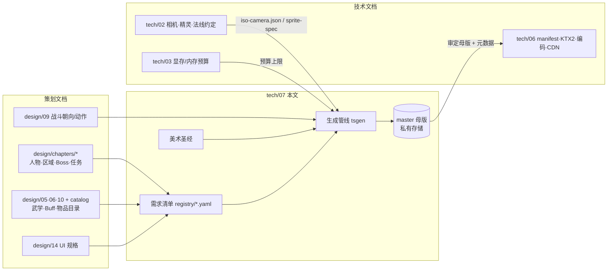
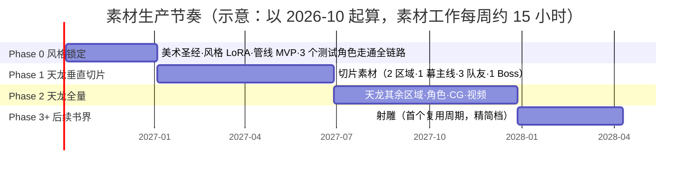
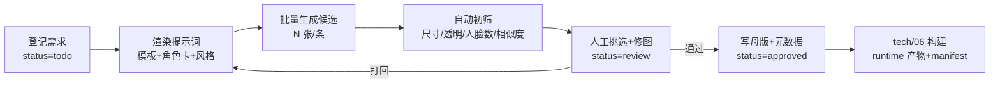
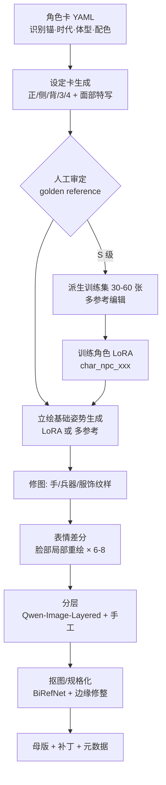
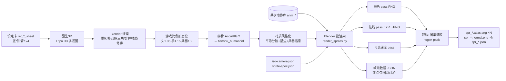
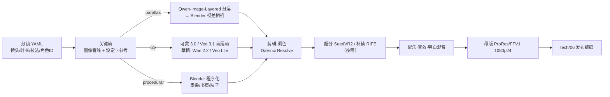
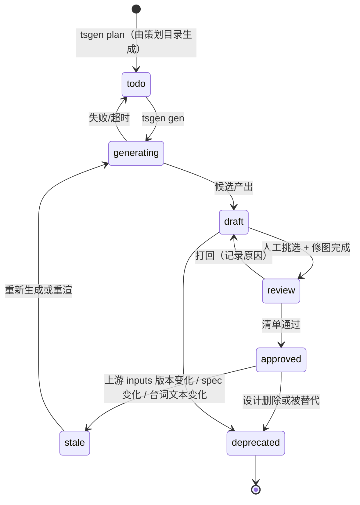

# tech/07 · 素材生成管线（原画、插图、立绘、精灵、视频、音频）

| 项 | 内容 |
|---|---|
| 文档归属 | `docs/tech/07-asset-generation.md`（本文件是"美术圣经、素材清单、生成工具选型、分类型生成管线、资产登记库、一致性与预算、AI 素材法律伦理"的**唯一归属文档**） |
| 上游基准 | `docs/00-canon.md` §0（非商业、不分发、不得使用演员肖像、国风水墨＋工笔）、§4（品阶色）、§8（斜 45° 等距战棋）、§12（ID 规范）、§19（技术基线：Three.js 正交 2.5D、8 方向精灵公告板＋法线贴图、素材与代码分离、KTX2、按书界分包） |
| 强依赖 | `tech/02`（相机角、精灵规格、法线约定、深度/遮挡方案）、`tech/06`（素材存储、manifest、压缩与编码规格）、`tech/03`（移动端显存/内存预算）、`design/chapters/*`（人物/区域/Boss 清单）、`design/05/06/10`（武学/Buff/物品目录 → 图标批量）、`design/09`（战斗朝向数）、`design/14`（UI 框体规格） |
| 状态 | v0.1 规划稿（2026-09-25）。工具现状均于 2026-09-25 联网核实，来源见文末"参考资料" |
| 读者 | 作者本人（单人开发 + AI 辅助编码）；以及后续协助编写管线脚本的 AI 编码代理 |

> **调研要点提示（非致命，但会改变工具选型的事实）**
> 1. **Sora 已退场**：OpenAI 于 2026-04-26 关闭 Sora App，2026-09-24 下线 Sora 2 API（即本文撰写前一天）。本文不再把 Sora 列入任何选项。
> 2. **开源视频模型"断代"**：通义万相的开放权重止于 **Wan 2.2**（Apache-2.0）；Wan 2.5/2.6/2.7 视频模型均为 API-only。混元 3D 的开放权重止于 **Hunyuan3D 2.1**；2.5/3.0/3.1 仅云端 API。
> 3. **Mixamo 不对中国大陆国家码账号开放**：若作者使用中国区 Adobe ID，绑骨/动作库须改走 AccuRIG 2 / UniRig / Tripo·Meshy 内置绑骨 + 自录动捕。
> 4. 以上均不构成对 §19 技术基线的致命冲击；基线中的"8 方向精灵 + 法线贴图"在本文中通过 **"3D 中转"管线**落地，并给出显存预算的分级方案（§5.4）。

---

## 目录

- [0. 摘要与关键决策](#0-摘要与关键决策)
- [1. 范围、依赖与全局约定](#1-范围依赖与全局约定)
- [2. 美术圣经（Art Bible）](#2-美术圣经art-bible)
- [3. 素材需求清单与数量估算](#3-素材需求清单与数量估算)
- [4. 工具现状调研（2026-09）](#4-工具现状调研2026-09)
- [5. 分类型生成管线](#5-分类型生成管线)
- [6. 自动化与工程化](#6-自动化与工程化)
- [7. 一致性保障](#7-一致性保障)
- [8. 预算与排期](#8-预算与排期)
- [9. 法律与伦理](#9-法律与伦理)
- [10. 风险与备选方案](#10-风险与备选方案)
- [参考资料](#参考资料)
- [本文新增术语/约定](#本文新增术语约定)
- [待决事项 / 依赖](#待决事项--依赖)

---

## 0. 摘要与关键决策

**一句话**：以"**工笔为骨、水墨为气**"定风格；以"**角色设定卡 → 参考图/LoRA → 3D 中转 → Blender 脚本化正交渲染**"解决精灵一致性；以"**ComfyUI 工作流入库 + YAML 提示词模板 + 资产登记库**"把全部生成过程变成可复现、可审计的批处理；开源本地模型打底、闭源云服务攻坚；先做《天龙八部》垂直切片验证全链路。

| # | 决策 | 结论 | 理由（详见章节） |
|---|---|---|---|
| D1 | 总体风格 | 三档笔法：**S1 工笔精绘**（立绘/CG/关键原画）、**S2 水墨写意**（场景/大地图/过场背景）、**S3 游戏化工笔**（精灵/图标/UI，线条简化、2–3 阶色阶、提高明度对比） | §2.1；手机小屏可读性 |
| D2 | 精灵生产路线 | **3D 中转**：设定卡多视图 → 图生 3D → 统一人形骨架 → 共享动作库 → Blender 脚本 8 向正交渲染（颜色 + 视空间法线 + 可选深度）→ 图集 | §5.4；纯 2D 逐帧生成在 8 方向×多动作下一致性不可控 |
| D3 | 方向策略 | 探索移动（idle/walk/run）**8 方向**；战斗动作默认 **4 斜向**（与网格四邻朝向一致，待 `design/09` 确认）；主角/队友/Boss **不镜像**，杂兵可 5 向 + 镜像 | §5.4.3；显存；汉服"右衽"镜像会变"左衽" |
| D4 | 一致性核心 | 每个角色变体一张**已审定设定卡**（golden reference）＝ 多图参考编辑、LoRA 训练、图生 3D、视频参考的共同源头 | §7 |
| D5 | 本地主力模型 | 图像：**Qwen-Image / Qwen-Image-Edit-2511**（Apache-2.0）+ **FLUX.2 [klein] 4B**（Apache-2.0，快速迭代）+ 自训风格 LoRA；分层：Qwen-Image-Layered；抠图：BiRefNet（MIT） | §4.2；许可证干净、可训 LoRA |
| D6 | 云端攻坚 | 难构图/多参考：Nano Banana Pro / GPT Image 2；国风审美与中文字：Seedream 5.0（即梦）；图生 3D：Tripo H3.x / Hunyuan3D 3.x（多视图输入）；视频：可灵 3.0 / Seedance 2.x / Veo 3.1 | §4 |
| D7 | 视频策略 | 能用 **2.5D 视差分层动画**（确定性、低成本、最贴水墨）就不用 AI 图生视频；AI I2V 只用于人物动作镜头；全部视频约 27 分钟、47 条 | §5.7 |
| D8 | 音频 | 音乐：ACE-Step 1.5（MIT，本地批量）+ Suno Pro（主题曲精品）；语音：Qwen3-TTS / CosyVoice 3（Apache-2.0，声音设计而非克隆真人）；音效：素材库优先 + AI 补缺 | §4.8–4.10、§5.8 |
| D9 | 工程化 | `tools/asset-gen`（Python 包 `tsgen`，uv 管理）+ `tools/comfy/workflows/*.api.json` + `tools/prompts/*.yaml` + `registry/*.yaml`（资产登记库，JSON Schema 为与 `tech/06` 的契约） | §6 |
| D10 | 存储三层 | `source`（可编辑源文件）/ `master`（审定母版，无损）→ 私有对象存储 + 本地盘；`runtime`（压缩产物）由 `tech/06` 构建上 CDN | §6.2 |
| D11 | 品阶边框 | **运行时合成**（不烘焙进图标），因为外来压制会改变"显示品阶" | §5.6 |
| D12 | 法律底线 | 仅个人自娱、不分发、不公开部署；禁演员肖像/声音、禁影视造型与配乐参考、禁在世画师风格名与具体受版权画作做图生图源；全部 AI 资产带溯源元数据 | §9 |
| D13 | 节奏 | Phase 0 风格锁定 + 管线 MVP（≈ 200 h）→ Phase 1 天龙垂直切片（≈ 370 h）→ Phase 2 天龙全量 → 之后每书界一个周期；资产人工工时是主要成本（标准档约 400+ h/书界），必须以"资产分级 S/A/B/C"控制范围 | §3.3、§8 |

---

## 1. 范围、依赖与全局约定

### 1.1 范围

本文覆盖**所有非代码资产**的：风格规范 → 需求数量 → 工具选型 → 生产管线 → 质检 → 母版规格 → 登记入库。
不覆盖：运行时加载/压缩/CDN/缓存（`tech/06`）、渲染 shader 与光照（`tech/02`）、UI 布局与交互（`design/14`）、剧情文本（`design/chapters`）。

### 1.2 上下游接口一览



**接口契约（本文提出，待对应文档确认）**：

| 契约文件 | 所有者 | 消费者 | 内容 |
|---|---|---|---|
| `packages/spec/iso-camera.json` | tech/02 | 本文 Blender 脚本、运行时相机 | 俯仰角、方位角、方向索引约定、是否允许镜头旋转 |
| `packages/spec/sprite-spec.json` | tech/02（本文提初值） | 渲染脚本、图集打包、运行时精灵加载器 | ppm（像素/米）、帧格尺寸、锚点、法线编码、镜像规则 |
| `registry/schema/asset.schema.json` | 本文 | tech/06 构建脚本（TS） | 资产登记条目结构（§6.4） |
| `registry/*.yaml` | 本文 | tech/06 | 每个资产的状态、母版路径、哈希、溯源 |
| `packages/spec/anim-events.schema.json` | 本文 + tech/05（玩法引擎） | 运行时 | 动作帧事件（命中帧、音效帧、刀光起止） |

### 1.3 规格初值（在 tech/02、tech/06 定稿前使用）

> 以下数值集中写在 `packages/spec/sprite-spec.json` 与 `tools/asset-gen/specs/*.yaml`，**脚本只读配置、不写死**，下游定稿后改配置即可全量重渲。

| 项 | 初值 | 说明 |
|---|---|---|
| 相机 | 正交；俯仰 30°（Blender 相机 `rot_x = 60°`）；方位 45° | 俯仰 30° 时地面正方形投影为严格 2:1 菱形（sin30° = 0.5），符合基准"2:1 等距观感" |
| 世界单位 | 1 格 = 1 m；角色身高 ≈ 1.6–1.8 m | 高度台阶 `h` 的米制由 tech/02 定 |
| 精灵像素密度 ppm | 成品 128 px/m；渲染 256 px/m（2× 超采样后 Lanczos 缩小） | 成品角色像素高 ≈ 1.75 × cos30° × 128 ≈ 194 px |
| 帧格 | 成品 256×256，脚底锚点 (128, 224)；打包时裁透明边 | 大型单位（骑马、巨汉、神雕）用 384×384 帧格 |
| 法线 | 视空间，OpenGL 约定（R=+X 右、G=+Y 上、B=+Z 朝向观者），`n*0.5+0.5` 编码 | 镜像方向在运行时翻转 R 通道 |
| 立绘母版 | 2048×3072（2:3）RGBA PNG，人物占画高 88–92% | 表情差分以"脸部补丁"存储（§5.2） |
| CG 母版 | 3840×2160（16:9）PNG；运行时由 tech/06 转 1920×1080 | |
| 图标母版 | 512×512 RGBA；运行时 128/64 | 边框运行时合成 |
| 音频母版 | WAV 48 kHz / 24-bit | 响度规格 §5.8 |
| 视频母版 | 1920×1080 24 fps，ProRes 422 HQ 或 FFV1 | 发布编码归 tech/06 |

### 1.4 资产 ID 规范（扩展基准 §12）

格式：`<前缀>_<主体ID或书界>[__<变体>][_<描述>]`，全小写、`__`（双下划线）分隔主体与变体，ID 内禁止 `@`、空格与中文（避免 URL/文件系统问题）。**引用**某一版本时写作 `<id>@<版本>`（如 `ref_npc_duanyu__ch01_sheet@3`、`lora:style_gongbi_fine@1.0.2`），`@` 只出现在引用中，不属于 ID。

| 前缀 | 类型 | 例 |
|---|---|---|
| `ref_` | 设定卡/参考图（不进运行时） | `ref_npc_xiaofeng__ch01_sheet` |
| `art_` | 概念原画 | `art_rg_01_dali_01` |
| `por_` | 立绘 | `por_npc_guojing__ch03_prime_base`、`por_npc_guojing__ch03_prime_e_angry` |
| `ava_` | 头像 | `ava_npc_xiaofeng__ch01` |
| `cg_` | 剧情插图 | `cg_q_01_main_03_01` |
| `mdl_` / `anm_` | 3D 模型 / 动作片段（中间资产） | `mdl_npc_xiaofeng__ch01`、`anm_hum_m_walk`、`anm_hum_blade_heavy` |
| `spr_` | 精灵集（图集 + 元数据） | `spr_npc_xiaofeng__ch01` |
| `tex_` | 地形材质 | `tex_tr_shenshui__song` |
| `bld_` / `prp_` | 建筑 / 物件 | `bld_kit_song_gate_01`、`prp_song_lantern_01` |
| `ico_` | 图标（沿用对象 ID） | `ico_sk_xianglong18`、`ico_eq_yitianjian`、`ico_bf_zhongdu` |
| `vfx_` / `ui_` / `map_` | 特效 / UI / 地图 | `vfx_sk_liumai_beam`、`ui_frame_scroll_9s`、`map_ch01_world` |
| `vid_` | 视频 | `vid_opening`、`vid_ch01_intro`、`vid_ch01_tianshu`、`vid_sleep_01_02`、`vid_end_canon` |
| `bgm_` / `sfx_` / `vo_` | 音乐 / 音效 / 配音 | `bgm_ch01_theme`、`sfx_hit_blade_02`、`vo_shuling_0001` |

变体键约定：书界 `chNN`、年龄 `youth/prime/elder`、伤残/状态 `onearm/blind`、表情 `e_<情绪>`，可组合：`por_npc_yangguo__ch03_prime_onearm_base`。

---

## 2. 美术圣经（Art Bible）

> 美术圣经是**所有提示词模板、LoRA 训练集筛选、人工审核**的共同判据。任何生成结果与本节冲突，以本节为准；需要改风格时先改本节并提升 `style` 模板的主版本号（§7.4）。

### 2.1 总体风格："工笔为骨、水墨为气"

| 档位 | ID | 用途 | 线条 | 设色 | 背景/留白 | 参照气质（仅描述，不作图生图源） |
|---|---|---|---|---|---|---|
| S1 工笔精绘 | `gongbi_fine` | 立绘、剧情 CG、关键原画、头像母版 | 铁线描/游丝描为主，衣纹兰叶描，线色浓墨 `#2B2622` | 矿物色重彩，分染 + 罩染的柔和明暗；面部三白法提亮 | 人物立绘背景纯留白（透明）；CG 留白 ≥ 25% | 宋代院体人物画的端庄 + 现代插画的造型准确 |
| S2 水墨写意 | `shuimo_scene` | 场景概念、大地图、过场背景、书眠/天书视频 | 皴擦点染，山石用斧劈/披麻皴意象，远景只用墨色层次 | 以墨为主，局部点青绿/赭石；"墨分五色" | 留白 ≥ 35%，云雾、水面、天空大块留白 | 宋元山水"三远法"（高远/深远/平远） |
| S3 游戏化工笔 | `gongbi_game` | 精灵、图标、UI、特效贴图 | 外轮廓线加粗（成品 2–3 px），内部线简化 | 2–3 阶色阶（亮/中/暗）+ 一道描边；饱和度比 S1 高 10–15%，保证手机小屏可读 | 图标主体居中占 70–80%，背景纸纹或透明 | 工笔的线 + 版画的清晰剪影 |

**统一原则**
1. **线是灵魂**：任何档位都必须有可辨识的墨线；禁止无线条的"厚涂写实"与"3D 渲染塑料感"。
2. **墨先于色**：先保证灰度下层次成立（审核时一律加一张灰度预览），再看颜色。
3. **纸在画下**：纸纹/绢纹由**运行时屏幕空间叠加**（tech/02 后处理）统一提供；母版中只允许 S1/S2 带轻微纸纹，**S3 精灵与图标一律不烘焙纸纹**（否则缩放、镜像、图集拼接会穿帮）。
4. **少即是多**：同屏主色 ≤ 3 种 + 墨色；品阶金只在天阶出现，避免"满屏金光"。

### 2.2 线条规范

| 对象 | 描法 | 母版线宽（2048 高立绘） | 成品线宽（精灵/图标） | 备注 |
|---|---|---|---|---|
| 面部、手 | 游丝描（细匀） | 2–3 px | 1 px（内线可省略） | 眼线略重于其他面部线 |
| 服装外轮廓 | 铁线描（匀挺） | 4–6 px | 2–3 px | 剪影边保持连续，不断线 |
| 衣褶 | 兰叶描（起收有提按） | 3–6 px | 仅保留 2–3 条主褶 | 衣褶走向须符合动作受力 |
| 兵器 | 铁线描 + 高光留白 | 3–4 px | 2 px | 刃口用留白表示寒光，不用发光特效 |
| 山石/树 | 皴法笔触（S2） | 笔触纹理，不计线宽 | — | 场景不要求闭合轮廓 |
| 线色 | 浓墨 `#2B2622`（不用纯黑 `#000`）；面部线可用赭墨 `#5A3E2E` | | | 天阶武学特效允许泥金线 `#C9A45C` |

3D 中转渲染的线条来源：外轮廓用**反向外壳（inverted hull）**，内部结构线用 Blender **Line Art**（Grease Pencil 修改器），线宽以世界单位定义并随 ppm 换算，保证所有角色线宽一致（§5.4.5）。

### 2.3 设色与色板

**基础色板（设计令牌，UI 与美术共用；UI 最终色值以 `design/14` 为准）**

| 令牌 | 名称 | Hex | 用途 |
|---|---|---|---|
| `paper.xuan` | 熟宣 | `#EFE6D2` | 默认纸底、UI 面板底 |
| `paper.silk` | 旧绢 | `#E3D3B1` | 剧情 CG 底、卷轴 |
| `ink.jiao` | 焦墨 | `#1E1B18` | 最深处、文字 |
| `ink.nong` | 浓墨 | `#2B2622` | 线条 |
| `ink.zhong` | 重墨 | `#4A433C` | 暗部 |
| `ink.dan` | 淡墨 | `#8C857B` | 远山、阴影 |
| `ink.qing` | 清墨 | `#C9C2B6` | 雾、最远景 |
| `min.zhusha` | 朱砂 | `#B5382B` | 印章、血、重要强调 |
| `min.yanzhi` | 胭脂 | `#9E2A3A` | 女性服饰、情感 |
| `min.zheshi` | 赭石 | `#9A5B34` | 肤色暗部、土地、木 |
| `min.tenghuang` | 藤黄 | `#D9A93B` | 秋色、灯火 |
| `min.shiqing` | 石青 | `#2F6E8E` | 衣饰、远水 |
| `min.shilv` | 石绿 | `#3F8A6E` | 青绿山水、衣饰 |
| `min.huaqing` | 花青 | `#2E4A62` | 夜色、冷调阴影 |
| `min.qianbai` | 铅白 | `#F4F0E6` | 高光、白衣 |
| `min.nijin` | 泥金 | `#C9A45C` | 装饰线、天阶点缀 |
| `skin.base` | 肤色 | `#E9CFB4` | 肤色基准（暗部用赭石分染） |

**品阶色（与基准 §4 协调）**：基准给出四大阶主色（黄 `#B8955A`、玄 `#3E5C76`、地 `#8E3B2F`、天 `#D4AF37`）。本文提议 12 级以**"同色相、逐品提亮 + 纹饰递进"**区分，而非引入新色相（保证色弱可辨、避免彩虹化）：

| grade | 名称 | 边框主色（提议） | 纹饰递进（色弱冗余编码） |
|---|---|---|---|
| 1 / 2 / 3 | 黄下 / 黄中 / 黄上 | `#B8955A` / `#C6A263` / `#D4B06D` | 单线框 / 双线框 / 双线框 + 四角回纹 |
| 4 / 5 / 6 | 玄下 / 玄中 / 玄上 | `#3E5C76` / `#476A87` / `#517998` | 同上 |
| 7 / 8 / 9 | 地下 / 地中 / 地上 | `#8E3B2F` / `#9F4435` / `#B04D3B` | 同上 + 左上角朱文小印 |
| 10 / 11 / 12 | 天下 / 天中 / 天上 | `#D4AF37` / `#DDBC4B` / `#E6C95F` | 同上 + 金箔纸纹；天上品加缓慢流光（运行时 shader） |

- 边框角落另放大阶单字（黄/玄/地/天，篆书），作为第三重冗余编码。
- 以上 8 个非锚点色值为本文提议，**需 `design/14` 确认**后写入 UI 令牌；锚点色（每大阶下品）不可改。

### 2.4 纸纹、材质与光

| 项 | 规范 |
|---|---|
| 纸纹 | 运行时后处理叠加（tech/02）：熟宣纤维纹 + 轻微晕染噪声，强度按场景可调；母版 S1/S2 可带 ≤ 8% 不透明度纸纹，S3 不带 |
| 光向 | 母版统一"左上 45° 主光"（与中国画习惯一致）；精灵颜色通道只烘焙环境光遮蔽 + 15% 以内的形体明暗，方向光由运行时法线贴图计算（§5.4） |
| 阴影 | 不画投影（CG 例外）；地面接触阴影由运行时椭圆淡墨斑提供 |
| 高光 | 用留白/铅白表达，禁止镜面反射高光、禁止 bloom 式泛光（天阶特效除外） |
| 质感 | 丝绸 = 线条流畅 + 罩染过渡；麻布 = 线条略顿挫；铁器 = 墨色冷灰 + 刃口留白；玉 = 石绿薄染 + 留白 |

### 2.5 构图与留白（S1 CG / S2 场景）

1. **三远法取景**：大场景（华山、光明顶、侠客岛）用高远（仰视、竖构图裁切）；江湖路途用平远（横向、地平线低）；庭院/古墓用深远（层层门洞纵深）。
2. **留白比例**：CG ≥ 25%，场景概念 ≥ 35%；留白处用于放置 UI 文本与题跋。
3. **题跋与印章**：CG 可留出右上/左上竖排题跋区；**文字一律后期用字体排版**（§2.9 禁止项 7），印章用程序化生成的朱文/白文印（字体 + 印泥纹理）。
4. **人物与环境比例**：戏剧性 CG 人物占画高 40–60%；意境 CG（天书现世、书眠）人物可小至 10%，突出天地。
5. **视线引导**：以墨色最重处 + 朱砂点缀为视觉焦点，每张 CG 只有一个焦点。

### 2.6 人物比例与造型

| 用途 | 头身比 | 规则 |
|---|---|---|
| 立绘 / CG（S1） | 成年男 7.5、成年女 7、少年 6–6.5、儿童 4.5–5、老者 7（佝偻者 6.5） | 写实偏理想化；眼睛**不得**超过面宽 1/5（禁止动漫大眼）；丹凤眼/柳叶眉/悬胆鼻等中国画五官语汇 |
| 精灵 3D 模型（S3） | 统一约 **5.5 头身**"游戏比例"：身高不变、头 ×1.35（7.5 头身 ÷ 1.35 ≈ 5.5）、手 ×1.15、兵器 ×1.2，其余按设定卡 | 用 Blender 形态键（shape key）从设定比例派生，保证 194 px 高度下面部与兵器可读；立绘与精灵之间不要求比例一致，只要求**识别锚**一致（§7.2） |
| 头像 | 立绘裁切，额顶至锁骨 | 视线略偏向画面内侧 |

**剪影优先**：每个主要角色必须在 64 px 高的纯黑剪影下可区分（发型/冠帽/兵器/披风四选二作为剪影特征），审核时自动生成剪影预览。

**体型档**（对应 3D 骨架比例预设与待机动作）：`m_std` 男标准、`f_std` 女标准、`m_heavy` 魁梧（萧峰、谢逊、鳌拜）、`m_lean` 清瘦（黄药师、风清扬）、`elder` 老者（周伯通、张三丰晚年）、`child` 儿童（少年张无忌、少年韦小宝）、`monk_heavy` 胖僧、`dwarf`（桑土公、侏儒类）。

### 2.7 服饰时代感（审核必查）

> 原则：**以书界年代为准，按族群/身份区分**；允许武侠化（便于活动的窄袖、束腿），不允许跨朝代混搭。下表是审核清单的"时代错误"条目来源。

| 年代（书界） | 汉族男子 | 汉族女子 | 他族/特殊身份要点 | 建筑/器物特征 | 常见 AI 错误（必拒） |
|---|---|---|---|---|---|
| 春秋·越（序章 越女剑） | 深衣、束发椎髻、短褐 | 深衣、椎髻 | 越人"断发文身"（可选） | 干栏式建筑、青铜剑 | 出现汉以后的幞头/交椅 |
| 北宋（天龙） | 幞头（官员硬脚长翅）、圆领袍、襕衫、短褐；江湖人裹巾 | 褙子、抹胸、百迭裙、高髻 | **契丹**：髡发、窄袖左衽袍、皮靴；**西夏党项**：秃发、耳环；**吐蕃**：袒右肩袍、藏式；**大理**：白族/南诏风纹样；**女真**（早期）：辫发、左衽 | 屋顶平缓、斗拱硕大、鸱吻；家具桌椅已普及 | 清式马蹄袖、明式网巾、日式鸟居 |
| 南宋/金/蒙古（射雕、神雕） | 同宋（南宋更文弱、褙子外衣常见）；全真道士：道冠、道袍 | 褙子、窄袖短衫、花冠 | **金**：女真辫发、左衽、貂皮；**蒙古**：婆焦（髡发留三搭）、质孙服、皮袍、弯刀弓箭；**古墓派**：素白长衣（原创造型允许） | 江南园林、临安城、襄阳城墙；草原毡帐 | 蒙古人穿清代旗装；宋人剃发留辫 |
| 元末（倚天） | 汉人仍着交领右衽、方巾/笠帽；官员质孙服 | 汉式袄裙 | **蒙古贵族**：钹笠帽、质孙服；贵妇**罟罟冠**；**明教**：可用火焰纹样（原创扩展）；**波斯总教**：波斯式长袍头巾；**少林/峨眉**：僧尼衣 | 元代宫殿、大都；昆仑冰雪；海岛冰火岛（兽皮） | 明代官服补子、清代顶戴 |
| 明中叶至明末（笑傲、侠客行、碧血） | 网巾、方巾/四方平定巾、直身、道袍、曳撒；锦衣卫飞鱼服（仅限官差） | 袄裙、马面裙、比甲、鬏髻 | **碧血·清军（后金）**：金钱鼠尾辫、马蹄袖、箭衣；**闯军**：毡帽、布面甲；**日月神教**：原创教服（墨紫系） | 斗拱变小、屋顶较陡；明式家具 | 旗袍（民国）；清中期以后的大拉翅 |
| 清前中期（鹿鼎、连城、白马、鸳鸯、书剑、飞狐、雪山） | **一律辫发**（金钱鼠尾→康乾时期辫子渐粗），长袍马褂、马蹄袖、瓜皮帽；官员补服、顶戴花翎；僧道方外人士例外 | 汉族女子保留明式袄裙（"男从女不从"）；满族女子旗装、**两把头**（禁止光绪年间的"大拉翅"） | **台湾郑氏**（鹿鼎）：明式衣冠；**罗刹国**（鹿鼎）：17 世纪俄式服饰；**回部/哈萨克**（白马、书剑）：长袍、花帽、毡帽、面纱；**血刀门**（连城）：藏传僧人红袍 | 紫禁城（黄琉璃、和玺彩画）；江南民居；回疆绿洲与高昌遗迹 | 清人不留辫；大拉翅；民国立领中山装 |

**兵器时代要点**：剑（直身双刃）全时代通用；宋刀以手刀/朴刀为主，明清腰刀为柳叶/雁翎形；甲胄——宋步人甲、元札甲/皮甲、明布面甲/锁子甲、清棉甲；**任何时代禁止欧式板甲与日本刀**（倭寇题材若有，另立例外审批）。

**"交领右衽"铁律**：汉服交领为右衽（左襟压右襟，领口呈"y"字）。AI 生成常出错，且**任何水平镜像都会把右衽变左衽**。因此：
- 立绘、CG、头像**禁止水平翻转**（包括构图调整时）；
- 穿交领汉服的主角/队友/Boss 精灵**不做镜像方向**（§5.4.3）；
- 左衽仅用于契丹、女真、蒙古等族群的正确表现（需在角色卡中标注 `lapel: left`）。

### 2.8 书界色调表（与武运联动）

武运指数（`wuyun`）影响全局色彩：**高武**书界饱和度与金色点缀最丰富；**中武**降低 10% 饱和度；**低武**再降 10% 并偏冷灰——视觉上呼应"武林衰败"。天级特效在低武书界更罕见，出现时更显珍贵。

| 书界 | 境界 | 主色调（场景 LUT 与概念图依据） | 标志性母题 |
|---|---|---|---|
| ch00 越女剑（序章） | — | 青铜绿 + 竹青 | 竹林、白猿、越国剑池 |
| ch01 天龙八部 | 高武 | 苍山洱海的石青石绿 + 雁门关雪灰 + 契丹赭石 | 茶花、天龙寺塔、燕子坞水巷、缥缈峰云海 |
| ch02 射雕英雄传 | 高武 | 草原赭黄 + 江南烟雨淡墨 + 桃花粉 | 大漠孤雕、桃花岛、嘉兴烟雨楼、华山雪 |
| ch03 神雕侠侣 | 高武 | 古墓冷青白 + 绝情谷情花胭脂 + 襄阳烽火朱 | 活死人墓、情花、神雕、玄铁剑 |
| ch04 倚天屠龙记 | 高武 | 光明顶圣火朱红 + 冰火岛冰蓝 + 武当青灰 | 屠龙刀、圣火、冰川火山、武当云海 |
| ch05 笑傲江湖 | 中武 | 华山青灰 + 黑木崖墨紫 + 恒山素白 | 琴箫、思过崖、梅庄、西湖 |
| ch06 侠客行 | 中武 | 海天蓝 + 石壁苍褐 | 侠客岛石室壁画、赏善罚恶令、腊八粥 |
| ch07 碧血剑 | 中武 | 金蛇金 + 墨绿 + 明末灰暗烽烟 | 金蛇洞、温家堡、北京城破 |
| ch08 鹿鼎记 | 低武 | 紫禁城朱红金黄（唯一"富丽"书界，但人物武学灰暗） + 神龙岛蛇青 | 宫墙、四十二章经、通吃岛、罗刹雪原 |
| ch09 连城诀 | 低武 | 雪谷冷白 + 血刀红 + 牢狱铁灰 | 唐诗剑谱、雪谷、荆州城、藏宝天宁寺 |
| ch10 白马啸西风 | 低武 | 大漠沙黄 + 天空湛蓝 + 白马白 | 高昌迷宫、哈萨克毡房、天铃鸟 |
| ch11 鸳鸯刀 | 低武 | 明快暖色（全作最轻松） | 鸳鸯双刀、镖车、喜宴 |
| ch12 书剑恩仇录 | 中武 | 回疆玉色 + 江南海宁潮水青 | 香香公主、翠羽黄衫、钱塘潮、六和塔 |
| ch13 飞狐外传 | 中武 | 江湖风尘赭石 + 雨夜花青 | 商家堡、火场、掌门人大会 |
| ch14 雪山飞狐 | 中武 | 玉笔峰雪白 + 夕阳金（终章） | 雪山、悬崖、"劈与不劈"的刀光 |

### 2.9 禁止项（硬规则，审核一票否决）

| # | 禁止 | 执行手段 |
|---|---|---|
| 1 | **模仿或近似任何影视剧演员的肖像**（包括"像某某版郭靖"） | 提示词黑名单（演员名、剧版名如"83版""张纪中版"）；人脸与演员相似度人工抽检；参考图来源必须为自生成设定卡 |
| 2 | **以受版权保护的具体画作/插画/剧照为直接复制源**（图生图、ControlNet 线稿、IP-Adapter 参考） | `refs` 字段只允许引用登记库中的 `ref_`/自生成资产或"公有领域"标记资产；批处理脚本校验 |
| 3 | 提示词中使用**在世或 20 世纪后画师/插画师姓名**作风格词（含金庸小说插画、漫画作者） | 提示词黑名单 + 模板中只用技法词（"工笔""铁线描""斧劈皴"） |
| 4 | 影视改编作品的**独创造型**（特定剧版服装设计、兵器设计）与**配乐旋律** | 审核清单条目；音乐提示词禁用剧名/曲名 |
| 5 | 汉服左衽（非他族设定时）、跨朝代服饰（§2.7） | 审核清单 |
| 6 | 动漫大眼、日韩画风、欧美奇幻铠甲、赛博/蒸汽朋克元素 | 负面提示词 + 风格 LoRA + 审核 |
| 7 | **画面内生成文字**（AI 汉字易错字、伪字） | 负面提示词 `text, watermark, calligraphy, signature`；文字一律后期字体排版；匾额类确需时仅用中文字形能力强的模型（Seedream / Qwen-Image / GPT Image 2）且逐字核对 |
| 8 | 血腥特写、裸露；对原著人物的丑化/恶搞 | 审核清单 |
| 9 | 去除或伪造工具自带的水印/溯源标识（如 SynthID） | §9.5 |

---

## 3. 素材需求清单与数量估算

### 3.1 资产分级（控制人工投入的总阀门）

| 等级 | 定义 | 人工投入 | 例 |
|---|---|---|---|
| **S** | 玩家反复凝视、定义记忆点 | 多轮生成 + 手工修图 + 逐项审核 | 主角、书灵、每书界主角团与主 Boss 的立绘/精灵；锚点事件 CG；开场与结局视频 |
| **A** | 重要但出现频次有限 | 生成 + 局部修 + 清单审核 | 次要 NPC 立绘、支线 CG、地标建筑、天级武学图标与特效 |
| **B** | 批量、可模板化 | 模板批量生成 + 抽检 | 地/玄/黄武学图标、物品图标、杂兵、通用道具、音效 |
| **C** | 占位/自动 | 全自动或复用 | 路人 NPC（模块化拼装）、小地图（自动渲染）、同类物品配色变体 |

规则：每书界 S 级资产不超过 40 个；任何资产登记时必须写 `tier`，工时预算按等级计（§8.3）。

### 3.2 数量估算（标准档）

**每书界（中型 DLC）典型需求**——依据基准 §17 模板：6–10 区域、6–10 幕主线、≥ 20 支线、≥ 6 名可招募队友、若干关键 NPC 与 Boss。

| 类型 | 每书界 | 全作合计（14 书界 + 序章 + 全局） | 等级分布 | 说明 |
|---|---|---|---|---|
| 概念原画 `art_` | 20（区域 8、地标 6、势力 4、群像 2） | ≈ 300 | A 为主 | 概念图是场景搭建与 CG 的底稿，不一定进游戏 |
| 设定卡 `ref_` | 15–20 套 | ≈ 260 套 | S/A | 每个有立绘或独立模型的角色变体一套（多视图 + 面部特写 + 表情） |
| 立绘 `por_`（主要） | 12 人 × 1 基础 | ≈ 170 人（含跨书年龄变体 ≈ 25） | S/A | 队友 6 + 关键 NPC 4 + 主 Boss 2；另含主角 15 套时代装、书灵 |
| 立绘表情差分 | 12 × 6 | ≈ 1,000 张脸部补丁 | S/A | 平静/喜/怒/哀/惊/战斗（+ 角色特有 1–2 个） |
| 立绘（次要，单表情） | 15 | ≈ 210 | B | 商人、掌门、任务 NPC |
| 头像 `ava_` | 30（派生） | ≈ 380 派生 + 120 路人头像库 | B/C | 从立绘裁切；路人按时代 × 身份生成头像库 |
| 剧情 CG `cg_` | 20 | ≈ 300 | S/A | 主线 8–10、锚点 4–6、改命 2、羁绊 4、天书现世 1 |
| 3D 角色模型 `mdl_` | 独立 12 + 模块化变体 20 | ≈ 170 独立 + 4 套时代模块化套件（每套 ≈ 40 部件） | S/A/C | 杂兵与路人由"体型 × 时代服装部件 × 头部 × 配色"拼装 |
| 动物/坐骑模型 | 2–4 | ≈ 25 种 | A/B | 马、狼、蛇、雕、猿、虎、熊、骆驼、闪电貂、莽牯朱蛤…… |
| 动作片段 `anm_` | 3–5 个书界特有 | 共享库 ≈ 80 + 特有 ≈ 60 | A | 共享人形骨架，所有角色复用（§5.4.4） |
| 精灵集 `spr_` | 30–45 | ≈ 450（脚本批量渲染） | 自动 | 人工只做抽检 |
| 地形材质 `tex_` | 10 变体 | 基础 ≈ 60 + 书界变体 ≈ 140 | B | 依 `design/08` 地形目录（`tr_*`） |
| 建筑套件 `bld_kit_` | — | 宋、元、明、清 4 套 × ≈ 40 部件 + 他族（毡帐、回疆、藏式）3 套 × 15 | A/B | 模块化复用 |
| 地标建筑 | 8 | ≈ 110 | S/A | 少林寺、天龙寺、灵鹫宫、桃花岛、襄阳城、古墓、光明顶、黑木崖、侠客岛石室、紫禁城…… |
| 道具物件 `prp_` | 30 | ≈ 450 | B/C | 大量复用 |
| 图标 `ico_` | ≈ 150 | ≈ 2,000（独立绘制 ≈ 1,000，其余模板变体） | A/B/C | 见下表拆分 |
| 特效贴图 `vfx_` | 天级武学签名特效 3–8 | 通用 ≈ 80 纹理/序列 + 签名 ≈ 51 | A | 天级武学（基准 §13 共 51 部）每部一个签名特效 |
| UI 框体 `ui_` | 书界主题皮肤 5–10 件 | 通用 ≈ 150 件 | A | 九宫格框、卷轴、按钮、品阶边框 12 级 |
| 地图 `map_` | 1 大地图 + 6–10 区域图 | 15 大地图 + ≈ 120 区域图 | A/C | 区域小地图由 3D 场景俯视自动渲染 + 水墨化 |
| 视频 `vid_` | 开篇 + 天书现世 + 书眠 ≈ 3 | ≈ 47 条、≈ 27 分钟 | S/A | 见 §5.7.1 |
| 音乐 `bgm_` | ≈ 9 | ≈ 140 首 | A/B | 主题 1、探索 3–4、城镇 1、战斗 2、情感 2 |
| 音效 `sfx_` | 书界特有 ≈ 25 | ≈ 400 | B | 通用库为主 |
| 配音 `vo_`（可选） | 书灵 + 喊招 ≈ 200 句 | ≈ 3,000 句 | B | 不做全语音 |

**按书界拆分（标准档；体量系数 = 相对"典型书界"的规模，依原著篇幅与人物密度估）**

| 书界 | 体量 | 系数 | 主要立绘（人） | CG | 独立 3D 角色 | 地标 | 特有需求（新增） | 主要复用来源 |
|---|---|---|---|---|---|---|---|---|
| ch00 越女剑（序章） | 小 | 0.3 | 3 | 4 | 4 | 2 | 春秋迷你套件（干栏、青铜剑）、白猿 | — |
| ch01 天龙八部 | 大 | 1.3 | 16 | 26 | 16 | 10 | **宋式套件 v1**；契丹/西夏/吐蕃/大理服饰；珍珑棋局、缥缈峰云海；异兽（莽牯朱蛤、冰蚕） | — |
| ch02 射雕英雄传 | 大 | 1.2 | 14 | 24 | 14 | 9 | 金国与**蒙古草原套件**（毡帐）；白雕、汗血宝马；桃花岛 | 宋式套件（南宋变体） |
| ch03 神雕侠侣 | 大 | 1.2 | 14 | 24 | 14（多为年龄变体） | 9 | 古墓、绝情谷情花、神雕、玉蜂；襄阳攻防 | ch02 人物（年龄变体）与套件 |
| ch04 倚天屠龙记 | 大 | 1.3 | 16 | 26 | 16 | 10 | **元代套件**；波斯服饰；冰火岛冰川火山；光明顶圣火 | ch03 人物（张三丰、郭襄）、少林/峨眉 |
| ch05 笑傲江湖 | 大 | 1.2 | 14 | 24 | 14 | 9 | **明式套件 v1**；五岳剑派各山门；梅庄、黑木崖 | 少林（改为明代变体） |
| ch06 侠客行 | 中 | 0.9 | 10 | 18 | 11 | 7 | 侠客岛石室壁画（需逐幅设计）、凌霄城 | 明式套件 |
| ch07 碧血剑 | 中 | 1.0 | 12 | 20 | 12 | 8 | 明末/后金服饰；金蛇洞、温家堡、五毒教 | 明式套件 |
| ch08 鹿鼎记 | 大 | 1.2 | 14 | 24 | 14 | 10 | **清式套件 v1**、紫禁城、神龙岛、罗刹迷你套件、台湾明式衣冠 | ch07 九难 |
| ch09 连城诀 | 中 | 0.8 | 9 | 16 | 10 | 6 | 雪谷地形、血刀门藏僧服饰、牢狱 | 清式套件 |
| ch10 白马啸西风 | 小 | 0.6 | 6 | 12 | 7 | 4 | **回疆/哈萨克套件**、高昌迷宫、白马、狼群 | 清式套件 |
| ch11 鸳鸯刀 | 小 | 0.5 | 6 | 10 | 7 | 3 | 镖车、喜宴（轻喜剧演出） | 清式套件（全复用） |
| ch12 书剑恩仇录 | 大 | 1.1 | 13 | 22 | 13 | 8 | 钱塘潮、六和塔、回部 | ch10 回疆套件、清式套件、紫禁城 |
| ch13 飞狐外传 | 中 | 1.0 | 12 | 20 | 12 | 7 | 商家堡火场、掌门人大会 | 清式套件 |
| ch14 雪山飞狐 | 中 | 0.8 | 10 | 18 | 10 | 6 | 玉笔峰雪山庄；终局"守卷人"相关（计入全局） | ch13 人物（胡斐、苗人凤） |
| **合计** | | | **≈ 169** | **≈ 288**（+ 全局 ≈ 12） | **≈ 174** | **≈ 108** | | |

> 系数用于 `tsgen budget` 按书界缩放其他类型的数量（概念图、道具、图标、音乐等）；具体人物与地标清单以 `design/chapters/NN-*.md` 为准，本表只是预算锚点。

**图标拆分**

| 子类 | 数量 | 生产方式 |
|---|---|---|
| 天级武学（基准 §13，51 部） | 51 | 逐个 S/A 级绘制 |
| 地级武学 | ≈ 150 | 逐个 A/B 级（模板 + 主体描述） |
| 玄/黄级武学 | ≈ 450 | **模板族**：子类（剑/刀/掌/指…）× 意象（风/火/寒/毒…）≈ 60 张底图 + 程序化配色/叠字 |
| 招式 | ≈ 2,000+ | **不单独绘制**：用招式名首字/关键字的书法字形 + 所属武功图标缩略合成（§5.6.3） |
| 装备（含神兵） | ≈ 500 | 神兵逐个；普通装备按类别 × 时代 × 材质模板 |
| 消耗品/材料/任务物品 | ≈ 500 | 模板族 + 配色变体 |
| Buff（依 `design/06` 目录） | ≈ 200 | 符号 + 标签字 + 极性底色模板 |
| UI/系统图标 | ≈ 150 | 手工矢量（SVG）为主，AI 仅出草图 |

### 3.3 个人开发节奏（先做《天龙八部》垂直切片）



| 阶段 | 目标 | 交付物 | 通过标准 |
|---|---|---|---|
| **Phase 0 风格锁定**（≈ 13 周，≈ 200 h：美术圣经 40 h + 管线 MVP 120 h + 测试角色 40 h） | 证明"风格可控 + 管线可跑通" | 美术圣经 v1；`style_gongbi_fine`/`style_shuimo_scene`/`style_gongbi_game` 三个风格 LoRA v1；主角（北宋装）、段誉、一个杂兵三者走完"设定卡 → 立绘 → 3D → 8 向精灵 → 进引擎"；1 张 CG；1 组图标模板；Blender 渲染脚本 v1 | 在真机（中端安卓 + iPhone）上精灵、立绘、图标观感一致；同一角色 10 张不同构图的识别一致性人工评分 ≥ 4/5 |
| **Phase 1 天龙垂直切片**（≈ 25 周，≈ 370 h） | 一个完整可玩片段的全部素材 | 区域：大理 + 无量山（`rg_01_dali`、`rg_01_wuliang`）；角色：主角、书灵、段誉、钟灵、木婉清、南海鳄神（Boss）、无量剑派弟子/神农帮帮众（杂兵，模块化）；动物：蛇、闪电貂；共享动作库 v1（通用 + 剑 + 刀 + 指 + 掌）；宋式建筑套件 v1 + 3 地标；地形材质 12；图标 ≈ 120；签名特效 3（一阳指、六脉神剑、凌波微步残影）；BGM 5；音效 ≈ 120；视频 1（`vid_ch01_intro`） | 切片可连续游玩 30–60 分钟无占位图；管线每类资产都有 ≥ 1 次"从登记到入 manifest"的全自动记录 |
| **Phase 2 天龙全量**（≈ 26 周，≈ 390 h） | 首个完整书界 | 其余区域（雁门关、少林、燕子坞、缥缈峰、辽国南京……）、全部队友/Boss、≈ 20 CG、开场视频、天书现世、书眠（天龙→射雕） | 天龙书界可通关 |
| **Phase 3+** | 每书界一个周期 | 逐部复用：射雕/神雕共享宋金蒙古套件与大量人物（年龄变体）；倚天复用神雕部分人物；清代 7 部共享清式套件 | 每部周期目标逐步缩短（精简档 ≈ 200–250 h/部，见 §8.3） |

**顺序建议**：严格按基准书界顺序生产（玩到哪做到哪，也符合作者自娱的动机）；但**时代套件**（建筑/服装模块）可提前一部做，给后续书界留缓冲。

> 周数按「素材工作每周 15 h」折算；与编程、策划并行时相应拉长，总体排期由 `tech/09` 路线图统筹。Phase 0 的「管线 MVP」只做 §6 中的最小集合（登记库 + ComfyUI 适配器 + Blender 渲染 + 打包），审核页等在 Phase 1 中补齐。

---

## 4. 工具现状调研（2026-09）

> 调研方法：2026-09-25 通过网络检索核实（厂商页面、官方仓库许可证文件、第三方价格汇总）。**价格与配额变化极快**，以下数字只用于量级估算；落地前以官方页面为准。标"（待核实）"者为未能从一手来源确认的信息。
> 许可证判断以"**个人非商业、不分发**"为前提；若将来要公开发布，需整体重审（§9）。

### 4.1 选型原则

1. **母版可落地**：所有生成结果当场下载母版并登记哈希；不依赖任何云端"作品库"长期保存（Sora 的关停已证明云端会消失）。
2. **能力适配器化**：管线只调用 `providers/*` 抽象接口（`t2i`、`edit_multi_ref`、`img2mesh`、`i2v`、`tts`……），更换供应商只改适配器与配置。
3. **本地开源打底，云端攻坚**：批量与可重复任务在本地（或租用 GPU）跑开源模型；单点高难任务用云端闭源服务，按次付费优先于包月。
4. **许可证干净优先**：同等质量下优先 Apache-2.0 / MIT 模型，便于训练 LoRA、留存与复现。

### 4.2 图像生成

| 工具 | 类型 | 现状要点（2026-09） | 成本量级 | 许可/条款要点（个人非商业） | 本项目定位 |
|---|---|---|---|---|---|
| **Qwen-Image / Qwen-Image-2512 / Qwen-Image-Edit-2511** | 开源 20B | 中文理解与汉字渲染强；Edit-2511 强化人物一致性、支持最多 3 张参考图、内置 LoRA 能力 | 本地 24 GB 显存（FP8/GGUF 量化）或租卡 | Apache-2.0 | **本地主力**：立绘、CG、设定卡派生、表情差分 |
| **Qwen-Image-Layered** | 开源 | 将图像分解为多个 RGBA 图层，可递归分解 | 本地 | Apache-2.0 | 立绘分层（呼吸/眨眼动画）、视差视频分层 |
| Qwen-Image 2.0 / 2.1 | 7B | 2.0（2026-02）API-only；2.1（2026-09-20）开放权重但**研究许可**，支持透明通道与最多 10 张参考 | API / 本地 | 2.1 为研究许可（个人研究自用可行，需读条款）（待核实） | 观察；成熟后可替换主力 |
| **FLUX.2 [klein] 4B** | 开源 | 2026-01 发布；12–13 GB 显存可跑，亚秒级出图，支持多参考编辑 | 本地消费级显卡 | **Apache-2.0**（klein 9B 与 FLUX.2 dev 32B 为 FLUX 非商业许可） | **快速迭代**：图标、草图、构图探索 |
| FLUX.2 [dev] 32B | 开源 | 最多 10 张参考图的多图一致性 | 本地 ≥ 24 GB（量化）/ 云 | FLUX Non-Commercial（个人非商业可用） | 高质量备选 |
| Z-Image（Turbo/Base） | 开源 6B | 通义出品，速度快，LoRA 生态活跃 | 本地 | Apache-2.0 | 备选；风格 LoRA 训练友好 |
| SDXL / Illustrious XL | 开源 | 生态最成熟（ControlNet、IP-Adapter、InstantID 等），但画风偏动漫（Illustrious 基于 Danbooru 训练） | 本地 8–12 GB | SDXL：OpenRAIL++；Illustrious：Fair AI Public License（输出不受约束，衍生模型需开源） | 仅用于特定 ControlNet 任务；**不作为风格主模型**（动漫偏向与 §2.9-6 冲突） |
| **Nano Banana Pro**（Gemini 3 Pro Image） | 闭源 API | 最多 14 张参考图、最多 5 人一致；中文字渲染好 | ≈ $0.134/张（1K/2K）、$0.24（4K） | Google API 条款；输出含 SynthID 不可见水印 | **云端攻坚**：多人同框 CG、复杂构图 |
| Nano Banana 2（Gemini 3.1 Flash Image） | 闭源 API | 速度快，批量模式 5 折 | $0.045（0.5K）–$0.151（4K）/张 | 同上 | 批量草图、图标备选 |
| **GPT Image 2**（gpt-image-2） | 闭源 API | 2026-04 发布，带推理的生成，指令遵循强 | 1024² 约 $0.006（low）/ $0.053（medium）/ $0.211（high） | OpenAI 条款：输出权利归用户，受使用政策约束 | 构图难题、道具设定、UI 草图 |
| **Seedream 5.0 / 5.0 Pro**（即梦/豆包） | 闭源 | 5.0（2026-02）、5.0 Pro（2026-06）：区域语义精确编辑、图层分离、2K 直出/4K 增强、多语种文字 | 即梦会员 ¥69/199/499 月（基础/标准/高级） | 国内平台条款（待核实输出权利细则） | **国风审美与中文场景**攻坚；国内网络直连 |
| 可灵图像（Kling O1 图像） | 闭源 | 最多 10 张参考图融合再创作 | 可灵会员积分 | 平台条款（待核实） | 与可灵视频共用角色主体时使用 |
| **Midjourney V8.1** | 闭源 | 2026-04-30 发布，6 月成为默认；审美强、构图意外性好 | $10/30/60/120 月（Basic/Standard/Pro/Mega） | **默认公开到社区画廊**，隐身模式需 Pro 及以上；MJ 获得对输入与输出的永久许可 | **仅做氛围/构图探索**（情绪板），不做角色终稿 |

**推荐**：首选 **Qwen-Image(-Edit-2511) + 自训风格 LoRA**（本地）；快速迭代用 **FLUX.2 klein 4B**；云端攻坚 **Nano Banana Pro**（多人/复杂）与 **Seedream 5.0**（国风/中文）；Midjourney 仅在 Phase 0 探索期订阅 1–2 个月 Standard。

### 4.3 角色一致性手段

| 手段 | 代表 | 优点 | 缺点 | 本项目用法 |
|---|---|---|---|---|
| **多参考图编辑** | Qwen-Image-Edit-2511（≤ 3 图）、FLUX.2（≤ 10 图）、Nano Banana Pro（≤ 14 图）、可灵 O1 图像（≤ 10 图）、Seedream 多图参考 | 零训练、即时可用、服装细节保持好 | 参考图越少越易漂移；闭源服务不可复现 | **首选**：以设定卡为参考，派生新姿势/表情/场景 |
| **角色 LoRA** | 在 Qwen-Image / Z-Image / FLUX.2 上训练 | 可复现、批量稳定、离线 | 需 20–50 张干净训练图；每个变体要单独训练；训练集来源受许可约束 | S 级角色（主角、书灵、每书界主角团）必训；训练集由多参考编辑派生 + 人工筛选 |
| 风格 LoRA | 同上 | 锁定笔墨质感 | 与角色 LoRA 叠加时相互干扰，需调权重 | 三档风格各一个（§7.3） |
| IP-Adapter / InstantID / PuLID 类 | SDXL、FLUX.1 时代方案 | 单图即可保持脸部 | 主要保脸不保服装；与新一代模型生态兼容性弱；InstantID 依赖 InsightFace 人脸模型（非商业许可） | 仅作为备选，不纳入主线 |
| **3D 代理 + 控制网** | 3D 模型渲染深度/法线/线稿 → ControlNet 或编辑模型重绘 | 姿态、透视、比例绝对一致 | 需要先有 3D 模型 | CG 中复杂动作、精灵以外的多角度需求 |
| 视频模型主体库 | 可灵主体库、Seedance 多参考（≤ 9 图）、Veo 3.1 素材参考（≤ 3 图） | 视频内一致 | 跨片段仍可能漂移 | 视频镜头统一用设定卡作主体参考（§5.7） |

### 4.4 图生 3D

| 工具 | 类型 | 现状要点 | 成本 | 许可/条款 | 定位 |
|---|---|---|---|---|---|
| **Tripo（H3.0/H3.1）** | 云 | 文/图/**多视图（2–4 张）**生 3D；PBR、四边面重拓扑、智能低模、部件分割；内置自动绑骨与 100+ 预设动作 | Pro 约 $20/月（年付折算）；API $1/100 积分，标准生成约 25 积分 | 付费计划商用权（免费档条款待核实） | **角色首选**：设定卡多视图输入 → 可绑骨的四边面模型 |
| **Hunyuan3D 3.0/3.1** | 云 API | 3.0 支持 ≤ 4 张多视图、3.1 ≤ 8 张；8K PBR；GLB 输出 | 每次约 15–25 积分，积分约 $0.0135–0.015 | 腾讯云条款 | 角色/地标备选 |
| **Hunyuan3D 2.1** | 开源本地 | 形状 10 GB、纹理 21 GB、合计 29 GB 显存；PBR | 本地/租卡 | **腾讯混元 3D 2.1 社区许可**：不适用于欧盟、英国、韩国；需遵守可接受使用政策 | **道具/建筑批量**本地生成 |
| TRELLIS.2（4B） | 开源本地 | 微软，O-Voxel 结构，≤ 1536³ PBR 资产 | 本地 24 GB 级 | 代码 MIT；模型卡用途声明需复核；部分可选渲染依赖（nvdiffrast 等）为非商业许可 | 道具备选 |
| Meshy 6 | 云 | 角色比例/面部/肢体拓扑改进；重拓扑、绑骨、动画**免费**（不耗积分） | 免费 100 积分/月；Pro $20（1,000 积分）；带纹理生成约 30 积分 | 免费档输出为 **CC BY 4.0**（需署名）；付费档私有 | 备选；可作绑骨工具 |

**推荐**：S/A 级角色 → **Tripo H3.x 多视图**（或 Hunyuan3D 3.x）；道具/建筑/动物 → 本地 **Hunyuan3D 2.1**（作者所在地不在其排除地域内即可）或 TRELLIS.2；全部结果进 Blender 做清理（§5.4.2）。

### 4.5 自动绑骨与动作

| 工具 | 类型 | 要点 | 许可/可用性 | 定位 |
|---|---|---|---|---|
| **AccuRIG 2**（Reallusion） | 免费桌面 | 全身 + 手指绑骨；导出 FBX/USD；内置检索 4,500+ ActorCore 动作（部分付费） | 免费，导出需免费 ActorCore 账号 | **绑骨首选** |
| Mixamo（Adobe） | 免费网页 | 老牌自动绑骨 + 动作库 | 需 Adobe ID；**不对中国国家码账号开放**；不得把其动作作为独立素材再分发 | 非中国区账号可用作动作来源 |
| **UniRig**（VAST/清华） | 开源 | 自回归骨架预测 + 蒙皮权重，适用人/动物/异形 | MIT（组件逐步开源） | 动物/非标准体型绑骨 |
| Tripo / Meshy 内置绑骨 | 云 | 生成后一键绑骨 + 预设动作 | 随计划 | 快速预览、杂兵 |
| **HY-Motion 1.0**（腾讯） | 开源 | 文本生成 3D 人体动作（DiT + Flow Matching，1.0B / Lite 0.46B），输出 SMPL-H 骨架 | 显存 26 GB / 24 GB；许可见仓库 License.txt（待核实具体条款） | **武学动作草稿**：文本描述招式 → 动作 → 重定向到我方骨架 |
| Rokoko Vision（视频动捕） | 云 | 手机视频 → 动作；免费档 < 15 秒片段 | 免费档/付费 $10 起 | **自录武术动作**（作者本人或武术教学视频中**自己拍摄**的动作） |
| Quaternius Universal Animation Library / CMU Mocap | 素材库 | CC0 动作 / 研究动捕库（需清理） | CC0 / 免费使用 | 通用移动、受击、死亡等基础动作 |

**推荐**：骨架统一为"**tianshu_humanoid**"（与 Mixamo/AccuRIG 命名兼容的 65 骨左右人形骨架，§5.4.4）；绑骨 AccuRIG 2 为主、UniRig 为辅；动作来源优先级：CC0 库（基础移动）> 自录视频动捕（武学招式）> HY-Motion 文本生成（草稿）> 手工关键帧修整。

### 4.6 视频生成

| 工具 | 类型 | 现状要点（2026-09） | 成本量级 | 许可/条款要点 | 定位 |
|---|---|---|---|---|---|
| **可灵 Kling 3.0**（快手） | 闭源 | 2026-02-05 发布；原生 4K、多语种原生音频；O1 统一多模态、主体参考 | 6（720p 无音频）–12（1080p + 音频）积分/秒；会员 $10/37/92/180 月 | 平台条款；免费档带水印 | **人物动作镜头首选**（东方审美与武打动作表现好） |
| **Seedance 2.0 / 2.5**（字节） | 闭源 | 2.0（2026-02）支持 ≤ 9 图 + 3 视频 + 3 音频多模态参考、原生音频；2.5（2026-07）原生 30 秒、≤ 50 参考 | 按平台积分/API（待核实） | 平台条款 | 多角色同框、长镜头 |
| **Veo 3.1**（Google） | 闭源 API | 首尾帧生成（8 秒）、"素材到视频"（≤ 3 张参考）、4K | Lite $0.03–0.05/秒、Fast $0.10–0.15/秒、标准 $0.20–0.40/秒 | Google API 条款；SynthID 水印 | **首尾帧过渡镜头**（书眠、天书现世）；Lite 档做草稿 |
| 海螺 Hailuo 2.3（MiniMax） | 闭源 | 复杂动作表现好；Fast 版半价 | 约 $0.08/秒（OpenRouter）；会员 $7.99–199.99 | 平台条款 | 备选 |
| Sora 2（OpenAI） | — | **已停止服务**（App 2026-04-26；API 2026-09-24） | — | — | **排除** |
| **Wan 2.2**（通义万相） | 开源 | T2V/I2V-A14B（单卡需 80 GB，或开启卸载）、TI2V-5B（24 GB 可跑 720p）、S2V、Animate-14B | 本地/租卡 | Apache-2.0 | **本地循环/氛围镜头**、草稿 |
| Wan 2.5 / 2.6 / 2.7 | 闭源 API | 均未开放视频权重（Wan2.7-Image 据称开放，待核实） | 阿里云 API | — | 可作云端备选 |
| **LTX-2**（Lightricks） | 开源 | 2026-01-06 开放权重与训练代码；音画同步生成、最长 20 秒、原生 4K | 本地（RTX 级显卡） | 年收入 < $1,000 万可免费商用 | 本地备选；音画一体草稿 |
| HunyuanVideo 1.5 | 开源 8.3B | 消费级显卡可跑 | 本地 | 腾讯混元社区许可（排除欧盟/英国/韩国） | 本地备选 |

**推荐**：分镜与关键帧全部由图像管线产出（保证角色一致）→ **可灵 3.0** 做人物动作 I2V、**Veo 3.1 首尾帧**做过渡、**本地 Wan 2.2 / LTX-2** 做循环氛围与草稿；大部分"水墨意境"镜头用 **2.5D 视差分层**（§5.7.3），根本不需要视频模型。

### 4.7 超分与补帧

| 工具 | 用途 | 要点 | 许可 |
|---|---|---|---|
| **SeedVR2**（字节 Seed） | 图像/视频超分与修复（单步扩散） | ComfyUI 原生支持；3B/7B；建议 24–32 GB 显存 | Apache-2.0 |
| Real-ESRGAN（含动漫模型） | 图像超分（轻量） | 速度快、对线稿友好 | BSD-3-Clause |
| **RIFE**（ComfyUI-Frame-Interpolation） | 视频补帧 | 速度/质量最佳平衡；另有 FILM、GIMM-VFI（质量更高更慢）、GMFSS（动画向） | MIT（各模型许可以仓库为准） |
| 放大策略 | — | 立绘/CG：生成 ≈ 1.5–2K → SeedVR2 或 Real-ESRGAN 到母版；**精灵不超分**（直接 2× 渲染再缩小） | — |

### 4.8 音乐

| 工具 | 类型 | 要点 | 成本 | 许可/条款 | 定位 |
|---|---|---|---|---|---|
| **ACE-Step 1.5** | 开源本地 | < 4 GB 显存可跑；RTX 3090 上整首 < 10 秒；可用少量曲目训练 LoRA；声称训练数据无版权争议 | 本地免费 | **MIT** | **批量候选**：探索/城镇/战斗循环 |
| **Suno（v5 / v5.5）** | 闭源 | 12 轨分轨导出（Pro）、Studio（Premier） | Free / Pro $10 / Premier $30 月 | 免费档：仅限个人非商业、需署名，2026-09-03 起终身仅 7 次下载；付费档获商用许可但**不再称"拥有"作品** | **主题曲精品**（每书界主题、开场、结局） |

**推荐**：ACE-Step 本地批量出候选 → 人工挑选 → 必要时 Suno Pro 精修主题曲（按需订阅月份）；国风乐器检查（古琴、箫、笛、琵琶、古筝、二胡、编钟、鼓）由人耳把关。

### 4.9 语音（TTS，可选）

| 工具 | 类型 | 要点 | 许可 | 定位 |
|---|---|---|---|---|
| **Qwen3-TTS** | 开源 0.6B–1.7B | 2026-01 开源；**按文字描述设计全新音色**（voice design）、3 秒克隆、10 语种与方言 | Apache-2.0 | **首选**：为每个角色"设计"音色，避免克隆真人 |
| **CosyVoice 3**（Fun-CosyVoice3-0.5B） | 开源 | 2025-12 开源；9 语种 + 18 种以上汉语方言；拼音发音修正 | Apache-2.0 | 方言角色（川、粤、吴语等）、旁白 |
| IndexTTS2 / 2.5（B 站） | 开源 | 情感控制（文本描述情绪）与**时长控制**（对口型/卡点友好） | 自定义许可（含规模限制条款，待核实） | 视频配音卡点 |
| OpenAudio S1 / S1-mini（Fish Audio） | 开源权重 | 200 万小时多语种训练 | CC-BY-NC-SA-4.0（个人非商业可用） | 备选 |
| ElevenLabs | 闭源 | 多语种、音效生成 | Starter $5/月起含商用许可 | 中文质量需自测；备选 |

### 4.10 音效

| 来源 | 要点 | 许可 | 定位 |
|---|---|---|---|
| CC0 / 免版税素材库（Freesound 的 CC0 子集、Sonniss GDC 免费包等） | 真实录音质量高 | CC0 / 免版税（各包条款以当年页面为准，待核实） | **首选**：脚步、环境、布料、金属 |
| ElevenLabs Sound Effects | 文本生成音效 | 付费档商用 | 补缺：内力爆发、剑气、蛊虫等"不存在的声音" |
| **HunyuanVideo-Foley** | 视频 → 同步音效 | 腾讯混元社区许可 | 过场视频的拟音 |
| 自录 | 手机录布料挥动、竹竿、瓷器 | 自有 | 武侠特有的衣袂风声、竹杖 |

### 4.11 辅助工具（抠图、分层、DCC）

| 工具 | 用途 | 许可 | 备注 |
|---|---|---|---|
| **BiRefNet** | 抠图（立绘、图标、道具） | MIT | 首选；RMBG-2.0 同架构但为非商业/需商业授权，个人可用但优先 BiRefNet |
| SAM 系列 | 交互式分割、局部重绘蒙版 | Apache-2.0（SAM/SAM2；新版以仓库为准） | ComfyUI-RMBG 节点集成 |
| **Blender 4.5 LTS / 5.2 LTS** | 3D 清理、绑骨修正、渲染、视差视频 | GPL（产出物不受限） | 4.5 LTS 支持至 2027-07；5.2 LTS 于 2026-07-14 发布。脚本以 4.5 LTS 为基线，5.2 上回归测试 |
| Krita / GIMP | 手工修图（手指、服饰纹样） | GPL | 免费 |
| DaVinci Resolve（免费版） | 剪辑、调色、音频混音 | 免费版许可 | 视频母版 |
| FFmpeg | 编码、响度标准化、元数据 | LGPL/GPL | 批处理脚本调用 |
| Demucs | 音乐分轨 | MIT | 从生成音乐中提取乐器层 |
| rectpack（Python） | 图集装箱 | Apache-2.0 | 精灵/图标图集 |

### 4.12 选型汇总

| 类别 | 首选 | 备选 | 本地/云 | 月成本量级（生产期） |
|---|---|---|---|---|
| 图像（批量） | Qwen-Image + Edit-2511 + 风格 LoRA | FLUX.2 klein 4B、Z-Image | 本地/租卡 | 电费或 ¥100–300 租卡 |
| 图像（攻坚） | Nano Banana Pro | Seedream 5.0、GPT Image 2 | 云 | $20–60（按次） |
| 氛围探索 | Midjourney Standard（仅 Phase 0） | — | 云 | $30 × 1–2 月 |
| 图生 3D（角色） | Tripo H3.x 多视图 | Hunyuan3D 3.x API、Meshy 6 | 云 | $20 |
| 图生 3D（道具） | Hunyuan3D 2.1 本地 | TRELLIS.2 | 本地 | — |
| 绑骨 | AccuRIG 2 | UniRig、Tripo 内置 | 本地 | 0 |
| 动作 | CC0 库 + 自录视频动捕 | HY-Motion、ActorCore 付费动作 | 混合 | 0–$10 |
| 视频 | 可灵 3.0 + Veo 3.1 首尾帧 | Seedance 2.x、Hailuo 2.3、本地 Wan 2.2 / LTX-2 | 云为主 | 仅视频月 $40–150 |
| 超分/补帧 | SeedVR2 / RIFE | Real-ESRGAN、GIMM-VFI | 本地/租卡 | — |
| 音乐 | ACE-Step 1.5 | Suno Pro | 本地 + 云 | $0–10 |
| 语音 | Qwen3-TTS | CosyVoice 3、IndexTTS2 | 本地 | 0 |
| 音效 | CC0 库 | ElevenLabs、HunyuanVideo-Foley | 混合 | $0–5 |

---

## 5. 分类型生成管线

> 每条管线统一按"**输入 → 步骤 → 工具 → 质检 → 输出规格 → 入库**"书写。所有步骤由 `tsgen` CLI 驱动（§6），每一步的参数、种子、模型版本自动写入登记库的 `provenance`。

**通用生命周期**（所有类型共用，状态机详见 §6.5）：



### 5.1 原画/概念图与剧情 CG（`art_`、`cg_`）

| 环节 | 内容 |
|---|---|
| 输入 | `design/chapters` 的区域/主线条目（`rg_*`、`q_*`）；CG 分镜卡（YAML：镜头、在场角色 ID 与变体、情绪、构图法、留白位置）；角色设定卡 `ref_*` |
| 步骤 | ① 情绪板：Midjourney/Nano Banana 快速出 8–16 张构图探索（仅用作构图参考，不作终稿源）→ ② 选定构图后，用 3D 场景白模或简单人偶姿势在 Blender 摆位，渲染深度/线稿作为控制图（多人 CG 必做，单人可省）→ ③ 本地 Qwen-Image + `style_gongbi_fine` LoRA（或 `style_shuimo_scene`）生成底图 → ④ 人物区域用 Qwen-Image-Edit-2511 以设定卡为参考逐人"换入/修正"（每次 ≤ 3 参考图，多人时分区域多次编辑）→ ⑤ 局部重绘修手、兵器、服饰 → ⑥ 超分到母版 → ⑦ 调色到书界 LUT、统一留白区 |
| 工具 | ComfyUI（`cg_compose.api.json`、`edit_multiref.api.json`、`inpaint_fix.api.json`、`upscale_seedvr2.api.json`）；Blender（摆位）；Krita（手修） |
| 质检 | 通用清单 + CG 专项：人物识别锚一致（与设定卡并排比对）；人数与分镜一致；视线/动作逻辑；时代服饰；无画内文字；**未水平翻转**；留白区满足 UI 文本需求 |
| 输出规格 | 母版 3840×2160 PNG（sRGB），另存 `layers/`（若经 Qwen-Image-Layered 分层，供视频视差复用）；概念图 2560×1440 即可 |
| 入库 | `registry/ch01/cg.yaml` 条目；母版写入 `master/cg/ch01/`；`provenance` 记录每步模型/LoRA/种子/参考图 ID |

**CG 数量控制**：同一幕优先"一张 CG + 立绘演出"，只有锚点事件、改命、羁绊高潮才配 CG。

### 5.2 立绘（`por_`）



| 环节 | 内容 |
|---|---|
| 输入 | 角色卡 `tools/prompts/characters/<npc_id>.yaml`（§7.1）；`design/chapters` 的人物描述；时代服饰表（§2.7） |
| 步骤 1 设定卡 | 生成 **turnaround 设定卡**：同一画布上正面/侧面/背面/3/4 全身 + 面部特写 + 兵器特写，纯白底，S1 风格但线条更清晰。先用云端（Nano Banana Pro 或 Seedream）出 8–16 张候选，人工挑 1 张；再用编辑模型修正至满足角色卡全部识别锚。审定后登记为 `ref_<id>__<variant>_sheet`，**此后不再修改**（修改即新版本号） |
| 步骤 2 一致性控制 | S 级：以设定卡为源，用多参考编辑派生 30–60 张不同姿势/光照/景别图，人工筛 20–40 张训练角色 LoRA（§7.3）；A 级：不训 LoRA，直接多参考编辑 |
| 步骤 3 基础立绘 | 统一姿势模板：站姿 3/4 侧、重心稳定、兵器位置按角色卡；构图 2:3，脚底留 4% 边距；背景纯色（便于抠图） |
| 步骤 4 表情差分 | 只重绘**脸部区域**（蒙版：发际线至下颌，含耳）：平静 `e_neutral`、喜 `e_joy`、怒 `e_angry`、哀 `e_sad`、惊 `e_surprise`、战斗 `e_battle` + 角色特有（如段誉的"痴"、韦小宝的"贼笑"）。固定种子与蒙版，逐个修改情绪词；输出为**脸部补丁**（含偏移坐标），不存整张 |
| 步骤 5 分层（可选） | 为呼吸/眨眼轻量动画拆层：`body`、`hair_back`、`hair_front`、`face_base`、`eyes_open`、`eyes_closed`、`mouth_*`、`accessory`（飘带/披风）。Qwen-Image-Layered 自动初分，再人工修层边。运行时用 tech/02 的"网格变形 + 正弦呼吸"实现；**不强制 Spine/Live2D**（许可与工时成本高），只对书灵和主角考虑 Live2D 级动画（待 Phase 1 评估） |
| 步骤 6 抠图与规格化 | BiRefNet 抠图 → 边缘 1 px 收缩 + 去白边（去预乘） → 统一画布 2048×3072、人物脚底对齐基线 y=2950 → 线条色校正到 `ink.nong` |
| 工具 | ComfyUI（`sheet_gen.api.json`、`edit_multiref.api.json`、`lora_dataset_expand.api.json`、`face_inpaint_expr.api.json`、`layer_decompose.api.json`、`bg_remove_birefnet.api.json`）；LoRA 训练器（ai-toolkit / musubi-tuner 类，配置存 `tools/train/`）；Krita |
| 质检 | 设定卡识别锚逐项勾选；手指数量/关节；兵器握持方向；右衽；表情差分**与基础脸同一人**（并排闪烁对比）；补丁接缝不可见；透明边无白边；64 px 剪影可辨 |
| 输出规格 | `por_<id>__<variant>_base.png` 2048×3072 RGBA；`por_<id>__<variant>_e_<emo>.png` 脸部补丁（典型 640×640）+ `…_patches.json`（偏移、尺寸）；可选 `…_layers/`（PSD 或分层 PNG + `layers.json`） |
| 入库 | 立绘与每个补丁各自一条登记；补丁条目 `parent` 指向基础立绘；`tech/06` 负责运行时降采样（建议 1024×1536）与压缩 |

`…_patches.json` 示例：

```json
{
  "base": "por_npc_duanyu__ch01_base",
  "canvas": [2048, 3072],
  "patches": {
    "e_joy":      { "file": "por_npc_duanyu__ch01_e_joy.png",      "x": 712, "y": 402, "w": 640, "h": 640 },
    "e_angry":    { "file": "por_npc_duanyu__ch01_e_angry.png",    "x": 712, "y": 402, "w": 640, "h": 640 },
    "e_chi":      { "file": "por_npc_duanyu__ch01_e_chi.png",      "x": 712, "y": 402, "w": 640, "h": 640, "note": "段誉特有：痴" }
  },
  "blink": { "open": "eyes_open", "closed": "eyes_closed", "layerFile": "por_npc_duanyu__ch01_layers/layers.json" }
}
```

### 5.3 头像（`ava_`）

| 环节 | 内容 |
|---|---|
| 输入 | 已审定立绘基础图 + 表情补丁；路人头像库需求（时代 × 身份 × 性别 × 年龄） |
| 步骤 | ① 由立绘自动裁切：以脸部检测框为中心，额顶至锁骨，1:1；② 合成对应表情补丁得到每种表情头像；③ 路人：按模板批量生成半身像再裁切（C 级）；④ **框体不烘焙**：头像为无框透明图，框体由 UI 运行时合成（圆形/方形/品阶/阵营框，`design/14`） |
| 工具 | `tsgen avatar crop`（Python + 人脸检测模型；只用于定位裁切框）；ComfyUI 路人批量工作流 |
| 质检 | 眼睛位于画面上 1/3–2/5；缩到 64 px 仍可辨；表情头像与立绘一致 |
| 输出规格 | 母版 512×512 RGBA；运行时 256/128（tech/06） |
| 入库 | `ava_<id>__<variant>[_e_<emo>]`，`parent` 指向立绘；路人库 `ava_generic_<era>_<role>_<nn>` |

### 5.4 精灵（`spr_`，重点）

#### 5.4.1 路线对比：3D 中转 vs 纯 2D 逐帧生成

| 维度 | **3D 中转（推荐）** | 纯 2D 生成序列帧（图像/视频模型直出精灵表） |
|---|---|---|
| 8 方向一致性 | 同一模型旋转渲染，**天然一致** | 每个方向独立生成，脸/服饰/兵器长度常漂移 |
| 动作帧间一致性 | 骨骼驱动，零闪烁 | 帧间细节闪烁（"AI 抖动"），需大量手修 |
| 与 2:1 等距相机匹配 | 用与运行时**同一份相机参数**渲染，透视与地形严丝合缝 | 靠提示词描述角度，常偏离 |
| 法线贴图 | 渲染时直接输出视空间法线 pass | 需从颜色图推断法线（质量差、方向不稳） |
| 动作复用 | 共享骨架 → 一套动作库驱动全部角色 | 每个角色每个动作都要生成 |
| 换装/时代装 | 换网格或贴图后**全量自动重渲** | 全部重做 |
| 前期成本 | 高：3D 清理、绑骨、动作库、渲染脚本 | 低：直接生成 |
| 风格风险 | 可能"3D 塑料感"→ 用反向外壳描边 + 平涂分阶材质 + 绘制质感贴图化解 | 风格自然但一致性差 |
| 结论 | **主角、队友、Boss、精英、杂兵全部走 3D 中转** | 仅用于：一次性小动画（飞鸟、落叶、火把）、UI 小动效、Phase 0 占位 |

> 附带收益：3D 中间资产为"将来改用实时 3D 蒙皮角色"保留了退路（§10.2 备选 A）。

#### 5.4.2 管线总览



**模型准备规格**

| 项 | 规格 |
|---|---|
| 面数 | 主要角色 ≤ 15k 三角，杂兵 ≤ 8k（只用于离线渲染，面数宽松，但影响渲染时长与绑骨质量） |
| 拓扑 | 四边面重拓扑（Tripo 智能网格或 Blender Quadriflow/手工）；关节处 ≥ 3 圈环线 |
| 材质 | 合并为 ≤ 3 个材质：`skin`、`cloth`、`metal`；贴图 2048²，**平涂化**：用 Krita 或编辑模型把 PBR 基础色重绘为 2–3 阶色块，保留纹样 |
| 兵器 | 兵器为独立对象，挂在 `hand_r`/`hand_l` 插槽骨上（便于换兵器类别与神兵外观） |
| 尺度 | 真实比例 1.6–1.8 m 身高，脚底在原点，面朝 −Y（Blender 前视方向），`+Z` 向上 |
| 命名 | `mdl_<id>__<variant>.blend`（源文件）+ 导出 `mdl_<id>__<variant>.glb`（交换用） |

#### 5.4.3 方向与镜像策略

方向索引约定（屏幕空间，**0 = 正对观者（屏幕下方）**，按屏幕顺时针）：

```
          4 N
    3 NW       5 NE
  2 W     (角色)    6 E
    1 SW       7 SE
          0 S
```

- 在俯仰 30°、方位 45° 的相机下，网格两条轴投影为屏幕斜向，**战斗中网格四邻朝向 = {1 SW, 3 NW, 5 NE, 7 SE}**。
- 镜像对：1↔7、2↔6、3↔5；0、4 无镜像。

| 动作集 | 方向 | 镜像 | 适用 |
|---|---|---|---|
| `loco8`（idle / walk / run） | 8 | 否 | 主角、队友、Boss、主要 NPC |
| `loco5m`（idle / walk） | 渲染 0–4，运行时镜像得 5–7 | 是 | 杂兵、路人、动物 |
| `battle4`（受击/招架/闪避/倒地/运功/用物/暗器 + 当前兵器类攻击） | 4 斜向 | 否 | 主角、队友、Boss、精英 |
| `battle2m` | 渲染 1、3，镜像得 7、5 | 是 | 杂兵 |
| `static2` | 0、1 | 可选 | 静立 NPC（摊贩、守卫） |

> **依赖**：战斗 4 朝向的假设需 `design/09` 确认（若战斗允许 8 朝向，`battle4` 帧数翻倍，显存预算须重算）。镜像时法线 R 通道取反由运行时 shader 处理（tech/02）。

#### 5.4.4 统一骨架与共享动作库

- **骨架**：`tianshu_humanoid`，以 AccuRIG/Mixamo 兼容命名为基础（便于直接吃 CC0/ActorCore/Mixamo 动作），另加 `weapon_r`、`weapon_l`、`cape_*`（飘带/披风，可选物理烘焙）。
- **体型重定向**：每个体型档（§2.6）一个"重定向预设"，处理肩宽、步幅、重心高度差异；老者、胖僧有专属待机与行走片段。
- **动作帧率**：片段以 30 fps 制作，渲染时按"一拍二/一拍三"抽帧到 10–15 fps 等效，保留传统手绘动画的顿挫感并节省帧数。

**共享动作库 v1**（帧数为成品帧）

| 组 | 片段（`anm_hum_*`） | 帧数 | 事件（写入帧元数据） |
|---|---|---|---|
| 通用移动 | `idle`（呼吸循环）8、`walk` 8、`run` 8 | 24 | `foot_l`、`foot_r`（脚步音效） |
| 轻功 | `jump_up` 6、`jump_land` 4、`glide`（凌空循环）4 | 14 | `takeoff`、`land` |
| 战斗通用 | `hit` 3、`parry` 4、`dodge` 4、`down`（倒地/死亡）8、`cast_inner`（运功循环）6、`item_use` 6、`throw`（暗器）6 | 37 | `impact`、`release` |
| 兵器类（每类 3 片段） | `<cls>_light` 6、`<cls>_heavy` 8、`<cls>_ult`（绝招关键姿势）4；`cls` ∈ sword/blade/staff/spear/whip/exotic/fist/finger/leg/grapple | 18/类 | `hit`（伤害结算帧）、`trail_on/off`（刀光）、`sfx` |
| 演出 | `victory` 8、`meditate` 4、`talk` 4 | 16 | — |

- **招式不单独做动作**：每个招式在数据中指定 `anim: "<cls>_light|heavy|ult"` + 特效 + 镜头震动（`design/05` 招式表增加 `anim` 字段的建议）。天级武学的签名表现主要靠特效与立绘切入（cut-in），而非专属骨骼动作。
- 书界特有动作（如打狗棒法的"绊"字诀、左右互搏双手不同招、神雕的扑击）作为扩展片段按需添加。

#### 5.4.5 渲染风格化

| 手段 | 做法 |
|---|---|
| 描边 | 反向外壳：复制网格 + Solidify（厚度 = 线宽世界单位，法线翻转）+ 背面剔除的 `ink.nong` 材质；线宽世界单位 = 目标成品线宽 px ÷ ppm（2.5 px ÷ 128 ≈ 0.02 m） |
| 内部线 | Line Art 修改器（褶皱、领口、兵器刃线），只在主要角色启用 |
| 着色 | 颜色 pass 使用"**平涂 + 环境光遮蔽 + 15% 形体明暗**"的无光照材质（Emission 输出），方向光交给运行时法线计算；避免双重打光 |
| 纹样 | 服饰纹样画在贴图上，渲染前检查 194 px 成品下是否糊成噪点，必要时简化 |
| 抗锯齿 | 2× 分辨率渲染（512×512 帧格），Lanczos 缩小到 256；Alpha 边缘去预乘 |

#### 5.4.6 显存预算（供 tech/03 决策）

估算公式（KTX2 转码到 ASTC 4×4 / ETC2 RGBA 均为 8 bpp；法线半分辨率）：

```
每帧有效像素 ≈ 裁边后平均 110×200 ≈ 22k px（帧格 256²）
颜色显存(MB) ≈ 帧数 × 22k × 1 B ÷ 装箱率 0.85 ÷ 1,048,576
法线显存(MB) ≈ 颜色显存 × 0.25（半分辨率）
```

| 角色类型 | 常驻动作集（战斗中） | 渲染帧数 | 颜色 + 法线显存 |
|---|---|---|---|
| 主角/队友/Boss（1 类兵器 + 1 类拳脚） | `loco8`(24×8) + `battle4`(37+36=73 ×4) | 192 + 292 = 484 | ≈ 11.9 + 3.0 ≈ **15 MB** |
| 精英（移动集镜像、战斗集不镜像、单兵器类） | `loco5m`(16×5) + `battle4`(37+18=55 ×4) | 80 + 220 = 300 | ≈ 9 MB |
| 杂兵（镜像） | `loco5m`(80) + `battle2m`(55×2) | 190 | ≈ **6 MB** |
| 探索态主要 NPC | `loco8` 仅 | 192 | ≈ 6 MB |
| 静立 NPC | `static2`(8×2) | 16 | ≈ 0.5 MB |

- 典型战斗：6 名我方（≈ 90 MB）+ 3 种杂兵 + 1 Boss（≈ 33 MB）≈ **125 MB** 角色精灵显存。
- 上表未计入轻功片段（14 帧 × 方向数，约 +1–2 MB/角色）与演出片段（`victory`/`meditate` 仅在需要时临时加载）。
- 降级档（低端机）：成品 ppm 降到 96（0.75×），显存 × 0.56 ≈ 70 MB。
- 按需加载：未装备的兵器类动作不加载；探索态只加载 `loco*`；战斗开始时异步加载 `battle*`。
- 最终上限由 `tech/03` 裁定；本文脚本通过 `sprite-spec.json` 的 `ppm`、`fpsStep` 与动作集的 `dirs` 配置可一键重渲适配。

#### 5.4.7 Blender 渲染脚本关键片段

调用方式（无界面批处理，Blender 4.5 LTS 基线）：

```bash
blender -b tools/blender/stage.blend -P tools/blender/render_sprites.py -- \
  --model  /art/master/mdl/ch01/mdl_npc_duanyu__ch01.blend \
  --job    tools/blender/jobs/spr_npc_duanyu__ch01.yaml \
  --camera packages/spec/iso-camera.json \
  --spec   packages/spec/sprite-spec.json \
  --out    /art/work/spr/spr_npc_duanyu__ch01/
```

`packages/spec/iso-camera.json`（tech/02 所有，初值）：

```json
{
  "projection": "orthographic",
  "pitchDeg": 30,
  "yawDeg": 45,
  "allowRotation": false,
  "dirIndex": ["S", "SW", "W", "NW", "N", "NE", "E", "SE"],
  "mirrorPairs": [[1, 7], [2, 6], [3, 5]],
  "battleFacings": [1, 3, 5, 7]
}
```

`packages/spec/sprite-spec.json`（本文提初值，tech/02 定稿）：

```json
{
  "ppm": 128, "renderScale": 2,
  "cell": [256, 256], "anchor": [128, 224],
  "largeCell": [384, 384], "largeAnchor": [192, 344],
  "fpsSource": 30, "fpsStep": 2,
  "normal": { "space": "view", "convention": "opengl", "scale": 0.5 },
  "passes": ["color", "normal"], "optionalPasses": ["depth"]
}
```

`tools/blender/render_sprites.py`（关键片段，省略参数解析与日志）：

```python
import bpy, json, math, os, sys
from mathutils import Euler, Vector
from bpy_extras.object_utils import world_to_camera_view

def setup_camera(scene, cam_cfg, spec, large=False):
    cell = spec["largeCell"] if large else spec["cell"]
    ppm_render = spec["ppm"] * spec["renderScale"]
    cam_data = bpy.data.cameras.new("IsoCam")
    cam_data.type = 'ORTHO'
    # 正交视口宽度(米) = 渲染像素宽 / 渲染 ppm
    cam_data.ortho_scale = (cell[0] * spec["renderScale"]) / ppm_render
    cam = bpy.data.objects.new("IsoCam", cam_data)
    scene.collection.objects.link(cam)
    scene.camera = cam
    # Blender 相机默认朝 -Z；rot_x = 90° - 俯仰角
    cam.rotation_euler = Euler((math.radians(90 - cam_cfg["pitchDeg"]), 0.0,
                                math.radians(cam_cfg["yawDeg"])), 'XYZ')
    # 相机沿视线反方向后退足够距离（正交投影与距离无关，只需避免近裁面切到角色）
    view_dir = cam.rotation_euler.to_matrix() @ Vector((0, 0, -1))
    cam.location = -view_dir * 20.0
    scene.render.resolution_x = cell[0] * spec["renderScale"]
    scene.render.resolution_y = cell[1] * spec["renderScale"]
    scene.render.film_transparent = True
    # 平移相机使世界原点(脚底)投影到 anchor
    anchor = spec["largeAnchor"] if large else spec["anchor"]
    right = cam.rotation_euler.to_matrix() @ Vector((1, 0, 0))
    up    = cam.rotation_euler.to_matrix() @ Vector((0, 1, 0))
    dx = (cell[0] / 2 - anchor[0]) / spec["ppm"]      # 米
    dy = (anchor[1] - cell[1] / 2) / spec["ppm"]
    cam.location += right * dx + up * dy
    return cam

def facing_yaw(dir_index, model_forward_offset_deg=0.0):
    # 方向 0=S(正对观者)，屏幕顺时针；模型默认面朝 -Y。
    # 推导：相机方位 45° 时"朝向观者"的地面方向为 (+1,-1)/√2，即 -Y 绕 Z 转 +45°。
    return math.radians(45.0 - 45.0 * dir_index + model_forward_offset_deg)

def make_normal_override():
    """视空间法线 AOV：Geometry.Normal → VectorTransform(World→Camera) → *0.5+0.5 → Emission。
    Blender 相机空间 +X 右、+Y 上、+Z 朝向观者，恰为 OpenGL 视空间约定。"""
    mat = bpy.data.materials.new("NormalView"); mat.use_nodes = True
    nt = mat.node_tree; nt.nodes.clear()
    geo = nt.nodes.new("ShaderNodeNewGeometry")
    vt  = nt.nodes.new("ShaderNodeVectorTransform")
    vt.vector_type, vt.convert_from, vt.convert_to = 'NORMAL', 'WORLD', 'CAMERA'
    mad = nt.nodes.new("ShaderNodeVectorMath"); mad.operation = 'MULTIPLY_ADD'
    mad.inputs[1].default_value = (0.5, 0.5, 0.5); mad.inputs[2].default_value = (0.5, 0.5, 0.5)
    em  = nt.nodes.new("ShaderNodeEmission"); out = nt.nodes.new("ShaderNodeOutputMaterial")
    nt.links.new(geo.outputs["Normal"], vt.inputs["Vector"])
    nt.links.new(vt.outputs["Vector"], mad.inputs[0])
    nt.links.new(mad.outputs["Vector"], em.inputs["Color"])
    nt.links.new(em.outputs["Emission"], out.inputs["Surface"])
    return mat

def configure_pass(scene, pass_name, normal_mat):
    vl = scene.view_layers[0]
    if pass_name == "color":
        vl.material_override = None
        scene.view_settings.view_transform = 'Standard'   # 不用 AgX/Filmic，保证平涂色准确
        scene.render.image_settings.file_format = 'PNG'
        scene.render.image_settings.color_mode = 'RGBA'
    elif pass_name == "normal":
        vl.material_override = normal_mat                 # 描边外壳需排除，见 exclude_outline()
        scene.render.image_settings.file_format = 'OPEN_EXR'  # 线性数据，后处理再转 8-bit PNG
        scene.render.image_settings.color_depth = '16'

def project_anchor(scene, cam, rig, render_scale, root_bone="Hips"):
    """根骨在地面的投影 → 成品像素坐标（左上原点），用于校验锚点漂移（检测带位移的动作片段）。"""
    p = rig.matrix_world @ rig.pose.bones[root_bone].head
    co = world_to_camera_view(scene, cam, Vector((p.x, p.y, 0.0)))
    w, h = scene.render.resolution_x, scene.render.resolution_y
    return [co.x * w / render_scale, (1.0 - co.y) * h / render_scale]

def render_job(job, cam_cfg, spec, out_dir):
    scene = bpy.context.scene
    scene.render.engine = 'BLENDER_EEVEE_NEXT' if bpy.app.version < (5, 0, 0) else 'BLENDER_EEVEE'  # 5.x 名称待回归验证
    cam = setup_camera(scene, cam_cfg, spec, job.get("large", False))
    rig = bpy.data.objects[job["rig"]]
    normal_mat = make_normal_override()
    meta = {"id": job["id"], "frames": []}
    for clip in job["clips"]:                      # 例: {"anim": "anm_hum_sword_light", "dirs": [1,3,5,7]}
        action = bpy.data.actions[clip["anim"]]
        rig.animation_data.action = action
        f0, f1 = map(int, action.frame_range)
        for d in clip["dirs"]:
            rig.rotation_euler.z = facing_yaw(d, job.get("forwardOffsetDeg", 0))
            for f in range(f0, f1 + 1, spec["fpsStep"]):
                scene.frame_set(f)
                for p in spec["passes"]:
                    configure_pass(scene, p, normal_mat)
                    scene.render.filepath = os.path.join(out_dir, p, f"{clip['anim']}_d{d}_f{f:03d}")
                    bpy.ops.render.render(write_still=True)
                meta["frames"].append({
                    "anim": clip["anim"], "dir": d, "src": f,
                    "anchorPx": project_anchor(scene, cam, rig, spec["renderScale"], job.get("rootBone", "Hips")),
                    "events": events_at(action, f)       # 读取 pose_markers: hit/trail_on/sfx:*
                })
    json.dump(meta, open(os.path.join(out_dir, "frames.json"), "w"), ensure_ascii=False, indent=1)
```

脚本要点与坑：

| 要点 | 说明 |
|---|---|
| 单一相机来源 | 相机只从 `iso-camera.json` 读取，运行时相机读同一文件，保证精灵与 3D 地形透视一致 |
| 法线 pass 用 EXR | 避免显示变换（AgX/Filmic/sRGB）污染数据；后处理 `tsgen normals` 用 numpy 转 8-bit PNG 并用颜色 pass 的 alpha 作蒙版 |
| 描边外壳排除 | 法线 pass 时隐藏外壳对象（否则法线图出现"黑边环"），或让外壳写入 (0.5,0.5,1.0) 平面法线 |
| 渲染器 | 默认 EEVEE（每帧 < 0.5 s）；Workbench 可做极速预览；不用 Cycles（慢 10× 以上且无必要） |
| 锚点校验 | 每帧投影根骨，若与 `anchor` 偏差 > 1 px（成品）报警——常见原因是动作片段带根骨位移（需"原地"版本） |
| 可选深度 pass | 视空间 Z 相对锚点深度，8-bit 线性编码 ±1 m；供 tech/02 若采用"深度精灵"遮挡方案时使用 |
| 并行 | 按"角色 × 动作集"切分任务，多进程 `blender -b` 并行；显存小的卡限制 2–3 个进程 |
| 版本 | 以 Blender 4.5 LTS 为基线编写；5.2 LTS 上跑回归（EEVEE 引擎枚举名、材质覆盖等 API 需验证，待核实） |

#### 5.4.8 裁边、装箱与元数据

1. `tsgen normals`：EXR → PNG，alpha 取自颜色 pass；
2. `tsgen trim`：按颜色 alpha 求紧包围盒（外扩 2 px 防采样渗色），颜色与法线使用**同一裁切框**；
3. `tsgen pack`：`rectpack` 最大矩形装箱，页面 2048×2048，按动作集分页（`loco`、`battle_common`、`weapon_<cls>` 各自成页，便于按需加载）；颜色与法线图集**同布局**（法线页为半分辨率，UV 共享）；
4. 输出元数据 `spr_<id>.json`：

```json
{
  "id": "spr_npc_duanyu__ch01",
  "spec": "sprite-spec@1",
  "cell": [256, 256], "anchor": [128, 224], "ppm": 128,
  "pages": [
    { "set": "loco", "color": "spr_npc_duanyu__ch01.loco.0.png", "normal": "spr_npc_duanyu__ch01.loco.0.n.png", "size": [2048, 2048] }
  ],
  "clips": {
    "walk": { "fps": 15, "loop": true, "mirror": false,
      "dirs": { "0": [ { "p": 0, "x": 0, "y": 0, "w": 118, "h": 205, "ox": 69, "oy": 19,
                         "ev": ["foot_l"] } ] } }
  }
}
```

（`ox/oy` 为裁切框相对帧格左上的偏移；运行时据此还原锚点。格式为提议，由 tech/02 的精灵加载器最终确定。）

#### 5.4.9 质检、输出与入库

| 环节 | 内容 |
|---|---|
| 自动质检 | 锚点漂移 ≤ 1 px；每帧非空；法线图 B 通道均值 > 0.5（朝向观者）；帧间包围盒突变报警（穿模/丢骨）；显存估算与 `tech/03` 预算比对 |
| 人工质检 | 自动生成"8 向 × 关键帧"联系表（contact sheet）与 GIF 预览；检查：兵器穿模、手型、右衽（非镜像集）、剪影可读、步伐与移动速度匹配、命中帧是否落在动作最大伸展处 |
| 输出 | `spr_*.json` + 颜色/法线 PNG 图集（母版）；KTX2 转码由 tech/06 |
| 入库 | 精灵条目 `inputs` 字段引用 `mdl_*` 与所用 `anm_*` 版本；任何上游（模型、动作、相机、spec）版本变化 → 自动标记 `stale` 待重渲（§6.5） |

### 5.5 地形材质、建筑与物件

#### 5.5.1 地形材质（`tex_`）与无缝贴图

| 环节 | 内容 |
|---|---|
| 输入 | `design/08` 地形目录（`tr_*`，含深水、浅水、雪、沙、冰、沼、草、石、泥、崖壁、屋顶、栈道、竹林地面……）；书界色调表（§2.8） |
| 步骤 | ① 模板提示词生成 1024² 候选（俯视、无透视、无阴影、无物体，S2/S3 风格的"绘画质感地表"）→ ② 无缝化：ComfyUI 圆周填充（circular padding）直接生成可平铺图；不支持时用"偏移半幅 + 接缝重绘" → ③ 3×3 平铺预览检查重复感，生成 3–4 个变体供运行时随机/噪声混合 → ④ 从颜色派生高度（灰度 + 手调曲线）再生成法线（Sobel，强度可调；水墨风格法线宜弱）→ ⑤ 书界变体：同一基础材质按书界 LUT 调色，不重新生成 → ⑥ 高差侧壁（崖面、台阶侧面）单独一套竖向可平铺材质 |
| 工具 | ComfyUI `tile_seamless.api.json`（FLUX.2 klein 或 Qwen-Image + 平铺节点）；`tsgen tile-check`（平铺预览 + FFT 周期性检测）；`tsgen normal-from-height` |
| 质检 | 平铺无可见接缝；无明显"复制痕迹"（强特征点如单块大石需去除）；在 30° 俯视、成品缩放下对比度适中（地表不能比角色更"抢眼"）；与轻功门禁地形在视觉上可区分（深水/浅水、薄冰/厚冰须一眼看出——游戏性要求，`design/08`） |
| 输出规格 | 母版 512×512（地表）/ 512×1024（崖壁）PNG：`albedo`、`normal`，可选 `mask`（湿润/积雪混合）；运行时纹理数组/图集与 KTX2 由 tech/06 |
| 入库 | `tex_tr_<地形>__<书界或时代>_<变体>`；`parent` 指向基础材质 |

地表的"水墨边缘"（地块交界晕染、雾化远景）由 **tech/02 shader** 统一实现，材质贴图只负责"内容"，不画边缘。

#### 5.5.2 建筑与物件（`bld_`、`prp_`）

**决策**：主体建筑与大物件做 **3D 低模网格**（正交相机下与地形同一深度缓冲，遮挡、半透明屋顶、镜头缩放都更稳）；小型装饰物在"镜头不旋转"的前提下可做单视角公告板精灵（若 `iso-camera.json` 的 `allowRotation=true`，则一律 3D）。

| 环节 | 内容 |
|---|---|
| 输入 | 时代建筑套件清单（宋/元/明/清 + 毡帐/回疆/藏式）；地标清单（`design/chapters`）；概念图 `art_*` |
| 步骤（套件部件） | ① 概念图/参考 → 编辑模型出"部件设定图"（正/侧/顶视，白底）→ ② 本地 Hunyuan3D 2.1（或 TRELLIS.2）生成网格 → ③ Blender：减面到 ≤ 3k 三角/部件、对齐 1 m 网格、枢轴放在底面中心 → ④ 贴图：重绘为平涂分阶 + 墨线（可用"3D 视图投射绘制"：在 Blender 中从 30° 俯视渲染线稿 → 编辑模型上色 → 投射回 UV）→ ⑤ 描边：反向外壳或 tech/02 的屏幕空间描边（二选一，与角色一致性优先） |
| 步骤（地标） | 用套件拼装主体 + 地标特有部件单独生成；S 级地标（少林山门、光明顶圣火坛、侠客岛石壁）逐个手工精修 |
| 工具 | Hunyuan3D 2.1 / TRELLIS.2（本地）、Tripo（复杂地标）、Blender（`tools/blender/kit_import.py`：统一尺度、命名、碰撞盒导出） |
| 质检 | 时代特征（§2.7 建筑列）；屋顶坡度与斗拱比例；可行走区域与碰撞盒匹配；轻功门禁高度（屋檐 = 2 级高差，`qg2`）在模型上准确体现；正交视角下不出现遮挡死角（必要时屋顶可半透明/剖切，tech/02） |
| 输出规格 | `.blend` 源 + `.glb`（Draco/Meshopt 压缩由 tech/06 决定）；贴图 1024²（部件图集化）；元数据：占格尺寸、高度级、碰撞体、可剖切层 |
| 入库 | `bld_kit_<时代>_<部件>`、`bld_lm_<书界>_<地标>`、`prp_<时代>_<物件>` |

### 5.6 图标批量生成（`ico_`）

#### 5.6.1 总体策略

1. **图标本体与边框分离**：本体是透明底 512² 母版；品阶边框、稀有度光效、数量角标全部**运行时合成**（DOM/CSS 或 WebGL 精灵层）。原因：外来压制（基准 §3）使同一物品/武学在不同书界显示不同品阶，边框必须动态。
2. **模板化提示词**：每个子类一个模板，填入"主体意象 + 意象修饰 + 大阶氛围"，批量生成，人工只挑选。
3. **三种生产档**：独绘（S/A）、模板族（B）、字形合成（C，招式/部分 Buff）。

#### 5.6.2 模板与批处理

`tools/prompts/icons/skill.yaml`（节选）：

```yaml
template: icon.skill
version: 1.2.0
base: >-
  {style.icon_ink}, single centered emblem of {subject}, {motif},
  plain paper background, strong silhouette, limited palette of {palette}, no text
negative: "{neg.common}, frame, border, text, letters, multiple objects, photorealistic"
subtypes:
  sword:   { subject: "a straight double-edged Chinese jian sword", motif: "{element} sword qi arc" }
  blade:   { subject: "a single-edged dao saber",                 motif: "{element} crescent slash" }
  fist:    { subject: "a clenched fist",                          motif: "{element} shockwave rings" }
  palm:    { subject: "an open palm print in ink",                motif: "{element} swirling wind" }
  finger:  { subject: "an extended index finger",                 motif: "a thin beam of {element} qi" }
  inner:   { subject: "a meditating silhouette with meridian lines", motif: "{element} aura in dantian" }
elements:
  yang:   { element: "warm golden",  palette: "vermilion, gold, ink black" }
  yin:    { element: "cold silver",  palette: "indigo, white, ink black" }
  poison: { element: "green-violet miasma", palette: "malachite, violet, ink black" }
tier_mood:            # 仅影响本体气质，不画边框
  1: "plain, rough brushwork"      # 黄
  4: "refined brushwork"           # 玄
  7: "elaborate, dignified"        # 地
  10: "radiant, legendary, subtle gold leaf accents"  # 天
```

批处理：`design/05` 武学目录（YAML）→ `tsgen icons plan --catalog design/catalog/skills-*.yaml` 为每个武学生成登记条目（天/地级独立条目，玄/黄级映射到模板族底图 + 配色参数）→ `tsgen gen --type icon --status todo --n 4`（每条 4 候选）→ 人工在审核页一键选定。

#### 5.6.3 招式与 Buff 的字形图标

- 招式：取招式名中的关键字（如"亢龙有悔"取"亢"），用 OFL 许可的开源字体（思源宋体、霞鹜文楷等）渲染成 SVG → ComfyUI 低重绘幅度（denoise 0.3–0.45）+ 线稿控制，加"飞白、枯笔、晕染"质感（字形不变）→ 叠加所属武学图标缩略于角落。**零错字风险**、风格统一、成本极低。
- Buff：`符号（毒=蛇/蝎、蛊=虫、穴=点、内伤=裂纹、流血=血滴、寒=冰花、热=火苗、控制=锁链、护体=金钟、心神=眼、破兵=断刃、架势=山）` + 标签字 + 极性底色（增益暖金、减益冷紫墨）。图标数 = 标签数 × 变体，远少于 Buff 条目数；特殊 Buff（如"无敌""锁血"）单独绘制。

#### 5.6.4 质检、输出、入库

| 环节 | 内容 |
|---|---|
| 质检 | 缩到 48 px 仍可辨（自动生成缩略联系表）；同子类图标风格一致（并排 5×5 网格审）；无文字/伪字；主体居中占 70–80%；天级与低品阶在"本体气质"上可区分 |
| 输出 | 母版 512² RGBA；运行时 128²/64² 图集（tech/06）；边框素材 `ui_frame_grade_{1..12}`（九宫格或固定尺寸） |
| 入库 | `ico_<对象ID>`；模板族条目记录 `family` 与 `tint` 参数，运行时或构建时合成 |

### 5.7 视频（`vid_`）

#### 5.7.1 清单与时长

| ID | 内容 | 数量 | 单条时长 | 主要技法 | 等级 |
|---|---|---|---|---|---|
| `vid_opening` | 开场：现代都市 → 意外 → 坠入书海 → 书灵初现 → 十四天书星图 | 1 | 90–120 s | 混合（AI I2V + 视差 + 现代场景写实转水墨的风格过渡） | S |
| `vid_ch00_intro` | 序章《越女剑》开篇（可跳过） | 1 | 20–30 s | 视差 | A |
| `vid_chNN_intro` | 每书界开篇：时代背景 + 书界题字 + 天书关键词 | 14 | 30–45 s | 视差为主 + 1–3 个 I2V 人物镜头 | A |
| `vid_chNN_tianshu` | 天书现世：共享"天书现世"母版动画（书页翻飞、金光篆字）+ 每书界 5–8 s 专属插入镜头 | 1 母版 + 14 插入 | 15–20 s | 母版：Blender 程序化 + 视差；插入：I2V | A |
| `vid_sleep_NN_MM` | 书眠过场：共享"书眠"母版（墨染入睡、时光流转）+ 每次跨越的时代蒙太奇 | 1 母版 + 13 插入 | 20–30 s | 母版程序化；蒙太奇用概念图/CG 视差 | A |
| `vid_end_*` | 结局：原著线、改命线、守卷人决战后、回到现实（可含 A/B） | 3–4 | 60–120 s | 混合 | S |

合计约 **47 条、约 27 分钟**成片；AI I2V 镜头约 125–200 个（每书界 5–10 个 + 开场与结局约 55 个，每个 5–10 s）。**游戏内大部分剧情演出用引擎实时演出（精灵 + 立绘 + Ink 对话），视频只用于上表时刻。**

#### 5.7.2 管线



| 环节 | 内容 |
|---|---|
| 输入 | 分镜 YAML（`tools/prompts/video/<vid_id>.yaml`）：每镜头 `id`、`dur`、`technique`（parallax / i2v / flf（首尾帧）/ procedural）、`subjects`（角色 ID + 变体）、`camera`（推/拉/摇/移/升）、`action`、`mood`、`audio`（音乐段落、音效、旁白行 ID） |
| 步骤 | ① 文本分镜 → 由 LLM 辅助扩写，人工定稿；② 关键帧：走 §5.1 CG 管线，分辨率 2K，**每个人物镜头都以设定卡为参考**；③ 按技法生成动态：视差镜头 = 分层 + Blender 正交/透视相机缓动 + 墨晕转场着色器；I2V 镜头 = 可灵 3.0（人物动作）或 Veo 3.1 首尾帧（过渡），每镜头 3–5 次尝试取最佳；④ 剪辑、统一调色（书界 LUT + 纸纹叠加 + 轻微颗粒）；⑤ 必要时 SeedVR2 超分到 1080p、RIFE 仅用于慢动作；⑥ 混音：BGM + 音效（含 HunyuanVideo-Foley 拟音）+ 旁白（§5.8）；⑦ **字幕不压进画面**，输出 WebVTT，由 UI 叠加（便于修改文本） |
| 工具 | ComfyUI（关键帧、分层、超分、补帧）、可灵/Veo/Seedance 适配器（`providers/*`）、Blender（`tools/blender/parallax.py`、`procedural_ink.py`）、DaVinci Resolve、FFmpeg |
| 质检 | 角色一致（逐镜头与设定卡比对）；无画面文字/伪字；时代服饰；无闪烁与肢体畸变（AI 视频常见的手指融合、兵器变形——**必拒**）；转场节奏与音乐拍点对齐；总时长符合清单 |
| 输出规格 | 母版 1920×1080、24 fps、ProRes 422 HQ（或 FFV1）+ 48 kHz 立体声；另出 `poster.png`（首帧封面）与 `*.vtt`；发布编码（H.264/HEVC/AV1、码率阶梯、是否 HLS）以 **tech/06** 为准 |
| 入库 | `vid_*` 条目；`inputs` 列出全部镜头素材 ID（关键帧、分层、生成片段），便于替换单镜头后重剪 |

发布编码示例（仅示意，参数以 tech/06 为准）：

```bash
ffmpeg -i vid_ch01_intro.master.mov -c:v libx264 -profile:v high -preset slow -crf 20 \
  -pix_fmt yuv420p -movflags +faststart -c:a aac -b:a 160k \
  -metadata comment="tianshu:assetId=vid_ch01_intro;ai=true" vid_ch01_intro.1080p.mp4
```

#### 5.7.3 2.5D 视差分层（首选技法）

1. 关键帧 → Qwen-Image-Layered 分解为 3–6 层（远山、中景、人物、前景雾/枝叶）→ 人工修层边、用编辑模型补全被遮挡区域（inpaint 背景）；
2. Blender 中按深度摆放各层平面，相机做缓慢推移/横移，层间加体积雾与墨晕 shader；
3. 优点：**确定性、可无限修改、零"AI 抖动"、成本近乎为零**；适合天书现世、书眠、书界开篇的意境镜头——这恰是水墨美学"以静写动"的表现方式。

### 5.8 音乐、音效与配音（`bgm_`、`sfx_`、`vo_`）

#### 5.8.1 音乐

| 环节 | 内容 |
|---|---|
| 输入 | 每书界音乐简报（`tools/prompts/music/chNN.yaml`）：乐器调色板、调式（宫商角徵羽五声调式为主）、速度、情绪、循环长度、禁止项（不得引用影视剧配乐旋律） |
| 步骤 | ① ACE-Step 1.5 本地每曲批量 12–24 个候选（提示词 = 书界简报 + 曲目用途模板）→ ② 人工试听挑 2–3 → ③ 主题曲/开场/结局走 Suno Pro 精修或多轮延展 → ④ Demucs 分轨，必要时替换/去除不合时代的乐器（合成器、电吉他等）→ ⑤ DAW 中剪出**无缝循环**（`loopStart`/`loopEnd` 采样点写入元数据），结尾淡出版另存 → ⑥ 响度标准化 |
| 工具 | ACE-Step 1.5、Suno、Demucs、Audacity/Reaper、FFmpeg `loudnorm` |
| 质检 | 旋律不与知名影视配乐雷同（人耳比对 + 可选音频指纹比对自检）；国风乐器为主体；循环点无爆音、无节拍错位；与书界情绪匹配 |
| 输出规格 | 母版 WAV 48 kHz / 24-bit 立体声；BGM 响度 −18 LUFS（±1），真峰值 ≤ −1 dBTP；元数据 `loopStart`/`loopEnd`（采样点）；运行时编码（Opus/AAC）以 tech/06 为准 |
| 入库 | `bgm_chNN_<用途>_<nn>`；`provenance` 记录模型、提示词、种子、分轨处理 |

**每书界曲目模板**：`theme`（主题）、`explore_{1..3}`（区域探索）、`town`、`battle`、`boss`、`sorrow`、`tender`；可选"动态分层"（探索与战斗共用和声、战斗时叠加鼓组层）——由 tech/02/tech/05 音频系统决定是否支持。

#### 5.8.2 音效

| 环节 | 内容 |
|---|---|
| 输入 | 音效需求表（由 `design/09` 动作事件、`design/08` 地形、UI 交互清单汇总）：`sfx_<类>_<名>_<nn>` |
| 步骤 | ① 先查 CC0/免版税库 → ② 缺口用 ElevenLabs SFX 或自录 → ③ 统一剪辑（去静音、淡入淡出）→ ④ 每种音效 3–4 个变体（运行时随机 + 微调音高，避免机械重复）→ ⑤ 响度标准化 |
| 分类 | UI（≈ 40）、脚步 × 地形（≈ 25 × 4 变体）、兵器挥击/命中/招架 × 兵器类（8 × 3 × 3）、内功/掌风/指力（≈ 30）、元素（火/寒/毒/雷/水，≈ 40）、环境循环（按生物群落 × 昼夜 × 天气，≈ 40）、生物（≈ 30）、人声非语言（呼喝、受伤、倒地 × 体型，≈ 60） |
| 质检 | 与动作命中帧对齐（引擎内试听）；同类音效响度一致；无底噪 |
| 输出规格 | WAV 48 kHz / 24-bit（单声道为主，环境声立体声）；SFX 峰值 ≤ −1 dBTP，短音效按峰值归一化、环境循环 −24 LUFS 左右 |
| 入库 | 记录来源库与许可证（CC0/免版税/AI/自录）与原始文件名，便于溯源 |

#### 5.8.3 配音（可选）

- **范围**：书灵旁白与引导（全量）、每个主要角色 10–20 句战斗"喊招"与受击、视频旁白；**不做全剧情语音**。
- **音色**：每个角色在角色卡中写"声音设计描述"（年龄、音色、气息、口音、性格），用 **Qwen3-TTS 声音设计**生成专属音色，再以该音色合成台词；方言角色用 CosyVoice 3。**禁止克隆任何真人（演员、配音演员、主播）的声音**。
- **台词来源**：Ink 脚本中以标签 `#vo:<line_id>` 标记需要配音的行 → `tsgen vo extract` 导出台词表 → 批量合成（每句 3 候选）→ 人工挑选 → 响度 −16 LUFS → `vo_<speaker>_<line_id>`。文本修改后，登记库根据文本哈希自动把对应语音标记 `stale`。

### 5.9 其他：特效贴图、UI 框体、大地图

| 类型 | 输入 → 步骤 | 工具 | 质检 | 输出规格 / 入库 |
|---|---|---|---|---|
| **特效贴图** `vfx_` | 需求来自 `design/05` 天级武学表与元素类型。① **静态笔触纹理为主**：墨线拖尾、剑气弧、掌印、云纹、冰花、火舌、毒雾，生成白底黑墨 → 转为 alpha 灰度图，由 tech/02 的 shader 做 UV 滚动/溶解/扭曲动画（最省显存）；② 少量**序列帧**：墨滴入水、墨龙（降龙十八掌）、金光篆字（易筋经）——用 Blender 流体/粒子 + 墨色着色器渲染，或 AI I2V（白底墨色动态）→ 亮度键控出 alpha → 8×8 格序列帧 | ComfyUI、Blender、`tsgen flipbook` | 在黑夜/雪地/水面三种背景下可读；不遮挡角色剪影；天级特效有辨识度但时长 ≤ 1.5 s（不拖慢战斗节奏） | 静态 512²/1024² 灰度；序列帧 2048² 图集（64 帧 × 256²）；`vfx_<对象ID>_<名>` |
| **UI 框体** `ui_` | 依 `design/14` 组件清单。① 生成纸本卷轴、木框、锦缎边等"材质候选" → ② 人工在 Krita/Figma 中规整为**九宫格**（标注切片线）、统一外边距 → ③ 按钮三态（常态/按下/禁用）→ ④ 品阶边框 12 级（§2.3 纹饰递进）→ ⑤ 系统图标以 SVG 手工/AI 草图描摹 | ComfyUI、Krita、Figma（免费档）或 Inkscape | 高 DPI（3×）下不糊；九宫格拉伸不变形；与 DOM 文本对比度 ≥ WCAG AA | 母版 PNG @3x + 切片元数据 JSON；SVG 图标；`ui_<组件>_<状态>` |
| **大地图** `map_` | 依 `design/11` 开放世界结构。① 在 Blender 用程序化地形（或参考公开高程数据**仅取山势**，待核实数据源条款）搭出书界地理白模 → ② 30° 俯视/正俯视渲染深度与轮廓 → ③ 以深度/线稿为控制，S2 水墨风格重绘成"舆图" → ④ 手工/字体排版地名（字体排版，不让 AI 写字）、印章、图例 → ⑤ 迷雾遮罩按区域 `rg_*` 分层 | Blender、ComfyUI、Krita | 地理关系与原著一致（大理在西南、雁门关在北）；区域边界与 `design/11` 一致；文字零错字 | 大地图母版 4096×4096（可分块）；区域小地图由场景俯视自动渲染 + 水墨化滤镜（C 级）；`map_chNN_world`、`map_rg_NN_<区域>` |

---

## 6. 自动化与工程化

### 6.1 仓库布局

```
tianshu/                          # 主仓库（代码 + 文本类工具资产；不放二进制）
├─ packages/
│  └─ spec/                       # 跨"工具 ↔ 运行时"的契约（tech/02、tech/06、本文共同维护）
│     ├─ iso-camera.json
│     ├─ sprite-spec.json
│     └─ anim-events.schema.json
├─ registry/                      # 资产登记库（文本，按书界/类型分片）
│  ├─ schema/asset.schema.json    # 由 Pydantic 模型导出；tech/06 的 TS 构建脚本据此生成类型
│  ├─ global/{ui,vfx,anim,kit}.yaml
│  ├─ ch01/{ref,model,portrait,sprite,cg,icon,terrain,building,audio,video}.yaml
│  └─ ...
└─ tools/
   ├─ asset-gen/                  # Python 包 tsgen（uv 管理，Python ≥ 3.11）
   │  ├─ pyproject.toml
   │  ├─ specs/                   # 各资产类型的规格与质检阈值（portrait.v1.yaml …）
   │  └─ tsgen/
   │     ├─ cli.py                # typer：plan / gen / review / approve / render-sprites / pack / publish …
   │     ├─ registry/             # 读写、校验（pydantic）、状态机、stale 传播
   │     ├─ prompts/              # jinja2 模板渲染、黑名单校验
   │     ├─ providers/            # comfy.py, openai_img.py, gemini_img.py, seedream.py, tripo.py,
   │     │                        # hunyuan3d.py, kling.py, veo.py, suno.py, tts_qwen3.py …（统一接口）
   │     ├─ blender/              # blender -b 调用封装、并行调度
   │     ├─ image/                # trim, pack(rectpack), normals, contact-sheet, tile-check
   │     ├─ audio/  video/        # loudnorm, loop, ffmpeg 封装
   │     ├─ provenance.py         # 写 PNG iTXt/XMP、MP4/WAV 元数据
   │     └─ review/               # 本地审核页后端（FastAPI）+ 静态前端
   ├─ comfy/
   │  ├─ README.md                # 安装与启动说明
   │  ├─ custom_nodes.lock.yaml   # 自定义节点：git URL + commit
   │  ├─ models.lock.yaml         # 模型：文件名、sha256、来源 URL、许可证、用途
   │  └─ workflows/               # 一律 API 格式（Save (API Format)），另存 UI 格式便于编辑
   │     ├─ sheet_gen.api.json          sheet_gen.ui.json
   │     ├─ edit_multiref.api.json      face_inpaint_expr.api.json
   │     ├─ cg_compose.api.json         inpaint_fix.api.json
   │     ├─ layer_decompose.api.json    bg_remove_birefnet.api.json
   │     ├─ lora_dataset_expand.api.json
   │     ├─ icon_template.api.json      glyph_brush.api.json
   │     ├─ tile_seamless.api.json      upscale_seedvr2.api.json
   │     └─ vfi_rife.api.json
   ├─ blender/
   │  ├─ render_sprites.py  parallax.py  procedural_ink.py  kit_import.py
   │  ├─ lib/ (iso_camera.py, passes.py, outline.py, events.py, retarget.py)
   │  └─ jobs/ (spr_*.yaml，由 tsgen 生成)
   ├─ prompts/                    # 提示词模板库（YAML）
   │  ├─ style.yaml  era.yaml  negatives.yaml  blacklist.yaml
   │  ├─ characters/<npc_id>.yaml  scenes/<rg_id>.yaml
   │  ├─ icons/*.yaml  music/*.yaml  video/<vid_id>.yaml
   ├─ train/
   │  ├─ lora/<name>.toml         # LoRA 训练配置（数据集路径、步数、rank、基模 sha）
   │  └─ datasets/<name>.yaml     # 训练集清单：每张图的资产 ID/来源/许可
   └─ review/checklists/*.yaml    # 人工审核清单
```

- **ComfyUI 工作流约定**：只提交 API 格式 JSON 供脚本调用（`POST /prompt`，轮询 `/history/{prompt_id}` 或监听 `/ws`）；在 JSON 中用固定 `_meta.title` 标记可替换节点（如 `IN_PROMPT`、`IN_NEG`、`IN_SEED`、`IN_REF_1`、`IN_LORA_CHAR`、`OUT_IMAGE`），适配器按标题注入参数，避免依赖易变的节点 ID。
- **环境锁定**：ComfyUI 版本、自定义节点 commit、模型 sha256 全部锁定；`tsgen doctor` 校验本机环境与锁文件一致。

### 6.2 存储分层（source / master / runtime + 临时 work）

| 层 | 内容 | 位置 | 备份 | 规模估算（全量） |
|---|---|---|---|---|
| `source` | 可编辑源：PSD/KRA、`.blend`、分层、原始生成候选（含落选）、训练集 | 本地 NVMe 工作盘 `/art/source` | rclone 增量同步到**私有**对象存储桶（冷存储层） | 300–500 GB（落选候选定期清理，仅保留有登记引用者） |
| `master` | 审定母版（无损 PNG/WAV/ProRes）+ 元数据 | 本地 `/art/master` | 同步到私有桶（标准层）+ 一份离线硬盘 | 60–120 GB |
| `work` | 临时工作区：渲染中间帧、EXR、下载缓存 | 本地 `/art/work` | 不备份，可随时删除重建 | 视任务而定 |
| `runtime` | 压缩产物（KTX2、WebP/AVIF、Opus、MP4）+ manifest | 由 **tech/06** 构建并发布到 CDN（内容哈希命名） | 可随时由 master 重建 | 按书界分包，见 tech/06 |

- 统一 URI：登记库中路径写作 `art://master/portrait/ch01/<file>`，由 `tsgen` 按本机配置解析为实际路径或桶地址；**登记库只存路径 + sha256**，二进制永不进 Git。
- 不使用 Git LFS（托管配额贵、个人项目没必要）；若需版本化大文件，备选 DVC（远端指向同一私有桶）。
- 私有桶与 CDN 的选型（国内 OSS/COS vs 海外 R2/S3）由 tech/06 统一；本文只要求 `source`/`master` 桶**不可公开读**（金庸 IP 素材不得外泄，§9）。

### 6.3 提示词模板库（YAML）

**片段组合模型**：`最终提示词 = 风格片段 + 时代片段 + 角色片段（识别锚、服饰）+ 场景/动作片段 + 用途模板`，负面词同理合并；所有片段带版本号，渲染结果连同各片段版本写入 `provenance`。

`tools/prompts/style.yaml`（节选）：

```yaml
version: 1.3.0
fragments:
  style.gongbi_fine:
    en: >-
      Chinese gongbi figure painting, fine even iron-wire ink outlines, orchid-leaf brush strokes on drapery,
      layered mineral pigments with soft graded washes, restrained elegant palette, silk-like finish
    zh: 工笔重彩人物，铁线描勾勒，衣纹兰叶描，矿物颜料分染罩染，设色淡雅，绢本质感
    lora: { name: style_gongbi_fine, version: 1.0.2, weight: 0.8 }
  style.shuimo_scene:
    en: >-
      Chinese ink-wash landscape, expressive brush texture strokes, ink in five tones,
      large areas of empty space and mist, sparse azurite and malachite accents
    lora: { name: style_shuimo_scene, version: 1.0.0, weight: 0.75 }
  style.icon_ink:
    en: "bold ink brush emblem, clean silhouette, flat mineral colors, paper texture"
negatives:
  neg.common: >-
    photorealistic, 3d render, anime, manga, big eyes, western armor, katana, kimono, hanbok,
    modern clothing, text, watermark, signature, calligraphy, extra fingers, fused fingers, deformed hands
```

`tools/prompts/era.yaml`（节选）：

```yaml
version: 1.1.0
era.song_north.han_male:   "Northern Song dynasty, futou cap or cloth head wrap, round-collar robe, cross-collar right-over-left"
era.song_north.khitan:     "Khitan, partially shaved head with side locks, narrow-sleeved robe closed on the left, leather boots"
era.yuan.mongol_noble:     "Yuan dynasty Mongol noble, bowl-shaped rattan hat with brim, jisun robe"
era.ming.han_male:         "Ming dynasty, black mesh headband wangjin, square scholar cap, straight daopao robe"
era.qing.han_male:         "Qing dynasty, long single braid queue with shaved forehead, long gown with horse-hoof cuffs"
era.qing.manchu_female:    "early Qing Manchu woman, liangbatou two-handle hairstyle (NOT the late-Qing dalachi headdress)"
```

`tools/prompts/blacklist.yaml`：演员姓名、剧集版本名（如"83版""94版""张纪中版"等）、在世/近现代画师与插画师姓名、"in the style of <人名>"句式、影视剧名 + "剧照/造型"。`tsgen` 渲染提示词后强制扫描黑名单，命中即拒绝提交（§9）。

### 6.4 资产登记库（对接 tech/06）

**定位**：登记库是"**每个资产是什么、处于什么状态、从何而来、母版在哪**"的唯一事实来源。tech/06 的构建脚本只消费 `status ∈ {approved}` 的条目生成 runtime 产物与 manifest；未审定的资产在开发构建中以占位图替代。

条目结构（Pydantic 模型导出 JSON Schema，字段为提议）：

```yaml
# registry/ch01/portrait.yaml
- id: por_npc_duanyu__ch01_base
  type: portrait            # portrait|portrait_patch|avatar|cg|concept|ref|model|anim|sprite|terrain|building|prop|icon|vfx|ui|map|video|bgm|sfx|vo
  chapter: ch01_tianlong    # 或 global
  subject: npc_duanyu       # 对应基准 §12 的对象 ID
  variant: ch01
  tier: S
  status: approved          # 见 §6.5
  spec: portrait.v1         # tools/asset-gen/specs/portrait.v1.yaml
  owner: me
  inputs:                   # 上游依赖（用于 stale 传播）
    - ref_npc_duanyu__ch01_sheet@3
    - lora:char_npc_duanyu@0.3.1
    - lora:style_gongbi_fine@1.0.2
  files:
    master: { uri: art://master/portrait/ch01/por_npc_duanyu__ch01_base.png, sha256: "9f2c…", w: 2048, h: 3072 }
    source: { uri: art://source/portrait/ch01/por_npc_duanyu__ch01_base.kra }
  provenance:
    ai: true
    steps:
      - kind: generate
        provider: comfy
        workflow: tools/comfy/workflows/edit_multiref.api.json
        workflowGit: 1a2b3c4
        model: { name: qwen-image-edit-2511, file: qwen_image_edit_2511_fp8.safetensors, sha256: "…" }
        loras: [ "style_gongbi_fine@1.0.2:0.8", "char_npc_duanyu@0.3.1:0.9" ]
        prompt: { template: portrait.base@2.1.0, fragments: [style.gongbi_fine@1.3.0, era.song_north.han_male@1.1.0], rendered: "…" }
        seed: 184467
        refs: [ ref_npc_duanyu__ch01_sheet@3 ]
        at: 2026-10-12T21:04:00+08:00
      - kind: manual_edit
        app: krita
        note: 修正右手手指与玉佩纹样
    license: { tools: [ "Apache-2.0(qwen-image-edit)", "own-lora" ], use: private-only }
  review:
    - { at: 2026-10-13, by: me, checklist: portrait.v1, result: pass, notes: "" }
  runtime:                  # tech/06 回填
    manifestKey: null
```

**与 tech/06 的约定**：
1. tech/06 以 `id` 为逻辑键，产物文件名用内容哈希；manifest 中保留 `id → 哈希文件` 映射；
2. `files.master.sha256` 变化即触发该资产重新构建；
3. 登记库的 `chapter` 字段决定分包；`global` 进公共包；
4. JSON Schema 放 `registry/schema/asset.schema.json`，TS 侧用 `json-schema-to-typescript` 生成类型、Zod 做运行时校验（与基准 §19"YAML + Zod"一致）。

### 6.5 状态机与溯源



| 状态 | 中文 | 说明 |
|---|---|---|
| `todo` | 待生成 | 已登记需求，尚无产出 |
| `generating` | 生成中 | 已提交任务（记录 provider 任务 ID，断点续跑） |
| `draft` | 草稿 | 有候选，未完成挑选/修图 |
| `review` | 待审 | 等待按清单审核 |
| `approved` | 通过 | 母版锁定，可被构建 |
| `stale` | 过期 | 上游变化，需重做；构建时仍用旧母版并告警 |
| `deprecated` | 废弃 | 保留记录与母版哈希，不再构建 |

**stale 传播**：`tsgen registry check` 构建依赖图（`inputs`），任一上游 `@版本` 变化 → 下游全部标 `stale`。例：修改段誉设定卡（`ref_…@3 → @4`）→ 立绘、头像、LoRA、3D 模型、精灵、相关 CG 全部标记，并按等级给出重做工时估算。

**溯源元数据写入文件本身**（冗余于登记库，防丢失）：PNG 写 iTXt/XMP（`tianshu:assetId`、`tianshu:ai=true`、`tianshu:provider`、`tianshu:model`），WAV 写 `INFO` 块，MP4 写 `comment` 元数据；KTX2 运行时产物由 tech/06 在键值数据中保留 `assetId`（可选）。

### 6.6 批处理脚本（关键片段）

ComfyUI 适配器（按节点标题注入参数）：

```python
# tools/asset-gen/tsgen/providers/comfy.py
import json, time, uuid, requests
from pathlib import Path

class ComfyProvider:
    def __init__(self, base="http://127.0.0.1:8188"):
        self.base, self.client_id = base, str(uuid.uuid4())

    def _inject(self, wf: dict, params: dict) -> dict:
        by_title = {n["_meta"]["title"]: nid for nid, n in wf.items() if "_meta" in n}
        for title, (field, value) in params.items():     # {"IN_SEED": ("seed", 184467), ...}
            wf[by_title[title]]["inputs"][field] = value
        return wf

    def run(self, workflow_path: Path, params: dict, timeout=900) -> list[dict]:
        wf = self._inject(json.loads(workflow_path.read_text("utf-8")), params)
        r = requests.post(f"{self.base}/prompt", json={"prompt": wf, "client_id": self.client_id})
        r.raise_for_status(); pid = r.json()["prompt_id"]
        t0 = time.time()
        while time.time() - t0 < timeout:
            h = requests.get(f"{self.base}/history/{pid}").json()
            if pid in h:
                outs = h[pid]["outputs"]
                return [img for node in outs.values() for img in node.get("images", [])]
            time.sleep(2)
        raise TimeoutError(pid)
```

生成命令（登记库驱动）：

```python
# tools/asset-gen/tsgen/cli.py（节选）
@app.command()
def gen(type: str, chapter: str = "ch01", status: str = "todo", n: int = 4, dry_run: bool = False):
    for item in registry.query(type=type, chapter=chapter, status=status):
        spec = specs.load(item.spec)
        prompt = prompts.render(spec.template, subject=item.subject, variant=item.variant)
        blacklist.assert_clean(prompt)                      # §9：命中即抛异常
        refs = registry.resolve_refs(item.inputs)           # 只允许 ref_/自有/公有领域资产
        for k in range(n):
            seed = seeds.derive(item.id, k)                 # 由资产 ID 派生，可复现
            if dry_run: print(item.id, seed, prompt[:80]); continue
            outs = providers.get(spec.provider).run(spec.workflow, spec.params(prompt, seed, refs))
            registry.add_candidate(item.id, outs, provenance=prov.build(spec, prompt, seed, refs))
        registry.set_status(item.id, "draft")
```

常用命令一览：

| 命令 | 作用 |
|---|---|
| `tsgen plan --from design/catalog/skills-shaolin.yaml` | 从策划目录批量生成登记条目（todo） |
| `tsgen gen --type icon --chapter ch01 -n 4` | 批量生成候选 |
| `tsgen review --chapter ch01` | 启动本地审核页（候选网格、快捷键：1–4 选定、R 打回、N 备注） |
| `tsgen approve <id>` / `tsgen reject <id> -m 原因` | 状态变更（审核页也可操作） |
| `tsgen render-sprites --id spr_npc_duanyu__ch01 -j 3` | 生成 Blender 任务并并行渲染 |
| `tsgen pack --id spr_…` | 裁边、法线转换、装箱、元数据 |
| `tsgen registry check` | Schema 校验、stale 传播、孤儿文件与缺失母版检查 |
| `tsgen regen <id> --from-provenance` | 按溯源记录复现（本地开源模型可逐像素复现；闭源服务不保证） |
| `tsgen budget --chapter ch01` | 按等级与状态汇总剩余工时/GPU 时/云费用估算 |
| `tsgen publish --chapter ch01` | 调用 tech/06 构建（approved → runtime + manifest） |

### 6.7 人工审核清单

`tools/review/checklists/common.v1.yaml` + 各类型专项清单；审核页逐项勾选，结果写入 `review`。

| 类别 | 检查项 | 适用 |
|---|---|---|
| 规格 | 尺寸/画布/锚点/透明/色彩空间；无白边与预乘黑边；文件命名与 ID 一致 | 全部 |
| 一致性 | 与设定卡并排：脸型、眉眼、发型、冠帽、主色、配饰、兵器（识别锚 3 项全中）；同一角色多张图并排闪烁对比 | 立绘、头像、CG、视频、精灵 |
| 解剖/结构 | 手指数与关节方向；兵器握持（剑柄在手中、刀刃朝向）；左右手道具一致；肢体数量；透视与脚部着地 | 立绘、CG、视频 |
| 服饰与时代 | 右衽（非他族）；发式/冠帽符合朝代与族群；无跨代元素（马蹄袖入宋、大拉翅入康乾、板甲、日本刀）；建筑斗拱/屋顶时代特征 | 全部含人物/建筑者 |
| 风格 | 有墨线；色板在书界 LUT 内；无动漫大眼/日韩画风；无 3D 塑料感；S3 资产在小尺寸下可读 | 全部 |
| 文字 | 无 AI 生成文字/伪字；后期排版文字零错字 | 全部 |
| 合规 | 不像任何演员（有疑问即重做）；参考源仅为 `ref_`/自有/公有领域；提示词无黑名单词；许可证字段完整 | 全部 |
| 游戏性 | 地形可辨识性（门禁地形）；特效不遮挡剪影；命中帧时机；图标 48 px 可辨 | 地形、特效、精灵、图标 |

---

## 7. 一致性保障

### 7.1 角色 ID ↔ 参考图集 ↔ LoRA ↔ 3D 模型 ↔ 声音

```mermaid
flowchart LR
  NPC[npc_guojing<br/>基准 §12 对象ID] --> CARD[角色卡<br/>characters/npc_guojing.yaml]
  CARD --> V1[变体 ch02_youth]
  CARD --> V2[变体 ch03_prime]
  V1 --> R1[ref_npc_guojing__ch02_youth_sheet@N]
  V2 --> R2[ref_npc_guojing__ch03_prime_sheet@N]
  R1 --> L1[lora char_npc_guojing_youth@x.y.z]
  R1 --> M1[mdl_npc_guojing__ch02]
  R2 --> L2[lora char_npc_guojing_prime@x.y.z]
  R2 --> M2[mdl_npc_guojing__ch03]
  CARD --> VOICE[voice npc_guojing<br/>声音设计描述 → 音色ID]
  L1 & L2 --> P[立绘/CG/视频关键帧]
  M1 & M2 --> S[精灵]
```

角色卡示例（`tools/prompts/characters/npc_guojing.yaml`）：

```yaml
id: npc_guojing
name: 郭靖
version: 1.2.0
identity_anchors:            # 识别锚：跨年龄、跨媒介必须保持的 3 项 + 配色 + 剪影
  - "浓眉、宽额、方下颌，眼神憨厚坚毅"
  - "肩背宽厚的魁梧体型（体型档 m_heavy）"
  - "惯以空手（降龙十八掌）示人，兵器不是其标志；站姿沉稳如山"
palette: [min.zheshi, min.huaqing, ink.nong]   # 赭石 + 花青的朴素配色
silhouette: ["宽肩", "束发髻无冠"]
lapel: right
voice: { design: "青年至中年男声，低沉厚实，语速偏慢，北方口音淡", engine: qwen3-tts }
variants:
  - key: ch02_youth
    books: [ch02_shediao]
    age: "约18–20岁"
    body: m_heavy
    era: [era.song_south.han_male, era.mongol.steppe]   # 早期蒙古装束 → 中原装束
    outfits: ["蒙古皮袍（草原期）", "粗布短褐束腰（中原期）"]
    notes: "少年憨直，神情略拘谨"
  - key: ch03_prime
    books: [ch03_shendiao]
    age: "约40–50岁"
    body: m_heavy
    era: [era.song_south.han_male]
    outfits: ["襄阳守将常服：圆领袍外罩布面软甲"]
    notes: "两鬓微霜，气度沉稳；保留全部识别锚"
```

### 7.2 识别锚（identity anchors）

每个有立绘的角色在角色卡中必须写：**3 条面部/体态识别锚 + 1 组主配色 + 2 个剪影特征**。它们是：提示词的固定片段、审核清单"一致性"项的判据、跨年龄变体唯一不可变的部分。精灵（5.5 头身）与立绘（7–7.5 头身）比例不同，但识别锚与配色必须一致。

### 7.3 LoRA 与参考图策略

| 类别 | 命名 | 训练集 | 训练设置（初值） | 何时训练 |
|---|---|---|---|---|
| 风格 LoRA | `style_gongbi_fine`、`style_shuimo_scene`、`style_gongbi_game` | 各 60–120 张：Phase 0 用多模型生成后**严格筛选**的自有图，配合自绘/公有领域古画的"技法局部"研究图（仅作为风格学习，且符合 §9.4） | 基模 Qwen-Image（或 Z-Image/FLUX.2 klein，择优）；rank 16–32；2,000–4,000 步 | Phase 0；此后仅在美术圣经主版本变更时重训 |
| 角色 LoRA | `char_<npc_id>[_<age>]` | 20–40 张：由设定卡经多参考编辑派生的多姿势/多景别图 | rank 16；1,000–2,000 步；触发词 `tsx_<npc_id>` | S 级角色的每个年龄变体 |
| 书界/场景 LoRA（可选） | `scene_<chNN>` | 30–60 张该书界审定概念图 | rank 16 | 某书界场景风格难以稳定时 |

- **固定种子**：`seed = hash(asset_id, k)`，同一资产重生成时种子不变（除非显式 `--reseed`）。
- **版本化**：提示词片段、模板、LoRA、工作流、模型文件均带版本或哈希；登记库记录组合；`models.lock.yaml` 记录每个 LoRA 的训练集清单哈希。
- **参考图数量上限适配**：Qwen-Edit-2511 ≤ 3 图 → 选"设定卡全身 + 面部特写 + 当前服装特写"；Nano Banana Pro/FLUX.2 可多给角度图。
- **闭源服务输出做训练集**：部分服务条款限制"用输出开发与其竞争的模型"；个人自用 LoRA 风险低但属灰区，**优先使用开源模型输出与自有素材**作训练集，闭源输出入训练集前在 `train/datasets/*.yaml` 标注来源（待逐条核实各服务条款）。

### 7.4 金样本回归（Golden Set）

- 固定 30 条"金样本"：3 档风格 × 10 个典型用途（立绘、CG、场景、图标……），每条固定提示词与种子。
- 任何基模/风格 LoRA/关键工作流变更 → 重跑金样本 → 自动计算与上一版的图像嵌入相似度（DINOv2/CLIP 类特征，仅作排序参考）→ 人工并排审阅 → 通过后才允许提升版本号并批量使用。
- 风格模板**主版本号**变化（如 `style.yaml 1.x → 2.0`）意味着所有依赖资产进入 `stale` 评估：仅 S 级强制重做，A/B 级按需。

### 7.5 跨书界同一人物的年龄与状态变化

| 人物 | 变体（书界） | 处理要点 |
|---|---|---|
| 郭靖 / 黄蓉 | 射雕少年（ch02）→ 神雕中年（ch03） | 识别锚不变；中年加鬓霜、体态更稳；黄蓉由少女灵动 → 中年干练，主色保持 |
| 杨过 | 神雕少年 → 青年 → **断臂**后（ch03） | 三个变体：`youth`、`prime`、`prime_onearm`；断臂变体需独立 3D 模型与动作重定向（单臂动作子集） |
| 小龙女 | 神雕（ch03）前后期 | 主要为服饰与神情变化，可同一 LoRA + 服装片段 |
| 周伯通、黄药师、一灯、欧阳锋、洪七公 | 射雕 → 神雕 | 老年化程度：周伯通须发全白；洪七公神雕中后期退场 |
| 张三丰 | 神雕末（少年张君宝）→ 倚天（百岁宗师） | 跨度极大：两个几乎独立的变体；识别锚以"眼神与眉形 + 道家气质"维系 |
| 郭襄 | 神雕少女（ch03）→ 倚天开篇（ch04，约十九岁） | 同一 LoRA + 年龄微调 |
| 张无忌 | 倚天：孩童（寒毒期）→ 少年 → 成年教主 | 三变体；体型档 `child` → `m_std` |
| 谢逊 | 倚天：壮年 → **失明**后 | `blind` 变体（眼部处理、行走/待机动作差异） |
| 阿九 / 九难 | 碧血少女公主（ch07）→ 鹿鼎独臂神尼（ch08） | 身份、服饰、年龄、断臂全部变化；识别锚尤其重要 |
| 韦小宝 | 鹿鼎（ch08）少年 → 青年 | 两变体；清式辫发贯穿 |
| 胡斐 / 苗人凤 | 飞狐（ch13）→ 雪山（ch14） | 胡斐由少年到青年；苗人凤中年，基本不变 |
| 主角 | 每书界一套时代装（14 + 序章），面容不变 | 同一角色 LoRA + 时代服装片段；3D：同一身体 + 可换服装网格 → **全自动重渲精灵** |
| 书灵 | 全程不变（非人形/半透明水墨形态由 `design/01` 定） | 唯一跨全作常驻伙伴，S 级；表情最多（≥ 10），优先考虑 Live2D 级动画 |

**年龄变体流程**：已审定变体 A 的设定卡 → 编辑模型"年龄调整（保持身份）"出 8–16 候选 → 人工挑选并修正识别锚 → 登记为变体 B 设定卡（`inputs` 指向 A）→ 按等级决定是否单独训练 LoRA → 3D：复用身体比例与骨架，头部与服装重新生成/调整，老年体型换用 `elder` 重定向预设与待机/行走片段。

---

## 8. 预算与排期

> 前提：个人业余开发，每周 12–15 小时；费用以 2026-09 查询到的公开价格估算（§4），汇率按 1 USD ≈ 7.1 CNY 粗算（待核实）。**真正稀缺的是人工时，不是 GPU 或订阅费。**

### 8.1 算力与硬件方案

| 方案 | 配置 | 一次性/持续成本 | 适合 |
|---|---|---|---|
| A 自有显卡 | 24–32 GB 显存（RTX 4090 / 5090 级） | 已有则 0；新购价格波动大（待核实） | 已拥有高端显卡；追求迭代速度 |
| B 租卡 | 国内 AutoDL 等 4090 约 ¥1.3–3.5/小时（第三方 2026-06/07 实测）；海外 RunPod 4090 $0.34（社区）–$0.69（安全云）/小时、5090 $0.99/小时 | 按需 | **无高端显卡时首选**：全作估算 < 700 GPU 时，租用总价远低于购卡 |
| C 纯云 API | 不跑本地模型 | 按次付费，单价高 | 仅作补充 |
| 本地轻量 | 12–16 GB 显卡 / Apple Silicon | — | FLUX.2 klein 4B、ACE-Step、TTS、Blender 渲染都可在本地；Qwen-Image 20B、SeedVR2、Wan 14B 放租卡 |

租卡工程要点：ComfyUI 与模型用**持久化数据盘/网络卷**保存，避免每次重下几十 GB 模型；`tsgen` 通过 `COMFY_BASE_URL` 指向远端实例（SSH 隧道），登记库与母版仍在本地。

### 8.2 GPU 时长估算（4090 等效）

| 任务 | 单位耗时（估） | 垂直切片 | 每书界（标准档） | 全量（14 + 全局） |
|---|---|---|---|---|
| 图像生成（含落选，Qwen-Image FP8 约 20–40 s/张；klein 4B 约 2–5 s/张） | 平均 20 s/张 | 3,000 张 ≈ 17 h | 2,000 张 ≈ 11 h | ≈ 180 h |
| LoRA 训练 | 风格 3–4 h/个；角色 0.5–1 h/个 | 3 风格 + 4 角色 ≈ 15 h | 10–15 个 ≈ 11 h | ≈ 170 h |
| 图生 3D（本地道具） | 2–4 min/个 | 40 个 ≈ 2 h | 50 个 ≈ 2.5 h | ≈ 40 h |
| 精灵渲染（EEVEE，颜色+法线） | 0.3–0.5 s/帧/pass | 10 角色 ≈ 3 h | 30–45 角色 ≈ 5 h | ≈ 70 h |
| 超分（SeedVR2，图像 + 视频） | — | 3 h | 5 h | ≈ 80 h |
| 视频本地草稿（Wan 2.2 5B / LTX-2） | 5–9 min/条 | 20 条 ≈ 3 h | 30 条 ≈ 4 h | ≈ 60 h |
| 音乐/语音/分轨 | — | 1 h | 2 h | ≈ 30 h |
| **合计** | | **≈ 44 h** | **≈ 41 h** | **≈ 630 h** |

折算租卡费用：全量 630 h × ¥3.45 ≈ **¥2,200**（国内较贵平台价）或 × $0.69 ≈ **$440**（海外安全云）。

### 8.3 人工工时估算

| 类型 | 单位工时（管线成熟后） | 垂直切片 | 每书界（标准档） | 每书界（精简档） |
|---|---|---|---|---|
| 管线开发（一次性） | — | **≈ 200 h**（tsgen、工作流、Blender 脚本、审核页） | 维护 ≈ 10 h | 同左 |
| 美术圣经与风格 LoRA（一次性） | — | ≈ 40 h | — | — |
| 概念原画 | 1 h/张 | 10 h | 20 h | 10 h |
| 设定卡 + 立绘 + 表情（S/A） | 4 h/人 | 24 h | 48 h（12 人） | 24 h（6 人） |
| 次要立绘（B） | 1.5 h/人 | 9 h | 22 h | 10 h |
| 剧情 CG | 2 h/张 | 10 h | 40 h（20 张） | 20 h（10 张） |
| 3D 角色（生成、清理、绑骨、校验） | 5 h/个（S/A）；模块化变体 0.5 h | 40 h | 70 h | 40 h |
| 动作（自录动捕、清理、重定向） | 2–3 h/片段 | 60 h（动作库 v1） | 15 h | 8 h |
| 地形/建筑/道具 | — | 40 h（宋式套件 v1） | 55 h | 30 h |
| 图标 | 5 min/个（模板族更低） | 10 h | 13 h | 8 h |
| 特效 | 3 h/签名特效 | 12 h | 24 h | 12 h |
| UI | — | 30 h（UI 套件 v1） | 5 h（书界皮肤） | 3 h |
| 地图 | — | 10 h | 20 h | 10 h |
| 视频 | 8–12 h/条 | 12 h | 30 h（3 条） | 15 h（精简为视差为主） |
| 音乐/音效/配音 | — | 15 h | 25 h | 12 h |
| 审核与集成（+15–20%） | — | 50 h | 70 h | 35 h |
| **合计** | | **≈ 570 h** | **≈ 460 h** | **≈ 240 h** |

**全量估算**：一次性 ≈ 240 h + 天龙（标准档）≈ 460 h + 其余 13 部 × ≈ 370 h（复用逐部递增，平均按"标准档 × 0.8"）≈ 4,800 h + 全局（开场、结局、书灵、UI）≈ 200 h → **标准档合计约 5,700 h**；同法计算**精简档约 3,200 h**。按每周 15 小时折算，标准档约 7 年、精简档约 4 年（**仅素材，不含策划与编程**）。

结论与建议：
1. 这是个人项目最大的现实约束：**默认采用"精简档"作为每书界的完成线**，把"标准档"作为作者有兴趣时的扩充目标；
2. 由于是作者自娱，**逐书界推进、做完即玩**，不需要等全作完成；
3. 工具能力按年进步（2025→2026 一致性与 3D 生成已显著改善），管线的"供应商适配器化"保证后续书界自动享受工具进步带来的工时下降；
4. `tsgen budget` 每周输出剩余工时，按等级砍需求（先砍 B 级 CG 与次要立绘，最后才动 S 级）。

### 8.4 云服务与订阅费用

| 项 | 单价依据（§4） | 垂直切片 | 每书界（标准档） | 全量 |
|---|---|---|---|---|
| 图像 API 攻坚（Nano Banana Pro / GPT Image 2 / Seedream） | $0.05–0.24/张 | 300 张 ≈ $30 | 300 张 ≈ $30 | ≈ $500 |
| Midjourney（仅 Phase 0 探索） | $30/月 | $60（2 个月） | 0 | $60 |
| 图生 3D（Tripo Pro 或 API） | $20/月 或 $0.25–0.6/个 | $20–40 | $20–40 | ≈ $500 |
| 视频 I2V（可灵 3.0 / Veo 3.1 Fast，含 3–5 倍重试；每书界 5–10 个 I2V 镜头，开场+结局约 55 个） | Veo Fast $0.10–0.15/s；可灵 6–12 积分/s（Pro 档折合约 $0.07–0.15/s） | 1 条 ≈ $20 | 3 条 ≈ $20–60 | 47 条 ≈ **$500–1,200** |
| 音乐（Suno Pro，按需月份） | $10/月 | $10 | $10 | ≈ $150 |
| 音效（ElevenLabs，按需） | $5/月起 | $5 | $5 | ≈ $80 |
| 租卡（§8.2） | ¥3.45/h 或 $0.69/h | ≈ $25 | ≈ $25 | ≈ $440 |
| 私有对象存储（source + master ≈ 0.5 TB，冷热混合） | 视云厂商（tech/06） | — | — | ≈ $5–15/月（待核实） |
| **合计** | | **≈ $170–190** | **≈ $110–170** | **≈ $2,200–3,000**（多年摊销） |

### 8.5 省钱策略

| 策略 | 做法 | 预期节省 |
|---|---|---|
| 本地开源优先 | 批量图像、图标、道具 3D、TTS、音乐候选全部本地/租卡 | 云费用降 60%+ |
| 按月订阅、用完即停 | 视频/音乐订阅只在"该书界的视频月""音乐月"开通，集中生产 | 订阅费降 70% |
| 草稿用便宜档 | 视频先用 Veo Lite / 本地 Wan 2.2 / LTX-2 验证分镜与运动，定稿才用高档 | 视频费降 40–60% |
| 视差代替 I2V | 意境镜头一律视差分层 | 视频镜头数降一半 |
| 模板族与字形图标 | 玄/黄武学、招式、Buff 不逐个绘制 | 图标工时降 70% |
| 共享骨架与动作库 | 所有人形角色共用 | 动作工时近乎一次性 |
| 模块化路人 | 时代套件拼装 | 杂兵/路人工时降 80% |
| 批处理 + 夜间队列 | 生成、渲染、训练排在夜间；白天只做挑选与修图 | 人工等待时间≈0 |
| 复用跨书界 | 射雕/神雕/倚天共享大量人物与套件；清代 7 部共享清式套件 | 后续书界工时降 20–40% |

---

## 9. 法律与伦理

> 本节不是法律意见，而是本项目的**自我约束规则**。基准 §0 已定："作者本人自娱、非商业、不公开分发"。以下规则把这句话落到素材生产的每一步。

### 9.1 金庸作品版权

| 事实 | 对本项目的含义 |
|---|---|
| 金庸（查良镛）于 2018 年辞世；中国大陆著作权法对自然人作品的财产权保护期为作者终生及死亡后 50 年（至第 50 年 12 月 31 日），即作品在 **2068 年底前**均受保护 | 十五部作品全部在保护期内 |
| "金庸诉江南《此间的少年》案"二审（2023）认定：大量金庸人物的名称、性格、人物关系等组合构成受保护的表达，未经许可使用构成著作权侵权与不正当竞争 | 本项目大量使用原著人物、情节、武功名称——只能停留在**个人欣赏范畴**（《著作权法》（2020 修正）第二十四条第一款第（一）项"为个人学习、研究或者欣赏，使用他人已经发表的作品"），**任何公开传播都超出该范畴** |
| 影视/漫画/游戏改编作品各有独立版权（造型设计、剧照、配乐、角色形象） | 禁止将其作为参考、训练集或图生图源（§2.9） |

**执行规则**：
1. 不分发安装包、不公开部署可访问的站点；"Online"仅指作者本人的云存档（`tech/08` 后端需鉴权、禁止公开注册、`noindex`）；
2. `source`/`master`/`runtime` 存储桶与 CDN 访问须鉴权或至少不可列举（与 tech/06 对齐：签名 URL 或私有域名 + 鉴权）；
3. 不公开发布游戏截图、视频、立绘合集（包括社交平台）；若将来有意公开，必须整体重审并寻求授权，**本文不为该场景提供方案**。

### 9.2 AI 工具服务条款要点

| 工具 | 要点 | 本项目对策 |
|---|---|---|
| Midjourney | 默认公开到社区画廊，隐身需 Pro 及以上；MJ 对输入与输出获永久许可 | 只用于非角色的氛围探索；**不上传金庸人物设定卡**；需要时开 Pro 隐身 |
| OpenAI（GPT Image 2） | 输出权利归用户，受使用政策约束 | 可用于攻坚；遵守政策 |
| Google（Nano Banana、Veo） | API 条款；输出内嵌 SynthID 不可见水印 | 不去除水印；登记库记录 |
| 可灵 / 即梦 / 海螺 / Seedance | 国内平台内容审核；免费档水印；输出权利细则（待核实） | 用付费档；下载母版后登记 |
| Suno | 免费档仅个人非商业且需署名、下载次数受限；付费档商用许可但不称"拥有" | 个人自娱满足；制作名单页署名 |
| Meshy 免费档 | 输出 CC BY 4.0（需署名） | 制作名单页署名，或用付费档 |
| 腾讯混元系（Hunyuan3D 2.1、HunyuanVideo、Foley、HY-Motion） | 社区许可，**不适用于欧盟、英国、韩国**；可接受使用政策 | 作者所在地符合即可；登记库记录许可证 |
| TRELLIS.2 | 代码 MIT；模型卡用途声明与部分依赖为非商业/研究 | 个人非商业可用；记录 |
| Fish Audio S1 | CC-BY-NC-SA-4.0 | 个人非商业可用 |
| Mixamo | 中国国家码账号不可用；不得把动作作为独立素材再分发 | 仅在账号可用时使用 |
| Sora | 已停服 | 不使用 |

### 9.3 肖像与声音

- **演员肖像**：《民法典》第一千零一十九条禁止利用信息技术手段伪造等方式侵害他人肖像权；本项目**任何角色不得与任何演员相像**。审核中"像某某"即重做，不讨论相似程度。
- **声音**：《民法典》第一千零二十三条规定对自然人声音的保护参照适用肖像权保护的有关规定；**禁止克隆任何真人声音**（含影视剧配音、主播、公众人物），角色音色一律用"声音设计"从文字描述生成（§5.8.3）。
- **作者本人**：若用本人视频做动捕，只提取骨骼动作，不保存可识别的人脸素材到 `source` 以外位置。

### 9.4 训练数据来源

| 允许 | 禁止 |
|---|---|
| 本项目生成并审定的自有图（开源模型输出优先） | 影视剧照、演员照片、写真 |
| 作者自绘、自拍、自录 | 在世或近现代画家/插画师作品（含金庸小说插图、改编漫画） |
| 公有领域古代书画的**技法研究**（如宋画衣纹、山水皴法的局部），且不以单幅作品为复制源 | 博物馆有使用限制的高清图像（遵守其条款；有疑问则不用） |
| 明确 CC0 / 许可允许训练的素材 | 来源不明的网图、"XX 风格合集"、他人 LoRA 的训练集 |

每个训练集在 `tools/train/datasets/<name>.yaml` 逐图登记：资产 ID 或来源 URL、许可证、用途说明；`tsgen` 训练前校验无未登记图片。

### 9.5 生成内容标注

- 《人工智能生成合成内容标识办法》（2025-09-01 施行）主要约束**服务提供者与传播平台**，要求显式标识与文件元数据中的隐式标识；用户发布生成内容时应主动声明。本项目不发布，但仍采取同等做法作为良好实践：
  1. **隐式标识**：所有 AI 参与生成的母版写入元数据（§6.5），运行时产物保留 `assetId` 以便追溯到登记库；
  2. **显式标识**：游戏"关于/制作名单"页声明"本作品含 AI 生成内容"，列出所用工具与需署名者（Suno 免费档、Meshy 免费档、各开源模型）；视频片尾一张"AI 生成内容"字卡；
  3. **不去除、不伪造**工具自带的水印与溯源标识（SynthID 等）。

---

## 10. 风险与备选方案

### 10.1 风险登记

| 风险 | 可能性 | 影响 | 缓解 |
|---|---|---|---|
| 风格漂移（跨书界、跨工具版本） | 高 | 高 | 美术圣经 + 风格 LoRA + 金样本回归（§7.4）；模型与节点锁定 |
| 图生 3D 拓扑差，绑骨后关节撕裂 | 中 | 中 | Tripo 四边面重拓扑 / 手工修；设定卡要求"A 字或 T 字站姿 + 手指张开"便于绑骨 |
| 武学招式动作库匮乏（通用动捕库几乎无中国武术） | 高 | 中 | 自录视频动捕 + HY-Motion 文本草稿 + 手工关键帧；招式靠特效与切入演出分担表现力 |
| "3D 塑料感"破坏水墨风格 | 中 | 高 | 平涂分阶材质 + 反向外壳描边 + 运行时纸纹/墨晕后处理；Phase 0 必须在真机验证 |
| 精灵显存超预算（iOS Safari） | 中 | 高 | §5.4.6 分级、按需加载、降级 ppm；与 tech/03 联合压测 |
| 工具停服/涨价/改条款（Sora 先例） | 高 | 中 | 供应商适配器化；母版当场落地；关键能力保留开源替代 |
| 账号地域限制（Mixamo 等） | 中 | 低 | 首选工具均无地域限制；混元系注意其排除地域 |
| 人工时不足导致长期停滞 | 高 | 高 | 默认精简档；逐书界做完即玩；按等级砍需求（§8.3） |
| AI 汉字/题字错误流入游戏 | 中 | 中 | 禁止画内文字；字体排版；OCR 自动扫描候选图中是否出现文字并报警 |
| 与演员相似的"撞脸" | 低 | 高 | 设定卡阶段即人工审；只用自生成参考；有疑问即重做 |

### 10.2 备选方案

| 编号 | 备选 | 何时启用 | 代价 |
|---|---|---|---|
| A | **实时 3D 蒙皮角色**（替代 2D 精灵公告板）：直接在 Three.js 中渲染 3D 中转得到的模型 + 卡通描边 shader | 若精灵显存或"换装/换兵器组合爆炸"成为瓶颈；或 WebGPU 普及后移动端性能充裕 | 需修改基准 §19 画面构成；需实时水墨/工笔 shader（风格一致性难度上升）；但本文 3D 中间资产可直接复用 |
| B | 纯 2D 生成精灵表 | 一次性小生物、UI 动效、极少出场的角色 | 一致性差，仅限 C 级 |
| C | Spine / Live2D 立绘动画 | 书灵、主角若需要更丰富的对话演出 | Spine 编辑器需付费许可；Live2D 个人/小规模有免费条款（待核实）；分层工时 +3–5 h/角色 |
| D | 外包/约稿关键立绘 | 某些 S 级角色 AI 始终不达标 | 费用；且须确认画师接受"同人非公开"用途 |
| E | 闭源一体化平台（如即梦/可灵全家桶）替代本地管线 | 没有 GPU 且不想维护 ComfyUI | 复现性差、LoRA 不可控、长期成本高 |

---

## 参考资料

> 访问日期均为 **2026-09-25**。部分官方页面因网络限制未能直接打开，结论来自检索摘要中的官方/第三方页面，已在正文中以"（待核实）"标注不确定项。

**图像生成与一致性**
- Midjourney V8.1 与价格：https://aiweekly.co/learning-ai/generative-ai/how-to-use-midjourney ；https://www.eesel.ai/blog/midjourney-pricing
- Midjourney 服务条款 / 隐私（隐身模式）：https://docs.midjourney.com/hc/en-us/articles/32083055291277-Terms-of-Service ；https://docs.midjourney.com/hc/en-us/articles/28014645615373-Keeping-Your-Creations-Private
- FLUX.2 许可证（klein 4B Apache-2.0；dev/klein 9B 非商业）：https://bfl.ai/licensing ；https://huggingface.co/black-forest-labs/FLUX.2-klein-4B ；https://invideo.io/blog/flux-ai-image-generator/
- FLUX.2 多参考（≤ 10 图）与 klein 显存：https://blog.comfy.org/p/flux2-klein-4b-fast-local-image-editing ；https://www.promptus.ai/blog/flux-context-guide-multi-image-ai-generation
- Qwen-Image / Qwen-Image-Edit-2509/2511：https://github.com/QwenLM/Qwen-Image ；https://qwen.ai/blog?id=qwen-image-edit-2511 ；https://huggingface.co/Qwen/Qwen-Image-Edit-2509
- Qwen-Image-Layered（Apache-2.0）：https://github.com/QwenLM/Qwen-Image-Layered
- Qwen-Image 2.0/2.1（研究许可）：https://datanorth.ai/news/qwen-releases-qwen-image-2-1 ；https://www.tomshardware.com/tech-industry/artificial-intelligence/alibaba-claims-new-qwen-image-2-1-ai-model-beats-google-nano-banana-2-0-with-minuscule-7b-parameter-model-benchmarks-show-open-weight-contender-is-competitive-with-openai-and-meta-image-models
- Z-Image（Apache-2.0）：https://www.therundown.ai/tools/z-image
- Illustrious XL 许可：https://huggingface.co/OnomaAIResearch/Illustrious-xl-early-release-v0
- GPT Image 2 价格：https://developers.openai.com/api/docs/pricing ；https://costgoat.com/pricing/openai-images
- Nano Banana Pro / Nano Banana 2 价格与参考图数：https://benchlm.ai/media-pricing/nano-banana ；https://openrouter.ai/google/gemini-3-pro-image-preview ；https://openrouter.ai/google/gemini-3.1-flash-image
- Seedream 5.0 / 5.0 Pro：https://seed.bytedance.com/en/blog/beyond-generation-it-understands-design-introducing-seedream-5-0-pro ；https://baike.baidu.com/item/Seedream%205.0/67367015
- 即梦会员价格：https://zhuanlan.zhihu.com/p/2004672575469541086 ；https://www.sohu.com/a/997766836_121975498
- 可灵 O1（图像多参考）：https://www.qbitai.com/2025/12/360022.html ；https://m.jiemian.com/article/13711431.html

**3D、绑骨与动作**
- Hunyuan3D 2.1（许可证原文、显存）：https://github.com/Tencent-Hunyuan/Hunyuan3D-2.1 （LICENSE：Tencent Hunyuan 3D 2.1 Community License，排除 EU/UK/KR）
- Hunyuan3D 版本与开放状态：https://triposr.org/blog/hunyuan3d-versions ；云 API 价格：https://costgoat.com/pricing/hunyuan-3d ；https://www.tencentcloud.com/techpedia/148311?lang=en
- TRELLIS.2：https://github.com/microsoft/TRELLIS.2 ；https://huggingface.co/microsoft/TRELLIS.2-4B
- Tripo 价格与 H3.1 多视图：https://www.tripo3d.ai/pricing ；https://developers.tripo3d.ai/en/pricing ；https://docs.tripo3d.ai/model-generation/multiview-to-model-v3-0-v3-1.html
- Meshy 价格与免费档 CC BY 4.0：https://www.meshy.ai/pricing ；https://docs.meshy.ai/en/webapp/pricing
- AccuRIG 2：https://www.cgchannel.com/2025/07/rig-and-animate-3d-characters-for-free-with-accurig-2-0/ ；https://actorcore.reallusion.com/auto-rig
- Mixamo 可用性（中国国家码不可用）与条款：https://app.cinevva.com/guides/mixamo-to-blender-2026 ；https://helpx.adobe.com/vn_vi/creative-cloud/faq/mixamo-faq.html
- UniRig（MIT）：https://github.com/VAST-AI-Research/UniRig
- HY-Motion 1.0：https://github.com/Tencent-Hunyuan/HY-Motion-1.0 ；https://arxiv.org/pdf/2512.23464
- Rokoko Vision 与 CC0 动作库：https://www.rokoko.com/products/vision ；https://app.cinevva.com/guides/free-character-animations-rigging
- Blender 版本（5.0、5.2 LTS、4.5 LTS）：https://www.blender.org/download/lts/ ；https://endoflife.date/blender

**视频、超分、补帧**
- 可灵 3.0 发布与积分：https://invideo.io/blog/kling-3-0-complete-guide/ ；https://kling.ai/blog/kling-video-3-0-credit-cost-guide ；https://www.eesel.ai/blog/kling-ai-pricing
- Seedance 2.0 / 2.5：https://seed.bytedance.com/en/blog/official-launch-of-seedance-2-0 ；https://en.wikipedia.org/wiki/Seedance_2.0
- Veo 3.1 价格与首尾帧/参考图：https://costgoat.com/pricing/google-veo ；https://ai.google.dev/gemini-api/docs/veo ；https://cloud.google.com/blog/products/ai-machine-learning/ultimate-prompting-guide-for-veo-3-1
- Hailuo 2.3：https://www.minimax.io/news/minimax-hailuo-23 ；https://openrouter.ai/minimax/hailuo-2.3
- Sora 停服：https://help.openai.com/en/articles/20001152-what-to-know-about-the-sora-discontinuation ；https://community.openai.com/t/is-the-sora2-api-still-working/1379946
- Wan 2.2（Apache-2.0、显存）：https://github.com/Wan-Video/Wan2.2 ；Wan 2.5/2.7 开放状态：https://localaimaster.com/blog/wan-2-7-open-source ；https://www.runpod.io/articles/guides/wan-2-7-runpod
- LTX-2 开放权重：https://ltx.io/newsroom/ltx-2-is-now-open-source-full-model-weights-released ；https://www.globenewswire.com/news-release/2026/01/06/3213304/0/en/Lightricks-Open-Sources-LTX-2-the-First-Production-Ready-Audio-and-Video-Generation-Model-With-Truly-Open-Weights.html
- HunyuanVideo 1.5：https://github.com/Tencent-Hunyuan/HunyuanVideo-1.5
- SeedVR2（Apache-2.0）：https://docs.comfy.org/tutorials/utility/seedvr2 ；https://github.com/numz/ComfyUI-SeedVR2_VideoUpscaler
- RIFE 等补帧节点：https://github.com/Fannovel16/ComfyUI-Frame-Interpolation

**音频**
- Suno 价格与条款：https://techjacksolutions.com/ai-tools/suno/suno-pricing/ ；https://rinzara.com/suno-pricing ；https://hookgenius.app/learn/suno-free-vs-pro-comparison/
- ACE-Step 1.5（MIT）：https://github.com/ace-step/ACE-Step-1.5
- Qwen3-TTS（Apache-2.0，声音设计）：https://github.com/QwenLM/Qwen3-TTS ；https://simonwillison.net/2026/Jan/22/qwen3-tts/
- CosyVoice 3（Apache-2.0）：https://huggingface.co/FunAudioLLM/Fun-CosyVoice3-0.5B-2512 ；https://github.com/FunAudioLLM/CosyVoice
- IndexTTS2 / 2.5：https://github.com/index-tts/index-tts ；https://huggingface.co/IndexTeam/IndexTTS-2.5
- OpenAudio S1（CC-BY-NC-SA-4.0）：https://huggingface.co/fishaudio/openaudio-s1-mini
- ElevenLabs 价格：https://elevenlabs.io/pricing
- HunyuanVideo-Foley：https://github.com/Tencent-Hunyuan/HunyuanVideo-Foley

**工程与算力**
- ComfyUI API 格式与 /prompt：https://docs.comfy.org/development/api-development/workflow-api-format
- BiRefNet 与 RMBG-2.0 许可：https://github.com/1038lab/ComfyUI-RMBG ；https://huggingface.co/briaai/RMBG-2.0
- RunPod GPU 价格：https://www.runpod.io/pricing ；https://getdeploying.com/gpus/nvidia-rtx-4090
- 国内 4090 租用价格（第三方实测）：https://www.mornai.cn/news/gpu/mornai-and-autodl-gpu-rent-price-comparison-2026-07/ ；https://zhuanlan.zhihu.com/p/2048135231459406544

**法律**
- 金庸诉江南案二审：https://www.chinawriter.com.cn/n1/2023/0516/c403994-32687014.html ；https://news.cctv.com/2023/05/16/ARTIXJ7kWCfagNDyabUFfs4R230516.shtml
- 《人工智能生成合成内容标识办法》：https://www.cac.gov.cn/2025-03/14/c_1743654684782215.htm ；答记者问：https://www.cac.gov.cn/2025-03/14/c_1743654685896173.htm

---

## 本文新增术语/约定

| 术语/约定 | 定义 |
|---|---|
| 三档笔法 `gongbi_fine` / `shuimo_scene` / `gongbi_game` | S1 工笔精绘、S2 水墨写意、S3 游戏化工笔（§2.1） |
| 3D 中转 | 设定卡 → 图生 3D → 统一骨架 → 共享动作 → 正交批渲染得到精灵的生产路线（§5.4） |
| 设定卡 / golden reference | 角色某一变体的多视图 + 面部特写审定图，`ref_<id>__<variant>_sheet@版本`，一切一致性的源头 |
| 识别锚 `identity_anchors` | 角色跨年龄/跨媒介必须保持的 3 条面部体态特征 + 配色 + 剪影特征（§7.2） |
| 资产等级 S/A/B/C | 控制人工投入的分级（§3.1） |
| 精简档 / 标准档 | 每书界素材数量与工时的两个完成线（§8.3），默认精简档 |
| 资产 ID 前缀与变体后缀 `__` | `ref_ art_ por_ ava_ cg_ mdl_ anm_ spr_ tex_ bld_ prp_ ico_ vfx_ ui_ map_ vid_ bgm_ sfx_ vo_`（§1.4） |
| 方向索引 | 0=S（正对观者）按屏幕顺时针至 7=SE；战斗四邻朝向 {1,3,5,7}；镜像对 1↔7、2↔6、3↔5（§5.4.3） |
| 动作集 | `loco8` / `loco5m` / `battle4` / `battle2m` / `static2`（§5.4.3） |
| 兵器类动作 `<cls>_light/heavy/ult` | 招式通过数据字段 `anim` 映射到兵器类通用动作，不为每招单做骨骼动画（§5.4.4） |
| ppm / 帧格 / 锚点 | 精灵像素密度（成品 128 px/m）、帧格 256²、脚底锚点 (128,224)（§1.3） |
| `tianshu_humanoid` | 全项目统一人形骨架（Mixamo/AccuRIG 命名兼容）（§5.4.4） |
| 体型档 | `m_std f_std m_heavy m_lean elder child monk_heavy dwarf`（§2.6） |
| 脸部补丁 | 立绘表情差分以脸部局部图 + 偏移存储（§5.2） |
| 模板族 / 字形图标 | 玄/黄图标的底图族 + 配色；招式/Buff 用书法字形合成（§5.6） |
| 视差分层动画 | 分层静帧 + 相机运动的 2.5D 视频技法，意境镜头首选（§5.7.3） |
| 存储三层 `source/master/runtime` 与 `art://` URI | §6.2 |
| 资产状态 | `todo / generating / draft / review / approved / stale / deprecated`（§6.5） |
| stale 传播 | 上游 `inputs@版本` 变化使下游资产自动进入 `stale`（§6.5） |
| 金样本集 | 30 条固定提示词+种子的风格回归集（§7.4） |
| `tsgen` | 素材生成 CLI（Python 包 `tools/asset-gen`）（§6） |
| 契约文件 | `packages/spec/iso-camera.json`、`sprite-spec.json`、`anim-events.schema.json`、`registry/schema/asset.schema.json`（§1.2） |

---

## 待决事项 / 依赖

| # | 事项 | 依赖/负责文档 | 本文当前假设 | 影响 |
|---|---|---|---|---|
| 1 | 相机俯仰/方位角、是否允许镜头旋转 | tech/02 | 俯仰 30°、方位 45°、不旋转 | 精灵全量重渲（脚本支持一键重渲）；若允许旋转，静态物件改为全 3D |
| 2 | 精灵 ppm、帧格、法线编码、是否使用深度 pass | tech/02 | 128 px/m、256²、视空间 OpenGL、深度可选 | 显存与清晰度 |
| 3 | 移动端角色精灵显存上限与降级档 | tech/03 | 典型战斗 ≈ 125 MB，低端档 × 0.56 | 方向/帧数策略 |
| 4 | 战斗朝向为 4 斜向还是 8 向 | design/09 | 4 斜向 | `battle*` 帧数 × 2 |
| 5 | 招式数据增加 `anim` 字段（映射兵器类通用动作） | design/05、tech/05 | 采用 | 动作库规模 |
| 6 | 12 级品阶边框非锚点色值与纹饰方案 | design/14 | §2.3 提议 | UI 令牌 |
| 7 | manifest 结构、KTX2 参数、图集页尺寸、视频/音频发布编码、存储桶与 CDN 选型及访问控制 | tech/06 | 母版规格见 §1.3；运行时由 tech/06 定 | 构建脚本对接 |
| 8 | 后端访问控制（非公开、鉴权、noindex） | tech/08 | 必须私有 | 法律合规（§9.1） |
| 9 | 主角外观与性别选项（是否可选男/女主角）、书灵形态 | design/01 | 固定一名主角 + 15 套时代装；书灵待定 | 若可选性别，主角相关资产 × 2 |
| 10 | 各书界人物/区域/Boss 最终清单 | design/chapters/* | §3.2 标准档估算 | 数量与预算 |
| 11 | 音频系统是否支持动态分层音乐、Opus 在 iOS 上的封装选择 | tech/02 / tech/06 | 可选 | 音乐制作方式 |
| 12 | 作者是否拥有 24 GB+ 显卡；作者 Adobe/各平台账号所在地区 | 作者 | 未知 → 默认租卡方案 | 硬件预算、Mixamo 可用性 |
| 13 | IndexTTS2、可灵/即梦/Seedance、Tripo 免费档、HY-Motion 的许可与输出权利细则 | 本文（需逐条核实） | 仅个人非商业使用 | 工具可用性 |
| 14 | Blender 5.2 LTS 上 EEVEE 引擎枚举名、材质覆盖等 API 回归 | 本文（Phase 0 验证） | 以 4.5 LTS 为基线 | 渲染脚本 |
| 15 | 大地图是否参考真实高程数据及其数据源条款 | design/11 + 本文 | 仅取山势、待核实 | 地图制作方式 |
| 16 | 立绘是否上 Live2D/Spine 级动画（书灵、主角） | design/14 + 本文（Phase 1 评估） | 默认轻量网格变形 | 工时 +3–5 h/角色 |
