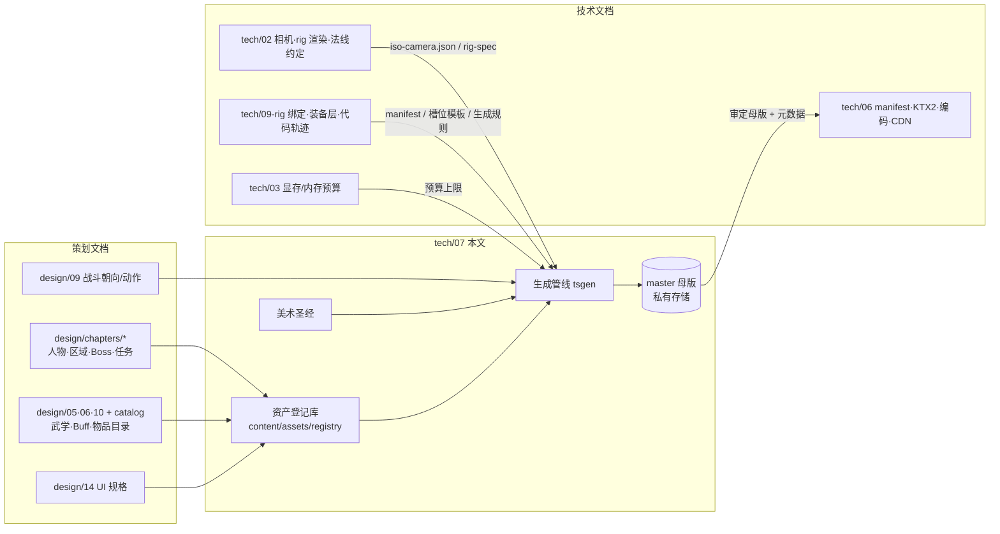
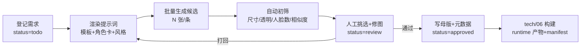
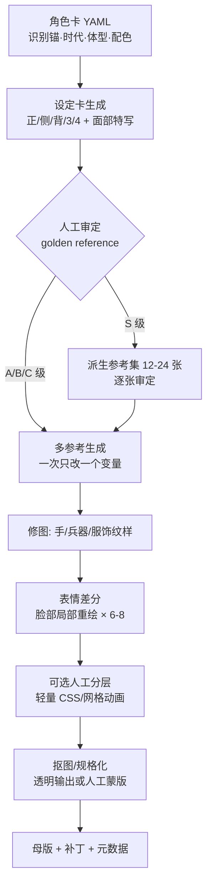
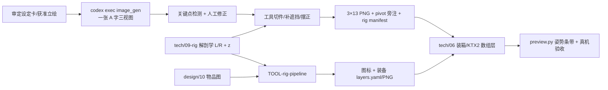
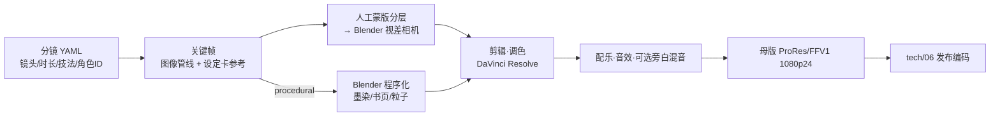
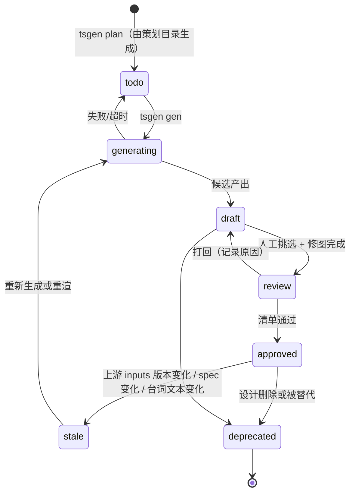

# tech/07 · 素材生成管线（原画、插图、立绘、精灵、视频、音频）

| 项 | 内容 |
|---|---|
| 文档归属 | `docs/tech/07-asset-generation.md`（本文件是"美术圣经、素材清单、生成工具选型、分类型生成管线、资产登记库、一致性与预算、AI 素材法律伦理"的**唯一归属文档**） |
| 上游基准 | `docs/decisions/author-requirements.md` AR-19/AR-21/AR-22/AR-29/AR-31/AR-34；`docs/00-canon.md` §0、§4、§8、§12、§19；AR-34 覆盖 AR-29 的 Gemini 三视图入口 |
| 强依赖 | `tech/02`（相机、六角投影、rig 渲染与深度）、`tech/09-character-rig`（`tianshu_rig`、装备层与代码轨迹）、`tech/06`（存储、manifest、压缩）、`tech/03`（显存/内存预算）、`design/05/06/10`（武学/Buff/物品目录）、`design/09`（六角战斗逻辑）、`design/11/12/15/16/17/18/19`、`design/14` |
| 版本 | v1.5（2026-10-02 AR-34：`codex exec` 三视图、动作库许可与 sheet 契约）；v1.4（AR-29：三视图切件）；v1.3（2026-10-01 AR-22） |
| 读者 | 作者本人（单人开发 + AI 辅助编码）；以及后续协助编写管线脚本的 AI 编码代理 |

> **审校后的执行边界**
> 1. 作者已决定**无本地显卡、不租卡、不运行本地生成模型**；人物立绘与三视图使用 `codex exec` 的 `image_gen`，Gemini 只出物品（AR-31 / AR-34）。§4 的其余模型/服务不构成开通、付费或执行决定。
> 2. OpenAI 帮助中心已有 Sora discontinuation 页面，但本次无法从页面正文闭合具体停用日；原稿“2026-09-24 API 下线”已撤回，精确日期保留**（待核实）**。云产品的地区、账号额度与输出权利须在实际账号上复核**（待实测）**。
> 3. 战斗采用 pointy-top 六角规则空间的 6 个 `HexDir`；角色资产只画 `front34/back34/side` 三视图，以镜像解析 8 个 `Dir8`。镜头允许四个 90° 预设旋转；逻辑方向、渲染方向与源图视图不可混写（§5.4）。
> 4. 统一大地图由 `design/19` 与 `design/map/` 产出；本文只登记 4096×3072 SVG 审查源与派生预览，不再另建一套地理生成事实源。运行时正式键、三档导出和分包均引用 `tech/06`：`map/jianghu_world/base`、`map/jianghu_world/ch01`～`ch14`。
> 5. AR-29 后人物源件不再逐部件出图：由 `codex exec` 先生成一张一致的三视图设定图，再由关键点 / 切件工具产出部件与 pivot 旁注；三个未镜像视图都面向画面左，近侧固定为解剖学 `L`。

---

## 目录

- [0. 结论先行（TL;DR）与关键决策](#0-结论先行tldr与关键决策)
- [1. 范围、依赖与全局约定](#1-范围依赖与全局约定)
- [2. 美术圣经（Art Bible）](#2-美术圣经art-bible)
- [3. 素材需求清单与数量估算](#3-素材需求清单与数量估算)
- [4. 工具现状调研（2026-09）](#4-工具现状调研2026-09)
- [5. 分类型生成管线](#5-分类型生成管线)
- [6. 自动化与工程化](#6-自动化与工程化)
- [7. 一致性保障](#7-一致性保障)
- [8. 预算与排期](#8-预算与排期)
- [9. 法律与伦理](#9-法律与伦理)
- [10. 风险与备选方案](#10-风险与备选方案)
- [参考资料](#参考资料)
- [本文新增术语/约定](#本文新增术语约定)
- [待决事项 / 依赖](#待决事项--依赖)

---

## 0. 结论先行（TL;DR）与关键决策

**一句话**：以“**工笔为骨、水墨为气**”定风格；人物与三视图走 `codex exec`，Gemini 只出物品；角色按“**审定设定卡 → `image_gen` 一张三视图 → 工具切件 / 关键点旁注 → 代码或 CC0 动作轨迹 → 装备层确定性派生**”生产，所有候选经登记、人工审核与母版哈希入库。

执行时必须同时满足五个闸门：`packages/spec/` 是跨语言静态契约唯一目录；书眠成片固定为 13 条 `vid_sleep_NN_MM`、目标 24 秒；标准男女切件产物为 `2×3×13=78` 张，另按 AR-29 为具名 NPC 生产身份 rig，行走/待机不制作帧表；地图、189 城、99 门派与 NPC/变体需求只从归属文档和 `tech/04` 引用图派生；角色 rig 图集不得突破 `tech/03` 的 40/105/170/300 MB 硬上限。完整包量与真机峰值仍须 Phase 0 实测。

| # | 决策 | 结论 | 理由（详见章节） |
|---|---|---|---|
| D1 | 总体风格 | 三档笔法：**S1 工笔精绘**（立绘/CG/关键原画）、**S2 水墨写意**（场景/大地图/过场背景）、**S3 游戏化工笔**（精灵/图标/UI，线条简化、2–3 阶色阶、提高明度对比） | §2.1；手机小屏可读性 |
| D2 | 角色生产路线 | **`codex exec` 三视图 + 工具切件 + 分层部件轨迹**：一张三视图设定图经关键点 / 切件工具产出 `tianshu_rig` 部件；移动默认代码步态，动作原型接 CC0 片段；物品图确定性生成装备层 | AR-22 / AR-29 / AR-34；`tech/09-rig`；§5.4 |
| D3 | 方向策略 | 规则空间为 6 个 `HexDir`，渲染接口为 8 个 `Dir8`；资产空间只取 `front34/back34/side`，再镜像。未镜像时近侧固定为解剖学 `L`；0/4 用最近侧滞回；非对称内容须专用修正版 | §5.4.3、`tech/09-rig` §1.3 |
| D4 | 一致性核心 | 每个角色变体一张**已审定设定卡**（golden reference）＝ 当前多图参考编辑、rig 身份差分、视频关键帧与人工审核的共同源头 | §7 |
| D5 | 当前 AI 入口 | **人物 / 三视图：`codex exec` `image_gen`；物品：Gemini 网页版**。设定卡、提示词版本、原文件与人工修改全部登记；不运行本地模型，也不租 GPU | AR-31 / AR-34；§4、§6 |
| D6 | 候选工具边界 | Qwen、FLUX、Seedream、Kling、Tripo、Hunyuan 等仅作为能力/迁移候选；除非作者另改 P02，不能把候选价格或许可视为当前执行授权 | §4；账号地区与配额（待实测） |
| D7 | 视频策略 | 能用 **2.5D 视差分层动画**就不用 I2V；正式相邻书界书眠共 13 条，每条目标 24 秒（20–30 秒），首次 10 秒后可跳、重播立即可跳；其他视频按剧情选择节点复用分层与场景 | §5.7；C19、P48、AR-10 |
| D8 | 音频 | 素材库、自录和手工编辑优先；本地生成式音乐/TTS只保留调研，不进入 P02 当前路线。若启用云端 AI 音频，须先由作者改执行决定并逐项核许可 | §4.8–4.10、§5.8 |
| D9 | 工程化 | `tools/aigc`（Python 包 `tsgen`）+ YAML 提示词/导入清单 + `content/assets/registry/**/*.yaml`；TraeX 自动结果和 Gemini 手工下载均由 `import-candidate` 进入同一登记状态机；跨语言 JSON 在 `packages/spec/` | §6；C18 |
| D10 | 存储三层 | `source`（可编辑源文件）/ `master`（审定母版，无损）→ 私有对象存储 + 本地盘；`runtime`（压缩产物）由 `tech/06` 构建上 CDN | §6.2 |
| D11 | 品阶边框 | **运行时合成**（不烘焙进图标），因为外来压制会改变"显示品阶" | §5.6 |
| D12 | 法律底线 | 仅个人自娱、不分发、不公开部署；禁演员肖像/声音、禁影视造型与配乐参考、禁在世画师风格名与具体受版权画作做图生图源；全部 AI 资产带溯源元数据 | §9 |
| D13 | 节奏 | Phase 0 先用主角·男完成三视图切件、走路 + 一套剑招原型、十一类物品样本、预览与 100 角色压测，再铺开人物；AR-22 前旧工时仅作历史上限，新总量待首批 P50/P80 实耗 | AR-29；§3.3、§8 |

---

## 1. 范围、依赖与全局约定

### 1.1 范围

本文覆盖**所有非代码资产**的：风格规范 → 需求数量 → 工具选型 → 生产管线 → 质检 → 母版规格 → 登记入库。
不覆盖：运行时加载/压缩/CDN/缓存（`tech/06`）、渲染 shader 与光照（`tech/02`）、UI 布局与交互（`design/14`）、剧情文本（`design/chapters`）。

### 1.2 上下游接口一览


```mermaid
flowchart LR
  subgraph Design[策划文档]
    CH[design/chapters/*<br/>人物·区域·Boss·任务]
    CAT[design/05·06·10 + catalog<br/>武学·Buff·物品目录]
    UI[design/14 UI 规格]
    D09[design/09 战斗朝向/动作]
  end
  subgraph T07[tech/07 本文]
    AB[美术圣经]
    REQ[资产登记库<br/>content/assets/registry]
    PIPE[生成管线 tsgen]
    MASTER[(master 母版<br/>私有存储)]
  end
  subgraph Tech[技术文档]
    T02[tech/02 相机·rig 渲染·法线约定]
    T09[tech/09-rig 绑定·装备层·代码轨迹]
    T06[tech/06 manifest·KTX2·编码·CDN]
    T03[tech/03 显存/内存预算]
  end
  CH --> REQ
  CAT --> REQ
  UI --> REQ
  D09 --> PIPE
  T02 -- iso-camera.json / rig-spec --> PIPE
  T09 -- manifest / 槽位模板 / 生成规则 --> PIPE
  T03 -- 预算上限 --> PIPE
  AB --> PIPE
  REQ --> PIPE --> MASTER -- 审定母版 + 元数据 --> T06
```

**接口契约（已定项与待落地项并列）**：

| 契约文件 | 所有者 | 消费者 | 内容 |
|---|---|---|---|
| `packages/spec/iso-camera.json` | tech/02 | 本文 Blender 脚本、运行时相机 | 俯仰角、四个偏航预设、六角方向映射、旋转时长 |
| `packages/spec/rig-spec.json` | tech/02（v1 已定稿） | TOOL-rig-pipeline、图集打包、运行时 rig 加载器 | 64/96/128 ppm 分档、三视图、法线、公告板与实例能力 |
| `assets/default/rig/<set>/manifest.yaml` | `tech/09-rig`（schema/字段） | 本文管线、运行时 rig 加载器 | 13 个源 part/视图的文件、pivot、child joint、size、zOrder、tintable |
| `packages/data` 中的 `AssetEntry`（Zod）→ 导出 `content/assets/registry/asset.schema.json` | 本文（字段）/ tech/01（schema 机制） | tech/06 `tools/asset-pipeline`（TS）、`tsgen`（Python） | 资产登记条目结构（§6.4）；文档契约已定，实际代码仍按路线图实现 |
| `content/assets/registry/**/*.yaml` | 本文 | tech/06 | 每个资产的状态、母版路径、哈希、溯源 |
| `packages/spec/anim-events.schema.json` | 本文 + tech/05（玩法引擎） | 运行时 | 战斗表现时间轴事件（命中时点、音效时点、刀光起止）；不以移动帧号计时 |

### 1.3 已定稿规格（消费 tech/02；发布编码仍归 tech/06）

> 以下数值来自 `tech/02` §1.3、§2.6 与 `tech/09-rig`；集中写在 `packages/spec/*.json`、rig manifest 与 `tools/aigc/specs/*.yaml`，脚本只读配置、不复制第二份常量。

| 项 | 初值 | 说明 |
|---|---|---|
| 相机 | 正交；俯仰 30°；默认方位 45°，偏航预设 45°/135°/225°/315°，90° 旋转 350 ms | `allowRotation:true`；pointy-top 六角仍投影在同一 2:1 相机空间，见 `tech/02` §1.3–§1.6 |
| 世界单位 | 1 格 = 1 m；角色身高 ≈ 1.6–1.8 m | 高度台阶 `h` 的米制由 tech/02 定 |
| 角色部件密度 ppm | 母版 256 px/m；低/中/高档 64/96/128 px/m，低档无正常法线页 | 男/女标准高 1.70/1.62 m；部件按自身 pivot 组合，公告板作 `1/cos30°≈1.1547` 纵向补偿 |
| 部件画布 | 线段包围盒每边外扩骨长 4%，至少 4 px，最终偶数宽高；不可裁后重算 pivot | 13 个源 part/视图，运行时展开 16 个基础实例；尺寸模板见 `tech/09-rig` §1、§3.2 |
| 法线 | 母版：可选视空间 OpenGL 三通道；运行时：UASTC normal mode（X→RGB、Y→A、重建 Z）；低档不下载法线页 | 镜像时翻转 R/X；部件保留 mip0+mip1 两级、图块间距 4 px |
| 立绘母版 | 2048×3072（2:3）RGBA PNG，人物占画高 88–92% | 表情差分以"脸部补丁"存储（§5.2） |
| CG 母版 | 3840×2160（16:9）PNG；运行时由 tech/06 转 1920×1080 | |
| 图标母版 | 武学/Buff/UI 为 512×512 RGBA；AR-22 物品派生小图以 256 为首档并同时出 128/64/32 | 边框运行时合成；物品路径与算法见 §5.4.7 |
| 音频母版 | WAV 48 kHz / 24-bit | 响度规格 §5.8 |
| 视频母版 | 1920×1080 24 fps，ProRes 422 HQ 或 FFV1 | 发布编码归 tech/06 |

### 1.4 资产 ID 规范（扩展基准 §12）

格式：`<前缀>_<主体ID或书界>[__<变体>][_<描述>]`，全小写、`__`（双下划线）分隔主体与变体，ID 内禁止 `@`、空格与中文（避免 URL/文件系统问题）。**引用**某一版本时写作 `<id>@<版本>`（如 `ref_npc_duanyu__ch01_sheet@3`、`spr_npc_xiaofeng__ch01@1.0.2`），`@` 只出现在引用中，不属于 ID。

| 前缀 | 类型 | 例 |
|---|---|---|
| `ref_` | 设定卡/参考图（不进运行时） | `ref_npc_xiaofeng__ch01_sheet` |
| `art_` | 概念原画 | 格式 `art_<subject>_<seq>`；正式主体从引用图派生 |
| `por_` | 立绘 | `por_npc_guojing__ch03_prime_base`、`por_npc_guojing__ch03_prime_e_angry` |
| `ava_` | 头像 | `ava_npc_xiaofeng__ch01` |
| `cg_` | 剧情插图 | `cg_q_01_main_03_01` |
| `mdl_` / `anm_` | 3D 模型 / 战斗大动作片段（可选中间资产，不用于行走/待机主线） | `mdl_npc_xiaofeng__ch01`、`anm_hum_blade_heavy` |
| `spr_` | 非人形序列精灵；人形整身图仅可作 cutin，不以 `spr_` 建战斗动作 | `spr_fx_bird_flight` |
| `tex_` | 地形材质 | `tex_tr_shenshui__song` |
| `bld_` / `prp_` | 建筑 / 物件 | `bld_kit_song_gate_01`、`prp_song_lantern_01` |
| `ico_` | 图标（沿用对象 ID） | `ico_sk_xianglong18`、`ico_eq_yitianjian`、`ico_bf_zhongdu` |
| `ill_` | 武学图鉴插画（秘籍图谱） | `ill_sk_tieshazhang` |
| `cin_` | 绝招切入题名层（书法题名 + 墨韵底纹） | `cin_sk_xianglong18` |
| `vfx_` / `ui_` / `map_` | 特效 / UI / 地图 | `vfx_sk_liumai_beam`、`ui_frame_scroll_9s`、`map_jianghu_world__ch01` |
| `vid_` | 视频 | `vid_opening`、`vid_ch01_intro`、`vid_ch01_tianshu`、`vid_sleep_01_02`、`vid_end_guixiang` |
| `bgm_` / `sfx_` / `vo_` | 音乐 / 音效 / 配音 | `bgm_ch01_theme`、`sfx_hit_blade_02`、`vo_shuling_0001` |

变体键约定：书界 `chNN`、年龄 `youth/prime/elder`、伤残/状态 `onearm/blind`、表情 `e_<情绪>`，可组合：`por_npc_yangguo__ch03_prime_onearm_base`。

**与内容数据中素材键的对应**：策划数据（`design/05` 招式 `anim: {clip, vfx, sfx, cutin}`、武学 `assets: {icon, art}`，`design/06` Buff `ui.icon`）仍含兼容简写；`tech/04` / `tech/06` 在 IR 边界归一化为三段式 `AssetKey`。登记库 `keys[]` 只保存归一化后的完整键：

| 内容数据简写（示例） | 登记库 `keys[]` / ID | 说明 |
|---|---|---|
| `assets.icon: skill/xianglong18` | `icon/sk_xianglong18/default` ⇄ `ico_sk_xianglong18` | 武学图标 |
| `assets.art: illus/skill/tieshazhang` | `illus/sk_tieshazhang/default` ⇄ `ill_sk_tieshazhang` | 武学图鉴插画（§5.6.5） |
| `ui.icon: buff/zhongdu` | `icon/bf_zhongdu/default` ⇄ `ico_bf_zhongdu` | Buff 图标 |
| `anim.clip: palm_heavy` | `anm_hum_palm_heavy`（逻辑表现片段；默认解析为分层姿势 + 代码/VFX 合成） | 通用动作语义；只有获批备选 C 才派生角色 `spr_*`（§5.4.4） |
| `anim.vfx: fx_sand_burst` | `fx_sand_burst` 内容定义再引用 `vfx/<名>/default` | `fx_*` 本身不是素材键 |
| `anim.sfx: sfx_palm_hard` | `sfx/palm_hard/default` ⇄ `sfx_palm_hard` | 音效 |
| `anim.cutin: cutin/xianglong18` | `cutin/sk_xianglong18/default` ⇄ `cin_sk_xianglong18` | 绝招切入题名层；运行时与施放者 `e_battle` 立绘合成 |

---

## 2. 美术圣经（Art Bible）

> 美术圣经是**所有提示词模板、参考集筛选、3D 风格化与人工审核**的共同判据。任何生成结果与本节冲突，以本节为准；需要改风格时先改本节并提升 `style` 模板的主版本号（§7.4）。

### 2.1 总体风格："工笔为骨、水墨为气"

| 档位 | ID | 用途 | 线条 | 设色 | 背景/留白 | 参照气质（仅描述，不作图生图源） |
|---|---|---|---|---|---|---|
| S1 工笔精绘 | `gongbi_fine` | 立绘、剧情 CG、关键原画、头像母版 | 铁线描/游丝描为主，衣纹兰叶描，线色浓墨 `#2B2622` | 矿物色重彩，分染 + 罩染的柔和明暗；面部三白法提亮 | 人物立绘背景纯留白（透明）；CG 留白 ≥ 25% | 宋代院体人物画的端庄 + 现代插画的造型准确 |
| S2 水墨写意 | `shuimo_scene` | 场景概念、大地图、过场背景、书眠/天书视频 | 皴擦点染，山石用斧劈/披麻皴意象，远景只用墨色层次 | 以墨为主，局部点青绿/赭石；"墨分五色" | 留白 ≥ 35%，云雾、水面、天空大块留白 | 宋元山水"三远法"（高远/深远/平远） |
| S3 游戏化工笔 | `gongbi_game` | 精灵、图标、UI、特效贴图 | 外轮廓线加粗（成品 2–3 px），内部线简化 | 2–3 阶色阶（亮/中/暗）+ 一道描边；饱和度比 S1 高 10–15%，保证手机小屏可读 | 图标主体居中占 70–80%，背景纸纹或透明 | 工笔的线 + 版画的清晰剪影 |

**统一原则**
1. **线是灵魂**：任何档位都必须有可辨识的墨线；禁止无线条的"厚涂写实"与"3D 渲染塑料感"。
2. **墨先于色**：先保证灰度下层次成立（审核时一律加一张灰度预览），再看颜色。
3. **纸在画下**：纸纹/绢纹由**运行时屏幕空间叠加**（tech/02 后处理）统一提供；母版中只允许 S1/S2 带轻微纸纹，**S3 精灵与图标一律不烘焙纸纹**（否则缩放、镜像、图集拼接会穿帮）。
4. **少即是多**：同屏主色 ≤ 3 种 + 墨色；品阶金只在天阶出现，避免"满屏金光"。

### 2.2 线条规范

| 对象 | 描法 | 母版线宽（2048 高立绘） | 成品线宽（精灵/图标） | 备注 |
|---|---|---|---|---|
| 面部、手 | 游丝描（细匀） | 2–3 px | 1 px（内线可省略） | 眼线略重于其他面部线 |
| 服装外轮廓 | 铁线描（匀挺） | 4–6 px | 2–3 px | 剪影边保持连续，不断线 |
| 衣褶 | 兰叶描（起收有提按） | 3–6 px | 仅保留 2–3 条主褶 | 衣褶走向须符合动作受力 |
| 兵器 | 铁线描 + 高光留白 | 3–4 px | 2 px | 刃口用留白表示寒光，不用发光特效 |
| 山石/树 | 皴法笔触（S2） | 笔触纹理，不计线宽 | — | 场景不要求闭合轮廓 |
| 线色 | 浓墨 `#2B2622`（不用纯黑 `#000`）；面部线可用赭墨 `#5A3E2E` | | | 天阶武学特效允许泥金线 `#C9A45C` |

角色分层部件的外轮廓在 256 px/m 母版中烘焙为 2 px 浓墨线；64 ppm 包用 alpha coverage 保线。动作库的 3D 数据只作离线轨迹中转，不渲染人形战斗整身帧。

### 2.3 设色与色板

**基础色板（设计令牌，UI 与美术共用；UI 最终色值以 `design/14` 为准）**

| 令牌 | 名称 | Hex | 用途 |
|---|---|---|---|
| `paper.xuan` | 熟宣 | `#EFE6D2` | 默认纸底、UI 面板底 |
| `paper.silk` | 旧绢 | `#E3D3B1` | 剧情 CG 底、卷轴 |
| `ink.jiao` | 焦墨 | `#1E1B18` | 最深处、文字 |
| `ink.nong` | 浓墨 | `#2B2622` | 线条 |
| `ink.zhong` | 重墨 | `#4A433C` | 暗部 |
| `ink.dan` | 淡墨 | `#8C857B` | 远山、阴影 |
| `ink.qing` | 清墨 | `#C9C2B6` | 雾、最远景 |
| `min.zhusha` | 朱砂 | `#B5382B` | 印章、血、重要强调 |
| `min.yanzhi` | 胭脂 | `#9E2A3A` | 女性服饰、情感 |
| `min.zheshi` | 赭石 | `#9A5B34` | 肤色暗部、土地、木 |
| `min.tenghuang` | 藤黄 | `#D9A93B` | 秋色、灯火 |
| `min.shiqing` | 石青 | `#2F6E8E` | 衣饰、远水 |
| `min.shilv` | 石绿 | `#3F8A6E` | 青绿山水、衣饰 |
| `min.huaqing` | 花青 | `#2E4A62` | 夜色、冷调阴影 |
| `min.qianbai` | 铅白 | `#F4F0E6` | 高光、白衣 |
| `min.nijin` | 泥金 | `#C9A45C` | 装饰线、天阶点缀 |
| `skin.base` | 肤色 | `#E9CFB4` | 肤色基准（暗部用赭石分染） |

**品阶色（C20 已定稿）**：12 级采用**“同色相、逐品提亮 + 纹饰递进”**，不再把 8 个提亮色称为提议。机器可读契约的唯一落点是 `packages/spec/palette.json`（文件尚待 `tech/01`/`tech/02` 实现）：本文拥有下列色值，`tech/02` 负责文件格式/着色器绑定，`design/14` 与 UI 只消费，不另抄第二份常量。

| grade | 名称 | 边框主色（定稿） | 纹饰递进（色弱冗余编码） |
|---|---|---|---|
| 1 / 2 / 3 | 黄下 / 黄中 / 黄上 | `#B8955A` / `#C6A263` / `#D4B06D` | 单线框 / 双线框 / 双线框 + 四角回纹 |
| 4 / 5 / 6 | 玄下 / 玄中 / 玄上 | `#3E5C76` / `#476A87` / `#517998` | 同上 |
| 7 / 8 / 9 | 地下 / 地中 / 地上 | `#8E3B2F` / `#9F4435` / `#B04D3B` | 同上 + 左上角朱文小印 |
| 10 / 11 / 12 | 天下 / 天中 / 天上 | `#D4AF37` / `#DDBC4B` / `#E6C95F` | 同上 + 金箔纸纹；天上品加缓慢流光（运行时 shader） |

- 边框角落另放大阶单字（黄/玄/地/天，篆书），作为第三重冗余编码。
- 运行时必须按**显示品阶**合成边框；图标母版不得烘焙品阶色。12 个色值、纹饰级别和大阶单字共同构成三重编码，后续若调整须提升 `palette.json` 版本并做截图回归。

### 2.4 纸纹、材质与光

| 项 | 规范 |
|---|---|
| 纸纹 | 运行时后处理叠加（tech/02）：熟宣纤维纹 + 轻微晕染噪声，强度按场景可调；母版 S1/S2 可带 ≤ 8% 不透明度纸纹，S3 不带 |
| 光向 | 母版统一"左上 45° 主光"（与中国画习惯一致）；精灵颜色通道只烘焙环境光遮蔽 + 15% 以内的形体明暗，方向光由运行时法线贴图计算（§5.4） |
| 阴影 | 不画投影（CG 例外）；地面接触阴影由运行时椭圆淡墨斑提供 |
| 高光 | 用留白/铅白表达，禁止镜面反射高光、禁止 bloom 式泛光（天阶特效除外） |
| 质感 | 丝绸 = 线条流畅 + 罩染过渡；麻布 = 线条略顿挫；铁器 = 墨色冷灰 + 刃口留白；玉 = 石绿薄染 + 留白 |

### 2.5 构图与留白（S1 CG / S2 场景）

1. **三远法取景**：大场景（华山、光明顶、侠客岛）用高远（仰视、竖构图裁切）；江湖路途用平远（横向、地平线低）；庭院/古墓用深远（层层门洞纵深）。
2. **留白比例**：CG ≥ 25%，场景概念 ≥ 35%；留白处用于放置 UI 文本与题跋。
3. **题跋与印章**：CG 可留出右上/左上竖排题跋区；**文字一律后期用字体排版**（§2.9 禁止项 7），印章用程序化生成的朱文/白文印（字体 + 印泥纹理）。
4. **人物与环境比例**：戏剧性 CG 人物占画高 40–60%；意境 CG（天书现世、书眠）人物可小至 10%，突出天地。
5. **视线引导**：以墨色最重处 + 朱砂点缀为视觉焦点，每张 CG 只有一个焦点。

### 2.6 人物比例与造型

| 用途 | 头身比 | 规则 |
|---|---|---|
| 立绘 / CG（S1） | 成年男 7.5、成年女 7、少年 6–6.5、儿童 4.5–5、老者 7（佝偻者 6.5） | 写实偏理想化；眼睛**不得**超过面宽 1/5（禁止动漫大眼）；丹凤眼/柳叶眉/悬胆鼻等中国画五官语汇 |
| 角色 rig 部件（S3） | 统一约 **5.5 头身**“游戏比例”：男/女模板高 1.70/1.62 m，头、手、兵器保持小屏剪影可读 | 在 `tianshu_rig` 模板上作部件轮廓与调色；立绘与地图角色不要求比例一致，只要求**识别锚**一致（§7.2、`tech/09-rig` §1） |
| 头像 | 立绘裁切，额顶至锁骨 | 视线略偏向画面内侧 |

**剪影优先**：每个主要角色必须在 64 px 高的纯黑剪影下可区分（发型/冠帽/兵器/披风四选二作为剪影特征），审核时自动生成剪影预览。

**体型档**（对应 rig 比例与步态修正；仅 `m_std` / `f_std` 已在 `tianshu_rig` v1 定长）：`m_std` 男标准、`f_std` 女标准、`m_heavy` 魁梧（萧峰、谢逊、鳌拜）、`m_lean` 清瘦（黄药师、风清扬）、`elder` 老者（周伯通、张三丰晚年）、`child` 儿童（少年张无忌、少年韦小宝）、`monk_heavy` 胖僧、`dwarf`（桑土公、侏儒类）。其余六档须从标准 rig 派生并逐档验 pivot、长度和碰撞，未验前不得冒充 v1 已交付。

### 2.7 服饰时代感（审核必查）

> 原则：**以书界年代为准，按族群/身份区分**；允许武侠化（便于活动的窄袖、束腿），不允许跨朝代混搭。下表是审核清单的"时代错误"条目来源。

| 年代（书界） | 汉族男子 | 汉族女子 | 他族/特殊身份要点 | 建筑/器物特征 | 常见 AI 错误（必拒） |
|---|---|---|---|---|---|
| 春秋·越（序章 越女剑） | 深衣、束发椎髻、短褐 | 深衣、椎髻 | 越人"断发文身"（可选） | 干栏式建筑、青铜剑 | 出现汉以后的幞头/交椅 |
| 北宋（天龙） | 幞头（官员硬脚长翅）、圆领袍、襕衫、短褐；江湖人裹巾 | 褙子、抹胸、百迭裙、高髻 | **契丹**：髡发、窄袖左衽袍、皮靴；**西夏党项**：秃发、耳环；**吐蕃**：袒右肩袍、藏式；**大理**：白族/南诏风纹样；**女真**（早期）：辫发、左衽 | 屋顶平缓、斗拱硕大、鸱吻；家具桌椅已普及 | 清式马蹄袖、明式网巾、日式鸟居 |
| 南宋/金/蒙古（射雕、神雕） | 同宋（南宋更文弱、褙子外衣常见）；全真道士：道冠、道袍 | 褙子、窄袖短衫、花冠 | **金**：女真辫发、左衽、貂皮；**蒙古**：婆焦（髡发留三搭）、质孙服、皮袍、弯刀弓箭；**古墓派**：素白长衣（原创造型允许） | 江南园林、临安城、襄阳城墙；草原毡帐 | 蒙古人穿清代旗装；宋人剃发留辫 |
| 元末（倚天） | 汉人仍着交领右衽、方巾/笠帽；官员质孙服 | 汉式袄裙 | **蒙古贵族**：钹笠帽、质孙服；贵妇**罟罟冠**；**明教**：可用火焰纹样（原创扩展）；**波斯总教**：波斯式长袍头巾；**少林/峨眉**：僧尼衣 | 元代宫殿、大都；昆仑冰雪；海岛冰火岛（兽皮） | 明代官服补子、清代顶戴 |
| 明中叶至明末（笑傲、侠客行、碧血） | 网巾、方巾/四方平定巾、直身、道袍、曳撒；锦衣卫飞鱼服（仅限官差） | 袄裙、马面裙、比甲、鬏髻 | **碧血·清军（后金）**：金钱鼠尾辫、马蹄袖、箭衣；**闯军**：毡帽、布面甲；**日月神教**：原创教服（墨紫系） | 斗拱变小、屋顶较陡；明式家具 | 旗袍（民国）；清中期以后的大拉翅 |
| 清前中期（鹿鼎、连城、白马、鸳鸯、书剑、飞狐、雪山） | **一律辫发**（金钱鼠尾→康乾时期辫子渐粗），长袍马褂、马蹄袖、瓜皮帽；官员补服、顶戴花翎；僧道方外人士例外 | 汉族女子保留明式袄裙（"男从女不从"）；满族女子旗装、**两把头**（禁止光绪年间的"大拉翅"） | **台湾郑氏**（鹿鼎）：明式衣冠；**罗刹国**（鹿鼎）：17 世纪俄式服饰；**回部/哈萨克**（白马、书剑）：长袍、花帽、毡帽、面纱；**血刀门**（连城）：藏传僧人红袍 | 紫禁城（黄琉璃、和玺彩画）；江南民居；回疆绿洲与高昌遗迹 | 清人不留辫；大拉翅；民国立领中山装 |

**兵器时代要点**：剑（直身双刃）全时代通用；宋刀以手刀/朴刀为主，明清腰刀为柳叶/雁翎形；甲胄——宋步人甲、元札甲/皮甲、明布面甲/锁子甲、清棉甲；**任何时代禁止欧式板甲与日本刀**（倭寇题材若有，另立例外审批）。

**"交领右衽"铁律**：汉服交领为右衽（左襟压右襟，领口呈"y"字）。AI 生成常出错，且**任何水平镜像都会把右衽变左衽**。因此：
- 立绘、CG、头像**禁止水平翻转**（包括构图调整时）；
- 穿交领汉服的主角/队友/Boss 镜像视图须提供 `mirrorSafe:false` 对称修正版，不能直接翻图（§5.4.3）；
- 左衽仅用于契丹、女真、蒙古等族群的正确表现（需在角色卡中标注 `lapel: left`）。

### 2.8 书界色调表（与武运联动）

武运指数（`wuyun`）影响全局色彩：**高武**书界饱和度与金色点缀最丰富；**中武**降低 10% 饱和度；**低武**再降 10% 并偏冷灰——视觉上呼应"武林衰败"。天级特效在低武书界更罕见，出现时更显珍贵。

| 书界 | 境界 | 主色调（场景 LUT 与概念图依据） | 标志性母题 |
|---|---|---|---|
| ch00 越女剑（序章） | — | 青铜绿 + 竹青 | 竹林、白猿、越国剑池 |
| ch01 天龙八部 | 高武 | 苍山洱海的石青石绿 + 雁门关雪灰 + 契丹赭石 | 茶花、天龙寺塔、燕子坞水巷、缥缈峰云海 |
| ch02 射雕英雄传 | 高武 | 草原赭黄 + 江南烟雨淡墨 + 桃花粉 | 大漠孤雕、桃花岛、嘉兴烟雨楼、华山雪 |
| ch03 神雕侠侣 | 高武 | 古墓冷青白 + 绝情谷情花胭脂 + 襄阳烽火朱 | 活死人墓、情花、神雕、玄铁剑 |
| ch04 倚天屠龙记 | 高武 | 光明顶圣火朱红 + 冰火岛冰蓝 + 武当青灰 | 屠龙刀、圣火、冰川火山、武当云海 |
| ch05 笑傲江湖 | 中武 | 华山青灰 + 黑木崖墨紫 + 恒山素白 | 琴箫、思过崖、梅庄、西湖 |
| ch06 侠客行 | 中武 | 海天蓝 + 石壁苍褐 | 侠客岛石室壁画、赏善罚恶令、腊八粥 |
| ch07 碧血剑 | 中武 | 金蛇金 + 墨绿 + 明末灰暗烽烟 | 金蛇洞、温家堡、北京城破 |
| ch08 鹿鼎记 | 低武 | 紫禁城朱红金黄（唯一"富丽"书界，但人物武学灰暗） + 神龙岛蛇青 | 宫墙、四十二章经、通吃岛、罗刹雪原 |
| ch09 连城诀 | 低武 | 雪谷冷白 + 血刀红 + 牢狱铁灰 | 唐诗剑谱、雪谷、荆州城、藏宝天宁寺 |
| ch10 白马啸西风 | 低武 | 大漠沙黄 + 天空湛蓝 + 白马白 | 高昌迷宫、哈萨克毡房、天铃鸟 |
| ch11 鸳鸯刀 | 低武 | 明快暖色（全作最轻松） | 鸳鸯双刀、镖车、喜宴 |
| ch12 书剑恩仇录 | 中武 | 回疆玉色 + 江南海宁潮水青 | 香香公主、翠羽黄衫、钱塘潮、六和塔 |
| ch13 飞狐外传 | 中武 | 江湖风尘赭石 + 雨夜花青 | 商家堡、火场、掌门人大会 |
| ch14 雪山飞狐 | 中武 | 玉笔峰雪白 + 夕阳金（终章） | 雪山、悬崖、"劈与不劈"的刀光 |

### 2.9 禁止项（硬规则，审核一票否决）

| # | 禁止 | 执行手段 |
|---|---|---|
| 1 | **模仿或近似任何影视剧演员的肖像**（包括"像某某版郭靖"） | 提示词黑名单（演员名、剧版名如"83版""张纪中版"）；人脸与演员相似度人工抽检；参考图来源必须为自生成设定卡 |
| 2 | **以受版权保护的具体画作/插画/剧照为直接复制源**（图生图、ControlNet 线稿、IP-Adapter 参考） | `refs` 字段只允许引用登记库中的 `ref_`/自生成资产或"公有领域"标记资产；批处理脚本校验 |
| 3 | 提示词中使用**在世或 20 世纪后画师/插画师姓名**作风格词（含金庸小说插画、漫画作者） | 提示词黑名单 + 模板中只用技法词（"工笔""铁线描""斧劈皴"） |
| 4 | 影视改编作品的**独创造型**（特定剧版服装设计、兵器设计）与**配乐旋律** | 审核清单条目；音乐提示词禁用剧名/曲名 |
| 5 | 汉服左衽（非他族设定时）、跨朝代服饰（§2.7） | 审核清单 |
| 6 | 动漫大眼、日韩画风、欧美奇幻铠甲、赛博/蒸汽朋克元素 | 负面提示词 + 风格卡参考 + 审核 |
| 7 | **画面内生成文字**（AI 汉字易错字、伪字） | 负面提示词 `text, watermark, calligraphy, signature`；文字一律后期字体排版；匾额类确需时仅用中文字形能力强的模型（Seedream / Qwen-Image / GPT Image 2）且逐字核对 |
| 8 | 血腥特写、裸露；对原著人物的丑化/恶搞 | 审核清单 |
| 9 | 去除或伪造工具自带的水印/溯源标识（如 SynthID） | §9.5 |

---

## 3. 素材需求清单与数量估算

### 3.1 资产分级（控制人工投入的总阀门）

| 等级 | 定义 | 人工投入 | 例 |
|---|---|---|---|
| **S** | 玩家反复凝视、定义记忆点 | 多轮生成 + 手工修图 + 逐项审核 | 主角、书灵、每书界主角团与主 Boss 的立绘/rig 身份差分；锚点事件 CG；开场与结局视频 |
| **A** | 重要但出现频次有限 | 生成 + 局部修 + 清单审核 | 次要 NPC 立绘、支线 CG、地标建筑、天级武学图标与特效 |
| **B** | 批量、可模板化 | 模板批量生成 + 抽检 | 地/玄/黄武学图标、物品图标、杂兵、通用道具、音效 |
| **C** | 占位/自动 | 全自动或复用 | 路人 NPC（模块化拼装）、小地图（自动渲染）、同类物品配色变体 |

规则：每书界 S 级资产不超过 40 个；任何资产登记时必须写 `tier`，工时预算按等级计（§8.3）。

### 3.2 数量估算（标准档）

**每书界（中型 DLC）典型需求**——依据基准 §17 模板：6–10 区域、6–10 幕主线、≥ 20 支线、≥ 6 名可招募队友、若干关键 NPC 与 Boss。

> **预算边界**：下表是产能模型，不是角色、门派或玩法目录的事实源。最终立绘与身份 rig 数量必须由 `design/18` 的稳定 NPC/变体清单参数化；AR-10 的正邪双线只扩大候选 CG 和分层复用，不放宽每书界 S/A 级硬上限。AR-29 后按标准 set + 具名 NPC identity set 的部件数核算，不再按角色×动作帧数核算。

| 类型 | 每书界 | 全作合计（14 书界 + 序章 + 全局） | 等级分布 | 说明 |
|---|---|---|---|---|
| 概念原画 `art_` | 20（区域 8、地标 6、势力 4、群像 2） | ≈ 300 | A 为主 | 概念图是场景搭建与 CG 的底稿，不一定进游戏；正式主体由引用图导出 |
| 设定卡 `ref_` | 15–20 套 | ≈ 260 套 | S/A | 每个有立绘或地图身份差分的角色变体一套（多视图 + 面部特写 + 表情） |
| 立绘 `por_`（主要） | 12 人 × 1 基础 | 基线 ≈ 170 人；以 `design/18` 的 `characterVariantCount` 重算 | S/A | 队友 6 + 关键 NPC 4 + 主 Boss 2 只是预算样本；跨书年龄/伤残/时代状态按稳定变体计，不按名字去重 |
| 立绘表情差分 | 12 × 6 | ≈ 1,000 张脸部补丁 | S/A | 平静/喜/怒/哀/惊/战斗（+ 角色特有 1–2 个） |
| 立绘（次要，单表情） | 15 | ≈ 210 | B | 商人、掌门、任务 NPC |
| 头像 `ava_` | 主要角色从立绘派生；路人按需 | 基线 ≈ 380 派生 + 120 路人头像库；随 `design/18` 重算 | B/C | 人人可招募不等于人人独绘；D4/D5 路人先使用时代 × 身份模块库，升级为具名角色时沿稳定 NPC ID 派生 |
| 剧情 CG `cg_` | 正邪候选池约 24–28；实际交付仍 ≤ 20 | 基线 ≈ 300 正式成片 | S/A | 主线 8–10、锚点 4–6、改命 2、羁绊 4、天书现世 1；互斥路线复用场景底图/人物层，未入选候选不计正式资产 |
| `tianshu_rig` 标准体切件产物 | 不随书界增加 | **2 张三视图输入 → 2 体型 × 3 视图 × 13 源 part = 78 张** | S | 男/女标准体型各一张三视图，由工具各切 39 张；运行时展开 16 基础槽，见 `tech/09-rig` §1 |
| 具名 NPC identity rig | 由当界 `design/18 appearances` 导出 | 不预填总数 | S/A | 每个具名 NPC / 变体一套 39 源件；主角 / 可换装队友例外用标准体 + 装备层，路人标准体 + 调色；动作轨迹共用 |
| 动物/坐骑模型 | 2–4 | ≈ 25 种 | A/B | 马、狼、蛇、雕、猿、虎、熊、骆驼、闪电貂、莽牯朱蛤…… |
| 行走/待机动作图 | **0** | **0** | 自动 | 步态由代码轨迹生成；12 fps 量化是运行参数，不是帧表 |
| 装备覆盖层 | 当界新增物品按 `design/10` 导出 | 与可见装备 ID 数一致，不手抄总数 | B/C | 衣甲/护肩/鞋/腰带/披风/头饰与武器由 TOOL-rig-pipeline 从物品图生成；内甲、秘籍、药食不生成地图层 |
| 地形材质 `tex_` | 10 变体 | 基础 ≈ 60 + 书界变体 ≈ 140 | B | 依 `design/08` 地形目录（`tr_*`） |
| 建筑套件 `bld_kit_` | — | 宋、元、明、清 4 套 × ≈ 40 部件 + 他族（毡帐、回疆、藏式）3 套 × 15 | A/B | 模块化复用 |
| 地标建筑 | 8 | ≈ 110 | S/A | 少林寺、天龙寺、灵鹫宫、桃花岛、襄阳城、古墓、光明顶、黑木崖、侠客岛石室、紫禁城…… |
| 道具物件 `prp_` | 30 | ≈ 450 | B/C | 大量复用 |
| 图标 `ico_` | 按当界目录增量生成 | 全局下限 ≈ 2,000，武学/Buff 扩容后约 3,000+；精确值由目录导出 | A/B/C | 见下表；不能把一门武学、一个招式和一个 Buff 重复算成同一类资产 |
| 武学图鉴插画 `ill_` | 天/地级按首现分配 | **220**（天 51 + 地 169） | A/B | Canon v1.2 / `design/05` 的受控目标 `51/169/459/459`；仅天/地独立图谱，玄/黄复用子类模板（§5.6.5） |
| 绝招切入题名 `cin_` | 按已登记需要 cut-in 的武学生成 | 上限先按天/地 **220** 预算，实际由 `design/05 assets.cutin` 去重导出 | B | 书法题名 + 墨韵底纹；不默认 1,138 门全部制作 cut-in |
| 特效贴图 `vfx_` | 天级武学签名特效 3–8 | 通用 ≈ 80 纹理/序列 + 签名 ≈ 51 | A | 天级武学（基准 §13 共 51 部）每部一个签名特效 |
| UI 框体 `ui_` | 书界主题皮肤 5–10 件 | 通用 ≈ 150 件 | A | 九宫格框、卷轴、按钮、品阶边框 12 级 |
| 地图 `map_` | 统一底图的当界状态 + 6–10 区域图 | **1 张统一底图 + 14 张时代图层**；区域图数量由 30 区正式场景引用派生 | A/C | 直接消费 4096×3072 的 `design/map/jianghu-base.svg`、`jianghu-ch01.svg`～`jianghu-ch14.svg`；不另做 15 张大地图，也不沿用“≈120 区域图”手工估数 |
| 视频 `vid_` | 开篇 + 天书现世 + 相邻书眠；结局按 `design/13` §7.10 | **46 条正式成片**；总时长 **19.7–30.2 分钟**，中心 **24.7 分钟【建议值】** | S/A | 书眠严格 13 条、中心值 `13×24=312 s=5.2 min`；结局严格消费三条既定 ID；总长按 §5.7.1 复算 |
| 音乐 `bgm_` | ≈ 9 | ≈ 140 首 | A/B | 主题 1、探索 3–4、城镇 1、战斗 2、情感 2 |
| 音效 `sfx_` | 书界特有 ≈ 25 | ≈ 400 | B | 通用库为主 |
| 配音 `vo_`（可选） | 书灵 + 喊招 ≈ 200 句 | ≈ 3,000 句 | B | 书灵是抽象墨影 + 对话立绘框架、非战斗单位（P54）；不做全语音 |

**全局修正项与算式**

- 主角采用男女两版（P05）**（原创扩展）**：`15 个时代/序章变体 × 2 = 30` 套主角设定卡与基础立绘；表情补丁若每套 6 个，则 `30×6=180` 个。地图角色复用男/女 rig，仅按时代生成衣装/头饰/装备层，不再制作 30 套整身帧。
- 书灵（P54/P55）**（原创扩展）**：只做 1 套抽象墨影主体、对话立绘框架与表情/墨迹层；使用 CSS/轻量网格动画，不进入人形 rig 或 Live2D/Spine 预算。
- 守卷彩蛋（P16）：不制作固定“第二套 Boss”。完成守卷结局时把 `appearanceRef + vow` 写入 `MetaProfile.lastKeeperAppearance`，下周目按最近一次审定主角外观组合白袍覆盖层；默认开启、可关闭，接口见 `design/13` §7.11、§9.4。
- 武学目录按 Canon v1.2 §4 与 `design/05` §14 的只增不减口径，以 `51+169+459+459=1,138` 门落在约 1,100–1,150 区间；图标本体预算为 1,138 个逻辑键，但独立绘制仅天/地 `51+169=220`，玄/黄 `459+459=918` 走模板族。
- Buff 不在本文定义。资产管线从 `design/06` §8–§9 的正式目录生成 `ico_bf_*`：当前为 `237+10=247` 个，包含 C23 补录的 19 个、AR-12 的 5 个及 15 个经脉永久 Buff；被撤回的 `bf_zhenshi` / `bf_cuidu` 不另造图标。
- AR-02 的阴/阳/调和内力性质只影响上游 `design/05` 内功字段及视觉语义；本文从已审定 `nature` 素材键派生阴/阳/调和三组经络色与气韵，不新增第四种性质，也不重定义相性公式。
- AR-03 冲穴、AR-05 与 AR-06 的资源/家丁/营生、AR-07 与 AR-08 的门派层级/时代矩阵，只消费 `design/15`、`design/16`、`design/12`、`design/17` 的稳定 ID、校验结果和素材引用；不得在本文反向定义穴道、资源品阶、职位或门派规则。
- AR-04 与 AR-11 的统一江湖大地图、时代图层直接消费 `design/19` / `design/map/` 产物（见 §5.9）；189 城、99 门派与区域 / 场景素材需求由 `tech/04 content:build --emit-refs` 对正式数据生成，不在本表复制清单。AR-09 的生卒年、招募等级与跨书 `appearances` 从 `design/18` 及其 catalog 派生角色变体；AR-10 的正邪线与选择节点只决定 CG/视频候选集合。本文均不维护第二份地图、门派、NPC 或剧情事实表。

**按书界拆分（标准档；体量系数 = 相对"典型书界"的规模，依原著篇幅与人物密度估）**

| 书界 | 体量 | 系数 | 主要立绘（人） | CG | identity rig（预算样本） | 地标 | 特有需求（新增） | 主要复用来源 |
|---|---|---|---|---|---|---|---|---|
| ch00 越女剑（序章） | 小 | 0.3 | 3 | 4 | 4 | 2 | 春秋迷你套件（干栏、青铜剑）、白猿 | — |
| ch01 天龙八部 | 大 | 1.3 | 16 | 26 | 16 | 10 | **宋式套件 v1**；契丹/西夏/吐蕃/大理服饰；珍珑棋局、缥缈峰云海；异兽（莽牯朱蛤、冰蚕） | — |
| ch02 射雕英雄传 | 大 | 1.2 | 14 | 24 | 14 | 9 | 金国与**蒙古草原套件**（毡帐）；白雕、汗血宝马；桃花岛 | 宋式套件（南宋变体） |
| ch03 神雕侠侣 | 大 | 1.2 | 14 | 24 | 14（多为年龄变体） | 9 | 古墓、绝情谷情花、神雕、玉蜂；襄阳攻防 | ch02 人物（年龄变体）与套件 |
| ch04 倚天屠龙记 | 大 | 1.3 | 16 | 26 | 16 | 10 | **元代套件**；波斯服饰；冰火岛冰川火山；光明顶圣火 | ch03 人物（张三丰、郭襄）、少林/峨眉 |
| ch05 笑傲江湖 | 大 | 1.2 | 14 | 24 | 14 | 9 | **明式套件 v1**；五岳剑派各山门；梅庄、黑木崖 | 少林（改为明代变体） |
| ch06 侠客行 | 中 | 0.9 | 10 | 18 | 11 | 7 | 侠客岛石室壁画（需逐幅设计）、凌霄城 | 明式套件 |
| ch07 碧血剑 | 中 | 1.0 | 12 | 20 | 12 | 8 | 明末/后金服饰；金蛇洞、温家堡、五毒教 | 明式套件 |
| ch08 鹿鼎记 | 大 | 1.2 | 14 | 24 | 14 | 10 | **清式套件 v1**、紫禁城、神龙岛、罗刹迷你套件、台湾明式衣冠 | ch07 九难 |
| ch09 连城诀 | 中 | 0.8 | 9 | 16 | 10 | 6 | 雪谷地形、血刀门藏僧服饰、牢狱 | 清式套件 |
| ch10 白马啸西风 | 小 | 0.6 | 6 | 12 | 7 | 4 | **回疆/哈萨克套件**、高昌迷宫、白马、狼群 | 清式套件 |
| ch11 鸳鸯刀 | 小 | 0.5 | 6 | 10 | 7 | 3 | 镖车、喜宴（轻喜剧演出） | 清式套件（全复用） |
| ch12 书剑恩仇录 | 大 | 1.1 | 13 | 22 | 13 | 8 | 钱塘潮、六和塔、回部 | ch10 回疆套件、清式套件、紫禁城 |
| ch13 飞狐外传 | 中 | 1.0 | 12 | 20 | 12 | 7 | 商家堡火场、掌门人大会 | 清式套件 |
| ch14 雪山飞狐 | 中 | 0.8 | 10 | 18 | 10 | 6 | 玉笔峰雪山庄；终局"守卷人"相关（计入全局） | ch13 人物（胡斐、苗人凤） |
| **合计** | | | **≈ 169** | **≈ 288**（+ 全局 ≈ 12） | **≈ 174** | **≈ 108** | | |

> 系数用于 `tsgen budget` 按书界缩放其他类型的数量（概念图、道具、图标、音乐等）；具体人物与地标清单以 `design/chapters/NN-*.md` 为准，本表只是预算锚点。

**图标拆分**

| 子类 | 数量 | 生产方式 |
|---|---|---|
| 天级武学（基准 §13，51 部） | 51 | 逐个 S/A 级绘制 |
| 地级武学 | **169** | 逐个 A/B 级（模板 + 主体描述） |
| 玄/黄级武学 | **459 + 459 = 918** | **模板族**：子类（剑/刀/掌/指…）× 意象（风/火/寒/毒…）≈ 60 张底图 + 程序化配色/叠字 |
| 招式 | ≈ 2,000+ | **不单独绘制**：用招式名首字/关键字的书法字形 + 所属武功图标缩略合成（§5.6.3） |
| 装备（含神兵） | ≈ 500 | 神兵逐个；普通装备按类别 × 时代 × 材质模板 |
| 消耗品/材料/任务物品 | ≈ 500 | 模板族 + 配色变体 |
| Buff（依 `design/06` 目录） | **247** | `237+10=247`；从正式目录导出 `ico_bf_*`，符号 + 标签字 + 极性底色模板，不在本文定义 Buff |
| UI/系统图标 | ≈ 150 | 手工矢量（SVG）为主，AI 仅出草图 |
| 冲穴/经脉、资源点、家丁、营生、门派职级 | 由上游目录导出 | 分别引用 `design/15`、`design/16`、`design/12`、`design/17`；按稳定 ID 生成，不在本文估造规则数量 |

### 3.3 个人开发节奏（先做《天龙八部》垂直切片）

**2026-10-01 AR-22**：旧甘特图和按 252/624/768 h、516/270 h 换算的日期建立在 3D 人形与整身帧路线，不再作为承诺；当前只规定依赖顺序。每阶段工时由 §8.3 的计时桶实报后，交既有 `tech/09-roadmap` 重新排期。

| 阶段 | 目标 | 交付物 | 通过标准 |
|---|---|---|---|
| **Phase 0A 风格与契约** | 锁定 S1/S2/S3 与可复现输入 | 美术圣经、登记/审核 MVP、`rig-spec`/manifest 校验器、金样集 | 契约无重复常量；输入、模板、输出和哈希可追溯 |
| **Phase 0B rig / 动作样片** | 证明“三视图切件 + 分层 + 装备 + 轨迹”可跑通 | 先用主角·男标准体原型三视图切出 39 张，接程序 / CC0 走路和一套剑招；再扩男女标准体；十一类物品每类至少 1 件 | RIG-V01～V16；三视图与镜像、走路 / 剑招、轻中重转向条带通过；100 角色三机数据（待实测） |
| **Phase 1 天龙垂直切片** | 一个完整可玩片段的全部素材 | 1 区域、4 个局部切片、1 幕主线、3 队友、1 Boss；具名 NPC 用 identity rig，队友用标准体 + 装备层；动物另走专项 | 连续游玩无占位；装备可见；每类资产至少 1 次完整登记 |
| **Phase 2 天龙全量** | 首个完整书界 | 其余区域、人物差分、CG、开场、天书现世和天龙→射雕书眠；正式范围从上游引用图导出 | 天龙可通关；只按登记库差量排产 |
| **Phase 3+** | 每书界一个周期 | 射雕/神雕复用宋金蒙古套件与年龄差分；倚天复用相关人物；清代各书复用清式套件 | 默认仍以精简档控制范围，但新小时数须等首批 P50/P80，不沿用旧值 |

**顺序建议**：严格按基准书界顺序生产（玩到哪做到哪，也符合作者自娱的动机）；但**时代套件**（建筑/服装模块）可提前一部做，给后续书界留缓冲。

> 可用投入仍按每周 12–15 h 登记；与编程、策划并行时相应拉长。Phase 0 的“管线 MVP”只做 §6 中的最小集合（`codex exec` / Gemini 结果登记 + 分件 / 物品层处理 + 打包）；Blender 只服务建筑、动物、视频与离线动作处理。ComfyUI、本地 LoRA 与租卡不在当前交付或目录树中。

---

## 4. 工具现状调研（2026-09）

> 二次核实日期：**2026-09-26**。版本、能力与许可证优先查厂商文档、官方仓库及许可证正文；价格只在官方定价页能够闭合时落数。账号可见额度、地区、网页会员权益和输出权利仍可能因登录态而异，统一标**（待实测）**或**（待核实）**。
>
> **执行决定 P02 与 AR-31 / AR-34 高于本节候选表**：人物立绘（含路人、情景图）与三视图只用 `codex exec` 的 `image_gen`，Gemini 网页版只出物品；TraeX 仅保留既有非人物类型。项目不运行本地模型、不租 GPU，也不自动开通候选付费服务。

### 4.1 选型原则

1. **当前入口白名单**：人物与三视图由 `codex exec` 自动落盘；TraeX 仅处理既有非人物类型；Gemini 网页结果须人工下载登记且只能用于物品。任何新供应商先改作者决定/配置白名单，再接适配器。
2. **母版可落地**：每个接受的候选立即保存原文件、提示词、参考图 ID、生成时间、工具展示版本和 SHA-256；不把云端“作品库”当长期存储。
3. **能力适配器化**：管线抽象 `t2i`、`edit_multi_ref`、`img2mesh`、`i2v`、`tts`，但未启用适配器必须返回“未授权”，不能静默回退到另一服务。
4. **许可与隐私先于质量**：上传金庸人物设定卡前核对输入/输出权利、训练使用、公开画廊和删除机制；许可不清即不用。OFL 标题字体也逐字体保存 `OFL.txt` 与版本哈希（P04）。
5. **不把公开说明当账号实测**：实际可访问性、配额、水印、导出分辨率与地区限制在账号上记录**（待实测）**；本节只缩小未知范围。

### 4.2 图像生成

| 工具 | 类型 | 现状要点（2026-09） | 成本量级 | 许可/条款要点（个人非商业） | 本项目定位 |
|---|---|---|---|---|---|
| **`codex exec` / `image_gen`** | 当前人物入口 | 按 `tools/agents/prompts/_imagegen.md` 调用并落盘；只给主角 / S 级上传已审立绘 | 当前环境额度 | 模型路由、留存、水印、额度和输出权利**（待实测）** | **人物立绘、路人、含人物情景图与三视图唯一入口**（AR-31 / AR-34） |
| **TraeX CLI `image_generation`** | 当前非人物入口 | 由当前开发环境调用；单次上限与输出条款未得稳定公开契约 | 当前环境额度 | 具体路由、留存、水印和输出权利**（待实测）** | 保留既有非人物类型；不得生成人物或三视图 |
| **Gemini 网页版** | 当前物品入口 | 网页展示模型和额度随账号变化；结果须手工下载登记 | 账号套餐**（待实测）** | 实际模型、地区、额度、SynthID/导出规格**（待实测）** | **只出物品**；不得生成人物或三视图 |
| **Qwen-Image-2.0 / Qwen-Image-Edit-2511** | 开放权重候选 | 官方仓库在 2026-02-10 登记 Qwen-Image-2.0；编辑权重当前列 `Qwen-Image-Edit-2511`。未找到官方“Qwen-Image 2.1”，原稿该型号、7B 与 10 图断言均撤回 | 本地/服务端 | 官方 Qwen-Image 仓库声明 Apache-2.0；实际使用仍固定 tag 与权重哈希 | P02 下不运行；保留迁移评估 |
| **FLUX.2 [klein] 4B** | 开放权重候选 | 4B；官方模型卡称约 **13 GB VRAM**，支持生成、编辑和多参考 | 本地/服务端 | 4B 为 Apache-2.0 | 原稿 8.4/9.2 GB 无法由当前模型卡支持，已纠正；P02 下不运行 |
| **Gemini 3 Pro Image** | API 候选 | 官方 Gemini 图像文档列 Gemini 3 系列最多混合 14 张参考；具体模型的人物/物体细分上限见当页矩阵；1K/2K 约 $0.134、4K 约 $0.24 | API 按输出计费 | Google API 条款；生成图像含 SynthID | 网页账号与 API 不是同一额度，仍须账号实测 |
| **GPT Image 2** | API 候选 | 官方提供生成/编辑 API 与 token 计费 | 图像输入 $4/M、缓存输入 $1/M、图像输出 $15/M token；文本另计 | OpenAI 服务条款与使用政策 | 删除原稿无法由一手来源闭合的固定“每张价”；官方定价会变化，启用前重查 |
| **Seedream 5.0 Pro** | 闭源候选 | 官方发布日期 **2026-07-08**；强调生成/编辑与设计理解 | 火山方舟模型页：输入 ¥0.02/张、输出 ¥0.30/张；BytePlus 起价 $0.045/张 | 网页会员、输出权利、地区与账号套餐**（待实测）** | 国风与中文场景候选；当前不启用；两个区域产品不可混算 |
| **Kling Image O1** | 闭源候选 | 官方 2025-12-30 发布；最多 10 张参考图 | 官方积分政策：标准购买 $1=66 credits；具体功能扣点以界面为准**（待实测）** | 输出条款、地区和账号权益**（待实测）** | 与视频主体一致性候选；当前不启用 |
| **Midjourney** | 闭源候选 | 官方计划页列 Basic/Standard/Pro/Mega 四档；当前具体模型版本与月价应以购买页为准**（待实测）** | 账号结算页**（待实测）** | 官方条款版本生效日 2026-05-27；Stealth 仅 Pro/Mega，且公开 Discord 频道内容仍可见 | 仅可做无敏感参考的氛围探索；当前不订阅 |

**结论**：人物生成固定走 `codex exec`，Gemini 只出物品；角色身份一致性靠“已审定设定卡 + 明确变更区 + 人工比对”，而非把未启用 LoRA 写成既成能力。

### 4.3 角色一致性手段

| 手段 | 代表 | 优点 | 缺点 | 本项目用法 |
|---|---|---|---|---|
| **多参考图编辑** | 当前人物：`codex exec` / `image_gen`；候选：Qwen-Image-Edit-2511、Gemini 3 图像 API、Kling O1 | 零训练、即时可用、服装细节保持较好 | 闭源入口模型/额度可变；跨会话不可完全复现 | **人物当前首选**：以审定设定卡为参考，每次只改变一个姿势/表情/场景变量 |
| **角色 LoRA** | Qwen / FLUX / Z-Image 等候选 | 可复现、批量稳定、离线 | 需干净训练集、显卡与训练许可 | P02 下**不训练**；只保留数据字段和迁移接口 |
| 风格 LoRA | 同上 | 可锁定笔墨质感 | 与角色 LoRA 叠加时可能干扰 | P02 下**不训练**；当前以提示词片段 + 金样本截图回归替代 |
| IP-Adapter / InstantID / PuLID 类 | SDXL、FLUX.1 时代方案 | 单图即可保持脸部 | 主要保脸不保服装；与新一代模型生态兼容性弱；InstantID 依赖 InsightFace 人脸模型（非商业许可） | 仅作为备选，不纳入主线 |
| **3D 代理 + 控制网** | 3D 模型渲染深度/法线/线稿 → ControlNet 或编辑模型重绘 | 姿态、透视、比例绝对一致 | 需要先有 3D 模型 | CG 中复杂动作、精灵以外的多角度需求 |
| 视频模型主体库 | Kling、Seedance、Veo 等候选 | 视频内一致 | 跨片段仍可能漂移；账号限额不同 | 当前不启用；未来启用仍统一用设定卡作主体参考（§5.7） |

### 4.4 图生 3D

| 工具 | 类型 | 现状要点 | 成本 | 许可/条款 | 定位 |
|---|---|---|---|---|---|
| **Blender 手工/半自动建模** | 本地 DCC | 根据已审定的正/侧/背设定卡建低模，必要时用基础人体与模块套件改造 | 免费 | GPL；输出物不受 GPL 约束 | **当前主线**；不依赖新增云账号 |
| **Tripo H3.1** | 云候选 | 官方文档确认多视图生 3D 与 H3.1 模型 | 价格和免费档条款**（待核实）** | 输出权利、地区、私密性**（待核实/待实测）** | 若作者日后授权云 3D，再作角色候选 |
| **Hunyuan3D 2.1** | 开放权重候选 | 形状/纹理 PBR 管线 | 需要本地/租用 GPU | 腾讯社区许可排除 EU/UK/KR；MAU 超 100 万需另请许可 | P02 下不运行；许可地域不得写成“作者所在地必然符合” |
| **TRELLIS.2 4B** | 开放权重候选 | O-Voxel，最高 1536³；官方要求至少 24 GB NVIDIA GPU | 本地/服务端 | 模型与代码 MIT；可选依赖各按自身许可 | P02 下不运行 |
| Meshy 等云服务 | 云候选 | Meshy 可提供生成、重拓扑或绑骨 | Meshy 官方页：Free 100 credits/月；Pro $20/月、1,000 credits；其余服务不得套用此价 | Meshy Free 输出按 CC BY 4.0；Pro 标为 private license；账号地区、实际任务扣点与删除行为**（待实测）** | 不纳入当前路线 |

**结论（AR-22 / AR-29）**：图生 3D 与 Blender 建模不是人形资产前置；只用于建筑、方向性物件、动物，或离线动作轨迹处理，不恢复人形战斗整身帧。

### 4.5 自动绑骨与动作（动作轨迹选库）

**选库结论（AR-29 / AR-34）**：人形运行时仍是 2D 分层部件；3D 动作库只离线烘焙骨向量轨迹，不带源网格进入运行时。原型首选 Mesh2Motion 人形动作集（美术资产 CC0、代码 MIT），备选 Quaternius Universal Animation Library 1 / 2 免费档（CC0）。UAL Pro 先不买；缺哪个动作待原型后再议。

C6 许可白名单仅允许 CC0、CMU 官方条款覆盖的数据、CC BY（发行时完整署名并给许可链接）；NC 数据和 Mixamo 一律不用。每段必须登记来源 URL、许可、原动作名与 SHA-256，构建期白名单外硬失败。Mesh2Motion 的来源未明 mocap 组也先不用。武侠签名招式来源仍待 C7 收口，默认倾向作者自录 + 姿态提取，以减少许可风险。

行走先保持 `tech/09-rig` 程序步态；动作库 walk 只做 A/B 后再定（C8）。攻击、受击、格挡、倒地等战斗大动作已按 C9 固定使用“分层部件 + 动作轨迹”，整身帧只用于 cutin。下表其余工具仅供动物 / 异形或来源研究，不是当前人形动作入口。

| 工具 | 类型 | 要点 | 许可/可用性 | 定位 |
|---|---|---|---|---|
| **AccuRIG 2**（Reallusion） | 免费桌面 | 全身 + 手指绑骨；ActorCore 库 4,500+ 动作，含免费与付费 | AccuRIG 2 免费；导出/资产权益按账号条款 | 非当前人形来源；动物 / 异形研究须真账号验证**（待实测）** |
| Mixamo（Adobe） | 免费网页 | 老牌自动绑骨 + 动作库 | 需 Adobe ID；**不对中国国家码账号开放**；条款不进入 C6 白名单 | **排除，不用** |
| **UniRig**（VAST/清华） | 开源 | 自回归骨架预测 + 蒙皮权重，适用人/动物/异形 | MIT（组件逐步开源） | 动物/非标准体型绑骨 |
| Tripo / Meshy 内置绑骨 | 云 | 生成后一键绑骨 + 预设动作 | 随计划 | 动物 / 异形候选；当前不启用 |
| **HY-Motion 1.0**（腾讯） | 开放权重候选 | 文本生成 3D 人体动作，输出 SMPL-H | Tencent HY-MOTION 1.0 Community License：不适用于 EU/UK/KR；发布时 MAU >100 万需另请许可；不得用其作品/输出改进其他 AI 模型 | 不在 C6 白名单；C7 若重议须另审 |
| Rokoko Vision（视频动捕） | 云 | 手机视频 → 动作 | Starter 当前含 **30 秒/月** Vision AI；账号可用性**（待实测）** | 原稿“<15 秒免费片段”已纠正；只上传作者自录视频 |
| **Mesh2Motion / Quaternius UAL 1 / 2** | 素材库 | 首选聚合人形集 / CC0 备选；离线烘焙骨向量 | 美术 CC0、代码 MIT / CC0；UAL Pro 不买 | 原型与通用动作主线 |
| CMU Mocap | 素材库 | 大型动捕库，需清理与重定向 | 只按 CMU 官方条款；不得转售原数据，建议致谢 | 白名单补源，逐段登记 |

**中转约定**：离线临时骨架统一为 `tianshu_humanoid`，不得与运行时 `tianshu_rig` v1 混名；片段格式、白名单键和运行时投影唯一见 `tech/09-rig` §4.6、§8。

### 4.6 视频生成

| 工具 | 类型 | 现状要点（2026-09） | 成本量级 | 许可/条款要点 | 定位 |
|---|---|---|---|---|---|
| **2.5D 视差 + Blender / FFmpeg** | 当前主线 | 用已审定静帧分层、相机缓动、墨晕转场与粒子完成 | 本地免费 | 工具许可明确；输入素材沿各自溯源 | 书眠、天书现世、开篇意境镜头首选 |
| **Kling 3.0** | 闭源候选 | 官方资料确认原生 4K；Omni 路线支持原生音频 | 官方积分政策：标准购买 $1=66 credits；各模式实际扣点以界面为准**（待实测）** | 输出条款、地区、免费档水印**（待实测）** | 人物动作 I2V 候选；当前不启用 |
| **Seedance 2.5** | 闭源候选 | 单次生成最长 30 秒；原稿“≤50 个参考”缺一手证据，已删除 | 积分/API**（待核实）** | 输出条款与地区**（待核实/待实测）** | 长镜头候选；当前不启用 |
| **Hailuo 2.3 / 2.3 Fast** | 闭源候选 | 官方确认 2.3；Fast 宣称相对标准版最高降价 50% | 官方包价页按 video points 计：Fast 768p/6s、10s 与 1080p/6s 分别 0.7/1.1/1.3 点；标准版分别 1/2/2 点；点包最低 $1,000，非个人预算 | 输出条款、地区与账号可见方案**（待实测）** | 动作镜头备选；当前不启用 |
| **Sora** | 排除项 | 官方帮助中心已有产品停用说明；本次未从可访问正文闭合精确日期**（待核实）** | — | — | 排除；不再声称“2026-09-24 API 下线” |
| **LTX 2.5** | 开放权重候选 | 2026-08-11 发布；当前版本为 2.5，不再沿用旧 LTX-2 名称 | 本地/服务端 | 组织年收入 < US$10M 免费；其余依现行许可 | P02 下不运行 |

**结论**：当前不调用视频生成服务；先用分层视差完成可验收版本。只有某个镜头经分镜评审证明静帧技法不足，且作者另行允许相应账号后，才在候选中做小样。

### 4.7 超分与补帧

| 工具 | 用途 | 要点 | 许可 |
|---|---|---|---|
| **SeedVR2**（字节 Seed） | 图像/视频超分与修复（候选） | 3B/7B；P02 下不本地运行 | Apache-2.0 |
| Real-ESRGAN（含动漫模型） | 图像超分（轻量） | 速度快、对线稿友好 | BSD-3-Clause |
| **RIFE / ComfyUI-Frame-Interpolation** | 视频补帧（候选） | 模型仓库与 ComfyUI 插件均为 MIT；是否值得补帧需逐镜头看伪影 | MIT |
| 放大策略 | — | 立绘/CG：生成 ≈ 1.5–2K → SeedVR2 或 Real-ESRGAN 到母版；**精灵不超分**（直接 2× 渲染再缩小） | — |

### 4.8 音乐

| 工具 | 类型 | 要点 | 成本 | 许可/条款 | 定位 |
|---|---|---|---|---|---|
| 自录 / 已核许可音乐素材 / DAW 编曲 | 当前主线 | 不依赖生成模型；逐曲登记来源与许可 | 视素材而定 | 每曲单独核对 | 环境循环、主题动机和过场先用此路线 |
| ACE-Step / Suno 等 | 候选 | 原稿的具体速度、下载数、版本与价格未由稳定一手资料闭合 | 价格与额度**（待核实/待实测）** | 训练数据、输出权利、署名要求逐项核对**（待核实）** | P02 下不运行/不开通；不进入当前预算 |

**结论**：当前以素材库、自录、手工编曲和剪辑为主；生成式音乐在作者另行授权且许可核清前不进入生产。

### 4.9 语音（TTS，可选）

| 工具 | 类型 | 要点 | 许可 | 定位 |
|---|---|---|---|---|
| **Qwen3-TTS** | 开放权重候选 | 支持文字描述设计全新音色；即使支持克隆，本项目也禁止克隆真人 | Apache-2.0 | P02 下不运行 |
| **CosyVoice 3**（Fun-CosyVoice3-0.5B） | 开源 | 2025-12 开源；9 语种 + 18 种以上汉语方言；拼音发音修正 | Apache-2.0 | 方言角色（川、粤、吴语等）、旁白 |
| IndexTTS2 | 开放权重候选 | 情感与时长控制 | Bilibili 自定义许可；年收入 > RMB 10 亿或 MAU > 1 亿需另请许可 | P02 下不运行；不得误写 Apache |
| OpenAudio S1 / S1-mini（Fish Audio） | 开放权重候选 | 多语种语音；原稿训练时长未作为选型依据 | Fish Audio Research License：研究/非商业可用，商业用途需另行书面许可，并有署名/分发条件 | P02 下不运行；原稿“CC-BY-NC-SA-4.0”已纠正 |
| ElevenLabs | 闭源候选 | 多语种语音与音效生成 | Starter **$6/月**；账号地区、中文质量与权益**（待实测）** | 当前不启用 |

### 4.10 音效

| 来源 | 要点 | 许可 | 定位 |
|---|---|---|---|
| Freesound | 真实录音质量高 | **逐文件**可能为 CC0、CC-BY 或 CC-BY-NC，不能把全站当 CC0 | 首选检索源；每个文件登记许可、作者与下载日期 |
| Sonniss GDC 免费包 | 媒体制作音效包 | 可用于媒体制作、免署名、可商用；明确禁止用于 AI/ML 训练 | 首选补充源；不得放入训练集 |
| ElevenLabs Sound Effects | 文本生成音效候选 | 官方 API 约 **$0.12/分钟**；套餐权益仍随账号变化**（待实测）** | 当前不启用 |
| **HunyuanVideo-Foley** | 视频 → 同步音效 | 腾讯混元社区许可 | 过场视频的拟音 |
| 自录 | 手机录布料挥动、竹竿、瓷器 | 自有 | 武侠特有的衣袂风声、竹杖 |

### 4.11 辅助工具（抠图、分层、DCC）

| 工具 | 用途 | 许可 | 备注 |
|---|---|---|---|
| **BiRefNet** | 抠图（立绘、图标、道具） | MIT | 首选；RMBG-2.0 同架构但为非商业/需商业授权，个人可用但优先 BiRefNet |
| SAM 系列 | 交互式分割、局部重绘蒙版 | Apache-2.0（SAM/SAM2；新版以仓库为准） | ComfyUI-RMBG 节点集成 |
| **Blender 4.5.14 LTS / 5.2.2 LTS** | 3D 清理、绑骨修正、渲染、视差视频 | GPL（产出物不受限） | 2026-09-15 官方 LTS 页在列；脚本以 4.5 LTS 为兼容基线、5.2.2 回归（待实测） |
| Krita / GIMP | 手工修图（手指、服饰纹样） | GPL | 免费 |
| DaVinci Resolve（免费版） | 剪辑、调色、音频混音 | 免费版许可 | 视频母版 |
| FFmpeg | 编码、响度标准化、元数据 | LGPL/GPL | 批处理脚本调用 |
| Demucs | 音乐分轨 | MIT | 从生成音乐中提取乐器层 |
| rectpack（Python） | 图集装箱 | Apache-2.0 | 精灵/图标图集 |

### 4.12 选型汇总

| 类别 | 当前可执行首选（P02） | 授权后候选 | 当前登记/成本口径 |
|---|---|---|---|
| 图像生成与编辑 | 人物 / 三视图用 `codex exec`；物品用 Gemini；TraeX 保留非人物类型 | Qwen-Image-2.0 / Edit-2511、FLUX.2 klein、Gemini API、GPT Image 2、Seedream、Kling、Midjourney | 不预设月费；逐次登记入口、账号展示额度与原文件，实际额度**（待实测）** |
| 角色一致性 | 审定设定卡 + 多参考编辑 + 人工锚点比对 | 角色/风格 LoRA | 当前不训练模型；保留数据字段，不生成虚假的模型版本 |
| 人形地图角色 | `codex exec` 三视图经工具切为 `tianshu_rig` 部件 + TOOL-rig-pipeline | — | 人物 / 三视图不用 Gemini；行走默认程序步态 |
| 3D 道具/动物 | Blender 模块套件与手工建模/清理 | Tripo、Meshy、Hunyuan3D 2.1、TRELLIS.2 | 云 3D 与本地权重均未启用 |
| 绑骨 | 动物用 Blender / 已核许可骨架；人形只为动作轨迹离线重定向 | AccuRIG 2、UniRig | 不把 3D 网格带入人形运行时 |
| 动作 | Mesh2Motion CC0 首选；UAL 1/2 免费 CC0 备选；CMU / CC BY 按白名单 | 作者自录优先补签名招式 | UAL Pro 先不买；不用 NC、Mixamo；逐段存来源、许可、哈希 |
| 视频 | 审定静帧分层 + Blender/FFmpeg 2.5D 视差 | Kling、Seedance、Hailuo、LTX | 当前工具成本 0；账号型视频服务未启用 |
| 放大/补帧 | 优先按母版尺寸直接生成/渲染；必要时用确定性缩放与剪辑 | SeedVR2、Real-ESRGAN、RIFE | 当前不运行本地 AI 模型；补帧不是默认步骤 |
| 音乐 | 自录、已核许可素材、DAW 手工编曲 | ACE-Step、Suno 等 | 逐曲登记，不为未启用订阅计费 |
| 语音 | 默认无配音，只交付文本与时间轴 | Qwen3-TTS、CosyVoice 3、IndexTTS2、ElevenLabs | 任一 TTS 启用前另做声音权利与账号实测 |
| 音效 | 自录 + Freesound 逐文件核许可 + Sonniss 合规包 | ElevenLabs、HunyuanVideo-Foley | 逐文件登记许可；Sonniss 素材不得用于 AI/ML 训练 |

本表的“当前可执行”是生产白名单，“授权后候选”只是调研结果。任何候选切入都必须先通过 §9 的许可闸门、写入供应商配置并完成一条可复现小样；不得由脚本自行回退或开通付费项。

---

## 5. 分类型生成管线

> 每条管线统一按"**输入 → 步骤 → 工具 → 质检 → 输出规格 → 入库**"书写。确定性处理由 `tsgen` CLI 驱动；`codex exec`、TraeX 与 Gemini 手工导入均须登记。`provenance` 必须写入口、提示词、参考图、生成时间、界面显示模型（若有）和文件哈希；供应商不暴露种子时写 `seed: null`，不得伪造可复现性。

**通用生命周期**（所有类型共用，状态机详见 §6.5）：


```mermaid
flowchart LR
  A[登记需求<br/>status=todo] --> B[渲染提示词<br/>模板+角色卡+风格]
  B --> C[批量生成候选<br/>N 张/条]
  C --> D[自动初筛<br/>尺寸/透明/人脸数/相似度]
  D --> E[人工挑选+修图<br/>status=review]
  E -->|通过| F[写母版+元数据<br/>status=approved]
  E -->|打回| B
  F --> G[tech/06 构建<br/>runtime 产物+manifest]
```

### 5.1 原画/概念图与剧情 CG（`art_`、`cg_`）

| 环节 | 内容 |
|---|---|
| 输入 | `design/chapters` 的区域/主线条目（`rg_*`、`q_*`）；CG 分镜卡（YAML：镜头、在场角色 ID 与变体、情绪、构图法、留白位置）；角色设定卡 `ref_*` |
| 步骤 | ① 通过 `codex exec` 生成 8–16 张构图候选，全部只作候选而非自动入库 → ② 选定构图后，必要时在 Blender 用白模/人偶摆位并导出深度或线稿（多人 CG 原则上执行）→ ③ 以设定卡、构图草图和风格金样本作参考生成底图 → ④ 按人物区域逐人编辑，每次只改变一个角色或一个明确问题 → ⑤ Krita 手修手、兵器、右衽和服饰纹样 → ⑥ 直接生成到足够母版尺寸，或只做确定性缩放；不得把未启用超分模型写成必经步骤 → ⑦ 套用书界 LUT、校正留白并审定 |
| 工具 | `codex exec` / `image_gen`；Blender（摆位）；Krita（手修）；FFmpeg/色彩脚本（确定性处理） |
| 质检 | 通用清单 + CG 专项：人物识别锚一致（与设定卡并排比对）；人数与分镜一致；视线/动作逻辑；时代服饰；无画内文字；**未水平翻转**；留白区满足 UI 文本需求 |
| 输出规格 | 母版 3840×2160 PNG（sRGB）；如经人工拆层则另存 `layers/` 供视频视差复用；概念图 2560×1440 即可 |
| 入库 | `content/assets/registry/ch01/cg.yaml` 条目；母版写入外置 `/art/master/cg/ch01/`；`provenance` 记录入口、界面显示模型（若有）、提示词、参考图 ID、时间与 SHA-256；网页端无种子时明确记 `seed: null` |

**CG 数量控制**：同一幕优先"一张 CG + 立绘演出"，只有锚点事件、改命、羁绊高潮才配 CG。

### 5.2 立绘（`por_`）


```mermaid
flowchart TD
  C0[角色卡 YAML<br/>识别锚·时代·体型·配色] --> C1[设定卡生成<br/>正/侧/背/3/4 + 面部特写]
  C1 --> C2{人工审定<br/>golden reference}
  C2 -->|S 级| C3[派生参考集 12-24 张<br/>逐张审定]
  C2 -->|A/B/C 级| C5[多参考生成<br/>一次只改一个变量]
  C3 --> C5
  C5 --> C6[修图: 手/兵器/服饰纹样]
  C6 --> C7[表情差分<br/>脸部局部重绘 × 6-8]
  C7 --> C8[可选人工分层<br/>轻量 CSS/网格动画]
  C8 --> C9[抠图/规格化<br/>透明输出或人工蒙版]
  C9 --> C10[母版 + 补丁 + 元数据]
```

| 环节 | 内容 |
|---|---|
| 输入 | 角色卡 `tools/aigc/prompts/characters/<npc_id>.yaml`（§7.1）；`design/chapters` 的人物描述；时代服饰表（§2.7） |
| 步骤 1 设定卡 | 生成 **turnaround 设定卡**：同一画布上正面/侧面/背面/3/4 全身 + 面部特写 + 兵器特写，纯白底，S1 风格但线条更清晰。通过 `codex exec` 出 8–16 张候选，人工挑 1 张，再逐项修到满足角色卡识别锚。审定后登记为 `ref_<id>__<variant>_sheet`，**此后不原位覆盖**；修改须升版本并令下游变为 `stale` |
| 步骤 2 一致性控制 | S 级：以设定卡为源派生 12–24 张姿势/光照/景别参考，逐张勾选锚点后形成参考集；A/B/C 级按重要度缩减参考数。当前统一采用多参考编辑，不训练角色 LoRA（P02）；参考集可在未来获授权后复用为训练候选，但不能自动视作合格训练集 |
| 步骤 3 基础立绘 | 统一姿势模板：站姿 3/4 侧、重心稳定、兵器位置按角色卡；构图 2:3，脚底留 4% 边距；背景纯色（便于抠图） |
| 步骤 4 表情差分 | 只重绘**脸部区域**（蒙版：发际线至下颌，含耳）：平静 `e_neutral`、喜 `e_joy`、怒 `e_angry`、哀 `e_sad`、惊 `e_surprise`、战斗 `e_battle` + 角色特有。固定设定卡、裁区和提示词骨架，每次只修改情绪词；若入口暴露种子则一并固定，否则记 `seed: null`。输出为**脸部补丁**（含偏移坐标），不重复存整张 |
| 步骤 5 分层（可选） | 仅为呼吸/眨眼拆 `body`、`hair_back`、`hair_front`、`face_base`、`eyes_open`、`eyes_closed`、`mouth_*`、`accessory`；透明输出不足时在 Krita 手工修层边。运行时只采用 CSS 位移/缩放或 tech/02 网格微变形，不走 Spine/Live2D 主线（P55）。书灵按 P54 是抽象墨影 + 对话立绘框架、非战斗单位，不制作角色骨骼或战斗精灵 |
| 步骤 6 抠图与规格化 | 优先请求透明输出；否则在 Krita 手工蒙版。边缘 1 px 收缩 + 去白边（去预乘）→ 统一画布 2048×3072、人物脚底对齐基线 y=2950 → 线条色校正到 `ink.nong`。BiRefNet 仅为日后允许本地模型时的候选，不进入当前命令 |
| 工具 | `codex exec` / `image_gen`；Krita；确定性图像规格化脚本 |
| 质检 | 设定卡识别锚逐项勾选；手指数量/关节；兵器握持方向；右衽；表情差分**与基础脸同一人**（并排闪烁对比）；补丁接缝不可见；透明边无白边；64 px 剪影可辨 |
| 输出规格 | `por_<id>__<variant>_base.png` 2048×3072 RGBA；`por_<id>__<variant>_e_<emo>.png` 脸部补丁（典型 640×640）+ `…_patches.json`（偏移、尺寸）；可选 `…_layers/`（PSD 或分层 PNG + `layers.json`） |
| 入库 | 立绘与每个补丁各自一条登记；补丁条目 `parent` 指向基础立绘；`tech/06` 负责运行时降采样（建议 1024×1536）与压缩 |

`…_patches.json` 示例：

```json
{
  "base": "por_npc_duanyu__ch01_base",
  "canvas": [2048, 3072],
  "patches": {
    "e_joy":      { "file": "por_npc_duanyu__ch01_e_joy.png",      "x": 712, "y": 402, "w": 640, "h": 640 },
    "e_angry":    { "file": "por_npc_duanyu__ch01_e_angry.png",    "x": 712, "y": 402, "w": 640, "h": 640 },
    "e_chi":      { "file": "por_npc_duanyu__ch01_e_chi.png",      "x": 712, "y": 402, "w": 640, "h": 640, "note": "段誉特有：痴" }
  },
  "blink": { "open": "eyes_open", "closed": "eyes_closed", "layerFile": "por_npc_duanyu__ch01_layers/layers.json" }
}
```

### 5.3 头像（`ava_`）

| 环节 | 内容 |
|---|---|
| 输入 | 已审定立绘基础图 + 表情补丁；路人头像库需求（时代 × 身份 × 性别 × 年龄） |
| 步骤 | ① 由立绘自动裁切：以脸部检测框为中心，额顶至锁骨，1:1；② 合成对应表情补丁得到每种表情头像；③ 路人：按模板批量生成半身像再裁切（C 级）；④ **框体不烘焙**：头像为无框透明图，框体由 UI 运行时合成（圆形/方形/品阶/阵营框，`design/14`） |
| 工具 | `tsgen avatar crop --rect <x,y,w,h>`（复用立绘登记中的人工脸框，确定性裁切）；`codex exec` 生成路人候选，登记后再裁切 |
| 质检 | 眼睛位于画面上 1/3–2/5；缩到 64 px 仍可辨；表情头像与立绘一致 |
| 输出规格 | 母版 512×512 RGBA；运行时 256/128（tech/06） |
| 入库 | `ava_<id>__<variant>[_e_<emo>]`，`parent` 指向立绘；路人库 `ava_generic_<era>_<role>_<nn>` |

### 5.4 角色分层部件与装备层（重点）

#### 5.4.1 路线决策（2026-10-01 AR-22；2026-10-02 AR-29）

| 维度 | **分层部件 + 代码 / 动作轨迹（采用）** | 整身预渲染帧（仅 cutin） |
|---|---|---|
| 移动动画 | 16 个运行时 part 按闭式曲线变换；无帧表 | 每角色、动作、方向重复出帧 |
| 换装 | 具体兵器、衣甲、头饰、鞋等替换/覆盖既有槽 | 每种组合都需重渲 |
| 方向 | 三视图 + 镜像解析 `Dir8` | 需完整八向 |
| 一致性 | pivot/childJoint/template 与金样约束 | 单帧完整，但批量组合成本高 |
| 生产基数 | 每角色 / 体型 1 张三视图设定图，工具切为 39 张源件；标准男女切件产物共 78 张，装备层按物品增量 | 随角色数×动作数×方向数增长 |
| 结论 | 行走默认程序步态；战斗大动作接动作库轨迹 | 不用于战斗动画，只用于立绘切入 |

非人形动物可继续使用 3D/骨骼或序列帧专项，不得据此恢复人形帧。AR-29 明确具名 NPC 每人一套身份部件；主角和可换装队友仍用标准体型加装备层，路人用标准体加调色。`tianshu_rig` v1 的身份字段、左右 / 近侧、曲线与片段接口唯一见 `tech/09-rig`。

#### 5.4.2 管线总览与源件规格


```mermaid
flowchart LR
  S[审定设定卡/获准立绘] --> G[codex exec image_gen<br/>一张 A 字三视图]
  G --> K[关键点检测 + 人工修正]
  K --> A[工具切件/补遮挡/摆正]
  T[tech/09-rig 解剖学 L/R + z] --> A
  A --> M[3×13 PNG + pivot 旁注 + rig manifest]
  I[design/10 物品图] --> P[TOOL-rig-pipeline]
  T --> P
  P --> O[图标 + 装备 layers.yaml/PNG]
  M & O --> B[tech/06 装箱/KTX2 数组层]
  B --> V[preview.py 姿势条带 + 真机验收]
```

| 项 | 规格 **（初值，待 ART/ENG-12 实测）** |
|---|---|
| 标准体型 | 男 1.70 m、女 1.62 m；超出 `[0.88,1.12]` 体型缩放另做 set |
| 身份分工 | 具名 NPC 每人一套 identity set；主角 / 可换装队友用标准体 + 装备层；路人用标准体 + 调色。主角示例键只演示命名，不把主角改成 identity set |
| 生成输入 | 用 `codex exec` 按 `tools/agents/prompts/_imagegen.md` 调用 `image_gen`，一张图含 `front34|side|back34` 的同人同装 A 字三视图；只给主角与 S 级上传已审立绘作身份参考，其他角色只用文字事实（AR-34） |
| sheet 契约 | `assets/default/rig/<set>/sheet/sheet_L.png` + `sheet/manifest.yaml`；L 的三栏均面向画面左。主角 / S 级再交 `sheet_R.png` 面向右修正版；普通角色只交 L 并接受镜像 |
| 源件数量 | 每张 sheet 工具切为 `3×13=39` 张；男女标准体型合计 `2×39=78`；共享下肢源运行时展开为 16 基础 part |
| 视图 / 左右 | 三个未镜像视图均面向画面左，近侧为角色解剖学 `L`（front34 画面右、side 中间、back34 画面左）；镜像时同时交换 L/R、翻 UV 和法线 X |
| 密度 | 256 px/m RGBA 母版；离线派生 64/96/128 ppm；低档不带法线 |
| 枢轴 | 优先从三视图关键点 / 人工修正页写入旁注；切件归一时换算，裁边不得重新猜中心；无旁注时按 `tech/09` 的分视图比例默认值回退 |
| 线与色 | 母版外轮廓 2 px；衣物 `clothPrimary/clothSecondary` 可 tint，皮肤默认不 tint |
| 身份 set / 输出 | identity set 固定 `<npcId>__<variant>`；契约示例 `npc_zhujue__ch00_m` 仅演示格式。输出 sheet、`<view>/<part>.png` 与根 `manifest.yaml`，结构及可选字段见 `tech/09-rig` §6 |

人物与三视图均不得再送 Gemini（AR-31 / AR-34）；Gemini 只保留物品生产入口。每张 sheet 自动检查三栏同人、同装、栏序和腋下 / 双腿间背景，再人工逐项核识别锚。原型 Q1 固定核 5 条锚：发髻、短褐主色、腰带色与结位、裤色、绑腿和鞋，须 `5/5`；主色 Lab 前三色与已审立绘 `ΔE2000≤10`。Q1 阈值为调研报告 §5.6 的**【建议值】**，待样张复核。任一失败可按同一提示词重出，整张最多重试 2 次【建议值】；仍失败则转人工修图 / 单栏补图，不得无限消耗额度。

#### 5.4.3 方向与镜像策略

战斗仍只保存 6 个 `HexDir`，渲染先按 `tech/02` §1.5 求 `Dir8`，再按下表选择资产；本文不重定义角度舍入。

| `Dir8` | 源视图 | 镜像 | 美术检查 |
|---|---|---|---|
| 0 S | `front34` | 最近侧；首次否 | 正面轮廓在两侧选择下都不能跳肩 |
| 1 SW / 7 SE | `front34` | 1 否 / 7 是 | 右衽、惯用手、单侧纹样 |
| 2 W / 6 E | `side` | 2 否 / 6 是 | 鼻、发髻、刀鞘不可反向 |
| 3 NW / 5 NE | `back34` | 3 否 / 5 是 | 披风纹章、斜背武器方向 |
| 4 N | `back34` | 最近侧；首次否 | 后脑/背部中心不能偏移 |

表中未镜像源图的 `_L/_R` 按角色自身解剖学左右命名，三个视图 `nearSide` 都是 `L`；不得因 front34 的近侧落在画面右、back34 落在画面左而改名。镜像时才交换 L/R 的关节、部件深度与 UV。

普通角色按 C5 接受镜像。主角和 S 级的汉服右衽、文字、伤疤、惯用手或单侧配饰必须标 `mirrorSafe:false`，并从 `sheet_R.png` 切出面向右修正版；工具不得用 `sheet_L.png` 静默翻图冒充。旋转只更换视图 / 镜像位，不预取方向帧。

#### 5.4.4 代码步态与战斗大动作边界

| 动作域 | 生产物 | 本文边界 |
|---|---|---|
| idle / walk / run / turn | 无动作图 | 使用 `tech/09-rig` §4 的周期、关节角、呼吸与转向公式；`stepFps=12` 可关 |
| 披风 / 手持兵器随动 | 无动作图 | 二阶披风跟随、握角与手臂摆动由代码生成 |
| jump / glide | 姿势参数或少量专用部件（待专项） | 不得自动引用旧 `anm_hum_m_walk` |
| 攻击 / 受击 / 格挡 / 倒地 | CC0 动作片段烘焙的骨向量 + 分层部件轨迹 | 按 C9 全部走 `tech/09-rig` §4.6；`hit/end` 仅表现同步，玩法仍归 core |

招式继续由 `anim.clip/vfx/sfx/cutin` 和镜头调度组合；`content/anim/clip-map.yaml` 数据驱动映射通用片段。整身帧只允许作为 cutin，不得用于战斗动作或换装降级。行走是否改用动作库 walk 尚待 A/B，默认保持程序步态（C8）。

#### 5.4.5 渲染风格化

| 手段 | 做法 |
|---|---|
| 描边 | 在 256 px/m 源图烘焙 2 px 外轮廓；缩档以 alpha coverage 保持，不运行时扩边 |
| 内部线 | 领口、褶皱与甲片只画能在 64 ppm 读出的一级结构线 |
| 着色 | 2–3 阶平涂；方向光由可选法线计算，颜色图烘焙形体明暗不超过 15% |
| 纹样 | 每个槽单独检查，不得跨 pivot/裁边依赖相邻部件；64 ppm 读不出的纹样简化 |
| 抗锯齿 | 母版直接 256 ppm；离线预乘 alpha 后 Lanczos3 缩到 128/96/64，再还原 alpha |

#### 5.4.6 显存预算（供 tech/03 决策）

旧帧数模型全部失效，不用理论“省了多少”替代打包报告。构建按实际裁边面积 `A_i` 计算：颜色 mip0+1 约 `ΣA_i×bpp/8×1.25/η`，`η` 为装箱率；半分辨率法线再加颜色面积的 25%。**（初值，待 ENG-12 实测）**

| 档 | ppm / 法线 | 角色 rig 图集硬限 | 构建与运行要求 |
|---|---|---:|---|
| low | 64 / 无 | 40 MB | 基础 + 当前区域装备；超限先删不可见层 |
| mid | 96 / 有 | 105 MB | 按区域 LRU；不得降具体神兵为光色 |
| high | 128 / 有 | 170 MB | 记录基础、装备、法线各自字节 |
| ultra | 128 / 有 | 300 MB 名义；实际角色工作集 ≤256 MB | 服从 `tech/02`/`tech/03` 全局 512 MB |

运行压力上限为 100 角色×20 实例=2,000 实例，动态实例数据 `2,000×56 B=112,000 B/帧`；这不是纹理显存。Phase 0 必须用 78 张基础源件、满载装备组合与三区域切换测下载、转码峰值和 GPU 工作集。

#### 5.4.7 TOOL-rig-pipeline 的物品派生

管线实现任务名为 TOOL-rig-pipeline；本文件只说明资产生产入口，算法权威值见 `tech/09-rig` §3。

```bash
python3 tools/rig/build_item.py \
  --input /art/master/item/eq_example.png \
  --item-id eq_example --class weapon \
  --rig assets/default/rig/male_std/manifest.yaml
```

| 阶段 | 固定规则 | 产物 |
|---|---|---|
| 抠底 | 边界连通近象牙底 `RGB≈(230,225,216)`；ΔE76 阈值 18，10–22 羽化并去色溢 | 透明 RGBA 工作图 |
| 裁边 | `alpha≥8/255` 包围盒；补 `ceil(8%×max(w,h))`，至少 4 px | 稳定裁边图 |
| 图标 | 256 母图下采 128/64/32；alpha 预乘缩放 | `assets/default/item/<类>/icons/<id>_<size>.png` |
| 武器层 | PCA 主轴摆正；按子类握点比例与名录长度/默认长度换算 ppm | `<id>__weapon_R.png`，必要时含 L |
| 软装备层 | 槽位 SVG mask；k-means 取 3–5 主色，中心 1/3 纹理片平铺 | `assets/default/item/<类>/layers/<id>__<slot>.png` |
| 元数据 | 每个 slot PNG 横排三视图 cell；写 slot、view、file、sourceRect、pivot、scale、zOrder、tint | 类别目录共用 `layers/layers.yaml`，以 `items[]` 分隔 |

任一步触发失败条件都进入人工修图队列，不得用随机重试掩盖。相同输入哈希、配置与工具版本必须逐像素复现。

管线要点与失败策略：

| 要点 | 说明 |
|---|---|
| 色键只从边界连通 | 不删除物体内部的象牙色布料/骨器；边界合格种子 <40% 时转人工 |
| pivot 为权威 | 裁边、缩档、装箱只换坐标尺度，不得重新找中心；相邻关节误差 ≤1 px |
| 纹理采样 | 中心 1/3 区域取纹理片；遮罩前先去掉背景；不可把图标纸底平铺进衣甲 |
| 武器尺度 | 优先消费名录长度；缺失时用子类默认长度并登记 warning；`fitScale` 超 `[0.75,1.25]` 失败 |
| 确定性 | k-means 固定种子/色彩空间/迭代上限；输入、配置、工具版本全写 provenance |
| 人工门 | 32 px 轮廓断裂、脸框遮挡、右衽翻转、武器握点偏移或主体被色键删 >8% 均拒绝自动发布 |

#### 5.4.8 裁边、装箱与元数据

1. 校验每个 rig set 恰有三视图×13 源 part，PNG 尺寸匹配 manifest，pivot/childJoint 在容差内；
2. 颜色与可选法线用同一裁切框，图块间透明 padding 4 px；法线发布编码由 tech/06 处理；
3. `rectpack` 按 `rig_base` / `rig_equipment` 装入同一 atlas family，再把身份 rig 图页写入 `DataArrayTexture` 数组层；实例 flags 选层、shader 用 `sampler2DArray`，仍守 2 draw call；超层数先按区域装箱或降 ppm；
4. 图集元数据从 `manifest.yaml` 与每件装备 `layers.yaml` 派生，不另造角色动作 JSON。

#### 5.4.9 质检、输出与入库

| 环节 | 内容 |
|---|---|
| 自动质检 | sheet 哈希 / 身份字段闭合；三视图×13 源件齐全；pivot/child 误差 ≤1 px；L sheet 三栏均 L 侧在前，主角 / S 级 R sheet 齐全；数组层号正确且仍为 2 draw call；基础16+附加≤20；完整断言见 `tech/09-rig` RIG-V01～V16 |
| 人工质检 | 生成阶段先过 Q1 五条识别锚与 `ΔE2000≤10`【建议值】；`preview.py` 输出 4 相位×3 视图条带，检查断肢、滑步、右衽、穿脸、握点与披风 |
| 输出 | rig manifest/部件 PNG、装备层 PNG/`layers.yaml`、图标 256/128/64/32；KTX2 转码由 tech/06 |
| 入库 | 条目 `inputs` 引用设定卡、物品图、模板与 `rig-spec` 版本；任一上游变化即标 `stale` 重建（§6.5） |

### 5.5 地形材质、建筑与物件

#### 5.5.1 地形材质（`tex_`）与无缝贴图

| 环节 | 内容 |
|---|---|
| 输入 | `design/08` 地形目录（`tr_*`，含深水、浅水、雪、沙、冰、沼、草、石、泥、崖壁、屋顶、栈道、竹林地面……）；书界色调表（§2.8） |
| 步骤 | ① 通过 TraeX/Gemini 生成 1024² 候选（俯视、无透视、无阴影、无物体）→ ② 用确定性“偏移半幅 + 接缝蒙版”处理，必要时把蒙版与参考图送回当前入口局部修复 → ③ `tsgen tile-check` 输出 3×3 平铺预览和 FFT 周期报警，人工选 3–4 个变体 → ④ 从颜色派生高度并用 Sobel 生成弱法线 → ⑤ 同一基础材质按书界 LUT 调色，不重新生成 → ⑥ 崖面/台阶侧面另作竖向可平铺材质 |
| 工具 | TraeX/Gemini；Krita；`tsgen tile-check`；`tsgen normal-from-height` |
| 质检 | 平铺无可见接缝；无明显"复制痕迹"（强特征点如单块大石需去除）；在 30° 俯视、成品缩放下对比度适中（地表不能比角色更"抢眼"）；与轻功门禁地形在视觉上可区分（深水/浅水、薄冰/厚冰须一眼看出——游戏性要求，`design/08`） |
| 输出规格 | 母版 512×512（地表）/ 512×1024（崖壁）PNG：`albedo`、`normal`，可选 `mask`（湿润/积雪混合）；运行时纹理数组/图集与 KTX2 由 tech/06 |
| 入库 | `tex_tr_<地形>__<书界或时代>_<变体>`；`parent` 指向基础材质 |

地表的"水墨边缘"（地块交界晕染、雾化远景）由 **tech/02 shader** 统一实现，材质贴图只负责"内容"，不画边缘。

#### 5.5.2 建筑与物件（`bld_`、`prp_`）

**决策**：主体建筑与有方向性的大物件做 **3D 低模网格**（正交相机下与地形同一深度缓冲）。`allowRotation=true` 不等于所有小物件都必须 3D：树、竹丛、草、芦苇、花、小石、灯笼等近轴对称自然物可用绕 Y 轴朝向相机的直立公告板；栏杆、围墙、牌坊、摊位、桌椅、兵器架、碑、船、车等有明确正反面/长轴者必须 3D（清单归 `tech/02` §1.5）。

| 环节 | 内容 |
|---|---|
| 输入 | 时代建筑套件清单（宋/元/明/清 + 毡帐/回疆/藏式）；地标清单（`design/chapters`）；概念图 `art_*` |
| 步骤（套件部件） | ① TraeX/Gemini 生成正/侧/顶视部件设定图 → ② 用 Blender 基础网格/模块套件手工建模；若未来获授权，可插入图生 3D 候选但输出仍须人工清理 → ③ 减面到 ≤ 3k 三角/部件、对齐 1 m 网格、枢轴置底面中心 → ④ 平涂分阶贴图 + 墨线；可从 30° 俯视导出线稿，经当前图像入口辅助上色后投射回 UV → ⑤ 描边方案与角色保持一致 |
| 步骤（地标） | 用套件拼装主体 + 地标特有部件单独生成；S 级地标（少林山门、光明顶圣火坛、侠客岛石壁）逐个手工精修 |
| 工具 | Blender（`tools/aigc/blender/kit_import.py`：统一尺度、命名、碰撞盒导出）、TraeX/Gemini、Krita；Hunyuan3D/TRELLIS.2/Tripo 只作未启用候选 |
| 质检 | 时代特征（§2.7 建筑列）；屋顶坡度与斗拱比例；可行走区域与碰撞盒匹配；轻功门禁高度（屋檐 = 2 级高差，`qg2`）在模型上准确体现；正交视角下不出现遮挡死角（必要时屋顶可半透明/剖切，tech/02） |
| 输出规格 | `.blend` 源 + `.glb`（Draco/Meshopt 压缩由 tech/06 决定）；贴图 1024²（部件图集化）；元数据：占格尺寸、高度级、碰撞体、可剖切层 |
| 入库 | `bld_kit_<时代>_<部件>`、`bld_lm_<书界>_<地标>`、`prp_<时代>_<物件>` |

### 5.6 图标批量生成（`ico_`）

#### 5.6.1 总体策略

1. **图标本体与边框分离**：武学/Buff/UI 本体是透明底 512² 母版；AR-22 的物品/装备从审定原图确定性派生 256/128/64/32 小图（§5.4.7），不再反向放大为 512²。品阶边框、稀有度光效、数量角标全部**运行时合成**（DOM/CSS 或 WebGL 精灵层）。原因：外来压制（基准 §3）使同一物品/武学在不同书界显示不同品阶，边框必须动态。
2. **模板化提示词**：每个子类一个模板，填入"主体意象 + 意象修饰 + 大阶氛围"，批量生成，人工只挑选。
3. **三种生产档**：独绘（S/A）、模板族（B）、字形合成（C，招式/部分 Buff）。

#### 5.6.2 模板与批处理

`tools/aigc/prompts/icons/skill.yaml`（节选）：

```yaml
template: icon.skill
version: 1.2.0
base: >-
  {style.icon_ink}, single centered emblem of {subject}, {motif},
  plain paper background, strong silhouette, limited palette of {palette}, no text
negative: "{neg.common}, frame, border, text, letters, multiple objects, photorealistic"
subtypes:
  sword:   { subject: "a straight double-edged Chinese jian sword", motif: "{element} sword qi arc" }
  blade:   { subject: "a single-edged dao saber",                 motif: "{element} crescent slash" }
  fist:    { subject: "a clenched fist",                          motif: "{element} shockwave rings" }
  palm:    { subject: "an open palm print in ink",                motif: "{element} swirling wind" }
  finger:  { subject: "an extended index finger",                 motif: "a thin beam of {element} qi" }
  inner:   { subject: "a meditating silhouette with meridian lines", motif: "{element} aura in dantian" }
elements:
  yang:   { element: "warm golden",  palette: "vermilion, gold, ink black" }
  yin:    { element: "cold silver",  palette: "indigo, white, ink black" }
  poison: { element: "green-violet miasma", palette: "malachite, violet, ink black" }
tier_mood:            # 仅影响本体气质，不画边框
  1: "plain, rough brushwork"      # 黄
  4: "refined brushwork"           # 玄
  7: "elaborate, dignified"        # 地
  10: "radiant, legendary, subtle gold leaf accents"  # 天
```

批处理：`design/05` 武学目录（YAML）→ `tsgen icons plan --catalog design/catalog/skills-*.yaml` 生成 **1,138** 个武学图标需求（`51+169+459+459=1,138`）及模板族映射 → `tsgen generate-request --provider traex --type icon --status todo --n 4` 生成 TraeX 请求；Gemini 网页结果用 `tsgen import-candidate` 导入 → 人工审定。管线只消费现有 `sk_*`，不得自行创建或改名武学 ID。

**物品与装备接口**（只消费 `design/10` §2.3、§5，不在本文重定义装备栏或 `hands` 规则）：

| 上游逻辑简写 | 规范 `AssetKey` / 资产 ID | 生产要求 |
|---|---|---|
| `equip/<拼音>` | `icon/eq_<拼音>/default` ⇄ `ico_eq_<拼音>` | 具名装备按目录进入独绘队列，随机/锻造基底按模板族生成 |
| `item/<拼音>` | `icon/it_<拼音>/default` ⇄ `ico_it_<拼音>` | 物品按子类模板、主体与配色参数生成；特例可提升为独绘 |

`tsgen icons plan` 必须从 `design/10` 的正式目录导出需求；当前容量锚为**约 93 个独立图标、约 40 个基底模板族**，仅用于排产，实际数量以构建时目录去重结果为准。`hands: 'pair'` 的成对兵器仍是一个装备对象，但角色 rig 生产必须交付左右两件外观和**双手挂点**元数据；具体占槽与计件语义只引用 `design/10` §3.3。

#### 5.6.3 招式与 Buff 的字形图标

- 招式：取已定稿招式名中的关键字，用**逐字体核验并随包保存 OFL 文本与哈希**的字体渲染 SVG；再由手工笔触蒙版或当前图像入口只处理字外纹理，最终形状必须与 SVG 作像素差异检查。不得仅因字体输入就声称“零错字风险”。
- 绝招切入题名（`cin_`）：武学名全称用同一字形管线生成竖排书法题名 + 墨韵/泼墨底纹（按内力性质 阳/阴/调和 选暖金/冷银/中性墨三套底纹），运行时与施放者 `e_battle` 立绘、速度线遮罩合成为 ≤ 1.2 秒的切入演出。
- Buff：从 `design/06` 的正式目录生成 **247** 个 `ico_bf_*` 资产槽（§8 的 237 个 + §9 的 10 个；其中包含 C23 收录的 19 个）；可让多个 ID 复用一个符号族母版，但 manifest 仍须为每个正式 `bf_*` 提供映射。本文只产图，不重定义 Buff 的标签、堆叠、结算或数值。

#### 5.6.4 质检、输出、入库

| 环节 | 内容 |
|---|---|
| 质检 | 缩到 48 px 仍可辨（自动生成缩略联系表）；同子类图标风格一致（并排 5×5 网格审）；无文字/伪字；主体居中占 70–80%；天级与低品阶在"本体气质"上可区分 |
| 输出 | 武学/Buff/UI：母版 512² RGBA、运行时 128²/64² 图集（tech/06）；物品/装备：§5.4.7 的 256/128/64/32 PNG；边框素材 `ui_frame_grade_{1..12}`（九宫格或固定尺寸） |
| 入库 | `ico_<对象ID>`；模板族条目记录 `family` 与 `tint` 参数，运行时或构建时合成 |

#### 5.6.5 武学图鉴插画（秘籍图谱，`ill_`）

- 风格：仿古代武学图谱/经络图——白描人形 + 动势箭头 + 经络线，S2 纸本淡设色，**不写字**（招式口诀由 UI 排版）。
- 生产：取该武学代表招式的 `anim.clip` → 在 Blender 中用中性人形摆关键帧 → 渲染 Line Art 正/侧线稿 → 通过 TraeX/Gemini 低变化量风格化或在 Krita 手工上墨 → 叠加经络/气流纹样层；姿势源版本写入 `inputs`。
- 数量与等级：只为天级 51 + 地级 169 生产独立图鉴插画，即 `51+169=220` 张；玄/黄级共 `459+459=918` 门复用子类通用图谱。武学总量仍为 `51+169+459+459=1,138`，不可把 220 张插画误报为武学数（Canon v1.2 §4；`design/05` §14）。

### 5.7 视频（`vid_`）

#### 5.7.1 清单与时长

| ID | 内容 | 数量 | 单条时长 | 主要技法 | 等级 |
|---|---|---|---|---|---|
| `vid_opening` | 开场：现代都市 → 意外 → 坠入书海 → 书灵初现 → 十四天书星图 | 1 | 90–120 s | 分层视差 + Blender 程序化 + 剪辑 | S |
| `vid_ch00_intro` | 序章《越女剑》开篇（可跳过） | 1 | 20–30 s | 视差 | A |
| `vid_chNN_intro` | 每书界开篇：时代背景 + 书界题字 + 天书关键词 | 14 | 30–45 s | 视差 + 程序化笔墨 | A |
| `vid_chNN_tianshu` | 天书现世：共享工程模板（书页翻飞、金光篆字）+ 每书界 5–8 s 专属插入 | 14 条成片（模板不另计） | 15–20 s | Blender 程序化 + 视差 | A |
| `vid_sleep_NN_MM` | 相邻书界 `01→02` 至 `13→14` 的书眠；共享工程模板 + 每次时代蒙太奇 | **13 条成片**（模板不另计） | **目标 24 s；允许 20–30 s** | 程序化墨染 + 审定静帧视差 | A |
| `vid_end_guixiang` / `vid_end_wuzi` / `vid_end_juanzhong` | `design/13` §7.10 已定三条结局成片；本文只生产，不扩写结局分支 | **3** | 60–120 s | 视差 + 程序化 + 剪辑 | S |

正式可播放成片共 `1+1+14+14+13+3=46` 条；共享工程模板不另计成片。按表中上下界，总长为 `90+20+14×30+14×15+13×20+3×60=1,180 s≈19.7 min` 至 `120+30+14×45+14×20+13×30+3×120=1,810 s≈30.2 min`；各区间中点核算为 `105+25+14×37.5+14×17.5+13×24+3×90=1,482 s=24.7 min【建议值】`，不沿用旧稿 27 分钟。书眠部分中心值单独为 `13×24=312 s=5.2 min`。

首次播放某条书眠成片时，前 10 秒不可跳，10 秒后可跳；重播立即可跳。视频结束/跳过与区域资源加载是两个状态：资源未就绪时显示同剧情信息的静帧、字幕和进度，不延长或循环书眠视频兜底（C19、P48）。相邻书眠到 `vid_sleep_13_14` 为止；第十四界之后直接进入 `vid_end_guixiang` / `vid_end_wuzi` / `vid_end_juanzhong` 所属独立终局资源，**不得创建** `vid_sleep_14_15`。**游戏内其余剧情仍用引擎实时演出（精灵 + 立绘 + Ink 对话）。**

#### 5.7.2 管线


```mermaid
flowchart LR
  SB[分镜 YAML<br/>镜头/时长/技法/角色ID] --> KF[关键帧<br/>图像管线 + 设定卡参考]
  KF --> PX[人工蒙版分层<br/>→ Blender 视差相机]
  KF -->|procedural| PR[Blender 程序化<br/>墨染/书页/粒子]
  PX & PR --> ED[剪辑·调色<br/>DaVinci Resolve]
  ED --> AU[配乐·音效·可选旁白混音]
  AU --> MS[母版 ProRes/FFV1 1080p24]
  MS --> T6[tech/06 发布编码]
```

| 环节 | 内容 |
|---|---|
| 输入 | 分镜 YAML（`tools/aigc/prompts/video/<vid_id>.yaml`）：每镜头 `id`、`dur`、`technique`（parallax / procedural）、`subjects`（角色 ID + 变体）、`camera`、`action`、`mood`、`audio`；书眠另引用 `design/02` 的起止年代/年差，不在素材稿重算历史 |
| 步骤 | ① 分镜人工定稿 → ② 关键帧走 §5.1，人物镜头全部引用审定设定卡 → ③ Krita 手工拆远山/中景/人物/前景及补洞 → ④ Blender 做相机缓动、墨晕、书页、粒子和时代数字/题字占位 → ⑤ DaVinci 统一书界 LUT、纸纹和颗粒 → ⑥ 混入已核许可 BGM/音效及可选旁白 → ⑦ 字幕不压进画面，输出 WebVTT → ⑧ 自动核对时长、帧率、音轨与首次/重播跳过元数据 |
| 工具 | `codex exec` / `image_gen`（含人物关键静帧）、Krita、Blender（`parallax.py`、`procedural_ink.py`）、DaVinci Resolve、FFmpeg；视频生成/补帧适配器保留为未启用候选 |
| 质检 | 角色一致（逐镜头与设定卡比对）；无画面文字/伪字；时代服饰；无闪烁与肢体畸变（AI 视频常见的手指融合、兵器变形——**必拒**）；转场节奏与音乐拍点对齐；总时长符合清单 |
| 输出规格 | 母版 1920×1080、24 fps、ProRes 422 HQ（或 FFV1）+ 48 kHz 立体声；另出 `poster.png`（首帧封面）与 `*.vtt`；发布编码（H.264/HEVC/AV1、码率阶梯、是否 HLS）以 **tech/06** 为准 |
| 入库 | `vid_*` 条目；`inputs` 列出全部镜头素材 ID（关键帧、分层、生成片段），便于替换单镜头后重剪 |

发布编码示例（仅示意，参数以 tech/06 为准）：

```bash
ffmpeg -i vid_ch01_intro.master.mov -c:v libx264 -profile:v high -preset slow -crf 20 \
  -pix_fmt yuv420p -movflags +faststart -c:a aac -b:a 160k \
  -metadata comment="tianshu:assetId=vid_ch01_intro;ai=true" vid_ch01_intro.1080p.mp4
```

#### 5.7.3 2.5D 视差分层（首选技法）

1. 关键帧 → Krita 人工蒙版分成 3–6 层（远山、中景、人物、前景雾/枝叶）→ 人工修层边；缺失背景以当前图像入口按蒙版补全，结果重新审核；
2. Blender 中按深度摆放各层平面，相机做缓慢推移/横移，层间加体积雾与墨晕 shader；
3. 优点：**确定性、可无限修改、零"AI 抖动"、成本近乎为零**；适合天书现世、书眠、书界开篇的意境镜头——这恰是水墨美学"以静写动"的表现方式。

### 5.8 音乐、音效与配音（`bgm_`、`sfx_`、`vo_`）

#### 5.8.1 音乐

| 环节 | 内容 |
|---|---|
| 输入 | 每书界音乐简报（`tools/aigc/prompts/music/chNN.yaml`）：乐器调色板、调式（宫商角徵羽五声调式为主）、速度、情绪、循环长度、禁止项（不得引用影视剧配乐旋律） |
| 步骤 | ① 从自录或逐曲核准许可的素材中建立候选 → ② 人工试听并确认未引用影视改编旋律 → ③ 在 DAW 编曲/剪辑，替换不合时代的乐器 → ④ 剪出**无缝循环**，把 `loopStart`/`loopEnd` 采样点写入元数据，另存淡出版 → ⑤ 两遍测量后响度标准化。生成式音乐只有作者另行授权并核完训练/输出条款后才可插入步骤 ① |
| 工具 | Audacity/Reaper 等 DAW、FFmpeg `loudnorm`；ACE-Step/Suno/Demucs 仅为未启用候选 |
| 质检 | 旋律不与知名影视配乐雷同（人耳比对 + 可选音频指纹比对自检）；国风乐器为主体；循环点无爆音、无节拍错位；与书界情绪匹配 |
| 输出规格 | 母版 WAV 48 kHz / 24-bit 立体声；BGM 响度 −18 LUFS（±1），真峰值 ≤ −1 dBTP；元数据 `loopStart`/`loopEnd`（采样点）；运行时编码（Opus/AAC）以 tech/06 为准 |
| 入库 | `bgm_chNN_<用途>_<nn>`；`provenance` 记录录制者或素材 URL、许可证、下载日、编辑链与响度报告；AI 参与时再记录模型/提示词/种子（若有） |

**每书界曲目模板**：`theme`（主题）、`explore_{1..3}`（区域探索）、`town`、`battle`、`boss`、`sorrow`、`tender`；可选"动态分层"（探索与战斗共用和声、战斗时叠加鼓组层）——由 tech/02/tech/05 音频系统决定是否支持。

#### 5.8.2 音效

| 环节 | 内容 |
|---|---|
| 输入 | 音效需求表（由 `design/09` 动作事件、`design/08` 地形、UI 交互清单汇总）：`sfx_<类>_<名>_<nn>` |
| 步骤 | ① 先查素材库并**逐文件**核对 CC0/CC-BY/CC-BY-NC 或 Sonniss 包条款 → ② 缺口优先自录；ElevenLabs 只有作者授权账号后才启用 → ③ 统一剪辑 → ④ 每种音效 3–4 个变体 → ⑤ 响度标准化 |
| 分类 | UI（≈ 40）、脚步 × 地形（≈ 25 × 4 变体）、兵器挥击/命中/招架 × 兵器类（8 × 3 × 3）、内功/掌风/指力（≈ 30）、元素（火/寒/毒/雷/水，≈ 40）、环境循环（按生物群落 × 昼夜 × 天气，≈ 40）、生物（≈ 30）、人声非语言（呼喝、受伤、倒地 × 体型，≈ 60） |
| 质检 | 与战斗表现时间轴的命中时点对齐（引擎内试听）；同类音效响度一致；无底噪 |
| 输出规格 | WAV 48 kHz / 24-bit（单声道为主，环境声立体声）；SFX 峰值 ≤ −1 dBTP，短音效按峰值归一化、环境循环 −24 LUFS 左右 |
| 入库 | 记录来源库与许可证（CC0/免版税/AI/自录）与原始文件名，便于溯源 |

#### 5.8.3 配音（可选）

- **当前范围**：默认只交付文本、字幕与时间轴，不把 TTS 作为上线依赖。若作者以后授权相应工具，候选范围为书灵旁白/引导、主要角色少量战斗呼喝与视频旁白；不做全剧情语音。
- **音色边界**：角色卡只写年龄、音色、气息、口音、性格等抽象描述。**禁止克隆、模仿或提示任何真人（演员、配音演员、主播）的声音**；书灵虽有旁白和立绘框架，仍是非战斗抽象墨影（P54）。
- **预留流程**：Ink 以 `#vo:<line_id>` 标记 → `tsgen vo extract` 导出台词表 → 授权后每句生成候选并人工挑选 → 响度 −16 LUFS → `vo_<speaker>_<line_id>`。文本哈希变化将语音标为 `stale`；当前未生成语音。

### 5.9 其他：特效贴图、UI 框体、大地图

| 类型 | 输入 → 步骤 | 工具 | 质检 | 输出规格 / 入库 |
|---|---|---|---|---|
| **特效贴图** `vfx_` | 需求只从 `design/05` / `design/09` 的资产键导出。静态墨线拖尾、剑气弧、掌印、云纹等先由 TraeX/Gemini 出白底草图，经 Krita 转 alpha；少量序列帧用 Blender 粒子/程序材质渲染，再由 `tsgen flipbook` 装箱。不得在本文新增武学效果或 Buff 规则 | TraeX/Gemini、Blender、Krita、`tsgen flipbook` | 黑夜/雪地/水面可读；不遮挡角色；时长引用 `design/05`，不在本文另设上限 | 静态 512²/1024² 灰度；序列帧按 `tech/02` / `tech/06` 打包；`vfx_<对象ID>_<名>` |
| **UI 框体** `ui_` | 依 `design/14` 组件清单。TraeX/Gemini 只出纸纹/木纹/锦缎候选，Krita/Figma/Inkscape 规整九宫格、三态与 SVG。12 级边框颜色读取 `packages/spec/palette.json`，不复制色值 | TraeX/Gemini、Krita、Figma/Inkscape | 高 DPI 下不糊；九宫格不变形；与 DOM 文本对比度达 `design/14` 门槛；OFL 字体逐个存许可证 | PNG @3x + 切片元数据；SVG；`ui_<组件>_<状态>` |
| **统一大地图** | **不在本文生成第二套地图**。按 P53 及 AR-04/AR-11，大地图仅是选目的地、驿路/水路与遭遇的导航层，进入区域后才使用可行走场景。直接消费 4096×3072、4:3 的 `docs/design/map/jianghu-base.svg` 与 `jianghu-ch01.svg`～`jianghu-ch14.svg`：前者为共享底图，后者为同源的 14 个时代透明增量。区域内小地图由场景数据自动渲染 | `tools/map/render_map.py`（上游 W1）、`tech/06` 构建器 | 校验来源哈希、`4096×3072` viewBox、时代层 ID、字体许可与资产引用；城市坐标 / 史名、99 门派驻地、3 个图外节点归 `design/19` / `design/map/*`，30 区玩法归 `design/11`，本文不手抄清单 | 登记 `map_jianghu_world__base` 与 `map_jianghu_world__ch01`～`__ch14`，对应 `map/jianghu_world/base` 与 `map/jianghu_world/chNN`；预览 low 为 2048×1536 单图，mid/high 为 4096×3072，运行时 512²、8×6=48 瓦片与分包均归 `tech/06` |

---

## 6. 自动化与工程化

### 6.1 仓库布局

```
jinyongqunxia/                    # 主仓库（代码 + 文本类工具资产；二进制素材不入库，见 tech/01 §4、tech/06）
├─ packages/
│  ├─ data/                       # tech/01：内容 schema 的唯一定义处（Zod）；不再承载静态契约 JSON
│  │  └─ src/schemas/asset-entry.ts   # 资产登记条目 AssetEntry（本文 §6.4 提议字段）
│  └─ spec/                       # 跨“工具 ↔ 运行时”的静态契约唯一目录（C18）
│     ├─ iso-camera.json
│     ├─ rig-spec.json
│     └─ anim-events.schema.json
├─ content/
│  └─ assets/
│     └─ registry/                # 资产登记库（文本，按书界/类型分片，CI 校验）
│        ├─ asset.schema.json     # 由 packages/data 的 Zod schema 经 toJsonSchema() 导出（生成物）
│        ├─ global/{ui,vfx,anim,kit}.yaml
│        ├─ ch01/{ref,model,portrait,sprite,cg,icon,terrain,building,audio,video}.yaml
│        └─ ch02–ch14/             # 与 ch01 同结构分片
└─ tools/
   ├─ asset-pipeline/             # tech/06：母版 → KTX2/图集/音频转码 → manifest → 上传（消费本登记库）
   └─ aigc/                       # tech/01 预留的"素材生成批处理"目录 = Python 包 tsgen（uv 管理，Python ≥ 3.11）
      ├─ package.json             # 仅含脚本别名（"tsgen": "uv run tsgen"），便于 pnpm --filter 调用
      ├─ pyproject.toml
      ├─ specs/                   # 各资产类型的规格与质检阈值（portrait.v1.yaml …）
      ├─ tsgen/
      │  ├─ cli.py                # typer：plan / gen / review / approve / build-rig / pack / publish …
      │  ├─ registry/             # 读写、状态机、stale 传播（Pydantic 模型由 asset.schema.json 生成）
      │  ├─ prompts/              # jinja2 模板渲染、黑名单校验
      │  ├─ providers/            # codex.py（人物）、traex.py（非人物）、manual_import.py（Gemini 物品）
      │  │                        # 其他 provider 只有作者改 P02 后才能新增并启用
      │  ├─ blender_runner.py     # blender -b 调用封装、并行调度
      │  ├─ image/                # trim, pack(rectpack), rig-layers, normals, contact-sheet, tile-check
      │  ├─ audio/  video/        # loudnorm, loop, ffmpeg 封装
      │  ├─ provenance.py         # 写 PNG iTXt/XMP、MP4/WAV 元数据
      │  └─ review/               # 本地审核页后端（FastAPI）+ 静态前端
      ├─ rig/                     # TOOL-rig-pipeline：模板 SVG、物品抠底/覆盖层、preview.py
      ├─ blender/                 # 建筑/动物/视频与离线动作轨迹处理
      │  ├─ parallax.py  procedural_ink.py  kit_import.py
      │  └─ lib/ (iso_camera.py, passes.py, outline.py)
      ├─ prompts/                 # 提示词模板库（YAML）
      │  ├─ style.yaml  era.yaml  negatives.yaml  blacklist.yaml
      │  ├─ characters/<npc_id>.yaml  scenes/<rg_id>.yaml
      │  └─ icons/*.yaml  music/*.yaml  video/<vid_id>.yaml
      ├─ requests/                # 可审阅的生成请求；不含账号凭证或网页下载物
      ├─ imports/                 # 临时导入清单；原文件进入 art://source 后可清理
      └─ review/checklists/*.yaml # 人工审核清单
```

- **为何素材生成工具用 Python**（其余 `tools/*` 多为 TypeScript，见 `tech/01`）：Blender `bpy`、Pillow/numpy 图像处理和音频分析以 Python 接入最直接；`tsgen` 与 TS 工具链只通过**文件契约**（`asset.schema.json`、登记库 YAML、`packages/spec/*.json`）交互，不共享代码。
- **当前入口边界**：`codex.py` 按 `_imagegen.md` 记录人物 / 三视图的 `codex exec` 调用；`traex.py` 只处理经审阅的非人物请求；Gemini 物品结果由 `manual_import.py` 连同页面显示模型、提示词和参考图清单导入。各路径都不得伪造 seed 或底层模型名。
- **候选不预埋为可用实现**：ComfyUI、LoRA 训练、本地权重和租卡路径不在当前目录树，也不由 `doctor` 检查。作者若日后改 P02，应先补许可记录、威胁模型、锁文件和迁移设计，再添加 provider；不能把调研表直接变成生产配置。

### 6.2 存储分层（source / master / runtime + 临时 work）

| 层 | 内容 | 位置 | 备份 | 规模估算（全量） |
|---|---|---|---|---|
| `source` | 可编辑源：PSD/KRA、`.blend`、分层、当前入口下载的原始候选（含必要落选） | 本地工作盘 `/art/source`（实际根目录由配置给出） | rclone 增量同步到**私有**对象存储桶（冷存储层） | 300–500 GB【建议值】；每月按登记引用清理无用候选 |
| `master` | 审定母版（无损 PNG/WAV/ProRes）+ 元数据 | 本地 `/art/master` | 同步到私有桶（标准层）+ 一份离线硬盘 | 60–120 GB |
| `work` | 临时工作区：渲染中间帧、EXR、下载缓存 | 本地 `/art/work` | 不备份，可随时删除重建 | 视任务而定 |
| `runtime` | 压缩产物（KTX2、WebP/AVIF、Opus、MP4）+ manifest | 由 **tech/06** 构建并发布到 CDN（内容哈希命名） | 可随时由 master 重建 | 按书界分包，见 tech/06 |

- 统一 URI：登记库中路径写作 `art://master/portrait/ch01/<file>`，由 `tsgen` 按本机配置解析为实际路径或桶地址；**登记库只存路径 + sha256**，二进制永不进 Git。
- 不使用 Git LFS（托管配额贵、个人项目没必要）；若需版本化大文件，备选 DVC（远端指向同一私有桶）。
- 私有存储拓扑引用 tech/06：本版为本地离线副本 + Cloudflare R2 私有桶 / 同源 Worker，不备案、不启用国内或香港镜像；本文只额外要求 `source`/`master` **不可公开读**（金庸 IP 素材不得外泄，§9）。

### 6.3 提示词模板库（YAML）

**片段组合模型**：`最终提示词 = 风格片段 + 时代片段 + 角色片段（识别锚、服饰）+ 场景/动作片段 + 用途模板`，负面词同理合并；所有片段带版本号，渲染结果连同各片段版本写入 `provenance`。

`tools/aigc/prompts/style.yaml`（节选）：

```yaml
version: 1.3.0
fragments:
  style.gongbi_fine:
    en: >-
      Chinese gongbi figure painting, fine even iron-wire ink outlines, orchid-leaf brush strokes on drapery,
      layered mineral pigments with soft graded washes, restrained elegant palette, silk-like finish
    zh: 工笔重彩人物，铁线描勾勒，衣纹兰叶描，矿物颜料分染罩染，设色淡雅，绢本质感
    review_anchors: ["线条连续", "设色不超过三阶", "无塑料高光"]
  style.shuimo_scene:
    en: >-
      Chinese ink-wash landscape, expressive brush texture strokes, ink in five tones,
      large areas of empty space and mist, sparse azurite and malachite accents
    review_anchors: ["留白清楚", "远景不抢人物", "无摄影景深"]
  style.icon_ink:
    en: "bold ink brush emblem, clean silhouette, flat mineral colors, paper texture"
negatives:
  neg.common: >-
    photorealistic, 3d render, anime, manga, big eyes, western armor, katana, kimono, hanbok,
    modern clothing, text, watermark, signature, calligraphy, extra fingers, fused fingers, deformed hands
```

`tools/aigc/prompts/era.yaml`（节选）：

```yaml
version: 1.1.0
era.song_north.han_male:   "Northern Song dynasty, futou cap or cloth head wrap, round-collar robe, cross-collar right-over-left"
era.song_north.khitan:     "Khitan, partially shaved head with side locks, narrow-sleeved robe closed on the left, leather boots"
era.yuan.mongol_noble:     "Yuan dynasty Mongol noble, bowl-shaped rattan hat with brim, jisun robe"
era.ming.han_male:         "Ming dynasty, black mesh headband wangjin, square scholar cap, straight daopao robe"
era.qing.han_male:         "Qing dynasty, long single braid queue with shaved forehead, long gown with horse-hoof cuffs"
era.qing.manchu_female:    "early Qing Manchu woman, liangbatou two-handle hairstyle (NOT the late-Qing dalachi headdress)"
```

`tools/aigc/prompts/blacklist.yaml`：演员姓名、剧集版本名（如“83版”“94版”“张纪中版”等）、在世/近现代画师与插画师姓名、“in the style of <人名>”句式、影视剧名 + “剧照/造型”。`tsgen` 渲染提示词后强制扫描黑名单，命中即拒绝提交（§9）。模板版本只能帮助复现**输入意图**；TraeX/Gemini 不公开 seed 或底层模型时，登记项必须明确 `seed: null`、`reproducibility: best_effort`，不得宣称逐像素复现。

### 6.4 资产登记库（对接 tech/06）

**定位**：登记库是"**每个资产是什么、处于什么状态、从何而来、母版在哪**"的唯一事实来源。tech/06 的构建脚本只消费 `status ∈ {approved}` 的条目生成 runtime 产物与 manifest；未审定的资产在开发构建中以占位图替代。

条目结构（唯一定义为 `packages/data` 的 Zod schema `AssetEntry`，经 `toJsonSchema()` 导出 JSON Schema，Python 侧用 datamodel-code-generator 生成 Pydantic 模型；以下字段契约已与 `tech/06` 对齐，实际代码仍按路线图实现）：

```yaml
# content/assets/registry/ch01/portrait.yaml
- id: por_npc_duanyu__ch01_base
  type: portrait            # portrait|portrait_patch|avatar|cg|concept|ref|model|anim|sprite|terrain|building|prop|icon|vfx|ui|map|video|bgm|sfx|vo
  chapter: ch01_tianlong    # 或 global
  subject: npc_duanyu       # 对应基准 §12 的对象 ID
  keys: [portrait/npc_duanyu/ch01_base] # 完整 AssetKey；manifest 主键
  variant: ch01
  tier: S
  status: review            # 见 §6.5；许可/账号实测未闭合前不得 approved
  spec: portrait.v1         # tools/aigc/specs/portrait.v1.yaml
  owner: me
  inputs:                   # 上游依赖（用于 stale 传播）
    - ref_npc_duanyu__ch01_sheet@3
    - prompt:portrait.base@2.1.0
    - fragment:style.gongbi_fine@1.3.0
  files:
    master: { uri: art://master/portrait/ch01/por_npc_duanyu__ch01_base.png, sha256: "9f2c…", w: 2048, h: 3072 }
    source: { uri: art://source/portrait/ch01/por_npc_duanyu__ch01_base.kra }
  provenance:
    ai: true
    steps:
      - kind: generate
        provider: traex
        entrypoint: image_generation
        request: tools/aigc/requests/por_npc_duanyu__ch01_base.01.yaml
        providerTaskId: null       # 入口未返回稳定任务 ID
        displayModel: null         # 界面未展示则为 null，不猜底层模型
        prompt: { template: portrait.base@2.1.0, fragments: [style.gongbi_fine@1.3.0, era.song_north.han_male@1.1.0], rendered: "…" }
        seed: null
        reproducibility: best_effort
        refs: [ ref_npc_duanyu__ch01_sheet@3 ]
        at: 2026-09-26T13:04:00-07:00
      - kind: manual_edit
        app: krita
        note: 修正右手手指与玉佩纹样
    license: { tool: "TraeX image_generation", termsSnapshot: null, accountVerified: false, use: private-only }
  review:
    - { at: 2026-09-26, by: me, checklist: portrait.v1, result: hold, notes: "待账号条款与导出规格实测" }
```

**与 tech/06 的约定**：
1. 登记库 `keys[]` 的每个 `AssetKey` 才是运行时 manifest 主键，并与资产 `id` 按 `tech/06` §3.2 双射；产物文件名使用内容哈希。`runtime.manifestKey` 若在生成类型中暴露，只能由 `id/keys` 派生，**不得回写 YAML**；
2. `files.master.sha256` 变化即触发该资产重新构建；
3. `chapter` 只提供时代提示；最终归包由 `tech/04` 的 `refs.json`、`design/11` 区域/时代映射与显式覆盖共同决定，跨时代稳定资产进 `region-<rg_id>` / `common`，时代差量进 `era-chNN`，不能仅凭 `chapter` 猜包；
4. Schema 唯一定义在 `packages/data`（Zod，符合 tech/01"内容 schema 唯一定义"的原则与基准 §19"YAML + Zod"），导出的 `asset.schema.json` 供 Python 侧生成模型；CI 的内容校验（`content:validate`）同时校验登记库。
5. `tsgen plan` 只从 `tech/04 content:build --emit-refs` 的引用图和归属文档生成待办：地图读取 `design/11/19` 与 `design/map/*.yaml`，门派读取 `design/17` 的 99 项闭集，NPC/变体读取 `design/18` 与 `design/catalog/npcs-*.md`；不得维护手写的城市、门派或人物生产名单。

### 6.5 状态机与溯源


```mermaid
stateDiagram-v2
  [*] --> todo: tsgen plan（由策划目录生成）
  todo --> generating: tsgen gen
  generating --> draft: 候选产出
  generating --> todo: 失败/超时
  draft --> review: 人工挑选 + 修图完成
  review --> approved: 清单通过
  review --> draft: 打回（记录原因）
  approved --> stale: 上游 inputs 版本变化 / spec 变化 / 台词文本变化
  stale --> generating: 重新生成或重渲
  approved --> deprecated: 设计删除或被替代
  draft --> deprecated
  deprecated --> [*]
```

| 状态 | 中文 | 说明 |
|---|---|---|
| `todo` | 待生成 | 已登记需求，尚无产出 |
| `generating` | 生成中 | 已提交任务（记录 provider 任务 ID，断点续跑） |
| `draft` | 草稿 | 有候选，未完成挑选/修图 |
| `review` | 待审 | 等待按清单审核 |
| `approved` | 通过 | 母版锁定，可被构建 |
| `stale` | 过期 | 上游变化，需重做；构建时仍用旧母版并告警 |
| `deprecated` | 废弃 | 保留记录与母版哈希，不再构建 |

**stale 传播**：`tsgen registry check` 构建依赖图（`inputs`），任一上游 `@版本` 变化 → 下游全部标 `stale`。例：修改段誉设定卡（`ref_…@3 → @4`）→ 立绘、头像、identity rig、装备预览、相关 CG 全部标记；整身人形图仅允许 cutin，并只标其直接依赖。未启用 LoRA 不应出现在当前依赖图中。

**溯源元数据写入文件本身**（冗余于登记库，防丢失）：PNG 写 iTXt/XMP（`tianshu:assetId`、`tianshu:ai=true`、`tianshu:provider`、`tianshu:model`），WAV 写 `INFO` 块，MP4 写 `comment` 元数据。运行时 WebP/AVIF 与 KTX2 默认不回写溯源字段；完整追溯依赖 manifest `src`、登记库与构建记录，见 `tech/06` §10。

### 6.6 批处理脚本（关键片段）

当前入口不提供本文可以稳定承诺的 HTTP/seed/model 契约，因此自动化拆成两个可审计步骤：先生成**请求单**，再把 TraeX 返回文件或 Gemini 手工下载文件导入。调用 `image_generation` 本身由 TraeX 代理环境执行，不在 Python 中伪造私有 API。

请求单（YAML）示例：

```yaml
schema: tsgen.request.v1
requestId: req_por_npc_duanyu__ch01_base_01
assetId: por_npc_duanyu__ch01_base
capability: image_generation
provider: traex
status: ready
prompt:
  template: portrait.base@2.1.0
  fragments:
    - style.gongbi_fine@1.3.0
    - era.song_north.han_male@1.1.0
  rendered: "工笔重彩人物……"
references:
  - id: ref_npc_duanyu__ch01_sheet@3
    sha256: "<64-hex>"
expected:
  count: 4
  format: png
  alpha: true
constraints:
  noText: true
  privateOnly: true
```

生成请求与导入逻辑（登记库驱动；节选）：

```python
# tools/aigc/tsgen/cli.py（核心路径示例；完整工具还须包含依赖注入与异常处理）
from datetime import datetime, timezone
from hashlib import sha256
from pathlib import Path

@app.command()
def generate_request(type: str, chapter: str = "ch01", status: str = "todo", n: int = 4):
    for item in registry.query(type=type, chapter=chapter, status=status):
        spec = specs.load(item.spec)
        prompt = prompts.render(spec.template, subject=item.subject, variant=item.variant)
        blacklist.assert_clean(prompt)
        refs = registry.resolve_refs(item.inputs)
        request = requests.build(
            item=item,
            capability="image_generation",
            provider="traex",
            prompt=prompt,
            refs=refs,
            count=n,
        )
        requests.write_yaml(request)

@app.command()
def import_candidate(request_id: str, file: Path, displayed_model: str | None = None):
    request = requests.load(request_id)
    raw = file.read_bytes()
    source_uri = storage.copy_to_source(file, sha256(raw).hexdigest())
    registry.add_candidate(
        request.asset_id,
        source_uri,
        provenance={
            "provider": request.provider,
            "entrypoint": request.capability,
            "displayModel": displayed_model,
            "seed": None,
            "reproducibility": "best_effort",
            "requestId": request_id,
            "importedAt": datetime.now(timezone.utc).isoformat(),
        },
    )
    registry.set_status(request.asset_id, "draft")
```

上述片段只描述接口边界，`registry`、`requests` 与 `storage` 是 `tsgen` 内部服务，并非可直接复制运行的完整脚本。实现验收需覆盖：路径穿越拒绝、SHA-256 重复导入幂等、请求 ID 与资产 ID 一致、原文件不可被后处理覆盖、未核许可的候选不能进入 `approved`。

常用命令一览：

| 命令 | 作用 |
|---|---|
| `tsgen plan --from design/catalog/skills-shaolin.yaml` | 从策划目录批量生成登记条目（todo） |
| `tsgen generate-request --provider traex --type icon --chapter ch01 --status todo -n 4` | 生成可审阅请求单；由 TraeX 环境逐单调用 `image_generation` |
| `tsgen import-candidate <request-id> <file> [--displayed-model <name>]` | 导入 TraeX 结果或 Gemini 网页下载原文件并写哈希/溯源 |
| `tsgen review --chapter ch01` | 启动本地审核页（候选网格、快捷键：1–4 选定、R 打回、N 备注） |
| `tsgen approve <id>` / `tsgen reject <id> -m 原因` | 状态变更（审核页也可操作） |
| `tsgen build-rig --set male_std` | 校验三视图×13 源件、manifest、pivot/childJoint 并生成预览条带 |
| `tsgen build-item-layers --id <eq_id>` | 调用 TOOL-rig-pipeline，派生四档图标与装备覆盖层 |
| `tsgen pack --family rig` | 部件/装备层裁边、法线转换、装箱与元数据 |
| `tsgen registry check` | Schema 校验、stale 传播、孤儿文件与缺失母版检查 |
| `tsgen retry-request <request-id>` | 沿用同一输入重新请求；当前入口只保证输入可追溯，不保证逐像素复现 |
| `tsgen budget --chapter ch01` | 按等级与状态汇总剩余人工时、候选数与账号实际支出 |
| `tsgen publish --chapter ch01` | 调用 tech/06 的 `tools/asset-pipeline` 构建（approved → runtime + manifest） |

### 6.7 人工审核清单

`tools/aigc/review/checklists/common.v1.yaml` + 各类型专项清单；审核页逐项勾选，结果写入 `review`。

| 类别 | 检查项 | 适用 |
|---|---|---|
| 规格 | 尺寸/画布/锚点/透明/色彩空间；无白边与预乘黑边；文件命名与 ID 一致 | 全部 |
| 一致性 | 与设定卡并排：脸型、眉眼、发型、冠帽、主色、配饰、兵器（识别锚 3 项全中）；同一角色多张图并排闪烁对比 | 立绘、头像、CG、视频、精灵 |
| 解剖/结构 | 手指数与关节方向；兵器握持（剑柄在手中、刀刃朝向）；左右手道具一致；肢体数量；透视与脚部着地 | 立绘、CG、视频 |
| 服饰与时代 | 右衽（非他族）；发式/冠帽符合朝代与族群；无跨代元素（马蹄袖入宋、大拉翅入康乾、板甲、日本刀）；建筑斗拱/屋顶时代特征 | 全部含人物/建筑者 |
| 风格 | 有墨线；色板在书界 LUT 内；无动漫大眼/日韩画风；无 3D 塑料感；S3 资产在小尺寸下可读 | 全部 |
| 文字 | 无 AI 生成文字/伪字；后期排版文字零错字 | 全部 |
| 合规 | 不像任何演员（有疑问即重做）；参考源仅为 `ref_`/自有/公有领域；提示词无黑名单词；许可证字段完整 | 全部 |
| 游戏性 | 地形可辨识性（门禁地形）；特效不遮挡剪影；战斗命中时点；图标 48 px 可辨 | 地形、特效、rig、图标 |

---

## 7. 一致性保障

### 7.1 角色 ID ↔ 设定卡 ↔ 参考集 ↔ rig 身份差分 ↔ 声音描述

```mermaid
flowchart LR
  NPC[npc_guojing<br/>基准 §12 对象ID] --> CARD[角色卡<br/>characters/npc_guojing.yaml]
  CARD --> V1[变体 ch02_youth]
  CARD --> V2[变体 ch03_prime]
  V1 --> R1[ref_npc_guojing__ch02_youth_sheet@N]
  V2 --> R2[ref_npc_guojing__ch03_prime_sheet@N]
  R1 --> G1[identity rig<br/>npc_guojing__ch02_youth]
  R2 --> G2[identity rig<br/>npc_guojing__ch03_prime]
  R1 & R2 --> P[codex exec 多参考<br/>立绘/CG/视频关键帧]
  CARD --> VOICE[声音设计描述<br/>当前不生成 TTS]
  G1 & G2 --> S[分层部件 + 装备预览]
  CARD --> QA[识别锚清单]
  QA --> P
  QA --> S
```

角色卡示例（`tools/aigc/prompts/characters/npc_guojing.yaml`）：

```yaml
id: npc_guojing
name: 郭靖
version: 1.2.0
identity_anchors:            # 识别锚：跨年龄、跨媒介必须保持的 3 项 + 配色 + 剪影
  - "浓眉、宽额、方下颌，眼神憨厚坚毅"
  - "肩背宽厚的魁梧体型（体型档 m_heavy）"
  - "惯以空手（降龙十八掌）示人，兵器不是其标志；站姿沉稳如山"
palette: [min.zheshi, min.huaqing, ink.nong]   # 赭石 + 花青的朴素配色
silhouette: ["宽肩", "束发髻无冠"]
lapel: right
voice: { design: "青年至中年男声，低沉厚实，语速偏慢", enabled: false, engine: null }
variants:
  - key: ch02_youth
    books: [ch02_shediao]
    ageBand: youth             # 精确年龄由人物唯一归属文档给出，本文不重定义
    body: m_heavy
    era: [era.song_south.han_male, era.mongol.steppe]   # 早期蒙古装束 → 中原装束
    outfits: ["蒙古皮袍（草原期）", "粗布短褐束腰（中原期）"]
    notes: "少年憨直，神情略拘谨"
  - key: ch03_prime
    books: [ch03_shendiao]
    ageBand: middle_age
    body: m_heavy
    era: [era.song_south.han_male]
    outfits: ["襄阳守将常服：圆领袍外罩布面软甲"]
    notes: "两鬓微霜，气度沉稳；保留全部识别锚"
```

### 7.2 识别锚（identity anchors）

每个有立绘的角色在角色卡中必须写：**3 条面部/体态识别锚 + 1 组主配色 + 2 个剪影特征**。它们是：提示词的固定片段、审核清单"一致性"项的判据、跨年龄变体唯一不可变的部分。精灵（5.5 头身）与立绘（7–7.5 头身）比例不同，但识别锚与配色必须一致。

### 7.3 设定卡与参考集策略

| 层 | 版本对象 | 内容 | 当前用法 | 变更影响 |
|---|---|---|---|---|
| 风格卡 | `style.yaml@主.次.补丁` | 线条、色阶、纸纹、禁用项、3 张通过样例与 3 张反例【建议值】 | 拼入请求并供人工并排审核 | 主版本变化触发全库影响分析；只强制重审 S 级 |
| 角色卡 | `characters/<npc_id>.yaml@版本` | 3 条识别锚、配色、剪影、时代服装接口 | 每个角色唯一文字源 | 任一锚变化使该角色各媒介资产 `stale` |
| 变体设定卡 | `ref_<npc_id>__<variant>_sheet@版本` | 正/侧/背、面部、服饰局部，均为审定母版 | 当前 `codex exec` 多参考输入 | 直接依赖的立绘、CG、identity rig、视频关键帧 `stale` |
| 请求快照 | `requests/<request-id>.yaml` | 展开后的提示词、参考图 ID+哈希、目标规格、入口 | 复现输入意图；网页/闭源输出仅 `best_effort` | 保留旧请求，不覆盖；重试产生新 attempt |
| identity rig | `assets/default/rig/<npcId>__<variant>/` | 具名 NPC 每变体一套三视图源件 | 复用骨架语义与动作轨迹，不与标准体混拼身份 part | 设定卡变化使对应 set 与预览 `stale` |
| 3D 代理（可选） | `mdl_<npc_id>__<variant>@版本` | 动物、建筑或获准战斗大动作的几何/骨架 | 不用于人形行走/待机主线 | 只使直接依赖的备选 `spr_*` 或 3D 产物 `stale` |

- **一次只改一个变量**：从设定卡生成姿势时不同时换服装；换服装时锁定脸、发型、体态和镜头。两项以上变化拆为串行请求并保留中间审定图。
- **参考数不硬编码**：当前两个入口的实际参考图上限、文件大小、导出分辨率和跨会话保留均按账号记录**（待实测）**。若上限不足，优先顺序为“面部 + 全身 + 当前服装细节”，而不是丢失身份锚。
- **没有虚假可复现性**：供应商未返回 seed/模型版本时写 `null`；以请求快照、参考图哈希、原下载文件哈希和人工修改记录保证可追溯，不承诺相同输入得到相同像素。
- **LoRA 只是未来迁移候选**：P02 明确不运行本地模型、不租卡，当前不创建 `lora:*` 资产、不预估训练步数，也不把闭源输出整理成训练集。若作者以后改变决定，须先逐项核对训练素材许可与服务条款，再另写训练方案。

### 7.4 金样本回归（Golden Set）

- 固定 **30 条【建议值】**回归请求：3 档风格 × 10 个典型用途（立绘、CG、场景、图标等）；固定请求文本、参考图与输入哈希。当前入口无公开 seed 时不写“固定种子”。
- 入口展示模型、提示词主版本、参考卡或关键后处理变化 → 重跑回归请求 → 生成同版式联系表 → 按线条、色阶、身份锚、文字污染、构图各自评分 → 人工并排审阅。P02 下不额外下载 DINO/CLIP 模型；可用尺寸、alpha、色板偏差等确定性指标辅助筛查。
- 风格模板**主版本号**变化（如 `style.yaml 1.x → 2.0`）意味着所有依赖资产进入 `stale` 评估：S 级强制重审，是否重做以差异和使用场景决定；A/B 级按需，不能因版本号机械重生成。

### 7.5 跨书界同一人物的年龄与状态变化

> 本表只规划**美术变体接口**，人物经历的唯一归属在各书界人物/剧情文档。未完成三联/广州修订版逐字核对的年龄、伤残时点与服饰描写均标（待考），不得把本表当原著引文或精确年表。

| 人物 | 变体（书界） | 处理要点 |
|---|---|---|
| 郭靖 / 黄蓉 | 射雕较年轻变体（ch02）→ 神雕中年变体（ch03） | 识别锚不变；中年版用体态与少量年龄纹理表达，不凭印象固定白发比例（待考：核对《射雕英雄传》《神雕侠侣》二人跨书外貌描写） |
| 杨过 | 神雕少年 → 青年 → **断臂后**（ch03） | 三个变体：`youth`、`prime`、`prime_onearm`；断臂后需独立 identity rig、隐藏对应臂部件并提供单臂姿态覆盖（待考：核对断臂前后衣袖、兵器与外貌描写） |
| 小龙女 | 神雕前后期（ch03） | 复用同一身份锚，以服饰/神情参考集区分（待考：核对前后期外貌与服饰描写） |
| 周伯通、黄药师、一灯、欧阳锋、洪七公 | 射雕 → 神雕 | 需要跨书老年变体；具体须发、伤病与退场前状态不在本文断言（待考：逐人核对两书描写） |
| 张三丰 | 神雕末（少年张君宝）→ 倚天（百岁宗师） | 跨度极大：两个几乎独立的变体；识别锚以"眼神与眉形 + 道家气质"维系 |
| 郭襄 | 神雕少女（ch03）→ 倚天开篇变体（ch04） | 同一角色卡派生，不在本文写死年龄（待考：核对《倚天屠龙记》开篇年龄与服饰） |
| 张无忌 | 倚天孩童 → 少年 → 成年变体 | 三变体；体型档 `child` → `m_std`（待考：核对寒毒期与成年外貌描写） |
| 谢逊 | 倚天失明前 → **失明后** | `blind` 变体需眼部、行走与待机差异（待考：核对失明前后外貌描写） |
| 阿九 / 九难 | 碧血公主变体（ch07）→ 鹿鼎独臂神尼变体（ch08） | 身份、服饰、年龄、伤残均变化；识别锚尤其重要（待考：核对两书承接与外貌描写） |
| 韦小宝 | 鹿鼎（ch08）少年 → 青年 | 两变体；清式辫发贯穿 |
| 胡斐 / 苗人凤 | 飞狐（ch13）→ 雪山（ch14） | 分别建立跨书变体；年龄差与外貌变化以两书人物表为准（待考：核对《飞狐外传》《雪山飞狐》描写） |
| 男女主角 | 每版各有 14 书界 + 序章时代装，面容不变（原创扩展） | 两张基础身份卡复用男女标准 rig；各 15 套服装参考派生覆盖层/调色，共 `2×15=30` 套并脚本化生成三视图预览 |
| 书灵 | 全程同一抽象墨影主体（原创扩展） | P54/P55 已定：非战斗单位；对话立绘框架 + CSS/轻量网格动画，不做 Live2D/Spine，也不生产角色 3D/战斗精灵 |

**年龄变体流程**：已审定变体 A 的设定卡 → 当前图像入口按“只改年龄段、保持身份锚”生成 **8–16 张【建议值】**候选 → 人工挑选并修正 → 登记为变体 B（`inputs` 指向 A）→ 另做正/侧/背参考 → 复用合适体型的 `tianshu_rig`，按变体调整头、发/冠、比例、伤残可见性与服装层。身体比例能否复用必须逐角色审核，不能把“模板可装载”当作外观通过。

---

## 8. 预算与排期

> 前提：个人业余开发，每周 12–15 小时；P02 已明确**无本地显卡、不跑本地生成模型、不租卡**。人物 / 三视图走 `codex exec`，物品走 Gemini 网页版；账号额度、订阅与导出规格尚待实测。真正稀缺的是人工审核、分件修图、关节对位、三视图与装备穿插质检时间。

### 8.1 算力与硬件方案

| 资源 | 当前决定 | 成本口径 | 验收/退路 |
|---|---|---|---|
| `codex exec` / `image_gen` | 人物立绘与三视图入口 | 只登记账号实际扣量；额度与单次上限**（待实测）** | 每次保留请求、参考图清单、原文件与哈希；主角 / S 级可上传已审立绘 |
| Gemini 网页版 | 仅物品图入口 | 只登记作者实际套餐与用量；模型、额度与导出规格**（待实测）** | 人物与三视图禁用；物品结果手工下载并导入 |
| Blender / Krita / FFmpeg | 本地确定性加工 | 软件成本 0；现有机器的 CPU/GPU 类型与处理速度**（待实测）** | Phase 0 测切件、降档、装箱与片段处理耗时；不做战斗整身 frame-pass |
| 私有对象存储 | source/master 备份 | Cloudflare R2 私有桶 + 本地离线副本；实际容量与账单按月记录**（待实测）** | 不公开读；运行时只经同源 Worker |

本轮明确排除：购买独显、租 GPU、部署 ComfyUI、下载 Qwen/FLUX/视频/TTS 权重、开通候选供应商付费项。日后若作者改变 P02，必须新建预算版本，不得把 §4 的候选报价混入当前基线。

### 8.2 请求量、部件量与运行时实例

**2026-10-01 AR-22**：删除 `loco8` / `battle8` 作为人形主线的帧数与 frame-pass 预算；行走、跑步和待机不再生成逐帧图。以下数量必须由 `build-rig` / `build-item-layers` 的实际报告复核。

| 核算对象 | 算式 | 结果 | 用途 |
|---|---:|---:|---|
| 男女标准 rig 源件 | `2 体型×3 绘制视图×13 源部件` | **78 张** | 主角 / 可换装队友与路人的标准体母版；另有具名 NPC identity set，不把 78 当全项目总量 |
| 行走 / 跑步 / 待机动作图 | 代码轨迹替代帧表 | **0 张** | 周期、关节角与一拍二量化见 `tech/09-rig` §4 |
| 单角色基础实例 | `10 个非成对部件+3 对左右展开` | **16 个** | `tianshu_rig` v1 基础姿态 |
| 单角色实例硬上限 | `16 基础+最多 4 附加` | **≤20 个** | 衣甲、头饰、鞋优先替换；披风/武器/护肩可占附加位，腰带与暗器囊复合采样不增实例 |
| 100 角色基础变换 | `100×16` | **1,600 次/帧** | ENG-12 的 CPU 基线；总实例最坏为 `100×20=2,000` |
| 最坏动态实例上传 | `2,000×56 B` | **112,000 B/帧** | 56 B/实例为 `tech/09-rig` v1 初值，待 ENG-12 实测 |
| 装备覆盖层 | `可见装备目录项×适用 slot×3 视图` | **构建时实报** | 不预填虚假总数；镜像方向不另生成源图 |
| 武学图标候选上限 | `1,138×4` | **4,552 张** | 每逻辑键 4 候选的上限；其中独立图鉴插画为 `220×4=880` 张候选 |
| Buff 图标未复用上限 | `247×4` | **988 张** | 实际应按符号族复用而下降 |
| 正式视频 | `1+1+14+14+13+3` | **46 条** | 总时长 1,180～1,810 秒，中心 1,482 秒，见 §5.7.1 |

Phase 0 报告至少记录：Q1 身份锚通过率、每视图源件通过率、装备各 slot 覆盖率、三档降采样与纹理数组层数 / 字节、预览条带耗时，以及 100 角色场景的 draw call、CPU P50/P95 和动态上传字节。人形管线不再以 Blender 每帧渲染时间作为产能指标。

### 8.3 人工工时估算

**2026-10-01 AR-22 重估声明**：旧表的垂直切片约 624 h、每书界标准档约 516 h、精简档约 270 h，以及据此推得的全量约 6,300/4,200 h，均建立在“3D 人形建模 + 共享动作库 + 八向整身帧质检”上，现仅作为 **AR-22 前历史基线** 保留，不能继续用于排期或对外承诺。删除旧行并不等于相同工时自动节省；分层拆件、关节对位、三视图 z 序和装备覆盖层会产生新成本。

首批重估按以下计时桶登记，单位工时与新总量都以实际 P50/P80 回填，不先编造替代总数：

| 计时桶 | 计量单位 | 必记工作 | 首批退出条件 |
|---|---|---|---|
| `rig-sheet-and-cut` | 角色 / 体型 | 三视图生成与重试、关键点检测 / 修正、39 源件切分与遮挡补画、pivot 旁注、z 序 | 先主角·男 39 图全过动作原型；铺开时男女标准体 78 图全过 RIG-V01～V06 |
| `item-layer-tool` | slot/子类 | 色键、裁边、主色/纹理采样、模板填充、武器主轴与握点 | 十一类物品至少一件端到端通过；不可见类也有明确报告 |
| `item-layer-review` | 目录项×适用 slot | 三视图轮廓、穿插、握持、镜像、轻/中/重步态预览 | `layers.yaml` 与覆盖图齐全，失败项可追到源图 |
| `rig-runtime-integration` | 场景 | 统一图集、实例缓冲、两段式绘制、法线开关、Dir8 转向 | ENG-12 在 100 角色基准场景出 P50/P95 |
| `rig-preview-regression` | rig set / 装备组合 | 待机、走、跑、转向、披风/兵器二阶跟随的姿势条带 | `tools/rig/preview.py` 金样本差分通过 |
| 非角色资产 | 沿原资产类型 | 概念图、立绘、CG、地形建筑、图标、VFX、UI、地图、音视频 | 继续沿登记库实耗计时，不受 AR-22 数量公式直接推导 |
| 战斗动作片段 | 片段专项 | 动作源登记、骨架映射、烘焙、投影 / 剑轴 QA、事件对齐与 A/B | 全部走分层部件；整身帧只计 cutin，不计战斗动作 |

`tsgen budget` 在取得首批实耗前同时显示“历史基线（不可排期）”与“AR-22 新基线（采样中）”；至少完成一套男女基础 rig、每个可见装备槽一个样本及 ENG-12 场景压测后，才可发布新总工时。每周 12–15 h 的个人投入前提不变，仍默认逐书界、精简档推进。

结论与建议：
1. 这是个人项目最大的现实约束：**默认采用"精简档"作为每书界的完成线**，把"标准档"作为作者有兴趣时的扩充目标；
2. 由于是作者自娱，**逐书界推进、做完即玩**，不需要等全作完成；
3. 工具能力会变化，供应商适配器化允许替换入口；但只有回归集通过且实测工时下降后才能下调预算；
4. `tsgen budget` 每周输出剩余工时，按等级砍需求（先砍 B 级 CG 与次要立绘，最后才动 S 级）。

### 8.4 云服务与订阅费用

| 项 | 当前是否启用 | 预算口径 | 未知项 |
|---|---|---|---|
| `codex exec` / `image_gen` | 是（人物 / 三视图） | 用现有环境；登记实际扣量与失败重试，不折算固定单价 | 底层路由、额度、并发、输入留存、输出权利**（待实测）** |
| TraeX CLI `image_generation` | 是（非人物） | 用现有环境；登记实际扣量与失败重试 | 底层路由、额度、并发、输入留存、输出权利**（待实测）** |
| Gemini 网页版 | 是（仅物品） | 只记作者实际套餐增量；若现有套餐无新增费用则记 0 | 展示模型、日限额、参考图与导出规格、SynthID 行为**（待实测）** |
| Blender/Krita/FFmpeg | 是 | 软件许可费用 0；电费与机器折旧不单列 | 本机耗时**（待实测）** |
| 私有对象存储 | Cloudflare R2 私有桶（tech/06 已定） | 按月账单实报；当前不预填固定金额 | 实际容量、请求与账单**（待实测）** |
| Qwen/FLUX/ComfyUI、租卡、图生 3D、I2V、Suno/TTS/Midjourney 等候选 | **否** | **当前预算为 0**；调研价格不构成采购计划 | 只有作者改 P02 后才另立预算与许可闸门 |

因此本版**不能给出可信的全量现金总价**。可执行的预算控制是：每月导出 `provider + requestCount + acceptedCount + actualCharge`；当某入口月度新增支出超过作者设置的上限时停止新请求，已有 source/master 与 Blender 后处理继续工作。月度上限暂取 **0 元自动新增订阅【建议值】**：任何付费升级都需作者主动操作，脚本无购买权限。

### 8.5 省钱策略

| 策略 | 做法 | 预期节省 |
|---|---|---|
| 不自动开通候选服务 | 白名单为人物 `codex`、非人物 TraeX、物品 Gemini；未授权入口硬失败 | 防止意外付费与素材外传；金额以账单实报 |
| 视差代替 I2V | 意境镜头用审定静帧、Blender 视差与程序化墨效 | 当前视频生成服务费用为 0；减少主体漂移返工 |
| 模板族与字形图标 | 玄/黄武学、招式、Buff 共用符号族；OFL 字体逐项留证 | 具体节省比例待首批实测，先减少独绘数量 |
| 共享骨架语义与轨迹 | 人形角色复用 `tianshu_rig` 关节语义、步态 / CC0 片段和三视图镜像；具名 NPC 身份部件不共享 | 避免每角色重做动作帧；特殊体型、伤残和装备穿插仍逐项校验 |
| 模块化路人 | 时代套件拼装；具名 NPC 升级时沿稳定 ID 派生 | 以 `design/18` 清单控制独立模型数，不承诺固定 80% |
| 批处理确定性步骤 | 裁边、联系表、图集与 Blender 队列可无人值守运行 | 减少等待，不把生成入口伪装成无监督批处理 |
| 复用跨书界 | 共享人物基卡、rig、建筑套件和轨迹；服饰/年龄/伤残按变体复审 | 复用率由登记库统计；AR-22 新总工时发布前不再套用旧 0.8 系数 |

---

## 9. 法律与伦理

> 本节不是法律意见，而是本项目的**自我约束规则**。基准 §0 已定："作者本人自娱、非商业、不公开分发"。以下规则把这句话落到素材生产的每一步。

### 9.1 金庸作品版权

| 事实 | 对本项目的含义 |
|---|---|
| 金庸（查良镛）于 2018 年辞世；《中华人民共和国著作权法》（2020 修正）第二十三条规定，自然人作品的相关财产权一般保护至作者死亡后第五十年的 12 月 31 日 | 按单一自然人作者的一般规则推算为 **2068-12-31**；具体作品权利归属、合作创作及其他权利状态仍须以权利文件与专业法律意见为准，不能把日期推算当授权 |
| “金庸诉江南《此间的少年》案”二审（2023）认定涉案人物名称、性格、人物关系等形成的表达整体受到著作权法保护，并认定相应侵权与不正当竞争 | 本项目大量使用原著人物、情节、武功名称，存在明确的改编与复制风险；《著作权法》第二十四条第（一）项虽列“为个人学习、研究或者欣赏”，但同时受“不得影响作品正常使用、不得不合理损害著作权人合法权益”等条件约束，**不能据此断言整个游戏当然免责** |
| 影视/漫画/游戏改编作品各有独立版权（造型设计、剧照、配乐、角色形象） | 禁止将其作为参考、训练集或图生图源（§2.9） |

**执行规则**：
1. 把“个人自娱、不分发”作为降低暴露与损害的项目边界，而非法律豁免：不分发安装包、不公开部署可访问的站点；“Online”仅指作者本人的云存档（`tech/08` 后端需鉴权、禁止公开注册、`noindex`）；
2. `source`/`master`/`runtime` 存储桶与 CDN 访问须鉴权或至少不可列举（与 tech/06 对齐：签名 URL 或私有域名 + 鉴权）；
3. 不公开发布游戏截图、视频、立绘合集（包括社交平台）；若将来有意公开，必须整体重审并寻求授权，**本文不为该场景提供方案**。

### 9.2 AI 工具服务条款要点

| 工具/类别 | 复核结论（2026-09-26） | 本项目对策 |
|---|---|---|
| **`codex exec` / `image_gen`** | 当前入口的模型路由、留存、输出权利、配额和水印契约**（待实测）** | 仅用于人物 / 三视图；逐次保存命令、参考清单、原文件与哈希 |
| **TraeX CLI `image_generation`** | 本文未找到稳定公开、可与当前登录态一一对应的模型路由、留存、输出权利、配额和水印契约**（待实测）** | 仅用于非人物；逐次保存请求、原文件与命令信息 |
| **Gemini 网页版** | 网页与 Gemini API 不是同一产品契约；实际模型、日限额、导出规格、留存与 SynthID 表现取决于账号**（待实测）** | 仅用于物品并手工下载导入；不用 API 定价推断网页权益 |
| Midjourney | 官方现有 Basic/Standard/Pro/Mega 四档；Stealth 与隐私条件以现行计划/条款为准 | P02 下不订阅、不上传人物卡；未来启用前再留存当日条款，不沿用旧稿二手摘要 |
| OpenAI 图像 API | 官方价格与服务条款存在，但 `codex exec` 不是本文直连 API | 不自行调用 API；不得把 API token 价换算成 `codex exec` 的固定每张价 |
| Seedream / Kling / Seedance / Hailuo / Tripo / Meshy 等云候选 | 产品能力可确认一部分，账号价格、地区、隐私和输出权利未逐项闭合**（待核实/待实测）** | 当前全部禁用；“付费档”不自动等于私密或权利清晰 |
| Qwen / FLUX / Hunyuan / TRELLIS / LTX / TTS 等权重 | 各项目许可证和依赖许可证不同，版本升级也可能改变；部分已在 §4 列出已确认摘要 | P02 下不下载/训练/部署；未来启用时按**具体仓库 tag + 权重文件 + 依赖**保存许可证，不以模型家族名概括 |
| 音效素材库 | Freesound 每文件许可证不同；Sonniss GDC 包许可允许媒体制作但禁止把素材用于机器学习训练 | 每个文件登记作者、URL、许可证与下载日；Sonniss 只进成品编辑链，不进任何训练语料 |
| Sora | 官方帮助中心已有停用说明；精确停用日期本次未从可访问正文闭合**（待核实）** | 排除，不再作为备选 |

### 9.3 肖像与声音

- **演员肖像**：《民法典》第一千零一十九条禁止利用信息技术手段伪造等方式侵害他人肖像权；本项目**任何角色不得与任何演员相像**。审核中"像某某"即重做，不讨论相似程度。
- **声音**：《民法典》第一千零二十三条规定对自然人声音的保护参照适用肖像权保护的有关规定；**禁止克隆任何真人声音**（含影视剧配音、主播、公众人物）。当前 P02 下不生成配音；若未来经作者另行启用 TTS，也只能从抽象文字属性设计新音色，并先通过服务条款与相似性审核（§5.8.3）。
- **作者本人**：若用本人视频做动捕，只提取骨骼动作，不保存可识别的人脸素材到 `source` 以外位置。

### 9.4 训练数据来源

| 允许 | 禁止 |
|---|---|
| 本项目生成并审定的自有图（开源模型输出优先） | 影视剧照、演员照片、写真 |
| 作者自绘、自拍、自录 | 在世或近现代画家/插画师作品（含金庸小说插图、改编漫画） |
| 公有领域古代书画的**技法研究**（如宋画衣纹、山水皴法的局部），且不以单幅作品为复制源 | 博物馆有使用限制的高清图像（遵守其条款；有疑问则不用） |
| 明确 CC0 / 许可允许训练的素材 | 来源不明的网图、"XX 风格合集"、他人 LoRA 的训练集 |

当前 P02 下**不建立训练集、不训练模型**。如作者以后改变决定，拟用语料须先在独立许可清单逐图登记资产 ID/来源 URL、作者、许可证、下载日、允许训练范围和哈希，并经人工批准后才能进入新的训练方案；现有参考集不会自动转成训练集。

### 9.5 生成内容标注

- 《人工智能生成合成内容标识办法》自 2025-09-01 施行，对生成合成内容服务提供者、传播服务提供者和用户分别规定标识义务；其中用户发布可能导致公众混淆或误认的生成合成内容时，应主动声明并使用平台提供的标识功能。当前本项目不对外发布，不能仅据此断言具体条款一定适用于离线母版；仍把下列做法作为工程自律，若发布则重新做法律与平台规则审查：
  1. **隐式标识**：所有 AI 参与生成的母版写入元数据（§6.5），运行时产物保留 `assetId` 以便追溯到登记库；
  2. **显式标识**：游戏“关于/制作名单”页声明“本作品含 AI 生成内容”，列出**实际使用**的工具与依法/依许可需署名者；未启用候选不写入名单。视频若曾由生成模型参与，片尾保留一张“AI 生成内容”字卡；
  3. **不去除、不伪造**工具自带的水印与溯源标识（SynthID 等）。

---

## 10. 风险与备选方案

### 10.1 风险登记

| 风险 | 可能性 | 影响 | 缓解 |
|---|---|---|---|
| 风格漂移（跨书界、跨工具版本） | 高 | 高 | 美术圣经 + 审定设定卡/参考集 + 金样本联系表回归（§7.4）；保存入口展示版本、请求与输入/输出哈希 |
| 部件 pivot / childJoint 不一致导致关节裂缝 | 中 | 高 | 三视图关键点旁注优先；RIG-V01/V02 自动校验；无旁注按分视图比例回退并重点人工复核；三视图 idle/walk/run 条带逐关节审查 |
| 装备覆盖层与身体穿插、握点漂移 | 高 | 高 | slot 模板的 forbidden 区、主轴/握点规则与满载预览；超出 `fitScale` 范围必须做专用模板 |
| 代码步态机械或重装失去重量感 | 中 | 中 | `tech/09-rig` 固定测试向量先保确定性，再由 ART/ENG-12 只调参数并重录金样；不回退为移动帧表 |
| 部件图集显存超预算（iOS Safari） | 中 | 高 | §5.4.6 分级、按需加载、降级 ppm；与 tech/03 联合压测 |
| 工具停服/涨价/改条款 | 高 | 中 | 供应商适配器化；母版当场落地；当前入口不可用就暂停相应批次，不静默切换或付费；候选只在 P02 变更后评估 |
| 账号地域、额度或输出条款不符 | 中 | 高 | codex / TraeX / Gemini 按各自获准用途实测并留条款快照；Mixamo 不用；任何候选不能预设“无地域限制” |
| 人工时不足导致长期停滞 | 高 | 高 | 默认精简档；逐书界做完即玩；按等级砍需求（§8.3） |
| AI 汉字/题字错误流入游戏 | 中 | 中 | 禁止画内文字；字体排版；OCR 自动扫描候选图中是否出现文字并报警 |
| 与演员相似的"撞脸" | 低 | 高 | 设定卡阶段即人工审；只用自生成参考；有疑问即重做 |

### 10.2 备选方案

| 编号 | 备选 | 何时启用 | 代价 |
|---|---|---|---|
| A | **实时 3D 蒙皮角色**（替代分层公告板）：另行生产模型并在 Three.js 中使用卡通描边 shader | 若部件图集或换装组合经实测不可控，且 WebGPU/移动端性能充裕 | 需修改 AR-22 与基准 §19；当前人形主线不生产可直接复用的 3D 模型，成本与风格风险均须重新立项 |
| B | 纯 2D 生成精灵表 | 一次性小生物、UI 动效、极少出场的角色 | 一致性差，仅限 C 级 |
| C | 增强现有 CSS / 轻量网格立绘动画 | 书灵、主角需要更丰富的对话演出时 | 仍保持 P55 的轻量路线；增加表情层、墨迹层和状态机，不引入 Spine/Live2D 运行时 |
| D | 外包/约稿关键立绘 | 某些 S 级角色 AI 始终不达标 | 费用；且须确认画师接受"同人非公开"用途 |
| E | 经作者授权的新闭源入口替代 codex / TraeX / Gemini | 当前入口不可用，且新入口已完成账号、隐私、输出权利、成本与回归集验证 | 复现性与条款可能变化；必须新增 provider、保留母版并更新 P02，不得自动开通 |

---

## 参考资料

> 全部链接于 **2026-09-26** 复核。优先列一手页面；账号内权益、地区、配额和真实导出行为无法由公开页替代，仍标（待实测）。“候选”来源只支持 §4 的调研摘要，不表示本项目已接受其许可或启用服务。

**当前入口与图像候选**
- Google Gemini API 图像生成（模型、参考图矩阵、SynthID）：https://ai.google.dev/gemini-api/docs/image-generation ；官方 API 定价：https://ai.google.dev/gemini-api/docs/pricing
- OpenAI API 定价（`gpt-image-2` 图像 token）：https://developers.openai.com/api/docs/pricing
- Qwen-Image 官方仓库（2.0、Edit-2511、Apache-2.0；未列 2.1）：https://github.com/QwenLM/Qwen-Image
- FLUX.2 [klein] 4B 官方模型卡（约 13 GB VRAM、Apache-2.0）：https://huggingface.co/black-forest-labs/FLUX.2-klein-4B ；BFL 许可总览：https://bfl.ai/licensing
- Seedream 5.0 Pro 官方发布页（2026-07-08）：https://seed.bytedance.com/en/blog/beyond-generation-it-understands-design-introducing-seedream-5-0-pro ；火山方舟中国区模型价格：https://ai.volcengine.com/model ；BytePlus 国际区产品页（起价 $0.045/张）：https://www.byteplus.com/en/product/Seedream?product=BytePlus+ModelArk
- Kling Image O1 官方指南（2025-12-30、最多 10 张参考图）：https://kling.ai/quickstart/klingai-image-o1-user-guide ；Kling 官方积分政策（$1=66 credits，实际扣点依界面）：https://kling.ai/docs/point-policy
- Midjourney 官方计划、隐私与条款（条款生效日 2026-05-27）：https://docs.midjourney.com/hc/en-us/articles/27870484040333-Comparing-Midjourney-Plans ；https://docs.midjourney.com/hc/en-us/articles/32019750070669-Stealth-Mode ；https://docs.midjourney.com/hc/en-us/articles/32083055291277-Terms-of-Service

**3D、绑骨、动作与确定性加工**
- Blender LTS 官方页（4.5.14 / 5.2.2，均更新于 2026-09-15）：https://www.blender.org/download/lts/
- Hunyuan3D 2.1 官方仓库与许可证：https://github.com/Tencent-Hunyuan/Hunyuan3D-2.1
- TRELLIS.2 官方仓库（MIT、至少 24 GB NVIDIA GPU、最高 1536³ 示例）：https://github.com/microsoft/TRELLIS.2
- Tripo 官方多视图文档与定价（价格/账号权益启用前重查）：https://docs.tripo3d.ai/model-generation/multiview-to-model-v3-0-v3-1.html ；https://www.tripo3d.ai/pricing
- Meshy 官方定价（Free 100 credits/月；Pro $20/月、1,000 credits；Free 输出 CC BY 4.0）：https://www.meshy.ai/pricing
- AccuRIG 官方页：https://actorcore.reallusion.com/auto-rig
- Mixamo 官方 FAQ（中国国家码等限制）：https://helpx.adobe.com/creative-cloud/faq/mixamo-faq.html
- UniRig 官方仓库（MIT）：https://github.com/VAST-AI-Research/UniRig
- HY-Motion 1.0 官方仓库及 Community License：https://github.com/Tencent-Hunyuan/HY-Motion-1.0 ；https://raw.githubusercontent.com/Tencent-Hunyuan/HY-Motion-1.0/master/License.txt
- Rokoko Vision 3.0 官方页（Starter 免费、每月 30 秒 Vision AI 处理、FBX/BVH 导出）：https://www.rokoko.com/products/vision
- Quaternius 官方 FAQ（全模型 CC0，可免署名用于商业/教育/个人项目）：https://quaternius.com/faq.html ；CMU Graphics Lab Motion Capture Database（官方注明 free for all uses）：http://mocap.cs.cmu.edu/
- FFmpeg 许可：https://ffmpeg.org/legal.html ；Krita/GIMP/Blender 各项目许可证以发行包所附文本为准。

**视频、放大与补帧候选**
- Kling VIDEO 3.0 官方指南（多镜头、主体一致性、原生音频）：https://app.klingai.com/global/quickstart/klingai-video-3-model-user-guide ；Kling 原生 4K 官方说明：https://app.klingai.com/global/blog/kling-ai-introduces-native-4k-video-model
- Seedance 2.5 官方页（单次最长 30 秒）：https://seed.bytedance.com/en/seedance2_5
- MiniMax Hailuo 2.3 官方发布页：https://www.minimax.io/news/minimax-hailuo-23 ；官方 Video Packages 扣点与包价：https://platform.minimax.io/docs/guides/pricing-video
- OpenAI Sora 停用说明（精确日期本次未从可访问正文闭合）：https://help.openai.com/en/articles/20001152-what-to-know-about-the-sora-discontinuation
- LTX 官方模型页：https://ltx.io/model/ltx-2-5
- SeedVR2 官方仓库：https://github.com/ByteDance-Seed/SeedVR ；Real-ESRGAN 官方仓库及 BSD-3-Clause 许可证：https://github.com/xinntao/Real-ESRGAN ；RIFE 官方仓库：https://github.com/hzwer/ECCV2022-RIFE

**音频与素材许可**
- Freesound 官方许可 FAQ（须逐文件核对）：https://freesound.org/help/faq/
- Sonniss #GameAudioGDC Bundle 许可 v2.0（2026-08-27 生效）：https://sonniss.com/gdc-bundle-license
- ElevenLabs 官方订阅与 API 定价（Starter $6/月；Sound Effects $0.12/分钟）：https://elevenlabs.io/pricing ；https://elevenlabs.io/pricing/api
- ACE-Step 1.5 官方仓库（MIT）：https://github.com/ace-step/ACE-Step-1.5
- HunyuanVideo-Foley 官方仓库及 Tencent Hunyuan Community License：https://github.com/Tencent-Hunyuan/HunyuanVideo-Foley
- Qwen3-TTS 官方仓库：https://github.com/QwenLM/Qwen3-TTS
- CosyVoice 官方仓库（Apache-2.0）：https://github.com/FunAudioLLM/CosyVoice
- IndexTTS 官方仓库及自定义许可：https://github.com/index-tts/index-tts
- Fish Audio 官方仓库及 Research License（非商业用途可用，商业需另行许可）：https://github.com/fishaudio/fish-speech

**抠图、分割与确定性后期**
- BiRefNet 官方仓库（MIT）：https://github.com/ZhengPeng7/BiRefNet ；BRIA RMBG-2.0 官方模型卡（权重非商业许可，商业用途需另行协议）：https://huggingface.co/briaai/RMBG-2.0
- SAM 2 官方仓库（Apache-2.0）：https://github.com/facebookresearch/sam2 ；DaVinci Resolve 21 官方产品页（含免费版）：https://www.blackmagicdesign.com/products/davinciresolve
- Demucs 官方仓库（MIT）：https://github.com/facebookresearch/demucs ；rectpack 官方仓库（Apache-2.0）：https://github.com/secnot/rectpack

**法律与标识**
- 国家版权局《中华人民共和国著作权法》（2020 修正，第二十三、二十四条）：https://www.ncac.gov.cn/xxfb/flfg/flfg_532/202103/t20210309_50530.html
- 最高人民法院《中华人民共和国民法典》全文：https://www.court.gov.cn/zixun/xiangqing/233181.html
- 金庸诉江南案二审公开报道（广州知识产权法院终审结果）：http://news.cnr.cn/rebang/20230515/t20230515_526251453.shtml
- 国家网信办《人工智能生成合成内容标识办法》（第十、十四条）及答记者问：https://www.cac.gov.cn/2025-03/14/c_1743654684782215.htm ；https://www.cac.gov.cn/2025-03/14/c_1743654685896173.htm

---

## 本文新增术语/约定

| 术语/约定 | 定义 |
|---|---|
| 三档笔法 `gongbi_fine` / `shuimo_scene` / `gongbi_game` | S1 工笔精绘、S2 水墨写意、S3 游戏化工笔（§2.1） |
| `tianshu_rig` v1 | 人形地图角色的 13 张源部件/16 个基础实例、三绘制视图与代码轨迹契约；定义见 `tech/09-rig` |
| 解剖学 L/R / `nearSide` | `_L/_R` 只按角色自身左右；三个未镜像三视图都面向画面左、近侧为 `L`，镜像后为 `R`（§5.4.3） |
| 三视图切件 | 一张含 front34/side/back34 的一致设定图，经关键点检测、人工修正、分区 / 补画 / 摆正，产出 3×13 源件和 pivot 旁注；逐部件生成流程已废止 |
| rig sheet / 身份 set | `sheet_L.png` 为三栏朝左的切件源；主角 / S 级另供 `sheet_R.png`；身份 set 用 `<npcId>__<variant>`，完整契约见 `tech/09-rig` §6 |
| 动作许可白名单 | 只接 CC0、CMU 官方条款、可完整署名的 CC BY；不用 NC 与 Mixamo；逐段登记来源、原动作名和 SHA-256 |
| 设定卡 / golden reference | 角色某一变体的多视图 + 面部特写审定图，`ref_<id>__<variant>_sheet@版本`，一切一致性的源头 |
| 识别锚 `identity_anchors` | 角色跨年龄/跨媒介必须保持的 3 条面部体态特征 + 配色 + 剪影特征（§7.2） |
| 资产等级 S/A/B/C | 控制人工投入的分级（§3.1） |
| 精简档 / 标准档 | 每书界素材数量与工时的两个完成线（§8.3），默认精简档 |
| 资产 ID 前缀与变体后缀 `__` | `ref_ art_ por_ ava_ cg_ mdl_ anm_ spr_ tex_ bld_ prp_ ico_ ill_ cin_ vfx_ ui_ map_ vid_ bgm_ sfx_ vo_`（§1.4）；版本引用 `<id>@<版本>` |
| 逻辑素材键 `keys` | 登记库条目声明其服务的完整三段式 `AssetKey`（如 `icon/sk_xianglong18/default`、`cutin/sk_xianglong18/default`）；旧简写只由 tech/06 归一化（§1.4、§6.4） |
| 全国地图资产 / 素材键 | `map_jianghu_world__base` / `map/jianghu_world/base` 与 `map_jianghu_world__ch01`～`__ch14` / `map/jianghu_world/ch01`～`ch14`；4096×3072 SVG 审查源的正式登记映射（§5.9） |
| 引用图驱动需求 | `tsgen plan` 消费 `tech/04 content:build --emit-refs` 的 `refs.json`，再关联 `design/11/17/18/19`；不得手抄 189 城、99 门派或 NPC 生产清单（§3.2、§6.4） |
| `HexDir` / `Dir8` / 三绘制视图 | 规则空间用 6 个 pointy-top 六角方向；渲染接口用 0=S（正对观者）按屏幕顺时针至 7=SE 的 8 向索引；资产只画 `front34/back34/side`，以镜像及 0/4 的最近侧滞回解析（§5.4.3） |
| 代码轨迹 | idle/walk/run 的关节角、根位移、披风与兵器跟随由相位公式生成；无移动帧表（§5.4.4、`tech/09-rig` §4） |
| 兵器类动作 `<cls>_light/heavy/ult` | 招式通过数据字段 `anim` 映射到通用表现片段；默认由分层姿势 + VFX/SFX/cutin 合成，不为每招单做骨骼动画（§5.4.4） |
| ppm / 部件 pivot | 256 px/m 源母版派生 64/96/128 px/m；每张部件图优先保存关键点旁注给出的 pivot / childJoint，无旁注时使用按视图区分的 L/R 比例默认值，不使用统一帧格或脚底锚（§1.3、§5.4.2） |
| `tianshu_humanoid` | 仅获批战斗大动作 3D 中转专项的临时骨架名；不是地图角色运行时 rig，不得与 `tianshu_rig` 混用（§4.5） |
| 体型档 | `m_std f_std m_heavy m_lean elder child monk_heavy dwarf`（§2.6） |
| 脸部补丁 | 立绘表情差分以脸部局部图 + 偏移存储（§5.2） |
| 模板族 / 字形图标 | 玄/黄图标的底图族 + 配色；招式/Buff 用书法字形合成（§5.6） |
| 视差分层动画 | 分层静帧 + 相机运动的 2.5D 视频技法，意境镜头首选（§5.7.3） |
| 存储三层 `source/master/runtime` 与 `art://` URI | §6.2 |
| 资产状态 | `todo / generating / draft / review / approved / stale / deprecated`（§6.5） |
| stale 传播 | 上游 `inputs@版本` 变化使下游资产自动进入 `stale`（§6.5） |
| 金样本集 | 30 条【建议值】固定请求文本 + 参考图 + 输入哈希的风格回归集；闭源入口无 seed 时不伪填（§7.4） |
| `tsgen` | 素材生成 CLI（Python 包，位于 tech/01 预留的 `tools/aigc`）（§6） |
| 契约文件 | 根 `packages/spec/iso-camera.json`、`rig-spec.json`、`anim-events.schema.json`；`packages/data` 只维护 `AssetEntry` 的 Zod/schema 机制并导出 `content/assets/registry/asset.schema.json`（§1.2、C18） |

---

## 待决事项 / 依赖

### 既有 17 项追溯

> 为保留初稿决策链，以下编号不删除；已经被裁定、基准或作者决定闭合的条目改记为“已解决”。

| # | 事项 | 依赖/负责文档 | 状态 / 本文执行值 | 影响 |
|---|---|---|---|---|
| 1 | 相机俯仰/方位角、是否允许镜头旋转 | tech/02 | **已解决**：俯仰 30°；偏航 45/135/225/315°；90°/350 ms；`allowRotation:true`（见 §1.3、§5.4.3） | 三绘制视图 + 镜像可覆盖旋转预取 |
| 2 | 角色 ppm、部件画布、法线编码、是否使用深度页 | tech/02、`tech/09-rig` | **部分解决**：256 px/m 源母版、64/96/128 ppm 运行包、按部件包围盒、视空间 OpenGL 法线已定；逐像素 depth 默认关闭（见 §1.3、§5.4.6） | 开启 depth 会增加一套同布局部件页，须另测图集字节与片元成本 |
| 3 | 移动端角色部件图集显存上限与降级档 | tech/03 | **已解决规格、待实测包体**：low/mid/high/ultra 硬限 40/105/170/300 MB，ultra 实际角色工作集还须 ≤256 MB；本文估算见 §5.4.6 | 由实际图集报告决定卸页/LOD，不沿用旧整身帧估值 |
| 4 | 战斗朝向为 4 斜向还是 8 向 | tech/02、design/09 | **已解决**：规则仍是 6 个 `HexDir`，显示仍暴露 8 个 `Dir8`；AR-22 后由 `front34/back34/side` + 镜像映射（见 §5.4.3） | 生产量从八视图帧改为三绘制视图源件 |
| 5 | 招式数据增加 `anim` 字段（映射兵器类通用动作） | design/05、tech/05 | **已解决**：消费 `design/05` 的 `anim.clip/vfx/sfx/cutin`，本文不重定义（见 §1.4、§5.4.4） | 以共享动作控制规模 |
| 6 | 12 级品阶边框非锚点色值与纹饰方案 | tech/02、design/14 | **已解决规格、待代码落地**：C20 已采纳 12 色，机器契约落点为 `packages/spec/palette.json`；运行时按显示品阶合成（见 §2.3、§5.6） | UI 应消费同一契约 |
| 7 | manifest、KTX2、页尺寸、发布编码、存储桶/CDN | tech/06 | **部分解决**：本文/`tech/09-rig` 已定母版、三档部件页和登记语义；tech/06 既有 KTX2 / WebP / AAC / H.264、Cloudflare R2 + 同源 Worker 与 `AssetKey` 继续使用 | tech/06 仍须把旧 `battle8` 页组改为 rig atlas family（见报告同步项） |
| 8 | 后端访问控制（非公开、鉴权、`noindex`） | tech/08 | **已解决接口**：应用、API 与素材使用同源 Worker，会话 Cookie 和 `noindex` 由 `tech/08` 定义，`tech/06` 统一调用；本文只维持私用审核边界（见 §9.1） | 任何公开分发仍须另行法律重审 |
| 9 | 主角性别与书灵形态 | design/01 | **已解决**：P05 为男女两版、每版 15 套；P54 为抽象墨影非战斗书灵；P55 禁止 Spine/Live2D 主线（见 §3.2、§7.5） | 主角共 30 套服饰覆盖；书灵不计地图角色 rig |
| 10 | 各书界人物/区域/Boss 最终清单 | design/story、design/chapters、design/18 | **已解决接口、数量待内容完成**：NPC 与跨书变体从 `design/18` / catalog，经 `tech/04 refs.json` 参数化生成；§3.2 只保留产能模型，不等待另抄稳定清单 | 正式引用落齐后自动重算身份差分、装备层与预算 |
| 11 | 动态分层音乐与 iOS 音频封装 | tech/02、tech/06 | **部分解决**：AAC-LC 为发布基线，Opus 仅能力探测/实测后选用；循环偏移由编码后解码互相关修正（`tech/06` §5.7）。动态 stem 是否启用仍由音频运行时实测决定 | 封装已定；stem 数与播放策略仍开放 |
| 12 | 显卡与工具账号地区 | 作者 / 本文 | **已解决路线、仍待账号实测**：P02 定无本地显卡、不租卡；人物 / 三视图用 `codex exec`，物品用 Gemini；账号地区、额度和条款（待实测）（见 §4、§8.1） | 不再保留租卡默认方案 |
| 13 | 候选生成工具的许可与输出权利 | 本文 | **不阻塞当前**：候选全部禁用；只有作者改变 P02 时，才按当日 tag/账号逐项重核（见 §4、§9.2） | 不得把调研表视为执行授权 |
| 14 | Blender 4.5/5.2 LTS API 回归 | 本文 Phase 0 | **版本已核实、端到端待实测**：4.5.14 兼容基线，5.2.2 回归（见 §4.11、§5.4） | 只验建筑/动物/获批战斗大动作专项；人形移动主线不再依赖 EEVEE 帧渲染 |
| 15 | 大地图高程/地理数据路线 | design/19 | **已解决**：直接消费 W1 已生成的 1 张底图 + 14 张时代 SVG；本文不另采高程或重建事实源（见 §5.9） | 只做派生预览与压缩 |
| 16 | 是否上 Live2D/Spine 级动画 | design/14、本文 | **已解决**：P55 仅 CSS / 轻量网格；增强方案仍不引入两套运行时（见 §5.2、§10.2） | 删除旧 +3–5 h/角色假设 |
| 17 | 契约与登记库路径 | tech/01、tech/06 | **已解决接口**：C18 定跨语言静态 JSON 在根 `packages/spec/`，`packages/data` 保留 Zod/schema；登记 YAML 在 `content/assets/registry/`；`runtime.manifestKey` 只派生、不回写（见 §1.2、§6.1、§6.4）。实际代码仍按路线图实现 | 防止双份契约漂移 |

### 本文依赖的上游事实

- `AR-29 / AR-34`：动作采用“2D 分层部件 + CC0 动作库驱动 + `codex exec` 三视图切件”；只给主角和 S 级上传已审立绘；具名 NPC 每人一套身份部件，主角 / 可换装队友仍用标准体加装备层，路人标准体加调色。
- `tech/02`：相机、`HexDir`→`Dir8` 映射、三视图镜像、ppm、部件公告板、法线和转镜预取；本文只消费。
- `tech/03`：四档角色图集显存硬限；本文的估算不可反向提高硬限。
- `design/05/06/10`：武学、Buff、物品的稳定 ID 与素材键；`design/06` §8–§9 的正式目录为 247 个 Buff（C23 的 19 个补录已包含在内），`bf_zhenshi` / `bf_cuidu` 不产生资产。
- `design/12/15/16/17/18`：门派流程、冲穴、资源/营生、99 门派与 NPC/跨书变体正式目录；本文经 `tech/04 refs.json` 消费，不复制事实表。
- `design/11/19` 与 `design/map/`：30 区玩法边界、189 城、99 门派落点、3 个图外节点及 4096×3072 的共享底图 + 14 个时代 SVG；当前 `design/map/*.yaml` 的 19→30 数据迁移由设计归属任务完成，本文不自行改源。
- `design/13`：三条结局视频 ID 与 `MetaProfile.lastKeeperAppearance`。

### 对基准的修改提案

| 编号 | 状态 | 提案 | 理由 / 本文处理 |
|---|---|---|---|
| RT7-P01 | **已采纳（v1.1），后被 AR-22 部分覆盖** | 基准 §19 原定 8 方向精灵公告板、法线贴图与按书界分包 | 公告板、可选法线、`Dir8` 接口与分包继续；2026-10-01 起人形资产改为三绘制视图 + 镜像的分层 rig，不再生产完整八向帧 |
| RT7-P02 | **已采纳（v1.1）** | 基准 §0 明确非商业、不公开分发、不得使用演员肖像 | §2.9、§9 将其落实为素材来源、存储和发布闸门，但不解释为当然免责 |
| RT7-P03 | **已采纳（v1.1）** | 基准 §12 的 `bs_` 专用于书眠 Ink 节点、Boss 脚本改 `bsc_` | 本文视频使用 `vid_sleep_NN_MM`，不复活旧 `vid_booksleep_*` 或 Boss `bs_*` |
| RT7-P04 | **已采纳（Canon v1.2）** | 基准 §12 已明确“素材登记 ID 前缀由 `tech/07` §1.4 唯一定义；内容对象 ID 仍沿基准/归属文档” | `ref_/por_/spr_/vid_` 等按素材 ID 管理，规范资源键与内容哈希不升格为内容 ID |
| RT7-P05 | **已采纳（Canon v1.2）** | 基准 §12 已登记 `vid_sleep_NN_MM`，并注明 `video/sleep_NN_MM/default` 只是资源键 | 承接 C19 / `rulings-v1` X0-P03，三层标识已收敛 |

### 原著考据待办

- 以三联/广州修订版逐字核对 §7.5 各跨书人物的年龄段、伤残时点、须发与服饰；在人物唯一归属文档定稿后只保留变体键引用。
- 当前正文没有把未核对内容写成原著引文或回目号；男女主角时代装与抽象墨影书灵均明确为（原创扩展）。

### 开放问题（附默认值）

1. **真实设备矩阵**：默认按 P01 的“主力手机 + 一台中端 Android + iPad”执行；型号、OS、浏览器与 PWA 入口在 Phase 0 登记，未实测前不得通过性能闸门。
2. **当前账号契约**：默认不新增付费订阅；codex / TraeX / Gemini 按各自获准用途，在首次生产时记录模型展示、地区、额度、留存、输出权利、分辨率和标识行为。
3. **depth pass**：默认关闭；只有 tech/02 的遮挡/特效验证证明有收益且 tech/03 预算允许时启用。
4. **标题字体**：默认系统回退；选定书法字体前逐项核 OFL 文件、版本、字形子集与嵌入许可（P04），不能只凭字体名入库。
5. **AR-22 后全量工时档**：默认先不发布新的小时总数；旧精简档约 4,200 h、标准档约 6,300 h 仅显示为“历史基线（不可排期）”。完成 §3.3 Phase 0B 后，以 §8.3 计时桶的 P50/P80 实耗重估。
6. **视频中心时长**：默认 24.7 分钟【建议值】；三条结局各以 90 秒作中心值，最终镜头时长由 `design/13` 分镜确认，但不得增加第四条正式结局成片。
7. **禁用候选的事实缺口**：默认不启用、不计预算、不上传人物卡；作者若改变 P02，再按启用当日逐项闭合 Sora 停用日期、Tripo/Seedance/ACE-Step/Suno 的价格、API、许可、地区与账号权益，不把本轮调研快照当长期授权。
8. **已解决：对象存储选型**。采用本地离线副本 + Cloudflare R2 私有桶 / 同源 Worker；不备案、不启用国内或香港镜像，不预填固定月费（见 `tech/06` §7）。
