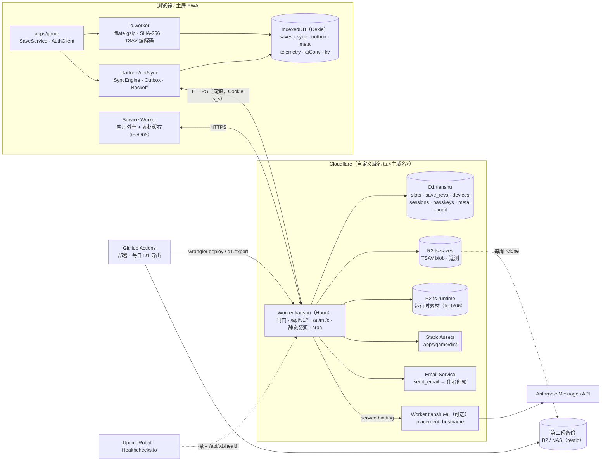
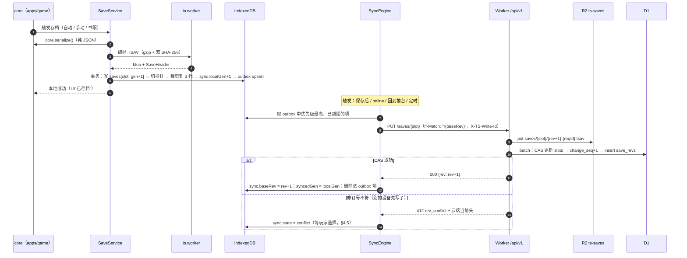

# tech/08 · 后端与在线服务

| 项 | 内容 |
|---|---|
| 文档 | `docs/tech/08-backend-and-online.md` |
| 版本 | v1.0（2026-09-25）。库版本、平台限额、云服务与模型价格均于 2026-09-25 联网核实，来源见文末"参考资料"；无法核实处标"（待核实）"，需真机/真账号验证处标"（待实测）" |
| 上游基准 | `docs/00-canon.md` §0（"Online" = 随时随地在浏览器中继续同一份存档；非商业、**不公开分发**）、§8（确定性战斗）、§18（文档归属）、§19（存档：IndexedDB 本地优先 + 云端同步；后端：轻量 Serverless，国内/海外两套部署方案） |
| 强依赖 | `tech/01`（monorepo、`services/api`、`packages/platform`、存档时机 §6.9、确定性 §8.3、CI §7.6）；`tech/06`（同一 Worker 托管应用 + API + 素材闸门、会话 Cookie `ts_s` 由本文签发、国内镜像）；`design/13` §9（存档槽、回档规则、`MetaProfile` 合并规则）；`design/02` §4.5（书眠永久存档）；`tech/05`（战斗开局快照与状态哈希，撰写中）；`tech/04`（书界包 `contentHash` 与 ID 重映射，撰写中） |
| 下游 | `tech/09` 路线图；`design/14`（同步状态、冲突、登录界面的视觉细节）；`design/12`（NPC 好感刻度、AI 人设卡字段） |
| 读者 | 作者本人（单人开发）＋ AI 编码助手 |
| 本文职责 | 在线服务的需求边界；本地优先架构；REST API；存档容器、校验与迁移；同步与冲突；认证、会话与私有托管（含 tech/06 素材闸门的会话格式与免检路径）；部署选型与成本；可选的 AI NPC 代理与离线 AI 内容生产；可选的战斗遥测；远程配置；运维；服务端目录与关键代码 |

> **结论先行（TL;DR）**
>
> 1. **维持基准 §19，无致命问题**：本地 IndexedDB 是权威副本，云端只做备份与跨设备同步。后端是**一个 Cloudflare Worker（Hono）**——与 tech/06 的应用托管、素材闸门是同一个 Worker、同一个会话 Cookie——外加 **D1（元数据）+ R2（存档 blob）**。个人用量下 Cloudflare 免费版即可，月费约 **$0**（启用 AI NPC 时建议升 Workers Paid，$5/月）。
> 2. **服务端不懂游戏规则**：存档对服务端是不透明 blob，服务端只读容器外壳的明文头；不做权威校验、不做反作弊（作弊只标 `debugTainted`）。
> 3. **存档容器 `TSAV v1`**：魔数 + 明文头 JSON + gzip 负载，双 SHA-256（负载原文 / 压缩体）；`saveSchema` 整数版本 + 迁移函数链，**懒迁移、原件保留**。估算单档原文 0.4–3 MB、压缩后 60–500 KB；服务端硬上限 8 MB。
> 4. **同步 = 整快照 + 服务端修订号 CAS（`If-Match`）**，不做 CRDT 合并（两条平行时间线的游戏状态没有语义上的"合并"）。**自动存档按设备分命名空间**，永不冲突；具名槽冲突时让玩家选，**落选版本自动进历史 30 天**，任何路径都不丢档。
> 5. **认证分两步走**：MVP 用"**主配对密钥 + 临时配对码** → HttpOnly 会话 Cookie `ts_s`（30 天滚动）"；Phase 3 加 **Passkey 为主、邮箱验证码为恢复**（发往作者已验证的邮箱，Cloudflare 免费）。**不用魔法链接**：iOS 主屏 PWA 与 Safari 不共享 Cookie，点邮件里的链接会登录到 Safari 而不是游戏里。
> 6. **部署决策矩阵结论**：方案 A（Cloudflare）加权 92 分，远高于国内函数计算（约 60 分，需 ICP 备案且无法使用 Claude）和轻量服务器（约 60–65 分，运维最重）。后两者保留为备选：服务端代码用 Hono + 存储适配器，可原样跑在 Node 上。
> 7. **中国大陆访问 Cloudflare 不稳，对本架构影响有限**：游戏离线可玩，云同步是异步后台任务，慢一点只是晚几分钟备份到云端。
> 8. **AI NPC 自由对话（可选，默认关闭）**：独立的 AI Worker（placement 靠近上游 API）；`claude-opus-5`、`effort: "low"`、流式输出；人设卡 + 按幕截止的原著知识 + 分层提示缓存；AI 只能**提出**好感/旗标变化，由 core 规则校验、封顶后生效；会话分段而不删改历史；失败时回退到预写台词。**Anthropic 支持地区不含中国大陆、香港、澳门**：作者常驻上述地区时不得启用这条路线（不借代理规避地区限制），改为关闭，或另选当地可合规使用的模型服务。
> 9. **已默认开启服务端回退**：AI 请求带 `fallbacks: "default"`（beta `server-side-fallback-2026-07-01`），安全分类器拒答时由服务端改用推荐模型重跑。不想要可在配置里关掉。
> 10. **离线 AI 辅助内容生产**：Batches API（五折）+ Zod 结构化输出 → 草稿区 → `content:validate` → 人工审核 → 入库。全项目文本起草估算不超过 $150。
> 11. **遥测（可选）**：战斗日志 = 开局快照 + 命令序列 + 终局哈希（可离线重放，与 tech/05 对接），以 NDJSON.gz 存入 R2，用 DuckDB 分析；只采作者本人数据。
> 12. **运维（个人级）**：D1 Time Travel（免费版 7 天）+ 每日导出加密备份 + R2 每周同步到第二家存储；UptimeRobot / Healthchecks.io 免费告警；玩家随时可导出完整存档（JSON / TSAV / ZIP）。

> **调研要点（均非致命，但改变了若干细节决策；来源见文末）**
>
> 1. **Workers 免费版每次调用只有 10 ms CPU**（付费版默认 30 s、最多 5 min）→ 服务端不解压存档、不做重计算，压缩与哈希都在客户端 `io.worker` 完成；AI 流式代理放到付费版。
> 2. **D1 单行 / BLOB 上限 2 MB**，免费版单库 500 MB、每日 500 万行读 / 10 万行写 → 存档 blob 放 R2，D1 只存头部与索引。
> 3. **D1 Time Travel 常开、不额外收费**（免费版 7 天、付费版 30 天），但还原是破坏性的原地覆盖 → 仍需每日逻辑导出。
> 4. **`@cloudflare/vitest-pool-workers@0.22.0` 的 peer 依赖是 `vitest ^4.1`**，与 tech/01 统一的 Vitest ^5.0.2 冲突 → `services/*` 单独锁 Vitest 4.x，或改用 wrangler 的 `getPlatformProxy()` 在 Node 中测（待决 #3）。
> 5. **Background Sync 只有 Chromium 支持**（Safari、Firefox、Android WebView 均不支持），**`fetch` 的 `keepalive` 请求体上限 64 KiB**（WHATWG Fetch 规范）→ 离线队列必须在应用层实现；关页那一刻上传不了存档，只能先落本地。
> 6. **iOS 主屏 Web App 与 Safari 不共享 Cookie 与存储** → 邮件魔法链接不可用 → 改用邮箱验证码。
> 7. **微信等 App 内置浏览器（iOS 上是 WKWebView）通常用不了 Passkey**（待实测）→ 保留配对码作为通用登录方式。
> 8. **Anthropic 支持地区**：列表里有台湾、日本、新加坡、韩国、美国等，**没有中国大陆、香港、澳门** → AI NPC 默认关闭，并设地区合规开关。
> 9. **Cloudflare Email Service**：发往账号内**已验证目的地址**的邮件在任何计划下都免费，且不计入发送配额 → 单用户邮箱验证码零成本；`send_email` 绑定可用 `destination_address` 锁死只发作者本人。
> 10. **Workers placement** 支持 `region`（如 `aws:us-east-1`）与 `hostname` 探测 → AI Worker 单独部署、靠近上游，主 Worker 仍在离玩家最近的节点服务素材。
> 11. **腾讯云 SCF 自 2022 年起有每月 ¥12.8 的最低消费套餐**（2026 年是否仍适用待核实）；阿里云 FC 3.0 只对新用户给 3 个月试用额度 → 国内 Serverless 对"几乎零调用"的个人项目并不比轻量服务器便宜，且都需要 ICP 备案。
> 12. **tech/01 §7.6 写的"Cloudflare Pages / GitHub Pages 部署静态站点"与"不公开分发"冲突**（公开可访问）→ 应用外壳一律走同一 Worker 的 Static Assets + 会话闸门（待决 #1，需同步修订 tech/01）。
>
> 结论：以上均不构成对基准 §19 的致命冲击，正文按基线展开。

---

## 目录

- [0. 摘要与关键决策](#0-摘要与关键决策)
- [1. 需求边界与设计原则](#1-需求边界与设计原则)
- [2. 总体架构](#2-总体架构)
- [3. 存档格式](#3-存档格式)
- [4. 同步与冲突](#4-同步与冲突)
- [5. 认证、会话与安全](#5-认证会话与安全)
- [6. API 设计](#6-api-设计)
- [7. 数据模型（D1 + R2）](#7-数据模型d1--r2)
- [8. 部署方案对比](#8-部署方案对比)
- [9. AI NPC 自由对话（可选）](#9-ai-npc-自由对话可选)
- [10. 战斗日志与数值遥测（可选）](#10-战斗日志与数值遥测可选)
- [11. 远程配置与版本通知](#11-远程配置与版本通知)
- [12. 运维](#12-运维)
- [13. 服务端目录结构与关键代码](#13-服务端目录结构与关键代码)
- [14. MVP 与演进路径](#14-mvp-与演进路径)
- [15. 风险与备选方案](#15-风险与备选方案)
- [参考资料](#参考资料)
- [本文新增术语/约定](#本文新增术语约定)
- [待决事项 / 依赖](#待决事项--依赖)

---

## 0. 摘要与关键决策

| # | 决策点 | 结论 | 理由 / 章节 |
|---|---|---|---|
| D1 | 权威副本 | 本地 IndexedDB 为权威；云端是备份 + 跨设备中转 | 基准 §19；离线可玩；§2 |
| D2 | 后端形态 | 单个 Cloudflare Worker（Hono），同时承担应用托管、会话闸门、素材代理（tech/06）、API、定时任务 | 同源、零 CORS、单一鉴权点；§2.2 |
| D3 | 元数据 / blob 存储 | D1 存槽位头、修订、设备、会话；R2 桶 `ts-saves` 存 TSAV blob | D1 行上限 2 MB；§7 |
| D4 | 服务端职责 | 不含游戏规则、不解压存档、不做权威校验；只做鉴权、CAS、存取、配额 | Workers 免费版 10 ms CPU；§2.4 |
| D5 | 存档容器 | `TSAV v1`：魔数 + 明文头 + gzip 负载；双 SHA-256 | 服务端免解压读头；§3.3 |
| D6 | 版本与迁移 | `saveSchema` 整数；`migrations[n]` 纯函数链；读档时内存中懒迁移，槽内原件在下次保存前不改 | 迁移失败可回退；§3.5 |
| D7 | 同步模型 | 整快照 + 服务端修订号 `rev` 的 CAS（`If-Match: "r<rev>"`） | 语义清晰；§4.1 |
| D8 | 冲突策略 | 自动存档按设备分命名空间（`save_auto_1@dev_xxx`），不会冲突；具名槽冲突由玩家选；落选版本入历史 ≥ 30 天 | 不丢档；§4.5 |
| D9 | 离线队列 | Dexie `outbox` 表，按槽合并、分优先级、指数退避加抖动；不依赖 Background Sync | Safari 不支持；§4.6 |
| D10 | 快照保留 | 手动 / 快存：最近 10 版 + 30 天内每天 1 版；自动：最近 3 版 + 7 天内每天 1 版；书眠 / 苏醒 / 终局 / 通关：永久 | §3.10 |
| D11 | 账号级数据 | `MetaProfile` 走 `POST /meta/merge`：集合取并集、计数取最大、轮回点重算（design/13 §9.4） | 无冲突；§3.11 |
| D12 | 认证（MVP） | 主配对密钥（128 bit，只存哈希）+ 临时配对码（8 位、5 分钟）→ 会话 Cookie | 最简单，且兼容微信内置浏览器；§5.2 |
| D13 | 认证（Phase 3） | Passkey（WebAuthn）为主，邮箱验证码为恢复 | 防钓鱼、跨设备同步；§5.2 |
| D14 | 会话 | `ts_s=<payload>.<sig>`，HMAC-SHA256，HttpOnly、Secure、SameSite=Lax，30 天滚动；API 写操作另查 D1 撤销表 | 与 tech/06 §7.2 格式一致；§5.4 |
| D15 | API 风格 | REST，前缀 `/api/v1`；RFC 9457 错误体；ETag = 修订号；写操作强制带条件请求头 | §6 |
| D16 | 部署 | 默认方案 A（Cloudflare）；备选 B（阿里云 FC + OSS + 表格存储，需 ICP）、C（轻量服务器 + SQLite + Litestream） | 决策矩阵；§8 |
| D17 | 可移植性 | `SaveRepo` / `BlobStore` / `Mailer` / `RateLimiter` 四个接口；Hono 同一套路由在 Workers 与 Node 上都能跑 | §8.7 |
| D18 | AI NPC | 默认关闭；独立 Worker；`claude-opus-5` + `effort: "low"` + 流式 + `fallbacks: "default"`；可选闲聊轻量路由 `claude-haiku-4-5` | §9 |
| D19 | AI 效果 | 只以工具调用 `propose_effects` 提出建议；core 按白名单与封顶校验后以命令落地（可录像重放） | 不破坏确定性与平衡；§9.7 |
| D20 | AI 成本 | 分层提示缓存 + 会话分段 + 日 / 月美元上限（默认 $0.8 / $10）+ Console 花费上限兜底 | §9.9 |
| D21 | 离线内容 AI | `tools/content-ai`（TS）+ Batches API + Zod 结构化输出 → 草稿区 → 人工审核 | §9.13 |
| D22 | 遥测 | 可选；战斗摘要全量、可重放日志抽样；NDJSON.gz → R2 → DuckDB | §10 |
| D23 | 备份 | D1 Time Travel + 每日加密导出（GitHub Actions）+ R2 周同步第二家 + 季度恢复演练 | §12.2 |
| D24 | 私有托管 | 除登录页、健康检查、PWA 清单与图标外，全部路径走会话闸门；关闭 `workers.dev` 与预览 URL；全站 `noindex` | 基准 §0；§5.9 |

---

## 1. 需求边界与设计原则

### 1.1 "Online"的定义

基准 §0 对"Online"的定义只有一句话：**随时随地在浏览器中继续同一份存档**。落到工程上是三件事：

1. **私有托管**：应用与素材放在只有作者能打开的地方（基准 §0"不公开分发"；tech/06 §9.2 的 L1 会话闸门；tech/07 §9.1 的法律合规要求）。
2. **云存档**：任何一台设备上的进度，都能在另一台设备上接着玩。
3. **弱依赖**：断网时游戏照常运行；网络只影响"多久之后备份到云端"，不影响"能不能玩"。

凡是不服务于这三件事的"在线功能"都是可选项。

### 1.2 必须 / 可选 / 不做

| 级别 | # | 功能 | 说明 | 阶段（tech/01 §11） |
|---|---|---|---|---|
| **必须** | M1 | 私有托管 | 应用外壳、书界包、素材都走会话闸门；登录页只有登录功能，不含任何 IP 内容 | Phase 1（真机外网试玩即需要） |
| | M2 | 账号与设备 | 单用户；多设备登录；设备列表、改名、撤销 | Phase 1（配对）→ Phase 3（Passkey） |
| | M3 | 云存档同步 | 具名槽、按设备分区的自动存档、书眠 / 苏醒永久档、`MetaProfile`；冲突检测与选择；离线队列与弱网重试 | Phase 2 |
| | M4 | 快照历史与恢复 | 每槽多版本，一键回到某一版；冲突落选版本自动入历史 | Phase 2 |
| | M5 | 数据导出 / 导入 | 本地：单档 JSON / TSAV、全部 ZIP；云端：一键下载全部 | Phase 1（本地）/ Phase 2（云端） |
| | M6 | 备份与恢复演练 | D1、R2 两类数据分别备份；季度演练 | Phase 2 |
| | M7 | 健康检查与基础监控 | 存活探测、备份任务心跳、错误日志 | Phase 2 |
| **可选** | O1 | AI NPC 自由对话代理 | 默认关闭；受地区合规开关约束（§9.0） | Phase 4+ |
| | O2 | 战斗日志 / 数值遥测 | 可重放战斗日志、平衡分析脚本 | Phase 3 |
| | O3 | 远程配置 / 版本通知 / 功能开关 | 最低客户端版本、功能开关、公告 | Phase 2（约 50 行） |
| | O4 | 离线 AI 内容生产 | 批量起草支线、人设卡、闲谈台词，人工审核后入库 | Phase 3（内容量产期） |
| | O5 | 客户端错误上报 | 限流、采样，写入 D1；不引入第三方 SDK | Phase 2 |
| **不做** | N1 | 多人联机、实时同步、观战 | 单人游戏（基准 §0） | — |
| | N2 | 排行榜、社交、公开分享 | 与"不公开分发"冲突 | — |
| | N3 | 支付、内购、广告 | 非商业 | — |
| | N4 | 公开注册、第三方 OAuth（微信 / QQ / Google） | 单用户，没有必要，还会扩大攻击面 | — |
| | N5 | 服务器权威、反作弊 | 单机自娱；作弊只标 `debugTainted`（tech/01 §7.3） | — |
| | N6 | WebSocket 实时推送 | 轮询足够（多设备不会同时玩） | — |
| | N7 | 游戏状态的 CRDT 合并 | 语义不成立，见 §4.1 | — |

### 1.3 非功能目标（个人级）

| 维度 | 目标 | 说明 |
|---|---|---|
| RPO（最多丢多少进度） | 本地 0（每次存档先落盘）；云端：在线时自动存档 ≤ 5 分钟、手动 / 书眠档 ≤ 30 秒 | §3.8 的上传优先级 |
| RTO（新设备多久能继续玩） | 登录后 ≤ 1 分钟（下载当前档 + 必要的书界包） | 书界包下载时间归 tech/06 |
| 可用性 | 不设 SLA；后端宕机时游戏照常离线运行，恢复后自动补传 | 本地优先的直接收益 |
| 接口延迟 | 海外 p95 < 500 ms；中国大陆不承诺（视线路而定） | 同步在后台进行，不阻塞游戏 |
| 上传大小 | 典型 60–250 KB，硬上限 8 MB | §3.7 |
| 成本 | 不含 AI 时 ≤ $5/月（默认 $0）；AI 硬上限默认 $10/月 | §8.3、§9.9 |
| 数据安全 | 全链路 TLS；平台静态加密；存档、密钥、日志都不出作者的账号 | §5 |
| 隐私 | 不接第三方分析 SDK；日志里不记录存档内容与对话原文 | §12.1 |

### 1.4 上下游接口

| 接口 | 提供方 → 使用方 | 内容 | 本文章节 |
|---|---|---|---|
| `GameState` 形状、`core.serialize()` / `load()`、`meta.saveSchema` / `contentHash` / `debugTainted` | tech/01 §3.6 → 本文 | 存档负载 | §3.1 |
| `migrateSave()` 挂载点 | tech/01 §4.3（`@tianshu/core` 导出）→ 本文定义迁移链约定 | 迁移 | §3.5 |
| 自动存档触发与"先写新记录再切指针" | tech/01 §6.9 → 本文补充云端优先级 | 存档时机 | §3.8 |
| 存档槽与回档规则、`MetaProfile` | design/13 §9 → 本文实现云端键、同步与合并 | 槽位 | §3.9、§3.11 |
| 书眠永久档优先上传 | design/02 §4.5 → 本文 P0 优先级 | 上传顺序 | §3.8 |
| 会话 Cookie `ts_s` 的签发、格式与校验函数 | 本文 → tech/06 §7.2（素材闸门） | 鉴权 | §5.4 |
| 登录页与免检路径、`noindex`、应用入口缓存头 | 本文 → tech/06 §7.2、§8.1 | 私有托管 | §5.9 |
| `GET /api/v1/asset-sign`（可选 L2 签名 URL） | 本文 → tech/06 §9.4 | 素材签名 | §6.2 |
| 战斗开局快照、命令、状态哈希 | tech/05 → 本文（遥测） | 可重放日志 | §10.2 |
| 书界包 `contentHash`、ID 重映射表 | tech/04 → 本文（迁移后修复引用） | 内容版本 | §3.6 |
| NPC 好感刻度、人设卡字段、预写闲谈台词 | design/12 / chapters ↔ 本文 | AI NPC | §9.5 |

### 1.5 设计原则

1. **本地优先，云端为镜**：所有写操作先落本地，再异步上云；读档默认读本地，云端更新时提示。
2. **服务端"哑"而可靠**：不懂规则，只做鉴权、条件写、存取、配额；少即是稳。
3. **永不静默丢档**：覆盖前留快照；冲突落选版本入历史；删除是墓碑（软删）；GC 只删过了保留期的历史版本，且从不删任何槽的当前版本。
4. **条件请求优先**：所有写操作必须带 `If-Match` / `If-None-Match`，否则返回 428；依靠修订号，不依靠墙钟。
5. **默认私有、成本封顶**：没有公开可读的路径；按量计费的环节都有上限（Workers 免费版天然封顶；AI 有日 / 月上限）。
6. **可移植**：存储、邮件、限流藏在接口后面；换云厂商只换适配器。
7. **可观测但克制**：结构化日志 + 审计表；不采集、不上传任何非作者本人的数据。
8. **一条命令自检**：`pnpm --filter @tianshu/api check`（类型、单测、迁移 SQL 语法、wrangler 配置校验）并入根目录 `pnpm check`。

---

## 2. 总体架构

### 2.1 架构图



### 2.2 路由总表（主 Worker `tianshu`）

> 与 tech/06 §7.2 的约定一致：Static Assets 设 `run_worker_first: true`，**所有请求先进 Worker**，由 Worker 决定放行、鉴权或转发。

| 路径 | 方法 | 鉴权 | 处理 | 缓存头 |
|---|---|---|---|---|
| `/login`、`/login/*` | GET | 免检 | 登录页（独立的极小 HTML/JS，不含游戏素材与 IP 内容） | `no-cache` |
| `/manifest.webmanifest`、`/icons/*` | GET | 免检 | PWA 清单与中性图标（见 §5.9） | 清单 `no-cache`；图标 `max-age=86400` |
| `/robots.txt` | GET | 免检 | `User-agent: *` / `Disallow: /` | `max-age=86400` |
| `/api/v1/health` | GET | 免检 | 存活探测（不含敏感信息） | `no-store` |
| `/api/v1/auth/*` | POST | 免检（自身限流） | 配对、Passkey、邮箱验证码、登出 | `no-store` |
| `/api/v1/*`（其余） | 各种 | 会话 + 写操作查撤销表 | 存档、快照、Meta、设备、配置、遥测、AI | `no-store`（下载接口用 ETag） |
| `/a/*`、`/m/*`、`/c/*` | GET/HEAD | 会话 | R2 `ts-runtime`（tech/06 §7.2 `serveRuntime`） | tech/06 §8.1 |
| `/`、`/index.html` | GET | 会话；无会话时 302 → `/login?next=…` | 应用入口 | `no-cache` |
| `/sw.js` | GET | 会话 | Service Worker 脚本 | `no-cache` |
| `/assets/*`、`/basis/*` | GET | 会话 | Vite 哈希产物、Basis 转码器 | `private, max-age=31536000, immutable` |
| 其他 | GET | 会话 | SPA 回退到 `index.html`（`not_found_handling`） | `no-cache` |

补充约定：

- 主 Worker 配置 `"workers_dev": false`、`"preview_urls": false`：不暴露 `*.workers.dev` 与预览地址（否则等于多开了一个公开入口；且 `*.workers.dev` 在大陆 DNS 被污染，tech/06 调研要点 5）。
- 应用外壳原本在 tech/06 §8.1 写作 `public, max-age=31536000, immutable`；由于经过会话闸门，本文统一改为 `private`，禁止中间代理共享缓存（与 tech/06 对 `/a/*` 的处理一致）。

### 2.3 数据流：写、读、同步



读档与"继续游戏"流程见 §4.9；新设备恢复见 §4.11。

### 2.4 为什么不做"服务器权威"和"状态合并"

| 选项 | 为什么不选 |
|---|---|
| 服务器权威（服务端跑 core、校验每一步） | 单人自娱没有作弊的受害者；服务端要常驻计算、成本高；离线就没法玩，违背 §1.1 第 3 条 |
| 服务端重放校验存档（利用确定性引擎） | 同上；重放整局需要完整命令日志，体积与算力都不划算。确定性只用于**战斗遥测的离线分析**（§10） |
| 对 `GameState` 做 CRDT / 字段级三方合并 | 两台设备各玩了一段，是两条**平行时间线**：A 在聚贤庄赢了，B 在杏子林输了，"合并"出来的状态在叙事和规则上都不成立。正确做法是"让玩家选一条，另一条留档" |
| 只做"手动上传 / 下载"按钮 | 最简单，但换设备时容易忘；多设备一定会出现"用旧档覆盖新档"的事故 |

### 2.5 部署拓扑

```text
ts.<主域名>（Cloudflare DNS，橙云，自定义域名绑定主 Worker）
 │
 ├─ Worker "tianshu"（默认放置：离请求最近的节点）
 │    ├─ Static Assets：apps/game/dist（tech/06：run_worker_first）
 │    ├─ D1 "tianshu"（建库时 location hint 选离作者最近的区域，如 apac）
 │    ├─ R2 "ts-saves"（新建；存档与遥测，私有）
 │    ├─ R2 "ts-runtime"（tech/06：运行时素材，私有）
 │    ├─ send_email "MAIL"（destination_address = 作者邮箱）
 │    ├─ ratelimits "RL_AUTH" / "RL_API"（10 s 或 60 s 窗口）
 │    ├─ service binding "AI" → Worker "tianshu-ai"（可选）
 │    └─ cron：每日 GC / 每周摘要邮件
 │
 └─ Worker "tianshu-ai"（可选；不绑定任何路由，只能经 service binding 调用）
      ├─ placement: { hostname: "api.anthropic.com" }（靠近上游，降低首 token 时延；待实测）
      ├─ D1 "tianshu"（同一个库：ai_usage_daily 计费与配额）
      └─ secret ANTHROPIC_API_KEY
```

为什么把 AI 拆成独立 Worker：placement 作用于整个 Worker。若主 Worker 也放到美东，素材流（`/a/*` 经 Worker 转发 R2）就会绕道美东，对亚洲的作者明显变慢；拆开后两边各自最优。拆开的另一个好处是 Anthropic SDK 不进主 Worker 包体，AI 可以独立开关、独立部署。

---

## 3. 存档格式

### 3.1 分层

```text
GameState（tech/01 §3.6，纯 JSON 可序列化；core.serialize() 产出）
   │  JSON.stringify → UTF-8 字节（"负载原文"，payload）
   │  gzip（fflate，level 6，io.worker）→ "压缩体"（body）
   ▼
TSAV 容器 = 魔数 + 容器版本 + 明文 SaveHeader（JSON）+ body
   │
   ├─ 本地：IndexedDB saves 表的一行（blob + header 副本 + gen）
   ├─ 云端：R2 对象 saves/<slotKey>/<rev>-<reqId>.tsav ＋ D1 slots / save_revs 行（header_json）
   └─ 导出：.tsav 文件（同一格式）或 .json（明文 GameState + header，§3.12）
```

原则：**头部是描述信息，负载是事实**。头部由客户端生成，用于列表展示与冲突对比；服务端权威字段（`rev`、上传时间、上传设备）不写进容器，而是放在 HTTP 响应头与 D1 里——因此"恢复历史版本"可以直接复制 blob，不必改写容器。

### 3.2 `SaveHeader`

```ts
// packages/data/src/save/header.ts —— 客户端与服务端共用（服务端用完整 Zod 校验，客户端用 zod/mini）
export interface SaveHeader {
  format: 'tianshu-save';
  slotId: SlotId;               // design/13 §9.1 的槽 ID，如 'save_manual_03'、'save_auto_2'、'save_booksleep_ch01'
  saveSchema: number;           // = GameState.meta.saveSchema
  contentHash: string;          // = GameState.meta.contentHash（书界包哈希，tech/04）
  appBuild: string;             // 构建 ID：YYYYMMDD-HHMM-<短提交号>（tech/06 §8.4 同格式）
  savedAt: string;              // ISO 8601，设备墙钟——只用于展示，从不用于排序或冲突判定
  deviceId: DeviceId;           // 'dev_' + ULID，由服务端在配对时签发（§5.5）
  baseRev: number;              // 本份存档基于的云端修订号；0 = 云端从未有过
  lineageId: string;            // 'ln_' + ULID：新游戏时生成，同一周目的所有存档共享
  zhoumu: number;               // 周目（design/13 §6，"第 k 读"）
  summary: {                    // 读档界面与冲突卡片直接用（design/13 §9.1"存档头"字段）
    chapterId: ChapterId; act: number; regionId: RegionId; locationName: string;
    lr: number; ld: number;     // 真实等级 / 显示等级（design/13 §2.1）
    yuyun: number;              // 修为余韵
    tianshuCount: number; fateCount: number;
    difficulty: 'diff_jianghu' | 'diff_xiake' | 'diff_zongshi' | 'diff_tianjie';
    tianjieLevel?: number;      // 天劫第 n 重
    rules: string[];            // 规则开关，如 ['rule_yiming']
    playTimeSec: number; rollbackCount: number; debugTainted: boolean;
    partyNames: string[];       // 最多 6 个
    thumbnail?: string;         // 可选：data:image/webp;base64,…（≤ 12 KB，读档界面缩略图）
  };
  sizes: { raw: number; gz: number };
  payloadSha256: string;        // 负载原文（解压后 JSON 字节）的 SHA-256，十六进制
  bodySha256: string;           // 压缩体字节的 SHA-256；服务端只校验这一个（不解压）
  origin?: 'play' | 'import' | 'restore' | 'migration';
}
```

### 3.3 `TSAV v1` 二进制布局

| 偏移 | 长度 | 字段 | 说明 |
|---|---|---|---|
| 0 | 4 | magic | ASCII `TSAV`（`54 53 41 56`） |
| 4 | 1 | containerVersion | `1` |
| 5 | 1 | flags | bit0 = 负载经 gzip（v1 恒为 1）；bit1 = 负载加密（保留，v1 恒为 0） |
| 6 | 2 | reserved | `0` |
| 8 | 4 | headerLength | uint32 小端；上限 64 KiB |
| 12 | N | header | UTF-8 JSON，即 `SaveHeader` |
| 12 + N | … | body | gzip（RFC 1952）压缩后的负载原文 |

为什么选 gzip 而不是裸 deflate：gzip 自带 CRC32 与原文长度字段，截断或损坏会在解压时直接暴露；而且可以被浏览器 `DecompressionStream('gzip')`、Workers 运行时与命令行 `gunzip` 直接处理，排查问题方便。

```ts
// packages/data/src/save/container.ts —— 纯函数，无 DOM 依赖；io.worker、服务端、tools 共用
const MAGIC = 0x56415354;                 // 'TSAV' 按小端读出的 uint32
const MAX_HEADER = 64 * 1024;

export function encodeTsav(header: SaveHeader, body: Uint8Array): Uint8Array {
  const h = new TextEncoder().encode(JSON.stringify(header));
  if (h.byteLength > MAX_HEADER) throw new Error('header too large');
  const out = new Uint8Array(12 + h.byteLength + body.byteLength);
  const dv = new DataView(out.buffer);
  dv.setUint32(0, MAGIC, true);
  out[4] = 1;                             // containerVersion
  out[5] = 0b01;                          // flags：gzip
  dv.setUint32(8, h.byteLength, true);
  out.set(h, 12);
  out.set(body, 12 + h.byteLength);
  return out;
}

export interface TsavParts { header: SaveHeader; headerRaw: string; body: Uint8Array }

/** 只解析外壳，不解压；服务端与列表页用 */
export function decodeTsav(buf: Uint8Array): TsavParts {
  if (buf.byteLength < 12) throw new TsavError('truncated');
  const dv = new DataView(buf.buffer, buf.byteOffset, buf.byteLength);
  if (dv.getUint32(0, true) !== MAGIC) throw new TsavError('bad_magic');
  if (buf[4] !== 1) throw new TsavError('unsupported_container');
  const n = dv.getUint32(8, true);
  if (n > MAX_HEADER || 12 + n > buf.byteLength) throw new TsavError('bad_header_length');
  const headerRaw = new TextDecoder('utf-8', { fatal: true }).decode(buf.subarray(12, 12 + n));
  return { header: JSON.parse(headerRaw) as SaveHeader, headerRaw, body: buf.subarray(12 + n) };
}

export class TsavError extends Error {}
```

```ts
// packages/platform/src/storage/save-codec.ts（在 io.worker 内运行；经 Comlink 暴露）
import { gzipSync, gunzipSync } from 'fflate';

export async function packSave(state: unknown, meta: Omit<SaveHeader, 'sizes' | 'payloadSha256' | 'bodySha256'>) {
  const raw = new TextEncoder().encode(JSON.stringify(state));
  const body = gzipSync(raw, { level: 6, mtime: 0 });  // mtime 置 0：同一状态产出同一字节，便于去重（待实测）
  const header: SaveHeader = {
    ...meta,
    sizes: { raw: raw.byteLength, gz: body.byteLength },
    payloadSha256: await sha256Hex(raw),
    bodySha256: await sha256Hex(body),
  };
  return { header, blob: encodeTsav(header, body) };
}

export async function unpackSave(blob: Uint8Array): Promise<{ header: SaveHeader; state: unknown }> {
  const { header, body } = decodeTsav(blob);
  if ((await sha256Hex(body)) !== header.bodySha256) throw new TsavError('body_checksum');
  const raw = gunzipSync(body);                        // gzip 自身的 CRC32 也会在这里把关
  if ((await sha256Hex(raw)) !== header.payloadSha256) throw new TsavError('payload_checksum');
  return { header, state: JSON.parse(new TextDecoder().decode(raw)) };
}

async function sha256Hex(b: Uint8Array): Promise<string> {
  const d = new Uint8Array(await crypto.subtle.digest('SHA-256', b));
  return Array.from(d, (x) => x.toString(16).padStart(2, '0')).join('');
}
```

### 3.4 压缩与哈希的成本

| 步骤 | 位置 | 预估耗时（1 MB 原文，中端手机） | 备注 |
|---|---|---|---|
| `JSON.stringify` | 主线程（core 所在线程） | 5–15 ms | 若 core 在主线程，序列化后把字节 `transfer` 给 io.worker |
| gzip level 6 | io.worker | 20–60 ms | fflate；不阻塞主线程（待实测） |
| SHA-256 ×2 | io.worker | < 5 ms | WebCrypto 原生实现 |
| IndexedDB 写入 | io.worker / 主线程 | 5–30 ms | Blob 存储；iOS Safari 偏慢（待实测） |
| 服务端 | Worker | < 1 ms CPU | 只解析外壳 + 压缩体一次 SHA-256，不解压 |

浏览器原生 `CompressionStream('gzip')`（Safari 16.4+、Chrome 80+）可以替代 fflate 的 gzip；但导出 ZIP 仍需要 fflate（§3.12），所以统一用 fflate，原生 API 留作包体优化的备选。

### 3.5 schema 版本与迁移链

```ts
// packages/core/src/save/migrate.ts
export const SAVE_SCHEMA = 7;   // 每次改变 GameState 形状就 +1；只增不减

type AnyState = Record<string, unknown>;
type Migration = (s: AnyState, ctx: MigrationCtx) => AnyState;

/** migrations[n] 把 schema n 的状态变成 schema n+1；必须是纯函数（不读墙钟、不用随机数） */
const migrations: Record<number, Migration> = {
  1: (s) => ({ ...s, world: { ...(s.world as AnyState), gatesOpened: [] } }),
  // …
  6: (s) => renameField(s, ['party', 'gold'], ['party', 'wealth']),   // renameField 等小工具放 migrate-utils.ts（略）
};

export function migrateSave(state: AnyState, ctx: MigrationCtx): { state: AnyState; applied: number[] } {
  const from = (state.meta as { saveSchema: number }).saveSchema;
  if (from > SAVE_SCHEMA) throw new SaveTooNewError(from, SAVE_SCHEMA);   // 旧客户端不得打开新档：提示更新
  const applied: number[] = [];
  let s = JSON.parse(JSON.stringify(state)) as AnyState;   // core 无 DOM lib（tech/01 §3.3），不用 structuredClone；GameState 本就是纯 JSON
  for (let v = from; v < SAVE_SCHEMA; v++) {
    const m = migrations[v];
    if (!m) throw new MissingMigrationError(v);
    s = m(s, ctx);
    (s.meta as { saveSchema: number }).saveSchema = v + 1;
    applied.push(v);
  }
  return { state: s, applied };
}
```

| 规则 | 说明 | 强制方式 |
|---|---|---|
| 只增不减 | `SAVE_SCHEMA` 单调递增；已发布的 `migrations[n]` 不再修改（有 bug 就追加 `n+1` 修正） | 代码评审 + 夹具测试 |
| 夹具（fixture） | 每个发布过的 schema 至少保留一份真实存档：`packages/core/test/save-fixtures/v{n}/*.tsav` | CI：逐一迁移到最新 → `zod/mini` 结构校验 → `core.load()` → 跑一条冒烟命令 |
| 懒迁移 | 读档时在内存里迁移；槽内原件保持原样，直到玩家下一次保存才写入新版本（旧代仍保留 3 代） | 迁移失败时原件毫发无损 |
| 服务端不迁移 | 服务端只认 `saveSchema` 整数，不碰负载 | 服务端无 core 依赖（tech/01 §3.3） |
| 降级保护 | 客户端拒绝打开 `saveSchema > SAVE_SCHEMA` 的档（提示更新）；服务端拒绝用更低 schema 覆盖更高 schema 的当前版本（412 `schema_downgrade`，§6.4） | §4.3 |
| `debugTainted` 透传 | 迁移不得清除作弊标记 | 夹具断言 |

### 3.6 内容版本与 ID 重映射

书界包更新（tech/04）可能改名或删除武功、物品、任务 ID。迁移链只处理**结构**，内容引用的修复在迁移之后单独做：

```ts
// packages/core/src/save/fixup.ts
export function fixupContentRefs(s: GameState, reg: ContentRegistry): FixupReport {
  // 1) 按书界包里的 idRemaps（tech/04 定义：{ from: 'it_xxx', to: 'it_yyy', since: '<contentHash>' }）批量改名
  // 2) 找不到定义的引用：物品 → 按估值折成银两；武功 → 转为残篇记录（基准 §3-5）；任务 → 标记 obsolete
  // 3) 报告写入 dev 控制台与 audit（本地），UI 提示"内容更新后有 N 处调整"
}
```

`GameState.meta.contentHash` 在每次保存时更新为当前书界包的哈希；读档时若与当前包不同，就执行 `fixupContentRefs`。
