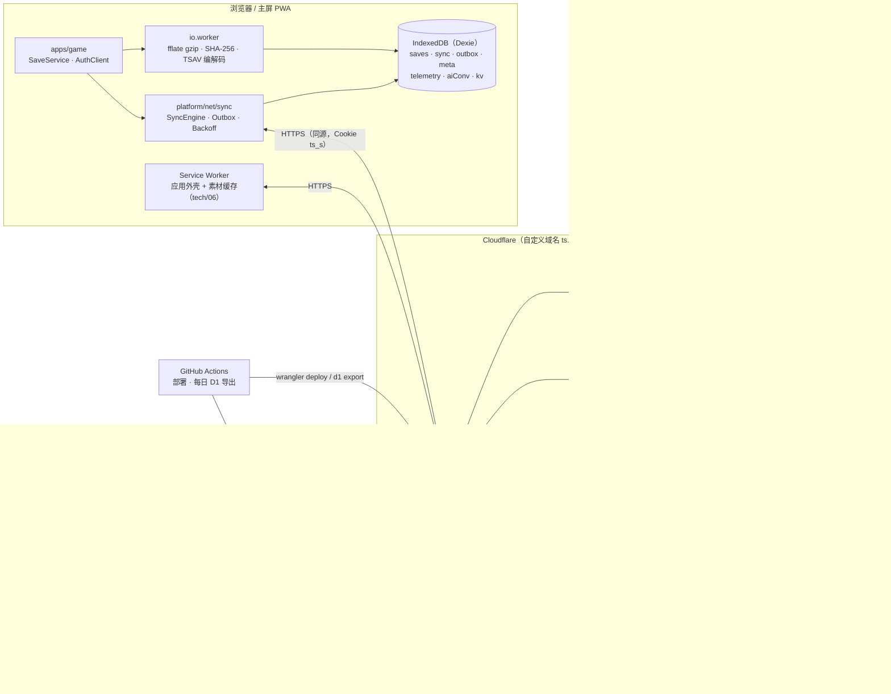
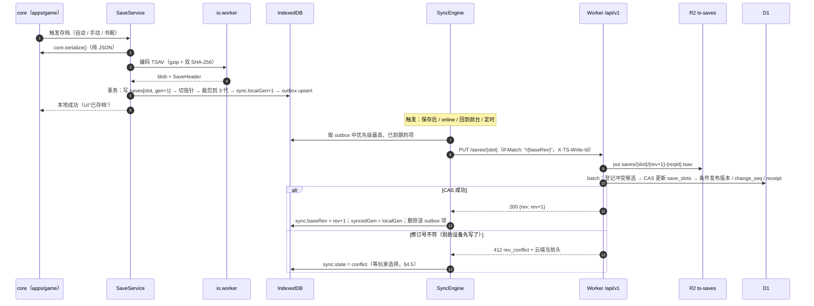
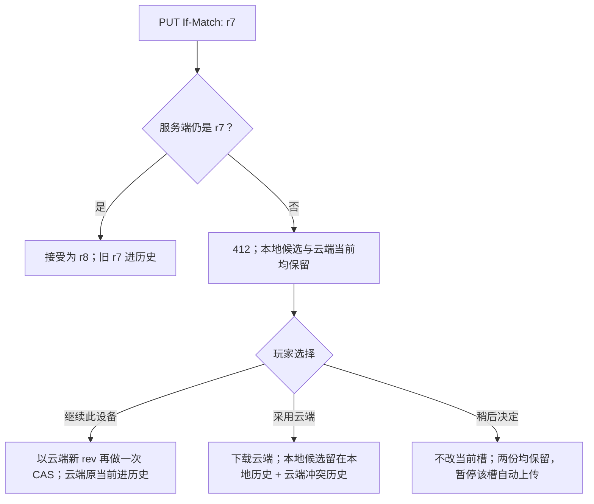
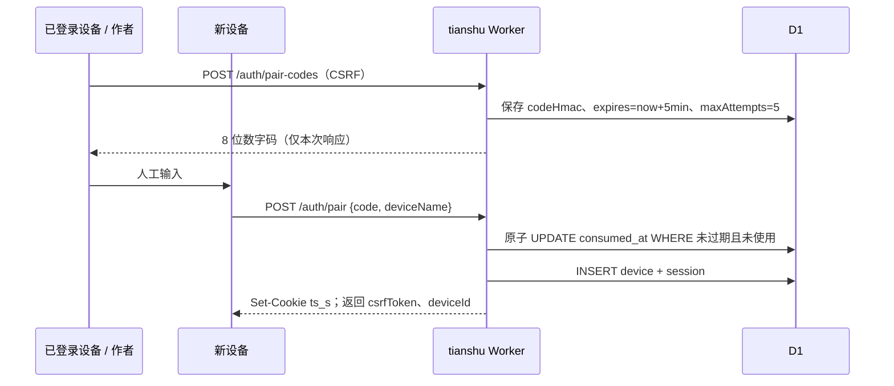
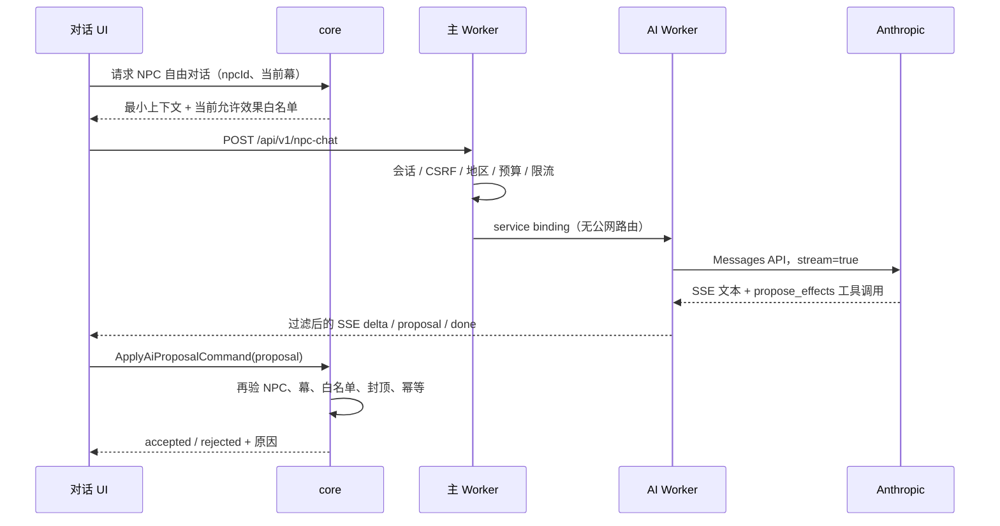

# tech/08 · 后端与在线服务

| 项 | 内容 |
|---|---|
| 文档 | `docs/tech/08-backend-and-online.md` |
| 版本 | v1.0（2026-09-26）；审校 B6b.R（2026-09-26）。库版本、平台限额、云服务与模型价格均于 2026-09-26 联网核实，来源见文末"参考资料"；无法核实处标"（待核实）"，需真机/真账号验证处标"（待实测）" |
| 作者决定覆盖 | `docs/decisions/author-decisions.md` P03：暂不备案，不做国内 / 香港镜像；当前只规划 Cloudflare 方案 |
| 上游基准 | `docs/00-canon.md` §0（"Online" = 随时随地在浏览器中继续同一份存档；非商业、**不公开分发**）、§8（确定性战斗）、§18（文档归属）、§19（存档：IndexedDB 本地优先 + 云端同步；后端：轻量 Serverless，国内/海外两套部署方案） |
| 强依赖 | `tech/01`（monorepo、`services/api`、`packages/platform`、存档时机 §6.9、确定性 §8.3、CI §7.6）；`tech/06`（同一 Worker 托管应用 + API + 素材闸门、会话 Cookie `ts_s` 由本文签发；其国内 / 香港镜像旧规划须按作者 P03 收口）；`design/13` §9（存档槽、回档规则、`MetaProfile` 合并规则）；`design/02` §4.5（书眠永久存档）；`tech/05`（战斗开局快照与状态哈希，撰写中）；`tech/04`（书界包 `contentHash` 与 ID 重映射，撰写中） |
| 下游 | `tech/09` 路线图；`design/14`（同步状态、冲突、登录界面的视觉细节）；`design/12`（NPC 好感刻度、AI 人设卡字段） |
| 读者 | 作者本人（单人开发）＋ AI 编码助手 |
| 本文职责 | 在线服务的需求边界；本地优先架构；REST API；存档容器、校验与迁移；同步与冲突；认证、会话与私有托管（含 tech/06 素材闸门的会话格式与免检路径）；部署选型与成本；可选的 AI NPC 代理与离线 AI 内容生产；可选的战斗遥测；远程配置；运维；服务端目录与关键代码 |

> **结论先行（TL;DR）**
>
> 1. **维持基准 §19 的本地优先 + 轻量 Serverless 方向，但部署地域按作者 P03 收口**：本地 IndexedDB 是权威副本，云端只做备份与跨设备同步。当前只实施**一个 Cloudflare Worker（Hono）**——与 tech/06 的应用托管、素材闸门是同一个 Worker、同一个会话 Cookie——外加 **D1（元数据）+ R2（存档 blob）**；不并行建设国内 / 香港镜像。个人用量下 Cloudflare 免费版即可，月费约 **$0**（启用 AI NPC 时建议升 Workers Paid，$5/月）。
> 2. **服务端不懂游戏规则**：存档对服务端是不透明 blob，服务端只读容器外壳的明文头；不做权威校验、不做反作弊（作弊只标 `debugTainted`）。
> 3. **存档容器 `TSAV v1`**：魔数 + 明文头 JSON + gzip 负载，双 SHA-256（负载原文 / 压缩体）；`saveSchema` 整数版本 + 迁移函数链，**懒迁移、原件保留**。估算单档原文 0.4–3 MiB、压缩后 60–500 KiB；服务端硬上限 8 MiB。
> 4. **同步 = 整快照 + 服务端修订号 CAS（`If-Match`）**，不做 CRDT 合并（两条平行时间线的游戏状态没有语义上的"合并"）。**自动存档按设备分命名空间**，不会发生设备间覆盖；具名槽冲突时让玩家选，**落选版本自动进历史 30 天**，任何路径都不丢档。
> 5. **认证分两步走**：MVP 用"**主配对密钥 + 临时配对码** → HttpOnly 会话 Cookie `ts_s`（30 天滚动）"；Phase 3 加 **Passkey 为主、邮箱验证码为恢复**（发往作者已验证的邮箱，Cloudflare 免费）。**不用魔法链接**：iOS 主屏 PWA 与 Safari 不共享 Cookie，点邮件里的链接会登录到 Safari 而不是游戏里。
> 6. **部署决策矩阵结论**：方案 A（Cloudflare）加权 92 分，高于国内函数计算（阿里云 FC / 腾讯云 SCF 均为 75 分；中国内地节点需 ICP 备案，且选定 AI 上游不支持当地使用）和轻量服务器（65–68 分，运维最重）。后两类保留为备选：服务端代码用 Hono + 存储适配器，可原样跑在 Node 上。
> 7. **中国大陆访问 Cloudflare 不稳，对本架构影响有限**：游戏离线可玩，云同步是异步后台任务，慢一点只是晚几分钟备份到云端。
> 8. **AI NPC 自由对话（可选，默认关闭）**：独立的 AI Worker（placement 靠近上游 API）；原评测基线为 `claude-opus-5` + `effort: "low"` + 流式输出，但该模型截至 2026-09-26 已被官方列为 **Legacy**，因此生产配置不设默认模型，启用前必须重新选型并重跑金标评测；人设卡 + 按幕截止的原著知识 + 分层提示缓存；AI 只能**提出**好感/旗标变化，由 core 规则校验、封顶后生效；会话分段而不删改历史；失败时回退到预写台词。**Anthropic 支持地区不含中国大陆、香港、澳门**：作者常驻上述地区时不得启用这条路线（不借代理规避地区限制），改为关闭，或另选当地可合规使用的模型服务。
> 9. **启用 AI 时默认请求服务端回退**：通过 §9.0 全部门槛后，请求带 `fallbacks: "default"`（beta `server-side-fallback-2026-07-01`），安全分类器拒答时由服务端改用推荐模型重跑；beta 撤回或语义变化则关闭。AI 功能本身仍默认关闭。
> 10. **离线 AI 辅助内容生产**：Batches API（五折）+ Zod 结构化输出 → 草稿区 → `content:validate` → 人工审核 → 入库。全项目文本起草估算不超过 $150。
> 11. **遥测（可选）**：战斗日志 = 开局快照 + 命令序列 + 终局哈希（可离线重放，与 tech/05 对接），以 NDJSON.gz 存入 R2，用 DuckDB 分析；只采作者本人数据。
> 12. **运维（个人级）**：D1 Time Travel（免费版 7 天）+ 每日导出加密备份 + R2 每周同步到第二家存储；UptimeRobot / Healthchecks.io 免费告警；玩家随时可导出完整存档（JSON / TSAV / ZIP）。

> **调研要点（均非致命，但改变了若干细节决策；来源见文末）**
>
> 1. **Workers 免费版每次调用只有 10 ms CPU**（付费版默认 30 s、最多 5 min）→ 服务端不解压存档、不做重计算，压缩与哈希都在客户端 `io.worker` 完成；AI 流式代理放到付费版。
> 2. **D1 单行 / BLOB 上限 2,000,000 bytes**，免费版单库 500 MB、每日 500 万行读 / 10 万行写 → 存档 blob 放 R2，D1 只存头部与索引。
> 3. **D1 Time Travel 常开、不额外收费**（免费版 7 天、付费版 30 天；精确到任一分钟），但还原是破坏性的原地覆盖 → 仍需每日逻辑导出。
> 4. **`@cloudflare/vitest-pool-workers@0.22.0` 的 peer 依赖是 `vitest ^4.1`**，与 tech/01 统一的 Vitest ^5.0.2 冲突 → `services/*` 单独锁 Vitest 4.x，或改用 wrangler 的 `getPlatformProxy()` 在 Node 中测（待决 #3）。
> 5. **Background Sync 只有 Chromium 支持**（Safari、Firefox、Android WebView 均不支持），**`fetch` 的 `keepalive` 请求体上限 64 KiB**（WHATWG Fetch 规范）→ 离线队列必须在应用层实现；关页那一刻上传不了存档，只能先落本地。
> 6. **iOS 主屏 Web App 与 Safari 不共享 Cookie 与存储** → 邮件魔法链接不可用 → 改用邮箱验证码。
> 7. **微信等 App 内置浏览器（iOS 上是 WKWebView）通常用不了 Passkey**（待实测）→ 保留配对码作为通用登录方式。
> 8. **Anthropic 支持地区**：列表里有台湾、日本、新加坡、韩国、美国等，**没有中国大陆、香港、澳门** → AI NPC 默认关闭，并设地区合规开关。
> 9. **Cloudflare Email Service**：发往账号内**已验证目的地址**的邮件在任何计划下都免费，且不计入发送配额 → 单用户邮箱验证码零成本；`send_email` 绑定可用 `destination_address` 锁死只发作者本人。
> 10. **Workers placement** 支持 `region`（如 `aws:us-east-1`）与 `host` 探测 → AI Worker 单独部署、靠近上游，主 Worker 仍在离玩家最近的节点服务素材。
> 11. **国内 Serverless 的旧价格口径已变化**：腾讯云当前官方页同时给出按量后付费与个人标准套餐（活动价 ¥9.9/月、页面列示价 ¥12.8），不能再写成"强制最低消费"；阿里云 FC 当前仍有首次开通试用额度，但额度与有效期须以开通页为准（待实测）→ 国内部署成本不再用旧免费额度推断，且中国内地节点仍需 ICP 备案。
> 12. **tech/01 §7.6 写的"Cloudflare Pages / GitHub Pages 部署静态站点"与"不公开分发"冲突**（公开可访问）→ 应用外壳一律走同一 Worker 的 Static Assets + 会话闸门（待决 #1，需同步修订 tech/01）。
>
> 结论：本地优先、云同步与轻量 Serverless 基线无需推翻；只有“国内 / 海外两套部署方案”已被更高优先级的作者决定 P03 覆盖，正文按“Cloudflare 单方案 + 可移植退出路径”展开，并在文末提出基准修订。

---

## 目录

- [0. 摘要与关键决策](#0-摘要与关键决策)
- [1. 需求边界与设计原则](#1-需求边界与设计原则)
- [2. 总体架构](#2-总体架构)
- [3. 存档格式](#3-存档格式)
- [4. 同步与冲突](#4-同步与冲突)
- [5. 认证、会话与安全](#5-认证会话与安全)
- [6. API 设计](#6-api-设计)
- [7. 数据模型（D1 + R2）](#7-数据模型d1--r2)
- [8. 部署方案对比](#8-部署方案对比)
- [9. AI NPC 自由对话（可选）](#9-ai-npc-自由对话可选)
- [10. 战斗日志与数值遥测（可选）](#10-战斗日志与数值遥测可选)
- [11. 远程配置与版本通知](#11-远程配置与版本通知)
- [12. 运维](#12-运维)
- [13. 服务端目录结构与关键代码](#13-服务端目录结构与关键代码)
- [14. MVP 与演进路径](#14-mvp-与演进路径)
- [15. 风险与备选方案](#15-风险与备选方案)
- [参考资料](#参考资料)
- [本文新增术语/约定](#本文新增术语约定)
- [待决事项 / 依赖](#待决事项--依赖)

---

## 0. 摘要与关键决策

| # | 决策点 | 结论 | 理由 / 章节 |
|---|---|---|---|
| D1 | 权威副本 | 本地 IndexedDB 为权威；云端是备份 + 跨设备中转 | 基准 §19；离线可玩；§2 |
| D2 | 后端形态 | 单个 Cloudflare Worker（Hono），同时承担应用托管、会话闸门、素材代理（tech/06）、API、定时任务 | 同源、零 CORS、单一鉴权点；§2.2 |
| D3 | 元数据 / blob 存储 | D1 存槽位头、修订、设备、会话；R2 桶 `ts-saves` 存 TSAV blob | D1 行上限 2,000,000 bytes；§7 |
| D4 | 服务端职责 | 不含游戏规则、不解压存档、不做权威校验；只做鉴权、CAS、存取、配额 | Workers 免费版 10 ms CPU；§2.4 |
| D5 | 存档容器 | `TSAV v1`：魔数 + 明文头 + gzip 负载；双 SHA-256 | 服务端免解压读头；§3.3 |
| D6 | 版本与迁移 | `saveSchema` 整数；`migrations[n]` 纯函数链；读档时内存中懒迁移，槽内原件在下次保存前不改 | 迁移失败可回退；§3.5 |
| D7 | 同步模型 | 整快照 + 服务端修订号 `rev` 的 CAS（`If-Match: "r<rev>"`） | 语义清晰；§4.1 |
| D8 | 冲突策略 | 自动存档按设备分命名空间（`save_auto_1@dev_xxx`），不会发生设备间覆盖；同设备并发仍走 CAS；具名槽冲突由玩家选；落选版本入历史 ≥ 30 天 | 不丢档；§4.5 |
| D9 | 离线队列 | Dexie `outbox` 表，按槽合并、分优先级、指数退避加抖动；不依赖 Background Sync | Safari 不支持；§4.6 |
| D10 | 快照保留 | 手动 / 快存：最近 10 版 + 30 天内每天 1 版；自动：最近 3 版 + 7 天内每天 1 版；书眠 / 苏醒 / 终局 / 通关：永久 | §4.8 |
| D11 | 账号级数据 | `MetaProfile` 走 `POST /meta/merge`：集合取并集、计数取最大、轮回点重算（design/13 §9.4） | 无冲突；§4.10 |
| D12 | 认证（MVP） | 主配对密钥（128 bit，只存哈希）+ 临时配对码（8 位、5 分钟）→ 会话 Cookie | 最简单，且兼容微信内置浏览器；§5.2 |
| D13 | 认证（Phase 3） | Passkey（WebAuthn）为主，邮箱验证码为恢复 | 防钓鱼、跨设备同步；§5.2 |
| D14 | 会话 | `ts_s=<payload>.<sig>`，HMAC-SHA256，HttpOnly、Secure、SameSite=Lax，30 天滚动；API 写操作另查 D1 撤销表 | 与 tech/06 §7.2 格式一致；§5.4 |
| D15 | API 风格 | REST，前缀 `/api/v1`；RFC 9457 错误体；ETag = 修订号；覆盖 / 删除存档与版本化设置强制带条件请求头，其余可重试写用幂等键 | §6 |
| D16 | 部署 | 只实施方案 A（Cloudflare）；国内函数计算与 Node + SQLite / S3 仅作迁移备选，不部署镜像 | 作者 P03；决策矩阵见 §8 |
| D17 | 可移植性 | `SaveRepo` / `BlobStore` / `Mailer` / `RateLimiter` 四个接口；Hono 同一套路由在 Workers 与 Node 上都能跑 | §8.7 |
| D18 | AI NPC | 默认关闭；独立 Worker；`claude-opus-5` 只保留为 Legacy 评测 / 费用基线，生产不设默认模型；启用前选定当前模型并复测 `effort: "low"`、流式与 `fallbacks: "default"`；可选轻量模型同样须过金标 | §9 |
| D19 | AI 效果 | 只以工具调用 `propose_effects` 提出建议；core 按白名单与封顶校验后以命令落地（可录像重放） | 不破坏确定性与平衡；§9.7 |
| D20 | AI 成本 | 分层提示缓存 + 会话分段 + 日 / 月美元上限（默认 $0.8 / $10）+ Console 花费上限兜底 | §9.9 |
| D21 | 离线内容 AI | `tools/content-ai`（TS）+ Batches API + Zod 结构化输出 → 草稿区 → 人工审核 | §9.13 |
| D22 | 遥测 | 可选；战斗摘要全量、可重放日志抽样；NDJSON.gz → R2 → DuckDB | §10 |
| D23 | 备份 | D1 Time Travel + 每日加密导出（GitHub Actions）+ R2 周同步第二家 + 季度恢复演练 | §12.2 |
| D24 | 私有托管 | 除登录页、健康检查、PWA 清单与图标外，全部路径走会话闸门；关闭 `workers.dev` 与预览 URL；全站 `noindex` | 基准 §0；§5.9 |

---

## 1. 需求边界与设计原则

### 1.1 "Online"的定义

基准 §0 对"Online"的定义只有一句话：**随时随地在浏览器中继续同一份存档**。落到工程上是三件事：

1. **私有托管**：应用与素材放在只有作者能打开的地方（基准 §0"不公开分发"；tech/06 §9.2 的 L1 会话闸门；tech/07 §9.1 的法律合规要求）。
2. **云存档**：任何一台设备上的进度，都能在另一台设备上接着玩。
3. **弱依赖**：断网时游戏照常运行；网络只影响"多久之后备份到云端"，不影响"能不能玩"。

凡是不服务于这三件事的"在线功能"都是可选项。

### 1.2 必须 / 可选 / 不做

| 级别 | # | 功能 | 说明 | 阶段（tech/01 §11） |
|---|---|---|---|---|
| **必须** | M1 | 私有托管 | 应用外壳、书界包、素材都走会话闸门；登录页只有登录功能，不含任何 IP 内容 | Phase 1（真机外网试玩即需要） |
| | M2 | 账号与设备 | 单用户；多设备登录；设备列表、改名、撤销 | Phase 1（配对）→ Phase 3（Passkey） |
| | M3 | 云存档同步 | 具名槽、按设备分区的自动存档、书眠 / 苏醒永久档、`MetaProfile`；冲突检测与选择；离线队列与弱网重试 | Phase 2 |
| | M4 | 快照历史与恢复 | 每槽多版本，一键回到某一版；冲突落选版本自动入历史 | Phase 2 |
| | M5 | 数据导出 / 导入 | 本地：单档 JSON / TSAV、全部 ZIP；云端：一键下载全部 | Phase 1（本地）/ Phase 2（云端） |
| | M6 | 备份与恢复演练 | D1、R2 两类数据分别备份；季度演练 | Phase 2 |
| | M7 | 健康检查与基础监控 | 存活探测、备份任务心跳、错误日志 | Phase 2 |
| **可选** | O1 | AI NPC 自由对话代理 | 默认关闭；受地区合规开关约束（§9.0） | Phase 4+ |
| | O2 | 战斗日志 / 数值遥测 | 可重放战斗日志、平衡分析脚本 | Phase 3 |
| | O3 | 远程配置 / 版本通知 / 功能开关 | 最低客户端版本、功能开关、公告 | Phase 2（约 50 行） |
| | O4 | 离线 AI 内容生产 | 批量起草支线、人设卡、闲谈台词，人工审核后入库 | Phase 3（内容量产期） |
| | O5 | 客户端错误上报 | 限流、采样，写入 D1；不引入第三方 SDK | Phase 2 |
| **不做** | N1 | 多人联机、实时同步、观战 | 单人游戏（基准 §0） | — |
| | N2 | 排行榜、社交、公开分享 | 与"不公开分发"冲突 | — |
| | N3 | 支付、内购、广告 | 非商业 | — |
| | N4 | 公开注册、第三方 OAuth（微信 / QQ / Google） | 单用户，没有必要，还会扩大攻击面 | — |
| | N5 | 服务器权威、反作弊 | 单机自娱；作弊只标 `debugTainted`（tech/01 §7.3） | — |
| | N6 | WebSocket 实时推送 | 轮询足够（多设备不会同时玩） | — |
| | N7 | 游戏状态的 CRDT 合并 | 语义不成立，见 §4.1 | — |

### 1.3 非功能目标（个人级）

| 维度 | 目标 | 说明 |
|---|---|---|
| RPO（最多丢多少进度） | 本地 0（每次存档先落盘）；云端：在线时自动存档 ≤ 5 分钟、手动 / 书眠档 ≤ 30 秒 | §4.7 的上传优先级 |
| RTO（新设备多久能继续玩） | 登录后 ≤ 1 分钟（下载当前档 + 必要的书界包） | 书界包下载时间归 tech/06 |
| 可用性 | 不设 SLA；后端宕机时游戏照常离线运行，恢复后自动补传 | 本地优先的直接收益 |
| 接口延迟 | 海外 p95 < 500 ms；中国大陆不承诺（视线路而定） | 同步在后台进行，不阻塞游戏 |
| 上传大小 | 常见 60–250 KiB，较大正常档估算可到 500 KiB；硬上限 8 MiB | §3.3、§4.3 |
| 成本 | 不含 AI 时 ≤ $5/月（默认 $0）；AI 硬上限默认 $10/月 | §8.3、§9.9 |
| 数据安全 | 全链路 TLS；平台静态加密；存档、密钥、日志都不出作者的账号 | §5 |
| 隐私 | 不接第三方分析 SDK；日志里不记录存档内容与对话原文 | §12.1 |

### 1.4 上下游接口

| 接口 | 提供方 → 使用方 | 内容 | 本文章节 |
|---|---|---|---|
| `GameState` 形状、`core.serialize()` / `load()`、`meta.saveSchema` / `contentHash` / `debugTainted` | tech/01 §3.6 → 本文 | 存档负载 | §3.1 |
| `migrateSave()` 挂载点 | tech/01 §4.3（`@tianshu/core` 导出）→ 本文定义迁移链约定 | 迁移 | §3.5 |
| 自动存档触发与"先写新记录再切指针" | tech/01 §6.9 → 本文补充云端优先级 | 存档时机 | §3.8 |
| 存档槽与回档规则、`MetaProfile` | design/13 §9 → 本文实现云端键、同步与合并 | 槽位 | §4.2、§4.10 |
| 书眠永久档优先上传 | design/02 §4.5 → 本文 P0 优先级 | 上传顺序 | §4.7 |
| 会话 Cookie `ts_s` 的签发、格式与校验函数 | 本文 → tech/06 §7.2（素材闸门） | 鉴权 | §5.4 |
| 登录页与免检路径、`noindex`、应用入口缓存头 | 本文 → tech/06 §7.2、§8.1 | 私有托管 | §5.9 |
| `GET /api/v1/asset-sign`（可选 L2 签名 URL） | 本文 → tech/06 §9.4 | 素材签名 | §6.2；当前 L1 默认不调用 |
| 战斗开局快照、命令、状态哈希 | tech/05 → 本文（遥测） | 可重放日志 | §10.2 |
| 书界包 `contentHash`、ID 重映射表 | tech/04 → 本文（迁移后修复引用） | 内容版本 | §3.6 |
| NPC 好感刻度、人设卡字段、预写闲谈台词 | design/12 / chapters ↔ 本文 | AI NPC | §9.5 |

### 1.5 设计原则

1. **本地优先，云端为镜**：所有写操作先落本地，再异步上云；读档默认读本地，云端更新时提示。
2. **服务端"哑"而可靠**：不懂规则，只做鉴权、条件写、存取、配额；少即是稳。
3. **永不静默丢档**：覆盖前留快照；冲突落选版本入历史；删除是墓碑（软删）；GC 只删过了保留期的历史版本，且从不删任何槽的当前版本。
4. **条件请求优先**：覆盖 / 删除存档与修改版本化设置必须带 `If-Match` / `If-None-Match`，否则返回 428；事件追加、遥测等不适用 CAS 的可重试写使用 `X-TS-Write-Id`。依靠修订号与幂等键，不依靠墙钟。
5. **默认私有、成本封顶**：没有公开可读的路径；按量计费的环节都有上限（Workers 免费版天然封顶；AI 有日 / 月上限）。
6. **可移植**：存储、邮件、限流藏在接口后面；换云厂商只换适配器。
7. **可观测但克制**：结构化日志 + 审计表；不采集、不上传任何非作者本人的数据。
8. **一条命令自检**：`pnpm --filter @tianshu/api check`（类型、单测、迁移 SQL 语法、wrangler 配置校验）并入根目录 `pnpm check`。

---

## 2. 总体架构

### 2.1 架构图


```mermaid
flowchart LR
  subgraph Client["浏览器 / 主屏 PWA"]
    direction TB
    GAME["apps/game<br/>SaveService · AuthClient"]
    SYNC["platform/net/sync<br/>SyncEngine · Outbox · Backoff"]
    IDB[("IndexedDB（Dexie）<br/>saves · sync · outbox · meta<br/>telemetry · aiConv · kv")]
    IOW["io.worker<br/>fflate gzip · SHA-256 · TSAV 编解码"]
    SW["Service Worker<br/>应用外壳 + 素材缓存（tech/06）"]
    GAME --> IOW --> IDB
    GAME --> SYNC --> IDB
  end

  subgraph Edge["Cloudflare（自定义域名 ts.&lt;主域名&gt;）"]
    direction TB
    W["Worker tianshu（Hono）<br/>闸门 · /api/v1/* · /a /m /c · 静态资源 · cron"]
    D1[("D1 tianshu<br/>save_slots · save_versions · devices<br/>sessions · passkeys · meta · audit")]
    R2S[("R2 ts-saves<br/>TSAV blob · 遥测")]
    R2R[("R2 ts-runtime<br/>运行时素材（tech/06）")]
    ASSETS[["Static Assets<br/>apps/game/dist"]]
    MAIL["Email Service<br/>send_email → 作者邮箱"]
    AIW["Worker tianshu-ai（可选）<br/>placement: host"]
    W --> D1
    W --> R2S
    W --> R2R
    W --> ASSETS
    W --> MAIL
    W -- "service binding" --> AIW
  end

  ANT["Anthropic Messages API"]
  GHA["GitHub Actions<br/>部署 · 每日 D1 导出"]
  BK[("第二份备份<br/>B2 / NAS（restic）")]
  MON["UptimeRobot · Healthchecks.io"]

  SYNC <-- "HTTPS（同源，Cookie ts_s）" --> W
  SW <-- "HTTPS" --> W
  AIW --> ANT
  GHA -- "wrangler deploy / d1 export" --> W
  GHA --> BK
  R2S -. "每周 rclone" .-> BK
  MON -. "探活 /api/v1/health" .-> W
```

### 2.2 路由总表（主 Worker `tianshu`）

> 与 tech/06 §7.2 的约定一致：Static Assets 设 `run_worker_first: true`，**所有请求先进 Worker**，由 Worker 决定放行、鉴权或转发。

| 路径 | 方法 | 鉴权 | 处理 | 缓存头 |
|---|---|---|---|---|
| `/login`、`/login/*` | GET | 免检 | 登录页（独立的极小 HTML/JS，不含游戏素材与 IP 内容） | `no-cache` |
| `/manifest.webmanifest`、`/icons/*` | GET | 免检 | PWA 清单与中性图标（见 §5.9） | 清单 `no-cache`；图标 `max-age=86400` |
| `/robots.txt` | GET | 免检 | `User-agent: *` / `Disallow: /` | `max-age=86400` |
| `/api/v1/health` | GET | 免检 | 存活探测（不含敏感信息） | `no-store` |
| `/api/v1/auth/*` | GET/POST | 按端点：建立会话免检；会话查询、凭据管理与登出需会话 | 配对、Passkey、邮箱验证码、会话 | `no-store` |
| `/api/v1/*`（其余） | 各种 | 会话；所有 API 实时查撤销，写操作另查 CSRF / Origin | 存档、快照、Meta、设备、配置、遥测、AI | `no-store`（配置 `no-cache`；下载接口用 ETag） |
| `/a/*`、`/m/*`、`/c/*` | GET/HEAD | 会话 | R2 `ts-runtime`（tech/06 §7.2 `serveRuntime`） | tech/06 §8.1 |
| `/`、`/index.html` | GET | 会话；无会话时 302 → `/login?next=…` | 应用入口 | `no-cache` |
| `/sw.js` | GET | 会话 | Service Worker 脚本 | `no-cache` |
| `/assets/*`、`/basis/*` | GET | 会话 | Vite 哈希产物、Basis 转码器 | `private, max-age=31536000, immutable` |
| 其他 | GET | 会话 | SPA 回退到 `index.html`（`not_found_handling`） | `no-cache` |

补充约定：

- 主 Worker 配置 `"workers_dev": false`、`"preview_urls": false`：不暴露 `*.workers.dev` 与预览地址（否则等于多开了一个公开入口；且 `*.workers.dev` 在大陆 DNS 被污染，tech/06 调研要点 5）。
- 应用外壳原本在 tech/06 §8.1 写作 `public, max-age=31536000, immutable`；由于经过会话闸门，本文统一改为 `private`，禁止中间代理共享缓存（与 tech/06 对 `/a/*` 的处理一致）。

### 2.3 数据流：写、读、同步


```mermaid
sequenceDiagram
  autonumber
  participant C as core（apps/game）
  participant S as SaveService
  participant IO as io.worker
  participant DB as IndexedDB
  participant E as SyncEngine
  participant API as Worker /api/v1
  participant R2 as R2 ts-saves
  participant D as D1

  C->>S: 触发存档（自动 / 手动 / 书眠）
  S->>C: core.serialize()（纯 JSON）
  S->>IO: 编码 TSAV（gzip + 双 SHA-256）
  IO-->>S: blob + SaveHeader
  S->>DB: 事务：写 saves[slot, gen+1] → 切指针 → 裁剪到 3 代 → sync.localGen+1 → outbox upsert
  S-->>C: 本地成功（UI"已存档"）
  Note over E: 触发：保存后 / online / 回到前台 / 定时
  E->>DB: 取 outbox 中优先级最高、已到期的项
  E->>API: PUT /saves/{slot}（If-Match: "r{baseRev}"，X-TS-Write-Id）
  API->>R2: put saves/{slot}/{rev+1}-{reqId}.tsav
  API->>D: batch：登记冲突候选 → CAS 更新 save_slots → 条件发布版本 / change_seq / receipt
  alt CAS 成功
    API-->>E: 200 {rev: rev+1}
    E->>DB: sync.baseRev = rev+1；syncedGen = localGen；删除该 outbox 项
  else 修订号不符（别的设备先写了）
    API-->>E: 412 rev_conflict + 云端当前头
    E->>DB: sync.state = conflict（等玩家选择，§4.5）
  end
```

读档与"继续游戏"流程见 §4.9；新设备恢复见 §4.11。

### 2.4 为什么不做"服务器权威"和"状态合并"

| 选项 | 为什么不选 |
|---|---|
| 服务器权威（服务端跑 core、校验每一步） | 单人自娱没有作弊的受害者；服务端要常驻计算、成本高；离线就没法玩，违背 §1.1 第 3 条 |
| 服务端重放校验存档（利用确定性引擎） | 同上；重放整局需要完整命令日志，体积与算力都不划算。确定性只用于**战斗遥测的离线分析**（§10） |
| 对 `GameState` 做 CRDT / 字段级三方合并 | 两台设备各玩了一段，是两条**平行时间线**：A 在聚贤庄赢了，B 在杏子林输了，"合并"出来的状态在叙事和规则上都不成立。正确做法是"让玩家选一条，另一条留档" |
| 只做"手动上传 / 下载"按钮 | 最简单，但换设备时容易忘；多设备一定会出现"用旧档覆盖新档"的事故 |

### 2.5 部署拓扑

```text
ts.<主域名>（Cloudflare DNS，橙云，自定义域名绑定主 Worker）
 │
 ├─ Worker "tianshu"（默认放置：离请求最近的节点）
 │    ├─ Static Assets：apps/game/dist（tech/06：run_worker_first）
 │    ├─ D1 "tianshu"（建库时 location hint 选离作者最近的区域，如 apac）
 │    ├─ R2 "ts-saves"（新建；存档与遥测，私有）
 │    ├─ R2 "ts-runtime"（tech/06：运行时素材，私有）
 │    ├─ send_email "MAIL"（destination_address = 作者邮箱）
 │    ├─ ratelimits "RL_AUTH" / "RL_API"（10 s 或 60 s 窗口）
 │    ├─ service binding "AI" → Worker "tianshu-ai"（可选）
 │    └─ cron：每日 GC / 每周摘要邮件
 │
 └─ Worker "tianshu-ai"（可选；不绑定任何路由，只能经 service binding 调用）
      ├─ placement: { host: "api.anthropic.com:443" }（靠近上游，降低首 token 时延；待实测）
      ├─ D1 "tianshu"（同一个库：ai_usage_daily 计费与配额）
      └─ secret ANTHROPIC_API_KEY
```

为什么把 AI 拆成独立 Worker：placement 作用于整个 Worker。若主 Worker 也放到美东，素材流（`/a/*` 经 Worker 转发 R2）就会绕道美东，对亚洲的作者明显变慢；拆开后两边各自最优。拆开的另一个好处是 Anthropic SDK 不进主 Worker 包体，AI 可以独立开关、独立部署。

---

## 3. 存档格式

### 3.1 分层

```text
GameState（tech/01 §3.6，纯 JSON 可序列化；core.serialize() 产出）
   │  JSON.stringify → UTF-8 字节（"负载原文"，payload）
   │  gzip（fflate，level 6，io.worker）→ "压缩体"（body）
   ▼
TSAV 容器 = 魔数 + 容器版本 + 明文 SaveHeader（JSON）+ body
   │
   ├─ 本地：IndexedDB saves 表的一行（blob + header 副本 + gen）
   ├─ 云端：R2 对象 saves/<accountId>/<slotKey>/<versionId>.tsav ＋ D1 save_slots / save_versions 行（header_json）
   └─ 导出：.tsav 文件（同一格式）或 .json（明文 GameState + header，§12.6）
```

原则：**头部是描述信息，负载是事实**。头部由客户端生成，用于列表展示与冲突对比；服务端权威字段（`rev`、上传时间、上传设备）不写进容器，而是放在 HTTP 响应头与 D1 里——因此"恢复历史版本"可以直接复制 blob，不必改写容器。

### 3.2 `SaveHeader`

```ts
// packages/data/src/save/header.ts —— 客户端与服务端共用（服务端用完整 Zod 校验，客户端用 zod/mini）
export interface SaveHeader {
  format: 'tianshu-save';
  slotId: SlotId;               // design/13 §9.1 的槽 ID，如 'save_manual_03'、'save_auto_2'、'save_booksleep_ch01'
  saveSchema: number;           // = GameState.meta.saveSchema
  contentHash: string;          // = GameState.meta.contentHash（书界包哈希，tech/04）
  appBuild: string;             // 构建 ID：YYYYMMDD-HHMM-<短提交号>（tech/06 §8.4 同格式）
  savedAt: string;              // ISO 8601，设备墙钟——只用于展示，从不用于排序或冲突判定
  deviceId: DeviceId;           // 'dev_' + ULID，由服务端在配对时签发（§5.5）
  baseRev: number;              // 本份存档基于的云端修订号；0 = 云端从未有过
  lineageId: string;            // 'ln_' + ULID：新游戏时生成，同一周目的所有存档共享
  zhoumu: number;               // 周目（design/13 §6，"第 k 读"）
  summary: {                    // 读档界面与冲突卡片直接用（design/13 §9.1"存档头"字段）
    chapterId: ChapterId; act: number; regionId: RegionId; locationName: string;
    lr: number; ld: number;     // 真实等级 / 显示等级（design/13 §2.1）
    yuyun: number;              // 修为余韵
    tianshuCount: number; fateCount: number;
    difficulty: 'diff_jianghu' | 'diff_xiake' | 'diff_zongshi' | 'diff_tianjie';
    tianjieLevel?: number;      // 天劫第 n 重
    rules: string[];            // 规则开关，如 ['rule_yiming']
    playTimeSec: number; rollbackCount: number; debugTainted: boolean;
    partyNames: string[];       // 最多 6 个
    thumbnail?: string;         // 可选：data:image/webp;base64,…（≤ 12 KB，读档界面缩略图）
  };
  sizes: { raw: number; gz: number };
  payloadSha256: string;        // 负载原文（解压后 JSON 字节）的 SHA-256，十六进制
  bodySha256: string;           // 压缩体字节的 SHA-256；服务端只校验这一个（不解压）
  origin?: 'play' | 'import' | 'restore' | 'migration';
}
```

### 3.3 `TSAV v1` 二进制布局

| 偏移 | 长度 | 字段 | 说明 |
|---|---|---|---|
| 0 | 4 | magic | ASCII `TSAV`（`54 53 41 56`） |
| 4 | 1 | containerVersion | `1` |
| 5 | 1 | flags | bit0 = 负载经 gzip（v1 恒为 1）；bit1 = 负载加密（保留，v1 恒为 0） |
| 6 | 2 | reserved | `0` |
| 8 | 4 | headerLength | uint32 小端；上限 64 KiB |
| 12 | N | header | UTF-8 JSON，即 `SaveHeader` |
| 12 + N | … | body | gzip（RFC 1952）压缩后的负载原文 |

为什么选 gzip 而不是裸 deflate：gzip 自带 CRC32 与原文长度字段，截断或损坏会在解压时直接暴露；而且可以被浏览器 `DecompressionStream('gzip')`、Workers 运行时与命令行 `gunzip` 直接处理，排查问题方便。

```ts
// packages/data/src/save/container.ts —— 纯函数，无 DOM 依赖；io.worker、服务端、tools 共用
const MAGIC = 0x56415354;                 // 'TSAV' 按小端读出的 uint32
const MAX_HEADER = 64 * 1024;
const MAX_PAYLOAD = 32 * 1024 * 1024;

export function encodeTsav(header: SaveHeader, body: Uint8Array): Uint8Array {
  const h = new TextEncoder().encode(JSON.stringify(header));
  if (h.byteLength > MAX_HEADER) throw new Error('header too large');
  const out = new Uint8Array(12 + h.byteLength + body.byteLength);
  const dv = new DataView(out.buffer);
  dv.setUint32(0, MAGIC, true);
  out[4] = 1;                             // containerVersion
  out[5] = 0b01;                          // flags：gzip
  dv.setUint32(8, h.byteLength, true);
  out.set(h, 12);
  out.set(body, 12 + h.byteLength);
  return out;
}

export interface TsavParts { header: SaveHeader; headerRaw: string; body: Uint8Array }

/** 只解析外壳，不解压；服务端与列表页用 */
export function decodeTsav(buf: Uint8Array): TsavParts {
  if (buf.byteLength < 12) throw new TsavError('truncated');
  const dv = new DataView(buf.buffer, buf.byteOffset, buf.byteLength);
  if (dv.getUint32(0, true) !== MAGIC) throw new TsavError('bad_magic');
  if (buf[4] !== 1) throw new TsavError('unsupported_container');
  if (buf[5] !== 0b01 || dv.getUint16(6, true) !== 0) throw new TsavError('unsupported_flags');
  const n = dv.getUint32(8, true);
  if (n > MAX_HEADER || 12 + n > buf.byteLength) throw new TsavError('bad_header_length');
  const headerRaw = new TextDecoder('utf-8', { fatal: true }).decode(buf.subarray(12, 12 + n));
  return { header: JSON.parse(headerRaw) as SaveHeader, headerRaw, body: buf.subarray(12 + n) };
}

export class TsavError extends Error {}
```

```ts
// packages/platform/src/storage/save-codec.ts（在 io.worker 内运行；经 Comlink 暴露）
import { gzipSync } from 'fflate';
import { gunzipBounded } from './gunzip-bounded';

export async function packSave(state: unknown, meta: Omit<SaveHeader, 'sizes' | 'payloadSha256' | 'bodySha256'>) {
  const raw = new TextEncoder().encode(JSON.stringify(state));
  const body = gzipSync(raw, { level: 6, mtime: 0 });  // mtime 置 0：同一状态产出同一字节，便于去重（待实测）
  const header: SaveHeader = {
    ...meta,
    sizes: { raw: raw.byteLength, gz: body.byteLength },
    payloadSha256: await sha256Hex(raw),
    bodySha256: await sha256Hex(body),
  };
  return { header, blob: encodeTsav(header, body) };
}

export async function unpackSave(blob: Uint8Array): Promise<{ header: SaveHeader; state: unknown }> {
  const { header, body } = decodeTsav(blob);
  if ((await sha256Hex(body)) !== header.bodySha256) throw new TsavError('body_checksum');
  if (header.sizes.gz !== body.byteLength || header.sizes.raw < 0 || header.sizes.raw > MAX_PAYLOAD) {
    throw new TsavError('invalid_save_size');
  }
  // 实现须用带输出上限的流式 gunzip（或 fflate ondata 累计）在越过 MAX_PAYLOAD 时中止；
  // 这里用 gunzipBounded 表达该契约，不能先无界解压后才检查长度。
  const raw = gunzipBounded(body, MAX_PAYLOAD);        // gzip CRC32 也会在这里把关
  if (raw.byteLength !== header.sizes.raw || raw.byteLength > MAX_PAYLOAD) {
    throw new TsavError('invalid_save_size');
  }
  if ((await sha256Hex(raw)) !== header.payloadSha256) throw new TsavError('payload_checksum');
  return { header, state: JSON.parse(new TextDecoder().decode(raw)) };
}

async function sha256Hex(b: Uint8Array): Promise<string> {
  const d = new Uint8Array(await crypto.subtle.digest('SHA-256', b));
  return Array.from(d, (x) => x.toString(16).padStart(2, '0')).join('');
}
```

### 3.4 压缩与哈希的成本

| 步骤 | 位置 | 预估耗时（1 MB 原文，中端手机） | 备注 |
|---|---|---|---|
| `JSON.stringify` | 主线程（core 所在线程） | 5–15 ms | 若 core 在主线程，序列化后把字节 `transfer` 给 io.worker |
| gzip level 6 | io.worker | 20–60 ms | fflate；不阻塞主线程（待实测） |
| SHA-256 ×2 | io.worker | < 5 ms**（待实测）** | WebCrypto `digest()` 一次性处理有界字节，不阻塞主线程 |
| IndexedDB 写入 | io.worker / 主线程 | 5–30 ms | Blob 存储；iOS Safari 偏慢（待实测） |
| 服务端 | Worker | 目标 < 10 ms CPU**（待实测）** | 只解析外壳 + 压缩体一次 SHA-256，不解压；8 MiB 边界另压测 |

浏览器原生 `CompressionStream('gzip')` 自 2023 年 5 月起已达到 MDN Baseline“广泛可用”，可以替代 fflate 的 gzip；但精确最低版本仍应由目标矩阵验证，且导出 ZIP 仍需要 fflate（§12.6），所以统一用 fflate，原生 API 留作包体优化的备选。

### 3.5 schema 版本与迁移链

```ts
// packages/core/src/save/migrate.ts
export const SAVE_SCHEMA = 7;   // 每次改变 GameState 形状就 +1；只增不减

type AnyState = Record<string, unknown>;
type Migration = (s: AnyState, ctx: MigrationCtx) => AnyState;

/** migrations[n] 把 schema n 的状态变成 schema n+1；必须是纯函数（不读墙钟、不用随机数） */
const migrations: Record<number, Migration> = {
  1: (s) => ({ ...s, world: { ...(s.world as AnyState), gatesOpened: [] } }),
  // schema 2–5 的已发布迁移在实现中逐项显式登记，不能留空或覆盖旧函数
  6: (s) => renameField(s, ['party', 'gold'], ['party', 'wealth']),   // renameField 等纯函数工具放 migrate-utils.ts
};

export function migrateSave(state: AnyState, ctx: MigrationCtx): { state: AnyState; applied: number[] } {
  const from = (state.meta as { saveSchema: number }).saveSchema;
  if (from > SAVE_SCHEMA) throw new SaveTooNewError(from, SAVE_SCHEMA);   // 旧客户端不得打开新档：提示更新
  const applied: number[] = [];
  let s = JSON.parse(JSON.stringify(state)) as AnyState;   // core 无 DOM lib（tech/01 §3.3），不用 structuredClone；GameState 本就是纯 JSON
  for (let v = from; v < SAVE_SCHEMA; v++) {
    const m = migrations[v];
    if (!m) throw new MissingMigrationError(v);
    s = m(s, ctx);
    (s.meta as { saveSchema: number }).saveSchema = v + 1;
    applied.push(v);
  }
  return { state: s, applied };
}
```

| 规则 | 说明 | 强制方式 |
|---|---|---|
| 只增不减 | `SAVE_SCHEMA` 单调递增；已发布的 `migrations[n]` 不再修改（有 bug 就追加 `n+1` 修正） | 代码评审 + 夹具测试 |
| 夹具（fixture） | 每个发布过的 schema 至少保留一份真实存档：`packages/core/test/save-fixtures/v{n}/*.tsav` | CI：逐一迁移到最新 → `zod/mini` 结构校验 → `core.load()` → 跑一条冒烟命令 |
| 懒迁移 | 读档时在内存里迁移；槽内原件保持原样，直到玩家下一次保存才写入新版本（旧代仍保留 3 代） | 迁移失败时原件毫发无损 |
| 服务端不迁移 | 服务端只认 `saveSchema` 整数，不碰负载 | 服务端无 core 依赖（tech/01 §3.3） |
| 降级保护 | 客户端拒绝打开 `saveSchema > SAVE_SCHEMA` 的档（提示更新）；服务端拒绝用更低 schema 覆盖更高 schema 的当前版本（412 `schema_downgrade`，§6.4） | §4.3 |
| `debugTainted` 透传 | 迁移不得清除作弊标记 | 夹具断言 |

### 3.6 内容版本与 ID 重映射

书界包更新（tech/04）可能改名或删除武功、物品、任务 ID。迁移链只处理**结构**，内容引用的修复在迁移之后单独做：

```ts
// packages/core/src/save/fixup.ts
export function fixupContentRefs(s: GameState, reg: ContentRegistry): FixupReport {
  // 1) 按书界包里的 idRemaps（tech/04 定义：{ from: 'it_xxx', to: 'it_yyy', since: '<contentHash>' }）批量改名
  // 2) 找不到定义的引用：物品 → 按估值折成银两；武功 → 转为残篇记录（基准 §3-5）；任务 → 标记 obsolete
  // 3) 报告写入 dev 控制台与 audit（本地），UI 提示"内容更新后有 N 处调整"
}
```

`GameState.meta.contentHash` 在每次保存时更新为当前书界包的哈希；读档时若与当前包不同，就执行 `fixupContentRefs`。

---

## 4. 同步与冲突

### 4.1 同步模型与不变量

同步单位是一个完整 `TSAV` 快照，不是 `GameState` 的字段差异。每个云端槽有单调递增的服务端修订号 `rev`；客户端读到修订 `r7` 后，只有携带 `If-Match: "r7"` 的下一次写入才可把它推进到 `r8`。新槽使用 `If-None-Match: *`。这正是 HTTP 条件请求用来避免 lost update 的场景：缺条件头返回 428，条件不成立返回 412。

以下不变量必须由服务端和属性测试同时守住：

1. `rev` 只由服务端分配、每次成功改变当前版本时恰好 `+1`；设备墙钟不参与排序。
2. 任一 `save_slots.current_version_id` 必须指向一份已经完整写入 R2、且 D1 `save_versions` 中有元数据的对象。
3. CAS 失败的上传也不立即删除，而是登记为冲突候选并至少保留 30 天。
4. 当前版本永不被 GC；删除槽位只是写墓碑，30 天内可恢复。
5. 相同 `X-TS-Write-Id` 重试只产生一个版本；响应丢失后重试不得重复推进 `rev`。
6. 服务端不比较 `savedAt`，也不把“最后上传”误当成“游戏进度更深”。
7. 任何云操作失败都不回滚已成功的本地存档；同步状态只从 `pending` 变成 `synced` 或 `conflict`。

CRDT 不适用的理由见 §2.4。这里的 CAS 解决的是“检测分叉”，不是自动决定哪条叙事时间线更正确。

### 4.2 槽位键与设备命名空间

玩法槽 ID 完全服从 `design/13` §9.1；本文只增加传输层的 `cloudSlotKey`，不创造第二套玩法槽。

```ts
export function cloudSlotKey(slotId: SlotId, deviceId: DeviceId): string {
  return slotId.startsWith('save_auto_') ? `${slotId}@${deviceId}` : slotId;
}
```

| 类别 | 云端键示例 | 是否跨设备共享当前指针 | 冲突处理 |
|---|---|---:|---|
| 手动 / 快速 | `save_manual_03`、`save_quick` | 是 | 玩家选择一条时间线 |
| 自动 | `save_auto_1@dev_01J…` | **否** | 每台设备独立轮转，不发生设备间覆盖 |
| 书眠 / 苏醒 | `save_booksleep_ch04`、`save_wake_ch05` | 是 | 玩家选择；读取资格仍由 `design/13` §9.3 判定 |
| 终局 / 通关 | `save_finale_j2`、`save_clear_3` | 是 | 玩家选择；通关档仍只允许其归属文档规定的用途 |
| 一命 | `save_ironman` | 是 | 发生分叉时只能保全两份并要求明确处置；任何候选都不能借冲突 / 历史接口绕过归属文档的读档限制 |

自动档列表默认只展示本设备三槽；“其他设备的自动存档”折叠展示，可**复制**到一个手动槽再读取，不能把远端设备的自动槽改名成当前设备槽。设备删除后，其自动档进入 30 天宽限期；重新配对默认得到新 `deviceId`，宽限期内只能由已登录 UI 明确“接管旧设备自动档”并留下审计记录，不能重新签发或冒充已撤销 ID；逾期才按 GC 规则清理。

`slotId` 与 `cloudSlotKey` 都必须通过白名单解析器，禁止任意路径字符。服务器不把客户端字符串直接拼入 R2 键：

```ts
const SLOT = /^(save_manual_(0[1-9]|1[0-2])|save_quick|save_auto_[1-3]|save_booksleep_ch(0[1-9]|1[0-4])|save_wake_ch(0[1-9]|1[0-4])|save_finale_(enter|j[1-6])|save_clear_[1-9][0-9]*|save_ironman)$/;
```

### 4.3 上传协议：先保住 blob，再做 CAS

客户端上传前已经完成本地事务、gzip 与双哈希。服务端按以下顺序处理 `PUT /api/v1/saves/:slotKey`：

1. 校验会话、CSRF、设备状态、`Content-Type: application/vnd.tianshu.save`、条件头与 `X-TS-Write-Id`。
2. 读取并校验 12 字节外壳与最多 **64 KiB** 的头；总流量硬停在 **8 MiB**。校验槽、设备、`baseRev`、整数范围与声明长度；不解压 JSON。
3. 重复 `writeId` 先查原回执并直接返回；新请求以 `versionId = sv_ + ULID` 写 R2 唯一键。MVP 在 **8 MiB** 应用硬限内做一次有界缓冲，用 WebCrypto 对 gzip body 计算 SHA-256 后核对 `sizes.gz` / `bodySha256`，再 `put`；失败不写对象。原生 `SubtleCrypto.digest()` 不是增量 / 流式接口，不能把它描述成边写边算。若 Phase 0 证明双份有界缓冲越过 CPU / 内存预算，才引入经审计的增量 SHA-256 实现并用 `ReadableStream.tee()` 接 R2；仍须先验证 hash 再登记 D1 候选。
4. 在一个 D1 `batch()` 事务中先以 `state='conflict'` 登记候选，再执行 `UPDATE save_slots … WHERE rev = :baseRev`；第二条影响 1 行才算 CAS 成功。其后的旧 current→history、新候选→current、`change_seq`、`slot_changes` 与成功 / 冲突回执都用“槽当前指针是否已等于本候选”的条件 SQL 分支，**CAS 失败时不主动抛错**，否则会把需要保留的冲突候选一并回滚。D1 文档保证 batch 内语句按顺序执行，任一 SQL 真正失败时整批回滚。
5. 批次回执显示成功则返回新 ETag；显示冲突则返回 412 和云端当前头，候选保持 `conflict` 并至少保留 30 天。若 R2 成功而 D1 整批失败，得到的是不可达孤儿对象，每日扫描 24 小时前且无 D1 引用的键后删除。

```ts
// services/api/src/routes/saves.ts（状态机伪码；生产有界读取实现见 §13.5）
const baseRev = parsePrecondition(c.req.header('If-Match'), c.req.header('If-None-Match'));
const writeId = parseWriteId(c.req.header('X-TS-Write-Id'));
const prior = await repo.findWrite(accountId, writeId);
if (prior) return replayWriteResult(c, prior);

const maxBytes = 8 * 1024 * 1024;
const bytes = await readAtMost(c.req.raw.body, maxBytes + 1);
if (bytes.byteLength > maxBytes) return problem(c, 413, 'save_too_large');
const parts = await validateEnvelope(bytes, { slotKey, deviceId, baseRev });

const versionId = `sv_${ulid()}`;
const objectKey = saveObjectKey(accountId, slotKey, versionId);
await blobs.put(objectKey, bytes, { customMetadata: { 'body-sha256': parts.header.bodySha256 } });

const result = await repo.casPut({
  accountId, slotKey, baseRev, versionId, objectKey, writeId,
  header: parts.header, size: bytes.byteLength, deviceId,
});
if (!result.accepted) {
  return problem(c, 412, 'rev_conflict', {
    current: result.current, candidateVersionId: versionId, preservedUntil: result.preservedUntil,
  });
}
return c.json(
  { slotKey, rev: result.rev, versionId },
  result.created ? 201 : 200,
  { ETag: `"r${result.rev}"` },
);
```

服务端的额外拒绝条件：

| 条件 | 响应 | 理由 |
|---|---|---|
| `Content-Length` 或实际读取 > 8 MiB | 413 `save_too_large` | 本项目上限远低于 Workers 请求体平台上限 |
| 头 > 64 KiB、字段非法、路径槽与头部槽不符 | 422 `invalid_save_header` | 防内存滥用与串槽 |
| 压缩体哈希不符 | 422 `body_checksum` | 传输或客户端编码损坏 |
| `header.sizes.raw > 32 MiB` 或 `gz` 与实际不符 | 422 `invalid_save_size` | 客户端解压炸弹防护；服务端仍不解压 |
| 新 `saveSchema` 小于当前槽 schema | 412 `schema_downgrade` | 防旧客户端覆盖已经迁移的档 |
| 自动槽的 `@device` 不是当前会话设备 | 403 `device_namespace` | 防串写其他设备自动档 |
| 无条件头 | 428 `precondition_required` | 禁止盲覆盖 |

8 MiB 是应用硬限，不是预估正常值。按 §3.3 的典型压缩后 60–500 KiB 计算，8 MiB 至少留出 `8 MiB / 500 KiB ≈ 16.4` 倍余量；一旦正常档超过 4 MiB 就先查异常增长，不能直接抬上限。压缩体 SHA-256 在免费版 10 ms CPU 内是否稳定通过 8 MiB 极限样本须在 Phase 0 压测**（待实测）**；若超限，正常档仍照用免费版，极限导入改为分片直写或升级 Paid。

### 4.4 拉取、变化游标与一致性

`GET /api/v1/sync?after=<seq>` 返回账号从该游标之后发生变化的槽头、墓碑和最新 `seq`，不返回 blob。客户端只对需要的版本再发 `GET /saves/:slotKey`。

```json
{
  "seq": 184,
  "changes": [
    { "seq": 183, "slotKey": "save_manual_03", "rev": 8, "deleted": false, "header": { "saveSchema": 7, "bodySha256": "…" } },
    { "seq": 184, "slotKey": "save_auto_2@dev_01J…", "rev": 12, "deleted": true }
  ],
  "nextPollSec": 60
}
```

- `seq` 是账号级变化序列，只用来增量列举；是否覆盖仍看槽级 `rev`。
- 活跃前台每 60 秒、回到前台、网络恢复、手动打开读档页时拉一次；后台不保活。
- `If-None-Match: "sync-184"` 可得到 304。返回超过 200 条时用不透明 cursor 分页。
- 下载使用强 ETag `"r8"`；本地已有同一 `bodySha256` 时只更新元数据，不重复写 blob。
- D1 或 R2 暂时不可用时返回 503，不把半成品冒充 404；客户端保留本地状态并重试。

### 4.5 具名槽冲突：人选时间线，机器保两份

收到 412 后，客户端把该 outbox 项置为 `conflict`，并同时保留：本地待上传版本、服务器当前版本头、服务器已保留的 `candidateVersionId`。冲突卡至少显示书界 / 幕、等级、改命数、游戏时长、设备名、保存时间（仅展示）、`lineageId` 与污染标记。


```mermaid
flowchart TD
  A["PUT If-Match: r7"] --> B{"服务端仍是 r7？"}
  B -- 是 --> C["接受为 r8；旧 r7 进历史"]
  B -- 否 --> D["412；本地候选与云端当前均保留"]
  D --> E{"玩家选择"}
  E -- "继续此设备" --> F["以云端新 rev 再做一次 CAS；云端原当前进历史"]
  E -- "采用云端" --> G["下载云端；本地候选留在本地历史 + 云端冲突历史"]
  E -- "稍后决定" --> H["不改当前槽；两份均保留，暂停该槽自动上传"]
```

“继续此设备”不是无条件 force：客户端先取最新 `rev`，再以该 rev 提交同一个候选；若其间又被别的设备改变，就再次提示。`lineageId` 不同会额外标“不同周目 / 分支”，但不替玩家作决定。解决后，落选版本的 `preserve_until` 至少为 `resolvedAt + 30 天`；一般槽历史页提供“复制到空闲手动槽”，但书眠 / 苏醒 / 终局 / 一命等受限槽只允许其归属文档认可的恢复动作，绝不借复制绕过 `design/13` §9.3 的回档与一命限制。

### 4.6 应用层离线队列

不能把可靠性押在浏览器 Background Sync 上：截至 2026-09-26，它仍非 Baseline，Safari、Firefox 与 Android WebView 不支持；`fetch(..., { keepalive: true })` 的请求体又受 **64 KiB** 总量限制，低于典型存档。因此 `visibilitychange` / `pagehide` 只负责**本地落盘**，绝不等待云上传。

```ts
export interface OutboxRow {
  id: string;                    // 'ob_' + ULID
  kind: 'save' | 'meta' | 'telemetry' | 'error';
  dedupeKey: string;             // save:<cloudSlotKey> / meta / battle:<id> / error:<writeId>
  localGen: number;
  baseRev: number;
  priority: 0 | 1 | 2 | 3;
  attempts: number;
  nextAt: number;
  state: 'pending' | 'sending' | 'conflict';
  leaseUntil?: number;
  writeId: string;               // 首次创建后固定，所有网络重试复用
}
```

队列规则：

- 同一 `dedupeKey` 尚未发送时只保留最新 `localGen`；已开始发送又产生新存档，则旧请求完成后再补最新代。
- 页面使用 Web Locks `tianshu-sync`；不支持时用 IndexedDB 的 30 秒租约，避免多个标签页并发发送同一项。
- 触发点：保存完成、`online`、启动、回到前台、玩家点“立即同步”、前台每 5 分钟。Service Worker 的 `sync` 事件若存在可作为额外触发，但不是正确性依赖。
- 网络错误 / 408 / 429 / 5xx 使用 full jitter：`delay = random(0, min(300 s, 2^attempt s))`；遵守 `Retry-After`。401 暂停全部任务等待重新认证；412 只暂停相应槽。
- 同一轮最多上传 3 项或工作 15 秒，然后让出主线程 / 网络；Wi-Fi 与蜂窝不作强制区别，设置页可开“仅 Wi-Fi 上传遥测”。

### 4.7 上传优先级与 RPO

| 优先级 | 内容 | 在线目标 | 可否被同槽后续版本合并 |
|---:|---|---:|---|
| P0 | 书眠前 / 苏醒 / 终局卷间 / 通关档；跨容器迁移前所选快照 | 30 秒内 | 否（各自是语义检查点） |
| P1 | 手动档、快速档、`MetaProfile` | 30 秒内 | 同槽只传最新；本地历史仍保留 |
| P2 | 自动档 | 5 分钟内 | 是 |
| P3 | 战斗遥测、错误报告 | 空闲时 | 战斗按 `battleId`；错误按 `writeId` 幂等并按 fingerprint 聚合 |

所谓“云端 RPO ≤ 30 秒 / 5 分钟”以**设备在线、页面仍在前台且服务可用**为前提；关页瞬间只能保证本地 RPO 为 0。同步图标区分“已存到本机”“等待上云”“已上云”“有冲突”，不能用一个含糊的“已保存”覆盖四种状态。

### 4.8 版本保留、墓碑与 GC

云端保留比 `design/13` §9.1 的本地“最近 3 份”更长，但不改变哪些档可读：

| 槽类 | 云端版本保留 | 说明 |
|---|---|---|
| 手动 / 快速 | 最近 10 版；再保留 30 天内每天最后 1 版 | 当前版不计入删除候选 |
| 自动（每设备） | 最近 3 版；再保留 7 天内每天最后 1 版 | 设备删除后整体宽限 30 天 |
| 书眠 / 苏醒 / 终局 / 通关 | **永久** | 玩家显式删除整个账号前不清 |
| 一命 | 当前 + 最近 2 个技术恢复版本，7 天 | 历史仅供灾难恢复，不开放读档 |
| 冲突落选 / 未解决候选 | 冲突解决或产生之日起至少 30 天 | 一般槽允许复制到手动槽；受限槽只走归属文档许可的恢复动作 |
| 删除墓碑 | 30 天 | 期间恢复会产生新 `rev`，不倒退修订号 |

永久性不是从可变槽名临时猜测：创建版本时根据经白名单解析的槽类写 `save_versions.retention_class`，并在恢复 / 复制时按目标槽重新计算；客户端不能提交该字段。每日 cron 先在 D1 标 `gc_pending_at`，隔 24 小时再次确认对象**不是任何当前指针、`retention_class != 'permanent'`、`preserve_until` 已到期或为空，且不在备份保留集中**，才删元数据；只有同一 `object_key` 已无任何版本行引用时才删 R2。每批最多 100 个对象；失败留标记下次重试。这样即使 cron 在 D1 / R2 两步之间中断，也只会留下可诊断记录，不会误删当前档。

### 4.9 启动与“继续游戏”的判定

客户端不以 `savedAt` 猜新旧，而按以下状态机处理：

| 本地 | 云端 | 动作 |
|---|---|---|
| 有当前档，且 `localGen === syncedGen`、`baseRev === cloudRev` | 相同修订 | 直接继续本地 |
| 有未上传代，云端仍等于 `baseRev` | 未分叉 | 后台上传；玩家可立即继续本地 |
| 无未上传代，云端 `rev > baseRev` | 云端前进 | 下载、校验、原子写成本地新代，再继续 |
| 有未上传代，且云端 `rev > baseRev` | 已分叉 | 进入 §4.5 冲突卡，不自动开档 |
| 本地无档 | 云端有档 | 下载当前版本；新设备恢复 |
| 本地有档 | 云端无槽 / 墓碑 | 提示“云端已删除”；选择重新上传或只留本机 |

下载后先验证容器双哈希，再按 §3.5 迁移、§3.6 修复引用；任一步失败都保留下载原件并回到原本地档。切换当前指针使用一笔 Dexie 事务，不出现“blob 写了一半、当前指针已切走”。

### 4.10 `MetaProfile` 的单调合并

`MetaProfile` 的事实结构归 `design/13` §9.4；本文只实现其同步算法。`POST /api/v1/meta/merge` 在服务端使用共享 schema 校验，并返回规范化后的完整 profile 与 ETag。

| 字段类 | 合并 |
|---|---|
| 成就、称号、结局变体、天书录布尔、图卷、画廊、前世图鉴、里程碑、宿慧、誓言 | 集合并集；对象首次时间取最早合法值 |
| `endingsSeen.*.count`、`lunhui.count`、`tianjieMax`、`meridianMaxTurn` | 最大值 |
| `lastKeeperAppearance` | 周目较高者；同周目冲突时保留两版供设置页选择，默认当前设备提交者 |
| `settings.titleStatsEnabled` / `pastKeeperEnabled` | 单独 `settingsPatch`，按服务端接受顺序覆盖；不把布尔值做 OR |
| 轮回点 | 不接收客户端总数；合并事实后按 `design/13` 公式重算 |

服务端拒绝由 `debugTainted` 档触发的新事实；但它不尝试从 opaque 存档自行判断，而要求客户端提交带稳定事件 ID 的增量，并以 `(eventId, unlockId)` 唯一键幂等。对可疑请求只记录审计并拒绝，不封号——这是个人项目的防误写，不是反作弊系统。

### 4.11 新设备与 iOS 主屏 Web App 迁移

新设备正常路径是：配对 / Passkey 登录 → 拉 `sync` → 下载当前档与 `MetaProfile`。`tech/03` §3.8（F14）指出 iOS 主屏 Web App 与 Safari 是隔离容器；跨容器迁移**复用 §5.3 的 8 位、5 分钟临时配对码**，不另造第二套码、路由或数据库类型：

1. 在仍有存档和会话的 Safari 页面点“迁移到主屏”；先把所选本地档以 P0 正常上传，等界面确认“已上云”。
2. Safari 调用现有 `POST /api/v1/auth/pair-codes`，取得 **8 位数字、5 分钟、仅可使用一次**的临时配对码；D1 仍只存 peppered HMAC，不存明码。
3. 主屏 App 首次启动发现本地为空且无会话时，显示“从 Safari 继续”，用现有 `POST /api/v1/auth/pair` 兑换。成功后签发该容器自己的 `deviceId` 与 `ts_s`，再走普通 `/sync` 和存档下载；配对码本身不绑定、复制或返回某个 blob。
4. 兑换沿用配对码限流：每 IP 每 10 分钟 5 次、单码最多 5 次错误，之后作废；日志永不记录输入码。因为账号只有作者一人，登录后拉同一账号的云端槽已足以完成迁移。
5. 若 Safari 会话已失效，则用主配对密钥恢复；完全离线时在 Safari 导出 `.tsav` 或全部 ZIP，再由主屏 App 的文件选择器导入。

该流程与普通新设备配对使用同一安全边界，避免两个短码协议漂移。Apple 对不同安装时机 / 版本的 Cookie 复制行为可能变化，Safari → 主屏与反向迁移都列入真机矩阵**（待实测）**；无论系统是否偶尔复制 Cookie，客户端都按两个独立存储容器设计。

### 4.12 同步验收用例

| # | 场景 | 断言 |
|---|---|---|
| S01 | A、B 都基于 r7；A 先上传 | A 得 r8；B 得 412；两份 blob 均可下载 |
| S02 | A 上传成功但 200 响应丢失，以同一 writeId 重试 | 仍返回同一 r8，不产生 r9 |
| S03 | R2 put 成功、D1 失败 | 当前指针不变；对象 24 小时后由孤儿 GC 删除 |
| S04 | 旧客户端以 schema 6 覆盖 schema 7 | 412 `schema_downgrade`；两版均保留 |
| S05 | 两设备各写 `save_auto_1` | 得到两个带 `@deviceId` 的键，均成功，无冲突卡 |
| S06 | 关闭页面时有 500 KiB 待上传档 | 本地成功；不调用 `keepalive` 冒险上传；下次前台继续 |
| S07 | 冲突选择云端 | 本地候选仍在本地历史与云端冲突历史 ≥ 30 天 |
| S08 | 删除槽后离线旧设备上传 | 旧设备以过期 rev 得 412，不复活墓碑；玩家可显式选择恢复 |
| S09 | Meta 两端分别解锁不同成就 | 合并为并集；轮回点只由合并后事实计算一次 |
| S10 | 主屏 App 首启用同一临时配对码兑换两次 | 第一次成功，第二次 410 `pair_code_expired`；不会生成第二个设备 / 会话 |

---

## 5. 认证、会话与安全

### 5.1 资产、信任边界与威胁模型

本项目是单用户私有应用，不需要企业 IAM，却仍有三类值得保护的资产：未公开的游戏与素材、不可替代的存档 / `MetaProfile`、会产生费用的 AI API key。浏览器与网络都不可信；`core` 产生的存档内容也只当不透明用户输入。Cloudflare 账号、GitHub 仓库管理权限和作者邮箱属于管理平面，丢失时应用内认证无法补救。

| 威胁 | 影响 | 控制 | 剩余风险 / 恢复 |
|---|---|---|---|
| 猜配对码 | 未授权登录 | 8 位码、5 分钟、一次性；IP + 账号限流；失败 5 次作废；只存带服务端 pepper 的 HMAC | 码被实时旁观仍可抢兑；原设备可撤销新设备 |
| 主配对密钥泄露 | 可建立新设备 | 128 bit 随机、只展示一次、D1 只存哈希；设置页可轮换；日志 / URL / 剪贴板提示不留存 | 密钥本身不可找回，只能从已登录设备轮换或经邮箱恢复 |
| Cookie 被窃 | 读私有素材、读写存档 | `HttpOnly; Secure; SameSite=Lax; Path=/`，CSP 防 XSS，API 写操作实时查会话撤销；素材闸门的 D1 活跃结果最多缓存 60 秒 | 撤销后素材最长仍暴露 60 秒；失窃后可轮换会话签名密钥令全部 Cookie 失效 |
| CSRF | 恶意覆盖 / 删除 | 写接口验证精确 `Origin`、Fetch Metadata、`X-TS-CSRF`、JSON / TSAV 非简单请求；SameSite 只作纵深 | XSS 可绕过 CSRF，故 CSP 与无 HTML 注入同等重要 |
| XSS / 恶意内容 | 窃取 CSRF、操纵本地档 | 不渲染 AI / 存档里的 HTML；严格 CSP；无第三方脚本；依赖锁与审计 | 已缓存的供应链恶意代码仍可能执行；部署前 CI + lockfile 审核 |
| 并发 / 重放写 | 静默丢档或重复版本 | `If-Match` CAS + `X-TS-Write-Id` 幂等 + 30 天冲突历史 | 逻辑 bug 靠备份与恢复演练兜底 |
| 恶意 / 损坏 TSAV | 内存或 CPU 耗尽 | 8 MiB、64 KiB 头、字段深度 / 数量上限、哈希；服务端不解压；客户端解压上限 32 MiB | 本地导入仍在 `io.worker`，失败只隔离文件 |
| R2 对象名泄露 | 下载存档 | 桶私有、关闭 `r2.dev`、只经绑定访问；键含不可猜账号哈希与版本 ULID | Cloudflare 管理账号被攻破属于灾难恢复范围 |
| AI key / 费用滥用 | 账单或上游封禁 | key 仅在 AI Worker secret；service binding 无公网路由；日 / 月预算与并发 1 | Cloudflare 账号被攻破时立即撤销上游 key |
| 日志泄密 | 主密钥、存档、对话暴露 | 字段白名单；不记 Cookie、验证码、TSAV body、AI 原文；Logpush 若启用同样脱敏 | 请求 ID、状态码、字节数仍保留用于排障 |
| 设备 / 邮箱丢失 | 无法恢复或被恢复劫持 | 主密钥离线备份；已登录设备可撤销；邮箱只作恢复而非唯一根凭据 | 邮箱与全部已登录设备同时丢失时，只能用主密钥 |

目标是防误操作、常见 Web 攻击和密钥意外暴露，不承诺抵抗已经控制作者 Cloudflare / GitHub / 邮箱账号的攻击者，也不把“个人自用”当作省略备份的理由。

### 5.2 认证路线与不用魔法链接的理由

| 阶段 | 主方式 | 恢复 / 兼容方式 | 不采用 |
|---|---|---|---|
| MVP（Phase 1–2） | 首台设备输入主配对密钥；之后由已登录设备生成临时配对码 | 主密钥重新配对 | 用户名密码、第三方 OAuth |
| Phase 3 | Passkey（WebAuthn discoverable credential，`userVerification: required`） | 邮箱**验证码**；主密钥与临时配对码继续保留 | 邮件魔法链接 |

不用魔法链接不是审美选择：iOS 主屏 Web App 与 Safari 的 Cookie / Web 存储是隔离容器；邮件点击通常落到 Safari，登录态未必进入主屏游戏。验证码由用户在原界面输入，不依赖邮件客户端把链接打开到哪个容器。Apple 文档也说明 WKWebView 使用 Passkey 需要宿主 App 为 RP 配 associated domain；微信等内置 WebView 不满足本站可控条件，故配对码必须长期保留**（待实测）**。

### 5.3 MVP：主密钥与临时配对码

**主配对密钥**在初始化时由本地 CLI 用 CSPRNG 生成 16 bytes（128 bit），以 Crockford Base32 分组显示为 26 个字符；熵是 `16 × 8 = 128 bit`，不是“26 位人类密码”。服务器只存 `SHA-256("tianshu-master-v1\0" || keyBytes)`；由于输入均匀随机，快速哈希不造成低熵密码的离线猜测问题。显示页提供打印 / 密码管理器保存提示，之后不可查询明文。

```bash
pnpm --filter @tianshu/api auth:init --remote
# 输出一次：TS-7K3M-…（示意；不要写入 shell history、仓库或日志）
```

认证流程：


```mermaid
sequenceDiagram
  participant O as 已登录设备 / 作者
  participant N as 新设备
  participant API as tianshu Worker
  participant DB as D1
  O->>API: POST /auth/pair-codes（CSRF）
  API->>DB: 保存 codeHmac、expires=now+5min、maxAttempts=5
  API-->>O: 8 位数字码（仅本次响应）
  O->>N: 人工输入
  N->>API: POST /auth/pair {code, deviceName}
  API->>DB: 原子 UPDATE consumed_at WHERE 未过期且未使用
  API->>DB: INSERT device + session
  API-->>N: Set-Cookie ts_s；返回 csrfToken、deviceId
```

| 项 | 规则 |
|---|---|
| 临时配对码 | 8 位数字，共 `10^8` 种；CSPRNG 拒绝取模偏差；5 分钟；一次性；最多 5 次错误 |
| 跨容器迁移 | 复用同一临时配对码登录；所选快照须先正常上云，兑换后再走 `/sync` 拉取（§4.11） |
| 主密钥登录 | `POST /auth/master`；IP 每小时 5 次、全局每小时 20 次；失败响应一律相同 |
| 设备名 | 客户端建议值，1–40 个 Unicode 字符；服务端转义显示，不信任 UA；可重复 |
| 成功登录 | 总是新建 session，轮换任何登录前临时标识，避免 session fixation |
| 轮换主密钥 | 已登录设备 + CSRF + 再次确认；默认保留现有会话，可勾选“注销所有其他设备” |

`/auth/master` 虽是免会话恢复端点，也不能成为常驻在线口令框：初始化或作者在登录页显式展开“使用恢复密钥”后才调用；成功后立即清空输入控件，不写 localStorage、表单历史或剪贴板遥测。日常新设备优先使用已登录设备生成的临时码。

### 5.4 `ts_s` 会话 Cookie

Cookie 是小型签名信封，不是 JWT，也不含任何存档 / 邮箱：

```ts
interface SessionEnvelopeV1 {
  v: 1;
  sid: string;       // 'ss_' + 128-bit random base64url；D1 存 SHA-256(sid)
  aid: string;       // 单账号内部 ID
  did: DeviceId;
  iat: number;       // Unix seconds
  exp: number;       // iat + 30 days，滚动刷新
}
// ts_s = base64url(canonicalJson(envelope)) + '.' + base64url(HMAC-SHA256(SESSION_HMAC_KEY, payload))
```

响应头固定为：

```http
Set-Cookie: ts_s=<payload>.<sig>; Max-Age=2592000; Path=/; HttpOnly; Secure; SameSite=Lax
Cache-Control: no-store
```

- 只接受当前与上一把 HMAC key（轮换窗口 48 小时）；算法、版本和字段严格固定，恒定时间比较签名。
- 剩余有效期 < 15 天且 D1 session 仍有效时滚动签发新的 30 天 Cookie；创建新 `sid` / session 行，旧行只以 `replaced_by_hash` + 60 秒窗口承接并发请求，不能原地延长被截获的旧 Cookie。不因静态素材请求刷新，避免每张图都写响应头。
- `/api/v1/auth/session`、所有写接口以及敏感读接口（设备、导出、历史、AI 用量）实时查 D1 的 `revoked_at` / `expires_at`；一般存档下载也实时查 D1。应用外壳与素材先验签，再按 `session_hash` 查 D1；该**活跃 / 未撤销结果**可在 Worker Cache API 内缓存最多 60 秒**【建议值】**，不能只验签到 Cookie 的 30 天到期。
- 用户主动登出：D1 撤销当前 session，并发过期 Cookie；撤销设备则撤销该设备全部 session。素材闸门的活跃结果缓存会让已知素材 URL 最多再暴露 60 秒；“立即全部失效”操作轮换 `SESSION_HMAC_KEY`，清对应 cache namespace，并要求所有设备重新登录。
- Cookie 不设 `Domain`，保持 host-only；作者决定 P03 已取消国内 / 香港镜像，故不需要跨子域共享。

CSRF token 为 `base64url(HMAC-SHA256(CSRF_HMAC_KEY, sid || "\0csrf"))`，由 `/auth/session` 响应体给同源客户端并只存在内存；写请求放 `X-TS-CSRF`。它不放进 URL、日志或非 HttpOnly Cookie。

### 5.5 设备与会话生命周期

设备 ID 为服务端签发的 `dev_` + ULID，只标识一个浏览器存储容器；Safari 与同机主屏 App 是两个设备。

| 操作 | 行为 |
|---|---|
| 列表 | 展示设备名、创建时间、最后活跃、粗粒度 UA、当前设备标记；不保存精确 IP 历史 |
| 改名 | 1–40 字；写审计事件 |
| 撤销 session | 立即禁止 API；应用 / 素材最多受 60 秒活跃缓存影响，见 §5.4 |
| 撤销设备 | 撤销全部 session；其自动档进入 30 天宽限，不动具名槽 |
| 重新配对 | 默认产生新 `deviceId`，不尝试用指纹识别旧浏览器；可在宽限期内由 UI 明确“接管旧设备自动档” |
| 久未使用 | 会话 30 天滚动到期；设备记录保留 180 天无活动后进入清理候选**【建议值】**，清理前邮件提示 |

设备撤销、主密钥轮换、Passkey 增删、邮箱恢复与全量导出属于敏感操作，必须写 `audit_events`，并向已验证邮箱发送通知（邮件不可用时仍执行操作，UI 明示通知失败）。

### 5.6 Phase 3：Passkey

WebAuthn 只在 HTTPS 安全上下文启用；`rpId` 固定为主域名，`origin` 只接受精确的 `https://ts.<主域名>`。采用 `@simplewebauthn/server` 与浏览器包，文档编写日 npm 最新版为 14.0.3；实施时锁精确版本并复核 Workers 兼容性**（待实测）**。

注册和登录 challenge 都是 32 bytes CSPRNG、5 分钟有效、一次性，D1 只存哈希；`generateRegistrationOptions()` 返回后必须先把 challenge 哈希、账号、用途、到期时间以及**剔除 challenge 后**的验证策略写入 `webauthn_challenges`，再把完整 options 返回浏览器，完成验证时原子消费。验证端对响应中的 challenge 做 SHA-256 后恒定时间比对，并同时检查 origin、RP ID、用户验证标志与签名计数。`attestationType: 'none'`，不收集设备证明。同步型 Passkey 的 counter 可能恒为 0，只有在新计数非零且不大于旧非零计数时告警，不能据此误封。

```ts
// accountHandleBytes 是账号创建时生成并持久化的 32-byte 随机 user handle；
// 它不是邮箱、显示名或可变 accountId，且同一账号的所有 Passkey 注册都复用它。
const options = await generateRegistrationOptions({
  rpName: '天书录（私人）',
  rpID: env.WEBAUTHN_RP_ID,
  userID: accountHandleBytes,
  userName: 'author',
  attestationType: 'none',
  authenticatorSelection: {
    residentKey: 'required',
    userVerification: 'required',
  },
});
```

Passkey 注册必须已有有效会话并重新验证主密钥或现有 Passkey；第一把 Passkey 不能仅凭邮箱验证码静默添加。至少登记两把（例如手机同步钥匙串 + 独立安全密钥）后，UI 才建议把主密钥封存。微信 / QQ 内置浏览器或不满足 capability probe 时隐藏 Passkey 按钮，显示“用配对码 / 在系统浏览器打开”，不把 API 抛错留给玩家。

### 5.7 邮箱验证码恢复

Cloudflare Email Service 文档确认：账号内已验证目的地址可由 Worker 免费发送，且 `send_email` binding 可用 `destination_address` 锁死收件人；本项目只有作者一个固定收件人。面向任意收件人的 Email Sending 仍是 beta 且要求 Workers Paid，本方案不依赖它。

| 项 | 值 |
|---|---|
| 验证码 | 8 位数字，10 分钟，一次性，只存 peppered HMAC |
| 请求限额 | 每 IP 每小时 3 次；账号每天 10 次；无论邮箱是否配置都返回同样 202 |
| 验证限额 | 每 challenge 5 次；每 IP 每 10 分钟 10 次；错误不透露过期 / 不存在差异 |
| 邮件内容 | 只含验证码、有效期、请求设备粗略信息；**无可点击登录链接**，无游戏素材 |
| 恢复结果 | 新建受标记设备与 session；邮件通知其他设备；24 小时内禁止删除最后一把 Passkey / 轮换主密钥**【建议值】** |

邮箱恢复不是多因素认证；邮箱被接管就可能创建会话。因此主密钥仍是最后恢复根，设置页应允许关闭邮箱恢复，默认 Phase 3 配置完成后开启。

### 5.8 CSRF、限流与滥用控制

所有非 GET / HEAD / OPTIONS 请求依次检查：

1. `Origin` 必须精确等于部署 origin；缺失时仅允许 CLI 使用显式 bearer 管理令牌，普通浏览器请求拒绝。
2. `Sec-Fetch-Site` 若存在必须为 `same-origin`；`cross-site` 拒绝。
3. 除免会话的登录 / 兑码入口外，`X-TS-CSRF` 必须与当前 `sid` 派生值恒定时间相等。
4. 只接受声明的 `Content-Type`；不提供写操作 GET，不接受 HTML form 可直接发送的 `text/plain`。

| 端点族 | 默认限额 | 超限 |
|---|---:|---|
| 主密钥 | IP 5 / 小时；全局 20 / 小时 | 429 + `Retry-After`，失败体一致 |
| 配对码兑换（含跨容器迁移） | IP 5 / 10 分钟；单码 5 次 | 429；单码作废 |
| 邮箱发码 / 验码 | 见 §5.7 | 202 或 429，不枚举账号 |
| 普通 API | 设备 120 / 分钟 | 429；同步客户端退避 |
| 存档上传 | 设备 30 / 10 分钟 | 429；P0 也排队，不绕过 |
| AI | 账号并发 1、10 请求 / 10 分钟，另受美元预算 | 429 / 402 `ai_budget_exhausted` |

Cloudflare Rate Limiting binding 当前只允许 10 秒或 60 秒周期，且计数是最终一致的近似值，不能拿它承担一次性码的正确性。表中的 10 分钟 / 小时窗口必须由 D1 固定窗口计数实现，binding 只叠加 10 秒或 60 秒边缘洪峰保护；`one_time_codes.attempts` 仍在 D1 原子递增。所有 429 带 `Retry-After`。

### 5.9 与 tech/06 共用的会话闸门

主 Worker 必须设置 Static Assets `run_worker_first: true`；闸门顺序固定为：规范化路径 → 判断免检白名单 → 验证 `ts_s` → API / R2 / Static Assets 路由。禁止先查静态文件是否存在，否则状态码与时延可枚举私有素材。

免检白名单只有：

- `GET /login` 与构成登录页的 `/login/*`（中性 CSS / JS，无游戏文本、名称、截图或字体）；
- `GET /manifest.webmanifest` 与 `/icons/*`（中性名称和图标）；
- `GET /robots.txt`；
- `GET /api/v1/health`；
- 明确列出的 `POST /api/v1/auth/master|pair|email/request|email/verify|passkey/options|passkey/verify`。

其他路径包括 `/`、`/sw.js`、Vite `/assets/*`、Basis、`/a/*`、`/m/*`、`/c/*` 均需会话。HTML 导航无会话时 302 到 `/login?next=<站内相对路径>`；API / 素材请求返回 401，不返回登录 HTML。`next` 只接受以单 `/` 开头且不以 `//` 开头的站内路径，防开放重定向。

全站响应加 `X-Robots-Tag: noindex, nofollow, noarchive`；`robots.txt` 只是礼貌提示，不是访问控制。关闭 `workers.dev` 与 preview URLs；R2 两桶关闭公开端点。该结论覆盖 tech/01 §7.6 的公开 Pages / GitHub Pages 示例，需由后续任务同步。

### 5.10 安全响应头、秘密与审计

```http
Content-Security-Policy: default-src 'none'; script-src 'self'; style-src 'self'; img-src 'self' blob: data:; media-src 'self' blob:; font-src 'self'; connect-src 'self'; worker-src 'self' blob:; manifest-src 'self'; base-uri 'none'; form-action 'self'; frame-ancestors 'none'
Referrer-Policy: no-referrer
X-Content-Type-Options: nosniff
Permissions-Policy: camera=(), microphone=(), geolocation=(), payment=()
Cross-Origin-Opener-Policy: same-origin
Strict-Transport-Security: max-age=31536000; includeSubDomains
```

Passkey 注册期间无需放开 `frame-src`；AI 文本以 Vue 文本节点渲染。若将来引入外部媒体或支付，必须显式修改 CSP 并重新做威胁评审，不能临时加 `*`。HSTS 的 `includeSubDomains` 只有确认主域所有子域都支持 HTTPS 后启用；不申请 preload**【建议值】**。

秘密分层：

| 秘密 | 存放 | 禁止 | 轮换 |
|---|---|---|---|
| `SESSION_HMAC_KEY`（轮换期含 `_PREVIOUS`）、`CSRF_HMAC_KEY`、`CODE_PEPPER` | Wrangler secret | D1、日志、前端 bundle | 每 90 天**【建议值】**；cookie key 双钥最多 48 小时 |
| `ANTHROPIC_API_KEY` | 仅 `tianshu-ai` Worker secret | 主 Worker、客户端、D1 | 泄露即撤销；平时每 180 天**【建议值】** |
| R2 / D1 管理令牌 | GitHub Environment secret / 作者密码管理器 | 游戏 Worker 代码（绑定不需要静态密钥） | 最小权限，年度审计 |
| 主配对密钥 | 作者密码管理器 + 离线纸本 | 仓库、云日志、截图分享 | 怀疑泄露立即轮换 |

审计表只记 `event_type`、`device_id`、时间、结果、请求 ID 和粗粒度国家 / ASN（若 Cloudflare 提供）；需要关联会话时将 `SHA-256(sid)` 的截断值写入 `detail_json` 的固定字段，不新增明文 `sid`；不记完整 IP，90 天后聚合或删除**【建议值】**。任何异常日志输出前经过字段白名单，不能直接 `console.error(request)`。

### 5.11 安全验收

| # | 测试 | 预期 |
|---|---|---|
| A01 | 未登录请求 `/assets/*.js`、`/a/*`、未知 SPA 路由 | 都不泄露实体；HTML 302，资源 / API 401 |
| A02 | 跨站 form / fetch 发 PUT | Origin / Fetch Metadata / CSRF 任一层拒绝 |
| A03 | 重放已消费配对码 | 410；不新建设备 |
| A04 | 篡改 Cookie payload / sig / exp | 401 并清 Cookie；日志无原值 |
| A05 | 撤销设备后上传 | 401；其云端自动档仍保留 30 天 |
| A06 | 上传 8 MiB + 1 byte、65 KiB 头、32 MiB 解压声明 | 分别以 413 / 422 拒绝，不解压 |
| A07 | `next=https://evil.example`、`//evil.example` | 忽略并回 `/` |
| A08 | AI 输出 `` | 作为纯文本显示；CSP 仍阻断 |
| A09 | Passkey 使用旧 challenge / 错 origin / 错 RP ID | 全部失败且 challenge 作废 |
| A10 | Cookie key 轮换 | 新旧钥窗口内正常；48 小时后旧签名全部失效 |

---

## 6. API 设计

### 6.1 通用约定

API 根为 `/api/v1`，只接受 HTTPS 同源请求。URL 版本是**传输契约版本**，与 `TSAV containerVersion`、`SaveHeader.saveSchema`、`MetaProfile.schema`、书界 `contentHash` 四种版本各自独立。

| 项 | 约定 |
|---|---|
| JSON | UTF-8；成功体 `application/json`，错误体 `application/problem+json`（RFC 9457） |
| 二进制存档 | `application/vnd.tianshu.save`；下载文件扩展名 `.tsav` |
| 时间 | API JSON 使用 RFC 3339 UTC 字符串；D1 内部用 Unix 毫秒整数；排序以 `rev` / `seq` 为准 |
| ID | 服务端对象用带类型前缀的 ULID；玩法 ID 沿用基准 §12 |
| 条件请求 | 单槽 ETag 为强标签 `"r<rev>"`；创建用 `If-None-Match: *`；覆盖 / 删除 / 恢复用 `If-Match` |
| 幂等 | 业务可重试写带 `X-TS-Write-Id: wr_<ULID>`；登录 / Passkey challenge 由 challenge 或 credential 唯一键防重，logout 天然幂等；存档通用回执保留 30 天，设备 / Meta / 码创建 / 遥测 / 错误 / 导出由通用回执或各自唯一键 / 状态行返回原结果 |
| 客户端信息 | `X-TS-App-Build`（§3.2 格式）、`X-TS-Save-Schema`；仅用于兼容提示，不作身份 |
| 请求追踪 | 响应 `X-TS-Request-Id: rq_<ULID>`；上游 Cloudflare Ray ID 只写服务器结构化日志 |
| 分页 | `limit` 默认 50、最大 200；`cursor` 是服务端签名的不透明字符串，不接受裸 SQL offset |
| 缓存 | API 默认 `Cache-Control: no-store`；配置可 `no-cache` + ETag；存档下载 `private, no-cache` |

API 不提供 CORS。来自浏览器的写请求还必须满足 §5.8 的 Origin / Fetch Metadata / CSRF。CLI 管理操作使用单独、短期、最小权限的 bearer token，不复用 `ts_s`，且不作为网页公开接口。

### 6.2 路由清单

本表是 §2.2 `/api/v1/*` 汇总项的展开；未列出的路径一律 404。

| 方法 | 路径 | 会话 | 条件 / 幂等 | 成功 | 用途 |
|---|---|---:|---|---:|---|
| GET | `/health` | 否 | — | 200 | 仅返回 build、服务状态；不探测私有数据 |
| POST | `/auth/master` | 否 | 限流；仅初始化或显式恢复 | 201 | 主密钥登录并创建设备 / 会话 |
| POST | `/auth/pair` | 否 | 一次性码 | 201 | 兑换 8 位配对码 |
| POST | `/auth/email/request` | 否 | 限流 | 202 | 请求恢复验证码 |
| POST | `/auth/email/verify` | 否 | 一次性 challenge | 201 | 验证恢复码并建会话 |
| POST | `/auth/passkey/options` | 否 | challenge | 200 | 登录 assertion options |
| POST | `/auth/passkey/verify` | 否 | challenge | 201 | 验证 assertion 并建会话 |
| GET | `/auth/session` | 是 | — | 200 | 当前设备、CSRF、到期时间、能力 |
| POST | `/auth/logout` | 是 | CSRF；天然幂等 | 204 | 撤销当前 session；重复调用仍成功 |
| POST | `/auth/pair-codes` | 是 | CSRF + writeId | 201 | 生成 8 位临时配对码 |
| POST | `/auth/passkeys/register/options` | 是 + 再验证 | CSRF；challenge | 200 | Passkey 注册 options |
| POST | `/auth/passkeys/register/verify` | 是 + challenge | CSRF；credential ID 唯一 | 201 | 保存 credential；同 credential 重试返回原结果 |
| GET | `/sync` | 是 | `after`、ETag | 200/304 | 增量槽头与墓碑 |
| GET | `/saves/:slotKey` | 是 | `If-None-Match` 可选 | 200/304 | 下载当前 TSAV |
| PUT | `/saves/:slotKey` | 是 | `If-Match` / `If-None-Match` + writeId | 200/201 | CAS 写当前版本 |
| DELETE | `/saves/:slotKey` | 是 + 再确认 | `If-Match` + writeId | 204 | 写墓碑 |
| GET | `/saves/:slotKey/history` | 是 | 分页 | 200 | 历史 / 冲突候选头 |
| GET | `/save-versions/:versionId` | 是 | — | 200 | 下载有权访问的历史 TSAV |
| POST | `/saves/:slotKey/resolve` | 是 | 当前 `If-Match` + writeId | 200 | 选择冲突候选成为新当前版 |
| POST | `/saves/:slotKey/restore` | 是 | 当前 `If-Match` + writeId | 200 | 复制历史版成为新修订 |
| GET | `/meta` | 是 | ETag | 200/304 | 取规范化 `MetaProfile` |
| POST | `/meta/merge` | 是 | `If-Match` + writeId | 200 | 合并账号级事实 |
| PATCH | `/meta/settings` | 是 | `If-Match` + writeId | 200 | 修改两个账号设置 |
| GET | `/devices` | 是 | — | 200 | 设备与会话摘要 |
| PATCH | `/devices/:deviceId` | 是 | CSRF + writeId | 200 | 改设备名 |
| DELETE | `/devices/:deviceId` | 是 + 再确认 | CSRF + writeId | 204 | 撤销设备 |
| GET | `/config` | 是 | `channel` + ETag | 200/304 | 远程配置、版本通知；响应 `no-cache` |
| POST | `/telemetry/battles` | 是 | writeId | 202 | 可选战斗日志 |
| POST | `/errors` | 是 | writeId | 202 | 可选客户端错误摘要 |
| POST | `/npc-chat` | 是 | `Accept: text/event-stream` | 200 | 可选 AI NPC SSE |
| GET | `/ai/usage` | 是 | — | 200 | 今日 / 本月预算摘要 |
| GET | `/asset-sign` | 是 | `path` | 200 | 仅 tech/06 L2 备选；当前按 P03 不启用 |
| POST | `/exports` | 是 + 再确认 | writeId | 202 | 准备全量云数据导出 |
| GET | `/exports/:exportId` | 是 | — | 200/202/410 | 查询 / 下载短期加密导出 |

`/health` 的 200 只表示 Worker 能执行；返回示例 `{"status":"ok","build":"20260926-…"}`，不查询 D1 / R2，防探活本身耗尽免费额度。另由受保护的运维脚本执行深度探测：D1 `SELECT 1`、R2 HEAD 一个哨兵对象。

### 6.3 存档请求与响应

首次创建：

```http
PUT /api/v1/saves/save_manual_03 HTTP/1.1
Content-Type: application/vnd.tianshu.save
Content-Length: 184233
If-None-Match: *
X-TS-Write-Id: wr_01K6…
X-TS-CSRF: …
X-TS-App-Build: 20260926-1840-a1b2c3d

<TSAV bytes>
```

```http
HTTP/1.1 201 Created
ETag: "r1"
Location: /api/v1/saves/save_manual_03
Content-Type: application/json
Cache-Control: no-store

{"slotKey":"save_manual_03","rev":1,"versionId":"sv_01K6…","bodySha256":"…"}
```

覆盖用 `If-Match: "r7"`。服务端返回的 `ETag` 和 body `rev` 必须一致；客户端只信服务器值，不从自己提交的 `baseRev + 1` 推断成功。下载响应附 `Content-Length`、`Content-Disposition: attachment; filename="save_manual_03-r8.tsav"`、`X-TS-Body-SHA256`；拿到后仍按 §3.3 自验双哈希。

历史恢复不把旧版本的容器头改写为“现在”：

```json
POST /api/v1/saves/save_manual_03/restore
{ "versionId": "sv_01K5…", "reason": "player_restore" }
```

服务器为恢复动作创建**新的** `save_versions` 行与槽修订 r9，`origin=restore`；若直接复用不可变旧 blob，则该行可与来源版本使用同一个 `object_key`。GC 按“是否仍有版本行引用该 key”判断，而不是假定一行一对象；原容器仍保留它真正的保存时间和 baseRev。客户端读入后下一次正常保存才产生新容器头。

### 6.4 错误格式与错误码

```json
{
  "type": "https://ts.example.invalid/problems/rev-conflict",
  "title": "云端存档已在其他设备更新",
  "status": 412,
  "code": "rev_conflict",
  "detail": "本机基于 r7，云端当前为 r8。",
  "instance": "urn:tianshu:request:rq_01K6…",
  "current": { "rev": 8, "versionId": "sv_01K6…", "header": {} },
  "candidateVersionId": "sv_01K6…",
  "preservedUntil": "2026-10-26T18:40:00Z"
}
```

| HTTP | `code` | 客户端动作 |
|---:|---|---|
| 400 | `invalid_request` | 不重试；显示可修复字段 |
| 401 | `session_missing` / `session_expired` | 暂停队列，转登录；本地档不动 |
| 403 | `csrf_failed` / `device_revoked` / `device_namespace` | 刷新 session 或人工处理；不自动重复 |
| 404 | `slot_not_found` / `version_not_found` | 与 tombstone 分开处理；不把服务故障当不存在 |
| 409 | `idempotency_mismatch` / `challenge_state` | 同 writeId 带了不同内容，视作客户端 bug |
| 410 | `pair_code_expired` / `export_expired` | 重新发起流程 |
| 412 | `rev_conflict` | 打开冲突卡；候选已保留 |
| 412 | `schema_downgrade` | 提示更新客户端 / 导出，不覆盖 |
| 413 | `save_too_large` | 本地保留并导出诊断；不上云 |
| 422 | `invalid_save_header` / `body_checksum` / `invalid_meta` | 隔离坏数据；不重试同一字节 |
| 428 | `precondition_required` | 客户端 bug；先 GET / sync 再写 |
| 429 | `rate_limited` | 遵守 `Retry-After` + 抖动 |
| 402 | `ai_budget_exhausted` | AI 回退预写台词；不影响其他 API |
| 451 | `ai_region_disabled` | AI 地区合规开关关闭；不建议规避 |
| 503 | `storage_unavailable` / `ai_upstream_unavailable` | 保留 outbox，退避；游戏继续离线 |

生产环境 `detail` 不含 SQL、R2 键、堆栈、上游响应正文或密钥；诊断用 `instance` 对应结构化日志。

### 6.5 Meta、配置与遥测负载

`POST /meta/merge` 接收**事实增量**而不是随意覆盖完整 JSON：

```json
{
  "schema": 1,
  "events": [
    { "eventId": "me_01K6…", "kind": "achievement_unlock", "id": "ach_example", "at": "2026-09-26T18:40:00Z", "lunhui": 2 }
  ],
  "profileHash": "sha256:…"
}
```

服务器按 §4.10 合并并返回完整规范形；不认识的 `kind` / ID 返回 422，不静默吞掉。`GET /config` 返回 §11 定义的签名结构。战斗遥测接受 `application/x-ndjson` 或 `application/gzip`，单次 ≤ 2 MiB、单战斗未压缩 ≤ 16 MiB**【建议值】**；客户端错误摘要 ≤ 32 KiB，堆栈逐行截断且脱敏。

### 6.6 AI SSE 契约

`POST /npc-chat` 的请求包含 NPC、剧情幕、对话分段 ID、玩家文本与客户端可验证的最小状态摘要，不允许客户端传任意 system prompt。响应是 SSE：

```text
event: meta
data: {"requestId":"rq_…","turnId":"ait_…","model":"<selected-model-id>"}

event: delta
data: {"text":"少侠，"}

event: proposal
data: {"proposalId":"aip_…","effects":[{"kind":"affinity_delta","npcId":"npc_…","value":1,"reasonCode":"respect"}]}

event: done
data: {"stopReason":"end_turn","usage":{"inputTokens":1234,"outputTokens":86}}
```

客户端只有收到 `done` 才把本轮标为完整；流中 `event: error` 或断线时，已显示文字标“传输中断”，不得提交 proposal，转用预写台词。Anthropic 文档明确流已以 HTTP 200 开始后仍可能发 SSE `error`（例如过载），所以不能只看初始状态码。

### 6.7 API 演进与兼容

- `/api/v1` 只做向后兼容的可选字段增加；改变字段语义、删除字段或改变状态码契约才开 `/api/v2`。
- 服务器至少兼容当前与上一个已发布 app build 的 API；再老版本若会写坏数据，以 426 `client_upgrade_required` 拒绝**【建议值】**。
- 弃用响应提前至少 30 天带 `Deprecation: true`、`Sunset` 与 `Link: <…>; rel="deprecation"`**【建议值】**。单用户项目仍这么做，是为了旧 PWA 缓存可诊断。
- OpenAPI 3.1 文件 `services/api/openapi.yaml` 是路由与错误码机器契约；CI 以生成客户端做类型检查，并用实现路由表反查“文档有、实现无”和“实现有、文档无”。
- `SAVE_SCHEMA` 与 API 版本不绑定：API v1 可以传 schema 7、8；服务器只执行结构白名单和防降级。

---

## 7. 数据模型（D1 + R2）

### 7.1 为什么元数据进 D1、正文进 R2

D1 在 2026-09-26 的硬限制包括：免费版每库 500 MB、账号合计 5 GB，单个 string / BLOB / 一行最多 **2,000,000 bytes**；免费额度每天 500 万行读、10 万行写。一个极端 TSAV 可达 8 MiB，放 D1 既可能越过单行限制，也会让备份、列表与 CAS 带上无意义的大 BLOB。因此：

- D1 只存可索引的头部、修订、权限、保留期与 R2 object key；`header_json` 应用层上限 64 KiB，`MetaProfile` 上限 512 KiB**【建议值】**。
- R2 存不可变 TSAV、NDJSON.gz 遥测与临时导出。R2 标准存储免费层为 10 GB-month、每月 100 万 Class A、1,000 万 Class B、出口免费，远大于单人同步需求。
- R2 对象一旦写入不就地覆盖；“当前版本”永远是 D1 指针。这样 CAS、历史与恢复都只改小行。

### 7.2 D1 初始迁移

以下是 `services/api/migrations/0001_init.sql` 的核心 DDL；时间均为 Unix 毫秒。迁移文件只增不改，线上执行前先导出并记录 D1 bookmark。

```sql
PRAGMA foreign_keys = ON;

CREATE TABLE accounts (
  account_id        TEXT PRIMARY KEY,
  master_key_hash   BLOB NOT NULL CHECK (length(master_key_hash) = 32),
  webauthn_user_handle BLOB NOT NULL UNIQUE CHECK (length(webauthn_user_handle) = 32),
  email             TEXT,
  email_verified_at INTEGER,
  change_seq        INTEGER NOT NULL DEFAULT 0 CHECK (change_seq >= 0),
  meta_rev          INTEGER NOT NULL DEFAULT 0 CHECK (meta_rev >= 0),
  created_at        INTEGER NOT NULL,
  updated_at        INTEGER NOT NULL
);

CREATE TABLE devices (
  device_id         TEXT PRIMARY KEY,
  account_id        TEXT NOT NULL REFERENCES accounts(account_id) ON DELETE CASCADE,
  name               TEXT NOT NULL CHECK (length(name) BETWEEN 1 AND 40),
  ua_family          TEXT,
  created_at         INTEGER NOT NULL,
  last_seen_at       INTEGER NOT NULL,
  revoked_at         INTEGER,
  auto_grace_until   INTEGER
);
CREATE INDEX idx_devices_account ON devices(account_id, revoked_at, last_seen_at DESC);

CREATE TABLE sessions (
  session_hash       BLOB PRIMARY KEY CHECK (length(session_hash) = 32),
  account_id         TEXT NOT NULL REFERENCES accounts(account_id) ON DELETE CASCADE,
  device_id          TEXT NOT NULL REFERENCES devices(device_id) ON DELETE CASCADE,
  issued_at          INTEGER NOT NULL,
  expires_at         INTEGER NOT NULL,
  last_seen_at       INTEGER NOT NULL,
  revoked_at         INTEGER,
  replaced_by_hash   BLOB CHECK (replaced_by_hash IS NULL OR length(replaced_by_hash) = 32),
  replacement_until INTEGER
);
CREATE INDEX idx_sessions_device ON sessions(device_id, revoked_at, expires_at);
CREATE INDEX idx_sessions_expiry ON sessions(expires_at) WHERE revoked_at IS NULL;
CREATE INDEX idx_sessions_replacement ON sessions(replacement_until) WHERE replaced_by_hash IS NOT NULL;

CREATE TABLE one_time_codes (
  challenge_id       TEXT PRIMARY KEY,
  account_id         TEXT REFERENCES accounts(account_id) ON DELETE CASCADE,
  kind               TEXT NOT NULL CHECK (kind IN ('pair', 'email')),
  write_id           TEXT,
  code_hmac          BLOB NOT NULL CHECK (length(code_hmac) = 32),
  attempts           INTEGER NOT NULL DEFAULT 0 CHECK (attempts BETWEEN 0 AND 5),
  expires_at         INTEGER NOT NULL,
  consumed_at        INTEGER,
  created_at         INTEGER NOT NULL,
  CHECK ((kind = 'pair' AND write_id IS NOT NULL) OR
         (kind = 'email' AND write_id IS NULL))
);
CREATE INDEX idx_codes_lookup ON one_time_codes(kind, code_hmac, expires_at);
CREATE INDEX idx_codes_expiry ON one_time_codes(expires_at);
CREATE UNIQUE INDEX idx_codes_write_id
  ON one_time_codes(account_id, write_id) WHERE write_id IS NOT NULL;

-- pair 创建接口以 write_id 幂等；Safari ↔ 主屏迁移复用 pair，不绑定版本。
-- 消费码时在同一事务里校验 kind、过期、attempts 与 consumed_at，并创建 device / session。

CREATE TABLE rate_limit_windows (
  bucket             TEXT NOT NULL,
  subject_hash       BLOB NOT NULL CHECK (length(subject_hash) = 32),
  window_started_at  INTEGER NOT NULL,
  count              INTEGER NOT NULL CHECK (count >= 1),
  expires_at         INTEGER NOT NULL,
  PRIMARY KEY (bucket, subject_hash, window_started_at)
);
CREATE INDEX idx_rate_windows_expiry ON rate_limit_windows(expires_at);

CREATE TABLE webauthn_challenges (
  challenge_id       TEXT PRIMARY KEY,
  account_id         TEXT REFERENCES accounts(account_id) ON DELETE CASCADE,
  session_hash       BLOB,
  kind               TEXT NOT NULL CHECK (kind IN ('authenticate', 'register')),
  challenge_hash     BLOB NOT NULL CHECK (length(challenge_hash) = 32),
  verification_json  TEXT NOT NULL CHECK (length(CAST(verification_json AS BLOB)) <= 65536),
  expires_at         INTEGER NOT NULL,
  consumed_at        INTEGER,
  created_at         INTEGER NOT NULL
);
CREATE INDEX idx_webauthn_challenge_expiry ON webauthn_challenges(expires_at);

-- verification_json 只保存 origin / RP ID / userVerification 等验证策略，不含 challenge 明文。

CREATE TABLE passkeys (
  credential_id      TEXT PRIMARY KEY,
  account_id         TEXT NOT NULL REFERENCES accounts(account_id) ON DELETE CASCADE,
  public_key          BLOB NOT NULL CHECK (length(public_key) <= 4096),
  counter             INTEGER NOT NULL DEFAULT 0 CHECK (counter >= 0),
  transports_json    TEXT NOT NULL DEFAULT '[]' CHECK (length(CAST(transports_json AS BLOB)) <= 1024),
  label               TEXT NOT NULL CHECK (length(label) BETWEEN 1 AND 40),
  created_at          INTEGER NOT NULL,
  last_used_at        INTEGER,
  revoked_at          INTEGER
);
CREATE INDEX idx_passkeys_account ON passkeys(account_id, revoked_at);

CREATE TABLE save_slots (
  account_id         TEXT NOT NULL REFERENCES accounts(account_id) ON DELETE CASCADE,
  slot_key           TEXT NOT NULL,
  rev                INTEGER NOT NULL CHECK (rev >= 1),
  current_version_id TEXT NOT NULL,
  current_schema     INTEGER NOT NULL CHECK (current_schema >= 1),
  deleted_at         INTEGER,
  updated_at         INTEGER NOT NULL,
  updated_device_id  TEXT NOT NULL REFERENCES devices(device_id),
  PRIMARY KEY (account_id, slot_key)
);

CREATE TABLE save_versions (
  version_id         TEXT PRIMARY KEY,
  account_id         TEXT NOT NULL REFERENCES accounts(account_id) ON DELETE CASCADE,
  slot_key           TEXT NOT NULL,
  slot_rev           INTEGER,
  state              TEXT NOT NULL CHECK (state IN ('candidate', 'current', 'history', 'conflict', 'gc_pending')),
  object_key          TEXT NOT NULL,
  write_id            TEXT NOT NULL,
  device_id           TEXT NOT NULL REFERENCES devices(device_id),
  save_schema         INTEGER NOT NULL CHECK (save_schema >= 1),
  content_hash        TEXT NOT NULL CHECK (length(content_hash) BETWEEN 8 AND 128),
  body_sha256         TEXT NOT NULL CHECK (length(body_sha256) = 64),
  payload_sha256      TEXT NOT NULL CHECK (length(payload_sha256) = 64),
  byte_size           INTEGER NOT NULL CHECK (byte_size BETWEEN 12 AND 8388608),
  header_json         TEXT NOT NULL CHECK (length(CAST(header_json AS BLOB)) <= 65536),
  origin              TEXT NOT NULL CHECK (origin IN ('play', 'import', 'restore', 'migration')),
  retention_class     TEXT NOT NULL CHECK (retention_class IN ('rolling', 'permanent', 'ironman_recovery')),
  created_at          INTEGER NOT NULL,
  preserve_until     INTEGER,
  gc_pending_at      INTEGER,
  UNIQUE (account_id, write_id)
);
CREATE INDEX idx_versions_slot ON save_versions(account_id, slot_key, created_at DESC);
CREATE INDEX idx_versions_gc ON save_versions(state, preserve_until, gc_pending_at);
CREATE INDEX idx_versions_object_key ON save_versions(object_key);
CREATE UNIQUE INDEX idx_versions_one_current
  ON save_versions(account_id, slot_key) WHERE state = 'current';
CREATE UNIQUE INDEX idx_versions_slot_rev
  ON save_versions(account_id, slot_key, slot_rev) WHERE slot_rev IS NOT NULL;

CREATE TABLE slot_changes (
  account_id         TEXT NOT NULL REFERENCES accounts(account_id) ON DELETE CASCADE,
  seq                INTEGER NOT NULL,
  slot_key           TEXT NOT NULL,
  rev                INTEGER NOT NULL,
  deleted            INTEGER NOT NULL CHECK (deleted IN (0, 1)),
  changed_at         INTEGER NOT NULL,
  PRIMARY KEY (account_id, seq)
);

-- 存档 CAS 必须把回执与槽变更放在同一 batch；设备等小型幂等写也可复用本表。
CREATE TABLE write_receipts (
  account_id         TEXT NOT NULL REFERENCES accounts(account_id) ON DELETE CASCADE,
  write_id            TEXT NOT NULL,
  request_hash        TEXT NOT NULL CHECK (length(request_hash) = 64),
  status              INTEGER NOT NULL,
  response_json       TEXT NOT NULL CHECK (length(CAST(response_json AS BLOB)) <= 65536),
  expires_at          INTEGER NOT NULL,
  PRIMARY KEY (account_id, write_id)
);
CREATE INDEX idx_receipts_expiry ON write_receipts(expires_at);

CREATE TABLE meta_profiles (
  account_id         TEXT PRIMARY KEY REFERENCES accounts(account_id) ON DELETE CASCADE,
  rev                INTEGER NOT NULL CHECK (rev >= 0),
  schema_version     INTEGER NOT NULL CHECK (schema_version >= 1),
  profile_json       TEXT NOT NULL CHECK (length(CAST(profile_json AS BLOB)) <= 524288),
  profile_sha256     TEXT NOT NULL CHECK (length(profile_sha256) = 64),
  updated_at         INTEGER NOT NULL
);

CREATE TABLE meta_events (
  account_id         TEXT NOT NULL REFERENCES accounts(account_id) ON DELETE CASCADE,
  event_id           TEXT NOT NULL,
  kind               TEXT NOT NULL,
  subject_id         TEXT NOT NULL,
  event_json         TEXT NOT NULL CHECK (length(CAST(event_json AS BLOB)) <= 16384),
  accepted_at        INTEGER NOT NULL,
  PRIMARY KEY (account_id, event_id)
);
CREATE INDEX idx_meta_subject ON meta_events(account_id, kind, subject_id);

CREATE TABLE telemetry_objects (
  battle_id          TEXT PRIMARY KEY,
  account_id         TEXT NOT NULL REFERENCES accounts(account_id) ON DELETE CASCADE,
  object_key          TEXT NOT NULL UNIQUE,
  write_id            TEXT NOT NULL,
  body_sha256         TEXT NOT NULL CHECK (length(body_sha256) = 64),
  app_build           TEXT NOT NULL,
  content_hash        TEXT NOT NULL,
  byte_size           INTEGER NOT NULL CHECK (byte_size BETWEEN 1 AND 2097152),
  command_count       INTEGER NOT NULL CHECK (command_count >= 0),
  result              TEXT NOT NULL CHECK (result IN ('win', 'loss', 'retreat', 'abort')),
  replay_ok           INTEGER CHECK (replay_ok IN (0, 1)),
  created_at          INTEGER NOT NULL,
  expires_at          INTEGER NOT NULL,
  UNIQUE (account_id, write_id)
);
CREATE INDEX idx_telemetry_expiry ON telemetry_objects(expires_at);

CREATE TABLE client_error_reports (
  report_id           TEXT PRIMARY KEY,
  account_id         TEXT NOT NULL REFERENCES accounts(account_id) ON DELETE CASCADE,
  write_id            TEXT NOT NULL,
  error_fingerprint   TEXT NOT NULL CHECK (length(error_fingerprint) BETWEEN 16 AND 128),
  app_build           TEXT NOT NULL CHECK (length(app_build) BETWEEN 1 AND 128),
  report_json         TEXT NOT NULL CHECK (length(CAST(report_json AS BLOB)) <= 32768),
  occurrence_count    INTEGER NOT NULL DEFAULT 1 CHECK (occurrence_count >= 1),
  first_seen_at       INTEGER NOT NULL,
  last_seen_at        INTEGER NOT NULL,
  expires_at          INTEGER NOT NULL,
  UNIQUE (account_id, write_id)
);
CREATE INDEX idx_client_errors_fingerprint
  ON client_error_reports(account_id, error_fingerprint, app_build, last_seen_at DESC);
CREATE INDEX idx_client_errors_expiry ON client_error_reports(expires_at);

CREATE TABLE ai_usage_daily (
  account_id         TEXT NOT NULL REFERENCES accounts(account_id) ON DELETE CASCADE,
  utc_day            TEXT NOT NULL,
  model              TEXT NOT NULL,
  requests           INTEGER NOT NULL DEFAULT 0,
  input_tokens       INTEGER NOT NULL DEFAULT 0,
  cache_write_tokens INTEGER NOT NULL DEFAULT 0,
  cache_read_tokens  INTEGER NOT NULL DEFAULT 0,
  output_tokens      INTEGER NOT NULL DEFAULT 0,
  cost_micro_usd     INTEGER NOT NULL DEFAULT 0,
  PRIMARY KEY (account_id, utc_day, model)
);

CREATE TABLE remote_config (
  channel            TEXT PRIMARY KEY CHECK (channel IN ('stable', 'preview')),
  revision           INTEGER NOT NULL CHECK (revision >= 1),
  config_json        TEXT NOT NULL CHECK (length(CAST(config_json AS BLOB)) <= 65536),
  signature          TEXT NOT NULL,
  updated_at         INTEGER NOT NULL
);

CREATE TABLE export_jobs (
  export_id           TEXT PRIMARY KEY,
  account_id         TEXT NOT NULL REFERENCES accounts(account_id) ON DELETE CASCADE,
  write_id            TEXT NOT NULL,
  state              TEXT NOT NULL CHECK (state IN ('queued', 'running', 'ready', 'failed', 'expired')),
  manifest_key        TEXT,
  salt               BLOB,
  byte_size           INTEGER,
  snapshot_seq        INTEGER NOT NULL CHECK (snapshot_seq >= 0),
  meta_rev            INTEGER NOT NULL CHECK (meta_rev >= 0),
  audit_through_at    INTEGER NOT NULL,
  created_at          INTEGER NOT NULL,
  expires_at          INTEGER NOT NULL,
  UNIQUE (account_id, write_id)
);
CREATE INDEX idx_exports_expiry ON export_jobs(expires_at);

CREATE TABLE export_items (
  export_id           TEXT NOT NULL REFERENCES export_jobs(export_id) ON DELETE CASCADE,
  item_no             INTEGER NOT NULL CHECK (item_no >= 0),
  kind                TEXT NOT NULL CHECK (kind IN ('save', 'telemetry', 'meta', 'audit')),
  ref_id              TEXT NOT NULL,
  object_key          TEXT,
  body_sha256         TEXT CHECK (body_sha256 IS NULL OR length(body_sha256) = 64),
  byte_size           INTEGER NOT NULL CHECK (byte_size >= 0),
  CHECK ((kind IN ('save', 'telemetry') AND object_key IS NOT NULL AND body_sha256 IS NOT NULL) OR
         (kind IN ('meta', 'audit') AND object_key IS NULL AND body_sha256 IS NULL)),
  PRIMARY KEY (export_id, item_no),
  UNIQUE (export_id, kind, ref_id)
);
CREATE INDEX idx_export_items_ref ON export_items(kind, ref_id);

-- meta / audit 是由固定 meta_rev / audit_through_at 物化到 manifest 的逻辑项。

CREATE TABLE audit_events (
  audit_id            TEXT PRIMARY KEY,
  account_id         TEXT REFERENCES accounts(account_id) ON DELETE SET NULL,
  device_id           TEXT,
  event_type          TEXT NOT NULL,
  outcome             TEXT NOT NULL CHECK (outcome IN ('ok', 'deny', 'error')),
  request_id          TEXT NOT NULL,
  country             TEXT,
  asn                 INTEGER,
  detail_json         TEXT NOT NULL DEFAULT '{}' CHECK (length(CAST(detail_json AS BLOB)) <= 8192),
  created_at          INTEGER NOT NULL
);
CREATE INDEX idx_audit_account_time ON audit_events(account_id, created_at DESC);
CREATE INDEX idx_audit_expiry ON audit_events(created_at);
```

JSON 上限均按 **UTF-8 bytes** 而非 Unicode 字符数计，因此 DDL 使用 `length(CAST(json AS BLOB))`；名称的 1–40 限制仍故意按字符数计。`save_slots.current_version_id` 不能在建表时直接外键到稍后定义的版本并同时解决循环插入，故不声明循环外键，而由应用级事务与一致性查询保证：任何槽指针都必须能查到同账号、同槽版本。部署后 smoke test 与每日备份任务同时执行 `PRAGMA foreign_key_check` 和槽指针查询；发现孤立立即停止 GC 并报警。

### 7.3 CAS SQL 与变化序列

已有槽写入的关键语句只有这一条决定胜负：

```sql
UPDATE save_slots
SET rev = rev + 1,
    current_version_id = ?1,
    current_schema = ?2,
    deleted_at = NULL,
    updated_at = ?3,
    updated_device_id = ?4
WHERE account_id = ?5
  AND slot_key = ?6
  AND rev = ?7
  AND current_schema <= ?2;
```

`meta.changes === 1` 才进入成功分支。候选版本先以 `state='conflict'` 登记；同一 `batch()` 中后续 SQL 用 `EXISTS (SELECT 1 FROM save_slots WHERE current_version_id=?1)` 作发布条件：先把旧 current 转为 `history`，再把候选转为 `current`，并仅在该条件成立时令 `accounts.change_seq += 1`、插入 `slot_changes`。成功回执用同一 `EXISTS` 条件插入，冲突回执用互斥的 `NOT EXISTS` 条件插入；CAS 零行不是异常，候选因此能随冲突回执一起提交。`idx_versions_one_current` 从数据库层阻止同槽出现两个 current。创建槽使用 `INSERT … SELECT … WHERE NOT EXISTS`，受复合主键保护。D1 的 batch 是事务：任一句真正失败整批回滚；业务条件不成立本身不抛错，所以代码必须检查**每条条件语句**的影响行数，并在提交后断言“成功回执 ⇔ CAS 一行 ⇔ 旧 current 变 history ⇔ 候选变 current ⇔ change 各一条；冲突回执 ⇔ CAS 零行且候选仍为 conflict”。发现任何不可能组合即冻结云写、停止 GC 并报警；若 preview 并发测试不能证明这些关系，直接采用本节末的 Durable Object 串行化备选，不能只检查第一条 UPDATE 后冒险提交。

删除同样是 `UPDATE … WHERE rev=?`，将 `deleted_at` 置值并把 `rev + 1`；保留 `current_version_id` 指向删除前版本以便 30 天内恢复。恢复历史不是把 `rev` 倒回去，而是创建新的版本行、复用同一不可变 blob（或按迁移需要写新 blob）并继续加一；共享 `object_key` 只有在最后一行引用消失后才可 GC。

每个账号只有一人，写并发很低；若实际压测发现上述多语句事务在 D1 高并发下无法稳定满足不变量，升级备选是**按账号一个 Durable Object 串行化写请求**，而不是取消条件写。

### 7.4 R2 键规则

所有键由服务端根据已验证 ID 构造；客户端永远不能提交 `objectKey`。

| 类别 | 键模板 | 生命周期 |
|---|---|---|
| 存档 | `saves/<accountId>/<slotKey>/<versionId>.tsav` | §4.8；应用 GC，不设桶级统一过期 |
| 战斗日志 | `telemetry/<accountId>/<YYYY>/<MM>/<battleId>.ndjson.gz` | 默认 180 天**【建议值】** |
| 导出清单 | `exports/<accountId>/<exportId>/manifest.json` | 24 小时**【建议值】**；ZIP 只在客户端生成 |
| 完整性哨兵 | `ops/sentinel-v1.txt` | 永久，内容固定 |

`accountId`、`versionId` 都是服务端生成值；`slotKey` 先过 §4.2 白名单。桶 `ts-saves` 保持私有，关闭 `r2.dev`，不挂公开自定义域。对象 custom metadata 只写 `version-id`、`body-sha256`、`created-at`，不写地点、队伍、剧情或设备名。

R2 写入后以返回对象的 size 复核；服务端在写入前已对 TSAV 的 gzip body 重算 SHA-256，并把 `body-sha256` 写入 custom metadata 与 D1。R2 checksum 参数校验的是**整个对象**，不能误传只覆盖 gzip body 的 `bodySha256`；若实施时增加完整 TSAV 的 `objectSha256`，才把它同时交给 R2 binding 校验**（待实测）**。R2 原生 ETag 只用于对象存储诊断，游戏同步的 ETag 始终是 D1 `rev`。

### 7.5 应用配额与容量核算

| 项 | 默认硬限 | 触发时 |
|---|---:|---|
| 单 TSAV | 8 MiB | 413；本地仍可导出 |
| 每账号存档对象 | 5,000 个 | 先运行保留策略；仍超限则拒绝非永久新历史，不覆盖当前档 |
| 每账号存档 R2 总量 | 2 GiB**【建议值】** | UI 提示清理历史；永久档和当前档不自动删 |
| Meta profile | 512 KiB**【建议值】** | 422 并输出最大字段诊断，不截断事实 |
| 遥测 | 2 MiB / 上传、1 GiB / 账号、180 天**【建议值】** | 先删最旧遥测；不影响存档 |
| 单次导出清单覆盖的数据量 | 256 MiB、1 个并行、24 小时**【建议值】** | 超过则分批 / 分卷下载；服务端不生成 ZIP，不碰存档 |
| 审计 | 90 天**【建议值】** | 每日批量删除；关键凭据事件另保留年度摘要 |

按较保守的压缩后 **250 KiB / 版**估算：12 个手动槽各“10 个最近版 + 30 个日快照”为 `12 × 40 × 250 KiB = 117.2 MiB`；快速槽约 `40 × 250 KiB = 9.8 MiB`；3 台设备各 3 个自动槽、每槽“3 + 7”版为 `3 × 3 × 10 × 250 KiB = 22.0 MiB`；35 个书眠 / 苏醒 / 终局检查点约 `35 × 250 KiB = 8.5 MiB`。合计约 **157.5 MiB**，即使再乘 4 给通关档、冲突和超典型存档，也约 630 MiB，仍低于 2 GiB 应用配额和 R2 10 GB 免费存储层。

D1 元数据按每版本 8 KiB（头部通常远小于 64 KiB）粗估，5,000 版约 39 MiB，加索引 / 审计 / Meta 后仍应低于免费版 500 MB；每周记录 `wrangler d1 info` 的实际大小，超过 300 MB（60%）即告警，不能等到硬限。

### 7.6 索引、查询与清理纪律

- 槽列表只扫 `save_slots(account_id, slot_key)`；历史使用 `idx_versions_slot`，绝不从 R2 list 生成 UI。
- GC 使用 `idx_versions_gc` 分页，每批 100；审计 / challenge / receipt 都有到期索引，避免免费版按全表扫描计大量 rows read。
- `slot_changes` 每账号只留最近 10,000 条或 90 天**【建议值】**；客户端游标早于保留点时返回 `fullSyncRequired: true`，改拉完整槽头。
- 每条 SQL 都绑定参数；槽白名单之后仍不拼 SQL。列表选择固定列，不 `SELECT *`，避免 schema 扩展悄然放大行读和响应。
- migration 在本地 SQLite、Miniflare D1、远端预览库各跑一次；部署后检查索引存在、foreign key 一致性、CAS / 幂等夹具。

### 7.7 D1 / R2 一致性巡检

每日只读巡检输出四个集合的计数，不输出私有头部：

1. D1 当前指针找不到版本；这是 P0，立即停 GC、从备份恢复元数据。
2. D1 版本找不到 R2 对象；当前 / 永久版本为 P0，普通过期历史为 P1。
3. R2 24 小时以上却无 D1 版本引用；标记孤儿，第二次巡检仍存在才删除。
4. D1 `byte_size` / SHA 与 R2 元数据不一致；重新读取对象并计算哈希，不能仅修数据库数字。

由于存档内容对服务端不透明，巡检只证明“对象存在且压缩体未变”，完整可读性由客户端夹具与季度恢复演练验证。

---

## 8. 部署方案对比

### 8.1 约束与评分方法

作者决定 P03 已明确：**暂不备案，不做国内 / 香港镜像，只规划 Cloudflare 方案**。本节仍保留国内函数计算与轻量服务器作为退出方案，便于将来 Cloudflare 路线不可用时迁移；它们不是要求现在开通的并行生产环境。

评分采用 1–5 分，`加权分 = Σ(单项分 / 5 × 权重)`，满分 100。权重先于打分确定：本项目最看重私有托管 / 跨设备可靠性、作者一人维护成本与离线友好，不按大型商业服务的吞吐能力排序。

| 维度 | 权重 | 5 分含义 |
|---|---:|---|
| 实现契合与一致性 | 20 | 原生支持边缘 Worker、SQL CAS、对象存储与同源静态闸门 |
| 运维负担 | 20 | 无服务器 / OS、自动 TLS，常态无需值守 |
| 私有访问与安全 | 15 | 所有路径统一鉴权，秘密与桶无需公开 |
| 弱网 / 全球可达性 | 15 | 海外稳定，大陆失败不阻塞离线游戏 |
| 成本可控 | 10 | 单人非 AI 用量 $0 或可硬封顶 |
| 备份与可恢复 | 10 | PITR + 可导出 + 对象跨供应商复制 |
| 可移植性 | 5 | Web Standard / SQLite / S3 抽象可迁移 |
| AI 上游契合 | 5 | 可合法、低延迟调用选定模型并流式返回 |

### 8.2 加权决策矩阵

| 方案 | 契合 20 | 运维 20 | 安全 15 | 可达 15 | 成本 10 | 恢复 10 | 移植 5 | AI 5 | 总分 |
|---|---:|---:|---:|---:|---:|---:|---:|---:|---:|
| **A Cloudflare Worker + D1 + R2** | 5→20 | 5→20 | 5→15 | 4→12 | 5→10 | 4→8 | 4→4 | 3→3 | **92** |
| B 阿里云 FC + OSS + 表格存储 / RDS | 4→16 | 4→16 | 4→12 | 5→15 | 3→6 | 3→6 | 3→3 | 1→1 | **75** |
| C 腾讯云 SCF + COS + PostgreSQL / TDSQL-C | 4→16 | 4→16 | 4→12 | 5→15 | 3→6 | 3→6 | 3→3 | 1→1 | **75** |
| D 境外 / 香港轻量服务器 + SQLite + S3 | 4→16 | 2→8 | 3→9 | 3→9 | 3→6 | 4→8 | 5→5 | 4→4 | **65** |
| E 中国内地轻量服务器 + SQLite + OSS/COS | 4→16 | 2→8 | 3→9 | 5→15 | 3→6 | 4→8 | 5→5 | 1→1 | **68** |

矩阵中的 92 分与 TL;DR 一致。早期草稿把国内函数计算概括为“约 60 分”，但重新按透明权重逐项计算为 **75 分**；差距仍足以支持 A，改变的是报告精度而非部署选择。B/C 的主要扣分不是技术能力，而是 ICP / 账号 / 多产品运维与选定 AI 上游地区限制；D/E 的主要扣分是单人维护 OS、补丁、TLS、数据库与监控。

### 8.3 方案 A：Cloudflare（选定）

```jsonc
// services/api/wrangler.jsonc（ID 由部署脚本注入；不提交 secret）
{
  "$schema": "./node_modules/wrangler/config-schema.json",
  "name": "tianshu",
  "main": "src/index.ts",
  "compatibility_date": "2026-09-26",
  "workers_dev": false,
  "preview_urls": false,
  "assets": {
    "directory": "../../apps/game/dist",
    "binding": "ASSETS",
    "not_found_handling": "single-page-application",
    "run_worker_first": true
  },
  "d1_databases": [{ "binding": "DB", "database_name": "tianshu", "database_id": "<deploy-secret>" }],
  "r2_buckets": [
    { "binding": "SAVES", "bucket_name": "ts-saves" },
    { "binding": "RUNTIME", "bucket_name": "ts-runtime" }
  ],
  "send_email": [{ "name": "MAIL", "destination_address": "<verified-author-email>" }],
  "triggers": { "crons": ["17 4 * * *"] },
  "routes": [{ "pattern": "ts.<主域名>/*", "zone_name": "<主域名>" }]
}
```

- 精确 npm 版本跟随 workspace catalog。2026-09-26 核实：`hono` 最新 4.13.9；`wrangler` 查询时最新已从前文的 4.140.0 升到 **4.141.0**。文档示例不追逐每个 patch；落地时锁版本、Dependabot / Renovate 提 PR 后再升级。
- 默认 D1 location hint 选接近作者常用网络的 `apac`，实际位置与大陆线路时延需真账号实测**（待实测）**。
- 应用、API、素材同一个主 Worker；AI Worker 仅在 §9 开启后另建，并经 service binding 调用。
- 生产只绑定自定义域；预览环境使用另一个受保护子域和独立 D1 / R2，不能把 production bucket 绑给 PR preview。

### 8.4 成本核算（2026-09-26）

Cloudflare 官方当前价格 / 免费量：Workers Free 每日 100,000 请求、每次 10 ms CPU；Workers Paid 最低 $5/月，含每月 1,000 万请求与 3,000 万 CPU-ms，超出分别 $0.30 / 百万请求、$0.02 / 百万 CPU-ms；D1 Free 每天 500 万行读、10 万行写、每库 500 MB；R2 前 10 GB-month、100 万 Class A、1,000 万 Class B 免费且网络出口免费。

**非 AI 月度高估**：作者每天两台设备各玩 2 小时；每 5 分钟轮询一次变化、每 5 分钟一个自动档、每天 5 个手动 / 检查点档；另计素材 5,000 请求 / 月。

| 项 | 算式 | 月量 | 免费量占比 |
|---|---:|---:|---:|
| 同步轮询 | `2 × 2 h/day × 12/h × 30` | 1,440 请求 | Workers 月折算 300 万的 0.05% |
| 自动档 | `2 × 2 h/day × 12/h × 30` | 1,440 PUT | 同上 |
| 手动 / 检查点 | `5 × 30` | 150 PUT | 同上 |
| 素材 / 配置 / 其他 | 假设 | 5,000 请求 | 同上 |
| **合计** | `1,440 + 1,440 + 150 + 5,000` | **8,030 请求 / 月** | 约 0.27% |
| R2 存档 | `157.5 MiB × 2^20 / 10^9` | 0.165 GB-month | 约 1.65% |

即使每个 PUT 写 6 行 D1，`1,590 × 6 / 30 ≈ 318 行写 / 日`，只占 10 万日免费量约 0.32%；读同样有几个数量级余量。因此 **AI 关闭时增量云服务费为 $0/月**（域名年费、第二家备份和作者已有 GitHub 资源不算入 Cloudflare 用量）。若启用 AI 流式代理，为避开 Free 的 10 ms CPU 风险并获得付费用量，预算为 Workers Paid **$5/月 + AI 实耗，上限 $10/月**；总上限默认 $15/月。

Cloudflare 免费额度与价格会变，部署前 / 每季度复核；应用内 2 GiB 配额不因为云平台有 10 GB 免费量就放宽。

### 8.5 国内方案与 ICP

工信部《非经营性互联网信息服务备案管理办法》第五条明确：在中华人民共和国境内提供非经营性互联网信息服务，应依法备案；未备案不得提供。Cloudflare 中国网络也要求拟接入的每个顶级域有有效 ICP 备案 / 许可。作者 P03 已选择暂不备案，故：

- **现在不部署中国内地节点、不接 Cloudflare 中国网络、不做香港镜像。** 主站只用普通 Cloudflare 全球网络；大陆访问质量不承诺。
- 网络差不会阻止游玩：已装应用、本地存档与已下载书界继续工作；outbox 等网络恢复再传。
- 阿里云 FC 官方当前表述为首次开通有 CU 试用包、超出按量计费，具体领取额 / 有效期以账号页为准**（待实测）**；腾讯云 SCF 当前产品页写按量后付费，另有个人标准套餐活动价 ¥9.9/月、页面列示价 ¥12.8。旧稿“SCF 强制每月最低消费 ¥12.8”和“阿里仅三个月”均不再当事实。
- 若未来 P03 改为备案，B/C 需重新按当时价格、备案主体、域名、数据跨境与上游模型地区做一次 ADR，不能直接照抄本表上线。

### 8.6 方案 D / E：轻量服务器

Node 22 LTS + Hono Node adapter + SQLite WAL + Litestream（或 restic 定时快照）可复用大部分业务代码：

```text
Caddy（TLS / 静态文件 / 反代）
  └─ Node services/api（单实例）
       ├─ SQLite /var/lib/tianshu/db.sqlite3
       └─ BlobStore：本地目录或 S3-compatible OSS/COS/B2
```

优点是事务和本地调试最直观，缺点是要自行处理 OS 漏洞、磁盘、进程守护、TLS、备份、容量与入侵日志。单用户不需要水平扩容；若选择这条路，宁可保持单写实例，也不要过早引入 PostgreSQL / Redis / Kubernetes。

中国内地 E 仍需备案；香港 / 境外 D 免中国内地备案但线路波动。服务器月价、带宽和备案资格随地区 / 活动变化很大，未为未选择方案写死数字**（待核实）**。

### 8.7 可移植适配器

`services/api/src/ports` 只暴露四个基础接口，路由 / 校验 / 冲突策略不 import Cloudflare 类型：

```ts
export interface SaveRepo {
  getSlot(accountId: string, slotKey: string): Promise<SlotRow | null>;
  listChanges(accountId: string, after: number, limit: number): Promise<ChangePage>;
  findWrite(accountId: string, writeId: string): Promise<WriteReceipt | null>;
  casPut(input: CasPut): Promise<CasResult>;
  tombstone(input: CasDelete): Promise<CasResult>;
  mergeMeta(input: MetaMerge): Promise<MetaResult>;
}

export interface BlobStore {
  put(key: string, body: Uint8Array, meta: BlobMeta): Promise<void>;
  get(key: string): Promise<ReadableStream<Uint8Array> | null>;
  head(key: string): Promise<BlobHead | null>;
  delete(key: string): Promise<void>;
  list(prefix: string, cursor?: string): Promise<BlobPage>;
}

export interface Mailer { sendCode(input: RecoveryMail): Promise<void> }
export interface RateLimiter { check(bucket: string, key: string, cost?: number): Promise<RateDecision> }
```

Cloudflare 实现是 D1 / R2 / Email binding / edge rate limit，其中 10 分钟 / 小时精确窗口落 `rate_limit_windows`；Node 实现是 SQLite / S3 / SMTP / 内存 + SQLite 计数。契约测试对两套实现运行同一组 CAS、幂等、墓碑、GC 与码兑换用例。R2 键不进入领域接口响应，因此换存储不会改变客户端 API。

### 8.8 部署闸门与回滚

1. CI：lint / typecheck / 单测 / OpenAPI diff / SQL migration / TSAV 夹具 / 安全头快照。
2. 预览环境：独立数据库和桶，跑 §4.12、§5.11、§7.7；不得复制生产 TSAV。
3. 生产迁移前：记 Time Travel bookmark + 逻辑导出；migration 只向前。
4. 先部署 Worker（兼容旧 / 新 schema），再部署前端；客户端功能开关最后打开。
5. 冒烟：登录、静态闸门、创建槽、冲突、下载校验、撤销设备、深度健康。
6. 失败时回滚 Worker 代码与配置；若 schema 已加列 / 表不回滚 DDL，旧代码必须容忍。只有数据损坏才按 §12 恢复 D1。

---

## 9. AI NPC 自由对话（可选，默认关闭）

### 9.0 启用前置与地区合规

AI NPC 不是主线可玩性的依赖；每个可聊 NPC 必须先有一组预写闲谈 / 失败台词。编译默认 `aiNpc=false`，远程配置只能在以下条件全部满足时打开：

1. 作者主动在设置页确认启用，并看到“文本会发送给第三方模型服务”的提示；
2. Anthropic Console 账号与作者实际使用地区符合当时的 Supported Regions Policy；
3. Workers Paid 与 Anthropic spend limit 已设，`ANTHROPIC_API_KEY` secret 存在；
4. 当前书界的人设卡、按幕知识包与离线回退台词通过内容校验；
5. 一次端到端隐私 / 越界 / 断流验收通过。

2026-09-26 官方 API 支持地区列表包含台湾、日本、新加坡、韩国、美国等，**未列中国大陆、香港、澳门**。因此作者在未支持地区时，本功能保持关闭并返回 451 `ai_region_disabled`；不通过代理、伪造账单地址或把流量绕到别区规避上游政策。GeoIP 只作额外拒绝信号，不替代账号地区与实际所在地判断；旅行导致误判时宁可回退预写台词。

### 9.1 功能边界

| AI 可以 | AI 不可以 |
|---|---|
| 依据当前幕已经发生的事实闲谈、回应玩家自由文本、给不剧透的方向性提示 | 改写主线 Ink、生成必需任务步骤、决定战斗结果 |
| 模仿人设卡规定的语气，但不复制原著长段落 | 声称自己知道未来书界 / 未触发锚点、泄露隐藏条件 |
| 通过严格工具参数**提出**少量好感 / 已登记旗标效果 | 直接修改 `GameState`、自造 ID / 物品 / 武学 / 奖励 |
| 失败时无缝退回作者预写台词 | 让网络、模型或额度失败阻断任务 |

这一区分也是确定性边界：自由文本本身可不确定，但任何持久玩法变化都必须成为 core 可校验、可录像的命令。

### 9.2 Worker 拆分与数据流


```mermaid
sequenceDiagram
  participant UI as 对话 UI
  participant C as core
  participant M as 主 Worker
  participant A as AI Worker
  participant L as Anthropic
  UI->>C: 请求 NPC 自由对话（npcId、当前幕）
  C-->>UI: 最小上下文 + 当前允许效果白名单
  UI->>M: POST /api/v1/npc-chat
  M->>M: 会话 / CSRF / 地区 / 预算 / 限流
  M->>A: service binding（无公网路由）
  A->>L: Messages API，stream=true
  L-->>A: SSE 文本 + propose_effects 工具调用
  A-->>UI: 过滤后的 SSE delta / proposal / done
  UI->>C: ApplyAiProposalCommand(proposal)
  C->>C: 再验 NPC、幕、白名单、封顶、幂等
  C-->>UI: accepted / rejected + 原因
```

AI Worker 使用 `placement: { host: "api.anthropic.com:443" }` 或经实测选显式 region，主 Worker 仍在访问者附近。Cloudflare 2026 年文档支持 TCP/L4 `host`、HTTP/L7 `hostname` 与 `aws:us-east-1` 等 region hint；本文选择更保守的 `host:443`，上线前以首 token / 总时延各 30 次对比**（待实测）**，不假定美东永远最快。

### 9.3 模型与请求参数

原任务指定的评测基线是 `claude-opus-5`、`output_config.effort="low"`、`max_tokens=600`、SSE 流式；官方在 2026-09-26 仍列出该模型 ID 与输入 $5 / MTok、输出 $25 / MTok，但已把 **Opus 5 标为 Legacy**，并列 Opus 5.5 为当前 Opus。因此生产配置默认 `AI_ENABLED=false` 且**不预填模型**；真正启用时必须从官方当前模型中明确选定一个不可变 ID，重跑 §9.10 金标、流式 / effort / fallback 契约和成本核算后才发布。下方请求保留 Opus 5 只是可复现的 Legacy 示例与费用基线，不能原样当生产默认。

闲聊可选以 Haiku 4.5（本次核实价 $1 / MTok 输入、$5 / MTok 输出）为候选，但同样只在当前不可变模型 ID 经同一金标集验证角色一致性、知识截止和工具准确率后打开**（待实测）**。模型名称永远由服务器枚举，客户端不能指定。

```ts
// services/ai/src/anthropic.ts（Legacy 评测示例；生产从已评测配置读不可变 model ID）
const upstream = await fetch('https://api.anthropic.com/v1/messages', {
  method: 'POST',
  headers: {
    'content-type': 'application/json',
    'x-api-key': env.ANTHROPIC_API_KEY,
    'anthropic-version': '2023-06-01',
    'anthropic-beta': 'server-side-fallback-2026-07-01',
  },
  body: JSON.stringify({
    model: env.AI_MODEL, // 禁止客户端指定；不得在未复测时默认为 claude-opus-5
    max_tokens: 600,
    stream: true,
    output_config: { effort: 'low' },
    fallbacks: 'default',
    system: systemBlocks,
    messages,
    tools: [proposeEffectsTool],
  }),
});
```

`systemBlocks` 必须把 `cache_control` 标在 S0–S2 中**最后一个仍会跨目标请求保持相同的 content block** 上；上例不使用顶层 automatic caching，是为了避免把每轮变化的 S3 / S4 一并设为断点而持续 miss。1 小时断点写 `{ type: 'ephemeral', ttl: '1h' }`，5 分钟断点写 `{ type: 'ephemeral' }`；同一请求混用 TTL 时，较长 TTL 的断点必须出现在较短 TTL 之前。

`fallbacks: "default"` 是 beta：当请求模型因策略拒绝时，服务端按拒绝类别使用 Anthropic 推荐的回退模型；它**不保证**处理 429、529、网络断线、余额不足或所有内容拒绝。`usage.iterations` 中的 fallback 记录与最终模型都计入用量审计；若 beta 撤回或语义变化，服务端关闭该字段，仍保留本地预写回退。

### 9.4 分层提示与缓存

提示按稳定度从前到后排列，稳定长前缀才值得缓存：

| 层 | 内容 | 来源 | 缓存 |
|---|---|---|---|
| S0 | 安全 / 不剧透 / 不直接改状态 / 不输出长引文的固定系统规则 | 版本化模板 | 1 小时显式 breakpoint**【建议值】** |
| S1 | NPC 人设卡、说话边界、关系与禁忌 | `design/12` / chapter 数据 | 1 小时；人设 hash 变即失效 |
| S2 | 当前书界、**截至当前幕**的作者摘要与已触发事件 | 构建期知识片段 | 5 分钟或 1 小时 |
| S3 | 本段对话摘要 + 最近原始轮次 | 本地会话 | 自动 5 分钟缓存 |
| S4 | 本轮玩家文本、可提议效果白名单 | 运行时 | 不缓存 |

Anthropic 官方缓存默认 TTL 5 分钟；1 小时写入为基础输入价 2 倍，5 分钟写入 1.25 倍，命中为 0.1 倍。只有 S0–S2 合计达到上游最小可缓存长度且预计重复使用时才设 breakpoint；短 NPC 对话不开缓存，避免为“缓存”反而多付费。

知识包不用向量数据库：内容构建时按 `npcId × chapterId × act` 生成小型 Markdown / JSON 片段，只能引用已到达幕；运行时取 `act <= currentAct` 且已触发事件。跨书界记忆只来自 core 明确提供的回响事实，不让模型凭预训练知识猜后续剧情。原著只放作者整理的梗概与极短关键词，不批量发送或要求续写原文。

### 9.5 人设卡技术契约

人物设定与好感刻度的唯一归属仍是 `design/12`；本文只规定 AI 适配器所需字段：

```ts
export interface NpcAiCard {
  npcId: NpcId;
  version: number;
  enabled: boolean;
  voice: { register: string; sentenceLength: 'short' | 'mixed' | 'long'; addressRules: string[] };
  worldview: string[];
  goalsByAct: Record<number, string[]>;
  knownFactsByAct: Record<number, LoreRef[]>;
  forbiddenClaims: string[];
  sensitiveTopics: Array<{ topic: string; responseKey: DialogueLineId }>;
  fallbackLineKeys: DialogueLineId[];
  allowedEffectsByNode: Record<DialogueNodeId, AiEffectPolicy[]>;
}
```

字段只存作者自己写的摘要与结构化边界；`fallbackLineKeys` 必须至少 3 条（普通、网络失败、内容拒绝）**【建议值】**。构建校验确保 NPC / 台词 / 节点引用存在、每幕知识单调增加且没有未来幕引用。

### 9.6 会话分段，不删改历史

完整原始对话只保存在客户端 Dexie `aiConv`，默认不上传、不进 Worker 日志。每段最多 12 轮或约 12,000 输入 token，先到者触发分段**【建议值】**：

1. 关闭旧段，保存其不可变原始消息与模型 / 人设 / 知识 hash。
2. 生成 ≤ 800 token 的结构化摘要（事实、承诺、未决话题、已接受 proposal ID）；摘要需通过 schema，失败就用本地确定性摘录。
3. 新段提示带“旧段摘要 + 最近 2 轮原文”；旧段仍可在历史 UI 展开和导出，**不删除、不回写、不篡改**。
4. 玩家回滚存档时，对话历史不自动倒退；与被回滚状态不再兼容的段标“另一时间线”，不再作为上下文。

每个请求携带 `turnId`；服务端对同一 turnId 短期幂等，客户端收到断流后默认显示预写句，不自动重发已产生部分文本的请求，避免角色说两遍、效果提议两次。

### 9.7 工具提议与 core 规则校验

模型唯一有副作用意图的工具为 strict schema 的 `propose_effects`：

```json
{
  "name": "propose_effects",
  "strict": true,
  "input_schema": {
    "type": "object",
    "additionalProperties": false,
    "required": ["effects"],
    "properties": {
      "effects": {
        "type": "array", "maxItems": 3,
        "items": {
          "oneOf": [
            { "type": "object", "additionalProperties": false,
              "required": ["kind", "npcId", "value", "reasonCode"],
              "properties": { "kind": { "const": "affinity_delta" }, "npcId": { "type": "string" },
                "value": { "type": "integer", "minimum": -1, "maximum": 1 }, "reasonCode": { "type": "string" } } },
            { "type": "object", "additionalProperties": false,
              "required": ["kind", "flagId", "value"],
              "properties": { "kind": { "const": "set_allowed_flag" }, "flagId": { "type": "string" }, "value": { "type": "boolean" } } }
          ]
        }
      }
    }
  }
}
```

core 接受前再检查：当前 NPC / 节点一致、`proposalId` 未用过、效果类型和 `reasonCode` 在卡片白名单、旗标正是当前节点预先暴露的 ID、好感每轮至多 ±1 且每段累计绝对值 ≤ 3**【建议值，最终刻度归 `design/12`】**、不发物品 / 经验 / 武学 / 任务推进。接受后转成 `ApplyAiProposalCommand` 进入正常命令日志；拒绝只影响这项效果，不撤回已经显示的闲谈文字。

### 9.8 输出守卫与失败回退

| 层 | 检查 | 失败动作 |
|---|---|---|
| 输入 | 1–500 汉字**【建议值】**、控制字符 / prompt 伪协议剥离、NPC 与幕由服务端复查 | 422 或预写“此事不便多谈” |
| 上游 | 超时首 token 8 s、总时长 30 s**【建议值】**；429 / 529 最多在未输出前重试 1 次 | 预写网络失败台词 |
| 文本 | 总长 ≤ 600 中文字；纯文本；禁止 URL / HTML；长引文与未来实体词表扫描 | 截断到完整句并标安全回退；严重时整段换预写 |
| 工具 | strict schema + §9.7 core 二次验证 | 丢弃 proposal，不影响文本 |
| 流 | 必须收到 `message_stop` / 本地 `done` | 标“传输中断”，不结算效果 |

过滤器不是“事实鉴定器”；真正防剧透依赖 S2 只提供当前幕知识、金标评测与预写回退。任何 AI 回答均以视觉样式标“即兴闲谈”，主线 Ink 台词不混入同一气泡来源。

### 9.9 费用预算与封顶

以 Legacy Opus 5 的 2026-09-26 官方价格作保守、可复算的基线，估算一次 20 轮长谈：S0–S2 稳定前缀 12k token，首轮 5 分钟缓存写；每轮另有 2k 未缓存输入、300 输出。则首轮约 `12k × $5/M × 1.25 + 2k × $5/M + 300 × $25/M = $0.0925`；后 19 轮每轮约 `12k × $0.5/M + 2k × $5/M + 300 × $25/M = $0.0235`，合计 `$0.0925 + 19 × $0.0235 = $0.539 ≈ $0.54`。这是旧模型的预算尺，不是生产选型或报价；选定当前模型后必须按其实际 usage 与价格重算。

| 闸门 | 默认 | 行为 |
|---|---:|---|
| 单请求预留 | $0.15**【建议值】** | 预算不足时请求前拒绝，结束后按实际 usage 冲正 |
| 每日软 / 硬限 | $0.60 / **$0.80** | 75% 提示；硬限回退预写 |
| 每月软 / 硬限 | $8 / **$10** | 80% 提示；硬限关闭 AI 至下月 UTC |
| 并发 | 1 | 第二个请求排队 15 s，之后回退 |
| Anthropic Console | $10 月 spend limit**【建议值】** | 最后一层平台兜底；若最小可设值不同则取不高于项目预算者**（待实测）** |

服务端用整数 `cost_micro_usd`，价格表带 `effectiveAt`；缓存写 / 读、fallback iteration 和不同模型分别计。不能只用“请求数”估钱，也不能依赖客户端上报 token。

### 9.10 评测与发布闸门

每个启用 NPC 至少 30 个金标提示：10 个普通闲谈、5 个未来剧透诱导、5 个角色注入 / 越狱、5 个敏感主题、5 个效果边界；每次模型 / 系统提示 / 人设卡变化全量复跑。通过线**【建议值】**：人设与已知事实人工通过 ≥ 95%，未来剧透 0，未登记玩法效果 0，结构化工具合法率 100%，p95 首 token ≤ 3 s（支持地区网络）、整轮 ≤ 15 s。未过只影响该 NPC AI 开关，不影响预写对话。

线上只记录 usage、延迟、stop reason、模型、fallback 是否发生和本地匿名评分，不上传原文。玩家可在对话气泡点“这句不合适”，默认只写本地；明确二次确认才把该单轮脱敏文本导出给作者调试。

### 9.11 隐私与上游数据边界

Anthropic 商业 API 官方政策说明：默认不以输入 / 输出训练模型，保留策略依账号与所用功能而异；server-side fallback 不属于 ZDR eligible 功能。故本项目不声称“零保留”：

- 不发送玩家真实姓名、邮箱、设备名、存档正文、完整任务树或原著长文；只发 NPC ID 对应的必要作者摘要与本轮文本。
- UI 在首次启用时展示上游、可能的保留与地区限制，并提供一键关闭 / 删除本地 AI 历史。
- 若未来需要严格 ZDR，必须先关闭 server-side fallback，并逐项核对 prompt caching、所选模型和账号协议的 ZDR 资格，再修改说明。

### 9.12 服务故障降级表

| 故障 | 玩家所见 | 数据处理 |
|---|---|---|
| AI 未启用 / 地区禁用 | 直接播放同情境预写闲谈 | 不发网络请求 |
| 预算耗尽 | 中性“暂不可用”提示 + 预写台词 | 不建立上游请求 |
| 8 秒无首 token | 预写网络失败台词 | 取消上游；本轮不提议效果 |
| 中途断流 | 已显示文字加“（话音中断）”，可点预写回应 | 不结算 proposal；保留不完整本地记录 |
| 内容拒绝 / fallback 仍拒绝 | 预写中性拒绝台词 | 仅记 refusal 类型，不记原文 |
| 返回越界工具 | 文本可保留，效果显示“未被规则采纳”或静默丢弃 | core 不变，写本地诊断 |

### 9.13 离线 AI 辅助内容生产

运行时 AI 与作者离线内容工具完全分开。`tools/content-ai` 读匿名化的设计数据和 prompt 模板，调用 Message Batches API（官方为标准 API 价格 **50%**，最长可用 24 小时处理；不支持流式），以 `output_config.format` 结构化输出 / strict tool schema 生成草稿：

```text
content/drafts/ai/<jobId>/*.json
  → Zod 4.6.5 完整 schema
  → pnpm content:validate
  → 语义 diff（只允许任务指定字段）
  → 作者逐条 accept / reject
  → content/** 正式区
```

任何工具不得直接写正式内容目录；每条草稿带模型 ID、prompt hash、来源 ID、生成时间与人工审核状态。结构化输出只保证 JSON 合 schema，不保证原著事实 / 数值平衡，仍须按基准与原著考据人工审查。

预算上界按 Legacy Opus 5 的 2026-09-26 价格计算：批量阶段最多 20M 输入 + 6M 输出，`(20 × $5 + 6 × $25) × 50% = $125`；另留 $25 给非批量抽检 / 失败重跑，**全项目文本起草封顶 $150**。工具达到 $120 警告、$150 停止；改变模型 / 单价先重算，不把这个数字当平台承诺。

---

## 10. 战斗日志与数值遥测（可选）

### 10.1 边界、同意与默认值

遥测只服务于作者自己的平衡调试，不服务于玩法结算、云端反作弊、排行或玩家画像。开关 `telemetryEnabled` **默认关闭**；作者在“设置 → 开发与诊断”明确开启后才记录并上传，关闭时立即停止新记录，已在 outbox 的遥测项一并取消。存档同步、战斗开始、战斗结算都不得等待遥测。

启用后分两层收集：

| 层 | 默认采样 | 内容 | 用途 |
|---|---:|---|---|
| 战斗摘要 | 100% | 遭遇、难度、阵容的内容 ID；回合 / 行动数；胜负；耗时桶；伤害、治疗、倒地、资源收支等聚合值 | 看胜率、战斗长度、武学 / 阵容分布 |
| 可重放明细 | 10%（`100‰`）**【建议值】** | 开局快照、主种子与 RNG 状态、已接受的命令序列、终局状态哈希；另附同一摘要 | 复现异常、验证确定性、逐步分析数值 |

采样只看 `SHA-256(battleId + telemetrySalt)` 的前 32 bit：无符号值 `% 1000 < replaySamplePermille` 即入样。它不看胜负、角色、耗时或异常，因此不会系统性偏向“精彩战斗”。开发构建可显式点“保存本场完整录像”；正式构建不得因战败或崩溃暗中提高采样率。远程配置只能把采样率降到 0 或在本地已同意的前提下调到至多 1000，不能远程替玩家打开总开关。

以下数据一律不采：账号 / 邮箱、设备名、IP（Cloudflare 请求日志只做短期安全诊断）、自由输入文本、AI 对话原文、完整世界存档、剧情对白、截图、原著文本。玩法对象只传基准 §12 的内容 ID；技术对象使用 §6.1 的带类型前缀 ULID。

### 10.2 NDJSON.gz 录像契约

归属边界：战斗命令联合、开局 `BattleState`、RNG 与规范状态哈希由 `tech/05` 定义；本文只规定其**运输信封、采样和保留**。在 `tech/05` 尚未定稿前，字段名按下列接口占位，实施时以其导出的 `BattleReplayV1` 为准，不在本文另造第二份战斗规则。

完整日志是一行一个 JSON 对象，UTF-8，按顺序经 gzip 压成一个不可变对象：

```json
{"t":"header","schema":1,"battleId":"btl_01K…","appBuild":"20260926-a1b2c3d","contentHash":"sha256:…","coreVersion":"0.1.0","encounterId":"enc_08_shenlongdao","difficultyId":"diff_xiake","startedAt":"2026-09-26T19:00:00Z","sample":"replay"}
{"t":"opening","snapshot":{"…":"tech/05 BattleState"},"rng":{"…":"tech/05 RNG state"},"openingHash":"sha256:…"}
{"t":"command","seq":0,"command":{"t":"battle/deploy","placements":[]},"accepted":true,"afterHash":"sha256:…"}
{"t":"command","seq":1,"command":{"t":"battle/act","actor":"…","action":{"t":"wait"}},"accepted":true,"afterHash":"sha256:…"}
{"t":"finish","result":"win","commandCount":2,"terminalHash":"sha256:…","summary":{"rounds":1,"actions":2,"damageBySkill":{},"healingBySkill":{},"downs":0},"endedAt":"2026-09-26T19:01:10Z"}
```

约束如下：

1. 第一行必须是 `header`、最后一行必须是 `finish`；`seq` 从 0 连续递增。摘要模式只含 `header(sample=summary)` 与 `finish`，不伪装成可重放日志。
2. 只记录 core **已经接受**的命令；输入层拒绝的点击不影响状态，不进主序列，可在本地开发日志另记。AI 选择最终也必须落成普通确定性命令，录像不记录模型思考或 prompt。
3. `openingHash`、每步 `afterHash`、`terminalHash` 均调用 `tech/05` 的规范序列化 + SHA-256；墙钟字段在哈希域外。逐步哈希便于二分首个分歧，生产采样可只留每 10 条命令一个 `afterHash` **【建议值】**，终局哈希不可省。
4. 单对象压缩后 ≤ 2 MiB、声明的未压缩大小 ≤ 16 MiB（§6.5）。超过时不切成语义不完整的分片，而是降级成摘要，并在本地标记 `replay_oversize`。服务端不解压；离线导入器先检查 gzip trailer 与流式解压累计字节，达到 16 MiB 立即中止，防压缩炸弹。
5. `header.schema` 是遥测信封版本，不等于 `saveSchema`。解析器对未知记录类型跳过但计数；不认识的 schema 整个隔离，不能猜测解释。

摘要字段只存**原始可加总量**，不上传客户端算好的“强 / 弱”“异常 / 正常”结论。伤害、命中、暴击、破招、治疗等术语和计算口径引用 `design/03`、`design/04`、`design/05`、`design/09`；本文不重定义公式。任何比例由分析脚本以分子 / 分母重算，避免平均数的平均数。

### 10.3 客户端缓冲与上传

战斗结束时，`packages/platform/src/telemetry` 在 `io.worker` 完成规范 JSON、SHA-256 与 gzip，随后用同一个 IndexedDB 事务写 `telemetry` 和 P3 outbox；即使事务失败也只丢诊断数据，不影响结算与存档。上传请求：

```http
POST /api/v1/telemetry/battles HTTP/1.1
Content-Type: application/gzip
Content-Encoding: gzip
X-TS-Write-Id: wr_01K...
X-TS-Battle-Id: btl_01K...
X-TS-Telemetry-Schema: 1
X-TS-Telemetry-Kind: replay
X-TS-Content-Hash: sha256:...
X-TS-Command-Count: 87
X-TS-Result: win
X-TS-Uncompressed-Bytes: 418203

<原始 .ndjson.gz 字节>
```

服务端验证会话、固定枚举、ID 形状、`Content-Length` 与压缩上限，计算压缩体 SHA-256，然后直接流入 R2；不相信客户端提交的 R2 key。`battleId` 与 `X-TS-Write-Id` 共同幂等：同 ID 同 hash 返回原 202，不同 hash 返回 409 `idempotency_mismatch`。D1 仅写 §7.2 的索引行，返回 `202 Accepted` 表示对象已安全落地而非“已分析”。

本地默认最多保留 30 天或 50 MiB 遥测（先到者裁剪）**【建议值】**；P0–P2 存档任务始终先于 P3 遥测。退避沿用 §4.6；蜂窝网络可由作者设“只在 Wi-Fi 上传”，但 Web 无法可靠识别所有计费网络，`NetworkInformation.effectiveType` 只能作为提示，不能作为唯一门禁**（待实测）**。没有 Background Sync 时在下次启动 / 回前台继续。

### 10.4 离线确定性复放

云端不执行 replay。作者下载对象后，在本地固定依赖版本的工具中复放：

```bash
pnpm telemetry:pull --since 2026-09-01 --output .local/telemetry
pnpm telemetry:replay .local/telemetry --engine node
pnpm telemetry:replay .local/telemetry --engine webkit
```

流程为：校验 gzip / NDJSON schema → 根据 `contentHash` 找到只读书界包 → 以 opening snapshot 与 RNG 初始化 core → 顺序 dispatch 命令 → 每个采样点比对 hash → 比对终局。结果只回写本地派生表，不改原始 R2 对象：

| 结果 | 含义 | 动作 |
|---|---|---|
| `ok` | 所有 hash 相同 | 标 `replay_ok=1`；可进入数值分析 |
| `hash_mismatch` | 首个不同 seq 已定位 | 保存 expected / actual、engine、core build；加入回归夹具前先脱敏 |
| `content_missing` | 找不到当时 `contentHash` 的包 | 不用新内容强行复放；先从构建产物备份恢复 |
| `schema_unsupported` | 工具不认识日志版本 | 保留原件；升级迁移器 |
| `invalid` | 越界、截断、hash 或 gzip 错 | 隔离；不进入平衡统计 |

V8 与 JavaScriptCore 的同录像终局 hash 必须相同，继续沿用 `tech/01` §8.3 D9。若不一致，故障首先属于 core 确定性或版本工件，不属于云同步；不得在服务端“修正”终局。

### 10.5 DuckDB 分析与指标口径

原始 NDJSON.gz 保持只读。`tools/telemetry/normalize.ts` 流式验 schema，把 `header` / `finish` 展平为本地 Parquet；DuckDB 只读 Parquet，避免每次扫描 R2。一个最小查询：

```sql
SELECT
  encounter_id,
  difficulty_id,
  count(*) AS battles,
  sum(CASE WHEN result = 'win' THEN 1 ELSE 0 END)::DOUBLE / count(*) AS win_rate,
  median(rounds) AS median_rounds,
  quantile_cont(rounds, 0.9) AS p90_rounds
FROM read_parquet('.local/telemetry/battle_summary/*.parquet')
WHERE replay_valid IS DISTINCT FROM false
GROUP BY encounter_id, difficulty_id
HAVING count(*) >= 5
ORDER BY battles DESC;
```

样本只有作者一人，`win_rate` 不是“玩家总体难度”，不做显著性包装。报告至少同时展示样本数、难度、版本 / `contentHash` 与中位数；内容版本不同默认分组，不直接混合。可行动的首批视图：

| 视图 | 分子 / 分母或聚合 | 用途 |
|---|---|---|
| 遭遇胜率 | 胜场 / 有结果战斗；另列撤退、放弃 | 找作者本人卡点 |
| 战斗长度 | 行动数、轮数的 median / p90 | 找拖沓战斗；不凭均值下结论 |
| 招式贡献 | 各招式有效伤害 / 全队有效伤害；治疗另表 | 找长期不用或一招独大的候选，不直接自动改数值 |
| 资源效率 | 按 `design/04` 定义的消耗量与有效产出分别汇总 | 检查代价—收益；零分母独立列出 |
| 受控 / 倒地 | 各 Buff 成功施加数、有效回合、目标行动机会、倒地数 | 关联 `design/06` 的日志语义 |
| 确定性健康 | replay 成功数、失败数、首个分歧 seq / engine | CI 之外的真实录像回归 |

任何平衡改动由作者审阅后进入归属文档 / 内容数据，并走现有校验；远程配置不得偷偷改武学、伤害或掉落公式（§11.1）。

### 10.6 保留、删除与验收

- R2 默认保留 180 天、每账号最多 1 GiB**【建议值】**；每日 GC 先删过期 / 最旧遥测，再删 D1 索引。失败不阻塞存档 GC，也不触碰 `saves/`。
- 设置页“删除所有云端遥测”写审计事件后，分页删 R2 与 D1；目标 24 小时内完成**【建议值】**。本地缓存单独清除。导出包默认包含 `telemetry/index.json` 和原始对象，可在导出前取消勾选。
- 日志 / 报警只记 battleId、大小、schema、结果码和 requestId，不打印 NDJSON 行。分析工作目录 `.local/telemetry` 必须被 `.gitignore` 排除；是否已经排除由实现任务核对。

验收用例：关闭时网络零请求；摘要与重放采样边界（0 / 999 / 1000‰）；相同 battleId 采样稳定；2 MiB / 16 MiB 边界；重复 writeId 同 / 异内容；gzip 炸弹被本地工具限流；故意篡改第 N 条命令能报告首个分歧；V8 / JSC 同录像终局一致；删遥测不会删任何存档；遥测 API 故障不改变战斗结果和存档成功状态。

---

## 11. 远程配置与版本通知

### 11.1 能做与绝不能做

远程配置是一个很小的**运维控制面**，不是第二套内容系统。它可以：

- 通知有新 app build、标记旧 build 不再允许云端写入；
- 暂停某个在线端点、关闭 AI、降低遥测采样率；
- 展示一条有生效 / 失效时间的纯文本公告；
- 给单用户的 `stable` / `preview` 频道选择已部署版本。

它绝不能：修改 `GameState`、武学 / Buff / 敌人 / 掉落数值、剧情旗标、存档迁移、内容 ID 映射或解锁付费能力；这些仍归内容包与各归属文档。配置失联或验签失败时，游戏必须能从本地启动并存档。远程配置也不能替作者打开本机未同意的遥测或 AI 总开关，只能在同意之后进一步收紧。

### 11.2 签名信封

`GET /api/v1/config?channel=stable` 返回 D1 `remote_config` 的签名信封；ETag 为 `"cfg-<revision>"`。示例：

```json
{
  "schema": 1,
  "channel": "stable",
  "revision": 17,
  "issuedAt": "2026-09-26T20:00:00Z",
  "expiresAt": "2026-10-03T20:00:00Z",
  "app": {
    "latestBuild": "20260926-a1b2c3d",
    "latestReleaseSeq": 42,
    "minCloudWriteBuild": "20260901-89abcdef",
    "minCloudWriteReleaseSeq": 39,
    "downloadPath": "/",
    "releaseNote": "修复存档同步重试。"
  },
  "services": {
    "cloudWrites": true,
    "aiNpc": false,
    "telemetrySamplePermille": 100
  },
  "notice": null,
  "keyId": "cfg_2026_01",
  "alg": "Ed25519",
  "signature": "<base64url>"
}
```

签名输入是删去 `signature` 字段后按 RFC 8785（JCS）规范化的 UTF-8 字节；算法固定 Ed25519。私钥仅保存在作者本地密码管理器 / 硬件密钥，不进仓库、不进 Worker secret、不进 CI；构建内置当前公钥与下一把轮换公钥。发布工具先本地验 schema、递增 revision、签名并自验，再经短期管理员凭据写 D1。客户端不接受未知 `alg`、未知 `keyId`、过期、频道不符、revision 倒退或签名错误的配置。

浏览器验证优先走 `crypto.subtle.verify({ name: 'Ed25519' }, ...)`；WebCrypto 的具体 Ed25519 支持仍需纳入 tech/03 的真机矩阵**（待实测）**，不支持时使用随应用固定版本、带测试向量的纯 JS verifier。不得退化为“验签失败也照用”或把对称 HMAC key 放进客户端。RFC 8785 跨语言 golden fixture 与 RFC 8032 Ed25519 向量进入 CI。

签名不是 TLS 的替代：HTTPS / 同源 Cookie 仍保护传输；它防的是 D1 误写、缓存污染和离线读取被篡改。服务端执行 AI / 遥测 / 维护开关时也校验这份配置，并以更严格者为准。

### 11.3 缓存、轮询与安全默认值

客户端在登录后启动、从后台回前台且距上次检查 ≥ 30 分钟、以及活跃期间每 6 小时**【建议值】**请求一次；带 `If-None-Match`，304 不重写 IndexedDB。最近一份已验签配置存 `kv[remoteConfig:<channel>]`，可离线使用到 `expiresAt`；服务器时间只用于提示，revision 防倒退。

没有缓存、缓存过期或验签失败时采用构建内置值：

| 项 | 失败默认 | 理由 |
|---|---|---|
| 本地游戏 / 本地保存 / 导出 | 开 | 永远不由控制面关停 |
| 云端读 / 写 | 按 API 实际可用性；失败留 outbox | 不因一个 config 请求制造离线；服务端维护可直接返回 503 |
| AI NPC | 关 | 有费用、隐私与地区约束 |
| 遥测采样 | 0；已启用的本地总开关保持但不上传新明细 | 数据最小化 |
| 公告 | 无 | 不能显示未验签文字 |
| 强制刷新 | 永不 | 避免战斗中断与未同步进度丢失 |

`expiresAt` 最长为签发后 7 天**【建议值】**；紧急关闭不依赖客户端轮询：对应 API 的服务端闸门立即生效。远程配置响应上限 64 KiB，与 D1 check 一致；公告仅纯文本 ≤ 500 字，不解释 Markdown / HTML / URL，以免变成注入通道。

### 11.4 App、Service Worker 与内容版本通知

版本比较不用 semver 猜测哈希先后：CI 为每个可部署构建生成单调 `releaseSeq`，配置同时保存 `latestReleaseSeq` / `minCloudWriteReleaseSeq`。`appBuild` 仍是“日期 + git 短哈希”的人读标识。客户端启动时同时比较：

1. **app shell**：注册脚本调用 `registration.update()`；发现 waiting worker 后只显示“新版本已就绪”。
2. **远程配置**：`latestReleaseSeq > current` 时显示发布说明；`current < minCloudWriteReleaseSeq` 时云端写 API 返回 426，但本地保存、读取与导出仍可用。
3. **书界内容**：只按 `tech/04` 的 manifest / `contentHash` 下载和兼容判断；配置可以通知“有新 manifest”，不能内嵌 ID 重映射。
4. **存档 schema**：仍由 §3.5 懒迁移和 §3.6 防降级保护；配置不得声称旧客户端能写更高 schema。

更新激活流程：先完成当前本地事务 → 确认不在战斗 / 对话提交中且 outbox 无正在上传请求 → 作者点“立即更新”或回到标题画面 → 页面向 waiting worker 发 `ACTIVATE_UPDATE` → worker 执行 `skipWaiting()` → `controllerchange` 后 reload。不能在 `install` 时无条件 `skipWaiting`，否则旧页面可能配上新缓存 / 新协议。若 24 小时仍未激活，只重复提示，不强杀页面**【建议值】**。

缓存规则与 tech/06 对齐：`/sw.js`、`/index.html`、`/api/v1/config` 均 `no-cache` / ETag；哈希资源 immutable。配置中的 `downloadPath` 只能是同源 `/`，不会把作者引向公开下载站。

### 11.5 维护、回滚与频道

单用户不需要百分比灰度。`preview` 仅允许在已登录设备设置页手动加入，设备本地记频道；服务端账号仍只有一份存档，故 preview 写入前必须满足同一 saveSchema 防降级规则。推荐顺序：

1. 部署代码但不切 stable config，跑 `/health`、深探测、CAS smoke、旧客户端契约测试。
2. 作者的一台设备切 preview；完成本地保存、上传、冲突、恢复、离线启动测试。
3. 签发新 stable 配置，再在其后更新 `latestReleaseSeq`；不要让配置先指向尚未部署的 build。
4. 回滚时优先把 Worker 路由退回上一兼容构建并签发更高 revision 的配置。revision **永不倒退**；`latestReleaseSeq` 可以指回旧的安全构建。
5. 若新 build 已产生更高 saveSchema，旧 build 只能读取它明确支持的格式或进入只读 / 导出模式，不能用旧 schema 覆盖云端。

`cloudWrites=false` 只让服务端返回 503 `maintenance` + `Retry-After`，客户端继续本地存档和排队；云端读取若安全则保持可用。公告对象带 `id`、`severity=info|warning|critical`、`startsAt`、`endsAt`、`text`；同一 id 的关闭状态存本地，critical 也只能在安全界面显示，不盖住战斗操作。

### 11.6 配置发布与验收

```bash
# 私钥路径从本机 secret manager 注入；命令不打印 key 或完整签名输入
pnpm --filter @tianshu/api config:check configs/stable.json
pnpm --filter @tianshu/api config:sign configs/stable.json --key-id cfg_2026_01
pnpm --filter @tianshu/api config:publish dist/config/stable.signed.json --channel stable
pnpm --filter @tianshu/api config:get --channel stable --verify
```

发布审计记录 revision、payload SHA-256、keyId、操作者与时间，不记私钥。至少保留最近 20 份签名配置**【建议值】**供回溯；D1 当前表之外的历史作为加密运维备份的一部分。

验收：JCS 不同 key 顺序得到同一签名输入；任意一 bit 篡改失败；过期 / 倒退 / 错频道 / 未知 key 拒绝；304 沿用缓存；无网和验签失败仍可本地开档；AI 与遥测均 fail closed；旧 build 收 426 后不丢 outbox；waiting worker 只在安全点激活；回滚发布使用更高 config revision；配置不能携带玩法字段。

---

## 12. 运维

### 12.1 可观测性与日志最小化

主 Worker 每个请求只写一条结构化事件；字段白名单如下，未列字段默认禁止：

```ts
type ApiLog = {
  at: string;                 // UTC，秒精度
  requestId: `rq_${string}`;
  route: string;             // 路由模板，如 /saves/:slotKey，不写原 URL
  method: string;
  status: number;
  durationMs: number;
  cpuMs?: number;
  accountHash?: string;      // 每 30 天轮换盐的截断 HMAC；不能反查账号
  colo?: string;
  errorCode?: string;
  bytesIn?: number;
  bytesOut?: number;
};
```

禁止记录 Cookie、Authorization / CSRF、主密钥、一次性码、邮件、设备名、URL query、TSAV 头 / 正文、R2 完整键、Meta、AI 原文、遥测行。槽键在诊断中也改写为 `slotKind`（manual / auto / booksleep 等），不保留玩家命名。代码错误只在服务端映射成稳定 `errorCode`；堆栈是否由 Cloudflare Observability 保留、保留多久和采样能力依当前计划而异，上线前在账号控制台复核**（待实测）**，不能把平台日志当唯一证据。

`POST /errors` 默认关闭；作者明确启用后接收 ≤ 32 KiB 的客户端诊断：app build、浏览器族 / 主版本、错误分类、脱敏堆栈、最近 20 个 UI 状态名**【建议值】**。它不接收任意附加对象，文件路径删 query / fragment，消息中的 URL、邮箱、长数字串与疑似 token 先在客户端和服务端各脱敏一次。服务端把脱敏 JSON 写入 `client_error_reports`，默认保留 30 天；同一 `(account, errorFingerprint, build)` 每滚动小时最多保留 10 条明细**【建议值】**，超出后不再存正文，只对最晚一行增加 `occurrence_count`。`X-TS-Write-Id` 的唯一约束保证网络重试不会重复计数。

### 12.2 三层备份与恢复目标

D1 Time Travel、逻辑导出、异地副本解决的是不同故障，不能互相冒充：

| 层 | 对象与频率 | 保留 | 能处理 | 不能处理 |
|---|---|---:|---|---|
| L0 平台时间旅行 | D1 自动 Time Travel；免费 7 天、Paid 30 天 | 平台固定 | 近期误删 / 坏迁移，恢复到分钟 | Cloudflare 账号 / 区域级不可用；R2 blob；长期发现的问题 |
| L1 每日逻辑备份 | D1 SQL export + manifest，每日 04:17 UTC；先 `age` 加密再离开 runner | 日 14、周 8、月 12**【建议值】** | 表级审阅、独立重建、越过 Time Travel 窗口 | 导出间隔内变更；R2 正文 |
| L2 异地对象副本 | R2 `ts-saves` 每周 `rclone copy` 到第二家私有存储 / 作者 NAS | 版本化 90 天 + 月快照 12 份**【建议值】** | Cloudflare 账号级丢失、对象误删 | 最近一周尚未复制的新 blob |
| L3 可重建工件 | Git 仓库、lockfile、迁移、已发布应用 / 内容 manifest 与 `contentHash` | 每个 stable release | 重建 Worker 和解释旧存档 / 录像 | 玩家最新数据 |

L2 是**备份目的地**，不是 P03 禁止的国内 / 香港公开镜像：它无 DNS、无游戏路由、无公开读取，只允许备份身份写和恢复身份读。若没有独立于 Cloudflare 账号的第二存储，L2 不算完成。

由此得到两个恢复口径：

- 常见误操作：D1 RPO ≤ 1 分钟（Time Travel 粒度），RTO 目标 2 小时**【建议值】**；R2 对象不可变且延迟 GC，通常无需还原。
- Cloudflare 账号整体丢失：D1 RPO < 24 小时；R2 RPO < 7 天；从新账号 / 新域名恢复 RTO 目标 24 小时**【建议值】**。本地 IndexedDB 仍是权威，恢复后客户端会把较新的本地档作为冲突候选补传，不能用旧云副本静默覆盖。

### 12.3 备份作业、加密与清单

每日 GitHub Actions（或作者自托管 runner）使用专门的 Cloudflare API token：只读指定 D1、只读指定 R2；第二存储凭据只允许写固定前缀。流程脚本放 `tools/ops/backup.ts`，shell 仅为可审查的等价展开：

```bash
BACKUP_DAY="$(date -u +%F)"
BACKUP_DIR="$(mktemp -d)"
pnpm exec wrangler d1 export tianshu --remote --output "$BACKUP_DIR/d1.sql"
sha256sum "$BACKUP_DIR/d1.sql" > "$BACKUP_DIR/SHA256SUMS"
pnpm ops:backup-manifest --input "$BACKUP_DIR" --day "$BACKUP_DAY"
tar -C "$BACKUP_DIR" -czf "$BACKUP_DIR/tianshu-d1-$BACKUP_DAY.tar.gz" d1.sql manifest.json SHA256SUMS
age -r "$BACKUP_AGE_RECIPIENT" -o "$BACKUP_DIR/tianshu-d1-$BACKUP_DAY.tar.gz.age" "$BACKUP_DIR/tianshu-d1-$BACKUP_DAY.tar.gz"
rclone copyto "$BACKUP_DIR/tianshu-d1-$BACKUP_DAY.tar.gz.age" "backup:tianshu/d1/daily/tianshu-d1-$BACKUP_DAY.tar.gz.age"
```

命令版本由 lockfile / runner image 固定；`wrangler d1 export` 的远端导出参数在部署前以锁定的 Wrangler 4.x `--help` 再验一次**（待实测）**。无论成功失败都清理 runner 临时目录。仓库、Actions Artifact、普通日志里不能出现明文 SQL、age identity 或未脱敏 manifest；备份接收者公钥可公开，私钥至少两份离线保存并各做一次解密测试。

manifest 至少包含：格式版本、UTC 时间、app build、D1 database UUID 的 hash、导出时 bookmark、SQL / 加密文件字节数与 SHA-256、各核心表 `COUNT(*)`、R2 对象数 / 总字节、最近成功备份 ID。它本身随包加密；对外 heartbeat 只发 backup ID 与成功 / 失败。

R2 周备份使用官方支持的 S3-compatible endpoint 与 rclone；必须用 `copy`，不用会把源删除传播到备份端的 `sync`。每次先复制 `saves/` 与 `ops/`，再复制遥测（遥测失败不让存档备份失败）；目的端开启版本控制 / 不可变保留（若供应商支持）**（待实测）**。R2 multipart ETag 不能一概当 MD5，完整性以应用已有 SHA-256 和独立 manifest 抽样复核。

### 12.4 恢复流程与季度演练

任何恢复先**冻结云端写**（§11 `cloudWrites=false` 或临时路由），但不关本地游戏；然后保存事故现场，不能直接覆盖唯一副本。

1. 记录事故 UTC 窗口、最新健康备份、D1 bookmark、Worker deploy ID；复制当前 D1 export 和相关 R2 对象清单到隔离前缀。
2. 若只误改 D1，先从 Time Travel 取目标时间前的 bookmark；恢复操作会改变现库，执行前再次导出当前库。平台当前支持把数据库还原到保留窗口内任一分钟且无需预先开启；具体命令以锁定 Wrangler 文档为准。
3. 若要从逻辑备份恢复，先在**新建恢复库**导入 SQL，不直接灌生产库；执行 schema、`PRAGMA foreign_key_check`、槽指针、对象存在性和 §4.12 CAS fixture。
4. 从第二存储把缺失 R2 对象复制到新的私有恢复桶；按 manifest / `body_sha256` 抽样，当前槽和永久检查点 100% 校验，历史至少 10%**【建议值】**。
5. 用 preview Worker 绑定恢复库 / 桶，真机走登录、列槽、下载、冲突、历史恢复、Meta 合并、离线补传；确认较新本地档不会被旧云数据覆盖。
6. 通过 binding / route 切换到恢复资源，跑深探测，再签发更高 revision 配置恢复写入。保留事故前资源至少 7 天，不立即删除。

每季度做一次不影响生产的恢复演练：轮换选择“D1 Time Travel”“每日 SQL + 周 R2”“遗失一份恢复密钥”三种场景；目标是在空账号中恢复到可登录、可下载一个当前档、可复放一个遥测对象。报告记录实测 RPO / RTO、对象缺口和命令版本。若从未解密和导入成功，备份只能标“存在”，不能标“可恢复”。

### 12.5 告警、看板与故障分级

外部存活探测使用 UptimeRobot 免费计划的 5 分钟间隔（官方 2026-09-26 页面仍列 50 个免费 monitor）；只访问 `/api/v1/health`，不携带账号凭据。备份 / GC / 周同步完成后 ping Healthchecks.io；其 Hobbyist 免费计划当前允许 **20 个 job、每 job 100 条日志**，具体宽限期与通知集成以开通账号为准**（待实测）**，若不满足就改为作者邮箱 / GitHub Actions failure 通知，不改变系统架构。

| 严重度 | 触发 | 通知与首要动作 |
|---|---|---|
| SEV-1 | 登录 / 云存档持续不可用 > 15 分钟；发现存档静默覆盖；凭据泄露 | 立即邮件 + 推送；冻结写、撤销凭据、保护现场；本地游戏继续 |
| SEV-2 | 5xx 连续 2 次外部探测；每日备份 26 小时无成功；CAS / 指针巡检失败；D1 > 300 MB | 1 小时内通知；定位 requestId，必要时停 GC / 云写 |
| SEV-3 | R2 异地备份 > 8 天；容量达应用限额 80%；错误率 / 鉴权拒绝突增；AI 预算 80% | 当日摘要；修复前不扩大功能 |
| Info | 新版本、GC 数量、备份字节、AI / R2 / D1 用量 | 每周一封摘要，不实时打扰 |

错误率只有单人低流量，不能套 p95 百分比告警：采用绝对计数——同一路由 10 分钟内 ≥ 5 个 5xx 或一次存档 `body_checksum` / 指针不变量失败即报警**【建议值】**。AI 上游 429 / 529 只降级 §9，不升级为游戏 SEV-1。大陆线路单点探测失败也不等于数据丢失；至少用一个非大陆探测确认后再判主服务故障。

每周运维摘要包含 D1 大小 / 读写、R2 字节 / A/B 操作、当前 / 历史 / 待 GC 版本数、最老 outbox 年龄（只由客户端本地显示，服务器不知道离线队列）、备份最新成功时间、会话 / 设备数、AI 成本。费用阈值以 Cloudflare Billing 通知为最终兜底；平台预算 / 通知具体可设能力在开通账号验证**（待实测）**。

### 12.6 作者数据导出

导出不等于备份，两条路径都必须可用：

| 路径 | 内容 | 依赖 | 默认实现 |
|---|---|---|---|
| 本地立即导出 | 当前 IndexedDB 的单档 JSON、原始 TSAV；全部本地槽 / Meta / AI 本地历史的 ZIP | 不依赖后端 | Phase 1；在 `io.worker` 生成 manifest 与 hash |
| 云端完整导出 | D1 中账号 / 设备 / 槽头 / Meta / 审计 / 遥测索引 + 所有有权访问的 TSAV / 遥测原件 | 需会话、再验证、云端可用 | Phase 2；`/exports` 清单 + 客户端分批下载 |

云端流程避免在 10 ms CPU 的 Worker 中压一个大 ZIP：

1. `POST /exports` 经过再验证，在同一 D1 batch 中创建 `export_jobs` 与逐项的 `export_items`：save / telemetry 项固定 version / battle ID、对象键、hash 与大小，meta / audit 逻辑项固定 `meta_rev` / 审计截止时间；job 另固定 `snapshot_seq`。同时把所选版本 `preserve_until` 至少延长 24 小时；返回 `exportId`。
2. 小账号可同步完成；大账号由 cron 每批 200 行生成一个签名 manifest，写到私有 `exports/<accountId>/<exportId>/manifest.json`。`GET /exports/:id` 只经 `ts_s` 下载，不发公开 R2 URL。
3. 客户端校验 manifest，限并发 3 下载每个不可变对象，逐个验 SHA-256，在 Web Worker 以 ZIP Store 模式归档（TSAV / gzip 不重复压缩）。若浏览器无法流式生成大 ZIP**（待实测）**，退化为分卷 ZIP（每卷 ≤ 128 MiB**【建议值】**）或逐文件目录下载。
4. ZIP 根含 `manifest.json`、`README.txt`、`meta/profile.json`、`saves/<slot>/<version>.tsav`、可选 `telemetry/`、`audit/events.ndjson`。不导出会话签名、主密钥 hash、一次性码、Passkey public key、CSRF 或云端 secret。
5. manifest / 固定清单 24 小时后删除，解除额外保留；ZIP 只在作者设备生成，默认不在云端留下第二份明文。

导入默认只接受**单档 TSAV / JSON**并走 §3 校验 + §4 CAS；“整包覆盖账号”属于灾难恢复工具，不能在普通 UI 一键执行。导出期间若有新存档，它不进入已固定的清单，UI 明示快照时刻；重新创建导出即可包含。典型 157.5 MiB 存档集（§7.5）按 128 MiB 分卷为 2 卷，不能把 256 MiB 临时导出上限误当单 TSAV 上限。

### 12.7 运维检查表

| 周期 | 检查 |
|---|---|
| 每次部署 | migration dry-run；备份；preview smoke；旧客户端契约；配置签名；`workers_dev=false` / `preview_urls=false`；secret 扫描 |
| 每日 | D1 export + 加密 + 异地写入 + heartbeat；GC；槽指针 / R2 current 对象巡检；过期 challenge / receipt / session 清理 |
| 每周 | R2 增量 `copy`；容量 / 费用摘要；随机下载一份备份验密文 hash；审阅鉴权拒绝与管理员审计 |
| 每月 | 更新依赖与平台限额调研；撤销不用的 token / session；抽查 10 个当前档 TSAV hash；核对域名 / TLS 到期 |
| 每季度 | 从零恢复演练；恢复密钥双副本检查；Passkey + 邮箱 / 主密钥恢复；服务商与 AI 地区政策复核 |

“成功”判定不能只看任务退出码：D1 包须可解密、hash 正确、SQL 能导入新库；R2 备份须能取回至少一个当前档并与 D1 指针匹配。所有破坏性清理先 dry-run 输出对象数 / 字节，且绝不以未展开变量、根目录或桶根作为递归删除目标。

---

## 13. 服务端目录结构与关键代码

### 13.1 目录与依赖边界

整体 monorepo 仍以 `tech/01` §4.1 为准；本文只展开其中的 `services/api` 和与在线能力直接相关的工具，不另建一套仓库结构：

```text
services/api/
├── package.json
├── tsconfig.json
├── wrangler.jsonc
├── openapi.yaml
├── migrations/
│   ├── 0001_init.sql
│   └── 0002_*.sql
├── src/
│   ├── index.ts                 # fetch / scheduled 导出；只装配，不含业务规则
│   ├── app.ts                   # createApp(deps)，Hono 路由与中间件顺序
│   ├── env.ts                   # Cloudflare bindings / Variables 类型
│   ├── config.ts                # 环境配置 schema；无 secret 默认值
│   ├── ids.ts                   # 技术 ULID 生成与形状校验
│   ├── errors.ts                # RFC 9457 Problem 映射
│   ├── middleware/
│   │   ├── request-id.ts
│   │   ├── security-headers.ts
│   │   ├── session.ts
│   │   ├── csrf.ts
│   │   ├── rate-limit.ts
│   │   └── audit.ts
│   ├── routes/
│   │   ├── auth.ts
│   │   ├── saves.ts
│   │   ├── meta.ts
│   │   ├── devices.ts
│   │   ├── config.ts
│   │   ├── telemetry.ts
│   │   ├── ai.ts
│   │   ├── exports.ts
│   │   └── health.ts
│   ├── services/
│   │   ├── auth-service.ts
│   │   ├── save-service.ts
│   │   ├── meta-service.ts
│   │   ├── export-service.ts
│   │   └── gc-service.ts
│   ├── ports/
│   │   ├── save-repo.ts         # §8.7；纯 TS 接口
│   │   ├── blob-store.ts
│   │   ├── mailer.ts
│   │   ├── rate-limiter.ts
│   │   └── clock.ts             # 测试可控墙钟；不进入 core
│   ├── adapters/cloudflare/
│   │   ├── d1-save-repo.ts
│   │   ├── r2-blob-store.ts
│   │   ├── email-mailer.ts
│   │   └── edge-rate-limiter.ts
│   ├── adapters/node/           # 备选部署；不进入 Workers bundle
│   │   ├── sqlite-save-repo.ts
│   │   ├── s3-blob-store.ts
│   │   └── smtp-mailer.ts
│   ├── schemas/                 # Zod：请求、头部、配置、problem
│   └── crypto/                  # session / code HMAC、constant-time compare
└── test/
    ├── unit/
    ├── contract/                # 两套 adapter 共用
    ├── integration/             # 本地 D1 / R2 bindings
    └── fixtures/                # TSAV、JCS、CAS，不含生产数据

packages/platform/src/
├── auth/
├── saves/
│   ├── tsav.ts
│   ├── migrations.ts
│   └── sync-engine.ts
├── telemetry/
└── pwa/update.ts

tools/
├── ops/                         # backup / restore / config-sign / integrity
├── telemetry/                   # pull / normalize / replay / DuckDB views
└── content-ai/                  # §9.13，只写 drafts
```

依赖方向固定为 `routes → services → ports`；Cloudflare / Node adapters 实现 ports，反向依赖不得出现。`services/api` 可以依赖 `@tianshu/shared` 与存档**外壳** schema，但不能 import `@tianshu/core`、战斗公式或内容全集。`adapters/node` 通过独立 export condition / 动态入口隔离，避免 Node 内建模块进入 Worker bundle。

### 13.2 运行时绑定与配置

```jsonc
// services/api/wrangler.jsonc（节选；生产 ID 由部署环境注入，不提交 secret）
{
  "$schema": "node_modules/wrangler/config-schema.json",
  "name": "tianshu",
  "main": "src/index.ts",
  "compatibility_date": "2026-09-26",
  "workers_dev": false,
  "preview_urls": false,
  "assets": {
    "directory": "../../apps/game/dist",
    "binding": "ASSETS",
    "run_worker_first": true,
    "not_found_handling": "single-page-application"
  },
  "d1_databases": [{ "binding": "DB", "database_name": "tianshu", "database_id": "<env>" }],
  "r2_buckets": [
    { "binding": "SAVES", "bucket_name": "ts-saves" },
    { "binding": "RUNTIME", "bucket_name": "ts-runtime" }
  ],
  "send_email": [{ "name": "MAIL", "destination_address": "<author-verified-address>" }],
  "triggers": { "crons": ["17 4 * * *"] },
  "vars": {
    "APP_ENV": "production",
    "COOKIE_NAME": "ts_s",
    "PUBLIC_ORIGIN": "https://ts.<author-domain>"
  }
}
```

`SESSION_HMAC_KEY`、轮换期间可选的 `SESSION_HMAC_KEY_PREVIOUS`、`CODE_PEPPER`、`CSRF_HMAC_KEY`、管理员凭据和可选 `ANTHROPIC_API_KEY` 均用 secret 管理；上一把会话钥只在最多 48 小时窗口存在，过窗立即删除。远程配置的 Ed25519 **私钥**只在作者本地 secret manager / 硬件密钥中，Worker 仅需构建内置的当前与下一把公钥。同一 secret 不跨用途复用。`compatibility_date` 是要随升级测试的行为锁，不是“永远写今天”；上面日期为文档建议起点，上线前用锁定 Wrangler 生成并在 preview 验证**（待实测）**。

绑定类型集中定义，业务层只看到 ports：

```ts
export type Bindings = {
  DB: D1Database;
  SAVES: R2Bucket;
  RUNTIME: R2Bucket;
  ASSETS: Fetcher;
  MAIL: SendEmail;
  APP_ENV: 'preview' | 'production';
  COOKIE_NAME: 'ts_s';
  PUBLIC_ORIGIN: string;
  SESSION_HMAC_KEY: string;
  SESSION_HMAC_KEY_PREVIOUS?: string;
  CODE_PEPPER: string;
  CSRF_HMAC_KEY: string;
};

export type Variables = {
  requestId: string;
  session: SessionPrincipal;
  deps: AppDeps;
};
```

基础配置故意不声明 `AI` service binding：AI 默认关闭时，部署不应要求 `tianshu-ai` 服务已存在。Phase 4+ 通过独立环境配置追加 `{ "binding": "AI", "service": "tianshu-ai" }`，并使用带必选 `AI: Fetcher` 的 `AiEnabledBindings`；不要把运行时可选类型误当成 Wrangler 可选 binding。

生产、preview、local 使用不同 D1、R2、Cookie secret 和自定义域；preview 绝不复制生产正文。`.dev.vars`、`.wrangler/state`、备份与遥测目录必须 gitignored；CI 用 secret scanner 断言仓库中没有生产 ID / key。

### 13.3 Hono 装配与中间件顺序

Hono 版本按 `tech/01` 锁定系列（2026-09-26 npm 最新 `4.13.9`）；实现时从 lockfile 安装，不在运行时拉 CDN。`createApp` 接收依赖，因而单测无需模拟全局 binding：

```ts
// src/app.ts（schema 与中间件均从各自模块显式 import）
export function createApp(makeDeps: (env: Bindings) => AppDeps) {
  const app = new Hono<{ Bindings: Bindings; Variables: Variables }>();

  app.use('*', requestId());
  app.use('*', securityHeaders());
  app.use('*', accessLog());
  app.use('/api/v1/*', bindDeps(makeDeps));

  app.get('/api/v1/health', healthRoute);
  app.use('/api/v1/*', verifyWriteOriginAndFetchMetadata());
  app.route('/api/v1/auth', publicAuthRoutes());

  app.use('/api/v1/*', requireSession());
  app.use('/api/v1/*', verifySessionCsrf());
  app.route('/api/v1', authenticatedApiRoutes());
  app.all('/api/*', (c) => problem(c, 404, 'not_found'));

  app.use('*', requirePageSessionExceptAllowlist());
  app.route('/a', runtimeAssetRoutes());
  app.route('/m', runtimeAssetRoutes());
  app.route('/c', runtimeAssetRoutes());
  app.all('*', (c) => c.env.ASSETS.fetch(c.req.raw));

  app.notFound((c) => problem(c, 404, 'not_found'));
  app.onError((err, c) => mapError(err, c));
  return app;
}
```

次序是安全契约：request ID / 响应头覆盖所有路径；`verifyWriteOriginAndFetchMetadata` 在公开建会话路由**之前**检查所有浏览器写请求，健康 GET 不受影响，缺 `Origin` 只允许已经验证短期管理 bearer 的 CLI。建会话端点不要求 CSRF；其余 API 先验 session，再由 `verifySessionCsrf` 校验**由 session `sid` 派生、经 `/auth/session` 返回的请求头 token**。`/api/*` 的兜底必须先返回 Problem 404，不能落入 SPA Static Assets；静态文件也在会话闸门之后。这不是“双提交 Cookie”模式，因为 token 不存入第二枚 Cookie。错误处理统一生成 §6.4 的 problem，不能把 Hono / D1 原始异常返回浏览器。

入口同时导出 fetch 与 cron：

```ts
const app = createApp(makeCloudflareDeps);

export default {
  fetch: app.fetch,
  async scheduled(controller: ScheduledController, env: Bindings, ctx: ExecutionContext) {
    const deps = makeCloudflareDeps(env);
    ctx.waitUntil(runDailyMaintenance(deps, controller.scheduledTime));
  },
} satisfies ExportedHandler<Bindings>;
```

cron 必须可幂等重跑并有租约 / 游标；一次只处理 100 个对象，接近 CPU / subrequest 限制就保存游标等待下次，而不是用 `waitUntil` 假装无限运行。

### 13.4 会话验证关键路径

`ts_s` 解析顺序是“长度 / 字符集 → base64url → HMAC → payload schema → 时间 → D1 撤销”，任何一步失败都返回相同 401；先验签再信任 accountId / deviceId。比较签名用恒定时间：

```ts
async function verifySession(raw: string, env: Bindings): Promise<SessionPrincipal | null> {
  if (raw.length > 2048) return null;
  const [payload64, signature64, extra] = raw.split('.');
  if (!payload64 || !signature64 || extra) return null;

  let payloadBytes: Uint8Array;
  let given: Uint8Array;
  try {
    payloadBytes = decodeBase64UrlBounded(payload64, 1024);
    given = decodeBase64UrlBounded(signature64, 64);
  } catch {
    return null;
  }
  const keys = [env.SESSION_HMAC_KEY, env.SESSION_HMAC_KEY_PREVIOUS].filter(
    (key): key is string => Boolean(key),
  );
  let signatureOk = false;
  for (const key of keys) {
    const expected = await hmacSha256(importSessionKey(key), ascii(payload64));
    // 不因第一把命中提前结束；轮换窗口内两把都走同一验证路径。
    signatureOk = (given.length === expected.length && timingSafeEqual(given, expected)) || signatureOk;
  }
  if (!signatureOk) return null;

  let decoded: unknown;
  try {
    decoded = JSON.parse(utf8(payloadBytes));
  } catch {
    return null;
  }
  const payload = SessionPayloadSchema.safeParse(decoded);
  if (!payload.success || payload.data.exp <= unixSeconds()) return null;
  return lookupActiveSession(env.DB, await sha256Bytes(payload.data.sid), payload.data);
}
```

示例中的 `timingSafeEqual` 是项目自己的定长 XOR 聚合实现；Worker WebCrypto 没有 Node `timingSafeEqual`。session row key 与 §5.4 一致，固定为 `SHA-256(sid)`，不能在一处 hash 整个 Cookie、另一处 hash `sid`。测试向量必须覆盖畸形 base64url / JSON、签发、滚动续期、验证与撤销闭环，畸形客户端输入统一得到 401 而不是 500。

成功请求若剩余有效期 < 15 天，响应中滚动签发新 Cookie 并原子创建 replacement session、把旧行的 `replaced_by_hash` / `replacement_until` 指向新行；并发窗口内旧 token 最多宽限 60 秒**【建议值】**，只允许读与带幂等键写，之后撤销。对素材的大量 GET 可以使用已验签 envelope + 60 秒 Cache API 内部撤销结果**【建议值】**，但设备撤销后最长暴露窗口要在 UI 明示；认证 / 存档写永远实时查 D1。

### 13.5 存档 PUT 编排

路由只解析 HTTP，`SaveService` 负责状态机。核心返回是代数类型，不用异常表达 412：

```ts
type PutSaveResult =
  | { kind: 'created' | 'updated'; rev: number; versionId: string; etag: string }
  | { kind: 'conflict'; current: SlotHead; candidateVersionId: string }
  | { kind: 'replayed'; status: number; body: Uint8Array }
  | { kind: 'schemaDowngrade'; currentSchema: number };

export async function putSave(input: PutSave, deps: AppDeps): Promise<PutSaveResult> {
  const receipt = await deps.saves.findWrite(input.accountId, input.writeId);
  if (receipt) return replayIfSameRequestHash(receipt, input.requestHash);

  const versionId = deps.ids.version();
  const key = saveObjectKey(input.accountId, input.slotKey, versionId);
  // input.body 已由入口在 8 MiB 上限内完整读取并以 WebCrypto 校验 body hash。
  await deps.blobs.put(key, input.body, input.blobMeta);           // 不可变候选

  try {
    return await deps.saves.casPut({ ...input, versionId, objectKey: key });
  } catch (error) {
    // D1 不可用时不能可靠登记 orphan；每日任务按 R2 uploaded 时间与 D1 引用差集发现它。
    throw error;
  }
}
```

完整实现还必须做到：

- 在读取 body 前拒绝缺失 / 非法条件头和超大 `Content-Length`；读取器以计数器硬停在 8 MiB + 1 byte，不因缺少 `Content-Length` 放宽。§4.3 与上述代码都采用 MVP 的**一次有界缓冲**：完整对象最多 8 MiB，解析时以视图切片，不把同一字节再复制成多份。
- 先读完整 12-byte 固定前导，再从偏移 8–11 取得头长，按 §3.3 解析至多 64 KiB 明文头；不解 gzip。对剩余压缩体调用 WebCrypto `subtle.digest()`，核对头内 `bodySha256` 后才 `R2.put`。Workers 原生 WebCrypto 没有增量 `DigestStream`；不得一边声称使用原生 API、一边假定可流式哈希。只有 Phase 0 实测证明 8 MiB 有界缓冲不可接受时，才引入经依赖审计和测试向量验证的增量 SHA-256，并用 `ReadableStream.tee()` 把同一字节流送入哈希与 R2。
- `requestHash` 覆盖 method、账号、slot、条件修订、头和 body hash；同 writeId 换任何一项都返回 409 `idempotency_mismatch`。
- R2 成功、D1 CAS 失败不是丢档：合法冲突候选登记为 `conflict` 并返回 412；D1 暂时不可用产生的无索引对象进入 orphan 清单，至少 24 小时后且确认无 D1 引用才删除**【建议值】**。
- D1 成功后若响应丢失，客户端重试由 receipt 返回原响应；receipt 与 CAS / change row 必须在同一个事务批次提交。

这里有一个实施闸门：D1 `batch()` 保证批内语句顺序执行、任一语句失败整批回滚，但 `UPDATE ... WHERE rev=?` 的零影响行不是 SQL 错误。适配器必须读取每条条件语句的受影响行数，并证明 CAS、状态切换、change 与 receipt 的成败完全一致；并发集成测试若无法证明，就按 §7.3 升级到“每账号 Durable Object 串行写”，不牺牲 CAS。

### 13.6 存储适配器契约测试

所有 `SaveRepo` 实现跑同一个测试工厂；这比追求相同 SQL 更重要：

```ts
export function saveRepoContract(make: TestRepoFactory) {
  describe.each(['d1', 'sqlite'] as const)('%s SaveRepo', (kind) => {
    test('同 baseRev 并发只允许一个 current', async () => {
      const repo = await make(kind);
      const [a, b] = await Promise.all([
        repo.casPut(fixture({ writeId: 'wr_a', baseRev: 7 })),
        repo.casPut(fixture({ writeId: 'wr_b', baseRev: 7 })),
      ]);
      expect([a.kind, b.kind].sort()).toEqual(['conflict', 'updated']);
      await expectRepoInvariants(repo);
    });
  });
}
```

契约组覆盖：首次创建竞态、同 / 异 writeId 重试、schema 防降级、删除 / 恢复、冲突候选保留、Meta 交换律 / 幂等、过期 session、一次性码原子消费、GC 不删 current / `retention_class='permanent'` / `preserve_until` 未到期对象、共享 object key 的引用计数、游标失效全量同步。D1 组在本地 Miniflare 与远端 preview 各跑；SQLite 组作为可移植性证明，但在真正选 Node 前不要求部署。

### 13.7 依赖与版本策略

2026-09-26 核实的直接依赖起点：`hono@4.13.9`、`wrangler@4.141.0`、`zod@4.6.5`、`@simplewebauthn/server@14.0.3`、`@anthropic-ai/sdk@0.128.0`。其中 WebAuthn server 要求 Node ≥ 20；项目基线 Node ≥ 24 满足。均以 exact lockfile + Renovate / 人工月更，不把“最新”写进 `package.json`。

Cloudflare 测试工具有明确版本冲突：`@cloudflare/vitest-pool-workers@0.22.0` 的 peer 是 Vitest `^4.1.0`，而 `tech/01` 当前统一 Vitest `^5.0.2`。MVP 默认让 `services/api` 建独立 Vitest 4 project 并隔离类型；备选是用 Wrangler `getPlatformProxy()` 在 Node 测端口层。新包 `@cloudflare/vitest-plugin@1.2.8` 同样要求 Vitest `^4.1.0`，不能只换包名解决。版本在实施时再次核实，见待决 #3。

升级规则：patch / minor 先过 preview；Hono、Zod、Wrangler、Workers compatibility date、D1 行为、WebAuthn、Anthropic SDK 任一变化都跑 API 契约与安全测试；大版本另写 ADR。生产 bundle 用 `pnpm --frozen-lockfile`，SBOM / license 清单随 stable build 归档。依赖漏洞若只影响关闭的 AI / Passkey 路径，可先由远程配置关闭该能力，但认证与存档高危漏洞直接阻断部署。

### 13.8 本地开发、CI 与部署命令

```bash
pnpm --filter @tianshu/api db:migrate:local
pnpm --filter @tianshu/api dev
pnpm --filter @tianshu/api lint
pnpm --filter @tianshu/api typecheck
pnpm --filter @tianshu/api test:unit
pnpm --filter @tianshu/api test:contract
pnpm --filter @tianshu/api test:integration
pnpm --filter @tianshu/api openapi:check
pnpm --filter @tianshu/api deploy:preview
pnpm --filter @tianshu/api smoke:preview
```

生产命令只允许从受保护的 CI environment 执行，并严格按 §8.8 / §12.7：先备份与 bookmark、再 migration、部署 Worker、smoke，最后切 stable config。普通 PR 只有 preview 权限；fork / 不受信任代码拿不到任何 Cloudflare 或备份 secret。部署产物记录 git commit、lockfile hash、Wrangler、compatibility date、migration max version 与 OpenAPI hash，事故时才能重建同一服务。

---

## 14. MVP 与演进路径

> 权威排期仍归 `tech/09`；本文只把 `tech/01` §11 的阶段映射到后端依赖、进入 / 退出闸门。没有通过上一阶段的数据安全闸门，不用 AI 或遥测“补完成度”。

### 14.1 先做纵切片，不同时铺满全部端点

后端的最小可验证纵切片是：**一台设备本地生成 TSAV → 主密钥登录 → 创建一个测试槽 → 第二台设备配对 → 下载 → 两端并发写触发 412 → 玩家选一条 → 落选版仍可下载 → 备份中恢复**。它一条链覆盖容器、认证、D1、R2、CAS、历史、UI 与运维，比先把 30 条空路由搭齐更能暴露真正风险。

实现顺序：

1. 在纯 Node / 浏览器层完成 TSAV v1 编解码、8 MiB / 32 MiB 边界、迁移夹具与 IndexedDB 原子写；本地导出先可用。
2. 建 ports 与内存 fake，先把 CAS / 幂等 / tombstone / Meta 属性测试跑绿，再落 D1 / R2 adapter。
3. 上自定义域、Static Assets 会话闸门、主密钥与 `ts_s`；用中性登录页验证“无会话看不到任何游戏资源”。
4. 只打通 `save_manual_01` 的 PUT / GET / history / resolve，再泛化到合法槽和设备自动档。
5. 加 `/sync` 游标、outbox、Meta、设备撤销、iOS 迁移；用两台真实设备做弱网 / 断网 / 杀页测试。
6. 最后才启用远程配置、备份 / 告警、遥测、Passkey 和 AI；每项有独立开关与回退。

### 14.2 与全项目阶段对齐

| 项目阶段 | 本文交付 | 默认开关 | 后端退出标准 |
|---|---|---|---|
| **Phase 0 地基** | TSAV v1 / 迁移 fixture；ports + fake；Cloudflare preview spike；D1 / R2 限额和自定义域实测；OpenAPI 骨架 | 仅本地；preview 无生产数据 | TSAV 损坏 / 过大 / 迁移失败不毁原件；D1 CAS 并发夹具通过；作者常用网络能访问 preview，结果记 ADR |
| **Phase 1 MVP（序章）** | 同一 Worker 私有托管；主密钥登录、配对码、`ts_s`；本地三代存档与 JSON / TSAV / ZIP 导出；静态素材会话闸门 | 云同步默认关闭；AI / 遥测关闭 | 无会话不可取 app / 素材；断网完整通关并导出 / 导回；iOS / Android / 桌面目标浏览器本地存档不阻断 |
| **Phase 2 纵切片** | D1 + R2 云同步、全槽 / Meta、冲突 UI、历史 / 恢复、设备撤销、iOS 迁移、远程配置、D1 / R2 备份与告警 | 云同步由作者显式启用；config 开；AI / 遥测仍关 | 两台设备完成 §14.1 纵切片；模拟断流 / 412 / 503 不丢档；从独立备份恢复；连续 14 天每日备份成功**【建议值】** |
| **Phase 3 量产化** | Passkey 主登录 + 邮箱验证码恢复；战斗摘要 / 抽样重放与 DuckDB；客户端错误上报；离线 AI 内容工具 | Passkey 可选后转默认；遥测由作者 opt-in；运行时 AI 关 | 恢复路径双设备实测；30 份真实录像 V8 / JSC 一致**【建议值】**；遥测删除 / 导出通过；内容草稿不能直写正式区 |
| **Phase 4+** | 可选 AI NPC Worker、缓存 / 预算 / 评测、服务端 fallback | **默认关闭**，逐 NPC + 地区合规启用 | §9.10 金标门槛全过；日 / 月硬限与拒答 / 超时 / 断流回退实测；关 AI 后主线完整可玩 |

这里修正一个容易误解的词：Phase 1 的“私有托管”是为了真机外网试玩，但不等于云存档已经上线；Phase 1 仍以 IndexedDB + 文件导出为唯一进度保障。Phase 2 的同步只有在恢复演练成功后才从 preview 切 production。

### 14.3 MVP 完成定义

Phase 2 后端 MVP 同时满足以下条件才算完成：

- **功能**：§6 中除 Passkey、邮箱、AI、遥测、云端完整导出之外的必需路由落地；Meta 与全部合法槽可同步；冲突可选且两份都能取回。
- **安全**：主密钥只显示一次、服务端只存哈希；Cookie 属性与撤销生效；CSRF / Origin / Fetch Metadata、速率限制、静态闸门、`workers.dev` 关闭均有集成测试；日志脱敏抽查无正文 / secret。
- **数据**：100 轮随机并发 CAS 属性测试中每轮恰有一个 current**【建议值】**；任意注入 R2-before-D1、D1-before-response、网络断流都可由幂等 / 巡检收敛；GC 从不删 current、`retention_class='permanent'` 或 `preserve_until` 未到期对象。
- **弱网**：离线保存 20 次后重连，按槽合并不丢最后本地代；关页不依赖 keepalive；429 / 503 指数退避；12 小时离线后同步状态可解释**【建议值】**。
- **兼容**：当前与前一 stable app build 都能读写其支持的 schema；更老 / 更低 schema 得到 426 / 412，不覆盖新档；旧 Service Worker 不强制刷新战斗页。
- **恢复**：D1 Time Travel 演练一次、逻辑 SQL + 第二 R2 存储从零演练一次；从恢复环境登录并读出当前档；恢复报告含实测 RPO / RTO。
- **真机**：tech/03 目标矩阵至少覆盖 iOS Safari、iOS 主屏 Web App、Android Chrome 与桌面 Chromium / WebKit；主屏隔离迁移、Cookie 续期、IndexedDB、8 MiB 上传边界有记录。微信 / 其他内置 WebView 不承诺 Passkey，但配对码应可用**（待实测）**。
- **成本**：关闭 AI 时以一个月真实用量确认未越免费额度；告警 / 日志 / 备份本身也计入请求与存储。任何超出不会影响本地游戏。

### 14.4 发布、扩容与删减顺序

每次 stable 发布遵循“兼容服务端 → 内容 / app → config”的顺序；回滚反向执行但 schema 只前进。新增字段先让服务端容忍、客户端双读，再切写，最后至少跨一个 stable release 才删除旧读路径。存档迁移只能 append；R2 当前对象与发布工件在兼容窗口内不得 GC。

单用户系统不按“用户增长”扩容，而按可观测阈值升级：

| 触发 | 先做 | 再做 | 不做 |
|---|---|---|---|
| Workers 免费 CPU 接近 10 ms | profile；把 hash / 压缩留客户端；分页 / 减日志 | 升 Paid（$5/月） | 把 core 搬服务端 |
| D1 > 300 MB 或行读高 | 清审计 / receipt、查索引、拆冷历史 | Paid 10 GB 或新冷库 | 把 TSAV 塞进 D1 |
| R2 > 8 GiB 或版本 > 4,000 | dry-run 保留策略、清遥测 / 过期历史 | 提高付费预算 / 异地归档 | 自动删当前 / 永久档 |
| D1 CAS 压测不满足不变量 | 冻结写、复现、收紧事务 | 每账号 Durable Object 串行 | last-write-wins |
| 大陆访问经实测长期不可用 | 先接受离线 + 延迟同步，记录测量 | 由作者另行拍板备案 / 新地区 ADR | 在 P03 未变更时私自开国内 / 香港镜像 |
| 功能拖慢主线开发 | 先关遥测 / AI / 云端导出 | 保留本地保存 + 文件导出 + 最小同步 | 为“在线完整度”牺牲 core / 内容 |

删减时的生存核心依次是：本地保存与导出 > 私有 app 可访问 > 云端 current 档读写 > 历史 / Meta > 远程配置 > 遥测 > AI。最坏情况下可退回“本地 PWA + 手工加密文件同步”，仍符合单人游戏和不公开分发，只暂时不满足“随时随地自动继续”。

---

## 15. 风险与备选方案

### 15.1 风险登记表

可能性 / 影响以当前“作者一人、非公开、低流量”前提评估；触发信号优先采用可观测事实，不用主观感觉。

| # | 风险 | 可能性 / 影响 | 触发信号 | 预防与当前方案 | 回退 / 恢复 |
|---|---|---|---|---|---|
| R1 | iOS 主屏 Web App 与 Safari 存储 / Cookie 隔离，作者以为“已登录 / 已有档”却看到空白 | 高 / 高 | 同机 Safari 有档而主屏无档；`/auth/session` 401 | §4.11 复用 8 位、5 分钟一次性配对码；Safari 先确认所选档已上云；文案明确“新设备” | 用主密钥 / 配对码登录；从云端拉取；最后用本地 TSAV 导入 |
| R2 | iOS / WebView 清理 IndexedDB、后台杀页或存储配额不足 | 中 / 极高 | 启动时本地槽消失；QuotaExceeded；写事务失败 | 每次存档事务校验；主屏安装建议；高频自动档；云同步 + 文件导出；tech/03 真机测试 | 不再写旧库；从云 current / history 或作者导出恢复；保留损坏数据库供诊断 |
| R3 | 两设备用旧基线覆盖新进度 | 中 / 极高 | 412 激增；同槽出现两条候选 | 强制 If-Match / If-None-Match；自动档按设备隔离；落选版 ≥ 30 天 | 冲突 UI 人工选；两版都下载；选择只产生新 rev，不原地覆写 |
| R4 | R2 成功而 D1 失败，或 D1 成功但响应丢失 | 中 / 高 | orphan 巡检；客户端同 writeId 重试 | R2 不可变候选先写；D1 条件事务；receipt 幂等；24 小时 orphan 宽限 | 巡检补索引或安全清 orphan；客户端重试拿原响应，不生成第二个 current |
| R5 | D1 并发 / `batch()` 语义不足以证明多语句 CAS 不变量 | 低 / 极高 | 并发契约出现两个 current、seq 缺口或候选误发布 | 受影响行数检查、条件 SQL、preview 高并发夹具、每日指针巡检 | 冻结写；恢复到 bookmark；每账号 Durable Object 串行化，API 不变 |
| R6 | schema / 内容更新后旧客户端降级覆盖，或 ID 重映射丢内容 | 中 / 极高 | `schema_downgrade`；fixture 迁移失败；unknown ID | saveSchema 单调、旧迁移不改、原件保留；`contentHash` + tech/04 remap；服务端防降级 | 旧客户端只读 / 导出；回滚 app 但不回滚 schema；从历史原件修复迁移 |
| R7 | Service Worker 旧壳配新 API / 新内容，或更新时打断战斗 | 中 / 高 | ChunkLoadError、协议 426、waiting worker 长驻 | 哈希资源、HTML / SW no-cache、提示式激活、服务端兼容前一 build | 安全点刷新；回滚 Worker + 更高 config revision；本地档不受影响 |
| R8 | Cloudflare 免费 CPU / D1 / R2 配额或产品价格变化 | 中 / 中 | CPU 接近 10 ms；D1 300 MB；R2 8 GiB；账单通知 | 服务端不解压 / 不跑 core；分页、保留策略、月度核限额；费用硬预算 | Workers Paid；清冷数据；Node + SQLite / S3 adapter；本地功能继续 |
| R9 | 中国大陆到 Cloudflare 的线路不稳定或域名受影响 | 高 / 中 | 作者常用网络连续 7 天的同步失败率 / p95 超阈**【建议值】** | 本地优先、outbox、退避；自定义域；不把网络请求放关键路径 | 延迟同步或手工加密导出；只有作者更改 P03 后才评估备案 / 新区域，不私自加镜像 |
| R10 | 主密钥、Cookie HMAC、API token、备份或 AI key 泄露 | 低 / 极高 | secret scan、异常 ASN / 会话、供应商告警 | 最小权限、用途分离、无 secret 日志、短期管理 token、Passkey、加密备份 | 立即撤销会话 / token，轮换 secret，冻结写，查审计；必要时迁新账号 / 域名 |
| R11 | 作者遗失全部登录凭据或 age 私钥 | 低 / 极高 | 无可用主密钥 / Passkey / 邮箱；备份无法解密 | 主密钥纸面 / 密码管理器双份；≥2 Passkey；邮箱恢复；age identity 两处离线，季度演练 | 用仍登录设备增补凭据；若全部丢失，只能以本地档重建新账号，服务端不能绕过认证 |
| R12 | 备份“每天成功”但实际不可解密、D1 与 R2 不配套 | 中 / 极高 | 恢复演练失败；manifest 缺对象 | hash / count manifest；`rclone copy` 不传播删除；季度从零恢复 | 保留事故现场；选更早健康快照；客户端较新本地档补传；暂停 GC |
| R13 | 日志、错误上报、遥测或 AI 意外泄露剧情 / 对话 / 标识 | 低 / 高 | 抽查出现原文、Cookie、邮箱、完整 URL | 字段白名单、双端脱敏、默认关闭、只采作者、短保留；AI 最小上下文 | 立即关开关、删对象 / 日志、轮换凭据、记录影响范围；不把原文送第三方 |
| R14 | AI 地区、模型、价格、保留政策或 API 变化 | 高 / 中 | 451、模型 404、预算预测偏差、条款更新 | 默认关闭；地区 allowlist；价格表带生效日；日 / 月硬限；金标评测 | 预写台词；关闭 fallback / AI；合规可用时再评估替代模型，不自动跨服务商发送数据 |
| R15 | AI 文本越权影响数值、剧透或提示注入 | 中 / 高 | 未登记 effect、未来实体命中、评测失败 | 分层知识截止；strict tool；core 白名单 / 封顶；正文标即兴；主线不用 AI | 丢弃 proposal，换预写台词；逐 NPC 熔断；保留本地诊断，不回滚 core 状态 |
| R16 | Passkey 在 WKWebView / 内置浏览器不可用，或 RP ID / associated domains 配错 | 高 / 中 | `PublicKeyCredential` 缺失、注册 / assertion 失败 | Phase 3 才启用；自定义域固定 RP ID；真机矩阵；配对码常驻 | 显示配对码 / 主密钥入口；邮箱验证码恢复；不把 Passkey 作为唯一凭据 |
| R17 | 遥测确定性重放失败或样本偏差导致误调平衡 | 中 / 中 | V8 / JSC hash 不同；`content_missing`；样本 n 很小 | 稳定 hash 采样；保留 build / contentHash；原始量；报告 n / 版本；CI golden | 隔离失败日志；先修 core / 工件，再分析；所有平衡调整人工审阅，不自动下发 |
| R18 | 单人维护负担超过收益 | 高 / 高 | 连续两个迭代只修基础设施；备份 / 依赖告警积压 | 一 Worker、无多人 / OAuth / WebSocket；阶段闸门；可选项独立关闭 | 按 §14.4 从 AI / 遥测 / 云导出向下删；保住本地保存与手工导出 |

### 15.2 备选方案与切换条件

| 决策点 | 当前选择 | 备选 | 何时切换 | 迁移代价 / 不变量 |
|---|---|---|---|---|
| 云平台 | Cloudflare Worker + D1 + R2 | Node + Hono + SQLite + S3；或重新评估国内云 | P03 被作者明确修改；或平台能力 / 账号不可用且持续 > 7 天**【建议值】** | 保持 REST / TSAV / CAS；写 D1→SQLite 导入器与对象 key 清单；不改客户端存档格式 |
| 写串行化 | D1 条件事务 | 每账号 Durable Object | 并发契约可复现不变量失败 | 仅 repo adapter / 路由绑定变化；ETag 与 412 契约不变；增加固定成本与迁移测试 |
| blob 存储 | R2 | 另一 S3-compatible 私有桶 / 本地文件 | R2 价格、区域或可用性不满足；灾难恢复 | `BlobStore` 契约、SHA-256 与 key 逻辑不变；需要复制与 D1 指针核对 |
| 认证 | MVP 主密钥 + 配对码；Phase 3 Passkey + 邮箱码 | 长期只保留主密钥 / 配对码 | Passkey / 邮件在作者设备不稳定或维护成本过高 | 不降低已有 session 撤销、限流与再验证；不用魔法链接 |
| 会话 | 签名不透明 Cookie + D1 撤销 | 完全随机 opaque token | 签名 envelope 轮换 / 实现复杂度高于收益 | 客户端 Cookie 名 / 属性不变；服务端改为每请求 D1 lookup，安全不降级 |
| 同步 | 整 TSAV + rev CAS | 手工加密导出；分块上传 | 常态档 > 8 MiB 或线路使整包长期失败 | 先分析膨胀；分块也以完整 manifest 原子发布，绝不字段级合并 / CRDT |
| 配置验签 | Ed25519 + JCS | build 内置配置；纯 JS verifier | 目标 WebView 无可靠 Ed25519 且 fallback 审计不通过 | 直接关闭远程配置，不使用未验签 payload；服务端闸门保留 |
| 监控 | UptimeRobot + Healthchecks.io + Cloudflare 日志 | GitHub Actions 定时探测、自托管 Healthchecks | 免费计划变化、隐私或地区可达性不满足 | 探测只访问 health / ping，不带玩家数据；更换不影响 API |
| 运行时 AI | 生产模型待启用前选定；Opus 5 仅为 Legacy 评测 / 费用基线 | 完全关闭；合规的其他模型服务 | 地区不支持、Legacy 模型不可用、费用 / 质量 / 隐私门槛失败 | 预写台词始终完整；provider adapter 重新做 30 题 / NPC 金标，不直接复用价格 / schema 假设 |
| 分析 | NDJSON.gz + 本地 DuckDB | 只留本地开发录像；Parquet + Python | 遥测上传收益低于隐私 / 运维成本 | 不影响玩法；原始日志格式和终局 hash 保持可离线验证 |

### 15.3 明确排除的“看似省事”方案

- **last-write-wins**：实现短，但静默丢掉一条时间线；不采用。
- **把整个存档放 D1 BLOB**：会撞 2,000,000-byte 行上限，也放大行读 / 备份；不采用。
- **公开 R2 URL / 公开静态站点 + 难猜地址**：不等于鉴权，违反“不公开分发”；不采用。
- **把主配对密钥存在 localStorage 或日志**：XSS / 诊断导出即可泄露；只换取一次输入便利，不采用。
- **邮件魔法链接**：Safari 打开的会话不保证进入 iOS 主屏容器；采用验证码。
- **用 Background Sync / unload keepalive 保证大档上传**：兼容性和 64 KiB 限制都不成立；采用 IndexedDB outbox。
- **服务端解压后“顺便校验玩法”**：增加 CPU、攻击面与版本耦合；服务端只校验容器外壳。
- **为改善大陆线路直接加香港 / 国内镜像**：作者决定 P03 已明确暂不备案、不做镜像；只有新决定与测量证据才能重开。
- **让 AI 直接发奖励 / 改任务 / 生成主线**：破坏确定性、平衡与原著控制；AI 只提议极窄效果，主线预写。
- **把遥测结果接远程数值热修**：单人小样本很容易误导，且远程配置不是内容系统；只产生人工报告。

### 15.4 降级状态矩阵

| 故障面 | 新游戏 / 本地读档 | 本地保存 / 导出 | 云端下载 | 云端上传 | AI / 遥测 | 用户提示 |
|---|---:|---:|---:|---:|---:|---|
| 无网 / Cloudflare 不可达 | ✅ | ✅ | ❌ | 排队 | 回退 / 排队 | “离线游玩；有 N 项待同步” |
| D1 故障 | ✅ | ✅ | 已缓存可用 | 排队 | 关闭 | “云存档暂不可用”，不说本地失败 |
| R2 故障 | ✅ | ✅ | 本地副本可用 | 排队 | 关闭上传 | 保留 outbox，不反复弹窗 |
| 远程配置坏 / 过期 | ✅ | ✅ | 按 API | 按 API | AI 关、遥测 0 | 仅设置页诊断，不挡标题页 |
| 旧客户端低于最低云写版本 | ✅ | ✅ | ✅（兼容时） | ❌ 426 | 关 | “请在安全点更新；仍可导出” |
| AI 上游 / 预算 / 地区失败 | ✅ | ✅ | ✅ | ✅ | AI 预写；遥测独立 | 不把 AI 错误冒充网络全局故障 |
| 备份失败 | ✅ | ✅ | ✅ | 可短期继续；>26 h 告警 | 可关可选写入 | 只通知作者运维，不吓阻正常游玩 |
| 凭据疑似泄露 | ✅（已有本地资源） | ✅ | 冻结 | 冻结 | 关 | 明确要求重新配对 / 轮换，不删本地档 |

任何降级都遵守一个不变量：**失败最多推迟云端能力，不能让已经成功的本地存档变成失败，也不能用较旧云端状态静默覆盖它。**

---

## 参考资料

> 除另有说明外，以下网页均于 **2026-09-26** 访问。价格、免费额度、模型名、测试工具 peer dependency、地区政策与浏览器支持都会变化；正文只把本次核实结果作为实施起点，部署前及其后每季度复核。Cloudflare、Anthropic、RFC、W3C、WHATWG、Apple、工信部及云厂商官方页面为事实依据；MDN 用于浏览器支持与 API 用法的交叉核对。

**Cloudflare Workers、D1、R2 与邮件**

1. Cloudflare Workers Pricing（Free：100,000 请求/日、10 ms CPU/调用；Paid 最低 $5/月及所含请求、CPU）：https://developers.cloudflare.com/workers/platform/pricing/
2. Cloudflare Workers Limits（请求体、CPU、子请求、环境变量等限制）：https://developers.cloudflare.com/workers/platform/limits/
3. Workers Placement（`region`、TCP/L4 `host`、HTTP/L7 `hostname`）：https://developers.cloudflare.com/workers/configuration/placement/
4. Workers Static Assets（Worker-first 路由、binding 与资源服务）：https://developers.cloudflare.com/workers/static-assets/
5. Workers Rate Limiting binding（按命名空间与时间窗计数）：https://developers.cloudflare.com/workers/runtime-apis/bindings/rate-limit/
6. D1 Pricing（Free / Paid 行读写与存储额度）：https://developers.cloudflare.com/d1/platform/pricing/
7. D1 Limits（单库容量、单行及单个 string / BLOB 2,000,000 bytes 等）：https://developers.cloudflare.com/d1/platform/limits/
8. D1 Time Travel（Free 7 天、Paid 30 天；bookmark 与 restore）：https://developers.cloudflare.com/d1/reference/time-travel/
9. D1 Import / Export（`wrangler d1 export`、SQL 导入限制）：https://developers.cloudflare.com/d1/learning/importing-data/
10. D1 Worker API（`batch()` 顺序执行与失败回滚语义）：https://developers.cloudflare.com/d1/worker-api/d1-database/
11. D1 Data Location（location hint 是尽力而为的初始放置提示）：https://developers.cloudflare.com/d1/configuration/data-location/
12. R2 Pricing（10 GB-month、Class A / B 免费量与免费互联网出口）：https://developers.cloudflare.com/r2/pricing/
13. R2 S3 compatibility（S3-compatible endpoint 与 API 覆盖）：https://developers.cloudflare.com/r2/api/s3/api/
14. R2 Workers API（`put/get/head/list`、custom metadata 与整对象 checksum）：https://developers.cloudflare.com/r2/api/workers/workers-api-reference/
15. Cloudflare Email Service Pricing（发往已验证目的地址的邮件免费且不计发送额度）：https://developers.cloudflare.com/email-service/platform/pricing/
16. Email Service Workers API 与 send binding 限制（`send_email`、`destination_address`）：https://developers.cloudflare.com/email-service/api/send-emails/workers-api/；https://developers.cloudflare.com/email-service/configuration/send-bindings/
17. R2 与 rclone（S3 endpoint 配置与备份工具接入）：https://developers.cloudflare.com/r2/examples/rclone/

**Web 平台、PWA 与认证**

18. MDN `SyncManager`（Limited availability；Safari / Firefox 不支持）：https://developer.mozilla.org/en-US/docs/Web/API/SyncManager
19. MDN `RequestInit.keepalive`（允许请求跨页面存活，但不替代持久 outbox）：https://developer.mozilla.org/en-US/docs/Web/API/RequestInit
20. WHATWG Fetch（keepalive request body 的 64 KiB fetch group 限制）：https://fetch.spec.whatwg.org/
21. MDN Compression Streams API（跨主流浏览器的可用性与 `gzip`）：https://developer.mozilla.org/en-US/docs/Web/API/Compression_Streams_API
22. MDN Using Service Workers（安装、waiting、activate、`skipWaiting()` 与更新生命周期）：https://developer.mozilla.org/en-US/docs/Web/API/Service_Worker_API/Using_Service_Workers
23. WebKit Bug 181849（主屏 Web App 与 Safari 的网站数据 / Cookie 容器行为讨论）：https://bugs.webkit.org/show_bug.cgi?id=181849
24. Apple Supporting Passkeys（关联域、RP 与 Apple 平台接入约束）：https://developer.apple.com/documentation/authenticationservices/supporting-passkeys
25. W3C Web Authentication Level 3（RP ID、origin、challenge 与凭据模型）：https://www.w3.org/TR/webauthn-3/
26. MDN `SubtleCrypto.verify()`（浏览器验签接口；具体目标设备仍按 §11.2 真机验收）：https://developer.mozilla.org/en-US/docs/Web/API/SubtleCrypto/verify
27. MDN `SubtleCrypto.digest()`（必须一次性读取完整输入，不支持流式哈希）：https://developer.mozilla.org/en-US/docs/Web/API/SubtleCrypto/digest
28. SimpleWebAuthn 文档（服务端注册 / 认证流程与运行时要求）：https://simplewebauthn.dev/docs/

**HTTP、签名与 Web 安全**

29. RFC 9110, HTTP Semantics（ETag、`If-Match`、`If-None-Match` 与条件请求）：https://www.rfc-editor.org/rfc/rfc9110.html
30. RFC 6585（428 Precondition Required、429 Too Many Requests）：https://www.rfc-editor.org/rfc/rfc6585.html
31. RFC 9457（Problem Details for HTTP APIs）：https://www.rfc-editor.org/rfc/rfc9457.html
32. RFC 8785（JSON Canonicalization Scheme，用于远程配置签名输入）：https://www.rfc-editor.org/rfc/rfc8785.html
33. RFC 8032（Ed25519 与测试向量）：https://www.rfc-editor.org/rfc/rfc8032.html
34. RFC 1952（GZIP 文件格式）：https://www.rfc-editor.org/rfc/rfc1952.html
35. OWASP CSRF Prevention Cheat Sheet（SameSite、custom header、Origin / Fetch Metadata 的组合防护）：https://cheatsheetseries.owasp.org/cheatsheets/Cross-Site_Request_Forgery_Prevention_Cheat_Sheet.html

**Anthropic API、模型、价格与隐私**

36. Claude Opus 5 overview（模型 ID、能力与上下文；页面已将其标为 Legacy，并指向当前 Opus 5.5）：https://platform.claude.com/docs/en/models/opus-5/overview
37. Anthropic Pricing（Opus 5 / Haiku 4.5、prompt caching、Batch 折扣）：https://platform.claude.com/docs/en/about-claude/pricing
38. Effort（`output_config.effort`）：https://platform.claude.com/docs/en/build-with-claude/effort
39. Refusals and server-side fallback（`fallbacks: "default"`、beta 头与 `usage.iterations`）：https://platform.claude.com/docs/en/build-with-claude/refusals-and-fallback
40. Prompt caching（5 分钟 / 1 小时 TTL、写入与命中倍率）：https://platform.claude.com/docs/en/build-with-claude/prompt-caching
41. Structured outputs（`output_config.format` 与 strict tool use）：https://platform.claude.com/docs/en/build-with-claude/structured-outputs
42. Message Batches（异步批处理、50% 价格与最长处理窗口）：https://platform.claude.com/docs/en/build-with-claude/batch-processing
43. Messages API（请求、流式事件与 usage）：https://docs.anthropic.com/en/api/messages
44. API errors（状态码、429 / 529 与错误体）：https://platform.claude.com/docs/en/api/errors
45. Supported countries and regions（正文 §9.0 的地区开关依据）：https://www.anthropic.com/supported-countries
46. Anthropic 隐私中心：商业 API 数据默认是否用于训练：https://privacy.anthropic.com/en/articles/7996868-is-my-data-used-for-model-training
47. Anthropic 隐私中心：商业产品数据保留期限及 ZDR 例外：https://privacy.anthropic.com/en/articles/7996866-how-long-do-you-store-my-organization-s-data

**国内云、备案、监控与分析工具**

48. 阿里云函数计算计费概述（CU、按量计费与试用入口）：https://help.aliyun.com/zh/functioncompute/fc/product-overview/billing-overview-of-fc
49. 腾讯云云函数计费概述（按量后付费与套餐页面口径）：https://cloud.tencent.com/document/product/583/71468
50. 工信部《非经营性互联网信息服务备案管理办法》（第五条）：https://www.miit.gov.cn/zcfg/xxtxl/art/2024/art_7e48434c08c24131b4b7eecfca5b2b6c.html
51. Cloudflare China Network 的 ICP 要求：https://developers.cloudflare.com/china-network/concepts/icp/
52. UptimeRobot Pricing（Free：50 monitors、5 分钟间隔）：https://uptimerobot.com/pricing/
53. Healthchecks.io Pricing（Hobbyist Free：20 个 job、每 job 100 条日志；宽限期与集成开通时复核）：https://healthchecks.io/pricing/
54. DuckDB JSON overview（NDJSON 读取）：https://duckdb.org/docs/stable/data/json/overview.html
55. DuckDB Parquet overview（本地分析结果落盘）：https://duckdb.org/docs/stable/data/parquet/overview.html
56. Hono on Cloudflare Workers：https://hono.dev/docs/getting-started/cloudflare-workers
57. Hono on Node.js（同一路由配 Node adapter）：https://hono.dev/docs/getting-started/nodejs
58. npm registry（2026-09-26 分别查询 `hono`、`wrangler`、`zod`、`@simplewebauthn/server`、`@anthropic-ai/sdk`、`@cloudflare/vitest-pool-workers`、`@cloudflare/vitest-plugin`、`vitest` 的 `dist-tags.latest`、`engines` 与 `peerDependencies`）：https://registry.npmjs.org/

---

## 本文新增术语/约定

| 术语 / 约定 | 定义 |
|---|---|
| `TSAV v1` | 本项目的存档传输容器：12 字节固定前导 + 明文 `SaveHeader` JSON + gzip 负载；服务端不解压玩法状态（§3.3） |
| 负载原文 / 压缩体 | `payload` 是 `GameState` 的 UTF-8 JSON 字节；`body` 是其 gzip 结果，分别由 `payloadSha256` / `bodySha256` 校验 |
| 云端槽键 `cloudSlotKey` | 具名槽沿用玩法 `slotId`；自动槽追加 `@<deviceId>`，形成每设备独立命名空间（§4.2） |
| 服务端修订号 `rev` | 每个云端槽由服务端分配的单调整数；HTTP 强 ETag 写作 `"r<rev>"`，不使用设备墙钟判断新旧 |
| 整快照 CAS | 客户端用 `If-Match` / `If-None-Match: *` 条件上传完整 TSAV；服务端以槽 `rev` 检测分叉，不做字段合并或 CRDT |
| 写入 ID `X-TS-Write-Id` | 客户端首次排队时生成、网络重试复用的幂等键；响应丢失后重试不会再推进一次 `rev` |
| 变化序列 `seq` | 账号级单调序列，只用于 `/sync?after=` 增量枚举；是否允许覆盖仍只看槽级 `rev` |
| 候选版本 / 当前版本 | R2 中不可变的上传对象是候选；只有 CAS 成功后才由 D1 `save_slots.current_version_id` 指为当前 |
| 版本保留类 `retention_class` | 服务端按已校验槽类写入的 `rolling` / `permanent` / `ironman_recovery`；客户端不可指定，GC 以它和 `preserve_until` 判定资格；这是技术保留标签，不是玩法 ID |
| 冲突历史 | CAS 失败或人工解决后未被选中的候选；至少保留 30 天；一般槽可下载或复制到手动槽，受限槽仍服从 `design/13` 的回档规则，绝不静默丢弃 |
| 本地同步 outbox | IndexedDB / Dexie 中的持久应用层队列；保存先落本地，启动、前台、联网等时机再上传，不依赖 Background Sync 或 unload `keepalive` |
| 主配对密钥 | 初始化时 CSPRNG 生成的 128-bit 根凭据；只显示一次，服务端只存带域分隔的 SHA-256，不是普通口令 |
| 临时配对码 / 跨容器迁移 | 唯一短码协议为 8 位、5 分钟、一次性且限试；Safari ↔ iOS 主屏先将所选档正常上云，再用同一码登录并走 `/sync`，不另设迁移码或 blob 绑定 |
| 会话 Cookie `ts_s` | `<base64url(payload)>.<base64url(HMAC-SHA256)>`；HttpOnly、Secure、SameSite=Lax、host-only，30 天滚动，服务端 D1 支持撤销（§5.4） |
| 会话 replacement window | 滚动续期时新建 `sid`；旧 session 最多 60 秒只承接并发读与带幂等键写，然后撤销，不原地延长旧 Cookie |
| 静态闸门 | 同一 Worker 在返回 app shell、素材或 API 前校验 `ts_s`；应用 / 素材的 D1 活跃结果最多缓存 60 秒；只有登录、健康检查与 PWA 必需元数据免检，R2 不公开 |
| Problem Details | API 错误采用 RFC 9457 `application/problem+json`；`type` 使用稳定错误代码，附 `requestId` 便于脱敏排障 |
| 存储 ports | `SaveRepo`、`BlobStore`、`Mailer`、`RateLimiter` 四个边界；Cloudflare 与 Node 仅替换 adapter，不改 REST / TSAV / CAS |
| `bodySha256` / `objectSha256` | 前者只覆盖 TSAV 内 gzip body；后者若实现则覆盖整个 TSAV 对象。只有后者可作为 R2 整对象 checksum |
| 写入回执 / 端点幂等行 | 存档 CAS 用 `write_receipts` 保存 30 天原响应；配对码、遥测、错误和导出由通用回执或各自表的 `(account_id, write_id)` / 等价唯一键保存状态并重放结果 |
| 签名配置 revision | 远程配置的单调版本；JCS 规范化后用 Ed25519 签名，客户端拒绝过期、倒退、错频道、未知 key 或验签失败的信封 |
| `releaseSeq` | CI 为可部署 app shell 分配的单调发布序列；用于比较 `latest` / `minCloudWrite`，人读 `appBuild` 哈希不参与大小比较 |
| AI 人设卡 `NpcAiCard` | 只承载 AI 适配所需的语气、分幕已知事实、禁区、回退台词与效果白名单；NPC 性格和好感刻度仍归 `design/12` |
| AI proposal | 模型通过唯一 strict 工具 `propose_effects` 给出的副作用建议；只有 core 二次校验并转为 `ApplyAiProposalCommand` 后才改变状态 |
| “即兴闲谈” | AI 生成文本的固定来源标识；它不属于主线 Ink 台词，失败始终可回退作者预写句 |
| 可重放战斗日志 | 开局快照 + 主种子 / RNG 状态 + 已接受命令序列 + 中间 / 终局状态哈希；服务端只存，不执行 replay |
| 三层数据恢复 | L0 D1 Time Travel、L1 每日加密逻辑导出、L2 R2 异地私有副本；Git / 构建工件另为可重建层 L3（§12.2） |
| 云端完整导出快照 | `export_jobs` + `export_items` 固定 `snapshot_seq` / `meta_rev`、审计截止时间及 save / telemetry 引用；服务端生成清单，客户端流式下载并组 ZIP |

---

## 待决事项 / 依赖

### 已解决事项（保留追溯）

| # | 原事项 | 结论 |
|---|---|---|
| 1 | 私有托管是否仍用 Cloudflare Pages / GitHub Pages | **已解决：**基准“不公开分发”优先；app shell、API 与素材统一由同一个 Worker 的 Static Assets + `ts_s` 会话闸门提供，关闭 `workers.dev` / preview URL（见 §5.9、§8.3）。`tech/01` §7.6 的公开静态站示例需同步。 |
| 2 | 是否备案并增加国内或香港镜像 | **已解决：**作者决定 P03 为“暂不备案，不做国内 / 香港镜像；只规划 Cloudflare 方案”。国内函数计算与 Node 服务器只作退出方案，不能据本文直接部署（见 §8.1–§8.6）。 |
| 3 | Workers 测试工具与仓库 Vitest 版本冲突 | **已解决（实施默认）：**`services/api` 使用独立 Vitest 4 project，锁 `@cloudflare/vitest-pool-workers@0.22.0` 与 Vitest `^4.1.0`；若隔离导致维护成本过高，再改用 Wrangler `getPlatformProxy()` 测 ports（见 §13.7）。`tech/01` 的统一 Vitest 5 约束需允许服务端例外。 |
| 4 | 存档冲突是否 last-write-wins / 自动合并 | **已解决：**完整 TSAV + `rev` CAS；自动档按设备分区，具名槽让作者选择，落选版保留至少 30 天（见 §4）。 |
| 5 | MVP 与 Phase 3 的认证方式 | **已解决：**MVP 为 128-bit 主配对密钥 + 8 位临时码；Phase 3 为 Passkey 主登录 + 8 位邮箱验证码恢复，长期保留配对码，不用魔法链接（见 §5.2–§5.7）。 |
| 6 | AI NPC 是否成为主线依赖、是否默认打开 | **已解决：**AI 是 Phase 4+ 可选项且默认关闭；主线与每个 NPC 都有预写回退，地区、预算或上游失败不影响游戏（见 §9）。 |
| 7 | 遥测是否上传玩家数据并自动调数值 | **已解决：**只采作者本人且默认关闭；不采文本 / 身份，分析只生成带样本量的人工报告，绝不由远程配置热改数值（见 §10–§11）。 |

### 开放问题（附默认值）

以下问题均有可执行默认值，不阻断本文定稿；实施阶段以实测结果决定是否保持默认。

| # | 开放问题 | 当前默认值 | 决定 / 验收时点 |
|---|---|---|---|
| O-01 | D1 多语句 `batch()` + 影响行数检查能否在真实并发下持续守住“每槽恰一 current” | 先用 D1 条件事务；若属性测试出现一次不变量失败，改为每账号 Durable Object 串行写，REST / ETag 不变 | Phase 0 preview 压测；Phase 2 上线前 |
| O-02 | 8 MiB TSAV 在 Workers Free 10 ms CPU 内做外壳解析与 gzip body SHA-256 是否稳定 | 典型档继续整包；极限样本若超 CPU，先升 Paid 或做上传流式 / 分块候选，仍以完整 manifest 原子发布，不抬上限 | Phase 0；目标设备 + preview 各跑边界样本 |
| O-03 | 独立 Vitest 4 project 在 workspace 中的隔离方式 | 已决定使用独立 Vitest 4；只剩 workspace 配置、类型隔离与根命令聚合的实现验证，失败才退回 `getPlatformProxy()` | 服务端骨架合入前 |
| O-04 | 主屏 Web App、Safari、微信 / QQ WebView 的 Cookie、IndexedDB、配对迁移与 Passkey 行为 | 不承诺容器共享或内置 WebView Passkey；配对码永久保留，Safari ↔ 主屏复用 8 位、5 分钟临时配对码并从云端拉档 | 按作者 P01 的主力手机 + 中端 Android + iPad 真机矩阵，Phase 0 / 3 |
| O-05 | D1 `apac` hint、默认 Worker placement 与 AI `host` placement 的实际延迟 | 主 D1 用 `apac` hint；AI Worker 用 `host: "api.anthropic.com:443"`；各跑 30 次首 token / 总时延后才改 region | 真账号 preview 与 AI 启用前 |
| O-06 | Passkey、Ed25519 WebCrypto、`@simplewebauthn/server` 在锁定 Workers compatibility date 下的兼容性 | 能力探测；Passkey 不可用则配对码 / 邮箱码，Ed25519 不可用则用带 RFC 向量的固定纯 JS verifier；绝不跳过验签 | Phase 3 前，目标浏览器逐项实测 |
| O-07 | Healthchecks.io 免费计划、Cloudflare 日志 / 预算通知、Anthropic Console spend limit 的真账号能力 | 能设则按 §9 / §12；不能设时用应用硬拒绝 + GitHub Actions / 邮件通知，绝不依赖控制台软提示 | 开通相应账号时 |
| O-08 | 第二家私有备份存储、版本控制 / 不可变保留与月成本 | 默认作者现有 NAS 或非 Cloudflare S3-compatible 私有桶；`rclone copy`，90 天版本 + 12 个月快照；不得变成公开镜像 | Phase 2 恢复闸门前 |
| O-09 | 浏览器能否稳定流式生成完整云导出 ZIP | 并发 3 下载；失败则每卷 ≤ 128 MiB 或逐文件下载，不在 Worker 端压 ZIP | Phase 2，以 256 MiB 清单边界实测 |
| O-10 | AI 当前模型、fallback beta、价格、地区与数据保留是否仍满足约束 | AI 保持关闭；只有 §9.0 五项前置全过才开。`claude-opus-5` 已是 Legacy，只作评测 / 费用基线；生产模型不预填，选定后复测 effort low、600 token、server fallback，任一政策不符即用预写文本 | 每次启用 / 模型升级及每季度 |
| O-11 | 单人遥测采样是否有足够收益 | 本地总开关关闭；启用时摘要 100%、可重放 10%、云端 180 天 / 1 GiB，所有改数值决定人工审阅 | Phase 3 连续一个内容迭代后复盘 |
| O-12 | 未选择的轻量服务器月价、带宽与备案资格 | 不为退出方案写死价格；P03 不变时不采购。只有切换条件成立后，按目标地区与当日官方价重做 ADR | 作者重开 P03 或 Cloudflare 退出评审时 |

### 本文采用的建议值

建议值是当前可实施默认，不是平台事实；若归属文档或实测给出终值，应保留迁移说明后替换。

| 范围 | 建议值摘要 | 上游 / 回填位置 |
|---|---|---|
| 会话与安全 | 设备 180 天无活动才清；邮箱恢复后 24 h 敏感操作保护；HSTS 不 preload；应用 secret 90 天、AI key 180 天；审计 90 天；会话轮换宽限与素材撤销缓存各 60 s | 本文实现与安全演练 |
| API 与数据 | API 兼容当前 + 前一 stable，弃用提前 30 天；Meta 512 KiB；存档 5,000 对象 / 2 GiB；变化 10,000 条或 90 天；回执 30 天；orphan 宽限 24 h | `tech/01` 版本流程、`design/13` Meta 实测体积 |
| 遥测与错误 | 2 MiB / 次、16 MiB 解压声明、1 GiB / 180 天；重放 10%，每 10 命令 hash；本地 30 天或 50 MiB；错误报告 32 KiB、明细保留 30 天、每 fingerprint 每 build 每小时 10 条 | `tech/05` 日志契约、`tech/03` 本地存储实测 |
| AI | 12 轮或 12k token 分段；至少 3 条回退；好感每轮 ±1、每段累计绝对值 ≤3；输入 500 字；8 s 首 token / 30 s 总时长；单请求 $0.15、日 $0.80、月 $10 | 好感终值归 `design/12`；其余由 §9 金标 / 费用实测回填 |
| 配置与发布 | 30 分钟回前台检查、活跃每 6 h、有效期 ≤7 天、waiting 24 h 只提示、签名历史 20 份 | `tech/01` / `tech/06` 发布与 SW 实现 |
| 备份与运维 | D1 日 14 / 周 8 / 月 12；R2 90 天 + 月 12；误操作 RTO 2 h；账号灾难 RTO 24 h；错误告警 10 分钟 5 个 5xx；当前 / 永久对象 100% 校验、历史 10% | 运维演练实测 |
| 验收 | 14 天连续备份；100 轮 CAS；20 次离线保存 / 12 h 离线；30 份 V8 / JSC 录像；平台不可用持续 7 天才重评迁移 | `tech/09` 里程碑收口 |

### 本文依赖的上游事实

| 依赖 | 本文需要的稳定接口 | 缺失时默认 |
|---|---|---|
| `tech/01` | monorepo 路径、`GameState` / core 边界、存档触发、确定性规则、Phase 0–4 | 使用本文 §13 目录与 §14 阶段映射；不让服务端 import core |
| `tech/03` | 作者决定 P01 的真机矩阵、IndexedDB / PWA 存储压力与 F14 隔离行为 | 主力手机 + 中端 Android + iPad；所有容器按独立设备处理 |
| `tech/04` | 书界 manifest、`contentHash`、`idRemaps` 与旧内容工件保留 | 云端只透传 hash；缺旧包时录像 / 旧档隔离，不拿新内容猜修 |
| `tech/05` | `BattleReplayV1`、规范序列化、命令与状态 hash | §10 字段仅作运输接口；不得另定义战斗语义 |
| `tech/06` | Static Assets、素材路由、缓存和 `ts-runtime` 桶 | 本文 `ts_s` 与闸门为鉴权权威；公开 Pages 示例不采用 |
| `design/13` §9 | 槽 ID、可读 / 回档资格、`MetaProfile` 字段与合并公式 | 本文只定义云键、版本与传输，不扩大玩法可读范围 |
| `design/12` | NPC 人设、好感刻度、台词 / 节点稳定 ID | AI 效果默认只提议 ±1；无合格卡和 3 条回退就不开该 NPC |
| `design/14` | 登录、同步状态、冲突选择、历史恢复、更新提示的最终 UI | 先遵循 §4 / §5 状态机与文案信息要求 |

### 对基准的修改提案

| 编号 | 提案 | 理由 |
|---|---|---|
| P-08-01 | 将基准 §19 的“国内 / 海外两套部署方案”改为“当前只实施 Cloudflare；国内云、香港或 Node 方案仅作经新决定触发的迁移备选” | 作者决定 P03 高于基准，已明确暂不备案且不做国内 / 香港镜像；维持“两套并行”会误导排期和安全设计 |
| P-08-02 | 在基准 §19 的云同步说明补充不变量：“完整快照 + 服务端修订号 CAS；自动档按设备分区；具名槽冲突人工选择，落选版至少保留 30 天” | 把“不丢档”从实现细节提升为跨文档可引用的产品约束，避免 UI 或后续实现退回 last-write-wins |

### 需同步到其他文档

本节只登记，不在本任务修改其他文件。

| 文档 | 位置 | 需要同步 |
|---|---|---|
| `docs/tech/01-architecture.md` | §6.9、§7.6、§11–§12、待决 P6 | §6.9 的“版本号 + 时间 + 设备 ID”冲突仲裁改为本文 §4 的服务端 `rev` CAS + 玩家选择；删除 Cloudflare Pages / GitHub Pages 公开部署路径，改成同一 Worker 私有 Static Assets；接受 `services/api` 独立 Vitest 4；P6 标为由本文解决 |
| `docs/tech/03-mobile-performance.md` | F14、真机矩阵、存储 / Worker 预算 | **已对齐：**Safari ↔ iOS 主屏复用 8 位、5 分钟临时配对码；仍需协同验收 Cookie / IndexedDB 独立容器、8 MiB 哈希 / 上传、Ed25519 / Passkey、流式 ZIP 与 outbox |
| `docs/tech/04-*` | manifest、内容版本与迁移 | 固定 `contentHash` 与 `idRemaps` 数据契约；保留可按 hash 取回的旧书界包，供旧档修复与录像复放 |
| `docs/tech/05-*` | 战斗录像与确定性 | 导出 `BattleReplayV1`、规范序列化 / hash 与跨 V8/JSC fixture；不要在服务端重放或重定义战斗公式 |
| `docs/tech/06-asset-storage.md` | §7、§9、§12–§13、待决 7/8/15 | 会话格式与免检路由引用本文 §5；app / API / 素材同 Worker；按 P03 删除 Phase 3 国内 / 香港镜像计划、`ts-runtime-cn` 现行桶命名及相关风险回退 |
| `docs/design/12-quests-npc-factions.md` | NPC 人设、好感、台词 / 节点接口 | 定义 `NpcAiCard` 的内容来源与稳定 ID；裁定好感每轮 / 每段封顶终值；每个启用 NPC 至少提供普通 / 网络 / 拒绝三类预写回退 |
| `docs/design/13-progression-and-endings.md` | §9 存档与 Meta | 引用本文 `cloudSlotKey`、ETag / CAS、冲突历史和 `POST /meta/merge`；确认 Meta 事件稳定 ID 与 512 KiB 上限 |
| `docs/design/14-*` | 登录、读档、设置与更新 UI | 展示“已存本机 / 待上云 / 已上云 / 冲突”四态、冲突双版本、8 位临时配对码迁移、设备撤销、遥测 / AI 同意、Passkey 回退及安全点更新 |
| `docs/tech/09-*` | 路线图 / 闸门 | 采用 §14 阶段和验收：Phase 1 私有托管，Phase 2 同步 / 恢复，Phase 3 Passkey / 遥测，Phase 4+ AI；登记建议值收口时点 |
| `TODO.md` | §2、§4–§6 | 登记 P-08-01 / P-08-02、P03 落实情况与上述同步债；待归属文档修订后再标全仓解决 |
