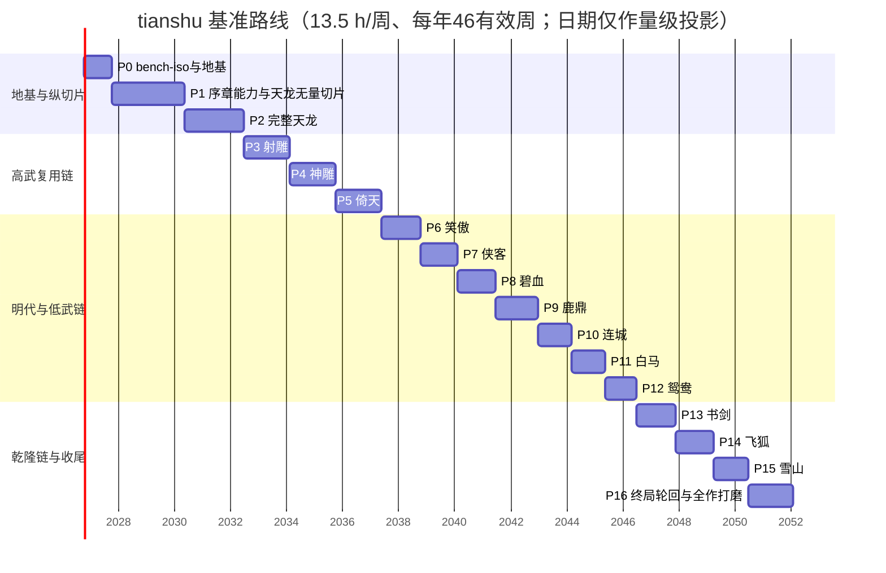
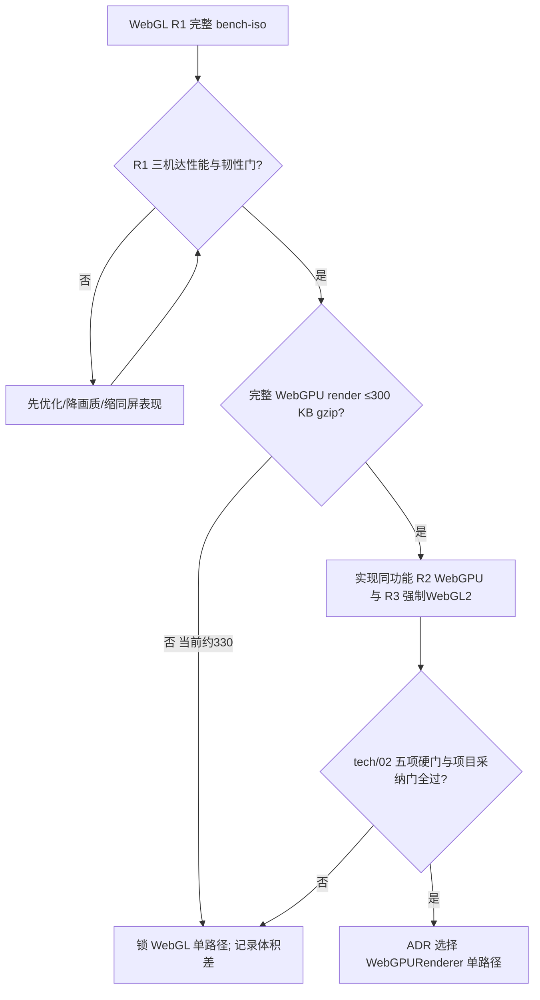

# tech/09 · 全项目路线图与发布闸门

| 项 | 内容 |
|---|---|
| 文档 | `docs/tech/09-roadmap.md` |
| 版本 | v1.2（经脉落地终审（2026-09-30）：命令摘要兼容、内容门禁与 Boss 回放缺口）；v1.1（经脉 TypeScript runner、黄金对拍与三机门禁，2026-09-27）；v1.0（2026-09-26）；审校 E3.R（2026-09-26）；全局审计（2026-09-26） |
| 上游基准 | `docs/decisions/author-decisions.md`、`docs/decisions/author-requirements.md`、`docs/00-canon.md` v1.3、`docs/decisions/rulings-v1.md` |
| 平行输入 | `tech/01`–`tech/08`；`design/21` v2.1（经脉规则、黄金向量与性能预算）；`design/11`（开放世界与内容预算）；`design/chapters/01-tianlong.md`；`design/13`（终局、多周目） |
| 读者 | 作者本人（单人开发）＋ AI 编码 / 内容助手 |
| 本文职责 | 全项目权威阶段、工时、依赖、里程碑、验收闸门、决策时点、风险缓冲与范围削减顺序 |
| 不在本文定义 | 战斗 / 成长 / 内容规则、书界剧情、性能预算、素材规格、在线协议；分别引用其唯一归属文档 |

> **结论先行（TL;DR）**
>
> 1. 先做 Phase 0 `bench-iso`。生产渲染器仍是 Three.js `WebGLRenderer`；完整 WebGPU render 当前估算约 330 KB gzip，未满足 ≤300 KB 前置门，故不启动 R2/R3 迁移比较，也不得抬高门槛宣布通过。
> 2. Phase 0 在作者主力手机、一台中端 Android、一台 iPad 上登记真实型号、GPU、OS、浏览器与 PWA / 标签页入口。具体设备尚未登记，所有真机结果均为**（待实测）**。
> 3. Phase 1 合并“序章能力 MVP”和“天龙内容纵切片”：先以可跳过的《越女剑》证明全链能力，再交付 `rg_dali_cangshan` 无量开局的 30–60 分钟闭环。切片只含 `q_01_main_01`，场景固定为无量外驿、剑湖宫、琅嬛福地外围和万劫谷外围四个**局部切片**；后两者都不是完整关卡，不把完整福地传承室、完整万劫谷或整个大理苍山偷算进切片。
> 4. Phase 2 做完整《天龙八部》；随后严格按基准顺序逐书界推进：射雕、神雕、倚天、笑傲、侠客、碧血、鹿鼎、连城、白马、鸳鸯、书剑、飞狐、雪山。每界完成即可自玩，不等全作。
> 5. 全作基准人工量为 **15,740 h【建议值】**：其中承诺工作约 14,309 h、内含未分配储备约 1,431 h。按工作流为引擎 2,645、工具链 1,290、内容配表 2,550、剧情写作 2,670、美术生成与修整 3,780、音频 240、测试 2,565。现行 `tech/07` 的“素材”口径还含约 200 h 一次性管线：本文美术 + 音频 4,020 h，再加工具链中的该 200 h，恰为 `4,220≈4,200 h`；其逐批 5% 返工缓冲已经包含在这组素材量中，不能再次叠加。
> 6. 三点估算为乐观 12,590 h / 基准 15,740 h / 保守 21,250 h。按每周 12–15 小时、每年有效 46 周，基准需约 22.8–28.5 年；按规划中点 13.5 h/周为 **约 25.3 年**。这是产能真相，不是发布日期承诺。
> 7. 关键路径是“闸门 → 引擎 / 工具 → 可玩内容 → 资产修整 → 真机 / 回放 → 发布候选”。AI 可并行起草和无人值守构建，但作者的审核、修图、集成和测试不能同时记工。
> 8. 进度落后先砍 B/C 级 CG、次要立绘、可选配音、额外环境变体与 AI NPC；不砍主线锚点、两条路线可达性、离线 / 导出、存档迁移、确定性录像、三机门禁和无占位的关键路径。
> 9. 经脉实现不以 Python 报告代替生产代码：P1 必须交付协议 2 TypeScript runner，并在 Node / WebKit 对固定黄金数据逐字段对拍；从 P1 起，每个发布候选还必须在作者主力手机、中端 Android、iPad 全部通过七项 P95 子预算，任一设备 / 任一项失败即阻断。

---

## 目录

- [0. 路线图口径与完成定义](#0-路线图口径与完成定义)
- [1. 总览：阶段、里程碑与日历](#1-总览阶段里程碑与日历)
- [2. Phase 0：bench-iso 决策闸门](#2-phase-0bench-iso-决策闸门)
- [3. Phase 1：引擎核心与天龙垂直切片](#3-phase-1引擎核心与天龙垂直切片)
- [4. Phase 2：完整天龙书界](#4-phase-2完整天龙书界)
- [5. Phase 3–15：逐书界扩展](#5-phase-315逐书界扩展)
- [6. Phase 16：终局、多周目与全作打磨](#6-phase-16终局多周目与全作打磨)
- [7. 工时模型与三点估算](#7-工时模型与三点估算)
- [8. 关键路径、并行边界与批次节奏](#8-关键路径并行边界与批次节奏)
- [9. 跨阶段统一验收闸门](#9-跨阶段统一验收闸门)
- [10. 决策点清单](#10-决策点清单)
- [11. 风险、缓冲与范围削减预案](#11-风险缓冲与范围削减预案)
- [12. 维护、复估与状态记录](#12-维护复估与状态记录)
- [参考资料](#参考资料)
- [本文新增术语/约定](#本文新增术语约定)
- [待决事项 / 依赖](#待决事项--依赖)

---

## 0. 路线图口径与完成定义

### 0.1 权威边界

本文接管 `tech/01` §11 已声明的“权威排期”，把 `tech/01`–`08` 各自的演进建议映射到同一阶段。各技术文档仍拥有模块规则和验收数值；本文只决定何时集成、何时阻断、何时可以进入下一阶段。若本文摘要与专项文档的终值冲突，以专项归属为准，并在下一次路线图复估时修正。

| 事项 | 唯一事实来源 | 本文的使用方式 |
|---|---|---|
| 书界顺序、境界、等级与设计基线 | `docs/00-canon.md` | 固定顺序，不因开发便利调换 |
| 开放区域、城市、主线预算、支线、奇遇、队友、门派、Boss、资源、营生、时长 | `design/11` §10 | 用于容量和阶段完成度，不重写内容规则 |
| 每书主线与特色系统 | `design/story/NN`、`design/chapters/NN` | 用作生产清单；缺章节稿时不自行补剧情 |
| 渲染和性能终值 | `tech/02`、`tech/03` | 作为阻断闸门，不能用平均值掩盖分位失败 |
| 数据、core、素材、后端 | `tech/04`–`tech/08` | 作为每阶段能力与证据清单 |
| 终局、结局、多周目 | `design/13` | Phase 16 集成，不在本文改规则 |

### 0.2 三种“完成”不得混用

| 层级 | 定义 | 可以宣称 | 不可以宣称 |
|---|---|---|---|
| 设计完成 | 权威文档、数据清单、公式与开放项已审校 | 可进入实现估算 | 可玩、已测试 |
| 内容完成 | 正邪路径、支线、素材、音频、包、迁移均无阻断占位 | 可进入发布候选测试 | 已通过真机 |
| 发布候选完成 | 自动门禁、三机 A 路径、离线 / 恢复 / 导出与人工验收全过 | 可标记该阶段完成 | 未来浏览器永不回归 |

阶段完成度以“已通过的验收项 / 本阶段应验收项”计；任务数、字数或 AI 生成候选数不计完成度。关键路径上任何红项使阶段保持未完成，不能以总百分比覆盖。

### 0.3 假设与估算日期

- 人力：一名作者，AI 辅助编码、草拟、检索和候选生成；最终选择、事实核查、修图、集成、试玩和发布由作者负责。
- 投入：每周 12–15 h，每年按 46 个有效周计算，预留约 6 周给休假、疾病、设备故障与兴趣波动。甘特图采用中点 `13.5 h/周 × 46/52 ≈ 11.94 h/日历周`。
- 起算：甘特图只为显示量级，以 2026-10-05 为建模起点；实际未开工时整体平移，不把图中日期当承诺。
- 估算精度：Phase 0 前为 ROM（量级估算），误差可达 −20% / +35%；完成 Phase 1 后改用登记库和工时日志复估。
- 货币：路线图只排人时。云端价格、AI 账号额度和域名费用随部署日复核，不把今日价格锁成多年预算。

### 0.4 统一阶段映射

| 本文阶段 | 旧文档常用名称 | 统一解释 |
|---|---|---|
| Phase 0 | 地基 / 原型 / 风格锁定 | 技术和生产可行性；尚无可发布章节 |
| Phase 1 | 序章 MVP + 天龙纵切片 | M1 证明完整能力，M2 证明真实内容生产闭环 |
| Phase 2 | 天龙量产 / 完整首书界 | 第一部 15 h 书界全部完成 |
| Phase 3–15 | Phase 4+ / 书界量产 | 依固定顺序逐部发布候选 |
| Phase 16 | 终局 / 多周目 / 收尾 | 终局六卷、七结局、轮回与全作回归 |

`tech/02` / `03` / `04` / `06` 中“Phase 2 天龙 2–3 区域”在本文映射到 Phase 1 的 M2；其“Phase 3 完整天龙”映射到本文 Phase 2。`tech/07` 的 Phase 1 切片、Phase 2 完整天龙分别直接映射本文 P1/P2。后端 `tech/08` 已按能力成熟度分期，Phase 1/2/3/4+ 分别直接映射本文 P1/P2/P3/P4+：本地 / 私有托管、云同步 / 恢复、Passkey / 遥测、可选 AI NPC。编号不同不代表多做一次。
`tech/01` §11 的“约 2 周 / 8–10 周”等旧括号是模块视角的早期节奏，不是全项目工时；本文把数据、素材、测试、在线和返工一起计入后，以 §7 的小时数与日历为权威。

---

## 1. 总览：阶段、里程碑与日历

### 1.1 主阶段表

| 阶段 | 产品里程碑 | 基准工时 | 规划期（中点产能） | 阻断出口 |
|---|---|---:|---:|---|
| P0 | `bench-iso`、技术地基、生产管线金样 | 622 h | 约 12.0 月 | §2 全部闸门；渲染 ADR |
| P1 | 序章能力检查点 + 天龙无量 30–60 分钟纵切片 | 1,612 h | 约 31.1 月 | §3 M1、M2 全过 |
| P2 | 完整天龙 9 区 / 22 城 / 15 h | 1,304 h | 约 25.2 月 | 第一书界发布候选 |
| P3 | 射雕 | 1,025 h | 约 19.8 月 | 首个复用书界发布候选 |
| P4 | 神雕 | 1,025 h | 约 19.8 月 | 跨书人物 / 宋金蒙古套件复用通过 |
| P5 | 倚天 | 1,015 h | 约 19.6 月 | 高武峰值与明教群战通过 |
| P6 | 笑傲 | 880 h | 约 17.0 月 | 首次 HIGH→MID 压制迁移通过 |
| P7 | 侠客 | 815 h | 约 15.7 月 | 石壁观察与品德清算通过 |
| P8 | 碧血 | 830 h | 约 16.0 月 | 明末时代套件与宝藏状态通过 |
| P9 | 鹿鼎 | 940 h | 约 18.2 月 | 首次 LOW、宫廷身份与大规模低武内容通过 |
| P10 | 连城 | 765 h | 约 14.8 月 | 生存 / 证据 / 密码链通过 |
| P11 | 白马 | 735 h | 约 14.2 月 | 西域迷宫与骑乘复用通过 |
| P12 | 鸳鸯 | 705 h | 约 13.6 月 | 非致命通关与双刀状态通过 |
| P13 | 书剑 | 870 h | 约 16.8 月 | 清代群像 / 回疆套件复用通过 |
| P14 | 飞狐 | 830 h | 约 16.0 月 | 承诺账与掌门大会通过 |
| P15 | 雪山 | 785 h | 约 15.2 月 | 第十四天书与归梦入口通过 |
| P16 | 终局六卷、七结局、轮回、全作打磨 | 982 h | 约 19.0 月 | 全作发布候选与恢复演练 |
| **合计** | **序章 + 14 书界 + 终局** | **15,740 h** | **约 25.3 年** | **§9 总闸门** |

规划期用 `工时 ÷ (13.5×46/12)` 计算，显示到 0.1 月；它已经把每年 6 周非生产时间摊回日历，不再另加假期缓冲。阶段内 10% 管理缓冲不另列虚拟阶段，而由 §11 的储备规则控制。

### 1.2 里程碑甘特图



图中约从 2026-10-05 延至 2052-01，目的是暴露单人范围而非制造虚假的短期发布日期。若按全年 52 周无休计算，基准中点会缩为 `15,740÷13.5÷52≈22.4` 年；本路线不用该不现实口径。

### 1.3 每一阶段的统一节拍

| 批次 | 产物 | 退出条件 | 建议占该阶段人工时 |
|---|---|---|---:|
| A · 预生产 | 章节差量清单、依赖图、风险探针、风格 / 时代套件增量 | 需求与 ID 集合冻结，未决项已有默认值 | 8% |
| B · 可交互灰盒 | 主线可走、特色机制用占位资源、迁移与回放夹具 | 主路径无死档，确定性 golden 通过 | 22% |
| C · 内容与资产 | 支线 / 奇遇 / 配表、审定素材、音频、真实区域包 | 关键路径零占位，引用与许可可追溯 | 45% |
| D · 集成稳定 | 性能、弱网、离线、存档、浏览器与三机测试 | §9 自动和手工闸门全过 | 20% |
| E · 冻结发布 | 候选构建、回归、版本说明、备份恢复 | 连续两次候选无阻断回归 | 5% |

百分比是阶段内 WIP 上限，不用于强行分摊专项工时；若 C 批素材实耗已超过登记库 P80，就触发复估而不是挤掉 D 批测试。

### 1.4 逐书界“做完即玩”策略

- P2 起每一书界都有独立版本、内容哈希、离线闭包、迁移夹具和回滚点。
- 进入下一书界前，上一界允许保留已登记的低严重度外观缺陷；存档破坏、主线死档、规则不确定、许可不清和性能硬线不允许延期。
- 书眠进入下一界时可以先使用下一界的冷进入集，但不能把尚未完成的下一界当作上一界“已发布”证据。
- 每完成三个书界做一次共享包瘦身和全链回归；每完成一个时代套件链做一次复用收益复盘。

---

## 2. Phase 0：`bench-iso` 决策闸门

### 2.1 目标与范围

P0 的目的不是做漂亮 Demo，而是尽早回答四个可能推翻项目的事实问题：三类真机能否稳定运行；WebGL 是否足够；完整 WebGPU 路线是否值得迁移；素材、数据、部署和恢复管线能否闭环。

| 范围 | 必须交付 | 明确不做 |
|---|---|---|
| 仓库地基 | pnpm monorepo、严格 TypeScript、CI、`pnpm check`、版本锁 | 完整编辑器、全部业务 UI |
| core 探针 | RNG、命令 / 事件骨架、10 Hz tick、六角坐标、最小录像 | 全 59 hook、完整经营 / 经脉 |
| 经脉实现探针 | 固定 `rulesProtocol=2` / `rngProtocol=1` 的 TypeScript runner 骨架；能读取现有黄金文件并拒绝版本 / hash 不匹配 | 完整内容量产与三机发布结论 |
| 数据探针 | schema registry、单张 Tiled 图、规范 JSON、ID/ref 校验 | 十四界批量数据 |
| 渲染探针 | `tech/02` §12.3 的 P0–P3、P5；`bench-iso` 常规 / 压力版 | P4 完整 VFX 压力（P1 M1）；生产 WebGPU 双路径 |
| 素材探针 | 美术圣经、回归集、男女主角北宋装 / 段誉 / 杂兵金样，登记→打包→加载 | 本地模型、租卡、ComfyUI |
| 存储 / 后端探针 | KTX2 / WebP 加载、离线重开；Cloudflare preview、TSAV / CAS fixture | 生产云同步、Passkey、AI NPC |

### 2.2 `bench-iso` 唯一负载口径

路线图采用 `tech/02` §12.1 的详细定义；`tech/01` 术语表中的“300 精灵”只是压力版简写。

| 夹具 | 内容 | 用途 |
|---|---|---|
| 常规版 | 64×64 高度地形、200 个动画法线精灵、2 动态光、照明网格、阴影贴图（中档）、描边 / 纸纹 / LUT uber pass、战斗格、30 个飘字 | 渲染器选择与正式门禁 |
| 压力版 | 常规版其他内容不变，精灵升至 300 | 测降档、发热与余量；不替代常规版通过结论 |
| 投影夹具 | 随机高度图 × 4 偏航；平地 / 台阶 / 坡面；边界角含 ±22.5° | 六角拾取正确性 |
| 韧性夹具 | 上下文恢复、区域循环、前后台、切档 | 资源生命周期与恢复 |

所有帧结果记录 P50/P95/P99、实际 `pacingFps`、分辨率、画质档、是否低电量、起始与第 10 分钟结果。平均 fps 只能辅助诊断，不能替代分位门槛。

### 2.3 真机清单与记录模板

作者决定 P01 固定三类设备，不固定型号。P0 开始当天填写下表；缺一行即不能通过。

| 角色 | 设备要求 | 必记字段 | 入口 | 主要验证 |
|---|---|---|---|---|
| A · 作者主力手机 | 作者日常实际使用设备 | 品牌型号、SoC / GPU、RAM、OS build、浏览器 / WebView build、屏幕 Hz、电量模式 | 常用浏览器标签页；若常用微信则另跑内置浏览器；支持时另跑主屏 PWA | 日常入口、网络、触控、前后台、存储 |
| B · 中端 Android | 不用旗舰替代；按 `tech/03` mid / low 判档实测 | 同上，另记 WebGL renderer string 与自动档位 | Chrome / 系统浏览器；主屏 PWA | P95/P99、10 分钟持续、KTX2、内存 |
| C · iPad | 作者可取得的一台 iPad | 型号、Apple 芯片、内存（可查时）、iPadOS、Safari build、刷新率 | Safari 标签页 + 主屏 Web App | 上下文恢复、存储隔离、音频、前后台 |

若主力手机就是中端 Android，它仍只覆盖 A；B 必须是另一台设备，以避免同一硬件故障模式重复计数。若一时拿不到 B 或 C，可以继续写代码和跑桌面 CI，但 P0 状态为“有条件未通过”，不得进入内容量产。

每次记录至少包括：`deviceId`、日期、build hash、浏览器 UA / 版本、入口、分辨率、刷新率、画质 / 内存档、网络、冷 / 热启动、常规 / 压力结果、上下文恢复结果、异常录像和原始 HUD JSON。

### 2.4 WebGL / WebGPU 决策树



WebGPU 迁移先逐项通过 `tech/02` §9.3 的五项硬门；路线图不得用更宽的摘要替代它们：

1. **性能**：所有测试设备上 R2 的 P95 ≤ R1，R3 的 P95 ≤ `1.25×R1`。路线图再加更严格的采纳门：同功能 R2 的 10 分钟 P95 比 R1 改善至少 15%，或性能相同且能耗 / 温控降档有可复核改善【建议值】；否则即使“不退步”也维持 WebGL。
2. **包体**：完整 render chunk ≤300 KB gzip；entry 仍独立 ≤170 KB，不能挪预算。当前推算约 330 KB，故停在前置门；这组值来自 `tech/01` / `02` 的既有构建记录，本轮未复测，实际产物仍**（待实测）**。
3. **画面一致**：10 个参考场景中，R1 对 R2 / R3 的截图 SSIM 均 ≥0.98；另跑 `tech/02` 原型 P3 遮挡和 P4 VFX，不得新增阻断缺陷。
4. **稳定 / 可用**：三类必测设备与实际入口先成功建上下文；并在 iPadOS Safari、Android Chrome、作者实际使用时的微信 XWeb 各做 30 分钟浸泡，无崩溃且上下文丢失可恢复**（待实测）**。没有微信使用场景时记 `N/A + 原因`，不得伪记通过。
5. **需求与维护**：存在 WebGL2 难以满足的明确刚需，或真机证明 CPU 每 draw 开销显著下降；同时调试、构建、错误回退和 TSL 维护成本可接受。最终只保留一条生产路径。

Three.js 官方说明 `WebGPURenderer` 默认用 WebGPU、不可用时退至 WebGL 2；但项目仍把 R2/R3 当比较夹具，不把运行时双后端自动回退当长期测试矩阵。WebGPU API 仍非 Baseline 且要求安全上下文，见参考资料。

### 2.5 量化退出标准

| 类别 | 通过标准 | 证据 |
|---|---|---|
| 包体 | WebGL entry ≤170 KB、render ≤180 KB、合计 ≤350 KB gzip；Basis 转码器延迟加载 | `size-limit` 报告与产物哈希 |
| 帧节拍 | 60 fps：P95 ≤16.7 ms、P99 ≤25 ms；30 fps：P95 ≤33.4 ms、P99 ≤50 ms；高刷整数分频：P95 ≤`1000/pacingFps×1.01`、P99 ≤`1000/pacingFps×1.5` | 三次冷启、三次 10 分钟 HUD JSON；三次取中位 |
| 持续 / 长帧 | 游戏进行中 `>50 ms` 长帧 ≤1 次/分钟（遮罩转场除外）；60 / 30 fps 的 10 分钟平均分别 ≥45 / ≥27 fps，高刷整数分频平均 ≥`pacingFps×75%`；无反复 T3 / 上下文丢失 | 录屏 + 时间序列；报告实际 `pacingFps` |
| 投影 | ≥20,000 随机例坐标与面类型 0 差异；手机实点 50 次准确率 ≥98% | 属性测试报告 + 触控记录 |
| 地形 | 中端 Android 首屏 3×3 chunk ≤300 ms；其余每帧上传 ≤2 chunk；地形 + 水 GPU ≤5 ms | `tech/02` 原型 P1 捕获 |
| 遮挡 | 12 场景 ×4 偏航，无脚 / 头切穿；剪影误报率 <5% | 48 组金样 |
| 韧性 | 上下文 20 次、区域 10 轮、iOS 前后台 20 次、切档 10 次，恢复率 100%；GPU / 资源账本精确回到基线，JS 堆 GC 后 ±10% 仅作趋势告警且不得单调增长；撤遮罩后 10 s 内无 >100 ms 长帧 | `tech/02` 原型 P5 日志 + `tech/03` `bench-region-cycle` |
| 数据 | 同输入双构建逐字节一致；单个原始 JSON 叶片 ≤256 KiB | CI 报告 |
| 经脉 runner | TypeScript runner 能载入 `fixtureVersion=2 / rulesProtocol=2 / rngProtocol=1`；校验 `masterSeed=20260927` 与 `vectorSha256=af33dcd10dc196e18811fe485870666ab139c03a17342fa47113ecc19552cd76`，版本或 hash 不符硬失败；允许先有失败测试，完整逐字段对拍在 P1 M1 前转绿 | Node CI 读取同一黄金工件；不得在测试中重写 golden |
| 存档 | TSAV 损坏、超限、迁移失败均保留原件；D1 CAS 并发 fixture 通过 | 契约测试 |
| 访问 | 作者常用网络能访问 Cloudflare preview；不备案、不增加国内 / 香港镜像 | 三机网络记录 |
| 风格 | 四档截图仍可识别同一美术方向；角色跨 10 张构图人工一致性 ≥4/5 | 审定金样与评分单 |

P6 风格金样与 `tech/07` Phase 0 风格锁定并行，但不把尚未完成的 P4 全特效压力冒充 P0 硬门；P4 在 P1 M1 基础特效与粒子池完成后结案。这样保持 `tech/02` §12.3 的阶段边界，同时让后续真实内容只使用已锁定的视觉方向。

90 / 144 Hz 无法稳定整除 60 时按 `tech/03` 记录 45 / 48 `pacingFps`，并分别套用 `1000/pacingFps` 的分位公式，不得写成“60 fps 通过”。GPU 毫秒若目标浏览器无法可靠取得，只作辅助；跨浏览器硬门仍用帧间隔和工作分项。

### 2.6 P0 依赖、风险与退出动作

| 依赖 / 风险 | 触发 | 本阶段动作 |
|---|---|---|
| P01 设备未落实 | 三机任一型号空缺 | 允许开发，不签 P0；借用 / 购买设备属于作者决定 |
| WebGL 不达标 | 两轮有针对性优化后仍失败 | 锁 low 30 fps、削减同屏表现 / 阴影 / 法线；若 low 仍失败，暂停内容生产重做表现方案 |
| WebGPU 体积超限 | 完整 render >300 KB | 保持 WebGL；只保留实验分支记录，不进生产 |
| AI 图像入口不可用 | TraeX / Gemini 额度、导出或条款不满足 | 暂停该素材批，用占位与手工 SVG / Blender 验证技术；不静默换服务 |
| Cloudflare preview 不可达 | 作者常用网络反复失败 | 记录变更请求；P03 未改变前不自建镜像 |
| 风格不稳定 | 10 图评分 <4/5 或八向角色漂移 | 回到设定卡和 3D 中转；不开始章节批量生成 |

P0 退出时必须写 ADR：选定渲染器、被测构建、三机清单、失败项、采用的降级、下次复评条件。若选择 WebGL，Phase 1 生产代码不得夹带未维护的 WebGPU 分支。

---

## 3. Phase 1：引擎核心与天龙垂直切片

### 3.1 阶段目标与两个检查点

Phase 1 用一套实现依次证明“能力齐”和“内容真”。M1 可以用小型《越女剑》序章覆盖所有基础能力；M2 必须换成天龙真实内容和审定素材，避免只在玩具数据上成功。

| 检查点 | 玩家可见目标 | 工程目的 |
|---|---|---|
| M1 · 序章能力 MVP | 新游戏 → 可跳过开场 → 探索 / 对话 / 战斗 → 序章结束 → 本地存档 / 导出 → 书眠进入天龙冷入口 | 覆盖 core、UI、PWA、内容编译、素材包、私有托管与离线闭包 |
| M2 · 天龙无量切片 | 在无量外驿醒来，选自述，经历探索 / 救治 / 战斗 / `dc_01_01`，完成 `q_01_main_01` 并抵达共同汇合点 | 以真实人物、场景、支线接口、`battle8` 和宋式套件验证 30–60 分钟生产闭环 |

M1 是内部能力闸门，不改变基准“序章可跳过”的产品定位。若 M1 未完成，不能以 M2 的手工脚本演示绕过缺失的存档、离线或迁移。

### 3.2 天龙切片的精确内容边界

| 维度 | 纳入 M2 | 延后 P2 |
|---|---|---|
| 区域 | 仅 `rg_dali_cangshan` 的开局子集 | 天龙其余 8 区及本区完整回访内容 |
| 场景 | `sc_01_wuliangyidao`、`sc_01_jianhugong`、`sc_01_langhuanfudi` **外围**、`sc_01_wanjiangu` **外围药径**；后两项只验收切片用几何与门禁 | 福地核心传承室、完整万劫谷关卡、大理城 / 天龙寺，以及四场景除白名单外的内容 |
| 主线 | `q_01_main_01` 全幕，含 A1 和局部键 `dc_01_01` 三选一 | `q_01_main_02`–`24`；正邪锁线从杏子林后展开 |
| 开局 | 失籍行脚人；识字抄录 / 草药急救 / 脚程探路三自述 | 三身份后续完整支线和职级影响 |
| 玩家动作 | 寻路、交互、救治、对话、非致死制服、撤离、拾取、营地 / 安全点、读写档 | 经营量产、完整经脉、跨国旅行和高阶轻功 |
| 人物 | 男女主角、书灵、段誉、钟灵、木婉清、岳老三（南海鳄神）、无量 / 神农模块化杂兵 | 天龙全量同伴、门派、Boss 与生命轴 |
| 动物 | 蛇、闪电貂 | 其他生态与坐骑 |
| 战斗 | 教学遭遇、山道拦截、无量 / 神农追兵、岳老三高难演示 | 十场正式 Boss 全量与大型群战 |
| 奖励 | 黄阶根基、关系 / 证据 / 救援状态、可替换占位经济 | 福地完整北冥 / 凌波归属、天级投放和天书 |

切片的结尾固定在 C01 共同汇合：段誉完成自己的核心机缘，众人转向万劫谷 / 大理方向。玩家不得进入核心传承室夺取段誉机缘。`sc_01_langhuanfudi` 只实现外围追踪、崖谷和汇合所需几何；`sc_01_wanjiangu` 只实现“草药急救”自述所需的外围药径和返回边界，不提前进入 C02 的人质、换俘或谷内关卡。未纳入的房间均以不可穿透门禁与远景表示，因而不虚报任一完整场景。

`tech/07` 旧阶段表写“2 区域·1 幕”，但同一行交付实际只点名 `rg_dali_cangshan`。本文按章节正式 C01 收敛为 **1 个区域、4 个局部场景切片、1 幕**；其中福地和万劫谷都只做外围。四项是 `sc_*` 容器的白名单子集，不等于完成 4 个场景，故 P2 继续按登记库中的实际资产 / 任务差量结算。

### 3.3 系统交付物

| 系统 | M1 最小能力 | M2 天龙真实验证 | 延后 |
|---|---|---|---|
| core | 单线程状态树、命令 / 事件、五流 RNG、10 Hz、六角 A* / LOS、CT、Z0–Z10、Buff 必需子集、任务 / Ink、存读档、录像 | D4 敌人模板、毒区 / 制服 / 撤离、关系与三选一原子提交 | 全 59 hook 的非切片用例可在 P2 补齐 |
| 经脉 | 协议 2 TypeScript runner、逐单位实例、Core 注入单一 `battle` RNG、零副作用 preview、`meridian-flow-state.v1` snapshot | 以真实武学 / 敌人跑路线提交、绝招轮换与经脉投影；Node / WebKit 同一黄金文件逐字段对拍 | 非切片路线内容量产可在 P2 扩充，但 runner / golden / 三机门禁不可延后 |
| 渲染 | 地形、两段式精灵、四偏航、战斗格、基础 VFX、DOM 浮字、昼夜、恢复、自适应 | 真实 `battle8` 六视图驻留 + 旋转两视图预取、宋式地标、崖谷遮挡 | 极致档、高级水体 / 天候组合 |
| 数据 | ch00 schema、Tiled、Ink bridge、规则 / 文本分片、remap | ch01 base + `rg_dali_cangshan`，引用图、预算、零孤儿引用 | 浏览器内编辑器 |
| 素材 | 登记库、导入、分层部件三视图（AR-22，`tianshu_rig`）、三档精灵、KTX2 / WebP / AAC / H.264、许可台账 | §3.4 清单全部审定，关键路径零占位 | 其他天龙区域资产 |
| UI | 新游戏、设置、对话、战斗 HUD、背包、存读 / 导出、下载与错误恢复 | 自述、任务、关系、救援、门禁提示 | 完整图鉴 / 经营 / 终局页 |
| 后端 | 同一 Worker 私有托管；主密钥 + 8 位配对码 + `ts_s`；静态资源会话闸门 | 两设备可访问构建；云同步仍默认关闭 | D1/R2 云同步、Passkey、遥测 |
| 离线 | 应用壳 + 序章闭包，IndexedDB 三代本地档，JSON / TSAV / ZIP 导入导出 | 下载天龙 enter 集；断网完成切片 | 完整天龙离线包 |

### 3.4 天龙切片素材清单

沿用 `tech/07`，但只声明制作范围，不重定规格：

- 角色：男女主角北宋变体、书灵墨影、段誉、钟灵、木婉清、岳老三；无量剑派弟子与神农帮帮众各一套可组合杂兵。
- 生物：蛇、闪电貂；不得把两者只做静态图却计为战斗资产。
- 动作：共享通用、剑、刀、指、掌 v1。人形角色按 AR-22 用分层部件三视图 + 代码驱动动作（`tech/09-rig`），不再逐帧渲染 `loco8` / `battle8`；动作数据来源的低成本方案（现成 three.js 动作库 + Gemini 多视角图 + Python 融合）评估中。
- 环境：宋式建筑套件 v1、3 个地标、12 种地形材质；场景数量服从 §3.2，不另造区域 ID。
- 表现：约 120 个图标；一阳指、六脉神剑、凌波微步残影 3 个签名特效仅用于管线 / 剧情演示，不据此向玩家提前投放完整武学。
- 音频 / 视频：5 首 BGM、约 120 个音效、`vid_ch01_intro` 一条；默认无全剧情配音。
- 质量：所有关键路径资源 `approved`，登记来源、许可、请求 / 导入记录、母版 hash 和运行时产物；不得以“AI 已生成”代替人工审定。

**2026-10-01 作者决定**：删除 Blender 中转与逐帧渲染预算（原 `10×776=7,760` 帧、`15,520 frame-pass`），Project Genie 也不采用（只出 60 秒可交互世界与录屏，不导出帧或资产）。人形角色的素材量改按 `tech/07` §8 的分层部件数计；动物、建筑或少数战斗大动作若日后确需 3D 中转，单列评估，不进 M1。

### 3.5 Phase 1 验收闸门

| 维度 | M1 / M2 通过标准 |
|---|---|
| 可玩性 | M1 序章完整通关；M2 三种自述各从新档走到 C01 汇合，30–60 分钟，无主线阻断 |
| 分支 | `dc_01_01` 三选一各有可见后果、共同汇合且不能替代段誉机缘；掉电 / 强退后只处于提交前或提交后 |
| 内容 | 切片区域关键路径零占位；可选未做支路明确锁门而非空场景；ID/ref/schema 全通过 |
| 测试 | core 单元 / 属性 / golden 全绿；关键路线至少 3 自述 × 2 性别 × 2 输入方式 = 12 组冒烟；三档难度至少各 1 次 |
| 确定性 | 相同初始快照 + 命令在 V8 / WebKit 得到同一终局 hash；不得重跑 AI 产生不同录像 |
| 命令摘要兼容 | 按 `tech/01` D9、`tech/05` §14、`tech/08` §10.2 的同一 hash 数组纳入 `commandPrefix`；固定 session 只改 `skill` 或 `dual.a/b` 一段合法外放档，规范命令与 hash 必变；前缀不含运输 / 墙钟 / 诊断字段，开局为空。旧工件按完整五元键交匹配 runner，规则号同为 2 不允许静默重算 |
| 经脉黄金 | TypeScript runner 在 Node / V8 与 Playwright WebKit / JSC 消费同一 `fixtureVersion=2` 黄金工件；`inputs` 与全部 `outputs` 逐字段相等，包括路线 trace / 质量 / CT、四单位隔离、三段 `battleRng`、攻防护体、速度 / 控制 / 调息、归一化和五档 TTK。只比最终伤害不算通过；CI 禁止自动 `--write-golden` |
| 经脉三机 | 作者主力手机、中端 Android、iPad 均跑典型 1,728 与完整 4,320 节点；七项 P95 逐项满足 §9.2，且 preview 为 0 RNG / 0 写、24 单位动态数组不共享。任一设备 / 任一项缺证据或超线均阻断 M1 / M2 **【建议值】【待实测】** |
| 性能 | `tech/03` 六个 CI 场景全绿；中端 Android mid 的常规探索 / 普通战 P95 ≤16.7 ms、P99 ≤25 ms，群战按 30；low P95 ≤33.4 ms、P99 ≤50 ms |
| 体验 | 冷标题 ≤4 s、热开 ≤1.5 s；点击反馈 P95 ≤100 ms；区域切换 ≤10 s（Wi-Fi）；`enter` ≤60 MB |
| 内存 | GPU、JS 堆、进程总占用不越 `tech/03` 档位硬线；区域 10 轮 GPU / 资源账本精确回到基线，JS 堆 GC 后 ±10% 仅告警且不得单调增长 |
| 离线 / 存档 | 飞行模式从新游戏通关 M1；已下载 M2 断网可玩；本地三代档、导出 / 导回、损坏回退通过 |
| 私有访问 | 无会话不能取得应用或素材；主密钥 / 配对码撤销可验证；云同步、遥测、AI 均关闭 |
| 素材 | 每类至少一次登记→审定→构建→manifest→加载；分层部件三视图抽检无缺件 / 枢轴错位，切片关键路径零占位 |
| 无障碍 | 触控、键鼠、颜色之外编码、字幕、减少动态、横屏旋转提示与字体回退均可用 |

时间型 CI 使用同机同浏览器基线 +10% 报警；硬预算和计数型指标精确阻断。任一 A 级真机路径未跑，不得用桌面模拟代替。

ID 门禁执行 `python3 tools/lint/check_ids.py --strict`，默认全仓扫描。`check_ids_baseline.json` 只豁免其中已有的未定义 / 废弃 ID：基线外新增债务立即阻断，改名也按新债处理；冲突定义与套装成员不对称始终阻断，近似名只警告。完成一次全量审计后，才可从仓库根以默认全量扫描运行 `python3 tools/lint/check_ids.py --update-baseline`；同一变更记录须写明刷新前后债务数与余债清零计划。禁止限定路径刷新，也不得用刷新掩盖冲突或套装不对称。

### 3.6 依赖与主要风险

| 依赖 / 风险 | 预防 | 失败时动作 |
|---|---|---|
| P0 未签字 | 不开始真实素材量产 | 保持灰盒，解决闸门 |
| 天龙范围膨胀 | §3.2 白名单；任何新增**完整关卡**先从同阶段删等量内容 | 万劫谷只留自述入口的外围药径；谷内 / 大理城保持锁门，移到 P2 |
| core 与内容互相等待 | 用序章 fixture 先锁接口；M2 只换真实数据 | schema 变化走迁移，不双写状态 |
| 素材吞吐低 | 先测 P50/P80；S/A/B/C 分级 | 先砍 B/C 资源，不砍关键角色八向 |
| 字体许可未闭合 | 标题只用逐项核实 OFL，正文系统字体 | 未核许可字体不进候选构建 |
| 浏览器存储被清 | 请求持久存储但不假定获批；导出提醒、三代档 | 以导入恢复；P2 上云同步 |
| 双平台回放差异 | 每一命令中间 hash、首差异报告 | 阻断 M2，缩到最小复现 |

---

## 4. Phase 2：完整天龙书界

### 4.1 目标与内容基线

Phase 2 把 M2 的无量入口扩成第一个完整、可独立安装和离线通关的 15 小时书界。范围只引用 `design/chapters/01-tianlong.md`；以下是生产计数，不重新定义剧情：

| 项 | 完整天龙 | Phase 1 已交付 | Phase 2 差量原则 |
|---|---:|---:|---|
| 开放区域 | 9 | 1 个区域的开局子集 | 完成其余 8 区及大理苍山余量 |
| 开放城市 | 22 | 只做开局所需入口 / 远景 | 逐项开放并接安全点 / 旅行 |
| 场景 | 36 | 4 个局部场景切片，其中福地、万劫谷仅外围 | 不按“4 个完整场景”相减；以资产登记库中实际完成的地块 / 任务 / 资源集合相减 |
| 门禁 | 45 | 仅 qg1 教学与切片边界 | qg1/2/3/4/5=`12/17/12/3/1` 全量 |
| 主线 | 24 个运行时任务；单路线 4 共有 +10 路线 =14 幕 | `q_01_main_01` | `q_01_main_02`–`24` 与 9 选择 / 5 锚点 |
| 支线 / 奇遇触点 | 32 / 36 | 只做切片关联入口 | 全部实例、失败恢复、余韵可达性 |
| 门派 / 队友 / Boss | 12 / 12 / 10 | 无量 / 神农入口；3 名伙伴表现；岳老三高难演示 | 正式投放、生命轴、机制与掉落 |
| 资源 / 营生 | 22 / 28 | 仅接口和少量样本 | 全量周期、职位、书眠清算 |
| 特色系统 | 珍珑棋局、八部众支线、带头大哥谜案 | 只预留状态接口 | 规则、UI、幂等、失败保护全交付 |

天龙主线的 24 个运行时任务高于 `design/11` 的旧“10 幕制作预算”；以已审校 story / chapter 为准，10 只可用作资产包聚类，不能删减正式任务。

### 4.2 工程增量

| 工作域 | P2 新增 / 完成 |
|---|---|
| core | 全 59 hook / 原语的天龙使用子集；反应、合击、阵法、环境；AI Worker；周期系统；正式经脉 / 经营 / 门派 / NPC 接口 |
| 数据 | 九区规则 / 文本叶片；完整引用图；任务、资源、营生、特色系统 schema；旧档迁移；AI 草稿 promote 审计 |
| 渲染 | 区域流式 / LRU、完整水雨雪雾、动态光池、人群图集、特效配方、真实最大区域回归 |
| 素材 | 天龙全角色、Boss、地形建筑、约 20 CG 的标准目标、书界开篇、天书现世、天龙→射雕书眠；实际以登记库差量为准 |
| 在线 | D1 + R2 云同步、冲突选择、历史 / 恢复、设备撤销、远程配置、错误日志；作者显式开启前保持关 |
| 运维 | D1 / R2 独立备份、恢复演练、连续 14 天每日备份成功【建议值】 |
| 工具 | 浏览器内编辑器的必要预览；预算、覆盖率、许可、stale、包体和迁移报告 |

### 4.3 交付物

1. `ch01_tianlong` 完整规则、文本、地图时代层、素材 manifest 和离线包。
2. 正、邪两条路径各一份从新档到天书结算的可复放黄金录像；共有幕不重复计制作量。
3. 五锚点、九选择、三特色系统、32 支线、36 触点、12 门派位、12 队友位、10 Boss 的覆盖报告。
4. 天龙→射雕书眠：20–30 s、目标 24 s；首次 10 s 后可跳，重播立即可跳；视频与加载状态解耦。
5. 云存档纵切片：设备 A 上传 → B 下载 → 并发写 412 → 人选时间线 → 落选版可下载 → 从独立备份恢复。
6. 天龙版本的 `credits.json`、素材许可、生成来源、书法字体许可证和发布构建记录。

### 4.4 量化验收闸门

| 类别 | 通过标准 |
|---|---|
| 内容覆盖 | §4.1 所列实例 100% 有生产定义；正 / 邪可达；五锚点必经；关键路径与三特色系统零占位 |
| 数值 | D4 Lv35 普通 HP 3,970 / 攻 947，精英 HP 9,715 / 攻 1,145，Boss HP 41,103 / MP 9,078；具名 Boss 用 `full`，关键战 TTK 按 chapter §12.7 **（待实测）** |
| 图算法 | 两路线、门禁替代路、余韵回访、支线 / 奇遇触点均可达；唯一奖励幂等 |
| 性能 | 三机 60 分钟 soak；中端 Android 10 分钟探索平均 ≥45 fps；low 全程可玩；无 OOM / 上下文丢失 / T3 循环 |
| 包 | `enter` ≤60 MB；普通文件 ≤8 MB；规则 + 文本压缩包 ≤1.5 MiB，≥1.25 MiB 报警；原始叶片 ≤256 KiB |
| 生命周期 | 最大区域加载 / 卸载 10 轮资源账本精确回零；连续书眠 3 次不越峰值 |
| 存档 | 本地 / 云端 schema 迁移；断流、412、503 不丢档；连续 14 天备份 + 一次独立恢复 |
| 回放 | 正邪关键战在 V8 / JSC 同 hash；所有 `full` Boss 至少一个 golden；故障能定位首差异 |
| 测试 | unit / property / contract / content / visual / E2E 全绿；未解释的同机时间回归不得 >10% |
| 质量 | 15 h 目标用 3 份不同路线测试档抽样【建议值】；可由作者分批复放，不暗示 3 名测试者；任一主线阻断、死档、唯一物重复为零 |

### 4.5 依赖与风险

| 风险 | 信号 | 缓解 / 退路 |
|---|---|---|
| P1 资产已超标准天龙预算 | 登记库切片交付量 >354 h 内容基数 | P2 只按剩余资产重估，不使用 `491−354` 产生负数 |
| 特色 schema 尚未统一 | 三系统各自出现第二 DSL | 由 `tech/04` / `05` 接纳共同原语，章节只存配置 |
| 15 h 内容不可一次测完 | 缺陷只在晚期被发现 | 每资产包设 60–90 分钟可复放路径；每周跑增量 |
| 云同步吞掉内容时间 | 后端周工时连续两批超 P80 | 保留本地导出为安全底；同步不完成则 P2 不发布，但不阻塞离线内容测试 |
| 书界包 / 内存超线 | enter 或工作集接近 80% | 先拆 ondemand、减 CG / 视频变体和 NPC 表现；不删规则内容 |

---

## 5. Phase 3–15：逐书界扩展

### 5.1 固定顺序与共同定义

顺序严格为：

`天龙 → 射雕 → 神雕 → 倚天 → 笑傲 → 侠客 → 碧血 → 鹿鼎 → 连城 → 白马 → 鸳鸯 → 书剑 → 飞狐 → 雪山`。

不因时代套件复用而改动故事顺序。允许为下一界提前做不会泄漏内容的共享服装 / 建筑 / 声音模板，但当前界发布闸门仍必须先完成。每界都复用以下底座：确定性 core、六角战斗、Z0–Z10、Buff / 任务原语、统一大地图、时代层、资源 / 营生、门派 / NPC schema、素材登记与构建、PWA 离线、云存档 / 迁移、三机测试夹具。

### 5.2 每书界共同交付模板

| 类别 | 每界必须交付 |
|---|---|
| 内容 | 章节权威稿的正 / 邪路径、锚点、支线、奇遇触点、队友、门派、Boss、资源、营生；不以 `design/11` 旧幕数删 story 节点 |
| 地图 | 6–10 个开放时代区域、实际开放城市、场景与门禁；统一底图 + 本界时代增量 |
| 特色 | 章节 §10 的状态、UI、失败出口、幂等收据和回放夹具 |
| 传承 | 前界读入、后界写出、书眠携带 / 压制 / 同伴重逢；旧存档纯迁移 |
| 素材 | 默认精简档；S/A 关键角色完整、B/C 按范围；本界 intro、天书现世和下一条书眠 |
| 音频 | 主题 / 探索 / 战斗 / Boss 的最小可辨识集合、关键 SFX；默认无全剧情配音 |
| 测试 | 本界正邪 golden、Boss、特色、门禁替代路、余韵、离线、弱网、三机 A 路径 |
| 发布 | 版本化内容 / 资源 / 存档契约、许可和回滚记录；前一候选可回退 |

### 5.3 Phase 3：射雕英雄传

| 项 | 阶段卡 |
|---|---|
| 目标 | 证明第二书界能在不复制引擎分支的前提下量产，并形成宋—金—蒙古时代套件。 |
| 内容预算 | 8 区、20 城、10 个旧幕位、30 支线、16 完整奇遇链 / 32 触点、10 队友、10 门派位、9 Boss、20 资源点、24 营生、约 14 h；正式任务以 `design/chapters/02-shediao.md` 为准。 |
| 新增交付 | 华山论剑赛制、九阴收集状态、黄蓉厨艺、西征大战；大漠骑行、五绝传承和阵营变体。 |
| 复用 | 天龙的 core、时代层、门派 / 奇遇 / 营生 schema、北宋地理底图；新建宋金蒙古人物服装、营帐、骑战和城市差量供 P4/P5 使用。 |
| 验收闸门 | 正邪 golden、四特色的失败 / 重入 / 幂等全过；8 区 / 20 城闭包 100%；12 场景×4 偏航遮挡集误报率 <5%；三机性能和迁移闸门全过。 |
| 依赖 | P2 天龙候选、`design/chapters/02`、`design/11`；交付 `tech/08` Phase 3 的 Passkey / 遥测能力，是否默认启用由 `RD-07` 决定，发布前以 30 份 V8/JSC 录像一致【建议值】验收。 |
| 主要风险 | 骑战与大规模战争诱发独立战斗分支。默认只扩展既有六角格、坐骑状态和演出层；不得另造即时战斗内核。 |

### 5.4 Phase 4：神雕侠侣

| 项 | 阶段卡 |
|---|---|
| 目标 | 验证跨年代角色、地点和势力的可追溯复用，而不是复制一套“神雕版”资产。 |
| 内容预算 | 9 区、20 城、10 个旧幕位、32 支线、16 完整奇遇链 / 36 触点、11 队友、11 门派位、10 Boss、21 资源点、24 营生、约 15 h；正式任务以 `design/chapters/03-shendiao.md` 为准。 |
| 新增交付 | 情花毒、剑冢练剑、襄阳守城；古墓机关、断肠草与神雕同伴表现。 |
| 复用 | P3 的宋金蒙古服装、襄阳 / 大漠 / 华山区域和角色基础；年龄、伤残、阵营均作为版本差量，不覆盖旧时代资源。 |
| 验收闸门 | 同一人物跨时代加载不串状态；情花毒逐 tick / 批量推进同果；剑冢训练可中断恢复；襄阳峰值 VFX 帧 ≤33 ms 且无 >50 ms 长帧。 |
| 依赖 | P3 发布候选、`design/chapters/03`、人物身份映射和时代资源引用图。`tech/08` Phase 4+ 的 AI NPC 可从此阶段实验，但生产默认关闭，须过 `RD-08`。 |
| 主要风险 | 襄阳守城的同屏量与复用变体膨胀。优先图集、批次和远景替身；不得以删主线锚点换性能。 |

### 5.5 Phase 5：倚天屠龙记

| 项 | 阶段卡 |
|---|---|
| 目标 | 完成高武三部曲，验证高武峰值、群战和大型阵营治理仍由同一套确定性规则驱动。 |
| 内容预算 | 9 区、21 城、10 个旧幕位、30 支线、16 完整奇遇链 / 36 触点、10 队友、12 门派位、10 Boss、21 资源点、25 营生、约 15 h；正式任务以 `design/chapters/04-yitian.md` 为准。 |
| 新增交付 | 光明顶以一敌六派、屠龙刀秘密、统御明教；六大派远征与阵营重组。 |
| 复用 | P4 的后世人物 / 门派映射、蒙古时代套件、光照 / 天气 / 群战预算、可破坏物和毒伤原语。 |
| 验收闸门 | 六派战可复放且指令 / 事件 hash 一致；刀剑秘密状态不重复发奖；明教治理离线 / 书眠结算一致；D10 峰值按 `design/04` / `05` 公式核算。 |
| 依赖 | P4 发布候选、`design/chapters/04`、高等级 Buff / 控制 / Boss 回归集。 |
| 主要风险 | 高等级组合爆炸和群战回合过长。先做属性 / Buff 性质测试与 AI Worker 剖析，再调整配置；不引入特殊浮点旁路。 |

### 5.6 Phase 6：笑傲江湖

| 项 | 阶段卡 |
|---|---|
| 目标 | 首次执行 HIGH→MID 书眠压制，并用政治选择、节奏玩法和年度状态证明中武内容差异化。 |
| 内容预算 | 8 区、18 城、9 个旧幕位、26 支线、14 完整奇遇链 / 32 触点、9 队友、10 门派位、8 Boss、18 资源点、22 营生、约 12 h。 |
| 新增交付 | 琴箫协作、五岳并派投票、异种真气；三尸脑神丹只绑定稳定年度键，具体节令考据完成前不硬编码。 |
| 复用 | 五岳 / 洛阳 / 福建区域、门派声望、演奏输入、投票 / 证词型状态、毒与经脉原语。 |
| 验收闸门 | 压制前后 Build 可逆且回到高武界不丢真实值；琴箫提供无障碍替代输入；投票重算幂等；年度键逐 tick / 批量推进恰触发一次。 |
| 依赖 | P5 发布候选、已审校 `design/story/05-xiaoao.md` 与 `design/chapters/05-xiaoao.md`；主线仍以 story 为唯一来源，chapter 提供区域、支线、人物与特色接口。 |
| 主要风险 | story 与 chapter 的接口或制作包口径漂移。P6 预生产逐项核对 10 个逻辑任务 / 9 个制作包及三项特色，只实现两份归属文档共同需要的通用原语。 |

### 5.7 Phase 7：侠客行

| 项 | 阶段卡 |
|---|---|
| 目标 | 用身份错认、非文字观察和全局品德结算，验证信息不对称内容不依赖 UI 泄底。 |
| 内容预算 | 7 区、14 城、8 个旧幕位、22 支线、12 完整奇遇链 / 21 触点、8 队友、7 门派位、7 Boss、15 资源点、17 营生、约 10 h；正式任务以 `design/chapters/06-xiake.md` 为准。 |
| 新增交付 | 石壁“不识字”观察、赏善罚恶品德清算、侠客岛闭包。 |
| 复用 | 南海航线、身份标签、观察 / 领悟、品德账本、岛屿流式和碑刻材质。 |
| 验收闸门 | 不识字路线无需文本猜谜也可通；识字状态不得反向锁死；品德清算可解释且重复执行同果；离岛 / 重返不丢石壁进度。 |
| 依赖 | P6 发布候选、`design/chapters/06`、南海区域与航线门禁。 |
| 主要风险 | 谜题本地化和无障碍冲突。必须提供观察、音效和可读日志三种等价线索，不以颜色或生僻字作为唯一输入。 |

### 5.8 Phase 8：碧血剑

| 项 | 阶段卡 |
|---|---|
| 目标 | 建立明末时代套件，并验证跨区域藏宝链与战局变化不会污染基础地理。 |
| 内容预算 | 7 区、16 城、9 个旧幕位、24 支线、13 完整奇遇链 / 21 触点、8 队友、8 门派位、8 Boss、16 资源点、20 营生、约 11 h；正式任务以 `design/chapters/07-bixue.md` 为准。 |
| 新增交付 | 金蛇秘籍解谜、闯王宝藏；明末战局和京城势力变化。 |
| 复用 | P6 五岳 / 华山资源、证词与谜题原语、藏宝图状态、阵营和城市时代差量。 |
| 验收闸门 | 金蛇线索乱序仍可收束；宝藏唯一奖励仅结算一次；战局切换前后 NPC / 城门无残影；7 区 / 16 城内容闭包全绿。 |
| 依赖 | P7 发布候选、`design/chapters/07`；其明末建筑 / 服装先供本界，P9 只能复用清初相容子集。 |
| 主要风险 | 明末到清初误复用导致年代错误。资产登记必须带时代范围；不确定的原著 / 史实表现保持**（待考）**。 |

### 5.9 Phase 9：鹿鼎记

| 项 | 阶段卡 |
|---|---|
| 目标 | 首次落入 LOW 武学档，证明低等级并非删系统，而是靠身份、口才、势力和营生形成独立玩法。 |
| 内容预算 | 7 区、20 城、10 个旧幕位、28 支线、14 完整奇遇链 / 14 触点、10 队友、9 门派位、10 Boss、16 资源点、26 营生、约 13 h；正式任务以 `design/chapters/08-luding.md` 为准。 |
| 新增交付 | 宫廷权谋与口才、四十二章经状态链、洪安通 Boss；身份伪装、赌场营生和雅克萨交涉。 |
| 复用 | P8 明末资产的清初相容子集、北京 / 辽东 / 云南区域、证词 / 投票 / 阵营原语、骑乘与航线。 |
| 验收闸门 | HIGH/MID→LOW 压制可逆；口才路径与战斗路径奖励守恒；经书碎片乱序 / 重复输入幂等；洪安通 golden 与宫廷身份泄漏用例全过。 |
| 依赖 | P8 发布候选、`design/chapters/08`、清代资产时代标签和低武 Build 回归集；已启用的可选 AI NPC 仍不得承载主线事实或规则结算。 |
| 主要风险 | 城市 NPC 密度、身份组合与营生量同时上涨。用数据驱动身份规则和分区人群图集，不复制场景或为每身份写代码分支。 |

### 5.10 Phase 10：连城诀

| 项 | 阶段卡 |
|---|---|
| 目标 | 在较小内容体量内验证持续生存压力、证据链和密码谜题的可恢复性。 |
| 内容预算 | 6 区、12 城、8 个旧幕位、21 支线、11 完整奇遇链 / 12 触点、7 队友、5 门派位、7 Boss、12 资源点、14 营生、约 9 h；正式任务以 `design/chapters/09-liancheng.md` 为准。 |
| 新增交付 | 牢狱 / 雪谷生存、证据链、唐诗密码；失败后的线索救济与雪地可读性。 |
| 复用 | P7 信息不对称、P8 藏宝状态、寒冷 / 毒 / 休整、牢狱模块和天气原语。 |
| 验收闸门 | 生存状态逐 tick / 批量推进同果；任一非唯一线索缺失不死档；密码有无障碍替代；断网 / 休眠后证据账和天气恢复一致。 |
| 依赖 | P9 发布候选、`design/chapters/09`、寒冷状态和证据图 validator。 |
| 主要风险 | 小体量被错误当成缩短测试。状态密度高，测试占比不得低于本阶段 120 h【建议值】。 |

### 5.11 Phase 11：白马啸西风

| 项 | 阶段卡 |
|---|---|
| 目标 | 用最短书界验证西域移动、地图信息可信度和迷宫状态的高复用制作方式。 |
| 内容预算 | 6 区、10 城、8 个旧幕位、20 支线、10 完整奇遇链 / 12 触点、6 队友、4 门派位、6 Boss、12 资源点、10 营生、约 8 h；正式任务以 `design/chapters/10-baima.md` 为准。 |
| 新增交付 | 高昌迷宫、地图碎片 / 可信度、草原骑乘与部族关系。 |
| 复用 | P3 / P9 骑乘、P10 证据图、P5 西域地貌、迷雾与旅途消耗；形成 P13 回疆资产底座。 |
| 验收闸门 | 碎片任意合法顺序可合成；可信度变化不改写历史记录；迷宫退出 / 再入 / 迁移可恢复；骑乘在三机 input 与帧预算内。 |
| 依赖 | P10 发布候选、`design/chapters/10`、西域时代差量和移动无障碍输入。 |
| 主要风险 | 迷宫靠重复贴图制造迷失，既费资产又伤可读性。用路标、声景、日志和确定性拓扑表达，不随机重排关键路。 |

### 5.12 Phase 12：鸳鸯刀

| 项 | 阶段卡 |
|---|---|
| 目标 | 以紧凑喜剧书界验证双人协作、追逐和非致命解决也能满足主线闭环。 |
| 内容预算 | 6 区、12 城、8 个旧幕位、20 支线、10 完整奇遇链 / 12 触点、6 队友、5 门派位、6 Boss、11 资源点、14 营生、约 8 h；正式任务以 `design/chapters/11-yuanyang.md` 为准。 |
| 新增交付 | 喜剧夺刀、“仁者无敌”非致命解决、双刀状态与官道追逐。 |
| 复用 | 合击、追逐 / 骑乘、口才、非致命战斗结果、双持 / 双钥匙状态原语。 |
| 验收闸门 | 非致命路线能独立通关且不暗发击杀标记；双刀分持 / 合并 / 丢失恢复幂等；喜剧节拍可跳过而不跳过状态提交。 |
| 依赖 | P11 发布候选、`design/chapters/11`、非致命战果和双实体所有权测试。 |
| 主要风险 | 短篇被过量 CG 与一次性演出拖大。优先引擎演出和复用资产；B/C 级 CG 首批削减。 |

### 5.13 Phase 13：书剑恩仇录

| 项 | 阶段卡 |
|---|---|
| 目标 | 将清代复用链扩展到江南、京畿和回疆，并验证大型群像调度与证词账。 |
| 内容预算 | 8 区、18 城、9 个旧幕位、26 支线、14 完整奇遇链 / 24 触点、9 队友、9 门派位、8 Boss、18 资源点、22 营生、约 12 h；正式任务以 `design/chapters/12-shujian.md` 为准。 |
| 新增交付 | 红花会群像调度、乾隆身世证词账；回疆骑射、沙漠与宫廷双线。 |
| 复用 | P9 清代宫廷 / 身份、P11 西域 / 骑乘、P10 证据图、群战与阵营调度。 |
| 验收闸门 | 群像成员离队 / 归队不丢个人状态；证词来源、冲突和展示可追溯；两条地理线离线闭包；18 城流式与包预算过线。 |
| 依赖 | P12 发布候选、`design/chapters/12`、清代共享套件第二轮审计。 |
| 主要风险 | 群像与双线使状态笛卡尔积膨胀。用性质测试覆盖合法组合，以章节状态机约束无效组合。 |

### 5.14 Phase 14：飞狐外传

| 项 | 阶段卡 |
|---|---|
| 目标 | 在清代共享资产上集中验证长期承诺、医毒选择和多门派会场。 |
| 内容预算 | 7 区、17 城、9 个旧幕位、24 支线、13 完整奇遇链 / 21 触点、8 队友、8 门派位、8 Boss、15 资源点、20 营生、约 11 h；正式任务以 `design/chapters/13-feihu.md` 为准。 |
| 新增交付 | 可追索承诺、掌门人大会；医毒救治和旧怨状态。 |
| 复用 | P13 清代群像、P4/P6 门派会盟、医毒 / 证词 / 投票、辽东与中原区域。 |
| 验收闸门 | 每项承诺有来源、期限、履行 / 违约收据；大会多分支 golden 可重放；医毒结算守恒；跨 P15 传承字段先向后兼容。 |
| 依赖 | P13 发布候选、`design/chapters/13`、承诺账 schema 与掌门会场压力夹具。 |
| 主要风险 | 承诺文本与运行状态漂移。所有 UI 文案从同一承诺记录投影，不维护第二套手写摘要。 |

### 5.15 Phase 15：雪山飞狐

| 项 | 阶段卡 |
|---|---|
| 目标 | 取得第十四部天书，闭合逐书界生产线，并把唯一合法终局入口交给 P16。 |
| 内容预算 | 6 区、12 城、8 个旧幕位、20 支线、10 完整奇遇链 / 18 触点、7 队友、5 门派位、7 Boss、12 资源点、14 营生、约 9 h；正式任务以 `design/chapters/14-xueshan.md` 为准。 |
| 新增交付 | 罗生门叙事、劈刀终局；玉笔峰暴雪、生存倒叙和悬崖抉择。 |
| 复用 | P14 人物 / 承诺账、P10 雪谷生存、P13 清代套件、证词冲突图和非致命结算。 |
| 验收闸门 | 不同叙述不覆盖原记录；劈刀选择恰一次提交；第十四天书满足后才产生 `FN_ENTER`；未满足时无可钻过的终局入口。 |
| 依赖 | P14 发布候选、`design/chapters/14`、`design/13` 的终局前置契约。 |
| 主要风险 | 把 `ch15_guimeng` 误算第十五书界。它只属于 P16 终局容器；本阶段仍是第十四书界。 |

### 5.16 分组复用与阶段退出

| 完成点 | 附加审计 | 下一组可用资产 |
|---|---|---|
| P5 高武链结束 | 清理三界重复 shader / 人物基础 / 蒙古套件；全量高等级 Build 回归 | 高武 Boss、宋金蒙古、跨时代角色模板 |
| P8 中武前段结束 | MID 压制、年度键、观察 / 证据 / 宝藏原语审计 | 门派政治、谜题、明代城市套件 |
| P12 低武链结束 | LOW 压制、身份 / 生存 / 骑乘 / 非致命回归 | 清代社会、旅途、证词和轻量演出模板 |
| P15 十四书结束 | 14 界依赖闭包、迁移链、许可与离线包全审计 | P16 只读稳定书界，不返工剧情规则 |

每个完成点运行一次“从 P1 最老存档逐版迁移到当前”的链式测试，并保留直接迁移夹具。若共享包瘦身改变内容 hash，必须重建受影响 golden；不能把“复用率高”当作跳过视觉、许可或年代审计的理由。

---

## 6. Phase 16：终局、多周目与全作打磨

### 6.1 目标与范围

P16 不再增加第十五书界。`ch15_guimeng` / `rg_15_shuhai` 只按 `design/13` §7.1 承载终局；它读取十四界事实并结算，不能反向改写已冻结的书界剧情。

| 范围 | 必须交付 | 明确不做 |
|---|---|---|
| 终局流程 | `FN_ENTER`、`FN_J1`…`FN_J6`、`FN_CHOICE`、`FN_ENDING`、`FN_EPILOGUE`；卷间调息、存档、失败与暂离；第十四界后直接进入独立 end 资源 | 第十五书界；不得创建 `vid_sleep_14_15`；结局后自由世界 |
| 战斗兑现 | 六卷守卷人、书契计算、13 个书契技、书影援阵、万卷归一、终局无压制 | 新的平行战斗内核 |
| 结局 | 归乡、留书、守卷、同归、无字、执卷、长梦共 7 个；十四界后日谈 | 路线图自行改判定条件 |
| 多周目 | 任一结局后解锁轮回；`MetaProfile`、宿慧、天劫、图鉴与成就；书眠 / 轮回继承边界分别实现 | 把真实同伴、等级、装备误带入轮回 |
| 素材 | `vid_end_guixiang`、`vid_end_wuzi`、`vid_end_juanzhong` 三条；其他结局用引擎演出、CG 和变体镜头 | 为七结局各做一条独立视频 |
| 打磨 | 全作一致性、包瘦身、无障碍、输入、字体、音频、许可、恢复演练和版本冻结 | 以新系统替代缺陷修复 |

### 6.2 交付物

1. 从 `save_booksleep_ch14` 进入、暂离、重入、六卷续战、结局与片尾的完整状态机和迁移表。
2. 十四书界事实快照 → 书契、书影资格、后日谈、结局条件的可解释计算报告；每个输入都可追到来源事件。
3. 守卷人六卷 golden、13 个书契技的次数 / 免费动作限制、书影编组和万卷归一回归集。
4. 七结局素材闭包、三条视频的降级静帧 / 引擎演出、字幕和可跳过点；跳过只略过播放，不略过事务提交。
5. `MetaProfile` 集合并集、计数取大、轮回点由事实重算的合并器，以及本地导出 / 云冲突 / 损坏恢复夹具。
6. 首发构建、完整离线包索引、许可证与署名、发布 / 回滚手册、独立备份恢复证据。

### 6.3 量化验收闸门

| 类别 | 通过标准 |
|---|---|
| 状态机 | 每个 `FN_*` 合法边恰有一条事务提交；刷新、崩溃、重复点击不越卷、不重复奖励 |
| 结局 | 执行 `design/13` V-END-01 的合法组合穷举：每组恰好 1 个结局；非法选择被 UI 拒绝；7 个结局均有可复放 fixture |
| 战斗 | 六卷各有 V8 / JSC 同 hash golden；卷间恢复与书契技返还符合难度；13 技全部覆盖，雪山不误生第 14 技 |
| 继承 | 书眠与轮回字段白名单分别测试；真实同伴状态不进入新轮回；`MetaProfile` 双端交换顺序不影响合并结果 |
| 存档 | P1 起每个历史 schema 至少一个样本可直迁当前；链式迁移与直迁语义相同；损坏、412、503、离线均不丢最后好档 |
| 录像 | 三条结局视频逐设备播放、跳过、后台恢复、失败降级；分段时每段 ≤4 MB，首帧和字幕无阻断；不得创建或正向引用 `vid_sleep_14_15`**（待实测）** |
| 性能 | 最大书海卷 60 分钟 soak；三机满足 §9；上下文恢复 20 次、区域切换 10 轮、iOS 前后台 20 次、切档 10 次均 100% 恢复 |
| 全回归 | 14 界正邪主路径、特色、Boss、书眠、离线闭包全绿；阻断 / 高严重度缺陷为 0；连续两次候选无新阻断 |
| 恢复 | 从与主托管隔离的备份恢复到空环境一次；核对内容、存档、`MetaProfile`、版本哈希和回滚步骤 |
| 人工验收 | 字体授权记录存在；字幕、减弱动效、颜色 / 音频替代、键鼠 / 触屏路径抽验；署名与隐私说明可见 |

### 6.4 依赖与风险

| 依赖 / 风险 | 控制 |
|---|---|
| `design/13` 是终局规则唯一来源 | P16 只做实现映射；规则变化必须先回到归属文档 |
| 十四界旧数据质量不齐 | P13 起持续生成终局预检报告；P15 出口要求缺字段为 0 |
| 结局组合与账号合并爆炸 | 穷举纯函数 + 性质测试；`MetaProfile` 用交换、结合、幂等性质验证 |
| 长战 / 视频造成移动端崩溃 | 六卷分段存档、分段媒体、上下文恢复；保持静帧 / 引擎演出降级 |
| 收尾阶段继续加功能 | P15 后 feature freeze；只接收阻断修复、兼容、无障碍、许可和数据迁移变更 |

---

## 7. 工时模型与三点估算

### 7.1 估算边界

- 表内均为作者人工时：包括提示、挑选、复核、修整、集成和失败返工；不把 AI 等待时间直接当人工时，也不假定未来模型免费提速。
- “剧情写作”含章节任务化、对白和校对；“内容配表”含 schema 实例、状态、地图、数值和引用图；两列不重复。
- “美术生成与修整”含生成操作、挑图、修图、切片、导出、登记和视觉 QA；音频只做最小主题 / SFX / 混音，默认无全剧情配音。
- 估算为 ROM【建议值】，不是已经发生的工时；阶段退出时用登记库 / 工时日志的 P50、P80 替换。
- 15,740 h 是**含储备**基准，不是“工作 15,740 h 后再加 10%”：按承诺工作加 10% 反推，`15,740÷1.10=14,309.09 h`，故管理账登记承诺工作约 14,309 h、未分配储备约 `15,740−14,309=1,431 h`。阶段表先列含储备数；看板另拆 committed / reserve，避免把储备当新功能额度。

### 7.2 七工作流 × 阶段基准工时

| 阶段 | 引擎 | 工具链 | 内容配表 | 剧情写作 | 美术生成与修整 | 音频 | 测试 | 合计 |
|---|---:|---:|---:|---:|---:|---:|---:|---:|
| P0 闸门 / 地基 | 180 | 300 | 20 | 0 | 42 | 0 | 80 | 622 |
| P1 序章 + 无量纵切片 | 620 | 260 | 90 | 90 | 356 | 16 | 180 | 1,612 |
| P2 完整天龙 | 300 | 120 | 260 | 260 | 133 | 11 | 220 | 1,304 |
| P3 射雕 | 140 | 60 | 200 | 210 | 242 | 13 | 160 | 1,025 |
| P4 神雕 | 120 | 45 | 210 | 225 | 242 | 13 | 170 | 1,025 |
| P5 倚天 | 110 | 45 | 210 | 225 | 242 | 13 | 170 | 1,015 |
| P6 笑傲 | 90 | 40 | 170 | 180 | 242 | 13 | 145 | 880 |
| P7 侠客 | 100 | 35 | 145 | 150 | 242 | 13 | 130 | 815 |
| P8 碧血 | 80 | 35 | 155 | 165 | 242 | 13 | 140 | 830 |
| P9 鹿鼎 | 100 | 40 | 190 | 195 | 242 | 13 | 160 | 940 |
| P10 连城 | 90 | 35 | 130 | 135 | 242 | 13 | 120 | 765 |
| P11 白马 | 100 | 35 | 115 | 120 | 242 | 13 | 110 | 735 |
| P12 鸳鸯 | 75 | 30 | 115 | 120 | 242 | 13 | 110 | 705 |
| P13 书剑 | 90 | 35 | 165 | 180 | 242 | 13 | 145 | 870 |
| P14 飞狐 | 90 | 35 | 150 | 165 | 242 | 13 | 135 | 830 |
| P15 雪山 | 100 | 40 | 125 | 135 | 242 | 13 | 130 | 785 |
| P16 终局 / 收尾 | 260 | 100 | 100 | 115 | 103 | 44 | 260 | 982 |
| **合计** | **2,645** | **1,290** | **2,550** | **2,670** | **3,780** | **240** | **2,565** | **15,740** |

逐列核算：`2,645+1,290+2,550+2,670+3,780+240+2,565=15,740 h`。`tech/07` 每书界精简排期 270 h 由 257 h 内容（其中音频约 12 h）和约 13 h 返工缓冲组成；本文 P3–P15 每界先拆为美术 242 h + 音频 13 h，余约 15 h 分散到该阶段的资产工具维护、集成测试与未分配储备。它是跨工作流排期重分类，不表示凭空少做素材。

`tech/07` 的精简素材容量仍为约 4,200 h：`200+40+14×270+200=4,220 h≈4,200 h`。路线图“美术 + 音频”合计 `3,780+240=4,020 h`，另将 `tech/07` 的一次性素材管线开发 200 h 计在 P0“工具链”，故同口径为 `4,020+200=4,220 h`，完全闭合。标准档约 6,300 h 只作容量上界。旧稿“约 3,200 h”仅代表强削减情景，已被 `tech/07` 现行估算替代，不能作为本路线图承诺。

`tech/07` 的每批 270 h 已由约 `257×1.05≈270 h` 得出，其中约 5% 是素材返工缓冲；它已包含在上述 4,220 h 和本文 15,740 h 内。本文 §11 的 1,431 h 是把**同一基准总量**作管理拆账，不是在素材的 5% 之上再向总数追加 10%；二者都不得二次相加。

### 7.3 三点估算与总日历

| 档位 | 算式 | 人工时 | 12 h/周、46 周/年 | 15 h/周、46 周/年 | 13.5 h/周中点 |
|---|---|---:|---:|---:|---:|
| 乐观 | `15,740×0.80`，取十位 | 12,590 | 约 22.8 年 | 约 18.2 年 | 约 20.3 年 |
| 基准 | 阶段 / 工作流逐项相加 | 15,740 | 约 28.5 年 | 约 22.8 年 | 约 25.3 年 |
| 保守 | `15,740×1.35`，取十位 | 21,250 | 约 38.5 年 | 约 30.8 年 | 约 34.2 年 |

计算例：基准低 / 高产能分别为 `15,740÷(15×46)=22.81` 年与 `15,740÷(12×46)=28.51` 年。乐观只在 P1 证明生成接受率、返工率和工具复用均达到 P50 后启用；保守覆盖兼容返工、内容规模上浮和长期重拾成本，但不包含商业发行、全配音或联网多人。

### 7.4 工时不是并行日历的误读

AI 可在作者睡眠或处理其他事务时生成候选、跑构建 / 测试；这些机器时另记队列时长，不从 15,740 h 中重复扣除。作者审核 A 时不能同时被记为修图 B、试玩 C；因此总日历以作者人工总和除产能，而不是把七列取最大值。若未来引入第二位人工贡献者，只有先记录其独立可交付工时和交接成本后，才重算日历。

### 7.5 每阶段复估与停止线

| 时点 | 数据 | 动作 |
|---|---|---|
| 每周 | 实耗、候选数、接受 / 重做、测试失败、AI / 构建等待 | 更新剩余工时；等待不算人工但记录墙钟 |
| 每批 E | 各工作流 P50/P80、缺陷逃逸、包量、三机结果 | P80 超基准 20% 则重排下一批，不偷测试 |
| 每书界 | 实际预算 / 时长 / 资产 / 状态量与复用率 | 用移动三界均值更新后续同类阶段 |
| 每三书界 | 总剩余年数、浏览器 / 依赖变化、作者周产能 | 重画甘特图，保留旧基线和差异说明 |
| 任一阶段 | 连续 8 个有效周低于计划产能 70%【建议值】 | 启动 §11 范围削减；不靠加班追回 |

---

## 8. 关键路径、并行边界与批次节奏

### 8.1 项目级关键路径

```text
P0 三机 bench / 渲染 ADR
  → P1 core + 数据/素材管线 → 序章 M1 → 天龙真实切片 M2
  → P2 完整天龙 + 云存档恢复
  → P3…P15 逐界：规则冻结 → 灰盒 → 配表/资产 → 集成 → 三机候选
  → P16 十四界事实闭包 → 六卷/结局 → 轮回/迁移 → 全作候选
```

任何箭头左侧未过，右侧只允许做可丢弃探针、共享模板或不泄漏剧情的资产预研，不能把它计为已完成阶段。阶段内关键路径固定为：

1. 章节 / 归属文档冻结 ID、状态和验收事实；缺失时先列接口，不猜剧情。
2. schema、迁移、core 原语和最小测试夹具通过。
3. 正邪主路径灰盒可从新档走通，故障可由录像定位。
4. 配表、文本、审定资产和音频替换占位，生成内容闭包。
5. 真实最大场景跑包体、性能、生命周期、离线、弱网与三机。
6. 发布候选冻结，连续两次回归无阻断，再写版本 / 回滚点。

### 8.2 可并行项与不可并行项

| 可以重叠 | 前提 / 边界 | 不能因此压缩的作者工时 |
|---|---|---|
| AI 起草对白 / 配表候选 ↔ 作者修复上一批代码 | schema 与事实卡已冻结；候选不直接入库 | 审稿、考据、状态核对 |
| 图像候选 / Blender 批渲染 ↔ 自动测试 / 构建 | 无人值守队列有版本和输出 hash | 选图、修图、方向检查、集成 |
| 下一界通用服装 / 建筑 / 声景模板 ↔ 当前界测试 | 不含未冻结角色剧情，不改共享运行契约 | 最终时代 / 许可审计 |
| 支线配表 ↔ 主线灰盒 | 两者只经稳定事件 / 引用接口连接 | 合并后的全图可达性测试 |
| 桌面 CI ↔ 三机轮流 soak | 构建与夹具相同 | 真机占用和结果判读 |
| 独立备份 ↔ 内容制作 | 备份作业只读生产数据 | 季度恢复演练 |

不可并行记账：作者同时进行的审核 / 修图 / 写作 / 测试；尚未冻结 schema 上的量产配表；同一共享文件的无协调编辑；用下一书界开发绕过当前界红色闸门。单人 WIP 默认最多“1 个当前阶段 + 1 个无人值守队列”【建议值】。

### 8.3 书界批次看板

| 状态 | WIP 上限 | 必要证据 |
|---|---:|---|
| `scoped` | 1 界 | 差量清单、预算、依赖、默认值 |
| `graybox` | 1 主线批 + 1 特色探针 | 可达图、golden、迁移样本 |
| `content` | 每次 1 个资产包 / 60–90 分钟路径 | 审定状态、许可、闭包率 |
| `stabilizing` | 1 个候选 | CI、三机、弱网、恢复、缺陷清单 |
| `released` | 不限 | 构建 / 内容 hash、回滚点、版本说明 |

批次大小以可在一个有效周内由作者完整审核为上限；AI 一夜生成 500 个候选不构成吞吐。若审核队列超过两周【建议值】，暂停生成，先清理旧候选。

---

## 9. 跨阶段统一验收闸门

### 9.1 每阶段必过门

| 门 | P0 | P1 | P2–P15 | P16 |
|---|---|---|---|---|
| 事实 / 内容 | 探针需求冻结 | M1/M2 白名单 | 本界权威稿、正邪路径、预算实例 100% 闭包 | 十四界事实输入 100% 闭包 |
| 数据 | schema / ID/ref / 双构建；`check_ids.py --strict` 无新增债 | 切片零孤儿引用；`legacy.v1` 五表可编译 | 本界引用图、幂等奖励、迁移；传承 LEG-V01–V10 / LEG-T01–T15 | 结局穷举、`MetaProfile` 性质；全仓 ID 债清零 |
| core / 回放 | 最小 RNG / hex | V8/JSC 关键 hash | 正邪、特色、全 `full` Boss golden | 六卷、13 技、7 结局 golden |
| 命令 / 内容终审 | 固定 `commandPrefix` 规范向量与旧 runner 选择键 | 首次 CI 接 `tech/04` §11.3 的 strict / diversity-strict 门及只报告归档，落实主运 / 旧 Buff / 秘籍 / 耐久四项构建校验 | 每份实际具名遭遇预算完成低 / 中 / 高配及四难度中配 `BattleReplayV1`，同命令在 V8/JSC 终态一致 | 旧 hash 工件全量兼容与回放遗留清零 |
| 经脉协议 2 | TS runner 骨架读取并校验固定 golden | TS runner + Node / WebKit 全字段黄金对拍；三机七项 P95 | 每次规则 / 路线变更复跑；所有 Boss 均有逐单位经脉态 | 全作协议 2 旧工件回归与恢复演练 |
| 性能 / 生命周期 | `tech/02` P0–P3、P5；P6 风格金样并行锁定 | P4 VFX + 真实无量资源 | 最大界场景与书眠 | 最大书海、视频和全链 |
| 离线 / 在线 | 壳与 preview | 私有托管、本地导出 | 已下载闭包；P2 起云同步 / 恢复 | 云 / 本地 / 账号级合并与灾备 |
| 素材 / 法律 | 金样与许可流程 | 关键路径零占位 | 本界 S/A 审定、许可闭合 | 全作署名、字体、三视频闭合 |
| 人工验收 | 三机登记 | 12 组冒烟 | 正邪 A 路径 + 特色 / 无障碍 | 七结局、轮回、恢复演练 |

2026-09-30 现状：仓库尚无生产 `packages/core` / `content/`、CI 工作流及正式具名 Boss 固定种子 `BattleReplayV1`。已有文档和 Python 检查只完成规则 / 静态参考层；上述闸门均不得标为生产通过。`--diversity-strict` 在收口全量确认精确重复清零后进入首次 CI；`--delivery` 与内功 / 路线性质项继续只报告，其显式升门条件以 `tech/04` §11.3 为准。具名 Boss 沿用当前章节耐久与 **（待实测）**，不能用 `boss_pacing.py --check` 替代完整回放。

### 9.2 硬预算摘要

| 范围 | 阻断阈值 |
|---|---|
| WebGL 初始 JS | entry ≤170 KB、render ≤180 KB、两者合计 ≤350 KB gzip |
| WebGPU 迁移前置 | 完整 render ≤300 KB gzip；当前估算约 330 KB，故未通过 |
| 60 fps 场景 | P95 ≤16.7 ms、P99 ≤25 ms；`>50 ms` 长帧 ≤1 次/分钟；10 分钟平均 ≥45 fps |
| 30 fps 场景 | P95 ≤33.4 ms、P99 ≤50 ms；`>50 ms` 长帧 ≤1 次/分钟；10 分钟平均 ≥27 fps；low 必须可完成关键路径 |
| 高刷整数分频 | P95 ≤`1000/pacingFps×1.01`、P99 ≤`1000/pacingFps×1.5`；长帧同上；10 分钟平均 ≥`pacingFps×75%`；45 / 48 不得记作 60 fps 达标 |
| 投影 / 触控 | 属性测试至少 20,000 例零差异；手机 50 次点按准确率 ≥98% |
| 地形 | 首屏 3×3 chunk ≤300 ms；每帧上传 ≤2 chunk；地形 + 水 GPU ≤5 ms |
| 遮挡 / VFX | 12 场景×4 偏航，误报 <5%；`tech/02` 原型 P4 压力峰值帧 ≤33 ms、无 >50 ms 长帧 |
| 韧性 | 上下文 20 次、区域 10 轮、iOS 前后台 20 次、切档 10 次：恢复 100%；GPU / 资源账本精确回到基线；JS 堆 GC 后 ±10% 只告警、不得单调增长；撤遮罩后 10 秒无 >100 ms 长帧 |
| 下载 / 文件 | `enter` ≤60 MB；普通文件 ≤8 MB；分段视频每段 ≤4 MB；规则 + 文本压缩 ≤1.5 MiB；原始 JSON 叶片 ≤256 KiB |
| 回归 | 同机时间回归 >10% 必须解释；阻断 / 高严重度缺陷 0；连续两次候选不新增阻断 |
| 经脉七项 P95 | 三机分别满足：路线 `commit` ≤0.25 ms；攻防 + 护体 ≤0.08 ms；速度脏重算 ≤0.05 ms；单路线 `preview` ≤0.15 ms；AI 12 路线 ≤2.00 ms；全场 `tick` ≤0.50 ms；checkpoint snapshot ≤1.50 ms **【建议值】【待实测】** |

阈值归属仍在 `tech/02` / `03` / `06`；本文摘要用于排期阻断。`measureUserAgentSpecificMemory()` 需要安全上下文与跨源隔离，且兼容性不足，只可补充诊断，不能替代跨浏览器内存 / 生命周期门。

经脉七项终值与采集方法归 `tech/03` §2.3.1、§8.4，规则工作量归 `design/21` §11.8、`tech/05` §16。每台设备须预热后至少 3 轮，保存 P50 / P95、原始样本、节点 / RNG 计数、build、`rulesProtocol` 与入口条件；不得跨设备取平均掩盖单机失败。超线先优化连续索引、SoA / 稀疏物化、dirty set、scratch、缓存或 Worker 调度，不能跳过敌人实例、减少 RNG / 路线节点或改成浮点近似。

### 9.3 内容完成度与抽样边界

- 主线、锚点、唯一奖励、书眠、结局和存档迁移不得抽样，必须 100% 自动覆盖加人工 A 路径。
- 支线 / 奇遇必须 100% 通过静态可达与引用检查；人工每批至少抽 20%，并轮换直到发布前累计覆盖全部【建议值】。
- 城市 / 区域必须 100% 有闭包清单；视觉回归可以按风险抽样，但每个新地形、天气、时代套件至少一组。
- 素材资产必须 100% 有来源、许可、状态与 hash；审美评分只对候选做抽样，`approved` 本身不能抽样。
- 若某门无法自动化，记录执行人、设备、build、步骤、期望、实际和证据链接；“试玩过”不是可复核证据。

### 9.4 放行与回退规则

只有阶段负责人（作者）能签出口。硬门红色时不得发布；黄色只能是已有退路、不会损档 / 阻断 / 越预算的低严重度问题，并必须有目标阶段。发布后发现死档、许可不清、认证绕过或确定性破坏，立即回滚到上一内容 hash，保留故障档和日志，不做覆盖式修复。

传承门禁只消费 `design/20` 的 `legacy.v1`：顶层固定为 `sources/caches/fragments/keystones/recipes`，目录闭集为 39 个 `lgs_*`、117 个 `frag_*`、39 个 `cache_*` 与 39 个 `it_xinwu_*`。P1 先用夹具跑通 schema、`qiyu` RNG、事务与书眠生命周期；P2 起每界按正式投放矩阵验 LEG-V01–V10 / LEG-T01–T15。玩法定义仍只归 `design/20`，本文不复制概率或配方公式。

---

## 10. 决策点清单

### 10.1 已决定、执行时只需登记

| 时点 | 事项 | 已定结论 | 执行证据 |
|---|---|---|---|
| P0 启动 | 设备矩阵 | 作者主力手机 + 另一台中端 Android + 一台 iPad；型号不预设 | 型号、GPU、OS、浏览器与入口实测表 |
| P0 素材探针前 | AI 素材入口 | 只用 TraeX CLI `image_generation` 或 Gemini 网页版；无本地显卡、不租卡 | 账号可用性、条款、原文件和导入记录 |
| P0 部署探针前 | 网络 / 备案 | 暂不 ICP 备案，不做国内 / 香港镜像，只规划 Cloudflare | 作者常用网络测试；不私自扩线路 |
| 首个字体入包前 | 字体许可方向 | 标题选逐项核实的 OFL 书法字体，正文系统回退 | 字体文件、OFL、Reserved Font Name / 子集审计 |
| P1 资产冻结前 | 主角资产 | 男女两版；相应服装、表现与文本都按双版本 | 资产登记和 12 组冒烟矩阵 |
| P15→P16 | 终局边界 | 终局不是第十五书界；无结局后自由世界；保留执卷；无字可首周目；守卷外观可继承且可关闭 | `design/13` fixtures 与设置测试 |

### 10.2 必须在里程碑作出的运行决策

| 决策 ID | 最晚时点 | 作者要决定什么 | 输入证据 | 未决定时默认 |
|---|---|---|---|---|
| `RD-01` | P0 第 1 周 | 落实三台设备的具体型号与取得方式 | 可取得设备、目标入口 | P0 不签出，开发只停留灰盒 |
| `RD-02` | P0 包体测量后启动比较；P0 出口签最终 ADR | 完整 render ≤300 KB 时是否启动 R2/R3；比较完成后选 WebGL 或 WebGPURenderer 单路径 | 包体产物、三机五项硬门、项目采纳门、维护成本 | 任一前置 / 硬门 / 采纳门不满足即 WebGL 单路径 |
| `RD-03` | P0 出口 | low / mid / high 的实际默认档与不可接受设备 | 10 分钟分位、发热、恢复、画质评分 | 中端 Android 以 mid 尝试，失败降 low；不伪称 60 fps |
| `RD-04` | P1 M1 前 | 确认具体 OFL 标题字体可入包 | 许可证文本、字形覆盖、子集与嵌入测试 | 继续系统字体 / 已核 OFL 占位 |
| `RD-05` | P1 M2 后 | 是否采用乐观估算、是否维持 12–15 h/周 | 工时日志、候选接受率、返工率、作者可持续产能 | 维持基准档 15,740 h |
| `RD-05A` | P1 M1 前 | 经脉协议 2 runner / golden / 三机七项是否达到量产条件 | Node + WebKit 全字段差异报告；三机各 3 轮 P50 / P95 与原始样本 | 任一 golden 字段、设备或七项超线即不签 M1；继续优化实现，不删规则或放宽预算 |
| `RD-06` | P2 云同步放行前 | 是否开通 Workers Paid 或保持 Free | 请求、CPU、存储、备份实耗与官方当日价格 | 保持 Free；超限能力不上线 |
| `RD-07` | P3 发布前 | 是否启用 Passkey与仅作者遥测 | 两类浏览器可用性、30 份 V8/JSC 一致录像【建议值】、隐私 / 运维成本 | Passkey 可延后，配对码保留；遥测关闭 |
| `RD-08` | P4 起、首次实验前 | 是否启用 AI NPC，选哪个当前可合规模型 | 地区、价格、条款、金标、安全和降级评测 | 始终关闭，用预写台词 |
| `RD-09` | 每界批次 A 结束 | 接受本界差量工时与明确降档项 | 前三界移动均值、内容 / 资产登记、风险探针 | 采用表 §7.2 基准，不提前下调 |
| `RD-10` | 任一 P80 超支触发 | 用储备、降表现，还是正式修改上游内容预算 | §11 信号和影响清单 | 按削减阶梯处理，不加班、不偷测试 |
| `RD-11` | P15 出口 | 是否 feature freeze 并进入终局 | 十四界闭包、许可、迁移链、终局预检 | 不冻结则 P16 不启动 |
| `RD-12` | P16 出口 | 是否把候选标为作者自用稳定版 | 两次全回归、三机、灾备、七结局和已知问题 | 不放行，保留上一候选 |

这些是“到点依据证据作选择”，不是重新询问已在作者决定表中拍板的题。每项结果写入 ADR / 发布记录；若选择改变作者 P01–P04 等既定结论，应先更新最高优先级决定源，而不是只改路线图。

---

## 11. 风险、缓冲与范围削减预案

### 11.1 缓冲使用规则

基准格已按“已知工作 + 返工 / 管理储备”估算：`15,740÷1.10≈14,309 h` 承诺工作，`15,740−14,309≈1,431 h` 未分配储备；储备占含储备总量约 `1/11=9.1%`，等价于在承诺工作上加 10%，**不再叠加到 15,740 h**。每阶段启动时按同一比例拆账，舍入差额汇总到项目储备，不改表 §7.2 总数。`tech/07` 每批约 5% 素材返工已在 270 h / 批内，也不能再加。储备只用于兼容回归、迁移、许可替换、生成返工和已登记缺陷；新功能不能吃储备。剩余储备低于阶段总量 5% 且批次 C 未结束时，立即触发 `RD-10`。保守档的 +35% 是全项目情景，不是可提前消费的“空闲时间”。

### 11.2 风险登记

| 风险 | 概率 / 影响 | 领先信号 | 缓解与退路 |
|---|---|---|---|
| 25 年级别周期使技术和兴趣漂移 | 高 / 极高 | 连续 8 周产能 <70%；依赖跨两大版本 | 逐界可玩、季度复估、稳定契约与可导出数据；不押最终年份 |
| 真机性能不可达 | 中 / 极高 | P0 两轮优化仍越 P95 / 内存线 | 降同屏、阴影、法线和画质；low 仍失败则暂停量产改表现方案 |
| 内容规模与约 1,100–1,150 门武学拖垮验证 | 高 / 高 | schema / golden 增长快于测试；引用孤儿增加 | 目录与运行实例分离、性质测试、按界投放；不为目录项逐门造代码 |
| AI 候选质量 / 服务 / 地区变化 | 高 / 中 | 接受率下降、条款或入口不可用 | 登记原始输入与母版；手工 / 模板退路；AI NPC 默认关闭 |
| 素材人工超过 4,200 h | 高 / 高 | 任一批 P80 超 270 h、重做率 >20%【建议值】 | 精简档、先锁设定卡、削 B/C、复用时代套件；标准档不作完成线 |
| story / chapter 尚未形成或与旧预算冲突 | 中 / 高 | 正式任务数高于旧幕位，或接口字段未闭合 | 已有稿以正式 story / chapter 各自归属为准，旧幕位只作容量；未来缺稿书界只做通用接口 |
| 确定性跨引擎漂移 | 中 / 极高 | V8/JSC 首差异、浮点或枚举顺序变化 | 整数 / 定点、稳定排序、命令中间 hash；阻断发布 |
| 存储被驱逐或云同步冲突 | 中 / 极高 | persist 未获批、outbox 老化、412 激增 | 本地三代、显式导出、冲突留档、云备份与恢复演练 |
| Cloudflare 单线路不可达 / 超限 | 中 / 高 | 晚高峰下载失败、CPU / 请求 80% | 离线包、断点重试、减少请求；需新线路时重新由作者决策 |
| 长迁移链破坏旧档 | 中 / 极高 | 直迁 / 链迁 hash 不同、未知字段被丢 | 每版 fixture、纯迁移、保留原件、回滚内容 hash |
| OFL / AI / 第三方素材许可不闭合 | 中 / 高 | 缺 LICENSE、来源或嵌入条款 | 阻断候选；换系统字体 / 自制或已核素材，不以自娱豁免 |
| 单人测试疲劳导致缺陷逃逸 | 高 / 高 | A 路径跳步、证据缺失、重复缺陷 | 小批次、自动录像、检查单；连续两候选与恢复演练 |

### 11.3 范围削减阶梯

按顺序执行；每一级仍不足才进入下一级。削减只改变表现密度或可选在线能力，不能静默改归属文档的正式内容预算。

1. 关闭 AI NPC、远程实验和非必要遥测；保留本地导出、错误本地日志和确定性回放。
2. 删除 B/C 级 CG、次要独立立绘、可选配音、额外结局镜头；改用审定头像、引擎演出、字幕和共用母版。
3. 合并环境 / 天气 / NPC 服装变体，取消 ultra 档和非必要签名 VFX；保留地标、可读性与机制预警。
4. 把非关键 NPC 的 8 向独立资产降为模块化 / 可镜像的已许可方案；S/A 角色与方向敏感武器不降。
5. 将可选支线的表现降为文本、地图与既有战斗组合，减少一次性场景；仍满足章节可达、奖励幂等和 `design/11` 数量。
6. 延后标准档扩充和重玩彩蛋；每界先达精简档发布候选。若还不足，暂停下一界而非留下半成品链。
7. 只有作者正式修改 `design/11` / 章节唯一来源后，才可减少支线、奇遇、城市或系统；路线图不得自行删数。

永不削减：正邪主线和锚点、关键角色可辨识、规则 / 存档确定性、离线与导出、旧档迁移、三机安全门、许可溯源、无障碍的等价输入，以及 P16 的六卷 / 七结局 / 轮回闭环。

---

## 12. 维护、复估与状态记录

### 12.1 全作容量基线

`design/11` §10 的十四界容量逐行相加如下；“区域 / 城市”均是时代实例，不能误称全局唯一地理 ID 数。

| 量 | 基线 | 路线图用途 |
|---|---:|---|
| 开放区域时代实例 | 103 | 每界内容闭包与流式回归分母 |
| 开放城市时代实例 | 232 | 城市状态、营生与离线包分母 |
| 旧预算主线幕位 | 126 | 只估容量；正式 story / chapter 任务优先 |
| 支线 | 355 | 静态可达与人工轮换覆盖分母 |
| 完整奇遇链 / 触点 | 187 / 327 | 链与区域触发分别验收，不能混算 |
| 队友位 / 门派内容位 / Boss | 121 / 115 / 114 | 实例、机制与回归分母 |
| 资源点 / 营生 | 229 / 280 | 周期、离线推进和书眠清算分母 |
| 首轮较完整游玩 | 162 h | 体验容量，不等于制作工时或全覆盖时长 |

上述计数是基线快照，不在本文复制实体 ID。章节正式稿新增 / 合并任务时，更新阶段分母、原因和工时差量，但保留旧值用于趋势比较。

### 12.2 最小状态记录

每周只维护一行阶段记录，字段至少为：`phase`、批次 A–E、build / content hash、基准 / 实耗 / 剩余人工时、储备余额、内容闭包已过 / 应过、阻断缺陷、三机最近结果、最新好存档 schema、许可缺口、决策 ID、下一项关键路径。候选与发布再附回滚目标和备份恢复证据。

进度只显示两项：`已验收项÷应验收项` 与 `实耗÷(实耗+剩余估算)`。不得用生成文件数、提交数或主观百分比替代。内容分母变化必须同时展示旧 / 新值，避免“删范围使完成率上升”。

### 12.3 变更控制

1. 上游设计规则、ID 或阈值改变：先在唯一归属文档定稿，再更新本文的阶段、工时和闸门引用。
2. 仅实现顺序、工时或资源安排改变：由本文记录，不反向修改设计事实。
3. 已发布 schema / 内容 ID 改名：必须提供迁移 / remap、旧档 fixture 和回滚记录；不可直接覆盖。
4. 性能硬线改变：须由 `tech/03` 给出真机证据；不能因阶段超时在本文放宽。
5. 作者每个阶段出口签一份简短记录：通过、带条件通过或退回；硬门不允许“带条件通过”。

### 12.4 技术事实刷新节奏

- P0 启动、每次 three / 浏览器大版本升级、每三书界：重查 WebGL / WebGPU 支持、包体、驱动规避和调试能力。
- P2 云功能前、其后每次部署：重查 Cloudflare Workers / D1 / R2 价格、免费额度、CPU / 内存 / 文件限额和备份接口**（待核实）**。
- 每次字体或生成服务变更：重查许可证、嵌入 / 子集、地区和输出使用条款**（待核实）**。
- 每个候选：在实际三机 / 入口测试存储持久性、配额、前后台和网络；网页说明不能替代**（待实测）**。

---

## 参考资料

### 项目内权威资料

1. `docs/decisions/author-decisions.md`：P01–P05、P11–P16、P33、P40、P48、P53、P55、P57 等已定决策。
2. `docs/decisions/author-requirements.md`、`docs/00-canon.md` v1.3、`docs/decisions/rulings-v1.md`：优先级、书界顺序、规则和冲突裁定。
3. `docs/tech/01-architecture.md` 至 `08-backend-and-online.md`：架构、渲染、性能、数据、core、分包、素材、在线的唯一归属与门禁。
4. `docs/design/21-meridian-flow-and-moves.md` v2.1：经脉协议 2、TypeScript 契约、黄金向量与七项性能预算。
5. `docs/design/11-open-world.md` §10：十四书界容量；`docs/design/chapters/01-tianlong.md`：天龙范围；`docs/design/13-progression-and-endings.md`：终局、结局与轮回。
6. `docs/design/chapters/02`–`14` 及 `docs/design/story/05-xiaoao.md`：逐书界正式任务与特色输入；笑傲主线仍由 story 唯一定义，chapter 提供其归属内的区域、支线、人物与特色接口。

### 联网技术资料

以下页面均于 **2026-09-26** 访问；版本、兼容性、价格和限额会漂移，实施 / 部署日仍须复核。

1. MDN, WebGPU API（非 Baseline、secure context）：https://developer.mozilla.org/en-US/docs/Web/API/WebGPU_API
2. Chrome for Developers, WebGPU overview（能力检测与浏览器实施）：https://developer.chrome.com/docs/web-platform/webgpu/overview
3. three.js, `WebGPURenderer`（WebGPU 优先、WebGL 2 回退、`forceWebGL`）：https://threejs.org/docs/pages/WebGPURenderer.html.md
4. three.js r186 release（GitHub API 显示发布于 2026-09-24；实施仍锁具体依赖与产物 hash）：https://github.com/mrdoob/three.js/releases/tag/r186
5. Cloudflare Workers limits（Free 100,000 请求 / 日、10 ms CPU / 调用、128 MB 内存的当日快照）：https://developers.cloudflare.com/workers/platform/limits/
6. Cloudflare Workers pricing（Paid 最低 US$5 / 月，含 1,000 万请求 / 月和 3,000 万 CPU ms / 月的当日快照）：https://developers.cloudflare.com/workers/platform/pricing/
7. Cloudflare R2 pricing（Free 当日快照：10 GB-month / 月、Class A 100 万次 / 月、Class B 1,000 万次 / 月；部署日重算）：https://developers.cloudflare.com/r2/pricing/
8. MDN, Storage quotas and eviction criteria：https://developer.mozilla.org/en-US/docs/Web/API/Storage_API/Storage_quotas_and_eviction_criteria
9. WebKit, Updates to Storage Policy（Safari 与嵌入场景配额 / 驱逐边界）：https://webkit.org/blog/14403/updates-to-storage-policy/
10. MDN, `StorageManager.persist()`（只发出持久化请求，不保证批准）：https://developer.mozilla.org/en-US/docs/Web/API/StorageManager/persist
11. MDN, `measureUserAgentSpecificMemory()`（secure context、cross-origin isolated、兼容性受限）：https://developer.mozilla.org/en-US/docs/Web/API/Performance/measureUserAgentSpecificMemory
12. SIL Open Font License FAQ（网页字体可用；子集化属于修改，须逐字体检查 Reserved Font Name 条件）：https://openfontlicense.org/ofl-faq/

---

## 本文新增术语/约定

| 术语 / 约定 | 定义 |
|---|---|
| `bench-iso` | P0 隔离基准夹具名；常规版 200 精灵，压力版 300 精灵。不是运行时内容 ID。 |
| P0–P16 | 本文排期阶段号；不写入游戏存档，也不等同其他技术文档的旧 Phase 编号。 |
| M1 / M2 | P1 内部检查点：序章能力 MVP / 天龙无量真实内容切片。 |
| 批次 A–E | 预生产、灰盒、内容与资产、集成稳定、冻结发布；仅项目管理状态。 |
| `RD-01`–`RD-12` | 本文运行决策记录号；不是游戏 ID。 |
| `dc_01_01` | `q_01_main_01` 内部使用的局部 `branchKey`；不是全局运行 ID，不按基准 §12 新建实体。 |
| 内容闭包 | 一阶段所需规则、文本、资源、迁移和离线依赖均可由版本清单解析，零未声明网络依赖、零孤儿引用。 |
| A 路径 | 阶段发布前必须由人在指定真机完整走通的高风险主路径；不是资产等级 A。 |
| 直接迁移 / 链式迁移 | 从某历史 schema 直接到当前 / 按每一中间版本依次升级；两者应得到同语义状态。 |
| 人工时 | 作者实际占用时间；AI / 构建无人值守墙钟另记，不能与人工并行重复抵扣。 |
| ROM | Rough Order of Magnitude，早期量级估算；本文以 −20% / +35% 表达不确定性。 |
| 阻断出口 | 进入下一阶段前必须满足的一组硬门；不是建议性验收。 |
| 经脉 TS runner | `design/21` Python oracle 的生产 TypeScript 消费者；读取固定黄金工件并在 Node / WebKit 逐字段核对，不把 Python 内部 snake_case 当交换协议。 |
| 经脉七项门禁 | commit、攻防护体、速度重算、preview、AI 12 路线、全场 tick、snapshot 的三机 P95 组合门；七项分别判定，不能平均。 |

本文不新增角色、武学、物品、场景或任务运行 ID；出现的 `ch15_guimeng`、`rg_15_shuhai`、`FN_*`、`vid_end_*` 等均引用既有归属文档。

---

## 待决事项 / 依赖

### 替下游给出的建议值

| 编号 | 建议值 | 下游使用与替换条件 |
|---|---|---|
| `R09-S01` | 全项目基准 15,740 h；乐观 / 保守系数 0.80 / 1.35 | 项目状态与阶段看板采用；P1 后由实耗 P50/P80 重估 |
| `R09-S02` | 每周 12–15 h、每年 46 有效周；甘特图按 13.5 h/周 | 所有发布日期换算；作者实际连续 8 周日志替换 |
| `R09-S03` | 15,740 h 内拆为约 14,309 h 承诺工作 + 1,431 h 储备；储备约占含储备总量 9.1%，不另加到总数 | 阶段状态；实耗、承诺剩余与储备剩余必须分列 |
| `R09-S04` | 在 `tech/02` §9.3 五项硬门之外，项目采纳门为 R2 P95 比 R1 改善 ≥15%，或同等性能下能耗 / 温控显著改善 | `tech/02` 下次复评可接纳或用真机证据替换；不得据此放宽五项硬门 |
| `R09-S05` | P2 云端连续 14 天每日备份成功 | `tech/08` 量产放行；真实作业周期完成后替换 |
| `R09-S06` | P3 Passkey / 遥测放行前 30 份 V8/JSC 录像一致 | `tech/05` / `08`；按统计稳定性复估 |
| `R09-S07` | 每批支线 / 奇遇人工抽验 ≥20%，发布前轮换覆盖全部 | QA 计划；自动覆盖增强后仍保留人工 A 路径 |
| `R09-S08` | 审核积压两周即停生成；连续 8 有效周产能 <70% 即削范围 | 制作看板；以实际可持续节奏替换 |
| `R09-S09` | 经脉七项三机 P95 暂用 0.25 / 0.08 / 0.05 / 0.15 / 2.00 / 0.50 / 1.50 ms | `tech/03` 首轮作者主力手机、中端 Android、iPad 各 3 轮实测后回填；未有证据前保持【建议值】【待实测】，不得宣称通过 |

### 本文依赖的上游事实

| 依赖 | 当前状态 | 未满足时默认 |
|---|---|---|
| P01 三台真机的具体型号、浏览器和入口 | **（待实测）** | P0 不签出；不以模拟器替代 |
| 完整 WebGPU render 从约 330 KB 压到 ≤300 KB | **（待实测）** | 不启动 R2/R3；生产保持 WebGL |
| `bench-iso` 三机性能、温控、恢复和 WebGPU 可用性 | **（待实测）** | 所有硬件结论保持未通过 |
| TraeX / Gemini 账号地区、额度、输出条款和导出链 | **（待核实 / 待实测）** | 只做灰盒 / 手工资产，不换未批准服务 |
| 具体 OFL 书法字体、中文覆盖、嵌入与子集许可 | **（待核实）** | 使用系统字体或已核占位 |
| Cloudflare 实际账号计划、CPU / 请求 / R2 / D1 用量与中国大陆网络 | 官方公开价 / 限已核；账号与网络**（待实测）** | Free + 离线优先；不启镜像 |
| `StorageManager.persist()` 与各入口实际保留行为 | API 语义已核；批准 / 驱逐**（待实测）** | 不依赖持久承诺，提示导出并保留三代档 |
| 笑傲 story / chapter 的接口与制作包口径 | **已解决**：两份已审校文档均存在；10 个逻辑任务映射为 9 个制作包 | P6 预生产逐项比对；主线取 story，区域 / 支线 / 特色取 chapter |
| 每界正式 story / chapter 的任务数与 `design/11` 旧幕位差异 | 已知天龙存在差异，其余按交付时核对 | 正式任务优先，旧幕位只估容量 |
| 经脉 TypeScript runner、Node / WebKit 全字段 golden 与三机七项数据 | runner / 真机证据尚未实现，现有 Python 工件只作 oracle | P1 M1 不签出；保持规则与黄金不变，先优化实现 / 调度 |

### 对基准的修改提案

| 编号 | 提案 | 理由 |
|---|---|---|
| `R09-P01` | 在下一版基准 / 项目总计划的规模摘要中，将技术路线总工时更新为：精简素材容量约 4,200 h、全项目 ROM 约 15,740 h；把旧“人工精简约 3,200 h”明确标为历史强削减情景。 | `tech/07` 现行逐项核算已是约 4,200 h；3,200 h 会低估仅素材工作，更不可能代表全项目。 |
| `R09-P02` | 在跨文档阶段索引中登记本文 P0–P16 与旧 Phase 的映射。 | `tech/02` / `03` 的 Phase 2/3 与本文 P1/P2 含义不同，实施时易重复或漏项。 |

### 开放问题（附默认值）

| 编号 | 开放问题 | 默认值 / 继续执行方式 |
|---|---|---|
| `R09-O01` | 三台实机具体用什么型号，主力手机是否还需测微信入口？ | 按作者实际主力入口；另借一台中端 Android 和一台 iPad，全部记录。缺设备则 P0 有条件未通过。 |
| `R09-O02` | 何时再次评估 WebGPU？ | 只有完整 render ≤300 KB 后在 P0 比 R1/R2/R3；未过则每次 three 大升级或每三书界复查体积，不维护生产双路径。 |
| `R09-O03` | P1 后真实周产能与三点系数是多少？ | 继续用 12–15 h/周、0.80/1.00/1.35；至少 8 个有效周日志后替换。 |
| `R09-O04` | 云同步是否需要付费 Workers？ | 先 Free；以实际 CPU / 请求 / 备份演练为证，超限时由作者决定是否付费，不能削鉴权。 |
| `R09-O05` | Passkey、遥测何时开启？ | P3 发布前评估；配对码长期保留，遥测默认 0，任一真机 / 隐私门不满足则延期。 |
| `R09-O06` | AI NPC 是否进入产品？ | P4+ 仍默认关闭；只有地区合规、当前模型、价格、金标、安全和预写回退全过后才另行开启。 |
| `R09-O07` | **已解决**：《笑傲江湖》chapter 稿已形成，P6 如何消费？ | 主线唯一来源保持 story；chapter 负责区域、支线、人物与特色接口；10 个逻辑任务按 9 个制作包排产，不删任务。 |
| `R09-O08` | 15,740 h 是否仍符合“自娱”目标？ | 逐界做完即玩，不承诺全作日期；若长期不可接受，按 §11 先降表现，内容数量只经上游正式改版。 |
| `R09-O09` | 经脉七项建议预算在三台实际设备上是否可达？ | 未实测前全部视为未通过；按 `R09-S09` 各 3 轮取证，超线先优化数据布局、dirty set、缓存或 Worker，不能删规则工作量。 |
| `R09-O10` | 具名 Boss 何时可从静态通过改记生产通过？ | 先保持章节耐久及（待实测）；每份实际遭遇预算的行动表、固定种子 `BattleReplayV1` 矩阵和 Node / WebKit 终态 hash 通过后，才关闭该书界发布阻断。 |

已解决：设备类别采用主力手机 + 中端 Android + iPad；素材不租 GPU；不 ICP 备案、不做国内 / 香港镜像；标题走逐项核实 OFL 字体（见作者决定 P01–P04 与本文 §10.1）。这些条目仍保留实测 / 许可执行项，不因偏好已决定而宣称技术已通过。
