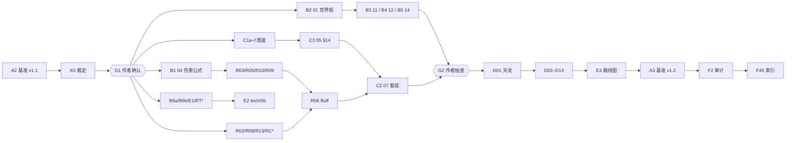

# 多代理执行方案（TraeX CLI + GPT-6）

> 用途：把 `TODO.md` §6 的 Phase A–F 拆成可并行的代理任务，在**本机**用 TraeX CLI 调用 GPT-6 执行，由 `run.py` 按依赖调度、校验、提交。
> 状态：调度器已用模拟代理（`--mock`）和假 `traex` 跑通全流程（见 §9）；**还没有用真实模型跑过任何任务**。

## 结论先行

- **规模**：54 个代理任务，其中 32 个起草类任务各带一个审校任务，共 **86 次代理运行**，另有 **2 个作者闸门**（G1、G2）。
- **执行单元**：每次代理运行 = 你电脑上的一个 `traex exec` 进程（默认模型 `gpt-6-max`）。它在自己的 git worktree 里工作，只能改任务声明过的文件。结束后调度器校验产出，合格才提交到当前分支。
- **吸取上次的教训**：上次起草任务占满并发槽位，评审一次都没跑到。这次每篇初稿完成后立刻排它的审校，而且下游任务只依赖"审校后的版本"。审校在关键路径上，所以一定会跑。
- **已有初稿的修订**：评审（F1）、冲突解决（F2）、考据/事实核查（F3）三件事合成一个修订任务，每篇文档一次完成，避免多个代理反复改同一个文件。
- **怎么跑**：在装好并登录了 TraeX 的电脑上拉取本分支，运行 `python tools/agents/run.py run`。详见 §6。

## 1. 调用链

```
你的电脑
└─ python tools/agents/run.py run          调度器（Python 标准库 + git，不联网）
   ├─ .agents/wt/B1/  ← git worktree        每个任务一个独立工作副本
   │   └─ traex exec --sandbox workspace-write --skip-git-repo-check --model gpt-6-max -- <提示词>
   │        └─ traex 使用你本机的登录，把请求发往 Trae 云端（GPT-6 在云端运行），在 worktree 里读写文件
   ├─ 校验：报告存在、必需章节、代码块闭合、防截断、校验命令（如 damage_sim.py --check）
   ├─ 提交：只提交声明过的文件；提交信息带 `Agent-Task: B1` 尾注
   └─ cherry-pick 到当前分支 →（可选 --push）推送
```

调度器本身不调用任何模型 API，也不需要 API key；它只在本机启动 `traex`（先在 PATH 中找 `traex`，找不到再找 `traecli`）。

## 2. 任务总览

`(+R)` 表示该任务完成后自动排一个审校任务 `<ID>.R`；依赖一个带审校的任务，等于依赖它审校之后的版本。

| 波次 | 任务 | 对应 TODO | 产出 |
|---|---|---|---|
| 0 | **A2** (+R) 基准 v1.1 | A1–A2 | `docs/00-canon.md` |
| 0 | **X0** 冲突裁定 C01–C23、图鉴分工、作者决策单 | F2 前置 | `docs/decisions/rulings-v1.md`、`author-decisions.md` |
| 0 | **G1** ⏸ 作者确认 | A1、§5 | — |
| 1 | **B1** (+R) 04 伤害公式 + 模拟脚本（最高优先） | B1 | `design/04`、`tools/balance/` |
| 1 | **B2** (+R) 01 世界观与核心循环 | B2 | `design/01` |
| 1 | **B6a** (+R) / **B6b** (+R) 续写 tech/03、tech/08 | B6 | `tech/03`、`tech/08` |
| 1 | **E1** (+R) tech/04 数据管线 | E1 | `tech/04` |
| 1 | **C1a–C1f** (+R) 6 个图鉴 | C1 | `catalog/skills-{yitian,xiake-bixue,wuyue,kangxi,qianlong,general}` |
| 1 | **R02 R08 R13** 修订 02、08、13 | F1–F3 | 原文档 |
| 1 | **RCs RCw RCd RCx** 修订 4 个已有图鉴 | F1–F3 | 原文档 |
| 1 | **RT1 RT2 RT6 RT7** 修订 tech/01、02、06、07（联网核实） | F1–F3 | 原文档 |
| 1 | **L1** ID 一致性检查脚本 | F2 辅助 | `tools/lint/check_ids.py` |
| 2 | **R03 R05 R10 R09 R06** 修订 03、05、10、09、06（对齐 04） | F1–F3 | 原文档 |
| 2 | **B3** (+R) 11 开放世界、**B4** (+R) 12 任务/门派/经济、**B5** (+R) 14 UI/UX | B3–B5 | `design/11`、`12`、`14` |
| 2 | **C3** 按图鉴实际数量重定 05 §14 | C3 | `design/05` |
| 2 | **C2** (+R) 07 套装体系 | C2 | `design/07`（及图鉴 `setTags`） |
| 2 | **E2** (+R) tech/05 玩法引擎 | E2 | `tech/05` |
| 3 | **G2** ⏸ 作者抽查（可提前放行） | — | — |
| 3 | **D01** (+R) 天龙八部（范例）→ **D02–D14** (+R) 其余 13 部 | D1–D2 | `design/chapters/NN-*.md` |
| 4 | **E3** (+R) tech/09 路线图 | E3 | `tech/09` |
| 4 | **A3** 基准 v1.2（合并各报告中的新提案） | — | `docs/00-canon.md` |
| 4 | **F2** 全局一致性审计 | F2 收尾 | 任意 `docs/` |
| 4 | **F45** 需求覆盖检查 + 总索引 + 更新 TODO | F4–F5 | `docs/README.md`、`TODO.md` |

TODO 的 F6（推送）由 `run --push` 完成，推送的是**当前检出的分支**。

完整依赖以 `python tools/agents/run.py list` 为准。主要依赖关系：



## 3. 每个代理收到什么

提示词由 `prompts/` 中的文件拼成，可以用 `python tools/agents/run.py prompt <ID>` 查看完整内容：

1. `_common.md`：通用规则。事实优先级（作者决定 > 基准 > 裁定 > 归属文档）；只改声明的文件；不做 git 操作；格式与标注约定；ID 查重；数值要写算式；考据不许编造；分节写入防截断；不停下来提问；报告格式。
2. 任务正文：`A2-…`、`B1-…`、`revise.md`（修订模板）、`C1-catalog.md`（图鉴模板）、`D-chapter.md`（书界模板）等，`{{变量}}` 由 `tasks.json` 填入。
3. 审校任务再加 `_review.md`：审校清单，外加被审任务的原始要求（引用块形式）。
4. 续作时再加 `_retry.md`：上次失败或中断的原因。

每个任务结束时写 `tools/agents/reports/<ID>.md`，共 7 节：摘要、产出、关键结论、开放问题、对基准的修改提案、需同步到其他文档、自检。后续代理会读这些报告，A3 据此合并基准修订提案。

## 4. 校验规则（任何一条不过即视为失败，自动续作一次）

| 规则 | 说明 |
|---|---|
| 报告 | `tools/agents/reports/<ID>.md` 存在且至少 5 行 |
| 必需文件与内容 | 如 `damage_sim.py`、"待决事项"、"变更记录"等（见 `tasks.json` 的 `validate`） |
| 章节 | 书界文档必须有 `## 1.` … `## 13.`（基准 §17 模板） |
| 行数下限 | 新文档按任务设定（如 04 ≥ 700 行、书界 ≥ 900 行） |
| 代码块闭合 | 代码围栏数必须为偶数（写到一半被截断时通常为奇数） |
| 防截断 | 写入范围内的已有文件不得缩短 15% 以上 |
| 校验命令 | B1：`damage_sim.py --check` 必须通过（TTK 达到基准 §5 节奏）；L1、F2：`check_ids.py` 能运行 |
| 越权改动 | 声明范围外的改动一律丢弃，不算失败，但会在日志中列出 |

## 5. 作者闸门

- **G1（必经）**：A2、A2.R、X0 完成后停下。请审阅：
  1. `docs/00-canon.md` 文首的变更记录，尤其是"⚠️ 待作者确认"的条目；
  2. `docs/decisions/rulings-v1.md`（冲突裁定、图鉴分工、总规模推荐）；
  3. 在 `docs/decisions/author-decisions.md` 的"作者决定"列填写决定，留空表示采用默认值。

  然后运行 `python tools/agents/run.py approve G1 -m "备注"`。它会一并提交你在 `docs/decisions/` 下的改动。
- **G2（建议）**：系统文档全部定稿后、开写十四书界之前停下。书界文档共 28 次运行，是最大的一笔开销，建议先抽查 01、11、12、14、07 与 04 的模拟结果。
  - 不想停：提前运行 `approve G2 --force`。前置任务全部完成后才会生效，不会让书界提前开写。

## 6. 使用方法

**前提**：TraeX CLI 已安装并登录（`traex` 或 `traecli` 在 PATH 中）；Python 3.8 及以上；git。

```bash
git fetch origin claude/vigilant-wright-2unuk1 && git checkout claude/vigilant-wright-2unuk1

python tools/agents/run.py check --live   # 检查 traex、登录与模型名（发一个极小的请求）
python tools/agents/run.py list           # 任务图与进度
python tools/agents/run.py run --dry-run  # 执行计划；提示词写到 .agents/prompts/ 供检查

python tools/agents/run.py run --push     # 跑到 G1 停下
#   … 审阅，填写 docs/decisions/author-decisions.md …
python tools/agents/run.py approve G1 -m "采用默认值，除 Q3"
python tools/agents/run.py run --push     # 跑到 G2 停下
python tools/agents/run.py approve G2
python tools/agents/run.py run --push     # 跑完剩余任务
```

常用选项（`run`）：

| 选项 | 作用 |
|---|---|
| `-j N` | 最大并发代理数（默认 3）。受你的 TraeX 额度与速率限制约束，可逐步调高 |
| `--model NAME` | 模型名（默认 `gpt-6-max`，也可用环境变量 `TRAEX_MODEL`） |
| `--effort LEVEL` | 追加 `-c model_reasoning_effort=LEVEL`（环境变量 `TRAEX_EFFORT`） |
| `--only B1,B1.R` | 只跑指定任务；加 `--force` 可重跑已完成的任务 |
| `--until-wave N` | 只跑波次 ≤ N 的任务 |
| `--push` | 每合入一个任务就推送当前分支 |
| `--no-review` | 跳过审校（省约 40% 的额度，不推荐） |
| `--agent-arg ARG` | 给 `traex exec` 追加参数，可重复（环境变量 `TRAEX_EXTRA_ARGS`） |
| `--web-arg ARG` | 只给需要联网核实的任务追加参数（如 CLI 的联网搜索开关；环境变量 `TRAEX_WEB_ARGS`） |
| `--prompt-via stdin` | 提示词经标准输入传入（Windows 命令行过长时使用） |
| `--timeout-min N` | 单次运行超时（默认 180 分钟） |
| `--bin PATH` | 指定 CLI 路径（环境变量 `TRAEX_BIN`） |

**关于模型名与参数（请先用 `check --live` 验证）**：

- `gpt-6-max` 是按你的说法设的默认值。
  - 如果 TraeX 里的模型 ID 写法不同，用 `--model` 改；
  - 如果"max"指的是推理强度而不是模型名，就用 `--model <GPT-6 的模型 ID> --effort max`。
- `exec --sandbox workspace-write --skip-git-repo-check` 这组参数，来自公开资料中 traecli 0.206.1 的非交互用法。
  - 如果你的版本参数不同，改 `tasks.json` 里的 `defaults.exec_args`、`model_args`、`effort_args` 即可。
  - 如果运行时卡在等待确认，可加 `--agent-arg -c --agent-arg approval_policy=never`（前提是 CLI 支持 `-c`）。

## 7. 失败、中断与恢复

- **自动续作**：失败（非零退出、超时、校验不过）后，在同一个工作区里续作一次，并把失败原因写进提示词。仍不过就标为失败，其下游暂停，其他任务照常进行。
- **重新运行**：再执行一次同一命令即可。完成状态取自 git 历史中的 `Agent-Task:` 尾注，换一台电脑拉取分支也能接着跑。中断或失败的任务在保留的工作区里续作；想从头重跑加 `--fresh`。
- **Ctrl-C 安全**：会终止运行中的代理，保留工作区。
- **日志**：`.agents/logs/<ID>/<次数>.log`，同目录的 `.prompt.md` 是当次发出的完整提示词。
- **工作区要干净**：调度器要把结果逐个提交到当前分支，所以运行期间请不要在这个检出里改文件（或另开一个克隆来跑）。已完成但因工作区不干净没能合入的结果，下次运行会直接合入，不会重跑代理。
- **提交**：用你的 git 身份提交，信息形如 `agents(B1): 04 伤害公式 + …`，末尾带 `Agent-Task: B1`。代理工作区里的提交会跳过 git 钩子（`--no-verify`），因为调度器已经做了校验。

## 8. 规模与耗时

- 每次运行通常要读 3–10 篇长文档（每篇 100–240 KB）并写出 1,000–2,000 行，token 消耗大。可以先跑到 G1，看看单次运行的实际用量再决定并发数。
- 粗估：按每次 30–45 分钟、并发 3 计，全部 86 次约 15–22 小时墙钟时间。关键路径约 20 次串行运行，另加两次作者闸门的等待。
- 省额度的办法：`--until-wave` 分阶段跑；G2 前抽查；或 `--no-review`（不推荐）。

## 9. 调度器自测（不消耗额度）

在仓库的**临时克隆**里运行，模拟代理会往文档里写占位内容：

```bash
git clone . /tmp/tianshu-test && cd /tmp/tianshu-test
python tools/agents/run.py run --mock -j 4      # 停在 G1
python tools/agents/run.py approve G1
MOCK_FAIL_ONCE=B1 MOCK_TRUNCATE=B2 MOCK_STRAY=C1a python tools/agents/run.py run --mock -j 4
```

已验证：
- 依赖与闸门顺序；并发 4；写入范围互斥；
- 失败后自动续作、截断检测与续作修复、越权改动被丢弃；
- Ctrl-C 后续跑；全部 88 个节点完成，每个节点一个 `Agent-Task` 提交。

另用一个假的 `traex` 可执行文件验证了真实调用路径：
- 命令行参数、`--model` / `--effort` 的拼接；
- 参数与标准输入两种传提示词的方式；
- 预检流程。

## 10. 文件

| 路径 | 说明 |
|---|---|
| `run.py` | 调度器：`check` / `list` / `prompt` / `run` / `approve` |
| `tasks.json` | 任务图与默认配置（模型、并发、CLI 参数）；增删任务、调依赖都改这里 |
| `prompts/` | 提示词模板 |
| `reports/` | 各任务报告（由代理写入并随任务提交） |
| `APPROVALS.md` | 作者闸门确认记录（`approve` 自动追加） |
| `mock_agent.py` | 测试用模拟代理 |
| `.agents/`（仓库根，已忽略） | 工作区、日志、运行状态 |

## 11. 为什么不在云端会话里直接跑

这个仓库目前所在的 Claude 云端会话里没有安装 TraeX，网络策略也拦截了 Trae 的域名（`trae.ai`、`api.trae.ai` 等）和 `api.openai.com`，而且 TraeX 需要你的账号登录。所以要在你本机运行。
